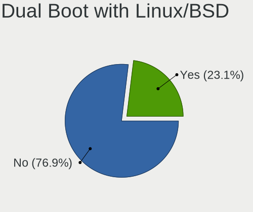
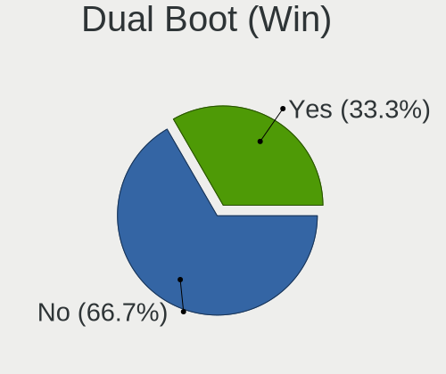
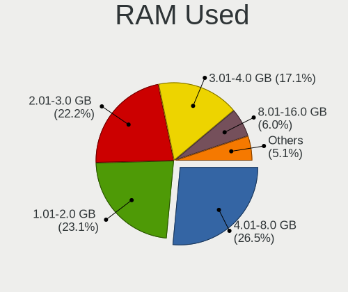
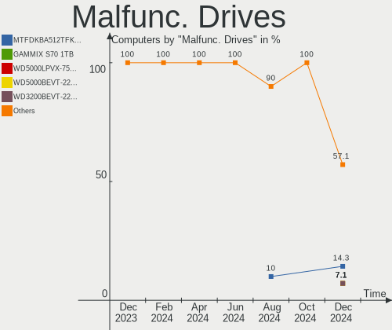
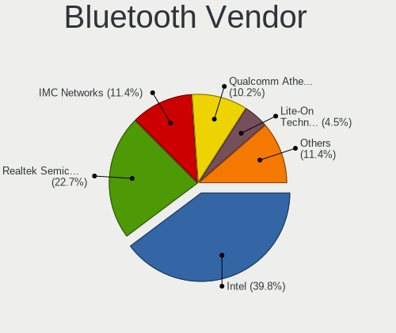
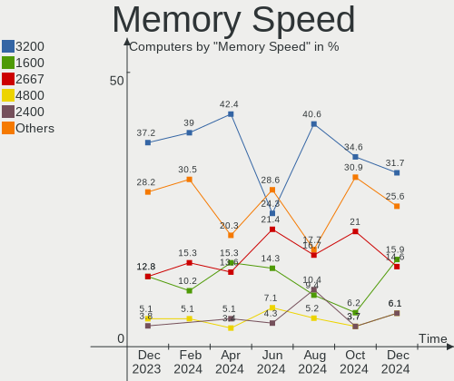

Linux in India - Hardware Trends
--------------------------------

A project to identify most popular hardware characteristics and track their change
over time based on data collected by Linux users at https://Linux-Hardware.org.

Anyone can contribute to this report by the [hw-probe](https://github.com/linuxhw/hw-probe) tool:

    sudo -E hw-probe -all -upload

This is a report for all computer types. See also reports for [desktops](/Location/India/Desktop/README.md) and [notebooks](/Location/India/Notebook/README.md).

Period: Jun, 2023.

Contents
--------

* [ System ](#system)
  - [ OS                       ](#os)
  - [ OS Family                ](#os-family)
  - [ Kernel                   ](#kernel)
  - [ Kernel Family            ](#kernel-family)
  - [ Kernel Major Ver.        ](#kernel-major-ver)
  - [ Arch                     ](#arch)
  - [ DE                       ](#de)
  - [ Display Server           ](#display-server)
  - [ Display Manager          ](#display-manager)
  - [ OS Lang                  ](#os-lang)
  - [ Boot Mode                ](#boot-mode)
  - [ Filesystem               ](#filesystem)
  - [ Part. scheme             ](#part-scheme)
  - [ Dual Boot with Linux/BSD ](#dual-boot-with-linuxbsd)
  - [ Dual Boot (Win)          ](#dual-boot-win)

* [ Board ](#board)
  - [ Vendor                   ](#vendor)
  - [ Model                    ](#model)
  - [ Model Family             ](#model-family)
  - [ MFG Year                 ](#mfg-year)
  - [ Form Factor              ](#form-factor)
  - [ Secure Boot              ](#secure-boot)
  - [ Coreboot                 ](#coreboot)
  - [ RAM Size                 ](#ram-size)
  - [ RAM Used                 ](#ram-used)
  - [ Total Drives             ](#total-drives)
  - [ Has CD-ROM               ](#has-cd-rom)
  - [ Has Ethernet             ](#has-ethernet)
  - [ Has WiFi                 ](#has-wifi)
  - [ Has Bluetooth            ](#has-bluetooth)

* [ Location ](#location)
  - [ Country                  ](#country)
  - [ City                     ](#city)

* [ Drives ](#drives)
  - [ Drive Vendor             ](#drive-vendor)
  - [ Drive Model              ](#drive-model)
  - [ HDD Vendor               ](#hdd-vendor)
  - [ SSD Vendor               ](#ssd-vendor)
  - [ Drive Kind               ](#drive-kind)
  - [ Drive Connector          ](#drive-connector)
  - [ Drive Size               ](#drive-size)
  - [ Space Total              ](#space-total)
  - [ Space Used               ](#space-used)
  - [ Malfunc. Drives          ](#malfunc-drives)
  - [ Malfunc. Drive Vendor    ](#malfunc-drive-vendor)
  - [ Malfunc. HDD Vendor      ](#malfunc-hdd-vendor)
  - [ Malfunc. Drive Kind      ](#malfunc-drive-kind)
  - [ Failed Drives            ](#failed-drives)
  - [ Failed Drive Vendor      ](#failed-drive-vendor)
  - [ Drive Status             ](#drive-status)

* [ Storage controller ](#storage-controller)
  - [ Storage Vendor           ](#storage-vendor)
  - [ Storage Model            ](#storage-model)
  - [ Storage Kind             ](#storage-kind)

* [ Processor ](#processor)
  - [ CPU Vendor               ](#cpu-vendor)
  - [ CPU Model                ](#cpu-model)
  - [ CPU Model Family         ](#cpu-model-family)
  - [ CPU Cores                ](#cpu-cores)
  - [ CPU Sockets              ](#cpu-sockets)
  - [ CPU Threads              ](#cpu-threads)
  - [ CPU Op-Modes             ](#cpu-op-modes)
  - [ CPU Microcode            ](#cpu-microcode)
  - [ CPU Microarch            ](#cpu-microarch)

* [ Graphics ](#graphics)
  - [ GPU Vendor               ](#gpu-vendor)
  - [ GPU Model                ](#gpu-model)
  - [ GPU Combo                ](#gpu-combo)
  - [ GPU Driver               ](#gpu-driver)
  - [ GPU Memory               ](#gpu-memory)

* [ Monitor ](#monitor)
  - [ Monitor Vendor           ](#monitor-vendor)
  - [ Monitor Model            ](#monitor-model)
  - [ Monitor Resolution       ](#monitor-resolution)
  - [ Monitor Diagonal         ](#monitor-diagonal)
  - [ Monitor Width            ](#monitor-width)
  - [ Aspect Ratio             ](#aspect-ratio)
  - [ Monitor Area             ](#monitor-area)
  - [ Pixel Density            ](#pixel-density)
  - [ Multiple Monitors        ](#multiple-monitors)

* [ Network ](#network)
  - [ Net Controller Vendor    ](#net-controller-vendor)
  - [ Net Controller Model     ](#net-controller-model)
  - [ Wireless Vendor          ](#wireless-vendor)
  - [ Wireless Model           ](#wireless-model)
  - [ Ethernet Vendor          ](#ethernet-vendor)
  - [ Ethernet Model           ](#ethernet-model)
  - [ Net Controller Kind      ](#net-controller-kind)
  - [ Used Controller          ](#used-controller)
  - [ NICs                     ](#nics)
  - [ IPv6                     ](#ipv6)

* [ Bluetooth ](#bluetooth)
  - [ Bluetooth Vendor         ](#bluetooth-vendor)
  - [ Bluetooth Model          ](#bluetooth-model)

* [ Sound ](#sound)
  - [ Sound Vendor             ](#sound-vendor)
  - [ Sound Model              ](#sound-model)

* [ Memory ](#memory)
  - [ Memory Vendor            ](#memory-vendor)
  - [ Memory Model             ](#memory-model)
  - [ Memory Kind              ](#memory-kind)
  - [ Memory Form Factor       ](#memory-form-factor)
  - [ Memory Size              ](#memory-size)
  - [ Memory Speed             ](#memory-speed)

* [ Printers & scanners ](#printers--scanners)
  - [ Printer Vendor           ](#printer-vendor)
  - [ Printer Model            ](#printer-model)
  - [ Scanner Vendor           ](#scanner-vendor)
  - [ Scanner Model            ](#scanner-model)

* [ Camera ](#camera)
  - [ Camera Vendor            ](#camera-vendor)
  - [ Camera Model             ](#camera-model)

* [ Security ](#security)
  - [ Fingerprint Vendor       ](#fingerprint-vendor)
  - [ Fingerprint Model        ](#fingerprint-model)
  - [ Chipcard Vendor          ](#chipcard-vendor)
  - [ Chipcard Model           ](#chipcard-model)

* [ Unsupported ](#unsupported)
  - [ Unsupported Devices      ](#unsupported-devices)
  - [ Unsupported Device Types ](#unsupported-device-types)

System
------

OS
--

Installed operating systems

| Name                         | Computers | Percent |
|------------------------------|-----------|---------|
| Ubuntu 22.04                 | 24        | 21.62%  |
| Fedora 38                    | 17        | 15.32%  |
| Linux Mint 21.1              | 10        | 9.01%   |
| ArcoLinux Rolling            | 9         | 8.11%   |
| Pop!_OS 22.04                | 5         | 4.5%    |
| OpenMandriva 23.03           | 5         | 4.5%    |
| Ubuntu 20.04                 | 4         | 3.6%    |
| Kali 2023.2                  | 4         | 3.6%    |
| Ubuntu 23.04                 | 3         | 2.7%    |
| OpenMandriva 23.06           | 3         | 2.7%    |
| Arch Rolling                 | 3         | 2.7%    |
| Zorin 16                     | 2         | 1.8%    |
| Xubuntu 22.04                | 2         | 1.8%    |
| KDE neon 22.04               | 2         | 1.8%    |
| Debian 12                    | 2         | 1.8%    |
| Debian 11                    | 2         | 1.8%    |
| Ubuntu Unity 20.04           | 1         | 0.9%    |
| Ubuntu Budgie 23.04          | 1         | 0.9%    |
| Ubuntu 22.10                 | 1         | 0.9%    |
| Ubuntu 18.04                 | 1         | 0.9%    |
| SteamOS 3.4.8                | 1         | 0.9%    |
| Parrot 5.3                   | 1         | 0.9%    |
| org.kde.Platform 5.15-21.08  | 1         | 0.9%    |
| openSUSE Tumbleweed-XXXXXXXX | 1         | 0.9%    |
| openSUSE Leap-15.4           | 1         | 0.9%    |
| NixOS 23.05                  | 1         | 0.9%    |
| Manjaro                      | 1         | 0.9%    |
| Linux Lite 6.4               | 1         | 0.9%    |
| Kali 2022.2                  | 1         | 0.9%    |
| EndeavourOS Rolling          | 1         | 0.9%    |

OS Family
---------

OS without a version

| Name             | Computers | Percent |
|------------------|-----------|---------|
| Ubuntu           | 33        | 29.73%  |
| Fedora           | 17        | 15.32%  |
| Linux Mint       | 10        | 9.01%   |
| ArcoLinux        | 9         | 8.11%   |
| OpenMandriva     | 8         | 7.21%   |
| Pop!_OS          | 5         | 4.5%    |
| Kali             | 5         | 4.5%    |
| Debian           | 4         | 3.6%    |
| Arch             | 3         | 2.7%    |
| Zorin            | 2         | 1.8%    |
| Xubuntu          | 2         | 1.8%    |
| openSUSE         | 2         | 1.8%    |
| KDE neon         | 2         | 1.8%    |
| Ubuntu Unity     | 1         | 0.9%    |
| Ubuntu Budgie    | 1         | 0.9%    |
| SteamOS          | 1         | 0.9%    |
| Parrot           | 1         | 0.9%    |
| org.kde.Platform | 1         | 0.9%    |
| NixOS            | 1         | 0.9%    |
| Manjaro          | 1         | 0.9%    |
| Linux Lite       | 1         | 0.9%    |
| EndeavourOS      | 1         | 0.9%    |

Kernel
------

Version of the Linux kernel

| Version                  | Computers | Percent |
|--------------------------|-----------|---------|
| 5.19.0-43-generic        | 13        | 11.71%  |
| 5.19.0-45-generic        | 12        | 10.81%  |
| 5.15.0-73-generic        | 8         | 7.21%   |
| 6.3.8-200.fc38.x86_64    | 5         | 4.5%    |
| 6.3.6-200.fc38.x86_64    | 5         | 4.5%    |
| 6.2.6-desktop-1omv2390   | 5         | 4.5%    |
| 6.2.6-76060206-generic   | 5         | 4.5%    |
| 6.1.0-kali9-amd64        | 4         | 3.6%    |
| 5.15.0-75-generic        | 4         | 3.6%    |
| 6.3.9-arch1-1            | 3         | 2.7%    |
| 6.3.7-arch1-1            | 3         | 2.7%    |
| 6.3.5-desktop-3omv2390   | 3         | 2.7%    |
| 6.3.5-200.fc38.x86_64    | 3         | 2.7%    |
| 6.2.9-300.fc38.x86_64    | 3         | 2.7%    |
| 6.2.0-20-generic         | 3         | 2.7%    |
| 5.15.0-72-generic        | 3         | 2.7%    |
| 6.3.8-arch1-1            | 2         | 1.8%    |
| 6.1.0-9-amd64            | 2         | 1.8%    |
| 5.19.0-42-generic        | 2         | 1.8%    |
| 5.15.0-56-generic        | 2         | 1.8%    |
| 6.3.9-1-default          | 1         | 0.9%    |
| 6.3.8-zen1-1-zen         | 1         | 0.9%    |
| 6.3.7-060307-generic     | 1         | 0.9%    |
| 6.3.5-lp154.6-default    | 1         | 0.9%    |
| 6.3.5-arch1-1            | 1         | 0.9%    |
| 6.3.5-2-MANJARO          | 1         | 0.9%    |
| 6.2.15-300.fc38.x86_64   | 1         | 0.9%    |
| 6.2.0-23-generic         | 1         | 0.9%    |
| 6.1.8-arch1-1            | 1         | 0.9%    |
| 6.1.35-1-lts             | 1         | 0.9%    |
| 6.1.35                   | 1         | 0.9%    |
| 6.1.34                   | 1         | 0.9%    |
| 6.1.33-1-lts             | 1         | 0.9%    |
| 6.1.0-1parrot1-amd64     | 1         | 0.9%    |
| 5.4.0-150-generic        | 1         | 0.9%    |
| 5.19.0-32-generic        | 1         | 0.9%    |
| 5.16.0-kali7-amd64       | 1         | 0.9%    |
| 5.15.108-1-pve           | 1         | 0.9%    |
| 5.15.0-76-generic        | 1         | 0.9%    |
| 5.13.0-valve36-1-neptune | 1         | 0.9%    |

Kernel Family
-------------

Linux kernel without a distro release

| Version  | Computers | Percent |
|----------|-----------|---------|
| 5.19.0   | 28        | 25.23%  |
| 5.15.0   | 18        | 16.22%  |
| 6.2.6    | 10        | 9.01%   |
| 6.3.5    | 9         | 8.11%   |
| 6.3.8    | 8         | 7.21%   |
| 6.1.0    | 7         | 6.31%   |
| 6.3.6    | 5         | 4.5%    |
| 6.3.9    | 4         | 3.6%    |
| 6.3.7    | 4         | 3.6%    |
| 6.2.0    | 4         | 3.6%    |
| 6.2.9    | 3         | 2.7%    |
| 6.1.35   | 2         | 1.8%    |
| 6.2.15   | 1         | 0.9%    |
| 6.1.8    | 1         | 0.9%    |
| 6.1.34   | 1         | 0.9%    |
| 6.1.33   | 1         | 0.9%    |
| 5.4.0    | 1         | 0.9%    |
| 5.16.0   | 1         | 0.9%    |
| 5.15.108 | 1         | 0.9%    |
| 5.13.0   | 1         | 0.9%    |
| 5.10.0   | 1         | 0.9%    |

Kernel Major Ver.
-----------------

Linux kernel major version

| Version | Computers | Percent |
|---------|-----------|---------|
| 6.3     | 30        | 27.03%  |
| 5.19    | 28        | 25.23%  |
| 5.15    | 19        | 17.12%  |
| 6.2     | 18        | 16.22%  |
| 6.1     | 12        | 10.81%  |
| 5.4     | 1         | 0.9%    |
| 5.16    | 1         | 0.9%    |
| 5.13    | 1         | 0.9%    |
| 5.10    | 1         | 0.9%    |

Arch
----

OS architecture (x86_64, i586, etc.)

| Name   | Computers | Percent |
|--------|-----------|---------|
| x86_64 | 111       | 100%    |

DE
--

Desktop Environment

| Name       | Computers | Percent |
|------------|-----------|---------|
| GNOME      | 63        | 56.76%  |
| KDE5       | 23        | 20.72%  |
| XFCE       | 10        | 9.01%   |
| X-Cinnamon | 8         | 7.21%   |
| i3         | 2         | 1.8%    |
| Unity      | 1         | 0.9%    |
| MATE       | 1         | 0.9%    |
| LXQt       | 1         | 0.9%    |
| awesome    | 1         | 0.9%    |
| Unknown    | 1         | 0.9%    |

Display Server
--------------

X11 or Wayland

| Name    | Computers | Percent |
|---------|-----------|---------|
| X11     | 66        | 59.46%  |
| Wayland | 44        | 39.64%  |
| Unknown | 1         | 0.9%    |

Display Manager
---------------

SDDM, LightDM, etc.

| Name    | Computers | Percent |
|---------|-----------|---------|
| GDM3    | 34        | 30.63%  |
| Unknown | 28        | 25.23%  |
| SDDM    | 23        | 20.72%  |
| LightDM | 15        | 13.51%  |
| GDM     | 11        | 9.91%   |

OS Lang
-------

Language

| Lang  | Computers | Percent |
|-------|-----------|---------|
| en_IN | 71        | 63.96%  |
| en_US | 33        | 29.73%  |
| en_GB | 5         | 4.5%    |
| en_DK | 1         | 0.9%    |
| C     | 1         | 0.9%    |

Boot Mode
---------

EFI or BIOS

| Mode | Computers | Percent |
|------|-----------|---------|
| EFI  | 70        | 63.06%  |
| BIOS | 41        | 36.94%  |

Filesystem
----------

Type of filesystem

| Type    | Computers | Percent |
|---------|-----------|---------|
| Ext4    | 61        | 54.95%  |
| Btrfs   | 24        | 21.62%  |
| Tmpfs   | 18        | 16.22%  |
| Overlay | 4         | 3.6%    |
| F2fs    | 3         | 2.7%    |
| Ext3    | 1         | 0.9%    |

Part. scheme
------------

Scheme of partitioning

| Type    | Computers | Percent |
|---------|-----------|---------|
| GPT     | 73        | 65.77%  |
| Unknown | 27        | 24.32%  |
| MBR     | 11        | 9.91%   |

Dual Boot with Linux/BSD
------------------------

Hosting more than one Linux/BSD

| Dual boot | Computers | Percent |
|-----------|-----------|---------|
| No        | 91        | 81.98%  |
| Yes       | 20        | 18.02%  |

Dual Boot (Win)
---------------

Hosting Linux and Windows

| Dual boot | Computers | Percent |
|-----------|-----------|---------|
| No        | 67        | 60.36%  |
| Yes       | 44        | 39.64%  |

Board
-----

Vendor
------

Motherboard manufacturer

| Name                | Computers | Percent |
|---------------------|-----------|---------|
| Dell                | 22        | 19.82%  |
| Lenovo              | 21        | 18.92%  |
| ASUSTek Computer    | 21        | 18.92%  |
| Hewlett-Packard     | 20        | 18.02%  |
| Acer                | 9         | 8.11%   |
| Gigabyte Technology | 4         | 3.6%    |
| MSI                 | 2         | 1.8%    |
| Intel               | 2         | 1.8%    |
| Unknown             | 2         | 1.8%    |
| Valve               | 1         | 0.9%    |
| Timi                | 1         | 0.9%    |
| Sony                | 1         | 0.9%    |
| POWERX              | 1         | 0.9%    |
| OEM                 | 1         | 0.9%    |
| HONOR               | 1         | 0.9%    |
| BY OEM              | 1         | 0.9%    |
| AVITA               | 1         | 0.9%    |

Model
-----

Motherboard model

| Name                                  | Computers | Percent |
|---------------------------------------|-----------|---------|
| HP Pavilion Laptop 14-ec1xxx          | 3         | 2.7%    |
| MSI Bravo 15 B5DD                     | 2         | 1.8%    |
| Lenovo IdeaPad 3 14ITL6 82H7          | 2         | 1.8%    |
| Lenovo E41-25 81FS                    | 2         | 1.8%    |
| Dell Inspiron 1545                    | 2         | 1.8%    |
| ASUS TUF Gaming FX505DT_FX505DT       | 2         | 1.8%    |
| Unknown                               | 2         | 1.8%    |
| Valve Jupiter                         | 1         | 0.9%    |
| Timi RedmiBook 15                     | 1         | 0.9%    |
| Sony VPCEH25EN                        | 1         | 0.9%    |
| POWERX G41                            | 1         | 0.9%    |
| OEM Intel H81                         | 1         | 0.9%    |
| Lenovo Yoga S740-14IIL 81RS           | 1         | 0.9%    |
| Lenovo Yoga 9 14ITL5 82BG             | 1         | 0.9%    |
| Lenovo Yoga 7 16IAP7 82QG             | 1         | 0.9%    |
| Lenovo V15 G2 ITL Ua 82KB             | 1         | 0.9%    |
| Lenovo ThinkPad T460s 20F9005BUS      | 1         | 0.9%    |
| Lenovo ThinkPad T450 20BUS0LW02       | 1         | 0.9%    |
| Lenovo ThinkPad E15 Gen 2 20TDCTO1WW  | 1         | 0.9%    |
| Lenovo ThinkPad E14 Gen 4 21E3S06300  | 1         | 0.9%    |
| Lenovo ThinkPad E14 Gen 2 20TAS0AJ00  | 1         | 0.9%    |
| Lenovo ThinkBook 15 G3 ACL 21A4       | 1         | 0.9%    |
| Lenovo ThinkBook 14p Gen 3 21EJ       | 1         | 0.9%    |
| Lenovo IdeaPad Y510P 20217            | 1         | 0.9%    |
| Lenovo IdeaPad S540-15IWL             | 1         | 0.9%    |
| Lenovo IdeaPad S340-15IIL 81WL        | 1         | 0.9%    |
| Lenovo IdeaPad 5 15IAL7 82SF          | 1         | 0.9%    |
| Lenovo G500s 20245                    | 1         | 0.9%    |
| Lenovo E41-55 82FJ                    | 1         | 0.9%    |
| Intel H61                             | 1         | 0.9%    |
| Intel DH55TC AAE70932-302             | 1         | 0.9%    |
| HONOR BRN-FXX                         | 1         | 0.9%    |
| HP ProBook 440 G4                     | 1         | 0.9%    |
| HP ProBook 430 G4                     | 1         | 0.9%    |
| HP Pavilion x360 Convertible 14-ba0xx | 1         | 0.9%    |
| HP Pavilion Laptop 15-eh2xxx          | 1         | 0.9%    |
| HP Pavilion Laptop 15-eg3xxx          | 1         | 0.9%    |
| HP Pavilion Gaming Laptop 15-ec2xxx   | 1         | 0.9%    |
| HP Pavilion g6                        | 1         | 0.9%    |
| HP Laptop 15s-eq2xxx                  | 1         | 0.9%    |

Model Family
------------

Motherboard model prefix

| Name               | Computers | Percent |
|--------------------|-----------|---------|
| Dell Inspiron      | 9         | 8.11%   |
| HP Pavilion        | 8         | 7.21%   |
| Acer Aspire        | 7         | 6.31%   |
| Lenovo IdeaPad     | 6         | 5.41%   |
| ASUS VivoBook      | 6         | 5.41%   |
| Lenovo ThinkPad    | 5         | 4.5%    |
| ASUS ROG           | 5         | 4.5%    |
| ASUS TUF           | 4         | 3.6%    |
| ASUS ASUS          | 4         | 3.6%    |
| Lenovo Yoga        | 3         | 2.7%    |
| HP Laptop          | 3         | 2.7%    |
| Dell Vostro        | 3         | 2.7%    |
| Dell Precision     | 3         | 2.7%    |
| Dell Latitude      | 3         | 2.7%    |
| MSI Bravo          | 2         | 1.8%    |
| Lenovo ThinkBook   | 2         | 1.8%    |
| Lenovo E41-25      | 2         | 1.8%    |
| HP ProBook         | 2         | 1.8%    |
| HP EliteBook       | 2         | 1.8%    |
| HP Compaq          | 2         | 1.8%    |
| Gigabyte H310M     | 2         | 1.8%    |
| Unknown            | 2         | 1.8%    |
| Valve Jupiter      | 1         | 0.9%    |
| Timi RedmiBook     | 1         | 0.9%    |
| Sony VPCEH25EN     | 1         | 0.9%    |
| POWERX G41         | 1         | 0.9%    |
| OEM Intel          | 1         | 0.9%    |
| Lenovo V15         | 1         | 0.9%    |
| Lenovo G500s       | 1         | 0.9%    |
| Lenovo E41-55      | 1         | 0.9%    |
| Intel H61          | 1         | 0.9%    |
| Intel DH55TC       | 1         | 0.9%    |
| HONOR BRN-FXX      | 1         | 0.9%    |
| HP G42             | 1         | 0.9%    |
| HP 250             | 1         | 0.9%    |
| HP 15              | 1         | 0.9%    |
| Gigabyte B75M-D3H  | 1         | 0.9%    |
| Gigabyte B250M-D3H | 1         | 0.9%    |
| Dell XPS           | 1         | 0.9%    |
| Dell OptiPlex      | 1         | 0.9%    |

MFG Year
--------

Motherboard manufacture year

| Year | Computers | Percent |
|------|-----------|---------|
| 2021 | 25        | 22.52%  |
| 2022 | 16        | 14.41%  |
| 2016 | 11        | 9.91%   |
| 2020 | 10        | 9.01%   |
| 2019 | 9         | 8.11%   |
| 2018 | 8         | 7.21%   |
| 2023 | 5         | 4.5%    |
| 2012 | 5         | 4.5%    |
| 2010 | 4         | 3.6%    |
| 2017 | 3         | 2.7%    |
| 2014 | 3         | 2.7%    |
| 2013 | 3         | 2.7%    |
| 2011 | 3         | 2.7%    |
| 2015 | 2         | 1.8%    |
| 2009 | 2         | 1.8%    |
| 2008 | 2         | 1.8%    |

Form Factor
-----------

Physical design of the computer

| Name        | Computers | Percent |
|-------------|-----------|---------|
| Notebook    | 88        | 79.28%  |
| Desktop     | 19        | 17.12%  |
| Convertible | 4         | 3.6%    |

Secure Boot
-----------

Enabled or disabled

| State    | Computers | Percent |
|----------|-----------|---------|
| Disabled | 101       | 90.99%  |
| Enabled  | 10        | 9.01%   |

Coreboot
--------

Have coreboot on board

| Used | Computers | Percent |
|------|-----------|---------|
| No   | 111       | 100%    |

RAM Size
--------

Total RAM memory

| Size in GB  | Computers | Percent |
|-------------|-----------|---------|
| 4.01-8.0    | 35        | 31.53%  |
| 8.01-16.0   | 32        | 28.83%  |
| 3.01-4.0    | 20        | 18.02%  |
| 16.01-24.0  | 19        | 17.12%  |
| 32.01-64.0  | 3         | 2.7%    |
| 64.01-256.0 | 2         | 1.8%    |

RAM Used
--------

Used RAM memory

| Used GB    | Computers | Percent |
|------------|-----------|---------|
| 2.01-3.0   | 29        | 26.13%  |
| 1.01-2.0   | 28        | 25.23%  |
| 4.01-8.0   | 27        | 24.32%  |
| 3.01-4.0   | 19        | 17.12%  |
| 8.01-16.0  | 4         | 3.6%    |
| 0.51-1.0   | 3         | 2.7%    |
| 16.01-24.0 | 1         | 0.9%    |

Total Drives
------------

Number of drives on board

| Drives | Computers | Percent |
|--------|-----------|---------|
| 1      | 74        | 66.67%  |
| 2      | 32        | 28.83%  |
| 3      | 4         | 3.6%    |
| 4      | 1         | 0.9%    |

Has CD-ROM
----------

Has CD-ROM on board

| Presented | Computers | Percent |
|-----------|-----------|---------|
| No        | 91        | 81.98%  |
| Yes       | 20        | 18.02%  |

Has Ethernet
------------

Has Ethernet on board

| Presented | Computers | Percent |
|-----------|-----------|---------|
| Yes       | 80        | 72.07%  |
| No        | 31        | 27.93%  |

Has WiFi
--------

Has WiFi module

| Presented | Computers | Percent |
|-----------|-----------|---------|
| Yes       | 105       | 94.59%  |
| No        | 6         | 5.41%   |

Has Bluetooth
-------------

Has Bluetooth module

| Presented | Computers | Percent |
|-----------|-----------|---------|
| Yes       | 95        | 85.59%  |
| No        | 16        | 14.41%  |

Location
--------

Country
-------

Geographic location (country)

| Country | Computers | Percent |
|---------|-----------|---------|
| India   | 111       | 100%    |

City
----

Geographic location (city)

| City          | Computers | Percent |
|---------------|-----------|---------|
| Delhi         | 14        | 12.61%  |
| Hyderabad     | 13        | 11.71%  |
| Bengaluru     | 12        | 10.81%  |
| Mumbai        | 9         | 8.11%   |
| Chennai       | 9         | 8.11%   |
| Lucknow       | 6         | 5.41%   |
| Jaipur        | 4         | 3.6%    |
| Ahmedabad     | 4         | 3.6%    |
| Pune          | 3         | 2.7%    |
| Kolkata       | 3         | 2.7%    |
| Kochi         | 3         | 2.7%    |
| Navi Mumbai   | 2         | 1.8%    |
| Guwahati      | 2         | 1.8%    |
| Chandigarh    | 2         | 1.8%    |
| Bhopal        | 2         | 1.8%    |
| Visakhapatnam | 1         | 0.9%    |
| Vellore       | 1         | 0.9%    |
| Thrissur      | 1         | 0.9%    |
| Surat         | 1         | 0.9%    |
| Ranaghat      | 1         | 0.9%    |
| Raipur        | 1         | 0.9%    |
| Patna         | 1         | 0.9%    |
| New Delhi     | 1         | 0.9%    |
| Nagpur        | 1         | 0.9%    |
| Mysore        | 1         | 0.9%    |
| Mangalore     | 1         | 0.9%    |
| Malappuram    | 1         | 0.9%    |
| Madurai       | 1         | 0.9%    |
| Kuttippuram   | 1         | 0.9%    |
| Kollam        | 1         | 0.9%    |
| Indore        | 1         | 0.9%    |
| Hamirpur      | 1         | 0.9%    |
| Durgapur      | 1         | 0.9%    |
| Dehradun      | 1         | 0.9%    |
| Coimbatore    | 1         | 0.9%    |
| Chinchvad     | 1         | 0.9%    |
| Chhindwara    | 1         | 0.9%    |
| Badlapur      | 1         | 0.9%    |

Drives
------

Drive Vendor
------------

Hard drive vendors

| Vendor                      | Computers | Drives | Percent |
|-----------------------------|-----------|--------|---------|
| Samsung Electronics         | 20        | 20     | 13.33%  |
| WDC                         | 17        | 18     | 11.33%  |
| Seagate                     | 17        | 17     | 11.33%  |
| SK hynix                    | 10        | 11     | 6.67%   |
| Micron Technology           | 10        | 10     | 6.67%   |
| Sandisk                     | 9         | 9      | 6%      |
| Toshiba                     | 8         | 9      | 5.33%   |
| Intel                       | 8         | 8      | 5.33%   |
| Crucial                     | 8         | 8      | 5.33%   |
| Kingston                    | 6         | 6      | 4%      |
| Unknown                     | 3         | 3      | 2%      |
| KIOXIA                      | 3         | 3      | 2%      |
| Kingston Technology Company | 3         | 3      | 2%      |
| HGST                        | 3         | 3      | 2%      |
| UMIS                        | 2         | 2      | 1.33%   |
| FORESEE                     | 2         | 2      | 1.33%   |
| China                       | 2         | 2      | 1.33%   |
| Acer                        | 2         | 2      | 1.33%   |
| Zebronics                   | 1         | 1      | 0.67%   |
| Unknown (690)               | 1         | 1      | 0.67%   |
| Union Memory (Shenzhen)     | 1         | 1      | 0.67%   |
| StoreJet                    | 1         | 1      | 0.67%   |
| SPCC                        | 1         | 1      | 0.67%   |
| Solid State Storage         | 1         | 1      | 0.67%   |
| SCUDA                       | 1         | 1      | 0.67%   |
| POWER                       | 1         | 1      | 0.67%   |
| PNY                         | 1         | 1      | 0.67%   |
| Phison Electronics          | 1         | 1      | 0.67%   |
| NFORCE                      | 1         | 1      | 0.67%   |
| Micron/Crucial Technology   | 1         | 1      | 0.67%   |
| KingFast                    | 1         | 1      | 0.67%   |
| Gigabyte Technology         | 1         | 1      | 0.67%   |
| Fujitsu                     | 1         | 1      | 0.67%   |
| ADATA Technology            | 1         | 1      | 0.67%   |
| Unknown                     | 1         | 1      | 0.67%   |

Drive Model
-----------

Hard drive models

| Model                                               | Computers | Percent |
|-----------------------------------------------------|-----------|---------|
| Micron 2450_MTFDKBA512TFK 512GB                     | 4         | 2.61%   |
| Seagate ST1000LM035-1RK172 1TB                      | 3         | 1.96%   |
| WDC WDS480G2G0A-00JH30 480GB SSD                    | 2         | 1.31%   |
| WDC WD10SPZX-60Z10T0 1TB                            | 2         | 1.31%   |
| WDC WD10SPZX-24Z10 1TB                              | 2         | 1.31%   |
| UMIS RPJTJ256MEE1OWX 256GB                          | 2         | 1.31%   |
| Toshiba MQ04ABF100 1TB                              | 2         | 1.31%   |
| Seagate ST1000LX015-1U7172-SSHD 1TB                 | 2         | 1.31%   |
| Seagate ST1000LM024 HN-M101MBB 1TB                  | 2         | 1.31%   |
| Sandisk WD Blue SN550 NVMe SSD 1TB                  | 2         | 1.31%   |
| Sandisk WD Black SN750 / PC SN730 NVMe SSD 500GB    | 2         | 1.31%   |
| Samsung SSD 980 500GB                               | 2         | 1.31%   |
| Samsung NVMe SSD Controller SM981/PM981/PM983 250GB | 2         | 1.31%   |
| Samsung NVMe SSD Controller PM9A1/PM9A3/980PRO 2TB  | 2         | 1.31%   |
| Micron 2200V_MTFDHBA512TCK 512GB                    | 2         | 1.31%   |
| Kingston SQ500S37240G 240GB SSD                     | 2         | 1.31%   |
| Intel SSDPEKNU512GZH 512GB                          | 2         | 1.31%   |
| Intel SSD 660P Series 512GB                         | 2         | 1.31%   |
| Crucial CT500MX500SSD1 500GB                        | 2         | 1.31%   |
| Crucial CT480BX500SSD1 480GB                        | 2         | 1.31%   |
| Crucial CT240BX500SSD1 240GB                        | 2         | 1.31%   |
| Acer SSD RE100 2.5 256GB                            | 2         | 1.31%   |
| Zebronics ZEB-SD12 120GB                            | 1         | 0.65%   |
| WDC WD5000LPVX-60V0TT0 500GB                        | 1         | 0.65%   |
| WDC WD5000LPCX-24VHAT0 500GB                        | 1         | 0.65%   |
| WDC WD5000BPVT-75HXZT1 500GB                        | 1         | 0.65%   |
| WDC WD3200AAKS-61L9A0 320GB                         | 1         | 0.65%   |
| WDC WD3200AAJS-60Z0A0 320GB                         | 1         | 0.65%   |
| WDC WD10SPZX-22Z10T0 1TB                            | 1         | 0.65%   |
| WDC WD10JPVX-75JC3T0 1TB                            | 1         | 0.65%   |
| WDC WD10JPVX-08JC3T5 1TB                            | 1         | 0.65%   |
| WDC WD10EZEX-00RKKA0 1TB                            | 1         | 0.65%   |
| WDC WD Green 2.5 480GB SSD                          | 1         | 0.65%   |
| WDC WD Green 2.5 240GB                              | 1         | 0.65%   |
| WDC SSC-D0256SC-2100 256GB SSD                      | 1         | 0.65%   |
| Unknown SS32G  32GB                                 | 1         | 0.65%   |
| Unknown MMC Card  64GB                              | 1         | 0.65%   |
| Unknown MMC Card  512GB                             | 1         | 0.65%   |
| Unknown (690) NEO SATA 128GB SSD                    | 1         | 0.65%   |
| Union Memory (Shenzhen) UMIS RPJTJ512MGE1QDQ 512GB  | 1         | 0.65%   |

HDD Vendor
----------

Hard disk drive vendors

| Vendor              | Computers | Drives | Percent |
|---------------------|-----------|--------|---------|
| Seagate             | 17        | 17     | 39.53%  |
| WDC                 | 13        | 13     | 30.23%  |
| Toshiba             | 7         | 8      | 16.28%  |
| HGST                | 3         | 3      | 6.98%   |
| StoreJet            | 1         | 1      | 2.33%   |
| Samsung Electronics | 1         | 1      | 2.33%   |
| Fujitsu             | 1         | 1      | 2.33%   |

SSD Vendor
----------

Solid state drive vendors

| Vendor              | Computers | Drives | Percent |
|---------------------|-----------|--------|---------|
| Crucial             | 7         | 7      | 20.59%  |
| WDC                 | 5         | 5      | 14.71%  |
| Samsung Electronics | 4         | 4      | 11.76%  |
| Kingston            | 4         | 4      | 11.76%  |
| FORESEE             | 2         | 2      | 5.88%   |
| China               | 2         | 2      | 5.88%   |
| Acer                | 2         | 2      | 5.88%   |
| Zebronics           | 1         | 1      | 2.94%   |
| Unknown (690)       | 1         | 1      | 2.94%   |
| Toshiba             | 1         | 1      | 2.94%   |
| SPCC                | 1         | 1      | 2.94%   |
| SCUDA               | 1         | 1      | 2.94%   |
| PNY                 | 1         | 1      | 2.94%   |
| Intel               | 1         | 1      | 2.94%   |
| Gigabyte Technology | 1         | 1      | 2.94%   |

Drive Kind
----------

HDD or SSD

| Kind    | Computers | Drives | Percent |
|---------|-----------|--------|---------|
| NVMe    | 62        | 68     | 43.06%  |
| HDD     | 42        | 44     | 29.17%  |
| SSD     | 34        | 34     | 23.61%  |
| MMC     | 3         | 3      | 2.08%   |
| Unknown | 3         | 4      | 2.08%   |

Drive Connector
---------------

SATA, SAS, NVMe, etc.

| Type | Computers | Drives | Percent |
|------|-----------|--------|---------|
| NVMe | 62        | 68     | 48.44%  |
| SATA | 60        | 79     | 46.88%  |
| SAS  | 3         | 3      | 2.34%   |
| MMC  | 3         | 3      | 2.34%   |

Drive Size
----------

Size of hard drive

| Size in TB | Computers | Drives | Percent |
|------------|-----------|--------|---------|
| 0.01-0.5   | 43        | 50     | 60.56%  |
| 0.51-1.0   | 24        | 24     | 33.8%   |
| 3.01-4.0   | 2         | 2      | 2.82%   |
| 1.01-2.0   | 2         | 2      | 2.82%   |

Space Total
-----------

Amount of disk space available on the file system

| Size in GB     | Computers | Percent |
|----------------|-----------|---------|
| 251-500        | 41        | 36.94%  |
| 101-250        | 23        | 20.72%  |
| 501-1000       | 19        | 17.12%  |
| 51-100         | 11        | 9.91%   |
| 1001-2000      | 7         | 6.31%   |
| 1-20           | 4         | 3.6%    |
| More than 3000 | 2         | 1.8%    |
| 21-50          | 2         | 1.8%    |
| 2001-3000      | 2         | 1.8%    |

Space Used
----------

Amount of used disk space

| Used GB   | Computers | Percent |
|-----------|-----------|---------|
| 1-20      | 33        | 29.73%  |
| 21-50     | 23        | 20.72%  |
| 101-250   | 21        | 18.92%  |
| 51-100    | 16        | 14.41%  |
| 251-500   | 13        | 11.71%  |
| 1001-2000 | 3         | 2.7%    |
| 2001-3000 | 1         | 0.9%    |
| 501-1000  | 1         | 0.9%    |

Malfunc. Drives
---------------

Drive models with a malfunction

| Model                                | Computers | Drives | Percent |
|--------------------------------------|-----------|--------|---------|
| WDC WD5000BPVT-75HXZT1 500GB         | 1         | 1      | 9.09%   |
| WDC WD3200AAKS-61L9A0 320GB          | 1         | 1      | 9.09%   |
| SPCC Solid State Disk 128GB          | 1         | 1      | 9.09%   |
| SK hynix BC711 HFM512GD3JX013N 512GB | 1         | 1      | 9.09%   |
| Seagate ST9320320AS 320GB            | 1         | 1      | 9.09%   |
| Seagate ST9160314AS 160GB            | 1         | 1      | 9.09%   |
| Seagate ST500DM002-1BD142 500GB      | 1         | 1      | 9.09%   |
| Seagate ST3500414CS 500GB            | 1         | 1      | 9.09%   |
| Seagate ST1000LM035-1RK172 1TB       | 1         | 1      | 9.09%   |
| Intel SSDSA1M160G2LE 160GB           | 1         | 1      | 9.09%   |
| HGST HTS545050A7E660 500GB           | 1         | 1      | 9.09%   |

Malfunc. Drive Vendor
---------------------

Vendors of faulty drives

| Vendor   | Computers | Drives | Percent |
|----------|-----------|--------|---------|
| Seagate  | 5         | 5      | 45.45%  |
| WDC      | 2         | 2      | 18.18%  |
| SPCC     | 1         | 1      | 9.09%   |
| SK hynix | 1         | 1      | 9.09%   |
| Intel    | 1         | 1      | 9.09%   |
| HGST     | 1         | 1      | 9.09%   |

Malfunc. HDD Vendor
-------------------

Vendors of faulty HDD drives

| Vendor  | Computers | Drives | Percent |
|---------|-----------|--------|---------|
| Seagate | 5         | 5      | 62.5%   |
| WDC     | 2         | 2      | 25%     |
| HGST    | 1         | 1      | 12.5%   |

Malfunc. Drive Kind
-------------------

Kinds of faulty drives

| Kind | Computers | Drives | Percent |
|------|-----------|--------|---------|
| HDD  | 8         | 8      | 72.73%  |
| SSD  | 2         | 2      | 18.18%  |
| NVMe | 1         | 1      | 9.09%   |

Failed Drives
-------------

Failed drive models

Zero info for selected period =(

Failed Drive Vendor
-------------------

Failed drive vendors

Zero info for selected period =(

Drive Status
------------

Number of failed and malfunc. drives

| Status   | Computers | Drives | Percent |
|----------|-----------|--------|---------|
| Works    | 59        | 75     | 50.43%  |
| Detected | 48        | 67     | 41.03%  |
| Malfunc  | 10        | 11     | 8.55%   |

Storage controller
------------------

Storage Vendor
--------------

Storage controller vendors

| Vendor                         | Computers | Percent |
|--------------------------------|-----------|---------|
| Intel                          | 72        | 49.32%  |
| Samsung Electronics            | 15        | 10.27%  |
| AMD                            | 14        | 9.59%   |
| SK hynix                       | 10        | 6.85%   |
| Micron Technology              | 10        | 6.85%   |
| SanDisk                        | 9         | 6.16%   |
| Kingston Technology Company    | 4         | 2.74%   |
| Union Memory (Shenzhen)        | 3         | 2.05%   |
| KIOXIA                         | 3         | 2.05%   |
| Micron/Crucial Technology      | 2         | 1.37%   |
| Solid State Storage Technology | 1         | 0.68%   |
| Phison Electronics             | 1         | 0.68%   |
| ASMedia Technology             | 1         | 0.68%   |
| ADATA Technology               | 1         | 0.68%   |

Storage Model
-------------

Storage controller models

| Model                                                                          | Computers | Percent |
|--------------------------------------------------------------------------------|-----------|---------|
| AMD FCH SATA Controller [AHCI mode]                                            | 11        | 6.96%   |
| Intel Sunrise Point-LP SATA Controller [AHCI mode]                             | 9         | 5.7%    |
| Intel Volume Management Device NVMe RAID Controller                            | 8         | 5.06%   |
| Samsung NVMe SSD Controller 980                                                | 7         | 4.43%   |
| SK hynix Gold P31/BC711/PC711 NVMe Solid State Drive                           | 5         | 3.16%   |
| Intel Tiger Lake-LP SATA Controller                                            | 5         | 3.16%   |
| Micron 2450 NVMe SSD (DRAM-less)                                               | 4         | 2.53%   |
| Intel Wildcat Point-LP SATA Controller [AHCI Mode]                             | 4         | 2.53%   |
| Intel Non-Volatile memory controller                                           | 4         | 2.53%   |
| Intel 82801 Mobile SATA Controller [RAID mode]                                 | 4         | 2.53%   |
| Samsung NVMe SSD Controller SM981/PM981/PM983                                  | 3         | 1.9%    |
| Samsung NVMe SSD Controller PM9A1/PM9A3/980PRO                                 | 3         | 1.9%    |
| Micron 2200S NVMe SSD                                                          | 3         | 1.9%    |
| Intel SSD 660P Series                                                          | 3         | 1.9%    |
| Intel NM10/ICH7 Family SATA Controller [IDE mode]                              | 3         | 1.9%    |
| Intel 82801IBM/IEM (ICH9M/ICH9M-E) 4 port SATA Controller [AHCI mode]          | 3         | 1.9%    |
| Intel 82801G (ICH7 Family) IDE Controller                                      | 3         | 1.9%    |
| Intel 7 Series/C210 Series Chipset Family 6-port SATA Controller [AHCI mode]   | 3         | 1.9%    |
| Intel 5 Series/3400 Series Chipset 6 port SATA AHCI Controller                 | 3         | 1.9%    |
| Union Memory (Shenzhen) Non-Volatile memory controller                         | 2         | 1.27%   |
| SK hynix BC511 NVMe SSD                                                        | 2         | 1.27%   |
| SanDisk WD Blue SN550 NVMe SSD                                                 | 2         | 1.27%   |
| SanDisk WD Black SN750 / PC SN730 NVMe SSD                                     | 2         | 1.27%   |
| SanDisk Non-Volatile memory controller                                         | 2         | 1.27%   |
| Samsung NVMe SSD Controller PM9B1                                              | 2         | 1.27%   |
| Micron/Crucial P2 NVMe PCIe SSD                                                | 2         | 1.27%   |
| Micron NVMe Storage Controller                                                 | 2         | 1.27%   |
| KIOXIA Non-Volatile memory controller                                          | 2         | 1.27%   |
| Intel Volume Management Device NVMe RAID Controller Intel Corporation          | 2         | 1.27%   |
| Intel Ice Lake-LP SATA Controller [AHCI mode]                                  | 2         | 1.27%   |
| Intel Comet Lake SATA AHCI Controller                                          | 2         | 1.27%   |
| Intel Cannon Lake Mobile PCH SATA AHCI Controller                              | 2         | 1.27%   |
| Intel Alder Lake-S PCH SATA Controller [AHCI Mode]                             | 2         | 1.27%   |
| Intel Alder Lake-P SATA AHCI Controller                                        | 2         | 1.27%   |
| Intel 8 Series/C220 Series Chipset Family 6-port SATA Controller 1 [AHCI mode] | 2         | 1.27%   |
| Intel 7 Series Chipset Family 6-port SATA Controller [AHCI mode]               | 2         | 1.27%   |
| Intel 6 Series/C200 Series Chipset Family 6 port Mobile SATA AHCI Controller   | 2         | 1.27%   |
| Intel 6 Series/C200 Series Chipset Family 6 port Desktop SATA AHCI Controller  | 2         | 1.27%   |
| Intel 200 Series PCH SATA controller [AHCI mode]                               | 2         | 1.27%   |
| AMD 500 Series Chipset SATA Controller                                         | 2         | 1.27%   |

Storage Kind
------------

Kind of storage controller (IDE, SATA, NVMe, SAS, ...)

| Kind | Computers | Percent |
|------|-----------|---------|
| SATA | 68        | 45.64%  |
| NVMe | 62        | 41.61%  |
| RAID | 15        | 10.07%  |
| IDE  | 4         | 2.68%   |

Processor
---------

CPU Vendor
----------

Processor vendors

| Vendor | Computers | Percent |
|--------|-----------|---------|
| Intel  | 80        | 72.07%  |
| AMD    | 31        | 27.93%  |

CPU Model
---------

Processor models

| Model                                         | Computers | Percent |
|-----------------------------------------------|-----------|---------|
| Intel 11th Gen Core i3-1115G4 @ 3.00GHz       | 6         | 5.41%   |
| Intel Core i5-7200U CPU @ 2.50GHz             | 4         | 3.6%    |
| AMD Ryzen 5 5600H with Radeon Graphics        | 4         | 3.6%    |
| Intel 12th Gen Core i5-1235U                  | 3         | 2.7%    |
| Intel 11th Gen Core i5-1135G7 @ 2.40GHz       | 3         | 2.7%    |
| AMD Ryzen 7 6800H with Radeon Graphics        | 3         | 2.7%    |
| AMD Ryzen 5 5625U with Radeon Graphics        | 3         | 2.7%    |
| AMD Ryzen 5 3550H with Radeon Vega Mobile Gfx | 3         | 2.7%    |
| Intel Core i5-5200U CPU @ 2.20GHz             | 2         | 1.8%    |
| Intel Core i5-1035G1 CPU @ 1.00GHz            | 2         | 1.8%    |
| Intel Core i5-10210U CPU @ 1.60GHz            | 2         | 1.8%    |
| Intel Core i3-6006U CPU @ 2.00GHz             | 2         | 1.8%    |
| Intel Core 2 Duo CPU P8700 @ 2.53GHz          | 2         | 1.8%    |
| AMD Ryzen 7 5700G with Radeon Graphics        | 2         | 1.8%    |
| AMD PRO A4-4350B R4, 5 COMPUTE CORES 2C+3G    | 2         | 1.8%    |
| Intel Pentium CPU G3240 @ 3.10GHz             | 1         | 0.9%    |
| Intel Pentium CPU G2030 @ 3.00GHz             | 1         | 0.9%    |
| Intel Core i7-9850H CPU @ 2.60GHz             | 1         | 0.9%    |
| Intel Core i7-9750H CPU @ 2.60GHz             | 1         | 0.9%    |
| Intel Core i7-8665U CPU @ 1.90GHz             | 1         | 0.9%    |
| Intel Core i7-7500U CPU @ 2.70GHz             | 1         | 0.9%    |
| Intel Core i7-6600U CPU @ 2.60GHz             | 1         | 0.9%    |
| Intel Core i7-4700MQ CPU @ 2.40GHz            | 1         | 0.9%    |
| Intel Core i7-3770 CPU @ 3.40GHz              | 1         | 0.9%    |
| Intel Core i7-3520M CPU @ 2.90GHz             | 1         | 0.9%    |
| Intel Core i7-1065G7 CPU @ 1.30GHz            | 1         | 0.9%    |
| Intel Core i7 CPU L 640 @ 2.13GHz             | 1         | 0.9%    |
| Intel Core i7 CPU 870 @ 2.93GHz               | 1         | 0.9%    |
| Intel Core i5-8265U CPU @ 1.60GHz             | 1         | 0.9%    |
| Intel Core i5-8250U CPU @ 1.60GHz             | 1         | 0.9%    |
| Intel Core i5-7400 CPU @ 3.00GHz              | 1         | 0.9%    |
| Intel Core i5-6500 CPU @ 3.20GHz              | 1         | 0.9%    |
| Intel Core i5-5300U CPU @ 2.30GHz             | 1         | 0.9%    |
| Intel Core i5-3570 CPU @ 3.40GHz              | 1         | 0.9%    |
| Intel Core i5-3470 CPU @ 3.20GHz              | 1         | 0.9%    |
| Intel Core i5-2450M CPU @ 2.50GHz             | 1         | 0.9%    |
| Intel Core i5-10300H CPU @ 2.50GHz            | 1         | 0.9%    |
| Intel Core i3-N305                            | 1         | 0.9%    |
| Intel Core i3-9100F CPU @ 3.60GHz             | 1         | 0.9%    |
| Intel Core i3-8100 CPU @ 3.60GHz              | 1         | 0.9%    |

CPU Model Family
----------------

Processor model prefix

| Model             | Computers | Percent |
|-------------------|-----------|---------|
| Other             | 28        | 25.23%  |
| Intel Core i5     | 19        | 17.12%  |
| Intel Core i3     | 15        | 13.51%  |
| AMD Ryzen 5       | 14        | 12.61%  |
| Intel Core i7     | 11        | 9.91%   |
| AMD Ryzen 7       | 9         | 8.11%   |
| Intel Core 2 Duo  | 6         | 5.41%   |
| AMD Ryzen 3       | 3         | 2.7%    |
| Intel Pentium     | 2         | 1.8%    |
| Intel Core 2 Quad | 1         | 0.9%    |
| Intel Celeron     | 1         | 0.9%    |
| AMD Phenom II     | 1         | 0.9%    |
| AMD A8            | 1         | 0.9%    |

CPU Cores
---------

Number of processor cores

| Number | Computers | Percent |
|--------|-----------|---------|
| 2      | 44        | 39.64%  |
| 4      | 30        | 27.03%  |
| 6      | 14        | 12.61%  |
| 8      | 13        | 11.71%  |
| 12     | 5         | 4.5%    |
| 10     | 3         | 2.7%    |
| 16     | 1         | 0.9%    |
| 1      | 1         | 0.9%    |

CPU Sockets
-----------

Number of sockets

| Number | Computers | Percent |
|--------|-----------|---------|
| 1      | 111       | 100%    |

CPU Threads
-----------

Threads per core (Hyper-Threading)

| Number | Computers | Percent |
|--------|-----------|---------|
| 2      | 83        | 74.77%  |
| 1      | 28        | 25.23%  |

CPU Op-Modes
------------

CPU Operation Modes (32-bit, 64-bit)

| Op mode        | Computers | Percent |
|----------------|-----------|---------|
| 32-bit, 64-bit | 111       | 100%    |

CPU Microcode
-------------

Microcode number

| Number     | Computers | Percent |
|------------|-----------|---------|
| Unknown    | 56        | 50.45%  |
| 0x0a50000d | 5         | 4.5%    |
| 0x0a50000c | 4         | 3.6%    |
| 0x806c1    | 3         | 2.7%    |
| 0x306a9    | 3         | 2.7%    |
| 0x08108102 | 3         | 2.7%    |
| 0x906a4    | 2         | 1.8%    |
| 0x806ec    | 2         | 1.8%    |
| 0x806c2    | 2         | 1.8%    |
| 0x706e5    | 2         | 1.8%    |
| 0x406e3    | 2         | 1.8%    |
| 0x206a7    | 2         | 1.8%    |
| 0x0a404102 | 2         | 1.8%    |
| 0x08600106 | 2         | 1.8%    |
| 0x08108109 | 2         | 1.8%    |
| 0x06006705 | 2         | 1.8%    |
| 0xb06a2    | 1         | 0.9%    |
| 0xb0671    | 1         | 0.9%    |
| 0x906ed    | 1         | 0.9%    |
| 0x906e9    | 1         | 0.9%    |
| 0x906a3    | 1         | 0.9%    |
| 0x90675    | 1         | 0.9%    |
| 0x806eb    | 1         | 0.9%    |
| 0x806d1    | 1         | 0.9%    |
| 0x506e3    | 1         | 0.9%    |
| 0x40651    | 1         | 0.9%    |
| 0x306d4    | 1         | 0.9%    |
| 0x10676    | 1         | 0.9%    |
| 0x0a404101 | 1         | 0.9%    |
| 0x08608103 | 1         | 0.9%    |
| 0x0810100b | 1         | 0.9%    |
| 0x0800820d | 1         | 0.9%    |
| 0x010000c8 | 1         | 0.9%    |

CPU Microarch
-------------

Microarchitecture

| Name             | Computers | Percent |
|------------------|-----------|---------|
| KabyLake         | 17        | 15.32%  |
| Unknown          | 12        | 10.81%  |
| Zen 3            | 11        | 9.91%   |
| TigerLake        | 10        | 9.01%   |
| Alderlake Hybrid | 8         | 7.21%   |
| IvyBridge        | 7         | 6.31%   |
| Zen+             | 6         | 5.41%   |
| Penryn           | 5         | 4.5%    |
| IceLake          | 5         | 4.5%    |
| Skylake          | 4         | 3.6%    |
| SandyBridge      | 4         | 3.6%    |
| Broadwell        | 4         | 3.6%    |
| Haswell          | 3         | 2.7%    |
| Zen 2            | 2         | 1.8%    |
| Zen              | 2         | 1.8%    |
| Westmere         | 2         | 1.8%    |
| Excavator        | 2         | 1.8%    |
| Core             | 2         | 1.8%    |
| Silvermont       | 1         | 0.9%    |
| Puma             | 1         | 0.9%    |
| Nehalem          | 1         | 0.9%    |
| K10              | 1         | 0.9%    |
| CometLake        | 1         | 0.9%    |

Graphics
--------

GPU Vendor
----------

Vendors of graphics cards

| Vendor | Computers | Percent |
|--------|-----------|---------|
| Intel  | 72        | 50.7%   |
| Nvidia | 38        | 26.76%  |
| AMD    | 32        | 22.54%  |

GPU Model
---------

Graphics card models

| Model                                                                     | Computers | Percent |
|---------------------------------------------------------------------------|-----------|---------|
| AMD Cezanne [Radeon Vega Series / Radeon Vega Mobile Series]              | 7         | 4.76%   |
| Nvidia TU117M [GeForce GTX 1650 Mobile / Max-Q]                           | 6         | 4.08%   |
| Intel Tiger Lake-LP GT2 [UHD Graphics G4]                                 | 6         | 4.08%   |
| Intel HD Graphics 620                                                     | 6         | 4.08%   |
| AMD Picasso/Raven 2 [Radeon Vega Series / Radeon Vega Mobile Series]      | 5         | 3.4%    |
| Intel TigerLake-LP GT2 [Iris Xe Graphics]                                 | 4         | 2.72%   |
| Intel HD Graphics 5500                                                    | 4         | 2.72%   |
| AMD Barcelo                                                               | 4         | 2.72%   |
| Nvidia GP108M [GeForce MX250]                                             | 3         | 2.04%   |
| Nvidia GK208B [GeForce GT 710]                                            | 3         | 2.04%   |
| Intel TigerLake-H GT1 [UHD Graphics]                                      | 3         | 2.04%   |
| Intel Skylake GT2 [HD Graphics 520]                                       | 3         | 2.04%   |
| Intel Mobile 4 Series Chipset Integrated Graphics Controller              | 3         | 2.04%   |
| Intel CometLake-U GT2 [UHD Graphics]                                      | 3         | 2.04%   |
| Intel Alder Lake-UP3 GT2 [Iris Xe Graphics]                               | 3         | 2.04%   |
| Intel Alder Lake-P Integrated Graphics Controller                         | 3         | 2.04%   |
| Intel 3rd Gen Core processor Graphics Controller                          | 3         | 2.04%   |
| Intel 2nd Generation Core Processor Family Integrated Graphics Controller | 3         | 2.04%   |
| AMD Rembrandt [Radeon 680M]                                               | 3         | 2.04%   |
| Nvidia GM108M [GeForce 940MX]                                             | 2         | 1.36%   |
| Nvidia GK208B [GeForce GT 730]                                            | 2         | 1.36%   |
| Nvidia GF117M [GeForce 610M/710M/810M/820M / GT 620M/625M/630M/720M]      | 2         | 1.36%   |
| Nvidia GA107M [GeForce RTX 3050 Ti Mobile]                                | 2         | 1.36%   |
| Nvidia GA107M [GeForce RTX 3050 Mobile]                                   | 2         | 1.36%   |
| Nvidia G98 [GeForce 8400 GS Rev. 2]                                       | 2         | 1.36%   |
| Intel Xeon E3-1200 v2/3rd Gen Core processor Graphics Controller          | 2         | 1.36%   |
| Intel WhiskeyLake-U GT2 [UHD Graphics 620]                                | 2         | 1.36%   |
| Intel Raptor Lake-P [Iris Xe Graphics]                                    | 2         | 1.36%   |
| Intel Iris Plus Graphics G1 (Ice Lake)                                    | 2         | 1.36%   |
| Intel Core Processor Integrated Graphics Controller                       | 2         | 1.36%   |
| Intel CoffeeLake-H GT2 [UHD Graphics 630]                                 | 2         | 1.36%   |
| AMD Stoney [Radeon R2/R3/R4/R5 Graphics]                                  | 2         | 1.36%   |
| AMD Renoir                                                                | 2         | 1.36%   |
| AMD Raven Ridge [Radeon Vega Series / Radeon Vega Mobile Series]          | 2         | 1.36%   |
| AMD Navi 14 [Radeon RX 5500/5500M / Pro 5500M]                            | 2         | 1.36%   |
| AMD Lucienne                                                              | 2         | 1.36%   |
| AMD Baffin [Radeon RX 460/560D / Pro 450/455/460/555/555X/560/560X]       | 2         | 1.36%   |
| Nvidia TU117M                                                             | 1         | 0.68%   |
| Nvidia TU117GLM [Quadro T1000 Mobile]                                     | 1         | 0.68%   |
| Nvidia TU106 [GeForce RTX 2060 Rev. A]                                    | 1         | 0.68%   |

GPU Combo
---------

Combinations of graphics cards

| Name           | Computers | Percent |
|----------------|-----------|---------|
| 1 x Intel      | 46        | 41.44%  |
| Intel + Nvidia | 21        | 18.92%  |
| 1 x AMD        | 18        | 16.22%  |
| 1 x Nvidia     | 10        | 9.01%   |
| AMD + Nvidia   | 7         | 6.31%   |
| 2 x AMD        | 5         | 4.5%    |
| 2 x Intel      | 2         | 1.8%    |
| Intel + AMD    | 2         | 1.8%    |

GPU Driver
----------

Free vs proprietary

| Driver      | Computers | Percent |
|-------------|-----------|---------|
| Free        | 90        | 81.08%  |
| Proprietary | 20        | 18.02%  |
| Unknown     | 1         | 0.9%    |

GPU Memory
----------

Total video memory

| Size in GB | Computers | Percent |
|------------|-----------|---------|
| Unknown    | 74        | 66.67%  |
| 0.01-0.5   | 15        | 13.51%  |
| 3.01-4.0   | 8         | 7.21%   |
| 1.01-2.0   | 7         | 6.31%   |
| 0.51-1.0   | 4         | 3.6%    |
| 5.01-6.0   | 2         | 1.8%    |
| 16.01-24.0 | 1         | 0.9%    |

Monitor
-------

Monitor Vendor
--------------

Monitor vendors

| Vendor              | Computers | Percent |
|---------------------|-----------|---------|
| Chimei Innolux      | 22        | 18.8%   |
| BOE                 | 21        | 17.95%  |
| AU Optronics        | 17        | 14.53%  |
| LG Display          | 11        | 9.4%    |
| Samsung Electronics | 10        | 8.55%   |
| Dell                | 7         | 5.98%   |
| PANDA               | 5         | 4.27%   |
| BenQ                | 4         | 3.42%   |
| Goldstar            | 3         | 2.56%   |
| Sharp               | 2         | 1.71%   |
| Acer                | 2         | 1.71%   |
| Valve               | 1         | 0.85%   |
| Sony                | 1         | 0.85%   |
| SGT                 | 1         | 0.85%   |
| RTK                 | 1         | 0.85%   |
| MSI                 | 1         | 0.85%   |
| LG Electronics      | 1         | 0.85%   |
| Lenovo              | 1         | 0.85%   |
| InnoLux Display     | 1         | 0.85%   |
| InfoVision          | 1         | 0.85%   |
| Hewlett-Packard     | 1         | 0.85%   |
| CSO                 | 1         | 0.85%   |
| ASUSTek Computer    | 1         | 0.85%   |
| AOC                 | 1         | 0.85%   |

Monitor Model
-------------

Monitor models

| Model                                                                 | Computers | Percent |
|-----------------------------------------------------------------------|-----------|---------|
| PANDA LCD Monitor NCP0036 1920x1080 344x194mm 15.5-inch               | 3         | 2.54%   |
| Chimei Innolux LCD Monitor CMN153C 1920x1080 344x193mm 15.5-inch      | 3         | 2.54%   |
| Dell D2015H DELF063 1920x1080 435x239mm 19.5-inch                     | 2         | 1.69%   |
| Dell D1918H DEL2005 1366x768 410x230mm 18.5-inch                      | 2         | 1.69%   |
| Chimei Innolux LCD Monitor CMN15F5 1920x1080 344x193mm 15.5-inch      | 2         | 1.69%   |
| Chimei Innolux LCD Monitor CMN1521 1920x1080 344x193mm 15.5-inch      | 2         | 1.69%   |
| Chimei Innolux LCD Monitor CMN14E5 1920x1080 309x173mm 13.9-inch      | 2         | 1.69%   |
| Chimei Innolux LCD Monitor CMN14D4 1920x1080 309x173mm 13.9-inch      | 2         | 1.69%   |
| Chimei Innolux LCD Monitor CMN140A 1920x1080 309x173mm 13.9-inch      | 2         | 1.69%   |
| BOE LCD Monitor BOE0672 1366x768 344x194mm 15.5-inch                  | 2         | 1.69%   |
| AU Optronics LCD Monitor AUOC19E 1920x1080 309x174mm 14.0-inch        | 2         | 1.69%   |
| AU Optronics LCD Monitor AUO2E3C 1366x768 309x173mm 13.9-inch         | 2         | 1.69%   |
| Valve ANX7530 U VLV3001 800x1280 100x150mm 7.1-inch                   | 1         | 0.85%   |
| Sony TV SNY4402 1360x768                                              | 1         | 0.85%   |
| Sharp LCD Monitor SHP1517 3840x2400 366x229mm 17.0-inch               | 1         | 0.85%   |
| Sharp LCD Monitor SHP14BA 1920x1080 344x194mm 15.5-inch               | 1         | 0.85%   |
| SGT VGA SGT2383 1366x768 410x260mm 19.1-inch                          | 1         | 0.85%   |
| Samsung Electronics SMB1930N SAM0632 1366x768 410x230mm 18.5-inch     | 1         | 0.85%   |
| Samsung Electronics LF24T35 SAM707D 1920x1080 530x300mm 24.0-inch     | 1         | 0.85%   |
| Samsung Electronics LCD Monitor SEC5742 1366x768 309x174mm 14.0-inch  | 1         | 0.85%   |
| Samsung Electronics LCD Monitor SEC5443 1920x1200 367x230mm 17.1-inch | 1         | 0.85%   |
| Samsung Electronics LCD Monitor SEC5441 1366x768 293x165mm 13.2-inch  | 1         | 0.85%   |
| Samsung Electronics LCD Monitor SDC4181 2880x1800 302x189mm 14.0-inch | 1         | 0.85%   |
| Samsung Electronics LCD Monitor SDC4171 2880x1800 302x189mm 14.0-inch | 1         | 0.85%   |
| Samsung Electronics LCD Monitor SDC354A 1366x768 344x194mm 15.5-inch  | 1         | 0.85%   |
| Samsung Electronics LCD Monitor SDC314D 1366x768 309x174mm 14.0-inch  | 1         | 0.85%   |
| Samsung Electronics C24F390 SAM0D2C 1920x1080 521x293mm 23.5-inch     | 1         | 0.85%   |
| RTK LCD Monitor RTK1D1A 1920x1080 1020x570mm 46.0-inch                | 1         | 0.85%   |
| PANDA LCD Monitor NCP004D 1920x1080 344x194mm 15.5-inch               | 1         | 0.85%   |
| PANDA LCD Monitor NCP002D 1920x1080 344x194mm 15.5-inch               | 1         | 0.85%   |
| MSI G27CQ4 MSI3CB0 2560x1440 597x336mm 27.0-inch                      | 1         | 0.85%   |
| LG Electronics LCD Monitor LG FULL HD 1920x1080                       | 1         | 0.85%   |
| LG Display LCD Monitor LGD06B3 1920x1200 336x210mm 15.6-inch          | 1         | 0.85%   |
| LG Display LCD Monitor LGD061F 1920x1080 309x174mm 14.0-inch          | 1         | 0.85%   |
| LG Display LCD Monitor LGD05F2 1920x1080 344x194mm 15.5-inch          | 1         | 0.85%   |
| LG Display LCD Monitor LGD05E5 1920x1080 344x194mm 15.5-inch          | 1         | 0.85%   |
| LG Display LCD Monitor LGD05D8 1920x1080 344x194mm 15.5-inch          | 1         | 0.85%   |
| LG Display LCD Monitor LGD0526 1366x768 344x194mm 15.5-inch           | 1         | 0.85%   |
| LG Display LCD Monitor LGD04BE 1366x768 344x194mm 15.5-inch           | 1         | 0.85%   |
| LG Display LCD Monitor LGD049A 2560x1440 310x174mm 14.0-inch          | 1         | 0.85%   |

Monitor Resolution
------------------

Monitor screen resolution

| Resolution         | Computers | Percent |
|--------------------|-----------|---------|
| 1920x1080 (FHD)    | 61        | 53.98%  |
| 1366x768 (WXGA)    | 29        | 25.66%  |
| 1920x1200 (WUXGA)  | 4         | 3.54%   |
| 3840x2160 (4K)     | 3         | 2.65%   |
| 2560x1440 (QHD)    | 3         | 2.65%   |
| 1680x1050 (WSXGA+) | 3         | 2.65%   |
| 2880x1800          | 2         | 1.77%   |
| 800x1280           | 1         | 0.88%   |
| 3840x2400          | 1         | 0.88%   |
| 2560x1600          | 1         | 0.88%   |
| 2240x1400          | 1         | 0.88%   |
| 1600x900 (HD+)     | 1         | 0.88%   |
| 1360x768           | 1         | 0.88%   |
| 1280x800 (WXGA)    | 1         | 0.88%   |
| 1280x1024 (SXGA)   | 1         | 0.88%   |

Monitor Diagonal
----------------

Diagonal size in inches

| Inches  | Computers | Percent |
|---------|-----------|---------|
| 15      | 49        | 42.24%  |
| 14      | 18        | 15.52%  |
| 13      | 14        | 12.07%  |
| 19      | 5         | 4.31%   |
| 27      | 4         | 3.45%   |
| 24      | 3         | 2.59%   |
| 21      | 3         | 2.59%   |
| 18      | 3         | 2.59%   |
| 16      | 3         | 2.59%   |
| 31      | 2         | 1.72%   |
| 22      | 2         | 1.72%   |
| 17      | 2         | 1.72%   |
| 72      | 1         | 0.86%   |
| 46      | 1         | 0.86%   |
| 26      | 1         | 0.86%   |
| 23      | 1         | 0.86%   |
| 12      | 1         | 0.86%   |
| 11      | 1         | 0.86%   |
| 7       | 1         | 0.86%   |
| Unknown | 1         | 0.86%   |

Monitor Width
-------------

Physical width

| Width in mm | Computers | Percent |
|-------------|-----------|---------|
| 301-350     | 80        | 68.97%  |
| 401-500     | 12        | 10.34%  |
| 501-600     | 9         | 7.76%   |
| 201-300     | 5         | 4.31%   |
| 351-400     | 4         | 3.45%   |
| 601-700     | 2         | 1.72%   |
| 1501-2000   | 1         | 0.86%   |
| 1001-1500   | 1         | 0.86%   |
| 1-100       | 1         | 0.86%   |
| Unknown     | 1         | 0.86%   |

Aspect Ratio
------------

Proportional relationship between the width and the height

| Ratio   | Computers | Percent |
|---------|-----------|---------|
| 16/9    | 93        | 84.55%  |
| 16/10   | 13        | 11.82%  |
| 5/4     | 1         | 0.91%   |
| 2.00    | 1         | 0.91%   |
| 0.67    | 1         | 0.91%   |
| Unknown | 1         | 0.91%   |

Monitor Area
------------

Area in inch

| Area in inch | Computers | Percent |
|----------------|-----------|---------|
| 101-110        | 49        | 42.24%  |
| 81-90          | 29        | 25%     |
| 201-250        | 8         | 6.9%    |
| 151-200        | 6         | 5.17%   |
| 301-350        | 4         | 3.45%   |
| 71-80          | 3         | 2.59%   |
| 141-150        | 3         | 2.59%   |
| 111-120        | 3         | 2.59%   |
| 351-500        | 2         | 1.72%   |
| More than 1000 | 1         | 0.86%   |
| 61-70          | 1         | 0.86%   |
| 51-60          | 1         | 0.86%   |
| 1-40           | 1         | 0.86%   |
| 251-300        | 1         | 0.86%   |
| 131-140        | 1         | 0.86%   |
| 121-130        | 1         | 0.86%   |
| 501-1000       | 1         | 0.86%   |
| Unknown        | 1         | 0.86%   |

Pixel Density
-------------

Pixels per inch

| Density       | Computers | Percent |
|---------------|-----------|---------|
| 121-160       | 56        | 48.7%   |
| 101-120       | 31        | 26.96%  |
| 51-100        | 16        | 13.91%  |
| 161-240       | 6         | 5.22%   |
| More than 240 | 3         | 2.61%   |
| 1-50          | 2         | 1.74%   |
| Unknown       | 1         | 0.87%   |

Multiple Monitors
-----------------

Total monitors connected

| Total | Computers | Percent |
|-------|-----------|---------|
| 1     | 99        | 89.19%  |
| 2     | 9         | 8.11%   |
| 0     | 2         | 1.8%    |
| 3     | 1         | 0.9%    |

Network
-------

Net Controller Vendor
---------------------

Controller vendors

| Vendor                          | Computers | Percent |
|---------------------------------|-----------|---------|
| Realtek Semiconductor           | 68        | 37.99%  |
| Intel                           | 55        | 30.73%  |
| Qualcomm Atheros                | 16        | 8.94%   |
| MediaTek                        | 11        | 6.15%   |
| Samsung Electronics             | 5         | 2.79%   |
| Broadcom                        | 5         | 2.79%   |
| Ralink Technology               | 3         | 1.68%   |
| Xiaomi                          | 2         | 1.12%   |
| Qualcomm                        | 2         | 1.12%   |
| Motorola PCS                    | 2         | 1.12%   |
| vivo                            | 1         | 0.56%   |
| TP-Link                         | 1         | 0.56%   |
| Ralink                          | 1         | 0.56%   |
| Qualcomm Atheros Communications | 1         | 0.56%   |
| QinHeng Electronics             | 1         | 0.56%   |
| NetGear                         | 1         | 0.56%   |
| Espressif                       | 1         | 0.56%   |
| D-Link                          | 1         | 0.56%   |
| Broadcom Limited                | 1         | 0.56%   |
| ASIX Electronics                | 1         | 0.56%   |

Net Controller Model
--------------------

Controller models

| Model                                                                                         | Computers | Percent |
|-----------------------------------------------------------------------------------------------|-----------|---------|
| Realtek RTL8111/8168/8411 PCI Express Gigabit Ethernet Controller                             | 41        | 20.5%   |
| Realtek RTL810xE PCI Express Fast Ethernet controller                                         | 13        | 6.5%    |
| Intel Wi-Fi 6 AX201                                                                           | 8         | 4%      |
| Qualcomm Atheros QCA9377 802.11ac Wireless Network Adapter                                    | 7         | 3.5%    |
| MediaTek MT7921 802.11ax PCI Express Wireless Network Adapter                                 | 7         | 3.5%    |
| Realtek RTL8822CE 802.11ac PCIe Wireless Network Adapter                                      | 6         | 3%      |
| Intel Alder Lake-P PCH CNVi WiFi                                                              | 6         | 3%      |
| Realtek RTL8852BE PCIe 802.11ax Wireless Network Controller                                   | 4         | 2%      |
| Realtek RTL8821CE 802.11ac PCIe Wireless Network Adapter                                      | 4         | 2%      |
| Intel 82579LM Gigabit Network Connection (Lewisville)                                         | 4         | 2%      |
| Samsung GT-I9070 (network tethering, USB debugging enabled)                                   | 3         | 1.5%    |
| Ralink MT7601U Wireless Adapter                                                               | 3         | 1.5%    |
| MediaTek MT7921K (RZ608) Wi-Fi 6E 80MHz                                                       | 3         | 1.5%    |
| Intel Wireless 7265                                                                           | 3         | 1.5%    |
| Intel Wi-Fi 6 AX200                                                                           | 3         | 1.5%    |
| Intel Tiger Lake PCH CNVi WiFi                                                                | 3         | 1.5%    |
| Intel Ice Lake-LP PCH CNVi WiFi                                                               | 3         | 1.5%    |
| Xiaomi Mi/Redmi series (RNDIS + ADB)                                                          | 2         | 1%      |
| Samsung Galaxy series, misc. (tethering mode)                                                 | 2         | 1%      |
| Realtek RTL8188FTV 802.11b/g/n 1T1R 2.4G WLAN Adapter                                         | 2         | 1%      |
| Realtek RTL8125 2.5GbE Controller                                                             | 2         | 1%      |
| Qualcomm Nokia G400 5G                                                                        | 2         | 1%      |
| Qualcomm Atheros QCA9565 / AR9565 Wireless Network Adapter                                    | 2         | 1%      |
| Qualcomm Atheros AR9285 Wireless Network Adapter (PCI-Express)                                | 2         | 1%      |
| Intel Wireless 8265 / 8275                                                                    | 2         | 1%      |
| Intel Ethernet Controller I225-V                                                              | 2         | 1%      |
| Intel Ethernet Connection (16) I219-V                                                         | 2         | 1%      |
| Intel Dual Band Wireless-AC 3168NGW [Stone Peak]                                              | 2         | 1%      |
| Intel Comet Lake PCH-LP CNVi WiFi                                                             | 2         | 1%      |
| Intel Alder Lake-S PCH CNVi WiFi                                                              | 2         | 1%      |
| Broadcom BCM43142 802.11b/g/n                                                                 | 2         | 1%      |
| Broadcom BCM4313 802.11bgn Wireless Network Adapter                                           | 2         | 1%      |
| vivo 1820                                                                                     | 1         | 0.5%    |
| TP-Link TL-WN823N v2/v3 [Realtek RTL8192EU]                                                   | 1         | 0.5%    |
| Realtek RTL8852AE 802.11ax PCIe Wireless Network Adapter                                      | 1         | 0.5%    |
| Realtek RTL8723DE Wireless Network Adapter                                                    | 1         | 0.5%    |
| Realtek RTL8192EU 802.11b/g/n WLAN Adapter                                                    | 1         | 0.5%    |
| Realtek RTL8188ETV Wireless LAN 802.11n Network Adapter                                       | 1         | 0.5%    |
| Realtek Realtek 8812AU/8821AU 802.11ac WLAN Adapter [USB Wireless Dual-Band Adapter 2.4/5Ghz] | 1         | 0.5%    |
| Realtek 802.11n WLAN Adapter                                                                  | 1         | 0.5%    |

Wireless Vendor
---------------

Wireless vendors

| Vendor                          | Computers | Percent |
|---------------------------------|-----------|---------|
| Intel                           | 49        | 45.37%  |
| Realtek Semiconductor           | 21        | 19.44%  |
| Qualcomm Atheros                | 15        | 13.89%  |
| MediaTek                        | 11        | 10.19%  |
| Broadcom                        | 4         | 3.7%    |
| Ralink Technology               | 3         | 2.78%   |
| TP-Link                         | 1         | 0.93%   |
| Ralink                          | 1         | 0.93%   |
| Qualcomm Atheros Communications | 1         | 0.93%   |
| NetGear                         | 1         | 0.93%   |
| D-Link                          | 1         | 0.93%   |

Wireless Model
--------------

Wireless models

| Model                                                                                         | Computers | Percent |
|-----------------------------------------------------------------------------------------------|-----------|---------|
| Intel Wi-Fi 6 AX201                                                                           | 8         | 7.34%   |
| Qualcomm Atheros QCA9377 802.11ac Wireless Network Adapter                                    | 7         | 6.42%   |
| MediaTek MT7921 802.11ax PCI Express Wireless Network Adapter                                 | 7         | 6.42%   |
| Realtek RTL8822CE 802.11ac PCIe Wireless Network Adapter                                      | 6         | 5.5%    |
| Intel Alder Lake-P PCH CNVi WiFi                                                              | 6         | 5.5%    |
| Realtek RTL8852BE PCIe 802.11ax Wireless Network Controller                                   | 4         | 3.67%   |
| Realtek RTL8821CE 802.11ac PCIe Wireless Network Adapter                                      | 4         | 3.67%   |
| Ralink MT7601U Wireless Adapter                                                               | 3         | 2.75%   |
| MediaTek MT7921K (RZ608) Wi-Fi 6E 80MHz                                                       | 3         | 2.75%   |
| Intel Wireless 7265                                                                           | 3         | 2.75%   |
| Intel Wi-Fi 6 AX200                                                                           | 3         | 2.75%   |
| Intel Tiger Lake PCH CNVi WiFi                                                                | 3         | 2.75%   |
| Intel Ice Lake-LP PCH CNVi WiFi                                                               | 3         | 2.75%   |
| Realtek RTL8188FTV 802.11b/g/n 1T1R 2.4G WLAN Adapter                                         | 2         | 1.83%   |
| Qualcomm Atheros QCA9565 / AR9565 Wireless Network Adapter                                    | 2         | 1.83%   |
| Qualcomm Atheros AR9285 Wireless Network Adapter (PCI-Express)                                | 2         | 1.83%   |
| Intel Wireless 8265 / 8275                                                                    | 2         | 1.83%   |
| Intel Dual Band Wireless-AC 3168NGW [Stone Peak]                                              | 2         | 1.83%   |
| Intel Comet Lake PCH-LP CNVi WiFi                                                             | 2         | 1.83%   |
| Intel Alder Lake-S PCH CNVi WiFi                                                              | 2         | 1.83%   |
| Broadcom BCM43142 802.11b/g/n                                                                 | 2         | 1.83%   |
| Broadcom BCM4313 802.11bgn Wireless Network Adapter                                           | 2         | 1.83%   |
| TP-Link TL-WN823N v2/v3 [Realtek RTL8192EU]                                                   | 1         | 0.92%   |
| Realtek RTL8852AE 802.11ax PCIe Wireless Network Adapter                                      | 1         | 0.92%   |
| Realtek RTL8723DE Wireless Network Adapter                                                    | 1         | 0.92%   |
| Realtek RTL8192EU 802.11b/g/n WLAN Adapter                                                    | 1         | 0.92%   |
| Realtek RTL8188ETV Wireless LAN 802.11n Network Adapter                                       | 1         | 0.92%   |
| Realtek Realtek 8812AU/8821AU 802.11ac WLAN Adapter [USB Wireless Dual-Band Adapter 2.4/5Ghz] | 1         | 0.92%   |
| Realtek 802.11n WLAN Adapter                                                                  | 1         | 0.92%   |
| Ralink RT3290 Wireless 802.11n 1T/1R PCIe                                                     | 1         | 0.92%   |
| Qualcomm Atheros QCA6174 802.11ac Wireless Network Adapter                                    | 1         | 0.92%   |
| Qualcomm Atheros AR9271 802.11n                                                               | 1         | 0.92%   |
| Qualcomm Atheros AR9485 Wireless Network Adapter                                              | 1         | 0.92%   |
| Qualcomm Atheros AR9462 Wireless Network Adapter                                              | 1         | 0.92%   |
| Qualcomm Atheros AR9227 Wireless Network Adapter                                              | 1         | 0.92%   |
| NetGear WNA1100 Wireless-N 150 [Atheros AR9271]                                               | 1         | 0.92%   |
| MediaTek MT7922 802.11ax PCI Express Wireless Network Adapter                                 | 1         | 0.92%   |
| Intel Wireless-AC 9260                                                                        | 1         | 0.92%   |
| Intel Wireless 8260                                                                           | 1         | 0.92%   |
| Intel Wireless 3165                                                                           | 1         | 0.92%   |

Ethernet Vendor
---------------

Ethernet vendors

| Vendor                | Computers | Percent |
|-----------------------|-----------|---------|
| Realtek Semiconductor | 56        | 66.67%  |
| Intel                 | 15        | 17.86%  |
| Xiaomi                | 2         | 2.38%   |
| Samsung Electronics   | 2         | 2.38%   |
| Qualcomm Atheros      | 2         | 2.38%   |
| Qualcomm              | 2         | 2.38%   |
| vivo                  | 1         | 1.19%   |
| Motorola PCS          | 1         | 1.19%   |
| Broadcom Limited      | 1         | 1.19%   |
| Broadcom              | 1         | 1.19%   |
| ASIX Electronics      | 1         | 1.19%   |

Ethernet Model
--------------

Ethernet models

| Model                                                             | Computers | Percent |
|-------------------------------------------------------------------|-----------|---------|
| Realtek RTL8111/8168/8411 PCI Express Gigabit Ethernet Controller | 41        | 48.24%  |
| Realtek RTL810xE PCI Express Fast Ethernet controller             | 13        | 15.29%  |
| Intel 82579LM Gigabit Network Connection (Lewisville)             | 4         | 4.71%   |
| Xiaomi Mi/Redmi series (RNDIS + ADB)                              | 2         | 2.35%   |
| Samsung Galaxy series, misc. (tethering mode)                     | 2         | 2.35%   |
| Realtek RTL8125 2.5GbE Controller                                 | 2         | 2.35%   |
| Qualcomm Nokia G400 5G                                            | 2         | 2.35%   |
| Intel Ethernet Controller I225-V                                  | 2         | 2.35%   |
| Intel Ethernet Connection (16) I219-V                             | 2         | 2.35%   |
| vivo 1820                                                         | 1         | 1.18%   |
| Qualcomm Atheros QCA8172 Fast Ethernet                            | 1         | 1.18%   |
| Qualcomm Atheros QCA8171 Gigabit Ethernet                         | 1         | 1.18%   |
| Motorola PCS moto g(30)                                           | 1         | 1.18%   |
| Intel WiMAX Connection 2400m                                      | 1         | 1.18%   |
| Intel I211 Gigabit Network Connection                             | 1         | 1.18%   |
| Intel Ethernet Connection I219-LM                                 | 1         | 1.18%   |
| Intel Ethernet Connection (3) I218-LM                             | 1         | 1.18%   |
| Intel Ethernet Connection (2) I219-V                              | 1         | 1.18%   |
| Intel Ethernet Connection (17) I219-LM                            | 1         | 1.18%   |
| Intel 82578DC Gigabit Network Connection                          | 1         | 1.18%   |
| Intel 82577LM Gigabit Network Connection                          | 1         | 1.18%   |
| Broadcom NetXtreme BCM57762 Gigabit Ethernet PCIe                 | 1         | 1.18%   |
| Broadcom Limited NetXtreme BCM5761e Gigabit Ethernet PCIe         | 1         | 1.18%   |
| ASIX AX88179 Gigabit Ethernet                                     | 1         | 1.18%   |

Net Controller Kind
-------------------

Ethernet, WiFi or modem

| Kind     | Computers | Percent |
|----------|-----------|---------|
| WiFi     | 105       | 54.97%  |
| Ethernet | 80        | 41.88%  |
| Modem    | 5         | 2.62%   |
| Unknown  | 1         | 0.52%   |

Used Controller
---------------

Currently used network controller

| Kind     | Computers | Percent |
|----------|-----------|---------|
| WiFi     | 90        | 86.54%  |
| Ethernet | 14        | 13.46%  |

NICs
----

Total network controllers on board

| Total | Computers | Percent |
|-------|-----------|---------|
| 2     | 61        | 54.95%  |
| 1     | 49        | 44.14%  |
| 0     | 1         | 0.9%    |

IPv6
----

IPv6 vs IPv4

| Used | Computers | Percent |
|------|-----------|---------|
| Yes  | 57        | 51.35%  |
| No   | 54        | 48.65%  |

Bluetooth
---------

Bluetooth Vendor
----------------

Controller vendors

| Vendor                          | Computers | Percent |
|---------------------------------|-----------|---------|
| Intel                           | 43        | 45.26%  |
| Realtek Semiconductor           | 13        | 13.68%  |
| IMC Networks                    | 13        | 13.68%  |
| Qualcomm Atheros Communications | 6         | 6.32%   |
| Lite-On Technology              | 5         | 5.26%   |
| MediaTek                        | 3         | 3.16%   |
| Cambridge Silicon Radio         | 3         | 3.16%   |
| Broadcom                        | 3         | 3.16%   |
| TP-Link                         | 2         | 2.11%   |
| Ralink                          | 1         | 1.05%   |
| Hewlett-Packard                 | 1         | 1.05%   |
| Foxconn / Hon Hai               | 1         | 1.05%   |
| Dell                            | 1         | 1.05%   |

Bluetooth Model
---------------

Controller models

| Model                                                | Computers | Percent |
|------------------------------------------------------|-----------|---------|
| Intel AX201 Bluetooth                                | 13        | 13.68%  |
| Realtek Bluetooth Radio                              | 12        | 12.63%  |
| Intel Bluetooth 9460/9560 Jefferson Peak (JfP)       | 10        | 10.53%  |
| Intel Bluetooth wireless interface                   | 7         | 7.37%   |
| IMC Networks Wireless_Device                         | 6         | 6.32%   |
| Intel Bluetooth Device                               | 5         | 5.26%   |
| IMC Networks Bluetooth Radio                         | 4         | 4.21%   |
| Qualcomm Atheros  Bluetooth Device                   | 3         | 3.16%   |
| MediaTek Wireless_Device                             | 3         | 3.16%   |
| Lite-On Qualcomm Atheros QCA9377 Bluetooth           | 3         | 3.16%   |
| Intel AX200 Bluetooth                                | 3         | 3.16%   |
| IMC Networks Bluetooth Device                        | 3         | 3.16%   |
| Cambridge Silicon Radio Bluetooth Dongle (HCI mode)  | 3         | 3.16%   |
| TP-Link UB500 Adapter                                | 2         | 2.11%   |
| Intel Wireless-AC 3168 Bluetooth                     | 2         | 2.11%   |
| Broadcom BCM43142 Bluetooth 4.0                      | 2         | 2.11%   |
| Realtek  Bluetooth 4.2 Adapter                       | 1         | 1.05%   |
| Ralink RT3290 Bluetooth                              | 1         | 1.05%   |
| Qualcomm Atheros Dell Wireless 1802 Bluetooth 4.0 LE | 1         | 1.05%   |
| Qualcomm Atheros AR3012 Bluetooth 4.0                | 1         | 1.05%   |
| Qualcomm Atheros AR3011 Bluetooth                    | 1         | 1.05%   |
| Lite-On Wireless_Device                              | 1         | 1.05%   |
| Lite-On Bluetooth Device                             | 1         | 1.05%   |
| Intel Wireless-AC 9260 Bluetooth Adapter             | 1         | 1.05%   |
| Intel Centrino Bluetooth Wireless Transceiver        | 1         | 1.05%   |
| Intel AX210 Bluetooth                                | 1         | 1.05%   |
| HP Broadcom 2070 Bluetooth Combo                     | 1         | 1.05%   |
| Foxconn / Hon Hai Wireless_Device                    | 1         | 1.05%   |
| Dell Wireless 360 Bluetooth                          | 1         | 1.05%   |
| Broadcom HP Portable Valentine                       | 1         | 1.05%   |

Sound
-----

Sound Vendor
------------

Sound card vendors

| Vendor           | Computers | Percent |
|------------------|-----------|---------|
| Intel            | 80        | 57.97%  |
| AMD              | 30        | 21.74%  |
| Nvidia           | 23        | 16.67%  |
| GN Netcom        | 2         | 1.45%   |
| ASUSTek Computer | 2         | 1.45%   |
| Logitech         | 1         | 0.72%   |

Sound Model
-----------

Sound card models

| Model                                                                      | Computers | Percent |
|----------------------------------------------------------------------------|-----------|---------|
| AMD Family 17h/19h HD Audio Controller                                     | 24        | 13.95%  |
| AMD Renoir Radeon High Definition Audio Controller                         | 14        | 8.14%   |
| Intel Tiger Lake-LP Smart Sound Technology Audio Controller                | 10        | 5.81%   |
| Intel Sunrise Point-LP HD Audio                                            | 10        | 5.81%   |
| Intel Alder Lake PCH-P High Definition Audio Controller                    | 8         | 4.65%   |
| Intel 7 Series/C216 Chipset Family High Definition Audio Controller        | 6         | 3.49%   |
| Nvidia TU107 GeForce GTX 1650 High Definition Audio Controller             | 5         | 2.91%   |
| Nvidia GK208 HDMI/DP Audio Controller                                      | 5         | 2.91%   |
| Intel 6 Series/C200 Series Chipset Family High Definition Audio Controller | 5         | 2.91%   |
| AMD Raven/Raven2/Fenghuang HDMI/DP Audio Controller                        | 5         | 2.91%   |
| Nvidia Audio device                                                        | 4         | 2.33%   |
| Intel Wildcat Point-LP High Definition Audio Controller                    | 4         | 2.33%   |
| Intel Broadwell-U Audio Controller                                         | 4         | 2.33%   |
| Intel 82801I (ICH9 Family) HD Audio Controller                             | 4         | 2.33%   |
| Nvidia GF119 HDMI Audio Controller                                         | 3         | 1.74%   |
| Intel Tiger Lake-H HD Audio Controller                                     | 3         | 1.74%   |
| Intel NM10/ICH7 Family High Definition Audio Controller                    | 3         | 1.74%   |
| Intel Ice Lake-LP Smart Sound Technology Audio Controller                  | 3         | 1.74%   |
| Intel Comet Lake PCH-LP cAVS                                               | 3         | 1.74%   |
| Intel Cannon Lake PCH cAVS                                                 | 3         | 1.74%   |
| Intel 5 Series/3400 Series Chipset High Definition Audio                   | 3         | 1.74%   |
| AMD Navi 10 HDMI Audio                                                     | 3         | 1.74%   |
| Intel Xeon E3-1200 v3/4th Gen Core Processor HD Audio Controller           | 2         | 1.16%   |
| Intel Cannon Point-LP High Definition Audio Controller                     | 2         | 1.16%   |
| Intel Alder Lake-U cAVS (Audio, Voice, Speech)                             | 2         | 1.16%   |
| Intel Alder Lake-S HD Audio Controller                                     | 2         | 1.16%   |
| Intel 8 Series/C220 Series Chipset High Definition Audio Controller        | 2         | 1.16%   |
| Intel 200 Series PCH HD Audio                                              | 2         | 1.16%   |
| AMD Rembrandt Radeon High Definition Audio Controller                      | 2         | 1.16%   |
| AMD High Definition Audio Controller                                       | 2         | 1.16%   |
| AMD Family 15h (Models 60h-6fh) Audio Controller                           | 2         | 1.16%   |
| Nvidia TU106 High Definition Audio Controller                              | 1         | 0.58%   |
| Nvidia GM107 High Definition Audio Controller [GeForce 940MX]              | 1         | 0.58%   |
| Nvidia GK107 HDMI Audio Controller                                         | 1         | 0.58%   |
| Nvidia GF108 High Definition Audio Controller                              | 1         | 0.58%   |
| Nvidia GA106 High Definition Audio Controller                              | 1         | 0.58%   |
| Nvidia AD102 High Definition Audio Controller                              | 1         | 0.58%   |
| Logitech Headset H340                                                      | 1         | 0.58%   |
| Intel Haswell-ULT HD Audio Controller                                      | 1         | 0.58%   |
| Intel Comet Lake PCH cAVS                                                  | 1         | 0.58%   |

Memory
------

Memory Vendor
-------------

Memory module vendors

| Vendor                       | Computers | Percent |
|------------------------------|-----------|---------|
| Samsung Electronics          | 24        | 25.53%  |
| SK hynix                     | 20        | 21.28%  |
| Micron Technology            | 18        | 19.15%  |
| Kingston                     | 8         | 8.51%   |
| Crucial                      | 6         | 6.38%   |
| Ramaxel Technology           | 4         | 4.26%   |
| Unknown                      | 3         | 3.19%   |
| Nanya Technology             | 2         | 2.13%   |
| Corsair                      | 2         | 2.13%   |
| Unknown                      | 2         | 2.13%   |
| Transcend                    | 1         | 1.06%   |
| Patriot Memory (PDP Systems) | 1         | 1.06%   |
| G.Skill                      | 1         | 1.06%   |
| Elpida                       | 1         | 1.06%   |
| A-DATA Technology            | 1         | 1.06%   |

Memory Model
------------

Memory module models

| Model                                                            | Computers | Percent |
|------------------------------------------------------------------|-----------|---------|
| Samsung RAM M471A1G44AB0-CWE 8GB SODIMM DDR4 3200MT/s            | 5         | 5.15%   |
| SK hynix RAM HMAA1GS6CJR6N-XN 8GB SODIMM DDR4 3200MT/s           | 4         | 4.12%   |
| Samsung RAM M471A1K43EB1-CWE 8GB SODIMM DDR4 3200MT/s            | 4         | 4.12%   |
| Micron RAM 8ATF1G64HZ-3G2R1 8GB SODIMM DDR4 3200MT/s             | 4         | 4.12%   |
| SK hynix RAM HMT451S6BFR8A-PB 4GB SODIMM DDR3 1600MT/s           | 3         | 3.09%   |
| SK hynix RAM HYMP125S64CP8-S6 2GB SODIMM DDR 800MT/s             | 2         | 2.06%   |
| Samsung RAM M4 70T5663RZ3-CF7 2GB SODIMM DDR 975MT/s             | 2         | 2.06%   |
| Micron RAM Module 8GB SODIMM DDR4 3200MT/s                       | 2         | 2.06%   |
| Micron RAM 8ATF1G64HZ-3G2J1 8GB SODIMM DDR4 3200MT/s             | 2         | 2.06%   |
| Micron RAM 4ATF51264HZ-2G3B1 4GB SODIMM DDR4 2400MT/s            | 2         | 2.06%   |
| Micron RAM 4ATF1G64HZ-3G2F1 8GB SODIMM DDR4 3200MT/s             | 2         | 2.06%   |
| Unknown                                                          | 2         | 2.06%   |
| Unknown RAM Module 8GB DIMM DDR3 1600MT/s                        | 1         | 1.03%   |
| Unknown RAM Module 4GB DIMM SDRAM                                | 1         | 1.03%   |
| Unknown RAM Module 2GB DIMM SDRAM                                | 1         | 1.03%   |
| Transcend RAM TS1GLK64W6H 8GB DIMM DDR3 1600MT/s                 | 1         | 1.03%   |
| SK hynix RAM HMT41GS6BFR8A-PB 8GB SODIMM DDR3 1600MT/s           | 1         | 1.03%   |
| SK hynix RAM HMT351U6CFR8C-PBA 2GB DIMM DDR3 1600MT/s            | 1         | 1.03%   |
| SK hynix RAM HMT351S6CFR8C-H9 4GB SODIMM DDR3 1334MT/s           | 1         | 1.03%   |
| SK hynix RAM HMT325S6BFR8C-H9 2GB SODIMM DDR3 1600MT/s           | 1         | 1.03%   |
| SK hynix RAM HMA851S6DJR6N-XN 4GB SODIMM DDR4 3200MT/s           | 1         | 1.03%   |
| SK hynix RAM HMA851S6DJR6N-XN 4GB Row Of Chips DDR4 3200MT/s     | 1         | 1.03%   |
| SK hynix RAM HMA851S6DJR6N-VK 4GB SODIMM DDR4 2667MT/s           | 1         | 1.03%   |
| SK hynix RAM HMA81GS6JJR8N-VK 8GB SODIMM DDR4 2667MT/s           | 1         | 1.03%   |
| SK hynix RAM HMA81GS6DJR8N-XN 8GB SODIMM DDR4 3200MT/s           | 1         | 1.03%   |
| SK hynix RAM HMA81GS6CJR8N-XN 8GB SODIMM DDR4 3200MT/s           | 1         | 1.03%   |
| SK hynix RAM HMA81GS6AFR8N-UH 8GB SODIMM DDR4 2667MT/s           | 1         | 1.03%   |
| SK hynix RAM H9JCNNNCP3MLYR-N6E 2GB Row Of Chips LPDDR5 6400MT/s | 1         | 1.03%   |
| Samsung RAM Module 8GB Row Of Chips LPDDR3 2133MT/s              | 1         | 1.03%   |
| Samsung RAM M471B5273DH0-CH9 4GB SODIMM DDR3 1334MT/s            | 1         | 1.03%   |
| Samsung RAM M471B5173EB0-YK0 4096MB SODIMM DDR3 1600MT/s         | 1         | 1.03%   |
| Samsung RAM M471A5244CB0-CWE 4GB Row Of Chips DDR4 3200MT/s      | 1         | 1.03%   |
| Samsung RAM M471A5244CB0-CTD 4GB SODIMM DDR4 3266MT/s            | 1         | 1.03%   |
| Samsung RAM M471A5244CB0-CTD 4GB Row Of Chips DDR4 2667MT/s      | 1         | 1.03%   |
| Samsung RAM M471A5244BB0-CRC 4GB SODIMM DDR4 2667MT/s            | 1         | 1.03%   |
| Samsung RAM M471A5244BB0-CPB 4GB SODIMM DDR4 2400MT/s            | 1         | 1.03%   |
| Samsung RAM M471A2K43DB1-CWE 16GB SODIMM DDR4 3200MT/s           | 1         | 1.03%   |
| Samsung RAM M471A1G44AB0-CWE 8GB Row Of Chips DDR4 3200MT/s      | 1         | 1.03%   |
| Samsung RAM M425R1GB4BB0-CQKOL 8GB SODIMM DDR5 4800MT/s          | 1         | 1.03%   |
| Samsung RAM M378B5673FH0-CF8 2GB DIMM DDR3 1067MT/s              | 1         | 1.03%   |

Memory Kind
-----------

Memory module kinds

| Kind   | Computers | Percent |
|--------|-----------|---------|
| DDR4   | 47        | 63.51%  |
| DDR3   | 15        | 20.27%  |
| LPDDR4 | 3         | 4.05%   |
| DDR5   | 3         | 4.05%   |
| SDRAM  | 2         | 2.7%    |
| DDR2   | 2         | 2.7%    |
| LPDDR5 | 1         | 1.35%   |
| LPDDR3 | 1         | 1.35%   |

Memory Form Factor
------------------

Physical design of the memory module

| Name         | Computers | Percent |
|--------------|-----------|---------|
| SODIMM       | 56        | 71.79%  |
| DIMM         | 12        | 15.38%  |
| Row Of Chips | 10        | 12.82%  |

Memory Size
-----------

Memory module size

| Size  | Computers | Percent |
|-------|-----------|---------|
| 8192  | 43        | 54.43%  |
| 4096  | 23        | 29.11%  |
| 2048  | 7         | 8.86%   |
| 16384 | 5         | 6.33%   |
| 32768 | 1         | 1.27%   |

Memory Speed
------------

Memory module speed

| Speed   | Computers | Percent |
|---------|-----------|---------|
| 3200    | 30        | 38.96%  |
| 1600    | 11        | 14.29%  |
| 2667    | 8         | 10.39%  |
| 2400    | 6         | 7.79%   |
| 4800    | 3         | 3.9%    |
| 1334    | 3         | 3.9%    |
| Unknown | 3         | 3.9%    |
| 4267    | 2         | 2.6%    |
| 2133    | 2         | 2.6%    |
| 975     | 2         | 2.6%    |
| 6400    | 1         | 1.3%    |
| 3733    | 1         | 1.3%    |
| 3466    | 1         | 1.3%    |
| 3266    | 1         | 1.3%    |
| 3000    | 1         | 1.3%    |
| 2933    | 1         | 1.3%    |
| 1067    | 1         | 1.3%    |

Printers & scanners
-------------------

Printer Vendor
--------------

Printer device vendors

Zero info for selected period =(

Printer Model
-------------

Printer device models

Zero info for selected period =(

Scanner Vendor
--------------

Scanner device vendors

Zero info for selected period =(

Scanner Model
-------------

Scanner device models

Zero info for selected period =(

Camera
------

Camera Vendor
-------------

Camera device vendors

| Vendor                                 | Computers | Percent |
|----------------------------------------|-----------|---------|
| Chicony Electronics                    | 17        | 18.89%  |
| IMC Networks                           | 16        | 17.78%  |
| Microdia                               | 10        | 11.11%  |
| Quanta                                 | 8         | 8.89%   |
| Realtek Semiconductor                  | 5         | 5.56%   |
| Luxvisions Innotech Limited            | 5         | 5.56%   |
| Sonix Technology                       | 4         | 4.44%   |
| Logitech                               | 4         | 4.44%   |
| Acer                                   | 4         | 4.44%   |
| Syntek                                 | 2         | 2.22%   |
| Sunplus Innovation Technology          | 2         | 2.22%   |
| Samsung Electronics                    | 2         | 2.22%   |
| Cheng Uei Precision Industry (Foxlink) | 2         | 2.22%   |
| Bison Electronics                      | 2         | 2.22%   |
| Unknown                                | 1         | 1.11%   |
| Suyin                                  | 1         | 1.11%   |
| ShineOptics                            | 1         | 1.11%   |
| Pixart Imaging                         | 1         | 1.11%   |
| Lite-On Technology                     | 1         | 1.11%   |
| Lenovo                                 | 1         | 1.11%   |
| Alcor Micro                            | 1         | 1.11%   |

Camera Model
------------

Camera device models

| Model                                             | Computers | Percent |
|---------------------------------------------------|-----------|---------|
| IMC Networks USB2.0 HD UVC WebCam                 | 9         | 10%     |
| Microdia Integrated_Webcam_HD                     | 6         | 6.67%   |
| Luxvisions Innotech Limited Integrated Camera     | 4         | 4.44%   |
| IMC Networks Integrated Camera                    | 4         | 4.44%   |
| Sonix USB2.0 HD UVC WebCam                        | 3         | 3.33%   |
| Realtek Integrated_Webcam_HD                      | 3         | 3.33%   |
| Chicony Integrated Camera                         | 3         | 3.33%   |
| Chicony HP Wide Vision HD Camera                  | 3         | 3.33%   |
| Acer Integrated Camera                            | 3         | 3.33%   |
| Sunplus Integrated_Webcam_HD                      | 2         | 2.22%   |
| Samsung Galaxy A5 (MTP)                           | 2         | 2.22%   |
| Quanta HP Wide Vision HD Camera                   | 2         | 2.22%   |
| Quanta HP TrueVision HD Camera                    | 2         | 2.22%   |
| Quanta ACER HD User Facing                        | 2         | 2.22%   |
| Logitech Webcam C270                              | 2         | 2.22%   |
| Chicony HP Truevision HD camera                   | 2         | 2.22%   |
| Chicony HD WebCam                                 | 2         | 2.22%   |
| Chicony EasyCamera                                | 2         | 2.22%   |
| Unknown HD camera                                 | 1         | 1.11%   |
| Syntek Lenovo EasyCamera                          | 1         | 1.11%   |
| Syntek Integrated Camera                          | 1         | 1.11%   |
| Suyin HP Webcam-101                               | 1         | 1.11%   |
| Sonix USB2.0 FHD UVC WebCam                       | 1         | 1.11%   |
| ShineOptics HD Camera                             | 1         | 1.11%   |
| Realtek HD WebCam                                 | 1         | 1.11%   |
| Realtek Acer 640 x 480 laptop camera              | 1         | 1.11%   |
| Quanta Integrated_Webcam_2M                       | 1         | 1.11%   |
| Quanta HD Webcam                                  | 1         | 1.11%   |
| Pixart Imaging USB_2.0_Webcam                     | 1         | 1.11%   |
| Microdia Sonix 1.3 MP Laptop Integrated Webcam    | 1         | 1.11%   |
| Microdia Laptop_Integrated_Webcam_HD              | 1         | 1.11%   |
| Microdia Integrated Webcam                        | 1         | 1.11%   |
| Microdia Integrated Camera                        | 1         | 1.11%   |
| Luxvisions Innotech Limited Integrated RGB Camera | 1         | 1.11%   |
| Logitech C930c                                    | 1         | 1.11%   |
| Logitech BRIO Ultra HD Webcam                     | 1         | 1.11%   |
| Lite-On HP HD Camera                              | 1         | 1.11%   |
| Lenovo FHD Webcam Audio                           | 1         | 1.11%   |
| IMC Networks XiaoMi Webcam                        | 1         | 1.11%   |
| IMC Networks USB2.0 VGA UVC WebCam                | 1         | 1.11%   |

Security
--------

Fingerprint Vendor
------------------

Fingerprint sensor vendors

| Vendor                             | Computers | Percent |
|------------------------------------|-----------|---------|
| Elan Microelectronics              | 6         | 31.58%  |
| Shenzhen Goodix Technology         | 5         | 26.32%  |
| Validity Sensors                   | 3         | 15.79%  |
| Synaptics                          | 2         | 10.53%  |
| Realtek USB2.0 Finger Print Bridge | 2         | 10.53%  |
| Focal-systems.Corp                 | 1         | 5.26%   |

Fingerprint Model
-----------------

Fingerprint sensor models

| Model                                                           | Computers | Percent |
|-----------------------------------------------------------------|-----------|---------|
| Elan ELAN:ARM-M4                                                | 5         | 26.32%  |
| Shenzhen Goodix  FingerPrint Device                             | 3         | 15.79%  |
| Shenzhen Goodix Fingerprint Reader                              | 2         | 10.53%  |
| Realtek USB2.0 Finger Print Bridge FocalTech Fingerprint Device | 2         | 10.53%  |
| Validity Sensors VFS7500 Touch Fingerprint Sensor               | 1         | 5.26%   |
| Validity Sensors VFS495 Fingerprint Reader                      | 1         | 5.26%   |
| Validity Sensors VFS451 Fingerprint Reader                      | 1         | 5.26%   |
| Synaptics WBDI                                                  | 1         | 5.26%   |
| Synaptics  VFS7552 Touch Fingerprint Sensor with PurePrint      | 1         | 5.26%   |
| Focal-systems.Corp FT9201Fingerprint.                           | 1         | 5.26%   |
| Elan ELAN:Fingerprint                                           | 1         | 5.26%   |

Chipcard Vendor
---------------

Chipcard module vendors

| Vendor   | Computers | Percent |
|----------|-----------|---------|
| Broadcom | 3         | 100%    |

Chipcard Model
--------------

Chipcard module models

| Model                                                                        | Computers | Percent |
|------------------------------------------------------------------------------|-----------|---------|
| Broadcom BCM5880 Secure Applications Processor                               | 2         | 66.67%  |
| Broadcom BCM5880 Secure Applications Processor with fingerprint swipe sensor | 1         | 33.33%  |

Unsupported
-----------

Unsupported Devices
-------------------

Total unsupported devices on board

| Total | Computers | Percent |
|-------|-----------|---------|
| 0     | 75        | 67.57%  |
| 1     | 33        | 29.73%  |
| 2     | 2         | 1.8%    |
| 4     | 1         | 0.9%    |

Unsupported Device Types
------------------------

Types of unsupported devices

| Type                     | Computers | Percent |
|--------------------------|-----------|---------|
| Fingerprint reader       | 19        | 46.34%  |
| Graphics card            | 7         | 17.07%  |
| Camera                   | 4         | 9.76%   |
| Chipcard                 | 3         | 7.32%   |
| Net/wireless             | 2         | 4.88%   |
| Storage                  | 1         | 2.44%   |
| Network                  | 1         | 2.44%   |
| Net/ethernet             | 1         | 2.44%   |
| Modem                    | 1         | 2.44%   |
| Communication controller | 1         | 2.44%   |
| Bluetooth                | 1         | 2.44%   |

