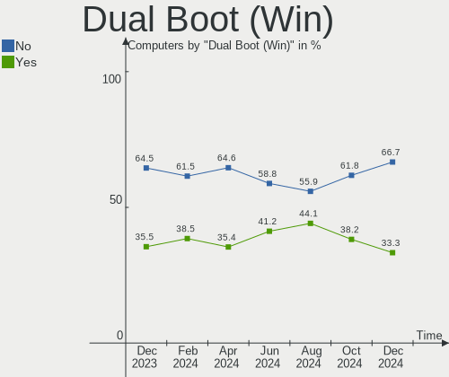
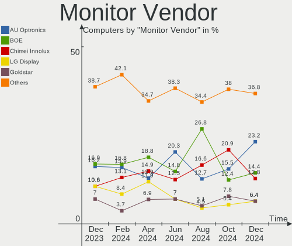

Linux in India - Hardware Trends
--------------------------------

A project to identify most popular hardware characteristics and track their change
over time based on data collected by Linux users at https://Linux-Hardware.org.

Anyone can contribute to this report by the [hw-probe](https://github.com/linuxhw/hw-probe) tool:

    sudo -E hw-probe -all -upload

This is a report for all computer types. See also reports for [desktops](/Location/India/Desktop/README.md) and [notebooks](/Location/India/Notebook/README.md).

Period: Sep, 2023.

Contents
--------

* [ System ](#system)
  - [ OS                       ](#os)
  - [ OS Family                ](#os-family)
  - [ Kernel                   ](#kernel)
  - [ Kernel Family            ](#kernel-family)
  - [ Kernel Major Ver.        ](#kernel-major-ver)
  - [ Arch                     ](#arch)
  - [ DE                       ](#de)
  - [ Display Server           ](#display-server)
  - [ Display Manager          ](#display-manager)
  - [ OS Lang                  ](#os-lang)
  - [ Boot Mode                ](#boot-mode)
  - [ Filesystem               ](#filesystem)
  - [ Part. scheme             ](#part-scheme)
  - [ Dual Boot with Linux/BSD ](#dual-boot-with-linuxbsd)
  - [ Dual Boot (Win)          ](#dual-boot-win)

* [ Board ](#board)
  - [ Vendor                   ](#vendor)
  - [ Model                    ](#model)
  - [ Model Family             ](#model-family)
  - [ MFG Year                 ](#mfg-year)
  - [ Form Factor              ](#form-factor)
  - [ Secure Boot              ](#secure-boot)
  - [ Coreboot                 ](#coreboot)
  - [ RAM Size                 ](#ram-size)
  - [ RAM Used                 ](#ram-used)
  - [ Total Drives             ](#total-drives)
  - [ Has CD-ROM               ](#has-cd-rom)
  - [ Has Ethernet             ](#has-ethernet)
  - [ Has WiFi                 ](#has-wifi)
  - [ Has Bluetooth            ](#has-bluetooth)

* [ Location ](#location)
  - [ Country                  ](#country)
  - [ City                     ](#city)

* [ Drives ](#drives)
  - [ Drive Vendor             ](#drive-vendor)
  - [ Drive Model              ](#drive-model)
  - [ HDD Vendor               ](#hdd-vendor)
  - [ SSD Vendor               ](#ssd-vendor)
  - [ Drive Kind               ](#drive-kind)
  - [ Drive Connector          ](#drive-connector)
  - [ Drive Size               ](#drive-size)
  - [ Space Total              ](#space-total)
  - [ Space Used               ](#space-used)
  - [ Malfunc. Drives          ](#malfunc-drives)
  - [ Malfunc. Drive Vendor    ](#malfunc-drive-vendor)
  - [ Malfunc. HDD Vendor      ](#malfunc-hdd-vendor)
  - [ Malfunc. Drive Kind      ](#malfunc-drive-kind)
  - [ Failed Drives            ](#failed-drives)
  - [ Failed Drive Vendor      ](#failed-drive-vendor)
  - [ Drive Status             ](#drive-status)

* [ Storage controller ](#storage-controller)
  - [ Storage Vendor           ](#storage-vendor)
  - [ Storage Model            ](#storage-model)
  - [ Storage Kind             ](#storage-kind)

* [ Processor ](#processor)
  - [ CPU Vendor               ](#cpu-vendor)
  - [ CPU Model                ](#cpu-model)
  - [ CPU Model Family         ](#cpu-model-family)
  - [ CPU Cores                ](#cpu-cores)
  - [ CPU Sockets              ](#cpu-sockets)
  - [ CPU Threads              ](#cpu-threads)
  - [ CPU Op-Modes             ](#cpu-op-modes)
  - [ CPU Microcode            ](#cpu-microcode)
  - [ CPU Microarch            ](#cpu-microarch)

* [ Graphics ](#graphics)
  - [ GPU Vendor               ](#gpu-vendor)
  - [ GPU Model                ](#gpu-model)
  - [ GPU Combo                ](#gpu-combo)
  - [ GPU Driver               ](#gpu-driver)
  - [ GPU Memory               ](#gpu-memory)

* [ Monitor ](#monitor)
  - [ Monitor Vendor           ](#monitor-vendor)
  - [ Monitor Model            ](#monitor-model)
  - [ Monitor Resolution       ](#monitor-resolution)
  - [ Monitor Diagonal         ](#monitor-diagonal)
  - [ Monitor Width            ](#monitor-width)
  - [ Aspect Ratio             ](#aspect-ratio)
  - [ Monitor Area             ](#monitor-area)
  - [ Pixel Density            ](#pixel-density)
  - [ Multiple Monitors        ](#multiple-monitors)

* [ Network ](#network)
  - [ Net Controller Vendor    ](#net-controller-vendor)
  - [ Net Controller Model     ](#net-controller-model)
  - [ Wireless Vendor          ](#wireless-vendor)
  - [ Wireless Model           ](#wireless-model)
  - [ Ethernet Vendor          ](#ethernet-vendor)
  - [ Ethernet Model           ](#ethernet-model)
  - [ Net Controller Kind      ](#net-controller-kind)
  - [ Used Controller          ](#used-controller)
  - [ NICs                     ](#nics)
  - [ IPv6                     ](#ipv6)

* [ Bluetooth ](#bluetooth)
  - [ Bluetooth Vendor         ](#bluetooth-vendor)
  - [ Bluetooth Model          ](#bluetooth-model)

* [ Sound ](#sound)
  - [ Sound Vendor             ](#sound-vendor)
  - [ Sound Model              ](#sound-model)

* [ Memory ](#memory)
  - [ Memory Vendor            ](#memory-vendor)
  - [ Memory Model             ](#memory-model)
  - [ Memory Kind              ](#memory-kind)
  - [ Memory Form Factor       ](#memory-form-factor)
  - [ Memory Size              ](#memory-size)
  - [ Memory Speed             ](#memory-speed)

* [ Printers & scanners ](#printers--scanners)
  - [ Printer Vendor           ](#printer-vendor)
  - [ Printer Model            ](#printer-model)
  - [ Scanner Vendor           ](#scanner-vendor)
  - [ Scanner Model            ](#scanner-model)

* [ Camera ](#camera)
  - [ Camera Vendor            ](#camera-vendor)
  - [ Camera Model             ](#camera-model)

* [ Security ](#security)
  - [ Fingerprint Vendor       ](#fingerprint-vendor)
  - [ Fingerprint Model        ](#fingerprint-model)
  - [ Chipcard Vendor          ](#chipcard-vendor)
  - [ Chipcard Model           ](#chipcard-model)

* [ Unsupported ](#unsupported)
  - [ Unsupported Devices      ](#unsupported-devices)
  - [ Unsupported Device Types ](#unsupported-device-types)

System
------

OS
--

Installed operating systems

| Name                         | Computers | Percent |
|------------------------------|-----------|---------|
| Ubuntu 22.04                 | 21        | 17.07%  |
| Fedora 38                    | 17        | 13.82%  |
| OpenMandriva 23.08           | 8         | 6.5%    |
| Arch Rolling                 | 7         | 5.69%   |
| Pop!_OS 22.04                | 6         | 4.88%   |
| Linux Mint 21.2              | 6         | 4.88%   |
| Zorin 16                     | 5         | 4.07%   |
| EndeavourOS Rolling          | 5         | 4.07%   |
| Debian 12                    | 5         | 4.07%   |
| ArcoLinux Rolling            | 5         | 4.07%   |
| Ubuntu 23.04                 | 4         | 3.25%   |
| Ubuntu 20.04                 | 3         | 2.44%   |
| Xero Rolling                 | 2         | 1.63%   |
| OpenMandriva 23.09           | 2         | 1.63%   |
| Linux Mint 21.1              | 2         | 1.63%   |
| Kubuntu 22.04                | 2         | 1.63%   |
| Kali 2023.3                  | 2         | 1.63%   |
| Xubuntu 22.04                | 1         | 0.81%   |
| Ubuntu Unity 23.04           | 1         | 0.81%   |
| Ubuntu 18.04                 | 1         | 0.81%   |
| Rocky Linux 8.7              | 1         | 0.81%   |
| RHEL 9                       | 1         | 0.81%   |
| Parrot 5.3                   | 1         | 0.81%   |
| openSUSE Tumbleweed-XXXXXXXX | 1         | 0.81%   |
| MX 21                        | 1         | 0.81%   |
| Manjaro 23.0.2               | 1         | 0.81%   |
| LMDE 5                       | 1         | 0.81%   |
| KDE neon 22.04               | 1         | 0.81%   |
| Garuda Linux Soaring         | 1         | 0.81%   |
| Fedora 39                    | 1         | 0.81%   |
| Fedora 37                    | 1         | 0.81%   |
| Endless 5.0.5                | 1         | 0.81%   |
| blendOS                      | 1         | 0.81%   |
| BlackPanther 18.1            | 1         | 0.81%   |
| Athena Stable                | 1         | 0.81%   |
| Archcraft Rolling            | 1         | 0.81%   |
| antiX 22                     | 1         | 0.81%   |
| AlmaLinux 9.2                | 1         | 0.81%   |

OS Family
---------

OS without a version

| Name         | Computers | Percent |
|--------------|-----------|---------|
| Ubuntu       | 29        | 23.58%  |
| Fedora       | 19        | 15.45%  |
| OpenMandriva | 10        | 8.13%   |
| Linux Mint   | 8         | 6.5%    |
| Arch         | 7         | 5.69%   |
| Pop!_OS      | 6         | 4.88%   |
| Zorin        | 5         | 4.07%   |
| EndeavourOS  | 5         | 4.07%   |
| Debian       | 5         | 4.07%   |
| ArcoLinux    | 5         | 4.07%   |
| Xero         | 2         | 1.63%   |
| Kubuntu      | 2         | 1.63%   |
| Kali         | 2         | 1.63%   |
| Xubuntu      | 1         | 0.81%   |
| Ubuntu Unity | 1         | 0.81%   |
| Rocky Linux  | 1         | 0.81%   |
| RHEL         | 1         | 0.81%   |
| Parrot       | 1         | 0.81%   |
| openSUSE     | 1         | 0.81%   |
| MX           | 1         | 0.81%   |
| Manjaro      | 1         | 0.81%   |
| LMDE         | 1         | 0.81%   |
| KDE neon     | 1         | 0.81%   |
| Garuda Linux | 1         | 0.81%   |
| Endless      | 1         | 0.81%   |
| blendOS      | 1         | 0.81%   |
| BlackPanther | 1         | 0.81%   |
| Athena       | 1         | 0.81%   |
| Archcraft    | 1         | 0.81%   |
| antiX        | 1         | 0.81%   |
| AlmaLinux    | 1         | 0.81%   |

Kernel
------

Version of the Linux kernel

| Version                             | Computers | Percent |
|-------------------------------------|-----------|---------|
| 6.2.0-32-generic                    | 13        | 10.57%  |
| 6.2.0-33-generic                    | 8         | 6.5%    |
| 6.4.11-desktop-1omv2390             | 6         | 4.88%   |
| 5.15.0-84-generic                   | 6         | 4.88%   |
| 6.5.3-arch1-1                       | 5         | 4.07%   |
| 6.4.15-200.fc38.x86_64              | 5         | 4.07%   |
| 6.4.13-200.fc38.x86_64              | 4         | 3.25%   |
| 6.4.12-arch1-1                      | 4         | 3.25%   |
| 6.2.0-31-generic                    | 4         | 3.25%   |
| 5.15.0-83-generic                   | 4         | 3.25%   |
| 6.4.6-76060406-generic              | 3         | 2.44%   |
| 6.1.0-10-amd64                      | 3         | 2.44%   |
| 6.4.8-desktop-2omv2390              | 2         | 1.63%   |
| 6.4.14-200.fc38.x86_64              | 2         | 1.63%   |
| 6.2.9-300.fc38.x86_64               | 2         | 1.63%   |
| 6.2.6-76060206-generic              | 2         | 1.63%   |
| 5.15.0-82-generic                   | 2         | 1.63%   |
| 6.6.0-0.rc2.219.vanilla.fc38.x86_64 | 1         | 0.81%   |
| 6.5.5-zen1-1-zen                    | 1         | 0.81%   |
| 6.5.4-arch2-1                       | 1         | 0.81%   |
| 6.5.4-300.fc39.x86_64               | 1         | 0.81%   |
| 6.5.4-200.fc38.x86_64               | 1         | 0.81%   |
| 6.5.3-desktop-1omv2390              | 1         | 0.81%   |
| 6.5.2-zen1-1-zen                    | 1         | 0.81%   |
| 6.5.2-arch1-1                       | 1         | 0.81%   |
| 6.5.2-1-default                     | 1         | 0.81%   |
| 6.5.0-desktop-1omv2390              | 1         | 0.81%   |
| 6.5.0-1003-oem                      | 1         | 0.81%   |
| 6.4.4-arch1-1                       | 1         | 0.81%   |
| 6.4.15-100.fc37.x86_64              | 1         | 0.81%   |
| 6.4.12-zen1-1-zen                   | 1         | 0.81%   |
| 6.4.12-200.fc38.x86_64              | 1         | 0.81%   |
| 6.4.12-2-liquorix-amd64             | 1         | 0.81%   |
| 6.4.11-arch1-1                      | 1         | 0.81%   |
| 6.4.10-060410-generic               | 1         | 0.81%   |
| 6.4.0-kali3-amd64                   | 1         | 0.81%   |
| 6.3.9-zen1-1-zen                    | 1         | 0.81%   |
| 6.3.0-kali1-amd64                   | 1         | 0.81%   |
| 6.2.14-300.fc38.x86_64              | 1         | 0.81%   |
| 6.2.13-zen-1-zen                    | 1         | 0.81%   |

Kernel Family
-------------

Linux kernel without a distro release

| Version  | Computers | Percent |
|----------|-----------|---------|
| 6.2.0    | 26        | 21.14%  |
| 5.15.0   | 17        | 13.82%  |
| 6.4.12   | 7         | 5.69%   |
| 6.4.11   | 7         | 5.69%   |
| 6.1.0    | 7         | 5.69%   |
| 6.5.3    | 6         | 4.88%   |
| 6.4.15   | 6         | 4.88%   |
| 6.4.13   | 4         | 3.25%   |
| 6.5.4    | 3         | 2.44%   |
| 6.5.2    | 3         | 2.44%   |
| 6.4.6    | 3         | 2.44%   |
| 6.5.0    | 2         | 1.63%   |
| 6.4.8    | 2         | 1.63%   |
| 6.4.14   | 2         | 1.63%   |
| 6.2.9    | 2         | 1.63%   |
| 6.2.6    | 2         | 1.63%   |
| 5.14.0   | 2         | 1.63%   |
| 6.6.0    | 1         | 0.81%   |
| 6.5.5    | 1         | 0.81%   |
| 6.4.4    | 1         | 0.81%   |
| 6.4.10   | 1         | 0.81%   |
| 6.4.0    | 1         | 0.81%   |
| 6.3.9    | 1         | 0.81%   |
| 6.3.0    | 1         | 0.81%   |
| 6.2.14   | 1         | 0.81%   |
| 6.2.13   | 1         | 0.81%   |
| 6.2.12   | 1         | 0.81%   |
| 6.1.54   | 1         | 0.81%   |
| 6.1.52   | 1         | 0.81%   |
| 6.1.50   | 1         | 0.81%   |
| 6.1.21   | 1         | 0.81%   |
| 6.0.0    | 1         | 0.81%   |
| 5.4.0    | 1         | 0.81%   |
| 5.19.17  | 1         | 0.81%   |
| 5.15.131 | 1         | 0.81%   |
| 5.11.0   | 1         | 0.81%   |
| 5.10.0   | 1         | 0.81%   |
| 4.18.16  | 1         | 0.81%   |
| 4.18.0   | 1         | 0.81%   |

Kernel Major Ver.
-----------------

Linux kernel major version

| Version | Computers | Percent |
|---------|-----------|---------|
| 6.4     | 34        | 27.64%  |
| 6.2     | 33        | 26.83%  |
| 5.15    | 18        | 14.63%  |
| 6.5     | 15        | 12.2%   |
| 6.1     | 11        | 8.94%   |
| 6.3     | 2         | 1.63%   |
| 5.14    | 2         | 1.63%   |
| 4.18    | 2         | 1.63%   |
| 6.6     | 1         | 0.81%   |
| 6.0     | 1         | 0.81%   |
| 5.4     | 1         | 0.81%   |
| 5.19    | 1         | 0.81%   |
| 5.11    | 1         | 0.81%   |
| 5.10    | 1         | 0.81%   |

Arch
----

OS architecture (x86_64, i586, etc.)

| Name   | Computers | Percent |
|--------|-----------|---------|
| x86_64 | 123       | 100%    |

DE
--

Desktop Environment

| Name          | Computers | Percent |
|---------------|-----------|---------|
| GNOME         | 67        | 54.47%  |
| KDE5          | 24        | 19.51%  |
| XFCE          | 8         | 6.5%    |
| X-Cinnamon    | 8         | 6.5%    |
| Unknown       | 4         | 3.25%   |
| Unity         | 2         | 1.63%   |
| i3            | 2         | 1.63%   |
| qtile         | 1         | 0.81%   |
| MATE          | 1         | 0.81%   |
| LXQt          | 1         | 0.81%   |
| icewm         | 1         | 0.81%   |
| GNOME Classic | 1         | 0.81%   |
| Enlightenment | 1         | 0.81%   |
| dwm           | 1         | 0.81%   |
| Budgie        | 1         | 0.81%   |

Display Server
--------------

X11 or Wayland

| Name    | Computers | Percent |
|---------|-----------|---------|
| X11     | 68        | 55.28%  |
| Wayland | 50        | 40.65%  |
| Tty     | 4         | 3.25%   |
| Unknown | 1         | 0.81%   |

Display Manager
---------------

SDDM, LightDM, etc.

| Name    | Computers | Percent |
|---------|-----------|---------|
| Unknown | 41        | 33.33%  |
| GDM3    | 29        | 23.58%  |
| SDDM    | 25        | 20.33%  |
| LightDM | 14        | 11.38%  |
| GDM     | 14        | 11.38%  |

OS Lang
-------

Language

| Lang    | Computers | Percent |
|---------|-----------|---------|
| en_IN   | 72        | 58.54%  |
| en_US   | 40        | 32.52%  |
| en_GB   | 5         | 4.07%   |
| C       | 4         | 3.25%   |
| Unknown | 2         | 1.63%   |

Boot Mode
---------

EFI or BIOS

| Mode | Computers | Percent |
|------|-----------|---------|
| EFI  | 81        | 65.85%  |
| BIOS | 42        | 34.15%  |

Filesystem
----------

Type of filesystem

| Type    | Computers | Percent |
|---------|-----------|---------|
| Ext4    | 75        | 60.98%  |
| Btrfs   | 26        | 21.14%  |
| Tmpfs   | 12        | 9.76%   |
| Overlay | 6         | 4.88%   |
| Xfs     | 3         | 2.44%   |
| Zfs     | 1         | 0.81%   |

Part. scheme
------------

Scheme of partitioning

| Type    | Computers | Percent |
|---------|-----------|---------|
| GPT     | 82        | 66.67%  |
| Unknown | 36        | 29.27%  |
| MBR     | 5         | 4.07%   |

Dual Boot with Linux/BSD
------------------------

Hosting more than one Linux/BSD

| Dual boot | Computers | Percent |
|-----------|-----------|---------|
| No        | 107       | 86.99%  |
| Yes       | 16        | 13.01%  |

Dual Boot (Win)
---------------

Hosting Linux and Windows

| Dual boot | Computers | Percent |
|-----------|-----------|---------|
| No        | 73        | 59.35%  |
| Yes       | 50        | 40.65%  |

Board
-----

Vendor
------

Motherboard manufacturer

| Name                | Computers | Percent |
|---------------------|-----------|---------|
| Lenovo              | 22        | 17.89%  |
| Hewlett-Packard     | 21        | 17.07%  |
| ASUSTek Computer    | 18        | 14.63%  |
| Dell                | 13        | 10.57%  |
| Acer                | 12        | 9.76%   |
| Intel               | 7         | 5.69%   |
| MSI                 | 5         | 4.07%   |
| Gigabyte Technology | 5         | 4.07%   |
| Timi                | 4         | 3.25%   |
| Apple               | 4         | 3.25%   |
| Infinix             | 2         | 1.63%   |
| Gateway             | 2         | 1.63%   |
| ZOTAC               | 1         | 0.81%   |
| Toshiba             | 1         | 0.81%   |
| Samsung Electronics | 1         | 0.81%   |
| Pegatron            | 1         | 0.81%   |
| HONOR               | 1         | 0.81%   |
| Getac               | 1         | 0.81%   |
| ASRock              | 1         | 0.81%   |
| Unknown             | 1         | 0.81%   |

Model
-----

Motherboard model

| Name                                 | Computers | Percent |
|--------------------------------------|-----------|---------|
| Timi Mi NoteBook Ultra               | 2         | 1.63%   |
| Intel H81                            | 2         | 1.63%   |
| Intel H61                            | 2         | 1.63%   |
| HP Notebook                          | 2         | 1.63%   |
| Gateway NE56R                        | 2         | 1.63%   |
| ASUS ROG Strix G531GT_G531GT         | 2         | 1.63%   |
| Apple MacBookPro9,2                  | 2         | 1.63%   |
| Acer Predator PH315-54               | 2         | 1.63%   |
| Acer Aspire A715-51G                 | 2         | 1.63%   |
| ZOTAC ZBOX-ECM73070C/53060C          | 1         | 0.81%   |
| Toshiba Satellite C850               | 1         | 0.81%   |
| Timi RedmiBook 15                    | 1         | 0.81%   |
| Timi Mi NoteBook Pro                 | 1         | 0.81%   |
| Samsung 935XDB                       | 1         | 0.81%   |
| Pegatron AU930AA-ACJ p6270in         | 1         | 0.81%   |
| MSI Thin GF63 12HW                   | 1         | 0.81%   |
| MSI MS-7C75                          | 1         | 0.81%   |
| MSI MS-7B51                          | 1         | 0.81%   |
| MSI MS-7A70                          | 1         | 0.81%   |
| MSI Modern 15 A5M                    | 1         | 0.81%   |
| Lenovo Z51-70 80K6                   | 1         | 0.81%   |
| Lenovo Z50-70 20354                  | 1         | 0.81%   |
| Lenovo V15 G4 AMN 82YU               | 1         | 0.81%   |
| Lenovo ThinkPad T490 20N3S77601      | 1         | 0.81%   |
| Lenovo ThinkPad E15 Gen 2 20TDCTO1WW | 1         | 0.81%   |
| Lenovo ThinkPad E14 Gen 4 21E3S06300 | 1         | 0.81%   |
| Lenovo ThinkBook 15 G4 IAP 21DJ      | 1         | 0.81%   |
| Lenovo ThinkBook 15 G2 ITL 20VE      | 1         | 0.81%   |
| Lenovo ThinkBook 14-IIL 20SL         | 1         | 0.81%   |
| Lenovo IdeaPadFlex 5 14ALC05 82HU    | 1         | 0.81%   |
| Lenovo IdeaPad S540-15IWL D 81NE     | 1         | 0.81%   |
| Lenovo IdeaPad S340-15IIL 81WL       | 1         | 0.81%   |
| Lenovo IdeaPad S340-15IIL 81VW       | 1         | 0.81%   |
| Lenovo IdeaPad S145-14AST 81ST       | 1         | 0.81%   |
| Lenovo IdeaPad 330-15IKB 81DE        | 1         | 0.81%   |
| Lenovo IdeaPad 320-15ISK 80XH        | 1         | 0.81%   |
| Lenovo IDEA 315-15 81WE              | 1         | 0.81%   |
| Lenovo H410                          | 1         | 0.81%   |
| Lenovo H320 10044                    | 1         | 0.81%   |
| Lenovo G580 20157                    | 1         | 0.81%   |

Model Family
------------

Motherboard model prefix

| Name                 | Computers | Percent |
|----------------------|-----------|---------|
| HP Pavilion          | 8         | 6.5%    |
| Acer Aspire          | 7         | 5.69%   |
| Lenovo IdeaPad       | 6         | 4.88%   |
| ASUS Vivobook        | 6         | 4.88%   |
| ASUS ASUS            | 5         | 4.07%   |
| Dell Latitude        | 4         | 3.25%   |
| Dell Inspiron        | 4         | 3.25%   |
| ASUS ROG             | 4         | 3.25%   |
| Timi Mi              | 3         | 2.44%   |
| Lenovo ThinkPad      | 3         | 2.44%   |
| Lenovo ThinkBook     | 3         | 2.44%   |
| Intel H81            | 2         | 1.63%   |
| Intel H61            | 2         | 1.63%   |
| Infinix INBOOK       | 2         | 1.63%   |
| HP Notebook          | 2         | 1.63%   |
| HP ENVY              | 2         | 1.63%   |
| Gateway NE56R        | 2         | 1.63%   |
| Dell XPS             | 2         | 1.63%   |
| Dell Vostro          | 2         | 1.63%   |
| Apple MacBookPro9    | 2         | 1.63%   |
| Acer Predator        | 2         | 1.63%   |
| Acer Nitro           | 2         | 1.63%   |
| ZOTAC ZBOX-ECM73070C | 1         | 0.81%   |
| Toshiba Satellite    | 1         | 0.81%   |
| Timi RedmiBook       | 1         | 0.81%   |
| Samsung 935XDB       | 1         | 0.81%   |
| Pegatron AU930AA-ACJ | 1         | 0.81%   |
| MSI Thin             | 1         | 0.81%   |
| MSI MS-7C75          | 1         | 0.81%   |
| MSI MS-7B51          | 1         | 0.81%   |
| MSI MS-7A70          | 1         | 0.81%   |
| MSI Modern           | 1         | 0.81%   |
| Lenovo Z51-70        | 1         | 0.81%   |
| Lenovo Z50-70        | 1         | 0.81%   |
| Lenovo V15           | 1         | 0.81%   |
| Lenovo IdeaPadFlex   | 1         | 0.81%   |
| Lenovo IDEA          | 1         | 0.81%   |
| Lenovo H410          | 1         | 0.81%   |
| Lenovo H320          | 1         | 0.81%   |
| Lenovo G580          | 1         | 0.81%   |

MFG Year
--------

Motherboard manufacture year

| Year | Computers | Percent |
|------|-----------|---------|
| 2021 | 21        | 17.07%  |
| 2022 | 18        | 14.63%  |
| 2019 | 17        | 13.82%  |
| 2020 | 11        | 8.94%   |
| 2017 | 9         | 7.32%   |
| 2018 | 7         | 5.69%   |
| 2016 | 7         | 5.69%   |
| 2012 | 7         | 5.69%   |
| 2023 | 6         | 4.88%   |
| 2011 | 6         | 4.88%   |
| 2015 | 4         | 3.25%   |
| 2010 | 3         | 2.44%   |
| 2013 | 2         | 1.63%   |
| 2008 | 2         | 1.63%   |
| 2014 | 1         | 0.81%   |
| 2009 | 1         | 0.81%   |
| 2007 | 1         | 0.81%   |

Form Factor
-----------

Physical design of the computer

| Name        | Computers | Percent |
|-------------|-----------|---------|
| Notebook    | 90        | 73.17%  |
| Desktop     | 26        | 21.14%  |
| Convertible | 3         | 2.44%   |
| Tablet      | 1         | 0.81%   |
| Mini pc     | 1         | 0.81%   |
| All in one  | 1         | 0.81%   |
| Server      | 1         | 0.81%   |

Secure Boot
-----------

Enabled or disabled

| State    | Computers | Percent |
|----------|-----------|---------|
| Disabled | 108       | 87.8%   |
| Enabled  | 15        | 12.2%   |

Coreboot
--------

Have coreboot on board

| Used | Computers | Percent |
|------|-----------|---------|
| No   | 123       | 100%    |

RAM Size
--------

Total RAM memory

| Size in GB  | Computers | Percent |
|-------------|-----------|---------|
| 4.01-8.0    | 45        | 36.59%  |
| 16.01-24.0  | 27        | 21.95%  |
| 8.01-16.0   | 22        | 17.89%  |
| 3.01-4.0    | 13        | 10.57%  |
| 32.01-64.0  | 7         | 5.69%   |
| 64.01-256.0 | 4         | 3.25%   |
| 1.01-2.0    | 3         | 2.44%   |
| 24.01-32.0  | 1         | 0.81%   |
| 2.01-3.0    | 1         | 0.81%   |

RAM Used
--------

Used RAM memory

| Used GB   | Computers | Percent |
|-----------|-----------|---------|
| 2.01-3.0  | 30        | 24.39%  |
| 4.01-8.0  | 28        | 22.76%  |
| 3.01-4.0  | 28        | 22.76%  |
| 1.01-2.0  | 25        | 20.33%  |
| 0.51-1.0  | 7         | 5.69%   |
| 8.01-16.0 | 5         | 4.07%   |

Total Drives
------------

Number of drives on board

| Drives | Computers | Percent |
|--------|-----------|---------|
| 1      | 80        | 65.04%  |
| 2      | 33        | 26.83%  |
| 3      | 5         | 4.07%   |
| 5      | 3         | 2.44%   |
| 4      | 2         | 1.63%   |

Has CD-ROM
----------

Has CD-ROM on board

| Presented | Computers | Percent |
|-----------|-----------|---------|
| No        | 101       | 82.11%  |
| Yes       | 22        | 17.89%  |

Has Ethernet
------------

Has Ethernet on board

| Presented | Computers | Percent |
|-----------|-----------|---------|
| Yes       | 101       | 82.11%  |
| No        | 22        | 17.89%  |

Has WiFi
--------

Has WiFi module

| Presented | Computers | Percent |
|-----------|-----------|---------|
| Yes       | 108       | 87.8%   |
| No        | 15        | 12.2%   |

Has Bluetooth
-------------

Has Bluetooth module

| Presented | Computers | Percent |
|-----------|-----------|---------|
| Yes       | 96        | 78.05%  |
| No        | 27        | 21.95%  |

Location
--------

Country
-------

Geographic location (country)

| Country | Computers | Percent |
|---------|-----------|---------|
| India   | 123       | 100%    |

City
----

Geographic location (city)

| City          | Computers | Percent |
|---------------|-----------|---------|
| Bengaluru     | 22        | 17.89%  |
| Hyderabad     | 10        | 8.13%   |
| Delhi         | 10        | 8.13%   |
| Mumbai        | 9         | 7.32%   |
| Pune          | 8         | 6.5%    |
| Chennai       | 6         | 4.88%   |
| Surat         | 4         | 3.25%   |
| Kolkata       | 3         | 2.44%   |
| Coimbatore    | 3         | 2.44%   |
| Bhubaneswar   | 3         | 2.44%   |
| Ahmedabad     | 3         | 2.44%   |
| Tirunelveli   | 2         | 1.63%   |
| Patna         | 2         | 1.63%   |
| Madurai       | 2         | 1.63%   |
| Kochi         | 2         | 1.63%   |
| Indore        | 2         | 1.63%   |
| Chandigarh    | 2         | 1.63%   |
| Asansol       | 2         | 1.63%   |
| Visakhapatnam | 1         | 0.81%   |
| Vijayawada    | 1         | 0.81%   |
| Thrissur      | 1         | 0.81%   |
| Thoothukudi   | 1         | 0.81%   |
| Sandila       | 1         | 0.81%   |
| Raipur        | 1         | 0.81%   |
| Patiala       | 1         | 0.81%   |
| Palladam      | 1         | 0.81%   |
| Noida         | 1         | 0.81%   |
| New Delhi     | 1         | 0.81%   |
| Navi Mumbai   | 1         | 0.81%   |
| Nagpur        | 1         | 0.81%   |
| Mysore        | 1         | 0.81%   |
| Lucknow       | 1         | 0.81%   |
| Kottayam      | 1         | 0.81%   |
| Kanpur        | 1         | 0.81%   |
| Jalpaiguri    | 1         | 0.81%   |
| Jalandhar     | 1         | 0.81%   |
| Jaipur        | 1         | 0.81%   |
| Guwahati      | 1         | 0.81%   |
| Gurugram      | 1         | 0.81%   |
| Greater Noida | 1         | 0.81%   |

Drives
------

Drive Vendor
------------

Hard drive vendors

| Vendor                      | Computers | Drives | Percent |
|-----------------------------|-----------|--------|---------|
| Seagate                     | 27        | 30     | 15.17%  |
| WDC                         | 26        | 28     | 14.61%  |
| Samsung Electronics         | 23        | 26     | 12.92%  |
| SanDisk                     | 10        | 10     | 5.62%   |
| Micron Technology           | 9         | 9      | 5.06%   |
| Intel                       | 8         | 8      | 4.49%   |
| Crucial                     | 8         | 9      | 4.49%   |
| Kingston                    | 7         | 7      | 3.93%   |
| Unknown                     | 6         | 6      | 3.37%   |
| Toshiba                     | 6         | 6      | 3.37%   |
| SK hynix                    | 5         | 5      | 2.81%   |
| Silicon Motion              | 4         | 4      | 2.25%   |
| Unknown                     | 4         | 4      | 2.25%   |
| Yangtze Memory Technologies | 3         | 3      | 1.69%   |
| KIOXIA                      | 3         | 3      | 1.69%   |
| FORESEE                     | 3         | 3      | 1.69%   |
| Kingston Technology Company | 2         | 2      | 1.12%   |
| Hitachi                     | 2         | 2      | 1.12%   |
| HGST                        | 2         | 2      | 1.12%   |
| CONSISTENT                  | 2         | 2      | 1.12%   |
| China                       | 2         | 2      | 1.12%   |
| Apple                       | 2         | 2      | 1.12%   |
| Zebronics                   | 1         | 1      | 0.56%   |
| XPG                         | 1         | 1      | 0.56%   |
| Union Memory (Shenzhen)     | 1         | 1      | 0.56%   |
| UMIS                        | 1         | 1      | 0.56%   |
| SSSTC                       | 1         | 1      | 0.56%   |
| Secure                      | 1         | 1      | 0.56%   |
| Marvell Technology Group    | 1         | 1      | 0.56%   |
| Lexar                       | 1         | 1      | 0.56%   |
| HS-SSD-E100                 | 1         | 1      | 0.56%   |
| HS-SSD-C100                 | 1         | 1      | 0.56%   |
| Hewlett-Packard             | 1         | 1      | 0.56%   |
| Gigabyte Technology         | 1         | 1      | 0.56%   |
| geonix                      | 1         | 1      | 0.56%   |
| EVM                         | 1         | 1      | 0.56%   |

Drive Model
-----------

Hard drive models

| Model                                                 | Computers | Percent |
|-------------------------------------------------------|-----------|---------|
| Seagate ST1000LM035-1RK172 1TB                        | 4         | 2.15%   |
| Micron 2450_MTFDKBA512TFK 512GB                       | 4         | 2.15%   |
| Unknown                                               | 4         | 2.15%   |
| Yangtze Memory YMTC PC005 512GB                       | 3         | 1.61%   |
| WDC WD10SPZX-24Z10 1TB                                | 3         | 1.61%   |
| Toshiba MQ04ABF100 1TB                                | 3         | 1.61%   |
| Seagate ST1000LM049-2GH172 1TB                        | 3         | 1.61%   |
| Sandisk WD Blue SN550 NVMe SSD 512GB                  | 3         | 1.61%   |
| Samsung NVMe SSD Controller SM981/PM981/PM983 256GB   | 3         | 1.61%   |
| Samsung NVMe SSD Controller PM9A1/PM9A3/980PRO 1TB    | 3         | 1.61%   |
| Kingston SA400S37120G 120GB SSD                       | 3         | 1.61%   |
| Intel SSDPEKNU512GZ 512GB                             | 3         | 1.61%   |
| WDC WDS240G2G0B-00EPW0 240GB SSD                      | 2         | 1.08%   |
| WDC WD10JPVX-60JC3T0 1TB                              | 2         | 1.08%   |
| WDC WD10EZEX-60WN4A0 1TB                              | 2         | 1.08%   |
| WDC WD Blue SA510 2.5 500GB                           | 2         | 1.08%   |
| SK hynix PC711 HFS512GDE9X073N 512GB                  | 2         | 1.08%   |
| Silicon Motion SM2263EN/SM2263XT SSD Controller 512GB | 2         | 1.08%   |
| Seagate ST3500312CS 500GB                             | 2         | 1.08%   |
| Seagate ST1000LX015-1U7172 1TB                        | 2         | 1.08%   |
| Seagate ST1000DM010-2EP102 1TB                        | 2         | 1.08%   |
| Sandisk WD Blue SN500 / PC SN520 NVMe SSD 256GB       | 2         | 1.08%   |
| Samsung SSD 860 EVO 500GB                             | 2         | 1.08%   |
| Kingston Company A2000 NVMe SSD 1TB                   | 2         | 1.08%   |
| Crucial CT500MX500SSD1 500GB                          | 2         | 1.08%   |
| Crucial CT480BX500SSD1 480GB                          | 2         | 1.08%   |
| Crucial CT240BX500SSD1 240GB                          | 2         | 1.08%   |
| CONSISTENT SSD S6 256GB                               | 2         | 1.08%   |
| Zebronics 2.5SSD128GB                                 | 1         | 0.54%   |
| XPG GAMMIX S70 BLADE 512GB                            | 1         | 0.54%   |
| WDC WUH721818ALE6L4 18TB                              | 1         | 0.54%   |
| WDC WDS480G2G0A-00JH30 480GB SSD                      | 1         | 0.54%   |
| WDC WD5000LPCX-24VHAT0 500GB                          | 1         | 0.54%   |
| WDC WD5000L 500GB                                     | 1         | 0.54%   |
| WDC WD5000BPVT-22HXZT3 500GB                          | 1         | 0.54%   |
| WDC WD5000AAKX-753CA1 500GB                           | 1         | 0.54%   |
| WDC WD5000AAKX-60U6AA0 500GB                          | 1         | 0.54%   |
| WDC WD20EZRX-00D8PB0 2TB                              | 1         | 0.54%   |
| WDC WD1600AAJS-00B4A0 160GB                           | 1         | 0.54%   |
| WDC WD10SPZX-60Z10T1 1TB                              | 1         | 0.54%   |

HDD Vendor
----------

Hard disk drive vendors

| Vendor              | Computers | Drives | Percent |
|---------------------|-----------|--------|---------|
| Seagate             | 26        | 29     | 44.07%  |
| WDC                 | 19        | 20     | 32.2%   |
| Toshiba             | 6         | 6      | 10.17%  |
| Unknown             | 2         | 2      | 3.39%   |
| Hitachi             | 2         | 2      | 3.39%   |
| HGST                | 2         | 2      | 3.39%   |
| Samsung Electronics | 1         | 1      | 1.69%   |
| Apple               | 1         | 1      | 1.69%   |

SSD Vendor
----------

Solid state drive vendors

| Vendor              | Computers | Drives | Percent |
|---------------------|-----------|--------|---------|
| Crucial             | 7         | 8      | 17.95%  |
| WDC                 | 6         | 6      | 15.38%  |
| Samsung Electronics | 5         | 5      | 12.82%  |
| Kingston            | 5         | 5      | 12.82%  |
| CONSISTENT          | 2         | 2      | 5.13%   |
| China               | 2         | 2      | 5.13%   |
| Zebronics           | 1         | 1      | 2.56%   |
| Silicon Motion      | 1         | 1      | 2.56%   |
| Secure              | 1         | 1      | 2.56%   |
| SanDisk             | 1         | 1      | 2.56%   |
| Lexar               | 1         | 1      | 2.56%   |
| Intel               | 1         | 1      | 2.56%   |
| HS-SSD-C100         | 1         | 1      | 2.56%   |
| Hewlett-Packard     | 1         | 1      | 2.56%   |
| Gigabyte Technology | 1         | 1      | 2.56%   |
| geonix              | 1         | 1      | 2.56%   |
| FORESEE             | 1         | 1      | 2.56%   |
| Apple               | 1         | 1      | 2.56%   |

Drive Kind
----------

HDD or SSD

| Kind    | Computers | Drives | Percent |
|---------|-----------|--------|---------|
| NVMe    | 66        | 74     | 40%     |
| HDD     | 54        | 63     | 32.73%  |
| SSD     | 35        | 40     | 21.21%  |
| Unknown | 7         | 7      | 4.24%   |
| MMC     | 3         | 3      | 1.82%   |

Drive Connector
---------------

SATA, SAS, NVMe, etc.

| Type | Computers | Drives | Percent |
|------|-----------|--------|---------|
| SATA | 71        | 105    | 48.97%  |
| NVMe | 66        | 74     | 45.52%  |
| SAS  | 5         | 5      | 3.45%   |
| MMC  | 3         | 3      | 2.07%   |

Drive Size
----------

Size of hard drive

| Size in TB | Computers | Drives | Percent |
|------------|-----------|--------|---------|
| 0.01-0.5   | 47        | 59     | 54.02%  |
| 0.51-1.0   | 33        | 36     | 37.93%  |
| 1.01-2.0   | 3         | 4      | 3.45%   |
| 4.01-10.0  | 3         | 3      | 3.45%   |
| 10.01-20.0 | 1         | 1      | 1.15%   |

Space Total
-----------

Amount of disk space available on the file system

| Size in GB     | Computers | Percent |
|----------------|-----------|---------|
| 101-250        | 30        | 24.39%  |
| 501-1000       | 27        | 21.95%  |
| 251-500        | 24        | 19.51%  |
| 1001-2000      | 12        | 9.76%   |
| 51-100         | 12        | 9.76%   |
| 1-20           | 7         | 5.69%   |
| 21-50          | 5         | 4.07%   |
| Unknown        | 3         | 2.44%   |
| 2001-3000      | 2         | 1.63%   |
| More than 3000 | 1         | 0.81%   |

Space Used
----------

Amount of used disk space

| Used GB   | Computers | Percent |
|-----------|-----------|---------|
| 1-20      | 42        | 34.15%  |
| 21-50     | 28        | 22.76%  |
| 101-250   | 15        | 12.2%   |
| 251-500   | 14        | 11.38%  |
| 51-100    | 13        | 10.57%  |
| 501-1000  | 6         | 4.88%   |
| Unknown   | 3         | 2.44%   |
| 1001-2000 | 2         | 1.63%   |

Malfunc. Drives
---------------

Drive models with a malfunction

| Model                                       | Computers | Drives | Percent |
|---------------------------------------------|-----------|--------|---------|
| Seagate ST1000LM035-1RK172 1TB              | 2         | 2      | 12.5%   |
| WDC WD5000AAKX-60U6AA0 500GB                | 1         | 1      | 6.25%   |
| WDC WD10EARX-00N0YB0 1TB                    | 1         | 1      | 6.25%   |
| Toshiba MK5061GSY 500GB                     | 1         | 1      | 6.25%   |
| SK hynix PC711 HFS512GDE9X073N 512GB        | 1         | 1      | 6.25%   |
| Secure Net 256GB SSD                        | 1         | 1      | 6.25%   |
| Seagate ST3500312CS 500GB                   | 1         | 1      | 6.25%   |
| Seagate ST2000LM007-1R8174 2TB              | 1         | 1      | 6.25%   |
| Seagate ST1000LM049-2GH172 1TB              | 1         | 1      | 6.25%   |
| Seagate ST1000DM003-1ER162 1TB              | 1         | 1      | 6.25%   |
| Samsung Electronics SSD 870 EVO 1TB         | 1         | 1      | 6.25%   |
| Micron Technology 2200V_MTFDHBA512TCK 512GB | 1         | 1      | 6.25%   |
| Hitachi HTS543232A7A384 320GB               | 1         | 1      | 6.25%   |
| Hitachi HDS721050CLA660 500GB               | 1         | 1      | 6.25%   |
| Apple HDD HTS545050A7E362 500GB             | 1         | 1      | 6.25%   |

Malfunc. Drive Vendor
---------------------

Vendors of faulty drives

| Vendor              | Computers | Drives | Percent |
|---------------------|-----------|--------|---------|
| Seagate             | 6         | 6      | 37.5%   |
| WDC                 | 2         | 2      | 12.5%   |
| Hitachi             | 2         | 2      | 12.5%   |
| Toshiba             | 1         | 1      | 6.25%   |
| SK hynix            | 1         | 1      | 6.25%   |
| Secure              | 1         | 1      | 6.25%   |
| Samsung Electronics | 1         | 1      | 6.25%   |
| Micron Technology   | 1         | 1      | 6.25%   |
| Apple               | 1         | 1      | 6.25%   |

Malfunc. HDD Vendor
-------------------

Vendors of faulty HDD drives

| Vendor  | Computers | Drives | Percent |
|---------|-----------|--------|---------|
| Seagate | 6         | 6      | 50%     |
| WDC     | 2         | 2      | 16.67%  |
| Hitachi | 2         | 2      | 16.67%  |
| Toshiba | 1         | 1      | 8.33%   |
| Apple   | 1         | 1      | 8.33%   |

Malfunc. Drive Kind
-------------------

Kinds of faulty drives

| Kind | Computers | Drives | Percent |
|------|-----------|--------|---------|
| HDD  | 11        | 12     | 73.33%  |
| NVMe | 2         | 2      | 13.33%  |
| SSD  | 2         | 2      | 13.33%  |

Failed Drives
-------------

Failed drive models

Zero info for selected period =(

Failed Drive Vendor
-------------------

Failed drive vendors

Zero info for selected period =(

Drive Status
------------

Number of failed and malfunc. drives

| Status   | Computers | Drives | Percent |
|----------|-----------|--------|---------|
| Works    | 60        | 86     | 45.11%  |
| Detected | 58        | 85     | 43.61%  |
| Malfunc  | 15        | 16     | 11.28%  |

Storage controller
------------------

Storage Vendor
--------------

Storage controller vendors

| Vendor                         | Computers | Percent |
|--------------------------------|-----------|---------|
| Intel                          | 88        | 53.01%  |
| Samsung Electronics            | 18        | 10.84%  |
| AMD                            | 12        | 7.23%   |
| SanDisk                        | 11        | 6.63%   |
| Micron Technology              | 9         | 5.42%   |
| SK hynix                       | 5         | 3.01%   |
| Kingston Technology Company    | 4         | 2.41%   |
| Yangtze Memory Technologies    | 3         | 1.81%   |
| Silicon Motion                 | 3         | 1.81%   |
| KIOXIA                         | 3         | 1.81%   |
| Union Memory (Shenzhen)        | 2         | 1.2%    |
| Shenzhen Longsys Electronics   | 2         | 1.2%    |
| Solid State Storage Technology | 1         | 0.6%    |
| Micron/Crucial Technology      | 1         | 0.6%    |
| Marvell Technology Group       | 1         | 0.6%    |
| Hosin Global Electronics       | 1         | 0.6%    |
| Hewlett-Packard                | 1         | 0.6%    |
| ADATA Technology               | 1         | 0.6%    |

Storage Model
-------------

Storage controller models

| Model                                                                          | Computers | Percent |
|--------------------------------------------------------------------------------|-----------|---------|
| Intel Volume Management Device NVMe RAID Controller                            | 14        | 7.41%   |
| Intel Sunrise Point-LP SATA Controller [AHCI mode]                             | 10        | 5.29%   |
| AMD FCH SATA Controller [AHCI mode]                                            | 9         | 4.76%   |
| Samsung NVMe SSD Controller 980                                                | 7         | 3.7%    |
| Intel 82801 Mobile SATA Controller [RAID mode]                                 | 7         | 3.7%    |
| Intel 7 Series Chipset Family 6-port SATA Controller [AHCI mode]               | 6         | 3.17%   |
| Samsung NVMe SSD Controller SM981/PM981/PM983                                  | 5         | 2.65%   |
| Micron 2450 NVMe SSD [HendrixV] (DRAM-less)                                    | 5         | 2.65%   |
| Intel Tiger Lake-LP SATA Controller                                            | 5         | 2.65%   |
| Intel 6 Series/C200 Series Chipset Family 6 port Desktop SATA AHCI Controller  | 5         | 2.65%   |
| SanDisk WD Blue SN550 NVMe SSD                                                 | 4         | 2.12%   |
| Intel SSD 670p Series [Keystone Harbor]                                        | 4         | 2.12%   |
| Intel Ice Lake-LP SATA Controller [AHCI mode]                                  | 4         | 2.12%   |
| Intel 82801G (ICH7 Family) IDE Controller                                      | 4         | 2.12%   |
| Yangtze Memory PC005 NVMe SSD                                                  | 3         | 1.59%   |
| SK hynix Gold P31/BC711/PC711 NVMe Solid State Drive                           | 3         | 1.59%   |
| Silicon Motion SM2263EN/SM2263XT (DRAM-less) NVMe SSD Controllers              | 3         | 1.59%   |
| Samsung NVMe SSD Controller PM9A1/PM9A3/980PRO                                 | 3         | 1.59%   |
| Intel SSD 660P Series                                                          | 3         | 1.59%   |
| Intel Q170/Q150/B150/H170/H110/Z170/CM236 Chipset SATA Controller [AHCI Mode]  | 3         | 1.59%   |
| Intel NM10/ICH7 Family SATA Controller [IDE mode]                              | 3         | 1.59%   |
| Intel Cannon Lake Mobile PCH SATA AHCI Controller                              | 3         | 1.59%   |
| Intel 8 Series/C220 Series Chipset Family 6-port SATA Controller 1 [AHCI mode] | 3         | 1.59%   |
| Intel 200 Series PCH SATA controller [AHCI mode]                               | 3         | 1.59%   |
| Shenzhen Longsys Lexar NM620 NVME SSD (DRAM-less)                              | 2         | 1.06%   |
| SanDisk WD Blue SN500 / PC SN520 NVMe SSD                                      | 2         | 1.06%   |
| Samsung NVMe SSD Controller PM9B1                                              | 2         | 1.06%   |
| Micron 2210 NVMe SSD [Cobain]                                                  | 2         | 1.06%   |
| KIOXIA NVMe SSD Controller BG4 (DRAM-less)                                     | 2         | 1.06%   |
| Kingston Company OM8PCP Design-In PCIe 3 NVMe SSD (DRAM-less)                  | 2         | 1.06%   |
| Kingston Company A2000 NVMe SSD                                                | 2         | 1.06%   |
| Intel Wildcat Point-LP SATA Controller [AHCI Mode]                             | 2         | 1.06%   |
| Intel Tiger Lake SATA AHCI Controller                                          | 2         | 1.06%   |
| Intel Comet Lake SATA AHCI Controller                                          | 2         | 1.06%   |
| Intel Cannon Point-LP SATA Controller [AHCI Mode]                              | 2         | 1.06%   |
| Intel Alder Lake-P SATA AHCI Controller                                        | 2         | 1.06%   |
| Intel 8 Series SATA Controller 1 [AHCI mode]                                   | 2         | 1.06%   |
| Intel 7 Series Chipset Family 4-port SATA Controller [IDE mode]                | 2         | 1.06%   |
| Intel 7 Series Chipset Family 2-port SATA Controller [IDE mode]                | 2         | 1.06%   |
| Intel 400 Series Chipset Family SATA AHCI Controller                           | 2         | 1.06%   |

Storage Kind
------------

Kind of storage controller (IDE, SATA, NVMe, SAS, ...)

| Kind | Computers | Percent |
|------|-----------|---------|
| SATA | 76        | 43.18%  |
| NVMe | 66        | 37.5%   |
| RAID | 23        | 13.07%  |
| IDE  | 11        | 6.25%   |

Processor
---------

CPU Vendor
----------

Processor vendors

| Vendor | Computers | Percent |
|--------|-----------|---------|
| Intel  | 101       | 82.11%  |
| AMD    | 22        | 17.89%  |

CPU Model
---------

Processor models

| Model                                         | Computers | Percent |
|-----------------------------------------------|-----------|---------|
| Intel Pentium CPU B960 @ 2.20GHz              | 3         | 2.44%   |
| Intel Core i5-3210M CPU @ 2.50GHz             | 3         | 2.44%   |
| Intel Core i3-1005G1 CPU @ 1.20GHz            | 3         | 2.44%   |
| Intel 12th Gen Core i5-12500H                 | 3         | 2.44%   |
| Intel 12th Gen Core i5-1240P                  | 3         | 2.44%   |
| Intel 11th Gen Core i5-1135G7 @ 2.40GHz       | 3         | 2.44%   |
| AMD Ryzen 5 5600H with Radeon Graphics        | 3         | 2.44%   |
| Intel Pentium Dual-Core CPU E5800 @ 3.20GHz   | 2         | 1.63%   |
| Intel Core i7-9750H CPU @ 2.60GHz             | 2         | 1.63%   |
| Intel Core i5-8250U CPU @ 1.60GHz             | 2         | 1.63%   |
| Intel Core i5-7500 CPU @ 3.40GHz              | 2         | 1.63%   |
| Intel Core i5-7200U CPU @ 2.50GHz             | 2         | 1.63%   |
| Intel Core i5-6200U CPU @ 2.30GHz             | 2         | 1.63%   |
| Intel Core i5-1035G1 CPU @ 1.00GHz            | 2         | 1.63%   |
| Intel Core i5-10300H CPU @ 2.50GHz            | 2         | 1.63%   |
| Intel Core i3-6006U CPU @ 2.00GHz             | 2         | 1.63%   |
| Intel 12th Gen Core i5-12450H                 | 2         | 1.63%   |
| Intel 12th Gen Core i5-1235U                  | 2         | 1.63%   |
| Intel 11th Gen Core i5-11300H @ 3.10GHz       | 2         | 1.63%   |
| Intel 11th Gen Core i3-1115G4 @ 3.00GHz       | 2         | 1.63%   |
| AMD Ryzen 9 5900X 12-Core Processor           | 2         | 1.63%   |
| AMD Ryzen 7 5700U with Radeon Graphics        | 2         | 1.63%   |
| AMD Ryzen 5 3500U with Radeon Vega Mobile Gfx | 2         | 1.63%   |
| AMD Ryzen 3 7320U with Radeon Graphics        | 2         | 1.63%   |
| Intel Xeon CPU E5-2640 0 @ 2.50GHz            | 1         | 0.81%   |
| Intel Pentium Dual CPU E2180 @ 2.00GHz        | 1         | 0.81%   |
| Intel Pentium CPU G4400 @ 3.30GHz             | 1         | 0.81%   |
| Intel Pentium CPU B950 @ 2.10GHz              | 1         | 0.81%   |
| Intel Core i9-9900K CPU @ 3.60GHz             | 1         | 0.81%   |
| Intel Core i7-8750H CPU @ 2.20GHz             | 1         | 0.81%   |
| Intel Core i7-8665U CPU @ 1.90GHz             | 1         | 0.81%   |
| Intel Core i7-8565U CPU @ 1.80GHz             | 1         | 0.81%   |
| Intel Core i7-8550U CPU @ 1.80GHz             | 1         | 0.81%   |
| Intel Core i7-7700HQ CPU @ 2.80GHz            | 1         | 0.81%   |
| Intel Core i7-7700 CPU @ 3.60GHz              | 1         | 0.81%   |
| Intel Core i7-5500U CPU @ 2.40GHz             | 1         | 0.81%   |
| Intel Core i7-4510U CPU @ 2.00GHz             | 1         | 0.81%   |
| Intel Core i7-3520M CPU @ 2.90GHz             | 1         | 0.81%   |
| Intel Core i7-10700 CPU @ 2.90GHz             | 1         | 0.81%   |
| Intel Core i7-10510U CPU @ 1.80GHz            | 1         | 0.81%   |

CPU Model Family
----------------

Processor model prefix

| Model                   | Computers | Percent |
|-------------------------|-----------|---------|
| Intel Core i5           | 31        | 25.2%   |
| Other                   | 29        | 23.58%  |
| Intel Core i3           | 14        | 11.38%  |
| Intel Core i7           | 13        | 10.57%  |
| AMD Ryzen 5             | 8         | 6.5%    |
| Intel Pentium           | 5         | 4.07%   |
| AMD Ryzen 7             | 5         | 4.07%   |
| AMD Ryzen 3             | 3         | 2.44%   |
| Intel Pentium Dual-Core | 2         | 1.63%   |
| Intel Core 2 Duo        | 2         | 1.63%   |
| Intel Atom              | 2         | 1.63%   |
| AMD Ryzen 9             | 2         | 1.63%   |
| Intel Xeon              | 1         | 0.81%   |
| Intel Pentium Dual      | 1         | 0.81%   |
| Intel Core i9           | 1         | 0.81%   |
| Intel Celeron           | 1         | 0.81%   |
| AMD Athlon              | 1         | 0.81%   |
| AMD A6                  | 1         | 0.81%   |
| AMD A4                  | 1         | 0.81%   |

CPU Cores
---------

Number of processor cores

| Number | Computers | Percent |
|--------|-----------|---------|
| 2      | 43        | 34.96%  |
| 4      | 41        | 33.33%  |
| 6      | 12        | 9.76%   |
| 8      | 11        | 8.94%   |
| 12     | 10        | 8.13%   |
| 14     | 2         | 1.63%   |
| 10     | 2         | 1.63%   |
| 24     | 1         | 0.81%   |
| 1      | 1         | 0.81%   |

CPU Sockets
-----------

Number of sockets

| Number | Computers | Percent |
|--------|-----------|---------|
| 1      | 122       | 99.19%  |
| 2      | 1         | 0.81%   |

CPU Threads
-----------

Threads per core (Hyper-Threading)

| Number | Computers | Percent |
|--------|-----------|---------|
| 2      | 95        | 77.24%  |
| 1      | 28        | 22.76%  |

CPU Op-Modes
------------

CPU Operation Modes (32-bit, 64-bit)

| Op mode        | Computers | Percent |
|----------------|-----------|---------|
| 32-bit, 64-bit | 123       | 100%    |

CPU Microcode
-------------

Microcode number

| Number     | Computers | Percent |
|------------|-----------|---------|
| Unknown    | 78        | 63.41%  |
| 0x206a7    | 4         | 3.25%   |
| 0x806ec    | 3         | 2.44%   |
| 0x906ea    | 2         | 1.63%   |
| 0x806e9    | 2         | 1.63%   |
| 0x406e3    | 2         | 1.63%   |
| 0x1067a    | 2         | 1.63%   |
| 0x0a50000d | 2         | 1.63%   |
| 0x08a00008 | 2         | 1.63%   |
| 0x06006705 | 2         | 1.63%   |
| 0xb0671    | 1         | 0.81%   |
| 0x906ed    | 1         | 0.81%   |
| 0x906eb    | 1         | 0.81%   |
| 0x906e9    | 1         | 0.81%   |
| 0x906a3    | 1         | 0.81%   |
| 0x806ea    | 1         | 0.81%   |
| 0x806d1    | 1         | 0.81%   |
| 0x806c1    | 1         | 0.81%   |
| 0x706e5    | 1         | 0.81%   |
| 0x406c4    | 1         | 0.81%   |
| 0x306c3    | 1         | 0.81%   |
| 0x206d7    | 1         | 0.81%   |
| 0x20652    | 1         | 0.81%   |
| 0x0a404102 | 1         | 0.81%   |
| 0x0a404101 | 1         | 0.81%   |
| 0x0a20120a | 1         | 0.81%   |
| 0x0a201016 | 1         | 0.81%   |
| 0x08701030 | 1         | 0.81%   |
| 0x08701021 | 1         | 0.81%   |
| 0x08608104 | 1         | 0.81%   |
| 0x08608103 | 1         | 0.81%   |
| 0x08200103 | 1         | 0.81%   |
| 0x08108109 | 1         | 0.81%   |
| 0x03000027 | 1         | 0.81%   |

CPU Microarch
-------------

Microarchitecture

| Name             | Computers | Percent |
|------------------|-----------|---------|
| KabyLake         | 23        | 18.7%   |
| Alderlake Hybrid | 14        | 11.38%  |
| TigerLake        | 11        | 8.94%   |
| SandyBridge      | 10        | 8.13%   |
| IceLake          | 8         | 6.5%    |
| Unknown          | 7         | 5.69%   |
| Zen 3            | 6         | 4.88%   |
| Skylake          | 6         | 4.88%   |
| IvyBridge        | 5         | 4.07%   |
| Haswell          | 5         | 4.07%   |
| CometLake        | 5         | 4.07%   |
| Zen+             | 3         | 2.44%   |
| Zen 2            | 3         | 2.44%   |
| Penryn           | 3         | 2.44%   |
| Broadwell        | 3         | 2.44%   |
| Westmere         | 2         | 1.63%   |
| Silvermont       | 2         | 1.63%   |
| Excavator        | 2         | 1.63%   |
| Core             | 2         | 1.63%   |
| Zen              | 1         | 0.81%   |
| Tremont          | 1         | 0.81%   |
| K10 Llano        | 1         | 0.81%   |

Graphics
--------

GPU Vendor
----------

Vendors of graphics cards

| Vendor                     | Computers | Percent |
|----------------------------|-----------|---------|
| Intel                      | 92        | 57.5%   |
| Nvidia                     | 43        | 26.88%  |
| AMD                        | 24        | 15%     |
| Matrox Electronics Systems | 1         | 0.63%   |

GPU Model
---------

Graphics card models

| Model                                                                                    | Computers | Percent |
|------------------------------------------------------------------------------------------|-----------|---------|
| Intel TigerLake-LP GT2 [Iris Xe Graphics]                                                | 8         | 4.97%   |
| Intel Alder Lake-P Integrated Graphics Controller                                        | 8         | 4.97%   |
| Intel 2nd Generation Core Processor Family Integrated Graphics Controller                | 8         | 4.97%   |
| Nvidia TU117M [GeForce GTX 1650 Mobile / Max-Q]                                          | 5         | 3.11%   |
| Intel Iris Plus Graphics G1 (Ice Lake)                                                   | 5         | 3.11%   |
| Nvidia TU117M                                                                            | 4         | 2.48%   |
| Nvidia GA107M [GeForce RTX 3050 Ti Mobile]                                               | 4         | 2.48%   |
| Intel WhiskeyLake-U GT2 [UHD Graphics 620]                                               | 4         | 2.48%   |
| Intel Skylake GT2 [HD Graphics 520]                                                      | 4         | 2.48%   |
| Intel CoffeeLake-H GT2 [UHD Graphics 630]                                                | 4         | 2.48%   |
| Intel 3rd Gen Core processor Graphics Controller                                         | 4         | 2.48%   |
| AMD Picasso/Raven 2 [Radeon Vega Series / Radeon Vega Mobile Series]                     | 4         | 2.48%   |
| Nvidia GA106M [GeForce RTX 3060 Mobile / Max-Q]                                          | 3         | 1.86%   |
| Intel UHD Graphics 620                                                                   | 3         | 1.86%   |
| Intel TigerLake-H GT1 [UHD Graphics]                                                     | 3         | 1.86%   |
| Intel HD Graphics 630                                                                    | 3         | 1.86%   |
| Intel HD Graphics 620                                                                    | 3         | 1.86%   |
| AMD Cezanne [Radeon Vega Series / Radeon Vega Mobile Series]                             | 3         | 1.86%   |
| Nvidia GP108M [GeForce MX250]                                                            | 2         | 1.24%   |
| Nvidia GM108M [GeForce 940MX]                                                            | 2         | 1.24%   |
| Nvidia GM107 [GeForce GTX 750 Ti]                                                        | 2         | 1.24%   |
| Nvidia GF117M [GeForce 610M/710M/810M/820M / GT 620M/625M/630M/720M]                     | 2         | 1.24%   |
| Nvidia GA107M [GeForce RTX 3050 Mobile]                                                  | 2         | 1.24%   |
| Nvidia GA102 [GeForce RTX 3090]                                                          | 2         | 1.24%   |
| Intel Xeon E3-1200 v2/3rd Gen Core processor Graphics Controller                         | 2         | 1.24%   |
| Intel Tiger Lake-LP GT2 [UHD Graphics G4]                                                | 2         | 1.24%   |
| Intel HD Graphics 5500                                                                   | 2         | 1.24%   |
| Intel Haswell-ULT Integrated Graphics Controller                                         | 2         | 1.24%   |
| Intel Core Processor Integrated Graphics Controller                                      | 2         | 1.24%   |
| Intel CometLake-U GT2 [UHD Graphics]                                                     | 2         | 1.24%   |
| Intel CometLake-H GT2 [UHD Graphics]                                                     | 2         | 1.24%   |
| Intel Atom/Celeron/Pentium Processor x5-E8000/J3xxx/N3xxx Integrated Graphics Controller | 2         | 1.24%   |
| Intel Alder Lake-UP3 GT2 [Iris Xe Graphics]                                              | 2         | 1.24%   |
| Intel Alder Lake-P GT1 [UHD Graphics]                                                    | 2         | 1.24%   |
| Intel 82G33/G31 Express Integrated Graphics Controller                                   | 2         | 1.24%   |
| Intel 4th Generation Core Processor Family Integrated Graphics Controller                | 2         | 1.24%   |
| AMD Stoney [Radeon R2/R3/R4/R5 Graphics]                                                 | 2         | 1.24%   |
| AMD Rembrandt [Radeon 680M]                                                              | 2         | 1.24%   |
| AMD Mendocino                                                                            | 2         | 1.24%   |
| AMD Lucienne                                                                             | 2         | 1.24%   |

GPU Combo
---------

Combinations of graphics cards

| Name           | Computers | Percent |
|----------------|-----------|---------|
| 1 x Intel      | 58        | 47.15%  |
| Intel + Nvidia | 26        | 21.14%  |
| 1 x AMD        | 17        | 13.82%  |
| 1 x Nvidia     | 13        | 10.57%  |
| AMD + Nvidia   | 4         | 3.25%   |
| Intel + AMD    | 3         | 2.44%   |
| 2 x Intel      | 1         | 0.81%   |
| 1 x Matrox     | 1         | 0.81%   |

GPU Driver
----------

Free vs proprietary

| Driver      | Computers | Percent |
|-------------|-----------|---------|
| Free        | 98        | 79.67%  |
| Proprietary | 24        | 19.51%  |
| Unknown     | 1         | 0.81%   |

GPU Memory
----------

Total video memory

| Size in GB | Computers | Percent |
|------------|-----------|---------|
| Unknown    | 89        | 72.36%  |
| 1.01-2.0   | 8         | 6.5%    |
| 0.01-0.5   | 8         | 6.5%    |
| 3.01-4.0   | 6         | 4.88%   |
| 0.51-1.0   | 5         | 4.07%   |
| 5.01-6.0   | 2         | 1.63%   |
| 16.01-24.0 | 2         | 1.63%   |
| 8.01-16.0  | 2         | 1.63%   |
| 7.01-8.0   | 1         | 0.81%   |

Monitor
-------

Monitor Vendor
--------------

Monitor vendors

| Vendor              | Computers | Percent |
|---------------------|-----------|---------|
| BOE                 | 20        | 15.27%  |
| Chimei Innolux      | 19        | 14.5%   |
| AU Optronics        | 17        | 12.98%  |
| LG Display          | 12        | 9.16%   |
| Goldstar            | 12        | 9.16%   |
| Samsung Electronics | 10        | 7.63%   |
| Dell                | 6         | 4.58%   |
| PANDA               | 5         | 3.82%   |
| BenQ                | 5         | 3.82%   |
| Apple               | 4         | 3.05%   |
| TMX                 | 3         | 2.29%   |
| Hewlett-Packard     | 3         | 2.29%   |
| Lenovo              | 2         | 1.53%   |
| HKC                 | 2         | 1.53%   |
| Acer                | 2         | 1.53%   |
| Xiaomi              | 1         | 0.76%   |
| ViewSonic           | 1         | 0.76%   |
| Unknown             | 1         | 0.76%   |
| STD                 | 1         | 0.76%   |
| Sharp               | 1         | 0.76%   |
| Philips             | 1         | 0.76%   |
| MSI                 | 1         | 0.76%   |
| InfoVision          | 1         | 0.76%   |
| HCL                 | 1         | 0.76%   |

Monitor Model
-------------

Monitor models

| Model                                                                 | Computers | Percent |
|-----------------------------------------------------------------------|-----------|---------|
| TMX TL156MDMP01-0 TMX1560 3200x2000 336x210mm 15.6-inch               | 2         | 1.5%    |
| Samsung Electronics LCD Monitor SEC5441 1366x768 344x194mm 15.5-inch  | 2         | 1.5%    |
| PANDA LCD Monitor NCP004D 1920x1080 344x194mm 15.5-inch               | 2         | 1.5%    |
| LG Display LCD Monitor LGD05E5 1920x1080 344x194mm 15.5-inch          | 2         | 1.5%    |
| Chimei Innolux LCD Monitor CMN15F5 1920x1080 344x193mm 15.5-inch      | 2         | 1.5%    |
| Chimei Innolux LCD Monitor CMN15E7 1920x1080 344x193mm 15.5-inch      | 2         | 1.5%    |
| Chimei Innolux LCD Monitor CMN153C 1920x1080 344x193mm 15.5-inch      | 2         | 1.5%    |
| BOE LCD Monitor BOE0A14 2560x1440 344x194mm 15.5-inch                 | 2         | 1.5%    |
| AU Optronics LCD Monitor AUO38ED 1920x1080 344x193mm 15.5-inch        | 2         | 1.5%    |
| Xiaomi Mi TV XMD004A 1440x900 708x398mm 32.0-inch                     | 1         | 0.75%   |
| ViewSonic VA2232-FHD VSC263B 1920x1080 476x268mm 21.5-inch            | 1         | 0.75%   |
| Unknown LCD Monitor FFFF 2288x1287 2550x2550mm 142.0-inch             | 1         | 0.75%   |
| TMX TL140ADXP01 TMX1481 2560x1600 301x188mm 14.0-inch                 | 1         | 0.75%   |
| STD 1600-20 STDCCAC 1600x900 447x241mm 20.0-inch                      | 1         | 0.75%   |
| Sharp LCD Monitor SHP149A 1920x1080 344x194mm 15.5-inch               | 1         | 0.75%   |
| Samsung Electronics S22B370 SAM0899 1920x1080 477x268mm 21.5-inch     | 1         | 0.75%   |
| Samsung Electronics LF24T35 SAM707D 1920x1080 528x297mm 23.9-inch     | 1         | 0.75%   |
| Samsung Electronics LCD Monitor SEC4252 1366x768 344x194mm 15.5-inch  | 1         | 0.75%   |
| Samsung Electronics LCD Monitor SEC3150 1366x768 344x193mm 15.5-inch  | 1         | 0.75%   |
| Samsung Electronics LCD Monitor SDC4177 3840x2400 344x215mm 16.0-inch | 1         | 0.75%   |
| Samsung Electronics LCD Monitor SDC4171 2880x1800 302x189mm 14.0-inch | 1         | 0.75%   |
| Samsung Electronics LCD Monitor SDC4161 1920x1080 344x194mm 15.5-inch | 1         | 0.75%   |
| Samsung Electronics LCD Monitor SDC4156 1920x1080 294x165mm 13.3-inch | 1         | 0.75%   |
| Philips PHL 276E9Q PHLC17B 1920x1080 598x336mm 27.0-inch              | 1         | 0.75%   |
| PANDA LCD Monitor NCP006A 2560x1600 302x189mm 14.0-inch               | 1         | 0.75%   |
| PANDA LCD Monitor NCP0036 1920x1080 344x194mm 15.5-inch               | 1         | 0.75%   |
| PANDA LCD Monitor NCP002D 1920x1080 344x194mm 15.5-inch               | 1         | 0.75%   |
| MSI MD241P MSI30A5 1920x1080 527x296mm 23.8-inch                      | 1         | 0.75%   |
| LG Display LCD Monitor LGD06AC 1920x1080 344x194mm 15.5-inch          | 1         | 0.75%   |
| LG Display LCD Monitor LGD063E 1920x1080 309x174mm 14.0-inch          | 1         | 0.75%   |
| LG Display LCD Monitor LGD060F 1920x1080 309x174mm 14.0-inch          | 1         | 0.75%   |
| LG Display LCD Monitor LGD057E 1920x1080 344x194mm 15.5-inch          | 1         | 0.75%   |
| LG Display LCD Monitor LGD053F 1920x1080 344x194mm 15.5-inch          | 1         | 0.75%   |
| LG Display LCD Monitor LGD0526 1366x768 344x194mm 15.5-inch           | 1         | 0.75%   |
| LG Display LCD Monitor LGD04A7 1920x1080 344x194mm 15.5-inch          | 1         | 0.75%   |
| LG Display LCD Monitor LGD046A 1366x768 344x194mm 15.5-inch           | 1         | 0.75%   |
| LG Display LCD Monitor LGD02F2 1366x768 344x194mm 15.5-inch           | 1         | 0.75%   |
| LG Display LCD Monitor LGD0266 1366x768 344x194mm 15.5-inch           | 1         | 0.75%   |
| Lenovo Q24i-10 LEN65F3 1920x1080 527x296mm 23.8-inch                  | 1         | 0.75%   |
| Lenovo LEN L2060wA LEN114A 1600x900 443x249mm 20.0-inch               | 1         | 0.75%   |

Monitor Resolution
------------------

Monitor screen resolution

| Resolution        | Computers | Percent |
|-------------------|-----------|---------|
| 1920x1080 (FHD)   | 67        | 53.17%  |
| 1366x768 (WXGA)   | 28        | 22.22%  |
| 3840x2160 (4K)    | 6         | 4.76%   |
| 2560x1440 (QHD)   | 5         | 3.97%   |
| 2560x1080         | 3         | 2.38%   |
| 3200x2000         | 2         | 1.59%   |
| 2560x1600         | 2         | 1.59%   |
| 1600x900 (HD+)    | 2         | 1.59%   |
| 1440x900 (WXGA+)  | 2         | 1.59%   |
| 1280x800 (WXGA)   | 2         | 1.59%   |
| 1280x1024 (SXGA)  | 2         | 1.59%   |
| 3840x2400         | 1         | 0.79%   |
| 2880x1800         | 1         | 0.79%   |
| 2288x1287         | 1         | 0.79%   |
| 1920x1200 (WUXGA) | 1         | 0.79%   |
| 1360x768          | 1         | 0.79%   |

Monitor Diagonal
----------------

Diagonal size in inches

| Inches  | Computers | Percent |
|---------|-----------|---------|
| 15      | 61        | 46.21%  |
| 14      | 13        | 9.85%   |
| 13      | 13        | 9.85%   |
| 27      | 6         | 4.55%   |
| 24      | 6         | 4.55%   |
| 23      | 6         | 4.55%   |
| 21      | 5         | 3.79%   |
| 34      | 3         | 2.27%   |
| 18      | 3         | 2.27%   |
| 17      | 3         | 2.27%   |
| 16      | 3         | 2.27%   |
| 31      | 2         | 1.52%   |
| 20      | 2         | 1.52%   |
| 19      | 2         | 1.52%   |
| 142     | 1         | 0.76%   |
| 65      | 1         | 0.76%   |
| 32      | 1         | 0.76%   |
| Unknown | 1         | 0.76%   |

Monitor Width
-------------

Physical width

| Width in mm    | Computers | Percent |
|----------------|-----------|---------|
| 301-350        | 83        | 62.88%  |
| 501-600        | 15        | 11.36%  |
| 401-500        | 13        | 9.85%   |
| 201-300        | 6         | 4.55%   |
| 701-800        | 4         | 3.03%   |
| 601-700        | 4         | 3.03%   |
| 351-400        | 4         | 3.03%   |
| More than 2000 | 1         | 0.76%   |
| 1001-1500      | 1         | 0.76%   |
| Unknown        | 1         | 0.76%   |

Aspect Ratio
------------

Proportional relationship between the width and the height

| Ratio   | Computers | Percent |
|---------|-----------|---------|
| 16/9    | 104       | 85.25%  |
| 16/10   | 11        | 9.02%   |
| 21/9    | 3         | 2.46%   |
| 5/4     | 2         | 1.64%   |
| 1.00    | 1         | 0.82%   |
| Unknown | 1         | 0.82%   |

Monitor Area
------------

Area in inch

| Area in inch | Computers | Percent |
|----------------|-----------|---------|
| 101-110        | 62        | 47.33%  |
| 81-90          | 23        | 17.56%  |
| 201-250        | 15        | 11.45%  |
| 351-500        | 6         | 4.58%   |
| 301-350        | 6         | 4.58%   |
| 151-200        | 5         | 3.82%   |
| 141-150        | 5         | 3.82%   |
| 71-80          | 3         | 2.29%   |
| More than 1000 | 2         | 1.53%   |
| 111-120        | 2         | 1.53%   |
| 121-130        | 1         | 0.76%   |
| Unknown        | 1         | 0.76%   |

Pixel Density
-------------

Pixels per inch

| Density       | Computers | Percent |
|---------------|-----------|---------|
| 121-160       | 56        | 43.08%  |
| 101-120       | 31        | 23.85%  |
| 51-100        | 27        | 20.77%  |
| 161-240       | 8         | 6.15%   |
| More than 240 | 4         | 3.08%   |
| 1-50          | 3         | 2.31%   |
| Unknown       | 1         | 0.77%   |

Multiple Monitors
-----------------

Total monitors connected

| Total | Computers | Percent |
|-------|-----------|---------|
| 1     | 106       | 86.18%  |
| 2     | 15        | 12.2%   |
| 0     | 2         | 1.63%   |

Network
-------

Net Controller Vendor
---------------------

Controller vendors

| Vendor                        | Computers | Percent |
|-------------------------------|-----------|---------|
| Realtek Semiconductor         | 76        | 38.78%  |
| Intel                         | 60        | 30.61%  |
| Qualcomm Atheros              | 17        | 8.67%   |
| MediaTek                      | 11        | 5.61%   |
| Broadcom                      | 7         | 3.57%   |
| TP-Link                       | 5         | 2.55%   |
| Ralink Technology             | 3         | 1.53%   |
| Broadcom Limited              | 3         | 1.53%   |
| Samsung Electronics           | 2         | 1.02%   |
| ICS Advent                    | 2         | 1.02%   |
| ASIX Electronics              | 2         | 1.02%   |
| Spreadtrum Communications     | 1         | 0.51%   |
| Ralink                        | 1         | 0.51%   |
| OPPO Electronics              | 1         | 0.51%   |
| OnePlus Technology (Shenzhen) | 1         | 0.51%   |
| Motorola PCS                  | 1         | 0.51%   |
| Emulex                        | 1         | 0.51%   |
| DisplayLink                   | 1         | 0.51%   |
| D-Link                        | 1         | 0.51%   |

Net Controller Model
--------------------

Controller models

| Model                                                             | Computers | Percent |
|-------------------------------------------------------------------|-----------|---------|
| Realtek RTL8111/8168/8411 PCI Express Gigabit Ethernet Controller | 50        | 22.42%  |
| Realtek RTL810xE PCI Express Fast Ethernet controller             | 13        | 5.83%   |
| Intel Alder Lake-P PCH CNVi WiFi                                  | 10        | 4.48%   |
| Intel Wi-Fi 6 AX201                                               | 9         | 4.04%   |
| Qualcomm Atheros QCA9377 802.11ac Wireless Network Adapter        | 8         | 3.59%   |
| MediaTek MT7921 802.11ax PCI Express Wireless Network Adapter     | 8         | 3.59%   |
| Intel Ice Lake-LP PCH CNVi WiFi                                   | 5         | 2.24%   |
| Realtek RTL8852BE PCIe 802.11ax Wireless Network Controller       | 4         | 1.79%   |
| Realtek RTL8822CE 802.11ac PCIe Wireless Network Adapter          | 4         | 1.79%   |
| Realtek RTL8188FTV 802.11b/g/n 1T1R 2.4G WLAN Adapter             | 4         | 1.79%   |
| Realtek Killer E2600 Gigabit Ethernet Controller                  | 4         | 1.79%   |
| Intel Wi-Fi 6 AX200                                               | 4         | 1.79%   |
| Intel Cannon Point-LP CNVi [Wireless-AC]                          | 3         | 1.35%   |
| Intel Cannon Lake PCH CNVi WiFi                                   | 3         | 1.35%   |
| Broadcom NetXtreme BCM57765 Gigabit Ethernet PCIe                 | 3         | 1.35%   |
| TP-Link Archer T3U [Realtek RTL8812BU]                            | 2         | 0.9%    |
| Realtek RTL8852AE 802.11ax PCIe Wireless Network Adapter          | 2         | 0.9%    |
| Realtek RTL8723BE PCIe Wireless Network Adapter                   | 2         | 0.9%    |
| Realtek RTL8153 Gigabit Ethernet Adapter                          | 2         | 0.9%    |
| Realtek RTL8125 2.5GbE Controller                                 | 2         | 0.9%    |
| Ralink MT7601U Wireless Adapter                                   | 2         | 0.9%    |
| Qualcomm Atheros QCA6174 802.11ac Wireless Network Adapter        | 2         | 0.9%    |
| Qualcomm Atheros AR9485 Wireless Network Adapter                  | 2         | 0.9%    |
| Qualcomm Atheros AR8162 Fast Ethernet                             | 2         | 0.9%    |
| Intel Wireless 8265 / 8275                                        | 2         | 0.9%    |
| Intel Wireless 8260                                               | 2         | 0.9%    |
| Intel Tiger Lake PCH CNVi WiFi                                    | 2         | 0.9%    |
| Intel Ethernet Controller I225-V                                  | 2         | 0.9%    |
| Intel Ethernet Connection (6) I219-LM                             | 2         | 0.9%    |
| Intel Ethernet Connection (16) I219-V                             | 2         | 0.9%    |
| Intel Comet Lake PCH-LP CNVi WiFi                                 | 2         | 0.9%    |
| ICS Advent 10/100M LAN                                            | 2         | 0.9%    |
| Broadcom BCM4331 802.11a/b/g/n                                    | 2         | 0.9%    |
| Broadcom BCM4313 802.11bgn Wireless Network Adapter               | 2         | 0.9%    |
| ASIX AX88179 Gigabit Ethernet                                     | 2         | 0.9%    |
| TP-Link UE300 10/100/1000 LAN (ethernet mode) [Realtek RTL8153]   | 1         | 0.45%   |
| TP-Link TL-WN822N Version 4 RTL8192EU                             | 1         | 0.45%   |
| TP-Link Archer T2U PLUS [RTL8821AU]                               | 1         | 0.45%   |
| Spreadtrum realme Phone                                           | 1         | 0.45%   |
| Samsung GT-I9070 (network tethering, USB debugging enabled)       | 1         | 0.45%   |

Wireless Vendor
---------------

Wireless vendors

| Vendor                | Computers | Percent |
|-----------------------|-----------|---------|
| Intel                 | 52        | 46.43%  |
| Realtek Semiconductor | 19        | 16.96%  |
| Qualcomm Atheros      | 15        | 13.39%  |
| MediaTek              | 11        | 9.82%   |
| TP-Link               | 4         | 3.57%   |
| Broadcom              | 4         | 3.57%   |
| Ralink Technology     | 3         | 2.68%   |
| Broadcom Limited      | 2         | 1.79%   |
| Ralink                | 1         | 0.89%   |
| D-Link                | 1         | 0.89%   |

Wireless Model
--------------

Wireless models

| Model                                                         | Computers | Percent |
|---------------------------------------------------------------|-----------|---------|
| Intel Alder Lake-P PCH CNVi WiFi                              | 10        | 8.93%   |
| Intel Wi-Fi 6 AX201                                           | 9         | 8.04%   |
| Qualcomm Atheros QCA9377 802.11ac Wireless Network Adapter    | 8         | 7.14%   |
| MediaTek MT7921 802.11ax PCI Express Wireless Network Adapter | 8         | 7.14%   |
| Intel Ice Lake-LP PCH CNVi WiFi                               | 5         | 4.46%   |
| Realtek RTL8852BE PCIe 802.11ax Wireless Network Controller   | 4         | 3.57%   |
| Realtek RTL8822CE 802.11ac PCIe Wireless Network Adapter      | 4         | 3.57%   |
| Realtek RTL8188FTV 802.11b/g/n 1T1R 2.4G WLAN Adapter         | 4         | 3.57%   |
| Intel Wi-Fi 6 AX200                                           | 4         | 3.57%   |
| Intel Cannon Point-LP CNVi [Wireless-AC]                      | 3         | 2.68%   |
| Intel Cannon Lake PCH CNVi WiFi                               | 3         | 2.68%   |
| TP-Link Archer T3U [Realtek RTL8812BU]                        | 2         | 1.79%   |
| Realtek RTL8852AE 802.11ax PCIe Wireless Network Adapter      | 2         | 1.79%   |
| Realtek RTL8723BE PCIe Wireless Network Adapter               | 2         | 1.79%   |
| Ralink MT7601U Wireless Adapter                               | 2         | 1.79%   |
| Qualcomm Atheros QCA6174 802.11ac Wireless Network Adapter    | 2         | 1.79%   |
| Qualcomm Atheros AR9485 Wireless Network Adapter              | 2         | 1.79%   |
| Intel Wireless 8265 / 8275                                    | 2         | 1.79%   |
| Intel Wireless 8260                                           | 2         | 1.79%   |
| Intel Tiger Lake PCH CNVi WiFi                                | 2         | 1.79%   |
| Intel Comet Lake PCH-LP CNVi WiFi                             | 2         | 1.79%   |
| Broadcom BCM4331 802.11a/b/g/n                                | 2         | 1.79%   |
| Broadcom BCM4313 802.11bgn Wireless Network Adapter           | 2         | 1.79%   |
| TP-Link TL-WN822N Version 4 RTL8192EU                         | 1         | 0.89%   |
| TP-Link Archer T2U PLUS [RTL8821AU]                           | 1         | 0.89%   |
| Realtek RTL8723AE PCIe Wireless Network Adapter               | 1         | 0.89%   |
| Realtek RTL8188EUS 802.11n Wireless Network Adapter           | 1         | 0.89%   |
| Realtek RTL8188CE 802.11b/g/n WiFi Adapter                    | 1         | 0.89%   |
| Ralink RT5370 Wireless Adapter                                | 1         | 0.89%   |
| Ralink RT2790 Wireless 802.11n 1T/2R PCIe                     | 1         | 0.89%   |
| Qualcomm Atheros QCA9565 / AR9565 Wireless Network Adapter    | 1         | 0.89%   |
| Qualcomm Atheros QCA6164 802.11ac Wireless Network Adapter    | 1         | 0.89%   |
| Qualcomm Atheros AR93xx Wireless Network Adapter              | 1         | 0.89%   |
| MediaTek Wi-Fi 6E MT7902 Wireless Network Adapter             | 1         | 0.89%   |
| MediaTek MT7922 802.11ax PCI Express Wireless Network Adapter | 1         | 0.89%   |
| MediaTek MT7921K (RZ608) Wi-Fi 6E 80MHz                       | 1         | 0.89%   |
| Intel Wireless-AC 9260                                        | 1         | 0.89%   |
| Intel Wireless 3165                                           | 1         | 0.89%   |
| Intel Wireless 3160                                           | 1         | 0.89%   |
| Intel Wi-Fi 6 AX210/AX211/AX411 160MHz                        | 1         | 0.89%   |

Ethernet Vendor
---------------

Ethernet vendors

| Vendor                        | Computers | Percent |
|-------------------------------|-----------|---------|
| Realtek Semiconductor         | 71        | 65.74%  |
| Intel                         | 16        | 14.81%  |
| Broadcom                      | 5         | 4.63%   |
| Samsung Electronics           | 2         | 1.85%   |
| Qualcomm Atheros              | 2         | 1.85%   |
| ICS Advent                    | 2         | 1.85%   |
| ASIX Electronics              | 2         | 1.85%   |
| TP-Link                       | 1         | 0.93%   |
| Spreadtrum Communications     | 1         | 0.93%   |
| OPPO Electronics              | 1         | 0.93%   |
| OnePlus Technology (Shenzhen) | 1         | 0.93%   |
| MediaTek                      | 1         | 0.93%   |
| Emulex                        | 1         | 0.93%   |
| DisplayLink                   | 1         | 0.93%   |
| Broadcom Limited              | 1         | 0.93%   |

Ethernet Model
--------------

Ethernet models

| Model                                                             | Computers | Percent |
|-------------------------------------------------------------------|-----------|---------|
| Realtek RTL8111/8168/8411 PCI Express Gigabit Ethernet Controller | 50        | 45.45%  |
| Realtek RTL810xE PCI Express Fast Ethernet controller             | 13        | 11.82%  |
| Realtek Killer E2600 Gigabit Ethernet Controller                  | 4         | 3.64%   |
| Broadcom NetXtreme BCM57765 Gigabit Ethernet PCIe                 | 3         | 2.73%   |
| Realtek RTL8153 Gigabit Ethernet Adapter                          | 2         | 1.82%   |
| Realtek RTL8125 2.5GbE Controller                                 | 2         | 1.82%   |
| Qualcomm Atheros AR8162 Fast Ethernet                             | 2         | 1.82%   |
| Intel Ethernet Controller I225-V                                  | 2         | 1.82%   |
| Intel Ethernet Connection (6) I219-LM                             | 2         | 1.82%   |
| Intel Ethernet Connection (16) I219-V                             | 2         | 1.82%   |
| ICS Advent 10/100M LAN                                            | 2         | 1.82%   |
| ASIX AX88179 Gigabit Ethernet                                     | 2         | 1.82%   |
| TP-Link UE300 10/100/1000 LAN (ethernet mode) [Realtek RTL8153]   | 1         | 0.91%   |
| Spreadtrum realme Phone                                           | 1         | 0.91%   |
| Samsung GT-I9070 (network tethering, USB debugging enabled)       | 1         | 0.91%   |
| Samsung Galaxy series, misc. (tethering mode)                     | 1         | 0.91%   |
| Realtek Killer E3000 2.5GbE Controller                            | 1         | 0.91%   |
| OPPO 8                                                            | 1         | 0.91%   |
| OnePlus (Shenzhen) OnePlus                                        | 1         | 0.91%   |
| MediaTek Infinix SMART 6 HD                                       | 1         | 0.91%   |
| Intel WiMAX Connection 2400m                                      | 1         | 0.91%   |
| Intel I211 Gigabit Network Connection                             | 1         | 0.91%   |
| Intel Ethernet Controller XL710 for 40GbE QSFP+                   | 1         | 0.91%   |
| Intel Ethernet Connection I219-LM                                 | 1         | 0.91%   |
| Intel Ethernet Connection I217-V                                  | 1         | 0.91%   |
| Intel Ethernet Connection (7) I219-V                              | 1         | 0.91%   |
| Intel Ethernet Connection (2) I219-V                              | 1         | 0.91%   |
| Intel Ethernet Connection (16) I219-LM                            | 1         | 0.91%   |
| Intel 82579V Gigabit Network Connection                           | 1         | 0.91%   |
| Intel 82579LM Gigabit Network Connection (Lewisville)             | 1         | 0.91%   |
| Intel 82578DC Gigabit Network Connection                          | 1         | 0.91%   |
| Emulex OneConnect OCe10100/OCe10102 Series 10 GbE                 | 1         | 0.91%   |
| DisplayLink Dell D3100 Docking Station                            | 1         | 0.91%   |
| Broadcom NetXtreme BCM5719 Gigabit Ethernet PCIe                  | 1         | 0.91%   |
| Broadcom NetLink BCM57785 Gigabit Ethernet PCIe                   | 1         | 0.91%   |
| Broadcom Limited NetLink BCM5787 Gigabit Ethernet PCI Express     | 1         | 0.91%   |

Net Controller Kind
-------------------

Ethernet, WiFi or modem

| Kind     | Computers | Percent |
|----------|-----------|---------|
| WiFi     | 109       | 51.42%  |
| Ethernet | 102       | 48.11%  |
| Unknown  | 1         | 0.47%   |

Used Controller
---------------

Currently used network controller

| Kind     | Computers | Percent |
|----------|-----------|---------|
| WiFi     | 93        | 73.81%  |
| Ethernet | 33        | 26.19%  |

NICs
----

Total network controllers on board

| Total | Computers | Percent |
|-------|-----------|---------|
| 2     | 68        | 55.28%  |
| 1     | 51        | 41.46%  |
| 0     | 2         | 1.63%   |
| 8     | 1         | 0.81%   |
| 3     | 1         | 0.81%   |

IPv6
----

IPv6 vs IPv4

| Used | Computers | Percent |
|------|-----------|---------|
| No   | 65        | 52.85%  |
| Yes  | 58        | 47.15%  |

Bluetooth
---------

Bluetooth Vendor
----------------

Controller vendors

| Vendor                          | Computers | Percent |
|---------------------------------|-----------|---------|
| Intel                           | 46        | 47.92%  |
| Realtek Semiconductor           | 12        | 12.5%   |
| Qualcomm Atheros Communications | 10        | 10.42%  |
| IMC Networks                    | 6         | 6.25%   |
| Lite-On Technology              | 5         | 5.21%   |
| Cambridge Silicon Radio         | 5         | 5.21%   |
| Apple                           | 4         | 4.17%   |
| Broadcom                        | 3         | 3.13%   |
| Foxconn / Hon Hai               | 2         | 2.08%   |
| Toshiba                         | 1         | 1.04%   |
| MediaTek                        | 1         | 1.04%   |
| Dell                            | 1         | 1.04%   |

Bluetooth Model
---------------

Controller models

| Model                                               | Computers | Percent |
|-----------------------------------------------------|-----------|---------|
| Intel AX201 Bluetooth                               | 15        | 15.63%  |
| Realtek Bluetooth Radio                             | 12        | 12.5%   |
| Intel Bluetooth 9460/9560 Jefferson Peak (JfP)      | 12        | 12.5%   |
| Qualcomm Atheros  Bluetooth Device                  | 7         | 7.29%   |
| Intel Bluetooth wireless interface                  | 6         | 6.25%   |
| Intel Bluetooth Device                              | 6         | 6.25%   |
| IMC Networks Wireless_Device                        | 6         | 6.25%   |
| Cambridge Silicon Radio Bluetooth Dongle (HCI mode) | 5         | 5.21%   |
| Intel AX200 Bluetooth                               | 4         | 4.17%   |
| Lite-On Wireless_Device                             | 3         | 3.13%   |
| Apple Bluetooth USB Host Controller                 | 3         | 3.13%   |
| Qualcomm Atheros QCA61x4 Bluetooth 4.0              | 2         | 2.08%   |
| Lite-On Qualcomm Atheros QCA9377 Bluetooth          | 2         | 2.08%   |
| Toshiba RT Bluetooth Radio                          | 1         | 1.04%   |
| Qualcomm Atheros AR3012 Bluetooth 4.0               | 1         | 1.04%   |
| MediaTek Wireless_Device                            | 1         | 1.04%   |
| Intel Wireless-AC 9260 Bluetooth Adapter            | 1         | 1.04%   |
| Intel Wireless-AC 3168 Bluetooth                    | 1         | 1.04%   |
| Intel AX210 Bluetooth                               | 1         | 1.04%   |
| Foxconn / Hon Hai MediaTek Bluetooth Adapter        | 1         | 1.04%   |
| Foxconn / Hon Hai Broadcom BCM20702 Bluetooth       | 1         | 1.04%   |
| Dell BCM20702A0 Bluetooth Module                    | 1         | 1.04%   |
| Broadcom HP Portable Valentine                      | 1         | 1.04%   |
| Broadcom BRCM2070 BT 2.1 + HS USB Module            | 1         | 1.04%   |
| Broadcom BCM20702A0                                 | 1         | 1.04%   |
| Apple Built-in Bluetooth 2.0+EDR HCI                | 1         | 1.04%   |

Sound
-----

Sound Vendor
------------

Sound card vendors

| Vendor                  | Computers | Percent |
|-------------------------|-----------|---------|
| Intel                   | 99        | 60.74%  |
| Nvidia                  | 32        | 19.63%  |
| AMD                     | 21        | 12.88%  |
| ASUSTek Computer        | 3         | 1.84%   |
| C-Media Electronics     | 2         | 1.23%   |
| YSTEK Technology        | 1         | 0.61%   |
| Texas Instruments       | 1         | 0.61%   |
| GN Netcom               | 1         | 0.61%   |
| Creative Technology     | 1         | 0.61%   |
| Creative Labs           | 1         | 0.61%   |
| BEHRINGER International | 1         | 0.61%   |

Sound Model
-----------

Sound card models

| Model                                                                      | Computers | Percent |
|----------------------------------------------------------------------------|-----------|---------|
| AMD Family 17h/19h HD Audio Controller                                     | 14        | 7.49%   |
| Intel Alder Lake PCH-P High Definition Audio Controller                    | 12        | 6.42%   |
| Intel Tiger Lake-LP Smart Sound Technology Audio Controller                | 11        | 5.88%   |
| Intel Sunrise Point-LP HD Audio                                            | 11        | 5.88%   |
| Nvidia TU107 GeForce GTX 1650 High Definition Audio Controller             | 9         | 4.81%   |
| Intel 7 Series/C216 Chipset Family High Definition Audio Controller        | 9         | 4.81%   |
| Intel Ice Lake-LP Smart Sound Technology Audio Controller                  | 6         | 3.21%   |
| Intel 6 Series/C200 Series Chipset Family High Definition Audio Controller | 6         | 3.21%   |
| Nvidia Audio device                                                        | 5         | 2.67%   |
| Intel Comet Lake PCH cAVS                                                  | 5         | 2.67%   |
| Intel Cannon Lake PCH cAVS                                                 | 5         | 2.67%   |
| AMD Renoir Radeon High Definition Audio Controller                         | 5         | 2.67%   |
| Nvidia GF108 High Definition Audio Controller                              | 4         | 2.14%   |
| Nvidia GA106 High Definition Audio Controller                              | 4         | 2.14%   |
| Intel NM10/ICH7 Family High Definition Audio Controller                    | 4         | 2.14%   |
| Intel Cannon Point-LP High Definition Audio Controller                     | 4         | 2.14%   |
| AMD Starship/Matisse HD Audio Controller                                   | 4         | 2.14%   |
| AMD Raven/Raven2/Fenghuang HDMI/DP Audio Controller                        | 4         | 2.14%   |
| Intel Xeon E3-1200 v3/4th Gen Core Processor HD Audio Controller           | 3         | 1.6%    |
| Intel Wildcat Point-LP High Definition Audio Controller                    | 3         | 1.6%    |
| Intel Tiger Lake-H HD Audio Controller                                     | 3         | 1.6%    |
| Intel Broadwell-U Audio Controller                                         | 3         | 1.6%    |
| Intel 8 Series/C220 Series Chipset High Definition Audio Controller        | 3         | 1.6%    |
| Intel 200 Series PCH HD Audio                                              | 3         | 1.6%    |
| Intel 100 Series/C230 Series Chipset Family HD Audio Controller            | 3         | 1.6%    |
| AMD Rembrandt Radeon High Definition Audio Controller                      | 3         | 1.6%    |
| Nvidia High Definition Audio Controller                                    | 2         | 1.07%   |
| Nvidia GM107 High Definition Audio Controller [GeForce 940MX]              | 2         | 1.07%   |
| Nvidia GA102 High Definition Audio Controller                              | 2         | 1.07%   |
| Intel Haswell-ULT HD Audio Controller                                      | 2         | 1.07%   |
| Intel Comet Lake PCH-LP cAVS                                               | 2         | 1.07%   |
| Intel 8 Series HD Audio Controller                                         | 2         | 1.07%   |
| Intel 5 Series/3400 Series Chipset High Definition Audio                   | 2         | 1.07%   |
| ASUSTek Computer C-Media Audio                                             | 2         | 1.07%   |
| AMD Navi 21/23 HDMI/DP Audio Controller                                    | 2         | 1.07%   |
| AMD High Definition Audio Controller                                       | 2         | 1.07%   |
| AMD Family 15h (Models 60h-6fh) Audio Controller                           | 2         | 1.07%   |
| YSTEK Technology USB-UAC AP                                                | 1         | 0.53%   |
| Texas Instruments PCM2902 Audio Codec                                      | 1         | 0.53%   |
| Nvidia TU116 High Definition Audio Controller                              | 1         | 0.53%   |

Memory
------

Memory Vendor
-------------

Memory module vendors

| Vendor              | Computers | Percent |
|---------------------|-----------|---------|
| Samsung Electronics | 28        | 30.11%  |
| SK hynix            | 19        | 20.43%  |
| Micron Technology   | 12        | 12.9%   |
| Kingston            | 8         | 8.6%    |
| Crucial             | 5         | 5.38%   |
| Unknown             | 3         | 3.23%   |
| Ramaxel Technology  | 3         | 3.23%   |
| Corsair             | 3         | 3.23%   |
| A-DATA Technology   | 3         | 3.23%   |
| Unknown             | 3         | 3.23%   |
| Transcend           | 2         | 2.15%   |
| Unknown (0x0CDC)    | 1         | 1.08%   |
| Silicon Power       | 1         | 1.08%   |
| G.Skill             | 1         | 1.08%   |
| Elpida              | 1         | 1.08%   |

Memory Model
------------

Memory module models

| Model                                                             | Computers | Percent |
|-------------------------------------------------------------------|-----------|---------|
| Samsung RAM M471A1K43EB1-CWE 8GB SODIMM DDR4 3200MT/s             | 4         | 4.08%   |
| Micron RAM 8ATF1G64HZ-3G2R1 8GB SODIMM DDR4 3200MT/s              | 4         | 4.08%   |
| Unknown                                                           | 3         | 3.06%   |
| SK hynix RAM HMAA1GS6CJR6N-XN 8GB SODIMM DDR4 3200MT/s            | 2         | 2.04%   |
| SK hynix RAM HMA851S6AFR6N-UH 4GB SODIMM DDR4 2667MT/s            | 2         | 2.04%   |
| Samsung RAM M471A5244CB0-CTD 4GB Row Of Chips DDR4 2667MT/s       | 2         | 2.04%   |
| Samsung RAM M471A1K43DB1-CTD 8GB SODIMM DDR4 2667MT/s             | 2         | 2.04%   |
| Samsung RAM M471A1G44BB0-CWE 8GB SODIMM DDR4 3200MT/s             | 2         | 2.04%   |
| Samsung RAM M425R1GB4BB0-CQKOL 8GB SODIMM DDR5 4800MT/s           | 2         | 2.04%   |
| Micron RAM 4ATF51264HZ-2G3B1 4GB SODIMM DDR4 3200MT/s             | 2         | 2.04%   |
| Kingston RAM ACR32D4S2S1ME-8 8GB SODIMM DDR4 3200MT/s             | 2         | 2.04%   |
| Unknown RAM Module 4GB SODIMM DDR3 1600MT/s                       | 1         | 1.02%   |
| Unknown RAM Module 4GB DIMM SDRAM 400MT/s                         | 1         | 1.02%   |
| Unknown RAM Module 4GB DIMM DDR3 1333MT/s                         | 1         | 1.02%   |
| Unknown (0x0CDC) RAM ZH4G6S8DXN 8GB SODIMM DDR4 3200MT/s          | 1         | 1.02%   |
| Transcend RAM TS256MSK64W6N 2GB SODIMM DDR3 1600MT/s              | 1         | 1.02%   |
| Transcend RAM Module 8GB SODIMM DDR3 1333MT/s                     | 1         | 1.02%   |
| SK hynix RAM HYMP512U64CP8-S6 1GB DIMM DDR2 800MT/s               | 1         | 1.02%   |
| SK hynix RAM HYMP125U64CP8-S6 2GB DIMM DDR2 49926MT/s             | 1         | 1.02%   |
| SK hynix RAM HMT451U6BFR8A-PB 4GB DIMM DDR3 1600MT/s              | 1         | 1.02%   |
| SK hynix RAM HMT451S6BFR8A-PB 4GB SODIMM DDR3 1600MT/s            | 1         | 1.02%   |
| SK hynix RAM HMT41GU6DFR8A-PB 8GB DIMM DDR3                       | 1         | 1.02%   |
| SK hynix RAM HMT125U6TFR8C-H9 2GB DIMM 1333MT/s                   | 1         | 1.02%   |
| SK hynix RAM HMAA1GS6CJR6N-XN 8GB Row Of Chips DDR4 3200MT/s      | 1         | 1.02%   |
| SK hynix RAM HMA851S6DJR6N-XN 4GB SODIMM DDR4 3200MT/s            | 1         | 1.02%   |
| SK hynix RAM HMA82GS6DJR8N-XN 16GB SODIMM DDR4 3200MT/s           | 1         | 1.02%   |
| SK hynix RAM HMA82GS6AFR8N-UH 16GB SODIMM DDR4 2667MT/s           | 1         | 1.02%   |
| SK hynix RAM HMA81GS6JJR8N-VK 8GB SODIMM DDR4 2667MT/s            | 1         | 1.02%   |
| SK hynix RAM HMA81GS6DJR8N-XN 8GB SODIMM DDR4 3200MT/s            | 1         | 1.02%   |
| SK hynix RAM HMA81GS6DJR8N-XN 8192MB SODIMM DDR4 3200MT/s         | 1         | 1.02%   |
| SK hynix RAM HMA81GS6CJR8N-VK 8GB SODIMM DDR4 2667MT/s            | 1         | 1.02%   |
| SK hynix RAM HMA41GS6AFR8N-TF 8GB SODIMM DDR4 2667MT/s            | 1         | 1.02%   |
| SK hynix RAM H9JCNNNCP3MLYR-N6E 4GB SODIMM LPDDR5 6400MT/s        | 1         | 1.02%   |
| Silicon Power RAM SP008GBSFU266B02 8192MB SODIMM DDR4 2667MT/s    | 1         | 1.02%   |
| Samsung RAM U5H504AM-JGCR 1GB Row Of Chips LPDDR4 4267MT/s        | 1         | 1.02%   |
| Samsung RAM MT53E1G32D4NQ-046WTE 4GB Row Of Chips LPDDR4 3200MT/s | 1         | 1.02%   |
| Samsung RAM Module 8GB SODIMM DDR4 2133MT/s                       | 1         | 1.02%   |
| Samsung RAM M471B5773DH0-CK0 2GB SODIMM DDR3 1600MT/s             | 1         | 1.02%   |
| Samsung RAM M471B5273DH0-CH9 4GB SODIMM DDR3 1334MT/s             | 1         | 1.02%   |
| Samsung RAM M471A5244CB0-CWE 4GB SODIMM DDR4 3200MT/s             | 1         | 1.02%   |

Memory Kind
-----------

Memory module kinds

| Kind   | Computers | Percent |
|--------|-----------|---------|
| DDR4   | 48        | 61.54%  |
| DDR3   | 14        | 17.95%  |
| LPDDR4 | 7         | 8.97%   |
| DDR5   | 4         | 5.13%   |
| SDRAM  | 2         | 2.56%   |
| LPDDR5 | 2         | 2.56%   |
| DDR2   | 1         | 1.28%   |

Memory Form Factor
------------------

Physical design of the memory module

| Name         | Computers | Percent |
|--------------|-----------|---------|
| SODIMM       | 53        | 67.09%  |
| DIMM         | 16        | 20.25%  |
| Row Of Chips | 10        | 12.66%  |

Memory Size
-----------

Memory module size

| Size  | Computers | Percent |
|-------|-----------|---------|
| 8192  | 39        | 46.43%  |
| 4096  | 20        | 23.81%  |
| 16384 | 13        | 15.48%  |
| 2048  | 6         | 7.14%   |
| 32768 | 4         | 4.76%   |
| 1024  | 2         | 2.38%   |

Memory Speed
------------

Memory module speed

| Speed | Computers | Percent |
|-------|-----------|---------|
| 3200  | 28        | 33.33%  |
| 2667  | 16        | 19.05%  |
| 1600  | 8         | 9.52%   |
| 2400  | 5         | 5.95%   |
| 1333  | 4         | 4.76%   |
| 4800  | 3         | 3.57%   |
| 4267  | 3         | 3.57%   |
| 2133  | 3         | 3.57%   |
| 6400  | 2         | 2.38%   |
| 3600  | 2         | 2.38%   |
| 1334  | 2         | 2.38%   |
| 49926 | 1         | 1.19%   |
| 6000  | 1         | 1.19%   |
| 3733  | 1         | 1.19%   |
| 3266  | 1         | 1.19%   |
| 3000  | 1         | 1.19%   |
| 1648  | 1         | 1.19%   |
| 800   | 1         | 1.19%   |
| 400   | 1         | 1.19%   |

Printers & scanners
-------------------

Printer Vendor
--------------

Printer device vendors

| Vendor | Computers | Percent |
|--------|-----------|---------|
| Canon  | 1         | 100%    |

Printer Model
-------------

Printer device models

| Model                     | Computers | Percent |
|---------------------------|-----------|---------|
| Canon PIXMA MG2500 Series | 1         | 100%    |

Scanner Vendor
--------------

Scanner device vendors

Zero info for selected period =(

Scanner Model
-------------

Scanner device models

Zero info for selected period =(

Camera
------

Camera Vendor
-------------

Camera device vendors

| Vendor                                 | Computers | Percent |
|----------------------------------------|-----------|---------|
| Chicony Electronics                    | 13        | 15.12%  |
| IMC Networks                           | 11        | 12.79%  |
| Quanta                                 | 9         | 10.47%  |
| Microdia                               | 8         | 9.3%    |
| Realtek Semiconductor                  | 7         | 8.14%   |
| Cheng Uei Precision Industry (Foxlink) | 7         | 8.14%   |
| Syntek                                 | 4         | 4.65%   |
| Sunplus Innovation Technology          | 4         | 4.65%   |
| Sonix Technology                       | 4         | 4.65%   |
| Luxvisions Innotech Limited            | 4         | 4.65%   |
| Lite-On Technology                     | 3         | 3.49%   |
| Bison Electronics                      | 3         | 3.49%   |
| Apple                                  | 3         | 3.49%   |
| Suyin                                  | 1         | 1.16%   |
| ShineOptics                            | 1         | 1.16%   |
| Shenzhen Kingcome Optoelectronic       | 1         | 1.16%   |
| Logitech                               | 1         | 1.16%   |
| Importek                               | 1         | 1.16%   |
| Alcor Micro                            | 1         | 1.16%   |

Camera Model
------------

Camera device models

| Model                                                                      | Computers | Percent |
|----------------------------------------------------------------------------|-----------|---------|
| IMC Networks USB2.0 HD UVC WebCam                                          | 6         | 6.98%   |
| Realtek Integrated_Webcam_HD                                               | 4         | 4.65%   |
| Microdia Integrated_Webcam_HD                                              | 4         | 4.65%   |
| IMC Networks Integrated Camera                                             | 4         | 4.65%   |
| Chicony Integrated Camera                                                  | 4         | 4.65%   |
| Sunplus HD WebCam                                                          | 3         | 3.49%   |
| Sonix USB2.0 HD UVC WebCam                                                 | 3         | 3.49%   |
| Quanta HD User Facing                                                      | 3         | 3.49%   |
| Quanta ACER HD User Facing                                                 | 3         | 3.49%   |
| Microdia USB 2.0 Camera                                                    | 3         | 3.49%   |
| Luxvisions Innotech Limited HP TrueVision HD Camera                        | 3         | 3.49%   |
| Syntek Lenovo EasyCamera                                                   | 2         | 2.33%   |
| Syntek Integrated Camera                                                   | 2         | 2.33%   |
| Chicony HP Truevision HD camera                                            | 2         | 2.33%   |
| Chicony HD User Facing                                                     | 2         | 2.33%   |
| Chicony EasyCamera                                                         | 2         | 2.33%   |
| Cheng Uei Precision Industry (Foxlink) XiaoMi USB 2.0 Webcam               | 2         | 2.33%   |
| Cheng Uei Precision Industry (Foxlink) HP Wide Vision HD integrated webcam | 2         | 2.33%   |
| Cheng Uei Precision Industry (Foxlink) HP Wide Vision HD Camera            | 2         | 2.33%   |
| Bison Integrated Camera                                                    | 2         | 2.33%   |
| Apple FaceTime HD Camera                                                   | 2         | 2.33%   |
| Suyin HP Truevision HD                                                     | 1         | 1.16%   |
| Sunplus XiaoMi USB 2.0 Webcam                                              | 1         | 1.16%   |
| Sonix USB2.0 FHD UVC WebCam                                                | 1         | 1.16%   |
| ShineOptics HD Camera                                                      | 1         | 1.16%   |
| Shenzhen Kingcome Optoelectronic 720p HD Camera                            | 1         | 1.16%   |
| Realtek Integrated Webcam                                                  | 1         | 1.16%   |
| Realtek HP Truevision HD                                                   | 1         | 1.16%   |
| Realtek HD WebCam                                                          | 1         | 1.16%   |
| Quanta USB2.0 HD UVC WebCam                                                | 1         | 1.16%   |
| Quanta Laptop_Integrated_Webcam_2HDM                                       | 1         | 1.16%   |
| Quanta HP Wide Vision HD Camera                                            | 1         | 1.16%   |
| Microdia Lenovo EasyCamera                                                 | 1         | 1.16%   |
| Luxvisions Innotech Limited HP Wide Vision HD Camera                       | 1         | 1.16%   |
| Logitech Webcam C270                                                       | 1         | 1.16%   |
| Lite-On Integrated Camera                                                  | 1         | 1.16%   |
| Lite-On HP HD Webcam                                                       | 1         | 1.16%   |
| Lite-On HP HD Camera                                                       | 1         | 1.16%   |
| Importek TOSHIBA Web Camera                                                | 1         | 1.16%   |
| IMC Networks XiaoMi Webcam                                                 | 1         | 1.16%   |

Security
--------

Fingerprint Vendor
------------------

Fingerprint sensor vendors

| Vendor                             | Computers | Percent |
|------------------------------------|-----------|---------|
| Validity Sensors                   | 4         | 23.53%  |
| Synaptics                          | 3         | 17.65%  |
| Shenzhen Goodix Technology         | 3         | 17.65%  |
| Realtek USB2.0 Finger Print Bridge | 3         | 17.65%  |
| Elan Microelectronics              | 3         | 17.65%  |
| Upek                               | 1         | 5.88%   |

Fingerprint Model
-----------------

Fingerprint sensor models

| Model                                                           | Computers | Percent |
|-----------------------------------------------------------------|-----------|---------|
| Realtek USB2.0 Finger Print Bridge FocalTech Fingerprint Device | 3         | 17.65%  |
| Validity Sensors VFS495 Fingerprint Reader                      | 2         | 11.76%  |
| Shenzhen Goodix Fingerprint Reader                              | 2         | 11.76%  |
| Elan ELAN:ARM-M4                                                | 2         | 11.76%  |
| Validity Sensors VFS Fingerprint sensor                         | 1         | 5.88%   |
| Validity Sensors Swipe Fingerprint Sensor                       | 1         | 5.88%   |
| Upek Biometric Touchchip/Touchstrip Fingerprint Sensor          | 1         | 5.88%   |
| Synaptics UWP WBDI                                              | 1         | 5.88%   |
| Synaptics Prometheus MIS Touch Fingerprint Reader               | 1         | 5.88%   |
| Synaptics Fingerprint scanner                                   | 1         | 5.88%   |
| Shenzhen Goodix  FingerPrint Device                             | 1         | 5.88%   |
| Elan ELAN:Fingerprint                                           | 1         | 5.88%   |

Chipcard Vendor
---------------

Chipcard module vendors

| Vendor     | Computers | Percent |
|------------|-----------|---------|
| Broadcom   | 2         | 66.67%  |
| Yubico.com | 1         | 33.33%  |

Chipcard Model
--------------

Chipcard module models

| Model                                                                        | Computers | Percent |
|------------------------------------------------------------------------------|-----------|---------|
| Yubico.com Yubikey 4/5 U2F+CCID                                              | 1         | 33.33%  |
| Broadcom BCM5880 Secure Applications Processor with fingerprint swipe sensor | 1         | 33.33%  |
| Broadcom 58200                                                               | 1         | 33.33%  |

Unsupported
-----------

Unsupported Devices
-------------------

Total unsupported devices on board

| Total | Computers | Percent |
|-------|-----------|---------|
| 0     | 83        | 67.48%  |
| 1     | 36        | 29.27%  |
| 2     | 4         | 3.25%   |

Unsupported Device Types
------------------------

Types of unsupported devices

| Type                     | Computers | Percent |
|--------------------------|-----------|---------|
| Fingerprint reader       | 17        | 38.64%  |
| Graphics card            | 10        | 22.73%  |
| Net/wireless             | 7         | 15.91%  |
| Multimedia controller    | 3         | 6.82%   |
| Camera                   | 3         | 6.82%   |
| Net/ethernet             | 1         | 2.27%   |
| Communication controller | 1         | 2.27%   |
| Chipcard                 | 1         | 2.27%   |
| Bluetooth                | 1         | 2.27%   |

