Linux in India - Hardware Trends
--------------------------------

A project to identify most popular hardware characteristics and track their change
over time based on data collected by Linux users at https://Linux-Hardware.org.

Anyone can contribute to this report by the [hw-probe](https://github.com/linuxhw/hw-probe) tool:

    sudo -E hw-probe -all -upload

This is a report for all computer types. See also reports for [desktops](/Location/India/Desktop/README.md) and [notebooks](/Location/India/Notebook/README.md).

Period: Oct, 2023.

Contents
--------

* [ System ](#system)
  - [ OS                       ](#os)
  - [ OS Family                ](#os-family)
  - [ Kernel                   ](#kernel)
  - [ Kernel Family            ](#kernel-family)
  - [ Kernel Major Ver.        ](#kernel-major-ver)
  - [ Arch                     ](#arch)
  - [ DE                       ](#de)
  - [ Display Server           ](#display-server)
  - [ Display Manager          ](#display-manager)
  - [ OS Lang                  ](#os-lang)
  - [ Boot Mode                ](#boot-mode)
  - [ Filesystem               ](#filesystem)
  - [ Part. scheme             ](#part-scheme)
  - [ Dual Boot with Linux/BSD ](#dual-boot-with-linuxbsd)
  - [ Dual Boot (Win)          ](#dual-boot-win)

* [ Board ](#board)
  - [ Vendor                   ](#vendor)
  - [ Model                    ](#model)
  - [ Model Family             ](#model-family)
  - [ MFG Year                 ](#mfg-year)
  - [ Form Factor              ](#form-factor)
  - [ Secure Boot              ](#secure-boot)
  - [ Coreboot                 ](#coreboot)
  - [ RAM Size                 ](#ram-size)
  - [ RAM Used                 ](#ram-used)
  - [ Total Drives             ](#total-drives)
  - [ Has CD-ROM               ](#has-cd-rom)
  - [ Has Ethernet             ](#has-ethernet)
  - [ Has WiFi                 ](#has-wifi)
  - [ Has Bluetooth            ](#has-bluetooth)

* [ Location ](#location)
  - [ Country                  ](#country)
  - [ City                     ](#city)

* [ Drives ](#drives)
  - [ Drive Vendor             ](#drive-vendor)
  - [ Drive Model              ](#drive-model)
  - [ HDD Vendor               ](#hdd-vendor)
  - [ SSD Vendor               ](#ssd-vendor)
  - [ Drive Kind               ](#drive-kind)
  - [ Drive Connector          ](#drive-connector)
  - [ Drive Size               ](#drive-size)
  - [ Space Total              ](#space-total)
  - [ Space Used               ](#space-used)
  - [ Malfunc. Drives          ](#malfunc-drives)
  - [ Malfunc. Drive Vendor    ](#malfunc-drive-vendor)
  - [ Malfunc. HDD Vendor      ](#malfunc-hdd-vendor)
  - [ Malfunc. Drive Kind      ](#malfunc-drive-kind)
  - [ Failed Drives            ](#failed-drives)
  - [ Failed Drive Vendor      ](#failed-drive-vendor)
  - [ Drive Status             ](#drive-status)

* [ Storage controller ](#storage-controller)
  - [ Storage Vendor           ](#storage-vendor)
  - [ Storage Model            ](#storage-model)
  - [ Storage Kind             ](#storage-kind)

* [ Processor ](#processor)
  - [ CPU Vendor               ](#cpu-vendor)
  - [ CPU Model                ](#cpu-model)
  - [ CPU Model Family         ](#cpu-model-family)
  - [ CPU Cores                ](#cpu-cores)
  - [ CPU Sockets              ](#cpu-sockets)
  - [ CPU Threads              ](#cpu-threads)
  - [ CPU Op-Modes             ](#cpu-op-modes)
  - [ CPU Microcode            ](#cpu-microcode)
  - [ CPU Microarch            ](#cpu-microarch)

* [ Graphics ](#graphics)
  - [ GPU Vendor               ](#gpu-vendor)
  - [ GPU Model                ](#gpu-model)
  - [ GPU Combo                ](#gpu-combo)
  - [ GPU Driver               ](#gpu-driver)
  - [ GPU Memory               ](#gpu-memory)

* [ Monitor ](#monitor)
  - [ Monitor Vendor           ](#monitor-vendor)
  - [ Monitor Model            ](#monitor-model)
  - [ Monitor Resolution       ](#monitor-resolution)
  - [ Monitor Diagonal         ](#monitor-diagonal)
  - [ Monitor Width            ](#monitor-width)
  - [ Aspect Ratio             ](#aspect-ratio)
  - [ Monitor Area             ](#monitor-area)
  - [ Pixel Density            ](#pixel-density)
  - [ Multiple Monitors        ](#multiple-monitors)

* [ Network ](#network)
  - [ Net Controller Vendor    ](#net-controller-vendor)
  - [ Net Controller Model     ](#net-controller-model)
  - [ Wireless Vendor          ](#wireless-vendor)
  - [ Wireless Model           ](#wireless-model)
  - [ Ethernet Vendor          ](#ethernet-vendor)
  - [ Ethernet Model           ](#ethernet-model)
  - [ Net Controller Kind      ](#net-controller-kind)
  - [ Used Controller          ](#used-controller)
  - [ NICs                     ](#nics)
  - [ IPv6                     ](#ipv6)

* [ Bluetooth ](#bluetooth)
  - [ Bluetooth Vendor         ](#bluetooth-vendor)
  - [ Bluetooth Model          ](#bluetooth-model)

* [ Sound ](#sound)
  - [ Sound Vendor             ](#sound-vendor)
  - [ Sound Model              ](#sound-model)

* [ Memory ](#memory)
  - [ Memory Vendor            ](#memory-vendor)
  - [ Memory Model             ](#memory-model)
  - [ Memory Kind              ](#memory-kind)
  - [ Memory Form Factor       ](#memory-form-factor)
  - [ Memory Size              ](#memory-size)
  - [ Memory Speed             ](#memory-speed)

* [ Printers & scanners ](#printers--scanners)
  - [ Printer Vendor           ](#printer-vendor)
  - [ Printer Model            ](#printer-model)
  - [ Scanner Vendor           ](#scanner-vendor)
  - [ Scanner Model            ](#scanner-model)

* [ Camera ](#camera)
  - [ Camera Vendor            ](#camera-vendor)
  - [ Camera Model             ](#camera-model)

* [ Security ](#security)
  - [ Fingerprint Vendor       ](#fingerprint-vendor)
  - [ Fingerprint Model        ](#fingerprint-model)
  - [ Chipcard Vendor          ](#chipcard-vendor)
  - [ Chipcard Model           ](#chipcard-model)

* [ Unsupported ](#unsupported)
  - [ Unsupported Devices      ](#unsupported-devices)
  - [ Unsupported Device Types ](#unsupported-device-types)

System
------

OS
--

Installed operating systems

| Name                 | Computers | Percent |
|----------------------|-----------|---------|
| Ubuntu 22.04         | 23        | 20.35%  |
| Fedora 38            | 10        | 8.85%   |
| Arch Rolling         | 10        | 8.85%   |
| Ubuntu 23.04         | 9         | 7.96%   |
| Pop!_OS 22.04        | 7         | 6.19%   |
| Zorin 16             | 6         | 5.31%   |
| Linux Mint 21.2      | 5         | 4.42%   |
| Ubuntu 23.10         | 4         | 3.54%   |
| OpenMandriva 23.08   | 4         | 3.54%   |
| ArcoLinux Rolling    | 4         | 3.54%   |
| Debian 12            | 3         | 2.65%   |
| Debian 11            | 3         | 2.65%   |
| Xero Rolling         | 2         | 1.77%   |
| Ubuntu 20.04         | 2         | 1.77%   |
| Nobara 38            | 2         | 1.77%   |
| Kubuntu 23.10        | 2         | 1.77%   |
| Fedora 39            | 2         | 1.77%   |
| Ubuntu 18.04         | 1         | 0.88%   |
| ROSA 12.4            | 1         | 0.88%   |
| OpenMandriva 23.90   | 1         | 0.88%   |
| OpenMandriva 23.10   | 1         | 0.88%   |
| MX 23                | 1         | 0.88%   |
| Manjaro 23.0.2       | 1         | 0.88%   |
| Lubuntu 23.04        | 1         | 0.88%   |
| Lubuntu 20.04        | 1         | 0.88%   |
| LMDE 6               | 1         | 0.88%   |
| KDE neon 22.04       | 1         | 0.88%   |
| Garuda Linux Rolling | 1         | 0.88%   |
| Fedora 40            | 1         | 0.88%   |
| Fedora 37            | 1         | 0.88%   |
| Debian               | 1         | 0.88%   |
| blendOS              | 1         | 0.88%   |

OS Family
---------

OS without a version

| Name         | Computers | Percent |
|--------------|-----------|---------|
| Ubuntu       | 39        | 34.51%  |
| Fedora       | 14        | 12.39%  |
| Arch         | 10        | 8.85%   |
| Pop!_OS      | 7         | 6.19%   |
| Debian       | 7         | 6.19%   |
| Zorin        | 6         | 5.31%   |
| OpenMandriva | 6         | 5.31%   |
| Linux Mint   | 5         | 4.42%   |
| ArcoLinux    | 4         | 3.54%   |
| Xero         | 2         | 1.77%   |
| Nobara       | 2         | 1.77%   |
| Lubuntu      | 2         | 1.77%   |
| Kubuntu      | 2         | 1.77%   |
| ROSA         | 1         | 0.88%   |
| MX           | 1         | 0.88%   |
| Manjaro      | 1         | 0.88%   |
| LMDE         | 1         | 0.88%   |
| KDE neon     | 1         | 0.88%   |
| Garuda Linux | 1         | 0.88%   |
| blendOS      | 1         | 0.88%   |

Kernel
------

Version of the Linux kernel

| Version                                            | Computers | Percent |
|----------------------------------------------------|-----------|---------|
| 6.2.0-34-generic                                   | 13        | 11.5%   |
| 6.2.0-35-generic                                   | 8         | 7.08%   |
| 6.5.0-9-generic                                    | 7         | 6.19%   |
| 6.2.0-33-generic                                   | 6         | 5.31%   |
| 5.15.0-87-generic                                  | 6         | 5.31%   |
| 6.5.5-200.fc38.x86_64                              | 5         | 4.42%   |
| 6.5.4-76060504-generic                             | 5         | 4.42%   |
| 6.1.0-13-amd64                                     | 5         | 4.42%   |
| 5.15.0-86-generic                                  | 5         | 4.42%   |
| 6.5.7-arch1-1                                      | 3         | 2.65%   |
| 6.2.0-26-generic                                   | 3         | 2.65%   |
| 6.5.9-200.fsync.fc38.x86_64                        | 2         | 1.77%   |
| 6.5.8-arch1-1                                      | 2         | 1.77%   |
| 6.5.5-arch1-1                                      | 2         | 1.77%   |
| 6.4.8-desktop-2omv2390                             | 2         | 1.77%   |
| 6.4.11-desktop-1omv2390                            | 2         | 1.77%   |
| 6.2.9-300.fc38.x86_64                              | 2         | 1.77%   |
| 6.1.21-v8+                                         | 2         | 1.77%   |
| 6.6.0-1-MANJARO                                    | 1         | 0.88%   |
| 6.6.0-0.rc4.20231005git3006adf3be79.36.fc40.x86_64 | 1         | 0.88%   |
| 6.5.9-zen2-1-zen                                   | 1         | 0.88%   |
| 6.5.9-arch2-1                                      | 1         | 0.88%   |
| 6.5.8-zen1-1-zen                                   | 1         | 0.88%   |
| 6.5.8-200.fc38.x86_64                              | 1         | 0.88%   |
| 6.5.7-zen2-1-zen                                   | 1         | 0.88%   |
| 6.5.7-zen1-1-zen                                   | 1         | 0.88%   |
| 6.5.7-200.fc38.x86_64                              | 1         | 0.88%   |
| 6.5.6-76060506-generic                             | 1         | 0.88%   |
| 6.5.6-200.fc38.x86_64                              | 1         | 0.88%   |
| 6.5.5-zen1-1-zen                                   | 1         | 0.88%   |
| 6.5.5-desktop-1omv2390                             | 1         | 0.88%   |
| 6.5.5-arch1-1.1                                    | 1         | 0.88%   |
| 6.5.5-300.fc39.x86_64                              | 1         | 0.88%   |
| 6.5.5-100.fc37.x86_64                              | 1         | 0.88%   |
| 6.5.4-060504-generic                               | 1         | 0.88%   |
| 6.5.3-desktop-1omv2390                             | 1         | 0.88%   |
| 6.5.2-301.fc39.x86_64                              | 1         | 0.88%   |
| 6.5.0-2-amd64                                      | 1         | 0.88%   |
| 6.4.8-arch1-Yagakimi-T2-1-t2                       | 1         | 0.88%   |
| 6.3.9-zen1-1-zen                                   | 1         | 0.88%   |

Kernel Family
-------------

Linux kernel without a distro release

| Version | Computers | Percent |
|---------|-----------|---------|
| 6.2.0   | 31        | 27.43%  |
| 5.15.0  | 13        | 11.5%   |
| 6.5.5   | 12        | 10.62%  |
| 6.5.0   | 8         | 7.08%   |
| 6.5.7   | 6         | 5.31%   |
| 6.5.4   | 6         | 5.31%   |
| 6.1.0   | 5         | 4.42%   |
| 6.5.9   | 4         | 3.54%   |
| 6.5.8   | 4         | 3.54%   |
| 6.4.8   | 3         | 2.65%   |
| 6.6.0   | 2         | 1.77%   |
| 6.5.6   | 2         | 1.77%   |
| 6.4.11  | 2         | 1.77%   |
| 6.2.9   | 2         | 1.77%   |
| 6.1.21  | 2         | 1.77%   |
| 6.5.3   | 1         | 0.88%   |
| 6.5.2   | 1         | 0.88%   |
| 6.3.9   | 1         | 0.88%   |
| 6.2.6   | 1         | 0.88%   |
| 6.1.59  | 1         | 0.88%   |
| 6.1.55  | 1         | 0.88%   |
| 6.1.20  | 1         | 0.88%   |
| 5.4.0   | 1         | 0.88%   |
| 5.3.0   | 1         | 0.88%   |
| 5.19.0  | 1         | 0.88%   |
| 5.10.0  | 1         | 0.88%   |

Kernel Major Ver.
-----------------

Linux kernel major version

| Version | Computers | Percent |
|---------|-----------|---------|
| 6.5     | 44        | 38.94%  |
| 6.2     | 34        | 30.09%  |
| 5.15    | 13        | 11.5%   |
| 6.1     | 10        | 8.85%   |
| 6.4     | 5         | 4.42%   |
| 6.6     | 2         | 1.77%   |
| 6.3     | 1         | 0.88%   |
| 5.4     | 1         | 0.88%   |
| 5.3     | 1         | 0.88%   |
| 5.19    | 1         | 0.88%   |
| 5.10    | 1         | 0.88%   |

Arch
----

OS architecture (x86_64, i586, etc.)

| Name    | Computers | Percent |
|---------|-----------|---------|
| x86_64  | 111       | 98.23%  |
| aarch64 | 2         | 1.77%   |

DE
--

Desktop Environment

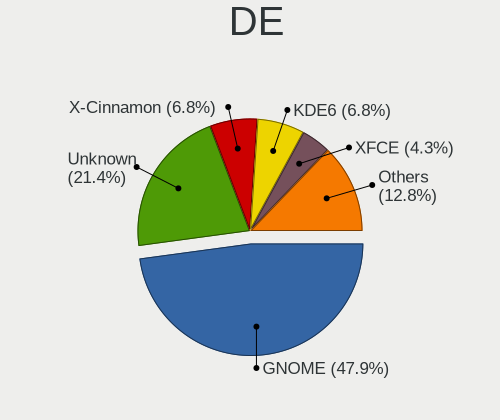

| Name          | Computers | Percent |
|---------------|-----------|---------|
| GNOME         | 67        | 59.29%  |
| KDE5          | 25        | 22.12%  |
| X-Cinnamon    | 6         | 5.31%   |
| XFCE          | 3         | 2.65%   |
| Unknown       | 3         | 2.65%   |
| LXDE          | 2         | 1.77%   |
| GNOME Classic | 2         | 1.77%   |
| qtile         | 1         | 0.88%   |
| LXQt          | 1         | 0.88%   |
| LeftWM        | 1         | 0.88%   |
| i3            | 1         | 0.88%   |
| dwm           | 1         | 0.88%   |

Display Server
--------------

X11 or Wayland

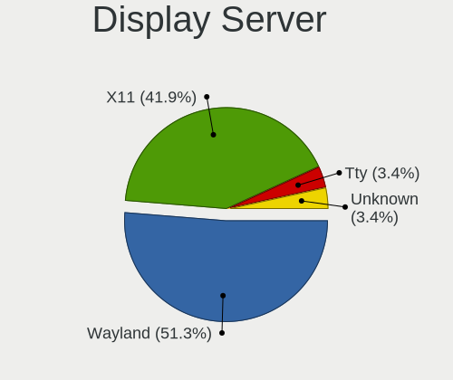

| Name    | Computers | Percent |
|---------|-----------|---------|
| Wayland | 54        | 47.79%  |
| X11     | 52        | 46.02%  |
| Tty     | 5         | 4.42%   |
| Unknown | 2         | 1.77%   |

Display Manager
---------------

SDDM, LightDM, etc.

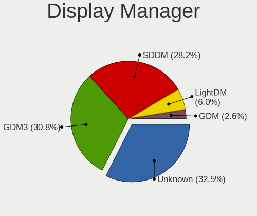

| Name    | Computers | Percent |
|---------|-----------|---------|
| GDM3    | 38        | 33.63%  |
| Unknown | 31        | 27.43%  |
| SDDM    | 23        | 20.35%  |
| LightDM | 11        | 9.73%   |
| GDM     | 10        | 8.85%   |

OS Lang
-------

Language

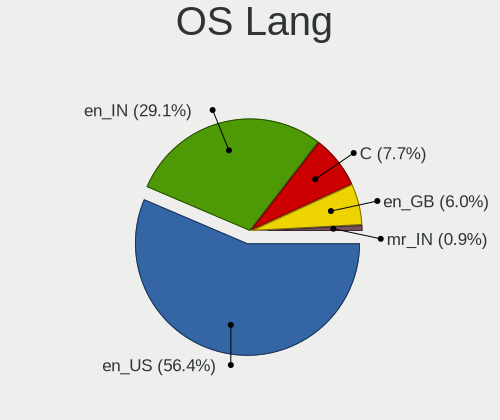

| Lang             | Computers | Percent |
|------------------|-----------|---------|
| en_IN            | 62        | 54.87%  |
| en_US            | 45        | 39.82%  |
| en_GB            | 4         | 3.54%   |
| en_US.ISO-8859-1 | 1         | 0.88%   |
| C                | 1         | 0.88%   |

Boot Mode
---------

EFI or BIOS

| Mode | Computers | Percent |
|------|-----------|---------|
| EFI  | 74        | 65.49%  |
| BIOS | 39        | 34.51%  |

Filesystem
----------

Type of filesystem

| Type    | Computers | Percent |
|---------|-----------|---------|
| Ext4    | 66        | 58.41%  |
| Tmpfs   | 20        | 17.7%   |
| Btrfs   | 20        | 17.7%   |
| Overlay | 4         | 3.54%   |
| Xfs     | 2         | 1.77%   |
| F2fs    | 1         | 0.88%   |

Part. scheme
------------

Scheme of partitioning

| Type    | Computers | Percent |
|---------|-----------|---------|
| GPT     | 76        | 67.26%  |
| Unknown | 27        | 23.89%  |
| MBR     | 10        | 8.85%   |

Dual Boot with Linux/BSD
------------------------

Hosting more than one Linux/BSD

| Dual boot | Computers | Percent |
|-----------|-----------|---------|
| No        | 97        | 85.84%  |
| Yes       | 16        | 14.16%  |

Dual Boot (Win)
---------------

Hosting Linux and Windows

| Dual boot | Computers | Percent |
|-----------|-----------|---------|
| No        | 68        | 60.18%  |
| Yes       | 45        | 39.82%  |

Board
-----

Vendor
------

Motherboard manufacturer

| Name                    | Computers | Percent |
|-------------------------|-----------|---------|
| Hewlett-Packard         | 21        | 18.58%  |
| ASUSTek Computer        | 19        | 16.81%  |
| Lenovo                  | 18        | 15.93%  |
| Dell                    | 12        | 10.62%  |
| Acer                    | 12        | 10.62%  |
| Gigabyte Technology     | 8         | 7.08%   |
| Intel                   | 5         | 4.42%   |
| Timi                    | 2         | 1.77%   |
| Raspberry Pi Foundation | 2         | 1.77%   |
| MSI                     | 2         | 1.77%   |
| Infinix                 | 2         | 1.77%   |
| ASRock                  | 2         | 1.77%   |
| Sony                    | 1         | 0.88%   |
| HUAWEI                  | 1         | 0.88%   |
| HCL Infosystems Limited | 1         | 0.88%   |
| Google                  | 1         | 0.88%   |
| Fujitsu                 | 1         | 0.88%   |
| ECS                     | 1         | 0.88%   |
| Chuwi                   | 1         | 0.88%   |
| Apple                   | 1         | 0.88%   |

Model
-----

Motherboard model

| Name                                              | Computers | Percent |
|---------------------------------------------------|-----------|---------|
| RPi Raspberry Pi 4 Model B Rev 1.5                | 2         | 1.77%   |
| HP Victus by Laptop 16-e0xxx                      | 2         | 1.77%   |
| HP Victus by Gaming Laptop 15-fb0xxx              | 2         | 1.77%   |
| Gigabyte F2A55M-DS2                               | 2         | 1.77%   |
| Acer Aspire A715-51G                              | 2         | 1.77%   |
| Timi Mi NoteBook Ultra                            | 1         | 0.88%   |
| Timi Mi NoteBook Pro                              | 1         | 0.88%   |
| Sony VPCEB16FG                                    | 1         | 0.88%   |
| MSI MS-7B87                                       | 1         | 0.88%   |
| MSI Bravo 15 B5DD                                 | 1         | 0.88%   |
| Lenovo Yoga Slim 6 14IAP8 82WU                    | 1         | 0.88%   |
| Lenovo Yoga 7 16ARP8 83BS                         | 1         | 0.88%   |
| Lenovo V15 G2 ITL Ua 82KB                         | 1         | 0.88%   |
| Lenovo ThinkPad T480 20L50011US                   | 1         | 0.88%   |
| Lenovo ThinkPad E14 Gen 5 21JRS00T00              | 1         | 0.88%   |
| Lenovo ThinkPad E14 Gen 4 21E3S06300              | 1         | 0.88%   |
| Lenovo ThinkPad E14 20RAS13J00                    | 1         | 0.88%   |
| Lenovo ThinkPad E14 20RAS06E00                    | 1         | 0.88%   |
| Lenovo Legion 5 Pro 16ACH6H 82JQ                  | 1         | 0.88%   |
| Lenovo IdeaPad S340-14API 81NB                    | 1         | 0.88%   |
| Lenovo IdeaPad Gaming 3 15IHU6 82K1               | 1         | 0.88%   |
| Lenovo IdeaPad 5 15ITL05 Ua 82FG                  | 1         | 0.88%   |
| Lenovo IdeaPad 5 14ARE05 81YM                     | 1         | 0.88%   |
| Lenovo IdeaPad 3 15IIL05 81WE                     | 1         | 0.88%   |
| Lenovo IdeaPad 1 15AMN7 82VG                      | 1         | 0.88%   |
| Lenovo G50-30 80G0                                | 1         | 0.88%   |
| Lenovo G40-45 80E1                                | 1         | 0.88%   |
| Lenovo B50-70 20384                               | 1         | 0.88%   |
| Intel H81                                         | 1         | 0.88%   |
| Intel H61                                         | 1         | 0.88%   |
| Intel DH77KC AAG39641-401                         | 1         | 0.88%   |
| Intel DG31PR AAD97573-206                         | 1         | 0.88%   |
| Intel DB85FL AAG89861-201                         | 1         | 0.88%   |
| Infinix ZERO BOOK 13                              | 1         | 0.88%   |
| Infinix INBOOK X2 SLIM                            | 1         | 0.88%   |
| HUAWEI BOHK-WAX9X                                 | 1         | 0.88%   |
| HP ZBook Firefly 14 inch G9 Mobile Workstation PC | 1         | 0.88%   |
| HP ProDesk 400 G2 MT (TPM DP)                     | 1         | 0.88%   |
| HP ProBook 440 G6                                 | 1         | 0.88%   |
| HP Pavilion Sleekbook 15 PC                       | 1         | 0.88%   |

Model Family
------------

Motherboard model prefix

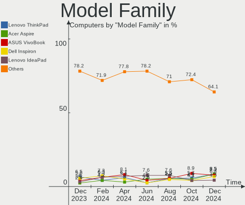

| Name                | Computers | Percent |
|---------------------|-----------|---------|
| ASUS VivoBook       | 8         | 7.08%   |
| HP Pavilion         | 7         | 6.19%   |
| Acer Aspire         | 7         | 6.19%   |
| Lenovo IdeaPad      | 6         | 5.31%   |
| Lenovo ThinkPad     | 5         | 4.42%   |
| HP Victus           | 4         | 3.54%   |
| HP Laptop           | 4         | 3.54%   |
| Dell Inspiron       | 4         | 3.54%   |
| Dell Vostro         | 3         | 2.65%   |
| Dell Latitude       | 3         | 2.65%   |
| Timi Mi             | 2         | 1.77%   |
| RPi Raspberry       | 2         | 1.77%   |
| Lenovo Yoga         | 2         | 1.77%   |
| Gigabyte F2A55M-DS2 | 2         | 1.77%   |
| Dell XPS            | 2         | 1.77%   |
| ASUS ROG            | 2         | 1.77%   |
| ASUS PRIME          | 2         | 1.77%   |
| ASUS ASUS           | 2         | 1.77%   |
| Acer Swift          | 2         | 1.77%   |
| Sony VPCEB16FG      | 1         | 0.88%   |
| MSI MS-7B87         | 1         | 0.88%   |
| MSI Bravo           | 1         | 0.88%   |
| Lenovo V15          | 1         | 0.88%   |
| Lenovo Legion       | 1         | 0.88%   |
| Lenovo G50-30       | 1         | 0.88%   |
| Lenovo G40-45       | 1         | 0.88%   |
| Lenovo B50-70       | 1         | 0.88%   |
| Intel H81           | 1         | 0.88%   |
| Intel H61           | 1         | 0.88%   |
| Intel DH77KC        | 1         | 0.88%   |
| Intel DG31PR        | 1         | 0.88%   |
| Intel DB85FL        | 1         | 0.88%   |
| Infinix ZERO        | 1         | 0.88%   |
| Infinix INBOOK      | 1         | 0.88%   |
| HUAWEI BOHK-WAX9X   | 1         | 0.88%   |
| HP ZBook            | 1         | 0.88%   |
| HP ProDesk          | 1         | 0.88%   |
| HP ProBook          | 1         | 0.88%   |
| HP OMEN             | 1         | 0.88%   |
| HP ENVY             | 1         | 0.88%   |

MFG Year
--------

Motherboard manufacture year

| Year    | Computers | Percent |
|---------|-----------|---------|
| 2022    | 25        | 22.12%  |
| 2021    | 18        | 15.93%  |
| 2023    | 10        | 8.85%   |
| 2019    | 8         | 7.08%   |
| 2018    | 8         | 7.08%   |
| 2014    | 8         | 7.08%   |
| 2020    | 7         | 6.19%   |
| 2012    | 7         | 6.19%   |
| 2017    | 6         | 5.31%   |
| 2013    | 4         | 3.54%   |
| 2011    | 3         | 2.65%   |
| 2010    | 3         | 2.65%   |
| 2008    | 2         | 1.77%   |
| Unknown | 2         | 1.77%   |
| 2016    | 1         | 0.88%   |
| 2015    | 1         | 0.88%   |

Form Factor
-----------

Physical design of the computer

| Name           | Computers | Percent |
|----------------|-----------|---------|
| Notebook       | 85        | 75.22%  |
| Desktop        | 26        | 23.01%  |
| System on chip | 2         | 1.77%   |

Secure Boot
-----------

Enabled or disabled

| State    | Computers | Percent |
|----------|-----------|---------|
| Disabled | 104       | 92.04%  |
| Enabled  | 9         | 7.96%   |

Coreboot
--------

Have coreboot on board

| Used | Computers | Percent |
|------|-----------|---------|
| No   | 112       | 99.12%  |
| Yes  | 1         | 0.88%   |

RAM Size
--------

Total RAM memory

| Size in GB | Computers | Percent |
|------------|-----------|---------|
| 4.01-8.0   | 41        | 36.28%  |
| 16.01-24.0 | 27        | 23.89%  |
| 8.01-16.0  | 24        | 21.24%  |
| 3.01-4.0   | 10        | 8.85%   |
| 32.01-64.0 | 8         | 7.08%   |
| 24.01-32.0 | 3         | 2.65%   |

RAM Used
--------

Used RAM memory

| Used GB   | Computers | Percent |
|-----------|-----------|---------|
| 2.01-3.0  | 37        | 32.74%  |
| 3.01-4.0  | 26        | 23.01%  |
| 4.01-8.0  | 24        | 21.24%  |
| 1.01-2.0  | 21        | 18.58%  |
| 8.01-16.0 | 5         | 4.42%   |

Total Drives
------------

Number of drives on board

| Drives | Computers | Percent |
|--------|-----------|---------|
| 1      | 79        | 69.91%  |
| 2      | 26        | 23.01%  |
| 3      | 6         | 5.31%   |
| 4      | 2         | 1.77%   |

Has CD-ROM
----------

Has CD-ROM on board

| Presented | Computers | Percent |
|-----------|-----------|---------|
| No        | 98        | 86.73%  |
| Yes       | 15        | 13.27%  |

Has Ethernet
------------

Has Ethernet on board

| Presented | Computers | Percent |
|-----------|-----------|---------|
| Yes       | 74        | 65.49%  |
| No        | 39        | 34.51%  |

Has WiFi
--------

Has WiFi module

| Presented | Computers | Percent |
|-----------|-----------|---------|
| Yes       | 102       | 90.27%  |
| No        | 11        | 9.73%   |

Has Bluetooth
-------------

Has Bluetooth module

| Presented | Computers | Percent |
|-----------|-----------|---------|
| Yes       | 93        | 82.3%   |
| No        | 20        | 17.7%   |

Location
--------

Country
-------

Geographic location (country)

| Country | Computers | Percent |
|---------|-----------|---------|
| India   | 113       | 100%    |

City
----

Geographic location (city)

| City        | Computers | Percent |
|-------------|-----------|---------|
| Delhi       | 17        | 15.04%  |
| Bengaluru   | 14        | 12.39%  |
| Chennai     | 8         | 7.08%   |
| Hyderabad   | 7         | 6.19%   |
| Kolkata     | 6         | 5.31%   |
| Pune        | 5         | 4.42%   |
| Mumbai      | 5         | 4.42%   |
| Kochi       | 4         | 3.54%   |
| Patna       | 3         | 2.65%   |
| Indore      | 3         | 2.65%   |
| Gurgaon     | 3         | 2.65%   |
| Bhopal      | 3         | 2.65%   |
| Varanasi    | 2         | 1.77%   |
| Malappuram  | 2         | 1.77%   |
| Lucknow     | 2         | 1.77%   |
| Jaipur      | 2         | 1.77%   |
| Hamirpur    | 2         | 1.77%   |
| Chandigarh  | 2         | 1.77%   |
| Ahmedabad   | 2         | 1.77%   |
| Trivandrum  | 1         | 0.88%   |
| Tirupattur  | 1         | 0.88%   |
| Satna       | 1         | 0.88%   |
| Palladam    | 1         | 0.88%   |
| Palakkad    | 1         | 0.88%   |
| Noida       | 1         | 0.88%   |
| Nalgonda    | 1         | 0.88%   |
| Nagpur      | 1         | 0.88%   |
| Mavelikkara | 1         | 0.88%   |
| Madurai     | 1         | 0.88%   |
| Kurnool     | 1         | 0.88%   |
| Kozhikode   | 1         | 0.88%   |
| Kollam      | 1         | 0.88%   |
| Gonda City  | 1         | 0.88%   |
| Ghaziabad   | 1         | 0.88%   |
| Chapra      | 1         | 0.88%   |
| Bilaspur    | 1         | 0.88%   |
| Bhubaneswar | 1         | 0.88%   |
| Banki       | 1         | 0.88%   |
| Azamgarh    | 1         | 0.88%   |
| Asansol     | 1         | 0.88%   |

Drives
------

Drive Vendor
------------

Hard drive vendors

| Vendor                       | Computers | Drives | Percent |
|------------------------------|-----------|--------|---------|
| WDC                          | 25        | 28     | 16.67%  |
| Micron Technology            | 18        | 18     | 12%     |
| Sandisk                      | 16        | 16     | 10.67%  |
| Seagate                      | 14        | 15     | 9.33%   |
| Samsung Electronics          | 14        | 14     | 9.33%   |
| Intel                        | 7         | 7      | 4.67%   |
| Crucial                      | 5         | 5      | 3.33%   |
| Unknown                      | 4         | 4      | 2.67%   |
| Micron/Crucial Technology    | 4         | 4      | 2.67%   |
| China                        | 4         | 4      | 2.67%   |
| Toshiba                      | 3         | 3      | 2%      |
| SK hynix                     | 3         | 3      | 2%      |
| Kingston                     | 3         | 3      | 2%      |
| HGST                         | 3         | 3      | 2%      |
| A-DATA Technology            | 3         | 3      | 2%      |
| Union Memory (Shenzhen)      | 2         | 2      | 1.33%   |
| Realtek Semiconductor        | 2         | 2      | 1.33%   |
| KIOXIA                       | 2         | 2      | 1.33%   |
| EVM                          | 2         | 2      | 1.33%   |
| YMTC                         | 1         | 1      | 0.67%   |
| XPG                          | 1         | 1      | 0.67%   |
| Shenzhen Longsys Electronics | 1         | 1      | 0.67%   |
| POWER                        | 1         | 1      | 0.67%   |
| Phison                       | 1         | 1      | 0.67%   |
| Netac                        | 1         | 1      | 0.67%   |
| Matrix                       | 1         | 1      | 0.67%   |
| Intenso                      | 1         | 1      | 0.67%   |
| Hitachi                      | 1         | 1      | 0.67%   |
| General                      | 1         | 1      | 0.67%   |
| Gamers                       | 1         | 1      | 0.67%   |
| FORESEE                      | 1         | 1      | 0.67%   |
| BIWIN                        | 1         | 1      | 0.67%   |
| Apple                        | 1         | 1      | 0.67%   |
| Acer                         | 1         | 1      | 0.67%   |
| Unknown                      | 1         | 1      | 0.67%   |

Drive Model
-----------

Hard drive models

| Model                                             | Computers | Percent |
|---------------------------------------------------|-----------|---------|
| Micron 2450_MTFDKBA512TFK 512GB                   | 6         | 3.9%    |
| Micron/Crucial P2 NVMe PCIe SSD 500GB             | 4         | 2.6%    |
| Seagate ST1000LM035-1RK172 1TB                    | 3         | 1.95%   |
| Seagate ST1000DM010-2EP102 1TB                    | 3         | 1.95%   |
| Samsung NVMe SSD Controller SM981/PM981/PM983 1TB | 3         | 1.95%   |
| WDC WDS120G2G0A-00JH30 120GB SSD                  | 2         | 1.3%    |
| WDC WD10SPZX-21Z10T0 1TB                          | 2         | 1.3%    |
| WDC WD10EZEX-08WN4A0 1TB                          | 2         | 1.3%    |
| Sandisk WD Black SN850 1TB                        | 2         | 1.3%    |
| SanDisk NVMe SSD Drive 512GB                      | 2         | 1.3%    |
| SanDisk NVMe SSD Drive 1TB                        | 2         | 1.3%    |
| Samsung SSD 860 EVO 250GB                         | 2         | 1.3%    |
| Micron 2210_MTFDHBA512QFD 512GB                   | 2         | 1.3%    |
| Kingston SA400S37240G 240GB SSD                   | 2         | 1.3%    |
| Intel SSDPEKNW512G8 512GB                         | 2         | 1.3%    |
| Intel SSD 660P Series 1024GB                      | 2         | 1.3%    |
| HGST HTS721010A9E630 1TB                          | 2         | 1.3%    |
| Crucial CT480BX500SSD1 480GB                      | 2         | 1.3%    |
| China SSD 256GB                                   | 2         | 1.3%    |
| YMTC PC005 512GB                                  | 1         | 0.65%   |
| XPG GAMMIX S70 BLADE 2TB                          | 1         | 0.65%   |
| WDC WDS480G2G0B-00EPW0 480GB SSD                  | 1         | 0.65%   |
| WDC WDS120G2G0B-00EPW0 120GB SSD                  | 1         | 0.65%   |
| WDC WD6400BPVT-22HXZT3 640GB                      | 1         | 0.65%   |
| WDC WD5000LPVX-60V0TT0 500GB                      | 1         | 0.65%   |
| WDC WD5000LPLX-08ZNTT0 500GB                      | 1         | 0.65%   |
| WDC WD5000AAKX-75U6AA0 500GB                      | 1         | 0.65%   |
| WDC WD5000AAKX-08ANVA0 500GB                      | 1         | 0.65%   |
| WDC WD3200BUDT-63DPZY0 320GB                      | 1         | 0.65%   |
| WDC WD3200BEVT-60A23T0 320GB                      | 1         | 0.65%   |
| WDC WD3200BEKT-75PVMT0 320GB                      | 1         | 0.65%   |
| WDC WD30EZRX-00AZ6B0 3TB                          | 1         | 0.65%   |
| WDC WD20PURZ-85AKKY0 2TB                          | 1         | 0.65%   |
| WDC WD20EZBX-00AYRA0 2TB                          | 1         | 0.65%   |
| WDC WD1600AAJS-00B4A0 160GB                       | 1         | 0.65%   |
| WDC WD10SPZX-75Z10T1 1TB                          | 1         | 0.65%   |
| WDC WD10SPZX-60Z10T0 1TB                          | 1         | 0.65%   |
| WDC WD10SPZX-00Z10T0 1TB                          | 1         | 0.65%   |
| WDC WD10SPSX-60A6WT0 1TB                          | 1         | 0.65%   |
| WDC WD10EZRZ-00HTKB0 1TB                          | 1         | 0.65%   |

HDD Vendor
----------

Hard disk drive vendors

| Vendor  | Computers | Drives | Percent |
|---------|-----------|--------|---------|
| WDC     | 22        | 22     | 50%     |
| Seagate | 13        | 14     | 29.55%  |
| Toshiba | 3         | 3      | 6.82%   |
| HGST    | 3         | 3      | 6.82%   |
| Unknown | 1         | 1      | 2.27%   |
| Hitachi | 1         | 1      | 2.27%   |
| Unknown | 1         | 1      | 2.27%   |

SSD Vendor
----------

Solid state drive vendors

| Vendor              | Computers | Drives | Percent |
|---------------------|-----------|--------|---------|
| WDC                 | 6         | 6      | 18.18%  |
| Crucial             | 5         | 5      | 15.15%  |
| Samsung Electronics | 4         | 4      | 12.12%  |
| China               | 4         | 4      | 12.12%  |
| Kingston            | 3         | 3      | 9.09%   |
| SanDisk             | 2         | 2      | 6.06%   |
| POWER               | 1         | 1      | 3.03%   |
| Matrix              | 1         | 1      | 3.03%   |
| Intenso             | 1         | 1      | 3.03%   |
| Intel               | 1         | 1      | 3.03%   |
| Gamers              | 1         | 1      | 3.03%   |
| EVM                 | 1         | 1      | 3.03%   |
| Apple               | 1         | 1      | 3.03%   |
| Acer                | 1         | 1      | 3.03%   |
| A-DATA Technology   | 1         | 1      | 3.03%   |

Drive Kind
----------

HDD or SSD

| Kind    | Computers | Drives | Percent |
|---------|-----------|--------|---------|
| NVMe    | 64        | 71     | 45.39%  |
| HDD     | 41        | 45     | 29.08%  |
| SSD     | 31        | 33     | 21.99%  |
| Unknown | 3         | 3      | 2.13%   |
| MMC     | 2         | 2      | 1.42%   |

Drive Connector
---------------

SATA, SAS, NVMe, etc.

| Type | Computers | Drives | Percent |
|------|-----------|--------|---------|
| NVMe | 64        | 71     | 50%     |
| SATA | 59        | 78     | 46.09%  |
| SAS  | 3         | 3      | 2.34%   |
| MMC  | 2         | 2      | 1.56%   |

Drive Size
----------

Size of hard drive

| Size in TB | Computers | Drives | Percent |
|------------|-----------|--------|---------|
| 0.01-0.5   | 39        | 44     | 55.71%  |
| 0.51-1.0   | 27        | 30     | 38.57%  |
| 1.01-2.0   | 3         | 3      | 4.29%   |
| 2.01-3.0   | 1         | 1      | 1.43%   |

Space Total
-----------

Amount of disk space available on the file system

| Size in GB | Computers | Percent |
|------------|-----------|---------|
| 251-500    | 40        | 35.4%   |
| 101-250    | 28        | 24.78%  |
| 501-1000   | 18        | 15.93%  |
| 51-100     | 12        | 10.62%  |
| 1001-2000  | 7         | 6.19%   |
| 1-20       | 4         | 3.54%   |
| 2001-3000  | 3         | 2.65%   |
| 21-50      | 1         | 0.88%   |

Space Used
----------

Amount of used disk space

| Used GB   | Computers | Percent |
|-----------|-----------|---------|
| 1-20      | 36        | 31.86%  |
| 21-50     | 27        | 23.89%  |
| 101-250   | 18        | 15.93%  |
| 51-100    | 18        | 15.93%  |
| 251-500   | 9         | 7.96%   |
| 1001-2000 | 3         | 2.65%   |
| 501-1000  | 2         | 1.77%   |

Malfunc. Drives
---------------

Drive models with a malfunction

| Model                          | Computers | Drives | Percent |
|--------------------------------|-----------|--------|---------|
| WDC WD6400BPVT-22HXZT3 640GB   | 1         | 1      | 12.5%   |
| WDC WD5000AAKX-75U6AA0 500GB   | 1         | 1      | 12.5%   |
| WDC WD3200BEKT-75PVMT0 320GB   | 1         | 1      | 12.5%   |
| WDC WD20PURZ-85AKKY0 2TB       | 1         | 1      | 12.5%   |
| WDC WD10EZRZ-00HTKB0 1TB       | 1         | 1      | 12.5%   |
| WDC WD Green 2.5 240GB         | 1         | 1      | 12.5%   |
| Seagate ST1000DM010-2EP102 1TB | 1         | 1      | 12.5%   |
| Gamers Choice 128GB SSD        | 1         | 1      | 12.5%   |

Malfunc. Drive Vendor
---------------------

Vendors of faulty drives

| Vendor  | Computers | Drives | Percent |
|---------|-----------|--------|---------|
| WDC     | 6         | 6      | 75%     |
| Seagate | 1         | 1      | 12.5%   |
| Gamers  | 1         | 1      | 12.5%   |

Malfunc. HDD Vendor
-------------------

Vendors of faulty HDD drives

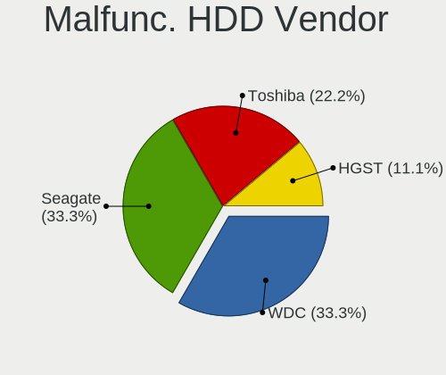

| Vendor  | Computers | Drives | Percent |
|---------|-----------|--------|---------|
| WDC     | 5         | 5      | 83.33%  |
| Seagate | 1         | 1      | 16.67%  |

Malfunc. Drive Kind
-------------------

Kinds of faulty drives

| Kind | Computers | Drives | Percent |
|------|-----------|--------|---------|
| HDD  | 6         | 6      | 75%     |
| SSD  | 2         | 2      | 25%     |

Failed Drives
-------------

Failed drive models

| Model               | Computers | Drives | Percent |
|---------------------|-----------|--------|---------|
| Toshiba HDWD110 1TB | 1         | 1      | 100%    |

Failed Drive Vendor
-------------------

Failed drive vendors

| Vendor  | Computers | Drives | Percent |
|---------|-----------|--------|---------|
| Toshiba | 1         | 1      | 100%    |

Drive Status
------------

Number of failed and malfunc. drives

| Status   | Computers | Drives | Percent |
|----------|-----------|--------|---------|
| Works    | 57        | 72     | 47.5%   |
| Detected | 54        | 73     | 45%     |
| Malfunc  | 8         | 8      | 6.67%   |
| Failed   | 1         | 1      | 0.83%   |

Storage controller
------------------

Storage Vendor
--------------

Storage controller vendors

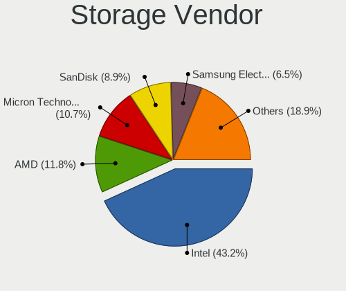

| Vendor                                  | Computers | Percent |
|-----------------------------------------|-----------|---------|
| Intel                                   | 70        | 44.87%  |
| AMD                                     | 21        | 13.46%  |
| Micron Technology                       | 18        | 11.54%  |
| SanDisk                                 | 14        | 8.97%   |
| Samsung Electronics                     | 11        | 7.05%   |
| Micron/Crucial Technology               | 4         | 2.56%   |
| SK hynix                                | 3         | 1.92%   |
| Shenzhen Longsys Electronics            | 2         | 1.28%   |
| Realtek Semiconductor                   | 2         | 1.28%   |
| KIOXIA                                  | 2         | 1.28%   |
| ADATA Technology                        | 2         | 1.28%   |
| Yangtze Memory Technologies             | 1         | 0.64%   |
| Union Memory (Shenzhen)                 | 1         | 0.64%   |
| Solidigm                                | 1         | 0.64%   |
| Shenzhen Unionmemory Information System | 1         | 0.64%   |
| Phison Electronics                      | 1         | 0.64%   |
| Netac Technology                        | 1         | 0.64%   |
| Biwin Storage Technology                | 1         | 0.64%   |

Storage Model
-------------

Storage controller models

| Model                                                                                       | Computers | Percent |
|---------------------------------------------------------------------------------------------|-----------|---------|
| AMD FCH SATA Controller [AHCI mode]                                                         | 16        | 9.04%   |
| Intel Volume Management Device NVMe RAID Controller                                         | 15        | 8.47%   |
| Micron 2450 NVMe SSD [HendrixV] (DRAM-less)                                                 | 9         | 5.08%   |
| Intel Tiger Lake-LP SATA Controller                                                         | 6         | 3.39%   |
| Intel 82801 Mobile SATA Controller [RAID mode]                                              | 6         | 3.39%   |
| Intel 8 Series/C220 Series Chipset Family 6-port SATA Controller 1 [AHCI mode]              | 6         | 3.39%   |
| Micron 2210 NVMe SSD [Cobain]                                                               | 5         | 2.82%   |
| Intel Sunrise Point-LP SATA Controller [AHCI mode]                                          | 5         | 2.82%   |
| Samsung NVMe SSD Controller SM981/PM981/PM983                                               | 4         | 2.26%   |
| Samsung NVMe SSD Controller 980 (DRAM-less)                                                 | 4         | 2.26%   |
| Micron/Crucial P2 [Nick P2] / P3 / P3 Plus NVMe PCIe SSD (DRAM-less)                        | 4         | 2.26%   |
| Intel SSD 660P Series                                                                       | 4         | 2.26%   |
| AMD 400 Series Chipset SATA Controller                                                      | 4         | 2.26%   |
| SK hynix Gold P31/BC711/PC711 NVMe Solid State Drive                                        | 3         | 1.69%   |
| SanDisk WD PC SN810 / Black SN850 NVMe SSD                                                  | 3         | 1.69%   |
| SanDisk WD Black SN770 / PC SN740 256GB / PC SN560 (DRAM-less) NVMe SSD                     | 3         | 1.69%   |
| Intel Volume Management Device NVMe RAID Controller Intel Corporation                       | 3         | 1.69%   |
| Intel Alder Lake-P SATA AHCI Controller                                                     | 3         | 1.69%   |
| Intel 6 Series/C200 Series Chipset Family 6 port Mobile SATA AHCI Controller                | 3         | 1.69%   |
| SanDisk Ultra 3D / WD Blue SN570 NVMe SSD (DRAM-less)                                       | 2         | 1.13%   |
| Realtek RTS5765DL NVMe SSD Controller (DRAM-less)                                           | 2         | 1.13%   |
| Intel Ice Lake-LP SATA Controller [AHCI mode]                                               | 2         | 1.13%   |
| Intel Comet Lake SATA AHCI Controller                                                       | 2         | 1.13%   |
| Intel Cannon Point-LP SATA Controller [AHCI Mode]                                           | 2         | 1.13%   |
| Intel Cannon Lake Mobile PCH SATA AHCI Controller                                           | 2         | 1.13%   |
| Intel 8 Series SATA Controller 1 [AHCI mode]                                                | 2         | 1.13%   |
| Intel 6 Series/C200 Series Chipset Family 6 port Desktop SATA AHCI Controller               | 2         | 1.13%   |
| Intel 5 Series/3400 Series Chipset 4 port SATA IDE Controller                               | 2         | 1.13%   |
| Intel 5 Series/3400 Series Chipset 2 port SATA IDE Controller                               | 2         | 1.13%   |
| AMD FCH SATA Controller [IDE mode]                                                          | 2         | 1.13%   |
| AMD FCH IDE Controller                                                                      | 2         | 1.13%   |
| AMD 500 Series Chipset SATA Controller                                                      | 2         | 1.13%   |
| ADATA ADATA XPG GAMMIXS1 1L Media (256 GB SSD)                                              | 2         | 1.13%   |
| Yangtze Memory PC005 NVMe SSD                                                               | 1         | 0.56%   |
| Union Memory (Shenzhen) AM630 PCIe 4.0 x4 NVMe SSD Controller                               | 1         | 0.56%   |
| Solidigm P41 Plus NVMe SSD (DRAM-less) [Echo Harbor]                                        | 1         | 0.56%   |
| Shenzhen Unionmemory Information System RPETJ512MKP1QDQ PCIe 4.0 NVMe SSD 512GB (DRAM-less) | 1         | 0.56%   |
| Shenzhen Longsys Lexar NM620 NVME SSD (DRAM-less)                                           | 1         | 0.56%   |
| Shenzhen Longsys Electronics Non-Volatile memory controller                                 | 1         | 0.56%   |
| Sandisk WD PC SN740 NVMe SSD 512GB (DRAM-less)                                              | 1         | 0.56%   |

Storage Kind
------------

Kind of storage controller (IDE, SATA, NVMe, SAS, ...)

| Kind | Computers | Percent |
|------|-----------|---------|
| SATA | 67        | 41.36%  |
| NVMe | 64        | 39.51%  |
| RAID | 24        | 14.81%  |
| IDE  | 7         | 4.32%   |

Processor
---------

CPU Vendor
----------

Processor vendors

| Vendor | Computers | Percent |
|--------|-----------|---------|
| Intel  | 77        | 68.14%  |
| AMD    | 34        | 30.09%  |
| ARM    | 2         | 1.77%   |

CPU Model
---------

Processor models

| Model                                   | Computers | Percent |
|-----------------------------------------|-----------|---------|
| Intel 12th Gen Core i5-1240P            | 5         | 4.42%   |
| AMD Ryzen 5 5600H with Radeon Graphics  | 5         | 4.42%   |
| Intel 11th Gen Core i3-1115G4 @ 3.00GHz | 4         | 3.54%   |
| AMD Ryzen 7 5800H with Radeon Graphics  | 4         | 3.54%   |
| Intel Core i7-7700HQ CPU @ 2.80GHz      | 2         | 1.77%   |
| Intel Core i5-8300H CPU @ 2.30GHz       | 2         | 1.77%   |
| Intel Core i5-8250U CPU @ 1.60GHz       | 2         | 1.77%   |
| Intel Core i5-4440 CPU @ 3.10GHz        | 2         | 1.77%   |
| Intel Core i3-N305                      | 2         | 1.77%   |
| Intel Core i3-4130 CPU @ 3.40GHz        | 2         | 1.77%   |
| Intel Core i3-1005G1 CPU @ 1.20GHz      | 2         | 1.77%   |
| Intel 13th Gen Core i9-13900H           | 2         | 1.77%   |
| Intel 12th Gen Core i7-12700H           | 2         | 1.77%   |
| Intel 12th Gen Core i5-12500H           | 2         | 1.77%   |
| Intel 12th Gen Core i5-1235U            | 2         | 1.77%   |
| Intel 11th Gen Core i7-11370H @ 3.30GHz | 2         | 1.77%   |
| Intel 11th Gen Core i5-11320H @ 3.20GHz | 2         | 1.77%   |
| ARM Processor                           | 2         | 1.77%   |
| AMD Ryzen 5 5500U with Radeon Graphics  | 2         | 1.77%   |
| AMD A4-4000 APU with Radeon HD Graphics | 2         | 1.77%   |
| Intel Pentium Dual CPU E2180 @ 2.00GHz  | 1         | 0.88%   |
| Intel Pentium CPU N3540 @ 2.16GHz       | 1         | 0.88%   |
| Intel Pentium CPU G3240 @ 3.10GHz       | 1         | 0.88%   |
| Intel Core i7-9750H CPU @ 2.60GHz       | 1         | 0.88%   |
| Intel Core i7-8850H CPU @ 2.60GHz       | 1         | 0.88%   |
| Intel Core i7-8565U CPU @ 1.80GHz       | 1         | 0.88%   |
| Intel Core i7-8550U CPU @ 1.80GHz       | 1         | 0.88%   |
| Intel Core i7-4850HQ CPU @ 2.30GHz      | 1         | 0.88%   |
| Intel Core i7-4510U CPU @ 2.00GHz       | 1         | 0.88%   |
| Intel Core i7-3770 CPU @ 3.40GHz        | 1         | 0.88%   |
| Intel Core i7-2670QM CPU @ 2.20GHz      | 1         | 0.88%   |
| Intel Core i7-2600 CPU @ 3.40GHz        | 1         | 0.88%   |
| Intel Core i5-8365U CPU @ 1.60GHz       | 1         | 0.88%   |
| Intel Core i5-8350U CPU @ 1.70GHz       | 1         | 0.88%   |
| Intel Core i5-8265U CPU @ 1.60GHz       | 1         | 0.88%   |
| Intel Core i5-5200U CPU @ 2.20GHz       | 1         | 0.88%   |
| Intel Core i5-4590 CPU @ 3.30GHz        | 1         | 0.88%   |
| Intel Core i5-3317U CPU @ 1.70GHz       | 1         | 0.88%   |
| Intel Core i5-3210M CPU @ 2.50GHz       | 1         | 0.88%   |
| Intel Core i5-2450M CPU @ 2.50GHz       | 1         | 0.88%   |

CPU Model Family
----------------

Processor model prefix

| Model              | Computers | Percent |
|--------------------|-----------|---------|
| Other              | 32        | 28.32%  |
| Intel Core i5      | 18        | 15.93%  |
| AMD Ryzen 5        | 17        | 15.04%  |
| Intel Core i3      | 14        | 12.39%  |
| Intel Core i7      | 11        | 9.73%   |
| AMD Ryzen 7        | 10        | 8.85%   |
| Intel Pentium      | 2         | 1.77%   |
| AMD Ryzen 3        | 2         | 1.77%   |
| AMD A8             | 2         | 1.77%   |
| AMD A4             | 2         | 1.77%   |
| Intel Pentium Dual | 1         | 0.88%   |
| Intel Core 2 Duo   | 1         | 0.88%   |
| AMD FX             | 1         | 0.88%   |

CPU Cores
---------

Number of processor cores

| Number | Computers | Percent |
|--------|-----------|---------|
| 4      | 38        | 33.63%  |
| 2      | 24        | 21.24%  |
| 6      | 19        | 16.81%  |
| 8      | 11        | 9.73%   |
| 12     | 7         | 6.19%   |
| 14     | 5         | 4.42%   |
| 10     | 4         | 3.54%   |
| 1      | 3         | 2.65%   |
| 24     | 1         | 0.88%   |
| 3      | 1         | 0.88%   |

CPU Sockets
-----------

Number of sockets

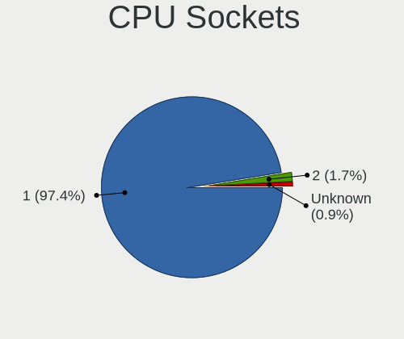

| Number | Computers | Percent |
|--------|-----------|---------|
| 1      | 113       | 100%    |

CPU Threads
-----------

Threads per core (Hyper-Threading)

| Number | Computers | Percent |
|--------|-----------|---------|
| 2      | 97        | 85.84%  |
| 1      | 16        | 14.16%  |

CPU Op-Modes
------------

CPU Operation Modes (32-bit, 64-bit)

| Op mode        | Computers | Percent |
|----------------|-----------|---------|
| 32-bit, 64-bit | 113       | 100%    |

CPU Microcode
-------------

Microcode number

| Number     | Computers | Percent |
|------------|-----------|---------|
| Unknown    | 68        | 60.18%  |
| 0x0a50000d | 5         | 4.42%   |
| 0x0a50000c | 3         | 2.65%   |
| 0x906a3    | 2         | 1.77%   |
| 0x806ec    | 2         | 1.77%   |
| 0x806c1    | 2         | 1.77%   |
| 0x20655    | 2         | 1.77%   |
| 0x0a404102 | 2         | 1.77%   |
| 0x08600106 | 2         | 1.77%   |
| 0x08108109 | 2         | 1.77%   |
| 0x06001119 | 2         | 1.77%   |
| 0xb0671    | 1         | 0.88%   |
| 0xa0655    | 1         | 0.88%   |
| 0x906e9    | 1         | 0.88%   |
| 0x806ea    | 1         | 0.88%   |
| 0x806e9    | 1         | 0.88%   |
| 0x806c2    | 1         | 0.88%   |
| 0x6fd      | 1         | 0.88%   |
| 0x306d4    | 1         | 0.88%   |
| 0x306c3    | 1         | 0.88%   |
| 0x306a9    | 1         | 0.88%   |
| 0x206a7    | 1         | 0.88%   |
| 0x0a601203 | 1         | 0.88%   |
| 0x0a50000f | 1         | 0.88%   |
| 0x0a20120a | 1         | 0.88%   |
| 0x08a00008 | 1         | 0.88%   |
| 0x08701030 | 1         | 0.88%   |
| 0x08608103 | 1         | 0.88%   |
| 0x08101007 | 1         | 0.88%   |
| 0x07030105 | 1         | 0.88%   |
| 0x06001116 | 1         | 0.88%   |
| 0x06000822 | 1         | 0.88%   |

CPU Microarch
-------------

Microarchitecture

| Name             | Computers | Percent |
|------------------|-----------|---------|
| Alderlake Hybrid | 17        | 15.04%  |
| KabyLake         | 16        | 14.16%  |
| Zen 3            | 12        | 10.62%  |
| TigerLake        | 12        | 10.62%  |
| Unknown          | 11        | 9.73%   |
| Haswell          | 9         | 7.96%   |
| Zen 2            | 5         | 4.42%   |
| SandyBridge      | 5         | 4.42%   |
| Zen+             | 4         | 3.54%   |
| Piledriver       | 4         | 3.54%   |
| IvyBridge        | 4         | 3.54%   |
| Westmere         | 3         | 2.65%   |
| IceLake          | 2         | 1.77%   |
| CometLake        | 2         | 1.77%   |
| Zen              | 1         | 0.88%   |
| Silvermont       | 1         | 0.88%   |
| Puma             | 1         | 0.88%   |
| Penryn           | 1         | 0.88%   |
| Gracemont        | 1         | 0.88%   |
| Core             | 1         | 0.88%   |
| Broadwell        | 1         | 0.88%   |

Graphics
--------

GPU Vendor
----------

Vendors of graphics cards

| Vendor | Computers | Percent |
|--------|-----------|---------|
| Intel  | 68        | 48.92%  |
| Nvidia | 39        | 28.06%  |
| AMD    | 32        | 23.02%  |

GPU Model
---------

Graphics card models

| Model                                                                       | Computers | Percent |
|-----------------------------------------------------------------------------|-----------|---------|
| AMD Cezanne [Radeon Vega Series / Radeon Vega Mobile Series]                | 10        | 6.9%    |
| Intel TigerLake-LP GT2 [Iris Xe Graphics]                                   | 8         | 5.52%   |
| Intel Alder Lake-P GT2 [Iris Xe Graphics]                                   | 8         | 5.52%   |
| Nvidia TU117M [GeForce GTX 1650 Mobile / Max-Q]                             | 7         | 4.83%   |
| Intel Xeon E3-1200 v3/4th Gen Core Processor Integrated Graphics Controller | 4         | 2.76%   |
| Intel UHD Graphics 620                                                      | 4         | 2.76%   |
| Intel Tiger Lake-LP GT2 [UHD Graphics G4]                                   | 4         | 2.76%   |
| AMD Renoir [Radeon RX Vega 6 (Ryzen 4000/5000 Mobile Series)]               | 4         | 2.76%   |
| Nvidia GP107M [GeForce GTX 1050 Ti Mobile]                                  | 3         | 2.07%   |
| Nvidia GF119 [GeForce GT 610]                                               | 3         | 2.07%   |
| Nvidia GA107M [GeForce RTX 3050 Mobile]                                     | 3         | 2.07%   |
| Intel WhiskeyLake-U GT2 [UHD Graphics 620]                                  | 3         | 2.07%   |
| Intel Raptor Lake-P [Iris Xe Graphics]                                      | 3         | 2.07%   |
| Intel CoffeeLake-H GT2 [UHD Graphics 630]                                   | 3         | 2.07%   |
| Intel Alder Lake-UP3 GT2 [Iris Xe Graphics]                                 | 3         | 2.07%   |
| Intel 2nd Generation Core Processor Family Integrated Graphics Controller   | 3         | 2.07%   |
| AMD Lucienne                                                                | 3         | 2.07%   |
| Nvidia GM108M [GeForce MX130]                                               | 2         | 1.38%   |
| Nvidia GK208B [GeForce GT 710]                                              | 2         | 1.38%   |
| Nvidia GA107M [GeForce RTX 3050 Ti Mobile]                                  | 2         | 1.38%   |
| Intel Iris Plus Graphics G1 (Ice Lake)                                      | 2         | 1.38%   |
| Intel HD Graphics 630                                                       | 2         | 1.38%   |
| Intel Haswell-ULT Integrated Graphics Controller                            | 2         | 1.38%   |
| Intel Core Processor Integrated Graphics Controller                         | 2         | 1.38%   |
| Intel CometLake-U GT2 [UHD Graphics]                                        | 2         | 1.38%   |
| Intel Alder Lake-N [UHD Graphics]                                           | 2         | 1.38%   |
| Intel 4th Generation Core Processor Family Integrated Graphics Controller   | 2         | 1.38%   |
| Intel 3rd Gen Core processor Graphics Controller                            | 2         | 1.38%   |
| AMD Rembrandt [Radeon 680M]                                                 | 2         | 1.38%   |
| AMD Picasso/Raven 2 [Radeon Vega Series / Radeon Vega Mobile Series]        | 2         | 1.38%   |
| AMD Navi 14 [Radeon RX 5500/5500M / Pro 5500M]                              | 2         | 1.38%   |
| AMD Ellesmere [Radeon RX 470/480/570/570X/580/580X/590]                     | 2         | 1.38%   |
| Nvidia TU116M [GeForce GTX 1660 Ti Mobile]                                  | 1         | 0.69%   |
| Nvidia TU116 [GeForce GTX 1660 Ti]                                          | 1         | 0.69%   |
| Nvidia TU106BM [GeForce RTX 2070 Mobile / Max-Q]                            | 1         | 0.69%   |
| Nvidia GP107M [GeForce GTX 1050 Mobile]                                     | 1         | 0.69%   |
| Nvidia GP107 [GeForce GTX 1050 Ti]                                          | 1         | 0.69%   |
| Nvidia GP106 [GeForce GTX 1060 6GB]                                         | 1         | 0.69%   |
| Nvidia GM108M [GeForce 930M]                                                | 1         | 0.69%   |
| Nvidia GK107M [GeForce GT 750M Mac Edition]                                 | 1         | 0.69%   |

GPU Combo
---------

Combinations of graphics cards

| Name           | Computers | Percent |
|----------------|-----------|---------|
| 1 x Intel      | 48        | 42.48%  |
| Intel + Nvidia | 16        | 14.16%  |
| 1 x AMD        | 15        | 13.27%  |
| 1 x Nvidia     | 13        | 11.5%   |
| AMD + Nvidia   | 10        | 8.85%   |
| 2 x AMD        | 5         | 4.42%   |
| Other          | 2         | 1.77%   |
| 2 x Intel      | 2         | 1.77%   |
| Intel + AMD    | 2         | 1.77%   |

GPU Driver
----------

Free vs proprietary

| Driver      | Computers | Percent |
|-------------|-----------|---------|
| Free        | 82        | 72.57%  |
| Proprietary | 27        | 23.89%  |
| Unknown     | 4         | 3.54%   |

GPU Memory
----------

Total video memory

| Size in GB | Computers | Percent |
|------------|-----------|---------|
| Unknown    | 82        | 72.57%  |
| 0.01-0.5   | 12        | 10.62%  |
| 3.01-4.0   | 7         | 6.19%   |
| 1.01-2.0   | 6         | 5.31%   |
| 0.51-1.0   | 3         | 2.65%   |
| 5.01-6.0   | 2         | 1.77%   |
| 7.01-8.0   | 1         | 0.88%   |

Monitor
-------

Monitor Vendor
--------------

Monitor vendors

| Vendor                  | Computers | Percent |
|-------------------------|-----------|---------|
| Chimei Innolux          | 21        | 18.1%   |
| BOE                     | 18        | 15.52%  |
| AU Optronics            | 17        | 14.66%  |
| Samsung Electronics     | 9         | 7.76%   |
| LG Display              | 8         | 6.9%    |
| Goldstar                | 5         | 4.31%   |
| Dell                    | 5         | 4.31%   |
| Acer                    | 4         | 3.45%   |
| PANDA                   | 3         | 2.59%   |
| Hewlett-Packard         | 3         | 2.59%   |
| BenQ                    | 3         | 2.59%   |
| Sony                    | 2         | 1.72%   |
| ___                     | 1         | 0.86%   |
| ViewSonic               | 1         | 0.86%   |
| TMX                     | 1         | 0.86%   |
| Sharp                   | 1         | 0.86%   |
| Philips                 | 1         | 0.86%   |
| Panasonic               | 1         | 0.86%   |
| OPP                     | 1         | 0.86%   |
| Lenovo                  | 1         | 0.86%   |
| KDB                     | 1         | 0.86%   |
| JRY                     | 1         | 0.86%   |
| InnoLux Display         | 1         | 0.86%   |
| HJC                     | 1         | 0.86%   |
| Gigabyte Technology     | 1         | 0.86%   |
| Fujitsu Siemens         | 1         | 0.86%   |
| CSO                     | 1         | 0.86%   |
| Chi Mei Optoelectronics | 1         | 0.86%   |
| Apple                   | 1         | 0.86%   |
| Unknown                 | 1         | 0.86%   |

Monitor Model
-------------

Monitor models

| Model                                                                 | Computers | Percent |
|-----------------------------------------------------------------------|-----------|---------|
| PANDA LCD Monitor NCP004D 1920x1080 344x194mm 15.5-inch               | 3         | 2.56%   |
| Chimei Innolux LCD Monitor CMN14E5 1920x1080 309x173mm 13.9-inch      | 3         | 2.56%   |
| AU Optronics LCD Monitor AUO2992 1920x1080 344x193mm 15.5-inch        | 3         | 2.56%   |
| Samsung Electronics LCD Monitor SEC5441 1366x768 309x174mm 14.0-inch  | 2         | 1.71%   |
| Samsung Electronics LCD Monitor SDC4171 2880x1800 302x189mm 14.0-inch | 2         | 1.71%   |
| LG Display LCD Monitor LGD0563 1920x1080 344x194mm 15.5-inch          | 2         | 1.71%   |
| Hewlett-Packard 20fi HWP306F 1600x900 443x249mm 20.0-inch             | 2         | 1.71%   |
| Chimei Innolux LCD Monitor CMN15F5 1920x1080 344x193mm 15.5-inch      | 2         | 1.71%   |
| Chimei Innolux LCD Monitor CMN153C 1920x1080 344x193mm 15.5-inch      | 2         | 1.71%   |
| Chimei Innolux LCD Monitor CMN1521 1920x1080 344x193mm 15.5-inch      | 2         | 1.71%   |
| BOE LCD Monitor BOE0A56 1920x1080 344x194mm 15.5-inch                 | 2         | 1.71%   |
| AU Optronics LCD Monitor AUO723C 1366x768 309x173mm 13.9-inch         | 2         | 1.71%   |
| AU Optronics LCD Monitor AUO183C 1366x768 309x173mm 13.9-inch         | 2         | 1.71%   |
| ___ AAA ___0309 1680x1050                                             | 1         | 0.85%   |
| ViewSonic VX3276-FHD VSCE735 1920x1080 698x393mm 31.5-inch            | 1         | 0.85%   |
| TMX TL156MDMP11-0 TMX1560 3200x2000 336x210mm 15.6-inch               | 1         | 0.85%   |
| Sony TV SNY5304 1600x900                                              | 1         | 0.85%   |
| Sony LCD Monitor MS_0025 1920x1080 340x190mm 15.3-inch                | 1         | 0.85%   |
| Sharp LCD Monitor SHP1548 1920x1200 288x180mm 13.4-inch               | 1         | 0.85%   |
| Samsung Electronics SA300/SA350 SAM0791 1920x1080 510x287mm 23.0-inch | 1         | 0.85%   |
| Samsung Electronics S27D590 SAM0BE9 1920x1080 598x336mm 27.0-inch     | 1         | 0.85%   |
| Samsung Electronics LCD Monitor SDC4180 2880x1620 344x194mm 15.5-inch | 1         | 0.85%   |
| Samsung Electronics LCD Monitor SDC4161 1920x1080 344x194mm 15.5-inch | 1         | 0.85%   |
| Samsung Electronics LCD Monitor SDC414D 3456x2160 336x210mm 15.6-inch | 1         | 0.85%   |
| Samsung Electronics C24F390 SAM0D2D 1920x1080 521x293mm 23.5-inch     | 1         | 0.85%   |
| Philips 202EL PHLC05C 1600x900 443x249mm 20.0-inch                    | 1         | 0.85%   |
| Panasonic TV MEIA296 1920x1080 698x392mm 31.5-inch                    | 1         | 0.85%   |
| OPP OnePlus X 27 OPP27B1 2560x1440 598x336mm 27.0-inch                | 1         | 0.85%   |
| LG Display LCD Monitor LGD060F 1920x1080 309x174mm 14.0-inch          | 1         | 0.85%   |
| LG Display LCD Monitor LGD05FE 1920x1080 344x194mm 15.5-inch          | 1         | 0.85%   |
| LG Display LCD Monitor LGD053F 1920x1080 344x194mm 15.5-inch          | 1         | 0.85%   |
| LG Display LCD Monitor LGD0521 1920x1080 309x174mm 14.0-inch          | 1         | 0.85%   |
| LG Display LCD Monitor LGD032E 1366x768 345x194mm 15.6-inch           | 1         | 0.85%   |
| LG Display LCD Monitor LGD02DC 1366x768 344x194mm 15.5-inch           | 1         | 0.85%   |
| Lenovo S22e-20 LEN62C6 1920x1080 476x268mm 21.5-inch                  | 1         | 0.85%   |
| KDB LCD Monitor KDB0526 1920x1080 344x194mm 15.5-inch                 | 1         | 0.85%   |
| JRY Analog JRY1950 1600x900 368x207mm 16.6-inch                       | 1         | 0.85%   |
| InnoLux Display LE1922 INL1922 1440x900 410x257mm 19.1-inch           | 1         | 0.85%   |
| HJC LCD Monitor HJC003D 1920x1080 309x174mm 14.0-inch                 | 1         | 0.85%   |
| Hewlett-Packard 22kd HWP332C 1920x1080 477x268mm 21.5-inch            | 1         | 0.85%   |

Monitor Resolution
------------------

Monitor screen resolution

| Resolution         | Computers | Percent |
|--------------------|-----------|---------|
| 1920x1080 (FHD)    | 69        | 60.53%  |
| 1366x768 (WXGA)    | 18        | 15.79%  |
| 1600x900 (HD+)     | 5         | 4.39%   |
| 1920x1200 (WUXGA)  | 4         | 3.51%   |
| 3840x2160 (4K)     | 3         | 2.63%   |
| 2880x1800          | 3         | 2.63%   |
| 2560x1600          | 3         | 2.63%   |
| 2560x1440 (QHD)    | 2         | 1.75%   |
| 3456x2160          | 1         | 0.88%   |
| 3200x2000          | 1         | 0.88%   |
| 2880x1620          | 1         | 0.88%   |
| 2560x1080          | 1         | 0.88%   |
| 2240x1400          | 1         | 0.88%   |
| 1680x1050 (WSXGA+) | 1         | 0.88%   |
| 1440x900 (WXGA+)   | 1         | 0.88%   |

Monitor Diagonal
----------------

Diagonal size in inches

| Inches | Computers | Percent |
|--------|-----------|---------|
| 15     | 47        | 40.17%  |
| 14     | 17        | 14.53%  |
| 13     | 12        | 10.26%  |
| 24     | 7         | 5.98%   |
| 27     | 6         | 5.13%   |
| 16     | 5         | 4.27%   |
| 21     | 4         | 3.42%   |
| 31     | 3         | 2.56%   |
| 23     | 3         | 2.56%   |
| 20     | 3         | 2.56%   |
| 19     | 3         | 2.56%   |
| 18     | 3         | 2.56%   |
| 84     | 1         | 0.85%   |
| 72     | 1         | 0.85%   |
| 61     | 1         | 0.85%   |
| 34     | 1         | 0.85%   |

Monitor Width
-------------

Physical width

| Width in mm | Computers | Percent |
|-------------|-----------|---------|
| 301-350     | 74        | 64.91%  |
| 501-600     | 15        | 13.16%  |
| 401-500     | 12        | 10.53%  |
| 351-400     | 4         | 3.51%   |
| 601-700     | 3         | 2.63%   |
| 201-300     | 2         | 1.75%   |
| 1501-2000   | 2         | 1.75%   |
| 701-800     | 1         | 0.88%   |
| 1001-1500   | 1         | 0.88%   |

Aspect Ratio
------------

Proportional relationship between the width and the height

| Ratio | Computers | Percent |
|-------|-----------|---------|
| 16/9  | 94        | 87.04%  |
| 16/10 | 13        | 12.04%  |
| 21/9  | 1         | 0.93%   |

Monitor Area
------------

Area in inch

| Area in inch | Computers | Percent |
|----------------|-----------|---------|
| 101-110        | 49        | 42.24%  |
| 81-90          | 28        | 24.14%  |
| 201-250        | 10        | 8.62%   |
| 151-200        | 9         | 7.76%   |
| 301-350        | 6         | 5.17%   |
| 351-500        | 4         | 3.45%   |
| More than 1000 | 3         | 2.59%   |
| 141-150        | 3         | 2.59%   |
| 111-120        | 3         | 2.59%   |
| 71-80          | 1         | 0.86%   |

Pixel Density
-------------

Pixels per inch

| Density       | Computers | Percent |
|---------------|-----------|---------|
| 121-160       | 53        | 46.49%  |
| 51-100        | 29        | 25.44%  |
| 101-120       | 17        | 14.91%  |
| 161-240       | 10        | 8.77%   |
| More than 240 | 3         | 2.63%   |
| 1-50          | 2         | 1.75%   |

Multiple Monitors
-----------------

Total monitors connected

| Total | Computers | Percent |
|-------|-----------|---------|
| 1     | 97        | 85.84%  |
| 2     | 10        | 8.85%   |
| 0     | 6         | 5.31%   |

Network
-------

Net Controller Vendor
---------------------

Controller vendors

| Vendor                          | Computers | Percent |
|---------------------------------|-----------|---------|
| Realtek Semiconductor           | 71        | 42.01%  |
| Intel                           | 53        | 31.36%  |
| MediaTek                        | 11        | 6.51%   |
| Qualcomm Atheros                | 6         | 3.55%   |
| TP-Link                         | 4         | 2.37%   |
| OPPO Electronics                | 4         | 2.37%   |
| Broadcom                        | 4         | 2.37%   |
| Ralink Technology               | 2         | 1.18%   |
| Ralink                          | 2         | 1.18%   |
| Qualcomm                        | 2         | 1.18%   |
| Broadcom Limited                | 2         | 1.18%   |
| Xiaomi                          | 1         | 0.59%   |
| Samsung Electronics             | 1         | 0.59%   |
| Qualcomm Atheros Communications | 1         | 0.59%   |
| QinHeng Electronics             | 1         | 0.59%   |
| Motorola PCS                    | 1         | 0.59%   |
| Marvell Technology Group        | 1         | 0.59%   |
| JMicron Technology              | 1         | 0.59%   |
| ASIX Electronics                | 1         | 0.59%   |

Net Controller Model
--------------------

Controller models

| Model                                                             | Computers | Percent |
|-------------------------------------------------------------------|-----------|---------|
| Realtek RTL8111/8168/8411 PCI Express Gigabit Ethernet Controller | 49        | 25.65%  |
| Intel Alder Lake-P PCH CNVi WiFi                                  | 12        | 6.28%   |
| Intel Wi-Fi 6 AX201                                               | 8         | 4.19%   |
| Realtek RTL810xE PCI Express Fast Ethernet controller             | 6         | 3.14%   |
| Realtek RTL8822CE 802.11ac PCIe Wireless Network Adapter          | 5         | 2.62%   |
| MediaTek MT7921 802.11ax PCI Express Wireless Network Adapter     | 5         | 2.62%   |
| Realtek RTL8852AE 802.11ax PCIe Wireless Network Adapter          | 4         | 2.09%   |
| OPPO RMX2027                                                      | 4         | 2.09%   |
| Intel Wireless 8265 / 8275                                        | 4         | 2.09%   |
| Intel Cannon Lake PCH CNVi WiFi                                   | 4         | 2.09%   |
| Realtek RTL8852BE PCIe 802.11ax Wireless Network Controller       | 3         | 1.57%   |
| Realtek RTL8125 2.5GbE Controller                                 | 3         | 1.57%   |
| MediaTek MT7922 802.11ax PCI Express Wireless Network Adapter     | 3         | 1.57%   |
| Intel Wireless 7265                                               | 3         | 1.57%   |
| Intel Wi-Fi 6 AX200                                               | 3         | 1.57%   |
| Intel Raptor Lake PCH CNVi WiFi                                   | 3         | 1.57%   |
| Realtek RTL8822BE 802.11a/b/g/n/ac WiFi adapter                   | 2         | 1.05%   |
| Realtek RTL8821CE 802.11ac PCIe Wireless Network Adapter          | 2         | 1.05%   |
| Realtek RTL8188FTV 802.11b/g/n 1T1R 2.4G WLAN Adapter             | 2         | 1.05%   |
| Realtek RTL8188EUS 802.11n Wireless Network Adapter               | 2         | 1.05%   |
| Realtek RTL8153 Gigabit Ethernet Adapter                          | 2         | 1.05%   |
| Realtek 802.11ac NIC                                              | 2         | 1.05%   |
| Ralink RT3290 Wireless 802.11n 1T/1R PCIe                         | 2         | 1.05%   |
| Qualcomm Atheros QCA9565 / AR9565 Wireless Network Adapter        | 2         | 1.05%   |
| Qualcomm Atheros QCA6174 802.11ac Wireless Network Adapter        | 2         | 1.05%   |
| Intel Ice Lake-LP PCH CNVi WiFi                                   | 2         | 1.05%   |
| Intel Comet Lake PCH-LP CNVi WiFi                                 | 2         | 1.05%   |
| Intel CNVi: Wi-Fi                                                 | 2         | 1.05%   |
| Intel Cannon Point-LP CNVi [Wireless-AC]                          | 2         | 1.05%   |
| Broadcom Limited BCM4313 802.11bgn Wireless Network Adapter       | 2         | 1.05%   |
| Xiaomi Mi/Redmi series (RNDIS)                                    | 1         | 0.52%   |
| TP-Link TL-WN823N v2/v3 [Realtek RTL8192EU]                       | 1         | 0.52%   |
| TP-Link TL-WN821N v5/v6 [RTL8192EU]                               | 1         | 0.52%   |
| TP-Link Archer T3U [Realtek RTL8812BU]                            | 1         | 0.52%   |
| TP-Link AC600 wireless Realtek RTL8811AU [Archer T2U Nano]        | 1         | 0.52%   |
| Samsung Galaxy series, misc. (tethering mode)                     | 1         | 0.52%   |
| Realtek RTL88x2bu [AC1200 Techkey]                                | 1         | 0.52%   |
| Realtek RTL8852AE WiFi 6 802.11ax PCIe Adapter                    | 1         | 0.52%   |
| Realtek RTL8723BU 802.11b/g/n WLAN Adapter                        | 1         | 0.52%   |
| Realtek RTL8723BE PCIe Wireless Network Adapter                   | 1         | 0.52%   |

Wireless Vendor
---------------

Wireless vendors

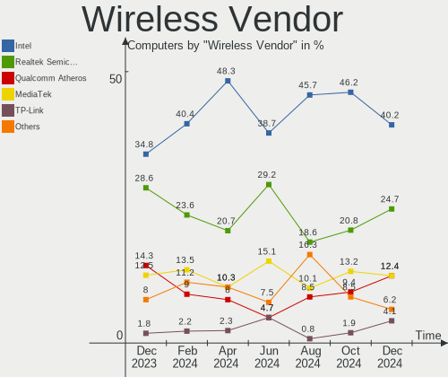

| Vendor                          | Computers | Percent |
|---------------------------------|-----------|---------|
| Intel                           | 50        | 46.73%  |
| Realtek Semiconductor           | 27        | 25.23%  |
| MediaTek                        | 10        | 9.35%   |
| Qualcomm Atheros                | 6         | 5.61%   |
| TP-Link                         | 4         | 3.74%   |
| Broadcom                        | 3         | 2.8%    |
| Ralink Technology               | 2         | 1.87%   |
| Ralink                          | 2         | 1.87%   |
| Broadcom Limited                | 2         | 1.87%   |
| Qualcomm Atheros Communications | 1         | 0.93%   |

Wireless Model
--------------

Wireless models

| Model                                                          | Computers | Percent |
|----------------------------------------------------------------|-----------|---------|
| Intel Alder Lake-P PCH CNVi WiFi                               | 12        | 11.21%  |
| Intel Wi-Fi 6 AX201                                            | 8         | 7.48%   |
| Realtek RTL8822CE 802.11ac PCIe Wireless Network Adapter       | 5         | 4.67%   |
| MediaTek MT7921 802.11ax PCI Express Wireless Network Adapter  | 5         | 4.67%   |
| Realtek RTL8852AE 802.11ax PCIe Wireless Network Adapter       | 4         | 3.74%   |
| Intel Wireless 8265 / 8275                                     | 4         | 3.74%   |
| Intel Cannon Lake PCH CNVi WiFi                                | 4         | 3.74%   |
| Realtek RTL8852BE PCIe 802.11ax Wireless Network Controller    | 3         | 2.8%    |
| MediaTek MT7922 802.11ax PCI Express Wireless Network Adapter  | 3         | 2.8%    |
| Intel Wireless 7265                                            | 3         | 2.8%    |
| Intel Wi-Fi 6 AX200                                            | 3         | 2.8%    |
| Intel Raptor Lake PCH CNVi WiFi                                | 3         | 2.8%    |
| Realtek RTL8822BE 802.11a/b/g/n/ac WiFi adapter                | 2         | 1.87%   |
| Realtek RTL8821CE 802.11ac PCIe Wireless Network Adapter       | 2         | 1.87%   |
| Realtek RTL8188FTV 802.11b/g/n 1T1R 2.4G WLAN Adapter          | 2         | 1.87%   |
| Realtek RTL8188EUS 802.11n Wireless Network Adapter            | 2         | 1.87%   |
| Realtek 802.11ac NIC                                           | 2         | 1.87%   |
| Ralink RT3290 Wireless 802.11n 1T/1R PCIe                      | 2         | 1.87%   |
| Qualcomm Atheros QCA9565 / AR9565 Wireless Network Adapter     | 2         | 1.87%   |
| Qualcomm Atheros QCA6174 802.11ac Wireless Network Adapter     | 2         | 1.87%   |
| Intel Ice Lake-LP PCH CNVi WiFi                                | 2         | 1.87%   |
| Intel Comet Lake PCH-LP CNVi WiFi                              | 2         | 1.87%   |
| Intel CNVi: Wi-Fi                                              | 2         | 1.87%   |
| Intel Cannon Point-LP CNVi [Wireless-AC]                       | 2         | 1.87%   |
| Broadcom Limited BCM4313 802.11bgn Wireless Network Adapter    | 2         | 1.87%   |
| TP-Link TL-WN823N v2/v3 [Realtek RTL8192EU]                    | 1         | 0.93%   |
| TP-Link TL-WN821N v5/v6 [RTL8192EU]                            | 1         | 0.93%   |
| TP-Link Archer T3U [Realtek RTL8812BU]                         | 1         | 0.93%   |
| TP-Link AC600 wireless Realtek RTL8811AU [Archer T2U Nano]     | 1         | 0.93%   |
| Realtek RTL88x2bu [AC1200 Techkey]                             | 1         | 0.93%   |
| Realtek RTL8852AE WiFi 6 802.11ax PCIe Adapter                 | 1         | 0.93%   |
| Realtek RTL8723BU 802.11b/g/n WLAN Adapter                     | 1         | 0.93%   |
| Realtek RTL8723BE PCIe Wireless Network Adapter                | 1         | 0.93%   |
| Realtek 802.11n WLAN Adapter                                   | 1         | 0.93%   |
| Ralink RT5370 Wireless Adapter                                 | 1         | 0.93%   |
| Ralink MT7601U Wireless Adapter                                | 1         | 0.93%   |
| Qualcomm Atheros AR9271 802.11n                                | 1         | 0.93%   |
| Qualcomm Atheros AR9485 Wireless Network Adapter               | 1         | 0.93%   |
| Qualcomm Atheros AR9285 Wireless Network Adapter (PCI-Express) | 1         | 0.93%   |
| MediaTek MT7921K (RZ608) Wi-Fi 6E 80MHz                        | 1         | 0.93%   |

Ethernet Vendor
---------------

Ethernet vendors

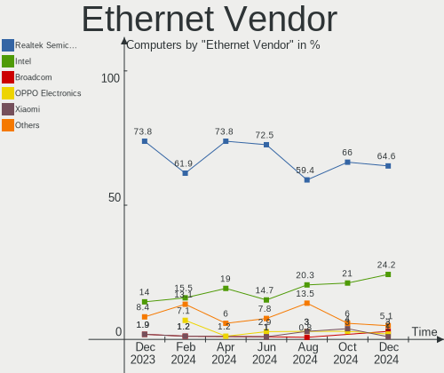

| Vendor                   | Computers | Percent |
|--------------------------|-----------|---------|
| Realtek Semiconductor    | 61        | 73.49%  |
| Intel                    | 7         | 8.43%   |
| OPPO Electronics         | 4         | 4.82%   |
| Qualcomm                 | 2         | 2.41%   |
| Broadcom                 | 2         | 2.41%   |
| Xiaomi                   | 1         | 1.2%    |
| Samsung Electronics      | 1         | 1.2%    |
| Motorola PCS             | 1         | 1.2%    |
| MediaTek                 | 1         | 1.2%    |
| Marvell Technology Group | 1         | 1.2%    |
| JMicron Technology       | 1         | 1.2%    |
| ASIX Electronics         | 1         | 1.2%    |

Ethernet Model
--------------

Ethernet models

| Model                                                                          | Computers | Percent |
|--------------------------------------------------------------------------------|-----------|---------|
| Realtek RTL8111/8168/8411 PCI Express Gigabit Ethernet Controller              | 49        | 59.04%  |
| Realtek RTL810xE PCI Express Fast Ethernet controller                          | 6         | 7.23%   |
| OPPO RMX2027                                                                   | 4         | 4.82%   |
| Realtek RTL8125 2.5GbE Controller                                              | 3         | 3.61%   |
| Realtek RTL8153 Gigabit Ethernet Adapter                                       | 2         | 2.41%   |
| Xiaomi Mi/Redmi series (RNDIS)                                                 | 1         | 1.2%    |
| Samsung Galaxy series, misc. (tethering mode)                                  | 1         | 1.2%    |
| Realtek Killer E2600 Gigabit Ethernet Controller                               | 1         | 1.2%    |
| Qualcomm SDM630-MTP _SN:0B9EB96E                                               | 1         | 1.2%    |
| Qualcomm Redmi Note 8                                                          | 1         | 1.2%    |
| Motorola PCS motorola one macro                                                | 1         | 1.2%    |
| MediaTek RMX3085                                                               | 1         | 1.2%    |
| Marvell Group Yukon Optima 88E8059 [PCIe Gigabit Ethernet Controller with AVB] | 1         | 1.2%    |
| JMicron JMC250 PCI Express Gigabit Ethernet Controller                         | 1         | 1.2%    |
| Intel I211 Gigabit Network Connection                                          | 1         | 1.2%    |
| Intel Ethernet Controller I226-V                                               | 1         | 1.2%    |
| Intel Ethernet Connection I217-V                                               | 1         | 1.2%    |
| Intel Ethernet Connection (7) I219-LM                                          | 1         | 1.2%    |
| Intel Ethernet Connection (4) I219-LM                                          | 1         | 1.2%    |
| Intel Ethernet Connection (16) I219-V                                          | 1         | 1.2%    |
| Intel 82579V Gigabit Network Connection                                        | 1         | 1.2%    |
| Broadcom NetXtreme BCM5761 Gigabit Ethernet PCIe                               | 1         | 1.2%    |
| Broadcom NetLink BCM57785 Gigabit Ethernet PCIe                                | 1         | 1.2%    |
| ASIX AX88179 Gigabit Ethernet                                                  | 1         | 1.2%    |

Net Controller Kind
-------------------

Ethernet, WiFi or modem

| Kind     | Computers | Percent |
|----------|-----------|---------|
| WiFi     | 102       | 57.63%  |
| Ethernet | 74        | 41.81%  |
| Modem    | 1         | 0.56%   |

Used Controller
---------------

Currently used network controller

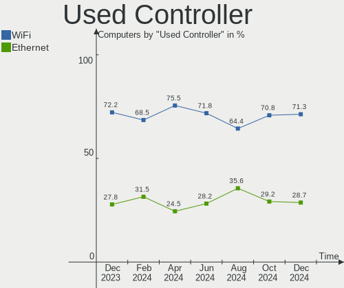

| Kind     | Computers | Percent |
|----------|-----------|---------|
| WiFi     | 82        | 73.21%  |
| Ethernet | 30        | 26.79%  |

NICs
----

Total network controllers on board

| Total | Computers | Percent |
|-------|-----------|---------|
| 1     | 56        | 49.56%  |
| 2     | 53        | 46.9%   |
| 0     | 4         | 3.54%   |

IPv6
----

IPv6 vs IPv4

| Used | Computers | Percent |
|------|-----------|---------|
| No   | 64        | 56.64%  |
| Yes  | 49        | 43.36%  |

Bluetooth
---------

Bluetooth Vendor
----------------

Controller vendors

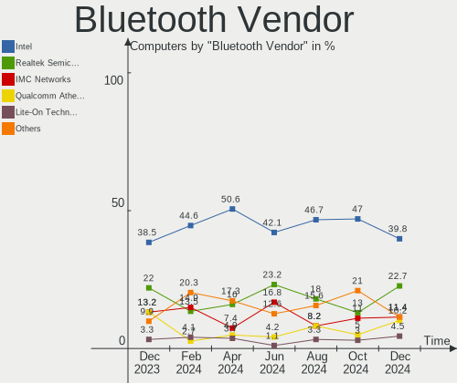

| Vendor                          | Computers | Percent |
|---------------------------------|-----------|---------|
| Intel                           | 48        | 50.53%  |
| Realtek Semiconductor           | 14        | 14.74%  |
| IMC Networks                    | 7         | 7.37%   |
| Foxconn / Hon Hai               | 6         | 6.32%   |
| Broadcom                        | 3         | 3.16%   |
| TP-Link                         | 2         | 2.11%   |
| Ralink                          | 2         | 2.11%   |
| Qualcomm Atheros Communications | 2         | 2.11%   |
| Lite-On Technology              | 2         | 2.11%   |
| Cambridge Silicon Radio         | 2         | 2.11%   |
| Unknown                         | 2         | 2.11%   |
| Realtek                         | 1         | 1.05%   |
| MediaTek                        | 1         | 1.05%   |
| Dell                            | 1         | 1.05%   |
| ASUSTek Computer                | 1         | 1.05%   |
| Apple                           | 1         | 1.05%   |

Bluetooth Model
---------------

Controller models

| Model                                                                               | Computers | Percent |
|-------------------------------------------------------------------------------------|-----------|---------|
| Intel Bluetooth Device                                                              | 13        | 13.68%  |
| Intel AX201 Bluetooth                                                               | 13        | 13.68%  |
| Realtek Bluetooth Radio                                                             | 12        | 12.63%  |
| Intel Bluetooth 9460/9560 Jefferson Peak (JfP)                                      | 10        | 10.53%  |
| Intel Bluetooth wireless interface                                                  | 8         | 8.42%   |
| Intel AX200 Bluetooth                                                               | 3         | 3.16%   |
| IMC Networks Wireless_Device                                                        | 3         | 3.16%   |
| IMC Networks Bluetooth Radio                                                        | 3         | 3.16%   |
| Foxconn / Hon Hai Wireless_Device                                                   | 3         | 3.16%   |
| TP-Link UB500 Adapter                                                               | 2         | 2.11%   |
| Ralink RT3290 Bluetooth                                                             | 2         | 2.11%   |
| Cambridge Silicon Radio Bluetooth Dongle (HCI mode)                                 | 2         | 2.11%   |
| Broadcom BCM2070 Bluetooth 2.1 + EDR                                                | 2         | 2.11%   |
| Unknown                                                                             | 2         | 2.11%   |
| Realtek RTL8822BE Bluetooth 4.2 Adapter                                             | 1         | 1.05%   |
| Realtek RTL8723B Bluetooth                                                          | 1         | 1.05%   |
| Realtek Bluetooth Radio                                                             | 1         | 1.05%   |
| Qualcomm Atheros  Bluetooth Device                                                  | 1         | 1.05%   |
| Qualcomm Atheros AR3012 Bluetooth 4.0                                               | 1         | 1.05%   |
| MediaTek Wireless_Device                                                            | 1         | 1.05%   |
| Lite-On Wireless_Device                                                             | 1         | 1.05%   |
| Lite-On Bluetooth Device                                                            | 1         | 1.05%   |
| Intel Wireless-AC 3168 Bluetooth                                                    | 1         | 1.05%   |
| IMC Networks Bluetooth Device                                                       | 1         | 1.05%   |
| Foxconn / Hon Hai Foxconn T77H114 BCM2070 [Single-Chip Bluetooth 2.1 + EDR Adapter] | 1         | 1.05%   |
| Foxconn / Hon Hai BT                                                                | 1         | 1.05%   |
| Foxconn / Hon Hai Bluetooth USB Host Controller                                     | 1         | 1.05%   |
| Dell BCM20702A0 Bluetooth Module                                                    | 1         | 1.05%   |
| Broadcom BCM2045 Bluetooth                                                          | 1         | 1.05%   |
| ASUS Broadcom BCM20702A0 Bluetooth                                                  | 1         | 1.05%   |
| Apple Bluetooth Host Controller                                                     | 1         | 1.05%   |

Sound
-----

Sound Vendor
------------

Sound card vendors

| Vendor                | Computers | Percent |
|-----------------------|-----------|---------|
| Intel                 | 77        | 53.85%  |
| AMD                   | 35        | 24.48%  |
| Nvidia                | 24        | 16.78%  |
| Texas Instruments     | 1         | 0.7%    |
| SteelSeries ApS       | 1         | 0.7%    |
| Realtek Semiconductor | 1         | 0.7%    |
| OPPO Electronics      | 1         | 0.7%    |
| GN Netcom             | 1         | 0.7%    |
| Dell                  | 1         | 0.7%    |
| Creative Labs         | 1         | 0.7%    |

Sound Model
-----------

Sound card models

| Model                                                                      | Computers | Percent |
|----------------------------------------------------------------------------|-----------|---------|
| AMD Family 17h/19h HD Audio Controller                                     | 25        | 13.81%  |
| AMD Renoir Radeon High Definition Audio Controller                         | 15        | 8.29%   |
| Intel Tiger Lake-LP Smart Sound Technology Audio Controller                | 12        | 6.63%   |
| Intel Alder Lake PCH-P High Definition Audio Controller                    | 12        | 6.63%   |
| Intel 8 Series/C220 Series Chipset High Definition Audio Controller        | 7         | 3.87%   |
| Intel Xeon E3-1200 v3/4th Gen Core Processor HD Audio Controller           | 6         | 3.31%   |
| Nvidia Audio device                                                        | 5         | 2.76%   |
| Intel Sunrise Point-LP HD Audio                                            | 5         | 2.76%   |
| Intel 6 Series/C200 Series Chipset Family High Definition Audio Controller | 5         | 2.76%   |
| Intel Cannon Lake PCH cAVS                                                 | 4         | 2.21%   |
| Intel 7 Series/C216 Chipset Family High Definition Audio Controller        | 4         | 2.21%   |
| AMD FCH Azalia Controller                                                  | 4         | 2.21%   |
| Nvidia GF119 HDMI Audio Controller                                         | 3         | 1.66%   |
| Nvidia GA106 High Definition Audio Controller                              | 3         | 1.66%   |
| Intel Raptor Lake-P/U/H cAVS                                               | 3         | 1.66%   |
| Intel Cannon Point-LP High Definition Audio Controller                     | 3         | 1.66%   |
| Intel 5 Series/3400 Series Chipset High Definition Audio                   | 3         | 1.66%   |
| AMD Rembrandt Radeon High Definition Audio Controller                      | 3         | 1.66%   |
| AMD Raven/Raven2/Fenghuang HDMI/DP Audio Controller                        | 3         | 1.66%   |
| Nvidia TU116 High Definition Audio Controller                              | 2         | 1.1%    |
| Nvidia TU107 GeForce GTX 1650 High Definition Audio Controller             | 2         | 1.1%    |
| Nvidia GP107GL High Definition Audio Controller                            | 2         | 1.1%    |
| Nvidia GK208 HDMI/DP Audio Controller                                      | 2         | 1.1%    |
| Nvidia GF108 High Definition Audio Controller                              | 2         | 1.1%    |
| Intel Ice Lake-LP Smart Sound Technology Audio Controller                  | 2         | 1.1%    |
| Intel Haswell-ULT HD Audio Controller                                      | 2         | 1.1%    |
| Intel Comet Lake PCH-LP cAVS                                               | 2         | 1.1%    |
| Intel CM238 HD Audio Controller                                            | 2         | 1.1%    |
| Intel Alder Lake-N HD Graphics SGPC                                        | 2         | 1.1%    |
| Intel 8 Series HD Audio Controller                                         | 2         | 1.1%    |
| AMD Starship/Matisse HD Audio Controller                                   | 2         | 1.1%    |
| AMD Navi 10 HDMI Audio                                                     | 2         | 1.1%    |
| AMD Family 17h (Models 00h-0fh) HD Audio Controller                        | 2         | 1.1%    |
| AMD Ellesmere HDMI Audio [Radeon RX 470/480 / 570/580/590]                 | 2         | 1.1%    |
| Texas Instruments PCM2906C Audio CODEC                                     | 1         | 0.55%   |
| Texas Instruments PCM2904 Audio Codec                                      | 1         | 0.55%   |
| SteelSeries ApS SteelSeries Arctis 5                                       | 1         | 0.55%   |
| Realtek Semiconductor HP Banff                                             | 1         | 0.55%   |
| OPPO Electronics CPH1909                                                   | 1         | 0.55%   |
| Nvidia TU106 High Definition Audio Controller                              | 1         | 0.55%   |

Memory
------

Memory Vendor
-------------

Memory module vendors

| Vendor              | Computers | Percent |
|---------------------|-----------|---------|
| SK hynix            | 21        | 25.61%  |
| Samsung Electronics | 19        | 23.17%  |
| Micron Technology   | 16        | 19.51%  |
| Unknown             | 4         | 4.88%   |
| Kingston            | 4         | 4.88%   |
| CSX                 | 3         | 3.66%   |
| A-DATA Technology   | 3         | 3.66%   |
| Crucial             | 2         | 2.44%   |
| Corsair             | 2         | 2.44%   |
| ZION                | 1         | 1.22%   |
| Unknown (0x0CAB)    | 1         | 1.22%   |
| Unknown (0x0080)    | 1         | 1.22%   |
| Transcend           | 1         | 1.22%   |
| Nanya Technology    | 1         | 1.22%   |
| G.Skill             | 1         | 1.22%   |
| Acer                | 1         | 1.22%   |
| Unknown             | 1         | 1.22%   |

Memory Model
------------

Memory module models

| Model                                                            | Computers | Percent |
|------------------------------------------------------------------|-----------|---------|
| Micron RAM 8ATF1G64HZ-3G2R1 8GB SODIMM DDR4 3200MT/s             | 5         | 5.81%   |
| SK hynix RAM H9JCNNNCP3MLYR-N6E 4GB Row Of Chips LPDDR5 6400MT/s | 3         | 3.49%   |
| SK hynix RAM HMAA1GS6CJR6N-XN 8GB SODIMM DDR4 3200MT/s           | 2         | 2.33%   |
| Samsung RAM M471A1K43EB1-CWE 8GB SODIMM DDR4 3200MT/s            | 2         | 2.33%   |
| Samsung RAM M471A1G44BB0-CWE 8GB SODIMM DDR4 3200MT/s            | 2         | 2.33%   |
| Samsung RAM M471A1G44AB0-CWE 8GB Row Of Chips DDR4 3200MT/s      | 2         | 2.33%   |
| Micron RAM 4ATF1G64HZ-3G2F1 8GB SODIMM DDR4 3200MT/s             | 2         | 2.33%   |
| Micron RAM 4ATF1G64HZ-3G2E2 8GB SODIMM DDR4 3200MT/s             | 2         | 2.33%   |
| ZION RAM ZION4GBDDR3PC1600 4GB DIMM DDR3 1600MT/s                | 1         | 1.16%   |
| Unknown RAM Module 8GB SODIMM DDR4 2400MT/s                      | 1         | 1.16%   |
| Unknown RAM Module 8GB DIMM DDR3 1600MT/s                        | 1         | 1.16%   |
| Unknown RAM Module 8GB DIMM 1600MT/s                             | 1         | 1.16%   |
| Unknown RAM Module 4GB DIMM 1600MT/s                             | 1         | 1.16%   |
| Unknown RAM Module 2GB DIMM DDR 667MT/s                          | 1         | 1.16%   |
| Unknown (0x0CAB) RAM B44AS8G53222B-TJ17 8GB SODIMM DDR4 3200MT/s | 1         | 1.16%   |
| Unknown (0x0080) RAM Module 16GB SODIMM DDR4 3200MT/s            | 1         | 1.16%   |
| Transcend RAM TS512MSK64W6H 4GB SODIMM DDR3 1600MT/s             | 1         | 1.16%   |
| SK hynix RAM Module 8GB SODIMM DDR3 1600MT/s                     | 1         | 1.16%   |
| SK hynix RAM Module 16384MB SODIMM 4800MT/s                      | 1         | 1.16%   |
| SK hynix RAM HYMP125S64CP8-S6 2048MB SODIMM DDR 975MT/s          | 1         | 1.16%   |
| SK hynix RAM HMT41GS6BFR8A-PB 8192MB SODIMM DDR3 1600MT/s        | 1         | 1.16%   |
| SK hynix RAM HMT41GS6AFR8A-PB 8GB SODIMM DDR3 1600MT/s           | 1         | 1.16%   |
| SK hynix RAM HMT351U6EFR8C-PBC 8GB DIMM DDR3                     | 1         | 1.16%   |
| SK hynix RAM HMT351U6EFR8C-PB 4GB DIMM DDR3 1800MT/s             | 1         | 1.16%   |
| SK hynix RAM HMT325S6CFR8C-PB 2048MB SODIMM DDR3 1600MT/s        | 1         | 1.16%   |
| SK hynix RAM HMCG78MEBSA095N 16GB SODIMM DDR5 4800MT/s           | 1         | 1.16%   |
| SK hynix RAM HMAA2GS6CJR8N-XN 16GB SODIMM DDR4 3200MT/s          | 1         | 1.16%   |
| SK hynix RAM HMA851S6CJR6N-VK 4GB Row Of Chips DDR4 2667MT/s     | 1         | 1.16%   |
| SK hynix RAM HMA82GS6JJR8N-VK 16GB SODIMM DDR4 2667MT/s          | 1         | 1.16%   |
| SK hynix RAM HMA81GS6DJR8N-XN 8GB SODIMM DDR4 3200MT/s           | 1         | 1.16%   |
| SK hynix RAM HMA81GS6AFR8N-UH 8GB SODIMM DDR4 2400MT/s           | 1         | 1.16%   |
| SK hynix RAM HMA41GS6AFR8N-TF 8GB SODIMM DDR4 2667MT/s           | 1         | 1.16%   |
| SK hynix RAM H9HCNNNCPMMLXR-NEE 2GB Row Of Chips LPDDR4 4267MT/s | 1         | 1.16%   |
| SK hynix RAM H58G56AK6BX069 8GB Row Of Chips LPDDR5 6400MT/s     | 1         | 1.16%   |
| Samsung RAM Module 4GB Row Of Chips LPDDR5 6400MT/s              | 1         | 1.16%   |
| Samsung RAM Module 16384MB SODIMM 4800MT/s                       | 1         | 1.16%   |
| Samsung RAM M471A5244CB0-CWE 4GB SODIMM DDR4 3200MT/s            | 1         | 1.16%   |
| Samsung RAM M471A5244CB0-CTD 4GB SODIMM DDR4 3266MT/s            | 1         | 1.16%   |
| Samsung RAM M471A5244CB0-CTD 4GB Row Of Chips DDR4 2667MT/s      | 1         | 1.16%   |
| Samsung RAM M471A5244BB0-CRC 4GB SODIMM DDR4 2667MT/s            | 1         | 1.16%   |

Memory Kind
-----------

Memory module kinds

| Kind    | Computers | Percent |
|---------|-----------|---------|
| DDR4    | 38        | 55.07%  |
| DDR3    | 12        | 17.39%  |
| LPDDR5  | 7         | 10.14%  |
| DDR5    | 5         | 7.25%   |
| LPDDR4  | 2         | 2.9%    |
| Unknown | 2         | 2.9%    |
| SDRAM   | 1         | 1.45%   |
| DDR2    | 1         | 1.45%   |
| DDR     | 1         | 1.45%   |

Memory Form Factor
------------------

Physical design of the memory module

| Name         | Computers | Percent |
|--------------|-----------|---------|
| SODIMM       | 42        | 60.87%  |
| DIMM         | 14        | 20.29%  |
| Row Of Chips | 13        | 18.84%  |

Memory Size
-----------

Memory module size

| Size  | Computers | Percent |
|-------|-----------|---------|
| 8192  | 34        | 45.95%  |
| 4096  | 18        | 24.32%  |
| 16384 | 13        | 17.57%  |
| 2048  | 7         | 9.46%   |
| 32768 | 2         | 2.7%    |

Memory Speed
------------

Memory module speed

| Speed   | Computers | Percent |
|---------|-----------|---------|
| 3200    | 27        | 36.99%  |
| 1600    | 10        | 13.7%   |
| 2667    | 8         | 10.96%  |
| 6400    | 7         | 9.59%   |
| 4800    | 5         | 6.85%   |
| 2400    | 2         | 2.74%   |
| 1333    | 2         | 2.74%   |
| 4267    | 1         | 1.37%   |
| 4000    | 1         | 1.37%   |
| 3733    | 1         | 1.37%   |
| 3600    | 1         | 1.37%   |
| 3266    | 1         | 1.37%   |
| 2800    | 1         | 1.37%   |
| 2133    | 1         | 1.37%   |
| 1800    | 1         | 1.37%   |
| 1334    | 1         | 1.37%   |
| 975     | 1         | 1.37%   |
| 667     | 1         | 1.37%   |
| Unknown | 1         | 1.37%   |

Printers & scanners
-------------------

Printer Vendor
--------------

Printer device vendors

| Vendor          | Computers | Percent |
|-----------------|-----------|---------|
| Seiko Epson     | 1         | 50%     |
| Hewlett-Packard | 1         | 50%     |

Printer Model
-------------

Printer device models

| Model                    | Computers | Percent |
|--------------------------|-----------|---------|
| Seiko Epson L6160 Series | 1         | 50%     |
| HP LaserJet P1102        | 1         | 50%     |

Scanner Vendor
--------------

Scanner device vendors

Zero info for selected period =(

Scanner Model
-------------

Scanner device models

Zero info for selected period =(

Camera
------

Camera Vendor
-------------

Camera device vendors

| Vendor                                 | Computers | Percent |
|----------------------------------------|-----------|---------|
| IMC Networks                           | 14        | 17.72%  |
| Quanta                                 | 13        | 16.46%  |
| Chicony Electronics                    | 9         | 11.39%  |
| Realtek Semiconductor                  | 7         | 8.86%   |
| Microdia                               | 7         | 8.86%   |
| Sunplus Innovation Technology          | 5         | 6.33%   |
| Syntek                                 | 4         | 5.06%   |
| Sonix Technology                       | 4         | 5.06%   |
| Luxvisions Innotech Limited            | 4         | 5.06%   |
| Logitech                               | 2         | 2.53%   |
| Cheng Uei Precision Industry (Foxlink) | 2         | 2.53%   |
| Bison Electronics                      | 2         | 2.53%   |
| Lite-On Technology                     | 1         | 1.27%   |
| Hewlett-Packard                        | 1         | 1.27%   |
| DLTDC0A9II090N                         | 1         | 1.27%   |
| ARC International                      | 1         | 1.27%   |
| Apple                                  | 1         | 1.27%   |
| Acer                                   | 1         | 1.27%   |

Camera Model
------------

Camera device models

| Model                                                                      | Computers | Percent |
|----------------------------------------------------------------------------|-----------|---------|
| Quanta ACER HD User Facing                                                 | 6         | 7.59%   |
| IMC Networks USB2.0 HD UVC WebCam                                          | 6         | 7.59%   |
| Syntek Integrated Camera                                                   | 4         | 5.06%   |
| Chicony Integrated Camera                                                  | 4         | 5.06%   |
| Sonix USB2.0 FHD UVC WebCam                                                | 3         | 3.8%    |
| Realtek Integrated_Webcam_HD                                               | 3         | 3.8%    |
| Quanta HP Wide Vision HD Camera                                            | 3         | 3.8%    |
| Quanta HP TrueVision HD Camera                                             | 3         | 3.8%    |
| Luxvisions Innotech Limited HP Wide Vision HD Camera                       | 3         | 3.8%    |
| IMC Networks Integrated Camera                                             | 3         | 3.8%    |
| Sunplus XiaoMi USB 2.0 Webcam                                              | 2         | 2.53%   |
| Microdia Integrated Camera                                                 | 2         | 2.53%   |
| Chicony HP Truevision HD camera                                            | 2         | 2.53%   |
| Cheng Uei Precision Industry (Foxlink) HP Wide Vision HD Integrated Webcam | 2         | 2.53%   |
| Sunplus Integrated_Webcam_HD                                               | 1         | 1.27%   |
| Sunplus Dell HD Webcam                                                     | 1         | 1.27%   |
| Sunplus 1.3M HD WebCam                                                     | 1         | 1.27%   |
| Sonix USB2.0 HD UVC WebCam                                                 | 1         | 1.27%   |
| Realtek USB2.0 HD UVC WebCam                                               | 1         | 1.27%   |
| Realtek USB2.0 camera                                                      | 1         | 1.27%   |
| Realtek USB Camera                                                         | 1         | 1.27%   |
| Realtek USB Boot                                                           | 1         | 1.27%   |
| Quanta HP True Vision 5MP Camera                                           | 1         | 1.27%   |
| Microdia Webcam                                                            | 1         | 1.27%   |
| Microdia USB 2.0 Camera                                                    | 1         | 1.27%   |
| Microdia Lenovo EasyCamera                                                 | 1         | 1.27%   |
| Microdia Integrated_Webcam_HD                                              | 1         | 1.27%   |
| Microdia HP Webcam-50                                                      | 1         | 1.27%   |
| Luxvisions Innotech Limited HP TrueVision HD Camera                        | 1         | 1.27%   |
| Logitech Webcam C270                                                       | 1         | 1.27%   |
| Logitech HD Pro Webcam C920                                                | 1         | 1.27%   |
| Lite-On HP Wide Vision HD Camera                                           | 1         | 1.27%   |
| IMC Networks VGA UVC WebCam                                                | 1         | 1.27%   |
| IMC Networks ov9734_azurewave_camera                                       | 1         | 1.27%   |
| IMC Networks Lenovo EasyCamera                                             | 1         | 1.27%   |
| IMC Networks Integrated RGB Camera                                         | 1         | 1.27%   |
| IMC Networks HP TrueVision HD Camera                                       | 1         | 1.27%   |
| HP W100                                                                    | 1         | 1.27%   |
| DLTDC0A9II090N HP 5MP Camera                                               | 1         | 1.27%   |
| Chicony Integrated HD WebCam                                               | 1         | 1.27%   |

Security
--------

Fingerprint Vendor
------------------

Fingerprint sensor vendors

| Vendor                             | Computers | Percent |
|------------------------------------|-----------|---------|
| Shenzhen Goodix Technology         | 5         | 31.25%  |
| Realtek USB2.0 Finger Print Bridge | 4         | 25%     |
| Validity Sensors                   | 2         | 12.5%   |
| Synaptics                          | 2         | 12.5%   |
| Elan Microelectronics              | 2         | 12.5%   |
| LighTuning Technology              | 1         | 6.25%   |

Fingerprint Model
-----------------

Fingerprint sensor models

| Model                                                                      | Computers | Percent |
|----------------------------------------------------------------------------|-----------|---------|
| Shenzhen Goodix  FingerPrint Device                                        | 4         | 25%     |
| Realtek USB2.0 Finger Print Bridge FocalTech Fingerprint Device            | 4         | 25%     |
| Elan ELAN:ARM-M4                                                           | 2         | 12.5%   |
| Validity Sensors VFS5011 Fingerprint Reader                                | 1         | 6.25%   |
| Validity Sensors Synaptics VFS7552 Touch Fingerprint Sensor with PurePrint | 1         | 6.25%   |
| Synaptics Metallica MIS Touch Fingerprint Reader                           | 1         | 6.25%   |
| Synaptics FS7604 Touch Fingerprint Sensor with PurePrint                   | 1         | 6.25%   |
| Shenzhen Goodix Fingerprint Reader                                         | 1         | 6.25%   |
| LighTuning EgisTec Touch Fingerprint Sensor                                | 1         | 6.25%   |

Chipcard Vendor
---------------

Chipcard module vendors

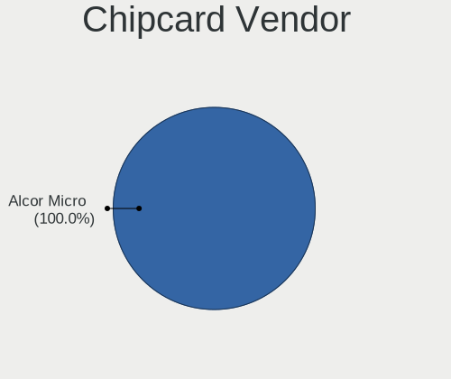

| Vendor   | Computers | Percent |
|----------|-----------|---------|
| Broadcom | 2         | 100%    |

Chipcard Model
--------------

Chipcard module models

| Model          | Computers | Percent |
|----------------|-----------|---------|
| Broadcom 5880  | 1         | 50%     |
| Broadcom 58200 | 1         | 50%     |

Unsupported
-----------

Unsupported Devices
-------------------

Total unsupported devices on board

| Total | Computers | Percent |
|-------|-----------|---------|
| 0     | 74        | 65.49%  |
| 1     | 31        | 27.43%  |
| 2     | 8         | 7.08%   |

Unsupported Device Types
------------------------

Types of unsupported devices

| Type                  | Computers | Percent |
|-----------------------|-----------|---------|
| Fingerprint reader    | 16        | 34.78%  |
| Multimedia controller | 9         | 19.57%  |
| Graphics card         | 7         | 15.22%  |
| Camera                | 4         | 8.7%    |
| Bluetooth             | 3         | 6.52%   |
| Sound                 | 2         | 4.35%   |
| Net/wireless          | 2         | 4.35%   |
| Network               | 1         | 2.17%   |
| Net/ethernet          | 1         | 2.17%   |
| Chipcard              | 1         | 2.17%   |

