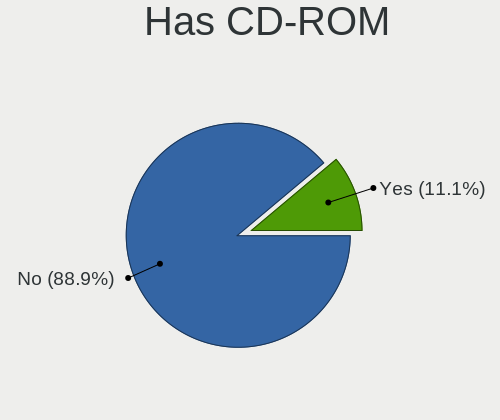
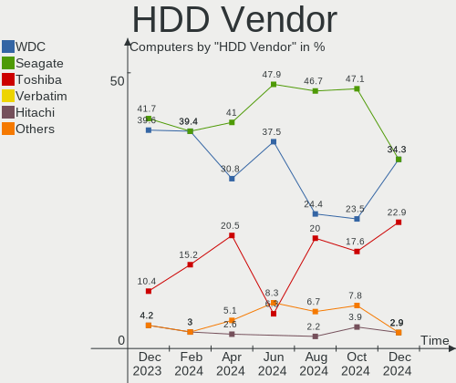
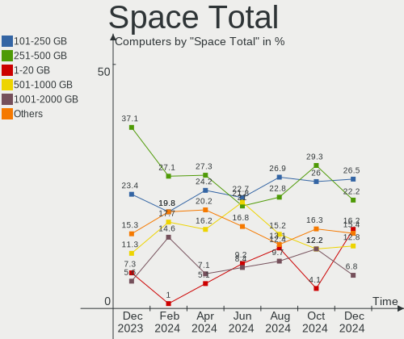
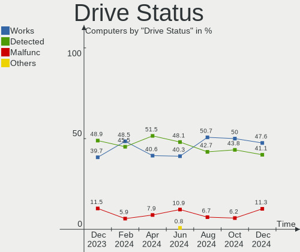
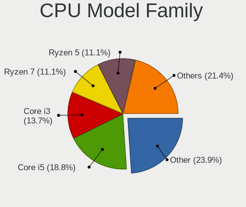
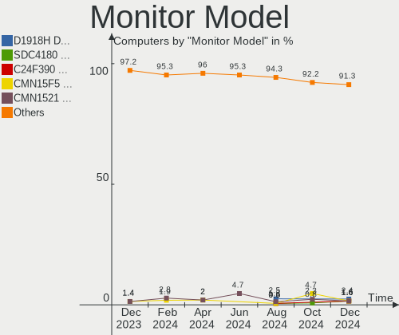
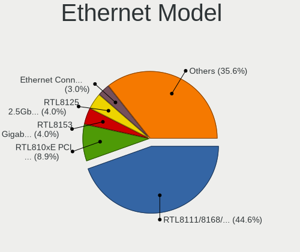
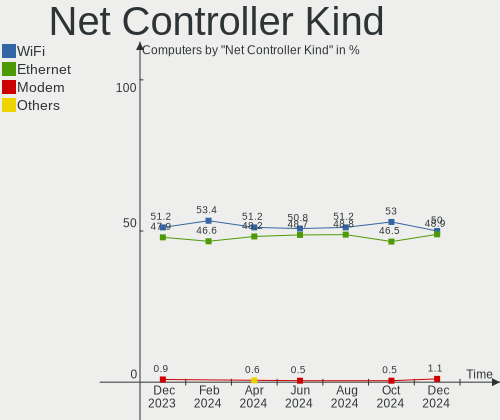
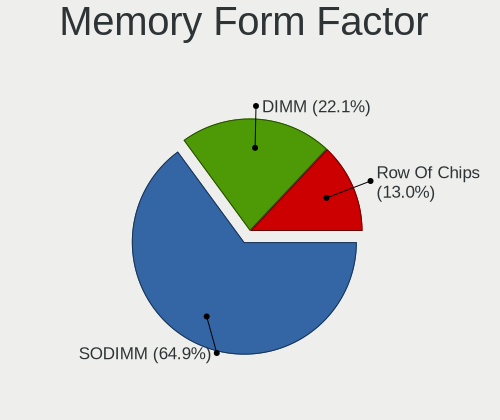
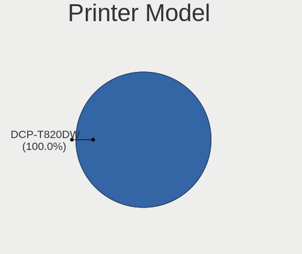

Linux in India - Hardware Trends
--------------------------------

A project to identify most popular hardware characteristics and track their change
over time based on data collected by Linux users at https://Linux-Hardware.org.

Anyone can contribute to this report by the [hw-probe](https://github.com/linuxhw/hw-probe) tool:

    sudo -E hw-probe -all -upload

This is a report for all computer types. See also reports for [desktops](/Location/India/Desktop/README.md) and [notebooks](/Location/India/Notebook/README.md).

Period: Dec, 2024.

Contents
--------

* [ System ](#system)
  - [ OS                       ](#os)
  - [ OS Family                ](#os-family)
  - [ Kernel                   ](#kernel)
  - [ Kernel Family            ](#kernel-family)
  - [ Kernel Major Ver.        ](#kernel-major-ver)
  - [ Arch                     ](#arch)
  - [ DE                       ](#de)
  - [ Display Server           ](#display-server)
  - [ Display Manager          ](#display-manager)
  - [ OS Lang                  ](#os-lang)
  - [ Boot Mode                ](#boot-mode)
  - [ Filesystem               ](#filesystem)
  - [ Part. scheme             ](#part-scheme)
  - [ Dual Boot with Linux/BSD ](#dual-boot-with-linuxbsd)
  - [ Dual Boot (Win)          ](#dual-boot-win)

* [ Board ](#board)
  - [ Vendor                   ](#vendor)
  - [ Model                    ](#model)
  - [ Model Family             ](#model-family)
  - [ MFG Year                 ](#mfg-year)
  - [ Form Factor              ](#form-factor)
  - [ Secure Boot              ](#secure-boot)
  - [ Coreboot                 ](#coreboot)
  - [ RAM Size                 ](#ram-size)
  - [ RAM Used                 ](#ram-used)
  - [ Total Drives             ](#total-drives)
  - [ Has CD-ROM               ](#has-cd-rom)
  - [ Has Ethernet             ](#has-ethernet)
  - [ Has WiFi                 ](#has-wifi)
  - [ Has Bluetooth            ](#has-bluetooth)

* [ Location ](#location)
  - [ Country                  ](#country)
  - [ City                     ](#city)

* [ Drives ](#drives)
  - [ Drive Vendor             ](#drive-vendor)
  - [ Drive Model              ](#drive-model)
  - [ HDD Vendor               ](#hdd-vendor)
  - [ SSD Vendor               ](#ssd-vendor)
  - [ Drive Kind               ](#drive-kind)
  - [ Drive Connector          ](#drive-connector)
  - [ Drive Size               ](#drive-size)
  - [ Space Total              ](#space-total)
  - [ Space Used               ](#space-used)
  - [ Malfunc. Drives          ](#malfunc-drives)
  - [ Malfunc. Drive Vendor    ](#malfunc-drive-vendor)
  - [ Malfunc. HDD Vendor      ](#malfunc-hdd-vendor)
  - [ Malfunc. Drive Kind      ](#malfunc-drive-kind)
  - [ Failed Drives            ](#failed-drives)
  - [ Failed Drive Vendor      ](#failed-drive-vendor)
  - [ Drive Status             ](#drive-status)

* [ Storage controller ](#storage-controller)
  - [ Storage Vendor           ](#storage-vendor)
  - [ Storage Model            ](#storage-model)
  - [ Storage Kind             ](#storage-kind)

* [ Processor ](#processor)
  - [ CPU Vendor               ](#cpu-vendor)
  - [ CPU Model                ](#cpu-model)
  - [ CPU Model Family         ](#cpu-model-family)
  - [ CPU Cores                ](#cpu-cores)
  - [ CPU Sockets              ](#cpu-sockets)
  - [ CPU Threads              ](#cpu-threads)
  - [ CPU Op-Modes             ](#cpu-op-modes)
  - [ CPU Microcode            ](#cpu-microcode)
  - [ CPU Microarch            ](#cpu-microarch)

* [ Graphics ](#graphics)
  - [ GPU Vendor               ](#gpu-vendor)
  - [ GPU Model                ](#gpu-model)
  - [ GPU Combo                ](#gpu-combo)
  - [ GPU Driver               ](#gpu-driver)
  - [ GPU Memory               ](#gpu-memory)

* [ Monitor ](#monitor)
  - [ Monitor Vendor           ](#monitor-vendor)
  - [ Monitor Model            ](#monitor-model)
  - [ Monitor Resolution       ](#monitor-resolution)
  - [ Monitor Diagonal         ](#monitor-diagonal)
  - [ Monitor Width            ](#monitor-width)
  - [ Aspect Ratio             ](#aspect-ratio)
  - [ Monitor Area             ](#monitor-area)
  - [ Pixel Density            ](#pixel-density)
  - [ Multiple Monitors        ](#multiple-monitors)

* [ Network ](#network)
  - [ Net Controller Vendor    ](#net-controller-vendor)
  - [ Net Controller Model     ](#net-controller-model)
  - [ Wireless Vendor          ](#wireless-vendor)
  - [ Wireless Model           ](#wireless-model)
  - [ Ethernet Vendor          ](#ethernet-vendor)
  - [ Ethernet Model           ](#ethernet-model)
  - [ Net Controller Kind      ](#net-controller-kind)
  - [ Used Controller          ](#used-controller)
  - [ NICs                     ](#nics)
  - [ IPv6                     ](#ipv6)

* [ Bluetooth ](#bluetooth)
  - [ Bluetooth Vendor         ](#bluetooth-vendor)
  - [ Bluetooth Model          ](#bluetooth-model)

* [ Sound ](#sound)
  - [ Sound Vendor             ](#sound-vendor)
  - [ Sound Model              ](#sound-model)

* [ Memory ](#memory)
  - [ Memory Vendor            ](#memory-vendor)
  - [ Memory Model             ](#memory-model)
  - [ Memory Kind              ](#memory-kind)
  - [ Memory Form Factor       ](#memory-form-factor)
  - [ Memory Size              ](#memory-size)
  - [ Memory Speed             ](#memory-speed)

* [ Printers & scanners ](#printers--scanners)
  - [ Printer Vendor           ](#printer-vendor)
  - [ Printer Model            ](#printer-model)
  - [ Scanner Vendor           ](#scanner-vendor)
  - [ Scanner Model            ](#scanner-model)

* [ Camera ](#camera)
  - [ Camera Vendor            ](#camera-vendor)
  - [ Camera Model             ](#camera-model)

* [ Security ](#security)
  - [ Fingerprint Vendor       ](#fingerprint-vendor)
  - [ Fingerprint Model        ](#fingerprint-model)
  - [ Chipcard Vendor          ](#chipcard-vendor)
  - [ Chipcard Model           ](#chipcard-model)

* [ Unsupported ](#unsupported)
  - [ Unsupported Devices      ](#unsupported-devices)
  - [ Unsupported Device Types ](#unsupported-device-types)

System
------

OS
--

Installed operating systems

| Name                         | Computers | Percent |
|------------------------------|-----------|---------|
| Fedora 41                    | 19        | 16.24%  |
| OpenMandriva 24.12           | 17        | 14.53%  |
| Ubuntu 24.04                 | 16        | 13.68%  |
| Arch Rolling                 | 10        | 8.55%   |
| Linux Mint 22                | 7         | 5.98%   |
| Ubuntu 24.10                 | 6         | 5.13%   |
| Ubuntu 22.04                 | 6         | 5.13%   |
| Ubuntu 20.04                 | 4         | 3.42%   |
| ArcoLinux Rolling            | 4         | 3.42%   |
| Zorin 17                     | 3         | 2.56%   |
| OpenMandriva 23.08           | 3         | 2.56%   |
| Kali 2024.4                  | 3         | 2.56%   |
| Pop!_OS 22.04                | 2         | 1.71%   |
| Kubuntu 24.04                | 2         | 1.71%   |
| Guix                         | 2         | 1.71%   |
| Finnix 126                   | 2         | 1.71%   |
| Debian 12                    | 2         | 1.71%   |
| Xubuntu 24.04                | 1         | 0.85%   |
| openSUSE Tumbleweed-XXXXXXXX | 1         | 0.85%   |
| OpenMandriva 24.07           | 1         | 0.85%   |
| Gentoo 2.17                  | 1         | 0.85%   |
| Garuda Linux Soaring         | 1         | 0.85%   |
| Finnix Dev                   | 1         | 0.85%   |
| Fedora 40                    | 1         | 0.85%   |
| Beardog 24                   | 1         | 0.85%   |
| Athena OS Rolling            | 1         | 0.85%   |

OS Family
---------

OS without a version

| Name         | Computers | Percent |
|--------------|-----------|---------|
| Ubuntu       | 32        | 27.35%  |
| OpenMandriva | 21        | 17.95%  |
| Fedora       | 20        | 17.09%  |
| Arch         | 10        | 8.55%   |
| Linux Mint   | 7         | 5.98%   |
| ArcoLinux    | 4         | 3.42%   |
| Zorin        | 3         | 2.56%   |
| Kali         | 3         | 2.56%   |
| Finnix       | 3         | 2.56%   |
| Pop!_OS      | 2         | 1.71%   |
| Kubuntu      | 2         | 1.71%   |
| Guix         | 2         | 1.71%   |
| Debian       | 2         | 1.71%   |
| Xubuntu      | 1         | 0.85%   |
| openSUSE     | 1         | 0.85%   |
| Gentoo       | 1         | 0.85%   |
| Garuda Linux | 1         | 0.85%   |
| Beardog      | 1         | 0.85%   |
| Athena OS    | 1         | 0.85%   |

Kernel
------

Version of the Linux kernel

| Version                             | Computers | Percent |
|-------------------------------------|-----------|---------|
| 6.12.1-desktop-1omv2490             | 14        | 11.97%  |
| 6.8.0-49-generic                    | 12        | 10.26%  |
| 6.8.0-41-generic                    | 6         | 5.13%   |
| 6.8.0-51-generic                    | 5         | 4.27%   |
| 6.12.4-200.fc41.x86_64              | 5         | 4.27%   |
| 6.12.5-200.fc41.x86_64              | 4         | 3.42%   |
| 6.8.0-50-generic                    | 3         | 2.56%   |
| 6.8.0-38-generic                    | 3         | 2.56%   |
| 6.12.6-arch1-1                      | 3         | 2.56%   |
| 6.12.6-200.fc41.x86_64              | 3         | 2.56%   |
| 6.12.1-arch1-1                      | 3         | 2.56%   |
| 6.11.2-amd64                        | 3         | 2.56%   |
| 6.11.10-300.fc41.x86_64             | 3         | 2.56%   |
| 6.11.0-13-generic                   | 3         | 2.56%   |
| 6.8.12-amd64                        | 2         | 1.71%   |
| 6.4.11-desktop-1omv2390             | 2         | 1.71%   |
| 6.12.6-desktop-1omv2490             | 2         | 1.71%   |
| 6.12.4-zen1-1-zen                   | 2         | 1.71%   |
| 6.12.4-arch1-1                      | 2         | 1.71%   |
| 6.11.4-301.fc41.x86_64              | 2         | 1.71%   |
| 5.15.0-125-generic                  | 2         | 1.71%   |
| 6.8.0-76060800daily20240311-generic | 1         | 0.85%   |
| 6.8.0-48-generic                    | 1         | 0.85%   |
| 6.6.63                              | 1         | 0.85%   |
| 6.6.62-gentoo                       | 1         | 0.85%   |
| 6.4.8-desktop-2omv2390              | 1         | 0.85%   |
| 6.13.0-desktop-0.rc1.1omv2490       | 1         | 0.85%   |
| 6.12.7-zen1-1-zen                   | 1         | 0.85%   |
| 6.12.7-arch1-1                      | 1         | 0.85%   |
| 6.12.6-2-cachyos                    | 1         | 0.85%   |
| 6.12.4-100.fc40.x86_64              | 1         | 0.85%   |
| 6.12.4                              | 1         | 0.85%   |
| 6.12.3-061203-generic               | 1         | 0.85%   |
| 6.12.2-3-liquorix-amd64             | 1         | 0.85%   |
| 6.12.1-zen1-1-zen                   | 1         | 0.85%   |
| 6.12.1-arch1-1.1-g14                | 1         | 0.85%   |
| 6.12.0-061200-generic               | 1         | 0.85%   |
| 6.11.8-1-default                    | 1         | 0.85%   |
| 6.11.7-300.fc41.x86_64              | 1         | 0.85%   |
| 6.11.5+bpo-amd64                    | 1         | 0.85%   |

Kernel Family
-------------

Linux kernel without a distro release

| Version | Computers | Percent |
|---------|-----------|---------|
| 6.8.0   | 31        | 26.5%   |
| 6.12.1  | 19        | 16.24%  |
| 6.12.4  | 11        | 9.4%    |
| 6.12.6  | 9         | 7.69%   |
| 6.11.0  | 6         | 5.13%   |
| 5.15.0  | 6         | 5.13%   |
| 6.12.5  | 4         | 3.42%   |
| 6.11.10 | 4         | 3.42%   |
| 6.11.2  | 3         | 2.56%   |
| 6.8.12  | 2         | 1.71%   |
| 6.4.11  | 2         | 1.71%   |
| 6.12.7  | 2         | 1.71%   |
| 6.11.4  | 2         | 1.71%   |
| 6.6.63  | 1         | 0.85%   |
| 6.6.62  | 1         | 0.85%   |
| 6.4.8   | 1         | 0.85%   |
| 6.13.0  | 1         | 0.85%   |
| 6.12.3  | 1         | 0.85%   |
| 6.12.2  | 1         | 0.85%   |
| 6.12.0  | 1         | 0.85%   |
| 6.11.8  | 1         | 0.85%   |
| 6.11.7  | 1         | 0.85%   |
| 6.11.5  | 1         | 0.85%   |
| 6.11.11 | 1         | 0.85%   |
| 6.10.11 | 1         | 0.85%   |
| 6.10.10 | 1         | 0.85%   |
| 6.10.0  | 1         | 0.85%   |
| 6.1.0   | 1         | 0.85%   |
| 5.4.0   | 1         | 0.85%   |

Kernel Major Ver.
-----------------

Linux kernel major version

| Version | Computers | Percent |
|---------|-----------|---------|
| 6.12    | 48        | 41.03%  |
| 6.8     | 33        | 28.21%  |
| 6.11    | 19        | 16.24%  |
| 5.15    | 6         | 5.13%   |
| 6.4     | 3         | 2.56%   |
| 6.10    | 3         | 2.56%   |
| 6.6     | 2         | 1.71%   |
| 6.13    | 1         | 0.85%   |
| 6.1     | 1         | 0.85%   |
| 5.4     | 1         | 0.85%   |

Arch
----

OS architecture (x86_64, i586, etc.)

| Name    | Computers | Percent |
|---------|-----------|---------|
| x86_64  | 116       | 99.15%  |
| aarch64 | 1         | 0.85%   |

DE
--

Desktop Environment

| Name       | Computers | Percent |
|------------|-----------|---------|
| GNOME      | 56        | 47.86%  |
| Unknown    | 25        | 21.37%  |
| X-Cinnamon | 8         | 6.84%   |
| KDE6       | 8         | 6.84%   |
| XFCE       | 5         | 4.27%   |
| KDE5       | 5         | 4.27%   |
| Hyprland   | 4         | 3.42%   |
| sway       | 3         | 2.56%   |
| LXQt       | 1         | 0.85%   |
| KDE4       | 1         | 0.85%   |
| i3         | 1         | 0.85%   |

Display Server
--------------

X11 or Wayland

| Name    | Computers | Percent |
|---------|-----------|---------|
| Wayland | 60        | 51.28%  |
| X11     | 49        | 41.88%  |
| Tty     | 4         | 3.42%   |
| Unknown | 4         | 3.42%   |

Display Manager
---------------

SDDM, LightDM, etc.

| Name    | Computers | Percent |
|---------|-----------|---------|
| Unknown | 38        | 32.48%  |
| GDM3    | 36        | 30.77%  |
| SDDM    | 33        | 28.21%  |
| LightDM | 7         | 5.98%   |
| GDM     | 3         | 2.56%   |

OS Lang
-------

Language

| Lang  | Computers | Percent |
|-------|-----------|---------|
| en_US | 66        | 56.41%  |
| en_IN | 34        | 29.06%  |
| C     | 9         | 7.69%   |
| en_GB | 7         | 5.98%   |
| mr_IN | 1         | 0.85%   |

Boot Mode
---------

EFI or BIOS

| Mode | Computers | Percent |
|------|-----------|---------|
| EFI  | 69        | 58.97%  |
| BIOS | 48        | 41.03%  |

Filesystem
----------

Type of filesystem

| Type    | Computers | Percent |
|---------|-----------|---------|
| Ext4    | 50        | 42.74%  |
| Btrfs   | 26        | 22.22%  |
| Tmpfs   | 19        | 16.24%  |
| Overlay | 19        | 16.24%  |
| Xfs     | 2         | 1.71%   |
| Zfs     | 1         | 0.85%   |

Part. scheme
------------

Scheme of partitioning

| Type    | Computers | Percent |
|---------|-----------|---------|
| GPT     | 81        | 69.23%  |
| Unknown | 27        | 23.08%  |
| MBR     | 9         | 7.69%   |

Dual Boot with Linux/BSD
------------------------

Hosting more than one Linux/BSD

| Dual boot | Computers | Percent |
|-----------|-----------|---------|
| No        | 90        | 76.92%  |
| Yes       | 27        | 23.08%  |

Dual Boot (Win)
---------------

Hosting Linux and Windows

| Dual boot | Computers | Percent |
|-----------|-----------|---------|
| No        | 78        | 66.67%  |
| Yes       | 39        | 33.33%  |

Board
-----

Vendor
------

Motherboard manufacturer

| Name                    | Computers | Percent |
|-------------------------|-----------|---------|
| Lenovo                  | 28        | 23.93%  |
| ASUSTek Computer        | 19        | 16.24%  |
| Hewlett-Packard         | 17        | 14.53%  |
| Dell                    | 13        | 11.11%  |
| Acer                    | 11        | 9.4%    |
| Gigabyte Technology     | 7         | 5.98%   |
| MSI                     | 4         | 3.42%   |
| Intel                   | 3         | 2.56%   |
| Unknown                 | 3         | 2.56%   |
| Timi                    | 2         | 1.71%   |
| HPE                     | 2         | 1.71%   |
| ASRock                  | 2         | 1.71%   |
| Raspberry Pi Foundation | 1         | 0.85%   |
| MITSUBISHI              | 1         | 0.85%   |
| Infinix                 | 1         | 0.85%   |
| Google                  | 1         | 0.85%   |
| Biostar                 | 1         | 0.85%   |
| Apple                   | 1         | 0.85%   |

Model
-----

Motherboard model

| Name                                     | Computers | Percent |
|------------------------------------------|-----------|---------|
| Unknown                                  | 3         | 2.56%   |
| Lenovo ThinkPad E14 Gen 6 21M4CTO1WW     | 2         | 1.71%   |
| Lenovo LOQ 15IAX9 83GS                   | 2         | 1.71%   |
| HPE ProLiant DL380 Gen10                 | 2         | 1.71%   |
| Gigabyte B450M DS3H                      | 2         | 1.71%   |
| Dell Inspiron 3542                       | 2         | 1.71%   |
| ASUS VivoBook_ASUSLaptop K5504VA_S5504VA | 2         | 1.71%   |
| ASUS PRIME B650M-R                       | 2         | 1.71%   |
| Acer Aspire A715-76G                     | 2         | 1.71%   |
| Timi Mi NoteBook Ultra                   | 1         | 0.85%   |
| Timi Mi NoteBook Pro                     | 1         | 0.85%   |
| RPi Raspberry Pi 5 Model B Rev 1.0       | 1         | 0.85%   |
| MSI MS-7E51                              | 1         | 0.85%   |
| MSI MS-7E44                              | 1         | 0.85%   |
| MSI MS-7D95                              | 1         | 0.85%   |
| MSI Modern 14 C7M                        | 1         | 0.85%   |
| MITSUBISHI MELSEC WinCPU                 | 1         | 0.85%   |
| Lenovo Z50-70 20354                      | 1         | 0.85%   |
| Lenovo V15-IIL 82C5                      | 1         | 0.85%   |
| Lenovo V14 G4 ABP 82YX                   | 1         | 0.85%   |
| Lenovo ThinkPad X250 20CLA2GEIG          | 1         | 0.85%   |
| Lenovo ThinkPad X1 Yoga 1st 20FRS15L00   | 1         | 0.85%   |
| Lenovo ThinkPad W520 4284FK4             | 1         | 0.85%   |
| Lenovo ThinkPad T480 20L6S42005          | 1         | 0.85%   |
| Lenovo ThinkPad T470 20HES18R03          | 1         | 0.85%   |
| Lenovo ThinkPad P52 20MAS1WD0S           | 1         | 0.85%   |
| Lenovo ThinkPad L490 20Q6S1VS00          | 1         | 0.85%   |
| Lenovo ThinkPad E14 Gen 5 21JRS00T00     | 1         | 0.85%   |
| Lenovo ThinkCentre M900 10FLS13501       | 1         | 0.85%   |
| Lenovo ThinkCentre M710q 10MQS2M703      | 1         | 0.85%   |
| Lenovo ThinkBook 15 G5 ABP 21JF          | 1         | 0.85%   |
| Lenovo ThinkBook 15 G2 ITL 20VE          | 1         | 0.85%   |
| Lenovo ThinkBook 14-IIL 20SL             | 1         | 0.85%   |
| Lenovo LOQ 15IRX9 83DV                   | 1         | 0.85%   |
| Lenovo IdeaPad Z580                      | 1         | 0.85%   |
| Lenovo IdeaPad 5 15ALC05 82LN            | 1         | 0.85%   |
| Lenovo IdeaPad 3 15ITL6 82H8             | 1         | 0.85%   |
| Lenovo IdeaPad 3 14ITL6 82H7             | 1         | 0.85%   |
| Lenovo IdeaPad 3 14ALC6 82KT             | 1         | 0.85%   |
| Lenovo E41-25 81FS                       | 1         | 0.85%   |

Model Family
------------

Motherboard model prefix

| Name               | Computers | Percent |
|--------------------|-----------|---------|
| Lenovo ThinkPad    | 10        | 8.55%   |
| Acer Aspire        | 10        | 8.55%   |
| ASUS VivoBook      | 9         | 7.69%   |
| Dell Inspiron      | 8         | 6.84%   |
| Lenovo IdeaPad     | 5         | 4.27%   |
| HP Laptop          | 5         | 4.27%   |
| HP EliteBook       | 4         | 3.42%   |
| Lenovo ThinkBook   | 3         | 2.56%   |
| Lenovo LOQ         | 3         | 2.56%   |
| HP Pavilion        | 3         | 2.56%   |
| ASUS ASUS          | 3         | 2.56%   |
| Unknown            | 3         | 2.56%   |
| Timi Mi            | 2         | 1.71%   |
| Lenovo ThinkCentre | 2         | 1.71%   |
| HPE ProLiant       | 2         | 1.71%   |
| HP EliteDesk       | 2         | 1.71%   |
| Gigabyte B450M     | 2         | 1.71%   |
| Dell Vostro        | 2         | 1.71%   |
| ASUS ROG           | 2         | 1.71%   |
| ASUS PRIME         | 2         | 1.71%   |
| RPi Raspberry      | 1         | 0.85%   |
| MSI MS-7E51        | 1         | 0.85%   |
| MSI MS-7E44        | 1         | 0.85%   |
| MSI MS-7D95        | 1         | 0.85%   |
| MSI Modern         | 1         | 0.85%   |
| MITSUBISHI MELSEC  | 1         | 0.85%   |
| Lenovo Z50-70      | 1         | 0.85%   |
| Lenovo V15-IIL     | 1         | 0.85%   |
| Lenovo V14         | 1         | 0.85%   |
| Lenovo E41-25      | 1         | 0.85%   |
| Lenovo B490        | 1         | 0.85%   |
| Intel H110         | 1         | 0.85%   |
| Intel DZ75ML-45K   | 1         | 0.85%   |
| Intel D54250WYK    | 1         | 0.85%   |
| Infinix ZERO       | 1         | 0.85%   |
| HP Victus          | 1         | 0.85%   |
| HP ENVY            | 1         | 0.85%   |
| HP 240             | 1         | 0.85%   |
| Google Teemo       | 1         | 0.85%   |
| Gigabyte X870      | 1         | 0.85%   |

MFG Year
--------

Motherboard manufacture year

| Year    | Computers | Percent |
|---------|-----------|---------|
| 2023    | 15        | 12.82%  |
| 2021    | 15        | 12.82%  |
| 2024    | 13        | 11.11%  |
| 2022    | 11        | 9.4%    |
| 2020    | 11        | 9.4%    |
| 2019    | 10        | 8.55%   |
| 2017    | 10        | 8.55%   |
| 2018    | 8         | 6.84%   |
| 2015    | 5         | 4.27%   |
| 2013    | 5         | 4.27%   |
| 2014    | 4         | 3.42%   |
| 2016    | 3         | 2.56%   |
| 2012    | 2         | 1.71%   |
| 2011    | 2         | 1.71%   |
| 2010    | 1         | 0.85%   |
| 2009    | 1         | 0.85%   |
| Unknown | 1         | 0.85%   |

Form Factor
-----------

Physical design of the computer

| Name           | Computers | Percent |
|----------------|-----------|---------|
| Notebook       | 79        | 67.52%  |
| Desktop        | 30        | 25.64%  |
| Convertible    | 4         | 3.42%   |
| Server         | 2         | 1.71%   |
| System on chip | 1         | 0.85%   |
| Mini pc        | 1         | 0.85%   |

Secure Boot
-----------

Enabled or disabled

| State    | Computers | Percent |
|----------|-----------|---------|
| Disabled | 111       | 94.87%  |
| Enabled  | 6         | 5.13%   |

Coreboot
--------

Have coreboot on board

| Used | Computers | Percent |
|------|-----------|---------|
| No   | 116       | 99.15%  |
| Yes  | 1         | 0.85%   |

RAM Size
--------

Total RAM memory

| Size in GB  | Computers | Percent |
|-------------|-----------|---------|
| 8.01-16.0   | 33        | 28.21%  |
| 16.01-24.0  | 28        | 23.93%  |
| 4.01-8.0    | 20        | 17.09%  |
| 3.01-4.0    | 17        | 14.53%  |
| 24.01-32.0  | 8         | 6.84%   |
| 32.01-64.0  | 6         | 5.13%   |
| 64.01-256.0 | 3         | 2.56%   |
| 2.01-3.0    | 1         | 0.85%   |
| 1.01-2.0    | 1         | 0.85%   |

RAM Used
--------

Used RAM memory

| Used GB    | Computers | Percent |
|------------|-----------|---------|
| 4.01-8.0   | 31        | 26.5%   |
| 1.01-2.0   | 27        | 23.08%  |
| 2.01-3.0   | 26        | 22.22%  |
| 3.01-4.0   | 20        | 17.09%  |
| 8.01-16.0  | 7         | 5.98%   |
| 16.01-24.0 | 3         | 2.56%   |
| 0.51-1.0   | 3         | 2.56%   |

Total Drives
------------

Number of drives on board

| Drives | Computers | Percent |
|--------|-----------|---------|
| 1      | 74        | 63.25%  |
| 2      | 33        | 28.21%  |
| 3      | 6         | 5.13%   |
| 4      | 2         | 1.71%   |
| 0      | 2         | 1.71%   |

Has CD-ROM
----------

Has CD-ROM on board

| Presented | Computers | Percent |
|-----------|-----------|---------|
| No        | 104       | 88.89%  |
| Yes       | 13        | 11.11%  |

Has Ethernet
------------

Has Ethernet on board

| Presented | Computers | Percent |
|-----------|-----------|---------|
| Yes       | 93        | 79.49%  |
| No        | 24        | 20.51%  |

Has WiFi
--------

Has WiFi module

| Presented | Computers | Percent |
|-----------|-----------|---------|
| Yes       | 96        | 82.05%  |
| No        | 21        | 17.95%  |

Has Bluetooth
-------------

Has Bluetooth module

| Presented | Computers | Percent |
|-----------|-----------|---------|
| Yes       | 86        | 73.5%   |
| No        | 31        | 26.5%   |

Location
--------

Country
-------

Geographic location (country)

| Country | Computers | Percent |
|---------|-----------|---------|
| India   | 117       | 100%    |

City
----

Geographic location (city)

| City             | Computers | Percent |
|------------------|-----------|---------|
| Bengaluru        | 18        | 15.38%  |
| Delhi            | 14        | 11.97%  |
| Pune             | 12        | 10.26%  |
| Mumbai           | 8         | 6.84%   |
| Hyderabad        | 6         | 5.13%   |
| Chennai          | 6         | 5.13%   |
| Kochi            | 5         | 4.27%   |
| Coimbatore       | 4         | 3.42%   |
| Bhubaneswar      | 4         | 3.42%   |
| Kolkata          | 3         | 2.56%   |
| Patna            | 2         | 1.71%   |
| New Delhi        | 2         | 1.71%   |
| Lucknow          | 2         | 1.71%   |
| Asansol          | 2         | 1.71%   |
| Ahmedabad        | 2         | 1.71%   |
| Warangal         | 1         | 0.85%   |
| Valsad           | 1         | 0.85%   |
| Ujjain           | 1         | 0.85%   |
| Trivandrum       | 1         | 0.85%   |
| Thane            | 1         | 0.85%   |
| Surat            | 1         | 0.85%   |
| Ranchi           | 1         | 0.85%   |
| Palwal           | 1         | 0.85%   |
| Noida            | 1         | 0.85%   |
| Nashik           | 1         | 0.85%   |
| Nagpur           | 1         | 0.85%   |
| Mysore           | 1         | 0.85%   |
| Ludhiana         | 1         | 0.85%   |
| Kurnool          | 1         | 0.85%   |
| Kozhikode        | 1         | 0.85%   |
| Kollam           | 1         | 0.85%   |
| Kanpur           | 1         | 0.85%   |
| Kannur           | 1         | 0.85%   |
| Jetpur           | 1         | 0.85%   |
| Indore           | 1         | 0.85%   |
| Gola Gokarannath | 1         | 0.85%   |
| Dehradun         | 1         | 0.85%   |
| Darbhanga        | 1         | 0.85%   |
| Chandigarh       | 1         | 0.85%   |
| Bhopal           | 1         | 0.85%   |

Drives
------

Drive Vendor
------------

Hard drive vendors

| Vendor                       | Computers | Drives | Percent |
|------------------------------|-----------|--------|---------|
| Micron Technology            | 17        | 18     | 10.97%  |
| WDC                          | 15        | 15     | 9.68%   |
| Sandisk                      | 15        | 15     | 9.68%   |
| Samsung Electronics          | 14        | 15     | 9.03%   |
| Seagate                      | 12        | 14     | 7.74%   |
| Crucial                      | 10        | 10     | 6.45%   |
| Toshiba                      | 9         | 10     | 5.81%   |
| SK hynix                     | 6         | 6      | 3.87%   |
| Kingston                     | 4         | 4      | 2.58%   |
| China                        | 4         | 4      | 2.58%   |
| ADATA Technology             | 4         | 4      | 2.58%   |
| Unknown                      | 3         | 3      | 1.94%   |
| Silicon Motion               | 3         | 3      | 1.94%   |
| KIOXIA                       | 3         | 3      | 1.94%   |
| Intel                        | 3         | 4      | 1.94%   |
| EVM                          | 3         | 3      | 1.94%   |
| SPCC                         | 2         | 2      | 1.29%   |
| Micron/Crucial Technology    | 2         | 2      | 1.29%   |
| HPE                          | 2         | 3      | 1.29%   |
| CT240BX5                     | 2         | 2      | 1.29%   |
| CONSISTENT                   | 2         | 2      | 1.29%   |
| Unknown                      | 2         | 2      | 1.29%   |
| Yangtze Memory Technologies  | 1         | 1      | 0.65%   |
| XPG                          | 1         | 1      | 0.65%   |
| XFD10S-060GD                 | 1         | 1      | 0.65%   |
| Verbatim                     | 1         | 1      | 0.65%   |
| Transcend                    | 1         | 1      | 0.65%   |
| Simm                         | 1         | 1      | 0.65%   |
| Shenzhen Longsys Electronics | 1         | 1      | 0.65%   |
| SCUDA-256GB                  | 1         | 1      | 0.65%   |
| MAXIO Technology (Hangzhou)  | 1         | 1      | 0.65%   |
| Hitachi                      | 1         | 1      | 0.65%   |
| Hikvision                    | 1         | 2      | 0.65%   |
| HGST                         | 1         | 1      | 0.65%   |
| Hewlett-Packard              | 1         | 1      | 0.65%   |
| Geonix                       | 1         | 1      | 0.65%   |
| Apple                        | 1         | 2      | 0.65%   |
| Ant                          | 1         | 1      | 0.65%   |
| A-DATA Technology            | 1         | 1      | 0.65%   |
| 2.5"                         | 1         | 1      | 0.65%   |

Drive Model
-----------

Hard drive models

| Model                                                 | Computers | Percent |
|-------------------------------------------------------|-----------|---------|
| Seagate ST1000LM035-1RK172 1TB                        | 4         | 2.52%   |
| Micron 2400_MTFDKBA512QFM 512GB                       | 4         | 2.52%   |
| Toshiba MQ01ABD100 1TB                                | 3         | 1.89%   |
| Seagate ST1000DM010-2EP102 1TB                        | 3         | 1.89%   |
| Samsung NVMe SSD Controller SM981/PM981/PM983 512GB   | 3         | 1.89%   |
| Micron 2450_MTFDKBA512TFK 512GB                       | 3         | 1.89%   |
| Crucial CT240BX500SSD1 240GB                          | 3         | 1.89%   |
| Toshiba MQ04ABF100 1TB                                | 2         | 1.26%   |
| Silicon Motion SM2263EN/SM2263XT SSD Controller 256GB | 2         | 1.26%   |
| Sandisk WD Blue SN550 NVMe SSD 256GB                  | 2         | 1.26%   |
| SanDisk NVMe SSD Drive 512GB                          | 2         | 1.26%   |
| SanDisk NVMe SSD Drive 1TB                            | 2         | 1.26%   |
| Samsung MZVL4512HBLU-00BTW 512GB                      | 2         | 1.26%   |
| Micron MTFDKBA512TFK-1BC1AABHA 512GB                  | 2         | 1.26%   |
| Micron MTFDHBA512QFD 512GB                            | 2         | 1.26%   |
| KIOXIA KBG50ZNV512G 512GB                             | 2         | 1.26%   |
| Kingston SFYRS1000G 1TB                               | 2         | 1.26%   |
| HPE LOGICAL VOLUME 7TB                                | 2         | 1.26%   |
| CT240BX5 00SSD1 240GB                                 | 2         | 1.26%   |
| CONSISTENT SSD S6 256GB                               | 2         | 1.26%   |
| China SSD 256GB                                       | 2         | 1.26%   |
| Unknown                                               | 2         | 1.26%   |
| Yangtze Memory YMTC PC005 512GB                       | 1         | 0.63%   |
| XPG GAMMIX S70 1TB                                    | 1         | 0.63%   |
| XFD10S-060GD BKO 64GB SSD                             | 1         | 0.63%   |
| WDC WDS240G2G0B-00EPW0 240GB SSD                      | 1         | 0.63%   |
| WDC WDS240G2G0A-00JH30 240GB SSD                      | 1         | 0.63%   |
| WDC WD5000LPVX-75V0TT0 500GB                          | 1         | 0.63%   |
| WDC WD5000LPLX-08ZNTT0 500GB                          | 1         | 0.63%   |
| WDC WD5000BEVT-22A0RT0 500GB                          | 1         | 0.63%   |
| WDC WD3200BEVT-22ZCT0 320GB                           | 1         | 0.63%   |
| WDC WD3200BEKT-75F3T0 320GB                           | 1         | 0.63%   |
| WDC WD10SPZX-75Z10T2 1TB                              | 1         | 0.63%   |
| WDC WD10SPZX-21Z10T0 1TB                              | 1         | 0.63%   |
| WDC WD10JPVX-75JC3T0 1TB                              | 1         | 0.63%   |
| WDC WD10JPVX-60JC3T1 1TB                              | 1         | 0.63%   |
| WDC WD10EZEX-75WN4A0 1TB                              | 1         | 0.63%   |
| WDC WD10EZEX-08WN4A0 1TB                              | 1         | 0.63%   |
| WDC WD10EAVS-00D7B0 1TB                               | 1         | 0.63%   |
| WDC WD Green 2.5 480GB SSD                            | 1         | 0.63%   |

HDD Vendor
----------

Hard disk drive vendors

| Vendor   | Computers | Drives | Percent |
|----------|-----------|--------|---------|
| WDC      | 12        | 12     | 34.29%  |
| Seagate  | 12        | 13     | 34.29%  |
| Toshiba  | 8         | 9      | 22.86%  |
| Verbatim | 1         | 1      | 2.86%   |
| Hitachi  | 1         | 1      | 2.86%   |
| HGST     | 1         | 1      | 2.86%   |

SSD Vendor
----------

Solid state drive vendors

| Vendor              | Computers | Drives | Percent |
|---------------------|-----------|--------|---------|
| Crucial             | 9         | 9      | 23.08%  |
| China               | 4         | 4      | 10.26%  |
| WDC                 | 3         | 3      | 7.69%   |
| Samsung Electronics | 3         | 3      | 7.69%   |
| Kingston            | 2         | 2      | 5.13%   |
| HPE                 | 2         | 3      | 5.13%   |
| EVM                 | 2         | 2      | 5.13%   |
| CT240BX5            | 2         | 2      | 5.13%   |
| CONSISTENT          | 2         | 2      | 5.13%   |
| XFD10S-060GD        | 1         | 1      | 2.56%   |
| Transcend           | 1         | 1      | 2.56%   |
| SPCC                | 1         | 1      | 2.56%   |
| SK hynix            | 1         | 1      | 2.56%   |
| Simm                | 1         | 1      | 2.56%   |
| SCUDA-256GB         | 1         | 1      | 2.56%   |
| Hewlett-Packard     | 1         | 1      | 2.56%   |
| Ant                 | 1         | 1      | 2.56%   |
| 2.5"                | 1         | 1      | 2.56%   |
| Unknown             | 1         | 1      | 2.56%   |

Drive Kind
----------

HDD or SSD

| Kind    | Computers | Drives | Percent |
|---------|-----------|--------|---------|
| NVMe    | 72        | 80     | 48.65%  |
| SSD     | 35        | 40     | 23.65%  |
| HDD     | 34        | 37     | 22.97%  |
| Unknown | 4         | 4      | 2.7%    |
| MMC     | 3         | 3      | 2.03%   |

Drive Connector
---------------

SATA, SAS, NVMe, etc.

| Type | Computers | Drives | Percent |
|------|-----------|--------|---------|
| NVMe | 72        | 80     | 52.17%  |
| SATA | 57        | 74     | 41.3%   |
| SAS  | 6         | 7      | 4.35%   |
| MMC  | 3         | 3      | 2.17%   |

Drive Size
----------

Size of hard drive

| Size in TB | Computers | Drives | Percent |
|------------|-----------|--------|---------|
| 0.01-0.5   | 33        | 40     | 50.77%  |
| 0.51-1.0   | 27        | 31     | 41.54%  |
| 1.01-2.0   | 3         | 3      | 4.62%   |
| 4.01-10.0  | 2         | 3      | 3.08%   |

Space Total
-----------

Amount of disk space available on the file system

| Size in GB     | Computers | Percent |
|----------------|-----------|---------|
| 101-250        | 31        | 26.5%   |
| 251-500        | 26        | 22.22%  |
| 1-20           | 19        | 16.24%  |
| 501-1000       | 15        | 12.82%  |
| 1001-2000      | 8         | 6.84%   |
| 51-100         | 6         | 5.13%   |
| 2001-3000      | 5         | 4.27%   |
| More than 3000 | 4         | 3.42%   |
| 21-50          | 2         | 1.71%   |
| Unknown        | 1         | 0.85%   |

Space Used
----------

Amount of used disk space

| Used GB   | Computers | Percent |
|-----------|-----------|---------|
| 1-20      | 48        | 41.03%  |
| 21-50     | 22        | 18.8%   |
| 101-250   | 15        | 12.82%  |
| 51-100    | 12        | 10.26%  |
| 251-500   | 7         | 5.98%   |
| 501-1000  | 7         | 5.98%   |
| 1001-2000 | 5         | 4.27%   |
| Unknown   | 1         | 0.85%   |

Malfunc. Drives
---------------

Drive models with a malfunction

| Model                                           | Computers | Drives | Percent |
|-------------------------------------------------|-----------|--------|---------|
| Micron Technology MTFDKBA512TFK-1BC1AABHA 512GB | 2         | 2      | 14.29%  |
| XPG GAMMIX S70 1TB                              | 1         | 1      | 7.14%   |
| WDC WD5000LPVX-75V0TT0 500GB                    | 1         | 1      | 7.14%   |
| WDC WD5000BEVT-22A0RT0 500GB                    | 1         | 1      | 7.14%   |
| WDC WD3200BEVT-22ZCT0 320GB                     | 1         | 1      | 7.14%   |
| Toshiba MQ04ABF100 1TB                          | 1         | 1      | 7.14%   |
| Toshiba MQ01ABD100 1TB                          | 1         | 1      | 7.14%   |
| SK hynix PC711 HFS001TDE9X073N 1TB              | 1         | 1      | 7.14%   |
| Seagate ST500DM002-1BD142 500GB                 | 1         | 1      | 7.14%   |
| Seagate ST1000LM049-2GH172 1TB                  | 1         | 1      | 7.14%   |
| Seagate ST1000LM035-1RK172 1TB                  | 1         | 1      | 7.14%   |
| HGST HTS721010A9E630 1TB                        | 1         | 1      | 7.14%   |
| 2.5" SATA SSD 3TEB 120GB                        | 1         | 1      | 7.14%   |

Malfunc. Drive Vendor
---------------------

Vendors of faulty drives

| Vendor            | Computers | Drives | Percent |
|-------------------|-----------|--------|---------|
| WDC               | 3         | 3      | 21.43%  |
| Seagate           | 3         | 3      | 21.43%  |
| Toshiba           | 2         | 2      | 14.29%  |
| Micron Technology | 2         | 2      | 14.29%  |
| XPG               | 1         | 1      | 7.14%   |
| SK hynix          | 1         | 1      | 7.14%   |
| HGST              | 1         | 1      | 7.14%   |
| 2.5"              | 1         | 1      | 7.14%   |

Malfunc. HDD Vendor
-------------------

Vendors of faulty HDD drives

| Vendor  | Computers | Drives | Percent |
|---------|-----------|--------|---------|
| WDC     | 3         | 3      | 33.33%  |
| Seagate | 3         | 3      | 33.33%  |
| Toshiba | 2         | 2      | 22.22%  |
| HGST    | 1         | 1      | 11.11%  |

Malfunc. Drive Kind
-------------------

Kinds of faulty drives

| Kind | Computers | Drives | Percent |
|------|-----------|--------|---------|
| HDD  | 9         | 9      | 64.29%  |
| NVMe | 4         | 4      | 28.57%  |
| SSD  | 1         | 1      | 7.14%   |

Failed Drives
-------------

Failed drive models

Zero info for selected period =(

Failed Drive Vendor
-------------------

Failed drive vendors

Zero info for selected period =(

Drive Status
------------

Number of failed and malfunc. drives

| Status   | Computers | Drives | Percent |
|----------|-----------|--------|---------|
| Works    | 59        | 77     | 47.58%  |
| Detected | 51        | 73     | 41.13%  |
| Malfunc  | 14        | 14     | 11.29%  |

Storage controller
------------------

Storage Vendor
--------------

Storage controller vendors

| Vendor                       | Computers | Percent |
|------------------------------|-----------|---------|
| Intel                        | 73        | 43.2%   |
| AMD                          | 20        | 11.83%  |
| Micron Technology            | 18        | 10.65%  |
| SanDisk                      | 15        | 8.88%   |
| Samsung Electronics          | 11        | 6.51%   |
| SK hynix                     | 5         | 2.96%   |
| ADATA Technology             | 5         | 2.96%   |
| Silicon Motion               | 3         | 1.78%   |
| KIOXIA                       | 3         | 1.78%   |
| Micron/Crucial Technology    | 2         | 1.18%   |
| MAXIO Technology (Hangzhou)  | 2         | 1.18%   |
| Kingston Technology Company  | 2         | 1.18%   |
| Adaptec                      | 2         | 1.18%   |
| Yangtze Memory Technologies  | 1         | 0.59%   |
| Toshiba America Info Systems | 1         | 0.59%   |
| Shenzhen Longsys Electronics | 1         | 0.59%   |
| Phison Electronics           | 1         | 0.59%   |
| INNOGRIT                     | 1         | 0.59%   |
| Hewlett-Packard              | 1         | 0.59%   |
| ASMedia Technology           | 1         | 0.59%   |
| Apple                        | 1         | 0.59%   |

Storage Model
-------------

Storage controller models

| Model                                                                                   | Computers | Percent |
|-----------------------------------------------------------------------------------------|-----------|---------|
| AMD FCH SATA Controller [AHCI mode]                                                     | 13        | 7.14%   |
| Intel Volume Management Device NVMe RAID Controller                                     | 10        | 5.49%   |
| Intel Sunrise Point-LP SATA Controller [AHCI mode]                                      | 8         | 4.4%    |
| Micron 2400 NVMe SSD (DRAM-less)                                                        | 7         | 3.85%   |
| Intel 8 Series SATA Controller 1 [AHCI mode]                                            | 6         | 3.3%    |
| Micron 2450 NVMe SSD [HendrixV] (DRAM-less)                                             | 5         | 2.75%   |
| Intel Q170/Q150/B150/H170/H110/Z170/CM236 Chipset SATA Controller [AHCI Mode]           | 5         | 2.75%   |
| AMD 600 Series Chipset SATA Controller                                                  | 5         | 2.75%   |
| SanDisk WD Black SN770 / PC SN740 256GB / PC SN560 (DRAM-less) NVMe SSD                 | 4         | 2.2%    |
| Intel Volume Management Device NVMe RAID Controller Intel Corporation                   | 4         | 2.2%    |
| Intel Tiger Lake-LP SATA Controller                                                     | 4         | 2.2%    |
| Intel 82801 Mobile SATA Controller [RAID mode]                                          | 4         | 2.2%    |
| Intel 200 Series PCH SATA controller [AHCI mode]                                        | 4         | 2.2%    |
| Silicon Motion SM2263EN/SM2263XT (DRAM-less) NVMe SSD Controllers                       | 3         | 1.65%   |
| Samsung NVMe SSD Controller SM981/PM981/PM983                                           | 3         | 1.65%   |
| Micron 2210 NVMe SSD [Cobain]                                                           | 3         | 1.65%   |
| Intel Ice Lake-LP SATA Controller [AHCI mode]                                           | 3         | 1.65%   |
| Intel Alder Lake-P SATA AHCI Controller                                                 | 3         | 1.65%   |
| Sandisk WD PC SN740 NVMe SSD 512GB (DRAM-less)                                          | 2         | 1.1%    |
| SanDisk Ultra 3D / WD PC SN530, IX SN530, Blue SN550 NVMe SSD (DRAM-less)               | 2         | 1.1%    |
| Samsung NVMe SSD Controller PM9B1 (DRAM-less)                                           | 2         | 1.1%    |
| Samsung NVMe SSD Controller 980 (DRAM-less)                                             | 2         | 1.1%    |
| Micron 2550 NVMe SSD (DRAM-less)                                                        | 2         | 1.1%    |
| MAXIO (Hangzhou) NVMe SSD Controller MAP1202 (DRAM-less)                                | 2         | 1.1%    |
| KIOXIA NVMe SSD Controller BG5 (DRAM-less)                                              | 2         | 1.1%    |
| Kingston Company FURY Renegade NVMe SSD + Heatsink [E18]                                | 2         | 1.1%    |
| Intel Wildcat Point-LP SATA Controller [AHCI Mode]                                      | 2         | 1.1%    |
| Intel Celeron N3350/Pentium N4200/Atom E3900 Series SATA AHCI Controller                | 2         | 1.1%    |
| Intel 7 Series Chipset Family 6-port SATA Controller [AHCI mode]                        | 2         | 1.1%    |
| Intel 600 Series Chipset Family Active Management - SOL                                 | 2         | 1.1%    |
| Intel 6 Series/C200 Series Chipset Family Desktop SATA Controller (IDE mode, ports 4-5) | 2         | 1.1%    |
| Intel 6 Series/C200 Series Chipset Family Desktop SATA Controller (IDE mode, ports 0-3) | 2         | 1.1%    |
| Intel 5 Series/3400 Series Chipset 4 port SATA AHCI Controller                          | 2         | 1.1%    |
| AMD 500 Series Chipset SATA Controller                                                  | 2         | 1.1%    |
| AMD 400 Series Chipset SATA Controller                                                  | 2         | 1.1%    |
| Adaptec Smart Storage PQI SAS                                                           | 2         | 1.1%    |
| Yangtze Memory PC005 NVMe SSD                                                           | 1         | 0.55%   |
| Toshiba America Info Systems XG5 NVMe SSD Controller                                    | 1         | 0.55%   |
| SK hynix Platinum P41/PC801 NVMe Solid State Drive                                      | 1         | 0.55%   |
| SK hynix Non-Volatile memory controller                                                 | 1         | 0.55%   |

Storage Kind
------------

Kind of storage controller (IDE, SATA, NVMe, SAS, ...)

| Kind | Computers | Percent |
|------|-----------|---------|
| SATA | 73        | 42.94%  |
| NVMe | 72        | 42.35%  |
| RAID | 20        | 11.76%  |
| IDE  | 3         | 1.76%   |
| SAS  | 2         | 1.18%   |

Processor
---------

CPU Vendor
----------

Processor vendors

| Vendor | Computers | Percent |
|--------|-----------|---------|
| Intel  | 83        | 70.94%  |
| AMD    | 33        | 28.21%  |
| ARM    | 1         | 0.85%   |

CPU Model
---------

Processor models

| Model                                     | Computers | Percent |
|-------------------------------------------|-----------|---------|
| Intel Core i3-1005G1 CPU @ 1.20GHz        | 4         | 3.42%   |
| Intel 13th Gen Core i5-13500H             | 4         | 3.42%   |
| Intel Core i7-8550U CPU @ 1.80GHz         | 2         | 1.71%   |
| Intel Core i5-8365U CPU @ 1.60GHz         | 2         | 1.71%   |
| Intel Core i5-7400 CPU @ 3.00GHz          | 2         | 1.71%   |
| Intel Core i3-6006U CPU @ 2.00GHz         | 2         | 1.71%   |
| Intel Core i3-4005U CPU @ 1.70GHz         | 2         | 1.71%   |
| Intel 12th Gen Core i5-12450HX            | 2         | 1.71%   |
| Intel 12th Gen Core i5-12450H             | 2         | 1.71%   |
| Intel 12th Gen Core i5-1240P              | 2         | 1.71%   |
| Intel 12th Gen Core i5-1235U              | 2         | 1.71%   |
| Intel 11th Gen Core i5-1135G7 @ 2.40GHz   | 2         | 1.71%   |
| Intel 11th Gen Core i5-11300H @ 3.10GHz   | 2         | 1.71%   |
| Intel 11th Gen Core i3-1115G4 @ 3.00GHz   | 2         | 1.71%   |
| AMD Ryzen 7 9800X3D 8-Core Processor      | 2         | 1.71%   |
| AMD Ryzen 7 7735HS with Radeon Graphics   | 2         | 1.71%   |
| AMD Ryzen 7 5700U with Radeon Graphics    | 2         | 1.71%   |
| AMD Ryzen 5 8500G w/ Radeon 740M Graphics | 2         | 1.71%   |
| AMD Ryzen 5 7530U with Radeon Graphics    | 2         | 1.71%   |
| AMD Ryzen 5 5600H with Radeon Graphics    | 2         | 1.71%   |
| AMD Ryzen 5 5500U with Radeon Graphics    | 2         | 1.71%   |
| AMD Ryzen 3 7320U with Radeon Graphics    | 2         | 1.71%   |
| Intel Xeon Gold 6248R CPU @ 3.00GHz       | 1         | 0.85%   |
| Intel Xeon Gold 6142 CPU @ 2.60GHz        | 1         | 0.85%   |
| Intel Pentium CPU G2010 @ 2.80GHz         | 1         | 0.85%   |
| Intel Pentium CPU A1018 @ 2.10GHz         | 1         | 0.85%   |
| Intel N100                                | 1         | 0.85%   |
| Intel Core i7-8850H CPU @ 2.60GHz         | 1         | 0.85%   |
| Intel Core i7-8750H CPU @ 2.20GHz         | 1         | 0.85%   |
| Intel Core i7-8650U CPU @ 1.90GHz         | 1         | 0.85%   |
| Intel Core i7-7700T CPU @ 2.90GHz         | 1         | 0.85%   |
| Intel Core i7-7500U CPU @ 2.70GHz         | 1         | 0.85%   |
| Intel Core i7-6820HQ CPU @ 2.70GHz        | 1         | 0.85%   |
| Intel Core i7-6500U CPU @ 2.50GHz         | 1         | 0.85%   |
| Intel Core i7-5600U CPU @ 2.60GHz         | 1         | 0.85%   |
| Intel Core i7-2820QM CPU @ 2.30GHz        | 1         | 0.85%   |
| Intel Core i5-9500 CPU @ 3.00GHz          | 1         | 0.85%   |
| Intel Core i5-9400F CPU @ 2.90GHz         | 1         | 0.85%   |
| Intel Core i5-9300H CPU @ 2.40GHz         | 1         | 0.85%   |
| Intel Core i5-8265U CPU @ 1.60GHz         | 1         | 0.85%   |

CPU Model Family
----------------

Processor model prefix

| Model           | Computers | Percent |
|-----------------|-----------|---------|
| Other           | 28        | 23.93%  |
| Intel Core i5   | 22        | 18.8%   |
| Intel Core i3   | 16        | 13.68%  |
| AMD Ryzen 7     | 13        | 11.11%  |
| AMD Ryzen 5     | 13        | 11.11%  |
| Intel Core i7   | 11        | 9.4%    |
| AMD Ryzen 3     | 3         | 2.56%   |
| Intel Xeon Gold | 2         | 1.71%   |
| Intel Pentium   | 2         | 1.71%   |
| Intel Atom      | 2         | 1.71%   |
| Intel Core 2    | 1         | 0.85%   |
| Intel Celeron   | 1         | 0.85%   |
| AMD Ryzen 9     | 1         | 0.85%   |
| AMD Ryzen 5 PRO | 1         | 0.85%   |
| AMD A10         | 1         | 0.85%   |

CPU Cores
---------

Number of processor cores

| Number  | Computers | Percent |
|---------|-----------|---------|
| 2       | 37        | 31.62%  |
| 4       | 28        | 23.93%  |
| 6       | 20        | 17.09%  |
| 8       | 17        | 14.53%  |
| 12      | 7         | 5.98%   |
| 14      | 2         | 1.71%   |
| 10      | 2         | 1.71%   |
| 48      | 1         | 0.85%   |
| 32      | 1         | 0.85%   |
| 16      | 1         | 0.85%   |
| Unknown | 1         | 0.85%   |

CPU Sockets
-----------

Number of sockets

| Number  | Computers | Percent |
|---------|-----------|---------|
| 1       | 114       | 97.44%  |
| 2       | 2         | 1.71%   |
| Unknown | 1         | 0.85%   |

CPU Threads
-----------

Threads per core (Hyper-Threading)

| Number  | Computers | Percent |
|---------|-----------|---------|
| 2       | 97        | 82.91%  |
| 1       | 19        | 16.24%  |
| Unknown | 1         | 0.85%   |

CPU Op-Modes
------------

CPU Operation Modes (32-bit, 64-bit)

| Op mode        | Computers | Percent |
|----------------|-----------|---------|
| 32-bit, 64-bit | 117       | 100%    |

CPU Microcode
-------------

Microcode number

| Number     | Computers | Percent |
|------------|-----------|---------|
| Unknown    | 111       | 94.87%  |
| 0xb06e0    | 1         | 0.85%   |
| 0x806c1    | 1         | 0.85%   |
| 0x506ca    | 1         | 0.85%   |
| 0x50657    | 1         | 0.85%   |
| 0x0a20102b | 1         | 0.85%   |
| 0x08608108 | 1         | 0.85%   |

CPU Microarch
-------------

Microarchitecture

| Name             | Computers | Percent |
|------------------|-----------|---------|
| Unknown          | 23        | 19.66%  |
| KabyLake         | 18        | 15.38%  |
| Zen 3            | 13        | 11.11%  |
| Skylake          | 13        | 11.11%  |
| Alderlake Hybrid | 11        | 9.4%    |
| TigerLake        | 7         | 5.98%   |
| Haswell          | 7         | 5.98%   |
| IceLake          | 5         | 4.27%   |
| IvyBridge        | 4         | 3.42%   |
| Zen 2            | 3         | 2.56%   |
| Westmere         | 2         | 1.71%   |
| SandyBridge      | 2         | 1.71%   |
| Goldmont         | 2         | 1.71%   |
| Excavator        | 2         | 1.71%   |
| Broadwell        | 2         | 1.71%   |
| Zen+             | 1         | 0.85%   |
| Silvermont       | 1         | 0.85%   |
| Core             | 1         | 0.85%   |

Graphics
--------

GPU Vendor
----------

Vendors of graphics cards

| Vendor                     | Computers | Percent |
|----------------------------|-----------|---------|
| Intel                      | 79        | 56.43%  |
| AMD                        | 32        | 22.86%  |
| Nvidia                     | 27        | 19.29%  |
| Matrox Electronics Systems | 2         | 1.43%   |

GPU Model
---------

Graphics card models

| Model                                                                                 | Computers | Percent |
|---------------------------------------------------------------------------------------|-----------|---------|
| Intel Haswell-ULT Integrated Graphics Controller                                      | 6         | 4.23%   |
| Intel TigerLake-LP GT2 [Iris Xe Graphics]                                             | 5         | 3.52%   |
| Intel Iris Plus Graphics G1 (Ice Lake)                                                | 5         | 3.52%   |
| AMD Cezanne [Radeon Vega Series / Radeon Vega Mobile Series]                          | 5         | 3.52%   |
| Intel Skylake GT2 [HD Graphics 520]                                                   | 4         | 2.82%   |
| Intel Raptor Lake-P [Iris Xe Graphics]                                                | 4         | 2.82%   |
| Intel HD Graphics 620                                                                 | 4         | 2.82%   |
| Intel HD Graphics 530                                                                 | 4         | 2.82%   |
| AMD Lucienne                                                                          | 4         | 2.82%   |
| AMD Barcelo                                                                           | 4         | 2.82%   |
| Nvidia TU117M [GeForce GTX 1650 Mobile / Max-Q]                                       | 3         | 2.11%   |
| Nvidia GK208B [GeForce GT 710]                                                        | 3         | 2.11%   |
| Nvidia GA107M [GeForce RTX 3050 Mobile]                                               | 3         | 2.11%   |
| Intel WhiskeyLake-U GT2 [UHD Graphics 620]                                            | 3         | 2.11%   |
| Intel UHD Graphics 620                                                                | 3         | 2.11%   |
| Intel HD Graphics 630                                                                 | 3         | 2.11%   |
| Intel CoffeeLake-H GT2 [UHD Graphics 630]                                             | 3         | 2.11%   |
| Intel Alder Lake-S [UHD Graphics]                                                     | 3         | 2.11%   |
| AMD Rembrandt [Radeon 680M]                                                           | 3         | 2.11%   |
| Nvidia GA107M [GeForce RTX 2050]                                                      | 2         | 1.41%   |
| Nvidia AD107M [GeForce RTX 4060 Max-Q / Mobile]                                       | 2         | 1.41%   |
| Nvidia AD107M [GeForce RTX 4050 Max-Q / Mobile]                                       | 2         | 1.41%   |
| Matrox Electronics Systems MGA G200eH3                                                | 2         | 1.41%   |
| Intel Xeon E3-1200 v2/3rd Gen Core processor Graphics Controller                      | 2         | 1.41%   |
| Intel Tiger Lake-LP GT2 [UHD Graphics G4]                                             | 2         | 1.41%   |
| Intel HD Graphics 5500                                                                | 2         | 1.41%   |
| Intel HD Graphics 500                                                                 | 2         | 1.41%   |
| Intel Core Processor Integrated Graphics Controller                                   | 2         | 1.41%   |
| Intel Alder Lake-UP3 GT2 [Iris Xe Graphics]                                           | 2         | 1.41%   |
| Intel Alder Lake-P GT2 [Iris Xe Graphics]                                             | 2         | 1.41%   |
| Intel Alder Lake-P GT1 [UHD Graphics]                                                 | 2         | 1.41%   |
| Intel 3rd Gen Core processor Graphics Controller                                      | 2         | 1.41%   |
| AMD Topaz XT [Radeon R7 M260/M265 / M340/M360 / M440/M445 / 530/535 / 620/625 Mobile] | 2         | 1.41%   |
| AMD Renoir [Radeon Vega Series / Radeon Vega Mobile Series]                           | 2         | 1.41%   |
| AMD Phoenix2                                                                          | 2         | 1.41%   |
| AMD Mendocino                                                                         | 2         | 1.41%   |
| AMD Granite Ridge [Radeon Graphics]                                                   | 2         | 1.41%   |
| Nvidia TU117 [GeForce GTX 1650]                                                       | 1         | 0.7%    |
| Nvidia TU116M [GeForce GTX 1660 Ti Mobile]                                            | 1         | 0.7%    |
| Nvidia GP107M [GeForce GTX 1050 Ti Mobile]                                            | 1         | 0.7%    |

GPU Combo
---------

Combinations of graphics cards

| Name            | Computers | Percent |
|-----------------|-----------|---------|
| 1 x Intel       | 62        | 52.99%  |
| 1 x AMD         | 20        | 17.09%  |
| Intel + Nvidia  | 13        | 11.11%  |
| AMD + Nvidia    | 7         | 5.98%   |
| 1 x Nvidia      | 6         | 5.13%   |
| Intel + AMD     | 3         | 2.56%   |
| 2 x AMD         | 2         | 1.71%   |
| Other           | 1         | 0.85%   |
| 2 x Intel       | 1         | 0.85%   |
| Nvidia + Matrox | 1         | 0.85%   |
| 1 x Matrox      | 1         | 0.85%   |

GPU Driver
----------

Free vs proprietary

| Driver      | Computers | Percent |
|-------------|-----------|---------|
| Free        | 84        | 71.79%  |
| Unknown     | 19        | 16.24%  |
| Proprietary | 14        | 11.97%  |

GPU Memory
----------

Total video memory

| Size in GB | Computers | Percent |
|------------|-----------|---------|
| Unknown    | 96        | 82.05%  |
| 0.01-0.5   | 9         | 7.69%   |
| 3.01-4.0   | 3         | 2.56%   |
| 1.01-2.0   | 3         | 2.56%   |
| 0.51-1.0   | 3         | 2.56%   |
| 5.01-6.0   | 1         | 0.85%   |
| 16.01-24.0 | 1         | 0.85%   |
| 8.01-16.0  | 1         | 0.85%   |

Monitor
-------

Monitor Vendor
--------------

Monitor vendors

| Vendor                  | Computers | Percent |
|-------------------------|-----------|---------|
| AU Optronics            | 29        | 23.2%   |
| BOE                     | 18        | 14.4%   |
| Chimei Innolux          | 16        | 12.8%   |
| LG Display              | 8         | 6.4%    |
| Goldstar                | 8         | 6.4%    |
| Dell                    | 7         | 5.6%    |
| Samsung Electronics     | 6         | 4.8%    |
| BenQ                    | 5         | 4%      |
| Hewlett-Packard         | 4         | 3.2%    |
| Lenovo                  | 3         | 2.4%    |
| Sharp                   | 2         | 1.6%    |
| PANDA                   | 2         | 1.6%    |
| MSI                     | 2         | 1.6%    |
| AOC                     | 2         | 1.6%    |
| Unknown                 | 1         | 0.8%    |
| TMX                     | 1         | 0.8%    |
| TBD                     | 1         | 0.8%    |
| SGT                     | 1         | 0.8%    |
| Sceptre                 | 1         | 0.8%    |
| Panasonic               | 1         | 0.8%    |
| KDB                     | 1         | 0.8%    |
| InfoVision              | 1         | 0.8%    |
| HJW                     | 1         | 0.8%    |
| Eizo                    | 1         | 0.8%    |
| Chi Mei Optoelectronics | 1         | 0.8%    |
| Apple                   | 1         | 0.8%    |
| Ancor Communications    | 1         | 0.8%    |

Monitor Model
-------------

Monitor models

| Model                                                                 | Computers | Percent |
|-----------------------------------------------------------------------|-----------|---------|
| Dell D1918H DEL2005 1366x768 410x230mm 18.5-inch                      | 3         | 2.38%   |
| Samsung Electronics LCD Monitor SDC4180 2880x1620 344x194mm 15.5-inch | 2         | 1.59%   |
| Samsung Electronics C24F390 SAM0D2C 1920x1080 521x293mm 23.5-inch     | 2         | 1.59%   |
| Chimei Innolux LCD Monitor CMN15F5 1920x1080 344x193mm 15.5-inch      | 2         | 1.59%   |
| Chimei Innolux LCD Monitor CMN1521 1920x1080 344x193mm 15.5-inch      | 2         | 1.59%   |
| BenQ GW2480 BNQ78E7 1920x1080 527x296mm 23.8-inch                     | 2         | 1.59%   |
| AU Optronics LCD Monitor AUOAF90 1920x1080 344x193mm 15.5-inch        | 2         | 1.59%   |
| AU Optronics LCD Monitor AUO7EAD 1920x1080 344x193mm 15.5-inch        | 2         | 1.59%   |
| AU Optronics LCD Monitor AUO5491 1920x1080 309x174mm 14.0-inch        | 2         | 1.59%   |
| AU Optronics LCD Monitor AUO408D 1920x1080 309x174mm 14.0-inch        | 2         | 1.59%   |
| Unknown LCD Monitor FFFF 2288x1287 2550x2550mm 142.0-inch             | 1         | 0.79%   |
| TMX TL156VDXP01 TMX1560 1920x1080 344x194mm 15.5-inch                 | 1         | 0.79%   |
| TBD VGA TBD3120 1366x768 344x193mm 15.5-inch                          | 1         | 0.79%   |
| Sharp LCD Monitor SHP1476 3840x2160 346x194mm 15.6-inch               | 1         | 0.79%   |
| Sharp LCD Monitor SHP1449 1920x1080 294x165mm 13.3-inch               | 1         | 0.79%   |
| SGT '' SGT2380 1920x1080 530x290mm 23.8-inch                          | 1         | 0.79%   |
| Sceptre LCD Monitor T27                                               | 1         | 0.79%   |
| Samsung Electronics LCD Monitor SDC4154 2880x1800 302x189mm 14.0-inch | 1         | 0.79%   |
| Samsung Electronics LCD Monitor SAM723F 3840x2160 700x390mm 31.5-inch | 1         | 0.79%   |
| PANDA LCD Monitor NCP005F 1920x1080 344x194mm 15.5-inch               | 1         | 0.79%   |
| PANDA LCD Monitor NCP0050 1920x1080 309x174mm 14.0-inch               | 1         | 0.79%   |
| Panasonic TV MEIA296 1920x1080 698x392mm 31.5-inch                    | 1         | 0.79%   |
| MSI MAG 341C OLED MSI3DD0 3440x1440 800x337mm 34.2-inch               | 1         | 0.79%   |
| MSI G2412 MSI9BA4 1920x1080 527x296mm 23.8-inch                       | 1         | 0.79%   |
| LG Display LCD Monitor LGD06CA 1920x1080 309x174mm 14.0-inch          | 1         | 0.79%   |
| LG Display LCD Monitor LGD065A 1920x1080 344x194mm 15.5-inch          | 1         | 0.79%   |
| LG Display LCD Monitor LGD05E8 1920x1080 344x194mm 15.5-inch          | 1         | 0.79%   |
| LG Display LCD Monitor LGD0527 1366x768 309x174mm 14.0-inch           | 1         | 0.79%   |
| LG Display LCD Monitor LGD0484 1366x768 344x194mm 15.5-inch           | 1         | 0.79%   |
| LG Display LCD Monitor LGD0437 1920x1080 276x156mm 12.5-inch          | 1         | 0.79%   |
| LG Display LCD Monitor LGD0385 1366x768 309x174mm 14.0-inch           | 1         | 0.79%   |
| LG Display LCD Monitor LGD02DC 1366x768 344x194mm 15.5-inch           | 1         | 0.79%   |
| Lenovo LEN L22e-20 LEN65DE 1920x1080 476x268mm 21.5-inch              | 1         | 0.79%   |
| Lenovo LCD Monitor LEN40B2 1920x1080 344x193mm 15.5-inch              | 1         | 0.79%   |
| Lenovo L24i-40 LEN67A8 1920x1080 527x296mm 23.8-inch                  | 1         | 0.79%   |
| KDB LCD Monitor KDB0526 1920x1080 344x194mm 15.5-inch                 | 1         | 0.79%   |
| InfoVision LCD Monitor IVO857A 1920x1080 294x165mm 13.3-inch          | 1         | 0.79%   |
| HJW MACROSILICON HJW9291 1680x1050 530x290mm 23.8-inch                | 1         | 0.79%   |
| Hewlett-Packard P204v HPN3634 1600x900 432x240mm 19.5-inch            | 1         | 0.79%   |
| Hewlett-Packard E233 HPN3460 1920x1080 509x286mm 23.0-inch            | 1         | 0.79%   |

Monitor Resolution
------------------

Monitor screen resolution

| Resolution         | Computers | Percent |
|--------------------|-----------|---------|
| 1920x1080 (FHD)    | 60        | 50.42%  |
| 1366x768 (WXGA)    | 28        | 23.53%  |
| 3840x2160 (4K)     | 6         | 5.04%   |
| 1920x1200 (WUXGA)  | 4         | 3.36%   |
| 1600x900 (HD+)     | 4         | 3.36%   |
| 2560x1440 (QHD)    | 3         | 2.52%   |
| 2880x1800          | 2         | 1.68%   |
| 2880x1620          | 2         | 1.68%   |
| 2240x1400          | 2         | 1.68%   |
| 3440x1440          | 1         | 0.84%   |
| 3200x2000          | 1         | 0.84%   |
| 2560x1600          | 1         | 0.84%   |
| 2288x1287          | 1         | 0.84%   |
| 1680x1050 (WSXGA+) | 1         | 0.84%   |
| 1440x900 (WXGA+)   | 1         | 0.84%   |
| 1280x1024 (SXGA)   | 1         | 0.84%   |
| Unknown            | 1         | 0.84%   |

Monitor Diagonal
----------------

Diagonal size in inches

| Inches  | Computers | Percent |
|---------|-----------|---------|
| 15      | 45        | 35.71%  |
| 14      | 20        | 15.87%  |
| 13      | 16        | 12.7%   |
| 23      | 9         | 7.14%   |
| 21      | 6         | 4.76%   |
| 18      | 6         | 4.76%   |
| 24      | 4         | 3.17%   |
| 31      | 3         | 2.38%   |
| 27      | 3         | 2.38%   |
| 19      | 3         | 2.38%   |
| 16      | 2         | 1.59%   |
| 142     | 1         | 0.79%   |
| 84      | 1         | 0.79%   |
| 43      | 1         | 0.79%   |
| 34      | 1         | 0.79%   |
| 26      | 1         | 0.79%   |
| 25      | 1         | 0.79%   |
| 20      | 1         | 0.79%   |
| 12      | 1         | 0.79%   |
| Unknown | 1         | 0.79%   |

Monitor Width
-------------

Physical width

| Width in mm    | Computers | Percent |
|----------------|-----------|---------|
| 301-350        | 77        | 61.11%  |
| 501-600        | 17        | 13.49%  |
| 401-500        | 15        | 11.9%   |
| 201-300        | 7         | 5.56%   |
| 601-700        | 4         | 3.17%   |
| More than 2000 | 1         | 0.79%   |
| 701-800        | 1         | 0.79%   |
| 351-400        | 1         | 0.79%   |
| 1501-2000      | 1         | 0.79%   |
| 901-1000       | 1         | 0.79%   |
| Unknown        | 1         | 0.79%   |

Aspect Ratio
------------

Proportional relationship between the width and the height

| Ratio   | Computers | Percent |
|---------|-----------|---------|
| 16/9    | 98        | 85.96%  |
| 16/10   | 11        | 9.65%   |
| 5/4     | 1         | 0.88%   |
| 21/9    | 1         | 0.88%   |
| 2.00    | 1         | 0.88%   |
| 1.00    | 1         | 0.88%   |
| Unknown | 1         | 0.88%   |

Monitor Area
------------

Area in inch

| Area in inch | Computers | Percent |
|----------------|-----------|---------|
| 101-110        | 44        | 35.2%   |
| 81-90          | 32        | 25.6%   |
| 201-250        | 17        | 13.6%   |
| 151-200        | 6         | 4.8%    |
| 141-150        | 5         | 4%      |
| 71-80          | 4         | 3.2%    |
| 351-500        | 4         | 3.2%    |
| 301-350        | 3         | 2.4%    |
| More than 1000 | 2         | 1.6%    |
| 251-300        | 2         | 1.6%    |
| 111-120        | 2         | 1.6%    |
| 61-70          | 1         | 0.8%    |
| 501-1000       | 1         | 0.8%    |
| 91-100         | 1         | 0.8%    |
| Unknown        | 1         | 0.8%    |

Pixel Density
-------------

Pixels per inch

| Density       | Computers | Percent |
|---------------|-----------|---------|
| 121-160       | 47        | 37.6%   |
| 101-120       | 31        | 24.8%   |
| 51-100        | 28        | 22.4%   |
| 161-240       | 13        | 10.4%   |
| More than 240 | 4         | 3.2%    |
| 1-50          | 1         | 0.8%    |
| Unknown       | 1         | 0.8%    |

Multiple Monitors
-----------------

Total monitors connected

| Total | Computers | Percent |
|-------|-----------|---------|
| 1     | 99        | 84.62%  |
| 2     | 12        | 10.26%  |
| 0     | 5         | 4.27%   |
| 3     | 1         | 0.85%   |

Network
-------

Net Controller Vendor
---------------------

Controller vendors

| Vendor                | Computers | Percent |
|-----------------------|-----------|---------|
| Realtek Semiconductor | 71        | 42.51%  |
| Intel                 | 49        | 29.34%  |
| MediaTek              | 13        | 7.78%   |
| Qualcomm Atheros      | 12        | 7.19%   |
| TP-Link               | 4         | 2.4%    |
| Broadcom              | 4         | 2.4%    |
| Samsung Electronics   | 2         | 1.2%    |
| Qualcomm              | 2         | 1.2%    |
| OPPO Electronics      | 2         | 1.2%    |
| Xiaomi                | 1         | 0.6%    |
| Raspberry Pi          | 1         | 0.6%    |
| Ralink Technology     | 1         | 0.6%    |
| Ralink                | 1         | 0.6%    |
| Qualcomm Technologies | 1         | 0.6%    |
| Motorola PCS          | 1         | 0.6%    |
| ICS Advent            | 1         | 0.6%    |
| Broadcom Limited      | 1         | 0.6%    |

Net Controller Model
--------------------

Controller models

| Model                                                                  | Computers | Percent |
|------------------------------------------------------------------------|-----------|---------|
| Realtek RTL8111/8168/8211/8411 PCI Express Gigabit Ethernet Controller | 45        | 22.5%   |
| Realtek RTL810xE PCI Express Fast Ethernet controller                  | 9         | 4.5%    |
| Realtek RTL8852BE PCIe 802.11ax Wireless Network Controller            | 8         | 4%      |
| MediaTek MT7921 802.11ax PCI Express Wireless Network Adapter          | 8         | 4%      |
| Intel Wi-Fi 6 AX200                                                    | 7         | 3.5%    |
| Qualcomm Atheros QCA9377 802.11ac Wireless Network Adapter             | 6         | 3%      |
| Realtek RTL8822CE 802.11ac PCIe Wireless Network Adapter               | 5         | 2.5%    |
| Intel Wi-Fi 6 AX201                                                    | 5         | 2.5%    |
| Realtek RTL8723DE Wireless Network Adapter                             | 4         | 2%      |
| Realtek RTL8153 Gigabit Ethernet Adapter                               | 4         | 2%      |
| Realtek RTL8125 2.5GbE Controller                                      | 4         | 2%      |
| Intel Wireless 8265 / 8275                                             | 4         | 2%      |
| Intel Raptor Lake PCH CNVi WiFi                                        | 4         | 2%      |
| TP-Link 802.11ac NIC                                                   | 3         | 1.5%    |
| Realtek RTL8188CE 802.11b/g/n WiFi Adapter                             | 3         | 1.5%    |
| Qualcomm Atheros QCA9565 / AR9565 Wireless Network Adapter             | 3         | 1.5%    |
| MediaTek Wi-Fi 6E MT7902 Wireless Network Adapter                      | 3         | 1.5%    |
| Intel Ethernet Connection (2) I219-V                                   | 3         | 1.5%    |
| Intel Alder Lake-P PCH CNVi WiFi                                       | 3         | 1.5%    |
| Samsung GT-I9070 (network tethering, USB debugging enabled)            | 2         | 1%      |
| Qualcomm Atheros QCA6174 802.11ac Wireless Network Adapter             | 2         | 1%      |
| OPPO OnePlus Nord 4                                                    | 2         | 1%      |
| Intel Wireless 7265                                                    | 2         | 1%      |
| Intel Wireless 7260                                                    | 2         | 1%      |
| Intel Ice Lake-LP PCH CNVi WiFi                                        | 2         | 1%      |
| Intel Ethernet Controller I225-V                                       | 2         | 1%      |
| Intel Ethernet Connection (7) I219-LM                                  | 2         | 1%      |
| Intel Ethernet Connection (4) I219-LM                                  | 2         | 1%      |
| Intel Cannon Lake PCH CNVi WiFi                                        | 2         | 1%      |
| Xiaomi Mi/Redmi series (RNDIS)                                         | 1         | 0.5%    |
| TP-Link Archer T2U PLUS [RTL8821AU]                                    | 1         | 0.5%    |
| Realtek RTL8852BE PCIe 802.11ax Wireless Network Controller [1T1R]     | 1         | 0.5%    |
| Realtek RTL8852AE 802.11ax PCIe Wireless Network Adapter               | 1         | 0.5%    |
| Realtek RTL8821CE 802.11ac PCIe Wireless Network Adapter               | 1         | 0.5%    |
| Realtek RTL8723BE PCIe Wireless Network Adapter                        | 1         | 0.5%    |
| Realtek RTL8188FTV 802.11b/g/n 1T1R 2.4G WLAN Adapter                  | 1         | 0.5%    |
| Realtek RTL8188EUS 802.11n Wireless Network Adapter                    | 1         | 0.5%    |
| Realtek RT8126 PCIe Ethernet Controller                                | 1         | 0.5%    |
| Realtek Killer E2600 GbE Controller                                    | 1         | 0.5%    |
| Raspberry Pi RP1 PCIe 2.0 South Bridge                                 | 1         | 0.5%    |

Wireless Vendor
---------------

Wireless vendors

| Vendor                | Computers | Percent |
|-----------------------|-----------|---------|
| Intel                 | 39        | 40.21%  |
| Realtek Semiconductor | 24        | 24.74%  |
| Qualcomm Atheros      | 12        | 12.37%  |
| MediaTek              | 12        | 12.37%  |
| TP-Link               | 4         | 4.12%   |
| Ralink Technology     | 1         | 1.03%   |
| Ralink                | 1         | 1.03%   |
| Qualcomm Technologies | 1         | 1.03%   |
| Qualcomm              | 1         | 1.03%   |
| Broadcom Limited      | 1         | 1.03%   |
| Broadcom              | 1         | 1.03%   |

Wireless Model
--------------

Wireless models

| Model                                                            | Computers | Percent |
|------------------------------------------------------------------|-----------|---------|
| MediaTek MT7921 802.11ax PCI Express Wireless Network Adapter    | 8         | 8.25%   |
| Realtek RTL8852BE PCIe 802.11ax Wireless Network Controller      | 7         | 7.22%   |
| Intel Wi-Fi 6 AX200                                              | 7         | 7.22%   |
| Qualcomm Atheros QCA9377 802.11ac Wireless Network Adapter       | 6         | 6.19%   |
| Realtek RTL8822CE 802.11ac PCIe Wireless Network Adapter         | 5         | 5.15%   |
| Intel Wi-Fi 6 AX201                                              | 5         | 5.15%   |
| Realtek RTL8723DE Wireless Network Adapter                       | 4         | 4.12%   |
| Intel Wireless 8265 / 8275                                       | 4         | 4.12%   |
| Intel Raptor Lake PCH CNVi WiFi                                  | 4         | 4.12%   |
| TP-Link 802.11ac NIC                                             | 3         | 3.09%   |
| Realtek RTL8188CE 802.11b/g/n WiFi Adapter                       | 3         | 3.09%   |
| Qualcomm Atheros QCA9565 / AR9565 Wireless Network Adapter       | 3         | 3.09%   |
| MediaTek Wi-Fi 6E MT7902 Wireless Network Adapter                | 3         | 3.09%   |
| Intel Alder Lake-P PCH CNVi WiFi                                 | 3         | 3.09%   |
| Qualcomm Atheros QCA6174 802.11ac Wireless Network Adapter       | 2         | 2.06%   |
| Intel Wireless 7265                                              | 2         | 2.06%   |
| Intel Wireless 7260                                              | 2         | 2.06%   |
| Intel Ice Lake-LP PCH CNVi WiFi                                  | 2         | 2.06%   |
| Intel Cannon Lake PCH CNVi WiFi                                  | 2         | 2.06%   |
| TP-Link Archer T2U PLUS [RTL8821AU]                              | 1         | 1.03%   |
| Realtek RTL8852AE 802.11ax PCIe Wireless Network Adapter         | 1         | 1.03%   |
| Realtek RTL8821CE 802.11ac PCIe Wireless Network Adapter         | 1         | 1.03%   |
| Realtek RTL8723BE PCIe Wireless Network Adapter                  | 1         | 1.03%   |
| Realtek RTL8188FTV 802.11b/g/n 1T1R 2.4G WLAN Adapter            | 1         | 1.03%   |
| Realtek RTL8188EUS 802.11n Wireless Network Adapter              | 1         | 1.03%   |
| Ralink MT7601U Wireless Adapter                                  | 1         | 1.03%   |
| Ralink RT3290 Wireless 802.11n 1T/1R PCIe                        | 1         | 1.03%   |
| Qualcomm WCN785x Wi-Fi 7(802.11be) 320MHz 2x2 [FastConnect 7800] | 1         | 1.03%   |
| Qualcomm QCNFA765 Wireless Network Adapter                       | 1         | 1.03%   |
| Qualcomm Atheros AR9285 Wireless Network Adapter (PCI-Express)   | 1         | 1.03%   |
| MediaTek MT7921K (RZ608) Wi-Fi 6E 80MHz                          | 1         | 1.03%   |
| Intel Wireless 8260                                              | 1         | 1.03%   |
| Intel Wireless 3160                                              | 1         | 1.03%   |
| Intel Wi-Fi 6E(802.11ax) AX210/AX1675* 2x2 [Typhoon Peak]        | 1         | 1.03%   |
| Intel Wi-Fi 5(802.11ac) Wireless-AC 9x6x [Thunder Peak]          | 1         | 1.03%   |
| Intel Ultimate N WiFi Link 5300                                  | 1         | 1.03%   |
| Intel Raptor Lake-S PCH CNVi WiFi                                | 1         | 1.03%   |
| Intel Dual Band Wireless-AC 3168NGW [Stone Peak]                 | 1         | 1.03%   |
| Intel Centrino Advanced-N 6205 [Taylor Peak]                     | 1         | 1.03%   |
| Broadcom Limited BCM4312 802.11b/g LP-PHY                        | 1         | 1.03%   |

Ethernet Vendor
---------------

Ethernet vendors

| Vendor                | Computers | Percent |
|-----------------------|-----------|---------|
| Realtek Semiconductor | 64        | 64.65%  |
| Intel                 | 24        | 24.24%  |
| Broadcom              | 3         | 3.03%   |
| OPPO Electronics      | 2         | 2.02%   |
| Xiaomi                | 1         | 1.01%   |
| Raspberry Pi          | 1         | 1.01%   |
| Qualcomm              | 1         | 1.01%   |
| Motorola PCS          | 1         | 1.01%   |
| MediaTek              | 1         | 1.01%   |
| ICS Advent            | 1         | 1.01%   |

Ethernet Model
--------------

Ethernet models

| Model                                                                  | Computers | Percent |
|------------------------------------------------------------------------|-----------|---------|
| Realtek RTL8111/8168/8211/8411 PCI Express Gigabit Ethernet Controller | 45        | 44.55%  |
| Realtek RTL810xE PCI Express Fast Ethernet controller                  | 9         | 8.91%   |
| Realtek RTL8153 Gigabit Ethernet Adapter                               | 4         | 3.96%   |
| Realtek RTL8125 2.5GbE Controller                                      | 4         | 3.96%   |
| Intel Ethernet Connection (2) I219-V                                   | 3         | 2.97%   |
| OPPO OnePlus Nord 4                                                    | 2         | 1.98%   |
| Intel Ethernet Controller I225-V                                       | 2         | 1.98%   |
| Intel Ethernet Connection (7) I219-LM                                  | 2         | 1.98%   |
| Intel Ethernet Connection (4) I219-LM                                  | 2         | 1.98%   |
| Xiaomi Mi/Redmi series (RNDIS)                                         | 1         | 0.99%   |
| Realtek RTL8852BE PCIe 802.11ax Wireless Network Controller [1T1R]     | 1         | 0.99%   |
| Realtek RTL8852BE PCIe 802.11ax Wireless Network Controller            | 1         | 0.99%   |
| Realtek RT8126 PCIe Ethernet Controller                                | 1         | 0.99%   |
| Realtek Killer E2600 GbE Controller                                    | 1         | 0.99%   |
| Raspberry Pi RP1 PCIe 2.0 South Bridge                                 | 1         | 0.99%   |
| Qualcomm POCO F3                                                       | 1         | 0.99%   |
| Motorola PCS moto g84 5G                                               | 1         | 0.99%   |
| MediaTek WLAN controller                                               | 1         | 0.99%   |
| Intel I350 Gigabit Network Connection                                  | 1         | 0.99%   |
| Intel I210 Gigabit Network Connection                                  | 1         | 0.99%   |
| Intel Ethernet Controller I226-V                                       | 1         | 0.99%   |
| Intel Ethernet Connection I219-LM                                      | 1         | 0.99%   |
| Intel Ethernet Connection I218-V                                       | 1         | 0.99%   |
| Intel Ethernet Connection I218-LM                                      | 1         | 0.99%   |
| Intel Ethernet Connection I217-LM                                      | 1         | 0.99%   |
| Intel Ethernet Connection (6) I219-LM                                  | 1         | 0.99%   |
| Intel Ethernet Connection (4) I219-V                                   | 1         | 0.99%   |
| Intel Ethernet Connection (3) I218-LM                                  | 1         | 0.99%   |
| Intel Ethernet Connection (2) I219-LM                                  | 1         | 0.99%   |
| Intel Ethernet Connection (16) I219-V                                  | 1         | 0.99%   |
| Intel Ethernet Connection (13) I219-V                                  | 1         | 0.99%   |
| Intel 82579V Gigabit Network Connection                                | 1         | 0.99%   |
| Intel 82579LM Gigabit Network Connection (Lewisville)                  | 1         | 0.99%   |
| ICS Advent USB 10/100 LAN                                              | 1         | 0.99%   |
| Broadcom NetXtreme BCM5719 Gigabit Ethernet PCIe                       | 1         | 0.99%   |
| Broadcom NetLink BCM57780 Gigabit Ethernet PCIe                        | 1         | 0.99%   |
| Broadcom BCM57416 NetXtreme-E Dual-Media 10G RDMA Ethernet Controller  | 1         | 0.99%   |

Net Controller Kind
-------------------

Ethernet, WiFi or modem

| Kind     | Computers | Percent |
|----------|-----------|---------|
| WiFi     | 95        | 50%     |
| Ethernet | 93        | 48.95%  |
| Modem    | 2         | 1.05%   |

Used Controller
---------------

Currently used network controller

| Kind     | Computers | Percent |
|----------|-----------|---------|
| WiFi     | 82        | 71.3%   |
| Ethernet | 33        | 28.7%   |

NICs
----

Total network controllers on board

| Total | Computers | Percent |
|-------|-----------|---------|
| 2     | 62        | 52.99%  |
| 1     | 51        | 43.59%  |
| 4     | 2         | 1.71%   |
| 11    | 1         | 0.85%   |
| 6     | 1         | 0.85%   |

IPv6
----

IPv6 vs IPv4

| Used | Computers | Percent |
|------|-----------|---------|
| No   | 65        | 55.56%  |
| Yes  | 52        | 44.44%  |

Bluetooth
---------

Bluetooth Vendor
----------------

Controller vendors

| Vendor                          | Computers | Percent |
|---------------------------------|-----------|---------|
| Intel                           | 35        | 39.77%  |
| Realtek Semiconductor           | 20        | 22.73%  |
| IMC Networks                    | 10        | 11.36%  |
| Qualcomm Atheros Communications | 9         | 10.23%  |
| Lite-On Technology              | 4         | 4.55%   |
| Foxconn / Hon Hai               | 3         | 3.41%   |
| Cambridge Silicon Radio         | 3         | 3.41%   |
| TP-Link                         | 1         | 1.14%   |
| Ralink                          | 1         | 1.14%   |
| MediaTek                        | 1         | 1.14%   |
| Broadcom                        | 1         | 1.14%   |

Bluetooth Model
---------------

Controller models

| Model                                               | Computers | Percent |
|-----------------------------------------------------|-----------|---------|
| Realtek Bluetooth Radio                             | 13        | 14.77%  |
| Intel Bluetooth wireless interface                  | 10        | 11.36%  |
| IMC Networks Wireless_Device                        | 9         | 10.23%  |
| Intel AX211 Bluetooth                               | 7         | 7.95%   |
| Intel AX200 Bluetooth                               | 7         | 7.95%   |
| Qualcomm Atheros  Bluetooth Device                  | 5         | 5.68%   |
| Realtek  Bluetooth 4.2 Adapter                      | 4         | 4.55%   |
| Intel Bluetooth 9460/9560 Jefferson Peak (JfP)      | 4         | 4.55%   |
| Intel AX201 Bluetooth                               | 4         | 4.55%   |
| Cambridge Silicon Radio Bluetooth Dongle (HCI mode) | 3         | 3.41%   |
| Realtek 802.11ac WLAN Adapter                       | 2         | 2.27%   |
| Qualcomm Atheros AR9462 Bluetooth                   | 2         | 2.27%   |
| Lite-On Qualcomm Atheros QCA9377 Bluetooth          | 2         | 2.27%   |
| TP-Link TP-Link Bluetooth USB Adapter               | 1         | 1.14%   |
| Realtek RTL8723B Bluetooth                          | 1         | 1.14%   |
| Ralink RT3290 Bluetooth                             | 1         | 1.14%   |
| Qualcomm Atheros QCA61x4 Bluetooth 4.0              | 1         | 1.14%   |
| Qualcomm Atheros AR3011 Bluetooth                   | 1         | 1.14%   |
| MediaTek Wireless_Device                            | 1         | 1.14%   |
| Lite-On Wireless_Device                             | 1         | 1.14%   |
| Lite-On Atheros AR3012 Bluetooth                    | 1         | 1.14%   |
| Intel Wireless-AC 9260 Bluetooth Adapter            | 1         | 1.14%   |
| Intel Wireless-AC 3168 Bluetooth                    | 1         | 1.14%   |
| Intel AX210 Bluetooth                               | 1         | 1.14%   |
| IMC Networks Bluetooth Radio                        | 1         | 1.14%   |
| Foxconn / Hon Hai Wireless_Device                   | 1         | 1.14%   |
| Foxconn / Hon Hai MediaTek Bluetooth Adapter        | 1         | 1.14%   |
| Foxconn / Hon Hai Bluetooth Device                  | 1         | 1.14%   |
| Broadcom BCM2045B (BDC-2.1)                         | 1         | 1.14%   |

Sound
-----

Sound Vendor
------------

Sound card vendors

| Vendor                   | Computers | Percent |
|--------------------------|-----------|---------|
| Intel                    | 83        | 57.24%  |
| AMD                      | 33        | 22.76%  |
| Nvidia                   | 20        | 13.79%  |
| Walmart                  | 1         | 0.69%   |
| Texas Instruments        | 1         | 0.69%   |
| SteelSeries ApS          | 1         | 0.69%   |
| Sony                     | 1         | 0.69%   |
| Realtek Semiconductor    | 1         | 0.69%   |
| Micro Star International | 1         | 0.69%   |
| Kingston Technology      | 1         | 0.69%   |
| Hewlett-Packard          | 1         | 0.69%   |
| C-Media Electronics      | 1         | 0.69%   |

Sound Model
-----------

Sound card models

| Model                                                                      | Computers | Percent |
|----------------------------------------------------------------------------|-----------|---------|
| AMD Family 17h/19h/1ah HD Audio Controller                                 | 27        | 14.52%  |
| AMD Renoir Radeon High Definition Audio Controller                         | 16        | 8.6%    |
| Intel Sunrise Point-LP HD Audio                                            | 12        | 6.45%   |
| AMD Rembrandt Radeon High Definition Audio Controller                      | 10        | 5.38%   |
| Intel Alder Lake PCH-P High Definition Audio Controller                    | 8         | 4.3%    |
| Intel Tiger Lake-LP Smart Sound Technology Audio Controller                | 7         | 3.76%   |
| Intel Haswell-ULT HD Audio Controller                                      | 6         | 3.23%   |
| Intel 8 Series HD Audio Controller                                         | 6         | 3.23%   |
| Intel Raptor Lake-P/U/H cAVS                                               | 5         | 2.69%   |
| Intel Ice Lake-LP Smart Sound Technology Audio Controller                  | 5         | 2.69%   |
| Intel 200 Series PCH HD Audio                                              | 5         | 2.69%   |
| Nvidia AD107 High Definition Audio Controller                              | 4         | 2.15%   |
| Intel Cannon Lake PCH cAVS                                                 | 4         | 2.15%   |
| Intel 100 Series/C230 Series Chipset Family HD Audio Controller            | 4         | 2.15%   |
| AMD Starship/Matisse HD Audio Controller                                   | 4         | 2.15%   |
| Nvidia TU107 GeForce GTX 1650 High Definition Audio Controller             | 3         | 1.61%   |
| Nvidia GK208 HDMI/DP Audio Controller                                      | 3         | 1.61%   |
| Nvidia GA107 High Definition Audio Controller                              | 3         | 1.61%   |
| Intel Cannon Point-LP High Definition Audio Controller                     | 3         | 1.61%   |
| Intel Alder Lake-S HD Audio Controller                                     | 3         | 1.61%   |
| Intel 7 Series/C216 Chipset Family High Definition Audio Controller        | 3         | 1.61%   |
| Intel 6 Series/C200 Series Chipset Family High Definition Audio Controller | 3         | 1.61%   |
| Nvidia GF108 High Definition Audio Controller                              | 2         | 1.08%   |
| Intel Wildcat Point-LP High Definition Audio Controller                    | 2         | 1.08%   |
| Intel Raptor Lake High Definition Audio Controller                         | 2         | 1.08%   |
| Intel DG2 Audio Controller                                                 | 2         | 1.08%   |
| Intel Celeron N3350/Pentium N4200/Atom E3900 Series Audio Cluster          | 2         | 1.08%   |
| Intel Broadwell-U Audio Controller                                         | 2         | 1.08%   |
| Intel 5 Series/3400 Series Chipset High Definition Audio                   | 2         | 1.08%   |
| AMD Family 15h (Models 60h-6fh) Audio Controller                           | 2         | 1.08%   |
| Walmart AB13X Headset Adapter                                              | 1         | 0.54%   |
| Texas Instruments PCM2902 Audio Codec                                      | 1         | 0.54%   |
| SteelSeries ApS SteelSeries Arctis 1 Wireless                              | 1         | 0.54%   |
| Sony Wireless Headset                                                      | 1         | 0.54%   |
| Realtek Semiconductor HP Banff                                             | 1         | 0.54%   |
| Nvidia TU116 High Definition Audio Controller                              | 1         | 0.54%   |
| Nvidia GP107GL High Definition Audio Controller                            | 1         | 0.54%   |
| Nvidia GP106 High Definition Audio Controller                              | 1         | 0.54%   |
| Nvidia GA104 High Definition Audio Controller                              | 1         | 0.54%   |
| Nvidia AD104 High Definition Audio Controller                              | 1         | 0.54%   |

Memory
------

Memory Vendor
-------------

Memory module vendors

| Vendor              | Computers | Percent |
|---------------------|-----------|---------|
| Samsung Electronics | 21        | 21.88%  |
| SK hynix            | 18        | 18.75%  |
| Micron Technology   | 17        | 17.71%  |
| Kingston            | 9         | 9.38%   |
| Crucial             | 6         | 6.25%   |
| Corsair             | 5         | 5.21%   |
| Unknown             | 4         | 4.17%   |
| G.Skill             | 3         | 3.13%   |
| A-DATA Technology   | 3         | 3.13%   |
| Unknown             | 3         | 3.13%   |
| Ramaxel Technology  | 2         | 2.08%   |
| SHARETRONIC         | 1         | 1.04%   |
| Lexar               | 1         | 1.04%   |
| Inte                | 1         | 1.04%   |
| Elpida              | 1         | 1.04%   |
| CSX                 | 1         | 1.04%   |

Memory Model
------------

Memory module models

| Model                                                            | Computers | Percent |
|------------------------------------------------------------------|-----------|---------|
| Micron RAM 8ATF1G64HZ-3G2R1 8GB SODIMM DDR4 3200MT/s             | 4         | 4.04%   |
| Samsung RAM M471A1G44AB0-CWE 8GB Row Of Chips DDR4 3200MT/s      | 3         | 3.03%   |
| Unknown                                                          | 3         | 3.03%   |
| SK hynix RAM HMAA1GS6CJR6N-XN 8GB SODIMM DDR4 3200MT/s           | 2         | 2.02%   |
| Samsung RAM M471A5244CB0-CWE 4096MB SODIMM DDR4 3200MT/s         | 2         | 2.02%   |
| Samsung RAM M471A5244CB0-CTD 4GB SODIMM DDR4 3266MT/s            | 2         | 2.02%   |
| Samsung RAM M471A1K43DB1-CTD 8GB SODIMM DDR4 2667MT/s            | 2         | 2.02%   |
| Samsung RAM M471A1G44BB0-CWE 8GB SODIMM DDR4 3200MT/s            | 2         | 2.02%   |
| Micron RAM 8ATF1G64HZ-3G2J1 8GB SODIMM DDR4 3200MT/s             | 2         | 2.02%   |
| Micron RAM 4ATF51264HZ-3G2J1 4GB Row Of Chips DDR4 3200MT/s      | 2         | 2.02%   |
| Micron RAM 4ATF1G64HZ-3G2F1 8GB SODIMM DDR4 3200MT/s             | 2         | 2.02%   |
| Corsair RAM CMK16GX5M1B5200C40 16GB DIMM DDR5 4800MT/s           | 2         | 2.02%   |
| Unknown RAM Module 8GB SODIMM DDR4 2667MT/s                      | 1         | 1.01%   |
| Unknown RAM Module 8GB SODIMM DDR4 2400MT/s                      | 1         | 1.01%   |
| Unknown RAM Module 8GB SODIMM DDR3 1600MT/s                      | 1         | 1.01%   |
| Unknown RAM Module 2GB DIMM SDRAM                                | 1         | 1.01%   |
| SK hynix RAM Module 4GB DIMM DDR3 1600MT/s                       | 1         | 1.01%   |
| SK hynix RAM HMT451S6BFR8A-PB 4096MB SODIMM DDR3 1600MT/s        | 1         | 1.01%   |
| SK hynix RAM HMT41GS6BFR8A-PB 8GB SODIMM DDR3 1600MT/s           | 1         | 1.01%   |
| SK hynix RAM HMT351S6EFR8A-PB 4GB SODIMM DDR3 1600MT/s           | 1         | 1.01%   |
| SK hynix RAM HMT125S6BFR8C-G7 2GB SODIMM DDR3 1067MT/s           | 1         | 1.01%   |
| SK hynix RAM HMT112S6BFR6C-G7 1GB SODIMM DDR3 1067MT/s           | 1         | 1.01%   |
| SK hynix RAM HMAG68EXNSA051N 8GB SODIMM DDR4 3200MT/s            | 1         | 1.01%   |
| SK hynix RAM HMA851S6JJR6N-VK 4GB SODIMM DDR4 2667MT/s           | 1         | 1.01%   |
| SK hynix RAM HMA851S6DJR6N-XN 4GB SODIMM DDR4 3200MT/s           | 1         | 1.01%   |
| SK hynix RAM HMA851S6DJR6N-VK 4GB SODIMM DDR4 2667MT/s           | 1         | 1.01%   |
| SK hynix RAM HMA851S6CJR6N-VK 4GB SODIMM DDR4 2667MT/s           | 1         | 1.01%   |
| SK hynix RAM HMA851S6AFR6N-UH 4GB SODIMM DDR4 2667MT/s           | 1         | 1.01%   |
| SK hynix RAM HMA81GS6DJR8N-XN 8GB SODIMM DDR4 3200MT/s           | 1         | 1.01%   |
| SK hynix RAM H9JCNNNCP3MLYR-N6E 4GB SODIMM LPDDR5 6400MT/s       | 1         | 1.01%   |
| SK hynix RAM H9JCNNNCP3MLYR-N6E 2GB Row Of Chips LPDDR5 6400MT/s | 1         | 1.01%   |
| SK hynix RAM H9HCNNNCPMMLXR-NEE 8GB SODIMM LPDDR4 4266MT/s       | 1         | 1.01%   |
| SHARETRONIC RAM Module 4GB SODIMM DDR3 1600MT/s                  | 1         | 1.01%   |
| Samsung RAM M471B5773CHS-CH9 2GB SODIMM DDR3 4199MT/s            | 1         | 1.01%   |
| Samsung RAM M471B5273CM0-CH9 4GB SODIMM DDR3 1334MT/s            | 1         | 1.01%   |
| Samsung RAM M471B5173EB0-YK0 4GB SODIMM DDR3 1600MT/s            | 1         | 1.01%   |
| Samsung RAM M471B5173DB0-YK0 4GB SODIMM DDR3 1600MT/s            | 1         | 1.01%   |
| Samsung RAM M471B1G73QH0-YK0 8GB SODIMM DDR3 1600MT/s            | 1         | 1.01%   |
| Samsung RAM M471A5244CB0-CTD 4GB Row Of Chips DDR4 2667MT/s      | 1         | 1.01%   |
| Samsung RAM M471A1K43EB1-CWE 8GB SODIMM DDR4 3200MT/s            | 1         | 1.01%   |

Memory Kind
-----------

Memory module kinds

| Kind   | Computers | Percent |
|--------|-----------|---------|
| DDR4   | 45        | 60%     |
| DDR3   | 16        | 21.33%  |
| DDR5   | 7         | 9.33%   |
| LPDDR5 | 3         | 4%      |
| SDRAM  | 2         | 2.67%   |
| LPDDR4 | 2         | 2.67%   |

Memory Form Factor
------------------

Physical design of the memory module

| Name         | Computers | Percent |
|--------------|-----------|---------|
| SODIMM       | 50        | 64.94%  |
| DIMM         | 17        | 22.08%  |
| Row Of Chips | 10        | 12.99%  |

Memory Size
-----------

Memory module size

| Size  | Computers | Percent |
|-------|-----------|---------|
| 8192  | 39        | 46.43%  |
| 4096  | 19        | 22.62%  |
| 16384 | 18        | 21.43%  |
| 2048  | 4         | 4.76%   |
| 32768 | 2         | 2.38%   |
| 12288 | 1         | 1.19%   |
| 1024  | 1         | 1.19%   |

Memory Speed
------------

Memory module speed

| Speed   | Computers | Percent |
|---------|-----------|---------|
| 3200    | 26        | 31.71%  |
| 1600    | 13        | 15.85%  |
| 2667    | 12        | 14.63%  |
| 4800    | 5         | 6.1%    |
| 2400    | 5         | 6.1%    |
| 6400    | 3         | 3.66%   |
| 3600    | 3         | 3.66%   |
| 3266    | 2         | 2.44%   |
| 2666    | 2         | 2.44%   |
| 2133    | 2         | 2.44%   |
| 1067    | 2         | 2.44%   |
| 6000    | 1         | 1.22%   |
| 5600    | 1         | 1.22%   |
| 4266    | 1         | 1.22%   |
| 4199    | 1         | 1.22%   |
| 3066    | 1         | 1.22%   |
| 1334    | 1         | 1.22%   |
| Unknown | 1         | 1.22%   |

Printers & scanners
-------------------

Printer Vendor
--------------

Printer device vendors

| Vendor             | Computers | Percent |
|--------------------|-----------|---------|
| Brother Industries | 1         | 100%    |

Printer Model
-------------

Printer device models

| Model              | Computers | Percent |
|--------------------|-----------|---------|
| Brother DCP-T820DW | 1         | 100%    |

Scanner Vendor
--------------

Scanner device vendors

Zero info for selected period =(

Scanner Model
-------------

Scanner device models

Zero info for selected period =(

Camera
------

Camera Vendor
-------------

Camera device vendors

| Vendor                                 | Computers | Percent |
|----------------------------------------|-----------|---------|
| Chicony Electronics                    | 19        | 21.59%  |
| Quanta                                 | 10        | 11.36%  |
| IMC Networks                           | 9         | 10.23%  |
| Sunplus Innovation Technology          | 7         | 7.95%   |
| Microdia                               | 7         | 7.95%   |
| Sonix Technology                       | 6         | 6.82%   |
| Syntek                                 | 5         | 5.68%   |
| Logitech                               | 5         | 5.68%   |
| Realtek Semiconductor                  | 4         | 4.55%   |
| ShineTech                              | 3         | 3.41%   |
| Luxvisions Innotech Limited            | 3         | 3.41%   |
| Lite-On Technology                     | 3         | 3.41%   |
| SN0002                                 | 1         | 1.14%   |
| Samsung Electronics                    | 1         | 1.14%   |
| MacroSilicon                           | 1         | 1.14%   |
| Cheng Uei Precision Industry (Foxlink) | 1         | 1.14%   |
| Bison Electronics                      | 1         | 1.14%   |
| ALi                                    | 1         | 1.14%   |
| Acer                                   | 1         | 1.14%   |

Camera Model
------------

Camera device models

| Model                                                | Computers | Percent |
|------------------------------------------------------|-----------|---------|
| Chicony Integrated Camera                            | 6         | 6.74%   |
| Syntek Integrated Camera                             | 5         | 5.62%   |
| IMC Networks Integrated Camera                       | 5         | 5.62%   |
| Quanta ACER HD User Facing                           | 4         | 4.49%   |
| Sunplus Integrated_Webcam_HD                         | 3         | 3.37%   |
| Sonix USB2.0 FHD UVC WebCam                          | 3         | 3.37%   |
| ShineTech USB2.0 HD UVC WebCam                       | 3         | 3.37%   |
| Microdia Integrated_Webcam_HD                        | 3         | 3.37%   |
| Lite-On Integrated Camera                            | 3         | 3.37%   |
| IMC Networks USB2.0 HD UVC WebCam                    | 3         | 3.37%   |
| Chicony HP TrueVision HD Camera                      | 3         | 3.37%   |
| Sunplus XiaoMi USB 2.0 Webcam                        | 2         | 2.25%   |
| Sunplus HP TrueVision HD Camera                      | 2         | 2.25%   |
| Sonix USB2.0 HD UVC WebCam                           | 2         | 2.25%   |
| Realtek Integrated_Webcam_HD                         | 2         | 2.25%   |
| Quanta HP TrueVision HD Camera                       | 2         | 2.25%   |
| Microdia USB 2.0 Camera                              | 2         | 2.25%   |
| Logitech Webcam C270                                 | 2         | 2.25%   |
| Logitech HD Pro Webcam C920                          | 2         | 2.25%   |
| Sonix ASUS HD webcam                                 | 1         | 1.12%   |
| SN0002 1080P Web Camera                              | 1         | 1.12%   |
| Samsung Galaxy series, misc. (MTP mode)              | 1         | 1.12%   |
| Realtek Integrated Webcam                            | 1         | 1.12%   |
| Realtek HD Webcam - Realtek                          | 1         | 1.12%   |
| Quanta VGA WebCam                                    | 1         | 1.12%   |
| Quanta USB2.0 HD UVC WebCam                          | 1         | 1.12%   |
| Quanta HP Wide Vision HD Camera                      | 1         | 1.12%   |
| Quanta HD User Facing                                | 1         | 1.12%   |
| Microdia Laptop_Integrated_Webcam_1.3M               | 1         | 1.12%   |
| Microdia Integrated Webcam HD                        | 1         | 1.12%   |
| MacroSilicon C3-1 USB3 Video                         | 1         | 1.12%   |
| Luxvisions Innotech Limited Integrated Camera        | 1         | 1.12%   |
| Luxvisions Innotech Limited HP Wide Vision HD Camera | 1         | 1.12%   |
| Luxvisions Innotech Limited HP HD Camera             | 1         | 1.12%   |
| Logitech HD Webcam C525                              | 1         | 1.12%   |
| IMC Networks USB2.0 VGA UVC WebCam                   | 1         | 1.12%   |
| Chicony VGA Webcam                                   | 1         | 1.12%   |
| Chicony Lenovo Integrated Camera (0.3MP)             | 1         | 1.12%   |
| Chicony Lenovo EasyCamera                            | 1         | 1.12%   |
| Chicony Integrated IR Camera                         | 1         | 1.12%   |

Security
--------

Fingerprint Vendor
------------------

Fingerprint sensor vendors

| Vendor                             | Computers | Percent |
|------------------------------------|-----------|---------|
| Validity Sensors                   | 4         | 28.57%  |
| Synaptics                          | 3         | 21.43%  |
| Shenzhen Goodix Technology         | 3         | 21.43%  |
| Elan Microelectronics              | 3         | 21.43%  |
| Realtek USB2.0 Finger Print Bridge | 1         | 7.14%   |

Fingerprint Model
-----------------

Fingerprint sensor models

| Model                                                                      | Computers | Percent |
|----------------------------------------------------------------------------|-----------|---------|
| Shenzhen Goodix  FingerPrint Device                                        | 3         | 21.43%  |
| Elan ELAN:ARM-M4                                                           | 2         | 14.29%  |
| Validity Sensors VFS7500 Touch Fingerprint Sensor                          | 1         | 7.14%   |
| Validity Sensors VFS Fingerprint sensor                                    | 1         | 7.14%   |
| Validity Sensors Synaptics WBDI                                            | 1         | 7.14%   |
| Validity Sensors Synaptics VFS7552 Touch Fingerprint Sensor with PurePrint | 1         | 7.14%   |
| Synaptics UWP WBDI                                                         | 1         | 7.14%   |
| Synaptics Metallica MIS Touch Fingerprint Reader                           | 1         | 7.14%   |
| Synaptics FS7604 Touch Fingerprint Sensor with PurePrint                   | 1         | 7.14%   |
| Realtek USB2.0 Finger Print Bridge FocalTech Fingerprint Device            | 1         | 7.14%   |
| Elan ELAN:Fingerprint                                                      | 1         | 7.14%   |

Chipcard Vendor
---------------

Chipcard module vendors

| Vendor      | Computers | Percent |
|-------------|-----------|---------|
| Alcor Micro | 2         | 100%    |

Chipcard Model
--------------

Chipcard module models

| Model                               | Computers | Percent |
|-------------------------------------|-----------|---------|
| Alcor Micro AU9540 Smartcard Reader | 2         | 100%    |

Unsupported
-----------

Unsupported Devices
-------------------

Total unsupported devices on board

| Total | Computers | Percent |
|-------|-----------|---------|
| 0     | 83        | 70.94%  |
| 1     | 25        | 21.37%  |
| 2     | 8         | 6.84%   |
| 5     | 1         | 0.85%   |

Unsupported Device Types
------------------------

Types of unsupported devices

| Type                     | Computers | Percent |
|--------------------------|-----------|---------|
| Fingerprint reader       | 14        | 31.11%  |
| Graphics card            | 9         | 20%     |
| Net/wireless             | 4         | 8.89%   |
| Multimedia controller    | 4         | 8.89%   |
| Camera                   | 4         | 8.89%   |
| Communication controller | 3         | 6.67%   |
| Unassigned class         | 2         | 4.44%   |
| Chipcard                 | 2         | 4.44%   |
| Bluetooth                | 2         | 4.44%   |
| Sound                    | 1         | 2.22%   |

