Linux in India - Hardware Trends
--------------------------------

A project to identify most popular hardware characteristics and track their change
over time based on data collected by Linux users at https://Linux-Hardware.org.

Anyone can contribute to this report by the [hw-probe](https://github.com/linuxhw/hw-probe) tool:

    sudo -E hw-probe -all -upload

This is a report for all computer types. See also reports for [desktops](/Location/India/Desktop/README.md) and [notebooks](/Location/India/Notebook/README.md).

Period: Jan, 2023.

Contents
--------

* [ System ](#system)
  - [ OS                       ](#os)
  - [ OS Family                ](#os-family)
  - [ Kernel                   ](#kernel)
  - [ Kernel Family            ](#kernel-family)
  - [ Kernel Major Ver.        ](#kernel-major-ver)
  - [ Arch                     ](#arch)
  - [ DE                       ](#de)
  - [ Display Server           ](#display-server)
  - [ Display Manager          ](#display-manager)
  - [ OS Lang                  ](#os-lang)
  - [ Boot Mode                ](#boot-mode)
  - [ Filesystem               ](#filesystem)
  - [ Part. scheme             ](#part-scheme)
  - [ Dual Boot with Linux/BSD ](#dual-boot-with-linuxbsd)
  - [ Dual Boot (Win)          ](#dual-boot-win)

* [ Board ](#board)
  - [ Vendor                   ](#vendor)
  - [ Model                    ](#model)
  - [ Model Family             ](#model-family)
  - [ MFG Year                 ](#mfg-year)
  - [ Form Factor              ](#form-factor)
  - [ Secure Boot              ](#secure-boot)
  - [ Coreboot                 ](#coreboot)
  - [ RAM Size                 ](#ram-size)
  - [ RAM Used                 ](#ram-used)
  - [ Total Drives             ](#total-drives)
  - [ Has CD-ROM               ](#has-cd-rom)
  - [ Has Ethernet             ](#has-ethernet)
  - [ Has WiFi                 ](#has-wifi)
  - [ Has Bluetooth            ](#has-bluetooth)

* [ Location ](#location)
  - [ Country                  ](#country)
  - [ City                     ](#city)

* [ Drives ](#drives)
  - [ Drive Vendor             ](#drive-vendor)
  - [ Drive Model              ](#drive-model)
  - [ HDD Vendor               ](#hdd-vendor)
  - [ SSD Vendor               ](#ssd-vendor)
  - [ Drive Kind               ](#drive-kind)
  - [ Drive Connector          ](#drive-connector)
  - [ Drive Size               ](#drive-size)
  - [ Space Total              ](#space-total)
  - [ Space Used               ](#space-used)
  - [ Malfunc. Drives          ](#malfunc-drives)
  - [ Malfunc. Drive Vendor    ](#malfunc-drive-vendor)
  - [ Malfunc. HDD Vendor      ](#malfunc-hdd-vendor)
  - [ Malfunc. Drive Kind      ](#malfunc-drive-kind)
  - [ Failed Drives            ](#failed-drives)
  - [ Failed Drive Vendor      ](#failed-drive-vendor)
  - [ Drive Status             ](#drive-status)

* [ Storage controller ](#storage-controller)
  - [ Storage Vendor           ](#storage-vendor)
  - [ Storage Model            ](#storage-model)
  - [ Storage Kind             ](#storage-kind)

* [ Processor ](#processor)
  - [ CPU Vendor               ](#cpu-vendor)
  - [ CPU Model                ](#cpu-model)
  - [ CPU Model Family         ](#cpu-model-family)
  - [ CPU Cores                ](#cpu-cores)
  - [ CPU Sockets              ](#cpu-sockets)
  - [ CPU Threads              ](#cpu-threads)
  - [ CPU Op-Modes             ](#cpu-op-modes)
  - [ CPU Microcode            ](#cpu-microcode)
  - [ CPU Microarch            ](#cpu-microarch)

* [ Graphics ](#graphics)
  - [ GPU Vendor               ](#gpu-vendor)
  - [ GPU Model                ](#gpu-model)
  - [ GPU Combo                ](#gpu-combo)
  - [ GPU Driver               ](#gpu-driver)
  - [ GPU Memory               ](#gpu-memory)

* [ Monitor ](#monitor)
  - [ Monitor Vendor           ](#monitor-vendor)
  - [ Monitor Model            ](#monitor-model)
  - [ Monitor Resolution       ](#monitor-resolution)
  - [ Monitor Diagonal         ](#monitor-diagonal)
  - [ Monitor Width            ](#monitor-width)
  - [ Aspect Ratio             ](#aspect-ratio)
  - [ Monitor Area             ](#monitor-area)
  - [ Pixel Density            ](#pixel-density)
  - [ Multiple Monitors        ](#multiple-monitors)

* [ Network ](#network)
  - [ Net Controller Vendor    ](#net-controller-vendor)
  - [ Net Controller Model     ](#net-controller-model)
  - [ Wireless Vendor          ](#wireless-vendor)
  - [ Wireless Model           ](#wireless-model)
  - [ Ethernet Vendor          ](#ethernet-vendor)
  - [ Ethernet Model           ](#ethernet-model)
  - [ Net Controller Kind      ](#net-controller-kind)
  - [ Used Controller          ](#used-controller)
  - [ NICs                     ](#nics)
  - [ IPv6                     ](#ipv6)

* [ Bluetooth ](#bluetooth)
  - [ Bluetooth Vendor         ](#bluetooth-vendor)
  - [ Bluetooth Model          ](#bluetooth-model)

* [ Sound ](#sound)
  - [ Sound Vendor             ](#sound-vendor)
  - [ Sound Model              ](#sound-model)

* [ Memory ](#memory)
  - [ Memory Vendor            ](#memory-vendor)
  - [ Memory Model             ](#memory-model)
  - [ Memory Kind              ](#memory-kind)
  - [ Memory Form Factor       ](#memory-form-factor)
  - [ Memory Size              ](#memory-size)
  - [ Memory Speed             ](#memory-speed)

* [ Printers & scanners ](#printers--scanners)
  - [ Printer Vendor           ](#printer-vendor)
  - [ Printer Model            ](#printer-model)
  - [ Scanner Vendor           ](#scanner-vendor)
  - [ Scanner Model            ](#scanner-model)

* [ Camera ](#camera)
  - [ Camera Vendor            ](#camera-vendor)
  - [ Camera Model             ](#camera-model)

* [ Security ](#security)
  - [ Fingerprint Vendor       ](#fingerprint-vendor)
  - [ Fingerprint Model        ](#fingerprint-model)
  - [ Chipcard Vendor          ](#chipcard-vendor)
  - [ Chipcard Model           ](#chipcard-model)

* [ Unsupported ](#unsupported)
  - [ Unsupported Devices      ](#unsupported-devices)
  - [ Unsupported Device Types ](#unsupported-device-types)

System
------

OS
--

Installed operating systems

| Name                 | Computers | Percent |
|----------------------|-----------|---------|
| Ubuntu 22.04         | 13        | 16.05%  |
| Fedora 37            | 9         | 11.11%  |
| OpenMandriva 23.01   | 8         | 9.88%   |
| Ubuntu 22.10         | 7         | 8.64%   |
| Pop!_OS 22.04        | 5         | 6.17%   |
| KDE neon 22.04       | 5         | 6.17%   |
| Ubuntu 20.04         | 4         | 4.94%   |
| Zorin 16             | 3         | 3.7%    |
| Linux Mint 21.1      | 3         | 3.7%    |
| Debian 11            | 3         | 3.7%    |
| ArcoLinux Rolling    | 3         | 3.7%    |
| OpenMandriva 4.50    | 2         | 2.47%   |
| Kali 2022.4          | 2         | 2.47%   |
| Xubuntu 22.04        | 1         | 1.23%   |
| Xero Rolling         | 1         | 1.23%   |
| Ubuntu 18.04         | 1         | 1.23%   |
| OpenMandriva 22.11   | 1         | 1.23%   |
| Manjaro 22.0.0       | 1         | 1.23%   |
| Manjaro 22.0         | 1         | 1.23%   |
| Linux Mint 21        | 1         | 1.23%   |
| Kubuntu 22.04        | 1         | 1.23%   |
| Garuda Linux Soaring | 1         | 1.23%   |
| Fedora 36            | 1         | 1.23%   |
| Fedora 28            | 1         | 1.23%   |
| Deepin 20.8          | 1         | 1.23%   |
| CentOS 7             | 1         | 1.23%   |
| Arch Rolling         | 1         | 1.23%   |

OS Family
---------

OS without a version

| Name         | Computers | Percent |
|--------------|-----------|---------|
| Ubuntu       | 25        | 30.86%  |
| OpenMandriva | 11        | 13.58%  |
| Fedora       | 11        | 13.58%  |
| Pop!_OS      | 5         | 6.17%   |
| KDE neon     | 5         | 6.17%   |
| Linux Mint   | 4         | 4.94%   |
| Zorin        | 3         | 3.7%    |
| Debian       | 3         | 3.7%    |
| ArcoLinux    | 3         | 3.7%    |
| Manjaro      | 2         | 2.47%   |
| Kali         | 2         | 2.47%   |
| Xubuntu      | 1         | 1.23%   |
| Xero         | 1         | 1.23%   |
| Kubuntu      | 1         | 1.23%   |
| Garuda Linux | 1         | 1.23%   |
| Deepin       | 1         | 1.23%   |
| CentOS       | 1         | 1.23%   |
| Arch         | 1         | 1.23%   |

Kernel
------

Version of the Linux kernel

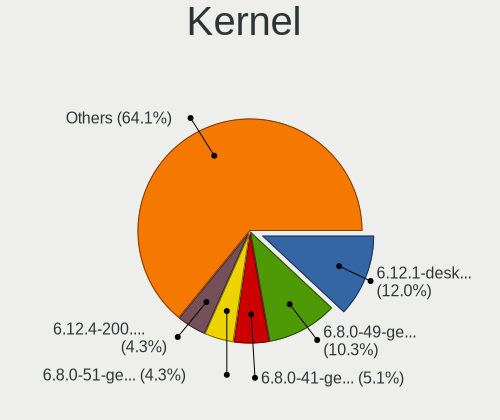

| Version                     | Computers | Percent |
|-----------------------------|-----------|---------|
| 5.15.0-58-generic           | 14        | 17.28%  |
| 5.15.0-56-generic           | 9         | 11.11%  |
| 6.1.1-desktop-1omv2290      | 8         | 9.88%   |
| 6.0.12-76060006-generic     | 5         | 6.17%   |
| 6.1.5-200.fc37.x86_64       | 4         | 4.94%   |
| 5.15.0-57-generic           | 4         | 4.94%   |
| 6.1.6-200.fc37.x86_64       | 3         | 3.7%    |
| 6.1.4-arch1-1               | 2         | 2.47%   |
| 6.0.16-300.fc37.x86_64      | 2         | 2.47%   |
| 6.0.0-kali3-amd64           | 2         | 2.47%   |
| 5.19.12-desktop-2omv4090    | 2         | 2.47%   |
| 5.19.0-29-generic           | 2         | 2.47%   |
| 5.19.0-26-generic           | 2         | 2.47%   |
| 5.15.86-1-lts               | 2         | 2.47%   |
| 6.1.8-060108-generic        | 1         | 1.23%   |
| 6.1.7-100.fc36.x86_64       | 1         | 1.23%   |
| 6.1.6-2-ck-generic-v3       | 1         | 1.23%   |
| 6.1.3-zen1-1-zen            | 1         | 1.23%   |
| 6.1.2-arch1-1               | 1         | 1.23%   |
| 6.1.1-1-MANJARO             | 1         | 1.23%   |
| 6.1.0-1-pve                 | 1         | 1.23%   |
| 6.0.9-desktop-1omv22090     | 1         | 1.23%   |
| 6.0.0-0.deb11.6-amd64       | 1         | 1.23%   |
| 5.4.0-135-generic           | 1         | 1.23%   |
| 5.19.0-ziv-cm218            | 1         | 1.23%   |
| 5.19.0-28-generic           | 1         | 1.23%   |
| 5.19.0-21-generic           | 1         | 1.23%   |
| 5.15.77-amd64-desktop       | 1         | 1.23%   |
| 5.15.0-43-generic           | 1         | 1.23%   |
| 5.15.0-41-generic           | 1         | 1.23%   |
| 5.12.0                      | 1         | 1.23%   |
| 5.10.0-20-amd64             | 1         | 1.23%   |
| 5.0.16-100.fc28.x86_64      | 1         | 1.23%   |
| 3.10.0-1160.81.1.el7.x86_64 | 1         | 1.23%   |

Kernel Family
-------------

Linux kernel without a distro release

| Version | Computers | Percent |
|---------|-----------|---------|
| 5.15.0  | 29        | 35.8%   |
| 6.1.1   | 9         | 11.11%  |
| 5.19.0  | 7         | 8.64%   |
| 6.0.12  | 5         | 6.17%   |
| 6.1.6   | 4         | 4.94%   |
| 6.1.5   | 4         | 4.94%   |
| 6.0.0   | 3         | 3.7%    |
| 6.1.4   | 2         | 2.47%   |
| 6.0.16  | 2         | 2.47%   |
| 5.19.12 | 2         | 2.47%   |
| 5.15.86 | 2         | 2.47%   |
| 6.1.8   | 1         | 1.23%   |
| 6.1.7   | 1         | 1.23%   |
| 6.1.3   | 1         | 1.23%   |
| 6.1.2   | 1         | 1.23%   |
| 6.1.0   | 1         | 1.23%   |
| 6.0.9   | 1         | 1.23%   |
| 5.4.0   | 1         | 1.23%   |
| 5.15.77 | 1         | 1.23%   |
| 5.12.0  | 1         | 1.23%   |
| 5.10.0  | 1         | 1.23%   |
| 5.0.16  | 1         | 1.23%   |
| 3.10.0  | 1         | 1.23%   |

Kernel Major Ver.
-----------------

Linux kernel major version

| Version | Computers | Percent |
|---------|-----------|---------|
| 5.15    | 32        | 39.51%  |
| 6.1     | 24        | 29.63%  |
| 6.0     | 11        | 13.58%  |
| 5.19    | 9         | 11.11%  |
| 5.4     | 1         | 1.23%   |
| 5.12    | 1         | 1.23%   |
| 5.10    | 1         | 1.23%   |
| 5.0     | 1         | 1.23%   |
| 3.10    | 1         | 1.23%   |

Arch
----

OS architecture (x86_64, i586, etc.)

| Name   | Computers | Percent |
|--------|-----------|---------|
| x86_64 | 81        | 100%    |

DE
--

Desktop Environment

| Name            | Computers | Percent |
|-----------------|-----------|---------|
| GNOME           | 42        | 51.85%  |
| KDE5            | 24        | 29.63%  |
| X-Cinnamon      | 5         | 6.17%   |
| XFCE            | 2         | 2.47%   |
| Unknown         | 2         | 2.47%   |
| i3              | 1         | 1.23%   |
| GNOME Flashback | 1         | 1.23%   |
| GNOME Classic   | 1         | 1.23%   |
| dwm             | 1         | 1.23%   |
| Deepin          | 1         | 1.23%   |
| awesome         | 1         | 1.23%   |

Display Server
--------------

X11 or Wayland

| Name    | Computers | Percent |
|---------|-----------|---------|
| X11     | 54        | 66.67%  |
| Wayland | 25        | 30.86%  |
| Tty     | 1         | 1.23%   |
| Unknown | 1         | 1.23%   |

Display Manager
---------------

SDDM, LightDM, etc.

| Name    | Computers | Percent |
|---------|-----------|---------|
| GDM3    | 26        | 32.1%   |
| SDDM    | 20        | 24.69%  |
| Unknown | 18        | 22.22%  |
| GDM     | 11        | 13.58%  |
| LightDM | 6         | 7.41%   |

OS Lang
-------

Language

| Lang    | Computers | Percent |
|---------|-----------|---------|
| en_IN   | 48        | 59.26%  |
| en_US   | 24        | 29.63%  |
| C       | 3         | 3.7%    |
| en_GB   | 2         | 2.47%   |
| Unknown | 2         | 2.47%   |
| ta_LK   | 1         | 1.23%   |
| pl_PL   | 1         | 1.23%   |

Boot Mode
---------

EFI or BIOS

| Mode | Computers | Percent |
|------|-----------|---------|
| EFI  | 50        | 61.73%  |
| BIOS | 31        | 38.27%  |

Filesystem
----------

Type of filesystem

| Type    | Computers | Percent |
|---------|-----------|---------|
| Ext4    | 56        | 69.14%  |
| Overlay | 12        | 14.81%  |
| Btrfs   | 11        | 13.58%  |
| Xfs     | 1         | 1.23%   |
| Ext2    | 1         | 1.23%   |

Part. scheme
------------

Scheme of partitioning

| Type    | Computers | Percent |
|---------|-----------|---------|
| GPT     | 57        | 70.37%  |
| Unknown | 16        | 19.75%  |
| MBR     | 8         | 9.88%   |

Dual Boot with Linux/BSD
------------------------

Hosting more than one Linux/BSD

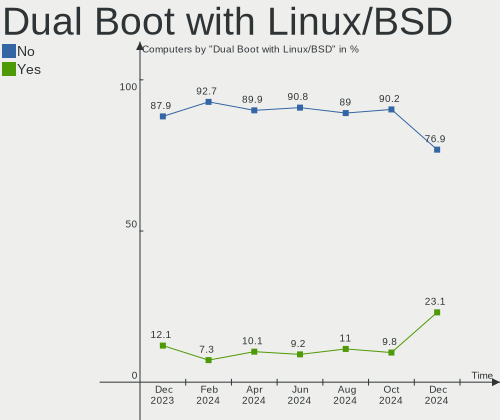

| Dual boot | Computers | Percent |
|-----------|-----------|---------|
| No        | 61        | 75.31%  |
| Yes       | 20        | 24.69%  |

Dual Boot (Win)
---------------

Hosting Linux and Windows

| Dual boot | Computers | Percent |
|-----------|-----------|---------|
| No        | 46        | 56.79%  |
| Yes       | 35        | 43.21%  |

Board
-----

Vendor
------

Motherboard manufacturer

| Name                           | Computers | Percent |
|--------------------------------|-----------|---------|
| Lenovo                         | 19        | 23.46%  |
| Hewlett-Packard                | 13        | 16.05%  |
| ASUSTek Computer               | 13        | 16.05%  |
| MSI                            | 7         | 8.64%   |
| Gigabyte Technology            | 6         | 7.41%   |
| Dell                           | 6         | 7.41%   |
| Acer                           | 6         | 7.41%   |
| Timi                           | 3         | 3.7%    |
| ITI LIMITED                    | 2         | 2.47%   |
| ASRock                         | 2         | 2.47%   |
| SmbiosType1_SystemManufacturer | 1         | 1.23%   |
| Intel                          | 1         | 1.23%   |
| HONOR                          | 1         | 1.23%   |
| AMI                            | 1         | 1.23%   |

Model
-----

Motherboard model

| Name                                                         | Computers | Percent |
|--------------------------------------------------------------|-----------|---------|
| Timi Mi NoteBook Pro                                         | 2         | 2.47%   |
| HP Pavilion 15                                               | 2         | 2.47%   |
| HP 15                                                        | 2         | 2.47%   |
| Timi Xiaomi NoteBook Pro                                     | 1         | 1.23%   |
| SmbiosType1_SystemManufacturer SmbiosType1_SystemProductName | 1         | 1.23%   |
| MSI Prestige 15 A11SCX                                       | 1         | 1.23%   |
| MSI MS-7D75                                                  | 1         | 1.23%   |
| MSI MS-7D23                                                  | 1         | 1.23%   |
| MSI MS-7B79                                                  | 1         | 1.23%   |
| MSI GF63 Thin 9SCXR                                          | 1         | 1.23%   |
| MSI GF63 8RD                                                 | 1         | 1.23%   |
| MSI Bravo 15 B5DD                                            | 1         | 1.23%   |
| Lenovo V14-IIL 82C4                                          | 1         | 1.23%   |
| Lenovo ThinkPad X61 7674BE1                                  | 1         | 1.23%   |
| Lenovo ThinkPad X200 7459VB9                                 | 1         | 1.23%   |
| Lenovo ThinkPad W540 20BHS1840P                              | 1         | 1.23%   |
| Lenovo ThinkPad T470s W10DG 20JTS13L00                       | 1         | 1.23%   |
| Lenovo ThinkPad T440p 20AN00DJAD                             | 1         | 1.23%   |
| Lenovo ThinkPad T430 2349E56                                 | 1         | 1.23%   |
| Lenovo ThinkPad L430 24663D1                                 | 1         | 1.23%   |
| Lenovo ThinkPad E490 20N8S0H300                              | 1         | 1.23%   |
| Lenovo ThinkPad A485 20MVS0X600                              | 1         | 1.23%   |
| Lenovo ThinkBook 13s G2 ITL 20V9                             | 1         | 1.23%   |
| Lenovo S510 10KXA007IH                                       | 1         | 1.23%   |
| Lenovo Legion 5 Pro 16ACH6H 82JQ                             | 1         | 1.23%   |
| Lenovo IdeaPadFlex 5 14ARE05 81X2                            | 1         | 1.23%   |
| Lenovo IdeaPad Y560                                          | 1         | 1.23%   |
| Lenovo IdeaPad Gaming 3 15IHU6 82K1                          | 1         | 1.23%   |
| Lenovo IdeaPad 5 15ITL05 82FG                                | 1         | 1.23%   |
| Lenovo IdeaPad 320-15ISK 80XH                                | 1         | 1.23%   |
| Lenovo E41-25 81FS                                           | 1         | 1.23%   |
| ITI LIMITED ITI Smaash ITIB15LI3                             | 1         | 1.23%   |
| ITI LIMITED ITI SMAASH ITIB11LCE                             | 1         | 1.23%   |
| Intel DH61WW AAG23116-302                                    | 1         | 1.23%   |
| HONOR NMH-WCX9                                               | 1         | 1.23%   |
| HP Victus by Gaming Laptop 15-fa0xxx                         | 1         | 1.23%   |
| HP ProOne 600 G5 21.5-in All-in-One                          | 1         | 1.23%   |
| HP Pavilion g6                                               | 1         | 1.23%   |
| HP Notebook                                                  | 1         | 1.23%   |
| HP Laptop HP Laptop 14s-dr1xxx                               | 1         | 1.23%   |

Model Family
------------

Motherboard model prefix

| Name                                       | Computers | Percent |
|--------------------------------------------|-----------|---------|
| Lenovo ThinkPad                            | 9         | 11.11%  |
| Lenovo IdeaPad                             | 4         | 4.94%   |
| Acer Aspire                                | 4         | 4.94%   |
| HP Pavilion                                | 3         | 3.7%    |
| ASUS VivoBook                              | 3         | 3.7%    |
| Timi Mi                                    | 2         | 2.47%   |
| MSI GF63                                   | 2         | 2.47%   |
| ITI LIMITED ITI                            | 2         | 2.47%   |
| HP Laptop                                  | 2         | 2.47%   |
| HP 15                                      | 2         | 2.47%   |
| Dell Latitude                              | 2         | 2.47%   |
| Dell Inspiron                              | 2         | 2.47%   |
| ASUS PRIME                                 | 2         | 2.47%   |
| ASUS ASUS                                  | 2         | 2.47%   |
| Timi Xiaomi                                | 1         | 1.23%   |
| SmbiosType1_SystemManufacturer SmbiosType1 | 1         | 1.23%   |
| MSI Prestige                               | 1         | 1.23%   |
| MSI MS-7D75                                | 1         | 1.23%   |
| MSI MS-7D23                                | 1         | 1.23%   |
| MSI MS-7B79                                | 1         | 1.23%   |
| MSI Bravo                                  | 1         | 1.23%   |
| Lenovo V14-IIL                             | 1         | 1.23%   |
| Lenovo ThinkBook                           | 1         | 1.23%   |
| Lenovo S510                                | 1         | 1.23%   |
| Lenovo Legion                              | 1         | 1.23%   |
| Lenovo IdeaPadFlex                         | 1         | 1.23%   |
| Lenovo E41-25                              | 1         | 1.23%   |
| Intel DH61WW                               | 1         | 1.23%   |
| HONOR NMH-WCX9                             | 1         | 1.23%   |
| HP Victus                                  | 1         | 1.23%   |
| HP ProOne                                  | 1         | 1.23%   |
| HP Notebook                                | 1         | 1.23%   |
| HP ENVY                                    | 1         | 1.23%   |
| HP 245                                     | 1         | 1.23%   |
| HP 18-1206in                               | 1         | 1.23%   |
| Gigabyte X570S                             | 1         | 1.23%   |
| Gigabyte H81M-S                            | 1         | 1.23%   |
| Gigabyte H61MS                             | 1         | 1.23%   |
| Gigabyte H310M                             | 1         | 1.23%   |
| Gigabyte GA-78LMT-USB3                     | 1         | 1.23%   |

MFG Year
--------

Motherboard manufacture year

| Year | Computers | Percent |
|------|-----------|---------|
| 2022 | 12        | 14.81%  |
| 2018 | 12        | 14.81%  |
| 2020 | 11        | 13.58%  |
| 2021 | 9         | 11.11%  |
| 2013 | 7         | 8.64%   |
| 2014 | 6         | 7.41%   |
| 2019 | 5         | 6.17%   |
| 2016 | 5         | 6.17%   |
| 2017 | 4         | 4.94%   |
| 2012 | 3         | 3.7%    |
| 2011 | 2         | 2.47%   |
| 2010 | 2         | 2.47%   |
| 2015 | 1         | 1.23%   |
| 2008 | 1         | 1.23%   |
| 2007 | 1         | 1.23%   |

Form Factor
-----------

Physical design of the computer

| Name        | Computers | Percent |
|-------------|-----------|---------|
| Notebook    | 56        | 69.14%  |
| Desktop     | 20        | 24.69%  |
| Convertible | 3         | 3.7%    |
| Mini pc     | 1         | 1.23%   |
| All in one  | 1         | 1.23%   |

Secure Boot
-----------

Enabled or disabled

| State    | Computers | Percent |
|----------|-----------|---------|
| Disabled | 72        | 88.89%  |
| Enabled  | 9         | 11.11%  |

Coreboot
--------

Have coreboot on board

| Used | Computers | Percent |
|------|-----------|---------|
| No   | 81        | 100%    |

RAM Size
--------

Total RAM memory

| Size in GB  | Computers | Percent |
|-------------|-----------|---------|
| 4.01-8.0    | 32        | 39.51%  |
| 16.01-24.0  | 16        | 19.75%  |
| 8.01-16.0   | 15        | 18.52%  |
| 3.01-4.0    | 11        | 13.58%  |
| 64.01-256.0 | 4         | 4.94%   |
| 32.01-64.0  | 1         | 1.23%   |
| 2.01-3.0    | 1         | 1.23%   |
| 1.01-2.0    | 1         | 1.23%   |

RAM Used
--------

Used RAM memory

| Used GB   | Computers | Percent |
|-----------|-----------|---------|
| 2.01-3.0  | 26        | 32.1%   |
| 1.01-2.0  | 26        | 32.1%   |
| 4.01-8.0  | 14        | 17.28%  |
| 3.01-4.0  | 9         | 11.11%  |
| 8.01-16.0 | 5         | 6.17%   |
| 0.51-1.0  | 1         | 1.23%   |

Total Drives
------------

Number of drives on board

| Drives | Computers | Percent |
|--------|-----------|---------|
| 1      | 52        | 64.2%   |
| 2      | 22        | 27.16%  |
| 3      | 3         | 3.7%    |
| 7      | 1         | 1.23%   |
| 6      | 1         | 1.23%   |
| 5      | 1         | 1.23%   |
| 4      | 1         | 1.23%   |

Has CD-ROM
----------

Has CD-ROM on board

| Presented | Computers | Percent |
|-----------|-----------|---------|
| No        | 61        | 75.31%  |
| Yes       | 20        | 24.69%  |

Has Ethernet
------------

Has Ethernet on board

| Presented | Computers | Percent |
|-----------|-----------|---------|
| Yes       | 62        | 76.54%  |
| No        | 19        | 23.46%  |

Has WiFi
--------

Has WiFi module

| Presented | Computers | Percent |
|-----------|-----------|---------|
| Yes       | 71        | 87.65%  |
| No        | 10        | 12.35%  |

Has Bluetooth
-------------

Has Bluetooth module

| Presented | Computers | Percent |
|-----------|-----------|---------|
| Yes       | 64        | 79.01%  |
| No        | 17        | 20.99%  |

Location
--------

Country
-------

Geographic location (country)

| Country | Computers | Percent |
|---------|-----------|---------|
| India   | 81        | 100%    |

City
----

Geographic location (city)

| City           | Computers | Percent |
|----------------|-----------|---------|
| Bengaluru      | 11        | 13.58%  |
| Delhi          | 9         | 11.11%  |
| Pune           | 5         | 6.17%   |
| Kochi          | 4         | 4.94%   |
| Tiruchi        | 3         | 3.7%    |
| Mumbai         | 3         | 3.7%    |
| Kolkata        | 3         | 3.7%    |
| Indore         | 3         | 3.7%    |
| Hyderabad      | 3         | 3.7%    |
| Guwahati       | 3         | 3.7%    |
| Chennai        | 3         | 3.7%    |
| Jalgaon        | 2         | 2.47%   |
| Coimbatore     | 2         | 2.47%   |
| Ahmedabad      | 2         | 2.47%   |
| Vadodara       | 1         | 1.23%   |
| Trivandrum     | 1         | 1.23%   |
| Thane          | 1         | 1.23%   |
| Solapur        | 1         | 1.23%   |
| Shoranur       | 1         | 1.23%   |
| Salem          | 1         | 1.23%   |
| Ramanathapuram | 1         | 1.23%   |
| Rajkot         | 1         | 1.23%   |
| Raipur         | 1         | 1.23%   |
| Patna          | 1         | 1.23%   |
| Panchkula      | 1         | 1.23%   |
| Palakkad       | 1         | 1.23%   |
| New Delhi      | 1         | 1.23%   |
| Narsingpur     | 1         | 1.23%   |
| Lucknow        | 1         | 1.23%   |
| Kottayam       | 1         | 1.23%   |
| Kalyan         | 1         | 1.23%   |
| Gyanpur        | 1         | 1.23%   |
| Gurgaon        | 1         | 1.23%   |
| Guntur         | 1         | 1.23%   |
| Daman          | 1         | 1.23%   |
| Bhubaneswar    | 1         | 1.23%   |
| Bhopal         | 1         | 1.23%   |
| Barasat        | 1         | 1.23%   |
| Unknown        | 1         | 1.23%   |

Drives
------

Drive Vendor
------------

Hard drive vendors

| Vendor                      | Computers | Drives | Percent |
|-----------------------------|-----------|--------|---------|
| WDC                         | 25        | 28     | 21.74%  |
| Seagate                     | 16        | 23     | 13.91%  |
| Samsung Electronics         | 10        | 10     | 8.7%    |
| Crucial                     | 9         | 12     | 7.83%   |
| Toshiba                     | 8         | 8      | 6.96%   |
| Sandisk                     | 7         | 7      | 6.09%   |
| Micron Technology           | 5         | 5      | 4.35%   |
| Kingston                    | 4         | 4      | 3.48%   |
| Intel                       | 4         | 4      | 3.48%   |
| KIOXIA                      | 3         | 3      | 2.61%   |
| HGST                        | 3         | 3      | 2.61%   |
| China                       | 3         | 3      | 2.61%   |
| SK hynix                    | 2         | 2      | 1.74%   |
| Lexar                       | 2         | 2      | 1.74%   |
| Unknown                     | 2         | 2      | 1.74%   |
| Wibtek                      | 1         | 1      | 0.87%   |
| Unknown                     | 1         | 1      | 0.87%   |
| UMIS                        | 1         | 1      | 0.87%   |
| Phison Electronics          | 1         | 1      | 0.87%   |
| Netac                       | 1         | 1      | 0.87%   |
| Micron/Crucial Technology   | 1         | 1      | 0.87%   |
| Maxtor                      | 1         | 1      | 0.87%   |
| LITEON                      | 1         | 1      | 0.87%   |
| Kingston Technology Company | 1         | 1      | 0.87%   |
| FRONTECH                    | 1         | 1      | 0.87%   |
| External                    | 1         | 1      | 0.87%   |
| ADATA Technology            | 1         | 1      | 0.87%   |

Drive Model
-----------

Hard drive models

| Model                                | Computers | Percent |
|--------------------------------------|-----------|---------|
| Crucial CT240BX500SSD1 240GB         | 4         | 3.28%   |
| Seagate ST2000LM007-1R8174 2TB       | 3         | 2.46%   |
| Micron 2210_MTFDHBA512QFD 512GB      | 3         | 2.46%   |
| KIOXIA KBG40ZNV512G 512GB            | 3         | 2.46%   |
| WDC WD10SPZX-60Z10T0 1TB             | 2         | 1.64%   |
| WDC WD10EZEX-75WN4A1 1TB             | 2         | 1.64%   |
| WDC PC SN530 SDBPNPZ-256G-1002 256GB | 2         | 1.64%   |
| Toshiba MQ04ABF100 1TB               | 2         | 1.64%   |
| Toshiba MQ01ACF050 500GB             | 2         | 1.64%   |
| Seagate ST3500418AS 500GB            | 2         | 1.64%   |
| Seagate ST1000LM049-2GH172 1TB       | 2         | 1.64%   |
| Seagate ST1000DM010-2EP102 1TB       | 2         | 1.64%   |
| Sandisk WD Blue SN570 500GB          | 2         | 1.64%   |
| Lexar 120GB SSD                      | 2         | 1.64%   |
| HGST HTS721010A9E630 1TB             | 2         | 1.64%   |
| Crucial CT500P2SSD8 500GB            | 2         | 1.64%   |
| Unknown                              | 2         | 1.64%   |
| Wibtek W800S 512GB                   | 1         | 0.82%   |
| WDC WDS240G2G0A-00JH30 240GB SSD     | 1         | 0.82%   |
| WDC WDS100T2G0A-00JH30 1TB SSD       | 1         | 0.82%   |
| WDC WD5000LPVX-60V0TT0 500GB         | 1         | 0.82%   |
| WDC WD5000LPLX-08ZNTT0 500GB         | 1         | 0.82%   |
| WDC WD5000AVCS-632DY1 500GB          | 1         | 0.82%   |
| WDC WD5000AAKX-60U6AA0 500GB         | 1         | 0.82%   |
| WDC WD3200BUCT-63TWBY0 320GB         | 1         | 0.82%   |
| WDC WD3200BPVT-00HXZT1 320GB         | 1         | 0.82%   |
| WDC WD20EZBX-00AYRA0 2TB             | 1         | 0.82%   |
| WDC WD10SPZX-80Z10T0 1TB             | 1         | 0.82%   |
| WDC WD10JPVX-60JC3T0 1TB             | 1         | 0.82%   |
| WDC WD10EZRX-00L4HB0 1TB             | 1         | 0.82%   |
| WDC WD10EZEX-75WN4A0 1TB             | 1         | 0.82%   |
| WDC WD10EZEX-21WN4A0 1TB             | 1         | 0.82%   |
| WDC WD10EZEX-00MFCA0 1TB             | 1         | 0.82%   |
| WDC WD10EZEX-00BBHA0 1TB             | 1         | 0.82%   |
| WDC WD10EARS-00Y5B1 1TB              | 1         | 0.82%   |
| WDC WD10EALX-759BA1 1TB              | 1         | 0.82%   |
| WDC PC SN730 SDBPNTY-1T00-1101 1TB   | 1         | 0.82%   |
| WDC PC SN530 SDBPNPZ-512G-1036 512GB | 1         | 0.82%   |
| WDC PC SN530 SDBPMPZ-512G-1101 512GB | 1         | 0.82%   |
| WDC PC SN520 SDAPNUW-256G-1002 256GB | 1         | 0.82%   |

HDD Vendor
----------

Hard disk drive vendors

| Vendor  | Computers | Drives | Percent |
|---------|-----------|--------|---------|
| WDC     | 18        | 20     | 40.91%  |
| Seagate | 16        | 23     | 36.36%  |
| Toshiba | 7         | 7      | 15.91%  |
| HGST    | 3         | 3      | 6.82%   |

SSD Vendor
----------

Solid state drive vendors

| Vendor              | Computers | Drives | Percent |
|---------------------|-----------|--------|---------|
| Crucial             | 7         | 10     | 28%     |
| Kingston            | 3         | 3      | 12%     |
| China               | 3         | 3      | 12%     |
| WDC                 | 2         | 2      | 8%      |
| Lexar               | 2         | 2      | 8%      |
| Wibtek              | 1         | 1      | 4%      |
| Samsung Electronics | 1         | 1      | 4%      |
| Netac               | 1         | 1      | 4%      |
| Micron Technology   | 1         | 1      | 4%      |
| Maxtor              | 1         | 1      | 4%      |
| LITEON              | 1         | 1      | 4%      |
| FRONTECH            | 1         | 1      | 4%      |
| Unknown             | 1         | 1      | 4%      |

Drive Kind
----------

HDD or SSD

| Kind    | Computers | Drives | Percent |
|---------|-----------|--------|---------|
| HDD     | 42        | 53     | 38.18%  |
| NVMe    | 40        | 44     | 36.36%  |
| SSD     | 25        | 28     | 22.73%  |
| MMC     | 2         | 2      | 1.82%   |
| Unknown | 1         | 1      | 0.91%   |

Drive Connector
---------------

SATA, SAS, NVMe, etc.

| Type | Computers | Drives | Percent |
|------|-----------|--------|---------|
| SATA | 54        | 80     | 54.55%  |
| NVMe | 40        | 43     | 40.4%   |
| SAS  | 3         | 3      | 3.03%   |
| MMC  | 2         | 2      | 2.02%   |

Drive Size
----------

Size of hard drive

| Size in TB | Computers | Drives | Percent |
|------------|-----------|--------|---------|
| 0.01-0.5   | 31        | 34     | 46.27%  |
| 0.51-1.0   | 28        | 36     | 41.79%  |
| 1.01-2.0   | 5         | 5      | 7.46%   |
| 3.01-4.0   | 1         | 1      | 1.49%   |
| 10.01-20.0 | 1         | 4      | 1.49%   |
| 4.01-10.0  | 1         | 1      | 1.49%   |

Space Total
-----------

Amount of disk space available on the file system

| Size in GB     | Computers | Percent |
|----------------|-----------|---------|
| 101-250        | 27        | 33.33%  |
| 251-500        | 15        | 18.52%  |
| 501-1000       | 12        | 14.81%  |
| 1-20           | 8         | 9.88%   |
| 21-50          | 6         | 7.41%   |
| 1001-2000      | 6         | 7.41%   |
| More than 3000 | 3         | 3.7%    |
| 51-100         | 3         | 3.7%    |
| Unknown        | 1         | 1.23%   |

Space Used
----------

Amount of used disk space

| Used GB        | Computers | Percent |
|----------------|-----------|---------|
| 1-20           | 31        | 38.27%  |
| 21-50          | 18        | 22.22%  |
| 101-250        | 15        | 18.52%  |
| 251-500        | 7         | 8.64%   |
| 1001-2000      | 3         | 3.7%    |
| 51-100         | 3         | 3.7%    |
| More than 3000 | 1         | 1.23%   |
| 2001-3000      | 1         | 1.23%   |
| 501-1000       | 1         | 1.23%   |
| Unknown        | 1         | 1.23%   |

Malfunc. Drives
---------------

Drive models with a malfunction

| Model                              | Computers | Drives | Percent |
|------------------------------------|-----------|--------|---------|
| Wibtek W800S 512GB                 | 1         | 1      | 14.29%  |
| WDC WD10EZRX-00L4HB0 1TB           | 1         | 1      | 14.29%  |
| Toshiba DT01ACA100 1TB             | 1         | 1      | 14.29%  |
| SK hynix PC711 HFS001TDE9X073N 1TB | 1         | 1      | 14.29%  |
| Seagate ST3500418AS 500GB          | 1         | 1      | 14.29%  |
| Seagate ST16000NM001G-2KK103 16TB  | 1         | 1      | 14.29%  |
| Unknown                            | 1         | 1      | 14.29%  |

Malfunc. Drive Vendor
---------------------

Vendors of faulty drives

| Vendor   | Computers | Drives | Percent |
|----------|-----------|--------|---------|
| Seagate  | 2         | 2      | 28.57%  |
| Wibtek   | 1         | 1      | 14.29%  |
| WDC      | 1         | 1      | 14.29%  |
| Toshiba  | 1         | 1      | 14.29%  |
| SK hynix | 1         | 1      | 14.29%  |
| Unknown  | 1         | 1      | 14.29%  |

Malfunc. HDD Vendor
-------------------

Vendors of faulty HDD drives

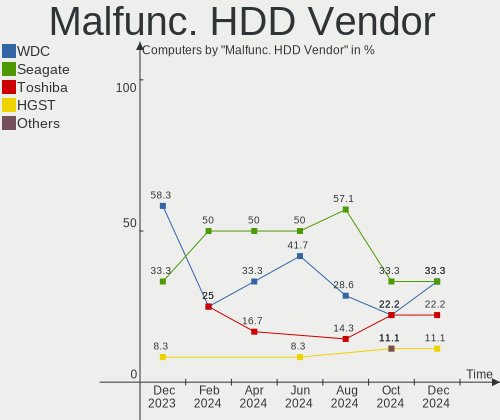

| Vendor  | Computers | Drives | Percent |
|---------|-----------|--------|---------|
| Seagate | 2         | 2      | 50%     |
| WDC     | 1         | 1      | 25%     |
| Toshiba | 1         | 1      | 25%     |

Malfunc. Drive Kind
-------------------

Kinds of faulty drives

| Kind | Computers | Drives | Percent |
|------|-----------|--------|---------|
| HDD  | 4         | 4      | 57.14%  |
| SSD  | 2         | 2      | 28.57%  |
| NVMe | 1         | 1      | 14.29%  |

Failed Drives
-------------

Failed drive models

Zero info for selected period =(

Failed Drive Vendor
-------------------

Failed drive vendors

Zero info for selected period =(

Drive Status
------------

Number of failed and malfunc. drives

| Status   | Computers | Drives | Percent |
|----------|-----------|--------|---------|
| Works    | 52        | 69     | 55.91%  |
| Detected | 34        | 52     | 36.56%  |
| Malfunc  | 7         | 7      | 7.53%   |

Storage controller
------------------

Storage Vendor
--------------

Storage controller vendors

| Vendor                       | Computers | Percent |
|------------------------------|-----------|---------|
| Intel                        | 48        | 44.44%  |
| AMD                          | 19        | 17.59%  |
| SanDisk                      | 12        | 11.11%  |
| Samsung Electronics          | 9         | 8.33%   |
| Micron Technology            | 4         | 3.7%    |
| Micron/Crucial Technology    | 3         | 2.78%   |
| KIOXIA                       | 3         | 2.78%   |
| SK hynix                     | 2         | 1.85%   |
| Kingston Technology Company  | 2         | 1.85%   |
| ASMedia Technology           | 2         | 1.85%   |
| Union Memory (Shenzhen)      | 1         | 0.93%   |
| Toshiba America Info Systems | 1         | 0.93%   |
| Phison Electronics           | 1         | 0.93%   |
| ADATA Technology             | 1         | 0.93%   |

Storage Model
-------------

Storage controller models

| Model                                                                          | Computers | Percent |
|--------------------------------------------------------------------------------|-----------|---------|
| AMD FCH SATA Controller [AHCI mode]                                            | 13        | 10.74%  |
| Samsung NVMe SSD Controller 980                                                | 4         | 3.31%   |
| Micron Non-Volatile memory controller                                          | 4         | 3.31%   |
| Intel Volume Management Device NVMe RAID Controller                            | 4         | 3.31%   |
| Intel Tiger Lake-LP SATA Controller                                            | 4         | 3.31%   |
| Intel Sunrise Point-LP SATA Controller [AHCI mode]                             | 4         | 3.31%   |
| Intel 82801 Mobile SATA Controller [RAID mode]                                 | 4         | 3.31%   |
| Intel 8 Series SATA Controller 1 [AHCI mode]                                   | 4         | 3.31%   |
| SanDisk WD Blue SN570 NVMe SSD                                                 | 3         | 2.48%   |
| SanDisk WD Blue SN550 NVMe SSD                                                 | 3         | 2.48%   |
| SanDisk WD Blue SN500 / PC SN520 NVMe SSD                                      | 3         | 2.48%   |
| Micron/Crucial P2 NVMe PCIe SSD                                                | 3         | 2.48%   |
| KIOXIA NVMe SSD Controller BG4                                                 | 3         | 2.48%   |
| Intel Cannon Lake Mobile PCH SATA AHCI Controller                              | 3         | 2.48%   |
| Intel 8 Series/C220 Series Chipset Family 6-port SATA Controller 1 [AHCI mode] | 3         | 2.48%   |
| SanDisk Non-Volatile memory controller                                         | 2         | 1.65%   |
| Samsung NVMe SSD Controller SM981/PM981/PM983                                  | 2         | 1.65%   |
| Samsung NVMe SSD Controller PM9A1/PM9A3/980PRO                                 | 2         | 1.65%   |
| Intel Q170/Q150/B150/H170/H110/Z170/CM236 Chipset SATA Controller [AHCI Mode]  | 2         | 1.65%   |
| Intel Celeron N3350/Pentium N4200/Atom E3900 Series SATA AHCI Controller       | 2         | 1.65%   |
| Intel Cannon Lake PCH SATA AHCI Controller                                     | 2         | 1.65%   |
| Intel 7 Series Chipset Family 6-port SATA Controller [AHCI mode]               | 2         | 1.65%   |
| ASMedia ASM1062 Serial ATA Controller                                          | 2         | 1.65%   |
| AMD SB7x0/SB8x0/SB9x0 SATA Controller [AHCI mode]                              | 2         | 1.65%   |
| AMD SATA controller                                                            | 2         | 1.65%   |
| AMD 500 Series Chipset SATA Controller                                         | 2         | 1.65%   |
| Union Memory (Shenzhen) Non-Volatile memory controller                         | 1         | 0.83%   |
| Toshiba America Info Systems BG3 NVMe SSD Controller                           | 1         | 0.83%   |
| SK hynix Gold P31/PC711 NVMe Solid State Drive                                 | 1         | 0.83%   |
| SK hynix BC511                                                                 | 1         | 0.83%   |
| SanDisk WD Black SN750 / PC SN730 NVMe SSD                                     | 1         | 0.83%   |
| Samsung NVMe SSD Controller SM961/PM961/SM963                                  | 1         | 0.83%   |
| Phison E16 PCIe4 NVMe Controller                                               | 1         | 0.83%   |
| Kingston Company Company Non-Volatile memory controller                        | 1         | 0.83%   |
| Kingston Company A2000 NVMe SSD                                                | 1         | 0.83%   |
| Intel Wildcat Point-LP SATA Controller [AHCI Mode]                             | 1         | 0.83%   |
| Intel Volume Management Device NVMe RAID Controller Intel Corporation          | 1         | 0.83%   |
| Intel SSD 660P Series                                                          | 1         | 0.83%   |
| Intel SSD 600P Series                                                          | 1         | 0.83%   |
| Intel SATA Controller [RAID mode]                                              | 1         | 0.83%   |

Storage Kind
------------

Kind of storage controller (IDE, SATA, NVMe, SAS, ...)

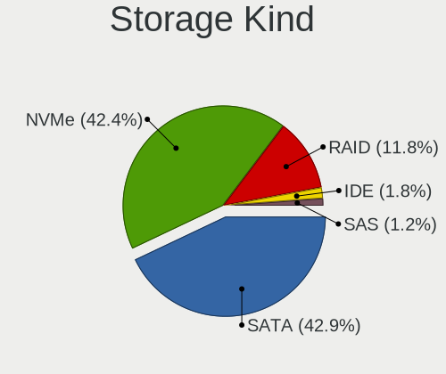

| Kind | Computers | Percent |
|------|-----------|---------|
| SATA | 60        | 52.17%  |
| NVMe | 41        | 35.65%  |
| RAID | 10        | 8.7%    |
| IDE  | 4         | 3.48%   |

Processor
---------

CPU Vendor
----------

Processor vendors

| Vendor | Computers | Percent |
|--------|-----------|---------|
| Intel  | 57        | 70.37%  |
| AMD    | 24        | 29.63%  |

CPU Model
---------

Processor models

| Model                                         | Computers | Percent |
|-----------------------------------------------|-----------|---------|
| Intel Core i5-8265U CPU @ 1.60GHz             | 4         | 4.94%   |
| AMD Ryzen 5 3500U with Radeon Vega Mobile Gfx | 3         | 3.7%    |
| Intel Core i7-8750H CPU @ 2.20GHz             | 2         | 2.47%   |
| Intel Core i5-4210U CPU @ 1.70GHz             | 2         | 2.47%   |
| Intel Core i3-6006U CPU @ 2.00GHz             | 2         | 2.47%   |
| Intel Core i3-4030U CPU @ 1.90GHz             | 2         | 2.47%   |
| Intel 12th Gen Core i5-12450H                 | 2         | 2.47%   |
| Intel 11th Gen Core i5-1135G7 @ 2.40GHz       | 2         | 2.47%   |
| Intel 11th Gen Core i5-11320H @ 3.20GHz       | 2         | 2.47%   |
| Intel 11th Gen Core i3-1115G4 @ 3.00GHz       | 2         | 2.47%   |
| AMD Ryzen 7 5800H with Radeon Graphics        | 2         | 2.47%   |
| Intel Pentium Silver N6000 @ 1.10GHz          | 1         | 1.23%   |
| Intel Pentium CPU N4200 @ 1.10GHz             | 1         | 1.23%   |
| Intel Core i9-10900K CPU @ 3.70GHz            | 1         | 1.23%   |
| Intel Core i7-9750H CPU @ 2.60GHz             | 1         | 1.23%   |
| Intel Core i7-8700T CPU @ 2.40GHz             | 1         | 1.23%   |
| Intel Core i7-7600U CPU @ 2.80GHz             | 1         | 1.23%   |
| Intel Core i7-5500U CPU @ 2.40GHz             | 1         | 1.23%   |
| Intel Core i7-4800MQ CPU @ 2.70GHz            | 1         | 1.23%   |
| Intel Core i7-4710MQ CPU @ 2.50GHz            | 1         | 1.23%   |
| Intel Core i7-1065G7 CPU @ 1.30GHz            | 1         | 1.23%   |
| Intel Core i5-7200U CPU @ 2.50GHz             | 1         | 1.23%   |
| Intel Core i5-6600K CPU @ 3.50GHz             | 1         | 1.23%   |
| Intel Core i5-6400 CPU @ 2.70GHz              | 1         | 1.23%   |
| Intel Core i5-6300U CPU @ 2.40GHz             | 1         | 1.23%   |
| Intel Core i5-6200U CPU @ 2.30GHz             | 1         | 1.23%   |
| Intel Core i5-4460 CPU @ 3.20GHz              | 1         | 1.23%   |
| Intel Core i5-3320M CPU @ 2.60GHz             | 1         | 1.23%   |
| Intel Core i5-3230M CPU @ 2.60GHz             | 1         | 1.23%   |
| Intel Core i5-2450M CPU @ 2.50GHz             | 1         | 1.23%   |
| Intel Core i5 CPU M 520 @ 2.40GHz             | 1         | 1.23%   |
| Intel Core i5 CPU M 460 @ 2.53GHz             | 1         | 1.23%   |
| Intel Core i3-9100 CPU @ 3.60GHz              | 1         | 1.23%   |
| Intel Core i3-6100T CPU @ 3.20GHz             | 1         | 1.23%   |
| Intel Core i3-3210 CPU @ 3.20GHz              | 1         | 1.23%   |
| Intel Core i3-2370M CPU @ 2.40GHz             | 1         | 1.23%   |
| Intel Core i3-2100 CPU @ 3.10GHz              | 1         | 1.23%   |
| Intel Core i3-10105F CPU @ 3.70GHz            | 1         | 1.23%   |
| Intel Core i3-1005G1 CPU @ 1.20GHz            | 1         | 1.23%   |
| Intel Core 2 Duo CPU T9550 @ 2.66GHz          | 1         | 1.23%   |

CPU Model Family
----------------

Processor model prefix

| Model                | Computers | Percent |
|----------------------|-----------|---------|
| Intel Core i5        | 17        | 20.99%  |
| Other                | 13        | 16.05%  |
| Intel Core i3        | 11        | 13.58%  |
| Intel Core i7        | 9         | 11.11%  |
| AMD Ryzen 7          | 7         | 8.64%   |
| AMD Ryzen 5          | 6         | 7.41%   |
| AMD Ryzen 9          | 4         | 4.94%   |
| Intel Celeron        | 3         | 3.7%    |
| Intel Core 2 Duo     | 2         | 2.47%   |
| AMD FX               | 2         | 2.47%   |
| AMD E1               | 2         | 2.47%   |
| Intel Pentium Silver | 1         | 1.23%   |
| Intel Pentium        | 1         | 1.23%   |
| Intel Core i9        | 1         | 1.23%   |
| AMD Ryzen 7 PRO      | 1         | 1.23%   |
| AMD A8               | 1         | 1.23%   |

CPU Cores
---------

Number of processor cores

| Number | Computers | Percent |
|--------|-----------|---------|
| 2      | 30        | 37.04%  |
| 4      | 27        | 33.33%  |
| 8      | 9         | 11.11%  |
| 6      | 7         | 8.64%   |
| 16     | 3         | 3.7%    |
| 12     | 2         | 2.47%   |
| 14     | 1         | 1.23%   |
| 10     | 1         | 1.23%   |
| 3      | 1         | 1.23%   |

CPU Sockets
-----------

Number of sockets

| Number | Computers | Percent |
|--------|-----------|---------|
| 1      | 81        | 100%    |

CPU Threads
-----------

Threads per core (Hyper-Threading)

| Number | Computers | Percent |
|--------|-----------|---------|
| 2      | 65        | 80.25%  |
| 1      | 16        | 19.75%  |

CPU Op-Modes
------------

CPU Operation Modes (32-bit, 64-bit)

| Op mode        | Computers | Percent |
|----------------|-----------|---------|
| 32-bit, 64-bit | 81        | 100%    |

CPU Microcode
-------------

Microcode number

| Number     | Computers | Percent |
|------------|-----------|---------|
| Unknown    | 22        | 27.16%  |
| 0x806c1    | 6         | 7.41%   |
| 0x906ea    | 3         | 3.7%    |
| 0x906a3    | 3         | 3.7%    |
| 0x406e3    | 3         | 3.7%    |
| 0x906c0    | 2         | 2.47%   |
| 0x806eb    | 2         | 2.47%   |
| 0x806e9    | 2         | 2.47%   |
| 0x806c2    | 2         | 2.47%   |
| 0x706e5    | 2         | 2.47%   |
| 0x506c9    | 2         | 2.47%   |
| 0x40651    | 2         | 2.47%   |
| 0x306a9    | 2         | 2.47%   |
| 0x206a7    | 2         | 2.47%   |
| 0x08108109 | 2         | 2.47%   |
| 0xb0671    | 1         | 1.23%   |
| 0xa0655    | 1         | 1.23%   |
| 0x906eb    | 1         | 1.23%   |
| 0x706a8    | 1         | 1.23%   |
| 0x6fd      | 1         | 1.23%   |
| 0x506e3    | 1         | 1.23%   |
| 0x306d4    | 1         | 1.23%   |
| 0x306c3    | 1         | 1.23%   |
| 0x20655    | 1         | 1.23%   |
| 0x1067a    | 1         | 1.23%   |
| 0x0a601203 | 1         | 1.23%   |
| 0x0a50000d | 1         | 1.23%   |
| 0x0a50000c | 1         | 1.23%   |
| 0x0a404101 | 1         | 1.23%   |
| 0x0a201205 | 1         | 1.23%   |
| 0x08701021 | 1         | 1.23%   |
| 0x08608103 | 1         | 1.23%   |
| 0x08600106 | 1         | 1.23%   |
| 0x0810100b | 1         | 1.23%   |
| 0x08008206 | 1         | 1.23%   |
| 0x06006705 | 1         | 1.23%   |
| 0x06001116 | 1         | 1.23%   |
| 0x06000852 | 1         | 1.23%   |
| 0x06000822 | 1         | 1.23%   |

CPU Microarch
-------------

Microarchitecture

| Name             | Computers | Percent |
|------------------|-----------|---------|
| KabyLake         | 11        | 13.58%  |
| TigerLake        | 8         | 9.88%   |
| Skylake          | 7         | 8.64%   |
| Haswell          | 7         | 8.64%   |
| Zen 3            | 5         | 6.17%   |
| Zen+             | 4         | 4.94%   |
| Zen 2            | 4         | 4.94%   |
| Alderlake Hybrid | 4         | 4.94%   |
| Unknown          | 4         | 4.94%   |
| SandyBridge      | 3         | 3.7%    |
| Piledriver       | 3         | 3.7%    |
| IvyBridge        | 3         | 3.7%    |
| Westmere         | 2         | 2.47%   |
| Tremont          | 2         | 2.47%   |
| IceLake          | 2         | 2.47%   |
| Goldmont         | 2         | 2.47%   |
| CometLake        | 2         | 2.47%   |
| Zen              | 1         | 1.23%   |
| Puma             | 1         | 1.23%   |
| Penryn           | 1         | 1.23%   |
| Goldmont plus    | 1         | 1.23%   |
| Excavator        | 1         | 1.23%   |
| Core             | 1         | 1.23%   |
| Broadwell        | 1         | 1.23%   |
| Bobcat           | 1         | 1.23%   |

Graphics
--------

GPU Vendor
----------

Vendors of graphics cards

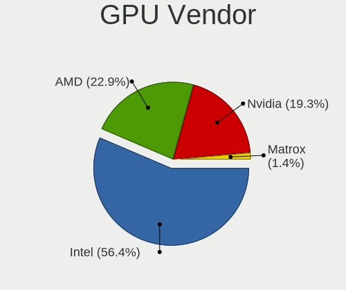

| Vendor | Computers | Percent |
|--------|-----------|---------|
| Intel  | 54        | 52.43%  |
| Nvidia | 26        | 25.24%  |
| AMD    | 23        | 22.33%  |

GPU Model
---------

Graphics card models

| Model                                                                       | Computers | Percent |
|-----------------------------------------------------------------------------|-----------|---------|
| Intel TigerLake-LP GT2 [Iris Xe Graphics]                                   | 6         | 5.66%   |
| Nvidia GF117M [GeForce 610M/710M/810M/820M / GT 620M/625M/630M/720M]        | 4         | 3.77%   |
| Intel WhiskeyLake-U GT2 [UHD Graphics 620]                                  | 4         | 3.77%   |
| Intel Haswell-ULT Integrated Graphics Controller                            | 4         | 3.77%   |
| Intel Skylake GT2 [HD Graphics 520]                                         | 3         | 2.83%   |
| Intel HD Graphics 530                                                       | 3         | 2.83%   |
| Intel CoffeeLake-H GT2 [UHD Graphics 630]                                   | 3         | 2.83%   |
| Intel 2nd Generation Core Processor Family Integrated Graphics Controller   | 3         | 2.83%   |
| AMD Renoir                                                                  | 3         | 2.83%   |
| AMD Picasso/Raven 2 [Radeon Vega Series / Radeon Vega Mobile Series]        | 3         | 2.83%   |
| AMD Cezanne [Radeon Vega Series / Radeon Vega Mobile Series]                | 3         | 2.83%   |
| Nvidia TU117M                                                               | 2         | 1.89%   |
| Nvidia GK208B [GeForce GT 710]                                              | 2         | 1.89%   |
| Intel Tiger Lake-LP GT2 [UHD Graphics G4]                                   | 2         | 1.89%   |
| Intel JasperLake [UHD Graphics]                                             | 2         | 1.89%   |
| Intel HD Graphics 620                                                       | 2         | 1.89%   |
| Intel CoffeeLake-S GT2 [UHD Graphics 630]                                   | 2         | 1.89%   |
| Intel Alder Lake-P GT1 [UHD Graphics]                                       | 2         | 1.89%   |
| Intel 4th Gen Core Processor Integrated Graphics Controller                 | 2         | 1.89%   |
| Intel 3rd Gen Core processor Graphics Controller                            | 2         | 1.89%   |
| Nvidia TU117M [GeForce MX550]                                               | 1         | 0.94%   |
| Nvidia TU117M [GeForce GTX 1650 Mobile / Max-Q]                             | 1         | 0.94%   |
| Nvidia TU116 [GeForce GTX 1660 Ti]                                          | 1         | 0.94%   |
| Nvidia TU106M [GeForce RTX 2060 Mobile]                                     | 1         | 0.94%   |
| Nvidia GT218 [GeForce G210]                                                 | 1         | 0.94%   |
| Nvidia GP108 [GeForce GT 1030]                                              | 1         | 0.94%   |
| Nvidia GP107M [GeForce GTX 1050 Ti Mobile]                                  | 1         | 0.94%   |
| Nvidia GP107M [GeForce GTX 1050 Ti Max-Q]                                   | 1         | 0.94%   |
| Nvidia GM108M [GeForce MX130]                                               | 1         | 0.94%   |
| Nvidia GM108M [GeForce 920MX]                                               | 1         | 0.94%   |
| Nvidia GM108M [GeForce 830M]                                                | 1         | 0.94%   |
| Nvidia GK208M [GeForce GT 730M]                                             | 1         | 0.94%   |
| Nvidia GK107GLM [Quadro K1100M]                                             | 1         | 0.94%   |
| Nvidia GF108 [GeForce GT 730]                                               | 1         | 0.94%   |
| Nvidia GA107M [GeForce RTX 3050 Mobile]                                     | 1         | 0.94%   |
| Nvidia GA107M [GeForce RTX 2050]                                            | 1         | 0.94%   |
| Nvidia GA106M [GeForce RTX 3060 Mobile / Max-Q]                             | 1         | 0.94%   |
| Nvidia GA104 [GeForce RTX 3060 Ti Lite Hash Rate]                           | 1         | 0.94%   |
| Intel Xeon E3-1200 v3/4th Gen Core Processor Integrated Graphics Controller | 1         | 0.94%   |
| Intel Xeon E3-1200 v2/3rd Gen Core processor Graphics Controller            | 1         | 0.94%   |

GPU Combo
---------

Combinations of graphics cards

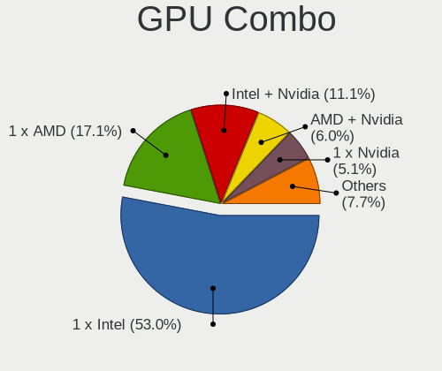

| Name           | Computers | Percent |
|----------------|-----------|---------|
| 1 x Intel      | 32        | 39.51%  |
| Intel + Nvidia | 18        | 22.22%  |
| 1 x AMD        | 17        | 20.99%  |
| 1 x Nvidia     | 6         | 7.41%   |
| 2 x Intel      | 2         | 2.47%   |
| 2 x AMD        | 2         | 2.47%   |
| Intel + AMD    | 2         | 2.47%   |
| AMD + Nvidia   | 2         | 2.47%   |

GPU Driver
----------

Free vs proprietary

| Driver      | Computers | Percent |
|-------------|-----------|---------|
| Free        | 66        | 81.48%  |
| Proprietary | 12        | 14.81%  |
| Unknown     | 3         | 3.7%    |

GPU Memory
----------

Total video memory

| Size in GB | Computers | Percent |
|------------|-----------|---------|
| Unknown    | 56        | 69.14%  |
| 1.01-2.0   | 8         | 9.88%   |
| 0.01-0.5   | 6         | 7.41%   |
| 0.51-1.0   | 5         | 6.17%   |
| 3.01-4.0   | 4         | 4.94%   |
| 5.01-6.0   | 1         | 1.23%   |
| 8.01-16.0  | 1         | 1.23%   |

Monitor
-------

Monitor Vendor
--------------

Monitor vendors

| Vendor                  | Computers | Percent |
|-------------------------|-----------|---------|
| BOE                     | 18        | 21.95%  |
| AU Optronics            | 18        | 21.95%  |
| Chimei Innolux          | 9         | 10.98%  |
| Lenovo                  | 5         | 6.1%    |
| Goldstar                | 5         | 6.1%    |
| LG Display              | 4         | 4.88%   |
| Samsung Electronics     | 3         | 3.66%   |
| Dell                    | 3         | 3.66%   |
| Hewlett-Packard         | 2         | 2.44%   |
| BenQ                    | 2         | 2.44%   |
| TMX                     | 1         | 1.22%   |
| Skyworth                | 1         | 1.22%   |
| Sharp                   | 1         | 1.22%   |
| Philips                 | 1         | 1.22%   |
| PANDA                   | 1         | 1.22%   |
| Panasonic               | 1         | 1.22%   |
| InfoVision              | 1         | 1.22%   |
| Gigabyte Technology     | 1         | 1.22%   |
| CSO                     | 1         | 1.22%   |
| Chi Mei Optoelectronics | 1         | 1.22%   |
| AOC                     | 1         | 1.22%   |
| Acer                    | 1         | 1.22%   |
| Unknown                 | 1         | 1.22%   |

Monitor Model
-------------

Monitor models

| Model                                                                | Computers | Percent |
|----------------------------------------------------------------------|-----------|---------|
| Lenovo LEN E2054A LEN60DF 1440x900 419x262mm 19.5-inch               | 2         | 2.44%   |
| Chimei Innolux LCD Monitor CMN15F5 1920x1080 344x193mm 15.5-inch     | 2         | 2.44%   |
| BOE LCD Monitor BOE0A46 2560x1600 302x189mm 14.0-inch                | 2         | 2.44%   |
| AU Optronics LCD Monitor AUO333C 1366x768 309x173mm 13.9-inch        | 2         | 2.44%   |
| AU Optronics LCD Monitor AUO21ED 1920x1080 344x194mm 15.5-inch       | 2         | 2.44%   |
| TMX TL156VDXP0101 TMX1561 1920x1080 344x194mm 15.5-inch              | 1         | 1.22%   |
| Skyworth UHD SII9687 1920x540 708x398mm 32.0-inch                    | 1         | 1.22%   |
| Sharp LCD Monitor SHP149A 1920x1080 344x194mm 15.5-inch              | 1         | 1.22%   |
| Samsung Electronics LCD Monitor SEC5441 1366x768 344x194mm 15.5-inch | 1         | 1.22%   |
| Samsung Electronics LC27G5xT SAM707A 2560x1440 597x336mm 27.0-inch   | 1         | 1.22%   |
| Samsung Electronics C27F390 SAM0D32 1920x1080 598x336mm 27.0-inch    | 1         | 1.22%   |
| Philips PHL 226E9Q PHLC17D 1920x1080 477x268mm 21.5-inch             | 1         | 1.22%   |
| PANDA LCD Monitor NCP004D 1920x1080 344x194mm 15.5-inch              | 1         | 1.22%   |
| Panasonic VVX14P048M00 MEI96A2 3000x2000 285x190mm 13.5-inch         | 1         | 1.22%   |
| LG Display LCD Monitor LGD0613 1920x1080 309x174mm 14.0-inch         | 1         | 1.22%   |
| LG Display LCD Monitor LGD0458 1366x768 310x174mm 14.0-inch          | 1         | 1.22%   |
| LG Display LCD Monitor LGD0384 1366x768 344x194mm 15.5-inch          | 1         | 1.22%   |
| LG Display LCD Monitor LGD0335 1366x768 310x174mm 14.0-inch          | 1         | 1.22%   |
| Lenovo Q24i-1L LEN66C0 1920x1080 527x296mm 23.8-inch                 | 1         | 1.22%   |
| Lenovo LCD Monitor LEN4010 1280x800 261x163mm 12.1-inch              | 1         | 1.22%   |
| Lenovo LCD Monitor LEN4000 1024x768 246x185mm 12.1-inch              | 1         | 1.22%   |
| InfoVision LCD Monitor IVO03F4 1024x600 223x125mm 10.1-inch          | 1         | 1.22%   |
| Hewlett-Packard Compaq W185q HWP284F 1366x768 410x230mm 18.5-inch    | 1         | 1.22%   |
| Hewlett-Packard All in One HWP410E 1366x768 410x230mm 18.5-inch      | 1         | 1.22%   |
| Goldstar ULTRAGEAR GSM5BB1 1920x1080 527x296mm 23.8-inch             | 1         | 1.22%   |
| Goldstar IPS FULLHD GSM5AB8 1920x1080 480x270mm 21.7-inch            | 1         | 1.22%   |
| Goldstar IPS FULLHD GSM5AB6 1920x1080 480x270mm 21.7-inch            | 1         | 1.22%   |
| Goldstar HDR 4K GSM7707 3840x2160 600x340mm 27.2-inch                | 1         | 1.22%   |
| Goldstar E1942 GSM4C09 1366x768 410x230mm 18.5-inch                  | 1         | 1.22%   |
| Gigabyte Technology G27F GBT2708 1920x1080 599x335mm 27.0-inch       | 1         | 1.22%   |
| Dell SE2219HX DELF110 1920x1080 476x268mm 21.5-inch                  | 1         | 1.22%   |
| Dell E2218HN DELF09E 1920x1080 476x268mm 21.5-inch                   | 1         | 1.22%   |
| Dell D1918H DEL2005 1366x768 410x230mm 18.5-inch                     | 1         | 1.22%   |
| CSO LCD Monitor CSO1600 2560x1600 345x215mm 16.0-inch                | 1         | 1.22%   |
| Chimei Innolux LCD Monitor CMN15E8 1920x1080 344x193mm 15.5-inch     | 1         | 1.22%   |
| Chimei Innolux LCD Monitor CMN15E7 1920x1080 344x193mm 15.5-inch     | 1         | 1.22%   |
| Chimei Innolux LCD Monitor CMN1521 1920x1080 344x193mm 15.5-inch     | 1         | 1.22%   |
| Chimei Innolux LCD Monitor CMN14D1 1366x768 309x173mm 13.9-inch      | 1         | 1.22%   |
| Chimei Innolux LCD Monitor CMN14C3 1366x768 309x173mm 13.9-inch      | 1         | 1.22%   |
| Chimei Innolux LCD Monitor CMN1406 1920x1080 309x173mm 13.9-inch     | 1         | 1.22%   |

Monitor Resolution
------------------

Monitor screen resolution

| Resolution        | Computers | Percent |
|-------------------|-----------|---------|
| 1920x1080 (FHD)   | 38        | 48.1%   |
| 1366x768 (WXGA)   | 25        | 31.65%  |
| 2560x1600         | 5         | 6.33%   |
| 3840x2160 (4K)    | 3         | 3.8%    |
| 1440x900 (WXGA+)  | 2         | 2.53%   |
| 2560x1440 (QHD)   | 1         | 1.27%   |
| 1920x540          | 1         | 1.27%   |
| 1920x1200 (WUXGA) | 1         | 1.27%   |
| 1600x900 (HD+)    | 1         | 1.27%   |
| 1280x800 (WXGA)   | 1         | 1.27%   |
| 1280x720 (HD)     | 1         | 1.27%   |

Monitor Diagonal
----------------

Diagonal size in inches

| Inches  | Computers | Percent |
|---------|-----------|---------|
| 15      | 27        | 32.93%  |
| 14      | 15        | 18.29%  |
| 13      | 11        | 13.41%  |
| 21      | 6         | 7.32%   |
| 18      | 6         | 7.32%   |
| 27      | 3         | 3.66%   |
| 24      | 2         | 2.44%   |
| 19      | 2         | 2.44%   |
| 12      | 2         | 2.44%   |
| 40      | 1         | 1.22%   |
| 32      | 1         | 1.22%   |
| 31      | 1         | 1.22%   |
| 23      | 1         | 1.22%   |
| 17      | 1         | 1.22%   |
| 16      | 1         | 1.22%   |
| 11      | 1         | 1.22%   |
| Unknown | 1         | 1.22%   |

Monitor Width
-------------

Physical width

| Width in mm | Computers | Percent |
|-------------|-----------|---------|
| 301-350     | 50        | 60.98%  |
| 401-500     | 14        | 17.07%  |
| 201-300     | 6         | 7.32%   |
| 501-600     | 5         | 6.1%    |
| 601-700     | 2         | 2.44%   |
| 351-400     | 2         | 2.44%   |
| 801-900     | 1         | 1.22%   |
| 701-800     | 1         | 1.22%   |
| Unknown     | 1         | 1.22%   |

Aspect Ratio
------------

Proportional relationship between the width and the height

| Ratio   | Computers | Percent |
|---------|-----------|---------|
| 16/9    | 69        | 88.46%  |
| 16/10   | 8         | 10.26%  |
| Unknown | 1         | 1.28%   |

Monitor Area
------------

Area in inch

| Area in inch | Computers | Percent |
|----------------|-----------|---------|
| 101-110        | 27        | 32.93%  |
| 81-90          | 24        | 29.27%  |
| 201-250        | 8         | 9.76%   |
| 141-150        | 6         | 7.32%   |
| 301-350        | 3         | 3.66%   |
| 151-200        | 3         | 3.66%   |
| 71-80          | 2         | 2.44%   |
| 61-70          | 2         | 2.44%   |
| 351-500        | 2         | 2.44%   |
| 51-60          | 1         | 1.22%   |
| 121-130        | 1         | 1.22%   |
| 111-120        | 1         | 1.22%   |
| 501-1000       | 1         | 1.22%   |
| Unknown        | 1         | 1.22%   |

Pixel Density
-------------

Pixels per inch

| Density       | Computers | Percent |
|---------------|-----------|---------|
| 121-160       | 33        | 40.74%  |
| 101-120       | 21        | 25.93%  |
| 51-100        | 17        | 20.99%  |
| 161-240       | 8         | 9.88%   |
| More than 240 | 1         | 1.23%   |
| Unknown       | 1         | 1.23%   |

Multiple Monitors
-----------------

Total monitors connected

| Total | Computers | Percent |
|-------|-----------|---------|
| 1     | 74        | 91.36%  |
| 2     | 4         | 4.94%   |
| 0     | 3         | 3.7%    |

Network
-------

Net Controller Vendor
---------------------

Controller vendors

| Vendor                            | Computers | Percent |
|-----------------------------------|-----------|---------|
| Realtek Semiconductor             | 52        | 42.98%  |
| Intel                             | 37        | 30.58%  |
| Qualcomm Atheros                  | 12        | 9.92%   |
| Broadcom                          | 4         | 3.31%   |
| MediaTek                          | 3         | 2.48%   |
| TP-Link                           | 2         | 1.65%   |
| Qualcomm                          | 2         | 1.65%   |
| ASIX Electronics                  | 2         | 1.65%   |
| Xiaomi                            | 1         | 0.83%   |
| Ralink Technology                 | 1         | 0.83%   |
| Ralink                            | 1         | 0.83%   |
| OPPO Electronics                  | 1         | 0.83%   |
| Ericsson Business Mobile Networks | 1         | 0.83%   |
| D-Link                            | 1         | 0.83%   |
| Broadcom Limited                  | 1         | 0.83%   |

Net Controller Model
--------------------

Controller models

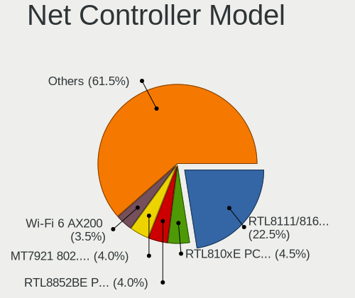

| Model                                                             | Computers | Percent |
|-------------------------------------------------------------------|-----------|---------|
| Realtek RTL8111/8168/8411 PCI Express Gigabit Ethernet Controller | 32        | 22.7%   |
| Realtek RTL810xE PCI Express Fast Ethernet controller             | 8         | 5.67%   |
| Intel Wi-Fi 6 AX201                                               | 7         | 4.96%   |
| Realtek RTL8822BE 802.11a/b/g/n/ac WiFi adapter                   | 4         | 2.84%   |
| Realtek RTL8125 2.5GbE Controller                                 | 4         | 2.84%   |
| Qualcomm Atheros QCA9565 / AR9565 Wireless Network Adapter        | 4         | 2.84%   |
| Qualcomm Atheros QCA9377 802.11ac Wireless Network Adapter        | 3         | 2.13%   |
| Intel Wireless 3165                                               | 3         | 2.13%   |
| Intel Wi-Fi 6 AX200                                               | 3         | 2.13%   |
| Realtek RTL8852AE 802.11ax PCIe Wireless Network Adapter          | 2         | 1.42%   |
| Realtek RTL8822CE 802.11ac PCIe Wireless Network Adapter          | 2         | 1.42%   |
| Realtek RTL8821CE 802.11ac PCIe Wireless Network Adapter          | 2         | 1.42%   |
| Realtek RTL8723BE PCIe Wireless Network Adapter                   | 2         | 1.42%   |
| Qualcomm Atheros AR9485 Wireless Network Adapter                  | 2         | 1.42%   |
| MediaTek MT7921 802.11ax PCI Express Wireless Network Adapter     | 2         | 1.42%   |
| Intel Wireless 8265 / 8275                                        | 2         | 1.42%   |
| Intel Wireless 7260                                               | 2         | 1.42%   |
| Intel Ethernet Controller I225-V                                  | 2         | 1.42%   |
| Intel Ethernet Connection I217-LM                                 | 2         | 1.42%   |
| Intel Centrino Wireless-N 1000 [Condor Peak]                      | 2         | 1.42%   |
| Intel Cannon Lake PCH CNVi WiFi                                   | 2         | 1.42%   |
| Intel Alder Lake-P PCH CNVi WiFi                                  | 2         | 1.42%   |
| Broadcom BCM43142 802.11b/g/n                                     | 2         | 1.42%   |
| ASIX AX88179 Gigabit Ethernet                                     | 2         | 1.42%   |
| Xiaomi Mi/Redmi series (RNDIS)                                    | 1         | 0.71%   |
| TP-Link TL-WN823N v2/v3 [Realtek RTL8192EU]                       | 1         | 0.71%   |
| TP-Link AC600 wireless Realtek RTL8811AU [Archer T2U Nano]        | 1         | 0.71%   |
| Realtek RTL8821AE 802.11ac PCIe Wireless Network Adapter          | 1         | 0.71%   |
| Realtek RTL8723DE Wireless Network Adapter                        | 1         | 0.71%   |
| Realtek RTL8188EUS 802.11n Wireless Network Adapter               | 1         | 0.71%   |
| Realtek RTL8188EE Wireless Network Adapter                        | 1         | 0.71%   |
| Realtek RTL8188CE 802.11b/g/n WiFi Adapter                        | 1         | 0.71%   |
| Realtek RTL8152 Fast Ethernet Adapter                             | 1         | 0.71%   |
| Realtek Realtek Network controller                                | 1         | 0.71%   |
| Ralink MT7601U Wireless Adapter                                   | 1         | 0.71%   |
| Ralink RT3290 Wireless 802.11n 1T/1R PCIe                         | 1         | 0.71%   |
| Qualcomm QCNFA765 Wireless Network Adapter                        | 1         | 0.71%   |
| Qualcomm FP3                                                      | 1         | 0.71%   |
| Qualcomm Atheros QCA8171 Gigabit Ethernet                         | 1         | 0.71%   |
| Qualcomm Atheros QCA6174 802.11ac Wireless Network Adapter        | 1         | 0.71%   |

Wireless Vendor
---------------

Wireless vendors

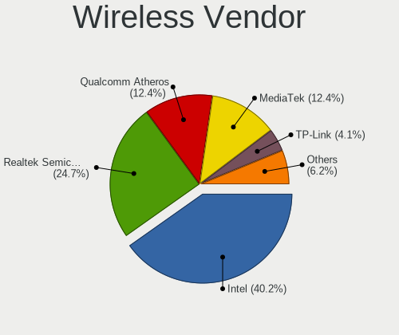

| Vendor                | Computers | Percent |
|-----------------------|-----------|---------|
| Intel                 | 31        | 42.47%  |
| Realtek Semiconductor | 18        | 24.66%  |
| Qualcomm Atheros      | 11        | 15.07%  |
| Broadcom              | 4         | 5.48%   |
| MediaTek              | 3         | 4.11%   |
| TP-Link               | 2         | 2.74%   |
| Ralink Technology     | 1         | 1.37%   |
| Ralink                | 1         | 1.37%   |
| Qualcomm              | 1         | 1.37%   |
| D-Link                | 1         | 1.37%   |

Wireless Model
--------------

Wireless models

| Model                                                          | Computers | Percent |
|----------------------------------------------------------------|-----------|---------|
| Intel Wi-Fi 6 AX201                                            | 7         | 9.59%   |
| Realtek RTL8822BE 802.11a/b/g/n/ac WiFi adapter                | 4         | 5.48%   |
| Qualcomm Atheros QCA9565 / AR9565 Wireless Network Adapter     | 4         | 5.48%   |
| Qualcomm Atheros QCA9377 802.11ac Wireless Network Adapter     | 3         | 4.11%   |
| Intel Wireless 3165                                            | 3         | 4.11%   |
| Intel Wi-Fi 6 AX200                                            | 3         | 4.11%   |
| Realtek RTL8852AE 802.11ax PCIe Wireless Network Adapter       | 2         | 2.74%   |
| Realtek RTL8822CE 802.11ac PCIe Wireless Network Adapter       | 2         | 2.74%   |
| Realtek RTL8821CE 802.11ac PCIe Wireless Network Adapter       | 2         | 2.74%   |
| Realtek RTL8723BE PCIe Wireless Network Adapter                | 2         | 2.74%   |
| Qualcomm Atheros AR9485 Wireless Network Adapter               | 2         | 2.74%   |
| MediaTek MT7921 802.11ax PCI Express Wireless Network Adapter  | 2         | 2.74%   |
| Intel Wireless 8265 / 8275                                     | 2         | 2.74%   |
| Intel Wireless 7260                                            | 2         | 2.74%   |
| Intel Centrino Wireless-N 1000 [Condor Peak]                   | 2         | 2.74%   |
| Intel Cannon Lake PCH CNVi WiFi                                | 2         | 2.74%   |
| Intel Alder Lake-P PCH CNVi WiFi                               | 2         | 2.74%   |
| Broadcom BCM43142 802.11b/g/n                                  | 2         | 2.74%   |
| TP-Link TL-WN823N v2/v3 [Realtek RTL8192EU]                    | 1         | 1.37%   |
| TP-Link AC600 wireless Realtek RTL8811AU [Archer T2U Nano]     | 1         | 1.37%   |
| Realtek RTL8821AE 802.11ac PCIe Wireless Network Adapter       | 1         | 1.37%   |
| Realtek RTL8723DE Wireless Network Adapter                     | 1         | 1.37%   |
| Realtek RTL8188EUS 802.11n Wireless Network Adapter            | 1         | 1.37%   |
| Realtek RTL8188EE Wireless Network Adapter                     | 1         | 1.37%   |
| Realtek RTL8188CE 802.11b/g/n WiFi Adapter                     | 1         | 1.37%   |
| Realtek Realtek Network controller                             | 1         | 1.37%   |
| Ralink MT7601U Wireless Adapter                                | 1         | 1.37%   |
| Ralink RT3290 Wireless 802.11n 1T/1R PCIe                      | 1         | 1.37%   |
| Qualcomm QCNFA765 Wireless Network Adapter                     | 1         | 1.37%   |
| Qualcomm Atheros QCA6174 802.11ac Wireless Network Adapter     | 1         | 1.37%   |
| Qualcomm Atheros AR9285 Wireless Network Adapter (PCI-Express) | 1         | 1.37%   |
| MediaTek MT7922 802.11ax PCI Express Wireless Network Adapter  | 1         | 1.37%   |
| Intel Wireless-AC 9260                                         | 1         | 1.37%   |
| Intel Wireless 8260                                            | 1         | 1.37%   |
| Intel Wi-Fi 6 AX210/AX211/AX411 160MHz                         | 1         | 1.37%   |
| Intel PRO/Wireless 5100 AGN [Shiloh] Network Connection        | 1         | 1.37%   |
| Intel Ice Lake-LP PCH CNVi WiFi                                | 1         | 1.37%   |
| Intel Dual Band Wireless-AC 3168NGW [Stone Peak]               | 1         | 1.37%   |
| Intel Centrino Advanced-N 6205 [Taylor Peak]                   | 1         | 1.37%   |
| Intel Cannon Point-LP CNVi [Wireless-AC]                       | 1         | 1.37%   |

Ethernet Vendor
---------------

Ethernet vendors

| Vendor                | Computers | Percent |
|-----------------------|-----------|---------|
| Realtek Semiconductor | 45        | 68.18%  |
| Intel                 | 14        | 21.21%  |
| ASIX Electronics      | 2         | 3.03%   |
| Xiaomi                | 1         | 1.52%   |
| Qualcomm Atheros      | 1         | 1.52%   |
| Qualcomm              | 1         | 1.52%   |
| OPPO Electronics      | 1         | 1.52%   |
| Broadcom Limited      | 1         | 1.52%   |

Ethernet Model
--------------

Ethernet models

| Model                                                             | Computers | Percent |
|-------------------------------------------------------------------|-----------|---------|
| Realtek RTL8111/8168/8411 PCI Express Gigabit Ethernet Controller | 32        | 47.76%  |
| Realtek RTL810xE PCI Express Fast Ethernet controller             | 8         | 11.94%  |
| Realtek RTL8125 2.5GbE Controller                                 | 4         | 5.97%   |
| Intel Ethernet Controller I225-V                                  | 2         | 2.99%   |
| Intel Ethernet Connection I217-LM                                 | 2         | 2.99%   |
| ASIX AX88179 Gigabit Ethernet                                     | 2         | 2.99%   |
| Xiaomi Mi/Redmi series (RNDIS)                                    | 1         | 1.49%   |
| Realtek RTL8152 Fast Ethernet Adapter                             | 1         | 1.49%   |
| Qualcomm FP3                                                      | 1         | 1.49%   |
| Qualcomm Atheros QCA8171 Gigabit Ethernet                         | 1         | 1.49%   |
| OPPO SDM710-MTP _SN:2396E2D4                                      | 1         | 1.49%   |
| Intel I211 Gigabit Network Connection                             | 1         | 1.49%   |
| Intel Ethernet controller                                         | 1         | 1.49%   |
| Intel Ethernet Connection I219-LM                                 | 1         | 1.49%   |
| Intel Ethernet Connection (7) I219-LM                             | 1         | 1.49%   |
| Intel Ethernet Connection (4) I219-LM                             | 1         | 1.49%   |
| Intel Ethernet Connection (2) I219-V                              | 1         | 1.49%   |
| Intel 82579V Gigabit Network Connection                           | 1         | 1.49%   |
| Intel 82579LM Gigabit Network Connection (Lewisville)             | 1         | 1.49%   |
| Intel 82577LM Gigabit Network Connection                          | 1         | 1.49%   |
| Intel 82567LM Gigabit Network Connection                          | 1         | 1.49%   |
| Intel 82566MM Gigabit Network Connection                          | 1         | 1.49%   |
| Broadcom Limited NetLink BCM57780 Gigabit Ethernet PCIe           | 1         | 1.49%   |

Net Controller Kind
-------------------

Ethernet, WiFi or modem

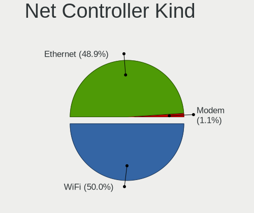

| Kind     | Computers | Percent |
|----------|-----------|---------|
| WiFi     | 71        | 52.99%  |
| Ethernet | 62        | 46.27%  |
| Modem    | 1         | 0.75%   |

Used Controller
---------------

Currently used network controller

| Kind     | Computers | Percent |
|----------|-----------|---------|
| WiFi     | 61        | 72.62%  |
| Ethernet | 23        | 27.38%  |

NICs
----

Total network controllers on board

| Total | Computers | Percent |
|-------|-----------|---------|
| 2     | 45        | 55.56%  |
| 1     | 34        | 41.98%  |
| 3     | 2         | 2.47%   |

IPv6
----

IPv6 vs IPv4

| Used | Computers | Percent |
|------|-----------|---------|
| No   | 47        | 58.02%  |
| Yes  | 34        | 41.98%  |

Bluetooth
---------

Bluetooth Vendor
----------------

Controller vendors

| Vendor                          | Computers | Percent |
|---------------------------------|-----------|---------|
| Intel                           | 25        | 38.46%  |
| Realtek Semiconductor           | 12        | 18.46%  |
| Qualcomm Atheros Communications | 5         | 7.69%   |
| Cambridge Silicon Radio         | 5         | 7.69%   |
| Broadcom                        | 5         | 7.69%   |
| IMC Networks                    | 4         | 6.15%   |
| Foxconn / Hon Hai               | 3         | 4.62%   |
| Lite-On Technology              | 2         | 3.08%   |
| TP-Link                         | 1         | 1.54%   |
| Ralink                          | 1         | 1.54%   |
| Opticis                         | 1         | 1.54%   |
| ASUSTek Computer                | 1         | 1.54%   |

Bluetooth Model
---------------

Controller models

| Model                                                 | Computers | Percent |
|-------------------------------------------------------|-----------|---------|
| Intel Bluetooth Device                                | 9         | 13.85%  |
| Realtek Bluetooth Radio                               | 7         | 10.77%  |
| Intel Bluetooth wireless interface                    | 6         | 9.23%   |
| Cambridge Silicon Radio Bluetooth Dongle (HCI mode)   | 5         | 7.69%   |
| Intel Bluetooth 9460/9560 Jefferson Peak (JfP)        | 4         | 6.15%   |
| Realtek  Bluetooth 4.2 Adapter                        | 3         | 4.62%   |
| Qualcomm Atheros  Bluetooth Device                    | 3         | 4.62%   |
| Intel AX200 Bluetooth                                 | 3         | 4.62%   |
| IMC Networks Wireless_Device                          | 2         | 3.08%   |
| IMC Networks Bluetooth Device                         | 2         | 3.08%   |
| Foxconn / Hon Hai Bluetooth Device                    | 2         | 3.08%   |
| Broadcom BCM20702 Bluetooth 4.0 [ThinkPad]            | 2         | 3.08%   |
| TP-Link TPuLink UB500 Adapter                         | 1         | 1.54%   |
| Realtek RTL8822BE Bluetooth 4.2 Adapter               | 1         | 1.54%   |
| Realtek RTL8821A Bluetooth                            | 1         | 1.54%   |
| Ralink RT3290 Bluetooth                               | 1         | 1.54%   |
| Qualcomm Atheros QCA61x4 Bluetooth 4.0                | 1         | 1.54%   |
| Qualcomm Atheros AR3011 Bluetooth                     | 1         | 1.54%   |
| Opticis Bluetooth Radio                               | 1         | 1.54%   |
| Lite-On Bluetooth Radio                               | 1         | 1.54%   |
| Lite-On Atheros AR3012 Bluetooth                      | 1         | 1.54%   |
| Intel Wireless-AC 9260 Bluetooth Adapter              | 1         | 1.54%   |
| Intel Wireless-AC 3168 Bluetooth                      | 1         | 1.54%   |
| Intel AX210 Bluetooth                                 | 1         | 1.54%   |
| Foxconn / Hon Hai Broadcom Bluetooth 2.1 Device       | 1         | 1.54%   |
| Broadcom BCM43142A0 Bluetooth Device                  | 1         | 1.54%   |
| Broadcom BCM43142 Bluetooth 4.0                       | 1         | 1.54%   |
| Broadcom BCM2045B (BDC-2.1) [Bluetooth Controller]    | 1         | 1.54%   |
| ASUS Broadcom BCM20702 Single-Chip Bluetooth 4.0 + LE | 1         | 1.54%   |

Sound
-----

Sound Vendor
------------

Sound card vendors

| Vendor                   | Computers | Percent |
|--------------------------|-----------|---------|
| Intel                    | 57        | 56.44%  |
| AMD                      | 24        | 23.76%  |
| Nvidia                   | 12        | 11.88%  |
| C-Media Electronics      | 2         | 1.98%   |
| Tenx Technology          | 1         | 0.99%   |
| Samson Technologies      | 1         | 0.99%   |
| Micro Star International | 1         | 0.99%   |
| Jieli Technology         | 1         | 0.99%   |
| Creative Labs            | 1         | 0.99%   |
| ASUSTek Computer         | 1         | 0.99%   |

Sound Model
-----------

Sound card models

| Model                                                                      | Computers | Percent |
|----------------------------------------------------------------------------|-----------|---------|
| AMD Family 17h/19h HD Audio Controller                                     | 13        | 10.16%  |
| Intel Tiger Lake-LP Smart Sound Technology Audio Controller                | 8         | 6.25%   |
| Intel Sunrise Point-LP HD Audio                                            | 6         | 4.69%   |
| AMD Renoir Radeon High Definition Audio Controller                         | 6         | 4.69%   |
| Intel Cannon Lake PCH cAVS                                                 | 5         | 3.91%   |
| Intel Haswell-ULT HD Audio Controller                                      | 4         | 3.13%   |
| Intel Cannon Point-LP High Definition Audio Controller                     | 4         | 3.13%   |
| Intel 8 Series HD Audio Controller                                         | 4         | 3.13%   |
| AMD Raven/Raven2/Fenghuang HDMI/DP Audio Controller                        | 4         | 3.13%   |
| Nvidia GK208 HDMI/DP Audio Controller                                      | 3         | 2.34%   |
| Intel Xeon E3-1200 v3/4th Gen Core Processor HD Audio Controller           | 3         | 2.34%   |
| Intel Alder Lake PCH-P High Definition Audio Controller                    | 3         | 2.34%   |
| Intel 8 Series/C220 Series Chipset High Definition Audio Controller        | 3         | 2.34%   |
| Intel 7 Series/C216 Chipset Family High Definition Audio Controller        | 3         | 2.34%   |
| Intel 6 Series/C200 Series Chipset Family High Definition Audio Controller | 3         | 2.34%   |
| Intel 100 Series/C230 Series Chipset Family HD Audio Controller            | 3         | 2.34%   |
| AMD Starship/Matisse HD Audio Controller                                   | 3         | 2.34%   |
| AMD FCH Azalia Controller                                                  | 3         | 2.34%   |
| Intel Jasper Lake HD Audio                                                 | 2         | 1.56%   |
| Intel Ice Lake-LP Smart Sound Technology Audio Controller                  | 2         | 1.56%   |
| Intel Celeron N3350/Pentium N4200/Atom E3900 Series Audio Cluster          | 2         | 1.56%   |
| Intel Audio device                                                         | 2         | 1.56%   |
| Intel 5 Series/3400 Series Chipset High Definition Audio                   | 2         | 1.56%   |
| AMD SBx00 Azalia (Intel HDA)                                               | 2         | 1.56%   |
| Tenx Technology USB AUDIO                                                  | 1         | 0.78%   |
| Samson Technologies C01U Pro condenser microphone                          | 1         | 0.78%   |
| Nvidia TU116 High Definition Audio Controller                              | 1         | 0.78%   |
| Nvidia TU106 High Definition Audio Controller                              | 1         | 0.78%   |
| Nvidia High Definition Audio Controller                                    | 1         | 0.78%   |
| Nvidia GP108 High Definition Audio Controller                              | 1         | 0.78%   |
| Nvidia GK107 HDMI Audio Controller                                         | 1         | 0.78%   |
| Nvidia GF108 High Definition Audio Controller                              | 1         | 0.78%   |
| Nvidia GA106 High Definition Audio Controller                              | 1         | 0.78%   |
| Nvidia GA104 High Definition Audio Controller                              | 1         | 0.78%   |
| Nvidia Audio device                                                        | 1         | 0.78%   |
| Micro Star International USB Audio                                         | 1         | 0.78%   |
| Jieli Technology UACDemoV1.0                                               | 1         | 0.78%   |
| Intel Wildcat Point-LP High Definition Audio Controller                    | 1         | 0.78%   |
| Intel Comet Lake PCH-V cAVS                                                | 1         | 0.78%   |
| Intel Celeron/Pentium Silver Processor High Definition Audio               | 1         | 0.78%   |

Memory
------

Memory Vendor
-------------

Memory module vendors

| Vendor              | Computers | Percent |
|---------------------|-----------|---------|
| Samsung Electronics | 16        | 24.62%  |
| Micron Technology   | 13        | 20%     |
| SK hynix            | 8         | 12.31%  |
| Kingston            | 6         | 9.23%   |
| Unknown             | 4         | 6.15%   |
| Crucial             | 4         | 6.15%   |
| Corsair             | 4         | 6.15%   |
| Unknown (ABCD)      | 2         | 3.08%   |
| A-DATA Technology   | 2         | 3.08%   |
| Transcend           | 1         | 1.54%   |
| Ramaxel Technology  | 1         | 1.54%   |
| OM Nanotech         | 1         | 1.54%   |
| Lexar Co Limited    | 1         | 1.54%   |
| CSX                 | 1         | 1.54%   |
| Unknown             | 1         | 1.54%   |

Memory Model
------------

Memory module models

| Model                                                            | Computers | Percent |
|------------------------------------------------------------------|-----------|---------|
| Unknown (ABCD) RAM 123456789012345678 2GB SODIMM LPDDR4 2400MT/s | 2         | 2.86%   |
| SK hynix RAM HMA81GS6CJR8N-VK 8GB SODIMM DDR4 2667MT/s           | 2         | 2.86%   |
| Micron RAM 4ATF51264HZ-3G2J1 4GB SODIMM DDR4 3200MT/s            | 2         | 2.86%   |
| Unknown RAM Module 8GB DIMM                                      | 1         | 1.43%   |
| Unknown RAM Module 512MB SODIMM DDR2 667MT/s                     | 1         | 1.43%   |
| Unknown RAM Module 4GB DIMM                                      | 1         | 1.43%   |
| Unknown RAM Module 2GB SODIMM DDR2 667MT/s                       | 1         | 1.43%   |
| Unknown RAM Module 2GB DIMM DDR3 1333MT/s                        | 1         | 1.43%   |
| Unknown RAM DDR4 NB 16G 2666 16384MB SODIMM DDR4 2667MT/s        | 1         | 1.43%   |
| Transcend RAM TS1GSK64V6H 8GB SODIMM DDR3 1600MT/s               | 1         | 1.43%   |
| SK hynix RAM Module 8GB SODIMM DDR4 2667MT/s                     | 1         | 1.43%   |
| SK hynix RAM HMT451S6AFR8A-PB 4096MB SODIMM DDR3 1600MT/s        | 1         | 1.43%   |
| SK hynix RAM HMT351S6EFR8A-PB 4GB SODIMM DDR3 1600MT/s           | 1         | 1.43%   |
| SK hynix RAM HMT351S6CFR8C-H9 4GB SODIMM DDR3 1600MT/s           | 1         | 1.43%   |
| SK hynix RAM HMA82GS6AFR8N-UH 16GB SODIMM DDR4 2667MT/s          | 1         | 1.43%   |
| SK hynix RAM HMA81GS6DJR8N-XN 8GB SODIMM DDR4 3200MT/s           | 1         | 1.43%   |
| Samsung RAM M471B5673FH0-CH9 2GB SODIMM DDR3 1334MT/s            | 1         | 1.43%   |
| Samsung RAM M471B5273CH0-CH9 4GB SODIMM DDR3 1334MT/s            | 1         | 1.43%   |
| Samsung RAM M471B5273CH0-CF8 4GB SODIMM DDR3 1067MT/s            | 1         | 1.43%   |
| Samsung RAM M471B5173DB0-YK0 4GB SODIMM DDR3 1600MT/s            | 1         | 1.43%   |
| Samsung RAM M471A5244CB0-CWE 4GB SODIMM DDR4 3200MT/s            | 1         | 1.43%   |
| Samsung RAM M471A5244CB0-CWE 4GB Row Of Chips DDR4 3200MT/s      | 1         | 1.43%   |
| Samsung RAM M471A5244CB0-CRC 4GB SODIMM DDR4 2667MT/s            | 1         | 1.43%   |
| Samsung RAM M471A5244BB0-CRC 4GB SODIMM DDR4 2667MT/s            | 1         | 1.43%   |
| Samsung RAM M471A5143SB1-CRC 4GB SODIMM DDR4 2400MT/s            | 1         | 1.43%   |
| Samsung RAM M471A2K43DB1-CTD 16GB SODIMM DDR4 2667MT/s           | 1         | 1.43%   |
| Samsung RAM M471A1K43DB1-CWE 8GB SODIMM DDR4 3200MT/s            | 1         | 1.43%   |
| Samsung RAM M471A1K43CB1-CTD 8GB SODIMM DDR4 2667MT/s            | 1         | 1.43%   |
| Samsung RAM M471A1K43CB1-CRC 8GB SODIMM DDR4 2667MT/s            | 1         | 1.43%   |
| Samsung RAM M471A1K43BB0-CPB 8GB SODIMM DDR4 2133MT/s            | 1         | 1.43%   |
| Samsung RAM M471A1G44BB0-CWE 8GB SODIMM DDR4 3200MT/s            | 1         | 1.43%   |
| Samsung RAM M471A1G44BB0-CWE 8192MB Row Of Chips DDR4 3200MT/s   | 1         | 1.43%   |
| Samsung RAM M471A1G44AB0-CWE 8GB Row Of Chips DDR4 3200MT/s      | 1         | 1.43%   |
| Samsung RAM K4E6E304EC-EGCG 4GB Row Of Chips LPDDR3 2133MT/s     | 1         | 1.43%   |
| Samsung RAM K3LKBKB@BM-MGCP 2GB Row Of Chips LPDDR5 6400MT/s     | 1         | 1.43%   |
| Ramaxel RAM RMSA3260MF68H9F-2666 4GB SODIMM DDR4 2400MT/s        | 1         | 1.43%   |
| OM Nanotech RAM V01D4S88GB1G81G83200 8GB SODIMM DDR4 3200MT/s    | 1         | 1.43%   |
| Micron RAM MTC4C10163S1SC48BA1 8GB SODIMM DDR5 4800MT/s          | 1         | 1.43%   |
| Micron RAM MT53E1G32D2NP-046 2GB Row Of Chips LPDDR4 4267MT/s    | 1         | 1.43%   |
| Micron RAM MT40A1G16KD-062E:E 8192MB SODIMM DDR4 3200MT/s        | 1         | 1.43%   |

Memory Kind
-----------

Memory module kinds

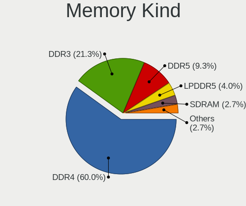

| Kind    | Computers | Percent |
|---------|-----------|---------|
| DDR4    | 38        | 66.67%  |
| DDR3    | 10        | 17.54%  |
| LPDDR4  | 3         | 5.26%   |
| DDR5    | 2         | 3.51%   |
| LPDDR5  | 1         | 1.75%   |
| LPDDR3  | 1         | 1.75%   |
| DDR2    | 1         | 1.75%   |
| Unknown | 1         | 1.75%   |

Memory Form Factor
------------------

Physical design of the memory module

| Name         | Computers | Percent |
|--------------|-----------|---------|
| SODIMM       | 39        | 68.42%  |
| DIMM         | 10        | 17.54%  |
| Row Of Chips | 8         | 14.04%  |

Memory Size
-----------

Memory module size

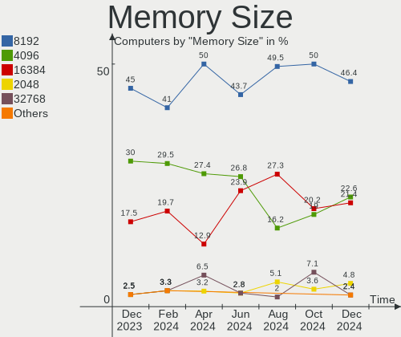

| Size  | Computers | Percent |
|-------|-----------|---------|
| 8192  | 34        | 53.97%  |
| 4096  | 14        | 22.22%  |
| 16384 | 9         | 14.29%  |
| 2048  | 4         | 6.35%   |
| 32768 | 1         | 1.59%   |
| 512   | 1         | 1.59%   |

Memory Speed
------------

Memory module speed

| Speed   | Computers | Percent |
|---------|-----------|---------|
| 3200    | 18        | 29.03%  |
| 2667    | 14        | 22.58%  |
| 1600    | 8         | 12.9%   |
| 2400    | 7         | 11.29%  |
| 2133    | 2         | 3.23%   |
| 6400    | 1         | 1.61%   |
| 6000    | 1         | 1.61%   |
| 4800    | 1         | 1.61%   |
| 4267    | 1         | 1.61%   |
| 3600    | 1         | 1.61%   |
| 2800    | 1         | 1.61%   |
| 2666    | 1         | 1.61%   |
| 1866    | 1         | 1.61%   |
| 1334    | 1         | 1.61%   |
| 1333    | 1         | 1.61%   |
| 1067    | 1         | 1.61%   |
| 667     | 1         | 1.61%   |
| Unknown | 1         | 1.61%   |

Printers & scanners
-------------------

Printer Vendor
--------------

Printer device vendors

Zero info for selected period =(

Printer Model
-------------

Printer device models

Zero info for selected period =(

Scanner Vendor
--------------

Scanner device vendors

Zero info for selected period =(

Scanner Model
-------------

Scanner device models

Zero info for selected period =(

Camera
------

Camera Vendor
-------------

Camera device vendors

| Vendor                                 | Computers | Percent |
|----------------------------------------|-----------|---------|
| Chicony Electronics                    | 11        | 18.33%  |
| IMC Networks                           | 10        | 16.67%  |
| Syntek                                 | 4         | 6.67%   |
| Sunplus Innovation Technology          | 4         | 6.67%   |
| Realtek Semiconductor                  | 4         | 6.67%   |
| Microdia                               | 4         | 6.67%   |
| Acer                                   | 4         | 6.67%   |
| Quanta                                 | 3         | 5%      |
| Logitech                               | 3         | 5%      |
| Sonix Technology                       | 2         | 3.33%   |
| Cheng Uei Precision Industry (Foxlink) | 2         | 3.33%   |
| vivo                                   | 1         | 1.67%   |
| Suyin                                  | 1         | 1.67%   |
| SunplusIT                              | 1         | 1.67%   |
| Luxvisions Innotech Limited            | 1         | 1.67%   |
| Lite-On Technology                     | 1         | 1.67%   |
| Lenovo                                 | 1         | 1.67%   |
| KYE Systems (Mouse Systems)            | 1         | 1.67%   |
| icSpring                               | 1         | 1.67%   |
| Alcor Micro                            | 1         | 1.67%   |

Camera Model
------------

Camera device models

| Model                                                          | Computers | Percent |
|----------------------------------------------------------------|-----------|---------|
| Syntek Integrated Camera                                       | 3         | 5%      |
| Microdia Integrated_Webcam_HD                                  | 3         | 5%      |
| IMC Networks USB2.0 VGA UVC WebCam                             | 3         | 5%      |
| IMC Networks Integrated Camera                                 | 3         | 5%      |
| Chicony HP Truevision HD camera                                | 3         | 5%      |
| Sunplus XiaoMi USB 2.0 Webcam                                  | 2         | 3.33%   |
| Sonix USB2.0 HD UVC WebCam                                     | 2         | 3.33%   |
| Logitech Webcam C270                                           | 2         | 3.33%   |
| Cheng Uei Precision Industry (Foxlink) HP TrueVision HD Camera | 2         | 3.33%   |
| vivo V2142                                                     | 1         | 1.67%   |
| Syntek EasyCamera                                              | 1         | 1.67%   |
| Suyin Lenovo EasyCamera Integrated Webcam                      | 1         | 1.67%   |
| SunplusIT XiaoMi USB 2.0 Webcam                                | 1         | 1.67%   |
| Sunplus Hy-UXGA(8101)Camera                                    | 1         | 1.67%   |
| Sunplus HD WebCam                                              | 1         | 1.67%   |
| Realtek Integrated_Webcam_HD                                   | 1         | 1.67%   |
| Realtek Integrated Webcam_HD                                   | 1         | 1.67%   |
| Realtek HP 1.0MP High Definition Webcam                        | 1         | 1.67%   |
| Realtek HP "Truevision HD" laptop camera                       | 1         | 1.67%   |
| Quanta VGA WebCam                                              | 1         | 1.67%   |
| Quanta HP High Definition 1MP Webcam                           | 1         | 1.67%   |
| Quanta ACER HD User Facing                                     | 1         | 1.67%   |
| Microdia HP Webcam-50                                          | 1         | 1.67%   |
| Luxvisions Innotech Limited HP Wide Vision HD Camera           | 1         | 1.67%   |
| Logitech C505e HD Webcam                                       | 1         | 1.67%   |
| Lite-On Integrated Camera                                      | 1         | 1.67%   |
| Lenovo Integrated Webcam                                       | 1         | 1.67%   |
| KYE Systems (Mouse Systems) PC-LM1E Camera                     | 1         | 1.67%   |
| IMC Networks UVC VGA Webcam                                    | 1         | 1.67%   |
| IMC Networks USB2.0 HD UVC WebCam                              | 1         | 1.67%   |
| IMC Networks ov9734_azurewave_camera                           | 1         | 1.67%   |
| IMC Networks HP TrueVision HD Camera                           | 1         | 1.67%   |
| icSpring camera                                                | 1         | 1.67%   |
| Chicony VGA Webcam                                             | 1         | 1.67%   |
| Chicony Thinkpad T430 camera                                   | 1         | 1.67%   |
| Chicony Integrated Camera (1280x720@30)                        | 1         | 1.67%   |
| Chicony Integrated Camera                                      | 1         | 1.67%   |
| Chicony HP Wide Vision HD Camera                               | 1         | 1.67%   |
| Chicony HP TrueVision HD                                       | 1         | 1.67%   |
| Chicony HD WebCam                                              | 1         | 1.67%   |

Security
--------

Fingerprint Vendor
------------------

Fingerprint sensor vendors

| Vendor                     | Computers | Percent |
|----------------------------|-----------|---------|
| Synaptics                  | 5         | 50%     |
| Validity Sensors           | 2         | 20%     |
| Shenzhen Goodix Technology | 1         | 10%     |
| Elan Microelectronics      | 1         | 10%     |
| AuthenTec                  | 1         | 10%     |

Fingerprint Model
-----------------

Fingerprint sensor models

| Model                                            | Computers | Percent |
|--------------------------------------------------|-----------|---------|
| Unknown                                          | 3         | 30%     |
| Validity Sensors VFS Fingerprint sensor          | 1         | 10%     |
| Validity Sensors VFS 5011 fingerprint sensor     | 1         | 10%     |
| Synaptics Metallica MOH Touch Fingerprint Reader | 1         | 10%     |
| Synaptics Metallica MIS Touch Fingerprint Reader | 1         | 10%     |
| Shenzhen Goodix  Fingerprint Device              | 1         | 10%     |
| Elan ELAN:ARM-M4                                 | 1         | 10%     |
| AuthenTec AES2810                                | 1         | 10%     |

Chipcard Vendor
---------------

Chipcard module vendors

| Vendor                | Computers | Percent |
|-----------------------|-----------|---------|
| Alcor Micro           | 2         | 40%     |
| Upek                  | 1         | 20%     |
| Gemalto (was Gemplus) | 1         | 20%     |
| Broadcom              | 1         | 20%     |

Chipcard Model
--------------

Chipcard module models

| Model                                                      | Computers | Percent |
|------------------------------------------------------------|-----------|---------|
| Alcor Micro AU9540 Smartcard Reader                        | 2         | 40%     |
| Upek TouchChip Fingerprint Coprocessor (WBF advanced mode) | 1         | 20%     |
| Gemalto (was Gemplus) Compact Smart Card Reader Writer     | 1         | 20%     |
| Broadcom BCM5880 Secure Applications Processor             | 1         | 20%     |

Unsupported
-----------

Unsupported Devices
-------------------

Total unsupported devices on board

| Total | Computers | Percent |
|-------|-----------|---------|
| 0     | 53        | 65.43%  |
| 1     | 21        | 25.93%  |
| 2     | 6         | 7.41%   |
| 4     | 1         | 1.23%   |

Unsupported Device Types
------------------------

Types of unsupported devices

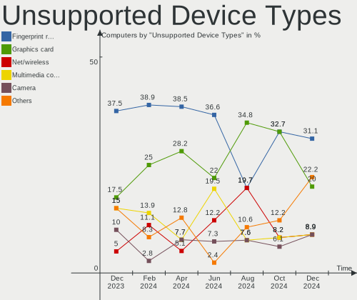

| Type                     | Computers | Percent |
|--------------------------|-----------|---------|
| Graphics card            | 10        | 28.57%  |
| Fingerprint reader       | 10        | 28.57%  |
| Chipcard                 | 5         | 14.29%  |
| Multimedia controller    | 2         | 5.71%   |
| Camera                   | 2         | 5.71%   |
| Storage/nvme             | 1         | 2.86%   |
| Net/wireless             | 1         | 2.86%   |
| Net/ethernet             | 1         | 2.86%   |
| Modem                    | 1         | 2.86%   |
| Communication controller | 1         | 2.86%   |
| Bluetooth                | 1         | 2.86%   |

