Linux in Italy - Hardware Trends
--------------------------------

A project to identify most popular hardware characteristics and track their change
over time based on data collected by Linux users at https://Linux-Hardware.org.

Anyone can contribute to this report by the [hw-probe](https://github.com/linuxhw/hw-probe) tool:

    sudo -E hw-probe -all -upload

This is a report for all computer types. See also reports for [desktops](/Location/Italy/Desktop/README.md) and [notebooks](/Location/Italy/Notebook/README.md).

Period: Dec, 2025.

Contents
--------

* [ System ](#system)
  - [ OS                       ](#os)
  - [ OS Family                ](#os-family)
  - [ Kernel                   ](#kernel)
  - [ Kernel Family            ](#kernel-family)
  - [ Kernel Major Ver.        ](#kernel-major-ver)
  - [ Arch                     ](#arch)
  - [ DE                       ](#de)
  - [ Display Server           ](#display-server)
  - [ Display Manager          ](#display-manager)
  - [ OS Lang                  ](#os-lang)
  - [ Boot Mode                ](#boot-mode)
  - [ Filesystem               ](#filesystem)
  - [ Part. scheme             ](#part-scheme)
  - [ Dual Boot with Linux/BSD ](#dual-boot-with-linuxbsd)
  - [ Dual Boot (Win)          ](#dual-boot-win)

* [ Board ](#board)
  - [ Vendor                   ](#vendor)
  - [ Model                    ](#model)
  - [ Model Family             ](#model-family)
  - [ MFG Year                 ](#mfg-year)
  - [ Form Factor              ](#form-factor)
  - [ Secure Boot              ](#secure-boot)
  - [ Coreboot                 ](#coreboot)
  - [ RAM Size                 ](#ram-size)
  - [ RAM Used                 ](#ram-used)
  - [ Total Drives             ](#total-drives)
  - [ Has CD-ROM               ](#has-cd-rom)
  - [ Has Ethernet             ](#has-ethernet)
  - [ Has WiFi                 ](#has-wifi)
  - [ Has Bluetooth            ](#has-bluetooth)

* [ Location ](#location)
  - [ Country                  ](#country)
  - [ City                     ](#city)

* [ Drives ](#drives)
  - [ Drive Vendor             ](#drive-vendor)
  - [ Drive Model              ](#drive-model)
  - [ HDD Vendor               ](#hdd-vendor)
  - [ SSD Vendor               ](#ssd-vendor)
  - [ Drive Kind               ](#drive-kind)
  - [ Drive Connector          ](#drive-connector)
  - [ Drive Size               ](#drive-size)
  - [ Space Total              ](#space-total)
  - [ Space Used               ](#space-used)
  - [ Malfunc. Drives          ](#malfunc-drives)
  - [ Malfunc. Drive Vendor    ](#malfunc-drive-vendor)
  - [ Malfunc. HDD Vendor      ](#malfunc-hdd-vendor)
  - [ Malfunc. Drive Kind      ](#malfunc-drive-kind)
  - [ Failed Drives            ](#failed-drives)
  - [ Failed Drive Vendor      ](#failed-drive-vendor)
  - [ Drive Status             ](#drive-status)

* [ Storage controller ](#storage-controller)
  - [ Storage Vendor           ](#storage-vendor)
  - [ Storage Model            ](#storage-model)
  - [ Storage Kind             ](#storage-kind)

* [ Processor ](#processor)
  - [ CPU Vendor               ](#cpu-vendor)
  - [ CPU Model                ](#cpu-model)
  - [ CPU Model Family         ](#cpu-model-family)
  - [ CPU Cores                ](#cpu-cores)
  - [ CPU Sockets              ](#cpu-sockets)
  - [ CPU Threads              ](#cpu-threads)
  - [ CPU Op-Modes             ](#cpu-op-modes)
  - [ CPU Microcode            ](#cpu-microcode)
  - [ CPU Microarch            ](#cpu-microarch)

* [ Graphics ](#graphics)
  - [ GPU Vendor               ](#gpu-vendor)
  - [ GPU Model                ](#gpu-model)
  - [ GPU Combo                ](#gpu-combo)
  - [ GPU Driver               ](#gpu-driver)
  - [ GPU Memory               ](#gpu-memory)

* [ Monitor ](#monitor)
  - [ Monitor Vendor           ](#monitor-vendor)
  - [ Monitor Model            ](#monitor-model)
  - [ Monitor Resolution       ](#monitor-resolution)
  - [ Monitor Diagonal         ](#monitor-diagonal)
  - [ Monitor Width            ](#monitor-width)
  - [ Aspect Ratio             ](#aspect-ratio)
  - [ Monitor Area             ](#monitor-area)
  - [ Pixel Density            ](#pixel-density)
  - [ Multiple Monitors        ](#multiple-monitors)

* [ Network ](#network)
  - [ Net Controller Vendor    ](#net-controller-vendor)
  - [ Net Controller Model     ](#net-controller-model)
  - [ Wireless Vendor          ](#wireless-vendor)
  - [ Wireless Model           ](#wireless-model)
  - [ Ethernet Vendor          ](#ethernet-vendor)
  - [ Ethernet Model           ](#ethernet-model)
  - [ Net Controller Kind      ](#net-controller-kind)
  - [ Used Controller          ](#used-controller)
  - [ NICs                     ](#nics)
  - [ IPv6                     ](#ipv6)

* [ Bluetooth ](#bluetooth)
  - [ Bluetooth Vendor         ](#bluetooth-vendor)
  - [ Bluetooth Model          ](#bluetooth-model)

* [ Sound ](#sound)
  - [ Sound Vendor             ](#sound-vendor)
  - [ Sound Model              ](#sound-model)

* [ Memory ](#memory)
  - [ Memory Vendor            ](#memory-vendor)
  - [ Memory Model             ](#memory-model)
  - [ Memory Kind              ](#memory-kind)
  - [ Memory Form Factor       ](#memory-form-factor)
  - [ Memory Size              ](#memory-size)
  - [ Memory Speed             ](#memory-speed)

* [ Printers & scanners ](#printers--scanners)
  - [ Printer Vendor           ](#printer-vendor)
  - [ Printer Model            ](#printer-model)
  - [ Scanner Vendor           ](#scanner-vendor)
  - [ Scanner Model            ](#scanner-model)

* [ Camera ](#camera)
  - [ Camera Vendor            ](#camera-vendor)
  - [ Camera Model             ](#camera-model)

* [ Security ](#security)
  - [ Fingerprint Vendor       ](#fingerprint-vendor)
  - [ Fingerprint Model        ](#fingerprint-model)
  - [ Chipcard Vendor          ](#chipcard-vendor)
  - [ Chipcard Model           ](#chipcard-model)

* [ Unsupported ](#unsupported)
  - [ Unsupported Devices      ](#unsupported-devices)
  - [ Unsupported Device Types ](#unsupported-device-types)

System
------

OS
--

Installed operating systems

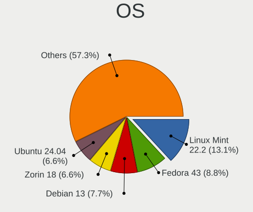

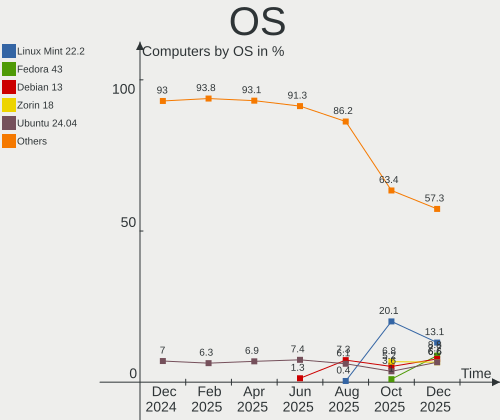

| Name                         | Computers | Percent |
|------------------------------|-----------|---------|
| Linux Mint 22.2              | 36        | 13.14%  |
| Fedora 43                    | 24        | 8.76%   |
| Debian 13                    | 21        | 7.66%   |
| Zorin 18                     | 18        | 6.57%   |
| Ubuntu 24.04                 | 18        | 6.57%   |
| Arch Rolling                 | 13        | 4.74%   |
| Pop!_OS 24.04                | 12        | 4.38%   |
| EndeavourOS Rolling          | 12        | 4.38%   |
| Ubuntu 25.10                 | 11        | 4.01%   |
| OpenMandriva 25.90           | 8         | 2.92%   |
| Zorin 17                     | 7         | 2.55%   |
| Bazzite 43                   | 7         | 2.55%   |
| LMDE 7                       | 6         | 2.19%   |
| Debian 12                    | 6         | 2.19%   |
| Ubuntu 22.04                 | 5         | 1.82%   |
| Linux Mint 22.1              | 4         | 1.46%   |
| Kubuntu 25.10                | 4         | 1.46%   |
| openSUSE Tumbleweed-XXXXXXXX | 3         | 1.09%   |
| OpenMandriva 6.0             | 3         | 1.09%   |
| Elementary 8                 | 3         | 1.09%   |
| Debian                       | 3         | 1.09%   |
| Xubuntu 24.04                | 2         | 0.73%   |
| Ubuntu 25.04                 | 2         | 0.73%   |
| Pop!_OS 22.04                | 2         | 0.73%   |
| OpenMandriva 25.11           | 2         | 0.73%   |
| OpenMandriva 24.90           | 2         | 0.73%   |
| Fedora 42                    | 2         | 0.73%   |
| CachyOS Rolling              | 2         | 0.73%   |
| Bazzite 42                   | 2         | 0.73%   |
| Aurora 43                    | 2         | 0.73%   |
| Xubuntu 25.10                | 1         | 0.36%   |
| Ubuntu Budgie 24.04          | 1         | 0.36%   |
| Ubuntu 24.10                 | 1         | 0.36%   |
| Ubuntu 20.04                 | 1         | 0.36%   |
| TUXEDO OS 24.04              | 1         | 0.36%   |
| ROSA 13.1                    | 1         | 0.36%   |
| org.kde.Platform 5.15-21.08  | 1         | 0.36%   |
| openSUSE Leap-16.0           | 1         | 0.36%   |
| OpenMandriva 4.2             | 1         | 0.36%   |
| OpenMandriva 25.06           | 1         | 0.36%   |

OS Family
---------

OS without a version

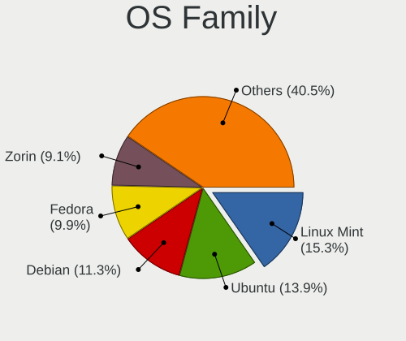

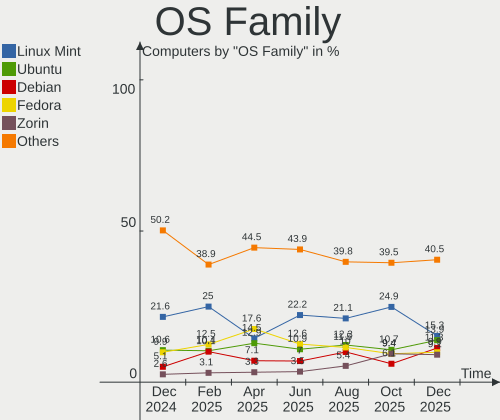

| Name             | Computers | Percent |
|------------------|-----------|---------|
| Linux Mint       | 42        | 15.33%  |
| Ubuntu           | 38        | 13.87%  |
| Debian           | 31        | 11.31%  |
| Fedora           | 27        | 9.85%   |
| Zorin            | 25        | 9.12%   |
| OpenMandriva     | 18        | 6.57%   |
| Pop!_OS          | 14        | 5.11%   |
| Arch             | 13        | 4.74%   |
| EndeavourOS      | 12        | 4.38%   |
| Bazzite          | 9         | 3.28%   |
| LMDE             | 6         | 2.19%   |
| Kubuntu          | 6         | 2.19%   |
| openSUSE         | 4         | 1.46%   |
| Xubuntu          | 3         | 1.09%   |
| Elementary       | 3         | 1.09%   |
| CachyOS          | 3         | 1.09%   |
| NixOS            | 2         | 0.73%   |
| MX               | 2         | 0.73%   |
| Aurora           | 2         | 0.73%   |
| Ubuntu Budgie    | 1         | 0.36%   |
| TUXEDO OS        | 1         | 0.36%   |
| ROSA             | 1         | 0.36%   |
| org.kde.Platform | 1         | 0.36%   |
| Manjaro          | 1         | 0.36%   |
| Lubuntu          | 1         | 0.36%   |
| Linux Lite       | 1         | 0.36%   |
| Lilidog          | 1         | 0.36%   |
| KDE neon         | 1         | 0.36%   |
| Gentoo           | 1         | 0.36%   |
| Deepin           | 1         | 0.36%   |
| BunsenLabs       | 1         | 0.36%   |
| blendOS          | 1         | 0.36%   |
| Aeon             | 1         | 0.36%   |

Kernel
------

Version of the Linux kernel

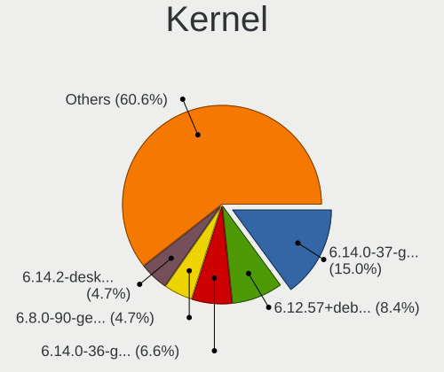

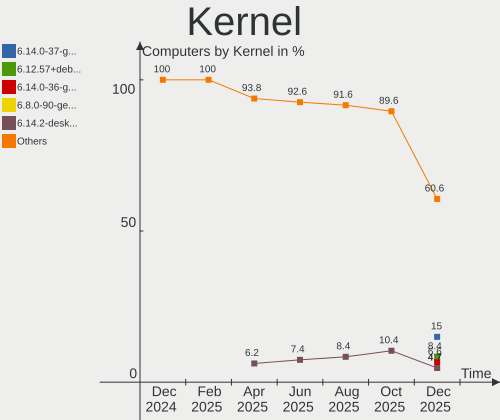

| Version                        | Computers | Percent |
|--------------------------------|-----------|---------|
| 6.14.0-37-generic              | 41        | 14.96%  |
| 6.12.57+deb13-amd64            | 23        | 8.39%   |
| 6.14.0-36-generic              | 18        | 6.57%   |
| 6.8.0-90-generic               | 13        | 4.74%   |
| 6.14.2-desktop-3omv2590        | 13        | 4.74%   |
| 6.17.9-76061709-generic        | 12        | 4.38%   |
| 6.17.0-8-generic               | 10        | 3.65%   |
| 6.17.9-arch1-1                 | 8         | 2.92%   |
| 6.17.1-300.fc43.x86_64         | 8         | 2.92%   |
| 6.17.9-300.fc43.x86_64         | 6         | 2.19%   |
| 6.17.12-300.fc43.x86_64        | 6         | 2.19%   |
| 6.14.0-29-generic              | 6         | 2.19%   |
| 6.8.0-87-generic               | 5         | 1.82%   |
| 6.18.2-arch2-1                 | 5         | 1.82%   |
| 6.17.7-ba20.fc43.x86_64        | 5         | 1.82%   |
| 6.8.0-88-generic               | 4         | 1.46%   |
| 6.17.11-300.fc43.x86_64        | 3         | 1.09%   |
| 6.17.10-300.fc43.x86_64        | 3         | 1.09%   |
| 6.17.0-7-generic               | 3         | 1.09%   |
| 6.12.48+deb13-amd64            | 3         | 1.09%   |
| 6.1.0-40-amd64                 | 3         | 1.09%   |
| 6.8.0-51-generic               | 2         | 0.73%   |
| 6.18.2-1-liquorix-amd64        | 2         | 0.73%   |
| 6.18.0-3-cachyos               | 2         | 0.73%   |
| 6.18.0                         | 2         | 0.73%   |
| 6.17.9-zen1-1-zen              | 2         | 0.73%   |
| 6.17.9-2-cachyos               | 2         | 0.73%   |
| 6.17.9+deb14-amd64             | 2         | 0.73%   |
| 6.17.8-arch1-1                 | 2         | 0.73%   |
| 6.17.7-ba19.fc43.x86_64        | 2         | 0.73%   |
| 6.17.13-200.fc42.x86_64        | 2         | 0.73%   |
| 6.16.4-116.bazzite.fc42.x86_64 | 2         | 0.73%   |
| 6.14.0-33-generic              | 2         | 0.73%   |
| 6.12.60-1-lts                  | 2         | 0.73%   |
| 6.10.9-desktop-1omv2490        | 2         | 0.73%   |
| 6.1.0-41-amd64                 | 2         | 0.73%   |
| 6.8.12-9-pve                   | 1         | 0.36%   |
| 6.8.0-90-lowlatency            | 1         | 0.36%   |
| 6.8.0-87-fips                  | 1         | 0.36%   |
| 6.8.0-60-generic               | 1         | 0.36%   |

Kernel Family
-------------

Linux kernel without a distro release

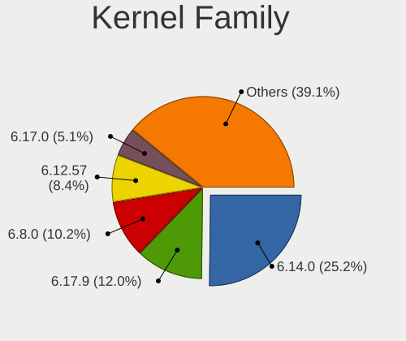

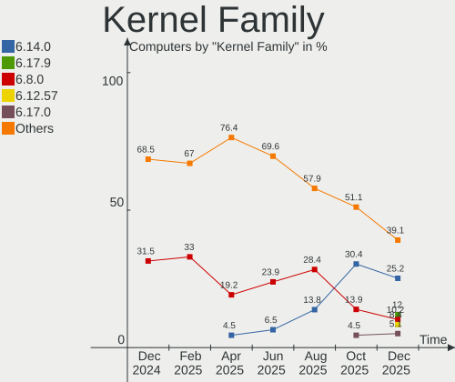

| Version | Computers | Percent |
|---------|-----------|---------|
| 6.14.0  | 69        | 25.18%  |
| 6.17.9  | 33        | 12.04%  |
| 6.8.0   | 28        | 10.22%  |
| 6.12.57 | 23        | 8.39%   |
| 6.17.0  | 14        | 5.11%   |
| 6.14.2  | 13        | 4.74%   |
| 6.18.2  | 11        | 4.01%   |
| 6.17.1  | 9         | 3.28%   |
| 6.17.7  | 8         | 2.92%   |
| 6.17.12 | 8         | 2.92%   |
| 6.1.0   | 7         | 2.55%   |
| 6.18.0  | 6         | 2.19%   |
| 6.17.8  | 3         | 1.09%   |
| 6.17.13 | 3         | 1.09%   |
| 6.17.11 | 3         | 1.09%   |
| 6.17.10 | 3         | 1.09%   |
| 6.12.48 | 3         | 1.09%   |
| 5.15.0  | 3         | 1.09%   |
| 6.18.1  | 2         | 0.73%   |
| 6.16.4  | 2         | 0.73%   |
| 6.16.3  | 2         | 0.73%   |
| 6.12.63 | 2         | 0.73%   |
| 6.12.60 | 2         | 0.73%   |
| 6.10.9  | 2         | 0.73%   |
| 6.8.12  | 1         | 0.36%   |
| 6.6.84  | 1         | 0.36%   |
| 6.4.15  | 1         | 0.36%   |
| 6.4.11  | 1         | 0.36%   |
| 6.17.5  | 1         | 0.36%   |
| 6.17.2  | 1         | 0.36%   |
| 6.12.58 | 1         | 0.36%   |
| 6.12.47 | 1         | 0.36%   |
| 6.12.43 | 1         | 0.36%   |
| 6.12.0  | 1         | 0.36%   |
| 6.11.0  | 1         | 0.36%   |
| 6.0.2   | 1         | 0.36%   |
| 5.4.0   | 1         | 0.36%   |
| 5.10.14 | 1         | 0.36%   |
| 5.10.0  | 1         | 0.36%   |

Kernel Major Ver.
-----------------

Linux kernel major version

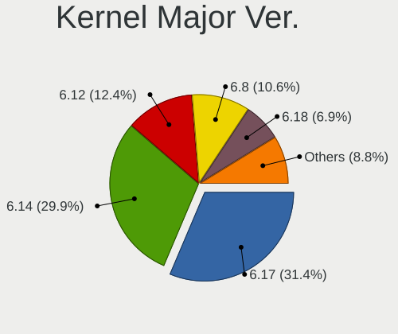

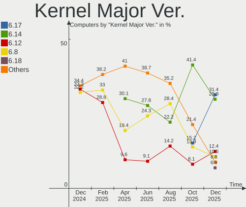

| Version | Computers | Percent |
|---------|-----------|---------|
| 6.17    | 86        | 31.39%  |
| 6.14    | 82        | 29.93%  |
| 6.12    | 34        | 12.41%  |
| 6.8     | 29        | 10.58%  |
| 6.18    | 19        | 6.93%   |
| 6.1     | 7         | 2.55%   |
| 6.16    | 4         | 1.46%   |
| 5.15    | 3         | 1.09%   |
| 6.4     | 2         | 0.73%   |
| 6.10    | 2         | 0.73%   |
| 5.10    | 2         | 0.73%   |
| 6.6     | 1         | 0.36%   |
| 6.11    | 1         | 0.36%   |
| 6.0     | 1         | 0.36%   |
| 5.4     | 1         | 0.36%   |

Arch
----

OS architecture (x86_64, i586, etc.)

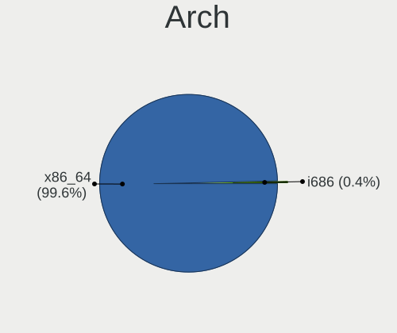

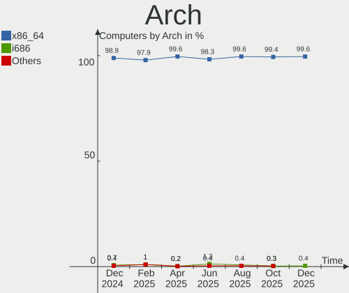

| Name   | Computers | Percent |
|--------|-----------|---------|
| x86_64 | 273       | 99.64%  |
| i686   | 1         | 0.36%   |

DE
--

Desktop Environment

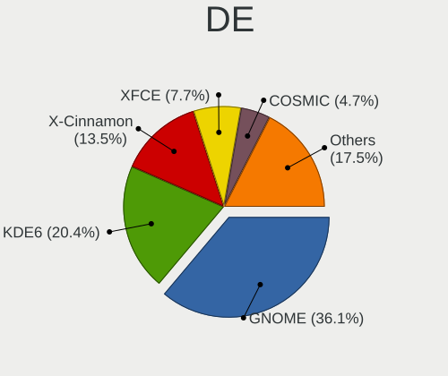

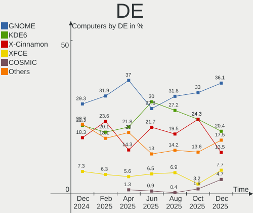

| Name            | Computers | Percent |
|-----------------|-----------|---------|
| GNOME           | 99        | 36.13%  |
| KDE6            | 56        | 20.44%  |
| X-Cinnamon      | 37        | 13.5%   |
| XFCE            | 21        | 7.66%   |
| COSMIC          | 13        | 4.74%   |
| Unknown         | 8         | 2.92%   |
| KDE5            | 6         | 2.19%   |
| KDE             | 6         | 2.19%   |
| Hyprland        | 6         | 2.19%   |
| MATE            | 5         | 1.82%   |
| LXQt            | 5         | 1.82%   |
| Pantheon        | 3         | 1.09%   |
| i3              | 3         | 1.09%   |
| Budgie          | 2         | 0.73%   |
| sway:wlroots    | 1         | 0.36%   |
| KDE4            | 1         | 0.36%   |
| DDE             | 1         | 0.36%   |
| BunsenLabs:XFCE | 1         | 0.36%   |

Display Server
--------------

X11 or Wayland

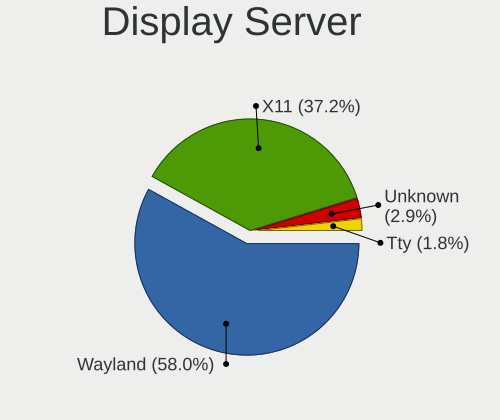

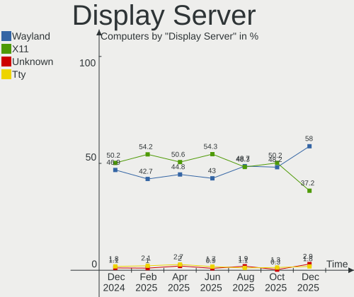

| Name    | Computers | Percent |
|---------|-----------|---------|
| Wayland | 159       | 58.03%  |
| X11     | 102       | 37.23%  |
| Unknown | 8         | 2.92%   |
| Tty     | 5         | 1.82%   |

Display Manager
---------------

SDDM, LightDM, etc.

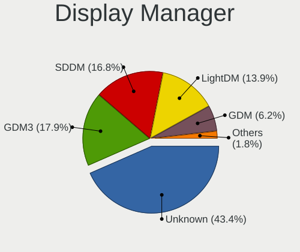

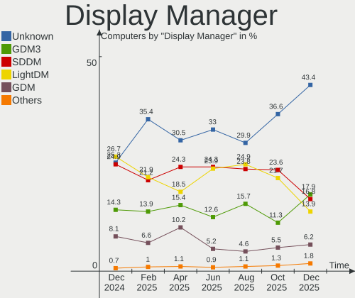

| Name           | Computers | Percent |
|----------------|-----------|---------|
| Unknown        | 119       | 43.43%  |
| GDM3           | 49        | 17.88%  |
| SDDM           | 46        | 16.79%  |
| LightDM        | 38        | 13.87%  |
| GDM            | 17        | 6.2%    |
| COSMIC-GREETER | 3         | 1.09%   |
| GREETD         | 2         | 0.73%   |

OS Lang
-------

Language

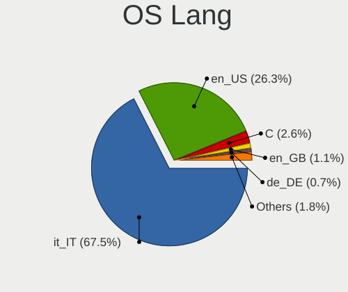

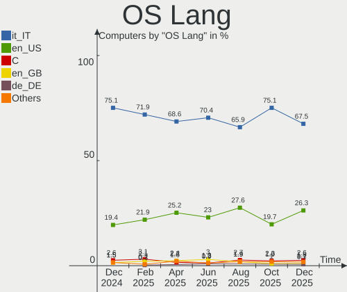

| Lang    | Computers | Percent |
|---------|-----------|---------|
| it_IT   | 185       | 67.52%  |
| en_US   | 72        | 26.28%  |
| C       | 7         | 2.55%   |
| en_GB   | 3         | 1.09%   |
| de_DE   | 2         | 0.73%   |
| fr_FR   | 1         | 0.36%   |
| es_ES   | 1         | 0.36%   |
| en_IE   | 1         | 0.36%   |
| af_ZA   | 1         | 0.36%   |
| Unknown | 1         | 0.36%   |

Boot Mode
---------

EFI or BIOS

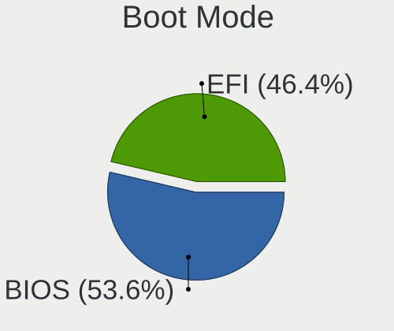

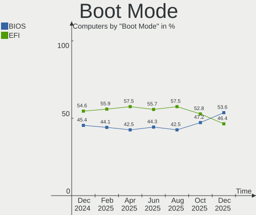

| Mode | Computers | Percent |
|------|-----------|---------|
| BIOS | 147       | 53.65%  |
| EFI  | 127       | 46.35%  |

Filesystem
----------

Type of filesystem

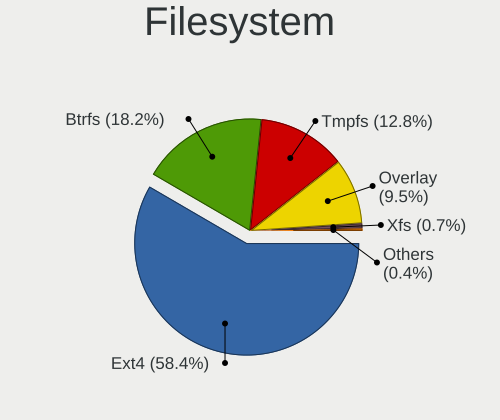

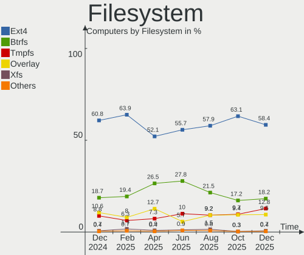

| Type    | Computers | Percent |
|---------|-----------|---------|
| Ext4    | 160       | 58.39%  |
| Btrfs   | 50        | 18.25%  |
| Tmpfs   | 35        | 12.77%  |
| Overlay | 26        | 9.49%   |
| Xfs     | 2         | 0.73%   |
| Unknown | 1         | 0.36%   |

Part. scheme
------------

Scheme of partitioning

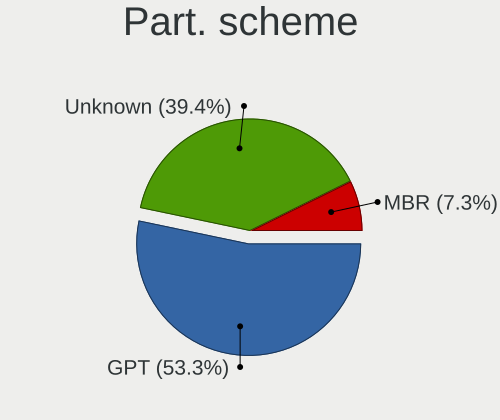

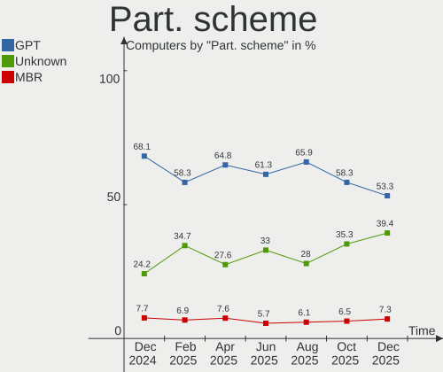

| Type    | Computers | Percent |
|---------|-----------|---------|
| GPT     | 146       | 53.28%  |
| Unknown | 108       | 39.42%  |
| MBR     | 20        | 7.3%    |

Dual Boot with Linux/BSD
------------------------

Hosting more than one Linux/BSD

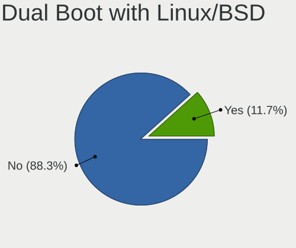

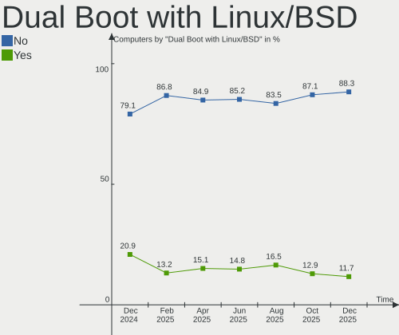

| Dual boot | Computers | Percent |
|-----------|-----------|---------|
| No        | 242       | 88.32%  |
| Yes       | 32        | 11.68%  |

Dual Boot (Win)
---------------

Hosting Linux and Windows

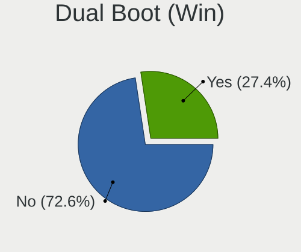

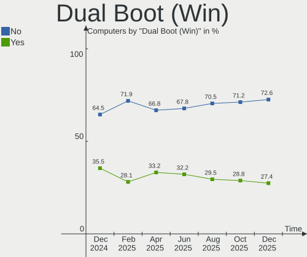

| Dual boot | Computers | Percent |
|-----------|-----------|---------|
| No        | 199       | 72.63%  |
| Yes       | 75        | 27.37%  |

Board
-----

Vendor
------

Motherboard manufacturer

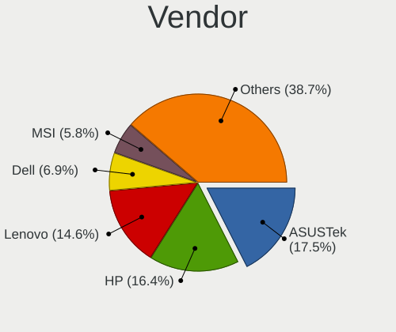

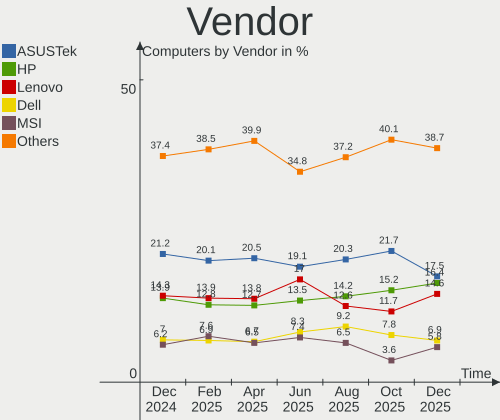

| Name                                 | Computers | Percent |
|--------------------------------------|-----------|---------|
| ASUSTek Computer                     | 48        | 17.52%  |
| Hewlett-Packard                      | 45        | 16.42%  |
| Lenovo                               | 40        | 14.6%   |
| Dell                                 | 19        | 6.93%   |
| MSI                                  | 16        | 5.84%   |
| Acer                                 | 14        | 5.11%   |
| Gigabyte Technology                  | 13        | 4.74%   |
| Apple                                | 12        | 4.38%   |
| Fujitsu                              | 7         | 2.55%   |
| Intel                                | 6         | 2.19%   |
| ASRock                               | 6         | 2.19%   |
| Unknown                              | 6         | 2.19%   |
| Samsung Electronics                  | 5         | 1.82%   |
| ZOTAC                                | 2         | 0.73%   |
| SZQFTX                               | 2         | 0.73%   |
| Sony                                 | 2         | 0.73%   |
| Shenzhen Meigao Electronic Equipment | 2         | 0.73%   |
| Packard Bell                         | 2         | 0.73%   |
| Medion                               | 2         | 0.73%   |
| HUAWEI                               | 2         | 0.73%   |
| AZW                                  | 2         | 0.73%   |
| TUXEDO                               | 1         | 0.36%   |
| Toshiba                              | 1         | 0.36%   |
| Timi                                 | 1         | 0.36%   |
| Shuttle                              | 1         | 0.36%   |
| RealBom                              | 1         | 0.36%   |
| Quanta                               | 1         | 0.36%   |
| PC Specialist                        | 1         | 0.36%   |
| Panasonic                            | 1         | 0.36%   |
| LinuxContainers                      | 1         | 0.36%   |
| IBM                                  | 1         | 0.36%   |
| HC Technology.                       | 1         | 0.36%   |
| Hampoo                               | 1         | 0.36%   |
| GPD                                  | 1         | 0.36%   |
| GMKtec                               | 1         | 0.36%   |
| GEEKOM                               | 1         | 0.36%   |
| Framework                            | 1         | 0.36%   |
| Fanless Mini PC                      | 1         | 0.36%   |
| ATHESI                               | 1         | 0.36%   |
| ANGXUN                               | 1         | 0.36%   |

Model
-----

Motherboard model

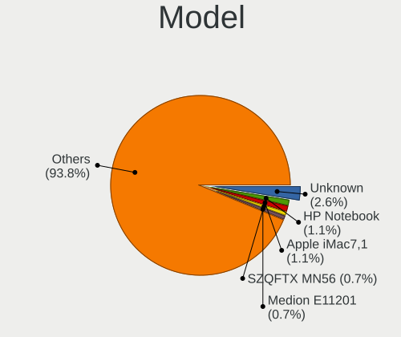

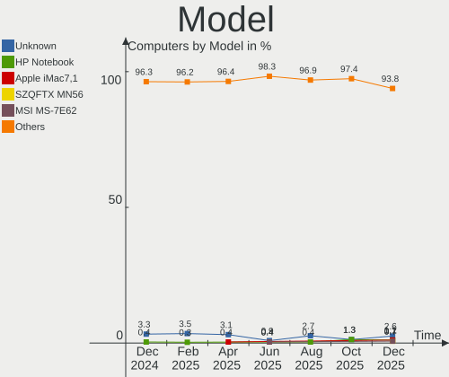

| Name                                                  | Computers | Percent |
|-------------------------------------------------------|-----------|---------|
| Unknown                                               | 7         | 2.55%   |
| HP Notebook                                           | 3         | 1.09%   |
| Apple iMac7,1                                         | 3         | 1.09%   |
| SZQFTX MN56                                           | 2         | 0.73%   |
| MSI MS-7E62                                           | 2         | 0.73%   |
| Medion E11201                                         | 2         | 0.73%   |
| Lenovo Yoga Slim 7 14ILL10 83JX                       | 2         | 0.73%   |
| HP Pavilion dv7                                       | 2         | 0.73%   |
| HP Pavilion 15                                        | 2         | 0.73%   |
| HP OMEN by Laptop 15-dc1xxx                           | 2         | 0.73%   |
| Fujitsu LIFEBOOK E754                                 | 2         | 0.73%   |
| ASUS X550LD                                           | 2         | 0.73%   |
| ASUS ROG CROSSHAIR X870E HERO                         | 2         | 0.73%   |
| ZOTAC ZBOX-CI337NANO                                  | 1         | 0.36%   |
| ZOTAC ZBOX-CI323NANO                                  | 1         | 0.36%   |
| TUXEDO Stellaris 17 Intel Gen6                        | 1         | 0.36%   |
| Toshiba Satellite C660                                | 1         | 0.36%   |
| Timi TM1701                                           | 1         | 0.36%   |
| Sony VPCL14J9E                                        | 1         | 0.36%   |
| Sony SVL2413L1EB                                      | 1         | 0.36%   |
| Shuttle XH61                                          | 1         | 0.36%   |
| Shenzhen Meigao Electronic Equipment Venus series     | 1         | 0.36%   |
| Shenzhen Meigao Electronic Equipment EliteMini Series | 1         | 0.36%   |
| Samsung RV420/RV520/RV720/E3530/S3530/E3420/E3520     | 1         | 0.36%   |
| Samsung R540/SA41/E452                                | 1         | 0.36%   |
| Samsung 960QHA                                        | 1         | 0.36%   |
| Samsung 750XDA                                        | 1         | 0.36%   |
| Samsung 700T1C                                        | 1         | 0.36%   |
| RealBom RB-P101G                                      | 1         | 0.36%   |
| Quanta CA27                                           | 1         | 0.36%   |
| PC Specialist X6AR558Y                                | 1         | 0.36%   |
| Panasonic CF-C2AHCLHMG                                | 1         | 0.36%   |
| Packard Bell IMEDIA S3210                             | 1         | 0.36%   |
| Packard Bell EasyNote ML65                            | 1         | 0.36%   |
| MSI Prestige 16 AI Evo B1MG                           | 1         | 0.36%   |
| MSI MS-7E59                                           | 1         | 0.36%   |
| MSI MS-7E01                                           | 1         | 0.36%   |
| MSI MS-7D98                                           | 1         | 0.36%   |
| MSI MS-7D91                                           | 1         | 0.36%   |
| MSI MS-7D75                                           | 1         | 0.36%   |

Model Family
------------

Motherboard model prefix

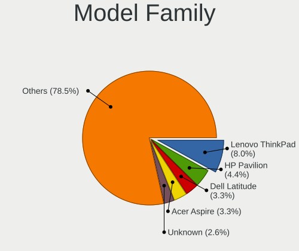

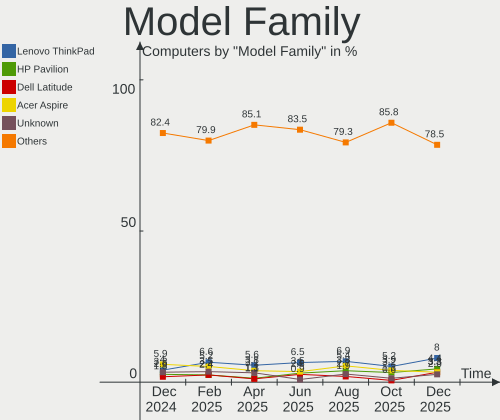

| Name                 | Computers | Percent |
|----------------------|-----------|---------|
| Lenovo ThinkPad      | 22        | 8.03%   |
| HP Pavilion          | 12        | 4.38%   |
| Dell Latitude        | 9         | 3.28%   |
| Acer Aspire          | 9         | 3.28%   |
| Unknown              | 7         | 2.55%   |
| ASUS ROG             | 6         | 2.19%   |
| Lenovo IdeaPad       | 5         | 1.82%   |
| ASUS TUF             | 5         | 1.82%   |
| Lenovo Yoga          | 4         | 1.46%   |
| Lenovo ThinkCentre   | 4         | 1.46%   |
| HP Laptop            | 4         | 1.46%   |
| ASUS VivoBook        | 4         | 1.46%   |
| HP ZBook             | 3         | 1.09%   |
| HP ProBook           | 3         | 1.09%   |
| HP Notebook          | 3         | 1.09%   |
| HP Compaq            | 3         | 1.09%   |
| Fujitsu LIFEBOOK     | 3         | 1.09%   |
| Fujitsu ESPRIMO      | 3         | 1.09%   |
| Dell XPS             | 3         | 1.09%   |
| Dell Inspiron        | 3         | 1.09%   |
| Apple iMac7          | 3         | 1.09%   |
| SZQFTX MN56          | 2         | 0.73%   |
| MSI MS-7E62          | 2         | 0.73%   |
| MSI GF65             | 2         | 0.73%   |
| Medion E11201        | 2         | 0.73%   |
| HP Victus            | 2         | 0.73%   |
| HP OMEN              | 2         | 0.73%   |
| HP EliteDesk         | 2         | 0.73%   |
| HP EliteBook         | 2         | 0.73%   |
| Dell Studio          | 2         | 0.73%   |
| ASUS X550LD          | 2         | 0.73%   |
| ASUS SABERTOOTH      | 2         | 0.73%   |
| ASUS PRIME           | 2         | 0.73%   |
| ASUS MINIPC          | 2         | 0.73%   |
| Apple MacBook5       | 2         | 0.73%   |
| Acer Predator        | 2         | 0.73%   |
| Acer Extensa         | 2         | 0.73%   |
| ZOTAC ZBOX-CI337NANO | 1         | 0.36%   |
| ZOTAC ZBOX-CI323NANO | 1         | 0.36%   |
| TUXEDO Stellaris     | 1         | 0.36%   |

MFG Year
--------

Motherboard manufacture year

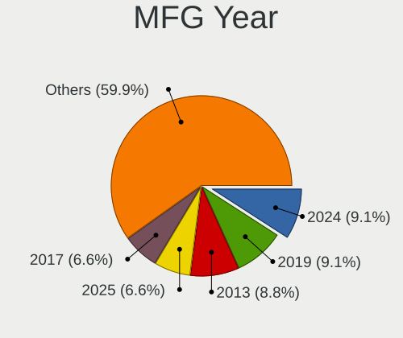

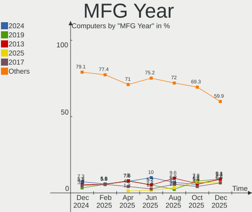

| Year    | Computers | Percent |
|---------|-----------|---------|
| 2024    | 25        | 9.12%   |
| 2019    | 25        | 9.12%   |
| 2013    | 24        | 8.76%   |
| 2025    | 18        | 6.57%   |
| 2017    | 18        | 6.57%   |
| 2020    | 16        | 5.84%   |
| 2015    | 16        | 5.84%   |
| 2023    | 15        | 5.47%   |
| 2022    | 15        | 5.47%   |
| 2018    | 15        | 5.47%   |
| 2021    | 13        | 4.74%   |
| 2008    | 13        | 4.74%   |
| 2012    | 11        | 4.01%   |
| 2010    | 11        | 4.01%   |
| 2014    | 10        | 3.65%   |
| 2016    | 8         | 2.92%   |
| 2011    | 8         | 2.92%   |
| 2009    | 8         | 2.92%   |
| 2007    | 3         | 1.09%   |
| 2006    | 1         | 0.36%   |
| Unknown | 1         | 0.36%   |

Form Factor
-----------

Physical design of the computer

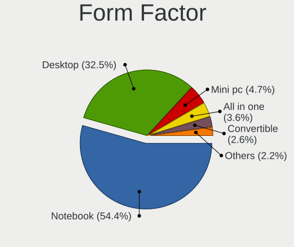

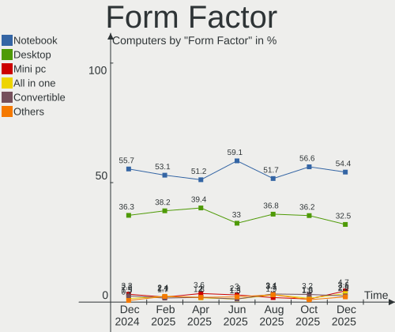

| Name        | Computers | Percent |
|-------------|-----------|---------|
| Notebook    | 149       | 54.38%  |
| Desktop     | 89        | 32.48%  |
| Mini pc     | 13        | 4.74%   |
| All in one  | 10        | 3.65%   |
| Convertible | 7         | 2.55%   |
| Server      | 3         | 1.09%   |
| Tablet      | 2         | 0.73%   |
| Stick pc    | 1         | 0.36%   |

Secure Boot
-----------

Enabled or disabled

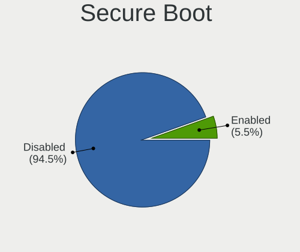

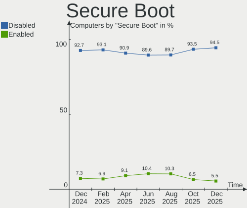

| State    | Computers | Percent |
|----------|-----------|---------|
| Disabled | 259       | 94.53%  |
| Enabled  | 15        | 5.47%   |

Coreboot
--------

Have coreboot on board

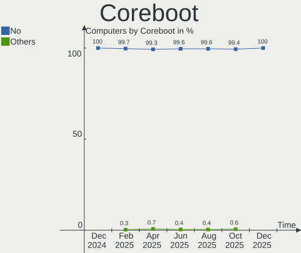

| Used | Computers | Percent |
|------|-----------|---------|
| No   | 274       | 100%    |

RAM Size
--------

Total RAM memory

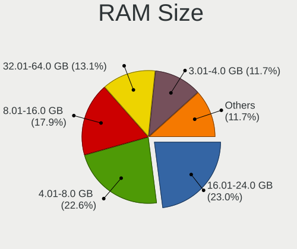

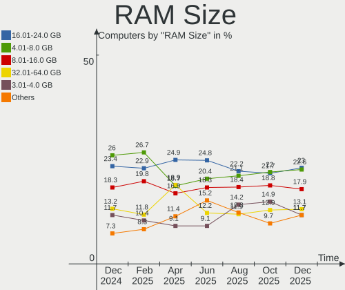

| Size in GB  | Computers | Percent |
|-------------|-----------|---------|
| 16.01-24.0  | 63        | 22.99%  |
| 4.01-8.0    | 62        | 22.63%  |
| 8.01-16.0   | 49        | 17.88%  |
| 32.01-64.0  | 36        | 13.14%  |
| 3.01-4.0    | 32        | 11.68%  |
| 24.01-32.0  | 19        | 6.93%   |
| 1.01-2.0    | 6         | 2.19%   |
| 64.01-256.0 | 4         | 1.46%   |
| 2.01-3.0    | 2         | 0.73%   |
| 0.51-1.0    | 1         | 0.36%   |

RAM Used
--------

Used RAM memory

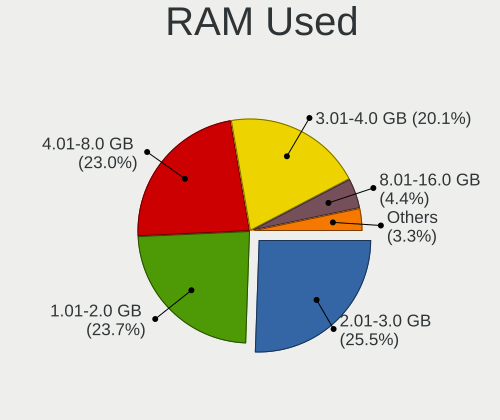

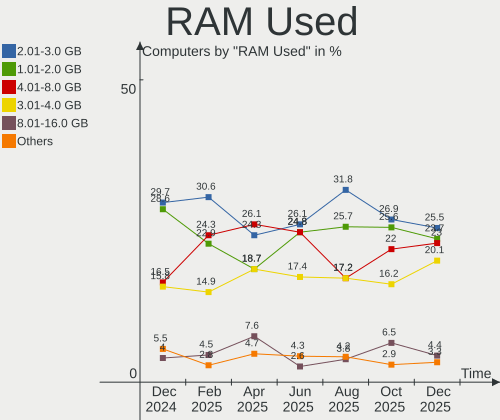

| Used GB    | Computers | Percent |
|------------|-----------|---------|
| 2.01-3.0   | 70        | 25.55%  |
| 1.01-2.0   | 65        | 23.72%  |
| 4.01-8.0   | 63        | 22.99%  |
| 3.01-4.0   | 55        | 20.07%  |
| 8.01-16.0  | 12        | 4.38%   |
| 0.51-1.0   | 5         | 1.82%   |
| 0.01-0.5   | 3         | 1.09%   |
| 24.01-32.0 | 1         | 0.36%   |

Total Drives
------------

Number of drives on board

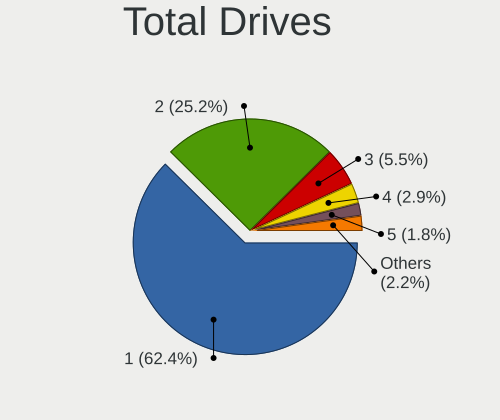

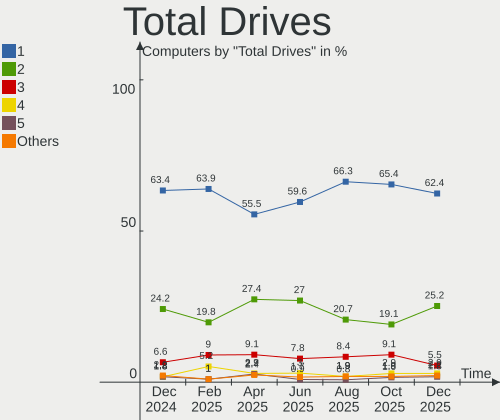

| Drives | Computers | Percent |
|--------|-----------|---------|
| 1      | 171       | 62.41%  |
| 2      | 69        | 25.18%  |
| 3      | 15        | 5.47%   |
| 4      | 8         | 2.92%   |
| 5      | 5         | 1.82%   |
| 6      | 2         | 0.73%   |
| 0      | 2         | 0.73%   |
| 10     | 1         | 0.36%   |
| 7      | 1         | 0.36%   |

Has CD-ROM
----------

Has CD-ROM on board

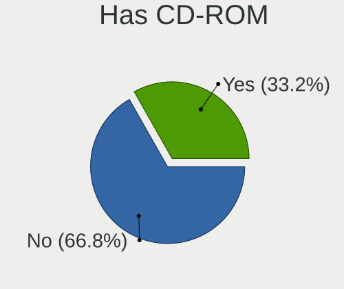

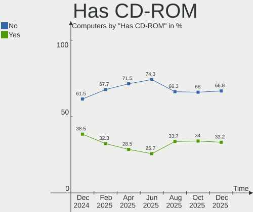

| Presented | Computers | Percent |
|-----------|-----------|---------|
| No        | 183       | 66.79%  |
| Yes       | 91        | 33.21%  |

Has Ethernet
------------

Has Ethernet on board

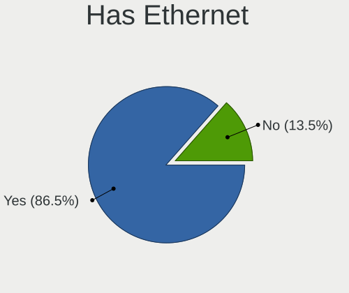

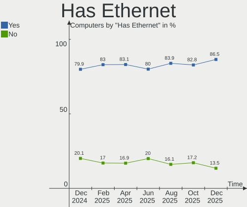

| Presented | Computers | Percent |
|-----------|-----------|---------|
| Yes       | 237       | 86.5%   |
| No        | 37        | 13.5%   |

Has WiFi
--------

Has WiFi module

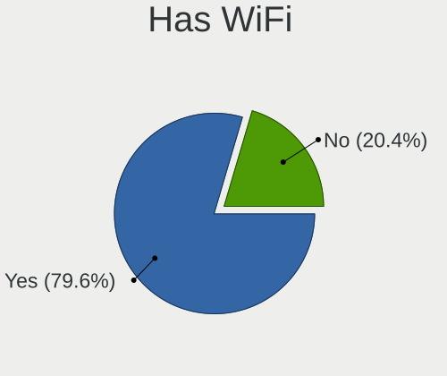

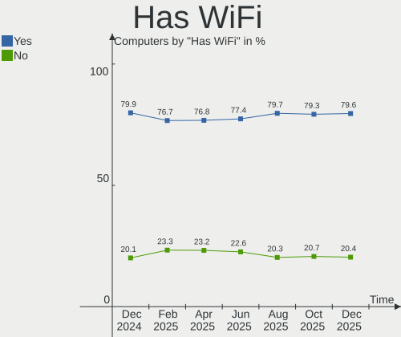

| Presented | Computers | Percent |
|-----------|-----------|---------|
| Yes       | 218       | 79.56%  |
| No        | 56        | 20.44%  |

Has Bluetooth
-------------

Has Bluetooth module

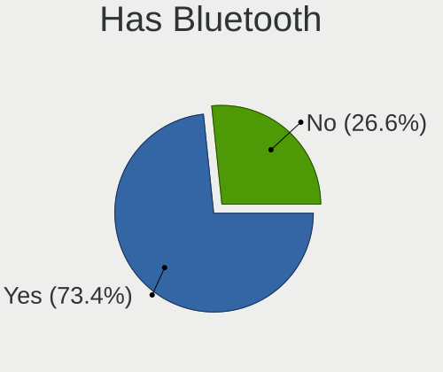

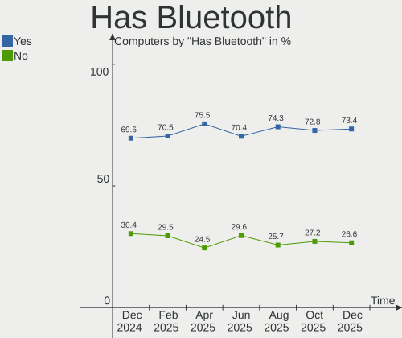

| Presented | Computers | Percent |
|-----------|-----------|---------|
| Yes       | 201       | 73.36%  |
| No        | 73        | 26.64%  |

Location
--------

Country
-------

Geographic location (country)

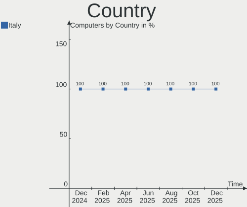

| Country | Computers | Percent |
|---------|-----------|---------|
| Italy   | 274       | 100%    |

City
----

Geographic location (city)

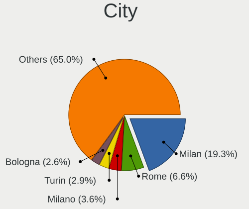

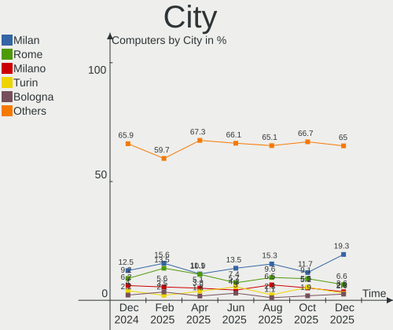

| City                  | Computers | Percent |
|-----------------------|-----------|---------|
| Milan                 | 53        | 19.34%  |
| Rome                  | 18        | 6.57%   |
| Milano                | 10        | 3.65%   |
| Turin                 | 8         | 2.92%   |
| Bologna               | 7         | 2.55%   |
| Palermo               | 6         | 2.19%   |
| Genoa                 | 5         | 1.82%   |
| Udine                 | 4         | 1.46%   |
| Reggio Emilia         | 4         | 1.46%   |
| Livorno               | 4         | 1.46%   |
| Legnano               | 4         | 1.46%   |
| Florence              | 4         | 1.46%   |
| Vicenza               | 3         | 1.09%   |
| Padova                | 3         | 1.09%   |
| Verona                | 2         | 0.73%   |
| Venice                | 2         | 0.73%   |
| Sessa Cilento         | 2         | 0.73%   |
| Ravenna               | 2         | 0.73%   |
| Pogliano Milanese     | 2         | 0.73%   |
| Novara                | 2         | 0.73%   |
| Naples                | 2         | 0.73%   |
| Modena                | 2         | 0.73%   |
| Massafra              | 2         | 0.73%   |
| Gravina di Catania    | 2         | 0.73%   |
| Giugliano in Campania | 2         | 0.73%   |
| Cesenatico            | 2         | 0.73%   |
| Catania               | 2         | 0.73%   |
| Cagliari              | 2         | 0.73%   |
| Botticino             | 2         | 0.73%   |
| Borgomanero           | 2         | 0.73%   |
| Vignola               | 1         | 0.36%   |
| Vigevano              | 1         | 0.36%   |
| Vairano Patenora      | 1         | 0.36%   |
| Trieste               | 1         | 0.36%   |
| Trento                | 1         | 0.36%   |
| Torre Caracciolo      | 1         | 0.36%   |
| Teramo                | 1         | 0.36%   |
| Taranto               | 1         | 0.36%   |
| Storo                 | 1         | 0.36%   |
| Sizzano               | 1         | 0.36%   |

Drives
------

Drive Vendor
------------

Hard drive vendors

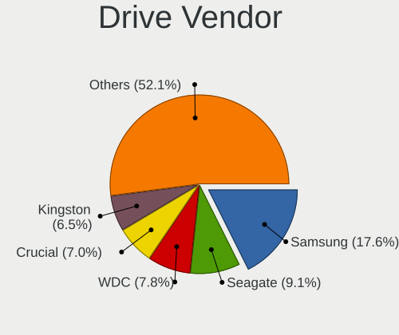

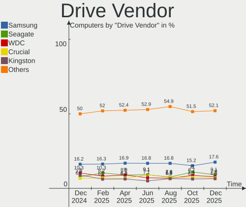

| Vendor                       | Computers | Drives | Percent |
|------------------------------|-----------|--------|---------|
| Samsung Electronics          | 68        | 81     | 17.62%  |
| Seagate                      | 35        | 42     | 9.07%   |
| WDC                          | 30        | 37     | 7.77%   |
| Crucial                      | 27        | 33     | 6.99%   |
| Kingston                     | 25        | 25     | 6.48%   |
| SanDisk                      | 23        | 25     | 5.96%   |
| Micron Technology            | 21        | 21     | 5.44%   |
| Toshiba                      | 17        | 19     | 4.4%    |
| Unknown                      | 9         | 11     | 2.33%   |
| SK hynix                     | 8         | 8      | 2.07%   |
| MAXIO Technology (Hangzhou)  | 7         | 8      | 1.81%   |
| Intel                        | 7         | 11     | 1.81%   |
| KIOXIA                       | 6         | 6      | 1.55%   |
| Kingston Technology Company  | 5         | 5      | 1.3%    |
| HGST                         | 5         | 5      | 1.3%    |
| Shenzhen Longsys Electronics | 4         | 4      | 1.04%   |
| KingSpec                     | 4         | 4      | 1.04%   |
| JMicron Technology           | 4         | 4      | 1.04%   |
| China                        | 4         | 4      | 1.04%   |
| Realtek Semiconductor        | 3         | 3      | 0.78%   |
| Phison Electronics           | 3         | 3      | 0.78%   |
| Micron/Crucial Technology    | 3         | 3      | 0.78%   |
| Fujitsu                      | 3         | 3      | 0.78%   |
| Apple                        | 3         | 3      | 0.78%   |
| Unknown                      | 3         | 3      | 0.78%   |
| USB                          | 2         | 2      | 0.52%   |
| SPCC                         | 2         | 2      | 0.52%   |
| PNY                          | 2         | 2      | 0.52%   |
| Phison                       | 2         | 3      | 0.52%   |
| Patriot                      | 2         | 2      | 0.52%   |
| Maxtor                       | 2         | 2      | 0.52%   |
| LITEON                       | 2         | 2      | 0.52%   |
| KODAK                        | 2         | 2      | 0.52%   |
| Hitachi                      | 2         | 2      | 0.52%   |
| Fanxiang                     | 2         | 2      | 0.52%   |
| EDILOCA                      | 2         | 2      | 0.52%   |
| Corsair                      | 2         | 2      | 0.52%   |
| WDC WDS1                     | 1         | 1      | 0.26%   |
| Transcend                    | 1         | 1      | 0.26%   |
| Solidigm                     | 1         | 1      | 0.26%   |

Drive Model
-----------

Hard drive models

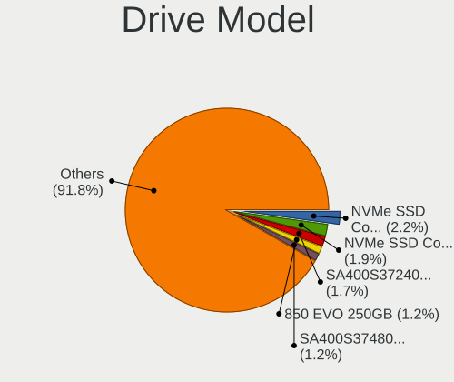

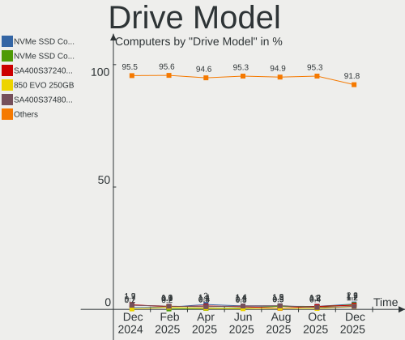

| Model                                                | Computers | Percent |
|------------------------------------------------------|-----------|---------|
| Samsung NVMe SSD Controller SM981/PM981/PM983 1TB    | 9         | 2.18%   |
| Samsung NVMe SSD Controller SM961/PM961/SM963 1024GB | 8         | 1.94%   |
| Kingston SA400S37240G 240GB SSD                      | 7         | 1.69%   |
| Samsung SSD 850 EVO 250GB                            | 5         | 1.21%   |
| Kingston SA400S37480G 480GB SSD                      | 5         | 1.21%   |
| Crucial CT500MX500SSD1 500GB                         | 5         | 1.21%   |
| Unknown MMC Card  128GB                              | 4         | 0.97%   |
| Samsung SSD 860 EVO 1TB                              | 4         | 0.97%   |
| Crucial CT240BX500SSD1 240GB                         | 4         | 0.97%   |
| Unknown MMC Card  256GB                              | 3         | 0.73%   |
| Seagate ST2000DM008-2UB102 2TB                       | 3         | 0.73%   |
| Seagate ST1000LM024 HN-M101MBB 1TB                   | 3         | 0.73%   |
| SanDisk SSD PLUS 240GB                               | 3         | 0.73%   |
| Samsung SSD 870 QVO 1TB                              | 3         | 0.73%   |
| Samsung SSD 860 EVO 500GB                            | 3         | 0.73%   |
| Samsung NVMe SSD Controller PM9A1/PM9A3/980PRO 1TB   | 3         | 0.73%   |
| Micron 2500 NVMe SSD (DRAM-less) 512GB               | 3         | 0.73%   |
| MAXIO (Hangzhou) NVMe SSD Controller MAP1202 2TB     | 3         | 0.73%   |
| Kingston Company SNV2S1000G 1TB                      | 3         | 0.73%   |
| JMicron Tech 250GB                                   | 3         | 0.73%   |
| HGST HTS545050A7E680 500GB                           | 3         | 0.73%   |
| Crucial CT1000MX500SSD1 1TB                          | 3         | 0.73%   |
| Unknown                                              | 3         | 0.73%   |
| USB SanDisk 3.2Gen1 496GB                            | 2         | 0.48%   |
| Unknown SD/MMC/MS PRO 2GB                            | 2         | 0.48%   |
| Toshiba TR200 480GB SSD                              | 2         | 0.48%   |
| Toshiba MQ04ABF100 1TB                               | 2         | 0.48%   |
| Toshiba MQ01ABD100 1TB                               | 2         | 0.48%   |
| Seagate ST500LM021-1KJ152 500GB                      | 2         | 0.48%   |
| Seagate ST500DM002-1BD142 500GB                      | 2         | 0.48%   |
| Seagate ST4000DM004-2CV104 4TB                       | 2         | 0.48%   |
| Seagate ST3500418AS 500GB                            | 2         | 0.48%   |
| Seagate ST3320418AS 320GB                            | 2         | 0.48%   |
| Seagate ST1000LM049-2GH172 1TB                       | 2         | 0.48%   |
| Seagate ST1000DM003-1SB10C 1TB                       | 2         | 0.48%   |
| Sandisk WD_BLACK SN850X 4000GB                       | 2         | 0.48%   |
| Sandisk WD_BLACK SN850X 2000GB                       | 2         | 0.48%   |
| Samsung SSD 990 PRO 1TB                              | 2         | 0.48%   |
| Samsung SSD 870 EVO 500GB                            | 2         | 0.48%   |
| Samsung SSD 850 PRO 256GB                            | 2         | 0.48%   |

HDD Vendor
----------

Hard disk drive vendors

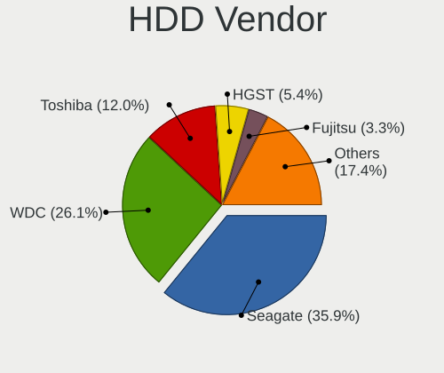

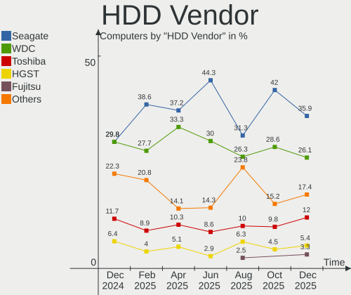

| Vendor              | Computers | Drives | Percent |
|---------------------|-----------|--------|---------|
| Seagate             | 33        | 40     | 35.87%  |
| WDC                 | 24        | 30     | 26.09%  |
| Toshiba             | 11        | 12     | 11.96%  |
| HGST                | 5         | 5      | 5.43%   |
| Fujitsu             | 3         | 3      | 3.26%   |
| Unknown             | 2         | 2      | 2.17%   |
| Samsung Electronics | 2         | 2      | 2.17%   |
| Maxtor              | 2         | 2      | 2.17%   |
| Hitachi             | 2         | 2      | 2.17%   |
| Min Yi U            | 1         | 1      | 1.09%   |
| JMicron Technology  | 1         | 1      | 1.09%   |
| HPE                 | 1         | 4      | 1.09%   |
| HGST HTS            | 1         | 1      | 1.09%   |
| Hewlett-Packard     | 1         | 1      | 1.09%   |
| External            | 1         | 1      | 1.09%   |
| ASMT                | 1         | 2      | 1.09%   |
| Apple               | 1         | 1      | 1.09%   |

SSD Vendor
----------

Solid state drive vendors

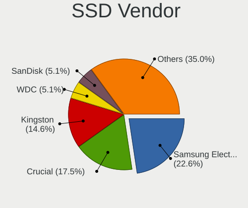

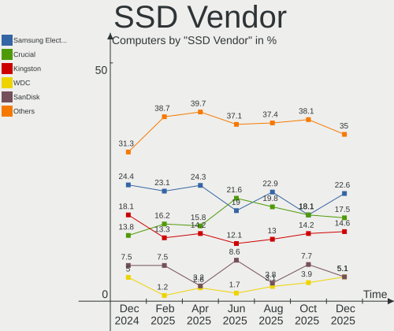

| Vendor              | Computers | Drives | Percent |
|---------------------|-----------|--------|---------|
| Samsung Electronics | 31        | 33     | 22.63%  |
| Crucial             | 24        | 29     | 17.52%  |
| Kingston            | 20        | 20     | 14.6%   |
| WDC                 | 7         | 7      | 5.11%   |
| SanDisk             | 7         | 7      | 5.11%   |
| Micron Technology   | 5         | 5      | 3.65%   |
| Toshiba             | 4         | 4      | 2.92%   |
| KingSpec            | 4         | 4      | 2.92%   |
| China               | 4         | 4      | 2.92%   |
| SPCC                | 2         | 2      | 1.46%   |
| PNY                 | 2         | 2      | 1.46%   |
| LITEON              | 2         | 2      | 1.46%   |
| KODAK               | 2         | 2      | 1.46%   |
| Fanxiang            | 2         | 2      | 1.46%   |
| EDILOCA             | 2         | 2      | 1.46%   |
| Corsair             | 2         | 2      | 1.46%   |
| Apple               | 2         | 2      | 1.46%   |
| WDC WDS1            | 1         | 1      | 0.73%   |
| Transcend           | 1         | 1      | 0.73%   |
| SABRENT             | 1         | 1      | 0.73%   |
| Plextor             | 1         | 1      | 0.73%   |
| Patriot             | 1         | 1      | 0.73%   |
| OCZ                 | 1         | 1      | 0.73%   |
| NGFF                | 1         | 1      | 0.73%   |
| Netac               | 1         | 1      | 0.73%   |
| KLEVV               | 1         | 1      | 0.73%   |
| KingDian            | 1         | 1      | 0.73%   |
| Intenso             | 1         | 1      | 0.73%   |
| Intel               | 1         | 4      | 0.73%   |
| Aura                | 1         | 1      | 0.73%   |
| ANKEJE              | 1         | 1      | 0.73%   |
| A-DATA Technology   | 1         | 1      | 0.73%   |

Drive Kind
----------

HDD or SSD

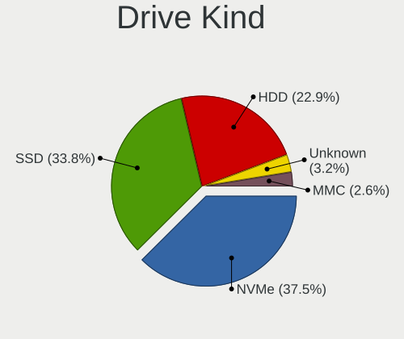

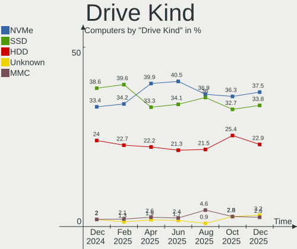

| Kind    | Computers | Drives | Percent |
|---------|-----------|--------|---------|
| NVMe    | 131       | 157    | 37.54%  |
| SSD     | 118       | 147    | 33.81%  |
| HDD     | 80        | 110    | 22.92%  |
| Unknown | 11        | 11     | 3.15%   |
| MMC     | 9         | 12     | 2.58%   |

Drive Connector
---------------

SATA, SAS, NVMe, etc.

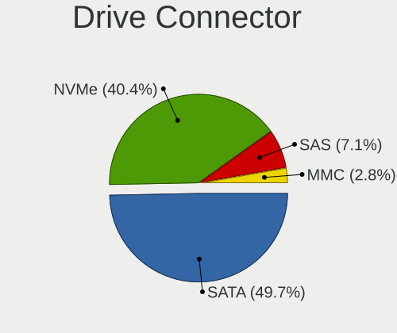

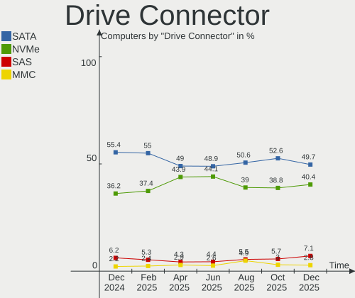

| Type | Computers | Drives | Percent |
|------|-----------|--------|---------|
| SATA | 161       | 243    | 49.69%  |
| NVMe | 131       | 155    | 40.43%  |
| SAS  | 23        | 27     | 7.1%    |
| MMC  | 9         | 12     | 2.78%   |

Drive Size
----------

Size of hard drive

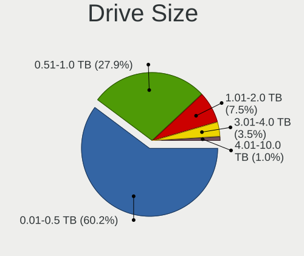

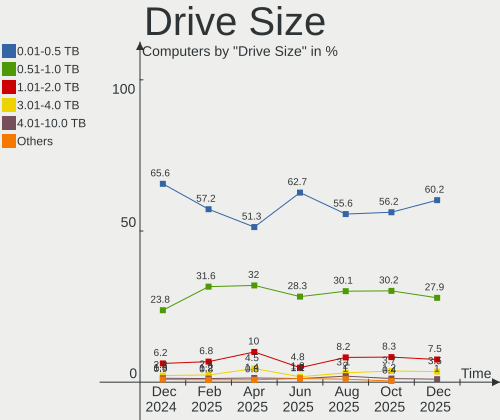

| Size in TB | Computers | Drives | Percent |
|------------|-----------|--------|---------|
| 0.01-0.5   | 121       | 161    | 60.2%   |
| 0.51-1.0   | 56        | 64     | 27.86%  |
| 1.01-2.0   | 15        | 21     | 7.46%   |
| 3.01-4.0   | 7         | 9      | 3.48%   |
| 4.01-10.0  | 2         | 2      | 1%      |

Space Total
-----------

Amount of disk space available on the file system

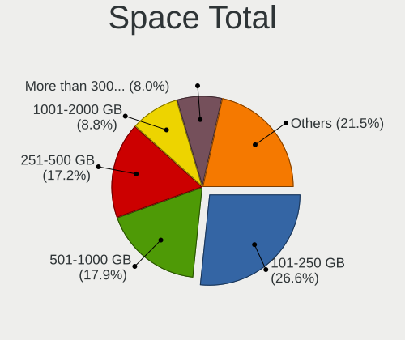

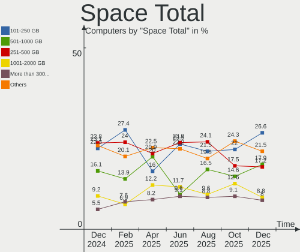

| Size in GB     | Computers | Percent |
|----------------|-----------|---------|
| 101-250        | 73        | 26.64%  |
| 501-1000       | 49        | 17.88%  |
| 251-500        | 47        | 17.15%  |
| 1001-2000      | 24        | 8.76%   |
| More than 3000 | 22        | 8.03%   |
| 1-20           | 17        | 6.2%    |
| Unknown        | 15        | 5.47%   |
| 2001-3000      | 10        | 3.65%   |
| 51-100         | 10        | 3.65%   |
| 21-50          | 7         | 2.55%   |

Space Used
----------

Amount of used disk space

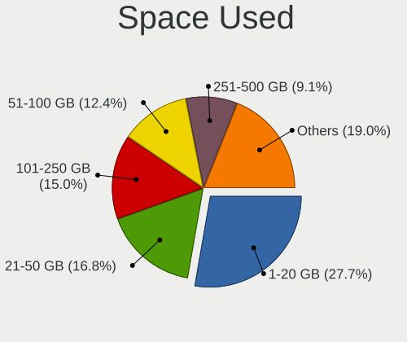

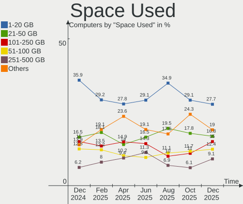

| Used GB        | Computers | Percent |
|----------------|-----------|---------|
| 1-20           | 76        | 27.74%  |
| 21-50          | 46        | 16.79%  |
| 101-250        | 41        | 14.96%  |
| 51-100         | 34        | 12.41%  |
| 251-500        | 25        | 9.12%   |
| 501-1000       | 21        | 7.66%   |
| Unknown        | 15        | 5.47%   |
| 1001-2000      | 7         | 2.55%   |
| More than 3000 | 5         | 1.82%   |
| 2001-3000      | 4         | 1.46%   |

Malfunc. Drives
---------------

Drive models with a malfunction

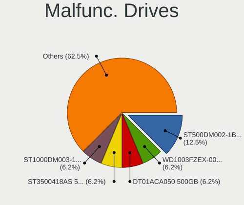

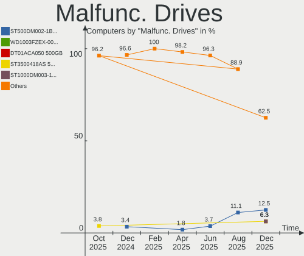

| Model                             | Computers | Drives | Percent |
|-----------------------------------|-----------|--------|---------|
| Seagate ST500DM002-1BD142 500GB   | 2         | 2      | 12.5%   |
| WDC WD1003FZEX-00K3CA0 1TB        | 1         | 1      | 6.25%   |
| Toshiba DT01ACA050 500GB          | 1         | 1      | 6.25%   |
| Seagate ST3500418AS 500GB         | 1         | 1      | 6.25%   |
| Seagate ST1000DM003-1CH162 1TB    | 1         | 1      | 6.25%   |
| Samsung Electronics HD501LJ 500GB | 1         | 1      | 6.25%   |
| Maxtor 6V200E0 208GB              | 1         | 1      | 6.25%   |
| KIOXIA KBG40ZNS256G NVMe 256GB    | 1         | 1      | 6.25%   |
| Hitachi HTS542525K9SA00 250GB     | 1         | 1      | 6.25%   |
| HGST HTS721010A9E630 1TB          | 1         | 1      | 6.25%   |
| HGST HTS545050A7E380 500GB        | 1         | 1      | 6.25%   |
| Fujitsu MHW2080BH PL 80GB         | 1         | 1      | 6.25%   |
| EDILOCA EN206 2TB SSD             | 1         | 1      | 6.25%   |
| Corsair Force GT 120GB SSD        | 1         | 1      | 6.25%   |
| ANKEJE USB3.0 64GB SSD            | 1         | 1      | 6.25%   |

Malfunc. Drive Vendor
---------------------

Vendors of faulty drives

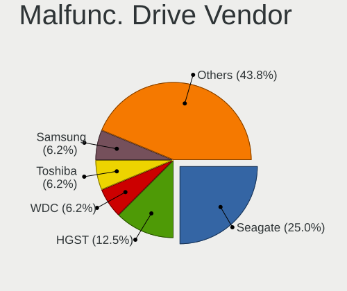

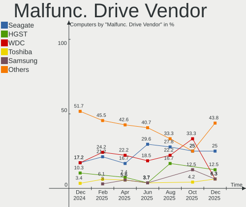

| Vendor              | Computers | Drives | Percent |
|---------------------|-----------|--------|---------|
| Seagate             | 4         | 4      | 25%     |
| HGST                | 2         | 2      | 12.5%   |
| WDC                 | 1         | 1      | 6.25%   |
| Toshiba             | 1         | 1      | 6.25%   |
| Samsung Electronics | 1         | 1      | 6.25%   |
| Maxtor              | 1         | 1      | 6.25%   |
| KIOXIA              | 1         | 1      | 6.25%   |
| Hitachi             | 1         | 1      | 6.25%   |
| Fujitsu             | 1         | 1      | 6.25%   |
| EDILOCA             | 1         | 1      | 6.25%   |
| Corsair             | 1         | 1      | 6.25%   |
| ANKEJE              | 1         | 1      | 6.25%   |

Malfunc. HDD Vendor
-------------------

Vendors of faulty HDD drives

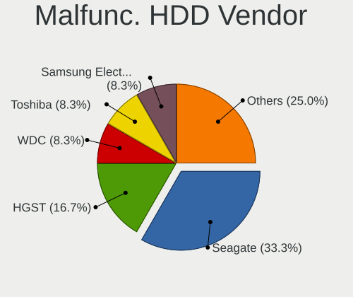

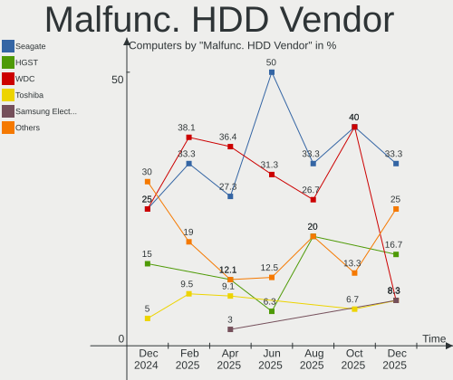

| Vendor              | Computers | Drives | Percent |
|---------------------|-----------|--------|---------|
| Seagate             | 4         | 4      | 33.33%  |
| HGST                | 2         | 2      | 16.67%  |
| WDC                 | 1         | 1      | 8.33%   |
| Toshiba             | 1         | 1      | 8.33%   |
| Samsung Electronics | 1         | 1      | 8.33%   |
| Maxtor              | 1         | 1      | 8.33%   |
| Hitachi             | 1         | 1      | 8.33%   |
| Fujitsu             | 1         | 1      | 8.33%   |

Malfunc. Drive Kind
-------------------

Kinds of faulty drives

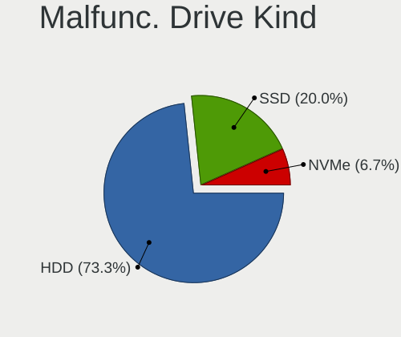

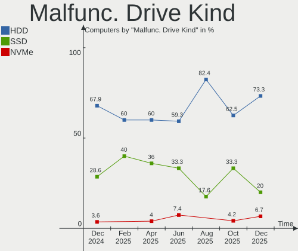

| Kind | Computers | Drives | Percent |
|------|-----------|--------|---------|
| HDD  | 11        | 12     | 73.33%  |
| SSD  | 3         | 3      | 20%     |
| NVMe | 1         | 1      | 6.67%   |

Failed Drives
-------------

Failed drive models

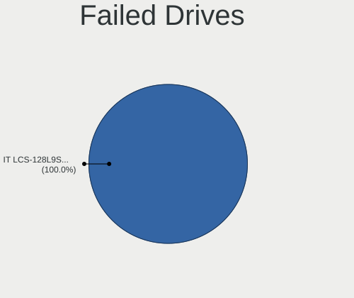

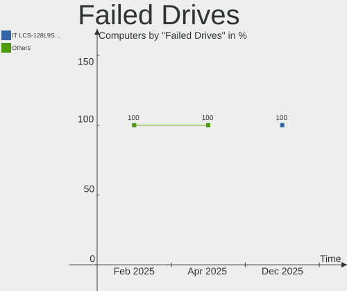

| Model                                     | Computers | Drives | Percent |
|-------------------------------------------|-----------|--------|---------|
| LITEON IT LCS-128L9S-11 2.5 7mm 128GB SSD | 1         | 1      | 100%    |

Failed Drive Vendor
-------------------

Failed drive vendors

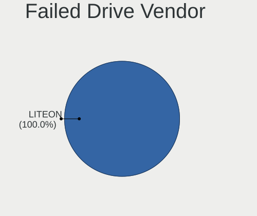

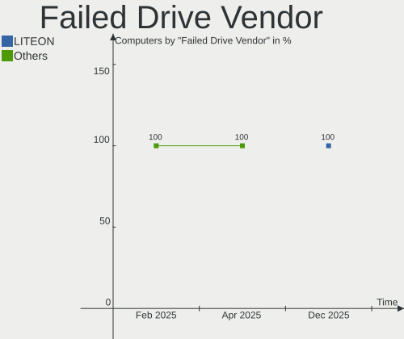

| Vendor | Computers | Drives | Percent |
|--------|-----------|--------|---------|
| LITEON | 1         | 1      | 100%    |

Drive Status
------------

Number of failed and malfunc. drives

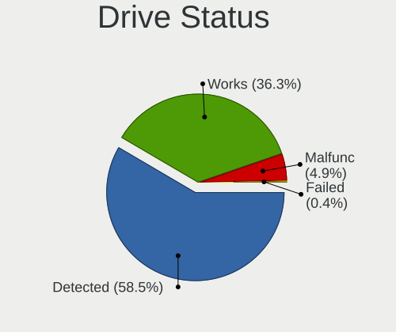

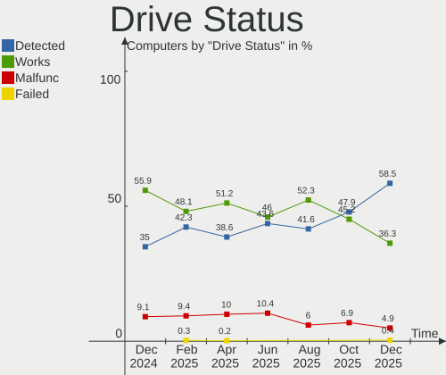

| Status   | Computers | Drives | Percent |
|----------|-----------|--------|---------|
| Detected | 166       | 269    | 58.45%  |
| Works    | 103       | 151    | 36.27%  |
| Malfunc  | 14        | 16     | 4.93%   |
| Failed   | 1         | 1      | 0.35%   |

Storage controller
------------------

Storage Vendor
--------------

Storage controller vendors

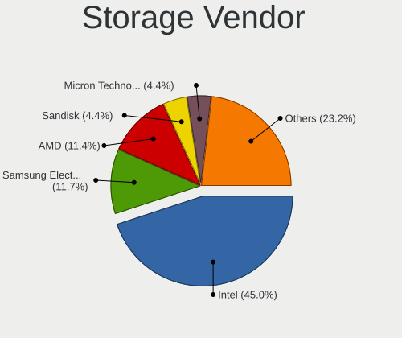

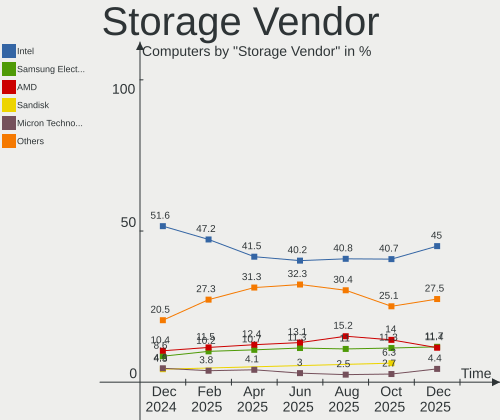

| Vendor                                  | Computers | Percent |
|-----------------------------------------|-----------|---------|
| Intel                                   | 165       | 44.96%  |
| Samsung Electronics                     | 43        | 11.72%  |
| AMD                                     | 42        | 11.44%  |
| Sandisk                                 | 16        | 4.36%   |
| Micron Technology                       | 16        | 4.36%   |
| ASMedia Technology                      | 11        | 3%      |
| Kingston Technology Company             | 10        | 2.72%   |
| SK hynix                                | 7         | 1.91%   |
| MAXIO Technology (Hangzhou)             | 7         | 1.91%   |
| Micron/Crucial Technology               | 6         | 1.63%   |
| Toshiba America Info Systems            | 5         | 1.36%   |
| Shenzhen Longsys Electronics            | 5         | 1.36%   |
| Phison Electronics                      | 5         | 1.36%   |
| Nvidia                                  | 4         | 1.09%   |
| KIOXIA                                  | 4         | 1.09%   |
| Realtek Semiconductor                   | 3         | 0.82%   |
| Silicon Motion                          | 2         | 0.54%   |
| Marvell Technology Group                | 2         | 0.54%   |
| JMicron Technology                      | 2         | 0.54%   |
| Solidigm                                | 1         | 0.27%   |
| Solid State Storage Technology          | 1         | 0.27%   |
| Silicon Image                           | 1         | 0.27%   |
| Shenzhen Wodposit Electronics           | 1         | 0.27%   |
| Shenzhen Unionmemory Information System | 1         | 0.27%   |
| Seagate Technology                      | 1         | 0.27%   |
| Red Hat                                 | 1         | 0.27%   |
| Hosin Global Electronics                | 1         | 0.27%   |
| Hewlett-Packard                         | 1         | 0.27%   |
| Broadcom / LSI                          | 1         | 0.27%   |
| Biwin Storage Technology                | 1         | 0.27%   |
| Unknown                                 | 1         | 0.27%   |

Storage Model
-------------

Storage controller models

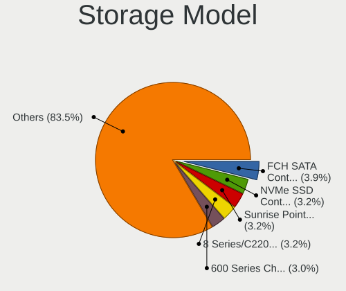

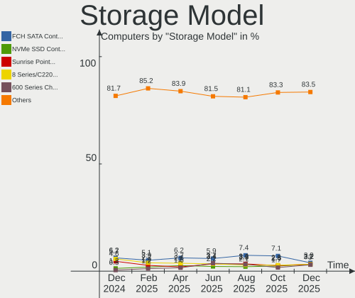

| Model                                                                          | Computers | Percent |
|--------------------------------------------------------------------------------|-----------|---------|
| AMD FCH SATA Controller [AHCI mode]                                            | 16        | 3.94%   |
| Samsung NVMe SSD Controller SM981/PM981/PM983                                  | 13        | 3.2%    |
| Intel Sunrise Point-LP SATA Controller [AHCI mode]                             | 13        | 3.2%    |
| Intel 8 Series/C220 Series Chipset Family 6-port SATA Controller 1 [AHCI mode] | 13        | 3.2%    |
| AMD 600 Series Chipset SATA Controller                                         | 12        | 2.96%   |
| Intel Volume Management Device NVMe RAID Controller                            | 11        | 2.71%   |
| Intel 82801 Mobile SATA Controller [RAID mode]                                 | 11        | 2.71%   |
| Intel 7 Series Chipset Family 6-port SATA Controller [AHCI mode]               | 9         | 2.22%   |
| ASMedia ASM1061/ASM1062 Serial ATA Controller                                  | 9         | 2.22%   |
| Samsung NVMe SSD Controller SM961/PM961/SM963                                  | 8         | 1.97%   |
| Intel 8 Series SATA Controller 1 [AHCI mode]                                   | 7         | 1.72%   |
| Intel 6 Series/C200 Series Chipset Family 6 port Mobile SATA AHCI Controller   | 7         | 1.72%   |
| Samsung NVMe SSD Controller S4LV008[Pascal]                                    | 6         | 1.48%   |
| Intel SATA Controller [RAID mode]                                              | 6         | 1.48%   |
| Intel Q170/Q150/B150/H170/H110/Z170/CM236 Chipset SATA Controller [AHCI Mode]  | 6         | 1.48%   |
| Intel Alder Lake-P SATA AHCI Controller                                        | 6         | 1.48%   |
| Intel 82801HM/HEM (ICH8M/ICH8M-E) SATA Controller [AHCI mode]                  | 6         | 1.48%   |
| Intel 82801HM/HEM (ICH8M/ICH8M-E) IDE Controller                               | 6         | 1.48%   |
| Samsung NVMe SSD Controller 980 (DRAM-less)                                    | 5         | 1.23%   |
| Intel 82801IBM/IEM (ICH9M/ICH9M-E) 4 port SATA Controller [AHCI mode]          | 5         | 1.23%   |
| Intel 7 Series/C210 Series Chipset Family 6-port SATA Controller [AHCI mode]   | 5         | 1.23%   |
| Shenzhen Longsys Lexar NM790 / Patriot Viper VP4300 Lite NVMe SSD (DRAM-less)  | 4         | 0.99%   |
| Sandisk WD Black SN850X NVMe SSD                                               | 4         | 0.99%   |
| Samsung NVMe SSD Controller PM9B1 (DRAM-less)                                  | 4         | 0.99%   |
| Samsung NVMe SSD Controller PM9A1/PM9A3/980PRO                                 | 4         | 0.99%   |
| MAXIO (Hangzhou) NVMe SSD Controller MAP1202 (DRAM-less)                       | 4         | 0.99%   |
| Intel Raptor Lake SATA AHCI Controller                                         | 4         | 0.99%   |
| Intel Atom Processor E3800 Series SATA AHCI Controller                         | 4         | 0.99%   |
| AMD SB7x0/SB8x0/SB9x0 SATA Controller [AHCI mode]                              | 4         | 0.99%   |
| AMD 500 Series Chipset SATA Controller                                         | 4         | 0.99%   |
| Nvidia MCP79 AHCI Controller                                                   | 3         | 0.74%   |
| Micron/Crucial P2 [Nick P2] / P3 / P3 Plus NVMe PCIe SSD (DRAM-less)           | 3         | 0.74%   |
| Micron 2500 NVMe SSD (DRAM-less)                                               | 3         | 0.74%   |
| Micron 2400 NVMe SSD (DRAM-less)                                               | 3         | 0.74%   |
| Intel Wildcat Point-LP SATA Controller [AHCI Mode]                             | 3         | 0.74%   |
| Intel SSD DC P4101/Pro 7600p/760p/E 6100p Series                               | 3         | 0.74%   |
| Intel SSD 670p Series [Keystone Harbor]                                        | 3         | 0.74%   |
| Intel HM170/QM170 Chipset SATA Controller [AHCI Mode]                          | 3         | 0.74%   |
| Intel Celeron N3350/Pentium N4200/Atom E3900 Series SATA AHCI Controller       | 3         | 0.74%   |
| Intel Cannon Lake PCH SATA AHCI Controller                                     | 3         | 0.74%   |

Storage Kind
------------

Kind of storage controller (IDE, SATA, NVMe, SAS, ...)

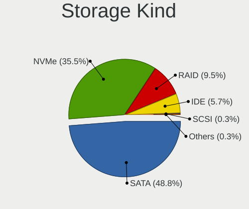

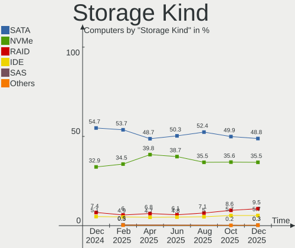

| Kind | Computers | Percent |
|------|-----------|---------|
| SATA | 180       | 48.78%  |
| NVMe | 131       | 35.5%   |
| RAID | 35        | 9.49%   |
| IDE  | 21        | 5.69%   |
| SAS  | 1         | 0.27%   |
| SCSI | 1         | 0.27%   |

Processor
---------

CPU Vendor
----------

Processor vendors

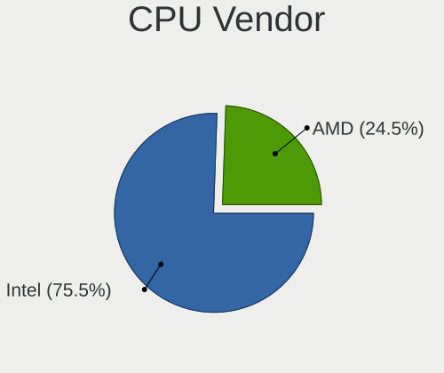

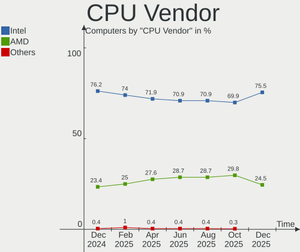

| Vendor | Computers | Percent |
|--------|-----------|---------|
| Intel  | 207       | 75.55%  |
| AMD    | 67        | 24.45%  |

CPU Model
---------

Processor models

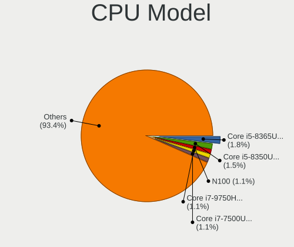

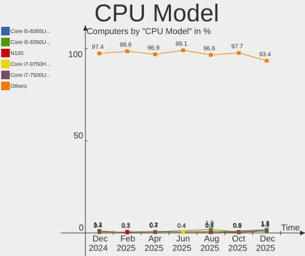

| Model                                   | Computers | Percent |
|-----------------------------------------|-----------|---------|
| Intel Core i5-8365U CPU @ 1.60GHz       | 5         | 1.82%   |
| Intel Core i5-8350U CPU @ 1.70GHz       | 4         | 1.46%   |
| Intel N100                              | 3         | 1.09%   |
| Intel Core i7-9750H CPU @ 2.60GHz       | 3         | 1.09%   |
| Intel Core i7-7500U CPU @ 2.70GHz       | 3         | 1.09%   |
| Intel Core i5-8250U CPU @ 1.60GHz       | 3         | 1.09%   |
| Intel Core i5-2410M CPU @ 2.30GHz       | 3         | 1.09%   |
| Intel 11th Gen Core i7-1165G7 @ 2.80GHz | 3         | 1.09%   |
| AMD Ryzen 7 9800X3D 8-Core Processor    | 3         | 1.09%   |
| AMD Ryzen 7 9700X 8-Core Processor      | 3         | 1.09%   |
| AMD Ryzen 5 7430U with Radeon Graphics  | 3         | 1.09%   |
| Intel Xeon CPU X5650 @ 2.67GHz          | 2         | 0.73%   |
| Intel Core Ultra 7 258V                 | 2         | 0.73%   |
| Intel Core Ultra 7 155H                 | 2         | 0.73%   |
| Intel Core i7-8550U CPU @ 1.80GHz       | 2         | 0.73%   |
| Intel Core i7-6700K CPU @ 4.00GHz       | 2         | 0.73%   |
| Intel Core i7-6700 CPU @ 3.40GHz        | 2         | 0.73%   |
| Intel Core i7-6500U CPU @ 2.50GHz       | 2         | 0.73%   |
| Intel Core i7-5500U CPU @ 2.40GHz       | 2         | 0.73%   |
| Intel Core i7-4700HQ CPU @ 2.40GHz      | 2         | 0.73%   |
| Intel Core i7-3770K CPU @ 3.50GHz       | 2         | 0.73%   |
| Intel Core i7-3630QM CPU @ 2.40GHz      | 2         | 0.73%   |
| Intel Core i5-6500T CPU @ 2.50GHz       | 2         | 0.73%   |
| Intel Core i5-6300U CPU @ 2.40GHz       | 2         | 0.73%   |
| Intel Core i5-4200U CPU @ 1.60GHz       | 2         | 0.73%   |
| Intel Core i5-3427U CPU @ 1.80GHz       | 2         | 0.73%   |
| Intel Core i5-3210M CPU @ 2.50GHz       | 2         | 0.73%   |
| Intel Core i3-6006U CPU @ 2.00GHz       | 2         | 0.73%   |
| Intel Core i3-4160 CPU @ 3.60GHz        | 2         | 0.73%   |
| Intel Core i3-4030U CPU @ 1.90GHz       | 2         | 0.73%   |
| Intel Core 5 120U                       | 2         | 0.73%   |
| Intel Core 2 Duo CPU P7450 @ 2.13GHz    | 2         | 0.73%   |
| Intel Core 2 Duo CPU P7350 @ 2.00GHz    | 2         | 0.73%   |
| Intel Celeron CPU N3450 @ 1.10GHz       | 2         | 0.73%   |
| Intel 13th Gen Core i7-1355U            | 2         | 0.73%   |
| Intel 12th Gen Core i5-1235U            | 2         | 0.73%   |
| AMD Ryzen AI 7 PRO 350 w/ Radeon 860M   | 2         | 0.73%   |
| AMD Ryzen 9 9950X3D 16-Core Processor   | 2         | 0.73%   |
| AMD Ryzen 9 6900HX with Radeon Graphics | 2         | 0.73%   |
| AMD Ryzen 9 5900X 12-Core Processor     | 2         | 0.73%   |

CPU Model Family
----------------

Processor model prefix

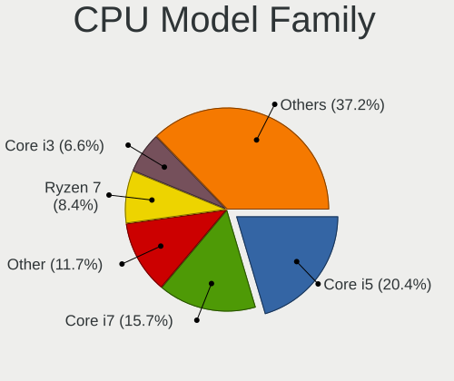

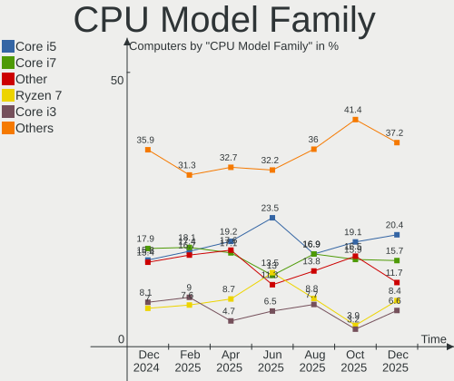

| Model                   | Computers | Percent |
|-------------------------|-----------|---------|
| Intel Core i5           | 56        | 20.44%  |
| Intel Core i7           | 43        | 15.69%  |
| Other                   | 32        | 11.68%  |
| AMD Ryzen 7             | 23        | 8.39%   |
| Intel Core i3           | 18        | 6.57%   |
| Intel Core 2 Duo        | 14        | 5.11%   |
| AMD Ryzen 9             | 12        | 4.38%   |
| AMD Ryzen 5             | 12        | 4.38%   |
| Intel Celeron           | 11        | 4.01%   |
| Intel Core              | 10        | 3.65%   |
| Intel Xeon              | 7         | 2.55%   |
| Intel Core i9           | 4         | 1.46%   |
| Intel Core 2 Quad       | 3         | 1.09%   |
| Intel Atom              | 3         | 1.09%   |
| AMD Ryzen 7 PRO         | 3         | 1.09%   |
| AMD A10                 | 3         | 1.09%   |
| Intel Pentium Dual-Core | 2         | 0.73%   |
| Intel Pentium           | 2         | 0.73%   |
| AMD Phenom II X4        | 2         | 0.73%   |
| AMD FX                  | 2         | 0.73%   |
| Intel Pentium Silver    | 1         | 0.36%   |
| Intel Pentium M         | 1         | 0.36%   |
| Intel Pentium Gold      | 1         | 0.36%   |
| Intel Core m3           | 1         | 0.36%   |
| Intel Core 2 Extreme    | 1         | 0.36%   |
| AMD Ryzen 5 PRO         | 1         | 0.36%   |
| AMD Phenom II X6        | 1         | 0.36%   |
| AMD Athlon II X2        | 1         | 0.36%   |
| AMD Athlon II           | 1         | 0.36%   |
| AMD A8                  | 1         | 0.36%   |
| AMD A6                  | 1         | 0.36%   |
| AMD A4                  | 1         | 0.36%   |

CPU Cores
---------

Number of processor cores

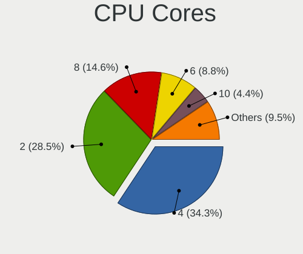

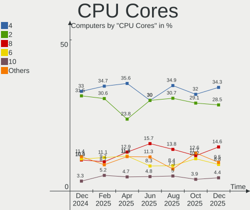

| Number | Computers | Percent |
|--------|-----------|---------|
| 4      | 94        | 34.31%  |
| 2      | 78        | 28.47%  |
| 8      | 40        | 14.6%   |
| 6      | 24        | 8.76%   |
| 10     | 12        | 4.38%   |
| 16     | 7         | 2.55%   |
| 14     | 6         | 2.19%   |
| 12     | 6         | 2.19%   |
| 24     | 3         | 1.09%   |
| 20     | 2         | 0.73%   |
| 1      | 2         | 0.73%   |

CPU Sockets
-----------

Number of sockets

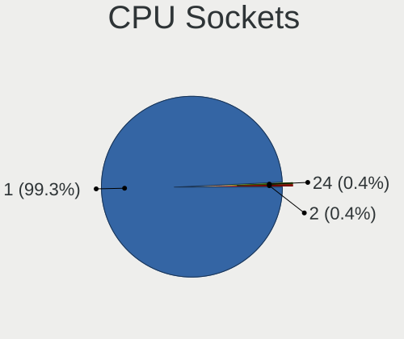

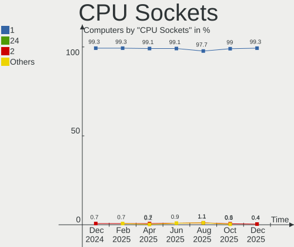

| Number | Computers | Percent |
|--------|-----------|---------|
| 1      | 272       | 99.27%  |
| 24     | 1         | 0.36%   |
| 2      | 1         | 0.36%   |

CPU Threads
-----------

Threads per core (Hyper-Threading)

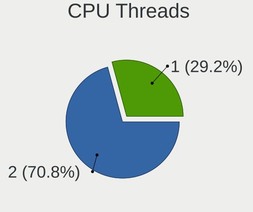

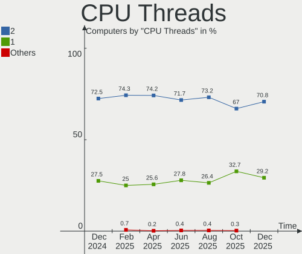

| Number | Computers | Percent |
|--------|-----------|---------|
| 2      | 194       | 70.8%   |
| 1      | 80        | 29.2%   |

CPU Op-Modes
------------

CPU Operation Modes (32-bit, 64-bit)

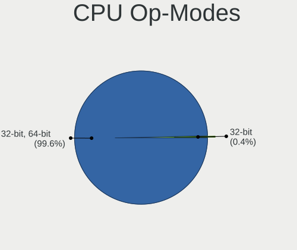

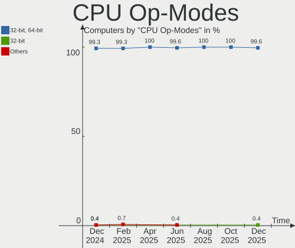

| Op mode        | Computers | Percent |
|----------------|-----------|---------|
| 32-bit, 64-bit | 273       | 99.64%  |
| 32-bit         | 1         | 0.36%   |

CPU Microcode
-------------

Microcode number

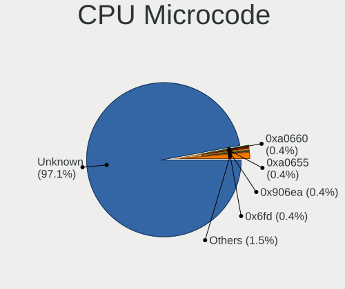

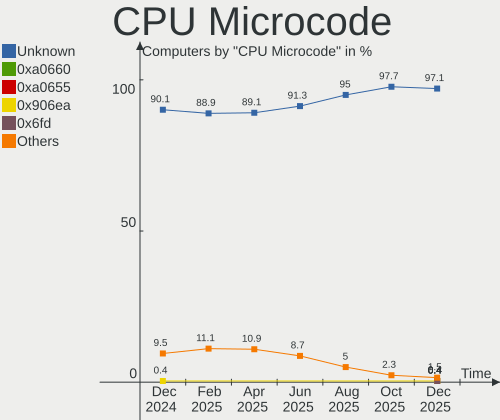

| Number     | Computers | Percent |
|------------|-----------|---------|
| Unknown    | 266       | 97.08%  |
| 0xa0660    | 1         | 0.36%   |
| 0xa0655    | 1         | 0.36%   |
| 0x906ea    | 1         | 0.36%   |
| 0x6fd      | 1         | 0.36%   |
| 0x6d8      | 1         | 0.36%   |
| 0x1067a    | 1         | 0.36%   |
| 0x08a0000a | 1         | 0.36%   |
| 0x08108102 | 1         | 0.36%   |

CPU Microarch
-------------

Microarchitecture

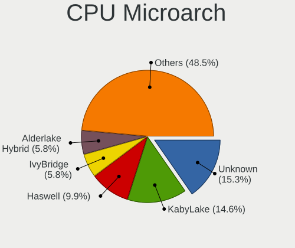

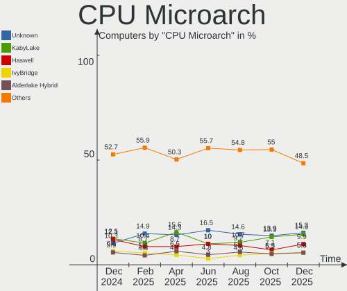

| Name              | Computers | Percent |
|-------------------|-----------|---------|
| Unknown           | 42        | 15.33%  |
| KabyLake          | 40        | 14.6%   |
| Haswell           | 27        | 9.85%   |
| IvyBridge         | 16        | 5.84%   |
| Alderlake Hybrid  | 16        | 5.84%   |
| Skylake           | 15        | 5.47%   |
| Penryn            | 15        | 5.47%   |
| Zen 3             | 13        | 4.74%   |
| Zen+              | 9         | 3.28%   |
| SandyBridge       | 9         | 3.28%   |
| TigerLake         | 7         | 2.55%   |
| Silvermont        | 7         | 2.55%   |
| Core              | 7         | 2.55%   |
| CometLake         | 7         | 2.55%   |
| Westmere          | 5         | 1.82%   |
| K10               | 5         | 1.82%   |
| Lunarlake Hybrid  | 4         | 1.46%   |
| Broadwell         | 4         | 1.46%   |
| Gracemont         | 3         | 1.09%   |
| Goldmont          | 3         | 1.09%   |
| Zen 2             | 2         | 0.73%   |
| Zen               | 2         | 0.73%   |
| Piledriver        | 2         | 0.73%   |
| Nehalem           | 2         | 0.73%   |
| K10 Llano         | 2         | 0.73%   |
| Goldmont plus     | 2         | 0.73%   |
| Excavator         | 2         | 0.73%   |
| Steamroller       | 1         | 0.36%   |
| Puma              | 1         | 0.36%   |
| P6                | 1         | 0.36%   |
| Meteorlake Hybrid | 1         | 0.36%   |
| IceLake           | 1         | 0.36%   |
| Bonnell           | 1         | 0.36%   |

Graphics
--------

GPU Vendor
----------

Vendors of graphics cards

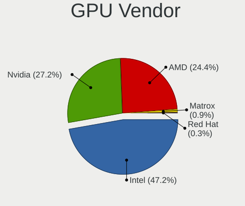

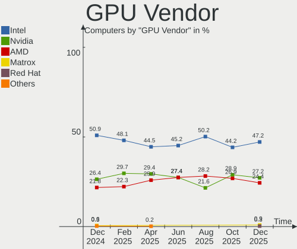

| Vendor                     | Computers | Percent |
|----------------------------|-----------|---------|
| Intel                      | 153       | 47.22%  |
| Nvidia                     | 88        | 27.16%  |
| AMD                        | 79        | 24.38%  |
| Matrox Electronics Systems | 3         | 0.93%   |
| Red Hat                    | 1         | 0.31%   |

GPU Model
---------

Graphics card models

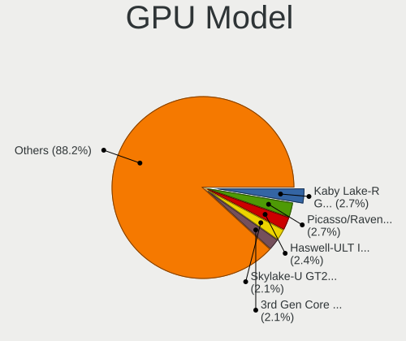

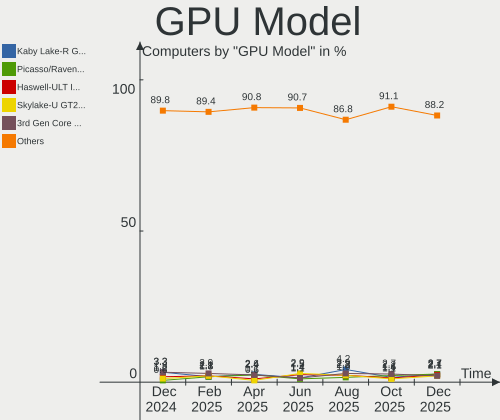

| Model                                                                         | Computers | Percent |
|-------------------------------------------------------------------------------|-----------|---------|
| Intel Kaby Lake-R GT2 [UHD Graphics 620]                                      | 9         | 2.65%   |
| AMD Picasso/Raven 2 [Radeon Vega Series / Radeon Vega Mobile Series]          | 9         | 2.65%   |
| Intel Haswell-ULT Integrated Graphics Controller                              | 8         | 2.36%   |
| Intel Skylake-U GT2 [HD Graphics 520]                                         | 7         | 2.06%   |
| Intel 3rd Gen Core processor Graphics Controller                              | 7         | 2.06%   |
| Intel 2nd Generation Core Processor Family Integrated Graphics Controller     | 7         | 2.06%   |
| Intel WhiskeyLake-U GT2 [UHD Graphics 620]                                    | 6         | 1.77%   |
| Intel TigerLake-LP GT2 [Iris Xe Graphics]                                     | 6         | 1.77%   |
| Intel 4th Gen Core Processor Integrated Graphics Controller                   | 6         | 1.77%   |
| AMD Granite Ridge [Radeon Graphics]                                           | 6         | 1.77%   |
| Intel Skylake-S GT2 [HD Graphics 530]                                         | 5         | 1.47%   |
| Intel Kaby Lake-U GT2 [HD Graphics 620]                                       | 5         | 1.47%   |
| Intel Atom Processor Z36xxx/Z37xxx Series Graphics & Display                  | 5         | 1.47%   |
| AMD Raphael                                                                   | 5         | 1.47%   |
| AMD Navi 32 [Radeon RX 7700 XT / 7800 XT]                                     | 5         | 1.47%   |
| AMD Barcelo                                                                   | 5         | 1.47%   |
| Nvidia GP107 [GeForce GTX 1050 Ti]                                            | 4         | 1.18%   |
| Intel Raptor Lake-P [Iris Xe Graphics]                                        | 4         | 1.18%   |
| Intel Broadwell-U GT2 [HD Graphics 5500]                                      | 4         | 1.18%   |
| AMD Rembrandt [Radeon 680M]                                                   | 4         | 1.18%   |
| AMD Navi 48 [Radeon RX 9070/9070 XT/9070 GRE]                                 | 4         | 1.18%   |
| AMD HawkPoint1                                                                | 4         | 1.18%   |
| Nvidia TU116M [GeForce GTX 1660 Ti Mobile]                                    | 3         | 0.88%   |
| Nvidia GF117M [GeForce 610M/710M/810M/820M / GT 620M/625M/630M/720M]          | 3         | 0.88%   |
| Nvidia GA106M [GeForce RTX 3060 Mobile / Max-Q]                               | 3         | 0.88%   |
| Nvidia GA106 [GeForce RTX 3060 Lite Hash Rate]                                | 3         | 0.88%   |
| Intel Xeon E3-1200 v3/4th Gen Core Processor Integrated Graphics Controller   | 3         | 0.88%   |
| Intel Raptor Lake-P [UHD Graphics]                                            | 3         | 0.88%   |
| Intel Lunar Lake [Intel Arc Graphics 130V / 140V]                             | 3         | 0.88%   |
| Intel CoffeeLake-S GT2 [UHD Graphics 630]                                     | 3         | 0.88%   |
| Intel CoffeeLake-H GT2 [UHD Graphics 630]                                     | 3         | 0.88%   |
| Intel Apollo Lake GT1 [HD Graphics 500]                                       | 3         | 0.88%   |
| Intel Alder Lake-N [UHD Graphics]                                             | 3         | 0.88%   |
| AMD Sun XT [Radeon HD 8670A/8670M/8690M / R5 M330 / M430 / Radeon 520 Mobile] | 3         | 0.88%   |
| AMD Cezanne [Radeon Vega Series / Radeon Vega Mobile Series]                  | 3         | 0.88%   |
| Nvidia TU117M [GeForce GTX 1650 Mobile / Max-Q]                               | 2         | 0.59%   |
| Nvidia GP108M [GeForce MX150]                                                 | 2         | 0.59%   |
| Nvidia GP107M [GeForce GTX 1050 Mobile]                                       | 2         | 0.59%   |
| Nvidia GM107M [GeForce GTX 960M]                                              | 2         | 0.59%   |
| Nvidia GK208BM [GeForce 920M]                                                 | 2         | 0.59%   |

GPU Combo
---------

Combinations of graphics cards

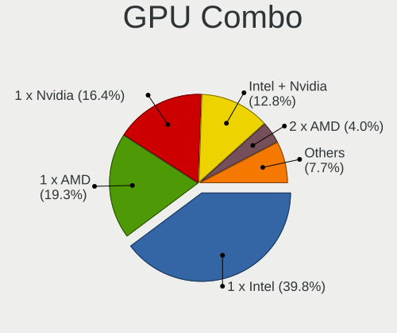

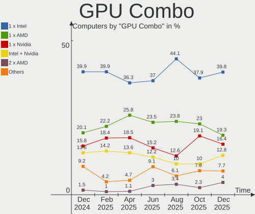

| Name           | Computers | Percent |
|----------------|-----------|---------|
| 1 x Intel      | 109       | 39.78%  |
| 1 x AMD        | 53        | 19.34%  |
| 1 x Nvidia     | 45        | 16.42%  |
| Intel + Nvidia | 35        | 12.77%  |
| 2 x AMD        | 11        | 4.01%   |
| Intel + AMD    | 7         | 2.55%   |
| AMD + Nvidia   | 7         | 2.55%   |
| 2 x Intel      | 2         | 0.73%   |
| 1 x Matrox     | 2         | 0.73%   |
| 2 x Nvidia     | 1         | 0.36%   |
| 1 x Red Hat    | 1         | 0.36%   |
| AMD + Matrox   | 1         | 0.36%   |

GPU Driver
----------

Free vs proprietary

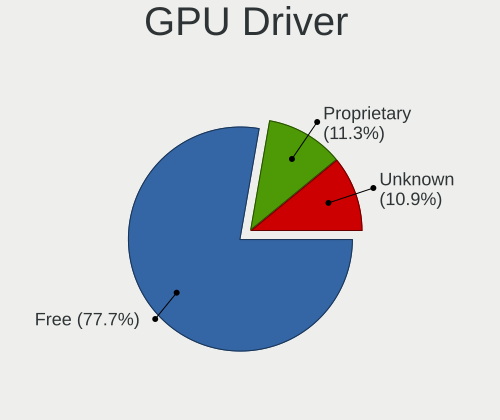

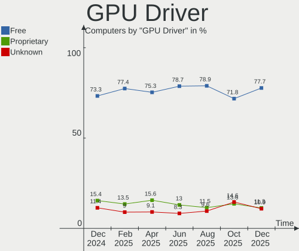

| Driver      | Computers | Percent |
|-------------|-----------|---------|
| Free        | 213       | 77.74%  |
| Proprietary | 31        | 11.31%  |
| Unknown     | 30        | 10.95%  |

GPU Memory
----------

Total video memory

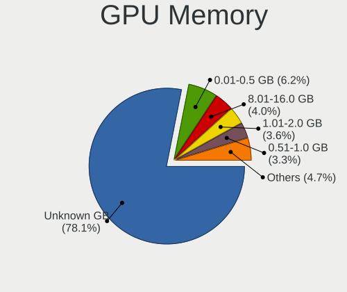

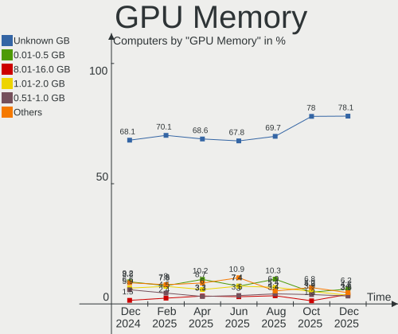

| Size in GB | Computers | Percent |
|------------|-----------|---------|
| Unknown    | 214       | 78.1%   |
| 0.01-0.5   | 17        | 6.2%    |
| 8.01-16.0  | 11        | 4.01%   |
| 1.01-2.0   | 10        | 3.65%   |
| 0.51-1.0   | 9         | 3.28%   |
| 3.01-4.0   | 8         | 2.92%   |
| 7.01-8.0   | 3         | 1.09%   |
| 5.01-6.0   | 2         | 0.73%   |

Monitor
-------

Monitor Vendor
--------------

Monitor vendors

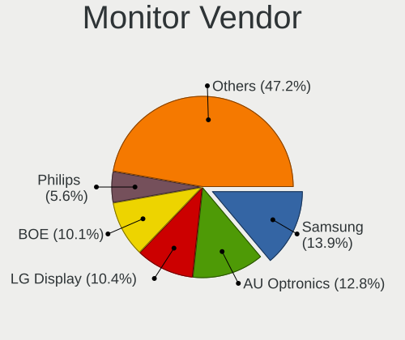

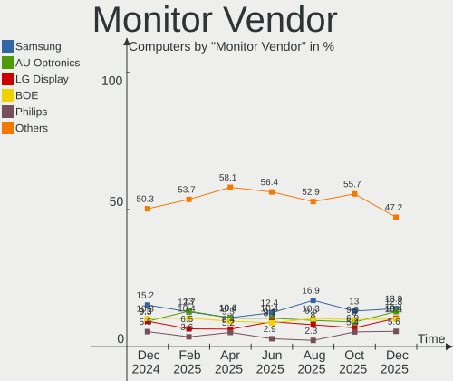

| Vendor                  | Computers | Percent |
|-------------------------|-----------|---------|
| Samsung Electronics     | 40        | 13.89%  |
| AU Optronics            | 37        | 12.85%  |
| LG Display              | 30        | 10.42%  |
| BOE                     | 29        | 10.07%  |
| Philips                 | 16        | 5.56%   |
| Goldstar                | 14        | 4.86%   |
| Chimei Innolux          | 12        | 4.17%   |
| Apple                   | 12        | 4.17%   |
| Lenovo                  | 10        | 3.47%   |
| Hewlett-Packard         | 10        | 3.47%   |
| Ancor Communications    | 7         | 2.43%   |
| Dell                    | 6         | 2.08%   |
| Acer                    | 6         | 2.08%   |
| Sharp                   | 4         | 1.39%   |
| MSI                     | 4         | 1.39%   |
| BenQ                    | 4         | 1.39%   |
| AOC                     | 4         | 1.39%   |
| Chi Mei Optoelectronics | 3         | 1.04%   |
| ASUSTek Computer        | 3         | 1.04%   |
| STA                     | 2         | 0.69%   |
| RTK                     | 2         | 0.69%   |
| PANDA                   | 2         | 0.69%   |
| Mi                      | 2         | 0.69%   |
| InfoVision              | 2         | 0.69%   |
| HKC                     | 2         | 0.69%   |
| HannStar                | 2         | 0.69%   |
| FL_                     | 2         | 0.69%   |
| ZTR                     | 1         | 0.35%   |
| Yeyian                  | 1         | 0.35%   |
| Xiaomi                  | 1         | 0.35%   |
| Vizio                   | 1         | 0.35%   |
| ViewSonic               | 1         | 0.35%   |
| Unknown (XXX)           | 1         | 0.35%   |
| TMX                     | 1         | 0.35%   |
| Sony                    | 1         | 0.35%   |
| SKG                     | 1         | 0.35%   |
| RHT                     | 1         | 0.35%   |
| NEC Computers           | 1         | 0.35%   |
| LG Philips              | 1         | 0.35%   |
| LG Electronics          | 1         | 0.35%   |

Monitor Model
-------------

Monitor models

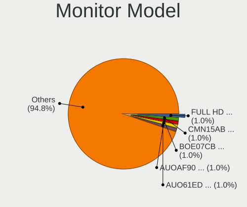

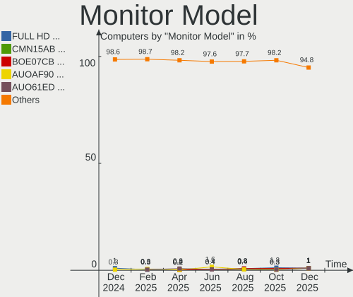

| Model                                                                 | Computers | Percent |
|-----------------------------------------------------------------------|-----------|---------|
| Goldstar FULL HD GSM5B55 1920x1080 480x270mm 21.7-inch                | 3         | 1.04%   |
| Chimei Innolux LCD Monitor CMN15AB 1366x768 344x193mm 15.5-inch       | 3         | 1.04%   |
| BOE LCD Monitor BOE07CB 1920x1080 344x193mm 15.5-inch                 | 3         | 1.04%   |
| AU Optronics LCD Monitor AUOAF90 1920x1080 344x193mm 15.5-inch        | 3         | 1.04%   |
| AU Optronics LCD Monitor AUO61ED 1920x1080 344x194mm 15.5-inch        | 3         | 1.04%   |
| STA LCD Monitor STA8CA7 1366x768 256x144mm 11.6-inch                  | 2         | 0.69%   |
| Samsung Electronics S22F350 SAM0D1A 1920x1080 477x268mm 21.5-inch     | 2         | 0.69%   |
| Samsung Electronics Odyssey G5 SAM7489 2560x1440 698x393mm 31.5-inch  | 2         | 0.69%   |
| Samsung Electronics LCD Monitor SDC4187 1920x1200 302x189mm 14.0-inch | 2         | 0.69%   |
| Samsung Electronics LC24RG50 SAM0F90 1920x1080 532x304mm 24.1-inch    | 2         | 0.69%   |
| Philips PHL 223V5 PHLC0CF 1920x1080 477x268mm 21.5-inch               | 2         | 0.69%   |
| LG Display LCD Monitor LGD060F 1920x1080 309x174mm 14.0-inch          | 2         | 0.69%   |
| LG Display LCD Monitor LGD046B 1366x768 344x194mm 15.5-inch           | 2         | 0.69%   |
| Lenovo LCD Monitor LEN40A9 1920x1080 309x173mm 13.9-inch              | 2         | 0.69%   |
| Lenovo B140UAN02.7 LEN403A 1920x1200 302x188mm 14.0-inch              | 2         | 0.69%   |
| Hewlett-Packard M27f FHD HPN370A 1920x1080 597x336mm 27.0-inch        | 2         | 0.69%   |
| Hewlett-Packard 27f HPN354B 1920x1080 598x336mm 27.0-inch             | 2         | 0.69%   |
| Goldstar ULTRAGEAR GSM5BD3 2560x1440 697x392mm 31.5-inch              | 2         | 0.69%   |
| Goldstar HDR 4K GSM7706 3840x2160 600x340mm 27.2-inch                 | 2         | 0.69%   |
| FL_ HDMI2K FL_2701 2560x1440 480x270mm 21.7-inch                      | 2         | 0.69%   |
| Chimei Innolux LCD Monitor CMN150D 1920x1080 344x193mm 15.5-inch      | 2         | 0.69%   |
| AU Optronics LCD Monitor AUO45EC 1366x768 344x193mm 15.5-inch         | 2         | 0.69%   |
| AU Optronics LCD Monitor AUO21ED 1920x1080 344x193mm 15.5-inch        | 2         | 0.69%   |
| AU Optronics LCD Monitor AUO219D 1920x1080 381x214mm 17.2-inch        | 2         | 0.69%   |
| AU Optronics LCD Monitor AUO106C 1366x768 276x155mm 12.5-inch         | 2         | 0.69%   |
| Apple Color LCD APP9C6C 1920x1200 520x320mm 24.0-inch                 | 2         | 0.69%   |
| ZTR 156XX5419T02 ZTR0015 1920x1080 344x193mm 15.5-inch                | 1         | 0.35%   |
| Yeyian YMG-4K27-01 YEY2700 3840x2160 600x330mm 27.0-inch              | 1         | 0.35%   |
| Xiaomi Mi TV XMD0076 3840x2160 1110x620mm 50.1-inch                   | 1         | 0.35%   |
| Vizio PC VIZCA27 1920x1080 597x336mm 27.0-inch                        | 1         | 0.35%   |
| ViewSonic VX3218C-QHD VSC103E 2560x1440 697x392mm 31.5-inch           | 1         | 0.35%   |
| Unknown (XXX) Union TV XXX2841 1920x1080 1209x680mm 54.6-inch         | 1         | 0.35%   |
| TMX TL160ADMP03-0 TMX1603 2560x1600 345x215mm 16.0-inch               | 1         | 0.35%   |
| Sony TV SNYDC02 1920x1080 708x398mm 32.0-inch                         | 1         | 0.35%   |
| SKG H27T6 SKG2791 2560x1440 597x336mm 27.0-inch                       | 1         | 0.35%   |
| Sharp LQ140M1JW49 SHP1523 1920x1080 309x174mm 14.0-inch               | 1         | 0.35%   |
| Sharp LCD Monitor SHP14E2 1920x1080 309x174mm 14.0-inch               | 1         | 0.35%   |
| Sharp LCD Monitor SHP1453 1920x1080 346x194mm 15.6-inch               | 1         | 0.35%   |
| Sharp LCD Monitor SHP1449 1920x1080 294x165mm 13.3-inch               | 1         | 0.35%   |
| Samsung Electronics U28H75x SAM0E00 3840x2160 607x345mm 27.5-inch     | 1         | 0.35%   |

Monitor Resolution
------------------

Monitor screen resolution

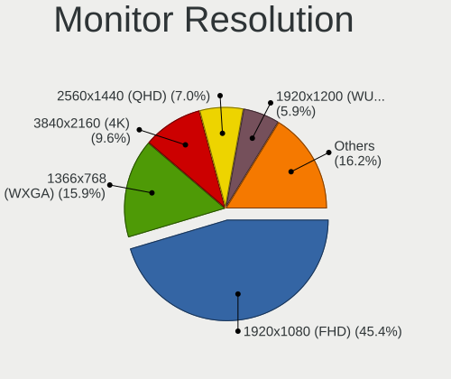

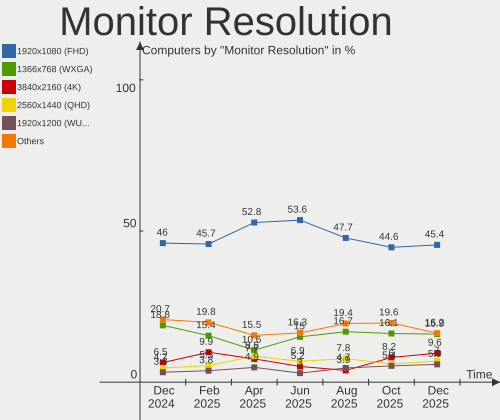

| Resolution         | Computers | Percent |
|--------------------|-----------|---------|
| 1920x1080 (FHD)    | 123       | 45.39%  |
| 1366x768 (WXGA)    | 43        | 15.87%  |
| 3840x2160 (4K)     | 26        | 9.59%   |
| 2560x1440 (QHD)    | 19        | 7.01%   |
| 1920x1200 (WUXGA)  | 16        | 5.9%    |
| 1680x1050 (WSXGA+) | 6         | 2.21%   |
| 1600x900 (HD+)     | 6         | 2.21%   |
| 1440x900 (WXGA+)   | 6         | 2.21%   |
| 1280x800 (WXGA)    | 6         | 2.21%   |
| 1280x1024 (SXGA)   | 4         | 1.48%   |
| 3440x1440          | 3         | 1.11%   |
| 2880x1800          | 3         | 1.11%   |
| 2560x1600          | 3         | 1.11%   |
| 3840x2400          | 1         | 0.37%   |
| 3840x1600          | 1         | 0.37%   |
| 3840x1080          | 1         | 0.37%   |
| 2560x1397          | 1         | 0.37%   |
| 1600x2560          | 1         | 0.37%   |
| 1024x600           | 1         | 0.37%   |
| Unknown            | 1         | 0.37%   |

Monitor Diagonal
----------------

Diagonal size in inches

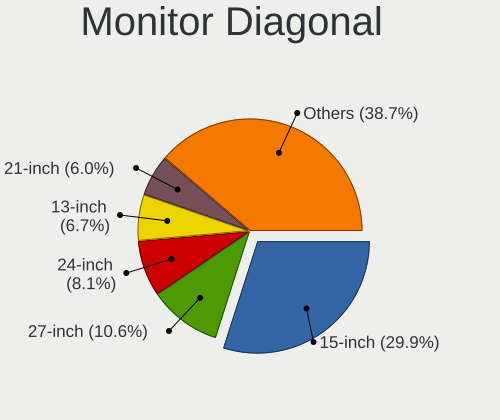

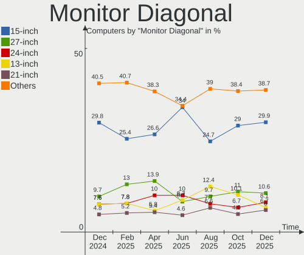

| Inches  | Computers | Percent |
|---------|-----------|---------|
| 15      | 85        | 29.93%  |
| 27      | 30        | 10.56%  |
| 24      | 23        | 8.1%    |
| 13      | 19        | 6.69%   |
| 21      | 17        | 5.99%   |
| 14      | 16        | 5.63%   |
| 31      | 13        | 4.58%   |
| 23      | 12        | 4.23%   |
| 17      | 9         | 3.17%   |
| 16      | 9         | 3.17%   |
| 12      | 7         | 2.46%   |
| Unknown | 6         | 2.11%   |
| 20      | 5         | 1.76%   |
| 11      | 5         | 1.76%   |
| 84      | 4         | 1.41%   |
| 22      | 4         | 1.41%   |
| 34      | 3         | 1.06%   |
| 19      | 3         | 1.06%   |
| 32      | 2         | 0.7%    |
| 18      | 2         | 0.7%    |
| 82      | 1         | 0.35%   |
| 72      | 1         | 0.35%   |
| 54      | 1         | 0.35%   |
| 48      | 1         | 0.35%   |
| 46      | 1         | 0.35%   |
| 37      | 1         | 0.35%   |
| 29      | 1         | 0.35%   |
| 26      | 1         | 0.35%   |
| 10      | 1         | 0.35%   |
| 8       | 1         | 0.35%   |

Monitor Width
-------------

Physical width

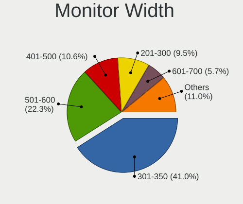

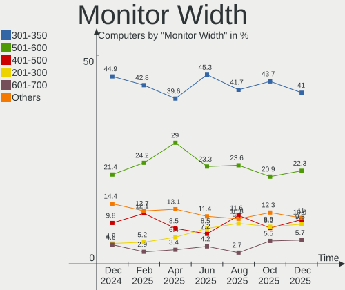

| Width in mm | Computers | Percent |
|-------------|-----------|---------|
| 301-350     | 116       | 40.99%  |
| 501-600     | 63        | 22.26%  |
| 401-500     | 30        | 10.6%   |
| 201-300     | 27        | 9.54%   |
| 601-700     | 16        | 5.65%   |
| 351-400     | 9         | 3.18%   |
| 1501-2000   | 6         | 2.12%   |
| Unknown     | 6         | 2.12%   |
| 701-800     | 5         | 1.77%   |
| 1001-1500   | 3         | 1.06%   |
| 801-900     | 1         | 0.35%   |
| 101-200     | 1         | 0.35%   |

Aspect Ratio
------------

Proportional relationship between the width and the height

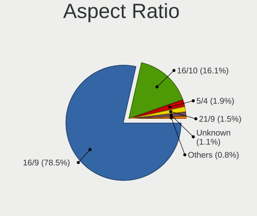

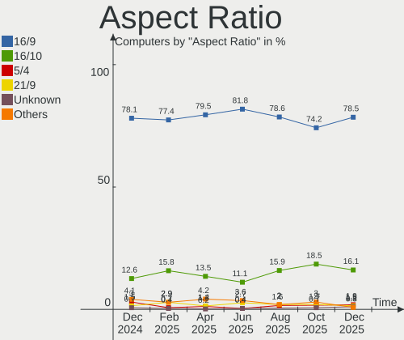

| Ratio   | Computers | Percent |
|---------|-----------|---------|
| 16/9    | 205       | 78.54%  |
| 16/10   | 42        | 16.09%  |
| 5/4     | 5         | 1.92%   |
| 21/9    | 4         | 1.53%   |
| Unknown | 3         | 1.15%   |
| 32/9    | 1         | 0.38%   |
| 0.63    | 1         | 0.38%   |

Monitor Area
------------

Area in inch²

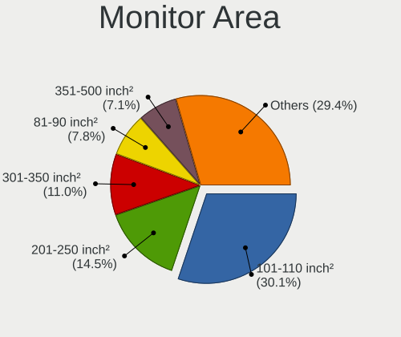

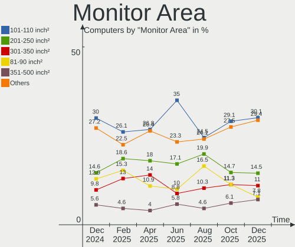

| Area in inch² | Computers | Percent |
|----------------|-----------|---------|
| 101-110        | 85        | 30.14%  |
| 201-250        | 41        | 14.54%  |
| 301-350        | 31        | 10.99%  |
| 81-90          | 22        | 7.8%    |
| 351-500        | 20        | 7.09%   |
| 71-80          | 13        | 4.61%   |
| 151-200        | 13        | 4.61%   |
| 251-300        | 10        | 3.55%   |
| 111-120        | 8         | 2.84%   |
| 61-70          | 7         | 2.48%   |
| More than 1000 | 6         | 2.13%   |
| 121-130        | 6         | 2.13%   |
| Unknown        | 6         | 2.13%   |
| 51-60          | 5         | 1.77%   |
| 141-150        | 4         | 1.42%   |
| 501-1000       | 2         | 0.71%   |
| 41-50          | 1         | 0.35%   |
| 1-40           | 1         | 0.35%   |
| 91-100         | 1         | 0.35%   |

Pixel Density
-------------

Pixels per inch

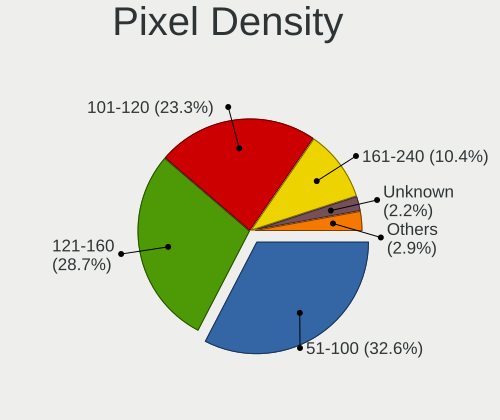

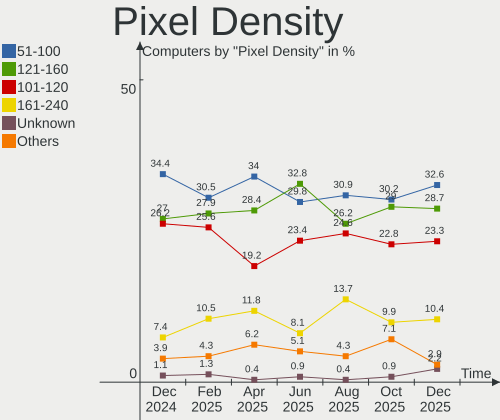

| Density       | Computers | Percent |
|---------------|-----------|---------|
| 51-100        | 91        | 32.62%  |
| 121-160       | 80        | 28.67%  |
| 101-120       | 65        | 23.3%   |
| 161-240       | 29        | 10.39%  |
| Unknown       | 6         | 2.15%   |
| More than 240 | 5         | 1.79%   |
| 1-50          | 3         | 1.08%   |

Multiple Monitors
-----------------

Total monitors connected

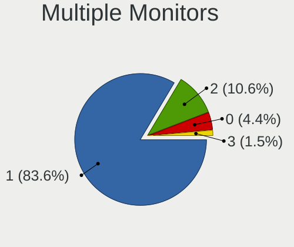

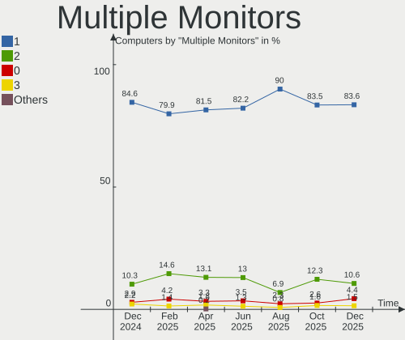

| Total | Computers | Percent |
|-------|-----------|---------|
| 1     | 229       | 83.58%  |
| 2     | 29        | 10.58%  |
| 0     | 12        | 4.38%   |
| 3     | 4         | 1.46%   |

Network
-------

Net Controller Vendor
---------------------

Controller vendors

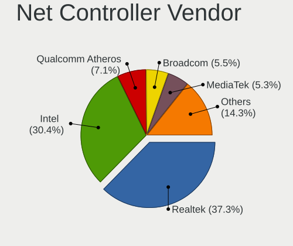

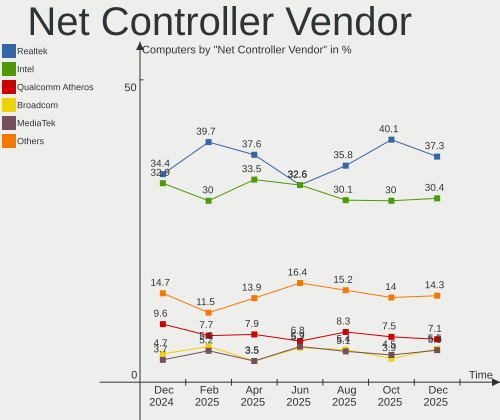

| Vendor                            | Computers | Percent |
|-----------------------------------|-----------|---------|
| Realtek Semiconductor             | 162       | 37.33%  |
| Intel                             | 132       | 30.41%  |
| Qualcomm Atheros                  | 31        | 7.14%   |
| Broadcom                          | 24        | 5.53%   |
| MediaTek                          | 23        | 5.3%    |
| Marvell Technology Group          | 6         | 1.38%   |
| TP-Link                           | 5         | 1.15%   |
| Sierra Wireless                   | 4         | 0.92%   |
| Ralink                            | 4         | 0.92%   |
| Nvidia                            | 4         | 0.92%   |
| Qualcomm Atheros Communications   | 3         | 0.69%   |
| Qualcomm                          | 3         | 0.69%   |
| JMicron Technology                | 3         | 0.69%   |
| Broadcom Limited                  | 3         | 0.69%   |
| Samsung Electronics               | 2         | 0.46%   |
| Ralink Technology                 | 2         | 0.46%   |
| Qualcomm Technologies             | 2         | 0.46%   |
| OPPO Electronics                  | 2         | 0.46%   |
| Microsoft                         | 2         | 0.46%   |
| Mercucys                          | 2         | 0.46%   |
| Huawei Technologies               | 2         | 0.46%   |
| Ericsson Business Mobile Networks | 2         | 0.46%   |
| D-Link                            | 2         | 0.46%   |
| AVM                               | 2         | 0.46%   |
| Xiaomi                            | 1         | 0.23%   |
| U-Blox                            | 1         | 0.23%   |
| Hewlett-Packard                   | 1         | 0.23%   |
| Fibocom                           | 1         | 0.23%   |
| Dell                              | 1         | 0.23%   |
| Attansic Technology               | 1         | 0.23%   |
| Aquantia                          | 1         | 0.23%   |

Net Controller Model
--------------------

Controller models

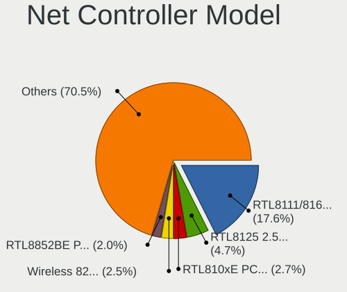

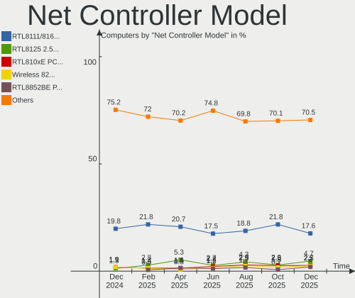

| Model                                                                           | Computers | Percent |
|---------------------------------------------------------------------------------|-----------|---------|
| Realtek RTL8111/8168/8211/8411 PCI Express Gigabit Ethernet Controller          | 90        | 17.58%  |
| Realtek RTL8125 2.5GbE Controller                                               | 24        | 4.69%   |
| Realtek RTL810xE PCI Express Fast Ethernet controller                           | 14        | 2.73%   |
| Intel Wireless 8265 / 8275                                                      | 13        | 2.54%   |
| Realtek RTL8852BE PCIe 802.11ax Wireless Network Controller                     | 10        | 1.95%   |
| Intel 82579LM Gigabit Network Connection (Lewisville)                           | 9         | 1.76%   |
| Realtek RTL8821CE 802.11ac PCIe Wireless Network Adapter                        | 8         | 1.56%   |
| Realtek RTL8153 Gigabit Ethernet Adapter                                        | 8         | 1.56%   |
| Intel Wi-Fi 6 AX200                                                             | 8         | 1.56%   |
| Intel Ethernet Controller I226-V                                                | 8         | 1.56%   |
| Qualcomm Atheros AR9285 Wireless Network Adapter (PCI-Express)                  | 7         | 1.37%   |
| MediaTek MT7922 802.11ax PCI Express Wireless Network Adapter                   | 7         | 1.37%   |
| Qualcomm Atheros QCA9565 / AR9565 Wireless Network Adapter                      | 6         | 1.17%   |
| MediaTek MT7902 802.11ax PCIe Wireless Network Adapter [Filogic 310]            | 6         | 1.17%   |
| Intel Wireless 3165                                                             | 6         | 1.17%   |
| Realtek RTL8822CE 802.11ac PCIe Wireless Network Adapter                        | 5         | 0.98%   |
| Realtek RTL8126 5GbE Controller                                                 | 5         | 0.98%   |
| Realtek 802.11ac NIC                                                            | 5         | 0.98%   |
| Intel Raptor Lake PCH CNVi WiFi                                                 | 5         | 0.98%   |
| Intel Ethernet Connection (6) I219-LM                                           | 5         | 0.98%   |
| Intel Ethernet Connection (4) I219-V                                            | 5         | 0.98%   |
| Intel Cannon Point-LP CNVi [Wireless-AC]                                        | 5         | 0.98%   |
| Intel 700 Series Chipset CNVi WiFi                                              | 5         | 0.98%   |
| Realtek RTL8188EE Wireless Network Adapter                                      | 4         | 0.78%   |
| Qualcomm Atheros QCA9377 802.11ac Wireless Network Adapter                      | 4         | 0.78%   |
| Qualcomm Atheros QCA6174 802.11ac Wireless Network Adapter                      | 4         | 0.78%   |
| MediaTek MT7925 802.11be 160MHz 2x2 PCIe Wireless Network Adapter [Filogic 360] | 4         | 0.78%   |
| Intel Wireless 7260                                                             | 4         | 0.78%   |
| Intel Wi-Fi 6 AX201                                                             | 4         | 0.78%   |
| Intel Ethernet Connection I217-LM                                               | 4         | 0.78%   |
| Intel Ethernet Connection (4) I219-LM                                           | 4         | 0.78%   |
| Intel Comet Lake PCH CNVi WiFi                                                  | 4         | 0.78%   |
| Intel Centrino Advanced-N 6205 [Taylor Peak]                                    | 4         | 0.78%   |
| Intel Alder Lake-P PCH CNVi WiFi                                                | 4         | 0.78%   |
| Broadcom BCM4312 802.11b/g LP-PHY                                               | 4         | 0.78%   |
| Ralink RT3290 Wireless 802.11n 1T/1R PCIe                                       | 3         | 0.59%   |
| Qualcomm Atheros AR9271 802.11n                                                 | 3         | 0.59%   |
| Qualcomm Atheros AR9462 Wireless Network Adapter                                | 3         | 0.59%   |
| Nvidia MCP79 Ethernet                                                           | 3         | 0.59%   |
| Marvell Group 88E8058 PCI-E Gigabit Ethernet Controller                         | 3         | 0.59%   |

Wireless Vendor
---------------

Wireless vendors

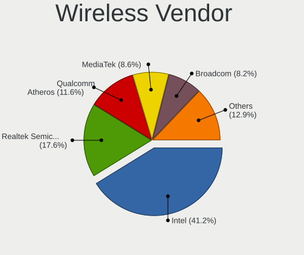

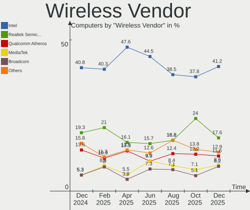

| Vendor                          | Computers | Percent |
|---------------------------------|-----------|---------|
| Intel                           | 96        | 41.2%   |
| Realtek Semiconductor           | 41        | 17.6%   |
| Qualcomm Atheros                | 27        | 11.59%  |
| MediaTek                        | 20        | 8.58%   |
| Broadcom                        | 19        | 8.15%   |
| TP-Link                         | 4         | 1.72%   |
| Sierra Wireless                 | 4         | 1.72%   |
| Ralink                          | 4         | 1.72%   |
| Qualcomm Atheros Communications | 3         | 1.29%   |
| Ralink Technology               | 2         | 0.86%   |
| Microsoft                       | 2         | 0.86%   |
| Mercucys                        | 2         | 0.86%   |
| D-Link                          | 2         | 0.86%   |
| Broadcom Limited                | 2         | 0.86%   |
| AVM                             | 2         | 0.86%   |
| Qualcomm                        | 1         | 0.43%   |
| Fibocom                         | 1         | 0.43%   |
| Dell                            | 1         | 0.43%   |

Wireless Model
--------------

Wireless models

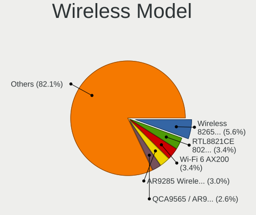

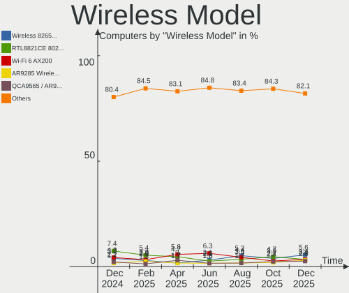

| Model                                                                           | Computers | Percent |
|---------------------------------------------------------------------------------|-----------|---------|
| Intel Wireless 8265 / 8275                                                      | 13        | 5.56%   |
| Realtek RTL8821CE 802.11ac PCIe Wireless Network Adapter                        | 8         | 3.42%   |
| Intel Wi-Fi 6 AX200                                                             | 8         | 3.42%   |
| Qualcomm Atheros AR9285 Wireless Network Adapter (PCI-Express)                  | 7         | 2.99%   |
| Qualcomm Atheros QCA9565 / AR9565 Wireless Network Adapter                      | 6         | 2.56%   |
| MediaTek MT7922 802.11ax PCI Express Wireless Network Adapter                   | 6         | 2.56%   |
| MediaTek MT7902 802.11ax PCIe Wireless Network Adapter [Filogic 310]            | 6         | 2.56%   |
| Intel Wireless 3165                                                             | 6         | 2.56%   |
| Realtek RTL8822CE 802.11ac PCIe Wireless Network Adapter                        | 5         | 2.14%   |
| Realtek 802.11ac NIC                                                            | 5         | 2.14%   |
| Intel Raptor Lake PCH CNVi WiFi                                                 | 5         | 2.14%   |
| Intel Cannon Point-LP CNVi [Wireless-AC]                                        | 5         | 2.14%   |
| Intel 700 Series Chipset CNVi WiFi                                              | 5         | 2.14%   |
| Realtek RTL8852BE PCIe 802.11ax Wireless Network Controller                     | 4         | 1.71%   |
| Realtek RTL8188EE Wireless Network Adapter                                      | 4         | 1.71%   |
| Qualcomm Atheros QCA9377 802.11ac Wireless Network Adapter                      | 4         | 1.71%   |
| Qualcomm Atheros QCA6174 802.11ac Wireless Network Adapter                      | 4         | 1.71%   |
| Intel Wireless 7260                                                             | 4         | 1.71%   |
| Intel Wi-Fi 6 AX201                                                             | 4         | 1.71%   |
| Intel Comet Lake PCH CNVi WiFi                                                  | 4         | 1.71%   |
| Intel Centrino Advanced-N 6205 [Taylor Peak]                                    | 4         | 1.71%   |
| Broadcom BCM4312 802.11b/g LP-PHY                                               | 4         | 1.71%   |
| Ralink RT3290 Wireless 802.11n 1T/1R PCIe                                       | 3         | 1.28%   |
| Qualcomm Atheros AR9271 802.11n                                                 | 3         | 1.28%   |
| Qualcomm Atheros AR9462 Wireless Network Adapter                                | 3         | 1.28%   |
| Intel Wireless 8260                                                             | 3         | 1.28%   |
| Intel Wireless 7265                                                             | 3         | 1.28%   |
| Intel Dual Band Wireless-AC 3168NGW [Stone Peak]                                | 3         | 1.28%   |
| Intel Alder Lake-P PCH CNVi WiFi                                                | 3         | 1.28%   |
| Intel Alder Lake-N PCH CNVi WiFi                                                | 3         | 1.28%   |
| Broadcom BCM4321 802.11a/b/g/n                                                  | 3         | 1.28%   |
| Broadcom BCM43142 802.11b/g/n                                                   | 3         | 1.28%   |
| TP-Link TL-WN823N v2/v3 [Realtek RTL8192EU]                                     | 2         | 0.85%   |
| Sierra Wireless EM7305 Modem                                                    | 2         | 0.85%   |
| Realtek RTL8822BE 802.11a/b/g/n/ac WiFi adapter                                 | 2         | 0.85%   |
| Realtek RTL8188EUS 802.11n Wireless Network Adapter                             | 2         | 0.85%   |
| Realtek RTL8188CE 802.11b/g/n WiFi Adapter                                      | 2         | 0.85%   |
| Qualcomm Atheros AR9485 Wireless Network Adapter                                | 2         | 0.85%   |
| MediaTek MT7927 802.11be 320MHz 2x2 PCIe Wireless Network Adapter [Filogic 380] | 2         | 0.85%   |
| MediaTek MT7925 802.11be 160MHz 2x2 PCIe Wireless Network Adapter [Filogic 360] | 2         | 0.85%   |

Ethernet Vendor
---------------

Ethernet vendors

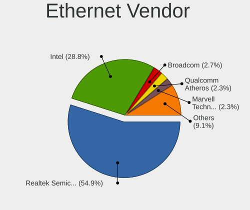

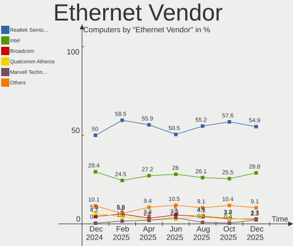

| Vendor                   | Computers | Percent |
|--------------------------|-----------|---------|
| Realtek Semiconductor    | 145       | 54.92%  |
| Intel                    | 76        | 28.79%  |
| Broadcom                 | 7         | 2.65%   |
| Qualcomm Atheros         | 6         | 2.27%   |
| Marvell Technology Group | 6         | 2.27%   |
| Nvidia                   | 4         | 1.52%   |
| MediaTek                 | 3         | 1.14%   |
| JMicron Technology       | 3         | 1.14%   |
| Samsung Electronics      | 2         | 0.76%   |
| Qualcomm Technologies    | 2         | 0.76%   |
| Qualcomm                 | 2         | 0.76%   |
| OPPO Electronics         | 2         | 0.76%   |
| Xiaomi                   | 1         | 0.38%   |
| TP-Link                  | 1         | 0.38%   |
| Huawei Technologies      | 1         | 0.38%   |
| Broadcom Limited         | 1         | 0.38%   |
| Attansic Technology      | 1         | 0.38%   |
| Aquantia                 | 1         | 0.38%   |

Ethernet Model
--------------

Ethernet models

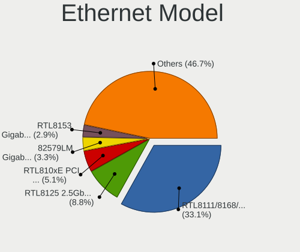

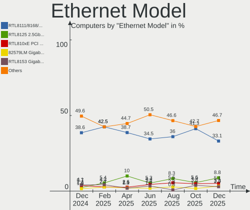

| Model                                                                           | Computers | Percent |
|---------------------------------------------------------------------------------|-----------|---------|
| Realtek RTL8111/8168/8211/8411 PCI Express Gigabit Ethernet Controller          | 90        | 33.09%  |
| Realtek RTL8125 2.5GbE Controller                                               | 24        | 8.82%   |
| Realtek RTL810xE PCI Express Fast Ethernet controller                           | 14        | 5.15%   |
| Intel 82579LM Gigabit Network Connection (Lewisville)                           | 9         | 3.31%   |
| Realtek RTL8153 Gigabit Ethernet Adapter                                        | 8         | 2.94%   |
| Intel Ethernet Controller I226-V                                                | 8         | 2.94%   |
| Realtek RTL8852BE PCIe 802.11ax Wireless Network Controller                     | 6         | 2.21%   |
| Realtek RTL8126 5GbE Controller                                                 | 5         | 1.84%   |
| Intel Ethernet Connection (6) I219-LM                                           | 5         | 1.84%   |
| Intel Ethernet Connection (4) I219-V                                            | 5         | 1.84%   |
| Intel Ethernet Connection I217-LM                                               | 4         | 1.47%   |
| Intel Ethernet Connection (4) I219-LM                                           | 4         | 1.47%   |
| Nvidia MCP79 Ethernet                                                           | 3         | 1.1%    |
| Marvell Group 88E8058 PCI-E Gigabit Ethernet Controller                         | 3         | 1.1%    |
| JMicron JMC250 PCI Express Gigabit Ethernet Controller                          | 3         | 1.1%    |
| Intel I211 Gigabit Network Connection                                           | 3         | 1.1%    |
| Intel Ethernet Connection (7) I219-LM                                           | 3         | 1.1%    |
| Intel Ethernet Connection (2) I219-V                                            | 3         | 1.1%    |
| Intel Ethernet Connection (2) I219-LM                                           | 3         | 1.1%    |
| Intel BE201 320MHz                                                              | 3         | 1.1%    |
| Intel 82575EB Gigabit Network Connection                                        | 3         | 1.1%    |
| Samsung Galaxy series, misc. (tethering mode)                                   | 2         | 0.74%   |
| Qualcomm WCN785x Wi-Fi 7(802.11be) 320MHz 2x2 [FastConnect 7800]                | 2         | 0.74%   |
| OPPO RMX3741                                                                    | 2         | 0.74%   |
| MediaTek MT7925 802.11be 160MHz 2x2 PCIe Wireless Network Adapter [Filogic 360] | 2         | 0.74%   |
| Marvell Group 88E8056 PCI-E Gigabit Ethernet Controller                         | 2         | 0.74%   |
| Intel Ethernet Connection I219-LM                                               | 2         | 0.74%   |
| Intel Ethernet Connection I217-V                                                | 2         | 0.74%   |
| Intel Ethernet Connection (7) I219-V                                            | 2         | 0.74%   |
| Intel Ethernet Connection (18) I219-LM                                          | 2         | 0.74%   |
| Intel Ethernet Connection (10) I219-V                                           | 2         | 0.74%   |
| Intel 82567LM-3 Gigabit Network Connection                                      | 2         | 0.74%   |
| Intel 82541GI Gigabit Ethernet Controller                                       | 2         | 0.74%   |
| Xiaomi Mi/Redmi series (RNDIS + ADB)                                            | 1         | 0.37%   |
| TP-Link UE300 10/100/1000 LAN (ethernet mode) [Realtek RTL8153]                 | 1         | 0.37%   |
| Realtek USB 10/100/1G/2.5 LAN                                                   | 1         | 0.37%   |
| Realtek RTL8111/8168/8411 PCI Express Gigabit Ethernet Controller               | 1         | 0.37%   |
| Realtek Killer E2600 GbE Controller                                             | 1         | 0.37%   |
| Qualcomm YUPIK-QRD _SN:AC1D5909                                                 | 1         | 0.37%   |
| Qualcomm Nokia X30 5G                                                           | 1         | 0.37%   |

Net Controller Kind
-------------------

Ethernet, WiFi or modem

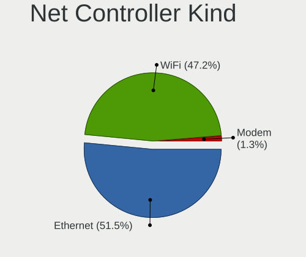

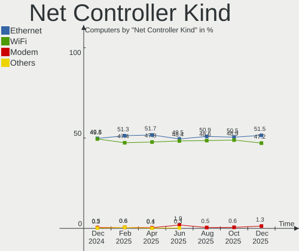

| Kind     | Computers | Percent |
|----------|-----------|---------|
| Ethernet | 237       | 51.52%  |
| WiFi     | 217       | 47.17%  |
| Modem    | 6         | 1.3%    |

Used Controller
---------------

Currently used network controller

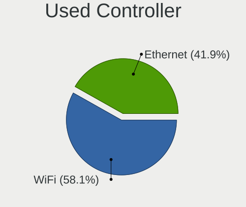

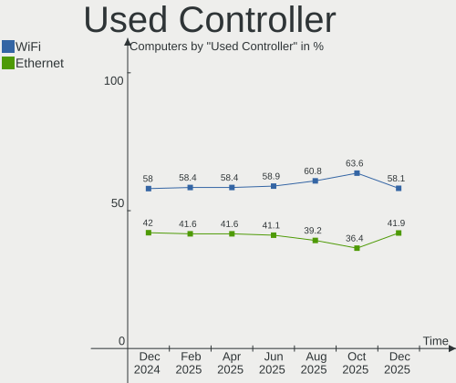

| Kind     | Computers | Percent |
|----------|-----------|---------|
| WiFi     | 157       | 58.15%  |
| Ethernet | 113       | 41.85%  |

NICs
----

Total network controllers on board

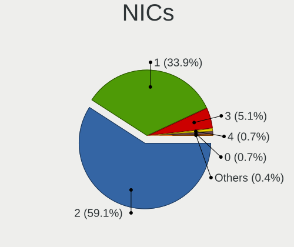

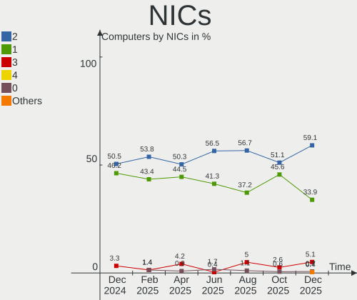

| Total | Computers | Percent |
|-------|-----------|---------|
| 2     | 162       | 59.12%  |
| 1     | 93        | 33.94%  |
| 3     | 14        | 5.11%   |
| 4     | 2         | 0.73%   |
| 0     | 2         | 0.73%   |
| 5     | 1         | 0.36%   |

IPv6
----

IPv6 vs IPv4

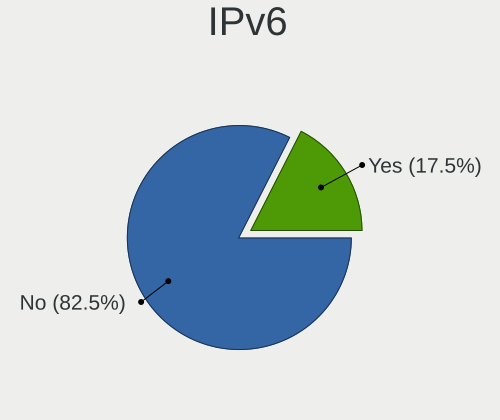

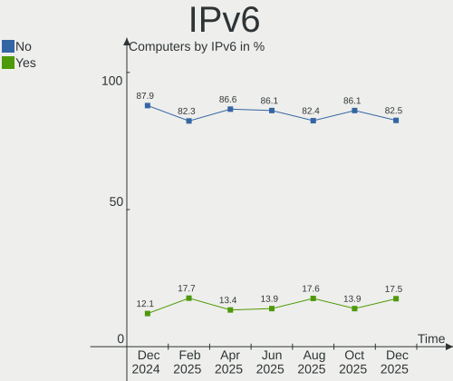

| Used | Computers | Percent |
|------|-----------|---------|
| No   | 226       | 82.48%  |
| Yes  | 48        | 17.52%  |

Bluetooth
---------

Bluetooth Vendor
----------------

Controller vendors

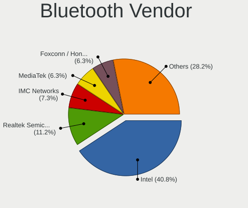

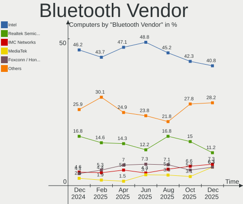

| Vendor                          | Computers | Percent |
|---------------------------------|-----------|---------|
| Intel                           | 84        | 40.78%  |
| Realtek Semiconductor           | 23        | 11.17%  |
| IMC Networks                    | 15        | 7.28%   |
| MediaTek                        | 13        | 6.31%   |
| Foxconn / Hon Hai               | 13        | 6.31%   |
| Apple                           | 12        | 5.83%   |
| Qualcomm Atheros Communications | 10        | 4.85%   |
| Broadcom                        | 8         | 3.88%   |
| Lite-On Technology              | 5         | 2.43%   |
| TP-Link                         | 3         | 1.46%   |
| Ralink                          | 3         | 1.46%   |
| Hewlett-Packard                 | 3         | 1.46%   |
| Realtek                         | 2         | 0.97%   |
| Cambridge Silicon Radio         | 2         | 0.97%   |
| ASUSTek Computer                | 2         | 0.97%   |
| USI                             | 1         | 0.49%   |
| Toshiba                         | 1         | 0.49%   |
| TDK                             | 1         | 0.49%   |
| Qcom                            | 1         | 0.49%   |
| Micro Star International        | 1         | 0.49%   |
| Mercucys                        | 1         | 0.49%   |
| Foxconn International           | 1         | 0.49%   |
| Actions                         | 1         | 0.49%   |

Bluetooth Model
---------------

Controller models

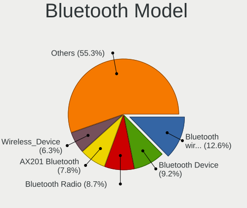

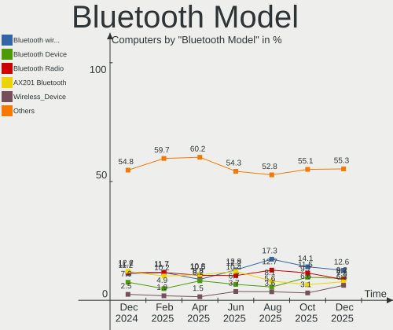

| Model                                                    | Computers | Percent |
|----------------------------------------------------------|-----------|---------|
| Intel Bluetooth wireless interface                       | 26        | 12.62%  |
| Intel Bluetooth Device                                   | 19        | 9.22%   |
| Realtek Bluetooth Radio                                  | 18        | 8.74%   |
| Intel AX201 Bluetooth                                    | 16        | 7.77%   |
| MediaTek Wireless_Device                                 | 13        | 6.31%   |
| Intel AX200 Bluetooth                                    | 8         | 3.88%   |
| Intel Bluetooth 9460/9560 Jefferson Peak (JfP)           | 7         | 3.4%    |
| Foxconn / Hon Hai Wireless_Device                        | 7         | 3.4%    |
| IMC Networks Bluetooth Radio                             | 6         | 2.91%   |
| Qualcomm Atheros  Bluetooth Device                       | 5         | 2.43%   |
| Apple Bluetooth Host Controller                          | 5         | 2.43%   |
| Realtek  Bluetooth 4.2 Adapter                           | 4         | 1.94%   |
| IMC Networks Wireless_Device                             | 4         | 1.94%   |
| TP-Link TP-T@- UB500 Adapter                             | 3         | 1.46%   |
| Ralink RT3290 Bluetooth                                  | 3         | 1.46%   |
| Intel Wireless-AC 3168 Bluetooth                         | 3         | 1.46%   |
| IMC Networks Bluetooth Device                            | 3         | 1.46%   |
| Apple Built-in Bluetooth 2.0+EDR HCI                     | 3         | 1.46%   |
| Apple Bluetooth HCI                                      | 3         | 1.46%   |
| Realtek Bluetooth Radio                                  | 2         | 0.97%   |
| Qualcomm Atheros QCA61x4 Bluetooth 4.0                   | 2         | 0.97%   |
| Qualcomm Atheros AR3011 Bluetooth                        | 2         | 0.97%   |
| Lite-On Bluetooth Device                                 | 2         | 0.97%   |
| Intel Centrino Bluetooth Wireless Transceiver            | 2         | 0.97%   |
| Intel AX210 Bluetooth                                    | 2         | 0.97%   |
| HP Bluetooth 2.0 Interface [Broadcom BCM2045]            | 2         | 0.97%   |
| Foxconn / Hon Hai Bluetooth Device                       | 2         | 0.97%   |
| Cambridge Silicon Radio Bluetooth Dongle (HCI mode)      | 2         | 0.97%   |
| Broadcom BCM20702 Bluetooth 4.0 [ThinkPad]               | 2         | 0.97%   |
| USI Bluetooth Device                                     | 1         | 0.49%   |
| Toshiba Atheros AR3012 Bluetooth                         | 1         | 0.49%   |
| TDK Bluetooth Adapter                                    | 1         | 0.49%   |
| Realtek Bluetooth 5.4 Radio                              | 1         | 0.49%   |
| Qualcomm Atheros AR3012 Bluetooth 4.0                    | 1         | 0.49%   |
| Qcom Broadcom Bluetooth USB                              | 1         | 0.49%   |
| Micro Star International MS-6970 BToes Bluetooth adapter | 1         | 0.49%   |
| Mercucys Mercusys MA530 Adapter                          | 1         | 0.49%   |
| Lite-On Qualcomm Atheros QCA9377 Bluetooth               | 1         | 0.49%   |
| Lite-On Broadcom BCM43142A0 Bluetooth Device             | 1         | 0.49%   |
| Lite-On Atheros AR3012 Bluetooth                         | 1         | 0.49%   |

Sound
-----

Sound Vendor
------------

Sound card vendors

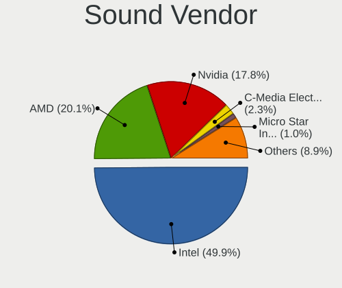

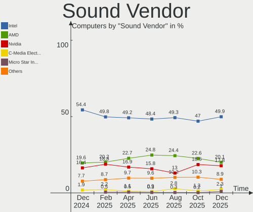

| Vendor                                       | Computers | Percent |
|----------------------------------------------|-----------|---------|
| Intel                                        | 196       | 49.87%  |
| AMD                                          | 79        | 20.1%   |
| Nvidia                                       | 70        | 17.81%  |
| C-Media Electronics                          | 9         | 2.29%   |
| Micro Star International                     | 4         | 1.02%   |
| Logitech                                     | 3         | 0.76%   |
| Razer USA                                    | 2         | 0.51%   |
| Hewlett-Packard                              | 2         | 0.51%   |
| Creative Technology                          | 2         | 0.51%   |
| ASUSTek Computer                             | 2         | 0.51%   |
| Zoran Co. Personal Media Division (Nogatech) | 1         | 0.25%   |
| XMOS                                         | 1         | 0.25%   |
| Trust                                        | 1         | 0.25%   |
| Texas Instruments                            | 1         | 0.25%   |
| Synaptics                                    | 1         | 0.25%   |
| Sony                                         | 1         | 0.25%   |
| RODE Microphones                             | 1         | 0.25%   |
| Reloop                                       | 1         | 0.25%   |
| Realtek Semiconductor                        | 1         | 0.25%   |
| MAG Technology                               | 1         | 0.25%   |
| M2Tech                                       | 1         | 0.25%   |
| liyuany                                      | 1         | 0.25%   |
| KTMicro                                      | 1         | 0.25%   |
| Jieli Technology                             | 1         | 0.25%   |
| GYROCOM C&C                                  | 1         | 0.25%   |
| GN Netcom                                    | 1         | 0.25%   |
| Focusrite-Novation                           | 1         | 0.25%   |
| ESS Technology                               | 1         | 0.25%   |
| Compal Electronics                           | 1         | 0.25%   |
| Audeze                                       | 1         | 0.25%   |
| Astro Gaming                                 | 1         | 0.25%   |
| ASRock                                       | 1         | 0.25%   |
| Anlya.cn                                     | 1         | 0.25%   |
| Unknown                                      | 1         | 0.25%   |

Sound Model
-----------

Sound card models

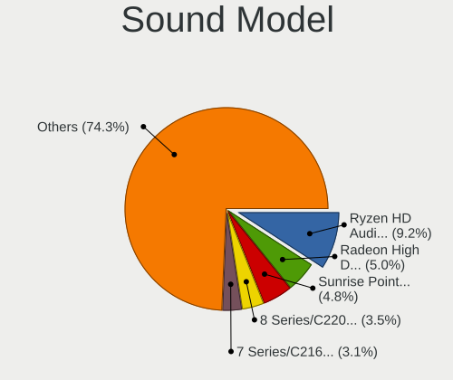

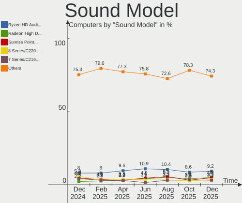

| Model                                                                      | Computers | Percent |
|----------------------------------------------------------------------------|-----------|---------|
| AMD Ryzen HD Audio Controller                                              | 44        | 9.19%   |
| AMD Radeon High Definition Audio Controller                                | 24        | 5.01%   |
| Intel Sunrise Point-LP HD Audio                                            | 23        | 4.8%    |
| Intel 8 Series/C220 Series Chipset High Definition Audio Controller        | 17        | 3.55%   |
| Intel 7 Series/C216 Chipset Family High Definition Audio Controller        | 15        | 3.13%   |
| Intel Xeon E3-1200 v3/4th Gen Core Processor HD Audio Controller           | 10        | 2.09%   |
| Intel Raptor Lake-P/U/H cAVS                                               | 10        | 2.09%   |
| Intel Cannon Lake PCH cAVS                                                 | 10        | 2.09%   |
| AMD Renoir/Cezanne HDMI/DP Audio Controller                                | 10        | 2.09%   |
| Intel Haswell-ULT HD Audio Controller                                      | 8         | 1.67%   |
| Intel Alder Lake PCH-P High Definition Audio Controller                    | 8         | 1.67%   |
| Intel 8 Series HD Audio Controller                                         | 8         | 1.67%   |
| Intel 6 Series/C200 Series Chipset Family High Definition Audio Controller | 8         | 1.67%   |
| AMD Raven/Raven2/Fenghuang HDMI/DP Audio Controller                        | 8         | 1.67%   |
| Nvidia GP107GL High Definition Audio Controller                            | 7         | 1.46%   |
| Intel Tiger Lake-LP Smart Sound Technology Audio Controller                | 7         | 1.46%   |
| Intel 100 Series/C230 Series Chipset Family HD Audio Controller            | 7         | 1.46%   |
| Intel Cannon Point-LP High Definition Audio Controller                     | 6         | 1.25%   |
| Intel 82801I (ICH9 Family) HD Audio Controller                             | 6         | 1.25%   |
| Intel 82801H (ICH8 Family) HD Audio Controller                             | 6         | 1.25%   |
| AMD Starship/Matisse HD Audio Controller                                   | 6         | 1.25%   |
| AMD SBx00 Azalia (Intel HDA)                                               | 6         | 1.25%   |
| Nvidia TU107 GeForce GTX 1650 High Definition Audio Controller             | 5         | 1.04%   |
| Nvidia GK208 HDMI/DP Audio Controller                                      | 5         | 1.04%   |
| Nvidia GA106 High Definition Audio Controller                              | 5         | 1.04%   |
| Intel Raptor Lake High Definition Audio Controller                         | 5         | 1.04%   |
| AMD Navi 31 HDMI/DP Audio                                                  | 5         | 1.04%   |
| Nvidia TU116 High Definition Audio Controller                              | 4         | 0.84%   |
| Micro Star International USB Audio                                         | 4         | 0.84%   |
| Intel Wildcat Point-LP High Definition Audio Controller                    | 4         | 0.84%   |
| Intel Comet Lake PCH cAVS                                                  | 4         | 0.84%   |
| Intel Broadwell-U Audio Controller                                         | 4         | 0.84%   |
| Intel Atom Processor Z36xxx/Z37xxx Series High Definition Audio Controller | 4         | 0.84%   |
| Intel Alder Lake-N PCH High Definition Audio Controller                    | 4         | 0.84%   |
| Intel 82801JI (ICH10 Family) HD Audio Controller                           | 4         | 0.84%   |
| Intel 5 Series/3400 Series Chipset High Definition Audio                   | 4         | 0.84%   |
| Intel 200 Series PCH HD Audio                                              | 4         | 0.84%   |
| C-Media Electronics Audio Adapter (Unitek Y-247A)                          | 4         | 0.84%   |
| AMD Navi 48 HDMI/DP Audio Controller                                       | 4         | 0.84%   |
| AMD FCH Azalia Controller                                                  | 4         | 0.84%   |

Memory
------

Memory Vendor
-------------

Memory module vendors

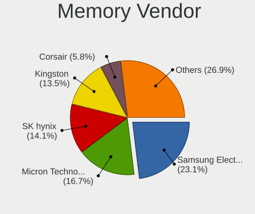

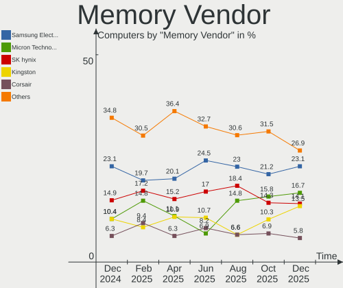

| Vendor                               | Computers | Percent |
|--------------------------------------|-----------|---------|
| Samsung Electronics                  | 36        | 23.08%  |
| Micron Technology                    | 26        | 16.67%  |
| SK hynix                             | 22        | 14.1%   |
| Kingston                             | 21        | 13.46%  |
| Corsair                              | 9         | 5.77%   |
| Unknown                              | 7         | 4.49%   |
| G.Skill                              | 7         | 4.49%   |
| Crucial                              | 5         | 3.21%   |
| Unknown (ABCD)                       | 3         | 1.92%   |
| Unknown                              | 3         | 1.92%   |
| Transcend                            | 2         | 1.28%   |
| Team                                 | 2         | 1.28%   |
| Wodposit                             | 1         | 0.64%   |
| Unknown (0x0E2A)                     | 1         | 0.64%   |
| Unifosa                              | 1         | 0.64%   |
| Shenzhen Techwinsemi Technology Twsc | 1         | 0.64%   |
| Ramaxel Technology                   | 1         | 0.64%   |
| QEMU                                 | 1         | 0.64%   |
| Patriot Memory (PDP Systems)         | 1         | 0.64%   |
| Nanya Technology                     | 1         | 0.64%   |
| Lexar                                | 1         | 0.64%   |
| Hewlett-Packard                      | 1         | 0.64%   |
| GOODRAM                              | 1         | 0.64%   |
| Apacer                               | 1         | 0.64%   |
| A-DATA Technology                    | 1         | 0.64%   |

Memory Model
------------

Memory module models

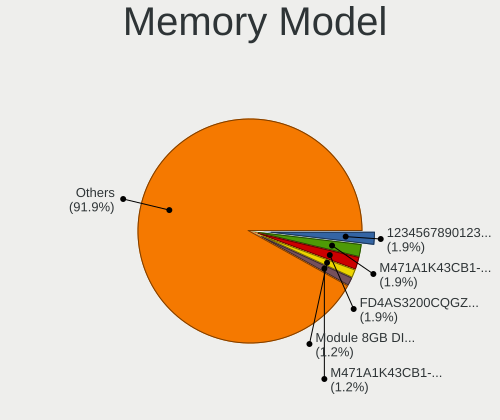

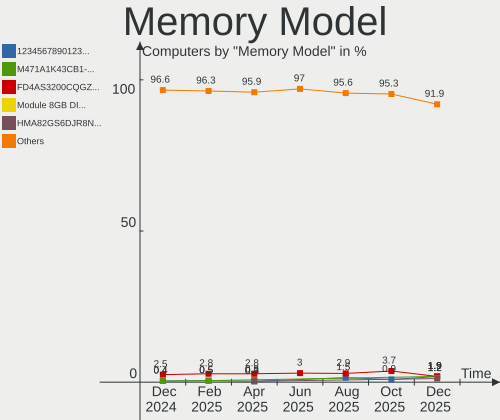

| Model                                                            | Computers | Percent |
|------------------------------------------------------------------|-----------|---------|
| Unknown (ABCD) RAM 123456789012345678 2GB SODIMM LPDDR4 2400MT/s | 3         | 1.86%   |
| Samsung RAM M471A1K43CB1-CTD 8GB SODIMM DDR4 3200MT/s            | 3         | 1.86%   |
| Unknown                                                          | 3         | 1.86%   |
| Unknown RAM Module 8GB DIMM 1333MT/s                             | 2         | 1.24%   |
| SK hynix RAM HMA82GS6DJR8N-VK 16GB SODIMM DDR4 2667MT/s          | 2         | 1.24%   |
| Samsung RAM M471A1K43CB1-CRC 8GB SODIMM DDR4 8400MT/s            | 2         | 1.24%   |
| Samsung RAM M471A1K43BB1-CRC 8GB SODIMM DDR4 2667MT/s            | 2         | 1.24%   |
| Micron RAM MTC8C1084S1SC56BD1 B 16GB SODIMM DDR5 5600MT/s        | 2         | 1.24%   |
| Micron RAM Module 4GB Row Of Chips LPDDR5 8533MT/s               | 2         | 1.24%   |
| Micron RAM CT16G56C46S5.M8D1 16GB SODIMM DDR5 5600MT/s           | 2         | 1.24%   |
| Micron RAM 8ATF1G64HZ-3G2R1 8GB SODIMM DDR4 3200MT/s             | 2         | 1.24%   |
| Corsair RAM CMK16GX4M2B3200C16 8GB DIMM DDR4 3600MT/s            | 2         | 1.24%   |
| Wodposit RAM WPBH26D408SWA-8G 8GB SODIMM DDR4 2667MT/s           | 1         | 0.62%   |
| Unknown RAM Module 512MB SODIMM DDR                              | 1         | 0.62%   |
| Unknown RAM Module 4GB SODIMM DDR4 2400MT/s                      | 1         | 0.62%   |
| Unknown RAM Module 4GB SODIMM DDR3 1600MT/s                      | 1         | 0.62%   |
| Unknown RAM Module 2GB SODIMM 800MT/s                            | 1         | 0.62%   |
| Unknown RAM Module 2GB SODIMM 667MT/s                            | 1         | 0.62%   |
| Unknown (0x0E2A) RAM Module 8GB SODIMM DDR4 2667MT/s             | 1         | 0.62%   |
| Unifosa RAM GU342G0ALEPR692C6 2GB DIMM DDR2 2048MT/s             | 1         | 0.62%   |
| Transcend RAM Module 16GB SODIMM DDR5 4800MT/s                   | 1         | 0.62%   |
| Transcend RAM JM1333KSN-4G 4GB SODIMM DDR3 1334MT/s              | 1         | 0.62%   |
| Team RAM TEAMGROUP-UD4-3200 8GB DIMM DDR4 3733MT/s               | 1         | 0.62%   |
| Team RAM TEAMGROUP-SD4-2666 8GB SODIMM DDR4 2667MT/s             | 1         | 0.62%   |
| SK hynix RAM Module 4GB SODIMM DDR3 1333MT/s                     | 1         | 0.62%   |
| SK hynix RAM Module 32GB SODIMM DDR5 5600MT/s                    | 1         | 0.62%   |
| SK hynix RAM Module 2GB SODIMM DDR3 1600MT/s                     | 1         | 0.62%   |
| SK hynix RAM Module 2GB SODIMM DDR3 1333MT/s                     | 1         | 0.62%   |
| SK hynix RAM HMT425S2AFR6R-PB 2GB SODIMM DDR3 1333MT/s           | 1         | 0.62%   |
| SK hynix RAM HMT41GU7MFR8C-H9 8GB DIMM DDR3 1333MT/s             | 1         | 0.62%   |
| SK hynix RAM HMT41GS6BFR8C-PB 8GB SODIMM DDR3 1600MT/s           | 1         | 0.62%   |
| SK hynix RAM HMT41GS6AFR8A-PB 8GiB SODIMM DDR3 2667MT/s          | 1         | 0.62%   |
| SK hynix RAM HMT351U7CFR8A-PB 4GB DIMM DDR3 1600MT/s             | 1         | 0.62%   |
| SK hynix RAM HMT325S6BFR8C-H9 2GB SODIMM DDR3 1333MT/s           | 1         | 0.62%   |
| SK hynix RAM HMCG66AGBSA095N 8GiB SODIMM DDR5 5600MT/s           | 1         | 0.62%   |
| SK hynix RAM HMCG66AGBSA092N 8GB SODIMM DDR5 5600MT/s            | 1         | 0.62%   |
| SK hynix RAM HMA851S6CJR6N-VK 4GB SODIMM DDR4 2667MT/s           | 1         | 0.62%   |
| SK hynix RAM HMA851S6CJR6N-VK 4GB Row Of Chips DDR4 2667MT/s     | 1         | 0.62%   |
| SK hynix RAM HMA81GS6JJR8N-VK 8GB SODIMM DDR4 2667MT/s           | 1         | 0.62%   |
| SK hynix RAM HMA81GS6DJR8N-XN 8GB SODIMM DDR4 3200MT/s           | 1         | 0.62%   |

Memory Kind
-----------

Memory module kinds

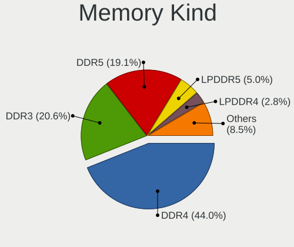

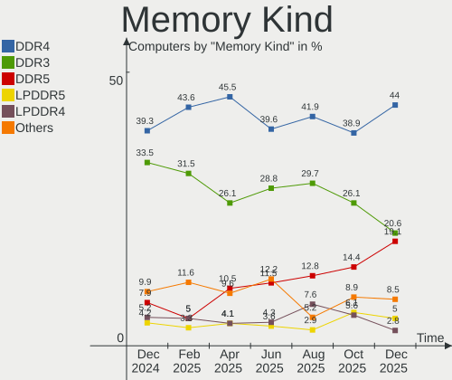

| Kind    | Computers | Percent |
|---------|-----------|---------|
| DDR4    | 62        | 43.97%  |
| DDR3    | 29        | 20.57%  |
| DDR5    | 27        | 19.15%  |
| LPDDR5  | 7         | 4.96%   |
| LPDDR4  | 4         | 2.84%   |
| Unknown | 4         | 2.84%   |
| DDR2    | 3         | 2.13%   |
| SDRAM   | 2         | 1.42%   |
| RAM     | 1         | 0.71%   |
| LPDDR3  | 1         | 0.71%   |
| DDR     | 1         | 0.71%   |

Memory Form Factor
------------------

Physical design of the memory module

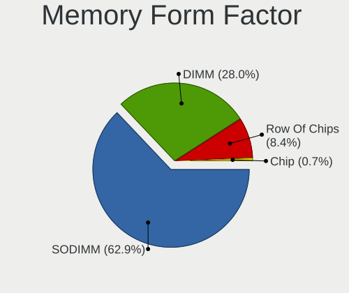

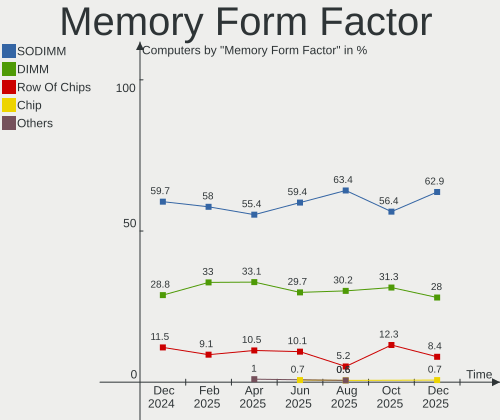

| Name         | Computers | Percent |
|--------------|-----------|---------|
| SODIMM       | 90        | 62.94%  |
| DIMM         | 40        | 27.97%  |
| Row Of Chips | 12        | 8.39%   |
| Chip         | 1         | 0.7%    |

Memory Size
-----------

Memory module size

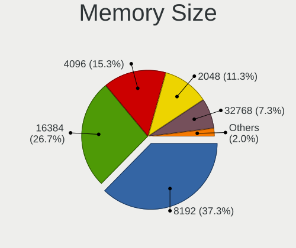

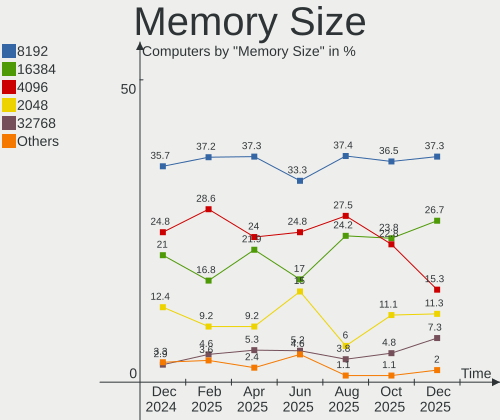

| Size  | Computers | Percent |
|-------|-----------|---------|
| 8192  | 56        | 37.33%  |
| 16384 | 40        | 26.67%  |
| 4096  | 23        | 15.33%  |
| 2048  | 17        | 11.33%  |
| 32768 | 11        | 7.33%   |
| 24576 | 1         | 0.67%   |
| 1024  | 1         | 0.67%   |
| 512   | 1         | 0.67%   |

Memory Speed
------------

Memory module speed

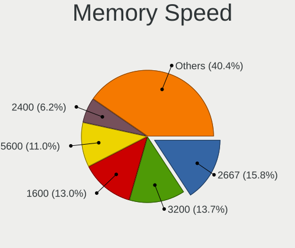

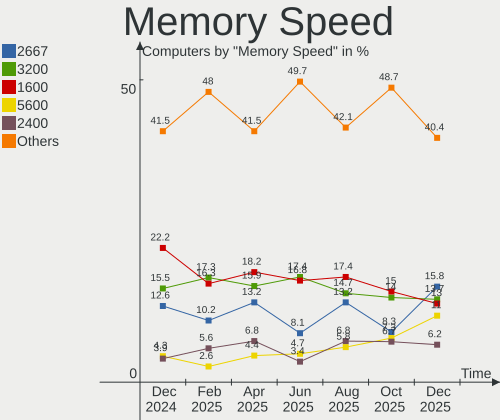

| Speed   | Computers | Percent |
|---------|-----------|---------|
| 2667    | 23        | 15.75%  |
| 3200    | 20        | 13.7%   |
| 1600    | 19        | 13.01%  |
| 5600    | 16        | 10.96%  |
| 2400    | 9         | 6.16%   |
| 1333    | 9         | 6.16%   |
| 6400    | 6         | 4.11%   |
| 6000    | 6         | 4.11%   |
| 3600    | 5         | 3.42%   |
| 8533    | 3         | 2.05%   |
| 2133    | 3         | 2.05%   |
| 667     | 3         | 2.05%   |
| 8400    | 2         | 1.37%   |
| 4800    | 2         | 1.37%   |
| 4199    | 2         | 1.37%   |
| 3733    | 2         | 1.37%   |
| 2933    | 2         | 1.37%   |
| 1334    | 2         | 1.37%   |
| Unknown | 2         | 1.37%   |
| 7400    | 1         | 0.68%   |
| 4267    | 1         | 0.68%   |
| 4000    | 1         | 0.68%   |
| 3800    | 1         | 0.68%   |
| 3266    | 1         | 0.68%   |
| 2048    | 1         | 0.68%   |
| 1867    | 1         | 0.68%   |
| 1866    | 1         | 0.68%   |
| 1067    | 1         | 0.68%   |
| 800     | 1         | 0.68%   |

Printers & scanners
-------------------

Printer Vendor
--------------

Printer device vendors

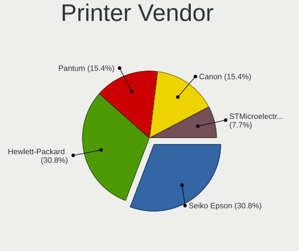

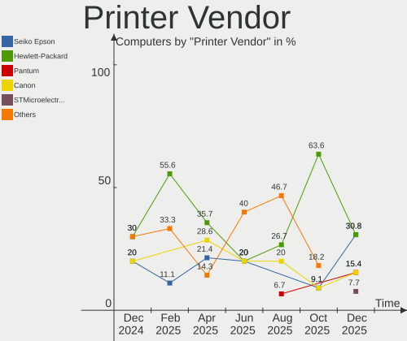

| Vendor             | Computers | Percent |
|--------------------|-----------|---------|
| Seiko Epson        | 4         | 30.77%  |
| Hewlett-Packard    | 4         | 30.77%  |
| Pantum             | 2         | 15.38%  |
| Canon              | 2         | 15.38%  |
| STMicroelectronics | 1         | 7.69%   |

Printer Model
-------------

Printer device models

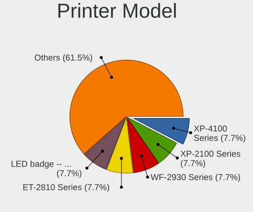

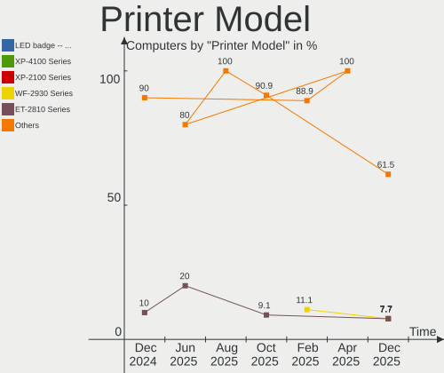

| Model                                                     | Computers | Percent |
|-----------------------------------------------------------|-----------|---------|
| STMicroelectronics LED badge -- mini LED display -- 11x44 | 1         | 7.69%   |
| Seiko Epson XP-4100 Series                                | 1         | 7.69%   |
| Seiko Epson XP-2100 Series                                | 1         | 7.69%   |
| Seiko Epson WF-2930 Series                                | 1         | 7.69%   |
| Seiko Epson ET-2810 Series                                | 1         | 7.69%   |
| Pantum M7100DW series                                     | 1         | 7.69%   |
| Pantum BM2300W series                                     | 1         | 7.69%   |
| HP Smart Tank 5100 series                                 | 1         | 7.69%   |
| HP OfficeJet 3830 series                                  | 1         | 7.69%   |
| HP LaserJet P2015 series                                  | 1         | 7.69%   |
| HP Laserjet P1505                                         | 1         | 7.69%   |
| Canon PIXMA MX390 Series                                  | 1         | 7.69%   |
| Canon LiDE 400                                            | 1         | 7.69%   |

Scanner Vendor
--------------

Scanner device vendors

Zero info for selected period =(

Scanner Model
-------------

Scanner device models

Zero info for selected period =(

Camera
------

Camera Vendor
-------------

Camera device vendors

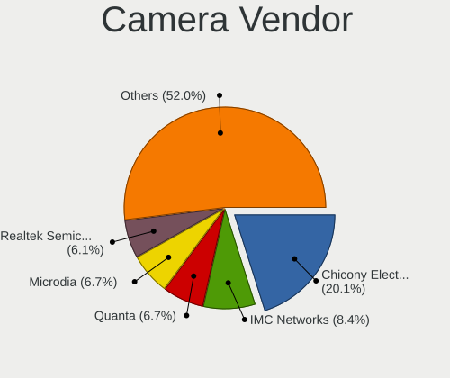

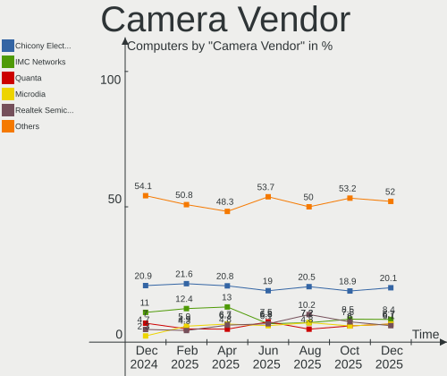

| Vendor                                 | Computers | Percent |
|----------------------------------------|-----------|---------|
| Chicony Electronics                    | 36        | 20.11%  |
| IMC Networks                           | 15        | 8.38%   |
| Quanta                                 | 12        | 6.7%    |
| Microdia                               | 12        | 6.7%    |
| Realtek Semiconductor                  | 11        | 6.15%   |
| Cheng Uei Precision Industry (Foxlink) | 11        | 6.15%   |
| Bison Electronics                      | 11        | 6.15%   |
| Sunplus Innovation Technology          | 10        | 5.59%   |
| Apple                                  | 9         | 5.03%   |
| Logitech                               | 8         | 4.47%   |
| Syntek                                 | 5         | 2.79%   |
| Suyin                                  | 4         | 2.23%   |
| Luxvisions Innotech Limited            | 4         | 2.23%   |
| Lite-On Technology                     | 4         | 2.23%   |
| Sonix Technology                       | 3         | 1.68%   |
| Silicon Motion                         | 2         | 1.12%   |
| OYT Tech                               | 2         | 1.12%   |
| vivo                                   | 1         | 0.56%   |
| USB CAMERA                             | 1         | 0.56%   |
| Trust                                  | 1         | 0.56%   |
| SunplusIT                              | 1         | 0.56%   |
| ShineTech                              | 1         | 0.56%   |
| Ricoh                                  | 1         | 0.56%   |
| Razer USA                              | 1         | 0.56%   |
| Microsoft                              | 1         | 0.56%   |
| KYE Systems (Mouse Systems)            | 1         | 0.56%   |
| kingcome                               | 1         | 0.56%   |
| Jieli Technology                       | 1         | 0.56%   |
| Hopewin Electronic Material            | 1         | 0.56%   |
| Hewlett-Packard                        | 1         | 0.56%   |
| Genesys Logic                          | 1         | 0.56%   |
| Generalplus Technology                 | 1         | 0.56%   |
| GEMBIRD                                | 1         | 0.56%   |
| Framework                              | 1         | 0.56%   |
| DigiTech                               | 1         | 0.56%   |
| ARC International                      | 1         | 0.56%   |
| Alcor Micro                            | 1         | 0.56%   |

Camera Model
------------

Camera device models

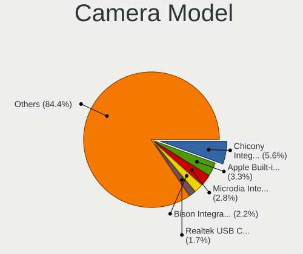

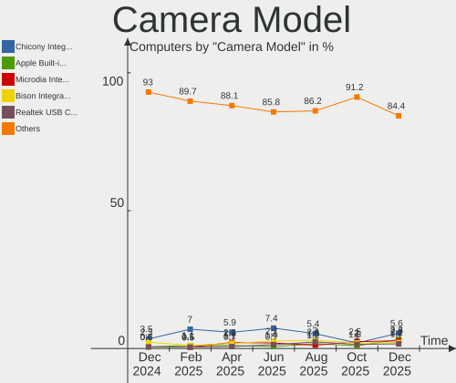

| Model                                                   | Computers | Percent |
|---------------------------------------------------------|-----------|---------|
| Chicony Integrated Camera                               | 10        | 5.56%   |
| Apple Built-in iSight                                   | 6         | 3.33%   |
| Microdia Integrated_Webcam_HD                           | 5         | 2.78%   |
| Bison Integrated Camera                                 | 4         | 2.22%   |
| Realtek USB Camera                                      | 3         | 1.67%   |
| Logitech Webcam C270                                    | 3         | 1.67%   |
| Lite-On Integrated Camera                               | 3         | 1.67%   |
| IMC Networks Integrated Camera                          | 3         | 1.67%   |
| Chicony USB2.0 HD UVC WebCam                            | 3         | 1.67%   |
| Chicony ACER HD User Facing                             | 3         | 1.67%   |
| Cheng Uei Precision Industry (Foxlink) HP TrueVision HD | 3         | 1.67%   |
| Syntek Integrated Camera                                | 2         | 1.11%   |
| Sunplus SPCA2281 Web Camera                             | 2         | 1.11%   |
| Sunplus Integrated_Webcam_HD                            | 2         | 1.11%   |
| Sunplus Full HD webcam                                  | 2         | 1.11%   |
| Sonix USB2.0 HD UVC WebCam                              | 2         | 1.11%   |
| Realtek Integrated_Webcam_HD                            | 2         | 1.11%   |
| Quanta HP Wide Vision HD Camera                         | 2         | 1.11%   |
| Quanta HP TrueVision HD Camera                          | 2         | 1.11%   |
| Quanta ACER HD User Facing                              | 2         | 1.11%   |
| OYT Tech OYV1RDFF1                                      | 2         | 1.11%   |
| Logitech HD Pro Webcam C920                             | 2         | 1.11%   |
| IMC Networks VGA UVC WebCam                             | 2         | 1.11%   |
| IMC Networks USB2.0 HD UVC WebCam                       | 2         | 1.11%   |
| IMC Networks ov9734_azurewave_camera                    | 2         | 1.11%   |
| Chicony Integrated Camera (1280x720@30)                 | 2         | 1.11%   |
| Chicony HP Wide Vision HD Camera                        | 2         | 1.11%   |
| Chicony FJ Camera                                       | 2         | 1.11%   |
| Apple FaceTime HD Camera (Built-in)                     | 2         | 1.11%   |
| vivo V2514                                              | 1         | 0.56%   |
| USB CAMERA USB CAMERA                                   | 1         | 0.56%   |
| Trust Webcam                                            | 1         | 0.56%   |
| Syntek USB2.0 Camera                                    | 1         | 0.56%   |
| Syntek Lenovo EasyCamera                                | 1         | 0.56%   |
| Syntek EasyCamera                                       | 1         | 0.56%   |
| Suyin HP Webcam                                         | 1         | 0.56%   |
| Suyin HP Truevision HD                                  | 1         | 0.56%   |
| Suyin HP Integrated Webcam                              | 1         | 0.56%   |
| Suyin Acer/HP Integrated Webcam [CN0314]                | 1         | 0.56%   |
| SunplusIT FHD Webcam                                    | 1         | 0.56%   |

Security
--------

Fingerprint Vendor
------------------

Fingerprint sensor vendors

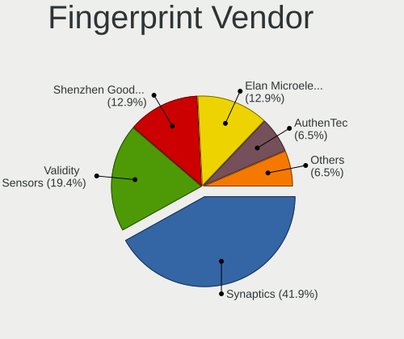

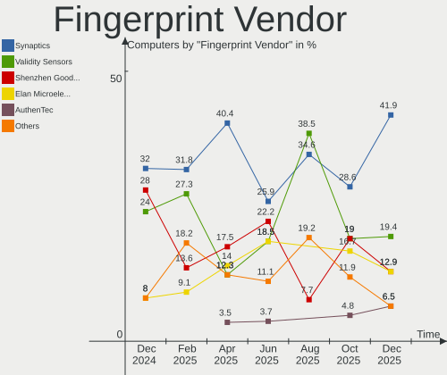

| Vendor                     | Computers | Percent |
|----------------------------|-----------|---------|
| Synaptics                  | 13        | 41.94%  |
| Validity Sensors           | 6         | 19.35%  |
| Shenzhen Goodix Technology | 4         | 12.9%   |
| Elan Microelectronics      | 4         | 12.9%   |
| AuthenTec                  | 2         | 6.45%   |
| Upek                       | 1         | 3.23%   |
| HOLTEK                     | 1         | 3.23%   |

Fingerprint Model
-----------------

Fingerprint sensor models

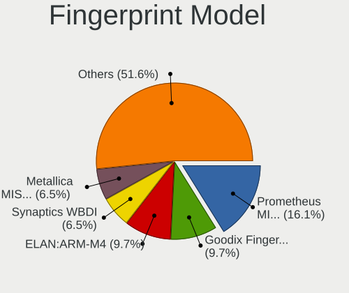

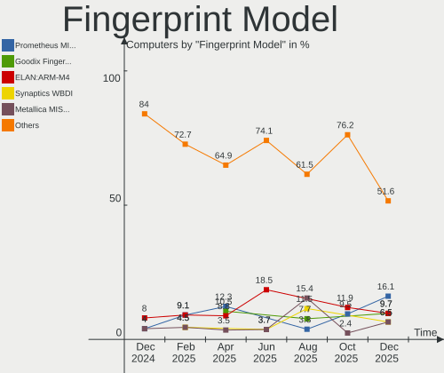

| Model                                                    | Computers | Percent |
|----------------------------------------------------------|-----------|---------|
| Synaptics Prometheus MIS Touch Fingerprint Reader        | 5         | 16.13%  |
| Shenzhen Goodix  FingerPrint Device                      | 3         | 9.68%   |
| Elan ELAN:ARM-M4                                         | 3         | 9.68%   |
| Validity Sensors Synaptics WBDI                          | 2         | 6.45%   |
| Synaptics Metallica MIS Touch Fingerprint Reader         | 2         | 6.45%   |
| Validity Sensors VFS491                                  | 1         | 3.23%   |
| Validity Sensors VFS 5011 fingerprint sensor             | 1         | 3.23%   |
| Validity Sensors Swipe Fingerprint Sensor                | 1         | 3.23%   |
| Validity Sensors Fingerprint scanner                     | 1         | 3.23%   |
| Upek Biometric Touchchip/Touchstrip Fingerprint Sensor   | 1         | 3.23%   |
| Synaptics WBDI                                           | 1         | 3.23%   |
| Synaptics UWP WBDI Device                                | 1         | 3.23%   |
| Synaptics Metallica MOH Touch Fingerprint Reader         | 1         | 3.23%   |
| Synaptics FS7604 Touch Fingerprint Sensor with PurePrint | 1         | 3.23%   |
| Synaptics Fingerprint scanner                            | 1         | 3.23%   |
| Synaptics Fingerprint reader [HP G6]                     | 1         | 3.23%   |
| Shenzhen Goodix Fingerprint Reader                       | 1         | 3.23%   |
| HOLTEK FocalTech Fingerprint Device                      | 1         | 3.23%   |
| Elan ELAN:Fingerprint                                    | 1         | 3.23%   |
| AuthenTec AES2501 Fingerprint Sensor                     | 1         | 3.23%   |
| AuthenTec AES1600                                        | 1         | 3.23%   |

Chipcard Vendor
---------------

Chipcard module vendors

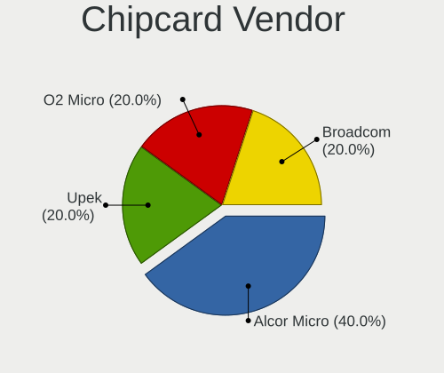

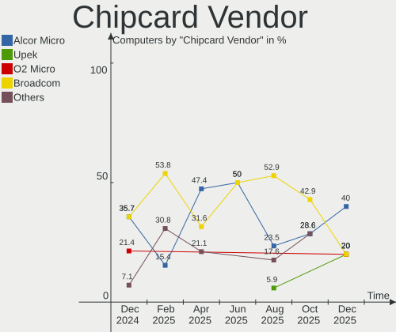

| Vendor      | Computers | Percent |
|-------------|-----------|---------|
| Alcor Micro | 4         | 40%     |
| Upek        | 2         | 20%     |
| O2 Micro    | 2         | 20%     |
| Broadcom    | 2         | 20%     |

Chipcard Model
--------------

Chipcard module models

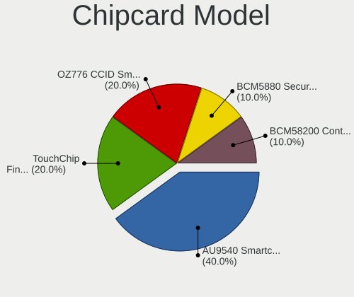

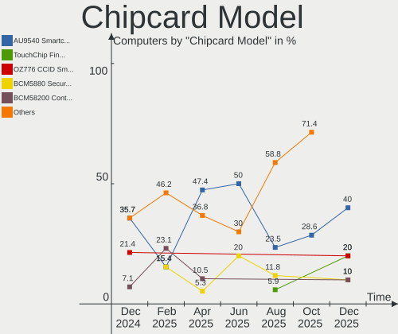

| Model                                                                       | Computers | Percent |
|-----------------------------------------------------------------------------|-----------|---------|
| Alcor Micro AU9540 Smartcard Reader                                         | 4         | 40%     |
| Upek TouchChip Fingerprint Coprocessor (WBF advanced mode)                  | 2         | 20%     |
| O2 Micro OZ776 CCID Smartcard Reader                                        | 2         | 20%     |
| Broadcom BCM5880 Secure Applications Processor                              | 1         | 10%     |
| Broadcom BCM58200 ControlVault 3 (FingerPrint sensor + Contacted SmartCard) | 1         | 10%     |

Unsupported
-----------

Unsupported Devices
-------------------

Total unsupported devices on board

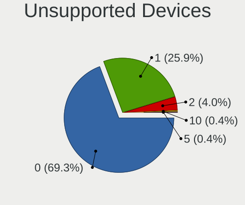

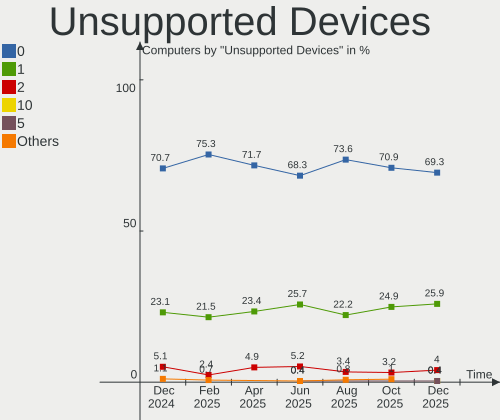

| Total | Computers | Percent |
|-------|-----------|---------|
| 0     | 190       | 69.34%  |
| 1     | 71        | 25.91%  |
| 2     | 11        | 4.01%   |
| 10    | 1         | 0.36%   |
| 5     | 1         | 0.36%   |

Unsupported Device Types
------------------------

Types of unsupported devices

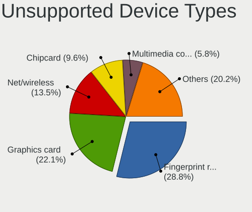

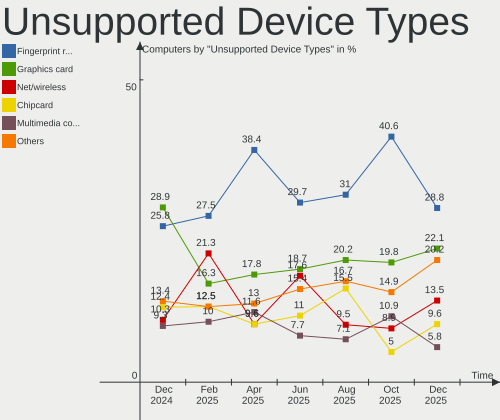

| Type                     | Computers | Percent |
|--------------------------|-----------|---------|
| Fingerprint reader       | 30        | 28.85%  |
| Graphics card            | 23        | 22.12%  |
| Net/wireless             | 14        | 13.46%  |
| Chipcard                 | 10        | 9.62%   |
| Multimedia controller    | 6         | 5.77%   |
| Bluetooth                | 5         | 4.81%   |
| Communication controller | 4         | 3.85%   |
| Sound                    | 3         | 2.88%   |
| Storage                  | 2         | 1.92%   |
| Net/ethernet             | 2         | 1.92%   |
| Dvb card                 | 2         | 1.92%   |
| Unassigned class         | 1         | 0.96%   |
| Storage/raid             | 1         | 0.96%   |
| Camera                   | 1         | 0.96%   |

