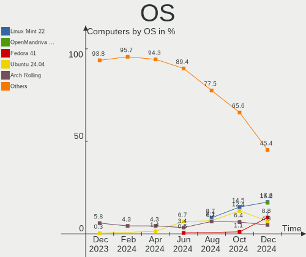
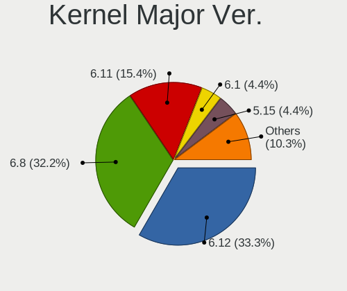
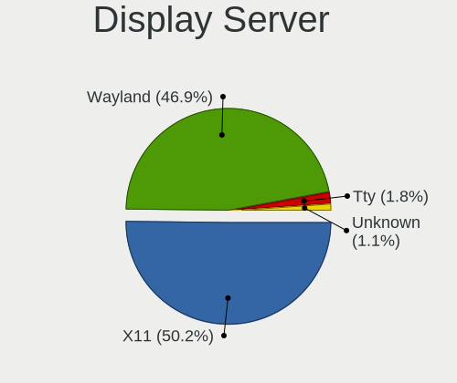
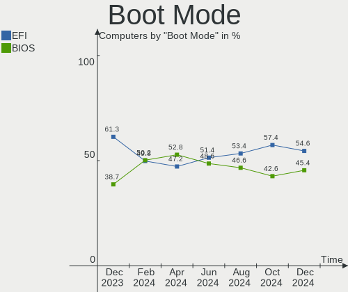
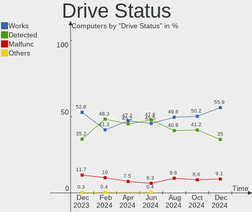
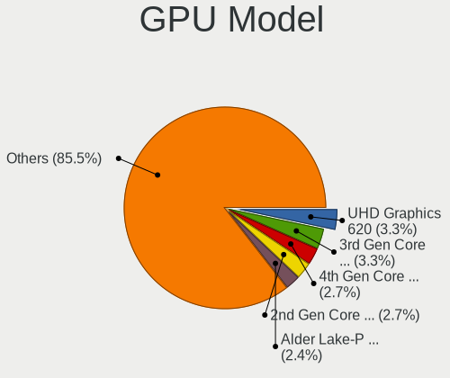
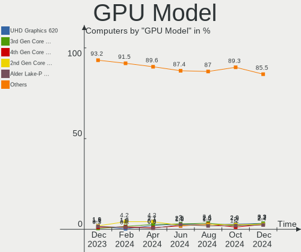
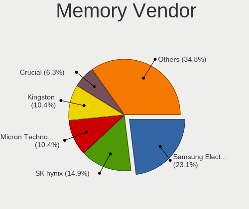
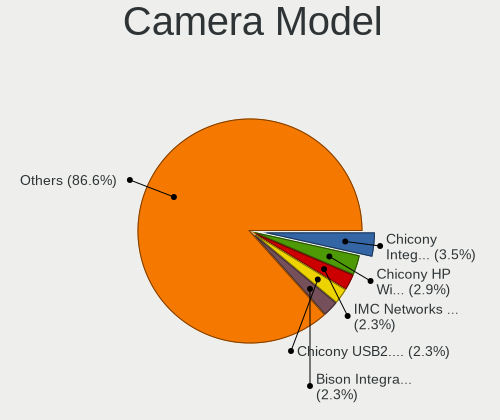

Linux in Italy - Hardware Trends
--------------------------------

A project to identify most popular hardware characteristics and track their change
over time based on data collected by Linux users at https://Linux-Hardware.org.

Anyone can contribute to this report by the [hw-probe](https://github.com/linuxhw/hw-probe) tool:

    sudo -E hw-probe -all -upload

This is a report for all computer types. See also reports for [desktops](/Location/Italy/Desktop/README.md) and [notebooks](/Location/Italy/Notebook/README.md).

Period: Apr, 2023.

Contents
--------

* [ System ](#system)
  - [ OS                       ](#os)
  - [ OS Family                ](#os-family)
  - [ Kernel                   ](#kernel)
  - [ Kernel Family            ](#kernel-family)
  - [ Kernel Major Ver.        ](#kernel-major-ver)
  - [ Arch                     ](#arch)
  - [ DE                       ](#de)
  - [ Display Server           ](#display-server)
  - [ Display Manager          ](#display-manager)
  - [ OS Lang                  ](#os-lang)
  - [ Boot Mode                ](#boot-mode)
  - [ Filesystem               ](#filesystem)
  - [ Part. scheme             ](#part-scheme)
  - [ Dual Boot with Linux/BSD ](#dual-boot-with-linuxbsd)
  - [ Dual Boot (Win)          ](#dual-boot-win)

* [ Board ](#board)
  - [ Vendor                   ](#vendor)
  - [ Model                    ](#model)
  - [ Model Family             ](#model-family)
  - [ MFG Year                 ](#mfg-year)
  - [ Form Factor              ](#form-factor)
  - [ Secure Boot              ](#secure-boot)
  - [ Coreboot                 ](#coreboot)
  - [ RAM Size                 ](#ram-size)
  - [ RAM Used                 ](#ram-used)
  - [ Total Drives             ](#total-drives)
  - [ Has CD-ROM               ](#has-cd-rom)
  - [ Has Ethernet             ](#has-ethernet)
  - [ Has WiFi                 ](#has-wifi)
  - [ Has Bluetooth            ](#has-bluetooth)

* [ Location ](#location)
  - [ Country                  ](#country)
  - [ City                     ](#city)

* [ Drives ](#drives)
  - [ Drive Vendor             ](#drive-vendor)
  - [ Drive Model              ](#drive-model)
  - [ HDD Vendor               ](#hdd-vendor)
  - [ SSD Vendor               ](#ssd-vendor)
  - [ Drive Kind               ](#drive-kind)
  - [ Drive Connector          ](#drive-connector)
  - [ Drive Size               ](#drive-size)
  - [ Space Total              ](#space-total)
  - [ Space Used               ](#space-used)
  - [ Malfunc. Drives          ](#malfunc-drives)
  - [ Malfunc. Drive Vendor    ](#malfunc-drive-vendor)
  - [ Malfunc. HDD Vendor      ](#malfunc-hdd-vendor)
  - [ Malfunc. Drive Kind      ](#malfunc-drive-kind)
  - [ Failed Drives            ](#failed-drives)
  - [ Failed Drive Vendor      ](#failed-drive-vendor)
  - [ Drive Status             ](#drive-status)

* [ Storage controller ](#storage-controller)
  - [ Storage Vendor           ](#storage-vendor)
  - [ Storage Model            ](#storage-model)
  - [ Storage Kind             ](#storage-kind)

* [ Processor ](#processor)
  - [ CPU Vendor               ](#cpu-vendor)
  - [ CPU Model                ](#cpu-model)
  - [ CPU Model Family         ](#cpu-model-family)
  - [ CPU Cores                ](#cpu-cores)
  - [ CPU Sockets              ](#cpu-sockets)
  - [ CPU Threads              ](#cpu-threads)
  - [ CPU Op-Modes             ](#cpu-op-modes)
  - [ CPU Microcode            ](#cpu-microcode)
  - [ CPU Microarch            ](#cpu-microarch)

* [ Graphics ](#graphics)
  - [ GPU Vendor               ](#gpu-vendor)
  - [ GPU Model                ](#gpu-model)
  - [ GPU Combo                ](#gpu-combo)
  - [ GPU Driver               ](#gpu-driver)
  - [ GPU Memory               ](#gpu-memory)

* [ Monitor ](#monitor)
  - [ Monitor Vendor           ](#monitor-vendor)
  - [ Monitor Model            ](#monitor-model)
  - [ Monitor Resolution       ](#monitor-resolution)
  - [ Monitor Diagonal         ](#monitor-diagonal)
  - [ Monitor Width            ](#monitor-width)
  - [ Aspect Ratio             ](#aspect-ratio)
  - [ Monitor Area             ](#monitor-area)
  - [ Pixel Density            ](#pixel-density)
  - [ Multiple Monitors        ](#multiple-monitors)

* [ Network ](#network)
  - [ Net Controller Vendor    ](#net-controller-vendor)
  - [ Net Controller Model     ](#net-controller-model)
  - [ Wireless Vendor          ](#wireless-vendor)
  - [ Wireless Model           ](#wireless-model)
  - [ Ethernet Vendor          ](#ethernet-vendor)
  - [ Ethernet Model           ](#ethernet-model)
  - [ Net Controller Kind      ](#net-controller-kind)
  - [ Used Controller          ](#used-controller)
  - [ NICs                     ](#nics)
  - [ IPv6                     ](#ipv6)

* [ Bluetooth ](#bluetooth)
  - [ Bluetooth Vendor         ](#bluetooth-vendor)
  - [ Bluetooth Model          ](#bluetooth-model)

* [ Sound ](#sound)
  - [ Sound Vendor             ](#sound-vendor)
  - [ Sound Model              ](#sound-model)

* [ Memory ](#memory)
  - [ Memory Vendor            ](#memory-vendor)
  - [ Memory Model             ](#memory-model)
  - [ Memory Kind              ](#memory-kind)
  - [ Memory Form Factor       ](#memory-form-factor)
  - [ Memory Size              ](#memory-size)
  - [ Memory Speed             ](#memory-speed)

* [ Printers & scanners ](#printers--scanners)
  - [ Printer Vendor           ](#printer-vendor)
  - [ Printer Model            ](#printer-model)
  - [ Scanner Vendor           ](#scanner-vendor)
  - [ Scanner Model            ](#scanner-model)

* [ Camera ](#camera)
  - [ Camera Vendor            ](#camera-vendor)
  - [ Camera Model             ](#camera-model)

* [ Security ](#security)
  - [ Fingerprint Vendor       ](#fingerprint-vendor)
  - [ Fingerprint Model        ](#fingerprint-model)
  - [ Chipcard Vendor          ](#chipcard-vendor)
  - [ Chipcard Model           ](#chipcard-model)

* [ Unsupported ](#unsupported)
  - [ Unsupported Devices      ](#unsupported-devices)
  - [ Unsupported Device Types ](#unsupported-device-types)

System
------

OS
--

Installed operating systems

| Name                         | Computers | Percent |
|------------------------------|-----------|---------|
| OpenMandriva 23.03           | 43        | 19.82%  |
| Ubuntu 22.04                 | 29        | 13.36%  |
| Linux Mint 21.1              | 14        | 6.45%   |
| Arch Rolling                 | 14        | 6.45%   |
| Fedora 38                    | 8         | 3.69%   |
| Debian 11                    | 8         | 3.69%   |
| Fedora 37                    | 7         | 3.23%   |
| Pop!_OS 22.04                | 6         | 2.76%   |
| KDE neon 22.04               | 6         | 2.76%   |
| Ubuntu 22.10                 | 5         | 2.3%    |
| Ubuntu 20.04                 | 5         | 2.3%    |
| EndeavourOS Rolling          | 5         | 2.3%    |
| OpenMandriva 4.2             | 4         | 1.84%   |
| Debian 12                    | 4         | 1.84%   |
| Zorin 16                     | 3         | 1.38%   |
| Ubuntu 23.04                 | 3         | 1.38%   |
| openSUSE Tumbleweed-XXXXXXXX | 3         | 1.38%   |
| OpenMandriva 4.3             | 3         | 1.38%   |
| Manjaro 22.1.0               | 3         | 1.38%   |
| Kubuntu 22.04                | 3         | 1.38%   |
| Xubuntu 22.10                | 2         | 0.92%   |
| Xubuntu 22.04                | 2         | 0.92%   |
| Ubuntu 18.04                 | 2         | 0.92%   |
| ROSA 12.4                    | 2         | 0.92%   |
| OpenMandriva 23.01           | 2         | 0.92%   |
| Linux Mint 21                | 2         | 0.92%   |
| Linux Mint 20.3              | 2         | 0.92%   |
| Linux Mint 19.2              | 2         | 0.92%   |
| Kubuntu 23.04                | 2         | 0.92%   |
| Gentoo 2.13                  | 2         | 0.92%   |
| Ubuntu Unity 16.04           | 1         | 0.46%   |
| Siduction 12                 | 1         | 0.46%   |
| ROSA R11.1                   | 1         | 0.46%   |
| Regata OS 23                 | 1         | 0.46%   |
| Q4OS 4                       | 1         | 0.46%   |
| Pikaos 22.10                 | 1         | 0.46%   |
| OpenMandriva 4.50            | 1         | 0.46%   |
| OpenMandriva 22.12           | 1         | 0.46%   |
| Nobara 36                    | 1         | 0.46%   |
| Manjaro                      | 1         | 0.46%   |

OS Family
---------

OS without a version

| Name         | Computers | Percent |
|--------------|-----------|---------|
| OpenMandriva | 54        | 24.88%  |
| Ubuntu       | 44        | 20.28%  |
| Linux Mint   | 22        | 10.14%  |
| Fedora       | 16        | 7.37%   |
| Arch         | 14        | 6.45%   |
| Debian       | 12        | 5.53%   |
| Pop!_OS      | 6         | 2.76%   |
| KDE neon     | 6         | 2.76%   |
| Kubuntu      | 5         | 2.3%    |
| EndeavourOS  | 5         | 2.3%    |
| Xubuntu      | 4         | 1.84%   |
| Manjaro      | 4         | 1.84%   |
| Zorin        | 3         | 1.38%   |
| ROSA         | 3         | 1.38%   |
| openSUSE     | 3         | 1.38%   |
| Lubuntu      | 2         | 0.92%   |
| Gentoo       | 2         | 0.92%   |
| Ubuntu Unity | 1         | 0.46%   |
| Siduction    | 1         | 0.46%   |
| Regata OS    | 1         | 0.46%   |
| Q4OS         | 1         | 0.46%   |
| Pikaos       | 1         | 0.46%   |
| Nobara       | 1         | 0.46%   |
| LMDE         | 1         | 0.46%   |
| Kali         | 1         | 0.46%   |
| Garuda Linux | 1         | 0.46%   |
| FATDOG64     | 1         | 0.46%   |
| Elementary   | 1         | 0.46%   |
| ArcoLinux    | 1         | 0.46%   |

Kernel
------

Version of the Linux kernel

| Version                  | Computers | Percent |
|--------------------------|-----------|---------|
| 6.2.6-desktop-1omv2390   | 43        | 19.82%  |
| 5.19.0-38-generic        | 19        | 8.76%   |
| 5.15.0-69-generic        | 15        | 6.91%   |
| 5.19.0-40-generic        | 10        | 4.61%   |
| 5.19.0-32-generic        | 6         | 2.76%   |
| 6.2.6-76060206-generic   | 5         | 2.3%    |
| 6.2.10-arch1-1           | 5         | 2.3%    |
| 6.2.12-arch1-1           | 4         | 1.84%   |
| 6.2.11-300.fc38.x86_64   | 4         | 1.84%   |
| 5.15.0-70-generic        | 4         | 1.84%   |
| 5.10.14-desktop-1omv4002 | 4         | 1.84%   |
| 6.2.9-arch1-1            | 3         | 1.38%   |
| 6.2.0-20-generic         | 3         | 1.38%   |
| 6.0.7-301.fc37.x86_64    | 3         | 1.38%   |
| 5.4.0-147-generic        | 3         | 1.38%   |
| 5.4.0-146-generic        | 3         | 1.38%   |
| 5.19.0-41-generic        | 3         | 1.38%   |
| 5.15.0-71-generic        | 3         | 1.38%   |
| 5.10.0-21-amd64          | 3         | 1.38%   |
| 6.2.9-300.fc38.x86_64    | 2         | 0.92%   |
| 6.2.9-1-default          | 2         | 0.92%   |
| 6.2.8-arch1-1            | 2         | 0.92%   |
| 6.2.8-200.fc37.x86_64    | 2         | 0.92%   |
| 6.2.12-300.fc38.x86_64   | 2         | 0.92%   |
| 6.2.11-arch1-1           | 2         | 0.92%   |
| 6.2.10-zen1-1-zen        | 2         | 0.92%   |
| 6.1.23-1-MANJARO         | 2         | 0.92%   |
| 6.1.19-gentoo            | 2         | 0.92%   |
| 6.1.0-7-amd64            | 2         | 0.92%   |
| 6.1.0-6-amd64            | 2         | 0.92%   |
| 5.16.7-desktop-1omv4003  | 2         | 0.92%   |
| 5.15.0-56-generic        | 2         | 0.92%   |
| 5.10.0-21-686-pae        | 2         | 0.92%   |
| 4.15.0-54-generic        | 2         | 0.92%   |
| 6.3.0                    | 1         | 0.46%   |
| 6.2.9-zen1-1-zen         | 1         | 0.46%   |
| 6.2.9-200.fc37.x86_64    | 1         | 0.46%   |
| 6.2.9-100.fc36.x86_64    | 1         | 0.46%   |
| 6.2.9-060209-generic     | 1         | 0.46%   |
| 6.2.8-zen1-1-zen         | 1         | 0.46%   |

Kernel Family
-------------

Linux kernel without a distro release

| Version  | Computers | Percent |
|----------|-----------|---------|
| 6.2.6    | 49        | 22.58%  |
| 5.19.0   | 41        | 18.89%  |
| 5.15.0   | 27        | 12.44%  |
| 6.2.10   | 12        | 5.53%   |
| 6.2.9    | 11        | 5.07%   |
| 6.1.0    | 8         | 3.69%   |
| 5.4.0    | 8         | 3.69%   |
| 6.2.8    | 6         | 2.76%   |
| 6.2.12   | 6         | 2.76%   |
| 6.2.11   | 6         | 2.76%   |
| 6.2.0    | 6         | 2.76%   |
| 5.10.0   | 6         | 2.76%   |
| 5.10.14  | 4         | 1.84%   |
| 6.0.7    | 3         | 1.38%   |
| 4.15.0   | 3         | 1.38%   |
| 6.2.7    | 2         | 0.92%   |
| 6.1.23   | 2         | 0.92%   |
| 6.1.19   | 2         | 0.92%   |
| 5.16.7   | 2         | 0.92%   |
| 6.3.0    | 1         | 0.46%   |
| 6.1.4    | 1         | 0.46%   |
| 6.1.20   | 1         | 0.46%   |
| 6.1.1    | 1         | 0.46%   |
| 6.0.14   | 1         | 0.46%   |
| 6.0.10   | 1         | 0.46%   |
| 5.19.5   | 1         | 0.46%   |
| 5.19.14  | 1         | 0.46%   |
| 5.16.13  | 1         | 0.46%   |
| 5.10.176 | 1         | 0.46%   |
| 4.9.124  | 1         | 0.46%   |
| 4.4.202  | 1         | 0.46%   |
| 4.4.0    | 1         | 0.46%   |

Kernel Major Ver.
-----------------

Linux kernel major version

| Version | Computers | Percent |
|---------|-----------|---------|
| 6.2     | 98        | 45.16%  |
| 5.19    | 43        | 19.82%  |
| 5.15    | 27        | 12.44%  |
| 6.1     | 15        | 6.91%   |
| 5.10    | 11        | 5.07%   |
| 5.4     | 8         | 3.69%   |
| 6.0     | 5         | 2.3%    |
| 5.16    | 3         | 1.38%   |
| 4.15    | 3         | 1.38%   |
| 4.4     | 2         | 0.92%   |
| 6.3     | 1         | 0.46%   |
| 4.9     | 1         | 0.46%   |

Arch
----

OS architecture (x86_64, i586, etc.)

| Name    | Computers | Percent |
|---------|-----------|---------|
| x86_64  | 212       | 97.7%   |
| i686    | 4         | 1.84%   |
| aarch64 | 1         | 0.46%   |

DE
--

Desktop Environment

| Name          | Computers | Percent |
|---------------|-----------|---------|
| GNOME         | 83        | 38.25%  |
| KDE5          | 77        | 35.48%  |
| X-Cinnamon    | 18        | 8.29%   |
| XFCE          | 13        | 5.99%   |
| LXQt          | 7         | 3.23%   |
| MATE          | 6         | 2.76%   |
| i3            | 3         | 1.38%   |
| Unknown       | 3         | 1.38%   |
| Unity         | 1         | 0.46%   |
| Trinity       | 1         | 0.46%   |
| pika:GNOME    | 1         | 0.46%   |
| Pantheon      | 1         | 0.46%   |
| LXDE          | 1         | 0.46%   |
| Hyprland      | 1         | 0.46%   |
| GNOME Classic | 1         | 0.46%   |

Display Server
--------------

X11 or Wayland

| Name    | Computers | Percent |
|---------|-----------|---------|
| X11     | 151       | 69.59%  |
| Wayland | 60        | 27.65%  |
| Tty     | 4         | 1.84%   |
| Unknown | 2         | 0.92%   |

Display Manager
---------------

SDDM, LightDM, etc.

| Name    | Computers | Percent |
|---------|-----------|---------|
| SDDM    | 78        | 35.94%  |
| GDM3    | 43        | 19.82%  |
| Unknown | 41        | 18.89%  |
| LightDM | 31        | 14.29%  |
| GDM     | 22        | 10.14%  |
| XDM     | 1         | 0.46%   |
| TDM     | 1         | 0.46%   |

OS Lang
-------

Language

| Lang  | Computers | Percent |
|-------|-----------|---------|
| it_IT | 152       | 70.05%  |
| en_US | 54        | 24.88%  |
| C     | 6         | 2.76%   |
| en_AG | 2         | 0.92%   |
| sc_IT | 1         | 0.46%   |
| fr_CH | 1         | 0.46%   |
| en_GB | 1         | 0.46%   |

Boot Mode
---------

EFI or BIOS

| Mode | Computers | Percent |
|------|-----------|---------|
| EFI  | 112       | 51.61%  |
| BIOS | 105       | 48.39%  |

Filesystem
----------

Type of filesystem

| Type    | Computers | Percent |
|---------|-----------|---------|
| Ext4    | 139       | 64.06%  |
| Overlay | 34        | 15.67%  |
| Btrfs   | 24        | 11.06%  |
| Tmpfs   | 12        | 5.53%   |
| Xfs     | 3         | 1.38%   |
| Zfs     | 2         | 0.92%   |
| F2fs    | 2         | 0.92%   |
| Aufs    | 1         | 0.46%   |

Part. scheme
------------

Scheme of partitioning

| Type    | Computers | Percent |
|---------|-----------|---------|
| GPT     | 140       | 64.52%  |
| MBR     | 40        | 18.43%  |
| Unknown | 37        | 17.05%  |

Dual Boot with Linux/BSD
------------------------

Hosting more than one Linux/BSD

| Dual boot | Computers | Percent |
|-----------|-----------|---------|
| No        | 174       | 80.18%  |
| Yes       | 43        | 19.82%  |

Dual Boot (Win)
---------------

Hosting Linux and Windows

| Dual boot | Computers | Percent |
|-----------|-----------|---------|
| No        | 134       | 61.75%  |
| Yes       | 83        | 38.25%  |

Board
-----

Vendor
------

Motherboard manufacturer

| Name                | Computers | Percent |
|---------------------|-----------|---------|
| ASUSTek Computer    | 42        | 19.35%  |
| Hewlett-Packard     | 32        | 14.75%  |
| Lenovo              | 27        | 12.44%  |
| MSI                 | 22        | 10.14%  |
| Acer                | 17        | 7.83%   |
| Dell                | 14        | 6.45%   |
| ASRock              | 8         | 3.69%   |
| Gigabyte Technology | 6         | 2.76%   |
| Apple               | 6         | 2.76%   |
| Toshiba             | 3         | 1.38%   |
| Intel               | 3         | 1.38%   |
| Chuwi               | 3         | 1.38%   |
| AMI                 | 3         | 1.38%   |
| Acidanthera         | 3         | 1.38%   |
| Sony                | 2         | 0.92%   |
| Samsung Electronics | 2         | 0.92%   |
| PC Specialist       | 2         | 0.92%   |
| Packard Bell        | 2         | 0.92%   |
| HUAWEI              | 2         | 0.92%   |
| BESSTAR Tech        | 2         | 0.92%   |
| Unknown             | 2         | 0.92%   |
| TUXEDO              | 1         | 0.46%   |
| System76            | 1         | 0.46%   |
| Rockchip            | 1         | 0.46%   |
| Quanta              | 1         | 0.46%   |
| Otazak              | 1         | 0.46%   |
| Onda TLC            | 1         | 0.46%   |
| Microsoft           | 1         | 0.46%   |
| Medion              | 1         | 0.46%   |
| Mediacom            | 1         | 0.46%   |
| MAXDATA             | 1         | 0.46%   |
| Google              | 1         | 0.46%   |
| Fujitsu             | 1         | 0.46%   |
| ELSKY               | 1         | 0.46%   |
| Cincoze             | 1         | 0.46%   |

Model
-----

Motherboard model

| Name                                  | Computers | Percent |
|---------------------------------------|-----------|---------|
| Unknown                               | 4         | 1.84%   |
| MSI MS-7B79                           | 3         | 1.38%   |
| Dell OptiPlex 7010                    | 3         | 1.38%   |
| ASUS All Series                       | 3         | 1.38%   |
| MSI Modern 14 B11MOU                  | 2         | 0.92%   |
| Lenovo ThinkPad X270 W10DG 20K5S3HG00 | 2         | 0.92%   |
| Lenovo B50-30 80ES                    | 2         | 0.92%   |
| HP Pavilion Sleekbook 15              | 2         | 0.92%   |
| HP 250 15.6 inch G9 Notebook PC       | 2         | 0.92%   |
| ASUS PRIME B350-PLUS                  | 2         | 0.92%   |
| ASUS PRIME A320M-K                    | 2         | 0.92%   |
| AMI Intel                             | 2         | 0.92%   |
| Acidanthera MacPro7,1                 | 2         | 0.92%   |
| Toshiba Satellite Pro S500            | 1         | 0.46%   |
| Toshiba Satellite Pro C850-1J2        | 1         | 0.46%   |
| Toshiba Kronos 10CUG                  | 1         | 0.46%   |
| System76 Oryx Pro                     | 1         | 0.46%   |
| Sony VPCSE1V9E                        | 1         | 0.46%   |
| Sony SVE1713X1EB                      | 1         | 0.46%   |
| Samsung RC530/RC730                   | 1         | 0.46%   |
| Samsung 950QED                        | 1         | 0.46%   |
| Quanta CA27                           | 1         | 0.46%   |
| PC Specialist PCx0Dx                  | 1         | 0.46%   |
| PC Specialist Elimina Iv 17           | 1         | 0.46%   |
| Packard Bell EasyNote_MX45            | 1         | 0.46%   |
| Packard Bell EasyNote TJ65            | 1         | 0.46%   |
| Otazak iPC45                          | 1         | 0.46%   |
| Onda TLC ONDA Oliver                  | 1         | 0.46%   |
| MSI W200                              | 1         | 0.46%   |
| MSI Pro 3130 Microtower PC            | 1         | 0.46%   |
| MSI NQ890AA-ABZ CQ5011IT              | 1         | 0.46%   |
| MSI MS-7D75                           | 1         | 0.46%   |
| MSI MS-7D59                           | 1         | 0.46%   |
| MSI MS-7C83                           | 1         | 0.46%   |
| MSI MS-7C52                           | 1         | 0.46%   |
| MSI MS-7C35                           | 1         | 0.46%   |
| MSI MS-7C13                           | 1         | 0.46%   |
| MSI MS-7C02                           | 1         | 0.46%   |
| MSI MS-7B87                           | 1         | 0.46%   |
| MSI MS-7B33                           | 1         | 0.46%   |

Model Family
------------

Motherboard model prefix

| Name                  | Computers | Percent |
|-----------------------|-----------|---------|
| Lenovo ThinkPad       | 12        | 5.53%   |
| Acer Aspire           | 10        | 4.61%   |
| HP Pavilion           | 8         | 3.69%   |
| ASUS PRIME            | 7         | 3.23%   |
| Dell OptiPlex         | 5         | 2.3%    |
| HP Laptop             | 4         | 1.84%   |
| HP 250                | 4         | 1.84%   |
| Dell XPS              | 4         | 1.84%   |
| Unknown               | 4         | 1.84%   |
| MSI MS-7B79           | 3         | 1.38%   |
| Lenovo IdeaPad        | 3         | 1.38%   |
| HP EliteBook          | 3         | 1.38%   |
| HP Compaq             | 3         | 1.38%   |
| Dell Latitude         | 3         | 1.38%   |
| ASUS VivoBook         | 3         | 1.38%   |
| ASUS TUF              | 3         | 1.38%   |
| ASUS P8Z77-V          | 3         | 1.38%   |
| ASUS All              | 3         | 1.38%   |
| Acer Swift            | 3         | 1.38%   |
| Toshiba Satellite     | 2         | 0.92%   |
| Packard Bell EasyNote | 2         | 0.92%   |
| MSI Modern            | 2         | 0.92%   |
| Lenovo B50-30         | 2         | 0.92%   |
| Intel NUC6i7KYB       | 2         | 0.92%   |
| HP ProBook            | 2         | 0.92%   |
| Dell Inspiron         | 2         | 0.92%   |
| ASUS ROG              | 2         | 0.92%   |
| AMI Intel             | 2         | 0.92%   |
| Acidanthera MacPro7   | 2         | 0.92%   |
| Acer Veriton          | 2         | 0.92%   |
| Acer TravelMate       | 2         | 0.92%   |
| Toshiba Kronos        | 1         | 0.46%   |
| System76 Oryx         | 1         | 0.46%   |
| Sony VPCSE1V9E        | 1         | 0.46%   |
| Sony SVE1713X1EB      | 1         | 0.46%   |
| Samsung RC530         | 1         | 0.46%   |
| Samsung 950QED        | 1         | 0.46%   |
| Quanta CA27           | 1         | 0.46%   |
| PC Specialist PCx0Dx  | 1         | 0.46%   |
| PC Specialist Elimina | 1         | 0.46%   |

MFG Year
--------

Motherboard manufacture year

| Year    | Computers | Percent |
|---------|-----------|---------|
| 2021    | 23        | 10.6%   |
| 2019    | 22        | 10.14%  |
| 2012    | 22        | 10.14%  |
| 2022    | 18        | 8.29%   |
| 2020    | 17        | 7.83%   |
| 2018    | 16        | 7.37%   |
| 2017    | 14        | 6.45%   |
| 2011    | 13        | 5.99%   |
| 2016    | 11        | 5.07%   |
| 2014    | 10        | 4.61%   |
| 2015    | 9         | 4.15%   |
| 2008    | 9         | 4.15%   |
| 2013    | 8         | 3.69%   |
| 2010    | 8         | 3.69%   |
| 2009    | 8         | 3.69%   |
| 2007    | 5         | 2.3%    |
| 2023    | 1         | 0.46%   |
| 2006    | 1         | 0.46%   |
| 2005    | 1         | 0.46%   |
| Unknown | 1         | 0.46%   |

Form Factor
-----------

Physical design of the computer

| Name           | Computers | Percent |
|----------------|-----------|---------|
| Notebook       | 119       | 54.84%  |
| Desktop        | 83        | 38.25%  |
| Mini pc        | 4         | 1.84%   |
| All in one     | 4         | 1.84%   |
| Tablet         | 3         | 1.38%   |
| Convertible    | 3         | 1.38%   |
| System on chip | 1         | 0.46%   |

Secure Boot
-----------

Enabled or disabled

| State    | Computers | Percent |
|----------|-----------|---------|
| Disabled | 206       | 94.93%  |
| Enabled  | 11        | 5.07%   |

Coreboot
--------

Have coreboot on board

| Used | Computers | Percent |
|------|-----------|---------|
| No   | 215       | 99.08%  |
| Yes  | 2         | 0.92%   |

RAM Size
--------

Total RAM memory

| Size in GB  | Computers | Percent |
|-------------|-----------|---------|
| 4.01-8.0    | 61        | 28.11%  |
| 16.01-24.0  | 45        | 20.74%  |
| 8.01-16.0   | 41        | 18.89%  |
| 3.01-4.0    | 38        | 17.51%  |
| 32.01-64.0  | 15        | 6.91%   |
| 1.01-2.0    | 6         | 2.76%   |
| 64.01-256.0 | 5         | 2.3%    |
| 2.01-3.0    | 3         | 1.38%   |
| 24.01-32.0  | 2         | 0.92%   |
| 0.51-1.0    | 1         | 0.46%   |

RAM Used
--------

Used RAM memory

| Used GB   | Computers | Percent |
|-----------|-----------|---------|
| 1.01-2.0  | 89        | 41.01%  |
| 2.01-3.0  | 62        | 28.57%  |
| 4.01-8.0  | 27        | 12.44%  |
| 3.01-4.0  | 21        | 9.68%   |
| 8.01-16.0 | 9         | 4.15%   |
| 0.51-1.0  | 7         | 3.23%   |
| 0.01-0.5  | 2         | 0.92%   |

Total Drives
------------

Number of drives on board

| Drives | Computers | Percent |
|--------|-----------|---------|
| 1      | 131       | 60.37%  |
| 2      | 47        | 21.66%  |
| 3      | 23        | 10.6%   |
| 4      | 10        | 4.61%   |
| 5      | 2         | 0.92%   |
| 0      | 2         | 0.92%   |
| 7      | 1         | 0.46%   |
| 6      | 1         | 0.46%   |

Has CD-ROM
----------

Has CD-ROM on board

| Presented | Computers | Percent |
|-----------|-----------|---------|
| No        | 136       | 62.67%  |
| Yes       | 81        | 37.33%  |

Has Ethernet
------------

Has Ethernet on board

| Presented | Computers | Percent |
|-----------|-----------|---------|
| Yes       | 188       | 86.64%  |
| No        | 29        | 13.36%  |

Has WiFi
--------

Has WiFi module

| Presented | Computers | Percent |
|-----------|-----------|---------|
| Yes       | 168       | 77.42%  |
| No        | 49        | 22.58%  |

Has Bluetooth
-------------

Has Bluetooth module

| Presented | Computers | Percent |
|-----------|-----------|---------|
| Yes       | 135       | 62.21%  |
| No        | 82        | 37.79%  |

Location
--------

Country
-------

Geographic location (country)

| Country | Computers | Percent |
|---------|-----------|---------|
| Italy   | 217       | 100%    |

City
----

Geographic location (city)

| City                  | Computers | Percent |
|-----------------------|-----------|---------|
| Milan                 | 31        | 14.29%  |
| Rome                  | 26        | 11.98%  |
| Milano                | 10        | 4.61%   |
| Bologna               | 5         | 2.3%    |
| Turin                 | 4         | 1.84%   |
| Bergamo               | 4         | 1.84%   |
| Verona                | 3         | 1.38%   |
| Padova                | 3         | 1.38%   |
| Genoa                 | 3         | 1.38%   |
| Trieste               | 2         | 0.92%   |
| Trento                | 2         | 0.92%   |
| Torricella Sicura     | 2         | 0.92%   |
| Pescara               | 2         | 0.92%   |
| Oria                  | 2         | 0.92%   |
| Novara                | 2         | 0.92%   |
| Naples                | 2         | 0.92%   |
| Monza                 | 2         | 0.92%   |
| Guagnano              | 2         | 0.92%   |
| Florence              | 2         | 0.92%   |
| Casalnuovo di Napoli  | 2         | 0.92%   |
| Casalecchio di Reno   | 2         | 0.92%   |
| Vicenza               | 1         | 0.46%   |
| Venice                | 1         | 0.46%   |
| Udine                 | 1         | 0.46%   |
| Treviso               | 1         | 0.46%   |
| Trecate               | 1         | 0.46%   |
| Torre Boldone         | 1         | 0.46%   |
| Tempio Pausania       | 1         | 0.46%   |
| Scorzè               | 1         | 0.46%   |
| Savona                | 1         | 0.46%   |
| Santa Giustina        | 1         | 0.46%   |
| Sant'Antonio Abate    | 1         | 0.46%   |
| San Severino Marche   | 1         | 0.46%   |
| San Pietro in Casale  | 1         | 0.46%   |
| San Gimignano         | 1         | 0.46%   |
| Salerno               | 1         | 0.46%   |
| Rho                   | 1         | 0.46%   |
| Reggio Calabria       | 1         | 0.46%   |
| Quarrata              | 1         | 0.46%   |
| Prad am Stilfser Joch | 1         | 0.46%   |

Drives
------

Drive Vendor
------------

Hard drive vendors

| Vendor                         | Computers | Drives | Percent |
|--------------------------------|-----------|--------|---------|
| Samsung Electronics            | 49        | 54     | 14.76%  |
| Seagate                        | 40        | 45     | 12.05%  |
| WDC                            | 36        | 46     | 10.84%  |
| Kingston                       | 24        | 24     | 7.23%   |
| Sandisk                        | 22        | 22     | 6.63%   |
| Crucial                        | 22        | 24     | 6.63%   |
| Unknown                        | 16        | 16     | 4.82%   |
| Toshiba                        | 14        | 14     | 4.22%   |
| Hitachi                        | 11        | 11     | 3.31%   |
| Maxtor                         | 7         | 7      | 2.11%   |
| Intel                          | 6         | 6      | 1.81%   |
| Micron Technology              | 5         | 5      | 1.51%   |
| HGST                           | 5         | 5      | 1.51%   |
| Fanxiang                       | 5         | 5      | 1.51%   |
| China                          | 5         | 5      | 1.51%   |
| SPCC                           | 4         | 5      | 1.2%    |
| SK hynix                       | 4         | 4      | 1.2%    |
| Phison                         | 4         | 6      | 1.2%    |
| Kingston Technology Company    | 4         | 4      | 1.2%    |
| Silicon Motion                 | 3         | 3      | 0.9%    |
| Phison Electronics             | 3         | 3      | 0.9%    |
| Micron/Crucial Technology      | 3         | 3      | 0.9%    |
| KIOXIA                         | 3         | 3      | 0.9%    |
| Transcend                      | 2         | 2      | 0.6%    |
| Netac                          | 2         | 2      | 0.6%    |
| MAXIO Technology (Hangzhou)    | 2         | 2      | 0.6%    |
| JMicron Technology             | 2         | 2      | 0.6%    |
| Intenso                        | 2         | 2      | 0.6%    |
| ASENNO                         | 2         | 2      | 0.6%    |
| Apple                          | 2         | 2      | 0.6%    |
| A-DATA Technology              | 2         | 2      | 0.6%    |
| Unknown                        | 2         | 2      | 0.6%    |
| WALRAM                         | 1         | 1      | 0.3%    |
| USB30                          | 1         | 1      | 0.3%    |
| T-FORCE                        | 1         | 1      | 0.3%    |
| StoreJet                       | 1         | 1      | 0.3%    |
| SSK                            | 1         | 1      | 0.3%    |
| Solid State Storage Technology | 1         | 1      | 0.3%    |
| sk600                          | 1         | 1      | 0.3%    |
| SABRENT                        | 1         | 1      | 0.3%    |

Drive Model
-----------

Hard drive models

| Model                                                  | Computers | Percent |
|--------------------------------------------------------|-----------|---------|
| Crucial CT500MX500SSD1 500GB                           | 9         | 2.56%   |
| Kingston SA400S37240G 240GB SSD                        | 8         | 2.28%   |
| Samsung NVMe SSD Controller SM981/PM981/PM983 1TB      | 6         | 1.71%   |
| Unknown MMC Card  64GB                                 | 5         | 1.42%   |
| Crucial CT480BX500SSD1 480GB                           | 5         | 1.42%   |
| Seagate ST500DM002-1BD142 500GB                        | 4         | 1.14%   |
| Seagate ST1000LM024 HN-M101MBB 1TB                     | 4         | 1.14%   |
| Kingston SA400S37120G 120GB SSD                        | 4         | 1.14%   |
| Silicon Motion SM2263EN/SM2263XT SSD Controller 1024GB | 3         | 0.85%   |
| Sandisk WD Blue SN550 NVMe SSD 1024GB                  | 3         | 0.85%   |
| SanDisk SSD PLUS 1000GB                                | 3         | 0.85%   |
| Samsung SSD 870 EVO 500GB                              | 3         | 0.85%   |
| Kingston SA400S37480G 480GB SSD                        | 3         | 0.85%   |
| Intel SSD 660P Series 512GB                            | 3         | 0.85%   |
| HGST HTS725050A7E630 500GB                             | 3         | 0.85%   |
| Fanxiang S101 512GB                                    | 3         | 0.85%   |
| Crucial CT1000MX500SSD1 1TB                            | 3         | 0.85%   |
| WDC WDS240G2G0A-00JH30 240GB SSD                       | 2         | 0.57%   |
| WDC WD40EFRX-68N32N0 4TB                               | 2         | 0.57%   |
| WDC WD10JPCX-24UE4T0 1TB                               | 2         | 0.57%   |
| Unknown SD/MMC/MS PRO 249GB                            | 2         | 0.57%   |
| Unknown NCard  32GB                                    | 2         | 0.57%   |
| SPCC Solid State Disk 512GB                            | 2         | 0.57%   |
| Seagate ST500LT012-1DG142 500GB                        | 2         | 0.57%   |
| Seagate ST250DM000-1BD141 250GB                        | 2         | 0.57%   |
| Seagate ST2000DM008-2FR102 2TB                         | 2         | 0.57%   |
| Seagate ST2000DM001-9YN164 2TB                         | 2         | 0.57%   |
| Seagate ST1000LM035-1RK172 970GB                       | 2         | 0.57%   |
| Seagate ST1000DM010-2EP102 1TB                         | 2         | 0.57%   |
| Seagate ST1000DM003-9YN162 1TB                         | 2         | 0.57%   |
| SanDisk SDSSDA240G 240GB                               | 2         | 0.57%   |
| Samsung SSD 980 1TB                                    | 2         | 0.57%   |
| Samsung SSD 970 EVO Plus 1TB                           | 2         | 0.57%   |
| Samsung SSD 860 PRO 512GB                              | 2         | 0.57%   |
| Samsung SSD 860 EVO 500GB                              | 2         | 0.57%   |
| Samsung SSD 850 EVO 250GB                              | 2         | 0.57%   |
| Samsung SSD 840 PRO Series 256GB                       | 2         | 0.57%   |
| Samsung NVMe SSD Controller PM9A1/PM9A3/980PRO 2TB     | 2         | 0.57%   |
| Samsung MZVLQ256HBJD-00BH1 256GB                       | 2         | 0.57%   |
| Phison Sabrent 1TB                                     | 2         | 0.57%   |

HDD Vendor
----------

Hard disk drive vendors

| Vendor              | Computers | Drives | Percent |
|---------------------|-----------|--------|---------|
| Seagate             | 38        | 43     | 35.85%  |
| WDC                 | 30        | 40     | 28.3%   |
| Hitachi             | 11        | 11     | 10.38%  |
| Toshiba             | 10        | 10     | 9.43%   |
| Maxtor              | 7         | 7      | 6.6%    |
| HGST                | 5         | 5      | 4.72%   |
| Unknown             | 2         | 2      | 1.89%   |
| Samsung Electronics | 1         | 1      | 0.94%   |
| JMicron Technology  | 1         | 1      | 0.94%   |
| ASMT                | 1         | 1      | 0.94%   |

SSD Vendor
----------

Solid state drive vendors

| Vendor              | Computers | Drives | Percent |
|---------------------|-----------|--------|---------|
| Samsung Electronics | 25        | 25     | 20.49%  |
| Crucial             | 21        | 21     | 17.21%  |
| Kingston            | 19        | 19     | 15.57%  |
| SanDisk             | 12        | 12     | 9.84%   |
| China               | 5         | 5      | 4.1%    |
| SPCC                | 4         | 5      | 3.28%   |
| Fanxiang            | 4         | 4      | 3.28%   |
| WDC                 | 3         | 3      | 2.46%   |
| Micron Technology   | 3         | 3      | 2.46%   |
| Transcend           | 2         | 2      | 1.64%   |
| Netac               | 2         | 2      | 1.64%   |
| Intenso             | 2         | 2      | 1.64%   |
| ASENNO              | 2         | 2      | 1.64%   |
| Apple               | 2         | 2      | 1.64%   |
| A-DATA Technology   | 2         | 2      | 1.64%   |
| Unknown             | 2         | 2      | 1.64%   |
| USB30               | 1         | 1      | 0.82%   |
| Toshiba             | 1         | 1      | 0.82%   |
| StoreJet            | 1         | 1      | 0.82%   |
| sk600               | 1         | 1      | 0.82%   |
| ORTIAL              | 1         | 1      | 0.82%   |
| OCZ-VERTEX3         | 1         | 1      | 0.82%   |
| OCZ                 | 1         | 1      | 0.82%   |
| LITEONIT            | 1         | 1      | 0.82%   |
| LITEON              | 1         | 1      | 0.82%   |
| Leven               | 1         | 1      | 0.82%   |
| KingDian            | 1         | 1      | 0.82%   |
| Emtec               | 1         | 1      | 0.82%   |

Drive Kind
----------

HDD or SSD

| Kind    | Computers | Drives | Percent |
|---------|-----------|--------|---------|
| SSD     | 106       | 123    | 36.3%   |
| HDD     | 87        | 121    | 29.79%  |
| NVMe    | 79        | 93     | 27.05%  |
| MMC     | 15        | 15     | 5.14%   |
| Unknown | 5         | 5      | 1.71%   |

Drive Connector
---------------

SATA, SAS, NVMe, etc.

| Type | Computers | Drives | Percent |
|------|-----------|--------|---------|
| SATA | 155       | 236    | 59.62%  |
| NVMe | 78        | 91     | 30%     |
| MMC  | 15        | 15     | 5.77%   |
| SAS  | 12        | 15     | 4.62%   |

Drive Size
----------

Size of hard drive

| Size in TB | Computers | Drives | Percent |
|------------|-----------|--------|---------|
| 0.01-0.5   | 128       | 158    | 64.65%  |
| 0.51-1.0   | 48        | 63     | 24.24%  |
| 1.01-2.0   | 15        | 16     | 7.58%   |
| 3.01-4.0   | 3         | 3      | 1.52%   |
| 2.01-3.0   | 2         | 2      | 1.01%   |
| 10.01-20.0 | 1         | 1      | 0.51%   |
| 4.01-10.0  | 1         | 1      | 0.51%   |

Space Total
-----------

Amount of disk space available on the file system

| Size in GB     | Computers | Percent |
|----------------|-----------|---------|
| 251-500        | 55        | 25.35%  |
| 101-250        | 44        | 20.28%  |
| 1-20           | 29        | 13.36%  |
| 51-100         | 20        | 9.22%   |
| 1001-2000      | 17        | 7.83%   |
| 501-1000       | 17        | 7.83%   |
| 2001-3000      | 14        | 6.45%   |
| 21-50          | 10        | 4.61%   |
| Unknown        | 6         | 2.76%   |
| More than 3000 | 5         | 2.3%    |

Space Used
----------

Amount of used disk space

| Used GB        | Computers | Percent |
|----------------|-----------|---------|
| 1-20           | 98        | 45.16%  |
| 21-50          | 28        | 12.9%   |
| 51-100         | 26        | 11.98%  |
| 101-250        | 23        | 10.6%   |
| 251-500        | 18        | 8.29%   |
| 1001-2000      | 7         | 3.23%   |
| 501-1000       | 7         | 3.23%   |
| Unknown        | 6         | 2.76%   |
| More than 3000 | 4         | 1.84%   |

Malfunc. Drives
---------------

Drive models with a malfunction

| Model                                    | Computers | Drives | Percent |
|------------------------------------------|-----------|--------|---------|
| Maxtor STM380215AS 80GB                  | 2         | 2      | 5.41%   |
| WDC WDS240G2G0A-00JH30 240GB SSD         | 1         | 1      | 2.7%    |
| WDC WD800UE-22HCT0 80GB                  | 1         | 1      | 2.7%    |
| WDC WD800AAJS-60WAA0 80GB                | 1         | 1      | 2.7%    |
| WDC WD5002ABYS-02B1B0 500GB              | 1         | 1      | 2.7%    |
| WDC WD3200BPVT-00JJ5T0 320GB             | 1         | 1      | 2.7%    |
| WDC WD10JPCX-24UE4T0 1TB                 | 1         | 1      | 2.7%    |
| Toshiba MQ01ABB200 2TB                   | 1         | 1      | 2.7%    |
| Toshiba MK2035GSS 200GB                  | 1         | 1      | 2.7%    |
| SK hynix BC711 HFM512GD3JX013N 512GB     | 1         | 1      | 2.7%    |
| Seagate ST9500325AS 500GB                | 1         | 1      | 2.7%    |
| Seagate ST9320325AS 320GB                | 1         | 1      | 2.7%    |
| Seagate ST9250827AS 250GB                | 1         | 1      | 2.7%    |
| Seagate ST6000AS0002-1N917X 6TB          | 1         | 1      | 2.7%    |
| Seagate ST500LT012-1DG142 500GB          | 1         | 1      | 2.7%    |
| Seagate ST500LM012 HN-M500MBB 500GB      | 1         | 1      | 2.7%    |
| Seagate ST500DM002-1BD142 500GB          | 1         | 1      | 2.7%    |
| Seagate ST3320820AS 320GB                | 1         | 1      | 2.7%    |
| Seagate ST3250310AS 250GB                | 1         | 1      | 2.7%    |
| Seagate ST250LT003-9YG14C 250GB          | 1         | 1      | 2.7%    |
| Seagate ST2000VM003-1ET164 2TB           | 1         | 1      | 2.7%    |
| Seagate ST1000LM035-1RK172 970GB         | 1         | 1      | 2.7%    |
| Seagate ST1000LM024 HN-M101MBB 1TB       | 1         | 3      | 2.7%    |
| Seagate ST1000LM014-1EJ164 1TB           | 1         | 1      | 2.7%    |
| SanDisk SSD PLUS 480GB                   | 1         | 1      | 2.7%    |
| Samsung Electronics SSD 970 EVO Plus 1TB | 1         | 1      | 2.7%    |
| Maxtor STM3320820AS 320GB                | 1         | 1      | 2.7%    |
| Maxtor STM3250310AS 250GB                | 1         | 1      | 2.7%    |
| Hitachi HTS725050A9A364 500GB            | 1         | 1      | 2.7%    |
| Hitachi HTS545050B9A300 500GB            | 1         | 1      | 2.7%    |
| Hitachi HTS543232A7A384 320GB            | 1         | 1      | 2.7%    |
| Hitachi HTE545050B9A300 500GB            | 1         | 1      | 2.7%    |
| HGST HTS725050A7E630 500GB               | 1         | 1      | 2.7%    |
| HGST HTS545050A7E680 500GB               | 1         | 1      | 2.7%    |
| Crucial V4-CT256V4SSD2 256GB             | 1         | 1      | 2.7%    |
| ASMT ASM1156-PM 1TB                      | 1         | 1      | 2.7%    |

Malfunc. Drive Vendor
---------------------

Vendors of faulty drives

| Vendor              | Computers | Drives | Percent |
|---------------------|-----------|--------|---------|
| Seagate             | 13        | 16     | 36.11%  |
| WDC                 | 6         | 6      | 16.67%  |
| Maxtor              | 4         | 4      | 11.11%  |
| Hitachi             | 4         | 4      | 11.11%  |
| Toshiba             | 2         | 2      | 5.56%   |
| HGST                | 2         | 2      | 5.56%   |
| SK hynix            | 1         | 1      | 2.78%   |
| SanDisk             | 1         | 1      | 2.78%   |
| Samsung Electronics | 1         | 1      | 2.78%   |
| Crucial             | 1         | 1      | 2.78%   |
| ASMT                | 1         | 1      | 2.78%   |

Malfunc. HDD Vendor
-------------------

Vendors of faulty HDD drives

| Vendor  | Computers | Drives | Percent |
|---------|-----------|--------|---------|
| Seagate | 13        | 16     | 41.94%  |
| WDC     | 5         | 5      | 16.13%  |
| Maxtor  | 4         | 4      | 12.9%   |
| Hitachi | 4         | 4      | 12.9%   |
| Toshiba | 2         | 2      | 6.45%   |
| HGST    | 2         | 2      | 6.45%   |
| ASMT    | 1         | 1      | 3.23%   |

Malfunc. Drive Kind
-------------------

Kinds of faulty drives

| Kind | Computers | Drives | Percent |
|------|-----------|--------|---------|
| HDD  | 29        | 34     | 85.29%  |
| SSD  | 3         | 3      | 8.82%   |
| NVMe | 2         | 2      | 5.88%   |

Failed Drives
-------------

Failed drive models

Zero info for selected period =(

Failed Drive Vendor
-------------------

Failed drive vendors

Zero info for selected period =(

Drive Status
------------

Number of failed and malfunc. drives

| Status   | Computers | Drives | Percent |
|----------|-----------|--------|---------|
| Works    | 113       | 162    | 46.89%  |
| Detected | 96        | 156    | 39.83%  |
| Malfunc  | 32        | 39     | 13.28%  |

Storage controller
------------------

Storage Vendor
--------------

Storage controller vendors

| Vendor                         | Computers | Percent |
|--------------------------------|-----------|---------|
| Intel                          | 147       | 51.04%  |
| AMD                            | 40        | 13.89%  |
| Samsung Electronics            | 29        | 10.07%  |
| SanDisk                        | 11        | 3.82%   |
| Kingston Technology Company    | 9         | 3.13%   |
| ASMedia Technology             | 8         | 2.78%   |
| Phison Electronics             | 7         | 2.43%   |
| JMicron Technology             | 6         | 2.08%   |
| Micron/Crucial Technology      | 5         | 1.74%   |
| SK hynix                       | 4         | 1.39%   |
| Silicon Motion                 | 4         | 1.39%   |
| Toshiba America Info Systems   | 3         | 1.04%   |
| Nvidia                         | 3         | 1.04%   |
| MAXIO Technology (Hangzhou)    | 3         | 1.04%   |
| KIOXIA                         | 3         | 1.04%   |
| Micron Technology              | 2         | 0.69%   |
| Marvell Technology Group       | 2         | 0.69%   |
| Solid State Storage Technology | 1         | 0.35%   |
| Realtek Semiconductor          | 1         | 0.35%   |

Storage Model
-------------

Storage controller models

| Model                                                                            | Computers | Percent |
|----------------------------------------------------------------------------------|-----------|---------|
| AMD FCH SATA Controller [AHCI mode]                                              | 30        | 9.38%   |
| Samsung NVMe SSD Controller SM981/PM981/PM983                                    | 13        | 4.06%   |
| Intel Sunrise Point-LP SATA Controller [AHCI mode]                               | 12        | 3.75%   |
| Intel 82801 Mobile SATA Controller [RAID mode]                                   | 9         | 2.81%   |
| Intel 7 Series/C210 Series Chipset Family 6-port SATA Controller [AHCI mode]     | 9         | 2.81%   |
| Samsung NVMe SSD Controller 980                                                  | 8         | 2.5%    |
| Intel Celeron/Pentium Silver Processor SATA Controller                           | 8         | 2.5%    |
| Intel 82801IBM/IEM (ICH9M/ICH9M-E) 4 port SATA Controller [AHCI mode]            | 7         | 2.19%   |
| ASMedia ASM1062 Serial ATA Controller                                            | 7         | 2.19%   |
| AMD 400 Series Chipset SATA Controller                                           | 7         | 2.19%   |
| Intel Q170/Q150/B150/H170/H110/Z170/CM236 Chipset SATA Controller [AHCI Mode]    | 6         | 1.88%   |
| Intel Comet Lake SATA AHCI Controller                                            | 6         | 1.88%   |
| Intel 8 Series/C220 Series Chipset Family 6-port SATA Controller 1 [AHCI mode]   | 6         | 1.88%   |
| Intel 7 Series Chipset Family 6-port SATA Controller [AHCI mode]                 | 6         | 1.88%   |
| SanDisk WD Blue SN550 NVMe SSD                                                   | 5         | 1.56%   |
| Intel Alder Lake-P SATA AHCI Controller                                          | 5         | 1.56%   |
| Intel 400 Series Chipset Family SATA AHCI Controller                             | 5         | 1.56%   |
| AMD SB7x0/SB8x0/SB9x0 SATA Controller [AHCI mode]                                | 5         | 1.56%   |
| Silicon Motion SM2263EN/SM2263XT SSD Controller                                  | 4         | 1.25%   |
| Samsung NVMe SSD Controller PM9A1/PM9A3/980PRO                                   | 4         | 1.25%   |
| Micron/Crucial P2 NVMe PCIe SSD                                                  | 4         | 1.25%   |
| Kingston Company OM3PDP3 NVMe SSD                                                | 4         | 1.25%   |
| Intel Wildcat Point-LP SATA Controller [AHCI Mode]                               | 4         | 1.25%   |
| Intel Cannon Lake PCH SATA AHCI Controller                                       | 4         | 1.25%   |
| Intel Atom Processor E3800 Series SATA AHCI Controller                           | 4         | 1.25%   |
| Intel 82801HM/HEM (ICH8M/ICH8M-E) SATA Controller [AHCI mode]                    | 4         | 1.25%   |
| Intel 82801HM/HEM (ICH8M/ICH8M-E) IDE Controller                                 | 4         | 1.25%   |
| Intel 6 Series/C200 Series Chipset Family 6 port Mobile SATA AHCI Controller     | 4         | 1.25%   |
| AMD SB7x0/SB8x0/SB9x0 SATA Controller [IDE mode]                                 | 4         | 1.25%   |
| Phison E16 PCIe4 NVMe Controller                                                 | 3         | 0.94%   |
| MAXIO (Hangzhou) NVMe SSD Controller MAP1202                                     | 3         | 0.94%   |
| Kingston Company A2000 NVMe SSD                                                  | 3         | 0.94%   |
| Intel Volume Management Device NVMe RAID Controller                              | 3         | 0.94%   |
| Intel SSD 660P Series                                                            | 3         | 0.94%   |
| Intel NM10/ICH7 Family SATA Controller [IDE mode]                                | 3         | 0.94%   |
| Intel Atom/Celeron/Pentium Processor x5-E8000/J3xxx/N3xxx Series SATA Controller | 3         | 0.94%   |
| Intel 82801G (ICH7 Family) IDE Controller                                        | 3         | 0.94%   |
| Intel 6 Series/C200 Series Chipset Family 6 port Desktop SATA AHCI Controller    | 3         | 0.94%   |
| Intel 5 Series/3400 Series Chipset 6 port SATA AHCI Controller                   | 3         | 0.94%   |
| Intel 200 Series PCH SATA controller [AHCI mode]                                 | 3         | 0.94%   |

Storage Kind
------------

Kind of storage controller (IDE, SATA, NVMe, SAS, ...)

| Kind | Computers | Percent |
|------|-----------|---------|
| SATA | 166       | 59.29%  |
| NVMe | 78        | 27.86%  |
| IDE  | 23        | 8.21%   |
| RAID | 13        | 4.64%   |

Processor
---------

CPU Vendor
----------

Processor vendors

| Vendor | Computers | Percent |
|--------|-----------|---------|
| Intel  | 167       | 76.96%  |
| AMD    | 49        | 22.58%  |
| ARM    | 1         | 0.46%   |

CPU Model
---------

Processor models

| Model                                           | Computers | Percent |
|-------------------------------------------------|-----------|---------|
| Intel Core i7-8550U CPU @ 1.80GHz               | 5         | 2.3%    |
| Intel Core i5-6200U CPU @ 2.30GHz               | 5         | 2.3%    |
| Intel Core i7-8565U CPU @ 1.80GHz               | 3         | 1.38%   |
| Intel Core i5-3210M CPU @ 2.50GHz               | 3         | 1.38%   |
| Intel 12th Gen Core i5-1235U                    | 3         | 1.38%   |
| AMD Ryzen 7 5700U with Radeon Graphics          | 3         | 1.38%   |
| AMD Ryzen 7 4800H with Radeon Graphics          | 3         | 1.38%   |
| AMD Ryzen 5 3600 6-Core Processor               | 3         | 1.38%   |
| Intel Pentium Dual-Core CPU T4400 @ 2.20GHz     | 2         | 0.92%   |
| Intel Core i7-9700 CPU @ 3.00GHz                | 2         | 0.92%   |
| Intel Core i7-8750H CPU @ 2.20GHz               | 2         | 0.92%   |
| Intel Core i7-6770HQ CPU @ 2.60GHz              | 2         | 0.92%   |
| Intel Core i7-4790K CPU @ 4.00GHz               | 2         | 0.92%   |
| Intel Core i7-3770 CPU @ 3.40GHz                | 2         | 0.92%   |
| Intel Core i7-10700K CPU @ 3.80GHz              | 2         | 0.92%   |
| Intel Core i7-1065G7 CPU @ 1.30GHz              | 2         | 0.92%   |
| Intel Core i7-10510U CPU @ 1.80GHz              | 2         | 0.92%   |
| Intel Core i5-8250U CPU @ 1.60GHz               | 2         | 0.92%   |
| Intel Core i5-7400 CPU @ 3.00GHz                | 2         | 0.92%   |
| Intel Core i5-5300U CPU @ 2.30GHz               | 2         | 0.92%   |
| Intel Core i5-4570 CPU @ 3.20GHz                | 2         | 0.92%   |
| Intel Core i5-3470 CPU @ 3.20GHz                | 2         | 0.92%   |
| Intel Core i5-2410M CPU @ 2.30GHz               | 2         | 0.92%   |
| Intel Core i5-2400 CPU @ 3.10GHz                | 2         | 0.92%   |
| Intel Core i5-10210U CPU @ 1.60GHz              | 2         | 0.92%   |
| Intel Core 2 Duo CPU T7300 @ 2.00GHz            | 2         | 0.92%   |
| Intel Core 2 Duo CPU E7600 @ 3.06GHz            | 2         | 0.92%   |
| Intel Celeron N4120 CPU @ 1.10GHz               | 2         | 0.92%   |
| Intel Celeron N4020 CPU @ 1.10GHz               | 2         | 0.92%   |
| Intel Celeron CPU N2840 @ 2.16GHz               | 2         | 0.92%   |
| Intel Atom x5-Z8300 CPU @ 1.44GHz               | 2         | 0.92%   |
| Intel 12th Gen Core i7-12700K                   | 2         | 0.92%   |
| Intel 12th Gen Core i7-12700H                   | 2         | 0.92%   |
| Intel 12th Gen Core i7-1260P                    | 2         | 0.92%   |
| Intel 11th Gen Core i3-1115G4 @ 3.00GHz         | 2         | 0.92%   |
| AMD Ryzen 7 5800X 8-Core Processor              | 2         | 0.92%   |
| AMD Ryzen 7 3700X 8-Core Processor              | 2         | 0.92%   |
| AMD Ryzen 5 5600H with Radeon Graphics          | 2         | 0.92%   |
| AMD A12-9720P RADEON R7, 12 COMPUTE CORES 4C+8G | 2         | 0.92%   |
| AMD 3020e with Radeon Graphics                  | 2         | 0.92%   |

CPU Model Family
----------------

Processor model prefix

| Model                   | Computers | Percent |
|-------------------------|-----------|---------|
| Intel Core i7           | 46        | 21.2%   |
| Intel Core i5           | 41        | 18.89%  |
| Other                   | 22        | 10.14%  |
| Intel Celeron           | 14        | 6.45%   |
| AMD Ryzen 5             | 14        | 6.45%   |
| Intel Core 2 Duo        | 13        | 5.99%   |
| AMD Ryzen 7             | 13        | 5.99%   |
| Intel Core i3           | 11        | 5.07%   |
| Intel Pentium           | 6         | 2.76%   |
| Intel Atom              | 6         | 2.76%   |
| Intel Pentium Dual-Core | 3         | 1.38%   |
| Intel Xeon              | 2         | 0.92%   |
| Intel Pentium Silver    | 2         | 0.92%   |
| Intel Core 2            | 2         | 0.92%   |
| AMD Sempron             | 2         | 0.92%   |
| AMD Ryzen 9             | 2         | 0.92%   |
| AMD Phenom II X4        | 2         | 0.92%   |
| AMD FX                  | 2         | 0.92%   |
| AMD A12                 | 2         | 0.92%   |
| Intel Pentium Dual      | 1         | 0.46%   |
| Intel Genuine           | 1         | 0.46%   |
| Intel Core Duo          | 1         | 0.46%   |
| Intel Core 2 Quad       | 1         | 0.46%   |
| AMD Ryzen 3 PRO         | 1         | 0.46%   |
| AMD Ryzen 3             | 1         | 0.46%   |
| AMD E1                  | 1         | 0.46%   |
| AMD E                   | 1         | 0.46%   |
| AMD C-60                | 1         | 0.46%   |
| AMD Athlon II X4        | 1         | 0.46%   |
| AMD Athlon II X2        | 1         | 0.46%   |
| AMD Athlon              | 1         | 0.46%   |

CPU Cores
---------

Number of processor cores

| Number | Computers | Percent |
|--------|-----------|---------|
| 4      | 78        | 35.94%  |
| 2      | 77        | 35.48%  |
| 6      | 22        | 10.14%  |
| 8      | 21        | 9.68%   |
| 12     | 5         | 2.3%    |
| 10     | 5         | 2.3%    |
| 1      | 5         | 2.3%    |
| 14     | 2         | 0.92%   |
| 16     | 1         | 0.46%   |
| 3      | 1         | 0.46%   |

CPU Sockets
-----------

Number of sockets

| Number | Computers | Percent |
|--------|-----------|---------|
| 1      | 217       | 100%    |

CPU Threads
-----------

Threads per core (Hyper-Threading)

| Number | Computers | Percent |
|--------|-----------|---------|
| 2      | 131       | 60.37%  |
| 1      | 84        | 38.71%  |
| 4      | 2         | 0.92%   |

CPU Op-Modes
------------

CPU Operation Modes (32-bit, 64-bit)

| Op mode        | Computers | Percent |
|----------------|-----------|---------|
| 32-bit, 64-bit | 215       | 99.08%  |
| 32-bit         | 2         | 0.92%   |

CPU Microcode
-------------

Microcode number

| Number     | Computers | Percent |
|------------|-----------|---------|
| Unknown    | 115       | 53%     |
| 0x306a9    | 7         | 3.23%   |
| 0x1067a    | 6         | 2.76%   |
| 0x08701021 | 5         | 2.3%    |
| 0x906ea    | 3         | 1.38%   |
| 0x906a4    | 3         | 1.38%   |
| 0x806ea    | 3         | 1.38%   |
| 0x706a8    | 3         | 1.38%   |
| 0x406e3    | 3         | 1.38%   |
| 0x306c3    | 3         | 1.38%   |
| 0x08001138 | 3         | 1.38%   |
| 0x010000c8 | 3         | 1.38%   |
| 0x906ed    | 2         | 0.92%   |
| 0x906e9    | 2         | 0.92%   |
| 0x806ec    | 2         | 0.92%   |
| 0x806c2    | 2         | 0.92%   |
| 0x706e5    | 2         | 0.92%   |
| 0x6f6      | 2         | 0.92%   |
| 0x506e3    | 2         | 0.92%   |
| 0x406c3    | 2         | 0.92%   |
| 0x0a50000c | 2         | 0.92%   |
| 0x08608103 | 2         | 0.92%   |
| 0x08608102 | 2         | 0.92%   |
| 0x08600104 | 2         | 0.92%   |
| 0x0600611a | 2         | 0.92%   |
| 0x010000c7 | 2         | 0.92%   |
| 0xa0655    | 1         | 0.46%   |
| 0x906c0    | 1         | 0.46%   |
| 0x6fd      | 1         | 0.46%   |
| 0x6fa      | 1         | 0.46%   |
| 0x40661    | 1         | 0.46%   |
| 0x40651    | 1         | 0.46%   |
| 0x30679    | 1         | 0.46%   |
| 0x206a7    | 1         | 0.46%   |
| 0x20652    | 1         | 0.46%   |
| 0x106e5    | 1         | 0.46%   |
| 0x106ca    | 1         | 0.46%   |
| 0x106c2    | 1         | 0.46%   |
| 0x10676    | 1         | 0.46%   |
| 0x0a601203 | 1         | 0.46%   |

CPU Microarch
-------------

Microarchitecture

| Name             | Computers | Percent |
|------------------|-----------|---------|
| KabyLake         | 29        | 13.36%  |
| IvyBridge        | 18        | 8.29%   |
| Skylake          | 15        | 6.91%   |
| Penryn           | 13        | 5.99%   |
| Silvermont       | 12        | 5.53%   |
| SandyBridge      | 11        | 5.07%   |
| Haswell          | 11        | 5.07%   |
| Zen 2            | 10        | 4.61%   |
| Unknown          | 10        | 4.61%   |
| Zen 3            | 9         | 4.15%   |
| Goldmont plus    | 8         | 3.69%   |
| Alderlake Hybrid | 8         | 3.69%   |
| Zen              | 7         | 3.23%   |
| Core             | 7         | 3.23%   |
| CometLake        | 7         | 3.23%   |
| K10              | 6         | 2.76%   |
| Broadwell        | 5         | 2.3%    |
| Westmere         | 4         | 1.84%   |
| TigerLake        | 4         | 1.84%   |
| Icelake          | 4         | 1.84%   |
| Zen+             | 3         | 1.38%   |
| Excavator        | 3         | 1.38%   |
| Nehalem          | 2         | 0.92%   |
| Bonnell          | 2         | 0.92%   |
| Bobcat           | 2         | 0.92%   |
| Tremont          | 1         | 0.46%   |
| Steamroller      | 1         | 0.46%   |
| Puma             | 1         | 0.46%   |
| P6               | 1         | 0.46%   |
| K8 & K10 hybrid  | 1         | 0.46%   |
| Goldmont         | 1         | 0.46%   |
| Bulldozer        | 1         | 0.46%   |

Graphics
--------

GPU Vendor
----------

Vendors of graphics cards

| Vendor | Computers | Percent |
|--------|-----------|---------|
| Intel  | 126       | 49.41%  |
| Nvidia | 69        | 27.06%  |
| AMD    | 60        | 23.53%  |

GPU Model
---------

Graphics card models

| Model                                                                                    | Computers | Percent |
|------------------------------------------------------------------------------------------|-----------|---------|
| Intel UHD Graphics 620                                                                   | 8         | 3.03%   |
| Intel 2nd Generation Core Processor Family Integrated Graphics Controller                | 8         | 3.03%   |
| Intel Skylake GT2 [HD Graphics 520]                                                      | 7         | 2.65%   |
| Intel Atom/Celeron/Pentium Processor x5-E8000/J3xxx/N3xxx Integrated Graphics Controller | 7         | 2.65%   |
| Intel GeminiLake [UHD Graphics 600]                                                      | 6         | 2.27%   |
| Intel 3rd Gen Core processor Graphics Controller                                         | 6         | 2.27%   |
| Intel CometLake-U GT2 [UHD Graphics]                                                     | 5         | 1.89%   |
| Intel CoffeeLake-H GT2 [UHD Graphics 630]                                                | 5         | 1.89%   |
| Intel Atom Processor Z36xxx/Z37xxx Series Graphics & Display                             | 5         | 1.89%   |
| AMD Cezanne [Radeon Vega Series / Radeon Vega Mobile Series]                             | 5         | 1.89%   |
| Intel Xeon E3-1200 v3/4th Gen Core Processor Integrated Graphics Controller              | 4         | 1.52%   |
| Intel WhiskeyLake-U GT2 [UHD Graphics 620]                                               | 4         | 1.52%   |
| Intel HD Graphics 5500                                                                   | 4         | 1.52%   |
| Intel Alder Lake-P Integrated Graphics Controller                                        | 4         | 1.52%   |
| AMD Renoir                                                                               | 4         | 1.52%   |
| AMD Navi 10 [Radeon RX 5600 OEM/5600 XT / 5700/5700 XT]                                  | 4         | 1.52%   |
| AMD Lucienne                                                                             | 4         | 1.52%   |
| Nvidia TU117M [GeForce GTX 1650 Mobile / Max-Q]                                          | 3         | 1.14%   |
| Nvidia GM206 [GeForce GTX 960]                                                           | 3         | 1.14%   |
| Nvidia GM108M [GeForce MX130]                                                            | 3         | 1.14%   |
| Nvidia GK208B [GeForce GT 730]                                                           | 3         | 1.14%   |
| Intel Xeon E3-1200 v2/3rd Gen Core processor Graphics Controller                         | 3         | 1.14%   |
| Intel Mobile GM965/GL960 Integrated Graphics Controller (secondary)                      | 3         | 1.14%   |
| Intel Mobile GM965/GL960 Integrated Graphics Controller (primary)                        | 3         | 1.14%   |
| Intel Mobile 945GM/GMS/GME, 943/940GML Express Integrated Graphics Controller            | 3         | 1.14%   |
| Intel IvyBridge GT2 [HD Graphics 4000]                                                   | 3         | 1.14%   |
| Intel HD Graphics 530                                                                    | 3         | 1.14%   |
| Intel Core Processor Integrated Graphics Controller                                      | 3         | 1.14%   |
| Intel Alder Lake-UP3 GT2 [UHD Graphics]                                                  | 3         | 1.14%   |
| AMD Topaz XT [Radeon R7 M260/M265 / M340/M360 / M440/M445 / 530/535 / 620/625 Mobile]    | 3         | 1.14%   |
| AMD Picasso/Raven 2 [Radeon Vega Series / Radeon Vega Mobile Series]                     | 3         | 1.14%   |
| AMD Lexa PRO [Radeon 540/540X/550/550X / RX 540X/550/550X]                               | 3         | 1.14%   |
| AMD Ellesmere [Radeon RX 470/480/570/570X/580/580X/590]                                  | 3         | 1.14%   |
| Nvidia TU106M [GeForce RTX 2060 Mobile]                                                  | 2         | 0.76%   |
| Nvidia GP108 [GeForce GT 1030]                                                           | 2         | 0.76%   |
| Nvidia GP107 [GeForce GTX 1050 Ti]                                                       | 2         | 0.76%   |
| Nvidia GP104 [GeForce GTX 1070]                                                          | 2         | 0.76%   |
| Nvidia GM107 [GeForce GTX 750 Ti]                                                        | 2         | 0.76%   |
| Nvidia GK208B [GeForce GT 710]                                                           | 2         | 0.76%   |
| Nvidia GF117M [GeForce 610M/710M/810M/820M / GT 620M/625M/630M/720M]                     | 2         | 0.76%   |

GPU Combo
---------

Combinations of graphics cards

| Name           | Computers | Percent |
|----------------|-----------|---------|
| 1 x Intel      | 88        | 40.55%  |
| 1 x AMD        | 47        | 21.66%  |
| 1 x Nvidia     | 37        | 17.05%  |
| Intel + Nvidia | 26        | 11.98%  |
| Intel + AMD    | 6         | 2.76%   |
| AMD + Nvidia   | 5         | 2.3%    |
| 2 x Intel      | 4         | 1.84%   |
| 2 x AMD        | 2         | 0.92%   |
| Other          | 1         | 0.46%   |
| 2 x Nvidia     | 1         | 0.46%   |

GPU Driver
----------

Free vs proprietary

| Driver      | Computers | Percent |
|-------------|-----------|---------|
| Free        | 185       | 85.25%  |
| Proprietary | 27        | 12.44%  |
| Unknown     | 5         | 2.3%    |

GPU Memory
----------

Total video memory

| Size in GB | Computers | Percent |
|------------|-----------|---------|
| Unknown    | 125       | 57.6%   |
| 0.01-0.5   | 26        | 11.98%  |
| 1.01-2.0   | 25        | 11.52%  |
| 0.51-1.0   | 13        | 5.99%   |
| 3.01-4.0   | 11        | 5.07%   |
| 7.01-8.0   | 8         | 3.69%   |
| 5.01-6.0   | 5         | 2.3%    |
| 2.01-3.0   | 2         | 0.92%   |
| 8.01-16.0  | 2         | 0.92%   |

Monitor
-------

Monitor Vendor
--------------

Monitor vendors

| Vendor                  | Computers | Percent |
|-------------------------|-----------|---------|
| AU Optronics            | 29        | 13.49%  |
| Samsung Electronics     | 25        | 11.63%  |
| Chimei Innolux          | 21        | 9.77%   |
| LG Display              | 16        | 7.44%   |
| BOE                     | 15        | 6.98%   |
| Philips                 | 12        | 5.58%   |
| Hewlett-Packard         | 10        | 4.65%   |
| Ancor Communications    | 9         | 4.19%   |
| Goldstar                | 8         | 3.72%   |
| Dell                    | 8         | 3.72%   |
| BenQ                    | 8         | 3.72%   |
| Apple                   | 6         | 2.79%   |
| AOC                     | 5         | 2.33%   |
| Lenovo                  | 4         | 1.86%   |
| Acer                    | 4         | 1.86%   |
| MSI                     | 3         | 1.4%    |
| LG Philips              | 3         | 1.4%    |
| HannStar                | 3         | 1.4%    |
| ASUSTek Computer        | 3         | 1.4%    |
| Sharp                   | 2         | 0.93%   |
| OLT                     | 2         | 0.93%   |
| InnoLux Display         | 2         | 0.93%   |
| Chi Mei Optoelectronics | 2         | 0.93%   |
| Vizio                   | 1         | 0.47%   |
| VIE                     | 1         | 0.47%   |
| Sony                    | 1         | 0.47%   |
| PANDA                   | 1         | 0.47%   |
| Packard Bell            | 1         | 0.47%   |
| Onkyo                   | 1         | 0.47%   |
| NEC Computers           | 1         | 0.47%   |
| InfoVision              | 1         | 0.47%   |
| HKC                     | 1         | 0.47%   |
| Grundig                 | 1         | 0.47%   |
| Eizo                    | 1         | 0.47%   |
| CSO                     | 1         | 0.47%   |
| CHR                     | 1         | 0.47%   |
| Belinea                 | 1         | 0.47%   |
| Unknown                 | 1         | 0.47%   |

Monitor Model
-------------

Monitor models

| Model                                                                 | Computers | Percent |
|-----------------------------------------------------------------------|-----------|---------|
| Chimei Innolux LCD Monitor CMN15E7 1920x1080 344x193mm 15.5-inch      | 4         | 1.82%   |
| Philips 191EL PHLC03D 1366x768 410x230mm 18.5-inch                    | 2         | 0.91%   |
| Goldstar FULL HD GSM5B55 1920x1080 480x270mm 21.7-inch                | 2         | 0.91%   |
| Chimei Innolux LCD Monitor CMN15E6 1366x768 344x193mm 15.5-inch       | 2         | 0.91%   |
| Chimei Innolux LCD Monitor CMN15DB 1366x768 344x193mm 15.5-inch       | 2         | 0.91%   |
| Chimei Innolux LCD Monitor CMN14FF 1920x1080 309x173mm 13.9-inch      | 2         | 0.91%   |
| BOE LCD Monitor BOE0675 1366x768 344x194mm 15.5-inch                  | 2         | 0.91%   |
| BenQ PD2700U BNQ802E 3840x2160 597x336mm 27.0-inch                    | 2         | 0.91%   |
| BenQ GW2270 BNQ78DB 1920x1080 476x268mm 21.5-inch                     | 2         | 0.91%   |
| AU Optronics LCD Monitor AUOAF90 1920x1080 344x193mm 15.5-inch        | 2         | 0.91%   |
| AU Optronics LCD Monitor AUO45EC 1366x768 344x193mm 15.5-inch         | 2         | 0.91%   |
| AU Optronics LCD Monitor AUO38ED 1920x1080 344x193mm 15.5-inch        | 2         | 0.91%   |
| AU Optronics LCD Monitor AUO243D 1920x1080 309x173mm 13.9-inch        | 2         | 0.91%   |
| AU Optronics LCD Monitor AUO106C 1366x768 277x156mm 12.5-inch         | 2         | 0.91%   |
| Ancor Communications ASUS PB278 ACI27A3 2560x1440 597x336mm 27.0-inch | 2         | 0.91%   |
| Vizio PC VIZCA27 1920x1080 597x336mm 27.0-inch                        | 1         | 0.45%   |
| VIE M22E3 VIE215E 1920x1080 477x268mm 21.5-inch                       | 1         | 0.45%   |
| Sony SDM-HS75P SNY2300 1280x1024 338x270mm 17.0-inch                  | 1         | 0.45%   |
| Sharp LQ156M1JW03 SHP14C5 1920x1080 344x194mm 15.5-inch               | 1         | 0.45%   |
| Sharp LCD Monitor SHP1551 3840x2400 288x180mm 13.4-inch               | 1         | 0.45%   |
| Samsung Electronics U32J59x SAM0F35 3840x2160 697x392mm 31.5-inch     | 1         | 0.45%   |
| Samsung Electronics SyncMaster SAM03E5 1680x1050 474x296mm 22.0-inch  | 1         | 0.45%   |
| Samsung Electronics SME1920W SAM06BE 1440x900 408x255mm 18.9-inch     | 1         | 0.45%   |
| Samsung Electronics SMB2030HD SAM070A 1600x900 443x249mm 20.0-inch    | 1         | 0.45%   |
| Samsung Electronics S27R65 SAM1045 1920x1080 598x336mm 27.0-inch      | 1         | 0.45%   |
| Samsung Electronics S24F350 SAM0D20 1920x1080 521x293mm 23.5-inch     | 1         | 0.45%   |
| Samsung Electronics S24D330 SAM0D93 1920x1080 531x299mm 24.0-inch     | 1         | 0.45%   |
| Samsung Electronics S22E450 SAM0C7A 1920x1080 477x268mm 21.5-inch     | 1         | 0.45%   |
| Samsung Electronics S22C450 SAM09C4 1920x1080 477x268mm 21.5-inch     | 1         | 0.45%   |
| Samsung Electronics LU28R55 SAM1017 3840x2160 632x360mm 28.6-inch     | 1         | 0.45%   |
| Samsung Electronics LCD Monitor SEC4445 1280x800 331x207mm 15.4-inch  | 1         | 0.45%   |
| Samsung Electronics LCD Monitor SEC434E 1600x900 310x174mm 14.0-inch  | 1         | 0.45%   |
| Samsung Electronics LCD Monitor SEC3959 1366x768 344x194mm 15.5-inch  | 1         | 0.45%   |
| Samsung Electronics LCD Monitor SEC3651 1366x768 344x194mm 15.5-inch  | 1         | 0.45%   |
| Samsung Electronics LCD Monitor SEC364A 1366x768 344x194mm 15.5-inch  | 1         | 0.45%   |
| Samsung Electronics LCD Monitor SEC324C 1600x900 310x174mm 14.0-inch  | 1         | 0.45%   |
| Samsung Electronics LCD Monitor SEC3155 1920x1200 367x230mm 17.1-inch | 1         | 0.45%   |
| Samsung Electronics LCD Monitor SEC3130 1024x600 223x125mm 10.1-inch  | 1         | 0.45%   |
| Samsung Electronics LCD Monitor SDC4241 1920x1080 309x174mm 14.0-inch | 1         | 0.45%   |
| Samsung Electronics LCD Monitor SDC4159 1920x1080 344x194mm 15.5-inch | 1         | 0.45%   |

Monitor Resolution
------------------

Monitor screen resolution

| Resolution         | Computers | Percent |
|--------------------|-----------|---------|
| 1920x1080 (FHD)    | 96        | 45.28%  |
| 1366x768 (WXGA)    | 37        | 17.45%  |
| 3840x2160 (4K)     | 15        | 7.08%   |
| 1280x800 (WXGA)    | 10        | 4.72%   |
| 2560x1440 (QHD)    | 8         | 3.77%   |
| 1680x1050 (WSXGA+) | 7         | 3.3%    |
| 1280x1024 (SXGA)   | 7         | 3.3%    |
| 1600x900 (HD+)     | 6         | 2.83%   |
| 1440x900 (WXGA+)   | 6         | 2.83%   |
| 1920x1200 (WUXGA)  | 5         | 2.36%   |
| 3840x1080          | 2         | 0.94%   |
| Unknown            | 2         | 0.94%   |
| 3840x2400          | 1         | 0.47%   |
| 3840x1600          | 1         | 0.47%   |
| 3440x1440          | 1         | 0.47%   |
| 2880x1800          | 1         | 0.47%   |
| 2560x1600          | 1         | 0.47%   |
| 2240x1400          | 1         | 0.47%   |
| 2160x1440          | 1         | 0.47%   |
| 2048x1152          | 1         | 0.47%   |
| 1600x1200          | 1         | 0.47%   |
| 1360x768           | 1         | 0.47%   |
| 1024x600           | 1         | 0.47%   |

Monitor Diagonal
----------------

Diagonal size in inches

| Inches  | Computers | Percent |
|---------|-----------|---------|
| 15      | 62        | 28.84%  |
| 27      | 19        | 8.84%   |
| 21      | 16        | 7.44%   |
| 14      | 14        | 6.51%   |
| 24      | 13        | 6.05%   |
| 23      | 13        | 6.05%   |
| 13      | 12        | 5.58%   |
| 19      | 9         | 4.19%   |
| 17      | 8         | 3.72%   |
| 12      | 8         | 3.72%   |
| 22      | 5         | 2.33%   |
| 20      | 5         | 2.33%   |
| 18      | 5         | 2.33%   |
| 31      | 4         | 1.86%   |
| 16      | 4         | 1.86%   |
| Unknown | 4         | 1.86%   |
| 10      | 3         | 1.4%    |
| 54      | 2         | 0.93%   |
| 32      | 2         | 0.93%   |
| 72      | 1         | 0.47%   |
| 65      | 1         | 0.47%   |
| 40      | 1         | 0.47%   |
| 37      | 1         | 0.47%   |
| 34      | 1         | 0.47%   |
| 28      | 1         | 0.47%   |
| 11      | 1         | 0.47%   |

Monitor Width
-------------

Physical width

| Width in mm | Computers | Percent |
|-------------|-----------|---------|
| 301-350     | 83        | 38.97%  |
| 501-600     | 44        | 20.66%  |
| 401-500     | 34        | 15.96%  |
| 201-300     | 20        | 9.39%   |
| 351-400     | 14        | 6.57%   |
| 601-700     | 5         | 2.35%   |
| Unknown     | 4         | 1.88%   |
| 701-800     | 3         | 1.41%   |
| 1001-1500   | 3         | 1.41%   |
| 801-900     | 2         | 0.94%   |
| 1501-2000   | 1         | 0.47%   |

Aspect Ratio
------------

Proportional relationship between the width and the height

| Ratio   | Computers | Percent |
|---------|-----------|---------|
| 16/9    | 155       | 76.73%  |
| 16/10   | 32        | 15.84%  |
| 5/4     | 7         | 3.47%   |
| Unknown | 4         | 1.98%   |
| 21/9    | 2         | 0.99%   |
| 4/3     | 1         | 0.5%    |
| 3/2     | 1         | 0.5%    |

Monitor Area
------------

Area in inch²

| Area in inch² | Computers | Percent |
|----------------|-----------|---------|
| 101-110        | 64        | 29.91%  |
| 201-250        | 36        | 16.82%  |
| 81-90          | 21        | 9.81%   |
| 151-200        | 21        | 9.81%   |
| 301-350        | 19        | 8.88%   |
| 351-500        | 9         | 4.21%   |
| 61-70          | 8         | 3.74%   |
| 141-150        | 6         | 2.8%    |
| 71-80          | 5         | 2.34%   |
| 121-130        | 5         | 2.34%   |
| More than 1000 | 4         | 1.87%   |
| 251-300        | 4         | 1.87%   |
| Unknown        | 4         | 1.87%   |
| 41-50          | 3         | 1.4%    |
| 111-120        | 2         | 0.93%   |
| 51-60          | 1         | 0.47%   |
| 131-140        | 1         | 0.47%   |
| 501-1000       | 1         | 0.47%   |

Pixel Density
-------------

Pixels per inch

| Density       | Computers | Percent |
|---------------|-----------|---------|
| 51-100        | 73        | 34.76%  |
| 121-160       | 67        | 31.9%   |
| 101-120       | 50        | 23.81%  |
| 161-240       | 12        | 5.71%   |
| Unknown       | 4         | 1.9%    |
| More than 240 | 2         | 0.95%   |
| 1-50          | 2         | 0.95%   |

Multiple Monitors
-----------------

Total monitors connected

| Total | Computers | Percent |
|-------|-----------|---------|
| 1     | 185       | 85.25%  |
| 2     | 19        | 8.76%   |
| 0     | 8         | 3.69%   |
| 3     | 5         | 2.3%    |

Network
-------

Net Controller Vendor
---------------------

Controller vendors

| Vendor                                | Computers | Percent |
|---------------------------------------|-----------|---------|
| Realtek Semiconductor                 | 134       | 40.98%  |
| Intel                                 | 90        | 27.52%  |
| Qualcomm Atheros                      | 34        | 10.4%   |
| Broadcom                              | 17        | 5.2%    |
| MediaTek                              | 7         | 2.14%   |
| Marvell Technology Group              | 5         | 1.53%   |
| Samsung Electronics                   | 4         | 1.22%   |
| Ralink Technology                     | 4         | 1.22%   |
| TP-Link                               | 3         | 0.92%   |
| Ralink                                | 3         | 0.92%   |
| Microsoft                             | 3         | 0.92%   |
| D-Link                                | 3         | 0.92%   |
| Broadcom Limited                      | 3         | 0.92%   |
| T & A Mobile Phones                   | 2         | 0.61%   |
| Nvidia                                | 2         | 0.61%   |
| ZTE WCDMA Technologies MSM            | 1         | 0.31%   |
| Xiaomi                                | 1         | 0.31%   |
| SIEMENS                               | 1         | 0.31%   |
| Qualcomm                              | 1         | 0.31%   |
| OPPO Electronics                      | 1         | 0.31%   |
| Motorola PCS                          | 1         | 0.31%   |
| Lenovo                                | 1         | 0.31%   |
| JMicron Technology                    | 1         | 0.31%   |
| Ericsson Business Mobile Networks     | 1         | 0.31%   |
| Compal Electronics                    | 1         | 0.31%   |
| Attansic Technology                   | 1         | 0.31%   |
| ASIX Electronics                      | 1         | 0.31%   |
| 802.11g Adapter [Linksys WUSB54GC v3] | 1         | 0.31%   |

Net Controller Model
--------------------

Controller models

| Model                                                             | Computers | Percent |
|-------------------------------------------------------------------|-----------|---------|
| Realtek RTL8111/8168/8411 PCI Express Gigabit Ethernet Controller | 97        | 25.19%  |
| Realtek RTL810xE PCI Express Fast Ethernet controller             | 10        | 2.6%    |
| Intel Wi-Fi 6 AX200                                               | 10        | 2.6%    |
| Qualcomm Atheros QCA9377 802.11ac Wireless Network Adapter        | 8         | 2.08%   |
| Realtek RTL8822CE 802.11ac PCIe Wireless Network Adapter          | 7         | 1.82%   |
| Realtek RTL8153 Gigabit Ethernet Adapter                          | 7         | 1.82%   |
| Qualcomm Atheros AR9485 Wireless Network Adapter                  | 6         | 1.56%   |
| MediaTek MT7921 802.11ax PCI Express Wireless Network Adapter     | 6         | 1.56%   |
| Intel 82579LM Gigabit Network Connection (Lewisville)             | 6         | 1.56%   |
| Realtek RTL8125 2.5GbE Controller                                 | 5         | 1.3%    |
| Qualcomm Atheros AR9285 Wireless Network Adapter (PCI-Express)    | 5         | 1.3%    |
| Intel Wireless 7265                                               | 5         | 1.3%    |
| Intel Alder Lake-P PCH CNVi WiFi                                  | 5         | 1.3%    |
| Samsung Galaxy series, misc. (tethering mode)                     | 4         | 1.04%   |
| Realtek RTL8821CE 802.11ac PCIe Wireless Network Adapter          | 4         | 1.04%   |
| Qualcomm Atheros QCA9565 / AR9565 Wireless Network Adapter        | 4         | 1.04%   |
| Intel Wireless 8260                                               | 4         | 1.04%   |
| Intel PRO/Wireless 3945ABG [Golan] Network Connection             | 4         | 1.04%   |
| Intel Gemini Lake PCH CNVi WiFi                                   | 4         | 1.04%   |
| Intel Cannon Lake PCH CNVi WiFi                                   | 4         | 1.04%   |
| Realtek RTL88x2bu [AC1200 Techkey]                                | 3         | 0.78%   |
| Realtek RTL8723BE PCIe Wireless Network Adapter                   | 3         | 0.78%   |
| Realtek RTL8188CE 802.11b/g/n WiFi Adapter                        | 3         | 0.78%   |
| Qualcomm Atheros QCA6174 802.11ac Wireless Network Adapter        | 3         | 0.78%   |
| Qualcomm Atheros AR928X Wireless Network Adapter (PCI-Express)    | 3         | 0.78%   |
| Intel Wireless 8265 / 8275                                        | 3         | 0.78%   |
| Intel Wireless 3165                                               | 3         | 0.78%   |
| Intel Wi-Fi 6 AX201                                               | 3         | 0.78%   |
| Intel I211 Gigabit Network Connection                             | 3         | 0.78%   |
| Intel Ethernet Connection (2) I219-LM                             | 3         | 0.78%   |
| Intel Comet Lake PCH-LP CNVi WiFi                                 | 3         | 0.78%   |
| Broadcom BCM4312 802.11b/g LP-PHY                                 | 3         | 0.78%   |
| TP-Link UE300 10/100/1000 LAN (ethernet mode) [Realtek RTL8153]   | 2         | 0.52%   |
| T & A Mobile Phones Mobilebroadband                               | 2         | 0.52%   |
| Realtek RTL8852BE PCIe 802.11ax Wireless Network Controller       | 2         | 0.52%   |
| Realtek RTL8852AE 802.11ax PCIe Wireless Network Adapter          | 2         | 0.52%   |
| Realtek RTL8188CUS 802.11n WLAN Adapter                           | 2         | 0.52%   |
| Realtek RTL-8185 IEEE 802.11a/b/g Wireless LAN Controller         | 2         | 0.52%   |
| Realtek RTL-8100/8101L/8139 PCI Fast Ethernet Adapter             | 2         | 0.52%   |
| Realtek 802.11ac NIC                                              | 2         | 0.52%   |

Wireless Vendor
---------------

Wireless vendors

| Vendor                                | Computers | Percent |
|---------------------------------------|-----------|---------|
| Intel                                 | 71        | 39.66%  |
| Realtek Semiconductor                 | 39        | 21.79%  |
| Qualcomm Atheros                      | 31        | 17.32%  |
| Broadcom                              | 13        | 7.26%   |
| MediaTek                              | 7         | 3.91%   |
| Ralink Technology                     | 4         | 2.23%   |
| Ralink                                | 3         | 1.68%   |
| Microsoft                             | 3         | 1.68%   |
| D-Link                                | 3         | 1.68%   |
| Broadcom Limited                      | 2         | 1.12%   |
| TP-Link                               | 1         | 0.56%   |
| Marvell Technology Group              | 1         | 0.56%   |
| 802.11g Adapter [Linksys WUSB54GC v3] | 1         | 0.56%   |

Wireless Model
--------------

Wireless models

| Model                                                          | Computers | Percent |
|----------------------------------------------------------------|-----------|---------|
| Intel Wi-Fi 6 AX200                                            | 10        | 5.59%   |
| Qualcomm Atheros QCA9377 802.11ac Wireless Network Adapter     | 8         | 4.47%   |
| Realtek RTL8822CE 802.11ac PCIe Wireless Network Adapter       | 7         | 3.91%   |
| Qualcomm Atheros AR9485 Wireless Network Adapter               | 6         | 3.35%   |
| MediaTek MT7921 802.11ax PCI Express Wireless Network Adapter  | 6         | 3.35%   |
| Qualcomm Atheros AR9285 Wireless Network Adapter (PCI-Express) | 5         | 2.79%   |
| Intel Wireless 7265                                            | 5         | 2.79%   |
| Intel Alder Lake-P PCH CNVi WiFi                               | 5         | 2.79%   |
| Realtek RTL8821CE 802.11ac PCIe Wireless Network Adapter       | 4         | 2.23%   |
| Qualcomm Atheros QCA9565 / AR9565 Wireless Network Adapter     | 4         | 2.23%   |
| Intel Wireless 8260                                            | 4         | 2.23%   |
| Intel PRO/Wireless 3945ABG [Golan] Network Connection          | 4         | 2.23%   |
| Intel Gemini Lake PCH CNVi WiFi                                | 4         | 2.23%   |
| Intel Cannon Lake PCH CNVi WiFi                                | 4         | 2.23%   |
| Realtek RTL88x2bu [AC1200 Techkey]                             | 3         | 1.68%   |
| Realtek RTL8723BE PCIe Wireless Network Adapter                | 3         | 1.68%   |
| Realtek RTL8188CE 802.11b/g/n WiFi Adapter                     | 3         | 1.68%   |
| Qualcomm Atheros QCA6174 802.11ac Wireless Network Adapter     | 3         | 1.68%   |
| Qualcomm Atheros AR928X Wireless Network Adapter (PCI-Express) | 3         | 1.68%   |
| Intel Wireless 8265 / 8275                                     | 3         | 1.68%   |
| Intel Wireless 3165                                            | 3         | 1.68%   |
| Intel Wi-Fi 6 AX201                                            | 3         | 1.68%   |
| Intel Comet Lake PCH-LP CNVi WiFi                              | 3         | 1.68%   |
| Broadcom BCM4312 802.11b/g LP-PHY                              | 3         | 1.68%   |
| Realtek RTL8852BE PCIe 802.11ax Wireless Network Controller    | 2         | 1.12%   |
| Realtek RTL8852AE 802.11ax PCIe Wireless Network Adapter       | 2         | 1.12%   |
| Realtek RTL8188CUS 802.11n WLAN Adapter                        | 2         | 1.12%   |
| Realtek RTL-8185 IEEE 802.11a/b/g Wireless LAN Controller      | 2         | 1.12%   |
| Realtek 802.11ac NIC                                           | 2         | 1.12%   |
| Ralink RT2870/RT3070 Wireless Adapter                          | 2         | 1.12%   |
| Ralink MT7601U Wireless Adapter                                | 2         | 1.12%   |
| Ralink RT2790 Wireless 802.11n 1T/2R PCIe                      | 2         | 1.12%   |
| Microsoft Xbox 360 Wireless Adapter                            | 2         | 1.12%   |
| Intel Wireless-AC 9260                                         | 2         | 1.12%   |
| Intel WiFi Link 5100                                           | 2         | 1.12%   |
| Intel Tiger Lake PCH CNVi WiFi                                 | 2         | 1.12%   |
| Intel Ice Lake-LP PCH CNVi WiFi                                | 2         | 1.12%   |
| Intel Dual Band Wireless-AC 3168NGW [Stone Peak]               | 2         | 1.12%   |
| Intel Comet Lake PCH CNVi WiFi                                 | 2         | 1.12%   |
| Broadcom Limited BCM4360 802.11ac Wireless Network Adapter     | 2         | 1.12%   |

Ethernet Vendor
---------------

Ethernet vendors

| Vendor                     | Computers | Percent |
|----------------------------|-----------|---------|
| Realtek Semiconductor      | 119       | 60.41%  |
| Intel                      | 45        | 22.84%  |
| Qualcomm Atheros           | 5         | 2.54%   |
| Broadcom                   | 5         | 2.54%   |
| Samsung Electronics        | 4         | 2.03%   |
| Marvell Technology Group   | 4         | 2.03%   |
| TP-Link                    | 2         | 1.02%   |
| Nvidia                     | 2         | 1.02%   |
| ZTE WCDMA Technologies MSM | 1         | 0.51%   |
| Xiaomi                     | 1         | 0.51%   |
| Qualcomm                   | 1         | 0.51%   |
| OPPO Electronics           | 1         | 0.51%   |
| Motorola PCS               | 1         | 0.51%   |
| Lenovo                     | 1         | 0.51%   |
| JMicron Technology         | 1         | 0.51%   |
| Compal Electronics         | 1         | 0.51%   |
| Broadcom Limited           | 1         | 0.51%   |
| Attansic Technology        | 1         | 0.51%   |
| ASIX Electronics           | 1         | 0.51%   |

Ethernet Model
--------------

Ethernet models

| Model                                                             | Computers | Percent |
|-------------------------------------------------------------------|-----------|---------|
| Realtek RTL8111/8168/8411 PCI Express Gigabit Ethernet Controller | 97        | 48.02%  |
| Realtek RTL810xE PCI Express Fast Ethernet controller             | 10        | 4.95%   |
| Realtek RTL8153 Gigabit Ethernet Adapter                          | 7         | 3.47%   |
| Intel 82579LM Gigabit Network Connection (Lewisville)             | 6         | 2.97%   |
| Realtek RTL8125 2.5GbE Controller                                 | 5         | 2.48%   |
| Samsung Galaxy series, misc. (tethering mode)                     | 4         | 1.98%   |
| Intel I211 Gigabit Network Connection                             | 3         | 1.49%   |
| Intel Ethernet Connection (2) I219-LM                             | 3         | 1.49%   |
| TP-Link UE300 10/100/1000 LAN (ethernet mode) [Realtek RTL8153]   | 2         | 0.99%   |
| Realtek RTL-8100/8101L/8139 PCI Fast Ethernet Adapter             | 2         | 0.99%   |
| Nvidia MCP79 Ethernet                                             | 2         | 0.99%   |
| Marvell Group 88E8056 PCI-E Gigabit Ethernet Controller           | 2         | 0.99%   |
| Intel Ethernet Controller I225-V                                  | 2         | 0.99%   |
| Intel Ethernet Connection I219-V                                  | 2         | 0.99%   |
| Intel Ethernet Connection I217-LM                                 | 2         | 0.99%   |
| Intel Ethernet Connection (7) I219-V                              | 2         | 0.99%   |
| Intel Ethernet Connection (6) I219-LM                             | 2         | 0.99%   |
| Intel Ethernet Connection (3) I218-LM                             | 2         | 0.99%   |
| Intel Ethernet Connection (2) I219-V                              | 2         | 0.99%   |
| Intel 82579V Gigabit Network Connection                           | 2         | 0.99%   |
| Intel 82567LM Gigabit Network Connection                          | 2         | 0.99%   |
| ZTE WCDMA MSM DEMO Mobile Boardband                               | 1         | 0.5%    |
| Xiaomi Mi/Redmi series (RNDIS)                                    | 1         | 0.5%    |
| Realtek RTL8169 PCI Gigabit Ethernet Controller                   | 1         | 0.5%    |
| Qualcomm SM7250-PICASSO _SN:6897A937                              | 1         | 0.5%    |
| Qualcomm Atheros QCA8171 Gigabit Ethernet                         | 1         | 0.5%    |
| Qualcomm Atheros Killer E220x Gigabit Ethernet Controller         | 1         | 0.5%    |
| Qualcomm Atheros AR8152 v2.0 Fast Ethernet                        | 1         | 0.5%    |
| Qualcomm Atheros AR8151 v2.0 Gigabit Ethernet                     | 1         | 0.5%    |
| Qualcomm Atheros AR8131 Gigabit Ethernet                          | 1         | 0.5%    |
| OPPO KALAMA-MTP_CID:0437_SN:AEEEF597                              | 1         | 0.5%    |
| Motorola PCS motorola razr 2022                                   | 1         | 0.5%    |
| Marvell Group 88E8058 PCI-E Gigabit Ethernet Controller           | 1         | 0.5%    |
| Marvell Group 88E8042 PCI-E Fast Ethernet Controller              | 1         | 0.5%    |
| Lenovo Powered Hub                                                | 1         | 0.5%    |
| JMicron JMC250 PCI Express Gigabit Ethernet Controller            | 1         | 0.5%    |
| Intel I210 Gigabit Network Connection                             | 1         | 0.5%    |
| Intel Ethernet Connection I219-LM                                 | 1         | 0.5%    |
| Intel Ethernet Connection (7) I219-LM                             | 1         | 0.5%    |
| Intel Ethernet Connection (4) I219-V                              | 1         | 0.5%    |

Net Controller Kind
-------------------

Ethernet, WiFi or modem

| Kind     | Computers | Percent |
|----------|-----------|---------|
| Ethernet | 188       | 52.22%  |
| WiFi     | 168       | 46.67%  |
| Modem    | 3         | 0.83%   |
| Unknown  | 1         | 0.28%   |

Used Controller
---------------

Currently used network controller

| Kind     | Computers | Percent |
|----------|-----------|---------|
| WiFi     | 122       | 56.48%  |
| Ethernet | 94        | 43.52%  |

NICs
----

Total network controllers on board

| Total | Computers | Percent |
|-------|-----------|---------|
| 2     | 114       | 52.53%  |
| 1     | 90        | 41.47%  |
| 3     | 7         | 3.23%   |
| 0     | 6         | 2.76%   |

IPv6
----

IPv6 vs IPv4

| Used | Computers | Percent |
|------|-----------|---------|
| No   | 200       | 92.17%  |
| Yes  | 17        | 7.83%   |

Bluetooth
---------

Bluetooth Vendor
----------------

Controller vendors

| Vendor                          | Computers | Percent |
|---------------------------------|-----------|---------|
| Intel                           | 57        | 41.91%  |
| Realtek Semiconductor           | 20        | 14.71%  |
| Qualcomm Atheros Communications | 10        | 7.35%   |
| Cambridge Silicon Radio         | 9         | 6.62%   |
| Lite-On Technology              | 8         | 5.88%   |
| Broadcom                        | 8         | 5.88%   |
| Apple                           | 8         | 5.88%   |
| IMC Networks                    | 5         | 3.68%   |
| Foxconn / Hon Hai               | 3         | 2.21%   |
| TP-Link                         | 2         | 1.47%   |
| Toshiba                         | 2         | 1.47%   |
| Hewlett-Packard                 | 2         | 1.47%   |
| MediaTek                        | 1         | 0.74%   |
| ASUSTek Computer                | 1         | 0.74%   |

Bluetooth Model
---------------

Controller models

| Model                                               | Computers | Percent |
|-----------------------------------------------------|-----------|---------|
| Realtek Bluetooth Radio                             | 15        | 11.03%  |
| Intel Bluetooth wireless interface                  | 14        | 10.29%  |
| Intel Bluetooth 9460/9560 Jefferson Peak (JfP)      | 12        | 8.82%   |
| Intel AX201 Bluetooth                               | 12        | 8.82%   |
| Intel AX200 Bluetooth                               | 10        | 7.35%   |
| Cambridge Silicon Radio Bluetooth Dongle (HCI mode) | 9         | 6.62%   |
| Qualcomm Atheros  Bluetooth Device                  | 6         | 4.41%   |
| Apple Bluetooth Host Controller                     | 5         | 3.68%   |
| Lite-On Wireless_Device                             | 3         | 2.21%   |
| Intel Bluetooth Device                              | 3         | 2.21%   |
| TP-Link UB500 Adapter                               | 2         | 1.47%   |
| Realtek RTL8723B Bluetooth                          | 2         | 1.47%   |
| Realtek  Bluetooth 4.2 Adapter                      | 2         | 1.47%   |
| Qualcomm Atheros AR3012 Bluetooth 4.0               | 2         | 1.47%   |
| Lite-On Qualcomm Atheros QCA9377 Bluetooth          | 2         | 1.47%   |
| Lite-On Bluetooth Device                            | 2         | 1.47%   |
| Intel Wireless-AC 9260 Bluetooth Adapter            | 2         | 1.47%   |
| Intel Wireless-AC 3168 Bluetooth                    | 2         | 1.47%   |
| Intel Centrino Advanced-N 6230 Bluetooth adapter    | 2         | 1.47%   |
| IMC Networks Bluetooth Device                       | 2         | 1.47%   |
| HP Broadcom 2070 Bluetooth Combo                    | 2         | 1.47%   |
| Foxconn / Hon Hai Wireless_Device                   | 2         | 1.47%   |
| Broadcom BCM43142A0 Bluetooth 4.0                   | 2         | 1.47%   |
| Broadcom BCM20702 Bluetooth 4.0 [ThinkPad]          | 2         | 1.47%   |
| Toshiba RT Bluetooth Radio                          | 1         | 0.74%   |
| Toshiba Integrated Bluetooth HCI                    | 1         | 0.74%   |
| Realtek Bluetooth 5.1 Radio                         | 1         | 0.74%   |
| Qualcomm Atheros AR3012 Bluetooth                   | 1         | 0.74%   |
| Qualcomm Atheros AR3011 Bluetooth                   | 1         | 0.74%   |
| MediaTek Wireless_Device                            | 1         | 0.74%   |
| Lite-On Bluetooth Radio                             | 1         | 0.74%   |
| IMC Networks Wireless_Device                        | 1         | 0.74%   |
| IMC Networks Bluetooth USB Host Controller          | 1         | 0.74%   |
| IMC Networks Bluetooth Radio                        | 1         | 0.74%   |
| Foxconn / Hon Hai Bluetooth Device                  | 1         | 0.74%   |
| Broadcom HP Portable SoftSailing                    | 1         | 0.74%   |
| Broadcom BCM92046DG-CL1ROM Bluetooth 2.1 Adapter    | 1         | 0.74%   |
| Broadcom BCM2045B (BDC-2.1) [Bluetooth Controller]  | 1         | 0.74%   |
| Broadcom BCM2045 Bluetooth                          | 1         | 0.74%   |
| ASUS Broadcom BCM20702A0 Bluetooth                  | 1         | 0.74%   |

Sound
-----

Sound Vendor
------------

Sound card vendors

| Vendor                                       | Computers | Percent |
|----------------------------------------------|-----------|---------|
| Intel                                        | 159       | 53.9%   |
| AMD                                          | 60        | 20.34%  |
| Nvidia                                       | 46        | 15.59%  |
| C-Media Electronics                          | 5         | 1.69%   |
| Realtek Semiconductor                        | 2         | 0.68%   |
| Logitech                                     | 2         | 0.68%   |
| JMTek                                        | 2         | 0.68%   |
| Zoran Co. Personal Media Division (Nogatech) | 1         | 0.34%   |
| VIA Technologies                             | 1         | 0.34%   |
| Texas Instruments                            | 1         | 0.34%   |
| Tenx Technology                              | 1         | 0.34%   |
| SAVITECH                                     | 1         | 0.34%   |
| Samson Technologies                          | 1         | 0.34%   |
| Razer USA                                    | 1         | 0.34%   |
| Micro Star International                     | 1         | 0.34%   |
| MAG Technology                               | 1         | 0.34%   |
| M-Audio                                      | 1         | 0.34%   |
| Hewlett-Packard                              | 1         | 0.34%   |
| GN Netcom                                    | 1         | 0.34%   |
| Generalplus Technology                       | 1         | 0.34%   |
| Fujitsu                                      | 1         | 0.34%   |
| Fnatic Gear                                  | 1         | 0.34%   |
| FiiO Electronics Technology                  | 1         | 0.34%   |
| Dell                                         | 1         | 0.34%   |
| Creative Labs                                | 1         | 0.34%   |
| Corsair                                      | 1         | 0.34%   |

Sound Model
-----------

Sound card models

| Model                                                                                             | Computers | Percent |
|---------------------------------------------------------------------------------------------------|-----------|---------|
| Intel 7 Series/C216 Chipset Family High Definition Audio Controller                               | 19        | 5.56%   |
| AMD Family 17h/19h HD Audio Controller                                                            | 19        | 5.56%   |
| Intel Sunrise Point-LP HD Audio                                                                   | 15        | 4.39%   |
| AMD Renoir Radeon High Definition Audio Controller                                                | 12        | 3.51%   |
| Intel 100 Series/C230 Series Chipset Family HD Audio Controller                                   | 9         | 2.63%   |
| AMD Starship/Matisse HD Audio Controller                                                          | 9         | 2.63%   |
| AMD SBx00 Azalia (Intel HDA)                                                                      | 9         | 2.63%   |
| Intel NM10/ICH7 Family High Definition Audio Controller                                           | 8         | 2.34%   |
| Intel Celeron/Pentium Silver Processor High Definition Audio                                      | 8         | 2.34%   |
| Intel Cannon Lake PCH cAVS                                                                        | 8         | 2.34%   |
| Intel Alder Lake PCH-P High Definition Audio Controller                                           | 8         | 2.34%   |
| Intel 82801I (ICH9 Family) HD Audio Controller                                                    | 8         | 2.34%   |
| Intel 6 Series/C200 Series Chipset Family High Definition Audio Controller                        | 8         | 2.34%   |
| Intel 8 Series/C220 Series Chipset High Definition Audio Controller                               | 7         | 2.05%   |
| Nvidia GK208 HDMI/DP Audio Controller                                                             | 6         | 1.75%   |
| Intel 5 Series/3400 Series Chipset High Definition Audio                                          | 6         | 1.75%   |
| AMD Family 17h (Models 00h-0fh) HD Audio Controller                                               | 6         | 1.75%   |
| AMD Baffin HDMI/DP Audio [Radeon RX 550 640SP / RX 560/560X]                                      | 6         | 1.75%   |
| Intel Wildcat Point-LP High Definition Audio Controller                                           | 5         | 1.46%   |
| Intel Comet Lake PCH-LP cAVS                                                                      | 5         | 1.46%   |
| Intel Broadwell-U Audio Controller                                                                | 5         | 1.46%   |
| Nvidia GA104 High Definition Audio Controller                                                     | 4         | 1.17%   |
| Intel Xeon E3-1200 v3/4th Gen Core Processor HD Audio Controller                                  | 4         | 1.17%   |
| Intel Tiger Lake-LP Smart Sound Technology Audio Controller                                       | 4         | 1.17%   |
| Intel Comet Lake PCH cAVS                                                                         | 4         | 1.17%   |
| Intel Cannon Point-LP High Definition Audio Controller                                            | 4         | 1.17%   |
| Intel Atom/Celeron/Pentium Processor x5-E8000/J3xxx/N3xxx Series High Definition Audio Controller | 4         | 1.17%   |
| Intel Atom Processor Z36xxx/Z37xxx Series High Definition Audio Controller                        | 4         | 1.17%   |
| Intel 82801H (ICH8 Family) HD Audio Controller                                                    | 4         | 1.17%   |
| AMD Navi 10 HDMI Audio                                                                            | 4         | 1.17%   |
| Nvidia TU106 High Definition Audio Controller                                                     | 3         | 0.88%   |
| Nvidia High Definition Audio Controller                                                           | 3         | 0.88%   |
| Nvidia GP107GL High Definition Audio Controller                                                   | 3         | 0.88%   |
| Nvidia GP104 High Definition Audio Controller                                                     | 3         | 0.88%   |
| Nvidia GM206 High Definition Audio Controller                                                     | 3         | 0.88%   |
| Nvidia GM107 High Definition Audio Controller [GeForce 940MX]                                     | 3         | 0.88%   |
| Intel Ice Lake-LP Smart Sound Technology Audio Controller                                         | 3         | 0.88%   |
| Intel Comet Lake PCH-V cAVS                                                                       | 3         | 0.88%   |
| Intel 200 Series PCH HD Audio                                                                     | 3         | 0.88%   |
| AMD Raven/Raven2/Fenghuang HDMI/DP Audio Controller                                               | 3         | 0.88%   |

Memory
------

Memory Vendor
-------------

Memory module vendors

| Vendor              | Computers | Percent |
|---------------------|-----------|---------|
| Samsung Electronics | 28        | 16.37%  |
| SK hynix            | 25        | 14.62%  |
| Micron Technology   | 22        | 12.87%  |
| Unknown             | 18        | 10.53%  |
| Kingston            | 17        | 9.94%   |
| Crucial             | 17        | 9.94%   |
| Corsair             | 17        | 9.94%   |
| Elpida              | 5         | 2.92%   |
| Unknown (ABCD)      | 4         | 2.34%   |
| Unknown             | 4         | 2.34%   |
| G.Skill             | 3         | 1.75%   |
| A-DATA Technology   | 3         | 1.75%   |
| Ramaxel Technology  | 2         | 1.17%   |
| Nanya Technology    | 2         | 1.17%   |
| Unknown (0x5846)    | 1         | 0.58%   |
| Qimonda             | 1         | 0.58%   |
| Patriot             | 1         | 0.58%   |
| Neo Forza           | 1         | 0.58%   |

Memory Model
------------

Memory module models

| Model                                                            | Computers | Percent |
|------------------------------------------------------------------|-----------|---------|
| Micron RAM 8ATF1G64HZ-3G2R1 8GB SODIMM DDR4 3200MT/s             | 5         | 2.66%   |
| Micron RAM 4ATF51264HZ-2G3B1 4GB SODIMM DDR4 2400MT/s            | 4         | 2.13%   |
| Unknown                                                          | 4         | 2.13%   |
| SK hynix RAM HMT41GS6BFR8A-PB 8GB SODIMM DDR3 1600MT/s           | 3         | 1.6%    |
| Micron RAM 4ATF51264HZ-2G6E1 4GB SODIMM DDR4 2667MT/s            | 3         | 1.6%    |
| Unknown RAM Module 2GB SODIMM DDR2 667MT/s                       | 2         | 1.06%   |
| Unknown (ABCD) RAM 123456789012345678 3GB SODIMM LPDDR4 2400MT/s | 2         | 1.06%   |
| Unknown (ABCD) RAM 123456789012345678 2GB DIMM LPDDR4 2400MT/s   | 2         | 1.06%   |
| SK hynix RAM HMT451U6BFR8C-PB 4GB DIMM DDR3 1600MT/s             | 2         | 1.06%   |
| SK hynix RAM HMT351U6CFR8C-PB 4GB DIMM DDR3 1800MT/s             | 2         | 1.06%   |
| SK hynix RAM HMA81GS6JJR8N-VK 8GB SODIMM DDR4 2667MT/s           | 2         | 1.06%   |
| Samsung RAM M471A1K43CB1-CRC 8GB SODIMM DDR4 2667MT/s            | 2         | 1.06%   |
| Samsung RAM M471A1K43BB1-CRC 8GB SODIMM DDR4 2667MT/s            | 2         | 1.06%   |
| Samsung RAM M378B5673FH0-CH9 2GB DIMM DDR3 1600MT/s              | 2         | 1.06%   |
| Samsung RAM M378B5273DH0-CK0 4GB DIMM DDR3 2200MT/s              | 2         | 1.06%   |
| Ramaxel RAM RMSA3260NA78HAF-2666 8GB SODIMM DDR4 2667MT/s        | 2         | 1.06%   |
| Kingston RAM KHX1600C10D3/8G 8GB DIMM DDR3 1600MT/s              | 2         | 1.06%   |
| Corsair RAM CMV4GX3M1A1333C9 4GB DIMM DDR3 1600MT/s              | 2         | 1.06%   |
| Unknown RAM Module 8GB SODIMM DDR3 1600MT/s                      | 1         | 0.53%   |
| Unknown RAM Module 8GB DIMM DDR3 1600MT/s                        | 1         | 0.53%   |
| Unknown RAM Module 4GB SODIMM DDR4 2667MT/s                      | 1         | 0.53%   |
| Unknown RAM Module 4GB SODIMM DDR4 2400MT/s                      | 1         | 0.53%   |
| Unknown RAM Module 4GB SODIMM DDR3                               | 1         | 0.53%   |
| Unknown RAM Module 4GB SODIMM DDR2 800MT/s                       | 1         | 0.53%   |
| Unknown RAM Module 4GB DIMM DDR3 1333MT/s                        | 1         | 0.53%   |
| Unknown RAM Module 2GB SODIMM SDRAM                              | 1         | 0.53%   |
| Unknown RAM Module 2GB SODIMM DDR3 1066MT/s                      | 1         | 0.53%   |
| Unknown RAM Module 2GB DIMM DDR3 1333MT/s                        | 1         | 0.53%   |
| Unknown RAM Module 2GB DIMM 667MT/s                              | 1         | 0.53%   |
| Unknown RAM Module 2GB Chip DDR3 1066MT/s                        | 1         | 0.53%   |
| Unknown RAM Module 2048MB SODIMM 667MT/s                         | 1         | 0.53%   |
| Unknown RAM Module 2048MB DIMM 1333MT/s                          | 1         | 0.53%   |
| Unknown RAM Module 1GB SODIMM SDRAM                              | 1         | 0.53%   |
| Unknown RAM Module 1GB SODIMM DDR2                               | 1         | 0.53%   |
| Unknown RAM Module 1GB DIMM DDR2 533MT/s                         | 1         | 0.53%   |
| Unknown RAM DDR3 1600 8G 8192MB DIMM DDR3 1600MT/s               | 1         | 0.53%   |
| Unknown RAM 3600 C17 Series 8GB DIMM DDR4 3200MT/s               | 1         | 0.53%   |
| Unknown (0x5846) RAM DDR4 NB 8G 2666 8GB SODIMM DDR4 2667MT/s    | 1         | 0.53%   |
| SK hynix RAM Module 1GB SODIMM DDR3 1067MT/s                     | 1         | 0.53%   |
| SK hynix RAM HYMP125S64CP8-Y5 2048MB SODIMM DDR 667MT/s          | 1         | 0.53%   |

Memory Kind
-----------

Memory module kinds

| Kind    | Computers | Percent |
|---------|-----------|---------|
| DDR4    | 74        | 47.74%  |
| DDR3    | 48        | 30.97%  |
| DDR2    | 9         | 5.81%   |
| SDRAM   | 8         | 5.16%   |
| LPDDR4  | 7         | 4.52%   |
| LPDDR5  | 3         | 1.94%   |
| Unknown | 3         | 1.94%   |
| LPDDR3  | 1         | 0.65%   |
| DDR5    | 1         | 0.65%   |
| DDR     | 1         | 0.65%   |

Memory Form Factor
------------------

Physical design of the memory module

| Name         | Computers | Percent |
|--------------|-----------|---------|
| SODIMM       | 86        | 56.58%  |
| DIMM         | 57        | 37.5%   |
| Row Of Chips | 8         | 5.26%   |
| Chip         | 1         | 0.66%   |

Memory Size
-----------

Memory module size

| Size  | Computers | Percent |
|-------|-----------|---------|
| 8192  | 77        | 45.83%  |
| 4096  | 44        | 26.19%  |
| 2048  | 23        | 13.69%  |
| 16384 | 15        | 8.93%   |
| 1024  | 6         | 3.57%   |
| 32768 | 3         | 1.79%   |

Memory Speed
------------

Memory module speed

| Speed   | Computers | Percent |
|---------|-----------|---------|
| 1600    | 36        | 20.45%  |
| 3200    | 24        | 13.64%  |
| 2667    | 22        | 12.5%   |
| 2400    | 19        | 10.8%   |
| 1333    | 11        | 6.25%   |
| 3600    | 8         | 4.55%   |
| 2133    | 5         | 2.84%   |
| 667     | 5         | 2.84%   |
| Unknown | 4         | 2.27%   |
| 6400    | 3         | 1.7%    |
| 2048    | 3         | 1.7%    |
| 1334    | 3         | 1.7%    |
| 800     | 3         | 1.7%    |
| 4267    | 2         | 1.14%   |
| 3000    | 2         | 1.14%   |
| 2933    | 2         | 1.14%   |
| 2200    | 2         | 1.14%   |
| 1867    | 2         | 1.14%   |
| 1800    | 2         | 1.14%   |
| 1066    | 2         | 1.14%   |
| 4800    | 1         | 0.57%   |
| 4266    | 1         | 0.57%   |
| 4199    | 1         | 0.57%   |
| 3733    | 1         | 0.57%   |
| 3666    | 1         | 0.57%   |
| 3500    | 1         | 0.57%   |
| 3400    | 1         | 0.57%   |
| 3334    | 1         | 0.57%   |
| 3280    | 1         | 0.57%   |
| 3066    | 1         | 0.57%   |
| 2800    | 1         | 0.57%   |
| 2666    | 1         | 0.57%   |
| 2448    | 1         | 0.57%   |
| 1866    | 1         | 0.57%   |
| 1067    | 1         | 0.57%   |
| 533     | 1         | 0.57%   |

Printers & scanners
-------------------

Printer Vendor
--------------

Printer device vendors

| Vendor             | Computers | Percent |
|--------------------|-----------|---------|
| Canon              | 3         | 50%     |
| Xerox              | 1         | 16.67%  |
| Hewlett-Packard    | 1         | 16.67%  |
| Brother Industries | 1         | 16.67%  |

Printer Model
-------------

Printer device models

| Model                     | Computers | Percent |
|---------------------------|-----------|---------|
| Xerox WorkCentre 6015N/NI | 1         | 16.67%  |
| HP DeskJet 3630 series    | 1         | 16.67%  |
| Canon PIXMA MP240         | 1         | 16.67%  |
| Canon MF3110              | 1         | 16.67%  |
| Canon LBP3000             | 1         | 16.67%  |
| Brother MFC-1810          | 1         | 16.67%  |

Scanner Vendor
--------------

Scanner device vendors

| Vendor | Computers | Percent |
|--------|-----------|---------|
| Canon  | 1         | 100%    |

Scanner Model
-------------

Scanner device models

| Model                   | Computers | Percent |
|-------------------------|-----------|---------|
| Canon CanoScan LiDE 100 | 1         | 100%    |

Camera
------

Camera Vendor
-------------

Camera device vendors

| Vendor                                 | Computers | Percent |
|----------------------------------------|-----------|---------|
| Chicony Electronics                    | 31        | 25.41%  |
| IMC Networks                           | 12        | 9.84%   |
| Bison Electronics                      | 11        | 9.02%   |
| Realtek Semiconductor                  | 8         | 6.56%   |
| Logitech                               | 8         | 6.56%   |
| Quanta                                 | 7         | 5.74%   |
| Sunplus Innovation Technology          | 5         | 4.1%    |
| Syntek                                 | 4         | 3.28%   |
| Microdia                               | 4         | 3.28%   |
| Lite-On Technology                     | 4         | 3.28%   |
| Cheng Uei Precision Industry (Foxlink) | 4         | 3.28%   |
| Acer                                   | 4         | 3.28%   |
| Apple                                  | 3         | 2.46%   |
| Silicon Motion                         | 2         | 1.64%   |
| Microsoft                              | 2         | 1.64%   |
| Z-Star Microelectronics                | 1         | 0.82%   |
| Trust                                  | 1         | 0.82%   |
| Suyin                                  | 1         | 0.82%   |
| Sunplus Technology                     | 1         | 0.82%   |
| Samsung Electronics                    | 1         | 0.82%   |
| Ricoh                                  | 1         | 0.82%   |
| Primax Electronics                     | 1         | 0.82%   |
| Lenovo                                 | 1         | 0.82%   |
| KYE Systems (Mouse Systems)            | 1         | 0.82%   |
| icSpring                               | 1         | 0.82%   |
| ARC International                      | 1         | 0.82%   |
| Alcorlink                              | 1         | 0.82%   |
| Alcor Micro                            | 1         | 0.82%   |

Camera Model
------------

Camera device models

| Model                                                           | Computers | Percent |
|-----------------------------------------------------------------|-----------|---------|
| IMC Networks USB2.0 HD UVC WebCam                               | 5         | 4.07%   |
| Chicony Integrated Camera                                       | 5         | 4.07%   |
| Chicony HP Truevision HD camera                                 | 4         | 3.25%   |
| Quanta HP TrueVision HD Camera                                  | 3         | 2.44%   |
| IMC Networks Integrated Camera                                  | 3         | 2.44%   |
| Chicony HP Truevision HD                                        | 3         | 2.44%   |
| Chicony HD User Facing                                          | 3         | 2.44%   |
| Bison Integrated Camera                                         | 3         | 2.44%   |
| Bison BisonCam,NB Pro                                           | 3         | 2.44%   |
| Syntek Integrated Camera                                        | 2         | 1.63%   |
| Realtek USB Camera                                              | 2         | 1.63%   |
| Quanta HP Wide Vision HD Camera                                 | 2         | 1.63%   |
| Logitech Webcam C270                                            | 2         | 1.63%   |
| Lite-On Integrated Camera                                       | 2         | 1.63%   |
| Chicony USB2.0 Camera                                           | 2         | 1.63%   |
| Chicony HD WebCam                                               | 2         | 1.63%   |
| Chicony Acer CrystalEye Webcam                                  | 2         | 1.63%   |
| Cheng Uei Precision Industry (Foxlink) HP True Vision HD Camera | 2         | 1.63%   |
| Bison HD Webcam                                                 | 2         | 1.63%   |
| Apple Built-in iSight                                           | 2         | 1.63%   |
| Acer Lenovo EasyCamera                                          | 2         | 1.63%   |
| Z-Star Traveler TV 6500 SF Dia-scanner                          | 1         | 0.81%   |
| Trust USB Camera                                                | 1         | 0.81%   |
| Syntek Web Cam - Packard Bell BU45, PB Easynote MX66-208W       | 1         | 0.81%   |
| Syntek Lenovo EasyCamera                                        | 1         | 0.81%   |
| Suyin Acer CrystalEye Webcam                                    | 1         | 0.81%   |
| Sunplus 1.3M HD WebCam                                          | 1         | 0.81%   |
| Sunplus HD User Facing                                          | 1         | 0.81%   |
| Sunplus HD 720P webcam                                          | 1         | 0.81%   |
| Sunplus Camera                                                  | 1         | 0.81%   |
| Sunplus 1080p FHD Camera                                        | 1         | 0.81%   |
| Sunplus 1.3M HD WebCam                                          | 1         | 0.81%   |
| Silicon Motion WebCam SCB-1100N                                 | 1         | 0.81%   |
| Silicon Motion 300k Pixel Camera                                | 1         | 0.81%   |
| Samsung Galaxy series, misc. (MTP mode)                         | 1         | 0.81%   |
| Ricoh USB2.0 Camera                                             | 1         | 0.81%   |
| Realtek USB2.0 VGA UVC WebCam                                   | 1         | 0.81%   |
| Realtek Integrated_Webcam_HD                                    | 1         | 0.81%   |
| Realtek Integrated Webcam_HD                                    | 1         | 0.81%   |
| Realtek Integrated Webcam                                       | 1         | 0.81%   |

Security
--------

Fingerprint Vendor
------------------

Fingerprint sensor vendors

| Vendor                | Computers | Percent |
|-----------------------|-----------|---------|
| Validity Sensors      | 5         | 21.74%  |
| Synaptics             | 5         | 21.74%  |
| Upek                  | 4         | 17.39%  |
| Elan Microelectronics | 3         | 13.04%  |
| AuthenTec             | 3         | 13.04%  |
| LighTuning Technology | 2         | 8.7%    |
| STMicroelectronics    | 1         | 4.35%   |

Fingerprint Model
-----------------

Fingerprint sensor models

| Model                                                  | Computers | Percent |
|--------------------------------------------------------|-----------|---------|
| Upek Biometric Touchchip/Touchstrip Fingerprint Sensor | 4         | 17.39%  |
| Elan ELAN:ARM-M4                                       | 3         | 13.04%  |
| Synaptics Metallica MIS Touch Fingerprint Reader       | 2         | 8.7%    |
| LighTuning EgisTec Touch Fingerprint Sensor            | 2         | 8.7%    |
| Validity Sensors VFS495 Fingerprint Reader             | 1         | 4.35%   |
| Validity Sensors VFS491                                | 1         | 4.35%   |
| Validity Sensors VFS471 Fingerprint Reader             | 1         | 4.35%   |
| Validity Sensors VFS451 Fingerprint Reader             | 1         | 4.35%   |
| Validity Sensors VFS 5011 fingerprint sensor           | 1         | 4.35%   |
| Synaptics WBDI                                         | 1         | 4.35%   |
| Synaptics UWP WBDI                                     | 1         | 4.35%   |
| STMicroelectronics Fingerprint Reader                  | 1         | 4.35%   |
| AuthenTec Fingerprint Sensor                           | 1         | 4.35%   |
| AuthenTec AES2810                                      | 1         | 4.35%   |
| AuthenTec AES1660 Fingerprint Sensor                   | 1         | 4.35%   |
| Unknown                                                | 1         | 4.35%   |

Chipcard Vendor
---------------

Chipcard module vendors

| Vendor                | Computers | Percent |
|-----------------------|-----------|---------|
| Broadcom              | 3         | 42.86%  |
| Alcor Micro           | 3         | 42.86%  |
| Gemalto (was Gemplus) | 1         | 14.29%  |

Chipcard Model
--------------

Chipcard module models

| Model                                             | Computers | Percent |
|---------------------------------------------------|-----------|---------|
| Alcor Micro AU9540 Smartcard Reader               | 3         | 42.86%  |
| Gemalto (was Gemplus) GemPC Twin SmartCard Reader | 1         | 14.29%  |
| Broadcom BCM5880 Secure Applications Processor    | 1         | 14.29%  |
| Broadcom 5880                                     | 1         | 14.29%  |
| Broadcom 58200                                    | 1         | 14.29%  |

Unsupported
-----------

Unsupported Devices
-------------------

Total unsupported devices on board

| Total | Computers | Percent |
|-------|-----------|---------|
| 0     | 161       | 74.19%  |
| 1     | 48        | 22.12%  |
| 2     | 6         | 2.76%   |
| 4     | 1         | 0.46%   |
| 3     | 1         | 0.46%   |

Unsupported Device Types
------------------------

Types of unsupported devices

| Type                     | Computers | Percent |
|--------------------------|-----------|---------|
| Fingerprint reader       | 23        | 34.85%  |
| Graphics card            | 11        | 16.67%  |
| Multimedia controller    | 8         | 12.12%  |
| Net/wireless             | 6         | 9.09%   |
| Chipcard                 | 5         | 7.58%   |
| Communication controller | 3         | 4.55%   |
| Storage/ide              | 2         | 3.03%   |
| Storage                  | 2         | 3.03%   |
| Sound                    | 1         | 1.52%   |
| Network                  | 1         | 1.52%   |
| Net/ethernet             | 1         | 1.52%   |
| Card reader              | 1         | 1.52%   |
| Camera                   | 1         | 1.52%   |
| Bluetooth                | 1         | 1.52%   |

