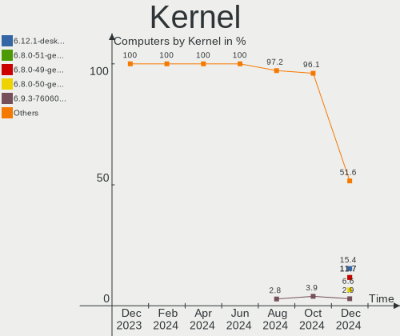
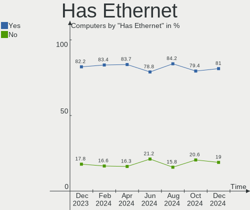
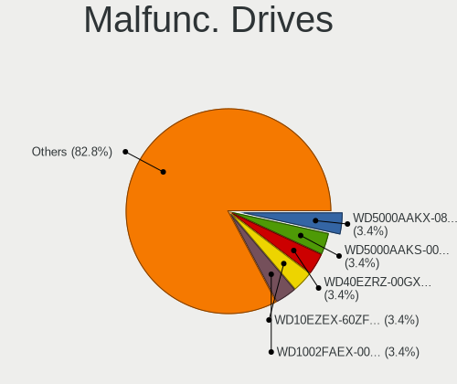
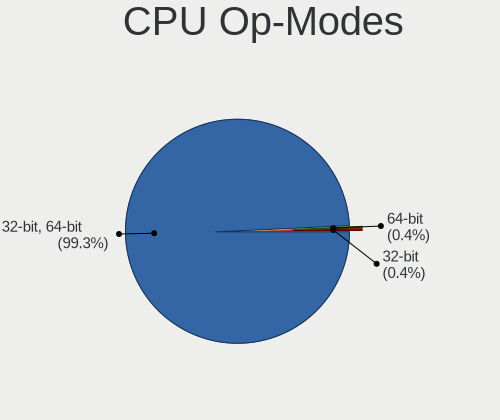
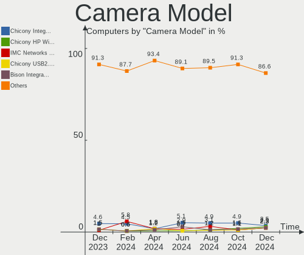

Linux in Italy - Hardware Trends
--------------------------------

A project to identify most popular hardware characteristics and track their change
over time based on data collected by Linux users at https://Linux-Hardware.org.

Anyone can contribute to this report by the [hw-probe](https://github.com/linuxhw/hw-probe) tool:

    sudo -E hw-probe -all -upload

This is a report for all computer types. See also reports for [desktops](/Location/Italy/Desktop/README.md) and [notebooks](/Location/Italy/Notebook/README.md).

Period: Aug, 2023.

Contents
--------

* [ System ](#system)
  - [ OS                       ](#os)
  - [ OS Family                ](#os-family)
  - [ Kernel                   ](#kernel)
  - [ Kernel Family            ](#kernel-family)
  - [ Kernel Major Ver.        ](#kernel-major-ver)
  - [ Arch                     ](#arch)
  - [ DE                       ](#de)
  - [ Display Server           ](#display-server)
  - [ Display Manager          ](#display-manager)
  - [ OS Lang                  ](#os-lang)
  - [ Boot Mode                ](#boot-mode)
  - [ Filesystem               ](#filesystem)
  - [ Part. scheme             ](#part-scheme)
  - [ Dual Boot with Linux/BSD ](#dual-boot-with-linuxbsd)
  - [ Dual Boot (Win)          ](#dual-boot-win)

* [ Board ](#board)
  - [ Vendor                   ](#vendor)
  - [ Model                    ](#model)
  - [ Model Family             ](#model-family)
  - [ MFG Year                 ](#mfg-year)
  - [ Form Factor              ](#form-factor)
  - [ Secure Boot              ](#secure-boot)
  - [ Coreboot                 ](#coreboot)
  - [ RAM Size                 ](#ram-size)
  - [ RAM Used                 ](#ram-used)
  - [ Total Drives             ](#total-drives)
  - [ Has CD-ROM               ](#has-cd-rom)
  - [ Has Ethernet             ](#has-ethernet)
  - [ Has WiFi                 ](#has-wifi)
  - [ Has Bluetooth            ](#has-bluetooth)

* [ Location ](#location)
  - [ Country                  ](#country)
  - [ City                     ](#city)

* [ Drives ](#drives)
  - [ Drive Vendor             ](#drive-vendor)
  - [ Drive Model              ](#drive-model)
  - [ HDD Vendor               ](#hdd-vendor)
  - [ SSD Vendor               ](#ssd-vendor)
  - [ Drive Kind               ](#drive-kind)
  - [ Drive Connector          ](#drive-connector)
  - [ Drive Size               ](#drive-size)
  - [ Space Total              ](#space-total)
  - [ Space Used               ](#space-used)
  - [ Malfunc. Drives          ](#malfunc-drives)
  - [ Malfunc. Drive Vendor    ](#malfunc-drive-vendor)
  - [ Malfunc. HDD Vendor      ](#malfunc-hdd-vendor)
  - [ Malfunc. Drive Kind      ](#malfunc-drive-kind)
  - [ Failed Drives            ](#failed-drives)
  - [ Failed Drive Vendor      ](#failed-drive-vendor)
  - [ Drive Status             ](#drive-status)

* [ Storage controller ](#storage-controller)
  - [ Storage Vendor           ](#storage-vendor)
  - [ Storage Model            ](#storage-model)
  - [ Storage Kind             ](#storage-kind)

* [ Processor ](#processor)
  - [ CPU Vendor               ](#cpu-vendor)
  - [ CPU Model                ](#cpu-model)
  - [ CPU Model Family         ](#cpu-model-family)
  - [ CPU Cores                ](#cpu-cores)
  - [ CPU Sockets              ](#cpu-sockets)
  - [ CPU Threads              ](#cpu-threads)
  - [ CPU Op-Modes             ](#cpu-op-modes)
  - [ CPU Microcode            ](#cpu-microcode)
  - [ CPU Microarch            ](#cpu-microarch)

* [ Graphics ](#graphics)
  - [ GPU Vendor               ](#gpu-vendor)
  - [ GPU Model                ](#gpu-model)
  - [ GPU Combo                ](#gpu-combo)
  - [ GPU Driver               ](#gpu-driver)
  - [ GPU Memory               ](#gpu-memory)

* [ Monitor ](#monitor)
  - [ Monitor Vendor           ](#monitor-vendor)
  - [ Monitor Model            ](#monitor-model)
  - [ Monitor Resolution       ](#monitor-resolution)
  - [ Monitor Diagonal         ](#monitor-diagonal)
  - [ Monitor Width            ](#monitor-width)
  - [ Aspect Ratio             ](#aspect-ratio)
  - [ Monitor Area             ](#monitor-area)
  - [ Pixel Density            ](#pixel-density)
  - [ Multiple Monitors        ](#multiple-monitors)

* [ Network ](#network)
  - [ Net Controller Vendor    ](#net-controller-vendor)
  - [ Net Controller Model     ](#net-controller-model)
  - [ Wireless Vendor          ](#wireless-vendor)
  - [ Wireless Model           ](#wireless-model)
  - [ Ethernet Vendor          ](#ethernet-vendor)
  - [ Ethernet Model           ](#ethernet-model)
  - [ Net Controller Kind      ](#net-controller-kind)
  - [ Used Controller          ](#used-controller)
  - [ NICs                     ](#nics)
  - [ IPv6                     ](#ipv6)

* [ Bluetooth ](#bluetooth)
  - [ Bluetooth Vendor         ](#bluetooth-vendor)
  - [ Bluetooth Model          ](#bluetooth-model)

* [ Sound ](#sound)
  - [ Sound Vendor             ](#sound-vendor)
  - [ Sound Model              ](#sound-model)

* [ Memory ](#memory)
  - [ Memory Vendor            ](#memory-vendor)
  - [ Memory Model             ](#memory-model)
  - [ Memory Kind              ](#memory-kind)
  - [ Memory Form Factor       ](#memory-form-factor)
  - [ Memory Size              ](#memory-size)
  - [ Memory Speed             ](#memory-speed)

* [ Printers & scanners ](#printers--scanners)
  - [ Printer Vendor           ](#printer-vendor)
  - [ Printer Model            ](#printer-model)
  - [ Scanner Vendor           ](#scanner-vendor)
  - [ Scanner Model            ](#scanner-model)

* [ Camera ](#camera)
  - [ Camera Vendor            ](#camera-vendor)
  - [ Camera Model             ](#camera-model)

* [ Security ](#security)
  - [ Fingerprint Vendor       ](#fingerprint-vendor)
  - [ Fingerprint Model        ](#fingerprint-model)
  - [ Chipcard Vendor          ](#chipcard-vendor)
  - [ Chipcard Model           ](#chipcard-model)

* [ Unsupported ](#unsupported)
  - [ Unsupported Devices      ](#unsupported-devices)
  - [ Unsupported Device Types ](#unsupported-device-types)

System
------

OS
--

Installed operating systems

| Name                | Computers | Percent |
|---------------------|-----------|---------|
| OpenMandriva 23.08  | 25        | 12.5%   |
| Ubuntu 22.04        | 20        | 10%     |
| Linux Mint 21.2     | 16        | 8%      |
| Fedora 38           | 16        | 8%      |
| Ubuntu 23.04        | 14        | 7%      |
| EndeavourOS Rolling | 11        | 5.5%    |
| Arch Rolling        | 10        | 5%      |
| Zorin 16            | 5         | 2.5%    |
| Manjaro             | 5         | 2.5%    |
| OpenMandriva 23.03  | 4         | 2%      |
| KDE neon 22.04      | 4         | 2%      |
| Debian 12           | 4         | 2%      |
| Xero Rolling        | 3         | 1.5%    |
| Parrot 5.3          | 3         | 1.5%    |
| OpenMandriva 23.90  | 3         | 1.5%    |
| Debian              | 3         | 1.5%    |
| Xubuntu 22.04       | 2         | 1%      |
| Ubuntu 22.10        | 2         | 1%      |
| Ubuntu 20.04        | 2         | 1%      |
| Raspbian 11         | 2         | 1%      |
| Pop!_OS 22.04       | 2         | 1%      |
| OpenMandriva 4.3    | 2         | 1%      |
| OpenMandriva 23.07  | 2         | 1%      |
| Nobara 38           | 2         | 1%      |
| MX 23               | 2         | 1%      |
| Linux Mint 21.1     | 2         | 1%      |
| Linux Mint 20.3     | 2         | 1%      |
| Kubuntu 22.04       | 2         | 1%      |
| Fedora 37           | 2         | 1%      |
| Elementary 7        | 2         | 1%      |
| blendOS             | 2         | 1%      |
| ArcoLinux Rolling   | 2         | 1%      |
| Xubuntu 23.04       | 1         | 0.5%    |
| Xubuntu 22.10       | 1         | 0.5%    |
| Ubuntu Studio 20.04 | 1         | 0.5%    |
| Ubuntu 21.10        | 1         | 0.5%    |
| Ubuntu 20.10        | 1         | 0.5%    |
| Ubuntu 18.04        | 1         | 0.5%    |
| ROSA 12.4           | 1         | 0.5%    |
| RHEL 9              | 1         | 0.5%    |

OS Family
---------

OS without a version

| Name          | Computers | Percent |
|---------------|-----------|---------|
| Ubuntu        | 41        | 20.5%   |
| OpenMandriva  | 36        | 18%     |
| Linux Mint    | 21        | 10.5%   |
| Fedora        | 19        | 9.5%    |
| EndeavourOS   | 11        | 5.5%    |
| Arch          | 10        | 5%      |
| Debian        | 7         | 3.5%    |
| Manjaro       | 6         | 3%      |
| Zorin         | 5         | 2.5%    |
| Xubuntu       | 4         | 2%      |
| KDE neon      | 4         | 2%      |
| Xero          | 3         | 1.5%    |
| Parrot        | 3         | 1.5%    |
| MX            | 3         | 1.5%    |
| Kubuntu       | 3         | 1.5%    |
| Raspbian      | 2         | 1%      |
| Pop!_OS       | 2         | 1%      |
| Nobara        | 2         | 1%      |
| LMDE          | 2         | 1%      |
| Elementary    | 2         | 1%      |
| blendOS       | 2         | 1%      |
| ArcoLinux     | 2         | 1%      |
| Ubuntu Studio | 1         | 0.5%    |
| ROSA          | 1         | 0.5%    |
| RHEL          | 1         | 0.5%    |
| Q4OS          | 1         | 0.5%    |
| openSUSE      | 1         | 0.5%    |
| Lubuntu       | 1         | 0.5%    |
| Linux Lite    | 1         | 0.5%    |
| Gentoo        | 1         | 0.5%    |
| Clear Linux   | 1         | 0.5%    |
| Artix         | 1         | 0.5%    |

Kernel
------

Version of the Linux kernel

| Version                      | Computers | Percent |
|------------------------------|-----------|---------|
| 6.2.0-26-generic             | 25        | 12.5%   |
| 6.4.11-desktop-1omv2390      | 14        | 7%      |
| 6.4.8-desktop-2omv2390       | 12        | 6%      |
| 5.15.0-78-generic            | 10        | 5%      |
| 5.15.0-79-generic            | 8         | 4%      |
| 6.2.0-20-generic             | 6         | 3%      |
| 5.15.0-76-generic            | 6         | 3%      |
| 6.4.11-200.fc38.x86_64       | 5         | 2.5%    |
| 6.4.10-arch1-1               | 4         | 2%      |
| 6.2.6-desktop-1omv2390       | 4         | 2%      |
| 6.2.0-31-generic             | 4         | 2%      |
| 6.4.7-arch1-2                | 3         | 1.5%    |
| 6.4.7-arch1-1                | 3         | 1.5%    |
| 6.4.7-200.fc38.x86_64        | 3         | 1.5%    |
| 6.4.11-arch2-1               | 3         | 1.5%    |
| 6.2.0-27-generic             | 3         | 1.5%    |
| 6.1.0-1parrot1-amd64         | 3         | 1.5%    |
| 6.1.0-11-amd64               | 3         | 1.5%    |
| 6.1.0-10-amd64               | 3         | 1.5%    |
| 5.19.0-50-generic            | 3         | 1.5%    |
| 5.19.0-46-generic            | 3         | 1.5%    |
| 6.4.9-arch1-1                | 2         | 1%      |
| 6.4.9-200.fc38.x86_64        | 2         | 1%      |
| 6.4.8-arch1-1                | 2         | 1%      |
| 6.4.6-200.fc38.x86_64        | 2         | 1%      |
| 6.4.6-1-MANJARO              | 2         | 1%      |
| 6.4.12-arch1-1               | 2         | 1%      |
| 6.4.11-arch1-1               | 2         | 1%      |
| 6.4.10-200.fc38.x86_64       | 2         | 1%      |
| 6.3.9-zen1-1-zen             | 2         | 1%      |
| 6.3.5-desktop-3omv2390       | 2         | 1%      |
| 6.1.44-1-MANJARO             | 2         | 1%      |
| 6.1.21-v7+                   | 2         | 1%      |
| 5.4.0-156-generic            | 2         | 1%      |
| 5.16.7-desktop-1omv4003      | 2         | 1%      |
| 6.5.0-desktop-0.rc4.1omv2390 | 1         | 0.5%    |
| 6.5.0-060500rc5-generic      | 1         | 0.5%    |
| 6.4.9-1-default              | 1         | 0.5%    |
| 6.4.8-zen1-1-zen             | 1         | 0.5%    |
| 6.4.8-x64v3-xanmod1          | 1         | 0.5%    |

Kernel Family
-------------

Linux kernel without a distro release

| Version | Computers | Percent |
|---------|-----------|---------|
| 6.2.0   | 40        | 20%     |
| 6.4.11  | 27        | 13.5%   |
| 5.15.0  | 25        | 12.5%   |
| 6.4.8   | 17        | 8.5%    |
| 6.4.7   | 11        | 5.5%    |
| 6.1.0   | 11        | 5.5%    |
| 5.19.0  | 9         | 4.5%    |
| 6.4.10  | 8         | 4%      |
| 6.4.9   | 5         | 2.5%    |
| 6.4.6   | 5         | 2.5%    |
| 6.4.12  | 4         | 2%      |
| 6.2.6   | 4         | 2%      |
| 5.4.0   | 4         | 2%      |
| 6.5.0   | 2         | 1%      |
| 6.4.0   | 2         | 1%      |
| 6.3.9   | 2         | 1%      |
| 6.3.5   | 2         | 1%      |
| 6.1.44  | 2         | 1%      |
| 6.1.21  | 2         | 1%      |
| 5.16.7  | 2         | 1%      |
| 6.4.4   | 1         | 0.5%    |
| 6.3.13  | 1         | 0.5%    |
| 6.2.9   | 1         | 0.5%    |
| 6.2.15  | 1         | 0.5%    |
| 6.1.8   | 1         | 0.5%    |
| 6.1.47  | 1         | 0.5%    |
| 6.1.39  | 1         | 0.5%    |
| 6.0.0   | 1         | 0.5%    |
| 5.8.0   | 1         | 0.5%    |
| 5.17.11 | 1         | 0.5%    |
| 5.16.0  | 1         | 0.5%    |
| 5.14.0  | 1         | 0.5%    |
| 5.13.0  | 1         | 0.5%    |
| 5.10.0  | 1         | 0.5%    |
| 4.19.0  | 1         | 0.5%    |
| 4.15.0  | 1         | 0.5%    |

Kernel Major Ver.
-----------------

Linux kernel major version

| Version | Computers | Percent |
|---------|-----------|---------|
| 6.4     | 80        | 40%     |
| 6.2     | 46        | 23%     |
| 5.15    | 25        | 12.5%   |
| 6.1     | 18        | 9%      |
| 5.19    | 9         | 4.5%    |
| 6.3     | 5         | 2.5%    |
| 5.4     | 4         | 2%      |
| 5.16    | 3         | 1.5%    |
| 6.5     | 2         | 1%      |
| 6.0     | 1         | 0.5%    |
| 5.8     | 1         | 0.5%    |
| 5.17    | 1         | 0.5%    |
| 5.14    | 1         | 0.5%    |
| 5.13    | 1         | 0.5%    |
| 5.10    | 1         | 0.5%    |
| 4.19    | 1         | 0.5%    |
| 4.15    | 1         | 0.5%    |

Arch
----

OS architecture (x86_64, i586, etc.)

| Name   | Computers | Percent |
|--------|-----------|---------|
| x86_64 | 197       | 98.5%   |
| armv7l | 2         | 1%      |
| i686   | 1         | 0.5%    |

DE
--

Desktop Environment

| Name       | Computers | Percent |
|------------|-----------|---------|
| GNOME      | 80        | 40%     |
| KDE5       | 62        | 31%     |
| XFCE       | 18        | 9%      |
| X-Cinnamon | 17        | 8.5%    |
| MATE       | 8         | 4%      |
| Unknown    | 5         | 2.5%    |
| LXQt       | 3         | 1.5%    |
| Pantheon   | 2         | 1%      |
| LXDE       | 2         | 1%      |
| Unity      | 1         | 0.5%    |
| Trinity    | 1         | 0.5%    |
| sway       | 1         | 0.5%    |

Display Server
--------------

X11 or Wayland

| Name    | Computers | Percent |
|---------|-----------|---------|
| X11     | 121       | 60.5%   |
| Wayland | 77        | 38.5%   |
| Tty     | 2         | 1%      |

Display Manager
---------------

SDDM, LightDM, etc.

| Name    | Computers | Percent |
|---------|-----------|---------|
| Unknown | 61        | 30.5%   |
| SDDM    | 52        | 26%     |
| GDM3    | 39        | 19.5%   |
| LightDM | 28        | 14%     |
| GDM     | 18        | 9%      |
| TDM     | 1         | 0.5%    |
| SLiM    | 1         | 0.5%    |

OS Lang
-------

Language

| Lang  | Computers | Percent |
|-------|-----------|---------|
| it_IT | 135       | 67.5%   |
| en_US | 41        | 20.5%   |
| C     | 11        | 5.5%    |
| en_GB | 6         | 3%      |
| de_DE | 3         | 1.5%    |
| fr_FR | 2         | 1%      |
| en_DK | 1         | 0.5%    |
| de_IT | 1         | 0.5%    |

Boot Mode
---------

EFI or BIOS

| Mode | Computers | Percent |
|------|-----------|---------|
| EFI  | 118       | 59%     |
| BIOS | 82        | 41%     |

Filesystem
----------

Type of filesystem

| Type    | Computers | Percent |
|---------|-----------|---------|
| Ext4    | 109       | 54.5%   |
| Tmpfs   | 31        | 15.5%   |
| Btrfs   | 30        | 15%     |
| Overlay | 28        | 14%     |
| Xfs     | 2         | 1%      |

Part. scheme
------------

Scheme of partitioning

| Type    | Computers | Percent |
|---------|-----------|---------|
| GPT     | 122       | 61%     |
| Unknown | 59        | 29.5%   |
| MBR     | 19        | 9.5%    |

Dual Boot with Linux/BSD
------------------------

Hosting more than one Linux/BSD

| Dual boot | Computers | Percent |
|-----------|-----------|---------|
| No        | 153       | 76.5%   |
| Yes       | 47        | 23.5%   |

Dual Boot (Win)
---------------

Hosting Linux and Windows

| Dual boot | Computers | Percent |
|-----------|-----------|---------|
| No        | 124       | 62%     |
| Yes       | 76        | 38%     |

Board
-----

Vendor
------

Motherboard manufacturer

| Name                    | Computers | Percent |
|-------------------------|-----------|---------|
| Hewlett-Packard         | 40        | 20%     |
| ASUSTek Computer        | 37        | 18.5%   |
| Lenovo                  | 25        | 12.5%   |
| Dell                    | 22        | 11%     |
| MSI                     | 13        | 6.5%    |
| Acer                    | 10        | 5%      |
| Gigabyte Technology     | 9         | 4.5%    |
| ASRock                  | 7         | 3.5%    |
| Apple                   | 6         | 3%      |
| Pegatron                | 5         | 2.5%    |
| HUAWEI                  | 5         | 2.5%    |
| Intel                   | 4         | 2%      |
| Raspberry Pi Foundation | 2         | 1%      |
| PC Specialist           | 2         | 1%      |
| Notebook                | 2         | 1%      |
| Unknown                 | 2         | 1%      |
| Toshiba                 | 1         | 0.5%    |
| Timi                    | 1         | 0.5%    |
| Sony                    | 1         | 0.5%    |
| SLIMBOOK                | 1         | 0.5%    |
| SANTECH                 | 1         | 0.5%    |
| Samsung Electronics     | 1         | 0.5%    |
| Mediacom                | 1         | 0.5%    |
| Fujitsu Siemens         | 1         | 0.5%    |
| AZW                     | 1         | 0.5%    |

Model
-----

Motherboard model

| Name                                        | Computers | Percent |
|---------------------------------------------|-----------|---------|
| HUAWEI NBLK-WAX9X                           | 3         | 1.5%    |
| HP Stream Laptop 14-ax0XX                   | 3         | 1.5%    |
| HP 255 G8 Notebook PC                       | 3         | 1.5%    |
| ASUS All Series                             | 3         | 1.5%    |
| RPi Raspberry Pi 3 Model B Rev 1.2          | 2         | 1%      |
| Apple MacBookAir7,2                         | 2         | 1%      |
| Unknown                                     | 2         | 1%      |
| Toshiba Satellite P850                      | 1         | 0.5%    |
| Timi A7S                                    | 1         | 0.5%    |
| Sony SVE1713X1EB                            | 1         | 0.5%    |
| SLIMBOOK PROX-AMD5                          | 1         | 0.5%    |
| SANTECH NL5xNU                              | 1         | 0.5%    |
| Samsung RC530/RC730                         | 1         | 0.5%    |
| Pegatron WC912AA-ABZ p6300it                | 1         | 0.5%    |
| Pegatron T5060                              | 1         | 0.5%    |
| Pegatron Pro 3010 Microtower PC             | 1         | 0.5%    |
| Pegatron NF335AA-ABZ a6664it                | 1         | 0.5%    |
| Pegatron 2AD5                               | 1         | 0.5%    |
| PC Specialist Lafite Pro III 17             | 1         | 0.5%    |
| PC Specialist Ionico 16                     | 1         | 0.5%    |
| Notebook NS50MU                             | 1         | 0.5%    |
| Notebook N9x0TC                             | 1         | 0.5%    |
| MSI Z390 Gaming Infinite X Plus 9 (MS-B916) | 1         | 0.5%    |
| MSI NQ890AA-ABZ CQ5011IT                    | 1         | 0.5%    |
| MSI MS-7E06                                 | 1         | 0.5%    |
| MSI MS-7D76                                 | 1         | 0.5%    |
| MSI MS-7D46                                 | 1         | 0.5%    |
| MSI MS-7C13                                 | 1         | 0.5%    |
| MSI MS-7C02                                 | 1         | 0.5%    |
| MSI MS-7A36                                 | 1         | 0.5%    |
| MSI MS-7966                                 | 1         | 0.5%    |
| MSI MS-7815                                 | 1         | 0.5%    |
| MSI MS-7793                                 | 1         | 0.5%    |
| MSI Katana GF66 12UC                        | 1         | 0.5%    |
| MSI GL73 8RE                                | 1         | 0.5%    |
| Mediacom SmartBook 130 FullHD - M-SB130     | 1         | 0.5%    |
| Lenovo Yoga Pro 7 14ARP8 83AU               | 1         | 0.5%    |
| Lenovo V15-IIL 82C5                         | 1         | 0.5%    |
| Lenovo V15 G4 AMN 82YU                      | 1         | 0.5%    |
| Lenovo V130-15IKB 81HN                      | 1         | 0.5%    |

Model Family
------------

Motherboard model prefix

| Name                 | Computers | Percent |
|----------------------|-----------|---------|
| Lenovo ThinkPad      | 13        | 6.5%    |
| Dell Latitude        | 7         | 3.5%    |
| Dell Inspiron        | 5         | 2.5%    |
| HP Pavilion          | 4         | 2%      |
| HP EliteBook         | 4         | 2%      |
| HP 255               | 4         | 2%      |
| ASUS ROG             | 4         | 2%      |
| Acer Aspire          | 4         | 2%      |
| Lenovo IdeaPad       | 3         | 1.5%    |
| HUAWEI NBLK-WAX9X    | 3         | 1.5%    |
| HP Stream            | 3         | 1.5%    |
| HP ProDesk           | 3         | 1.5%    |
| HP Compaq            | 3         | 1.5%    |
| HP 250               | 3         | 1.5%    |
| Dell XPS             | 3         | 1.5%    |
| ASUS VivoBook        | 3         | 1.5%    |
| ASUS PRIME           | 3         | 1.5%    |
| ASUS All             | 3         | 1.5%    |
| RPi Raspberry        | 2         | 1%      |
| Lenovo ThinkCentre   | 2         | 1%      |
| HP ProBook           | 2         | 1%      |
| HP Laptop            | 2         | 1%      |
| HP ENVY              | 2         | 1%      |
| Dell Vostro          | 2         | 1%      |
| Dell Precision       | 2         | 1%      |
| Dell OptiPlex        | 2         | 1%      |
| ASUS Intel           | 2         | 1%      |
| Apple MacBookAir7    | 2         | 1%      |
| Acer Predator        | 2         | 1%      |
| Unknown              | 2         | 1%      |
| Toshiba Satellite    | 1         | 0.5%    |
| Timi A7S             | 1         | 0.5%    |
| Sony SVE1713X1EB     | 1         | 0.5%    |
| SLIMBOOK PROX-AMD5   | 1         | 0.5%    |
| SANTECH NL5xNU       | 1         | 0.5%    |
| Samsung RC530        | 1         | 0.5%    |
| Pegatron WC912AA-ABZ | 1         | 0.5%    |
| Pegatron T5060       | 1         | 0.5%    |
| Pegatron Pro         | 1         | 0.5%    |
| Pegatron NF335AA-ABZ | 1         | 0.5%    |

MFG Year
--------

Motherboard manufacture year

| Year    | Computers | Percent |
|---------|-----------|---------|
| 2020    | 25        | 12.5%   |
| 2021    | 24        | 12%     |
| 2019    | 20        | 10%     |
| 2015    | 17        | 8.5%    |
| 2017    | 16        | 8%      |
| 2018    | 12        | 6%      |
| 2012    | 12        | 6%      |
| 2022    | 11        | 5.5%    |
| 2013    | 9         | 4.5%    |
| 2023    | 8         | 4%      |
| 2014    | 8         | 4%      |
| 2010    | 8         | 4%      |
| 2016    | 7         | 3.5%    |
| 2011    | 7         | 3.5%    |
| 2008    | 5         | 2.5%    |
| 2009    | 3         | 1.5%    |
| 2007    | 2         | 1%      |
| 2005    | 2         | 1%      |
| Unknown | 2         | 1%      |
| 2006    | 1         | 0.5%    |
| 2003    | 1         | 0.5%    |

Form Factor
-----------

Physical design of the computer

| Name           | Computers | Percent |
|----------------|-----------|---------|
| Notebook       | 111       | 55.5%   |
| Desktop        | 73        | 36.5%   |
| Convertible    | 6         | 3%      |
| Mini pc        | 4         | 2%      |
| All in one     | 4         | 2%      |
| System on chip | 2         | 1%      |

Secure Boot
-----------

Enabled or disabled

| State    | Computers | Percent |
|----------|-----------|---------|
| Disabled | 190       | 95%     |
| Enabled  | 10        | 5%      |

Coreboot
--------

Have coreboot on board

| Used | Computers | Percent |
|------|-----------|---------|
| No   | 200       | 100%    |

RAM Size
--------

Total RAM memory

| Size in GB  | Computers | Percent |
|-------------|-----------|---------|
| 16.01-24.0  | 57        | 28.5%   |
| 4.01-8.0    | 44        | 22%     |
| 3.01-4.0    | 30        | 15%     |
| 32.01-64.0  | 26        | 13%     |
| 8.01-16.0   | 24        | 12%     |
| 64.01-256.0 | 6         | 3%      |
| 1.01-2.0    | 6         | 3%      |
| 24.01-32.0  | 3         | 1.5%    |
| 0.51-1.0    | 3         | 1.5%    |
| 0.01-0.5    | 1         | 0.5%    |

RAM Used
--------

Used RAM memory

| Used GB   | Computers | Percent |
|-----------|-----------|---------|
| 1.01-2.0  | 61        | 30.5%   |
| 2.01-3.0  | 52        | 26%     |
| 4.01-8.0  | 35        | 17.5%   |
| 3.01-4.0  | 35        | 17.5%   |
| 0.51-1.0  | 8         | 4%      |
| 8.01-16.0 | 6         | 3%      |
| 0.01-0.5  | 3         | 1.5%    |

Total Drives
------------

Number of drives on board

| Drives | Computers | Percent |
|--------|-----------|---------|
| 1      | 113       | 56.5%   |
| 2      | 58        | 29%     |
| 3      | 16        | 8%      |
| 4      | 5         | 2.5%    |
| 6      | 4         | 2%      |
| 5      | 4         | 2%      |

Has CD-ROM
----------

Has CD-ROM on board

| Presented | Computers | Percent |
|-----------|-----------|---------|
| No        | 144       | 72%     |
| Yes       | 56        | 28%     |

Has Ethernet
------------

Has Ethernet on board

| Presented | Computers | Percent |
|-----------|-----------|---------|
| Yes       | 167       | 83.5%   |
| No        | 33        | 16.5%   |

Has WiFi
--------

Has WiFi module

| Presented | Computers | Percent |
|-----------|-----------|---------|
| Yes       | 163       | 81.5%   |
| No        | 37        | 18.5%   |

Has Bluetooth
-------------

Has Bluetooth module

| Presented | Computers | Percent |
|-----------|-----------|---------|
| Yes       | 140       | 70%     |
| No        | 60        | 30%     |

Location
--------

Country
-------

Geographic location (country)

| Country | Computers | Percent |
|---------|-----------|---------|
| Italy   | 200       | 100%    |

City
----

Geographic location (city)

| City                | Computers | Percent |
|---------------------|-----------|---------|
| Milan               | 24        | 12%     |
| Rome                | 21        | 10.5%   |
| Milano              | 16        | 8%      |
| Florence            | 8         | 4%      |
| Turin               | 5         | 2.5%    |
| Rho                 | 4         | 2%      |
| Verona              | 3         | 1.5%    |
| Palermo             | 3         | 1.5%    |
| Livorno             | 3         | 1.5%    |
| Genoa               | 3         | 1.5%    |
| Catania             | 3         | 1.5%    |
| Bologna             | 3         | 1.5%    |
| Viggiù             | 2         | 1%      |
| Padova              | 2         | 1%      |
| Nemoli              | 2         | 1%      |
| Naples              | 2         | 1%      |
| Monza               | 2         | 1%      |
| Casalecchio di Reno | 2         | 1%      |
| Brescia             | 2         | 1%      |
| Vignola             | 1         | 0.5%    |
| Vicenza             | 1         | 0.5%    |
| Vercelli            | 1         | 0.5%    |
| Venosa              | 1         | 0.5%    |
| Venice              | 1         | 0.5%    |
| Varazze             | 1         | 0.5%    |
| Trezzo sull'Adda    | 1         | 0.5%    |
| Treviglio           | 1         | 0.5%    |
| Trescore Balneario  | 1         | 0.5%    |
| Trento              | 1         | 0.5%    |
| Torre Orsaia        | 1         | 0.5%    |
| Tornareccio         | 1         | 0.5%    |
| Tissi               | 1         | 0.5%    |
| Thiene              | 1         | 0.5%    |
| Taranto             | 1         | 0.5%    |
| Storo               | 1         | 0.5%    |
| Soriano nel Cimino  | 1         | 0.5%    |
| Siziano             | 1         | 0.5%    |
| Sesto Fiorentino    | 1         | 0.5%    |
| San Gavino Monreale | 1         | 0.5%    |
| Salerno             | 1         | 0.5%    |

Drives
------

Drive Vendor
------------

Hard drive vendors

| Vendor                         | Computers | Drives | Percent |
|--------------------------------|-----------|--------|---------|
| Samsung Electronics            | 50        | 57     | 15.82%  |
| Seagate                        | 40        | 44     | 12.66%  |
| WDC                            | 34        | 38     | 10.76%  |
| Crucial                        | 20        | 20     | 6.33%   |
| SanDisk                        | 19        | 20     | 6.01%   |
| Toshiba                        | 18        | 18     | 5.7%    |
| Kingston                       | 17        | 17     | 5.38%   |
| Unknown                        | 15        | 19     | 4.75%   |
| SK hynix                       | 10        | 10     | 3.16%   |
| Micron Technology              | 10        | 10     | 3.16%   |
| Intel                          | 9         | 10     | 2.85%   |
| Phison Electronics             | 6         | 6      | 1.9%    |
| Micron/Crucial Technology      | 5         | 5      | 1.58%   |
| Apple                          | 5         | 5      | 1.58%   |
| SPCC                           | 4         | 4      | 1.27%   |
| KIOXIA                         | 4         | 4      | 1.27%   |
| Hitachi                        | 4         | 4      | 1.27%   |
| HGST                           | 4         | 4      | 1.27%   |
| PNY                            | 3         | 3      | 0.95%   |
| Maxtor                         | 3         | 7      | 0.95%   |
| MAXIO Technology (Hangzhou)    | 3         | 3      | 0.95%   |
| Kingston Technology Company    | 3         | 3      | 0.95%   |
| JMicron Technology             | 3         | 3      | 0.95%   |
| China                          | 3         | 3      | 0.95%   |
| LITEON                         | 2         | 2      | 0.63%   |
| A-DATA Technology              | 2         | 2      | 0.63%   |
| Unknown                        | 2         | 2      | 0.63%   |
| YMTC                           | 1         | 1      | 0.32%   |
| Vaseky                         | 1         | 1      | 0.32%   |
| Union Memory                   | 1         | 1      | 0.32%   |
| UMIS                           | 1         | 1      | 0.32%   |
| Team                           | 1         | 1      | 0.32%   |
| Solid State Storage Technology | 1         | 1      | 0.32%   |
| Silicon Motion                 | 1         | 1      | 0.32%   |
| Realtek Semiconductor          | 1         | 1      | 0.32%   |
| NGFF                           | 1         | 1      | 0.32%   |
| Mushkin                        | 1         | 1      | 0.32%   |
| Lexar                          | 1         | 1      | 0.32%   |
| Leven                          | 1         | 1      | 0.32%   |
| KingDian                       | 1         | 1      | 0.32%   |

Drive Model
-----------

Hard drive models

| Model                                                 | Computers | Percent |
|-------------------------------------------------------|-----------|---------|
| Samsung NVMe SSD Controller SM981/PM981/PM983 500GB   | 7         | 2.1%    |
| Crucial CT500MX500SSD1 500GB                          | 6         | 1.8%    |
| Micron/Crucial P2 NVMe PCIe SSD 1TB                   | 5         | 1.5%    |
| Kingston SA400S37240G 240GB SSD                       | 5         | 1.5%    |
| Unknown MMC Card  32GB                                | 4         | 1.2%    |
| Seagate ST1000DM010-2EP102 1TB                        | 4         | 1.2%    |
| Samsung NVMe SSD Controller PM9A1/PM9A3/980PRO 1024GB | 4         | 1.2%    |
| Unknown SD/MMC/MS PRO 1GB                             | 3         | 0.9%    |
| Unknown MMC Card  16GB                                | 3         | 0.9%    |
| Toshiba DT01ACA100 1TB                                | 3         | 0.9%    |
| Intel SSDPEKNU512GZ 512GB                             | 3         | 0.9%    |
| Toshiba XG6 NVMe SSD Controller 1024GB                | 2         | 0.6%    |
| SPCC Solid State Disk 512GB                           | 2         | 0.6%    |
| Seagate ST500DM002-1BD142 500GB                       | 2         | 0.6%    |
| Seagate ST2000DM008-2UB102 2TB                        | 2         | 0.6%    |
| Seagate ST2000DM008-2FR102 2TB                        | 2         | 0.6%    |
| Seagate ST1000LM048-2E7172 1TB                        | 2         | 0.6%    |
| Seagate ST1000LM024 HN-M101MBB 1TB                    | 2         | 0.6%    |
| Seagate Expansion 2TB                                 | 2         | 0.6%    |
| Sandisk WD_BLACK SN850X 1000GB                        | 2         | 0.6%    |
| Sandisk WD Blue SN550 NVMe SSD 250GB                  | 2         | 0.6%    |
| SanDisk SSD PLUS 480GB                                | 2         | 0.6%    |
| SanDisk SL32G  32GB                                   | 2         | 0.6%    |
| Samsung SSD 980 1TB                                   | 2         | 0.6%    |
| Samsung SSD 870 EVO 500GB                             | 2         | 0.6%    |
| Samsung SSD 860 EVO 500GB                             | 2         | 0.6%    |
| Samsung SSD 860 EVO 1TB                               | 2         | 0.6%    |
| Samsung SSD 850 EVO 250GB                             | 2         | 0.6%    |
| Samsung MZALQ512HBLU-00BL2 512GB                      | 2         | 0.6%    |
| Phison E16 PCIe4 NVMe Controller 1TB                  | 2         | 0.6%    |
| Phison E12 NVMe Controller 256GB                      | 2         | 0.6%    |
| Micron 1100_MTFDDAV256TBN 256GB SSD                   | 2         | 0.6%    |
| KIOXIA KBG40ZNV256G 256GB                             | 2         | 0.6%    |
| KIOXIA KBG40ZNS512G NVMe 512GB                        | 2         | 0.6%    |
| Kingston Company A2000 NVMe SSD 1TB                   | 2         | 0.6%    |
| Kingston SV300S37A240G 240GB SSD                      | 2         | 0.6%    |
| Kingston SA400S37960G 960GB SSD                       | 2         | 0.6%    |
| Kingston SA400S37480G 480GB SSD                       | 2         | 0.6%    |
| JMicron Generic 1TB                                   | 2         | 0.6%    |
| Crucial CT500P2SSD8 500GB                             | 2         | 0.6%    |

HDD Vendor
----------

Hard disk drive vendors

| Vendor              | Computers | Drives | Percent |
|---------------------|-----------|--------|---------|
| Seagate             | 40        | 44     | 41.67%  |
| WDC                 | 26        | 30     | 27.08%  |
| Toshiba             | 9         | 9      | 9.38%   |
| Hitachi             | 4         | 4      | 4.17%   |
| HGST                | 4         | 4      | 4.17%   |
| Unknown             | 3         | 3      | 3.13%   |
| Maxtor              | 3         | 7      | 3.13%   |
| Apple               | 3         | 3      | 3.13%   |
| Samsung Electronics | 2         | 2      | 2.08%   |
| Inateck             | 1         | 1      | 1.04%   |
| External            | 1         | 1      | 1.04%   |

SSD Vendor
----------

Solid state drive vendors

| Vendor              | Computers | Drives | Percent |
|---------------------|-----------|--------|---------|
| Samsung Electronics | 22        | 22     | 22.45%  |
| Kingston            | 16        | 16     | 16.33%  |
| Crucial             | 16        | 16     | 16.33%  |
| SanDisk             | 7         | 7      | 7.14%   |
| SPCC                | 4         | 4      | 4.08%   |
| Micron Technology   | 4         | 4      | 4.08%   |
| PNY                 | 3         | 3      | 3.06%   |
| China               | 3         | 3      | 3.06%   |
| WDC                 | 2         | 2      | 2.04%   |
| SK hynix            | 2         | 2      | 2.04%   |
| LITEON              | 2         | 2      | 2.04%   |
| JMicron Technology  | 2         | 2      | 2.04%   |
| Apple               | 2         | 2      | 2.04%   |
| A-DATA Technology   | 2         | 2      | 2.04%   |
| Vaseky              | 1         | 1      | 1.02%   |
| Team                | 1         | 1      | 1.02%   |
| NGFF                | 1         | 1      | 1.02%   |
| Mushkin             | 1         | 1      | 1.02%   |
| Lexar               | 1         | 1      | 1.02%   |
| Leven               | 1         | 1      | 1.02%   |
| KingDian            | 1         | 1      | 1.02%   |
| Intenso             | 1         | 1      | 1.02%   |
| Intel               | 1         | 1      | 1.02%   |
| BHT                 | 1         | 1      | 1.02%   |
| BAITITON            | 1         | 1      | 1.02%   |

Drive Kind
----------

HDD or SSD

| Kind    | Computers | Drives | Percent |
|---------|-----------|--------|---------|
| NVMe    | 96        | 114    | 35.04%  |
| SSD     | 81        | 98     | 29.56%  |
| HDD     | 80        | 108    | 29.2%   |
| MMC     | 14        | 18     | 5.11%   |
| Unknown | 3         | 3      | 1.09%   |

Drive Connector
---------------

SATA, SAS, NVMe, etc.

| Type | Computers | Drives | Percent |
|------|-----------|--------|---------|
| SATA | 123       | 194    | 49.8%   |
| NVMe | 96        | 114    | 38.87%  |
| SAS  | 14        | 15     | 5.67%   |
| MMC  | 14        | 18     | 5.67%   |

Drive Size
----------

Size of hard drive

| Size in TB | Computers | Drives | Percent |
|------------|-----------|--------|---------|
| 0.01-0.5   | 89        | 118    | 54.6%   |
| 0.51-1.0   | 52        | 63     | 31.9%   |
| 1.01-2.0   | 18        | 20     | 11.04%  |
| 3.01-4.0   | 2         | 2      | 1.23%   |
| 2.01-3.0   | 1         | 1      | 0.61%   |
| 4.01-10.0  | 1         | 2      | 0.61%   |

Space Total
-----------

Amount of disk space available on the file system

| Size in GB     | Computers | Percent |
|----------------|-----------|---------|
| 251-500        | 39        | 19.5%   |
| 101-250        | 36        | 18%     |
| 1-20           | 28        | 14%     |
| 501-1000       | 28        | 14%     |
| 1001-2000      | 19        | 9.5%    |
| 51-100         | 14        | 7%      |
| 21-50          | 12        | 6%      |
| More than 3000 | 11        | 5.5%    |
| 2001-3000      | 8         | 4%      |
| Unknown        | 5         | 2.5%    |

Space Used
----------

Amount of used disk space

| Used GB        | Computers | Percent |
|----------------|-----------|---------|
| 1-20           | 77        | 38.5%   |
| 21-50          | 34        | 17%     |
| 101-250        | 26        | 13%     |
| 51-100         | 17        | 8.5%    |
| 251-500        | 14        | 7%      |
| 1001-2000      | 13        | 6.5%    |
| 501-1000       | 12        | 6%      |
| Unknown        | 5         | 2.5%    |
| More than 3000 | 2         | 1%      |

Malfunc. Drives
---------------

Drive models with a malfunction

| Model                                       | Computers | Drives | Percent |
|---------------------------------------------|-----------|--------|---------|
| WDC WD2500BEVT-80A23T0 250GB                | 1         | 1      | 4.17%   |
| WDC WD10EZEX-60M2NA0 1TB                    | 1         | 1      | 4.17%   |
| WDC WD1001FALS-40Y6A0 1TB                   | 1         | 1      | 4.17%   |
| SK hynix SC210 2.5 7MM 256GB SSD            | 1         | 1      | 4.17%   |
| Seagate ST9750420AS 752GB                   | 1         | 1      | 4.17%   |
| Seagate ST500DM002-1BD142 500GB             | 1         | 1      | 4.17%   |
| Seagate ST3500418AS 500GB                   | 1         | 1      | 4.17%   |
| Seagate ST3320613AS 320GB                   | 1         | 1      | 4.17%   |
| Seagate ST320LT009-9WC142 320GB             | 1         | 1      | 4.17%   |
| Seagate ST3160815AS 160GB                   | 1         | 1      | 4.17%   |
| Seagate ST1000NM0011 99Y1164 59Y1812XIV 1TB | 1         | 1      | 4.17%   |
| Seagate ST1000DM003-1ER162 1TB              | 1         | 1      | 4.17%   |
| SanDisk SSD PLUS 480GB                      | 1         | 1      | 4.17%   |
| Samsung Electronics SSD 980 1TB             | 1         | 1      | 4.17%   |
| Maxtor 6Y250M0 256GB                        | 1         | 1      | 4.17%   |
| Maxtor 6Y120L0 128GB                        | 1         | 1      | 4.17%   |
| Maxtor 6V300F0 304GB                        | 1         | 3      | 4.17%   |
| Intel SSDSC2BF180A4L 180GB                  | 1         | 1      | 4.17%   |
| Hitachi HTS725050A9A364 500GB               | 1         | 1      | 4.17%   |
| Hitachi HTS545025B9SA02 250GB               | 1         | 1      | 4.17%   |
| Hitachi HTS541680J9SA00 80GB                | 1         | 1      | 4.17%   |
| HGST HTS545050A7E680 500GB                  | 1         | 1      | 4.17%   |
| Apple HDD HTS541010A9E662 1TB               | 1         | 1      | 4.17%   |
| A-DATA Technology SU800 1TB SSD             | 1         | 1      | 4.17%   |

Malfunc. Drive Vendor
---------------------

Vendors of faulty drives

| Vendor              | Computers | Drives | Percent |
|---------------------|-----------|--------|---------|
| Seagate             | 8         | 8      | 34.78%  |
| WDC                 | 3         | 3      | 13.04%  |
| Hitachi             | 3         | 3      | 13.04%  |
| Maxtor              | 2         | 5      | 8.7%    |
| SK hynix            | 1         | 1      | 4.35%   |
| SanDisk             | 1         | 1      | 4.35%   |
| Samsung Electronics | 1         | 1      | 4.35%   |
| Intel               | 1         | 1      | 4.35%   |
| HGST                | 1         | 1      | 4.35%   |
| Apple               | 1         | 1      | 4.35%   |
| A-DATA Technology   | 1         | 1      | 4.35%   |

Malfunc. HDD Vendor
-------------------

Vendors of faulty HDD drives

| Vendor  | Computers | Drives | Percent |
|---------|-----------|--------|---------|
| Seagate | 8         | 8      | 44.44%  |
| WDC     | 3         | 3      | 16.67%  |
| Hitachi | 3         | 3      | 16.67%  |
| Maxtor  | 2         | 5      | 11.11%  |
| HGST    | 1         | 1      | 5.56%   |
| Apple   | 1         | 1      | 5.56%   |

Malfunc. Drive Kind
-------------------

Kinds of faulty drives

| Kind | Computers | Drives | Percent |
|------|-----------|--------|---------|
| HDD  | 18        | 21     | 78.26%  |
| SSD  | 4         | 4      | 17.39%  |
| NVMe | 1         | 1      | 4.35%   |

Failed Drives
-------------

Failed drive models

Zero info for selected period =(

Failed Drive Vendor
-------------------

Failed drive vendors

Zero info for selected period =(

Drive Status
------------

Number of failed and malfunc. drives

| Status   | Computers | Drives | Percent |
|----------|-----------|--------|---------|
| Detected | 107       | 172    | 48.64%  |
| Works    | 91        | 143    | 41.36%  |
| Malfunc  | 22        | 26     | 10%     |

Storage controller
------------------

Storage Vendor
--------------

Storage controller vendors

| Vendor                           | Computers | Percent |
|----------------------------------|-----------|---------|
| Intel                            | 119       | 44.4%   |
| AMD                              | 38        | 14.18%  |
| Samsung Electronics              | 30        | 11.19%  |
| SanDisk                          | 14        | 5.22%   |
| Toshiba America Info Systems     | 9         | 3.36%   |
| Micron/Crucial Technology        | 9         | 3.36%   |
| SK hynix                         | 8         | 2.99%   |
| Phison Electronics               | 6         | 2.24%   |
| Micron Technology                | 6         | 2.24%   |
| KIOXIA                           | 4         | 1.49%   |
| Kingston Technology Company      | 4         | 1.49%   |
| Nvidia                           | 3         | 1.12%   |
| MAXIO Technology (Hangzhou)      | 3         | 1.12%   |
| VIA Technologies                 | 2         | 0.75%   |
| Union Memory (Shenzhen)          | 2         | 0.75%   |
| ASMedia Technology               | 2         | 0.75%   |
| Yangtze Memory Technologies      | 1         | 0.37%   |
| Solidigm                         | 1         | 0.37%   |
| Solid State Storage Technology   | 1         | 0.37%   |
| Silicon Motion                   | 1         | 0.37%   |
| Silicon Integrated Systems [SiS] | 1         | 0.37%   |
| Silicon Image                    | 1         | 0.37%   |
| Realtek Semiconductor            | 1         | 0.37%   |
| JMicron Technology               | 1         | 0.37%   |
| Integrated Technology Express    | 1         | 0.37%   |

Storage Model
-------------

Storage controller models

| Model                                                                            | Computers | Percent |
|----------------------------------------------------------------------------------|-----------|---------|
| AMD FCH SATA Controller [AHCI mode]                                              | 26        | 8.61%   |
| Intel Volume Management Device NVMe RAID Controller                              | 13        | 4.3%    |
| Samsung NVMe SSD Controller 980                                                  | 11        | 3.64%   |
| Samsung NVMe SSD Controller SM981/PM981/PM983                                    | 10        | 3.31%   |
| Micron/Crucial P2 [Nick P2] / P3 / P3 Plus NVMe PCIe SSD (DRAM-less)             | 8         | 2.65%   |
| Intel 8 Series/C220 Series Chipset Family 6-port SATA Controller 1 [AHCI mode]   | 8         | 2.65%   |
| Intel 7 Series Chipset Family 6-port SATA Controller [AHCI mode]                 | 8         | 2.65%   |
| Intel Sunrise Point-LP SATA Controller [AHCI mode]                               | 7         | 2.32%   |
| Samsung NVMe SSD Controller PM9A1/PM9A3/980PRO                                   | 6         | 1.99%   |
| Intel 82801 Mobile SATA Controller [RAID mode]                                   | 6         | 1.99%   |
| Intel 200 Series PCH SATA controller [AHCI mode]                                 | 6         | 1.99%   |
| Toshiba America Info Systems XG6 NVMe SSD Controller                             | 5         | 1.66%   |
| SanDisk WD Blue SN550 NVMe SSD                                                   | 5         | 1.66%   |
| Intel Tiger Lake-LP SATA Controller                                              | 5         | 1.66%   |
| Intel 7 Series/C210 Series Chipset Family 6-port SATA Controller [AHCI mode]     | 5         | 1.66%   |
| AMD 400 Series Chipset SATA Controller                                           | 5         | 1.66%   |
| KIOXIA NVMe SSD Controller BG4 (DRAM-less)                                       | 4         | 1.32%   |
| Intel SSD 670p Series [Keystone Harbor]                                          | 4         | 1.32%   |
| Intel Q170/Q150/B150/H170/H110/Z170/CM236 Chipset SATA Controller [AHCI Mode]    | 4         | 1.32%   |
| Intel 8 Series SATA Controller 1 [AHCI mode]                                     | 4         | 1.32%   |
| AMD SB7x0/SB8x0/SB9x0 IDE Controller                                             | 4         | 1.32%   |
| AMD 500 Series Chipset SATA Controller                                           | 4         | 1.32%   |
| Toshiba America Info Systems XG5 NVMe SSD Controller                             | 3         | 0.99%   |
| SK hynix Gold P31/BC711/PC711 NVMe Solid State Drive                             | 3         | 0.99%   |
| Intel NM10/ICH7 Family SATA Controller [IDE mode]                                | 3         | 0.99%   |
| Intel Celeron/Pentium Silver Processor SATA Controller                           | 3         | 0.99%   |
| Intel Cannon Lake PCH SATA AHCI Controller                                       | 3         | 0.99%   |
| Intel Atom/Celeron/Pentium Processor x5-E8000/J3xxx/N3xxx Series SATA Controller | 3         | 0.99%   |
| Intel Atom Processor E3800 Series SATA AHCI Controller                           | 3         | 0.99%   |
| AMD SB7x0/SB8x0/SB9x0 SATA Controller [IDE mode]                                 | 3         | 0.99%   |
| SK hynix BC511 NVMe SSD                                                          | 2         | 0.66%   |
| Sandisk Western Digital WD Black SN850X NVMe SSD                                 | 2         | 0.66%   |
| SanDisk WD Blue SN570 NVMe SSD 1TB                                               | 2         | 0.66%   |
| Samsung S4LN058A01[SSUBX] AHCI SSD Controller (Apple slot)                       | 2         | 0.66%   |
| Phison E16 PCIe4 NVMe Controller                                                 | 2         | 0.66%   |
| Phison E12 NVMe Controller                                                       | 2         | 0.66%   |
| Micron 2300 NVMe SSD [Santana]                                                   | 2         | 0.66%   |
| Micron 2210 NVMe SSD [Cobain]                                                    | 2         | 0.66%   |
| MAXIO (Hangzhou) NVMe SSD Controller MAP1202                                     | 2         | 0.66%   |
| Kingston Company A2000 NVMe SSD                                                  | 2         | 0.66%   |

Storage Kind
------------

Kind of storage controller (IDE, SATA, NVMe, SAS, ...)

| Kind | Computers | Percent |
|------|-----------|---------|
| SATA | 134       | 48.91%  |
| NVMe | 96        | 35.04%  |
| RAID | 27        | 9.85%   |
| IDE  | 17        | 6.2%    |

Processor
---------

CPU Vendor
----------

Processor vendors

| Vendor | Computers | Percent |
|--------|-----------|---------|
| Intel  | 148       | 74%     |
| AMD    | 50        | 25%     |
| ARM    | 2         | 1%      |

CPU Model
---------

Processor models

| Model                                         | Computers | Percent |
|-----------------------------------------------|-----------|---------|
| Intel Core i5-3320M CPU @ 2.60GHz             | 5         | 2.5%    |
| Intel 11th Gen Core i7-1165G7 @ 2.80GHz       | 5         | 2.5%    |
| Intel 11th Gen Core i5-1135G7 @ 2.40GHz       | 4         | 2%      |
| AMD Ryzen 5 3600 6-Core Processor             | 4         | 2%      |
| Intel Core i5-8250U CPU @ 1.60GHz             | 3         | 1.5%    |
| Intel Core i5-10400 CPU @ 2.90GHz             | 3         | 1.5%    |
| Intel Core i5-1035G1 CPU @ 1.00GHz            | 3         | 1.5%    |
| Intel Celeron N4020 CPU @ 1.10GHz             | 3         | 1.5%    |
| Intel Celeron CPU N3060 @ 1.60GHz             | 3         | 1.5%    |
| Intel Celeron CPU N3050 @ 1.60GHz             | 3         | 1.5%    |
| AMD Ryzen 7 5700U with Radeon Graphics        | 3         | 1.5%    |
| AMD Ryzen 5 3500U with Radeon Vega Mobile Gfx | 3         | 1.5%    |
| Intel Core i7-9750H CPU @ 2.60GHz             | 2         | 1%      |
| Intel Core i7-9700 CPU @ 3.00GHz              | 2         | 1%      |
| Intel Core i7-4790K CPU @ 4.00GHz             | 2         | 1%      |
| Intel Core i7-4790 CPU @ 3.60GHz              | 2         | 1%      |
| Intel Core i7-3770 CPU @ 3.40GHz              | 2         | 1%      |
| Intel Core i5-8350U CPU @ 1.70GHz             | 2         | 1%      |
| Intel Core i5-7500 CPU @ 3.40GHz              | 2         | 1%      |
| Intel Core i5-6300U CPU @ 2.40GHz             | 2         | 1%      |
| Intel Core i5-5350U CPU @ 1.80GHz             | 2         | 1%      |
| Intel Core i5-3450 CPU @ 3.10GHz              | 2         | 1%      |
| Intel Core i5-10210U CPU @ 1.60GHz            | 2         | 1%      |
| Intel Celeron CPU N2840 @ 2.16GHz             | 2         | 1%      |
| Intel 12th Gen Core i5-1245U                  | 2         | 1%      |
| Intel 11th Gen Core i7-11370H @ 3.30GHz       | 2         | 1%      |
| Intel 11th Gen Core i5-11300H @ 3.10GHz       | 2         | 1%      |
| ARM BCM2835 Processor                         | 2         | 1%      |
| AMD Ryzen 7 5800H with Radeon Graphics        | 2         | 1%      |
| AMD Ryzen 7 1700 Eight-Core Processor         | 2         | 1%      |
| AMD Ryzen 5 5600U with Radeon Graphics        | 2         | 1%      |
| AMD FX-8350 Eight-Core Processor              | 2         | 1%      |
| AMD Athlon Gold 3150U with Radeon Graphics    | 2         | 1%      |
| Intel Xeon CPU E5-2697 v2 @ 2.70GHz           | 1         | 0.5%    |
| Intel Xeon CPU E5-2650 v2 @ 2.60GHz           | 1         | 0.5%    |
| Intel Pentium Gold 7505 @ 2.00GHz             | 1         | 0.5%    |
| Intel Pentium Dual-Core CPU E6300 @ 2.80GHz   | 1         | 0.5%    |
| Intel Pentium Dual CPU E2140 @ 1.60GHz        | 1         | 0.5%    |
| Intel Pentium CPU N4200 @ 1.10GHz             | 1         | 0.5%    |
| Intel Pentium CPU G2130 @ 3.20GHz             | 1         | 0.5%    |

CPU Model Family
----------------

Processor model prefix

| Model                   | Computers | Percent |
|-------------------------|-----------|---------|
| Intel Core i5           | 45        | 22.5%   |
| Other                   | 30        | 15%     |
| Intel Core i7           | 30        | 15%     |
| AMD Ryzen 5             | 17        | 8.5%    |
| Intel Celeron           | 14        | 7%      |
| AMD Ryzen 7             | 14        | 7%      |
| Intel Core i3           | 6         | 3%      |
| Intel Core 2 Duo        | 5         | 2.5%    |
| Intel Atom              | 4         | 2%      |
| Intel Pentium 4         | 3         | 1.5%    |
| AMD Athlon              | 3         | 1.5%    |
| Intel Xeon              | 2         | 1%      |
| Intel Pentium           | 2         | 1%      |
| Intel Core 2 Quad       | 2         | 1%      |
| ARM BCM                 | 2         | 1%      |
| AMD Ryzen 7 PRO         | 2         | 1%      |
| AMD FX                  | 2         | 1%      |
| AMD A6                  | 2         | 1%      |
| Intel Pentium Gold      | 1         | 0.5%    |
| Intel Pentium Dual-Core | 1         | 0.5%    |
| Intel Pentium Dual      | 1         | 0.5%    |
| Intel Core i9           | 1         | 0.5%    |
| Intel Celeron M         | 1         | 0.5%    |
| AMD Ryzen 9             | 1         | 0.5%    |
| AMD Ryzen 5 PRO         | 1         | 0.5%    |
| AMD Ryzen 3             | 1         | 0.5%    |
| AMD Phenom II X6        | 1         | 0.5%    |
| AMD Phenom II X4        | 1         | 0.5%    |
| AMD E2                  | 1         | 0.5%    |
| AMD E                   | 1         | 0.5%    |
| AMD Athlon 64 X2        | 1         | 0.5%    |
| AMD A8                  | 1         | 0.5%    |
| AMD A10                 | 1         | 0.5%    |

CPU Cores
---------

Number of processor cores

| Number | Computers | Percent |
|--------|-----------|---------|
| 4      | 82        | 41%     |
| 2      | 56        | 28%     |
| 8      | 22        | 11%     |
| 6      | 20        | 10%     |
| 12     | 5         | 2.5%    |
| 10     | 5         | 2.5%    |
| 1      | 5         | 2.5%    |
| 16     | 2         | 1%      |
| 14     | 2         | 1%      |
| 5      | 1         | 0.5%    |

CPU Sockets
-----------

Number of sockets

| Number | Computers | Percent |
|--------|-----------|---------|
| 1      | 200       | 100%    |

CPU Threads
-----------

Threads per core (Hyper-Threading)

| Number | Computers | Percent |
|--------|-----------|---------|
| 2      | 138       | 69%     |
| 1      | 61        | 30.5%   |
| 12     | 1         | 0.5%    |

CPU Op-Modes
------------

CPU Operation Modes (32-bit, 64-bit)

| Op mode        | Computers | Percent |
|----------------|-----------|---------|
| 32-bit, 64-bit | 197       | 98.5%   |
| Unknown        | 2         | 1%      |
| 32-bit         | 1         | 0.5%    |

CPU Microcode
-------------

Microcode number

| Number     | Computers | Percent |
|------------|-----------|---------|
| Unknown    | 127       | 63.5%   |
| 0x806c1    | 5         | 2.5%    |
| 0x306a9    | 5         | 2.5%    |
| 0x08108109 | 5         | 2.5%    |
| 0x0a50000c | 4         | 2%      |
| 0x906ea    | 2         | 1%      |
| 0x906a3    | 2         | 1%      |
| 0x90672    | 2         | 1%      |
| 0x306e4    | 2         | 1%      |
| 0x306c3    | 2         | 1%      |
| 0x0a50000d | 2         | 1%      |
| 0x08701030 | 2         | 1%      |
| 0x08101016 | 2         | 1%      |
| 0x08001138 | 2         | 1%      |
| 0x06003104 | 2         | 1%      |
| 0xf27      | 1         | 0.5%    |
| 0xb0671    | 1         | 0.5%    |
| 0xa0653    | 1         | 0.5%    |
| 0x906ed    | 1         | 0.5%    |
| 0x906ec    | 1         | 0.5%    |
| 0x906e9    | 1         | 0.5%    |
| 0x906a4    | 1         | 0.5%    |
| 0x806ec    | 1         | 0.5%    |
| 0x806eb    | 1         | 0.5%    |
| 0x806ea    | 1         | 0.5%    |
| 0x806e9    | 1         | 0.5%    |
| 0x706e5    | 1         | 0.5%    |
| 0x506c9    | 1         | 0.5%    |
| 0x406e3    | 1         | 0.5%    |
| 0x406c4    | 1         | 0.5%    |
| 0x406c3    | 1         | 0.5%    |
| 0x40651    | 1         | 0.5%    |
| 0x30678    | 1         | 0.5%    |
| 0x206a7    | 1         | 0.5%    |
| 0x106e5    | 1         | 0.5%    |
| 0x1067a    | 1         | 0.5%    |
| 0x10661    | 1         | 0.5%    |
| 0x0a601203 | 1         | 0.5%    |
| 0x0a404102 | 1         | 0.5%    |
| 0x0a20120a | 1         | 0.5%    |

CPU Microarch
-------------

Microarchitecture

| Name             | Computers | Percent |
|------------------|-----------|---------|
| KabyLake         | 29        | 14.5%   |
| IvyBridge        | 18        | 9%      |
| TigerLake        | 16        | 8%      |
| Haswell          | 14        | 7%      |
| Silvermont       | 13        | 6.5%    |
| Unknown          | 13        | 6.5%    |
| Alderlake Hybrid | 11        | 5.5%    |
| Zen 3            | 9         | 4.5%    |
| Zen+             | 8         | 4%      |
| Skylake          | 8         | 4%      |
| Zen 2            | 7         | 3.5%    |
| Penryn           | 7         | 3.5%    |
| Zen              | 6         | 3%      |
| IceLake          | 5         | 2.5%    |
| SandyBridge      | 4         | 2%      |
| Broadwell        | 4         | 2%      |
| NetBurst         | 3         | 1.5%    |
| Goldmont plus    | 3         | 1.5%    |
| Core             | 3         | 1.5%    |
| CometLake        | 3         | 1.5%    |
| Steamroller      | 2         | 1%      |
| Puma             | 2         | 1%      |
| Piledriver       | 2         | 1%      |
| K10              | 2         | 1%      |
| Goldmont         | 2         | 1%      |
| Westmere         | 1         | 0.5%    |
| Nehalem          | 1         | 0.5%    |
| K8 Hammer        | 1         | 0.5%    |
| K8 & K10 hybrid  | 1         | 0.5%    |
| K10 Llano        | 1         | 0.5%    |
| Bobcat           | 1         | 0.5%    |

Graphics
--------

GPU Vendor
----------

Vendors of graphics cards

| Vendor                           | Computers | Percent |
|----------------------------------|-----------|---------|
| Intel                            | 115       | 48.73%  |
| Nvidia                           | 63        | 26.69%  |
| AMD                              | 56        | 23.73%  |
| Silicon Integrated Systems [SiS] | 1         | 0.42%   |
| ATI Technologies                 | 1         | 0.42%   |

GPU Model
---------

Graphics card models

| Model                                                                                    | Computers | Percent |
|------------------------------------------------------------------------------------------|-----------|---------|
| Intel TigerLake-LP GT2 [Iris Xe Graphics]                                                | 14        | 5.79%   |
| Intel Atom/Celeron/Pentium Processor x5-E8000/J3xxx/N3xxx Integrated Graphics Controller | 9         | 3.72%   |
| Intel 3rd Gen Core processor Graphics Controller                                         | 9         | 3.72%   |
| AMD Picasso/Raven 2 [Radeon Vega Series / Radeon Vega Mobile Series]                     | 7         | 2.89%   |
| Intel UHD Graphics 620                                                                   | 6         | 2.48%   |
| AMD Cezanne [Radeon Vega Series / Radeon Vega Mobile Series]                             | 6         | 2.48%   |
| Intel HD Graphics 630                                                                    | 5         | 2.07%   |
| Nvidia GA107M [GeForce RTX 3050 Mobile]                                                  | 4         | 1.65%   |
| Intel Skylake GT2 [HD Graphics 520]                                                      | 4         | 1.65%   |
| Intel HD Graphics 620                                                                    | 4         | 1.65%   |
| Intel Haswell-ULT Integrated Graphics Controller                                         | 4         | 1.65%   |
| Intel CoffeeLake-H GT2 [UHD Graphics 630]                                                | 4         | 1.65%   |
| Intel Atom Processor Z36xxx/Z37xxx Series Graphics & Display                             | 4         | 1.65%   |
| Intel 2nd Generation Core Processor Family Integrated Graphics Controller                | 4         | 1.65%   |
| AMD Lucienne                                                                             | 4         | 1.65%   |
| Nvidia TU117M [GeForce GTX 1650 Mobile / Max-Q]                                          | 3         | 1.24%   |
| Intel Xeon E3-1200 v3/4th Gen Core Processor Integrated Graphics Controller              | 3         | 1.24%   |
| Intel Xeon E3-1200 v2/3rd Gen Core processor Graphics Controller                         | 3         | 1.24%   |
| Intel Iris Plus Graphics G1 (Ice Lake)                                                   | 3         | 1.24%   |
| Intel HD Graphics 530                                                                    | 3         | 1.24%   |
| Intel GeminiLake [UHD Graphics 600]                                                      | 3         | 1.24%   |
| Intel Alder Lake-UP3 GT2 [Iris Xe Graphics]                                              | 3         | 1.24%   |
| Intel 4 Series Chipset Integrated Graphics Controller                                    | 3         | 1.24%   |
| AMD Renoir                                                                               | 3         | 1.24%   |
| AMD Ellesmere [Radeon RX 470/480/570/570X/580/580X/590]                                  | 3         | 1.24%   |
| Nvidia GP108 [GeForce GT 1030]                                                           | 2         | 0.83%   |
| Nvidia GM204 [GeForce GTX 980]                                                           | 2         | 0.83%   |
| Nvidia GM204 [GeForce GTX 970]                                                           | 2         | 0.83%   |
| Nvidia GK208B [GeForce GT 730]                                                           | 2         | 0.83%   |
| Nvidia GK107M [GeForce GT 640M]                                                          | 2         | 0.83%   |
| Nvidia GF108M [GeForce GT 540M]                                                          | 2         | 0.83%   |
| Nvidia GA107M [GeForce RTX 3050 Ti Mobile]                                               | 2         | 0.83%   |
| Intel WhiskeyLake-U GT2 [UHD Graphics 620]                                               | 2         | 0.83%   |
| Intel Tiger Lake-LP GT2 [UHD Graphics G4]                                                | 2         | 0.83%   |
| Intel Raptor Lake-P [Iris Xe Graphics]                                                   | 2         | 0.83%   |
| Intel HD Graphics 6000                                                                   | 2         | 0.83%   |
| Intel HD Graphics 5500                                                                   | 2         | 0.83%   |
| Intel CometLake-U GT2 [UHD Graphics]                                                     | 2         | 0.83%   |
| Intel CoffeeLake-S GT2 [UHD Graphics 630]                                                | 2         | 0.83%   |
| Intel Alder Lake-P Integrated Graphics Controller                                        | 2         | 0.83%   |

GPU Combo
---------

Combinations of graphics cards

| Name           | Computers | Percent |
|----------------|-----------|---------|
| 1 x Intel      | 85        | 42.5%   |
| 1 x AMD        | 39        | 19.5%   |
| 1 x Nvidia     | 33        | 16.5%   |
| Intel + Nvidia | 23        | 11.5%   |
| AMD + Nvidia   | 7         | 3.5%    |
| 2 x AMD        | 5         | 2.5%    |
| Intel + AMD    | 5         | 2.5%    |
| Other          | 2         | 1%      |
| 1 x SiS        | 1         | 0.5%    |

GPU Driver
----------

Free vs proprietary

| Driver      | Computers | Percent |
|-------------|-----------|---------|
| Free        | 160       | 80%     |
| Proprietary | 35        | 17.5%   |
| Unknown     | 5         | 2.5%    |

GPU Memory
----------

Total video memory

| Size in GB | Computers | Percent |
|------------|-----------|---------|
| Unknown    | 123       | 61.5%   |
| 1.01-2.0   | 23        | 11.5%   |
| 0.01-0.5   | 14        | 7%      |
| 3.01-4.0   | 12        | 6%      |
| 0.51-1.0   | 10        | 5%      |
| 7.01-8.0   | 7         | 3.5%    |
| 5.01-6.0   | 5         | 2.5%    |
| 8.01-16.0  | 4         | 2%      |
| 2.01-3.0   | 2         | 1%      |

Monitor
-------

Monitor Vendor
--------------

Monitor vendors

| Vendor                  | Computers | Percent |
|-------------------------|-----------|---------|
| AU Optronics            | 28        | 12.84%  |
| Samsung Electronics     | 24        | 11.01%  |
| Chimei Innolux          | 22        | 10.09%  |
| BOE                     | 22        | 10.09%  |
| LG Display              | 18        | 8.26%   |
| Hewlett-Packard         | 12        | 5.5%    |
| Philips                 | 10        | 4.59%   |
| Goldstar                | 9         | 4.13%   |
| Ancor Communications    | 8         | 3.67%   |
| Acer                    | 8         | 3.67%   |
| Sony                    | 7         | 3.21%   |
| Dell                    | 7         | 3.21%   |
| Apple                   | 5         | 2.29%   |
| BenQ                    | 4         | 1.83%   |
| Sharp                   | 3         | 1.38%   |
| AOC                     | 3         | 1.38%   |
| Lenovo                  | 2         | 0.92%   |
| InfoVision              | 2         | 0.92%   |
| CSO                     | 2         | 0.92%   |
| Chi Mei Optoelectronics | 2         | 0.92%   |
| ViewSonic               | 1         | 0.46%   |
| Unknown                 | 1         | 0.46%   |
| TCL                     | 1         | 0.46%   |
| Tatung                  | 1         | 0.46%   |
| RTK                     | 1         | 0.46%   |
| QBell                   | 1         | 0.46%   |
| PANDA                   | 1         | 0.46%   |
| Packard Bell            | 1         | 0.46%   |
| NEC Computers           | 1         | 0.46%   |
| LG Philips              | 1         | 0.46%   |
| Iiyama                  | 1         | 0.46%   |
| HKC                     | 1         | 0.46%   |
| HannStar                | 1         | 0.46%   |
| GreenWood               | 1         | 0.46%   |
| Eizo                    | 1         | 0.46%   |
| CVT                     | 1         | 0.46%   |
| ASUSTek Computer        | 1         | 0.46%   |
| Aosiman                 | 1         | 0.46%   |
| AGO                     | 1         | 0.46%   |
| Unknown                 | 1         | 0.46%   |

Monitor Model
-------------

Monitor models

| Model                                                                  | Computers | Percent |
|------------------------------------------------------------------------|-----------|---------|
| Samsung Electronics S24F350 SAM0D20 1920x1080 521x293mm 23.5-inch      | 3         | 1.35%   |
| AU Optronics LCD Monitor AUO2D3C 1366x768 309x173mm 13.9-inch          | 3         | 1.35%   |
| Sony TV SNYDC02 1920x1080 930x523mm 42.0-inch                          | 2         | 0.9%    |
| Sony TV SNY3002 1920x1080 886x498mm 40.0-inch                          | 2         | 0.9%    |
| Samsung Electronics LCD Monitor SAM0C39 1920x1080 885x498mm 40.0-inch  | 2         | 0.9%    |
| Samsung Electronics C24F390 SAM0D2C 1920x1080 521x293mm 23.5-inch      | 2         | 0.9%    |
| LG Display LCD Monitor LGD0709 1920x1080 344x194mm 15.5-inch           | 2         | 0.9%    |
| Hewlett-Packard 25x HPN357F 1920x1080 544x303mm 24.5-inch              | 2         | 0.9%    |
| Goldstar HDR 4K GSM7750 3840x2160 697x392mm 31.5-inch                  | 2         | 0.9%    |
| BOE LCD Monitor BOE0877 1920x1080 309x173mm 13.9-inch                  | 2         | 0.9%    |
| BOE LCD Monitor BOE0812 1920x1080 344x194mm 15.5-inch                  | 2         | 0.9%    |
| AU Optronics LCD Monitor AUO243D 1920x1080 310x170mm 13.9-inch         | 2         | 0.9%    |
| Apple Color LCD APPA01B 1440x900 286x179mm 13.3-inch                   | 2         | 0.9%    |
| ViewSonic VX3276-QHD VSCE635 2560x1440 698x393mm 31.5-inch             | 1         | 0.45%   |
| Unknown LCD Monitor SAMSUNG 1920x1080                                  | 1         | 0.45%   |
| TCL SMART TV TCL6586 3840x2160 1209x680mm 54.6-inch                    | 1         | 0.45%   |
| Tatung PC DIVISION V70 (XJ63754) TAT3054 1280x1024 250x190mm 12.4-inch | 1         | 0.45%   |
| Sony TV SNY0801 1360x768                                               | 1         | 0.45%   |
| Sony TV *00 SNY3705 3840x2160 1218x685mm 55.0-inch                     | 1         | 0.45%   |
| Sony SDM-HS75P SNY2300 1280x1024 338x270mm 17.0-inch                   | 1         | 0.45%   |
| Sony LCD Monitor TV 1920x1080                                          | 1         | 0.45%   |
| Sharp LCD Monitor SHP148D 3840x2160 344x194mm 15.5-inch                | 1         | 0.45%   |
| Sharp LCD Monitor SHP1446 3840x2160 382x215mm 17.3-inch                | 1         | 0.45%   |
| Sharp LCD Monitor SHP140B 1920x1080 239x134mm 10.8-inch                | 1         | 0.45%   |
| Samsung Electronics U28E590 SAM0C4D 3840x2160 607x345mm 27.5-inch      | 1         | 0.45%   |
| Samsung Electronics T22E390 SAM0C1E 1920x1080 477x268mm 21.5-inch      | 1         | 0.45%   |
| Samsung Electronics SyncMaster SAM03F2 1680x1050                       | 1         | 0.45%   |
| Samsung Electronics SyncMaster SAM010B 1280x1024 340x270mm 17.1-inch   | 1         | 0.45%   |
| Samsung Electronics SMXL2270HD SAM072C 1920x1080 476x268mm 21.5-inch   | 1         | 0.45%   |
| Samsung Electronics SMBX2035 SAM06FD 1600x900 443x249mm 20.0-inch      | 1         | 0.45%   |
| Samsung Electronics S24E370 SAM0CF0 1920x1080 521x293mm 23.5-inch      | 1         | 0.45%   |
| Samsung Electronics LF27T35 SAM707F 1920x1080 598x337mm 27.0-inch      | 1         | 0.45%   |
| Samsung Electronics LCD Monitor SyncMaster 1920x1080                   | 1         | 0.45%   |
| Samsung Electronics LCD Monitor SEC5441 1280x800 331x207mm 15.4-inch   | 1         | 0.45%   |
| Samsung Electronics LCD Monitor SEC3245 1280x800 331x207mm 15.4-inch   | 1         | 0.45%   |
| Samsung Electronics LCD Monitor SDC4C46 3840x2160 344x194mm 15.5-inch  | 1         | 0.45%   |
| Samsung Electronics LCD Monitor SDC4642 1366x768 309x174mm 14.0-inch   | 1         | 0.45%   |
| Samsung Electronics LCD Monitor SDC4171 2880x1800 302x189mm 14.0-inch  | 1         | 0.45%   |
| Samsung Electronics LCD Monitor SDC4161 1920x1080 344x194mm 15.5-inch  | 1         | 0.45%   |
| Samsung Electronics LCD Monitor SDC354A 1366x768 344x194mm 15.5-inch   | 1         | 0.45%   |

Monitor Resolution
------------------

Monitor screen resolution

| Resolution         | Computers | Percent |
|--------------------|-----------|---------|
| 1920x1080 (FHD)    | 115       | 56.65%  |
| 1366x768 (WXGA)    | 27        | 13.3%   |
| 3840x2160 (4K)     | 15        | 7.39%   |
| 1920x1200 (WUXGA)  | 8         | 3.94%   |
| 2560x1440 (QHD)    | 6         | 2.96%   |
| 1440x900 (WXGA+)   | 6         | 2.96%   |
| 1680x1050 (WSXGA+) | 5         | 2.46%   |
| 1280x1024 (SXGA)   | 5         | 2.46%   |
| 1600x900 (HD+)     | 3         | 1.48%   |
| 1280x800 (WXGA)    | 3         | 1.48%   |
| 3440x1440          | 2         | 0.99%   |
| 3072x1920          | 1         | 0.49%   |
| 2880x1800          | 1         | 0.49%   |
| 2560x1600          | 1         | 0.49%   |
| 2560x1080          | 1         | 0.49%   |
| 2240x1400          | 1         | 0.49%   |
| 2160x1440          | 1         | 0.49%   |
| 1360x768           | 1         | 0.49%   |
| 1280x720 (HD)      | 1         | 0.49%   |

Monitor Diagonal
----------------

Diagonal size in inches

| Inches  | Computers | Percent |
|---------|-----------|---------|
| 15      | 55        | 25%     |
| 13      | 22        | 10%     |
| 24      | 19        | 8.64%   |
| 14      | 19        | 8.64%   |
| 21      | 18        | 8.18%   |
| 23      | 14        | 6.36%   |
| 27      | 13        | 5.91%   |
| 17      | 10        | 4.55%   |
| Unknown | 7         | 3.18%   |
| 12      | 6         | 2.73%   |
| 31      | 5         | 2.27%   |
| 46      | 4         | 1.82%   |
| 19      | 4         | 1.82%   |
| 54      | 3         | 1.36%   |
| 22      | 3         | 1.36%   |
| 16      | 3         | 1.36%   |
| 34      | 2         | 0.91%   |
| 20      | 2         | 0.91%   |
| 10      | 2         | 0.91%   |
| 85      | 1         | 0.45%   |
| 72      | 1         | 0.45%   |
| 42      | 1         | 0.45%   |
| 36      | 1         | 0.45%   |
| 32      | 1         | 0.45%   |
| 28      | 1         | 0.45%   |
| 26      | 1         | 0.45%   |
| 18      | 1         | 0.45%   |
| 11      | 1         | 0.45%   |

Monitor Width
-------------

Physical width

| Width in mm | Computers | Percent |
|-------------|-----------|---------|
| 301-350     | 89        | 41.01%  |
| 501-600     | 42        | 19.35%  |
| 401-500     | 27        | 12.44%  |
| 201-300     | 19        | 8.76%   |
| 351-400     | 12        | 5.53%   |
| 601-700     | 7         | 3.23%   |
| 1001-1500   | 7         | 3.23%   |
| Unknown     | 7         | 3.23%   |
| 701-800     | 4         | 1.84%   |
| 1501-2000   | 2         | 0.92%   |
| 901-1000    | 1         | 0.46%   |

Aspect Ratio
------------

Proportional relationship between the width and the height

| Ratio   | Computers | Percent |
|---------|-----------|---------|
| 16/9    | 155       | 78.28%  |
| 16/10   | 26        | 13.13%  |
| Unknown | 6         | 3.03%   |
| 5/4     | 5         | 2.53%   |
| 4/3     | 3         | 1.52%   |
| 21/9    | 2         | 1.01%   |
| 3/2     | 1         | 0.51%   |

Monitor Area
------------

Area in inch²

| Area in inch² | Computers | Percent |
|----------------|-----------|---------|
| 101-110        | 56        | 25.69%  |
| 201-250        | 36        | 16.51%  |
| 81-90          | 33        | 15.14%  |
| 301-350        | 13        | 5.96%   |
| 251-300        | 11        | 5.05%   |
| 151-200        | 11        | 5.05%   |
| 71-80          | 9         | 4.13%   |
| 351-500        | 9         | 4.13%   |
| 121-130        | 7         | 3.21%   |
| Unknown        | 7         | 3.21%   |
| 501-1000       | 6         | 2.75%   |
| More than 1000 | 5         | 2.29%   |
| 61-70          | 4         | 1.83%   |
| 141-150        | 4         | 1.83%   |
| 41-50          | 2         | 0.92%   |
| 111-120        | 2         | 0.92%   |
| 91-100         | 2         | 0.92%   |
| 51-60          | 1         | 0.46%   |

Pixel Density
-------------

Pixels per inch

| Density       | Computers | Percent |
|---------------|-----------|---------|
| 121-160       | 74        | 34.42%  |
| 51-100        | 60        | 27.91%  |
| 101-120       | 47        | 21.86%  |
| 161-240       | 14        | 6.51%   |
| 1-50          | 7         | 3.26%   |
| Unknown       | 7         | 3.26%   |
| More than 240 | 6         | 2.79%   |

Multiple Monitors
-----------------

Total monitors connected

| Total | Computers | Percent |
|-------|-----------|---------|
| 1     | 166       | 83%     |
| 2     | 27        | 13.5%   |
| 0     | 4         | 2%      |
| 3     | 3         | 1.5%    |

Network
-------

Net Controller Vendor
---------------------

Controller vendors

| Vendor                           | Computers | Percent |
|----------------------------------|-----------|---------|
| Realtek Semiconductor            | 111       | 36.51%  |
| Intel                            | 107       | 35.2%   |
| Qualcomm Atheros                 | 18        | 5.92%   |
| Broadcom                         | 13        | 4.28%   |
| TP-Link                          | 8         | 2.63%   |
| MediaTek                         | 8         | 2.63%   |
| Broadcom Limited                 | 4         | 1.32%   |
| Samsung Electronics              | 3         | 0.99%   |
| Ralink                           | 3         | 0.99%   |
| VIA Technologies                 | 2         | 0.66%   |
| Sierra Wireless                  | 2         | 0.66%   |
| OPPO Electronics                 | 2         | 0.66%   |
| Nvidia                           | 2         | 0.66%   |
| Microchip Technology             | 2         | 0.66%   |
| Huawei Technologies              | 2         | 0.66%   |
| Dell                             | 2         | 0.66%   |
| ZTE WCDMA Technologies MSM       | 1         | 0.33%   |
| Xiaomi                           | 1         | 0.33%   |
| U-Blox                           | 1         | 0.33%   |
| Sitecom Europe                   | 1         | 0.33%   |
| Silicon Integrated Systems [SiS] | 1         | 0.33%   |
| Qualcomm Atheros Communications  | 1         | 0.33%   |
| Lenovo                           | 1         | 0.33%   |
| JMicron Technology               | 1         | 0.33%   |
| Hewlett-Packard                  | 1         | 0.33%   |
| Google                           | 1         | 0.33%   |
| Edimax Technology                | 1         | 0.33%   |
| D-Link System                    | 1         | 0.33%   |
| D-Link                           | 1         | 0.33%   |
| Compal Electronics               | 1         | 0.33%   |
| Belkin Components                | 1         | 0.33%   |

Net Controller Model
--------------------

Controller models

| Model                                                             | Computers | Percent |
|-------------------------------------------------------------------|-----------|---------|
| Realtek RTL8111/8168/8411 PCI Express Gigabit Ethernet Controller | 79        | 21.76%  |
| Intel Wi-Fi 6 AX200                                               | 15        | 4.13%   |
| Realtek RTL8822CE 802.11ac PCIe Wireless Network Adapter          | 11        | 3.03%   |
| Realtek RTL810xE PCI Express Fast Ethernet controller             | 10        | 2.75%   |
| Intel Wi-Fi 6 AX201                                               | 10        | 2.75%   |
| Realtek RTL8153 Gigabit Ethernet Adapter                          | 9         | 2.48%   |
| Intel Wireless 7265                                               | 9         | 2.48%   |
| Intel Wireless 8265 / 8275                                        | 7         | 1.93%   |
| Intel 82579LM Gigabit Network Connection (Lewisville)             | 6         | 1.65%   |
| MediaTek MT7921 802.11ax PCI Express Wireless Network Adapter     | 5         | 1.38%   |
| Intel Wireless 3165                                               | 5         | 1.38%   |
| Intel Ethernet Controller I225-V                                  | 5         | 1.38%   |
| Realtek RTL8125 2.5GbE Controller                                 | 4         | 1.1%    |
| Intel Ethernet Connection (4) I219-LM                             | 4         | 1.1%    |
| Intel Centrino Advanced-N 6205 [Taylor Peak]                      | 4         | 1.1%    |
| Intel Alder Lake-P PCH CNVi WiFi                                  | 4         | 1.1%    |
| Realtek RTL8821CE 802.11ac PCIe Wireless Network Adapter          | 3         | 0.83%   |
| Realtek RTL8723BE PCIe Wireless Network Adapter                   | 3         | 0.83%   |
| Qualcomm Atheros QCA9565 / AR9565 Wireless Network Adapter        | 3         | 0.83%   |
| MediaTek MT7922 802.11ax PCI Express Wireless Network Adapter     | 3         | 0.83%   |
| Intel Wireless-AC 9260                                            | 3         | 0.83%   |
| Intel Wireless 8260                                               | 3         | 0.83%   |
| Intel Wireless 7260                                               | 3         | 0.83%   |
| Intel Wi-Fi 6 AX210/AX211/AX411 160MHz                            | 3         | 0.83%   |
| Intel I211 Gigabit Network Connection                             | 3         | 0.83%   |
| Intel Ethernet Connection I219-LM                                 | 3         | 0.83%   |
| Intel Dual Band Wireless-AC 3168NGW [Stone Peak]                  | 3         | 0.83%   |
| Intel Cannon Lake PCH CNVi WiFi                                   | 3         | 0.83%   |
| Broadcom NetXtreme BCM5764M Gigabit Ethernet PCIe                 | 3         | 0.83%   |
| Broadcom Limited BCM4360 802.11ac Wireless Network Adapter        | 3         | 0.83%   |
| Broadcom BCM43142 802.11b/g/n                                     | 3         | 0.83%   |
| TP-Link Archer T2U PLUS [RTL8821AU]                               | 2         | 0.55%   |
| TP-Link AC600 wireless Realtek RTL8811AU [Archer T2U Nano]        | 2         | 0.55%   |
| Samsung Galaxy series, misc. (tethering mode)                     | 2         | 0.55%   |
| Realtek RTL8188EE Wireless Network Adapter                        | 2         | 0.55%   |
| Realtek Killer E2600 Gigabit Ethernet Controller                  | 2         | 0.55%   |
| Realtek 802.11ac NIC                                              | 2         | 0.55%   |
| Qualcomm Atheros QCA9377 802.11ac Wireless Network Adapter        | 2         | 0.55%   |
| Qualcomm Atheros QCA6174 802.11ac Wireless Network Adapter        | 2         | 0.55%   |
| Qualcomm Atheros Killer E2400 Gigabit Ethernet Controller         | 2         | 0.55%   |

Wireless Vendor
---------------

Wireless vendors

| Vendor                          | Computers | Percent |
|---------------------------------|-----------|---------|
| Intel                           | 91        | 52.91%  |
| Realtek Semiconductor           | 26        | 15.12%  |
| Qualcomm Atheros                | 15        | 8.72%   |
| MediaTek                        | 8         | 4.65%   |
| Broadcom                        | 8         | 4.65%   |
| TP-Link                         | 7         | 4.07%   |
| Broadcom Limited                | 4         | 2.33%   |
| Ralink                          | 3         | 1.74%   |
| Sierra Wireless                 | 2         | 1.16%   |
| Dell                            | 2         | 1.16%   |
| Sitecom Europe                  | 1         | 0.58%   |
| Qualcomm Atheros Communications | 1         | 0.58%   |
| Edimax Technology               | 1         | 0.58%   |
| D-Link System                   | 1         | 0.58%   |
| D-Link                          | 1         | 0.58%   |
| Belkin Components               | 1         | 0.58%   |

Wireless Model
--------------

Wireless models

| Model                                                         | Computers | Percent |
|---------------------------------------------------------------|-----------|---------|
| Intel Wi-Fi 6 AX200                                           | 15        | 8.67%   |
| Realtek RTL8822CE 802.11ac PCIe Wireless Network Adapter      | 11        | 6.36%   |
| Intel Wi-Fi 6 AX201                                           | 10        | 5.78%   |
| Intel Wireless 7265                                           | 9         | 5.2%    |
| Intel Wireless 8265 / 8275                                    | 7         | 4.05%   |
| MediaTek MT7921 802.11ax PCI Express Wireless Network Adapter | 5         | 2.89%   |
| Intel Wireless 3165                                           | 5         | 2.89%   |
| Intel Centrino Advanced-N 6205 [Taylor Peak]                  | 4         | 2.31%   |
| Intel Alder Lake-P PCH CNVi WiFi                              | 4         | 2.31%   |
| Realtek RTL8821CE 802.11ac PCIe Wireless Network Adapter      | 3         | 1.73%   |
| Realtek RTL8723BE PCIe Wireless Network Adapter               | 3         | 1.73%   |
| Qualcomm Atheros QCA9565 / AR9565 Wireless Network Adapter    | 3         | 1.73%   |
| MediaTek MT7922 802.11ax PCI Express Wireless Network Adapter | 3         | 1.73%   |
| Intel Wireless-AC 9260                                        | 3         | 1.73%   |
| Intel Wireless 8260                                           | 3         | 1.73%   |
| Intel Wireless 7260                                           | 3         | 1.73%   |
| Intel Wi-Fi 6 AX210/AX211/AX411 160MHz                        | 3         | 1.73%   |
| Intel Dual Band Wireless-AC 3168NGW [Stone Peak]              | 3         | 1.73%   |
| Intel Cannon Lake PCH CNVi WiFi                               | 3         | 1.73%   |
| Broadcom Limited BCM4360 802.11ac Wireless Network Adapter    | 3         | 1.73%   |
| Broadcom BCM43142 802.11b/g/n                                 | 3         | 1.73%   |
| TP-Link Archer T2U PLUS [RTL8821AU]                           | 2         | 1.16%   |
| TP-Link AC600 wireless Realtek RTL8811AU [Archer T2U Nano]    | 2         | 1.16%   |
| Realtek RTL8188EE Wireless Network Adapter                    | 2         | 1.16%   |
| Realtek 802.11ac NIC                                          | 2         | 1.16%   |
| Qualcomm Atheros QCA9377 802.11ac Wireless Network Adapter    | 2         | 1.16%   |
| Qualcomm Atheros QCA6174 802.11ac Wireless Network Adapter    | 2         | 1.16%   |
| Qualcomm Atheros AR9485 Wireless Network Adapter              | 2         | 1.16%   |
| Qualcomm Atheros AR93xx Wireless Network Adapter              | 2         | 1.16%   |
| Intel Tiger Lake PCH CNVi WiFi                                | 2         | 1.16%   |
| Intel Raptor Lake PCH CNVi WiFi                               | 2         | 1.16%   |
| Intel Ice Lake-LP PCH CNVi WiFi                               | 2         | 1.16%   |
| Intel Comet Lake PCH-LP CNVi WiFi                             | 2         | 1.16%   |
| Intel Centrino Wireless-N 2230                                | 2         | 1.16%   |
| Intel 700 Series Chipset Family Wi-Fi                         | 2         | 1.16%   |
| TP-Link TL-WN823N v2/v3 [Realtek RTL8192EU]                   | 1         | 0.58%   |
| TP-Link TL-WN821N Version 5 RTL8192EU                         | 1         | 0.58%   |
| TP-Link 802.11ac WLAN Adapter                                 | 1         | 0.58%   |
| Sitecom Europe RTL8188S WLAN Adapter                          | 1         | 0.58%   |
| Sierra Wireless EM7455                                        | 1         | 0.58%   |

Ethernet Vendor
---------------

Ethernet vendors

| Vendor                           | Computers | Percent |
|----------------------------------|-----------|---------|
| Realtek Semiconductor            | 103       | 56.28%  |
| Intel                            | 47        | 25.68%  |
| Broadcom                         | 7         | 3.83%   |
| Qualcomm Atheros                 | 5         | 2.73%   |
| Samsung Electronics              | 3         | 1.64%   |
| VIA Technologies                 | 2         | 1.09%   |
| OPPO Electronics                 | 2         | 1.09%   |
| Nvidia                           | 2         | 1.09%   |
| Microchip Technology             | 2         | 1.09%   |
| Huawei Technologies              | 2         | 1.09%   |
| ZTE WCDMA Technologies MSM       | 1         | 0.55%   |
| Xiaomi                           | 1         | 0.55%   |
| TP-Link                          | 1         | 0.55%   |
| Silicon Integrated Systems [SiS] | 1         | 0.55%   |
| Lenovo                           | 1         | 0.55%   |
| JMicron Technology               | 1         | 0.55%   |
| Google                           | 1         | 0.55%   |
| Compal Electronics               | 1         | 0.55%   |

Ethernet Model
--------------

Ethernet models

| Model                                                             | Computers | Percent |
|-------------------------------------------------------------------|-----------|---------|
| Realtek RTL8111/8168/8411 PCI Express Gigabit Ethernet Controller | 79        | 42.25%  |
| Realtek RTL810xE PCI Express Fast Ethernet controller             | 10        | 5.35%   |
| Realtek RTL8153 Gigabit Ethernet Adapter                          | 9         | 4.81%   |
| Intel 82579LM Gigabit Network Connection (Lewisville)             | 6         | 3.21%   |
| Intel Ethernet Controller I225-V                                  | 5         | 2.67%   |
| Realtek RTL8125 2.5GbE Controller                                 | 4         | 2.14%   |
| Intel Ethernet Connection (4) I219-LM                             | 4         | 2.14%   |
| Intel I211 Gigabit Network Connection                             | 3         | 1.6%    |
| Intel Ethernet Connection I219-LM                                 | 3         | 1.6%    |
| Broadcom NetXtreme BCM5764M Gigabit Ethernet PCIe                 | 3         | 1.6%    |
| Samsung Galaxy series, misc. (tethering mode)                     | 2         | 1.07%   |
| Realtek Killer E2600 Gigabit Ethernet Controller                  | 2         | 1.07%   |
| Qualcomm Atheros Killer E2400 Gigabit Ethernet Controller         | 2         | 1.07%   |
| Microchip SMSC9512/9514 Fast Ethernet Adapter                     | 2         | 1.07%   |
| Intel Ethernet Connection I218-LM                                 | 2         | 1.07%   |
| Intel Ethernet Connection I217-LM                                 | 2         | 1.07%   |
| Intel Ethernet Connection (7) I219-V                              | 2         | 1.07%   |
| Intel Ethernet Connection (2) I219-V                              | 2         | 1.07%   |
| Intel Ethernet Connection (16) I219-LM                            | 2         | 1.07%   |
| Intel 82567LM-3 Gigabit Network Connection                        | 2         | 1.07%   |
| Broadcom NetXtreme BCM57766 Gigabit Ethernet PCIe                 | 2         | 1.07%   |
| ZTE WCDMA MSM SCSI CD-ROM 2.31                                    | 1         | 0.53%   |
| Xiaomi Mi/Redmi series (RNDIS)                                    | 1         | 0.53%   |
| VIA VT86C100A [Rhine]                                             | 1         | 0.53%   |
| VIA VT6102/VT6103 [Rhine-II]                                      | 1         | 0.53%   |
| TP-Link UE300 10/100/1000 LAN (ethernet mode) [Realtek RTL8153]   | 1         | 0.53%   |
| Silicon Integrated Systems [SiS] SiS900 PCI Fast Ethernet         | 1         | 0.53%   |
| Samsung GT-I9070 (network tethering, USB debugging enabled)       | 1         | 0.53%   |
| Realtek RTL8152 Fast Ethernet Adapter                             | 1         | 0.53%   |
| Realtek RTL-8100/8101L/8139 PCI Fast Ethernet Adapter             | 1         | 0.53%   |
| Qualcomm Atheros QCA8171 Gigabit Ethernet                         | 1         | 0.53%   |
| Qualcomm Atheros Killer E220x Gigabit Ethernet Controller         | 1         | 0.53%   |
| Qualcomm Atheros AR8161 Gigabit Ethernet                          | 1         | 0.53%   |
| OPPO SM8350-MTP _SN:E34C72C4                                      | 1         | 0.53%   |
| OPPO OnePlus Nord                                                 | 1         | 0.53%   |
| Nvidia MCP77 Ethernet                                             | 1         | 0.53%   |
| Nvidia CK804 Ethernet Controller                                  | 1         | 0.53%   |
| Lenovo ThinkPad TBT 3 Dock                                        | 1         | 0.53%   |
| Lenovo Mini Dock                                                  | 1         | 0.53%   |
| JMicron JMC250 PCI Express Gigabit Ethernet Controller            | 1         | 0.53%   |

Net Controller Kind
-------------------

Ethernet, WiFi or modem

| Kind     | Computers | Percent |
|----------|-----------|---------|
| Ethernet | 166       | 50%     |
| WiFi     | 163       | 49.1%   |
| Modem    | 3         | 0.9%    |

Used Controller
---------------

Currently used network controller

| Kind     | Computers | Percent |
|----------|-----------|---------|
| WiFi     | 124       | 61.69%  |
| Ethernet | 77        | 38.31%  |

NICs
----

Total network controllers on board

| Total | Computers | Percent |
|-------|-----------|---------|
| 2     | 112       | 56%     |
| 1     | 80        | 40%     |
| 0     | 5         | 2.5%    |
| 3     | 3         | 1.5%    |

IPv6
----

IPv6 vs IPv4

| Used | Computers | Percent |
|------|-----------|---------|
| No   | 178       | 89%     |
| Yes  | 22        | 11%     |

Bluetooth
---------

Bluetooth Vendor
----------------

Controller vendors

| Vendor                          | Computers | Percent |
|---------------------------------|-----------|---------|
| Intel                           | 79        | 56.43%  |
| Realtek Semiconductor           | 15        | 10.71%  |
| IMC Networks                    | 7         | 5%      |
| Cambridge Silicon Radio         | 7         | 5%      |
| Broadcom                        | 7         | 5%      |
| Foxconn / Hon Hai               | 6         | 4.29%   |
| Apple                           | 6         | 4.29%   |
| Realtek                         | 3         | 2.14%   |
| Qualcomm Atheros Communications | 3         | 2.14%   |
| TP-Link                         | 2         | 1.43%   |
| MediaTek                        | 2         | 1.43%   |
| Lite-On Technology              | 1         | 0.71%   |
| Hewlett-Packard                 | 1         | 0.71%   |
| Dell                            | 1         | 0.71%   |

Bluetooth Model
---------------

Controller models

| Model                                               | Computers | Percent |
|-----------------------------------------------------|-----------|---------|
| Intel Bluetooth wireless interface                  | 26        | 18.57%  |
| Intel AX201 Bluetooth                               | 15        | 10.71%  |
| Realtek Bluetooth Radio                             | 14        | 10%     |
| Intel AX200 Bluetooth                               | 14        | 10%     |
| Intel Bluetooth Device                              | 9         | 6.43%   |
| Intel Bluetooth 9460/9560 Jefferson Peak (JfP)      | 7         | 5%      |
| Cambridge Silicon Radio Bluetooth Dongle (HCI mode) | 7         | 5%      |
| Realtek 802.11ac WLAN Adapter                       | 3         | 2.14%   |
| Intel Centrino Bluetooth Wireless Transceiver       | 3         | 2.14%   |
| IMC Networks Wireless_Device                        | 3         | 2.14%   |
| Apple Bluetooth Host Controller                     | 3         | 2.14%   |
| TP-Link UB5A Adapter                                | 2         | 1.43%   |
| Qualcomm Atheros  Bluetooth Device                  | 2         | 1.43%   |
| MediaTek Wireless_Device                            | 2         | 1.43%   |
| Intel Wireless-AC 9260 Bluetooth Adapter            | 2         | 1.43%   |
| Intel AX210 Bluetooth                               | 2         | 1.43%   |
| IMC Networks Bluetooth Radio                        | 2         | 1.43%   |
| Foxconn / Hon Hai MediaTek Bluetooth Adapter        | 2         | 1.43%   |
| Foxconn / Hon Hai Bluetooth Device                  | 2         | 1.43%   |
| Broadcom BCM43142A0 Bluetooth 4.0                   | 2         | 1.43%   |
| Apple Bluetooth USB Host Controller                 | 2         | 1.43%   |
| Realtek  Bluetooth 4.2 Adapter                      | 1         | 0.71%   |
| Qualcomm Atheros QCA61x4 Bluetooth 4.0              | 1         | 0.71%   |
| Lite-On Bluetooth Device                            | 1         | 0.71%   |
| Intel Centrino Advanced-N 6230 Bluetooth adapter    | 1         | 0.71%   |
| IMC Networks Bluetooth USB Host Controller          | 1         | 0.71%   |
| IMC Networks Bluetooth Device                       | 1         | 0.71%   |
| HP Broadcom 2070 Bluetooth Combo                    | 1         | 0.71%   |
| Foxconn / Hon Hai Wireless_Device                   | 1         | 0.71%   |
| Foxconn / Hon Hai Bluetooth USB Host Controller     | 1         | 0.71%   |
| Dell BCM20702A0 Bluetooth Module                    | 1         | 0.71%   |
| Broadcom HP Portable SoftSailing                    | 1         | 0.71%   |
| Broadcom BCM92046DG-CL1ROM Bluetooth 2.1 Adapter    | 1         | 0.71%   |
| Broadcom BCM20702A0                                 | 1         | 0.71%   |
| Broadcom BCM20702 Bluetooth 4.0 [ThinkPad]          | 1         | 0.71%   |
| Broadcom BCM2045 Bluetooth                          | 1         | 0.71%   |
| Apple Built-in Bluetooth 2.0+EDR HCI                | 1         | 0.71%   |

Sound
-----

Sound Vendor
------------

Sound card vendors

| Vendor                               | Computers | Percent |
|--------------------------------------|-----------|---------|
| Intel                                | 141       | 52.03%  |
| AMD                                  | 57        | 21.03%  |
| Nvidia                               | 47        | 17.34%  |
| C-Media Electronics                  | 4         | 1.48%   |
| Logitech                             | 3         | 1.11%   |
| Creative Labs                        | 3         | 1.11%   |
| Micro Star International             | 2         | 0.74%   |
| VIA Technologies                     | 1         | 0.37%   |
| Thesycon Systemsoftware & Consulting | 1         | 0.37%   |
| SteelSeries ApS                      | 1         | 0.37%   |
| Silicon Integrated Systems [SiS]     | 1         | 0.37%   |
| Realtek Semiconductor                | 1         | 0.37%   |
| Lenovo                               | 1         | 0.37%   |
| Jieli Technology                     | 1         | 0.37%   |
| Hewlett-Packard                      | 1         | 0.37%   |
| Generalplus Technology               | 1         | 0.37%   |
| Focusrite-Novation                   | 1         | 0.37%   |
| DSEA A/S                             | 1         | 0.37%   |
| BEHRINGER International              | 1         | 0.37%   |
| ASUSTek Computer                     | 1         | 0.37%   |
| Unknown                              | 1         | 0.37%   |

Sound Model
-----------

Sound card models

| Model                                                                                             | Computers | Percent |
|---------------------------------------------------------------------------------------------------|-----------|---------|
| AMD Family 17h/19h HD Audio Controller                                                            | 27        | 8.28%   |
| Intel Tiger Lake-LP Smart Sound Technology Audio Controller                                       | 16        | 4.91%   |
| Intel 7 Series/C216 Chipset Family High Definition Audio Controller                               | 15        | 4.6%    |
| Intel Sunrise Point-LP HD Audio                                                                   | 14        | 4.29%   |
| AMD Renoir Radeon High Definition Audio Controller                                                | 13        | 3.99%   |
| AMD Raven/Raven2/Fenghuang HDMI/DP Audio Controller                                               | 9         | 2.76%   |
| Intel 8 Series/C220 Series Chipset High Definition Audio Controller                               | 8         | 2.45%   |
| Intel Cannon Lake PCH cAVS                                                                        | 7         | 2.15%   |
| Intel 6 Series/C200 Series Chipset Family High Definition Audio Controller                        | 7         | 2.15%   |
| Intel Atom/Celeron/Pentium Processor x5-E8000/J3xxx/N3xxx Series High Definition Audio Controller | 6         | 1.84%   |
| Intel Alder Lake PCH-P High Definition Audio Controller                                           | 6         | 1.84%   |
| Intel 200 Series PCH HD Audio                                                                     | 6         | 1.84%   |
| AMD Starship/Matisse HD Audio Controller                                                          | 6         | 1.84%   |
| Nvidia GF108 High Definition Audio Controller                                                     | 5         | 1.53%   |
| Intel Xeon E3-1200 v3/4th Gen Core Processor HD Audio Controller                                  | 5         | 1.53%   |
| AMD SBx00 Azalia (Intel HDA)                                                                      | 5         | 1.53%   |
| AMD Navi 21/23 HDMI/DP Audio Controller                                                           | 5         | 1.53%   |
| AMD FCH Azalia Controller                                                                         | 5         | 1.53%   |
| Nvidia GM204 High Definition Audio Controller                                                     | 4         | 1.23%   |
| Intel Wildcat Point-LP High Definition Audio Controller                                           | 4         | 1.23%   |
| Intel NM10/ICH7 Family High Definition Audio Controller                                           | 4         | 1.23%   |
| Intel Haswell-ULT HD Audio Controller                                                             | 4         | 1.23%   |
| Intel Broadwell-U Audio Controller                                                                | 4         | 1.23%   |
| Intel 8 Series HD Audio Controller                                                                | 4         | 1.23%   |
| Intel 100 Series/C230 Series Chipset Family HD Audio Controller                                   | 4         | 1.23%   |
| AMD Rembrandt Radeon High Definition Audio Controller                                             | 4         | 1.23%   |
| AMD Family 17h (Models 00h-0fh) HD Audio Controller                                               | 4         | 1.23%   |
| Nvidia GP106 High Definition Audio Controller                                                     | 3         | 0.92%   |
| Nvidia GA106 High Definition Audio Controller                                                     | 3         | 0.92%   |
| Nvidia Audio device                                                                               | 3         | 0.92%   |
| Intel Raptor Lake-P/U/H cAVS                                                                      | 3         | 0.92%   |
| Intel Ice Lake-LP Smart Sound Technology Audio Controller                                         | 3         | 0.92%   |
| Intel Celeron/Pentium Silver Processor High Definition Audio                                      | 3         | 0.92%   |
| Intel Atom Processor Z36xxx/Z37xxx Series High Definition Audio Controller                        | 3         | 0.92%   |
| AMD Oland/Hainan/Cape Verde/Pitcairn HDMI Audio [Radeon HD 7000 Series]                           | 3         | 0.92%   |
| AMD Ellesmere HDMI Audio [Radeon RX 470/480 / 570/580/590]                                        | 3         | 0.92%   |
| AMD Baffin HDMI/DP Audio [Radeon RX 550 640SP / RX 560/560X]                                      | 3         | 0.92%   |
| Nvidia TU116 High Definition Audio Controller                                                     | 2         | 0.61%   |
| Nvidia TU106 High Definition Audio Controller                                                     | 2         | 0.61%   |
| Nvidia High Definition Audio Controller                                                           | 2         | 0.61%   |

Memory
------

Memory Vendor
-------------

Memory module vendors

| Vendor              | Computers | Percent |
|---------------------|-----------|---------|
| Samsung Electronics | 28        | 21.37%  |
| SK hynix            | 25        | 19.08%  |
| Corsair             | 16        | 12.21%  |
| Micron Technology   | 13        | 9.92%   |
| Kingston            | 13        | 9.92%   |
| Crucial             | 8         | 6.11%   |
| Unknown             | 6         | 4.58%   |
| Elpida              | 6         | 4.58%   |
| G.Skill             | 3         | 2.29%   |
| A-DATA Technology   | 3         | 2.29%   |
| Unknown             | 2         | 1.53%   |
| Unknown (ABCD)      | 1         | 0.76%   |
| Team                | 1         | 0.76%   |
| Silicon Power       | 1         | 0.76%   |
| Ramaxel Technology  | 1         | 0.76%   |
| Nanya Technology    | 1         | 0.76%   |
| INNOVATION PC       | 1         | 0.76%   |
| Essencore           | 1         | 0.76%   |
| Apacer              | 1         | 0.76%   |

Memory Model
------------

Memory module models

| Model                                                            | Computers | Percent |
|------------------------------------------------------------------|-----------|---------|
| Corsair RAM CMK16GX4M2B3200C16 8GB DIMM DDR4 3600MT/s            | 5         | 3.68%   |
| Samsung RAM M471A1G44AB0-CWE 8GB SODIMM DDR4 3200MT/s            | 4         | 2.94%   |
| Samsung RAM M471B5173DB0-YK0 4GB SODIMM DDR3 1600MT/s            | 3         | 2.21%   |
| Elpida RAM Module 4GB SODIMM DDR3 1600MT/s                       | 3         | 2.21%   |
| Unknown RAM Module 2GB DIMM SDRAM                                | 2         | 1.47%   |
| Samsung RAM M471B1G73BH0-YK0 8GB SODIMM DDR3 1600MT/s            | 2         | 1.47%   |
| Micron RAM 16KTF1G64HZ-1G6E1 8GB SODIMM DDR3 1600MT/s            | 2         | 1.47%   |
| Corsair RAM CMS5X32G2A48C40A2-PC 32GB SODIMM DDR5 4800MT/s       | 2         | 1.47%   |
| Unknown                                                          | 2         | 1.47%   |
| Unknown RAM Module 8GB SODIMM DDR3 1333MT/s                      | 1         | 0.74%   |
| Unknown RAM Module 512MB SODIMM DRAM                             | 1         | 0.74%   |
| Unknown RAM Module 2GB SODIMM DRAM 667MT/s                       | 1         | 0.74%   |
| Unknown RAM Module 1GB DIMM DDR 400MT/s                          | 1         | 0.74%   |
| Unknown (ABCD) RAM 123456789012345678 4GB SODIMM LPDDR4 2400MT/s | 1         | 0.74%   |
| Team RAM TEAMGROUP-SD4-2666 16GB SODIMM DDR4 2667MT/s            | 1         | 0.74%   |
| SK hynix RAM Module 8GB DIMM DDR3 1600MT/s                       | 1         | 0.74%   |
| SK hynix RAM Module 4GB SODIMM DDR3 1600MT/s                     | 1         | 0.74%   |
| SK hynix RAM Module 2GB SODIMM DDR3 1067MT/s                     | 1         | 0.74%   |
| SK hynix RAM Module 16GB SODIMM DDR4 3200MT/s                    | 1         | 0.74%   |
| SK hynix RAM Module 16GB SODIMM 4800MT/s                         | 1         | 0.74%   |
| SK hynix RAM HMT451S6AFR8A-PB 4GB SODIMM DDR3 1600MT/s           | 1         | 0.74%   |
| SK hynix RAM HMT41GU6BFR8A-PB 8GB DIMM DDR3 2000MT/s             | 1         | 0.74%   |
| SK hynix RAM HMT351S6EFR8A-PB 4096MB SODIMM DDR3 1600MT/s        | 1         | 0.74%   |
| SK hynix RAM HMT351S6CFR8C-PB 4GB SODIMM DDR3 1600MT/s           | 1         | 0.74%   |
| SK hynix RAM HMT351S6BFR8C-H9 4GB SODIMM DDR3 1333MT/s           | 1         | 0.74%   |
| SK hynix RAM HMCG88MEBSA092N 32GB SODIMM DDR5 4800MT/s           | 1         | 0.74%   |
| SK hynix RAM HMAB2GS6AMR6N-XN 16GB SODIMM DDR4 3200MT/s          | 1         | 0.74%   |
| SK hynix RAM HMAA1GS6CJR6N-XN 8GB SODIMM DDR4 3200MT/s           | 1         | 0.74%   |
| SK hynix RAM HMAA1GS6CJR6N-XN 8GB Row Of Chips DDR4 3200MT/s     | 1         | 0.74%   |
| SK hynix RAM HMA851U6CJR6N-VK 4GB DIMM DDR4 2667MT/s             | 1         | 0.74%   |
| SK hynix RAM HMA851S6DJR6N-XN 4GB SODIMM DDR4 3200MT/s           | 1         | 0.74%   |
| SK hynix RAM HMA851S6CJR6N-XN 4GB Row Of Chips DDR4 3200MT/s     | 1         | 0.74%   |
| SK hynix RAM HMA851S6CJR6N-VK 4GB Row Of Chips DDR4 2667MT/s     | 1         | 0.74%   |
| SK hynix RAM HMA82GS6CJR8N-VK 16GB SODIMM DDR4 2667MT/s          | 1         | 0.74%   |
| SK hynix RAM HMA82GS6AFR8N-UH 16GB SODIMM DDR4 2667MT/s          | 1         | 0.74%   |
| SK hynix RAM HMA81GS6DJR8N-XN 8GB SODIMM DDR4 3200MT/s           | 1         | 0.74%   |
| SK hynix RAM HMA81GS6CJR8N-XN 8GB SODIMM DDR4 3200MT/s           | 1         | 0.74%   |
| SK hynix RAM HMA81GS6AFR8N-UH 8GB SODIMM DDR4 2667MT/s           | 1         | 0.74%   |
| SK hynix RAM H9CCNNNBJTALAR-NVD 4GB Row Of Chips LPDDR3 2133MT/s | 1         | 0.74%   |
| SK hynix RAM H5TC4G63CFR-PBA 2048MB SODIMM DDR3 1600MT/s         | 1         | 0.74%   |

Memory Kind
-----------

Memory module kinds

| Kind    | Computers | Percent |
|---------|-----------|---------|
| DDR4    | 60        | 50.42%  |
| DDR3    | 37        | 31.09%  |
| DDR5    | 6         | 5.04%   |
| SDRAM   | 4         | 3.36%   |
| LPDDR5  | 3         | 2.52%   |
| LPDDR4  | 2         | 1.68%   |
| DRAM    | 2         | 1.68%   |
| DDR2    | 2         | 1.68%   |
| LPDDR3  | 1         | 0.84%   |
| DDR     | 1         | 0.84%   |
| Unknown | 1         | 0.84%   |

Memory Form Factor
------------------

Physical design of the memory module

| Name         | Computers | Percent |
|--------------|-----------|---------|
| SODIMM       | 71        | 59.66%  |
| DIMM         | 39        | 32.77%  |
| Row Of Chips | 9         | 7.56%   |

Memory Size
-----------

Memory module size

| Size  | Computers | Percent |
|-------|-----------|---------|
| 8192  | 48        | 38.4%   |
| 4096  | 35        | 28%     |
| 16384 | 20        | 16%     |
| 32768 | 10        | 8%      |
| 2048  | 9         | 7.2%    |
| 1024  | 2         | 1.6%    |
| 512   | 1         | 0.8%    |

Memory Speed
------------

Memory module speed

| Speed   | Computers | Percent |
|---------|-----------|---------|
| 3200    | 29        | 23.58%  |
| 1600    | 26        | 21.14%  |
| 2667    | 15        | 12.2%   |
| 3600    | 6         | 4.88%   |
| 1333    | 6         | 4.88%   |
| 4800    | 5         | 4.07%   |
| 2400    | 5         | 4.07%   |
| 6400    | 3         | 2.44%   |
| 1334    | 3         | 2.44%   |
| Unknown | 3         | 2.44%   |
| 2933    | 2         | 1.63%   |
| 667     | 2         | 1.63%   |
| 6000    | 1         | 0.81%   |
| 4267    | 1         | 0.81%   |
| 4000    | 1         | 0.81%   |
| 3866    | 1         | 0.81%   |
| 3733    | 1         | 0.81%   |
| 3666    | 1         | 0.81%   |
| 3266    | 1         | 0.81%   |
| 3000    | 1         | 0.81%   |
| 2666    | 1         | 0.81%   |
| 2267    | 1         | 0.81%   |
| 2133    | 1         | 0.81%   |
| 2000    | 1         | 0.81%   |
| 1867    | 1         | 0.81%   |
| 1866    | 1         | 0.81%   |
| 1800    | 1         | 0.81%   |
| 1067    | 1         | 0.81%   |
| 800     | 1         | 0.81%   |
| 400     | 1         | 0.81%   |

Printers & scanners
-------------------

Printer Vendor
--------------

Printer device vendors

| Vendor             | Computers | Percent |
|--------------------|-----------|---------|
| Brother Industries | 2         | 50%     |
| Xerox              | 1         | 25%     |
| Hewlett-Packard    | 1         | 25%     |

Printer Model
-------------

Printer device models

| Model                            | Computers | Percent |
|----------------------------------|-----------|---------|
| Xerox WorkCentre 6015N/NI        | 1         | 25%     |
| HP LaserJet 1018                 | 1         | 25%     |
| Brother DCP-7057 scanner/printer | 1         | 25%     |
| Brother DCP-7010                 | 1         | 25%     |

Scanner Vendor
--------------

Scanner device vendors

Zero info for selected period =(

Scanner Model
-------------

Scanner device models

Zero info for selected period =(

Camera
------

Camera Vendor
-------------

Camera device vendors

| Vendor                                 | Computers | Percent |
|----------------------------------------|-----------|---------|
| Chicony Electronics                    | 33        | 27.27%  |
| IMC Networks                           | 15        | 12.4%   |
| Microdia                               | 11        | 9.09%   |
| Luxvisions Innotech Limited            | 7         | 5.79%   |
| Bison Electronics                      | 7         | 5.79%   |
| Sunplus Innovation Technology          | 6         | 4.96%   |
| Realtek Semiconductor                  | 6         | 4.96%   |
| Quanta                                 | 6         | 4.96%   |
| Logitech                               | 6         | 4.96%   |
| Apple                                  | 5         | 4.13%   |
| Syntek                                 | 3         | 2.48%   |
| Microsoft                              | 3         | 2.48%   |
| Suyin                                  | 2         | 1.65%   |
| Cheng Uei Precision Industry (Foxlink) | 2         | 1.65%   |
| Alcor Micro                            | 2         | 1.65%   |
| Trust                                  | 1         | 0.83%   |
| Sonix Technology                       | 1         | 0.83%   |
| Silicon Motion                         | 1         | 0.83%   |
| Samsung Electronics                    | 1         | 0.83%   |
| MacroSilicon                           | 1         | 0.83%   |
| icSpring                               | 1         | 0.83%   |
| Google                                 | 1         | 0.83%   |

Camera Model
------------

Camera device models

| Model                                                | Computers | Percent |
|------------------------------------------------------|-----------|---------|
| Chicony Integrated Camera                            | 8         | 6.56%   |
| Microdia Integrated_Webcam_HD                        | 6         | 4.92%   |
| Realtek Integrated_Webcam_HD                         | 4         | 3.28%   |
| IMC Networks USB2.0 HD UVC WebCam                    | 4         | 3.28%   |
| Chicony USB2.0 Camera                                | 4         | 3.28%   |
| Chicony HP TrueVision HD Camera                      | 4         | 3.28%   |
| Syntek Integrated Camera                             | 3         | 2.46%   |
| IMC Networks ov9734_azurewave_camera                 | 3         | 2.46%   |
| Chicony Integrated Camera (1280x720@30)              | 3         | 2.46%   |
| Chicony HP Truevision HD                             | 3         | 2.46%   |
| Bison Integrated Camera                              | 3         | 2.46%   |
| Sunplus Integrated_Webcam_HD                         | 2         | 1.64%   |
| Realtek USB Camera                                   | 2         | 1.64%   |
| Quanta HP TrueVision HD Camera                       | 2         | 1.64%   |
| Luxvisions Innotech Limited HP Wide Vision HD Camera | 2         | 1.64%   |
| Luxvisions Innotech Limited HP TrueVision HD Camera  | 2         | 1.64%   |
| Luxvisions Innotech Limited HP HD Camera             | 2         | 1.64%   |
| Logitech Webcam C310                                 | 2         | 1.64%   |
| Logitech HD Pro Webcam C920                          | 2         | 1.64%   |
| IMC Networks USB2.0 VGA UVC WebCam                   | 2         | 1.64%   |
| IMC Networks Integrated Camera                       | 2         | 1.64%   |
| Chicony Integrated IR Camera                         | 2         | 1.64%   |
| Chicony HP Webcam                                    | 2         | 1.64%   |
| Cheng Uei Precision Industry (Foxlink) HP Webcam     | 2         | 1.64%   |
| Apple iPhone 5/5C/5S/6/SE/7/8/X                      | 2         | 1.64%   |
| Apple Built-in iSight                                | 2         | 1.64%   |
| Trust AUKEY PC-LM1A Webcam                           | 1         | 0.82%   |
| Suyin Acer/Lenovo Webcam [CN0316]                    | 1         | 0.82%   |
| Suyin 1.3M HD WebCam                                 | 1         | 0.82%   |
| Sunplus Laptop Integrated Webcam HD                  | 1         | 0.82%   |
| Sunplus Integrated_Webcam_FHD                        | 1         | 0.82%   |
| Sunplus HP Truevision Full HD                        | 1         | 0.82%   |
| Sunplus Aukey-PC-LM1E Camera                         | 1         | 0.82%   |
| Sonix USB2.0 HD UVC WebCam                           | 1         | 0.82%   |
| Silicon Motion WebCam SCB-1100N                      | 1         | 0.82%   |
| Samsung Galaxy series, misc. (MTP mode)              | 1         | 0.82%   |
| Quanta VGA WebCam                                    | 1         | 0.82%   |
| Quanta HP HD Camera                                  | 1         | 0.82%   |
| Quanta HP ENVY HD Webcam                             | 1         | 0.82%   |
| Quanta HD Camera                                     | 1         | 0.82%   |

Security
--------

Fingerprint Vendor
------------------

Fingerprint sensor vendors

| Vendor                     | Computers | Percent |
|----------------------------|-----------|---------|
| Validity Sensors           | 7         | 28%     |
| Synaptics                  | 6         | 24%     |
| Shenzhen Goodix Technology | 6         | 24%     |
| Elan Microelectronics      | 3         | 12%     |
| AuthenTec                  | 2         | 8%      |
| LighTuning Technology      | 1         | 4%      |

Fingerprint Model
-----------------

Fingerprint sensor models

| Model                                                    | Computers | Percent |
|----------------------------------------------------------|-----------|---------|
| Shenzhen Goodix  Fingerprint Device                      | 6         | 24%     |
| Validity Sensors Synaptics WBDI                          | 3         | 12%     |
| Elan ELAN:ARM-M4                                         | 3         | 12%     |
| Synaptics Prometheus MIS Touch Fingerprint Reader        | 2         | 8%      |
| Synaptics FS7604 Touch Fingerprint Sensor with PurePrint | 2         | 8%      |
| Validity Sensors VFS495 Fingerprint Reader               | 1         | 4%      |
| Validity Sensors VFS 5011 fingerprint sensor             | 1         | 4%      |
| Validity Sensors Swipe Fingerprint Sensor                | 1         | 4%      |
| Validity Sensors Fingerprint scanner                     | 1         | 4%      |
| Synaptics WBDI                                           | 1         | 4%      |
| Synaptics Metallica MIS Touch Fingerprint Reader         | 1         | 4%      |
| LighTuning EgisTec Touch Fingerprint Sensor              | 1         | 4%      |
| AuthenTec Fingerprint Sensor                             | 1         | 4%      |
| AuthenTec AES1600                                        | 1         | 4%      |

Chipcard Vendor
---------------

Chipcard module vendors

| Vendor                | Computers | Percent |
|-----------------------|-----------|---------|
| Broadcom              | 6         | 50%     |
| Alcor Micro           | 3         | 25%     |
| Upek                  | 2         | 16.67%  |
| Gemalto (was Gemplus) | 1         | 8.33%   |

Chipcard Model
--------------

Chipcard module models

| Model                                                      | Computers | Percent |
|------------------------------------------------------------|-----------|---------|
| Broadcom 5880                                              | 3         | 25%     |
| Broadcom 58200                                             | 3         | 25%     |
| Alcor Micro AU9540 Smartcard Reader                        | 3         | 25%     |
| Upek TouchChip Fingerprint Coprocessor (WBF advanced mode) | 2         | 16.67%  |
| Gemalto (was Gemplus) Compact Smart Card Reader Writer     | 1         | 8.33%   |

Unsupported
-----------

Unsupported Devices
-------------------

Total unsupported devices on board

| Total | Computers | Percent |
|-------|-----------|---------|
| 0     | 138       | 69%     |
| 1     | 52        | 26%     |
| 2     | 9         | 4.5%    |
| 4     | 1         | 0.5%    |

Unsupported Device Types
------------------------

Types of unsupported devices

| Type                     | Computers | Percent |
|--------------------------|-----------|---------|
| Fingerprint reader       | 25        | 34.72%  |
| Graphics card            | 16        | 22.22%  |
| Multimedia controller    | 8         | 11.11%  |
| Chipcard                 | 8         | 11.11%  |
| Net/wireless             | 6         | 8.33%   |
| Network                  | 3         | 4.17%   |
| Camera                   | 2         | 2.78%   |
| Storage/raid             | 1         | 1.39%   |
| Sound                    | 1         | 1.39%   |
| Net/ethernet             | 1         | 1.39%   |
| Communication controller | 1         | 1.39%   |

