Linux in Italy - Hardware Trends
--------------------------------

A project to identify most popular hardware characteristics and track their change
over time based on data collected by Linux users at https://Linux-Hardware.org.

Anyone can contribute to this report by the [hw-probe](https://github.com/linuxhw/hw-probe) tool:

    sudo -E hw-probe -all -upload

This is a report for all computer types. See also reports for [desktops](/Location/Italy/Desktop/README.md) and [notebooks](/Location/Italy/Notebook/README.md).

Period: Mar, 2023.

Contents
--------

* [ System ](#system)
  - [ OS                       ](#os)
  - [ OS Family                ](#os-family)
  - [ Kernel                   ](#kernel)
  - [ Kernel Family            ](#kernel-family)
  - [ Kernel Major Ver.        ](#kernel-major-ver)
  - [ Arch                     ](#arch)
  - [ DE                       ](#de)
  - [ Display Server           ](#display-server)
  - [ Display Manager          ](#display-manager)
  - [ OS Lang                  ](#os-lang)
  - [ Boot Mode                ](#boot-mode)
  - [ Filesystem               ](#filesystem)
  - [ Part. scheme             ](#part-scheme)
  - [ Dual Boot with Linux/BSD ](#dual-boot-with-linuxbsd)
  - [ Dual Boot (Win)          ](#dual-boot-win)

* [ Board ](#board)
  - [ Vendor                   ](#vendor)
  - [ Model                    ](#model)
  - [ Model Family             ](#model-family)
  - [ MFG Year                 ](#mfg-year)
  - [ Form Factor              ](#form-factor)
  - [ Secure Boot              ](#secure-boot)
  - [ Coreboot                 ](#coreboot)
  - [ RAM Size                 ](#ram-size)
  - [ RAM Used                 ](#ram-used)
  - [ Total Drives             ](#total-drives)
  - [ Has CD-ROM               ](#has-cd-rom)
  - [ Has Ethernet             ](#has-ethernet)
  - [ Has WiFi                 ](#has-wifi)
  - [ Has Bluetooth            ](#has-bluetooth)

* [ Location ](#location)
  - [ Country                  ](#country)
  - [ City                     ](#city)

* [ Drives ](#drives)
  - [ Drive Vendor             ](#drive-vendor)
  - [ Drive Model              ](#drive-model)
  - [ HDD Vendor               ](#hdd-vendor)
  - [ SSD Vendor               ](#ssd-vendor)
  - [ Drive Kind               ](#drive-kind)
  - [ Drive Connector          ](#drive-connector)
  - [ Drive Size               ](#drive-size)
  - [ Space Total              ](#space-total)
  - [ Space Used               ](#space-used)
  - [ Malfunc. Drives          ](#malfunc-drives)
  - [ Malfunc. Drive Vendor    ](#malfunc-drive-vendor)
  - [ Malfunc. HDD Vendor      ](#malfunc-hdd-vendor)
  - [ Malfunc. Drive Kind      ](#malfunc-drive-kind)
  - [ Failed Drives            ](#failed-drives)
  - [ Failed Drive Vendor      ](#failed-drive-vendor)
  - [ Drive Status             ](#drive-status)

* [ Storage controller ](#storage-controller)
  - [ Storage Vendor           ](#storage-vendor)
  - [ Storage Model            ](#storage-model)
  - [ Storage Kind             ](#storage-kind)

* [ Processor ](#processor)
  - [ CPU Vendor               ](#cpu-vendor)
  - [ CPU Model                ](#cpu-model)
  - [ CPU Model Family         ](#cpu-model-family)
  - [ CPU Cores                ](#cpu-cores)
  - [ CPU Sockets              ](#cpu-sockets)
  - [ CPU Threads              ](#cpu-threads)
  - [ CPU Op-Modes             ](#cpu-op-modes)
  - [ CPU Microcode            ](#cpu-microcode)
  - [ CPU Microarch            ](#cpu-microarch)

* [ Graphics ](#graphics)
  - [ GPU Vendor               ](#gpu-vendor)
  - [ GPU Model                ](#gpu-model)
  - [ GPU Combo                ](#gpu-combo)
  - [ GPU Driver               ](#gpu-driver)
  - [ GPU Memory               ](#gpu-memory)

* [ Monitor ](#monitor)
  - [ Monitor Vendor           ](#monitor-vendor)
  - [ Monitor Model            ](#monitor-model)
  - [ Monitor Resolution       ](#monitor-resolution)
  - [ Monitor Diagonal         ](#monitor-diagonal)
  - [ Monitor Width            ](#monitor-width)
  - [ Aspect Ratio             ](#aspect-ratio)
  - [ Monitor Area             ](#monitor-area)
  - [ Pixel Density            ](#pixel-density)
  - [ Multiple Monitors        ](#multiple-monitors)

* [ Network ](#network)
  - [ Net Controller Vendor    ](#net-controller-vendor)
  - [ Net Controller Model     ](#net-controller-model)
  - [ Wireless Vendor          ](#wireless-vendor)
  - [ Wireless Model           ](#wireless-model)
  - [ Ethernet Vendor          ](#ethernet-vendor)
  - [ Ethernet Model           ](#ethernet-model)
  - [ Net Controller Kind      ](#net-controller-kind)
  - [ Used Controller          ](#used-controller)
  - [ NICs                     ](#nics)
  - [ IPv6                     ](#ipv6)

* [ Bluetooth ](#bluetooth)
  - [ Bluetooth Vendor         ](#bluetooth-vendor)
  - [ Bluetooth Model          ](#bluetooth-model)

* [ Sound ](#sound)
  - [ Sound Vendor             ](#sound-vendor)
  - [ Sound Model              ](#sound-model)

* [ Memory ](#memory)
  - [ Memory Vendor            ](#memory-vendor)
  - [ Memory Model             ](#memory-model)
  - [ Memory Kind              ](#memory-kind)
  - [ Memory Form Factor       ](#memory-form-factor)
  - [ Memory Size              ](#memory-size)
  - [ Memory Speed             ](#memory-speed)

* [ Printers & scanners ](#printers--scanners)
  - [ Printer Vendor           ](#printer-vendor)
  - [ Printer Model            ](#printer-model)
  - [ Scanner Vendor           ](#scanner-vendor)
  - [ Scanner Model            ](#scanner-model)

* [ Camera ](#camera)
  - [ Camera Vendor            ](#camera-vendor)
  - [ Camera Model             ](#camera-model)

* [ Security ](#security)
  - [ Fingerprint Vendor       ](#fingerprint-vendor)
  - [ Fingerprint Model        ](#fingerprint-model)
  - [ Chipcard Vendor          ](#chipcard-vendor)
  - [ Chipcard Model           ](#chipcard-model)

* [ Unsupported ](#unsupported)
  - [ Unsupported Devices      ](#unsupported-devices)
  - [ Unsupported Device Types ](#unsupported-device-types)

System
------

OS
--

Installed operating systems

| Name                         | Computers | Percent |
|------------------------------|-----------|---------|
| Ubuntu 22.04                 | 33        | 12.31%  |
| Fedora 37                    | 24        | 8.96%   |
| Debian 11                    | 20        | 7.46%   |
| OpenMandriva 23.03           | 19        | 7.09%   |
| Arch Rolling                 | 19        | 7.09%   |
| Ubuntu 22.10                 | 18        | 6.72%   |
| OpenMandriva 23.01           | 18        | 6.72%   |
| Linux Mint 21.1              | 17        | 6.34%   |
| Zorin 16                     | 11        | 4.1%    |
| Linux Mint 21                | 6         | 2.24%   |
| Ubuntu 20.04                 | 4         | 1.49%   |
| Pop!_OS 22.04                | 4         | 1.49%   |
| openSUSE Tumbleweed-XXXXXXXX | 4         | 1.49%   |
| Kubuntu 22.10                | 4         | 1.49%   |
| EndeavourOS Rolling          | 4         | 1.49%   |
| Ubuntu Budgie 22.10          | 3         | 1.12%   |
| Manjaro 22.0.4               | 3         | 1.12%   |
| ArcoLinux Rolling            | 3         | 1.12%   |
| Xubuntu 22.10                | 2         | 0.75%   |
| Ubuntu MATE 22.04            | 2         | 0.75%   |
| SteamOS 3.4.6                | 2         | 0.75%   |
| OpenMandriva 4.3             | 2         | 0.75%   |
| Nobara 37                    | 2         | 0.75%   |
| MX 21                        | 2         | 0.75%   |
| LMDE 5                       | 2         | 0.75%   |
| Linux Mint 20.3              | 2         | 0.75%   |
| KDE neon 22.04               | 2         | 0.75%   |
| Xubuntu 20.04                | 1         | 0.37%   |
| Xubuntu 16.04                | 1         | 0.37%   |
| Xero Rolling                 | 1         | 0.37%   |
| Ubuntu MATE 23.04            | 1         | 0.37%   |
| Ubuntu Budgie 22.04          | 1         | 0.37%   |
| Ubuntu 18.04                 | 1         | 0.37%   |
| SteamOS 3.4.4                | 1         | 0.37%   |
| SteamOS 3.4                  | 1         | 0.37%   |
| ROSA 12.4                    | 1         | 0.37%   |
| ROSA 12.3                    | 1         | 0.37%   |
| Reborn OS                    | 1         | 0.37%   |
| Q4OS 4                       | 1         | 0.37%   |
| Pikaos 22.10                 | 1         | 0.37%   |

OS Family
---------

OS without a version

| Name          | Computers | Percent |
|---------------|-----------|---------|
| Ubuntu        | 56        | 20.9%   |
| OpenMandriva  | 40        | 14.93%  |
| Linux Mint    | 25        | 9.33%   |
| Fedora        | 25        | 9.33%   |
| Debian        | 22        | 8.21%   |
| Arch          | 19        | 7.09%   |
| Zorin         | 11        | 4.1%    |
| openSUSE      | 5         | 1.87%   |
| Manjaro       | 5         | 1.87%   |
| Kubuntu       | 5         | 1.87%   |
| Xubuntu       | 4         | 1.49%   |
| Ubuntu Budgie | 4         | 1.49%   |
| SteamOS       | 4         | 1.49%   |
| Pop!_OS       | 4         | 1.49%   |
| EndeavourOS   | 4         | 1.49%   |
| Ubuntu MATE   | 3         | 1.12%   |
| Lubuntu       | 3         | 1.12%   |
| ArcoLinux     | 3         | 1.12%   |
| ROSA          | 2         | 0.75%   |
| Nobara        | 2         | 0.75%   |
| MX            | 2         | 0.75%   |
| LMDE          | 2         | 0.75%   |
| KDE neon      | 2         | 0.75%   |
| Elementary    | 2         | 0.75%   |
| Xero          | 1         | 0.37%   |
| Reborn OS     | 1         | 0.37%   |
| Q4OS          | 1         | 0.37%   |
| Pikaos        | 1         | 0.37%   |
| Oracle Linux  | 1         | 0.37%   |
| NixOS         | 1         | 0.37%   |
| Mageia        | 1         | 0.37%   |
| LinuxFX       | 1         | 0.37%   |
| Kali          | 1         | 0.37%   |
| GNOME OS      | 1         | 0.37%   |
| Gentoo        | 1         | 0.37%   |
| Clear Linux   | 1         | 0.37%   |
| antiX         | 1         | 0.37%   |
| Alpine        | 1         | 0.37%   |

Kernel
------

Version of the Linux kernel

| Version                  | Computers | Percent |
|--------------------------|-----------|---------|
| 5.19.0-35-generic        | 37        | 13.81%  |
| 5.15.0-67-generic        | 22        | 8.21%   |
| 5.10.0-21-amd64          | 18        | 6.72%   |
| 6.2.6-desktop-1omv2390   | 17        | 6.34%   |
| 6.1.1-desktop-1omv2290   | 14        | 5.22%   |
| 5.19.0-38-generic        | 11        | 4.1%    |
| 6.2.7-200.fc37.x86_64    | 7         | 2.61%   |
| 6.1.18-200.fc37.x86_64   | 7         | 2.61%   |
| 5.15.0-56-generic        | 7         | 2.61%   |
| 6.2.8-arch1-1            | 6         | 2.24%   |
| 6.2.1-arch1-1            | 4         | 1.49%   |
| 5.19.0-32-generic        | 4         | 1.49%   |
| 5.19.0-31-generic        | 4         | 1.49%   |
| 5.19.0-21-generic        | 4         | 1.49%   |
| 5.15.0-60-generic        | 4         | 1.49%   |
| 6.2.6-arch1-1            | 3         | 1.12%   |
| 6.2.2-desktop-1omv2390   | 3         | 1.12%   |
| 6.2.2-arch1-1            | 3         | 1.12%   |
| 6.2.1-1-default          | 3         | 1.12%   |
| 6.1.4-desktop-1omv2301   | 3         | 1.12%   |
| 6.1.15-200.fc37.x86_64   | 3         | 1.12%   |
| 6.1.14-200.fc37.x86_64   | 3         | 1.12%   |
| 5.4.0-144-generic        | 3         | 1.12%   |
| 5.19.0-37-generic        | 3         | 1.12%   |
| 5.13.0-valve36-1-neptune | 3         | 1.12%   |
| 6.2.6-zen1-1-zen         | 2         | 0.75%   |
| 6.2.0-76060200-generic   | 2         | 0.75%   |
| 6.1.12-1-MANJARO         | 2         | 0.75%   |
| 6.0.7-301.fc37.x86_64    | 2         | 0.75%   |
| 5.16.7-desktop-1omv4003  | 2         | 0.75%   |
| 5.15.0-41-generic        | 2         | 0.75%   |
| 6.2.8-x64v3-xanmod1      | 1         | 0.37%   |
| 6.2.7-zen1-1-zen         | 1         | 0.37%   |
| 6.2.7-arch1-1            | 1         | 0.37%   |
| 6.2.6-pikaos             | 1         | 0.37%   |
| 6.2.6-76060206-generic   | 1         | 0.37%   |
| 6.2.6-300.fc38.x86_64    | 1         | 0.37%   |
| 6.2.6-1-default          | 1         | 0.37%   |
| 6.2.4-1-default          | 1         | 0.37%   |
| 6.2.3-060203-generic     | 1         | 0.37%   |

Kernel Family
-------------

Linux kernel without a distro release

| Version  | Computers | Percent |
|----------|-----------|---------|
| 5.19.0   | 64        | 23.88%  |
| 5.15.0   | 41        | 15.3%   |
| 6.2.6    | 26        | 9.7%    |
| 5.10.0   | 20        | 7.46%   |
| 6.1.1    | 14        | 5.22%   |
| 6.2.7    | 9         | 3.36%   |
| 6.2.2    | 9         | 3.36%   |
| 6.1.18   | 9         | 3.36%   |
| 6.2.1    | 8         | 2.99%   |
| 6.2.8    | 7         | 2.61%   |
| 6.1.12   | 5         | 1.87%   |
| 6.1.15   | 4         | 1.49%   |
| 6.1.14   | 4         | 1.49%   |
| 6.2.0    | 3         | 1.12%   |
| 6.1.4    | 3         | 1.12%   |
| 6.1.11   | 3         | 1.12%   |
| 6.1.0    | 3         | 1.12%   |
| 5.4.0    | 3         | 1.12%   |
| 5.13.0   | 3         | 1.12%   |
| 6.0.7    | 2         | 0.75%   |
| 6.0.0    | 2         | 0.75%   |
| 5.16.7   | 2         | 0.75%   |
| 6.2.4    | 1         | 0.37%   |
| 6.2.3    | 1         | 0.37%   |
| 6.1.9    | 1         | 0.37%   |
| 6.1.20   | 1         | 0.37%   |
| 6.1.19   | 1         | 0.37%   |
| 6.1.10   | 1         | 0.37%   |
| 6.0.16   | 1         | 0.37%   |
| 5.4.209  | 1         | 0.37%   |
| 5.4.17   | 1         | 0.37%   |
| 5.19.17  | 1         | 0.37%   |
| 5.18.1   | 1         | 0.37%   |
| 5.18.0   | 1         | 0.37%   |
| 5.17.0   | 1         | 0.37%   |
| 5.15.98  | 1         | 0.37%   |
| 5.15.94  | 1         | 0.37%   |
| 5.15.79  | 1         | 0.37%   |
| 5.15.104 | 1         | 0.37%   |
| 5.13.19  | 1         | 0.37%   |

Kernel Major Ver.
-----------------

Linux kernel major version

| Version | Computers | Percent |
|---------|-----------|---------|
| 5.19    | 65        | 24.25%  |
| 6.2     | 64        | 23.88%  |
| 6.1     | 49        | 18.28%  |
| 5.15    | 45        | 16.79%  |
| 5.10    | 22        | 8.21%   |
| 6.0     | 5         | 1.87%   |
| 5.4     | 5         | 1.87%   |
| 5.13    | 4         | 1.49%   |
| 5.18    | 2         | 0.75%   |
| 5.16    | 2         | 0.75%   |
| 5.17    | 1         | 0.37%   |
| 4.9     | 1         | 0.37%   |
| 4.4     | 1         | 0.37%   |
| 4.19    | 1         | 0.37%   |
| 4.15    | 1         | 0.37%   |

Arch
----

OS architecture (x86_64, i586, etc.)

| Name   | Computers | Percent |
|--------|-----------|---------|
| x86_64 | 267       | 99.63%  |
| i686   | 1         | 0.37%   |

DE
--

Desktop Environment

| Name              | Computers | Percent |
|-------------------|-----------|---------|
| GNOME             | 117       | 43.66%  |
| KDE5              | 72        | 26.87%  |
| X-Cinnamon        | 20        | 7.46%   |
| XFCE              | 14        | 5.22%   |
| MATE              | 12        | 4.48%   |
| Unknown           | 8         | 2.99%   |
| Budgie            | 5         | 1.87%   |
| LXQt              | 3         | 1.12%   |
| KDE               | 3         | 1.12%   |
| Hyprland          | 3         | 1.12%   |
| GNOME Classic     | 3         | 1.12%   |
| Pantheon          | 2         | 0.75%   |
| ubuntu:pika:GNOME | 1         | 0.37%   |
| sway              | 1         | 0.37%   |
| LXDE              | 1         | 0.37%   |
| icewm             | 1         | 0.37%   |
| GNOME Flashback   | 1         | 0.37%   |
| Cinnamon          | 1         | 0.37%   |

Display Server
--------------

X11 or Wayland

| Name    | Computers | Percent |
|---------|-----------|---------|
| X11     | 173       | 64.55%  |
| Wayland | 85        | 31.72%  |
| Tty     | 7         | 2.61%   |
| Unknown | 3         | 1.12%   |

Display Manager
---------------

SDDM, LightDM, etc.

| Name    | Computers | Percent |
|---------|-----------|---------|
| Unknown | 69        | 25.75%  |
| SDDM    | 64        | 23.88%  |
| GDM3    | 64        | 23.88%  |
| LightDM | 36        | 13.43%  |
| GDM     | 32        | 11.94%  |
| SLIMSKI | 1         | 0.37%   |
| SLiM    | 1         | 0.37%   |
| LXDM    | 1         | 0.37%   |

OS Lang
-------

Language

| Lang       | Computers | Percent |
|------------|-----------|---------|
| it_IT      | 182       | 67.91%  |
| en_US      | 67        | 25%     |
| C          | 9         | 3.36%   |
| en_GB      | 5         | 1.87%   |
| en_IE      | 2         | 0.75%   |
| it_IT@euro | 1         | 0.37%   |
| it         | 1         | 0.37%   |
| Unknown    | 1         | 0.37%   |

Boot Mode
---------

EFI or BIOS

| Mode | Computers | Percent |
|------|-----------|---------|
| EFI  | 157       | 58.58%  |
| BIOS | 111       | 41.42%  |

Filesystem
----------

Type of filesystem

| Type    | Computers | Percent |
|---------|-----------|---------|
| Ext4    | 178       | 66.42%  |
| Btrfs   | 42        | 15.67%  |
| Overlay | 35        | 13.06%  |
| Xfs     | 5         | 1.87%   |
| Zfs     | 4         | 1.49%   |
| F2fs    | 2         | 0.75%   |
| Tmpfs   | 1         | 0.37%   |
| Ext3    | 1         | 0.37%   |

Part. scheme
------------

Scheme of partitioning

| Type    | Computers | Percent |
|---------|-----------|---------|
| GPT     | 181       | 67.54%  |
| Unknown | 62        | 23.13%  |
| MBR     | 25        | 9.33%   |

Dual Boot with Linux/BSD
------------------------

Hosting more than one Linux/BSD

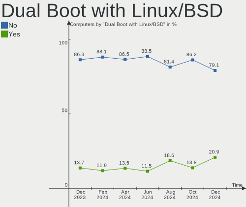

| Dual boot | Computers | Percent |
|-----------|-----------|---------|
| No        | 221       | 82.46%  |
| Yes       | 47        | 17.54%  |

Dual Boot (Win)
---------------

Hosting Linux and Windows

| Dual boot | Computers | Percent |
|-----------|-----------|---------|
| No        | 188       | 70.15%  |
| Yes       | 80        | 29.85%  |

Board
-----

Vendor
------

Motherboard manufacturer

| Name                                 | Computers | Percent |
|--------------------------------------|-----------|---------|
| Hewlett-Packard                      | 50        | 18.66%  |
| ASUSTek Computer                     | 44        | 16.42%  |
| Lenovo                               | 42        | 15.67%  |
| Acer                                 | 22        | 8.21%   |
| MSI                                  | 20        | 7.46%   |
| Dell                                 | 20        | 7.46%   |
| ASRock                               | 11        | 4.1%    |
| Gigabyte Technology                  | 8         | 2.99%   |
| Apple                                | 7         | 2.61%   |
| Toshiba                              | 4         | 1.49%   |
| Fujitsu                              | 4         | 1.49%   |
| Valve                                | 3         | 1.12%   |
| Microtech                            | 3         | 1.12%   |
| HUAWEI                               | 3         | 1.12%   |
| Unknown                              | 3         | 1.12%   |
| Sony                                 | 2         | 0.75%   |
| Notebook                             | 2         | 0.75%   |
| Intel                                | 2         | 0.75%   |
| AZW                                  | 2         | 0.75%   |
| AMI                                  | 2         | 0.75%   |
| YJKC                                 | 1         | 0.37%   |
| TrekStor                             | 1         | 0.37%   |
| Timi                                 | 1         | 0.37%   |
| Techvision                           | 1         | 0.37%   |
| Shenzhen Meigao Electronic Equipment | 1         | 0.37%   |
| SANTECH                              | 1         | 0.37%   |
| Samsung Electronics                  | 1         | 0.37%   |
| Quanta                               | 1         | 0.37%   |
| PC Specialist                        | 1         | 0.37%   |
| Packard Bell                         | 1         | 0.37%   |
| Olivetti                             | 1         | 0.37%   |
| GMK                                  | 1         | 0.37%   |
| DFI                                  | 1         | 0.37%   |
| Chuwi                                | 1         | 0.37%   |

Model
-----

Motherboard model

| Name                                       | Computers | Percent |
|--------------------------------------------|-----------|---------|
| Valve Jupiter                              | 3         | 1.12%   |
| Unknown                                    | 3         | 1.12%   |
| MSI Prestige 14Evo A11M                    | 2         | 0.75%   |
| MSI MS-7D09                                | 2         | 0.75%   |
| MSI MS-7C56                                | 2         | 0.75%   |
| MSI MS-7C37                                | 2         | 0.75%   |
| MSI MS-7B86                                | 2         | 0.75%   |
| Microtech ebookPro                         | 2         | 0.75%   |
| Lenovo G50-45 80E3                         | 2         | 0.75%   |
| HP Pavilion Laptop 15-ck0xx                | 2         | 0.75%   |
| HP Pavilion 15                             | 2         | 0.75%   |
| HP 250 15.6 inch G9 Notebook PC            | 2         | 0.75%   |
| Dell XPS 15 9570                           | 2         | 0.75%   |
| AZW U59                                    | 2         | 0.75%   |
| ASUS All Series                            | 2         | 0.75%   |
| ASRock X570 Phantom Gaming 4               | 2         | 0.75%   |
| AMI Intel                                  | 2         | 0.75%   |
| Acer One S1003                             | 2         | 0.75%   |
| YJKC vBOOK Plus                            | 1         | 0.37%   |
| TrekStor Notebook Slim S130                | 1         | 0.37%   |
| Toshiba Satellite Pro S500                 | 1         | 0.37%   |
| Toshiba Satellite L655                     | 1         | 0.37%   |
| Toshiba Satellite L50-B                    | 1         | 0.37%   |
| Toshiba NB550D                             | 1         | 0.37%   |
| Timi TM1701                                | 1         | 0.37%   |
| Techvision TVI7309X                        | 1         | 0.37%   |
| Sony VPCEH1S1E                             | 1         | 0.37%   |
| Sony SVE1713X1EB                           | 1         | 0.37%   |
| Shenzhen Meigao Electronic Equipment HX90G | 1         | 0.37%   |
| SANTECH NHx0DB,DE                          | 1         | 0.37%   |
| Samsung 950QED                             | 1         | 0.37%   |
| Quanta CA27                                | 1         | 0.37%   |
| PC Specialist 14 Fusion IV                 | 1         | 0.37%   |
| Packard Bell IMEDIA S3800                  | 1         | 0.37%   |
| Olivetti Spring Peak                       | 1         | 0.37%   |
| Notebook W54_55SU1,SUW                     | 1         | 0.37%   |
| Notebook P15SM                             | 1         | 0.37%   |
| MSI MS-7D43                                | 1         | 0.37%   |
| MSI MS-7C91                                | 1         | 0.37%   |
| MSI MS-7B89                                | 1         | 0.37%   |

Model Family
------------

Motherboard model prefix

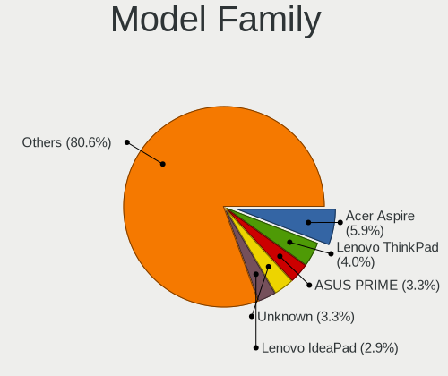

| Name               | Computers | Percent |
|--------------------|-----------|---------|
| Lenovo ThinkPad    | 15        | 5.6%    |
| Lenovo IdeaPad     | 13        | 4.85%   |
| HP Pavilion        | 11        | 4.1%    |
| Acer Aspire        | 10        | 3.73%   |
| Dell Latitude      | 7         | 2.61%   |
| HP ProBook         | 5         | 1.87%   |
| HP Laptop          | 5         | 1.87%   |
| HP Compaq          | 5         | 1.87%   |
| Dell Inspiron      | 5         | 1.87%   |
| ASUS ROG           | 5         | 1.87%   |
| Acer Veriton       | 5         | 1.87%   |
| Dell XPS           | 4         | 1.49%   |
| ASUS VivoBook      | 4         | 1.49%   |
| ASUS TUF           | 4         | 1.49%   |
| Valve Jupiter      | 3         | 1.12%   |
| Toshiba Satellite  | 3         | 1.12%   |
| HP ENVY            | 3         | 1.12%   |
| HP EliteBook       | 3         | 1.12%   |
| HP 250             | 3         | 1.12%   |
| Dell OptiPlex      | 3         | 1.12%   |
| Unknown            | 3         | 1.12%   |
| MSI Prestige       | 2         | 0.75%   |
| MSI MS-7D09        | 2         | 0.75%   |
| MSI MS-7C56        | 2         | 0.75%   |
| MSI MS-7C37        | 2         | 0.75%   |
| MSI MS-7B86        | 2         | 0.75%   |
| Microtech ebookPro | 2         | 0.75%   |
| Lenovo G50-45      | 2         | 0.75%   |
| HP ProDesk         | 2         | 0.75%   |
| HP OMEN            | 2         | 0.75%   |
| HP 255             | 2         | 0.75%   |
| Fujitsu LIFEBOOK   | 2         | 0.75%   |
| Fujitsu ESPRIMO    | 2         | 0.75%   |
| AZW U59            | 2         | 0.75%   |
| ASUS PRIME         | 2         | 0.75%   |
| ASUS All           | 2         | 0.75%   |
| ASRock X570        | 2         | 0.75%   |
| AMI Intel          | 2         | 0.75%   |
| Acer One           | 2         | 0.75%   |
| Acer Extensa       | 2         | 0.75%   |

MFG Year
--------

Motherboard manufacture year

| Year | Computers | Percent |
|------|-----------|---------|
| 2021 | 35        | 13.06%  |
| 2019 | 29        | 10.82%  |
| 2020 | 26        | 9.7%    |
| 2018 | 24        | 8.96%   |
| 2013 | 20        | 7.46%   |
| 2022 | 18        | 6.72%   |
| 2017 | 18        | 6.72%   |
| 2016 | 15        | 5.6%    |
| 2012 | 14        | 5.22%   |
| 2010 | 13        | 4.85%   |
| 2014 | 12        | 4.48%   |
| 2011 | 12        | 4.48%   |
| 2009 | 12        | 4.48%   |
| 2015 | 10        | 3.73%   |
| 2008 | 7         | 2.61%   |
| 2023 | 1         | 0.37%   |
| 2007 | 1         | 0.37%   |
| 2005 | 1         | 0.37%   |

Form Factor
-----------

Physical design of the computer

| Name        | Computers | Percent |
|-------------|-----------|---------|
| Notebook    | 148       | 55.22%  |
| Desktop     | 90        | 33.58%  |
| Convertible | 11        | 4.1%    |
| All in one  | 10        | 3.73%   |
| Tablet      | 4         | 1.49%   |
| Mini pc     | 4         | 1.49%   |
| Server      | 1         | 0.37%   |

Secure Boot
-----------

Enabled or disabled

| State    | Computers | Percent |
|----------|-----------|---------|
| Disabled | 252       | 94.03%  |
| Enabled  | 16        | 5.97%   |

Coreboot
--------

Have coreboot on board

| Used | Computers | Percent |
|------|-----------|---------|
| No   | 268       | 100%    |

RAM Size
--------

Total RAM memory

| Size in GB  | Computers | Percent |
|-------------|-----------|---------|
| 4.01-8.0    | 81        | 30.22%  |
| 16.01-24.0  | 57        | 21.27%  |
| 8.01-16.0   | 52        | 19.4%   |
| 3.01-4.0    | 37        | 13.81%  |
| 32.01-64.0  | 26        | 9.7%    |
| 64.01-256.0 | 6         | 2.24%   |
| 1.01-2.0    | 4         | 1.49%   |
| 24.01-32.0  | 3         | 1.12%   |
| 2.01-3.0    | 2         | 0.75%   |

RAM Used
--------

Used RAM memory

| Used GB    | Computers | Percent |
|------------|-----------|---------|
| 1.01-2.0   | 87        | 32.46%  |
| 2.01-3.0   | 71        | 26.49%  |
| 4.01-8.0   | 50        | 18.66%  |
| 3.01-4.0   | 41        | 15.3%   |
| 8.01-16.0  | 9         | 3.36%   |
| 0.51-1.0   | 7         | 2.61%   |
| 16.01-24.0 | 2         | 0.75%   |
| 0.01-0.5   | 1         | 0.37%   |

Total Drives
------------

Number of drives on board

| Drives | Computers | Percent |
|--------|-----------|---------|
| 1      | 161       | 60.07%  |
| 2      | 69        | 25.75%  |
| 3      | 23        | 8.58%   |
| 5      | 7         | 2.61%   |
| 4      | 6         | 2.24%   |
| 6      | 1         | 0.37%   |
| 0      | 1         | 0.37%   |

Has CD-ROM
----------

Has CD-ROM on board

| Presented | Computers | Percent |
|-----------|-----------|---------|
| No        | 177       | 66.04%  |
| Yes       | 91        | 33.96%  |

Has Ethernet
------------

Has Ethernet on board

| Presented | Computers | Percent |
|-----------|-----------|---------|
| Yes       | 222       | 82.84%  |
| No        | 46        | 17.16%  |

Has WiFi
--------

Has WiFi module

| Presented | Computers | Percent |
|-----------|-----------|---------|
| Yes       | 212       | 79.1%   |
| No        | 56        | 20.9%   |

Has Bluetooth
-------------

Has Bluetooth module

| Presented | Computers | Percent |
|-----------|-----------|---------|
| Yes       | 195       | 72.76%  |
| No        | 73        | 27.24%  |

Location
--------

Country
-------

Geographic location (country)

| Country | Computers | Percent |
|---------|-----------|---------|
| Italy   | 268       | 100%    |

City
----

Geographic location (city)

| City                              | Computers | Percent |
|-----------------------------------|-----------|---------|
| Milan                             | 30        | 11.19%  |
| Rome                              | 24        | 8.96%   |
| Milano                            | 21        | 7.84%   |
| Turin                             | 11        | 4.1%    |
| Naples                            | 7         | 2.61%   |
| Genoa                             | 7         | 2.61%   |
| Florence                          | 5         | 1.87%   |
| Bergamo                           | 4         | 1.49%   |
| Villachiara                       | 3         | 1.12%   |
| Verona                            | 3         | 1.12%   |
| Rho                               | 3         | 1.12%   |
| Palermo                           | 3         | 1.12%   |
| Asti                              | 3         | 1.12%   |
| Treviso                           | 2         | 0.75%   |
| Sora                              | 2         | 0.75%   |
| Rozzano                           | 2         | 0.75%   |
| Prad am Stilfser Joch             | 2         | 0.75%   |
| Padova                            | 2         | 0.75%   |
| Messina                           | 2         | 0.75%   |
| Granarolo dell'Emilia e Viadagola | 2         | 0.75%   |
| Cordovado                         | 2         | 0.75%   |
| Collesalvetti                     | 2         | 0.75%   |
| Citta                             | 2         | 0.75%   |
| Catania                           | 2         | 0.75%   |
| Campodoro                         | 2         | 0.75%   |
| Campobasso                        | 2         | 0.75%   |
| Brescia                           | 2         | 0.75%   |
| Alessandria                       | 2         | 0.75%   |
| Aci Catena                        | 2         | 0.75%   |
| Zevio                             | 1         | 0.37%   |
| Villa Guardia                     | 1         | 0.37%   |
| Villa Carcina                     | 1         | 0.37%   |
| Vignole Borbera                   | 1         | 0.37%   |
| Vicenza                           | 1         | 0.37%   |
| Verbania                          | 1         | 0.37%   |
| Vasto                             | 1         | 0.37%   |
| Valsamoggia                       | 1         | 0.37%   |
| Vajont                            | 1         | 0.37%   |
| Vahrn                             | 1         | 0.37%   |
| Uzzano                            | 1         | 0.37%   |

Drives
------

Drive Vendor
------------

Hard drive vendors

| Vendor                      | Computers | Drives | Percent |
|-----------------------------|-----------|--------|---------|
| Samsung Electronics         | 74        | 84     | 18.73%  |
| Seagate                     | 51        | 60     | 12.91%  |
| WDC                         | 41        | 47     | 10.38%  |
| Toshiba                     | 25        | 25     | 6.33%   |
| Kingston                    | 25        | 25     | 6.33%   |
| Crucial                     | 22        | 23     | 5.57%   |
| SanDisk                     | 20        | 21     | 5.06%   |
| Unknown                     | 16        | 16     | 4.05%   |
| HGST                        | 11        | 11     | 2.78%   |
| Intel                       | 10        | 10     | 2.53%   |
| SK hynix                    | 9         | 9      | 2.28%   |
| Phison Electronics          | 6         | 6      | 1.52%   |
| Hitachi                     | 6         | 6      | 1.52%   |
| Phison                      | 5         | 5      | 1.27%   |
| Micron Technology           | 5         | 5      | 1.27%   |
| Kingston Technology Company | 5         | 5      | 1.27%   |
| Apple                       | 5         | 6      | 1.27%   |
| Transcend                   | 4         | 4      | 1.01%   |
| Micron/Crucial Technology   | 4         | 4      | 1.01%   |
| A-DATA Technology           | 4         | 5      | 1.01%   |
| SSSTC                       | 3         | 3      | 0.76%   |
| KIOXIA                      | 3         | 4      | 0.76%   |
| Intenso                     | 3         | 3      | 0.76%   |
| China                       | 3         | 3      | 0.76%   |
| SABRENT                     | 2         | 2      | 0.51%   |
| Maxtor                      | 2         | 2      | 0.51%   |
| LITEON                      | 2         | 2      | 0.51%   |
| GOODRAM                     | 2         | 2      | 0.51%   |
| ASMT                        | 2         | 2      | 0.51%   |
| Unknown                     | 2         | 2      | 0.51%   |
| WINTEC                      | 1         | 1      | 0.25%   |
| Verbatim                    | 1         | 1      | 0.25%   |
| USB30                       | 1         | 1      | 0.25%   |
| USB                         | 1         | 1      | 0.25%   |
| Teclast                     | 1         | 1      | 0.25%   |
| T-FORCE                     | 1         | 1      | 0.25%   |
| SSK                         | 1         | 1      | 0.25%   |
| SPCC                        | 1         | 1      | 0.25%   |
| Solid State Storage         | 1         | 1      | 0.25%   |
| sobetter                    | 1         | 1      | 0.25%   |

Drive Model
-----------

Hard drive models

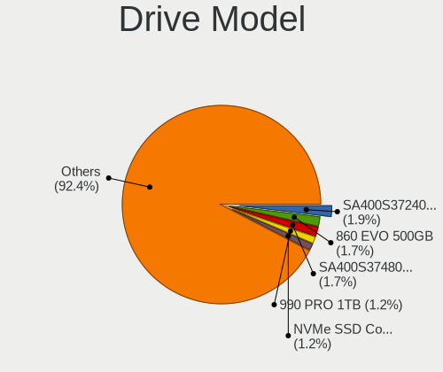

| Model                                               | Computers | Percent |
|-----------------------------------------------------|-----------|---------|
| Kingston SA400S37240G 240GB SSD                     | 9         | 2.15%   |
| Samsung SSD 860 EVO 500GB                           | 8         | 1.91%   |
| Samsung NVMe SSD Controller SM981/PM981/PM983 250GB | 7         | 1.67%   |
| Crucial CT500MX500SSD1 500GB                        | 7         | 1.67%   |
| Seagate ST500DM002-1BD142 500GB                     | 5         | 1.2%    |
| Samsung NVMe SSD Controller PM9A1/PM9A3/980PRO 1TB  | 5         | 1.2%    |
| Unknown MMC Card  32GB                              | 4         | 0.96%   |
| Seagate ST9500325AS 500GB                           | 4         | 0.96%   |
| Seagate ST2000DM008-2FR102 2TB                      | 4         | 0.96%   |
| Samsung SSD 850 EVO 500GB                           | 4         | 0.96%   |
| Seagate ST1000LM024 HN-M101MBB 1TB                  | 3         | 0.72%   |
| Seagate Basic 2TB                                   | 3         | 0.72%   |
| Samsung SSD 970 EVO Plus 1TB                        | 3         | 0.72%   |
| Samsung SSD 870 EVO 500GB                           | 3         | 0.72%   |
| Samsung SSD 850 EVO 250GB                           | 3         | 0.72%   |
| Phison Sabrent 512GB                                | 3         | 0.72%   |
| Phison E12 NVMe Controller 256GB                    | 3         | 0.72%   |
| Kingston Company OM3PDP3 NVMe SSD 256GB             | 3         | 0.72%   |
| HGST HTS545050A7E680 500GB                          | 3         | 0.72%   |
| Crucial CT480BX500SSD1 480GB                        | 3         | 0.72%   |
| WDC WD5000LPCX-24VHAT0 500GB                        | 2         | 0.48%   |
| WDC WD5000AADS-00S9B0 500GB                         | 2         | 0.48%   |
| WDC WD10SPZX-60Z10T0 1TB                            | 2         | 0.48%   |
| WDC WD10EZEX-21WN4A0 1TB                            | 2         | 0.48%   |
| WDC WD10EZEX-08WN4A0 1TB                            | 2         | 0.48%   |
| Unknown SD/MMC/MS PRO 64GB                          | 2         | 0.48%   |
| Toshiba XG6 NVMe SSD Controller 512GB               | 2         | 0.48%   |
| Toshiba MQ01ABF050 500GB                            | 2         | 0.48%   |
| Toshiba MQ01ABD100 1TB                              | 2         | 0.48%   |
| Toshiba MK5065GSX 500GB                             | 2         | 0.48%   |
| Toshiba KXG50ZNV256G 256GB                          | 2         | 0.48%   |
| Toshiba DT01ACA100 1TB                              | 2         | 0.48%   |
| SK hynix HFM001TD3JX013N 1TB                        | 2         | 0.48%   |
| SK hynix HCG8e  64GB                                | 2         | 0.48%   |
| Seagate ST3320418AS 320GB                           | 2         | 0.48%   |
| Seagate ST1000LM035-1RK172 1TB                      | 2         | 0.48%   |
| Seagate ST1000DM010-2EP102 1TB                      | 2         | 0.48%   |
| Seagate ST1000DM003-1ER162 1TB                      | 2         | 0.48%   |
| Seagate Expansion+ 2TB                              | 2         | 0.48%   |
| Seagate Expansion SW 5TB                            | 2         | 0.48%   |

HDD Vendor
----------

Hard disk drive vendors

| Vendor  | Computers | Drives | Percent |
|---------|-----------|--------|---------|
| Seagate | 47        | 54     | 37.6%   |
| WDC     | 34        | 39     | 27.2%   |
| Toshiba | 17        | 17     | 13.6%   |
| HGST    | 11        | 11     | 8.8%    |
| Hitachi | 6         | 6      | 4.8%    |
| Unknown | 2         | 2      | 1.6%    |
| SABRENT | 2         | 2      | 1.6%    |
| Maxtor  | 2         | 2      | 1.6%    |
| ASMT    | 2         | 2      | 1.6%    |
| Apple   | 2         | 2      | 1.6%    |

SSD Vendor
----------

Solid state drive vendors

| Vendor              | Computers | Drives | Percent |
|---------------------|-----------|--------|---------|
| Samsung Electronics | 39        | 42     | 28.68%  |
| Kingston            | 20        | 20     | 14.71%  |
| Crucial             | 19        | 19     | 13.97%  |
| SanDisk             | 14        | 15     | 10.29%  |
| Apple               | 4         | 4      | 2.94%   |
| Transcend           | 3         | 3      | 2.21%   |
| SK hynix            | 3         | 3      | 2.21%   |
| Intenso             | 3         | 3      | 2.21%   |
| Intel               | 3         | 3      | 2.21%   |
| China               | 3         | 3      | 2.21%   |
| WDC                 | 2         | 2      | 1.47%   |
| GOODRAM             | 2         | 2      | 1.47%   |
| A-DATA Technology   | 2         | 3      | 1.47%   |
| WINTEC              | 1         | 1      | 0.74%   |
| Verbatim            | 1         | 1      | 0.74%   |
| USB30               | 1         | 1      | 0.74%   |
| Toshiba             | 1         | 1      | 0.74%   |
| Teclast             | 1         | 1      | 0.74%   |
| SSSTC               | 1         | 1      | 0.74%   |
| Seagate             | 1         | 1      | 0.74%   |
| PNY                 | 1         | 1      | 0.74%   |
| OCZ                 | 1         | 1      | 0.74%   |
| Microtech           | 1         | 1      | 0.74%   |
| LITEON              | 1         | 1      | 0.74%   |
| Lexar               | 1         | 1      | 0.74%   |
| JMicron Technology  | 1         | 1      | 0.74%   |
| iODD                | 1         | 1      | 0.74%   |
| GSemi               | 1         | 1      | 0.74%   |
| Gigabyte Technology | 1         | 1      | 0.74%   |
| Corsair             | 1         | 1      | 0.74%   |
| 2-Power             | 1         | 1      | 0.74%   |
| Unknown             | 1         | 1      | 0.74%   |

Drive Kind
----------

HDD or SSD

| Kind    | Computers | Drives | Percent |
|---------|-----------|--------|---------|
| SSD     | 121       | 141    | 33.15%  |
| NVMe    | 110       | 120    | 30.14%  |
| HDD     | 108       | 137    | 29.59%  |
| MMC     | 17        | 17     | 4.66%   |
| Unknown | 9         | 10     | 2.47%   |

Drive Connector
---------------

SATA, SAS, NVMe, etc.

| Type | Computers | Drives | Percent |
|------|-----------|--------|---------|
| SATA | 180       | 261    | 54.38%  |
| NVMe | 110       | 120    | 33.23%  |
| SAS  | 24        | 27     | 7.25%   |
| MMC  | 17        | 17     | 5.14%   |

Drive Size
----------

Size of hard drive

| Size in TB | Computers | Drives | Percent |
|------------|-----------|--------|---------|
| 0.01-0.5   | 145       | 185    | 63.6%   |
| 0.51-1.0   | 58        | 64     | 25.44%  |
| 1.01-2.0   | 15        | 18     | 6.58%   |
| 2.01-3.0   | 4         | 4      | 1.75%   |
| 4.01-10.0  | 4         | 5      | 1.75%   |
| 3.01-4.0   | 2         | 2      | 0.88%   |

Space Total
-----------

Amount of disk space available on the file system

| Size in GB     | Computers | Percent |
|----------------|-----------|---------|
| 251-500        | 65        | 24.25%  |
| 101-250        | 65        | 24.25%  |
| 501-1000       | 33        | 12.31%  |
| 1-20           | 28        | 10.45%  |
| 1001-2000      | 22        | 8.21%   |
| 2001-3000      | 14        | 5.22%   |
| More than 3000 | 11        | 4.1%    |
| 51-100         | 11        | 4.1%    |
| Unknown        | 10        | 3.73%   |
| 21-50          | 9         | 3.36%   |

Space Used
----------

Amount of used disk space

| Used GB        | Computers | Percent |
|----------------|-----------|---------|
| 1-20           | 94        | 35.07%  |
| 101-250        | 40        | 14.93%  |
| 21-50          | 39        | 14.55%  |
| 51-100         | 30        | 11.19%  |
| 251-500        | 20        | 7.46%   |
| 501-1000       | 20        | 7.46%   |
| Unknown        | 10        | 3.73%   |
| 1001-2000      | 9         | 3.36%   |
| More than 3000 | 3         | 1.12%   |
| 2001-3000      | 3         | 1.12%   |

Malfunc. Drives
---------------

Drive models with a malfunction

| Model                                    | Computers | Drives | Percent |
|------------------------------------------|-----------|--------|---------|
| Toshiba MK5065GSX 500GB                  | 2         | 2      | 5.71%   |
| Seagate ST1000LM035-1RK172 1TB           | 2         | 2      | 5.71%   |
| WINTEC 240GB SATA3 SF2281 SSD            | 1         | 1      | 2.86%   |
| WDC WDS120G2G0A-00JH30 120GB SSD         | 1         | 1      | 2.86%   |
| WDC WD5000AVDS-63U7B1 500GB              | 1         | 1      | 2.86%   |
| WDC WD2500BEVS-60UST0 250GB              | 1         | 1      | 2.86%   |
| WDC WD10EZEX-60M2NA0 1TB                 | 1         | 1      | 2.86%   |
| WDC WD10EZEX-00BN5A0 1TB                 | 1         | 1      | 2.86%   |
| Toshiba MQ01ABD100 1TB                   | 1         | 1      | 2.86%   |
| Toshiba MK6465GSX 640GB                  | 1         | 1      | 2.86%   |
| Toshiba MK2035GSS 200GB                  | 1         | 1      | 2.86%   |
| Toshiba DT01ACA100 1TB                   | 1         | 1      | 2.86%   |
| SSSTC CV8-8E128-HP 128GB SSD             | 1         | 1      | 2.86%   |
| SK hynix SC308 SATA 512GB SSD            | 1         | 1      | 2.86%   |
| SK hynix SC308 SATA 128GB SSD            | 1         | 1      | 2.86%   |
| Seagate ST9500325AS 500GB                | 1         | 1      | 2.86%   |
| Seagate ST750LM022 HN-M750MBB 752GB      | 1         | 1      | 2.86%   |
| Seagate ST500LM000-1EJ162 500GB          | 1         | 1      | 2.86%   |
| Seagate ST500DM002-1BD142 500GB          | 1         | 1      | 2.86%   |
| Seagate ST500DM002-1BC142 500GB          | 1         | 1      | 2.86%   |
| Seagate ST3320418AS 320GB                | 1         | 1      | 2.86%   |
| Seagate ST3250620AS 250GB                | 1         | 1      | 2.86%   |
| Seagate ST1000LM024 HN-M101MBB 1TB       | 1         | 1      | 2.86%   |
| SanDisk SSD PLUS 480GB                   | 1         | 2      | 2.86%   |
| Samsung Electronics SSD 970 EVO Plus 1TB | 1         | 1      | 2.86%   |
| Samsung Electronics SSD 840 EVO 250GB    | 1         | 1      | 2.86%   |
| Maxtor STM3250310AS 250GB                | 1         | 1      | 2.86%   |
| Intel SSDSCKKF256G8H 256GB               | 1         | 1      | 2.86%   |
| Hitachi HDS722020ALA330 2TB              | 1         | 1      | 2.86%   |
| HGST HTS545050A7E680 500GB               | 1         | 1      | 2.86%   |
| HGST HTS541075A9E680 752GB               | 1         | 1      | 2.86%   |
| GSemi GSDSM256TY2F1QGCX 256GB SSD        | 1         | 1      | 2.86%   |
| Corsair Force GS 240GB SSD               | 1         | 1      | 2.86%   |

Malfunc. Drive Vendor
---------------------

Vendors of faulty drives

| Vendor              | Computers | Drives | Percent |
|---------------------|-----------|--------|---------|
| Seagate             | 10        | 10     | 29.41%  |
| Toshiba             | 6         | 6      | 17.65%  |
| WDC                 | 4         | 5      | 11.76%  |
| SK hynix            | 2         | 2      | 5.88%   |
| Samsung Electronics | 2         | 2      | 5.88%   |
| HGST                | 2         | 2      | 5.88%   |
| WINTEC              | 1         | 1      | 2.94%   |
| SSSTC               | 1         | 1      | 2.94%   |
| SanDisk             | 1         | 2      | 2.94%   |
| Maxtor              | 1         | 1      | 2.94%   |
| Intel               | 1         | 1      | 2.94%   |
| Hitachi             | 1         | 1      | 2.94%   |
| GSemi               | 1         | 1      | 2.94%   |
| Corsair             | 1         | 1      | 2.94%   |

Malfunc. HDD Vendor
-------------------

Vendors of faulty HDD drives

| Vendor  | Computers | Drives | Percent |
|---------|-----------|--------|---------|
| Seagate | 10        | 10     | 41.67%  |
| Toshiba | 6         | 6      | 25%     |
| WDC     | 4         | 4      | 16.67%  |
| HGST    | 2         | 2      | 8.33%   |
| Maxtor  | 1         | 1      | 4.17%   |
| Hitachi | 1         | 1      | 4.17%   |

Malfunc. Drive Kind
-------------------

Kinds of faulty drives

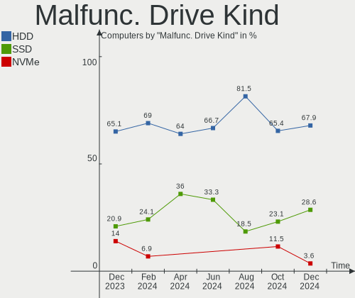

| Kind | Computers | Drives | Percent |
|------|-----------|--------|---------|
| HDD  | 24        | 24     | 68.57%  |
| SSD  | 10        | 11     | 28.57%  |
| NVMe | 1         | 1      | 2.86%   |

Failed Drives
-------------

Failed drive models

Zero info for selected period =(

Failed Drive Vendor
-------------------

Failed drive vendors

Zero info for selected period =(

Drive Status
------------

Number of failed and malfunc. drives

| Status   | Computers | Drives | Percent |
|----------|-----------|--------|---------|
| Works    | 139       | 189    | 46.96%  |
| Detected | 124       | 200    | 41.89%  |
| Malfunc  | 33        | 36     | 11.15%  |

Storage controller
------------------

Storage Vendor
--------------

Storage controller vendors

| Vendor                         | Computers | Percent |
|--------------------------------|-----------|---------|
| Intel                          | 174       | 48.88%  |
| AMD                            | 50        | 14.04%  |
| Samsung Electronics            | 43        | 12.08%  |
| Phison Electronics             | 12        | 3.37%   |
| SanDisk                        | 11        | 3.09%   |
| Kingston Technology Company    | 10        | 2.81%   |
| Micron/Crucial Technology      | 8         | 2.25%   |
| Toshiba America Info Systems   | 6         | 1.69%   |
| ASMedia Technology             | 6         | 1.69%   |
| Micron Technology              | 5         | 1.4%    |
| SK hynix                       | 4         | 1.12%   |
| Marvell Technology Group       | 4         | 1.12%   |
| KIOXIA                         | 4         | 1.12%   |
| JMicron Technology             | 4         | 1.12%   |
| Solid State Storage Technology | 3         | 0.84%   |
| Silicon Motion                 | 3         | 0.84%   |
| ADATA Technology               | 3         | 0.84%   |
| Nvidia                         | 2         | 0.56%   |
| VIA Technologies               | 1         | 0.28%   |
| Silicon Image                  | 1         | 0.28%   |
| Lite-On Technology             | 1         | 0.28%   |
| Compaq Computer                | 1         | 0.28%   |

Storage Model
-------------

Storage controller models

| Model                                                                          | Computers | Percent |
|--------------------------------------------------------------------------------|-----------|---------|
| AMD FCH SATA Controller [AHCI mode]                                            | 32        | 8.16%   |
| Samsung NVMe SSD Controller SM981/PM981/PM983                                  | 19        | 4.85%   |
| Intel Sunrise Point-LP SATA Controller [AHCI mode]                             | 15        | 3.83%   |
| Intel 82801 Mobile SATA Controller [RAID mode]                                 | 14        | 3.57%   |
| Intel Volume Management Device NVMe RAID Controller                            | 13        | 3.32%   |
| Intel 8 Series/C220 Series Chipset Family 6-port SATA Controller 1 [AHCI mode] | 12        | 3.06%   |
| Samsung NVMe SSD Controller 980                                                | 11        | 2.81%   |
| Intel 6 Series/C200 Series Chipset Family 6 port Desktop SATA AHCI Controller  | 9         | 2.3%    |
| Samsung NVMe SSD Controller PM9A1/PM9A3/980PRO                                 | 8         | 2.04%   |
| Phison E12 NVMe Controller                                                     | 8         | 2.04%   |
| Intel 82801IBM/IEM (ICH9M/ICH9M-E) 4 port SATA Controller [AHCI mode]          | 8         | 2.04%   |
| Intel Q170/Q150/B150/H170/H110/Z170/CM236 Chipset SATA Controller [AHCI Mode]  | 7         | 1.79%   |
| Intel Celeron/Pentium Silver Processor SATA Controller                         | 7         | 1.79%   |
| AMD 500 Series Chipset SATA Controller                                         | 7         | 1.79%   |
| Intel Wildcat Point-LP SATA Controller [AHCI Mode]                             | 6         | 1.53%   |
| Intel 7 Series Chipset Family 6-port SATA Controller [AHCI mode]               | 6         | 1.53%   |
| Intel 6 Series/C200 Series Chipset Family 6 port Mobile SATA AHCI Controller   | 6         | 1.53%   |
| ASMedia ASM1062 Serial ATA Controller                                          | 6         | 1.53%   |
| AMD 400 Series Chipset SATA Controller                                         | 6         | 1.53%   |
| Micron NVMe Storage Controller                                                 | 5         | 1.28%   |
| Intel Comet Lake SATA AHCI Controller                                          | 5         | 1.28%   |
| AMD SB7x0/SB8x0/SB9x0 SATA Controller [AHCI mode]                              | 5         | 1.28%   |
| SanDisk WD Blue SN550 NVMe SSD                                                 | 4         | 1.02%   |
| Micron/Crucial P2 NVMe PCIe SSD                                                | 4         | 1.02%   |
| Intel 8 Series SATA Controller 1 [AHCI mode]                                   | 4         | 1.02%   |
| Intel 5 Series/3400 Series Chipset 4 port SATA AHCI Controller                 | 4         | 1.02%   |
| AMD 300 Series Chipset SATA Controller                                         | 4         | 1.02%   |
| Toshiba America Info Systems XG5 NVMe SSD Controller                           | 3         | 0.77%   |
| Solid State Storage Non-Volatile memory controller                             | 3         | 0.77%   |
| SK hynix Gold P31/PC711 NVMe Solid State Drive                                 | 3         | 0.77%   |
| Samsung NVMe SSD Controller SM961/PM961/SM963                                  | 3         | 0.77%   |
| KIOXIA NVMe SSD Controller BG4                                                 | 3         | 0.77%   |
| Kingston Company OM3PDP3 NVMe SSD                                              | 3         | 0.77%   |
| Intel Tiger Lake-LP SATA Controller                                            | 3         | 0.77%   |
| Intel Non-Volatile memory controller                                           | 3         | 0.77%   |
| Intel NM10/ICH7 Family SATA Controller [IDE mode]                              | 3         | 0.77%   |
| Intel Jasper Lake SATA AHCI Controller                                         | 3         | 0.77%   |
| Intel HM170/QM170 Chipset SATA Controller [AHCI Mode]                          | 3         | 0.77%   |
| Intel Celeron N3350/Pentium N4200/Atom E3900 Series SATA AHCI Controller       | 3         | 0.77%   |
| Intel Alder Lake-S PCH SATA Controller [AHCI Mode]                             | 3         | 0.77%   |

Storage Kind
------------

Kind of storage controller (IDE, SATA, NVMe, SAS, ...)

| Kind | Computers | Percent |
|------|-----------|---------|
| SATA | 188       | 53.71%  |
| NVMe | 110       | 31.43%  |
| RAID | 33        | 9.43%   |
| IDE  | 19        | 5.43%   |

Processor
---------

CPU Vendor
----------

Processor vendors

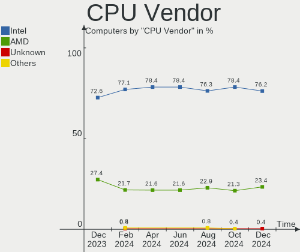

| Vendor | Computers | Percent |
|--------|-----------|---------|
| Intel  | 205       | 76.49%  |
| AMD    | 63        | 23.51%  |

CPU Model
---------

Processor models

| Model                                   | Computers | Percent |
|-----------------------------------------|-----------|---------|
| Intel 11th Gen Core i7-1165G7 @ 2.80GHz | 8         | 2.99%   |
| Intel Core i5-8250U CPU @ 1.60GHz       | 5         | 1.87%   |
| Intel Core i7-8565U CPU @ 1.80GHz       | 4         | 1.49%   |
| Intel Core i7-8550U CPU @ 1.80GHz       | 4         | 1.49%   |
| Intel Core i7-7500U CPU @ 2.70GHz       | 4         | 1.49%   |
| AMD Ryzen 7 1700 Eight-Core Processor   | 4         | 1.49%   |
| Intel Core i5-10210U CPU @ 1.60GHz      | 3         | 1.12%   |
| Intel 11th Gen Core i7-1185G7 @ 3.00GHz | 3         | 1.12%   |
| Intel 11th Gen Core i5-1135G7 @ 2.40GHz | 3         | 1.12%   |
| AMD Ryzen 5 5600X 6-Core Processor      | 3         | 1.12%   |
| AMD Custom APU 0405                     | 3         | 1.12%   |
| Intel Core i7-9750H CPU @ 2.60GHz       | 2         | 0.75%   |
| Intel Core i7-8750H CPU @ 2.20GHz       | 2         | 0.75%   |
| Intel Core i7-7700HQ CPU @ 2.80GHz      | 2         | 0.75%   |
| Intel Core i7-6700HQ CPU @ 2.60GHz      | 2         | 0.75%   |
| Intel Core i7-6600U CPU @ 2.60GHz       | 2         | 0.75%   |
| Intel Core i7-5500U CPU @ 2.40GHz       | 2         | 0.75%   |
| Intel Core i7-4600U CPU @ 2.10GHz       | 2         | 0.75%   |
| Intel Core i7-3770 CPU @ 3.40GHz        | 2         | 0.75%   |
| Intel Core i7-3632QM CPU @ 2.20GHz      | 2         | 0.75%   |
| Intel Core i7-2630QM CPU @ 2.00GHz      | 2         | 0.75%   |
| Intel Core i7-10750H CPU @ 2.60GHz      | 2         | 0.75%   |
| Intel Core i7-10510U CPU @ 1.80GHz      | 2         | 0.75%   |
| Intel Core i5-8365U CPU @ 1.60GHz       | 2         | 0.75%   |
| Intel Core i5-7300U CPU @ 2.60GHz       | 2         | 0.75%   |
| Intel Core i5-6300U CPU @ 2.40GHz       | 2         | 0.75%   |
| Intel Core i5-3470 CPU @ 3.20GHz        | 2         | 0.75%   |
| Intel Core i5-2400 CPU @ 3.10GHz        | 2         | 0.75%   |
| Intel Core i3 CPU M 370 @ 2.40GHz       | 2         | 0.75%   |
| Intel Core i3 CPU M 330 @ 2.13GHz       | 2         | 0.75%   |
| Intel Core i3 CPU 530 @ 2.93GHz         | 2         | 0.75%   |
| Intel Core 2 Duo CPU E7500 @ 2.93GHz    | 2         | 0.75%   |
| Intel Celeron N5105 @ 2.00GHz           | 2         | 0.75%   |
| Intel Celeron N4000 CPU @ 1.10GHz       | 2         | 0.75%   |
| Intel Celeron J4125 CPU @ 2.00GHz       | 2         | 0.75%   |
| Intel Celeron CPU N3350 @ 1.10GHz       | 2         | 0.75%   |
| Intel Atom x5-Z8350 CPU @ 1.44GHz       | 2         | 0.75%   |
| Intel Atom x5-Z8300 CPU @ 1.44GHz       | 2         | 0.75%   |
| Intel 12th Gen Core i7-12700H           | 2         | 0.75%   |
| Intel 12th Gen Core i7-1255U            | 2         | 0.75%   |

CPU Model Family
----------------

Processor model prefix

| Model                   | Computers | Percent |
|-------------------------|-----------|---------|
| Intel Core i7           | 62        | 23.13%  |
| Intel Core i5           | 45        | 16.79%  |
| Other                   | 36        | 13.43%  |
| Intel Core i3           | 21        | 7.84%   |
| AMD Ryzen 7             | 16        | 5.97%   |
| AMD Ryzen 5             | 15        | 5.6%    |
| Intel Celeron           | 12        | 4.48%   |
| Intel Core 2 Duo        | 11        | 4.1%    |
| Intel Pentium           | 6         | 2.24%   |
| AMD Ryzen 9             | 6         | 2.24%   |
| AMD FX                  | 5         | 1.87%   |
| Intel Atom              | 4         | 1.49%   |
| Intel Pentium Dual-Core | 3         | 1.12%   |
| AMD E1                  | 3         | 1.12%   |
| AMD A10                 | 3         | 1.12%   |
| Intel Xeon              | 2         | 0.75%   |
| AMD Ryzen 5 PRO         | 2         | 0.75%   |
| AMD Ryzen 3             | 2         | 0.75%   |
| AMD A8                  | 2         | 0.75%   |
| Intel Pentium Silver    | 1         | 0.37%   |
| Intel Pentium Gold      | 1         | 0.37%   |
| Intel Pentium Dual      | 1         | 0.37%   |
| Intel Core M            | 1         | 0.37%   |
| Intel Core i9           | 1         | 0.37%   |
| Intel Core 2 Quad       | 1         | 0.37%   |
| Intel Celeron Dual-Core | 1         | 0.37%   |
| AMD Ryzen 7 PRO         | 1         | 0.37%   |
| AMD E2                  | 1         | 0.37%   |
| AMD C-60                | 1         | 0.37%   |
| AMD Athlon II           | 1         | 0.37%   |
| AMD A6                  | 1         | 0.37%   |

CPU Cores
---------

Number of processor cores

| Number | Computers | Percent |
|--------|-----------|---------|
| 4      | 108       | 40.3%   |
| 2      | 91        | 33.96%  |
| 8      | 26        | 9.7%    |
| 6      | 23        | 8.58%   |
| 10     | 9         | 3.36%   |
| 12     | 5         | 1.87%   |
| 3      | 3         | 1.12%   |
| 14     | 2         | 0.75%   |
| 16     | 1         | 0.37%   |

CPU Sockets
-----------

Number of sockets

| Number | Computers | Percent |
|--------|-----------|---------|
| 1      | 267       | 99.63%  |
| 2      | 1         | 0.37%   |

CPU Threads
-----------

Threads per core (Hyper-Threading)

| Number | Computers | Percent |
|--------|-----------|---------|
| 2      | 194       | 72.39%  |
| 1      | 74        | 27.61%  |

CPU Op-Modes
------------

CPU Operation Modes (32-bit, 64-bit)

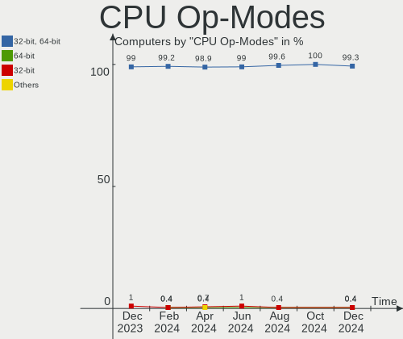

| Op mode        | Computers | Percent |
|----------------|-----------|---------|
| 32-bit, 64-bit | 267       | 99.63%  |
| Unknown        | 1         | 0.37%   |

CPU Microcode
-------------

Microcode number

| Number     | Computers | Percent |
|------------|-----------|---------|
| Unknown    | 109       | 40.67%  |
| 0x806ea    | 9         | 3.36%   |
| 0x806c1    | 9         | 3.36%   |
| 0x806e9    | 7         | 2.61%   |
| 0x306c3    | 7         | 2.61%   |
| 0x206a7    | 7         | 2.61%   |
| 0x1067a    | 7         | 2.61%   |
| 0x806ec    | 6         | 2.24%   |
| 0x506e3    | 6         | 2.24%   |
| 0x306a9    | 6         | 2.24%   |
| 0x0a50000c | 5         | 1.87%   |
| 0x906e9    | 4         | 1.49%   |
| 0x906ea    | 3         | 1.12%   |
| 0x906a4    | 3         | 1.12%   |
| 0x6fd      | 3         | 1.12%   |
| 0x406e3    | 3         | 1.12%   |
| 0x40651    | 3         | 1.12%   |
| 0x0a201016 | 3         | 1.12%   |
| 0x08608103 | 3         | 1.12%   |
| 0x08600106 | 3         | 1.12%   |
| 0x08108109 | 3         | 1.12%   |
| 0x08001137 | 3         | 1.12%   |
| 0x07030105 | 3         | 1.12%   |
| 0xa0671    | 2         | 0.75%   |
| 0x906c0    | 2         | 0.75%   |
| 0x90672    | 2         | 0.75%   |
| 0x806eb    | 2         | 0.75%   |
| 0x706a8    | 2         | 0.75%   |
| 0x706a1    | 2         | 0.75%   |
| 0x506c9    | 2         | 0.75%   |
| 0x406c3    | 2         | 0.75%   |
| 0x306d4    | 2         | 0.75%   |
| 0x20652    | 2         | 0.75%   |
| 0x0a50000d | 2         | 0.75%   |
| 0x08701021 | 2         | 0.75%   |
| 0xf48      | 1         | 0.37%   |
| 0xa0652    | 1         | 0.37%   |
| 0x906eb    | 1         | 0.37%   |
| 0x906a3    | 1         | 0.37%   |
| 0x806d1    | 1         | 0.37%   |

CPU Microarch
-------------

Microarchitecture

| Name             | Computers | Percent |
|------------------|-----------|---------|
| KabyLake         | 48        | 17.91%  |
| Haswell          | 21        | 7.84%   |
| Zen 3            | 18        | 6.72%   |
| IvyBridge        | 18        | 6.72%   |
| TigerLake        | 15        | 5.6%    |
| Penryn           | 13        | 4.85%   |
| Skylake          | 12        | 4.48%   |
| SandyBridge      | 12        | 4.48%   |
| Unknown          | 12        | 4.48%   |
| Alderlake Hybrid | 10        | 3.73%   |
| Zen 2            | 8         | 2.99%   |
| Westmere         | 8         | 2.99%   |
| Zen              | 7         | 2.61%   |
| Goldmont plus    | 7         | 2.61%   |
| CometLake        | 7         | 2.61%   |
| Silvermont       | 6         | 2.24%   |
| Broadwell        | 6         | 2.24%   |
| Zen+             | 5         | 1.87%   |
| Puma             | 4         | 1.49%   |
| Icelake          | 4         | 1.49%   |
| Core             | 4         | 1.49%   |
| Piledriver       | 3         | 1.12%   |
| Nehalem          | 3         | 1.12%   |
| Goldmont         | 3         | 1.12%   |
| Excavator        | 3         | 1.12%   |
| Tremont          | 2         | 0.75%   |
| Steamroller      | 2         | 0.75%   |
| Jaguar           | 2         | 0.75%   |
| Bulldozer        | 2         | 0.75%   |
| NetBurst         | 1         | 0.37%   |
| K10              | 1         | 0.37%   |
| Bobcat           | 1         | 0.37%   |

Graphics
--------

GPU Vendor
----------

Vendors of graphics cards

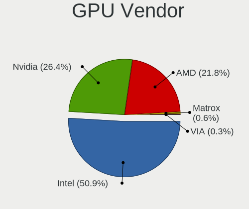

| Vendor | Computers | Percent |
|--------|-----------|---------|
| Intel  | 158       | 49.53%  |
| Nvidia | 87        | 27.27%  |
| AMD    | 74        | 23.2%   |

GPU Model
---------

Graphics card models

| Model                                                                                    | Computers | Percent |
|------------------------------------------------------------------------------------------|-----------|---------|
| Intel TigerLake-LP GT2 [Iris Xe Graphics]                                                | 15        | 4.6%    |
| Intel UHD Graphics 620                                                                   | 10        | 3.07%   |
| Intel HD Graphics 620                                                                    | 10        | 3.07%   |
| AMD Cezanne [Radeon Vega Series / Radeon Vega Mobile Series]                             | 10        | 3.07%   |
| Intel 3rd Gen Core processor Graphics Controller                                         | 8         | 2.45%   |
| Intel WhiskeyLake-U GT2 [UHD Graphics 620]                                               | 7         | 2.15%   |
| Intel 2nd Generation Core Processor Family Integrated Graphics Controller                | 7         | 2.15%   |
| Intel Haswell-ULT Integrated Graphics Controller                                         | 6         | 1.84%   |
| Intel GeminiLake [UHD Graphics 600]                                                      | 6         | 1.84%   |
| Intel CometLake-U GT2 [UHD Graphics]                                                     | 6         | 1.84%   |
| Intel 4th Gen Core Processor Integrated Graphics Controller                              | 6         | 1.84%   |
| Nvidia GK208B [GeForce GT 710]                                                           | 5         | 1.53%   |
| Intel Skylake GT2 [HD Graphics 520]                                                      | 5         | 1.53%   |
| AMD Topaz XT [Radeon R7 M260/M265 / M340/M360 / M440/M445 / 530/535 / 620/625 Mobile]    | 5         | 1.53%   |
| Intel Xeon E3-1200 v3/4th Gen Core Processor Integrated Graphics Controller              | 4         | 1.23%   |
| Intel Mobile 4 Series Chipset Integrated Graphics Controller                             | 4         | 1.23%   |
| Intel HD Graphics 5500                                                                   | 4         | 1.23%   |
| Intel HD Graphics 530                                                                    | 4         | 1.23%   |
| Intel CoffeeLake-H GT2 [UHD Graphics 630]                                                | 4         | 1.23%   |
| Intel Atom/Celeron/Pentium Processor x5-E8000/J3xxx/N3xxx Integrated Graphics Controller | 4         | 1.23%   |
| Intel Alder Lake-UP3 GT2 [Iris Xe Graphics]                                              | 4         | 1.23%   |
| AMD Renoir                                                                               | 4         | 1.23%   |
| AMD Picasso/Raven 2 [Radeon Vega Series / Radeon Vega Mobile Series]                     | 4         | 1.23%   |
| Nvidia GP108M [GeForce MX250]                                                            | 3         | 0.92%   |
| Nvidia GP107M [GeForce GTX 1050 Ti Mobile]                                               | 3         | 0.92%   |
| Nvidia GM108M [GeForce 940MX]                                                            | 3         | 0.92%   |
| Nvidia GF117M [GeForce 610M/710M/810M/820M / GT 620M/625M/630M/720M]                     | 3         | 0.92%   |
| Nvidia GA104 [GeForce RTX 3060 Ti Lite Hash Rate]                                        | 3         | 0.92%   |
| Intel JasperLake [UHD Graphics]                                                          | 3         | 0.92%   |
| Intel Alder Lake-P Integrated Graphics Controller                                        | 3         | 0.92%   |
| Intel 4 Series Chipset Integrated Graphics Controller                                    | 3         | 0.92%   |
| AMD VanGogh [AMD Custom GPU 0405]                                                        | 3         | 0.92%   |
| AMD Park [Mobility Radeon HD 5430/5450/5470]                                             | 3         | 0.92%   |
| AMD Navi 23 [Radeon RX 6600/6600 XT/6600M]                                               | 3         | 0.92%   |
| AMD Mullins [Radeon R4/R5 Graphics]                                                      | 3         | 0.92%   |
| AMD Lucienne                                                                             | 3         | 0.92%   |
| Nvidia TU117M [GeForce MX450]                                                            | 2         | 0.61%   |
| Nvidia TU106 [GeForce RTX 2060 Rev. A]                                                   | 2         | 0.61%   |
| Nvidia GP108M [GeForce MX150]                                                            | 2         | 0.61%   |
| Nvidia GP108 [GeForce GT 1030]                                                           | 2         | 0.61%   |

GPU Combo
---------

Combinations of graphics cards

| Name           | Computers | Percent |
|----------------|-----------|---------|
| 1 x Intel      | 110       | 41.04%  |
| 1 x AMD        | 58        | 21.64%  |
| 1 x Nvidia     | 40        | 14.93%  |
| Intel + Nvidia | 40        | 14.93%  |
| AMD + Nvidia   | 6         | 2.24%   |
| 2 x AMD        | 5         | 1.87%   |
| Intel + AMD    | 5         | 1.87%   |
| 2 x Intel      | 3         | 1.12%   |
| 2 x Nvidia     | 1         | 0.37%   |

GPU Driver
----------

Free vs proprietary

| Driver      | Computers | Percent |
|-------------|-----------|---------|
| Free        | 215       | 80.22%  |
| Proprietary | 44        | 16.42%  |
| Unknown     | 9         | 3.36%   |

GPU Memory
----------

Total video memory

| Size in GB | Computers | Percent |
|------------|-----------|---------|
| Unknown    | 163       | 60.82%  |
| 1.01-2.0   | 36        | 13.43%  |
| 0.51-1.0   | 19        | 7.09%   |
| 0.01-0.5   | 19        | 7.09%   |
| 3.01-4.0   | 12        | 4.48%   |
| 7.01-8.0   | 10        | 3.73%   |
| 5.01-6.0   | 5         | 1.87%   |
| 8.01-16.0  | 3         | 1.12%   |
| 2.01-3.0   | 1         | 0.37%   |

Monitor
-------

Monitor Vendor
--------------

Monitor vendors

| Vendor                  | Computers | Percent |
|-------------------------|-----------|---------|
| Samsung Electronics     | 40        | 14.44%  |
| AU Optronics            | 32        | 11.55%  |
| Chimei Innolux          | 31        | 11.19%  |
| BOE                     | 29        | 10.47%  |
| LG Display              | 24        | 8.66%   |
| Hewlett-Packard         | 13        | 4.69%   |
| Philips                 | 12        | 4.33%   |
| Acer                    | 9         | 3.25%   |
| Dell                    | 8         | 2.89%   |
| Apple                   | 7         | 2.53%   |
| Unknown                 | 6         | 2.17%   |
| AOC                     | 6         | 2.17%   |
| Ancor Communications    | 6         | 2.17%   |
| Lenovo                  | 5         | 1.81%   |
| Goldstar                | 5         | 1.81%   |
| BenQ                    | 5         | 1.81%   |
| Sony                    | 4         | 1.44%   |
| Sharp                   | 4         | 1.44%   |
| Valve                   | 3         | 1.08%   |
| ASUSTek Computer        | 3         | 1.08%   |
| ViewSonic               | 2         | 0.72%   |
| MSI                     | 2         | 0.72%   |
| InfoVision              | 2         | 0.72%   |
| Chi Mei Optoelectronics | 2         | 0.72%   |
| Unknown                 | 2         | 0.72%   |
| Wacom                   | 1         | 0.36%   |
| Vizio                   | 1         | 0.36%   |
| Vestel                  | 1         | 0.36%   |
| PANDA                   | 1         | 0.36%   |
| Novatek                 | 1         | 0.36%   |
| NEC Computers           | 1         | 0.36%   |
| MStar                   | 1         | 0.36%   |
| Lenovo Group Limited    | 1         | 0.36%   |
| Iiyama                  | 1         | 0.36%   |
| HUAWEI                  | 1         | 0.36%   |
| HannStar Display        | 1         | 0.36%   |
| GreenWood               | 1         | 0.36%   |
| CVT                     | 1         | 0.36%   |
| CPT                     | 1         | 0.36%   |
| CHD                     | 1         | 0.36%   |

Monitor Model
-------------

Monitor models

| Model                                                             | Computers | Percent |
|-------------------------------------------------------------------|-----------|---------|
| Valve ANX7530 U VLV3001 800x1280 100x150mm 7.1-inch               | 3         | 1.08%   |
| Samsung Electronics C27F390 SAM0D32 1920x1080 598x336mm 27.0-inch | 3         | 1.08%   |
| Chimei Innolux LCD Monitor CMN14D4 1920x1080 309x173mm 13.9-inch  | 3         | 1.08%   |
| AU Optronics LCD Monitor AUO243D 1920x1080 309x173mm 13.9-inch    | 3         | 1.08%   |
| Unknown LCD TV 9000 1360x768 1600x900mm 72.3-inch                 | 2         | 0.72%   |
| Sharp LCD Monitor SHP149A 1920x1080 344x194mm 15.5-inch           | 2         | 0.72%   |
| Samsung Electronics C24F390 SAM0D2C 1920x1080 521x293mm 23.5-inch | 2         | 0.72%   |
| Philips PHL 243V7 PHLC155 1920x1080 527x296mm 23.8-inch           | 2         | 0.72%   |
| LG Display LP156WH1-TLA3 LGD01C2 1366x768 344x194mm 15.5-inch     | 2         | 0.72%   |
| Lenovo LBG AIO PC LEN8000 1920x1080 521x293mm 23.5-inch           | 2         | 0.72%   |
| Chimei Innolux LCD Monitor CMN15F5 1920x1080 344x193mm 15.5-inch  | 2         | 0.72%   |
| Chimei Innolux LCD Monitor CMN15E7 1920x1080 344x193mm 15.5-inch  | 2         | 0.72%   |
| Chimei Innolux LCD Monitor CMN151E 1920x1080 344x193mm 15.5-inch  | 2         | 0.72%   |
| BOE LCD Monitor BOE07FF 1920x1080 344x194mm 15.5-inch             | 2         | 0.72%   |
| BOE LCD Monitor BOE0747 1920x1080 344x194mm 15.5-inch             | 2         | 0.72%   |
| BOE LCD Monitor BOE06F9 1920x1080 344x193mm 15.5-inch             | 2         | 0.72%   |
| BOE LCD Monitor BOE06DF 1920x1080 309x173mm 13.9-inch             | 2         | 0.72%   |
| BOE LCD Monitor BOE06AC 1920x1080 309x173mm 13.9-inch             | 2         | 0.72%   |
| BenQ EX2510S BNQ7FA3 1920x1080 544x303mm 24.5-inch                | 2         | 0.72%   |
| AU Optronics LCD Monitor AUO623D 1920x1080 309x174mm 14.0-inch    | 2         | 0.72%   |
| AU Optronics LCD Monitor AUO61ED 1920x1080 344x194mm 15.5-inch    | 2         | 0.72%   |
| AU Optronics LCD Monitor AUO499F 1920x1080 344x194mm 15.5-inch    | 2         | 0.72%   |
| AU Optronics LCD Monitor AUO21ED 1920x1080 344x194mm 15.5-inch    | 2         | 0.72%   |
| AU Optronics LCD Monitor AUO10EC 1366x768 344x193mm 15.5-inch     | 2         | 0.72%   |
| AOC 27B2G5 AOC2702 1920x1080 598x336mm 27.0-inch                  | 2         | 0.72%   |
| AOC 2460G5 AOC2460 1920x1080 531x299mm 24.0-inch                  | 2         | 0.72%   |
| Acer X223W ACR000D 1680x1050 474x296mm 22.0-inch                  | 2         | 0.72%   |
| Acer K242HL ACR03E3 1920x1080 531x299mm 24.0-inch                 | 2         | 0.72%   |
| Unknown                                                           | 2         | 0.72%   |
| Wacom Cintiq 22 WAC1065 1920x1080 476x268mm 21.5-inch             | 1         | 0.36%   |
| Vizio PC VIZCA27 1920x1080 597x336mm 27.0-inch                    | 1         | 0.36%   |
| ViewSonic VX3276-QHD VSCE635 2560x1440 698x393mm 31.5-inch        | 1         | 0.36%   |
| ViewSonic VP3881 VSCE234 3840x1600 880x367mm 37.5-inch            | 1         | 0.36%   |
| Vestel LCD Monitor 32W_LCD_TV 1920x1080                           | 1         | 0.36%   |
| Unknown LCDTV16 0101 1920x1080 1600x900mm 72.3-inch               | 1         | 0.36%   |
| Unknown LCD Monitor SAMSUNG 3840x2160                             | 1         | 0.36%   |
| Unknown LCD Monitor SAMSUNG 1920x1080                             | 1         | 0.36%   |
| Unknown LCD Monitor FFFF 2288x1287 2550x2550mm 142.0-inch         | 1         | 0.36%   |
| Sony TV SNY4B03 1920x1080 1063x598mm 48.0-inch                    | 1         | 0.36%   |
| Sony TV SNY1601 1280x768 1200x900mm 59.1-inch                     | 1         | 0.36%   |

Monitor Resolution
------------------

Monitor screen resolution

| Resolution         | Computers | Percent |
|--------------------|-----------|---------|
| 1920x1080 (FHD)    | 149       | 55.19%  |
| 1366x768 (WXGA)    | 37        | 13.7%   |
| 2560x1440 (QHD)    | 14        | 5.19%   |
| 3840x2160 (4K)     | 10        | 3.7%    |
| 1680x1050 (WSXGA+) | 9         | 3.33%   |
| 1920x1200 (WUXGA)  | 4         | 1.48%   |
| 1600x900 (HD+)     | 4         | 1.48%   |
| 1440x900 (WXGA+)   | 4         | 1.48%   |
| 1360x768           | 4         | 1.48%   |
| 1280x1024 (SXGA)   | 4         | 1.48%   |
| 800x1280           | 3         | 1.11%   |
| 3840x1080          | 3         | 1.11%   |
| 2880x1800          | 3         | 1.11%   |
| 1280x800 (WXGA)    | 3         | 1.11%   |
| 3840x1600          | 2         | 0.74%   |
| 3440x1440          | 2         | 0.74%   |
| 2880x1920          | 2         | 0.74%   |
| Unknown            | 2         | 0.74%   |
| 4480x1440          | 1         | 0.37%   |
| 3840x2400          | 1         | 0.37%   |
| 3072x1920          | 1         | 0.37%   |
| 2560x1600          | 1         | 0.37%   |
| 2560x1080          | 1         | 0.37%   |
| 2520x1680          | 1         | 0.37%   |
| 2288x1287          | 1         | 0.37%   |
| 2240x1400          | 1         | 0.37%   |
| 1920x1280          | 1         | 0.37%   |
| 1280x768           | 1         | 0.37%   |
| 1024x600           | 1         | 0.37%   |

Monitor Diagonal
----------------

Diagonal size in inches

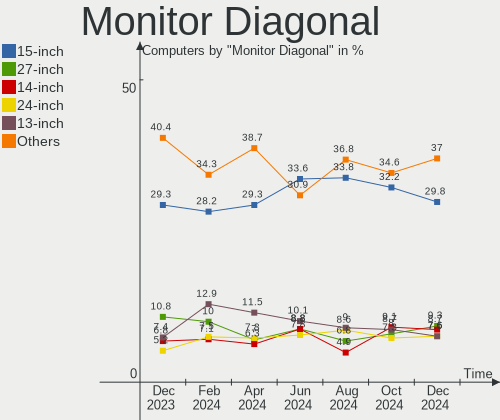

| Inches  | Computers | Percent |
|---------|-----------|---------|
| 15      | 76        | 27.54%  |
| 13      | 31        | 11.23%  |
| 27      | 23        | 8.33%   |
| 14      | 21        | 7.61%   |
| 24      | 18        | 6.52%   |
| 23      | 18        | 6.52%   |
| Unknown | 14        | 5.07%   |
| 21      | 12        | 4.35%   |
| 40      | 6         | 2.17%   |
| 22      | 5         | 1.81%   |
| 17      | 5         | 1.81%   |
| 20      | 4         | 1.45%   |
| 16      | 4         | 1.45%   |
| 72      | 3         | 1.09%   |
| 34      | 3         | 1.09%   |
| 19      | 3         | 1.09%   |
| 7       | 3         | 1.09%   |
| 75      | 2         | 0.72%   |
| 48      | 2         | 0.72%   |
| 32      | 2         | 0.72%   |
| 31      | 2         | 0.72%   |
| 25      | 2         | 0.72%   |
| 18      | 2         | 0.72%   |
| 12      | 2         | 0.72%   |
| 11      | 2         | 0.72%   |
| 10      | 2         | 0.72%   |
| 142     | 1         | 0.36%   |
| 59      | 1         | 0.36%   |
| 54      | 1         | 0.36%   |
| 52      | 1         | 0.36%   |
| 50      | 1         | 0.36%   |
| 47      | 1         | 0.36%   |
| 38      | 1         | 0.36%   |
| 37      | 1         | 0.36%   |
| 26      | 1         | 0.36%   |

Monitor Width
-------------

Physical width

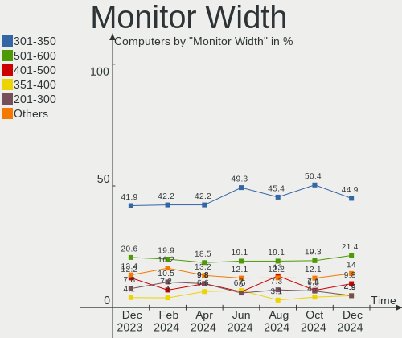

| Width in mm    | Computers | Percent |
|----------------|-----------|---------|
| 301-350        | 119       | 43.27%  |
| 501-600        | 60        | 21.82%  |
| 401-500        | 24        | 8.73%   |
| 201-300        | 19        | 6.91%   |
| Unknown        | 14        | 5.09%   |
| 801-900        | 8         | 2.91%   |
| 351-400        | 7         | 2.55%   |
| 1001-1500      | 7         | 2.55%   |
| 701-800        | 5         | 1.82%   |
| 1501-2000      | 5         | 1.82%   |
| 601-700        | 3         | 1.09%   |
| 1-100          | 3         | 1.09%   |
| More than 2000 | 1         | 0.36%   |

Aspect Ratio
------------

Proportional relationship between the width and the height

| Ratio   | Computers | Percent |
|---------|-----------|---------|
| 16/9    | 201       | 76.72%  |
| 16/10   | 31        | 11.83%  |
| Unknown | 14        | 5.34%   |
| 21/9    | 5         | 1.91%   |
| 0.67    | 3         | 1.15%   |
| 5/4     | 2         | 0.76%   |
| 32/9    | 2         | 0.76%   |
| 3/2     | 2         | 0.76%   |
| 4/3     | 1         | 0.38%   |
| 1.00    | 1         | 0.38%   |

Monitor Area
------------

Area in inch

| Area in inch | Computers | Percent |
|----------------|-----------|---------|
| 101-110        | 76        | 27.64%  |
| 81-90          | 41        | 14.91%  |
| 201-250        | 41        | 14.91%  |
| 301-350        | 23        | 8.36%   |
| Unknown        | 14        | 5.09%   |
| 151-200        | 12        | 4.36%   |
| 71-80          | 11        | 4%      |
| 501-1000       | 11        | 4%      |
| More than 1000 | 10        | 3.64%   |
| 251-300        | 10        | 3.64%   |
| 351-500        | 7         | 2.55%   |
| 121-130        | 4         | 1.45%   |
| 111-120        | 4         | 1.45%   |
| 1-40           | 3         | 1.09%   |
| 61-70          | 2         | 0.73%   |
| 51-60          | 2         | 0.73%   |
| 41-50          | 2         | 0.73%   |
| 141-150        | 1         | 0.36%   |
| 131-140        | 1         | 0.36%   |

Pixel Density
-------------

Pixels per inch

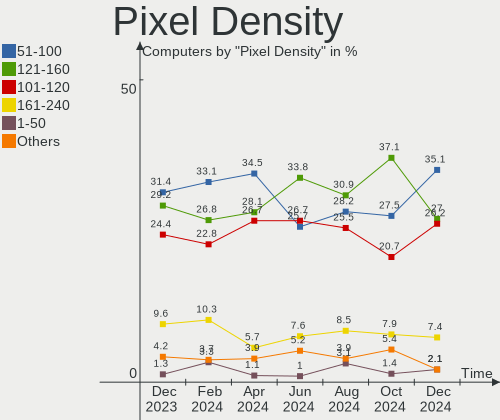

| Density       | Computers | Percent |
|---------------|-----------|---------|
| 121-160       | 85        | 31.72%  |
| 51-100        | 82        | 30.6%   |
| 101-120       | 52        | 19.4%   |
| 161-240       | 23        | 8.58%   |
| Unknown       | 14        | 5.22%   |
| 1-50          | 10        | 3.73%   |
| More than 240 | 2         | 0.75%   |

Multiple Monitors
-----------------

Total monitors connected

| Total | Computers | Percent |
|-------|-----------|---------|
| 1     | 228       | 85.07%  |
| 2     | 27        | 10.07%  |
| 0     | 11        | 4.1%    |
| 3     | 2         | 0.75%   |

Network
-------

Net Controller Vendor
---------------------

Controller vendors

| Vendor                          | Computers | Percent |
|---------------------------------|-----------|---------|
| Realtek Semiconductor           | 149       | 38.01%  |
| Intel                           | 142       | 36.22%  |
| Qualcomm Atheros                | 34        | 8.67%   |
| Broadcom                        | 18        | 4.59%   |
| MediaTek                        | 8         | 2.04%   |
| TP-Link                         | 5         | 1.28%   |
| Marvell Technology Group        | 5         | 1.28%   |
| Ralink                          | 4         | 1.02%   |
| Broadcom Limited                | 4         | 1.02%   |
| Dell                            | 2         | 0.51%   |
| ASIX Electronics                | 2         | 0.51%   |
| ZyDAS                           | 1         | 0.26%   |
| ZTE WCDMA Technologies MSM      | 1         | 0.26%   |
| Xiaomi                          | 1         | 0.26%   |
| Sierra Wireless                 | 1         | 0.26%   |
| Ralink Technology               | 1         | 0.26%   |
| Qualcomm Atheros Communications | 1         | 0.26%   |
| OPPO Electronics                | 1         | 0.26%   |
| ONDA COMMUNICATION              | 1         | 0.26%   |
| Nvidia                          | 1         | 0.26%   |
| NetGear                         | 1         | 0.26%   |
| Microsoft                       | 1         | 0.26%   |
| Lenovo                          | 1         | 0.26%   |
| ICS Advent                      | 1         | 0.26%   |
| Huawei Technologies             | 1         | 0.26%   |
| Hewlett-Packard                 | 1         | 0.26%   |
| Google                          | 1         | 0.26%   |
| Belkin Components               | 1         | 0.26%   |
| ASUSTek Computer                | 1         | 0.26%   |
| Aquantia                        | 1         | 0.26%   |

Net Controller Model
--------------------

Controller models

| Model                                                             | Computers | Percent |
|-------------------------------------------------------------------|-----------|---------|
| Realtek RTL8111/8168/8411 PCI Express Gigabit Ethernet Controller | 108       | 23.38%  |
| Realtek RTL810xE PCI Express Fast Ethernet controller             | 17        | 3.68%   |
| Intel Wi-Fi 6 AX200                                               | 13        | 2.81%   |
| Realtek RTL8822CE 802.11ac PCIe Wireless Network Adapter          | 12        | 2.6%    |
| Intel Wireless 8265 / 8275                                        | 12        | 2.6%    |
| Intel Wi-Fi 6 AX201                                               | 11        | 2.38%   |
| Realtek RTL8821CE 802.11ac PCIe Wireless Network Adapter          | 10        | 2.16%   |
| Realtek RTL8153 Gigabit Ethernet Adapter                          | 10        | 2.16%   |
| Intel Wireless 7265                                               | 9         | 1.95%   |
| Intel Wireless 3165                                               | 9         | 1.95%   |
| Qualcomm Atheros QCA9565 / AR9565 Wireless Network Adapter        | 8         | 1.73%   |
| Intel 82579LM Gigabit Network Connection (Lewisville)             | 8         | 1.73%   |
| MediaTek MT7921 802.11ax PCI Express Wireless Network Adapter     | 7         | 1.52%   |
| Intel Ethernet Controller I225-V                                  | 7         | 1.52%   |
| Intel I211 Gigabit Network Connection                             | 6         | 1.3%    |
| Intel Alder Lake-P PCH CNVi WiFi                                  | 6         | 1.3%    |
| Realtek RTL8125 2.5GbE Controller                                 | 5         | 1.08%   |
| Qualcomm Atheros QCA6174 802.11ac Wireless Network Adapter        | 5         | 1.08%   |
| Qualcomm Atheros AR9285 Wireless Network Adapter (PCI-Express)    | 5         | 1.08%   |
| Intel Wireless 8260                                               | 5         | 1.08%   |
| Intel Wireless 7260                                               | 5         | 1.08%   |
| Intel Dual Band Wireless-AC 3168NGW [Stone Peak]                  | 5         | 1.08%   |
| Intel Comet Lake PCH-LP CNVi WiFi                                 | 5         | 1.08%   |
| Realtek RTL8723BE PCIe Wireless Network Adapter                   | 4         | 0.87%   |
| Qualcomm Atheros QCA9377 802.11ac Wireless Network Adapter        | 4         | 0.87%   |
| Qualcomm Atheros AR928X Wireless Network Adapter (PCI-Express)    | 4         | 0.87%   |
| Intel Wi-Fi 6 AX210/AX211/AX411 160MHz                            | 4         | 0.87%   |
| Intel Ethernet Connection I219-LM                                 | 4         | 0.87%   |
| Intel Ethernet Connection I217-LM                                 | 4         | 0.87%   |
| Intel Ethernet Connection (2) I219-V                              | 4         | 0.87%   |
| Ralink RT3290 Wireless 802.11n 1T/1R PCIe                         | 3         | 0.65%   |
| Intel Ethernet Connection I218-LM                                 | 3         | 0.65%   |
| Intel Ethernet Connection (4) I219-V                              | 3         | 0.65%   |
| Intel Ethernet Connection (4) I219-LM                             | 3         | 0.65%   |
| Intel 82579V Gigabit Network Connection                           | 3         | 0.65%   |
| Realtek RTL8821AE 802.11ac PCIe Wireless Network Adapter          | 2         | 0.43%   |
| Realtek RTL8192EE PCIe Wireless Network Adapter                   | 2         | 0.43%   |
| Qualcomm Atheros AR9485 Wireless Network Adapter                  | 2         | 0.43%   |
| Qualcomm Atheros AR9462 Wireless Network Adapter                  | 2         | 0.43%   |
| Qualcomm Atheros AR9287 Wireless Network Adapter (PCI-Express)    | 2         | 0.43%   |

Wireless Vendor
---------------

Wireless vendors

| Vendor                          | Computers | Percent |
|---------------------------------|-----------|---------|
| Intel                           | 112       | 51.38%  |
| Realtek Semiconductor           | 34        | 15.6%   |
| Qualcomm Atheros                | 33        | 15.14%  |
| Broadcom                        | 11        | 5.05%   |
| MediaTek                        | 8         | 3.67%   |
| TP-Link                         | 4         | 1.83%   |
| Ralink                          | 4         | 1.83%   |
| Broadcom Limited                | 3         | 1.38%   |
| ZyDAS                           | 1         | 0.46%   |
| Sierra Wireless                 | 1         | 0.46%   |
| Ralink Technology               | 1         | 0.46%   |
| Qualcomm Atheros Communications | 1         | 0.46%   |
| NetGear                         | 1         | 0.46%   |
| Microsoft                       | 1         | 0.46%   |
| Dell                            | 1         | 0.46%   |
| Belkin Components               | 1         | 0.46%   |
| ASUSTek Computer                | 1         | 0.46%   |

Wireless Model
--------------

Wireless models

| Model                                                          | Computers | Percent |
|----------------------------------------------------------------|-----------|---------|
| Intel Wi-Fi 6 AX200                                            | 13        | 5.96%   |
| Realtek RTL8822CE 802.11ac PCIe Wireless Network Adapter       | 12        | 5.5%    |
| Intel Wireless 8265 / 8275                                     | 12        | 5.5%    |
| Intel Wi-Fi 6 AX201                                            | 11        | 5.05%   |
| Realtek RTL8821CE 802.11ac PCIe Wireless Network Adapter       | 10        | 4.59%   |
| Intel Wireless 7265                                            | 9         | 4.13%   |
| Intel Wireless 3165                                            | 9         | 4.13%   |
| Qualcomm Atheros QCA9565 / AR9565 Wireless Network Adapter     | 8         | 3.67%   |
| MediaTek MT7921 802.11ax PCI Express Wireless Network Adapter  | 7         | 3.21%   |
| Intel Alder Lake-P PCH CNVi WiFi                               | 6         | 2.75%   |
| Qualcomm Atheros QCA6174 802.11ac Wireless Network Adapter     | 5         | 2.29%   |
| Qualcomm Atheros AR9285 Wireless Network Adapter (PCI-Express) | 5         | 2.29%   |
| Intel Wireless 8260                                            | 5         | 2.29%   |
| Intel Wireless 7260                                            | 5         | 2.29%   |
| Intel Dual Band Wireless-AC 3168NGW [Stone Peak]               | 5         | 2.29%   |
| Intel Comet Lake PCH-LP CNVi WiFi                              | 5         | 2.29%   |
| Realtek RTL8723BE PCIe Wireless Network Adapter                | 4         | 1.83%   |
| Qualcomm Atheros QCA9377 802.11ac Wireless Network Adapter     | 4         | 1.83%   |
| Qualcomm Atheros AR928X Wireless Network Adapter (PCI-Express) | 4         | 1.83%   |
| Intel Wi-Fi 6 AX210/AX211/AX411 160MHz                         | 4         | 1.83%   |
| Ralink RT3290 Wireless 802.11n 1T/1R PCIe                      | 3         | 1.38%   |
| Realtek RTL8821AE 802.11ac PCIe Wireless Network Adapter       | 2         | 0.92%   |
| Realtek RTL8192EE PCIe Wireless Network Adapter                | 2         | 0.92%   |
| Qualcomm Atheros AR9485 Wireless Network Adapter               | 2         | 0.92%   |
| Qualcomm Atheros AR9462 Wireless Network Adapter               | 2         | 0.92%   |
| Qualcomm Atheros AR9287 Wireless Network Adapter (PCI-Express) | 2         | 0.92%   |
| Intel Wireless-AC 9260                                         | 2         | 0.92%   |
| Intel Wireless 3160                                            | 2         | 0.92%   |
| Intel Tiger Lake PCH CNVi WiFi                                 | 2         | 0.92%   |
| Intel Gemini Lake PCH CNVi WiFi                                | 2         | 0.92%   |
| Intel Dual Band Wireless-AC 3165 Plus Bluetooth                | 2         | 0.92%   |
| Intel Comet Lake PCH CNVi WiFi                                 | 2         | 0.92%   |
| Intel Centrino Wireless-N 2230                                 | 2         | 0.92%   |
| Intel Cannon Lake PCH CNVi WiFi                                | 2         | 0.92%   |
| Intel Alder Lake-S PCH CNVi WiFi                               | 2         | 0.92%   |
| Broadcom BCM43602 802.11ac Wireless LAN SoC                    | 2         | 0.92%   |
| Broadcom BCM4360 802.11ac Wireless Network Adapter             | 2         | 0.92%   |
| Broadcom BCM43228 802.11a/b/g/n                                | 2         | 0.92%   |
| ZyDAS ZD1211B 802.11g                                          | 1         | 0.46%   |
| TP-Link TL-WN823N v2/v3 [Realtek RTL8192EU]                    | 1         | 0.46%   |

Ethernet Vendor
---------------

Ethernet vendors

| Vendor                     | Computers | Percent |
|----------------------------|-----------|---------|
| Realtek Semiconductor      | 138       | 58.97%  |
| Intel                      | 64        | 27.35%  |
| Broadcom                   | 9         | 3.85%   |
| Qualcomm Atheros           | 5         | 2.14%   |
| Marvell Technology Group   | 5         | 2.14%   |
| ASIX Electronics           | 2         | 0.85%   |
| ZTE WCDMA Technologies MSM | 1         | 0.43%   |
| Xiaomi                     | 1         | 0.43%   |
| TP-Link                    | 1         | 0.43%   |
| OPPO Electronics           | 1         | 0.43%   |
| Nvidia                     | 1         | 0.43%   |
| Lenovo                     | 1         | 0.43%   |
| ICS Advent                 | 1         | 0.43%   |
| Hewlett-Packard            | 1         | 0.43%   |
| Google                     | 1         | 0.43%   |
| Broadcom Limited           | 1         | 0.43%   |
| Aquantia                   | 1         | 0.43%   |

Ethernet Model
--------------

Ethernet models

| Model                                                             | Computers | Percent |
|-------------------------------------------------------------------|-----------|---------|
| Realtek RTL8111/8168/8411 PCI Express Gigabit Ethernet Controller | 108       | 44.81%  |
| Realtek RTL810xE PCI Express Fast Ethernet controller             | 17        | 7.05%   |
| Realtek RTL8153 Gigabit Ethernet Adapter                          | 10        | 4.15%   |
| Intel 82579LM Gigabit Network Connection (Lewisville)             | 8         | 3.32%   |
| Intel Ethernet Controller I225-V                                  | 7         | 2.9%    |
| Intel I211 Gigabit Network Connection                             | 6         | 2.49%   |
| Realtek RTL8125 2.5GbE Controller                                 | 5         | 2.07%   |
| Intel Ethernet Connection I219-LM                                 | 4         | 1.66%   |
| Intel Ethernet Connection I217-LM                                 | 4         | 1.66%   |
| Intel Ethernet Connection (2) I219-V                              | 4         | 1.66%   |
| Intel Ethernet Connection I218-LM                                 | 3         | 1.24%   |
| Intel Ethernet Connection (4) I219-V                              | 3         | 1.24%   |
| Intel Ethernet Connection (4) I219-LM                             | 3         | 1.24%   |
| Intel 82579V Gigabit Network Connection                           | 3         | 1.24%   |
| Intel Ethernet Connection (7) I219-V                              | 2         | 0.83%   |
| Intel Ethernet Connection (13) I219-V                             | 2         | 0.83%   |
| Intel 82578DM Gigabit Network Connection                          | 2         | 0.83%   |
| Broadcom NetXtreme BCM57766 Gigabit Ethernet PCIe                 | 2         | 0.83%   |
| Broadcom NetLink BCM57785 Gigabit Ethernet PCIe                   | 2         | 0.83%   |
| ASIX AX88179 Gigabit Ethernet                                     | 2         | 0.83%   |
| ZTE WCDMA MSM USB SCSI CD-ROM                                     | 1         | 0.41%   |
| Xiaomi Mi/Redmi series (RNDIS)                                    | 1         | 0.41%   |
| TP-Link UE300 10/100/1000 LAN (ethernet mode) [Realtek RTL8153]   | 1         | 0.41%   |
| Realtek RTL8169 PCI Gigabit Ethernet Controller                   | 1         | 0.41%   |
| Realtek RTL8152 Fast Ethernet Adapter                             | 1         | 0.41%   |
| Realtek RTL-8100/8101L/8139 PCI Fast Ethernet Adapter             | 1         | 0.41%   |
| Qualcomm Atheros QCA8172 Fast Ethernet                            | 1         | 0.41%   |
| Qualcomm Atheros AR8152 v1.1 Fast Ethernet                        | 1         | 0.41%   |
| Qualcomm Atheros AR8151 v2.0 Gigabit Ethernet                     | 1         | 0.41%   |
| Qualcomm Atheros AR8132 Fast Ethernet                             | 1         | 0.41%   |
| Qualcomm Atheros AR8131 Gigabit Ethernet                          | 1         | 0.41%   |
| OPPO RMX3263                                                      | 1         | 0.41%   |
| Nvidia MCP79 Ethernet                                             | 1         | 0.41%   |
| Marvell Group 88E8071 PCI-E Gigabit Ethernet Controller           | 1         | 0.41%   |
| Marvell Group 88E8058 PCI-E Gigabit Ethernet Controller           | 1         | 0.41%   |
| Marvell Group 88E8053 PCI-E Gigabit Ethernet Controller           | 1         | 0.41%   |
| Marvell Group 88E8052 PCI-E ASF Gigabit Ethernet Controller       | 1         | 0.41%   |
| Marvell Group 88E8042 PCI-E Fast Ethernet Controller              | 1         | 0.41%   |
| Marvell Group 88E8040 PCI-E Fast Ethernet Controller              | 1         | 0.41%   |
| Lenovo Powered Hub                                                | 1         | 0.41%   |

Net Controller Kind
-------------------

Ethernet, WiFi or modem

| Kind     | Computers | Percent |
|----------|-----------|---------|
| Ethernet | 222       | 50.8%   |
| WiFi     | 212       | 48.51%  |
| Modem    | 3         | 0.69%   |

Used Controller
---------------

Currently used network controller

| Kind     | Computers | Percent |
|----------|-----------|---------|
| WiFi     | 158       | 57.66%  |
| Ethernet | 116       | 42.34%  |

NICs
----

Total network controllers on board

| Total | Computers | Percent |
|-------|-----------|---------|
| 2     | 153       | 57.09%  |
| 1     | 105       | 39.18%  |
| 3     | 6         | 2.24%   |
| 0     | 3         | 1.12%   |
| 6     | 1         | 0.37%   |

IPv6
----

IPv6 vs IPv4

| Used | Computers | Percent |
|------|-----------|---------|
| No   | 241       | 89.93%  |
| Yes  | 27        | 10.07%  |

Bluetooth
---------

Bluetooth Vendor
----------------

Controller vendors

| Vendor                          | Computers | Percent |
|---------------------------------|-----------|---------|
| Intel                           | 98        | 49.75%  |
| Realtek Semiconductor           | 28        | 14.21%  |
| Qualcomm Atheros Communications | 12        | 6.09%   |
| IMC Networks                    | 10        | 5.08%   |
| Cambridge Silicon Radio         | 8         | 4.06%   |
| Apple                           | 8         | 4.06%   |
| Lite-On Technology              | 6         | 3.05%   |
| Foxconn / Hon Hai               | 6         | 3.05%   |
| ASUSTek Computer                | 4         | 2.03%   |
| Ralink                          | 3         | 1.52%   |
| Broadcom                        | 3         | 1.52%   |
| Toshiba                         | 2         | 1.02%   |
| Realtek                         | 2         | 1.02%   |
| TP-Link                         | 1         | 0.51%   |
| SINO WEALTH                     | 1         | 0.51%   |
| MediaTek                        | 1         | 0.51%   |
| Hewlett-Packard                 | 1         | 0.51%   |
| Dell                            | 1         | 0.51%   |
| Chicony Electronics             | 1         | 0.51%   |
| Accel Semiconductor             | 1         | 0.51%   |

Bluetooth Model
---------------

Controller models

| Model                                               | Computers | Percent |
|-----------------------------------------------------|-----------|---------|
| Intel Bluetooth wireless interface                  | 37        | 18.78%  |
| Intel AX201 Bluetooth                               | 22        | 11.17%  |
| Realtek Bluetooth Radio                             | 18        | 9.14%   |
| Intel AX200 Bluetooth                               | 13        | 6.6%    |
| Cambridge Silicon Radio Bluetooth Dongle (HCI mode) | 8         | 4.06%   |
| Intel Bluetooth Device                              | 6         | 3.05%   |
| Intel Bluetooth 9460/9560 Jefferson Peak (JfP)      | 6         | 3.05%   |
| Intel Wireless-AC 3168 Bluetooth                    | 5         | 2.54%   |
| IMC Networks Bluetooth Radio                        | 5         | 2.54%   |
| Qualcomm Atheros QCA61x4 Bluetooth 4.0              | 4         | 2.03%   |
| Qualcomm Atheros AR3011 Bluetooth                   | 4         | 2.03%   |
| Apple Bluetooth Host Controller                     | 4         | 2.03%   |
| Realtek RTL8723B Bluetooth                          | 3         | 1.52%   |
| Realtek  Bluetooth 4.2 Adapter                      | 3         | 1.52%   |
| Ralink RT3290 Bluetooth                             | 3         | 1.52%   |
| Qualcomm Atheros  Bluetooth Device                  | 3         | 1.52%   |
| Lite-On Bluetooth Device                            | 3         | 1.52%   |
| Intel Centrino Bluetooth Wireless Transceiver       | 3         | 1.52%   |
| Intel AX210 Bluetooth                               | 3         | 1.52%   |
| IMC Networks Wireless_Device                        | 3         | 1.52%   |
| Foxconn / Hon Hai Wireless_Device                   | 3         | 1.52%   |
| Realtek Bluetooth 5.1 Radio                         | 2         | 1.02%   |
| Realtek Bluetooth Radio                             | 2         | 1.02%   |
| Intel Wireless-AC 9260 Bluetooth Adapter            | 2         | 1.02%   |
| IMC Networks Bluetooth Device                       | 2         | 1.02%   |
| Foxconn / Hon Hai Bluetooth Device                  | 2         | 1.02%   |
| Apple Bluetooth USB Host Controller                 | 2         | 1.02%   |
| TP-Link UB500 Adapter                               | 1         | 0.51%   |
| Toshiba Integrated Bluetooth HCI                    | 1         | 0.51%   |
| Toshiba Askey Bluetooth Module                      | 1         | 0.51%   |
| SINO WEALTH RK Bluetooth Keyboard                   | 1         | 0.51%   |
| Realtek RTL8822BE Bluetooth 4.2 Adapter             | 1         | 0.51%   |
| Realtek RTL8821A Bluetooth                          | 1         | 0.51%   |
| Qualcomm Atheros AR3012 Bluetooth 4.0               | 1         | 0.51%   |
| MediaTek Wireless_Device                            | 1         | 0.51%   |
| Lite-On Wireless_Device                             | 1         | 0.51%   |
| Lite-On Qualcomm Atheros QCA9377 Bluetooth          | 1         | 0.51%   |
| Lite-On Atheros AR3012 Bluetooth                    | 1         | 0.51%   |
| Intel Centrino Advanced-N 6230 Bluetooth adapter    | 1         | 0.51%   |
| HP Bluetooth 2.0 Interface [Broadcom BCM2045]       | 1         | 0.51%   |

Sound
-----

Sound Vendor
------------

Sound card vendors

| Vendor                 | Computers | Percent |
|------------------------|-----------|---------|
| Intel                  | 196       | 54.44%  |
| AMD                    | 76        | 21.11%  |
| Nvidia                 | 55        | 15.28%  |
| C-Media Electronics    | 7         | 1.94%   |
| Creative Labs          | 4         | 1.11%   |
| ASUSTek Computer       | 3         | 0.83%   |
| KTMicro                | 2         | 0.56%   |
| JMTek                  | 2         | 0.56%   |
| Corsair                | 2         | 0.56%   |
| VIA Technologies       | 1         | 0.28%   |
| USB Audio              | 1         | 0.28%   |
| UCQ01000               | 1         | 0.28%   |
| Texas Instruments      | 1         | 0.28%   |
| Tenx Technology        | 1         | 0.28%   |
| Samson Technologies    | 1         | 0.28%   |
| Realtek Semiconductor  | 1         | 0.28%   |
| Razer USA              | 1         | 0.28%   |
| Plantronics            | 1         | 0.28%   |
| Generalplus Technology | 1         | 0.28%   |
| Fnatic Gear            | 1         | 0.28%   |
| Dell                   | 1         | 0.28%   |
| BR36                   | 1         | 0.28%   |

Sound Model
-----------

Sound card models

| Model                                                                      | Computers | Percent |
|----------------------------------------------------------------------------|-----------|---------|
| Intel Sunrise Point-LP HD Audio                                            | 26        | 6%      |
| AMD Family 17h/19h HD Audio Controller                                     | 25        | 5.77%   |
| AMD Renoir Radeon High Definition Audio Controller                         | 17        | 3.93%   |
| Intel 6 Series/C200 Series Chipset Family High Definition Audio Controller | 16        | 3.7%    |
| Intel Tiger Lake-LP Smart Sound Technology Audio Controller                | 15        | 3.46%   |
| Intel 8 Series/C220 Series Chipset High Definition Audio Controller        | 14        | 3.23%   |
| Intel 7 Series/C216 Chipset Family High Definition Audio Controller        | 13        | 3%      |
| Intel Xeon E3-1200 v3/4th Gen Core Processor HD Audio Controller           | 11        | 2.54%   |
| AMD Starship/Matisse HD Audio Controller                                   | 11        | 2.54%   |
| Intel 5 Series/3400 Series Chipset High Definition Audio                   | 10        | 2.31%   |
| AMD FCH Azalia Controller                                                  | 9         | 2.08%   |
| Intel Cannon Point-LP High Definition Audio Controller                     | 8         | 1.85%   |
| Intel Alder Lake PCH-P High Definition Audio Controller                    | 8         | 1.85%   |
| Intel 82801I (ICH9 Family) HD Audio Controller                             | 8         | 1.85%   |
| Intel 100 Series/C230 Series Chipset Family HD Audio Controller            | 8         | 1.85%   |
| Intel Celeron/Pentium Silver Processor High Definition Audio               | 7         | 1.62%   |
| AMD Kabini HDMI/DP Audio                                                   | 7         | 1.62%   |
| Nvidia GK208 HDMI/DP Audio Controller                                      | 6         | 1.39%   |
| Nvidia GF108 High Definition Audio Controller                              | 6         | 1.39%   |
| Intel Wildcat Point-LP High Definition Audio Controller                    | 6         | 1.39%   |
| Intel Haswell-ULT HD Audio Controller                                      | 6         | 1.39%   |
| Intel Comet Lake PCH-LP cAVS                                               | 6         | 1.39%   |
| Intel Cannon Lake PCH cAVS                                                 | 6         | 1.39%   |
| Intel Broadwell-U Audio Controller                                         | 6         | 1.39%   |
| Intel 8 Series HD Audio Controller                                         | 6         | 1.39%   |
| AMD Navi 21/23 HDMI/DP Audio Controller                                    | 6         | 1.39%   |
| AMD Family 17h (Models 00h-0fh) HD Audio Controller                        | 6         | 1.39%   |
| Nvidia GA104 High Definition Audio Controller                              | 5         | 1.15%   |
| C-Media Electronics Audio Adapter (Unitek Y-247A)                          | 5         | 1.15%   |
| AMD SBx00 Azalia (Intel HDA)                                               | 5         | 1.15%   |
| AMD Raven/Raven2/Fenghuang HDMI/DP Audio Controller                        | 5         | 1.15%   |
| Nvidia GM107 High Definition Audio Controller [GeForce 940MX]              | 4         | 0.92%   |
| Nvidia GF119 HDMI Audio Controller                                         | 4         | 0.92%   |
| Intel Tiger Lake-H HD Audio Controller                                     | 4         | 0.92%   |
| Intel Comet Lake PCH cAVS                                                  | 4         | 0.92%   |
| AMD Rembrandt Radeon High Definition Audio Controller                      | 4         | 0.92%   |
| AMD Cedar HDMI Audio [Radeon HD 5400/6300/7300 Series]                     | 4         | 0.92%   |
| Nvidia TU107 GeForce GTX 1650 High Definition Audio Controller             | 3         | 0.69%   |
| Nvidia TU106 High Definition Audio Controller                              | 3         | 0.69%   |
| Nvidia GP107GL High Definition Audio Controller                            | 3         | 0.69%   |

Memory
------

Memory Vendor
-------------

Memory module vendors

| Vendor              | Computers | Percent |
|---------------------|-----------|---------|
| Samsung Electronics | 49        | 24.62%  |
| SK hynix            | 31        | 15.58%  |
| Micron Technology   | 27        | 13.57%  |
| Crucial             | 17        | 8.54%   |
| Unknown             | 16        | 8.04%   |
| Kingston            | 15        | 7.54%   |
| Corsair             | 9         | 4.52%   |
| Unknown (ABCD)      | 7         | 3.52%   |
| Unknown             | 5         | 2.51%   |
| G.Skill             | 4         | 2.01%   |
| Transcend           | 3         | 1.51%   |
| Ramaxel Technology  | 3         | 1.51%   |
| Timetec             | 2         | 1.01%   |
| Team                | 2         | 1.01%   |
| Elpida              | 2         | 1.01%   |
| A-DATA Technology   | 2         | 1.01%   |
| Unknown (8A5D)      | 1         | 0.5%    |
| Patriot             | 1         | 0.5%    |
| Nanya Technology    | 1         | 0.5%    |
| INNOVATION PC       | 1         | 0.5%    |
| Apacer              | 1         | 0.5%    |

Memory Model
------------

Memory module models

| Model                                                            | Computers | Percent |
|------------------------------------------------------------------|-----------|---------|
| Unknown                                                          | 5         | 2.33%   |
| Unknown (ABCD) RAM 123456789012345678 1GB DIMM DDR3 2400MT/s     | 4         | 1.86%   |
| Samsung RAM M471A1K43EB1-CWE 8GB SODIMM DDR4 3200MT/s            | 4         | 1.86%   |
| Unknown (ABCD) RAM 123456789012345678 2GB SODIMM LPDDR4 2400MT/s | 3         | 1.4%    |
| SK hynix RAM HMT351S6EFR8A-PB 4GB SODIMM DDR3 1600MT/s           | 3         | 1.4%    |
| Samsung RAM M471B5173EB0-YK0 4GB SODIMM DDR3 1600MT/s            | 3         | 1.4%    |
| Samsung RAM M471A5244CB0-CWE 4GB SODIMM DDR4 3200MT/s            | 3         | 1.4%    |
| Samsung RAM M471A5244CB0-CTD 4GB SODIMM DDR4 3266MT/s            | 3         | 1.4%    |
| Samsung RAM M471A2G44AM0-CWE 16GB SODIMM DDR4 3200MT/s           | 3         | 1.4%    |
| Micron RAM 8KTF51264HZ-1G6E1 4GB SODIMM DDR3 1600MT/s            | 3         | 1.4%    |
| Micron RAM 16KTF1G64HZ-1G6E1 8GB SODIMM DDR3 1600MT/s            | 3         | 1.4%    |
| Unknown RAM Module 2GB SODIMM DDR2 667MT/s                       | 2         | 0.93%   |
| SK hynix RAM HMA851S6JJR6N-VK 4GB SODIMM DDR4 2667MT/s           | 2         | 0.93%   |
| SK hynix RAM HMA81GS6AFR8N-UH 8GB SODIMM DDR4 2667MT/s           | 2         | 0.93%   |
| Samsung RAM Module 2GB DIMM DDR3 1333MT/s                        | 2         | 0.93%   |
| Samsung RAM M471B5773CHS-CH9 2GB SODIMM DDR3 4199MT/s            | 2         | 0.93%   |
| Samsung RAM M471B1G73QH0-YK0 8GB SODIMM DDR3 1867MT/s            | 2         | 0.93%   |
| Samsung RAM M471A1K43DB1-CWE 8GB SODIMM DDR4 3200MT/s            | 2         | 0.93%   |
| Samsung RAM M471A1K43BB1-CRC 8GB SODIMM DDR4 2667MT/s            | 2         | 0.93%   |
| Micron RAM 8ATF1G64HZ-2G3B1 8GB SODIMM DDR4 2400MT/s             | 2         | 0.93%   |
| Micron RAM 4ATF51264HZ-2G6E1 4GB SODIMM DDR4 2667MT/s            | 2         | 0.93%   |
| G.Skill RAM F4-3200C16-16GIS 16GB DIMM DDR4 3600MT/s             | 2         | 0.93%   |
| Unknown RAM Module 8GB SODIMM DDR3 1600MT/s                      | 1         | 0.47%   |
| Unknown RAM Module 4GB SODIMM DDR3 1600MT/s                      | 1         | 0.47%   |
| Unknown RAM Module 4GB SODIMM DDR3                               | 1         | 0.47%   |
| Unknown RAM Module 4GB SODIMM 800MT/s                            | 1         | 0.47%   |
| Unknown RAM Module 4GB DIMM DDR3 1333MT/s                        | 1         | 0.47%   |
| Unknown RAM Module 4GB DIMM DDR3 1067MT/s                        | 1         | 0.47%   |
| Unknown RAM Module 4GB Chip DDR4 2133MT/s                        | 1         | 0.47%   |
| Unknown RAM Module 2GB SODIMM 800MT/s                            | 1         | 0.47%   |
| Unknown RAM Module 2GB Row Of Chips LPDDR4 4267MT/s              | 1         | 0.47%   |
| Unknown RAM Module 2GB DIMM SDRAM                                | 1         | 0.47%   |
| Unknown RAM Module 2GB DIMM DDR3 1333MT/s                        | 1         | 0.47%   |
| Unknown RAM Module 2GB DIMM DDR2 800MT/s                         | 1         | 0.47%   |
| Unknown RAM Module 2GB DIMM 800MT/s                              | 1         | 0.47%   |
| Unknown RAM Module 1GB DIMM DDR 400MT/s                          | 1         | 0.47%   |
| Unknown RAM DDR4 NB 8G 2666 8GB SODIMM DDR4 2667MT/s             | 1         | 0.47%   |
| Unknown (8A5D) RAM SKIHOTAR-8GB-2666 8GB SODIMM DDR4 2667MT/s    | 1         | 0.47%   |
| Transcend RAM Module 16GB SODIMM DDR4 3200MT/s                   | 1         | 0.47%   |
| Transcend RAM JM800QSU-2G 2GB SODIMM DDR2 975MT/s                | 1         | 0.47%   |

Memory Kind
-----------

Memory module kinds

| Kind    | Computers | Percent |
|---------|-----------|---------|
| DDR4    | 93        | 53.45%  |
| DDR3    | 48        | 27.59%  |
| LPDDR4  | 9         | 5.17%   |
| SDRAM   | 8         | 4.6%    |
| DDR2    | 5         | 2.87%   |
| LPDDR5  | 4         | 2.3%    |
| LPDDR3  | 3         | 1.72%   |
| Unknown | 2         | 1.15%   |
| DDR5    | 1         | 0.57%   |
| DDR     | 1         | 0.57%   |

Memory Form Factor
------------------

Physical design of the memory module

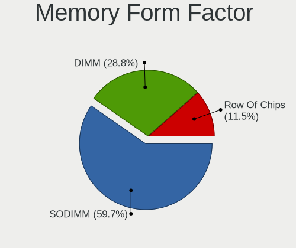

| Name         | Computers | Percent |
|--------------|-----------|---------|
| SODIMM       | 107       | 61.49%  |
| DIMM         | 49        | 28.16%  |
| Row Of Chips | 16        | 9.2%    |
| Chip         | 2         | 1.15%   |

Memory Size
-----------

Memory module size

| Size  | Computers | Percent |
|-------|-----------|---------|
| 8192  | 72        | 38.5%   |
| 4096  | 47        | 25.13%  |
| 16384 | 33        | 17.65%  |
| 2048  | 27        | 14.44%  |
| 32768 | 4         | 2.14%   |
| 1024  | 4         | 2.14%   |

Memory Speed
------------

Memory module speed

| Speed   | Computers | Percent |
|---------|-----------|---------|
| 1600    | 36        | 18.95%  |
| 2667    | 35        | 18.42%  |
| 3200    | 32        | 16.84%  |
| 2400    | 21        | 11.05%  |
| 1333    | 9         | 4.74%   |
| 3600    | 7         | 3.68%   |
| 2133    | 6         | 3.16%   |
| 1867    | 5         | 2.63%   |
| 6400    | 4         | 2.11%   |
| 3266    | 3         | 1.58%   |
| 1334    | 3         | 1.58%   |
| 800     | 3         | 1.58%   |
| 667     | 3         | 1.58%   |
| 4267    | 2         | 1.05%   |
| 4199    | 2         | 1.05%   |
| 3400    | 2         | 1.05%   |
| 3000    | 2         | 1.05%   |
| Unknown | 2         | 1.05%   |
| 4800    | 1         | 0.53%   |
| 3800    | 1         | 0.53%   |
| 3733    | 1         | 0.53%   |
| 3666    | 1         | 0.53%   |
| 3334    | 1         | 0.53%   |
| 2800    | 1         | 0.53%   |
| 2733    | 1         | 0.53%   |
| 2465    | 1         | 0.53%   |
| 1866    | 1         | 0.53%   |
| 1067    | 1         | 0.53%   |
| 1033    | 1         | 0.53%   |
| 975     | 1         | 0.53%   |
| 400     | 1         | 0.53%   |

Printers & scanners
-------------------

Printer Vendor
--------------

Printer device vendors

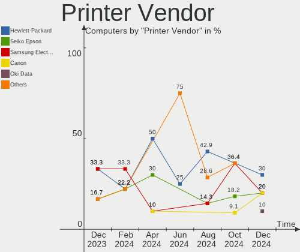

| Vendor              | Computers | Percent |
|---------------------|-----------|---------|
| Samsung Electronics | 6         | 30%     |
| Seiko Epson         | 4         | 20%     |
| Hewlett-Packard     | 4         | 20%     |
| Canon               | 4         | 20%     |
| Xerox               | 1         | 5%      |
| Kyocera             | 1         | 5%      |

Printer Model
-------------

Printer device models

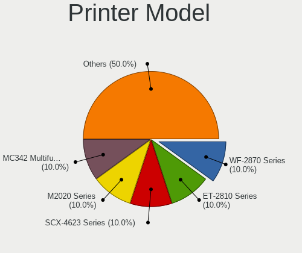

| Model                               | Computers | Percent |
|-------------------------------------|-----------|---------|
| Samsung M2020 Series                | 2         | 10%     |
| Canon LiDE 400                      | 2         | 10%     |
| Xerox WorkCentre 6015N/NI           | 1         | 5%      |
| Seiko Epson XP-2150 Series          | 1         | 5%      |
| Seiko Epson WF-2860 Series          | 1         | 5%      |
| Seiko Epson ET-2820 Series          | 1         | 5%      |
| Seiko Epson ET-2710 Series          | 1         | 5%      |
| Samsung SCX-4200 series             | 1         | 5%      |
| Samsung ML-2010P Mono Laser Printer | 1         | 5%      |
| Samsung M267x 287x Series           | 1         | 5%      |
| Samsung M2070 Series                | 1         | 5%      |
| Kyocera ECOSYS M5521cdw             | 1         | 5%      |
| HP OfficeJet 6950                   | 1         | 5%      |
| HP LaserJet P1102                   | 1         | 5%      |
| HP ENVY Photo 7800 series           | 1         | 5%      |
| HP DeskJet 5650c                    | 1         | 5%      |
| Canon PIXMA iP3600 Printer          | 1         | 5%      |
| Canon MF3110                        | 1         | 5%      |

Scanner Vendor
--------------

Scanner device vendors

| Vendor          | Computers | Percent |
|-----------------|-----------|---------|
| Hewlett-Packard | 1         | 50%     |
| Canon           | 1         | 50%     |

Scanner Model
-------------

Scanner device models

| Model                   | Computers | Percent |
|-------------------------|-----------|---------|
| HP ScanJet 3400cse      | 1         | 50%     |
| Canon CanoScan LiDE 210 | 1         | 50%     |

Camera
------

Camera Vendor
-------------

Camera device vendors

| Vendor                                 | Computers | Percent |
|----------------------------------------|-----------|---------|
| Chicony Electronics                    | 35        | 20%     |
| IMC Networks                           | 22        | 12.57%  |
| Microdia                               | 14        | 8%      |
| Acer                                   | 14        | 8%      |
| Logitech                               | 12        | 6.86%   |
| Cheng Uei Precision Industry (Foxlink) | 12        | 6.86%   |
| Realtek Semiconductor                  | 11        | 6.29%   |
| Syntek                                 | 7         | 4%      |
| Apple                                  | 7         | 4%      |
| Suyin                                  | 6         | 3.43%   |
| Sunplus Innovation Technology          | 6         | 3.43%   |
| Quanta                                 | 4         | 2.29%   |
| Luxvisions Innotech Limited            | 4         | 2.29%   |
| Lite-On Technology                     | 3         | 1.71%   |
| Alcor Micro                            | 3         | 1.71%   |
| Trust                                  | 2         | 1.14%   |
| Z-Star Microelectronics                | 1         | 0.57%   |
| USB Camera                             | 1         | 0.57%   |
| SunplusIT                              | 1         | 0.57%   |
| Sonix Technology                       | 1         | 0.57%   |
| Silicon Motion                         | 1         | 0.57%   |
| Ricoh                                  | 1         | 0.57%   |
| Primax Electronics                     | 1         | 0.57%   |
| Microsoft                              | 1         | 0.57%   |
| Importek                               | 1         | 0.57%   |
| Bison Electronics                      | 1         | 0.57%   |
| ARC International                      | 1         | 0.57%   |
| ALi                                    | 1         | 0.57%   |
| Alcorlink                              | 1         | 0.57%   |

Camera Model
------------

Camera device models

| Model                                                           | Computers | Percent |
|-----------------------------------------------------------------|-----------|---------|
| Chicony Integrated Camera                                       | 8         | 4.52%   |
| IMC Networks USB2.0 HD UVC WebCam                               | 7         | 3.95%   |
| Logitech Webcam C270                                            | 6         | 3.39%   |
| Syntek Integrated Camera                                        | 5         | 2.82%   |
| Microdia Integrated_Webcam_HD                                   | 5         | 2.82%   |
| IMC Networks Integrated Camera                                  | 5         | 2.82%   |
| Microdia Webcam Vitade AF                                       | 3         | 1.69%   |
| Luxvisions Innotech Limited HP TrueVision HD Camera             | 3         | 1.69%   |
| Chicony HD WebCam                                               | 3         | 1.69%   |
| Apple FaceTime HD Camera (Built-in)                             | 3         | 1.69%   |
| Acer HD Webcam                                                  | 3         | 1.69%   |
| Realtek Integrated_Webcam_HD                                    | 2         | 1.13%   |
| Realtek HP "Truevision HD" laptop camera                        | 2         | 1.13%   |
| Logitech HD Webcam C615                                         | 2         | 1.13%   |
| IMC Networks UVC VGA Webcam                                     | 2         | 1.13%   |
| IMC Networks USB2.0 VGA UVC WebCam                              | 2         | 1.13%   |
| IMC Networks HP TrueVision HD Camera                            | 2         | 1.13%   |
| Chicony Integrated Camera (1280x720@30)                         | 2         | 1.13%   |
| Chicony HP Wide Vision HD Camera                                | 2         | 1.13%   |
| Chicony HP HD Webcam                                            | 2         | 1.13%   |
| Chicony HP HD Camera                                            | 2         | 1.13%   |
| Chicony EasyCamera                                              | 2         | 1.13%   |
| Chicony Acer CrystalEye Webcam                                  | 2         | 1.13%   |
| Cheng Uei Precision Industry (Foxlink) HP Wide Vision HD Camera | 2         | 1.13%   |
| Cheng Uei Precision Industry (Foxlink) HP True Vision HD Camera | 2         | 1.13%   |
| Cheng Uei Precision Industry (Foxlink) HP HD Camera             | 2         | 1.13%   |
| Apple iPhone 5/5C/5S/6/SE/7/8/X                                 | 2         | 1.13%   |
| Apple Built-in iSight                                           | 2         | 1.13%   |
| Alcor Micro USB 2.0 Camera                                      | 2         | 1.13%   |
| Acer Lenovo EasyCamera                                          | 2         | 1.13%   |
| Acer Integrated Camera                                          | 2         | 1.13%   |
| Acer HD Camera                                                  | 2         | 1.13%   |
| Z-Star NMG 3M Webcam                                            | 1         | 0.56%   |
| USB Camera USB Camera                                           | 1         | 0.56%   |
| Trust USB Camera                                                | 1         | 0.56%   |
| Trust 17676 Webcam                                              | 1         | 0.56%   |
| Syntek LENOVO LBG 1080P CAM                                     | 1         | 0.56%   |
| Syntek Lenovo EasyCamera                                        | 1         | 0.56%   |
| Suyin Sony Visual Communication Camera                          | 1         | 0.56%   |
| Suyin HP Webcam-101                                             | 1         | 0.56%   |

Security
--------

Fingerprint Vendor
------------------

Fingerprint sensor vendors

| Vendor                     | Computers | Percent |
|----------------------------|-----------|---------|
| Validity Sensors           | 12        | 30.77%  |
| Synaptics                  | 12        | 30.77%  |
| Elan Microelectronics      | 7         | 17.95%  |
| Shenzhen Goodix Technology | 3         | 7.69%   |
| AuthenTec                  | 3         | 7.69%   |
| Upek                       | 1         | 2.56%   |
| Focal-systems.Corp         | 1         | 2.56%   |

Fingerprint Model
-----------------

Fingerprint sensor models

| Model                                                                      | Computers | Percent |
|----------------------------------------------------------------------------|-----------|---------|
| Elan ELAN:ARM-M4                                                           | 6         | 15.38%  |
| Synaptics Prometheus MIS Touch Fingerprint Reader                          | 3         | 7.69%   |
| Shenzhen Goodix  FingerPrint Device                                        | 3         | 7.69%   |
| Validity Sensors VFS495 Fingerprint Reader                                 | 2         | 5.13%   |
| Validity Sensors VFS 5011 fingerprint sensor                               | 2         | 5.13%   |
| Validity Sensors Synaptics VFS7552 Touch Fingerprint Sensor                | 2         | 5.13%   |
| Validity Sensors Swipe Fingerprint Sensor                                  | 2         | 5.13%   |
| Synaptics WBDI Fingerprint Reader USB 086                                  | 2         | 5.13%   |
| Synaptics Metallica MIS Touch Fingerprint Reader                           | 2         | 5.13%   |
| Validity Sensors VFS7500 Touch Fingerprint Sensor                          | 1         | 2.56%   |
| Validity Sensors Synaptics WBDI                                            | 1         | 2.56%   |
| Validity Sensors Synaptics VFS7552 Touch Fingerprint Sensor with PurePrint | 1         | 2.56%   |
| Validity Sensors Fingerprint scanner                                       | 1         | 2.56%   |
| Upek Biometric Touchchip/Touchstrip Fingerprint Sensor                     | 1         | 2.56%   |
| Synaptics WBDI                                                             | 1         | 2.56%   |
| Synaptics UWP WBDI                                                         | 1         | 2.56%   |
| Synaptics  FS7604 Touch Fingerprint Sensor with PurePrint                  | 1         | 2.56%   |
| Synaptics FS7604 Touch Fingerprint Sensor with PurePrint                   | 1         | 2.56%   |
| Focal-systems.Corp FT9201Fingerprint.                                      | 1         | 2.56%   |
| Elan ELAN:Fingerprint                                                      | 1         | 2.56%   |
| AuthenTec Fingerprint Sensor                                               | 1         | 2.56%   |
| AuthenTec AES2501 Fingerprint Sensor                                       | 1         | 2.56%   |
| AuthenTec AES1600                                                          | 1         | 2.56%   |
| Unknown                                                                    | 1         | 2.56%   |

Chipcard Vendor
---------------

Chipcard module vendors

| Vendor      | Computers | Percent |
|-------------|-----------|---------|
| Alcor Micro | 8         | 61.54%  |
| Broadcom    | 5         | 38.46%  |

Chipcard Model
--------------

Chipcard module models

| Model                                          | Computers | Percent |
|------------------------------------------------|-----------|---------|
| Alcor Micro AU9540 Smartcard Reader            | 8         | 61.54%  |
| Broadcom 5880                                  | 2         | 15.38%  |
| Broadcom 58200                                 | 2         | 15.38%  |
| Broadcom BCM5880 Secure Applications Processor | 1         | 7.69%   |

Unsupported
-----------

Unsupported Devices
-------------------

Total unsupported devices on board

| Total | Computers | Percent |
|-------|-----------|---------|
| 0     | 195       | 72.76%  |
| 1     | 58        | 21.64%  |
| 2     | 13        | 4.85%   |
| 3     | 2         | 0.75%   |

Unsupported Device Types
------------------------

Types of unsupported devices

| Type                  | Computers | Percent |
|-----------------------|-----------|---------|
| Fingerprint reader    | 37        | 42.05%  |
| Graphics card         | 25        | 28.41%  |
| Chipcard              | 7         | 7.95%   |
| Multimedia controller | 5         | 5.68%   |
| Net/wireless          | 4         | 4.55%   |
| Bluetooth             | 3         | 3.41%   |
| Unassigned class      | 2         | 2.27%   |
| Camera                | 2         | 2.27%   |
| Wireless              | 1         | 1.14%   |
| Sound                 | 1         | 1.14%   |
| Net/ethernet          | 1         | 1.14%   |

