Linux in Italy - Hardware Trends
--------------------------------

A project to identify most popular hardware characteristics and track their change
over time based on data collected by Linux users at https://Linux-Hardware.org.

Anyone can contribute to this report by the [hw-probe](https://github.com/linuxhw/hw-probe) tool:

    sudo -E hw-probe -all -upload

This is a report for all computer types. See also reports for [desktops](/Location/Italy/Desktop/README.md) and [notebooks](/Location/Italy/Notebook/README.md).

Period: Jan, 2024.

Contents
--------

* [ System ](#system)
  - [ OS                       ](#os)
  - [ OS Family                ](#os-family)
  - [ Kernel                   ](#kernel)
  - [ Kernel Family            ](#kernel-family)
  - [ Kernel Major Ver.        ](#kernel-major-ver)
  - [ Arch                     ](#arch)
  - [ DE                       ](#de)
  - [ Display Server           ](#display-server)
  - [ Display Manager          ](#display-manager)
  - [ OS Lang                  ](#os-lang)
  - [ Boot Mode                ](#boot-mode)
  - [ Filesystem               ](#filesystem)
  - [ Part. scheme             ](#part-scheme)
  - [ Dual Boot with Linux/BSD ](#dual-boot-with-linuxbsd)
  - [ Dual Boot (Win)          ](#dual-boot-win)

* [ Board ](#board)
  - [ Vendor                   ](#vendor)
  - [ Model                    ](#model)
  - [ Model Family             ](#model-family)
  - [ MFG Year                 ](#mfg-year)
  - [ Form Factor              ](#form-factor)
  - [ Secure Boot              ](#secure-boot)
  - [ Coreboot                 ](#coreboot)
  - [ RAM Size                 ](#ram-size)
  - [ RAM Used                 ](#ram-used)
  - [ Total Drives             ](#total-drives)
  - [ Has CD-ROM               ](#has-cd-rom)
  - [ Has Ethernet             ](#has-ethernet)
  - [ Has WiFi                 ](#has-wifi)
  - [ Has Bluetooth            ](#has-bluetooth)

* [ Location ](#location)
  - [ Country                  ](#country)
  - [ City                     ](#city)

* [ Drives ](#drives)
  - [ Drive Vendor             ](#drive-vendor)
  - [ Drive Model              ](#drive-model)
  - [ HDD Vendor               ](#hdd-vendor)
  - [ SSD Vendor               ](#ssd-vendor)
  - [ Drive Kind               ](#drive-kind)
  - [ Drive Connector          ](#drive-connector)
  - [ Drive Size               ](#drive-size)
  - [ Space Total              ](#space-total)
  - [ Space Used               ](#space-used)
  - [ Malfunc. Drives          ](#malfunc-drives)
  - [ Malfunc. Drive Vendor    ](#malfunc-drive-vendor)
  - [ Malfunc. HDD Vendor      ](#malfunc-hdd-vendor)
  - [ Malfunc. Drive Kind      ](#malfunc-drive-kind)
  - [ Failed Drives            ](#failed-drives)
  - [ Failed Drive Vendor      ](#failed-drive-vendor)
  - [ Drive Status             ](#drive-status)

* [ Storage controller ](#storage-controller)
  - [ Storage Vendor           ](#storage-vendor)
  - [ Storage Model            ](#storage-model)
  - [ Storage Kind             ](#storage-kind)

* [ Processor ](#processor)
  - [ CPU Vendor               ](#cpu-vendor)
  - [ CPU Model                ](#cpu-model)
  - [ CPU Model Family         ](#cpu-model-family)
  - [ CPU Cores                ](#cpu-cores)
  - [ CPU Sockets              ](#cpu-sockets)
  - [ CPU Threads              ](#cpu-threads)
  - [ CPU Op-Modes             ](#cpu-op-modes)
  - [ CPU Microcode            ](#cpu-microcode)
  - [ CPU Microarch            ](#cpu-microarch)

* [ Graphics ](#graphics)
  - [ GPU Vendor               ](#gpu-vendor)
  - [ GPU Model                ](#gpu-model)
  - [ GPU Combo                ](#gpu-combo)
  - [ GPU Driver               ](#gpu-driver)
  - [ GPU Memory               ](#gpu-memory)

* [ Monitor ](#monitor)
  - [ Monitor Vendor           ](#monitor-vendor)
  - [ Monitor Model            ](#monitor-model)
  - [ Monitor Resolution       ](#monitor-resolution)
  - [ Monitor Diagonal         ](#monitor-diagonal)
  - [ Monitor Width            ](#monitor-width)
  - [ Aspect Ratio             ](#aspect-ratio)
  - [ Monitor Area             ](#monitor-area)
  - [ Pixel Density            ](#pixel-density)
  - [ Multiple Monitors        ](#multiple-monitors)

* [ Network ](#network)
  - [ Net Controller Vendor    ](#net-controller-vendor)
  - [ Net Controller Model     ](#net-controller-model)
  - [ Wireless Vendor          ](#wireless-vendor)
  - [ Wireless Model           ](#wireless-model)
  - [ Ethernet Vendor          ](#ethernet-vendor)
  - [ Ethernet Model           ](#ethernet-model)
  - [ Net Controller Kind      ](#net-controller-kind)
  - [ Used Controller          ](#used-controller)
  - [ NICs                     ](#nics)
  - [ IPv6                     ](#ipv6)

* [ Bluetooth ](#bluetooth)
  - [ Bluetooth Vendor         ](#bluetooth-vendor)
  - [ Bluetooth Model          ](#bluetooth-model)

* [ Sound ](#sound)
  - [ Sound Vendor             ](#sound-vendor)
  - [ Sound Model              ](#sound-model)

* [ Memory ](#memory)
  - [ Memory Vendor            ](#memory-vendor)
  - [ Memory Model             ](#memory-model)
  - [ Memory Kind              ](#memory-kind)
  - [ Memory Form Factor       ](#memory-form-factor)
  - [ Memory Size              ](#memory-size)
  - [ Memory Speed             ](#memory-speed)

* [ Printers & scanners ](#printers--scanners)
  - [ Printer Vendor           ](#printer-vendor)
  - [ Printer Model            ](#printer-model)
  - [ Scanner Vendor           ](#scanner-vendor)
  - [ Scanner Model            ](#scanner-model)

* [ Camera ](#camera)
  - [ Camera Vendor            ](#camera-vendor)
  - [ Camera Model             ](#camera-model)

* [ Security ](#security)
  - [ Fingerprint Vendor       ](#fingerprint-vendor)
  - [ Fingerprint Model        ](#fingerprint-model)
  - [ Chipcard Vendor          ](#chipcard-vendor)
  - [ Chipcard Model           ](#chipcard-model)

* [ Unsupported ](#unsupported)
  - [ Unsupported Devices      ](#unsupported-devices)
  - [ Unsupported Device Types ](#unsupported-device-types)

System
------

OS
--

Installed operating systems

| Name                         | Computers | Percent |
|------------------------------|-----------|---------|
| Fedora 39                    | 29        | 11.33%  |
| Ubuntu 22.04                 | 22        | 8.59%   |
| Linux Mint 21.2              | 22        | 8.59%   |
| Debian 12                    | 16        | 6.25%   |
| Arch Rolling                 | 15        | 5.86%   |
| Linux Mint 21.3              | 10        | 3.91%   |
| OpenMandriva 23.08           | 9         | 3.52%   |
| Zorin 17                     | 8         | 3.13%   |
| Ubuntu 23.10                 | 8         | 3.13%   |
| Debian                       | 8         | 3.13%   |
| Debian 11                    | 6         | 2.34%   |
| Pop!_OS 22.04                | 5         | 1.95%   |
| OpenMandriva 24.01           | 5         | 1.95%   |
| EndeavourOS Rolling          | 5         | 1.95%   |
| Xubuntu 23.10                | 4         | 1.56%   |
| Ubuntu 18.04                 | 4         | 1.56%   |
| LMDE 6                       | 4         | 1.56%   |
| Kubuntu 23.10                | 4         | 1.56%   |
| Kubuntu 22.04                | 4         | 1.56%   |
| Zorin 16                     | 3         | 1.17%   |
| Ubuntu 23.04                 | 3         | 1.17%   |
| openSUSE Tumbleweed-XXXXXXXX | 3         | 1.17%   |
| OpenMandriva 5.0             | 3         | 1.17%   |
| Manjaro 23.1.3               | 3         | 1.17%   |
| Manjaro                      | 3         | 1.17%   |
| Kali 2023.4                  | 3         | 1.17%   |
| ArcoLinux Rolling            | 3         | 1.17%   |
| Xubuntu 22.04                | 2         | 0.78%   |
| Ubuntu 22.10                 | 2         | 0.78%   |
| Ubuntu 20.04                 | 2         | 0.78%   |
| TUXEDO OS 22.04              | 2         | 0.78%   |
| OpenMandriva 4.3             | 2         | 0.78%   |
| OpenMandriva 23.01           | 2         | 0.78%   |
| Lubuntu 23.10                | 2         | 0.78%   |
| Linux Mint 21                | 2         | 0.78%   |
| Linux Mint 20.3              | 2         | 0.78%   |
| Fedora 38                    | 2         | 0.78%   |
| Xero Rolling                 | 1         | 0.39%   |
| SteamOS 3.5.13               | 1         | 0.39%   |
| Slackware 15.0               | 1         | 0.39%   |

OS Family
---------

OS without a version

| Name             | Computers | Percent |
|------------------|-----------|---------|
| Ubuntu           | 41        | 16.02%  |
| Linux Mint       | 40        | 15.63%  |
| Fedora           | 32        | 12.5%   |
| Debian           | 30        | 11.72%  |
| OpenMandriva     | 22        | 8.59%   |
| Arch             | 15        | 5.86%   |
| Zorin            | 11        | 4.3%    |
| Kubuntu          | 8         | 3.13%   |
| Manjaro          | 7         | 2.73%   |
| Xubuntu          | 6         | 2.34%   |
| Pop!_OS          | 5         | 1.95%   |
| EndeavourOS      | 5         | 1.95%   |
| Lubuntu          | 4         | 1.56%   |
| LMDE             | 4         | 1.56%   |
| openSUSE         | 3         | 1.17%   |
| Kali             | 3         | 1.17%   |
| ArcoLinux        | 3         | 1.17%   |
| TUXEDO OS        | 2         | 0.78%   |
| Xero             | 1         | 0.39%   |
| SteamOS          | 1         | 0.39%   |
| Slackware        | 1         | 0.39%   |
| RHEL             | 1         | 0.39%   |
| Puppy            | 1         | 0.39%   |
| PostmarketOS     | 1         | 0.39%   |
| org.kde.Platform | 1         | 0.39%   |
| Nobara           | 1         | 0.39%   |
| NixOS            | 1         | 0.39%   |
| MX               | 1         | 0.39%   |
| KDE neon         | 1         | 0.39%   |
| Gentoo           | 1         | 0.39%   |
| Elementary       | 1         | 0.39%   |
| blendOS          | 1         | 0.39%   |
| AlmaLinux        | 1         | 0.39%   |

Kernel
------

Version of the Linux kernel

| Version                      | Computers | Percent |
|------------------------------|-----------|---------|
| 6.5.0-14-generic             | 31        | 12.11%  |
| 5.15.0-91-generic            | 26        | 10.16%  |
| 6.2.0-39-generic             | 21        | 8.2%    |
| 6.1.0-17-amd64               | 11        | 4.3%    |
| 6.6.2-desktop-1omv2390       | 8         | 3.13%   |
| 6.4.11-desktop-1omv2390      | 7         | 2.73%   |
| 6.6.9-200.fc39.x86_64        | 6         | 2.34%   |
| 6.6.11-200.fc39.x86_64       | 6         | 2.34%   |
| 6.5.0-5-amd64                | 6         | 2.34%   |
| 6.5.0-15-generic             | 6         | 2.34%   |
| 6.7.0-arch3-1                | 5         | 1.95%   |
| 6.6.12-200.fc39.x86_64       | 5         | 1.95%   |
| 5.15.0-92-generic            | 5         | 1.95%   |
| 6.6.8-arch1-1                | 4         | 1.56%   |
| 6.6.8-200.fc39.x86_64        | 4         | 1.56%   |
| 6.6.6-76060606-generic       | 4         | 1.56%   |
| 6.5.6-300.fc39.x86_64        | 4         | 1.56%   |
| 6.6.13-200.fc39.x86_64       | 3         | 1.17%   |
| 6.5.0-kali3-amd64            | 3         | 1.17%   |
| 6.1.0-15-amd64               | 3         | 1.17%   |
| 5.4.0-169-generic            | 3         | 1.17%   |
| 5.10.0-27-amd64              | 3         | 1.17%   |
| 6.7.2-arch1-1                | 2         | 0.78%   |
| 6.7.0-0-MANJARO              | 2         | 0.78%   |
| 6.6.9-arch1-1                | 2         | 0.78%   |
| 6.6.11-1-default             | 2         | 0.78%   |
| 6.6.10-zen1-1-zen            | 2         | 0.78%   |
| 6.6.10-1-MANJARO             | 2         | 0.78%   |
| 6.4.8-desktop-2omv2390       | 2         | 0.78%   |
| 6.2.0-26-generic             | 2         | 0.78%   |
| 6.1.1-desktop-1omv2290       | 2         | 0.78%   |
| 5.15.0-89-generic            | 2         | 0.78%   |
| 5.15.0-76-generic            | 2         | 0.78%   |
| 5.14.0-362.13.1.el9_3.x86_64 | 2         | 0.78%   |
| 6.7.1-2-default              | 1         | 0.39%   |
| 6.7.0-zen3-1-zen             | 1         | 0.39%   |
| 6.7.0-68.es83xx.fc40.x86_64  | 1         | 0.39%   |
| 6.7.0-4-cachyos              | 1         | 0.39%   |
| 6.7.0-060700-generic         | 1         | 0.39%   |
| 6.7.0                        | 1         | 0.39%   |

Kernel Family
-------------

Linux kernel without a distro release

| Version | Computers | Percent |
|---------|-----------|---------|
| 6.5.0   | 50        | 19.53%  |
| 5.15.0  | 36        | 14.06%  |
| 6.2.0   | 24        | 9.38%   |
| 6.1.0   | 19        | 7.42%   |
| 6.7.0   | 12        | 4.69%   |
| 6.6.8   | 11        | 4.3%    |
| 6.6.9   | 9         | 3.52%   |
| 6.6.11  | 9         | 3.52%   |
| 6.6.2   | 8         | 3.13%   |
| 6.6.12  | 7         | 2.73%   |
| 6.4.11  | 7         | 2.73%   |
| 6.6.10  | 5         | 1.95%   |
| 5.4.0   | 5         | 1.95%   |
| 5.10.0  | 5         | 1.95%   |
| 6.6.6   | 4         | 1.56%   |
| 6.6.13  | 4         | 1.56%   |
| 6.5.6   | 4         | 1.56%   |
| 5.19.0  | 3         | 1.17%   |
| 4.15.0  | 3         | 1.17%   |
| 6.7.2   | 2         | 0.78%   |
| 6.6.4   | 2         | 0.78%   |
| 6.4.8   | 2         | 0.78%   |
| 6.2.6   | 2         | 0.78%   |
| 6.1.1   | 2         | 0.78%   |
| 5.14.0  | 2         | 0.78%   |
| 6.7.1   | 1         | 0.39%   |
| 6.6.3   | 1         | 0.39%   |
| 6.6.1   | 1         | 0.39%   |
| 6.5.5   | 1         | 0.39%   |
| 6.5.2   | 1         | 0.39%   |
| 6.5.12  | 1         | 0.39%   |
| 6.4.15  | 1         | 0.39%   |
| 6.1.71  | 1         | 0.39%   |
| 6.1.70  | 1         | 0.39%   |
| 6.1.69  | 1         | 0.39%   |
| 6.1.67  | 1         | 0.39%   |
| 6.1.61  | 1         | 0.39%   |
| 6.1.52  | 1         | 0.39%   |
| 6.1.42  | 1         | 0.39%   |
| 5.4.53  | 1         | 0.39%   |

Kernel Major Ver.
-----------------

Linux kernel major version

| Version | Computers | Percent |
|---------|-----------|---------|
| 6.6     | 61        | 23.83%  |
| 6.5     | 57        | 22.27%  |
| 5.15    | 37        | 14.45%  |
| 6.1     | 28        | 10.94%  |
| 6.2     | 26        | 10.16%  |
| 6.7     | 15        | 5.86%   |
| 6.4     | 10        | 3.91%   |
| 5.4     | 6         | 2.34%   |
| 5.10    | 5         | 1.95%   |
| 5.19    | 3         | 1.17%   |
| 4.15    | 3         | 1.17%   |
| 5.16    | 2         | 0.78%   |
| 5.14    | 2         | 0.78%   |
| 5.3     | 1         | 0.39%   |

Arch
----

OS architecture (x86_64, i586, etc.)

| Name    | Computers | Percent |
|---------|-----------|---------|
| x86_64  | 253       | 98.83%  |
| aarch64 | 2         | 0.78%   |
| i686    | 1         | 0.39%   |

DE
--

Desktop Environment

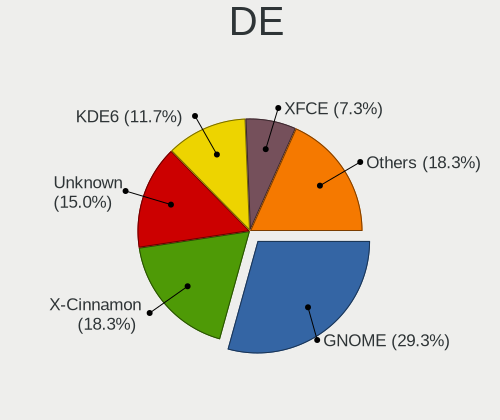

| Name            | Computers | Percent |
|-----------------|-----------|---------|
| GNOME           | 102       | 39.84%  |
| KDE5            | 63        | 24.61%  |
| X-Cinnamon      | 39        | 15.23%  |
| XFCE            | 26        | 10.16%  |
| LXQt            | 9         | 3.52%   |
| MATE            | 4         | 1.56%   |
| Unknown         | 3         | 1.17%   |
| sway            | 2         | 0.78%   |
| Pantheon        | 1         | 0.39%   |
| LXDE-pi-wayfire | 1         | 0.39%   |
| LXDE            | 1         | 0.39%   |
| KDE             | 1         | 0.39%   |
| icewm           | 1         | 0.39%   |
| i3              | 1         | 0.39%   |
| GNOME Classic   | 1         | 0.39%   |
| Budgie          | 1         | 0.39%   |

Display Server
--------------

X11 or Wayland

| Name    | Computers | Percent |
|---------|-----------|---------|
| X11     | 152       | 59.38%  |
| Wayland | 98        | 38.28%  |
| Tty     | 4         | 1.56%   |
| Unknown | 2         | 0.78%   |

Display Manager
---------------

SDDM, LightDM, etc.

| Name    | Computers | Percent |
|---------|-----------|---------|
| Unknown | 71        | 27.73%  |
| SDDM    | 58        | 22.66%  |
| LightDM | 56        | 21.88%  |
| GDM3    | 47        | 18.36%  |
| GDM     | 23        | 8.98%   |
| XDM     | 1         | 0.39%   |

OS Lang
-------

Language

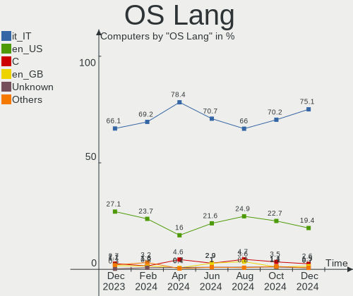

| Lang    | Computers | Percent |
|---------|-----------|---------|
| it_IT   | 178       | 69.53%  |
| en_US   | 53        | 20.7%   |
| C       | 13        | 5.08%   |
| Unknown | 8         | 3.13%   |
| en_GB   | 3         | 1.17%   |
| it_CH   | 1         | 0.39%   |

Boot Mode
---------

EFI or BIOS

| Mode | Computers | Percent |
|------|-----------|---------|
| EFI  | 144       | 56.25%  |
| BIOS | 112       | 43.75%  |

Filesystem
----------

Type of filesystem

| Type    | Computers | Percent |
|---------|-----------|---------|
| Ext4    | 158       | 61.72%  |
| Btrfs   | 47        | 18.36%  |
| Tmpfs   | 30        | 11.72%  |
| Overlay | 18        | 7.03%   |
| Xfs     | 2         | 0.78%   |
| Aufs    | 1         | 0.39%   |

Part. scheme
------------

Scheme of partitioning

| Type    | Computers | Percent |
|---------|-----------|---------|
| GPT     | 159       | 62.11%  |
| Unknown | 67        | 26.17%  |
| MBR     | 30        | 11.72%  |

Dual Boot with Linux/BSD
------------------------

Hosting more than one Linux/BSD

| Dual boot | Computers | Percent |
|-----------|-----------|---------|
| No        | 214       | 83.59%  |
| Yes       | 42        | 16.41%  |

Dual Boot (Win)
---------------

Hosting Linux and Windows

| Dual boot | Computers | Percent |
|-----------|-----------|---------|
| No        | 172       | 67.19%  |
| Yes       | 84        | 32.81%  |

Board
-----

Vendor
------

Motherboard manufacturer

| Name                                 | Computers | Percent |
|--------------------------------------|-----------|---------|
| ASUSTek Computer                     | 42        | 16.41%  |
| Lenovo                               | 40        | 15.63%  |
| Hewlett-Packard                      | 38        | 14.84%  |
| Dell                                 | 24        | 9.38%   |
| Acer                                 | 19        | 7.42%   |
| MSI                                  | 14        | 5.47%   |
| ASRock                               | 9         | 3.52%   |
| Gigabyte Technology                  | 7         | 2.73%   |
| Apple                                | 7         | 2.73%   |
| Unknown                              | 7         | 2.73%   |
| HUAWEI                               | 6         | 2.34%   |
| Sony                                 | 5         | 1.95%   |
| Shenzhen Meigao Electronic Equipment | 3         | 1.17%   |
| Mediacom                             | 3         | 1.17%   |
| Intel                                | 2         | 0.78%   |
| AZW                                  | 2         | 0.78%   |
| ZOTAC                                | 1         | 0.39%   |
| Valve                                | 1         | 0.39%   |
| TUXEDO                               | 1         | 0.39%   |
| Toshiba                              | 1         | 0.39%   |
| SLIMBOOK                             | 1         | 0.39%   |
| Sapphire                             | 1         | 0.39%   |
| Samsung Electronics                  | 1         | 0.39%   |
| Raspberry Pi Foundation              | 1         | 0.39%   |
| Quanta                               | 1         | 0.39%   |
| Pegatron                             | 1         | 0.39%   |
| PC Specialist                        | 1         | 0.39%   |
| Packard Bell                         | 1         | 0.39%   |
| Onda TLC                             | 1         | 0.39%   |
| Olidata                              | 1         | 0.39%   |
| Medion                               | 1         | 0.39%   |
| Koloe                                | 1         | 0.39%   |
| Huanan                               | 1         | 0.39%   |
| HPE                                  | 1         | 0.39%   |
| Google                               | 1         | 0.39%   |
| GEEKOM                               | 1         | 0.39%   |
| Fujitsu Siemens                      | 1         | 0.39%   |
| Fujitsu                              | 1         | 0.39%   |
| Biostar                              | 1         | 0.39%   |
| BESSTAR Tech                         | 1         | 0.39%   |

Model
-----

Motherboard model

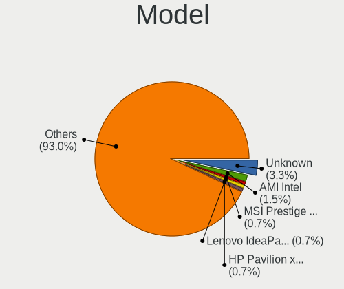

| Name                                            | Computers | Percent |
|-------------------------------------------------|-----------|---------|
| Unknown                                         | 7         | 2.73%   |
| HP Pavilion 15                                  | 4         | 1.56%   |
| Dell OptiPlex 390                               | 4         | 1.56%   |
| ASUS All Series                                 | 4         | 1.56%   |
| Acer Swift SF314-43                             | 3         | 1.17%   |
| Shenzhen Meigao Electronic Equipment UM690      | 2         | 0.78%   |
| MSI MS-7C52                                     | 2         | 0.78%   |
| Lenovo V15-ADA 82C7                             | 2         | 0.78%   |
| HP Compaq Pro 6300 MT                           | 2         | 0.78%   |
| Gigabyte H110M-S2H                              | 2         | 0.78%   |
| ASUS TUF Gaming X570-PLUS                       | 2         | 0.78%   |
| ZOTAC ZBOX-ECM73070C/53060C                     | 1         | 0.39%   |
| Valve Jupiter                                   | 1         | 0.39%   |
| TUXEDO Pulse 14 Gen3                            | 1         | 0.39%   |
| Toshiba Satellite A350                          | 1         | 0.39%   |
| Sony VGN-NW11S_S                                | 1         | 0.39%   |
| Sony VGN-FW11E                                  | 1         | 0.39%   |
| Sony VGN-AR51SU                                 | 1         | 0.39%   |
| Sony SVF1521G6EW                                | 1         | 0.39%   |
| Sony SVE1713X1EB                                | 1         | 0.39%   |
| SLIMBOOK PROX15-AMD                             | 1         | 0.39%   |
| Shenzhen Meigao Electronic Equipment UM773 Lite | 1         | 0.39%   |
| Sapphire PE-AM2RS690V2                          | 1         | 0.39%   |
| Samsung RC530/RC730                             | 1         | 0.39%   |
| RPi Raspberry Pi 400 Rev 1.0                    | 1         | 0.39%   |
| Quanta CA27                                     | 1         | 0.39%   |
| Pegatron p6-2053itm                             | 1         | 0.39%   |
| PC Specialist NH5x_7xDPx                        | 1         | 0.39%   |
| Packard Bell EasyNote MH45                      | 1         | 0.39%   |
| Onda TLC ONDA Oliver 15                         | 1         | 0.39%   |
| Olidata SL1510 MD61444                          | 1         | 0.39%   |
| MSI Summit E16Flip A12UCT                       | 1         | 0.39%   |
| MSI Prestige 15 A11SCS                          | 1         | 0.39%   |
| MSI Prestige 14Evo B13M                         | 1         | 0.39%   |
| MSI MS-7D93                                     | 1         | 0.39%   |
| MSI MS-7D19                                     | 1         | 0.39%   |
| MSI MS-7C91                                     | 1         | 0.39%   |
| MSI MS-7B93                                     | 1         | 0.39%   |
| MSI MS-7B79                                     | 1         | 0.39%   |
| MSI MS-7976                                     | 1         | 0.39%   |

Model Family
------------

Motherboard model prefix

| Name                                       | Computers | Percent |
|--------------------------------------------|-----------|---------|
| Lenovo ThinkPad                            | 18        | 7.03%   |
| HP Pavilion                                | 10        | 3.91%   |
| Acer Aspire                                | 10        | 3.91%   |
| ASUS VivoBook                              | 7         | 2.73%   |
| Unknown                                    | 7         | 2.73%   |
| Lenovo IdeaPad                             | 6         | 2.34%   |
| Dell OptiPlex                              | 6         | 2.34%   |
| Dell Latitude                              | 6         | 2.34%   |
| HP EliteBook                               | 5         | 1.95%   |
| Lenovo ThinkCentre                         | 4         | 1.56%   |
| HP Compaq                                  | 4         | 1.56%   |
| Dell XPS                                   | 4         | 1.56%   |
| Dell Inspiron                              | 4         | 1.56%   |
| ASUS All                                   | 4         | 1.56%   |
| Acer TravelMate                            | 4         | 1.56%   |
| HP ProBook                                 | 3         | 1.17%   |
| ASUS TUF                                   | 3         | 1.17%   |
| ASUS ROG                                   | 3         | 1.17%   |
| ASUS M5A97                                 | 3         | 1.17%   |
| Acer Swift                                 | 3         | 1.17%   |
| Shenzhen Meigao Electronic Equipment UM690 | 2         | 0.78%   |
| MSI Prestige                               | 2         | 0.78%   |
| MSI MS-7C52                                | 2         | 0.78%   |
| Mediacom SmartBook                         | 2         | 0.78%   |
| Lenovo Yoga                                | 2         | 0.78%   |
| Lenovo V15-ADA                             | 2         | 0.78%   |
| Lenovo Legion                              | 2         | 0.78%   |
| HP Laptop                                  | 2         | 0.78%   |
| HP ENVY                                    | 2         | 0.78%   |
| Gigabyte H110M-S2H                         | 2         | 0.78%   |
| Dell Precision                             | 2         | 0.78%   |
| ASUS PRIME                                 | 2         | 0.78%   |
| Acer Nitro                                 | 2         | 0.78%   |
| ZOTAC ZBOX-ECM73070C                       | 1         | 0.39%   |
| Valve Jupiter                              | 1         | 0.39%   |
| TUXEDO Pulse                               | 1         | 0.39%   |
| Toshiba Satellite                          | 1         | 0.39%   |
| Sony VGN-NW11S                             | 1         | 0.39%   |
| Sony VGN-FW11E                             | 1         | 0.39%   |
| Sony VGN-AR51SU                            | 1         | 0.39%   |

MFG Year
--------

Motherboard manufacture year

| Year    | Computers | Percent |
|---------|-----------|---------|
| 2023    | 24        | 9.38%   |
| 2022    | 23        | 8.98%   |
| 2021    | 23        | 8.98%   |
| 2012    | 23        | 8.98%   |
| 2019    | 22        | 8.59%   |
| 2020    | 21        | 8.2%    |
| 2017    | 19        | 7.42%   |
| 2013    | 18        | 7.03%   |
| 2015    | 14        | 5.47%   |
| 2016    | 12        | 4.69%   |
| 2011    | 12        | 4.69%   |
| 2008    | 11        | 4.3%    |
| 2014    | 8         | 3.13%   |
| 2018    | 7         | 2.73%   |
| 2010    | 6         | 2.34%   |
| 2009    | 5         | 1.95%   |
| 2007    | 4         | 1.56%   |
| 2006    | 2         | 0.78%   |
| Unknown | 2         | 0.78%   |

Form Factor
-----------

Physical design of the computer

| Name           | Computers | Percent |
|----------------|-----------|---------|
| Notebook       | 153       | 59.77%  |
| Desktop        | 83        | 32.42%  |
| Mini pc        | 6         | 2.34%   |
| All in one     | 6         | 2.34%   |
| Convertible    | 5         | 1.95%   |
| System on chip | 2         | 0.78%   |
| Server         | 1         | 0.39%   |

Secure Boot
-----------

Enabled or disabled

| State    | Computers | Percent |
|----------|-----------|---------|
| Disabled | 236       | 92.19%  |
| Enabled  | 20        | 7.81%   |

Coreboot
--------

Have coreboot on board

| Used | Computers | Percent |
|------|-----------|---------|
| No   | 255       | 99.61%  |
| Yes  | 1         | 0.39%   |

RAM Size
--------

Total RAM memory

| Size in GB  | Computers | Percent |
|-------------|-----------|---------|
| 4.01-8.0    | 68        | 26.56%  |
| 16.01-24.0  | 62        | 24.22%  |
| 8.01-16.0   | 45        | 17.58%  |
| 3.01-4.0    | 31        | 12.11%  |
| 32.01-64.0  | 28        | 10.94%  |
| 24.01-32.0  | 12        | 4.69%   |
| 2.01-3.0    | 4         | 1.56%   |
| 1.01-2.0    | 3         | 1.17%   |
| 64.01-256.0 | 2         | 0.78%   |
| 0.51-1.0    | 1         | 0.39%   |

RAM Used
--------

Used RAM memory

| Used GB    | Computers | Percent |
|------------|-----------|---------|
| 2.01-3.0   | 71        | 27.73%  |
| 1.01-2.0   | 67        | 26.17%  |
| 4.01-8.0   | 49        | 19.14%  |
| 3.01-4.0   | 48        | 18.75%  |
| 0.51-1.0   | 12        | 4.69%   |
| 8.01-16.0  | 7         | 2.73%   |
| 16.01-24.0 | 1         | 0.39%   |
| 0.01-0.5   | 1         | 0.39%   |

Total Drives
------------

Number of drives on board

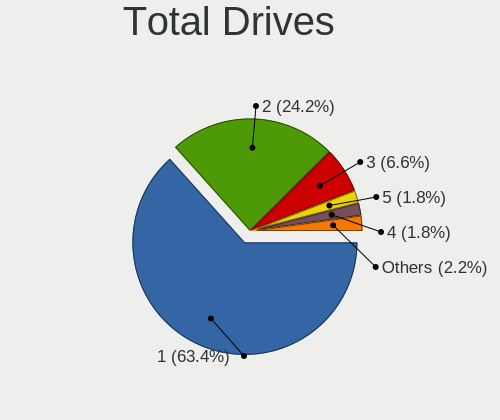

| Drives | Computers | Percent |
|--------|-----------|---------|
| 1      | 153       | 59.77%  |
| 2      | 65        | 25.39%  |
| 3      | 27        | 10.55%  |
| 4      | 6         | 2.34%   |
| 0      | 3         | 1.17%   |
| 6      | 1         | 0.39%   |
| 5      | 1         | 0.39%   |

Has CD-ROM
----------

Has CD-ROM on board

| Presented | Computers | Percent |
|-----------|-----------|---------|
| No        | 167       | 65.23%  |
| Yes       | 89        | 34.77%  |

Has Ethernet
------------

Has Ethernet on board

| Presented | Computers | Percent |
|-----------|-----------|---------|
| Yes       | 202       | 78.91%  |
| No        | 54        | 21.09%  |

Has WiFi
--------

Has WiFi module

| Presented | Computers | Percent |
|-----------|-----------|---------|
| Yes       | 211       | 82.42%  |
| No        | 45        | 17.58%  |

Has Bluetooth
-------------

Has Bluetooth module

| Presented | Computers | Percent |
|-----------|-----------|---------|
| Yes       | 187       | 73.05%  |
| No        | 69        | 26.95%  |

Location
--------

Country
-------

Geographic location (country)

| Country | Computers | Percent |
|---------|-----------|---------|
| Italy   | 256       | 100%    |

City
----

Geographic location (city)

| City              | Computers | Percent |
|-------------------|-----------|---------|
| Milan             | 31        | 12.11%  |
| Rome              | 27        | 10.55%  |
| Turin             | 16        | 6.25%   |
| Milano            | 11        | 4.3%    |
| Genoa             | 7         | 2.73%   |
| Florence          | 7         | 2.73%   |
| Bologna           | 6         | 2.34%   |
| Naples            | 5         | 1.95%   |
| Venice            | 4         | 1.56%   |
| Reggio Emilia     | 4         | 1.56%   |
| Bari              | 4         | 1.56%   |
| Trieste           | 3         | 1.17%   |
| Livorno           | 3         | 1.17%   |
| Udine             | 2         | 0.78%   |
| Terni             | 2         | 0.78%   |
| Taranto           | 2         | 0.78%   |
| Sassari           | 2         | 0.78%   |
| San Vittore Olona | 2         | 0.78%   |
| Rimini            | 2         | 0.78%   |
| Portici           | 2         | 0.78%   |
| Erba              | 2         | 0.78%   |
| Zogno             | 1         | 0.39%   |
| Zagarolo          | 1         | 0.39%   |
| Vittoria          | 1         | 0.39%   |
| Vigodarzere       | 1         | 0.39%   |
| Verona            | 1         | 0.39%   |
| Venosa            | 1         | 0.39%   |
| Valbrembo         | 1         | 0.39%   |
| Val della Torre   | 1         | 0.39%   |
| Treviso           | 1         | 0.39%   |
| Torre del Greco   | 1         | 0.39%   |
| Suno              | 1         | 0.39%   |
| Spresiano         | 1         | 0.39%   |
| Spino d'Adda      | 1         | 0.39%   |
| Spinetoli         | 1         | 0.39%   |
| Spinea            | 1         | 0.39%   |
| Soave             | 1         | 0.39%   |
| Siena             | 1         | 0.39%   |
| Sesto Fiorentino  | 1         | 0.39%   |
| Senago            | 1         | 0.39%   |

Drives
------

Drive Vendor
------------

Hard drive vendors

| Vendor                      | Computers | Drives | Percent |
|-----------------------------|-----------|--------|---------|
| Samsung Electronics         | 71        | 84     | 19.35%  |
| Seagate                     | 35        | 37     | 9.54%   |
| WDC                         | 33        | 37     | 8.99%   |
| Kingston                    | 30        | 30     | 8.17%   |
| SanDisk                     | 23        | 24     | 6.27%   |
| Crucial                     | 21        | 22     | 5.72%   |
| Unknown                     | 12        | 13     | 3.27%   |
| Intel                       | 12        | 13     | 3.27%   |
| Micron Technology           | 11        | 11     | 3%      |
| Toshiba                     | 10        | 10     | 2.72%   |
| SK hynix                    | 10        | 13     | 2.72%   |
| Phison Electronics          | 8         | 8      | 2.18%   |
| Lexar                       | 6         | 6      | 1.63%   |
| HGST                        | 6         | 6      | 1.63%   |
| Fanxiang                    | 6         | 6      | 1.63%   |
| China                       | 6         | 6      | 1.63%   |
| Kingston Technology Company | 5         | 5      | 1.36%   |
| Intenso                     | 4         | 4      | 1.09%   |
| SPCC                        | 3         | 3      | 0.82%   |
| Phison                      | 3         | 5      | 0.82%   |
| Micron/Crucial Technology   | 3         | 3      | 0.82%   |
| Unknown                     | 3         | 3      | 0.82%   |
| Patriot                     | 2         | 2      | 0.54%   |
| MAXIO Technology (Hangzhou) | 2         | 2      | 0.54%   |
| KIOXIA                      | 2         | 2      | 0.54%   |
| Hitachi                     | 2         | 2      | 0.54%   |
| GOODRAM                     | 2         | 2      | 0.54%   |
| Corsair                     | 2         | 2      | 0.54%   |
| BAITITON                    | 2         | 2      | 0.54%   |
| Apple                       | 2         | 2      | 0.54%   |
| A-DATA Technology           | 2         | 2      | 0.54%   |
| XrayDisk                    | 1         | 1      | 0.27%   |
| X12                         | 1         | 1      | 0.27%   |
| VICK                        | 1         | 1      | 0.27%   |
| USB30                       | 1         | 1      | 0.27%   |
| Union Memory                | 1         | 1      | 0.27%   |
| Transcend                   | 1         | 1      | 0.27%   |
| Teclast                     | 1         | 1      | 0.27%   |
| TCSUNBOW                    | 1         | 1      | 0.27%   |
| SSSTC                       | 1         | 1      | 0.27%   |

Drive Model
-----------

Hard drive models

| Model                                              | Computers | Percent |
|----------------------------------------------------|-----------|---------|
| Kingston SA400S37240G 240GB SSD                    | 11        | 2.86%   |
| Samsung NVMe SSD Controller PM9A1/PM9A3/980PRO 2TB | 8         | 2.08%   |
| Samsung SSD 850 EVO 250GB                          | 5         | 1.3%    |
| Kingston SA400S37480G 480GB SSD                    | 5         | 1.3%    |
| Sandisk WD Blue SN550 NVMe SSD 512GB               | 4         | 1.04%   |
| Samsung SSD 860 EVO 250GB                          | 4         | 1.04%   |
| Samsung SSD 860 EVO 1TB                            | 4         | 1.04%   |
| Samsung NVMe SSD Controller SM981/PM981/PM983 1TB  | 4         | 1.04%   |
| Intel SSD 660P Series 1024GB                       | 4         | 1.04%   |
| Crucial CT480BX500SSD1 480GB                       | 4         | 1.04%   |
| Seagate ST1000LM035-1RK172 1TB                     | 3         | 0.78%   |
| Samsung SSD 850 EVO 500GB                          | 3         | 0.78%   |
| Phison PS5013 E13 NVMe Controller 256GB            | 3         | 0.78%   |
| Phison E12 NVMe Controller 1TB                     | 3         | 0.78%   |
| Crucial CT500MX500SSD1 500GB                       | 3         | 0.78%   |
| Unknown                                            | 3         | 0.78%   |
| WDC WDS120G2G0A-00JH30 120GB SSD                   | 2         | 0.52%   |
| WDC WD10EZEX-00BN5A0 1TB                           | 2         | 0.52%   |
| Unknown SD/MMC/MS PRO 256GB                        | 2         | 0.52%   |
| Unknown NCard  32GB                                | 2         | 0.52%   |
| Unknown MMC Card  128GB                            | 2         | 0.52%   |
| Toshiba XG6 NVMe SSD Controller 256GB              | 2         | 0.52%   |
| Toshiba MQ01ABD100 1TB                             | 2         | 0.52%   |
| Toshiba HDWD110 1TB                                | 2         | 0.52%   |
| SK hynix BC711 HFM512GD3JX013N 512GB               | 2         | 0.52%   |
| Seagate ST500DM002-1BD142 500GB                    | 2         | 0.52%   |
| Seagate ST31000524AS 1TB                           | 2         | 0.52%   |
| Seagate ST1000DM003-1ER162 1TB                     | 2         | 0.52%   |
| Seagate Backup+ Hub BK 8TB                         | 2         | 0.52%   |
| Sandisk WD Blue SN500 / PC SN520 NVMe SSD 512GB    | 2         | 0.52%   |
| SanDisk SSD PLUS 480GB                             | 2         | 0.52%   |
| Samsung SSD 980 PRO 1TB                            | 2         | 0.52%   |
| Samsung SSD 870 EVO 500GB                          | 2         | 0.52%   |
| Samsung SSD 860 QVO 1TB                            | 2         | 0.52%   |
| Samsung SSD 860 EVO 500GB                          | 2         | 0.52%   |
| Samsung SSD 840 EVO 500GB                          | 2         | 0.52%   |
| Samsung MZVL21T0HCLR-00BL2 1TB                     | 2         | 0.52%   |
| Micron/Crucial P2 NVMe PCIe SSD 1TB                | 2         | 0.52%   |
| Micron 1100_MTFDDAV512TBN 512GB SSD                | 2         | 0.52%   |
| Lexar SSD NM610PRO 1TB                             | 2         | 0.52%   |

HDD Vendor
----------

Hard disk drive vendors

| Vendor              | Computers | Drives | Percent |
|---------------------|-----------|--------|---------|
| Seagate             | 33        | 35     | 37.93%  |
| WDC                 | 29        | 32     | 33.33%  |
| Toshiba             | 7         | 7      | 8.05%   |
| HGST                | 6         | 6      | 6.9%    |
| Samsung Electronics | 4         | 5      | 4.6%    |
| Unknown             | 2         | 2      | 2.3%    |
| Hitachi             | 2         | 2      | 2.3%    |
| Maxtor              | 1         | 1      | 1.15%   |
| Fujitsu             | 1         | 1      | 1.15%   |
| Apple               | 1         | 1      | 1.15%   |
| Unknown             | 1         | 1      | 1.15%   |

SSD Vendor
----------

Solid state drive vendors

| Vendor              | Computers | Drives | Percent |
|---------------------|-----------|--------|---------|
| Samsung Electronics | 34        | 42     | 23.13%  |
| Kingston            | 25        | 25     | 17.01%  |
| Crucial             | 19        | 20     | 12.93%  |
| SanDisk             | 9         | 9      | 6.12%   |
| China               | 6         | 6      | 4.08%   |
| Intenso             | 4         | 4      | 2.72%   |
| WDC                 | 3         | 3      | 2.04%   |
| SPCC                | 3         | 3      | 2.04%   |
| Micron Technology   | 3         | 3      | 2.04%   |
| Intel               | 3         | 3      | 2.04%   |
| SK hynix            | 2         | 2      | 1.36%   |
| Patriot             | 2         | 2      | 1.36%   |
| Lexar               | 2         | 2      | 1.36%   |
| GOODRAM             | 2         | 2      | 1.36%   |
| Fanxiang            | 2         | 2      | 1.36%   |
| Corsair             | 2         | 2      | 1.36%   |
| BAITITON            | 2         | 2      | 1.36%   |
| XrayDisk            | 1         | 1      | 0.68%   |
| X12                 | 1         | 1      | 0.68%   |
| VICK                | 1         | 1      | 0.68%   |
| USB30               | 1         | 1      | 0.68%   |
| Transcend           | 1         | 1      | 0.68%   |
| Teclast             | 1         | 1      | 0.68%   |
| TCSUNBOW            | 1         | 1      | 0.68%   |
| SSSTC               | 1         | 1      | 0.68%   |
| sobetter            | 1         | 1      | 0.68%   |
| ROG                 | 1         | 1      | 0.68%   |
| OCZ                 | 1         | 1      | 0.68%   |
| Netac               | 1         | 1      | 0.68%   |
| LITEON              | 1         | 1      | 0.68%   |
| Leven               | 1         | 1      | 0.68%   |
| KingSpec            | 1         | 1      | 0.68%   |
| KingDian            | 1         | 1      | 0.68%   |
| Kimtigo             | 1         | 1      | 0.68%   |
| FIKWOT              | 1         | 1      | 0.68%   |
| Dogfish             | 1         | 1      | 0.68%   |
| Apple               | 1         | 1      | 0.68%   |
| A-DATA Technology   | 1         | 1      | 0.68%   |
| 2.5"                | 1         | 1      | 0.68%   |
| 2-Power             | 1         | 1      | 0.68%   |

Drive Kind
----------

HDD or SSD

| Kind    | Computers | Drives | Percent |
|---------|-----------|--------|---------|
| SSD     | 126       | 156    | 37.95%  |
| NVMe    | 113       | 130    | 34.04%  |
| HDD     | 78        | 93     | 23.49%  |
| MMC     | 10        | 11     | 3.01%   |
| Unknown | 5         | 5      | 1.51%   |

Drive Connector
---------------

SATA, SAS, NVMe, etc.

| Type | Computers | Drives | Percent |
|------|-----------|--------|---------|
| SATA | 163       | 237    | 53.44%  |
| NVMe | 113       | 128    | 37.05%  |
| SAS  | 19        | 19     | 6.23%   |
| MMC  | 10        | 11     | 3.28%   |

Drive Size
----------

Size of hard drive

| Size in TB | Computers | Drives | Percent |
|------------|-----------|--------|---------|
| 0.01-0.5   | 123       | 160    | 60.59%  |
| 0.51-1.0   | 57        | 63     | 28.08%  |
| 1.01-2.0   | 14        | 15     | 6.9%    |
| 3.01-4.0   | 3         | 4      | 1.48%   |
| 2.01-3.0   | 3         | 3      | 1.48%   |
| 4.01-10.0  | 3         | 4      | 1.48%   |

Space Total
-----------

Amount of disk space available on the file system

| Size in GB     | Computers | Percent |
|----------------|-----------|---------|
| 101-250        | 65        | 25.39%  |
| 251-500        | 51        | 19.92%  |
| 501-1000       | 34        | 13.28%  |
| 1-20           | 25        | 9.77%   |
| 1001-2000      | 19        | 7.42%   |
| More than 3000 | 16        | 6.25%   |
| 51-100         | 16        | 6.25%   |
| 2001-3000      | 12        | 4.69%   |
| Unknown        | 10        | 3.91%   |
| 21-50          | 8         | 3.13%   |

Space Used
----------

Amount of used disk space

| Used GB        | Computers | Percent |
|----------------|-----------|---------|
| 1-20           | 85        | 33.2%   |
| 101-250        | 42        | 16.41%  |
| 21-50          | 38        | 14.84%  |
| 51-100         | 37        | 14.45%  |
| 501-1000       | 14        | 5.47%   |
| 251-500        | 12        | 4.69%   |
| 1001-2000      | 10        | 3.91%   |
| Unknown        | 10        | 3.91%   |
| 2001-3000      | 5         | 1.95%   |
| More than 3000 | 3         | 1.17%   |

Malfunc. Drives
---------------

Drive models with a malfunction

| Model                                | Computers | Drives | Percent |
|--------------------------------------|-----------|--------|---------|
| Seagate ST500DM002-1BD142 500GB      | 2         | 2      | 9.52%   |
| HGST HTS545050A7E680 500GB           | 2         | 2      | 9.52%   |
| WDC WDS120G2G0A-00JH30 120GB SSD     | 1         | 1      | 4.76%   |
| WDC WD5000AAKX-60U6AA0 500GB         | 1         | 1      | 4.76%   |
| WDC WD3200BEVT-22ZCT0 320GB          | 1         | 1      | 4.76%   |
| WDC WD3200AAJS-56M0A0 320GB          | 1         | 1      | 4.76%   |
| WDC WD2002FAEX-007BA0 2TB            | 1         | 1      | 4.76%   |
| WDC WD1600BEVT-22ZCT0 160GB          | 1         | 1      | 4.76%   |
| SK hynix BC711 HFM512GD3JX013N 512GB | 1         | 1      | 4.76%   |
| Seagate ST500LT012-9WS142 500GB      | 1         | 1      | 4.76%   |
| Seagate ST500LM012 HN-M500MBB 500GB  | 1         | 1      | 4.76%   |
| Seagate ST1000DM010-2EP102 1TB       | 1         | 1      | 4.76%   |
| SanDisk SSD PLUS 480GB               | 1         | 1      | 4.76%   |
| Samsung Electronics SP2014N 200GB    | 1         | 2      | 4.76%   |
| OCZ VECTOR150 120GB SSD              | 1         | 1      | 4.76%   |
| Intel SSDSC2BF180A4L 180GB           | 1         | 1      | 4.76%   |
| HGST HTS541010A9E680 1TB             | 1         | 1      | 4.76%   |
| Fujitsu MHW2160BJ G2 160GB           | 1         | 1      | 4.76%   |
| Crucial CT275MX300SSD1 275GB         | 1         | 1      | 4.76%   |

Malfunc. Drive Vendor
---------------------

Vendors of faulty drives

| Vendor              | Computers | Drives | Percent |
|---------------------|-----------|--------|---------|
| WDC                 | 6         | 6      | 28.57%  |
| Seagate             | 5         | 5      | 23.81%  |
| HGST                | 3         | 3      | 14.29%  |
| SK hynix            | 1         | 1      | 4.76%   |
| SanDisk             | 1         | 1      | 4.76%   |
| Samsung Electronics | 1         | 2      | 4.76%   |
| OCZ                 | 1         | 1      | 4.76%   |
| Intel               | 1         | 1      | 4.76%   |
| Fujitsu             | 1         | 1      | 4.76%   |
| Crucial             | 1         | 1      | 4.76%   |

Malfunc. HDD Vendor
-------------------

Vendors of faulty HDD drives

| Vendor              | Computers | Drives | Percent |
|---------------------|-----------|--------|---------|
| WDC                 | 5         | 5      | 33.33%  |
| Seagate             | 5         | 5      | 33.33%  |
| HGST                | 3         | 3      | 20%     |
| Samsung Electronics | 1         | 2      | 6.67%   |
| Fujitsu             | 1         | 1      | 6.67%   |

Malfunc. Drive Kind
-------------------

Kinds of faulty drives

| Kind | Computers | Drives | Percent |
|------|-----------|--------|---------|
| HDD  | 14        | 16     | 70%     |
| SSD  | 5         | 5      | 25%     |
| NVMe | 1         | 1      | 5%      |

Failed Drives
-------------

Failed drive models

Zero info for selected period =(

Failed Drive Vendor
-------------------

Failed drive vendors

Zero info for selected period =(

Drive Status
------------

Number of failed and malfunc. drives

| Status   | Computers | Drives | Percent |
|----------|-----------|--------|---------|
| Works    | 140       | 206    | 51.28%  |
| Detected | 113       | 167    | 41.39%  |
| Malfunc  | 20        | 22     | 7.33%   |

Storage controller
------------------

Storage Vendor
--------------

Storage controller vendors

| Vendor                       | Computers | Percent |
|------------------------------|-----------|---------|
| Intel                        | 163       | 48.22%  |
| AMD                          | 45        | 13.31%  |
| Samsung Electronics          | 37        | 10.95%  |
| SanDisk                      | 16        | 4.73%   |
| Phison Electronics           | 11        | 3.25%   |
| ASMedia Technology           | 10        | 2.96%   |
| Kingston Technology Company  | 9         | 2.66%   |
| SK hynix                     | 8         | 2.37%   |
| Micron Technology            | 8         | 2.37%   |
| MAXIO Technology (Hangzhou)  | 7         | 2.07%   |
| Micron/Crucial Technology    | 5         | 1.48%   |
| Marvell Technology Group     | 4         | 1.18%   |
| Toshiba America Info Systems | 3         | 0.89%   |
| KIOXIA                       | 2         | 0.59%   |
| JMicron Technology           | 2         | 0.59%   |
| VIA Technologies             | 1         | 0.3%    |
| Union Memory (Shenzhen)      | 1         | 0.3%    |
| Solidigm                     | 1         | 0.3%    |
| Silicon Motion               | 1         | 0.3%    |
| Shenzhen Longsys Electronics | 1         | 0.3%    |
| Realtek Semiconductor        | 1         | 0.3%    |
| Nvidia                       | 1         | 0.3%    |
| ADATA Technology             | 1         | 0.3%    |

Storage Model
-------------

Storage controller models

| Model                                                                                   | Computers | Percent |
|-----------------------------------------------------------------------------------------|-----------|---------|
| AMD FCH SATA Controller [AHCI mode]                                                     | 30        | 7.89%   |
| Intel Volume Management Device NVMe RAID Controller                                     | 17        | 4.47%   |
| Intel Sunrise Point-LP SATA Controller [AHCI mode]                                      | 16        | 4.21%   |
| Samsung NVMe SSD Controller PM9A1/PM9A3/980PRO                                          | 14        | 3.68%   |
| Intel 82801 Mobile SATA Controller [RAID mode]                                          | 13        | 3.42%   |
| Intel 7 Series Chipset Family 6-port SATA Controller [AHCI mode]                        | 12        | 3.16%   |
| ASMedia ASM1061/ASM1062 Serial ATA Controller                                           | 10        | 2.63%   |
| Samsung NVMe SSD Controller 980 (DRAM-less)                                             | 9         | 2.37%   |
| Intel 8 Series/C220 Series Chipset Family 6-port SATA Controller 1 [AHCI mode]          | 9         | 2.37%   |
| Samsung NVMe SSD Controller SM981/PM981/PM983                                           | 8         | 2.11%   |
| Intel 82801IBM/IEM (ICH9M/ICH9M-E) 4 port SATA Controller [AHCI mode]                   | 8         | 2.11%   |
| Intel Celeron/Pentium Silver Processor SATA Controller                                  | 7         | 1.84%   |
| Intel 7 Series/C210 Series Chipset Family 6-port SATA Controller [AHCI mode]            | 7         | 1.84%   |
| Intel Q170/Q150/B150/H170/H110/Z170/CM236 Chipset SATA Controller [AHCI Mode]           | 6         | 1.58%   |
| Intel 6 Series/C200 Series Chipset Family Desktop SATA Controller (IDE mode, ports 4-5) | 6         | 1.58%   |
| Intel 6 Series/C200 Series Chipset Family Desktop SATA Controller (IDE mode, ports 0-3) | 6         | 1.58%   |
| SanDisk Ultra 3D / WD Blue SN550 NVMe SSD                                               | 5         | 1.32%   |
| Intel SSD 660P Series                                                                   | 5         | 1.32%   |
| Intel 82801HM/HEM (ICH8M/ICH8M-E) IDE Controller                                        | 5         | 1.32%   |
| Intel 8 Series SATA Controller 1 [AHCI mode]                                            | 5         | 1.32%   |
| Intel 6 Series/C200 Series Chipset Family 6 port Mobile SATA AHCI Controller            | 5         | 1.32%   |
| Phison E12 NVMe Controller                                                              | 4         | 1.05%   |
| MAXIO (Hangzhou) NVMe SSD Controller MAP1202 (DRAM-less)                                | 4         | 1.05%   |
| Intel Wildcat Point-LP SATA Controller [AHCI Mode]                                      | 4         | 1.05%   |
| Intel Volume Management Device NVMe RAID Controller Intel Corporation                   | 4         | 1.05%   |
| Intel Tiger Lake-LP SATA Controller                                                     | 4         | 1.05%   |
| Intel 82801HM/HEM (ICH8M/ICH8M-E) SATA Controller [AHCI mode]                           | 4         | 1.05%   |
| Samsung NVMe SSD Controller SM961/PM961/SM963                                           | 3         | 0.79%   |
| Phison PS5013-E13 PCIe3 NVMe Controller (DRAM-less)                                     | 3         | 0.79%   |
| Micron/Crucial P2 [Nick P2] / P3 / P3 Plus NVMe PCIe SSD (DRAM-less)                    | 3         | 0.79%   |
| Intel Comet Lake SATA AHCI Controller                                                   | 3         | 0.79%   |
| Intel Celeron N3350/Pentium N4200/Atom E3900 Series SATA AHCI Controller                | 3         | 0.79%   |
| Intel Cannon Point-LP SATA Controller [AHCI Mode]                                       | 3         | 0.79%   |
| AMD SB7x0/SB8x0/SB9x0 SATA Controller [AHCI mode]                                       | 3         | 0.79%   |
| AMD 400 Series Chipset SATA Controller                                                  | 3         | 0.79%   |
| Toshiba America Info Systems XG6 NVMe SSD Controller                                    | 2         | 0.53%   |
| SK hynix Gold P31/BC711/PC711 NVMe Solid State Drive                                    | 2         | 0.53%   |
| SK hynix BC901 NVMe Solid State Drive (DRAM-less)                                       | 2         | 0.53%   |
| SK hynix BC511 NVMe SSD                                                                 | 2         | 0.53%   |
| Sandisk WD PC SN740 NVMe SSD 512GB (DRAM-less)                                          | 2         | 0.53%   |

Storage Kind
------------

Kind of storage controller (IDE, SATA, NVMe, SAS, ...)

| Kind | Computers | Percent |
|------|-----------|---------|
| SATA | 168       | 48.84%  |
| NVMe | 113       | 32.85%  |
| RAID | 39        | 11.34%  |
| IDE  | 24        | 6.98%   |

Processor
---------

CPU Vendor
----------

Processor vendors

| Vendor   | Computers | Percent |
|----------|-----------|---------|
| Intel    | 188       | 73.44%  |
| AMD      | 66        | 25.78%  |
| Qualcomm | 1         | 0.39%   |
| ARM      | 1         | 0.39%   |

CPU Model
---------

Processor models

| Model                                         | Computers | Percent |
|-----------------------------------------------|-----------|---------|
| Intel Core i7-4510U CPU @ 2.00GHz             | 4         | 1.56%   |
| Intel Core i7-3770 CPU @ 3.40GHz              | 4         | 1.56%   |
| Intel Core i5-6200U CPU @ 2.30GHz             | 4         | 1.56%   |
| Intel Core i5-3210M CPU @ 2.50GHz             | 4         | 1.56%   |
| Intel Core i5-2400 CPU @ 3.10GHz              | 4         | 1.56%   |
| Intel 11th Gen Core i5-1135G7 @ 2.40GHz       | 4         | 1.56%   |
| AMD Ryzen 9 6900HX with Radeon Graphics       | 4         | 1.56%   |
| Intel Core i7-8550U CPU @ 1.80GHz             | 3         | 1.17%   |
| Intel Core i5-6300U CPU @ 2.40GHz             | 3         | 1.17%   |
| Intel Core i5-1035G1 CPU @ 1.00GHz            | 3         | 1.17%   |
| AMD Ryzen 7 5700U with Radeon Graphics        | 3         | 1.17%   |
| AMD Ryzen 5 5500U with Radeon Graphics        | 3         | 1.17%   |
| AMD Ryzen 5 3500U with Radeon Vega Mobile Gfx | 3         | 1.17%   |
| AMD A6-5200 APU with Radeon HD Graphics       | 3         | 1.17%   |
| Intel Pentium Gold 7505 @ 2.00GHz             | 2         | 0.78%   |
| Intel Core i7-7500U CPU @ 2.70GHz             | 2         | 0.78%   |
| Intel Core i7-6700 CPU @ 3.40GHz              | 2         | 0.78%   |
| Intel Core i7-6500U CPU @ 2.50GHz             | 2         | 0.78%   |
| Intel Core i7-5500U CPU @ 2.40GHz             | 2         | 0.78%   |
| Intel Core i7-4770K CPU @ 3.50GHz             | 2         | 0.78%   |
| Intel Core i7-10850H CPU @ 2.70GHz            | 2         | 0.78%   |
| Intel Core i5-7200U CPU @ 2.50GHz             | 2         | 0.78%   |
| Intel Core i5-5300U CPU @ 2.30GHz             | 2         | 0.78%   |
| Intel Core i5-3470 CPU @ 3.20GHz              | 2         | 0.78%   |
| Intel Core i3-3217U CPU @ 1.80GHz             | 2         | 0.78%   |
| Intel Core 2 Duo CPU T6500 @ 2.10GHz          | 2         | 0.78%   |
| Intel Core 2 Duo CPU P8400 @ 2.26GHz          | 2         | 0.78%   |
| Intel Celeron N4020C CPU @ 1.10GHz            | 2         | 0.78%   |
| Intel Celeron J4125 CPU @ 2.00GHz             | 2         | 0.78%   |
| Intel Celeron CPU N3060 @ 1.60GHz             | 2         | 0.78%   |
| Intel Atom x5-Z8300 CPU @ 1.44GHz             | 2         | 0.78%   |
| Intel 13th Gen Core i7-1355U                  | 2         | 0.78%   |
| Intel 12th Gen Core i7-1260P                  | 2         | 0.78%   |
| Intel 12th Gen Core i7-1255U                  | 2         | 0.78%   |
| Intel 12th Gen Core i5-1245U                  | 2         | 0.78%   |
| Intel 12th Gen Core i5-12450H                 | 2         | 0.78%   |
| Intel 12th Gen Core i5-1235U                  | 2         | 0.78%   |
| Intel 11th Gen Core i7-1185G7 @ 3.00GHz       | 2         | 0.78%   |
| Intel 11th Gen Core i7-1165G7 @ 2.80GHz       | 2         | 0.78%   |
| AMD Ryzen 9 5950X 16-Core Processor           | 2         | 0.78%   |

CPU Model Family
----------------

Processor model prefix

| Model                   | Computers | Percent |
|-------------------------|-----------|---------|
| Intel Core i7           | 47        | 18.36%  |
| Intel Core i5           | 46        | 17.97%  |
| Other                   | 39        | 15.23%  |
| Intel Core i3           | 16        | 6.25%   |
| AMD Ryzen 7             | 15        | 5.86%   |
| AMD Ryzen 5             | 15        | 5.86%   |
| Intel Celeron           | 12        | 4.69%   |
| Intel Core 2 Duo        | 11        | 4.3%    |
| AMD Ryzen 9             | 9         | 3.52%   |
| AMD FX                  | 4         | 1.56%   |
| AMD A6                  | 4         | 1.56%   |
| AMD A10                 | 4         | 1.56%   |
| Intel Pentium           | 3         | 1.17%   |
| Intel Atom              | 3         | 1.17%   |
| Intel Xeon              | 2         | 0.78%   |
| Intel Pentium Silver    | 2         | 0.78%   |
| Intel Pentium Gold      | 2         | 0.78%   |
| Intel Core i9           | 2         | 0.78%   |
| Intel Core 2 Quad       | 2         | 0.78%   |
| AMD Ryzen 7 PRO         | 2         | 0.78%   |
| AMD Athlon              | 2         | 0.78%   |
| AMD A4                  | 2         | 0.78%   |
| Intel Pentium Dual-Core | 1         | 0.39%   |
| Intel Pentium 4         | 1         | 0.39%   |
| Intel Core 2 Extreme    | 1         | 0.39%   |
| Intel Core 2            | 1         | 0.39%   |
| Intel Celeron Dual-Core | 1         | 0.39%   |
| AMD Ryzen 5 PRO         | 1         | 0.39%   |
| AMD Ryzen 3             | 1         | 0.39%   |
| AMD Phenom II X4        | 1         | 0.39%   |
| AMD Opteron             | 1         | 0.39%   |
| AMD Mobile Sempron      | 1         | 0.39%   |
| AMD E1                  | 1         | 0.39%   |
| AMD Athlon 64           | 1         | 0.39%   |

CPU Cores
---------

Number of processor cores

| Number  | Computers | Percent |
|---------|-----------|---------|
| 2       | 88        | 34.38%  |
| 4       | 84        | 32.81%  |
| 8       | 30        | 11.72%  |
| 6       | 20        | 7.81%   |
| 10      | 9         | 3.52%   |
| 12      | 8         | 3.13%   |
| 1       | 6         | 2.34%   |
| 14      | 5         | 1.95%   |
| 16      | 3         | 1.17%   |
| 24      | 1         | 0.39%   |
| 3       | 1         | 0.39%   |
| Unknown | 1         | 0.39%   |

CPU Sockets
-----------

Number of sockets

| Number  | Computers | Percent |
|---------|-----------|---------|
| 1       | 255       | 99.61%  |
| Unknown | 1         | 0.39%   |

CPU Threads
-----------

Threads per core (Hyper-Threading)

| Number  | Computers | Percent |
|---------|-----------|---------|
| 2       | 188       | 73.44%  |
| 1       | 67        | 26.17%  |
| Unknown | 1         | 0.39%   |

CPU Op-Modes
------------

CPU Operation Modes (32-bit, 64-bit)

| Op mode        | Computers | Percent |
|----------------|-----------|---------|
| 32-bit, 64-bit | 254       | 99.22%  |
| 64-bit         | 1         | 0.39%   |
| 32-bit         | 1         | 0.39%   |

CPU Microcode
-------------

Microcode number

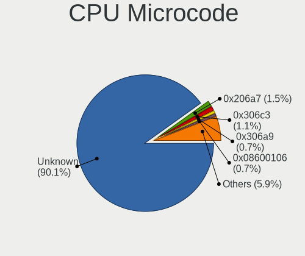

| Number     | Computers | Percent |
|------------|-----------|---------|
| Unknown    | 156       | 60.94%  |
| 0x306a9    | 8         | 3.13%   |
| 0x0a404102 | 6         | 2.34%   |
| 0x306c3    | 4         | 1.56%   |
| 0x08108109 | 4         | 1.56%   |
| 0x6fd      | 3         | 1.17%   |
| 0x506e3    | 3         | 1.17%   |
| 0x406e3    | 3         | 1.17%   |
| 0x306d4    | 3         | 1.17%   |
| 0x206a7    | 3         | 1.17%   |
| 0x0a50000d | 3         | 1.17%   |
| 0x06000852 | 3         | 1.17%   |
| 0xa0655    | 2         | 0.78%   |
| 0xa0652    | 2         | 0.78%   |
| 0x906a3    | 2         | 0.78%   |
| 0x806ea    | 2         | 0.78%   |
| 0x806c1    | 2         | 0.78%   |
| 0x506c9    | 2         | 0.78%   |
| 0x20655    | 2         | 0.78%   |
| 0x10676    | 2         | 0.78%   |
| 0x0a704103 | 2         | 0.78%   |
| 0x0a601206 | 2         | 0.78%   |
| 0x0a50000f | 2         | 0.78%   |
| 0x08701030 | 2         | 0.78%   |
| 0x08608104 | 2         | 0.78%   |
| 0x0800820d | 2         | 0.78%   |
| 0x0700010f | 2         | 0.78%   |
| 0xb06a3    | 1         | 0.39%   |
| 0xa0671    | 1         | 0.39%   |
| 0x906ea    | 1         | 0.39%   |
| 0x906a4    | 1         | 0.39%   |
| 0x806ec    | 1         | 0.39%   |
| 0x806e9    | 1         | 0.39%   |
| 0x706a1    | 1         | 0.39%   |
| 0x6f6      | 1         | 0.39%   |
| 0x406c3    | 1         | 0.39%   |
| 0x40651    | 1         | 0.39%   |
| 0x30661    | 1         | 0.39%   |
| 0x106a5    | 1         | 0.39%   |
| 0x0a704104 | 1         | 0.39%   |

CPU Microarch
-------------

Microarchitecture

| Name             | Computers | Percent |
|------------------|-----------|---------|
| Unknown          | 27        | 10.55%  |
| KabyLake         | 25        | 9.77%   |
| IvyBridge        | 20        | 7.81%   |
| Haswell          | 17        | 6.64%   |
| Skylake          | 16        | 6.25%   |
| Alderlake Hybrid | 16        | 6.25%   |
| SandyBridge      | 14        | 5.47%   |
| Penryn           | 12        | 4.69%   |
| TigerLake        | 11        | 4.3%    |
| Zen+             | 10        | 3.91%   |
| Zen 3            | 9         | 3.52%   |
| Goldmont plus    | 8         | 3.13%   |
| CometLake        | 8         | 3.13%   |
| Zen 2            | 7         | 2.73%   |
| Piledriver       | 7         | 2.73%   |
| IceLake          | 6         | 2.34%   |
| Core             | 6         | 2.34%   |
| Broadwell        | 6         | 2.34%   |
| Silvermont       | 4         | 1.56%   |
| Jaguar           | 4         | 1.56%   |
| Zen              | 3         | 1.17%   |
| Westmere         | 3         | 1.17%   |
| Goldmont         | 3         | 1.17%   |
| Nehalem          | 2         | 0.78%   |
| K8 Hammer        | 2         | 0.78%   |
| Excavator        | 2         | 0.78%   |
| Tremont          | 1         | 0.39%   |
| Steamroller      | 1         | 0.39%   |
| Puma             | 1         | 0.39%   |
| NetBurst         | 1         | 0.39%   |
| K10 Llano        | 1         | 0.39%   |
| K10              | 1         | 0.39%   |
| Gracemont        | 1         | 0.39%   |
| Bonnell          | 1         | 0.39%   |

Graphics
--------

GPU Vendor
----------

Vendors of graphics cards

| Vendor | Computers | Percent |
|--------|-----------|---------|
| Intel  | 153       | 49.84%  |
| AMD    | 85        | 27.69%  |
| Nvidia | 69        | 22.48%  |

GPU Model
---------

Graphics card models

| Model                                                                                    | Computers | Percent |
|------------------------------------------------------------------------------------------|-----------|---------|
| Intel 2nd Generation Core Processor Family Integrated Graphics Controller                | 14        | 4.39%   |
| Intel 3rd Gen Core processor Graphics Controller                                         | 10        | 3.13%   |
| Intel TigerLake-LP GT2 [Iris Xe Graphics]                                                | 9         | 2.82%   |
| Intel Skylake GT2 [HD Graphics 520]                                                      | 9         | 2.82%   |
| AMD Picasso/Raven 2 [Radeon Vega Series / Radeon Vega Mobile Series]                     | 9         | 2.82%   |
| Intel Raptor Lake-P [Iris Xe Graphics]                                                   | 6         | 1.88%   |
| Intel Mobile 4 Series Chipset Integrated Graphics Controller                             | 6         | 1.88%   |
| Intel HD Graphics 620                                                                    | 6         | 1.88%   |
| Intel GeminiLake [UHD Graphics 600]                                                      | 6         | 1.88%   |
| AMD Rembrandt [Radeon 680M]                                                              | 6         | 1.88%   |
| AMD Lucienne                                                                             | 6         | 1.88%   |
| Nvidia GK208B [GeForce GT 710]                                                           | 5         | 1.57%   |
| Intel WhiskeyLake-U GT2 [UHD Graphics 620]                                               | 5         | 1.57%   |
| Intel Haswell-ULT Integrated Graphics Controller                                         | 5         | 1.57%   |
| Intel Alder Lake-UP3 GT2 [Iris Xe Graphics]                                              | 5         | 1.57%   |
| AMD Topaz XT [Radeon R7 M260/M265 / M340/M360 / M440/M445 / 530/535 / 620/625 Mobile]    | 5         | 1.57%   |
| AMD Ellesmere [Radeon RX 470/480/570/570X/580/580X/590]                                  | 5         | 1.57%   |
| AMD Caicos [Radeon HD 6450/7450/8450 / R5 230 OEM]                                       | 5         | 1.57%   |
| Nvidia GA106M [GeForce RTX 3060 Mobile / Max-Q]                                          | 4         | 1.25%   |
| Intel UHD Graphics 620                                                                   | 4         | 1.25%   |
| Intel HD Graphics 5500                                                                   | 4         | 1.25%   |
| Intel Atom/Celeron/Pentium Processor x5-E8000/J3xxx/N3xxx Integrated Graphics Controller | 4         | 1.25%   |
| Intel Alder Lake-P GT2 [Iris Xe Graphics]                                                | 4         | 1.25%   |
| Nvidia TU117M [GeForce GTX 1650 Mobile / Max-Q]                                          | 3         | 0.94%   |
| Nvidia GM108M [GeForce 840M]                                                             | 3         | 0.94%   |
| Intel Xeon E3-1200 v3/4th Gen Core Processor Integrated Graphics Controller              | 3         | 0.94%   |
| Intel Mobile GM965/GL960 Integrated Graphics Controller (secondary)                      | 3         | 0.94%   |
| Intel Mobile GM965/GL960 Integrated Graphics Controller (primary)                        | 3         | 0.94%   |
| Intel IvyBridge GT2 [HD Graphics 4000]                                                   | 3         | 0.94%   |
| Intel Iris Plus Graphics G1 (Ice Lake)                                                   | 3         | 0.94%   |
| Intel HD Graphics 530                                                                    | 3         | 0.94%   |
| Intel CometLake-H GT2 [UHD Graphics]                                                     | 3         | 0.94%   |
| AMD Renoir [Radeon RX Vega 6 (Ryzen 4000/5000 Mobile Series)]                            | 3         | 0.94%   |
| AMD Phoenix1                                                                             | 3         | 0.94%   |
| AMD Kabini [Radeon HD 8400 / R3 Series]                                                  | 3         | 0.94%   |
| AMD Cezanne [Radeon Vega Series / Radeon Vega Mobile Series]                             | 3         | 0.94%   |
| Nvidia TU117 [GeForce GTX 1650]                                                          | 2         | 0.63%   |
| Nvidia TU104 [GeForce RTX 2070 SUPER]                                                    | 2         | 0.63%   |
| Nvidia GK208M [GeForce GT 740M]                                                          | 2         | 0.63%   |
| Nvidia GK208BM [GeForce 920M]                                                            | 2         | 0.63%   |

GPU Combo
---------

Combinations of graphics cards

| Name           | Computers | Percent |
|----------------|-----------|---------|
| 1 x Intel      | 99        | 38.67%  |
| 1 x AMD        | 65        | 25.39%  |
| Intel + Nvidia | 39        | 15.23%  |
| 1 x Nvidia     | 27        | 10.55%  |
| 2 x AMD        | 10        | 3.91%   |
| Intel + AMD    | 7         | 2.73%   |
| Other          | 3         | 1.17%   |
| 2 x Intel      | 3         | 1.17%   |
| AMD + Nvidia   | 3         | 1.17%   |

GPU Driver
----------

Free vs proprietary

| Driver      | Computers | Percent |
|-------------|-----------|---------|
| Free        | 210       | 82.03%  |
| Proprietary | 41        | 16.02%  |
| Unknown     | 5         | 1.95%   |

GPU Memory
----------

Total video memory

| Size in GB | Computers | Percent |
|------------|-----------|---------|
| Unknown    | 157       | 61.33%  |
| 1.01-2.0   | 24        | 9.38%   |
| 0.51-1.0   | 20        | 7.81%   |
| 0.01-0.5   | 17        | 6.64%   |
| 3.01-4.0   | 14        | 5.47%   |
| 7.01-8.0   | 12        | 4.69%   |
| 5.01-6.0   | 4         | 1.56%   |
| 2.01-3.0   | 3         | 1.17%   |
| 8.01-16.0  | 3         | 1.17%   |
| 16.01-24.0 | 2         | 0.78%   |

Monitor
-------

Monitor Vendor
--------------

Monitor vendors

| Vendor                  | Computers | Percent |
|-------------------------|-----------|---------|
| Samsung Electronics     | 37        | 13.17%  |
| BOE                     | 33        | 11.74%  |
| AU Optronics            | 33        | 11.74%  |
| LG Display              | 24        | 8.54%   |
| Chimei Innolux          | 23        | 8.19%   |
| Philips                 | 18        | 6.41%   |
| Goldstar                | 17        | 6.05%   |
| Hewlett-Packard         | 13        | 4.63%   |
| BenQ                    | 7         | 2.49%   |
| Acer                    | 7         | 2.49%   |
| Apple                   | 6         | 2.14%   |
| Dell                    | 5         | 1.78%   |
| Ancor Communications    | 5         | 1.78%   |
| Sharp                   | 4         | 1.42%   |
| PANDA                   | 4         | 1.42%   |
| RTK                     | 3         | 1.07%   |
| InfoVision              | 3         | 1.07%   |
| HannStar                | 3         | 1.07%   |
| Chi Mei Optoelectronics | 3         | 1.07%   |
| Sony                    | 2         | 0.71%   |
| HKC                     | 2         | 0.71%   |
| CSO                     | 2         | 0.71%   |
| ASUSTek Computer        | 2         | 0.71%   |
| AOC                     | 2         | 0.71%   |
| Vizio                   | 1         | 0.36%   |
| Valve                   | 1         | 0.36%   |
| Unknown                 | 1         | 0.36%   |
| TMA                     | 1         | 0.36%   |
| TCL                     | 1         | 0.36%   |
| SGT                     | 1         | 0.36%   |
| Quanta Display          | 1         | 0.36%   |
| QBell                   | 1         | 0.36%   |
| Panasonic               | 1         | 0.36%   |
| MStar                   | 1         | 0.36%   |
| MSI                     | 1         | 0.36%   |
| Mi                      | 1         | 0.36%   |
| LG Philips              | 1         | 0.36%   |
| Lenovo                  | 1         | 0.36%   |
| JWY                     | 1         | 0.36%   |
| Iiyama                  | 1         | 0.36%   |

Monitor Model
-------------

Monitor models

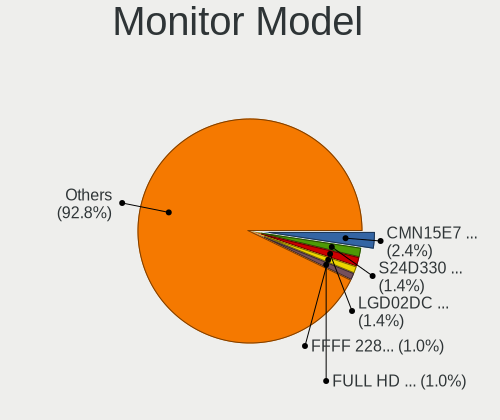

| Model                                                                | Computers | Percent |
|----------------------------------------------------------------------|-----------|---------|
| Philips 190SW PHL086D 1440x900 408x255mm 18.9-inch                   | 4         | 1.4%    |
| Samsung Electronics C27F390 SAM0D32 1920x1080 598x336mm 27.0-inch    | 3         | 1.05%   |
| Chimei Innolux LCD Monitor CMN15F5 1920x1080 344x193mm 15.5-inch     | 3         | 1.05%   |
| BOE LCD Monitor BOE06A5 1366x768 344x194mm 15.5-inch                 | 3         | 1.05%   |
| AU Optronics LCD Monitor AUO46EC 1366x768 344x193mm 15.5-inch        | 3         | 1.05%   |
| Samsung Electronics SyncMaster SAM01B7 1280x1024 338x270mm 17.0-inch | 2         | 0.7%    |
| Samsung Electronics S24F350 SAM0D20 1920x1080 521x293mm 23.5-inch    | 2         | 0.7%    |
| RTK TV RTK0001 3840x2160                                             | 2         | 0.7%    |
| Philips PHL 276E8V PHLC18F 3840x2160 597x336mm 27.0-inch             | 2         | 0.7%    |
| PANDA LCD Monitor NCP0046 1920x1080 344x194mm 15.5-inch              | 2         | 0.7%    |
| LG Display LCD Monitor LGD046A 1366x768 344x194mm 15.5-inch          | 2         | 0.7%    |
| LG Display LCD Monitor LGD0250 1366x768 345x194mm 15.6-inch          | 2         | 0.7%    |
| Goldstar HDR WFHD GSM7714 2560x1080 798x334mm 34.1-inch              | 2         | 0.7%    |
| Goldstar HDR 4K GSM7707 3840x2160 600x340mm 27.2-inch                | 2         | 0.7%    |
| Chimei Innolux LCD Monitor CMN14D6 1366x768 309x173mm 13.9-inch      | 2         | 0.7%    |
| Chimei Innolux LCD Monitor CMN14D4 1920x1080 309x173mm 13.9-inch     | 2         | 0.7%    |
| BOE LCD Monitor BOE09CA 1920x1080 344x194mm 15.5-inch                | 2         | 0.7%    |
| BOE LCD Monitor BOE0877 1920x1080 309x173mm 13.9-inch                | 2         | 0.7%    |
| BOE LCD Monitor BOE0872 1920x1080 344x194mm 15.5-inch                | 2         | 0.7%    |
| BOE LCD Monitor BOE07C9 1920x1080 309x173mm 13.9-inch                | 2         | 0.7%    |
| BOE LCD Monitor BOE0700 1920x1080 344x194mm 15.5-inch                | 2         | 0.7%    |
| AU Optronics LCD Monitor AUO26EC 1366x768 344x193mm 15.5-inch        | 2         | 0.7%    |
| AU Optronics LCD Monitor AUO243D 1920x1080 309x173mm 13.9-inch       | 2         | 0.7%    |
| AU Optronics LCD Monitor AUO21ED 1920x1080 344x193mm 15.5-inch       | 2         | 0.7%    |
| Vizio PC VIZCA27 1920x1080 597x336mm 27.0-inch                       | 1         | 0.35%   |
| Valve ANX7530 U VLV3001 800x1280 100x150mm 7.1-inch                  | 1         | 0.35%   |
| Unknown LCD Monitor FFFF 2288x1287 2550x2550mm 142.0-inch            | 1         | 0.35%   |
| TMA TL140ADXP24-0 TMA2004 2880x1800 300x190mm 14.0-inch              | 1         | 0.35%   |
| TCL SMART TV TCL6586 3840x2160 1209x680mm 54.6-inch                  | 1         | 0.35%   |
| Sony TV SNY6604 1920x1080                                            | 1         | 0.35%   |
| Sony TV *00 SNY7C04 3840x2160 1085x610mm 49.0-inch                   | 1         | 0.35%   |
| Sharp LQ156M1JW01 SHP14C3 1920x1080 344x194mm 15.5-inch              | 1         | 0.35%   |
| Sharp LCD Monitor SHP14AE 1920x1080 294x165mm 13.3-inch              | 1         | 0.35%   |
| Sharp LCD Monitor SHP1484 1920x1080 294x165mm 13.3-inch              | 1         | 0.35%   |
| Sharp LCD Monitor SHP1479 1920x1280 259x173mm 12.3-inch              | 1         | 0.35%   |
| SGT M2145J1F2281 SGT2145 1920x1080 477x268mm 21.5-inch               | 1         | 0.35%   |
| Samsung Electronics T27C350 SAM0AC5 1920x1080 598x336mm 27.0-inch    | 1         | 0.35%   |
| Samsung Electronics T22D390 SAM0B6B 1920x1080 477x268mm 21.5-inch    | 1         | 0.35%   |
| Samsung Electronics T22B300 SAM092D 1920x1080 477x268mm 21.5-inch    | 1         | 0.35%   |
| Samsung Electronics SyncMaster SAM0304 1680x1050 494x320mm 23.2-inch | 1         | 0.35%   |

Monitor Resolution
------------------

Monitor screen resolution

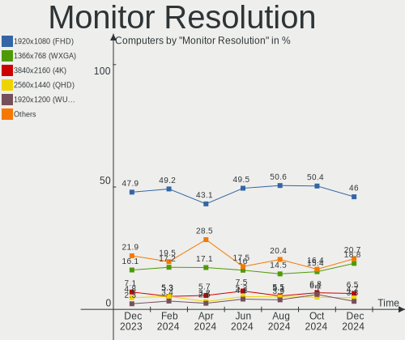

| Resolution         | Computers | Percent |
|--------------------|-----------|---------|
| 1920x1080 (FHD)    | 132       | 49.25%  |
| 1366x768 (WXGA)    | 43        | 16.04%  |
| 3840x2160 (4K)     | 20        | 7.46%   |
| 1440x900 (WXGA+)   | 9         | 3.36%   |
| 1920x1200 (WUXGA)  | 8         | 2.99%   |
| 1600x900 (HD+)     | 8         | 2.99%   |
| 1280x800 (WXGA)    | 8         | 2.99%   |
| 1280x1024 (SXGA)   | 8         | 2.99%   |
| 2560x1440 (QHD)    | 5         | 1.87%   |
| 2880x1800          | 4         | 1.49%   |
| 1680x1050 (WSXGA+) | 4         | 1.49%   |
| 2560x1600          | 3         | 1.12%   |
| 2560x1080          | 3         | 1.12%   |
| 2160x1440          | 2         | 0.75%   |
| 1920x1280          | 2         | 0.75%   |
| 800x1280           | 1         | 0.37%   |
| 4480x1600          | 1         | 0.37%   |
| 3840x1600          | 1         | 0.37%   |
| 3456x2160          | 1         | 0.37%   |
| 3200x2000          | 1         | 0.37%   |
| 3200x1800 (QHD+)   | 1         | 0.37%   |
| 2288x1287          | 1         | 0.37%   |
| 2160x1200          | 1         | 0.37%   |
| Unknown            | 1         | 0.37%   |

Monitor Diagonal
----------------

Diagonal size in inches

| Inches  | Computers | Percent |
|---------|-----------|---------|
| 15      | 80        | 28.57%  |
| 27      | 31        | 11.07%  |
| 14      | 27        | 9.64%   |
| 13      | 26        | 9.29%   |
| 24      | 22        | 7.86%   |
| 23      | 14        | 5%      |
| 21      | 13        | 4.64%   |
| 17      | 13        | 4.64%   |
| 18      | 9         | 3.21%   |
| 16      | 6         | 2.14%   |
| 12      | 6         | 2.14%   |
| 20      | 4         | 1.43%   |
| 72      | 3         | 1.07%   |
| 40      | 3         | 1.07%   |
| 34      | 3         | 1.07%   |
| 31      | 3         | 1.07%   |
| 22      | 3         | 1.07%   |
| 19      | 3         | 1.07%   |
| Unknown | 3         | 1.07%   |
| 28      | 2         | 0.71%   |
| 142     | 1         | 0.36%   |
| 65      | 1         | 0.36%   |
| 54      | 1         | 0.36%   |
| 52      | 1         | 0.36%   |
| 37      | 1         | 0.36%   |
| 7       | 1         | 0.36%   |

Monitor Width
-------------

Physical width

| Width in mm    | Computers | Percent |
|----------------|-----------|---------|
| 301-350        | 124       | 45.76%  |
| 501-600        | 56        | 20.66%  |
| 401-500        | 30        | 11.07%  |
| 201-300        | 20        | 7.38%   |
| 351-400        | 16        | 5.9%    |
| 601-700        | 7         | 2.58%   |
| 801-900        | 4         | 1.48%   |
| 701-800        | 3         | 1.11%   |
| 1501-2000      | 3         | 1.11%   |
| 1001-1500      | 3         | 1.11%   |
| Unknown        | 3         | 1.11%   |
| More than 2000 | 1         | 0.37%   |
| 1-100          | 1         | 0.37%   |

Aspect Ratio
------------

Proportional relationship between the width and the height

| Ratio   | Computers | Percent |
|---------|-----------|---------|
| 16/9    | 195       | 76.47%  |
| 16/10   | 39        | 15.29%  |
| 5/4     | 7         | 2.75%   |
| 3/2     | 5         | 1.96%   |
| 21/9    | 4         | 1.57%   |
| 4/3     | 2         | 0.78%   |
| 1.00    | 1         | 0.39%   |
| 0.67    | 1         | 0.39%   |
| Unknown | 1         | 0.39%   |

Monitor Area
------------

Area in inch

| Area in inch | Computers | Percent |
|----------------|-----------|---------|
| 101-110        | 82        | 29.39%  |
| 81-90          | 46        | 16.49%  |
| 201-250        | 43        | 15.41%  |
| 301-350        | 31        | 11.11%  |
| 151-200        | 19        | 6.81%   |
| 351-500        | 9         | 3.23%   |
| 121-130        | 8         | 2.87%   |
| More than 1000 | 7         | 2.51%   |
| 71-80          | 6         | 2.15%   |
| 61-70          | 6         | 2.15%   |
| 141-150        | 5         | 1.79%   |
| 111-120        | 5         | 1.79%   |
| 251-300        | 4         | 1.43%   |
| 501-1000       | 3         | 1.08%   |
| Unknown        | 3         | 1.08%   |
| 1-40           | 1         | 0.36%   |
| 91-100         | 1         | 0.36%   |

Pixel Density
-------------

Pixels per inch

| Density       | Computers | Percent |
|---------------|-----------|---------|
| 51-100        | 91        | 33.83%  |
| 121-160       | 81        | 30.11%  |
| 101-120       | 57        | 21.19%  |
| 161-240       | 23        | 8.55%   |
| More than 240 | 9         | 3.35%   |
| 1-50          | 5         | 1.86%   |
| Unknown       | 3         | 1.12%   |

Multiple Monitors
-----------------

Total monitors connected

| Total | Computers | Percent |
|-------|-----------|---------|
| 1     | 213       | 83.2%   |
| 2     | 34        | 13.28%  |
| 0     | 5         | 1.95%   |
| 3     | 3         | 1.17%   |
| 4     | 1         | 0.39%   |

Network
-------

Net Controller Vendor
---------------------

Controller vendors

| Vendor                            | Computers | Percent |
|-----------------------------------|-----------|---------|
| Realtek Semiconductor             | 146       | 38.12%  |
| Intel                             | 117       | 30.55%  |
| Qualcomm Atheros                  | 40        | 10.44%  |
| Broadcom                          | 19        | 4.96%   |
| MediaTek                          | 17        | 4.44%   |
| Marvell Technology Group          | 7         | 1.83%   |
| TP-Link                           | 5         | 1.31%   |
| Broadcom Limited                  | 4         | 1.04%   |
| Ralink Technology                 | 3         | 0.78%   |
| Sierra Wireless                   | 2         | 0.52%   |
| Ralink                            | 2         | 0.52%   |
| Microsoft                         | 2         | 0.52%   |
| Ericsson Business Mobile Networks | 2         | 0.52%   |
| D-Link                            | 2         | 0.52%   |
| ZTE WCDMA Technologies MSM        | 1         | 0.26%   |
| VIA Technologies                  | 1         | 0.26%   |
| Samsung Electronics               | 1         | 0.26%   |
| Qualcomm                          | 1         | 0.26%   |
| Motorola PCS                      | 1         | 0.26%   |
| JMicron Technology                | 1         | 0.26%   |
| Huawei Technologies               | 1         | 0.26%   |
| Hewlett-Packard                   | 1         | 0.26%   |
| Google                            | 1         | 0.26%   |
| DisplayLink                       | 1         | 0.26%   |
| Dell                              | 1         | 0.26%   |
| D-Link System                     | 1         | 0.26%   |
| Attansic Technology               | 1         | 0.26%   |
| ASIX Electronics                  | 1         | 0.26%   |
| 3Com                              | 1         | 0.26%   |

Net Controller Model
--------------------

Controller models

| Model                                                                  | Computers | Percent |
|------------------------------------------------------------------------|-----------|---------|
| Realtek RTL8111/8168/8211/8411 PCI Express Gigabit Ethernet Controller | 90        | 20.13%  |
| Realtek RTL810xE PCI Express Fast Ethernet controller                  | 18        | 4.03%   |
| Realtek RTL8821CE 802.11ac PCIe Wireless Network Adapter               | 14        | 3.13%   |
| Intel Alder Lake-P PCH CNVi WiFi                                       | 12        | 2.68%   |
| Realtek RTL8822CE 802.11ac PCIe Wireless Network Adapter               | 11        | 2.46%   |
| Realtek RTL8125 2.5GbE Controller                                      | 10        | 2.24%   |
| Intel Wi-Fi 6 AX200                                                    | 10        | 2.24%   |
| Intel 82579LM Gigabit Network Connection (Lewisville)                  | 10        | 2.24%   |
| Realtek RTL8153 Gigabit Ethernet Adapter                               | 8         | 1.79%   |
| Qualcomm Atheros QCA9565 / AR9565 Wireless Network Adapter             | 8         | 1.79%   |
| Qualcomm Atheros AR9485 Wireless Network Adapter                       | 8         | 1.79%   |
| Intel Wireless 8260                                                    | 7         | 1.57%   |
| Qualcomm Atheros QCA9377 802.11ac Wireless Network Adapter             | 6         | 1.34%   |
| MediaTek MT7921K (RZ608) Wi-Fi 6E 80MHz                                | 6         | 1.34%   |
| MediaTek MT7921 802.11ax PCI Express Wireless Network Adapter          | 6         | 1.34%   |
| Intel Wireless 7265                                                    | 6         | 1.34%   |
| Intel Raptor Lake PCH CNVi WiFi                                        | 6         | 1.34%   |
| Intel Wireless 8265 / 8275                                             | 5         | 1.12%   |
| Intel WiFi Link 5100                                                   | 5         | 1.12%   |
| Intel Wi-Fi 6E(802.11ax) AX210/AX1675* 2x2 [Typhoon Peak]              | 5         | 1.12%   |
| Intel Wi-Fi 6 AX201                                                    | 5         | 1.12%   |
| Intel Ethernet Controller I225-V                                       | 5         | 1.12%   |
| Broadcom BCM43142 802.11b/g/n                                          | 5         | 1.12%   |
| Realtek RTL88x2bu [AC1200 Techkey]                                     | 4         | 0.89%   |
| Qualcomm Atheros AR9285 Wireless Network Adapter (PCI-Express)         | 4         | 0.89%   |
| MediaTek MT7922 802.11ax PCI Express Wireless Network Adapter          | 4         | 0.89%   |
| Intel Comet Lake PCH CNVi WiFi                                         | 4         | 0.89%   |
| Intel Centrino Advanced-N 6205 [Taylor Peak]                           | 4         | 0.89%   |
| Realtek Killer E3000 2.5GbE Controller                                 | 3         | 0.67%   |
| Qualcomm Atheros QCA6174 802.11ac Wireless Network Adapter             | 3         | 0.67%   |
| Marvell Group 88E8055 PCI-E Gigabit Ethernet Controller                | 3         | 0.67%   |
| Intel Wireless 7260                                                    | 3         | 0.67%   |
| Intel I211 Gigabit Network Connection                                  | 3         | 0.67%   |
| Intel Ethernet Connection I219-V                                       | 3         | 0.67%   |
| Intel Ethernet Connection I219-LM                                      | 3         | 0.67%   |
| Intel Ethernet Connection I217-V                                       | 3         | 0.67%   |
| Intel Ethernet Connection I217-LM                                      | 3         | 0.67%   |
| Intel Ethernet Connection (2) I219-V                                   | 3         | 0.67%   |
| Intel Dual Band Wireless-AC 3165 Plus Bluetooth                        | 3         | 0.67%   |
| TP-Link TL-WN823N v2/v3 [Realtek RTL8192EU]                            | 2         | 0.45%   |

Wireless Vendor
---------------

Wireless vendors

| Vendor                | Computers | Percent |
|-----------------------|-----------|---------|
| Intel                 | 93        | 42.86%  |
| Realtek Semiconductor | 40        | 18.43%  |
| Qualcomm Atheros      | 34        | 15.67%  |
| MediaTek              | 17        | 7.83%   |
| Broadcom              | 13        | 5.99%   |
| TP-Link               | 5         | 2.3%    |
| Ralink Technology     | 3         | 1.38%   |
| Broadcom Limited      | 3         | 1.38%   |
| Sierra Wireless       | 2         | 0.92%   |
| Ralink                | 2         | 0.92%   |
| Microsoft             | 2         | 0.92%   |
| D-Link                | 2         | 0.92%   |
| Qualcomm              | 1         | 0.46%   |

Wireless Model
--------------

Wireless models

| Model                                                                   | Computers | Percent |
|-------------------------------------------------------------------------|-----------|---------|
| Realtek RTL8821CE 802.11ac PCIe Wireless Network Adapter                | 14        | 6.39%   |
| Intel Alder Lake-P PCH CNVi WiFi                                        | 12        | 5.48%   |
| Realtek RTL8822CE 802.11ac PCIe Wireless Network Adapter                | 11        | 5.02%   |
| Intel Wi-Fi 6 AX200                                                     | 10        | 4.57%   |
| Qualcomm Atheros QCA9565 / AR9565 Wireless Network Adapter              | 8         | 3.65%   |
| Qualcomm Atheros AR9485 Wireless Network Adapter                        | 8         | 3.65%   |
| Intel Wireless 8260                                                     | 7         | 3.2%    |
| Qualcomm Atheros QCA9377 802.11ac Wireless Network Adapter              | 6         | 2.74%   |
| MediaTek MT7921K (RZ608) Wi-Fi 6E 80MHz                                 | 6         | 2.74%   |
| MediaTek MT7921 802.11ax PCI Express Wireless Network Adapter           | 6         | 2.74%   |
| Intel Wireless 7265                                                     | 6         | 2.74%   |
| Intel Raptor Lake PCH CNVi WiFi                                         | 6         | 2.74%   |
| Intel Wireless 8265 / 8275                                              | 5         | 2.28%   |
| Intel WiFi Link 5100                                                    | 5         | 2.28%   |
| Intel Wi-Fi 6E(802.11ax) AX210/AX1675* 2x2 [Typhoon Peak]               | 5         | 2.28%   |
| Intel Wi-Fi 6 AX201                                                     | 5         | 2.28%   |
| Broadcom BCM43142 802.11b/g/n                                           | 5         | 2.28%   |
| Realtek RTL88x2bu [AC1200 Techkey]                                      | 4         | 1.83%   |
| Qualcomm Atheros AR9285 Wireless Network Adapter (PCI-Express)          | 4         | 1.83%   |
| MediaTek MT7922 802.11ax PCI Express Wireless Network Adapter           | 4         | 1.83%   |
| Intel Comet Lake PCH CNVi WiFi                                          | 4         | 1.83%   |
| Intel Centrino Advanced-N 6205 [Taylor Peak]                            | 4         | 1.83%   |
| Qualcomm Atheros QCA6174 802.11ac Wireless Network Adapter              | 3         | 1.37%   |
| Intel Wireless 7260                                                     | 3         | 1.37%   |
| Intel Dual Band Wireless-AC 3165 Plus Bluetooth                         | 3         | 1.37%   |
| TP-Link TL-WN823N v2/v3 [Realtek RTL8192EU]                             | 2         | 0.91%   |
| TP-Link AC600 wireless Realtek RTL8811AU [Archer T2U Nano]              | 2         | 0.91%   |
| Realtek RTL8852BE PCIe 802.11ax Wireless Network Controller             | 2         | 0.91%   |
| Realtek RTL8723BE PCIe Wireless Network Adapter                         | 2         | 0.91%   |
| Ralink RT5390 Wireless 802.11n 1T/1R PCIe                               | 2         | 0.91%   |
| Qualcomm Atheros AR242x / AR542x Wireless Network Adapter (PCI-Express) | 2         | 0.91%   |
| Microsoft Xbox Wireless Adapter for Windows                             | 2         | 0.91%   |
| Intel Comet Lake PCH-LP CNVi WiFi                                       | 2         | 0.91%   |
| Intel Cannon Point-LP CNVi [Wireless-AC]                                | 2         | 0.91%   |
| Intel Cannon Lake PCH CNVi WiFi                                         | 2         | 0.91%   |
| Broadcom BCM4331 802.11a/b/g/n                                          | 2         | 0.91%   |
| TP-Link TL-WN821N v5/v6 [RTL8192EU]                                     | 1         | 0.46%   |
| TP-Link 802.11ac WLAN Adapter                                           | 1         | 0.46%   |
| Sierra Wireless EM7455                                                  | 1         | 0.46%   |
| Sierra Wireless EM7345 4G LTE                                           | 1         | 0.46%   |

Ethernet Vendor
---------------

Ethernet vendors

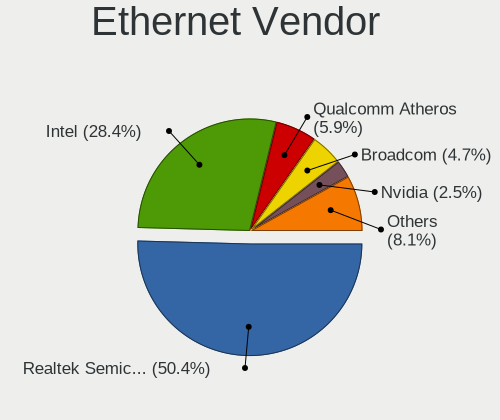

| Vendor                     | Computers | Percent |
|----------------------------|-----------|---------|
| Realtek Semiconductor      | 127       | 59.35%  |
| Intel                      | 50        | 23.36%  |
| Qualcomm Atheros           | 9         | 4.21%   |
| Broadcom                   | 9         | 4.21%   |
| Marvell Technology Group   | 7         | 3.27%   |
| ZTE WCDMA Technologies MSM | 1         | 0.47%   |
| VIA Technologies           | 1         | 0.47%   |
| Samsung Electronics        | 1         | 0.47%   |
| Motorola PCS               | 1         | 0.47%   |
| JMicron Technology         | 1         | 0.47%   |
| Google                     | 1         | 0.47%   |
| DisplayLink                | 1         | 0.47%   |
| D-Link System              | 1         | 0.47%   |
| Broadcom Limited           | 1         | 0.47%   |
| Attansic Technology        | 1         | 0.47%   |
| ASIX Electronics           | 1         | 0.47%   |
| 3Com                       | 1         | 0.47%   |

Ethernet Model
--------------

Ethernet models

| Model                                                                  | Computers | Percent |
|------------------------------------------------------------------------|-----------|---------|
| Realtek RTL8111/8168/8211/8411 PCI Express Gigabit Ethernet Controller | 90        | 40.36%  |
| Realtek RTL810xE PCI Express Fast Ethernet controller                  | 18        | 8.07%   |
| Realtek RTL8125 2.5GbE Controller                                      | 10        | 4.48%   |
| Intel 82579LM Gigabit Network Connection (Lewisville)                  | 10        | 4.48%   |
| Realtek RTL8153 Gigabit Ethernet Adapter                               | 8         | 3.59%   |
| Intel Ethernet Controller I225-V                                       | 5         | 2.24%   |
| Realtek Killer E3000 2.5GbE Controller                                 | 3         | 1.35%   |
| Marvell Group 88E8055 PCI-E Gigabit Ethernet Controller                | 3         | 1.35%   |
| Intel I211 Gigabit Network Connection                                  | 3         | 1.35%   |
| Intel Ethernet Connection I219-V                                       | 3         | 1.35%   |
| Intel Ethernet Connection I219-LM                                      | 3         | 1.35%   |
| Intel Ethernet Connection I217-V                                       | 3         | 1.35%   |
| Intel Ethernet Connection I217-LM                                      | 3         | 1.35%   |
| Intel Ethernet Connection (2) I219-V                                   | 3         | 1.35%   |
| Realtek Killer E2600 GbE Controller                                    | 2         | 0.9%    |
| Qualcomm Atheros QCA8171 Gigabit Ethernet                              | 2         | 0.9%    |
| Qualcomm Atheros Killer E220x Gigabit Ethernet Controller              | 2         | 0.9%    |
| Qualcomm Atheros AR8121/AR8113/AR8114 Gigabit or Fast Ethernet         | 2         | 0.9%    |
| Intel Ethernet Connection (6) I219-LM                                  | 2         | 0.9%    |
| Intel Ethernet Connection (3) I218-LM                                  | 2         | 0.9%    |
| Intel Ethernet Connection (16) I219-V                                  | 2         | 0.9%    |
| Broadcom NetXtreme BCM57765 Gigabit Ethernet PCIe                      | 2         | 0.9%    |
| Broadcom NetXtreme BCM5764M Gigabit Ethernet PCIe                      | 2         | 0.9%    |
| ZTE WCDMA MSM USB SCSI CD-ROM                                          | 1         | 0.45%   |
| VIA VT6102/VT6103 [Rhine-II]                                           | 1         | 0.45%   |
| Samsung Galaxy series, misc. (tethering mode)                          | 1         | 0.45%   |
| Realtek RTL8169 PCI Gigabit Ethernet Controller                        | 1         | 0.45%   |
| Realtek RTL8111/8168/8411 PCI Express Gigabit Ethernet Controller      | 1         | 0.45%   |
| Realtek RTL-8110SC/8169SC Gigabit Ethernet                             | 1         | 0.45%   |
| Realtek RTL-8100/8101L/8139 PCI Fast Ethernet Adapter                  | 1         | 0.45%   |
| Qualcomm Atheros Killer E2400 Gigabit Ethernet Controller              | 1         | 0.45%   |
| Qualcomm Atheros AR8162 Fast Ethernet                                  | 1         | 0.45%   |
| Qualcomm Atheros AR8161 Gigabit Ethernet                               | 1         | 0.45%   |
| Motorola PCS moto g52                                                  | 1         | 0.45%   |
| Marvell Group 88E8071 PCI-E Gigabit Ethernet Controller                | 1         | 0.45%   |
| Marvell Group 88E8058 PCI-E Gigabit Ethernet Controller                | 1         | 0.45%   |
| Marvell Group 88E8057 PCI-E Gigabit Ethernet Controller                | 1         | 0.45%   |
| Marvell Group 88E8053 PCI-E Gigabit Ethernet Controller                | 1         | 0.45%   |
| JMicron JMC250 PCI Express Gigabit Ethernet Controller                 | 1         | 0.45%   |
| Intel Ethernet Connection (7) I219-V                                   | 1         | 0.45%   |

Net Controller Kind
-------------------

Ethernet, WiFi or modem

| Kind     | Computers | Percent |
|----------|-----------|---------|
| WiFi     | 211       | 50.6%   |
| Ethernet | 201       | 48.2%   |
| Modem    | 5         | 1.2%    |

Used Controller
---------------

Currently used network controller

| Kind     | Computers | Percent |
|----------|-----------|---------|
| WiFi     | 164       | 62.12%  |
| Ethernet | 100       | 37.88%  |

NICs
----

Total network controllers on board

| Total | Computers | Percent |
|-------|-----------|---------|
| 2     | 139       | 54.3%   |
| 1     | 103       | 40.23%  |
| 3     | 10        | 3.91%   |
| 0     | 4         | 1.56%   |

IPv6
----

IPv6 vs IPv4

| Used | Computers | Percent |
|------|-----------|---------|
| No   | 215       | 83.98%  |
| Yes  | 41        | 16.02%  |

Bluetooth
---------

Bluetooth Vendor
----------------

Controller vendors

| Vendor                          | Computers | Percent |
|---------------------------------|-----------|---------|
| Intel                           | 76        | 40.21%  |
| Realtek Semiconductor           | 22        | 11.64%  |
| IMC Networks                    | 12        | 6.35%   |
| Qualcomm Atheros Communications | 10        | 5.29%   |
| Cambridge Silicon Radio         | 10        | 5.29%   |
| Lite-On Technology              | 9         | 4.76%   |
| Broadcom                        | 8         | 4.23%   |
| Foxconn / Hon Hai               | 7         | 3.7%    |
| Realtek                         | 6         | 3.17%   |
| MediaTek                        | 6         | 3.17%   |
| Apple                           | 6         | 3.17%   |
| ASUSTek Computer                | 4         | 2.12%   |
| Dell                            | 2         | 1.06%   |
| Belkin Components               | 2         | 1.06%   |
| USI                             | 1         | 0.53%   |
| TP-Link                         | 1         | 0.53%   |
| Toshiba                         | 1         | 0.53%   |
| Taiyo Yuden                     | 1         | 0.53%   |
| Qcom                            | 1         | 0.53%   |
| HTC (High Tech Computer)        | 1         | 0.53%   |
| Hewlett-Packard                 | 1         | 0.53%   |
| Alps Electric                   | 1         | 0.53%   |
| Actions                         | 1         | 0.53%   |

Bluetooth Model
---------------

Controller models

| Model                                               | Computers | Percent |
|-----------------------------------------------------|-----------|---------|
| Intel Bluetooth wireless interface                  | 23        | 12.11%  |
| Realtek Bluetooth Radio                             | 18        | 9.47%   |
| Intel AX201 Bluetooth                               | 15        | 7.89%   |
| Intel Bluetooth Device                              | 13        | 6.84%   |
| Intel AX200 Bluetooth                               | 10        | 5.26%   |
| Cambridge Silicon Radio Bluetooth Dongle (HCI mode) | 10        | 5.26%   |
| Intel Bluetooth 9460/9560 Jefferson Peak (JfP)      | 7         | 3.68%   |
| Realtek Bluetooth Radio                             | 6         | 3.16%   |
| MediaTek Wireless_Device                            | 6         | 3.16%   |
| IMC Networks Bluetooth Radio                        | 5         | 2.63%   |
| Realtek  Bluetooth 4.2 Adapter                      | 4         | 2.11%   |
| Lite-On Wireless_Device                             | 4         | 2.11%   |
| Intel AX210 Bluetooth                               | 4         | 2.11%   |
| IMC Networks Bluetooth Device                       | 4         | 2.11%   |
| Foxconn / Hon Hai Wireless_Device                   | 4         | 2.11%   |
| Broadcom BCM43142A0 Bluetooth Device                | 4         | 2.11%   |
| Qualcomm Atheros  Bluetooth Device                  | 3         | 1.58%   |
| Qualcomm Atheros AR3012 Bluetooth 4.0               | 3         | 1.58%   |
| IMC Networks Wireless_Device                        | 3         | 1.58%   |
| Lite-On Atheros AR3012 Bluetooth                    | 2         | 1.05%   |
| Intel Wireless-AC 9260 Bluetooth Adapter            | 2         | 1.05%   |
| Foxconn / Hon Hai Bluetooth Device                  | 2         | 1.05%   |
| Dell DW375 Bluetooth Module                         | 2         | 1.05%   |
| Broadcom BCM20702 Bluetooth 4.0 [ThinkPad]          | 2         | 1.05%   |
| Apple Bluetooth USB Host Controller                 | 2         | 1.05%   |
| Apple Bluetooth Host Controller                     | 2         | 1.05%   |
| Apple Bluetooth HCI                                 | 2         | 1.05%   |
| USI Bluetooth Device                                | 1         | 0.53%   |
| TP-Link UB500 Adapter                               | 1         | 0.53%   |
| Toshiba Integrated Bluetooth (Taiyo Yuden)          | 1         | 0.53%   |
| Taiyo Yuden Bluetooth Device (V2.0+EDR)             | 1         | 0.53%   |
| Qualcomm Atheros QCA61x4 Bluetooth 4.0              | 1         | 0.53%   |
| Qualcomm Atheros Bluetooth USB Host Controller      | 1         | 0.53%   |
| Qualcomm Atheros AR9462 Bluetooth                   | 1         | 0.53%   |
| Qualcomm Atheros AR3011 Bluetooth                   | 1         | 0.53%   |
| Qcom Broadcom Bluetooth USB                         | 1         | 0.53%   |
| Lite-On Qualcomm Atheros QCA9377 Bluetooth          | 1         | 0.53%   |
| Lite-On Bluetooth Device                            | 1         | 0.53%   |
| Lite-On Atheros Bluetooth                           | 1         | 0.53%   |
| Intel Wireless-AC 3168 Bluetooth                    | 1         | 0.53%   |

Sound
-----

Sound Vendor
------------

Sound card vendors

| Vendor                                       | Computers | Percent |
|----------------------------------------------|-----------|---------|
| Intel                                        | 183       | 54.46%  |
| AMD                                          | 79        | 23.51%  |
| Nvidia                                       | 45        | 13.39%  |
| Logitech                                     | 3         | 0.89%   |
| JMTek                                        | 3         | 0.89%   |
| C-Media Electronics                          | 3         | 0.89%   |
| Generalplus Technology                       | 2         | 0.6%    |
| Zoran Co. Personal Media Division (Nogatech) | 1         | 0.3%    |
| VIA Technologies                             | 1         | 0.3%    |
| Thesycon Systemsoftware & Consulting         | 1         | 0.3%    |
| Texas Instruments                            | 1         | 0.3%    |
| SteelSeries ApS                              | 1         | 0.3%    |
| Sony                                         | 1         | 0.3%    |
| Razer USA                                    | 1         | 0.3%    |
| Micro Star International                     | 1         | 0.3%    |
| MAG Technology                               | 1         | 0.3%    |
| IK Multimedia                                | 1         | 0.3%    |
| Hewlett-Packard                              | 1         | 0.3%    |
| GN Netcom                                    | 1         | 0.3%    |
| Focusrite-Novation                           | 1         | 0.3%    |
| Creative Technology                          | 1         | 0.3%    |
| Creative Labs                                | 1         | 0.3%    |
| Bluetrum                                     | 1         | 0.3%    |
| BEHRINGER International                      | 1         | 0.3%    |
| ASUSTek Computer                             | 1         | 0.3%    |

Sound Model
-----------

Sound card models

| Model                                                                             | Computers | Percent |
|-----------------------------------------------------------------------------------|-----------|---------|
| AMD Family 17h/19h HD Audio Controller                                            | 32        | 7.92%   |
| Intel Sunrise Point-LP HD Audio                                                   | 20        | 4.95%   |
| Intel 7 Series/C216 Chipset Family High Definition Audio Controller               | 20        | 4.95%   |
| Intel 6 Series/C200 Series Chipset Family High Definition Audio Controller        | 14        | 3.47%   |
| AMD Renoir Radeon High Definition Audio Controller                                | 14        | 3.47%   |
| Intel Alder Lake PCH-P High Definition Audio Controller                           | 13        | 3.22%   |
| Intel Tiger Lake-LP Smart Sound Technology Audio Controller                       | 11        | 2.72%   |
| AMD Rembrandt Radeon High Definition Audio Controller                             | 11        | 2.72%   |
| AMD FCH Azalia Controller                                                         | 10        | 2.48%   |
| Intel 82801I (ICH9 Family) HD Audio Controller                                    | 9         | 2.23%   |
| Intel 8 Series/C220 Series Chipset High Definition Audio Controller               | 9         | 2.23%   |
| Intel Celeron/Pentium Silver Processor High Definition Audio                      | 8         | 1.98%   |
| AMD Raven/Raven2/Fenghuang HDMI/DP Audio Controller                               | 8         | 1.98%   |
| Nvidia GK208 HDMI/DP Audio Controller                                             | 7         | 1.73%   |
| Intel Raptor Lake-P/U/H cAVS                                                      | 7         | 1.73%   |
| Intel 100 Series/C230 Series Chipset Family HD Audio Controller                   | 7         | 1.73%   |
| AMD Starship/Matisse HD Audio Controller                                          | 7         | 1.73%   |
| AMD Kabini HDMI/DP Audio                                                          | 7         | 1.73%   |
| Nvidia TU107 GeForce GTX 1650 High Definition Audio Controller                    | 6         | 1.49%   |
| Intel Comet Lake PCH cAVS                                                         | 6         | 1.49%   |
| AMD Ellesmere HDMI Audio [Radeon RX 470/480 / 570/580/590]                        | 6         | 1.49%   |
| Nvidia TU104 HD Audio Controller                                                  | 5         | 1.24%   |
| Intel Wildcat Point-LP High Definition Audio Controller                           | 5         | 1.24%   |
| Intel Haswell-ULT HD Audio Controller                                             | 5         | 1.24%   |
| Intel Cannon Point-LP High Definition Audio Controller                            | 5         | 1.24%   |
| Intel Broadwell-U Audio Controller                                                | 5         | 1.24%   |
| Intel 82801H (ICH8 Family) HD Audio Controller                                    | 5         | 1.24%   |
| Intel 8 Series HD Audio Controller                                                | 5         | 1.24%   |
| AMD SBx00 Azalia (Intel HDA)                                                      | 5         | 1.24%   |
| AMD Navi 21/23 HDMI/DP Audio Controller                                           | 5         | 1.24%   |
| AMD Caicos HDMI Audio [Radeon HD 6450 / 7450/8450/8490 OEM / R5 230/235/235X OEM] | 5         | 1.24%   |
| Nvidia GF108 High Definition Audio Controller                                     | 4         | 0.99%   |
| Nvidia GA106 High Definition Audio Controller                                     | 4         | 0.99%   |
| Intel Ice Lake-LP Smart Sound Technology Audio Controller                         | 4         | 0.99%   |
| Intel Cannon Lake PCH cAVS                                                        | 4         | 0.99%   |
| Intel 82801JI (ICH10 Family) HD Audio Controller                                  | 4         | 0.99%   |
| Nvidia Audio device                                                               | 3         | 0.74%   |
| Intel Xeon E3-1200 v3/4th Gen Core Processor HD Audio Controller                  | 3         | 0.74%   |
| Intel NM10/ICH7 Family High Definition Audio Controller                           | 3         | 0.74%   |
| Intel Comet Lake PCH-LP cAVS                                                      | 3         | 0.74%   |

Memory
------

Memory Vendor
-------------

Memory module vendors

| Vendor                       | Computers | Percent |
|------------------------------|-----------|---------|
| Samsung Electronics          | 38        | 20%     |
| SK hynix                     | 32        | 16.84%  |
| Micron Technology            | 22        | 11.58%  |
| Kingston                     | 22        | 11.58%  |
| Unknown                      | 17        | 8.95%   |
| Corsair                      | 16        | 8.42%   |
| Crucial                      | 13        | 6.84%   |
| G.Skill                      | 6         | 3.16%   |
| Ramaxel Technology           | 4         | 2.11%   |
| Unknown (ABCD)               | 3         | 1.58%   |
| Elpida                       | 3         | 1.58%   |
| A-DATA Technology            | 3         | 1.58%   |
| Unknown                      | 3         | 1.58%   |
| Wodposit                     | 1         | 0.53%   |
| Unknown (0xFFFF000000000000) | 1         | 0.53%   |
| Unknown (0x0E9D)             | 1         | 0.53%   |
| Timetec                      | 1         | 0.53%   |
| Thermaltake                  | 1         | 0.53%   |
| Nanya Technology             | 1         | 0.53%   |
| Lexar                        | 1         | 0.53%   |
| Kimtigo                      | 1         | 0.53%   |

Memory Model
------------

Memory module models

| Model                                                               | Computers | Percent |
|---------------------------------------------------------------------|-----------|---------|
| Samsung RAM Module 16GB SODIMM DDR4 3200MT/s                        | 3         | 1.51%   |
| Crucial RAM CT16G48C40S5.C8A1 16GB SODIMM DDR5 4800MT/s             | 3         | 1.51%   |
| Unknown                                                             | 3         | 1.51%   |
| Unknown RAM Module 2GB SODIMM DDR2 667MT/s                          | 2         | 1.01%   |
| Unknown (ABCD) RAM 123456789012345678 2GB DIMM LPDDR4 2400MT/s      | 2         | 1.01%   |
| SK hynix RAM HMT41GS6BFR8A-PB 8GB SODIMM DDR3 1600MT/s              | 2         | 1.01%   |
| SK hynix RAM HMAA1GS6CJR6N-XN 8GB SODIMM DDR4 3200MT/s              | 2         | 1.01%   |
| SK hynix RAM HMA81GS6DJR8N-XN 8GB SODIMM DDR4 3200MT/s              | 2         | 1.01%   |
| SK hynix RAM H9JCNNNCP3MLYR-N6E 2GB Row Of Chips LPDDR5 6400MT/s    | 2         | 1.01%   |
| Samsung RAM M471B5173EB0-YK0 4GB SODIMM DDR3 1600MT/s               | 2         | 1.01%   |
| Samsung RAM M471A5244CB0-CRC 4GB SODIMM DDR4 2667MT/s               | 2         | 1.01%   |
| Samsung RAM M471A2K43EB1-CWE 16GB SODIMM DDR4 3200MT/s              | 2         | 1.01%   |
| Samsung RAM M471A1K43CB1-CRC 8GB SODIMM DDR4 2667MT/s               | 2         | 1.01%   |
| Samsung RAM M378B5273DH0-CH9 4096MB DIMM DDR2 2133MT/s              | 2         | 1.01%   |
| Micron RAM MT62F2G32D4DS-026 WT 8GB SODIMM LPDDR5 7500MT/s          | 2         | 1.01%   |
| Micron RAM 8ATF1G64HZ-3G2R1 8GB SODIMM DDR4 3200MT/s                | 2         | 1.01%   |
| Micron RAM 16KTF1G64HZ-1G6E1 8GB SODIMM DDR3 1600MT/s               | 2         | 1.01%   |
| Kingston RAM KHX2666C16/8G 8GB DIMM DDR4 3466MT/s                   | 2         | 1.01%   |
| Kingston RAM 9905599-020.A00G 8GB DIMM DDR4 2133MT/s                | 2         | 1.01%   |
| Crucial RAM CT32G48C40S5.M16A1 32GB SODIMM DDR5 4800MT/s            | 2         | 1.01%   |
| Crucial RAM CT102464BF160B.C16 8GB SODIMM DDR3 1600MT/s             | 2         | 1.01%   |
| Corsair RAM CMK32GX4M2D3600C18 16GB DIMM DDR4 3800MT/s              | 2         | 1.01%   |
| Wodposit RAM WPBH32D408SWM-16G 16GB SODIMM DDR4 3200MT/s            | 1         | 0.5%    |
| Unknown RAM Module 8GB SODIMM DDR4 2400MT/s                         | 1         | 0.5%    |
| Unknown RAM Module 8GB Row Of Chips LPDDR3 2133MT/s                 | 1         | 0.5%    |
| Unknown RAM Module 4GB SODIMM DDR3 1600MT/s                         | 1         | 0.5%    |
| Unknown RAM Module 4GB SODIMM DDR3 1067MT/s                         | 1         | 0.5%    |
| Unknown RAM Module 4GB SODIMM DDR3                                  | 1         | 0.5%    |
| Unknown RAM Module 4GB SODIMM DDR2                                  | 1         | 0.5%    |
| Unknown RAM Module 4GB DIMM 1600MT/s                                | 1         | 0.5%    |
| Unknown RAM Module 2GB SODIMM LPDDR4 2400MT/s                       | 1         | 0.5%    |
| Unknown RAM Module 2GB SODIMM DDR3 1066MT/s                         | 1         | 0.5%    |
| Unknown RAM Module 2GB SODIMM DDR2 333MT/s                          | 1         | 0.5%    |
| Unknown RAM Module 2GB SODIMM DDR2                                  | 1         | 0.5%    |
| Unknown RAM Module 2GB DIMM DDR2 667MT/s                            | 1         | 0.5%    |
| Unknown RAM Module 2048MB SODIMM DDR3 1066MT/s                      | 1         | 0.5%    |
| Unknown RAM Module 16GB DIMM DDR4 3200MT/s                          | 1         | 0.5%    |
| Unknown RAM DDR4 16GB 2666MHz 16GB SODIMM DDR4 2667MT/s             | 1         | 0.5%    |
| Unknown (ABCD) RAM 123456789012345678 2048MB SODIMM LPDDR4 2400MT/s | 1         | 0.5%    |
| Unknown (0xFFFF000000000000) RAM Module 2GB DIMM DDR2 667MT/s       | 1         | 0.5%    |

Memory Kind
-----------

Memory module kinds

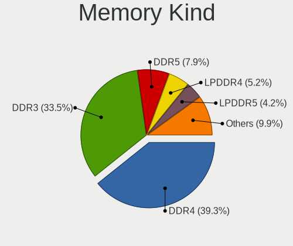

| Kind    | Computers | Percent |
|---------|-----------|---------|
| DDR4    | 74        | 44.58%  |
| DDR3    | 47        | 28.31%  |
| DDR5    | 10        | 6.02%   |
| DDR2    | 10        | 6.02%   |
| LPDDR5  | 7         | 4.22%   |
| LPDDR4  | 7         | 4.22%   |
| LPDDR3  | 4         | 2.41%   |
| Unknown | 4         | 2.41%   |
| SDRAM   | 3         | 1.81%   |

Memory Form Factor
------------------

Physical design of the memory module

| Name         | Computers | Percent |
|--------------|-----------|---------|
| SODIMM       | 103       | 62.42%  |
| DIMM         | 48        | 29.09%  |
| Row Of Chips | 14        | 8.48%   |

Memory Size
-----------

Memory module size

| Size  | Computers | Percent |
|-------|-----------|---------|
| 8192  | 60        | 33.52%  |
| 16384 | 46        | 25.7%   |
| 4096  | 46        | 25.7%   |
| 2048  | 16        | 8.94%   |
| 32768 | 6         | 3.35%   |
| 1024  | 4         | 2.23%   |
| 6144  | 1         | 0.56%   |

Memory Speed
------------

Memory module speed

| Speed   | Computers | Percent |
|---------|-----------|---------|
| 1600    | 35        | 19.66%  |
| 3200    | 32        | 17.98%  |
| 2667    | 22        | 12.36%  |
| 2400    | 11        | 6.18%   |
| 2133    | 9         | 5.06%   |
| 1333    | 9         | 5.06%   |
| 4800    | 8         | 4.49%   |
| 6400    | 5         | 2.81%   |
| 667     | 5         | 2.81%   |
| 1334    | 4         | 2.25%   |
| 3800    | 3         | 1.69%   |
| Unknown | 3         | 1.69%   |
| 7500    | 2         | 1.12%   |
| 3733    | 2         | 1.12%   |
| 3600    | 2         | 1.12%   |
| 3466    | 2         | 1.12%   |
| 1867    | 2         | 1.12%   |
| 1066    | 2         | 1.12%   |
| 800     | 2         | 1.12%   |
| 55438   | 1         | 0.56%   |
| 6000    | 1         | 0.56%   |
| 5600    | 1         | 0.56%   |
| 4267    | 1         | 0.56%   |
| 4266    | 1         | 0.56%   |
| 4199    | 1         | 0.56%   |
| 3866    | 1         | 0.56%   |
| 3534    | 1         | 0.56%   |
| 3533    | 1         | 0.56%   |
| 3266    | 1         | 0.56%   |
| 3066    | 1         | 0.56%   |
| 3007    | 1         | 0.56%   |
| 3000    | 1         | 0.56%   |
| 2933    | 1         | 0.56%   |
| 2666    | 1         | 0.56%   |
| 1067    | 1         | 0.56%   |
| 333     | 1         | 0.56%   |
| 166     | 1         | 0.56%   |

Printers & scanners
-------------------

Printer Vendor
--------------

Printer device vendors

| Vendor             | Computers | Percent |
|--------------------|-----------|---------|
| Hewlett-Packard    | 1         | 25%     |
| Dymo-CoStar        | 1         | 25%     |
| Canon              | 1         | 25%     |
| Brother Industries | 1         | 25%     |

Printer Model
-------------

Printer device models

| Model                       | Computers | Percent |
|-----------------------------|-----------|---------|
| HP Officejet 4500 G510g-m   | 1         | 25%     |
| Dymo-CoStar LabelWriter 400 | 1         | 25%     |
| Canon LBP2900               | 1         | 25%     |
| Brother HL-52x0 series      | 1         | 25%     |

Scanner Vendor
--------------

Scanner device vendors

| Vendor | Computers | Percent |
|--------|-----------|---------|
| Canon  | 2         | 100%    |

Scanner Model
-------------

Scanner device models

| Model                              | Computers | Percent |
|------------------------------------|-----------|---------|
| Canon CanoScan N670U/N676U/LiDE 20 | 1         | 50%     |
| Canon CanoScan LiDE 100            | 1         | 50%     |

Camera
------

Camera Vendor
-------------

Camera device vendors

| Vendor                                 | Computers | Percent |
|----------------------------------------|-----------|---------|
| Chicony Electronics                    | 36        | 22.36%  |
| IMC Networks                           | 20        | 12.42%  |
| Microdia                               | 16        | 9.94%   |
| Quanta                                 | 12        | 7.45%   |
| Sunplus Innovation Technology          | 8         | 4.97%   |
| Luxvisions Innotech Limited            | 8         | 4.97%   |
| Logitech                               | 8         | 4.97%   |
| Cheng Uei Precision Industry (Foxlink) | 8         | 4.97%   |
| Bison Electronics                      | 8         | 4.97%   |
| Realtek Semiconductor                  | 6         | 3.73%   |
| Sonix Technology                       | 5         | 3.11%   |
| Apple                                  | 5         | 3.11%   |
| Syntek                                 | 4         | 2.48%   |
| Suyin                                  | 3         | 1.86%   |
| Acer                                   | 3         | 1.86%   |
| Ricoh                                  | 2         | 1.24%   |
| Lite-On Technology                     | 2         | 1.24%   |
| Alcor Micro                            | 2         | 1.24%   |
| Tobii Technology AB                    | 1         | 0.62%   |
| Silicon Motion                         | 1         | 0.62%   |
| MacroSilicon                           | 1         | 0.62%   |
| Goertek Electronics                    | 1         | 0.62%   |
| Cubeternet                             | 1         | 0.62%   |

Camera Model
------------

Camera device models

| Model                                                | Computers | Percent |
|------------------------------------------------------|-----------|---------|
| Chicony Integrated Camera                            | 8         | 4.97%   |
| IMC Networks USB2.0 HD UVC WebCam                    | 6         | 3.73%   |
| Microdia Integrated_Webcam_HD                        | 5         | 3.11%   |
| Quanta HD User Facing                                | 4         | 2.48%   |
| Sunplus FHD Camera Microphone                        | 3         | 1.86%   |
| Realtek Integrated_Webcam_HD                         | 3         | 1.86%   |
| Logitech Webcam C270                                 | 3         | 1.86%   |
| Chicony HP Wide Vision HD Camera                     | 3         | 1.86%   |
| Bison Integrated Camera                              | 3         | 1.86%   |
| Syntek Lenovo EasyCamera                             | 2         | 1.24%   |
| Syntek Integrated Camera                             | 2         | 1.24%   |
| Suyin HP Truevision HD                               | 2         | 1.24%   |
| Sunplus Integrated_Webcam_HD                         | 2         | 1.24%   |
| Sonix USB2.0 HD UVC WebCam                           | 2         | 1.24%   |
| Sonix USB2.0 FHD UVC WebCam                          | 2         | 1.24%   |
| Quanta HP HD Camera                                  | 2         | 1.24%   |
| Microdia USB 2.0 Camera                              | 2         | 1.24%   |
| Microdia Integrated_Webcam_FHD                       | 2         | 1.24%   |
| Luxvisions Innotech Limited Integrated Camera        | 2         | 1.24%   |
| Luxvisions Innotech Limited HP Wide Vision HD Camera | 2         | 1.24%   |
| Luxvisions Innotech Limited HP TrueVision HD Camera  | 2         | 1.24%   |
| Luxvisions Innotech Limited HP HD Camera             | 2         | 1.24%   |
| Lite-On Integrated Camera                            | 2         | 1.24%   |
| IMC Networks UVC VGA Webcam                          | 2         | 1.24%   |
| IMC Networks USB2.0 VGA UVC WebCam                   | 2         | 1.24%   |
| IMC Networks ov9734_azurewave_camera                 | 2         | 1.24%   |
| IMC Networks Integrated Camera                       | 2         | 1.24%   |
| IMC Networks HD Camera                               | 2         | 1.24%   |
| Chicony USB2.0 VGA UVC WebCam                        | 2         | 1.24%   |
| Chicony Integrated Camera (1280x720@30)              | 2         | 1.24%   |
| Chicony HD Webcam                                    | 2         | 1.24%   |
| Cheng Uei Precision Industry (Foxlink) Webcam        | 2         | 1.24%   |
| Apple FaceTime HD Camera                             | 2         | 1.24%   |
| Acer Integrated Camera                               | 2         | 1.24%   |
| Tobii AB EyeChip                                     | 1         | 0.62%   |
| Suyin Acer/HP Integrated Webcam [CN0314]             | 1         | 0.62%   |
| Sunplus Integrated_Webcam_FHD                        | 1         | 0.62%   |
| Sunplus Hy-FHD(9807)-Camera                          | 1         | 0.62%   |
| Sunplus HD WebCam                                    | 1         | 0.62%   |
| Sonix USB 2.0 Camera                                 | 1         | 0.62%   |

Security
--------

Fingerprint Vendor
------------------

Fingerprint sensor vendors

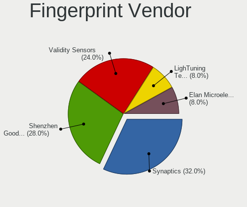

| Vendor                             | Computers | Percent |
|------------------------------------|-----------|---------|
| Synaptics                          | 10        | 33.33%  |
| Validity Sensors                   | 6         | 20%     |
| Shenzhen Goodix Technology         | 6         | 20%     |
| Elan Microelectronics              | 3         | 10%     |
| LighTuning Technology              | 2         | 6.67%   |
| Upek                               | 1         | 3.33%   |
| Realtek USB2.0 Finger Print Bridge | 1         | 3.33%   |
| AuthenTec                          | 1         | 3.33%   |

Fingerprint Model
-----------------

Fingerprint sensor models

| Model                                                           | Computers | Percent |
|-----------------------------------------------------------------|-----------|---------|
| Shenzhen Goodix  Fingerprint Device                             | 5         | 16.67%  |
| Synaptics Prometheus MIS Touch Fingerprint Reader               | 3         | 10%     |
| Elan ELAN:ARM-M4                                                | 3         | 10%     |
| Validity Sensors VFS 5011 fingerprint sensor                    | 2         | 6.67%   |
| Synaptics FS7604 Touch Fingerprint Sensor with PurePrint        | 2         | 6.67%   |
| Validity Sensors VFS495 Fingerprint Reader                      | 1         | 3.33%   |
| Validity Sensors VFS491                                         | 1         | 3.33%   |
| Validity Sensors Synaptics WBDI                                 | 1         | 3.33%   |
| Validity Sensors Swipe Fingerprint Sensor                       | 1         | 3.33%   |
| Upek Biometric Touchchip/Touchstrip Fingerprint Sensor          | 1         | 3.33%   |
| Synaptics WBDI Fingerprint Reader USB 086                       | 1         | 3.33%   |
| Synaptics UWP WBDI                                              | 1         | 3.33%   |
| Synaptics  WBDI                                                 | 1         | 3.33%   |
| Synaptics  FS7604 Touch Fingerprint Sensor with PurePrint       | 1         | 3.33%   |
| Synaptics Fingerprint scanner                                   | 1         | 3.33%   |
| Shenzhen Goodix Fingerprint Reader                              | 1         | 3.33%   |
| Realtek USB2.0 Finger Print Bridge FocalTech Fingerprint Device | 1         | 3.33%   |
| LighTuning Fingerprint Sensor                                   | 1         | 3.33%   |
| LighTuning ES603 Swipe Fingerprint Sensor                       | 1         | 3.33%   |
| AuthenTec AES2810                                               | 1         | 3.33%   |

Chipcard Vendor
---------------

Chipcard module vendors

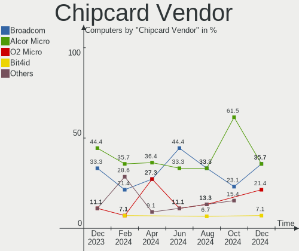

| Vendor      | Computers | Percent |
|-------------|-----------|---------|
| Broadcom    | 6         | 40%     |
| Alcor Micro | 6         | 40%     |
| Upek        | 2         | 13.33%  |
| Lenovo      | 1         | 6.67%   |

Chipcard Model
--------------

Chipcard module models

| Model                                                                        | Computers | Percent |
|------------------------------------------------------------------------------|-----------|---------|
| Alcor Micro AU9540 Smartcard Reader                                          | 6         | 40%     |
| Upek TouchChip Fingerprint Coprocessor (WBF advanced mode)                   | 2         | 13.33%  |
| Broadcom BCM5880 Secure Applications Processor                               | 2         | 13.33%  |
| Broadcom 58200                                                               | 2         | 13.33%  |
| Lenovo Integrated Smart Card Reader                                          | 1         | 6.67%   |
| Broadcom BCM5880 Secure Applications Processor with fingerprint swipe sensor | 1         | 6.67%   |
| Broadcom 5880                                                                | 1         | 6.67%   |

Unsupported
-----------

Unsupported Devices
-------------------

Total unsupported devices on board

| Total | Computers | Percent |
|-------|-----------|---------|
| 0     | 178       | 69.53%  |
| 1     | 62        | 24.22%  |
| 2     | 16        | 6.25%   |

Unsupported Device Types
------------------------

Types of unsupported devices

| Type                  | Computers | Percent |
|-----------------------|-----------|---------|
| Fingerprint reader    | 29        | 31.18%  |
| Graphics card         | 23        | 24.73%  |
| Chipcard              | 10        | 10.75%  |
| Net/wireless          | 7         | 7.53%   |
| Multimedia controller | 7         | 7.53%   |
| Unassigned class      | 4         | 4.3%    |
| Camera                | 3         | 3.23%   |
| Storage/raid          | 2         | 2.15%   |
| Storage               | 2         | 2.15%   |
| Network               | 1         | 1.08%   |
| Net/ethernet          | 1         | 1.08%   |
| Modem                 | 1         | 1.08%   |
| Flash memory          | 1         | 1.08%   |
| Dvb card              | 1         | 1.08%   |
| Bluetooth             | 1         | 1.08%   |

