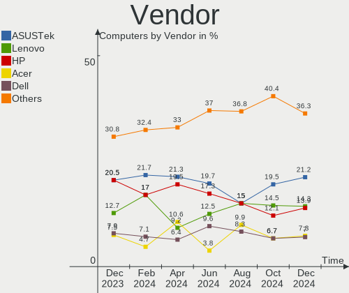
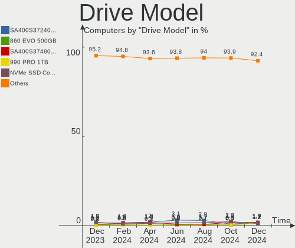
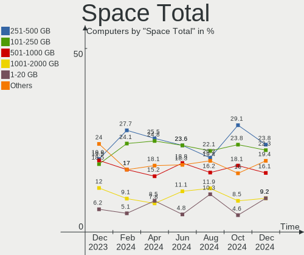
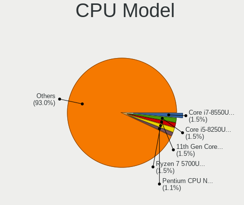
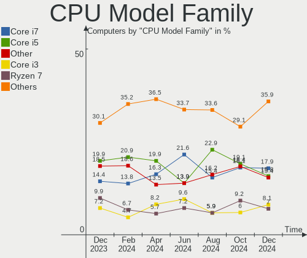
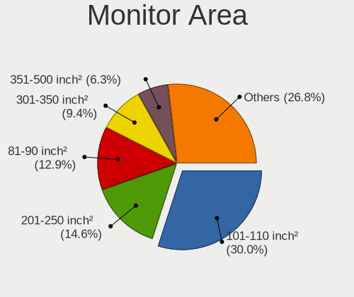
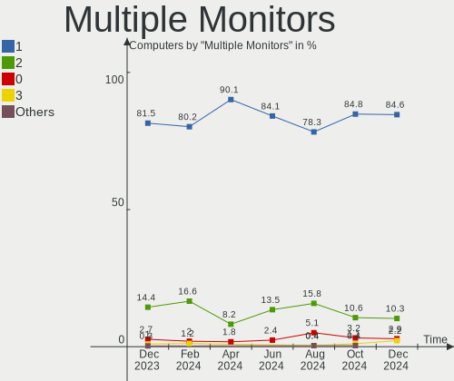
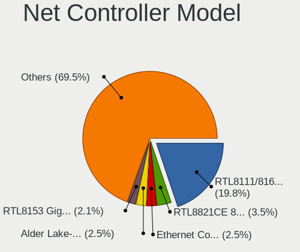
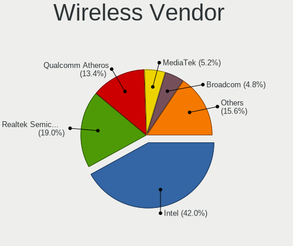

Linux in Italy - Hardware Trends
--------------------------------

A project to identify most popular hardware characteristics and track their change
over time based on data collected by Linux users at https://Linux-Hardware.org.

Anyone can contribute to this report by the [hw-probe](https://github.com/linuxhw/hw-probe) tool:

    sudo -E hw-probe -all -upload

This is a report for all computer types. See also reports for [desktops](/Location/Italy/Desktop/README.md) and [notebooks](/Location/Italy/Notebook/README.md).

Period: Apr, 2024.

Contents
--------

* [ System ](#system)
  - [ OS                       ](#os)
  - [ OS Family                ](#os-family)
  - [ Kernel                   ](#kernel)
  - [ Kernel Family            ](#kernel-family)
  - [ Kernel Major Ver.        ](#kernel-major-ver)
  - [ Arch                     ](#arch)
  - [ DE                       ](#de)
  - [ Display Server           ](#display-server)
  - [ Display Manager          ](#display-manager)
  - [ OS Lang                  ](#os-lang)
  - [ Boot Mode                ](#boot-mode)
  - [ Filesystem               ](#filesystem)
  - [ Part. scheme             ](#part-scheme)
  - [ Dual Boot with Linux/BSD ](#dual-boot-with-linuxbsd)
  - [ Dual Boot (Win)          ](#dual-boot-win)

* [ Board ](#board)
  - [ Vendor                   ](#vendor)
  - [ Model                    ](#model)
  - [ Model Family             ](#model-family)
  - [ MFG Year                 ](#mfg-year)
  - [ Form Factor              ](#form-factor)
  - [ Secure Boot              ](#secure-boot)
  - [ Coreboot                 ](#coreboot)
  - [ RAM Size                 ](#ram-size)
  - [ RAM Used                 ](#ram-used)
  - [ Total Drives             ](#total-drives)
  - [ Has CD-ROM               ](#has-cd-rom)
  - [ Has Ethernet             ](#has-ethernet)
  - [ Has WiFi                 ](#has-wifi)
  - [ Has Bluetooth            ](#has-bluetooth)

* [ Location ](#location)
  - [ Country                  ](#country)
  - [ City                     ](#city)

* [ Drives ](#drives)
  - [ Drive Vendor             ](#drive-vendor)
  - [ Drive Model              ](#drive-model)
  - [ HDD Vendor               ](#hdd-vendor)
  - [ SSD Vendor               ](#ssd-vendor)
  - [ Drive Kind               ](#drive-kind)
  - [ Drive Connector          ](#drive-connector)
  - [ Drive Size               ](#drive-size)
  - [ Space Total              ](#space-total)
  - [ Space Used               ](#space-used)
  - [ Malfunc. Drives          ](#malfunc-drives)
  - [ Malfunc. Drive Vendor    ](#malfunc-drive-vendor)
  - [ Malfunc. HDD Vendor      ](#malfunc-hdd-vendor)
  - [ Malfunc. Drive Kind      ](#malfunc-drive-kind)
  - [ Failed Drives            ](#failed-drives)
  - [ Failed Drive Vendor      ](#failed-drive-vendor)
  - [ Drive Status             ](#drive-status)

* [ Storage controller ](#storage-controller)
  - [ Storage Vendor           ](#storage-vendor)
  - [ Storage Model            ](#storage-model)
  - [ Storage Kind             ](#storage-kind)

* [ Processor ](#processor)
  - [ CPU Vendor               ](#cpu-vendor)
  - [ CPU Model                ](#cpu-model)
  - [ CPU Model Family         ](#cpu-model-family)
  - [ CPU Cores                ](#cpu-cores)
  - [ CPU Sockets              ](#cpu-sockets)
  - [ CPU Threads              ](#cpu-threads)
  - [ CPU Op-Modes             ](#cpu-op-modes)
  - [ CPU Microcode            ](#cpu-microcode)
  - [ CPU Microarch            ](#cpu-microarch)

* [ Graphics ](#graphics)
  - [ GPU Vendor               ](#gpu-vendor)
  - [ GPU Model                ](#gpu-model)
  - [ GPU Combo                ](#gpu-combo)
  - [ GPU Driver               ](#gpu-driver)
  - [ GPU Memory               ](#gpu-memory)

* [ Monitor ](#monitor)
  - [ Monitor Vendor           ](#monitor-vendor)
  - [ Monitor Model            ](#monitor-model)
  - [ Monitor Resolution       ](#monitor-resolution)
  - [ Monitor Diagonal         ](#monitor-diagonal)
  - [ Monitor Width            ](#monitor-width)
  - [ Aspect Ratio             ](#aspect-ratio)
  - [ Monitor Area             ](#monitor-area)
  - [ Pixel Density            ](#pixel-density)
  - [ Multiple Monitors        ](#multiple-monitors)

* [ Network ](#network)
  - [ Net Controller Vendor    ](#net-controller-vendor)
  - [ Net Controller Model     ](#net-controller-model)
  - [ Wireless Vendor          ](#wireless-vendor)
  - [ Wireless Model           ](#wireless-model)
  - [ Ethernet Vendor          ](#ethernet-vendor)
  - [ Ethernet Model           ](#ethernet-model)
  - [ Net Controller Kind      ](#net-controller-kind)
  - [ Used Controller          ](#used-controller)
  - [ NICs                     ](#nics)
  - [ IPv6                     ](#ipv6)

* [ Bluetooth ](#bluetooth)
  - [ Bluetooth Vendor         ](#bluetooth-vendor)
  - [ Bluetooth Model          ](#bluetooth-model)

* [ Sound ](#sound)
  - [ Sound Vendor             ](#sound-vendor)
  - [ Sound Model              ](#sound-model)

* [ Memory ](#memory)
  - [ Memory Vendor            ](#memory-vendor)
  - [ Memory Model             ](#memory-model)
  - [ Memory Kind              ](#memory-kind)
  - [ Memory Form Factor       ](#memory-form-factor)
  - [ Memory Size              ](#memory-size)
  - [ Memory Speed             ](#memory-speed)

* [ Printers & scanners ](#printers--scanners)
  - [ Printer Vendor           ](#printer-vendor)
  - [ Printer Model            ](#printer-model)
  - [ Scanner Vendor           ](#scanner-vendor)
  - [ Scanner Model            ](#scanner-model)

* [ Camera ](#camera)
  - [ Camera Vendor            ](#camera-vendor)
  - [ Camera Model             ](#camera-model)

* [ Security ](#security)
  - [ Fingerprint Vendor       ](#fingerprint-vendor)
  - [ Fingerprint Model        ](#fingerprint-model)
  - [ Chipcard Vendor          ](#chipcard-vendor)
  - [ Chipcard Model           ](#chipcard-model)

* [ Unsupported ](#unsupported)
  - [ Unsupported Devices      ](#unsupported-devices)
  - [ Unsupported Device Types ](#unsupported-device-types)

System
------

OS
--

Installed operating systems

| Name                         | Computers | Percent |
|------------------------------|-----------|---------|
| Linux Mint 21.3              | 36        | 12.77%  |
| Ubuntu 22.04                 | 26        | 9.22%   |
| Fedora 39                    | 23        | 8.16%   |
| Zorin 17                     | 16        | 5.67%   |
| LMDE 6                       | 13        | 4.61%   |
| Fedora 40                    | 12        | 4.26%   |
| Arch Rolling                 | 12        | 4.26%   |
| Debian 12                    | 9         | 3.19%   |
| OpenMandriva 23.08           | 8         | 2.84%   |
| EndeavourOS Rolling          | 8         | 2.84%   |
| Elementary 7.1               | 7         | 2.48%   |
| ROSA 12.5                    | 6         | 2.13%   |
| Kubuntu 23.10                | 6         | 2.13%   |
| Xubuntu 22.04                | 5         | 1.77%   |
| Ubuntu 23.10                 | 5         | 1.77%   |
| openSUSE Tumbleweed-XXXXXXXX | 5         | 1.77%   |
| Manjaro                      | 5         | 1.77%   |
| KDE neon 22.04               | 5         | 1.77%   |
| ArcoLinux Rolling            | 5         | 1.77%   |
| Zorin 16                     | 4         | 1.42%   |
| Ubuntu 24.04                 | 4         | 1.42%   |
| Ubuntu 20.04                 | 3         | 1.06%   |
| Lubuntu 22.04                | 3         | 1.06%   |
| Linux Mint 21.2              | 3         | 1.06%   |
| Debian                       | 3         | 1.06%   |
| Pop!_OS 22.04                | 2         | 0.71%   |
| OpenMandriva 5.0             | 2         | 0.71%   |
| OpenMandriva 4.3             | 2         | 0.71%   |
| OpenMandriva 24.90           | 2         | 0.71%   |
| MX 23                        | 2         | 0.71%   |
| Manjaro 23.1.4               | 2         | 0.71%   |
| Linux Mint 21                | 2         | 0.71%   |
| Linux Mint 20.3              | 2         | 0.71%   |
| Kubuntu 22.04                | 2         | 0.71%   |
| Garuda Linux Soaring         | 2         | 0.71%   |
| Xubuntu 23.04                | 1         | 0.35%   |
| Xubuntu 20.04                | 1         | 0.35%   |
| Xubuntu 18.04                | 1         | 0.35%   |
| Vanilla 2.0                  | 1         | 0.35%   |
| Ubuntu MATE 23.10            | 1         | 0.35%   |

OS Family
---------

OS without a version

| Name          | Computers | Percent |
|---------------|-----------|---------|
| Linux Mint    | 44        | 15.6%   |
| Ubuntu        | 38        | 13.48%  |
| Fedora        | 37        | 13.12%  |
| Zorin         | 20        | 7.09%   |
| OpenMandriva  | 18        | 6.38%   |
| LMDE          | 13        | 4.61%   |
| Debian        | 13        | 4.61%   |
| Arch          | 12        | 4.26%   |
| Xubuntu       | 8         | 2.84%   |
| Kubuntu       | 8         | 2.84%   |
| EndeavourOS   | 8         | 2.84%   |
| ROSA          | 7         | 2.48%   |
| openSUSE      | 7         | 2.48%   |
| Manjaro       | 7         | 2.48%   |
| Elementary    | 7         | 2.48%   |
| KDE neon      | 5         | 1.77%   |
| ArcoLinux     | 5         | 1.77%   |
| Lubuntu       | 4         | 1.42%   |
| Ubuntu MATE   | 2         | 0.71%   |
| SteamOS       | 2         | 0.71%   |
| Pop!_OS       | 2         | 0.71%   |
| MX            | 2         | 0.71%   |
| Garuda Linux  | 2         | 0.71%   |
| Vanilla       | 1         | 0.35%   |
| Ubuntu Budgie | 1         | 0.35%   |
| TUXEDO OS     | 1         | 0.35%   |
| Slackware     | 1         | 0.35%   |
| PureOS        | 1         | 0.35%   |
| Peppermint    | 1         | 0.35%   |
| Parrot        | 1         | 0.35%   |
| CachyOS       | 1         | 0.35%   |
| antiX         | 1         | 0.35%   |
| Alpine        | 1         | 0.35%   |
| AlmaLinux     | 1         | 0.35%   |

Kernel
------

Version of the Linux kernel

| Version                             | Computers | Percent |
|-------------------------------------|-----------|---------|
| 6.5.0-28-generic                    | 27        | 9.57%   |
| 6.5.0-27-generic                    | 21        | 7.45%   |
| 6.5.0-26-generic                    | 20        | 7.09%   |
| 5.15.0-105-generic                  | 15        | 5.32%   |
| 5.15.0-101-generic                  | 13        | 4.61%   |
| 6.1.0-20-amd64                      | 11        | 3.9%    |
| 5.15.0-102-generic                  | 10        | 3.55%   |
| 6.8.7-arch1-1                       | 7         | 2.48%   |
| 6.8.5-301.fc40.x86_64               | 6         | 2.13%   |
| 6.6.21-generic-8rosa2021.1-x86_64   | 6         | 2.13%   |
| 6.4.11-desktop-1omv2390             | 6         | 2.13%   |
| 6.8.5-201.fc39.x86_64               | 5         | 1.77%   |
| 6.8.0-31-generic                    | 5         | 1.77%   |
| 6.1.0-18-amd64                      | 5         | 1.77%   |
| 6.8.7-300.fc40.x86_64               | 4         | 1.42%   |
| 6.8.4-arch1-1                       | 4         | 1.42%   |
| 6.8.4-200.fc39.x86_64               | 4         | 1.42%   |
| 6.7.11-200.fc39.x86_64              | 4         | 1.42%   |
| 6.5.0-18-generic                    | 4         | 1.42%   |
| 6.8.6-200.fc39.x86_64               | 3         | 1.06%   |
| 6.8.2-arch2-1                       | 3         | 1.06%   |
| 6.6.26-1-MANJARO                    | 3         | 1.06%   |
| 6.6.25-1-MANJARO                    | 3         | 1.06%   |
| 6.6.2-desktop-1omv2390              | 3         | 1.06%   |
| 6.2.0-39-generic                    | 3         | 1.06%   |
| 6.1.0-12-amd64                      | 3         | 1.06%   |
| 5.4.0-150-generic                   | 3         | 1.06%   |
| 5.15.0-91-generic                   | 3         | 1.06%   |
| 6.8.5-arch1-1                       | 2         | 0.71%   |
| 6.8.4-zen1-1-zen                    | 2         | 0.71%   |
| 6.8.4-rc1-1-default                 | 2         | 0.71%   |
| 6.8.1-arch1-1                       | 2         | 0.71%   |
| 6.8.1-1-default                     | 2         | 0.71%   |
| 6.8.0-76060800daily20240311-generic | 2         | 0.71%   |
| 6.6.15-amd64                        | 2         | 0.71%   |
| 6.5.6-300.fc39.x86_64               | 2         | 0.71%   |
| 6.5.0-9-generic                     | 2         | 0.71%   |
| 6.4.8-desktop-2omv2390              | 2         | 0.71%   |
| 5.16.7-desktop-1omv4003             | 2         | 0.71%   |
| 5.10.0-28-amd64                     | 2         | 0.71%   |

Kernel Family
-------------

Linux kernel without a distro release

| Version | Computers | Percent |
|---------|-----------|---------|
| 6.5.0   | 76        | 26.95%  |
| 5.15.0  | 46        | 16.31%  |
| 6.1.0   | 23        | 8.16%   |
| 6.8.7   | 16        | 5.67%   |
| 6.8.4   | 15        | 5.32%   |
| 6.8.5   | 14        | 4.96%   |
| 6.8.2   | 7         | 2.48%   |
| 6.8.0   | 7         | 2.48%   |
| 6.8.1   | 6         | 2.13%   |
| 6.6.21  | 6         | 2.13%   |
| 6.4.11  | 6         | 2.13%   |
| 6.7.11  | 5         | 1.77%   |
| 5.4.0   | 5         | 1.77%   |
| 6.8.6   | 4         | 1.42%   |
| 6.6.26  | 3         | 1.06%   |
| 6.6.25  | 3         | 1.06%   |
| 6.6.2   | 3         | 1.06%   |
| 6.2.0   | 3         | 1.06%   |
| 6.7.9   | 2         | 0.71%   |
| 6.7.4   | 2         | 0.71%   |
| 6.6.15  | 2         | 0.71%   |
| 6.5.6   | 2         | 0.71%   |
| 6.4.8   | 2         | 0.71%   |
| 5.19.0  | 2         | 0.71%   |
| 5.16.7  | 2         | 0.71%   |
| 5.10.0  | 2         | 0.71%   |
| 6.9.0   | 1         | 0.35%   |
| 6.7.7   | 1         | 0.35%   |
| 6.7.12  | 1         | 0.35%   |
| 6.7.10  | 1         | 0.35%   |
| 6.6.28  | 1         | 0.35%   |
| 6.6.23  | 1         | 0.35%   |
| 6.6.22  | 1         | 0.35%   |
| 6.6.11  | 1         | 0.35%   |
| 6.5.13  | 1         | 0.35%   |
| 6.4.0   | 1         | 0.35%   |
| 6.3.5   | 1         | 0.35%   |
| 6.1.60  | 1         | 0.35%   |
| 6.1.52  | 1         | 0.35%   |
| 5.6.13  | 1         | 0.35%   |

Kernel Major Ver.
-----------------

Linux kernel major version

| Version | Computers | Percent |
|---------|-----------|---------|
| 6.5     | 79        | 28.01%  |
| 6.8     | 69        | 24.47%  |
| 5.15    | 46        | 16.31%  |
| 6.1     | 25        | 8.87%   |
| 6.6     | 21        | 7.45%   |
| 6.7     | 12        | 4.26%   |
| 6.4     | 9         | 3.19%   |
| 5.4     | 5         | 1.77%   |
| 6.2     | 3         | 1.06%   |
| 5.19    | 3         | 1.06%   |
| 5.16    | 2         | 0.71%   |
| 5.14    | 2         | 0.71%   |
| 5.10    | 2         | 0.71%   |
| 6.9     | 1         | 0.35%   |
| 6.3     | 1         | 0.35%   |
| 5.6     | 1         | 0.35%   |
| 4.15    | 1         | 0.35%   |

Arch
----

OS architecture (x86_64, i586, etc.)

| Name   | Computers | Percent |
|--------|-----------|---------|
| x86_64 | 277       | 98.23%  |
| i686   | 5         | 1.77%   |

DE
--

Desktop Environment

| Name          | Computers | Percent |
|---------------|-----------|---------|
| GNOME         | 105       | 37.23%  |
| X-Cinnamon    | 55        | 19.5%   |
| KDE5          | 43        | 15.25%  |
| XFCE          | 20        | 7.09%   |
| KDE6          | 16        | 5.67%   |
| LXQt          | 9         | 3.19%   |
| Pantheon      | 7         | 2.48%   |
| MATE          | 5         | 1.77%   |
| KDE           | 5         | 1.77%   |
| Unknown       | 5         | 1.77%   |
| i3            | 2         | 0.71%   |
| Openbox       | 1         | 0.35%   |
| LXDE          | 1         | 0.35%   |
| KDE4          | 1         | 0.35%   |
| icewm         | 1         | 0.35%   |
| Hyprland      | 1         | 0.35%   |
| herbstluftwm  | 1         | 0.35%   |
| GNOME Classic | 1         | 0.35%   |
| Enlightenment | 1         | 0.35%   |
| Cinnamon      | 1         | 0.35%   |
| Budgie        | 1         | 0.35%   |

Display Server
--------------

X11 or Wayland

| Name        | Computers | Percent |
|-------------|-----------|---------|
| X11         | 165       | 58.51%  |
| Wayland     | 111       | 39.36%  |
| Tty         | 4         | 1.42%   |
| Unspecified | 1         | 0.35%   |
| Unknown     | 1         | 0.35%   |

Display Manager
---------------

SDDM, LightDM, etc.

| Name    | Computers | Percent |
|---------|-----------|---------|
| Unknown | 82        | 29.08%  |
| LightDM | 77        | 27.3%   |
| SDDM    | 55        | 19.5%   |
| GDM3    | 48        | 17.02%  |
| GDM     | 17        | 6.03%   |
| SLIMSKI | 1         | 0.35%   |
| SLiM    | 1         | 0.35%   |
| KDM     | 1         | 0.35%   |

OS Lang
-------

Language

| Lang  | Computers | Percent |
|-------|-----------|---------|
| it_IT | 221       | 78.37%  |
| en_US | 45        | 15.96%  |
| C     | 13        | 4.61%   |
| en_GB | 2         | 0.71%   |
| de_DE | 1         | 0.35%   |

Boot Mode
---------

EFI or BIOS

| Mode | Computers | Percent |
|------|-----------|---------|
| BIOS | 149       | 52.84%  |
| EFI  | 133       | 47.16%  |

Filesystem
----------

Type of filesystem

| Type     | Computers | Percent |
|----------|-----------|---------|
| Ext4     | 167       | 59.22%  |
| Btrfs    | 51        | 18.09%  |
| Tmpfs    | 41        | 14.54%  |
| Overlay  | 19        | 6.74%   |
| Xfs      | 2         | 0.71%   |
| Zfs      | 1         | 0.35%   |
| Bcachefs | 1         | 0.35%   |

Part. scheme
------------

Scheme of partitioning

| Type    | Computers | Percent |
|---------|-----------|---------|
| GPT     | 167       | 59.22%  |
| Unknown | 80        | 28.37%  |
| MBR     | 35        | 12.41%  |

Dual Boot with Linux/BSD
------------------------

Hosting more than one Linux/BSD

| Dual boot | Computers | Percent |
|-----------|-----------|---------|
| No        | 244       | 86.52%  |
| Yes       | 38        | 13.48%  |

Dual Boot (Win)
---------------

Hosting Linux and Windows

| Dual boot | Computers | Percent |
|-----------|-----------|---------|
| No        | 175       | 62.06%  |
| Yes       | 107       | 37.94%  |

Board
-----

Vendor
------

Motherboard manufacturer

| Name                                 | Computers | Percent |
|--------------------------------------|-----------|---------|
| ASUSTek Computer                     | 60        | 21.28%  |
| Hewlett-Packard                      | 55        | 19.5%   |
| Acer                                 | 30        | 10.64%  |
| Lenovo                               | 26        | 9.22%   |
| Dell                                 | 18        | 6.38%   |
| Gigabyte Technology                  | 10        | 3.55%   |
| Apple                                | 10        | 3.55%   |
| ASRock                               | 9         | 3.19%   |
| MSI                                  | 8         | 2.84%   |
| Samsung Electronics                  | 5         | 1.77%   |
| HUAWEI                               | 5         | 1.77%   |
| Unknown                              | 5         | 1.77%   |
| Packard Bell                         | 3         | 1.06%   |
| Mediacom                             | 3         | 1.06%   |
| Fujitsu                              | 3         | 1.06%   |
| TUXEDO                               | 2         | 0.71%   |
| Sony                                 | 2         | 0.71%   |
| Pegatron                             | 2         | 0.71%   |
| Chuwi                                | 2         | 0.71%   |
| Valve                                | 1         | 0.35%   |
| Toshiba                              | 1         | 0.35%   |
| Timi                                 | 1         | 0.35%   |
| Teclast                              | 1         | 0.35%   |
| SiComputer                           | 1         | 0.35%   |
| Shenzhen Meigao Electronic Equipment | 1         | 0.35%   |
| Seco                                 | 1         | 0.35%   |
| ONE-NETBOOK                          | 1         | 0.35%   |
| Notebook                             | 1         | 0.35%   |
| Microtech                            | 1         | 0.35%   |
| Microsoft                            | 1         | 0.35%   |
| MACHINIST                            | 1         | 0.35%   |
| Jumper                               | 1         | 0.35%   |
| Intel                                | 1         | 0.35%   |
| Huanan                               | 1         | 0.35%   |
| HPE                                  | 1         | 0.35%   |
| GenMachine                           | 1         | 0.35%   |
| GEEKOM                               | 1         | 0.35%   |
| Colorful Technology                  | 1         | 0.35%   |
| BESSTAR Tech                         | 1         | 0.35%   |
| AZW                                  | 1         | 0.35%   |

Model
-----

Motherboard model

| Name                                              | Computers | Percent |
|---------------------------------------------------|-----------|---------|
| Unknown                                           | 6         | 2.13%   |
| ASUS All Series                                   | 4         | 1.42%   |
| Apple MacBookAir7,2                               | 4         | 1.42%   |
| Samsung 300E4A/300E5A/300E7A/3430EA/3530EA        | 2         | 0.71%   |
| HP Stream Laptop 14-ax0XX                         | 2         | 0.71%   |
| HP Pavilion Laptop 15-eh2xxx                      | 2         | 0.71%   |
| HP Pavilion dv6                                   | 2         | 0.71%   |
| Acer Aspire ES1-523                               | 2         | 0.71%   |
| Valve Jupiter                                     | 1         | 0.35%   |
| TUXEDO Gemini Gen2                                | 1         | 0.35%   |
| TUXEDO Aura 15 Gen1                               | 1         | 0.35%   |
| Toshiba PORTEGE R30-D                             | 1         | 0.35%   |
| Timi RedmiBook 16                                 | 1         | 0.35%   |
| Teclast F15                                       | 1         | 0.35%   |
| Sony SVE1512Z1EB                                  | 1         | 0.35%   |
| Sony SVE1111M1EW                                  | 1         | 0.35%   |
| SiComputer ActivaOne                              | 1         | 0.35%   |
| Shenzhen Meigao Electronic Equipment Venus series | 1         | 0.35%   |
| Seco UDOO x86                                     | 1         | 0.35%   |
| Samsung N150P/N210P/N220P                         | 1         | 0.35%   |
| Samsung 750XED                                    | 1         | 0.35%   |
| Samsung 300E4C/300E5C/300E7C                      | 1         | 0.35%   |
| Pegatron Pro 3120 Microtower PC                   | 1         | 0.35%   |
| Pegatron Elite 7500 Series MT                     | 1         | 0.35%   |
| Packard Bell IMEDIA S3712                         | 1         | 0.35%   |
| Packard Bell IMEDIA S3210                         | 1         | 0.35%   |
| Packard Bell DOT SE                               | 1         | 0.35%   |
| ONE-NETBOOK ONEXPLAYER Mini Pro                   | 1         | 0.35%   |
| Notebook NJx0PU                                   | 1         | 0.35%   |
| MSI Prestige 14Evo A11M                           | 1         | 0.35%   |
| MSI MS-7C52                                       | 1         | 0.35%   |
| MSI MS-7C37                                       | 1         | 0.35%   |
| MSI MS-7C02                                       | 1         | 0.35%   |
| MSI MS-7B93                                       | 1         | 0.35%   |
| MSI MS-7B38                                       | 1         | 0.35%   |
| MSI MS-7976                                       | 1         | 0.35%   |
| MSI MS-7823                                       | 1         | 0.35%   |
| Microtech CoreBook Lite                           | 1         | 0.35%   |
| Microsoft Surface Pro 4                           | 1         | 0.35%   |
| Mediacom SmartBook Pro i5                         | 1         | 0.35%   |

Model Family
------------

Motherboard model prefix

| Name                | Computers | Percent |
|---------------------|-----------|---------|
| Acer Aspire         | 22        | 7.8%    |
| HP Pavilion         | 13        | 4.61%   |
| Lenovo ThinkPad     | 10        | 3.55%   |
| ASUS ROG            | 7         | 2.48%   |
| Lenovo IdeaPad      | 6         | 2.13%   |
| HP Laptop           | 6         | 2.13%   |
| HP Compaq           | 6         | 2.13%   |
| Dell Latitude       | 6         | 2.13%   |
| ASUS PRIME          | 6         | 2.13%   |
| Unknown             | 6         | 2.13%   |
| HP ProBook          | 5         | 1.77%   |
| HP ProDesk          | 4         | 1.42%   |
| ASUS All            | 4         | 1.42%   |
| Apple MacBookAir7   | 4         | 1.42%   |
| HP EliteBook        | 3         | 1.06%   |
| Gigabyte Z390       | 3         | 1.06%   |
| Dell OptiPlex       | 3         | 1.06%   |
| ASUS VivoBook       | 3         | 1.06%   |
| ASUS TUF            | 3         | 1.06%   |
| Samsung 300E4A      | 2         | 0.71%   |
| Packard Bell IMEDIA | 2         | 0.71%   |
| Mediacom SmartBook  | 2         | 0.71%   |
| Lenovo ThinkBook    | 2         | 0.71%   |
| Lenovo IdeaPadFlex  | 2         | 0.71%   |
| HP Victus           | 2         | 0.71%   |
| HP Stream           | 2         | 0.71%   |
| HP 250              | 2         | 0.71%   |
| Fujitsu ESPRIMO     | 2         | 0.71%   |
| Dell XPS            | 2         | 0.71%   |
| Dell Vostro         | 2         | 0.71%   |
| ASUS Strix          | 2         | 0.71%   |
| Acer Nitro          | 2         | 0.71%   |
| Valve Jupiter       | 1         | 0.35%   |
| TUXEDO Gemini       | 1         | 0.35%   |
| TUXEDO Aura         | 1         | 0.35%   |
| Toshiba PORTEGE     | 1         | 0.35%   |
| Timi RedmiBook      | 1         | 0.35%   |
| Teclast F15         | 1         | 0.35%   |
| Sony SVE1512Z1EB    | 1         | 0.35%   |
| Sony SVE1111M1EW    | 1         | 0.35%   |

MFG Year
--------

Motherboard manufacture year

| Year | Computers | Percent |
|------|-----------|---------|
| 2021 | 31        | 10.99%  |
| 2018 | 23        | 8.16%   |
| 2012 | 22        | 7.8%    |
| 2020 | 21        | 7.45%   |
| 2016 | 19        | 6.74%   |
| 2013 | 18        | 6.38%   |
| 2011 | 17        | 6.03%   |
| 2022 | 16        | 5.67%   |
| 2019 | 16        | 5.67%   |
| 2010 | 15        | 5.32%   |
| 2015 | 14        | 4.96%   |
| 2023 | 12        | 4.26%   |
| 2017 | 11        | 3.9%    |
| 2009 | 11        | 3.9%    |
| 2008 | 11        | 3.9%    |
| 2014 | 9         | 3.19%   |
| 2007 | 8         | 2.84%   |
| 2024 | 5         | 1.77%   |
| 2006 | 2         | 0.71%   |
| 2005 | 1         | 0.35%   |

Form Factor
-----------

Physical design of the computer

| Name        | Computers | Percent |
|-------------|-----------|---------|
| Notebook    | 156       | 55.32%  |
| Desktop     | 109       | 38.65%  |
| Tablet      | 5         | 1.77%   |
| Convertible | 5         | 1.77%   |
| Mini pc     | 5         | 1.77%   |
| All in one  | 1         | 0.35%   |
| Server      | 1         | 0.35%   |

Secure Boot
-----------

Enabled or disabled

| State    | Computers | Percent |
|----------|-----------|---------|
| Disabled | 262       | 92.91%  |
| Enabled  | 20        | 7.09%   |

Coreboot
--------

Have coreboot on board

| Used | Computers | Percent |
|------|-----------|---------|
| No   | 282       | 100%    |

RAM Size
--------

Total RAM memory

| Size in GB  | Computers | Percent |
|-------------|-----------|---------|
| 4.01-8.0    | 81        | 28.72%  |
| 16.01-24.0  | 61        | 21.63%  |
| 3.01-4.0    | 44        | 15.6%   |
| 8.01-16.0   | 44        | 15.6%   |
| 32.01-64.0  | 26        | 9.22%   |
| 64.01-256.0 | 11        | 3.9%    |
| 1.01-2.0    | 9         | 3.19%   |
| 24.01-32.0  | 3         | 1.06%   |
| 2.01-3.0    | 3         | 1.06%   |

RAM Used
--------

Used RAM memory

| Used GB    | Computers | Percent |
|------------|-----------|---------|
| 2.01-3.0   | 95        | 33.69%  |
| 1.01-2.0   | 89        | 31.56%  |
| 3.01-4.0   | 43        | 15.25%  |
| 4.01-8.0   | 33        | 11.7%   |
| 0.51-1.0   | 13        | 4.61%   |
| 8.01-16.0  | 7         | 2.48%   |
| 16.01-24.0 | 1         | 0.35%   |
| 0.01-0.5   | 1         | 0.35%   |

Total Drives
------------

Number of drives on board

| Drives | Computers | Percent |
|--------|-----------|---------|
| 1      | 169       | 59.93%  |
| 2      | 59        | 20.92%  |
| 3      | 31        | 10.99%  |
| 4      | 14        | 4.96%   |
| 5      | 4         | 1.42%   |
| 6      | 2         | 0.71%   |
| 0      | 2         | 0.71%   |
| 7      | 1         | 0.35%   |

Has CD-ROM
----------

Has CD-ROM on board

| Presented | Computers | Percent |
|-----------|-----------|---------|
| No        | 159       | 56.38%  |
| Yes       | 123       | 43.62%  |

Has Ethernet
------------

Has Ethernet on board

| Presented | Computers | Percent |
|-----------|-----------|---------|
| Yes       | 236       | 83.69%  |
| No        | 46        | 16.31%  |

Has WiFi
--------

Has WiFi module

| Presented | Computers | Percent |
|-----------|-----------|---------|
| Yes       | 221       | 78.37%  |
| No        | 61        | 21.63%  |

Has Bluetooth
-------------

Has Bluetooth module

| Presented | Computers | Percent |
|-----------|-----------|---------|
| Yes       | 173       | 61.35%  |
| No        | 109       | 38.65%  |

Location
--------

Country
-------

Geographic location (country)

| Country | Computers | Percent |
|---------|-----------|---------|
| Italy   | 282       | 100%    |

City
----

Geographic location (city)

| City                 | Computers | Percent |
|----------------------|-----------|---------|
| Milan                | 32        | 11.35%  |
| Rome                 | 28        | 9.93%   |
| Turin                | 16        | 5.67%   |
| Milano               | 13        | 4.61%   |
| Bologna              | 11        | 3.9%    |
| Rho                  | 7         | 2.48%   |
| Naples               | 7         | 2.48%   |
| Reggio Calabria      | 4         | 1.42%   |
| Padova               | 4         | 1.42%   |
| Bergamo              | 4         | 1.42%   |
| Pescara              | 3         | 1.06%   |
| Perugia              | 3         | 1.06%   |
| Palermo              | 3         | 1.06%   |
| Forlì               | 3         | 1.06%   |
| Florence             | 3         | 1.06%   |
| Verona               | 2         | 0.71%   |
| Trento               | 2         | 0.71%   |
| Taranto              | 2         | 0.71%   |
| Selvazzano Dentro    | 2         | 0.71%   |
| Salerno              | 2         | 0.71%   |
| Lucca                | 2         | 0.71%   |
| Livorno              | 2         | 0.71%   |
| Genoa                | 2         | 0.71%   |
| Fiano Romano         | 2         | 0.71%   |
| Cavallermaggiore     | 2         | 0.71%   |
| Busto Arsizio        | 2         | 0.71%   |
| Brescia              | 2         | 0.71%   |
| Bellaria-Igea Marina | 2         | 0.71%   |
| Aprilia              | 2         | 0.71%   |
| Zero Branco          | 1         | 0.35%   |
| Voghera              | 1         | 0.35%   |
| Vicenza              | 1         | 0.35%   |
| Verolanuova          | 1         | 0.35%   |
| Vercelli             | 1         | 0.35%   |
| Venice               | 1         | 0.35%   |
| Valdagno             | 1         | 0.35%   |
| Trieste              | 1         | 0.35%   |
| Torre Orsaia         | 1         | 0.35%   |
| Terzigno             | 1         | 0.35%   |
| Tavagnacco           | 1         | 0.35%   |

Drives
------

Drive Vendor
------------

Hard drive vendors

| Vendor                       | Computers | Drives | Percent |
|------------------------------|-----------|--------|---------|
| Samsung Electronics          | 74        | 90     | 18%     |
| Seagate                      | 48        | 56     | 11.68%  |
| WDC                          | 41        | 46     | 9.98%   |
| Kingston                     | 40        | 44     | 9.73%   |
| Crucial                      | 30        | 41     | 7.3%    |
| Toshiba                      | 18        | 20     | 4.38%   |
| Unknown                      | 17        | 21     | 4.14%   |
| SanDisk                      | 14        | 14     | 3.41%   |
| Micron Technology            | 11        | 11     | 2.68%   |
| SK hynix                     | 7         | 7      | 1.7%    |
| China                        | 7         | 7      | 1.7%    |
| Phison Electronics           | 6         | 6      | 1.46%   |
| Hitachi                      | 6         | 7      | 1.46%   |
| HGST                         | 6         | 9      | 1.46%   |
| SPCC                         | 5         | 6      | 1.22%   |
| KIOXIA                       | 5         | 5      | 1.22%   |
| Maxtor                       | 4         | 4      | 0.97%   |
| JMicron Technology           | 4         | 4      | 0.97%   |
| Fanxiang                     | 4         | 4      | 0.97%   |
| Apple                        | 4         | 4      | 0.97%   |
| Realtek Semiconductor        | 3         | 3      | 0.73%   |
| Micron/Crucial Technology    | 3         | 3      | 0.73%   |
| Lexar                        | 3         | 3      | 0.73%   |
| Intel                        | 3         | 3      | 0.73%   |
| Fujitsu                      | 3         | 3      | 0.73%   |
| Silicon Motion               | 2         | 2      | 0.49%   |
| Shenzhen Longsys Electronics | 2         | 2      | 0.49%   |
| SABRENT                      | 2         | 2      | 0.49%   |
| S3+                          | 2         | 2      | 0.49%   |
| Phison                       | 2         | 2      | 0.49%   |
| MAXIO Technology (Hangzhou)  | 2         | 2      | 0.49%   |
| Kingston Technology Company  | 2         | 2      | 0.49%   |
| Intenso                      | 2         | 2      | 0.49%   |
| Unknown                      | 2         | 2      | 0.49%   |
| WDC WDS                      | 1         | 1      | 0.24%   |
| Verbatim                     | 1         | 1      | 0.24%   |
| TSA                          | 1         | 1      | 0.24%   |
| Transcend                    | 1         | 1      | 0.24%   |
| Teclast                      | 1         | 1      | 0.24%   |
| Team                         | 1         | 1      | 0.24%   |

Drive Model
-----------

Hard drive models

| Model                                              | Computers | Percent |
|----------------------------------------------------|-----------|---------|
| Kingston SA400S37240G 240GB SSD                    | 9         | 2%      |
| Kingston SA400S37480G 480GB SSD                    | 8         | 1.78%   |
| Crucial CT500MX500SSD1 500GB                       | 7         | 1.56%   |
| Samsung NVMe SSD Controller PM9A1/PM9A3/980PRO 1TB | 6         | 1.33%   |
| Crucial CT1000MX500SSD1 1TB                        | 6         | 1.33%   |
| Seagate ST500DM002-1BD142 500GB                    | 5         | 1.11%   |
| Samsung SSD 860 EVO 500GB                          | 5         | 1.11%   |
| Samsung NVMe SSD Controller SM981/PM981/PM983 1TB  | 5         | 1.11%   |
| Phison E12 NVMe Controller 2TB                     | 5         | 1.11%   |
| Samsung SSD 850 EVO 250GB                          | 4         | 0.89%   |
| Samsung NVMe SSD Controller SM961/PM961/SM963 1TB  | 4         | 0.89%   |
| Crucial CT480BX500SSD1 480GB                       | 4         | 0.89%   |
| Crucial CT240BX500SSD1 240GB                       | 4         | 0.89%   |
| Unknown SD/MMC/MS PRO 128GB                        | 3         | 0.67%   |
| Unknown MMC Card  32GB                             | 3         | 0.67%   |
| Toshiba DT01ACA050 500GB                           | 3         | 0.67%   |
| SPCC Solid State Disk 512GB                        | 3         | 0.67%   |
| Seagate ST1000LM024 HN-M101MBB 1TB                 | 3         | 0.67%   |
| Seagate ST1000DM010-2EP102 1TB                     | 3         | 0.67%   |
| Seagate ST1000DM003-1SB102 1TB                     | 3         | 0.67%   |
| Seagate ST1000DM003-1CH162 1TB                     | 3         | 0.67%   |
| Sandisk WD Blue SN550 NVMe SSD 2TB                 | 3         | 0.67%   |
| Samsung SSD 870 EVO 1TB                            | 3         | 0.67%   |
| Samsung SSD 860 EVO 250GB                          | 3         | 0.67%   |
| Kingston SV300S37A120G 120GB SSD                   | 3         | 0.67%   |
| JMicron Tech 250GB                                 | 3         | 0.67%   |
| Fujitsu MHV2060BH 64GB                             | 3         | 0.67%   |
| Crucial CT1000BX500SSD1 1TB                        | 3         | 0.67%   |
| WDC WD30EZRX-00D8PB0 3TB                           | 2         | 0.44%   |
| WDC WD20EFRX-68EUZN0 2TB                           | 2         | 0.44%   |
| WDC WD1003FZEX-00MK2A0 1TB                         | 2         | 0.44%   |
| Unknown MMC Card  512GB                            | 2         | 0.44%   |
| Unknown MMC Card  128GB                            | 2         | 0.44%   |
| Toshiba XG6 NVMe SSD Controller 1024GB             | 2         | 0.44%   |
| Toshiba MQ01ABD100 1TB                             | 2         | 0.44%   |
| Toshiba MQ01ABD032 320GB                           | 2         | 0.44%   |
| SK hynix HFM512GD3JX016N 512GB                     | 2         | 0.44%   |
| SK hynix BC511 256GB                               | 2         | 0.44%   |
| Seagate ST2000DM008-2FR102 2TB                     | 2         | 0.44%   |
| Seagate ST1000DM003-1ER162 1TB                     | 2         | 0.44%   |

HDD Vendor
----------

Hard disk drive vendors

| Vendor              | Computers | Drives | Percent |
|---------------------|-----------|--------|---------|
| Seagate             | 48        | 56     | 37.21%  |
| WDC                 | 36        | 41     | 27.91%  |
| Toshiba             | 13        | 15     | 10.08%  |
| Hitachi             | 6         | 7      | 4.65%   |
| HGST                | 6         | 9      | 4.65%   |
| Samsung Electronics | 5         | 5      | 3.88%   |
| Maxtor              | 4         | 4      | 3.1%    |
| Unknown             | 3         | 3      | 2.33%   |
| Fujitsu             | 3         | 3      | 2.33%   |
| SABRENT             | 2         | 2      | 1.55%   |
| MARVELL             | 1         | 2      | 0.78%   |
| JMicron Technology  | 1         | 1      | 0.78%   |
| Apple               | 1         | 1      | 0.78%   |

SSD Vendor
----------

Solid state drive vendors

| Vendor              | Computers | Drives | Percent |
|---------------------|-----------|--------|---------|
| Samsung Electronics | 37        | 42     | 23.42%  |
| Kingston            | 32        | 35     | 20.25%  |
| Crucial             | 28        | 36     | 17.72%  |
| SanDisk             | 8         | 8      | 5.06%   |
| China               | 7         | 7      | 4.43%   |
| SPCC                | 5         | 6      | 3.16%   |
| WDC                 | 4         | 4      | 2.53%   |
| Fanxiang            | 4         | 4      | 2.53%   |
| Apple               | 3         | 3      | 1.9%    |
| Toshiba             | 2         | 2      | 1.27%   |
| S3+                 | 2         | 2      | 1.27%   |
| Micron Technology   | 2         | 2      | 1.27%   |
| Intenso             | 2         | 2      | 1.27%   |
| WDC WDS             | 1         | 1      | 0.63%   |
| Verbatim            | 1         | 1      | 0.63%   |
| TSA                 | 1         | 1      | 0.63%   |
| Transcend           | 1         | 1      | 0.63%   |
| Teclast             | 1         | 1      | 0.63%   |
| SK hynix            | 1         | 1      | 0.63%   |
| ROG                 | 1         | 1      | 0.63%   |
| PNY                 | 1         | 2      | 0.63%   |
| Patriot             | 1         | 1      | 0.63%   |
| LITEONIT            | 1         | 1      | 0.63%   |
| Lexar               | 1         | 1      | 0.63%   |
| Leven               | 1         | 1      | 0.63%   |
| KUU                 | 1         | 1      | 0.63%   |
| KingDian            | 1         | 1      | 0.63%   |
| Kimtigo             | 1         | 1      | 0.63%   |
| Intel               | 1         | 1      | 0.63%   |
| HEORIADY            | 1         | 1      | 0.63%   |
| Gigabyte Technology | 1         | 1      | 0.63%   |
| FORESEE             | 1         | 1      | 0.63%   |
| EDILOCA             | 1         | 1      | 0.63%   |
| Drevo               | 1         | 1      | 0.63%   |
| Dogfish             | 1         | 1      | 0.63%   |

Drive Kind
----------

HDD or SSD

| Kind    | Computers | Drives | Percent |
|---------|-----------|--------|---------|
| SSD     | 138       | 176    | 37.3%   |
| HDD     | 111       | 149    | 30%     |
| NVMe    | 101       | 118    | 27.3%   |
| MMC     | 14        | 17     | 3.78%   |
| Unknown | 6         | 9      | 1.62%   |

Drive Connector
---------------

SATA, SAS, NVMe, etc.

| Type | Computers | Drives | Percent |
|------|-----------|--------|---------|
| SATA | 201       | 314    | 60.54%  |
| NVMe | 101       | 117    | 30.42%  |
| SAS  | 16        | 21     | 4.82%   |
| MMC  | 14        | 17     | 4.22%   |

Drive Size
----------

Size of hard drive

| Size in TB | Computers | Drives | Percent |
|------------|-----------|--------|---------|
| 0.01-0.5   | 157       | 203    | 62.06%  |
| 0.51-1.0   | 71        | 88     | 28.06%  |
| 1.01-2.0   | 14        | 18     | 5.53%   |
| 2.01-3.0   | 5         | 9      | 1.98%   |
| 3.01-4.0   | 3         | 3      | 1.19%   |
| 4.01-10.0  | 2         | 2      | 0.79%   |
| 10.01-20.0 | 1         | 2      | 0.4%    |

Space Total
-----------

Amount of disk space available on the file system

| Size in GB     | Computers | Percent |
|----------------|-----------|---------|
| 251-500        | 72        | 25.53%  |
| 101-250        | 70        | 24.82%  |
| 501-1000       | 43        | 15.25%  |
| 1-20           | 24        | 8.51%   |
| 1001-2000      | 22        | 7.8%    |
| More than 3000 | 15        | 5.32%   |
| 51-100         | 14        | 4.96%   |
| Unknown        | 9         | 3.19%   |
| 21-50          | 7         | 2.48%   |
| 2001-3000      | 6         | 2.13%   |

Space Used
----------

Amount of used disk space

| Used GB        | Computers | Percent |
|----------------|-----------|---------|
| 1-20           | 96        | 34.04%  |
| 21-50          | 67        | 23.76%  |
| 101-250        | 35        | 12.41%  |
| 51-100         | 31        | 10.99%  |
| 251-500        | 18        | 6.38%   |
| 501-1000       | 11        | 3.9%    |
| Unknown        | 9         | 3.19%   |
| More than 3000 | 7         | 2.48%   |
| 1001-2000      | 6         | 2.13%   |
| 2001-3000      | 2         | 0.71%   |

Malfunc. Drives
---------------

Drive models with a malfunction

| Model                                   | Computers | Drives | Percent |
|-----------------------------------------|-----------|--------|---------|
| WDC WD5000AAKS-00A7B0 500GB             | 1         | 1      | 4%      |
| WDC WD3200BEVT-80A0RT1 320GB            | 1         | 1      | 4%      |
| WDC WD3200BEVT-22A23T0 320GB            | 1         | 1      | 4%      |
| WDC WD30EFRX-68EUZN0 3TB                | 1         | 1      | 4%      |
| WDC WD1600JS-55NCB1 160GB               | 1         | 1      | 4%      |
| Toshiba DT01ACA050 500GB                | 1         | 1      | 4%      |
| SPCC Solid State Disk 512GB             | 1         | 2      | 4%      |
| Seagate ST9750420AS 752GB               | 1         | 1      | 4%      |
| Seagate ST9500420AS 500GB               | 1         | 1      | 4%      |
| Seagate ST500DM002-1BD142 500GB         | 1         | 1      | 4%      |
| Seagate ST3250312AS 250GB               | 1         | 1      | 4%      |
| Seagate ST31000524AS 1TB                | 1         | 1      | 4%      |
| Seagate ST1000DM003-1CH162 1TB          | 1         | 1      | 4%      |
| SanDisk SSD PLUS 480GB                  | 1         | 1      | 4%      |
| Samsung Electronics HD753LJ 752GB       | 1         | 1      | 4%      |
| Maxtor 7V250F0 256GB                    | 1         | 1      | 4%      |
| KUU SSD 512GB                           | 1         | 1      | 4%      |
| Kingston SHFS37A240G 240GB SSD          | 1         | 1      | 4%      |
| Kingston RBU-SNS8350DES3128GP 128GB SSD | 1         | 1      | 4%      |
| Intel SSDSC2BF180A4L 180GB              | 1         | 1      | 4%      |
| Hitachi HTS545025B9SA02 250GB           | 1         | 1      | 4%      |
| Hitachi HTS545025B9A300 250GB           | 1         | 1      | 4%      |
| Crucial CT275MX300SSD1 275GB            | 1         | 1      | 4%      |
| China SH00M256GB SSD                    | 1         | 1      | 4%      |
| China G521N256GB SSD                    | 1         | 1      | 4%      |

Malfunc. Drive Vendor
---------------------

Vendors of faulty drives

| Vendor              | Computers | Drives | Percent |
|---------------------|-----------|--------|---------|
| Seagate             | 6         | 6      | 24%     |
| WDC                 | 5         | 5      | 20%     |
| Kingston            | 2         | 2      | 8%      |
| Hitachi             | 2         | 2      | 8%      |
| China               | 2         | 2      | 8%      |
| Toshiba             | 1         | 1      | 4%      |
| SPCC                | 1         | 2      | 4%      |
| SanDisk             | 1         | 1      | 4%      |
| Samsung Electronics | 1         | 1      | 4%      |
| Maxtor              | 1         | 1      | 4%      |
| KUU                 | 1         | 1      | 4%      |
| Intel               | 1         | 1      | 4%      |
| Crucial             | 1         | 1      | 4%      |

Malfunc. HDD Vendor
-------------------

Vendors of faulty HDD drives

| Vendor              | Computers | Drives | Percent |
|---------------------|-----------|--------|---------|
| Seagate             | 6         | 6      | 37.5%   |
| WDC                 | 5         | 5      | 31.25%  |
| Hitachi             | 2         | 2      | 12.5%   |
| Toshiba             | 1         | 1      | 6.25%   |
| Samsung Electronics | 1         | 1      | 6.25%   |
| Maxtor              | 1         | 1      | 6.25%   |

Malfunc. Drive Kind
-------------------

Kinds of faulty drives

| Kind | Computers | Drives | Percent |
|------|-----------|--------|---------|
| HDD  | 16        | 16     | 64%     |
| SSD  | 9         | 10     | 36%     |

Failed Drives
-------------

Failed drive models

Zero info for selected period =(

Failed Drive Vendor
-------------------

Failed drive vendors

Zero info for selected period =(

Drive Status
------------

Number of failed and malfunc. drives

| Status   | Computers | Drives | Percent |
|----------|-----------|--------|---------|
| Works    | 144       | 217    | 47.21%  |
| Detected | 138       | 226    | 45.25%  |
| Malfunc  | 23        | 26     | 7.54%   |

Storage controller
------------------

Storage Vendor
--------------

Storage controller vendors

| Vendor                         | Computers | Percent |
|--------------------------------|-----------|---------|
| Intel                          | 190       | 51.35%  |
| AMD                            | 41        | 11.08%  |
| Samsung Electronics            | 39        | 10.54%  |
| Micron Technology              | 11        | 2.97%   |
| Kingston Technology Company    | 11        | 2.97%   |
| Phison Electronics             | 10        | 2.7%    |
| ASMedia Technology             | 10        | 2.7%    |
| Micron/Crucial Technology      | 6         | 1.62%   |
| MAXIO Technology (Hangzhou)    | 6         | 1.62%   |
| Marvell Technology Group       | 6         | 1.62%   |
| SK hynix                       | 5         | 1.35%   |
| SanDisk                        | 5         | 1.35%   |
| KIOXIA                         | 5         | 1.35%   |
| Nvidia                         | 4         | 1.08%   |
| JMicron Technology             | 4         | 1.08%   |
| Toshiba America Info Systems   | 3         | 0.81%   |
| Silicon Motion                 | 3         | 0.81%   |
| Shenzhen Longsys Electronics   | 3         | 0.81%   |
| Realtek Semiconductor          | 3         | 0.81%   |
| Solid State Storage Technology | 1         | 0.27%   |
| Silicon Image                  | 1         | 0.27%   |
| Broadcom / LSI                 | 1         | 0.27%   |
| Beijing Starblaze Technology   | 1         | 0.27%   |
| ADATA Technology               | 1         | 0.27%   |

Storage Model
-------------

Storage controller models

| Model                                                                          | Computers | Percent |
|--------------------------------------------------------------------------------|-----------|---------|
| AMD FCH SATA Controller [AHCI mode]                                            | 27        | 6.52%   |
| Intel 8 Series/C220 Series Chipset Family 6-port SATA Controller 1 [AHCI mode] | 16        | 3.86%   |
| Samsung NVMe SSD Controller 980 (DRAM-less)                                    | 13        | 3.14%   |
| Intel Sunrise Point-LP SATA Controller [AHCI mode]                             | 13        | 3.14%   |
| Intel Volume Management Device NVMe RAID Controller                            | 11        | 2.66%   |
| Samsung NVMe SSD Controller PM9A1/PM9A3/980PRO                                 | 10        | 2.42%   |
| Intel 7 Series Chipset Family 6-port SATA Controller [AHCI mode]               | 10        | 2.42%   |
| ASMedia ASM1061/ASM1062 Serial ATA Controller                                  | 10        | 2.42%   |
| AMD 400 Series Chipset SATA Controller                                         | 9         | 2.17%   |
| Intel 7 Series/C210 Series Chipset Family 6-port SATA Controller [AHCI mode]   | 8         | 1.93%   |
| Phison E12 NVMe Controller                                                     | 7         | 1.69%   |
| Intel 6 Series/C200 Series Chipset Family 6 port Mobile SATA AHCI Controller   | 7         | 1.69%   |
| Samsung NVMe SSD Controller SM981/PM981/PM983                                  | 6         | 1.45%   |
| Intel Wildcat Point-LP SATA Controller [AHCI Mode]                             | 6         | 1.45%   |
| Intel SATA Controller [RAID mode]                                              | 6         | 1.45%   |
| Intel NM10/ICH7 Family SATA Controller [IDE mode]                              | 6         | 1.45%   |
| Intel Alder Lake-S PCH SATA Controller [AHCI Mode]                             | 6         | 1.45%   |
| Intel 82801 Mobile SATA Controller [RAID mode]                                 | 6         | 1.45%   |
| Intel 6 Series/C200 Series Chipset Family 6 port Desktop SATA AHCI Controller  | 6         | 1.45%   |
| Samsung NVMe SSD Controller SM961/PM961/SM963                                  | 5         | 1.21%   |
| Intel Q170/Q150/B150/H170/H110/Z170/CM236 Chipset SATA Controller [AHCI Mode]  | 5         | 1.21%   |
| Intel 82801HM/HEM (ICH8M/ICH8M-E) IDE Controller                               | 5         | 1.21%   |
| Intel 82801G (ICH7 Family) IDE Controller                                      | 5         | 1.21%   |
| Intel 5 Series/3400 Series Chipset 6 port SATA AHCI Controller                 | 5         | 1.21%   |
| Intel 200 Series PCH SATA controller [AHCI mode]                               | 5         | 1.21%   |
| SanDisk Ultra 3D / WD Blue SN550 NVMe SSD                                      | 4         | 0.97%   |
| Micron 2450 NVMe SSD [HendrixV] (DRAM-less)                                    | 4         | 0.97%   |
| Intel NM10/ICH7 Family SATA Controller [AHCI mode]                             | 4         | 0.97%   |
| Intel Celeron/Pentium Silver Processor SATA Controller                         | 4         | 0.97%   |
| Intel Cannon Lake PCH SATA AHCI Controller                                     | 4         | 0.97%   |
| Intel Alder Lake-P SATA AHCI Controller                                        | 4         | 0.97%   |
| Intel 82801JI (ICH10 Family) 4 port SATA IDE Controller #1                     | 4         | 0.97%   |
| Intel 82801IBM/IEM (ICH9M/ICH9M-E) 4 port SATA Controller [AHCI mode]          | 4         | 0.97%   |
| Intel 82801HM/HEM (ICH8M/ICH8M-E) SATA Controller [AHCI mode]                  | 4         | 0.97%   |
| AMD SB7x0/SB8x0/SB9x0 IDE Controller                                           | 4         | 0.97%   |
| SK hynix Gold P31/BC711/PC711 NVMe Solid State Drive                           | 3         | 0.72%   |
| Samsung S4LN058A01[SSUBX] AHCI SSD Controller (Apple slot)                     | 3         | 0.72%   |
| Realtek RTS5765DL NVMe SSD Controller (DRAM-less)                              | 3         | 0.72%   |
| Micron/Crucial P2 [Nick P2] / P3 / P3 Plus NVMe PCIe SSD (DRAM-less)           | 3         | 0.72%   |
| Micron 2550 NVMe SSD (DRAM-less)                                               | 3         | 0.72%   |

Storage Kind
------------

Kind of storage controller (IDE, SATA, NVMe, SAS, ...)

| Kind | Computers | Percent |
|------|-----------|---------|
| SATA | 201       | 55.07%  |
| NVMe | 103       | 28.22%  |
| IDE  | 31        | 8.49%   |
| RAID | 29        | 7.95%   |
| SAS  | 1         | 0.27%   |

Processor
---------

CPU Vendor
----------

Processor vendors

| Vendor | Computers | Percent |
|--------|-----------|---------|
| Intel  | 221       | 78.37%  |
| AMD    | 61        | 21.63%  |

CPU Model
---------

Processor models

| Model                                       | Computers | Percent |
|---------------------------------------------|-----------|---------|
| Intel Core i7-3770 CPU @ 3.40GHz            | 5         | 1.77%   |
| Intel 11th Gen Core i5-1135G7 @ 2.40GHz     | 5         | 1.77%   |
| Intel Core i5-8250U CPU @ 1.60GHz           | 4         | 1.42%   |
| AMD Ryzen 7 5825U with Radeon Graphics      | 4         | 1.42%   |
| Intel Core i7-7500U CPU @ 2.70GHz           | 3         | 1.06%   |
| Intel Core i5-5257U CPU @ 2.70GHz           | 3         | 1.06%   |
| Intel Core i5-5250U CPU @ 1.60GHz           | 3         | 1.06%   |
| Intel Core i3-4160 CPU @ 3.60GHz            | 3         | 1.06%   |
| Intel Core 2 Duo CPU P8600 @ 2.40GHz        | 3         | 1.06%   |
| Intel Celeron CPU N3060 @ 1.60GHz           | 3         | 1.06%   |
| Intel Atom CPU N450 @ 1.66GHz               | 3         | 1.06%   |
| Intel 12th Gen Core i5-1235U                | 3         | 1.06%   |
| AMD Ryzen 7 5700U with Radeon Graphics      | 3         | 1.06%   |
| AMD Ryzen 5 5500U with Radeon Graphics      | 3         | 1.06%   |
| AMD A8-7410 APU with AMD Radeon R5 Graphics | 3         | 1.06%   |
| Intel Pentium Dual-Core CPU E5300 @ 2.60GHz | 2         | 0.71%   |
| Intel N100                                  | 2         | 0.71%   |
| Intel Core i7-8750H CPU @ 2.20GHz           | 2         | 0.71%   |
| Intel Core i7-8650U CPU @ 1.90GHz           | 2         | 0.71%   |
| Intel Core i7-8565U CPU @ 1.80GHz           | 2         | 0.71%   |
| Intel Core i7-7700K CPU @ 4.20GHz           | 2         | 0.71%   |
| Intel Core i7-6700HQ CPU @ 2.60GHz          | 2         | 0.71%   |
| Intel Core i7-3632QM CPU @ 2.20GHz          | 2         | 0.71%   |
| Intel Core i5-9600K CPU @ 3.70GHz           | 2         | 0.71%   |
| Intel Core i5-7200U CPU @ 2.50GHz           | 2         | 0.71%   |
| Intel Core i5-6300U CPU @ 2.40GHz           | 2         | 0.71%   |
| Intel Core i5-6200U CPU @ 2.30GHz           | 2         | 0.71%   |
| Intel Core i5-5200U CPU @ 2.20GHz           | 2         | 0.71%   |
| Intel Core i5-3470 CPU @ 3.20GHz            | 2         | 0.71%   |
| Intel Core i5-3230M CPU @ 2.60GHz           | 2         | 0.71%   |
| Intel Core i5-3210M CPU @ 2.50GHz           | 2         | 0.71%   |
| Intel Core i5-2400 CPU @ 3.10GHz            | 2         | 0.71%   |
| Intel Core i3-4130 CPU @ 3.40GHz            | 2         | 0.71%   |
| Intel Core i3-2310M CPU @ 2.10GHz           | 2         | 0.71%   |
| Intel Core i3 CPU M 330 @ 2.13GHz           | 2         | 0.71%   |
| Intel Core 2 Quad CPU Q9550 @ 2.83GHz       | 2         | 0.71%   |
| Intel Celeron CPU N3350 @ 1.10GHz           | 2         | 0.71%   |
| Intel Atom x5-Z8300 CPU @ 1.44GHz           | 2         | 0.71%   |
| Intel 12th Gen Core i7-12700H               | 2         | 0.71%   |
| Intel 12th Gen Core i7-1255U                | 2         | 0.71%   |

CPU Model Family
----------------

Processor model prefix

| Model                   | Computers | Percent |
|-------------------------|-----------|---------|
| Intel Core i5           | 56        | 19.86%  |
| Intel Core i7           | 46        | 16.31%  |
| Other                   | 38        | 13.48%  |
| Intel Core i3           | 23        | 8.16%   |
| Intel Celeron           | 17        | 6.03%   |
| AMD Ryzen 7             | 16        | 5.67%   |
| AMD Ryzen 5             | 14        | 4.96%   |
| Intel Core 2 Duo        | 10        | 3.55%   |
| Intel Atom              | 8         | 2.84%   |
| Intel Pentium Dual-Core | 7         | 2.48%   |
| AMD Ryzen 9             | 5         | 1.77%   |
| Intel Xeon              | 4         | 1.42%   |
| Intel Core 2 Quad       | 4         | 1.42%   |
| Intel Pentium           | 3         | 1.06%   |
| AMD Ryzen 5 PRO         | 3         | 1.06%   |
| AMD A8                  | 3         | 1.06%   |
| AMD A10                 | 3         | 1.06%   |
| Intel Core i9           | 2         | 0.71%   |
| AMD Ryzen 3             | 2         | 0.71%   |
| AMD FX                  | 2         | 0.71%   |
| AMD A4                  | 2         | 0.71%   |
| Intel Xeon Silver       | 1         | 0.35%   |
| Intel Pentium M         | 1         | 0.35%   |
| Intel Pentium 4         | 1         | 0.35%   |
| Intel Core m5           | 1         | 0.35%   |
| Intel Core 2            | 1         | 0.35%   |
| AMD Phenom II X6        | 1         | 0.35%   |
| AMD Phenom II X4        | 1         | 0.35%   |
| AMD Phenom              | 1         | 0.35%   |
| AMD Opteron             | 1         | 0.35%   |
| AMD E2                  | 1         | 0.35%   |
| AMD E1                  | 1         | 0.35%   |
| AMD Athlon II X2        | 1         | 0.35%   |
| AMD Athlon 64 X2        | 1         | 0.35%   |
| AMD A6                  | 1         | 0.35%   |

CPU Cores
---------

Number of processor cores

| Number | Computers | Percent |
|--------|-----------|---------|
| 2      | 105       | 37.23%  |
| 4      | 95        | 33.69%  |
| 6      | 26        | 9.22%   |
| 8      | 20        | 7.09%   |
| 1      | 9         | 3.19%   |
| 12     | 8         | 2.84%   |
| 10     | 8         | 2.84%   |
| 16     | 4         | 1.42%   |
| 24     | 3         | 1.06%   |
| 14     | 3         | 1.06%   |
| 28     | 1         | 0.35%   |

CPU Sockets
-----------

Number of sockets

| Number | Computers | Percent |
|--------|-----------|---------|
| 1      | 281       | 99.65%  |
| 2      | 1         | 0.35%   |

CPU Threads
-----------

Threads per core (Hyper-Threading)

| Number | Computers | Percent |
|--------|-----------|---------|
| 2      | 189       | 67.02%  |
| 1      | 93        | 32.98%  |

CPU Op-Modes
------------

CPU Operation Modes (32-bit, 64-bit)

| Op mode        | Computers | Percent |
|----------------|-----------|---------|
| 32-bit, 64-bit | 279       | 98.94%  |
| 32-bit         | 2         | 0.71%   |
| Unknown        | 1         | 0.35%   |

CPU Microcode
-------------

Microcode number

| Number     | Computers | Percent |
|------------|-----------|---------|
| Unknown    | 198       | 70.21%  |
| 0x306a9    | 6         | 2.13%   |
| 0x206a7    | 6         | 2.13%   |
| 0x306c3    | 5         | 1.77%   |
| 0x1067a    | 5         | 1.77%   |
| 0xb06e0    | 3         | 1.06%   |
| 0x506e3    | 3         | 1.06%   |
| 0x306d4    | 3         | 1.06%   |
| 0x906a4    | 2         | 0.71%   |
| 0x806e9    | 2         | 0.71%   |
| 0x806c1    | 2         | 0.71%   |
| 0x406c3    | 2         | 0.71%   |
| 0x106ca    | 2         | 0.71%   |
| 0x10661    | 2         | 0.71%   |
| 0x0a50000c | 2         | 0.71%   |
| 0x08108109 | 2         | 0.71%   |
| 0xb0671    | 1         | 0.35%   |
| 0xa0655    | 1         | 0.35%   |
| 0xa0653    | 1         | 0.35%   |
| 0x906ed    | 1         | 0.35%   |
| 0x906ec    | 1         | 0.35%   |
| 0x906ea    | 1         | 0.35%   |
| 0x806ea    | 1         | 0.35%   |
| 0x806d1    | 1         | 0.35%   |
| 0x706a1    | 1         | 0.35%   |
| 0x6fa      | 1         | 0.35%   |
| 0x6d8      | 1         | 0.35%   |
| 0x506ca    | 1         | 0.35%   |
| 0x406c4    | 1         | 0.35%   |
| 0x30678    | 1         | 0.35%   |
| 0x30661    | 1         | 0.35%   |
| 0x206c2    | 1         | 0.35%   |
| 0x20655    | 1         | 0.35%   |
| 0x106c2    | 1         | 0.35%   |
| 0x0a50000d | 1         | 0.35%   |
| 0x0a20120e | 1         | 0.35%   |
| 0x0a201205 | 1         | 0.35%   |
| 0x08701030 | 1         | 0.35%   |
| 0x08608103 | 1         | 0.35%   |
| 0x08600106 | 1         | 0.35%   |

CPU Microarch
-------------

Microarchitecture

| Name             | Computers | Percent |
|------------------|-----------|---------|
| KabyLake         | 35        | 12.41%  |
| Unknown          | 24        | 8.51%   |
| IvyBridge        | 22        | 7.8%    |
| Haswell          | 19        | 6.74%   |
| Penryn           | 18        | 6.38%   |
| SandyBridge      | 17        | 6.03%   |
| Skylake          | 16        | 5.67%   |
| Zen 3            | 13        | 4.61%   |
| Broadwell        | 12        | 4.26%   |
| Silvermont       | 11        | 3.9%    |
| Alderlake Hybrid | 11        | 3.9%    |
| Westmere         | 9         | 3.19%   |
| TigerLake        | 9         | 3.19%   |
| Zen 2            | 8         | 2.84%   |
| Core             | 6         | 2.13%   |
| Zen+             | 5         | 1.77%   |
| Icelake          | 5         | 1.77%   |
| Bonnell          | 5         | 1.77%   |
| Puma             | 4         | 1.42%   |
| K10              | 4         | 1.42%   |
| Goldmont plus    | 4         | 1.42%   |
| Zen              | 3         | 1.06%   |
| Piledriver       | 3         | 1.06%   |
| Goldmont         | 3         | 1.06%   |
| Excavator        | 3         | 1.06%   |
| Steamroller      | 2         | 0.71%   |
| Jaguar           | 2         | 0.71%   |
| Gracemont        | 2         | 0.71%   |
| CometLake        | 2         | 0.71%   |
| P6               | 1         | 0.35%   |
| NetBurst         | 1         | 0.35%   |
| Nehalem          | 1         | 0.35%   |
| K8 Hammer        | 1         | 0.35%   |
| Bobcat           | 1         | 0.35%   |

Graphics
--------

GPU Vendor
----------

Vendors of graphics cards

| Vendor                     | Computers | Percent |
|----------------------------|-----------|---------|
| Intel                      | 164       | 50%     |
| Nvidia                     | 86        | 26.22%  |
| AMD                        | 77        | 23.48%  |
| Matrox Electronics Systems | 1         | 0.3%    |

GPU Model
---------

Graphics card models

| Model                                                                                    | Computers | Percent |
|------------------------------------------------------------------------------------------|-----------|---------|
| Intel 2nd Generation Core Processor Family Integrated Graphics Controller                | 14        | 4.17%   |
| Intel 3rd Gen Core processor Graphics Controller                                         | 9         | 2.68%   |
| Intel TigerLake-LP GT2 [Iris Xe Graphics]                                                | 8         | 2.38%   |
| Intel Atom/Celeron/Pentium Processor x5-E8000/J3xxx/N3xxx Integrated Graphics Controller | 8         | 2.38%   |
| Intel UHD Graphics 620                                                                   | 7         | 2.08%   |
| Intel HD Graphics 620                                                                    | 6         | 1.79%   |
| AMD Lucienne                                                                             | 6         | 1.79%   |
| AMD Barcelo                                                                              | 6         | 1.79%   |
| Intel Skylake GT2 [HD Graphics 520]                                                      | 5         | 1.49%   |
| Intel IvyBridge GT2 [HD Graphics 4000]                                                   | 5         | 1.49%   |
| Intel 4 Series Chipset Integrated Graphics Controller                                    | 5         | 1.49%   |
| Nvidia GP108 [GeForce GT 1030]                                                           | 4         | 1.19%   |
| Nvidia GK208B [GeForce GT 730]                                                           | 4         | 1.19%   |
| Intel Xeon E3-1200 v3/4th Gen Core Processor Integrated Graphics Controller              | 4         | 1.19%   |
| Intel HD Graphics 6000                                                                   | 4         | 1.19%   |
| Intel HD Graphics 5500                                                                   | 4         | 1.19%   |
| Intel CoffeeLake-S GT2 [UHD Graphics 630]                                                | 4         | 1.19%   |
| Intel 4th Generation Core Processor Family Integrated Graphics Controller                | 4         | 1.19%   |
| Nvidia GM107M [GeForce GTX 950M]                                                         | 3         | 0.89%   |
| Nvidia GA107M [GeForce RTX 3050 Mobile]                                                  | 3         | 0.89%   |
| Intel WhiskeyLake-U GT2 [UHD Graphics 620]                                               | 3         | 0.89%   |
| Intel Mobile GM965/GL960 Integrated Graphics Controller (secondary)                      | 3         | 0.89%   |
| Intel Mobile GM965/GL960 Integrated Graphics Controller (primary)                        | 3         | 0.89%   |
| Intel Iris Graphics 6100                                                                 | 3         | 0.89%   |
| Intel HD Graphics 530                                                                    | 3         | 0.89%   |
| Intel HD Graphics 500                                                                    | 3         | 0.89%   |
| Intel GeminiLake [UHD Graphics 600]                                                      | 3         | 0.89%   |
| Intel CoffeeLake-H GT2 [UHD Graphics 630]                                                | 3         | 0.89%   |
| Intel Atom Processor Z36xxx/Z37xxx Series Graphics & Display                             | 3         | 0.89%   |
| Intel Atom Processor D4xx/D5xx/N4xx/N5xx Integrated Graphics Controller                  | 3         | 0.89%   |
| Intel Alder Lake-UP3 GT2 [Iris Xe Graphics]                                              | 3         | 0.89%   |
| Intel Alder Lake-N [UHD Graphics]                                                        | 3         | 0.89%   |
| Intel 4th Gen Core Processor Integrated Graphics Controller                              | 3         | 0.89%   |
| AMD Renoir [Radeon RX Vega 6 (Ryzen 4000/5000 Mobile Series)]                            | 3         | 0.89%   |
| AMD Picasso/Raven 2 [Radeon Vega Series / Radeon Vega Mobile Series]                     | 3         | 0.89%   |
| AMD Park [Mobility Radeon HD 5430/5450/5470]                                             | 3         | 0.89%   |
| AMD Mullins [Radeon R4/R5 Graphics]                                                      | 3         | 0.89%   |
| AMD Ellesmere [Radeon RX 470/480/570/570X/580/580X/590]                                  | 3         | 0.89%   |
| AMD Caicos [Radeon HD 6450/7450/8450 / R5 230 OEM]                                       | 3         | 0.89%   |
| Nvidia TU117 [GeForce GTX 1650]                                                          | 2         | 0.6%    |

GPU Combo
---------

Combinations of graphics cards

| Name           | Computers | Percent |
|----------------|-----------|---------|
| 1 x Intel      | 119       | 42.2%   |
| 1 x AMD        | 64        | 22.7%   |
| 1 x Nvidia     | 52        | 18.44%  |
| Intel + Nvidia | 30        | 10.64%  |
| Intel + AMD    | 7         | 2.48%   |
| AMD + Nvidia   | 4         | 1.42%   |
| 2 x Intel      | 3         | 1.06%   |
| 2 x AMD        | 2         | 0.71%   |
| 1 x Matrox     | 1         | 0.35%   |

GPU Driver
----------

Free vs proprietary

| Driver      | Computers | Percent |
|-------------|-----------|---------|
| Free        | 232       | 82.27%  |
| Proprietary | 40        | 14.18%  |
| Unknown     | 10        | 3.55%   |

GPU Memory
----------

Total video memory

| Size in GB | Computers | Percent |
|------------|-----------|---------|
| Unknown    | 178       | 63.12%  |
| 1.01-2.0   | 28        | 9.93%   |
| 0.01-0.5   | 22        | 7.8%    |
| 0.51-1.0   | 20        | 7.09%   |
| 3.01-4.0   | 14        | 4.96%   |
| 7.01-8.0   | 9         | 3.19%   |
| 8.01-16.0  | 6         | 2.13%   |
| 5.01-6.0   | 3         | 1.06%   |
| 4.01-5.0   | 1         | 0.35%   |
| 2.01-3.0   | 1         | 0.35%   |

Monitor
-------

Monitor Vendor
--------------

Monitor vendors

| Vendor                  | Computers | Percent |
|-------------------------|-----------|---------|
| Samsung Electronics     | 46        | 16.03%  |
| AU Optronics            | 39        | 13.59%  |
| BOE                     | 32        | 11.15%  |
| Chimei Innolux          | 26        | 9.06%   |
| LG Display              | 22        | 7.67%   |
| Goldstar                | 21        | 7.32%   |
| Philips                 | 15        | 5.23%   |
| Apple                   | 10        | 3.48%   |
| Hewlett-Packard         | 9         | 3.14%   |
| Ancor Communications    | 7         | 2.44%   |
| Lenovo                  | 5         | 1.74%   |
| Dell                    | 4         | 1.39%   |
| Chi Mei Optoelectronics | 4         | 1.39%   |
| ASUSTek Computer        | 4         | 1.39%   |
| AOC                     | 4         | 1.39%   |
| MSI                     | 3         | 1.05%   |
| BenQ                    | 3         | 1.05%   |
| Acer                    | 3         | 1.05%   |
| Sony                    | 2         | 0.7%    |
| Sharp                   | 2         | 0.7%    |
| PANDA                   | 2         | 0.7%    |
| NEC Computers           | 2         | 0.7%    |
| Mi                      | 2         | 0.7%    |
| HKC                     | 2         | 0.7%    |
| XGM                     | 1         | 0.35%   |
| Wacom                   | 1         | 0.35%   |
| ViewSonic               | 1         | 0.35%   |
| Valve                   | 1         | 0.35%   |
| Unknown                 | 1         | 0.35%   |
| RTK                     | 1         | 0.35%   |
| LG Philips              | 1         | 0.35%   |
| LG Electronics          | 1         | 0.35%   |
| JYR                     | 1         | 0.35%   |
| IPS                     | 1         | 0.35%   |
| InnoLux Display         | 1         | 0.35%   |
| HUAWEI                  | 1         | 0.35%   |
| HannStar                | 1         | 0.35%   |
| Fujitsu Siemens         | 1         | 0.35%   |
| Eizo                    | 1         | 0.35%   |
| CHR                     | 1         | 0.35%   |

Monitor Model
-------------

Monitor models

| Model                                                                | Computers | Percent |
|----------------------------------------------------------------------|-----------|---------|
| BOE LCD Monitor BOE0872 1920x1080 344x194mm 15.5-inch                | 3         | 1.05%   |
| AU Optronics LCD Monitor AUOE997 1920x1080 344x194mm 15.5-inch       | 3         | 1.05%   |
| AU Optronics LCD Monitor AUO71EC 1366x768 344x193mm 15.5-inch        | 3         | 1.05%   |
| AU Optronics LCD Monitor AUO5799 1920x1080 344x194mm 15.5-inch       | 3         | 1.05%   |
| Samsung Electronics SyncMaster SAM0456 1360x768 410x230mm 18.5-inch  | 2         | 0.7%    |
| Samsung Electronics S24F350 SAM0D20 1920x1080 521x293mm 23.5-inch    | 2         | 0.7%    |
| Samsung Electronics S24D330 SAM0D92 1920x1080 531x299mm 24.0-inch    | 2         | 0.7%    |
| Samsung Electronics C27F390 SAM0D32 1920x1080 598x336mm 27.0-inch    | 2         | 0.7%    |
| LG Display LCD Monitor LGD038E 1366x768 344x194mm 15.5-inch          | 2         | 0.7%    |
| LG Display LCD Monitor LGD0250 1366x768 345x194mm 15.6-inch          | 2         | 0.7%    |
| Goldstar FULL HD GSM5B55 1920x1080 480x270mm 21.7-inch               | 2         | 0.7%    |
| Chimei Innolux LCD Monitor CMN15DB 1366x768 344x193mm 15.5-inch      | 2         | 0.7%    |
| Chimei Innolux LCD Monitor CMN14D4 1920x1080 309x173mm 13.9-inch     | 2         | 0.7%    |
| BOE LCD Monitor BOE0991 1920x1080 344x194mm 15.5-inch                | 2         | 0.7%    |
| BOE LCD Monitor BOE0675 1366x768 344x194mm 15.5-inch                 | 2         | 0.7%    |
| AU Optronics LCD Monitor AUO683D 1920x1080 309x174mm 14.0-inch       | 2         | 0.7%    |
| AU Optronics LCD Monitor AUO2D3C 1366x768 309x173mm 13.9-inch        | 2         | 0.7%    |
| AU Optronics LCD Monitor AUO22EC 1366x768 344x193mm 15.5-inch        | 2         | 0.7%    |
| Apple LCD Monitor APP9CCB 1280x800 286x179mm 13.3-inch               | 2         | 0.7%    |
| Apple Color LCD APPA01B 1440x900 286x179mm 13.3-inch                 | 2         | 0.7%    |
| Apple Color LCD APP9CDF 1440x900 286x179mm 13.3-inch                 | 2         | 0.7%    |
| XGM XGIMI TV XGM8130 3840x2160 708x398mm 32.0-inch                   | 1         | 0.35%   |
| Wacom Cintiq 22 WAC1065 1920x1080 476x268mm 21.5-inch                | 1         | 0.35%   |
| ViewSonic VP3881 VSCE234 3840x1600 880x370mm 37.6-inch               | 1         | 0.35%   |
| Valve ANX7530 U VLV3001 800x1280 100x150mm 7.1-inch                  | 1         | 0.35%   |
| Unknown LCD Monitor FFFF 2288x1287 2550x2550mm 142.0-inch            | 1         | 0.35%   |
| Sony TV SNY1601 1280x768 1200x900mm 59.1-inch                        | 1         | 0.35%   |
| Sony TV *00 SNYAA04 3840x2160 1218x685mm 55.0-inch                   | 1         | 0.35%   |
| Sharp LQ133M1JW02 SHP141A 1920x1080 294x165mm 13.3-inch              | 1         | 0.35%   |
| Sharp LCD Monitor SHP1479 1920x1280 259x173mm 12.3-inch              | 1         | 0.35%   |
| Samsung Electronics U28E590 SAM0C4E 3840x2160 608x345mm 27.5-inch    | 1         | 0.35%   |
| Samsung Electronics U28E570 SAM0D6F 3840x2160 607x345mm 27.5-inch    | 1         | 0.35%   |
| Samsung Electronics T23B550 SAM0959 1920x1080 510x287mm 23.0-inch    | 1         | 0.35%   |
| Samsung Electronics T22D390 SAM0B6B 1920x1080 477x268mm 21.5-inch    | 1         | 0.35%   |
| Samsung Electronics SyncMaster SAM060A 1920x1080                     | 1         | 0.35%   |
| Samsung Electronics SyncMaster SAM0294 1440x900 408x225mm 18.3-inch  | 1         | 0.35%   |
| Samsung Electronics SyncMaster SAM027D 1680x1050 433x271mm 20.1-inch | 1         | 0.35%   |
| Samsung Electronics SyncMaster SAM0167 1280x1024 338x270mm 17.0-inch | 1         | 0.35%   |
| Samsung Electronics SyncMaster SAM0115 1280x1024 376x301mm 19.0-inch | 1         | 0.35%   |
| Samsung Electronics SyncMaster SAM0020 1280x1024 338x270mm 17.0-inch | 1         | 0.35%   |

Monitor Resolution
------------------

Monitor screen resolution

| Resolution         | Computers | Percent |
|--------------------|-----------|---------|
| 1920x1080 (FHD)    | 121       | 43.06%  |
| 1366x768 (WXGA)    | 48        | 17.08%  |
| 3840x2160 (4K)     | 15        | 5.34%   |
| 1280x800 (WXGA)    | 13        | 4.63%   |
| 1440x900 (WXGA+)   | 12        | 4.27%   |
| 1280x1024 (SXGA)   | 11        | 3.91%   |
| 3440x1440          | 9         | 3.2%    |
| 2560x1440 (QHD)    | 9         | 3.2%    |
| 1920x1200 (WUXGA)  | 7         | 2.49%   |
| 1600x900 (HD+)     | 7         | 2.49%   |
| 1680x1050 (WSXGA+) | 4         | 1.42%   |
| 1024x600           | 4         | 1.42%   |
| 1360x768           | 3         | 1.07%   |
| 800x1280           | 2         | 0.71%   |
| 2560x1600          | 2         | 0.71%   |
| 2160x1440          | 2         | 0.71%   |
| 1280x768           | 2         | 0.71%   |
| 1024x768 (XGA)     | 2         | 0.71%   |
| 3840x1600          | 1         | 0.36%   |
| 2880x1800          | 1         | 0.36%   |
| 2736x1824          | 1         | 0.36%   |
| 2560x1080          | 1         | 0.36%   |
| 2288x1287          | 1         | 0.36%   |
| 1920x1280          | 1         | 0.36%   |
| 1280x720 (HD)      | 1         | 0.36%   |
| 1200x1920          | 1         | 0.36%   |

Monitor Diagonal
----------------

Diagonal size in inches

| Inches  | Computers | Percent |
|---------|-----------|---------|
| 15      | 84        | 29.27%  |
| 13      | 32        | 11.15%  |
| 24      | 20        | 6.97%   |
| 27      | 19        | 6.62%   |
| 14      | 18        | 6.27%   |
| 23      | 15        | 5.23%   |
| 21      | 14        | 4.88%   |
| 19      | 13        | 4.53%   |
| 34      | 11        | 3.83%   |
| 17      | 11        | 3.83%   |
| Unknown | 8         | 2.79%   |
| 18      | 7         | 2.44%   |
| 12      | 6         | 2.09%   |
| 10      | 5         | 1.74%   |
| 40      | 3         | 1.05%   |
| 20      | 3         | 1.05%   |
| 16      | 3         | 1.05%   |
| 31      | 2         | 0.7%    |
| 26      | 2         | 0.7%    |
| 22      | 2         | 0.7%    |
| 142     | 1         | 0.35%   |
| 72      | 1         | 0.35%   |
| 65      | 1         | 0.35%   |
| 59      | 1         | 0.35%   |
| 37      | 1         | 0.35%   |
| 32      | 1         | 0.35%   |
| 28      | 1         | 0.35%   |
| 11      | 1         | 0.35%   |
| 7       | 1         | 0.35%   |

Monitor Width
-------------

Physical width

| Width in mm    | Computers | Percent |
|----------------|-----------|---------|
| 301-350        | 121       | 42.16%  |
| 501-600        | 52        | 18.12%  |
| 401-500        | 31        | 10.8%   |
| 201-300        | 28        | 9.76%   |
| 351-400        | 19        | 6.62%   |
| 701-800        | 12        | 4.18%   |
| Unknown        | 8         | 2.79%   |
| 601-700        | 7         | 2.44%   |
| 801-900        | 4         | 1.39%   |
| 1001-1500      | 2         | 0.7%    |
| More than 2000 | 1         | 0.35%   |
| 1501-2000      | 1         | 0.35%   |
| 1-100          | 1         | 0.35%   |

Aspect Ratio
------------

Proportional relationship between the width and the height

| Ratio   | Computers | Percent |
|---------|-----------|---------|
| 16/9    | 197       | 71.9%   |
| 16/10   | 37        | 13.5%   |
| 5/4     | 12        | 4.38%   |
| 21/9    | 11        | 4.01%   |
| Unknown | 5         | 1.82%   |
| 4/3     | 4         | 1.46%   |
| 3/2     | 4         | 1.46%   |
| 0.62    | 2         | 0.73%   |
| 1.00    | 1         | 0.36%   |
| 0.67    | 1         | 0.36%   |

Monitor Area
------------

Area in inch²

| Area in inch² | Computers | Percent |
|----------------|-----------|---------|
| 101-110        | 85        | 29.62%  |
| 201-250        | 43        | 14.98%  |
| 81-90          | 39        | 13.59%  |
| 301-350        | 21        | 7.32%   |
| 151-200        | 21        | 7.32%   |
| 351-500        | 14        | 4.88%   |
| 71-80          | 12        | 4.18%   |
| 141-150        | 8         | 2.79%   |
| Unknown        | 8         | 2.79%   |
| 121-130        | 7         | 2.44%   |
| 251-300        | 6         | 2.09%   |
| 41-50          | 5         | 1.74%   |
| 501-1000       | 5         | 1.74%   |
| More than 1000 | 4         | 1.39%   |
| 61-70          | 4         | 1.39%   |
| 111-120        | 2         | 0.7%    |
| 51-60          | 1         | 0.35%   |
| 1-40           | 1         | 0.35%   |
| 91-100         | 1         | 0.35%   |

Pixel Density
-------------

Pixels per inch

| Density       | Computers | Percent |
|---------------|-----------|---------|
| 51-100        | 94        | 33.45%  |
| 121-160       | 80        | 28.47%  |
| 101-120       | 78        | 27.76%  |
| 161-240       | 16        | 5.69%   |
| Unknown       | 8         | 2.85%   |
| 1-50          | 3         | 1.07%   |
| More than 240 | 2         | 0.71%   |

Multiple Monitors
-----------------

Total monitors connected

| Total | Computers | Percent |
|-------|-----------|---------|
| 1     | 254       | 90.07%  |
| 2     | 23        | 8.16%   |
| 0     | 5         | 1.77%   |

Network
-------

Net Controller Vendor
---------------------

Controller vendors

| Vendor                            | Computers | Percent |
|-----------------------------------|-----------|---------|
| Realtek Semiconductor             | 158       | 36.32%  |
| Intel                             | 124       | 28.51%  |
| Qualcomm Atheros                  | 49        | 11.26%  |
| Broadcom                          | 27        | 6.21%   |
| TP-Link                           | 12        | 2.76%   |
| MediaTek                          | 10        | 2.3%    |
| Broadcom Limited                  | 10        | 2.3%    |
| Ralink Technology                 | 4         | 0.92%   |
| Marvell Technology Group          | 4         | 0.92%   |
| Samsung Electronics               | 3         | 0.69%   |
| Ralink                            | 3         | 0.69%   |
| Nvidia                            | 3         | 0.69%   |
| NetGear                           | 2         | 0.46%   |
| Microsoft                         | 2         | 0.46%   |
| D-Link                            | 2         | 0.46%   |
| ASUSTek Computer                  | 2         | 0.46%   |
| Xiaomi                            | 1         | 0.23%   |
| VIA Technologies                  | 1         | 0.23%   |
| T & A Mobile Phones               | 1         | 0.23%   |
| Sigma Designs                     | 1         | 0.23%   |
| Sierra Wireless                   | 1         | 0.23%   |
| Qualcomm Atheros Communications   | 1         | 0.23%   |
| Qualcomm                          | 1         | 0.23%   |
| QinHeng Electronics               | 1         | 0.23%   |
| OPPO Electronics                  | 1         | 0.23%   |
| Oculus VR                         | 1         | 0.23%   |
| Mad Catz                          | 1         | 0.23%   |
| Lenovo                            | 1         | 0.23%   |
| JMicron Technology                | 1         | 0.23%   |
| Huawei Technologies               | 1         | 0.23%   |
| Hewlett-Packard                   | 1         | 0.23%   |
| Ericsson Business Mobile Networks | 1         | 0.23%   |
| Dresden Elektronik                | 1         | 0.23%   |
| DisplayLink                       | 1         | 0.23%   |
| Dell                              | 1         | 0.23%   |
| 3Com                              | 1         | 0.23%   |

Net Controller Model
--------------------

Controller models

| Model                                                                  | Computers | Percent |
|------------------------------------------------------------------------|-----------|---------|
| Realtek RTL8111/8168/8211/8411 PCI Express Gigabit Ethernet Controller | 108       | 21.43%  |
| Realtek RTL810xE PCI Express Fast Ethernet controller                  | 12        | 2.38%   |
| Qualcomm Atheros AR9485 Wireless Network Adapter                       | 11        | 2.18%   |
| Intel Wireless 7265                                                    | 11        | 2.18%   |
| Realtek RTL8822CE 802.11ac PCIe Wireless Network Adapter               | 10        | 1.98%   |
| Qualcomm Atheros QCA9377 802.11ac Wireless Network Adapter             | 10        | 1.98%   |
| Intel Wi-Fi 6 AX200                                                    | 10        | 1.98%   |
| Realtek RTL8821CE 802.11ac PCIe Wireless Network Adapter               | 9         | 1.79%   |
| Realtek RTL8125 2.5GbE Controller                                      | 8         | 1.59%   |
| Intel Wireless 8265 / 8275                                             | 8         | 1.59%   |
| Intel Ethernet Controller I225-V                                       | 8         | 1.59%   |
| Intel 82579LM Gigabit Network Connection (Lewisville)                  | 8         | 1.59%   |
| Qualcomm Atheros QCA9565 / AR9565 Wireless Network Adapter             | 7         | 1.39%   |
| Intel Wi-Fi 6E(802.11ax) AX210/AX1675* 2x2 [Typhoon Peak]              | 7         | 1.39%   |
| TP-Link TL-WN823N v2/v3 [Realtek RTL8192EU]                            | 6         | 1.19%   |
| Realtek RTL8852BE PCIe 802.11ax Wireless Network Controller            | 6         | 1.19%   |
| MediaTek MT7921 802.11ax PCI Express Wireless Network Adapter          | 6         | 1.19%   |
| Intel Wi-Fi 6 AX201                                                    | 6         | 1.19%   |
| Realtek RTL8723BE PCIe Wireless Network Adapter                        | 5         | 0.99%   |
| Realtek RTL8153 Gigabit Ethernet Adapter                               | 5         | 0.99%   |
| Qualcomm Atheros AR8121/AR8113/AR8114 Gigabit or Fast Ethernet         | 5         | 0.99%   |
| Intel I211 Gigabit Network Connection                                  | 5         | 0.99%   |
| Intel Ethernet Connection (2) I219-V                                   | 5         | 0.99%   |
| Intel Alder Lake-P PCH CNVi WiFi                                       | 5         | 0.99%   |
| Intel 82579V Gigabit Network Connection                                | 5         | 0.99%   |
| Realtek 802.11ac NIC                                                   | 4         | 0.79%   |
| Intel Wireless 8260                                                    | 4         | 0.79%   |
| Intel Raptor Lake-S PCH CNVi WiFi                                      | 4         | 0.79%   |
| Intel Ethernet Connection (4) I219-LM                                  | 4         | 0.79%   |
| Broadcom Limited BCM4360 802.11ac Dual Band Wireless Network Adapter   | 4         | 0.79%   |
| TP-Link AC600 wireless Realtek RTL8811AU [Archer T2U Nano]             | 3         | 0.6%    |
| Samsung Galaxy series, misc. (tethering mode)                          | 3         | 0.6%    |
| Realtek Killer E2600 GbE Controller                                    | 3         | 0.6%    |
| Ralink RT5370 Wireless Adapter                                         | 3         | 0.6%    |
| Qualcomm Atheros AR9287 Wireless Network Adapter (PCI-Express)         | 3         | 0.6%    |
| Qualcomm Atheros AR9285 Wireless Network Adapter (PCI-Express)         | 3         | 0.6%    |
| Intel PRO/Wireless 3945ABG [Golan] Network Connection                  | 3         | 0.6%    |
| Intel Ethernet Connection I217-LM                                      | 3         | 0.6%    |
| Intel Cannon Lake PCH CNVi WiFi                                        | 3         | 0.6%    |
| Broadcom NetLink BCM57785 Gigabit Ethernet PCIe                        | 3         | 0.6%    |

Wireless Vendor
---------------

Wireless vendors

| Vendor                          | Computers | Percent |
|---------------------------------|-----------|---------|
| Intel                           | 86        | 36.29%  |
| Realtek Semiconductor           | 47        | 19.83%  |
| Qualcomm Atheros                | 38        | 16.03%  |
| Broadcom                        | 17        | 7.17%   |
| TP-Link                         | 10        | 4.22%   |
| MediaTek                        | 10        | 4.22%   |
| Broadcom Limited                | 9         | 3.8%    |
| Ralink Technology               | 4         | 1.69%   |
| Ralink                          | 3         | 1.27%   |
| NetGear                         | 2         | 0.84%   |
| Microsoft                       | 2         | 0.84%   |
| D-Link                          | 2         | 0.84%   |
| ASUSTek Computer                | 2         | 0.84%   |
| Sierra Wireless                 | 1         | 0.42%   |
| Qualcomm Atheros Communications | 1         | 0.42%   |
| Qualcomm                        | 1         | 0.42%   |
| Marvell Technology Group        | 1         | 0.42%   |
| Dell                            | 1         | 0.42%   |

Wireless Model
--------------

Wireless models

| Model                                                                | Computers | Percent |
|----------------------------------------------------------------------|-----------|---------|
| Qualcomm Atheros AR9485 Wireless Network Adapter                     | 11        | 4.62%   |
| Intel Wireless 7265                                                  | 11        | 4.62%   |
| Realtek RTL8822CE 802.11ac PCIe Wireless Network Adapter             | 10        | 4.2%    |
| Qualcomm Atheros QCA9377 802.11ac Wireless Network Adapter           | 10        | 4.2%    |
| Intel Wi-Fi 6 AX200                                                  | 10        | 4.2%    |
| Realtek RTL8821CE 802.11ac PCIe Wireless Network Adapter             | 9         | 3.78%   |
| Intel Wireless 8265 / 8275                                           | 8         | 3.36%   |
| Qualcomm Atheros QCA9565 / AR9565 Wireless Network Adapter           | 7         | 2.94%   |
| Intel Wi-Fi 6E(802.11ax) AX210/AX1675* 2x2 [Typhoon Peak]            | 7         | 2.94%   |
| TP-Link TL-WN823N v2/v3 [Realtek RTL8192EU]                          | 6         | 2.52%   |
| Realtek RTL8852BE PCIe 802.11ax Wireless Network Controller          | 6         | 2.52%   |
| MediaTek MT7921 802.11ax PCI Express Wireless Network Adapter        | 6         | 2.52%   |
| Intel Wi-Fi 6 AX201                                                  | 6         | 2.52%   |
| Realtek RTL8723BE PCIe Wireless Network Adapter                      | 5         | 2.1%    |
| Intel Alder Lake-P PCH CNVi WiFi                                     | 5         | 2.1%    |
| Realtek 802.11ac NIC                                                 | 4         | 1.68%   |
| Intel Wireless 8260                                                  | 4         | 1.68%   |
| Intel Raptor Lake-S PCH CNVi WiFi                                    | 4         | 1.68%   |
| Broadcom Limited BCM4360 802.11ac Dual Band Wireless Network Adapter | 4         | 1.68%   |
| TP-Link AC600 wireless Realtek RTL8811AU [Archer T2U Nano]           | 3         | 1.26%   |
| Ralink RT5370 Wireless Adapter                                       | 3         | 1.26%   |
| Qualcomm Atheros AR9287 Wireless Network Adapter (PCI-Express)       | 3         | 1.26%   |
| Qualcomm Atheros AR9285 Wireless Network Adapter (PCI-Express)       | 3         | 1.26%   |
| Intel PRO/Wireless 3945ABG [Golan] Network Connection                | 3         | 1.26%   |
| Intel Cannon Lake PCH CNVi WiFi                                      | 3         | 1.26%   |
| Broadcom BCM4360 802.11ac Dual Band Wireless Network Adapter         | 3         | 1.26%   |
| Realtek RTL8192EE PCIe Wireless Network Adapter                      | 2         | 0.84%   |
| Realtek RTL8188EE Wireless Network Adapter                           | 2         | 0.84%   |
| MediaTek Wi-Fi 6E MT7902 Wireless Network Adapter                    | 2         | 0.84%   |
| MediaTek MT7922 802.11ax PCI Express Wireless Network Adapter        | 2         | 0.84%   |
| Intel Wireless 3165                                                  | 2         | 0.84%   |
| Intel WiFi Link 5100                                                 | 2         | 0.84%   |
| Intel Tiger Lake PCH CNVi WiFi                                       | 2         | 0.84%   |
| Intel Ice Lake-LP PCH CNVi WiFi                                      | 2         | 0.84%   |
| Intel Centrino Wireless-N 100                                        | 2         | 0.84%   |
| Intel Centrino Advanced-N 6205 [Taylor Peak]                         | 2         | 0.84%   |
| Broadcom Limited BCM43225 802.11b/g/n                                | 2         | 0.84%   |
| Broadcom BCM4352 802.11ac Dual Band Wireless Network Adapter         | 2         | 0.84%   |
| Broadcom BCM4331 802.11a/b/g/n                                       | 2         | 0.84%   |
| Broadcom BCM4322 802.11a/b/g/n Wireless LAN Controller               | 2         | 0.84%   |

Ethernet Vendor
---------------

Ethernet vendors

| Vendor                   | Computers | Percent |
|--------------------------|-----------|---------|
| Realtek Semiconductor    | 135       | 53.78%  |
| Intel                    | 65        | 25.9%   |
| Qualcomm Atheros         | 16        | 6.37%   |
| Broadcom                 | 14        | 5.58%   |
| Samsung Electronics      | 3         | 1.2%    |
| Nvidia                   | 3         | 1.2%    |
| Marvell Technology Group | 3         | 1.2%    |
| TP-Link                  | 2         | 0.8%    |
| Xiaomi                   | 1         | 0.4%    |
| VIA Technologies         | 1         | 0.4%    |
| OPPO Electronics         | 1         | 0.4%    |
| Lenovo                   | 1         | 0.4%    |
| JMicron Technology       | 1         | 0.4%    |
| Huawei Technologies      | 1         | 0.4%    |
| Hewlett-Packard          | 1         | 0.4%    |
| DisplayLink              | 1         | 0.4%    |
| Broadcom Limited         | 1         | 0.4%    |
| 3Com                     | 1         | 0.4%    |

Ethernet Model
--------------

Ethernet models

| Model                                                                  | Computers | Percent |
|------------------------------------------------------------------------|-----------|---------|
| Realtek RTL8111/8168/8211/8411 PCI Express Gigabit Ethernet Controller | 108       | 41.86%  |
| Realtek RTL810xE PCI Express Fast Ethernet controller                  | 12        | 4.65%   |
| Realtek RTL8125 2.5GbE Controller                                      | 8         | 3.1%    |
| Intel Ethernet Controller I225-V                                       | 8         | 3.1%    |
| Intel 82579LM Gigabit Network Connection (Lewisville)                  | 8         | 3.1%    |
| Realtek RTL8153 Gigabit Ethernet Adapter                               | 5         | 1.94%   |
| Qualcomm Atheros AR8121/AR8113/AR8114 Gigabit or Fast Ethernet         | 5         | 1.94%   |
| Intel I211 Gigabit Network Connection                                  | 5         | 1.94%   |
| Intel Ethernet Connection (2) I219-V                                   | 5         | 1.94%   |
| Intel 82579V Gigabit Network Connection                                | 5         | 1.94%   |
| Intel Ethernet Connection (4) I219-LM                                  | 4         | 1.55%   |
| Samsung Galaxy series, misc. (tethering mode)                          | 3         | 1.16%   |
| Realtek Killer E2600 GbE Controller                                    | 3         | 1.16%   |
| Intel Ethernet Connection I217-LM                                      | 3         | 1.16%   |
| Broadcom NetLink BCM57785 Gigabit Ethernet PCIe                        | 3         | 1.16%   |
| Qualcomm Atheros AR8161 Gigabit Ethernet                               | 2         | 0.78%   |
| Qualcomm Atheros AR8132 Fast Ethernet                                  | 2         | 0.78%   |
| Nvidia MCP77 Ethernet                                                  | 2         | 0.78%   |
| Intel Ethernet Controller I226-V                                       | 2         | 0.78%   |
| Intel Ethernet Connection I219-LM                                      | 2         | 0.78%   |
| Intel Ethernet Connection (7) I219-V                                   | 2         | 0.78%   |
| Intel Ethernet Connection (7) I219-LM                                  | 2         | 0.78%   |
| Intel Ethernet Connection (4) I219-V                                   | 2         | 0.78%   |
| Intel Ethernet Connection (3) I218-LM                                  | 2         | 0.78%   |
| Intel 82567V-2 Gigabit Network Connection                              | 2         | 0.78%   |
| Broadcom NetXtreme BCM57765 Gigabit Ethernet PCIe                      | 2         | 0.78%   |
| Broadcom NetXtreme BCM5720 Gigabit Ethernet PCIe                       | 2         | 0.78%   |
| Xiaomi Mi/Redmi series (RNDIS)                                         | 1         | 0.39%   |
| VIA VT6105/VT6106S [Rhine-III]                                         | 1         | 0.39%   |
| TP-Link UE300 10/100/1000 LAN (ethernet mode) [Realtek RTL8153]        | 1         | 0.39%   |
| TP-Link M7010                                                          | 1         | 0.39%   |
| Realtek RTL8169 PCI Gigabit Ethernet Controller                        | 1         | 0.39%   |
| Realtek RTL8152 Fast Ethernet Adapter                                  | 1         | 0.39%   |
| Realtek RTL-8100/8101L/8139 PCI Fast Ethernet Adapter                  | 1         | 0.39%   |
| Qualcomm Atheros Killer E2400 Gigabit Ethernet Controller              | 1         | 0.39%   |
| Qualcomm Atheros Killer E220x Gigabit Ethernet Controller              | 1         | 0.39%   |
| Qualcomm Atheros AR8152 v2.0 Fast Ethernet                             | 1         | 0.39%   |
| Qualcomm Atheros AR8152 v1.1 Fast Ethernet                             | 1         | 0.39%   |
| Qualcomm Atheros AR8151 v2.0 Gigabit Ethernet                          | 1         | 0.39%   |
| Qualcomm Atheros AR8151 v1.0 Gigabit Ethernet                          | 1         | 0.39%   |

Net Controller Kind
-------------------

Ethernet, WiFi or modem

| Kind     | Computers | Percent |
|----------|-----------|---------|
| Ethernet | 236       | 50.75%  |
| WiFi     | 221       | 47.53%  |
| Modem    | 7         | 1.51%   |
| Unknown  | 1         | 0.22%   |

Used Controller
---------------

Currently used network controller

| Kind     | Computers | Percent |
|----------|-----------|---------|
| WiFi     | 177       | 61.46%  |
| Ethernet | 110       | 38.19%  |
| Modem    | 1         | 0.35%   |

NICs
----

Total network controllers on board

| Total | Computers | Percent |
|-------|-----------|---------|
| 2     | 152       | 53.9%   |
| 1     | 119       | 42.2%   |
| 3     | 7         | 2.48%   |
| 0     | 2         | 0.71%   |
| 5     | 1         | 0.35%   |
| 4     | 1         | 0.35%   |

IPv6
----

IPv6 vs IPv4

| Used | Computers | Percent |
|------|-----------|---------|
| No   | 236       | 83.69%  |
| Yes  | 46        | 16.31%  |

Bluetooth
---------

Bluetooth Vendor
----------------

Controller vendors

| Vendor                          | Computers | Percent |
|---------------------------------|-----------|---------|
| Intel                           | 68        | 38.64%  |
| Realtek Semiconductor           | 30        | 17.05%  |
| IMC Networks                    | 17        | 9.66%   |
| Apple                           | 11        | 6.25%   |
| Lite-On Technology              | 10        | 5.68%   |
| Cambridge Silicon Radio         | 7         | 3.98%   |
| Broadcom                        | 6         | 3.41%   |
| TP-Link                         | 4         | 2.27%   |
| Foxconn / Hon Hai               | 4         | 2.27%   |
| ASUSTek Computer                | 4         | 2.27%   |
| Realtek                         | 3         | 1.7%    |
| Qualcomm Atheros Communications | 3         | 1.7%    |
| Unknown                         | 2         | 1.14%   |
| Ralink Technology               | 1         | 0.57%   |
| Ralink                          | 1         | 0.57%   |
| MediaTek                        | 1         | 0.57%   |
| Marvell Semiconductor           | 1         | 0.57%   |
| Hewlett-Packard                 | 1         | 0.57%   |
| Dell                            | 1         | 0.57%   |
| Actions                         | 1         | 0.57%   |

Bluetooth Model
---------------

Controller models

| Model                                               | Computers | Percent |
|-----------------------------------------------------|-----------|---------|
| Realtek Bluetooth Radio                             | 19        | 10.8%   |
| Intel Bluetooth wireless interface                  | 16        | 9.09%   |
| Intel AX201 Bluetooth                               | 12        | 6.82%   |
| Intel AX200 Bluetooth                               | 10        | 5.68%   |
| Intel Bluetooth Device                              | 9         | 5.11%   |
| Cambridge Silicon Radio Bluetooth Dongle (HCI mode) | 7         | 3.98%   |
| Realtek 802.11ac WLAN Adapter                       | 6         | 3.41%   |
| Lite-On Qualcomm Atheros QCA9377 Bluetooth          | 6         | 3.41%   |
| Intel Bluetooth 9460/9560 Jefferson Peak (JfP)      | 6         | 3.41%   |
| Intel AX210 Bluetooth                               | 6         | 3.41%   |
| IMC Networks Wireless_Device                        | 6         | 3.41%   |
| IMC Networks Bluetooth Device                       | 6         | 3.41%   |
| Apple Bluetooth Host Controller                     | 6         | 3.41%   |
| Intel AX211 Bluetooth                               | 5         | 2.84%   |
| Apple Bluetooth USB Host Controller                 | 5         | 2.84%   |
| TP-Link UB500 Adapter                               | 4         | 2.27%   |
| Realtek Bluetooth Radio                             | 3         | 1.7%    |
| IMC Networks Bluetooth Radio                        | 3         | 1.7%    |
| Realtek RTL8723B Bluetooth                          | 2         | 1.14%   |
| Realtek  Bluetooth 4.2 Adapter                      | 2         | 1.14%   |
| Intel Centrino Bluetooth Wireless Transceiver       | 2         | 1.14%   |
| Foxconn / Hon Hai Bluetooth Device                  | 2         | 1.14%   |
| Unknown                                             | 2         | 1.14%   |
| Realtek Bluetooth 5.3 Radio                         | 1         | 0.57%   |
| Ralink Motorola BC4 Bluetooth 3.0+HS Adapter        | 1         | 0.57%   |
| Ralink RT3290 Bluetooth                             | 1         | 0.57%   |
| Qualcomm Atheros  Bluetooth Device                  | 1         | 0.57%   |
| Qualcomm Atheros AR3012 Bluetooth 4.0               | 1         | 0.57%   |
| Qualcomm Atheros AR3012 Bluetooth                   | 1         | 0.57%   |
| MediaTek Wireless_Device                            | 1         | 0.57%   |
| Marvell Bluetooth and Wireless LAN Composite        | 1         | 0.57%   |
| Lite-On Wireless_Device                             | 1         | 0.57%   |
| Lite-On Broadcom BCM43142A0 Bluetooth Device        | 1         | 0.57%   |
| Lite-On Atheros Bluetooth                           | 1         | 0.57%   |
| Lite-On Atheros AR3012 Bluetooth                    | 1         | 0.57%   |
| Intel Wireless-AC 9260 Bluetooth Adapter            | 1         | 0.57%   |
| Intel Centrino Advanced-N 6230 Bluetooth adapter    | 1         | 0.57%   |
| IMC Networks Bluetooth USB Host Controller          | 1         | 0.57%   |
| IMC Networks Atheros AR3012 Bluetooth 4.0 Adapter   | 1         | 0.57%   |
| HP Broadcom 2070 Bluetooth Combo                    | 1         | 0.57%   |

Sound
-----

Sound Vendor
------------

Sound card vendors

| Vendor                                          | Computers | Percent |
|-------------------------------------------------|-----------|---------|
| Intel                                           | 214       | 54.18%  |
| AMD                                             | 78        | 19.75%  |
| Nvidia                                          | 64        | 16.2%   |
| C-Media Electronics                             | 9         | 2.28%   |
| Samson Technologies                             | 3         | 0.76%   |
| GN Netcom                                       | 3         | 0.76%   |
| Generalplus Technology                          | 3         | 0.76%   |
| ASUSTek Computer                                | 3         | 0.76%   |
| Zoran Co. Personal Media Division (Nogatech)    | 2         | 0.51%   |
| Logitech                                        | 2         | 0.51%   |
| Trust                                           | 1         | 0.25%   |
| Texas Instruments                               | 1         | 0.25%   |
| Realtek Semiconductor                           | 1         | 0.25%   |
| Razer USA                                       | 1         | 0.25%   |
| Licensed by Sony Computer Entertainment America | 1         | 0.25%   |
| Guillemot                                       | 1         | 0.25%   |
| Focusrite-Novation                              | 1         | 0.25%   |
| fifinemicrophone.com                            | 1         | 0.25%   |
| Elgato Systems                                  | 1         | 0.25%   |
| Dell                                            | 1         | 0.25%   |
| Creative Technology                             | 1         | 0.25%   |
| Creative Labs                                   | 1         | 0.25%   |
| Corsair                                         | 1         | 0.25%   |
| Actions Semiconductor                           | 1         | 0.25%   |

Sound Model
-----------

Sound card models

| Model                                                                                             | Computers | Percent |
|---------------------------------------------------------------------------------------------------|-----------|---------|
| AMD Family 17h/19h HD Audio Controller                                                            | 27        | 5.76%   |
| Intel Sunrise Point-LP HD Audio                                                                   | 22        | 4.69%   |
| Intel 7 Series/C216 Chipset Family High Definition Audio Controller                               | 21        | 4.48%   |
| Intel 8 Series/C220 Series Chipset High Definition Audio Controller                               | 17        | 3.62%   |
| Intel 6 Series/C200 Series Chipset Family High Definition Audio Controller                        | 17        | 3.62%   |
| AMD Renoir Radeon High Definition Audio Controller                                                | 17        | 3.62%   |
| Intel NM10/ICH7 Family High Definition Audio Controller                                           | 12        | 2.56%   |
| Intel Wildcat Point-LP High Definition Audio Controller                                           | 11        | 2.35%   |
| Intel Broadwell-U Audio Controller                                                                | 11        | 2.35%   |
| AMD FCH Azalia Controller                                                                         | 11        | 2.35%   |
| Intel Xeon E3-1200 v3/4th Gen Core Processor HD Audio Controller                                  | 10        | 2.13%   |
| AMD Starship/Matisse HD Audio Controller                                                          | 10        | 2.13%   |
| Intel Tiger Lake-LP Smart Sound Technology Audio Controller                                       | 9         | 1.92%   |
| Intel 5 Series/3400 Series Chipset High Definition Audio                                          | 9         | 1.92%   |
| Intel Cannon Lake PCH cAVS                                                                        | 8         | 1.71%   |
| Intel Alder Lake PCH-P High Definition Audio Controller                                           | 8         | 1.71%   |
| Nvidia GK208 HDMI/DP Audio Controller                                                             | 7         | 1.49%   |
| Intel 82801JI (ICH10 Family) HD Audio Controller                                                  | 7         | 1.49%   |
| Intel 100 Series/C230 Series Chipset Family HD Audio Controller                                   | 7         | 1.49%   |
| Intel 200 Series PCH HD Audio                                                                     | 6         | 1.28%   |
| AMD Rembrandt Radeon High Definition Audio Controller                                             | 6         | 1.28%   |
| AMD Kabini HDMI/DP Audio                                                                          | 6         | 1.28%   |
| Nvidia Audio device                                                                               | 5         | 1.07%   |
| Intel Atom/Celeron/Pentium Processor x5-E8000/J3xxx/N3xxx Series High Definition Audio Controller | 5         | 1.07%   |
| Intel Alder Lake-S HD Audio Controller                                                            | 5         | 1.07%   |
| Intel 82801H (ICH8 Family) HD Audio Controller                                                    | 5         | 1.07%   |
| AMD Oland/Hainan/Cape Verde/Pitcairn HDMI Audio [Radeon HD 7000 Series]                           | 5         | 1.07%   |
| AMD Cedar HDMI Audio [Radeon HD 5400/6300/7300 Series]                                            | 5         | 1.07%   |
| Nvidia TU116 High Definition Audio Controller                                                     | 4         | 0.85%   |
| Nvidia GK107 HDMI Audio Controller                                                                | 4         | 0.85%   |
| Nvidia GA104 High Definition Audio Controller                                                     | 4         | 0.85%   |
| Intel Tiger Lake-H HD Audio Controller                                                            | 4         | 0.85%   |
| Intel Raptor Lake High Definition Audio Controller                                                | 4         | 0.85%   |
| Intel Celeron/Pentium Silver Processor High Definition Audio                                      | 4         | 0.85%   |
| Intel Cannon Point-LP High Definition Audio Controller                                            | 4         | 0.85%   |
| Intel 82801I (ICH9 Family) HD Audio Controller                                                    | 4         | 0.85%   |
| AMD SBx00 Azalia (Intel HDA)                                                                      | 4         | 0.85%   |
| AMD Raven/Raven2/Fenghuang HDMI/DP Audio Controller                                               | 4         | 0.85%   |
| AMD Navi 21/23 HDMI/DP Audio Controller                                                           | 4         | 0.85%   |
| AMD Ellesmere HDMI Audio [Radeon RX 470/480 / 570/580/590]                                        | 4         | 0.85%   |

Memory
------

Memory Vendor
-------------

Memory module vendors

| Vendor              | Computers | Percent |
|---------------------|-----------|---------|
| Samsung Electronics | 47        | 23.15%  |
| SK hynix            | 33        | 16.26%  |
| Kingston            | 23        | 11.33%  |
| Micron Technology   | 20        | 9.85%   |
| Unknown             | 19        | 9.36%   |
| Corsair             | 17        | 8.37%   |
| Crucial             | 10        | 4.93%   |
| Unknown (ABCD)      | 4         | 1.97%   |
| Patriot             | 3         | 1.48%   |
| G.Skill             | 3         | 1.48%   |
| Elpida              | 3         | 1.48%   |
| A-DATA Technology   | 3         | 1.48%   |
| Team                | 2         | 0.99%   |
| Unknown             | 2         | 0.99%   |
| Unknown (0x0E9D)    | 1         | 0.49%   |
| Unknown (0x0B45)    | 1         | 0.49%   |
| Unifosa             | 1         | 0.49%   |
| Transcend           | 1         | 0.49%   |
| Timetec             | 1         | 0.49%   |
| Silicon Power       | 1         | 0.49%   |
| Ramaxel Technology  | 1         | 0.49%   |
| Nanya Technology    | 1         | 0.49%   |
| Lexar Co Limited    | 1         | 0.49%   |
| Kingmax             | 1         | 0.49%   |
| Kimtigo             | 1         | 0.49%   |
| GIGA-BYTE           | 1         | 0.49%   |
| Apacer              | 1         | 0.49%   |
| 48spaces            | 1         | 0.49%   |

Memory Model
------------

Memory module models

| Model                                                              | Computers | Percent |
|--------------------------------------------------------------------|-----------|---------|
| Unknown (ABCD) RAM 123456789012345678 2GB SODIMM LPDDR4 2400MT/s   | 4         | 1.87%   |
| Unknown RAM Module 2GB SODIMM DDR2 667MT/s                         | 3         | 1.4%    |
| Unknown RAM Module 2GB DIMM DDR2 800MT/s                           | 3         | 1.4%    |
| SK hynix RAM HMT451S6BFR8A-PB 4GB SODIMM DDR3 1600MT/s             | 3         | 1.4%    |
| SK hynix RAM HMA81GS6AFR8N-UH 8GB SODIMM DDR4 2667MT/s             | 3         | 1.4%    |
| Corsair RAM CMZ8GX3M2A1600C9 4GB DIMM DDR3 1800MT/s                | 3         | 1.4%    |
| Unknown RAM Module 2GB SODIMM DDR2                                 | 2         | 0.93%   |
| SK hynix RAM Module 4GB SODIMM DDR3 1600MT/s                       | 2         | 0.93%   |
| SK hynix RAM HMT41GS6BFR8A-PB 8GB SODIMM DDR3 1600MT/s             | 2         | 0.93%   |
| SK hynix RAM HMA851S6CJR6N-XN 4GB Row Of Chips DDR4 3200MT/s       | 2         | 0.93%   |
| SK hynix RAM HMA82GS6CJR8N-VK 16GB SODIMM DDR4 2667MT/s            | 2         | 0.93%   |
| SK hynix RAM HMA81GS6DJR8N-XN 8GB SODIMM DDR4 3200MT/s             | 2         | 0.93%   |
| Samsung RAM Module 2GB DIMM DDR3 1333MT/s                          | 2         | 0.93%   |
| Samsung RAM M471B5273DH0-CH9 4GB SODIMM DDR3 1334MT/s              | 2         | 0.93%   |
| Samsung RAM M471B5173EB0-YK0 4GB SODIMM DDR3 1600MT/s              | 2         | 0.93%   |
| Samsung RAM M471A2K43EB1-CWE 16GB SODIMM DDR4 3200MT/s             | 2         | 0.93%   |
| Samsung RAM M471A1K43CB1-CRC 8GB SODIMM DDR4 2667MT/s              | 2         | 0.93%   |
| Samsung RAM M471A1K43BB0-CPB 8GB SODIMM DDR4 2133MT/s              | 2         | 0.93%   |
| Samsung RAM M471A1G44BB0-CWE 8GB SODIMM DDR4 3200MT/s              | 2         | 0.93%   |
| Samsung RAM M471A1G44AB0-CWE 8192MB SODIMM DDR4 3200MT/s           | 2         | 0.93%   |
| Crucial RAM CT102464BF160B.C16 8GB SODIMM DDR3 1600MT/s            | 2         | 0.93%   |
| Corsair RAM CMK16GX4M2B3000C15 8GB DIMM DDR4 3600MT/s              | 2         | 0.93%   |
| Unknown                                                            | 2         | 0.93%   |
| Unknown RAM Module 8GB SODIMM DDR3                                 | 1         | 0.47%   |
| Unknown RAM Module 8GB DIMM 667MT/s                                | 1         | 0.47%   |
| Unknown RAM Module 4GB SODIMM DDR3 1333MT/s                        | 1         | 0.47%   |
| Unknown RAM Module 4GB SODIMM DDR3                                 | 1         | 0.47%   |
| Unknown RAM Module 4GB DIMM DDR3 1600MT/s                          | 1         | 0.47%   |
| Unknown RAM Module 4GB DIMM DDR3 1067MT/s                          | 1         | 0.47%   |
| Unknown RAM Module 2GB SODIMM DDR3 1600MT/s                        | 1         | 0.47%   |
| Unknown RAM Module 2GB SODIMM 800MT/s                              | 1         | 0.47%   |
| Unknown RAM Module 2GB DIMM DDR 800MT/s                            | 1         | 0.47%   |
| Unknown RAM Module 2GB DIMM 800MT/s                                | 1         | 0.47%   |
| Unknown RAM Module 2GB DIMM 667MT/s                                | 1         | 0.47%   |
| Unknown RAM Module 2048MB DIMM DDR 800MT/s                         | 1         | 0.47%   |
| Unknown RAM Module 1GB SODIMM DDR2                                 | 1         | 0.47%   |
| Unknown RAM DDR4 NB 16G 2666 16384MB SODIMM DDR4 2667MT/s          | 1         | 0.47%   |
| Unknown (0x0E9D) RAM KINSOTIN16GB2666MHZ 16GB SODIMM DDR4 2667MT/s | 1         | 0.47%   |
| Unknown (0x0B45) RAM WPBH32D408SWM-16G 16GB SODIMM DDR4 3200MT/s   | 1         | 0.47%   |
| Unifosa RAM GU342G0ALEPR692C6 2GB DIMM DDR2 2048MT/s               | 1         | 0.47%   |

Memory Kind
-----------

Memory module kinds

| Kind    | Computers | Percent |
|---------|-----------|---------|
| DDR4    | 79        | 45.14%  |
| DDR3    | 61        | 34.86%  |
| DDR2    | 13        | 7.43%   |
| LPDDR4  | 7         | 4%      |
| LPDDR5  | 4         | 2.29%   |
| DDR5    | 4         | 2.29%   |
| Unknown | 3         | 1.71%   |
| LPDDR3  | 2         | 1.14%   |
| SDRAM   | 1         | 0.57%   |
| DDR     | 1         | 0.57%   |

Memory Form Factor
------------------

Physical design of the memory module

| Name         | Computers | Percent |
|--------------|-----------|---------|
| SODIMM       | 101       | 57.39%  |
| DIMM         | 61        | 34.66%  |
| Row Of Chips | 13        | 7.39%   |
| Chip         | 1         | 0.57%   |

Memory Size
-----------

Memory module size

| Size  | Computers | Percent |
|-------|-----------|---------|
| 8192  | 65        | 34.57%  |
| 4096  | 52        | 27.66%  |
| 16384 | 32        | 17.02%  |
| 2048  | 29        | 15.43%  |
| 32768 | 8         | 4.26%   |
| 1024  | 2         | 1.06%   |

Memory Speed
------------

Memory module speed

| Speed   | Computers | Percent |
|---------|-----------|---------|
| 1600    | 39        | 20.1%   |
| 3200    | 32        | 16.49%  |
| 2667    | 20        | 10.31%  |
| 2400    | 12        | 6.19%   |
| 1333    | 9         | 4.64%   |
| 2133    | 8         | 4.12%   |
| 1334    | 8         | 4.12%   |
| 800     | 7         | 3.61%   |
| 667     | 7         | 3.61%   |
| 3600    | 6         | 3.09%   |
| 1800    | 5         | 2.58%   |
| 6400    | 4         | 2.06%   |
| 1867    | 4         | 2.06%   |
| Unknown | 4         | 2.06%   |
| 3733    | 3         | 1.55%   |
| 1067    | 3         | 1.55%   |
| 5600    | 2         | 1.03%   |
| 4267    | 2         | 1.03%   |
| 3800    | 2         | 1.03%   |
| 3466    | 2         | 1.03%   |
| 2800    | 2         | 1.03%   |
| 8400    | 1         | 0.52%   |
| 5800    | 1         | 0.52%   |
| 4800    | 1         | 0.52%   |
| 3266    | 1         | 0.52%   |
| 3066    | 1         | 0.52%   |
| 3000    | 1         | 0.52%   |
| 2933    | 1         | 0.52%   |
| 2666    | 1         | 0.52%   |
| 2465    | 1         | 0.52%   |
| 2048    | 1         | 0.52%   |
| 2000    | 1         | 0.52%   |
| 1866    | 1         | 0.52%   |
| 533     | 1         | 0.52%   |

Printers & scanners
-------------------

Printer Vendor
--------------

Printer device vendors

| Vendor              | Computers | Percent |
|---------------------|-----------|---------|
| Hewlett-Packard     | 5         | 50%     |
| Seiko Epson         | 3         | 30%     |
| Samsung Electronics | 1         | 10%     |
| Canon               | 1         | 10%     |

Printer Model
-------------

Printer device models

| Model                                                  | Computers | Percent |
|--------------------------------------------------------|-----------|---------|
| Seiko Epson WF-2870 Series                             | 1         | 10%     |
| Seiko Epson ME Office 600F/Stylus Office BX300F/TX300F | 1         | 10%     |
| Seiko Epson ET-2820 Series                             | 1         | 10%     |
| Samsung M2070 Series                                   | 1         | 10%     |
| HP OfficeJet 3830 series                               | 1         | 10%     |
| HP LaserJet P2015 series                               | 1         | 10%     |
| HP ENVY Photo 6200 series                              | 1         | 10%     |
| HP ENVY 4500 series                                    | 1         | 10%     |
| HP DeskJet 3700 series                                 | 1         | 10%     |
| Canon PIXMA MX920 Series                               | 1         | 10%     |

Scanner Vendor
--------------

Scanner device vendors

| Vendor      | Computers | Percent |
|-------------|-----------|---------|
| Seiko Epson | 1         | 50%     |
| Canon       | 1         | 50%     |

Scanner Model
-------------

Scanner device models

| Model                                             | Computers | Percent |
|---------------------------------------------------|-----------|---------|
| Seiko Epson GT-F650 [GT-S600/Perfection V10/V100] | 1         | 50%     |
| Canon CanoScan LiDE 500F                          | 1         | 50%     |

Camera
------

Camera Vendor
-------------

Camera device vendors

| Vendor                                 | Computers | Percent |
|----------------------------------------|-----------|---------|
| Chicony Electronics                    | 24        | 14.46%  |
| IMC Networks                           | 15        | 9.04%   |
| Quanta                                 | 12        | 7.23%   |
| Microdia                               | 11        | 6.63%   |
| Cheng Uei Precision Industry (Foxlink) | 11        | 6.63%   |
| Bison Electronics                      | 11        | 6.63%   |
| Realtek Semiconductor                  | 10        | 6.02%   |
| Luxvisions Innotech Limited            | 8         | 4.82%   |
| Logitech                               | 7         | 4.22%   |
| Suyin                                  | 5         | 3.01%   |
| Silicon Motion                         | 5         | 3.01%   |
| Apple                                  | 5         | 3.01%   |
| Alcor Micro                            | 5         | 3.01%   |
| Acer                                   | 5         | 3.01%   |
| Syntek                                 | 3         | 1.81%   |
| Lite-On Technology                     | 3         | 1.81%   |
| Sunplus Innovation Technology          | 2         | 1.2%    |
| Ricoh                                  | 2         | 1.2%    |
| icSpring                               | 2         | 1.2%    |
| Generalplus Technology                 | 2         | 1.2%    |
| ARC International                      | 2         | 1.2%    |
| ALi                                    | 2         | 1.2%    |
| 2M UVC CAMERA                          | 2         | 1.2%    |
| Z-Star Microelectronics                | 1         | 0.6%    |
| Trust                                  | 1         | 0.6%    |
| SunplusIT                              | 1         | 0.6%    |
| Sunplus Technology                     | 1         | 0.6%    |
| Sunplus IT                             | 1         | 0.6%    |
| Microsoft                              | 1         | 0.6%    |
| Holitech                               | 1         | 0.6%    |
| DarkHorse .                            | 1         | 0.6%    |
| Creative Technology                    | 1         | 0.6%    |
| BillionPixels                          | 1         | 0.6%    |
| AVerMedia Technologies                 | 1         | 0.6%    |
| Arkmicro Technologies                  | 1         | 0.6%    |

Camera Model
------------

Camera device models

| Model                                                | Computers | Percent |
|------------------------------------------------------|-----------|---------|
| Luxvisions Innotech Limited HP Wide Vision HD Camera | 4         | 2.4%    |
| Logitech Webcam C270                                 | 4         | 2.4%    |
| IMC Networks USB2.0 HD UVC WebCam                    | 4         | 2.4%    |
| Quanta HD User Facing                                | 3         | 1.8%    |
| Luxvisions Innotech Limited HP TrueVision HD Camera  | 3         | 1.8%    |
| IMC Networks Integrated Camera                       | 3         | 1.8%    |
| Chicony USB2.0 VGA UVC WebCam                        | 3         | 1.8%    |
| Chicony Integrated Camera                            | 3         | 1.8%    |
| Bison BisonCam,NB Pro                                | 3         | 1.8%    |
| Alcor Micro USB 2.0 PC cam                           | 3         | 1.8%    |
| Suyin HD Video WebCam                                | 2         | 1.2%    |
| Silicon Motion WebCam SC-0311139N                    | 2         | 1.2%    |
| Realtek USB2.0 VGA UVC WebCam                        | 2         | 1.2%    |
| Realtek Integrated Webcam HD                         | 2         | 1.2%    |
| Quanta ACER HD User Facing                           | 2         | 1.2%    |
| Microdia Laptop_Integrated_Webcam_1.3M               | 2         | 1.2%    |
| Lite-On HP HD Camera                                 | 2         | 1.2%    |
| IMC Networks Integrated Webcam                       | 2         | 1.2%    |
| IMC Networks HD Camera                               | 2         | 1.2%    |
| icSpring camera                                      | 2         | 1.2%    |
| Generalplus CAMERA - UVC                             | 2         | 1.2%    |
| Chicony VGA Webcam                                   | 2         | 1.2%    |
| Chicony HD WebCam                                    | 2         | 1.2%    |
| Cheng Uei Precision Industry (Foxlink) Webcam        | 2         | 1.2%    |
| Cheng Uei Precision Industry (Foxlink) HP Webcam     | 2         | 1.2%    |
| Bison Lenovo EasyCamera                              | 2         | 1.2%    |
| Bison Integrated Camera                              | 2         | 1.2%    |
| ARC International Camera                             | 2         | 1.2%    |
| Apple FaceTime HD Camera                             | 2         | 1.2%    |
| Apple Built-in iSight                                | 2         | 1.2%    |
| ALi Gateway Webcam                                   | 2         | 1.2%    |
| Acer Integrated Camera                               | 2         | 1.2%    |
| 2M UVC CAMERA NexiGo N60 FHD Webcam                  | 2         | 1.2%    |
| Z-Star Webcam                                        | 1         | 0.6%    |
| Trust WB-6250X Webcam                                | 1         | 0.6%    |
| Syntek USB2.0 UVC PC Camera                          | 1         | 0.6%    |
| Syntek Lenovo EasyCamera                             | 1         | 0.6%    |
| Syntek Integrated Camera                             | 1         | 0.6%    |
| Suyin HP ENVY HD Webcam                              | 1         | 0.6%    |
| Suyin Acer CrystalEye Webcam                         | 1         | 0.6%    |

Security
--------

Fingerprint Vendor
------------------

Fingerprint sensor vendors

| Vendor                     | Computers | Percent |
|----------------------------|-----------|---------|
| Validity Sensors           | 9         | 30%     |
| Elan Microelectronics      | 7         | 23.33%  |
| Synaptics                  | 6         | 20%     |
| Shenzhen Goodix Technology | 4         | 13.33%  |
| Upek                       | 1         | 3.33%   |
| STMicroelectronics         | 1         | 3.33%   |
| LighTuning Technology      | 1         | 3.33%   |
| AuthenTec                  | 1         | 3.33%   |

Fingerprint Model
-----------------

Fingerprint sensor models

| Model                                                  | Computers | Percent |
|--------------------------------------------------------|-----------|---------|
| Elan ELAN:ARM-M4                                       | 7         | 23.33%  |
| Shenzhen Goodix  FingerPrint Device                    | 4         | 13.33%  |
| Validity Sensors VFS495 Fingerprint Reader             | 3         | 10%     |
| Validity Sensors VFS7500 Touch Fingerprint Sensor      | 1         | 3.33%   |
| Validity Sensors VFS5011 Fingerprint Reader            | 1         | 3.33%   |
| Validity Sensors VFS491                                | 1         | 3.33%   |
| Validity Sensors VFS451 Fingerprint Reader             | 1         | 3.33%   |
| Validity Sensors VFS101 Fingerprint Reader             | 1         | 3.33%   |
| Validity Sensors VFS Fingerprint sensor                | 1         | 3.33%   |
| Upek Biometric Touchchip/Touchstrip Fingerprint Sensor | 1         | 3.33%   |
| Synaptics WBDI Fingerprint Reader USB 086              | 1         | 3.33%   |
| Synaptics WBDI                                         | 1         | 3.33%   |
| Synaptics UWP WBDI Device                              | 1         | 3.33%   |
| Synaptics Metallica MOH Touch Fingerprint Reader       | 1         | 3.33%   |
| Synaptics Metallica MIS Touch Fingerprint Reader       | 1         | 3.33%   |
| Synaptics Fingerprint reader [HP G6]                   | 1         | 3.33%   |
| STMicroelectronics Fingerprint Reader                  | 1         | 3.33%   |
| LighTuning EgisTec Touch Fingerprint Sensor            | 1         | 3.33%   |
| AuthenTec AES1600                                      | 1         | 3.33%   |

Chipcard Vendor
---------------

Chipcard module vendors

| Vendor           | Computers | Percent |
|------------------|-----------|---------|
| Alcor Micro      | 4         | 36.36%  |
| O2 Micro         | 3         | 27.27%  |
| Broadcom         | 3         | 27.27%  |
| SCM Microsystems | 1         | 9.09%   |

Chipcard Model
--------------

Chipcard module models

| Model                                   | Computers | Percent |
|-----------------------------------------|-----------|---------|
| Alcor Micro AU9540 Smartcard Reader     | 4         | 36.36%  |
| O2 Micro OZ776 CCID Smartcard Reader    | 3         | 27.27%  |
| Broadcom 5880                           | 2         | 18.18%  |
| SCM Microsystems Identiv SmartOS Reader | 1         | 9.09%   |
| Broadcom 58200                          | 1         | 9.09%   |

Unsupported
-----------

Unsupported Devices
-------------------

Total unsupported devices on board

| Total | Computers | Percent |
|-------|-----------|---------|
| 0     | 190       | 67.38%  |
| 1     | 82        | 29.08%  |
| 2     | 8         | 2.84%   |
| 4     | 1         | 0.35%   |
| 3     | 1         | 0.35%   |

Unsupported Device Types
------------------------

Types of unsupported devices

| Type                     | Computers | Percent |
|--------------------------|-----------|---------|
| Fingerprint reader       | 30        | 29.7%   |
| Graphics card            | 22        | 21.78%  |
| Net/wireless             | 15        | 14.85%  |
| Multimedia controller    | 7         | 6.93%   |
| Chipcard                 | 7         | 6.93%   |
| Camera                   | 5         | 4.95%   |
| Communication controller | 3         | 2.97%   |
| Unassigned class         | 2         | 1.98%   |
| Storage/raid             | 2         | 1.98%   |
| Network                  | 2         | 1.98%   |
| Bluetooth                | 2         | 1.98%   |
| Video                    | 1         | 0.99%   |
| Sound                    | 1         | 0.99%   |
| Net/ethernet             | 1         | 0.99%   |
| Card reader              | 1         | 0.99%   |

