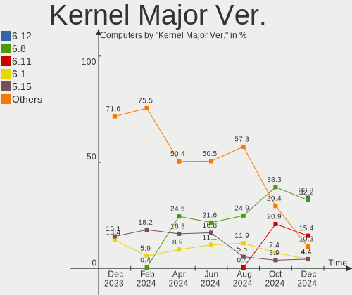
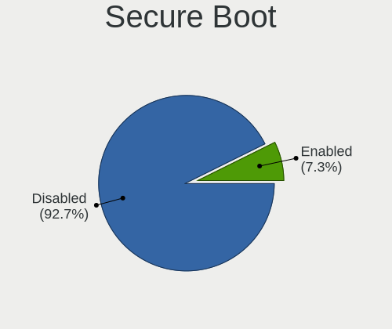
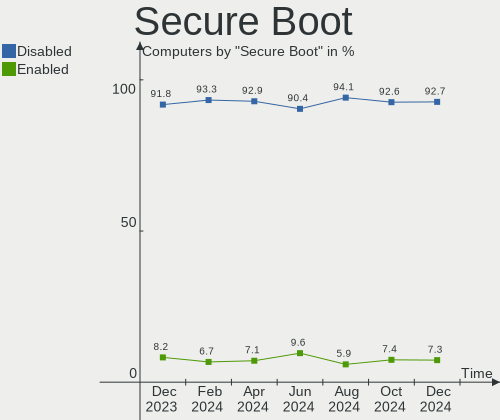
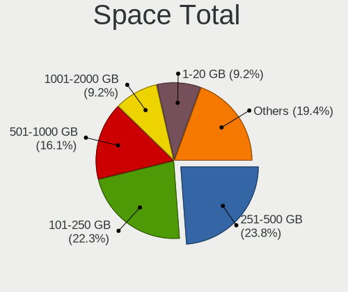
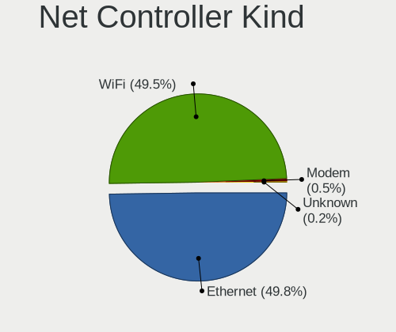

Linux in Italy - Hardware Trends
--------------------------------

A project to identify most popular hardware characteristics and track their change
over time based on data collected by Linux users at https://Linux-Hardware.org.

Anyone can contribute to this report by the [hw-probe](https://github.com/linuxhw/hw-probe) tool:

    sudo -E hw-probe -all -upload

This is a report for all computer types. See also reports for [desktops](/Location/Italy/Desktop/README.md) and [notebooks](/Location/Italy/Notebook/README.md).

Period: May, 2023.

Contents
--------

* [ System ](#system)
  - [ OS                       ](#os)
  - [ OS Family                ](#os-family)
  - [ Kernel                   ](#kernel)
  - [ Kernel Family            ](#kernel-family)
  - [ Kernel Major Ver.        ](#kernel-major-ver)
  - [ Arch                     ](#arch)
  - [ DE                       ](#de)
  - [ Display Server           ](#display-server)
  - [ Display Manager          ](#display-manager)
  - [ OS Lang                  ](#os-lang)
  - [ Boot Mode                ](#boot-mode)
  - [ Filesystem               ](#filesystem)
  - [ Part. scheme             ](#part-scheme)
  - [ Dual Boot with Linux/BSD ](#dual-boot-with-linuxbsd)
  - [ Dual Boot (Win)          ](#dual-boot-win)

* [ Board ](#board)
  - [ Vendor                   ](#vendor)
  - [ Model                    ](#model)
  - [ Model Family             ](#model-family)
  - [ MFG Year                 ](#mfg-year)
  - [ Form Factor              ](#form-factor)
  - [ Secure Boot              ](#secure-boot)
  - [ Coreboot                 ](#coreboot)
  - [ RAM Size                 ](#ram-size)
  - [ RAM Used                 ](#ram-used)
  - [ Total Drives             ](#total-drives)
  - [ Has CD-ROM               ](#has-cd-rom)
  - [ Has Ethernet             ](#has-ethernet)
  - [ Has WiFi                 ](#has-wifi)
  - [ Has Bluetooth            ](#has-bluetooth)

* [ Location ](#location)
  - [ Country                  ](#country)
  - [ City                     ](#city)

* [ Drives ](#drives)
  - [ Drive Vendor             ](#drive-vendor)
  - [ Drive Model              ](#drive-model)
  - [ HDD Vendor               ](#hdd-vendor)
  - [ SSD Vendor               ](#ssd-vendor)
  - [ Drive Kind               ](#drive-kind)
  - [ Drive Connector          ](#drive-connector)
  - [ Drive Size               ](#drive-size)
  - [ Space Total              ](#space-total)
  - [ Space Used               ](#space-used)
  - [ Malfunc. Drives          ](#malfunc-drives)
  - [ Malfunc. Drive Vendor    ](#malfunc-drive-vendor)
  - [ Malfunc. HDD Vendor      ](#malfunc-hdd-vendor)
  - [ Malfunc. Drive Kind      ](#malfunc-drive-kind)
  - [ Failed Drives            ](#failed-drives)
  - [ Failed Drive Vendor      ](#failed-drive-vendor)
  - [ Drive Status             ](#drive-status)

* [ Storage controller ](#storage-controller)
  - [ Storage Vendor           ](#storage-vendor)
  - [ Storage Model            ](#storage-model)
  - [ Storage Kind             ](#storage-kind)

* [ Processor ](#processor)
  - [ CPU Vendor               ](#cpu-vendor)
  - [ CPU Model                ](#cpu-model)
  - [ CPU Model Family         ](#cpu-model-family)
  - [ CPU Cores                ](#cpu-cores)
  - [ CPU Sockets              ](#cpu-sockets)
  - [ CPU Threads              ](#cpu-threads)
  - [ CPU Op-Modes             ](#cpu-op-modes)
  - [ CPU Microcode            ](#cpu-microcode)
  - [ CPU Microarch            ](#cpu-microarch)

* [ Graphics ](#graphics)
  - [ GPU Vendor               ](#gpu-vendor)
  - [ GPU Model                ](#gpu-model)
  - [ GPU Combo                ](#gpu-combo)
  - [ GPU Driver               ](#gpu-driver)
  - [ GPU Memory               ](#gpu-memory)

* [ Monitor ](#monitor)
  - [ Monitor Vendor           ](#monitor-vendor)
  - [ Monitor Model            ](#monitor-model)
  - [ Monitor Resolution       ](#monitor-resolution)
  - [ Monitor Diagonal         ](#monitor-diagonal)
  - [ Monitor Width            ](#monitor-width)
  - [ Aspect Ratio             ](#aspect-ratio)
  - [ Monitor Area             ](#monitor-area)
  - [ Pixel Density            ](#pixel-density)
  - [ Multiple Monitors        ](#multiple-monitors)

* [ Network ](#network)
  - [ Net Controller Vendor    ](#net-controller-vendor)
  - [ Net Controller Model     ](#net-controller-model)
  - [ Wireless Vendor          ](#wireless-vendor)
  - [ Wireless Model           ](#wireless-model)
  - [ Ethernet Vendor          ](#ethernet-vendor)
  - [ Ethernet Model           ](#ethernet-model)
  - [ Net Controller Kind      ](#net-controller-kind)
  - [ Used Controller          ](#used-controller)
  - [ NICs                     ](#nics)
  - [ IPv6                     ](#ipv6)

* [ Bluetooth ](#bluetooth)
  - [ Bluetooth Vendor         ](#bluetooth-vendor)
  - [ Bluetooth Model          ](#bluetooth-model)

* [ Sound ](#sound)
  - [ Sound Vendor             ](#sound-vendor)
  - [ Sound Model              ](#sound-model)

* [ Memory ](#memory)
  - [ Memory Vendor            ](#memory-vendor)
  - [ Memory Model             ](#memory-model)
  - [ Memory Kind              ](#memory-kind)
  - [ Memory Form Factor       ](#memory-form-factor)
  - [ Memory Size              ](#memory-size)
  - [ Memory Speed             ](#memory-speed)

* [ Printers & scanners ](#printers--scanners)
  - [ Printer Vendor           ](#printer-vendor)
  - [ Printer Model            ](#printer-model)
  - [ Scanner Vendor           ](#scanner-vendor)
  - [ Scanner Model            ](#scanner-model)

* [ Camera ](#camera)
  - [ Camera Vendor            ](#camera-vendor)
  - [ Camera Model             ](#camera-model)

* [ Security ](#security)
  - [ Fingerprint Vendor       ](#fingerprint-vendor)
  - [ Fingerprint Model        ](#fingerprint-model)
  - [ Chipcard Vendor          ](#chipcard-vendor)
  - [ Chipcard Model           ](#chipcard-model)

* [ Unsupported ](#unsupported)
  - [ Unsupported Devices      ](#unsupported-devices)
  - [ Unsupported Device Types ](#unsupported-device-types)

System
------

OS
--

Installed operating systems

| Name                         | Computers | Percent |
|------------------------------|-----------|---------|
| Ubuntu 22.04                 | 25        | 11.9%   |
| Linux Mint 21.1              | 24        | 11.43%  |
| Arch Rolling                 | 16        | 7.62%   |
| Fedora 38                    | 14        | 6.67%   |
| Ubuntu 23.04                 | 13        | 6.19%   |
| OpenMandriva 23.03           | 12        | 5.71%   |
| Zorin 16                     | 9         | 4.29%   |
| Debian 11                    | 8         | 3.81%   |
| Linux Mint 20.3              | 5         | 2.38%   |
| Ubuntu 22.10                 | 4         | 1.9%    |
| Pop!_OS 22.04                | 4         | 1.9%    |
| Manjaro                      | 4         | 1.9%    |
| LMDE 5                       | 4         | 1.9%    |
| Kubuntu 22.04                | 4         | 1.9%    |
| KDE neon 22.04               | 4         | 1.9%    |
| EndeavourOS Rolling          | 4         | 1.9%    |
| openSUSE Tumbleweed-XXXXXXXX | 3         | 1.43%   |
| MX 21                        | 3         | 1.43%   |
| Linux Mint 21                | 3         | 1.43%   |
| Garuda Linux Soaring         | 3         | 1.43%   |
| Fedora 37                    | 3         | 1.43%   |
| Xubuntu 22.04                | 2         | 0.95%   |
| Ubuntu 20.04                 | 2         | 0.95%   |
| Ubuntu 18.04                 | 2         | 0.95%   |
| SteamOS 3.4.6                | 2         | 0.95%   |
| OpenMandriva 4.3             | 2         | 0.95%   |
| NixOS 23.05                  | 2         | 0.95%   |
| Elementary 7                 | 2         | 0.95%   |
| ArcoLinux Rolling            | 2         | 0.95%   |
| Zorin 15                     | 1         | 0.48%   |
| Xubuntu 20.04                | 1         | 0.48%   |
| Ubuntu Unity 22.04           | 1         | 0.48%   |
| Ubuntu Unity 16.04           | 1         | 0.48%   |
| Ubuntu MATE 22.04            | 1         | 0.48%   |
| Ubuntu Budgie 23.10          | 1         | 0.48%   |
| Ubuntu 23.10                 | 1         | 0.48%   |
| Sparky 6.7                   | 1         | 0.48%   |
| ROSA 12.4                    | 1         | 0.48%   |
| Rocky Linux 9.2              | 1         | 0.48%   |
| openSUSE Leap-15.4           | 1         | 0.48%   |

OS Family
---------

OS without a version

| Name          | Computers | Percent |
|---------------|-----------|---------|
| Ubuntu        | 47        | 22.38%  |
| Linux Mint    | 33        | 15.71%  |
| Fedora        | 18        | 8.57%   |
| OpenMandriva  | 16        | 7.62%   |
| Arch          | 16        | 7.62%   |
| Zorin         | 10        | 4.76%   |
| Debian        | 9         | 4.29%   |
| Manjaro       | 7         | 3.33%   |
| Kubuntu       | 5         | 2.38%   |
| Pop!_OS       | 4         | 1.9%    |
| openSUSE      | 4         | 1.9%    |
| LMDE          | 4         | 1.9%    |
| KDE neon      | 4         | 1.9%    |
| EndeavourOS   | 4         | 1.9%    |
| Xubuntu       | 3         | 1.43%   |
| MX            | 3         | 1.43%   |
| Garuda Linux  | 3         | 1.43%   |
| Ubuntu Unity  | 2         | 0.95%   |
| SteamOS       | 2         | 0.95%   |
| NixOS         | 2         | 0.95%   |
| Elementary    | 2         | 0.95%   |
| ArcoLinux     | 2         | 0.95%   |
| Ubuntu MATE   | 1         | 0.48%   |
| Ubuntu Budgie | 1         | 0.48%   |
| Sparky        | 1         | 0.48%   |
| ROSA          | 1         | 0.48%   |
| Rocky Linux   | 1         | 0.48%   |
| Lubuntu       | 1         | 0.48%   |
| ChimeraOS     | 1         | 0.48%   |
| BuildRoot     | 1         | 0.48%   |
| blendOS       | 1         | 0.48%   |
| Arch32        | 1         | 0.48%   |

Kernel
------

Version of the Linux kernel

| Version                     | Computers | Percent |
|-----------------------------|-----------|---------|
| 5.19.0-41-generic           | 21        | 10%     |
| 5.15.0-71-generic           | 21        | 10%     |
| 5.15.0-72-generic           | 15        | 7.14%   |
| 6.2.6-desktop-1omv2390      | 12        | 5.71%   |
| 6.2.0-20-generic            | 11        | 5.24%   |
| 5.19.0-42-generic           | 8         | 3.81%   |
| 6.2.15-300.fc38.x86_64      | 7         | 3.33%   |
| 5.10.0-23-amd64             | 5         | 2.38%   |
| 6.2.13-arch1-1              | 4         | 1.9%    |
| 5.10.0-22-amd64             | 4         | 1.9%    |
| 6.3.1-arch1-1               | 3         | 1.43%   |
| 6.2.6-76060206-generic      | 3         | 1.43%   |
| 5.4.0-148-generic           | 3         | 1.43%   |
| 5.19.0-32-generic           | 3         | 1.43%   |
| 5.15.0-56-generic           | 3         | 1.43%   |
| 6.3.4-arch1-1               | 2         | 0.95%   |
| 6.3.2-arch1-1               | 2         | 0.95%   |
| 6.3.2-060302-generic        | 2         | 0.95%   |
| 6.3.1-zen1-1-zen            | 2         | 0.95%   |
| 6.3.1-arch2-1               | 2         | 0.95%   |
| 6.3.0-1-MANJARO             | 2         | 0.95%   |
| 6.2.13-zen-1-zen            | 2         | 0.95%   |
| 6.2.13-300.fc38.x86_64      | 2         | 0.95%   |
| 6.2.0-21-generic            | 2         | 0.95%   |
| 6.1.26-1-MANJARO            | 2         | 0.95%   |
| 6.1.26-1-lts                | 2         | 0.95%   |
| 5.16.13-desktop-1omv4003    | 2         | 0.95%   |
| 5.15.107-2-pve              | 2         | 0.95%   |
| 5.15.0-41-generic           | 2         | 0.95%   |
| 5.13.0-valve36-1-neptune    | 2         | 0.95%   |
| 4.15.0-211-generic          | 2         | 0.95%   |
| 6.4.0-0.rc2.23.fc39.ppc64le | 1         | 0.48%   |
| 6.3.4-zen1-1.1-zen          | 1         | 0.48%   |
| 6.3.4-201.fc38.x86_64       | 1         | 0.48%   |
| 6.3.3-arch1-1               | 1         | 0.48%   |
| 6.3.3                       | 1         | 0.48%   |
| 6.3.2-zen1-1.1-zen          | 1         | 0.48%   |
| 6.3.2-zen1-1-zen            | 1         | 0.48%   |
| 6.3.2-1-default             | 1         | 0.48%   |
| 6.3.1-1-default             | 1         | 0.48%   |

Kernel Family
-------------

Linux kernel without a distro release

| Version  | Computers | Percent |
|----------|-----------|---------|
| 5.15.0   | 47        | 22.38%  |
| 5.19.0   | 35        | 16.67%  |
| 6.2.6    | 15        | 7.14%   |
| 6.2.0    | 14        | 6.67%   |
| 5.10.0   | 11        | 5.24%   |
| 6.2.15   | 9         | 4.29%   |
| 6.3.1    | 8         | 3.81%   |
| 6.2.13   | 8         | 3.81%   |
| 6.3.2    | 7         | 3.33%   |
| 5.4.0    | 5         | 2.38%   |
| 6.3.4    | 4         | 1.9%    |
| 6.2.12   | 4         | 1.9%    |
| 6.1.26   | 4         | 1.9%    |
| 6.1.0    | 4         | 1.9%    |
| 5.13.0   | 3         | 1.43%   |
| 4.15.0   | 3         | 1.43%   |
| 6.3.3    | 2         | 0.95%   |
| 6.3.0    | 2         | 0.95%   |
| 6.2.11   | 2         | 0.95%   |
| 5.18.12  | 2         | 0.95%   |
| 5.16.13  | 2         | 0.95%   |
| 5.15.107 | 2         | 0.95%   |
| 5.14.0   | 2         | 0.95%   |
| 6.4.0    | 1         | 0.48%   |
| 6.2.9    | 1         | 0.48%   |
| 6.2.14   | 1         | 0.48%   |
| 6.1.27   | 1         | 0.48%   |
| 6.1.25   | 1         | 0.48%   |
| 6.1.24   | 1         | 0.48%   |
| 6.1.20   | 1         | 0.48%   |
| 6.1.14   | 1         | 0.48%   |
| 6.1.12   | 1         | 0.48%   |
| 6.0.0    | 1         | 0.48%   |
| 5.19.11  | 1         | 0.48%   |
| 5.15.109 | 1         | 0.48%   |
| 5.14.21  | 1         | 0.48%   |
| 5.10.14  | 1         | 0.48%   |
| 4.4.0    | 1         | 0.48%   |

Kernel Major Ver.
-----------------

Linux kernel major version

| Version | Computers | Percent |
|---------|-----------|---------|
| 6.2     | 54        | 25.71%  |
| 5.15    | 50        | 23.81%  |
| 5.19    | 36        | 17.14%  |
| 6.3     | 23        | 10.95%  |
| 6.1     | 14        | 6.67%   |
| 5.10    | 12        | 5.71%   |
| 5.4     | 5         | 2.38%   |
| 5.14    | 3         | 1.43%   |
| 5.13    | 3         | 1.43%   |
| 4.15    | 3         | 1.43%   |
| 5.18    | 2         | 0.95%   |
| 5.16    | 2         | 0.95%   |
| 6.4     | 1         | 0.48%   |
| 6.0     | 1         | 0.48%   |
| 4.4     | 1         | 0.48%   |

Arch
----

OS architecture (x86_64, i586, etc.)

| Name    | Computers | Percent |
|---------|-----------|---------|
| x86_64  | 205       | 97.62%  |
| i686    | 4         | 1.9%    |
| ppc64le | 1         | 0.48%   |

DE
--

Desktop Environment

| Name       | Computers | Percent |
|------------|-----------|---------|
| GNOME      | 93        | 44.29%  |
| KDE5       | 45        | 21.43%  |
| X-Cinnamon | 28        | 13.33%  |
| XFCE       | 22        | 10.48%  |
| Unknown    | 6         | 2.86%   |
| MATE       | 5         | 2.38%   |
| Pantheon   | 2         | 0.95%   |
| Cinnamon   | 2         | 0.95%   |
| Budgie     | 2         | 0.95%   |
| Unity      | 1         | 0.48%   |
| sway       | 1         | 0.48%   |
| LXQt       | 1         | 0.48%   |
| Hyprland   | 1         | 0.48%   |
| awesome    | 1         | 0.48%   |

Display Server
--------------

X11 or Wayland

| Name    | Computers | Percent |
|---------|-----------|---------|
| X11     | 132       | 62.86%  |
| Wayland | 72        | 34.29%  |
| Unknown | 4         | 1.9%    |
| Tty     | 2         | 0.95%   |

Display Manager
---------------

SDDM, LightDM, etc.

| Name    | Computers | Percent |
|---------|-----------|---------|
| Unknown | 72        | 34.29%  |
| LightDM | 43        | 20.48%  |
| GDM3    | 41        | 19.52%  |
| SDDM    | 39        | 18.57%  |
| GDM     | 15        | 7.14%   |

OS Lang
-------

Language

| Lang    | Computers | Percent |
|---------|-----------|---------|
| it_IT   | 147       | 70%     |
| en_US   | 42        | 20%     |
| C       | 8         | 3.81%   |
| en_GB   | 7         | 3.33%   |
| Unknown | 3         | 1.43%   |
| fr_FR   | 1         | 0.48%   |
| de_IT   | 1         | 0.48%   |
| de_DE   | 1         | 0.48%   |

Boot Mode
---------

EFI or BIOS

| Mode | Computers | Percent |
|------|-----------|---------|
| EFI  | 107       | 50.95%  |
| BIOS | 103       | 49.05%  |

Filesystem
----------

Type of filesystem

| Type    | Computers | Percent |
|---------|-----------|---------|
| Ext4    | 128       | 60.95%  |
| Btrfs   | 32        | 15.24%  |
| Tmpfs   | 28        | 13.33%  |
| Overlay | 19        | 9.05%   |
| Xfs     | 3         | 1.43%   |

Part. scheme
------------

Scheme of partitioning

| Type    | Computers | Percent |
|---------|-----------|---------|
| GPT     | 117       | 55.71%  |
| Unknown | 71        | 33.81%  |
| MBR     | 22        | 10.48%  |

Dual Boot with Linux/BSD
------------------------

Hosting more than one Linux/BSD

| Dual boot | Computers | Percent |
|-----------|-----------|---------|
| No        | 192       | 91.43%  |
| Yes       | 18        | 8.57%   |

Dual Boot (Win)
---------------

Hosting Linux and Windows

| Dual boot | Computers | Percent |
|-----------|-----------|---------|
| No        | 144       | 68.57%  |
| Yes       | 66        | 31.43%  |

Board
-----

Vendor
------

Motherboard manufacturer

| Name                | Computers | Percent |
|---------------------|-----------|---------|
| Hewlett-Packard     | 36        | 17.14%  |
| Lenovo              | 32        | 15.24%  |
| ASUSTek Computer    | 28        | 13.33%  |
| Dell                | 19        | 9.05%   |
| Acer                | 14        | 6.67%   |
| MSI                 | 11        | 5.24%   |
| ASRock              | 8         | 3.81%   |
| HUAWEI              | 7         | 3.33%   |
| Gigabyte Technology | 7         | 3.33%   |
| Apple               | 7         | 3.33%   |
| Mediacom            | 6         | 2.86%   |
| Sony                | 5         | 2.38%   |
| Unknown             | 5         | 2.38%   |
| Samsung Electronics | 3         | 1.43%   |
| Fujitsu             | 3         | 1.43%   |
| Valve               | 2         | 0.95%   |
| BESSTAR Tech        | 2         | 0.95%   |
| TrekStor            | 1         | 0.48%   |
| Toshiba             | 1         | 0.48%   |
| Timi                | 1         | 0.48%   |
| TEXA                | 1         | 0.48%   |
| TELECOMITALIA       | 1         | 0.48%   |
| Pegatron            | 1         | 0.48%   |
| Olivetti            | 1         | 0.48%   |
| Olidata             | 1         | 0.48%   |
| Notebook            | 1         | 0.48%   |
| KUU                 | 1         | 0.48%   |
| Jumper              | 1         | 0.48%   |
| Intel               | 1         | 0.48%   |
| HPE                 | 1         | 0.48%   |
| HONOR               | 1         | 0.48%   |
| AZW                 | 1         | 0.48%   |

Model
-----

Motherboard model

| Name                                  | Computers | Percent |
|---------------------------------------|-----------|---------|
| Mediacom SmartBook 14 FullHD - SB14UC | 5         | 2.38%   |
| Unknown                               | 5         | 2.38%   |
| HP ENVY 15                            | 3         | 1.43%   |
| Valve Jupiter                         | 2         | 0.95%   |
| MSI Modern 14 B11MOL                  | 2         | 0.95%   |
| Lenovo IdeaPad Gaming 3 15ARH05 82EY  | 2         | 0.95%   |
| Lenovo IdeaPad 3 15ITL6 82H8          | 2         | 0.95%   |
| HP Pavilion dv6                       | 2         | 0.95%   |
| HP Notebook                           | 2         | 0.95%   |
| HP Laptop 15s-fq5xxx                  | 2         | 0.95%   |
| Gigabyte B550 GAMING X V2             | 2         | 0.95%   |
| Fujitsu ESPRIMO Q920                  | 2         | 0.95%   |
| Dell XPS 15 9570                      | 2         | 0.95%   |
| BESSTAR Tech UM350                    | 2         | 0.95%   |
| Apple MacBookPro7,1                   | 2         | 0.95%   |
| TrekStor SurfTab twin 11.6            | 1         | 0.48%   |
| Toshiba Satellite Pro S500            | 1         | 0.48%   |
| Timi RedmiBook 16                     | 1         | 0.48%   |
| TEXA NEMO MINI                        | 1         | 0.48%   |
| TELECOMITALIA M7x0S                   | 1         | 0.48%   |
| Sony VPCF11C5E                        | 1         | 0.48%   |
| Sony SVF1521G1EW                      | 1         | 0.48%   |
| Sony SVF13N2J2ES                      | 1         | 0.48%   |
| Sony SVE1713X1EB                      | 1         | 0.48%   |
| Sony SVE1513Q1ESI                     | 1         | 0.48%   |
| Samsung RV411/RV511/E3511/S3511/RV711 | 1         | 0.48%   |
| Samsung RV410/RV510/S3510/E3510       | 1         | 0.48%   |
| Samsung 750XDA                        | 1         | 0.48%   |
| Pegatron Pro 3120 Microtower PC       | 1         | 0.48%   |
| Olivetti OLIBOOK P35-XXXAEU           | 1         | 0.48%   |
| Olidata Tehom cw4900                  | 1         | 0.48%   |
| Notebook P750ZM                       | 1         | 0.48%   |
| MSI MS-7D98                           | 1         | 0.48%   |
| MSI MS-7D75                           | 1         | 0.48%   |
| MSI MS-7C56                           | 1         | 0.48%   |
| MSI MS-7C37                           | 1         | 0.48%   |
| MSI MS-7B93                           | 1         | 0.48%   |
| MSI MS-7A20                           | 1         | 0.48%   |
| MSI MS-7982                           | 1         | 0.48%   |
| MSI MS-7369                           | 1         | 0.48%   |

Model Family
------------

Motherboard model prefix

| Name                | Computers | Percent |
|---------------------|-----------|---------|
| Lenovo ThinkPad     | 11        | 5.24%   |
| Lenovo IdeaPad      | 11        | 5.24%   |
| Acer Aspire         | 11        | 5.24%   |
| HP Pavilion         | 7         | 3.33%   |
| Mediacom SmartBook  | 6         | 2.86%   |
| HP Compaq           | 6         | 2.86%   |
| Dell Latitude       | 6         | 2.86%   |
| Dell XPS            | 5         | 2.38%   |
| ASUS ROG            | 5         | 2.38%   |
| Unknown             | 5         | 2.38%   |
| HP 255              | 4         | 1.9%    |
| ASUS PRIME          | 4         | 1.9%    |
| HP OMEN             | 3         | 1.43%   |
| HP Laptop           | 3         | 1.43%   |
| HP ENVY             | 3         | 1.43%   |
| Fujitsu ESPRIMO     | 3         | 1.43%   |
| Dell Precision      | 3         | 1.43%   |
| ASUS VivoBook       | 3         | 1.43%   |
| Valve Jupiter       | 2         | 0.95%   |
| MSI Modern          | 2         | 0.95%   |
| Lenovo Legion       | 2         | 0.95%   |
| HP Notebook         | 2         | 0.95%   |
| HP EliteBook        | 2         | 0.95%   |
| Gigabyte B550       | 2         | 0.95%   |
| Dell OptiPlex       | 2         | 0.95%   |
| Dell Inspiron       | 2         | 0.95%   |
| BESSTAR Tech UM350  | 2         | 0.95%   |
| Apple MacBookPro7   | 2         | 0.95%   |
| TrekStor SurfTab    | 1         | 0.48%   |
| Toshiba Satellite   | 1         | 0.48%   |
| Timi RedmiBook      | 1         | 0.48%   |
| TEXA NEMO           | 1         | 0.48%   |
| TELECOMITALIA M7x0S | 1         | 0.48%   |
| Sony VPCF11C5E      | 1         | 0.48%   |
| Sony SVF1521G1EW    | 1         | 0.48%   |
| Sony SVF13N2J2ES    | 1         | 0.48%   |
| Sony SVE1713X1EB    | 1         | 0.48%   |
| Sony SVE1513Q1ESI   | 1         | 0.48%   |
| Samsung RV411       | 1         | 0.48%   |
| Samsung RV410       | 1         | 0.48%   |

MFG Year
--------

Motherboard manufacture year

| Year    | Computers | Percent |
|---------|-----------|---------|
| 2021    | 27        | 12.86%  |
| 2016    | 22        | 10.48%  |
| 2020    | 21        | 10%     |
| 2022    | 20        | 9.52%   |
| 2017    | 16        | 7.62%   |
| 2010    | 14        | 6.67%   |
| 2015    | 12        | 5.71%   |
| 2012    | 12        | 5.71%   |
| 2018    | 9         | 4.29%   |
| 2014    | 9         | 4.29%   |
| 2019    | 8         | 3.81%   |
| 2013    | 7         | 3.33%   |
| 2011    | 7         | 3.33%   |
| 2009    | 7         | 3.33%   |
| 2007    | 7         | 3.33%   |
| 2008    | 5         | 2.38%   |
| 2023    | 2         | 0.95%   |
| 2006    | 2         | 0.95%   |
| Unknown | 2         | 0.95%   |
| 2005    | 1         | 0.48%   |

Form Factor
-----------

Physical design of the computer

| Name        | Computers | Percent |
|-------------|-----------|---------|
| Notebook    | 139       | 66.19%  |
| Desktop     | 61        | 29.05%  |
| Convertible | 3         | 1.43%   |
| Mini pc     | 3         | 1.43%   |
| Tablet      | 2         | 0.95%   |
| All in one  | 1         | 0.48%   |
| Server      | 1         | 0.48%   |

Secure Boot
-----------

Enabled or disabled

| State    | Computers | Percent |
|----------|-----------|---------|
| Disabled | 190       | 90.48%  |
| Enabled  | 20        | 9.52%   |

Coreboot
--------

Have coreboot on board

| Used | Computers | Percent |
|------|-----------|---------|
| No   | 210       | 100%    |

RAM Size
--------

Total RAM memory

| Size in GB  | Computers | Percent |
|-------------|-----------|---------|
| 4.01-8.0    | 57        | 27.14%  |
| 8.01-16.0   | 42        | 20%     |
| 16.01-24.0  | 37        | 17.62%  |
| 3.01-4.0    | 36        | 17.14%  |
| 32.01-64.0  | 16        | 7.62%   |
| 1.01-2.0    | 9         | 4.29%   |
| 24.01-32.0  | 6         | 2.86%   |
| 64.01-256.0 | 4         | 1.9%    |
| 2.01-3.0    | 2         | 0.95%   |
| 0.51-1.0    | 1         | 0.48%   |

RAM Used
--------

Used RAM memory

| Used GB    | Computers | Percent |
|------------|-----------|---------|
| 1.01-2.0   | 73        | 34.76%  |
| 2.01-3.0   | 55        | 26.19%  |
| 3.01-4.0   | 35        | 16.67%  |
| 4.01-8.0   | 33        | 15.71%  |
| 0.51-1.0   | 8         | 3.81%   |
| 8.01-16.0  | 4         | 1.9%    |
| 16.01-24.0 | 2         | 0.95%   |

Total Drives
------------

Number of drives on board

| Drives | Computers | Percent |
|--------|-----------|---------|
| 1      | 133       | 63.33%  |
| 2      | 50        | 23.81%  |
| 3      | 18        | 8.57%   |
| 4      | 7         | 3.33%   |
| 8      | 1         | 0.48%   |
| 6      | 1         | 0.48%   |

Has CD-ROM
----------

Has CD-ROM on board

| Presented | Computers | Percent |
|-----------|-----------|---------|
| No        | 137       | 65.24%  |
| Yes       | 73        | 34.76%  |

Has Ethernet
------------

Has Ethernet on board

| Presented | Computers | Percent |
|-----------|-----------|---------|
| Yes       | 161       | 76.67%  |
| No        | 49        | 23.33%  |

Has WiFi
--------

Has WiFi module

| Presented | Computers | Percent |
|-----------|-----------|---------|
| Yes       | 169       | 80.48%  |
| No        | 41        | 19.52%  |

Has Bluetooth
-------------

Has Bluetooth module

| Presented | Computers | Percent |
|-----------|-----------|---------|
| Yes       | 140       | 66.67%  |
| No        | 70        | 33.33%  |

Location
--------

Country
-------

Geographic location (country)

| Country | Computers | Percent |
|---------|-----------|---------|
| Italy   | 210       | 100%    |

City
----

Geographic location (city)

| City                    | Computers | Percent |
|-------------------------|-----------|---------|
| Milan                   | 28        | 13.33%  |
| Rome                    | 23        | 10.95%  |
| Turin                   | 9         | 4.29%   |
| Milano                  | 9         | 4.29%   |
| Florence                | 6         | 2.86%   |
| Catania                 | 6         | 2.86%   |
| Verona                  | 4         | 1.9%    |
| Palermo                 | 4         | 1.9%    |
| Rho                     | 3         | 1.43%   |
| Reggio Emilia           | 2         | 0.95%   |
| Pistoia                 | 2         | 0.95%   |
| Pisa                    | 2         | 0.95%   |
| Monza                   | 2         | 0.95%   |
| Messina                 | 2         | 0.95%   |
| Forlì                  | 2         | 0.95%   |
| Brescia                 | 2         | 0.95%   |
| Bologna                 | 2         | 0.95%   |
| Bari                    | 2         | 0.95%   |
| Alessandria             | 2         | 0.95%   |
| Vinovo                  | 1         | 0.48%   |
| Viggiù                 | 1         | 0.48%   |
| Vicenza                 | 1         | 0.48%   |
| Viareggio               | 1         | 0.48%   |
| Venice                  | 1         | 0.48%   |
| Valmadrera              | 1         | 0.48%   |
| Vado Ligure             | 1         | 0.48%   |
| Tuoro sul Trasimeno     | 1         | 0.48%   |
| Trieste                 | 1         | 0.48%   |
| Treviglio               | 1         | 0.48%   |
| Tortona                 | 1         | 0.48%   |
| Taranto                 | 1         | 0.48%   |
| Susa                    | 1         | 0.48%   |
| Somaglia                | 1         | 0.48%   |
| Selva di Progno         | 1         | 0.48%   |
| Scorzè                 | 1         | 0.48%   |
| SantAntioco             | 1         | 0.48%   |
| Sannazzaro de' Burgondi | 1         | 0.48%   |
| Ruvo di Puglia          | 1         | 0.48%   |
| Rovereto                | 1         | 0.48%   |
| Ronco all'Adige         | 1         | 0.48%   |

Drives
------

Drive Vendor
------------

Hard drive vendors

| Vendor                         | Computers | Drives | Percent |
|--------------------------------|-----------|--------|---------|
| Samsung Electronics            | 58        | 74     | 19.8%   |
| Seagate                        | 29        | 36     | 9.9%    |
| WDC                            | 23        | 26     | 7.85%   |
| Kingston                       | 19        | 21     | 6.48%   |
| Unknown                        | 17        | 21     | 5.8%    |
| Sandisk                        | 14        | 14     | 4.78%   |
| Toshiba                        | 13        | 13     | 4.44%   |
| HGST                           | 12        | 12     | 4.1%    |
| SK hynix                       | 10        | 10     | 3.41%   |
| Crucial                        | 10        | 12     | 3.41%   |
| Micron Technology              | 8         | 8      | 2.73%   |
| Intel                          | 7         | 7      | 2.39%   |
| Lexar                          | 6         | 6      | 2.05%   |
| Micron/Crucial Technology      | 5         | 5      | 1.71%   |
| Hitachi                        | 5         | 5      | 1.71%   |
| Intenso                        | 4         | 5      | 1.37%   |
| SPCC                           | 3         | 3      | 1.02%   |
| Phison Electronics             | 3         | 3      | 1.02%   |
| Kingston Technology Company    | 3         | 3      | 1.02%   |
| China                          | 3         | 3      | 1.02%   |
| A-DATA Technology              | 3         | 3      | 1.02%   |
| Unknown                        | 3         | 3      | 1.02%   |
| Shenzhen Longsys Electronics   | 2         | 2      | 0.68%   |
| Realtek                        | 2         | 2      | 0.68%   |
| PNY                            | 2         | 2      | 0.68%   |
| Phison                         | 2         | 2      | 0.68%   |
| OCZ                            | 2         | 2      | 0.68%   |
| Maxtor                         | 2         | 2      | 0.68%   |
| LITEON                         | 2         | 2      | 0.68%   |
| Emtec                          | 2         | 2      | 0.68%   |
| Transcend                      | 1         | 1      | 0.34%   |
| Teclast                        | 1         | 1      | 0.34%   |
| Team                           | 1         | 1      | 0.34%   |
| SSSTC                          | 1         | 1      | 0.34%   |
| Solid State Storage Technology | 1         | 1      | 0.34%   |
| ShanDianZhe                    | 1         | 1      | 0.34%   |
| QUANTUM                        | 1         | 1      | 0.34%   |
| MAXIO Technology (Hangzhou)    | 1         | 1      | 0.34%   |
| LaCie                          | 1         | 2      | 0.34%   |
| KIOXIA                         | 1         | 1      | 0.34%   |

Drive Model
-----------

Hard drive models

| Model                                               | Computers | Percent |
|-----------------------------------------------------|-----------|---------|
| Samsung SSD 860 EVO 500GB                           | 7         | 2.19%   |
| Samsung NVMe SSD Controller SM981/PM981/PM983 256GB | 6         | 1.88%   |
| Kingston SA400S37240G 240GB SSD                     | 6         | 1.88%   |
| Unknown NCard  32GB                                 | 5         | 1.56%   |
| Micron/Crucial P2 NVMe PCIe SSD 1TB                 | 4         | 1.25%   |
| Micron MTFDHBA512QFD 512GB                          | 4         | 1.25%   |
| HGST HTS721010A9E630 1TB                            | 4         | 1.25%   |
| Crucial CT1000MX500SSD1 1TB                         | 4         | 1.25%   |
| Unknown MMC Card  32GB                              | 3         | 0.94%   |
| Samsung SSD 870 QVO 1TB                             | 3         | 0.94%   |
| Samsung SSD 860 QVO 1TB                             | 3         | 0.94%   |
| Samsung SSD 860 EVO 250GB                           | 3         | 0.94%   |
| HGST HTS545050A7E680 500GB                          | 3         | 0.94%   |
| Unknown                                             | 3         | 0.94%   |
| Unknown SD/MMC/MS PRO 64GB                          | 2         | 0.63%   |
| Unknown MMC Card  64GB                              | 2         | 0.63%   |
| Unknown MMC Card  128GB                             | 2         | 0.63%   |
| Toshiba MQ01ABF050 500GB                            | 2         | 0.63%   |
| Seagate ST31000528AS 1TB                            | 2         | 0.63%   |
| Seagate Expansion 1TB                               | 2         | 0.63%   |
| Samsung SSD 980 1TB                                 | 2         | 0.63%   |
| Samsung SSD 870 EVO 1TB                             | 2         | 0.63%   |
| Samsung SSD 860 PRO 512GB                           | 2         | 0.63%   |
| Samsung SSD 860 EVO 1TB                             | 2         | 0.63%   |
| Samsung SSD 850 PRO 256GB                           | 2         | 0.63%   |
| Samsung SSD 850 EVO 250GB                           | 2         | 0.63%   |
| Samsung MZVLQ512HALU-00000 512GB                    | 2         | 0.63%   |
| Realtek RTL9210B-CG 1TB                             | 2         | 0.63%   |
| Phison PS5013 E13 NVMe Controller 512GB             | 2         | 0.63%   |
| Lexar SSD NM610PRO 1TB                              | 2         | 0.63%   |
| Kingston Company OM3PDP3 NVMe SSD 256GB             | 2         | 0.63%   |
| Kingston SFYRS1000G 1TB                             | 2         | 0.63%   |
| Kingston SA400S37960G 960GB SSD                     | 2         | 0.63%   |
| Kingston SA400S37480G 480GB SSD                     | 2         | 0.63%   |
| Kingston OM8PCP3512F-AI1 512GB                      | 2         | 0.63%   |
| Intel SSD 660P Series 512GB                         | 2         | 0.63%   |
| Hitachi HTS545050B9A300 500GB                       | 2         | 0.63%   |
| HGST HTS541010A9E680 1TB                            | 2         | 0.63%   |
| WDC WD7500BFCX-68N6GN0 752GB                        | 1         | 0.31%   |
| WDC WD6400AAKS-22A7B2 640GB                         | 1         | 0.31%   |

HDD Vendor
----------

Hard disk drive vendors

| Vendor              | Computers | Drives | Percent |
|---------------------|-----------|--------|---------|
| Seagate             | 27        | 34     | 30.68%  |
| WDC                 | 22        | 25     | 25%     |
| Toshiba             | 12        | 12     | 13.64%  |
| HGST                | 12        | 12     | 13.64%  |
| Hitachi             | 5         | 5      | 5.68%   |
| Unknown             | 2         | 2      | 2.27%   |
| Maxtor              | 2         | 2      | 2.27%   |
| Samsung Electronics | 1         | 1      | 1.14%   |
| QUANTUM             | 1         | 1      | 1.14%   |
| LaCie               | 1         | 1      | 1.14%   |
| Hewlett-Packard     | 1         | 1      | 1.14%   |
| Fujitsu             | 1         | 1      | 1.14%   |
| External            | 1         | 1      | 1.14%   |

SSD Vendor
----------

Solid state drive vendors

| Vendor              | Computers | Drives | Percent |
|---------------------|-----------|--------|---------|
| Samsung Electronics | 34        | 43     | 34.69%  |
| Kingston            | 13        | 15     | 13.27%  |
| Crucial             | 10        | 12     | 10.2%   |
| SanDisk             | 5         | 5      | 5.1%    |
| Intenso             | 4         | 4      | 4.08%   |
| SPCC                | 3         | 3      | 3.06%   |
| Lexar               | 3         | 3      | 3.06%   |
| China               | 3         | 3      | 3.06%   |
| SK hynix            | 2         | 2      | 2.04%   |
| OCZ                 | 2         | 2      | 2.04%   |
| LITEON              | 2         | 2      | 2.04%   |
| Emtec               | 2         | 2      | 2.04%   |
| A-DATA Technology   | 2         | 2      | 2.04%   |
| Unknown             | 2         | 2      | 2.04%   |
| Transcend           | 1         | 1      | 1.02%   |
| Teclast             | 1         | 1      | 1.02%   |
| Team                | 1         | 1      | 1.02%   |
| PNY                 | 1         | 1      | 1.02%   |
| Micron Technology   | 1         | 1      | 1.02%   |
| KingFast            | 1         | 1      | 1.02%   |
| Intel               | 1         | 1      | 1.02%   |
| Fanxiang            | 1         | 1      | 1.02%   |
| BAITITON            | 1         | 1      | 1.02%   |
| ASMT                | 1         | 1      | 1.02%   |
| Apple               | 1         | 1      | 1.02%   |

Drive Kind
----------

HDD or SSD

| Kind    | Computers | Drives | Percent |
|---------|-----------|--------|---------|
| SSD     | 89        | 111    | 33.46%  |
| NVMe    | 80        | 94     | 30.08%  |
| HDD     | 76        | 98     | 28.57%  |
| MMC     | 16        | 21     | 6.02%   |
| Unknown | 5         | 5      | 1.88%   |

Drive Connector
---------------

SATA, SAS, NVMe, etc.

| Type | Computers | Drives | Percent |
|------|-----------|--------|---------|
| SATA | 140       | 201    | 56.68%  |
| NVMe | 80        | 92     | 32.39%  |
| MMC  | 16        | 21     | 6.48%   |
| SAS  | 11        | 15     | 4.45%   |

Drive Size
----------

Size of hard drive

| Size in TB | Computers | Drives | Percent |
|------------|-----------|--------|---------|
| 0.01-0.5   | 103       | 121    | 59.88%  |
| 0.51-1.0   | 51        | 62     | 29.65%  |
| 1.01-2.0   | 12        | 14     | 6.98%   |
| 3.01-4.0   | 3         | 5      | 1.74%   |
| 4.01-10.0  | 2         | 2      | 1.16%   |
| 10.01-20.0 | 1         | 5      | 0.58%   |

Space Total
-----------

Amount of disk space available on the file system

| Size in GB     | Computers | Percent |
|----------------|-----------|---------|
| 101-250        | 53        | 25.24%  |
| 251-500        | 50        | 23.81%  |
| 501-1000       | 23        | 10.95%  |
| 1001-2000      | 21        | 10%     |
| 1-20           | 18        | 8.57%   |
| 21-50          | 14        | 6.67%   |
| More than 3000 | 10        | 4.76%   |
| 51-100         | 9         | 4.29%   |
| 2001-3000      | 7         | 3.33%   |
| Unknown        | 5         | 2.38%   |

Space Used
----------

Amount of used disk space

| Used GB        | Computers | Percent |
|----------------|-----------|---------|
| 1-20           | 66        | 31.43%  |
| 21-50          | 39        | 18.57%  |
| 101-250        | 27        | 12.86%  |
| 51-100         | 24        | 11.43%  |
| 251-500        | 23        | 10.95%  |
| 1001-2000      | 12        | 5.71%   |
| 501-1000       | 8         | 3.81%   |
| Unknown        | 5         | 2.38%   |
| More than 3000 | 3         | 1.43%   |
| 2001-3000      | 3         | 1.43%   |

Malfunc. Drives
---------------

Drive models with a malfunction

| Model                               | Computers | Drives | Percent |
|-------------------------------------|-----------|--------|---------|
| HGST HTS721010A9E630 1TB            | 2         | 2      | 11.76%  |
| WDC WD40EZRZ-00WN9B0 4TB            | 1         | 1      | 5.88%   |
| WDC WD40EFRX-68WT0N0 4TB            | 1         | 1      | 5.88%   |
| WDC WD40EFRX-68N32N0 4TB            | 1         | 1      | 5.88%   |
| WDC WD3200BPVT-00JJ5T0 320GB        | 1         | 1      | 5.88%   |
| Toshiba MK2529GSG 250GB             | 1         | 1      | 5.88%   |
| Seagate ST3160215SCE 160GB          | 1         | 1      | 5.88%   |
| Samsung Electronics SSD 870 EVO 1TB | 1         | 1      | 5.88%   |
| QUANTUM FIREBALLlct15 20 20GB       | 1         | 1      | 5.88%   |
| Maxtor STM3250310AS 250GB           | 1         | 1      | 5.88%   |
| Kingston SA400S37240G 240GB SSD     | 1         | 1      | 5.88%   |
| Intel SSDSA2M080G2GC 80GB           | 1         | 1      | 5.88%   |
| Hitachi HTS54323 320GB              | 1         | 1      | 5.88%   |
| HGST HTS545050A7E680 500GB          | 1         | 1      | 5.88%   |
| Crucial CT275MX300SSD1 275GB        | 1         | 1      | 5.88%   |
| Crucial CT1050MX300SSD1 1TB         | 1         | 1      | 5.88%   |

Malfunc. Drive Vendor
---------------------

Vendors of faulty drives

| Vendor              | Computers | Drives | Percent |
|---------------------|-----------|--------|---------|
| WDC                 | 3         | 4      | 18.75%  |
| HGST                | 3         | 3      | 18.75%  |
| Crucial             | 2         | 2      | 12.5%   |
| Toshiba             | 1         | 1      | 6.25%   |
| Seagate             | 1         | 1      | 6.25%   |
| Samsung Electronics | 1         | 1      | 6.25%   |
| QUANTUM             | 1         | 1      | 6.25%   |
| Maxtor              | 1         | 1      | 6.25%   |
| Kingston            | 1         | 1      | 6.25%   |
| Intel               | 1         | 1      | 6.25%   |
| Hitachi             | 1         | 1      | 6.25%   |

Malfunc. HDD Vendor
-------------------

Vendors of faulty HDD drives

| Vendor  | Computers | Drives | Percent |
|---------|-----------|--------|---------|
| WDC     | 3         | 4      | 27.27%  |
| HGST    | 3         | 3      | 27.27%  |
| Toshiba | 1         | 1      | 9.09%   |
| Seagate | 1         | 1      | 9.09%   |
| QUANTUM | 1         | 1      | 9.09%   |
| Maxtor  | 1         | 1      | 9.09%   |
| Hitachi | 1         | 1      | 9.09%   |

Malfunc. Drive Kind
-------------------

Kinds of faulty drives

| Kind | Computers | Drives | Percent |
|------|-----------|--------|---------|
| HDD  | 11        | 12     | 68.75%  |
| SSD  | 5         | 5      | 31.25%  |

Failed Drives
-------------

Failed drive models

Zero info for selected period =(

Failed Drive Vendor
-------------------

Failed drive vendors

Zero info for selected period =(

Drive Status
------------

Number of failed and malfunc. drives

| Status   | Computers | Drives | Percent |
|----------|-----------|--------|---------|
| Detected | 115       | 174    | 51.57%  |
| Works    | 95        | 138    | 42.6%   |
| Malfunc  | 13        | 17     | 5.83%   |

Storage controller
------------------

Storage Vendor
--------------

Storage controller vendors

| Vendor                           | Computers | Percent |
|----------------------------------|-----------|---------|
| Intel                            | 127       | 46.52%  |
| AMD                              | 43        | 15.75%  |
| Samsung Electronics              | 29        | 10.62%  |
| SK hynix                         | 9         | 3.3%    |
| Kingston Technology Company      | 9         | 3.3%    |
| SanDisk                          | 8         | 2.93%   |
| Micron Technology                | 7         | 2.56%   |
| Phison Electronics               | 6         | 2.2%    |
| Micron/Crucial Technology        | 5         | 1.83%   |
| ASMedia Technology               | 5         | 1.83%   |
| MAXIO Technology (Hangzhou)      | 4         | 1.47%   |
| Shenzhen Longsys Electronics     | 3         | 1.1%    |
| Nvidia                           | 3         | 1.1%    |
| Marvell Technology Group         | 3         | 1.1%    |
| VIA Technologies                 | 2         | 0.73%   |
| Solid State Storage Technology   | 2         | 0.73%   |
| LSI Logic / Symbios Logic        | 2         | 0.73%   |
| Toshiba America Info Systems     | 1         | 0.37%   |
| Silicon Integrated Systems [SiS] | 1         | 0.37%   |
| Seagate Technology               | 1         | 0.37%   |
| KIOXIA                           | 1         | 0.37%   |
| JMicron Technology               | 1         | 0.37%   |
| Adaptec                          | 1         | 0.37%   |

Storage Model
-------------

Storage controller models

| Model                                                                          | Computers | Percent |
|--------------------------------------------------------------------------------|-----------|---------|
| AMD FCH SATA Controller [AHCI mode]                                            | 35        | 11.48%  |
| Samsung NVMe SSD Controller SM981/PM981/PM983                                  | 12        | 3.93%   |
| Samsung NVMe SSD Controller 980                                                | 11        | 3.61%   |
| Intel Volume Management Device NVMe RAID Controller                            | 10        | 3.28%   |
| Intel 8 Series/C220 Series Chipset Family 6-port SATA Controller 1 [AHCI mode] | 10        | 3.28%   |
| Intel 7 Series Chipset Family 6-port SATA Controller [AHCI mode]               | 8         | 2.62%   |
| Kingston Company Company Non-Volatile memory controller                        | 7         | 2.3%    |
| Intel Wildcat Point-LP SATA Controller [AHCI Mode]                             | 7         | 2.3%    |
| Intel Sunrise Point-LP SATA Controller [AHCI mode]                             | 7         | 2.3%    |
| Intel Q170/Q150/B150/H170/H110/Z170/CM236 Chipset SATA Controller [AHCI Mode]  | 7         | 2.3%    |
| Intel 82801HM/HEM (ICH8M/ICH8M-E) IDE Controller                               | 6         | 1.97%   |
| Intel 82801 Mobile SATA Controller [RAID mode]                                 | 6         | 1.97%   |
| Intel 5 Series/3400 Series Chipset 4 port SATA AHCI Controller                 | 6         | 1.97%   |
| Micron NVMe Storage Controller                                                 | 5         | 1.64%   |
| Intel 82801HM/HEM (ICH8M/ICH8M-E) SATA Controller [AHCI mode]                  | 5         | 1.64%   |
| ASMedia ASM1062 Serial ATA Controller                                          | 5         | 1.64%   |
| SK hynix Gold P31/PC711 NVMe Solid State Drive                                 | 4         | 1.31%   |
| Micron/Crucial P2 NVMe PCIe SSD                                                | 4         | 1.31%   |
| Intel SATA Controller [RAID mode]                                              | 4         | 1.31%   |
| Intel 82801G (ICH7 Family) IDE Controller                                      | 4         | 1.31%   |
| Intel 8 Series SATA Controller 1 [AHCI mode]                                   | 4         | 1.31%   |
| AMD 500 Series Chipset SATA Controller                                         | 4         | 1.31%   |
| Samsung NVMe SSD Controller PM9A1/PM9A3/980PRO                                 | 3         | 0.98%   |
| Phison PS5013 E13 NVMe Controller                                              | 3         | 0.98%   |
| MAXIO (Hangzhou) NVMe SSD Controller MAP1202                                   | 3         | 0.98%   |
| Intel Non-Volatile memory controller                                           | 3         | 0.98%   |
| Intel NM10/ICH7 Family SATA Controller [IDE mode]                              | 3         | 0.98%   |
| Intel Comet Lake SATA AHCI Controller                                          | 3         | 0.98%   |
| Intel Celeron/Pentium Silver Processor SATA Controller                         | 3         | 0.98%   |
| Intel Cannon Lake Mobile PCH SATA AHCI Controller                              | 3         | 0.98%   |
| Intel 82801IBM/IEM (ICH9M/ICH9M-E) 4 port SATA Controller [AHCI mode]          | 3         | 0.98%   |
| Intel 6 Series/C200 Series Chipset Family 6 port Mobile SATA AHCI Controller   | 3         | 0.98%   |
| AMD 300 Series Chipset SATA Controller                                         | 3         | 0.98%   |
| Solid State Storage Non-Volatile memory controller                             | 2         | 0.66%   |
| SK hynix PC401 NVMe Solid State Drive 256GB                                    | 2         | 0.66%   |
| Shenzhen Longsys Electronics Non-Volatile memory controller                    | 2         | 0.66%   |
| SanDisk WD Black SN750 / PC SN730 NVMe SSD                                     | 2         | 0.66%   |
| SanDisk Non-Volatile memory controller                                         | 2         | 0.66%   |
| Samsung Electronics SATA controller                                            | 2         | 0.66%   |
| Nvidia MCP89 SATA Controller (AHCI mode)                                       | 2         | 0.66%   |

Storage Kind
------------

Kind of storage controller (IDE, SATA, NVMe, SAS, ...)

| Kind | Computers | Percent |
|------|-----------|---------|
| SATA | 142       | 52.79%  |
| NVMe | 80        | 29.74%  |
| IDE  | 23        | 8.55%   |
| RAID | 22        | 8.18%   |
| SCSI | 2         | 0.74%   |

Processor
---------

CPU Vendor
----------

Processor vendors

| Vendor                   | Computers | Percent |
|--------------------------|-----------|---------|
| Intel                    | 148       | 70.48%  |
| AMD                      | 61        | 29.05%  |
| PowerNV C1P9S01 REV 1.01 | 1         | 0.48%   |

CPU Model
---------

Processor models

| Model                                              | Computers | Percent |
|----------------------------------------------------|-----------|---------|
| Intel Atom x5-Z8300 CPU @ 1.44GHz                  | 6         | 2.86%   |
| Intel 11th Gen Core i5-1135G7 @ 2.40GHz            | 5         | 2.38%   |
| Intel Core i5-5200U CPU @ 2.20GHz                  | 4         | 1.9%    |
| Intel Core i5 CPU M 520 @ 2.40GHz                  | 3         | 1.43%   |
| Intel Atom x5-Z8350 CPU @ 1.44GHz                  | 3         | 1.43%   |
| Intel 11th Gen Core i7-1165G7 @ 2.80GHz            | 3         | 1.43%   |
| AMD Ryzen 9 7900X 12-Core Processor                | 3         | 1.43%   |
| AMD Ryzen 7 5800H with Radeon Graphics             | 3         | 1.43%   |
| AMD Ryzen 7 4800H with Radeon Graphics             | 3         | 1.43%   |
| Intel Pentium 4 CPU 3.00GHz                        | 2         | 0.95%   |
| Intel Core i7-8750H CPU @ 2.20GHz                  | 2         | 0.95%   |
| Intel Core i7-8565U CPU @ 1.80GHz                  | 2         | 0.95%   |
| Intel Core i7-7700 CPU @ 3.60GHz                   | 2         | 0.95%   |
| Intel Core i7-6700K CPU @ 4.00GHz                  | 2         | 0.95%   |
| Intel Core i7-4790 CPU @ 3.60GHz                   | 2         | 0.95%   |
| Intel Core i7-4510U CPU @ 2.00GHz                  | 2         | 0.95%   |
| Intel Core i7-3632QM CPU @ 2.20GHz                 | 2         | 0.95%   |
| Intel Core i5-7200U CPU @ 2.50GHz                  | 2         | 0.95%   |
| Intel Core i5-6300U CPU @ 2.40GHz                  | 2         | 0.95%   |
| Intel Core i5-4590T CPU @ 2.00GHz                  | 2         | 0.95%   |
| Intel Core i5-3470 CPU @ 3.20GHz                   | 2         | 0.95%   |
| Intel Core i5-10210U CPU @ 1.60GHz                 | 2         | 0.95%   |
| Intel Core i5 CPU M 480 @ 2.67GHz                  | 2         | 0.95%   |
| Intel Core i3-5005U CPU @ 2.00GHz                  | 2         | 0.95%   |
| Intel Core i3-10110U CPU @ 2.10GHz                 | 2         | 0.95%   |
| Intel Core 2 Duo CPU P8600 @ 2.40GHz               | 2         | 0.95%   |
| Intel Celeron N4120 CPU @ 1.10GHz                  | 2         | 0.95%   |
| AMD Ryzen 9 3900X 12-Core Processor                | 2         | 0.95%   |
| AMD Ryzen 7 PRO 3700U w/ Radeon Vega Mobile Gfx    | 2         | 0.95%   |
| AMD Ryzen 7 5800X 8-Core Processor                 | 2         | 0.95%   |
| AMD Ryzen 7 5700U with Radeon Graphics             | 2         | 0.95%   |
| AMD Ryzen 5 5500U with Radeon Graphics             | 2         | 0.95%   |
| AMD Ryzen 5 3600 6-Core Processor                  | 2         | 0.95%   |
| AMD Ryzen 5 3550H with Radeon Vega Mobile Gfx      | 2         | 0.95%   |
| AMD Ryzen 5 3500U with Radeon Vega Mobile Gfx      | 2         | 0.95%   |
| AMD Custom APU 0405                                | 2         | 0.95%   |
| AMD A12-9720P RADEON R7, 12 COMPUTE CORES 4C+8G    | 2         | 0.95%   |
| PowerNV C1P9S01 REV 1.01 POWER9, altivec supported | 1         | 0.48%   |
| Intel Xeon E-2244G CPU @ 3.80GHz                   | 1         | 0.48%   |
| Intel Xeon CPU X5550 @ 2.67GHz                     | 1         | 0.48%   |

CPU Model Family
----------------

Processor model prefix

| Model                   | Computers | Percent |
|-------------------------|-----------|---------|
| Intel Core i5           | 38        | 18.1%   |
| Intel Core i7           | 33        | 15.71%  |
| Other                   | 24        | 11.43%  |
| AMD Ryzen 7             | 15        | 7.14%   |
| AMD Ryzen 5             | 15        | 7.14%   |
| Intel Core i3           | 13        | 6.19%   |
| Intel Core 2 Duo        | 11        | 5.24%   |
| Intel Atom              | 9         | 4.29%   |
| AMD Ryzen 9             | 7         | 3.33%   |
| Intel Celeron           | 6         | 2.86%   |
| Intel Xeon              | 3         | 1.43%   |
| Intel Pentium Dual-Core | 3         | 1.43%   |
| AMD Ryzen 7 PRO         | 3         | 1.43%   |
| AMD Ryzen 3             | 3         | 1.43%   |
| AMD E1                  | 3         | 1.43%   |
| AMD A6                  | 3         | 1.43%   |
| Intel Pentium 4         | 2         | 0.95%   |
| Intel Core i9           | 2         | 0.95%   |
| AMD FX                  | 2         | 0.95%   |
| AMD A12                 | 2         | 0.95%   |
| AMD A10                 | 2         | 0.95%   |
| Intel Pentium Dual      | 1         | 0.48%   |
| Intel Pentium           | 1         | 0.48%   |
| Intel Core m7           | 1         | 0.48%   |
| Intel Core M            | 1         | 0.48%   |
| Intel Core Duo          | 1         | 0.48%   |
| Intel Core 2 Quad       | 1         | 0.48%   |
| Intel Core 2            | 1         | 0.48%   |
| Intel Celeron Dual-Core | 1         | 0.48%   |
| AMD E2                  | 1         | 0.48%   |
| AMD Athlon Neo          | 1         | 0.48%   |
| AMD Athlon 64 X2        | 1         | 0.48%   |

CPU Cores
---------

Number of processor cores

| Number | Computers | Percent |
|--------|-----------|---------|
| 4      | 82        | 39.05%  |
| 2      | 75        | 35.71%  |
| 8      | 18        | 8.57%   |
| 6      | 18        | 8.57%   |
| 12     | 6         | 2.86%   |
| 10     | 4         | 1.9%    |
| 1      | 4         | 1.9%    |
| 14     | 2         | 0.95%   |
| 16     | 1         | 0.48%   |

CPU Sockets
-----------

Number of sockets

| Number | Computers | Percent |
|--------|-----------|---------|
| 1      | 210       | 100%    |

CPU Threads
-----------

Threads per core (Hyper-Threading)

| Number | Computers | Percent |
|--------|-----------|---------|
| 2      | 146       | 69.52%  |
| 1      | 62        | 29.52%  |
| 8      | 1         | 0.48%   |
| 4      | 1         | 0.48%   |

CPU Op-Modes
------------

CPU Operation Modes (32-bit, 64-bit)

| Op mode        | Computers | Percent |
|----------------|-----------|---------|
| 32-bit, 64-bit | 208       | 99.05%  |
| 32-bit         | 1         | 0.48%   |
| Unknown        | 1         | 0.48%   |

CPU Microcode
-------------

Microcode number

| Number     | Computers | Percent |
|------------|-----------|---------|
| Unknown    | 96        | 45.71%  |
| 0x306a9    | 8         | 3.81%   |
| 0x08108109 | 8         | 3.81%   |
| 0x306c3    | 6         | 2.86%   |
| 0x406c3    | 5         | 2.38%   |
| 0x1067a    | 5         | 2.38%   |
| 0x0a601203 | 5         | 2.38%   |
| 0x906e9    | 4         | 1.9%    |
| 0x0a50000d | 4         | 1.9%    |
| 0x0a50000c | 4         | 1.9%    |
| 0x08600104 | 4         | 1.9%    |
| 0x906a4    | 3         | 1.43%   |
| 0x806c1    | 3         | 1.43%   |
| 0x506e3    | 3         | 1.43%   |
| 0x406e3    | 3         | 1.43%   |
| 0x08608103 | 3         | 1.43%   |
| 0x07030105 | 3         | 1.43%   |
| 0x0600611a | 3         | 1.43%   |
| 0x906ea    | 2         | 0.95%   |
| 0x6fa      | 2         | 0.95%   |
| 0x406c4    | 2         | 0.95%   |
| 0x206a7    | 2         | 0.95%   |
| 0x20652    | 2         | 0.95%   |
| 0x0a20120a | 2         | 0.95%   |
| 0x08701030 | 2         | 0.95%   |
| 0x0700010f | 2         | 0.95%   |
| 0xf49      | 1         | 0.48%   |
| 0xb06f2    | 1         | 0.48%   |
| 0xa0653    | 1         | 0.48%   |
| 0x906c0    | 1         | 0.48%   |
| 0x906a3    | 1         | 0.48%   |
| 0x806ec    | 1         | 0.48%   |
| 0x806eb    | 1         | 0.48%   |
| 0x806e9    | 1         | 0.48%   |
| 0x806c2    | 1         | 0.48%   |
| 0x706a8    | 1         | 0.48%   |
| 0x6fd      | 1         | 0.48%   |
| 0x6f2      | 1         | 0.48%   |
| 0x6ec      | 1         | 0.48%   |
| 0x40651    | 1         | 0.48%   |

CPU Microarch
-------------

Microarchitecture

| Name             | Computers | Percent |
|------------------|-----------|---------|
| KabyLake         | 23        | 10.95%  |
| Unknown          | 18        | 8.57%   |
| Haswell          | 16        | 7.62%   |
| TigerLake        | 13        | 6.19%   |
| Penryn           | 12        | 5.71%   |
| IvyBridge        | 12        | 5.71%   |
| Skylake          | 11        | 5.24%   |
| Zen 3            | 10        | 4.76%   |
| Zen 2            | 10        | 4.76%   |
| Silvermont       | 9         | 4.29%   |
| Zen+             | 8         | 3.81%   |
| Westmere         | 8         | 3.81%   |
| SandyBridge      | 8         | 3.81%   |
| Broadwell        | 8         | 3.81%   |
| Core             | 6         | 2.86%   |
| Excavator        | 4         | 1.9%    |
| Zen              | 3         | 1.43%   |
| Puma             | 3         | 1.43%   |
| Jaguar           | 3         | 1.43%   |
| Icelake          | 3         | 1.43%   |
| Goldmont plus    | 3         | 1.43%   |
| CometLake        | 3         | 1.43%   |
| Alderlake Hybrid | 3         | 1.43%   |
| Piledriver       | 2         | 0.95%   |
| NetBurst         | 2         | 0.95%   |
| Nehalem          | 2         | 0.95%   |
| K8 Hammer        | 2         | 0.95%   |
| Tremont          | 1         | 0.48%   |
| Steamroller      | 1         | 0.48%   |
| P6               | 1         | 0.48%   |
| K10 Llano        | 1         | 0.48%   |
| Goldmont         | 1         | 0.48%   |

Graphics
--------

GPU Vendor
----------

Vendors of graphics cards

| Vendor                           | Computers | Percent |
|----------------------------------|-----------|---------|
| Intel                            | 110       | 43.82%  |
| AMD                              | 74        | 29.48%  |
| Nvidia                           | 64        | 25.5%   |
| Silicon Integrated Systems [SiS] | 1         | 0.4%    |
| Matrox Electronics Systems       | 1         | 0.4%    |
| ASPEED Technology                | 1         | 0.4%    |

GPU Model
---------

Graphics card models

| Model                                                                                    | Computers | Percent |
|------------------------------------------------------------------------------------------|-----------|---------|
| Intel TigerLake-LP GT2 [Iris Xe Graphics]                                                | 12        | 4.53%   |
| Intel Atom/Celeron/Pentium Processor x5-E8000/J3xxx/N3xxx Integrated Graphics Controller | 9         | 3.4%    |
| AMD Picasso/Raven 2 [Radeon Vega Series / Radeon Vega Mobile Series]                     | 8         | 3.02%   |
| Intel 3rd Gen Core processor Graphics Controller                                         | 7         | 2.64%   |
| AMD Cezanne [Radeon Vega Series / Radeon Vega Mobile Series]                             | 7         | 2.64%   |
| Intel Xeon E3-1200 v3/4th Gen Core Processor Integrated Graphics Controller              | 6         | 2.26%   |
| Intel HD Graphics 5500                                                                   | 6         | 2.26%   |
| Intel 2nd Generation Core Processor Family Integrated Graphics Controller                | 6         | 2.26%   |
| AMD Renoir                                                                               | 6         | 2.26%   |
| Intel Core Processor Integrated Graphics Controller                                      | 5         | 1.89%   |
| AMD Raphael                                                                              | 5         | 1.89%   |
| AMD Lucienne                                                                             | 5         | 1.89%   |
| Intel Skylake GT2 [HD Graphics 520]                                                      | 4         | 1.51%   |
| Intel HD Graphics 630                                                                    | 4         | 1.51%   |
| Intel Haswell-ULT Integrated Graphics Controller                                         | 4         | 1.51%   |
| Intel CometLake-U GT2 [UHD Graphics]                                                     | 4         | 1.51%   |
| Nvidia GK208B [GeForce GT 710]                                                           | 3         | 1.13%   |
| Intel Xeon E3-1200 v2/3rd Gen Core processor Graphics Controller                         | 3         | 1.13%   |
| Intel Mobile GM965/GL960 Integrated Graphics Controller (secondary)                      | 3         | 1.13%   |
| Intel Mobile GM965/GL960 Integrated Graphics Controller (primary)                        | 3         | 1.13%   |
| Intel HD Graphics 530                                                                    | 3         | 1.13%   |
| Intel GeminiLake [UHD Graphics 600]                                                      | 3         | 1.13%   |
| Intel CoffeeLake-H GT2 [UHD Graphics 630]                                                | 3         | 1.13%   |
| AMD Wani [Radeon R5/R6/R7 Graphics]                                                      | 3         | 1.13%   |
| AMD Sun XT [Radeon HD 8670A/8670M/8690M / R5 M330 / M430 / Radeon 520 Mobile]            | 3         | 1.13%   |
| AMD Navi 10 [Radeon RX 5600 OEM/5600 XT / 5700/5700 XT]                                  | 3         | 1.13%   |
| AMD Ellesmere [Radeon RX 470/480/570/570X/580/580X/590]                                  | 3         | 1.13%   |
| Nvidia MCP89 [GeForce 320M]                                                              | 2         | 0.75%   |
| Nvidia GT216M [GeForce GT 330M]                                                          | 2         | 0.75%   |
| Nvidia GP107M [GeForce GTX 1050 Ti Mobile]                                               | 2         | 0.75%   |
| Nvidia GP107 [GeForce GTX 1050]                                                          | 2         | 0.75%   |
| Nvidia GP106 [GeForce GTX 1060 6GB]                                                      | 2         | 0.75%   |
| Nvidia GK208M [GeForce GT 740M]                                                          | 2         | 0.75%   |
| Nvidia GF117M [GeForce 610M/710M/810M/820M / GT 620M/625M/630M/720M]                     | 2         | 0.75%   |
| Nvidia GA107M [GeForce RTX 3050 Ti Mobile]                                               | 2         | 0.75%   |
| Intel WhiskeyLake-U GT2 [UHD Graphics 620]                                               | 2         | 0.75%   |
| Intel UHD Graphics 620                                                                   | 2         | 0.75%   |
| Intel Mobile 4 Series Chipset Integrated Graphics Controller                             | 2         | 0.75%   |
| Intel HD Graphics 620                                                                    | 2         | 0.75%   |
| Intel Alder Lake-UP3 GT2 [Iris Xe Graphics]                                              | 2         | 0.75%   |

GPU Combo
---------

Combinations of graphics cards

| Name           | Computers | Percent |
|----------------|-----------|---------|
| 1 x Intel      | 76        | 36.19%  |
| 1 x AMD        | 49        | 23.33%  |
| 1 x Nvidia     | 31        | 14.76%  |
| Intel + Nvidia | 24        | 11.43%  |
| 2 x AMD        | 9         | 4.29%   |
| AMD + Nvidia   | 8         | 3.81%   |
| Intel + AMD    | 7         | 3.33%   |
| 2 x Intel      | 2         | 0.95%   |
| 2 x Nvidia     | 1         | 0.48%   |
| 1 x SiS        | 1         | 0.48%   |
| 1 x ASPEED     | 1         | 0.48%   |
| AMD + Matrox   | 1         | 0.48%   |

GPU Driver
----------

Free vs proprietary

| Driver      | Computers | Percent |
|-------------|-----------|---------|
| Free        | 176       | 83.81%  |
| Proprietary | 31        | 14.76%  |
| Unknown     | 3         | 1.43%   |

GPU Memory
----------

Total video memory

| Size in GB | Computers | Percent |
|------------|-----------|---------|
| Unknown    | 122       | 58.1%   |
| 0.01-0.5   | 33        | 15.71%  |
| 1.01-2.0   | 23        | 10.95%  |
| 0.51-1.0   | 11        | 5.24%   |
| 7.01-8.0   | 7         | 3.33%   |
| 5.01-6.0   | 6         | 2.86%   |
| 3.01-4.0   | 5         | 2.38%   |
| 8.01-16.0  | 3         | 1.43%   |

Monitor
-------

Monitor Vendor
--------------

Monitor vendors

| Vendor                  | Computers | Percent |
|-------------------------|-----------|---------|
| BOE                     | 38        | 17.59%  |
| Chimei Innolux          | 24        | 11.11%  |
| AU Optronics            | 22        | 10.19%  |
| LG Display              | 18        | 8.33%   |
| Samsung Electronics     | 16        | 7.41%   |
| Hewlett-Packard         | 11        | 5.09%   |
| Goldstar                | 10        | 4.63%   |
| BenQ                    | 9         | 4.17%   |
| Acer                    | 7         | 3.24%   |
| AOC                     | 6         | 2.78%   |
| Ancor Communications    | 6         | 2.78%   |
| Sharp                   | 5         | 2.31%   |
| Apple                   | 5         | 2.31%   |
| Sony                    | 4         | 1.85%   |
| Philips                 | 4         | 1.85%   |
| Dell                    | 4         | 1.85%   |
| Panasonic               | 3         | 1.39%   |
| Chi Mei Optoelectronics | 3         | 1.39%   |
| Valve                   | 2         | 0.93%   |
| RTK                     | 2         | 0.93%   |
| Lenovo                  | 2         | 0.93%   |
| Iiyama                  | 2         | 0.93%   |
| ASUSTek Computer        | 2         | 0.93%   |
| Xiaomi                  | 1         | 0.46%   |
| Optoma                  | 1         | 0.46%   |
| NECCI                   | 1         | 0.46%   |
| MSI                     | 1         | 0.46%   |
| LG Philips              | 1         | 0.46%   |
| LG Electronics          | 1         | 0.46%   |
| HKC                     | 1         | 0.46%   |
| HIK                     | 1         | 0.46%   |
| Haier                   | 1         | 0.46%   |
| CSO                     | 1         | 0.46%   |
| CPT                     | 1         | 0.46%   |

Monitor Model
-------------

Monitor models

| Model                                                                 | Computers | Percent |
|-----------------------------------------------------------------------|-----------|---------|
| Chimei Innolux LCD Monitor CMN15F5 1920x1080 344x193mm 15.5-inch      | 4         | 1.83%   |
| BOE LCD Monitor BOE0872 1920x1080 344x194mm 15.5-inch                 | 4         | 1.83%   |
| Panasonic VVX14T092N00 MEI96A2 2256x1504 285x190mm 13.5-inch          | 3         | 1.38%   |
| Chimei Innolux LCD Monitor CMN15E7 1920x1080 344x193mm 15.5-inch      | 3         | 1.38%   |
| BOE LCD Monitor BOE0635 1920x1080 309x173mm 13.9-inch                 | 3         | 1.38%   |
| Valve ANX7530 U VLV3001 800x1280 100x150mm 7.1-inch                   | 2         | 0.92%   |
| RTK TV RTK0001 3840x2160                                              | 2         | 0.92%   |
| LG Display LCD Monitor LGD02DC 1366x768 344x194mm 15.5-inch           | 2         | 0.92%   |
| Goldstar FULL HD GSM5B55 1920x1080 480x270mm 21.7-inch                | 2         | 0.92%   |
| Chimei Innolux LCD Monitor CMN15DB 1366x768 344x193mm 15.5-inch       | 2         | 0.92%   |
| Chimei Innolux LCD Monitor CMN151E 1920x1080 344x193mm 15.5-inch      | 2         | 0.92%   |
| BOE NE173QHM-NZ2 BOE0B69 2560x1440 381x214mm 17.2-inch                | 2         | 0.92%   |
| BOE LCD Monitor BOE08D7 1920x1080 309x174mm 14.0-inch                 | 2         | 0.92%   |
| BOE LCD Monitor BOE0893 2160x1440 296x197mm 14.0-inch                 | 2         | 0.92%   |
| BOE LCD Monitor BOE06A5 1366x768 344x194mm 15.5-inch                  | 2         | 0.92%   |
| BenQ GW2280 BNQ78E8 1920x1080 476x268mm 21.5-inch                     | 2         | 0.92%   |
| AU Optronics LCD Monitor AUO683D 1920x1080 309x174mm 14.0-inch        | 2         | 0.92%   |
| AU Optronics LCD Monitor AUO38ED 1920x1080 344x193mm 15.5-inch        | 2         | 0.92%   |
| AU Optronics LCD Monitor AUO26EC 1366x768 344x193mm 15.5-inch         | 2         | 0.92%   |
| AOC 2460G4 AOC0001 1920x1080 530x300mm 24.0-inch                      | 2         | 0.92%   |
| Ancor Communications VE247 ACI2493 1920x1080 531x299mm 24.0-inch      | 2         | 0.92%   |
| Xiaomi Mi TV XMD00E1 3840x2160 708x398mm 32.0-inch                    | 1         | 0.46%   |
| Sony TV SNYAA01 1360x768                                              | 1         | 0.46%   |
| Sony SDM-X72 SNY1D70 1280x1024 338x270mm 17.0-inch                    | 1         | 0.46%   |
| Sony SDM-HS75P SNY2300 1280x1024 338x270mm 17.0-inch                  | 1         | 0.46%   |
| Sony Nvidia Defaul t Flat Panel MS_0025 1920x1080 360x200mm 16.2-inch | 1         | 0.46%   |
| Sharp LQ134N1JW52 SHP151E 1920x1200 288x180mm 13.4-inch               | 1         | 0.46%   |
| Sharp LCD Monitor SHP1548 1920x1200 288x180mm 13.4-inch               | 1         | 0.46%   |
| Sharp LCD Monitor SHP149A 1920x1080 344x194mm 15.5-inch               | 1         | 0.46%   |
| Sharp LCD Monitor SHP148D 3840x2160 344x194mm 15.5-inch               | 1         | 0.46%   |
| Sharp LCD Monitor SHP1420 1920x1080 294x165mm 13.3-inch               | 1         | 0.46%   |
| Samsung Electronics T27B300 SAM0933 1920x1080 598x336mm 27.0-inch     | 1         | 0.46%   |
| Samsung Electronics SyncMaster SAM03F2 1680x1050                      | 1         | 0.46%   |
| Samsung Electronics S34J55x SAM0F70 3440x1440 797x333mm 34.0-inch     | 1         | 0.46%   |
| Samsung Electronics S24D330 SAM0D92 1920x1080 531x299mm 24.0-inch     | 1         | 0.46%   |
| Samsung Electronics S24D300 SAM0B43 1920x1080 531x299mm 24.0-inch     | 1         | 0.46%   |
| Samsung Electronics S23B550 SAM0919 1920x1080 510x290mm 23.1-inch     | 1         | 0.46%   |
| Samsung Electronics LCD Monitor SEC5742 1366x768 309x174mm 14.0-inch  | 1         | 0.46%   |
| Samsung Electronics LCD Monitor SEC5441 1280x800 331x207mm 15.4-inch  | 1         | 0.46%   |
| Samsung Electronics LCD Monitor SEC4346 1920x1200 331x207mm 15.4-inch | 1         | 0.46%   |

Monitor Resolution
------------------

Monitor screen resolution

| Resolution         | Computers | Percent |
|--------------------|-----------|---------|
| 1920x1080 (FHD)    | 100       | 48.54%  |
| 1366x768 (WXGA)    | 41        | 19.9%   |
| 3840x2160 (4K)     | 13        | 6.31%   |
| 1280x800 (WXGA)    | 9         | 4.37%   |
| 2560x1440 (QHD)    | 7         | 3.4%    |
| 1920x1200 (WUXGA)  | 7         | 3.4%    |
| 1280x1024 (SXGA)   | 6         | 2.91%   |
| 1600x900 (HD+)     | 5         | 2.43%   |
| 1440x900 (WXGA+)   | 5         | 2.43%   |
| 2160x1440          | 3         | 1.46%   |
| 800x1280           | 2         | 0.97%   |
| 3440x1440          | 2         | 0.97%   |
| 2560x1080          | 2         | 0.97%   |
| 1920x1280          | 1         | 0.49%   |
| 1680x1050 (WSXGA+) | 1         | 0.49%   |
| 1600x1200          | 1         | 0.49%   |
| 1024x768 (XGA)     | 1         | 0.49%   |

Monitor Diagonal
----------------

Diagonal size in inches

| Inches  | Computers | Percent |
|---------|-----------|---------|
| 15      | 75        | 34.72%  |
| 13      | 25        | 11.57%  |
| 24      | 15        | 6.94%   |
| 14      | 15        | 6.94%   |
| 27      | 14        | 6.48%   |
| 17      | 12        | 5.56%   |
| 21      | 11        | 5.09%   |
| 23      | 8         | 3.7%    |
| 12      | 7         | 3.24%   |
| Unknown | 4         | 1.85%   |
| 34      | 3         | 1.39%   |
| 31      | 3         | 1.39%   |
| 20      | 3         | 1.39%   |
| 19      | 3         | 1.39%   |
| 18      | 3         | 1.39%   |
| 72      | 2         | 0.93%   |
| 16      | 2         | 0.93%   |
| 11      | 2         | 0.93%   |
| 7       | 2         | 0.93%   |
| 65      | 1         | 0.46%   |
| 58      | 1         | 0.46%   |
| 39      | 1         | 0.46%   |
| 32      | 1         | 0.46%   |
| 28      | 1         | 0.46%   |
| 26      | 1         | 0.46%   |
| 10      | 1         | 0.46%   |

Monitor Width
-------------

Physical width

| Width in mm | Computers | Percent |
|-------------|-----------|---------|
| 301-350     | 107       | 50.47%  |
| 501-600     | 35        | 16.51%  |
| 201-300     | 23        | 10.85%  |
| 401-500     | 18        | 8.49%   |
| 351-400     | 9         | 4.25%   |
| 601-700     | 5         | 2.36%   |
| 701-800     | 4         | 1.89%   |
| Unknown     | 4         | 1.89%   |
| 1501-2000   | 2         | 0.94%   |
| 1001-1500   | 2         | 0.94%   |
| 1-100       | 2         | 0.94%   |
| 801-900     | 1         | 0.47%   |

Aspect Ratio
------------

Proportional relationship between the width and the height

| Ratio   | Computers | Percent |
|---------|-----------|---------|
| 16/9    | 160       | 79.6%   |
| 16/10   | 21        | 10.45%  |
| 3/2     | 6         | 2.99%   |
| 5/4     | 5         | 2.49%   |
| 4/3     | 3         | 1.49%   |
| 21/9    | 3         | 1.49%   |
| 0.67    | 2         | 1%      |
| Unknown | 1         | 0.5%    |

Monitor Area
------------

Area in inch²

| Area in inch² | Computers | Percent |
|----------------|-----------|---------|
| 101-110        | 75        | 34.88%  |
| 81-90          | 32        | 14.88%  |
| 201-250        | 27        | 12.56%  |
| 301-350        | 15        | 6.98%   |
| 151-200        | 10        | 4.65%   |
| 71-80          | 9         | 4.19%   |
| 351-500        | 8         | 3.72%   |
| 141-150        | 7         | 3.26%   |
| 121-130        | 7         | 3.26%   |
| 61-70          | 6         | 2.79%   |
| More than 1000 | 4         | 1.86%   |
| Unknown        | 4         | 1.86%   |
| 251-300        | 3         | 1.4%    |
| 51-60          | 2         | 0.93%   |
| 1-40           | 2         | 0.93%   |
| 111-120        | 2         | 0.93%   |
| 41-50          | 1         | 0.47%   |
| 501-1000       | 1         | 0.47%   |

Pixel Density
-------------

Pixels per inch

| Density       | Computers | Percent |
|---------------|-----------|---------|
| 121-160       | 71        | 33.65%  |
| 51-100        | 59        | 27.96%  |
| 101-120       | 55        | 26.07%  |
| 161-240       | 15        | 7.11%   |
| More than 240 | 4         | 1.9%    |
| Unknown       | 4         | 1.9%    |
| 1-50          | 3         | 1.42%   |

Multiple Monitors
-----------------

Total monitors connected

| Total | Computers | Percent |
|-------|-----------|---------|
| 1     | 182       | 86.67%  |
| 2     | 19        | 9.05%   |
| 0     | 6         | 2.86%   |
| 3     | 3         | 1.43%   |

Network
-------

Net Controller Vendor
---------------------

Controller vendors

| Vendor                            | Computers | Percent |
|-----------------------------------|-----------|---------|
| Realtek Semiconductor             | 118       | 37.22%  |
| Intel                             | 94        | 29.65%  |
| Qualcomm Atheros                  | 30        | 9.46%   |
| Broadcom                          | 20        | 6.31%   |
| MediaTek                          | 7         | 2.21%   |
| TP-Link                           | 6         | 1.89%   |
| Broadcom Limited                  | 5         | 1.58%   |
| Marvell Technology Group          | 4         | 1.26%   |
| Xiaomi                            | 3         | 0.95%   |
| Ralink Technology                 | 3         | 0.95%   |
| Ralink                            | 3         | 0.95%   |
| ASIX Electronics                  | 3         | 0.95%   |
| OPPO Electronics                  | 2         | 0.63%   |
| DisplayLink                       | 2         | 0.63%   |
| VIA Technologies                  | 1         | 0.32%   |
| T & A Mobile Phones               | 1         | 0.32%   |
| Silicon Integrated Systems [SiS]  | 1         | 0.32%   |
| Samsung Electronics               | 1         | 0.32%   |
| Qualcomm                          | 1         | 0.32%   |
| Oculus VR                         | 1         | 0.32%   |
| NetGear                           | 1         | 0.32%   |
| Micro Star International          | 1         | 0.32%   |
| JMicron Technology                | 1         | 0.32%   |
| Huawei Technologies               | 1         | 0.32%   |
| Holtek Semiconductor              | 1         | 0.32%   |
| Hewlett-Packard                   | 1         | 0.32%   |
| Ericsson Business Mobile Networks | 1         | 0.32%   |
| Dell                              | 1         | 0.32%   |
| D-Link                            | 1         | 0.32%   |
| Arduino SA                        | 1         | 0.32%   |
| Accton Technology                 | 1         | 0.32%   |

Net Controller Model
--------------------

Controller models

| Model                                                             | Computers | Percent |
|-------------------------------------------------------------------|-----------|---------|
| Realtek RTL8111/8168/8411 PCI Express Gigabit Ethernet Controller | 68        | 18.99%  |
| Realtek RTL8822CE 802.11ac PCIe Wireless Network Adapter          | 12        | 3.35%   |
| Realtek RTL810xE PCI Express Fast Ethernet controller             | 11        | 3.07%   |
| Intel Wi-Fi 6 AX201                                               | 10        | 2.79%   |
| Intel Wi-Fi 6 AX200                                               | 9         | 2.51%   |
| Qualcomm Atheros QCA9377 802.11ac Wireless Network Adapter        | 8         | 2.23%   |
| Realtek RTL8153 Gigabit Ethernet Adapter                          | 6         | 1.68%   |
| Realtek RTL8125 2.5GbE Controller                                 | 6         | 1.68%   |
| Intel Ethernet Connection I217-LM                                 | 6         | 1.68%   |
| Realtek RTL88x2bu [AC1200 Techkey]                                | 5         | 1.4%    |
| Realtek RTL8821CE 802.11ac PCIe Wireless Network Adapter          | 5         | 1.4%    |
| Qualcomm Atheros AR9485 Wireless Network Adapter                  | 5         | 1.4%    |
| Qualcomm Atheros AR9285 Wireless Network Adapter (PCI-Express)    | 5         | 1.4%    |
| Intel Wireless 7265                                               | 5         | 1.4%    |
| Realtek RTL8188CE 802.11b/g/n WiFi Adapter                        | 4         | 1.12%   |
| Intel Wireless 7260                                               | 4         | 1.12%   |
| Intel Wireless 3165                                               | 4         | 1.12%   |
| Intel Ethernet Connection (2) I219-V                              | 4         | 1.12%   |
| Intel Comet Lake PCH-LP CNVi WiFi                                 | 4         | 1.12%   |
| Intel 82579LM Gigabit Network Connection (Lewisville)             | 4         | 1.12%   |
| Qualcomm Atheros QCA9565 / AR9565 Wireless Network Adapter        | 3         | 0.84%   |
| Qualcomm Atheros QCA6174 802.11ac Wireless Network Adapter        | 3         | 0.84%   |
| MediaTek MT7922 802.11ax PCI Express Wireless Network Adapter     | 3         | 0.84%   |
| MediaTek MT7921 802.11ax PCI Express Wireless Network Adapter     | 3         | 0.84%   |
| Intel Wireless-AC 9260                                            | 3         | 0.84%   |
| Intel Wireless 8265 / 8275                                        | 3         | 0.84%   |
| Intel Wireless 8260                                               | 3         | 0.84%   |
| Broadcom NetXtreme BCM5764M Gigabit Ethernet PCIe                 | 3         | 0.84%   |
| Broadcom BCM4322 802.11a/b/g/n Wireless LAN Controller            | 3         | 0.84%   |
| Broadcom BCM43142 802.11b/g/n                                     | 3         | 0.84%   |
| ASIX AX88179 Gigabit Ethernet                                     | 3         | 0.84%   |
| Xiaomi Mi/Redmi series (RNDIS)                                    | 2         | 0.56%   |
| TP-Link TL-WN823N v2/v3 [Realtek RTL8192EU]                       | 2         | 0.56%   |
| Realtek RTL8852BE PCIe 802.11ax Wireless Network Controller       | 2         | 0.56%   |
| Realtek RTL8852AE WiFi 6 802.11ax PCIe Adapter                    | 2         | 0.56%   |
| Realtek RTL8852AE 802.11ax PCIe Wireless Network Adapter          | 2         | 0.56%   |
| Realtek RTL8723BE PCIe Wireless Network Adapter                   | 2         | 0.56%   |
| Realtek RTL-8100/8101L/8139 PCI Fast Ethernet Adapter             | 2         | 0.56%   |
| Realtek 802.11ac NIC                                              | 2         | 0.56%   |
| Qualcomm Atheros AR9287 Wireless Network Adapter (PCI-Express)    | 2         | 0.56%   |

Wireless Vendor
---------------

Wireless vendors

| Vendor                   | Computers | Percent |
|--------------------------|-----------|---------|
| Intel                    | 69        | 38.76%  |
| Realtek Semiconductor    | 41        | 23.03%  |
| Qualcomm Atheros         | 29        | 16.29%  |
| Broadcom                 | 14        | 7.87%   |
| MediaTek                 | 7         | 3.93%   |
| TP-Link                  | 4         | 2.25%   |
| Ralink Technology        | 3         | 1.69%   |
| Ralink                   | 3         | 1.69%   |
| Broadcom Limited         | 3         | 1.69%   |
| Qualcomm                 | 1         | 0.56%   |
| NetGear                  | 1         | 0.56%   |
| Micro Star International | 1         | 0.56%   |
| D-Link                   | 1         | 0.56%   |
| Accton Technology        | 1         | 0.56%   |

Wireless Model
--------------

Wireless models

| Model                                                          | Computers | Percent |
|----------------------------------------------------------------|-----------|---------|
| Realtek RTL8822CE 802.11ac PCIe Wireless Network Adapter       | 12        | 6.7%    |
| Intel Wi-Fi 6 AX201                                            | 10        | 5.59%   |
| Intel Wi-Fi 6 AX200                                            | 9         | 5.03%   |
| Qualcomm Atheros QCA9377 802.11ac Wireless Network Adapter     | 8         | 4.47%   |
| Realtek RTL88x2bu [AC1200 Techkey]                             | 5         | 2.79%   |
| Realtek RTL8821CE 802.11ac PCIe Wireless Network Adapter       | 5         | 2.79%   |
| Qualcomm Atheros AR9485 Wireless Network Adapter               | 5         | 2.79%   |
| Qualcomm Atheros AR9285 Wireless Network Adapter (PCI-Express) | 5         | 2.79%   |
| Intel Wireless 7265                                            | 5         | 2.79%   |
| Realtek RTL8188CE 802.11b/g/n WiFi Adapter                     | 4         | 2.23%   |
| Intel Wireless 7260                                            | 4         | 2.23%   |
| Intel Wireless 3165                                            | 4         | 2.23%   |
| Intel Comet Lake PCH-LP CNVi WiFi                              | 4         | 2.23%   |
| Qualcomm Atheros QCA9565 / AR9565 Wireless Network Adapter     | 3         | 1.68%   |
| Qualcomm Atheros QCA6174 802.11ac Wireless Network Adapter     | 3         | 1.68%   |
| MediaTek MT7922 802.11ax PCI Express Wireless Network Adapter  | 3         | 1.68%   |
| MediaTek MT7921 802.11ax PCI Express Wireless Network Adapter  | 3         | 1.68%   |
| Intel Wireless-AC 9260                                         | 3         | 1.68%   |
| Intel Wireless 8265 / 8275                                     | 3         | 1.68%   |
| Intel Wireless 8260                                            | 3         | 1.68%   |
| Broadcom BCM4322 802.11a/b/g/n Wireless LAN Controller         | 3         | 1.68%   |
| Broadcom BCM43142 802.11b/g/n                                  | 3         | 1.68%   |
| TP-Link TL-WN823N v2/v3 [Realtek RTL8192EU]                    | 2         | 1.12%   |
| Realtek RTL8852BE PCIe 802.11ax Wireless Network Controller    | 2         | 1.12%   |
| Realtek RTL8852AE WiFi 6 802.11ax PCIe Adapter                 | 2         | 1.12%   |
| Realtek RTL8852AE 802.11ax PCIe Wireless Network Adapter       | 2         | 1.12%   |
| Realtek RTL8723BE PCIe Wireless Network Adapter                | 2         | 1.12%   |
| Realtek 802.11ac NIC                                           | 2         | 1.12%   |
| Qualcomm Atheros AR9287 Wireless Network Adapter (PCI-Express) | 2         | 1.12%   |
| Intel Wi-Fi 6 AX210/AX211/AX411 160MHz                         | 2         | 1.12%   |
| Intel PRO/Wireless 3945ABG [Golan] Network Connection          | 2         | 1.12%   |
| Intel Ice Lake-LP PCH CNVi WiFi                                | 2         | 1.12%   |
| Intel Centrino Advanced-N 6205 [Taylor Peak]                   | 2         | 1.12%   |
| Intel Cannon Point-LP CNVi [Wireless-AC]                       | 2         | 1.12%   |
| Intel Cannon Lake PCH CNVi WiFi                                | 2         | 1.12%   |
| Intel Alder Lake-P PCH CNVi WiFi                               | 2         | 1.12%   |
| Broadcom BCM4313 802.11bgn Wireless Network Adapter            | 2         | 1.12%   |
| TP-Link TL-WN822N Version 4 RTL8192EU                          | 1         | 0.56%   |
| TP-Link TL-WN821N Version 5 RTL8192EU                          | 1         | 0.56%   |
| Realtek RTL8822BE 802.11a/b/g/n/ac WiFi adapter                | 1         | 0.56%   |

Ethernet Vendor
---------------

Ethernet vendors

| Vendor                           | Computers | Percent |
|----------------------------------|-----------|---------|
| Realtek Semiconductor            | 94        | 54.34%  |
| Intel                            | 40        | 23.12%  |
| Broadcom                         | 11        | 6.36%   |
| Marvell Technology Group         | 4         | 2.31%   |
| Xiaomi                           | 3         | 1.73%   |
| Qualcomm Atheros                 | 3         | 1.73%   |
| ASIX Electronics                 | 3         | 1.73%   |
| TP-Link                          | 2         | 1.16%   |
| OPPO Electronics                 | 2         | 1.16%   |
| DisplayLink                      | 2         | 1.16%   |
| Broadcom Limited                 | 2         | 1.16%   |
| VIA Technologies                 | 1         | 0.58%   |
| Silicon Integrated Systems [SiS] | 1         | 0.58%   |
| Samsung Electronics              | 1         | 0.58%   |
| JMicron Technology               | 1         | 0.58%   |
| Huawei Technologies              | 1         | 0.58%   |
| Hewlett-Packard                  | 1         | 0.58%   |
| Dell                             | 1         | 0.58%   |

Ethernet Model
--------------

Ethernet models

| Model                                                             | Computers | Percent |
|-------------------------------------------------------------------|-----------|---------|
| Realtek RTL8111/8168/8411 PCI Express Gigabit Ethernet Controller | 68        | 39.08%  |
| Realtek RTL810xE PCI Express Fast Ethernet controller             | 11        | 6.32%   |
| Realtek RTL8153 Gigabit Ethernet Adapter                          | 6         | 3.45%   |
| Realtek RTL8125 2.5GbE Controller                                 | 6         | 3.45%   |
| Intel Ethernet Connection I217-LM                                 | 6         | 3.45%   |
| Intel Ethernet Connection (2) I219-V                              | 4         | 2.3%    |
| Intel 82579LM Gigabit Network Connection (Lewisville)             | 4         | 2.3%    |
| Broadcom NetXtreme BCM5764M Gigabit Ethernet PCIe                 | 3         | 1.72%   |
| ASIX AX88179 Gigabit Ethernet                                     | 3         | 1.72%   |
| Xiaomi Mi/Redmi series (RNDIS)                                    | 2         | 1.15%   |
| Realtek RTL-8100/8101L/8139 PCI Fast Ethernet Adapter             | 2         | 1.15%   |
| Qualcomm Atheros AR8151 v2.0 Gigabit Ethernet                     | 2         | 1.15%   |
| OPPO SM8350-MTP _SN:1518BD09                                      | 2         | 1.15%   |
| Marvell Group 88E8058 PCI-E Gigabit Ethernet Controller           | 2         | 1.15%   |
| Intel I211 Gigabit Network Connection                             | 2         | 1.15%   |
| Intel Ethernet Controller I226-V                                  | 2         | 1.15%   |
| Intel Ethernet Controller I225-V                                  | 2         | 1.15%   |
| Intel Ethernet Connection I219-LM                                 | 2         | 1.15%   |
| Intel Ethernet Connection (5) I219-LM                             | 2         | 1.15%   |
| Intel 82579V Gigabit Network Connection                           | 2         | 1.15%   |
| Broadcom NetXtreme BCM5761 Gigabit Ethernet PCIe                  | 2         | 1.15%   |
| Xiaomi Mi/Redmi series (RNDIS + ADB)                              | 1         | 0.57%   |
| VIA VT6102/VT6103 [Rhine-II]                                      | 1         | 0.57%   |
| TP-Link UE300 10/100/1000 LAN (ethernet mode) [Realtek RTL8153]   | 1         | 0.57%   |
| TP-Link M7200                                                     | 1         | 0.57%   |
| Silicon Integrated Systems [SiS] 191 Gigabit Ethernet Adapter     | 1         | 0.57%   |
| Samsung Galaxy series, misc. (tethering mode)                     | 1         | 0.57%   |
| Realtek RTL8152 Fast Ethernet Adapter                             | 1         | 0.57%   |
| Realtek Killer E2600 Gigabit Ethernet Controller                  | 1         | 0.57%   |
| Qualcomm Atheros Killer E220x Gigabit Ethernet Controller         | 1         | 0.57%   |
| Marvell Group 88E8057 PCI-E Gigabit Ethernet Controller           | 1         | 0.57%   |
| Marvell Group 88E8040 PCI-E Fast Ethernet Controller              | 1         | 0.57%   |
| JMicron JMC250 PCI Express Gigabit Ethernet Controller            | 1         | 0.57%   |
| Intel I350 Gigabit Network Connection                             | 1         | 0.57%   |
| Intel Ethernet Connection I219-V                                  | 1         | 0.57%   |
| Intel Ethernet Connection I217-V                                  | 1         | 0.57%   |
| Intel Ethernet Connection (5) I219-V                              | 1         | 0.57%   |
| Intel Ethernet Connection (4) I219-V                              | 1         | 0.57%   |
| Intel Ethernet Connection (2) I218-V                              | 1         | 0.57%   |
| Intel Ethernet Connection (16) I219-LM                            | 1         | 0.57%   |

Net Controller Kind
-------------------

Ethernet, WiFi or modem

| Kind     | Computers | Percent |
|----------|-----------|---------|
| WiFi     | 169       | 50.6%   |
| Ethernet | 161       | 48.2%   |
| Modem    | 3         | 0.9%    |
| Unknown  | 1         | 0.3%    |

Used Controller
---------------

Currently used network controller

| Kind     | Computers | Percent |
|----------|-----------|---------|
| WiFi     | 138       | 66.99%  |
| Ethernet | 68        | 33.01%  |

NICs
----

Total network controllers on board

| Total | Computers | Percent |
|-------|-----------|---------|
| 2     | 104       | 49.52%  |
| 1     | 95        | 45.24%  |
| 0     | 8         | 3.81%   |
| 3     | 2         | 0.95%   |
| 4     | 1         | 0.48%   |

IPv6
----

IPv6 vs IPv4

| Used | Computers | Percent |
|------|-----------|---------|
| No   | 183       | 87.14%  |
| Yes  | 27        | 12.86%  |

Bluetooth
---------

Bluetooth Vendor
----------------

Controller vendors

| Vendor                          | Computers | Percent |
|---------------------------------|-----------|---------|
| Intel                           | 58        | 41.13%  |
| Realtek Semiconductor           | 19        | 13.48%  |
| Qualcomm Atheros Communications | 10        | 7.09%   |
| IMC Networks                    | 10        | 7.09%   |
| Apple                           | 7         | 4.96%   |
| Lite-On Technology              | 6         | 4.26%   |
| Broadcom                        | 6         | 4.26%   |
| Cambridge Silicon Radio         | 5         | 3.55%   |
| Realtek                         | 4         | 2.84%   |
| Foxconn / Hon Hai               | 4         | 2.84%   |
| Dell                            | 3         | 2.13%   |
| MediaTek                        | 2         | 1.42%   |
| Hewlett-Packard                 | 2         | 1.42%   |
| USI                             | 1         | 0.71%   |
| TP-Link                         | 1         | 0.71%   |
| Toshiba                         | 1         | 0.71%   |
| SINO WEALTH                     | 1         | 0.71%   |
| Ralink                          | 1         | 0.71%   |

Bluetooth Model
---------------

Controller models

| Model                                               | Computers | Percent |
|-----------------------------------------------------|-----------|---------|
| Intel Bluetooth wireless interface                  | 19        | 13.48%  |
| Realtek Bluetooth Radio                             | 18        | 12.77%  |
| Intel AX201 Bluetooth                               | 14        | 9.93%   |
| Intel Bluetooth 9460/9560 Jefferson Peak (JfP)      | 9         | 6.38%   |
| Intel AX200 Bluetooth                               | 9         | 6.38%   |
| IMC Networks Bluetooth Radio                        | 5         | 3.55%   |
| Cambridge Silicon Radio Bluetooth Dongle (HCI mode) | 5         | 3.55%   |
| Realtek Bluetooth Radio                             | 4         | 2.84%   |
| Qualcomm Atheros  Bluetooth Device                  | 4         | 2.84%   |
| Lite-On Qualcomm Atheros QCA9377 Bluetooth          | 3         | 2.13%   |
| Intel Wireless-AC 9260 Bluetooth Adapter            | 3         | 2.13%   |
| IMC Networks Bluetooth Device                       | 3         | 2.13%   |
| Apple Bluetooth Host Controller                     | 3         | 2.13%   |
| Qualcomm Atheros QCA61x4 Bluetooth 4.0              | 2         | 1.42%   |
| Qualcomm Atheros AR3012 Bluetooth 4.0               | 2         | 1.42%   |
| Qualcomm Atheros AR3011 Bluetooth                   | 2         | 1.42%   |
| MediaTek Wireless_Device                            | 2         | 1.42%   |
| Intel Bluetooth Device                              | 2         | 1.42%   |
| Intel AX210 Bluetooth                               | 2         | 1.42%   |
| HP Bluetooth 2.0 Interface [Broadcom BCM2045]       | 2         | 1.42%   |
| Foxconn / Hon Hai Wireless_Device                   | 2         | 1.42%   |
| Dell BCM20702A0 Bluetooth Module                    | 2         | 1.42%   |
| Broadcom BCM43142A0 Bluetooth Device                | 2         | 1.42%   |
| Broadcom BCM2045B (BDC-2.1)                         | 2         | 1.42%   |
| Apple Bluetooth USB Host Controller                 | 2         | 1.42%   |
| Apple Bluetooth HCI                                 | 2         | 1.42%   |
| USI Bluetooth Device                                | 1         | 0.71%   |
| TP-Link UB500 Adapter                               | 1         | 0.71%   |
| Toshiba Integrated Bluetooth HCI                    | 1         | 0.71%   |
| SINO WEALTH RK Bluetooth Keyboard                   | 1         | 0.71%   |
| Realtek  Bluetooth 4.2 Adapter                      | 1         | 0.71%   |
| Ralink RT3290 Bluetooth                             | 1         | 0.71%   |
| Lite-On Wireless_Device                             | 1         | 0.71%   |
| Lite-On Broadcom BCM43142A0 Bluetooth Device        | 1         | 0.71%   |
| Lite-On Atheros AR3012 Bluetooth                    | 1         | 0.71%   |
| IMC Networks Wireless_Device                        | 1         | 0.71%   |
| IMC Networks Bluetooth USB Host Controller          | 1         | 0.71%   |
| Foxconn / Hon Hai MediaTek Bluetooth Adapter        | 1         | 0.71%   |
| Foxconn / Hon Hai Bluetooth USB Host Controller     | 1         | 0.71%   |
| Dell DW375 Bluetooth Module                         | 1         | 0.71%   |

Sound
-----

Sound Vendor
------------

Sound card vendors

| Vendor                           | Computers | Percent |
|----------------------------------|-----------|---------|
| Intel                            | 133       | 49.63%  |
| AMD                              | 71        | 26.49%  |
| Nvidia                           | 42        | 15.67%  |
| Focusrite-Novation               | 3         | 1.12%   |
| C-Media Electronics              | 3         | 1.12%   |
| Razer USA                        | 2         | 0.75%   |
| GN Netcom                        | 2         | 0.75%   |
| VIA Technologies                 | 1         | 0.37%   |
| Trust                            | 1         | 0.37%   |
| Sony                             | 1         | 0.37%   |
| Silicon Integrated Systems [SiS] | 1         | 0.37%   |
| Micro Star International         | 1         | 0.37%   |
| Logitech                         | 1         | 0.37%   |
| Kingston Technology              | 1         | 0.37%   |
| Generalplus Technology           | 1         | 0.37%   |
| Fnatic Gear                      | 1         | 0.37%   |
| Creative Technology              | 1         | 0.37%   |
| Creative Labs                    | 1         | 0.37%   |
| Conexant Systems                 | 1         | 0.37%   |

Sound Model
-----------

Sound card models

| Model                                                                      | Computers | Percent |
|----------------------------------------------------------------------------|-----------|---------|
| AMD Family 17h/19h HD Audio Controller                                     | 34        | 10.09%  |
| AMD Renoir Radeon High Definition Audio Controller                         | 15        | 4.45%   |
| Intel Tiger Lake-LP Smart Sound Technology Audio Controller                | 13        | 3.86%   |
| Intel 7 Series/C216 Chipset Family High Definition Audio Controller        | 12        | 3.56%   |
| Intel 8 Series/C220 Series Chipset High Definition Audio Controller        | 10        | 2.97%   |
| Intel Sunrise Point-LP HD Audio                                            | 9         | 2.67%   |
| Intel 5 Series/3400 Series Chipset High Definition Audio                   | 9         | 2.67%   |
| AMD Kabini HDMI/DP Audio                                                   | 9         | 2.67%   |
| Intel Xeon E3-1200 v3/4th Gen Core Processor HD Audio Controller           | 8         | 2.37%   |
| Intel Wildcat Point-LP High Definition Audio Controller                    | 8         | 2.37%   |
| Intel Broadwell-U Audio Controller                                         | 8         | 2.37%   |
| AMD Raven/Raven2/Fenghuang HDMI/DP Audio Controller                        | 8         | 2.37%   |
| AMD FCH Azalia Controller                                                  | 8         | 2.37%   |
| Intel 82801H (ICH8 Family) HD Audio Controller                             | 7         | 2.08%   |
| Intel 6 Series/C200 Series Chipset Family High Definition Audio Controller | 7         | 2.08%   |
| AMD Rembrandt Radeon High Definition Audio Controller                      | 7         | 2.08%   |
| Intel 200 Series PCH HD Audio                                              | 6         | 1.78%   |
| Intel 100 Series/C230 Series Chipset Family HD Audio Controller            | 6         | 1.78%   |
| AMD Starship/Matisse HD Audio Controller                                   | 6         | 1.78%   |
| Nvidia GK208 HDMI/DP Audio Controller                                      | 4         | 1.19%   |
| Intel NM10/ICH7 Family High Definition Audio Controller                    | 4         | 1.19%   |
| Intel Haswell-ULT HD Audio Controller                                      | 4         | 1.19%   |
| Intel Comet Lake PCH-LP cAVS                                               | 4         | 1.19%   |
| Intel Cannon Lake PCH cAVS                                                 | 4         | 1.19%   |
| Intel 8 Series HD Audio Controller                                         | 4         | 1.19%   |
| AMD Navi 21/23 HDMI/DP Audio Controller                                    | 4         | 1.19%   |
| AMD Navi 10 HDMI Audio                                                     | 4         | 1.19%   |
| AMD Family 15h (Models 60h-6fh) Audio Controller                           | 4         | 1.19%   |
| Nvidia TU116 High Definition Audio Controller                              | 3         | 0.89%   |
| Nvidia TU106 High Definition Audio Controller                              | 3         | 0.89%   |
| Nvidia High Definition Audio Controller                                    | 3         | 0.89%   |
| Nvidia GM107 High Definition Audio Controller [GeForce 940MX]              | 3         | 0.89%   |
| Nvidia GK107 HDMI Audio Controller                                         | 3         | 0.89%   |
| Nvidia Audio device                                                        | 3         | 0.89%   |
| Intel Celeron/Pentium Silver Processor High Definition Audio               | 3         | 0.89%   |
| Intel Alder Lake PCH-P High Definition Audio Controller                    | 3         | 0.89%   |
| Intel 82801JI (ICH10 Family) HD Audio Controller                           | 3         | 0.89%   |
| Intel 82801I (ICH9 Family) HD Audio Controller                             | 3         | 0.89%   |
| AMD Ellesmere HDMI Audio [Radeon RX 470/480 / 570/580/590]                 | 3         | 0.89%   |
| Nvidia MCP89 High Definition Audio                                         | 2         | 0.59%   |

Memory
------

Memory Vendor
-------------

Memory module vendors

| Vendor              | Computers | Percent |
|---------------------|-----------|---------|
| SK hynix            | 25        | 19.38%  |
| Samsung Electronics | 22        | 17.05%  |
| Micron Technology   | 21        | 16.28%  |
| Unknown             | 15        | 11.63%  |
| Kingston            | 13        | 10.08%  |
| Crucial             | 11        | 8.53%   |
| Corsair             | 10        | 7.75%   |
| Unknown (ABCD)      | 3         | 2.33%   |
| Nanya Technology    | 2         | 1.55%   |
| G.Skill             | 2         | 1.55%   |
| Elpida              | 2         | 1.55%   |
| Ramaxel Technology  | 1         | 0.78%   |
| HPE                 | 1         | 0.78%   |
| GOODRAM             | 1         | 0.78%   |

Memory Model
------------

Memory module models

| Model                                                            | Computers | Percent |
|------------------------------------------------------------------|-----------|---------|
| Unknown RAM Module 2GB SODIMM DDR3 1066MT/s                      | 4         | 2.9%    |
| Unknown (ABCD) RAM 123456789012345678 2GB SODIMM LPDDR4 2400MT/s | 2         | 1.45%   |
| SK hynix RAM HMCG78MEBSA092N 16GB SODIMM DDR5 4800MT/s           | 2         | 1.45%   |
| SK hynix RAM HMAA1GS6CJR6N-XN 8192MB SODIMM DDR4 3200MT/s        | 2         | 1.45%   |
| SK hynix RAM HMA81GS6DJR8N-XN 8GB SODIMM DDR4 3200MT/s           | 2         | 1.45%   |
| Samsung RAM M471A5244CB0-CWE 4GB SODIMM DDR4 3200MT/s            | 2         | 1.45%   |
| Samsung RAM M471A1G44AB0-CWE 8GB SODIMM DDR4 3200MT/s            | 2         | 1.45%   |
| Micron RAM 8KTF51264HZ-1G6E1 4GB SODIMM DDR3 1600MT/s            | 2         | 1.45%   |
| Micron RAM 4ATF51264HZ-2G6E1 4GB SODIMM DDR4 2667MT/s            | 2         | 1.45%   |
| Micron RAM 16KTF1G64HZ-1G6E1 8GB SODIMM DDR3 1600MT/s            | 2         | 1.45%   |
| Crucial RAM CT8G4SFS832A.C8FR 8GB SODIMM DDR4 3200MT/s           | 2         | 1.45%   |
| Crucial RAM CT16G4SFRA32A.M16FR 16GB SODIMM DDR4 3200MT/s        | 2         | 1.45%   |
| Unknown RAM Module 8GB SODIMM DDR3                               | 1         | 0.72%   |
| Unknown RAM Module 4GB SODIMM DDR3                               | 1         | 0.72%   |
| Unknown RAM Module 4GB DIMM DDR 1333MT/s                         | 1         | 0.72%   |
| Unknown RAM Module 4096MB SODIMM DDR3 1600MT/s                   | 1         | 0.72%   |
| Unknown RAM Module 2GB SODIMM DDR3                               | 1         | 0.72%   |
| Unknown RAM Module 2GB SODIMM DDR2 667MT/s                       | 1         | 0.72%   |
| Unknown RAM Module 2GB DIMM DDR2 667MT/s                         | 1         | 0.72%   |
| Unknown RAM Module 2GB DIMM DDR2 333MT/s                         | 1         | 0.72%   |
| Unknown RAM Module 2048MB SODIMM DDR3 1066MT/s                   | 1         | 0.72%   |
| Unknown RAM Module 1GB SODIMM DDR2                               | 1         | 0.72%   |
| Unknown RAM Module 1GB DIMM DDR2 333MT/s                         | 1         | 0.72%   |
| Unknown RAM Module 16GB DIMM DDR4 2666MT/s                       | 1         | 0.72%   |
| Unknown (ABCD) RAM 123456789012345678 2GB DIMM LPDDR4 2400MT/s   | 1         | 0.72%   |
| SK hynix RAM Module 4GB DIMM DDR3 1333MT/s                       | 1         | 0.72%   |
| SK hynix RAM Module 4096MB SODIMM DDR3 1600MT/s                  | 1         | 0.72%   |
| SK hynix RAM Module 2GB SODIMM LPDDR3 1600MT/s                   | 1         | 0.72%   |
| SK hynix RAM Module 2048MB Row Of Chips LPDDR4 4267MT/s          | 1         | 0.72%   |
| SK hynix RAM HYMP125S64CP8-S6 2GB SODIMM DDR2 2048MT/s           | 1         | 0.72%   |
| SK hynix RAM HMT351S6CFR8C-PB 4GB SODIMM DDR3 1600MT/s           | 1         | 0.72%   |
| SK hynix RAM HMT351S6BFR8C-H9 4GB SODIMM DDR3 1333MT/s           | 1         | 0.72%   |
| SK hynix RAM HMT325U6CFR8C-PB 2048MB DIMM DDR3 1600MT/s          | 1         | 0.72%   |
| SK hynix RAM HMAA1GS6CJR6N-XN 8GB Row Of Chips DDR4 3200MT/s     | 1         | 0.72%   |
| SK hynix RAM HMA851S6JJR6N-VK 4GB SODIMM DDR4 2667MT/s           | 1         | 0.72%   |
| SK hynix RAM HMA851S6CJR6N-VK 4GB SODIMM DDR4 2667MT/s           | 1         | 0.72%   |
| SK hynix RAM HMA851S6CJR6N-VK 4GB Row Of Chips DDR4 2667MT/s     | 1         | 0.72%   |
| SK hynix RAM HMA851S6AFR6N-UH 4GB SODIMM DDR4 2667MT/s           | 1         | 0.72%   |
| SK hynix RAM HMA81GU6AFR8N-UH 8GB DIMM DDR4 2400MT/s             | 1         | 0.72%   |
| SK hynix RAM HMA81GS6CJR8N-UH 8192MB SODIMM DDR4 2400MT/s        | 1         | 0.72%   |

Memory Kind
-----------

Memory module kinds

| Kind    | Computers | Percent |
|---------|-----------|---------|
| DDR4    | 56        | 48.7%   |
| DDR3    | 30        | 26.09%  |
| LPDDR4  | 8         | 6.96%   |
| DDR2    | 8         | 6.96%   |
| DDR5    | 7         | 6.09%   |
| SDRAM   | 2         | 1.74%   |
| LPDDR5  | 1         | 0.87%   |
| LPDDR3  | 1         | 0.87%   |
| DDR     | 1         | 0.87%   |
| Unknown | 1         | 0.87%   |

Memory Form Factor
------------------

Physical design of the memory module

| Name         | Computers | Percent |
|--------------|-----------|---------|
| SODIMM       | 77        | 66.96%  |
| DIMM         | 27        | 23.48%  |
| Row Of Chips | 11        | 9.57%   |

Memory Size
-----------

Memory module size

| Size  | Computers | Percent |
|-------|-----------|---------|
| 8192  | 49        | 39.84%  |
| 4096  | 32        | 26.02%  |
| 16384 | 18        | 14.63%  |
| 2048  | 17        | 13.82%  |
| 1024  | 4         | 3.25%   |
| 32768 | 3         | 2.44%   |

Memory Speed
------------

Memory module speed

| Speed   | Computers | Percent |
|---------|-----------|---------|
| 3200    | 24        | 19.83%  |
| 1600    | 18        | 14.88%  |
| 2667    | 16        | 13.22%  |
| 2400    | 10        | 8.26%   |
| 4800    | 5         | 4.13%   |
| 1066    | 5         | 4.13%   |
| 667     | 5         | 4.13%   |
| 1334    | 4         | 3.31%   |
| 1333    | 4         | 3.31%   |
| Unknown | 4         | 3.31%   |
| 4267    | 3         | 2.48%   |
| 3600    | 3         | 2.48%   |
| 3000    | 2         | 1.65%   |
| 2133    | 2         | 1.65%   |
| 6400    | 1         | 0.83%   |
| 6000    | 1         | 0.83%   |
| 5808    | 1         | 0.83%   |
| 4266    | 1         | 0.83%   |
| 3866    | 1         | 0.83%   |
| 3534    | 1         | 0.83%   |
| 3400    | 1         | 0.83%   |
| 3266    | 1         | 0.83%   |
| 3066    | 1         | 0.83%   |
| 3007    | 1         | 0.83%   |
| 2800    | 1         | 0.83%   |
| 2666    | 1         | 0.83%   |
| 2048    | 1         | 0.83%   |
| 800     | 1         | 0.83%   |
| 533     | 1         | 0.83%   |
| 333     | 1         | 0.83%   |

Printers & scanners
-------------------

Printer Vendor
--------------

Printer device vendors

| Vendor              | Computers | Percent |
|---------------------|-----------|---------|
| Seiko Epson         | 1         | 20%     |
| Samsung Electronics | 1         | 20%     |
| Hewlett-Packard     | 1         | 20%     |
| Canon               | 1         | 20%     |
| Brother Industries  | 1         | 20%     |

Printer Model
-------------

Printer device models

| Model                                | Computers | Percent |
|--------------------------------------|-----------|---------|
| Seiko Epson ET-2810 Series           | 1         | 20%     |
| Samsung ML-216x Series Laser Printer | 1         | 20%     |
| HP LaserJet CP 1025nw                | 1         | 20%     |
| Canon MF3110                         | 1         | 20%     |
| Brother MFC-1810                     | 1         | 20%     |

Scanner Vendor
--------------

Scanner device vendors

Zero info for selected period =(

Scanner Model
-------------

Scanner device models

Zero info for selected period =(

Camera
------

Camera Vendor
-------------

Camera device vendors

| Vendor                                 | Computers | Percent |
|----------------------------------------|-----------|---------|
| Chicony Electronics                    | 22        | 15.6%   |
| IMC Networks                           | 21        | 14.89%  |
| Realtek Semiconductor                  | 10        | 7.09%   |
| Microdia                               | 10        | 7.09%   |
| Acer                                   | 8         | 5.67%   |
| Sunplus Innovation Technology          | 7         | 4.96%   |
| Quanta                                 | 7         | 4.96%   |
| Bison Electronics                      | 7         | 4.96%   |
| Alcor Micro                            | 7         | 4.96%   |
| Syntek                                 | 6         | 4.26%   |
| Suyin                                  | 6         | 4.26%   |
| Luxvisions Innotech Limited            | 5         | 3.55%   |
| Apple                                  | 5         | 3.55%   |
| Cheng Uei Precision Industry (Foxlink) | 4         | 2.84%   |
| Samsung Electronics                    | 3         | 2.13%   |
| Logitech                               | 3         | 2.13%   |
| Silicon Motion                         | 2         | 1.42%   |
| Sunplus Technology                     | 1         | 0.71%   |
| Sonix Technology                       | 1         | 0.71%   |
| Ricoh                                  | 1         | 0.71%   |
| Novatel Wireless                       | 1         | 0.71%   |
| Microsoft                              | 1         | 0.71%   |
| MacroSilicon                           | 1         | 0.71%   |
| Lite-On Technology                     | 1         | 0.71%   |
| ARC International                      | 1         | 0.71%   |

Camera Model
------------

Camera device models

| Model                                               | Computers | Percent |
|-----------------------------------------------------|-----------|---------|
| IMC Networks Integrated Camera                      | 6         | 4.2%    |
| Chicony Integrated Camera                           | 6         | 4.2%    |
| Alcor Micro USB 2.0 Camera                          | 6         | 4.2%    |
| Syntek Integrated Camera                            | 5         | 3.5%    |
| IMC Networks USB2.0 HD UVC WebCam                   | 5         | 3.5%    |
| Luxvisions Innotech Limited HP TrueVision HD Camera | 4         | 2.8%    |
| IMC Networks HD Camera                              | 4         | 2.8%    |
| Samsung Galaxy series, misc. (MTP mode)             | 3         | 2.1%    |
| Quanta HD Camera                                    | 3         | 2.1%    |
| Microdia Integrated_Webcam_HD                       | 3         | 2.1%    |
| Chicony HP Webcam                                   | 3         | 2.1%    |
| Apple Built-in iSight                               | 3         | 2.1%    |
| Acer HD Webcam                                      | 3         | 2.1%    |
| Suyin HP Truevision HD                              | 2         | 1.4%    |
| Sunplus Dell E5570 integrated webcam                | 2         | 1.4%    |
| Realtek Rear Camera                                 | 2         | 1.4%    |
| Realtek HP Truevision HD                            | 2         | 1.4%    |
| Realtek HD WebCam                                   | 2         | 1.4%    |
| Realtek Front Camera                                | 2         | 1.4%    |
| Quanta HD Webcam                                    | 2         | 1.4%    |
| Microdia Webcam Vitade AF                           | 2         | 1.4%    |
| IMC Networks ov9734_azurewave_camera                | 2         | 1.4%    |
| Chicony HP Truevision HD                            | 2         | 1.4%    |
| Chicony HD WebCam                                   | 2         | 1.4%    |
| Bison Lenovo Integrated Webcam                      | 2         | 1.4%    |
| Acer Integrated Camera                              | 2         | 1.4%    |
| Syntek HP Webcam                                    | 1         | 0.7%    |
| Suyin Webcam-101                                    | 1         | 0.7%    |
| Suyin Sony Visual Communication Camera              | 1         | 0.7%    |
| Suyin Asus Integrated Webcam                        | 1         | 0.7%    |
| Suyin Acer CrystalEye Webcam                        | 1         | 0.7%    |
| Sunplus 1.3M HD WebCam                              | 1         | 0.7%    |
| Sunplus Laptop_Integrated_Webcam_FHD                | 1         | 0.7%    |
| Sunplus Integrated_Webcam_HD                        | 1         | 0.7%    |
| Sunplus Integrated_Webcam_FHD                       | 1         | 0.7%    |
| Sunplus Aukey-PC-LM1E Camera                        | 1         | 0.7%    |
| Sunplus ASUS Webcam                                 | 1         | 0.7%    |
| Sonix USB 2.0 Camera                                | 1         | 0.7%    |
| Silicon Motion WebCam SCB-0385N                     | 1         | 0.7%    |
| Silicon Motion WebCam SCB-0355N                     | 1         | 0.7%    |

Security
--------

Fingerprint Vendor
------------------

Fingerprint sensor vendors

| Vendor                     | Computers | Percent |
|----------------------------|-----------|---------|
| Shenzhen Goodix Technology | 8         | 23.53%  |
| Validity Sensors           | 7         | 20.59%  |
| Elan Microelectronics      | 6         | 17.65%  |
| Synaptics                  | 4         | 11.76%  |
| AuthenTec                  | 3         | 8.82%   |
| LighTuning Technology      | 2         | 5.88%   |
| Upek                       | 1         | 2.94%   |
| Microsoft                  | 1         | 2.94%   |
| HOLTEK                     | 1         | 2.94%   |
| Focal-systems.Corp         | 1         | 2.94%   |

Fingerprint Model
-----------------

Fingerprint sensor models

| Model                                                     | Computers | Percent |
|-----------------------------------------------------------|-----------|---------|
| Shenzhen Goodix  FingerPrint Device                       | 8         | 23.53%  |
| Elan ELAN:ARM-M4                                          | 5         | 14.71%  |
| Validity Sensors Swipe Fingerprint Sensor                 | 3         | 8.82%   |
| Synaptics Prometheus MIS Touch Fingerprint Reader         | 3         | 8.82%   |
| Validity Sensors VFS495 Fingerprint Reader                | 1         | 2.94%   |
| Validity Sensors VFS301 Fingerprint Reader                | 1         | 2.94%   |
| Validity Sensors Synaptics WBDI                           | 1         | 2.94%   |
| Validity Sensors Fingerprint scanner                      | 1         | 2.94%   |
| Upek Biometric Touchchip/Touchstrip Fingerprint Sensor    | 1         | 2.94%   |
| Synaptics  FS7604 Touch Fingerprint Sensor with PurePrint | 1         | 2.94%   |
| Microsoft Fingerprint Reader                              | 1         | 2.94%   |
| LighTuning ES603 Swipe Fingerprint Sensor                 | 1         | 2.94%   |
| LighTuning EgisTec Touch Fingerprint Sensor               | 1         | 2.94%   |
| HOLTEK FocalTech Fingerprint Device                       | 1         | 2.94%   |
| Focal-systems.Corp FT9201Fingerprint.                     | 1         | 2.94%   |
| Elan ELAN:Fingerprint                                     | 1         | 2.94%   |
| AuthenTec Fingerprint Sensor                              | 1         | 2.94%   |
| AuthenTec AES2810                                         | 1         | 2.94%   |
| AuthenTec AES2501 Fingerprint Sensor                      | 1         | 2.94%   |

Chipcard Vendor
---------------

Chipcard module vendors

| Vendor      | Computers | Percent |
|-------------|-----------|---------|
| Broadcom    | 5         | 45.45%  |
| Alcor Micro | 3         | 27.27%  |
| BIT4ID      | 2         | 18.18%  |
| O2 Micro    | 1         | 9.09%   |

Chipcard Model
--------------

Chipcard module models

| Model                                          | Computers | Percent |
|------------------------------------------------|-----------|---------|
| Alcor Micro AU9540 Smartcard Reader            | 3         | 27.27%  |
| Broadcom 5880                                  | 2         | 18.18%  |
| Broadcom 58200                                 | 2         | 18.18%  |
| BIT4ID miniLector EVO                          | 2         | 18.18%  |
| O2 Micro OZ776 CCID Smartcard Reader           | 1         | 9.09%   |
| Broadcom BCM5880 Secure Applications Processor | 1         | 9.09%   |

Unsupported
-----------

Unsupported Devices
-------------------

Total unsupported devices on board

| Total | Computers | Percent |
|-------|-----------|---------|
| 0     | 139       | 66.19%  |
| 1     | 49        | 23.33%  |
| 2     | 20        | 9.52%   |
| 3     | 2         | 0.95%   |

Unsupported Device Types
------------------------

Types of unsupported devices

| Type                     | Computers | Percent |
|--------------------------|-----------|---------|
| Fingerprint reader       | 34        | 36.56%  |
| Graphics card            | 17        | 18.28%  |
| Chipcard                 | 10        | 10.75%  |
| Net/wireless             | 7         | 7.53%   |
| Multimedia controller    | 7         | 7.53%   |
| Camera                   | 5         | 5.38%   |
| Communication controller | 4         | 4.3%    |
| Storage                  | 2         | 2.15%   |
| Sound                    | 2         | 2.15%   |
| Unassigned class         | 1         | 1.08%   |
| Network                  | 1         | 1.08%   |
| Net/ethernet             | 1         | 1.08%   |
| Modem                    | 1         | 1.08%   |
| Bluetooth                | 1         | 1.08%   |

