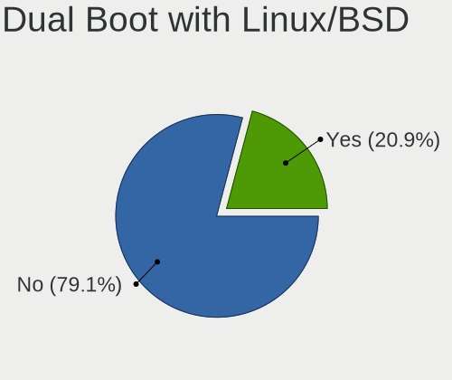
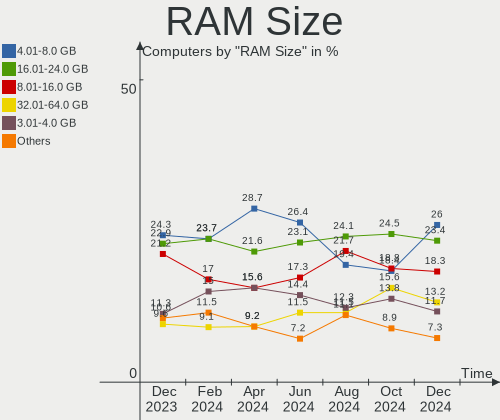
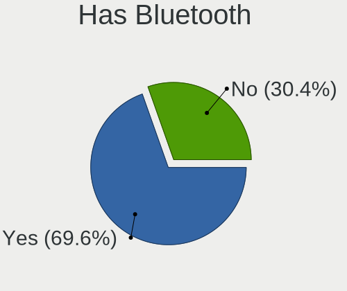
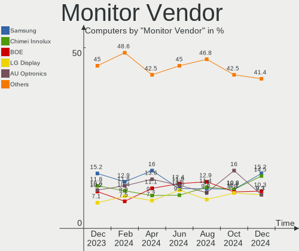
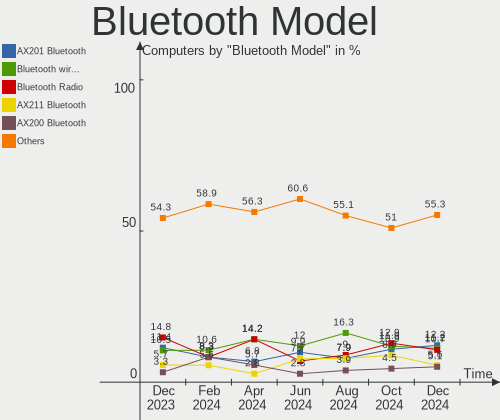
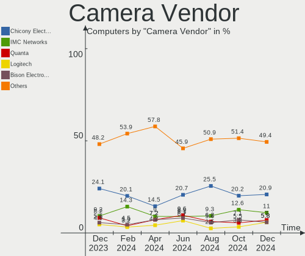

Linux in Italy - Hardware Trends
--------------------------------

A project to identify most popular hardware characteristics and track their change
over time based on data collected by Linux users at https://Linux-Hardware.org.

Anyone can contribute to this report by the [hw-probe](https://github.com/linuxhw/hw-probe) tool:

    sudo -E hw-probe -all -upload

This is a report for all computer types. See also reports for [desktops](/Location/Italy/Desktop/README.md) and [notebooks](/Location/Italy/Notebook/README.md).

Period: Jun, 2023.

Contents
--------

* [ System ](#system)
  - [ OS                       ](#os)
  - [ OS Family                ](#os-family)
  - [ Kernel                   ](#kernel)
  - [ Kernel Family            ](#kernel-family)
  - [ Kernel Major Ver.        ](#kernel-major-ver)
  - [ Arch                     ](#arch)
  - [ DE                       ](#de)
  - [ Display Server           ](#display-server)
  - [ Display Manager          ](#display-manager)
  - [ OS Lang                  ](#os-lang)
  - [ Boot Mode                ](#boot-mode)
  - [ Filesystem               ](#filesystem)
  - [ Part. scheme             ](#part-scheme)
  - [ Dual Boot with Linux/BSD ](#dual-boot-with-linuxbsd)
  - [ Dual Boot (Win)          ](#dual-boot-win)

* [ Board ](#board)
  - [ Vendor                   ](#vendor)
  - [ Model                    ](#model)
  - [ Model Family             ](#model-family)
  - [ MFG Year                 ](#mfg-year)
  - [ Form Factor              ](#form-factor)
  - [ Secure Boot              ](#secure-boot)
  - [ Coreboot                 ](#coreboot)
  - [ RAM Size                 ](#ram-size)
  - [ RAM Used                 ](#ram-used)
  - [ Total Drives             ](#total-drives)
  - [ Has CD-ROM               ](#has-cd-rom)
  - [ Has Ethernet             ](#has-ethernet)
  - [ Has WiFi                 ](#has-wifi)
  - [ Has Bluetooth            ](#has-bluetooth)

* [ Location ](#location)
  - [ Country                  ](#country)
  - [ City                     ](#city)

* [ Drives ](#drives)
  - [ Drive Vendor             ](#drive-vendor)
  - [ Drive Model              ](#drive-model)
  - [ HDD Vendor               ](#hdd-vendor)
  - [ SSD Vendor               ](#ssd-vendor)
  - [ Drive Kind               ](#drive-kind)
  - [ Drive Connector          ](#drive-connector)
  - [ Drive Size               ](#drive-size)
  - [ Space Total              ](#space-total)
  - [ Space Used               ](#space-used)
  - [ Malfunc. Drives          ](#malfunc-drives)
  - [ Malfunc. Drive Vendor    ](#malfunc-drive-vendor)
  - [ Malfunc. HDD Vendor      ](#malfunc-hdd-vendor)
  - [ Malfunc. Drive Kind      ](#malfunc-drive-kind)
  - [ Failed Drives            ](#failed-drives)
  - [ Failed Drive Vendor      ](#failed-drive-vendor)
  - [ Drive Status             ](#drive-status)

* [ Storage controller ](#storage-controller)
  - [ Storage Vendor           ](#storage-vendor)
  - [ Storage Model            ](#storage-model)
  - [ Storage Kind             ](#storage-kind)

* [ Processor ](#processor)
  - [ CPU Vendor               ](#cpu-vendor)
  - [ CPU Model                ](#cpu-model)
  - [ CPU Model Family         ](#cpu-model-family)
  - [ CPU Cores                ](#cpu-cores)
  - [ CPU Sockets              ](#cpu-sockets)
  - [ CPU Threads              ](#cpu-threads)
  - [ CPU Op-Modes             ](#cpu-op-modes)
  - [ CPU Microcode            ](#cpu-microcode)
  - [ CPU Microarch            ](#cpu-microarch)

* [ Graphics ](#graphics)
  - [ GPU Vendor               ](#gpu-vendor)
  - [ GPU Model                ](#gpu-model)
  - [ GPU Combo                ](#gpu-combo)
  - [ GPU Driver               ](#gpu-driver)
  - [ GPU Memory               ](#gpu-memory)

* [ Monitor ](#monitor)
  - [ Monitor Vendor           ](#monitor-vendor)
  - [ Monitor Model            ](#monitor-model)
  - [ Monitor Resolution       ](#monitor-resolution)
  - [ Monitor Diagonal         ](#monitor-diagonal)
  - [ Monitor Width            ](#monitor-width)
  - [ Aspect Ratio             ](#aspect-ratio)
  - [ Monitor Area             ](#monitor-area)
  - [ Pixel Density            ](#pixel-density)
  - [ Multiple Monitors        ](#multiple-monitors)

* [ Network ](#network)
  - [ Net Controller Vendor    ](#net-controller-vendor)
  - [ Net Controller Model     ](#net-controller-model)
  - [ Wireless Vendor          ](#wireless-vendor)
  - [ Wireless Model           ](#wireless-model)
  - [ Ethernet Vendor          ](#ethernet-vendor)
  - [ Ethernet Model           ](#ethernet-model)
  - [ Net Controller Kind      ](#net-controller-kind)
  - [ Used Controller          ](#used-controller)
  - [ NICs                     ](#nics)
  - [ IPv6                     ](#ipv6)

* [ Bluetooth ](#bluetooth)
  - [ Bluetooth Vendor         ](#bluetooth-vendor)
  - [ Bluetooth Model          ](#bluetooth-model)

* [ Sound ](#sound)
  - [ Sound Vendor             ](#sound-vendor)
  - [ Sound Model              ](#sound-model)

* [ Memory ](#memory)
  - [ Memory Vendor            ](#memory-vendor)
  - [ Memory Model             ](#memory-model)
  - [ Memory Kind              ](#memory-kind)
  - [ Memory Form Factor       ](#memory-form-factor)
  - [ Memory Size              ](#memory-size)
  - [ Memory Speed             ](#memory-speed)

* [ Printers & scanners ](#printers--scanners)
  - [ Printer Vendor           ](#printer-vendor)
  - [ Printer Model            ](#printer-model)
  - [ Scanner Vendor           ](#scanner-vendor)
  - [ Scanner Model            ](#scanner-model)

* [ Camera ](#camera)
  - [ Camera Vendor            ](#camera-vendor)
  - [ Camera Model             ](#camera-model)

* [ Security ](#security)
  - [ Fingerprint Vendor       ](#fingerprint-vendor)
  - [ Fingerprint Model        ](#fingerprint-model)
  - [ Chipcard Vendor          ](#chipcard-vendor)
  - [ Chipcard Model           ](#chipcard-model)

* [ Unsupported ](#unsupported)
  - [ Unsupported Devices      ](#unsupported-devices)
  - [ Unsupported Device Types ](#unsupported-device-types)

System
------

OS
--

Installed operating systems

| Name                         | Computers | Percent |
|------------------------------|-----------|---------|
| Ubuntu 22.04                 | 32        | 20.13%  |
| OpenMandriva 23.03           | 12        | 7.55%   |
| Fedora 38                    | 12        | 7.55%   |
| Ubuntu 23.04                 | 9         | 5.66%   |
| Linux Mint 21.1              | 8         | 5.03%   |
| Debian 11                    | 7         | 4.4%    |
| Arch Rolling                 | 7         | 4.4%    |
| OpenMandriva 23.06           | 6         | 3.77%   |
| Zorin 16                     | 5         | 3.14%   |
| EndeavourOS Rolling          | 5         | 3.14%   |
| openSUSE Tumbleweed-XXXXXXXX | 4         | 2.52%   |
| OpenMandriva 4.3             | 4         | 2.52%   |
| Debian 12                    | 4         | 2.52%   |
| Pop!_OS 22.04                | 3         | 1.89%   |
| LMDE 5                       | 3         | 1.89%   |
| Ubuntu 22.10                 | 2         | 1.26%   |
| Ubuntu 20.04                 | 2         | 1.26%   |
| Ubuntu 18.04                 | 2         | 1.26%   |
| Manjaro                      | 2         | 1.26%   |
| Lubuntu 22.04                | 2         | 1.26%   |
| Linux Mint 21                | 2         | 1.26%   |
| Kubuntu 23.04                | 2         | 1.26%   |
| Kubuntu 22.04                | 2         | 1.26%   |
| Xubuntu 23.04                | 1         | 0.63%   |
| Xubuntu 22.04                | 1         | 0.63%   |
| Ubuntu MATE 23.04            | 1         | 0.63%   |
| SteamOS 3.4.8                | 1         | 0.63%   |
| PCLinuxOS 2023               | 1         | 0.63%   |
| Parrot 5.3                   | 1         | 0.63%   |
| openSUSE Leap-15.5           | 1         | 0.63%   |
| OpenMandriva 4.2             | 1         | 0.63%   |
| OpenMandriva 23.01           | 1         | 0.63%   |
| Openmamba 2023.1             | 1         | 0.63%   |
| NixOS 23.05                  | 1         | 0.63%   |
| Lubuntu 20.04                | 1         | 0.63%   |
| Linux Mint 20.3              | 1         | 0.63%   |
| Linux Mint 20.2              | 1         | 0.63%   |
| KDE neon 22.04               | 1         | 0.63%   |
| Kali 2023.2                  | 1         | 0.63%   |
| Garuda Linux Soaring         | 1         | 0.63%   |

OS Family
---------

OS without a version

| Name         | Computers | Percent |
|--------------|-----------|---------|
| Ubuntu       | 47        | 29.56%  |
| OpenMandriva | 24        | 15.09%  |
| Fedora       | 14        | 8.81%   |
| Linux Mint   | 12        | 7.55%   |
| Debian       | 12        | 7.55%   |
| Arch         | 7         | 4.4%    |
| Zorin        | 5         | 3.14%   |
| openSUSE     | 5         | 3.14%   |
| EndeavourOS  | 5         | 3.14%   |
| Kubuntu      | 4         | 2.52%   |
| Pop!_OS      | 3         | 1.89%   |
| Lubuntu      | 3         | 1.89%   |
| LMDE         | 3         | 1.89%   |
| Xubuntu      | 2         | 1.26%   |
| Manjaro      | 2         | 1.26%   |
| Ubuntu MATE  | 1         | 0.63%   |
| SteamOS      | 1         | 0.63%   |
| PCLinuxOS    | 1         | 0.63%   |
| Parrot       | 1         | 0.63%   |
| Openmamba    | 1         | 0.63%   |
| NixOS        | 1         | 0.63%   |
| KDE neon     | 1         | 0.63%   |
| Kali         | 1         | 0.63%   |
| Garuda Linux | 1         | 0.63%   |
| CachyOS      | 1         | 0.63%   |
| blendOS      | 1         | 0.63%   |

Kernel
------

Version of the Linux kernel

| Version                 | Computers | Percent |
|-------------------------|-----------|---------|
| 5.19.0-43-generic       | 19        | 11.95%  |
| 6.2.6-desktop-1omv2390  | 12        | 7.55%   |
| 5.15.0-73-generic       | 10        | 6.29%   |
| 5.19.0-45-generic       | 8         | 5.03%   |
| 5.10.0-23-amd64         | 8         | 5.03%   |
| 6.3.5-desktop-3omv2390  | 6         | 3.77%   |
| 6.2.0-23-generic        | 5         | 3.14%   |
| 5.15.0-75-generic       | 5         | 3.14%   |
| 6.3.4-201.fc38.x86_64   | 4         | 2.52%   |
| 6.3.4-1-default         | 4         | 2.52%   |
| 6.2.9-300.fc38.x86_64   | 4         | 2.52%   |
| 6.2.0-20-generic        | 4         | 2.52%   |
| 6.1.0-9-amd64           | 4         | 2.52%   |
| 5.4.0-150-generic       | 4         | 2.52%   |
| 5.16.7-desktop-1omv4003 | 4         | 2.52%   |
| 6.2.6-76060206-generic  | 3         | 1.89%   |
| 5.19.0-42-generic       | 3         | 1.89%   |
| 6.3.9-arch1-1           | 2         | 1.26%   |
| 6.3.8-zen1-1-zen        | 2         | 1.26%   |
| 6.3.5-arch1-1           | 2         | 1.26%   |
| 6.2.0-24-generic        | 2         | 1.26%   |
| 5.19.0-46-generic       | 2         | 1.26%   |
| 6.3.9-zen1-1-zen        | 1         | 0.63%   |
| 6.3.8-200.fc38.x86_64   | 1         | 0.63%   |
| 6.3.7-pclos1            | 1         | 0.63%   |
| 6.3.7-arch1-1           | 1         | 0.63%   |
| 6.3.7-200.fc38.x86_64   | 1         | 0.63%   |
| 6.3.7-1-cachyos         | 1         | 0.63%   |
| 6.3.7-060307-generic    | 1         | 0.63%   |
| 6.3.6-zen1-1-zen        | 1         | 0.63%   |
| 6.3.6-arch1-1           | 1         | 0.63%   |
| 6.3.6-200.fc38.x86_64   | 1         | 0.63%   |
| 6.3.5-100.fc37.x86_64   | 1         | 0.63%   |
| 6.2.15-100.fc36.x86_64  | 1         | 0.63%   |
| 6.2.14-300.fc38.x86_64  | 1         | 0.63%   |
| 6.2.0-1004-raspi        | 1         | 0.63%   |
| 6.1.35-1-lts            | 1         | 0.63%   |
| 6.1.34                  | 1         | 0.63%   |
| 6.1.31-2-MANJARO        | 1         | 0.63%   |
| 6.1.31-1-MANJARO        | 1         | 0.63%   |

Kernel Family
-------------

Linux kernel without a distro release

| Version  | Computers | Percent |
|----------|-----------|---------|
| 5.19.0   | 34        | 21.38%  |
| 5.15.0   | 22        | 13.84%  |
| 6.2.6    | 15        | 9.43%   |
| 6.2.0    | 12        | 7.55%   |
| 5.10.0   | 10        | 6.29%   |
| 6.3.5    | 9         | 5.66%   |
| 6.3.4    | 8         | 5.03%   |
| 6.1.0    | 7         | 4.4%    |
| 6.3.7    | 5         | 3.14%   |
| 6.2.9    | 4         | 2.52%   |
| 5.4.0    | 4         | 2.52%   |
| 5.16.7   | 4         | 2.52%   |
| 6.3.9    | 3         | 1.89%   |
| 6.3.8    | 3         | 1.89%   |
| 6.3.6    | 3         | 1.89%   |
| 6.1.31   | 3         | 1.89%   |
| 6.2.15   | 1         | 0.63%   |
| 6.2.14   | 1         | 0.63%   |
| 6.1.35   | 1         | 0.63%   |
| 6.1.34   | 1         | 0.63%   |
| 6.1.30   | 1         | 0.63%   |
| 6.1.26   | 1         | 0.63%   |
| 6.1.24   | 1         | 0.63%   |
| 6.1.1    | 1         | 0.63%   |
| 5.3.0    | 1         | 0.63%   |
| 5.15.107 | 1         | 0.63%   |
| 5.14.21  | 1         | 0.63%   |
| 5.13.0   | 1         | 0.63%   |
| 5.10.14  | 1         | 0.63%   |

Kernel Major Ver.
-----------------

Linux kernel major version

| Version | Computers | Percent |
|---------|-----------|---------|
| 5.19    | 34        | 21.38%  |
| 6.2     | 33        | 20.75%  |
| 6.3     | 31        | 19.5%   |
| 5.15    | 23        | 14.47%  |
| 6.1     | 16        | 10.06%  |
| 5.10    | 11        | 6.92%   |
| 5.4     | 4         | 2.52%   |
| 5.16    | 4         | 2.52%   |
| 5.3     | 1         | 0.63%   |
| 5.14    | 1         | 0.63%   |
| 5.13    | 1         | 0.63%   |

Arch
----

OS architecture (x86_64, i586, etc.)

| Name   | Computers | Percent |
|--------|-----------|---------|
| x86_64 | 157       | 98.74%  |
| i686   | 1         | 0.63%   |
| armv7l | 1         | 0.63%   |

DE
--

Desktop Environment

| Name          | Computers | Percent |
|---------------|-----------|---------|
| GNOME         | 77        | 48.43%  |
| KDE5          | 41        | 25.79%  |
| X-Cinnamon    | 12        | 7.55%   |
| XFCE          | 9         | 5.66%   |
| LXQt          | 7         | 4.4%    |
| Unknown       | 6         | 3.77%   |
| MATE          | 4         | 2.52%   |
| GNOME Classic | 2         | 1.26%   |
| i3            | 1         | 0.63%   |

Display Server
--------------

X11 or Wayland

| Name    | Computers | Percent |
|---------|-----------|---------|
| X11     | 97        | 61.01%  |
| Wayland | 55        | 34.59%  |
| Tty     | 6         | 3.77%   |
| Unknown | 1         | 0.63%   |

Display Manager
---------------

SDDM, LightDM, etc.

| Name    | Computers | Percent |
|---------|-----------|---------|
| GDM3    | 44        | 27.67%  |
| Unknown | 44        | 27.67%  |
| SDDM    | 39        | 24.53%  |
| LightDM | 17        | 10.69%  |
| GDM     | 15        | 9.43%   |

OS Lang
-------

Language

| Lang       | Computers | Percent |
|------------|-----------|---------|
| it_IT      | 101       | 63.52%  |
| en_US      | 48        | 30.19%  |
| en_GB      | 3         | 1.89%   |
| C          | 3         | 1.89%   |
| POSIX      | 1         | 0.63%   |
| it_IT@euro | 1         | 0.63%   |
| es_ES      | 1         | 0.63%   |
| Unknown    | 1         | 0.63%   |

Boot Mode
---------

EFI or BIOS

| Mode | Computers | Percent |
|------|-----------|---------|
| EFI  | 80        | 50.31%  |
| BIOS | 79        | 49.69%  |

Filesystem
----------

Type of filesystem

| Type    | Computers | Percent |
|---------|-----------|---------|
| Ext4    | 86        | 54.09%  |
| Tmpfs   | 33        | 20.75%  |
| Btrfs   | 21        | 13.21%  |
| Overlay | 17        | 10.69%  |
| Zfs     | 1         | 0.63%   |
| Xfs     | 1         | 0.63%   |

Part. scheme
------------

Scheme of partitioning

| Type    | Computers | Percent |
|---------|-----------|---------|
| GPT     | 96        | 60.38%  |
| Unknown | 38        | 23.9%   |
| MBR     | 25        | 15.72%  |

Dual Boot with Linux/BSD
------------------------

Hosting more than one Linux/BSD

| Dual boot | Computers | Percent |
|-----------|-----------|---------|
| No        | 125       | 78.62%  |
| Yes       | 34        | 21.38%  |

Dual Boot (Win)
---------------

Hosting Linux and Windows

| Dual boot | Computers | Percent |
|-----------|-----------|---------|
| No        | 100       | 62.89%  |
| Yes       | 59        | 37.11%  |

Board
-----

Vendor
------

Motherboard manufacturer

| Name                    | Computers | Percent |
|-------------------------|-----------|---------|
| Hewlett-Packard         | 30        | 18.87%  |
| ASUSTek Computer        | 21        | 13.21%  |
| MSI                     | 20        | 12.58%  |
| Lenovo                  | 18        | 11.32%  |
| Dell                    | 13        | 8.18%   |
| Acer                    | 13        | 8.18%   |
| HUAWEI                  | 5         | 3.14%   |
| ASRock                  | 5         | 3.14%   |
| Samsung Electronics     | 3         | 1.89%   |
| Gigabyte Technology     | 3         | 1.89%   |
| Apple                   | 3         | 1.89%   |
| Sony                    | 2         | 1.26%   |
| Onda TLC                | 2         | 1.26%   |
| Intel                   | 2         | 1.26%   |
| Fujitsu                 | 2         | 1.26%   |
| Chuwi                   | 2         | 1.26%   |
| Unknown                 | 2         | 1.26%   |
| Valve                   | 1         | 0.63%   |
| Toshiba                 | 1         | 0.63%   |
| Supermicro              | 1         | 0.63%   |
| Raspberry Pi Foundation | 1         | 0.63%   |
| Packard Bell            | 1         | 0.63%   |
| Microtech               | 1         | 0.63%   |
| Microsoft               | 1         | 0.63%   |
| IP3 Technology          | 1         | 0.63%   |
| HONOR                   | 1         | 0.63%   |
| Google                  | 1         | 0.63%   |
| Fujitsu Siemens         | 1         | 0.63%   |
| BESSTAR Tech            | 1         | 0.63%   |
| AMI                     | 1         | 0.63%   |

Model
-----

Motherboard model

| Name                                  | Computers | Percent |
|---------------------------------------|-----------|---------|
| Onda TLC ONDA Oliver                  | 2         | 1.26%   |
| MSI MS-7D75                           | 2         | 1.26%   |
| MSI MS-7C37                           | 2         | 1.26%   |
| MSI MS-7B79                           | 2         | 1.26%   |
| HUAWEI BOD-WXX9                       | 2         | 1.26%   |
| HP ProDesk 600 G1 SFF                 | 2         | 1.26%   |
| HP Pavilion dv6                       | 2         | 1.26%   |
| HP EliteBook 2530p                    | 2         | 1.26%   |
| Chuwi RZBOX                           | 2         | 1.26%   |
| ASUS P8H61-M LX                       | 2         | 1.26%   |
| Unknown                               | 2         | 1.26%   |
| Valve Jupiter                         | 1         | 0.63%   |
| Toshiba Satellite A300                | 1         | 0.63%   |
| Supermicro C7X99-OCE                  | 1         | 0.63%   |
| Sony VGN-NS21M_W                      | 1         | 0.63%   |
| Sony SVE1713X1EB                      | 1         | 0.63%   |
| Samsung RC420/RC520/RC720             | 1         | 0.63%   |
| Samsung N130                          | 1         | 0.63%   |
| Samsung 300E4C/300E5C/300E7C          | 1         | 0.63%   |
| RPi Raspberry Pi 2 Model B Rev 1.1    | 1         | 0.63%   |
| Packard Bell EasyNote TJ65            | 1         | 0.63%   |
| MSI PS63 Modern 8RC                   | 1         | 0.63%   |
| MSI Prestige 15 A12UC                 | 1         | 0.63%   |
| MSI NQ890AA-ABZ CQ5011IT              | 1         | 0.63%   |
| MSI MS-7C95                           | 1         | 0.63%   |
| MSI MS-7C94                           | 1         | 0.63%   |
| MSI MS-7C91                           | 1         | 0.63%   |
| MSI MS-7B53                           | 1         | 0.63%   |
| MSI MS-7A74                           | 1         | 0.63%   |
| MSI MS-7A15                           | 1         | 0.63%   |
| MSI MS-7851                           | 1         | 0.63%   |
| MSI MS-7360                           | 1         | 0.63%   |
| MSI GL75 Leopard 10SER                | 1         | 0.63%   |
| MSI GL73 8RE                          | 1         | 0.63%   |
| MSI GF63 Thin 9RCX                    | 1         | 0.63%   |
| Microtech CoreBook Lite               | 1         | 0.63%   |
| Microsoft Surface Go                  | 1         | 0.63%   |
| Lenovo ThinkStation P320 30BK0023UK   | 1         | 0.63%   |
| Lenovo ThinkPad X270 W10DG 20K5S3HG00 | 1         | 0.63%   |
| Lenovo ThinkPad T480 20L6S5LF00       | 1         | 0.63%   |

Model Family
------------

Motherboard model prefix

| Name                  | Computers | Percent |
|-----------------------|-----------|---------|
| Acer Aspire           | 12        | 7.55%   |
| Lenovo IdeaPad        | 7         | 4.4%    |
| HP Pavilion           | 7         | 4.4%    |
| Dell Latitude         | 7         | 4.4%    |
| Lenovo ThinkPad       | 6         | 3.77%   |
| HP EliteBook          | 4         | 2.52%   |
| Dell XPS              | 3         | 1.89%   |
| ASUS ROG              | 3         | 1.89%   |
| ASUS PRIME            | 3         | 1.89%   |
| Onda TLC ONDA         | 2         | 1.26%   |
| MSI MS-7D75           | 2         | 1.26%   |
| MSI MS-7C37           | 2         | 1.26%   |
| MSI MS-7B79           | 2         | 1.26%   |
| Lenovo Legion         | 2         | 1.26%   |
| HUAWEI BOD-WXX9       | 2         | 1.26%   |
| HP ZBook              | 2         | 1.26%   |
| HP ProDesk            | 2         | 1.26%   |
| HP OMEN               | 2         | 1.26%   |
| HP Laptop             | 2         | 1.26%   |
| HP Compaq             | 2         | 1.26%   |
| Fujitsu ESPRIMO       | 2         | 1.26%   |
| Dell Vostro           | 2         | 1.26%   |
| Chuwi RZBOX           | 2         | 1.26%   |
| ASUS P8H61-M          | 2         | 1.26%   |
| ASUS ASUS             | 2         | 1.26%   |
| Apple iMac14          | 2         | 1.26%   |
| Unknown               | 2         | 1.26%   |
| Valve Jupiter         | 1         | 0.63%   |
| Toshiba Satellite     | 1         | 0.63%   |
| Supermicro C7X99-OCE  | 1         | 0.63%   |
| Sony VGN-NS21M        | 1         | 0.63%   |
| Sony SVE1713X1EB      | 1         | 0.63%   |
| Samsung RC420         | 1         | 0.63%   |
| Samsung N130          | 1         | 0.63%   |
| Samsung 300E4C        | 1         | 0.63%   |
| RPi Raspberry         | 1         | 0.63%   |
| Packard Bell EasyNote | 1         | 0.63%   |
| MSI PS63              | 1         | 0.63%   |
| MSI Prestige          | 1         | 0.63%   |
| MSI NQ890AA-ABZ       | 1         | 0.63%   |

MFG Year
--------

Motherboard manufacture year

| Year    | Computers | Percent |
|---------|-----------|---------|
| 2021    | 25        | 15.72%  |
| 2019    | 14        | 8.81%   |
| 2018    | 14        | 8.81%   |
| 2020    | 13        | 8.18%   |
| 2017    | 11        | 6.92%   |
| 2022    | 10        | 6.29%   |
| 2008    | 10        | 6.29%   |
| 2012    | 9         | 5.66%   |
| 2015    | 8         | 5.03%   |
| 2011    | 8         | 5.03%   |
| 2016    | 7         | 4.4%    |
| 2014    | 5         | 3.14%   |
| 2013    | 5         | 3.14%   |
| 2010    | 5         | 3.14%   |
| 2009    | 5         | 3.14%   |
| 2023    | 3         | 1.89%   |
| 2006    | 3         | 1.89%   |
| 2007    | 2         | 1.26%   |
| 2005    | 1         | 0.63%   |
| Unknown | 1         | 0.63%   |

Form Factor
-----------

Physical design of the computer

| Name           | Computers | Percent |
|----------------|-----------|---------|
| Notebook       | 90        | 56.6%   |
| Desktop        | 56        | 35.22%  |
| All in one     | 4         | 2.52%   |
| Tablet         | 3         | 1.89%   |
| Mini pc        | 3         | 1.89%   |
| System on chip | 1         | 0.63%   |
| Convertible    | 1         | 0.63%   |
| Server         | 1         | 0.63%   |

Secure Boot
-----------

Enabled or disabled

| State    | Computers | Percent |
|----------|-----------|---------|
| Disabled | 146       | 91.82%  |
| Enabled  | 13        | 8.18%   |

Coreboot
--------

Have coreboot on board

| Used | Computers | Percent |
|------|-----------|---------|
| No   | 158       | 99.37%  |
| Yes  | 1         | 0.63%   |

RAM Size
--------

Total RAM memory

| Size in GB  | Computers | Percent |
|-------------|-----------|---------|
| 4.01-8.0    | 42        | 26.42%  |
| 16.01-24.0  | 38        | 23.9%   |
| 3.01-4.0    | 32        | 20.13%  |
| 8.01-16.0   | 24        | 15.09%  |
| 32.01-64.0  | 13        | 8.18%   |
| 24.01-32.0  | 2         | 1.26%   |
| 2.01-3.0    | 2         | 1.26%   |
| 64.01-256.0 | 2         | 1.26%   |
| 1.01-2.0    | 2         | 1.26%   |
| 0.51-1.0    | 2         | 1.26%   |

RAM Used
--------

Used RAM memory

| Used GB    | Computers | Percent |
|------------|-----------|---------|
| 1.01-2.0   | 51        | 32.08%  |
| 2.01-3.0   | 37        | 23.27%  |
| 4.01-8.0   | 31        | 19.5%   |
| 3.01-4.0   | 23        | 14.47%  |
| 0.51-1.0   | 6         | 3.77%   |
| 8.01-16.0  | 5         | 3.14%   |
| 0.01-0.5   | 4         | 2.52%   |
| 32.01-64.0 | 1         | 0.63%   |
| 16.01-24.0 | 1         | 0.63%   |

Total Drives
------------

Number of drives on board

| Drives | Computers | Percent |
|--------|-----------|---------|
| 1      | 95        | 59.75%  |
| 2      | 34        | 21.38%  |
| 3      | 19        | 11.95%  |
| 5      | 4         | 2.52%   |
| 4      | 3         | 1.89%   |
| 6      | 2         | 1.26%   |
| 0      | 2         | 1.26%   |

Has CD-ROM
----------

Has CD-ROM on board

| Presented | Computers | Percent |
|-----------|-----------|---------|
| No        | 101       | 63.52%  |
| Yes       | 58        | 36.48%  |

Has Ethernet
------------

Has Ethernet on board

| Presented | Computers | Percent |
|-----------|-----------|---------|
| Yes       | 134       | 84.28%  |
| No        | 25        | 15.72%  |

Has WiFi
--------

Has WiFi module

| Presented | Computers | Percent |
|-----------|-----------|---------|
| Yes       | 128       | 80.5%   |
| No        | 31        | 19.5%   |

Has Bluetooth
-------------

Has Bluetooth module

| Presented | Computers | Percent |
|-----------|-----------|---------|
| Yes       | 104       | 65.41%  |
| No        | 55        | 34.59%  |

Location
--------

Country
-------

Geographic location (country)

| Country | Computers | Percent |
|---------|-----------|---------|
| Italy   | 159       | 100%    |

City
----

Geographic location (city)

| City                | Computers | Percent |
|---------------------|-----------|---------|
| Milan               | 25        | 15.72%  |
| Rome                | 17        | 10.69%  |
| Milano              | 8         | 5.03%   |
| Turin               | 5         | 3.14%   |
| Florence            | 5         | 3.14%   |
| Naples              | 4         | 2.52%   |
| Rho                 | 3         | 1.89%   |
| Palermo             | 3         | 1.89%   |
| Bologna             | 3         | 1.89%   |
| Verona              | 2         | 1.26%   |
| Venice              | 2         | 1.26%   |
| Padova              | 2         | 1.26%   |
| Monteriggioni       | 2         | 1.26%   |
| Genoa               | 2         | 1.26%   |
| Gattinara           | 2         | 1.26%   |
| Cagliari            | 2         | 1.26%   |
| Brescia             | 2         | 1.26%   |
| Bari                | 2         | 1.26%   |
| Villaputzu          | 1         | 0.63%   |
| Villa San Pietro    | 1         | 0.63%   |
| Vicenza             | 1         | 0.63%   |
| Verbania            | 1         | 0.63%   |
| Trento              | 1         | 0.63%   |
| Tremestieri Etneo   | 1         | 0.63%   |
| Trapani             | 1         | 0.63%   |
| Trabia              | 1         | 0.63%   |
| Torre Boldone       | 1         | 0.63%   |
| Soave               | 1         | 0.63%   |
| Silea               | 1         | 0.63%   |
| Saronno             | 1         | 0.63%   |
| Santa Maria di Sala | 1         | 0.63%   |
| Rozzano             | 1         | 0.63%   |
| Ronchis             | 1         | 0.63%   |
| Riese Pio X         | 1         | 0.63%   |
| Rapallo             | 1         | 0.63%   |
| Raddusa             | 1         | 0.63%   |
| Preganziol          | 1         | 0.63%   |
| Pistoia             | 1         | 0.63%   |
| Pisa                | 1         | 0.63%   |
| Pescia              | 1         | 0.63%   |

Drives
------

Drive Vendor
------------

Hard drive vendors

| Vendor                         | Computers | Drives | Percent |
|--------------------------------|-----------|--------|---------|
| Samsung Electronics            | 31        | 36     | 13.08%  |
| WDC                            | 30        | 35     | 12.66%  |
| Seagate                        | 22        | 26     | 9.28%   |
| Crucial                        | 17        | 18     | 7.17%   |
| SanDisk                        | 15        | 17     | 6.33%   |
| Toshiba                        | 13        | 15     | 5.49%   |
| Kingston                       | 13        | 14     | 5.49%   |
| Unknown                        | 11        | 11     | 4.64%   |
| Hitachi                        | 9         | 9      | 3.8%    |
| Intel                          | 6         | 6      | 2.53%   |
| Kingston Technology Company    | 5         | 5      | 2.11%   |
| SPCC                           | 4         | 4      | 1.69%   |
| Micron/Crucial Technology      | 4         | 4      | 1.69%   |
| Micron Technology              | 4         | 4      | 1.69%   |
| KIOXIA                         | 4         | 5      | 1.69%   |
| Apple                          | 4         | 4      | 1.69%   |
| SK hynix                       | 3         | 3      | 1.27%   |
| SABRENT                        | 3         | 3      | 1.27%   |
| HGST                           | 3         | 4      | 1.27%   |
| China                          | 3         | 3      | 1.27%   |
| PNY                            | 2         | 2      | 0.84%   |
| Phison                         | 2         | 2      | 0.84%   |
| Maxtor                         | 2         | 2      | 0.84%   |
| Yangtze Memory Technologies    | 1         | 1      | 0.42%   |
| Vaseky                         | 1         | 1      | 0.42%   |
| Union Memory                   | 1         | 1      | 0.42%   |
| Transcend                      | 1         | 1      | 0.42%   |
| Team                           | 1         | 1      | 0.42%   |
| T-FORCE                        | 1         | 1      | 0.42%   |
| SSSTC                          | 1         | 1      | 0.42%   |
| Solid State Storage Technology | 1         | 1      | 0.42%   |
| Silicon Motion                 | 1         | 1      | 0.42%   |
| Seapiy                         | 1         | 1      | 0.42%   |
| SCY                            | 1         | 1      | 0.42%   |
| Realtek Semiconductor          | 1         | 1      | 0.42%   |
| Phison Electronics             | 1         | 1      | 0.42%   |
| minisforum                     | 1         | 1      | 0.42%   |
| KingSpec                       | 1         | 1      | 0.42%   |
| Kimtigo                        | 1         | 1      | 0.42%   |
| IBM-ESXS                       | 1         | 2      | 0.42%   |

Drive Model
-----------

Hard drive models

| Model                                               | Computers | Percent |
|-----------------------------------------------------|-----------|---------|
| Kingston SA400S37240G 240GB SSD                     | 5         | 1.97%   |
| Samsung SSD 850 EVO 250GB                           | 4         | 1.57%   |
| Micron/Crucial P2 NVMe PCIe SSD 4TB                 | 4         | 1.57%   |
| Crucial CT500MX500SSD1 500GB                        | 4         | 1.57%   |
| Crucial CT1000MX500SSD1 1TB                         | 4         | 1.57%   |
| Unknown SD/MMC/MS PRO 250GB                         | 3         | 1.18%   |
| Seagate ST1000DM003-1SB102 1TB                      | 3         | 1.18%   |
| Seagate ST1000DM003-1ER162 1TB                      | 3         | 1.18%   |
| Sandisk WD Blue SN550 NVMe SSD 1TB                  | 3         | 1.18%   |
| Samsung NVMe SSD Controller PM9A1/PM9A3/980PRO 2TB  | 3         | 1.18%   |
| SABRENT Disk 1TB                                    | 3         | 1.18%   |
| Intel SSDPEKNW512GZL 512GB                          | 3         | 1.18%   |
| WDC WDS240G2G0A-00JH30 240GB SSD                    | 2         | 0.79%   |
| Unknown MMC Card  128GB                             | 2         | 0.79%   |
| Toshiba XG6 NVMe SSD Controller 2TB                 | 2         | 0.79%   |
| Toshiba DT01ACA100 1TB                              | 2         | 0.79%   |
| Seagate ST1000LM024 HN-M101MBB 1TB                  | 2         | 0.79%   |
| Sandisk WD Blue SN570 500GB                         | 2         | 0.79%   |
| SanDisk SSD PLUS 1000GB                             | 2         | 0.79%   |
| Samsung SSD 970 EVO Plus 2TB                        | 2         | 0.79%   |
| Samsung SSD 870 EVO 500GB                           | 2         | 0.79%   |
| Samsung NVMe SSD Controller SM981/PM981/PM983 250GB | 2         | 0.79%   |
| Samsung MZVLQ512HBLU-00B00 512GB                    | 2         | 0.79%   |
| Kingston Company OM3PDP3 NVMe SSD 256GB             | 2         | 0.79%   |
| Kingston SA400S37480G 480GB SSD                     | 2         | 0.79%   |
| Kingston SA400S37120G 120GB SSD                     | 2         | 0.79%   |
| Crucial CT480BX500SSD1 480GB                        | 2         | 0.79%   |
| Crucial CT1000BX500SSD1 1TB                         | 2         | 0.79%   |
| Apple HDD HTS541010A9E662 1TB                       | 2         | 0.79%   |
| Yangtze Memory YMTC PC005 256GB                     | 1         | 0.39%   |
| WDC WDS250G3X0C-00SJG0 250GB                        | 1         | 0.39%   |
| WDC WD6400BPVT-22HXZT3 640GB                        | 1         | 0.39%   |
| WDC WD6400BPVT-22HXZT1 640GB                        | 1         | 0.39%   |
| WDC WD5000LPVX-75V0TT0 500GB                        | 1         | 0.39%   |
| WDC WD5000LPLX-00ZNTT0 500GB                        | 1         | 0.39%   |
| WDC WD5000LPCX-24C6HT0 500GB                        | 1         | 0.39%   |
| WDC WD5000BEVT-22A0RT0 500GB                        | 1         | 0.39%   |
| WDC WD5000AAKS-60Z1A0 500GB                         | 1         | 0.39%   |
| WDC WD5000AAKS-00UU3A0 500GB                        | 1         | 0.39%   |
| WDC WD40EFRX-68N32N0 4TB                            | 1         | 0.39%   |

HDD Vendor
----------

Hard disk drive vendors

| Vendor              | Computers | Drives | Percent |
|---------------------|-----------|--------|---------|
| WDC                 | 21        | 25     | 28.77%  |
| Seagate             | 20        | 24     | 27.4%   |
| Hitachi             | 9         | 9      | 12.33%  |
| Toshiba             | 7         | 7      | 9.59%   |
| Apple               | 4         | 4      | 5.48%   |
| Unknown             | 3         | 3      | 4.11%   |
| Samsung Electronics | 3         | 3      | 4.11%   |
| HGST                | 3         | 4      | 4.11%   |
| Maxtor              | 2         | 2      | 2.74%   |
| Fujitsu             | 1         | 1      | 1.37%   |

SSD Vendor
----------

Solid state drive vendors

| Vendor              | Computers | Drives | Percent |
|---------------------|-----------|--------|---------|
| Crucial             | 16        | 17     | 22.22%  |
| Samsung Electronics | 12        | 12     | 16.67%  |
| Kingston            | 12        | 13     | 16.67%  |
| SanDisk             | 9         | 9      | 12.5%   |
| SPCC                | 3         | 3      | 4.17%   |
| China               | 3         | 3      | 4.17%   |
| WDC                 | 2         | 2      | 2.78%   |
| PNY                 | 2         | 2      | 2.78%   |
| Micron Technology   | 2         | 2      | 2.78%   |
| Vaseky              | 1         | 1      | 1.39%   |
| Transcend           | 1         | 1      | 1.39%   |
| Team                | 1         | 1      | 1.39%   |
| KingSpec            | 1         | 1      | 1.39%   |
| Kimtigo             | 1         | 1      | 1.39%   |
| Intel               | 1         | 1      | 1.39%   |
| GOODRAM             | 1         | 1      | 1.39%   |
| Gigabyte Technology | 1         | 1      | 1.39%   |
| FORESEE             | 1         | 1      | 1.39%   |
| Emtec               | 1         | 1      | 1.39%   |
| A-DATA Technology   | 1         | 1      | 1.39%   |

Drive Kind
----------

HDD or SSD

| Kind    | Computers | Drives | Percent |
|---------|-----------|--------|---------|
| NVMe    | 72        | 85     | 33.18%  |
| SSD     | 64        | 74     | 29.49%  |
| HDD     | 63        | 82     | 29.03%  |
| Unknown | 10        | 11     | 4.61%   |
| MMC     | 8         | 8      | 3.69%   |

Drive Connector
---------------

SATA, SAS, NVMe, etc.

| Type | Computers | Drives | Percent |
|------|-----------|--------|---------|
| SATA | 109       | 157    | 54.77%  |
| NVMe | 70        | 82     | 35.18%  |
| SAS  | 12        | 13     | 6.03%   |
| MMC  | 8         | 8      | 4.02%   |

Drive Size
----------

Size of hard drive

| Size in TB | Computers | Drives | Percent |
|------------|-----------|--------|---------|
| 0.01-0.5   | 83        | 98     | 64.34%  |
| 0.51-1.0   | 39        | 50     | 30.23%  |
| 1.01-2.0   | 5         | 6      | 3.88%   |
| 3.01-4.0   | 1         | 1      | 0.78%   |
| 2.01-3.0   | 1         | 1      | 0.78%   |

Space Total
-----------

Amount of disk space available on the file system

| Size in GB     | Computers | Percent |
|----------------|-----------|---------|
| 101-250        | 46        | 28.93%  |
| 251-500        | 30        | 18.87%  |
| 501-1000       | 22        | 13.84%  |
| 1-20           | 18        | 11.32%  |
| 51-100         | 12        | 7.55%   |
| 1001-2000      | 11        | 6.92%   |
| More than 3000 | 10        | 6.29%   |
| 2001-3000      | 5         | 3.14%   |
| Unknown        | 4         | 2.52%   |
| 21-50          | 1         | 0.63%   |

Space Used
----------

Amount of used disk space

| Used GB        | Computers | Percent |
|----------------|-----------|---------|
| 1-20           | 64        | 40.25%  |
| 21-50          | 27        | 16.98%  |
| 101-250        | 19        | 11.95%  |
| 51-100         | 17        | 10.69%  |
| 251-500        | 11        | 6.92%   |
| 1001-2000      | 7         | 4.4%    |
| 501-1000       | 5         | 3.14%   |
| More than 3000 | 4         | 2.52%   |
| Unknown        | 4         | 2.52%   |
| 2001-3000      | 1         | 0.63%   |

Malfunc. Drives
---------------

Drive models with a malfunction

| Model                                        | Computers | Drives | Percent |
|----------------------------------------------|-----------|--------|---------|
| WDC WDS240G2G0A-00JH30 240GB SSD             | 1         | 1      | 4.35%   |
| WDC WD3200BPVT-22ZEST0 320GB                 | 1         | 1      | 4.35%   |
| WDC WD30EFRX-68AX9N0 3TB                     | 1         | 1      | 4.35%   |
| WDC WD10EZEX-00WN4A0 1TB                     | 1         | 1      | 4.35%   |
| WDC WD10EALX-009BA0 1TB                      | 1         | 1      | 4.35%   |
| Toshiba DT01ACA050 500GB                     | 1         | 1      | 4.35%   |
| Seagate ST9320325AS 320GB                    | 1         | 1      | 4.35%   |
| Seagate ST500DM002-1BD142 500GB              | 1         | 2      | 4.35%   |
| Seagate ST31000524AS 1TB                     | 1         | 1      | 4.35%   |
| Samsung Electronics MZVLQ512HBLU-00B00 512GB | 1         | 1      | 4.35%   |
| Samsung Electronics HM160HC 160GB            | 1         | 1      | 4.35%   |
| Samsung Electronics HD103UJ 1TB              | 1         | 1      | 4.35%   |
| Samsung Electronics HD080HJ/ 80GB            | 1         | 1      | 4.35%   |
| Hitachi HTS547564A9E384 640GB                | 1         | 1      | 4.35%   |
| Hitachi HTS547550A9E384 500GB                | 1         | 1      | 4.35%   |
| Hitachi HTS545050A7E380 500GB                | 1         | 1      | 4.35%   |
| Hitachi HTS545032B9A300 320GB                | 1         | 1      | 4.35%   |
| Hitachi HDP725025GLA380 250GB                | 1         | 1      | 4.35%   |
| Fujitsu MHW2160BJ G2 160GB                   | 1         | 1      | 4.35%   |
| Emtec X150 240GB                             | 1         | 1      | 4.35%   |
| Crucial CT480BX500SSD1 480GB                 | 1         | 1      | 4.35%   |
| Crucial CT120M500SSD1 120GB                  | 1         | 1      | 4.35%   |
| Apple HDD HTS545050A7E362 500GB              | 1         | 1      | 4.35%   |

Malfunc. Drive Vendor
---------------------

Vendors of faulty drives

| Vendor              | Computers | Drives | Percent |
|---------------------|-----------|--------|---------|
| WDC                 | 5         | 5      | 21.74%  |
| Hitachi             | 5         | 5      | 21.74%  |
| Samsung Electronics | 4         | 4      | 17.39%  |
| Seagate             | 3         | 4      | 13.04%  |
| Crucial             | 2         | 2      | 8.7%    |
| Toshiba             | 1         | 1      | 4.35%   |
| Fujitsu             | 1         | 1      | 4.35%   |
| Emtec               | 1         | 1      | 4.35%   |
| Apple               | 1         | 1      | 4.35%   |

Malfunc. HDD Vendor
-------------------

Vendors of faulty HDD drives

| Vendor              | Computers | Drives | Percent |
|---------------------|-----------|--------|---------|
| Hitachi             | 5         | 5      | 27.78%  |
| WDC                 | 4         | 4      | 22.22%  |
| Seagate             | 3         | 4      | 16.67%  |
| Samsung Electronics | 3         | 3      | 16.67%  |
| Toshiba             | 1         | 1      | 5.56%   |
| Fujitsu             | 1         | 1      | 5.56%   |
| Apple               | 1         | 1      | 5.56%   |

Malfunc. Drive Kind
-------------------

Kinds of faulty drives

| Kind | Computers | Drives | Percent |
|------|-----------|--------|---------|
| HDD  | 17        | 19     | 77.27%  |
| SSD  | 4         | 4      | 18.18%  |
| NVMe | 1         | 1      | 4.55%   |

Failed Drives
-------------

Failed drive models

Zero info for selected period =(

Failed Drive Vendor
-------------------

Failed drive vendors

Zero info for selected period =(

Drive Status
------------

Number of failed and malfunc. drives

| Status   | Computers | Drives | Percent |
|----------|-----------|--------|---------|
| Detected | 85        | 134    | 49.13%  |
| Works    | 67        | 102    | 38.73%  |
| Malfunc  | 21        | 24     | 12.14%  |

Storage controller
------------------

Storage Vendor
--------------

Storage controller vendors

| Vendor                           | Computers | Percent |
|----------------------------------|-----------|---------|
| Intel                            | 106       | 48.62%  |
| AMD                              | 29        | 13.3%   |
| Samsung Electronics              | 18        | 8.26%   |
| Sandisk                          | 13        | 5.96%   |
| Toshiba America Info Systems     | 7         | 3.21%   |
| Kingston Technology Company      | 6         | 2.75%   |
| ASMedia Technology               | 6         | 2.75%   |
| Micron/Crucial Technology        | 5         | 2.29%   |
| KIOXIA                           | 4         | 1.83%   |
| SK hynix                         | 3         | 1.38%   |
| Phison Electronics               | 3         | 1.38%   |
| Solid State Storage Technology   | 2         | 0.92%   |
| Micron Technology                | 2         | 0.92%   |
| MAXIO Technology (Hangzhou)      | 2         | 0.92%   |
| Yangtze Memory Technologies      | 1         | 0.46%   |
| VIA Technologies                 | 1         | 0.46%   |
| Union Memory (Shenzhen)          | 1         | 0.46%   |
| Silicon Motion                   | 1         | 0.46%   |
| Silicon Integrated Systems [SiS] | 1         | 0.46%   |
| Realtek Semiconductor            | 1         | 0.46%   |
| Nvidia                           | 1         | 0.46%   |
| LSI Logic / Symbios Logic        | 1         | 0.46%   |
| JMicron Technology               | 1         | 0.46%   |
| Broadcom / LSI                   | 1         | 0.46%   |
| ADATA Technology                 | 1         | 0.46%   |
| Unknown                          | 1         | 0.46%   |

Storage Model
-------------

Storage controller models

| Model                                                                          | Computers | Percent |
|--------------------------------------------------------------------------------|-----------|---------|
| AMD FCH SATA Controller [AHCI mode]                                            | 22        | 9.09%   |
| Intel 82801IBM/IEM (ICH9M/ICH9M-E) 4 port SATA Controller [AHCI mode]          | 10        | 4.13%   |
| Samsung NVMe SSD Controller SM981/PM981/PM983                                  | 8         | 3.31%   |
| Intel 8 Series/C220 Series Chipset Family 6-port SATA Controller 1 [AHCI mode] | 8         | 3.31%   |
| Intel Q170/Q150/B150/H170/H110/Z170/CM236 Chipset SATA Controller [AHCI Mode]  | 7         | 2.89%   |
| Intel 7 Series Chipset Family 6-port SATA Controller [AHCI mode]               | 7         | 2.89%   |
| Intel Volume Management Device NVMe RAID Controller                            | 6         | 2.48%   |
| Intel Sunrise Point-LP SATA Controller [AHCI mode]                             | 6         | 2.48%   |
| ASMedia ASM1062 Serial ATA Controller                                          | 6         | 2.48%   |
| AMD 400 Series Chipset SATA Controller                                         | 6         | 2.48%   |
| SanDisk WD Black SN750 / PC SN730 NVMe SSD                                     | 5         | 2.07%   |
| Samsung NVMe SSD Controller 980                                                | 5         | 2.07%   |
| Intel Celeron/Pentium Silver Processor SATA Controller                         | 5         | 2.07%   |
| Intel 82801 Mobile SATA Controller [RAID mode]                                 | 5         | 2.07%   |
| Intel 200 Series PCH SATA controller [AHCI mode]                               | 5         | 2.07%   |
| Samsung NVMe SSD Controller PM9A1/PM9A3/980PRO                                 | 4         | 1.65%   |
| Micron/Crucial P2 NVMe PCIe SSD                                                | 4         | 1.65%   |
| Intel Non-Volatile memory controller                                           | 4         | 1.65%   |
| AMD 500 Series Chipset SATA Controller                                         | 4         | 1.65%   |
| Toshiba America Info Systems BG3 NVMe SSD Controller                           | 3         | 1.24%   |
| SanDisk WD Blue SN550 NVMe SSD                                                 | 3         | 1.24%   |
| KIOXIA NVMe SSD Controller BG4                                                 | 3         | 1.24%   |
| Kingston Company OM3PDP3 NVMe SSD                                              | 3         | 1.24%   |
| Intel Cannon Lake PCH SATA AHCI Controller                                     | 3         | 1.24%   |
| Intel Cannon Lake Mobile PCH SATA AHCI Controller                              | 3         | 1.24%   |
| Intel 8 Series SATA Controller 1 [AHCI mode]                                   | 3         | 1.24%   |
| Intel 6 Series/C200 Series Chipset Family 6 port Mobile SATA AHCI Controller   | 3         | 1.24%   |
| Toshiba America Info Systems XG6 NVMe SSD Controller                           | 2         | 0.83%   |
| Toshiba America Info Systems XG5 NVMe SSD Controller                           | 2         | 0.83%   |
| Solid State Storage CL1-3D256-Q11 NVMe SSD M.2                                 | 2         | 0.83%   |
| SK hynix Gold P31/BC711/PC711 NVMe Solid State Drive                           | 2         | 0.83%   |
| SanDisk WD Blue SN570 NVMe SSD 1TB                                             | 2         | 0.83%   |
| SanDisk PC SN520 NVMe SSD                                                      | 2         | 0.83%   |
| Samsung NVMe SSD Controller SM961/PM961/SM963                                  | 2         | 0.83%   |
| Phison E12 NVMe Controller                                                     | 2         | 0.83%   |
| Micron 2450 NVMe SSD (DRAM-less)                                               | 2         | 0.83%   |
| Kingston Company Company Non-Volatile memory controller                        | 2         | 0.83%   |
| Intel Wildcat Point-LP SATA Controller [AHCI Mode]                             | 2         | 0.83%   |
| Intel Jasper Lake SATA AHCI Controller                                         | 2         | 0.83%   |
| Intel HM170/QM170 Chipset SATA Controller [AHCI Mode]                          | 2         | 0.83%   |

Storage Kind
------------

Kind of storage controller (IDE, SATA, NVMe, SAS, ...)

| Kind | Computers | Percent |
|------|-----------|---------|
| SATA | 115       | 53.99%  |
| NVMe | 70        | 32.86%  |
| RAID | 14        | 6.57%   |
| IDE  | 13        | 6.1%    |
| SAS  | 1         | 0.47%   |

Processor
---------

CPU Vendor
----------

Processor vendors

| Vendor | Computers | Percent |
|--------|-----------|---------|
| Intel  | 124       | 77.99%  |
| AMD    | 34        | 21.38%  |
| ARM    | 1         | 0.63%   |

CPU Model
---------

Processor models

| Model                                       | Computers | Percent |
|---------------------------------------------|-----------|---------|
| Intel Core i7-8550U CPU @ 1.80GHz           | 3         | 1.89%   |
| Intel Core i5-3230M CPU @ 2.60GHz           | 3         | 1.89%   |
| Intel Celeron N4020 CPU @ 1.10GHz           | 3         | 1.89%   |
| AMD Ryzen 5 3600 6-Core Processor           | 3         | 1.89%   |
| Intel Pentium Dual CPU E2200 @ 2.20GHz      | 2         | 1.26%   |
| Intel Core i7-9750H CPU @ 2.60GHz           | 2         | 1.26%   |
| Intel Core i7-9700 CPU @ 3.00GHz            | 2         | 1.26%   |
| Intel Core i7-7700HQ CPU @ 2.80GHz          | 2         | 1.26%   |
| Intel Core i7-7700 CPU @ 3.60GHz            | 2         | 1.26%   |
| Intel Core i7-4702MQ CPU @ 2.20GHz          | 2         | 1.26%   |
| Intel Core i7-10750H CPU @ 2.60GHz          | 2         | 1.26%   |
| Intel Core i5-6400 CPU @ 2.70GHz            | 2         | 1.26%   |
| Intel Core i5-6200U CPU @ 2.30GHz           | 2         | 1.26%   |
| Intel Core i5-2430M CPU @ 2.40GHz           | 2         | 1.26%   |
| Intel Core i5 CPU M 460 @ 2.53GHz           | 2         | 1.26%   |
| Intel Celeron CPU N3450 @ 1.10GHz           | 2         | 1.26%   |
| Intel Atom x5-Z8350 CPU @ 1.44GHz           | 2         | 1.26%   |
| Intel 11th Gen Core i5-1155G7 @ 2.50GHz     | 2         | 1.26%   |
| AMD Ryzen 9 4900H with Radeon Graphics      | 2         | 1.26%   |
| AMD Ryzen 9 3900X 12-Core Processor         | 2         | 1.26%   |
| AMD Ryzen 7 5700U with Radeon Graphics      | 2         | 1.26%   |
| AMD Ryzen 7 3700X 8-Core Processor          | 2         | 1.26%   |
| AMD Ryzen 7 2700X Eight-Core Processor      | 2         | 1.26%   |
| Intel Xeon CPU E5-2689 0 @ 2.60GHz          | 1         | 0.63%   |
| Intel Xeon CPU E3-1245 v6 @ 3.70GHz         | 1         | 0.63%   |
| Intel Xeon CPU E3-1240 v3 @ 3.40GHz         | 1         | 0.63%   |
| Intel Pentium Silver N5030 CPU @ 1.10GHz    | 1         | 0.63%   |
| Intel Pentium Gold G5420 CPU @ 3.80GHz      | 1         | 0.63%   |
| Intel Pentium Dual-Core CPU T4300 @ 2.10GHz | 1         | 0.63%   |
| Intel Pentium Dual CPU T3400 @ 2.16GHz      | 1         | 0.63%   |
| Intel Pentium Dual CPU E2220 @ 2.40GHz      | 1         | 0.63%   |
| Intel Pentium CPU G4560 @ 3.50GHz           | 1         | 0.63%   |
| Intel Pentium CPU G4400 @ 3.30GHz           | 1         | 0.63%   |
| Intel Pentium CPU G3450 @ 3.40GHz           | 1         | 0.63%   |
| Intel Pentium CPU 4415Y @ 1.60GHz           | 1         | 0.63%   |
| Intel Pentium CPU 3825U @ 1.90GHz           | 1         | 0.63%   |
| Intel Pentium 4 CPU 3.06GHz                 | 1         | 0.63%   |
| Intel Pentium 4 CPU 3.00GHz                 | 1         | 0.63%   |
| Intel N95                                   | 1         | 0.63%   |
| Intel Genuine CPU 0000 @ 2.40GHz            | 1         | 0.63%   |

CPU Model Family
----------------

Processor model prefix

| Model                   | Computers | Percent |
|-------------------------|-----------|---------|
| Intel Core i5           | 34        | 21.38%  |
| Intel Core i7           | 25        | 15.72%  |
| Other                   | 16        | 10.06%  |
| Intel Celeron           | 12        | 7.55%   |
| AMD Ryzen 5             | 12        | 7.55%   |
| AMD Ryzen 7             | 9         | 5.66%   |
| Intel Core 2 Duo        | 8         | 5.03%   |
| Intel Pentium           | 5         | 3.14%   |
| Intel Core i3           | 5         | 3.14%   |
| AMD Ryzen 9             | 5         | 3.14%   |
| Intel Pentium Dual      | 4         | 2.52%   |
| Intel Xeon              | 3         | 1.89%   |
| Intel Atom              | 3         | 1.89%   |
| Intel Pentium 4         | 2         | 1.26%   |
| Intel Core 2            | 2         | 1.26%   |
| AMD A10                 | 2         | 1.26%   |
| Intel Pentium Silver    | 1         | 0.63%   |
| Intel Pentium Gold      | 1         | 0.63%   |
| Intel Pentium Dual-Core | 1         | 0.63%   |
| Intel Genuine           | 1         | 0.63%   |
| Intel Core i9           | 1         | 0.63%   |
| Intel Core 2 Solo       | 1         | 0.63%   |
| Intel Celeron Dual-Core | 1         | 0.63%   |
| ARM BCM                 | 1         | 0.63%   |
| AMD Ryzen 3             | 1         | 0.63%   |
| AMD E1                  | 1         | 0.63%   |
| AMD C-60                | 1         | 0.63%   |
| AMD A4                  | 1         | 0.63%   |

CPU Cores
---------

Number of processor cores

| Number | Computers | Percent |
|--------|-----------|---------|
| 2      | 62        | 38.99%  |
| 4      | 50        | 31.45%  |
| 6      | 21        | 13.21%  |
| 8      | 16        | 10.06%  |
| 1      | 4         | 2.52%   |
| 12     | 3         | 1.89%   |
| 10     | 2         | 1.26%   |
| 14     | 1         | 0.63%   |

CPU Sockets
-----------

Number of sockets

| Number | Computers | Percent |
|--------|-----------|---------|
| 1      | 159       | 100%    |

CPU Threads
-----------

Threads per core (Hyper-Threading)

| Number | Computers | Percent |
|--------|-----------|---------|
| 2      | 107       | 67.3%   |
| 1      | 52        | 32.7%   |

CPU Op-Modes
------------

CPU Operation Modes (32-bit, 64-bit)

| Op mode        | Computers | Percent |
|----------------|-----------|---------|
| 32-bit, 64-bit | 157       | 98.74%  |
| 32-bit         | 1         | 0.63%   |
| Unknown        | 1         | 0.63%   |

CPU Microcode
-------------

Microcode number

| Number     | Computers | Percent |
|------------|-----------|---------|
| Unknown    | 84        | 52.83%  |
| 0x906e9    | 4         | 2.52%   |
| 0x306c3    | 4         | 2.52%   |
| 0x206a7    | 4         | 2.52%   |
| 0x1067a    | 4         | 2.52%   |
| 0x906ed    | 3         | 1.89%   |
| 0x08701030 | 3         | 1.89%   |
| 0x08701021 | 3         | 1.89%   |
| 0xa0652    | 2         | 1.26%   |
| 0x906c0    | 2         | 1.26%   |
| 0x806e9    | 2         | 1.26%   |
| 0x806c1    | 2         | 1.26%   |
| 0x706a8    | 2         | 1.26%   |
| 0x6fd      | 2         | 1.26%   |
| 0x406e3    | 2         | 1.26%   |
| 0x40651    | 2         | 1.26%   |
| 0x306d4    | 2         | 1.26%   |
| 0x306a9    | 2         | 1.26%   |
| 0x0a50000c | 2         | 1.26%   |
| 0x08608103 | 2         | 1.26%   |
| 0x08600106 | 2         | 1.26%   |
| 0xf49      | 1         | 0.63%   |
| 0xb06a3    | 1         | 0.63%   |
| 0x906a3    | 1         | 0.63%   |
| 0x806ea    | 1         | 0.63%   |
| 0x706a1    | 1         | 0.63%   |
| 0x6fa      | 1         | 0.63%   |
| 0x6f6      | 1         | 0.63%   |
| 0x506e3    | 1         | 0.63%   |
| 0x406c4    | 1         | 0.63%   |
| 0x206d7    | 1         | 0.63%   |
| 0x20655    | 1         | 0.63%   |
| 0x20652    | 1         | 0.63%   |
| 0x106c2    | 1         | 0.63%   |
| 0x10676    | 1         | 0.63%   |
| 0x0a404102 | 1         | 0.63%   |
| 0x0a201025 | 1         | 0.63%   |
| 0x08608102 | 1         | 0.63%   |
| 0x08600104 | 1         | 0.63%   |
| 0x08108102 | 1         | 0.63%   |

CPU Microarch
-------------

Microarchitecture

| Name             | Computers | Percent |
|------------------|-----------|---------|
| KabyLake         | 31        | 19.5%   |
| Haswell          | 13        | 8.18%   |
| Zen 2            | 11        | 6.92%   |
| Unknown          | 11        | 6.92%   |
| Penryn           | 10        | 6.29%   |
| TigerLake        | 8         | 5.03%   |
| SandyBridge      | 8         | 5.03%   |
| Skylake          | 7         | 4.4%    |
| IvyBridge        | 7         | 4.4%    |
| Core             | 7         | 4.4%    |
| Goldmont plus    | 6         | 3.77%   |
| Zen 3            | 4         | 2.52%   |
| Westmere         | 4         | 2.52%   |
| Zen+             | 3         | 1.89%   |
| Zen              | 3         | 1.89%   |
| Tremont          | 3         | 1.89%   |
| CometLake        | 3         | 1.89%   |
| Broadwell        | 3         | 1.89%   |
| Silvermont       | 2         | 1.26%   |
| Piledriver       | 2         | 1.26%   |
| NetBurst         | 2         | 1.26%   |
| IceLake          | 2         | 1.26%   |
| Goldmont         | 2         | 1.26%   |
| Excavator        | 2         | 1.26%   |
| Puma             | 1         | 0.63%   |
| Gracemont        | 1         | 0.63%   |
| Bonnell          | 1         | 0.63%   |
| Bobcat           | 1         | 0.63%   |
| Alderlake Hybrid | 1         | 0.63%   |

Graphics
--------

GPU Vendor
----------

Vendors of graphics cards

| Vendor                           | Computers | Percent |
|----------------------------------|-----------|---------|
| Intel                            | 96        | 50.26%  |
| Nvidia                           | 53        | 27.75%  |
| AMD                              | 40        | 20.94%  |
| Silicon Integrated Systems [SiS] | 1         | 0.52%   |
| S3 Graphics                      | 1         | 0.52%   |

GPU Model
---------

Graphics card models

| Model                                                                                    | Computers | Percent |
|------------------------------------------------------------------------------------------|-----------|---------|
| Intel TigerLake-LP GT2 [Iris Xe Graphics]                                                | 7         | 3.57%   |
| Intel Mobile 4 Series Chipset Integrated Graphics Controller                             | 6         | 3.06%   |
| Intel 2nd Generation Core Processor Family Integrated Graphics Controller                | 6         | 3.06%   |
| Intel GeminiLake [UHD Graphics 600]                                                      | 5         | 2.55%   |
| Intel 3rd Gen Core processor Graphics Controller                                         | 5         | 2.55%   |
| Intel UHD Graphics 620                                                                   | 4         | 2.04%   |
| Intel Skylake GT2 [HD Graphics 520]                                                      | 4         | 2.04%   |
| Intel CoffeeLake-H GT2 [UHD Graphics 630]                                                | 4         | 2.04%   |
| Nvidia GA107M [GeForce RTX 3050 Mobile]                                                  | 3         | 1.53%   |
| Intel Xeon E3-1200 v3/4th Gen Core Processor Integrated Graphics Controller              | 3         | 1.53%   |
| Intel WhiskeyLake-U GT2 [UHD Graphics 620]                                               | 3         | 1.53%   |
| Intel JasperLake [UHD Graphics]                                                          | 3         | 1.53%   |
| Intel HD Graphics 630                                                                    | 3         | 1.53%   |
| Intel Haswell-ULT Integrated Graphics Controller                                         | 3         | 1.53%   |
| Intel Core Processor Integrated Graphics Controller                                      | 3         | 1.53%   |
| AMD Renoir                                                                               | 3         | 1.53%   |
| AMD Lucienne                                                                             | 3         | 1.53%   |
| Nvidia TU117M [GeForce GTX 1650 Ti Mobile]                                               | 2         | 1.02%   |
| Nvidia GP108M [GeForce MX150]                                                            | 2         | 1.02%   |
| Nvidia GP108 [GeForce GT 1030]                                                           | 2         | 1.02%   |
| Nvidia GP107M [GeForce GTX 1050 Mobile]                                                  | 2         | 1.02%   |
| Nvidia GK208B [GeForce GT 710]                                                           | 2         | 1.02%   |
| Nvidia GK107M [GeForce GT 750M]                                                          | 2         | 1.02%   |
| Intel TigerLake-H GT1 [UHD Graphics]                                                     | 2         | 1.02%   |
| Intel Mobile 945GM/GMS/GME, 943/940GML Express Integrated Graphics Controller            | 2         | 1.02%   |
| Intel HD Graphics 620                                                                    | 2         | 1.02%   |
| Intel HD Graphics 5500                                                                   | 2         | 1.02%   |
| Intel HD Graphics 530                                                                    | 2         | 1.02%   |
| Intel HD Graphics 500                                                                    | 2         | 1.02%   |
| Intel CometLake-U GT2 [UHD Graphics]                                                     | 2         | 1.02%   |
| Intel CometLake-H GT2 [UHD Graphics]                                                     | 2         | 1.02%   |
| Intel CoffeeLake-S GT2 [UHD Graphics 630]                                                | 2         | 1.02%   |
| Intel Atom/Celeron/Pentium Processor x5-E8000/J3xxx/N3xxx Integrated Graphics Controller | 2         | 1.02%   |
| Intel 4th Gen Core Processor Integrated Graphics Controller                              | 2         | 1.02%   |
| AMD Stoney [Radeon R2/R3/R4/R5 Graphics]                                                 | 2         | 1.02%   |
| AMD Raphael                                                                              | 2         | 1.02%   |
| AMD Cezanne [Radeon Vega Series / Radeon Vega Mobile Series]                             | 2         | 1.02%   |
| AMD Caicos [Radeon HD 6450/7450/8450 / R5 230 OEM]                                       | 2         | 1.02%   |
| Silicon Integrated Systems [SiS] 771/671 PCIE VGA Display Adapter                        | 1         | 0.51%   |
| S3 Graphics 86c375 [ViRGE/DX] or 86c385 [ViRGE/GX]                                       | 1         | 0.51%   |

GPU Combo
---------

Combinations of graphics cards

| Name            | Computers | Percent |
|-----------------|-----------|---------|
| 1 x Intel       | 66        | 41.51%  |
| 1 x AMD         | 27        | 16.98%  |
| 1 x Nvidia      | 24        | 15.09%  |
| Intel + Nvidia  | 23        | 14.47%  |
| AMD + Nvidia    | 6         | 3.77%   |
| Intel + AMD     | 4         | 2.52%   |
| 2 x Intel       | 3         | 1.89%   |
| 2 x AMD         | 3         | 1.89%   |
| Other           | 1         | 0.63%   |
| 1 x SiS         | 1         | 0.63%   |
| 1 x S3 Graphics | 1         | 0.63%   |

GPU Driver
----------

Free vs proprietary

| Driver      | Computers | Percent |
|-------------|-----------|---------|
| Free        | 128       | 80.5%   |
| Proprietary | 25        | 15.72%  |
| Unknown     | 6         | 3.77%   |

GPU Memory
----------

Total video memory

| Size in GB | Computers | Percent |
|------------|-----------|---------|
| Unknown    | 106       | 66.67%  |
| 1.01-2.0   | 15        | 9.43%   |
| 0.01-0.5   | 12        | 7.55%   |
| 0.51-1.0   | 7         | 4.4%    |
| 5.01-6.0   | 6         | 3.77%   |
| 7.01-8.0   | 4         | 2.52%   |
| 3.01-4.0   | 4         | 2.52%   |
| 8.01-16.0  | 4         | 2.52%   |
| 2.01-3.0   | 1         | 0.63%   |

Monitor
-------

Monitor Vendor
--------------

Monitor vendors

| Vendor                  | Computers | Percent |
|-------------------------|-----------|---------|
| Samsung Electronics     | 30        | 17.65%  |
| AU Optronics            | 23        | 13.53%  |
| Chimei Innolux          | 17        | 10%     |
| BOE                     | 16        | 9.41%   |
| LG Display              | 12        | 7.06%   |
| Goldstar                | 10        | 5.88%   |
| Philips                 | 8         | 4.71%   |
| Hewlett-Packard         | 7         | 4.12%   |
| Acer                    | 7         | 4.12%   |
| Ancor Communications    | 6         | 3.53%   |
| Sharp                   | 4         | 2.35%   |
| Dell                    | 3         | 1.76%   |
| Apple                   | 3         | 1.76%   |
| TMX                     | 2         | 1.18%   |
| Panasonic               | 2         | 1.18%   |
| LG Philips              | 2         | 1.18%   |
| Lenovo                  | 2         | 1.18%   |
| Fujitsu Siemens         | 2         | 1.18%   |
| BenQ                    | 2         | 1.18%   |
| Wacom                   | 1         | 0.59%   |
| Valve                   | 1         | 0.59%   |
| Tianma XM               | 1         | 0.59%   |
| Sony                    | 1         | 0.59%   |
| PANDA                   | 1         | 0.59%   |
| MSI                     | 1         | 0.59%   |
| Metz                    | 1         | 0.59%   |
| CSO                     | 1         | 0.59%   |
| Chi Mei Optoelectronics | 1         | 0.59%   |
| ASUSTek Computer        | 1         | 0.59%   |
| AOC                     | 1         | 0.59%   |
| AGO                     | 1         | 0.59%   |

Monitor Model
-------------

Monitor models

| Model                                                                 | Computers | Percent |
|-----------------------------------------------------------------------|-----------|---------|
| BOE LCD Monitor BOE0872 1920x1080 344x194mm 15.5-inch                 | 3         | 1.72%   |
| Samsung Electronics LCD Monitor SEC4251 1366x768 344x194mm 15.5-inch  | 2         | 1.15%   |
| Samsung Electronics LCD Monitor SAM07C0 1920x1080 700x390mm 31.5-inch | 2         | 1.15%   |
| Samsung Electronics C24F390 SAM0D2C 1920x1080 521x293mm 23.5-inch     | 2         | 1.15%   |
| LG Display LCD Monitor LGD034D 1366x768 344x194mm 15.5-inch           | 2         | 1.15%   |
| Goldstar FULL HD GSM5B55 1920x1080 480x270mm 21.7-inch                | 2         | 1.15%   |
| Chimei Innolux LCD Monitor CMN15E7 1920x1080 344x193mm 15.5-inch      | 2         | 1.15%   |
| Chimei Innolux LCD Monitor CMN15DB 1366x768 344x193mm 15.5-inch       | 2         | 1.15%   |
| Chimei Innolux LCD Monitor CMN151E 1920x1080 344x193mm 15.5-inch      | 2         | 1.15%   |
| AU Optronics LCD Monitor AUO38ED 1920x1080 344x193mm 15.5-inch        | 2         | 1.15%   |
| AU Optronics LCD Monitor AUO26EC 1366x768 344x193mm 15.5-inch         | 2         | 1.15%   |
| AU Optronics LCD Monitor AUO106C 1366x768 277x156mm 12.5-inch         | 2         | 1.15%   |
| Apple iMac APPA012 1920x1080 475x267mm 21.5-inch                      | 2         | 1.15%   |
| Wacom One 13 WAC1070 1920x1080 294x166mm 13.3-inch                    | 1         | 0.57%   |
| Valve ANX7530 U VLV3001 800x1280 100x150mm 7.1-inch                   | 1         | 0.57%   |
| TMX TL160VDMP01 TMX1602 1920x1200 345x215mm 16.0-inch                 | 1         | 0.57%   |
| TMX TL142GDXP02-0 TMX1420 2520x1680 300x200mm 14.2-inch               | 1         | 0.57%   |
| Tianma XM LCD Monitor TLX1388 3000x2000 293x196mm 13.9-inch           | 1         | 0.57%   |
| Sony TV SNY4B03 1920x1080 1063x598mm 48.0-inch                        | 1         | 0.57%   |
| Sharp LQ100P1JX51 SHP14A6 1800x1200 211x141mm 10.0-inch               | 1         | 0.57%   |
| Sharp LCD Monitor SHP14D0 3840x2400 336x210mm 15.6-inch               | 1         | 0.57%   |
| Sharp LCD Monitor SHP14AE 1920x1080 294x165mm 13.3-inch               | 1         | 0.57%   |
| Sharp LCD Monitor SHP1453 1920x1080 346x194mm 15.6-inch               | 1         | 0.57%   |
| Samsung Electronics U32H85x SAM0E3A 3840x2160 700x390mm 31.5-inch     | 1         | 0.57%   |
| Samsung Electronics T23B350 SAM093B 1920x1080 510x287mm 23.0-inch     | 1         | 0.57%   |
| Samsung Electronics T22E390 SAM0C1E 1920x1080 480x270mm 21.7-inch     | 1         | 0.57%   |
| Samsung Electronics SyncMaster SAM0579 1920x1080                      | 1         | 0.57%   |
| Samsung Electronics SyncMaster SAM0486 1920x1080                      | 1         | 0.57%   |
| Samsung Electronics SyncMaster SAM03EF 1680x1050 433x271mm 20.1-inch  | 1         | 0.57%   |
| Samsung Electronics SyncMaster SAM02FA 1440x900 410x260mm 19.1-inch   | 1         | 0.57%   |
| Samsung Electronics SyncMaster SAM010B 1280x1024 338x270mm 17.0-inch  | 1         | 0.57%   |
| Samsung Electronics SMT24A350 SAM07AB 1920x1080 531x299mm 24.0-inch   | 1         | 0.57%   |
| Samsung Electronics SMB1930HD SAM0708 1360x768 410x230mm 18.5-inch    | 1         | 0.57%   |
| Samsung Electronics S27C650 SAM09FD 1920x1080 598x336mm 27.0-inch     | 1         | 0.57%   |
| Samsung Electronics S24F350 SAM0D20 1920x1080 521x293mm 23.5-inch     | 1         | 0.57%   |
| Samsung Electronics S24D330 SAM0D92 1920x1080 531x299mm 24.0-inch     | 1         | 0.57%   |
| Samsung Electronics S23B550 SAM0919 1920x1080 510x287mm 23.0-inch     | 1         | 0.57%   |
| Samsung Electronics S19C300 SAM0A13 1366x768 410x230mm 18.5-inch      | 1         | 0.57%   |
| Samsung Electronics LCD Monitor SEC5742 1366x768 309x174mm 14.0-inch  | 1         | 0.57%   |
| Samsung Electronics LCD Monitor SEC4141 1366x768 344x193mm 15.5-inch  | 1         | 0.57%   |

Monitor Resolution
------------------

Monitor screen resolution

| Resolution         | Computers | Percent |
|--------------------|-----------|---------|
| 1920x1080 (FHD)    | 78        | 48.15%  |
| 1366x768 (WXGA)    | 32        | 19.75%  |
| 1600x900 (HD+)     | 8         | 4.94%   |
| 3840x2160 (4K)     | 6         | 3.7%    |
| 2560x1440 (QHD)    | 5         | 3.09%   |
| 2560x1080          | 4         | 2.47%   |
| 1680x1050 (WSXGA+) | 4         | 2.47%   |
| 1280x800 (WXGA)    | 4         | 2.47%   |
| 1440x900 (WXGA+)   | 3         | 1.85%   |
| 1360x768           | 3         | 1.85%   |
| 1280x1024 (SXGA)   | 3         | 1.85%   |
| 3440x1440          | 2         | 1.23%   |
| 1920x1200 (WUXGA)  | 2         | 1.23%   |
| 800x1280           | 1         | 0.62%   |
| 3840x2400          | 1         | 0.62%   |
| 3000x2000          | 1         | 0.62%   |
| 2560x1600          | 1         | 0.62%   |
| 2520x1680          | 1         | 0.62%   |
| 1800x1200          | 1         | 0.62%   |
| 1280x720 (HD)      | 1         | 0.62%   |
| 1024x600           | 1         | 0.62%   |

Monitor Diagonal
----------------

Diagonal size in inches

| Inches  | Computers | Percent |
|---------|-----------|---------|
| 15      | 56        | 32.75%  |
| 27      | 13        | 7.6%    |
| 21      | 12        | 7.02%   |
| 24      | 10        | 5.85%   |
| 23      | 9         | 5.26%   |
| 17      | 9         | 5.26%   |
| 14      | 9         | 5.26%   |
| 13      | 7         | 4.09%   |
| 12      | 6         | 3.51%   |
| 19      | 5         | 2.92%   |
| 18      | 5         | 2.92%   |
| 34      | 4         | 2.34%   |
| Unknown | 4         | 2.34%   |
| 22      | 3         | 1.75%   |
| 20      | 3         | 1.75%   |
| 46      | 2         | 1.17%   |
| 31      | 2         | 1.17%   |
| 16      | 2         | 1.17%   |
| 11      | 2         | 1.17%   |
| 50      | 1         | 0.58%   |
| 47      | 1         | 0.58%   |
| 40      | 1         | 0.58%   |
| 35      | 1         | 0.58%   |
| 32      | 1         | 0.58%   |
| 29      | 1         | 0.58%   |
| 10      | 1         | 0.58%   |
| 7       | 1         | 0.58%   |

Monitor Width
-------------

Physical width

| Width in mm | Computers | Percent |
|-------------|-----------|---------|
| 301-350     | 70        | 41.18%  |
| 501-600     | 31        | 18.24%  |
| 401-500     | 25        | 14.71%  |
| 201-300     | 14        | 8.24%   |
| 351-400     | 10        | 5.88%   |
| 701-800     | 5         | 2.94%   |
| 601-700     | 4         | 2.35%   |
| 1001-1500   | 4         | 2.35%   |
| Unknown     | 4         | 2.35%   |
| 801-900     | 2         | 1.18%   |
| 1-100       | 1         | 0.59%   |

Aspect Ratio
------------

Proportional relationship between the width and the height

| Ratio   | Computers | Percent |
|---------|-----------|---------|
| 16/9    | 125       | 78.62%  |
| 16/10   | 17        | 10.69%  |
| 21/9    | 6         | 3.77%   |
| 5/4     | 4         | 2.52%   |
| 3/2     | 3         | 1.89%   |
| Unknown | 2         | 1.26%   |
| 4/3     | 1         | 0.63%   |
| 0.67    | 1         | 0.63%   |

Monitor Area
------------

Area in inch

| Area in inch | Computers | Percent |
|----------------|-----------|---------|
| 101-110        | 56        | 32.94%  |
| 201-250        | 30        | 17.65%  |
| 301-350        | 14        | 8.24%   |
| 81-90          | 12        | 7.06%   |
| 151-200        | 11        | 6.47%   |
| 351-500        | 8         | 4.71%   |
| 121-130        | 7         | 4.12%   |
| 141-150        | 6         | 3.53%   |
| 61-70          | 5         | 2.94%   |
| 71-80          | 4         | 2.35%   |
| 501-1000       | 4         | 2.35%   |
| Unknown        | 4         | 2.35%   |
| 51-60          | 2         | 1.18%   |
| 111-120        | 2         | 1.18%   |
| More than 1000 | 1         | 0.59%   |
| 41-50          | 1         | 0.59%   |
| 1-40           | 1         | 0.59%   |
| 131-140        | 1         | 0.59%   |
| 91-100         | 1         | 0.59%   |

Pixel Density
-------------

Pixels per inch

| Density       | Computers | Percent |
|---------------|-----------|---------|
| 121-160       | 51        | 30.54%  |
| 51-100        | 51        | 30.54%  |
| 101-120       | 44        | 26.35%  |
| 161-240       | 10        | 5.99%   |
| 1-50          | 5         | 2.99%   |
| Unknown       | 4         | 2.4%    |
| More than 240 | 2         | 1.2%    |

Multiple Monitors
-----------------

Total monitors connected

| Total | Computers | Percent |
|-------|-----------|---------|
| 1     | 132       | 83.02%  |
| 2     | 17        | 10.69%  |
| 0     | 6         | 3.77%   |
| 3     | 3         | 1.89%   |
| 4     | 1         | 0.63%   |

Network
-------

Net Controller Vendor
---------------------

Controller vendors

| Vendor                           | Computers | Percent |
|----------------------------------|-----------|---------|
| Realtek Semiconductor            | 97        | 40.25%  |
| Intel                            | 65        | 26.97%  |
| Qualcomm Atheros                 | 25        | 10.37%  |
| Broadcom                         | 19        | 7.88%   |
| MediaTek                         | 5         | 2.07%   |
| Broadcom Limited                 | 4         | 1.66%   |
| OPPO Electronics                 | 3         | 1.24%   |
| Ralink                           | 2         | 0.83%   |
| Qualcomm Atheros Communications  | 2         | 0.83%   |
| Marvell Technology Group         | 2         | 0.83%   |
| Xiaomi                           | 1         | 0.41%   |
| VIA Technologies                 | 1         | 0.41%   |
| TP-Link                          | 1         | 0.41%   |
| Silicon Integrated Systems [SiS] | 1         | 0.41%   |
| Ralink Technology                | 1         | 0.41%   |
| Qualcomm                         | 1         | 0.41%   |
| QinHeng Electronics              | 1         | 0.41%   |
| Nvidia                           | 1         | 0.41%   |
| NetGear                          | 1         | 0.41%   |
| Microsoft                        | 1         | 0.41%   |
| Microchip Technology             | 1         | 0.41%   |
| Huawei Technologies              | 1         | 0.41%   |
| Edimax Technology                | 1         | 0.41%   |
| DisplayLink                      | 1         | 0.41%   |
| D-Link System                    | 1         | 0.41%   |
| Compal Electronics               | 1         | 0.41%   |
| 3Com                             | 1         | 0.41%   |

Net Controller Model
--------------------

Controller models

| Model                                                             | Computers | Percent |
|-------------------------------------------------------------------|-----------|---------|
| Realtek RTL8111/8168/8411 PCI Express Gigabit Ethernet Controller | 66        | 23.32%  |
| Realtek RTL810xE PCI Express Fast Ethernet controller             | 9         | 3.18%   |
| Qualcomm Atheros QCA9377 802.11ac Wireless Network Adapter        | 9         | 3.18%   |
| Realtek RTL8821CE 802.11ac PCIe Wireless Network Adapter          | 7         | 2.47%   |
| Realtek RTL8822CE 802.11ac PCIe Wireless Network Adapter          | 6         | 2.12%   |
| Intel Wi-Fi 6 AX201                                               | 6         | 2.12%   |
| Intel Wi-Fi 6 AX200                                               | 6         | 2.12%   |
| Realtek RTL8153 Gigabit Ethernet Adapter                          | 5         | 1.77%   |
| Realtek RTL8125 2.5GbE Controller                                 | 5         | 1.77%   |
| Intel Wireless 8265 / 8275                                        | 5         | 1.77%   |
| Qualcomm Atheros AR9485 Wireless Network Adapter                  | 4         | 1.41%   |
| Intel Wireless 7265                                               | 4         | 1.41%   |
| Intel I211 Gigabit Network Connection                             | 4         | 1.41%   |
| Intel Ethernet Connection I217-LM                                 | 4         | 1.41%   |
| Intel Cannon Lake PCH CNVi WiFi                                   | 4         | 1.41%   |
| Broadcom BCM4313 802.11bgn Wireless Network Adapter               | 4         | 1.41%   |
| Realtek RTL8192CU 802.11n WLAN Adapter                            | 3         | 1.06%   |
| Qualcomm Atheros QCA6174 802.11ac Wireless Network Adapter        | 3         | 1.06%   |
| OPPO CPH2411                                                      | 3         | 1.06%   |
| MediaTek MT7922 802.11ax PCI Express Wireless Network Adapter     | 3         | 1.06%   |
| Intel Wi-Fi 6 AX210/AX211/AX411 160MHz                            | 3         | 1.06%   |
| Broadcom NetXtreme BCM57766 Gigabit Ethernet PCIe                 | 3         | 1.06%   |
| Broadcom BCM4312 802.11b/g LP-PHY                                 | 3         | 1.06%   |
| Realtek RTL88x2bu [AC1200 Techkey]                                | 2         | 0.71%   |
| Realtek 802.11ac NIC                                              | 2         | 0.71%   |
| Ralink RT5390R 802.11bgn PCIe Wireless Network Adapter            | 2         | 0.71%   |
| Qualcomm Atheros AR928X Wireless Network Adapter (PCI-Express)    | 2         | 0.71%   |
| Qualcomm Atheros AR9285 Wireless Network Adapter (PCI-Express)    | 2         | 0.71%   |
| MediaTek MT7921 802.11ax PCI Express Wireless Network Adapter     | 2         | 0.71%   |
| Intel Wireless 7260                                               | 2         | 0.71%   |
| Intel WiFi Link 5100                                              | 2         | 0.71%   |
| Intel Wi-Fi 6 AX201 160MHz                                        | 2         | 0.71%   |
| Intel Ethernet Connection I219-V                                  | 2         | 0.71%   |
| Intel Ethernet Connection (4) I219-LM                             | 2         | 0.71%   |
| Intel Ethernet Connection (3) I218-LM                             | 2         | 0.71%   |
| Intel Ethernet Connection (2) I219-V                              | 2         | 0.71%   |
| Intel Dual Band Wireless-AC 3165 Plus Bluetooth                   | 2         | 0.71%   |
| Intel Comet Lake PCH-LP CNVi WiFi                                 | 2         | 0.71%   |
| Intel Comet Lake PCH CNVi WiFi                                    | 2         | 0.71%   |
| Intel Cannon Point-LP CNVi [Wireless-AC]                          | 2         | 0.71%   |

Wireless Vendor
---------------

Wireless vendors

| Vendor                          | Computers | Percent |
|---------------------------------|-----------|---------|
| Intel                           | 53        | 40.46%  |
| Realtek Semiconductor           | 25        | 19.08%  |
| Qualcomm Atheros                | 23        | 17.56%  |
| Broadcom                        | 14        | 10.69%  |
| MediaTek                        | 5         | 3.82%   |
| Ralink                          | 2         | 1.53%   |
| Qualcomm Atheros Communications | 2         | 1.53%   |
| Broadcom Limited                | 2         | 1.53%   |
| Ralink Technology               | 1         | 0.76%   |
| NetGear                         | 1         | 0.76%   |
| Microsoft                       | 1         | 0.76%   |
| Edimax Technology               | 1         | 0.76%   |
| D-Link System                   | 1         | 0.76%   |

Wireless Model
--------------

Wireless models

| Model                                                          | Computers | Percent |
|----------------------------------------------------------------|-----------|---------|
| Qualcomm Atheros QCA9377 802.11ac Wireless Network Adapter     | 9         | 6.72%   |
| Realtek RTL8821CE 802.11ac PCIe Wireless Network Adapter       | 7         | 5.22%   |
| Realtek RTL8822CE 802.11ac PCIe Wireless Network Adapter       | 6         | 4.48%   |
| Intel Wi-Fi 6 AX201                                            | 6         | 4.48%   |
| Intel Wi-Fi 6 AX200                                            | 6         | 4.48%   |
| Intel Wireless 8265 / 8275                                     | 5         | 3.73%   |
| Qualcomm Atheros AR9485 Wireless Network Adapter               | 4         | 2.99%   |
| Intel Wireless 7265                                            | 4         | 2.99%   |
| Intel Cannon Lake PCH CNVi WiFi                                | 4         | 2.99%   |
| Broadcom BCM4313 802.11bgn Wireless Network Adapter            | 4         | 2.99%   |
| Realtek RTL8192CU 802.11n WLAN Adapter                         | 3         | 2.24%   |
| Qualcomm Atheros QCA6174 802.11ac Wireless Network Adapter     | 3         | 2.24%   |
| MediaTek MT7922 802.11ax PCI Express Wireless Network Adapter  | 3         | 2.24%   |
| Intel Wi-Fi 6 AX210/AX211/AX411 160MHz                         | 3         | 2.24%   |
| Broadcom BCM4312 802.11b/g LP-PHY                              | 3         | 2.24%   |
| Realtek RTL88x2bu [AC1200 Techkey]                             | 2         | 1.49%   |
| Realtek 802.11ac NIC                                           | 2         | 1.49%   |
| Ralink RT5390R 802.11bgn PCIe Wireless Network Adapter         | 2         | 1.49%   |
| Qualcomm Atheros AR928X Wireless Network Adapter (PCI-Express) | 2         | 1.49%   |
| Qualcomm Atheros AR9285 Wireless Network Adapter (PCI-Express) | 2         | 1.49%   |
| MediaTek MT7921 802.11ax PCI Express Wireless Network Adapter  | 2         | 1.49%   |
| Intel Wireless 7260                                            | 2         | 1.49%   |
| Intel WiFi Link 5100                                           | 2         | 1.49%   |
| Intel Wi-Fi 6 AX201 160MHz                                     | 2         | 1.49%   |
| Intel Dual Band Wireless-AC 3165 Plus Bluetooth                | 2         | 1.49%   |
| Intel Comet Lake PCH-LP CNVi WiFi                              | 2         | 1.49%   |
| Intel Comet Lake PCH CNVi WiFi                                 | 2         | 1.49%   |
| Intel Cannon Point-LP CNVi [Wireless-AC]                       | 2         | 1.49%   |
| Broadcom BCM4360 802.11ac Wireless Network Adapter             | 2         | 1.49%   |
| Broadcom BCM43142 802.11b/g/n                                  | 2         | 1.49%   |
| Realtek RTL8852BE PCIe 802.11ax Wireless Network Controller    | 1         | 0.75%   |
| Realtek RTL8852AE WiFi 6 802.11ax PCIe Adapter                 | 1         | 0.75%   |
| Realtek RTL8192EE PCIe Wireless Network Adapter                | 1         | 0.75%   |
| Realtek RTL8191SU 802.11n WLAN Adapter                         | 1         | 0.75%   |
| Realtek RTL8191SEvA Wireless LAN Controller                    | 1         | 0.75%   |
| Realtek RTL8188CUS 802.11n WLAN Adapter                        | 1         | 0.75%   |
| Realtek RTL8187B Wireless 802.11g 54Mbps Network Adapter       | 1         | 0.75%   |
| Realtek RTL8187 Wireless Adapter                               | 1         | 0.75%   |
| Ralink MT7601U Wireless Adapter                                | 1         | 0.75%   |
| Qualcomm Atheros QCA9565 / AR9565 Wireless Network Adapter     | 1         | 0.75%   |

Ethernet Vendor
---------------

Ethernet vendors

| Vendor                           | Computers | Percent |
|----------------------------------|-----------|---------|
| Realtek Semiconductor            | 86        | 58.9%   |
| Intel                            | 30        | 20.55%  |
| Broadcom                         | 9         | 6.16%   |
| Qualcomm Atheros                 | 3         | 2.05%   |
| OPPO Electronics                 | 3         | 2.05%   |
| Marvell Technology Group         | 2         | 1.37%   |
| Broadcom Limited                 | 2         | 1.37%   |
| Xiaomi                           | 1         | 0.68%   |
| VIA Technologies                 | 1         | 0.68%   |
| TP-Link                          | 1         | 0.68%   |
| Silicon Integrated Systems [SiS] | 1         | 0.68%   |
| Qualcomm                         | 1         | 0.68%   |
| Nvidia                           | 1         | 0.68%   |
| Microchip Technology             | 1         | 0.68%   |
| Huawei Technologies              | 1         | 0.68%   |
| DisplayLink                      | 1         | 0.68%   |
| Compal Electronics               | 1         | 0.68%   |
| 3Com                             | 1         | 0.68%   |

Ethernet Model
--------------

Ethernet models

| Model                                                             | Computers | Percent |
|-------------------------------------------------------------------|-----------|---------|
| Realtek RTL8111/8168/8411 PCI Express Gigabit Ethernet Controller | 66        | 44.59%  |
| Realtek RTL810xE PCI Express Fast Ethernet controller             | 9         | 6.08%   |
| Realtek RTL8153 Gigabit Ethernet Adapter                          | 5         | 3.38%   |
| Realtek RTL8125 2.5GbE Controller                                 | 5         | 3.38%   |
| Intel I211 Gigabit Network Connection                             | 4         | 2.7%    |
| Intel Ethernet Connection I217-LM                                 | 4         | 2.7%    |
| OPPO CPH2411                                                      | 3         | 2.03%   |
| Broadcom NetXtreme BCM57766 Gigabit Ethernet PCIe                 | 3         | 2.03%   |
| Intel Ethernet Connection I219-V                                  | 2         | 1.35%   |
| Intel Ethernet Connection (4) I219-LM                             | 2         | 1.35%   |
| Intel Ethernet Connection (3) I218-LM                             | 2         | 1.35%   |
| Intel Ethernet Connection (2) I219-V                              | 2         | 1.35%   |
| Intel 82567LM Gigabit Network Connection                          | 2         | 1.35%   |
| Broadcom NetLink BCM57785 Gigabit Ethernet PCIe                   | 2         | 1.35%   |
| Xiaomi Mi/Redmi series (RNDIS)                                    | 1         | 0.68%   |
| VIA VT6102/VT6103 [Rhine-II]                                      | 1         | 0.68%   |
| TP-Link M7200                                                     | 1         | 0.68%   |
| Silicon Integrated Systems [SiS] 191 Gigabit Ethernet Adapter     | 1         | 0.68%   |
| Realtek RTL-8100/8101L/8139 PCI Fast Ethernet Adapter             | 1         | 0.68%   |
| Realtek PCIe GbE Family Controller                                | 1         | 0.68%   |
| Qualcomm Nokia G400 5G                                            | 1         | 0.68%   |
| Qualcomm Atheros QCA8171 Gigabit Ethernet                         | 1         | 0.68%   |
| Qualcomm Atheros AR8152 v2.0 Fast Ethernet                        | 1         | 0.68%   |
| Qualcomm Atheros AR8131 Gigabit Ethernet                          | 1         | 0.68%   |
| Nvidia MCP73 Ethernet                                             | 1         | 0.68%   |
| Microchip SMSC9512/9514 Fast Ethernet Adapter                     | 1         | 0.68%   |
| Marvell Group 88E8056 PCI-E Gigabit Ethernet Controller           | 1         | 0.68%   |
| Marvell Group 88E8055 PCI-E Gigabit Ethernet Controller           | 1         | 0.68%   |
| Marvell Group 88E8001 Gigabit Ethernet Controller                 | 1         | 0.68%   |
| Intel I210 Gigabit Network Connection                             | 1         | 0.68%   |
| Intel Ethernet Controller I225-V                                  | 1         | 0.68%   |
| Intel Ethernet Connection I218-LM                                 | 1         | 0.68%   |
| Intel Ethernet Connection (7) I219-V                              | 1         | 0.68%   |
| Intel Ethernet Connection (7) I219-LM                             | 1         | 0.68%   |
| Intel Ethernet Connection (6) I219-LM                             | 1         | 0.68%   |
| Intel Ethernet Connection (2) I219-LM                             | 1         | 0.68%   |
| Intel Ethernet Connection (14) I219-LM                            | 1         | 0.68%   |
| Intel Ethernet Connection (13) I219-LM                            | 1         | 0.68%   |
| Intel Ethernet Connection (10) I219-V                             | 1         | 0.68%   |
| Intel 82579V Gigabit Network Connection                           | 1         | 0.68%   |

Net Controller Kind
-------------------

Ethernet, WiFi or modem

| Kind     | Computers | Percent |
|----------|-----------|---------|
| Ethernet | 134       | 50.95%  |
| WiFi     | 128       | 48.67%  |
| Modem    | 1         | 0.38%   |

Used Controller
---------------

Currently used network controller

| Kind     | Computers | Percent |
|----------|-----------|---------|
| WiFi     | 93        | 58.49%  |
| Ethernet | 66        | 41.51%  |

NICs
----

Total network controllers on board

| Total | Computers | Percent |
|-------|-----------|---------|
| 2     | 89        | 55.97%  |
| 1     | 62        | 38.99%  |
| 3     | 5         | 3.14%   |
| 0     | 3         | 1.89%   |

IPv6
----

IPv6 vs IPv4

| Used | Computers | Percent |
|------|-----------|---------|
| No   | 140       | 88.05%  |
| Yes  | 19        | 11.95%  |

Bluetooth
---------

Bluetooth Vendor
----------------

Controller vendors

| Vendor                          | Computers | Percent |
|---------------------------------|-----------|---------|
| Intel                           | 45        | 42.86%  |
| Realtek Semiconductor           | 17        | 16.19%  |
| Qualcomm Atheros Communications | 7         | 6.67%   |
| IMC Networks                    | 7         | 6.67%   |
| Broadcom                        | 7         | 6.67%   |
| Foxconn / Hon Hai               | 4         | 3.81%   |
| Cambridge Silicon Radio         | 4         | 3.81%   |
| Lite-On Technology              | 3         | 2.86%   |
| Apple                           | 3         | 2.86%   |
| Hewlett-Packard                 | 2         | 1.9%    |
| Dell                            | 2         | 1.9%    |
| Toshiba                         | 1         | 0.95%   |
| MediaTek                        | 1         | 0.95%   |
| Corsair                         | 1         | 0.95%   |
| Belkin Components               | 1         | 0.95%   |

Bluetooth Model
---------------

Controller models

| Model                                               | Computers | Percent |
|-----------------------------------------------------|-----------|---------|
| Intel Bluetooth wireless interface                  | 12        | 11.43%  |
| Realtek Bluetooth Radio                             | 11        | 10.48%  |
| Intel AX201 Bluetooth                               | 11        | 10.48%  |
| Intel Bluetooth 9460/9560 Jefferson Peak (JfP)      | 9         | 8.57%   |
| Realtek  Bluetooth 4.2 Adapter                      | 6         | 5.71%   |
| Intel AX200 Bluetooth                               | 6         | 5.71%   |
| IMC Networks Bluetooth Device                       | 4         | 3.81%   |
| Cambridge Silicon Radio Bluetooth Dongle (HCI mode) | 4         | 3.81%   |
| Lite-On Qualcomm Atheros QCA9377 Bluetooth          | 3         | 2.86%   |
| Intel AX210 Bluetooth                               | 3         | 2.86%   |
| Apple Bluetooth USB Host Controller                 | 3         | 2.86%   |
| Qualcomm Atheros  Bluetooth Device                  | 2         | 1.9%    |
| Qualcomm Atheros QCA61x4 Bluetooth 4.0              | 2         | 1.9%    |
| Qualcomm Atheros AR3012 Bluetooth 4.0               | 2         | 1.9%    |
| Intel Bluetooth Device                              | 2         | 1.9%    |
| IMC Networks Bluetooth Radio                        | 2         | 1.9%    |
| Foxconn / Hon Hai Bluetooth Device                  | 2         | 1.9%    |
| Broadcom BCM2070 Bluetooth 2.1 + EDR                | 2         | 1.9%    |
| Toshiba Integrated Bluetooth (Taiyo Yuden)          | 1         | 0.95%   |
| Qualcomm Atheros AR3011 Bluetooth                   | 1         | 0.95%   |
| MediaTek Wireless_Device                            | 1         | 0.95%   |
| Intel Wireless-AC 9260 Bluetooth Adapter            | 1         | 0.95%   |
| Intel Wireless-AC 3168 Bluetooth                    | 1         | 0.95%   |
| IMC Networks Wireless_Device                        | 1         | 0.95%   |
| HP Broadcom 2070 Bluetooth Combo                    | 1         | 0.95%   |
| HP Bluetooth 2.0 Interface [Broadcom BCM2045]       | 1         | 0.95%   |
| Foxconn / Hon Hai Wireless_Device                   | 1         | 0.95%   |
| Foxconn / Hon Hai MediaTek Bluetooth Adapter        | 1         | 0.95%   |
| Dell Wireless 365 Bluetooth                         | 1         | 0.95%   |
| Dell BCM20702A0 Bluetooth Module                    | 1         | 0.95%   |
| Corsair HS70 BLUETOOTH Gaming Headset               | 1         | 0.95%   |
| Broadcom BCM43142A0 Bluetooth 4.0                   | 1         | 0.95%   |
| Broadcom BCM20702A0                                 | 1         | 0.95%   |
| Broadcom BCM2070 Bluetooth Device                   | 1         | 0.95%   |
| Broadcom BCM2045B (BDC-2.1) [Bluetooth Controller]  | 1         | 0.95%   |
| Broadcom BCM2045 Bluetooth                          | 1         | 0.95%   |
| Belkin Components F8T012 Bluetooth Adapter          | 1         | 0.95%   |

Sound
-----

Sound Vendor
------------

Sound card vendors

| Vendor                                       | Computers | Percent |
|----------------------------------------------|-----------|---------|
| Intel                                        | 119       | 54.34%  |
| AMD                                          | 42        | 19.18%  |
| Nvidia                                       | 35        | 15.98%  |
| C-Media Electronics                          | 5         | 2.28%   |
| Razer USA                                    | 2         | 0.91%   |
| Micro Star International                     | 2         | 0.91%   |
| GN Netcom                                    | 2         | 0.91%   |
| Creative Labs                                | 2         | 0.91%   |
| Zoran Co. Personal Media Division (Nogatech) | 1         | 0.46%   |
| VIA Technologies                             | 1         | 0.46%   |
| Tenx Technology                              | 1         | 0.46%   |
| Silicon Integrated Systems [SiS]             | 1         | 0.46%   |
| Scarlett                                     | 1         | 0.46%   |
| Plantronics                                  | 1         | 0.46%   |
| Logitech                                     | 1         | 0.46%   |
| Generalplus Technology                       | 1         | 0.46%   |
| DSEA A/S                                     | 1         | 0.46%   |
| Corsair                                      | 1         | 0.46%   |

Sound Model
-----------

Sound card models

| Model                                                                      | Computers | Percent |
|----------------------------------------------------------------------------|-----------|---------|
| AMD Family 17h/19h HD Audio Controller                                     | 15        | 5.91%   |
| Intel Sunrise Point-LP HD Audio                                            | 11        | 4.33%   |
| Intel 82801I (ICH9 Family) HD Audio Controller                             | 11        | 4.33%   |
| Intel 8 Series/C220 Series Chipset High Definition Audio Controller        | 9         | 3.54%   |
| Intel Tiger Lake-LP Smart Sound Technology Audio Controller                | 8         | 3.15%   |
| Intel 7 Series/C216 Chipset Family High Definition Audio Controller        | 8         | 3.15%   |
| Intel Cannon Lake PCH cAVS                                                 | 7         | 2.76%   |
| Intel 6 Series/C200 Series Chipset Family High Definition Audio Controller | 7         | 2.76%   |
| Intel 100 Series/C230 Series Chipset Family HD Audio Controller            | 7         | 2.76%   |
| AMD Starship/Matisse HD Audio Controller                                   | 7         | 2.76%   |
| AMD Renoir Radeon High Definition Audio Controller                         | 7         | 2.76%   |
| Intel Celeron/Pentium Silver Processor High Definition Audio               | 6         | 2.36%   |
| Intel 200 Series PCH HD Audio                                              | 6         | 2.36%   |
| Intel Xeon E3-1200 v3/4th Gen Core Processor HD Audio Controller           | 5         | 1.97%   |
| Nvidia TU106 High Definition Audio Controller                              | 4         | 1.57%   |
| Intel 5 Series/3400 Series Chipset High Definition Audio                   | 4         | 1.57%   |
| AMD Rembrandt Radeon High Definition Audio Controller                      | 4         | 1.57%   |
| Nvidia GP106 High Definition Audio Controller                              | 3         | 1.18%   |
| Nvidia GK208 HDMI/DP Audio Controller                                      | 3         | 1.18%   |
| Intel Wildcat Point-LP High Definition Audio Controller                    | 3         | 1.18%   |
| Intel NM10/ICH7 Family High Definition Audio Controller                    | 3         | 1.18%   |
| Intel Jasper Lake HD Audio                                                 | 3         | 1.18%   |
| Intel Haswell-ULT HD Audio Controller                                      | 3         | 1.18%   |
| Intel Cannon Point-LP High Definition Audio Controller                     | 3         | 1.18%   |
| Intel Broadwell-U Audio Controller                                         | 3         | 1.18%   |
| Intel 8 Series HD Audio Controller                                         | 3         | 1.18%   |
| AMD Navi 21/23 HDMI/DP Audio Controller                                    | 3         | 1.18%   |
| AMD FCH Azalia Controller                                                  | 3         | 1.18%   |
| AMD Family 17h (Models 00h-0fh) HD Audio Controller                        | 3         | 1.18%   |
| Razer USA Razer Seiren Mini                                                | 2         | 0.79%   |
| Nvidia TU116 High Definition Audio Controller                              | 2         | 0.79%   |
| Nvidia TU104 HD Audio Controller                                           | 2         | 0.79%   |
| Nvidia GT216 HDMI Audio Controller                                         | 2         | 0.79%   |
| Nvidia GP108 High Definition Audio Controller                              | 2         | 0.79%   |
| Nvidia GF108 High Definition Audio Controller                              | 2         | 0.79%   |
| Nvidia GA106 High Definition Audio Controller                              | 2         | 0.79%   |
| Nvidia GA102 High Definition Audio Controller                              | 2         | 0.79%   |
| Nvidia Audio device                                                        | 2         | 0.79%   |
| Micro Star International USB Audio                                         | 2         | 0.79%   |
| Intel Tiger Lake-H HD Audio Controller                                     | 2         | 0.79%   |

Memory
------

Memory Vendor
-------------

Memory module vendors

| Vendor              | Computers | Percent |
|---------------------|-----------|---------|
| Samsung Electronics | 30        | 28.04%  |
| SK hynix            | 14        | 13.08%  |
| Kingston            | 10        | 9.35%   |
| Crucial             | 9         | 8.41%   |
| Unknown             | 8         | 7.48%   |
| Micron Technology   | 7         | 6.54%   |
| Corsair             | 6         | 5.61%   |
| Unknown (ABCD)      | 3         | 2.8%    |
| Ramaxel Technology  | 3         | 2.8%    |
| G.Skill             | 3         | 2.8%    |
| Transcend           | 2         | 1.87%   |
| Team                | 2         | 1.87%   |
| Unknown             | 2         | 1.87%   |
| Unknown (0x0E9D)    | 1         | 0.93%   |
| Patriot             | 1         | 0.93%   |
| Netac               | 1         | 0.93%   |
| GOODRAM             | 1         | 0.93%   |
| ChangXin Memory     | 1         | 0.93%   |
| A-DATA Technology   | 1         | 0.93%   |
| A Force             | 1         | 0.93%   |
| 48spaces            | 1         | 0.93%   |

Memory Model
------------

Memory module models

| Model                                                            | Computers | Percent |
|------------------------------------------------------------------|-----------|---------|
| Samsung RAM M471A5244CB0-CTD 4GB SODIMM DDR4 3266MT/s            | 3         | 2.63%   |
| Unknown RAM Module 1GB SODIMM DDR2                               | 2         | 1.75%   |
| Unknown (ABCD) RAM 123456789012345678 2GB DIMM LPDDR4 2400MT/s   | 2         | 1.75%   |
| Samsung RAM M471B5273CH0-CH9 4GB SODIMM DDR3 1334MT/s            | 2         | 1.75%   |
| Samsung RAM M471A5244CB0-CTD 4GB Row Of Chips DDR4 2667MT/s      | 2         | 1.75%   |
| Samsung RAM M471A1K43CB1-CRC 8GB SODIMM DDR4 2667MT/s            | 2         | 1.75%   |
| Corsair RAM CMK16GX4M2B3200C16 8192MB DIMM DDR4 3600MT/s         | 2         | 1.75%   |
| Unknown                                                          | 2         | 1.75%   |
| Unknown RAM Module 8GB SODIMM DDR4 2667MT/s                      | 1         | 0.88%   |
| Unknown RAM Module 4GB SODIMM DDR3 1600MT/s                      | 1         | 0.88%   |
| Unknown RAM Module 2GB SODIMM DDR2 667MT/s                       | 1         | 0.88%   |
| Unknown RAM Module 2GB SODIMM DDR2 533MT/s                       | 1         | 0.88%   |
| Unknown RAM Module 2GB SODIMM DDR2                               | 1         | 0.88%   |
| Unknown RAM Module 2GB DIMM SDRAM 533MT/s                        | 1         | 0.88%   |
| Unknown RAM Module 2GB DIMM SDRAM                                | 1         | 0.88%   |
| Unknown RAM Module 1GB DIMM SDRAM 533MT/s                        | 1         | 0.88%   |
| Unknown RAM Module 1GB DIMM SDRAM                                | 1         | 0.88%   |
| Unknown (ABCD) RAM 123456789012345678 3GB SODIMM LPDDR4 2400MT/s | 1         | 0.88%   |
| Unknown (0x0E9D) RAM KINSOTIN8GB2666MHZ 8GB SODIMM DDR4 2667MT/s | 1         | 0.88%   |
| Transcend RAM TS512MLH64V4H 4GB DIMM DDR4 2400MT/s               | 1         | 0.88%   |
| Transcend RAM TS1GLH72V1H 8GB DIMM DDR4 2133MT/s                 | 1         | 0.88%   |
| Team RAM TEAMGROUP-UD4-2666 16384MB DIMM DDR4 2933MT/s           | 1         | 0.88%   |
| Team RAM TEAMGROUP-UD3-1600 4GB DIMM DDR3 1600MT/s               | 1         | 0.88%   |
| SK hynix RAM Module 4GB SODIMM DDR3 1600MT/s                     | 1         | 0.88%   |
| SK hynix RAM HYMP125S64CP8-S6 2GB SODIMM DDR2 800MT/s            | 1         | 0.88%   |
| SK hynix RAM HMT351U6EFR8C-PB 4GB DIMM DDR3 1800MT/s             | 1         | 0.88%   |
| SK hynix RAM HMT351S6EFR8A-PB 4GB SODIMM DDR3 1600MT/s           | 1         | 0.88%   |
| SK hynix RAM HMAA2GS6CJR8N-XN 16GB SODIMM DDR4 3200MT/s          | 1         | 0.88%   |
| SK hynix RAM HMAA1GS6CJR6N-XN 8GB Row Of Chips DDR4 3200MT/s     | 1         | 0.88%   |
| SK hynix RAM HMA82GU6DJR8N-VK 16GB DIMM DDR4 2666MT/s            | 1         | 0.88%   |
| SK hynix RAM HMA82GS6CJR8N-VK 16GB SODIMM DDR4 2667MT/s          | 1         | 0.88%   |
| SK hynix RAM HMA81GU7AFR8N-UH 8GB DIMM DDR4 2400MT/s             | 1         | 0.88%   |
| SK hynix RAM HMA81GS6DJR8N-VK 8GB SODIMM DDR4 2667MT/s           | 1         | 0.88%   |
| SK hynix RAM HMA81GS6CJR8N-VK 8192MB SODIMM DDR4 2667MT/s        | 1         | 0.88%   |
| SK hynix RAM HMA41GS6AFR8N-TF 8GB SODIMM DDR4 2667MT/s           | 1         | 0.88%   |
| SK hynix RAM H9HCNNNCPMMLXR-NEE 2GB Row Of Chips LPDDR4 4267MT/s | 1         | 0.88%   |
| SK hynix RAM H9CCNNNCPTALBR-NUD 4GB Row Of Chips LPDDR3 1867MT/s | 1         | 0.88%   |
| Samsung RAM U6E3S4AA-MGCR 1GB Row Of Chips LPDDR4 4267MT/s       | 1         | 0.88%   |
| Samsung RAM Module 16GB SODIMM DDR4 2667MT/s                     | 1         | 0.88%   |
| Samsung RAM M471B5673FH0-CH9 2GB SODIMM DDR3 1334MT/s            | 1         | 0.88%   |

Memory Kind
-----------

Memory module kinds

| Kind    | Computers | Percent |
|---------|-----------|---------|
| DDR4    | 52        | 53.61%  |
| DDR3    | 18        | 18.56%  |
| DDR2    | 9         | 9.28%   |
| LPDDR4  | 8         | 8.25%   |
| SDRAM   | 4         | 4.12%   |
| LPDDR3  | 2         | 2.06%   |
| DDR5    | 2         | 2.06%   |
| LPDDR5  | 1         | 1.03%   |
| Unknown | 1         | 1.03%   |

Memory Form Factor
------------------

Physical design of the memory module

| Name         | Computers | Percent |
|--------------|-----------|---------|
| SODIMM       | 53        | 54.08%  |
| DIMM         | 32        | 32.65%  |
| Row Of Chips | 12        | 12.24%  |
| Unknown      | 1         | 1.02%   |

Memory Size
-----------

Memory module size

| Size  | Computers | Percent |
|-------|-----------|---------|
| 8192  | 41        | 39.81%  |
| 4096  | 27        | 26.21%  |
| 16384 | 14        | 13.59%  |
| 2048  | 12        | 11.65%  |
| 1024  | 6         | 5.83%   |
| 32768 | 2         | 1.94%   |
| 512   | 1         | 0.97%   |

Memory Speed
------------

Memory module speed

| Speed   | Computers | Percent |
|---------|-----------|---------|
| 3200    | 18        | 17.65%  |
| 2667    | 16        | 15.69%  |
| 1600    | 12        | 11.76%  |
| 2400    | 8         | 7.84%   |
| 3266    | 4         | 3.92%   |
| 1334    | 4         | 3.92%   |
| 800     | 4         | 3.92%   |
| 3733    | 3         | 2.94%   |
| 3600    | 3         | 2.94%   |
| 2933    | 3         | 2.94%   |
| 2133    | 3         | 2.94%   |
| 533     | 3         | 2.94%   |
| Unknown | 3         | 2.94%   |
| 4800    | 2         | 1.96%   |
| 4267    | 2         | 1.96%   |
| 1867    | 2         | 1.96%   |
| 1800    | 2         | 1.96%   |
| 667     | 2         | 1.96%   |
| 8400    | 1         | 0.98%   |
| 6400    | 1         | 0.98%   |
| 3400    | 1         | 0.98%   |
| 3000    | 1         | 0.98%   |
| 2666    | 1         | 0.98%   |
| 2048    | 1         | 0.98%   |
| 1333    | 1         | 0.98%   |
| 1067    | 1         | 0.98%   |

Printers & scanners
-------------------

Printer Vendor
--------------

Printer device vendors

| Vendor              | Computers | Percent |
|---------------------|-----------|---------|
| Samsung Electronics | 1         | 33.33%  |
| Hewlett-Packard     | 1         | 33.33%  |
| Brother Industries  | 1         | 33.33%  |

Printer Model
-------------

Printer device models

| Model                                | Computers | Percent |
|--------------------------------------|-----------|---------|
| Samsung ML-216x Series Laser Printer | 1         | 33.33%  |
| HP OfficeJet 4650 series             | 1         | 33.33%  |
| Brother DCP-L3550CDW                 | 1         | 33.33%  |

Scanner Vendor
--------------

Scanner device vendors

| Vendor      | Computers | Percent |
|-------------|-----------|---------|
| Seiko Epson | 2         | 66.67%  |
| Canon       | 1         | 33.33%  |

Scanner Model
-------------

Scanner device models

| Model                                               | Computers | Percent |
|-----------------------------------------------------|-----------|---------|
| Seiko Epson GT-X800 [Perfection 4990 PHOTO]         | 1         | 33.33%  |
| Seiko Epson GT-F520/GT-F570 [Perfection 3590 PHOTO] | 1         | 33.33%  |
| Canon CanoScan LiDE 220                             | 1         | 33.33%  |

Camera
------

Camera Vendor
-------------

Camera device vendors

| Vendor                                 | Computers | Percent |
|----------------------------------------|-----------|---------|
| Chicony Electronics                    | 20        | 19.23%  |
| IMC Networks                           | 9         | 8.65%   |
| Sunplus Innovation Technology          | 8         | 7.69%   |
| Realtek Semiconductor                  | 7         | 6.73%   |
| Microdia                               | 7         | 6.73%   |
| Logitech                               | 6         | 5.77%   |
| Suyin                                  | 5         | 4.81%   |
| Quanta                                 | 5         | 4.81%   |
| Bison Electronics                      | 5         | 4.81%   |
| Cheng Uei Precision Industry (Foxlink) | 4         | 3.85%   |
| Syntek                                 | 3         | 2.88%   |
| Apple                                  | 3         | 2.88%   |
| Acer                                   | 3         | 2.88%   |
| KYE Systems (Mouse Systems)            | 2         | 1.92%   |
| Z-Star Microelectronics                | 1         | 0.96%   |
| Unknown (3730304231385631394831)       | 1         | 0.96%   |
| Trust                                  | 1         | 0.96%   |
| Sonix Technology                       | 1         | 0.96%   |
| Silicon Motion                         | 1         | 0.96%   |
| Samsung Electronics                    | 1         | 0.96%   |
| Ricoh                                  | 1         | 0.96%   |
| Microsoft                              | 1         | 0.96%   |
| MacroSilicon                           | 1         | 0.96%   |
| Luxvisions Innotech Limited            | 1         | 0.96%   |
| Lite-On Technology                     | 1         | 0.96%   |
| Lenovo                                 | 1         | 0.96%   |
| GEMBIRD                                | 1         | 0.96%   |
| DigiTech                               | 1         | 0.96%   |
| ALi                                    | 1         | 0.96%   |
| Alcor Micro                            | 1         | 0.96%   |
| Unknown                                | 1         | 0.96%   |

Camera Model
------------

Camera device models

| Model                                            | Computers | Percent |
|--------------------------------------------------|-----------|---------|
| IMC Networks Integrated Camera                   | 4         | 3.85%   |
| Chicony Integrated Camera                        | 4         | 3.85%   |
| Syntek Integrated Camera                         | 3         | 2.88%   |
| Microdia Integrated_Webcam_HD                    | 3         | 2.88%   |
| Apple FaceTime HD Camera (Built-in)              | 3         | 2.88%   |
| Sunplus Integrated_Webcam_HD                     | 2         | 1.92%   |
| Sunplus HD WebCam                                | 2         | 1.92%   |
| Sunplus Camera                                   | 2         | 1.92%   |
| Realtek Integrated_Webcam_HD                     | 2         | 1.92%   |
| Realtek HP Truevision HD                         | 2         | 1.92%   |
| Logitech Webcam C270                             | 2         | 1.92%   |
| KYE Systems (Mouse Systems) AUKEY PC-LM1E Camera | 2         | 1.92%   |
| IMC Networks HP TrueVision HD Camera             | 2         | 1.92%   |
| IMC Networks HD Camera                           | 2         | 1.92%   |
| Chicony HP TrueVision HD Camera                  | 2         | 1.92%   |
| Chicony HP Truevision HD                         | 2         | 1.92%   |
| Chicony HD WebCam                                | 2         | 1.92%   |
| Chicony CKA7227                                  | 2         | 1.92%   |
| Bison Integrated Camera                          | 2         | 1.92%   |
| Acer HD Webcam                                   | 2         | 1.92%   |
| Z-Star Webcam                                    | 1         | 0.96%   |
| Unknown (3730304231385631394831) USB Camera      | 1         | 0.96%   |
| Trust 17676 Webcam                               | 1         | 0.96%   |
| Suyin HP Webcam-101                              | 1         | 0.96%   |
| Suyin HP TrueVision HD                           | 1         | 0.96%   |
| Suyin Acer/HP Integrated Webcam [CN0314]         | 1         | 0.96%   |
| Suyin Acer CrystalEye Webcam                     | 1         | 0.96%   |
| Suyin 1.3M HD WebCam                             | 1         | 0.96%   |
| Sunplus HD 720P webcam                           | 1         | 0.96%   |
| Sunplus FHD Camera Microphone                    | 1         | 0.96%   |
| Sonix USB Camera                                 | 1         | 0.96%   |
| Silicon Motion WebCam SC-13HDL11939N             | 1         | 0.96%   |
| Samsung Galaxy A5 (MTP)                          | 1         | 0.96%   |
| Ricoh Sony Vaio Integrated Webcam                | 1         | 0.96%   |
| Realtek VGA WebCam                               | 1         | 0.96%   |
| Realtek FULL HD 1080P Webcam                     | 1         | 0.96%   |
| Realtek 2SF022                                   | 1         | 0.96%   |
| Quanta VGA WebCam                                | 1         | 0.96%   |
| Quanta HP Webcam                                 | 1         | 0.96%   |
| Quanta HP Full-HD Camera                         | 1         | 0.96%   |

Security
--------

Fingerprint Vendor
------------------

Fingerprint sensor vendors

| Vendor                     | Computers | Percent |
|----------------------------|-----------|---------|
| Shenzhen Goodix Technology | 8         | 38.1%   |
| Validity Sensors           | 4         | 19.05%  |
| Synaptics                  | 4         | 19.05%  |
| Elan Microelectronics      | 2         | 9.52%   |
| Upek                       | 1         | 4.76%   |
| Dell                       | 1         | 4.76%   |
| AuthenTec                  | 1         | 4.76%   |

Fingerprint Model
-----------------

Fingerprint sensor models

| Model                                                      | Computers | Percent |
|------------------------------------------------------------|-----------|---------|
| Shenzhen Goodix  FingerPrint Device                        | 6         | 28.57%  |
| Synaptics WBDI Fingerprint Reader USB 086                  | 2         | 9.52%   |
| Validity Sensors VFS5011 Fingerprint Reader                | 1         | 4.76%   |
| Validity Sensors VFS495 Fingerprint Reader                 | 1         | 4.76%   |
| Validity Sensors VFS451 Fingerprint Reader                 | 1         | 4.76%   |
| Validity Sensors Swipe Fingerprint Sensor                  | 1         | 4.76%   |
| Upek Biometric Touchchip/Touchstrip Fingerprint Sensor     | 1         | 4.76%   |
| Synaptics  VFS7552 Touch Fingerprint Sensor with PurePrint | 1         | 4.76%   |
| Synaptics Prometheus MIS Touch Fingerprint Reader          | 1         | 4.76%   |
| Shenzhen Goodix Fingerprint Reader                         | 1         | 4.76%   |
| Shenzhen Goodix FingerPrint                                | 1         | 4.76%   |
| Elan ELAN:Fingerprint                                      | 1         | 4.76%   |
| Elan ELAN:ARM-M4                                           | 1         | 4.76%   |
| Dell MS819 Wired Mouse With Fingerprint Reader             | 1         | 4.76%   |
| AuthenTec AES2810                                          | 1         | 4.76%   |

Chipcard Vendor
---------------

Chipcard module vendors

| Vendor                | Computers | Percent |
|-----------------------|-----------|---------|
| Broadcom              | 4         | 57.14%  |
| Alcor Micro           | 2         | 28.57%  |
| Advanced Card Systems | 1         | 14.29%  |

Chipcard Model
--------------

Chipcard module models

| Model                               | Computers | Percent |
|-------------------------------------|-----------|---------|
| Broadcom 58200                      | 4         | 57.14%  |
| Alcor Micro AU9540 Smartcard Reader | 2         | 28.57%  |
| Advanced Card Systems ACR122U       | 1         | 14.29%  |

Unsupported
-----------

Unsupported Devices
-------------------

Total unsupported devices on board

| Total | Computers | Percent |
|-------|-----------|---------|
| 0     | 108       | 67.92%  |
| 1     | 44        | 27.67%  |
| 2     | 6         | 3.77%   |
| 3     | 1         | 0.63%   |

Unsupported Device Types
------------------------

Types of unsupported devices

| Type                     | Computers | Percent |
|--------------------------|-----------|---------|
| Graphics card            | 20        | 35.09%  |
| Fingerprint reader       | 19        | 33.33%  |
| Net/wireless             | 7         | 12.28%  |
| Chipcard                 | 5         | 8.77%   |
| Unassigned class         | 1         | 1.75%   |
| Net/ethernet             | 1         | 1.75%   |
| Multimedia controller    | 1         | 1.75%   |
| Communication controller | 1         | 1.75%   |
| Card reader              | 1         | 1.75%   |
| Camera                   | 1         | 1.75%   |

