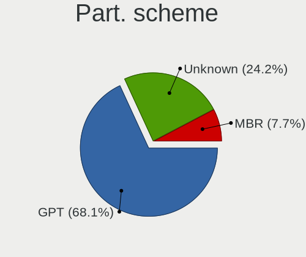
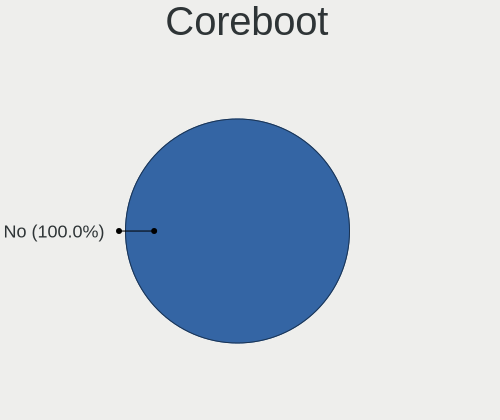
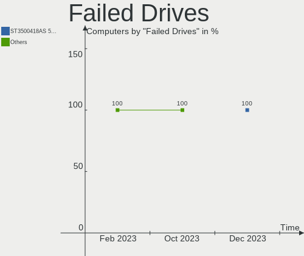

Linux in Italy - Hardware Trends
--------------------------------

A project to identify most popular hardware characteristics and track their change
over time based on data collected by Linux users at https://Linux-Hardware.org.

Anyone can contribute to this report by the [hw-probe](https://github.com/linuxhw/hw-probe) tool:

    sudo -E hw-probe -all -upload

This is a report for all computer types. See also reports for [desktops](/Location/Italy/Desktop/README.md) and [notebooks](/Location/Italy/Notebook/README.md).

Period: Feb, 2023.

Contents
--------

* [ System ](#system)
  - [ OS                       ](#os)
  - [ OS Family                ](#os-family)
  - [ Kernel                   ](#kernel)
  - [ Kernel Family            ](#kernel-family)
  - [ Kernel Major Ver.        ](#kernel-major-ver)
  - [ Arch                     ](#arch)
  - [ DE                       ](#de)
  - [ Display Server           ](#display-server)
  - [ Display Manager          ](#display-manager)
  - [ OS Lang                  ](#os-lang)
  - [ Boot Mode                ](#boot-mode)
  - [ Filesystem               ](#filesystem)
  - [ Part. scheme             ](#part-scheme)
  - [ Dual Boot with Linux/BSD ](#dual-boot-with-linuxbsd)
  - [ Dual Boot (Win)          ](#dual-boot-win)

* [ Board ](#board)
  - [ Vendor                   ](#vendor)
  - [ Model                    ](#model)
  - [ Model Family             ](#model-family)
  - [ MFG Year                 ](#mfg-year)
  - [ Form Factor              ](#form-factor)
  - [ Secure Boot              ](#secure-boot)
  - [ Coreboot                 ](#coreboot)
  - [ RAM Size                 ](#ram-size)
  - [ RAM Used                 ](#ram-used)
  - [ Total Drives             ](#total-drives)
  - [ Has CD-ROM               ](#has-cd-rom)
  - [ Has Ethernet             ](#has-ethernet)
  - [ Has WiFi                 ](#has-wifi)
  - [ Has Bluetooth            ](#has-bluetooth)

* [ Location ](#location)
  - [ Country                  ](#country)
  - [ City                     ](#city)

* [ Drives ](#drives)
  - [ Drive Vendor             ](#drive-vendor)
  - [ Drive Model              ](#drive-model)
  - [ HDD Vendor               ](#hdd-vendor)
  - [ SSD Vendor               ](#ssd-vendor)
  - [ Drive Kind               ](#drive-kind)
  - [ Drive Connector          ](#drive-connector)
  - [ Drive Size               ](#drive-size)
  - [ Space Total              ](#space-total)
  - [ Space Used               ](#space-used)
  - [ Malfunc. Drives          ](#malfunc-drives)
  - [ Malfunc. Drive Vendor    ](#malfunc-drive-vendor)
  - [ Malfunc. HDD Vendor      ](#malfunc-hdd-vendor)
  - [ Malfunc. Drive Kind      ](#malfunc-drive-kind)
  - [ Failed Drives            ](#failed-drives)
  - [ Failed Drive Vendor      ](#failed-drive-vendor)
  - [ Drive Status             ](#drive-status)

* [ Storage controller ](#storage-controller)
  - [ Storage Vendor           ](#storage-vendor)
  - [ Storage Model            ](#storage-model)
  - [ Storage Kind             ](#storage-kind)

* [ Processor ](#processor)
  - [ CPU Vendor               ](#cpu-vendor)
  - [ CPU Model                ](#cpu-model)
  - [ CPU Model Family         ](#cpu-model-family)
  - [ CPU Cores                ](#cpu-cores)
  - [ CPU Sockets              ](#cpu-sockets)
  - [ CPU Threads              ](#cpu-threads)
  - [ CPU Op-Modes             ](#cpu-op-modes)
  - [ CPU Microcode            ](#cpu-microcode)
  - [ CPU Microarch            ](#cpu-microarch)

* [ Graphics ](#graphics)
  - [ GPU Vendor               ](#gpu-vendor)
  - [ GPU Model                ](#gpu-model)
  - [ GPU Combo                ](#gpu-combo)
  - [ GPU Driver               ](#gpu-driver)
  - [ GPU Memory               ](#gpu-memory)

* [ Monitor ](#monitor)
  - [ Monitor Vendor           ](#monitor-vendor)
  - [ Monitor Model            ](#monitor-model)
  - [ Monitor Resolution       ](#monitor-resolution)
  - [ Monitor Diagonal         ](#monitor-diagonal)
  - [ Monitor Width            ](#monitor-width)
  - [ Aspect Ratio             ](#aspect-ratio)
  - [ Monitor Area             ](#monitor-area)
  - [ Pixel Density            ](#pixel-density)
  - [ Multiple Monitors        ](#multiple-monitors)

* [ Network ](#network)
  - [ Net Controller Vendor    ](#net-controller-vendor)
  - [ Net Controller Model     ](#net-controller-model)
  - [ Wireless Vendor          ](#wireless-vendor)
  - [ Wireless Model           ](#wireless-model)
  - [ Ethernet Vendor          ](#ethernet-vendor)
  - [ Ethernet Model           ](#ethernet-model)
  - [ Net Controller Kind      ](#net-controller-kind)
  - [ Used Controller          ](#used-controller)
  - [ NICs                     ](#nics)
  - [ IPv6                     ](#ipv6)

* [ Bluetooth ](#bluetooth)
  - [ Bluetooth Vendor         ](#bluetooth-vendor)
  - [ Bluetooth Model          ](#bluetooth-model)

* [ Sound ](#sound)
  - [ Sound Vendor             ](#sound-vendor)
  - [ Sound Model              ](#sound-model)

* [ Memory ](#memory)
  - [ Memory Vendor            ](#memory-vendor)
  - [ Memory Model             ](#memory-model)
  - [ Memory Kind              ](#memory-kind)
  - [ Memory Form Factor       ](#memory-form-factor)
  - [ Memory Size              ](#memory-size)
  - [ Memory Speed             ](#memory-speed)

* [ Printers & scanners ](#printers--scanners)
  - [ Printer Vendor           ](#printer-vendor)
  - [ Printer Model            ](#printer-model)
  - [ Scanner Vendor           ](#scanner-vendor)
  - [ Scanner Model            ](#scanner-model)

* [ Camera ](#camera)
  - [ Camera Vendor            ](#camera-vendor)
  - [ Camera Model             ](#camera-model)

* [ Security ](#security)
  - [ Fingerprint Vendor       ](#fingerprint-vendor)
  - [ Fingerprint Model        ](#fingerprint-model)
  - [ Chipcard Vendor          ](#chipcard-vendor)
  - [ Chipcard Model           ](#chipcard-model)

* [ Unsupported ](#unsupported)
  - [ Unsupported Devices      ](#unsupported-devices)
  - [ Unsupported Device Types ](#unsupported-device-types)

System
------

OS
--

Installed operating systems

| Name                         | Computers | Percent |
|------------------------------|-----------|---------|
| Linux Mint 21.1              | 34        | 12.45%  |
| Ubuntu 22.04                 | 31        | 11.36%  |
| OpenMandriva 23.01           | 27        | 9.89%   |
| Ubuntu 22.10                 | 18        | 6.59%   |
| Fedora 37                    | 14        | 5.13%   |
| Debian 11                    | 13        | 4.76%   |
| EndeavourOS Rolling          | 11        | 4.03%   |
| OpenMandriva 4.3             | 10        | 3.66%   |
| Kubuntu 22.10                | 9         | 3.3%    |
| Arch Rolling                 | 9         | 3.3%    |
| Pop!_OS 22.04                | 8         | 2.93%   |
| Zorin 16                     | 7         | 2.56%   |
| Ubuntu 20.04                 | 5         | 1.83%   |
| Nobara 37                    | 5         | 1.83%   |
| Linux Mint 20.3              | 5         | 1.83%   |
| Kubuntu 22.04                | 4         | 1.47%   |
| openSUSE Tumbleweed-XXXXXXXX | 3         | 1.1%    |
| NixOS 23.05                  | 3         | 1.1%    |
| MX 21                        | 3         | 1.1%    |
| Manjaro                      | 3         | 1.1%    |
| Lubuntu 22.04                | 3         | 1.1%    |
| Debian                       | 3         | 1.1%    |
| Xubuntu 22.10                | 2         | 0.73%   |
| Xubuntu 22.04                | 2         | 0.73%   |
| Ubuntu MATE 22.10            | 2         | 0.73%   |
| ROSA 12.3                    | 2         | 0.73%   |
| OpenMandriva 23.90           | 2         | 0.73%   |
| Lubuntu 22.10                | 2         | 0.73%   |
| KDE neon 22.04               | 2         | 0.73%   |
| Kali 2022.4                  | 2         | 0.73%   |
| BunsenLabs 11                | 2         | 0.73%   |
| Xubuntu 20.04                | 1         | 0.37%   |
| Ubuntu MATE 22.04            | 1         | 0.37%   |
| Ubuntu Budgie 22.04          | 1         | 0.37%   |
| Ubuntu 23.04                 | 1         | 0.37%   |
| Ubuntu 16.04                 | 1         | 0.37%   |
| SteamOS 3.4.4                | 1         | 0.37%   |
| Q4OS 4                       | 1         | 0.37%   |
| PCLinuxOS 2023               | 1         | 0.37%   |
| org.kde.Platform 5.15-21.08  | 1         | 0.37%   |

OS Family
---------

OS without a version

| Name             | Computers | Percent |
|------------------|-----------|---------|
| Ubuntu           | 56        | 20.51%  |
| Linux Mint       | 42        | 15.38%  |
| OpenMandriva     | 40        | 14.65%  |
| Fedora           | 16        | 5.86%   |
| Debian           | 16        | 5.86%   |
| Kubuntu          | 13        | 4.76%   |
| EndeavourOS      | 11        | 4.03%   |
| Arch             | 9         | 3.3%    |
| Pop!_OS          | 8         | 2.93%   |
| Zorin            | 7         | 2.56%   |
| Xubuntu          | 5         | 1.83%   |
| Nobara           | 5         | 1.83%   |
| Manjaro          | 5         | 1.83%   |
| Lubuntu          | 5         | 1.83%   |
| openSUSE         | 4         | 1.47%   |
| Ubuntu MATE      | 3         | 1.1%    |
| NixOS            | 3         | 1.1%    |
| MX               | 3         | 1.1%    |
| ROSA             | 2         | 0.73%   |
| KDE neon         | 2         | 0.73%   |
| Kali             | 2         | 0.73%   |
| Elementary       | 2         | 0.73%   |
| BunsenLabs       | 2         | 0.73%   |
| Ubuntu Budgie    | 1         | 0.37%   |
| SteamOS          | 1         | 0.37%   |
| Q4OS             | 1         | 0.37%   |
| PCLinuxOS        | 1         | 0.37%   |
| org.kde.Platform | 1         | 0.37%   |
| LMDE             | 1         | 0.37%   |
| Gentoo           | 1         | 0.37%   |
| Endless          | 1         | 0.37%   |
| Clear Linux      | 1         | 0.37%   |
| ChimeraOS        | 1         | 0.37%   |
| ArcoLinux        | 1         | 0.37%   |
| antiX            | 1         | 0.37%   |

Kernel
------

Version of the Linux kernel

| Version                     | Computers | Percent |
|-----------------------------|-----------|---------|
| 5.15.0-60-generic           | 37        | 13.55%  |
| 5.19.0-32-generic           | 21        | 7.69%   |
| 6.1.1-desktop-1omv2290      | 20        | 7.33%   |
| 5.15.0-58-generic           | 20        | 7.33%   |
| 5.19.0-31-generic           | 17        | 6.23%   |
| 5.10.0-21-amd64             | 13        | 4.76%   |
| 5.15.0-56-generic           | 10        | 3.66%   |
| 6.1.8-200.fc37.x86_64       | 6         | 2.2%    |
| 6.0.12-76060006-generic     | 6         | 2.2%    |
| 5.19.0-21-generic           | 6         | 2.2%    |
| 5.16.13-desktop-1omv4003    | 6         | 2.2%    |
| 6.1.4-desktop-1omv2301      | 5         | 1.83%   |
| 5.19.0-29-generic           | 5         | 1.83%   |
| 6.1.9-arch1-2               | 4         | 1.47%   |
| 5.16.7-desktop-1omv4003     | 4         | 1.47%   |
| 6.2.0-rc6                   | 3         | 1.1%    |
| 6.1.0-3-amd64               | 3         | 1.1%    |
| 5.4.0-137-generic           | 3         | 1.1%    |
| 5.19.0-35-generic           | 3         | 1.1%    |
| 5.10.0-20-amd64             | 3         | 1.1%    |
| 6.1.9-200.fc37.x86_64       | 2         | 0.73%   |
| 6.1.8-arch1-1               | 2         | 0.73%   |
| 6.1.8-202.fsync.fc37.x86_64 | 2         | 0.73%   |
| 6.1.8-1-default             | 2         | 0.73%   |
| 6.1.13-200.fc37.x86_64      | 2         | 0.73%   |
| 6.1.12-arch1-1              | 2         | 0.73%   |
| 6.1.11-arch1-1              | 2         | 0.73%   |
| 6.1.11-1-MANJARO            | 2         | 0.73%   |
| 6.1.10-arch1-1              | 2         | 0.73%   |
| 6.0.12-arch1-1              | 2         | 0.73%   |
| 6.0.0-kali6-amd64           | 2         | 0.73%   |
| 5.4.0-139-generic           | 2         | 0.73%   |
| 5.10.14-desktop-1omv4002    | 2         | 0.73%   |
| 6.2.0-rc6-1-amd-git         | 1         | 0.37%   |
| 6.2.0                       | 1         | 0.37%   |
| 6.1.9-gentoo-x86_64         | 1         | 0.37%   |
| 6.1.9-desktop-1omv2390      | 1         | 0.37%   |
| 6.1.9-arch1-1               | 1         | 0.37%   |
| 6.1.9-273-tkg-pds           | 1         | 0.37%   |
| 6.1.9-200.fsync.fc37.x86_64 | 1         | 0.37%   |

Kernel Family
-------------

Linux kernel without a distro release

| Version  | Computers | Percent |
|----------|-----------|---------|
| 5.15.0   | 71        | 26.01%  |
| 5.19.0   | 53        | 19.41%  |
| 6.1.1    | 21        | 7.69%   |
| 5.10.0   | 17        | 6.23%   |
| 6.1.8    | 15        | 5.49%   |
| 6.1.9    | 12        | 4.4%    |
| 6.0.12   | 9         | 3.3%    |
| 6.1.11   | 8         | 2.93%   |
| 6.1.12   | 7         | 2.56%   |
| 5.4.0    | 7         | 2.56%   |
| 6.1.4    | 6         | 2.2%    |
| 5.16.13  | 6         | 2.2%    |
| 6.2.0    | 5         | 1.83%   |
| 6.1.10   | 4         | 1.47%   |
| 6.0.0    | 4         | 1.47%   |
| 5.16.7   | 4         | 1.47%   |
| 6.1.0    | 3         | 1.1%    |
| 6.1.13   | 2         | 0.73%   |
| 5.15.75  | 2         | 0.73%   |
| 5.10.14  | 2         | 0.73%   |
| 6.0.7    | 1         | 0.37%   |
| 6.0.6    | 1         | 0.37%   |
| 6.0.11   | 1         | 0.37%   |
| 6.0.10   | 1         | 0.37%   |
| 5.16.15  | 1         | 0.37%   |
| 5.15.93  | 1         | 0.37%   |
| 5.15.91  | 1         | 0.37%   |
| 5.15.77  | 1         | 0.37%   |
| 5.15.74  | 1         | 0.37%   |
| 5.14.18  | 1         | 0.37%   |
| 5.13.0   | 1         | 0.37%   |
| 5.10.153 | 1         | 0.37%   |
| 5.10.142 | 1         | 0.37%   |
| 5.10.105 | 1         | 0.37%   |
| 4.4.0    | 1         | 0.37%   |

Kernel Major Ver.
-----------------

Linux kernel major version

| Version | Computers | Percent |
|---------|-----------|---------|
| 6.1     | 78        | 28.57%  |
| 5.15    | 77        | 28.21%  |
| 5.19    | 53        | 19.41%  |
| 5.10    | 22        | 8.06%   |
| 6.0     | 17        | 6.23%   |
| 5.16    | 11        | 4.03%   |
| 5.4     | 7         | 2.56%   |
| 6.2     | 5         | 1.83%   |
| 5.14    | 1         | 0.37%   |
| 5.13    | 1         | 0.37%   |
| 4.4     | 1         | 0.37%   |

Arch
----

OS architecture (x86_64, i586, etc.)

| Name    | Computers | Percent |
|---------|-----------|---------|
| x86_64  | 270       | 98.9%   |
| i686    | 1         | 0.37%   |
| armv7l  | 1         | 0.37%   |
| aarch64 | 1         | 0.37%   |

DE
--

Desktop Environment

| Name          | Computers | Percent |
|---------------|-----------|---------|
| GNOME         | 98        | 35.9%   |
| KDE5          | 83        | 30.4%   |
| X-Cinnamon    | 33        | 12.09%  |
| XFCE          | 24        | 8.79%   |
| MATE          | 11        | 4.03%   |
| LXQt          | 6         | 2.2%    |
| Unknown       | 6         | 2.2%    |
| sway          | 3         | 1.1%    |
| Pantheon      | 2         | 0.73%   |
| Budgie        | 2         | 0.73%   |
| icewm         | 1         | 0.37%   |
| i3            | 1         | 0.37%   |
| GNOME Classic | 1         | 0.37%   |
| Deepin        | 1         | 0.37%   |
| Cinnamon      | 1         | 0.37%   |

Display Server
--------------

X11 or Wayland

| Name    | Computers | Percent |
|---------|-----------|---------|
| X11     | 197       | 72.16%  |
| Wayland | 68        | 24.91%  |
| Tty     | 8         | 2.93%   |

Display Manager
---------------

SDDM, LightDM, etc.

| Name    | Computers | Percent |
|---------|-----------|---------|
| Unknown | 71        | 26.01%  |
| SDDM    | 69        | 25.27%  |
| LightDM | 54        | 19.78%  |
| GDM3    | 54        | 19.78%  |
| GDM     | 25        | 9.16%   |

OS Lang
-------

Language

| Lang    | Computers | Percent |
|---------|-----------|---------|
| it_IT   | 187       | 68.5%   |
| en_US   | 62        | 22.71%  |
| C       | 10        | 3.66%   |
| en_GB   | 8         | 2.93%   |
| fr_FR   | 2         | 0.73%   |
| Unknown | 2         | 0.73%   |
| de_DE   | 1         | 0.37%   |
| de_AT   | 1         | 0.37%   |

Boot Mode
---------

EFI or BIOS

| Mode | Computers | Percent |
|------|-----------|---------|
| EFI  | 147       | 53.85%  |
| BIOS | 126       | 46.15%  |

Filesystem
----------

Type of filesystem

| Type    | Computers | Percent |
|---------|-----------|---------|
| Ext4    | 198       | 72.53%  |
| Overlay | 33        | 12.09%  |
| Btrfs   | 33        | 12.09%  |
| Xfs     | 4         | 1.47%   |
| Zfs     | 3         | 1.1%    |
| F2fs    | 1         | 0.37%   |
| Ext3    | 1         | 0.37%   |

Part. scheme
------------

Scheme of partitioning

| Type    | Computers | Percent |
|---------|-----------|---------|
| GPT     | 170       | 62.27%  |
| Unknown | 64        | 23.44%  |
| MBR     | 39        | 14.29%  |

Dual Boot with Linux/BSD
------------------------

Hosting more than one Linux/BSD

| Dual boot | Computers | Percent |
|-----------|-----------|---------|
| No        | 228       | 83.52%  |
| Yes       | 45        | 16.48%  |

Dual Boot (Win)
---------------

Hosting Linux and Windows

| Dual boot | Computers | Percent |
|-----------|-----------|---------|
| No        | 163       | 59.71%  |
| Yes       | 110       | 40.29%  |

Board
-----

Vendor
------

Motherboard manufacturer

| Name                    | Computers | Percent |
|-------------------------|-----------|---------|
| ASUSTek Computer        | 55        | 20.15%  |
| Hewlett-Packard         | 45        | 16.48%  |
| Lenovo                  | 42        | 15.38%  |
| Acer                    | 26        | 9.52%   |
| Dell                    | 16        | 5.86%   |
| MSI                     | 15        | 5.49%   |
| ASRock                  | 11        | 4.03%   |
| Gigabyte Technology     | 8         | 2.93%   |
| Intel                   | 7         | 2.56%   |
| Fujitsu                 | 6         | 2.2%    |
| HUAWEI                  | 4         | 1.47%   |
| Unknown                 | 4         | 1.47%   |
| Timi                    | 2         | 0.73%   |
| Samsung Electronics     | 2         | 0.73%   |
| Pegatron                | 2         | 0.73%   |
| Packard Bell            | 2         | 0.73%   |
| Notebook                | 2         | 0.73%   |
| Microsoft               | 2         | 0.73%   |
| Mediacom                | 2         | 0.73%   |
| BESSTAR Tech            | 2         | 0.73%   |
| Apple                   | 2         | 0.73%   |
| VXL                     | 1         | 0.37%   |
| Valve                   | 1         | 0.37%   |
| Toshiba                 | 1         | 0.37%   |
| Teclast                 | 1         | 0.37%   |
| Supermicro              | 1         | 0.37%   |
| SiComputer              | 1         | 0.37%   |
| Razer                   | 1         | 0.37%   |
| Raspberry Pi Foundation | 1         | 0.37%   |
| Quanta                  | 1         | 0.37%   |
| Olimex                  | 1         | 0.37%   |
| Microtech               | 1         | 0.37%   |
| Jumper                  | 1         | 0.37%   |
| HONOR                   | 1         | 0.37%   |
| Google                  | 1         | 0.37%   |
| Getac                   | 1         | 0.37%   |
| Cincoze                 | 1         | 0.37%   |

Model
-----

Motherboard model

| Name                                               | Computers | Percent |
|----------------------------------------------------|-----------|---------|
| Unknown                                            | 5         | 1.83%   |
| Lenovo 13w Yoga 82S1                               | 3         | 1.1%    |
| HP ENVY 15                                         | 3         | 1.1%    |
| MSI MS-7C56                                        | 2         | 0.73%   |
| Mediacom SmartBook 14 FullHD - SB14UC              | 2         | 0.73%   |
| Lenovo IdeaPad 3 15ADA05 81W1                      | 2         | 0.73%   |
| HP Pavilion 15                                     | 2         | 0.73%   |
| HP Notebook                                        | 2         | 0.73%   |
| HP 255 G8 Notebook PC                              | 2         | 0.73%   |
| Dell Latitude 5530                                 | 2         | 0.73%   |
| ASUS X555LA                                        | 2         | 0.73%   |
| ASUS ROG CROSSHAIR VIII DARK HERO                  | 2         | 0.73%   |
| ASUS P5K                                           | 2         | 0.73%   |
| ASUS All Series                                    | 2         | 0.73%   |
| Acer TravelMate P253                               | 2         | 0.73%   |
| Acer Aspire 5750G                                  | 2         | 0.73%   |
| VXL TC7520d                                        | 1         | 0.37%   |
| Valve Jupiter                                      | 1         | 0.37%   |
| Toshiba Satellite Pro S500                         | 1         | 0.37%   |
| Timi TM1612                                        | 1         | 0.37%   |
| Timi Mi Laptop Pro 15                              | 1         | 0.37%   |
| Teclast F7                                         | 1         | 0.37%   |
| Supermicro SYS-7048GR-TR                           | 1         | 0.37%   |
| SiComputer Nauta 01C                               | 1         | 0.37%   |
| Samsung RF511/RF411/RF711                          | 1         | 0.37%   |
| Samsung 300E4C/300E5C/300E7C                       | 1         | 0.37%   |
| Razer Blade 15 Base Model (Early 2020) - RZ09-0328 | 1         | 0.37%   |
| RPi Raspberry Pi 4 Model B Rev 1.5                 | 1         | 0.37%   |
| Quanta CA27                                        | 1         | 0.37%   |
| Pegatron Pro 3120 Microtower PC                    | 1         | 0.37%   |
| Pegatron p7-1011it                                 | 1         | 0.37%   |
| Packard Bell IMEDIA S3810                          | 1         | 0.37%   |
| Packard Bell EasyNote TJ65                         | 1         | 0.37%   |
| Olimex A20-OLinuXino-LIME                          | 1         | 0.37%   |
| Notebook W65_67SJ                                  | 1         | 0.37%   |
| Notebook W25CSW                                    | 1         | 0.37%   |
| MSI Zepto                                          | 1         | 0.37%   |
| MSI U90/U100                                       | 1         | 0.37%   |
| MSI Summit E13FlipEvo A11MT                        | 1         | 0.37%   |
| MSI Prestige 15 A11SCX                             | 1         | 0.37%   |

Model Family
------------

Motherboard model prefix

| Name               | Computers | Percent |
|--------------------|-----------|---------|
| Lenovo IdeaPad     | 17        | 6.23%   |
| Acer Aspire        | 16        | 5.86%   |
| Lenovo ThinkPad    | 10        | 3.66%   |
| HP ENVY            | 7         | 2.56%   |
| HP Compaq          | 6         | 2.2%    |
| Dell Latitude      | 6         | 2.2%    |
| ASUS PRIME         | 6         | 2.2%    |
| HP Pavilion        | 5         | 1.83%   |
| Dell XPS           | 5         | 1.83%   |
| Unknown            | 5         | 1.83%   |
| HP ProBook         | 4         | 1.47%   |
| HP EliteBook       | 4         | 1.47%   |
| HP 255             | 4         | 1.47%   |
| Fujitsu ESPRIMO    | 4         | 1.47%   |
| ASUS TUF           | 4         | 1.47%   |
| Lenovo ThinkCentre | 3         | 1.1%    |
| Lenovo ThinkBook   | 3         | 1.1%    |
| Lenovo 13w         | 3         | 1.1%    |
| HP 250             | 3         | 1.1%    |
| ASUS ROG           | 3         | 1.1%    |
| Acer TravelMate    | 3         | 1.1%    |
| MSI Prestige       | 2         | 0.73%   |
| MSI MS-7C56        | 2         | 0.73%   |
| Microsoft Surface  | 2         | 0.73%   |
| Mediacom SmartBook | 2         | 0.73%   |
| Lenovo IdeaCentre  | 2         | 0.73%   |
| HP Notebook        | 2         | 0.73%   |
| HP Laptop          | 2         | 0.73%   |
| Dell Vostro        | 2         | 0.73%   |
| Dell Inspiron      | 2         | 0.73%   |
| ASUS X555LA        | 2         | 0.73%   |
| ASUS VivoBook      | 2         | 0.73%   |
| ASUS Rampage       | 2         | 0.73%   |
| ASUS P5K           | 2         | 0.73%   |
| ASUS All           | 2         | 0.73%   |
| Acer Veriton       | 2         | 0.73%   |
| Acer Swift         | 2         | 0.73%   |
| Acer Extensa       | 2         | 0.73%   |
| VXL TC7520d        | 1         | 0.37%   |
| Valve Jupiter      | 1         | 0.37%   |

MFG Year
--------

Motherboard manufacture year

| Year    | Computers | Percent |
|---------|-----------|---------|
| 2021    | 30        | 10.99%  |
| 2020    | 25        | 9.16%   |
| 2019    | 25        | 9.16%   |
| 2022    | 23        | 8.42%   |
| 2014    | 22        | 8.06%   |
| 2017    | 20        | 7.33%   |
| 2012    | 19        | 6.96%   |
| 2013    | 16        | 5.86%   |
| 2015    | 15        | 5.49%   |
| 2011    | 14        | 5.13%   |
| 2010    | 14        | 5.13%   |
| 2018    | 13        | 4.76%   |
| 2016    | 12        | 4.4%    |
| 2009    | 8         | 2.93%   |
| 2008    | 8         | 2.93%   |
| 2007    | 4         | 1.47%   |
| 2006    | 2         | 0.73%   |
| Unknown | 2         | 0.73%   |
| 2005    | 1         | 0.37%   |

Form Factor
-----------

Physical design of the computer

| Name           | Computers | Percent |
|----------------|-----------|---------|
| Notebook       | 157       | 57.51%  |
| Desktop        | 95        | 34.8%   |
| All in one     | 7         | 2.56%   |
| Convertible    | 6         | 2.2%    |
| Mini pc        | 4         | 1.47%   |
| System on chip | 2         | 0.73%   |
| Tablet         | 2         | 0.73%   |

Secure Boot
-----------

Enabled or disabled

| State    | Computers | Percent |
|----------|-----------|---------|
| Disabled | 250       | 91.58%  |
| Enabled  | 23        | 8.42%   |

Coreboot
--------

Have coreboot on board

| Used | Computers | Percent |
|------|-----------|---------|
| No   | 272       | 99.63%  |
| Yes  | 1         | 0.37%   |

RAM Size
--------

Total RAM memory

| Size in GB  | Computers | Percent |
|-------------|-----------|---------|
| 16.01-24.0  | 70        | 25.64%  |
| 4.01-8.0    | 67        | 24.54%  |
| 8.01-16.0   | 59        | 21.61%  |
| 3.01-4.0    | 44        | 16.12%  |
| 32.01-64.0  | 13        | 4.76%   |
| 1.01-2.0    | 8         | 2.93%   |
| 64.01-256.0 | 6         | 2.2%    |
| 24.01-32.0  | 3         | 1.1%    |
| 2.01-3.0    | 1         | 0.37%   |
| 0.51-1.0    | 1         | 0.37%   |
| 0.01-0.5    | 1         | 0.37%   |

RAM Used
--------

Used RAM memory

| Used GB    | Computers | Percent |
|------------|-----------|---------|
| 1.01-2.0   | 87        | 31.87%  |
| 2.01-3.0   | 83        | 30.4%   |
| 4.01-8.0   | 49        | 17.95%  |
| 3.01-4.0   | 32        | 11.72%  |
| 0.51-1.0   | 12        | 4.4%    |
| 8.01-16.0  | 7         | 2.56%   |
| 24.01-32.0 | 1         | 0.37%   |
| 16.01-24.0 | 1         | 0.37%   |
| 0.01-0.5   | 1         | 0.37%   |

Total Drives
------------

Number of drives on board

| Drives | Computers | Percent |
|--------|-----------|---------|
| 1      | 157       | 57.51%  |
| 2      | 78        | 28.57%  |
| 3      | 19        | 6.96%   |
| 4      | 9         | 3.3%    |
| 5      | 6         | 2.2%    |
| 8      | 1         | 0.37%   |
| 7      | 1         | 0.37%   |
| 6      | 1         | 0.37%   |
| 0      | 1         | 0.37%   |

Has CD-ROM
----------

Has CD-ROM on board

| Presented | Computers | Percent |
|-----------|-----------|---------|
| No        | 151       | 55.31%  |
| Yes       | 122       | 44.69%  |

Has Ethernet
------------

Has Ethernet on board

| Presented | Computers | Percent |
|-----------|-----------|---------|
| Yes       | 222       | 81.32%  |
| No        | 51        | 18.68%  |

Has WiFi
--------

Has WiFi module

| Presented | Computers | Percent |
|-----------|-----------|---------|
| Yes       | 209       | 76.56%  |
| No        | 64        | 23.44%  |

Has Bluetooth
-------------

Has Bluetooth module

| Presented | Computers | Percent |
|-----------|-----------|---------|
| Yes       | 174       | 63.74%  |
| No        | 99        | 36.26%  |

Location
--------

Country
-------

Geographic location (country)

| Country | Computers | Percent |
|---------|-----------|---------|
| Italy   | 273       | 100%    |

City
----

Geographic location (city)

| City               | Computers | Percent |
|--------------------|-----------|---------|
| Milan              | 37        | 13.55%  |
| Milano             | 21        | 7.69%   |
| Rome               | 16        | 5.86%   |
| Naples             | 8         | 2.93%   |
| Turin              | 7         | 2.56%   |
| Genoa              | 6         | 2.2%    |
| Florence           | 6         | 2.2%    |
| Catania            | 4         | 1.47%   |
| Brescia            | 4         | 1.47%   |
| Bergamo            | 4         | 1.47%   |
| Verona             | 3         | 1.1%    |
| Venice             | 3         | 1.1%    |
| Trieste            | 3         | 1.1%    |
| Rho                | 3         | 1.1%    |
| Capo d'Orlando     | 3         | 1.1%    |
| Bolzano            | 3         | 1.1%    |
| Zevio              | 2         | 0.73%   |
| Varese             | 2         | 0.73%   |
| Terni              | 2         | 0.73%   |
| Sesto San Giovanni | 2         | 0.73%   |
| Peschiera Borromeo | 2         | 0.73%   |
| Parma              | 2         | 0.73%   |
| Mombello di Torino | 2         | 0.73%   |
| Mogliano           | 2         | 0.73%   |
| Modena             | 2         | 0.73%   |
| Gravina di Catania | 2         | 0.73%   |
| Giarre             | 2         | 0.73%   |
| Ferrara            | 2         | 0.73%   |
| Citta              | 2         | 0.73%   |
| Cascina            | 2         | 0.73%   |
| Cantu              | 2         | 0.73%   |
| Bologna            | 2         | 0.73%   |
| Arezzo             | 2         | 0.73%   |
| Zibido San Giacomo | 1         | 0.37%   |
| Villanders         | 1         | 0.37%   |
| Verdello           | 1         | 0.37%   |
| Vercelli           | 1         | 0.37%   |
| Urbino             | 1         | 0.37%   |
| Udine              | 1         | 0.37%   |
| Trissino           | 1         | 0.37%   |

Drives
------

Drive Vendor
------------

Hard drive vendors

| Vendor                      | Computers | Drives | Percent |
|-----------------------------|-----------|--------|---------|
| Samsung Electronics         | 60        | 68     | 14.96%  |
| Seagate                     | 51        | 66     | 12.72%  |
| WDC                         | 46        | 59     | 11.47%  |
| Kingston                    | 37        | 38     | 9.23%   |
| Crucial                     | 28        | 30     | 6.98%   |
| Unknown                     | 22        | 29     | 5.49%   |
| Toshiba                     | 19        | 19     | 4.74%   |
| Micron Technology           | 15        | 15     | 3.74%   |
| SanDisk                     | 14        | 14     | 3.49%   |
| SK hynix                    | 10        | 10     | 2.49%   |
| Intel                       | 10        | 10     | 2.49%   |
| HGST                        | 10        | 13     | 2.49%   |
| Hitachi                     | 6         | 6      | 1.5%    |
| Phison                      | 5         | 6      | 1.25%   |
| China                       | 5         | 5      | 1.25%   |
| Unknown                     | 5         | 5      | 1.25%   |
| Phison Electronics          | 4         | 4      | 1%      |
| Patriot                     | 3         | 3      | 0.75%   |
| Maxtor                      | 3         | 4      | 0.75%   |
| TO Exter                    | 2         | 2      | 0.5%    |
| Team                        | 2         | 2      | 0.5%    |
| ShanDianZhe                 | 2         | 2      | 0.5%    |
| PNY                         | 2         | 2      | 0.5%    |
| OCZ                         | 2         | 2      | 0.5%    |
| Micron/Crucial Technology   | 2         | 2      | 0.5%    |
| LITEON                      | 2         | 2      | 0.5%    |
| LaCie                       | 2         | 2      | 0.5%    |
| KIOXIA-EXCERIA              | 2         | 2      | 0.5%    |
| KIOXIA                      | 2         | 2      | 0.5%    |
| Kingston Technology Company | 2         | 2      | 0.5%    |
| Intenso                     | 2         | 2      | 0.5%    |
| ADATA Technology            | 2         | 2      | 0.5%    |
| A-DATA Technology           | 2         | 2      | 0.5%    |
| Yangtze Memory Technologies | 1         | 1      | 0.25%   |
| XPG                         | 1         | 1      | 0.25%   |
| USB30                       | 1         | 1      | 0.25%   |
| USB                         | 1         | 1      | 0.25%   |
| UMIS                        | 1         | 1      | 0.25%   |
| Transcend                   | 1         | 1      | 0.25%   |
| Teclast                     | 1         | 1      | 0.25%   |

Drive Model
-----------

Hard drive models

| Model                                                | Computers | Percent |
|------------------------------------------------------|-----------|---------|
| Kingston SA400S37240G 240GB SSD                      | 10        | 2.27%   |
| Seagate ST500DM002-1BD142 500GB                      | 7         | 1.59%   |
| Seagate ST1000LM024 HN-M101MBB 1TB                   | 7         | 1.59%   |
| Samsung NVMe SSD Controller SM981/PM981/PM983 250GB  | 6         | 1.36%   |
| Crucial CT500MX500SSD1 500GB                         | 6         | 1.36%   |
| Crucial CT240BX500SSD1 240GB                         | 6         | 1.36%   |
| Unknown MMC Card  32GB                               | 5         | 1.14%   |
| Samsung NVMe SSD Controller PM9A1/PM9A3/980PRO 960GB | 5         | 1.14%   |
| Micron MTFDKCD512TFK 512GB                           | 5         | 1.14%   |
| Unknown                                              | 5         | 1.14%   |
| Unknown MMC Card  128GB                              | 4         | 0.91%   |
| Samsung SSD 870 QVO 1TB                              | 4         | 0.91%   |
| Samsung SSD 860 EVO 500GB                            | 4         | 0.91%   |
| Kingston SA400S37480G 480GB SSD                      | 4         | 0.91%   |
| HGST HTS545050A7E680 500GB                           | 4         | 0.91%   |
| Crucial CT1000MX500SSD1 1TB                          | 4         | 0.91%   |
| WDC WD5000LPCX-24C6HT0 500GB                         | 3         | 0.68%   |
| Unknown MMC Card  64GB                               | 3         | 0.68%   |
| Toshiba DT01ACA100 1TB                               | 3         | 0.68%   |
| Seagate ST500LM012 HN-M500MBB 500GB                  | 3         | 0.68%   |
| Seagate ST2000LM015-2E8174 2TB                       | 3         | 0.68%   |
| Seagate ST1000DM010-2EP102 1TB                       | 3         | 0.68%   |
| Seagate M3 Portable 4TB                              | 3         | 0.68%   |
| Samsung SSD 870 EVO 500GB                            | 3         | 0.68%   |
| Samsung SSD 850 EVO 250GB                            | 3         | 0.68%   |
| Samsung MZALQ512HALU-000L2 512GB                     | 3         | 0.68%   |
| Kingston SA400S37120G 120GB SSD                      | 3         | 0.68%   |
| Crucial CT1000BX500SSD1 1TB                          | 3         | 0.68%   |
| WDC WDS240G2G0A-00JH30 240GB SSD                     | 2         | 0.45%   |
| WDC WD10EZEX-22MFCA0 1TB                             | 2         | 0.45%   |
| WDC WD10EZEX-00BN5A0 1TB                             | 2         | 0.45%   |
| Unknown SN128  128GB                                 | 2         | 0.45%   |
| Unknown NCard  32GB                                  | 2         | 0.45%   |
| Unknown MMC Card  16GB                               | 2         | 0.45%   |
| Toshiba KXG50ZNV256G 256GB                           | 2         | 0.45%   |
| Toshiba HDWD110 1TB                                  | 2         | 0.45%   |
| TO Exter nal USB 3.0 240GB                           | 2         | 0.45%   |
| SK hynix BC501 NVMe Solid State Drive 512GB          | 2         | 0.45%   |
| ShanDianZhe 512G                                     | 2         | 0.45%   |
| Seagate ST4000DM004-2U9104 4TB                       | 2         | 0.45%   |

HDD Vendor
----------

Hard disk drive vendors

| Vendor              | Computers | Drives | Percent |
|---------------------|-----------|--------|---------|
| Seagate             | 50        | 63     | 39.06%  |
| WDC                 | 41        | 53     | 32.03%  |
| Toshiba             | 15        | 15     | 11.72%  |
| HGST                | 10        | 13     | 7.81%   |
| Hitachi             | 6         | 6      | 4.69%   |
| Maxtor              | 3         | 4      | 2.34%   |
| Samsung Electronics | 1         | 1      | 0.78%   |
| JMicron Technology  | 1         | 1      | 0.78%   |
| China               | 1         | 1      | 0.78%   |

SSD Vendor
----------

Solid state drive vendors

| Vendor              | Computers | Drives | Percent |
|---------------------|-----------|--------|---------|
| Samsung Electronics | 35        | 36     | 25%     |
| Kingston            | 28        | 29     | 20%     |
| Crucial             | 26        | 28     | 18.57%  |
| SanDisk             | 9         | 9      | 6.43%   |
| WDC                 | 4         | 4      | 2.86%   |
| China               | 4         | 4      | 2.86%   |
| Patriot             | 3         | 3      | 2.14%   |
| Intel               | 3         | 3      | 2.14%   |
| TO Exter            | 2         | 2      | 1.43%   |
| Team                | 2         | 2      | 1.43%   |
| PNY                 | 2         | 2      | 1.43%   |
| OCZ                 | 2         | 2      | 1.43%   |
| Micron Technology   | 2         | 2      | 1.43%   |
| LITEON              | 2         | 2      | 1.43%   |
| Intenso             | 2         | 2      | 1.43%   |
| A-DATA Technology   | 2         | 2      | 1.43%   |
| USB30               | 1         | 1      | 0.71%   |
| Transcend           | 1         | 1      | 0.71%   |
| Toshiba             | 1         | 1      | 0.71%   |
| Teclast             | 1         | 1      | 0.71%   |
| SPCC                | 1         | 1      | 0.71%   |
| SK hynix            | 1         | 1      | 0.71%   |
| minisforum          | 1         | 1      | 0.71%   |
| KingDian            | 1         | 1      | 0.71%   |
| CT500MX5            | 1         | 1      | 0.71%   |
| BAITITON            | 1         | 1      | 0.71%   |
| Apacer              | 1         | 1      | 0.71%   |
| Unknown             | 1         | 1      | 0.71%   |

Drive Kind
----------

HDD or SSD

| Kind    | Computers | Drives | Percent |
|---------|-----------|--------|---------|
| SSD     | 124       | 144    | 33.79%  |
| HDD     | 110       | 157    | 29.97%  |
| NVMe    | 96        | 106    | 26.16%  |
| MMC     | 26        | 33     | 7.08%   |
| Unknown | 11        | 12     | 3%      |

Drive Connector
---------------

SATA, SAS, NVMe, etc.

| Type | Computers | Drives | Percent |
|------|-----------|--------|---------|
| SATA | 189       | 291    | 57.62%  |
| NVMe | 95        | 105    | 28.96%  |
| MMC  | 26        | 33     | 7.93%   |
| SAS  | 18        | 23     | 5.49%   |

Drive Size
----------

Size of hard drive

| Size in TB | Computers | Drives | Percent |
|------------|-----------|--------|---------|
| 0.01-0.5   | 145       | 178    | 58.7%   |
| 0.51-1.0   | 68        | 79     | 27.53%  |
| 1.01-2.0   | 14        | 19     | 5.67%   |
| 3.01-4.0   | 8         | 11     | 3.24%   |
| 2.01-3.0   | 7         | 7      | 2.83%   |
| 4.01-10.0  | 5         | 7      | 2.02%   |

Space Total
-----------

Amount of disk space available on the file system

| Size in GB     | Computers | Percent |
|----------------|-----------|---------|
| 101-250        | 69        | 25.27%  |
| 251-500        | 59        | 21.61%  |
| 501-1000       | 40        | 14.65%  |
| 1-20           | 29        | 10.62%  |
| 1001-2000      | 21        | 7.69%   |
| 21-50          | 16        | 5.86%   |
| 51-100         | 14        | 5.13%   |
| More than 3000 | 12        | 4.4%    |
| 2001-3000      | 9         | 3.3%    |
| Unknown        | 4         | 1.47%   |

Space Used
----------

Amount of used disk space

| Used GB        | Computers | Percent |
|----------------|-----------|---------|
| 1-20           | 95        | 34.8%   |
| 21-50          | 53        | 19.41%  |
| 101-250        | 41        | 15.02%  |
| 51-100         | 31        | 11.36%  |
| 251-500        | 20        | 7.33%   |
| 501-1000       | 14        | 5.13%   |
| 1001-2000      | 7         | 2.56%   |
| More than 3000 | 4         | 1.47%   |
| 2001-3000      | 4         | 1.47%   |
| Unknown        | 4         | 1.47%   |

Malfunc. Drives
---------------

Drive models with a malfunction

| Model                                          | Computers | Drives | Percent |
|------------------------------------------------|-----------|--------|---------|
| Seagate ST500LM012 HN-M500MBB 500GB            | 2         | 2      | 6.67%   |
| HGST HTS545050A7E680 500GB                     | 2         | 2      | 6.67%   |
| HGST HTS541075A9E680 752GB                     | 2         | 2      | 6.67%   |
| Yangtze Memory Technologies YMTC PC005 256GB   | 1         | 1      | 3.33%   |
| WDC WD60EFAX-68JH4N1 6TB                       | 1         | 1      | 3.33%   |
| WDC WD5000AAKX-08ERMA0 500GB                   | 1         | 1      | 3.33%   |
| WDC WD3200BPVT-00JJ5T0 320GB                   | 1         | 1      | 3.33%   |
| WDC WD3200BEKT-60V5T1 320GB                    | 1         | 1      | 3.33%   |
| WDC WD10EACS-65D6B0 1TB                        | 1         | 1      | 3.33%   |
| Toshiba THNSNK256GVN8 M.2 2280 256GB SSD       | 1         | 1      | 3.33%   |
| Teclast 128GB NS550-2242 SSD                   | 1         | 1      | 3.33%   |
| Seagate ST750LM022 HN-M750MBB 752GB            | 1         | 1      | 3.33%   |
| Seagate ST500DM002-1BD142 500GB                | 1         | 1      | 3.33%   |
| Seagate ST3160815AS 160GB                      | 1         | 1      | 3.33%   |
| Seagate ST250DM000-1BD141 250GB                | 1         | 1      | 3.33%   |
| SanDisk SSD PLUS 120 GB                        | 1         | 1      | 3.33%   |
| Micron Technology 1100_MTFDDAV512TBN 512GB SSD | 1         | 1      | 3.33%   |
| Maxtor 6Y120L0 128GB                           | 1         | 1      | 3.33%   |
| Kingston SA400S37240G 240GB SSD                | 1         | 1      | 3.33%   |
| Hitachi HTS543232A7A384 320GB                  | 1         | 1      | 3.33%   |
| Hitachi HTS541680J9SA00 80GB                   | 1         | 1      | 3.33%   |
| Hitachi HDS721010CLA332 1TB                    | 1         | 1      | 3.33%   |
| HGST HTS725050A7E630 500GB                     | 1         | 1      | 3.33%   |
| Crucial CT275MX300SSD1 275GB                   | 1         | 1      | 3.33%   |
| BAITITON BT58SSD09S 240GB                      | 1         | 1      | 3.33%   |
| Apacer 32GB SATA Flash Drive SSD               | 1         | 1      | 3.33%   |
| A-DATA Technology SP900 256GB SSD              | 1         | 1      | 3.33%   |

Malfunc. Drive Vendor
---------------------

Vendors of faulty drives

| Vendor                      | Computers | Drives | Percent |
|-----------------------------|-----------|--------|---------|
| Seagate                     | 5         | 6      | 17.86%  |
| HGST                        | 5         | 5      | 17.86%  |
| WDC                         | 4         | 5      | 14.29%  |
| Hitachi                     | 3         | 3      | 10.71%  |
| Yangtze Memory Technologies | 1         | 1      | 3.57%   |
| Toshiba                     | 1         | 1      | 3.57%   |
| Teclast                     | 1         | 1      | 3.57%   |
| SanDisk                     | 1         | 1      | 3.57%   |
| Micron Technology           | 1         | 1      | 3.57%   |
| Maxtor                      | 1         | 1      | 3.57%   |
| Kingston                    | 1         | 1      | 3.57%   |
| Crucial                     | 1         | 1      | 3.57%   |
| BAITITON                    | 1         | 1      | 3.57%   |
| Apacer                      | 1         | 1      | 3.57%   |
| A-DATA Technology           | 1         | 1      | 3.57%   |

Malfunc. HDD Vendor
-------------------

Vendors of faulty HDD drives

| Vendor  | Computers | Drives | Percent |
|---------|-----------|--------|---------|
| Seagate | 5         | 6      | 27.78%  |
| HGST    | 5         | 5      | 27.78%  |
| WDC     | 4         | 5      | 22.22%  |
| Hitachi | 3         | 3      | 16.67%  |
| Maxtor  | 1         | 1      | 5.56%   |

Malfunc. Drive Kind
-------------------

Kinds of faulty drives

| Kind | Computers | Drives | Percent |
|------|-----------|--------|---------|
| HDD  | 18        | 20     | 64.29%  |
| SSD  | 9         | 9      | 32.14%  |
| NVMe | 1         | 1      | 3.57%   |

Failed Drives
-------------

Failed drive models

| Model                                            | Computers | Drives | Percent |
|--------------------------------------------------|-----------|--------|---------|
| Samsung Electronics MZNTY128HDHP-00000 128GB SSD | 1         | 1      | 100%    |

Failed Drive Vendor
-------------------

Failed drive vendors

| Vendor              | Computers | Drives | Percent |
|---------------------|-----------|--------|---------|
| Samsung Electronics | 1         | 1      | 100%    |

Drive Status
------------

Number of failed and malfunc. drives

| Status   | Computers | Drives | Percent |
|----------|-----------|--------|---------|
| Works    | 138       | 195    | 46.15%  |
| Detected | 133       | 226    | 44.48%  |
| Malfunc  | 27        | 30     | 9.03%   |
| Failed   | 1         | 1      | 0.33%   |

Storage controller
------------------

Storage Vendor
--------------

Storage controller vendors

| Vendor                        | Computers | Percent |
|-------------------------------|-----------|---------|
| Intel                         | 180       | 52.33%  |
| AMD                           | 47        | 13.66%  |
| Samsung Electronics           | 29        | 8.43%   |
| Micron Technology             | 13        | 3.78%   |
| Kingston Technology Company   | 11        | 3.2%    |
| Phison Electronics            | 10        | 2.91%   |
| SK hynix                      | 9         | 2.62%   |
| ASMedia Technology            | 7         | 2.03%   |
| JMicron Technology            | 6         | 1.74%   |
| SanDisk                       | 5         | 1.45%   |
| Micron/Crucial Technology     | 4         | 1.16%   |
| KIOXIA                        | 4         | 1.16%   |
| Toshiba America Info Systems  | 3         | 0.87%   |
| Nvidia                        | 3         | 0.87%   |
| VIA Technologies              | 2         | 0.58%   |
| ADATA Technology              | 2         | 0.58%   |
| Yangtze Memory Technologies   | 1         | 0.29%   |
| Union Memory (Shenzhen)       | 1         | 0.29%   |
| Silicon Motion                | 1         | 0.29%   |
| Shenzhen Longsys Electronics  | 1         | 0.29%   |
| Realtek Semiconductor         | 1         | 0.29%   |
| Marvell Technology Group      | 1         | 0.29%   |
| LSI Logic / Symbios Logic     | 1         | 0.29%   |
| Lite-On Technology            | 1         | 0.29%   |
| Integrated Technology Express | 1         | 0.29%   |

Storage Model
-------------

Storage controller models

| Model                                                                          | Computers | Percent |
|--------------------------------------------------------------------------------|-----------|---------|
| AMD FCH SATA Controller [AHCI mode]                                            | 37        | 9.84%   |
| Intel 8 Series/C220 Series Chipset Family 6-port SATA Controller 1 [AHCI mode] | 17        | 4.52%   |
| Intel Sunrise Point-LP SATA Controller [AHCI mode]                             | 14        | 3.72%   |
| Micron Non-Volatile memory controller                                          | 13        | 3.46%   |
| Intel Volume Management Device NVMe RAID Controller                            | 13        | 3.46%   |
| Intel 7 Series Chipset Family 6-port SATA Controller [AHCI mode]               | 13        | 3.46%   |
| Samsung NVMe SSD Controller SM981/PM981/PM983                                  | 10        | 2.66%   |
| Samsung NVMe SSD Controller PM9A1/PM9A3/980PRO                                 | 10        | 2.66%   |
| Intel 8 Series SATA Controller 1 [AHCI mode]                                   | 10        | 2.66%   |
| Intel Q170/Q150/B150/H170/H110/Z170/CM236 Chipset SATA Controller [AHCI Mode]  | 9         | 2.39%   |
| Intel 6 Series/C200 Series Chipset Family 6 port Desktop SATA AHCI Controller  | 9         | 2.39%   |
| Samsung NVMe SSD Controller 980                                                | 8         | 2.13%   |
| Intel Comet Lake SATA AHCI Controller                                          | 6         | 1.6%    |
| Intel Celeron N3350/Pentium N4200/Atom E3900 Series SATA AHCI Controller       | 6         | 1.6%    |
| Phison E12 NVMe Controller                                                     | 5         | 1.33%   |
| Intel Cannon Lake PCH SATA AHCI Controller                                     | 5         | 1.33%   |
| Intel 82801IBM/IEM (ICH9M/ICH9M-E) 4 port SATA Controller [AHCI mode]          | 5         | 1.33%   |
| Intel 82801 Mobile SATA Controller [RAID mode]                                 | 5         | 1.33%   |
| Intel 7 Series/C210 Series Chipset Family 6-port SATA Controller [AHCI mode]   | 5         | 1.33%   |
| Intel 6 Series/C200 Series Chipset Family 6 port Mobile SATA AHCI Controller   | 5         | 1.33%   |
| Intel 5 Series/3400 Series Chipset 6 port SATA AHCI Controller                 | 5         | 1.33%   |
| ASMedia ASM1062 Serial ATA Controller                                          | 5         | 1.33%   |
| AMD SB7x0/SB8x0/SB9x0 SATA Controller [AHCI mode]                              | 5         | 1.33%   |
| SK hynix Gold P31/PC711 NVMe Solid State Drive                                 | 4         | 1.06%   |
| JMicron JMB363 SATA/IDE Controller                                             | 4         | 1.06%   |
| Intel Wildcat Point-LP SATA Controller [AHCI Mode]                             | 4         | 1.06%   |
| Intel SSD 660P Series                                                          | 4         | 1.06%   |
| Intel Celeron/Pentium Silver Processor SATA Controller                         | 4         | 1.06%   |
| Intel 82801I (ICH9 Family) 2 port SATA Controller [IDE mode]                   | 4         | 1.06%   |
| AMD SB7x0/SB8x0/SB9x0 IDE Controller                                           | 4         | 1.06%   |
| AMD 500 Series Chipset SATA Controller                                         | 4         | 1.06%   |
| Toshiba America Info Systems XG5 NVMe SSD Controller                           | 3         | 0.8%    |
| SanDisk WD Blue SN550 NVMe SSD                                                 | 3         | 0.8%    |
| Micron/Crucial P2 NVMe PCIe SSD                                                | 3         | 0.8%    |
| Kingston Company Company Non-Volatile memory controller                        | 3         | 0.8%    |
| Kingston Company OM3PDP3 NVMe SSD                                              | 3         | 0.8%    |
| Intel Tiger Lake-LP SATA Controller                                            | 3         | 0.8%    |
| Intel SATA Controller [RAID mode]                                              | 3         | 0.8%    |
| Intel Non-Volatile memory controller                                           | 3         | 0.8%    |
| Intel Atom Processor E3800 Series SATA AHCI Controller                         | 3         | 0.8%    |

Storage Kind
------------

Kind of storage controller (IDE, SATA, NVMe, SAS, ...)

| Kind | Computers | Percent |
|------|-----------|---------|
| SATA | 199       | 57.85%  |
| NVMe | 95        | 27.62%  |
| RAID | 25        | 7.27%   |
| IDE  | 25        | 7.27%   |

Processor
---------

CPU Vendor
----------

Processor vendors

| Vendor       | Computers | Percent |
|--------------|-----------|---------|
| Intel        | 202       | 73.99%  |
| AMD          | 68        | 24.91%  |
| ARM          | 2         | 0.73%   |
| CentaurHauls | 1         | 0.37%   |

CPU Model
---------

Processor models

| Model                                   | Computers | Percent |
|-----------------------------------------|-----------|---------|
| Intel Core i7-8550U CPU @ 1.80GHz       | 5         | 1.83%   |
| AMD Ryzen 7 5700U with Radeon Graphics  | 5         | 1.83%   |
| Intel Core i7-10510U CPU @ 1.80GHz      | 4         | 1.47%   |
| Intel Core i5-7300U CPU @ 2.60GHz       | 4         | 1.47%   |
| Intel 11th Gen Core i7-1185G7 @ 3.00GHz | 4         | 1.47%   |
| Intel 11th Gen Core i7-1165G7 @ 2.80GHz | 4         | 1.47%   |
| AMD Ryzen 5 5625U with Radeon Graphics  | 4         | 1.47%   |
| Intel Core i7-7700 CPU @ 3.60GHz        | 3         | 1.1%    |
| Intel Core i7-4510U CPU @ 2.00GHz       | 3         | 1.1%    |
| Intel Core i5-6300U CPU @ 2.40GHz       | 3         | 1.1%    |
| Intel Core i5-4210U CPU @ 1.70GHz       | 3         | 1.1%    |
| Intel Celeron CPU J3455 @ 1.50GHz       | 3         | 1.1%    |
| AMD Ryzen 7 5700G with Radeon Graphics  | 3         | 1.1%    |
| Intel Core i7-9750H CPU @ 2.60GHz       | 2         | 0.73%   |
| Intel Core i7-8565U CPU @ 1.80GHz       | 2         | 0.73%   |
| Intel Core i7-7500U CPU @ 2.70GHz       | 2         | 0.73%   |
| Intel Core i7-6700 CPU @ 3.40GHz        | 2         | 0.73%   |
| Intel Core i7-4700MQ CPU @ 2.40GHz      | 2         | 0.73%   |
| Intel Core i7-4500U CPU @ 1.80GHz       | 2         | 0.73%   |
| Intel Core i7-3520M CPU @ 2.90GHz       | 2         | 0.73%   |
| Intel Core i7-2630QM CPU @ 2.00GHz      | 2         | 0.73%   |
| Intel Core i7-2600K CPU @ 3.40GHz       | 2         | 0.73%   |
| Intel Core i5-7200U CPU @ 2.50GHz       | 2         | 0.73%   |
| Intel Core i5-5200U CPU @ 2.20GHz       | 2         | 0.73%   |
| Intel Core i5-4590 CPU @ 3.30GHz        | 2         | 0.73%   |
| Intel Core i5-4210M CPU @ 2.60GHz       | 2         | 0.73%   |
| Intel Core i5-3570 CPU @ 3.40GHz        | 2         | 0.73%   |
| Intel Core i5-3470 CPU @ 3.20GHz        | 2         | 0.73%   |
| Intel Core i5-10210U CPU @ 1.60GHz      | 2         | 0.73%   |
| Intel Core i3-4170 CPU @ 3.70GHz        | 2         | 0.73%   |
| Intel Core i3 CPU 550 @ 3.20GHz         | 2         | 0.73%   |
| Intel Core i3 CPU 540 @ 3.07GHz         | 2         | 0.73%   |
| Intel Celeron N4020 CPU @ 1.10GHz       | 2         | 0.73%   |
| Intel Celeron CPU J1900 @ 1.99GHz       | 2         | 0.73%   |
| Intel Atom x5-Z8300 CPU @ 1.44GHz       | 2         | 0.73%   |
| Intel Atom CPU Z3735F @ 1.33GHz         | 2         | 0.73%   |
| Intel 12th Gen Core i7-1260P            | 2         | 0.73%   |
| Intel 12th Gen Core i5-1245U            | 2         | 0.73%   |
| Intel 12th Gen Core i5-12400            | 2         | 0.73%   |
| AMD Ryzen 9 5950X 16-Core Processor     | 2         | 0.73%   |

CPU Model Family
----------------

Processor model prefix

| Model                   | Computers | Percent |
|-------------------------|-----------|---------|
| Intel Core i7           | 59        | 21.61%  |
| Intel Core i5           | 45        | 16.48%  |
| Other                   | 29        | 10.62%  |
| Intel Core i3           | 21        | 7.69%   |
| AMD Ryzen 7             | 21        | 7.69%   |
| AMD Ryzen 5             | 16        | 5.86%   |
| Intel Celeron           | 15        | 5.49%   |
| Intel Core 2 Duo        | 7         | 2.56%   |
| Intel Atom              | 7         | 2.56%   |
| Intel Pentium           | 6         | 2.2%    |
| Intel Pentium Dual-Core | 5         | 1.83%   |
| AMD Ryzen 9             | 4         | 1.47%   |
| AMD E1                  | 4         | 1.47%   |
| Intel Core i9           | 3         | 1.1%    |
| Intel Pentium 4         | 2         | 0.73%   |
| Intel Core 2 Quad       | 2         | 0.73%   |
| Intel Core 2            | 2         | 0.73%   |
| AMD Phenom II X6        | 2         | 0.73%   |
| AMD Phenom              | 2         | 0.73%   |
| AMD A6                  | 2         | 0.73%   |
| AMD A10                 | 2         | 0.73%   |
| Intel Xeon              | 1         | 0.37%   |
| Intel Pentium Gold      | 1         | 0.37%   |
| Intel Core m3           | 1         | 0.37%   |
| CentaurHauls VIA Eden   | 1         | 0.37%   |
| ARM Allwinner           | 1         | 0.37%   |
| AMD Turion II           | 1         | 0.37%   |
| AMD Ryzen 3 PRO         | 1         | 0.37%   |
| AMD Ryzen 3             | 1         | 0.37%   |
| AMD Phenom II X4        | 1         | 0.37%   |
| AMD E2                  | 1         | 0.37%   |
| AMD E                   | 1         | 0.37%   |
| AMD Athlon X4           | 1         | 0.37%   |
| AMD Athlon II X3        | 1         | 0.37%   |
| AMD Athlon 64 X2        | 1         | 0.37%   |
| AMD A8                  | 1         | 0.37%   |
| AMD A4                  | 1         | 0.37%   |
| AMD A12                 | 1         | 0.37%   |

CPU Cores
---------

Number of processor cores

| Number  | Computers | Percent |
|---------|-----------|---------|
| 4       | 101       | 37%     |
| 2       | 101       | 37%     |
| 6       | 27        | 9.89%   |
| 8       | 24        | 8.79%   |
| 12      | 5         | 1.83%   |
| 1       | 4         | 1.47%   |
| 16      | 3         | 1.1%    |
| 10      | 3         | 1.1%    |
| 3       | 2         | 0.73%   |
| 28      | 1         | 0.37%   |
| 14      | 1         | 0.37%   |
| Unknown | 1         | 0.37%   |

CPU Sockets
-----------

Number of sockets

| Number  | Computers | Percent |
|---------|-----------|---------|
| 1       | 271       | 99.27%  |
| 2       | 1         | 0.37%   |
| Unknown | 1         | 0.37%   |

CPU Threads
-----------

Threads per core (Hyper-Threading)

| Number  | Computers | Percent |
|---------|-----------|---------|
| 2       | 183       | 67.03%  |
| 1       | 89        | 32.6%   |
| Unknown | 1         | 0.37%   |

CPU Op-Modes
------------

CPU Operation Modes (32-bit, 64-bit)

| Op mode        | Computers | Percent |
|----------------|-----------|---------|
| 32-bit, 64-bit | 271       | 99.27%  |
| 32-bit         | 1         | 0.37%   |
| Unknown        | 1         | 0.37%   |

CPU Microcode
-------------

Microcode number

| Number     | Computers | Percent |
|------------|-----------|---------|
| Unknown    | 69        | 25.27%  |
| 0x306c3    | 14        | 5.13%   |
| 0x306a9    | 14        | 5.13%   |
| 0x206a7    | 11        | 4.03%   |
| 0x40651    | 9         | 3.3%    |
| 0x806ec    | 8         | 2.93%   |
| 0x806e9    | 8         | 2.93%   |
| 0x806c1    | 7         | 2.56%   |
| 0x0a50000d | 7         | 2.56%   |
| 0x406e3    | 6         | 2.2%    |
| 0x1067a    | 6         | 2.2%    |
| 0x806ea    | 5         | 1.83%   |
| 0x506e3    | 5         | 1.83%   |
| 0x506c9    | 5         | 1.83%   |
| 0x08608103 | 5         | 1.83%   |
| 0x906ed    | 4         | 1.47%   |
| 0x906e9    | 4         | 1.47%   |
| 0x0a50000c | 4         | 1.47%   |
| 0x08600106 | 4         | 1.47%   |
| 0xa0660    | 3         | 1.1%    |
| 0x906ea    | 3         | 1.1%    |
| 0x406c3    | 3         | 1.1%    |
| 0x30678    | 3         | 1.1%    |
| 0x08701021 | 3         | 1.1%    |
| 0x906a4    | 2         | 0.73%   |
| 0x906a3    | 2         | 0.73%   |
| 0x90672    | 2         | 0.73%   |
| 0x806c2    | 2         | 0.73%   |
| 0x706a8    | 2         | 0.73%   |
| 0x6fd      | 2         | 0.73%   |
| 0x306d4    | 2         | 0.73%   |
| 0x20655    | 2         | 0.73%   |
| 0x20652    | 2         | 0.73%   |
| 0x08608102 | 2         | 0.73%   |
| 0x0700010f | 2         | 0.73%   |
| 0x06006705 | 2         | 0.73%   |
| 0xf49      | 1         | 0.37%   |
| 0xf43      | 1         | 0.37%   |
| 0xa0671    | 1         | 0.37%   |
| 0xa0652    | 1         | 0.37%   |

CPU Microarch
-------------

Microarchitecture

| Name             | Computers | Percent |
|------------------|-----------|---------|
| KabyLake         | 39        | 14.29%  |
| Haswell          | 29        | 10.62%  |
| Zen 3            | 19        | 6.96%   |
| SandyBridge      | 19        | 6.96%   |
| IvyBridge        | 17        | 6.23%   |
| Unknown          | 17        | 6.23%   |
| Skylake          | 13        | 4.76%   |
| TigerLake        | 12        | 4.4%    |
| Zen 2            | 10        | 3.66%   |
| Silvermont       | 10        | 3.66%   |
| Penryn           | 10        | 3.66%   |
| Excavator        | 8         | 2.93%   |
| Westmere         | 7         | 2.56%   |
| K10              | 7         | 2.56%   |
| Alderlake Hybrid | 7         | 2.56%   |
| Goldmont         | 6         | 2.2%    |
| Core             | 6         | 2.2%    |
| CometLake        | 5         | 1.83%   |
| Broadwell        | 5         | 1.83%   |
| Zen+             | 4         | 1.47%   |
| Goldmont plus    | 4         | 1.47%   |
| Puma             | 3         | 1.1%    |
| Jaguar           | 3         | 1.1%    |
| Icelake          | 3         | 1.1%    |
| NetBurst         | 2         | 0.73%   |
| Nehalem          | 2         | 0.73%   |
| Zen              | 1         | 0.37%   |
| Tremont          | 1         | 0.37%   |
| Piledriver       | 1         | 0.37%   |
| K8 Hammer        | 1         | 0.37%   |
| Bonnell          | 1         | 0.37%   |
| Bobcat           | 1         | 0.37%   |

Graphics
--------

GPU Vendor
----------

Vendors of graphics cards

| Vendor            | Computers | Percent |
|-------------------|-----------|---------|
| Intel             | 160       | 49.69%  |
| AMD               | 80        | 24.84%  |
| Nvidia            | 79        | 24.53%  |
| VIA Technologies  | 1         | 0.31%   |
| ATI Technologies  | 1         | 0.31%   |
| ASPEED Technology | 1         | 0.31%   |

GPU Model
---------

Graphics card models

| Model                                                                                    | Computers | Percent |
|------------------------------------------------------------------------------------------|-----------|---------|
| Intel 2nd Generation Core Processor Family Integrated Graphics Controller                | 16        | 4.85%   |
| Intel TigerLake-LP GT2 [Iris Xe Graphics]                                                | 11        | 3.33%   |
| Intel Haswell-ULT Integrated Graphics Controller                                         | 10        | 3.03%   |
| AMD Cezanne [Radeon Vega Series / Radeon Vega Mobile Series]                             | 9         | 2.73%   |
| Intel HD Graphics 620                                                                    | 8         | 2.42%   |
| Intel 4th Gen Core Processor Integrated Graphics Controller                              | 8         | 2.42%   |
| Intel 3rd Gen Core processor Graphics Controller                                         | 8         | 2.42%   |
| AMD Lucienne                                                                             | 8         | 2.42%   |
| Intel UHD Graphics 620                                                                   | 6         | 1.82%   |
| Intel Skylake GT2 [HD Graphics 520]                                                      | 5         | 1.52%   |
| Intel HD Graphics 500                                                                    | 5         | 1.52%   |
| Intel CometLake-U GT2 [UHD Graphics]                                                     | 5         | 1.52%   |
| Intel Atom/Celeron/Pentium Processor x5-E8000/J3xxx/N3xxx Integrated Graphics Controller | 5         | 1.52%   |
| Intel Atom Processor Z36xxx/Z37xxx Series Graphics & Display                             | 5         | 1.52%   |
| AMD Sun XT [Radeon HD 8670A/8670M/8690M / R5 M330 / M430 / Radeon 520 Mobile]            | 5         | 1.52%   |
| AMD Renoir                                                                               | 5         | 1.52%   |
| AMD Barcelo                                                                              | 5         | 1.52%   |
| Intel Xeon E3-1200 v3/4th Gen Core Processor Integrated Graphics Controller              | 4         | 1.21%   |
| Intel WhiskeyLake-U GT2 [UHD Graphics 620]                                               | 4         | 1.21%   |
| Intel Mobile 4 Series Chipset Integrated Graphics Controller                             | 4         | 1.21%   |
| Intel HD Graphics 630                                                                    | 4         | 1.21%   |
| Intel GeminiLake [UHD Graphics 600]                                                      | 4         | 1.21%   |
| Intel Core Processor Integrated Graphics Controller                                      | 4         | 1.21%   |
| Intel Alder Lake-P Integrated Graphics Controller                                        | 4         | 1.21%   |
| AMD Stoney [Radeon R2/R3/R4/R5 Graphics]                                                 | 4         | 1.21%   |
| AMD Picasso/Raven 2 [Radeon Vega Series / Radeon Vega Mobile Series]                     | 4         | 1.21%   |
| Nvidia GT218 [GeForce 210]                                                               | 3         | 0.91%   |
| Nvidia GP107 [GeForce GTX 1050 Ti]                                                       | 3         | 0.91%   |
| Nvidia GM204 [GeForce GTX 970]                                                           | 3         | 0.91%   |
| Nvidia GM107M [GeForce GTX 850M]                                                         | 3         | 0.91%   |
| Nvidia GA107M [GeForce RTX 3050 Mobile]                                                  | 3         | 0.91%   |
| Intel Xeon E3-1200 v2/3rd Gen Core processor Graphics Controller                         | 3         | 0.91%   |
| Intel HD Graphics 5500                                                                   | 3         | 0.91%   |
| Intel HD Graphics 530                                                                    | 3         | 0.91%   |
| Intel Comet Lake UHD Graphics                                                            | 3         | 0.91%   |
| Intel CoffeeLake-S GT2 [UHD Graphics 630]                                                | 3         | 0.91%   |
| Intel Alder Lake-UP3 GT2 [Iris Xe Graphics]                                              | 3         | 0.91%   |
| AMD Wani [Radeon R5/R6/R7 Graphics]                                                      | 3         | 0.91%   |
| AMD Caicos [Radeon HD 6450/7450/8450 / R5 230 OEM]                                       | 3         | 0.91%   |
| Nvidia TU117M [GeForce GTX 1650 Mobile / Max-Q]                                          | 2         | 0.61%   |

GPU Combo
---------

Combinations of graphics cards

| Name            | Computers | Percent |
|-----------------|-----------|---------|
| 1 x Intel       | 117       | 42.86%  |
| 1 x AMD         | 59        | 21.61%  |
| 1 x Nvidia      | 37        | 13.55%  |
| Intel + Nvidia  | 34        | 12.45%  |
| 2 x AMD         | 8         | 2.93%   |
| Intel + AMD     | 7         | 2.56%   |
| AMD + Nvidia    | 7         | 2.56%   |
| Other           | 2         | 0.73%   |
| 1 x VIA         | 1         | 0.37%   |
| Nvidia + ASPEED | 1         | 0.37%   |

GPU Driver
----------

Free vs proprietary

| Driver      | Computers | Percent |
|-------------|-----------|---------|
| Free        | 231       | 84.62%  |
| Proprietary | 33        | 12.09%  |
| Unknown     | 9         | 3.3%    |

GPU Memory
----------

Total video memory

| Size in GB | Computers | Percent |
|------------|-----------|---------|
| Unknown    | 175       | 64.1%   |
| 0.01-0.5   | 31        | 11.36%  |
| 1.01-2.0   | 28        | 10.26%  |
| 0.51-1.0   | 20        | 7.33%   |
| 3.01-4.0   | 10        | 3.66%   |
| 8.01-16.0  | 4         | 1.47%   |
| 7.01-8.0   | 3         | 1.1%    |
| 5.01-6.0   | 2         | 0.73%   |

Monitor
-------

Monitor Vendor
--------------

Monitor vendors

| Vendor                  | Computers | Percent |
|-------------------------|-----------|---------|
| Samsung Electronics     | 45        | 15.25%  |
| AU Optronics            | 41        | 13.9%   |
| LG Display              | 30        | 10.17%  |
| Chimei Innolux          | 30        | 10.17%  |
| Hewlett-Packard         | 21        | 7.12%   |
| BOE                     | 20        | 6.78%   |
| Goldstar                | 13        | 4.41%   |
| Sharp                   | 9         | 3.05%   |
| Philips                 | 8         | 2.71%   |
| Ancor Communications    | 8         | 2.71%   |
| Acer                    | 8         | 2.71%   |
| Dell                    | 7         | 2.37%   |
| AOC                     | 5         | 1.69%   |
| MSI                     | 4         | 1.36%   |
| Eizo                    | 4         | 1.36%   |
| Lenovo                  | 3         | 1.02%   |
| Apple                   | 3         | 1.02%   |
| Unknown                 | 2         | 0.68%   |
| PANDA                   | 2         | 0.68%   |
| OLT                     | 2         | 0.68%   |
| InfoVision              | 2         | 0.68%   |
| Iiyama                  | 2         | 0.68%   |
| Chi Mei Optoelectronics | 2         | 0.68%   |
| BenQ                    | 2         | 0.68%   |
| ASUSTek Computer        | 2         | 0.68%   |
| Vizio                   | 1         | 0.34%   |
| Valve                   | 1         | 0.34%   |
| Unknown (XXX)           | 1         | 0.34%   |
| Toshiba                 | 1         | 0.34%   |
| Tatung                  | 1         | 0.34%   |
| RS                      | 1         | 0.34%   |
| OEM                     | 1         | 0.34%   |
| NEC Computers           | 1         | 0.34%   |
| MiTAC                   | 1         | 0.34%   |
| JINGLITAI               | 1         | 0.34%   |
| JDI                     | 1         | 0.34%   |
| InnoLux Display         | 1         | 0.34%   |
| HannStar                | 1         | 0.34%   |
| GJX                     | 1         | 0.34%   |
| Fujitsu Siemens         | 1         | 0.34%   |

Monitor Model
-------------

Monitor models

| Model                                                                   | Computers | Percent |
|-------------------------------------------------------------------------|-----------|---------|
| Chimei Innolux LCD Monitor CMN15E7 1920x1080 344x193mm 15.5-inch        | 4         | 1.32%   |
| Samsung Electronics LCD Monitor SDC4651 1366x768 344x194mm 15.5-inch    | 3         | 0.99%   |
| Chimei Innolux LCD Monitor CMN14D4 1920x1080 309x173mm 13.9-inch        | 3         | 0.99%   |
| AU Optronics LCD Monitor AUOE48D 1920x1080 344x194mm 15.5-inch          | 3         | 0.99%   |
| AU Optronics LCD Monitor AUO71EC 1366x768 344x193mm 15.5-inch           | 3         | 0.99%   |
| AU Optronics LCD Monitor AUO21ED 1920x1080 344x193mm 15.5-inch          | 3         | 0.99%   |
| AU Optronics LCD Monitor AUO019C 1920x1200 286x178mm 13.3-inch          | 3         | 0.99%   |
| Samsung Electronics T22B300 SAM092D 1920x1080 477x268mm 21.5-inch       | 2         | 0.66%   |
| Samsung Electronics SyncMaster SAM011E 1280x1024 338x270mm 17.0-inch    | 2         | 0.66%   |
| Samsung Electronics LCD Monitor SAM7016 3840x2160 1872x1053mm 84.6-inch | 2         | 0.66%   |
| MSI G241 MSI3BA4 1920x1080 527x296mm 23.8-inch                          | 2         | 0.66%   |
| LG Display LCD Monitor LGD0709 1920x1080 344x194mm 15.5-inch            | 2         | 0.66%   |
| LG Display LCD Monitor LGD02DC 1366x768 344x194mm 15.5-inch             | 2         | 0.66%   |
| Hewlett-Packard w1907 HWP26A2 1440x900 408x255mm 18.9-inch              | 2         | 0.66%   |
| Goldstar FULL HD GSM5B55 1920x1080 480x270mm 21.7-inch                  | 2         | 0.66%   |
| Dell S3220DGF DELD0F4 2560x1440 697x392mm 31.5-inch                     | 2         | 0.66%   |
| Chimei Innolux LCD Monitor CMN15DB 1366x768 344x193mm 15.5-inch         | 2         | 0.66%   |
| Chimei Innolux LCD Monitor CMN15C9 1366x768 344x193mm 15.5-inch         | 2         | 0.66%   |
| Chimei Innolux LCD Monitor CMN151E 1920x1080 344x193mm 15.5-inch        | 2         | 0.66%   |
| BOE LCD Monitor BOE08E2 1920x1080 344x194mm 15.5-inch                   | 2         | 0.66%   |
| BOE LCD Monitor BOE0872 1920x1080 344x194mm 15.5-inch                   | 2         | 0.66%   |
| BOE LCD Monitor BOE06A5 1366x768 344x194mm 15.5-inch                    | 2         | 0.66%   |
| AU Optronics LCD Monitor AUO499F 1920x1080 344x194mm 15.5-inch          | 2         | 0.66%   |
| AU Optronics LCD Monitor AUO38ED 1920x1080 344x193mm 15.5-inch          | 2         | 0.66%   |
| AU Optronics LCD Monitor AUO2E3C 1366x768 309x173mm 13.9-inch           | 2         | 0.66%   |
| Acer KG241Q ACR0604 1920x1080 521x293mm 23.5-inch                       | 2         | 0.66%   |
| Vizio PC VIZCA27 1920x1080 597x336mm 27.0-inch                          | 1         | 0.33%   |
| Valve ANX7530 U VLV3001 800x1280 100x150mm 7.1-inch                     | 1         | 0.33%   |
| Unknown LCD TV 0101 1920x1080 1600x900mm 72.3-inch                      | 1         | 0.33%   |
| Unknown LCD Monitor SAMSUNG 1920x1080                                   | 1         | 0.33%   |
| Unknown (XXX) Union TV XXX2841 1920x1080 1209x680mm 54.6-inch           | 1         | 0.33%   |
| Toshiba LCD Monitor LCD5860 1280x800 261x163mm 12.1-inch                | 1         | 0.33%   |
| Tatung PC DIVISION V70 (XJ63754) TAT3054 1280x1024 250x190mm 12.4-inch  | 1         | 0.33%   |
| Sharp LQ156M1JW25 SHP152C 1920x1080 344x194mm 15.5-inch                 | 1         | 0.33%   |
| Sharp LQ156M1JW01 SHP14C3 1920x1080 344x194mm 15.5-inch                 | 1         | 0.33%   |
| Sharp LQ134N1JW53 SHP1521 1920x1200 288x180mm 13.4-inch                 | 1         | 0.33%   |
| Sharp LQ100P1JX51 SHP14A6 1800x1200 211x141mm 10.0-inch                 | 1         | 0.33%   |
| Sharp LCD Monitor SHP1548 1920x1200 288x180mm 13.4-inch                 | 1         | 0.33%   |
| Sharp LCD Monitor SHP1517 3840x2400 366x229mm 17.0-inch                 | 1         | 0.33%   |
| Sharp LCD Monitor SHP14D1 1920x1200 336x210mm 15.6-inch                 | 1         | 0.33%   |

Monitor Resolution
------------------

Monitor screen resolution

| Resolution         | Computers | Percent |
|--------------------|-----------|---------|
| 1920x1080 (FHD)    | 135       | 46.71%  |
| 1366x768 (WXGA)    | 53        | 18.34%  |
| 2560x1440 (QHD)    | 18        | 6.23%   |
| 3840x2160 (4K)     | 14        | 4.84%   |
| 1280x1024 (SXGA)   | 13        | 4.5%    |
| 1920x1200 (WUXGA)  | 9         | 3.11%   |
| 1600x900 (HD+)     | 9         | 3.11%   |
| 1680x1050 (WSXGA+) | 8         | 2.77%   |
| 1440x900 (WXGA+)   | 4         | 1.38%   |
| 1360x768           | 3         | 1.04%   |
| 1280x800 (WXGA)    | 3         | 1.04%   |
| 2560x1600          | 2         | 0.69%   |
| 1024x768 (XGA)     | 2         | 0.69%   |
| 800x1280           | 1         | 0.35%   |
| 3840x2400          | 1         | 0.35%   |
| 3840x1600          | 1         | 0.35%   |
| 3840x1200          | 1         | 0.35%   |
| 3840x1080          | 1         | 0.35%   |
| 3440x1440          | 1         | 0.35%   |
| 3000x2000          | 1         | 0.35%   |
| 2736x1824          | 1         | 0.35%   |
| 2560x1080          | 1         | 0.35%   |
| 1920x550           | 1         | 0.35%   |
| 1920x540           | 1         | 0.35%   |
| 1800x1200          | 1         | 0.35%   |
| 1680x945           | 1         | 0.35%   |
| 1280x720 (HD)      | 1         | 0.35%   |
| 1024x600           | 1         | 0.35%   |
| Unknown            | 1         | 0.35%   |

Monitor Diagonal
----------------

Diagonal size in inches

| Inches  | Computers | Percent |
|---------|-----------|---------|
| 15      | 98        | 32.78%  |
| 13      | 28        | 9.36%   |
| 27      | 24        | 8.03%   |
| 21      | 21        | 7.02%   |
| 24      | 19        | 6.35%   |
| 23      | 17        | 5.69%   |
| 17      | 13        | 4.35%   |
| 14      | 13        | 4.35%   |
| Unknown | 10        | 3.34%   |
| 19      | 9         | 3.01%   |
| 31      | 6         | 2.01%   |
| 20      | 6         | 2.01%   |
| 18      | 5         | 1.67%   |
| 12      | 5         | 1.67%   |
| 32      | 3         | 1%      |
| 84      | 2         | 0.67%   |
| 40      | 2         | 0.67%   |
| 34      | 2         | 0.67%   |
| 22      | 2         | 0.67%   |
| 16      | 2         | 0.67%   |
| 11      | 2         | 0.67%   |
| 10      | 2         | 0.67%   |
| 72      | 1         | 0.33%   |
| 54      | 1         | 0.33%   |
| 52      | 1         | 0.33%   |
| 48      | 1         | 0.33%   |
| 42      | 1         | 0.33%   |
| 41      | 1         | 0.33%   |
| 37      | 1         | 0.33%   |
| 7       | 1         | 0.33%   |

Monitor Width
-------------

Physical width

| Width in mm | Computers | Percent |
|-------------|-----------|---------|
| 301-350     | 133       | 45.08%  |
| 501-600     | 54        | 18.31%  |
| 401-500     | 37        | 12.54%  |
| 201-300     | 23        | 7.8%    |
| 351-400     | 12        | 4.07%   |
| Unknown     | 10        | 3.39%   |
| 601-700     | 9         | 3.05%   |
| 701-800     | 5         | 1.69%   |
| 801-900     | 3         | 1.02%   |
| 1501-2000   | 3         | 1.02%   |
| 1001-1500   | 3         | 1.02%   |
| 901-1000    | 2         | 0.68%   |
| 1-100       | 1         | 0.34%   |

Aspect Ratio
------------

Proportional relationship between the width and the height

| Ratio   | Computers | Percent |
|---------|-----------|---------|
| 16/9    | 215       | 78.47%  |
| 16/10   | 26        | 9.49%   |
| 5/4     | 12        | 4.38%   |
| Unknown | 8         | 2.92%   |
| 3/2     | 4         | 1.46%   |
| 4/3     | 3         | 1.09%   |
| 21/9    | 3         | 1.09%   |
| 32/9    | 2         | 0.73%   |
| 0.67    | 1         | 0.36%   |

Monitor Area
------------

Area in inch

| Area in inch | Computers | Percent |
|----------------|-----------|---------|
| 101-110        | 99        | 33.22%  |
| 201-250        | 45        | 15.1%   |
| 81-90          | 28        | 9.4%    |
| 301-350        | 24        | 8.05%   |
| 151-200        | 23        | 7.72%   |
| 71-80          | 16        | 5.37%   |
| 351-500        | 12        | 4.03%   |
| 141-150        | 11        | 3.69%   |
| Unknown        | 10        | 3.36%   |
| 251-300        | 6         | 2.01%   |
| 121-130        | 6         | 2.01%   |
| More than 1000 | 5         | 1.68%   |
| 501-1000       | 5         | 1.68%   |
| 61-70          | 2         | 0.67%   |
| 51-60          | 2         | 0.67%   |
| 41-50          | 2         | 0.67%   |
| 1-40           | 1         | 0.34%   |
| 111-120        | 1         | 0.34%   |

Pixel Density
-------------

Pixels per inch

| Density       | Computers | Percent |
|---------------|-----------|---------|
| 51-100        | 91        | 31.71%  |
| 121-160       | 84        | 29.27%  |
| 101-120       | 78        | 27.18%  |
| 161-240       | 18        | 6.27%   |
| Unknown       | 10        | 3.48%   |
| More than 240 | 3         | 1.05%   |
| 1-50          | 3         | 1.05%   |

Multiple Monitors
-----------------

Total monitors connected

| Total | Computers | Percent |
|-------|-----------|---------|
| 1     | 217       | 79.49%  |
| 2     | 44        | 16.12%  |
| 0     | 11        | 4.03%   |
| 3     | 1         | 0.37%   |

Network
-------

Net Controller Vendor
---------------------

Controller vendors

| Vendor                            | Computers | Percent |
|-----------------------------------|-----------|---------|
| Realtek Semiconductor             | 149       | 37.34%  |
| Intel                             | 119       | 29.82%  |
| Qualcomm Atheros                  | 59        | 14.79%  |
| Broadcom                          | 17        | 4.26%   |
| TP-Link                           | 7         | 1.75%   |
| MediaTek                          | 7         | 1.75%   |
| Xiaomi                            | 5         | 1.25%   |
| Ralink                            | 3         | 0.75%   |
| Qualcomm                          | 3         | 0.75%   |
| Nvidia                            | 3         | 0.75%   |
| D-Link                            | 3         | 0.75%   |
| ASIX Electronics                  | 3         | 0.75%   |
| Marvell Technology Group          | 2         | 0.5%    |
| Broadcom Limited                  | 2         | 0.5%    |
| VIA Technologies                  | 1         | 0.25%   |
| STMicroelectronics                | 1         | 0.25%   |
| Sitecom Europe                    | 1         | 0.25%   |
| Samsung Electronics               | 1         | 0.25%   |
| Ralink Technology                 | 1         | 0.25%   |
| Qualcomm Atheros Communications   | 1         | 0.25%   |
| QinHeng Electronics               | 1         | 0.25%   |
| OPPO                              | 1         | 0.25%   |
| OnePlus Technology (Shenzhen)     | 1         | 0.25%   |
| NetGear                           | 1         | 0.25%   |
| Motorola PCS                      | 1         | 0.25%   |
| JMicron Technology                | 1         | 0.25%   |
| Google                            | 1         | 0.25%   |
| Ericsson Business Mobile Networks | 1         | 0.25%   |
| Dell                              | 1         | 0.25%   |
| D-Link System                     | 1         | 0.25%   |
| ASUSTek Computer                  | 1         | 0.25%   |

Net Controller Model
--------------------

Controller models

| Model                                                             | Computers | Percent |
|-------------------------------------------------------------------|-----------|---------|
| Realtek RTL8111/8168/8411 PCI Express Gigabit Ethernet Controller | 106       | 23.04%  |
| Realtek RTL810xE PCI Express Fast Ethernet controller             | 14        | 3.04%   |
| Qualcomm Atheros QCA9565 / AR9565 Wireless Network Adapter        | 13        | 2.83%   |
| Intel Wi-Fi 6 AX200                                               | 11        | 2.39%   |
| Qualcomm Atheros QCA9377 802.11ac Wireless Network Adapter        | 10        | 2.17%   |
| Intel Wi-Fi 6 AX201                                               | 10        | 2.17%   |
| Realtek RTL8822CE 802.11ac PCIe Wireless Network Adapter          | 9         | 1.96%   |
| Intel Wireless 8265 / 8275                                        | 8         | 1.74%   |
| Intel 82579LM Gigabit Network Connection (Lewisville)             | 8         | 1.74%   |
| Realtek RTL8821CE 802.11ac PCIe Wireless Network Adapter          | 6         | 1.3%    |
| Qualcomm Atheros AR928X Wireless Network Adapter (PCI-Express)    | 6         | 1.3%    |
| Intel I211 Gigabit Network Connection                             | 6         | 1.3%    |
| Intel Ethernet Connection (2) I219-V                              | 6         | 1.3%    |
| Intel Comet Lake PCH-LP CNVi WiFi                                 | 6         | 1.3%    |
| Intel Alder Lake-P PCH CNVi WiFi                                  | 6         | 1.3%    |
| Broadcom NetLink BCM57785 Gigabit Ethernet PCIe                   | 6         | 1.3%    |
| Realtek Realtek Network controller                                | 5         | 1.09%   |
| Qualcomm Atheros AR9485 Wireless Network Adapter                  | 5         | 1.09%   |
| Intel Wireless-AC 9260                                            | 5         | 1.09%   |
| Intel Wireless 8260                                               | 5         | 1.09%   |
| Xiaomi Mi/Redmi series (RNDIS)                                    | 4         | 0.87%   |
| Realtek RTL8821AE 802.11ac PCIe Wireless Network Adapter          | 4         | 0.87%   |
| Realtek RTL8723BE PCIe Wireless Network Adapter                   | 4         | 0.87%   |
| Realtek RTL8153 Gigabit Ethernet Adapter                          | 4         | 0.87%   |
| Realtek RTL8125 2.5GbE Controller                                 | 4         | 0.87%   |
| Qualcomm Atheros QCA6174 802.11ac Wireless Network Adapter        | 4         | 0.87%   |
| Qualcomm Atheros AR9462 Wireless Network Adapter                  | 4         | 0.87%   |
| Qualcomm Atheros AR9285 Wireless Network Adapter (PCI-Express)    | 4         | 0.87%   |
| Intel Ethernet Connection I219-LM                                 | 4         | 0.87%   |
| Intel Ethernet Connection (4) I219-LM                             | 4         | 0.87%   |
| Intel 82579V Gigabit Network Connection                           | 4         | 0.87%   |
| TP-Link TL-WN823N v2/v3 [Realtek RTL8192EU]                       | 3         | 0.65%   |
| TP-Link 802.11ac WLAN Adapter                                     | 3         | 0.65%   |
| Realtek RTL8852AE 802.11ax PCIe Wireless Network Adapter          | 3         | 0.65%   |
| Qualcomm Atheros AR9287 Wireless Network Adapter (PCI-Express)    | 3         | 0.65%   |
| Qualcomm Atheros AR8151 v2.0 Gigabit Ethernet                     | 3         | 0.65%   |
| MediaTek MT7921 802.11ax PCI Express Wireless Network Adapter     | 3         | 0.65%   |
| Intel Ethernet Controller I225-V                                  | 3         | 0.65%   |
| Intel Ethernet Connection I217-V                                  | 3         | 0.65%   |
| Intel Ethernet Connection I217-LM                                 | 3         | 0.65%   |

Wireless Vendor
---------------

Wireless vendors

| Vendor                          | Computers | Percent |
|---------------------------------|-----------|---------|
| Intel                           | 85        | 38.81%  |
| Qualcomm Atheros                | 51        | 23.29%  |
| Realtek Semiconductor           | 45        | 20.55%  |
| Broadcom                        | 8         | 3.65%   |
| TP-Link                         | 7         | 3.2%    |
| MediaTek                        | 5         | 2.28%   |
| Ralink                          | 3         | 1.37%   |
| D-Link                          | 3         | 1.37%   |
| Qualcomm                        | 2         | 0.91%   |
| Broadcom Limited                | 2         | 0.91%   |
| Sitecom Europe                  | 1         | 0.46%   |
| Ralink Technology               | 1         | 0.46%   |
| Qualcomm Atheros Communications | 1         | 0.46%   |
| NetGear                         | 1         | 0.46%   |
| Marvell Technology Group        | 1         | 0.46%   |
| Dell                            | 1         | 0.46%   |
| D-Link System                   | 1         | 0.46%   |
| ASUSTek Computer                | 1         | 0.46%   |

Wireless Model
--------------

Wireless models

| Model                                                          | Computers | Percent |
|----------------------------------------------------------------|-----------|---------|
| Qualcomm Atheros QCA9565 / AR9565 Wireless Network Adapter     | 13        | 5.94%   |
| Intel Wi-Fi 6 AX200                                            | 11        | 5.02%   |
| Qualcomm Atheros QCA9377 802.11ac Wireless Network Adapter     | 10        | 4.57%   |
| Intel Wi-Fi 6 AX201                                            | 10        | 4.57%   |
| Realtek RTL8822CE 802.11ac PCIe Wireless Network Adapter       | 9         | 4.11%   |
| Intel Wireless 8265 / 8275                                     | 8         | 3.65%   |
| Realtek RTL8821CE 802.11ac PCIe Wireless Network Adapter       | 6         | 2.74%   |
| Qualcomm Atheros AR928X Wireless Network Adapter (PCI-Express) | 6         | 2.74%   |
| Intel Comet Lake PCH-LP CNVi WiFi                              | 6         | 2.74%   |
| Intel Alder Lake-P PCH CNVi WiFi                               | 6         | 2.74%   |
| Realtek Realtek Network controller                             | 5         | 2.28%   |
| Qualcomm Atheros AR9485 Wireless Network Adapter               | 5         | 2.28%   |
| Intel Wireless-AC 9260                                         | 5         | 2.28%   |
| Intel Wireless 8260                                            | 5         | 2.28%   |
| Realtek RTL8821AE 802.11ac PCIe Wireless Network Adapter       | 4         | 1.83%   |
| Realtek RTL8723BE PCIe Wireless Network Adapter                | 4         | 1.83%   |
| Qualcomm Atheros QCA6174 802.11ac Wireless Network Adapter     | 4         | 1.83%   |
| Qualcomm Atheros AR9462 Wireless Network Adapter               | 4         | 1.83%   |
| Qualcomm Atheros AR9285 Wireless Network Adapter (PCI-Express) | 4         | 1.83%   |
| TP-Link TL-WN823N v2/v3 [Realtek RTL8192EU]                    | 3         | 1.37%   |
| TP-Link 802.11ac WLAN Adapter                                  | 3         | 1.37%   |
| Realtek RTL8852AE 802.11ax PCIe Wireless Network Adapter       | 3         | 1.37%   |
| Qualcomm Atheros AR9287 Wireless Network Adapter (PCI-Express) | 3         | 1.37%   |
| Intel Dual Band Wireless-AC 3168NGW [Stone Peak]               | 3         | 1.37%   |
| Intel Centrino Wireless-N 2230                                 | 3         | 1.37%   |
| Intel Centrino Advanced-N 6205 [Taylor Peak]                   | 3         | 1.37%   |
| Intel Cannon Point-LP CNVi [Wireless-AC]                       | 3         | 1.37%   |
| Broadcom BCM43142 802.11b/g/n                                  | 3         | 1.37%   |
| Realtek RTL8192EE PCIe Wireless Network Adapter                | 2         | 0.91%   |
| Realtek RTL8192CU 802.11n WLAN Adapter                         | 2         | 0.91%   |
| Realtek RTL8188EUS 802.11n Wireless Network Adapter            | 2         | 0.91%   |
| Realtek RTL8188EE Wireless Network Adapter                     | 2         | 0.91%   |
| Realtek 802.11ac NIC                                           | 2         | 0.91%   |
| Ralink RT3290 Wireless 802.11n 1T/1R PCIe                      | 2         | 0.91%   |
| MediaTek MT7612U 802.11a/b/g/n/ac Wireless Adapter             | 2         | 0.91%   |
| Intel Wireless 7265                                            | 2         | 0.91%   |
| Intel Wireless 3165                                            | 2         | 0.91%   |
| Intel Wireless 3160                                            | 2         | 0.91%   |
| Intel Wi-Fi 6 AX210/AX211/AX411 160MHz                         | 2         | 0.91%   |
| Intel Gemini Lake PCH CNVi WiFi                                | 2         | 0.91%   |

Ethernet Vendor
---------------

Ethernet vendors

| Vendor                        | Computers | Percent |
|-------------------------------|-----------|---------|
| Realtek Semiconductor         | 130       | 55.32%  |
| Intel                         | 63        | 26.81%  |
| Qualcomm Atheros              | 11        | 4.68%   |
| Broadcom                      | 9         | 3.83%   |
| Xiaomi                        | 5         | 2.13%   |
| Nvidia                        | 3         | 1.28%   |
| ASIX Electronics              | 3         | 1.28%   |
| MediaTek                      | 2         | 0.85%   |
| VIA Technologies              | 1         | 0.43%   |
| Samsung Electronics           | 1         | 0.43%   |
| Qualcomm                      | 1         | 0.43%   |
| OPPO                          | 1         | 0.43%   |
| OnePlus Technology (Shenzhen) | 1         | 0.43%   |
| Motorola PCS                  | 1         | 0.43%   |
| Marvell Technology Group      | 1         | 0.43%   |
| JMicron Technology            | 1         | 0.43%   |
| Google                        | 1         | 0.43%   |

Ethernet Model
--------------

Ethernet models

| Model                                                             | Computers | Percent |
|-------------------------------------------------------------------|-----------|---------|
| Realtek RTL8111/8168/8411 PCI Express Gigabit Ethernet Controller | 106       | 44.54%  |
| Realtek RTL810xE PCI Express Fast Ethernet controller             | 14        | 5.88%   |
| Intel 82579LM Gigabit Network Connection (Lewisville)             | 8         | 3.36%   |
| Intel I211 Gigabit Network Connection                             | 6         | 2.52%   |
| Intel Ethernet Connection (2) I219-V                              | 6         | 2.52%   |
| Broadcom NetLink BCM57785 Gigabit Ethernet PCIe                   | 6         | 2.52%   |
| Xiaomi Mi/Redmi series (RNDIS)                                    | 4         | 1.68%   |
| Realtek RTL8153 Gigabit Ethernet Adapter                          | 4         | 1.68%   |
| Realtek RTL8125 2.5GbE Controller                                 | 4         | 1.68%   |
| Intel Ethernet Connection I219-LM                                 | 4         | 1.68%   |
| Intel Ethernet Connection (4) I219-LM                             | 4         | 1.68%   |
| Intel 82579V Gigabit Network Connection                           | 4         | 1.68%   |
| Qualcomm Atheros AR8151 v2.0 Gigabit Ethernet                     | 3         | 1.26%   |
| Intel Ethernet Controller I225-V                                  | 3         | 1.26%   |
| Intel Ethernet Connection I217-V                                  | 3         | 1.26%   |
| Intel Ethernet Connection I217-LM                                 | 3         | 1.26%   |
| ASIX AX88179 Gigabit Ethernet                                     | 3         | 1.26%   |
| Qualcomm Atheros Attansic L1 Gigabit Ethernet                     | 2         | 0.84%   |
| Qualcomm Atheros AR8131 Gigabit Ethernet                          | 2         | 0.84%   |
| Nvidia MCP61 Ethernet                                             | 2         | 0.84%   |
| MediaTek MT7921 802.11ax PCI Express Wireless Network Adapter     | 2         | 0.84%   |
| Intel Ethernet Connection (7) I219-V                              | 2         | 0.84%   |
| Intel Ethernet Connection (16) I219-LM                            | 2         | 0.84%   |
| Intel Ethernet Connection (10) I219-V                             | 2         | 0.84%   |
| Xiaomi Mi/Redmi series (RNDIS + ADB)                              | 1         | 0.42%   |
| VIA VT6102/VT6103 [Rhine-II]                                      | 1         | 0.42%   |
| Samsung GT-I9070 (network tethering, USB debugging enabled)       | 1         | 0.42%   |
| Realtek USB 10/100/1G/2.5G LAN                                    | 1         | 0.42%   |
| Realtek RTL8169 PCI Gigabit Ethernet Controller                   | 1         | 0.42%   |
| Realtek RTL8152 Fast Ethernet Adapter                             | 1         | 0.42%   |
| Realtek RTL-8100/8101L/8139 PCI Fast Ethernet Adapter             | 1         | 0.42%   |
| Qualcomm Redmi Note 7                                             | 1         | 0.42%   |
| Qualcomm Atheros Killer E220x Gigabit Ethernet Controller         | 1         | 0.42%   |
| Qualcomm Atheros AR8161 Gigabit Ethernet                          | 1         | 0.42%   |
| Qualcomm Atheros AR8152 v2.0 Fast Ethernet                        | 1         | 0.42%   |
| Qualcomm Atheros AR8121/AR8113/AR8114 Gigabit or Fast Ethernet    | 1         | 0.42%   |
| OPPO CPH1923                                                      | 1         | 0.42%   |
| OnePlus (Shenzhen) Android                                        | 1         | 0.42%   |
| Nvidia MCP77 Ethernet                                             | 1         | 0.42%   |
| Motorola PCS moto g(8) plus                                       | 1         | 0.42%   |

Net Controller Kind
-------------------

Ethernet, WiFi or modem

| Kind     | Computers | Percent |
|----------|-----------|---------|
| Ethernet | 221       | 51.04%  |
| WiFi     | 209       | 48.27%  |
| Modem    | 3         | 0.69%   |

Used Controller
---------------

Currently used network controller

| Kind     | Computers | Percent |
|----------|-----------|---------|
| WiFi     | 166       | 61.71%  |
| Ethernet | 103       | 38.29%  |

NICs
----

Total network controllers on board

| Total | Computers | Percent |
|-------|-----------|---------|
| 2     | 141       | 51.65%  |
| 1     | 119       | 43.59%  |
| 0     | 9         | 3.3%    |
| 3     | 4         | 1.47%   |

IPv6
----

IPv6 vs IPv4

| Used | Computers | Percent |
|------|-----------|---------|
| No   | 247       | 90.48%  |
| Yes  | 26        | 9.52%   |

Bluetooth
---------

Bluetooth Vendor
----------------

Controller vendors

| Vendor                          | Computers | Percent |
|---------------------------------|-----------|---------|
| Intel                           | 74        | 42.29%  |
| Realtek Semiconductor           | 30        | 17.14%  |
| Qualcomm Atheros Communications | 16        | 9.14%   |
| Lite-On Technology              | 9         | 5.14%   |
| IMC Networks                    | 9         | 5.14%   |
| Broadcom                        | 9         | 5.14%   |
| Foxconn / Hon Hai               | 7         | 4%      |
| Cambridge Silicon Radio         | 7         | 4%      |
| ASUSTek Computer                | 4         | 2.29%   |
| Realtek                         | 2         | 1.14%   |
| Ralink                          | 2         | 1.14%   |
| Apple                           | 2         | 1.14%   |
| Toshiba                         | 1         | 0.57%   |
| MediaTek                        | 1         | 0.57%   |
| Marvell Semiconductor           | 1         | 0.57%   |
| Conwise Technology              | 1         | 0.57%   |

Bluetooth Model
---------------

Controller models

| Model                                               | Computers | Percent |
|-----------------------------------------------------|-----------|---------|
| Realtek Bluetooth Radio                             | 25        | 14.29%  |
| Intel Bluetooth wireless interface                  | 18        | 10.29%  |
| Intel AX201 Bluetooth                               | 17        | 9.71%   |
| Intel AX200 Bluetooth                               | 11        | 6.29%   |
| Intel Bluetooth 9460/9560 Jefferson Peak (JfP)      | 9         | 5.14%   |
| Cambridge Silicon Radio Bluetooth Dongle (HCI mode) | 7         | 4%      |
| Qualcomm Atheros  Bluetooth Device                  | 6         | 3.43%   |
| Intel Wireless-AC 9260 Bluetooth Adapter            | 5         | 2.86%   |
| IMC Networks Bluetooth Device                       | 5         | 2.86%   |
| Qualcomm Atheros AR3012 Bluetooth 4.0               | 4         | 2.29%   |
| Intel Centrino Bluetooth Wireless Transceiver       | 4         | 2.29%   |
| Intel Bluetooth Device                              | 4         | 2.29%   |
| Foxconn / Hon Hai Bluetooth Device                  | 4         | 2.29%   |
| Realtek RTL8821A Bluetooth                          | 3         | 1.71%   |
| Qualcomm Atheros QCA61x4 Bluetooth 4.0              | 3         | 1.71%   |
| Lite-On Bluetooth Device                            | 3         | 1.71%   |
| Intel Wireless-AC 3168 Bluetooth                    | 3         | 1.71%   |
| IMC Networks Bluetooth Radio                        | 3         | 1.71%   |
| Realtek  Bluetooth 4.2 Adapter                      | 2         | 1.14%   |
| Ralink RT3290 Bluetooth                             | 2         | 1.14%   |
| Qualcomm Atheros AR3011 Bluetooth                   | 2         | 1.14%   |
| Lite-On Qualcomm Atheros QCA9377 Bluetooth          | 2         | 1.14%   |
| Lite-On Broadcom BCM43142A0 Bluetooth Device        | 2         | 1.14%   |
| Lite-On Atheros AR3012 Bluetooth                    | 2         | 1.14%   |
| Intel AX210 Bluetooth                               | 2         | 1.14%   |
| Foxconn / Hon Hai Wireless_Device                   | 2         | 1.14%   |
| Broadcom BCM43142A0 Bluetooth Device                | 2         | 1.14%   |
| Broadcom BCM2045 Bluetooth                          | 2         | 1.14%   |
| ASUS Broadcom BCM20702A0 Bluetooth                  | 2         | 1.14%   |
| Apple Built-in Bluetooth 2.0+EDR HCI                | 2         | 1.14%   |
| Toshiba Integrated Bluetooth HCI                    | 1         | 0.57%   |
| Realtek Bluetooth Radio                             | 1         | 0.57%   |
| Realtek 802.11ac WLAN Adapter                       | 1         | 0.57%   |
| Qualcomm Atheros AR9462 Bluetooth                   | 1         | 0.57%   |
| MediaTek Wireless_Device                            | 1         | 0.57%   |
| Marvell Bluetooth and Wireless LAN Composite        | 1         | 0.57%   |
| Intel Centrino Advanced-N 6230 Bluetooth adapter    | 1         | 0.57%   |
| IMC Networks Wireless_Device                        | 1         | 0.57%   |
| Foxconn / Hon Hai BT                                | 1         | 0.57%   |
| Conwise CW6622                                      | 1         | 0.57%   |

Sound
-----

Sound Vendor
------------

Sound card vendors

| Vendor                  | Computers | Percent |
|-------------------------|-----------|---------|
| Intel                   | 192       | 53.19%  |
| AMD                     | 79        | 21.88%  |
| Nvidia                  | 46        | 12.74%  |
| C-Media Electronics     | 14        | 3.88%   |
| Generalplus Technology  | 4         | 1.11%   |
| Hewlett-Packard         | 3         | 0.83%   |
| Creative Technology     | 3         | 0.83%   |
| VIA Technologies        | 2         | 0.55%   |
| Logitech                | 2         | 0.55%   |
| Creative Labs           | 2         | 0.55%   |
| Bose                    | 2         | 0.55%   |
| TC Electronic           | 1         | 0.28%   |
| SteelSeries ApS         | 1         | 0.28%   |
| Razer USA               | 1         | 0.28%   |
| Plantronics             | 1         | 0.28%   |
| MAG Technology          | 1         | 0.28%   |
| Jieli Technology        | 1         | 0.28%   |
| GN Netcom               | 1         | 0.28%   |
| Focusrite-Novation      | 1         | 0.28%   |
| Dell                    | 1         | 0.28%   |
| BEHRINGER International | 1         | 0.28%   |
| Barco Display Systems   | 1         | 0.28%   |
| ATI Technologies        | 1         | 0.28%   |

Sound Model
-----------

Sound card models

| Model                                                                      | Computers | Percent |
|----------------------------------------------------------------------------|-----------|---------|
| AMD Family 17h/19h HD Audio Controller                                     | 31        | 7.08%   |
| AMD Renoir Radeon High Definition Audio Controller                         | 24        | 5.48%   |
| Intel Sunrise Point-LP HD Audio                                            | 21        | 4.79%   |
| Intel 7 Series/C216 Chipset Family High Definition Audio Controller        | 20        | 4.57%   |
| Intel 8 Series/C220 Series Chipset High Definition Audio Controller        | 18        | 4.11%   |
| Intel 6 Series/C200 Series Chipset Family High Definition Audio Controller | 15        | 3.42%   |
| Intel Xeon E3-1200 v3/4th Gen Core Processor HD Audio Controller           | 13        | 2.97%   |
| Intel Tiger Lake-LP Smart Sound Technology Audio Controller                | 12        | 2.74%   |
| Intel Haswell-ULT HD Audio Controller                                      | 10        | 2.28%   |
| Intel 8 Series HD Audio Controller                                         | 10        | 2.28%   |
| AMD Starship/Matisse HD Audio Controller                                   | 10        | 2.28%   |
| Intel Cannon Lake PCH cAVS                                                 | 9         | 2.05%   |
| Intel 100 Series/C230 Series Chipset Family HD Audio Controller            | 9         | 2.05%   |
| AMD Kabini HDMI/DP Audio                                                   | 9         | 2.05%   |
| Intel Comet Lake PCH-LP cAVS                                               | 8         | 1.83%   |
| Intel 82801I (ICH9 Family) HD Audio Controller                             | 8         | 1.83%   |
| Intel 5 Series/3400 Series Chipset High Definition Audio                   | 8         | 1.83%   |
| Intel Alder Lake PCH-P High Definition Audio Controller                    | 7         | 1.6%    |
| AMD FCH Azalia Controller                                                  | 7         | 1.6%    |
| AMD Family 15h (Models 60h-6fh) Audio Controller                           | 7         | 1.6%    |
| Nvidia GF108 High Definition Audio Controller                              | 6         | 1.37%   |
| Intel Celeron N3350/Pentium N4200/Atom E3900 Series Audio Cluster          | 6         | 1.37%   |
| AMD SBx00 Azalia (Intel HDA)                                               | 6         | 1.37%   |
| Nvidia High Definition Audio Controller                                    | 5         | 1.14%   |
| C-Media Electronics Audio Adapter (Unitek Y-247A)                          | 5         | 1.14%   |
| Intel Wildcat Point-LP High Definition Audio Controller                    | 4         | 0.91%   |
| Intel Celeron/Pentium Silver Processor High Definition Audio               | 4         | 0.91%   |
| Intel Cannon Point-LP High Definition Audio Controller                     | 4         | 0.91%   |
| Intel Broadwell-U Audio Controller                                         | 4         | 0.91%   |
| Intel 82801JI (ICH10 Family) HD Audio Controller                           | 4         | 0.91%   |
| Generalplus Technology USB Audio Device                                    | 4         | 0.91%   |
| AMD Raven/Raven2/Fenghuang HDMI/DP Audio Controller                        | 4         | 0.91%   |
| AMD Navi 21/23 HDMI/DP Audio Controller                                    | 4         | 0.91%   |
| AMD High Definition Audio Controller                                       | 4         | 0.91%   |
| Nvidia TU106 High Definition Audio Controller                              | 3         | 0.68%   |
| Nvidia GP107GL High Definition Audio Controller                            | 3         | 0.68%   |
| Nvidia GM204 High Definition Audio Controller                              | 3         | 0.68%   |
| Nvidia GK107 HDMI Audio Controller                                         | 3         | 0.68%   |
| Nvidia GA104 High Definition Audio Controller                              | 3         | 0.68%   |
| Intel Atom Processor Z36xxx/Z37xxx Series High Definition Audio Controller | 3         | 0.68%   |

Memory
------

Memory Vendor
-------------

Memory module vendors

| Vendor                       | Computers | Percent |
|------------------------------|-----------|---------|
| Samsung Electronics          | 51        | 24.4%   |
| SK hynix                     | 40        | 19.14%  |
| Micron Technology            | 28        | 13.4%   |
| Kingston                     | 21        | 10.05%  |
| Unknown                      | 19        | 9.09%   |
| Crucial                      | 13        | 6.22%   |
| Corsair                      | 7         | 3.35%   |
| Unknown (ABCD)               | 4         | 1.91%   |
| Team                         | 3         | 1.44%   |
| G.Skill                      | 3         | 1.44%   |
| Unknown (AB)                 | 2         | 0.96%   |
| Ramaxel Technology           | 2         | 0.96%   |
| Patriot                      | 2         | 0.96%   |
| Nanya Technology             | 2         | 0.96%   |
| Elpida                       | 2         | 0.96%   |
| A-DATA Technology            | 2         | 0.96%   |
| Unknown                      | 2         | 0.96%   |
| Unifosa                      | 1         | 0.48%   |
| Transcend                    | 1         | 0.48%   |
| Silicon Power                | 1         | 0.48%   |
| Patriot Memory (PDP Systems) | 1         | 0.48%   |
| Lexar                        | 1         | 0.48%   |
| Hewlett-Packard              | 1         | 0.48%   |

Memory Model
------------

Memory module models

| Model                                                            | Computers | Percent |
|------------------------------------------------------------------|-----------|---------|
| SK hynix RAM HMAA1GS6CJR6N-XN 8GB Row Of Chips DDR4 3200MT/s     | 5         | 2.24%   |
| Unknown RAM Module 2GB DIMM DDR2 800MT/s                         | 4         | 1.79%   |
| SK hynix RAM HMT451S6BFR8A-PB 4GB SODIMM DDR3 1600MT/s           | 3         | 1.35%   |
| Samsung RAM M471B5173EB0-YK0 4GB SODIMM DDR3 1600MT/s            | 3         | 1.35%   |
| Samsung RAM M471B5173DB0-YK0 4GB SODIMM DDR3 1600MT/s            | 3         | 1.35%   |
| Samsung RAM M471A1K43EB1-CWE 8GB SODIMM DDR4 3200MT/s            | 3         | 1.35%   |
| Unknown RAM Module 4GB DIMM 1333MT/s                             | 2         | 0.9%    |
| Unknown RAM Module 2GB SODIMM DDR3 1066MT/s                      | 2         | 0.9%    |
| Unknown (ABCD) RAM 123456789012345678 2GB SODIMM LPDDR4 2400MT/s | 2         | 0.9%    |
| Unknown (ABCD) RAM 123456789012345678 2GB DIMM LPDDR4 2400MT/s   | 2         | 0.9%    |
| SK hynix RAM HMT351U6CFR8C-PB 4GB DIMM DDR3 1800MT/s             | 2         | 0.9%    |
| SK hynix RAM HMAA1GS6CJR6N-XN 8192MB SODIMM DDR4 3200MT/s        | 2         | 0.9%    |
| SK hynix RAM HMA81GS6AFR8N-UH 8GB SODIMM DDR4 2667MT/s           | 2         | 0.9%    |
| Samsung RAM Module 8GB SODIMM DDR4 2133MT/s                      | 2         | 0.9%    |
| Samsung RAM M471A5244CB0-CWE 4GB SODIMM DDR4 3200MT/s            | 2         | 0.9%    |
| Samsung RAM M471A5244CB0-CTD 4GB SODIMM DDR4 3266MT/s            | 2         | 0.9%    |
| Samsung RAM M471A2K43DB1-CTD 16GB SODIMM DDR4 2667MT/s           | 2         | 0.9%    |
| Samsung RAM M471A2K43CB1-CTD 16GB SODIMM DDR4 8400MT/s           | 2         | 0.9%    |
| Samsung RAM M471A2G43AB2-CWE 16GB SODIMM DDR4 3200MT/s           | 2         | 0.9%    |
| Micron RAM 8KTF51264HZ-1G6E1 4GB SODIMM DDR3 1600MT/s            | 2         | 0.9%    |
| Micron RAM 8ATF1G64HZ-2G6E1 8GB SODIMM DDR4 2667MT/s             | 2         | 0.9%    |
| Micron RAM 4ATF51264HZ-2G6E1 4GB SODIMM DDR4 2667MT/s            | 2         | 0.9%    |
| Micron RAM 4ATF1G64HZ-3G2E1 8GB Row Of Chips DDR4 3200MT/s       | 2         | 0.9%    |
| Kingston RAM HP32D4S2S8MR-8 8GB SODIMM DDR4 3200MT/s             | 2         | 0.9%    |
| Unknown                                                          | 2         | 0.9%    |
| Unknown RAM Module 8GB SODIMM DDR4 2133MT/s                      | 1         | 0.45%   |
| Unknown RAM Module 8GB SODIMM DDR3 1600MT/s                      | 1         | 0.45%   |
| Unknown RAM Module 8GB DIMM 1600MT/s                             | 1         | 0.45%   |
| Unknown RAM Module 4GB SODIMM DDR3 1333MT/s                      | 1         | 0.45%   |
| Unknown RAM Module 4GB DIMM DDR3 1333MT/s                        | 1         | 0.45%   |
| Unknown RAM Module 2GB SODIMM DDR3 1333MT/s                      | 1         | 0.45%   |
| Unknown RAM Module 2GB SODIMM DDR2 667MT/s                       | 1         | 0.45%   |
| Unknown RAM Module 2GB SODIMM 800MT/s                            | 1         | 0.45%   |
| Unknown RAM Module 2GB DIMM SDRAM                                | 1         | 0.45%   |
| Unknown RAM Module 1GB SODIMM DDR2 667MT/s                       | 1         | 0.45%   |
| Unknown RAM Module 1GB SODIMM DDR2                               | 1         | 0.45%   |
| Unknown RAM Module 1GB DIMM DDR2 800MT/s                         | 1         | 0.45%   |
| Unknown RAM DDR4 16GB 2666MHz 16GB SODIMM DDR4 2667MT/s          | 1         | 0.45%   |
| Unknown (AB) RAM Module 3GB DIMM LPDDR3 2133MT/s                 | 1         | 0.45%   |
| Unknown (AB) RAM Module 2GB DIMM LPDDR3 1333MT/s                 | 1         | 0.45%   |

Memory Kind
-----------

Memory module kinds

| Kind    | Computers | Percent |
|---------|-----------|---------|
| DDR4    | 86        | 49.14%  |
| DDR3    | 55        | 31.43%  |
| LPDDR4  | 10        | 5.71%   |
| DDR2    | 9         | 5.14%   |
| LPDDR3  | 7         | 4%      |
| Unknown | 5         | 2.86%   |
| SDRAM   | 2         | 1.14%   |
| DDR5    | 1         | 0.57%   |

Memory Form Factor
------------------

Physical design of the memory module

| Name         | Computers | Percent |
|--------------|-----------|---------|
| SODIMM       | 100       | 57.47%  |
| DIMM         | 55        | 31.61%  |
| Row Of Chips | 19        | 10.92%  |

Memory Size
-----------

Memory module size

| Size  | Computers | Percent |
|-------|-----------|---------|
| 8192  | 69        | 37.3%   |
| 4096  | 54        | 29.19%  |
| 2048  | 26        | 14.05%  |
| 16384 | 23        | 12.43%  |
| 32768 | 7         | 3.78%   |
| 1024  | 5         | 2.7%    |
| 3072  | 1         | 0.54%   |

Memory Speed
------------

Memory module speed

| Speed   | Computers | Percent |
|---------|-----------|---------|
| 3200    | 35        | 18.32%  |
| 1600    | 35        | 18.32%  |
| 2667    | 21        | 10.99%  |
| 2400    | 19        | 9.95%   |
| 1333    | 16        | 8.38%   |
| 2133    | 9         | 4.71%   |
| 800     | 7         | 3.66%   |
| 1867    | 5         | 2.62%   |
| 1334    | 5         | 2.62%   |
| 4267    | 4         | 2.09%   |
| 3600    | 4         | 2.09%   |
| 3266    | 4         | 2.09%   |
| 3400    | 3         | 1.57%   |
| 8400    | 2         | 1.05%   |
| 3733    | 2         | 1.05%   |
| 1866    | 2         | 1.05%   |
| 1800    | 2         | 1.05%   |
| 1066    | 2         | 1.05%   |
| Unknown | 2         | 1.05%   |
| 52217   | 1         | 0.52%   |
| 4800    | 1         | 0.52%   |
| 3800    | 1         | 0.52%   |
| 3500    | 1         | 0.52%   |
| 3466    | 1         | 0.52%   |
| 2800    | 1         | 0.52%   |
| 2666    | 1         | 0.52%   |
| 2465    | 1         | 0.52%   |
| 2000    | 1         | 0.52%   |
| 1400    | 1         | 0.52%   |
| 933     | 1         | 0.52%   |
| 667     | 1         | 0.52%   |

Printers & scanners
-------------------

Printer Vendor
--------------

Printer device vendors

| Vendor              | Computers | Percent |
|---------------------|-----------|---------|
| Hewlett-Packard     | 6         | 54.55%  |
| Samsung Electronics | 3         | 27.27%  |
| Seiko Epson         | 1         | 9.09%   |
| Kyocera             | 1         | 9.09%   |

Printer Model
-------------

Printer device models

| Model                      | Computers | Percent |
|----------------------------|-----------|---------|
| Seiko Epson ET-2710 Series | 1         | 9.09%   |
| Samsung SCX-4300 Series    | 1         | 9.09%   |
| Samsung SCX-4200 series    | 1         | 9.09%   |
| Samsung M2070 Series       | 1         | 9.09%   |
| Kyocera ECOSYS P5021cdw    | 1         | 9.09%   |
| HP OfficeJet 6950          | 1         | 9.09%   |
| HP Officejet 4620 series   | 1         | 9.09%   |
| HP ENVY Photo 6200 series  | 1         | 9.09%   |
| HP DeskJet 5650c           | 1         | 9.09%   |
| HP DeskJet 5550            | 1         | 9.09%   |
| HP Deskjet 2050 J510       | 1         | 9.09%   |

Scanner Vendor
--------------

Scanner device vendors

| Vendor | Computers | Percent |
|--------|-----------|---------|
| Canon  | 3         | 100%    |

Scanner Model
-------------

Scanner device models

| Model                   | Computers | Percent |
|-------------------------|-----------|---------|
| Canon CanoScan LiDE 110 | 2         | 66.67%  |
| Canon CanoScan LiDE 60  | 1         | 33.33%  |

Camera
------

Camera Vendor
-------------

Camera device vendors

| Vendor                                 | Computers | Percent |
|----------------------------------------|-----------|---------|
| Chicony Electronics                    | 46        | 25.56%  |
| IMC Networks                           | 16        | 8.89%   |
| Acer                                   | 16        | 8.89%   |
| Microdia                               | 12        | 6.67%   |
| Realtek Semiconductor                  | 11        | 6.11%   |
| Cheng Uei Precision Industry (Foxlink) | 10        | 5.56%   |
| Syntek                                 | 8         | 4.44%   |
| Suyin                                  | 8         | 4.44%   |
| Quanta                                 | 8         | 4.44%   |
| Logitech                               | 8         | 4.44%   |
| Sunplus Innovation Technology          | 6         | 3.33%   |
| Apple                                  | 5         | 2.78%   |
| Microsoft                              | 4         | 2.22%   |
| Alcor Micro                            | 4         | 2.22%   |
| Lite-On Technology                     | 3         | 1.67%   |
| Unknown                                | 2         | 1.11%   |
| Silicon Motion                         | 2         | 1.11%   |
| Luxvisions Innotech Limited            | 2         | 1.11%   |
| DLEQNA19IFK6G2                         | 2         | 1.11%   |
| Xiongmai                               | 1         | 0.56%   |
| SunplusIT                              | 1         | 0.56%   |
| Sunplus Technology                     | 1         | 0.56%   |
| Primax Electronics                     | 1         | 0.56%   |
| Philips (or NXP)                       | 1         | 0.56%   |
| Lenovo                                 | 1         | 0.56%   |
| ARC International                      | 1         | 0.56%   |

Camera Model
------------

Camera device models

| Model                                               | Computers | Percent |
|-----------------------------------------------------|-----------|---------|
| Chicony Integrated Camera                           | 9         | 4.95%   |
| Acer Integrated Camera                              | 9         | 4.95%   |
| Syntek Integrated Camera                            | 6         | 3.3%    |
| Microdia Integrated_Webcam_HD                       | 5         | 2.75%   |
| Chicony HD WebCam                                   | 5         | 2.75%   |
| IMC Networks USB2.0 HD UVC WebCam                   | 4         | 2.2%    |
| IMC Networks Integrated Camera                      | 4         | 2.2%    |
| Chicony USB2.0 VGA UVC WebCam                       | 4         | 2.2%    |
| Chicony HP Truevision HD                            | 4         | 2.2%    |
| Realtek USB Camera                                  | 3         | 1.65%   |
| Logitech Webcam C270                                | 3         | 1.65%   |
| Chicony HP TrueVision HD Camera                     | 3         | 1.65%   |
| Apple iPhone 5/5C/5S/6/SE                           | 3         | 1.65%   |
| Alcor Micro USB Camera                              | 3         | 1.65%   |
| Unknown HD camera                                   | 2         | 1.1%    |
| Suyin Acer/HP Integrated Webcam [CN0314]            | 2         | 1.1%    |
| Sunplus Integrated_Webcam_FHD                       | 2         | 1.1%    |
| Sunplus HD WebCam                                   | 2         | 1.1%    |
| Realtek MTD camera                                  | 2         | 1.1%    |
| Realtek Integrated_Webcam_HD                        | 2         | 1.1%    |
| Realtek HD WebCam                                   | 2         | 1.1%    |
| Quanta HP HD Camera                                 | 2         | 1.1%    |
| Quanta HD User Facing                               | 2         | 1.1%    |
| Microdia Webcam Vitade AF                           | 2         | 1.1%    |
| Microdia HP Webcam                                  | 2         | 1.1%    |
| Lite-On HP Wide Vision HD Camera                    | 2         | 1.1%    |
| IMC Networks VGA UVC WebCam                         | 2         | 1.1%    |
| DLEQNA19IFK6G2 HP TrueVision HD Camera              | 2         | 1.1%    |
| Chicony XiaoMi USB 2.0 Webcam                       | 2         | 1.1%    |
| Chicony USB2.0 HD UVC WebCam                        | 2         | 1.1%    |
| Chicony HP HD Camera                                | 2         | 1.1%    |
| Chicony HD User Facing                              | 2         | 1.1%    |
| Cheng Uei Precision Industry (Foxlink) HP HD Camera | 2         | 1.1%    |
| Acer HD Camera                                      | 2         | 1.1%    |
| Xiongmai web camera                                 | 1         | 0.55%   |
| Syntek Lenovo EasyCamera                            | 1         | 0.55%   |
| Syntek EasyCamera                                   | 1         | 0.55%   |
| Suyin WebCam                                        | 1         | 0.55%   |
| Suyin UVC HD Webcam                                 | 1         | 0.55%   |
| Suyin Laptop_Integrated_Webcam_HD                   | 1         | 0.55%   |

Security
--------

Fingerprint Vendor
------------------

Fingerprint sensor vendors

| Vendor                     | Computers | Percent |
|----------------------------|-----------|---------|
| Validity Sensors           | 8         | 30.77%  |
| Shenzhen Goodix Technology | 7         | 26.92%  |
| Synaptics                  | 3         | 11.54%  |
| Elan Microelectronics      | 3         | 11.54%  |
| Upek                       | 2         | 7.69%   |
| AuthenTec                  | 2         | 7.69%   |
| LighTuning Technology      | 1         | 3.85%   |

Fingerprint Model
-----------------

Fingerprint sensor models

| Model                                                  | Computers | Percent |
|--------------------------------------------------------|-----------|---------|
| Shenzhen Goodix  Fingerprint Device                    | 6         | 23.08%  |
| Validity Sensors Swipe Fingerprint Sensor              | 4         | 15.38%  |
| Upek Biometric Touchchip/Touchstrip Fingerprint Sensor | 2         | 7.69%   |
| Elan ELAN:Fingerprint                                  | 2         | 7.69%   |
| Unknown                                                | 2         | 7.69%   |
| Validity Sensors VFS5011 Fingerprint Reader            | 1         | 3.85%   |
| Validity Sensors VFS495 Fingerprint Reader             | 1         | 3.85%   |
| Validity Sensors VFS491                                | 1         | 3.85%   |
| Validity Sensors VFS 5011 fingerprint sensor           | 1         | 3.85%   |
| Synaptics Metallica MOH Touch Fingerprint Reader       | 1         | 3.85%   |
| Shenzhen Goodix FingerPrint                            | 1         | 3.85%   |
| LighTuning ES603 Swipe Fingerprint Sensor              | 1         | 3.85%   |
| Elan ELAN:ARM-M4                                       | 1         | 3.85%   |
| AuthenTec Fingerprint Sensor                           | 1         | 3.85%   |
| AuthenTec AES1600                                      | 1         | 3.85%   |

Chipcard Vendor
---------------

Chipcard module vendors

| Vendor                | Computers | Percent |
|-----------------------|-----------|---------|
| Advanced Card Systems | 2         | 28.57%  |
| Upek                  | 1         | 14.29%  |
| Lenovo                | 1         | 14.29%  |
| Broadcom              | 1         | 14.29%  |
| BIT4ID                | 1         | 14.29%  |
| Alcor Micro           | 1         | 14.29%  |

Chipcard Model
--------------

Chipcard module models

| Model                                                      | Computers | Percent |
|------------------------------------------------------------|-----------|---------|
| Advanced Card Systems ACR122U                              | 2         | 28.57%  |
| Upek TouchChip Fingerprint Coprocessor (WBF advanced mode) | 1         | 14.29%  |
| Lenovo Integrated Smart Card Reader                        | 1         | 14.29%  |
| Broadcom 5880                                              | 1         | 14.29%  |
| BIT4ID miniLector AIR NFC v3                               | 1         | 14.29%  |
| Alcor Micro Watchdata W 1981                               | 1         | 14.29%  |

Unsupported
-----------

Unsupported Devices
-------------------

Total unsupported devices on board

| Total | Computers | Percent |
|-------|-----------|---------|
| 0     | 195       | 71.43%  |
| 1     | 67        | 24.54%  |
| 2     | 9         | 3.3%    |
| 3     | 2         | 0.73%   |

Unsupported Device Types
------------------------

Types of unsupported devices

| Type                     | Computers | Percent |
|--------------------------|-----------|---------|
| Fingerprint reader       | 26        | 28.57%  |
| Graphics card            | 25        | 27.47%  |
| Multimedia controller    | 11        | 12.09%  |
| Net/wireless             | 9         | 9.89%   |
| Chipcard                 | 6         | 6.59%   |
| Bluetooth                | 4         | 4.4%    |
| Unassigned class         | 2         | 2.2%    |
| Network                  | 2         | 2.2%    |
| Firewire controller      | 2         | 2.2%    |
| Communication controller | 2         | 2.2%    |
| Dvb card                 | 1         | 1.1%    |
| Camera                   | 1         | 1.1%    |

