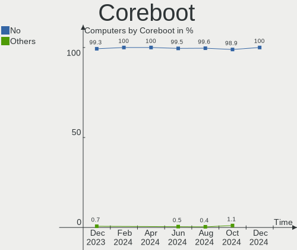
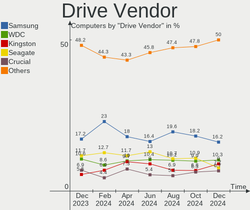
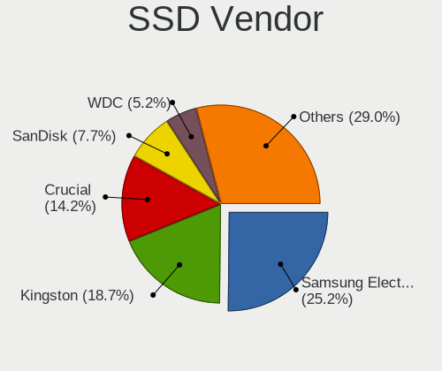
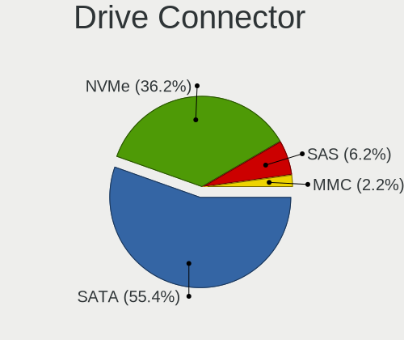
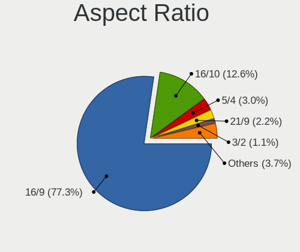
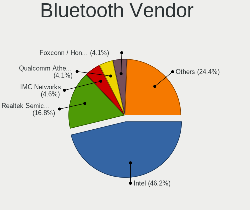

Linux in Italy - Hardware Trends
--------------------------------

A project to identify most popular hardware characteristics and track their change
over time based on data collected by Linux users at https://Linux-Hardware.org.

Anyone can contribute to this report by the [hw-probe](https://github.com/linuxhw/hw-probe) tool:

    sudo -E hw-probe -all -upload

This is a report for all computer types. See also reports for [desktops](/Location/Italy/Desktop/README.md) and [notebooks](/Location/Italy/Notebook/README.md).

Period: Jul, 2022.

Contents
--------

* [ System ](#system)
  - [ OS                       ](#os)
  - [ OS Family                ](#os-family)
  - [ Kernel                   ](#kernel)
  - [ Kernel Family            ](#kernel-family)
  - [ Kernel Major Ver.        ](#kernel-major-ver)
  - [ Arch                     ](#arch)
  - [ DE                       ](#de)
  - [ Display Server           ](#display-server)
  - [ Display Manager          ](#display-manager)
  - [ OS Lang                  ](#os-lang)
  - [ Boot Mode                ](#boot-mode)
  - [ Filesystem               ](#filesystem)
  - [ Part. scheme             ](#part-scheme)
  - [ Dual Boot with Linux/BSD ](#dual-boot-with-linuxbsd)
  - [ Dual Boot (Win)          ](#dual-boot-win)

* [ Board ](#board)
  - [ Vendor                   ](#vendor)
  - [ Model                    ](#model)
  - [ Model Family             ](#model-family)
  - [ MFG Year                 ](#mfg-year)
  - [ Form Factor              ](#form-factor)
  - [ Secure Boot              ](#secure-boot)
  - [ Coreboot                 ](#coreboot)
  - [ RAM Size                 ](#ram-size)
  - [ RAM Used                 ](#ram-used)
  - [ Total Drives             ](#total-drives)
  - [ Has CD-ROM               ](#has-cd-rom)
  - [ Has Ethernet             ](#has-ethernet)
  - [ Has WiFi                 ](#has-wifi)
  - [ Has Bluetooth            ](#has-bluetooth)

* [ Location ](#location)
  - [ Country                  ](#country)
  - [ City                     ](#city)

* [ Drives ](#drives)
  - [ Drive Vendor             ](#drive-vendor)
  - [ Drive Model              ](#drive-model)
  - [ HDD Vendor               ](#hdd-vendor)
  - [ SSD Vendor               ](#ssd-vendor)
  - [ Drive Kind               ](#drive-kind)
  - [ Drive Connector          ](#drive-connector)
  - [ Drive Size               ](#drive-size)
  - [ Space Total              ](#space-total)
  - [ Space Used               ](#space-used)
  - [ Malfunc. Drives          ](#malfunc-drives)
  - [ Malfunc. Drive Vendor    ](#malfunc-drive-vendor)
  - [ Malfunc. HDD Vendor      ](#malfunc-hdd-vendor)
  - [ Malfunc. Drive Kind      ](#malfunc-drive-kind)
  - [ Failed Drives            ](#failed-drives)
  - [ Failed Drive Vendor      ](#failed-drive-vendor)
  - [ Drive Status             ](#drive-status)

* [ Storage controller ](#storage-controller)
  - [ Storage Vendor           ](#storage-vendor)
  - [ Storage Model            ](#storage-model)
  - [ Storage Kind             ](#storage-kind)

* [ Processor ](#processor)
  - [ CPU Vendor               ](#cpu-vendor)
  - [ CPU Model                ](#cpu-model)
  - [ CPU Model Family         ](#cpu-model-family)
  - [ CPU Cores                ](#cpu-cores)
  - [ CPU Sockets              ](#cpu-sockets)
  - [ CPU Threads              ](#cpu-threads)
  - [ CPU Op-Modes             ](#cpu-op-modes)
  - [ CPU Microcode            ](#cpu-microcode)
  - [ CPU Microarch            ](#cpu-microarch)

* [ Graphics ](#graphics)
  - [ GPU Vendor               ](#gpu-vendor)
  - [ GPU Model                ](#gpu-model)
  - [ GPU Combo                ](#gpu-combo)
  - [ GPU Driver               ](#gpu-driver)
  - [ GPU Memory               ](#gpu-memory)

* [ Monitor ](#monitor)
  - [ Monitor Vendor           ](#monitor-vendor)
  - [ Monitor Model            ](#monitor-model)
  - [ Monitor Resolution       ](#monitor-resolution)
  - [ Monitor Diagonal         ](#monitor-diagonal)
  - [ Monitor Width            ](#monitor-width)
  - [ Aspect Ratio             ](#aspect-ratio)
  - [ Monitor Area             ](#monitor-area)
  - [ Pixel Density            ](#pixel-density)
  - [ Multiple Monitors        ](#multiple-monitors)

* [ Network ](#network)
  - [ Net Controller Vendor    ](#net-controller-vendor)
  - [ Net Controller Model     ](#net-controller-model)
  - [ Wireless Vendor          ](#wireless-vendor)
  - [ Wireless Model           ](#wireless-model)
  - [ Ethernet Vendor          ](#ethernet-vendor)
  - [ Ethernet Model           ](#ethernet-model)
  - [ Net Controller Kind      ](#net-controller-kind)
  - [ Used Controller          ](#used-controller)
  - [ NICs                     ](#nics)
  - [ IPv6                     ](#ipv6)

* [ Bluetooth ](#bluetooth)
  - [ Bluetooth Vendor         ](#bluetooth-vendor)
  - [ Bluetooth Model          ](#bluetooth-model)

* [ Sound ](#sound)
  - [ Sound Vendor             ](#sound-vendor)
  - [ Sound Model              ](#sound-model)

* [ Memory ](#memory)
  - [ Memory Vendor            ](#memory-vendor)
  - [ Memory Model             ](#memory-model)
  - [ Memory Kind              ](#memory-kind)
  - [ Memory Form Factor       ](#memory-form-factor)
  - [ Memory Size              ](#memory-size)
  - [ Memory Speed             ](#memory-speed)

* [ Printers & scanners ](#printers--scanners)
  - [ Printer Vendor           ](#printer-vendor)
  - [ Printer Model            ](#printer-model)
  - [ Scanner Vendor           ](#scanner-vendor)
  - [ Scanner Model            ](#scanner-model)

* [ Camera ](#camera)
  - [ Camera Vendor            ](#camera-vendor)
  - [ Camera Model             ](#camera-model)

* [ Security ](#security)
  - [ Fingerprint Vendor       ](#fingerprint-vendor)
  - [ Fingerprint Model        ](#fingerprint-model)
  - [ Chipcard Vendor          ](#chipcard-vendor)
  - [ Chipcard Model           ](#chipcard-model)

* [ Unsupported ](#unsupported)
  - [ Unsupported Devices      ](#unsupported-devices)
  - [ Unsupported Device Types ](#unsupported-device-types)

System
------

OS
--

Installed operating systems

| Name                         | Computers | Percent |
|------------------------------|-----------|---------|
| Ubuntu 22.04                 | 15        | 12.93%  |
| OpenMandriva 4.3             | 13        | 11.21%  |
| Linux Mint 20.3              | 10        | 8.62%   |
| Pop!_OS 22.04                | 9         | 7.76%   |
| Ubuntu 20.04                 | 6         | 5.17%   |
| Debian 11                    | 5         | 4.31%   |
| Xubuntu 20.04                | 4         | 3.45%   |
| Fedora 36                    | 4         | 3.45%   |
| Arch                         | 4         | 3.45%   |
| Zorin 16                     | 3         | 2.59%   |
| Ubuntu 18.04                 | 3         | 2.59%   |
| OpenMandriva 4.90            | 3         | 2.59%   |
| Kubuntu 22.04                | 3         | 2.59%   |
| Elementary 6.1               | 3         | 2.59%   |
| Xubuntu 22.04                | 2         | 1.72%   |
| Ubuntu 21.10                 | 2         | 1.72%   |
| ROSA 12.1                    | 2         | 1.72%   |
| Lubuntu 22.04                | 2         | 1.72%   |
| LMDE 5                       | 2         | 1.72%   |
| Linux Mint 20.2              | 2         | 1.72%   |
| ArcoLinux Rolling            | 2         | 1.72%   |
| Ubuntu MATE 22.04            | 1         | 0.86%   |
| Ubuntu MATE 20.04            | 1         | 0.86%   |
| SteamOS 3.2 (steamdeck-main) | 1         | 0.86%   |
| SteamOS                      | 1         | 0.86%   |
| Pop!_OS 20.04                | 1         | 0.86%   |
| Peppermint 11.4              | 1         | 0.86%   |
| Parrot 5.0                   | 1         | 0.86%   |
| openSUSE Leap-15.4           | 1         | 0.86%   |
| Manjaro 21.3.2               | 1         | 0.86%   |
| Linux Lite 6.0               | 1         | 0.86%   |
| Lilidog 22                   | 1         | 0.86%   |
| Kubuntu 22.10                | 1         | 0.86%   |
| Garuda Linux Soaring         | 1         | 0.86%   |
| Debian Unstable              | 1         | 0.86%   |
| Debian Testing               | 1         | 0.86%   |
| Debian 10                    | 1         | 0.86%   |
| ArcoLinux                    | 1         | 0.86%   |

OS Family
---------

OS without a version

| Name         | Computers | Percent |
|--------------|-----------|---------|
| Ubuntu       | 26        | 22.41%  |
| OpenMandriva | 16        | 13.79%  |
| Linux Mint   | 12        | 10.34%  |
| Pop!_OS      | 10        | 8.62%   |
| Debian       | 8         | 6.9%    |
| Xubuntu      | 6         | 5.17%   |
| Kubuntu      | 4         | 3.45%   |
| Fedora       | 4         | 3.45%   |
| Arch         | 4         | 3.45%   |
| Zorin        | 3         | 2.59%   |
| Elementary   | 3         | 2.59%   |
| ArcoLinux    | 3         | 2.59%   |
| Ubuntu MATE  | 2         | 1.72%   |
| SteamOS      | 2         | 1.72%   |
| ROSA         | 2         | 1.72%   |
| Lubuntu      | 2         | 1.72%   |
| LMDE         | 2         | 1.72%   |
| Peppermint   | 1         | 0.86%   |
| Parrot       | 1         | 0.86%   |
| openSUSE     | 1         | 0.86%   |
| Manjaro      | 1         | 0.86%   |
| Linux Lite   | 1         | 0.86%   |
| Lilidog      | 1         | 0.86%   |
| Garuda Linux | 1         | 0.86%   |

Kernel
------

Version of the Linux kernel

| Version                                            | Computers | Percent |
|----------------------------------------------------|-----------|---------|
| 5.15.0-41-generic                                  | 17        | 14.66%  |
| 5.16.7-desktop-1omv4003                            | 11        | 9.48%   |
| 5.13.0-52-generic                                  | 7         | 6.03%   |
| 5.4.0-121-generic                                  | 5         | 4.31%   |
| 5.10.0-16-amd64                                    | 5         | 4.31%   |
| 5.4.0-122-generic                                  | 4         | 3.45%   |
| 5.18.10-76051810-generic                           | 4         | 3.45%   |
| 5.17.15-76051715-generic                           | 4         | 3.45%   |
| 5.18.12-desktop-3omv4090                           | 3         | 2.59%   |
| 5.15.0-43-generic                                  | 3         | 2.59%   |
| 5.15.0-40-generic                                  | 3         | 2.59%   |
| 5.4.0-120-generic                                  | 2         | 1.72%   |
| 5.18.8-arch1-1                                     | 2         | 1.72%   |
| 5.18.12-zen1-1-zen                                 | 2         | 1.72%   |
| 5.18.11-200.fc36.x86_64                            | 2         | 1.72%   |
| 5.18.0-2-amd64                                     | 2         | 1.72%   |
| 5.17.5-76051705-generic                            | 2         | 1.72%   |
| 5.17.1-desktop-2omv4050                            | 2         | 1.72%   |
| 5.15.0-39-generic                                  | 2         | 1.72%   |
| 5.15.0-27-generic                                  | 2         | 1.72%   |
| 5.15.0-25-generic                                  | 2         | 1.72%   |
| 5.10.74-generic-2rosa2021.1-x86_64                 | 2         | 1.72%   |
| 5.4.0-97-generic                                   | 1         | 0.86%   |
| 5.4.0-122-lowlatency                               | 1         | 0.86%   |
| 5.4.0-121-lowlatency                               | 1         | 0.86%   |
| 5.19.0-rc4-v8                                      | 1         | 0.86%   |
| 5.18.9-arch1-1                                     | 1         | 0.86%   |
| 5.18.9-200.fc36.x86_64                             | 1         | 0.86%   |
| 5.18.7-1-MANJARO                                   | 1         | 0.86%   |
| 5.18.13-200.fc36.x86_64                            | 1         | 0.86%   |
| 5.18.10-zen1-1-zen                                 | 1         | 0.86%   |
| 5.18.10-arch1-1                                    | 1         | 0.86%   |
| 5.18.0-1parrot1-amd64                              | 1         | 0.86%   |
| 5.18.0-10.1-liquorix-amd64                         | 1         | 0.86%   |
| 5.16.11-76051611-generic                           | 1         | 0.86%   |
| 5.15.46-1-lts                                      | 1         | 0.86%   |
| 5.15.4-051504-lowlatency                           | 1         | 0.86%   |
| 5.15.0-33-generic                                  | 1         | 0.86%   |
| 5.14.21-150400.22-default                          | 1         | 0.86%   |
| 5.13.0-valve15-1-neptune-02197-gf6ec7ad3762a       | 1         | 0.86%   |
| 5.13.0-valve10.1-2-neptune-dri-02144-g7fffaf925dfb | 1         | 0.86%   |
| 5.13.0-51-generic                                  | 1         | 0.86%   |
| 5.13.0-30-generic                                  | 1         | 0.86%   |
| 5.11.0-27-generic                                  | 1         | 0.86%   |
| 5.10.0-15-amd64                                    | 1         | 0.86%   |
| 5.10.0-14-amd64                                    | 1         | 0.86%   |
| 5.10.0-13-amd64                                    | 1         | 0.86%   |
| 4.19.0-21-amd64                                    | 1         | 0.86%   |
| 4.15.0-189-generic                                 | 1         | 0.86%   |
| 4.15.0-188-lowlatency                              | 1         | 0.86%   |

Kernel Family
-------------

Linux kernel without a distro release

| Version | Computers | Percent |
|---------|-----------|---------|
| 5.15.0  | 30        | 25.86%  |
| 5.4.0   | 14        | 12.07%  |
| 5.16.7  | 11        | 9.48%   |
| 5.13.0  | 11        | 9.48%   |
| 5.10.0  | 8         | 6.9%    |
| 5.18.10 | 6         | 5.17%   |
| 5.18.12 | 5         | 4.31%   |
| 5.18.0  | 4         | 3.45%   |
| 5.17.15 | 4         | 3.45%   |
| 5.18.9  | 2         | 1.72%   |
| 5.18.8  | 2         | 1.72%   |
| 5.18.11 | 2         | 1.72%   |
| 5.17.5  | 2         | 1.72%   |
| 5.17.1  | 2         | 1.72%   |
| 5.10.74 | 2         | 1.72%   |
| 4.15.0  | 2         | 1.72%   |
| 5.19.0  | 1         | 0.86%   |
| 5.18.7  | 1         | 0.86%   |
| 5.18.13 | 1         | 0.86%   |
| 5.16.11 | 1         | 0.86%   |
| 5.15.46 | 1         | 0.86%   |
| 5.15.4  | 1         | 0.86%   |
| 5.14.21 | 1         | 0.86%   |
| 5.11.0  | 1         | 0.86%   |
| 4.19.0  | 1         | 0.86%   |

Kernel Major Ver.
-----------------

Linux kernel major version

| Version | Computers | Percent |
|---------|-----------|---------|
| 5.15    | 32        | 27.59%  |
| 5.18    | 23        | 19.83%  |
| 5.4     | 14        | 12.07%  |
| 5.16    | 12        | 10.34%  |
| 5.13    | 11        | 9.48%   |
| 5.10    | 10        | 8.62%   |
| 5.17    | 8         | 6.9%    |
| 4.15    | 2         | 1.72%   |
| 5.19    | 1         | 0.86%   |
| 5.14    | 1         | 0.86%   |
| 5.11    | 1         | 0.86%   |
| 4.19    | 1         | 0.86%   |

Arch
----

OS architecture (x86_64, i586, etc.)

| Name    | Computers | Percent |
|---------|-----------|---------|
| x86_64  | 115       | 99.14%  |
| aarch64 | 1         | 0.86%   |

DE
--

Desktop Environment

| Name             | Computers | Percent |
|------------------|-----------|---------|
| GNOME            | 47        | 40.52%  |
| KDE5             | 27        | 23.28%  |
| XFCE             | 14        | 12.07%  |
| X-Cinnamon       | 12        | 10.34%  |
| MATE             | 4         | 3.45%   |
| Pantheon         | 3         | 2.59%   |
| LXQt             | 3         | 2.59%   |
| Unity            | 1         | 0.86%   |
| sway             | 1         | 0.86%   |
| qtile            | 1         | 0.86%   |
| lightdm-xsession | 1         | 0.86%   |
| i3               | 1         | 0.86%   |
| Unknown          | 1         | 0.86%   |

Display Server
--------------

X11 or Wayland

| Name    | Computers | Percent |
|---------|-----------|---------|
| X11     | 88        | 75.86%  |
| Wayland | 24        | 20.69%  |
| Tty     | 3         | 2.59%   |
| Unknown | 1         | 0.86%   |

Display Manager
---------------

SDDM, LightDM, etc.

| Name    | Computers | Percent |
|---------|-----------|---------|
| Unknown | 35        | 30.17%  |
| GDM3    | 30        | 25.86%  |
| SDDM    | 23        | 19.83%  |
| LightDM | 21        | 18.1%   |
| GDM     | 6         | 5.17%   |
| GREETD  | 1         | 0.86%   |

OS Lang
-------

Language

| Lang  | Computers | Percent |
|-------|-----------|---------|
| it_IT | 75        | 64.66%  |
| en_US | 39        | 33.62%  |
| ru_RU | 1         | 0.86%   |
| de_AT | 1         | 0.86%   |

Boot Mode
---------

EFI or BIOS

| Mode | Computers | Percent |
|------|-----------|---------|
| BIOS | 61        | 52.59%  |
| EFI  | 55        | 47.41%  |

Filesystem
----------

Type of filesystem

| Type    | Computers | Percent |
|---------|-----------|---------|
| Ext4    | 85        | 73.28%  |
| Overlay | 15        | 12.93%  |
| Btrfs   | 14        | 12.07%  |
| Zfs     | 1         | 0.86%   |
| Unknown | 1         | 0.86%   |

Part. scheme
------------

Scheme of partitioning

| Type    | Computers | Percent |
|---------|-----------|---------|
| Unknown | 63        | 54.31%  |
| GPT     | 40        | 34.48%  |
| MBR     | 13        | 11.21%  |

Dual Boot with Linux/BSD
------------------------

Hosting more than one Linux/BSD

| Dual boot | Computers | Percent |
|-----------|-----------|---------|
| No        | 96        | 82.76%  |
| Yes       | 20        | 17.24%  |

Dual Boot (Win)
---------------

Hosting Linux and Windows

| Dual boot | Computers | Percent |
|-----------|-----------|---------|
| No        | 87        | 75%     |
| Yes       | 29        | 25%     |

Board
-----

Vendor
------

Motherboard manufacturer

| Name                    | Computers | Percent |
|-------------------------|-----------|---------|
| ASUSTek Computer        | 24        | 20.69%  |
| Hewlett-Packard         | 14        | 12.07%  |
| Dell                    | 14        | 12.07%  |
| MSI                     | 11        | 9.48%   |
| Lenovo                  | 10        | 8.62%   |
| Acer                    | 9         | 7.76%   |
| Gigabyte Technology     | 5         | 4.31%   |
| ASRock                  | 4         | 3.45%   |
| Intel                   | 3         | 2.59%   |
| HUAWEI                  | 3         | 2.59%   |
| Toshiba                 | 2         | 1.72%   |
| Apple                   | 2         | 1.72%   |
| Unknown                 | 2         | 1.72%   |
| Timi                    | 1         | 0.86%   |
| Teclast                 | 1         | 0.86%   |
| Sony                    | 1         | 0.86%   |
| Schenker                | 1         | 0.86%   |
| Samsung Electronics     | 1         | 0.86%   |
| Raspberry Pi Foundation | 1         | 0.86%   |
| Microtech               | 1         | 0.86%   |
| Microsoft               | 1         | 0.86%   |
| MicroByte               | 1         | 0.86%   |
| Fujitsu                 | 1         | 0.86%   |
| Foxconn                 | 1         | 0.86%   |
| Biostar                 | 1         | 0.86%   |
| AMI                     | 1         | 0.86%   |

Model
-----

Motherboard model

| Name                                    | Computers | Percent |
|-----------------------------------------|-----------|---------|
| HP Notebook                             | 3         | 2.59%   |
| Unknown                                 | 3         | 2.59%   |
| MSI MS-7C02                             | 2         | 1.72%   |
| MSI MS-7A74                             | 2         | 1.72%   |
| Lenovo IdeaPad 5 Pro 14ACN6 82L7        | 2         | 1.72%   |
| HP Compaq 8200 Elite SFF PC             | 2         | 1.72%   |
| Dell Inspiron 5584                      | 2         | 1.72%   |
| ASUS K53SC                              | 2         | 1.72%   |
| Acer Aspire T180                        | 2         | 1.72%   |
| Toshiba TECRA R940                      | 1         | 0.86%   |
| Toshiba Satellite Pro S500              | 1         | 0.86%   |
| Timi RedmiBook 16                       | 1         | 0.86%   |
| Teclast F15 Plus                        | 1         | 0.86%   |
| Sony VGC-JS110J                         | 1         | 0.86%   |
| Schenker XMG APEX (Mid 2021)            | 1         | 0.86%   |
| Samsung 750XDA                          | 1         | 0.86%   |
| RPi Raspberry Pi 4 Model B Rev 1.5 (DT) | 1         | 0.86%   |
| MSI Prestige 15 A10SC                   | 1         | 0.86%   |
| MSI NQ890AA-ABZ CQ5011IT                | 1         | 0.86%   |
| MSI MS-7D52                             | 1         | 0.86%   |
| MSI MS-7C75                             | 1         | 0.86%   |
| MSI MS-7B98                             | 1         | 0.86%   |
| MSI MS-7994                             | 1         | 0.86%   |
| MSI MPG B460 Trident A (MS-B926)        | 1         | 0.86%   |
| Microtech ebookPro                      | 1         | 0.86%   |
| Microsoft Surface Pro 4                 | 1         | 0.86%   |
| MicroByte ezbook                        | 1         | 0.86%   |
| Lenovo Yoga 720-15IKB                   | 1         | 0.86%   |
| Lenovo Yoga 530-14ARR 81H9              | 1         | 0.86%   |
| Lenovo ThinkPad T490 20N2000FIX         | 1         | 0.86%   |
| Lenovo ThinkBook 13s G3 ACN 20YA        | 1         | 0.86%   |
| Lenovo IdeaPad S145-15IGM 81MX          | 1         | 0.86%   |
| Lenovo IdeaPad 3 15ADA05 81W1           | 1         | 0.86%   |
| Lenovo G50-45 80E3                      | 1         | 0.86%   |
| Lenovo B590 37612ZG                     | 1         | 0.86%   |
| Intel NUC6i7KYB H90766-406              | 1         | 0.86%   |
| Intel DQ77MK                            | 1         | 0.86%   |
| Intel D2500CC AAG81477-400              | 1         | 0.86%   |
| HUAWEI WRTB-WXX9                        | 1         | 0.86%   |
| HUAWEI NBLK-WAX9X                       | 1         | 0.86%   |
| HUAWEI BOM-WXX9                         | 1         | 0.86%   |
| HP Spectre x360 Convertible 15-df0xxx   | 1         | 0.86%   |
| HP Pavilion 15                          | 1         | 0.86%   |
| HP ENVY x360 Convertible 13-ay0xxx      | 1         | 0.86%   |
| HP EliteBook 830 G5                     | 1         | 0.86%   |
| HP EliteBook 2560p                      | 1         | 0.86%   |
| HP 870-022nl                            | 1         | 0.86%   |
| HP 250 G4 Notebook PC                   | 1         | 0.86%   |
| HP 250 G2                               | 1         | 0.86%   |
| Gigabyte P35-DS3L                       | 1         | 0.86%   |
| Gigabyte GA-MA78GM-S2H                  | 1         | 0.86%   |
| Gigabyte G31M-S2L                       | 1         | 0.86%   |
| Gigabyte B450M DS3H                     | 1         | 0.86%   |
| Gigabyte B450 AORUS ELITE               | 1         | 0.86%   |
| Fujitsu LIFEBOOK E754                   | 1         | 0.86%   |
| Foxconn Pro3500 Series                  | 1         | 0.86%   |
| Dell XPS 15 9570                        | 1         | 0.86%   |
| Dell OptiPlex GX620                     | 1         | 0.86%   |
| Dell OptiPlex 390                       | 1         | 0.86%   |
| Dell Latitude E7440                     | 1         | 0.86%   |

Model Family
------------

Motherboard model prefix

| Name                   | Computers | Percent |
|------------------------|-----------|---------|
| Acer Aspire            | 7         | 6.03%   |
| Dell Latitude          | 6         | 5.17%   |
| Dell Inspiron          | 5         | 4.31%   |
| Lenovo IdeaPad         | 4         | 3.45%   |
| HP Notebook            | 3         | 2.59%   |
| ASUS VivoBook          | 3         | 2.59%   |
| Unknown                | 3         | 2.59%   |
| MSI MS-7C02            | 2         | 1.72%   |
| MSI MS-7A74            | 2         | 1.72%   |
| Lenovo Yoga            | 2         | 1.72%   |
| HP EliteBook           | 2         | 1.72%   |
| HP Compaq              | 2         | 1.72%   |
| HP 250                 | 2         | 1.72%   |
| Dell OptiPlex          | 2         | 1.72%   |
| ASUS K53SC             | 2         | 1.72%   |
| Toshiba TECRA          | 1         | 0.86%   |
| Toshiba Satellite      | 1         | 0.86%   |
| Timi RedmiBook         | 1         | 0.86%   |
| Teclast F15            | 1         | 0.86%   |
| Sony VGC-JS110J        | 1         | 0.86%   |
| Schenker XMG           | 1         | 0.86%   |
| Samsung 750XDA         | 1         | 0.86%   |
| RPi Raspberry          | 1         | 0.86%   |
| MSI Prestige           | 1         | 0.86%   |
| MSI NQ890AA-ABZ        | 1         | 0.86%   |
| MSI MS-7D52            | 1         | 0.86%   |
| MSI MS-7C75            | 1         | 0.86%   |
| MSI MS-7B98            | 1         | 0.86%   |
| MSI MS-7994            | 1         | 0.86%   |
| MSI MPG                | 1         | 0.86%   |
| Microtech ebookPro     | 1         | 0.86%   |
| Microsoft Surface      | 1         | 0.86%   |
| MicroByte ezbook       | 1         | 0.86%   |
| Lenovo ThinkPad        | 1         | 0.86%   |
| Lenovo ThinkBook       | 1         | 0.86%   |
| Lenovo G50-45          | 1         | 0.86%   |
| Lenovo B590            | 1         | 0.86%   |
| Intel NUC6i7KYB        | 1         | 0.86%   |
| Intel DQ77MK           | 1         | 0.86%   |
| Intel D2500CC          | 1         | 0.86%   |
| HUAWEI WRTB-WXX9       | 1         | 0.86%   |
| HUAWEI NBLK-WAX9X      | 1         | 0.86%   |
| HUAWEI BOM-WXX9        | 1         | 0.86%   |
| HP Spectre             | 1         | 0.86%   |
| HP Pavilion            | 1         | 0.86%   |
| HP ENVY                | 1         | 0.86%   |
| HP 870-022nl           | 1         | 0.86%   |
| Gigabyte P35-DS3L      | 1         | 0.86%   |
| Gigabyte GA-MA78GM-S2H | 1         | 0.86%   |
| Gigabyte G31M-S2L      | 1         | 0.86%   |
| Gigabyte B450M         | 1         | 0.86%   |
| Gigabyte B450          | 1         | 0.86%   |
| Fujitsu LIFEBOOK       | 1         | 0.86%   |
| Foxconn Pro3500        | 1         | 0.86%   |
| Dell XPS               | 1         | 0.86%   |
| Biostar P4M90-M7A      | 1         | 0.86%   |
| ASUS Zephyrus          | 1         | 0.86%   |
| ASUS X555YI            | 1         | 0.86%   |
| ASUS X555LD            | 1         | 0.86%   |
| ASUS U36SG             | 1         | 0.86%   |

MFG Year
--------

Motherboard manufacture year

| Year    | Computers | Percent |
|---------|-----------|---------|
| 2021    | 16        | 13.79%  |
| 2018    | 11        | 9.48%   |
| 2011    | 11        | 9.48%   |
| 2019    | 10        | 8.62%   |
| 2016    | 9         | 7.76%   |
| 2020    | 8         | 6.9%    |
| 2015    | 7         | 6.03%   |
| 2012    | 7         | 6.03%   |
| 2017    | 6         | 5.17%   |
| 2014    | 6         | 5.17%   |
| 2013    | 5         | 4.31%   |
| 2009    | 4         | 3.45%   |
| 2006    | 4         | 3.45%   |
| 2010    | 3         | 2.59%   |
| 2008    | 3         | 2.59%   |
| 2007    | 3         | 2.59%   |
| Unknown | 2         | 1.72%   |
| 2005    | 1         | 0.86%   |

Form Factor
-----------

Physical design of the computer

| Name           | Computers | Percent |
|----------------|-----------|---------|
| Notebook       | 59        | 50.86%  |
| Desktop        | 43        | 37.07%  |
| Convertible    | 7         | 6.03%   |
| Tablet         | 3         | 2.59%   |
| All in one     | 2         | 1.72%   |
| System on chip | 1         | 0.86%   |
| Mini pc        | 1         | 0.86%   |

Secure Boot
-----------

Enabled or disabled

| State    | Computers | Percent |
|----------|-----------|---------|
| Disabled | 109       | 93.97%  |
| Enabled  | 7         | 6.03%   |

Coreboot
--------

Have coreboot on board

| Used | Computers | Percent |
|------|-----------|---------|
| No   | 116       | 100%    |

RAM Size
--------

Total RAM memory

| Size in GB  | Computers | Percent |
|-------------|-----------|---------|
| 3.01-4.0    | 31        | 26.72%  |
| 4.01-8.0    | 30        | 25.86%  |
| 16.01-24.0  | 23        | 19.83%  |
| 8.01-16.0   | 18        | 15.52%  |
| 32.01-64.0  | 6         | 5.17%   |
| 1.01-2.0    | 4         | 3.45%   |
| 24.01-32.0  | 2         | 1.72%   |
| 2.01-3.0    | 1         | 0.86%   |
| 64.01-256.0 | 1         | 0.86%   |

RAM Used
--------

Used RAM memory

| Used GB   | Computers | Percent |
|-----------|-----------|---------|
| 1.01-2.0  | 48        | 41.38%  |
| 2.01-3.0  | 28        | 24.14%  |
| 3.01-4.0  | 14        | 12.07%  |
| 4.01-8.0  | 12        | 10.34%  |
| 0.51-1.0  | 9         | 7.76%   |
| 8.01-16.0 | 4         | 3.45%   |
| 0.01-0.5  | 1         | 0.86%   |

Total Drives
------------

Number of drives on board

| Drives | Computers | Percent |
|--------|-----------|---------|
| 1      | 71        | 61.21%  |
| 2      | 26        | 22.41%  |
| 3      | 9         | 7.76%   |
| 4      | 3         | 2.59%   |
| 0      | 3         | 2.59%   |
| 5      | 2         | 1.72%   |
| 8      | 1         | 0.86%   |
| 6      | 1         | 0.86%   |

Has CD-ROM
----------

Has CD-ROM on board

| Presented | Computers | Percent |
|-----------|-----------|---------|
| No        | 62        | 53.45%  |
| Yes       | 54        | 46.55%  |

Has Ethernet
------------

Has Ethernet on board

| Presented | Computers | Percent |
|-----------|-----------|---------|
| Yes       | 90        | 77.59%  |
| No        | 26        | 22.41%  |

Has WiFi
--------

Has WiFi module

| Presented | Computers | Percent |
|-----------|-----------|---------|
| Yes       | 91        | 78.45%  |
| No        | 25        | 21.55%  |

Has Bluetooth
-------------

Has Bluetooth module

| Presented | Computers | Percent |
|-----------|-----------|---------|
| Yes       | 71        | 61.21%  |
| No        | 45        | 38.79%  |

Location
--------

Country
-------

Geographic location (country)

| Country | Computers | Percent |
|---------|-----------|---------|
| Italy   | 116       | 100%    |

City
----

Geographic location (city)

| City                    | Computers | Percent |
|-------------------------|-----------|---------|
| Milan                   | 22        | 18.97%  |
| Rome                    | 9         | 7.76%   |
| Turin                   | 4         | 3.45%   |
| Genoa                   | 3         | 2.59%   |
| Bologna                 | 3         | 2.59%   |
| Spello                  | 2         | 1.72%   |
| San Giovanni Lupatoto   | 2         | 1.72%   |
| Rho                     | 2         | 1.72%   |
| Perugia                 | 2         | 1.72%   |
| Parma                   | 2         | 1.72%   |
| Naples                  | 2         | 1.72%   |
| Merano                  | 2         | 1.72%   |
| Forlì                  | 2         | 1.72%   |
| Caserta                 | 2         | 1.72%   |
| Casalecchio di Reno     | 2         | 1.72%   |
| Bergamo                 | 2         | 1.72%   |
| Villa San Silvestro     | 1         | 0.86%   |
| Venice                  | 1         | 0.86%   |
| Valbrembo               | 1         | 0.86%   |
| Trieste                 | 1         | 0.86%   |
| Treviso                 | 1         | 0.86%   |
| Taranto                 | 1         | 0.86%   |
| Spadafora               | 1         | 0.86%   |
| Sonico                  | 1         | 0.86%   |
| Settimo Torinese        | 1         | 0.86%   |
| Sesto San Giovanni      | 1         | 0.86%   |
| Santa Teresa Gallura    | 1         | 0.86%   |
| Santa Teresa di Riva    | 1         | 0.86%   |
| Rozzano                 | 1         | 0.86%   |
| Rovereto                | 1         | 0.86%   |
| Rossano Veneto          | 1         | 0.86%   |
| Riccione                | 1         | 0.86%   |
| Reggio Emilia           | 1         | 0.86%   |
| Ponte San Pietro        | 1         | 0.86%   |
| Pieris                  | 1         | 0.86%   |
| Peschiera del Garda     | 1         | 0.86%   |
| Pavia                   | 1         | 0.86%   |
| Padova                  | 1         | 0.86%   |
| Paderno Dugnano         | 1         | 0.86%   |
| Novara                  | 1         | 0.86%   |
| Monreale                | 1         | 0.86%   |
| Mesero                  | 1         | 0.86%   |
| Maglie                  | 1         | 0.86%   |
| Luni                    | 1         | 0.86%   |
| Lumezzane               | 1         | 0.86%   |
| Legnano                 | 1         | 0.86%   |
| Lecce                   | 1         | 0.86%   |
| Lavino di Mezzo         | 1         | 0.86%   |
| Lainate                 | 1         | 0.86%   |
| Jenesien                | 1         | 0.86%   |
| Grosseto                | 1         | 0.86%   |
| Gravina in Puglia       | 1         | 0.86%   |
| Gallarate               | 1         | 0.86%   |
| Fucecchio               | 1         | 0.86%   |
| Florence                | 1         | 0.86%   |
| Desio                   | 1         | 0.86%   |
| Costa Masnaga           | 1         | 0.86%   |
| Cisterna di Latina      | 1         | 0.86%   |
| Castellammare di Stabia | 1         | 0.86%   |
| Cassino                 | 1         | 0.86%   |

Drives
------

Drive Vendor
------------

Hard drive vendors

| Vendor                    | Computers | Drives | Percent |
|---------------------------|-----------|--------|---------|
| WDC                       | 26        | 29     | 15.57%  |
| Samsung Electronics       | 26        | 33     | 15.57%  |
| Seagate                   | 20        | 24     | 11.98%  |
| SanDisk                   | 11        | 11     | 6.59%   |
| Crucial                   | 11        | 11     | 6.59%   |
| Unknown                   | 9         | 11     | 5.39%   |
| Toshiba                   | 8         | 10     | 4.79%   |
| Kingston                  | 7         | 7      | 4.19%   |
| Intel                     | 5         | 5      | 2.99%   |
| Hitachi                   | 5         | 5      | 2.99%   |
| A-DATA Technology         | 5         | 5      | 2.99%   |
| SK hynix                  | 4         | 4      | 2.4%    |
| HGST                      | 3         | 3      | 1.8%    |
| Phison                    | 2         | 2      | 1.2%    |
| Maxtor                    | 2         | 2      | 1.2%    |
| Dogfish                   | 2         | 2      | 1.2%    |
| Corsair                   | 2         | 3      | 1.2%    |
| Teclast                   | 1         | 1      | 0.6%    |
| SSSTC                     | 1         | 1      | 0.6%    |
| Silicon Motion            | 1         | 1      | 0.6%    |
| Qunion                    | 1         | 1      | 0.6%    |
| PNY                       | 1         | 1      | 0.6%    |
| Patriot                   | 1         | 1      | 0.6%    |
| OCZ                       | 1         | 1      | 0.6%    |
| Microtech                 | 1         | 1      | 0.6%    |
| Micron/Crucial Technology | 1         | 1      | 0.6%    |
| Micron Technology         | 1         | 1      | 0.6%    |
| LaCie                     | 1         | 1      | 0.6%    |
| KIOXIA                    | 1         | 1      | 0.6%    |
| Intenso                   | 1         | 1      | 0.6%    |
| Inateck                   | 1         | 1      | 0.6%    |
| HS-SSD-E100N              | 1         | 1      | 0.6%    |
| China                     | 1         | 1      | 0.6%    |
| BORY                      | 1         | 1      | 0.6%    |
| ASMT                      | 1         | 1      | 0.6%    |
| Unknown                   | 1         | 1      | 0.6%    |

Drive Model
-----------

Hard drive models

| Model                                   | Computers | Percent |
|-----------------------------------------|-----------|---------|
| Seagate ST500LT012-1DG142 500GB         | 3         | 1.64%   |
| SanDisk NVMe SSD Drive 512GB            | 3         | 1.64%   |
| HGST HTS545050A7E680 500GB              | 3         | 1.64%   |
| Crucial CT480BX500SSD1 480GB            | 3         | 1.64%   |
| Crucial CT240BX500SSD1 240GB            | 3         | 1.64%   |
| WDC WDS500G2B0B-00YS70 500GB SSD        | 2         | 1.09%   |
| Seagate ST500DM002-1BD142 500GB         | 2         | 1.09%   |
| Seagate ST31000528AS 1TB                | 2         | 1.09%   |
| SanDisk NVMe SSD Drive 256GB            | 2         | 1.09%   |
| Samsung SSD 980 PRO 1TB                 | 2         | 1.09%   |
| Samsung SSD 840 EVO 500GB               | 2         | 1.09%   |
| Samsung SP0612N 64GB                    | 2         | 1.09%   |
| Samsung NVMe SSD Drive 1TB              | 2         | 1.09%   |
| Samsung MZALQ512HBLU-00BL2 512GB        | 2         | 1.09%   |
| Kingston SV300S37A120G 120GB SSD        | 2         | 1.09%   |
| Kingston SA400S37240G 240GB SSD         | 2         | 1.09%   |
| Intel SSDPEKNU512GZ 512GB               | 2         | 1.09%   |
| Hitachi HTS547550A9E384 500GB           | 2         | 1.09%   |
| Crucial CT500MX500SSD1 500GB            | 2         | 1.09%   |
| WDC WDS500G2B0A-00SM50 500GB SSD        | 1         | 0.55%   |
| WDC WDS250G2X0C-00L350 250GB            | 1         | 0.55%   |
| WDC WD800JD-00LSA0 80GB                 | 1         | 0.55%   |
| WDC WD7500AARS-00Y5B1 752GB             | 1         | 0.55%   |
| WDC WD75 00BPVT-16HXZ 752GB             | 1         | 0.55%   |
| WDC WD5000LPVX-22V0TT0 500GB            | 1         | 0.55%   |
| WDC WD5000BEVT-80A0RT1 500GB            | 1         | 0.55%   |
| WDC WD5000AAKX-603CA0 500GB             | 1         | 0.55%   |
| WDC WD5000AAKS-00UU3A0 500GB            | 1         | 0.55%   |
| WDC WD5000AADS-56S9B1 500GB             | 1         | 0.55%   |
| WDC WD3200BEVT-60A23T0 320GB            | 1         | 0.55%   |
| WDC WD3200AAJS-22L7A0 320GB             | 1         | 0.55%   |
| WDC WD30EZRX-00DC0B0 3TB                | 1         | 0.55%   |
| WDC WD25 00BEVT-22ZCT0 250GB            | 1         | 0.55%   |
| WDC WD20EARS-60MVWB0 2TB                | 1         | 0.55%   |
| WDC WD20EADS-32S2B0 2TB                 | 1         | 0.55%   |
| WDC WD1600JS-60MHB1 160GB               | 1         | 0.55%   |
| WDC WD10SPZX-24Z10 1TB                  | 1         | 0.55%   |
| WDC WD10JPCX-24UE4T0 1TB                | 1         | 0.55%   |
| WDC WD10EZEX-08WN4A0 1TB                | 1         | 0.55%   |
| WDC WD10EZEX-08M2NA0 1TB                | 1         | 0.55%   |
| WDC WD10EFRX-68FYTN0 1TB                | 1         | 0.55%   |
| WDC WD10EARS-22Y5B1 1TB                 | 1         | 0.55%   |
| WDC WD1002FBYS-50A6B0 1TB               | 1         | 0.55%   |
| WDC PC SN530 SDBPNPZ-512G-1032 512GB    | 1         | 0.55%   |
| WDC PC SN530 NVMe 512GB                 | 1         | 0.55%   |
| Unknown Trust HDD 2.5" 1TB              | 1         | 0.55%   |
| Unknown SU04G  4GB                      | 1         | 0.55%   |
| Unknown SDC  999MB                      | 1         | 0.55%   |
| Unknown SD64G  64GB                     | 1         | 0.55%   |
| Unknown SD/MMC/MS PRO 64GB              | 1         | 0.55%   |
| Unknown SC128  128GB                    | 1         | 0.55%   |
| Unknown MMC Card  256GB                 | 1         | 0.55%   |
| Unknown MMC Card  16GB                  | 1         | 0.55%   |
| Unknown BJNB4R  32GB                    | 1         | 0.55%   |
| Unknown Biwin  32GB                     | 1         | 0.55%   |
| Unknown 58K722  128GB                   | 1         | 0.55%   |
| Toshiba THNSN5256GPU7 256GB             | 1         | 0.55%   |
| Toshiba NVMe SSD Drive 512GB            | 1         | 0.55%   |
| Toshiba MQ01ABF050 500GB                | 1         | 0.55%   |
| Toshiba KSG60ZMV512G M.2 2280 512GB SSD | 1         | 0.55%   |

HDD Vendor
----------

Hard disk drive vendors

| Vendor              | Computers | Drives | Percent |
|---------------------|-----------|--------|---------|
| WDC                 | 20        | 23     | 33.33%  |
| Seagate             | 20        | 24     | 33.33%  |
| Hitachi             | 5         | 5      | 8.33%   |
| Samsung Electronics | 4         | 4      | 6.67%   |
| Toshiba             | 3         | 5      | 5%      |
| HGST                | 3         | 3      | 5%      |
| Unknown             | 2         | 2      | 3.33%   |
| Maxtor              | 2         | 2      | 3.33%   |
| ASMT                | 1         | 1      | 1.67%   |

SSD Vendor
----------

Solid state drive vendors

| Vendor              | Computers | Drives | Percent |
|---------------------|-----------|--------|---------|
| Samsung Electronics | 12        | 14     | 21.05%  |
| Crucial             | 10        | 10     | 17.54%  |
| SanDisk             | 5         | 5      | 8.77%   |
| Kingston            | 5         | 5      | 8.77%   |
| A-DATA Technology   | 5         | 5      | 8.77%   |
| WDC                 | 3         | 3      | 5.26%   |
| Intel               | 2         | 2      | 3.51%   |
| Dogfish             | 2         | 2      | 3.51%   |
| Corsair             | 2         | 3      | 3.51%   |
| Toshiba             | 1         | 1      | 1.75%   |
| Teclast             | 1         | 1      | 1.75%   |
| PNY                 | 1         | 1      | 1.75%   |
| Patriot             | 1         | 1      | 1.75%   |
| OCZ                 | 1         | 1      | 1.75%   |
| Microtech           | 1         | 1      | 1.75%   |
| Micron Technology   | 1         | 1      | 1.75%   |
| Intenso             | 1         | 1      | 1.75%   |
| HS-SSD-E100N        | 1         | 1      | 1.75%   |
| China               | 1         | 1      | 1.75%   |
| Unknown             | 1         | 1      | 1.75%   |

Drive Kind
----------

HDD or SSD

| Kind    | Computers | Drives | Percent |
|---------|-----------|--------|---------|
| SSD     | 51        | 60     | 34.69%  |
| HDD     | 50        | 69     | 34.01%  |
| NVMe    | 36        | 45     | 24.49%  |
| MMC     | 8         | 10     | 5.44%   |
| Unknown | 2         | 2      | 1.36%   |

Drive Connector
---------------

SATA, SAS, NVMe, etc.

| Type | Computers | Drives | Percent |
|------|-----------|--------|---------|
| SATA | 81        | 122    | 60.45%  |
| NVMe | 35        | 44     | 26.12%  |
| SAS  | 10        | 10     | 7.46%   |
| MMC  | 8         | 10     | 5.97%   |

Drive Size
----------

Size of hard drive

| Size in TB | Computers | Drives | Percent |
|------------|-----------|--------|---------|
| 0.01-0.5   | 70        | 86     | 67.31%  |
| 0.51-1.0   | 22        | 29     | 21.15%  |
| 1.01-2.0   | 5         | 7      | 4.81%   |
| 2.01-3.0   | 3         | 3      | 2.88%   |
| 3.01-4.0   | 2         | 2      | 1.92%   |
| 4.01-10.0  | 2         | 2      | 1.92%   |

Space Total
-----------

Amount of disk space available on the file system

| Size in GB     | Computers | Percent |
|----------------|-----------|---------|
| 101-250        | 32        | 27.59%  |
| 251-500        | 22        | 18.97%  |
| 1-20           | 16        | 13.79%  |
| 501-1000       | 15        | 12.93%  |
| 1001-2000      | 8         | 6.9%    |
| More than 3000 | 6         | 5.17%   |
| Unknown        | 5         | 4.31%   |
| 21-50          | 4         | 3.45%   |
| 2001-3000      | 4         | 3.45%   |
| 51-100         | 4         | 3.45%   |

Space Used
----------

Amount of used disk space

| Used GB        | Computers | Percent |
|----------------|-----------|---------|
| 1-20           | 48        | 41.38%  |
| 21-50          | 20        | 17.24%  |
| 101-250        | 12        | 10.34%  |
| 251-500        | 9         | 7.76%   |
| 51-100         | 9         | 7.76%   |
| 501-1000       | 6         | 5.17%   |
| Unknown        | 5         | 4.31%   |
| 1001-2000      | 3         | 2.59%   |
| More than 3000 | 2         | 1.72%   |
| 2001-3000      | 2         | 1.72%   |

Malfunc. Drives
---------------

Drive models with a malfunction

| Model                             | Computers | Drives | Percent |
|-----------------------------------|-----------|--------|---------|
| WDC WD75 00BPVT-16HXZ 752GB       | 1         | 1      | 12.5%   |
| WDC WD5000BEVT-80A0RT1 500GB      | 1         | 1      | 12.5%   |
| WDC WD3200AAJS-22L7A0 320GB       | 1         | 1      | 12.5%   |
| Seagate ST500LT012-9WS142 500GB   | 1         | 1      | 12.5%   |
| Seagate ST3500413AS 500GB         | 1         | 2      | 12.5%   |
| Seagate ST31500341AS 1TB          | 1         | 1      | 12.5%   |
| Samsung Electronics HD250HJ 250GB | 1         | 1      | 12.5%   |
| HGST HTS545050A7E680 500GB        | 1         | 1      | 12.5%   |

Malfunc. Drive Vendor
---------------------

Vendors of faulty drives

| Vendor              | Computers | Drives | Percent |
|---------------------|-----------|--------|---------|
| WDC                 | 3         | 3      | 37.5%   |
| Seagate             | 3         | 4      | 37.5%   |
| Samsung Electronics | 1         | 1      | 12.5%   |
| HGST                | 1         | 1      | 12.5%   |

Malfunc. HDD Vendor
-------------------

Vendors of faulty HDD drives

| Vendor              | Computers | Drives | Percent |
|---------------------|-----------|--------|---------|
| WDC                 | 3         | 3      | 37.5%   |
| Seagate             | 3         | 4      | 37.5%   |
| Samsung Electronics | 1         | 1      | 12.5%   |
| HGST                | 1         | 1      | 12.5%   |

Malfunc. Drive Kind
-------------------

Kinds of faulty drives

| Kind | Computers | Drives | Percent |
|------|-----------|--------|---------|
| HDD  | 7         | 9      | 100%    |

Failed Drives
-------------

Failed drive models

Zero info for selected period =(

Failed Drive Vendor
-------------------

Failed drive vendors

Zero info for selected period =(

Drive Status
------------

Number of failed and malfunc. drives

| Status   | Computers | Drives | Percent |
|----------|-----------|--------|---------|
| Detected | 67        | 112    | 55.83%  |
| Works    | 46        | 65     | 38.33%  |
| Malfunc  | 7         | 9      | 5.83%   |

Storage controller
------------------

Storage Vendor
--------------

Storage controller vendors

| Vendor                         | Computers | Percent |
|--------------------------------|-----------|---------|
| Intel                          | 75        | 53.96%  |
| AMD                            | 19        | 13.67%  |
| Samsung Electronics            | 13        | 9.35%   |
| SanDisk                        | 7         | 5.04%   |
| SK hynix                       | 4         | 2.88%   |
| Toshiba America Info Systems   | 3         | 2.16%   |
| Nvidia                         | 3         | 2.16%   |
| Phison Electronics             | 2         | 1.44%   |
| Micron/Crucial Technology      | 2         | 1.44%   |
| Marvell Technology Group       | 2         | 1.44%   |
| KIOXIA                         | 2         | 1.44%   |
| Kingston Technology Company    | 2         | 1.44%   |
| VIA Technologies               | 1         | 0.72%   |
| Solid State Storage Technology | 1         | 0.72%   |
| Silicon Motion                 | 1         | 0.72%   |
| JMicron Technology             | 1         | 0.72%   |
| ASMedia Technology             | 1         | 0.72%   |

Storage Model
-------------

Storage controller models

| Model                                                                                   | Computers | Percent |
|-----------------------------------------------------------------------------------------|-----------|---------|
| AMD FCH SATA Controller [AHCI mode]                                                     | 11        | 7.19%   |
| Intel 6 Series/C200 Series Chipset Family 6 port Mobile SATA AHCI Controller            | 7         | 4.58%   |
| Intel 8 Series SATA Controller 1 [AHCI mode]                                            | 6         | 3.92%   |
| Intel Q170/Q150/B150/H170/H110/Z170/CM236 Chipset SATA Controller [AHCI Mode]           | 5         | 3.27%   |
| Samsung NVMe SSD Controller SM981/PM981/PM983                                           | 4         | 2.61%   |
| Samsung NVMe SSD Controller PM9A1/PM9A3/980PRO                                          | 4         | 2.61%   |
| Intel Sunrise Point-LP SATA Controller [AHCI mode]                                      | 4         | 2.61%   |
| Intel Celeron/Pentium Silver Processor SATA Controller                                  | 4         | 2.61%   |
| Intel 7 Series Chipset Family 6-port SATA Controller [AHCI mode]                        | 4         | 2.61%   |
| Intel 6 Series/C200 Series Chipset Family 6 port Desktop SATA AHCI Controller           | 4         | 2.61%   |
| AMD SB7x0/SB8x0/SB9x0 SATA Controller [AHCI mode]                                       | 4         | 2.61%   |
| AMD 400 Series Chipset SATA Controller                                                  | 4         | 2.61%   |
| SK hynix BC501 NVMe Solid State Drive                                                   | 3         | 1.96%   |
| Samsung NVMe SSD Controller 980                                                         | 3         | 1.96%   |
| Nvidia MCP61 SATA Controller                                                            | 3         | 1.96%   |
| Nvidia MCP61 IDE                                                                        | 3         | 1.96%   |
| Intel NM10/ICH7 Family SATA Controller [IDE mode]                                       | 3         | 1.96%   |
| Intel 82801 Mobile SATA Controller [RAID mode]                                          | 3         | 1.96%   |
| AMD SB7x0/SB8x0/SB9x0 IDE Controller                                                    | 3         | 1.96%   |
| SanDisk WD Black 2018/SN750 / PC SN720 NVMe SSD                                         | 2         | 1.31%   |
| SanDisk PC SN520 NVMe SSD                                                               | 2         | 1.31%   |
| SanDisk Non-Volatile memory controller                                                  | 2         | 1.31%   |
| Samsung NVMe SSD Controller SM961/PM961/SM963                                           | 2         | 1.31%   |
| KIOXIA NVMe SSD Controller BG4                                                          | 2         | 1.31%   |
| Intel Wildcat Point-LP SATA Controller [AHCI Mode]                                      | 2         | 1.31%   |
| Intel Volume Management Device NVMe RAID Controller                                     | 2         | 1.31%   |
| Intel Non-Volatile memory controller                                                    | 2         | 1.31%   |
| Intel Ice Lake-LP SATA Controller [AHCI mode]                                           | 2         | 1.31%   |
| Intel Comet Lake SATA AHCI Controller                                                   | 2         | 1.31%   |
| Intel Cannon Point-LP SATA Controller [AHCI Mode]                                       | 2         | 1.31%   |
| Intel Atom/Celeron/Pentium Processor x5-E8000/J3xxx/N3xxx Series SATA Controller        | 2         | 1.31%   |
| Intel 82801JI (ICH10 Family) 4 port SATA IDE Controller #1                              | 2         | 1.31%   |
| Intel 6 Series/C200 Series Chipset Family Desktop SATA Controller (IDE mode, ports 4-5) | 2         | 1.31%   |
| Intel 6 Series/C200 Series Chipset Family Desktop SATA Controller (IDE mode, ports 0-3) | 2         | 1.31%   |
| Intel 200 Series PCH SATA controller [AHCI mode]                                        | 2         | 1.31%   |
| VIA VT82C586A/B/VT82C686/A/B/VT823x/A/C PIPC Bus Master IDE                             | 1         | 0.65%   |
| VIA Serial ATA Controller                                                               | 1         | 0.65%   |
| Toshiba America Info Systems Toshiba America Info Non-Volatile memory controller        | 1         | 0.65%   |
| Toshiba America Info Systems NVMe Controller                                            | 1         | 0.65%   |
| Toshiba America Info Systems BG3 NVMe SSD Controller                                    | 1         | 0.65%   |
| Solid State Storage Non-Volatile memory controller                                      | 1         | 0.65%   |
| SK hynix BC511                                                                          | 1         | 0.65%   |
| Silicon Motion SM2263EN/SM2263XT SSD Controller                                         | 1         | 0.65%   |
| SanDisk WD Blue SN550 NVMe SSD                                                          | 1         | 0.65%   |
| Phison PS5013 E13 NVMe Controller                                                       | 1         | 0.65%   |
| Phison E12 NVMe Controller                                                              | 1         | 0.65%   |
| Micron/Crucial P2 NVMe PCIe SSD                                                         | 1         | 0.65%   |
| Micron/Crucial NVMe Controller                                                          | 1         | 0.65%   |
| Marvell Group 88SE9172 SATA III 6Gb/s RAID Controller                                   | 1         | 0.65%   |
| Marvell Group 88SE6111/6121 SATA II / PATA Controller                                   | 1         | 0.65%   |
| Kingston Company Company Non-Volatile memory controller                                 | 1         | 0.65%   |
| Kingston Company A2000 NVMe SSD                                                         | 1         | 0.65%   |
| JMicron JMB368 IDE controller                                                           | 1         | 0.65%   |
| Intel SSD 660P Series                                                                   | 1         | 0.65%   |
| Intel NM10/ICH7 Family SATA Controller [AHCI mode]                                      | 1         | 0.65%   |
| Intel Celeron N3350/Pentium N4200/Atom E3900 Series SATA AHCI Controller                | 1         | 0.65%   |
| Intel Cannon Lake PCH SATA AHCI Controller                                              | 1         | 0.65%   |
| Intel 9 Series Chipset Family SATA Controller [AHCI Mode]                               | 1         | 0.65%   |
| Intel 82801JI (ICH10 Family) SATA AHCI Controller                                       | 1         | 0.65%   |
| Intel 82801JI (ICH10 Family) 2 port SATA IDE Controller #2                              | 1         | 0.65%   |

Storage Kind
------------

Kind of storage controller (IDE, SATA, NVMe, SAS, ...)

| Kind | Computers | Percent |
|------|-----------|---------|
| SATA | 75        | 56.39%  |
| NVMe | 35        | 26.32%  |
| IDE  | 18        | 13.53%  |
| RAID | 5         | 3.76%   |

Processor
---------

CPU Vendor
----------

Processor vendors

| Vendor | Computers | Percent |
|--------|-----------|---------|
| Intel  | 84        | 72.41%  |
| AMD    | 31        | 26.72%  |
| ARM    | 1         | 0.86%   |

CPU Model
---------

Processor models

| Model                                         | Computers | Percent |
|-----------------------------------------------|-----------|---------|
| Intel Core i7-2620M CPU @ 2.70GHz             | 4         | 3.45%   |
| Intel Pentium Dual CPU E2200 @ 2.20GHz        | 3         | 2.59%   |
| Intel Core i5-8265U CPU @ 1.60GHz             | 3         | 2.59%   |
| AMD Ryzen 5 5600U with Radeon Graphics        | 3         | 2.59%   |
| Intel Core i7-8750H CPU @ 2.20GHz             | 2         | 1.72%   |
| Intel Core i7-4510U CPU @ 2.00GHz             | 2         | 1.72%   |
| Intel Core i7-2670QM CPU @ 2.20GHz            | 2         | 1.72%   |
| Intel Core i5-2400S CPU @ 2.50GHz             | 2         | 1.72%   |
| Intel Core i5-10400F CPU @ 2.90GHz            | 2         | 1.72%   |
| Intel Celeron N4000 CPU @ 1.10GHz             | 2         | 1.72%   |
| Intel Atom x5-Z8350 CPU @ 1.44GHz             | 2         | 1.72%   |
| Intel 11th Gen Core i5-1135G7 @ 2.40GHz       | 2         | 1.72%   |
| AMD Ryzen 5 5500U with Radeon Graphics        | 2         | 1.72%   |
| AMD Ryzen 5 4500U with Radeon Graphics        | 2         | 1.72%   |
| AMD Ryzen 5 3600 6-Core Processor             | 2         | 1.72%   |
| AMD Ryzen 5 3500U with Radeon Vega Mobile Gfx | 2         | 1.72%   |
| AMD Athlon 64 X2 Dual Core Processor 5000+    | 2         | 1.72%   |
| AMD A8-7410 APU with AMD Radeon R5 Graphics   | 2         | 1.72%   |
| Intel Pentium Dual-Core CPU E5400 @ 2.70GHz   | 1         | 0.86%   |
| Intel Pentium Dual CPU E2160 @ 1.80GHz        | 1         | 0.86%   |
| Intel Pentium D CPU 2.80GHz                   | 1         | 0.86%   |
| Intel Pentium CPU G2030 @ 3.00GHz             | 1         | 0.86%   |
| Intel Pentium CPU 3825U @ 1.90GHz             | 1         | 0.86%   |
| Intel Pentium 4 CPU 3.00GHz                   | 1         | 0.86%   |
| Intel Pentium 3556U @ 1.70GHz                 | 1         | 0.86%   |
| Intel Core i9-9900KF CPU @ 3.60GHz            | 1         | 0.86%   |
| Intel Core i7-9750H CPU @ 2.60GHz             | 1         | 0.86%   |
| Intel Core i7-7700 CPU @ 3.60GHz              | 1         | 0.86%   |
| Intel Core i7-7500U CPU @ 2.70GHz             | 1         | 0.86%   |
| Intel Core i7-6770HQ CPU @ 2.60GHz            | 1         | 0.86%   |
| Intel Core i7-6700HQ CPU @ 2.60GHz            | 1         | 0.86%   |
| Intel Core i7-6700 CPU @ 3.40GHz              | 1         | 0.86%   |
| Intel Core i7-5500U CPU @ 2.40GHz             | 1         | 0.86%   |
| Intel Core i7-4790K CPU @ 4.00GHz             | 1         | 0.86%   |
| Intel Core i7-4712MQ CPU @ 2.30GHz            | 1         | 0.86%   |
| Intel Core i7-4600U CPU @ 2.10GHz             | 1         | 0.86%   |
| Intel Core i7-3740QM CPU @ 2.70GHz            | 1         | 0.86%   |
| Intel Core i7-2600 CPU @ 3.40GHz              | 1         | 0.86%   |
| Intel Core i7-10710U CPU @ 1.10GHz            | 1         | 0.86%   |
| Intel Core i7-10510U CPU @ 1.80GHz            | 1         | 0.86%   |
| Intel Core i7 CPU 950 @ 3.07GHz               | 1         | 0.86%   |
| Intel Core i5-8250U CPU @ 1.60GHz             | 1         | 0.86%   |
| Intel Core i5-7300U CPU @ 2.60GHz             | 1         | 0.86%   |
| Intel Core i5-7300HQ CPU @ 2.50GHz            | 1         | 0.86%   |
| Intel Core i5-7200U CPU @ 2.50GHz             | 1         | 0.86%   |
| Intel Core i5-6600K CPU @ 3.50GHz             | 1         | 0.86%   |
| Intel Core i5-6500 CPU @ 3.20GHz              | 1         | 0.86%   |
| Intel Core i5-6300U CPU @ 2.40GHz             | 1         | 0.86%   |
| Intel Core i5-3330 CPU @ 3.00GHz              | 1         | 0.86%   |
| Intel Core i5-3230M CPU @ 2.60GHz             | 1         | 0.86%   |
| Intel Core i5-2400 CPU @ 3.10GHz              | 1         | 0.86%   |
| Intel Core i5-10600 CPU @ 3.30GHz             | 1         | 0.86%   |
| Intel Core i5-1035G7 CPU @ 1.20GHz            | 1         | 0.86%   |
| Intel Core i5-1035G1 CPU @ 1.00GHz            | 1         | 0.86%   |
| Intel Core i3-6320 CPU @ 3.90GHz              | 1         | 0.86%   |
| Intel Core i3-6006U CPU @ 2.00GHz             | 1         | 0.86%   |
| Intel Core i3-4005U CPU @ 1.70GHz             | 1         | 0.86%   |
| Intel Core i3-3110M CPU @ 2.40GHz             | 1         | 0.86%   |
| Intel Core i3-2310M CPU @ 2.10GHz             | 1         | 0.86%   |
| Intel Core i3-2130 CPU @ 3.40GHz              | 1         | 0.86%   |

CPU Model Family
----------------

Processor model prefix

| Model                   | Computers | Percent |
|-------------------------|-----------|---------|
| Intel Core i7           | 25        | 21.55%  |
| Intel Core i5           | 20        | 17.24%  |
| AMD Ryzen 5             | 12        | 10.34%  |
| Intel Celeron           | 10        | 8.62%   |
| Intel Core i3           | 9         | 7.76%   |
| Other                   | 4         | 3.45%   |
| Intel Pentium Dual      | 4         | 3.45%   |
| Intel Pentium           | 3         | 2.59%   |
| Intel Core 2 Duo        | 3         | 2.59%   |
| Intel Atom              | 3         | 2.59%   |
| AMD Ryzen 9             | 3         | 2.59%   |
| AMD A8                  | 3         | 2.59%   |
| AMD Ryzen 7             | 2         | 1.72%   |
| AMD Athlon 64 X2        | 2         | 1.72%   |
| Intel Pentium Dual-Core | 1         | 0.86%   |
| Intel Pentium D         | 1         | 0.86%   |
| Intel Pentium 4         | 1         | 0.86%   |
| Intel Core i9           | 1         | 0.86%   |
| AMD Sempron             | 1         | 0.86%   |
| AMD Ryzen 3             | 1         | 0.86%   |
| AMD Phenom              | 1         | 0.86%   |
| AMD Mobile Sempron      | 1         | 0.86%   |
| AMD FX                  | 1         | 0.86%   |
| AMD C-50                | 1         | 0.86%   |
| AMD Athlon X2           | 1         | 0.86%   |
| AMD Athlon II X2        | 1         | 0.86%   |
| AMD A10                 | 1         | 0.86%   |

CPU Cores
---------

Number of processor cores

| Number | Computers | Percent |
|--------|-----------|---------|
| 2      | 51        | 43.97%  |
| 4      | 42        | 36.21%  |
| 6      | 15        | 12.93%  |
| 8      | 4         | 3.45%   |
| 1      | 2         | 1.72%   |
| 16     | 1         | 0.86%   |
| 12     | 1         | 0.86%   |

CPU Sockets
-----------

Number of sockets

| Number | Computers | Percent |
|--------|-----------|---------|
| 1      | 116       | 100%    |

CPU Threads
-----------

Threads per core (Hyper-Threading)

| Number | Computers | Percent |
|--------|-----------|---------|
| 2      | 71        | 61.21%  |
| 1      | 45        | 38.79%  |

CPU Op-Modes
------------

CPU Operation Modes (32-bit, 64-bit)

| Op mode        | Computers | Percent |
|----------------|-----------|---------|
| 32-bit, 64-bit | 115       | 99.14%  |
| Unknown        | 1         | 0.86%   |

CPU Microcode
-------------

Microcode number

| Number     | Computers | Percent |
|------------|-----------|---------|
| Unknown    | 34        | 29.31%  |
| 0x206a7    | 10        | 8.62%   |
| 0x506e3    | 4         | 3.45%   |
| 0x40651    | 4         | 3.45%   |
| 0x306a9    | 4         | 3.45%   |
| 0x806c1    | 3         | 2.59%   |
| 0x6fd      | 3         | 2.59%   |
| 0x1067a    | 3         | 2.59%   |
| 0x08608103 | 3         | 2.59%   |
| 0x08108109 | 3         | 2.59%   |
| 0x07030105 | 3         | 2.59%   |
| 0x906e9    | 2         | 1.72%   |
| 0x806e9    | 2         | 1.72%   |
| 0x706e5    | 2         | 1.72%   |
| 0x706a1    | 2         | 1.72%   |
| 0x406e3    | 2         | 1.72%   |
| 0x406c4    | 2         | 1.72%   |
| 0x306d4    | 2         | 1.72%   |
| 0x0a50000c | 2         | 1.72%   |
| 0x0a201016 | 2         | 1.72%   |
| 0x08701021 | 2         | 1.72%   |
| 0xf47      | 1         | 0.86%   |
| 0xf43      | 1         | 0.86%   |
| 0xa0660    | 1         | 0.86%   |
| 0xa0653    | 1         | 0.86%   |
| 0x906ed    | 1         | 0.86%   |
| 0x906ea    | 1         | 0.86%   |
| 0x806ec    | 1         | 0.86%   |
| 0x806eb    | 1         | 0.86%   |
| 0x706a8    | 1         | 0.86%   |
| 0x506ca    | 1         | 0.86%   |
| 0x406c3    | 1         | 0.86%   |
| 0x306c3    | 1         | 0.86%   |
| 0x30661    | 1         | 0.86%   |
| 0x0a50000d | 1         | 0.86%   |
| 0x08600106 | 1         | 0.86%   |
| 0x0810100b | 1         | 0.86%   |
| 0x0700010f | 1         | 0.86%   |
| 0x0600611a | 1         | 0.86%   |
| 0x05000029 | 1         | 0.86%   |
| 0x010000b7 | 1         | 0.86%   |
| 0x01000095 | 1         | 0.86%   |
| 0x00000000 | 1         | 0.86%   |

CPU Microarch
-------------

Microarchitecture

| Name          | Computers | Percent |
|---------------|-----------|---------|
| KabyLake      | 14        | 12.07%  |
| SandyBridge   | 13        | 11.21%  |
| Skylake       | 9         | 7.76%   |
| Haswell       | 8         | 6.9%    |
| Zen 3         | 7         | 6.03%   |
| IvyBridge     | 6         | 5.17%   |
| Core          | 5         | 4.31%   |
| Zen 2         | 4         | 3.45%   |
| Silvermont    | 4         | 3.45%   |
| K8 Hammer     | 4         | 3.45%   |
| Goldmont plus | 4         | 3.45%   |
| CometLake     | 4         | 3.45%   |
| Unknown       | 4         | 3.45%   |
| Zen+          | 3         | 2.59%   |
| TigerLake     | 3         | 2.59%   |
| Puma          | 3         | 2.59%   |
| Penryn        | 3         | 2.59%   |
| Westmere      | 2         | 1.72%   |
| NetBurst      | 2         | 1.72%   |
| K10           | 2         | 1.72%   |
| IceLake       | 2         | 1.72%   |
| Broadwell     | 2         | 1.72%   |
| Zen           | 1         | 0.86%   |
| Piledriver    | 1         | 0.86%   |
| Nehalem       | 1         | 0.86%   |
| Jaguar        | 1         | 0.86%   |
| Goldmont      | 1         | 0.86%   |
| Excavator     | 1         | 0.86%   |
| Bonnell       | 1         | 0.86%   |
| Bobcat        | 1         | 0.86%   |

Graphics
--------

GPU Vendor
----------

Vendors of graphics cards

| Vendor           | Computers | Percent |
|------------------|-----------|---------|
| Intel            | 66        | 49.25%  |
| Nvidia           | 34        | 25.37%  |
| AMD              | 33        | 24.63%  |
| VIA Technologies | 1         | 0.75%   |

GPU Model
---------

Graphics card models

| Model                                                                                    | Computers | Percent |
|------------------------------------------------------------------------------------------|-----------|---------|
| Intel 2nd Generation Core Processor Family Integrated Graphics Controller                | 13        | 9.42%   |
| Intel Haswell-ULT Integrated Graphics Controller                                         | 6         | 4.35%   |
| Intel GeminiLake [UHD Graphics 600]                                                      | 4         | 2.9%    |
| Intel Atom/Celeron/Pentium Processor x5-E8000/J3xxx/N3xxx Integrated Graphics Controller | 4         | 2.9%    |
| Intel 3rd Gen Core processor Graphics Controller                                         | 4         | 2.9%    |
| AMD Cezanne                                                                              | 4         | 2.9%    |
| Nvidia GP107 [GeForce GTX 1050 Ti]                                                       | 3         | 2.17%   |
| Intel WhiskeyLake-U GT2 [UHD Graphics 620]                                               | 3         | 2.17%   |
| Intel TigerLake-LP GT2 [Iris Xe Graphics]                                                | 3         | 2.17%   |
| Intel HD Graphics 620                                                                    | 3         | 2.17%   |
| Intel CoffeeLake-H GT2 [UHD Graphics 630]                                                | 3         | 2.17%   |
| AMD Picasso/Raven 2 [Radeon Vega Series / Radeon Vega Mobile Series]                     | 3         | 2.17%   |
| AMD Mullins [Radeon R4/R5 Graphics]                                                      | 3         | 2.17%   |
| AMD Lucienne                                                                             | 3         | 2.17%   |
| Nvidia GP107M [GeForce GTX 1050 Ti Mobile]                                               | 2         | 1.45%   |
| Nvidia GK208B [GeForce GT 730]                                                           | 2         | 1.45%   |
| Nvidia GF119M [GeForce GT 520MX]                                                         | 2         | 1.45%   |
| Nvidia GF119 [GeForce GT 610]                                                            | 2         | 1.45%   |
| Intel Skylake GT2 [HD Graphics 520]                                                      | 2         | 1.45%   |
| AMD Topaz XT [Radeon R7 M260/M265 / M340/M360 / M440/M445 / 530/535 / 620/625 Mobile]    | 2         | 1.45%   |
| AMD Renoir                                                                               | 2         | 1.45%   |
| AMD Navi 23 [Radeon RX 6600/6600 XT/6600M]                                               | 2         | 1.45%   |
| VIA Technologies CN896/VN896/P4M900 [Chrome 9 HC]                                        | 1         | 0.72%   |
| Nvidia TU117M [GeForce GTX 1650 Mobile / Max-Q]                                          | 1         | 0.72%   |
| Nvidia TU117 [GeForce GTX 1650]                                                          | 1         | 0.72%   |
| Nvidia TU116M [GeForce GTX 1660 Ti Mobile]                                               | 1         | 0.72%   |
| Nvidia TU116 [GeForce GTX 1660]                                                          | 1         | 0.72%   |
| Nvidia TU106 [GeForce RTX 2060 Rev. A]                                                   | 1         | 0.72%   |
| Nvidia GP108M [GeForce MX250]                                                            | 1         | 0.72%   |
| Nvidia GP107M [GeForce GTX 1050 Mobile]                                                  | 1         | 0.72%   |
| Nvidia GM204M [GeForce GTX 980M]                                                         | 1         | 0.72%   |
| Nvidia GM204 [GeForce GTX 970]                                                           | 1         | 0.72%   |
| Nvidia GM108M [GeForce 840M]                                                             | 1         | 0.72%   |
| Nvidia GK107 [GeForce GTX 650]                                                           | 1         | 0.72%   |
| Nvidia GK104 [GeForce GTX 770]                                                           | 1         | 0.72%   |
| Nvidia GK104 [GeForce GTX 760]                                                           | 1         | 0.72%   |
| Nvidia GF119M [GeForce 610M]                                                             | 1         | 0.72%   |
| Nvidia GF117M [GeForce 610M/710M/810M/820M / GT 620M/625M/630M/720M]                     | 1         | 0.72%   |
| Nvidia GF108GLM [NVS 5200M]                                                              | 1         | 0.72%   |
| Nvidia GF108GL [Quadro 600]                                                              | 1         | 0.72%   |
| Nvidia GF108 [GeForce GT 420]                                                            | 1         | 0.72%   |
| Nvidia GA106M [GeForce RTX 3060 Mobile / Max-Q]                                          | 1         | 0.72%   |
| Nvidia GA106 [GeForce RTX 3060 Lite Hash Rate]                                           | 1         | 0.72%   |
| Nvidia GA104 [GeForce RTX 3060 Ti Lite Hash Rate]                                        | 1         | 0.72%   |
| Nvidia G96C [GeForce 9400 GT]                                                            | 1         | 0.72%   |
| Nvidia C61 [GeForce 7025 / nForce 630a]                                                  | 1         | 0.72%   |
| Intel Xeon E3-1200 v2/3rd Gen Core processor Graphics Controller                         | 1         | 0.72%   |
| Intel UHD Graphics 620                                                                   | 1         | 0.72%   |
| Intel Mobile 4 Series Chipset Integrated Graphics Controller                             | 1         | 0.72%   |
| Intel Iris Pro Graphics 580                                                              | 1         | 0.72%   |
| Intel Iris Plus Graphics G7                                                              | 1         | 0.72%   |
| Intel Iris Plus Graphics G1 (Ice Lake)                                                   | 1         | 0.72%   |
| Intel HD Graphics 630                                                                    | 1         | 0.72%   |
| Intel HD Graphics 5500                                                                   | 1         | 0.72%   |
| Intel HD Graphics 530                                                                    | 1         | 0.72%   |
| Intel HD Graphics 510                                                                    | 1         | 0.72%   |
| Intel HD Graphics 500                                                                    | 1         | 0.72%   |
| Intel HD Graphics                                                                        | 1         | 0.72%   |
| Intel Core Processor Integrated Graphics Controller                                      | 1         | 0.72%   |
| Intel CometLake-U GT2 [UHD Graphics]                                                     | 1         | 0.72%   |

GPU Combo
---------

Combinations of graphics cards

| Name           | Computers | Percent |
|----------------|-----------|---------|
| 1 x Intel      | 48        | 41.38%  |
| 1 x AMD        | 25        | 21.55%  |
| 1 x Nvidia     | 19        | 16.38%  |
| Intel + Nvidia | 13        | 11.21%  |
| 2 x AMD        | 4         | 3.45%   |
| Other          | 2         | 1.72%   |
| Intel + AMD    | 2         | 1.72%   |
| AMD + Nvidia   | 2         | 1.72%   |
| 1 x VIA        | 1         | 0.86%   |

GPU Driver
----------

Free vs proprietary

| Driver      | Computers | Percent |
|-------------|-----------|---------|
| Free        | 95        | 81.9%   |
| Proprietary | 17        | 14.66%  |
| Unknown     | 4         | 3.45%   |

GPU Memory
----------

Total video memory

| Size in GB | Computers | Percent |
|------------|-----------|---------|
| Unknown    | 77        | 66.38%  |
| 0.01-0.5   | 12        | 10.34%  |
| 1.01-2.0   | 11        | 9.48%   |
| 0.51-1.0   | 7         | 6.03%   |
| 3.01-4.0   | 6         | 5.17%   |
| 7.01-8.0   | 1         | 0.86%   |
| 5.01-6.0   | 1         | 0.86%   |
| 8.01-16.0  | 1         | 0.86%   |

Monitor
-------

Monitor Vendor
--------------

Monitor vendors

| Vendor                  | Computers | Percent |
|-------------------------|-----------|---------|
| Samsung Electronics     | 20        | 17.39%  |
| BOE                     | 16        | 13.91%  |
| AU Optronics            | 14        | 12.17%  |
| Chimei Innolux          | 11        | 9.57%   |
| LG Display              | 10        | 8.7%    |
| Hewlett-Packard         | 7         | 6.09%   |
| Dell                    | 6         | 5.22%   |
| Acer                    | 5         | 4.35%   |
| Ancor Communications    | 4         | 3.48%   |
| Sharp                   | 3         | 2.61%   |
| Goldstar                | 2         | 1.74%   |
| BenQ                    | 2         | 1.74%   |
| Apple                   | 2         | 1.74%   |
| Unknown                 | 1         | 0.87%   |
| Toshiba                 | 1         | 0.87%   |
| Sony                    | 1         | 0.87%   |
| RTK                     | 1         | 0.87%   |
| Philips                 | 1         | 0.87%   |
| PANDA                   | 1         | 0.87%   |
| MSI                     | 1         | 0.87%   |
| LG Electronics          | 1         | 0.87%   |
| Lenovo                  | 1         | 0.87%   |
| InfoVision              | 1         | 0.87%   |
| Fujitsu Siemens         | 1         | 0.87%   |
| CPT                     | 1         | 0.87%   |
| Chi Mei Optoelectronics | 1         | 0.87%   |

Monitor Model
-------------

Monitor models

| Model                                                                  | Computers | Percent |
|------------------------------------------------------------------------|-----------|---------|
| LG Display LCD Monitor LGD0625 1920x1080 344x194mm 15.5-inch           | 2         | 1.69%   |
| LG Display LCD Monitor LGD02DC 1366x768 344x194mm 15.5-inch            | 2         | 1.69%   |
| BOE LCD Monitor BOE0931 2240x1400 302x189mm 14.0-inch                  | 2         | 1.69%   |
| AU Optronics LCD Monitor AUO70EC 1366x768 344x193mm 15.5-inch          | 2         | 1.69%   |
| AU Optronics LCD Monitor AUO25ED 1920x1080 344x193mm 15.5-inch         | 2         | 1.69%   |
| Unknown LCD Monitor SAMSUNG 1920x1080                                  | 1         | 0.85%   |
| Toshiba LCD Monitor LCD2109 1280x800 261x163mm 12.1-inch               | 1         | 0.85%   |
| Sony SDM-HS94P SNY1C90 1280x1024 376x301mm 19.0-inch                   | 1         | 0.85%   |
| Sharp LCD Monitor SHP1525 1920x1080 344x194mm 15.5-inch                | 1         | 0.85%   |
| Sharp LCD Monitor SHP149A 1920x1080 344x194mm 15.5-inch                | 1         | 0.85%   |
| Sharp LCD Monitor SHP1479 1920x1280 259x173mm 12.3-inch                | 1         | 0.85%   |
| Samsung Electronics U28E590 SAM0C4D 3840x2160 607x345mm 27.5-inch      | 1         | 0.85%   |
| Samsung Electronics U28E590 SAM0C4C 3840x2160 608x345mm 27.5-inch      | 1         | 0.85%   |
| Samsung Electronics T27B550 SAM095C 1920x1080 598x336mm 27.0-inch      | 1         | 0.85%   |
| Samsung Electronics SyncMaster SAM0456 1360x768 410x230mm 18.5-inch    | 1         | 0.85%   |
| Samsung Electronics SyncMaster SAM011F 1280x1024 376x301mm 19.0-inch   | 1         | 0.85%   |
| Samsung Electronics SyncMaster SAM011E 1280x1024 338x270mm 17.0-inch   | 1         | 0.85%   |
| Samsung Electronics SyncMaster SAM010B 1280x1024 340x270mm 17.1-inch   | 1         | 0.85%   |
| Samsung Electronics S27D590 SAM0BE9 1920x1080 598x336mm 27.0-inch      | 1         | 0.85%   |
| Samsung Electronics S24B300 SAM08B4 1920x1080 521x293mm 23.5-inch      | 1         | 0.85%   |
| Samsung Electronics S19B150 SAM08A2 1366x768 410x230mm 18.5-inch       | 1         | 0.85%   |
| Samsung Electronics LCD Monitor SMBX2331 1920x1080                     | 1         | 0.85%   |
| Samsung Electronics LCD Monitor SEC544B 1600x900 310x174mm 14.0-inch   | 1         | 0.85%   |
| Samsung Electronics LCD Monitor SEC4149 1366x768 292x174mm 13.4-inch   | 1         | 0.85%   |
| Samsung Electronics LCD Monitor SEC3845 1280x800 331x207mm 15.4-inch   | 1         | 0.85%   |
| Samsung Electronics LCD Monitor SDC4951 1366x768 344x194mm 15.5-inch   | 1         | 0.85%   |
| Samsung Electronics LCD Monitor SDC4161 1920x1080 344x194mm 15.5-inch  | 1         | 0.85%   |
| Samsung Electronics LCD Monitor SDC3853 2736x1824 260x173mm 12.3-inch  | 1         | 0.85%   |
| Samsung Electronics LCD Monitor SAM029E 1920x1080 1018x573mm 46.0-inch | 1         | 0.85%   |
| Samsung Electronics LCD Monitor SAM0297 1360x768 885x498mm 40.0-inch   | 1         | 0.85%   |
| Samsung Electronics C27F390 SAM0D32 1920x1080 598x336mm 27.0-inch      | 1         | 0.85%   |
| RTK ARZOPA -S1 RTK2281 1920x1080 340x190mm 15.3-inch                   | 1         | 0.85%   |
| Philips 278G4 PHLC0B9 1920x1080 598x336mm 27.0-inch                    | 1         | 0.85%   |
| PANDA LCD Monitor NCP0064 1920x1080 344x194mm 15.5-inch                | 1         | 0.85%   |
| MSI Optix MAG27CQ MSI1462 2560x1440 597x336mm 27.0-inch                | 1         | 0.85%   |
| LG Electronics LCD Monitor E2442 1920x1080                             | 1         | 0.85%   |
| LG Display LP156WH2-TLQA LGD026A 1366x768 344x194mm 15.5-inch          | 1         | 0.85%   |
| LG Display LCD Monitor LGD0469 1920x1080 382x215mm 17.3-inch           | 1         | 0.85%   |
| LG Display LCD Monitor LGD0437 1920x1080 276x156mm 12.5-inch           | 1         | 0.85%   |
| LG Display LCD Monitor LGD0430 1366x768 345x194mm 15.6-inch            | 1         | 0.85%   |
| LG Display LCD Monitor LGD040F 1920x1080 345x194mm 15.6-inch           | 1         | 0.85%   |
| LG Display LCD Monitor LGD03EA 1920x1080 309x174mm 14.0-inch           | 1         | 0.85%   |
| Lenovo LCD Monitor LEN1144 1920x1200 518x324mm 24.1-inch               | 1         | 0.85%   |
| InfoVision LCD Monitor IVO057D 1920x1080 309x174mm 14.0-inch           | 1         | 0.85%   |
| Hewlett-Packard X24ih HPN36DA 1920x1080 527x297mm 23.8-inch            | 1         | 0.85%   |
| Hewlett-Packard V24i HPN36AC 1920x1080 530x300mm 24.0-inch             | 1         | 0.85%   |
| Hewlett-Packard V24 HPN36B5 1920x1080 531x299mm 24.0-inch              | 1         | 0.85%   |
| Hewlett-Packard L2151w HWP2872 1920x1080 479x269mm 21.6-inch           | 1         | 0.85%   |
| Hewlett-Packard E23 G4 HPN3687 1920x1080 509x286mm 23.0-inch           | 1         | 0.85%   |
| Hewlett-Packard E201 HWP305E 1600x900 443x249mm 20.0-inch              | 1         | 0.85%   |
| Hewlett-Packard 27w HPN3494 1920x1080 598x336mm 27.0-inch              | 1         | 0.85%   |
| Goldstar M2094D-PZ GSM4E8F 1680x1050 433x270mm 20.1-inch               | 1         | 0.85%   |
| Goldstar L1715S GSM436F 1280x1024 338x270mm 17.0-inch                  | 1         | 0.85%   |
| Fujitsu Siemens A19W-3 FUS077D 1440x900 410x256mm 19.0-inch            | 1         | 0.85%   |
| Dell U2421HE DEL41E5 1920x1080 527x296mm 23.8-inch                     | 1         | 0.85%   |
| Dell U2421HE DEL41E2 1920x1080 527x296mm 23.8-inch                     | 1         | 0.85%   |
| Dell S2722DZ DEL4262 2560x1440 597x336mm 27.0-inch                     | 1         | 0.85%   |
| Dell S2218H DELD0B7 1920x1080 476x268mm 21.5-inch                      | 1         | 0.85%   |
| Dell P2719H DEL4185 1920x1080 598x336mm 27.0-inch                      | 1         | 0.85%   |
| Dell P2419HC DELA11E 1920x1080 527x296mm 23.8-inch                     | 1         | 0.85%   |

Monitor Resolution
------------------

Monitor screen resolution

| Resolution         | Computers | Percent |
|--------------------|-----------|---------|
| 1920x1080 (FHD)    | 54        | 47.37%  |
| 1366x768 (WXGA)    | 26        | 22.81%  |
| 1280x1024 (SXGA)   | 10        | 8.77%   |
| 3840x2160 (4K)     | 4         | 3.51%   |
| 1280x800 (WXGA)    | 3         | 2.63%   |
| 2560x1600          | 2         | 1.75%   |
| 2560x1440 (QHD)    | 2         | 1.75%   |
| 2240x1400          | 2         | 1.75%   |
| 1600x900 (HD+)     | 2         | 1.75%   |
| 1360x768           | 2         | 1.75%   |
| 3440x1440          | 1         | 0.88%   |
| 2736x1824          | 1         | 0.88%   |
| 2160x1440          | 1         | 0.88%   |
| 1920x1280          | 1         | 0.88%   |
| 1680x1050 (WSXGA+) | 1         | 0.88%   |
| 1440x900 (WXGA+)   | 1         | 0.88%   |
| Unknown            | 1         | 0.88%   |

Monitor Diagonal
----------------

Diagonal size in inches

| Inches  | Computers | Percent |
|---------|-----------|---------|
| 15      | 39        | 33.91%  |
| 13      | 14        | 12.17%  |
| 27      | 12        | 10.43%  |
| 17      | 7         | 6.09%   |
| 23      | 6         | 5.22%   |
| 14      | 6         | 5.22%   |
| 19      | 5         | 4.35%   |
| 24      | 4         | 3.48%   |
| 21      | 4         | 3.48%   |
| 12      | 4         | 3.48%   |
| Unknown | 4         | 3.48%   |
| 18      | 3         | 2.61%   |
| 20      | 2         | 1.74%   |
| 46      | 1         | 0.87%   |
| 40      | 1         | 0.87%   |
| 34      | 1         | 0.87%   |
| 16      | 1         | 0.87%   |
| 11      | 1         | 0.87%   |

Monitor Width
-------------

Physical width

| Width in mm | Computers | Percent |
|-------------|-----------|---------|
| 301-350     | 56        | 48.7%   |
| 501-600     | 20        | 17.39%  |
| 201-300     | 13        | 11.3%   |
| 401-500     | 9         | 7.83%   |
| 351-400     | 8         | 6.96%   |
| Unknown     | 4         | 3.48%   |
| 601-700     | 2         | 1.74%   |
| 801-900     | 1         | 0.87%   |
| 701-800     | 1         | 0.87%   |
| 1001-1500   | 1         | 0.87%   |

Aspect Ratio
------------

Proportional relationship between the width and the height

| Ratio   | Computers | Percent |
|---------|-----------|---------|
| 16/9    | 82        | 74.55%  |
| 5/4     | 10        | 9.09%   |
| 16/10   | 10        | 9.09%   |
| Unknown | 4         | 3.64%   |
| 3/2     | 3         | 2.73%   |
| 21/9    | 1         | 0.91%   |

Monitor Area
------------

Area in inch²

| Area in inch² | Computers | Percent |
|----------------|-----------|---------|
| 101-110        | 38        | 33.04%  |
| 81-90          | 13        | 11.3%   |
| 301-350        | 12        | 10.43%  |
| 201-250        | 11        | 9.57%   |
| 151-200        | 10        | 8.7%    |
| 71-80          | 7         | 6.09%   |
| 141-150        | 7         | 6.09%   |
| 61-70          | 4         | 3.48%   |
| Unknown        | 4         | 3.48%   |
| 121-130        | 2         | 1.74%   |
| 501-1000       | 2         | 1.74%   |
| 51-60          | 1         | 0.87%   |
| 351-500        | 1         | 0.87%   |
| 251-300        | 1         | 0.87%   |
| 111-120        | 1         | 0.87%   |
| 91-100         | 1         | 0.87%   |

Pixel Density
-------------

Pixels per inch

| Density       | Computers | Percent |
|---------------|-----------|---------|
| 51-100        | 36        | 31.58%  |
| 121-160       | 30        | 26.32%  |
| 101-120       | 30        | 26.32%  |
| 161-240       | 10        | 8.77%   |
| Unknown       | 4         | 3.51%   |
| More than 240 | 2         | 1.75%   |
| 1-50          | 2         | 1.75%   |

Multiple Monitors
-----------------

Total monitors connected

| Total | Computers | Percent |
|-------|-----------|---------|
| 1     | 95        | 81.9%   |
| 2     | 11        | 9.48%   |
| 0     | 8         | 6.9%    |
| 3     | 2         | 1.72%   |

Network
-------

Net Controller Vendor
---------------------

Controller vendors

| Vendor                          | Computers | Percent |
|---------------------------------|-----------|---------|
| Realtek Semiconductor           | 69        | 40.35%  |
| Intel                           | 48        | 28.07%  |
| Qualcomm Atheros                | 22        | 12.87%  |
| Broadcom                        | 8         | 4.68%   |
| MediaTek                        | 4         | 2.34%   |
| Marvell Technology Group        | 4         | 2.34%   |
| Xiaomi                          | 2         | 1.17%   |
| ZyXEL Communications            | 1         | 0.58%   |
| VIA Technologies                | 1         | 0.58%   |
| TP-Link                         | 1         | 0.58%   |
| Toshiba                         | 1         | 0.58%   |
| Sigma Designs                   | 1         | 0.58%   |
| Sierra Wireless                 | 1         | 0.58%   |
| Qualcomm Atheros Communications | 1         | 0.58%   |
| Nvidia                          | 1         | 0.58%   |
| Huawei Technologies             | 1         | 0.58%   |
| Fibocom                         | 1         | 0.58%   |
| D-Link                          | 1         | 0.58%   |
| Compal Electronics              | 1         | 0.58%   |
| Belkin Components               | 1         | 0.58%   |
| AVM                             | 1         | 0.58%   |

Net Controller Model
--------------------

Controller models

| Model                                                                         | Computers | Percent |
|-------------------------------------------------------------------------------|-----------|---------|
| Realtek RTL8111/8168/8411 PCI Express Gigabit Ethernet Controller             | 30        | 15.23%  |
| Realtek RTL810xE PCI Express Fast Ethernet controller                         | 10        | 5.08%   |
| Realtek RTL8125 2.5GbE Controller                                             | 7         | 3.55%   |
| Realtek RTL8822CE 802.11ac PCIe Wireless Network Adapter                      | 5         | 2.54%   |
| Realtek RTL8821CE 802.11ac PCIe Wireless Network Adapter                      | 5         | 2.54%   |
| Realtek RTL8153 Gigabit Ethernet Adapter                                      | 5         | 2.54%   |
| Qualcomm Atheros QCA9377 802.11ac Wireless Network Adapter                    | 5         | 2.54%   |
| Intel 82579LM Gigabit Network Connection (Lewisville)                         | 5         | 2.54%   |
| Realtek RTL-8100/8101L/8139 PCI Fast Ethernet Adapter                         | 4         | 2.03%   |
| Qualcomm Atheros QCA9565 / AR9565 Wireless Network Adapter                    | 4         | 2.03%   |
| MediaTek MT7921 802.11ax PCI Express Wireless Network Adapter                 | 4         | 2.03%   |
| Intel Wireless 3165                                                           | 4         | 2.03%   |
| Intel Wi-Fi 6 AX200                                                           | 4         | 2.03%   |
| Realtek RTL8723BE PCIe Wireless Network Adapter                               | 3         | 1.52%   |
| Qualcomm Atheros AR9285 Wireless Network Adapter (PCI-Express)                | 3         | 1.52%   |
| Marvell Group 88E8056 PCI-E Gigabit Ethernet Controller                       | 3         | 1.52%   |
| Intel Wireless 8265 / 8275                                                    | 3         | 1.52%   |
| Intel Wireless 7265                                                           | 3         | 1.52%   |
| Intel Wireless 7260                                                           | 3         | 1.52%   |
| Intel Ethernet Connection (2) I219-V                                          | 3         | 1.52%   |
| Xiaomi Mi/Redmi series (RNDIS)                                                | 2         | 1.02%   |
| Realtek RTL8812AE 802.11ac PCIe Wireless Network Adapter                      | 2         | 1.02%   |
| Realtek RTL8188EUS 802.11n Wireless Network Adapter                           | 2         | 1.02%   |
| Qualcomm Atheros QCA6174 802.11ac Wireless Network Adapter                    | 2         | 1.02%   |
| Qualcomm Atheros AR928X Wireless Network Adapter (PCI-Express)                | 2         | 1.02%   |
| Qualcomm Atheros AR8151 v2.0 Gigabit Ethernet                                 | 2         | 1.02%   |
| Intel Wireless 8260                                                           | 2         | 1.02%   |
| Intel Wi-Fi 6 AX210/AX211/AX411 160MHz                                        | 2         | 1.02%   |
| Intel Wi-Fi 6 AX201                                                           | 2         | 1.02%   |
| Intel Comet Lake PCH-LP CNVi WiFi                                             | 2         | 1.02%   |
| Intel Centrino Wireless-N 100                                                 | 2         | 1.02%   |
| Intel Centrino Advanced-N 6205 [Taylor Peak]                                  | 2         | 1.02%   |
| Intel Cannon Lake PCH CNVi WiFi                                               | 2         | 1.02%   |
| Intel 82579V Gigabit Network Connection                                       | 2         | 1.02%   |
| Intel 82574L Gigabit Network Connection                                       | 2         | 1.02%   |
| Broadcom NetXtreme BCM57765 Gigabit Ethernet PCIe                             | 2         | 1.02%   |
| Broadcom BCM43142 802.11b/g/n                                                 | 2         | 1.02%   |
| ZyXEL ZyAIR G-202 802.11bg                                                    | 1         | 0.51%   |
| VIA VT6102/VT6103 [Rhine-II]                                                  | 1         | 0.51%   |
| TP-Link Archer T2U PLUS [RTL8821AU]                                           | 1         | 0.51%   |
| Toshiba F5321 gw                                                              | 1         | 0.51%   |
| Sigma Designs Aeotec Z-Stick Gen5 (ZW090) - UZB                               | 1         | 0.51%   |
| Sierra Wireless EM7305 Modem                                                  | 1         | 0.51%   |
| Realtek RTL8821AE 802.11ac PCIe Wireless Network Adapter                      | 1         | 0.51%   |
| Realtek RTL8192EE PCIe Wireless Network Adapter                               | 1         | 0.51%   |
| Realtek RTL8188EE Wireless Network Adapter                                    | 1         | 0.51%   |
| Realtek 802.11ac NIC                                                          | 1         | 0.51%   |
| Qualcomm Atheros AR9271 802.11n                                               | 1         | 0.51%   |
| Qualcomm Atheros AR93xx Wireless Network Adapter                              | 1         | 0.51%   |
| Qualcomm Atheros AR9227 Wireless Network Adapter                              | 1         | 0.51%   |
| Qualcomm Atheros AR8131 Gigabit Ethernet                                      | 1         | 0.51%   |
| Qualcomm Atheros AR8121/AR8113/AR8114 Gigabit or Fast Ethernet                | 1         | 0.51%   |
| Qualcomm Atheros AR5212/5213/2414 Wireless Network Adapter                    | 1         | 0.51%   |
| Qualcomm Atheros AR2417 Wireless Network Adapter [AR5007G 802.11bg]           | 1         | 0.51%   |
| Qualcomm Atheros AR2413/AR2414 Wireless Network Adapter [AR5005G(S) 802.11bg] | 1         | 0.51%   |
| Nvidia MCP61 Ethernet                                                         | 1         | 0.51%   |
| Marvell Group 88W8897 [AVASTAR] 802.11ac Wireless                             | 1         | 0.51%   |
| Intel WiFi Link 5100                                                          | 1         | 0.51%   |
| Intel Tiger Lake PCH CNVi WiFi                                                | 1         | 0.51%   |
| Intel Ice Lake-LP PCH CNVi WiFi                                               | 1         | 0.51%   |

Wireless Vendor
---------------

Wireless vendors

| Vendor                          | Computers | Percent |
|---------------------------------|-----------|---------|
| Intel                           | 37        | 38.54%  |
| Realtek Semiconductor           | 21        | 21.88%  |
| Qualcomm Atheros                | 21        | 21.88%  |
| MediaTek                        | 4         | 4.17%   |
| Broadcom                        | 4         | 4.17%   |
| ZyXEL Communications            | 1         | 1.04%   |
| TP-Link                         | 1         | 1.04%   |
| Sierra Wireless                 | 1         | 1.04%   |
| Qualcomm Atheros Communications | 1         | 1.04%   |
| Marvell Technology Group        | 1         | 1.04%   |
| Fibocom                         | 1         | 1.04%   |
| D-Link                          | 1         | 1.04%   |
| Belkin Components               | 1         | 1.04%   |
| AVM                             | 1         | 1.04%   |

Wireless Model
--------------

Wireless models

| Model                                                                         | Computers | Percent |
|-------------------------------------------------------------------------------|-----------|---------|
| Realtek RTL8822CE 802.11ac PCIe Wireless Network Adapter                      | 5         | 5.21%   |
| Realtek RTL8821CE 802.11ac PCIe Wireless Network Adapter                      | 5         | 5.21%   |
| Qualcomm Atheros QCA9377 802.11ac Wireless Network Adapter                    | 5         | 5.21%   |
| Qualcomm Atheros QCA9565 / AR9565 Wireless Network Adapter                    | 4         | 4.17%   |
| MediaTek MT7921 802.11ax PCI Express Wireless Network Adapter                 | 4         | 4.17%   |
| Intel Wireless 3165                                                           | 4         | 4.17%   |
| Intel Wi-Fi 6 AX200                                                           | 4         | 4.17%   |
| Realtek RTL8723BE PCIe Wireless Network Adapter                               | 3         | 3.13%   |
| Qualcomm Atheros AR9285 Wireless Network Adapter (PCI-Express)                | 3         | 3.13%   |
| Intel Wireless 8265 / 8275                                                    | 3         | 3.13%   |
| Intel Wireless 7265                                                           | 3         | 3.13%   |
| Intel Wireless 7260                                                           | 3         | 3.13%   |
| Realtek RTL8812AE 802.11ac PCIe Wireless Network Adapter                      | 2         | 2.08%   |
| Realtek RTL8188EUS 802.11n Wireless Network Adapter                           | 2         | 2.08%   |
| Qualcomm Atheros QCA6174 802.11ac Wireless Network Adapter                    | 2         | 2.08%   |
| Qualcomm Atheros AR928X Wireless Network Adapter (PCI-Express)                | 2         | 2.08%   |
| Intel Wireless 8260                                                           | 2         | 2.08%   |
| Intel Wi-Fi 6 AX210/AX211/AX411 160MHz                                        | 2         | 2.08%   |
| Intel Wi-Fi 6 AX201                                                           | 2         | 2.08%   |
| Intel Comet Lake PCH-LP CNVi WiFi                                             | 2         | 2.08%   |
| Intel Centrino Wireless-N 100                                                 | 2         | 2.08%   |
| Intel Centrino Advanced-N 6205 [Taylor Peak]                                  | 2         | 2.08%   |
| Intel Cannon Lake PCH CNVi WiFi                                               | 2         | 2.08%   |
| Broadcom BCM43142 802.11b/g/n                                                 | 2         | 2.08%   |
| ZyXEL ZyAIR G-202 802.11bg                                                    | 1         | 1.04%   |
| TP-Link Archer T2U PLUS [RTL8821AU]                                           | 1         | 1.04%   |
| Sierra Wireless EM7305 Modem                                                  | 1         | 1.04%   |
| Realtek RTL8821AE 802.11ac PCIe Wireless Network Adapter                      | 1         | 1.04%   |
| Realtek RTL8192EE PCIe Wireless Network Adapter                               | 1         | 1.04%   |
| Realtek RTL8188EE Wireless Network Adapter                                    | 1         | 1.04%   |
| Realtek 802.11ac NIC                                                          | 1         | 1.04%   |
| Qualcomm Atheros AR9271 802.11n                                               | 1         | 1.04%   |
| Qualcomm Atheros AR93xx Wireless Network Adapter                              | 1         | 1.04%   |
| Qualcomm Atheros AR9227 Wireless Network Adapter                              | 1         | 1.04%   |
| Qualcomm Atheros AR5212/5213/2414 Wireless Network Adapter                    | 1         | 1.04%   |
| Qualcomm Atheros AR2417 Wireless Network Adapter [AR5007G 802.11bg]           | 1         | 1.04%   |
| Qualcomm Atheros AR2413/AR2414 Wireless Network Adapter [AR5005G(S) 802.11bg] | 1         | 1.04%   |
| Marvell Group 88W8897 [AVASTAR] 802.11ac Wireless                             | 1         | 1.04%   |
| Intel WiFi Link 5100                                                          | 1         | 1.04%   |
| Intel Tiger Lake PCH CNVi WiFi                                                | 1         | 1.04%   |
| Intel Ice Lake-LP PCH CNVi WiFi                                               | 1         | 1.04%   |
| Intel Centrino Wireless-N 2230                                                | 1         | 1.04%   |
| Intel Centrino Wireless-N 1030 [Rainbow Peak]                                 | 1         | 1.04%   |
| Intel Cannon Point-LP CNVi [Wireless-AC]                                      | 1         | 1.04%   |
| Fibocom L830-EB-00 LTE WWAN Modem                                             | 1         | 1.04%   |
| D-Link 802.11 n WLAN                                                          | 1         | 1.04%   |
| Broadcom BCM4331 802.11a/b/g/n                                                | 1         | 1.04%   |
| Broadcom BCM4313 802.11bgn Wireless Network Adapter                           | 1         | 1.04%   |
| Belkin Components F5D7050 Wireless G Adapter v1000/v2000 [Intersil ISL3887]   | 1         | 1.04%   |
| AVM FRITZ!WLAN AC 860                                                         | 1         | 1.04%   |

Ethernet Vendor
---------------

Ethernet vendors

| Vendor                   | Computers | Percent |
|--------------------------|-----------|---------|
| Realtek Semiconductor    | 56        | 57.73%  |
| Intel                    | 24        | 24.74%  |
| Broadcom                 | 5         | 5.15%   |
| Qualcomm Atheros         | 4         | 4.12%   |
| Marvell Technology Group | 3         | 3.09%   |
| Xiaomi                   | 2         | 2.06%   |
| VIA Technologies         | 1         | 1.03%   |
| Nvidia                   | 1         | 1.03%   |
| Huawei Technologies      | 1         | 1.03%   |

Ethernet Model
--------------

Ethernet models

| Model                                                             | Computers | Percent |
|-------------------------------------------------------------------|-----------|---------|
| Realtek RTL8111/8168/8411 PCI Express Gigabit Ethernet Controller | 30        | 30.61%  |
| Realtek RTL810xE PCI Express Fast Ethernet controller             | 10        | 10.2%   |
| Realtek RTL8125 2.5GbE Controller                                 | 7         | 7.14%   |
| Realtek RTL8153 Gigabit Ethernet Adapter                          | 5         | 5.1%    |
| Intel 82579LM Gigabit Network Connection (Lewisville)             | 5         | 5.1%    |
| Realtek RTL-8100/8101L/8139 PCI Fast Ethernet Adapter             | 4         | 4.08%   |
| Marvell Group 88E8056 PCI-E Gigabit Ethernet Controller           | 3         | 3.06%   |
| Intel Ethernet Connection (2) I219-V                              | 3         | 3.06%   |
| Xiaomi Mi/Redmi series (RNDIS)                                    | 2         | 2.04%   |
| Qualcomm Atheros AR8151 v2.0 Gigabit Ethernet                     | 2         | 2.04%   |
| Intel 82579V Gigabit Network Connection                           | 2         | 2.04%   |
| Intel 82574L Gigabit Network Connection                           | 2         | 2.04%   |
| Broadcom NetXtreme BCM57765 Gigabit Ethernet PCIe                 | 2         | 2.04%   |
| VIA VT6102/VT6103 [Rhine-II]                                      | 1         | 1.02%   |
| Qualcomm Atheros AR8131 Gigabit Ethernet                          | 1         | 1.02%   |
| Qualcomm Atheros AR8121/AR8113/AR8114 Gigabit or Fast Ethernet    | 1         | 1.02%   |
| Nvidia MCP61 Ethernet                                             | 1         | 1.02%   |
| Intel I211 Gigabit Network Connection                             | 1         | 1.02%   |
| Intel Ethernet Connection I218-V                                  | 1         | 1.02%   |
| Intel Ethernet Connection I218-LM                                 | 1         | 1.02%   |
| Intel Ethernet Connection I217-LM                                 | 1         | 1.02%   |
| Intel Ethernet Connection (7) I219-V                              | 1         | 1.02%   |
| Intel Ethernet Connection (6) I219-V                              | 1         | 1.02%   |
| Intel Ethernet Connection (4) I219-V                              | 1         | 1.02%   |
| Intel Ethernet Connection (4) I219-LM                             | 1         | 1.02%   |
| Intel Ethernet Connection (2) I219-LM                             | 1         | 1.02%   |
| Intel Ethernet Connection (2) I218-V                              | 1         | 1.02%   |
| Intel 82577LC Gigabit Network Connection                          | 1         | 1.02%   |
| Intel 82567V-2 Gigabit Network Connection                         | 1         | 1.02%   |
| Intel 82567LM Gigabit Network Connection                          | 1         | 1.02%   |
| Huawei LYA-L09                                                    | 1         | 1.02%   |
| Broadcom NetXtreme BCM57786 Gigabit Ethernet PCIe                 | 1         | 1.02%   |
| Broadcom NetXtreme BCM5751 Gigabit Ethernet PCI Express           | 1         | 1.02%   |
| Broadcom NetLink BCM57781 Gigabit Ethernet PCIe                   | 1         | 1.02%   |

Net Controller Kind
-------------------

Ethernet, WiFi or modem

| Kind     | Computers | Percent |
|----------|-----------|---------|
| WiFi     | 91        | 49.46%  |
| Ethernet | 90        | 48.91%  |
| Modem    | 2         | 1.09%   |
| Unknown  | 1         | 0.54%   |

Used Controller
---------------

Currently used network controller

| Kind     | Computers | Percent |
|----------|-----------|---------|
| WiFi     | 66        | 55.93%  |
| Ethernet | 51        | 43.22%  |
| Unknown  | 1         | 0.85%   |

NICs
----

Total network controllers on board

| Total | Computers | Percent |
|-------|-----------|---------|
| 2     | 60        | 51.72%  |
| 1     | 52        | 44.83%  |
| 3     | 2         | 1.72%   |
| 0     | 2         | 1.72%   |

IPv6
----

IPv6 vs IPv4

| Used | Computers | Percent |
|------|-----------|---------|
| No   | 106       | 91.38%  |
| Yes  | 10        | 8.62%   |

Bluetooth
---------

Bluetooth Vendor
----------------

Controller vendors

| Vendor                          | Computers | Percent |
|---------------------------------|-----------|---------|
| Intel                           | 31        | 43.06%  |
| Realtek Semiconductor           | 11        | 15.28%  |
| Qualcomm Atheros Communications | 7         | 9.72%   |
| Lite-On Technology              | 5         | 6.94%   |
| Realtek                         | 4         | 5.56%   |
| IMC Networks                    | 3         | 4.17%   |
| Broadcom                        | 3         | 4.17%   |
| Foxconn / Hon Hai               | 2         | 2.78%   |
| Apple                           | 2         | 2.78%   |
| Toshiba                         | 1         | 1.39%   |
| Marvell Semiconductor           | 1         | 1.39%   |
| Dell                            | 1         | 1.39%   |
| Cambridge Silicon Radio         | 1         | 1.39%   |

Bluetooth Model
---------------

Controller models

| Model                                               | Computers | Percent |
|-----------------------------------------------------|-----------|---------|
| Intel Bluetooth wireless interface                  | 14        | 19.44%  |
| Realtek Bluetooth Radio                             | 10        | 13.89%  |
| Qualcomm Atheros  Bluetooth Device                  | 6         | 8.33%   |
| Intel Bluetooth 9460/9560 Jefferson Peak (JfP)      | 5         | 6.94%   |
| Realtek Bluetooth Radio                             | 4         | 5.56%   |
| Intel AX201 Bluetooth                               | 4         | 5.56%   |
| Intel AX200 Bluetooth                               | 4         | 5.56%   |
| Lite-On Qualcomm Atheros QCA9377 Bluetooth          | 2         | 2.78%   |
| Intel AX210 Bluetooth                               | 2         | 2.78%   |
| IMC Networks Wireless_Device                        | 2         | 2.78%   |
| Foxconn / Hon Hai Wireless_Device                   | 2         | 2.78%   |
| Toshiba Integrated Bluetooth HCI                    | 1         | 1.39%   |
| Realtek RTL8723B Bluetooth                          | 1         | 1.39%   |
| Qualcomm Atheros AR3011 Bluetooth                   | 1         | 1.39%   |
| Marvell Bluetooth and Wireless LAN Composite        | 1         | 1.39%   |
| Lite-On Broadcom BCM43142A0 Bluetooth Device        | 1         | 1.39%   |
| Lite-On Bluetooth Device                            | 1         | 1.39%   |
| Lite-On Atheros AR3012 Bluetooth                    | 1         | 1.39%   |
| Intel Centrino Bluetooth Wireless Transceiver       | 1         | 1.39%   |
| Intel Bluetooth Device                              | 1         | 1.39%   |
| IMC Networks Bluetooth Device                       | 1         | 1.39%   |
| Dell BCM20702A0 Bluetooth Module                    | 1         | 1.39%   |
| Cambridge Silicon Radio Bluetooth Dongle (HCI mode) | 1         | 1.39%   |
| Broadcom BCM92046DG-CL1ROM Bluetooth 2.1 Adapter    | 1         | 1.39%   |
| Broadcom BCM43142A0 Bluetooth Device                | 1         | 1.39%   |
| Broadcom BCM2035 Bluetooth dongle                   | 1         | 1.39%   |
| Apple Built-in Bluetooth 2.0+EDR HCI                | 1         | 1.39%   |
| Apple Bluetooth Host Controller                     | 1         | 1.39%   |

Sound
-----

Sound Vendor
------------

Sound card vendors

| Vendor                   | Computers | Percent |
|--------------------------|-----------|---------|
| Intel                    | 80        | 53.33%  |
| AMD                      | 34        | 22.67%  |
| Nvidia                   | 24        | 16%     |
| Texas Instruments        | 2         | 1.33%   |
| GN Netcom                | 2         | 1.33%   |
| C-Media Electronics      | 2         | 1.33%   |
| VIA Technologies         | 1         | 0.67%   |
| Tenx Technology          | 1         | 0.67%   |
| Micro Star International | 1         | 0.67%   |
| JMTek                    | 1         | 0.67%   |
| Dell                     | 1         | 0.67%   |
| BEHRINGER International  | 1         | 0.67%   |

Sound Model
-----------

Sound card models

| Model                                                                                             | Computers | Percent |
|---------------------------------------------------------------------------------------------------|-----------|---------|
| Intel 6 Series/C200 Series Chipset Family High Definition Audio Controller                        | 13        | 7.18%   |
| AMD Family 17h/19h HD Audio Controller                                                            | 12        | 6.63%   |
| AMD Renoir Radeon High Definition Audio Controller                                                | 9         | 4.97%   |
| Intel Sunrise Point-LP HD Audio                                                                   | 6         | 3.31%   |
| Intel Haswell-ULT HD Audio Controller                                                             | 6         | 3.31%   |
| Intel 8 Series HD Audio Controller                                                                | 6         | 3.31%   |
| Intel 7 Series/C216 Chipset Family High Definition Audio Controller                               | 6         | 3.31%   |
| Intel 100 Series/C230 Series Chipset Family HD Audio Controller                                   | 6         | 3.31%   |
| AMD Starship/Matisse HD Audio Controller                                                          | 5         | 2.76%   |
| Nvidia GP107GL High Definition Audio Controller                                                   | 4         | 2.21%   |
| Intel Celeron/Pentium Silver Processor High Definition Audio                                      | 4         | 2.21%   |
| Intel Cannon Lake PCH cAVS                                                                        | 4         | 2.21%   |
| AMD SBx00 Azalia (Intel HDA)                                                                      | 4         | 2.21%   |
| AMD Raven/Raven2/Fenghuang HDMI/DP Audio Controller                                               | 4         | 2.21%   |
| AMD Kabini HDMI/DP Audio                                                                          | 4         | 2.21%   |
| AMD FCH Azalia Controller                                                                         | 4         | 2.21%   |
| Nvidia MCP61 High Definition Audio                                                                | 3         | 1.66%   |
| Nvidia GF108 High Definition Audio Controller                                                     | 3         | 1.66%   |
| Intel Tiger Lake-LP Smart Sound Technology Audio Controller                                       | 3         | 1.66%   |
| Intel NM10/ICH7 Family High Definition Audio Controller                                           | 3         | 1.66%   |
| Intel Cannon Point-LP High Definition Audio Controller                                            | 3         | 1.66%   |
| Intel 82801JI (ICH10 Family) HD Audio Controller                                                  | 3         | 1.66%   |
| AMD Navi 21/23 HDMI/DP Audio Controller                                                           | 3         | 1.66%   |
| Texas Instruments PCM2902 Audio Codec                                                             | 2         | 1.1%    |
| Nvidia TU116 High Definition Audio Controller                                                     | 2         | 1.1%    |
| Nvidia GM204 High Definition Audio Controller                                                     | 2         | 1.1%    |
| Nvidia GK208 HDMI/DP Audio Controller                                                             | 2         | 1.1%    |
| Nvidia GK104 HDMI Audio Controller                                                                | 2         | 1.1%    |
| Nvidia GF119 HDMI Audio Controller                                                                | 2         | 1.1%    |
| Nvidia GA106 High Definition Audio Controller                                                     | 2         | 1.1%    |
| Intel Wildcat Point-LP High Definition Audio Controller                                           | 2         | 1.1%    |
| Intel Ice Lake-LP Smart Sound Technology Audio Controller                                         | 2         | 1.1%    |
| Intel Comet Lake PCH-LP cAVS                                                                      | 2         | 1.1%    |
| Intel Broadwell-U Audio Controller                                                                | 2         | 1.1%    |
| Intel Atom/Celeron/Pentium Processor x5-E8000/J3xxx/N3xxx Series High Definition Audio Controller | 2         | 1.1%    |
| Intel 82801I (ICH9 Family) HD Audio Controller                                                    | 2         | 1.1%    |
| Intel 5 Series/3400 Series Chipset High Definition Audio                                          | 2         | 1.1%    |
| Intel 200 Series PCH HD Audio                                                                     | 2         | 1.1%    |
| VIA Technologies VX900/VT8xxx High Definition Audio Controller                                    | 1         | 0.55%   |
| Tenx Technology USB AUDIO                                                                         | 1         | 0.55%   |
| Nvidia TU107 GeForce GTX 1650 High Definition Audio Controller                                    | 1         | 0.55%   |
| Nvidia TU106 High Definition Audio Controller                                                     | 1         | 0.55%   |
| Nvidia GK107 HDMI Audio Controller                                                                | 1         | 0.55%   |
| Nvidia GA104 High Definition Audio Controller                                                     | 1         | 0.55%   |
| Micro Star International USB Audio                                                                | 1         | 0.55%   |
| JMTek USB PnP Audio Device                                                                        | 1         | 0.55%   |
| Intel Xeon E3-1200 v3/4th Gen Core Processor HD Audio Controller                                  | 1         | 0.55%   |
| Intel Comet Lake PCH-V cAVS                                                                       | 1         | 0.55%   |
| Intel Comet Lake PCH cAVS                                                                         | 1         | 0.55%   |
| Intel CM238 HD Audio Controller                                                                   | 1         | 0.55%   |
| Intel Celeron N3350/Pentium N4200/Atom E3900 Series Audio Cluster                                 | 1         | 0.55%   |
| Intel Audio device                                                                                | 1         | 0.55%   |
| Intel 9 Series Chipset Family HD Audio Controller                                                 | 1         | 0.55%   |
| Intel 82801G (ICH7 Family) AC'97 Audio Controller                                                 | 1         | 0.55%   |
| Intel 82801FB/FBM/FR/FW/FRW (ICH6 Family) High Definition Audio Controller                        | 1         | 0.55%   |
| Intel 8 Series/C220 Series Chipset High Definition Audio Controller                               | 1         | 0.55%   |
| GN Netcom Jabra Evolve2 85                                                                        | 1         | 0.55%   |
| GN Netcom Jabra EVOLVE 20 MS                                                                      | 1         | 0.55%   |
| Dell S2722DZ                                                                                      | 1         | 0.55%   |
| C-Media Electronics USB Audio Device                                                              | 1         | 0.55%   |

Memory
------

Memory Vendor
-------------

Memory module vendors

| Vendor              | Computers | Percent |
|---------------------|-----------|---------|
| Samsung Electronics | 19        | 26.76%  |
| SK hynix            | 14        | 19.72%  |
| Corsair             | 7         | 9.86%   |
| Unknown             | 6         | 8.45%   |
| Kingston            | 6         | 8.45%   |
| Crucial             | 5         | 7.04%   |
| Micron Technology   | 4         | 5.63%   |
| Unknown (ABCD)      | 3         | 4.23%   |
| Elpida              | 3         | 4.23%   |
| Team                | 1         | 1.41%   |
| Patriot             | 1         | 1.41%   |
| Nanya Technology    | 1         | 1.41%   |
| Unknown             | 1         | 1.41%   |

Memory Model
------------

Memory module models

| Model                                                            | Computers | Percent |
|------------------------------------------------------------------|-----------|---------|
| Unknown (ABCD) RAM 123456789012345678 4GB SODIMM LPDDR4 2400MT/s | 3         | 4.17%   |
| Samsung RAM M471A5244CB0-CTD 4096MB SODIMM DDR4 3266MT/s         | 3         | 4.17%   |
| Samsung RAM M471A1G44AB0-CWE 8192MB SODIMM DDR4 3200MT/s         | 3         | 4.17%   |
| Corsair RAM CMK16GX4M2B3200C16 8GB DIMM DDR4 3600MT/s            | 3         | 4.17%   |
| Unknown RAM Module 2GB SODIMM DDR2                               | 2         | 2.78%   |
| Samsung RAM M471B1G73QH0-YK0 8GB SODIMM DDR3 1600MT/s            | 2         | 2.78%   |
| Unknown RAM Module 4GB SODIMM DDR3 1333MT/s                      | 1         | 1.39%   |
| Unknown RAM Module 2GB DIMM DDR2 266MT/s                         | 1         | 1.39%   |
| Unknown RAM Module 2GB DIMM DDR 667MT/s                          | 1         | 1.39%   |
| Unknown RAM Module 2GB DIMM                                      | 1         | 1.39%   |
| Team RAM TEAMGROUP-UD4-2400 8GB DIMM DDR4 2400MT/s               | 1         | 1.39%   |
| SK hynix RAM Module 8GB Row Of Chips LPDDR4 3733MT/s             | 1         | 1.39%   |
| SK hynix RAM Module 4GB Row Of Chips LPDDR3 1867MT/s             | 1         | 1.39%   |
| SK hynix RAM Module 2GB DIMM DDR3 1333MT/s                       | 1         | 1.39%   |
| SK hynix RAM Module 2GB DIMM DDR3 1066MT/s                       | 1         | 1.39%   |
| SK hynix RAM HMT451S6DFR8A-PB 4GB SODIMM DDR3 1600MT/s           | 1         | 1.39%   |
| SK hynix RAM HMT451S6BFR8A-PB 4GB SODIMM DDR3 1600MT/s           | 1         | 1.39%   |
| SK hynix RAM HMT351U6CFR8C-H9 4GB DIMM DDR3 1600MT/s             | 1         | 1.39%   |
| SK hynix RAM HMT351S6CFR8C-H9 4GB SODIMM DDR3 1333MT/s           | 1         | 1.39%   |
| SK hynix RAM HMT351S6BFR8C-H9 4GB SODIMM DDR3 1333MT/s           | 1         | 1.39%   |
| SK hynix RAM HMT351S6BFR8C-G7 4GB SODIMM DDR3 1067MT/s           | 1         | 1.39%   |
| SK hynix RAM HMT325S6BFR8C-H9 2GB SODIMM DDR3 1333MT/s           | 1         | 1.39%   |
| SK hynix RAM HMA851S6CJR6N-VK 4GB Row Of Chips DDR4 2667MT/s     | 1         | 1.39%   |
| SK hynix RAM HMA81GS6AFR8N-UH 8GB SODIMM DDR4 2667MT/s           | 1         | 1.39%   |
| SK hynix RAM HCNNNCPMMLXR-NEE 2GB Row Of Chips LPDDR4 4267MT/s   | 1         | 1.39%   |
| Samsung RAM U6E3S4AA-MGCR 1024MB Row Of Chips LPDDR4 4267MT/s    | 1         | 1.39%   |
| Samsung RAM Module 1GB SODIMM DDR3 1066MT/s                      | 1         | 1.39%   |
| Samsung RAM M471B5273DH0-CH9 4GB SODIMM DDR3 1334MT/s            | 1         | 1.39%   |
| Samsung RAM M471B5273CH0-CK0 4GB SODIMM DDR3 1600MT/s            | 1         | 1.39%   |
| Samsung RAM M471B5173EB0-YK0 4GB SODIMM DDR3 1600MT/s            | 1         | 1.39%   |
| Samsung RAM M471A5244CB0-CWE 4GB SODIMM DDR4 3200MT/s            | 1         | 1.39%   |
| Samsung RAM M471A2K43CB1-CTD 16GB SODIMM DDR4 8400MT/s           | 1         | 1.39%   |
| Samsung RAM M471A2G43AB1-CTD 16GB SODIMM DDR4 2667MT/s           | 1         | 1.39%   |
| Samsung RAM M471A1K43BB1-CRC 8GB SODIMM DDR4 2667MT/s            | 1         | 1.39%   |
| Samsung RAM M378B5273DH0-CH9 4096MB DIMM DDR3 2133MT/s           | 1         | 1.39%   |
| Samsung RAM M378A1K43CB2-CTD 8GB DIMM DDR4 3200MT/s              | 1         | 1.39%   |
| Samsung RAM K4EBE304EC-EGCG 8GB Row Of Chips LPDDR3 2133MT/s     | 1         | 1.39%   |
| Patriot RAM PSD34G13332 4GB DIMM DDR3 1600MT/s                   | 1         | 1.39%   |
| Nanya RAM NT2GC64B88G0NF-CG 2GB DIMM DDR3 1333MT/s               | 1         | 1.39%   |
| Micron RAM 8KTF51264HZ-1G9P1 4GB SODIMM DDR3 1866MT/s            | 1         | 1.39%   |
| Micron RAM 8KTF51264HZ-1G6E1 4GB SODIMM DDR3 1600MT/s            | 1         | 1.39%   |
| Micron RAM 8KTF51264HDZ-1G6E1 4GB SODIMM DDR3 1600MT/s           | 1         | 1.39%   |
| Micron RAM 4ATF51264HZ-3G2J1 4GB SODIMM DDR4 3200MT/s            | 1         | 1.39%   |
| Kingston RAM HP687515-H66-MCN 4GB SODIMM DDR3 1600MT/s           | 1         | 1.39%   |
| Kingston RAM HP594908-HR1-ELD 2GB SODIMM DDR3 1333MT/s           | 1         | 1.39%   |
| Kingston RAM ACR16D3LS1NBG/4G 4GB SODIMM DDR3 1600MT/s           | 1         | 1.39%   |
| Kingston RAM ACR16D3LS1KBGR/8G 8GB SODIMM DDR3 1600MT/s          | 1         | 1.39%   |
| Kingston RAM 99U5471-002.A00LF 2GB DIMM DDR3 1334MT/s            | 1         | 1.39%   |
| Kingston RAM 99U5428-018.A00LF 8GB SODIMM DDR3 1600MT/s          | 1         | 1.39%   |
| Elpida RAM Module 4GB SODIMM DDR3 1600MT/s                       | 1         | 1.39%   |
| Elpida RAM EBJ81UG8EFU0-GN-F 8GB SODIMM DDR3 1600MT/s            | 1         | 1.39%   |
| Elpida RAM EBJ40UG8EFU0-GN-F 4GB SODIMM DDR3 1600MT/s            | 1         | 1.39%   |
| Crucial RAM CT8G4SFRA32A.M4FE 8GB SODIMM DDR4 3200MT/s           | 1         | 1.39%   |
| Crucial RAM CT16G4SFRA266.C8FB 16GB Row Of Chips DDR4 2400MT/s   | 1         | 1.39%   |
| Crucial RAM CT16G4SFD8213.C16FBD 16GB SODIMM DDR4 2133MT/s       | 1         | 1.39%   |
| Crucial RAM CT102464BF160B.M16 8GB SODIMM DDR3 1600MT/s          | 1         | 1.39%   |
| Crucial RAM BLS4G4D240FSB.8FBD 4GB DIMM DDR4 2400MT/s            | 1         | 1.39%   |
| Corsair RAM CMSO8GX4M1A2133C15 8GB SODIMM DDR4 2133MT/s          | 1         | 1.39%   |
| Corsair RAM CMK32GX4M2D3600C18 16GB DIMM DDR4 3600MT/s           | 1         | 1.39%   |
| Corsair RAM CMK16GX4M2A2133C13 8GB DIMM DDR4 3000MT/s            | 1         | 1.39%   |

Memory Kind
-----------

Memory module kinds

| Kind    | Computers | Percent |
|---------|-----------|---------|
| DDR3    | 24        | 40%     |
| DDR4    | 23        | 38.33%  |
| LPDDR4  | 6         | 10%     |
| DDR2    | 3         | 5%      |
| LPDDR3  | 2         | 3.33%   |
| DDR     | 1         | 1.67%   |
| Unknown | 1         | 1.67%   |

Memory Form Factor
------------------

Physical design of the memory module

| Name         | Computers | Percent |
|--------------|-----------|---------|
| SODIMM       | 37        | 60.66%  |
| DIMM         | 17        | 27.87%  |
| Row Of Chips | 7         | 11.48%  |

Memory Size
-----------

Memory module size

| Size  | Computers | Percent |
|-------|-----------|---------|
| 4096  | 25        | 38.46%  |
| 8192  | 20        | 30.77%  |
| 2048  | 11        | 16.92%  |
| 16384 | 7         | 10.77%  |
| 1024  | 2         | 3.08%   |

Memory Speed
------------

Memory module speed

| Speed   | Computers | Percent |
|---------|-----------|---------|
| 1600    | 13        | 19.4%   |
| 3200    | 6         | 8.96%   |
| 2667    | 6         | 8.96%   |
| 2400    | 6         | 8.96%   |
| 1333    | 6         | 8.96%   |
| 3600    | 5         | 7.46%   |
| 2133    | 4         | 5.97%   |
| 3266    | 3         | 4.48%   |
| Unknown | 3         | 4.48%   |
| 4267    | 2         | 2.99%   |
| 1867    | 2         | 2.99%   |
| 1334    | 2         | 2.99%   |
| 1066    | 2         | 2.99%   |
| 667     | 2         | 2.99%   |
| 8400    | 1         | 1.49%   |
| 3733    | 1         | 1.49%   |
| 3000    | 1         | 1.49%   |
| 1067    | 1         | 1.49%   |
| 266     | 1         | 1.49%   |

Printers & scanners
-------------------

Printer Vendor
--------------

Printer device vendors

| Vendor              | Computers | Percent |
|---------------------|-----------|---------|
| Hewlett-Packard     | 3         | 50%     |
| Samsung Electronics | 2         | 33.33%  |
| Dymo-CoStar         | 1         | 16.67%  |

Printer Model
-------------

Printer device models

| Model                       | Computers | Percent |
|-----------------------------|-----------|---------|
| Samsung M267x 287x Series   | 1         | 16.67%  |
| Samsung Composite Device    | 1         | 16.67%  |
| HP OfficeJet 6950           | 1         | 16.67%  |
| HP LaserJet P2055 series    | 1         | 16.67%  |
| HP Deskjet 2050 J510        | 1         | 16.67%  |
| Dymo-CoStar LabelWriter 450 | 1         | 16.67%  |

Scanner Vendor
--------------

Scanner device vendors

Zero info for selected period =(

Scanner Model
-------------

Scanner device models

Zero info for selected period =(

Camera
------

Camera Vendor
-------------

Camera device vendors

| Vendor                                 | Computers | Percent |
|----------------------------------------|-----------|---------|
| Chicony Electronics                    | 16        | 23.88%  |
| Realtek Semiconductor                  | 10        | 14.93%  |
| IMC Networks                           | 7         | 10.45%  |
| Microdia                               | 6         | 8.96%   |
| Acer                                   | 5         | 7.46%   |
| Alcor Micro                            | 4         | 5.97%   |
| Apple                                  | 3         | 4.48%   |
| Sunplus Innovation Technology          | 2         | 2.99%   |
| Logitech                               | 2         | 2.99%   |
| Dell                                   | 2         | 2.99%   |
| Cheng Uei Precision Industry (Foxlink) | 2         | 2.99%   |
| Syntek                                 | 1         | 1.49%   |
| Suyin                                  | 1         | 1.49%   |
| SunplusIT                              | 1         | 1.49%   |
| Ricoh                                  | 1         | 1.49%   |
| Quanta                                 | 1         | 1.49%   |
| Microsoft                              | 1         | 1.49%   |
| icSpring                               | 1         | 1.49%   |
| Cubeternet                             | 1         | 1.49%   |

Camera Model
------------

Camera device models

| Model                                                   | Computers | Percent |
|---------------------------------------------------------|-----------|---------|
| Microdia Integrated_Webcam_HD                           | 4         | 5.97%   |
| Chicony Integrated Camera                               | 4         | 5.97%   |
| Realtek USB Camera                                      | 2         | 2.99%   |
| Realtek MTD camera                                      | 2         | 2.99%   |
| Realtek Integrated_Webcam_HD                            | 2         | 2.99%   |
| IMC Networks USB2.0 HD UVC WebCam                       | 2         | 2.99%   |
| IMC Networks HD Camera                                  | 2         | 2.99%   |
| Chicony HP Truevision HD                                | 2         | 2.99%   |
| Cheng Uei Precision Industry (Foxlink) HP TrueVision HD | 2         | 2.99%   |
| Alcor Micro Asus Integrated Webcam                      | 2         | 2.99%   |
| Syntek Integrated Camera                                | 1         | 1.49%   |
| Suyin Acer/Lenovo Webcam [CN0316]                       | 1         | 1.49%   |
| SunplusIT 720p HD Camera                                | 1         | 1.49%   |
| Sunplus HD WebCam                                       | 1         | 1.49%   |
| Sunplus HD 720P webcam                                  | 1         | 1.49%   |
| Ricoh Sony Vaio Integrated Webcam                       | 1         | 1.49%   |
| Realtek Integrated Webcam HD                            | 1         | 1.49%   |
| Realtek Integrated Webcam                               | 1         | 1.49%   |
| Realtek HP "Truevision HD" laptop camera                | 1         | 1.49%   |
| Realtek Acer 640 x 480 laptop camera                    | 1         | 1.49%   |
| Quanta USB2.0 HD UVC WebCam                             | 1         | 1.49%   |
| Microsoft Microsoft LifeCam VX-5500                   | 1         | 1.49%   |
| Microdia Integrated_Webcam_2M                           | 1         | 1.49%   |
| Microdia Integrated Webcam                              | 1         | 1.49%   |
| Logitech Webcam C270                                    | 1         | 1.49%   |
| Logitech HD Pro Webcam C920                             | 1         | 1.49%   |
| IMC Networks USB2.0 VGA UVC WebCam                      | 1         | 1.49%   |
| IMC Networks USB 2.0 Camera                             | 1         | 1.49%   |
| IMC Networks ov9734_azurewave_camera                    | 1         | 1.49%   |
| icSpring camera                                         | 1         | 1.49%   |
| Dell Webcam WB7022                                      | 1         | 1.49%   |
| Dell Integrated_Webcam_5M_IR                            | 1         | 1.49%   |
| Cubeternet USB2.0 Camera                                | 1         | 1.49%   |
| Chicony USB2.0 VGA UVC WebCam                           | 1         | 1.49%   |
| Chicony USB2.0 UVC WebCam                               | 1         | 1.49%   |
| Chicony USB2.0 Camera                                   | 1         | 1.49%   |
| Chicony TOSHIBA Web Camera - HD                         | 1         | 1.49%   |
| Chicony Integrated HP HD Webcam                         | 1         | 1.49%   |
| Chicony HP Wide Vision HD Camera                        | 1         | 1.49%   |
| Chicony HP Webcam                                       | 1         | 1.49%   |
| Chicony HP HD Camera                                    | 1         | 1.49%   |
| Chicony HD WebCam (Acer)                                | 1         | 1.49%   |
| Chicony FJ Camera                                       | 1         | 1.49%   |
| Apple iPhone 5/5C/5S/6/SE                               | 1         | 1.49%   |
| Apple FaceTime HD Camera (Built-in)                     | 1         | 1.49%   |
| Apple FaceTime HD Camera                                | 1         | 1.49%   |
| Alcor Micro USB 2.0 PC cam                              | 1         | 1.49%   |
| Alcor Micro ASUS USB2.0 WebCam                          | 1         | 1.49%   |
| Acer SunplusIT Integrated Camera                        | 1         | 1.49%   |
| Acer Lenovo EasyCamera                                  | 1         | 1.49%   |
| Acer Integrated Camera                                  | 1         | 1.49%   |
| Acer HD Webcam                                          | 1         | 1.49%   |
| Acer EasyCamera                                         | 1         | 1.49%   |

Security
--------

Fingerprint Vendor
------------------

Fingerprint sensor vendors

| Vendor                     | Computers | Percent |
|----------------------------|-----------|---------|
| Synaptics                  | 6         | 42.86%  |
| Shenzhen Goodix Technology | 3         | 21.43%  |
| AuthenTec                  | 2         | 14.29%  |
| Validity Sensors           | 1         | 7.14%   |
| Focal-systems.Corp         | 1         | 7.14%   |
| Elan Microelectronics      | 1         | 7.14%   |

Fingerprint Model
-----------------

Fingerprint sensor models

| Model                                             | Computers | Percent |
|---------------------------------------------------|-----------|---------|
| Shenzhen Goodix  Fingerprint Device               | 3         | 21.43%  |
| Unknown                                           | 3         | 21.43%  |
| Synaptics  WBDI                                   | 2         | 14.29%  |
| AuthenTec Fingerprint Sensor                      | 2         | 14.29%  |
| Validity Sensors Swipe Fingerprint Sensor         | 1         | 7.14%   |
| Synaptics Prometheus MIS Touch Fingerprint Reader | 1         | 7.14%   |
| Focal-systems.Corp FT9201Fingerprint.             | 1         | 7.14%   |
| Elan ELAN:Fingerprint                             | 1         | 7.14%   |

Chipcard Vendor
---------------

Chipcard module vendors

| Vendor           | Computers | Percent |
|------------------|-----------|---------|
| Broadcom         | 4         | 57.14%  |
| SCM Microsystems | 1         | 14.29%  |
| O2 Micro         | 1         | 14.29%  |
| Alcor Micro      | 1         | 14.29%  |

Chipcard Model
--------------

Chipcard module models

| Model                                                                        | Computers | Percent |
|------------------------------------------------------------------------------|-----------|---------|
| Broadcom BCM5880 Secure Applications Processor with fingerprint swipe sensor | 2         | 28.57%  |
| SCM Microsystems SCR35xx Smart Card Reader                                   | 1         | 14.29%  |
| O2 Micro OZ776 CCID Smartcard Reader                                         | 1         | 14.29%  |
| Broadcom 5880                                                                | 1         | 14.29%  |
| Broadcom 58200                                                               | 1         | 14.29%  |
| Alcor Micro AU9540 Smartcard Reader                                          | 1         | 14.29%  |

Unsupported
-----------

Unsupported Devices
-------------------

Total unsupported devices on board

| Total | Computers | Percent |
|-------|-----------|---------|
| 0     | 87        | 75%     |
| 1     | 20        | 17.24%  |
| 2     | 9         | 7.76%   |

Unsupported Device Types
------------------------

Types of unsupported devices

| Type                     | Computers | Percent |
|--------------------------|-----------|---------|
| Fingerprint reader       | 14        | 37.84%  |
| Graphics card            | 9         | 24.32%  |
| Chipcard                 | 7         | 18.92%  |
| Multimedia controller    | 2         | 5.41%   |
| Net/wireless             | 1         | 2.7%    |
| Modem                    | 1         | 2.7%    |
| Flash memory             | 1         | 2.7%    |
| Communication controller | 1         | 2.7%    |
| Card reader              | 1         | 2.7%    |

