Linux in Italy - Hardware Trends (Desktops)
-------------------------------------------

A project to identify most popular hardware characteristics and track their change
over time based on data collected by Linux users at https://Linux-Hardware.org.

Anyone can contribute to this report by the [hw-probe](https://github.com/linuxhw/hw-probe) tool:

    sudo -E hw-probe -all -upload

Period: Dec, 2025.

Contents
--------

* [ System ](#system)
  - [ OS                       ](#os)
  - [ OS Family                ](#os-family)
  - [ Kernel                   ](#kernel)
  - [ Kernel Family            ](#kernel-family)
  - [ Kernel Major Ver.        ](#kernel-major-ver)
  - [ Arch                     ](#arch)
  - [ DE                       ](#de)
  - [ Display Server           ](#display-server)
  - [ Display Manager          ](#display-manager)
  - [ OS Lang                  ](#os-lang)
  - [ Boot Mode                ](#boot-mode)
  - [ Filesystem               ](#filesystem)
  - [ Part. scheme             ](#part-scheme)
  - [ Dual Boot with Linux/BSD ](#dual-boot-with-linuxbsd)
  - [ Dual Boot (Win)          ](#dual-boot-win)

* [ Board ](#board)
  - [ Vendor                   ](#vendor)
  - [ Model                    ](#model)
  - [ Model Family             ](#model-family)
  - [ MFG Year                 ](#mfg-year)
  - [ Form Factor              ](#form-factor)
  - [ Secure Boot              ](#secure-boot)
  - [ Coreboot                 ](#coreboot)
  - [ RAM Size                 ](#ram-size)
  - [ RAM Used                 ](#ram-used)
  - [ Total Drives             ](#total-drives)
  - [ Has CD-ROM               ](#has-cd-rom)
  - [ Has Ethernet             ](#has-ethernet)
  - [ Has WiFi                 ](#has-wifi)
  - [ Has Bluetooth            ](#has-bluetooth)

* [ Location ](#location)
  - [ Country                  ](#country)
  - [ City                     ](#city)

* [ Drives ](#drives)
  - [ Drive Vendor             ](#drive-vendor)
  - [ Drive Model              ](#drive-model)
  - [ HDD Vendor               ](#hdd-vendor)
  - [ SSD Vendor               ](#ssd-vendor)
  - [ Drive Kind               ](#drive-kind)
  - [ Drive Connector          ](#drive-connector)
  - [ Drive Size               ](#drive-size)
  - [ Space Total              ](#space-total)
  - [ Space Used               ](#space-used)
  - [ Malfunc. Drives          ](#malfunc-drives)
  - [ Malfunc. Drive Vendor    ](#malfunc-drive-vendor)
  - [ Malfunc. HDD Vendor      ](#malfunc-hdd-vendor)
  - [ Malfunc. Drive Kind      ](#malfunc-drive-kind)
  - [ Failed Drives            ](#failed-drives)
  - [ Failed Drive Vendor      ](#failed-drive-vendor)
  - [ Drive Status             ](#drive-status)

* [ Storage controller ](#storage-controller)
  - [ Storage Vendor           ](#storage-vendor)
  - [ Storage Model            ](#storage-model)
  - [ Storage Kind             ](#storage-kind)

* [ Processor ](#processor)
  - [ CPU Vendor               ](#cpu-vendor)
  - [ CPU Model                ](#cpu-model)
  - [ CPU Model Family         ](#cpu-model-family)
  - [ CPU Cores                ](#cpu-cores)
  - [ CPU Sockets              ](#cpu-sockets)
  - [ CPU Threads              ](#cpu-threads)
  - [ CPU Op-Modes             ](#cpu-op-modes)
  - [ CPU Microcode            ](#cpu-microcode)
  - [ CPU Microarch            ](#cpu-microarch)

* [ Graphics ](#graphics)
  - [ GPU Vendor               ](#gpu-vendor)
  - [ GPU Model                ](#gpu-model)
  - [ GPU Combo                ](#gpu-combo)
  - [ GPU Driver               ](#gpu-driver)
  - [ GPU Memory               ](#gpu-memory)

* [ Monitor ](#monitor)
  - [ Monitor Vendor           ](#monitor-vendor)
  - [ Monitor Model            ](#monitor-model)
  - [ Monitor Resolution       ](#monitor-resolution)
  - [ Monitor Diagonal         ](#monitor-diagonal)
  - [ Monitor Width            ](#monitor-width)
  - [ Aspect Ratio             ](#aspect-ratio)
  - [ Monitor Area             ](#monitor-area)
  - [ Pixel Density            ](#pixel-density)
  - [ Multiple Monitors        ](#multiple-monitors)

* [ Network ](#network)
  - [ Net Controller Vendor    ](#net-controller-vendor)
  - [ Net Controller Model     ](#net-controller-model)
  - [ Wireless Vendor          ](#wireless-vendor)
  - [ Wireless Model           ](#wireless-model)
  - [ Ethernet Vendor          ](#ethernet-vendor)
  - [ Ethernet Model           ](#ethernet-model)
  - [ Net Controller Kind      ](#net-controller-kind)
  - [ Used Controller          ](#used-controller)
  - [ NICs                     ](#nics)
  - [ IPv6                     ](#ipv6)

* [ Bluetooth ](#bluetooth)
  - [ Bluetooth Vendor         ](#bluetooth-vendor)
  - [ Bluetooth Model          ](#bluetooth-model)

* [ Sound ](#sound)
  - [ Sound Vendor             ](#sound-vendor)
  - [ Sound Model              ](#sound-model)

* [ Memory ](#memory)
  - [ Memory Vendor            ](#memory-vendor)
  - [ Memory Model             ](#memory-model)
  - [ Memory Kind              ](#memory-kind)
  - [ Memory Form Factor       ](#memory-form-factor)
  - [ Memory Size              ](#memory-size)
  - [ Memory Speed             ](#memory-speed)

* [ Printers & scanners ](#printers--scanners)
  - [ Printer Vendor           ](#printer-vendor)
  - [ Printer Model            ](#printer-model)
  - [ Scanner Vendor           ](#scanner-vendor)
  - [ Scanner Model            ](#scanner-model)

* [ Camera ](#camera)
  - [ Camera Vendor            ](#camera-vendor)
  - [ Camera Model             ](#camera-model)

* [ Security ](#security)
  - [ Fingerprint Vendor       ](#fingerprint-vendor)
  - [ Fingerprint Model        ](#fingerprint-model)
  - [ Chipcard Vendor          ](#chipcard-vendor)
  - [ Chipcard Model           ](#chipcard-model)

* [ Unsupported ](#unsupported)
  - [ Unsupported Devices      ](#unsupported-devices)
  - [ Unsupported Device Types ](#unsupported-device-types)

System
------

OS
--

Installed operating systems

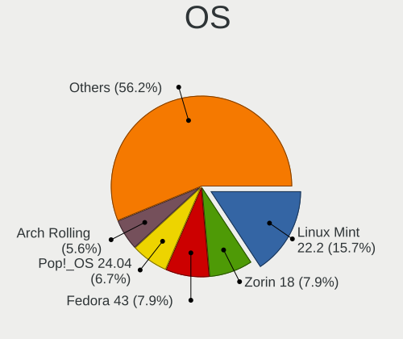

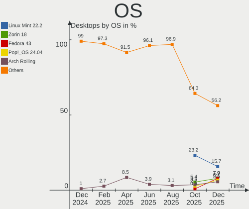

| Name                         | Desktops | Percent |
|------------------------------|----------|---------|
| Linux Mint 22.2              | 14       | 15.73%  |
| Zorin 18                     | 7        | 7.87%   |
| Fedora 43                    | 7        | 7.87%   |
| Pop!_OS 24.04                | 6        | 6.74%   |
| Arch Rolling                 | 5        | 5.62%   |
| Linux Mint 22.1              | 4        | 4.49%   |
| EndeavourOS Rolling          | 4        | 4.49%   |
| Debian 13                    | 4        | 4.49%   |
| Zorin 17                     | 3        | 3.37%   |
| Ubuntu 24.04                 | 3        | 3.37%   |
| OpenMandriva 25.90           | 3        | 3.37%   |
| Ubuntu 25.10                 | 2        | 2.25%   |
| Ubuntu 22.04                 | 2        | 2.25%   |
| OpenMandriva 24.90           | 2        | 2.25%   |
| CachyOS Rolling              | 2        | 2.25%   |
| Bazzite 43                   | 2        | 2.25%   |
| Bazzite 42                   | 2        | 2.25%   |
| Xubuntu 25.10                | 1        | 1.12%   |
| Xubuntu 24.04                | 1        | 1.12%   |
| Ubuntu 25.04                 | 1        | 1.12%   |
| Ubuntu 24.10                 | 1        | 1.12%   |
| Ubuntu 20.04                 | 1        | 1.12%   |
| openSUSE Tumbleweed-XXXXXXXX | 1        | 1.12%   |
| openSUSE Leap-16.0           | 1        | 1.12%   |
| OpenMandriva 6.0             | 1        | 1.12%   |
| MX 23                        | 1        | 1.12%   |
| LMDE 7                       | 1        | 1.12%   |
| Linux Mint 21.3              | 1        | 1.12%   |
| KDE neon 24.04               | 1        | 1.12%   |
| Deepin 23.1                  | 1        | 1.12%   |
| Debian 12                    | 1        | 1.12%   |
| Debian 11                    | 1        | 1.12%   |
| blendOS                      | 1        | 1.12%   |
| Aurora 43                    | 1        | 1.12%   |

OS Family
---------

OS without a version

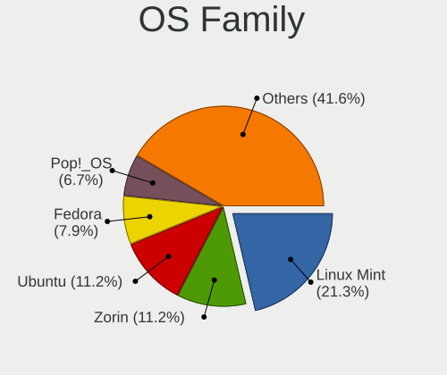

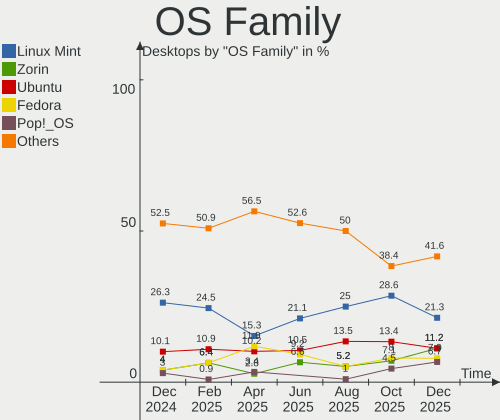

| Name         | Desktops | Percent |
|--------------|----------|---------|
| Linux Mint   | 19       | 21.35%  |
| Zorin        | 10       | 11.24%  |
| Ubuntu       | 10       | 11.24%  |
| Fedora       | 7        | 7.87%   |
| Pop!_OS      | 6        | 6.74%   |
| OpenMandriva | 6        | 6.74%   |
| Debian       | 6        | 6.74%   |
| Arch         | 5        | 5.62%   |
| EndeavourOS  | 4        | 4.49%   |
| Bazzite      | 4        | 4.49%   |
| Xubuntu      | 2        | 2.25%   |
| openSUSE     | 2        | 2.25%   |
| CachyOS      | 2        | 2.25%   |
| MX           | 1        | 1.12%   |
| LMDE         | 1        | 1.12%   |
| KDE neon     | 1        | 1.12%   |
| Deepin       | 1        | 1.12%   |
| blendOS      | 1        | 1.12%   |
| Aurora       | 1        | 1.12%   |

Kernel
------

Version of the Linux kernel

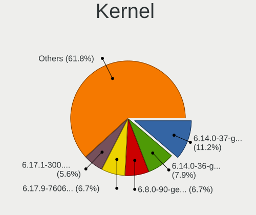

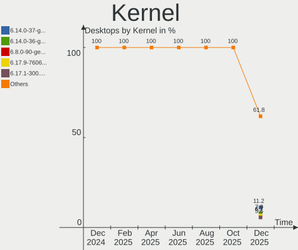

| Version                        | Desktops | Percent |
|--------------------------------|----------|---------|
| 6.14.0-37-generic              | 10       | 11.24%  |
| 6.14.0-36-generic              | 7        | 7.87%   |
| 6.8.0-90-generic               | 6        | 6.74%   |
| 6.17.9-76061709-generic        | 6        | 6.74%   |
| 6.17.1-300.fc43.x86_64         | 5        | 5.62%   |
| 6.14.2-desktop-3omv2590        | 4        | 4.49%   |
| 6.12.57+deb13-amd64            | 4        | 4.49%   |
| 6.8.0-88-generic               | 3        | 3.37%   |
| 6.18.2-arch2-1                 | 3        | 3.37%   |
| 6.17.9-arch1-1                 | 3        | 3.37%   |
| 6.8.0-87-generic               | 2        | 2.25%   |
| 6.8.0-51-generic               | 2        | 2.25%   |
| 6.17.9-zen1-1-zen              | 2        | 2.25%   |
| 6.17.7-ba20.fc43.x86_64        | 2        | 2.25%   |
| 6.16.4-116.bazzite.fc42.x86_64 | 2        | 2.25%   |
| 6.14.0-33-generic              | 2        | 2.25%   |
| 6.14.0-29-generic              | 2        | 2.25%   |
| 6.10.9-desktop-1omv2490        | 2        | 2.25%   |
| 6.8.12-9-pve                   | 1        | 1.12%   |
| 6.6.84-amd64-desktop-hwe       | 1        | 1.12%   |
| 6.18.2                         | 1        | 1.12%   |
| 6.18.1-arch1-2                 | 1        | 1.12%   |
| 6.18.1-2-cachyos               | 1        | 1.12%   |
| 6.17.9-300.fc43.x86_64         | 1        | 1.12%   |
| 6.17.9-2-cachyos               | 1        | 1.12%   |
| 6.17.8-2-default               | 1        | 1.12%   |
| 6.17.12-300.fc43.x86_64        | 1        | 1.12%   |
| 6.17.12-1-liquorix-amd64       | 1        | 1.12%   |
| 6.17.11-300.fc43.x86_64        | 1        | 1.12%   |
| 6.17.0-8-generic               | 1        | 1.12%   |
| 6.17.0-7-generic               | 1        | 1.12%   |
| 6.12.63-1-lts                  | 1        | 1.12%   |
| 6.12.43+deb13-amd64            | 1        | 1.12%   |
| 6.12.0-160000.7-default        | 1        | 1.12%   |
| 6.11.0-8-generic               | 1        | 1.12%   |
| 6.1.0-41-amd64                 | 1        | 1.12%   |
| 5.4.0-146-generic              | 1        | 1.12%   |
| 5.15.0-164-generic             | 1        | 1.12%   |
| 5.15.0-139-generic             | 1        | 1.12%   |
| 5.10.0-36-amd64                | 1        | 1.12%   |

Kernel Family
-------------

Linux kernel without a distro release

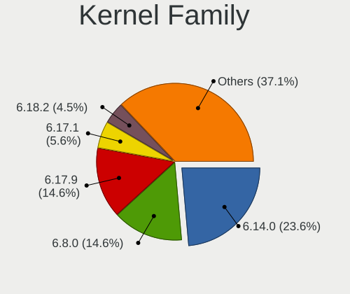

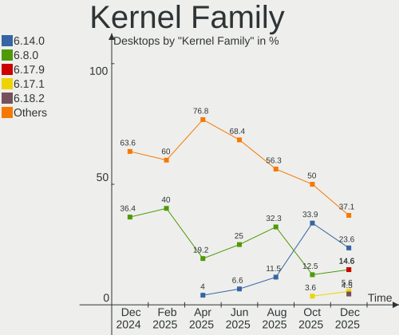

| Version | Desktops | Percent |
|---------|----------|---------|
| 6.14.0  | 21       | 23.6%   |
| 6.8.0   | 13       | 14.61%  |
| 6.17.9  | 13       | 14.61%  |
| 6.17.1  | 5        | 5.62%   |
| 6.18.2  | 4        | 4.49%   |
| 6.14.2  | 4        | 4.49%   |
| 6.12.57 | 4        | 4.49%   |
| 6.18.1  | 2        | 2.25%   |
| 6.17.7  | 2        | 2.25%   |
| 6.17.12 | 2        | 2.25%   |
| 6.17.0  | 2        | 2.25%   |
| 6.16.4  | 2        | 2.25%   |
| 6.10.9  | 2        | 2.25%   |
| 5.15.0  | 2        | 2.25%   |
| 6.8.12  | 1        | 1.12%   |
| 6.6.84  | 1        | 1.12%   |
| 6.17.8  | 1        | 1.12%   |
| 6.17.11 | 1        | 1.12%   |
| 6.12.63 | 1        | 1.12%   |
| 6.12.43 | 1        | 1.12%   |
| 6.12.0  | 1        | 1.12%   |
| 6.11.0  | 1        | 1.12%   |
| 6.1.0   | 1        | 1.12%   |
| 5.4.0   | 1        | 1.12%   |
| 5.10.0  | 1        | 1.12%   |

Kernel Major Ver.
-----------------

Linux kernel major version

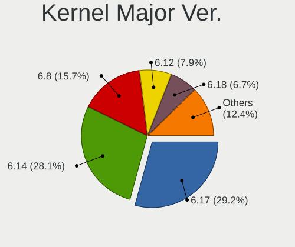

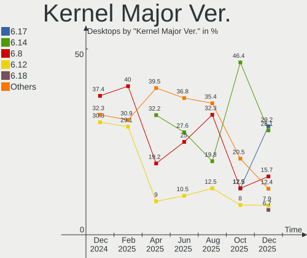

| Version | Desktops | Percent |
|---------|----------|---------|
| 6.17    | 26       | 29.21%  |
| 6.14    | 25       | 28.09%  |
| 6.8     | 14       | 15.73%  |
| 6.12    | 7        | 7.87%   |
| 6.18    | 6        | 6.74%   |
| 6.16    | 2        | 2.25%   |
| 6.10    | 2        | 2.25%   |
| 5.15    | 2        | 2.25%   |
| 6.6     | 1        | 1.12%   |
| 6.11    | 1        | 1.12%   |
| 6.1     | 1        | 1.12%   |
| 5.4     | 1        | 1.12%   |
| 5.10    | 1        | 1.12%   |

Arch
----

OS architecture (x86_64, i586, etc.)

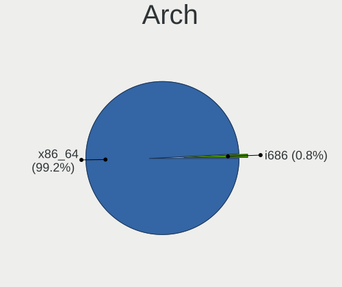

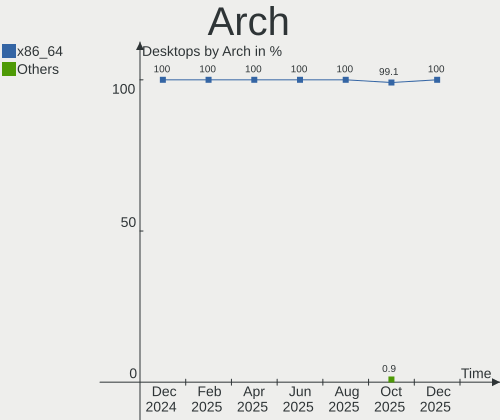

| Name   | Desktops | Percent |
|--------|----------|---------|
| x86_64 | 89       | 100%    |

DE
--

Desktop Environment

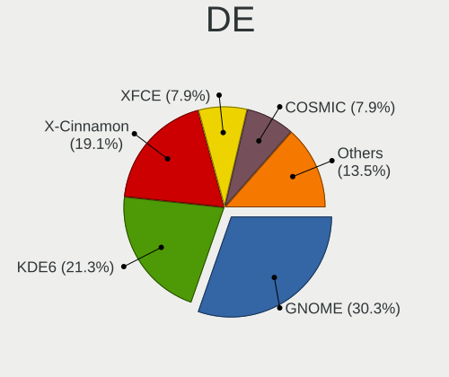

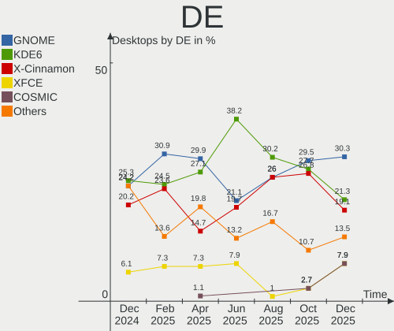

| Name       | Desktops | Percent |
|------------|----------|---------|
| GNOME      | 27       | 30.34%  |
| KDE6       | 19       | 21.35%  |
| X-Cinnamon | 17       | 19.1%   |
| XFCE       | 7        | 7.87%   |
| COSMIC     | 7        | 7.87%   |
| Hyprland   | 3        | 3.37%   |
| Unknown    | 3        | 3.37%   |
| MATE       | 2        | 2.25%   |
| KDE        | 1        | 1.12%   |
| i3         | 1        | 1.12%   |
| DDE        | 1        | 1.12%   |
| Budgie     | 1        | 1.12%   |

Display Server
--------------

X11 or Wayland

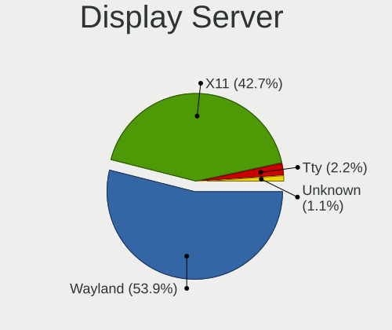

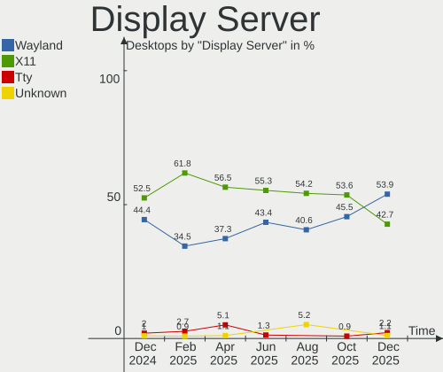

| Name    | Desktops | Percent |
|---------|----------|---------|
| Wayland | 48       | 53.93%  |
| X11     | 38       | 42.7%   |
| Tty     | 2        | 2.25%   |
| Unknown | 1        | 1.12%   |

Display Manager
---------------

SDDM, LightDM, etc.

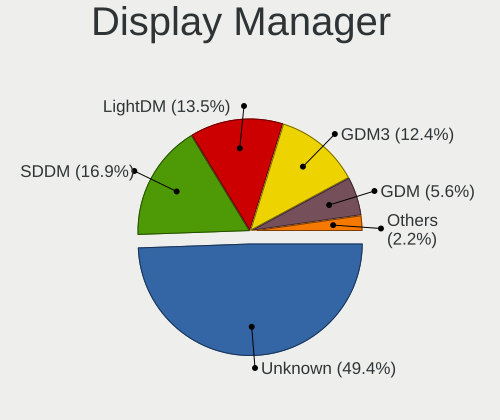

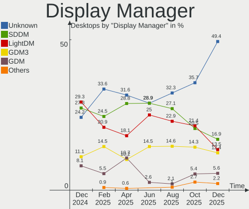

| Name           | Desktops | Percent |
|----------------|----------|---------|
| Unknown        | 44       | 49.44%  |
| SDDM           | 15       | 16.85%  |
| LightDM        | 12       | 13.48%  |
| GDM3           | 11       | 12.36%  |
| GDM            | 5        | 5.62%   |
| COSMIC-GREETER | 2        | 2.25%   |

OS Lang
-------

Language

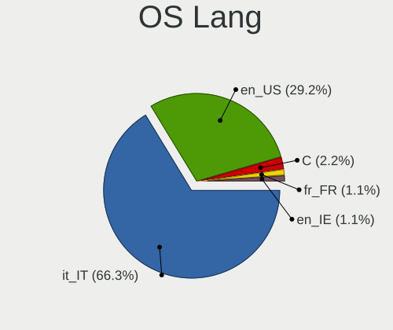

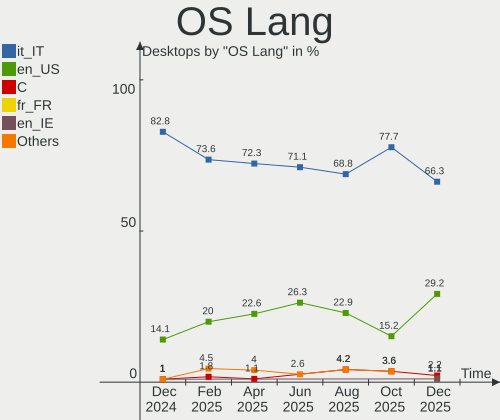

| Lang  | Desktops | Percent |
|-------|----------|---------|
| it_IT | 59       | 66.29%  |
| en_US | 26       | 29.21%  |
| C     | 2        | 2.25%   |
| fr_FR | 1        | 1.12%   |
| en_IE | 1        | 1.12%   |

Boot Mode
---------

EFI or BIOS

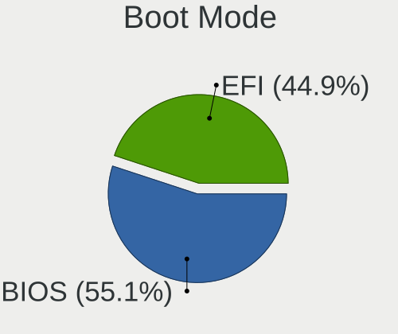

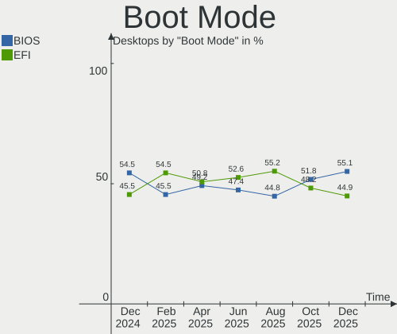

| Mode | Desktops | Percent |
|------|----------|---------|
| BIOS | 49       | 55.06%  |
| EFI  | 40       | 44.94%  |

Filesystem
----------

Type of filesystem

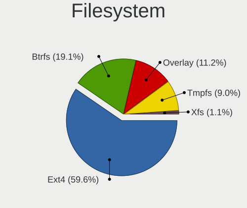

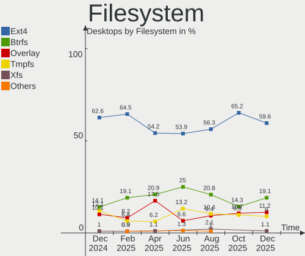

| Type    | Desktops | Percent |
|---------|----------|---------|
| Ext4    | 53       | 59.55%  |
| Btrfs   | 17       | 19.1%   |
| Overlay | 10       | 11.24%  |
| Tmpfs   | 8        | 8.99%   |
| Xfs     | 1        | 1.12%   |

Part. scheme
------------

Scheme of partitioning

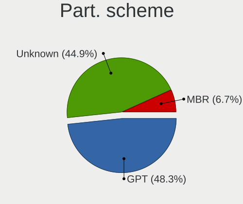

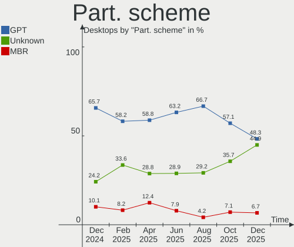

| Type    | Desktops | Percent |
|---------|----------|---------|
| GPT     | 43       | 48.31%  |
| Unknown | 40       | 44.94%  |
| MBR     | 6        | 6.74%   |

Dual Boot with Linux/BSD
------------------------

Hosting more than one Linux/BSD

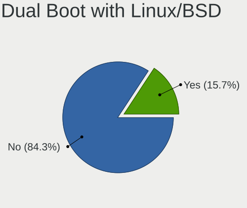

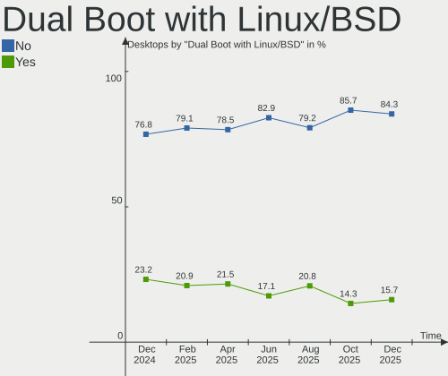

| Dual boot | Desktops | Percent |
|-----------|----------|---------|
| No        | 75       | 84.27%  |
| Yes       | 14       | 15.73%  |

Dual Boot (Win)
---------------

Hosting Linux and Windows

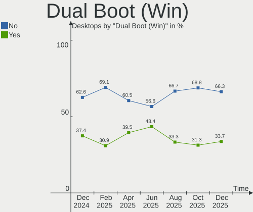

| Dual boot | Desktops | Percent |
|-----------|----------|---------|
| No        | 59       | 66.29%  |
| Yes       | 30       | 33.71%  |

Board
-----

Vendor
------

Motherboard manufacturer

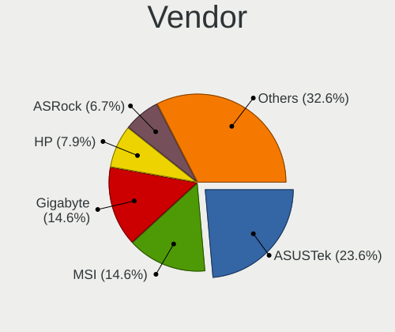

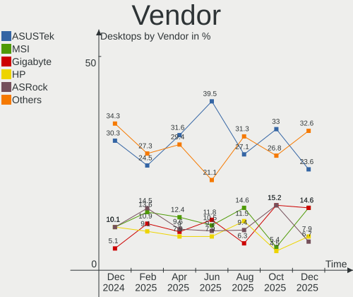

| Name                                 | Desktops | Percent |
|--------------------------------------|----------|---------|
| ASUSTek Computer                     | 21       | 23.6%   |
| MSI                                  | 13       | 14.61%  |
| Gigabyte Technology                  | 13       | 14.61%  |
| Hewlett-Packard                      | 7        | 7.87%   |
| ASRock                               | 6        | 6.74%   |
| Lenovo                               | 4        | 4.49%   |
| Fujitsu                              | 3        | 3.37%   |
| Dell                                 | 3        | 3.37%   |
| Unknown                              | 3        | 3.37%   |
| SZQFTX                               | 2        | 2.25%   |
| Intel                                | 2        | 2.25%   |
| Shuttle                              | 1        | 1.12%   |
| Shenzhen Meigao Electronic Equipment | 1        | 1.12%   |
| RealBom                              | 1        | 1.12%   |
| Packard Bell                         | 1        | 1.12%   |
| LinuxContainers                      | 1        | 1.12%   |
| HC Technology.                       | 1        | 1.12%   |
| GMKtec                               | 1        | 1.12%   |
| GEEKOM                               | 1        | 1.12%   |
| AZW                                  | 1        | 1.12%   |
| ANGXUN                               | 1        | 1.12%   |
| Advantech                            | 1        | 1.12%   |
| Acer                                 | 1        | 1.12%   |

Model
-----

Motherboard model

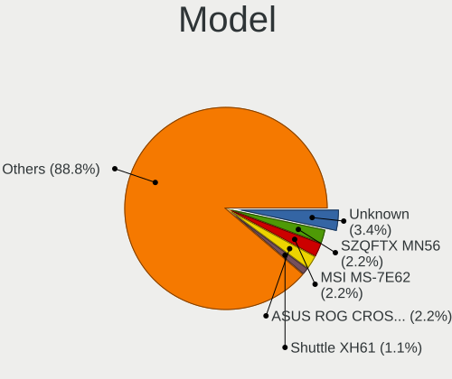

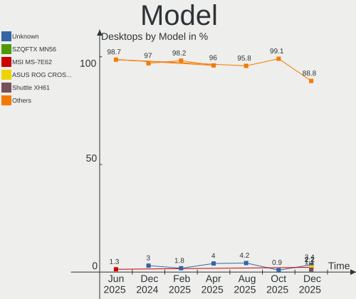

| Name                                               | Desktops | Percent |
|----------------------------------------------------|----------|---------|
| Unknown                                            | 3        | 3.37%   |
| SZQFTX MN56                                        | 2        | 2.25%   |
| MSI MS-7E62                                        | 2        | 2.25%   |
| ASUS ROG CROSSHAIR X870E HERO                      | 2        | 2.25%   |
| Shuttle XH61                                       | 1        | 1.12%   |
| Shenzhen Meigao Electronic Equipment Venus series  | 1        | 1.12%   |
| RealBom RB-P101G                                   | 1        | 1.12%   |
| Packard Bell IMEDIA S3210                          | 1        | 1.12%   |
| MSI MS-7E59                                        | 1        | 1.12%   |
| MSI MS-7E01                                        | 1        | 1.12%   |
| MSI MS-7D98                                        | 1        | 1.12%   |
| MSI MS-7D91                                        | 1        | 1.12%   |
| MSI MS-7D75                                        | 1        | 1.12%   |
| MSI MS-7C95                                        | 1        | 1.12%   |
| MSI MS-7C56                                        | 1        | 1.12%   |
| MSI MS-7C37                                        | 1        | 1.12%   |
| MSI MS-7976                                        | 1        | 1.12%   |
| MSI MS-7817                                        | 1        | 1.12%   |
| MSI MPG B460 Trident AS (MS-B926)                  | 1        | 1.12%   |
| LinuxContainers Standard PC (Q35 + ICH9, 2009)     | 1        | 1.12%   |
| Lenovo ThinkCentre M92 3235F2G                     | 1        | 1.12%   |
| Lenovo ThinkCentre M910t 10MNS1Y900                | 1        | 1.12%   |
| Lenovo ThinkCentre M75s Gen 2 11JAS1AB00           | 1        | 1.12%   |
| Lenovo ThinkCentre M720t Enter the machine type an | 1        | 1.12%   |
| Intel Productiva                                   | 1        | 1.12%   |
| Intel DQ45CB AAE30148-301                          | 1        | 1.12%   |
| HP Z2 Tower G4 Workstation                         | 1        | 1.12%   |
| HP ProLiant ML350p Gen8                            | 1        | 1.12%   |
| HP ProDesk 400 G5 MT                               | 1        | 1.12%   |
| HP Pavilion Desktop 590-p0xxx                      | 1        | 1.12%   |
| HP EliteDesk 800 G1 SFF                            | 1        | 1.12%   |
| HP Compaq Pro 6300 SFF                             | 1        | 1.12%   |
| HP Compaq dc7900 Small Form Factor                 | 1        | 1.12%   |
| HC Technology. HCAR5000-MI                         | 1        | 1.12%   |
| GMKtec NucBox M7 Pro                               | 1        | 1.12%   |
| Gigabyte Z97X-Gaming 5                             | 1        | 1.12%   |
| Gigabyte X870 AORUS ELITE WIFI7 ICE                | 1        | 1.12%   |
| Gigabyte X670 AORUS ELITE AX                       | 1        | 1.12%   |
| Gigabyte X470 AORUS ULTRA GAMING                   | 1        | 1.12%   |
| Gigabyte H97-HD3                                   | 1        | 1.12%   |

Model Family
------------

Motherboard model prefix

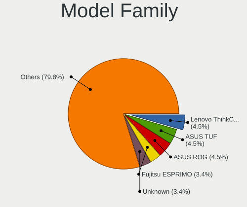

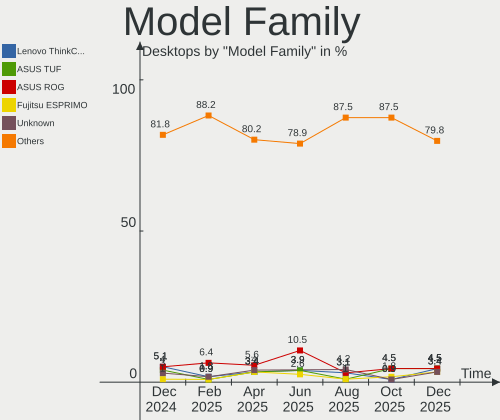

| Name                                       | Desktops | Percent |
|--------------------------------------------|----------|---------|
| Lenovo ThinkCentre                         | 4        | 4.49%   |
| ASUS TUF                                   | 4        | 4.49%   |
| ASUS ROG                                   | 4        | 4.49%   |
| Fujitsu ESPRIMO                            | 3        | 3.37%   |
| Unknown                                    | 3        | 3.37%   |
| SZQFTX MN56                                | 2        | 2.25%   |
| MSI MS-7E62                                | 2        | 2.25%   |
| HP Compaq                                  | 2        | 2.25%   |
| Dell Studio                                | 2        | 2.25%   |
| ASUS SABERTOOTH                            | 2        | 2.25%   |
| ASUS PRIME                                 | 2        | 2.25%   |
| Shuttle XH61                               | 1        | 1.12%   |
| Shenzhen Meigao Electronic Equipment Venus | 1        | 1.12%   |
| RealBom RB-P101G                           | 1        | 1.12%   |
| Packard Bell IMEDIA                        | 1        | 1.12%   |
| MSI MS-7E59                                | 1        | 1.12%   |
| MSI MS-7E01                                | 1        | 1.12%   |
| MSI MS-7D98                                | 1        | 1.12%   |
| MSI MS-7D91                                | 1        | 1.12%   |
| MSI MS-7D75                                | 1        | 1.12%   |
| MSI MS-7C95                                | 1        | 1.12%   |
| MSI MS-7C56                                | 1        | 1.12%   |
| MSI MS-7C37                                | 1        | 1.12%   |
| MSI MS-7976                                | 1        | 1.12%   |
| MSI MS-7817                                | 1        | 1.12%   |
| MSI MPG                                    | 1        | 1.12%   |
| LinuxContainers Standard                   | 1        | 1.12%   |
| Intel Productiva                           | 1        | 1.12%   |
| Intel DQ45CB                               | 1        | 1.12%   |
| HP Z2                                      | 1        | 1.12%   |
| HP ProLiant                                | 1        | 1.12%   |
| HP ProDesk                                 | 1        | 1.12%   |
| HP Pavilion                                | 1        | 1.12%   |
| HP EliteDesk                               | 1        | 1.12%   |
| HC Technology. HCAR5000-MI                 | 1        | 1.12%   |
| GMKtec NucBox                              | 1        | 1.12%   |
| Gigabyte Z97X-Gaming                       | 1        | 1.12%   |
| Gigabyte X870                              | 1        | 1.12%   |
| Gigabyte X670                              | 1        | 1.12%   |
| Gigabyte X470                              | 1        | 1.12%   |

MFG Year
--------

Motherboard manufacture year

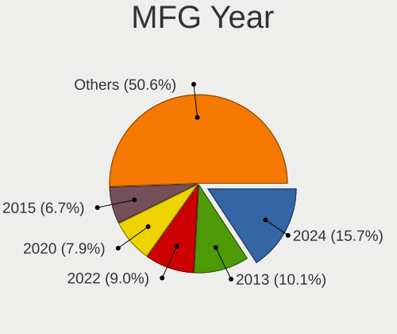

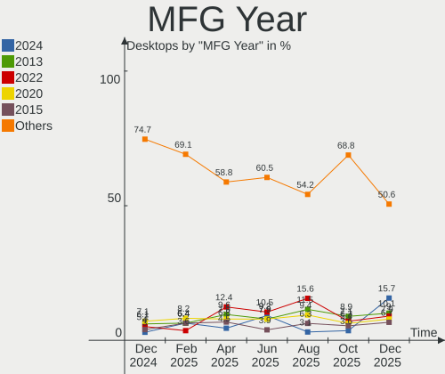

| Year | Desktops | Percent |
|------|----------|---------|
| 2024 | 14       | 15.73%  |
| 2013 | 9        | 10.11%  |
| 2022 | 8        | 8.99%   |
| 2020 | 7        | 7.87%   |
| 2015 | 6        | 6.74%   |
| 2012 | 6        | 6.74%   |
| 2021 | 5        | 5.62%   |
| 2023 | 4        | 4.49%   |
| 2019 | 4        | 4.49%   |
| 2018 | 4        | 4.49%   |
| 2017 | 4        | 4.49%   |
| 2025 | 3        | 3.37%   |
| 2016 | 3        | 3.37%   |
| 2014 | 3        | 3.37%   |
| 2009 | 3        | 3.37%   |
| 2008 | 3        | 3.37%   |
| 2010 | 2        | 2.25%   |
| 2011 | 1        | 1.12%   |

Form Factor
-----------

Physical design of the computer

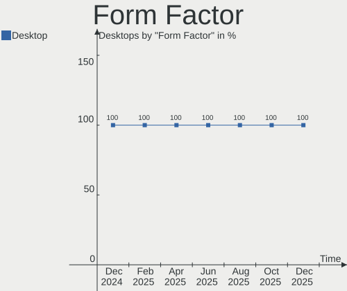

| Name    | Desktops | Percent |
|---------|----------|---------|
| Desktop | 89       | 100%    |

Secure Boot
-----------

Enabled or disabled

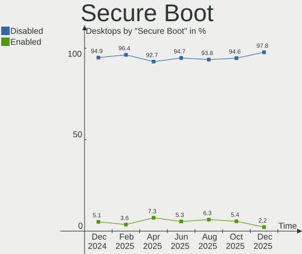

| State    | Desktops | Percent |
|----------|----------|---------|
| Disabled | 87       | 97.75%  |
| Enabled  | 2        | 2.25%   |

Coreboot
--------

Have coreboot on board

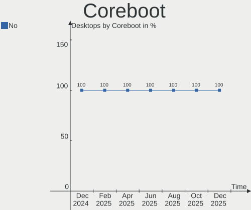

| Used | Desktops | Percent |
|------|----------|---------|
| No   | 89       | 100%    |

RAM Size
--------

Total RAM memory

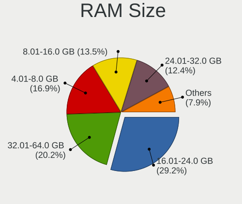

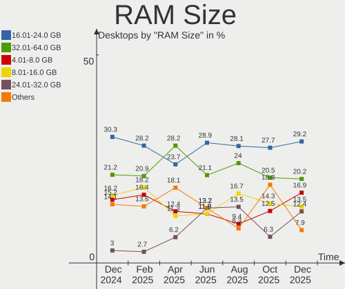

| Size in GB  | Desktops | Percent |
|-------------|----------|---------|
| 16.01-24.0  | 26       | 29.21%  |
| 32.01-64.0  | 18       | 20.22%  |
| 4.01-8.0    | 15       | 16.85%  |
| 8.01-16.0   | 12       | 13.48%  |
| 24.01-32.0  | 11       | 12.36%  |
| 3.01-4.0    | 5        | 5.62%   |
| 64.01-256.0 | 1        | 1.12%   |
| 1.01-2.0    | 1        | 1.12%   |

RAM Used
--------

Used RAM memory

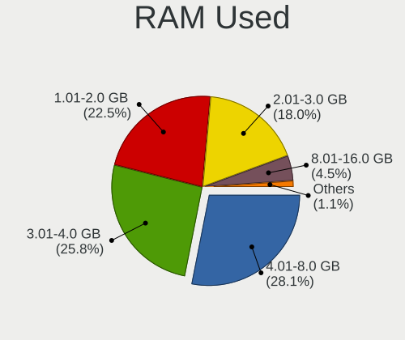

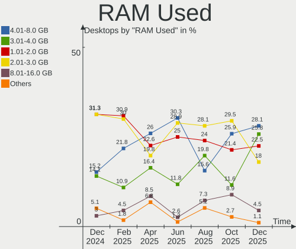

| Used GB   | Desktops | Percent |
|-----------|----------|---------|
| 4.01-8.0  | 25       | 28.09%  |
| 3.01-4.0  | 23       | 25.84%  |
| 1.01-2.0  | 20       | 22.47%  |
| 2.01-3.0  | 16       | 17.98%  |
| 8.01-16.0 | 4        | 4.49%   |
| 0.51-1.0  | 1        | 1.12%   |

Total Drives
------------

Number of drives on board

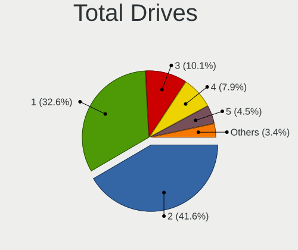

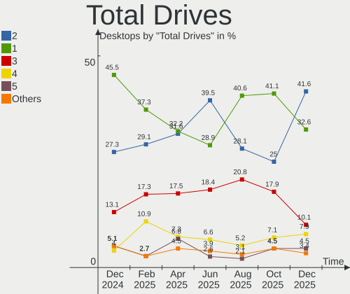

| Drives | Desktops | Percent |
|--------|----------|---------|
| 2      | 37       | 41.57%  |
| 1      | 29       | 32.58%  |
| 3      | 9        | 10.11%  |
| 4      | 7        | 7.87%   |
| 5      | 4        | 4.49%   |
| 6      | 2        | 2.25%   |
| 7      | 1        | 1.12%   |

Has CD-ROM
----------

Has CD-ROM on board

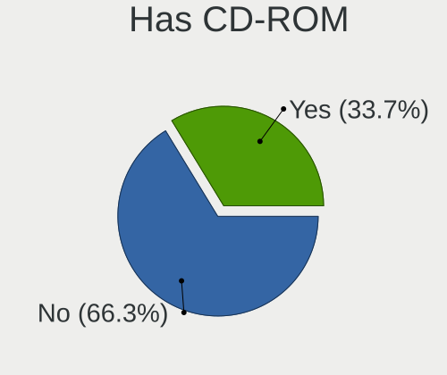

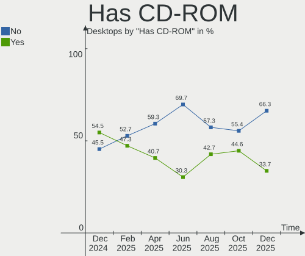

| Presented | Desktops | Percent |
|-----------|----------|---------|
| No        | 59       | 66.29%  |
| Yes       | 30       | 33.71%  |

Has Ethernet
------------

Has Ethernet on board

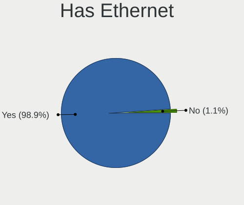

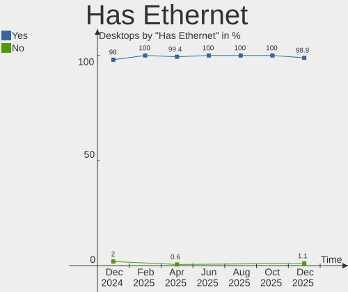

| Presented | Desktops | Percent |
|-----------|----------|---------|
| Yes       | 88       | 98.88%  |
| No        | 1        | 1.12%   |

Has WiFi
--------

Has WiFi module

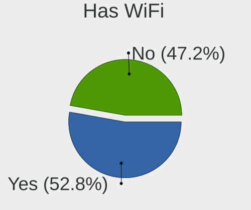

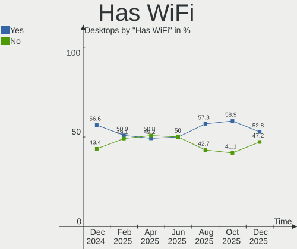

| Presented | Desktops | Percent |
|-----------|----------|---------|
| Yes       | 47       | 52.81%  |
| No        | 42       | 47.19%  |

Has Bluetooth
-------------

Has Bluetooth module

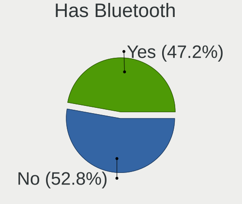

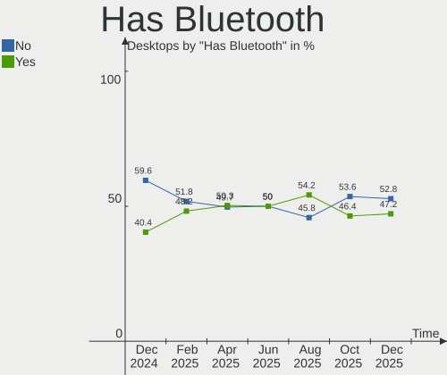

| Presented | Desktops | Percent |
|-----------|----------|---------|
| No        | 47       | 52.81%  |
| Yes       | 42       | 47.19%  |

Location
--------

Country
-------

Geographic location (country)

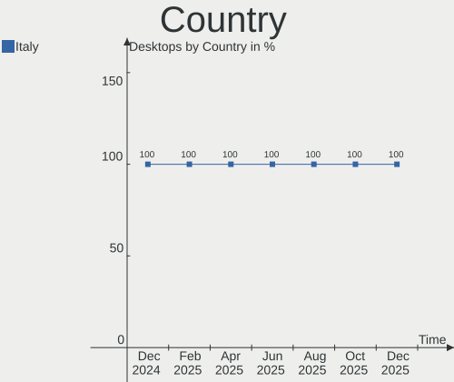

| Country | Desktops | Percent |
|---------|----------|---------|
| Italy   | 89       | 100%    |

City
----

Geographic location (city)

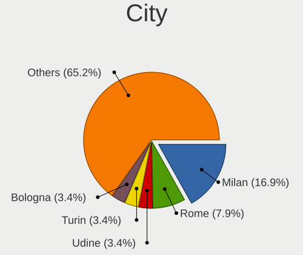

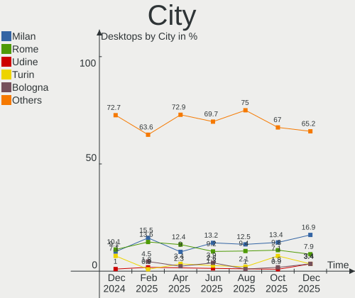

| City                      | Desktops | Percent |
|---------------------------|----------|---------|
| Milan                     | 15       | 16.85%  |
| Rome                      | 7        | 7.87%   |
| Udine                     | 3        | 3.37%   |
| Turin                     | 3        | 3.37%   |
| Bologna                   | 3        | 3.37%   |
| Florence                  | 2        | 2.25%   |
| Vicenza                   | 1        | 1.12%   |
| Verona                    | 1        | 1.12%   |
| Vairano Patenora          | 1        | 1.12%   |
| Trieste                   | 1        | 1.12%   |
| Trento                    | 1        | 1.12%   |
| Taranto                   | 1        | 1.12%   |
| Sessa Cilento             | 1        | 1.12%   |
| San Pietro in Cariano     | 1        | 1.12%   |
| San Giovanni in Persiceto | 1        | 1.12%   |
| San Cesario di Lecce      | 1        | 1.12%   |
| Salerno                   | 1        | 1.12%   |
| Rubiera                   | 1        | 1.12%   |
| Roddi                     | 1        | 1.12%   |
| Rocca Massima             | 1        | 1.12%   |
| Riolo Terme               | 1        | 1.12%   |
| Reggio Emilia             | 1        | 1.12%   |
| Porto Torres              | 1        | 1.12%   |
| Pomigliano d'Arco         | 1        | 1.12%   |
| Palermo                   | 1        | 1.12%   |
| Padova                    | 1        | 1.12%   |
| Novara                    | 1        | 1.12%   |
| Naples                    | 1        | 1.12%   |
| Monza                     | 1        | 1.12%   |
| Modena                    | 1        | 1.12%   |
| Milano                    | 1        | 1.12%   |
| Mezzolombardo             | 1        | 1.12%   |
| Merate                    | 1        | 1.12%   |
| Massafra                  | 1        | 1.12%   |
| Massa                     | 1        | 1.12%   |
| Luzzi                     | 1        | 1.12%   |
| Lugo                      | 1        | 1.12%   |
| Lizzanello                | 1        | 1.12%   |
| Livorno                   | 1        | 1.12%   |
| Legnano                   | 1        | 1.12%   |

Drives
------

Drive Vendor
------------

Hard drive vendors

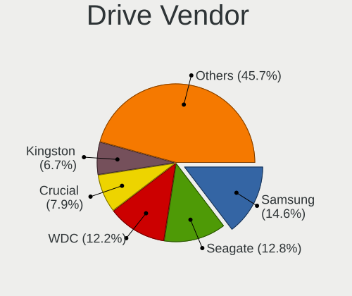

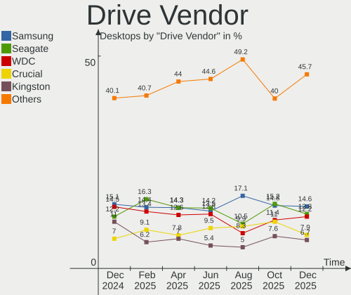

| Vendor                       | Desktops | Drives | Percent |
|------------------------------|----------|--------|---------|
| Samsung Electronics          | 24       | 33     | 14.63%  |
| Seagate                      | 21       | 23     | 12.8%   |
| WDC                          | 20       | 26     | 12.2%   |
| Crucial                      | 13       | 16     | 7.93%   |
| Kingston                     | 11       | 11     | 6.71%   |
| Toshiba                      | 7        | 8      | 4.27%   |
| SanDisk                      | 6        | 7      | 3.66%   |
| MAXIO Technology (Hangzhou)  | 5        | 6      | 3.05%   |
| Kingston Technology Company  | 4        | 4      | 2.44%   |
| Micron Technology            | 3        | 3      | 1.83%   |
| Unknown                      | 2        | 2      | 1.22%   |
| Realtek Semiconductor        | 2        | 2      | 1.22%   |
| Phison Electronics           | 2        | 2      | 1.22%   |
| Patriot                      | 2        | 2      | 1.22%   |
| Micron/Crucial Technology    | 2        | 2      | 1.22%   |
| Maxtor                       | 2        | 2      | 1.22%   |
| KODAK                        | 2        | 2      | 1.22%   |
| KingSpec                     | 2        | 2      | 1.22%   |
| Intel                        | 2        | 5      | 1.22%   |
| Corsair                      | 2        | 2      | 1.22%   |
| China                        | 2        | 2      | 1.22%   |
| WDC WDS1                     | 1        | 1      | 0.61%   |
| USB                          | 1        | 1      | 0.61%   |
| SPCC                         | 1        | 1      | 0.61%   |
| Solidigm                     | 1        | 1      | 0.61%   |
| Shenzhen Longsys Electronics | 1        | 1      | 0.61%   |
| Red Hat                      | 1        | 1      | 0.61%   |
| Realtek                      | 1        | 1      | 0.61%   |
| Plextor                      | 1        | 1      | 0.61%   |
| Phison                       | 1        | 2      | 0.61%   |
| OCZ                          | 1        | 1      | 0.61%   |
| NGFF                         | 1        | 1      | 0.61%   |
| Lexar                        | 1        | 1      | 0.61%   |
| KIOXIA                       | 1        | 1      | 0.61%   |
| Intenso                      | 1        | 1      | 0.61%   |
| HPE                          | 1        | 4      | 0.61%   |
| Hitachi                      | 1        | 1      | 0.61%   |
| Hewlett-Packard              | 1        | 1      | 0.61%   |
| Go-Infinity                  | 1        | 1      | 0.61%   |
| Firebat                      | 1        | 1      | 0.61%   |

Drive Model
-----------

Hard drive models

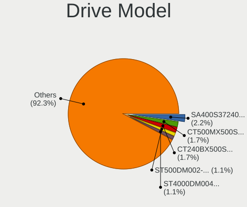

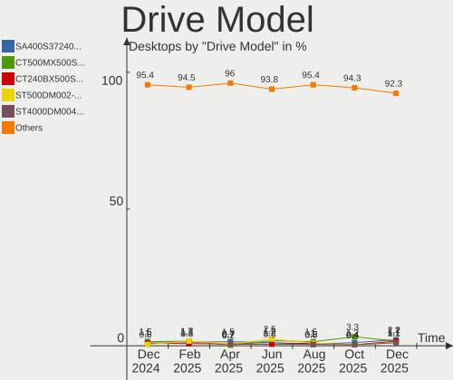

| Model                                              | Desktops | Percent |
|----------------------------------------------------|----------|---------|
| Kingston SA400S37240G 240GB SSD                    | 4        | 2.21%   |
| Crucial CT500MX500SSD1 500GB                       | 3        | 1.66%   |
| Crucial CT240BX500SSD1 240GB                       | 3        | 1.66%   |
| Seagate ST500DM002-1BD142 500GB                    | 2        | 1.1%    |
| Seagate ST4000DM004-2CV104 4TB                     | 2        | 1.1%    |
| Seagate ST3500418AS 500GB                          | 2        | 1.1%    |
| Seagate ST2000DM008-2UB102 2TB                     | 2        | 1.1%    |
| Seagate ST1000DM003-1SB10C 1TB                     | 2        | 1.1%    |
| Samsung SSD 870 QVO 1TB                            | 2        | 1.1%    |
| Samsung SSD 850 PRO 256GB                          | 2        | 1.1%    |
| Samsung SSD 850 EVO 250GB                          | 2        | 1.1%    |
| Samsung NVMe SSD Controller SM981/PM981/PM983 1TB  | 2        | 1.1%    |
| Samsung NVMe SSD Controller S4LV008[Pascal] 4TB    | 2        | 1.1%    |
| Samsung NVMe SSD Controller PM9A1/PM9A3/980PRO 1TB | 2        | 1.1%    |
| KODAK SSD X120 PRO 128GB                           | 2        | 1.1%    |
| Kingston Company SNV2S1000G 1TB                    | 2        | 1.1%    |
| Kingston SA400S37480G 480GB SSD                    | 2        | 1.1%    |
| Crucial CT2000MX500SSD1 2TB                        | 2        | 1.1%    |
| Crucial CT1000MX500SSD1 1TB                        | 2        | 1.1%    |
| WDC WDS500G2B0A-00SM50 500GB                       | 1        | 0.55%   |
| WDC WDS240G2G0A-00JH30 240GB SSD                   | 1        | 0.55%   |
| WDC WDS100T1R0A-68A4W0 1TB                         | 1        | 0.55%   |
| WDC WDS1 00T2B0A-00SM 1TB SSD                      | 1        | 0.55%   |
| WDC WD6400AARS-00Y5B1 640GB                        | 1        | 0.55%   |
| WDC WD6400AAKS-75A7B2 640GB                        | 1        | 0.55%   |
| WDC WD5000AAKX-003CA0 500GB                        | 1        | 0.55%   |
| WDC WD40PURZ-85TTDY0 4TB                           | 1        | 0.55%   |
| WDC WD3200BEVT-22ZCT0 320GB                        | 1        | 0.55%   |
| WDC WD3200AAKS-75L9A0 320GB                        | 1        | 0.55%   |
| WDC WD32 00AAJS-22B4A0 320GB                       | 1        | 0.55%   |
| WDC WD2500AVJS-63B6A0 250GB                        | 1        | 0.55%   |
| WDC WD20EFRX-68EUZN0 2TB                           | 1        | 0.55%   |
| WDC WD20EARX-22PASB0 2TB                           | 1        | 0.55%   |
| WDC WD20EARS-00MVWB0 2TB                           | 1        | 0.55%   |
| WDC WD1600AAJS-07PSA0 160GB                        | 1        | 0.55%   |
| WDC WD10EZEX-60ZF5A0 1TB                           | 1        | 0.55%   |
| WDC WD10EZEX-60WN4A1 1TB                           | 1        | 0.55%   |
| WDC WD10EZEX-60WN4A0 1TB                           | 1        | 0.55%   |
| WDC WD10EZEX-08WN4A0 1TB                           | 1        | 0.55%   |
| WDC WD10EZEX-00WN4A0 1TB                           | 1        | 0.55%   |

HDD Vendor
----------

Hard disk drive vendors

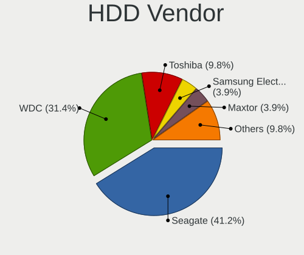

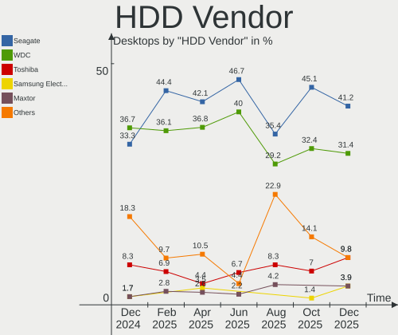

| Vendor              | Desktops | Drives | Percent |
|---------------------|----------|--------|---------|
| Seagate             | 21       | 23     | 41.18%  |
| WDC                 | 16       | 22     | 31.37%  |
| Toshiba             | 5        | 6      | 9.8%    |
| Samsung Electronics | 2        | 2      | 3.92%   |
| Maxtor              | 2        | 2      | 3.92%   |
| HPE                 | 1        | 4      | 1.96%   |
| Hitachi             | 1        | 1      | 1.96%   |
| Hewlett-Packard     | 1        | 1      | 1.96%   |
| External            | 1        | 1      | 1.96%   |
| ASMT                | 1        | 2      | 1.96%   |

SSD Vendor
----------

Solid state drive vendors

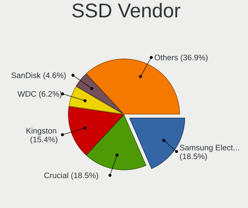

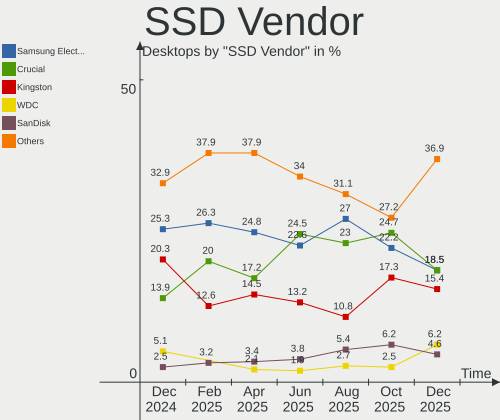

| Vendor              | Desktops | Drives | Percent |
|---------------------|----------|--------|---------|
| Samsung Electronics | 12       | 14     | 18.46%  |
| Crucial             | 12       | 14     | 18.46%  |
| Kingston            | 10       | 10     | 15.38%  |
| WDC                 | 4        | 4      | 6.15%   |
| SanDisk             | 3        | 3      | 4.62%   |
| Micron Technology   | 3        | 3      | 4.62%   |
| Toshiba             | 2        | 2      | 3.08%   |
| KODAK               | 2        | 2      | 3.08%   |
| KingSpec            | 2        | 2      | 3.08%   |
| Corsair             | 2        | 2      | 3.08%   |
| China               | 2        | 2      | 3.08%   |
| WDC WDS1            | 1        | 1      | 1.54%   |
| SPCC                | 1        | 1      | 1.54%   |
| Plextor             | 1        | 1      | 1.54%   |
| Patriot             | 1        | 1      | 1.54%   |
| OCZ                 | 1        | 1      | 1.54%   |
| NGFF                | 1        | 1      | 1.54%   |
| Intenso             | 1        | 1      | 1.54%   |
| Intel               | 1        | 4      | 1.54%   |
| Fanxiang            | 1        | 1      | 1.54%   |
| EDILOCA             | 1        | 1      | 1.54%   |
| ANKEJE              | 1        | 1      | 1.54%   |

Drive Kind
----------

HDD or SSD

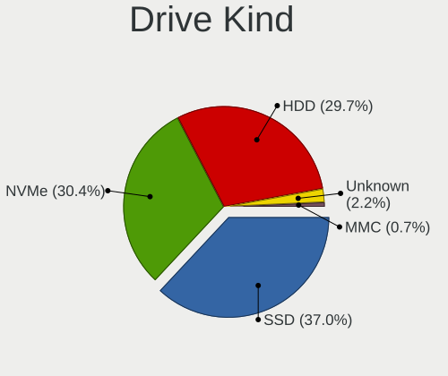

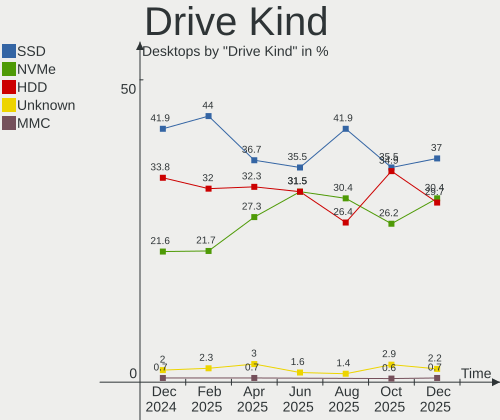

| Kind    | Desktops | Drives | Percent |
|---------|----------|--------|---------|
| SSD     | 51       | 72     | 36.96%  |
| NVMe    | 42       | 57     | 30.43%  |
| HDD     | 41       | 64     | 29.71%  |
| Unknown | 3        | 3      | 2.17%   |
| MMC     | 1        | 1      | 0.72%   |

Drive Connector
---------------

SATA, SAS, NVMe, etc.

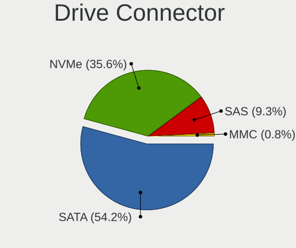

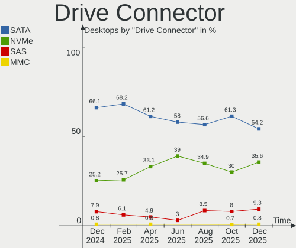

| Type | Desktops | Drives | Percent |
|------|----------|--------|---------|
| SATA | 64       | 128    | 54.24%  |
| NVMe | 42       | 56     | 35.59%  |
| SAS  | 11       | 12     | 9.32%   |
| MMC  | 1        | 1      | 0.85%   |

Drive Size
----------

Size of hard drive

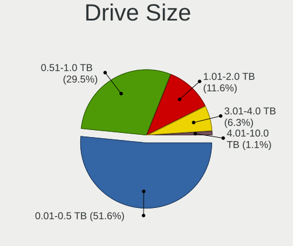

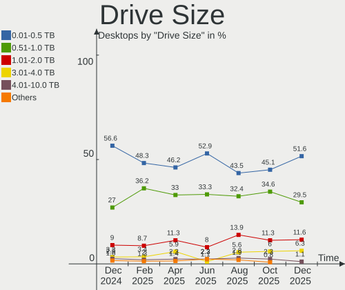

| Size in TB | Desktops | Drives | Percent |
|------------|----------|--------|---------|
| 0.01-0.5   | 49       | 79     | 51.58%  |
| 0.51-1.0   | 28       | 36     | 29.47%  |
| 1.01-2.0   | 11       | 12     | 11.58%  |
| 3.01-4.0   | 6        | 8      | 6.32%   |
| 4.01-10.0  | 1        | 1      | 1.05%   |

Space Total
-----------

Amount of disk space available on the file system

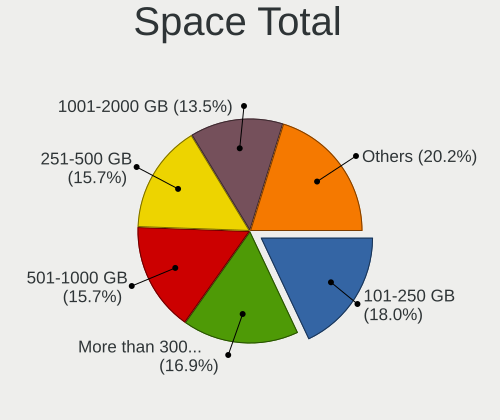

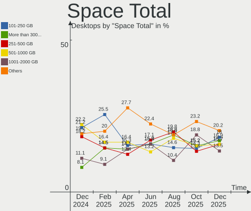

| Size in GB     | Desktops | Percent |
|----------------|----------|---------|
| 101-250        | 16       | 17.98%  |
| More than 3000 | 15       | 16.85%  |
| 251-500        | 14       | 15.73%  |
| 501-1000       | 14       | 15.73%  |
| 1001-2000      | 12       | 13.48%  |
| 2001-3000      | 5        | 5.62%   |
| 1-20           | 5        | 5.62%   |
| Unknown        | 4        | 4.49%   |
| 51-100         | 3        | 3.37%   |
| 21-50          | 1        | 1.12%   |

Space Used
----------

Amount of used disk space

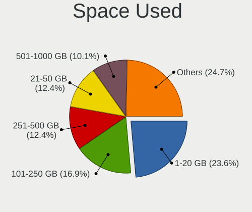

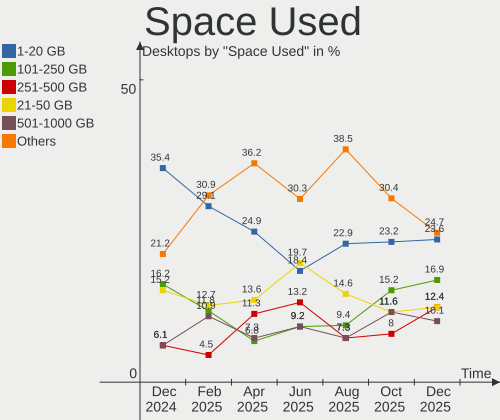

| Used GB        | Desktops | Percent |
|----------------|----------|---------|
| 1-20           | 21       | 23.6%   |
| 101-250        | 15       | 16.85%  |
| 251-500        | 11       | 12.36%  |
| 21-50          | 11       | 12.36%  |
| 501-1000       | 9        | 10.11%  |
| 51-100         | 8        | 8.99%   |
| 1001-2000      | 4        | 4.49%   |
| Unknown        | 4        | 4.49%   |
| More than 3000 | 3        | 3.37%   |
| 2001-3000      | 3        | 3.37%   |

Malfunc. Drives
---------------

Drive models with a malfunction

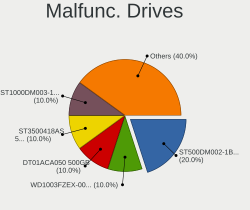

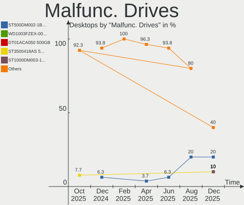

| Model                             | Desktops | Drives | Percent |
|-----------------------------------|----------|--------|---------|
| Seagate ST500DM002-1BD142 500GB   | 2        | 2      | 20%     |
| WDC WD1003FZEX-00K3CA0 1TB        | 1        | 1      | 10%     |
| Toshiba DT01ACA050 500GB          | 1        | 1      | 10%     |
| Seagate ST3500418AS 500GB         | 1        | 1      | 10%     |
| Seagate ST1000DM003-1CH162 1TB    | 1        | 1      | 10%     |
| Samsung Electronics HD501LJ 500GB | 1        | 1      | 10%     |
| Maxtor 6V200E0 208GB              | 1        | 1      | 10%     |
| Corsair Force GT 120GB SSD        | 1        | 1      | 10%     |
| ANKEJE USB3.0 64GB SSD            | 1        | 1      | 10%     |

Malfunc. Drive Vendor
---------------------

Vendors of faulty drives

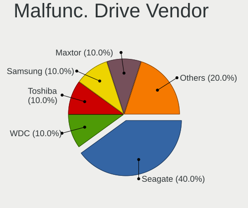

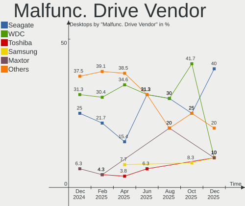

| Vendor              | Desktops | Drives | Percent |
|---------------------|----------|--------|---------|
| Seagate             | 4        | 4      | 40%     |
| WDC                 | 1        | 1      | 10%     |
| Toshiba             | 1        | 1      | 10%     |
| Samsung Electronics | 1        | 1      | 10%     |
| Maxtor              | 1        | 1      | 10%     |
| Corsair             | 1        | 1      | 10%     |
| ANKEJE              | 1        | 1      | 10%     |

Malfunc. HDD Vendor
-------------------

Vendors of faulty HDD drives

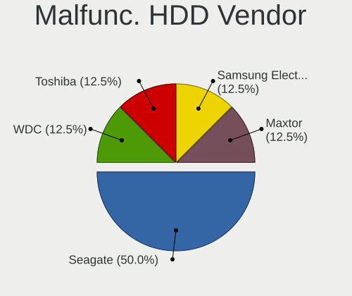

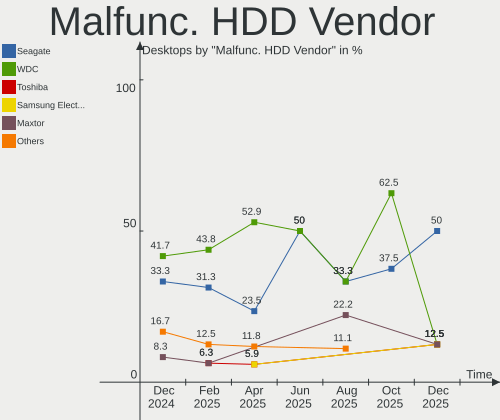

| Vendor              | Desktops | Drives | Percent |
|---------------------|----------|--------|---------|
| Seagate             | 4        | 4      | 50%     |
| WDC                 | 1        | 1      | 12.5%   |
| Toshiba             | 1        | 1      | 12.5%   |
| Samsung Electronics | 1        | 1      | 12.5%   |
| Maxtor              | 1        | 1      | 12.5%   |

Malfunc. Drive Kind
-------------------

Kinds of faulty drives

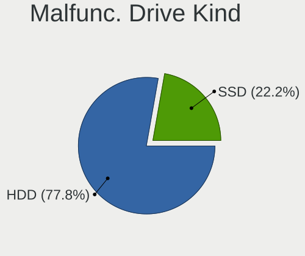

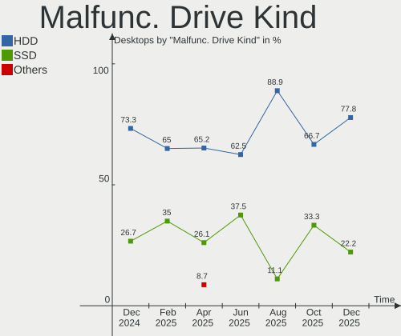

| Kind | Desktops | Drives | Percent |
|------|----------|--------|---------|
| HDD  | 7        | 8      | 77.78%  |
| SSD  | 2        | 2      | 22.22%  |

Failed Drives
-------------

Failed drive models

Zero info for selected period =(

Failed Drive Vendor
-------------------

Failed drive vendors

Zero info for selected period =(

Drive Status
------------

Number of failed and malfunc. drives

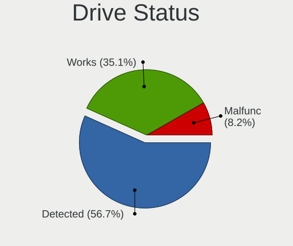

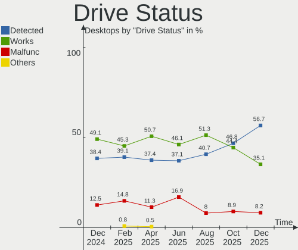

| Status   | Desktops | Drives | Percent |
|----------|----------|--------|---------|
| Detected | 55       | 119    | 56.7%   |
| Works    | 34       | 68     | 35.05%  |
| Malfunc  | 8        | 10     | 8.25%   |

Storage controller
------------------

Storage Vendor
--------------

Storage controller vendors

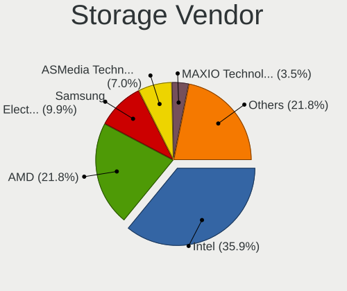

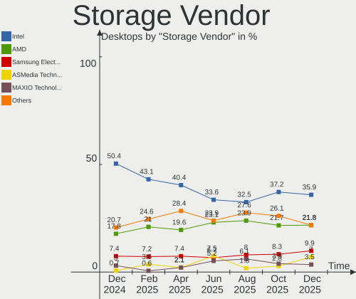

| Vendor                        | Desktops | Percent |
|-------------------------------|----------|---------|
| Intel                         | 51       | 35.92%  |
| AMD                           | 31       | 21.83%  |
| Samsung Electronics           | 14       | 9.86%   |
| ASMedia Technology            | 10       | 7.04%   |
| MAXIO Technology (Hangzhou)   | 5        | 3.52%   |
| Kingston Technology Company   | 5        | 3.52%   |
| Sandisk                       | 3        | 2.11%   |
| Phison Electronics            | 3        | 2.11%   |
| Micron/Crucial Technology     | 3        | 2.11%   |
| Silicon Motion                | 2        | 1.41%   |
| Shenzhen Longsys Electronics  | 2        | 1.41%   |
| Realtek Semiconductor         | 2        | 1.41%   |
| Solidigm                      | 1        | 0.7%    |
| Silicon Image                 | 1        | 0.7%    |
| Shenzhen Wodposit Electronics | 1        | 0.7%    |
| Red Hat                       | 1        | 0.7%    |
| Nvidia                        | 1        | 0.7%    |
| Marvell Technology Group      | 1        | 0.7%    |
| KIOXIA                        | 1        | 0.7%    |
| JMicron Technology            | 1        | 0.7%    |
| Hosin Global Electronics      | 1        | 0.7%    |
| Hewlett-Packard               | 1        | 0.7%    |
| Biwin Storage Technology      | 1        | 0.7%    |

Storage Model
-------------

Storage controller models

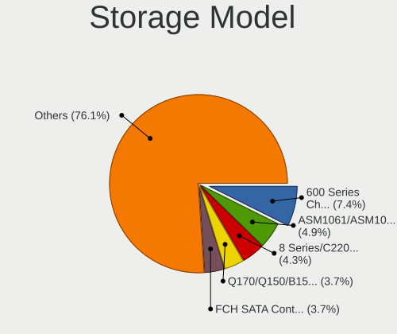

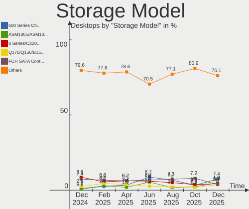

| Model                                                                          | Desktops | Percent |
|--------------------------------------------------------------------------------|----------|---------|
| AMD 600 Series Chipset SATA Controller                                         | 12       | 7.36%   |
| ASMedia ASM1061/ASM1062 Serial ATA Controller                                  | 8        | 4.91%   |
| Intel 8 Series/C220 Series Chipset Family 6-port SATA Controller 1 [AHCI mode] | 7        | 4.29%   |
| Intel Q170/Q150/B150/H170/H110/Z170/CM236 Chipset SATA Controller [AHCI Mode]  | 6        | 3.68%   |
| AMD FCH SATA Controller [AHCI mode]                                            | 6        | 3.68%   |
| Intel SATA Controller [RAID mode]                                              | 5        | 3.07%   |
| Intel 7 Series/C210 Series Chipset Family 6-port SATA Controller [AHCI mode]   | 5        | 3.07%   |
| Samsung NVMe SSD Controller 980 (DRAM-less)                                    | 4        | 2.45%   |
| Intel Raptor Lake SATA AHCI Controller                                         | 4        | 2.45%   |
| AMD 500 Series Chipset SATA Controller                                         | 4        | 2.45%   |
| Samsung NVMe SSD Controller SM981/PM981/PM983                                  | 3        | 1.84%   |
| Samsung NVMe SSD Controller S4LV008[Pascal]                                    | 3        | 1.84%   |
| Samsung NVMe SSD Controller PM9A1/PM9A3/980PRO                                 | 3        | 1.84%   |
| Intel Cannon Lake PCH SATA AHCI Controller                                     | 3        | 1.84%   |
| AMD SB7x0/SB8x0/SB9x0 SATA Controller [AHCI mode]                              | 3        | 1.84%   |
| AMD SB7x0/SB8x0/SB9x0 IDE Controller                                           | 3        | 1.84%   |
| Silicon Motion SM2263EN/SM2263XT (DRAM-less) NVMe SSD Controllers              | 2        | 1.23%   |
| Shenzhen Longsys Lexar NM790 / Patriot Viper VP4300 Lite NVMe SSD (DRAM-less)  | 2        | 1.23%   |
| Sandisk WD Black SN850X NVMe SSD                                               | 2        | 1.23%   |
| Samsung NVMe SSD Controller PM9C1a (DRAM-less)                                 | 2        | 1.23%   |
| MAXIO (Hangzhou) NVMe SSD Controller MAP1602 (DRAM-less)                       | 2        | 1.23%   |
| MAXIO (Hangzhou) NVMe SSD Controller MAP1202 (DRAM-less)                       | 2        | 1.23%   |
| Intel Volume Management Device NVMe RAID Controller                            | 2        | 1.23%   |
| Intel 9 Series Chipset Family SATA Controller [AHCI Mode]                      | 2        | 1.23%   |
| Intel 400 Series Chipset Family SATA AHCI Controller                           | 2        | 1.23%   |
| Intel 4 Series Chipset PT IDER Controller                                      | 2        | 1.23%   |
| Intel 200 Series PCH SATA controller [AHCI mode]                               | 2        | 1.23%   |
| ASMedia ASM1064 Serial ATA Controller                                          | 2        | 1.23%   |
| AMD SB7x0/SB8x0/SB9x0 SATA Controller [IDE mode]                               | 2        | 1.23%   |
| AMD RAID Bottom Device                                                         | 2        | 1.23%   |
| AMD FCH RAID Controller                                                        | 2        | 1.23%   |
| AMD 400 Series Chipset SATA Controller                                         | 2        | 1.23%   |
| Solidigm P44 Pro NVMe SSD [Hollywood Beach]                                    | 1        | 0.61%   |
| Silicon Image PCI0680 Ultra ATA-133 Host Controller                            | 1        | 0.61%   |
| Shenzhen Wodposit WPBSNM8-512GMP                                               | 1        | 0.61%   |
| SanDisk WD PC SN540 / Green SN350 NVMe SSD 1 TB (DRAM-less)                    | 1        | 0.61%   |
| Samsung NVMe SSD Controller SM961/PM961/SM963                                  | 1        | 0.61%   |
| Red Hat Virtio 1.0 SCSI                                                        | 1        | 0.61%   |
| Red Hat QEMU NVM Express Controller                                            | 1        | 0.61%   |
| Realtek RTS5770DL NVMe SSD Controller (DRAM-less)                              | 1        | 0.61%   |

Storage Kind
------------

Kind of storage controller (IDE, SATA, NVMe, SAS, ...)

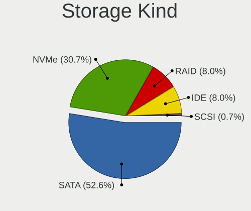

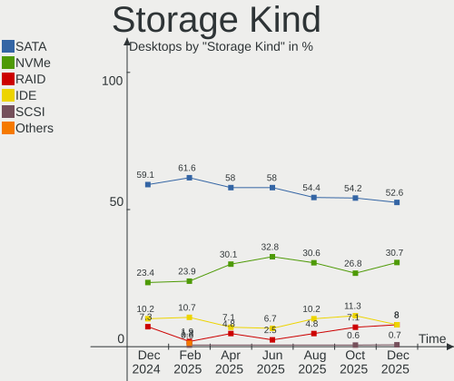

| Kind | Desktops | Percent |
|------|----------|---------|
| SATA | 72       | 52.55%  |
| NVMe | 42       | 30.66%  |
| RAID | 11       | 8.03%   |
| IDE  | 11       | 8.03%   |
| SCSI | 1        | 0.73%   |

Processor
---------

CPU Vendor
----------

Processor vendors

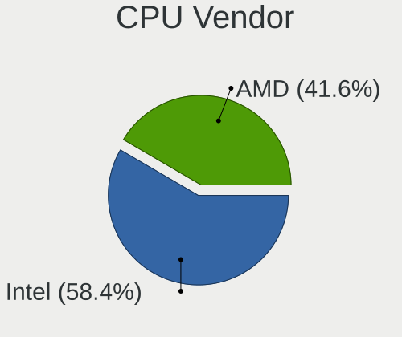

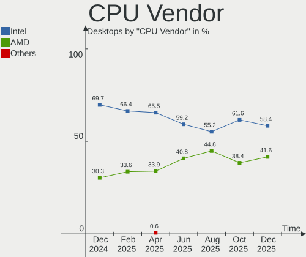

| Vendor | Desktops | Percent |
|--------|----------|---------|
| Intel  | 52       | 58.43%  |
| AMD    | 37       | 41.57%  |

CPU Model
---------

Processor models

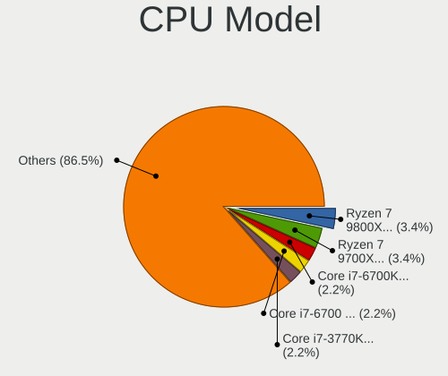

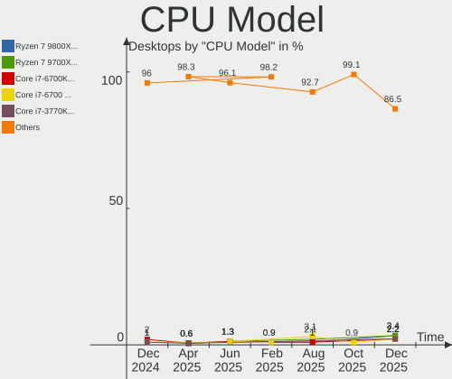

| Model                                      | Desktops | Percent |
|--------------------------------------------|----------|---------|
| AMD Ryzen 7 9800X3D 8-Core Processor       | 3        | 3.37%   |
| AMD Ryzen 7 9700X 8-Core Processor         | 3        | 3.37%   |
| Intel Core i7-6700K CPU @ 4.00GHz          | 2        | 2.25%   |
| Intel Core i7-6700 CPU @ 3.40GHz           | 2        | 2.25%   |
| Intel Core i7-3770K CPU @ 3.50GHz          | 2        | 2.25%   |
| Intel Core i5-6500T CPU @ 2.50GHz          | 2        | 2.25%   |
| Intel Core i3-4160 CPU @ 3.60GHz           | 2        | 2.25%   |
| AMD Ryzen 9 9950X3D 16-Core Processor      | 2        | 2.25%   |
| AMD Ryzen 9 5900X 12-Core Processor        | 2        | 2.25%   |
| AMD Ryzen 7 8745HS w/ Radeon 780M Graphics | 2        | 2.25%   |
| AMD Ryzen 7 7700X 8-Core Processor         | 2        | 2.25%   |
| AMD Phenom II X4 955 Processor             | 2        | 2.25%   |
| Intel Xeon E-2124G CPU @ 3.40GHz           | 1        | 1.12%   |
| Intel Xeon CPU X5650 @ 2.67GHz             | 1        | 1.12%   |
| Intel Xeon CPU E5-2670 v3 @ 2.30GHz        | 1        | 1.12%   |
| Intel Xeon CPU E5-2620 v2 @ 2.10GHz        | 1        | 1.12%   |
| Intel N100                                 | 1        | 1.12%   |
| Intel Core Ultra 7 265F                    | 1        | 1.12%   |
| Intel Core i9-14900K                       | 1        | 1.12%   |
| Intel Core i7-8700 CPU @ 3.20GHz           | 1        | 1.12%   |
| Intel Core i7-7700 CPU @ 3.60GHz           | 1        | 1.12%   |
| Intel Core i7-4770K CPU @ 3.50GHz          | 1        | 1.12%   |
| Intel Core i7-3770 CPU @ 3.40GHz           | 1        | 1.12%   |
| Intel Core i7-14700F                       | 1        | 1.12%   |
| Intel Core i7-10700KF CPU @ 3.80GHz        | 1        | 1.12%   |
| Intel Core i7-10700 CPU @ 2.90GHz          | 1        | 1.12%   |
| Intel Core i7 CPU 920 @ 2.67GHz            | 1        | 1.12%   |
| Intel Core i5-9400F CPU @ 2.90GHz          | 1        | 1.12%   |
| Intel Core i5-9400 CPU @ 2.90GHz           | 1        | 1.12%   |
| Intel Core i5-8600K CPU @ 3.60GHz          | 1        | 1.12%   |
| Intel Core i5-8400 CPU @ 2.80GHz           | 1        | 1.12%   |
| Intel Core i5-6400 CPU @ 2.70GHz           | 1        | 1.12%   |
| Intel Core i5-4690K CPU @ 3.50GHz          | 1        | 1.12%   |
| Intel Core i5-4690 CPU @ 3.50GHz           | 1        | 1.12%   |
| Intel Core i5-4590T CPU @ 2.00GHz          | 1        | 1.12%   |
| Intel Core i5-4590S CPU @ 3.00GHz          | 1        | 1.12%   |
| Intel Core i5-3470 CPU @ 3.20GHz           | 1        | 1.12%   |
| Intel Core i5-2405S CPU @ 2.50GHz          | 1        | 1.12%   |
| Intel Core i5-14600KF                      | 1        | 1.12%   |
| Intel Core i3-8100 CPU @ 3.60GHz           | 1        | 1.12%   |

CPU Model Family
----------------

Processor model prefix

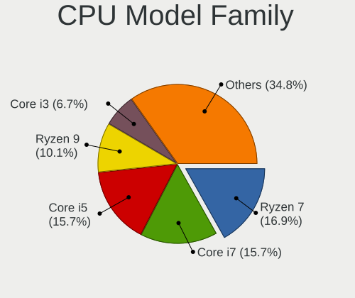

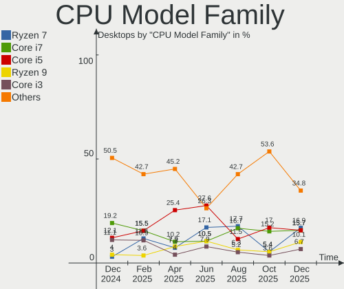

| Model             | Desktops | Percent |
|-------------------|----------|---------|
| AMD Ryzen 7       | 15       | 16.85%  |
| Intel Core i7     | 14       | 15.73%  |
| Intel Core i5     | 14       | 15.73%  |
| AMD Ryzen 9       | 9        | 10.11%  |
| Intel Core i3     | 6        | 6.74%   |
| AMD Ryzen 5       | 5        | 5.62%   |
| Other             | 4        | 4.49%   |
| Intel Xeon        | 4        | 4.49%   |
| Intel Celeron     | 3        | 3.37%   |
| Intel Core 2 Quad | 2        | 2.25%   |
| Intel Core 2 Duo  | 2        | 2.25%   |
| AMD Phenom II X4  | 2        | 2.25%   |
| AMD FX            | 2        | 2.25%   |
| Intel Core i9     | 1        | 1.12%   |
| Intel Core        | 1        | 1.12%   |
| Intel Atom        | 1        | 1.12%   |
| AMD Phenom II X6  | 1        | 1.12%   |
| AMD Athlon II X2  | 1        | 1.12%   |
| AMD A4            | 1        | 1.12%   |
| AMD A10           | 1        | 1.12%   |

CPU Cores
---------

Number of processor cores

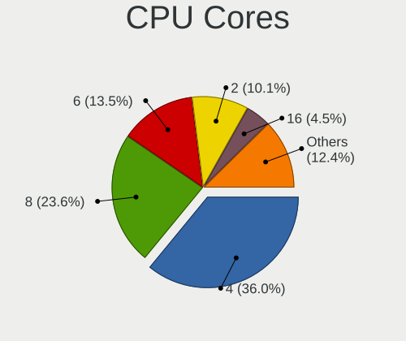

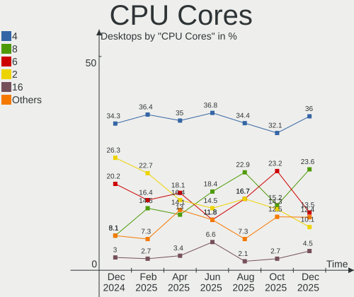

| Number | Desktops | Percent |
|--------|----------|---------|
| 4      | 32       | 35.96%  |
| 8      | 21       | 23.6%   |
| 6      | 12       | 13.48%  |
| 2      | 9        | 10.11%  |
| 16     | 4        | 4.49%   |
| 12     | 4        | 4.49%   |
| 14     | 3        | 3.37%   |
| 20     | 2        | 2.25%   |
| 24     | 1        | 1.12%   |
| 10     | 1        | 1.12%   |

CPU Sockets
-----------

Number of sockets

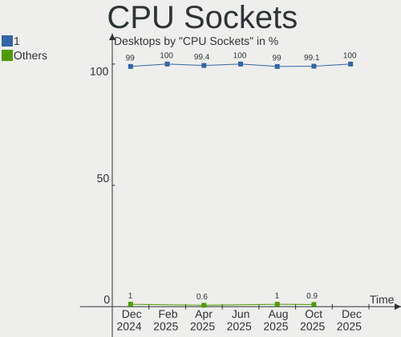

| Number | Desktops | Percent |
|--------|----------|---------|
| 1      | 89       | 100%    |

CPU Threads
-----------

Threads per core (Hyper-Threading)

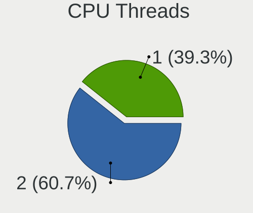

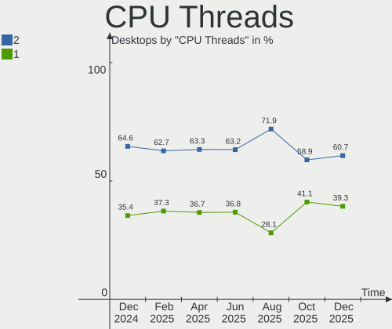

| Number | Desktops | Percent |
|--------|----------|---------|
| 2      | 54       | 60.67%  |
| 1      | 35       | 39.33%  |

CPU Op-Modes
------------

CPU Operation Modes (32-bit, 64-bit)

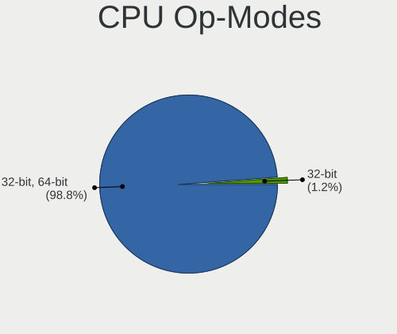

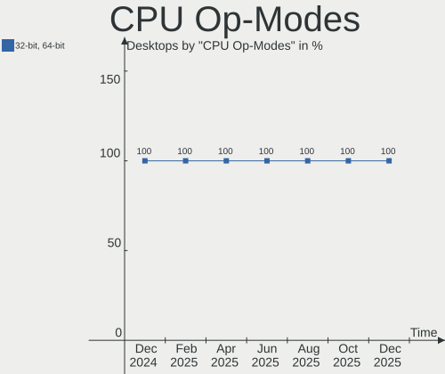

| Op mode        | Desktops | Percent |
|----------------|----------|---------|
| 32-bit, 64-bit | 89       | 100%    |

CPU Microcode
-------------

Microcode number

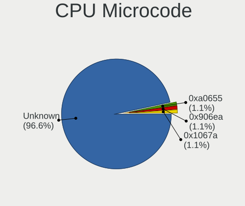

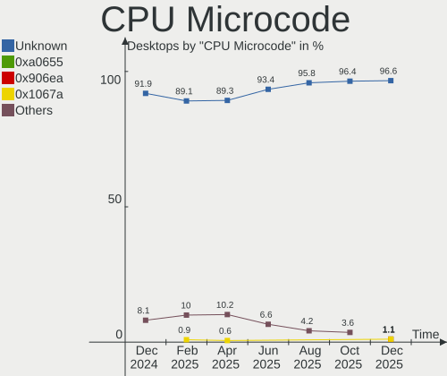

| Number  | Desktops | Percent |
|---------|----------|---------|
| Unknown | 86       | 96.63%  |
| 0xa0655 | 1        | 1.12%   |
| 0x906ea | 1        | 1.12%   |
| 0x1067a | 1        | 1.12%   |

CPU Microarch
-------------

Microarchitecture

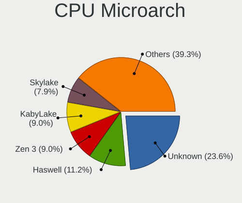

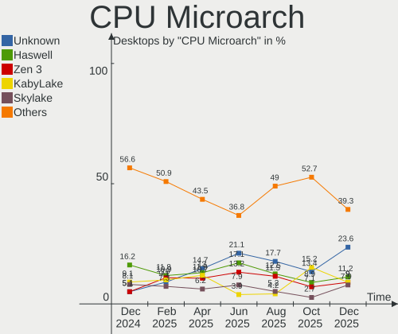

| Name             | Desktops | Percent |
|------------------|----------|---------|
| Unknown          | 21       | 23.6%   |
| Haswell          | 10       | 11.24%  |
| Zen 3            | 8        | 8.99%   |
| KabyLake         | 8        | 8.99%   |
| Skylake          | 7        | 7.87%   |
| IvyBridge        | 6        | 6.74%   |
| K10              | 4        | 4.49%   |
| Penryn           | 3        | 3.37%   |
| Alderlake Hybrid | 3        | 3.37%   |
| Zen+             | 2        | 2.25%   |
| Silvermont       | 2        | 2.25%   |
| Piledriver       | 2        | 2.25%   |
| CometLake        | 2        | 2.25%   |
| Zen 2            | 1        | 1.12%   |
| Zen              | 1        | 1.12%   |
| Westmere         | 1        | 1.12%   |
| Steamroller      | 1        | 1.12%   |
| SandyBridge      | 1        | 1.12%   |
| Nehalem          | 1        | 1.12%   |
| Lunarlake Hybrid | 1        | 1.12%   |
| K10 Llano        | 1        | 1.12%   |
| Gracemont        | 1        | 1.12%   |
| Goldmont         | 1        | 1.12%   |
| Core             | 1        | 1.12%   |

Graphics
--------

GPU Vendor
----------

Vendors of graphics cards

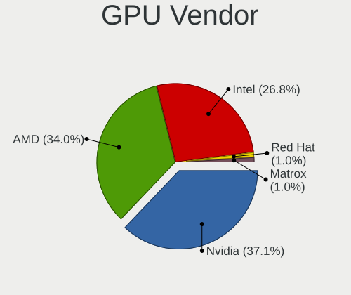

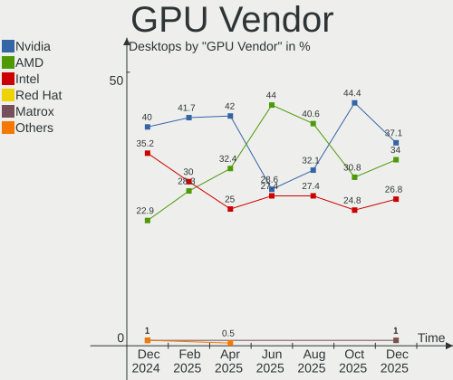

| Vendor                     | Desktops | Percent |
|----------------------------|----------|---------|
| Nvidia                     | 36       | 37.11%  |
| AMD                        | 33       | 34.02%  |
| Intel                      | 26       | 26.8%   |
| Red Hat                    | 1        | 1.03%   |
| Matrox Electronics Systems | 1        | 1.03%   |

GPU Model
---------

Graphics card models

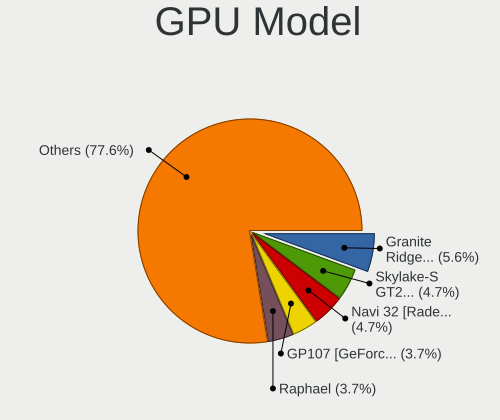

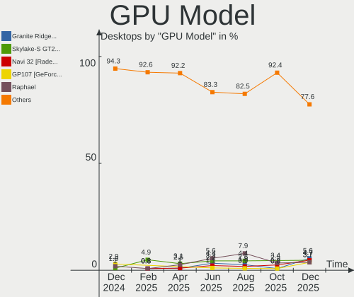

| Model                                                                       | Desktops | Percent |
|-----------------------------------------------------------------------------|----------|---------|
| AMD Granite Ridge [Radeon Graphics]                                         | 6        | 5.61%   |
| Intel Skylake-S GT2 [HD Graphics 530]                                       | 5        | 4.67%   |
| AMD Navi 32 [Radeon RX 7700 XT / 7800 XT]                                   | 5        | 4.67%   |
| Nvidia GP107 [GeForce GTX 1050 Ti]                                          | 4        | 3.74%   |
| AMD Raphael                                                                 | 4        | 3.74%   |
| AMD Navi 48 [Radeon RX 9070/9070 XT/9070 GRE]                               | 4        | 3.74%   |
| Nvidia GA106 [GeForce RTX 3060 Lite Hash Rate]                              | 3        | 2.8%    |
| Intel Xeon E3-1200 v3/4th Gen Core Processor Integrated Graphics Controller | 3        | 2.8%    |
| Intel CoffeeLake-S GT2 [UHD Graphics 630]                                   | 3        | 2.8%    |
| Nvidia GK208B [GeForce GT 730]                                              | 2        | 1.87%   |
| Nvidia GB202 [GeForce RTX 5090]                                             | 2        | 1.87%   |
| Nvidia GA104 [GeForce RTX 3070 Ti]                                          | 2        | 1.87%   |
| Intel Xeon E3-1200 v2/3rd Gen Core processor Graphics Controller            | 2        | 1.87%   |
| Intel 4th Generation Core Processor Family Integrated Graphics Controller   | 2        | 1.87%   |
| AMD RS780L [Radeon 3000]                                                    | 2        | 1.87%   |
| AMD Navi 21 [Radeon RX 6800/6800 XT / 6900 XT]                              | 2        | 1.87%   |
| AMD HawkPoint1                                                              | 2        | 1.87%   |
| AMD Cezanne [Radeon Vega Series / Radeon Vega Mobile Series]                | 2        | 1.87%   |
| AMD Caicos [Radeon HD 6450/7450/8450 / R5 230 OEM]                          | 2        | 1.87%   |
| Red Hat Virtio 1.0 GPU                                                      | 1        | 0.93%   |
| Nvidia TU117 [GeForce GTX 1650]                                             | 1        | 0.93%   |
| Nvidia GT218 [GeForce 210]                                                  | 1        | 0.93%   |
| Nvidia GP107GL [Quadro P620]                                                | 1        | 0.93%   |
| Nvidia GP107GL [Quadro P600]                                                | 1        | 0.93%   |
| Nvidia GP107 [GeForce GTX 1050]                                             | 1        | 0.93%   |
| Nvidia GP106 [GeForce GTX 1060 6GB]                                         | 1        | 0.93%   |
| Nvidia GP106 [GeForce GTX 1060 3GB]                                         | 1        | 0.93%   |
| Nvidia GM206 [GeForce GTX 960]                                              | 1        | 0.93%   |
| Nvidia GM204 [GeForce GTX 970]                                              | 1        | 0.93%   |
| Nvidia GM107 [GeForce GTX 750 Ti]                                           | 1        | 0.93%   |
| Nvidia GK208B [GeForce GT 710]                                              | 1        | 0.93%   |
| Nvidia GK107 [GeForce GT 640 OEM]                                           | 1        | 0.93%   |
| Nvidia GK106 [GeForce GTX 660]                                              | 1        | 0.93%   |
| Nvidia GK106 [GeForce GTX 650 Ti]                                           | 1        | 0.93%   |
| Nvidia GK104 [GeForce GTX 760]                                              | 1        | 0.93%   |
| Nvidia GF119 [GeForce GT 520]                                               | 1        | 0.93%   |
| Nvidia GB206 [GeForce RTX 5060]                                             | 1        | 0.93%   |
| Nvidia GB205 [GeForce RTX 5070]                                             | 1        | 0.93%   |
| Nvidia GB203 [GeForce RTX 5080]                                             | 1        | 0.93%   |
| Nvidia GA104 [GeForce RTX 3070]                                             | 1        | 0.93%   |

GPU Combo
---------

Combinations of graphics cards

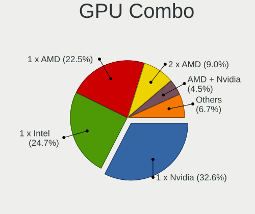

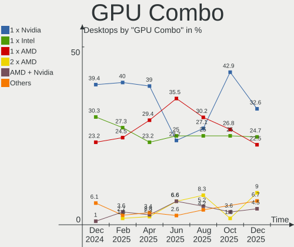

| Name           | Desktops | Percent |
|----------------|----------|---------|
| 1 x Nvidia     | 29       | 32.58%  |
| 1 x Intel      | 22       | 24.72%  |
| 1 x AMD        | 20       | 22.47%  |
| 2 x AMD        | 8        | 8.99%   |
| AMD + Nvidia   | 4        | 4.49%   |
| Intel + Nvidia | 3        | 3.37%   |
| 1 x Red Hat    | 1        | 1.12%   |
| 1 x Matrox     | 1        | 1.12%   |
| Intel + AMD    | 1        | 1.12%   |

GPU Driver
----------

Free vs proprietary

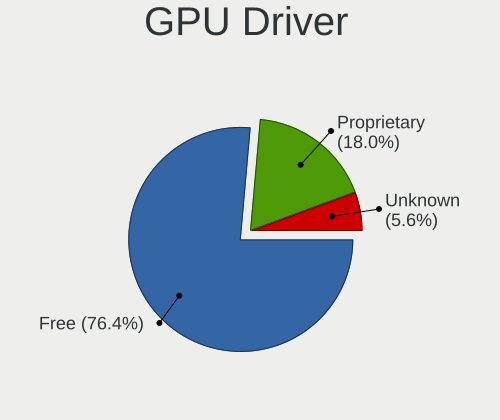

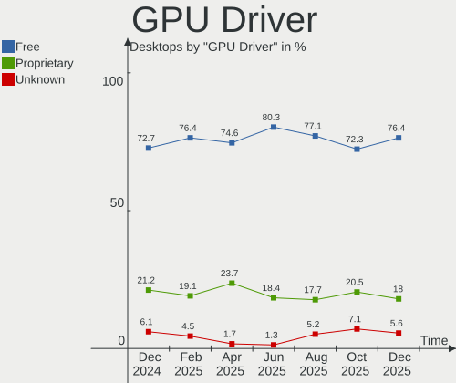

| Driver      | Desktops | Percent |
|-------------|----------|---------|
| Free        | 68       | 76.4%   |
| Proprietary | 16       | 17.98%  |
| Unknown     | 5        | 5.62%   |

GPU Memory
----------

Total video memory

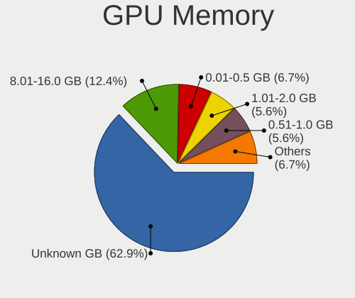

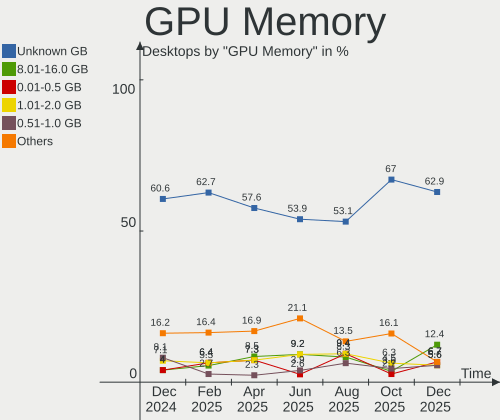

| Size in GB | Desktops | Percent |
|------------|----------|---------|
| Unknown    | 56       | 62.92%  |
| 8.01-16.0  | 11       | 12.36%  |
| 0.01-0.5   | 6        | 6.74%   |
| 1.01-2.0   | 5        | 5.62%   |
| 0.51-1.0   | 5        | 5.62%   |
| 3.01-4.0   | 4        | 4.49%   |
| 7.01-8.0   | 2        | 2.25%   |

Monitor
-------

Monitor Vendor
--------------

Monitor vendors

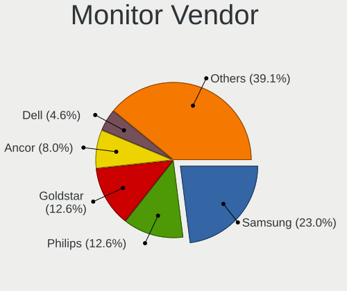

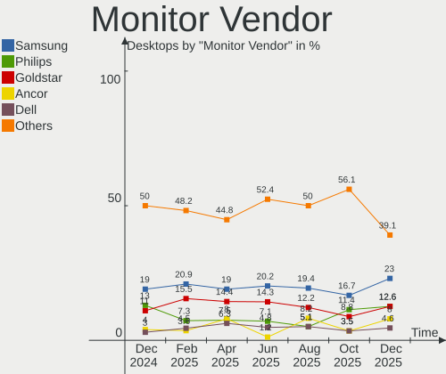

| Vendor               | Desktops | Percent |
|----------------------|----------|---------|
| Samsung Electronics  | 20       | 22.99%  |
| Philips              | 11       | 12.64%  |
| Goldstar             | 11       | 12.64%  |
| Ancor Communications | 7        | 8.05%   |
| Dell                 | 4        | 4.6%    |
| Acer                 | 4        | 4.6%    |
| MSI                  | 3        | 3.45%   |
| AOC                  | 3        | 3.45%   |
| Mi                   | 2        | 2.3%    |
| HKC                  | 2        | 2.3%    |
| Hewlett-Packard      | 2        | 2.3%    |
| BOE                  | 2        | 2.3%    |
| BenQ                 | 2        | 2.3%    |
| ASUSTek Computer     | 2        | 2.3%    |
| ViewSonic            | 1        | 1.15%   |
| Unknown (XXX)        | 1        | 1.15%   |
| Sony                 | 1        | 1.15%   |
| RTK                  | 1        | 1.15%   |
| RHT                  | 1        | 1.15%   |
| NEC Computers        | 1        | 1.15%   |
| LG Electronics       | 1        | 1.15%   |
| Intehill             | 1        | 1.15%   |
| Hitachi              | 1        | 1.15%   |
| EDI                  | 1        | 1.15%   |
| CTV                  | 1        | 1.15%   |
| AU Optronics         | 1        | 1.15%   |

Monitor Model
-------------

Monitor models

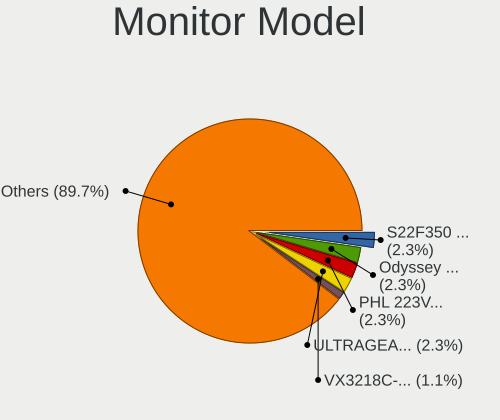

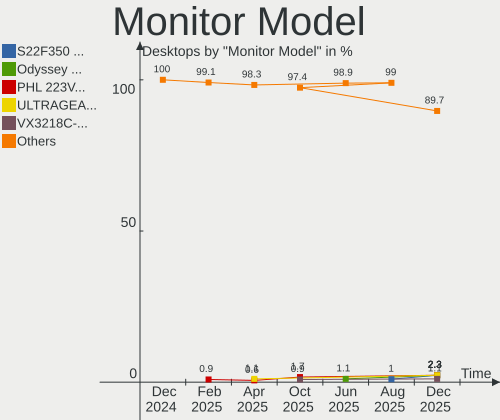

| Model                                                                    | Desktops | Percent |
|--------------------------------------------------------------------------|----------|---------|
| Samsung Electronics S22F350 SAM0D1A 1920x1080 477x268mm 21.5-inch        | 2        | 2.3%    |
| Samsung Electronics Odyssey G5 SAM7489 2560x1440 698x393mm 31.5-inch     | 2        | 2.3%    |
| Philips PHL 223V5 PHLC0CF 1920x1080 477x268mm 21.5-inch                  | 2        | 2.3%    |
| Goldstar ULTRAGEAR GSM5BD3 2560x1440 697x392mm 31.5-inch                 | 2        | 2.3%    |
| ViewSonic VX3218C-QHD VSC103E 2560x1440 697x392mm 31.5-inch              | 1        | 1.15%   |
| Unknown (XXX) Union TV XXX2841 1920x1080 1209x680mm 54.6-inch            | 1        | 1.15%   |
| Sony TV SNYDC02 1920x1080 708x398mm 32.0-inch                            | 1        | 1.15%   |
| Samsung Electronics U28H75x SAM0E00 3840x2160 607x345mm 27.5-inch        | 1        | 1.15%   |
| Samsung Electronics T23B350 SAM0939 1920x1080 510x287mm 23.0-inch        | 1        | 1.15%   |
| Samsung Electronics SyncMaster SAM0579 1920x1080                         | 1        | 1.15%   |
| Samsung Electronics SyncMaster SAM02FE 1680x1050 433x271mm 20.1-inch     | 1        | 1.15%   |
| Samsung Electronics SA300/SA350 SAM07D2 1920x1080 477x268mm 21.5-inch    | 1        | 1.15%   |
| Samsung Electronics S27F350 SAM0D22 1920x1080 598x336mm 27.0-inch        | 1        | 1.15%   |
| Samsung Electronics Odyssey G93SC SAM7463 3840x1080 1193x336mm 48.8-inch | 1        | 1.15%   |
| Samsung Electronics Odyssey G5 SAM748A 2560x1440 698x393mm 31.5-inch     | 1        | 1.15%   |
| Samsung Electronics LF24T35 SAM707D 1920x1080 528x297mm 23.9-inch        | 1        | 1.15%   |
| Samsung Electronics LCD Monitor SMT22A300 1920x1080                      | 1        | 1.15%   |
| Samsung Electronics LCD Monitor SAM7590 3840x2160 1872x1053mm 84.6-inch  | 1        | 1.15%   |
| Samsung Electronics LCD Monitor SAM7354 3840x2160 1872x1053mm 84.6-inch  | 1        | 1.15%   |
| Samsung Electronics LCD Monitor SAM0D4B 1366x768 609x347mm 27.6-inch     | 1        | 1.15%   |
| Samsung Electronics LCD Monitor SAM0509 1920x1080                        | 1        | 1.15%   |
| Samsung Electronics LC27G7xT SAM105C 2560x1440 597x336mm 27.0-inch       | 1        | 1.15%   |
| Samsung Electronics C27F390 SAM0D33 1920x1080 598x336mm 27.0-inch        | 1        | 1.15%   |
| RTK TV RTK0001 3840x2160                                                 | 1        | 1.15%   |
| RHT QEMU Monitor RHT1234 2048x1152 325x203mm 15.1-inch                   | 1        | 1.15%   |
| Philips PHL 243V7 PHLC155 1920x1080 527x296mm 23.8-inch                  | 1        | 1.15%   |
| Philips PHL 241B8Q PHL0929 1920x1080 527x296mm 23.8-inch                 | 1        | 1.15%   |
| Philips PHL 223S7 PHL0910 1920x1080 476x268mm 21.5-inch                  | 1        | 1.15%   |
| Philips PHL 220V8 PHLC218 1920x1080 477x268mm 21.5-inch                  | 1        | 1.15%   |
| Philips PHL 193V5 PHLC0CD 1366x768 410x230mm 18.5-inch                   | 1        | 1.15%   |
| Philips 27M1C5200W PHLC30C 1920x1080 598x336mm 27.0-inch                 | 1        | 1.15%   |
| Philips 244EL PHLC06C 1920x1080 530x300mm 24.0-inch                      | 1        | 1.15%   |
| Philips 240S PHL087D 1920x1200 519x324mm 24.1-inch                       | 1        | 1.15%   |
| Philips 190SW PHL086D 1440x900 408x255mm 18.9-inch                       | 1        | 1.15%   |
| NEC Computers LCD72VM NEC6659 1280x1024 338x270mm 17.0-inch              | 1        | 1.15%   |
| MSI MAG251RX MSI3BA3 1920x1080 544x303mm 24.5-inch                       | 1        | 1.15%   |
| MSI G27CQ4 MSI3CB0 2560x1440 597x336mm 27.0-inch                         | 1        | 1.15%   |
| MSI G273Q MSI3CA8 2560x1440 597x336mm 27.0-inch                          | 1        | 1.15%   |
| Mi Monitor XMI3444 3440x1440 797x334mm 34.0-inch                         | 1        | 1.15%   |
| Mi Monitor XMI27B2 2560x1440 598x336mm 27.0-inch                         | 1        | 1.15%   |

Monitor Resolution
------------------

Monitor screen resolution

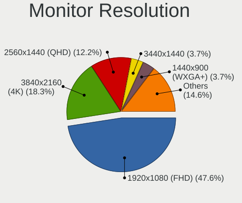

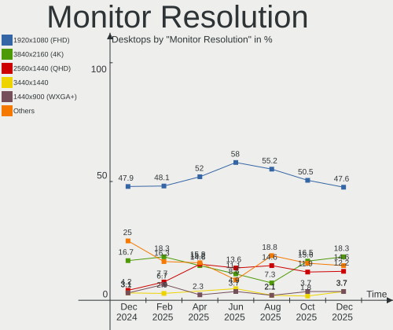

| Resolution         | Desktops | Percent |
|--------------------|----------|---------|
| 1920x1080 (FHD)    | 39       | 47.56%  |
| 3840x2160 (4K)     | 15       | 18.29%  |
| 2560x1440 (QHD)    | 10       | 12.2%   |
| 3440x1440          | 3        | 3.66%   |
| 1440x900 (WXGA+)   | 3        | 3.66%   |
| 1920x1200 (WUXGA)  | 2        | 2.44%   |
| 1680x1050 (WSXGA+) | 2        | 2.44%   |
| 1366x768 (WXGA)    | 2        | 2.44%   |
| 1280x1024 (SXGA)   | 2        | 2.44%   |
| 3840x1600          | 1        | 1.22%   |
| 3840x1080          | 1        | 1.22%   |
| 2560x1397          | 1        | 1.22%   |
| 1600x900 (HD+)     | 1        | 1.22%   |

Monitor Diagonal
----------------

Diagonal size in inches

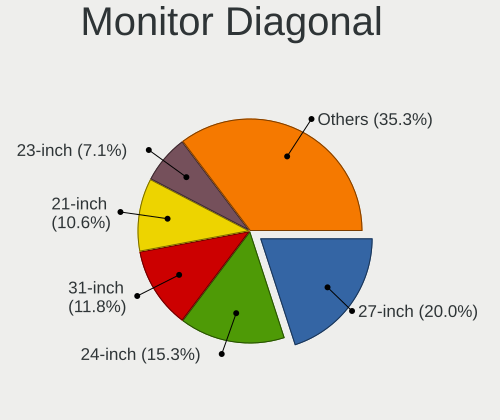

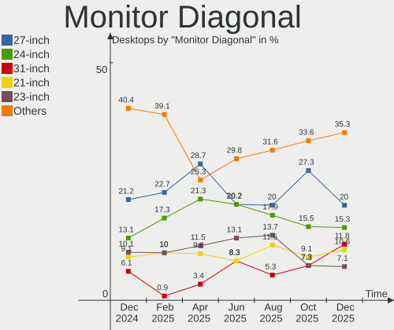

| Inches  | Desktops | Percent |
|---------|----------|---------|
| 27      | 17       | 20%     |
| 24      | 13       | 15.29%  |
| 31      | 10       | 11.76%  |
| 21      | 9        | 10.59%  |
| 23      | 6        | 7.06%   |
| Unknown | 4        | 4.71%   |
| 84      | 3        | 3.53%   |
| 34      | 3        | 3.53%   |
| 20      | 3        | 3.53%   |
| 32      | 2        | 2.35%   |
| 19      | 2        | 2.35%   |
| 18      | 2        | 2.35%   |
| 17      | 2        | 2.35%   |
| 72      | 1        | 1.18%   |
| 54      | 1        | 1.18%   |
| 48      | 1        | 1.18%   |
| 46      | 1        | 1.18%   |
| 37      | 1        | 1.18%   |
| 29      | 1        | 1.18%   |
| 15      | 1        | 1.18%   |
| 13      | 1        | 1.18%   |
| 11      | 1        | 1.18%   |

Monitor Width
-------------

Physical width

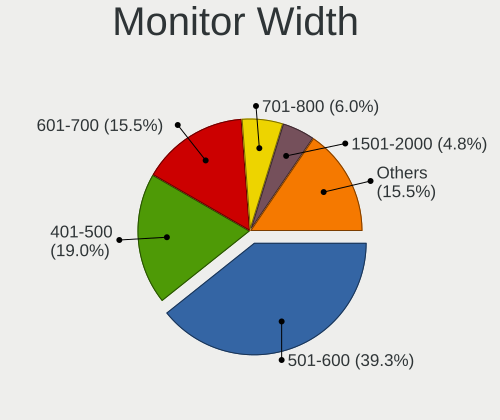

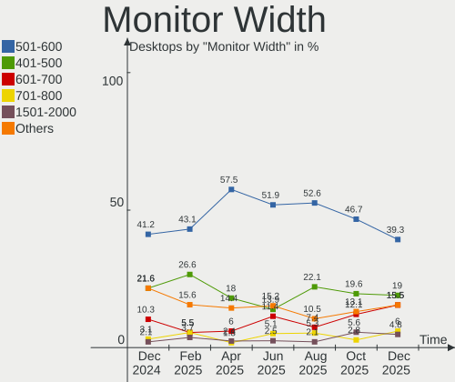

| Width in mm | Desktops | Percent |
|-------------|----------|---------|
| 501-600     | 33       | 39.29%  |
| 401-500     | 16       | 19.05%  |
| 601-700     | 13       | 15.48%  |
| 701-800     | 5        | 5.95%   |
| 1501-2000   | 4        | 4.76%   |
| Unknown     | 4        | 4.76%   |
| 301-350     | 3        | 3.57%   |
| 1001-1500   | 3        | 3.57%   |
| 201-300     | 2        | 2.38%   |
| 801-900     | 1        | 1.19%   |

Aspect Ratio
------------

Proportional relationship between the width and the height

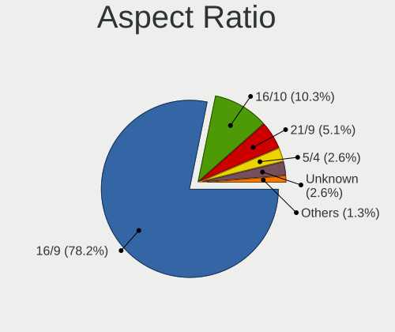

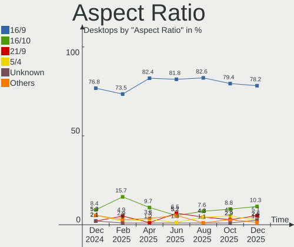

| Ratio   | Desktops | Percent |
|---------|----------|---------|
| 16/9    | 61       | 78.21%  |
| 16/10   | 8        | 10.26%  |
| 21/9    | 4        | 5.13%   |
| 5/4     | 2        | 2.56%   |
| Unknown | 2        | 2.56%   |
| 32/9    | 1        | 1.28%   |

Monitor Area
------------

Area in inch²

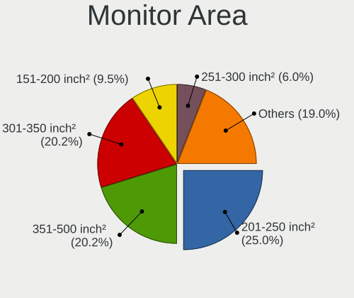

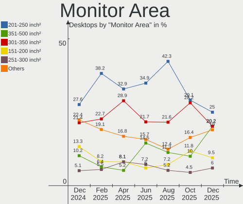

| Area in inch² | Desktops | Percent |
|----------------|----------|---------|
| 201-250        | 21       | 25%     |
| 351-500        | 17       | 20.24%  |
| 301-350        | 17       | 20.24%  |
| 151-200        | 8        | 9.52%   |
| 251-300        | 5        | 5.95%   |
| More than 1000 | 4        | 4.76%   |
| Unknown        | 4        | 4.76%   |
| 141-150        | 3        | 3.57%   |
| 501-1000       | 2        | 2.38%   |
| 71-80          | 1        | 1.19%   |
| 51-60          | 1        | 1.19%   |
| 91-100         | 1        | 1.19%   |

Pixel Density
-------------

Pixels per inch

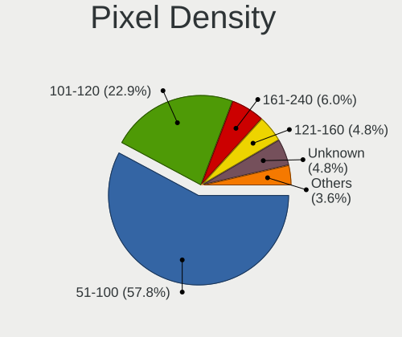

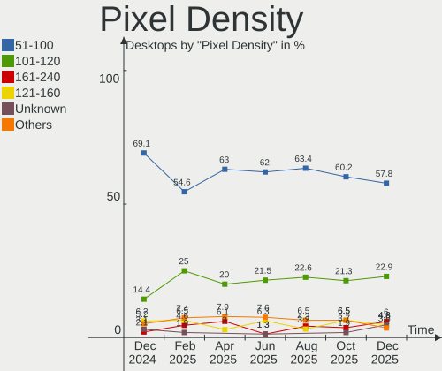

| Density | Desktops | Percent |
|---------|----------|---------|
| 51-100  | 48       | 57.83%  |
| 101-120 | 19       | 22.89%  |
| 161-240 | 5        | 6.02%   |
| 121-160 | 4        | 4.82%   |
| Unknown | 4        | 4.82%   |
| 1-50    | 3        | 3.61%   |

Multiple Monitors
-----------------

Total monitors connected

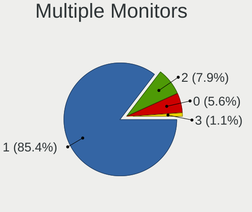

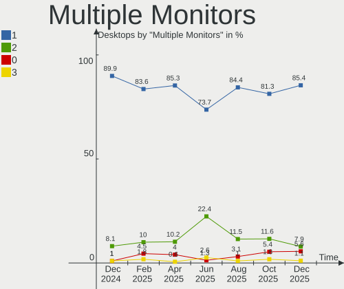

| Total | Desktops | Percent |
|-------|----------|---------|
| 1     | 76       | 85.39%  |
| 2     | 7        | 7.87%   |
| 0     | 5        | 5.62%   |
| 3     | 1        | 1.12%   |

Network
-------

Net Controller Vendor
---------------------

Controller vendors

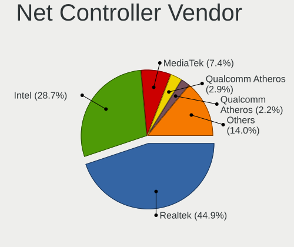

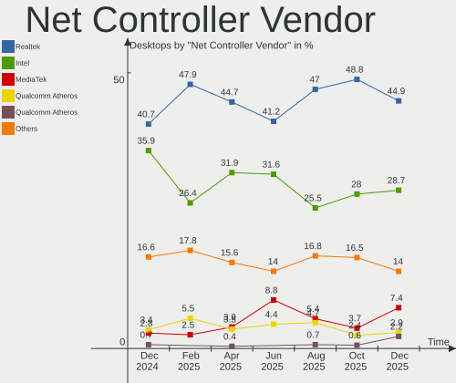

| Vendor                          | Desktops | Percent |
|---------------------------------|----------|---------|
| Realtek Semiconductor           | 61       | 44.85%  |
| Intel                           | 39       | 28.68%  |
| MediaTek                        | 10       | 7.35%   |
| Qualcomm Atheros                | 4        | 2.94%   |
| Qualcomm Atheros Communications | 3        | 2.21%   |
| Broadcom                        | 3        | 2.21%   |
| Qualcomm Technologies           | 2        | 1.47%   |
| Microsoft                       | 2        | 1.47%   |
| Marvell Technology Group        | 2        | 1.47%   |
| D-Link                          | 2        | 1.47%   |
| AVM                             | 2        | 1.47%   |
| Xiaomi                          | 1        | 0.74%   |
| TP-Link                         | 1        | 0.74%   |
| Ralink                          | 1        | 0.74%   |
| Nvidia                          | 1        | 0.74%   |
| Mercucys                        | 1        | 0.74%   |
| Aquantia                        | 1        | 0.74%   |

Net Controller Model
--------------------

Controller models

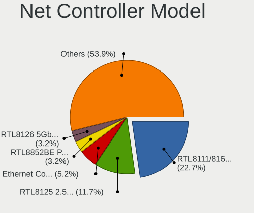

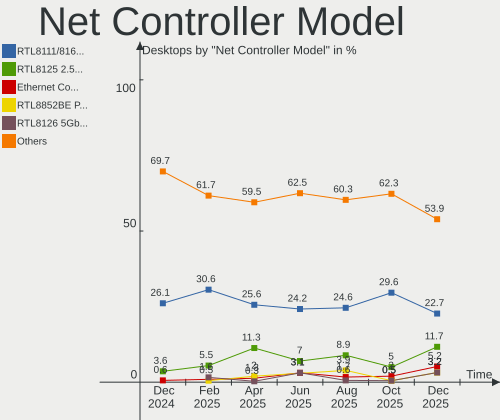

| Model                                                                           | Desktops | Percent |
|---------------------------------------------------------------------------------|----------|---------|
| Realtek RTL8111/8168/8211/8411 PCI Express Gigabit Ethernet Controller          | 35       | 22.73%  |
| Realtek RTL8125 2.5GbE Controller                                               | 18       | 11.69%  |
| Intel Ethernet Controller I226-V                                                | 8        | 5.19%   |
| Realtek RTL8852BE PCIe 802.11ax Wireless Network Controller                     | 5        | 3.25%   |
| Realtek RTL8126 5GbE Controller                                                 | 5        | 3.25%   |
| Realtek 802.11ac NIC                                                            | 4        | 2.6%    |
| Intel Wi-Fi 6 AX200                                                             | 4        | 2.6%    |
| Intel 700 Series Chipset CNVi WiFi                                              | 4        | 2.6%    |
| Qualcomm Atheros AR9271 802.11n                                                 | 3        | 1.95%   |
| MediaTek MT7922 802.11ax PCI Express Wireless Network Adapter                   | 3        | 1.95%   |
| Intel I211 Gigabit Network Connection                                           | 3        | 1.95%   |
| Intel Ethernet Connection (2) I219-V                                            | 3        | 1.95%   |
| Intel Ethernet Connection (2) I219-LM                                           | 3        | 1.95%   |
| Qualcomm WCN785x Wi-Fi 7(802.11be) 320MHz 2x2 [FastConnect 7800]                | 2        | 1.3%    |
| MediaTek MT7927 802.11be 320MHz 2x2 PCIe Wireless Network Adapter [Filogic 380] | 2        | 1.3%    |
| MediaTek MT7925 802.11be 160MHz 2x2 PCIe Wireless Network Adapter [Filogic 360] | 2        | 1.3%    |
| MediaTek MT7902 802.11ax PCIe Wireless Network Adapter [Filogic 310]            | 2        | 1.3%    |
| Marvell Group 88E8056 PCI-E Gigabit Ethernet Controller                         | 2        | 1.3%    |
| Intel Ethernet Connection (7) I219-V                                            | 2        | 1.3%    |
| Intel 82579LM Gigabit Network Connection (Lewisville)                           | 2        | 1.3%    |
| Intel 82575EB Gigabit Network Connection                                        | 2        | 1.3%    |
| Intel 82567LM-3 Gigabit Network Connection                                      | 2        | 1.3%    |
| AVM FRITZ!WLAN AC 860                                                           | 2        | 1.3%    |
| Xiaomi Mi/Redmi series (RNDIS + ADB)                                            | 1        | 0.65%   |
| TP-Link AC600 wireless Realtek RTL8811AU [Archer T2U Nano]                      | 1        | 0.65%   |
| Realtek RTL8922AE 802.11be PCIe Wireless Network Adapter                        | 1        | 0.65%   |
| Realtek RTL8822BE 802.11a/b/g/n/ac WiFi adapter                                 | 1        | 0.65%   |
| Realtek RTL8821CE 802.11ac PCIe Wireless Network Adapter                        | 1        | 0.65%   |
| Realtek RTL8192EE PCIe Wireless Network Adapter                                 | 1        | 0.65%   |
| Realtek RTL8188EUS 802.11n Wireless Network Adapter                             | 1        | 0.65%   |
| Ralink RT2561/RT61 802.11g PCI                                                  | 1        | 0.65%   |
| Qualcomm Atheros QCA9565 / AR9565 Wireless Network Adapter                      | 1        | 0.65%   |
| Qualcomm Atheros QCA6174 802.11ac Wireless Network Adapter                      | 1        | 0.65%   |
| Qualcomm Atheros Killer E2400 Gigabit Ethernet Controller                       | 1        | 0.65%   |
| Qualcomm Atheros Killer E220x Gigabit Ethernet Controller                       | 1        | 0.65%   |
| Nvidia MCP77 Ethernet                                                           | 1        | 0.65%   |
| Microsoft Xbox Wireless Adapter for Windows                                     | 1        | 0.65%   |
| Microsoft Xbox 360 Wireless Adapter                                             | 1        | 0.65%   |
| Mercucys 802.11ac WLAN Adapter                                                  | 1        | 0.65%   |
| MediaTek MT7925 (RZ717) Wi-Fi 7 160MHz                                          | 1        | 0.65%   |

Wireless Vendor
---------------

Wireless vendors

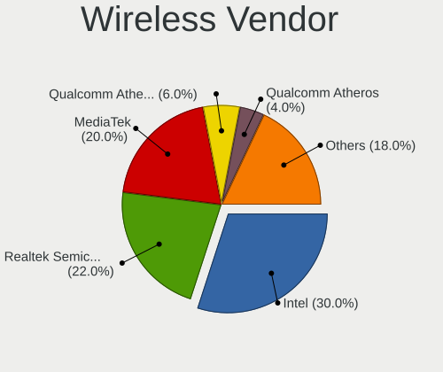

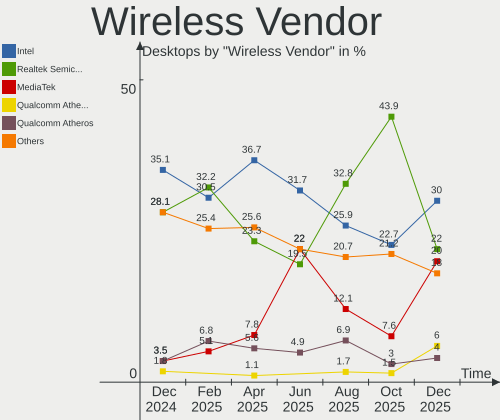

| Vendor                          | Desktops | Percent |
|---------------------------------|----------|---------|
| Intel                           | 15       | 30%     |
| Realtek Semiconductor           | 11       | 22%     |
| MediaTek                        | 10       | 20%     |
| Qualcomm Atheros Communications | 3        | 6%      |
| Qualcomm Atheros                | 2        | 4%      |
| Microsoft                       | 2        | 4%      |
| D-Link                          | 2        | 4%      |
| AVM                             | 2        | 4%      |
| TP-Link                         | 1        | 2%      |
| Ralink                          | 1        | 2%      |
| Mercucys                        | 1        | 2%      |

Wireless Model
--------------

Wireless models

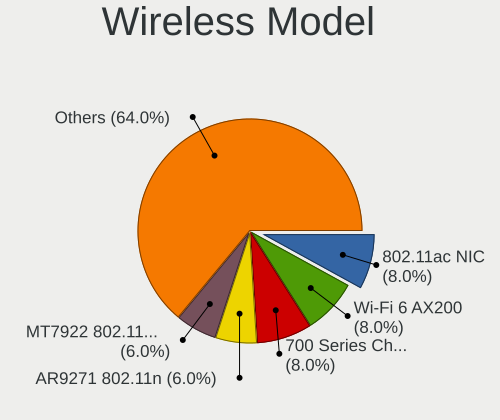

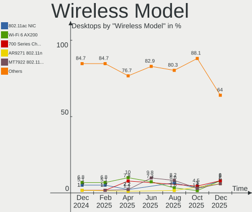

| Model                                                                           | Desktops | Percent |
|---------------------------------------------------------------------------------|----------|---------|
| Realtek 802.11ac NIC                                                            | 4        | 8%      |
| Intel Wi-Fi 6 AX200                                                             | 4        | 8%      |
| Intel 700 Series Chipset CNVi WiFi                                              | 4        | 8%      |
| Qualcomm Atheros AR9271 802.11n                                                 | 3        | 6%      |
| MediaTek MT7922 802.11ax PCI Express Wireless Network Adapter                   | 3        | 6%      |
| Realtek RTL8852BE PCIe 802.11ax Wireless Network Controller                     | 2        | 4%      |
| MediaTek MT7927 802.11be 320MHz 2x2 PCIe Wireless Network Adapter [Filogic 380] | 2        | 4%      |
| MediaTek MT7925 802.11be 160MHz 2x2 PCIe Wireless Network Adapter [Filogic 360] | 2        | 4%      |
| MediaTek MT7902 802.11ax PCIe Wireless Network Adapter [Filogic 310]            | 2        | 4%      |
| AVM FRITZ!WLAN AC 860                                                           | 2        | 4%      |
| TP-Link AC600 wireless Realtek RTL8811AU [Archer T2U Nano]                      | 1        | 2%      |
| Realtek RTL8922AE 802.11be PCIe Wireless Network Adapter                        | 1        | 2%      |
| Realtek RTL8822BE 802.11a/b/g/n/ac WiFi adapter                                 | 1        | 2%      |
| Realtek RTL8821CE 802.11ac PCIe Wireless Network Adapter                        | 1        | 2%      |
| Realtek RTL8192EE PCIe Wireless Network Adapter                                 | 1        | 2%      |
| Realtek RTL8188EUS 802.11n Wireless Network Adapter                             | 1        | 2%      |
| Ralink RT2561/RT61 802.11g PCI                                                  | 1        | 2%      |
| Qualcomm Atheros QCA9565 / AR9565 Wireless Network Adapter                      | 1        | 2%      |
| Qualcomm Atheros QCA6174 802.11ac Wireless Network Adapter                      | 1        | 2%      |
| Microsoft Xbox Wireless Adapter for Windows                                     | 1        | 2%      |
| Microsoft Xbox 360 Wireless Adapter                                             | 1        | 2%      |
| Mercucys 802.11ac WLAN Adapter                                                  | 1        | 2%      |
| MediaTek MT7925 (RZ717) Wi-Fi 7 160MHz                                          | 1        | 2%      |
| Intel Wireless 8260                                                             | 1        | 2%      |
| Intel Wireless 7260                                                             | 1        | 2%      |
| Intel Wireless 3165                                                             | 1        | 2%      |
| Intel Wi-Fi 7(802.11be) AX1775*/AX1790*/BE20*/BE401/BE1750* 2x2                 | 1        | 2%      |
| Intel Wi-Fi 6E(802.11ax) AX210/AX1675* 2x2 [Typhoon Peak]                       | 1        | 2%      |
| Intel Ultimate N WiFi Link 5300                                                 | 1        | 2%      |
| Intel Dual Band Wireless-AC 3168NGW [Stone Peak]                                | 1        | 2%      |
| D-Link DWA-171                                                                  | 1        | 2%      |
| D-Link DWA-131 Wireless N Nano Adapter (Rev. E1) [Realtek RTL8192EU]            | 1        | 2%      |

Ethernet Vendor
---------------

Ethernet vendors

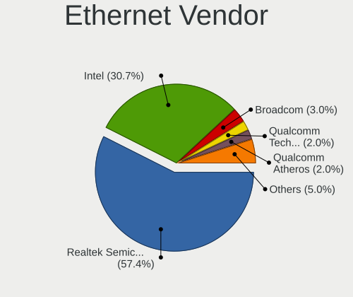

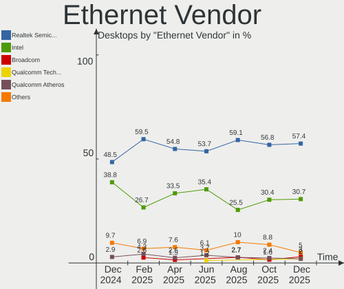

| Vendor                   | Desktops | Percent |
|--------------------------|----------|---------|
| Realtek Semiconductor    | 58       | 57.43%  |
| Intel                    | 31       | 30.69%  |
| Broadcom                 | 3        | 2.97%   |
| Qualcomm Technologies    | 2        | 1.98%   |
| Qualcomm Atheros         | 2        | 1.98%   |
| Marvell Technology Group | 2        | 1.98%   |
| Xiaomi                   | 1        | 0.99%   |
| Nvidia                   | 1        | 0.99%   |
| Aquantia                 | 1        | 0.99%   |

Ethernet Model
--------------

Ethernet models

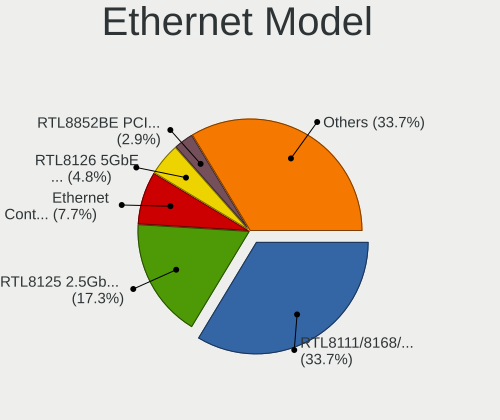

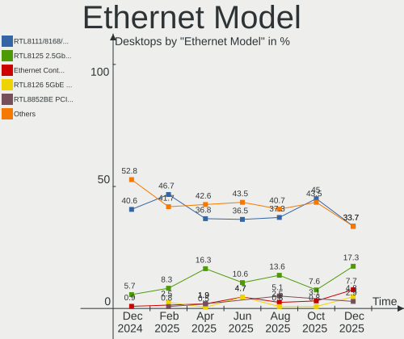

| Model                                                                           | Desktops | Percent |
|---------------------------------------------------------------------------------|----------|---------|
| Realtek RTL8111/8168/8211/8411 PCI Express Gigabit Ethernet Controller          | 35       | 33.65%  |
| Realtek RTL8125 2.5GbE Controller                                               | 18       | 17.31%  |
| Intel Ethernet Controller I226-V                                                | 8        | 7.69%   |
| Realtek RTL8126 5GbE Controller                                                 | 5        | 4.81%   |
| Realtek RTL8852BE PCIe 802.11ax Wireless Network Controller                     | 3        | 2.88%   |
| Intel I211 Gigabit Network Connection                                           | 3        | 2.88%   |
| Intel Ethernet Connection (2) I219-V                                            | 3        | 2.88%   |
| Intel Ethernet Connection (2) I219-LM                                           | 3        | 2.88%   |
| Qualcomm WCN785x Wi-Fi 7(802.11be) 320MHz 2x2 [FastConnect 7800]                | 2        | 1.92%   |
| Marvell Group 88E8056 PCI-E Gigabit Ethernet Controller                         | 2        | 1.92%   |
| Intel Ethernet Connection (7) I219-V                                            | 2        | 1.92%   |
| Intel 82579LM Gigabit Network Connection (Lewisville)                           | 2        | 1.92%   |
| Intel 82575EB Gigabit Network Connection                                        | 2        | 1.92%   |
| Intel 82567LM-3 Gigabit Network Connection                                      | 2        | 1.92%   |
| Xiaomi Mi/Redmi series (RNDIS + ADB)                                            | 1        | 0.96%   |
| Qualcomm Atheros Killer E2400 Gigabit Ethernet Controller                       | 1        | 0.96%   |
| Qualcomm Atheros Killer E220x Gigabit Ethernet Controller                       | 1        | 0.96%   |
| Nvidia MCP77 Ethernet                                                           | 1        | 0.96%   |
| Intel I210 Gigabit Network Connection                                           | 1        | 0.96%   |
| Intel Ethernet Connection I217-V                                                | 1        | 0.96%   |
| Intel Ethernet Connection I217-LM                                               | 1        | 0.96%   |
| Intel Ethernet Connection (7) I219-LM                                           | 1        | 0.96%   |
| Intel 82579V Gigabit Network Connection                                         | 1        | 0.96%   |
| Intel 82567LF-2 Gigabit Network Connection                                      | 1        | 0.96%   |
| Broadcom NetXtreme BCM5719 Gigabit Ethernet PCIe                                | 1        | 0.96%   |
| Broadcom NetLink BCM57788 Gigabit Ethernet PCIe                                 | 1        | 0.96%   |
| Broadcom NetLink BCM57781 Gigabit Ethernet PCIe                                 | 1        | 0.96%   |
| Aquantia AQtion AQC107S NBase-T/IEEE 802.3an Ethernet Controller [Atlantic 10G] | 1        | 0.96%   |

Net Controller Kind
-------------------

Ethernet, WiFi or modem

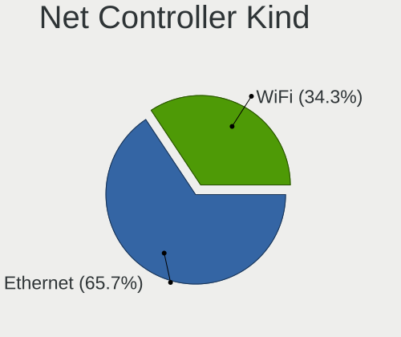

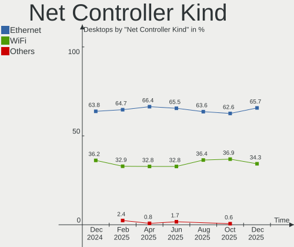

| Kind     | Desktops | Percent |
|----------|----------|---------|
| Ethernet | 88       | 65.67%  |
| WiFi     | 46       | 34.33%  |

Used Controller
---------------

Currently used network controller

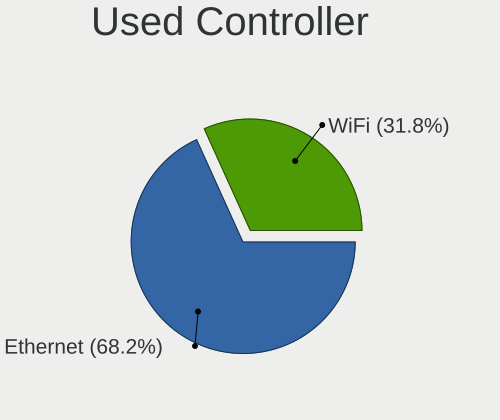

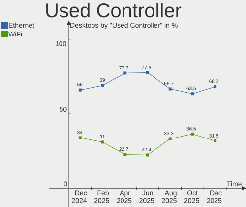

| Kind     | Desktops | Percent |
|----------|----------|---------|
| Ethernet | 58       | 68.24%  |
| WiFi     | 27       | 31.76%  |

NICs
----

Total network controllers on board

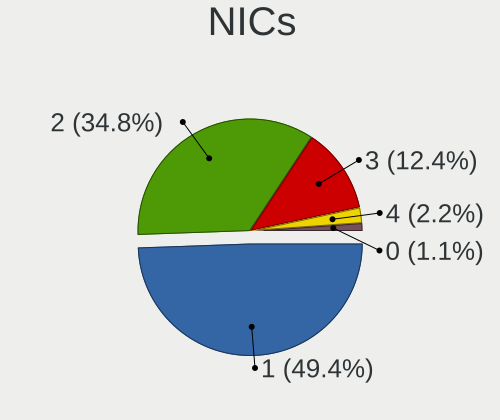

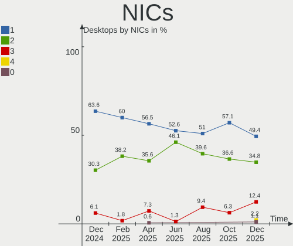

| Total | Desktops | Percent |
|-------|----------|---------|
| 1     | 44       | 49.44%  |
| 2     | 31       | 34.83%  |
| 3     | 11       | 12.36%  |
| 4     | 2        | 2.25%   |
| 0     | 1        | 1.12%   |

IPv6
----

IPv6 vs IPv4

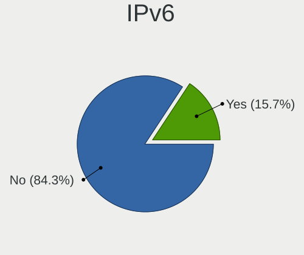

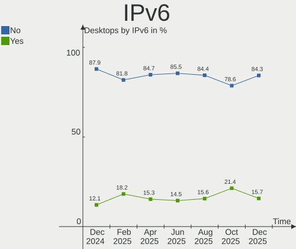

| Used | Desktops | Percent |
|------|----------|---------|
| No   | 75       | 84.27%  |
| Yes  | 14       | 15.73%  |

Bluetooth
---------

Bluetooth Vendor
----------------

Controller vendors

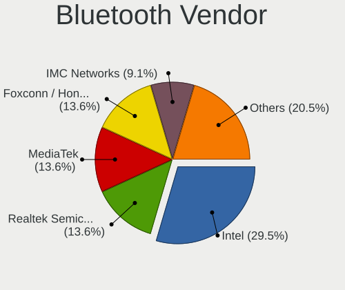

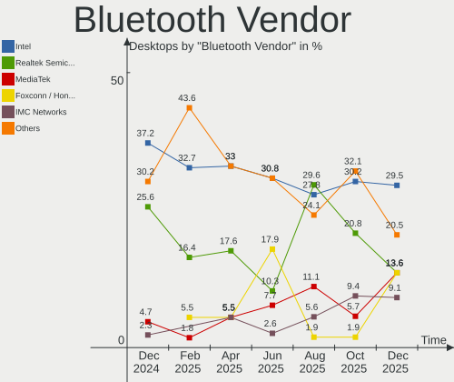

| Vendor                   | Desktops | Percent |
|--------------------------|----------|---------|
| Intel                    | 13       | 29.55%  |
| Realtek Semiconductor    | 6        | 13.64%  |
| MediaTek                 | 6        | 13.64%  |
| Foxconn / Hon Hai        | 6        | 13.64%  |
| IMC Networks             | 4        | 9.09%   |
| Cambridge Silicon Radio  | 2        | 4.55%   |
| ASUSTek Computer         | 2        | 4.55%   |
| TP-Link                  | 1        | 2.27%   |
| TDK                      | 1        | 2.27%   |
| Micro Star International | 1        | 2.27%   |
| Lite-On Technology       | 1        | 2.27%   |
| Broadcom                 | 1        | 2.27%   |

Bluetooth Model
---------------

Controller models

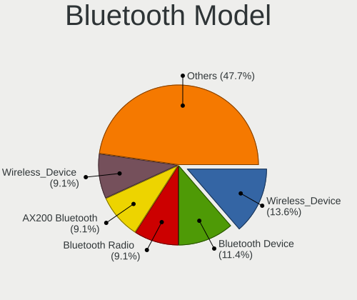

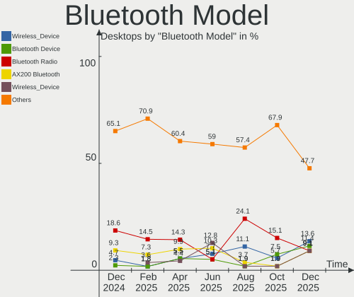

| Model                                                    | Desktops | Percent |
|----------------------------------------------------------|----------|---------|
| MediaTek Wireless_Device                                 | 6        | 13.64%  |
| Intel Bluetooth Device                                   | 5        | 11.36%  |
| Realtek Bluetooth Radio                                  | 4        | 9.09%   |
| Intel AX200 Bluetooth                                    | 4        | 9.09%   |
| Foxconn / Hon Hai Wireless_Device                        | 4        | 9.09%   |
| IMC Networks Bluetooth Radio                             | 3        | 6.82%   |
| Intel Bluetooth wireless interface                       | 2        | 4.55%   |
| Foxconn / Hon Hai Bluetooth Device                       | 2        | 4.55%   |
| Cambridge Silicon Radio Bluetooth Dongle (HCI mode)      | 2        | 4.55%   |
| TP-Link TP-T@- UB500 Adapter                             | 1        | 2.27%   |
| TDK Bluetooth Adapter                                    | 1        | 2.27%   |
| Realtek  Bluetooth 4.2 Adapter                           | 1        | 2.27%   |
| Realtek Bluetooth 5.4 Radio                              | 1        | 2.27%   |
| Micro Star International MS-6970 BToes Bluetooth adapter | 1        | 2.27%   |
| Lite-On Atheros AR3012 Bluetooth                         | 1        | 2.27%   |
| Intel Wireless-AC 3168 Bluetooth                         | 1        | 2.27%   |
| Intel AX210 Bluetooth                                    | 1        | 2.27%   |
| IMC Networks Bluetooth Device                            | 1        | 2.27%   |
| Broadcom BCM20702A0 Bluetooth 4.0                        | 1        | 2.27%   |
| ASUS Broadcom BCM20702A0 Bluetooth                       | 1        | 2.27%   |
| ASUS ASUS USB-BT500                                      | 1        | 2.27%   |

Sound
-----

Sound Vendor
------------

Sound card vendors

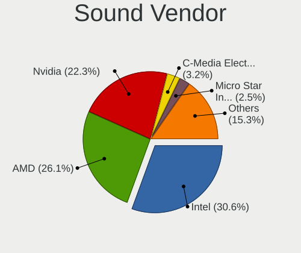

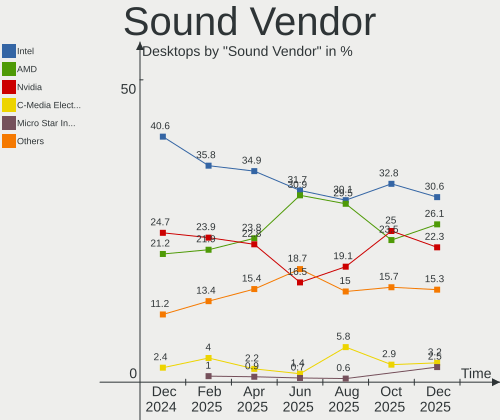

| Vendor                   | Desktops | Percent |
|--------------------------|----------|---------|
| Intel                    | 48       | 30.57%  |
| AMD                      | 41       | 26.11%  |
| Nvidia                   | 35       | 22.29%  |
| C-Media Electronics      | 5        | 3.18%   |
| Micro Star International | 4        | 2.55%   |
| Logitech                 | 2        | 1.27%   |
| Creative Technology      | 2        | 1.27%   |
| ASUSTek Computer         | 2        | 1.27%   |
| XMOS                     | 1        | 0.64%   |
| Trust                    | 1        | 0.64%   |
| Texas Instruments        | 1        | 0.64%   |
| Sony                     | 1        | 0.64%   |
| RODE Microphones         | 1        | 0.64%   |
| Reloop                   | 1        | 0.64%   |
| Realtek Semiconductor    | 1        | 0.64%   |
| Razer USA                | 1        | 0.64%   |
| MAG Technology           | 1        | 0.64%   |
| liyuany                  | 1        | 0.64%   |
| Jieli Technology         | 1        | 0.64%   |
| GN Netcom                | 1        | 0.64%   |
| Focusrite-Novation       | 1        | 0.64%   |
| ESS Technology           | 1        | 0.64%   |
| Audeze                   | 1        | 0.64%   |
| Astro Gaming             | 1        | 0.64%   |
| ASRock                   | 1        | 0.64%   |
| Unknown                  | 1        | 0.64%   |

Sound Model
-----------

Sound card models

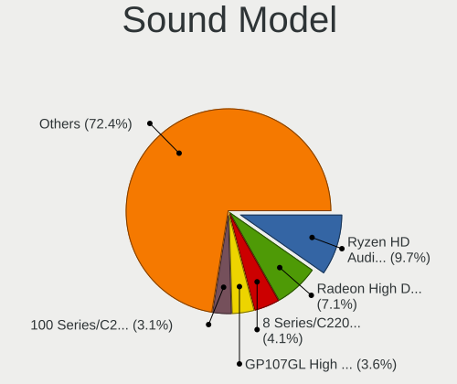

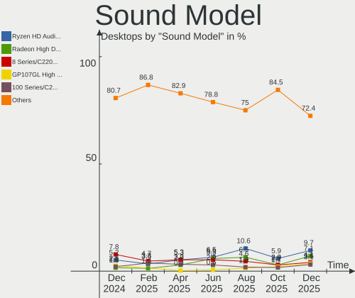

| Model                                                                             | Desktops | Percent |
|-----------------------------------------------------------------------------------|----------|---------|
| AMD Ryzen HD Audio Controller                                                     | 19       | 9.69%   |
| AMD Radeon High Definition Audio Controller                                       | 14       | 7.14%   |
| Intel 8 Series/C220 Series Chipset High Definition Audio Controller               | 8        | 4.08%   |
| Nvidia GP107GL High Definition Audio Controller                                   | 7        | 3.57%   |
| Intel 100 Series/C230 Series Chipset Family HD Audio Controller                   | 6        | 3.06%   |
| AMD Starship/Matisse HD Audio Controller                                          | 6        | 3.06%   |
| Intel Cannon Lake PCH cAVS                                                        | 5        | 2.55%   |
| Intel 7 Series/C216 Chipset Family High Definition Audio Controller               | 5        | 2.55%   |
| AMD SBx00 Azalia (Intel HDA)                                                      | 5        | 2.55%   |
| AMD Navi 31 HDMI/DP Audio                                                         | 5        | 2.55%   |
| Micro Star International USB Audio                                                | 4        | 2.04%   |
| Intel Xeon E3-1200 v3/4th Gen Core Processor HD Audio Controller                  | 4        | 2.04%   |
| Intel Raptor Lake High Definition Audio Controller                                | 4        | 2.04%   |
| AMD Renoir/Cezanne HDMI/DP Audio Controller                                       | 4        | 2.04%   |
| AMD Navi 48 HDMI/DP Audio Controller                                              | 4        | 2.04%   |
| Nvidia GK208 HDMI/DP Audio Controller                                             | 3        | 1.53%   |
| Nvidia GA106 High Definition Audio Controller                                     | 3        | 1.53%   |
| Nvidia GA104 High Definition Audio Controller                                     | 3        | 1.53%   |
| Intel 200 Series PCH HD Audio                                                     | 3        | 1.53%   |
| AMD Navi 21/23 HDMI/DP Audio Controller                                           | 3        | 1.53%   |
| AMD Caicos HDMI Audio [Radeon HD 6450 / 7450/8450/8490 OEM / R5 230/235/235X OEM] | 3        | 1.53%   |
| Nvidia GP106 High Definition Audio Controller                                     | 2        | 1.02%   |
| Nvidia GK106 HDMI Audio Controller                                                | 2        | 1.02%   |
| Nvidia GB202 High Definition Audio Controller                                     | 2        | 1.02%   |
| Intel Comet Lake PCH-V cAVS                                                       | 2        | 1.02%   |
| Intel 9 Series Chipset Family HD Audio Controller                                 | 2        | 1.02%   |
| Intel 82801JI (ICH10 Family) HD Audio Controller                                  | 2        | 1.02%   |
| Intel 82801JD/DO (ICH10 Family) HD Audio Controller                               | 2        | 1.02%   |
| C-Media Electronics Audio Adapter (Unitek Y-247A)                                 | 2        | 1.02%   |
| ASUSTek Computer USB Audio                                                        | 2        | 1.02%   |
| AMD FCH Azalia Controller                                                         | 2        | 1.02%   |
| AMD Family 17h (Models 00h-0fh) HD Audio Controller                               | 2        | 1.02%   |
| XMOS iFi (by AMR) HD USB Audio                                                    | 1        | 0.51%   |
| Trust GXT 258 Microphone                                                          | 1        | 0.51%   |
| Texas Instruments PCM2902 Audio Codec                                             | 1        | 0.51%   |
| Sony DualSense wireless controller (PS5)                                          | 1        | 0.51%   |
| RODE Microphones RODE NT-USB                                                      | 1        | 0.51%   |
| Reloop Mixage IE                                                                  | 1        | 0.51%   |
| Realtek Semiconductor TONOR TC40 Audio Device                                     | 1        | 0.51%   |
| Razer USA Razer Seiren Mini                                                       | 1        | 0.51%   |

Memory
------

Memory Vendor
-------------

Memory module vendors

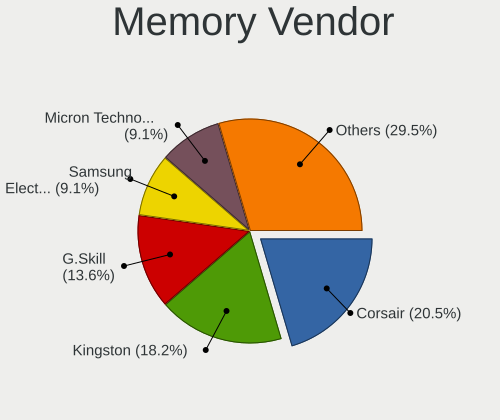

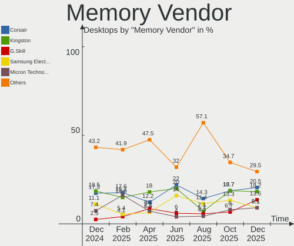

| Vendor                               | Desktops | Percent |
|--------------------------------------|----------|---------|
| Corsair                              | 9        | 20.45%  |
| Kingston                             | 8        | 18.18%  |
| G.Skill                              | 6        | 13.64%  |
| Samsung Electronics                  | 4        | 9.09%   |
| Micron Technology                    | 4        | 9.09%   |
| Unknown                              | 2        | 4.55%   |
| Wodposit                             | 1        | 2.27%   |
| Unknown (0x0E2A)                     | 1        | 2.27%   |
| Unifosa                              | 1        | 2.27%   |
| Team                                 | 1        | 2.27%   |
| Shenzhen Techwinsemi Technology Twsc | 1        | 2.27%   |
| QEMU                                 | 1        | 2.27%   |
| Lexar                                | 1        | 2.27%   |
| Hewlett-Packard                      | 1        | 2.27%   |
| GOODRAM                              | 1        | 2.27%   |
| Crucial                              | 1        | 2.27%   |
| Unknown                              | 1        | 2.27%   |

Memory Model
------------

Memory module models

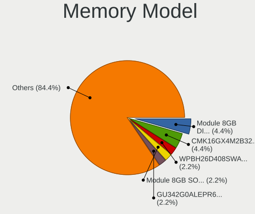

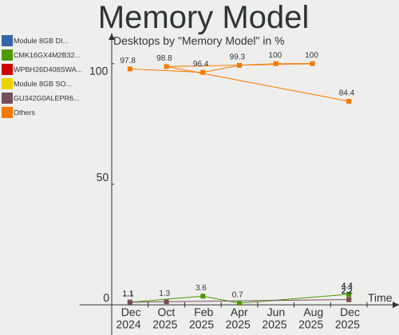

| Model                                                                    | Desktops | Percent |
|--------------------------------------------------------------------------|----------|---------|
| Unknown RAM Module 8GB DIMM 1333MT/s                                     | 2        | 4.44%   |
| Corsair RAM CMK16GX4M2B3200C16 8GB DIMM DDR4 3600MT/s                    | 2        | 4.44%   |
| Wodposit RAM WPBH26D408SWA-8G 8GB SODIMM DDR4 2667MT/s                   | 1        | 2.22%   |
| Unknown (0x0E2A) RAM Module 8GB SODIMM DDR4 2667MT/s                     | 1        | 2.22%   |
| Unifosa RAM GU342G0ALEPR692C6 2GB DIMM DDR2 2048MT/s                     | 1        | 2.22%   |
| Team RAM TEAMGROUP-UD4-3200 8GB DIMM DDR4 3733MT/s                       | 1        | 2.22%   |
| Shenzhen Techwinsemi Twsc RAM TDU5DSAG08-56TB46C 16GB DIMM DDR5 5600MT/s | 1        | 2.22%   |
| Samsung RAM M471B5273DH0-MYKO 8GB SODIMM DDR3 1600MT/s                   | 1        | 2.22%   |
| Samsung RAM M471B5173QH0-YK0 4GB DIMM DDR3 1600MT/s                      | 1        | 2.22%   |
| Samsung RAM M471A1K43DB1-CWE 8GB SODIMM DDR4 3200MT/s                    | 1        | 2.22%   |
| Samsung RAM M378B1G73QH0-YKO 8GB DIMM DDR3 1600MT/s                      | 1        | 2.22%   |
| QEMU RAM Module 2GB DIMM RAM                                             | 1        | 2.22%   |
| Micron RAM CT16G56C46S5.M8D1 16GB SODIMM DDR5 5600MT/s                   | 1        | 2.22%   |
| Micron RAM CP16G64C38U5B.M8D3 16GB DIMM DDR5 6400MT/s                    | 1        | 2.22%   |
| Micron RAM CP16G60C36U5B.M8D3 16GB DIMM DDR5 6000MT/s                    | 1        | 2.22%   |
| Micron RAM 16JTF51264AZ-1G4D1 4GB DIMM DDR3 1333MT/s                     | 1        | 2.22%   |
| Lexar RAM LD4S16G32C22ST 16GB SODIMM DDR4 3200MT/s                       | 1        | 2.22%   |
| Kingston RAM Module 8GB DIMM DDR4 2667MT/s                               | 1        | 2.22%   |
| Kingston RAM LV26D4U9S8HJ-8 8GB DIMM DDR4 2667MT/s                       | 1        | 2.22%   |
| Kingston RAM KHX2666C16/16G 16GB DIMM DDR4 3200MT/s                      | 1        | 2.22%   |
| Kingston RAM KHX2400C12D4/8GX 8GiB DIMM DDR4 2400MT/s                    | 1        | 2.22%   |
| Kingston RAM KHX1866C9D3/8GX 8GB DIMM DDR3 1866MT/s                      | 1        | 2.22%   |
| Kingston RAM KF564C32-16 16GB DIMM DDR5 6400MT/s                         | 1        | 2.22%   |
| Kingston RAM 99U5458-005.A01LF 4GB DIMM DDR3 1333MT/s                    | 1        | 2.22%   |
| Kingston RAM 9905713-026.A00G 4GB DIMM DDR4 2667MT/s                     | 1        | 2.22%   |
| Kingston RAM 9905702-017.A00G 8GB DIMM DDR4 2933MT/s                     | 1        | 2.22%   |
| HP RAM 731656-081 8GB DIMM DDR3 1600MT/s                                 | 1        | 2.22%   |
| GOODRAM RAM IRXG2666D464L16S/8G 8GB DIMM DDR4 2133MT/s                   | 1        | 2.22%   |
| G.Skill RAM F5-6000J3636F16G 16GB DIMM DDR5 6400MT/s                     | 1        | 2.22%   |
| G.Skill RAM F5-6000J3038F16G 16GB DIMM DDR5 6000MT/s                     | 1        | 2.22%   |
| G.Skill RAM F5-6000J2836G32G 32GiB DIMM DDR5 6000MT/s                    | 1        | 2.22%   |
| G.Skill RAM F4-3600C16-8GVK 8GB DIMM DDR4 3600MT/s                       | 1        | 2.22%   |
| G.Skill RAM F4-3600C16-32GTRS 32GB DIMM DDR4 3600MT/s                    | 1        | 2.22%   |
| G.Skill RAM F3-12800CL8-4GBXM 4GB DIMM DDR3 1600MT/s                     | 1        | 2.22%   |
| Crucial RAM CP16G60C36U5B.M8D1 16GiB DIMM DDR5 6000MT/s                  | 1        | 2.22%   |
| Corsair RAM CMW16GX4M2C3200C16 8GB DIMM DDR4 3733MT/s                    | 1        | 2.22%   |
| Corsair RAM CMK32GX4M2D3600C16 16GB DIMM DDR4 3600MT/s                   | 1        | 2.22%   |
| Corsair RAM CMK32GX4M2B3200C16 16GB DIMM DDR4 3800MT/s                   | 1        | 2.22%   |
| Corsair RAM CMK16GX4M2D3600C18 8GB DIMM DDR4 4000MT/s                    | 1        | 2.22%   |
| Corsair RAM CMK16GX4M2A2400C16 8GB DIMM DDR4 2933MT/s                    | 1        | 2.22%   |

Memory Kind
-----------

Memory module kinds

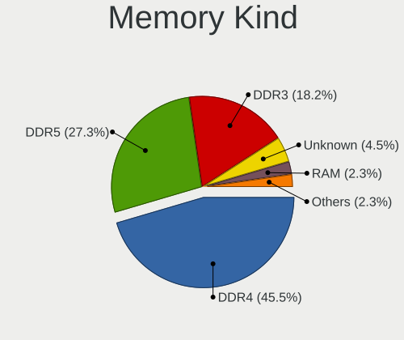

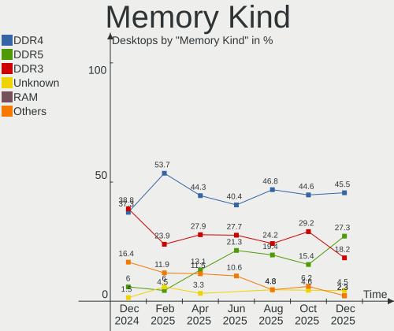

| Kind    | Desktops | Percent |
|---------|----------|---------|
| DDR4    | 20       | 45.45%  |
| DDR5    | 12       | 27.27%  |
| DDR3    | 8        | 18.18%  |
| Unknown | 2        | 4.55%   |
| RAM     | 1        | 2.27%   |
| DDR2    | 1        | 2.27%   |

Memory Form Factor
------------------

Physical design of the memory module

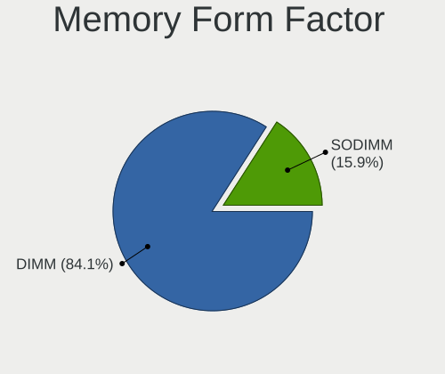

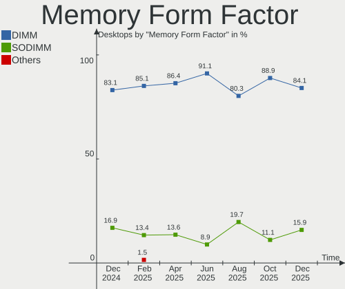

| Name   | Desktops | Percent |
|--------|----------|---------|
| DIMM   | 37       | 84.09%  |
| SODIMM | 7        | 15.91%  |

Memory Size
-----------

Memory module size

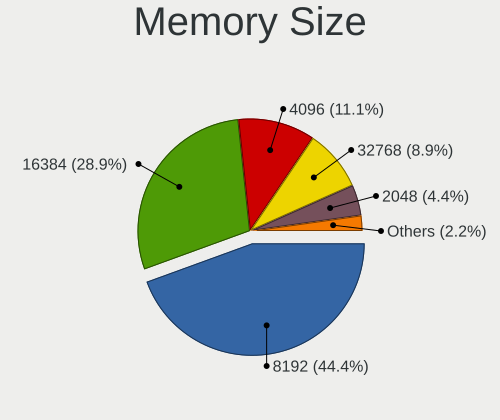

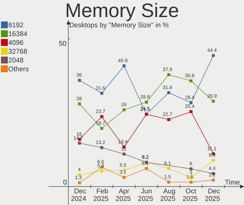

| Size  | Desktops | Percent |
|-------|----------|---------|
| 8192  | 20       | 44.44%  |
| 16384 | 13       | 28.89%  |
| 4096  | 5        | 11.11%  |
| 32768 | 4        | 8.89%   |
| 2048  | 2        | 4.44%   |
| 24576 | 1        | 2.22%   |

Memory Speed
------------

Memory module speed

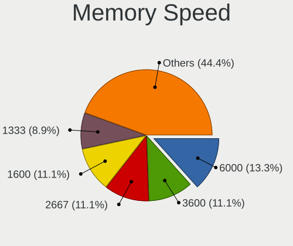

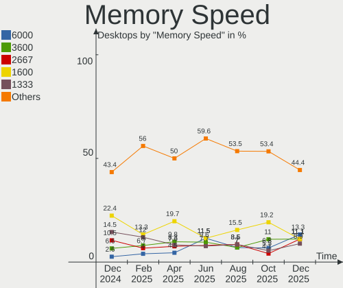

| Speed   | Desktops | Percent |
|---------|----------|---------|
| 6000    | 6        | 13.33%  |
| 3600    | 5        | 11.11%  |
| 2667    | 5        | 11.11%  |
| 1600    | 5        | 11.11%  |
| 1333    | 4        | 8.89%   |
| 6400    | 3        | 6.67%   |
| 5600    | 3        | 6.67%   |
| 3200    | 3        | 6.67%   |
| 3733    | 2        | 4.44%   |
| 2933    | 2        | 4.44%   |
| 4000    | 1        | 2.22%   |
| 3800    | 1        | 2.22%   |
| 2400    | 1        | 2.22%   |
| 2133    | 1        | 2.22%   |
| 2048    | 1        | 2.22%   |
| 1866    | 1        | 2.22%   |
| Unknown | 1        | 2.22%   |

Printers & scanners
-------------------

Printer Vendor
--------------

Printer device vendors

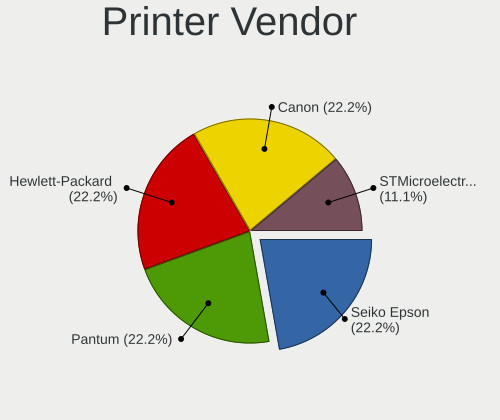

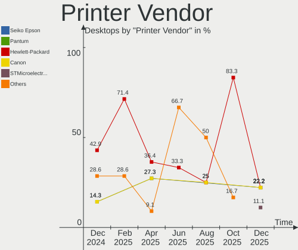

| Vendor             | Desktops | Percent |
|--------------------|----------|---------|
| Seiko Epson        | 2        | 22.22%  |
| Pantum             | 2        | 22.22%  |
| Hewlett-Packard    | 2        | 22.22%  |
| Canon              | 2        | 22.22%  |
| STMicroelectronics | 1        | 11.11%  |

Printer Model
-------------

Printer device models

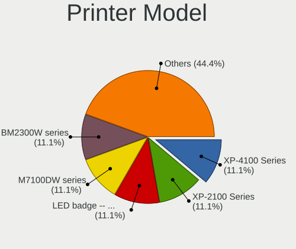

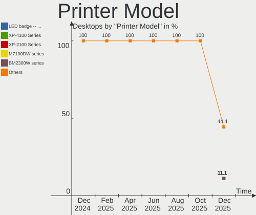

| Model                                                     | Desktops | Percent |
|-----------------------------------------------------------|----------|---------|
| STMicroelectronics LED badge -- mini LED display -- 11x44 | 1        | 11.11%  |
| Seiko Epson XP-4100 Series                                | 1        | 11.11%  |
| Seiko Epson XP-2100 Series                                | 1        | 11.11%  |
| Pantum M7100DW series                                     | 1        | 11.11%  |
| Pantum BM2300W series                                     | 1        | 11.11%  |
| HP OfficeJet 3830 series                                  | 1        | 11.11%  |
| HP LaserJet P2015 series                                  | 1        | 11.11%  |
| Canon PIXMA MX390 Series                                  | 1        | 11.11%  |
| Canon LiDE 400                                            | 1        | 11.11%  |

Scanner Vendor
--------------

Scanner device vendors

Zero info for selected period =(

Scanner Model
-------------

Scanner device models

Zero info for selected period =(

Camera
------

Camera Vendor
-------------

Camera device vendors

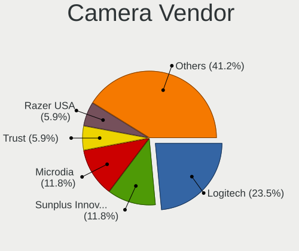

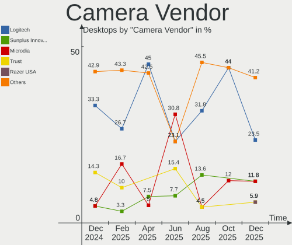

| Vendor                        | Desktops | Percent |
|-------------------------------|----------|---------|
| Logitech                      | 4        | 23.53%  |
| Sunplus Innovation Technology | 2        | 11.76%  |
| Microdia                      | 2        | 11.76%  |
| Trust                         | 1        | 5.88%   |
| Razer USA                     | 1        | 5.88%   |
| Microsoft                     | 1        | 5.88%   |
| KYE Systems (Mouse Systems)   | 1        | 5.88%   |
| Jieli Technology              | 1        | 5.88%   |
| Generalplus Technology        | 1        | 5.88%   |
| GEMBIRD                       | 1        | 5.88%   |
| Chicony Electronics           | 1        | 5.88%   |
| ARC International             | 1        | 5.88%   |

Camera Model
------------

Camera device models

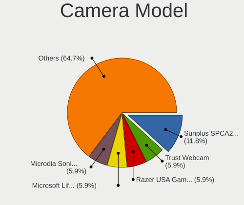

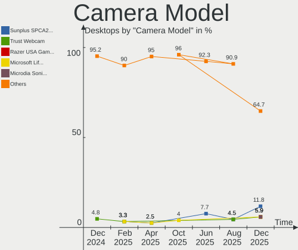

| Model                                                 | Desktops | Percent |
|-------------------------------------------------------|----------|---------|
| Sunplus SPCA2281 Web Camera                           | 2        | 11.76%  |
| Trust Webcam                                          | 1        | 5.88%   |
| Razer USA Gaming Webcam [Kiyo]                        | 1        | 5.88%   |
| Microsoft LifeCam HD-3000                             | 1        | 5.88%   |
| Microdia Sonix USB 2.0 Camera                         | 1        | 5.88%   |
| Microdia Camera                                       | 1        | 5.88%   |
| Logitech Webcam C270                                  | 1        | 5.88%   |
| Logitech Webcam C170                                  | 1        | 5.88%   |
| Logitech HD Pro Webcam C920                           | 1        | 5.88%   |
| Logitech BRIO Ultra HD Webcam                         | 1        | 5.88%   |
| KYE Systems (Mouse Systems) USB 2.0 HD1080P PC Camera | 1        | 5.88%   |
| Jieli USB Composite Device                            | 1        | 5.88%   |
| Generalplus GENERAL WEBCAM                            | 1        | 5.88%   |
| GEMBIRD USB2.0 PC CAMERA                              | 1        | 5.88%   |
| Chicony USB2.0 HD UVC WebCam                          | 1        | 5.88%   |
| ARC International Camera                              | 1        | 5.88%   |

Security
--------

Fingerprint Vendor
------------------

Fingerprint sensor vendors

Zero info for selected period =(

Fingerprint Model
-----------------

Fingerprint sensor models

Zero info for selected period =(

Chipcard Vendor
---------------

Chipcard module vendors

Zero info for selected period =(

Chipcard Model
--------------

Chipcard module models

Zero info for selected period =(

Unsupported
-----------

Unsupported Devices
-------------------

Total unsupported devices on board

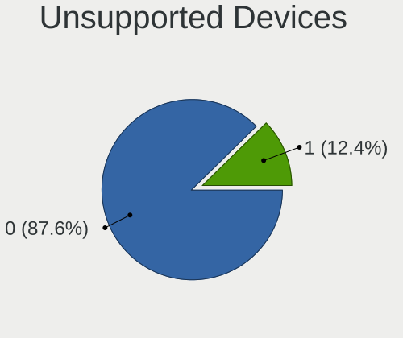

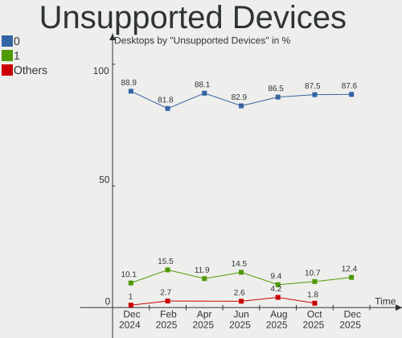

| Total | Desktops | Percent |
|-------|----------|---------|
| 0     | 78       | 87.64%  |
| 1     | 11       | 12.36%  |

Unsupported Device Types
------------------------

Types of unsupported devices

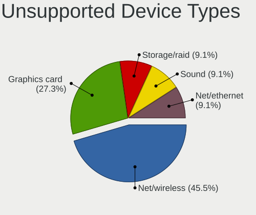

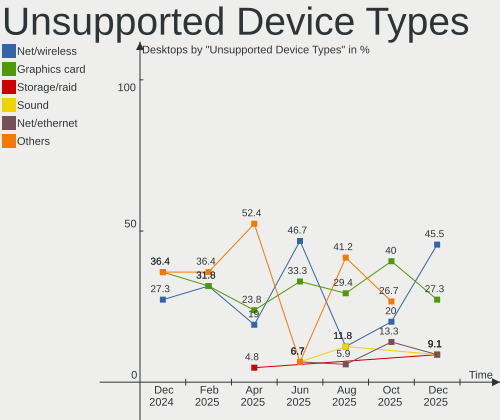

| Type          | Desktops | Percent |
|---------------|----------|---------|
| Net/wireless  | 5        | 45.45%  |
| Graphics card | 3        | 27.27%  |
| Storage/raid  | 1        | 9.09%   |
| Sound         | 1        | 9.09%   |
| Net/ethernet  | 1        | 9.09%   |

