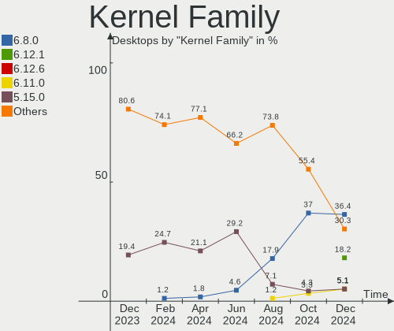
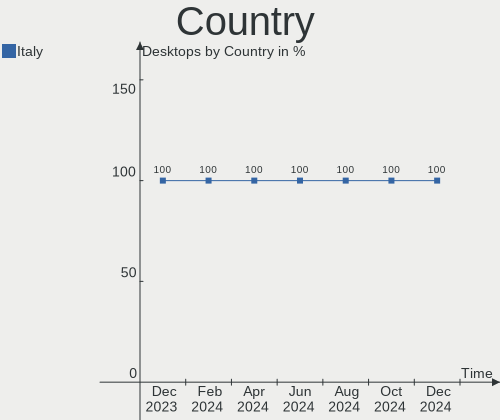
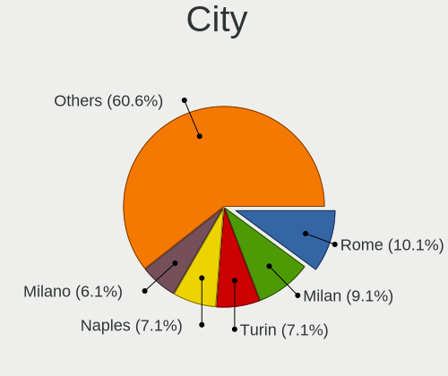
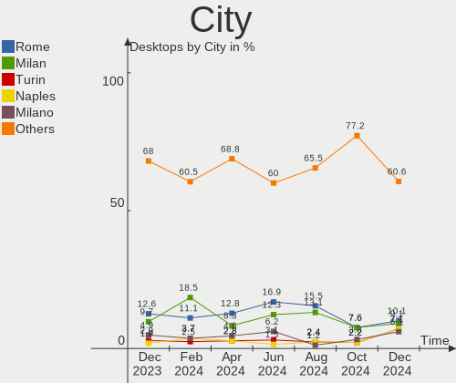
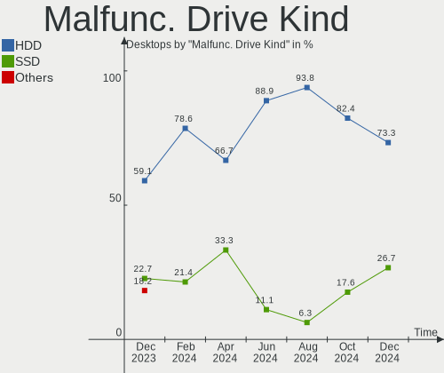
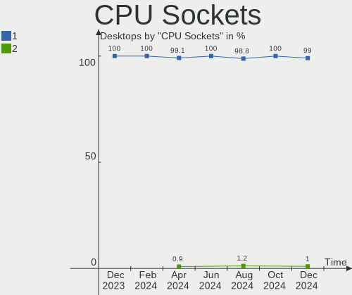
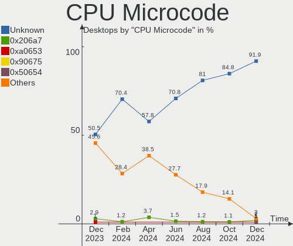
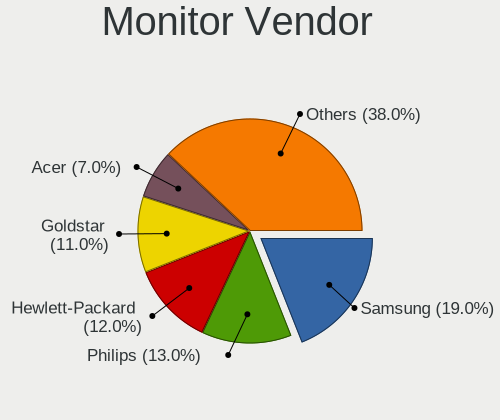
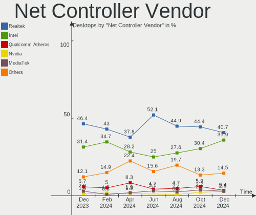

Linux in Italy - Hardware Trends (Desktops)
-------------------------------------------

A project to identify most popular hardware characteristics and track their change
over time based on data collected by Linux users at https://Linux-Hardware.org.

Anyone can contribute to this report by the [hw-probe](https://github.com/linuxhw/hw-probe) tool:

    sudo -E hw-probe -all -upload

Contents
--------

* [ System ](#system)
  - [ OS                       ](#os)
  - [ OS Family                ](#os-family)
  - [ Kernel                   ](#kernel)
  - [ Kernel Family            ](#kernel-family)
  - [ Kernel Major Ver.        ](#kernel-major-ver)
  - [ Arch                     ](#arch)
  - [ DE                       ](#de)
  - [ Display Server           ](#display-server)
  - [ Display Manager          ](#display-manager)
  - [ OS Lang                  ](#os-lang)
  - [ Boot Mode                ](#boot-mode)
  - [ Filesystem               ](#filesystem)
  - [ Part. scheme             ](#part-scheme)
  - [ Dual Boot with Linux/BSD ](#dual-boot-with-linuxbsd)
  - [ Dual Boot (Win)          ](#dual-boot-win)

* [ Board ](#board)
  - [ Vendor                   ](#vendor)
  - [ Model                    ](#model)
  - [ Model Family             ](#model-family)
  - [ MFG Year                 ](#mfg-year)
  - [ Form Factor              ](#form-factor)
  - [ Secure Boot              ](#secure-boot)
  - [ Coreboot                 ](#coreboot)
  - [ RAM Size                 ](#ram-size)
  - [ RAM Used                 ](#ram-used)
  - [ Total Drives             ](#total-drives)
  - [ Has CD-ROM               ](#has-cd-rom)
  - [ Has Ethernet             ](#has-ethernet)
  - [ Has WiFi                 ](#has-wifi)
  - [ Has Bluetooth            ](#has-bluetooth)

* [ Location ](#location)
  - [ Country                  ](#country)
  - [ City                     ](#city)

* [ Drives ](#drives)
  - [ Drive Vendor             ](#drive-vendor)
  - [ Drive Model              ](#drive-model)
  - [ HDD Vendor               ](#hdd-vendor)
  - [ SSD Vendor               ](#ssd-vendor)
  - [ Drive Kind               ](#drive-kind)
  - [ Drive Connector          ](#drive-connector)
  - [ Drive Size               ](#drive-size)
  - [ Space Total              ](#space-total)
  - [ Space Used               ](#space-used)
  - [ Malfunc. Drives          ](#malfunc-drives)
  - [ Malfunc. Drive Vendor    ](#malfunc-drive-vendor)
  - [ Malfunc. HDD Vendor      ](#malfunc-hdd-vendor)
  - [ Malfunc. Drive Kind      ](#malfunc-drive-kind)
  - [ Failed Drives            ](#failed-drives)
  - [ Failed Drive Vendor      ](#failed-drive-vendor)
  - [ Drive Status             ](#drive-status)

* [ Storage controller ](#storage-controller)
  - [ Storage Vendor           ](#storage-vendor)
  - [ Storage Model            ](#storage-model)
  - [ Storage Kind             ](#storage-kind)

* [ Processor ](#processor)
  - [ CPU Vendor               ](#cpu-vendor)
  - [ CPU Model                ](#cpu-model)
  - [ CPU Model Family         ](#cpu-model-family)
  - [ CPU Cores                ](#cpu-cores)
  - [ CPU Sockets              ](#cpu-sockets)
  - [ CPU Threads              ](#cpu-threads)
  - [ CPU Op-Modes             ](#cpu-op-modes)
  - [ CPU Microcode            ](#cpu-microcode)
  - [ CPU Microarch            ](#cpu-microarch)

* [ Graphics ](#graphics)
  - [ GPU Vendor               ](#gpu-vendor)
  - [ GPU Model                ](#gpu-model)
  - [ GPU Combo                ](#gpu-combo)
  - [ GPU Driver               ](#gpu-driver)
  - [ GPU Memory               ](#gpu-memory)

* [ Monitor ](#monitor)
  - [ Monitor Vendor           ](#monitor-vendor)
  - [ Monitor Model            ](#monitor-model)
  - [ Monitor Resolution       ](#monitor-resolution)
  - [ Monitor Diagonal         ](#monitor-diagonal)
  - [ Monitor Width            ](#monitor-width)
  - [ Aspect Ratio             ](#aspect-ratio)
  - [ Monitor Area             ](#monitor-area)
  - [ Pixel Density            ](#pixel-density)
  - [ Multiple Monitors        ](#multiple-monitors)

* [ Network ](#network)
  - [ Net Controller Vendor    ](#net-controller-vendor)
  - [ Net Controller Model     ](#net-controller-model)
  - [ Wireless Vendor          ](#wireless-vendor)
  - [ Wireless Model           ](#wireless-model)
  - [ Ethernet Vendor          ](#ethernet-vendor)
  - [ Ethernet Model           ](#ethernet-model)
  - [ Net Controller Kind      ](#net-controller-kind)
  - [ Used Controller          ](#used-controller)
  - [ NICs                     ](#nics)
  - [ IPv6                     ](#ipv6)

* [ Bluetooth ](#bluetooth)
  - [ Bluetooth Vendor         ](#bluetooth-vendor)
  - [ Bluetooth Model          ](#bluetooth-model)

* [ Sound ](#sound)
  - [ Sound Vendor             ](#sound-vendor)
  - [ Sound Model              ](#sound-model)

* [ Memory ](#memory)
  - [ Memory Vendor            ](#memory-vendor)
  - [ Memory Model             ](#memory-model)
  - [ Memory Kind              ](#memory-kind)
  - [ Memory Form Factor       ](#memory-form-factor)
  - [ Memory Size              ](#memory-size)
  - [ Memory Speed             ](#memory-speed)

* [ Printers & scanners ](#printers--scanners)
  - [ Printer Vendor           ](#printer-vendor)
  - [ Printer Model            ](#printer-model)
  - [ Scanner Vendor           ](#scanner-vendor)
  - [ Scanner Model            ](#scanner-model)

* [ Camera ](#camera)
  - [ Camera Vendor            ](#camera-vendor)
  - [ Camera Model             ](#camera-model)

* [ Security ](#security)
  - [ Fingerprint Vendor       ](#fingerprint-vendor)
  - [ Fingerprint Model        ](#fingerprint-model)
  - [ Chipcard Vendor          ](#chipcard-vendor)
  - [ Chipcard Model           ](#chipcard-model)

* [ Unsupported ](#unsupported)
  - [ Unsupported Devices      ](#unsupported-devices)
  - [ Unsupported Device Types ](#unsupported-device-types)

System
------

OS
--

Installed operating systems

| Name                         | Desktops | Percent |
|------------------------------|----------|---------|
| OpenMandriva 4.3             | 6        | 18.75%  |
| Ubuntu 22.04                 | 5        | 15.63%  |
| Zorin 16                     | 2        | 6.25%   |
| KDE neon 20.04               | 2        | 6.25%   |
| Xubuntu 22.04                | 1        | 3.13%   |
| Ubuntu MATE 22.04            | 1        | 3.13%   |
| Ubuntu 21.10                 | 1        | 3.13%   |
| Ubuntu 20.10                 | 1        | 3.13%   |
| Ubuntu 20.04                 | 1        | 3.13%   |
| Ubuntu 18.04                 | 1        | 3.13%   |
| ROSA 12.1                    | 1        | 3.13%   |
| Puppy 9                      | 1        | 3.13%   |
| Puppy 8.0                    | 1        | 3.13%   |
| Pop!_OS 21.10                | 1        | 3.13%   |
| openSUSE Tumbleweed-XXXXXXXX | 1        | 3.13%   |
| Manjaro                      | 1        | 3.13%   |
| LMDE 5                       | 1        | 3.13%   |
| Linux Mint 20.3              | 1        | 3.13%   |
| Gentoo 2.6                   | 1        | 3.13%   |
| Clear Linux 36010            | 1        | 3.13%   |
| Arch                         | 1        | 3.13%   |

OS Family
---------

OS without a version

| Name         | Desktops | Percent |
|--------------|----------|---------|
| Ubuntu       | 9        | 28.13%  |
| OpenMandriva | 6        | 18.75%  |
| Zorin        | 2        | 6.25%   |
| Puppy        | 2        | 6.25%   |
| KDE neon     | 2        | 6.25%   |
| Xubuntu      | 1        | 3.13%   |
| Ubuntu MATE  | 1        | 3.13%   |
| ROSA         | 1        | 3.13%   |
| Pop!_OS      | 1        | 3.13%   |
| openSUSE     | 1        | 3.13%   |
| Manjaro      | 1        | 3.13%   |
| LMDE         | 1        | 3.13%   |
| Linux Mint   | 1        | 3.13%   |
| Gentoo       | 1        | 3.13%   |
| Clear Linux  | 1        | 3.13%   |
| Arch         | 1        | 3.13%   |

Kernel
------

Version of the Linux kernel

| Version                            | Desktops | Percent |
|------------------------------------|----------|---------|
| 5.16.7-desktop-1omv4003            | 6        | 18.75%  |
| 5.13.0-41-generic                  | 3        | 9.38%   |
| 5.15.0-27-generic                  | 2        | 6.25%   |
| 5.13.0-39-generic                  | 2        | 6.25%   |
| 5.8.0-63-generic                   | 1        | 3.13%   |
| 5.4.53                             | 1        | 3.13%   |
| 5.4.0-113-generic                  | 1        | 3.13%   |
| 5.18.0                             | 1        | 3.13%   |
| 5.17.5-zen1-1-zen                  | 1        | 3.13%   |
| 5.17.5-76051705-generic            | 1        | 3.13%   |
| 5.17.4-1-default                   | 1        | 3.13%   |
| 5.17.1-zen1-gungnir                | 1        | 3.13%   |
| 5.16.13-1132.native                | 1        | 3.13%   |
| 5.15.32-1-MANJARO                  | 1        | 3.13%   |
| 5.15.0-33-generic                  | 1        | 3.13%   |
| 5.15.0-30-generic                  | 1        | 3.13%   |
| 5.15.0-28-generic                  | 1        | 3.13%   |
| 5.13.0-28-generic                  | 1        | 3.13%   |
| 5.13.0-19-generic                  | 1        | 3.13%   |
| 5.10.74-generic-2rosa2021.1-x86_64 | 1        | 3.13%   |
| 5.10.0-14-amd64                    | 1        | 3.13%   |
| 4.19.23                            | 1        | 3.13%   |
| 4.15.0-176-lowlatency              | 1        | 3.13%   |

Kernel Family
-------------

Linux kernel without a distro release

| Version | Desktops | Percent |
|---------|----------|---------|
| 5.13.0  | 7        | 21.88%  |
| 5.16.7  | 6        | 18.75%  |
| 5.15.0  | 5        | 15.63%  |
| 5.17.5  | 2        | 6.25%   |
| 5.8.0   | 1        | 3.13%   |
| 5.4.53  | 1        | 3.13%   |
| 5.4.0   | 1        | 3.13%   |
| 5.18.0  | 1        | 3.13%   |
| 5.17.4  | 1        | 3.13%   |
| 5.17.1  | 1        | 3.13%   |
| 5.16.13 | 1        | 3.13%   |
| 5.15.32 | 1        | 3.13%   |
| 5.10.74 | 1        | 3.13%   |
| 5.10.0  | 1        | 3.13%   |
| 4.19.23 | 1        | 3.13%   |
| 4.15.0  | 1        | 3.13%   |

Kernel Major Ver.
-----------------

Linux kernel major version

| Version | Desktops | Percent |
|---------|----------|---------|
| 5.16    | 7        | 21.88%  |
| 5.13    | 7        | 21.88%  |
| 5.15    | 6        | 18.75%  |
| 5.17    | 4        | 12.5%   |
| 5.4     | 2        | 6.25%   |
| 5.10    | 2        | 6.25%   |
| 5.8     | 1        | 3.13%   |
| 5.18    | 1        | 3.13%   |
| 4.19    | 1        | 3.13%   |
| 4.15    | 1        | 3.13%   |

Arch
----

OS architecture (x86_64, i586, etc.)

| Name   | Desktops | Percent |
|--------|----------|---------|
| x86_64 | 32       | 100%    |

DE
--

Desktop Environment

| Name       | Desktops | Percent |
|------------|----------|---------|
| GNOME      | 13       | 40.63%  |
| KDE5       | 11       | 34.38%  |
| X-Cinnamon | 2        | 6.25%   |
| MATE       | 2        | 6.25%   |
| Unknown    | 2        | 6.25%   |
| Unity      | 1        | 3.13%   |
| i3         | 1        | 3.13%   |

Display Server
--------------

X11 or Wayland

| Name    | Desktops | Percent |
|---------|----------|---------|
| X11     | 26       | 81.25%  |
| Wayland | 6        | 18.75%  |

Display Manager
---------------

SDDM, LightDM, etc.

| Name    | Desktops | Percent |
|---------|----------|---------|
| Unknown | 10       | 31.25%  |
| GDM3    | 8        | 25%     |
| SDDM    | 7        | 21.88%  |
| LightDM | 4        | 12.5%   |
| GDM     | 3        | 9.38%   |

OS Lang
-------

Language

| Lang  | Desktops | Percent |
|-------|----------|---------|
| it_IT | 24       | 75%     |
| en_US | 6        | 18.75%  |
| en_IE | 1        | 3.13%   |
| en_GB | 1        | 3.13%   |

Boot Mode
---------

EFI or BIOS

| Mode | Desktops | Percent |
|------|----------|---------|
| BIOS | 20       | 62.5%   |
| EFI  | 12       | 37.5%   |

Filesystem
----------

Type of filesystem

| Type    | Desktops | Percent |
|---------|----------|---------|
| Ext4    | 22       | 68.75%  |
| Overlay | 6        | 18.75%  |
| Btrfs   | 2        | 6.25%   |
| Aufs    | 2        | 6.25%   |

Part. scheme
------------

Scheme of partitioning

| Type    | Desktops | Percent |
|---------|----------|---------|
| Unknown | 16       | 50%     |
| GPT     | 10       | 31.25%  |
| MBR     | 6        | 18.75%  |

Dual Boot with Linux/BSD
------------------------

Hosting more than one Linux/BSD

| Dual boot | Desktops | Percent |
|-----------|----------|---------|
| No        | 26       | 81.25%  |
| Yes       | 6        | 18.75%  |

Dual Boot (Win)
---------------

Hosting Linux and Windows

| Dual boot | Desktops | Percent |
|-----------|----------|---------|
| No        | 18       | 56.25%  |
| Yes       | 14       | 43.75%  |

Board
-----

Vendor
------

Motherboard manufacturer

| Name                | Desktops | Percent |
|---------------------|----------|---------|
| ASUSTek Computer    | 13       | 40.63%  |
| MSI                 | 5        | 15.63%  |
| Hewlett-Packard     | 4        | 12.5%   |
| Dell                | 2        | 6.25%   |
| ASRock              | 2        | 6.25%   |
| Unknown             | 2        | 6.25%   |
| T-bao               | 1        | 3.13%   |
| Pegatron            | 1        | 3.13%   |
| Gigabyte Technology | 1        | 3.13%   |
| Foxconn             | 1        | 3.13%   |

Model
-----

Motherboard model

| Name                                 | Desktops | Percent |
|--------------------------------------|----------|---------|
| Unknown                              | 2        | 6.25%   |
| T-bao MINI PC                        | 1        | 3.13%   |
| Pegatron Compaq dx2400 Microtower PC | 1        | 3.13%   |
| MSI NQ890AA-ABZ CQ5011IT             | 1        | 3.13%   |
| MSI MS-7D03                          | 1        | 3.13%   |
| MSI MS-7A38                          | 1        | 3.13%   |
| MSI MS-7974                          | 1        | 3.13%   |
| MSI MS-7821                          | 1        | 3.13%   |
| HP ProDesk 600 G1 SFF                | 1        | 3.13%   |
| HP Compaq 8200 Elite SFF PC          | 1        | 3.13%   |
| HP Compaq 6005 Pro MT PC             | 1        | 3.13%   |
| HP 870-022nl                         | 1        | 3.13%   |
| Gigabyte P55-UD3L                    | 1        | 3.13%   |
| Foxconn 946 7MA Series               | 1        | 3.13%   |
| Dell OptiPlex 745                    | 1        | 3.13%   |
| Dell OptiPlex 3020                   | 1        | 3.13%   |
| ASUS ROG STRIX B550-I GAMING         | 1        | 3.13%   |
| ASUS ROG CROSSHAIR VIII DARK HERO    | 1        | 3.13%   |
| ASUS PRIME X370-A                    | 1        | 3.13%   |
| ASUS PRIME H370-PLUS                 | 1        | 3.13%   |
| ASUS PRIME B460M-K                   | 1        | 3.13%   |
| ASUS P9X79                           | 1        | 3.13%   |
| ASUS M4A785TD-M EVO                  | 1        | 3.13%   |
| ASUS M3N78 PRO                       | 1        | 3.13%   |
| ASUS KP266AA-ABZ a6431.it            | 1        | 3.13%   |
| ASUS H61M-K                          | 1        | 3.13%   |
| ASUS H110M-A/M.2                     | 1        | 3.13%   |
| ASUS Compaq dx2400 Microtower        | 1        | 3.13%   |
| ASUS CM6650                          | 1        | 3.13%   |
| ASRock AB350M Pro4                   | 1        | 3.13%   |
| ASRock 970 Extreme3 R2.0             | 1        | 3.13%   |

Model Family
------------

Motherboard model prefix

| Name              | Desktops | Percent |
|-------------------|----------|---------|
| ASUS PRIME        | 3        | 9.38%   |
| HP Compaq         | 2        | 6.25%   |
| Dell OptiPlex     | 2        | 6.25%   |
| ASUS ROG          | 2        | 6.25%   |
| Unknown           | 2        | 6.25%   |
| T-bao MINI        | 1        | 3.13%   |
| Pegatron Compaq   | 1        | 3.13%   |
| MSI NQ890AA-ABZ   | 1        | 3.13%   |
| MSI MS-7D03       | 1        | 3.13%   |
| MSI MS-7A38       | 1        | 3.13%   |
| MSI MS-7974       | 1        | 3.13%   |
| MSI MS-7821       | 1        | 3.13%   |
| HP ProDesk        | 1        | 3.13%   |
| HP 870-022nl      | 1        | 3.13%   |
| Gigabyte P55-UD3L | 1        | 3.13%   |
| Foxconn 946       | 1        | 3.13%   |
| ASUS P9X79        | 1        | 3.13%   |
| ASUS M4A785TD-M   | 1        | 3.13%   |
| ASUS M3N78        | 1        | 3.13%   |
| ASUS KP266AA-ABZ  | 1        | 3.13%   |
| ASUS H61M-K       | 1        | 3.13%   |
| ASUS H110M-A      | 1        | 3.13%   |
| ASUS Compaq       | 1        | 3.13%   |
| ASUS CM6650       | 1        | 3.13%   |
| ASRock AB350M     | 1        | 3.13%   |
| ASRock 970        | 1        | 3.13%   |

MFG Year
--------

Motherboard manufacture year

| Year | Desktops | Percent |
|------|----------|---------|
| 2020 | 4        | 12.5%   |
| 2009 | 4        | 12.5%   |
| 2008 | 4        | 12.5%   |
| 2021 | 3        | 9.38%   |
| 2017 | 2        | 6.25%   |
| 2016 | 2        | 6.25%   |
| 2014 | 2        | 6.25%   |
| 2013 | 2        | 6.25%   |
| 2012 | 2        | 6.25%   |
| 2011 | 2        | 6.25%   |
| 2019 | 1        | 3.13%   |
| 2018 | 1        | 3.13%   |
| 2015 | 1        | 3.13%   |
| 2007 | 1        | 3.13%   |
| 2006 | 1        | 3.13%   |

Form Factor
-----------

Physical design of the computer

| Name    | Desktops | Percent |
|---------|----------|---------|
| Desktop | 32       | 100%    |

Secure Boot
-----------

Enabled or disabled

| State    | Desktops | Percent |
|----------|----------|---------|
| Disabled | 32       | 100%    |

Coreboot
--------

Have coreboot on board

| Used | Desktops | Percent |
|------|----------|---------|
| No   | 32       | 100%    |

RAM Size
--------

Total RAM memory

| Size in GB  | Desktops | Percent |
|-------------|----------|---------|
| 16.01-24.0  | 9        | 28.13%  |
| 4.01-8.0    | 7        | 21.88%  |
| 3.01-4.0    | 5        | 15.63%  |
| 8.01-16.0   | 5        | 15.63%  |
| 32.01-64.0  | 4        | 12.5%   |
| 64.01-256.0 | 1        | 3.13%   |
| 1.01-2.0    | 1        | 3.13%   |

RAM Used
--------

Used RAM memory

| Used GB  | Desktops | Percent |
|----------|----------|---------|
| 1.01-2.0 | 12       | 37.5%   |
| 2.01-3.0 | 9        | 28.13%  |
| 0.51-1.0 | 6        | 18.75%  |
| 4.01-8.0 | 3        | 9.38%   |
| 3.01-4.0 | 2        | 6.25%   |

Total Drives
------------

Number of drives on board

| Drives | Desktops | Percent |
|--------|----------|---------|
| 1      | 15       | 46.88%  |
| 3      | 8        | 25%     |
| 2      | 4        | 12.5%   |
| 0      | 3        | 9.38%   |
| 5      | 2        | 6.25%   |

Has CD-ROM
----------

Has CD-ROM on board

| Presented | Desktops | Percent |
|-----------|----------|---------|
| Yes       | 17       | 53.13%  |
| No        | 15       | 46.88%  |

Has Ethernet
------------

Has Ethernet on board

| Presented | Desktops | Percent |
|-----------|----------|---------|
| Yes       | 31       | 96.88%  |
| No        | 1        | 3.13%   |

Has WiFi
--------

Has WiFi module

| Presented | Desktops | Percent |
|-----------|----------|---------|
| No        | 17       | 53.13%  |
| Yes       | 15       | 46.88%  |

Has Bluetooth
-------------

Has Bluetooth module

| Presented | Desktops | Percent |
|-----------|----------|---------|
| No        | 22       | 68.75%  |
| Yes       | 10       | 31.25%  |

Location
--------

Country
-------

Geographic location (country)

| Country | Desktops | Percent |
|---------|----------|---------|
| Italy   | 32       | 100%    |

City
----

Geographic location (city)

| City                 | Desktops | Percent |
|----------------------|----------|---------|
| Milan                | 6        | 18.75%  |
| Rome                 | 2        | 6.25%   |
| Palermo              | 2        | 6.25%   |
| Villanova Monteleone | 1        | 3.13%   |
| Trieste              | 1        | 3.13%   |
| Tito                 | 1        | 3.13%   |
| Taranto              | 1        | 3.13%   |
| Staranzano           | 1        | 3.13%   |
| Prato Sesia          | 1        | 3.13%   |
| Piazzola sul Brenta  | 1        | 3.13%   |
| Pian di Scò         | 1        | 3.13%   |
| Parma                | 1        | 3.13%   |
| Ostuni               | 1        | 3.13%   |
| Nuvolera             | 1        | 3.13%   |
| Modena               | 1        | 3.13%   |
| Marcon               | 1        | 3.13%   |
| Madone               | 1        | 3.13%   |
| Maddaloni            | 1        | 3.13%   |
| Cesano Maderno       | 1        | 3.13%   |
| Casalecchio di Reno  | 1        | 3.13%   |
| Campolongo Maggiore  | 1        | 3.13%   |
| Bolzano              | 1        | 3.13%   |
| Bologna              | 1        | 3.13%   |
| Arcade               | 1        | 3.13%   |
| Adelfia              | 1        | 3.13%   |

Drives
------

Drive Vendor
------------

Hard drive vendors

| Vendor              | Desktops | Drives | Percent |
|---------------------|----------|--------|---------|
| WDC                 | 10       | 11     | 18.52%  |
| Samsung Electronics | 9        | 11     | 16.67%  |
| Seagate             | 8        | 8      | 14.81%  |
| Kingston            | 4        | 4      | 7.41%   |
| Crucial             | 4        | 4      | 7.41%   |
| Unknown             | 2        | 2      | 3.7%    |
| Toshiba             | 2        | 2      | 3.7%    |
| Silicon Motion      | 2        | 2      | 3.7%    |
| Hitachi             | 2        | 2      | 3.7%    |
| Dogfish             | 2        | 2      | 3.7%    |
| TO Exter            | 1        | 1      | 1.85%   |
| SPCC                | 1        | 1      | 1.85%   |
| SanDisk             | 1        | 1      | 1.85%   |
| Phison              | 1        | 2      | 1.85%   |
| kimtigo             | 1        | 1      | 1.85%   |
| Intenso             | 1        | 1      | 1.85%   |
| GOODRAM             | 1        | 1      | 1.85%   |
| Fujitsu             | 1        | 1      | 1.85%   |
| BAITITON            | 1        | 1      | 1.85%   |

Drive Model
-----------

Hard drive models

| Model                                | Desktops | Percent |
|--------------------------------------|----------|---------|
| Unknown SD/MMC/MS PRO 999GB          | 2        | 3.57%   |
| Samsung SSD 970 EVO Plus 500GB       | 2        | 3.57%   |
| WDC WD5000AAKX-2 500GB               | 1        | 1.79%   |
| WDC WD5000AAKX-00ERMA0 500GB         | 1        | 1.79%   |
| WDC WD5000AAKS-00UU3A0 500GB         | 1        | 1.79%   |
| WDC WD1600BEVS-22UST0 160GB          | 1        | 1.79%   |
| WDC WD10EZEX-75WN4A0 1TB             | 1        | 1.79%   |
| WDC WD10EZEX-22BN5A0 1TB             | 1        | 1.79%   |
| WDC WD10EFRX-68FYTN0 1TB             | 1        | 1.79%   |
| WDC WD10EACS-00D6B1 1TB              | 1        | 1.79%   |
| WDC WD1003FZEX-00K3CA0 1TB           | 1        | 1.79%   |
| WDC WD1003FBYX-01Y7B1 1TB            | 1        | 1.79%   |
| Toshiba THNSNH128GCST 128GB SSD      | 1        | 1.79%   |
| Toshiba HDWD120 2TB                  | 1        | 1.79%   |
| TO Exter nal USB 3.0 320GB           | 1        | 1.79%   |
| SPCC Solid State Disk 512GB          | 1        | 1.79%   |
| Silicon Motion NVMe SSD Drive 256GB  | 1        | 1.79%   |
| Silicon Motion ASint AS806 128GB     | 1        | 1.79%   |
| Seagate ST500DM002-1BD142 500GB      | 1        | 1.79%   |
| Seagate ST5000LM000-2AN170 5TB       | 1        | 1.79%   |
| Seagate ST3320620AS 320GB            | 1        | 1.79%   |
| Seagate ST3250318AS 250GB            | 1        | 1.79%   |
| Seagate ST31000528AS 1TB             | 1        | 1.79%   |
| Seagate ST2000DM008-2FR102 2TB       | 1        | 1.79%   |
| Seagate ST1000DM003-9YN162 1TB       | 1        | 1.79%   |
| Seagate ST1000DM003-1CH162 1TB       | 1        | 1.79%   |
| SanDisk SDSSDH3 1T00 1TB             | 1        | 1.79%   |
| Samsung SSD 980 PRO 500GB            | 1        | 1.79%   |
| Samsung SSD 970 EVO Plus 250GB       | 1        | 1.79%   |
| Samsung SSD 860 EVO mSATA 250GB      | 1        | 1.79%   |
| Samsung SSD 850 PRO 512GB            | 1        | 1.79%   |
| Samsung SSD 840 Series 250GB         | 1        | 1.79%   |
| Samsung SSD 840 EVO 500GB            | 1        | 1.79%   |
| Samsung NVMe SSD Drive 250GB         | 1        | 1.79%   |
| Samsung MZVLQ256HAJD-000H1 256GB     | 1        | 1.79%   |
| Samsung MZ7PC128HAFU-000H1 128GB SSD | 1        | 1.79%   |
| Phison Sabrent Rocket 4.0 Plus 4TB   | 1        | 1.79%   |
| Kingston SVP200S37A120G 120GB SSD    | 1        | 1.79%   |
| Kingston SA400S37960G 960GB SSD      | 1        | 1.79%   |
| Kingston SA400S37240G 240GB SSD      | 1        | 1.79%   |
| Kingston SA400M8240G 240GB SSD       | 1        | 1.79%   |
| kimtigo SSD 256GB                    | 1        | 1.79%   |
| Intenso 128GB                        | 1        | 1.79%   |
| Hitachi HDS722580VLSA80 82GB         | 1        | 1.79%   |
| Hitachi HDP725050GLA360 500GB        | 1        | 1.79%   |
| GOODRAM SSDPR-CX400-256-G2 256GB     | 1        | 1.79%   |
| Fujitsu MHV2080BH PL 80GB            | 1        | 1.79%   |
| Dogfish SSD 256GB                    | 1        | 1.79%   |
| Dogfish SSD 128GB                    | 1        | 1.79%   |
| Crucial CT525MX300SSD1 528GB         | 1        | 1.79%   |
| Crucial CT480BX500SSD1 480GB         | 1        | 1.79%   |
| Crucial CT240BX500SSD1 240GB         | 1        | 1.79%   |
| Crucial CT1000MX500SSD1 1TB          | 1        | 1.79%   |
| BAITITON BT58SSD10S 256GB            | 1        | 1.79%   |

HDD Vendor
----------

Hard disk drive vendors

| Vendor  | Desktops | Drives | Percent |
|---------|----------|--------|---------|
| WDC     | 10       | 11     | 41.67%  |
| Seagate | 8        | 8      | 33.33%  |
| Unknown | 2        | 2      | 8.33%   |
| Hitachi | 2        | 2      | 8.33%   |
| Toshiba | 1        | 1      | 4.17%   |
| Fujitsu | 1        | 1      | 4.17%   |

SSD Vendor
----------

Solid state drive vendors

| Vendor              | Desktops | Drives | Percent |
|---------------------|----------|--------|---------|
| Samsung Electronics | 4        | 5      | 20%     |
| Kingston            | 4        | 4      | 20%     |
| Crucial             | 4        | 4      | 20%     |
| Dogfish             | 2        | 2      | 10%     |
| Toshiba             | 1        | 1      | 5%      |
| TO Exter            | 1        | 1      | 5%      |
| SPCC                | 1        | 1      | 5%      |
| SanDisk             | 1        | 1      | 5%      |
| GOODRAM             | 1        | 1      | 5%      |
| BAITITON            | 1        | 1      | 5%      |

Drive Kind
----------

HDD or SSD

| Kind    | Desktops | Drives | Percent |
|---------|----------|--------|---------|
| HDD     | 20       | 25     | 45.45%  |
| SSD     | 15       | 21     | 34.09%  |
| NVMe    | 8        | 11     | 18.18%  |
| Unknown | 1        | 1      | 2.27%   |

Drive Connector
---------------

SATA, SAS, NVMe, etc.

| Type | Desktops | Drives | Percent |
|------|----------|--------|---------|
| SATA | 26       | 44     | 70.27%  |
| NVMe | 8        | 11     | 21.62%  |
| SAS  | 3        | 3      | 8.11%   |

Drive Size
----------

Size of hard drive

| Size in TB | Desktops | Drives | Percent |
|------------|----------|--------|---------|
| 0.01-0.5   | 19       | 25     | 55.88%  |
| 0.51-1.0   | 12       | 18     | 35.29%  |
| 1.01-2.0   | 2        | 2      | 5.88%   |
| 4.01-10.0  | 1        | 1      | 2.94%   |

Space Total
-----------

Amount of disk space available on the file system

| Size in GB     | Desktops | Percent |
|----------------|----------|---------|
| 251-500        | 7        | 21.88%  |
| 101-250        | 6        | 18.75%  |
| 1-20           | 5        | 15.63%  |
| 501-1000       | 3        | 9.38%   |
| More than 3000 | 2        | 6.25%   |
| 21-50          | 2        | 6.25%   |
| 1001-2000      | 2        | 6.25%   |
| 51-100         | 2        | 6.25%   |
| Unknown        | 2        | 6.25%   |
| 2001-3000      | 1        | 3.13%   |

Space Used
----------

Amount of used disk space

| Used GB        | Desktops | Percent |
|----------------|----------|---------|
| 1-20           | 15       | 46.88%  |
| 21-50          | 4        | 12.5%   |
| 251-500        | 3        | 9.38%   |
| 101-250        | 3        | 9.38%   |
| More than 3000 | 2        | 6.25%   |
| 501-1000       | 2        | 6.25%   |
| Unknown        | 2        | 6.25%   |
| 1001-2000      | 1        | 3.13%   |

Malfunc. Drives
---------------

Drive models with a malfunction

| Model                       | Desktops | Drives | Percent |
|-----------------------------|----------|--------|---------|
| WDC WD1600BEVS-22UST0 160GB | 1        | 1      | 50%     |
| Seagate ST3250318AS 250GB   | 1        | 1      | 50%     |

Malfunc. Drive Vendor
---------------------

Vendors of faulty drives

| Vendor  | Desktops | Drives | Percent |
|---------|----------|--------|---------|
| WDC     | 1        | 1      | 50%     |
| Seagate | 1        | 1      | 50%     |

Malfunc. HDD Vendor
-------------------

Vendors of faulty HDD drives

| Vendor  | Desktops | Drives | Percent |
|---------|----------|--------|---------|
| WDC     | 1        | 1      | 50%     |
| Seagate | 1        | 1      | 50%     |

Malfunc. Drive Kind
-------------------

Kinds of faulty drives

| Kind | Desktops | Drives | Percent |
|------|----------|--------|---------|
| HDD  | 2        | 2      | 100%    |

Failed Drives
-------------

Failed drive models

Zero info for selected period =(

Failed Drive Vendor
-------------------

Failed drive vendors

Zero info for selected period =(

Drive Status
------------

Number of failed and malfunc. drives

| Status   | Desktops | Drives | Percent |
|----------|----------|--------|---------|
| Detected | 15       | 32     | 51.72%  |
| Works    | 12       | 24     | 41.38%  |
| Malfunc  | 2        | 2      | 6.9%    |

Storage controller
------------------

Storage Vendor
--------------

Storage controller vendors

| Vendor                   | Desktops | Percent |
|--------------------------|----------|---------|
| Intel                    | 19       | 43.18%  |
| AMD                      | 11       | 25%     |
| Samsung Electronics      | 5        | 11.36%  |
| Silicon Motion           | 3        | 6.82%   |
| Nvidia                   | 2        | 4.55%   |
| Phison Electronics       | 1        | 2.27%   |
| Marvell Technology Group | 1        | 2.27%   |
| JMicron Technology       | 1        | 2.27%   |
| ASMedia Technology       | 1        | 2.27%   |

Storage Model
-------------

Storage controller models

| Model                                                                                   | Desktops | Percent |
|-----------------------------------------------------------------------------------------|----------|---------|
| AMD FCH SATA Controller [AHCI mode]                                                     | 6        | 10.34%  |
| Silicon Motion SM2263EN/SM2263XT SSD Controller                                         | 3        | 5.17%   |
| Samsung NVMe SSD Controller SM981/PM981/PM983                                           | 3        | 5.17%   |
| Samsung NVMe SSD Controller PM9A1/PM9A3/980PRO                                          | 2        | 3.45%   |
| Intel Q170/Q150/B150/H170/H110/Z170/CM236 Chipset SATA Controller [AHCI Mode]           | 2        | 3.45%   |
| Intel NM10/ICH7 Family SATA Controller [IDE mode]                                       | 2        | 3.45%   |
| Intel 82801IR/IO/IH (ICH9R/DO/DH) 4 port SATA Controller [IDE mode]                     | 2        | 3.45%   |
| Intel 82801I (ICH9 Family) 2 port SATA Controller [IDE mode]                            | 2        | 3.45%   |
| Intel 8 Series/C220 Series Chipset Family 6-port SATA Controller 1 [AHCI mode]          | 2        | 3.45%   |
| Intel 6 Series/C200 Series Chipset Family 6 port Desktop SATA AHCI Controller           | 2        | 3.45%   |
| AMD SB7x0/SB8x0/SB9x0 SATA Controller [AHCI mode]                                       | 2        | 3.45%   |
| AMD SB7x0/SB8x0/SB9x0 IDE Controller                                                    | 2        | 3.45%   |
| Samsung NVMe SSD Controller 980                                                         | 1        | 1.72%   |
| Phison E18 PCIe4 NVMe Controller                                                        | 1        | 1.72%   |
| Nvidia MCP78S [GeForce 8200] IDE                                                        | 1        | 1.72%   |
| Nvidia MCP78S [GeForce 8200] AHCI Controller                                            | 1        | 1.72%   |
| Nvidia MCP61 SATA Controller                                                            | 1        | 1.72%   |
| Nvidia MCP61 IDE                                                                        | 1        | 1.72%   |
| Marvell Group 88SE9215 PCIe 2.0 x1 4-port SATA 6 Gb/s Controller                        | 1        | 1.72%   |
| JMicron JMB363 SATA/IDE Controller                                                      | 1        | 1.72%   |
| Intel Celeron/Pentium Silver Processor SATA Controller                                  | 1        | 1.72%   |
| Intel Cannon Lake PCH SATA AHCI Controller                                              | 1        | 1.72%   |
| Intel C600/X79 series chipset 6-Port SATA AHCI Controller                               | 1        | 1.72%   |
| Intel 9 Series Chipset Family SATA Controller [AHCI Mode]                               | 1        | 1.72%   |
| Intel 82801HR/HO/HH (ICH8R/DO/DH) 2 port SATA Controller [IDE mode]                     | 1        | 1.72%   |
| Intel 82801H (ICH8 Family) 4 port SATA Controller [IDE mode]                            | 1        | 1.72%   |
| Intel 82801G (ICH7 Family) IDE Controller                                               | 1        | 1.72%   |
| Intel 6 Series/C200 Series Chipset Family Desktop SATA Controller (IDE mode, ports 4-5) | 1        | 1.72%   |
| Intel 6 Series/C200 Series Chipset Family Desktop SATA Controller (IDE mode, ports 0-3) | 1        | 1.72%   |
| Intel 500 Series Chipset Family SATA AHCI Controller                                    | 1        | 1.72%   |
| Intel 5 Series/3400 Series Chipset 4 port SATA IDE Controller                           | 1        | 1.72%   |
| Intel 5 Series/3400 Series Chipset 2 port SATA IDE Controller                           | 1        | 1.72%   |
| Intel 400 Series Chipset Family SATA AHCI Controller                                    | 1        | 1.72%   |
| ASMedia ASM1062 Serial ATA Controller                                                   | 1        | 1.72%   |
| AMD X370 Series Chipset SATA Controller                                                 | 1        | 1.72%   |
| AMD SB7x0/SB8x0/SB9x0 SATA Controller [Non-RAID5 mode]                                  | 1        | 1.72%   |
| AMD SB7x0/SB8x0/SB9x0 SATA Controller [IDE mode]                                        | 1        | 1.72%   |
| AMD 500 Series Chipset SATA Controller                                                  | 1        | 1.72%   |
| AMD 400 Series Chipset SATA Controller                                                  | 1        | 1.72%   |
| AMD 300 Series Chipset SATA Controller                                                  | 1        | 1.72%   |

Storage Kind
------------

Kind of storage controller (IDE, SATA, NVMe, SAS, ...)

| Kind | Desktops | Percent |
|------|----------|---------|
| SATA | 23       | 53.49%  |
| IDE  | 11       | 25.58%  |
| NVMe | 8        | 18.6%   |
| RAID | 1        | 2.33%   |

Processor
---------

CPU Vendor
----------

Processor vendors

| Vendor | Desktops | Percent |
|--------|----------|---------|
| Intel  | 19       | 59.38%  |
| AMD    | 13       | 40.63%  |

CPU Model
---------

Processor models

| Model                                         | Desktops | Percent |
|-----------------------------------------------|----------|---------|
| Intel Pentium Dual CPU E2200 @ 2.20GHz        | 2        | 6.25%   |
| Intel Core i7-8700K CPU @ 3.70GHz             | 1        | 3.13%   |
| Intel Core i7-6700 CPU @ 3.40GHz              | 1        | 3.13%   |
| Intel Core i7-3820 CPU @ 3.60GHz              | 1        | 3.13%   |
| Intel Core i7-2600 CPU @ 3.40GHz              | 1        | 3.13%   |
| Intel Core i7-10700KF CPU @ 3.80GHz           | 1        | 3.13%   |
| Intel Core i7 CPU 860 @ 2.80GHz               | 1        | 3.13%   |
| Intel Core i5-6500 CPU @ 3.20GHz              | 1        | 3.13%   |
| Intel Core i5-4590 CPU @ 3.30GHz              | 1        | 3.13%   |
| Intel Core i5-4570 CPU @ 3.20GHz              | 1        | 3.13%   |
| Intel Core i5-4460S CPU @ 2.90GHz             | 1        | 3.13%   |
| Intel Core i5-2500 CPU @ 3.30GHz              | 1        | 3.13%   |
| Intel Core i3-2120 CPU @ 3.30GHz              | 1        | 3.13%   |
| Intel Core i3-10100F CPU @ 3.60GHz            | 1        | 3.13%   |
| Intel Core 2 Duo CPU E7600 @ 3.06GHz          | 1        | 3.13%   |
| Intel Core 2 Duo CPU E4500 @ 2.20GHz          | 1        | 3.13%   |
| Intel Core 2 CPU 6300 @ 1.86GHz               | 1        | 3.13%   |
| Intel Celeron J4125 CPU @ 2.00GHz             | 1        | 3.13%   |
| AMD Ryzen 9 5950X 16-Core Processor           | 1        | 3.13%   |
| AMD Ryzen 9 5900HX with Radeon Graphics       | 1        | 3.13%   |
| AMD Ryzen 5 5600X 6-Core Processor            | 1        | 3.13%   |
| AMD Ryzen 5 3600 6-Core Processor             | 1        | 3.13%   |
| AMD Ryzen 5 2600X Six-Core Processor          | 1        | 3.13%   |
| AMD Ryzen 5 2600 Six-Core Processor           | 1        | 3.13%   |
| AMD Ryzen 3 2200U with Radeon Vega Mobile Gfx | 1        | 3.13%   |
| AMD Phenom II X3 B75 Processor                | 1        | 3.13%   |
| AMD Phenom 9950 Quad-Core Processor           | 1        | 3.13%   |
| AMD FX-6300 Six-Core Processor                | 1        | 3.13%   |
| AMD FX-4300 Quad-Core Processor               | 1        | 3.13%   |
| AMD Athlon II X4 620 Processor                | 1        | 3.13%   |
| AMD Athlon 64 X2 Dual Core Processor 5000+    | 1        | 3.13%   |

CPU Model Family
----------------

Processor model prefix

| Model              | Desktops | Percent |
|--------------------|----------|---------|
| Intel Core i7      | 6        | 18.75%  |
| Intel Core i5      | 5        | 15.63%  |
| AMD Ryzen 5        | 4        | 12.5%   |
| Intel Pentium Dual | 2        | 6.25%   |
| Intel Core i3      | 2        | 6.25%   |
| Intel Core 2 Duo   | 2        | 6.25%   |
| AMD Ryzen 9        | 2        | 6.25%   |
| AMD FX             | 2        | 6.25%   |
| Intel Core 2       | 1        | 3.13%   |
| Intel Celeron      | 1        | 3.13%   |
| AMD Ryzen 3        | 1        | 3.13%   |
| AMD Phenom II X3   | 1        | 3.13%   |
| AMD Phenom         | 1        | 3.13%   |
| AMD Athlon II X4   | 1        | 3.13%   |
| AMD Athlon 64 X2   | 1        | 3.13%   |

CPU Cores
---------

Number of processor cores

| Number | Desktops | Percent |
|--------|----------|---------|
| 4      | 13       | 40.63%  |
| 2      | 9        | 28.13%  |
| 6      | 5        | 15.63%  |
| 8      | 2        | 6.25%   |
| 3      | 2        | 6.25%   |
| 16     | 1        | 3.13%   |

CPU Sockets
-----------

Number of sockets

| Number | Desktops | Percent |
|--------|----------|---------|
| 1      | 32       | 100%    |

CPU Threads
-----------

Threads per core (Hyper-Threading)

| Number | Desktops | Percent |
|--------|----------|---------|
| 2      | 17       | 53.13%  |
| 1      | 15       | 46.88%  |

CPU Op-Modes
------------

CPU Operation Modes (32-bit, 64-bit)

| Op mode        | Desktops | Percent |
|----------------|----------|---------|
| 32-bit, 64-bit | 32       | 100%    |

CPU Microcode
-------------

Microcode number

| Number     | Desktops | Percent |
|------------|----------|---------|
| Unknown    | 12       | 37.5%   |
| 0x306c3    | 3        | 9.38%   |
| 0x506e3    | 2        | 6.25%   |
| 0x0a201016 | 2        | 6.25%   |
| 0x0800820d | 2        | 6.25%   |
| 0x06000852 | 2        | 6.25%   |
| 0x906ea    | 1        | 3.13%   |
| 0x6fd      | 1        | 3.13%   |
| 0x206a7    | 1        | 3.13%   |
| 0x1067a    | 1        | 3.13%   |
| 0x0a50000c | 1        | 3.13%   |
| 0x08701021 | 1        | 3.13%   |
| 0x0810100b | 1        | 3.13%   |
| 0x010000db | 1        | 3.13%   |
| 0x010000b6 | 1        | 3.13%   |

CPU Microarch
-------------

Microarchitecture

| Name          | Desktops | Percent |
|---------------|----------|---------|
| SandyBridge   | 4        | 12.5%   |
| Core          | 4        | 12.5%   |
| Zen 3         | 3        | 9.38%   |
| K10           | 3        | 9.38%   |
| Haswell       | 3        | 9.38%   |
| Zen+          | 2        | 6.25%   |
| Skylake       | 2        | 6.25%   |
| Piledriver    | 2        | 6.25%   |
| CometLake     | 2        | 6.25%   |
| Zen 2         | 1        | 3.13%   |
| Zen           | 1        | 3.13%   |
| Penryn        | 1        | 3.13%   |
| Nehalem       | 1        | 3.13%   |
| KabyLake      | 1        | 3.13%   |
| K8 Hammer     | 1        | 3.13%   |
| Goldmont plus | 1        | 3.13%   |

Graphics
--------

GPU Vendor
----------

Vendors of graphics cards

| Vendor | Desktops | Percent |
|--------|----------|---------|
| AMD    | 15       | 45.45%  |
| Nvidia | 14       | 42.42%  |
| Intel  | 4        | 12.12%  |

GPU Model
---------

Graphics card models

| Model                                                                       | Desktops | Percent |
|-----------------------------------------------------------------------------|----------|---------|
| Intel 2nd Generation Core Processor Family Integrated Graphics Controller   | 2        | 5.88%   |
| AMD RS880 [Radeon HD 4200]                                                  | 2        | 5.88%   |
| AMD Navi 21 [Radeon RX 6800/6800 XT / 6900 XT]                              | 2        | 5.88%   |
| AMD Ellesmere [Radeon RX 470/480/570/570X/580/580X/590]                     | 2        | 5.88%   |
| Nvidia TU117 [GeForce GTX 1650]                                             | 1        | 2.94%   |
| Nvidia NV44 [GeForce 7100 GS]                                               | 1        | 2.94%   |
| Nvidia NV42GL [Quadro FX 3450/4000 SDI]                                     | 1        | 2.94%   |
| Nvidia GT218 [GeForce 210]                                                  | 1        | 2.94%   |
| Nvidia GP108 [GeForce GT 1030]                                              | 1        | 2.94%   |
| Nvidia GP107 [GeForce GTX 1050 Ti]                                          | 1        | 2.94%   |
| Nvidia GP106 [GeForce GTX 1060 6GB]                                         | 1        | 2.94%   |
| Nvidia GP106 [GeForce GTX 1060 3GB]                                         | 1        | 2.94%   |
| Nvidia GM204 [GeForce GTX 970]                                              | 1        | 2.94%   |
| Nvidia GM107 [GeForce GTX 750]                                              | 1        | 2.94%   |
| Nvidia GF114 [GeForce GTX 560 Ti]                                           | 1        | 2.94%   |
| Nvidia GF108 [GeForce GT 430]                                               | 1        | 2.94%   |
| Nvidia GF108 [GeForce GT 420]                                               | 1        | 2.94%   |
| Nvidia G86 [GeForce 8500 GT]                                                | 1        | 2.94%   |
| Intel Xeon E3-1200 v3/4th Gen Core Processor Integrated Graphics Controller | 1        | 2.94%   |
| Intel GeminiLake [UHD Graphics 600]                                         | 1        | 2.94%   |
| AMD Seymour [Radeon HD 6400M/7400M Series]                                  | 1        | 2.94%   |
| AMD RV380 [Radeon X550/X600] (Secondary)                                    | 1        | 2.94%   |
| AMD RV380 [Radeon X550/X600]                                                | 1        | 2.94%   |
| AMD Raven Ridge [Radeon Vega Series / Radeon Vega Mobile Series]            | 1        | 2.94%   |
| AMD Park [Mobility Radeon HD 5430]                                          | 1        | 2.94%   |
| AMD Navi 24 [Radeon RX 6400 / 6500 XT]                                      | 1        | 2.94%   |
| AMD Juniper XT [Radeon HD 5770]                                             | 1        | 2.94%   |
| AMD Juniper PRO [Radeon HD 5750]                                            | 1        | 2.94%   |
| AMD Cezanne                                                                 | 1        | 2.94%   |
| AMD Cedar [Radeon HD 5000/6000/7350/8350 Series]                            | 1        | 2.94%   |

GPU Combo
---------

Combinations of graphics cards

| Name       | Desktops | Percent |
|------------|----------|---------|
| 1 x Nvidia | 14       | 43.75%  |
| 1 x AMD    | 14       | 43.75%  |
| 1 x Intel  | 3        | 9.38%   |
| 2 x AMD    | 1        | 3.13%   |

GPU Driver
----------

Free vs proprietary

| Driver      | Desktops | Percent |
|-------------|----------|---------|
| Free        | 26       | 81.25%  |
| Unknown     | 4        | 12.5%   |
| Proprietary | 2        | 6.25%   |

GPU Memory
----------

Total video memory

| Size in GB | Desktops | Percent |
|------------|----------|---------|
| Unknown    | 14       | 43.75%  |
| 0.01-0.5   | 6        | 18.75%  |
| 0.51-1.0   | 3        | 9.38%   |
| 7.01-8.0   | 2        | 6.25%   |
| 1.01-2.0   | 2        | 6.25%   |
| 8.01-16.0  | 2        | 6.25%   |
| 5.01-6.0   | 1        | 3.13%   |
| 3.01-4.0   | 1        | 3.13%   |
| 2.01-3.0   | 1        | 3.13%   |

Monitor
-------

Monitor Vendor
--------------

Monitor vendors

| Vendor               | Desktops | Percent |
|----------------------|----------|---------|
| Samsung Electronics  | 7        | 25.93%  |
| Ancor Communications | 4        | 14.81%  |
| Hewlett-Packard      | 3        | 11.11%  |
| AOC                  | 3        | 11.11%  |
| Acer                 | 3        | 11.11%  |
| Goldstar             | 2        | 7.41%   |
| BenQ                 | 2        | 7.41%   |
| OLT                  | 1        | 3.7%    |
| MiTAC                | 1        | 3.7%    |
| Dell                 | 1        | 3.7%    |

Monitor Model
-------------

Monitor models

| Model                                                                 | Desktops | Percent |
|-----------------------------------------------------------------------|----------|---------|
| Samsung Electronics U28E570 SAM0D70 3840x2160 608x345mm 27.5-inch     | 1        | 3.57%   |
| Samsung Electronics T22B300 SAM092D 1920x1080 477x268mm 21.5-inch     | 1        | 3.57%   |
| Samsung Electronics SyncMaster SAM05B0 1920x1080                      | 1        | 3.57%   |
| Samsung Electronics SyncMaster SAM010B 1280x1024 338x270mm 17.0-inch  | 1        | 3.57%   |
| Samsung Electronics LCD Monitor SAM0297 1360x768 885x498mm 40.0-inch  | 1        | 3.57%   |
| Samsung Electronics LC32G7xT SAM7058 2560x1440 698x393mm 31.5-inch    | 1        | 3.57%   |
| Samsung Electronics C32JG5x SAM0F55 2560x1440 697x392mm 31.5-inch     | 1        | 3.57%   |
| OLT MR17F06N OLT1706 1280x1024 338x270mm 17.0-inch                    | 1        | 3.57%   |
| MiTAC LCD MONITOR MTC03D7 1920x1080 410x256mm 19.0-inch               | 1        | 3.57%   |
| Hewlett-Packard V24 HPN36B5 1920x1080 531x299mm 24.0-inch             | 1        | 3.57%   |
| Hewlett-Packard LE1901w HWP2842 1440x900 410x256mm 19.0-inch          | 1        | 3.57%   |
| Hewlett-Packard 27f HPN354C 1920x1080 598x336mm 27.0-inch             | 1        | 3.57%   |
| Goldstar M2280D GSM57B9 1920x1080 480x270mm 21.7-inch                 | 1        | 3.57%   |
| Goldstar M2280D GSM57B7 1920x1080 480x270mm 21.7-inch                 | 1        | 3.57%   |
| Goldstar FULL HD GSM5B55 1920x1080 480x270mm 21.7-inch                | 1        | 3.57%   |
| Dell DELL3007WFPHC DEL4016 2560x1600 646x406mm 30.0-inch              | 1        | 3.57%   |
| BenQ PD3200Q BNQ8026 2560x1440 708x399mm 32.0-inch                    | 1        | 3.57%   |
| BenQ GW2270 BNQ78DB 1920x1080 476x268mm 21.5-inch                     | 1        | 3.57%   |
| AOC 27B1 AOC2701 1920x1080 598x336mm 27.0-inch                        | 1        | 3.57%   |
| AOC 24B2W1G5 AOC2402 1920x1080 527x296mm 23.8-inch                    | 1        | 3.57%   |
| AOC 2470W AOC2470 1920x1080 521x293mm 23.5-inch                       | 1        | 3.57%   |
| Ancor Communications VW225 ACI22A0 1680x1050 473x296mm 22.0-inch      | 1        | 3.57%   |
| Ancor Communications ASUS VH198 ACI19E7 1440x900 410x256mm 19.0-inch  | 1        | 3.57%   |
| Ancor Communications ASUS VE278 ACI27F6 1920x1080 598x336mm 27.0-inch | 1        | 3.57%   |
| Ancor Communications ASUS ML228 ACI22F8 1920x1080 477x268mm 21.5-inch | 1        | 3.57%   |
| Acer X223W ACR000D 1680x1050 474x296mm 22.0-inch                      | 1        | 3.57%   |
| Acer AL1916 ACRAD49 1280x1024 376x301mm 19.0-inch                     | 1        | 3.57%   |
| Acer AL1716 ACRAD46 1280x1024 338x270mm 17.0-inch                     | 1        | 3.57%   |

Monitor Resolution
------------------

Monitor screen resolution

| Resolution         | Desktops | Percent |
|--------------------|----------|---------|
| 1920x1080 (FHD)    | 11       | 40.74%  |
| 2560x1440 (QHD)    | 4        | 14.81%  |
| 1280x1024 (SXGA)   | 4        | 14.81%  |
| 3840x2160 (4K)     | 2        | 7.41%   |
| 1680x1050 (WSXGA+) | 2        | 7.41%   |
| 1440x900 (WXGA+)   | 2        | 7.41%   |
| 2560x1600          | 1        | 3.7%    |
| 1360x768           | 1        | 3.7%    |

Monitor Diagonal
----------------

Diagonal size in inches

| Inches  | Desktops | Percent |
|---------|----------|---------|
| 27      | 5        | 17.86%  |
| 21      | 5        | 17.86%  |
| 19      | 4        | 14.29%  |
| 17      | 3        | 10.71%  |
| 31      | 2        | 7.14%   |
| 23      | 2        | 7.14%   |
| 22      | 2        | 7.14%   |
| 40      | 1        | 3.57%   |
| 32      | 1        | 3.57%   |
| 30      | 1        | 3.57%   |
| 24      | 1        | 3.57%   |
| Unknown | 1        | 3.57%   |

Monitor Width
-------------

Physical width

| Width in mm | Desktops | Percent |
|-------------|----------|---------|
| 401-500     | 10       | 35.71%  |
| 501-600     | 7        | 25%     |
| 601-700     | 4        | 14.29%  |
| 301-350     | 3        | 10.71%  |
| 801-900     | 1        | 3.57%   |
| 701-800     | 1        | 3.57%   |
| 351-400     | 1        | 3.57%   |
| Unknown     | 1        | 3.57%   |

Aspect Ratio
------------

Proportional relationship between the width and the height

| Ratio | Desktops | Percent |
|-------|----------|---------|
| 16/9  | 17       | 62.96%  |
| 16/10 | 6        | 22.22%  |
| 5/4   | 4        | 14.81%  |

Monitor Area
------------

Area in inch²

| Area in inch² | Desktops | Percent |
|----------------|----------|---------|
| 201-250        | 9        | 32.14%  |
| 301-350        | 5        | 17.86%  |
| 151-200        | 5        | 17.86%  |
| 351-500        | 4        | 14.29%  |
| 141-150        | 3        | 10.71%  |
| 501-1000       | 1        | 3.57%   |
| Unknown        | 1        | 3.57%   |

Pixel Density
-------------

Pixels per inch

| Density | Desktops | Percent |
|---------|----------|---------|
| 51-100  | 18       | 64.29%  |
| 101-120 | 7        | 25%     |
| 1-50    | 1        | 3.57%   |
| 161-240 | 1        | 3.57%   |
| Unknown | 1        | 3.57%   |

Multiple Monitors
-----------------

Total monitors connected

| Total | Desktops | Percent |
|-------|----------|---------|
| 1     | 29       | 90.63%  |
| 0     | 2        | 6.25%   |
| 2     | 1        | 3.13%   |

Network
-------

Net Controller Vendor
---------------------

Controller vendors

| Vendor                          | Desktops | Percent |
|---------------------------------|----------|---------|
| Realtek Semiconductor           | 22       | 44.9%   |
| Intel                           | 11       | 22.45%  |
| Qualcomm Atheros                | 3        | 6.12%   |
| Broadcom                        | 3        | 6.12%   |
| Nvidia                          | 2        | 4.08%   |
| Xiaomi                          | 1        | 2.04%   |
| Qualcomm Atheros Communications | 1        | 2.04%   |
| OnePlus Technology (Shenzhen)   | 1        | 2.04%   |
| MEDIATEK                        | 1        | 2.04%   |
| Marvell Technology Group        | 1        | 2.04%   |
| HTC (High Tech Computer)        | 1        | 2.04%   |
| Compal Electronics              | 1        | 2.04%   |
| Aquantia                        | 1        | 2.04%   |

Net Controller Model
--------------------

Controller models

| Model                                                             | Desktops | Percent |
|-------------------------------------------------------------------|----------|---------|
| Realtek RTL8111/8168/8411 PCI Express Gigabit Ethernet Controller | 17       | 30.36%  |
| Realtek RTL8188EUS 802.11n Wireless Network Adapter               | 3        | 5.36%   |
| Intel Wi-Fi 6 AX200                                               | 3        | 5.36%   |
| Realtek RTL88x2bu [AC1200 Techkey]                                | 2        | 3.57%   |
| Intel Ethernet Controller I225-V                                  | 2        | 3.57%   |
| Xiaomi Mi/Redmi series (RNDIS)                                    | 1        | 1.79%   |
| Realtek RTL8821CE 802.11ac PCIe Wireless Network Adapter          | 1        | 1.79%   |
| Realtek RTL8192EU 802.11b/g/n WLAN Adapter                        | 1        | 1.79%   |
| Realtek RTL8191SU 802.11n WLAN Adapter                            | 1        | 1.79%   |
| Realtek RTL8169 PCI Gigabit Ethernet Controller                   | 1        | 1.79%   |
| Realtek RTL8125 2.5GbE Controller                                 | 1        | 1.79%   |
| Realtek RTL810xE PCI Express Fast Ethernet controller             | 1        | 1.79%   |
| Qualcomm Atheros Killer E220x Gigabit Ethernet Controller         | 1        | 1.79%   |
| Qualcomm Atheros AR9271 802.11n                                   | 1        | 1.79%   |
| Qualcomm Atheros AR93xx Wireless Network Adapter                  | 1        | 1.79%   |
| Qualcomm Atheros AR9227 Wireless Network Adapter                  | 1        | 1.79%   |
| OnePlus (Shenzhen) OnePlus                                        | 1        | 1.79%   |
| Nvidia MCP77 Ethernet                                             | 1        | 1.79%   |
| Nvidia MCP61 Ethernet                                             | 1        | 1.79%   |
| MEDIATEK MT7921K (RZ608) Wi-Fi 6E 80MHz                           | 1        | 1.79%   |
| Marvell Group 88E8001 Gigabit Ethernet Controller                 | 1        | 1.79%   |
| Intel Wireless 7265                                               | 1        | 1.79%   |
| Intel Wireless 3165                                               | 1        | 1.79%   |
| Intel I211 Gigabit Network Connection                             | 1        | 1.79%   |
| Intel Ethernet Connection I217-LM                                 | 1        | 1.79%   |
| Intel Ethernet Connection (2) I219-V                              | 1        | 1.79%   |
| Intel 82579V Gigabit Network Connection                           | 1        | 1.79%   |
| Intel 82579LM Gigabit Network Connection (Lewisville)             | 1        | 1.79%   |
| HTC (High Tech Computer) MEDIACOM PhonePad G501                   | 1        | 1.79%   |
| Compal S61                                                        | 1        | 1.79%   |
| Broadcom NetXtreme BCM5761 Gigabit Ethernet PCIe                  | 1        | 1.79%   |
| Broadcom NetXtreme BCM5754 Gigabit Ethernet PCI Express           | 1        | 1.79%   |
| Broadcom BCM4360 802.11ac Wireless Network Adapter                | 1        | 1.79%   |
| Aquantia AQC107 NBase-T/IEEE 802.3bz Ethernet Controller [AQtion] | 1        | 1.79%   |

Wireless Vendor
---------------

Wireless vendors

| Vendor                          | Desktops | Percent |
|---------------------------------|----------|---------|
| Realtek Semiconductor           | 6        | 37.5%   |
| Intel                           | 5        | 31.25%  |
| Qualcomm Atheros                | 2        | 12.5%   |
| Qualcomm Atheros Communications | 1        | 6.25%   |
| MEDIATEK                        | 1        | 6.25%   |
| Broadcom                        | 1        | 6.25%   |

Wireless Model
--------------

Wireless models

| Model                                                    | Desktops | Percent |
|----------------------------------------------------------|----------|---------|
| Realtek RTL8188EUS 802.11n Wireless Network Adapter      | 3        | 16.67%  |
| Intel Wi-Fi 6 AX200                                      | 3        | 16.67%  |
| Realtek RTL88x2bu [AC1200 Techkey]                       | 2        | 11.11%  |
| Realtek RTL8821CE 802.11ac PCIe Wireless Network Adapter | 1        | 5.56%   |
| Realtek RTL8192EU 802.11b/g/n WLAN Adapter               | 1        | 5.56%   |
| Realtek RTL8191SU 802.11n WLAN Adapter                   | 1        | 5.56%   |
| Qualcomm Atheros AR9271 802.11n                          | 1        | 5.56%   |
| Qualcomm Atheros AR93xx Wireless Network Adapter         | 1        | 5.56%   |
| Qualcomm Atheros AR9227 Wireless Network Adapter         | 1        | 5.56%   |
| MEDIATEK MT7921K (RZ608) Wi-Fi 6E 80MHz                  | 1        | 5.56%   |
| Intel Wireless 7265                                      | 1        | 5.56%   |
| Intel Wireless 3165                                      | 1        | 5.56%   |
| Broadcom BCM4360 802.11ac Wireless Network Adapter       | 1        | 5.56%   |

Ethernet Vendor
---------------

Ethernet vendors

| Vendor                        | Desktops | Percent |
|-------------------------------|----------|---------|
| Realtek Semiconductor         | 20       | 54.05%  |
| Intel                         | 7        | 18.92%  |
| Nvidia                        | 2        | 5.41%   |
| Broadcom                      | 2        | 5.41%   |
| Xiaomi                        | 1        | 2.7%    |
| Qualcomm Atheros              | 1        | 2.7%    |
| OnePlus Technology (Shenzhen) | 1        | 2.7%    |
| Marvell Technology Group      | 1        | 2.7%    |
| HTC (High Tech Computer)      | 1        | 2.7%    |
| Aquantia                      | 1        | 2.7%    |

Ethernet Model
--------------

Ethernet models

| Model                                                             | Desktops | Percent |
|-------------------------------------------------------------------|----------|---------|
| Realtek RTL8111/8168/8411 PCI Express Gigabit Ethernet Controller | 17       | 45.95%  |
| Intel Ethernet Controller I225-V                                  | 2        | 5.41%   |
| Xiaomi Mi/Redmi series (RNDIS)                                    | 1        | 2.7%    |
| Realtek RTL8169 PCI Gigabit Ethernet Controller                   | 1        | 2.7%    |
| Realtek RTL8125 2.5GbE Controller                                 | 1        | 2.7%    |
| Realtek RTL810xE PCI Express Fast Ethernet controller             | 1        | 2.7%    |
| Qualcomm Atheros Killer E220x Gigabit Ethernet Controller         | 1        | 2.7%    |
| OnePlus (Shenzhen) OnePlus                                        | 1        | 2.7%    |
| Nvidia MCP77 Ethernet                                             | 1        | 2.7%    |
| Nvidia MCP61 Ethernet                                             | 1        | 2.7%    |
| Marvell Group 88E8001 Gigabit Ethernet Controller                 | 1        | 2.7%    |
| Intel I211 Gigabit Network Connection                             | 1        | 2.7%    |
| Intel Ethernet Connection I217-LM                                 | 1        | 2.7%    |
| Intel Ethernet Connection (2) I219-V                              | 1        | 2.7%    |
| Intel 82579V Gigabit Network Connection                           | 1        | 2.7%    |
| Intel 82579LM Gigabit Network Connection (Lewisville)             | 1        | 2.7%    |
| HTC (High Tech Computer) MEDIACOM PhonePad G501                   | 1        | 2.7%    |
| Broadcom NetXtreme BCM5761 Gigabit Ethernet PCIe                  | 1        | 2.7%    |
| Broadcom NetXtreme BCM5754 Gigabit Ethernet PCI Express           | 1        | 2.7%    |
| Aquantia AQC107 NBase-T/IEEE 802.3bz Ethernet Controller [AQtion] | 1        | 2.7%    |

Net Controller Kind
-------------------

Ethernet, WiFi or modem

| Kind     | Desktops | Percent |
|----------|----------|---------|
| Ethernet | 31       | 65.96%  |
| WiFi     | 15       | 31.91%  |
| Unknown  | 1        | 2.13%   |

Used Controller
---------------

Currently used network controller

| Kind     | Desktops | Percent |
|----------|----------|---------|
| Ethernet | 23       | 71.88%  |
| WiFi     | 8        | 25%     |
| Unknown  | 1        | 3.13%   |

NICs
----

Total network controllers on board

| Total | Desktops | Percent |
|-------|----------|---------|
| 1     | 21       | 65.63%  |
| 2     | 10       | 31.25%  |
| 3     | 1        | 3.13%   |

IPv6
----

IPv6 vs IPv4

| Used | Desktops | Percent |
|------|----------|---------|
| No   | 28       | 87.5%   |
| Yes  | 4        | 12.5%   |

Bluetooth
---------

Bluetooth Vendor
----------------

Controller vendors

| Vendor                  | Desktops | Percent |
|-------------------------|----------|---------|
| Intel                   | 4        | 40%     |
| Cambridge Silicon Radio | 3        | 30%     |
| Realtek Semiconductor   | 1        | 10%     |
| MediaTek                | 1        | 10%     |
| Apple                   | 1        | 10%     |

Bluetooth Model
---------------

Controller models

| Model                                               | Desktops | Percent |
|-----------------------------------------------------|----------|---------|
| Cambridge Silicon Radio Bluetooth Dongle (HCI mode) | 3        | 30%     |
| Intel Bluetooth wireless interface                  | 2        | 20%     |
| Intel AX200 Bluetooth                               | 2        | 20%     |
| Realtek Bluetooth Radio                             | 1        | 10%     |
| MediaTek Wireless_Device                            | 1        | 10%     |
| Apple Bluetooth USB Host Controller                 | 1        | 10%     |

Sound
-----

Sound Vendor
------------

Sound card vendors

| Vendor                   | Desktops | Percent |
|--------------------------|----------|---------|
| Intel                    | 19       | 33.93%  |
| AMD                      | 16       | 28.57%  |
| Nvidia                   | 13       | 23.21%  |
| C-Media Electronics      | 3        | 5.36%   |
| Unknown                  | 1        | 1.79%   |
| Razer USA                | 1        | 1.79%   |
| Micro Star International | 1        | 1.79%   |
| MAG Technology           | 1        | 1.79%   |
| Creative Labs            | 1        | 1.79%   |

Sound Model
-----------

Sound card models

| Model                                                                             | Desktops | Percent |
|-----------------------------------------------------------------------------------|----------|---------|
| AMD SBx00 Azalia (Intel HDA)                                                      | 4        | 6.25%   |
| Intel 6 Series/C200 Series Chipset Family High Definition Audio Controller        | 3        | 4.69%   |
| AMD Starship/Matisse HD Audio Controller                                          | 3        | 4.69%   |
| AMD Navi 21/23 HDMI/DP Audio Controller                                           | 3        | 4.69%   |
| Nvidia GP106 High Definition Audio Controller                                     | 2        | 3.13%   |
| Nvidia GF108 High Definition Audio Controller                                     | 2        | 3.13%   |
| Intel NM10/ICH7 Family High Definition Audio Controller                           | 2        | 3.13%   |
| Intel 82801I (ICH9 Family) HD Audio Controller                                    | 2        | 3.13%   |
| Intel 8 Series/C220 Series Chipset High Definition Audio Controller               | 2        | 3.13%   |
| Intel 100 Series/C230 Series Chipset Family HD Audio Controller                   | 2        | 3.13%   |
| C-Media Electronics Audio Adapter (Unitek Y-247A)                                 | 2        | 3.13%   |
| AMD Juniper HDMI Audio [Radeon HD 5700 Series]                                    | 2        | 3.13%   |
| AMD Family 17h/19h HD Audio Controller                                            | 2        | 3.13%   |
| AMD Ellesmere HDMI Audio [Radeon RX 470/480 / 570/580/590]                        | 2        | 3.13%   |
| AMD Cedar HDMI Audio [Radeon HD 5400/6300/7300 Series]                            | 2        | 3.13%   |
| Unknown USB MIDI Interface                                                        | 1        | 1.56%   |
| Razer USA Kraken Tournament Edition                                               | 1        | 1.56%   |
| Nvidia TU107 GeForce GTX 1650 High Definition Audio Controller                    | 1        | 1.56%   |
| Nvidia MCP72XE/MCP72P/MCP78U/MCP78S High Definition Audio                         | 1        | 1.56%   |
| Nvidia MCP61 High Definition Audio                                                | 1        | 1.56%   |
| Nvidia High Definition Audio Controller                                           | 1        | 1.56%   |
| Nvidia GP108 High Definition Audio Controller                                     | 1        | 1.56%   |
| Nvidia GP107GL High Definition Audio Controller                                   | 1        | 1.56%   |
| Nvidia GM204 High Definition Audio Controller                                     | 1        | 1.56%   |
| Nvidia GM107 High Definition Audio Controller [GeForce 940MX]                     | 1        | 1.56%   |
| Nvidia GF114 HDMI Audio Controller                                                | 1        | 1.56%   |
| Micro Star International USB Audio                                                | 1        | 1.56%   |
| MAG Technology ARC AMP DAC                                                        | 1        | 1.56%   |
| Intel Xeon E3-1200 v3/4th Gen Core Processor HD Audio Controller                  | 1        | 1.56%   |
| Intel Comet Lake PCH-V cAVS                                                       | 1        | 1.56%   |
| Intel Celeron/Pentium Silver Processor High Definition Audio                      | 1        | 1.56%   |
| Intel Cannon Lake PCH cAVS                                                        | 1        | 1.56%   |
| Intel C600/X79 series chipset High Definition Audio Controller                    | 1        | 1.56%   |
| Intel Audio device                                                                | 1        | 1.56%   |
| Intel 9 Series Chipset Family HD Audio Controller                                 | 1        | 1.56%   |
| Intel 82801H (ICH8 Family) HD Audio Controller                                    | 1        | 1.56%   |
| Intel 5 Series/3400 Series Chipset High Definition Audio                          | 1        | 1.56%   |
| Creative Labs Sound Core3D [Sound Blaster Recon3D / Z-Series]                     | 1        | 1.56%   |
| C-Media Electronics TONOR TC30 Audio Device                                       | 1        | 1.56%   |
| AMD RS880 HDMI Audio [Radeon HD 4200 Series]                                      | 1        | 1.56%   |
| AMD Renoir Radeon High Definition Audio Controller                                | 1        | 1.56%   |
| AMD Raven/Raven2/Fenghuang HDMI/DP Audio Controller                               | 1        | 1.56%   |
| AMD Family 17h (Models 00h-0fh) HD Audio Controller                               | 1        | 1.56%   |
| AMD Caicos HDMI Audio [Radeon HD 6450 / 7450/8450/8490 OEM / R5 230/235/235X OEM] | 1        | 1.56%   |

Memory
------

Memory Vendor
-------------

Memory module vendors

| Vendor              | Desktops | Percent |
|---------------------|----------|---------|
| Samsung Electronics | 5        | 22.73%  |
| Crucial             | 4        | 18.18%  |
| Corsair             | 3        | 13.64%  |
| SK Hynix            | 2        | 9.09%   |
| Kingston            | 2        | 9.09%   |
| G.Skill             | 2        | 9.09%   |
| Unknown             | 1        | 4.55%   |
| Team                | 1        | 4.55%   |
| Micron Technology   | 1        | 4.55%   |
| A-DATA Technology   | 1        | 4.55%   |

Memory Model
------------

Memory module models

| Model                                                    | Desktops | Percent |
|----------------------------------------------------------|----------|---------|
| Unknown RAM 1333EL Series 4096MB DIMM DDR3 1600MT/s      | 1        | 3.85%   |
| Team RAM TEAMGROUP-UD4-3200 8GB DIMM DDR4 3200MT/s       | 1        | 3.85%   |
| SK Hynix RAM Module 2GB DIMM DDR3 1333MT/s               | 1        | 3.85%   |
| SK Hynix RAM HYMP112U64CP8-S6 1GB DIMM DDR2 800MT/s      | 1        | 3.85%   |
| Samsung RAM Module 2GB DIMM DDR3 1333MT/s                | 1        | 3.85%   |
| Samsung RAM M471A2K43EB1-CWE 16GB SODIMM DDR4 3200MT/s   | 1        | 3.85%   |
| Samsung RAM M378B5173QH0-CK0 4GB DIMM DDR3 1866MT/s      | 1        | 3.85%   |
| Samsung RAM M3 78T6553EZS-CF7 512MB DIMM DDR2 800MT/s    | 1        | 3.85%   |
| Samsung RAM M3 78T2863QZS-CF7 1024MB DIMM DDR2 800MT/s   | 1        | 3.85%   |
| Samsung RAM M3 78T2863DZS-CE6 1024MB DIMM DDR2 667MT/s   | 1        | 3.85%   |
| Micron RAM 4ATF51264HZ-2G6B1 4096MB SODIMM DDR4 1200MT/s | 1        | 3.85%   |
| Kingston RAM KHX2666C16/16G 16GB DIMM DDR4 3200MT/s      | 1        | 3.85%   |
| Kingston RAM KHX1866C10D3/8G 8GB DIMM DDR3 1867MT/s      | 1        | 3.85%   |
| G.Skill RAM F4-3600C16-32GTRS 32GB DIMM DDR4 3600MT/s    | 1        | 3.85%   |
| G.Skill RAM F3-17000CL11-4GBXL 4GB DIMM DDR3 2400MT/s    | 1        | 3.85%   |
| Crucial RAM CT51264BA160BJ.D8 4GB DIMM DDR3 1333MT/s     | 1        | 3.85%   |
| Crucial RAM CT51264BA160BJ.C8F 4096MB DIMM DDR3 1600MT/s | 1        | 3.85%   |
| Crucial RAM CT51264BA160BJ.C8 4GB DIMM DDR3 1600MT/s     | 1        | 3.85%   |
| Crucial RAM BLS8G4D240FSB.16FBD 8GB DIMM DDR4 3000MT/s   | 1        | 3.85%   |
| Crucial RAM BLS16G4D30BESB.16FD 16GB DIMM DDR4 3000MT/s  | 1        | 3.85%   |
| Crucial RAM BL8G36C16U4W.M8FE1 8192MB DIMM DDR4 3600MT/s | 1        | 3.85%   |
| Crucial RAM BL8G30C15U4R.M8FE 8GB DIMM DDR4 3000MT/s     | 1        | 3.85%   |
| Corsair RAM CMZ8GX3M2A1866C9 4GB DIMM DDR3 1867MT/s      | 1        | 3.85%   |
| Corsair RAM CMZ16GX3M2A1600C10 8GB DIMM DDR3 1600MT/s    | 1        | 3.85%   |
| Corsair RAM CMK16GX4M2A2133C13 8GB DIMM DDR4 3000MT/s    | 1        | 3.85%   |
| A-DATA RAM EL63I1C1624ZV 4GB DIMM DDR3 1333MT/s          | 1        | 3.85%   |

Memory Kind
-----------

Memory module kinds

| Kind  | Desktops | Percent |
|-------|----------|---------|
| DDR4  | 8        | 44.44%  |
| DDR3  | 7        | 38.89%  |
| DDR2  | 2        | 11.11%  |
| SDRAM | 1        | 5.56%   |

Memory Form Factor
------------------

Physical design of the memory module

| Name   | Desktops | Percent |
|--------|----------|---------|
| DIMM   | 15       | 88.24%  |
| SODIMM | 2        | 11.76%  |

Memory Size
-----------

Memory module size

| Size  | Desktops | Percent |
|-------|----------|---------|
| 8192  | 6        | 28.57%  |
| 4096  | 6        | 28.57%  |
| 16384 | 3        | 14.29%  |
| 32768 | 2        | 9.52%   |
| 1024  | 2        | 9.52%   |
| 2048  | 1        | 4.76%   |
| 512   | 1        | 4.76%   |

Memory Speed
------------

Memory module speed

| Speed | Desktops | Percent |
|-------|----------|---------|
| 3200  | 3        | 14.29%  |
| 1600  | 3        | 14.29%  |
| 1333  | 3        | 14.29%  |
| 3600  | 2        | 9.52%   |
| 3000  | 2        | 9.52%   |
| 800   | 2        | 9.52%   |
| 2400  | 1        | 4.76%   |
| 2133  | 1        | 4.76%   |
| 1867  | 1        | 4.76%   |
| 1866  | 1        | 4.76%   |
| 1200  | 1        | 4.76%   |
| 667   | 1        | 4.76%   |

Printers & scanners
-------------------

Printer Vendor
--------------

Printer device vendors

| Vendor          | Desktops | Percent |
|-----------------|----------|---------|
| Hewlett-Packard | 1        | 100%    |

Printer Model
-------------

Printer device models

| Model                           | Desktops | Percent |
|---------------------------------|----------|---------|
| HP LaserJet 200 colorMFP M276nw | 1        | 100%    |

Scanner Vendor
--------------

Scanner device vendors

| Vendor | Desktops | Percent |
|--------|----------|---------|
| Canon  | 1        | 100%    |

Scanner Model
-------------

Scanner device models

| Model                         | Desktops | Percent |
|-------------------------------|----------|---------|
| Canon CanoScan N1240U/LiDE 30 | 1        | 100%    |

Camera
------

Camera Vendor
-------------

Camera device vendors

| Vendor                 | Desktops | Percent |
|------------------------|----------|---------|
| Microdia               | 3        | 37.5%   |
| Logitech               | 2        | 25%     |
| Realtek Semiconductor  | 1        | 12.5%   |
| Omnivision             | 1        | 12.5%   |
| Generalplus Technology | 1        | 12.5%   |

Camera Model
------------

Camera device models

| Model                         | Desktops | Percent |
|-------------------------------|----------|---------|
| Microdia Integrated Camera    | 2        | 22.22%  |
| Realtek USB Camera            | 1        | 11.11%  |
| Realtek Realtek USB MIC       | 1        | 11.11%  |
| Omnivision Scanner Mouse      | 1        | 11.11%  |
| Microdia USB Camera           | 1        | 11.11%  |
| Logitech Webcam B500          | 1        | 11.11%  |
| Logitech BRIO Ultra HD Webcam | 1        | 11.11%  |
| Generalplus CAMERA - UVC      | 1        | 11.11%  |

Security
--------

Fingerprint Vendor
------------------

Fingerprint sensor vendors

Zero info for selected period =(

Fingerprint Model
-----------------

Fingerprint sensor models

Zero info for selected period =(

Chipcard Vendor
---------------

Chipcard module vendors

| Vendor                | Desktops | Percent |
|-----------------------|----------|---------|
| Realtek Semiconductor | 1        | 100%    |

Chipcard Model
--------------

Chipcard module models

| Model                                             | Desktops | Percent |
|---------------------------------------------------|----------|---------|
| Realtek Semiconductor Smart Card Reader Interface | 1        | 100%    |

Unsupported
-----------

Unsupported Devices
-------------------

Total unsupported devices on board

| Total | Desktops | Percent |
|-------|----------|---------|
| 0     | 23       | 71.88%  |
| 1     | 7        | 21.88%  |
| 5     | 1        | 3.13%   |
| 2     | 1        | 3.13%   |

Unsupported Device Types
------------------------

Types of unsupported devices

| Type                     | Desktops | Percent |
|--------------------------|----------|---------|
| Graphics card            | 5        | 41.67%  |
| Net/wireless             | 2        | 16.67%  |
| Sound                    | 1        | 8.33%   |
| Multimedia controller    | 1        | 8.33%   |
| Communication controller | 1        | 8.33%   |
| Chipcard                 | 1        | 8.33%   |
| Camera                   | 1        | 8.33%   |

