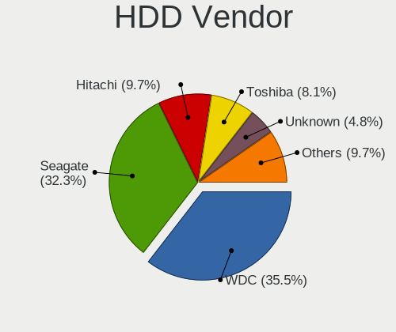
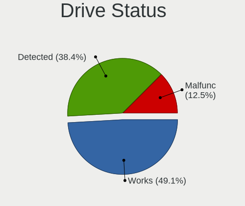
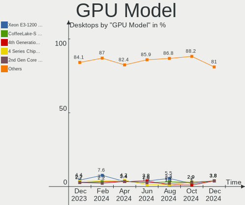
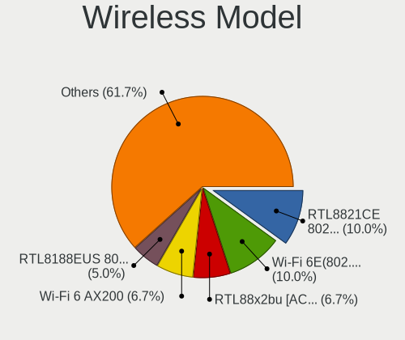
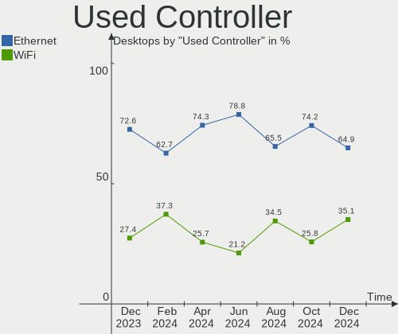
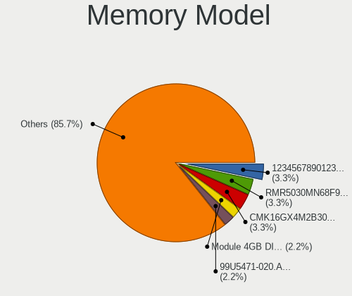

Linux in Italy - Hardware Trends (Desktops)
-------------------------------------------

A project to identify most popular hardware characteristics and track their change
over time based on data collected by Linux users at https://Linux-Hardware.org.

Anyone can contribute to this report by the [hw-probe](https://github.com/linuxhw/hw-probe) tool:

    sudo -E hw-probe -all -upload

Period: Oct, 2023.

Contents
--------

* [ System ](#system)
  - [ OS                       ](#os)
  - [ OS Family                ](#os-family)
  - [ Kernel                   ](#kernel)
  - [ Kernel Family            ](#kernel-family)
  - [ Kernel Major Ver.        ](#kernel-major-ver)
  - [ Arch                     ](#arch)
  - [ DE                       ](#de)
  - [ Display Server           ](#display-server)
  - [ Display Manager          ](#display-manager)
  - [ OS Lang                  ](#os-lang)
  - [ Boot Mode                ](#boot-mode)
  - [ Filesystem               ](#filesystem)
  - [ Part. scheme             ](#part-scheme)
  - [ Dual Boot with Linux/BSD ](#dual-boot-with-linuxbsd)
  - [ Dual Boot (Win)          ](#dual-boot-win)

* [ Board ](#board)
  - [ Vendor                   ](#vendor)
  - [ Model                    ](#model)
  - [ Model Family             ](#model-family)
  - [ MFG Year                 ](#mfg-year)
  - [ Form Factor              ](#form-factor)
  - [ Secure Boot              ](#secure-boot)
  - [ Coreboot                 ](#coreboot)
  - [ RAM Size                 ](#ram-size)
  - [ RAM Used                 ](#ram-used)
  - [ Total Drives             ](#total-drives)
  - [ Has CD-ROM               ](#has-cd-rom)
  - [ Has Ethernet             ](#has-ethernet)
  - [ Has WiFi                 ](#has-wifi)
  - [ Has Bluetooth            ](#has-bluetooth)

* [ Location ](#location)
  - [ Country                  ](#country)
  - [ City                     ](#city)

* [ Drives ](#drives)
  - [ Drive Vendor             ](#drive-vendor)
  - [ Drive Model              ](#drive-model)
  - [ HDD Vendor               ](#hdd-vendor)
  - [ SSD Vendor               ](#ssd-vendor)
  - [ Drive Kind               ](#drive-kind)
  - [ Drive Connector          ](#drive-connector)
  - [ Drive Size               ](#drive-size)
  - [ Space Total              ](#space-total)
  - [ Space Used               ](#space-used)
  - [ Malfunc. Drives          ](#malfunc-drives)
  - [ Malfunc. Drive Vendor    ](#malfunc-drive-vendor)
  - [ Malfunc. HDD Vendor      ](#malfunc-hdd-vendor)
  - [ Malfunc. Drive Kind      ](#malfunc-drive-kind)
  - [ Failed Drives            ](#failed-drives)
  - [ Failed Drive Vendor      ](#failed-drive-vendor)
  - [ Drive Status             ](#drive-status)

* [ Storage controller ](#storage-controller)
  - [ Storage Vendor           ](#storage-vendor)
  - [ Storage Model            ](#storage-model)
  - [ Storage Kind             ](#storage-kind)

* [ Processor ](#processor)
  - [ CPU Vendor               ](#cpu-vendor)
  - [ CPU Model                ](#cpu-model)
  - [ CPU Model Family         ](#cpu-model-family)
  - [ CPU Cores                ](#cpu-cores)
  - [ CPU Sockets              ](#cpu-sockets)
  - [ CPU Threads              ](#cpu-threads)
  - [ CPU Op-Modes             ](#cpu-op-modes)
  - [ CPU Microcode            ](#cpu-microcode)
  - [ CPU Microarch            ](#cpu-microarch)

* [ Graphics ](#graphics)
  - [ GPU Vendor               ](#gpu-vendor)
  - [ GPU Model                ](#gpu-model)
  - [ GPU Combo                ](#gpu-combo)
  - [ GPU Driver               ](#gpu-driver)
  - [ GPU Memory               ](#gpu-memory)

* [ Monitor ](#monitor)
  - [ Monitor Vendor           ](#monitor-vendor)
  - [ Monitor Model            ](#monitor-model)
  - [ Monitor Resolution       ](#monitor-resolution)
  - [ Monitor Diagonal         ](#monitor-diagonal)
  - [ Monitor Width            ](#monitor-width)
  - [ Aspect Ratio             ](#aspect-ratio)
  - [ Monitor Area             ](#monitor-area)
  - [ Pixel Density            ](#pixel-density)
  - [ Multiple Monitors        ](#multiple-monitors)

* [ Network ](#network)
  - [ Net Controller Vendor    ](#net-controller-vendor)
  - [ Net Controller Model     ](#net-controller-model)
  - [ Wireless Vendor          ](#wireless-vendor)
  - [ Wireless Model           ](#wireless-model)
  - [ Ethernet Vendor          ](#ethernet-vendor)
  - [ Ethernet Model           ](#ethernet-model)
  - [ Net Controller Kind      ](#net-controller-kind)
  - [ Used Controller          ](#used-controller)
  - [ NICs                     ](#nics)
  - [ IPv6                     ](#ipv6)

* [ Bluetooth ](#bluetooth)
  - [ Bluetooth Vendor         ](#bluetooth-vendor)
  - [ Bluetooth Model          ](#bluetooth-model)

* [ Sound ](#sound)
  - [ Sound Vendor             ](#sound-vendor)
  - [ Sound Model              ](#sound-model)

* [ Memory ](#memory)
  - [ Memory Vendor            ](#memory-vendor)
  - [ Memory Model             ](#memory-model)
  - [ Memory Kind              ](#memory-kind)
  - [ Memory Form Factor       ](#memory-form-factor)
  - [ Memory Size              ](#memory-size)
  - [ Memory Speed             ](#memory-speed)

* [ Printers & scanners ](#printers--scanners)
  - [ Printer Vendor           ](#printer-vendor)
  - [ Printer Model            ](#printer-model)
  - [ Scanner Vendor           ](#scanner-vendor)
  - [ Scanner Model            ](#scanner-model)

* [ Camera ](#camera)
  - [ Camera Vendor            ](#camera-vendor)
  - [ Camera Model             ](#camera-model)

* [ Security ](#security)
  - [ Fingerprint Vendor       ](#fingerprint-vendor)
  - [ Fingerprint Model        ](#fingerprint-model)
  - [ Chipcard Vendor          ](#chipcard-vendor)
  - [ Chipcard Model           ](#chipcard-model)

* [ Unsupported ](#unsupported)
  - [ Unsupported Devices      ](#unsupported-devices)
  - [ Unsupported Device Types ](#unsupported-device-types)

System
------

OS
--

Installed operating systems

| Name                         | Desktops | Percent |
|------------------------------|----------|---------|
| Ubuntu 22.04                 | 15       | 12.4%   |
| Arch Rolling                 | 14       | 11.57%  |
| Linux Mint 21.2              | 8        | 6.61%   |
| Kubuntu 23.04                | 5        | 4.13%   |
| Fedora 38                    | 5        | 4.13%   |
| EndeavourOS Rolling          | 5        | 4.13%   |
| Zorin 16                     | 4        | 3.31%   |
| Linux Mint 20.3              | 4        | 3.31%   |
| Gentoo 2.14                  | 4        | 3.31%   |
| Debian 12                    | 4        | 3.31%   |
| Ubuntu 23.04                 | 3        | 2.48%   |
| LMDE 6                       | 3        | 2.48%   |
| Kubuntu 22.04                | 3        | 2.48%   |
| Garuda Linux Soaring         | 3        | 2.48%   |
| Debian 11                    | 3        | 2.48%   |
| ArcoLinux Rolling            | 3        | 2.48%   |
| Ubuntu 23.10                 | 2        | 1.65%   |
| openSUSE Tumbleweed-XXXXXXXX | 2        | 1.65%   |
| Manjaro 23.0.4               | 2        | 1.65%   |
| Linux Mint 21.1              | 2        | 1.65%   |
| Debian                       | 2        | 1.65%   |
| Xubuntu 23.04                | 1        | 0.83%   |
| Xubuntu 22.04                | 1        | 0.83%   |
| Xubuntu 18.04                | 1        | 0.83%   |
| Xero Rolling                 | 1        | 0.83%   |
| Ubuntu Unity 23.10           | 1        | 0.83%   |
| Ubuntu MATE 23.10            | 1        | 0.83%   |
| Ubuntu 22.10                 | 1        | 0.83%   |
| TUXEDO OS 22.04              | 1        | 0.83%   |
| Peppermint 10                | 1        | 0.83%   |
| openSUSE Microos-XXXXXXXX    | 1        | 0.83%   |
| openSUSE Leap-15.5           | 1        | 0.83%   |
| OpenMandriva 23.10           | 1        | 0.83%   |
| OpenMandriva 23.08           | 1        | 0.83%   |
| MX 23                        | 1        | 0.83%   |
| Manjaro                      | 1        | 0.83%   |
| Lubuntu 23.04                | 1        | 0.83%   |
| Linux Mint 21                | 1        | 0.83%   |
| Linux Mint 20.1              | 1        | 0.83%   |
| KDE neon 22.04               | 1        | 0.83%   |

OS Family
---------

OS without a version

| Name         | Desktops | Percent |
|--------------|----------|---------|
| Ubuntu       | 21       | 17.36%  |
| Linux Mint   | 16       | 13.22%  |
| Arch         | 14       | 11.57%  |
| Debian       | 10       | 8.26%   |
| Kubuntu      | 8        | 6.61%   |
| Fedora       | 6        | 4.96%   |
| EndeavourOS  | 5        | 4.13%   |
| Zorin        | 4        | 3.31%   |
| openSUSE     | 4        | 3.31%   |
| Gentoo       | 4        | 3.31%   |
| Xubuntu      | 3        | 2.48%   |
| Manjaro      | 3        | 2.48%   |
| LMDE         | 3        | 2.48%   |
| Garuda Linux | 3        | 2.48%   |
| ArcoLinux    | 3        | 2.48%   |
| OpenMandriva | 2        | 1.65%   |
| Xero         | 1        | 0.83%   |
| Ubuntu Unity | 1        | 0.83%   |
| Ubuntu MATE  | 1        | 0.83%   |
| TUXEDO OS    | 1        | 0.83%   |
| Peppermint   | 1        | 0.83%   |
| MX           | 1        | 0.83%   |
| Lubuntu      | 1        | 0.83%   |
| KDE neon     | 1        | 0.83%   |
| Devuan       | 1        | 0.83%   |
| CentOS       | 1        | 0.83%   |
| CachyOS      | 1        | 0.83%   |
| Asimov       | 1        | 0.83%   |

Kernel
------

Version of the Linux kernel

| Version                 | Desktops | Percent |
|-------------------------|----------|---------|
| 6.5.9-arch2-1           | 13       | 10.74%  |
| 6.2.0-34-generic        | 10       | 8.26%   |
| 5.15.0-86-generic       | 7        | 5.79%   |
| 6.2.0-35-generic        | 5        | 4.13%   |
| 6.1.57-gentoo           | 4        | 3.31%   |
| 6.1.0-13-amd64          | 4        | 3.31%   |
| 6.5.9-zen2-1-zen        | 3        | 2.48%   |
| 6.5.7-arch1-1           | 3        | 2.48%   |
| 6.5.5-arch1-1           | 3        | 2.48%   |
| 6.2.0-26-generic        | 3        | 2.48%   |
| 6.1.0-12-amd64          | 3        | 2.48%   |
| 5.15.0-87-generic       | 3        | 2.48%   |
| 5.15.0-84-generic       | 3        | 2.48%   |
| 6.5.7-200.fc38.x86_64   | 2        | 1.65%   |
| 6.5.5-zen1-1-zen        | 2        | 1.65%   |
| 6.5.0-10-generic        | 2        | 1.65%   |
| 6.2.0-36-generic        | 2        | 1.65%   |
| 5.4.0-165-generic       | 2        | 1.65%   |
| 5.15.0-88-generic       | 2        | 1.65%   |
| 5.10.0-26-amd64         | 2        | 1.65%   |
| 6.6.0-060600rc5-generic | 1        | 0.83%   |
| 6.6.0                   | 1        | 0.83%   |
| 6.5.9-x64v2-xanmod1-1   | 1        | 0.83%   |
| 6.5.9-1-default         | 1        | 0.83%   |
| 6.5.8-200.fc38.x86_64   | 1        | 0.83%   |
| 6.5.7-2-cachyos         | 1        | 0.83%   |
| 6.5.7-060507-generic    | 1        | 0.83%   |
| 6.5.6-300.fc39.x86_64   | 1        | 0.83%   |
| 6.5.6-1-default         | 1        | 0.83%   |
| 6.5.5-desktop-1omv2390  | 1        | 0.83%   |
| 6.5.5-200.fc38.x86_64   | 1        | 0.83%   |
| 6.5.5-1-MANJARO         | 1        | 0.83%   |
| 6.5.4-1-default         | 1        | 0.83%   |
| 6.5.2-1-rt8-MANJARO     | 1        | 0.83%   |
| 6.5.0-9-generic         | 1        | 0.83%   |
| 6.5.0-3-amd64           | 1        | 0.83%   |
| 6.5.0-2-amd64           | 1        | 0.83%   |
| 6.5.0-0.deb12.1-amd64   | 1        | 0.83%   |
| 6.4.12-zen1-1-zen       | 1        | 0.83%   |
| 6.4.11-desktop-1omv2390 | 1        | 0.83%   |

Kernel Family
-------------

Linux kernel without a distro release

| Version  | Desktops | Percent |
|----------|----------|---------|
| 6.2.0    | 22       | 18.18%  |
| 5.15.0   | 20       | 16.53%  |
| 6.5.9    | 18       | 14.88%  |
| 6.5.5    | 8        | 6.61%   |
| 6.1.0    | 8        | 6.61%   |
| 6.5.7    | 7        | 5.79%   |
| 6.5.0    | 6        | 4.96%   |
| 5.4.0    | 6        | 4.96%   |
| 6.1.57   | 4        | 3.31%   |
| 5.10.0   | 3        | 2.48%   |
| 6.6.0    | 2        | 1.65%   |
| 6.5.6    | 2        | 1.65%   |
| 6.5.8    | 1        | 0.83%   |
| 6.5.4    | 1        | 0.83%   |
| 6.5.2    | 1        | 0.83%   |
| 6.4.12   | 1        | 0.83%   |
| 6.4.11   | 1        | 0.83%   |
| 6.3.13   | 1        | 0.83%   |
| 6.2.9    | 1        | 0.83%   |
| 6.1.60   | 1        | 0.83%   |
| 6.1.59   | 1        | 0.83%   |
| 5.19.0   | 1        | 0.83%   |
| 5.15.133 | 1        | 0.83%   |
| 5.14.21  | 1        | 0.83%   |
| 4.19.0   | 1        | 0.83%   |
| 4.18.0   | 1        | 0.83%   |
| 4.15.0   | 1        | 0.83%   |

Kernel Major Ver.
-----------------

Linux kernel major version

| Version | Desktops | Percent |
|---------|----------|---------|
| 6.5     | 44       | 36.36%  |
| 6.2     | 23       | 19.01%  |
| 5.15    | 21       | 17.36%  |
| 6.1     | 14       | 11.57%  |
| 5.4     | 6        | 4.96%   |
| 5.10    | 3        | 2.48%   |
| 6.6     | 2        | 1.65%   |
| 6.4     | 2        | 1.65%   |
| 6.3     | 1        | 0.83%   |
| 5.19    | 1        | 0.83%   |
| 5.14    | 1        | 0.83%   |
| 4.19    | 1        | 0.83%   |
| 4.18    | 1        | 0.83%   |
| 4.15    | 1        | 0.83%   |

Arch
----

OS architecture (x86_64, i586, etc.)

| Name   | Desktops | Percent |
|--------|----------|---------|
| x86_64 | 120      | 99.17%  |
| i686   | 1        | 0.83%   |

DE
--

Desktop Environment

| Name       | Desktops | Percent |
|------------|----------|---------|
| GNOME      | 42       | 34.71%  |
| KDE5       | 36       | 29.75%  |
| X-Cinnamon | 16       | 13.22%  |
| XFCE       | 9        | 7.44%   |
| MATE       | 6        | 4.96%   |
| Unknown    | 5        | 4.13%   |
| LXQt       | 2        | 1.65%   |
| i3         | 2        | 1.65%   |
| LXDE       | 1        | 0.83%   |
| Hyprland   | 1        | 0.83%   |
| Cinnamon   | 1        | 0.83%   |

Display Server
--------------

X11 or Wayland

| Name    | Desktops | Percent |
|---------|----------|---------|
| X11     | 88       | 72.73%  |
| Wayland | 28       | 23.14%  |
| Tty     | 5        | 4.13%   |

Display Manager
---------------

SDDM, LightDM, etc.

| Name    | Desktops | Percent |
|---------|----------|---------|
| SDDM    | 31       | 25.62%  |
| Unknown | 30       | 24.79%  |
| LightDM | 27       | 22.31%  |
| GDM3    | 23       | 19.01%  |
| GDM     | 8        | 6.61%   |
| XDM     | 1        | 0.83%   |
| LXDM    | 1        | 0.83%   |

OS Lang
-------

Language

| Lang              | Desktops | Percent |
|-------------------|----------|---------|
| it_IT             | 96       | 79.34%  |
| en_US             | 20       | 16.53%  |
| Unknown           | 2        | 1.65%   |
| en_US.ISO-8859-15 | 1        | 0.83%   |
| en_GB             | 1        | 0.83%   |
| C                 | 1        | 0.83%   |

Boot Mode
---------

EFI or BIOS

| Mode | Desktops | Percent |
|------|----------|---------|
| EFI  | 72       | 59.5%   |
| BIOS | 49       | 40.5%   |

Filesystem
----------

Type of filesystem

| Type    | Desktops | Percent |
|---------|----------|---------|
| Ext4    | 76       | 62.81%  |
| Tmpfs   | 19       | 15.7%   |
| Btrfs   | 15       | 12.4%   |
| Xfs     | 6        | 4.96%   |
| Overlay | 5        | 4.13%   |

Part. scheme
------------

Scheme of partitioning

| Type    | Desktops | Percent |
|---------|----------|---------|
| GPT     | 83       | 68.6%   |
| Unknown | 24       | 19.83%  |
| MBR     | 14       | 11.57%  |

Dual Boot with Linux/BSD
------------------------

Hosting more than one Linux/BSD

| Dual boot | Desktops | Percent |
|-----------|----------|---------|
| No        | 92       | 76.03%  |
| Yes       | 29       | 23.97%  |

Dual Boot (Win)
---------------

Hosting Linux and Windows

| Dual boot | Desktops | Percent |
|-----------|----------|---------|
| No        | 72       | 59.5%   |
| Yes       | 49       | 40.5%   |

Board
-----

Vendor
------

Motherboard manufacturer

| Name                | Desktops | Percent |
|---------------------|----------|---------|
| ASUSTek Computer    | 39       | 32.23%  |
| MSI                 | 19       | 15.7%   |
| Gigabyte Technology | 13       | 10.74%  |
| ASRock              | 12       | 9.92%   |
| Hewlett-Packard     | 9        | 7.44%   |
| Dell                | 9        | 7.44%   |
| Lenovo              | 4        | 3.31%   |
| Unknown             | 4        | 3.31%   |
| Intel               | 3        | 2.48%   |
| Fujitsu             | 2        | 1.65%   |
| Acer                | 2        | 1.65%   |
| Pegatron            | 1        | 0.83%   |
| Foxconn             | 1        | 0.83%   |
| Cincoze             | 1        | 0.83%   |
| AZW                 | 1        | 0.83%   |
| ASRockRack          | 1        | 0.83%   |

Model
-----

Motherboard model

| Name                                  | Desktops | Percent |
|---------------------------------------|----------|---------|
| Unknown                               | 4        | 3.31%   |
| MSI MS-7C37                           | 2        | 1.65%   |
| MSI MS-7B79                           | 2        | 1.65%   |
| HP ProDesk 600 G1 SFF                 | 2        | 1.65%   |
| Gigabyte X570 AORUS ELITE             | 2        | 1.65%   |
| Dell PowerEdge T20                    | 2        | 1.65%   |
| ASUS TUF Gaming B550M-PLUS            | 2        | 1.65%   |
| ASUS PRIME B550-PLUS                  | 2        | 1.65%   |
| ASUS PRIME A320M-K                    | 2        | 1.65%   |
| Pegatron HPE-521it                    | 1        | 0.83%   |
| MSI NQ890AA-ABZ CQ5011IT              | 1        | 0.83%   |
| MSI MS-7D95                           | 1        | 0.83%   |
| MSI MS-7D75                           | 1        | 0.83%   |
| MSI MS-7D32                           | 1        | 0.83%   |
| MSI MS-7D20                           | 1        | 0.83%   |
| MSI MS-7D18                           | 1        | 0.83%   |
| MSI MS-7C91                           | 1        | 0.83%   |
| MSI MS-7C52                           | 1        | 0.83%   |
| MSI MS-7B89                           | 1        | 0.83%   |
| MSI MS-7B86                           | 1        | 0.83%   |
| MSI MS-7B00                           | 1        | 0.83%   |
| MSI MS-7A78                           | 1        | 0.83%   |
| MSI MS-7A71                           | 1        | 0.83%   |
| MSI MS-7918                           | 1        | 0.83%   |
| MSI MS-7821                           | 1        | 0.83%   |
| Lenovo ThinkCentre M93p 10AAA00CAU    | 1        | 0.83%   |
| Lenovo ThinkCentre M92p 2992D9G       | 1        | 0.83%   |
| Lenovo ThinkCentre M83 10E8S0BW00     | 1        | 0.83%   |
| Lenovo IdeaCentre 3 07ACH7 90U9001SIX | 1        | 0.83%   |
| Intel X99                             | 1        | 0.83%   |
| Intel X79M-S                          | 1        | 0.83%   |
| Intel H110                            | 1        | 0.83%   |
| HP Z240 SFF Workstation               | 1        | 0.83%   |
| HP ProDesk 490 G2 MT                  | 1        | 0.83%   |
| HP ProDesk 490 G1 MT                  | 1        | 0.83%   |
| HP Pavilion Desktop TP01-0xxx         | 1        | 0.83%   |
| HP Compaq Elite 8300 SFF              | 1        | 0.83%   |
| HP Compaq dc7600 Small Form Factor    | 1        | 0.83%   |
| HP Compaq 6000 Pro MT PC              | 1        | 0.83%   |
| Gigabyte Z97-D3H                      | 1        | 0.83%   |

Model Family
------------

Motherboard model prefix

| Name               | Desktops | Percent |
|--------------------|----------|---------|
| ASUS PRIME         | 14       | 11.57%  |
| ASUS ROG           | 7        | 5.79%   |
| HP ProDesk         | 4        | 3.31%   |
| Gigabyte X570      | 4        | 3.31%   |
| Dell OptiPlex      | 4        | 3.31%   |
| ASUS TUF           | 4        | 3.31%   |
| Unknown            | 4        | 3.31%   |
| Lenovo ThinkCentre | 3        | 2.48%   |
| HP Compaq          | 3        | 2.48%   |
| Dell PowerEdge     | 3        | 2.48%   |
| MSI MS-7C37        | 2        | 1.65%   |
| MSI MS-7B79        | 2        | 1.65%   |
| Gigabyte B450M     | 2        | 1.65%   |
| ASUS P5Q3          | 2        | 1.65%   |
| Pegatron HPE-521it | 1        | 0.83%   |
| MSI NQ890AA-ABZ    | 1        | 0.83%   |
| MSI MS-7D95        | 1        | 0.83%   |
| MSI MS-7D75        | 1        | 0.83%   |
| MSI MS-7D32        | 1        | 0.83%   |
| MSI MS-7D20        | 1        | 0.83%   |
| MSI MS-7D18        | 1        | 0.83%   |
| MSI MS-7C91        | 1        | 0.83%   |
| MSI MS-7C52        | 1        | 0.83%   |
| MSI MS-7B89        | 1        | 0.83%   |
| MSI MS-7B86        | 1        | 0.83%   |
| MSI MS-7B00        | 1        | 0.83%   |
| MSI MS-7A78        | 1        | 0.83%   |
| MSI MS-7A71        | 1        | 0.83%   |
| MSI MS-7918        | 1        | 0.83%   |
| MSI MS-7821        | 1        | 0.83%   |
| Lenovo IdeaCentre  | 1        | 0.83%   |
| Intel X99          | 1        | 0.83%   |
| Intel X79M-S       | 1        | 0.83%   |
| Intel H110         | 1        | 0.83%   |
| HP Z240            | 1        | 0.83%   |
| HP Pavilion        | 1        | 0.83%   |
| Gigabyte Z97-D3H   | 1        | 0.83%   |
| Gigabyte Z370N     | 1        | 0.83%   |
| Gigabyte Z370      | 1        | 0.83%   |
| Gigabyte X570S     | 1        | 0.83%   |

MFG Year
--------

Motherboard manufacture year

| Year | Desktops | Percent |
|------|----------|---------|
| 2019 | 17       | 14.05%  |
| 2021 | 13       | 10.74%  |
| 2020 | 13       | 10.74%  |
| 2014 | 12       | 9.92%   |
| 2017 | 10       | 8.26%   |
| 2013 | 9        | 7.44%   |
| 2022 | 8        | 6.61%   |
| 2018 | 7        | 5.79%   |
| 2011 | 6        | 4.96%   |
| 2016 | 5        | 4.13%   |
| 2012 | 5        | 4.13%   |
| 2009 | 5        | 4.13%   |
| 2015 | 4        | 3.31%   |
| 2023 | 2        | 1.65%   |
| 2010 | 2        | 1.65%   |
| 2008 | 1        | 0.83%   |
| 2007 | 1        | 0.83%   |
| 2005 | 1        | 0.83%   |

Form Factor
-----------

Physical design of the computer

| Name    | Desktops | Percent |
|---------|----------|---------|
| Desktop | 121      | 100%    |

Secure Boot
-----------

Enabled or disabled

| State    | Desktops | Percent |
|----------|----------|---------|
| Disabled | 113      | 93.39%  |
| Enabled  | 8        | 6.61%   |

Coreboot
--------

Have coreboot on board

| Used | Desktops | Percent |
|------|----------|---------|
| No   | 121      | 100%    |

RAM Size
--------

Total RAM memory

| Size in GB  | Desktops | Percent |
|-------------|----------|---------|
| 16.01-24.0  | 37       | 30.58%  |
| 8.01-16.0   | 24       | 19.83%  |
| 32.01-64.0  | 17       | 14.05%  |
| 4.01-8.0    | 12       | 9.92%   |
| 3.01-4.0    | 12       | 9.92%   |
| 64.01-256.0 | 11       | 9.09%   |
| 24.01-32.0  | 6        | 4.96%   |
| 1.01-2.0    | 2        | 1.65%   |

RAM Used
--------

Used RAM memory

| Used GB   | Desktops | Percent |
|-----------|----------|---------|
| 4.01-8.0  | 32       | 26.45%  |
| 2.01-3.0  | 29       | 23.97%  |
| 1.01-2.0  | 28       | 23.14%  |
| 3.01-4.0  | 20       | 16.53%  |
| 8.01-16.0 | 8        | 6.61%   |
| 0.51-1.0  | 3        | 2.48%   |
| 0.01-0.5  | 1        | 0.83%   |

Total Drives
------------

Number of drives on board

| Drives | Desktops | Percent |
|--------|----------|---------|
| 1      | 41       | 33.88%  |
| 2      | 34       | 28.1%   |
| 3      | 24       | 19.83%  |
| 4      | 11       | 9.09%   |
| 5      | 5        | 4.13%   |
| 7      | 3        | 2.48%   |
| 6      | 2        | 1.65%   |
| 9      | 1        | 0.83%   |

Has CD-ROM
----------

Has CD-ROM on board

| Presented | Desktops | Percent |
|-----------|----------|---------|
| No        | 69       | 57.02%  |
| Yes       | 52       | 42.98%  |

Has Ethernet
------------

Has Ethernet on board

| Presented | Desktops | Percent |
|-----------|----------|---------|
| Yes       | 120      | 99.17%  |
| No        | 1        | 0.83%   |

Has WiFi
--------

Has WiFi module

| Presented | Desktops | Percent |
|-----------|----------|---------|
| Yes       | 61       | 50.41%  |
| No        | 60       | 49.59%  |

Has Bluetooth
-------------

Has Bluetooth module

| Presented | Desktops | Percent |
|-----------|----------|---------|
| No        | 75       | 61.98%  |
| Yes       | 46       | 38.02%  |

Location
--------

Country
-------

Geographic location (country)

| Country | Desktops | Percent |
|---------|----------|---------|
| Italy   | 121      | 100%    |

City
----

Geographic location (city)

| City                    | Desktops | Percent |
|-------------------------|----------|---------|
| Milan                   | 7        | 5.79%   |
| Rome                    | 6        | 4.96%   |
| Florence                | 5        | 4.13%   |
| Turin                   | 4        | 3.31%   |
| Naples                  | 3        | 2.48%   |
| Milano                  | 3        | 2.48%   |
| Livorno                 | 3        | 2.48%   |
| Genoa                   | 3        | 2.48%   |
| Venice                  | 2        | 1.65%   |
| Trieste                 | 2        | 1.65%   |
| Rho                     | 2        | 1.65%   |
| Reggio Calabria         | 2        | 1.65%   |
| Pisa                    | 2        | 1.65%   |
| Padova                  | 2        | 1.65%   |
| Oulx                    | 2        | 1.65%   |
| Nola                    | 2        | 1.65%   |
| Giussano                | 2        | 1.65%   |
| Zogno                   | 1        | 0.83%   |
| Villata                 | 1        | 0.83%   |
| Villa San Giovanni      | 1        | 0.83%   |
| Vigonza                 | 1        | 0.83%   |
| Verona                  | 1        | 0.83%   |
| Varallo Sesia           | 1        | 0.83%   |
| Valmadrera              | 1        | 0.83%   |
| Valenza                 | 1        | 0.83%   |
| Trevignano              | 1        | 0.83%   |
| Treviglio               | 1        | 0.83%   |
| Terranuova Bracciolini  | 1        | 0.83%   |
| Tavagnacco              | 1        | 0.83%   |
| Stezzano                | 1        | 0.83%   |
| Scandolara Ravara       | 1        | 0.83%   |
| Scafati                 | 1        | 0.83%   |
| Sassari                 | 1        | 0.83%   |
| Sant'Anastasia          | 1        | 0.83%   |
| Sannazzaro de' Burgondi | 1        | 0.83%   |
| San Cesario di Lecce    | 1        | 0.83%   |
| Roccabernarda           | 1        | 0.83%   |
| Ravenna                 | 1        | 0.83%   |
| Pordenone               | 1        | 0.83%   |
| Ponticino               | 1        | 0.83%   |

Drives
------

Drive Vendor
------------

Hard drive vendors

| Vendor                       | Desktops | Drives | Percent |
|------------------------------|----------|--------|---------|
| Samsung Electronics          | 38       | 53     | 16.31%  |
| WDC                          | 33       | 51     | 14.16%  |
| Seagate                      | 30       | 41     | 12.88%  |
| Kingston                     | 22       | 24     | 9.44%   |
| Crucial                      | 21       | 25     | 9.01%   |
| SanDisk                      | 13       | 14     | 5.58%   |
| Toshiba                      | 10       | 11     | 4.29%   |
| Micron/Crucial Technology    | 10       | 11     | 4.29%   |
| Phison Electronics           | 5        | 5      | 2.15%   |
| SPCC                         | 4        | 4      | 1.72%   |
| Hitachi                      | 4        | 4      | 1.72%   |
| Silicon Motion               | 3        | 3      | 1.29%   |
| Maxtor                       | 3        | 3      | 1.29%   |
| Kingston Technology Company  | 3        | 3      | 1.29%   |
| Intel                        | 3        | 3      | 1.29%   |
| HGST                         | 3        | 3      | 1.29%   |
| Team                         | 2        | 2      | 0.86%   |
| Phison                       | 2        | 3      | 0.86%   |
| Lexar                        | 2        | 2      | 0.86%   |
| China                        | 2        | 2      | 0.86%   |
| Unknown                      | 1        | 3      | 0.43%   |
| Transcend                    | 1        | 1      | 0.43%   |
| SK hynix                     | 1        | 1      | 0.43%   |
| ShiJi                        | 1        | 1      | 0.43%   |
| Shenzhen Longsys Electronics | 1        | 2      | 0.43%   |
| SCY                          | 1        | 1      | 0.43%   |
| Netac                        | 1        | 1      | 0.43%   |
| Micron Technology            | 1        | 1      | 0.43%   |
| KIOXIA-EXCERIA               | 1        | 1      | 0.43%   |
| JMicron Technology           | 1        | 1      | 0.43%   |
| Innodisk                     | 1        | 1      | 0.43%   |
| Initio                       | 1        | 1      | 0.43%   |
| IBM/Hitachi                  | 1        | 1      | 0.43%   |
| GOODRAM                      | 1        | 1      | 0.43%   |
| Fujitsu                      | 1        | 1      | 0.43%   |
| Drevo                        | 1        | 1      | 0.43%   |
| Corsair                      | 1        | 1      | 0.43%   |
| BAITITON                     | 1        | 1      | 0.43%   |
| A-DATA Technology            | 1        | 1      | 0.43%   |
| Unknown                      | 1        | 1      | 0.43%   |

Drive Model
-----------

Hard drive models

| Model                                                 | Desktops | Percent |
|-------------------------------------------------------|----------|---------|
| Micron/Crucial P2 NVMe PCIe SSD 500GB                 | 7        | 2.6%    |
| Samsung NVMe SSD Controller SM981/PM981/PM983 1TB     | 6        | 2.23%   |
| Kingston SA400S37480G 480GB SSD                       | 6        | 2.23%   |
| WDC WD10EZEX-08WN4A0 1TB                              | 5        | 1.86%   |
| Seagate ST1000DM010-2EP102 1TB                        | 5        | 1.86%   |
| Samsung NVMe SSD Controller PM9A1/PM9A3/980PRO 1TB    | 5        | 1.86%   |
| Crucial CT500MX500SSD1 500GB                          | 5        | 1.86%   |
| Seagate ST31000528AS 1TB                              | 4        | 1.49%   |
| Samsung SSD 870 QVO 1TB                               | 4        | 1.49%   |
| Kingston SA400S37240G 240GB SSD                       | 4        | 1.49%   |
| Toshiba DT01ACA100 1TB                                | 3        | 1.12%   |
| Silicon Motion SM2263EN/SM2263XT SSD Controller 256GB | 3        | 1.12%   |
| Seagate ST500DM002-1BD142 500GB                       | 3        | 1.12%   |
| Seagate ST1000DM003-1ER162 1TB                        | 3        | 1.12%   |
| Samsung SSD 860 EVO 500GB                             | 3        | 1.12%   |
| Kingston Company A2000 NVMe SSD 250GB                 | 3        | 1.12%   |
| Kingston SA400S37120G 120GB SSD                       | 3        | 1.12%   |
| Crucial CT480BX500SSD1 480GB                          | 3        | 1.12%   |
| WDC WDS100T2B0A-00SM50 1TB SSD                        | 2        | 0.74%   |
| WDC WD5000AADS-00S9B0 500GB                           | 2        | 0.74%   |
| WDC WD30EFRX-68EUZN0 3TB                              | 2        | 0.74%   |
| WDC WD20EARX-00PASB0 2TB                              | 2        | 0.74%   |
| WDC WD10EZRX-00L4HB0 1TB                              | 2        | 0.74%   |
| WDC WD10EZEX-00BN5A0 1TB                              | 2        | 0.74%   |
| WDC WD1003FZEX-00MK2A0 1TB                            | 2        | 0.74%   |
| Toshiba DT01ACA050 500GB                              | 2        | 0.74%   |
| Seagate ST2000DM008-2FR102 2TB                        | 2        | 0.74%   |
| Seagate ST1000DM003-9YN162 1TB                        | 2        | 0.74%   |
| Sandisk WD Blue SN550 NVMe SSD 1TB                    | 2        | 0.74%   |
| SanDisk Portable SSD 1TB                              | 2        | 0.74%   |
| Samsung SSD 990 PRO 2TB                               | 2        | 0.74%   |
| Samsung SSD 870 EVO 500GB                             | 2        | 0.74%   |
| Samsung SSD 870 EVO 2TB                               | 2        | 0.74%   |
| Samsung SSD 870 EVO 1TB                               | 2        | 0.74%   |
| Samsung SSD 850 PRO 512GB                             | 2        | 0.74%   |
| Samsung SSD 850 EVO 500GB                             | 2        | 0.74%   |
| Samsung SSD 850 EVO 250GB                             | 2        | 0.74%   |
| Samsung SSD 840 PRO Series 128GB                      | 2        | 0.74%   |
| Phison E7 NVMe Controller 120GB                       | 2        | 0.74%   |
| Phison E16 PCIe4 NVMe Controller 500GB                | 2        | 0.74%   |

HDD Vendor
----------

Hard disk drive vendors

| Vendor              | Desktops | Drives | Percent |
|---------------------|----------|--------|---------|
| WDC                 | 30       | 48     | 37.5%   |
| Seagate             | 29       | 40     | 36.25%  |
| Toshiba             | 7        | 8      | 8.75%   |
| Hitachi             | 4        | 4      | 5%      |
| Maxtor              | 3        | 3      | 3.75%   |
| HGST                | 3        | 3      | 3.75%   |
| Samsung Electronics | 1        | 1      | 1.25%   |
| Initio              | 1        | 1      | 1.25%   |
| IBM/Hitachi         | 1        | 1      | 1.25%   |
| Fujitsu             | 1        | 1      | 1.25%   |

SSD Vendor
----------

Solid state drive vendors

| Vendor              | Desktops | Drives | Percent |
|---------------------|----------|--------|---------|
| Samsung Electronics | 25       | 30     | 26.88%  |
| Crucial             | 21       | 23     | 22.58%  |
| Kingston            | 18       | 20     | 19.35%  |
| SanDisk             | 7        | 8      | 7.53%   |
| WDC                 | 3        | 3      | 3.23%   |
| Toshiba             | 3        | 3      | 3.23%   |
| SPCC                | 3        | 3      | 3.23%   |
| Team                | 2        | 2      | 2.15%   |
| China               | 2        | 2      | 2.15%   |
| Transcend           | 1        | 1      | 1.08%   |
| SCY                 | 1        | 1      | 1.08%   |
| Netac               | 1        | 1      | 1.08%   |
| Lexar               | 1        | 1      | 1.08%   |
| Innodisk            | 1        | 1      | 1.08%   |
| GOODRAM             | 1        | 1      | 1.08%   |
| Drevo               | 1        | 1      | 1.08%   |
| Corsair             | 1        | 1      | 1.08%   |
| BAITITON            | 1        | 1      | 1.08%   |

Drive Kind
----------

HDD or SSD

| Kind    | Desktops | Drives | Percent |
|---------|----------|--------|---------|
| SSD     | 78       | 103    | 40.21%  |
| HDD     | 62       | 110    | 31.96%  |
| NVMe    | 50       | 71     | 25.77%  |
| Unknown | 3        | 5      | 1.55%   |
| MMC     | 1        | 1      | 0.52%   |

Drive Connector
---------------

SATA, SAS, NVMe, etc.

| Type | Desktops | Drives | Percent |
|------|----------|--------|---------|
| SATA | 100      | 208    | 63.29%  |
| NVMe | 50       | 71     | 31.65%  |
| SAS  | 7        | 10     | 4.43%   |
| MMC  | 1        | 1      | 0.63%   |

Drive Size
----------

Size of hard drive

| Size in TB | Desktops | Drives | Percent |
|------------|----------|--------|---------|
| 0.01-0.5   | 67       | 106    | 45.89%  |
| 0.51-1.0   | 50       | 70     | 34.25%  |
| 1.01-2.0   | 14       | 17     | 9.59%   |
| 2.01-3.0   | 7        | 8      | 4.79%   |
| 3.01-4.0   | 5        | 6      | 3.42%   |
| 4.01-10.0  | 2        | 5      | 1.37%   |
| 10.01-20.0 | 1        | 1      | 0.68%   |

Space Total
-----------

Amount of disk space available on the file system

| Size in GB     | Desktops | Percent |
|----------------|----------|---------|
| 251-500        | 23       | 19.01%  |
| 101-250        | 22       | 18.18%  |
| 501-1000       | 21       | 17.36%  |
| More than 3000 | 18       | 14.88%  |
| 1001-2000      | 18       | 14.88%  |
| 2001-3000      | 8        | 6.61%   |
| 1-20           | 7        | 5.79%   |
| Unknown        | 2        | 1.65%   |
| 21-50          | 1        | 0.83%   |
| 51-100         | 1        | 0.83%   |

Space Used
----------

Amount of used disk space

| Used GB        | Desktops | Percent |
|----------------|----------|---------|
| 101-250        | 25       | 20.66%  |
| 251-500        | 21       | 17.36%  |
| 1-20           | 17       | 14.05%  |
| 501-1000       | 14       | 11.57%  |
| 21-50          | 13       | 10.74%  |
| 51-100         | 12       | 9.92%   |
| More than 3000 | 8        | 6.61%   |
| 1001-2000      | 7        | 5.79%   |
| 2001-3000      | 2        | 1.65%   |
| Unknown        | 2        | 1.65%   |

Malfunc. Drives
---------------

Drive models with a malfunction

| Model                                 | Desktops | Drives | Percent |
|---------------------------------------|----------|--------|---------|
| WDC WD30EFRX-68EUZN0 3TB              | 2        | 2      | 10%     |
| WDC WD5000AAKS-007AA0 500GB           | 1        | 1      | 5%      |
| WDC WD20EARS-60MVWB0 2TB              | 1        | 1      | 5%      |
| WDC WD2000FYYZ-01UL1B2 2TB            | 1        | 1      | 5%      |
| Seagate ST8000DM004-2CX188 8TB        | 1        | 1      | 5%      |
| Seagate ST2000DM006-2DM164 2TB        | 1        | 2      | 5%      |
| Samsung Electronics SSD 870 EVO 500GB | 1        | 1      | 5%      |
| Samsung Electronics SSD 870 EVO 2TB   | 1        | 1      | 5%      |
| Samsung Electronics SSD 870 EVO 1TB   | 1        | 1      | 5%      |
| Samsung Electronics SSD 860 EVO 500GB | 1        | 1      | 5%      |
| Maxtor STM3320820AS 320GB             | 1        | 1      | 5%      |
| Kingston SA400S37120G 120GB SSD       | 1        | 1      | 5%      |
| IBM/Hitachi IC35L040AVER07-0 41GB     | 1        | 1      | 5%      |
| Hitachi HDP725050GLA360 500GB         | 1        | 1      | 5%      |
| Hitachi HDP725025GLA380 250GB         | 1        | 1      | 5%      |
| HGST HTS545050A7E680 500GB            | 1        | 1      | 5%      |
| Fujitsu MHZ2320BH G2 320GB            | 1        | 1      | 5%      |
| Crucial CT525MX300SSD1 528GB          | 1        | 1      | 5%      |
| China SATA3 2TB SSD                   | 1        | 1      | 5%      |

Malfunc. Drive Vendor
---------------------

Vendors of faulty drives

| Vendor              | Desktops | Drives | Percent |
|---------------------|----------|--------|---------|
| WDC                 | 5        | 5      | 25%     |
| Samsung Electronics | 4        | 4      | 20%     |
| Seagate             | 2        | 3      | 10%     |
| Hitachi             | 2        | 2      | 10%     |
| Maxtor              | 1        | 1      | 5%      |
| Kingston            | 1        | 1      | 5%      |
| IBM/Hitachi         | 1        | 1      | 5%      |
| HGST                | 1        | 1      | 5%      |
| Fujitsu             | 1        | 1      | 5%      |
| Crucial             | 1        | 1      | 5%      |
| China               | 1        | 1      | 5%      |

Malfunc. HDD Vendor
-------------------

Vendors of faulty HDD drives

| Vendor      | Desktops | Drives | Percent |
|-------------|----------|--------|---------|
| WDC         | 5        | 5      | 38.46%  |
| Seagate     | 2        | 3      | 15.38%  |
| Hitachi     | 2        | 2      | 15.38%  |
| Maxtor      | 1        | 1      | 7.69%   |
| IBM/Hitachi | 1        | 1      | 7.69%   |
| HGST        | 1        | 1      | 7.69%   |
| Fujitsu     | 1        | 1      | 7.69%   |

Malfunc. Drive Kind
-------------------

Kinds of faulty drives

| Kind | Desktops | Drives | Percent |
|------|----------|--------|---------|
| HDD  | 11       | 14     | 61.11%  |
| SSD  | 7        | 7      | 38.89%  |

Failed Drives
-------------

Failed drive models

Zero info for selected period =(

Failed Drive Vendor
-------------------

Failed drive vendors

Zero info for selected period =(

Drive Status
------------

Number of failed and malfunc. drives

| Status   | Desktops | Drives | Percent |
|----------|----------|--------|---------|
| Works    | 71       | 154    | 51.45%  |
| Detected | 51       | 115    | 36.96%  |
| Malfunc  | 16       | 21     | 11.59%  |

Storage controller
------------------

Storage Vendor
--------------

Storage controller vendors

| Vendor                       | Desktops | Percent |
|------------------------------|----------|---------|
| Intel                        | 75       | 38.66%  |
| AMD                          | 46       | 23.71%  |
| Samsung Electronics          | 16       | 8.25%   |
| Micron/Crucial Technology    | 12       | 6.19%   |
| Phison Electronics           | 8        | 4.12%   |
| Kingston Technology Company  | 7        | 3.61%   |
| SanDisk                      | 6        | 3.09%   |
| ASMedia Technology           | 6        | 3.09%   |
| Silicon Motion               | 4        | 2.06%   |
| Marvell Technology Group     | 3        | 1.55%   |
| JMicron Technology           | 3        | 1.55%   |
| Shenzhen Longsys Electronics | 2        | 1.03%   |
| VIA Technologies             | 1        | 0.52%   |
| SK hynix                     | 1        | 0.52%   |
| Micron Technology            | 1        | 0.52%   |
| KIOXIA                       | 1        | 0.52%   |
| ADATA Technology             | 1        | 0.52%   |
| Adaptec                      | 1        | 0.52%   |

Storage Model
-------------

Storage controller models

| Model                                                                                   | Desktops | Percent |
|-----------------------------------------------------------------------------------------|----------|---------|
| AMD FCH SATA Controller [AHCI mode]                                                     | 25       | 10.92%  |
| AMD 500 Series Chipset SATA Controller                                                  | 11       | 4.8%    |
| Intel 8 Series/C220 Series Chipset Family 6-port SATA Controller 1 [AHCI mode]          | 10       | 4.37%   |
| Micron/Crucial P2 [Nick P2] / P3 / P3 Plus NVMe PCIe SSD (DRAM-less)                    | 9        | 3.93%   |
| Intel 200 Series PCH SATA controller [AHCI mode]                                        | 9        | 3.93%   |
| Samsung NVMe SSD Controller SM981/PM981/PM983                                           | 7        | 3.06%   |
| AMD 400 Series Chipset SATA Controller                                                  | 7        | 3.06%   |
| Samsung NVMe SSD Controller PM9A1/PM9A3/980PRO                                          | 6        | 2.62%   |
| Intel 500 Series Chipset Family SATA AHCI Controller                                    | 6        | 2.62%   |
| ASMedia ASM1062 Serial ATA Controller                                                   | 6        | 2.62%   |
| Intel SATA Controller [RAID mode]                                                       | 5        | 2.18%   |
| Intel Q170/Q150/B150/H170/H110/Z170/CM236 Chipset SATA Controller [AHCI Mode]           | 5        | 2.18%   |
| Intel Cannon Lake PCH SATA AHCI Controller                                              | 5        | 2.18%   |
| Silicon Motion SM2263EN/SM2263XT (DRAM-less) NVMe SSD Controllers                       | 4        | 1.75%   |
| Intel 7 Series/C210 Series Chipset Family 6-port SATA Controller [AHCI mode]            | 4        | 1.75%   |
| Intel 6 Series/C200 Series Chipset Family 6 port Desktop SATA AHCI Controller           | 4        | 1.75%   |
| AMD SB7x0/SB8x0/SB9x0 IDE Controller                                                    | 4        | 1.75%   |
| AMD FCH SATA Controller D                                                               | 4        | 1.75%   |
| Phison E16 PCIe4 NVMe Controller                                                        | 3        | 1.31%   |
| Kingston Company A2000 NVMe SSD SM2263EN                                                | 3        | 1.31%   |
| Intel Volume Management Device NVMe RAID Controller                                     | 3        | 1.31%   |
| Intel Alder Lake-S PCH SATA Controller [AHCI Mode]                                      | 3        | 1.31%   |
| Intel 9 Series Chipset Family SATA Controller [AHCI Mode]                               | 3        | 1.31%   |
| AMD SB7x0/SB8x0/SB9x0 SATA Controller [IDE mode]                                        | 3        | 1.31%   |
| AMD SB7x0/SB8x0/SB9x0 SATA Controller [AHCI mode]                                       | 3        | 1.31%   |
| SanDisk Ultra 3D / WD Blue SN550 NVMe SSD                                               | 2        | 0.87%   |
| Samsung NVMe SSD Controller S4LV008[Pascal]                                             | 2        | 0.87%   |
| Phison E7 NVMe Controller                                                               | 2        | 0.87%   |
| Phison E12 NVMe Controller                                                              | 2        | 0.87%   |
| Micron/Crucial P1 NVMe PCIe SSD[Frampton]                                               | 2        | 0.87%   |
| Marvell Group 88SE9172 SATA 6Gb/s Controller                                            | 2        | 0.87%   |
| JMicron JMB361 AHCI/IDE                                                                 | 2        | 0.87%   |
| Intel SSD 660P Series                                                                   | 2        | 0.87%   |
| Intel NM10/ICH7 Family SATA Controller [IDE mode]                                       | 2        | 0.87%   |
| Intel C600/X79 series chipset 6-Port SATA AHCI Controller                               | 2        | 0.87%   |
| Intel 700 Series Chipset Family SATA AHCI Controller                                    | 2        | 0.87%   |
| Intel 6 Series/C200 Series Chipset Family Desktop SATA Controller (IDE mode, ports 4-5) | 2        | 0.87%   |
| Intel 6 Series/C200 Series Chipset Family Desktop SATA Controller (IDE mode, ports 0-3) | 2        | 0.87%   |
| AMD 300 Series Chipset SATA Controller                                                  | 2        | 0.87%   |
| VIA VT82C586A/B/VT82C686/A/B/VT823x/A/C PIPC Bus Master IDE                             | 1        | 0.44%   |

Storage Kind
------------

Kind of storage controller (IDE, SATA, NVMe, SAS, ...)

| Kind | Desktops | Percent |
|------|----------|---------|
| SATA | 106      | 57.61%  |
| NVMe | 50       | 27.17%  |
| IDE  | 14       | 7.61%   |
| RAID | 11       | 5.98%   |
| SAS  | 2        | 1.09%   |
| SCSI | 1        | 0.54%   |

Processor
---------

CPU Vendor
----------

Processor vendors

| Vendor | Desktops | Percent |
|--------|----------|---------|
| Intel  | 75       | 61.98%  |
| AMD    | 46       | 38.02%  |

CPU Model
---------

Processor models

| Model                                       | Desktops | Percent |
|---------------------------------------------|----------|---------|
| AMD Ryzen 5 5600X 6-Core Processor          | 5        | 4.13%   |
| AMD Ryzen 7 3700X 8-Core Processor          | 4        | 3.31%   |
| Intel Core i5-3470 CPU @ 3.20GHz            | 3        | 2.48%   |
| AMD Ryzen 5 3600 6-Core Processor           | 3        | 2.48%   |
| AMD Ryzen 5 3400G with Radeon Vega Graphics | 3        | 2.48%   |
| Intel Xeon CPU E3-1225 v3 @ 3.20GHz         | 2        | 1.65%   |
| Intel Core i7-7700 CPU @ 3.60GHz            | 2        | 1.65%   |
| Intel Core i7-2600 CPU @ 3.40GHz            | 2        | 1.65%   |
| Intel Core i5-9400F CPU @ 2.90GHz           | 2        | 1.65%   |
| Intel Core i3-4160 CPU @ 3.60GHz            | 2        | 1.65%   |
| Intel Core i3-4130 CPU @ 3.40GHz            | 2        | 1.65%   |
| Intel 11th Gen Core i5-11600K @ 3.90GHz     | 2        | 1.65%   |
| AMD Ryzen 9 5950X 16-Core Processor         | 2        | 1.65%   |
| AMD Ryzen 7 5700G with Radeon Graphics      | 2        | 1.65%   |
| AMD Ryzen 3 3100 4-Core Processor           | 2        | 1.65%   |
| AMD FX-8350 Eight-Core Processor            | 2        | 1.65%   |
| Intel Xeon E-2224G CPU @ 3.50GHz            | 1        | 0.83%   |
| Intel Xeon CPU X3480 @ 3.07GHz              | 1        | 0.83%   |
| Intel Xeon CPU E5-2690 0 @ 2.90GHz          | 1        | 0.83%   |
| Intel Xeon CPU E5-2670 v3 @ 2.30GHz         | 1        | 0.83%   |
| Intel Xeon CPU E5-2650 v2 @ 2.60GHz         | 1        | 0.83%   |
| Intel Xeon CPU E5-2620 v2 @ 2.10GHz         | 1        | 0.83%   |
| Intel Xeon CPU E3-1225 v5 @ 3.30GHz         | 1        | 0.83%   |
| Intel Pentium Dual-Core CPU E6500 @ 2.93GHz | 1        | 0.83%   |
| Intel Pentium CPU G850 @ 2.90GHz            | 1        | 0.83%   |
| Intel Pentium CPU G630 @ 2.70GHz            | 1        | 0.83%   |
| Intel Pentium CPU G4400TE @ 2.40GHz         | 1        | 0.83%   |
| Intel Pentium CPU G3220 @ 3.00GHz           | 1        | 0.83%   |
| Intel Pentium 4 CPU 3.00GHz                 | 1        | 0.83%   |
| Intel N100                                  | 1        | 0.83%   |
| Intel Core i9-9900K CPU @ 3.60GHz           | 1        | 0.83%   |
| Intel Core i9-10880H CPU @ 2.30GHz          | 1        | 0.83%   |
| Intel Core i7-9700T CPU @ 2.00GHz           | 1        | 0.83%   |
| Intel Core i7-9700F CPU @ 3.00GHz           | 1        | 0.83%   |
| Intel Core i7-8700K CPU @ 3.70GHz           | 1        | 0.83%   |
| Intel Core i7-8700 CPU @ 3.20GHz            | 1        | 0.83%   |
| Intel Core i7-8086K CPU @ 4.00GHz           | 1        | 0.83%   |
| Intel Core i7-7700K CPU @ 4.20GHz           | 1        | 0.83%   |
| Intel Core i7-6700K CPU @ 4.00GHz           | 1        | 0.83%   |
| Intel Core i7-4790 CPU @ 3.60GHz            | 1        | 0.83%   |

CPU Model Family
----------------

Processor model prefix

| Model                   | Desktops | Percent |
|-------------------------|----------|---------|
| AMD Ryzen 5             | 19       | 15.7%   |
| Intel Core i7           | 17       | 14.05%  |
| Intel Core i5           | 13       | 10.74%  |
| Other                   | 12       | 9.92%   |
| AMD Ryzen 7             | 11       | 9.09%   |
| Intel Xeon              | 9        | 7.44%   |
| Intel Core i3           | 9        | 7.44%   |
| AMD Ryzen 9             | 5        | 4.13%   |
| Intel Pentium           | 4        | 3.31%   |
| AMD FX                  | 4        | 3.31%   |
| Intel Celeron           | 3        | 2.48%   |
| AMD Ryzen 3             | 3        | 2.48%   |
| Intel Core i9           | 2        | 1.65%   |
| Intel Core 2 Quad       | 2        | 1.65%   |
| Intel Core 2 Duo        | 2        | 1.65%   |
| Intel Pentium Dual-Core | 1        | 0.83%   |
| Intel Pentium 4         | 1        | 0.83%   |
| AMD Phenom II X6        | 1        | 0.83%   |
| AMD GX                  | 1        | 0.83%   |
| AMD Athlon II X3        | 1        | 0.83%   |
| AMD A4                  | 1        | 0.83%   |

CPU Cores
---------

Number of processor cores

| Number | Desktops | Percent |
|--------|----------|---------|
| 4      | 40       | 33.06%  |
| 6      | 29       | 23.97%  |
| 8      | 19       | 15.7%   |
| 2      | 17       | 14.05%  |
| 12     | 4        | 3.31%   |
| 1      | 3        | 2.48%   |
| 24     | 2        | 1.65%   |
| 16     | 2        | 1.65%   |
| 14     | 2        | 1.65%   |
| 3      | 2        | 1.65%   |
| 10     | 1        | 0.83%   |

CPU Sockets
-----------

Number of sockets

| Number | Desktops | Percent |
|--------|----------|---------|
| 1      | 120      | 99.17%  |
| 2      | 1        | 0.83%   |

CPU Threads
-----------

Threads per core (Hyper-Threading)

| Number | Desktops | Percent |
|--------|----------|---------|
| 2      | 85       | 70.25%  |
| 1      | 36       | 29.75%  |

CPU Op-Modes
------------

CPU Operation Modes (32-bit, 64-bit)

| Op mode        | Desktops | Percent |
|----------------|----------|---------|
| 32-bit, 64-bit | 120      | 99.17%  |
| 32-bit         | 1        | 0.83%   |

CPU Microcode
-------------

Microcode number

| Number     | Desktops | Percent |
|------------|----------|---------|
| Unknown    | 55       | 45.45%  |
| 0x306c3    | 8        | 6.61%   |
| 0x08701021 | 7        | 5.79%   |
| 0x906ea    | 3        | 2.48%   |
| 0x206a7    | 3        | 2.48%   |
| 0x0a601203 | 3        | 2.48%   |
| 0x08701030 | 3        | 2.48%   |
| 0x08108109 | 3        | 2.48%   |
| 0xa0671    | 2        | 1.65%   |
| 0x306a9    | 2        | 1.65%   |
| 0x1067a    | 2        | 1.65%   |
| 0x0a50000d | 2        | 1.65%   |
| 0x0a50000c | 2        | 1.65%   |
| 0x0a20120a | 2        | 1.65%   |
| 0x0a201009 | 2        | 1.65%   |
| 0x08001138 | 2        | 1.65%   |
| 0x06000852 | 2        | 1.65%   |
| 0xf29      | 1        | 0.83%   |
| 0x906ed    | 1        | 0.83%   |
| 0x906e9    | 1        | 0.83%   |
| 0x906a4    | 1        | 0.83%   |
| 0x506e3    | 1        | 0.83%   |
| 0x506ca    | 1        | 0.83%   |
| 0x306e4    | 1        | 0.83%   |
| 0x206d7    | 1        | 0.83%   |
| 0x0a50000b | 1        | 0.83%   |
| 0x0a20102b | 1        | 0.83%   |
| 0x0a201025 | 1        | 0.83%   |
| 0x0a201016 | 1        | 0.83%   |
| 0x08600106 | 1        | 0.83%   |
| 0x0800820d | 1        | 0.83%   |
| 0x0700010b | 1        | 0.83%   |
| 0x06001119 | 1        | 0.83%   |
| 0x0600063e | 1        | 0.83%   |
| 0x010000dc | 1        | 0.83%   |

CPU Microarch
-------------

Microarchitecture

| Name             | Desktops | Percent |
|------------------|----------|---------|
| Haswell          | 17       | 14.05%  |
| KabyLake         | 15       | 12.4%   |
| Zen 3            | 14       | 11.57%  |
| Zen 2            | 13       | 10.74%  |
| SandyBridge      | 7        | 5.79%   |
| IvyBridge        | 7        | 5.79%   |
| Unknown          | 7        | 5.79%   |
| Zen+             | 6        | 4.96%   |
| Skylake          | 5        | 4.13%   |
| Penryn           | 5        | 4.13%   |
| Piledriver       | 4        | 3.31%   |
| Icelake          | 4        | 3.31%   |
| Alderlake Hybrid | 4        | 3.31%   |
| CometLake        | 3        | 2.48%   |
| Zen              | 2        | 1.65%   |
| NetBurst         | 2        | 1.65%   |
| K10              | 2        | 1.65%   |
| Nehalem          | 1        | 0.83%   |
| Jaguar           | 1        | 0.83%   |
| Goldmont         | 1        | 0.83%   |
| Bulldozer        | 1        | 0.83%   |

Graphics
--------

GPU Vendor
----------

Vendors of graphics cards

| Vendor | Desktops | Percent |
|--------|----------|---------|
| Nvidia | 45       | 35.16%  |
| AMD    | 42       | 32.81%  |
| Intel  | 41       | 32.03%  |

GPU Model
---------

Graphics card models

| Model                                                                       | Desktops | Percent |
|-----------------------------------------------------------------------------|----------|---------|
| Intel Xeon E3-1200 v3/4th Gen Core Processor Integrated Graphics Controller | 6        | 4.62%   |
| AMD Ellesmere [Radeon RX 470/480/570/570X/580/580X/590]                     | 6        | 4.62%   |
| Intel 4th Generation Core Processor Family Integrated Graphics Controller   | 5        | 3.85%   |
| Intel CoffeeLake-S GT2 [UHD Graphics 630]                                   | 4        | 3.08%   |
| Intel 2nd Generation Core Processor Family Integrated Graphics Controller   | 4        | 3.08%   |
| AMD Picasso/Raven 2 [Radeon Vega Series / Radeon Vega Mobile Series]        | 4        | 3.08%   |
| AMD Cezanne [Radeon Vega Series / Radeon Vega Mobile Series]                | 4        | 3.08%   |
| Nvidia TU117 [GeForce GTX 1650]                                             | 3        | 2.31%   |
| Nvidia GP108 [GeForce GT 1030]                                              | 3        | 2.31%   |
| Intel HD Graphics 630                                                       | 3        | 2.31%   |
| AMD Raphael                                                                 | 3        | 2.31%   |
| AMD Navi 24 [Radeon RX 6400/6500 XT/6500M]                                  | 3        | 2.31%   |
| Nvidia GP107 [GeForce GTX 1050]                                             | 2        | 1.54%   |
| Nvidia GP106 [GeForce GTX 1060 6GB]                                         | 2        | 1.54%   |
| Nvidia GM206 [GeForce GTX 950]                                              | 2        | 1.54%   |
| Nvidia GK208B [GeForce GT 730]                                              | 2        | 1.54%   |
| Intel Xeon E3-1200 v3 Processor Integrated Graphics Controller              | 2        | 1.54%   |
| Intel RocketLake-S GT1 [UHD Graphics 750]                                   | 2        | 1.54%   |
| Intel Raptor Lake-S GT1 [UHD Graphics 770]                                  | 2        | 1.54%   |
| Intel AlderLake-S GT1                                                       | 2        | 1.54%   |
| AMD Redwood XT [Radeon HD 5670/5690/5730]                                   | 2        | 1.54%   |
| AMD Navi 23 [Radeon RX 6650 XT / 6700S / 6800S]                             | 2        | 1.54%   |
| AMD Navi 21 [Radeon RX 6800/6800 XT / 6900 XT]                              | 2        | 1.54%   |
| AMD Navi 10 [Radeon RX 5600 OEM/5600 XT / 5700/5700 XT]                     | 2        | 1.54%   |
| AMD Baffin [Radeon RX 460/560D / Pro 450/455/460/555/555X/560/560X]         | 2        | 1.54%   |
| Nvidia TU117GLM [Quadro T400 Mobile]                                        | 1        | 0.77%   |
| Nvidia TU117GL [T600]                                                       | 1        | 0.77%   |
| Nvidia TU116 [GeForce GTX 1660 SUPER]                                       | 1        | 0.77%   |
| Nvidia TU106 [GeForce RTX 2060 SUPER]                                       | 1        | 0.77%   |
| Nvidia TU106 [GeForce RTX 2060 Rev. A]                                      | 1        | 0.77%   |
| Nvidia TU106 [GeForce GTX 1650]                                             | 1        | 0.77%   |
| Nvidia TU104 [GeForce RTX 2080 SUPER]                                       | 1        | 0.77%   |
| Nvidia TU104 [GeForce RTX 2060]                                             | 1        | 0.77%   |
| Nvidia GT218 [GeForce 405]                                                  | 1        | 0.77%   |
| Nvidia GT218 [GeForce 210]                                                  | 1        | 0.77%   |
| Nvidia GP107 [GeForce GTX 1050 Ti]                                          | 1        | 0.77%   |
| Nvidia GP104 [GeForce GTX 1070]                                             | 1        | 0.77%   |
| Nvidia GP102 [GeForce GTX 1080 Ti]                                          | 1        | 0.77%   |
| Nvidia GM206 [GeForce GTX 960]                                              | 1        | 0.77%   |
| Nvidia GM204 [GeForce GTX 970]                                              | 1        | 0.77%   |

GPU Combo
---------

Combinations of graphics cards

| Name           | Desktops | Percent |
|----------------|----------|---------|
| 1 x Nvidia     | 41       | 33.88%  |
| 1 x AMD        | 38       | 31.4%   |
| 1 x Intel      | 37       | 30.58%  |
| 2 x AMD        | 2        | 1.65%   |
| Intel + Nvidia | 1        | 0.83%   |
| Intel + AMD    | 1        | 0.83%   |
| AMD + Nvidia   | 1        | 0.83%   |

GPU Driver
----------

Free vs proprietary

| Driver      | Desktops | Percent |
|-------------|----------|---------|
| Free        | 81       | 66.94%  |
| Proprietary | 37       | 30.58%  |
| Unknown     | 3        | 2.48%   |

GPU Memory
----------

Total video memory

| Size in GB | Desktops | Percent |
|------------|----------|---------|
| Unknown    | 52       | 42.98%  |
| 3.01-4.0   | 16       | 13.22%  |
| 1.01-2.0   | 16       | 13.22%  |
| 7.01-8.0   | 12       | 9.92%   |
| 0.51-1.0   | 7        | 5.79%   |
| 0.01-0.5   | 7        | 5.79%   |
| 8.01-16.0  | 6        | 4.96%   |
| 5.01-6.0   | 4        | 3.31%   |
| 16.01-24.0 | 1        | 0.83%   |

Monitor
-------

Monitor Vendor
--------------

Monitor vendors

| Vendor               | Desktops | Percent |
|----------------------|----------|---------|
| Samsung Electronics  | 32       | 23.7%   |
| Philips              | 16       | 11.85%  |
| Hewlett-Packard      | 14       | 10.37%  |
| Dell                 | 9        | 6.67%   |
| Goldstar             | 7        | 5.19%   |
| Ancor Communications | 7        | 5.19%   |
| Acer                 | 7        | 5.19%   |
| AOC                  | 6        | 4.44%   |
| Lenovo               | 5        | 3.7%    |
| Sony                 | 4        | 2.96%   |
| MSI                  | 4        | 2.96%   |
| ASUSTek Computer     | 4        | 2.96%   |
| RTK                  | 2        | 1.48%   |
| Mi                   | 2        | 1.48%   |
| Yashi                | 1        | 0.74%   |
| ViewSonic            | 1        | 0.74%   |
| Toshiba              | 1        | 0.74%   |
| TCL                  | 1        | 0.74%   |
| Panasonic            | 1        | 0.74%   |
| LG Electronics       | 1        | 0.74%   |
| ITE                  | 1        | 0.74%   |
| HUAWEI               | 1        | 0.74%   |
| HKC                  | 1        | 0.74%   |
| Fujitsu Siemens      | 1        | 0.74%   |
| Eizo                 | 1        | 0.74%   |
| Denver               | 1        | 0.74%   |
| Compaq Computer      | 1        | 0.74%   |
| CHR                  | 1        | 0.74%   |
| CHD                  | 1        | 0.74%   |
| BenQ                 | 1        | 0.74%   |

Monitor Model
-------------

Monitor models

| Model                                                                   | Desktops | Percent |
|-------------------------------------------------------------------------|----------|---------|
| Goldstar FULL HD GSM5B55 1920x1080 480x270mm 21.7-inch                  | 3        | 2.13%   |
| Samsung Electronics S24D330 SAM0D92 1920x1080 530x300mm 24.0-inch       | 2        | 1.42%   |
| Samsung Electronics C27F390 SAM0D32 1920x1080 598x336mm 27.0-inch       | 2        | 1.42%   |
| RTK LCD Monitor RTK1D1A 1920x1080 1020x570mm 46.0-inch                  | 2        | 1.42%   |
| Philips 247E4 PHLC0C0 1920x1080 521x293mm 23.5-inch                     | 2        | 1.42%   |
| Mi 27 NFGL XMIB004 1920x1080 598x336mm 27.0-inch                        | 2        | 1.42%   |
| Lenovo D24-20 LEN66AE 1920x1080 527x296mm 23.8-inch                     | 2        | 1.42%   |
| Ancor Communications ASUS VS228 ACI22FD 1920x1080 476x268mm 21.5-inch   | 2        | 1.42%   |
| Yashi YZ2816 YSI2800 3840x2160 620x350mm 28.0-inch                      | 1        | 0.71%   |
| ViewSonic VP3881 VSCE234 3840x1600 880x367mm 37.5-inch                  | 1        | 0.71%   |
| Toshiba TV TSB0106 1366x768                                             | 1        | 0.71%   |
| TCL SMART TV TCL6586 3840x2160 1209x680mm 54.6-inch                     | 1        | 0.71%   |
| Sony TV SNY7001 1920x1080                                               | 1        | 0.71%   |
| Sony TV SNY3002 1920x1080 886x498mm 40.0-inch                           | 1        | 0.71%   |
| Sony TV SNY0101 1360x768                                                | 1        | 0.71%   |
| Sony SDM-S51 SNY1E50 1024x768 304x228mm 15.0-inch                       | 1        | 0.71%   |
| Samsung Electronics U32J59x SAM0F35 3840x2160 697x392mm 31.5-inch       | 1        | 0.71%   |
| Samsung Electronics U28E590 SAM0C4C 3840x2160 608x345mm 27.5-inch       | 1        | 0.71%   |
| Samsung Electronics T24E390 SAM0C20 1920x1080 521x293mm 23.5-inch       | 1        | 0.71%   |
| Samsung Electronics T23C350 SAM0ABC 1920x1080 510x287mm 23.0-inch       | 1        | 0.71%   |
| Samsung Electronics T22D390 SAM0B6B 1920x1080 477x268mm 21.5-inch       | 1        | 0.71%   |
| Samsung Electronics SyncMaster SAM0486 1920x1080                        | 1        | 0.71%   |
| Samsung Electronics SyncMaster SAM03EF 1680x1050 433x271mm 20.1-inch    | 1        | 0.71%   |
| Samsung Electronics SyncMaster SAM0373 1680x1050 459x296mm 21.5-inch    | 1        | 0.71%   |
| Samsung Electronics SyncMaster SAM0273 1440x900 410x257mm 19.1-inch     | 1        | 0.71%   |
| Samsung Electronics SyncMaster SAM010B 1280x1024 340x270mm 17.1-inch    | 1        | 0.71%   |
| Samsung Electronics SMB2220N SAM06A2 1920x1080 477x268mm 21.5-inch      | 1        | 0.71%   |
| Samsung Electronics SMB1930HD SAM0708 1360x768 410x230mm 18.5-inch      | 1        | 0.71%   |
| Samsung Electronics SA300/SA350 SAM0795 1920x1080 521x293mm 23.5-inch   | 1        | 0.71%   |
| Samsung Electronics SA300/SA350 SAM078F 1920x1080 477x268mm 21.5-inch   | 1        | 0.71%   |
| Samsung Electronics S32D850 SAM0BCC 2560x1440 708x398mm 32.0-inch       | 1        | 0.71%   |
| Samsung Electronics S24F350 SAM0D20 1920x1080 521x293mm 23.5-inch       | 1        | 0.71%   |
| Samsung Electronics S24C450 SAM09CF 1920x1200 518x324mm 24.1-inch       | 1        | 0.71%   |
| Samsung Electronics S24B300 SAM08B3 1920x1080 520x290mm 23.4-inch       | 1        | 0.71%   |
| Samsung Electronics S23B550 SAM0919 1920x1080 510x290mm 23.1-inch       | 1        | 0.71%   |
| Samsung Electronics S22D300 SAM0B3B 1920x1080 480x270mm 21.7-inch       | 1        | 0.71%   |
| Samsung Electronics LF27T35 SAM707F 1920x1080 598x337mm 27.0-inch       | 1        | 0.71%   |
| Samsung Electronics LF24T35 SAM707D 1920x1080 528x297mm 23.9-inch       | 1        | 0.71%   |
| Samsung Electronics LCD Monitor SAM7245 1920x1080 1210x680mm 54.6-inch  | 1        | 0.71%   |
| Samsung Electronics LCD Monitor SAM0FEF 3840x2160 1872x1053mm 84.6-inch | 1        | 0.71%   |

Monitor Resolution
------------------

Monitor screen resolution

| Resolution         | Desktops | Percent |
|--------------------|----------|---------|
| 1920x1080 (FHD)    | 72       | 56.69%  |
| 2560x1440 (QHD)    | 12       | 9.45%   |
| 3840x2160 (4K)     | 9        | 7.09%   |
| 1280x1024 (SXGA)   | 9        | 7.09%   |
| 1920x1200 (WUXGA)  | 5        | 3.94%   |
| 1680x1050 (WSXGA+) | 3        | 2.36%   |
| 1440x900 (WXGA+)   | 3        | 2.36%   |
| 1360x768           | 3        | 2.36%   |
| 3840x1600          | 2        | 1.57%   |
| 3440x1440          | 2        | 1.57%   |
| 1366x768 (WXGA)    | 2        | 1.57%   |
| 1024x768 (XGA)     | 2        | 1.57%   |
| 3840x1080          | 1        | 0.79%   |
| 2560x1080          | 1        | 0.79%   |
| 1920x540           | 1        | 0.79%   |

Monitor Diagonal
----------------

Diagonal size in inches

| Inches  | Desktops | Percent |
|---------|----------|---------|
| 24      | 25       | 18.52%  |
| 27      | 21       | 15.56%  |
| 21      | 19       | 14.07%  |
| 23      | 17       | 12.59%  |
| 19      | 7        | 5.19%   |
| 31      | 6        | 4.44%   |
| Unknown | 5        | 3.7%    |
| 46      | 4        | 2.96%   |
| 17      | 4        | 2.96%   |
| 54      | 3        | 2.22%   |
| 34      | 3        | 2.22%   |
| 18      | 3        | 2.22%   |
| 40      | 2        | 1.48%   |
| 37      | 2        | 1.48%   |
| 28      | 2        | 1.48%   |
| 26      | 2        | 1.48%   |
| 22      | 2        | 1.48%   |
| 15      | 2        | 1.48%   |
| 84      | 1        | 0.74%   |
| 72      | 1        | 0.74%   |
| 49      | 1        | 0.74%   |
| 47      | 1        | 0.74%   |
| 32      | 1        | 0.74%   |
| 20      | 1        | 0.74%   |

Monitor Width
-------------

Physical width

| Width in mm | Desktops | Percent |
|-------------|----------|---------|
| 501-600     | 59       | 45.38%  |
| 401-500     | 27       | 20.77%  |
| 601-700     | 9        | 6.92%   |
| 1001-1500   | 9        | 6.92%   |
| 301-350     | 6        | 4.62%   |
| 351-400     | 5        | 3.85%   |
| Unknown     | 5        | 3.85%   |
| 801-900     | 4        | 3.08%   |
| 701-800     | 4        | 3.08%   |
| 1501-2000   | 2        | 1.54%   |

Aspect Ratio
------------

Proportional relationship between the width and the height

| Ratio   | Desktops | Percent |
|---------|----------|---------|
| 16/9    | 87       | 71.9%   |
| 16/10   | 14       | 11.57%  |
| 5/4     | 8        | 6.61%   |
| 21/9    | 5        | 4.13%   |
| 4/3     | 3        | 2.48%   |
| Unknown | 2        | 1.65%   |
| 6/5     | 1        | 0.83%   |
| 32/9    | 1        | 0.83%   |

Monitor Area
------------

Area in inch

| Area in inch | Desktops | Percent |
|----------------|----------|---------|
| 201-250        | 46       | 34.85%  |
| 301-350        | 24       | 18.18%  |
| 151-200        | 14       | 10.61%  |
| 351-500        | 12       | 9.09%   |
| 251-300        | 9        | 6.82%   |
| 501-1000       | 9        | 6.82%   |
| 141-150        | 6        | 4.55%   |
| More than 1000 | 5        | 3.79%   |
| Unknown        | 5        | 3.79%   |
| 101-110        | 2        | 1.52%   |

Pixel Density
-------------

Pixels per inch

| Density | Desktops | Percent |
|---------|----------|---------|
| 51-100  | 80       | 63.49%  |
| 101-120 | 26       | 20.63%  |
| 1-50    | 9        | 7.14%   |
| 121-160 | 5        | 3.97%   |
| Unknown | 5        | 3.97%   |
| 161-240 | 1        | 0.79%   |

Multiple Monitors
-----------------

Total monitors connected

| Total | Desktops | Percent |
|-------|----------|---------|
| 1     | 91       | 75.21%  |
| 2     | 24       | 19.83%  |
| 0     | 4        | 3.31%   |
| 3     | 2        | 1.65%   |

Network
-------

Net Controller Vendor
---------------------

Controller vendors

| Vendor                          | Desktops | Percent |
|---------------------------------|----------|---------|
| Realtek Semiconductor           | 77       | 46.95%  |
| Intel                           | 49       | 29.88%  |
| Qualcomm Atheros                | 12       | 7.32%   |
| MediaTek                        | 5        | 3.05%   |
| TP-Link                         | 3        | 1.83%   |
| ASUSTek Computer                | 3        | 1.83%   |
| Huawei Technologies             | 2        | 1.22%   |
| Broadcom                        | 2        | 1.22%   |
| VIA Technologies                | 1        | 0.61%   |
| Sitecom Europe                  | 1        | 0.61%   |
| Ralink                          | 1        | 0.61%   |
| Qualcomm Atheros Communications | 1        | 0.61%   |
| NetGear                         | 1        | 0.61%   |
| Microsoft                       | 1        | 0.61%   |
| Marvell Technology Group        | 1        | 0.61%   |
| Edimax Technology               | 1        | 0.61%   |
| Compal Electronics              | 1        | 0.61%   |
| Broadcom Limited                | 1        | 0.61%   |
| AVM                             | 1        | 0.61%   |

Net Controller Model
--------------------

Controller models

| Model                                                              | Desktops | Percent |
|--------------------------------------------------------------------|----------|---------|
| Realtek RTL8111/8168/8411 PCI Express Gigabit Ethernet Controller  | 61       | 30.96%  |
| Realtek RTL8125 2.5GbE Controller                                  | 12       | 6.09%   |
| Intel I211 Gigabit Network Connection                              | 8        | 4.06%   |
| Intel Ethernet Controller I225-V                                   | 6        | 3.05%   |
| Intel Ethernet Connection I217-LM                                  | 6        | 3.05%   |
| Intel Wi-Fi 6 AX210/AX211/AX411 160MHz                             | 5        | 2.54%   |
| Intel Wi-Fi 6 AX200                                                | 5        | 2.54%   |
| Intel Ethernet Connection (2) I219-V                               | 5        | 2.54%   |
| Realtek RTL8188EUS 802.11n Wireless Network Adapter                | 4        | 2.03%   |
| Intel 82579LM Gigabit Network Connection (Lewisville)              | 4        | 2.03%   |
| Realtek RTL8821CE 802.11ac PCIe Wireless Network Adapter           | 3        | 1.52%   |
| Realtek RTL810xE PCI Express Fast Ethernet controller              | 3        | 1.52%   |
| TP-Link AC600 wireless Realtek RTL8811AU [Archer T2U Nano]         | 2        | 1.02%   |
| Realtek RTL88x2bu [AC1200 Techkey]                                 | 2        | 1.02%   |
| Realtek 802.11ac NIC                                               | 2        | 1.02%   |
| Qualcomm Atheros Killer E2500 Gigabit Ethernet Controller          | 2        | 1.02%   |
| Qualcomm Atheros Killer E220x Gigabit Ethernet Controller          | 2        | 1.02%   |
| MediaTek MT7921K (RZ608) Wi-Fi 6E 80MHz                            | 2        | 1.02%   |
| Intel Wireless 7265                                                | 2        | 1.02%   |
| Intel I210 Gigabit Network Connection                              | 2        | 1.02%   |
| Intel Ethernet Connection (7) I219-V                               | 2        | 1.02%   |
| Intel 82567LM-3 Gigabit Network Connection                         | 2        | 1.02%   |
| Huawei ALP-AL00                                                    | 2        | 1.02%   |
| ASUS USB-N13 802.11n Network Adapter (rev. B1) [Realtek RTL8192CU] | 2        | 1.02%   |
| VIA VT6102/VT6103 [Rhine-II]                                       | 1        | 0.51%   |
| TP-Link TL-WN823N v2/v3 [Realtek RTL8192EU]                        | 1        | 0.51%   |
| TP-Link 802.11ac WLAN Adapter                                      | 1        | 0.51%   |
| Sitecom Europe WL-608 Wireless USB Adapter 54g                     | 1        | 0.51%   |
| Realtek RTL8852BE PCIe 802.11ax Wireless Network Controller        | 1        | 0.51%   |
| Realtek RTL8821AE 802.11ac PCIe Wireless Network Adapter           | 1        | 0.51%   |
| Realtek RTL8812AE 802.11ac PCIe Wireless Network Adapter           | 1        | 0.51%   |
| Realtek RTL8723BU 802.11b/g/n WLAN Adapter                         | 1        | 0.51%   |
| Realtek RTL8192SE Wireless LAN Controller                          | 1        | 0.51%   |
| Realtek RTL8153 Gigabit Ethernet Adapter                           | 1        | 0.51%   |
| Ralink RT5390 Wireless 802.11n 1T/1R PCIe                          | 1        | 0.51%   |
| Qualcomm Atheros QCA9565 / AR9565 Wireless Network Adapter         | 1        | 0.51%   |
| Qualcomm Atheros QCA9377 802.11ac Wireless Network Adapter         | 1        | 0.51%   |
| Qualcomm Atheros QCA6174 802.11ac Wireless Network Adapter         | 1        | 0.51%   |
| Qualcomm Atheros Killer E2400 Gigabit Ethernet Controller          | 1        | 0.51%   |
| Qualcomm Atheros AR9271 802.11n                                    | 1        | 0.51%   |

Wireless Vendor
---------------

Wireless vendors

| Vendor                          | Desktops | Percent |
|---------------------------------|----------|---------|
| Intel                           | 20       | 32.26%  |
| Realtek Semiconductor           | 16       | 25.81%  |
| Qualcomm Atheros                | 6        | 9.68%   |
| MediaTek                        | 5        | 8.06%   |
| TP-Link                         | 3        | 4.84%   |
| ASUSTek Computer                | 3        | 4.84%   |
| Broadcom                        | 2        | 3.23%   |
| Sitecom Europe                  | 1        | 1.61%   |
| Ralink                          | 1        | 1.61%   |
| Qualcomm Atheros Communications | 1        | 1.61%   |
| NetGear                         | 1        | 1.61%   |
| Microsoft                       | 1        | 1.61%   |
| Edimax Technology               | 1        | 1.61%   |
| AVM                             | 1        | 1.61%   |

Wireless Model
--------------

Wireless models

| Model                                                              | Desktops | Percent |
|--------------------------------------------------------------------|----------|---------|
| Intel Wi-Fi 6 AX210/AX211/AX411 160MHz                             | 5        | 7.94%   |
| Intel Wi-Fi 6 AX200                                                | 5        | 7.94%   |
| Realtek RTL8188EUS 802.11n Wireless Network Adapter                | 4        | 6.35%   |
| Realtek RTL8821CE 802.11ac PCIe Wireless Network Adapter           | 3        | 4.76%   |
| TP-Link AC600 wireless Realtek RTL8811AU [Archer T2U Nano]         | 2        | 3.17%   |
| Realtek RTL88x2bu [AC1200 Techkey]                                 | 2        | 3.17%   |
| Realtek 802.11ac NIC                                               | 2        | 3.17%   |
| MediaTek MT7921K (RZ608) Wi-Fi 6E 80MHz                            | 2        | 3.17%   |
| Intel Wireless 7265                                                | 2        | 3.17%   |
| ASUS USB-N13 802.11n Network Adapter (rev. B1) [Realtek RTL8192CU] | 2        | 3.17%   |
| TP-Link TL-WN823N v2/v3 [Realtek RTL8192EU]                        | 1        | 1.59%   |
| TP-Link 802.11ac WLAN Adapter                                      | 1        | 1.59%   |
| Sitecom Europe WL-608 Wireless USB Adapter 54g                     | 1        | 1.59%   |
| Realtek RTL8852BE PCIe 802.11ax Wireless Network Controller        | 1        | 1.59%   |
| Realtek RTL8821AE 802.11ac PCIe Wireless Network Adapter           | 1        | 1.59%   |
| Realtek RTL8812AE 802.11ac PCIe Wireless Network Adapter           | 1        | 1.59%   |
| Realtek RTL8723BU 802.11b/g/n WLAN Adapter                         | 1        | 1.59%   |
| Realtek RTL8192SE Wireless LAN Controller                          | 1        | 1.59%   |
| Ralink RT5390 Wireless 802.11n 1T/1R PCIe                          | 1        | 1.59%   |
| Qualcomm Atheros QCA9565 / AR9565 Wireless Network Adapter         | 1        | 1.59%   |
| Qualcomm Atheros QCA9377 802.11ac Wireless Network Adapter         | 1        | 1.59%   |
| Qualcomm Atheros QCA6174 802.11ac Wireless Network Adapter         | 1        | 1.59%   |
| Qualcomm Atheros AR9271 802.11n                                    | 1        | 1.59%   |
| Qualcomm Atheros AR9485 Wireless Network Adapter                   | 1        | 1.59%   |
| Qualcomm Atheros AR93xx Wireless Network Adapter                   | 1        | 1.59%   |
| Qualcomm Atheros AR9287 Wireless Network Adapter (PCI-Express)     | 1        | 1.59%   |
| NetGear WG111v3 54 Mbps Wireless [realtek RTL8187B]                | 1        | 1.59%   |
| Microsoft Xbox Wireless Adapter for Windows                        | 1        | 1.59%   |
| MediaTek MT7922 802.11ax PCI Express Wireless Network Adapter      | 1        | 1.59%   |
| MediaTek MT7921 802.11ax PCI Express Wireless Network Adapter      | 1        | 1.59%   |
| MediaTek MT7612U 802.11a/b/g/n/ac Wireless Adapter                 | 1        | 1.59%   |
| Intel Wireless 8265 / 8275                                         | 1        | 1.59%   |
| Intel Tiger Lake PCH CNVi WiFi                                     | 1        | 1.59%   |
| Intel Dual Band Wireless-AC 3168NGW [Stone Peak]                   | 1        | 1.59%   |
| Intel Comet Lake PCH CNVi WiFi                                     | 1        | 1.59%   |
| Intel Cannon Lake PCH CNVi WiFi                                    | 1        | 1.59%   |
| Intel Alder Lake-S PCH CNVi WiFi                                   | 1        | 1.59%   |
| Intel Alder Lake-P PCH CNVi WiFi                                   | 1        | 1.59%   |
| Intel 700 Series Chipset Family Wi-Fi                              | 1        | 1.59%   |
| Edimax EW-7811Un 802.11n Wireless Adapter [Realtek RTL8188CUS]     | 1        | 1.59%   |

Ethernet Vendor
---------------

Ethernet vendors

| Vendor                   | Desktops | Percent |
|--------------------------|----------|---------|
| Realtek Semiconductor    | 74       | 58.73%  |
| Intel                    | 40       | 31.75%  |
| Qualcomm Atheros         | 6        | 4.76%   |
| Huawei Technologies      | 2        | 1.59%   |
| VIA Technologies         | 1        | 0.79%   |
| Marvell Technology Group | 1        | 0.79%   |
| Compal Electronics       | 1        | 0.79%   |
| Broadcom Limited         | 1        | 0.79%   |

Ethernet Model
--------------

Ethernet models

| Model                                                             | Desktops | Percent |
|-------------------------------------------------------------------|----------|---------|
| Realtek RTL8111/8168/8411 PCI Express Gigabit Ethernet Controller | 61       | 45.52%  |
| Realtek RTL8125 2.5GbE Controller                                 | 12       | 8.96%   |
| Intel I211 Gigabit Network Connection                             | 8        | 5.97%   |
| Intel Ethernet Controller I225-V                                  | 6        | 4.48%   |
| Intel Ethernet Connection I217-LM                                 | 6        | 4.48%   |
| Intel Ethernet Connection (2) I219-V                              | 5        | 3.73%   |
| Intel 82579LM Gigabit Network Connection (Lewisville)             | 4        | 2.99%   |
| Realtek RTL810xE PCI Express Fast Ethernet controller             | 3        | 2.24%   |
| Qualcomm Atheros Killer E2500 Gigabit Ethernet Controller         | 2        | 1.49%   |
| Qualcomm Atheros Killer E220x Gigabit Ethernet Controller         | 2        | 1.49%   |
| Intel I210 Gigabit Network Connection                             | 2        | 1.49%   |
| Intel Ethernet Connection (7) I219-V                              | 2        | 1.49%   |
| Intel 82567LM-3 Gigabit Network Connection                        | 2        | 1.49%   |
| Huawei ALP-AL00                                                   | 2        | 1.49%   |
| VIA VT6102/VT6103 [Rhine-II]                                      | 1        | 0.75%   |
| Realtek RTL8153 Gigabit Ethernet Adapter                          | 1        | 0.75%   |
| Qualcomm Atheros Killer E2400 Gigabit Ethernet Controller         | 1        | 0.75%   |
| Qualcomm Atheros AR8151 v2.0 Gigabit Ethernet                     | 1        | 0.75%   |
| Marvell Group 88E8056 PCI-E Gigabit Ethernet Controller           | 1        | 0.75%   |
| Marvell Group 88E8001 Gigabit Ethernet Controller                 | 1        | 0.75%   |
| Intel I350 Gigabit Network Connection                             | 1        | 0.75%   |
| Intel Ethernet Controller I226-V                                  | 1        | 0.75%   |
| Intel Ethernet Controller 10-Gigabit X540-AT2                     | 1        | 0.75%   |
| Intel Ethernet Connection I219-LM                                 | 1        | 0.75%   |
| Intel Ethernet Connection I217-V                                  | 1        | 0.75%   |
| Intel Ethernet Connection (7) I219-LM                             | 1        | 0.75%   |
| Intel Ethernet Connection (2) I219-LM                             | 1        | 0.75%   |
| Intel Ethernet Connection (14) I219-V                             | 1        | 0.75%   |
| Intel 82579V Gigabit Network Connection                           | 1        | 0.75%   |
| Compal S62 Pro                                                    | 1        | 0.75%   |
| Broadcom Limited NetXtreme BCM5752 Gigabit Ethernet PCI Express   | 1        | 0.75%   |

Net Controller Kind
-------------------

Ethernet, WiFi or modem

| Kind     | Desktops | Percent |
|----------|----------|---------|
| Ethernet | 120      | 66.3%   |
| WiFi     | 61       | 33.7%   |

Used Controller
---------------

Currently used network controller

| Kind     | Desktops | Percent |
|----------|----------|---------|
| Ethernet | 91       | 75.83%  |
| WiFi     | 29       | 24.17%  |

NICs
----

Total network controllers on board

| Total | Desktops | Percent |
|-------|----------|---------|
| 1     | 76       | 62.81%  |
| 2     | 36       | 29.75%  |
| 3     | 8        | 6.61%   |
| 5     | 1        | 0.83%   |

IPv6
----

IPv6 vs IPv4

| Used | Desktops | Percent |
|------|----------|---------|
| No   | 108      | 89.26%  |
| Yes  | 13       | 10.74%  |

Bluetooth
---------

Bluetooth Vendor
----------------

Controller vendors

| Vendor                          | Desktops | Percent |
|---------------------------------|----------|---------|
| Intel                           | 20       | 43.48%  |
| Realtek Semiconductor           | 7        | 15.22%  |
| Cambridge Silicon Radio         | 7        | 15.22%  |
| MediaTek                        | 4        | 8.7%    |
| ASUSTek Computer                | 3        | 6.52%   |
| Qualcomm Atheros Communications | 1        | 2.17%   |
| Lite-On Technology              | 1        | 2.17%   |
| IMC Networks                    | 1        | 2.17%   |
| Broadcom                        | 1        | 2.17%   |
| Apple                           | 1        | 2.17%   |

Bluetooth Model
---------------

Controller models

| Model                                               | Desktops | Percent |
|-----------------------------------------------------|----------|---------|
| Cambridge Silicon Radio Bluetooth Dongle (HCI mode) | 7        | 15.22%  |
| Realtek Bluetooth Radio                             | 6        | 13.04%  |
| Intel AX210 Bluetooth                               | 5        | 10.87%  |
| Intel AX200 Bluetooth                               | 5        | 10.87%  |
| MediaTek Wireless_Device                            | 4        | 8.7%    |
| Intel AX201 Bluetooth                               | 4        | 8.7%    |
| Intel Bluetooth wireless interface                  | 3        | 6.52%   |
| Realtek  Bluetooth 4.2 Adapter                      | 1        | 2.17%   |
| Qualcomm Atheros AR9462 Bluetooth                   | 1        | 2.17%   |
| Lite-On Qualcomm Atheros QCA9377 Bluetooth          | 1        | 2.17%   |
| Intel Wireless-AC 3168 Bluetooth                    | 1        | 2.17%   |
| Intel Bluetooth Device                              | 1        | 2.17%   |
| Intel Bluetooth 9460/9560 Jefferson Peak (JfP)      | 1        | 2.17%   |
| IMC Networks Wireless_Device                        | 1        | 2.17%   |
| Broadcom BCM92046DG-CL1ROM Bluetooth 2.1 Adapter    | 1        | 2.17%   |
| ASUS Qualcomm Bluetooth 4.1                         | 1        | 2.17%   |
| ASUS Bluetooth Radio                                | 1        | 2.17%   |
| ASUS ASUS USB-BT500                                 | 1        | 2.17%   |
| Apple Bluetooth Host Controller                     | 1        | 2.17%   |

Sound
-----

Sound Vendor
------------

Sound card vendors

| Vendor                                       | Desktops | Percent |
|----------------------------------------------|----------|---------|
| Intel                                        | 75       | 34.09%  |
| AMD                                          | 58       | 26.36%  |
| Nvidia                                       | 44       | 20%     |
| Creative Labs                                | 5        | 2.27%   |
| C-Media Electronics                          | 5        | 2.27%   |
| Logitech                                     | 3        | 1.36%   |
| Razer USA                                    | 2        | 0.91%   |
| Micro Star International                     | 2        | 0.91%   |
| Kingston Technology                          | 2        | 0.91%   |
| GN Netcom                                    | 2        | 0.91%   |
| Generalplus Technology                       | 2        | 0.91%   |
| Corsair                                      | 2        | 0.91%   |
| Blue Microphones                             | 2        | 0.91%   |
| ASUSTek Computer                             | 2        | 0.91%   |
| Zoran Co. Personal Media Division (Nogatech) | 1        | 0.45%   |
| VIA Technologies                             | 1        | 0.45%   |
| Trust                                        | 1        | 0.45%   |
| Thesycon Systemsoftware & Consulting         | 1        | 0.45%   |
| Texas Instruments                            | 1        | 0.45%   |
| Samson Technologies                          | 1        | 0.45%   |
| Realtek Semiconductor                        | 1        | 0.45%   |
| Mark of the Unicorn                          | 1        | 0.45%   |
| MAG Technology                               | 1        | 0.45%   |
| JMTek                                        | 1        | 0.45%   |
| Focusrite-Novation                           | 1        | 0.45%   |
| DSEA A/S                                     | 1        | 0.45%   |
| Creative Technology                          | 1        | 0.45%   |
| BEHRINGER International                      | 1        | 0.45%   |

Sound Model
-----------

Sound card models

| Model                                                                      | Desktops | Percent |
|----------------------------------------------------------------------------|----------|---------|
| AMD Starship/Matisse HD Audio Controller                                   | 17       | 6.61%   |
| Intel 8 Series/C220 Series Chipset High Definition Audio Controller        | 13       | 5.06%   |
| AMD Family 17h/19h HD Audio Controller                                     | 12       | 4.67%   |
| Intel Xeon E3-1200 v3/4th Gen Core Processor HD Audio Controller           | 10       | 3.89%   |
| Intel 200 Series PCH HD Audio                                              | 9        | 3.5%    |
| AMD Navi 21/23 HDMI/DP Audio Controller                                    | 8        | 3.11%   |
| Intel 7 Series/C216 Chipset Family High Definition Audio Controller        | 6        | 2.33%   |
| Intel 6 Series/C200 Series Chipset Family High Definition Audio Controller | 6        | 2.33%   |
| Intel 100 Series/C230 Series Chipset Family HD Audio Controller            | 6        | 2.33%   |
| AMD SBx00 Azalia (Intel HDA)                                               | 6        | 2.33%   |
| AMD Renoir Radeon High Definition Audio Controller                         | 6        | 2.33%   |
| AMD Ellesmere HDMI Audio [Radeon RX 470/480 / 570/580/590]                 | 6        | 2.33%   |
| Nvidia TU107 GeForce GTX 1650 High Definition Audio Controller             | 5        | 1.95%   |
| Intel Tiger Lake-H HD Audio Controller                                     | 5        | 1.95%   |
| Intel Cannon Lake PCH cAVS                                                 | 5        | 1.95%   |
| Nvidia GK208 HDMI/DP Audio Controller                                      | 4        | 1.56%   |
| AMD Raven/Raven2/Fenghuang HDMI/DP Audio Controller                        | 4        | 1.56%   |
| AMD Family 17h (Models 00h-0fh) HD Audio Controller                        | 4        | 1.56%   |
| Nvidia TU106 High Definition Audio Controller                              | 3        | 1.17%   |
| Nvidia GP107GL High Definition Audio Controller                            | 3        | 1.17%   |
| Nvidia GM206 High Definition Audio Controller                              | 3        | 1.17%   |
| Nvidia GA104 High Definition Audio Controller                              | 3        | 1.17%   |
| Intel Alder Lake-S HD Audio Controller                                     | 3        | 1.17%   |
| Intel 9 Series Chipset Family HD Audio Controller                          | 3        | 1.17%   |
| C-Media Electronics Audio Adapter (Unitek Y-247A)                          | 3        | 1.17%   |
| AMD Rembrandt Radeon High Definition Audio Controller                      | 3        | 1.17%   |
| AMD Oland/Hainan/Cape Verde/Pitcairn HDMI Audio [Radeon HD 7000 Series]    | 3        | 1.17%   |
| AMD Baffin HDMI/DP Audio [Radeon RX 550 640SP / RX 560/560X]               | 3        | 1.17%   |
| Nvidia TU104 HD Audio Controller                                           | 2        | 0.78%   |
| Nvidia High Definition Audio Controller                                    | 2        | 0.78%   |
| Nvidia GP108 High Definition Audio Controller                              | 2        | 0.78%   |
| Nvidia GP106 High Definition Audio Controller                              | 2        | 0.78%   |
| Nvidia GK107 HDMI Audio Controller                                         | 2        | 0.78%   |
| Nvidia GF106 High Definition Audio Controller                              | 2        | 0.78%   |
| Nvidia Audio device                                                        | 2        | 0.78%   |
| Micro Star International USB Audio                                         | 2        | 0.78%   |
| Intel NM10/ICH7 Family High Definition Audio Controller                    | 2        | 0.78%   |
| Intel Comet Lake PCH cAVS                                                  | 2        | 0.78%   |
| Intel C600/X79 series chipset High Definition Audio Controller             | 2        | 0.78%   |
| Intel 82801JI (ICH10 Family) HD Audio Controller                           | 2        | 0.78%   |

Memory
------

Memory Vendor
-------------

Memory module vendors

| Vendor              | Desktops | Percent |
|---------------------|----------|---------|
| Kingston            | 30       | 31.58%  |
| Corsair             | 13       | 13.68%  |
| Samsung Electronics | 12       | 12.63%  |
| Crucial             | 10       | 10.53%  |
| Unknown             | 8        | 8.42%   |
| SK hynix            | 5        | 5.26%   |
| G.Skill             | 5        | 5.26%   |
| Team                | 3        | 3.16%   |
| Micron Technology   | 2        | 2.11%   |
| Unknown (ABCD)      | 1        | 1.05%   |
| Unknown (07FB)      | 1        | 1.05%   |
| Transcend           | 1        | 1.05%   |
| Silicon Power       | 1        | 1.05%   |
| Patriot             | 1        | 1.05%   |
| Kllisre             | 1        | 1.05%   |
| Hikvision           | 1        | 1.05%   |

Memory Model
------------

Memory module models

| Model                                                          | Desktops | Percent |
|----------------------------------------------------------------|----------|---------|
| G.Skill RAM F4-3200C16-8GIS 8GB DIMM DDR4 3200MT/s             | 3        | 2.97%   |
| Corsair RAM CMK16GX4M2B3200C16 8GB DIMM DDR4 3600MT/s          | 3        | 2.97%   |
| Unknown RAM Module 4GB DIMM DDR 1333MT/s                       | 2        | 1.98%   |
| SK hynix RAM HMT41GU7BFR8A-PB 8GB DIMM DDR3 1600MT/s           | 2        | 1.98%   |
| Samsung RAM M378B5173DB0-CK0 4GB DIMM DDR3 1600MT/s            | 2        | 1.98%   |
| Kingston RAM KHX3200C16D4/8GX 8GB DIMM DDR4 3733MT/s           | 2        | 1.98%   |
| Kingston RAM KF560C36-16 16GB DIMM DDR5 6000MT/s               | 2        | 1.98%   |
| Corsair RAM CMK16GX4M2B3000C15 8GB DIMM DDR4 3533MT/s          | 2        | 1.98%   |
| Unknown RAM Module 512MB DIMM                                  | 1        | 0.99%   |
| Unknown RAM Module 4096MB DIMM DDR3 1333MT/s                   | 1        | 0.99%   |
| Unknown RAM Module 2GB DIMM DDR 1333MT/s                       | 1        | 0.99%   |
| Unknown RAM Module 1GB DIMM                                    | 1        | 0.99%   |
| Unknown RAM DDR4 16GB 2666MHz 16GB SODIMM DDR4 2667MT/s        | 1        | 0.99%   |
| Unknown RAM 3600 C18 Series 16GB DIMM DDR4 2933MT/s            | 1        | 0.99%   |
| Unknown RAM 3600 C17 Series 8GB DIMM DDR4 3200MT/s             | 1        | 0.99%   |
| Unknown (ABCD) RAM 123456789012345678 2GB DIMM LPDDR4 2400MT/s | 1        | 0.99%   |
| Unknown (07FB) RAM GSA16G4SCL196P-26 16GB SODIMM DDR4 2667MT/s | 1        | 0.99%   |
| Transcend RAM TS1GSK64V6H 8GB SODIMM DDR3 1600MT/s             | 1        | 0.99%   |
| Team RAM TEAMGROUP-UD4-3200 8192MB DIMM DDR4 3733MT/s          | 1        | 0.99%   |
| Team RAM TEAMGROUP-UD4-2400 16GB DIMM DDR4 2400MT/s            | 1        | 0.99%   |
| Team RAM TEAMGROUP-SD4-2666 32GB SODIMM DDR4 2667MT/s          | 1        | 0.99%   |
| SK hynix RAM HMT451S6BFR8A-PB 4GB SODIMM DDR3 1600MT/s         | 1        | 0.99%   |
| SK hynix RAM HMT325U6CFR8C-PB 2GB DIMM DDR3 1600MT/s           | 1        | 0.99%   |
| SK hynix RAM HMT112U6TFR8C-H9 1GB DIMM DDR3 1333MT/s           | 1        | 0.99%   |
| Silicon Power RAM DBLT4GN568S 4GB DIMM DDR3 1333MT/s           | 1        | 0.99%   |
| Samsung RAM Module 8GB DIMM DDR4 2666MT/s                      | 1        | 0.99%   |
| Samsung RAM M393B5273DH0-CK0 4GB DIMM DDR3 1600MT/s            | 1        | 0.99%   |
| Samsung RAM M393A4K40BB0-CPB 32GB DIMM DDR4 2133MT/s           | 1        | 0.99%   |
| Samsung RAM M391B5173BH0-YK0 4GB DIMM DDR3 1600MT/s            | 1        | 0.99%   |
| Samsung RAM M391A2K43BB1-CTD 16GB DIMM DDR4 3600MT/s           | 1        | 0.99%   |
| Samsung RAM M378B5773CH0-CH9 2GB DIMM DDR3 1867MT/s            | 1        | 0.99%   |
| Samsung RAM M378B5173QH0-YK0 4GB DIMM DDR3 1600MT/s            | 1        | 0.99%   |
| Samsung RAM M378B2873EH1-CH9 1GB DIMM DDR3 1334MT/s            | 1        | 0.99%   |
| Samsung RAM M378B1G73DB0-CK0 8GB DIMM DDR3 2133MT/s            | 1        | 0.99%   |
| Samsung RAM M378A1K43CB2-CRC 8GB DIMM DDR4 3500MT/s            | 1        | 0.99%   |
| Patriot RAM 1600 CL9 Series 8GB DIMM DDR3 1600MT/s             | 1        | 0.99%   |
| Micron RAM 8ATF1G64HZ-3G2R1 8GB SODIMM DDR4 3200MT/s           | 1        | 0.99%   |
| Micron RAM 4ATF51264AZ-3G2J1 4GB DIMM DDR4 3200MT/s            | 1        | 0.99%   |
| Kllisre RAM DDR3 8GB DIMM DDR3 800MT/s                         | 1        | 0.99%   |
| Kingston RAM Module 16GB DIMM DDR4 2133MT/s                    | 1        | 0.99%   |

Memory Kind
-----------

Memory module kinds

| Kind    | Desktops | Percent |
|---------|----------|---------|
| DDR4    | 48       | 57.14%  |
| DDR3    | 25       | 29.76%  |
| DDR5    | 5        | 5.95%   |
| DDR     | 3        | 3.57%   |
| SDRAM   | 1        | 1.19%   |
| LPDDR4  | 1        | 1.19%   |
| Unknown | 1        | 1.19%   |

Memory Form Factor
------------------

Physical design of the memory module

| Name   | Desktops | Percent |
|--------|----------|---------|
| DIMM   | 74       | 89.16%  |
| SODIMM | 9        | 10.84%  |

Memory Size
-----------

Memory module size

| Size  | Desktops | Percent |
|-------|----------|---------|
| 8192  | 39       | 44.32%  |
| 4096  | 19       | 21.59%  |
| 16384 | 15       | 17.05%  |
| 32768 | 9        | 10.23%  |
| 2048  | 3        | 3.41%   |
| 1024  | 2        | 2.27%   |
| 512   | 1        | 1.14%   |

Memory Speed
------------

Memory module speed

| Speed   | Desktops | Percent |
|---------|----------|---------|
| 1600    | 16       | 17.2%   |
| 3600    | 12       | 12.9%   |
| 3200    | 10       | 10.75%  |
| 2667    | 9        | 9.68%   |
| 1333    | 9        | 9.68%   |
| 2133    | 6        | 6.45%   |
| 3733    | 4        | 4.3%    |
| 2400    | 4        | 4.3%    |
| 2666    | 3        | 3.23%   |
| 6000    | 2        | 2.15%   |
| 4800    | 2        | 2.15%   |
| 3533    | 2        | 2.15%   |
| 3400    | 2        | 2.15%   |
| 5600    | 1        | 1.08%   |
| 3800    | 1        | 1.08%   |
| 3666    | 1        | 1.08%   |
| 3500    | 1        | 1.08%   |
| 3466    | 1        | 1.08%   |
| 2800    | 1        | 1.08%   |
| 2134    | 1        | 1.08%   |
| 1867    | 1        | 1.08%   |
| 1866    | 1        | 1.08%   |
| 1334    | 1        | 1.08%   |
| 800     | 1        | 1.08%   |
| Unknown | 1        | 1.08%   |

Printers & scanners
-------------------

Printer Vendor
--------------

Printer device vendors

| Vendor          | Desktops | Percent |
|-----------------|----------|---------|
| Hewlett-Packard | 4        | 57.14%  |
| Seiko Epson     | 2        | 28.57%  |
| Dymo-CoStar     | 1        | 14.29%  |

Printer Model
-------------

Printer device models

| Model                                  | Desktops | Percent |
|----------------------------------------|----------|---------|
| Seiko Epson WF-2870 Series             | 1        | 14.29%  |
| Seiko Epson ET-2710 Series             | 1        | 14.29%  |
| HP Officejet J4680                     | 1        | 14.29%  |
| HP OfficeJet 6950                      | 1        | 14.29%  |
| HP ENVY Pro 6400 series                | 1        | 14.29%  |
| HP DeskJet 3700 series                 | 1        | 14.29%  |
| Dymo-CoStar DYMO LabelWriter 450 Turbo | 1        | 14.29%  |

Scanner Vendor
--------------

Scanner device vendors

| Vendor | Desktops | Percent |
|--------|----------|---------|
| Canon  | 2        | 100%    |

Scanner Model
-------------

Scanner device models

| Model                    | Desktops | Percent |
|--------------------------|----------|---------|
| Canon CanoScan LiDE 700F | 1        | 50%     |
| Canon CanoScan LiDE 210  | 1        | 50%     |

Camera
------

Camera Vendor
-------------

Camera device vendors

| Vendor                        | Desktops | Percent |
|-------------------------------|----------|---------|
| Logitech                      | 19       | 47.5%   |
| Sunplus Innovation Technology | 5        | 12.5%   |
| Trust                         | 4        | 10%     |
| Microsoft                     | 3        | 7.5%    |
| Generalplus Technology        | 3        | 7.5%    |
| Realtek Semiconductor         | 2        | 5%      |
| Microdia                      | 2        | 5%      |
| Ricoh                         | 1        | 2.5%    |
| KYE Systems (Mouse Systems)   | 1        | 2.5%    |

Camera Model
------------

Camera device models

| Model                                               | Desktops | Percent |
|-----------------------------------------------------|----------|---------|
| Logitech Webcam C270                                | 7        | 17.5%   |
| Logitech HD Pro Webcam C920                         | 3        | 7.5%    |
| Generalplus GENERAL WEBCAM                          | 3        | 7.5%    |
| Sunplus SPCA2281 Web Camera                         | 2        | 5%      |
| Trust WB-6250X Webcam                               | 1        | 2.5%    |
| Trust Trust USB Camera                              | 1        | 2.5%    |
| Trust QHD Webcam                                    | 1        | 2.5%    |
| Trust Full HD Webcam                                | 1        | 2.5%    |
| Sunplus iContact Camera                             | 1        | 2.5%    |
| Sunplus Full HD webcam                              | 1        | 2.5%    |
| Sunplus Aukey-PC-LM1E Camera                        | 1        | 2.5%    |
| Ricoh Visual Communication Camera VGP-VCC4 [R5U870] | 1        | 2.5%    |
| Realtek NexiGo N660P FHD Webcam                     | 1        | 2.5%    |
| Realtek FULL HD 1080P Webcam                        | 1        | 2.5%    |
| Microsoft LifeCam VX-800                            | 1        | 2.5%    |
| Microsoft LifeCam HD-5000                           | 1        | 2.5%    |
| Microsoft LifeCam HD-3000                           | 1        | 2.5%    |
| Microdia Sonix USB 2.0 Camera                       | 1        | 2.5%    |
| Microdia Camera                                     | 1        | 2.5%    |
| Logitech Webcam C930e                               | 1        | 2.5%    |
| Logitech Webcam C170                                | 1        | 2.5%    |
| Logitech StreamCam                                  | 1        | 2.5%    |
| Logitech Logitech Webcam C100                       | 1        | 2.5%    |
| Logitech HD Webcam C910                             | 1        | 2.5%    |
| Logitech HD Webcam C615                             | 1        | 2.5%    |
| Logitech C920 PRO HD Webcam                         | 1        | 2.5%    |
| Logitech C505 HD Webcam                             | 1        | 2.5%    |
| Logitech BRIO Ultra HD Webcam                       | 1        | 2.5%    |
| KYE Systems (Mouse Systems) PC-LM1E Camera          | 1        | 2.5%    |

Security
--------

Fingerprint Vendor
------------------

Fingerprint sensor vendors

Zero info for selected period =(

Fingerprint Model
-----------------

Fingerprint sensor models

Zero info for selected period =(

Chipcard Vendor
---------------

Chipcard module vendors

| Vendor                | Desktops | Percent |
|-----------------------|----------|---------|
| Realtek Semiconductor | 1        | 33.33%  |
| Bit4id                | 1        | 33.33%  |
| Advanced Card Systems | 1        | 33.33%  |

Chipcard Model
--------------

Chipcard module models

| Model                                             | Desktops | Percent |
|---------------------------------------------------|----------|---------|
| Realtek Semiconductor Smart Card Reader Interface | 1        | 33.33%  |
| Bit4id miniLector-s                               | 1        | 33.33%  |
| Advanced Card Systems ACR38 SmartCard Reader      | 1        | 33.33%  |

Unsupported
-----------

Unsupported Devices
-------------------

Total unsupported devices on board

| Total | Desktops | Percent |
|-------|----------|---------|
| 0     | 109      | 90.08%  |
| 1     | 10       | 8.26%   |
| 2     | 2        | 1.65%   |

Unsupported Device Types
------------------------

Types of unsupported devices

| Type                     | Desktops | Percent |
|--------------------------|----------|---------|
| Graphics card            | 4        | 28.57%  |
| Communication controller | 4        | 28.57%  |
| Chipcard                 | 2        | 14.29%  |
| Unassigned class         | 1        | 7.14%   |
| Storage/raid             | 1        | 7.14%   |
| Net/wireless             | 1        | 7.14%   |
| Net/ethernet             | 1        | 7.14%   |

