Linux in Italy - Hardware Trends (Desktops)
-------------------------------------------

A project to identify most popular hardware characteristics and track their change
over time based on data collected by Linux users at https://Linux-Hardware.org.

Anyone can contribute to this report by the [hw-probe](https://github.com/linuxhw/hw-probe) tool:

    sudo -E hw-probe -all -upload

Period: Nov, 2022.

Contents
--------

* [ System ](#system)
  - [ OS                       ](#os)
  - [ OS Family                ](#os-family)
  - [ Kernel                   ](#kernel)
  - [ Kernel Family            ](#kernel-family)
  - [ Kernel Major Ver.        ](#kernel-major-ver)
  - [ Arch                     ](#arch)
  - [ DE                       ](#de)
  - [ Display Server           ](#display-server)
  - [ Display Manager          ](#display-manager)
  - [ OS Lang                  ](#os-lang)
  - [ Boot Mode                ](#boot-mode)
  - [ Filesystem               ](#filesystem)
  - [ Part. scheme             ](#part-scheme)
  - [ Dual Boot with Linux/BSD ](#dual-boot-with-linuxbsd)
  - [ Dual Boot (Win)          ](#dual-boot-win)

* [ Board ](#board)
  - [ Vendor                   ](#vendor)
  - [ Model                    ](#model)
  - [ Model Family             ](#model-family)
  - [ MFG Year                 ](#mfg-year)
  - [ Form Factor              ](#form-factor)
  - [ Secure Boot              ](#secure-boot)
  - [ Coreboot                 ](#coreboot)
  - [ RAM Size                 ](#ram-size)
  - [ RAM Used                 ](#ram-used)
  - [ Total Drives             ](#total-drives)
  - [ Has CD-ROM               ](#has-cd-rom)
  - [ Has Ethernet             ](#has-ethernet)
  - [ Has WiFi                 ](#has-wifi)
  - [ Has Bluetooth            ](#has-bluetooth)

* [ Location ](#location)
  - [ Country                  ](#country)
  - [ City                     ](#city)

* [ Drives ](#drives)
  - [ Drive Vendor             ](#drive-vendor)
  - [ Drive Model              ](#drive-model)
  - [ HDD Vendor               ](#hdd-vendor)
  - [ SSD Vendor               ](#ssd-vendor)
  - [ Drive Kind               ](#drive-kind)
  - [ Drive Connector          ](#drive-connector)
  - [ Drive Size               ](#drive-size)
  - [ Space Total              ](#space-total)
  - [ Space Used               ](#space-used)
  - [ Malfunc. Drives          ](#malfunc-drives)
  - [ Malfunc. Drive Vendor    ](#malfunc-drive-vendor)
  - [ Malfunc. HDD Vendor      ](#malfunc-hdd-vendor)
  - [ Malfunc. Drive Kind      ](#malfunc-drive-kind)
  - [ Failed Drives            ](#failed-drives)
  - [ Failed Drive Vendor      ](#failed-drive-vendor)
  - [ Drive Status             ](#drive-status)

* [ Storage controller ](#storage-controller)
  - [ Storage Vendor           ](#storage-vendor)
  - [ Storage Model            ](#storage-model)
  - [ Storage Kind             ](#storage-kind)

* [ Processor ](#processor)
  - [ CPU Vendor               ](#cpu-vendor)
  - [ CPU Model                ](#cpu-model)
  - [ CPU Model Family         ](#cpu-model-family)
  - [ CPU Cores                ](#cpu-cores)
  - [ CPU Sockets              ](#cpu-sockets)
  - [ CPU Threads              ](#cpu-threads)
  - [ CPU Op-Modes             ](#cpu-op-modes)
  - [ CPU Microcode            ](#cpu-microcode)
  - [ CPU Microarch            ](#cpu-microarch)

* [ Graphics ](#graphics)
  - [ GPU Vendor               ](#gpu-vendor)
  - [ GPU Model                ](#gpu-model)
  - [ GPU Combo                ](#gpu-combo)
  - [ GPU Driver               ](#gpu-driver)
  - [ GPU Memory               ](#gpu-memory)

* [ Monitor ](#monitor)
  - [ Monitor Vendor           ](#monitor-vendor)
  - [ Monitor Model            ](#monitor-model)
  - [ Monitor Resolution       ](#monitor-resolution)
  - [ Monitor Diagonal         ](#monitor-diagonal)
  - [ Monitor Width            ](#monitor-width)
  - [ Aspect Ratio             ](#aspect-ratio)
  - [ Monitor Area             ](#monitor-area)
  - [ Pixel Density            ](#pixel-density)
  - [ Multiple Monitors        ](#multiple-monitors)

* [ Network ](#network)
  - [ Net Controller Vendor    ](#net-controller-vendor)
  - [ Net Controller Model     ](#net-controller-model)
  - [ Wireless Vendor          ](#wireless-vendor)
  - [ Wireless Model           ](#wireless-model)
  - [ Ethernet Vendor          ](#ethernet-vendor)
  - [ Ethernet Model           ](#ethernet-model)
  - [ Net Controller Kind      ](#net-controller-kind)
  - [ Used Controller          ](#used-controller)
  - [ NICs                     ](#nics)
  - [ IPv6                     ](#ipv6)

* [ Bluetooth ](#bluetooth)
  - [ Bluetooth Vendor         ](#bluetooth-vendor)
  - [ Bluetooth Model          ](#bluetooth-model)

* [ Sound ](#sound)
  - [ Sound Vendor             ](#sound-vendor)
  - [ Sound Model              ](#sound-model)

* [ Memory ](#memory)
  - [ Memory Vendor            ](#memory-vendor)
  - [ Memory Model             ](#memory-model)
  - [ Memory Kind              ](#memory-kind)
  - [ Memory Form Factor       ](#memory-form-factor)
  - [ Memory Size              ](#memory-size)
  - [ Memory Speed             ](#memory-speed)

* [ Printers & scanners ](#printers--scanners)
  - [ Printer Vendor           ](#printer-vendor)
  - [ Printer Model            ](#printer-model)
  - [ Scanner Vendor           ](#scanner-vendor)
  - [ Scanner Model            ](#scanner-model)

* [ Camera ](#camera)
  - [ Camera Vendor            ](#camera-vendor)
  - [ Camera Model             ](#camera-model)

* [ Security ](#security)
  - [ Fingerprint Vendor       ](#fingerprint-vendor)
  - [ Fingerprint Model        ](#fingerprint-model)
  - [ Chipcard Vendor          ](#chipcard-vendor)
  - [ Chipcard Model           ](#chipcard-model)

* [ Unsupported ](#unsupported)
  - [ Unsupported Devices      ](#unsupported-devices)
  - [ Unsupported Device Types ](#unsupported-device-types)

System
------

OS
--

Installed operating systems

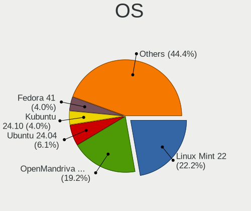

| Name                 | Desktops | Percent |
|----------------------|----------|---------|
| Ubuntu 22.04         | 12       | 11.01%  |
| Arch Rolling         | 9        | 8.26%   |
| Ubuntu 22.10         | 7        | 6.42%   |
| Pop!_OS 22.04        | 7        | 6.42%   |
| Fedora 36            | 7        | 6.42%   |
| Linux Mint 21        | 6        | 5.5%    |
| Fedora 37            | 6        | 5.5%    |
| Ubuntu 20.04         | 5        | 4.59%   |
| Manjaro 22.0.0       | 5        | 4.59%   |
| Debian 11            | 4        | 3.67%   |
| Q4OS 4               | 3        | 2.75%   |
| OpenMandriva 4.3     | 3        | 2.75%   |
| Linux Mint 20.3      | 3        | 2.75%   |
| Zorin 16             | 2        | 1.83%   |
| OpenMandriva 4.50    | 2        | 1.83%   |
| KDE neon 22.04       | 2        | 1.83%   |
| Garuda Linux Soaring | 2        | 1.83%   |
| EndeavourOS Rolling  | 2        | 1.83%   |
| Zorin 15             | 1        | 0.92%   |
| Xubuntu 22.10        | 1        | 0.92%   |
| Xubuntu 22.04        | 1        | 0.92%   |
| Xubuntu 20.04        | 1        | 0.92%   |
| Ubuntu Unity 16.04   | 1        | 0.92%   |
| Ubuntu MATE 22.04    | 1        | 0.92%   |
| Ubuntu MATE 20.04    | 1        | 0.92%   |
| Ubuntu 18.04         | 1        | 0.92%   |
| Slackware 15.0       | 1        | 0.92%   |
| ROSA 12.3            | 1        | 0.92%   |
| Rocky Linux 8.6      | 1        | 0.92%   |
| OpenMandriva 4.90    | 1        | 0.92%   |
| MX 21                | 1        | 0.92%   |
| Manjaro              | 1        | 0.92%   |
| Lubuntu 22.04        | 1        | 0.92%   |
| Lubuntu 20.04        | 1        | 0.92%   |
| Kubuntu 22.04        | 1        | 0.92%   |
| Kubuntu 20.04        | 1        | 0.92%   |
| GNOME OS Nightly     | 1        | 0.92%   |
| Gentoo 2.9           | 1        | 0.92%   |
| Elementary 6.1       | 1        | 0.92%   |
| Clear Linux 37650    | 1        | 0.92%   |

OS Family
---------

OS without a version

| Name         | Desktops | Percent |
|--------------|----------|---------|
| Ubuntu       | 25       | 22.94%  |
| Fedora       | 13       | 11.93%  |
| Linux Mint   | 9        | 8.26%   |
| Arch         | 9        | 8.26%   |
| Pop!_OS      | 7        | 6.42%   |
| OpenMandriva | 6        | 5.5%    |
| Manjaro      | 6        | 5.5%    |
| Debian       | 4        | 3.67%   |
| Zorin        | 3        | 2.75%   |
| Xubuntu      | 3        | 2.75%   |
| Q4OS         | 3        | 2.75%   |
| Ubuntu MATE  | 2        | 1.83%   |
| Lubuntu      | 2        | 1.83%   |
| Kubuntu      | 2        | 1.83%   |
| KDE neon     | 2        | 1.83%   |
| Garuda Linux | 2        | 1.83%   |
| EndeavourOS  | 2        | 1.83%   |
| Ubuntu Unity | 1        | 0.92%   |
| Slackware    | 1        | 0.92%   |
| ROSA         | 1        | 0.92%   |
| Rocky Linux  | 1        | 0.92%   |
| MX           | 1        | 0.92%   |
| GNOME OS     | 1        | 0.92%   |
| Gentoo       | 1        | 0.92%   |
| Elementary   | 1        | 0.92%   |
| Clear Linux  | 1        | 0.92%   |

Kernel
------

Version of the Linux kernel

| Version                  | Desktops | Percent |
|--------------------------|----------|---------|
| 5.15.0-52-generic        | 16       | 14.68%  |
| 5.15.0-53-generic        | 10       | 9.17%   |
| 5.10.0-19-amd64          | 7        | 6.42%   |
| 5.19.0-23-generic        | 6        | 5.5%    |
| 6.0.6-76060006-generic   | 5        | 4.59%   |
| 5.4.0-131-generic        | 5        | 4.59%   |
| 6.0.9-300.fc37.x86_64    | 3        | 2.75%   |
| 6.0.8-arch1-1            | 3        | 2.75%   |
| 6.0.7-301.fc37.x86_64    | 3        | 2.75%   |
| 6.0.6-1-MANJARO          | 3        | 2.75%   |
| 6.0.5-200.fc36.x86_64    | 3        | 2.75%   |
| 5.16.7-desktop-1omv4003  | 3        | 2.75%   |
| 6.0.6-arch1-1            | 2        | 1.83%   |
| 6.0.2-76060002-generic   | 2        | 1.83%   |
| 5.19.12-desktop-2omv4090 | 2        | 1.83%   |
| 5.17.5-300.fc36.x86_64   | 2        | 1.83%   |
| 5.15.0-43-generic        | 2        | 1.83%   |
| 6.1.0-1-MANJARO          | 1        | 0.92%   |
| 6.0.9-zen1-1-zen         | 1        | 0.92%   |
| 6.0.9-gentoo             | 1        | 0.92%   |
| 6.0.9-arch1-1            | 1        | 0.92%   |
| 6.0.9-1213.native        | 1        | 0.92%   |
| 6.0.8-zen1-1-zen         | 1        | 0.92%   |
| 6.0.8-200.fc36.x86_64    | 1        | 0.92%   |
| 6.0.8-1-MANJARO          | 1        | 0.92%   |
| 6.0.7-zen1-1-zen         | 1        | 0.92%   |
| 6.0.7-200.fc36.x86_64    | 1        | 0.92%   |
| 6.0.2-arch1-1            | 1        | 0.92%   |
| 6.0.2-2-MANJARO          | 1        | 0.92%   |
| 6.0.10-arch2-1           | 1        | 0.92%   |
| 5.4.0-132-generic        | 1        | 0.92%   |
| 5.4.0-126-generic        | 1        | 0.92%   |
| 5.4.0-124-generic        | 1        | 0.92%   |
| 5.4.0-100-generic        | 1        | 0.92%   |
| 5.19.16                  | 1        | 0.92%   |
| 5.19.0-21-generic        | 1        | 0.92%   |
| 5.19.0-1009-lowlatency   | 1        | 0.92%   |
| 5.18.12-desktop-3omv4090 | 1        | 0.92%   |
| 5.15.80-1-lts            | 1        | 0.92%   |
| 5.15.78-1-lts            | 1        | 0.92%   |

Kernel Family
-------------

Linux kernel without a distro release

| Version | Desktops | Percent |
|---------|----------|---------|
| 5.15.0  | 30       | 27.52%  |
| 6.0.6   | 10       | 9.17%   |
| 5.4.0   | 9        | 8.26%   |
| 5.19.0  | 8        | 7.34%   |
| 6.0.9   | 7        | 6.42%   |
| 5.10.0  | 7        | 6.42%   |
| 6.0.8   | 6        | 5.5%    |
| 6.0.7   | 5        | 4.59%   |
| 6.0.2   | 4        | 3.67%   |
| 6.0.5   | 3        | 2.75%   |
| 5.16.7  | 3        | 2.75%   |
| 5.19.12 | 2        | 1.83%   |
| 5.17.5  | 2        | 1.83%   |
| 6.1.0   | 1        | 0.92%   |
| 6.0.10  | 1        | 0.92%   |
| 5.19.16 | 1        | 0.92%   |
| 5.18.12 | 1        | 0.92%   |
| 5.15.80 | 1        | 0.92%   |
| 5.15.78 | 1        | 0.92%   |
| 5.15.74 | 1        | 0.92%   |
| 5.15.63 | 1        | 0.92%   |
| 5.13.0  | 1        | 0.92%   |
| 5.10.74 | 1        | 0.92%   |
| 4.18.0  | 1        | 0.92%   |
| 4.15.0  | 1        | 0.92%   |
| 4.13.0  | 1        | 0.92%   |

Kernel Major Ver.
-----------------

Linux kernel major version

| Version | Desktops | Percent |
|---------|----------|---------|
| 6.0     | 36       | 33.03%  |
| 5.15    | 34       | 31.19%  |
| 5.19    | 11       | 10.09%  |
| 5.4     | 9        | 8.26%   |
| 5.10    | 8        | 7.34%   |
| 5.16    | 3        | 2.75%   |
| 5.17    | 2        | 1.83%   |
| 6.1     | 1        | 0.92%   |
| 5.18    | 1        | 0.92%   |
| 5.13    | 1        | 0.92%   |
| 4.18    | 1        | 0.92%   |
| 4.15    | 1        | 0.92%   |
| 4.13    | 1        | 0.92%   |

Arch
----

OS architecture (x86_64, i586, etc.)

| Name   | Desktops | Percent |
|--------|----------|---------|
| x86_64 | 107      | 98.17%  |
| i686   | 2        | 1.83%   |

DE
--

Desktop Environment

| Name       | Desktops | Percent |
|------------|----------|---------|
| GNOME      | 50       | 45.87%  |
| KDE5       | 21       | 19.27%  |
| XFCE       | 11       | 10.09%  |
| X-Cinnamon | 10       | 9.17%   |
| MATE       | 4        | 3.67%   |
| Trinity    | 3        | 2.75%   |
| LXQt       | 2        | 1.83%   |
| Unknown    | 2        | 1.83%   |
| Unity      | 1        | 0.92%   |
| sway       | 1        | 0.92%   |
| Pantheon   | 1        | 0.92%   |
| Openbox    | 1        | 0.92%   |
| KDE        | 1        | 0.92%   |
| Cinnamon   | 1        | 0.92%   |

Display Server
--------------

X11 or Wayland

| Name    | Desktops | Percent |
|---------|----------|---------|
| X11     | 79       | 72.48%  |
| Wayland | 26       | 23.85%  |
| Tty     | 3        | 2.75%   |
| Unknown | 1        | 0.92%   |

Display Manager
---------------

SDDM, LightDM, etc.

| Name    | Desktops | Percent |
|---------|----------|---------|
| Unknown | 26       | 23.85%  |
| GDM3    | 24       | 22.02%  |
| LightDM | 22       | 20.18%  |
| SDDM    | 19       | 17.43%  |
| GDM     | 12       | 11.01%  |
| TDM     | 3        | 2.75%   |
| XDM     | 1        | 0.92%   |
| LXDM    | 1        | 0.92%   |
| GREETD  | 1        | 0.92%   |

OS Lang
-------

Language

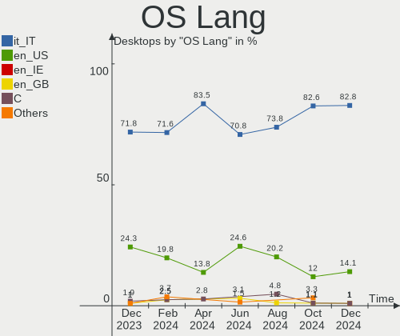

| Lang      | Desktops | Percent |
|-----------|----------|---------|
| it_IT     | 72       | 66.06%  |
| en_US     | 30       | 27.52%  |
| en_GB     | 3        | 2.75%   |
| it_ITutf8 | 1        | 0.92%   |
| de_IT     | 1        | 0.92%   |
| C         | 1        | 0.92%   |
| Unknown   | 1        | 0.92%   |

Boot Mode
---------

EFI or BIOS

| Mode | Desktops | Percent |
|------|----------|---------|
| EFI  | 57       | 52.29%  |
| BIOS | 52       | 47.71%  |

Filesystem
----------

Type of filesystem

| Type    | Desktops | Percent |
|---------|----------|---------|
| Ext4    | 86       | 78.9%   |
| Btrfs   | 13       | 11.93%  |
| Overlay | 9        | 8.26%   |
| Xfs     | 1        | 0.92%   |

Part. scheme
------------

Scheme of partitioning

| Type    | Desktops | Percent |
|---------|----------|---------|
| GPT     | 67       | 61.47%  |
| Unknown | 25       | 22.94%  |
| MBR     | 17       | 15.6%   |

Dual Boot with Linux/BSD
------------------------

Hosting more than one Linux/BSD

| Dual boot | Desktops | Percent |
|-----------|----------|---------|
| No        | 89       | 81.65%  |
| Yes       | 20       | 18.35%  |

Dual Boot (Win)
---------------

Hosting Linux and Windows

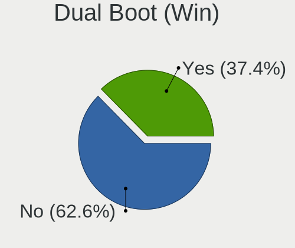

| Dual boot | Desktops | Percent |
|-----------|----------|---------|
| Yes       | 57       | 52.29%  |
| No        | 52       | 47.71%  |

Board
-----

Vendor
------

Motherboard manufacturer

| Name                | Desktops | Percent |
|---------------------|----------|---------|
| ASUSTek Computer    | 33       | 30.28%  |
| MSI                 | 17       | 15.6%   |
| Gigabyte Technology | 15       | 13.76%  |
| Hewlett-Packard     | 12       | 11.01%  |
| ASRock              | 8        | 7.34%   |
| Dell                | 5        | 4.59%   |
| Lenovo              | 4        | 3.67%   |
| Intel               | 3        | 2.75%   |
| Acer                | 2        | 1.83%   |
| Unknown             | 2        | 1.83%   |
| Pegatron            | 1        | 0.92%   |
| Mediacom            | 1        | 0.92%   |
| IBM                 | 1        | 0.92%   |
| Huanan              | 1        | 0.92%   |
| Foxconn             | 1        | 0.92%   |
| BESSTAR Tech        | 1        | 0.92%   |
| Apple               | 1        | 0.92%   |
| AMI                 | 1        | 0.92%   |

Model
-----

Motherboard model

| Name                                    | Desktops | Percent |
|-----------------------------------------|----------|---------|
| HP Compaq Elite 8300 SFF                | 3        | 2.75%   |
| ASUS All Series                         | 3        | 2.75%   |
| MSI MS-7788                             | 2        | 1.83%   |
| MSI MS-7758                             | 2        | 1.83%   |
| ASUS TUF Gaming X570-PLUS               | 2        | 1.83%   |
| ASUS PRIME A320M-K                      | 2        | 1.83%   |
| Unknown                                 | 2        | 1.83%   |
| Pegatron Pro 3405 Series                | 1        | 0.92%   |
| MSI NQ890AA-ABZ CQ5011IT                | 1        | 0.92%   |
| MSI MS-7D54                             | 1        | 0.92%   |
| MSI MS-7D43                             | 1        | 0.92%   |
| MSI MS-7D22                             | 1        | 0.92%   |
| MSI MS-7D16                             | 1        | 0.92%   |
| MSI MS-7C52                             | 1        | 0.92%   |
| MSI MS-7B84                             | 1        | 0.92%   |
| MSI MS-7B61                             | 1        | 0.92%   |
| MSI MS-7A94                             | 1        | 0.92%   |
| MSI MS-7978                             | 1        | 0.92%   |
| MSI MS-7916                             | 1        | 0.92%   |
| MSI MS-7817                             | 1        | 0.92%   |
| MSI MS-7309                             | 1        | 0.92%   |
| Mediacom M-AO241/64                     | 1        | 0.92%   |
| Lenovo ThinkCentre M79 10CTS07500       | 1        | 0.92%   |
| Lenovo IdeaCentre G5 14AMR05 90Q1001TIX | 1        | 0.92%   |
| Lenovo H50-50 90B600EUIX                | 1        | 0.92%   |
| Lenovo H50-05 90BH001WIX                | 1        | 0.92%   |
| Intel Productiva                        | 1        | 0.92%   |
| Intel DQ57TM                            | 1        | 0.92%   |
| Intel DB75EN AAG39650-400               | 1        | 0.92%   |
| IBM eServer x226-[8488ECY]-             | 1        | 0.92%   |
| Huanan X99-F8                           | 1        | 0.92%   |
| HP Z240 Tower Workstation               | 1        | 0.92%   |
| HP Pavilion Gaming Desktop TG01-1xxx    | 1        | 0.92%   |
| HP Pavilion Gaming Desktop 690-00xx     | 1        | 0.92%   |
| HP EliteDesk 800 G4 DM 35W              | 1        | 0.92%   |
| HP EliteDesk 800 G2 TWR                 | 1        | 0.92%   |
| HP EliteDesk 800 G2 SFF                 | 1        | 0.92%   |
| HP Compaq 8100 Elite SFF PC             | 1        | 0.92%   |
| HP Compaq 6000 Pro MT PC                | 1        | 0.92%   |
| HP 810-311nl                            | 1        | 0.92%   |

Model Family
------------

Motherboard model prefix

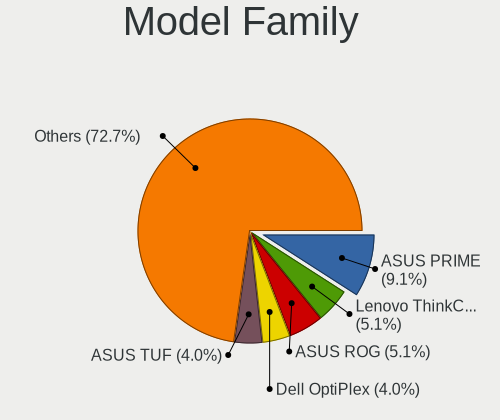

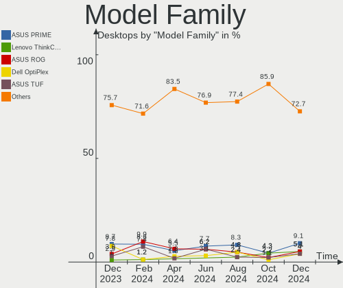

| Name               | Desktops | Percent |
|--------------------|----------|---------|
| ASUS PRIME         | 6        | 5.5%    |
| HP Compaq          | 5        | 4.59%   |
| ASUS TUF           | 5        | 4.59%   |
| ASUS ROG           | 4        | 3.67%   |
| HP EliteDesk       | 3        | 2.75%   |
| Gigabyte Z390      | 3        | 2.75%   |
| ASUS All           | 3        | 2.75%   |
| MSI MS-7788        | 2        | 1.83%   |
| MSI MS-7758        | 2        | 1.83%   |
| HP Pavilion        | 2        | 1.83%   |
| Dell Precision     | 2        | 1.83%   |
| ASRock B450M       | 2        | 1.83%   |
| Unknown            | 2        | 1.83%   |
| Pegatron Pro       | 1        | 0.92%   |
| MSI NQ890AA-ABZ    | 1        | 0.92%   |
| MSI MS-7D54        | 1        | 0.92%   |
| MSI MS-7D43        | 1        | 0.92%   |
| MSI MS-7D22        | 1        | 0.92%   |
| MSI MS-7D16        | 1        | 0.92%   |
| MSI MS-7C52        | 1        | 0.92%   |
| MSI MS-7B84        | 1        | 0.92%   |
| MSI MS-7B61        | 1        | 0.92%   |
| MSI MS-7A94        | 1        | 0.92%   |
| MSI MS-7978        | 1        | 0.92%   |
| MSI MS-7916        | 1        | 0.92%   |
| MSI MS-7817        | 1        | 0.92%   |
| MSI MS-7309        | 1        | 0.92%   |
| Mediacom M-AO241   | 1        | 0.92%   |
| Lenovo ThinkCentre | 1        | 0.92%   |
| Lenovo IdeaCentre  | 1        | 0.92%   |
| Lenovo H50-50      | 1        | 0.92%   |
| Lenovo H50-05      | 1        | 0.92%   |
| Intel Productiva   | 1        | 0.92%   |
| Intel DQ57TM       | 1        | 0.92%   |
| Intel DB75EN       | 1        | 0.92%   |
| IBM eServer        | 1        | 0.92%   |
| Huanan X99-F8      | 1        | 0.92%   |
| HP Z240            | 1        | 0.92%   |
| HP 810-311nl       | 1        | 0.92%   |
| Gigabyte Z77X-UP7  | 1        | 0.92%   |

MFG Year
--------

Motherboard manufacture year

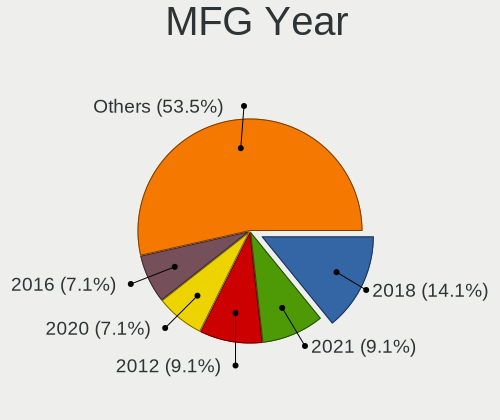

| Year | Desktops | Percent |
|------|----------|---------|
| 2012 | 16       | 14.68%  |
| 2019 | 11       | 10.09%  |
| 2021 | 9        | 8.26%   |
| 2013 | 9        | 8.26%   |
| 2018 | 8        | 7.34%   |
| 2017 | 8        | 7.34%   |
| 2015 | 8        | 7.34%   |
| 2020 | 7        | 6.42%   |
| 2014 | 6        | 5.5%    |
| 2008 | 6        | 5.5%    |
| 2016 | 5        | 4.59%   |
| 2009 | 5        | 4.59%   |
| 2006 | 4        | 3.67%   |
| 2022 | 2        | 1.83%   |
| 2011 | 2        | 1.83%   |
| 2010 | 1        | 0.92%   |
| 2007 | 1        | 0.92%   |
| 2005 | 1        | 0.92%   |

Form Factor
-----------

Physical design of the computer

| Name    | Desktops | Percent |
|---------|----------|---------|
| Desktop | 109      | 100%    |

Secure Boot
-----------

Enabled or disabled

| State    | Desktops | Percent |
|----------|----------|---------|
| Disabled | 105      | 96.33%  |
| Enabled  | 4        | 3.67%   |

Coreboot
--------

Have coreboot on board

| Used | Desktops | Percent |
|------|----------|---------|
| No   | 109      | 100%    |

RAM Size
--------

Total RAM memory

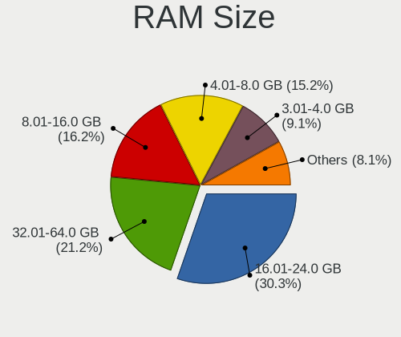

| Size in GB  | Desktops | Percent |
|-------------|----------|---------|
| 16.01-24.0  | 41       | 37.61%  |
| 32.01-64.0  | 19       | 17.43%  |
| 3.01-4.0    | 16       | 14.68%  |
| 8.01-16.0   | 15       | 13.76%  |
| 4.01-8.0    | 11       | 10.09%  |
| 1.01-2.0    | 3        | 2.75%   |
| 64.01-256.0 | 2        | 1.83%   |
| 2.01-3.0    | 1        | 0.92%   |
| 0.51-1.0    | 1        | 0.92%   |

RAM Used
--------

Used RAM memory

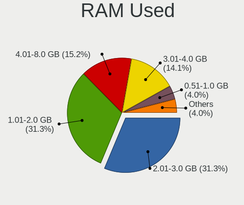

| Used GB   | Desktops | Percent |
|-----------|----------|---------|
| 1.01-2.0  | 38       | 34.86%  |
| 2.01-3.0  | 31       | 28.44%  |
| 4.01-8.0  | 19       | 17.43%  |
| 3.01-4.0  | 13       | 11.93%  |
| 8.01-16.0 | 4        | 3.67%   |
| 0.51-1.0  | 3        | 2.75%   |
| 0.01-0.5  | 1        | 0.92%   |

Total Drives
------------

Number of drives on board

| Drives | Desktops | Percent |
|--------|----------|---------|
| 1      | 39       | 35.78%  |
| 2      | 27       | 24.77%  |
| 3      | 22       | 20.18%  |
| 4      | 12       | 11.01%  |
| 5      | 6        | 5.5%    |
| 12     | 1        | 0.92%   |
| 7      | 1        | 0.92%   |
| 6      | 1        | 0.92%   |

Has CD-ROM
----------

Has CD-ROM on board

| Presented | Desktops | Percent |
|-----------|----------|---------|
| No        | 59       | 54.13%  |
| Yes       | 50       | 45.87%  |

Has Ethernet
------------

Has Ethernet on board

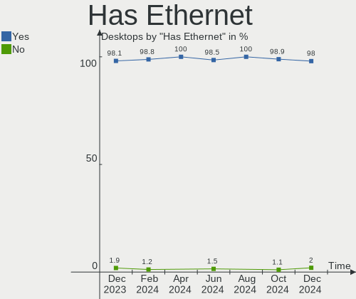

| Presented | Desktops | Percent |
|-----------|----------|---------|
| Yes       | 109      | 100%    |

Has WiFi
--------

Has WiFi module

| Presented | Desktops | Percent |
|-----------|----------|---------|
| No        | 60       | 55.05%  |
| Yes       | 49       | 44.95%  |

Has Bluetooth
-------------

Has Bluetooth module

| Presented | Desktops | Percent |
|-----------|----------|---------|
| No        | 63       | 57.8%   |
| Yes       | 46       | 42.2%   |

Location
--------

Country
-------

Geographic location (country)

| Country | Desktops | Percent |
|---------|----------|---------|
| Italy   | 109      | 100%    |

City
----

Geographic location (city)

| City                   | Desktops | Percent |
|------------------------|----------|---------|
| Rome                   | 16       | 14.68%  |
| Milan                  | 8        | 7.34%   |
| Bologna                | 4        | 3.67%   |
| Venice                 | 3        | 2.75%   |
| Turin                  | 2        | 1.83%   |
| Parma                  | 2        | 1.83%   |
| Naples                 | 2        | 1.83%   |
| Merano                 | 2        | 1.83%   |
| Como                   | 2        | 1.83%   |
| Casalecchio di Reno    | 2        | 1.83%   |
| Brescia                | 2        | 1.83%   |
| Bari                   | 2        | 1.83%   |
| Viggianello            | 1        | 0.92%   |
| Terrossa               | 1        | 0.92%   |
| Sorbolo                | 1        | 0.92%   |
| Sesto Fiorentino       | 1        | 0.92%   |
| Scandicci              | 1        | 0.92%   |
| San Giovanni           | 1        | 0.92%   |
| San Cesario sul Panaro | 1        | 0.92%   |
| Samarate               | 1        | 0.92%   |
| Rho                    | 1        | 0.92%   |
| Reggio Emilia          | 1        | 0.92%   |
| Reggio Calabria        | 1        | 0.92%   |
| Ragusa                 | 1        | 0.92%   |
| Quartucciu             | 1        | 0.92%   |
| Pescara                | 1        | 0.92%   |
| Pavia di Udine         | 1        | 0.92%   |
| Palermo                | 1        | 0.92%   |
| Nicolosi               | 1        | 0.92%   |
| Muggia                 | 1        | 0.92%   |
| Montorio               | 1        | 0.92%   |
| Montelupone            | 1        | 0.92%   |
| Monserrato             | 1        | 0.92%   |
| Molfetta               | 1        | 0.92%   |
| Modena                 | 1        | 0.92%   |
| Mappano                | 1        | 0.92%   |
| Macerata               | 1        | 0.92%   |
| Lodi                   | 1        | 0.92%   |
| Lana                   | 1        | 0.92%   |
| Lallio                 | 1        | 0.92%   |

Drives
------

Drive Vendor
------------

Hard drive vendors

| Vendor                    | Desktops | Drives | Percent |
|---------------------------|----------|--------|---------|
| Seagate                   | 41       | 48     | 18.64%  |
| WDC                       | 37       | 57     | 16.82%  |
| Samsung Electronics       | 35       | 37     | 15.91%  |
| Crucial                   | 19       | 23     | 8.64%   |
| Kingston                  | 16       | 17     | 7.27%   |
| Toshiba                   | 9        | 10     | 4.09%   |
| Hitachi                   | 8        | 11     | 3.64%   |
| Sandisk                   | 7        | 8      | 3.18%   |
| SPCC                      | 4        | 4      | 1.82%   |
| Maxtor                    | 4        | 6      | 1.82%   |
| Phison Electronics        | 3        | 3      | 1.36%   |
| LITEONIT                  | 3        | 3      | 1.36%   |
| Corsair                   | 3        | 5      | 1.36%   |
| Unknown                   | 2        | 2      | 0.91%   |
| Transcend                 | 2        | 2      | 0.91%   |
| Patriot                   | 2        | 2      | 0.91%   |
| OCZ                       | 2        | 2      | 0.91%   |
| Micron/Crucial Technology | 2        | 2      | 0.91%   |
| Intenso                   | 2        | 2      | 0.91%   |
| ADATA Technology          | 2        | 2      | 0.91%   |
| Team                      | 1        | 1      | 0.45%   |
| SABRENT                   | 1        | 1      | 0.45%   |
| PNY                       | 1        | 1      | 0.45%   |
| Phison                    | 1        | 1      | 0.45%   |
| Micron Technology         | 1        | 1      | 0.45%   |
| Lexar                     | 1        | 1      | 0.45%   |
| KIOXIA-EXCERIA            | 1        | 1      | 0.45%   |
| KIOXIA                    | 1        | 2      | 0.45%   |
| JMicron Technology        | 1        | 1      | 0.45%   |
| Intel                     | 1        | 1      | 0.45%   |
| GOODRAM                   | 1        | 1      | 0.45%   |
| Gigabyte Technology       | 1        | 1      | 0.45%   |
| Drevo                     | 1        | 1      | 0.45%   |
| BORY                      | 1        | 1      | 0.45%   |
| AirDisk                   | 1        | 1      | 0.45%   |
| A-DATA Technology         | 1        | 1      | 0.45%   |
| Unknown                   | 1        | 1      | 0.45%   |

Drive Model
-----------

Hard drive models

| Model                                                             | Desktops | Percent |
|-------------------------------------------------------------------|----------|---------|
| Seagate ST500DM002-1BD142 500GB                                   | 8        | 3.21%   |
| Samsung NVMe SSD Controller SM981/PM981/PM983 1TB                 | 5        | 2.01%   |
| Crucial CT500MX500SSD1 500GB                                      | 5        | 2.01%   |
| Seagate ST2000DM008-2FR102 2TB                                    | 4        | 1.61%   |
| Samsung SSD 860 EVO 500GB                                         | 4        | 1.61%   |
| Samsung SSD 850 EVO 250GB                                         | 4        | 1.61%   |
| Kingston SA400S37240G 240GB SSD                                   | 4        | 1.61%   |
| WDC WD20EARS-00MVWB0 2TB                                          | 3        | 1.2%    |
| WDC WD10EZEX-08WN4A0 1TB                                          | 3        | 1.2%    |
| Toshiba DT01ACA100 1TB                                            | 3        | 1.2%    |
| SPCC Solid State Disk 512GB                                       | 3        | 1.2%    |
| Seagate ST1000DM003-1ER162 1TB                                    | 3        | 1.2%    |
| Samsung SSD 970 PRO 512GB                                         | 3        | 1.2%    |
| Kingston SA400S37480G 480GB SSD                                   | 3        | 1.2%    |
| Crucial CT120BX500SSD1 120GB                                      | 3        | 1.2%    |
| WDC WD20EFRX-68EUZN0 2TB                                          | 2        | 0.8%    |
| WDC WD20EARX-00PASB0 2TB                                          | 2        | 0.8%    |
| Seagate ST4000DM004-2CV104 4TB                                    | 2        | 0.8%    |
| Seagate ST2000DM006-2DM164 2TB                                    | 2        | 0.8%    |
| Seagate ST2000DM001-1ER164 2TB                                    | 2        | 0.8%    |
| Seagate ST2000DL003-9VT166 2TB                                    | 2        | 0.8%    |
| Seagate ST1000DM010-2EP102 1TB                                    | 2        | 0.8%    |
| SanDisk SSD PLUS 240GB                                            | 2        | 0.8%    |
| Samsung SSD 970 EVO Plus 250GB                                    | 2        | 0.8%    |
| Samsung SSD 860 EVO 250GB                                         | 2        | 0.8%    |
| Phison E12 NVMe Controller 2TB                                    | 2        | 0.8%    |
| OCZ AGILITY3 120GB SSD                                            | 2        | 0.8%    |
| Maxtor STM3250310AS 250GB                                         | 2        | 0.8%    |
| Kingston SV300S37A120G 120GB SSD                                  | 2        | 0.8%    |
| Kingston SUV400S37240G 240GB SSD                                  | 2        | 0.8%    |
| Kingston SA400S37120G 120GB SSD                                   | 2        | 0.8%    |
| Crucial CT500P2SSD8 500GB                                         | 2        | 0.8%    |
| Crucial CT480BX500SSD1 480GB                                      | 2        | 0.8%    |
| Crucial CT250MX500SSD1 250GB                                      | 2        | 0.8%    |
| Crucial CT1000P2SSD8 1TB                                          | 2        | 0.8%    |
| Crucial CT1000MX500SSD1 1TB                                       | 2        | 0.8%    |
| Corsair Force GS 240GB SSD                                        | 2        | 0.8%    |
| ADATA XPG SX8200 Pro PCIe Gen3x4 M.2 2280 Solid State Drive 512GB | 2        | 0.8%    |
| WDC WDS500G2B0A 500GB SSD                                         | 1        | 0.4%    |
| WDC WDS250G2B0C-00PXH0 250GB                                      | 1        | 0.4%    |

HDD Vendor
----------

Hard disk drive vendors

| Vendor              | Desktops | Drives | Percent |
|---------------------|----------|--------|---------|
| Seagate             | 38       | 45     | 41.76%  |
| WDC                 | 30       | 47     | 32.97%  |
| Toshiba             | 8        | 9      | 8.79%   |
| Hitachi             | 8        | 11     | 8.79%   |
| Maxtor              | 4        | 6      | 4.4%    |
| Samsung Electronics | 3        | 3      | 3.3%    |

SSD Vendor
----------

Solid state drive vendors

| Vendor              | Desktops | Drives | Percent |
|---------------------|----------|--------|---------|
| Samsung Electronics | 17       | 18     | 20.48%  |
| Crucial             | 17       | 18     | 20.48%  |
| Kingston            | 15       | 16     | 18.07%  |
| SanDisk             | 6        | 7      | 7.23%   |
| WDC                 | 4        | 4      | 4.82%   |
| SPCC                | 4        | 4      | 4.82%   |
| LITEONIT            | 3        | 3      | 3.61%   |
| Corsair             | 3        | 5      | 3.61%   |
| Transcend           | 2        | 2      | 2.41%   |
| Patriot             | 2        | 2      | 2.41%   |
| OCZ                 | 2        | 2      | 2.41%   |
| Intenso             | 2        | 2      | 2.41%   |
| Team                | 1        | 1      | 1.2%    |
| PNY                 | 1        | 1      | 1.2%    |
| GOODRAM             | 1        | 1      | 1.2%    |
| Gigabyte Technology | 1        | 1      | 1.2%    |
| Drevo               | 1        | 1      | 1.2%    |
| AirDisk             | 1        | 1      | 1.2%    |

Drive Kind
----------

HDD or SSD

| Kind    | Desktops | Drives | Percent |
|---------|----------|--------|---------|
| SSD     | 69       | 89     | 38.55%  |
| HDD     | 65       | 121    | 36.31%  |
| NVMe    | 37       | 45     | 20.67%  |
| Unknown | 6        | 6      | 3.35%   |
| MMC     | 2        | 3      | 1.12%   |

Drive Connector
---------------

SATA, SAS, NVMe, etc.

| Type | Desktops | Drives | Percent |
|------|----------|--------|---------|
| SATA | 94       | 205    | 65.73%  |
| NVMe | 37       | 44     | 25.87%  |
| SAS  | 10       | 12     | 6.99%   |
| MMC  | 2        | 3      | 1.4%    |

Drive Size
----------

Size of hard drive

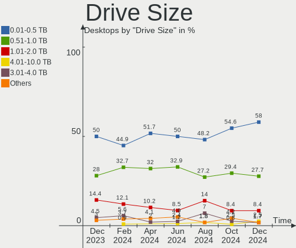

| Size in TB | Desktops | Drives | Percent |
|------------|----------|--------|---------|
| 0.01-0.5   | 78       | 128    | 56.52%  |
| 0.51-1.0   | 34       | 46     | 24.64%  |
| 1.01-2.0   | 17       | 23     | 12.32%  |
| 3.01-4.0   | 5        | 5      | 3.62%   |
| 4.01-10.0  | 3        | 6      | 2.17%   |
| 2.01-3.0   | 1        | 2      | 0.72%   |

Space Total
-----------

Amount of disk space available on the file system

| Size in GB     | Desktops | Percent |
|----------------|----------|---------|
| 101-250        | 26       | 23.85%  |
| 251-500        | 15       | 13.76%  |
| 1001-2000      | 13       | 11.93%  |
| 501-1000       | 13       | 11.93%  |
| 2001-3000      | 12       | 11.01%  |
| More than 3000 | 11       | 10.09%  |
| 1-20           | 11       | 10.09%  |
| 51-100         | 6        | 5.5%    |
| 21-50          | 2        | 1.83%   |

Space Used
----------

Amount of used disk space

| Used GB        | Desktops | Percent |
|----------------|----------|---------|
| 1-20           | 38       | 34.86%  |
| 101-250        | 16       | 14.68%  |
| 21-50          | 14       | 12.84%  |
| 501-1000       | 13       | 11.93%  |
| 251-500        | 8        | 7.34%   |
| 1001-2000      | 8        | 7.34%   |
| 51-100         | 7        | 6.42%   |
| 2001-3000      | 3        | 2.75%   |
| More than 3000 | 2        | 1.83%   |

Malfunc. Drives
---------------

Drive models with a malfunction

| Model                             | Desktops | Drives | Percent |
|-----------------------------------|----------|--------|---------|
| WDC WDS120G2G0A-00JH30 120GB SSD  | 1        | 1      | 5.88%   |
| WDC WD60EZRZ-00RWYB1 6TB          | 1        | 2      | 5.88%   |
| WDC WD5000AVDS-63U7B1 500GB       | 1        | 1      | 5.88%   |
| WDC WD10EZEX-22MFCA0 1TB          | 1        | 1      | 5.88%   |
| WDC WD10EARS-00MVWB0 1TB          | 1        | 1      | 5.88%   |
| Seagate ST500DM002-1BD142 500GB   | 1        | 1      | 5.88%   |
| Seagate ST3500820AS 500GB         | 1        | 1      | 5.88%   |
| Seagate ST3500413AS 500GB         | 1        | 1      | 5.88%   |
| Seagate ST2000DM008-2FR102 2TB    | 1        | 1      | 5.88%   |
| Seagate ST2000DM006-2DM164 2TB    | 1        | 1      | 5.88%   |
| Seagate ST2000DL003-9VT166 2TB    | 1        | 1      | 5.88%   |
| Seagate ST1000DM003-1ER162 1TB    | 1        | 1      | 5.88%   |
| Samsung Electronics HD161HJ 160GB | 1        | 1      | 5.88%   |
| OCZ AGILITY3 120GB SSD            | 1        | 1      | 5.88%   |
| Maxtor STM3250310AS 250GB         | 1        | 1      | 5.88%   |
| LITEONIT LCT-128M3S 128GB SSD     | 1        | 1      | 5.88%   |
| Intenso SSD Sata III 128GB        | 1        | 1      | 5.88%   |

Malfunc. Drive Vendor
---------------------

Vendors of faulty drives

| Vendor              | Desktops | Drives | Percent |
|---------------------|----------|--------|---------|
| Seagate             | 7        | 7      | 43.75%  |
| WDC                 | 4        | 6      | 25%     |
| Samsung Electronics | 1        | 1      | 6.25%   |
| OCZ                 | 1        | 1      | 6.25%   |
| Maxtor              | 1        | 1      | 6.25%   |
| LITEONIT            | 1        | 1      | 6.25%   |
| Intenso             | 1        | 1      | 6.25%   |

Malfunc. HDD Vendor
-------------------

Vendors of faulty HDD drives

| Vendor              | Desktops | Drives | Percent |
|---------------------|----------|--------|---------|
| Seagate             | 7        | 7      | 53.85%  |
| WDC                 | 4        | 5      | 30.77%  |
| Samsung Electronics | 1        | 1      | 7.69%   |
| Maxtor              | 1        | 1      | 7.69%   |

Malfunc. Drive Kind
-------------------

Kinds of faulty drives

| Kind | Desktops | Drives | Percent |
|------|----------|--------|---------|
| HDD  | 13       | 14     | 76.47%  |
| SSD  | 4        | 4      | 23.53%  |

Failed Drives
-------------

Failed drive models

| Model                           | Desktops | Drives | Percent |
|---------------------------------|----------|--------|---------|
| Seagate ST500DM002-1BD142 500GB | 1        | 1      | 100%    |

Failed Drive Vendor
-------------------

Failed drive vendors

| Vendor  | Desktops | Drives | Percent |
|---------|----------|--------|---------|
| Seagate | 1        | 1      | 100%    |

Drive Status
------------

Number of failed and malfunc. drives

| Status   | Desktops | Drives | Percent |
|----------|----------|--------|---------|
| Works    | 64       | 146    | 49.61%  |
| Detected | 48       | 99     | 37.21%  |
| Malfunc  | 16       | 18     | 12.4%   |
| Failed   | 1        | 1      | 0.78%   |

Storage controller
------------------

Storage Vendor
--------------

Storage controller vendors

| Vendor                       | Desktops | Percent |
|------------------------------|----------|---------|
| Intel                        | 71       | 44.94%  |
| AMD                          | 33       | 20.89%  |
| Samsung Electronics          | 15       | 9.49%   |
| Micron/Crucial Technology    | 7        | 4.43%   |
| SanDisk                      | 5        | 3.16%   |
| ASMedia Technology           | 5        | 3.16%   |
| Phison Electronics           | 4        | 2.53%   |
| JMicron Technology           | 3        | 1.9%    |
| ADATA Technology             | 3        | 1.9%    |
| Nvidia                       | 2        | 1.27%   |
| Marvell Technology Group     | 2        | 1.27%   |
| KIOXIA                       | 2        | 1.27%   |
| VIA Technologies             | 1        | 0.63%   |
| Toshiba America Info Systems | 1        | 0.63%   |
| Micron Technology            | 1        | 0.63%   |
| MAXIO Technology (Hangzhou)  | 1        | 0.63%   |
| Kingston Technology Company  | 1        | 0.63%   |
| Adaptec                      | 1        | 0.63%   |

Storage Model
-------------

Storage controller models

| Model                                                                                   | Desktops | Percent |
|-----------------------------------------------------------------------------------------|----------|---------|
| AMD FCH SATA Controller [AHCI mode]                                                     | 17       | 8.95%   |
| Samsung NVMe SSD Controller SM981/PM981/PM983                                           | 10       | 5.26%   |
| Intel 7 Series/C210 Series Chipset Family 6-port SATA Controller [AHCI mode]            | 7        | 3.68%   |
| AMD 400 Series Chipset SATA Controller                                                  | 7        | 3.68%   |
| Intel Q170/Q150/B150/H170/H110/Z170/CM236 Chipset SATA Controller [AHCI Mode]           | 6        | 3.16%   |
| Intel NM10/ICH7 Family SATA Controller [IDE mode]                                       | 6        | 3.16%   |
| Intel Cannon Lake PCH SATA AHCI Controller                                              | 6        | 3.16%   |
| Intel 8 Series/C220 Series Chipset Family 6-port SATA Controller 1 [AHCI mode]          | 6        | 3.16%   |
| Micron/Crucial P2 NVMe PCIe SSD                                                         | 5        | 2.63%   |
| Intel SATA Controller [RAID mode]                                                       | 5        | 2.63%   |
| Intel 82801G (ICH7 Family) IDE Controller                                               | 5        | 2.63%   |
| Intel 6 Series/C200 Series Chipset Family 6 port Desktop SATA AHCI Controller           | 5        | 2.63%   |
| AMD SB7x0/SB8x0/SB9x0 IDE Controller                                                    | 5        | 2.63%   |
| AMD 500 Series Chipset SATA Controller                                                  | 5        | 2.63%   |
| Intel 6 Series/C200 Series Chipset Family Desktop SATA Controller (IDE mode, ports 4-5) | 4        | 2.11%   |
| Intel 6 Series/C200 Series Chipset Family Desktop SATA Controller (IDE mode, ports 0-3) | 4        | 2.11%   |
| Intel 500 Series Chipset Family SATA AHCI Controller                                    | 4        | 2.11%   |
| Intel 200 Series PCH SATA controller [AHCI mode]                                        | 4        | 2.11%   |
| ASMedia ASM1062 Serial ATA Controller                                                   | 4        | 2.11%   |
| AMD SB7x0/SB8x0/SB9x0 SATA Controller [AHCI mode]                                       | 4        | 2.11%   |
| SanDisk WD Blue SN550 NVMe SSD                                                          | 3        | 1.58%   |
| Samsung NVMe SSD Controller 980                                                         | 3        | 1.58%   |
| Phison E12 NVMe Controller                                                              | 3        | 1.58%   |
| Intel Celeron N3350/Pentium N4200/Atom E3900 Series SATA AHCI Controller                | 3        | 1.58%   |
| Samsung NVMe SSD Controller PM9A1/PM9A3/980PRO                                          | 2        | 1.05%   |
| Nvidia MCP61 SATA Controller                                                            | 2        | 1.05%   |
| Nvidia MCP61 IDE                                                                        | 2        | 1.05%   |
| Marvell Group 88SE9172 SATA 6Gb/s Controller                                            | 2        | 1.05%   |
| KIOXIA NVMe SSD                                                                         | 2        | 1.05%   |
| Intel C610/X99 series chipset sSATA Controller [AHCI mode]                              | 2        | 1.05%   |
| Intel 82801EB/ER (ICH5/ICH5R) IDE Controller                                            | 2        | 1.05%   |
| AMD FCH SATA Controller D                                                               | 2        | 1.05%   |
| ADATA XPG SX8200 Pro PCIe Gen3x4 M.2 2280 Solid State Drive                             | 2        | 1.05%   |
| VIA VT6415 PATA IDE Host Controller                                                     | 1        | 0.53%   |
| Toshiba America Info Systems XG5 NVMe SSD Controller                                    | 1        | 0.53%   |
| SanDisk WD PC SN810 / Black SN850 NVMe SSD                                              | 1        | 0.53%   |
| SanDisk WD Black SN750 / PC SN730 NVMe SSD                                              | 1        | 0.53%   |
| Phison E16 PCIe4 NVMe Controller                                                        | 1        | 0.53%   |
| Micron/Crucial P1 NVMe PCIe SSD                                                         | 1        | 0.53%   |
| Micron/Crucial NVMe Controller                                                          | 1        | 0.53%   |

Storage Kind
------------

Kind of storage controller (IDE, SATA, NVMe, SAS, ...)

| Kind | Desktops | Percent |
|------|----------|---------|
| SATA | 86       | 54.78%  |
| NVMe | 37       | 23.57%  |
| IDE  | 26       | 16.56%  |
| RAID | 8        | 5.1%    |

Processor
---------

CPU Vendor
----------

Processor vendors

| Vendor | Desktops | Percent |
|--------|----------|---------|
| Intel  | 74       | 67.89%  |
| AMD    | 35       | 32.11%  |

CPU Model
---------

Processor models

| Model                                       | Desktops | Percent |
|---------------------------------------------|----------|---------|
| Intel Core i7-2600 CPU @ 3.40GHz            | 4        | 3.67%   |
| AMD Ryzen 7 3700X 8-Core Processor          | 4        | 3.67%   |
| Intel Core i5-9400F CPU @ 2.90GHz           | 3        | 2.75%   |
| Intel Core i5-3470 CPU @ 3.20GHz            | 3        | 2.75%   |
| Intel Pentium CPU G3220 @ 3.00GHz           | 2        | 1.83%   |
| Intel Core i9-7920X CPU @ 2.90GHz           | 2        | 1.83%   |
| Intel Core i7-3770K CPU @ 3.50GHz           | 2        | 1.83%   |
| Intel Core i7-3770 CPU @ 3.40GHz            | 2        | 1.83%   |
| Intel Core i7 CPU 870 @ 2.93GHz             | 2        | 1.83%   |
| Intel Core i5-9600K CPU @ 3.70GHz           | 2        | 1.83%   |
| Intel Core i5-6500 CPU @ 3.20GHz            | 2        | 1.83%   |
| Intel Core i3-4170 CPU @ 3.70GHz            | 2        | 1.83%   |
| AMD Ryzen 7 5700G with Radeon Graphics      | 2        | 1.83%   |
| AMD Ryzen 7 3800X 8-Core Processor          | 2        | 1.83%   |
| AMD Ryzen 5 5600G with Radeon Graphics      | 2        | 1.83%   |
| AMD Ryzen 5 3600 6-Core Processor           | 2        | 1.83%   |
| AMD FX-6300 Six-Core Processor              | 2        | 1.83%   |
| Intel Xeon CPU X5472 @ 3.00GHz              | 1        | 0.92%   |
| Intel Xeon CPU E5-2678 v3 @ 2.50GHz         | 1        | 0.92%   |
| Intel Xeon CPU E5-2640 v3 @ 2.60GHz         | 1        | 0.92%   |
| Intel Xeon CPU E5-1620 v2 @ 3.70GHz         | 1        | 0.92%   |
| Intel Xeon CPU 3.00GHz                      | 1        | 0.92%   |
| Intel Pentium Dual-Core CPU E6500 @ 2.93GHz | 1        | 0.92%   |
| Intel Pentium Dual CPU E2160 @ 1.80GHz      | 1        | 0.92%   |
| Intel Pentium D CPU 3.00GHz                 | 1        | 0.92%   |
| Intel Pentium CPU J4205 @ 1.50GHz           | 1        | 0.92%   |
| Intel Pentium 4 CPU 3.40GHz                 | 1        | 0.92%   |
| Intel Pentium 4 CPU 2.80GHz                 | 1        | 0.92%   |
| Intel Core i7-9700 CPU @ 3.00GHz            | 1        | 0.92%   |
| Intel Core i7-8700T CPU @ 2.40GHz           | 1        | 0.92%   |
| Intel Core i7-8700 CPU @ 3.20GHz            | 1        | 0.92%   |
| Intel Core i7-6700K CPU @ 4.00GHz           | 1        | 0.92%   |
| Intel Core i7-6700 CPU @ 3.40GHz            | 1        | 0.92%   |
| Intel Core i7-4790K CPU @ 4.00GHz           | 1        | 0.92%   |
| Intel Core i7-4790 CPU @ 3.60GHz            | 1        | 0.92%   |
| Intel Core i7-4770 CPU @ 3.40GHz            | 1        | 0.92%   |
| Intel Core i7-3770S CPU @ 3.10GHz           | 1        | 0.92%   |
| Intel Core i7-10700K CPU @ 3.80GHz          | 1        | 0.92%   |
| Intel Core i7-10700F CPU @ 2.90GHz          | 1        | 0.92%   |
| Intel Core i7 CPU 860 @ 2.80GHz             | 1        | 0.92%   |

CPU Model Family
----------------

Processor model prefix

| Model                   | Desktops | Percent |
|-------------------------|----------|---------|
| Intel Core i7           | 22       | 20.18%  |
| Intel Core i5           | 20       | 18.35%  |
| AMD Ryzen 7             | 10       | 9.17%   |
| AMD Ryzen 5             | 9        | 8.26%   |
| Intel Core i3           | 6        | 5.5%    |
| Intel Xeon              | 5        | 4.59%   |
| Other                   | 3        | 2.75%   |
| Intel Pentium           | 3        | 2.75%   |
| Intel Core 2 Duo        | 3        | 2.75%   |
| Intel Pentium 4         | 2        | 1.83%   |
| Intel Core i9           | 2        | 1.83%   |
| Intel Celeron           | 2        | 1.83%   |
| AMD FX                  | 2        | 1.83%   |
| AMD A8                  | 2        | 1.83%   |
| Intel Pentium Dual-Core | 1        | 0.92%   |
| Intel Pentium Dual      | 1        | 0.92%   |
| Intel Pentium D         | 1        | 0.92%   |
| Intel Core 2 Quad       | 1        | 0.92%   |
| Intel Core 2            | 1        | 0.92%   |
| Intel Atom              | 1        | 0.92%   |
| AMD Ryzen Threadripper  | 1        | 0.92%   |
| AMD Ryzen 9             | 1        | 0.92%   |
| AMD Ryzen 5 PRO         | 1        | 0.92%   |
| AMD Ryzen 3             | 1        | 0.92%   |
| AMD Phenom II X6        | 1        | 0.92%   |
| AMD E2                  | 1        | 0.92%   |
| AMD Athlon X2           | 1        | 0.92%   |
| AMD Athlon II X3        | 1        | 0.92%   |
| AMD Athlon II X2        | 1        | 0.92%   |
| AMD Athlon 64 X2        | 1        | 0.92%   |
| AMD A6                  | 1        | 0.92%   |
| AMD A10                 | 1        | 0.92%   |

CPU Cores
---------

Number of processor cores

| Number | Desktops | Percent |
|--------|----------|---------|
| 4      | 40       | 36.7%   |
| 2      | 22       | 20.18%  |
| 6      | 19       | 17.43%  |
| 8      | 16       | 14.68%  |
| 12     | 3        | 2.75%   |
| 3      | 3        | 2.75%   |
| 1      | 3        | 2.75%   |
| 24     | 1        | 0.92%   |
| 16     | 1        | 0.92%   |
| 10     | 1        | 0.92%   |

CPU Sockets
-----------

Number of sockets

| Number | Desktops | Percent |
|--------|----------|---------|
| 1      | 107      | 98.17%  |
| 2      | 2        | 1.83%   |

CPU Threads
-----------

Threads per core (Hyper-Threading)

| Number | Desktops | Percent |
|--------|----------|---------|
| 2      | 65       | 59.63%  |
| 1      | 44       | 40.37%  |

CPU Op-Modes
------------

CPU Operation Modes (32-bit, 64-bit)

| Op mode        | Desktops | Percent |
|----------------|----------|---------|
| 32-bit, 64-bit | 108      | 99.08%  |
| 32-bit         | 1        | 0.92%   |

CPU Microcode
-------------

Microcode number

| Number     | Desktops | Percent |
|------------|----------|---------|
| Unknown    | 26       | 23.85%  |
| 0x306a9    | 8        | 7.34%   |
| 0x506e3    | 6        | 5.5%    |
| 0x306c3    | 6        | 5.5%    |
| 0x206a7    | 6        | 5.5%    |
| 0x08701021 | 6        | 5.5%    |
| 0x906ea    | 5        | 4.59%   |
| 0x0a50000d | 3        | 2.75%   |
| 0xa0671    | 2        | 1.83%   |
| 0xa0653    | 2        | 1.83%   |
| 0x906ec    | 2        | 1.83%   |
| 0x506c9    | 2        | 1.83%   |
| 0x50654    | 2        | 1.83%   |
| 0x306f2    | 2        | 1.83%   |
| 0x106e5    | 2        | 1.83%   |
| 0x1067a    | 2        | 1.83%   |
| 0x10676    | 2        | 1.83%   |
| 0x06001119 | 2        | 1.83%   |
| 0xf65      | 1        | 0.92%   |
| 0xf62      | 1        | 0.92%   |
| 0xf41      | 1        | 0.92%   |
| 0x90672    | 1        | 0.92%   |
| 0x6fb      | 1        | 0.92%   |
| 0x6f6      | 1        | 0.92%   |
| 0x406c4    | 1        | 0.92%   |
| 0x0a50000c | 1        | 0.92%   |
| 0x0a20120a | 1        | 0.92%   |
| 0x0a201204 | 1        | 0.92%   |
| 0x0a201009 | 1        | 0.92%   |
| 0x08701013 | 1        | 0.92%   |
| 0x08301039 | 1        | 0.92%   |
| 0x08108109 | 1        | 0.92%   |
| 0x0810100b | 1        | 0.92%   |
| 0x0800820d | 1        | 0.92%   |
| 0x08001138 | 1        | 0.92%   |
| 0x07030105 | 1        | 0.92%   |
| 0x06000852 | 1        | 0.92%   |
| 0x03000027 | 1        | 0.92%   |
| 0x010000dc | 1        | 0.92%   |
| 0x010000db | 1        | 0.92%   |

CPU Microarch
-------------

Microarchitecture

| Name             | Desktops | Percent |
|------------------|----------|---------|
| IvyBridge        | 12       | 11.01%  |
| Zen 2            | 11       | 10.09%  |
| KabyLake         | 11       | 10.09%  |
| Haswell          | 10       | 9.17%   |
| Skylake          | 8        | 7.34%   |
| Zen 3            | 7        | 6.42%   |
| SandyBridge      | 7        | 6.42%   |
| Penryn           | 6        | 5.5%    |
| Piledriver       | 4        | 3.67%   |
| NetBurst         | 4        | 3.67%   |
| K10              | 4        | 3.67%   |
| CometLake        | 4        | 3.67%   |
| Zen              | 3        | 2.75%   |
| Nehalem          | 3        | 2.75%   |
| Goldmont         | 3        | 2.75%   |
| Zen+             | 2        | 1.83%   |
| Core             | 2        | 1.83%   |
| Unknown          | 2        | 1.83%   |
| Steamroller      | 1        | 0.92%   |
| Silvermont       | 1        | 0.92%   |
| Puma             | 1        | 0.92%   |
| K8 Hammer        | 1        | 0.92%   |
| K10 Llano        | 1        | 0.92%   |
| Alderlake Hybrid | 1        | 0.92%   |

Graphics
--------

GPU Vendor
----------

Vendors of graphics cards

| Vendor | Desktops | Percent |
|--------|----------|---------|
| Nvidia | 53       | 46.9%   |
| AMD    | 38       | 33.63%  |
| Intel  | 22       | 19.47%  |

GPU Model
---------

Graphics card models

| Model                                                                       | Desktops | Percent |
|-----------------------------------------------------------------------------|----------|---------|
| Nvidia GK208B [GeForce GT 710]                                              | 5        | 4.35%   |
| Nvidia TU116 [GeForce GTX 1660 Ti]                                          | 4        | 3.48%   |
| Nvidia GT218 [GeForce 210]                                                  | 4        | 3.48%   |
| Nvidia GP108 [GeForce GT 1030]                                              | 4        | 3.48%   |
| Nvidia GP106 [GeForce GTX 1060 6GB]                                         | 4        | 3.48%   |
| Intel 2nd Generation Core Processor Family Integrated Graphics Controller   | 4        | 3.48%   |
| AMD Cezanne [Radeon Vega Series / Radeon Vega Mobile Series]                | 4        | 3.48%   |
| Nvidia TU106 [GeForce RTX 2060 Rev. A]                                      | 3        | 2.61%   |
| Nvidia GP107 [GeForce GTX 1050 Ti]                                          | 3        | 2.61%   |
| Nvidia GF119 [GeForce GT 610]                                               | 3        | 2.61%   |
| Intel Xeon E3-1200 v2/3rd Gen Core processor Graphics Controller            | 3        | 2.61%   |
| AMD Navi 10 [Radeon RX 5600 OEM/5600 XT / 5700/5700 XT]                     | 3        | 2.61%   |
| AMD Ellesmere [Radeon RX 470/480/570/570X/580/580X/590]                     | 3        | 2.61%   |
| Nvidia TU116 [GeForce GTX 1660 SUPER]                                       | 2        | 1.74%   |
| Intel Xeon E3-1200 v3/4th Gen Core Processor Integrated Graphics Controller | 2        | 1.74%   |
| Intel IvyBridge GT2 [HD Graphics 4000]                                      | 2        | 1.74%   |
| Intel HD Graphics 530                                                       | 2        | 1.74%   |
| Intel HD Graphics 500                                                       | 2        | 1.74%   |
| Intel CoffeeLake-S GT2 [UHD Graphics 630]                                   | 2        | 1.74%   |
| AMD Tahiti XT [Radeon HD 7970/8970 OEM / R9 280X]                           | 2        | 1.74%   |
| AMD Navi 23 [Radeon RX 6600/6600 XT/6600M]                                  | 2        | 1.74%   |
| AMD Lexa PRO [Radeon 540/540X/550/550X / RX 540X/550/550X]                  | 2        | 1.74%   |
| AMD Juniper XT [Radeon HD 5770]                                             | 2        | 1.74%   |
| AMD Caicos [Radeon HD 6450/7450/8450 / R5 230 OEM]                          | 2        | 1.74%   |
| Nvidia TU117GL [T600]                                                       | 1        | 0.87%   |
| Nvidia TU117 [GeForce GTX 1650]                                             | 1        | 0.87%   |
| Nvidia TU116 [GeForce GTX 1650 SUPER]                                       | 1        | 0.87%   |
| Nvidia TU106 [GeForce RTX 2070]                                             | 1        | 0.87%   |
| Nvidia NV44 [GeForce 6200 TurboCache]                                       | 1        | 0.87%   |
| Nvidia GT216 [GeForce GT 220]                                               | 1        | 0.87%   |
| Nvidia GP106 [GeForce GTX 1060 3GB]                                         | 1        | 0.87%   |
| Nvidia GP104 [GeForce GTX 1070]                                             | 1        | 0.87%   |
| Nvidia GM204 [GeForce GTX 970]                                              | 1        | 0.87%   |
| Nvidia GM107GL [Quadro K2200]                                               | 1        | 0.87%   |
| Nvidia GM107 [GeForce GTX 750]                                              | 1        | 0.87%   |
| Nvidia GM107 [GeForce GTX 750 Ti]                                           | 1        | 0.87%   |
| Nvidia GK210GL [Tesla K80]                                                  | 1        | 0.87%   |
| Nvidia GK208B [GeForce GT 730]                                              | 1        | 0.87%   |
| Nvidia GK208B [GeForce GT 720]                                              | 1        | 0.87%   |
| Nvidia GK107GL [Quadro K2000]                                               | 1        | 0.87%   |

GPU Combo
---------

Combinations of graphics cards

| Name         | Desktops | Percent |
|--------------|----------|---------|
| 1 x Nvidia   | 50       | 45.87%  |
| 1 x AMD      | 35       | 32.11%  |
| 1 x Intel    | 20       | 18.35%  |
| AMD + Nvidia | 2        | 1.83%   |
| 2 x Nvidia   | 1        | 0.92%   |
| 2 x AMD      | 1        | 0.92%   |

GPU Driver
----------

Free vs proprietary

| Driver      | Desktops | Percent |
|-------------|----------|---------|
| Free        | 79       | 72.48%  |
| Proprietary | 30       | 27.52%  |

GPU Memory
----------

Total video memory

| Size in GB | Desktops | Percent |
|------------|----------|---------|
| Unknown    | 40       | 36.7%   |
| 1.01-2.0   | 18       | 16.51%  |
| 5.01-6.0   | 11       | 10.09%  |
| 3.01-4.0   | 11       | 10.09%  |
| 0.01-0.5   | 10       | 9.17%   |
| 7.01-8.0   | 8        | 7.34%   |
| 0.51-1.0   | 8        | 7.34%   |
| 2.01-3.0   | 3        | 2.75%   |

Monitor
-------

Monitor Vendor
--------------

Monitor vendors

| Vendor               | Desktops | Percent |
|----------------------|----------|---------|
| Samsung Electronics  | 28       | 23.14%  |
| Hewlett-Packard      | 17       | 14.05%  |
| Goldstar             | 17       | 14.05%  |
| Ancor Communications | 12       | 9.92%   |
| Philips              | 9        | 7.44%   |
| AOC                  | 7        | 5.79%   |
| Dell                 | 5        | 4.13%   |
| Acer                 | 5        | 4.13%   |
| BenQ                 | 4        | 3.31%   |
| Lenovo               | 2        | 1.65%   |
| ASUSTek Computer     | 2        | 1.65%   |
| ViewSonic            | 1        | 0.83%   |
| Toshiba              | 1        | 0.83%   |
| STD                  | 1        | 0.83%   |
| QBell                | 1        | 0.83%   |
| Pixio                | 1        | 0.83%   |
| Packard Bell         | 1        | 0.83%   |
| NEC Computers        | 1        | 0.83%   |
| Mi                   | 1        | 0.83%   |
| ITE                  | 1        | 0.83%   |
| HannStar             | 1        | 0.83%   |
| Eizo                 | 1        | 0.83%   |
| Belinea              | 1        | 0.83%   |
| Apple                | 1        | 0.83%   |

Monitor Model
-------------

Monitor models

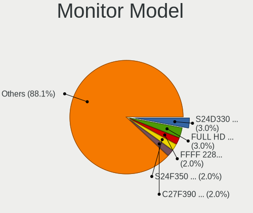

| Model                                                                 | Desktops | Percent |
|-----------------------------------------------------------------------|----------|---------|
| Philips PHL 243V7 PHLC155 1920x1080 527x296mm 23.8-inch               | 4        | 3.28%   |
| Hewlett-Packard 24f HPN3545 1920x1080 527x296mm 23.8-inch             | 3        | 2.46%   |
| Samsung Electronics S24D330 SAM0D92 1920x1080 531x299mm 24.0-inch     | 2        | 1.64%   |
| Hewlett-Packard w1907 HWP26A2 1440x900 408x255mm 18.9-inch            | 2        | 1.64%   |
| Goldstar HDR WFHD GSM7714 2560x1080 798x334mm 34.1-inch               | 2        | 1.64%   |
| Goldstar HDR 4K GSM7707 3840x2160 600x340mm 27.2-inch                 | 2        | 1.64%   |
| Goldstar FULL HD GSM5B55 1920x1080 480x270mm 21.7-inch                | 2        | 1.64%   |
| Ancor Communications VW225 ACI22A0 1680x1050 473x296mm 22.0-inch      | 2        | 1.64%   |
| Ancor Communications ASUS VS228 ACI22FD 1920x1080 476x268mm 21.5-inch | 2        | 1.64%   |
| ViewSonic LCD Monitor VSCBB31 1920x1080 530x300mm 24.0-inch           | 1        | 0.82%   |
| Toshiba TV TSB0108 1360x768 580x320mm 26.1-inch                       | 1        | 0.82%   |
| STD LCD TV STD0101 1920x1080                                          | 1        | 0.82%   |
| Samsung Electronics T22D390 SAM0B6B 1920x1080 477x268mm 21.5-inch     | 1        | 0.82%   |
| Samsung Electronics T22C300 SAM0AB1 1920x1080 477x268mm 21.5-inch     | 1        | 0.82%   |
| Samsung Electronics SyncMaster SAM05CC 1920x1080 530x300mm 24.0-inch  | 1        | 0.82%   |
| Samsung Electronics SyncMaster SAM03EE 1680x1050                      | 1        | 0.82%   |
| Samsung Electronics SyncMaster SAM03E1 1440x900 410x257mm 19.1-inch   | 1        | 0.82%   |
| Samsung Electronics SyncMaster SAM036F 1440x900 428x255mm 19.6-inch   | 1        | 0.82%   |
| Samsung Electronics SyncMaster SAM0215 1280x1024 338x270mm 17.0-inch  | 1        | 0.82%   |
| Samsung Electronics SyncMaster SAM01B7 1280x1024 338x270mm 17.0-inch  | 1        | 0.82%   |
| Samsung Electronics SyncMaster SAM010B 1280x1024 340x270mm 17.1-inch  | 1        | 0.82%   |
| Samsung Electronics SyncMaster SAM0027 1280x1024 312x234mm 15.4-inch  | 1        | 0.82%   |
| Samsung Electronics SMT24A550 SAM07B5 1920x1080 530x300mm 24.0-inch   | 1        | 0.82%   |
| Samsung Electronics SMT24A550 SAM07B3 1920x1080 530x300mm 24.0-inch   | 1        | 0.82%   |
| Samsung Electronics SMT24A350 SAM07AB 1920x1080 531x299mm 24.0-inch   | 1        | 0.82%   |
| Samsung Electronics SMS19A100 SAM0867 1366x768 410x230mm 18.5-inch    | 1        | 0.82%   |
| Samsung Electronics S24F350 SAM0D20 1920x1080 521x293mm 23.5-inch     | 1        | 0.82%   |
| Samsung Electronics S24D390 SAM0B65 1920x1080 521x293mm 23.5-inch     | 1        | 0.82%   |
| Samsung Electronics S24D300 SAM0B43 1920x1080 531x299mm 24.0-inch     | 1        | 0.82%   |
| Samsung Electronics LS24AG30x SAM7178 1920x1080 530x300mm 24.0-inch   | 1        | 0.82%   |
| Samsung Electronics LCD Monitor SAM0C39 1920x1080 885x498mm 40.0-inch | 1        | 0.82%   |
| Samsung Electronics LCD Monitor SAM0B30 1920x1080 885x498mm 40.0-inch | 1        | 0.82%   |
| Samsung Electronics LCD Monitor SAM0658 1920x1080 886x498mm 40.0-inch | 1        | 0.82%   |
| Samsung Electronics LC34G55T SAM711A 3440x1440 798x334mm 34.1-inch    | 1        | 0.82%   |
| Samsung Electronics LC32G7xT SAM7058 2560x1440 698x393mm 31.5-inch    | 1        | 0.82%   |
| Samsung Electronics C32JG5x SAM0F55 2560x1440 700x390mm 31.5-inch     | 1        | 0.82%   |
| Samsung Electronics C27R500 SAM0F9E 1920x1080 598x336mm 27.0-inch     | 1        | 0.82%   |
| Samsung Electronics C27HG7x SAM0E16 2560x1440 600x340mm 27.2-inch     | 1        | 0.82%   |
| Samsung Electronics C24F390 SAM0D2C 1920x1080 520x290mm 23.4-inch     | 1        | 0.82%   |
| QBell QXV.23WA QBL8012 1920x1080 300x230mm 14.9-inch                  | 1        | 0.82%   |

Monitor Resolution
------------------

Monitor screen resolution

| Resolution         | Desktops | Percent |
|--------------------|----------|---------|
| 1920x1080 (FHD)    | 51       | 43.59%  |
| 1680x1050 (WSXGA+) | 10       | 8.55%   |
| 2560x1440 (QHD)    | 8        | 6.84%   |
| 1440x900 (WXGA+)   | 8        | 6.84%   |
| 3840x2160 (4K)     | 7        | 5.98%   |
| 2560x1080          | 7        | 5.98%   |
| 1280x1024 (SXGA)   | 7        | 5.98%   |
| 1366x768 (WXGA)    | 6        | 5.13%   |
| 3440x1440          | 2        | 1.71%   |
| 1920x1200 (WUXGA)  | 2        | 1.71%   |
| 1600x900 (HD+)     | 2        | 1.71%   |
| Unknown            | 2        | 1.71%   |
| 4480x1440          | 1        | 0.85%   |
| 4093x4093          | 1        | 0.85%   |
| 1920x540           | 1        | 0.85%   |
| 1360x768           | 1        | 0.85%   |
| 1280x768           | 1        | 0.85%   |

Monitor Diagonal
----------------

Diagonal size in inches

| Inches  | Desktops | Percent |
|---------|----------|---------|
| 24      | 25       | 21.01%  |
| 27      | 14       | 11.76%  |
| 21      | 10       | 8.4%    |
| 34      | 9        | 7.56%   |
| 19      | 9        | 7.56%   |
| 18      | 9        | 7.56%   |
| 23      | 8        | 6.72%   |
| 20      | 6        | 5.04%   |
| 22      | 5        | 4.2%    |
| 31      | 4        | 3.36%   |
| 17      | 4        | 3.36%   |
| Unknown | 4        | 3.36%   |
| 72      | 3        | 2.52%   |
| 54      | 1        | 0.84%   |
| 47      | 1        | 0.84%   |
| 42      | 1        | 0.84%   |
| 40      | 1        | 0.84%   |
| 33      | 1        | 0.84%   |
| 29      | 1        | 0.84%   |
| 25      | 1        | 0.84%   |
| 15      | 1        | 0.84%   |
| 14      | 1        | 0.84%   |

Monitor Width
-------------

Physical width

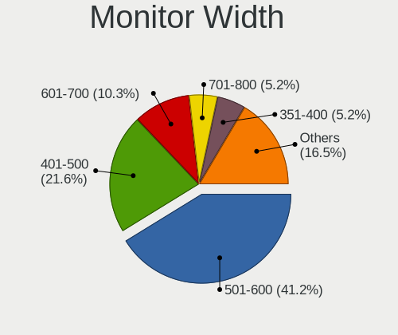

| Width in mm | Desktops | Percent |
|-------------|----------|---------|
| 501-600     | 44       | 38.26%  |
| 401-500     | 36       | 31.3%   |
| 701-800     | 10       | 8.7%    |
| 601-700     | 5        | 4.35%   |
| 301-350     | 5        | 4.35%   |
| Unknown     | 4        | 3.48%   |
| 351-400     | 3        | 2.61%   |
| 1501-2000   | 3        | 2.61%   |
| 1001-1500   | 2        | 1.74%   |
| 801-900     | 1        | 0.87%   |
| 201-300     | 1        | 0.87%   |
| 901-1000    | 1        | 0.87%   |

Aspect Ratio
------------

Proportional relationship between the width and the height

| Ratio   | Desktops | Percent |
|---------|----------|---------|
| 16/9    | 71       | 64.55%  |
| 16/10   | 18       | 16.36%  |
| 21/9    | 8        | 7.27%   |
| 5/4     | 7        | 6.36%   |
| Unknown | 3        | 2.73%   |
| 4/3     | 2        | 1.82%   |
| 2.65    | 1        | 0.91%   |

Monitor Area
------------

Area in inch

| Area in inch | Desktops | Percent |
|----------------|----------|---------|
| 201-250        | 41       | 34.75%  |
| 151-200        | 19       | 16.1%   |
| 301-350        | 14       | 11.86%  |
| 351-500        | 13       | 11.02%  |
| 141-150        | 11       | 9.32%   |
| 251-300        | 6        | 5.08%   |
| More than 1000 | 4        | 3.39%   |
| 501-1000       | 4        | 3.39%   |
| Unknown        | 4        | 3.39%   |
| 111-120        | 1        | 0.85%   |
| 101-110        | 1        | 0.85%   |

Pixel Density
-------------

Pixels per inch

| Density | Desktops | Percent |
|---------|----------|---------|
| 51-100  | 81       | 73.64%  |
| 101-120 | 17       | 15.45%  |
| 1-50    | 5        | 4.55%   |
| Unknown | 4        | 3.64%   |
| 161-240 | 2        | 1.82%   |
| 121-160 | 1        | 0.91%   |

Multiple Monitors
-----------------

Total monitors connected

| Total | Desktops | Percent |
|-------|----------|---------|
| 1     | 93       | 85.32%  |
| 2     | 14       | 12.84%  |
| 3     | 2        | 1.83%   |

Network
-------

Net Controller Vendor
---------------------

Controller vendors

| Vendor                   | Desktops | Percent |
|--------------------------|----------|---------|
| Realtek Semiconductor    | 67       | 44.97%  |
| Intel                    | 46       | 30.87%  |
| Qualcomm Atheros         | 8        | 5.37%   |
| Broadcom                 | 4        | 2.68%   |
| Ralink Technology        | 3        | 2.01%   |
| Sitecom Europe           | 2        | 1.34%   |
| Nvidia                   | 2        | 1.34%   |
| Microsoft                | 2        | 1.34%   |
| Marvell Technology Group | 2        | 1.34%   |
| D-Link                   | 2        | 1.34%   |
| Wilocity                 | 1        | 0.67%   |
| TP-Link                  | 1        | 0.67%   |
| Ralink                   | 1        | 0.67%   |
| NetGear                  | 1        | 0.67%   |
| Huawei Technologies      | 1        | 0.67%   |
| Google                   | 1        | 0.67%   |
| Edimax Technology        | 1        | 0.67%   |
| Compal Electronics       | 1        | 0.67%   |
| Broadcom Limited         | 1        | 0.67%   |
| AVM                      | 1        | 0.67%   |
| ASUSTek Computer         | 1        | 0.67%   |

Net Controller Model
--------------------

Controller models

| Model                                                                      | Desktops | Percent |
|----------------------------------------------------------------------------|----------|---------|
| Realtek RTL8111/8168/8411 PCI Express Gigabit Ethernet Controller          | 55       | 32.35%  |
| Intel Wi-Fi 6 AX200                                                        | 9        | 5.29%   |
| Intel I211 Gigabit Network Connection                                      | 7        | 4.12%   |
| Realtek RTL8125 2.5GbE Controller                                          | 6        | 3.53%   |
| Intel Ethernet Connection (7) I219-V                                       | 4        | 2.35%   |
| Intel Ethernet Connection (2) I219-V                                       | 4        | 2.35%   |
| Intel 82579V Gigabit Network Connection                                    | 4        | 2.35%   |
| Intel 82579LM Gigabit Network Connection (Lewisville)                      | 4        | 2.35%   |
| Realtek RTL8821CE 802.11ac PCIe Wireless Network Adapter                   | 3        | 1.76%   |
| Realtek RTL810xE PCI Express Fast Ethernet controller                      | 3        | 1.76%   |
| Intel Tiger Lake PCH CNVi WiFi                                             | 3        | 1.76%   |
| Intel Ethernet Connection (2) I219-LM                                      | 3        | 1.76%   |
| Realtek RTL88x2bu [AC1200 Techkey]                                         | 2        | 1.18%   |
| Realtek 802.11ac NIC                                                       | 2        | 1.18%   |
| Qualcomm Atheros AR93xx Wireless Network Adapter                           | 2        | 1.18%   |
| Nvidia MCP61 Ethernet                                                      | 2        | 1.18%   |
| Marvell Group 88E8056 PCI-E Gigabit Ethernet Controller                    | 2        | 1.18%   |
| Intel Wi-Fi 6 AX210/AX211/AX411 160MHz                                     | 2        | 1.18%   |
| Intel Ethernet Controller I225-V                                           | 2        | 1.18%   |
| Intel Cannon Lake PCH CNVi WiFi                                            | 2        | 1.18%   |
| Intel 82578DM Gigabit Network Connection                                   | 2        | 1.18%   |
| Broadcom BCM4360 802.11ac Wireless Network Adapter                         | 2        | 1.18%   |
| Wilocity Wil6200 802.11ad Wireless Network Adapter                         | 1        | 0.59%   |
| TP-Link TL-WN823N v2/v3 [Realtek RTL8192EU]                                | 1        | 0.59%   |
| Sitecom Europe WL-349v3 Wireless Micro Adapter 150N X1 [Realtek RTL8192SU] | 1        | 0.59%   |
| Sitecom Europe WiFi                                                        | 1        | 0.59%   |
| Realtek RTL8822CE 802.11ac PCIe Wireless Network Adapter                   | 1        | 0.59%   |
| Realtek RTL8822BE 802.11a/b/g/n/ac WiFi adapter                            | 1        | 0.59%   |
| Realtek RTL8812AU 802.11a/b/g/n/ac 2T2R DB WLAN Adapter                    | 1        | 0.59%   |
| Realtek RTL8812AE 802.11ac PCIe Wireless Network Adapter                   | 1        | 0.59%   |
| Realtek RTL8188GU 802.11n WLAN Adapter (After Modeswitch)                  | 1        | 0.59%   |
| Realtek RTL8188EUS 802.11n Wireless Network Adapter                        | 1        | 0.59%   |
| Realtek RTL-8100/8101L/8139 PCI Fast Ethernet Adapter                      | 1        | 0.59%   |
| Ralink RT5370 Wireless Adapter                                             | 1        | 0.59%   |
| Ralink RT2870 Wireless Adapter                                             | 1        | 0.59%   |
| Ralink MT7601U Wireless Adapter                                            | 1        | 0.59%   |
| Ralink RT2561/RT61 802.11g PCI                                             | 1        | 0.59%   |
| Qualcomm Atheros QCA6174 802.11ac Wireless Network Adapter                 | 1        | 0.59%   |
| Qualcomm Atheros Killer E2400 Gigabit Ethernet Controller                  | 1        | 0.59%   |
| Qualcomm Atheros Killer E220x Gigabit Ethernet Controller                  | 1        | 0.59%   |

Wireless Vendor
---------------

Wireless vendors

| Vendor                | Desktops | Percent |
|-----------------------|----------|---------|
| Intel                 | 18       | 33.96%  |
| Realtek Semiconductor | 13       | 24.53%  |
| Qualcomm Atheros      | 4        | 7.55%   |
| Ralink Technology     | 3        | 5.66%   |
| Sitecom Europe        | 2        | 3.77%   |
| Microsoft             | 2        | 3.77%   |
| D-Link                | 2        | 3.77%   |
| Broadcom              | 2        | 3.77%   |
| Wilocity              | 1        | 1.89%   |
| TP-Link               | 1        | 1.89%   |
| Ralink                | 1        | 1.89%   |
| NetGear               | 1        | 1.89%   |
| Edimax Technology     | 1        | 1.89%   |
| AVM                   | 1        | 1.89%   |
| ASUSTek Computer      | 1        | 1.89%   |

Wireless Model
--------------

Wireless models

| Model                                                                      | Desktops | Percent |
|----------------------------------------------------------------------------|----------|---------|
| Intel Wi-Fi 6 AX200                                                        | 9        | 16.98%  |
| Realtek RTL8821CE 802.11ac PCIe Wireless Network Adapter                   | 3        | 5.66%   |
| Intel Tiger Lake PCH CNVi WiFi                                             | 3        | 5.66%   |
| Realtek RTL88x2bu [AC1200 Techkey]                                         | 2        | 3.77%   |
| Realtek 802.11ac NIC                                                       | 2        | 3.77%   |
| Qualcomm Atheros AR93xx Wireless Network Adapter                           | 2        | 3.77%   |
| Intel Wi-Fi 6 AX210/AX211/AX411 160MHz                                     | 2        | 3.77%   |
| Intel Cannon Lake PCH CNVi WiFi                                            | 2        | 3.77%   |
| Broadcom BCM4360 802.11ac Wireless Network Adapter                         | 2        | 3.77%   |
| Wilocity Wil6200 802.11ad Wireless Network Adapter                         | 1        | 1.89%   |
| TP-Link TL-WN823N v2/v3 [Realtek RTL8192EU]                                | 1        | 1.89%   |
| Sitecom Europe WL-349v3 Wireless Micro Adapter 150N X1 [Realtek RTL8192SU] | 1        | 1.89%   |
| Sitecom Europe WiFi                                                        | 1        | 1.89%   |
| Realtek RTL8822CE 802.11ac PCIe Wireless Network Adapter                   | 1        | 1.89%   |
| Realtek RTL8822BE 802.11a/b/g/n/ac WiFi adapter                            | 1        | 1.89%   |
| Realtek RTL8812AU 802.11a/b/g/n/ac 2T2R DB WLAN Adapter                    | 1        | 1.89%   |
| Realtek RTL8812AE 802.11ac PCIe Wireless Network Adapter                   | 1        | 1.89%   |
| Realtek RTL8188GU 802.11n WLAN Adapter (After Modeswitch)                  | 1        | 1.89%   |
| Realtek RTL8188EUS 802.11n Wireless Network Adapter                        | 1        | 1.89%   |
| Ralink RT5370 Wireless Adapter                                             | 1        | 1.89%   |
| Ralink RT2870 Wireless Adapter                                             | 1        | 1.89%   |
| Ralink MT7601U Wireless Adapter                                            | 1        | 1.89%   |
| Ralink RT2561/RT61 802.11g PCI                                             | 1        | 1.89%   |
| Qualcomm Atheros QCA6174 802.11ac Wireless Network Adapter                 | 1        | 1.89%   |
| Qualcomm Atheros AR9462 Wireless Network Adapter                           | 1        | 1.89%   |
| NetGear WG111v3 54 Mbps Wireless [realtek RTL8187B]                        | 1        | 1.89%   |
| Microsoft XBOX ACC                                                         | 1        | 1.89%   |
| Microsoft Xbox 360 Wireless Adapter                                        | 1        | 1.89%   |
| Intel Wireless 7260                                                        | 1        | 1.89%   |
| Intel Alder Lake-S PCH CNVi WiFi                                           | 1        | 1.89%   |
| Edimax EW-7711UTn nLite Wireless Adapter [Ralink RT3070]                   | 1        | 1.89%   |
| D-Link DWA-140 RangeBooster N Adapter(rev.B3) [Ralink RT5372]              | 1        | 1.89%   |
| D-Link 802.11ac WLAN Adapter                                               | 1        | 1.89%   |
| AVM FRITZ!WLAN AC 860                                                      | 1        | 1.89%   |
| ASUS USB-N13 802.11n Network Adapter (rev. B1) [Realtek RTL8192CU]         | 1        | 1.89%   |

Ethernet Vendor
---------------

Ethernet vendors

| Vendor                   | Desktops | Percent |
|--------------------------|----------|---------|
| Realtek Semiconductor    | 65       | 56.52%  |
| Intel                    | 36       | 31.3%   |
| Qualcomm Atheros         | 5        | 4.35%   |
| Nvidia                   | 2        | 1.74%   |
| Marvell Technology Group | 2        | 1.74%   |
| Broadcom                 | 2        | 1.74%   |
| Huawei Technologies      | 1        | 0.87%   |
| Google                   | 1        | 0.87%   |
| Broadcom Limited         | 1        | 0.87%   |

Ethernet Model
--------------

Ethernet models

| Model                                                             | Desktops | Percent |
|-------------------------------------------------------------------|----------|---------|
| Realtek RTL8111/8168/8411 PCI Express Gigabit Ethernet Controller | 55       | 47.41%  |
| Intel I211 Gigabit Network Connection                             | 7        | 6.03%   |
| Realtek RTL8125 2.5GbE Controller                                 | 6        | 5.17%   |
| Intel Ethernet Connection (7) I219-V                              | 4        | 3.45%   |
| Intel Ethernet Connection (2) I219-V                              | 4        | 3.45%   |
| Intel 82579V Gigabit Network Connection                           | 4        | 3.45%   |
| Intel 82579LM Gigabit Network Connection (Lewisville)             | 4        | 3.45%   |
| Realtek RTL810xE PCI Express Fast Ethernet controller             | 3        | 2.59%   |
| Intel Ethernet Connection (2) I219-LM                             | 3        | 2.59%   |
| Nvidia MCP61 Ethernet                                             | 2        | 1.72%   |
| Marvell Group 88E8056 PCI-E Gigabit Ethernet Controller           | 2        | 1.72%   |
| Intel Ethernet Controller I225-V                                  | 2        | 1.72%   |
| Intel 82578DM Gigabit Network Connection                          | 2        | 1.72%   |
| Realtek RTL-8100/8101L/8139 PCI Fast Ethernet Adapter             | 1        | 0.86%   |
| Qualcomm Atheros Killer E2400 Gigabit Ethernet Controller         | 1        | 0.86%   |
| Qualcomm Atheros Killer E220x Gigabit Ethernet Controller         | 1        | 0.86%   |
| Qualcomm Atheros Attansic L1 Gigabit Ethernet                     | 1        | 0.86%   |
| Qualcomm Atheros AR8161 Gigabit Ethernet                          | 1        | 0.86%   |
| Qualcomm Atheros AR8121/AR8113/AR8114 Gigabit or Fast Ethernet    | 1        | 0.86%   |
| Intel Ethernet Connection I217-V                                  | 1        | 0.86%   |
| Intel Ethernet Connection I217-LM                                 | 1        | 0.86%   |
| Intel Ethernet Connection (7) I219-LM                             | 1        | 0.86%   |
| Intel Ethernet Connection (10) I219-V                             | 1        | 0.86%   |
| Intel 82567LM-3 Gigabit Network Connection                        | 1        | 0.86%   |
| Intel 82546GB Gigabit Ethernet Controller (Copper)                | 1        | 0.86%   |
| Intel 80003ES2LAN Gigabit Ethernet Controller (Copper)            | 1        | 0.86%   |
| Huawei SNE-LX1                                                    | 1        | 0.86%   |
| Google Pixel 6                                                    | 1        | 0.86%   |
| Broadcom NetXtreme BCM5721 Gigabit Ethernet PCI Express           | 1        | 0.86%   |
| Broadcom NetLink BCM57780 Gigabit Ethernet PCIe                   | 1        | 0.86%   |
| Broadcom Limited BCM4401 100Base-T                                | 1        | 0.86%   |

Net Controller Kind
-------------------

Ethernet, WiFi or modem

| Kind     | Desktops | Percent |
|----------|----------|---------|
| Ethernet | 109      | 68.55%  |
| WiFi     | 49       | 30.82%  |
| Unknown  | 1        | 0.63%   |

Used Controller
---------------

Currently used network controller

| Kind     | Desktops | Percent |
|----------|----------|---------|
| Ethernet | 88       | 80.73%  |
| WiFi     | 20       | 18.35%  |
| Unknown  | 1        | 0.92%   |

NICs
----

Total network controllers on board

| Total | Desktops | Percent |
|-------|----------|---------|
| 1     | 75       | 68.81%  |
| 2     | 29       | 26.61%  |
| 3     | 3        | 2.75%   |
| 5     | 1        | 0.92%   |
| 4     | 1        | 0.92%   |

IPv6
----

IPv6 vs IPv4

| Used | Desktops | Percent |
|------|----------|---------|
| No   | 99       | 90.83%  |
| Yes  | 10       | 9.17%   |

Bluetooth
---------

Bluetooth Vendor
----------------

Controller vendors

| Vendor                  | Desktops | Percent |
|-------------------------|----------|---------|
| Intel                   | 16       | 34.78%  |
| Cambridge Silicon Radio | 13       | 28.26%  |
| Realtek Semiconductor   | 7        | 15.22%  |
| Broadcom                | 4        | 8.7%    |
| ASUSTek Computer        | 3        | 6.52%   |
| Apple                   | 2        | 4.35%   |
| TP-Link                 | 1        | 2.17%   |

Bluetooth Model
---------------

Controller models

| Model                                               | Desktops | Percent |
|-----------------------------------------------------|----------|---------|
| Cambridge Silicon Radio Bluetooth Dongle (HCI mode) | 13       | 28.26%  |
| Intel AX200 Bluetooth                               | 7        | 15.22%  |
| Realtek Bluetooth Radio                             | 5        | 10.87%  |
| Intel AX201 Bluetooth                               | 4        | 8.7%    |
| Realtek  Bluetooth 4.2 Adapter                      | 2        | 4.35%   |
| Intel Bluetooth 9460/9560 Jefferson Peak (JfP)      | 2        | 4.35%   |
| Intel AX210 Bluetooth                               | 2        | 4.35%   |
| Broadcom BCM92046DG-CL1ROM Bluetooth 2.1 Adapter    | 2        | 4.35%   |
| TP-Link UB500 Adapter                               | 1        | 2.17%   |
| Intel Bluetooth wireless interface                  | 1        | 2.17%   |
| Broadcom Bluetooth 3.0 Device                       | 1        | 2.17%   |
| Broadcom BCM20702A0 Bluetooth 4.0                   | 1        | 2.17%   |
| ASUS Bluetooth Device                               | 1        | 2.17%   |
| ASUS Bluetooth Adapter                              | 1        | 2.17%   |
| ASUS 2045 Bluetooth 2.0 Device with trace filter    | 1        | 2.17%   |
| Apple Bluetooth USB Host Controller                 | 1        | 2.17%   |
| Apple Bluetooth HCI MacBookPro (HID mode)           | 1        | 2.17%   |

Sound
-----

Sound Vendor
------------

Sound card vendors

| Vendor                   | Desktops | Percent |
|--------------------------|----------|---------|
| Intel                    | 71       | 37.17%  |
| Nvidia                   | 51       | 26.7%   |
| AMD                      | 47       | 24.61%  |
| Logitech                 | 3        | 1.57%   |
| Samson Technologies      | 2        | 1.05%   |
| Creative Technology      | 2        | 1.05%   |
| C-Media Electronics      | 2        | 1.05%   |
| Trust                    | 1        | 0.52%   |
| Texas Instruments        | 1        | 0.52%   |
| Tenx Technology          | 1        | 0.52%   |
| SteelSeries ApS          | 1        | 0.52%   |
| Razer USA                | 1        | 0.52%   |
| Micro Star International | 1        | 0.52%   |
| Mark of the Unicorn      | 1        | 0.52%   |
| M-Audio                  | 1        | 0.52%   |
| Kingston Technology      | 1        | 0.52%   |
| GN Netcom                | 1        | 0.52%   |
| Giga-Byte Technology     | 1        | 0.52%   |
| Ensoniq                  | 1        | 0.52%   |
| Creative Labs            | 1        | 0.52%   |

Sound Model
-----------

Sound card models

| Model                                                                             | Desktops | Percent |
|-----------------------------------------------------------------------------------|----------|---------|
| AMD Starship/Matisse HD Audio Controller                                          | 14       | 6.57%   |
| Intel 6 Series/C200 Series Chipset Family High Definition Audio Controller        | 10       | 4.69%   |
| Intel 7 Series/C216 Chipset Family High Definition Audio Controller               | 8        | 3.76%   |
| Nvidia TU116 High Definition Audio Controller                                     | 7        | 3.29%   |
| Nvidia GK208 HDMI/DP Audio Controller                                             | 7        | 3.29%   |
| Intel Cannon Lake PCH cAVS                                                        | 7        | 3.29%   |
| Intel 8 Series/C220 Series Chipset High Definition Audio Controller               | 7        | 3.29%   |
| Intel 100 Series/C230 Series Chipset Family HD Audio Controller                   | 7        | 3.29%   |
| Intel NM10/ICH7 Family High Definition Audio Controller                           | 6        | 2.82%   |
| AMD Family 17h/19h HD Audio Controller                                            | 6        | 2.82%   |
| Nvidia GP106 High Definition Audio Controller                                     | 5        | 2.35%   |
| Intel 200 Series PCH HD Audio                                                     | 5        | 2.35%   |
| AMD SBx00 Azalia (Intel HDA)                                                      | 5        | 2.35%   |
| AMD FCH Azalia Controller                                                         | 5        | 2.35%   |
| Nvidia TU106 High Definition Audio Controller                                     | 4        | 1.88%   |
| Nvidia High Definition Audio Controller                                           | 4        | 1.88%   |
| AMD Renoir Radeon High Definition Audio Controller                                | 4        | 1.88%   |
| AMD Caicos HDMI Audio [Radeon HD 6450 / 7450/8450/8490 OEM / R5 230/235/235X OEM] | 4        | 1.88%   |
| AMD Baffin HDMI/DP Audio [Radeon RX 550 640SP / RX 560/560X]                      | 4        | 1.88%   |
| Nvidia GP108 High Definition Audio Controller                                     | 3        | 1.41%   |
| Nvidia GP107GL High Definition Audio Controller                                   | 3        | 1.41%   |
| Nvidia GM107 High Definition Audio Controller [GeForce 940MX]                     | 3        | 1.41%   |
| Nvidia GF119 HDMI Audio Controller                                                | 3        | 1.41%   |
| Intel Celeron N3350/Pentium N4200/Atom E3900 Series Audio Cluster                 | 3        | 1.41%   |
| Intel 5 Series/3400 Series Chipset High Definition Audio                          | 3        | 1.41%   |
| AMD Oland/Hainan/Cape Verde/Pitcairn HDMI Audio [Radeon HD 7000 Series]           | 3        | 1.41%   |
| AMD Navi 21/23 HDMI/DP Audio Controller                                           | 3        | 1.41%   |
| AMD Navi 10 HDMI Audio                                                            | 3        | 1.41%   |
| AMD Family 17h (Models 00h-0fh) HD Audio Controller                               | 3        | 1.41%   |
| AMD Ellesmere HDMI Audio [Radeon RX 470/480 / 570/580/590]                        | 3        | 1.41%   |
| Nvidia TU107 GeForce GTX 1650 High Definition Audio Controller                    | 2        | 0.94%   |
| Nvidia MCP61 High Definition Audio                                                | 2        | 0.94%   |
| Nvidia GK107 HDMI Audio Controller                                                | 2        | 0.94%   |
| Intel Tiger Lake-H HD Audio Controller                                            | 2        | 0.94%   |
| Intel C610/X99 series chipset HD Audio Controller                                 | 2        | 0.94%   |
| Intel Audio device                                                                | 2        | 0.94%   |
| AMD Trinity HDMI Audio Controller                                                 | 2        | 0.94%   |
| AMD Tahiti HDMI Audio [Radeon HD 7870 XT / 7950/7970]                             | 2        | 0.94%   |
| AMD Raven/Raven2/Fenghuang HDMI/DP Audio Controller                               | 2        | 0.94%   |
| AMD Juniper HDMI Audio [Radeon HD 5700 Series]                                    | 2        | 0.94%   |

Memory
------

Memory Vendor
-------------

Memory module vendors

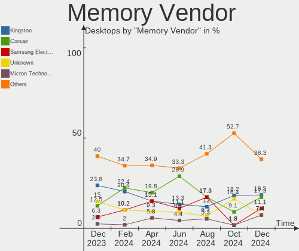

| Vendor                       | Desktops | Percent |
|------------------------------|----------|---------|
| Kingston                     | 18       | 22.5%   |
| Crucial                      | 12       | 15%     |
| Unknown                      | 9        | 11.25%  |
| Corsair                      | 8        | 10%     |
| Samsung Electronics          | 7        | 8.75%   |
| G.Skill                      | 7        | 8.75%   |
| SK hynix                     | 6        | 7.5%    |
| Micron Technology            | 3        | 3.75%   |
| Unknown                      | 3        | 3.75%   |
| Ramaxel Technology           | 2        | 2.5%    |
| Patriot                      | 2        | 2.5%    |
| Team                         | 1        | 1.25%   |
| Patriot Memory (PDP Systems) | 1        | 1.25%   |
| GeIL                         | 1        | 1.25%   |

Memory Model
------------

Memory module models

| Model                                                                   | Desktops | Percent |
|-------------------------------------------------------------------------|----------|---------|
| Unknown                                                                 | 3        | 3.53%   |
| Unknown RAM Module 2GB DIMM DDR2 800MT/s                                | 2        | 2.35%   |
| Kingston RAM KHX1600C10D3/8G 8192MB DIMM DDR3 1600MT/s                  | 2        | 2.35%   |
| Crucial RAM BL16G32C16U4B.M16FE1 16GB DIMM DDR4 3200MT/s                | 2        | 2.35%   |
| Unknown RAM Module 8GB DIMM DDR4 3000MT/s                               | 1        | 1.18%   |
| Unknown RAM Module 8GB DIMM DDR3 1600MT/s                               | 1        | 1.18%   |
| Unknown RAM Module 4GB DIMM DDR3 1600MT/s                               | 1        | 1.18%   |
| Unknown RAM Module 4GB DIMM DDR3 1333MT/s                               | 1        | 1.18%   |
| Unknown RAM Module 2GB DIMM DDR2 667MT/s                                | 1        | 1.18%   |
| Unknown RAM Module 1GB DIMM SDRAM                                       | 1        | 1.18%   |
| Unknown RAM Module 1GB DIMM DDR2 667MT/s                                | 1        | 1.18%   |
| Unknown RAM Module 1GB DIMM DDR 400MT/s                                 | 1        | 1.18%   |
| Team RAM TEAMGROUP-UD4-2666 32GB DIMM DDR4 3000MT/s                     | 1        | 1.18%   |
| SK hynix RAM Module 4GB FB-DIMM DDR2 800MT/s                            | 1        | 1.18%   |
| SK hynix RAM Module 2048MB DIMM DDR3 1066MT/s                           | 1        | 1.18%   |
| SK hynix RAM HYMP512R72BP4-E3 1GB DIMM DDR 400MT/s                      | 1        | 1.18%   |
| SK hynix RAM HMT451U6BFR8C-PB 4GB DIMM DDR3 1600MT/s                    | 1        | 1.18%   |
| SK hynix RAM HMT451U6AFR8A-PB 4GB DIMM DDR3 1600MT/s                    | 1        | 1.18%   |
| SK hynix RAM HMT351U6CFR8C-PB 4096MB DIMM DDR3 1800MT/s                 | 1        | 1.18%   |
| Samsung RAM Module 16GB DIMM DDR4 3200MT/s                              | 1        | 1.18%   |
| Samsung RAM M378B5773DH0-CH9 2GB DIMM DDR3 1333MT/s                     | 1        | 1.18%   |
| Samsung RAM M378B5273EB0 4GB DIMM DDR3 800MT/s                          | 1        | 1.18%   |
| Samsung RAM M378B5273DH0-CH9 4GB DIMM DDR3 2133MT/s                     | 1        | 1.18%   |
| Samsung RAM M378B5173EB0-CK0 4GB DIMM DDR3 1600MT/s                     | 1        | 1.18%   |
| Samsung RAM M378B2873EH1-CH9 1GB DIMM DDR3 1334MT/s                     | 1        | 1.18%   |
| Samsung RAM M378A1K43CB2-CRC 8GB DIMM DDR4 3500MT/s                     | 1        | 1.18%   |
| Ramaxel RAM RMR5030MN68F9F160 4GB DIMM DDR3 1333MT/s                    | 1        | 1.18%   |
| Ramaxel RAM RMR5030ME68F9F160 4GB DIMM DDR3 1333MT/s                    | 1        | 1.18%   |
| Ramaxel RAM RMR5030KD68F9F160 4GB DIMM DDR3 1333MT/s                    | 1        | 1.18%   |
| Ramaxel RAM RMR5030EF68F9W1600 4GB DIMM DDR3 1600MT/s                   | 1        | 1.18%   |
| Patriot RAM 3200 C16 Series 16GB DIMM DDR4 3200MT/s                     | 1        | 1.18%   |
| Patriot RAM 1600 CL10 Series 8GB DIMM DDR3 1600MT/s                     | 1        | 1.18%   |
| Patriot Memory (PDP Systems) RAM 2666 C16 Series 8GB DIMM DDR4 2133MT/s | 1        | 1.18%   |
| Micron RAM 8JTF51264AZ-1G6E1 4GB DIMM DDR3 1600MT/s                     | 1        | 1.18%   |
| Micron RAM 8JTF25664AZ-1G6M1 2GB DIMM DDR3 1600MT/s                     | 1        | 1.18%   |
| Micron RAM 18ASF2G72PDZ-2G6E1 16384MB DIMM 2667MT/s                     | 1        | 1.18%   |
| Micron RAM 18ASF2G72PDZ-2G6D1 16384MB DIMM 2667MT/s                     | 1        | 1.18%   |
| Micron RAM 16JTF1G64AZ-1G6E1 8GB DIMM DDR3 1600MT/s                     | 1        | 1.18%   |
| Kingston RAM Module 8GB DIMM DDR3 1333MT/s                              | 1        | 1.18%   |
| Kingston RAM KHX3200C16D4/8GX 8192MB DIMM DDR4 3600MT/s                 | 1        | 1.18%   |

Memory Kind
-----------

Memory module kinds

| Kind    | Desktops | Percent |
|---------|----------|---------|
| DDR4    | 36       | 48.65%  |
| DDR3    | 27       | 36.49%  |
| DDR2    | 5        | 6.76%   |
| SDRAM   | 3        | 4.05%   |
| DDR     | 2        | 2.7%    |
| Unknown | 1        | 1.35%   |

Memory Form Factor
------------------

Physical design of the memory module

| Name    | Desktops | Percent |
|---------|----------|---------|
| DIMM    | 68       | 94.44%  |
| SODIMM  | 3        | 4.17%   |
| FB-DIMM | 1        | 1.39%   |

Memory Size
-----------

Memory module size

| Size  | Desktops | Percent |
|-------|----------|---------|
| 8192  | 34       | 44.74%  |
| 4096  | 18       | 23.68%  |
| 16384 | 12       | 15.79%  |
| 2048  | 6        | 7.89%   |
| 1024  | 4        | 5.26%   |
| 32768 | 2        | 2.63%   |

Memory Speed
------------

Memory module speed

| Speed   | Desktops | Percent |
|---------|----------|---------|
| 1600    | 15       | 20.27%  |
| 3200    | 9        | 12.16%  |
| 3600    | 5        | 6.76%   |
| 3000    | 5        | 6.76%   |
| 2667    | 5        | 6.76%   |
| 1333    | 5        | 6.76%   |
| 2133    | 4        | 5.41%   |
| 1867    | 4        | 5.41%   |
| 800     | 4        | 5.41%   |
| 3733    | 2        | 2.7%    |
| 2400    | 2        | 2.7%    |
| 52217   | 1        | 1.35%   |
| 4000    | 1        | 1.35%   |
| 3666    | 1        | 1.35%   |
| 3500    | 1        | 1.35%   |
| 3466    | 1        | 1.35%   |
| 3333    | 1        | 1.35%   |
| 2747    | 1        | 1.35%   |
| 2666    | 1        | 1.35%   |
| 1800    | 1        | 1.35%   |
| 1334    | 1        | 1.35%   |
| 1066    | 1        | 1.35%   |
| 667     | 1        | 1.35%   |
| 400     | 1        | 1.35%   |
| Unknown | 1        | 1.35%   |

Printers & scanners
-------------------

Printer Vendor
--------------

Printer device vendors

| Vendor                | Desktops | Percent |
|-----------------------|----------|---------|
| Hewlett-Packard       | 3        | 25%     |
| Canon                 | 3        | 25%     |
| Samsung Electronics   | 2        | 16.67%  |
| Seiko Epson           | 1        | 8.33%   |
| Lexmark International | 1        | 8.33%   |
| Brother Industries    | 1        | 8.33%   |
| Apple                 | 1        | 8.33%   |

Printer Model
-------------

Printer device models

| Model                                | Desktops | Percent |
|--------------------------------------|----------|---------|
| Seiko Epson WF-2510 Series           | 1        | 8.33%   |
| Samsung ML-1640 Series Laser Printer | 1        | 8.33%   |
| Samsung M267x 287x Series            | 1        | 8.33%   |
| Lexmark International 2200 series    | 1        | 8.33%   |
| HP Officejet 4630 series             | 1        | 8.33%   |
| HP ENVY 5000 series                  | 1        | 8.33%   |
| HP Deskjet 2050 J510                 | 1        | 8.33%   |
| Canon TS3100 series                  | 1        | 8.33%   |
| Canon PIXMA MG3000 series            | 1        | 8.33%   |
| Canon MG5700 series                  | 1        | 8.33%   |
| Brother HL-3140CW series             | 1        | 8.33%   |
| Apple Gamesir-G3s 2.15               | 1        | 8.33%   |

Scanner Vendor
--------------

Scanner device vendors

| Vendor      | Desktops | Percent |
|-------------|----------|---------|
| Seiko Epson | 1        | 100%    |

Scanner Model
-------------

Scanner device models

| Model                                   | Desktops | Percent |
|-----------------------------------------|----------|---------|
| Seiko Epson GT-7700U [Perfection 1240U] | 1        | 100%    |

Camera
------

Camera Vendor
-------------

Camera device vendors

| Vendor                      | Desktops | Percent |
|-----------------------------|----------|---------|
| Microdia                    | 8        | 40%     |
| Trust                       | 3        | 15%     |
| Generalplus Technology      | 3        | 15%     |
| Logitech                    | 2        | 10%     |
| Silicon Motion              | 1        | 5%      |
| Microsoft                   | 1        | 5%      |
| KYE Systems (Mouse Systems) | 1        | 5%      |
| ARC International           | 1        | 5%      |

Camera Model
------------

Camera device models

| Model                                      | Desktops | Percent |
|--------------------------------------------|----------|---------|
| Microdia Camera                            | 4        | 20%     |
| Generalplus GENERAL WEBCAM                 | 3        | 15%     |
| Microdia Sonix USB 2.0 Camera              | 2        | 10%     |
| Trust WB-6250X Webcam                      | 1        | 5%      |
| Trust USB Camera                           | 1        | 5%      |
| Trust 17676 Webcam                         | 1        | 5%      |
| Silicon Motion Silicon Motion Camera       | 1        | 5%      |
| Microsoft LifeCam HD-3000                  | 1        | 5%      |
| Microdia Webcam Vitade AF                  | 1        | 5%      |
| Microdia USB 2.0 Camera                    | 1        | 5%      |
| Logitech Webcam C270                       | 1        | 5%      |
| Logitech QuickCam Pro 5000                 | 1        | 5%      |
| KYE Systems (Mouse Systems) PC-LM1E Camera | 1        | 5%      |
| ARC International Camera                   | 1        | 5%      |

Security
--------

Fingerprint Vendor
------------------

Fingerprint sensor vendors

Zero info for selected period =(

Fingerprint Model
-----------------

Fingerprint sensor models

Zero info for selected period =(

Chipcard Vendor
---------------

Chipcard module vendors

Zero info for selected period =(

Chipcard Model
--------------

Chipcard module models

Zero info for selected period =(

Unsupported
-----------

Unsupported Devices
-------------------

Total unsupported devices on board

| Total | Desktops | Percent |
|-------|----------|---------|
| 0     | 94       | 86.24%  |
| 1     | 12       | 11.01%  |
| 2     | 2        | 1.83%   |
| 3     | 1        | 0.92%   |

Unsupported Device Types
------------------------

Types of unsupported devices

| Type                     | Desktops | Percent |
|--------------------------|----------|---------|
| Net/wireless             | 5        | 27.78%  |
| Communication controller | 5        | 27.78%  |
| Unassigned class         | 2        | 11.11%  |
| Sound                    | 2        | 11.11%  |
| Graphics card            | 2        | 11.11%  |
| Network                  | 1        | 5.56%   |
| Net/ethernet             | 1        | 5.56%   |

