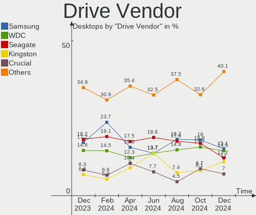
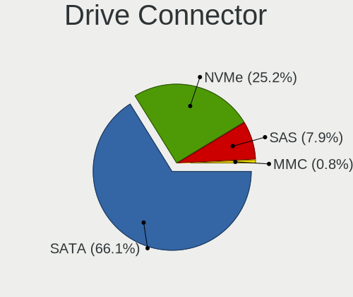
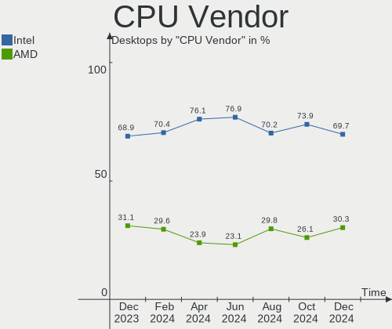

Linux in Italy - Hardware Trends (Desktops)
-------------------------------------------

A project to identify most popular hardware characteristics and track their change
over time based on data collected by Linux users at https://Linux-Hardware.org.

Anyone can contribute to this report by the [hw-probe](https://github.com/linuxhw/hw-probe) tool:

    sudo -E hw-probe -all -upload

Period: Dec, 2024.

Contents
--------

* [ System ](#system)
  - [ OS                       ](#os)
  - [ OS Family                ](#os-family)
  - [ Kernel                   ](#kernel)
  - [ Kernel Family            ](#kernel-family)
  - [ Kernel Major Ver.        ](#kernel-major-ver)
  - [ Arch                     ](#arch)
  - [ DE                       ](#de)
  - [ Display Server           ](#display-server)
  - [ Display Manager          ](#display-manager)
  - [ OS Lang                  ](#os-lang)
  - [ Boot Mode                ](#boot-mode)
  - [ Filesystem               ](#filesystem)
  - [ Part. scheme             ](#part-scheme)
  - [ Dual Boot with Linux/BSD ](#dual-boot-with-linuxbsd)
  - [ Dual Boot (Win)          ](#dual-boot-win)

* [ Board ](#board)
  - [ Vendor                   ](#vendor)
  - [ Model                    ](#model)
  - [ Model Family             ](#model-family)
  - [ MFG Year                 ](#mfg-year)
  - [ Form Factor              ](#form-factor)
  - [ Secure Boot              ](#secure-boot)
  - [ Coreboot                 ](#coreboot)
  - [ RAM Size                 ](#ram-size)
  - [ RAM Used                 ](#ram-used)
  - [ Total Drives             ](#total-drives)
  - [ Has CD-ROM               ](#has-cd-rom)
  - [ Has Ethernet             ](#has-ethernet)
  - [ Has WiFi                 ](#has-wifi)
  - [ Has Bluetooth            ](#has-bluetooth)

* [ Location ](#location)
  - [ Country                  ](#country)
  - [ City                     ](#city)

* [ Drives ](#drives)
  - [ Drive Vendor             ](#drive-vendor)
  - [ Drive Model              ](#drive-model)
  - [ HDD Vendor               ](#hdd-vendor)
  - [ SSD Vendor               ](#ssd-vendor)
  - [ Drive Kind               ](#drive-kind)
  - [ Drive Connector          ](#drive-connector)
  - [ Drive Size               ](#drive-size)
  - [ Space Total              ](#space-total)
  - [ Space Used               ](#space-used)
  - [ Malfunc. Drives          ](#malfunc-drives)
  - [ Malfunc. Drive Vendor    ](#malfunc-drive-vendor)
  - [ Malfunc. HDD Vendor      ](#malfunc-hdd-vendor)
  - [ Malfunc. Drive Kind      ](#malfunc-drive-kind)
  - [ Failed Drives            ](#failed-drives)
  - [ Failed Drive Vendor      ](#failed-drive-vendor)
  - [ Drive Status             ](#drive-status)

* [ Storage controller ](#storage-controller)
  - [ Storage Vendor           ](#storage-vendor)
  - [ Storage Model            ](#storage-model)
  - [ Storage Kind             ](#storage-kind)

* [ Processor ](#processor)
  - [ CPU Vendor               ](#cpu-vendor)
  - [ CPU Model                ](#cpu-model)
  - [ CPU Model Family         ](#cpu-model-family)
  - [ CPU Cores                ](#cpu-cores)
  - [ CPU Sockets              ](#cpu-sockets)
  - [ CPU Threads              ](#cpu-threads)
  - [ CPU Op-Modes             ](#cpu-op-modes)
  - [ CPU Microcode            ](#cpu-microcode)
  - [ CPU Microarch            ](#cpu-microarch)

* [ Graphics ](#graphics)
  - [ GPU Vendor               ](#gpu-vendor)
  - [ GPU Model                ](#gpu-model)
  - [ GPU Combo                ](#gpu-combo)
  - [ GPU Driver               ](#gpu-driver)
  - [ GPU Memory               ](#gpu-memory)

* [ Monitor ](#monitor)
  - [ Monitor Vendor           ](#monitor-vendor)
  - [ Monitor Model            ](#monitor-model)
  - [ Monitor Resolution       ](#monitor-resolution)
  - [ Monitor Diagonal         ](#monitor-diagonal)
  - [ Monitor Width            ](#monitor-width)
  - [ Aspect Ratio             ](#aspect-ratio)
  - [ Monitor Area             ](#monitor-area)
  - [ Pixel Density            ](#pixel-density)
  - [ Multiple Monitors        ](#multiple-monitors)

* [ Network ](#network)
  - [ Net Controller Vendor    ](#net-controller-vendor)
  - [ Net Controller Model     ](#net-controller-model)
  - [ Wireless Vendor          ](#wireless-vendor)
  - [ Wireless Model           ](#wireless-model)
  - [ Ethernet Vendor          ](#ethernet-vendor)
  - [ Ethernet Model           ](#ethernet-model)
  - [ Net Controller Kind      ](#net-controller-kind)
  - [ Used Controller          ](#used-controller)
  - [ NICs                     ](#nics)
  - [ IPv6                     ](#ipv6)

* [ Bluetooth ](#bluetooth)
  - [ Bluetooth Vendor         ](#bluetooth-vendor)
  - [ Bluetooth Model          ](#bluetooth-model)

* [ Sound ](#sound)
  - [ Sound Vendor             ](#sound-vendor)
  - [ Sound Model              ](#sound-model)

* [ Memory ](#memory)
  - [ Memory Vendor            ](#memory-vendor)
  - [ Memory Model             ](#memory-model)
  - [ Memory Kind              ](#memory-kind)
  - [ Memory Form Factor       ](#memory-form-factor)
  - [ Memory Size              ](#memory-size)
  - [ Memory Speed             ](#memory-speed)

* [ Printers & scanners ](#printers--scanners)
  - [ Printer Vendor           ](#printer-vendor)
  - [ Printer Model            ](#printer-model)
  - [ Scanner Vendor           ](#scanner-vendor)
  - [ Scanner Model            ](#scanner-model)

* [ Camera ](#camera)
  - [ Camera Vendor            ](#camera-vendor)
  - [ Camera Model             ](#camera-model)

* [ Security ](#security)
  - [ Fingerprint Vendor       ](#fingerprint-vendor)
  - [ Fingerprint Model        ](#fingerprint-model)
  - [ Chipcard Vendor          ](#chipcard-vendor)
  - [ Chipcard Model           ](#chipcard-model)

* [ Unsupported ](#unsupported)
  - [ Unsupported Devices      ](#unsupported-devices)
  - [ Unsupported Device Types ](#unsupported-device-types)

System
------

OS
--

Installed operating systems

| Name                         | Desktops | Percent |
|------------------------------|----------|---------|
| Linux Mint 22                | 22       | 22.22%  |
| OpenMandriva 24.12           | 19       | 19.19%  |
| Ubuntu 24.04                 | 6        | 6.06%   |
| Kubuntu 24.10                | 4        | 4.04%   |
| Fedora 41                    | 4        | 4.04%   |
| Zorin 17                     | 3        | 3.03%   |
| Pop!_OS 22.04                | 3        | 3.03%   |
| Linux Mint 21.3              | 3        | 3.03%   |
| Debian                       | 3        | 3.03%   |
| Ubuntu 24.10                 | 2        | 2.02%   |
| openSUSE Tumbleweed-XXXXXXXX | 2        | 2.02%   |
| OpenMandriva 23.08           | 2        | 2.02%   |
| Debian 12                    | 2        | 2.02%   |
| Bazzite 41                   | 2        | 2.02%   |
| Zorin 16                     | 1        | 1.01%   |
| Xubuntu 24.04                | 1        | 1.01%   |
| Ultimate                     | 1        | 1.01%   |
| Ubuntu 23.04                 | 1        | 1.01%   |
| Ubuntu 22.04                 | 1        | 1.01%   |
| Peppermint 11.11             | 1        | 1.01%   |
| Parrot 6.2                   | 1        | 1.01%   |
| Oracle Linux 9.5             | 1        | 1.01%   |
| OpenMandriva 5.0             | 1        | 1.01%   |
| OpenMandriva 24.07           | 1        | 1.01%   |
| Manjaro 24.2.0               | 1        | 1.01%   |
| Manjaro                      | 1        | 1.01%   |
| Lubuntu 24.04                | 1        | 1.01%   |
| Linux Mint 20.2              | 1        | 1.01%   |
| Kubuntu 24.04                | 1        | 1.01%   |
| Kubuntu 22.04                | 1        | 1.01%   |
| KDE neon 24.04               | 1        | 1.01%   |
| Garuda Linux Soaring         | 1        | 1.01%   |
| EndeavourOS Rolling          | 1        | 1.01%   |
| Bazzite 40                   | 1        | 1.01%   |
| ArcoLinux Rolling            | 1        | 1.01%   |
| Arch Rolling                 | 1        | 1.01%   |

OS Family
---------

OS without a version

| Name         | Desktops | Percent |
|--------------|----------|---------|
| Linux Mint   | 26       | 26.26%  |
| OpenMandriva | 23       | 23.23%  |
| Ubuntu       | 10       | 10.1%   |
| Kubuntu      | 6        | 6.06%   |
| Debian       | 5        | 5.05%   |
| Zorin        | 4        | 4.04%   |
| Fedora       | 4        | 4.04%   |
| Pop!_OS      | 3        | 3.03%   |
| Bazzite      | 3        | 3.03%   |
| openSUSE     | 2        | 2.02%   |
| Manjaro      | 2        | 2.02%   |
| Xubuntu      | 1        | 1.01%   |
| Ultimate     | 1        | 1.01%   |
| Peppermint   | 1        | 1.01%   |
| Parrot       | 1        | 1.01%   |
| Oracle Linux | 1        | 1.01%   |
| Lubuntu      | 1        | 1.01%   |
| KDE neon     | 1        | 1.01%   |
| Garuda Linux | 1        | 1.01%   |
| EndeavourOS  | 1        | 1.01%   |
| ArcoLinux    | 1        | 1.01%   |
| Arch         | 1        | 1.01%   |

Kernel
------

Version of the Linux kernel

| Version                         | Desktops | Percent |
|---------------------------------|----------|---------|
| 6.12.1-desktop-1omv2490         | 18       | 18.18%  |
| 6.8.0-49-generic                | 14       | 14.14%  |
| 6.8.0-51-generic                | 11       | 11.11%  |
| 6.8.0-50-generic                | 11       | 11.11%  |
| 6.9.3-76060903-generic          | 3        | 3.03%   |
| 6.4.8-desktop-2omv2390          | 2        | 2.02%   |
| 6.12.7-zen1-1-zen               | 2        | 2.02%   |
| 6.12.6-1-default                | 2        | 2.02%   |
| 6.11.11-300.fc41.x86_64         | 2        | 2.02%   |
| 6.11.10-amd64                   | 2        | 2.02%   |
| 6.11.0-9-generic                | 2        | 2.02%   |
| 6.11.0-13-generic               | 2        | 2.02%   |
| 6.1.0-28-amd64                  | 2        | 2.02%   |
| 5.15.0-130-generic              | 2        | 2.02%   |
| 5.15.0-126-generic              | 2        | 2.02%   |
| 6.9.12-210.fsync.fc40.x86_64    | 1        | 1.01%   |
| 6.8.12-i7                       | 1        | 1.01%   |
| 6.6.2-desktop-1omv2390          | 1        | 1.01%   |
| 6.5.0-28-generic                | 1        | 1.01%   |
| 6.2.0-39-generic                | 1        | 1.01%   |
| 6.12.6-desktop-1omv2490         | 1        | 1.01%   |
| 6.12.6-203.bazzite.fc41.x86_64  | 1        | 1.01%   |
| 6.12.6-200.fc41.x86_64          | 1        | 1.01%   |
| 6.12.5-200.fc41.x86_64          | 1        | 1.01%   |
| 6.12.5-1-liquorix-amd64         | 1        | 1.01%   |
| 6.12.4-zen1-1-zen               | 1        | 1.01%   |
| 6.12.4-1-MANJARO                | 1        | 1.01%   |
| 6.12.3-arch1-1                  | 1        | 1.01%   |
| 6.11.6-arch1-1                  | 1        | 1.01%   |
| 6.11.10-304.bazzite.fc41.x86_64 | 1        | 1.01%   |
| 6.11.10-2-MANJARO               | 1        | 1.01%   |
| 6.11.0-1005-lowlatency          | 1        | 1.01%   |
| 6.10.11-amd64                   | 1        | 1.01%   |
| 6.10.1-desktop-1omv2490         | 1        | 1.01%   |
| 5.15.0-127-generic              | 1        | 1.01%   |
| 5.14.0-503.16.1.el9_5.x86_64    | 1        | 1.01%   |
| 5.10.0-33-amd64                 | 1        | 1.01%   |

Kernel Family
-------------

Linux kernel without a distro release

| Version | Desktops | Percent |
|---------|----------|---------|
| 6.8.0   | 36       | 36.36%  |
| 6.12.1  | 18       | 18.18%  |
| 6.12.6  | 5        | 5.05%   |
| 6.11.0  | 5        | 5.05%   |
| 5.15.0  | 5        | 5.05%   |
| 6.11.10 | 4        | 4.04%   |
| 6.9.3   | 3        | 3.03%   |
| 6.4.8   | 2        | 2.02%   |
| 6.12.7  | 2        | 2.02%   |
| 6.12.5  | 2        | 2.02%   |
| 6.12.4  | 2        | 2.02%   |
| 6.11.11 | 2        | 2.02%   |
| 6.1.0   | 2        | 2.02%   |
| 6.9.12  | 1        | 1.01%   |
| 6.8.12  | 1        | 1.01%   |
| 6.6.2   | 1        | 1.01%   |
| 6.5.0   | 1        | 1.01%   |
| 6.2.0   | 1        | 1.01%   |
| 6.12.3  | 1        | 1.01%   |
| 6.11.6  | 1        | 1.01%   |
| 6.10.11 | 1        | 1.01%   |
| 6.10.1  | 1        | 1.01%   |
| 5.14.0  | 1        | 1.01%   |
| 5.10.0  | 1        | 1.01%   |

Kernel Major Ver.
-----------------

Linux kernel major version

| Version | Desktops | Percent |
|---------|----------|---------|
| 6.8     | 37       | 37.37%  |
| 6.12    | 30       | 30.3%   |
| 6.11    | 12       | 12.12%  |
| 5.15    | 5        | 5.05%   |
| 6.9     | 4        | 4.04%   |
| 6.4     | 2        | 2.02%   |
| 6.10    | 2        | 2.02%   |
| 6.1     | 2        | 2.02%   |
| 6.6     | 1        | 1.01%   |
| 6.5     | 1        | 1.01%   |
| 6.2     | 1        | 1.01%   |
| 5.14    | 1        | 1.01%   |
| 5.10    | 1        | 1.01%   |

Arch
----

OS architecture (x86_64, i586, etc.)

| Name   | Desktops | Percent |
|--------|----------|---------|
| x86_64 | 99       | 100%    |

DE
--

Desktop Environment

| Name       | Desktops | Percent |
|------------|----------|---------|
| GNOME      | 24       | 24.24%  |
| X-Cinnamon | 20       | 20.2%   |
| Unknown    | 18       | 18.18%  |
| KDE6       | 13       | 13.13%  |
| KDE5       | 7        | 7.07%   |
| XFCE       | 6        | 6.06%   |
| MATE       | 6        | 6.06%   |
| LXQt       | 4        | 4.04%   |
| KDE4       | 1        | 1.01%   |

Display Server
--------------

X11 or Wayland

| Name    | Desktops | Percent |
|---------|----------|---------|
| X11     | 52       | 52.53%  |
| Wayland | 44       | 44.44%  |
| Tty     | 2        | 2.02%   |
| Unknown | 1        | 1.01%   |

Display Manager
---------------

SDDM, LightDM, etc.

| Name    | Desktops | Percent |
|---------|----------|---------|
| LightDM | 29       | 29.29%  |
| SDDM    | 27       | 27.27%  |
| Unknown | 24       | 24.24%  |
| GDM3    | 11       | 11.11%  |
| GDM     | 8        | 8.08%   |

OS Lang
-------

Language

| Lang  | Desktops | Percent |
|-------|----------|---------|
| it_IT | 82       | 82.83%  |
| en_US | 14       | 14.14%  |
| en_IE | 1        | 1.01%   |
| en_GB | 1        | 1.01%   |
| C     | 1        | 1.01%   |

Boot Mode
---------

EFI or BIOS

| Mode | Desktops | Percent |
|------|----------|---------|
| BIOS | 54       | 54.55%  |
| EFI  | 45       | 45.45%  |

Filesystem
----------

Type of filesystem

| Type    | Desktops | Percent |
|---------|----------|---------|
| Ext4    | 62       | 62.63%  |
| Btrfs   | 14       | 14.14%  |
| Tmpfs   | 12       | 12.12%  |
| Overlay | 10       | 10.1%   |
| Xfs     | 1        | 1.01%   |

Part. scheme
------------

Scheme of partitioning

| Type    | Desktops | Percent |
|---------|----------|---------|
| GPT     | 65       | 65.66%  |
| Unknown | 24       | 24.24%  |
| MBR     | 10       | 10.1%   |

Dual Boot with Linux/BSD
------------------------

Hosting more than one Linux/BSD

| Dual boot | Desktops | Percent |
|-----------|----------|---------|
| No        | 76       | 76.77%  |
| Yes       | 23       | 23.23%  |

Dual Boot (Win)
---------------

Hosting Linux and Windows

| Dual boot | Desktops | Percent |
|-----------|----------|---------|
| No        | 62       | 62.63%  |
| Yes       | 37       | 37.37%  |

Board
-----

Vendor
------

Motherboard manufacturer

| Name                                 | Desktops | Percent |
|--------------------------------------|----------|---------|
| ASUSTek Computer                     | 30       | 30.3%   |
| MSI                                  | 10       | 10.1%   |
| Hewlett-Packard                      | 10       | 10.1%   |
| ASRock                               | 10       | 10.1%   |
| Lenovo                               | 9        | 9.09%   |
| Gigabyte Technology                  | 5        | 5.05%   |
| Dell                                 | 5        | 5.05%   |
| AMI                                  | 3        | 3.03%   |
| Shenzhen Meigao Electronic Equipment | 2        | 2.02%   |
| Packard Bell                         | 2        | 2.02%   |
| Acer                                 | 2        | 2.02%   |
| Unknown                              | 2        | 2.02%   |
| Supermicro                           | 1        | 1.01%   |
| QTQD                                 | 1        | 1.01%   |
| Pegatron                             | 1        | 1.01%   |
| Huanan                               | 1        | 1.01%   |
| GEEKOM                               | 1        | 1.01%   |
| Fujitsu                              | 1        | 1.01%   |
| Foxconn                              | 1        | 1.01%   |
| Colorful Technology                  | 1        | 1.01%   |
| Chuwi                                | 1        | 1.01%   |

Model
-----

Motherboard model

| Name                                              | Desktops | Percent |
|---------------------------------------------------|----------|---------|
| AMI Intel                                         | 3        | 3.03%   |
| Unknown                                           | 3        | 3.03%   |
| Dell OptiPlex 780                                 | 2        | 2.02%   |
| ASUS PRIME A320M-K                                | 2        | 2.02%   |
| Supermicro X9DRD-iF/LF                            | 1        | 1.01%   |
| Shenzhen Meigao Electronic Equipment Venus Series | 1        | 1.01%   |
| Shenzhen Meigao Electronic Equipment UM690        | 1        | 1.01%   |
| Pegatron NF574AA-ABZ a6734it                      | 1        | 1.01%   |
| Packard Bell IMEDIA S3210                         | 1        | 1.01%   |
| Packard Bell IMEDIA S1300                         | 1        | 1.01%   |
| MSI MS-7E01                                       | 1        | 1.01%   |
| MSI MS-7C94                                       | 1        | 1.01%   |
| MSI MS-7C56                                       | 1        | 1.01%   |
| MSI MS-7B84                                       | 1        | 1.01%   |
| MSI MS-7B79                                       | 1        | 1.01%   |
| MSI MS-7B51                                       | 1        | 1.01%   |
| MSI MS-7992                                       | 1        | 1.01%   |
| MSI MS-7977                                       | 1        | 1.01%   |
| MSI MS-7798                                       | 1        | 1.01%   |
| MSI MS-7253                                       | 1        | 1.01%   |
| Lenovo ThinkCentre M93p 10AAS0ME00                | 1        | 1.01%   |
| Lenovo ThinkCentre M93p 10A8A0HDIX                | 1        | 1.01%   |
| Lenovo ThinkCentre M910t 10MNS1Y900               | 1        | 1.01%   |
| Lenovo ThinkCentre M83 10AJ001NUK                 | 1        | 1.01%   |
| Lenovo ThinkCentre M83 10AHS35Q00                 | 1        | 1.01%   |
| Lenovo IdeaCentre 510-15ICB 90HU004QIX            | 1        | 1.01%   |
| Lenovo IdeaCentre 5 14IMB05 90NA001RIX            | 1        | 1.01%   |
| Lenovo H50-50 90B6006GIX                          | 1        | 1.01%   |
| Lenovo 10AXS2CP00                                 | 1        | 1.01%   |
| Huanan X99-F8 GAMING V5.0                         | 1        | 1.01%   |
| HP Z4 G4 Workstation                              | 1        | 1.01%   |
| HP Z210 Workstation                               | 1        | 1.01%   |
| HP ProDesk 600 G1 SFF                             | 1        | 1.01%   |
| HP Compaq Pro 6300 SFF                            | 1        | 1.01%   |
| HP Compaq 8000 Elite SFF PC                       | 1        | 1.01%   |
| HP 750-101nl                                      | 1        | 1.01%   |
| HP 500-317nl                                      | 1        | 1.01%   |
| HP 290 G1 SFF Business PC                         | 1        | 1.01%   |
| HP 260-a123nl                                     | 1        | 1.01%   |
| HP 260 G2 DM                                      | 1        | 1.01%   |

Model Family
------------

Motherboard model prefix

| Name                                       | Desktops | Percent |
|--------------------------------------------|----------|---------|
| ASUS PRIME                                 | 9        | 9.09%   |
| Lenovo ThinkCentre                         | 5        | 5.05%   |
| ASUS ROG                                   | 5        | 5.05%   |
| Dell OptiPlex                              | 4        | 4.04%   |
| ASUS TUF                                   | 4        | 4.04%   |
| AMI Intel                                  | 3        | 3.03%   |
| Unknown                                    | 3        | 3.03%   |
| Packard Bell IMEDIA                        | 2        | 2.02%   |
| Lenovo IdeaCentre                          | 2        | 2.02%   |
| HP Compaq                                  | 2        | 2.02%   |
| ASUS P5KPL-AM                              | 2        | 2.02%   |
| Supermicro X9DRD-iF                        | 1        | 1.01%   |
| Shenzhen Meigao Electronic Equipment Venus | 1        | 1.01%   |
| Shenzhen Meigao Electronic Equipment UM690 | 1        | 1.01%   |
| Pegatron NF574AA-ABZ                       | 1        | 1.01%   |
| MSI MS-7E01                                | 1        | 1.01%   |
| MSI MS-7C94                                | 1        | 1.01%   |
| MSI MS-7C56                                | 1        | 1.01%   |
| MSI MS-7B84                                | 1        | 1.01%   |
| MSI MS-7B79                                | 1        | 1.01%   |
| MSI MS-7B51                                | 1        | 1.01%   |
| MSI MS-7992                                | 1        | 1.01%   |
| MSI MS-7977                                | 1        | 1.01%   |
| MSI MS-7798                                | 1        | 1.01%   |
| MSI MS-7253                                | 1        | 1.01%   |
| Lenovo H50-50                              | 1        | 1.01%   |
| Lenovo 10AXS2CP00                          | 1        | 1.01%   |
| Huanan X99-F8                              | 1        | 1.01%   |
| HP Z4                                      | 1        | 1.01%   |
| HP Z210                                    | 1        | 1.01%   |
| HP ProDesk                                 | 1        | 1.01%   |
| HP 750-101nl                               | 1        | 1.01%   |
| HP 500-317nl                               | 1        | 1.01%   |
| HP 290                                     | 1        | 1.01%   |
| HP 260-a123nl                              | 1        | 1.01%   |
| HP 260                                     | 1        | 1.01%   |
| Gigabyte Z270N-WIFI                        | 1        | 1.01%   |
| Gigabyte H81M-HD3                          | 1        | 1.01%   |
| Gigabyte B550M                             | 1        | 1.01%   |
| Gigabyte B550                              | 1        | 1.01%   |

MFG Year
--------

Motherboard manufacture year

| Year | Desktops | Percent |
|------|----------|---------|
| 2018 | 14       | 14.14%  |
| 2021 | 9        | 9.09%   |
| 2012 | 9        | 9.09%   |
| 2020 | 7        | 7.07%   |
| 2016 | 7        | 7.07%   |
| 2014 | 7        | 7.07%   |
| 2013 | 6        | 6.06%   |
| 2009 | 6        | 6.06%   |
| 2022 | 5        | 5.05%   |
| 2017 | 5        | 5.05%   |
| 2023 | 4        | 4.04%   |
| 2015 | 4        | 4.04%   |
| 2010 | 4        | 4.04%   |
| 2024 | 3        | 3.03%   |
| 2019 | 3        | 3.03%   |
| 2011 | 3        | 3.03%   |
| 2008 | 2        | 2.02%   |
| 2007 | 1        | 1.01%   |

Form Factor
-----------

Physical design of the computer

| Name    | Desktops | Percent |
|---------|----------|---------|
| Desktop | 99       | 100%    |

Secure Boot
-----------

Enabled or disabled

| State    | Desktops | Percent |
|----------|----------|---------|
| Disabled | 94       | 94.95%  |
| Enabled  | 5        | 5.05%   |

Coreboot
--------

Have coreboot on board

| Used | Desktops | Percent |
|------|----------|---------|
| No   | 99       | 100%    |

RAM Size
--------

Total RAM memory

| Size in GB  | Desktops | Percent |
|-------------|----------|---------|
| 16.01-24.0  | 30       | 30.3%   |
| 32.01-64.0  | 21       | 21.21%  |
| 8.01-16.0   | 16       | 16.16%  |
| 4.01-8.0    | 15       | 15.15%  |
| 3.01-4.0    | 9        | 9.09%   |
| 64.01-256.0 | 4        | 4.04%   |
| 24.01-32.0  | 3        | 3.03%   |
| 1.01-2.0    | 1        | 1.01%   |

RAM Used
--------

Used RAM memory

| Used GB    | Desktops | Percent |
|------------|----------|---------|
| 2.01-3.0   | 31       | 31.31%  |
| 1.01-2.0   | 31       | 31.31%  |
| 4.01-8.0   | 15       | 15.15%  |
| 3.01-4.0   | 14       | 14.14%  |
| 0.51-1.0   | 4        | 4.04%   |
| 8.01-16.0  | 3        | 3.03%   |
| 24.01-32.0 | 1        | 1.01%   |

Total Drives
------------

Number of drives on board

| Drives | Desktops | Percent |
|--------|----------|---------|
| 1      | 45       | 45.45%  |
| 2      | 27       | 27.27%  |
| 3      | 13       | 13.13%  |
| 5      | 5        | 5.05%   |
| 4      | 4        | 4.04%   |
| 7      | 2        | 2.02%   |
| 6      | 2        | 2.02%   |
| 0      | 1        | 1.01%   |

Has CD-ROM
----------

Has CD-ROM on board

| Presented | Desktops | Percent |
|-----------|----------|---------|
| Yes       | 54       | 54.55%  |
| No        | 45       | 45.45%  |

Has Ethernet
------------

Has Ethernet on board

| Presented | Desktops | Percent |
|-----------|----------|---------|
| Yes       | 97       | 97.98%  |
| No        | 2        | 2.02%   |

Has WiFi
--------

Has WiFi module

| Presented | Desktops | Percent |
|-----------|----------|---------|
| Yes       | 57       | 57.58%  |
| No        | 42       | 42.42%  |

Has Bluetooth
-------------

Has Bluetooth module

| Presented | Desktops | Percent |
|-----------|----------|---------|
| No        | 59       | 59.6%   |
| Yes       | 40       | 40.4%   |

Location
--------

Country
-------

Geographic location (country)

| Country | Desktops | Percent |
|---------|----------|---------|
| Italy   | 99       | 100%    |

City
----

Geographic location (city)

| City                     | Desktops | Percent |
|--------------------------|----------|---------|
| Rome                     | 10       | 10.1%   |
| Milan                    | 9        | 9.09%   |
| Turin                    | 7        | 7.07%   |
| Naples                   | 7        | 7.07%   |
| Milano                   | 6        | 6.06%   |
| Verona                   | 4        | 4.04%   |
| Padova                   | 3        | 3.03%   |
| Livorno                  | 3        | 3.03%   |
| Florence                 | 3        | 3.03%   |
| Vicenza                  | 2        | 2.02%   |
| Passignano sul Trasimeno | 2        | 2.02%   |
| Como                     | 2        | 2.02%   |
| Vitinia                  | 1        | 1.01%   |
| Vimercate                | 1        | 1.01%   |
| Vignola                  | 1        | 1.01%   |
| Viareggio                | 1        | 1.01%   |
| Verbania                 | 1        | 1.01%   |
| Venice                   | 1        | 1.01%   |
| Udine                    | 1        | 1.01%   |
| Turbigo                  | 1        | 1.01%   |
| Trieste                  | 1        | 1.01%   |
| Trebaseleghe             | 1        | 1.01%   |
| Tenno                    | 1        | 1.01%   |
| Siziano                  | 1        | 1.01%   |
| Seveso                   | 1        | 1.01%   |
| Senago                   | 1        | 1.01%   |
| San Secondo Parmense     | 1        | 1.01%   |
| San Michele Mondovì     | 1        | 1.01%   |
| San Martino alla Palma   | 1        | 1.01%   |
| Ruvo di Puglia           | 1        | 1.01%   |
| Rosà                    | 1        | 1.01%   |
| Resana                   | 1        | 1.01%   |
| Reggio Emilia            | 1        | 1.01%   |
| Perugia                  | 1        | 1.01%   |
| Palermo                  | 1        | 1.01%   |
| Mugnano di Napoli        | 1        | 1.01%   |
| Monsummano Terme         | 1        | 1.01%   |
| Messina                  | 1        | 1.01%   |
| Mals                     | 1        | 1.01%   |
| Giarre                   | 1        | 1.01%   |

Drives
------

Drive Vendor
------------

Hard drive vendors

| Vendor                       | Desktops | Drives | Percent |
|------------------------------|----------|--------|---------|
| Samsung Electronics          | 26       | 36     | 15.12%  |
| WDC                          | 25       | 32     | 14.53%  |
| Seagate                      | 21       | 27     | 12.21%  |
| Kingston                     | 19       | 20     | 11.05%  |
| Crucial                      | 12       | 13     | 6.98%   |
| Toshiba                      | 6        | 7      | 3.49%   |
| Hitachi                      | 6        | 7      | 3.49%   |
| Unknown                      | 5        | 8      | 2.91%   |
| Phison Electronics           | 5        | 5      | 2.91%   |
| Sandisk                      | 3        | 3      | 1.74%   |
| Micron/Crucial Technology    | 3        | 3      | 1.74%   |
| Lexar                        | 3        | 3      | 1.74%   |
| Intenso                      | 3        | 3      | 1.74%   |
| SK hynix                     | 2        | 2      | 1.16%   |
| SABRENT                      | 2        | 2      | 1.16%   |
| Patriot                      | 2        | 2      | 1.16%   |
| Netac                        | 2        | 2      | 1.16%   |
| MAXIO Technology (Hangzhou)  | 2        | 2      | 1.16%   |
| Fanxiang                     | 2        | 3      | 1.16%   |
| Emtec                        | 2        | 2      | 1.16%   |
| China                        | 2        | 2      | 1.16%   |
| SPCC                         | 1        | 1      | 0.58%   |
| sobetter                     | 1        | 1      | 0.58%   |
| Silicon Motion               | 1        | 1      | 0.58%   |
| Shenzhen Longsys Electronics | 1        | 1      | 0.58%   |
| Realtek Semiconductor        | 1        | 1      | 0.58%   |
| PNY                          | 1        | 1      | 0.58%   |
| ORICO                        | 1        | 1      | 0.58%   |
| Maxtor                       | 1        | 1      | 0.58%   |
| KIOXIA                       | 1        | 2      | 0.58%   |
| Kingston Technology Company  | 1        | 1      | 0.58%   |
| Intel                        | 1        | 1      | 0.58%   |
| HS-SSD-C100                  | 1        | 1      | 0.58%   |
| Hoodisk                      | 1        | 1      | 0.58%   |
| Hewlett-Packard              | 1        | 1      | 0.58%   |
| GOODRAM                      | 1        | 1      | 0.58%   |
| Gigabyte Technology          | 1        | 1      | 0.58%   |
| FIKWOT                       | 1        | 1      | 0.58%   |
| CONSISTENT                   | 1        | 1      | 0.58%   |
| Apple                        | 1        | 1      | 0.58%   |

Drive Model
-----------

Hard drive models

| Model                                               | Desktops | Percent |
|-----------------------------------------------------|----------|---------|
| Kingston SA400S37480G 480GB SSD                     | 6        | 3.06%   |
| Samsung SSD 860 EVO 500GB                           | 4        | 2.04%   |
| Unknown SD/MMC/MS PRO 128GB                         | 3        | 1.53%   |
| Seagate ST2000DM008-2FR102 2TB                      | 3        | 1.53%   |
| Samsung NVMe SSD Controller SM981/PM981/PM983 512GB | 3        | 1.53%   |
| Micron/Crucial P2 NVMe PCIe SSD 500GB               | 3        | 1.53%   |
| Kingston SA400S37240G 240GB SSD                     | 3        | 1.53%   |
| Crucial CT500MX500SSD1 500GB                        | 3        | 1.53%   |
| Crucial CT480BX500SSD1 480GB                        | 3        | 1.53%   |
| WDC WDS500G2B0A-00SM50 500GB SSD                    | 2        | 1.02%   |
| WDC WD10EZRX-00L4HB0 1TB                            | 2        | 1.02%   |
| WDC WD10EZEX-00WN4A0 1TB                            | 2        | 1.02%   |
| Toshiba DT01ACA100 1TB                              | 2        | 1.02%   |
| Seagate ST2000DM008-2UB102 2TB                      | 2        | 1.02%   |
| Seagate ST1000DM010-2EP102 1TB                      | 2        | 1.02%   |
| Samsung SSD 990 PRO 1TB                             | 2        | 1.02%   |
| Samsung SSD 870 EVO 500GB                           | 2        | 1.02%   |
| SABRENT Disk 2TB                                    | 2        | 1.02%   |
| Phison E12 NVMe Controller 480GB                    | 2        | 1.02%   |
| Kingston SUV400S37240G 240GB SSD                    | 2        | 1.02%   |
| Kingston OM8PGP41024Q-A0 1TB                        | 2        | 1.02%   |
| Fanxiang S101 128GB SSD                             | 2        | 1.02%   |
| Crucial CT240BX500SSD1 240GB                        | 2        | 1.02%   |
| WDC WDS240G2G0B-00EPW0 240GB SSD                    | 1        | 0.51%   |
| WDC WDS200T2B0A-00SM50 2TB SSD                      | 1        | 0.51%   |
| WDC WDS100T2B0A-00SM50 1TB SSD                      | 1        | 0.51%   |
| WDC WDS100T1X0E-00AFY0 1TB                          | 1        | 0.51%   |
| WDC WD60EZAZ-00SF3B0 6TB                            | 1        | 0.51%   |
| WDC WD5000LPVX-22V0TT0 500GB                        | 1        | 0.51%   |
| WDC WD5000LPLX-08ZNTT0 500GB                        | 1        | 0.51%   |
| WDC WD5000AZLX-60K2TA0 500GB                        | 1        | 0.51%   |
| WDC WD5000AZLX-08K2TA0 500GB                        | 1        | 0.51%   |
| WDC WD5000AAKX-08U6AA0 500GB                        | 1        | 0.51%   |
| WDC WD5000AAKS-00A7B2 500GB                         | 1        | 0.51%   |
| WDC WD40EZRZ-00GXCB0 4TB                            | 1        | 0.51%   |
| WDC WD3200BPVT-80JJ5T0 320GB                        | 1        | 0.51%   |
| WDC WD2500AAKX-07U6AA0 250GB                        | 1        | 0.51%   |
| WDC WD20EFRX-68EUZN0 2TB                            | 1        | 0.51%   |
| WDC WD10EZEX-60ZF5A0 1TB                            | 1        | 0.51%   |
| WDC WD10EZEX-60WN4A0 1TB                            | 1        | 0.51%   |

HDD Vendor
----------

Hard disk drive vendors

| Vendor              | Desktops | Drives | Percent |
|---------------------|----------|--------|---------|
| WDC                 | 22       | 25     | 35.48%  |
| Seagate             | 20       | 26     | 32.26%  |
| Hitachi             | 6        | 7      | 9.68%   |
| Toshiba             | 5        | 6      | 8.06%   |
| Unknown             | 3        | 3      | 4.84%   |
| SABRENT             | 2        | 2      | 3.23%   |
| Samsung Electronics | 1        | 1      | 1.61%   |
| Maxtor              | 1        | 1      | 1.61%   |
| Hewlett-Packard     | 1        | 1      | 1.61%   |
| Apple               | 1        | 1      | 1.61%   |

SSD Vendor
----------

Solid state drive vendors

| Vendor              | Desktops | Drives | Percent |
|---------------------|----------|--------|---------|
| Samsung Electronics | 21       | 22     | 27.27%  |
| Kingston            | 16       | 17     | 20.78%  |
| Crucial             | 11       | 12     | 14.29%  |
| WDC                 | 4        | 6      | 5.19%   |
| Intenso             | 3        | 3      | 3.9%    |
| SanDisk             | 2        | 2      | 2.6%    |
| Patriot             | 2        | 2      | 2.6%    |
| Lexar               | 2        | 2      | 2.6%    |
| Fanxiang            | 2        | 3      | 2.6%    |
| Emtec               | 2        | 2      | 2.6%    |
| China               | 2        | 2      | 2.6%    |
| SPCC                | 1        | 1      | 1.3%    |
| sobetter            | 1        | 1      | 1.3%    |
| SK hynix            | 1        | 1      | 1.3%    |
| PNY                 | 1        | 1      | 1.3%    |
| Netac               | 1        | 1      | 1.3%    |
| Hoodisk             | 1        | 1      | 1.3%    |
| GOODRAM             | 1        | 1      | 1.3%    |
| Gigabyte Technology | 1        | 1      | 1.3%    |
| FIKWOT              | 1        | 1      | 1.3%    |
| CONSISTENT          | 1        | 1      | 1.3%    |

Drive Kind
----------

HDD or SSD

| Kind    | Desktops | Drives | Percent |
|---------|----------|--------|---------|
| SSD     | 63       | 83     | 41.45%  |
| HDD     | 52       | 73     | 34.21%  |
| NVMe    | 32       | 40     | 21.05%  |
| Unknown | 4        | 7      | 2.63%   |
| MMC     | 1        | 1      | 0.66%   |

Drive Connector
---------------

SATA, SAS, NVMe, etc.

| Type | Desktops | Drives | Percent |
|------|----------|--------|---------|
| SATA | 84       | 150    | 66.14%  |
| NVMe | 32       | 40     | 25.2%   |
| SAS  | 10       | 13     | 7.87%   |
| MMC  | 1        | 1      | 0.79%   |

Drive Size
----------

Size of hard drive

| Size in TB | Desktops | Drives | Percent |
|------------|----------|--------|---------|
| 0.01-0.5   | 69       | 94     | 57.98%  |
| 0.51-1.0   | 33       | 41     | 27.73%  |
| 1.01-2.0   | 10       | 13     | 8.4%    |
| 4.01-10.0  | 3        | 3      | 2.52%   |
| 3.01-4.0   | 2        | 2      | 1.68%   |
| 2.01-3.0   | 1        | 2      | 0.84%   |
| 10.01-20.0 | 1        | 1      | 0.84%   |

Space Total
-----------

Amount of disk space available on the file system

| Size in GB     | Desktops | Percent |
|----------------|----------|---------|
| 501-1000       | 22       | 22.22%  |
| 101-250        | 21       | 21.21%  |
| 251-500        | 18       | 18.18%  |
| 1001-2000      | 11       | 11.11%  |
| More than 3000 | 8        | 8.08%   |
| 1-20           | 7        | 7.07%   |
| 2001-3000      | 6        | 6.06%   |
| 51-100         | 4        | 4.04%   |
| 21-50          | 1        | 1.01%   |
| Unknown        | 1        | 1.01%   |

Space Used
----------

Amount of used disk space

| Used GB        | Desktops | Percent |
|----------------|----------|---------|
| 1-20           | 35       | 35.35%  |
| 101-250        | 16       | 16.16%  |
| 21-50          | 15       | 15.15%  |
| 51-100         | 8        | 8.08%   |
| 251-500        | 6        | 6.06%   |
| 501-1000       | 6        | 6.06%   |
| More than 3000 | 5        | 5.05%   |
| 2001-3000      | 4        | 4.04%   |
| 1001-2000      | 3        | 3.03%   |
| Unknown        | 1        | 1.01%   |

Malfunc. Drives
---------------

Drive models with a malfunction

| Model                            | Desktops | Drives | Percent |
|----------------------------------|----------|--------|---------|
| WDC WD5000AAKX-08U6AA0 500GB     | 1        | 1      | 6.25%   |
| WDC WD5000AAKS-00A7B2 500GB      | 1        | 1      | 6.25%   |
| WDC WD40EZRZ-00GXCB0 4TB         | 1        | 1      | 6.25%   |
| WDC WD10EZEX-60ZF5A0 1TB         | 1        | 1      | 6.25%   |
| WDC WD1002FAEX-00Y9A0 1TB        | 1        | 1      | 6.25%   |
| Seagate ST500LM021-1KJ152 500GB  | 1        | 1      | 6.25%   |
| Seagate ST500DM009-2F110A 500GB  | 1        | 1      | 6.25%   |
| Seagate ST500DM002-1BD142 500GB  | 1        | 1      | 6.25%   |
| Seagate ST3320620AS 320GB        | 1        | 2      | 6.25%   |
| SanDisk SSD PLUS 240GB           | 1        | 1      | 6.25%   |
| Maxtor 6L160M0 164GB             | 1        | 1      | 6.25%   |
| Kingston SUV400S37240G 240GB SSD | 1        | 1      | 6.25%   |
| Hitachi HUA722010ALA330 1TB      | 1        | 2      | 6.25%   |
| Hitachi HDT722516DLA380 165GB    | 1        | 1      | 6.25%   |
| Fanxiang S101 128GB SSD          | 1        | 1      | 6.25%   |
| Emtec X150 240GB                 | 1        | 1      | 6.25%   |

Malfunc. Drive Vendor
---------------------

Vendors of faulty drives

| Vendor   | Desktops | Drives | Percent |
|----------|----------|--------|---------|
| WDC      | 5        | 5      | 31.25%  |
| Seagate  | 4        | 5      | 25%     |
| Hitachi  | 2        | 3      | 12.5%   |
| SanDisk  | 1        | 1      | 6.25%   |
| Maxtor   | 1        | 1      | 6.25%   |
| Kingston | 1        | 1      | 6.25%   |
| Fanxiang | 1        | 1      | 6.25%   |
| Emtec    | 1        | 1      | 6.25%   |

Malfunc. HDD Vendor
-------------------

Vendors of faulty HDD drives

| Vendor  | Desktops | Drives | Percent |
|---------|----------|--------|---------|
| WDC     | 5        | 5      | 41.67%  |
| Seagate | 4        | 5      | 33.33%  |
| Hitachi | 2        | 3      | 16.67%  |
| Maxtor  | 1        | 1      | 8.33%   |

Malfunc. Drive Kind
-------------------

Kinds of faulty drives

| Kind | Desktops | Drives | Percent |
|------|----------|--------|---------|
| HDD  | 11       | 14     | 73.33%  |
| SSD  | 4        | 4      | 26.67%  |

Failed Drives
-------------

Failed drive models

Zero info for selected period =(

Failed Drive Vendor
-------------------

Failed drive vendors

Zero info for selected period =(

Drive Status
------------

Number of failed and malfunc. drives

| Status   | Desktops | Drives | Percent |
|----------|----------|--------|---------|
| Works    | 55       | 99     | 49.11%  |
| Detected | 43       | 87     | 38.39%  |
| Malfunc  | 14       | 18     | 12.5%   |

Storage controller
------------------

Storage Vendor
--------------

Storage controller vendors

| Vendor                       | Desktops | Percent |
|------------------------------|----------|---------|
| Intel                        | 68       | 50.37%  |
| AMD                          | 24       | 17.78%  |
| Samsung Electronics          | 10       | 7.41%   |
| Phison Electronics           | 5        | 3.7%    |
| Nvidia                       | 4        | 2.96%   |
| Micron/Crucial Technology    | 4        | 2.96%   |
| MAXIO Technology (Hangzhou)  | 4        | 2.96%   |
| Kingston Technology Company  | 4        | 2.96%   |
| SanDisk                      | 2        | 1.48%   |
| JMicron Technology           | 2        | 1.48%   |
| VIA Technologies             | 1        | 0.74%   |
| Toshiba America Info Systems | 1        | 0.74%   |
| SK hynix                     | 1        | 0.74%   |
| Silicon Motion               | 1        | 0.74%   |
| Shenzhen Longsys Electronics | 1        | 0.74%   |
| Realtek Semiconductor        | 1        | 0.74%   |
| KIOXIA                       | 1        | 0.74%   |
| ASMedia Technology           | 1        | 0.74%   |

Storage Model
-------------

Storage controller models

| Model                                                                                                              | Desktops | Percent |
|--------------------------------------------------------------------------------------------------------------------|----------|---------|
| Intel 8 Series/C220 Series Chipset Family 6-port SATA Controller 1 [AHCI mode]                                     | 14       | 8.64%   |
| AMD FCH SATA Controller [AHCI mode]                                                                                | 12       | 7.41%   |
| AMD 400 Series Chipset SATA Controller                                                                             | 9        | 5.56%   |
| Intel 7 Series/C210 Series Chipset Family 6-port SATA Controller [AHCI mode]                                       | 6        | 3.7%    |
| AMD 500 Series Chipset SATA Controller                                                                             | 6        | 3.7%    |
| Samsung NVMe SSD Controller SM981/PM981/PM983                                                                      | 5        | 3.09%   |
| Intel SATA Controller [RAID mode]                                                                                  | 5        | 3.09%   |
| Intel Cannon Lake PCH SATA AHCI Controller                                                                         | 5        | 3.09%   |
| Intel Q170/Q150/B150/H170/H110/Z170/CM236 Chipset SATA Controller [AHCI Mode]                                      | 4        | 2.47%   |
| Intel 200 Series PCH SATA controller [AHCI mode]                                                                   | 4        | 2.47%   |
| Micron/Crucial P2 [Nick P2] / P3 / P3 Plus NVMe PCIe SSD (DRAM-less)                                               | 3        | 1.85%   |
| MAXIO (Hangzhou) NVMe SSD Controller MAP1202 (DRAM-less)                                                           | 3        | 1.85%   |
| Intel Volume Management Device NVMe RAID Controller                                                                | 3        | 1.85%   |
| Intel NM10/ICH7 Family SATA Controller [IDE mode]                                                                  | 3        | 1.85%   |
| Intel Alder Lake-S PCH SATA Controller [AHCI Mode]                                                                 | 3        | 1.85%   |
| Intel 82801G (ICH7 Family) IDE Controller                                                                          | 3        | 1.85%   |
| Intel 6 Series/C200 Series Chipset Family 6 port Desktop SATA AHCI Controller                                      | 3        | 1.85%   |
| Samsung NVMe SSD Controller S4LV008[Pascal]                                                                        | 2        | 1.23%   |
| Samsung NVMe SSD Controller PM9A1/PM9A3/980PRO                                                                     | 2        | 1.23%   |
| Phison PS5021-E21 PCIe4 NVMe Controller (DRAM-less)                                                                | 2        | 1.23%   |
| Phison E12 NVMe Controller                                                                                         | 2        | 1.23%   |
| Nvidia MCP61 SATA Controller                                                                                       | 2        | 1.23%   |
| Nvidia MCP61 IDE                                                                                                   | 2        | 1.23%   |
| Kingston Company OM8PGP4 NVMe PCIe SSD (DRAM-less)                                                                 | 2        | 1.23%   |
| Intel Celeron N3350/Pentium N4200/Atom E3900 Series SATA AHCI Controller                                           | 2        | 1.23%   |
| Intel Alder Lake-P SATA AHCI Controller                                                                            | 2        | 1.23%   |
| Intel Alder Lake-N SATA AHCI Controller                                                                            | 2        | 1.23%   |
| Intel 82801JD/DO (ICH10 Family) SATA AHCI Controller                                                               | 2        | 1.23%   |
| AMD A320 Chipset SATA Controller [AHCI mode]                                                                       | 2        | 1.23%   |
| AMD 600 Series Chipset SATA Controller                                                                             | 2        | 1.23%   |
| VIA VT82C586A/B/VT82C686/A/B/VT823x/A/C PIPC Bus Master IDE                                                        | 1        | 0.62%   |
| VIA VT8237A SATA 2-Port Controller                                                                                 | 1        | 0.62%   |
| Toshiba America Info Systems XG5 NVMe SSD Controller                                                               | 1        | 0.62%   |
| SK hynix PC611 NVMe Solid State Drive                                                                              | 1        | 0.62%   |
| Silicon Motion SM2263EN/SM2263XT (DRAM-less) NVMe SSD Controllers                                                  | 1        | 0.62%   |
| Shenzhen Longsys FORESEE XP1000 / Lexar Professional CFexpress Type B Gold series, NM620 PCIe NVME SSD (DRAM-less) | 1        | 0.62%   |
| SanDisk WD PC SN810 / Black SN850 NVMe SSD                                                                         | 1        | 0.62%   |
| SanDisk Extreme Pro / WD Black SN750 / PC SN730 / Red SN700 NVMe SSD                                               | 1        | 0.62%   |
| Samsung NVMe SSD Controller SM961/PM961/SM963                                                                      | 1        | 0.62%   |
| Realtek RTS5765DL NVMe SSD Controller (DRAM-less)                                                                  | 1        | 0.62%   |

Storage Kind
------------

Kind of storage controller (IDE, SATA, NVMe, SAS, ...)

| Kind | Desktops | Percent |
|------|----------|---------|
| SATA | 81       | 59.56%  |
| NVMe | 32       | 23.53%  |
| IDE  | 14       | 10.29%  |
| RAID | 9        | 6.62%   |

Processor
---------

CPU Vendor
----------

Processor vendors

| Vendor | Desktops | Percent |
|--------|----------|---------|
| Intel  | 69       | 69.7%   |
| AMD    | 30       | 30.3%   |

CPU Model
---------

Processor models

| Model                                       | Desktops | Percent |
|---------------------------------------------|----------|---------|
| Intel Core i7-3770 CPU @ 3.40GHz            | 3        | 3.03%   |
| AMD Ryzen 5 5600X 6-Core Processor          | 3        | 3.03%   |
| AMD Ryzen 5 3400G with Radeon Vega Graphics | 3        | 3.03%   |
| Intel N95                                   | 2        | 2.02%   |
| Intel Core i7-8700 CPU @ 3.20GHz            | 2        | 2.02%   |
| Intel Core i7-6700K CPU @ 4.00GHz           | 2        | 2.02%   |
| Intel Core i7-4770 CPU @ 3.40GHz            | 2        | 2.02%   |
| Intel Core i5-4570 CPU @ 3.20GHz            | 2        | 2.02%   |
| Intel Core i3-4150 CPU @ 3.50GHz            | 2        | 2.02%   |
| Intel Core i3-4130T CPU @ 2.90GHz           | 2        | 2.02%   |
| Intel Core i3-2120 CPU @ 3.30GHz            | 2        | 2.02%   |
| Intel Core 2 Duo CPU E8400 @ 3.00GHz        | 2        | 2.02%   |
| Intel Celeron CPU N3350 @ 1.10GHz           | 2        | 2.02%   |
| AMD Ryzen 5 3600 6-Core Processor           | 2        | 2.02%   |
| AMD Ryzen 5 2600 Six-Core Processor         | 2        | 2.02%   |
| Intel Xeon W-2133 CPU @ 3.60GHz             | 1        | 1.01%   |
| Intel Xeon CPU E5-2697 v3 @ 2.60GHz         | 1        | 1.01%   |
| Intel Xeon CPU E5-2665 0 @ 2.40GHz          | 1        | 1.01%   |
| Intel Xeon CPU E3-1241 v3 @ 3.50GHz         | 1        | 1.01%   |
| Intel Pentium Gold G5400 CPU @ 3.70GHz      | 1        | 1.01%   |
| Intel Pentium Dual-Core CPU E6500 @ 2.93GHz | 1        | 1.01%   |
| Intel Pentium Dual CPU E2180 @ 2.00GHz      | 1        | 1.01%   |
| Intel Pentium CPU G870 @ 3.10GHz            | 1        | 1.01%   |
| Intel Pentium CPU G860 @ 3.00GHz            | 1        | 1.01%   |
| Intel Pentium CPU G4400 @ 3.30GHz           | 1        | 1.01%   |
| Intel Core i9-10900K CPU @ 3.70GHz          | 1        | 1.01%   |
| Intel Core i7-9700 CPU @ 3.00GHz            | 1        | 1.01%   |
| Intel Core i7-8700K CPU @ 3.70GHz           | 1        | 1.01%   |
| Intel Core i7-7700 CPU @ 3.60GHz            | 1        | 1.01%   |
| Intel Core i7-6700 CPU @ 3.40GHz            | 1        | 1.01%   |
| Intel Core i7-4790 CPU @ 3.60GHz            | 1        | 1.01%   |
| Intel Core i7-4770T CPU @ 2.50GHz           | 1        | 1.01%   |
| Intel Core i7-3770K CPU @ 3.50GHz           | 1        | 1.01%   |
| Intel Core i7-2600 CPU @ 3.40GHz            | 1        | 1.01%   |
| Intel Core i7-10700K CPU @ 3.80GHz          | 1        | 1.01%   |
| Intel Core i7 CPU 930 @ 2.80GHz             | 1        | 1.01%   |
| Intel Core i5-9600KF CPU @ 3.70GHz          | 1        | 1.01%   |
| Intel Core i5-8400 CPU @ 2.80GHz            | 1        | 1.01%   |
| Intel Core i5-7400 CPU @ 3.00GHz            | 1        | 1.01%   |
| Intel Core i5-6500 CPU @ 3.20GHz            | 1        | 1.01%   |

CPU Model Family
----------------

Processor model prefix

| Model                   | Desktops | Percent |
|-------------------------|----------|---------|
| Intel Core i7           | 19       | 19.19%  |
| AMD Ryzen 5             | 13       | 13.13%  |
| Intel Core i5           | 12       | 12.12%  |
| Intel Core i3           | 11       | 11.11%  |
| Other                   | 9        | 9.09%   |
| Intel Xeon              | 4        | 4.04%   |
| Intel Core 2 Duo        | 4        | 4.04%   |
| AMD Ryzen 9             | 4        | 4.04%   |
| Intel Pentium           | 3        | 3.03%   |
| Intel Celeron           | 3        | 3.03%   |
| AMD Ryzen 7             | 3        | 3.03%   |
| AMD Phenom II X6        | 2        | 2.02%   |
| AMD A8                  | 2        | 2.02%   |
| Intel Pentium Gold      | 1        | 1.01%   |
| Intel Pentium Dual-Core | 1        | 1.01%   |
| Intel Pentium Dual      | 1        | 1.01%   |
| Intel Core i9           | 1        | 1.01%   |
| AMD Sempron             | 1        | 1.01%   |
| AMD Ryzen 3             | 1        | 1.01%   |
| AMD Phenom II X4        | 1        | 1.01%   |
| AMD Phenom              | 1        | 1.01%   |
| AMD FX                  | 1        | 1.01%   |
| AMD Athlon II X2        | 1        | 1.01%   |

CPU Cores
---------

Number of processor cores

| Number | Desktops | Percent |
|--------|----------|---------|
| 4      | 34       | 34.34%  |
| 2      | 26       | 26.26%  |
| 6      | 20       | 20.2%   |
| 8      | 8        | 8.08%   |
| 16     | 3        | 3.03%   |
| 14     | 2        | 2.02%   |
| 12     | 2        | 2.02%   |
| 10     | 2        | 2.02%   |
| 3      | 1        | 1.01%   |
| 1      | 1        | 1.01%   |

CPU Sockets
-----------

Number of sockets

| Number | Desktops | Percent |
|--------|----------|---------|
| 1      | 98       | 98.99%  |
| 2      | 1        | 1.01%   |

CPU Threads
-----------

Threads per core (Hyper-Threading)

| Number | Desktops | Percent |
|--------|----------|---------|
| 2      | 64       | 64.65%  |
| 1      | 35       | 35.35%  |

CPU Op-Modes
------------

CPU Operation Modes (32-bit, 64-bit)

| Op mode        | Desktops | Percent |
|----------------|----------|---------|
| 32-bit, 64-bit | 99       | 100%    |

CPU Microcode
-------------

Microcode number

| Number     | Desktops | Percent |
|------------|----------|---------|
| Unknown    | 91       | 91.92%  |
| 0x206a7    | 2        | 2.02%   |
| 0xa0653    | 1        | 1.01%   |
| 0x90675    | 1        | 1.01%   |
| 0x50654    | 1        | 1.01%   |
| 0x306a9    | 1        | 1.01%   |
| 0x0a20120e | 1        | 1.01%   |
| 0x08600106 | 1        | 1.01%   |

CPU Microarch
-------------

Microarchitecture

| Name             | Desktops | Percent |
|------------------|----------|---------|
| Haswell          | 16       | 16.16%  |
| KabyLake         | 9        | 9.09%   |
| Skylake          | 8        | 8.08%   |
| SandyBridge      | 7        | 7.07%   |
| IvyBridge        | 7        | 7.07%   |
| Zen+             | 6        | 6.06%   |
| Zen 2            | 6        | 6.06%   |
| Zen 3            | 5        | 5.05%   |
| Penryn           | 5        | 5.05%   |
| K10              | 5        | 5.05%   |
| Alderlake Hybrid | 5        | 5.05%   |
| Unknown          | 5        | 5.05%   |
| CometLake        | 3        | 3.03%   |
| Puma             | 2        | 2.02%   |
| Gracemont        | 2        | 2.02%   |
| Goldmont         | 2        | 2.02%   |
| Zen              | 1        | 1.01%   |
| Piledriver       | 1        | 1.01%   |
| Nehalem          | 1        | 1.01%   |
| K8 Hammer        | 1        | 1.01%   |
| Goldmont plus    | 1        | 1.01%   |
| Core             | 1        | 1.01%   |

Graphics
--------

GPU Vendor
----------

Vendors of graphics cards

| Vendor                     | Desktops | Percent |
|----------------------------|----------|---------|
| Nvidia                     | 42       | 40%     |
| Intel                      | 37       | 35.24%  |
| AMD                        | 24       | 22.86%  |
| VIA Technologies           | 1        | 0.95%   |
| Matrox Electronics Systems | 1        | 0.95%   |

GPU Model
---------

Graphics card models

| Model                                                                       | Desktops | Percent |
|-----------------------------------------------------------------------------|----------|---------|
| Intel Xeon E3-1200 v3/4th Gen Core Processor Integrated Graphics Controller | 4        | 3.81%   |
| Intel CoffeeLake-S GT2 [UHD Graphics 630]                                   | 4        | 3.81%   |
| Intel 4th Generation Core Processor Family Integrated Graphics Controller   | 4        | 3.81%   |
| Intel 4 Series Chipset Integrated Graphics Controller                       | 4        | 3.81%   |
| Intel 2nd Generation Core Processor Family Integrated Graphics Controller   | 4        | 3.81%   |
| AMD Ellesmere [Radeon RX 470/480/570/570X/580/580X/590]                     | 4        | 3.81%   |
| Nvidia GT218 [GeForce 210]                                                  | 3        | 2.86%   |
| Nvidia GP107 [GeForce GTX 1050 Ti]                                          | 3        | 2.86%   |
| Nvidia GK208B [GeForce GT 710]                                              | 3        | 2.86%   |
| AMD Navi 22 [Radeon RX 6700/6700 XT/6750 XT / 6800M/6850M XT]               | 3        | 2.86%   |
| Nvidia GM107 [GeForce GTX 745]                                              | 2        | 1.9%    |
| Nvidia GA106 [GeForce RTX 3060 Lite Hash Rate]                              | 2        | 1.9%    |
| Intel IvyBridge GT2 [HD Graphics 4000]                                      | 2        | 1.9%    |
| Intel HD Graphics 500                                                       | 2        | 1.9%    |
| Intel Alder Lake-N [UHD Graphics]                                           | 2        | 1.9%    |
| AMD Raphael                                                                 | 2        | 1.9%    |
| AMD Mullins [Radeon R4/R5 Graphics]                                         | 2        | 1.9%    |
| AMD Lexa PRO [Radeon 540/540X/550/550X / RX 540X/550/550X]                  | 2        | 1.9%    |
| VIA Technologies K8M890CE/K8N890CE [Chrome 9]                               | 1        | 0.95%   |
| Nvidia TU117GLM [Quadro T400 Mobile]                                        | 1        | 0.95%   |
| Nvidia TU117 [GeForce GTX 1650]                                             | 1        | 0.95%   |
| Nvidia TU116 [GeForce GTX 1660 Ti]                                          | 1        | 0.95%   |
| Nvidia TU116 [GeForce GTX 1660 SUPER]                                       | 1        | 0.95%   |
| Nvidia TU106 [GeForce RTX 2060 Rev. A]                                      | 1        | 0.95%   |
| Nvidia TU106 [GeForce RTX 2060 12GB]                                        | 1        | 0.95%   |
| Nvidia TU104 [GeForce RTX 2080 Rev. A]                                      | 1        | 0.95%   |
| Nvidia TU104 [GeForce RTX 2060]                                             | 1        | 0.95%   |
| Nvidia GT218 [GeForce 310]                                                  | 1        | 0.95%   |
| Nvidia GP108 [GeForce GT 1030]                                              | 1        | 0.95%   |
| Nvidia GP107 [GeForce GTX 1050]                                             | 1        | 0.95%   |
| Nvidia GP107 [GeForce GTX 1050 3GB]                                         | 1        | 0.95%   |
| Nvidia GP106GL [Quadro P2000]                                               | 1        | 0.95%   |
| Nvidia GP104 [GeForce GTX 1080]                                             | 1        | 0.95%   |
| Nvidia GM107GL [Quadro K620]                                                | 1        | 0.95%   |
| Nvidia GK210GL [Tesla K80]                                                  | 1        | 0.95%   |
| Nvidia GK208B [GeForce GT 730]                                              | 1        | 0.95%   |
| Nvidia GK208 [GeForce GT 630 Rev. 2]                                        | 1        | 0.95%   |
| Nvidia GK107 [GeForce GT 640]                                               | 1        | 0.95%   |
| Nvidia GK106 [GeForce GTX 660]                                              | 1        | 0.95%   |
| Nvidia GK104 [GeForce GTX 680]                                              | 1        | 0.95%   |

GPU Combo
---------

Combinations of graphics cards

| Name            | Desktops | Percent |
|-----------------|----------|---------|
| 1 x Nvidia      | 39       | 39.39%  |
| 1 x Intel       | 30       | 30.3%   |
| 1 x AMD         | 23       | 23.23%  |
| 2 x Intel       | 3        | 3.03%   |
| 1 x VIA         | 1        | 1.01%   |
| Nvidia + Matrox | 1        | 1.01%   |
| Intel + Nvidia  | 1        | 1.01%   |
| AMD + Nvidia    | 1        | 1.01%   |

GPU Driver
----------

Free vs proprietary

| Driver      | Desktops | Percent |
|-------------|----------|---------|
| Free        | 70       | 70.71%  |
| Proprietary | 23       | 23.23%  |
| Unknown     | 6        | 6.06%   |

GPU Memory
----------

Total video memory

| Size in GB | Desktops | Percent |
|------------|----------|---------|
| Unknown    | 60       | 60.61%  |
| 0.51-1.0   | 8        | 8.08%   |
| 1.01-2.0   | 7        | 7.07%   |
| 3.01-4.0   | 6        | 6.06%   |
| 7.01-8.0   | 5        | 5.05%   |
| 8.01-16.0  | 4        | 4.04%   |
| 0.01-0.5   | 4        | 4.04%   |
| 5.01-6.0   | 3        | 3.03%   |
| 4.01-5.0   | 1        | 1.01%   |
| 2.01-3.0   | 1        | 1.01%   |

Monitor
-------

Monitor Vendor
--------------

Monitor vendors

| Vendor               | Desktops | Percent |
|----------------------|----------|---------|
| Samsung Electronics  | 19       | 19%     |
| Philips              | 13       | 13%     |
| Hewlett-Packard      | 12       | 12%     |
| Goldstar             | 11       | 11%     |
| Acer                 | 7        | 7%      |
| Ancor Communications | 4        | 4%      |
| Dell                 | 3        | 3%      |
| BenQ                 | 3        | 3%      |
| ASUSTek Computer     | 3        | 3%      |
| AOC                  | 3        | 3%      |
| Unknown              | 2        | 2%      |
| MSI                  | 2        | 2%      |
| HannStar             | 2        | 2%      |
| AVX                  | 2        | 2%      |
| Unknown              | 2        | 2%      |
| Vestel Elektronik    | 1        | 1%      |
| OEM                  | 1        | 1%      |
| MiTAC                | 1        | 1%      |
| Mi                   | 1        | 1%      |
| Lenovo               | 1        | 1%      |
| Iiyama               | 1        | 1%      |
| Huion                | 1        | 1%      |
| Hitachi              | 1        | 1%      |
| GDH                  | 1        | 1%      |
| Fujitsu Siemens      | 1        | 1%      |
| Denver               | 1        | 1%      |
| CNC                  | 1        | 1%      |

Monitor Model
-------------

Monitor models

| Model                                                                 | Desktops | Percent |
|-----------------------------------------------------------------------|----------|---------|
| Samsung Electronics S24D330 SAM0D92 1920x1080 531x299mm 24.0-inch     | 3        | 2.97%   |
| Goldstar FULL HD GSM5B55 1920x1080 480x270mm 21.7-inch                | 3        | 2.97%   |
| Unknown LCD Monitor FFFF 2288x1287 2550x2550mm 142.0-inch             | 2        | 1.98%   |
| Samsung Electronics S24F350 SAM0D20 1920x1080 521x293mm 23.5-inch     | 2        | 1.98%   |
| Samsung Electronics C27F390 SAM0D32 1920x1080 600x340mm 27.2-inch     | 2        | 1.98%   |
| MSI MP273A MSI40B4 1920x1080 600x330mm 27.0-inch                      | 2        | 1.98%   |
| Hewlett-Packard 22fw HPN3541 1920x1080 476x268mm 21.5-inch            | 2        | 1.98%   |
| Goldstar HDR WFHD GSM7714 2560x1080 798x334mm 34.1-inch               | 2        | 1.98%   |
| BenQ EW3270U BNQ7950 3840x2160 698x393mm 31.5-inch                    | 2        | 1.98%   |
| AVX AVT GC513 AVX0034 1920x1080 698x392mm 31.5-inch                   | 2        | 1.98%   |
| ASUSTek Computer VA27EHE AUS27D2 1920x1080 598x336mm 27.0-inch        | 2        | 1.98%   |
| Unknown                                                               | 2        | 1.98%   |
| Vestel Elektronik 49FHD_LCD_TV VES3700 1920x1080 1280x720mm 57.8-inch | 1        | 0.99%   |
| Samsung Electronics U28E590 SAM0C4D 3840x2160 607x345mm 27.5-inch     | 1        | 0.99%   |
| Samsung Electronics T27D590 SAM0C57 1920x1080 598x336mm 27.0-inch     | 1        | 0.99%   |
| Samsung Electronics SyncMaster SAM027C 1680x1050 433x271mm 20.1-inch  | 1        | 0.99%   |
| Samsung Electronics SyncMaster SAM01E1 1280x1024 376x301mm 19.0-inch  | 1        | 0.99%   |
| Samsung Electronics SMT24A350 SAM07AB 1920x1080 531x299mm 24.0-inch   | 1        | 0.99%   |
| Samsung Electronics SMT22A350 SAM07A5 1920x1080 477x268mm 21.5-inch   | 1        | 0.99%   |
| Samsung Electronics S22E450 SAM0C7C 1680x1050 473x291mm 21.9-inch     | 1        | 0.99%   |
| Samsung Electronics S22B150 SAM08A3 1920x1080 477x268mm 21.5-inch     | 1        | 0.99%   |
| Samsung Electronics LCD Monitor SAM0669 1920x1080                     | 1        | 0.99%   |
| Samsung Electronics LC27G7xT SAM105C 2560x1440 597x336mm 27.0-inch    | 1        | 0.99%   |
| Samsung Electronics LC24RG50 SAM0F90 1920x1080 532x304mm 24.1-inch    | 1        | 0.99%   |
| Samsung Electronics C34H89x SAM0E26 3440x1440 797x333mm 34.0-inch     | 1        | 0.99%   |
| Philips PHL 275E1 PHLC20C 2560x1440 597x336mm 27.0-inch               | 1        | 0.99%   |
| Philips PHL 271V8LAB PHLC327 1920x1080 598x336mm 27.0-inch            | 1        | 0.99%   |
| Philips PHL 271V8 PHLC213 1920x1080 598x336mm 27.0-inch               | 1        | 0.99%   |
| Philips PHL 243S7 PHL090F 1920x1080 527x296mm 23.8-inch               | 1        | 0.99%   |
| Philips PHL 221S8L PHL091C 1920x1080 477x268mm 21.5-inch              | 1        | 0.99%   |
| Philips PHI22PFL3405H PHLD072 1920x1080 640x360mm 28.9-inch           | 1        | 0.99%   |
| Philips 244EL PHLC06C 1920x1080 530x300mm 24.0-inch                   | 1        | 0.99%   |
| Philips 226V4 PHLC0B1 1920x1080 477x268mm 21.5-inch                   | 1        | 0.99%   |
| Philips 222E PHLC051 1920x1080 476x268mm 21.5-inch                    | 1        | 0.99%   |
| Philips 196V4 PHLC0AF 1366x768 410x230mm 18.5-inch                    | 1        | 0.99%   |
| Philips 192E PHLC032 1366x768 413x234mm 18.7-inch                     | 1        | 0.99%   |
| Philips 191EL PHLC03D 1366x768 410x230mm 18.5-inch                    | 1        | 0.99%   |
| Philips 190S PHL083F 1280x1024 380x300mm 19.1-inch                    | 1        | 0.99%   |
| OEM 215_LCD_TV OEM3700 1920x1080                                      | 1        | 0.99%   |
| MiTAC MTC26T42 MTC0B01 1280x720 708x398mm 32.0-inch                   | 1        | 0.99%   |

Monitor Resolution
------------------

Monitor screen resolution

| Resolution         | Desktops | Percent |
|--------------------|----------|---------|
| 1920x1080 (FHD)    | 46       | 47.92%  |
| 3840x2160 (4K)     | 16       | 16.67%  |
| 1366x768 (WXGA)    | 5        | 5.21%   |
| 1280x1024 (SXGA)   | 5        | 5.21%   |
| 2560x1440 (QHD)    | 4        | 4.17%   |
| 3440x1440          | 3        | 3.13%   |
| 1680x1050 (WSXGA+) | 3        | 3.13%   |
| 1440x900 (WXGA+)   | 3        | 3.13%   |
| 2560x1080          | 2        | 2.08%   |
| 2288x1287          | 2        | 2.08%   |
| 1920x540           | 2        | 2.08%   |
| 1920x1200 (WUXGA)  | 2        | 2.08%   |
| 1600x900 (HD+)     | 1        | 1.04%   |
| 1280x720 (HD)      | 1        | 1.04%   |
| 1024x768 (XGA)     | 1        | 1.04%   |

Monitor Diagonal
----------------

Diagonal size in inches

| Inches  | Desktops | Percent |
|---------|----------|---------|
| 27      | 20       | 20.2%   |
| 24      | 13       | 13.13%  |
| 23      | 11       | 11.11%  |
| 21      | 9        | 9.09%   |
| 19      | 9        | 9.09%   |
| 31      | 6        | 6.06%   |
| 34      | 4        | 4.04%   |
| 18      | 4        | 4.04%   |
| 20      | 3        | 3.03%   |
| Unknown | 3        | 3.03%   |
| 142     | 2        | 2.02%   |
| 84      | 2        | 2.02%   |
| 54      | 2        | 2.02%   |
| 40      | 2        | 2.02%   |
| 15      | 2        | 2.02%   |
| 52      | 1        | 1.01%   |
| 49      | 1        | 1.01%   |
| 32      | 1        | 1.01%   |
| 28      | 1        | 1.01%   |
| 26      | 1        | 1.01%   |
| 25      | 1        | 1.01%   |
| 17      | 1        | 1.01%   |

Monitor Width
-------------

Physical width

| Width in mm    | Desktops | Percent |
|----------------|----------|---------|
| 501-600        | 40       | 41.24%  |
| 401-500        | 21       | 21.65%  |
| 601-700        | 10       | 10.31%  |
| 701-800        | 5        | 5.15%   |
| 351-400        | 5        | 5.15%   |
| 1001-1500      | 4        | 4.12%   |
| 301-350        | 3        | 3.09%   |
| Unknown        | 3        | 3.09%   |
| More than 2000 | 2        | 2.06%   |
| 801-900        | 2        | 2.06%   |
| 1501-2000      | 2        | 2.06%   |

Aspect Ratio
------------

Proportional relationship between the width and the height

| Ratio   | Desktops | Percent |
|---------|----------|---------|
| 16/9    | 71       | 74.74%  |
| 16/10   | 8        | 8.42%   |
| 5/4     | 5        | 5.26%   |
| 21/9    | 4        | 4.21%   |
| 1.00    | 2        | 2.11%   |
| Unknown | 2        | 2.11%   |
| 6/5     | 1        | 1.05%   |
| 4/3     | 1        | 1.05%   |
| 32/9    | 1        | 1.05%   |

Monitor Area
------------

Area in inch²

| Area in inch² | Desktops | Percent |
|----------------|----------|---------|
| 201-250        | 27       | 27.55%  |
| 301-350        | 20       | 20.41%  |
| 151-200        | 14       | 14.29%  |
| 351-500        | 12       | 12.24%  |
| More than 1000 | 7        | 7.14%   |
| 251-300        | 5        | 5.1%    |
| 141-150        | 5        | 5.1%    |
| 501-1000       | 3        | 3.06%   |
| Unknown        | 3        | 3.06%   |
| 101-110        | 2        | 2.04%   |

Pixel Density
-------------

Pixels per inch

| Density | Desktops | Percent |
|---------|----------|---------|
| 51-100  | 69       | 71.13%  |
| 101-120 | 14       | 14.43%  |
| 121-160 | 6        | 6.19%   |
| 1-50    | 3        | 3.09%   |
| Unknown | 3        | 3.09%   |
| 161-240 | 2        | 2.06%   |

Multiple Monitors
-----------------

Total monitors connected

| Total | Desktops | Percent |
|-------|----------|---------|
| 1     | 89       | 89.9%   |
| 2     | 8        | 8.08%   |
| 3     | 1        | 1.01%   |
| 0     | 1        | 1.01%   |

Network
-------

Net Controller Vendor
---------------------

Controller vendors

| Vendor                          | Desktops | Percent |
|---------------------------------|----------|---------|
| Realtek Semiconductor           | 59       | 40.69%  |
| Intel                           | 52       | 35.86%  |
| Qualcomm Atheros                | 5        | 3.45%   |
| Nvidia                          | 4        | 2.76%   |
| MediaTek                        | 4        | 2.76%   |
| TP-Link                         | 3        | 2.07%   |
| Sitecom Europe                  | 2        | 1.38%   |
| Ralink Technology               | 2        | 1.38%   |
| Ralink                          | 2        | 1.38%   |
| Microsoft                       | 2        | 1.38%   |
| VIA Technologies                | 1        | 0.69%   |
| T & A Mobile Phones             | 1        | 0.69%   |
| Realtek                         | 1        | 0.69%   |
| Qualcomm Atheros Communications | 1        | 0.69%   |
| Micro Star International        | 1        | 0.69%   |
| D-Link System                   | 1        | 0.69%   |
| Broadcom                        | 1        | 0.69%   |
| Belkin Components               | 1        | 0.69%   |
| Aquantia                        | 1        | 0.69%   |
| ADMtek                          | 1        | 0.69%   |

Net Controller Model
--------------------

Controller models

| Model                                                                  | Desktops | Percent |
|------------------------------------------------------------------------|----------|---------|
| Realtek RTL8111/8168/8211/8411 PCI Express Gigabit Ethernet Controller | 43       | 26.06%  |
| Intel Ethernet Connection I217-LM                                      | 8        | 4.85%   |
| Intel Ethernet Controller I225-V                                       | 7        | 4.24%   |
| Realtek RTL8821CE 802.11ac PCIe Wireless Network Adapter               | 6        | 3.64%   |
| Realtek RTL8125 2.5GbE Controller                                      | 6        | 3.64%   |
| Intel Wi-Fi 6E(802.11ax) AX210/AX1675* 2x2 [Typhoon Peak]              | 6        | 3.64%   |
| Intel Ethernet Connection (2) I219-V                                   | 5        | 3.03%   |
| Realtek RTL88x2bu [AC1200 Techkey]                                     | 4        | 2.42%   |
| Intel Wi-Fi 6 AX200                                                    | 4        | 2.42%   |
| Realtek RTL8188EUS 802.11n Wireless Network Adapter                    | 3        | 1.82%   |
| Realtek 802.11ac NIC                                                   | 3        | 1.82%   |
| Intel Wireless 7260                                                    | 3        | 1.82%   |
| Intel I211 Gigabit Network Connection                                  | 3        | 1.82%   |
| Intel Ethernet Connection (7) I219-V                                   | 3        | 1.82%   |
| Intel 82579LM Gigabit Network Connection (Lewisville)                  | 3        | 1.82%   |
| Intel 82567LM-3 Gigabit Network Connection                             | 3        | 1.82%   |
| Qualcomm Atheros AR8121/AR8113/AR8114 Gigabit or Fast Ethernet         | 2        | 1.21%   |
| Nvidia MCP77 Ethernet                                                  | 2        | 1.21%   |
| Nvidia MCP61 Ethernet                                                  | 2        | 1.21%   |
| Intel Wireless 7265                                                    | 2        | 1.21%   |
| Intel Ethernet Connection I217-V                                       | 2        | 1.21%   |
| Intel Ethernet Connection (2) I219-LM                                  | 2        | 1.21%   |
| Intel Ethernet Connection (17) I219-V                                  | 2        | 1.21%   |
| VIA VT6102/VT6103 [Rhine-II]                                           | 1        | 0.61%   |
| TP-Link TL-WN821N v5/v6 [RTL8192EU]                                    | 1        | 0.61%   |
| TP-Link TL-WN722N v2/v3 [Realtek RTL8188EUS]                           | 1        | 0.61%   |
| TP-Link AC600 wireless Realtek RTL8811AU [Archer T2U Nano]             | 1        | 0.61%   |
| T & A Mobile Phones TCL 20L                                            | 1        | 0.61%   |
| Sitecom Europe RTL8188S WLAN Adapter                                   | 1        | 0.61%   |
| Sitecom Europe 802.11n NIC                                             | 1        | 0.61%   |
| Realtek RTL8723BE PCIe Wireless Network Adapter                        | 1        | 0.61%   |
| Realtek RTL8192EE PCIe Wireless Network Adapter                        | 1        | 0.61%   |
| Realtek RTL8153 Gigabit Ethernet Adapter                               | 1        | 0.61%   |
| Realtek RTL810xE PCI Express Fast Ethernet controller                  | 1        | 0.61%   |
| Realtek 802.11ac WLAN Adapter                                          | 1        | 0.61%   |
| Ralink RT5370 Wireless Adapter                                         | 1        | 0.61%   |
| Ralink RT2870/RT3070 Wireless Adapter                                  | 1        | 0.61%   |
| Ralink RT3060 Wireless 802.11n 1T/1R                                   | 1        | 0.61%   |
| Ralink RT2500 Wireless 802.11bg                                        | 1        | 0.61%   |
| Qualcomm Atheros Killer E2400 Gigabit Ethernet Controller              | 1        | 0.61%   |

Wireless Vendor
---------------

Wireless vendors

| Vendor                          | Desktops | Percent |
|---------------------------------|----------|---------|
| Intel                           | 20       | 34.48%  |
| Realtek Semiconductor           | 16       | 27.59%  |
| TP-Link                         | 3        | 5.17%   |
| MediaTek                        | 3        | 5.17%   |
| Sitecom Europe                  | 2        | 3.45%   |
| Ralink Technology               | 2        | 3.45%   |
| Ralink                          | 2        | 3.45%   |
| Qualcomm Atheros                | 2        | 3.45%   |
| Microsoft                       | 2        | 3.45%   |
| Realtek                         | 1        | 1.72%   |
| Qualcomm Atheros Communications | 1        | 1.72%   |
| Micro Star International        | 1        | 1.72%   |
| D-Link System                   | 1        | 1.72%   |
| Broadcom                        | 1        | 1.72%   |
| Belkin Components               | 1        | 1.72%   |

Wireless Model
--------------

Wireless models

| Model                                                                                   | Desktops | Percent |
|-----------------------------------------------------------------------------------------|----------|---------|
| Realtek RTL8821CE 802.11ac PCIe Wireless Network Adapter                                | 6        | 10%     |
| Intel Wi-Fi 6E(802.11ax) AX210/AX1675* 2x2 [Typhoon Peak]                               | 6        | 10%     |
| Realtek RTL88x2bu [AC1200 Techkey]                                                      | 4        | 6.67%   |
| Intel Wi-Fi 6 AX200                                                                     | 4        | 6.67%   |
| Realtek RTL8188EUS 802.11n Wireless Network Adapter                                     | 3        | 5%      |
| Realtek 802.11ac NIC                                                                    | 3        | 5%      |
| Intel Wireless 7260                                                                     | 3        | 5%      |
| Intel Wireless 7265                                                                     | 2        | 3.33%   |
| TP-Link TL-WN821N v5/v6 [RTL8192EU]                                                     | 1        | 1.67%   |
| TP-Link TL-WN722N v2/v3 [Realtek RTL8188EUS]                                            | 1        | 1.67%   |
| TP-Link AC600 wireless Realtek RTL8811AU [Archer T2U Nano]                              | 1        | 1.67%   |
| Sitecom Europe RTL8188S WLAN Adapter                                                    | 1        | 1.67%   |
| Sitecom Europe 802.11n NIC                                                              | 1        | 1.67%   |
| Realtek RTL8723BE PCIe Wireless Network Adapter                                         | 1        | 1.67%   |
| Realtek RTL8192EE PCIe Wireless Network Adapter                                         | 1        | 1.67%   |
| Realtek 802.11ac WLAN Adapter                                                           | 1        | 1.67%   |
| Ralink RT5370 Wireless Adapter                                                          | 1        | 1.67%   |
| Ralink RT2870/RT3070 Wireless Adapter                                                   | 1        | 1.67%   |
| Ralink RT3060 Wireless 802.11n 1T/1R                                                    | 1        | 1.67%   |
| Ralink RT2500 Wireless 802.11bg                                                         | 1        | 1.67%   |
| Qualcomm Atheros AR9271 802.11n                                                         | 1        | 1.67%   |
| Qualcomm Atheros AR9485 Wireless Network Adapter                                        | 1        | 1.67%   |
| Qualcomm Atheros AR5212/5213/2414 Wireless Network Adapter                              | 1        | 1.67%   |
| Microsoft Xbox Wireless Adapter for Windows                                             | 1        | 1.67%   |
| Microsoft Xbox 360 Wireless Adapter                                                     | 1        | 1.67%   |
| Micro Star International 802.11ax WLAN Adapter                                          | 1        | 1.67%   |
| MediaTek MT7922 802.11ax PCI Express Wireless Network Adapter                           | 1        | 1.67%   |
| MediaTek MT7921K (RZ608) Wi-Fi 6E 80MHz                                                 | 1        | 1.67%   |
| MediaTek MT7921 802.11ax PCI Express Wireless Network Adapter                           | 1        | 1.67%   |
| Intel Wireless 8265 / 8275                                                              | 1        | 1.67%   |
| Intel Ultimate N WiFi Link 5300                                                         | 1        | 1.67%   |
| Intel Raptor Lake-S PCH CNVi WiFi                                                       | 1        | 1.67%   |
| Intel Comet Lake PCH CNVi WiFi                                                          | 1        | 1.67%   |
| Intel Alder Lake-S PCH CNVi WiFi                                                        | 1        | 1.67%   |
| D-Link System AirPlus G DWL-G122 Wireless Adapter(rev.C1) [Ralink RT2571W]              | 1        | 1.67%   |
| Broadcom BCM4360 802.11ac Dual Band Wireless Network Adapter                            | 1        | 1.67%   |
| Belkin Components F7D2102 802.11n N300 Micro Wireless Adapter v3000 [Realtek RTL8192CU] | 1        | 1.67%   |

Ethernet Vendor
---------------

Ethernet vendors

| Vendor                | Desktops | Percent |
|-----------------------|----------|---------|
| Realtek Semiconductor | 50       | 49.02%  |
| Intel                 | 40       | 39.22%  |
| Nvidia                | 4        | 3.92%   |
| Qualcomm Atheros      | 3        | 2.94%   |
| VIA Technologies      | 1        | 0.98%   |
| T & A Mobile Phones   | 1        | 0.98%   |
| MediaTek              | 1        | 0.98%   |
| Aquantia              | 1        | 0.98%   |
| ADMtek                | 1        | 0.98%   |

Ethernet Model
--------------

Ethernet models

| Model                                                                          | Desktops | Percent |
|--------------------------------------------------------------------------------|----------|---------|
| Realtek RTL8111/8168/8211/8411 PCI Express Gigabit Ethernet Controller         | 43       | 40.95%  |
| Intel Ethernet Connection I217-LM                                              | 8        | 7.62%   |
| Intel Ethernet Controller I225-V                                               | 7        | 6.67%   |
| Realtek RTL8125 2.5GbE Controller                                              | 6        | 5.71%   |
| Intel Ethernet Connection (2) I219-V                                           | 5        | 4.76%   |
| Intel I211 Gigabit Network Connection                                          | 3        | 2.86%   |
| Intel Ethernet Connection (7) I219-V                                           | 3        | 2.86%   |
| Intel 82579LM Gigabit Network Connection (Lewisville)                          | 3        | 2.86%   |
| Intel 82567LM-3 Gigabit Network Connection                                     | 3        | 2.86%   |
| Qualcomm Atheros AR8121/AR8113/AR8114 Gigabit or Fast Ethernet                 | 2        | 1.9%    |
| Nvidia MCP77 Ethernet                                                          | 2        | 1.9%    |
| Nvidia MCP61 Ethernet                                                          | 2        | 1.9%    |
| Intel Ethernet Connection I217-V                                               | 2        | 1.9%    |
| Intel Ethernet Connection (2) I219-LM                                          | 2        | 1.9%    |
| Intel Ethernet Connection (17) I219-V                                          | 2        | 1.9%    |
| VIA VT6102/VT6103 [Rhine-II]                                                   | 1        | 0.95%   |
| T & A Mobile Phones TCL 20L                                                    | 1        | 0.95%   |
| Realtek RTL8153 Gigabit Ethernet Adapter                                       | 1        | 0.95%   |
| Realtek RTL810xE PCI Express Fast Ethernet controller                          | 1        | 0.95%   |
| Qualcomm Atheros Killer E2400 Gigabit Ethernet Controller                      | 1        | 0.95%   |
| MediaTek Infinix SMART 5                                                       | 1        | 0.95%   |
| Intel I350 Gigabit Network Connection                                          | 1        | 0.95%   |
| Intel I210 Gigabit Network Connection                                          | 1        | 0.95%   |
| Intel Ethernet Controller I226-V                                               | 1        | 0.95%   |
| Intel Ethernet Connection (14) I219-V                                          | 1        | 0.95%   |
| Aquantia AQtion AQC107 NBase-T/IEEE 802.3an Ethernet Controller [Atlantic 10G] | 1        | 0.95%   |
| ADMtek ADM8515 Pegasus II Ethernet                                             | 1        | 0.95%   |

Net Controller Kind
-------------------

Ethernet, WiFi or modem

| Kind     | Desktops | Percent |
|----------|----------|---------|
| Ethernet | 97       | 63.4%   |
| WiFi     | 56       | 36.6%   |

Used Controller
---------------

Currently used network controller

| Kind     | Desktops | Percent |
|----------|----------|---------|
| Ethernet | 61       | 64.89%  |
| WiFi     | 33       | 35.11%  |

NICs
----

Total network controllers on board

| Total | Desktops | Percent |
|-------|----------|---------|
| 1     | 63       | 63.64%  |
| 2     | 30       | 30.3%   |
| 3     | 6        | 6.06%   |

IPv6
----

IPv6 vs IPv4

| Used | Desktops | Percent |
|------|----------|---------|
| No   | 87       | 87.88%  |
| Yes  | 12       | 12.12%  |

Bluetooth
---------

Bluetooth Vendor
----------------

Controller vendors

| Vendor                  | Desktops | Percent |
|-------------------------|----------|---------|
| Intel                   | 16       | 37.21%  |
| Realtek Semiconductor   | 11       | 25.58%  |
| Cambridge Silicon Radio | 7        | 16.28%  |
| MediaTek                | 2        | 4.65%   |
| Broadcom                | 2        | 4.65%   |
| Realtek                 | 1        | 2.33%   |
| IMC Networks            | 1        | 2.33%   |
| ASUSTek Computer        | 1        | 2.33%   |
| Apple                   | 1        | 2.33%   |
| Unknown                 | 1        | 2.33%   |

Bluetooth Model
---------------

Controller models

| Model                                               | Desktops | Percent |
|-----------------------------------------------------|----------|---------|
| Realtek Bluetooth Radio                             | 8        | 18.6%   |
| Cambridge Silicon Radio Bluetooth Dongle (HCI mode) | 7        | 16.28%  |
| Intel Bluetooth wireless interface                  | 5        | 11.63%  |
| Intel AX210 Bluetooth                               | 4        | 9.3%    |
| Intel AX200 Bluetooth                               | 4        | 9.3%    |
| Realtek Bluetooth 5.3 Radio                         | 2        | 4.65%   |
| MediaTek Wireless_Device                            | 2        | 4.65%   |
| Intel AX201 Bluetooth                               | 2        | 4.65%   |
| Realtek  Bluetooth 4.2 Adapter                      | 1        | 2.33%   |
| Realtek Bluetooth Radio                             | 1        | 2.33%   |
| Intel AX211 Bluetooth                               | 1        | 2.33%   |
| IMC Networks Wireless_Device                        | 1        | 2.33%   |
| Broadcom BCM20702A0 Bluetooth 4.0                   | 1        | 2.33%   |
| Broadcom BCM2045 Bluetooth                          | 1        | 2.33%   |
| ASUS ASUS USB-BT500                                 | 1        | 2.33%   |
| Apple Bluetooth Host Controller                     | 1        | 2.33%   |
| Unknown                                             | 1        | 2.33%   |

Sound
-----

Sound Vendor
------------

Sound card vendors

| Vendor                                       | Desktops | Percent |
|----------------------------------------------|----------|---------|
| Intel                                        | 69       | 40.59%  |
| Nvidia                                       | 42       | 24.71%  |
| AMD                                          | 36       | 21.18%  |
| C-Media Electronics                          | 4        | 2.35%   |
| ASUSTek Computer                             | 3        | 1.76%   |
| Zoran Co. Personal Media Division (Nogatech) | 2        | 1.18%   |
| Creative Labs                                | 2        | 1.18%   |
| VIA Technologies                             | 1        | 0.59%   |
| Thesycon Systemsoftware & Consulting         | 1        | 0.59%   |
| Texas Instruments                            | 1        | 0.59%   |
| Tenx Technology                              | 1        | 0.59%   |
| TEAC                                         | 1        | 0.59%   |
| SteelSeries ApS                              | 1        | 0.59%   |
| Logitech                                     | 1        | 0.59%   |
| KTMicro                                      | 1        | 0.59%   |
| GS3                                          | 1        | 0.59%   |
| Elan Microelectronics                        | 1        | 0.59%   |
| Creative Technology                          | 1        | 0.59%   |
| AKAI Professional M.I.                       | 1        | 0.59%   |

Sound Model
-----------

Sound card models

| Model                                                                                           | Desktops | Percent |
|-------------------------------------------------------------------------------------------------|----------|---------|
| Intel 8 Series/C220 Series Chipset High Definition Audio Controller                             | 15       | 7.81%   |
| AMD Family 17h/19h/1ah HD Audio Controller                                                      | 10       | 5.21%   |
| Intel Xeon E3-1200 v3/4th Gen Core Processor HD Audio Controller                                | 8        | 4.17%   |
| Intel 7 Series/C216 Chipset Family High Definition Audio Controller                             | 8        | 4.17%   |
| Intel 200 Series PCH HD Audio                                                                   | 7        | 3.65%   |
| AMD Starship/Matisse HD Audio Controller                                                        | 6        | 3.13%   |
| Nvidia GP107GL High Definition Audio Controller                                                 | 5        | 2.6%    |
| Nvidia GK208 HDMI/DP Audio Controller                                                           | 5        | 2.6%    |
| Intel Cannon Lake PCH cAVS                                                                      | 5        | 2.6%    |
| Intel 6 Series/C200 Series Chipset Family High Definition Audio Controller                      | 5        | 2.6%    |
| Intel 100 Series/C230 Series Chipset Family HD Audio Controller                                 | 4        | 2.08%   |
| AMD Renoir Radeon High Definition Audio Controller                                              | 4        | 2.08%   |
| AMD Navi 21/23 HDMI/DP Audio Controller                                                         | 4        | 2.08%   |
| AMD Ellesmere HDMI Audio [Radeon RX 470/480 / 570/580/590]                                      | 4        | 2.08%   |
| Nvidia High Definition Audio Controller                                                         | 3        | 1.56%   |
| Nvidia GM107 High Definition Audio Controller [GeForce 940MX]                                   | 3        | 1.56%   |
| Intel NM10/ICH7 Family High Definition Audio Controller                                         | 3        | 1.56%   |
| Intel Alder Lake-S HD Audio Controller                                                          | 3        | 1.56%   |
| Intel 82801JD/DO (ICH10 Family) HD Audio Controller                                             | 3        | 1.56%   |
| AMD Rembrandt Radeon High Definition Audio Controller                                           | 3        | 1.56%   |
| AMD Family 17h (Models 00h-0fh) HD Audio Controller                                             | 3        | 1.56%   |
| Zoran Co. Personal Media Division (Nogatech) USB Audio and HID                                  | 2        | 1.04%   |
| Nvidia TU116 High Definition Audio Controller                                                   | 2        | 1.04%   |
| Nvidia TU107 GeForce GTX 1650 High Definition Audio Controller                                  | 2        | 1.04%   |
| Nvidia TU106 High Definition Audio Controller                                                   | 2        | 1.04%   |
| Nvidia TU104 HD Audio Controller                                                                | 2        | 1.04%   |
| Nvidia MCP72XE/MCP72P/MCP78U/MCP78S High Definition Audio                                       | 2        | 1.04%   |
| Nvidia MCP61 High Definition Audio                                                              | 2        | 1.04%   |
| Nvidia GF108 High Definition Audio Controller                                                   | 2        | 1.04%   |
| Nvidia GA106 High Definition Audio Controller                                                   | 2        | 1.04%   |
| Intel Comet Lake PCH cAVS                                                                       | 2        | 1.04%   |
| Intel Celeron N3350/Pentium N4200/Atom E3900 Series Audio Cluster                               | 2        | 1.04%   |
| Intel Alder Lake-N PCH High Definition Audio Controller                                         | 2        | 1.04%   |
| Creative Labs CA0132 Sound Core3D [Sound Blaster Recon3D / Z-Series / Sound BlasterX AE-5 Plus] | 2        | 1.04%   |
| ASUSTek Computer USB Audio                                                                      | 2        | 1.04%   |
| AMD SBx00 Azalia (Intel HDA)                                                                    | 2        | 1.04%   |
| AMD Kabini HDMI/DP Audio                                                                        | 2        | 1.04%   |
| AMD FCH Azalia Controller                                                                       | 2        | 1.04%   |
| AMD Baffin HDMI/DP Audio [Radeon RX 550 640SP / RX 560/560X]                                    | 2        | 1.04%   |
| VIA Technologies VX900/VT8xxx High Definition Audio Controller                                  | 1        | 0.52%   |

Memory
------

Memory Vendor
-------------

Memory module vendors

| Vendor              | Desktops | Percent |
|---------------------|----------|---------|
| Kingston            | 15       | 18.52%  |
| Corsair             | 14       | 17.28%  |
| Samsung Electronics | 9        | 11.11%  |
| Unknown             | 6        | 7.41%   |
| Micron Technology   | 6        | 7.41%   |
| SK hynix            | 4        | 4.94%   |
| Ramaxel Technology  | 4        | 4.94%   |
| Unknown (ABCD)      | 3        | 3.7%    |
| Crucial             | 3        | 3.7%    |
| Patriot             | 2        | 2.47%   |
| G.Skill             | 2        | 2.47%   |
| A-DATA Technology   | 2        | 2.47%   |
| Unknown (0x0E9D)    | 1        | 1.23%   |
| Unifosa             | 1        | 1.23%   |
| Timetec             | 1        | 1.23%   |
| PNY                 | 1        | 1.23%   |
| Netac               | 1        | 1.23%   |
| Lexar Co Limited    | 1        | 1.23%   |
| Lexar               | 1        | 1.23%   |
| Kimtigo             | 1        | 1.23%   |
| Elpida              | 1        | 1.23%   |
| Atermiter           | 1        | 1.23%   |
| Apacer              | 1        | 1.23%   |

Memory Model
------------

Memory module models

| Model                                                              | Desktops | Percent |
|--------------------------------------------------------------------|----------|---------|
| Unknown (ABCD) RAM 123456789012345678 2GB DIMM DDR3 2400MT/s       | 3        | 3.3%    |
| Ramaxel RAM RMR5030MN68F9F1600 4GB DIMM DDR3 1600MT/s              | 3        | 3.3%    |
| Corsair RAM CMK16GX4M2B3000C15 8GB DIMM DDR4 3600MT/s              | 3        | 3.3%    |
| Kingston RAM Module 4GB DIMM DDR3 1333MT/s                         | 2        | 2.2%    |
| Kingston RAM 99U5471-020.A00LF 4GB DIMM DDR3 1600MT/s              | 2        | 2.2%    |
| Corsair RAM CMW16GX4M2C3000C15 8GB DIMM DDR4 3467MT/s              | 2        | 2.2%    |
| Unknown RAM Module 8GB DIMM DDR3 1600MT/s                          | 1        | 1.1%    |
| Unknown RAM Module 8GB DIMM DDR3 1333MT/s                          | 1        | 1.1%    |
| Unknown RAM Module 4GB DIMM DDR2 533MT/s                           | 1        | 1.1%    |
| Unknown RAM Module 2GB DIMM DDR2 800MT/s                           | 1        | 1.1%    |
| Unknown RAM Module 2GB DIMM 1066MT/s                               | 1        | 1.1%    |
| Unknown RAM Module 16GB SODIMM DDR4 2667MT/s                       | 1        | 1.1%    |
| Unknown (0x0E9D) RAM KINSOTIN16GB2666MHZ 16GB SODIMM DDR4 2667MT/s | 1        | 1.1%    |
| Unifosa RAM GU342G0ALEPR692C6 2GB DIMM DDR2 2048MT/s               | 1        | 1.1%    |
| Timetec RAM U8G-1600 8GB DIMM DDR3 1600MT/s                        | 1        | 1.1%    |
| SK hynix RAM HMT451U6BFR8C-PB 4GB DIMM DDR3 1600MT/s               | 1        | 1.1%    |
| SK hynix RAM HMT451U6BFR8A-PB 4GB DIMM DDR3 1600MT/s               | 1        | 1.1%    |
| SK hynix RAM HMT451U6AFR8A-PB 4GB DIMM DDR3 1600MT/s               | 1        | 1.1%    |
| SK hynix RAM HMT41GS6BFR8A-PB 8GB SODIMM DDR3 1600MT/s             | 1        | 1.1%    |
| SK hynix RAM HMT112U6TFR8C-H9 1GB DIMM DDR3 1333MT/s               | 1        | 1.1%    |
| Samsung RAM Module 16GB DIMM DDR4 2666MT/s                         | 1        | 1.1%    |
| Samsung RAM M471B1G73DH0-YK0 8GB SODIMM DDR3 1600MT/s              | 1        | 1.1%    |
| Samsung RAM M471A5244CB0-CRC 4GB SODIMM DDR4 2667MT/s              | 1        | 1.1%    |
| Samsung RAM M393A2G40DB0-CPB 16GB DIMM DDR4 2133MT/s               | 1        | 1.1%    |
| Samsung RAM M378B5773DH0-CH9 2048MB DIMM DDR3 1333MT/s             | 1        | 1.1%    |
| Samsung RAM M378B5273EB0-CK0 8GB DIMM DDR3 1800MT/s                | 1        | 1.1%    |
| Samsung RAM M378B5173EB0-YK0 4GB DIMM DDR3 1600MT/s                | 1        | 1.1%    |
| Samsung RAM M378B1G73QH0-YKO 8GB DIMM DDR3 1600MT/s                | 1        | 1.1%    |
| Samsung RAM M378B1G73EB0-YK0 8GB DIMM DDR3 1600MT/s                | 1        | 1.1%    |
| Ramaxel RAM RMR1870EC58E9F1333 4GB DIMM DDR3 1333MT/s              | 1        | 1.1%    |
| PNY RAM 64D0JKHNK8G17 8GB SODIMM DDR3 1600MT/s                     | 1        | 1.1%    |
| Patriot RAM PSD34G133381 4GB DIMM DDR3 1333MT/s                    | 1        | 1.1%    |
| Patriot RAM 3000 C16 Series 16GB DIMM DDR4 3200MT/s                | 1        | 1.1%    |
| Netac RAM NS08GS4G8 8GB SODIMM DDR4 3200MT/s                       | 1        | 1.1%    |
| Micron RAM Module 4GB DIMM DDR3 1333MT/s                           | 1        | 1.1%    |
| Micron RAM 8JTF25664AZ-1G6M1 2GB DIMM DDR3 1600MT/s                | 1        | 1.1%    |
| Micron RAM 8JTF25664AZ-1G4D1 2GB DIMM DDR3 1333MT/s                | 1        | 1.1%    |
| Micron RAM 8JTF12864AZ-1G4F1 1GB DIMM DDR3 1333MT/s                | 1        | 1.1%    |
| Micron RAM 8ATF1G64AZ-2G3E1 8GB DIMM DDR4 2666MT/s                 | 1        | 1.1%    |
| Micron RAM 16JTF25664AZ-1G4G1 2GB DIMM DDR3 1400MT/s               | 1        | 1.1%    |

Memory Kind
-----------

Memory module kinds

| Kind    | Desktops | Percent |
|---------|----------|---------|
| DDR3    | 26       | 38.81%  |
| DDR4    | 25       | 37.31%  |
| DDR5    | 4        | 5.97%   |
| DDR2    | 4        | 5.97%   |
| SDRAM   | 3        | 4.48%   |
| LPDDR4  | 3        | 4.48%   |
| DRAM    | 1        | 1.49%   |
| Unknown | 1        | 1.49%   |

Memory Form Factor
------------------

Physical design of the memory module

| Name   | Desktops | Percent |
|--------|----------|---------|
| DIMM   | 54       | 83.08%  |
| SODIMM | 11       | 16.92%  |

Memory Size
-----------

Memory module size

| Size  | Desktops | Percent |
|-------|----------|---------|
| 8192  | 27       | 36%     |
| 16384 | 21       | 28%     |
| 4096  | 12       | 16%     |
| 2048  | 11       | 14.67%  |
| 32768 | 3        | 4%      |
| 1024  | 1        | 1.33%   |

Memory Speed
------------

Memory module speed

| Speed | Desktops | Percent |
|-------|----------|---------|
| 1600  | 18       | 23.68%  |
| 1333  | 11       | 14.47%  |
| 2667  | 6        | 7.89%   |
| 3200  | 5        | 6.58%   |
| 2400  | 5        | 6.58%   |
| 3600  | 4        | 5.26%   |
| 3466  | 3        | 3.95%   |
| 6000  | 2        | 2.63%   |
| 4800  | 2        | 2.63%   |
| 3467  | 2        | 2.63%   |
| 2666  | 2        | 2.63%   |
| 2133  | 2        | 2.63%   |
| 800   | 2        | 2.63%   |
| 4133  | 1        | 1.32%   |
| 3800  | 1        | 1.32%   |
| 3666  | 1        | 1.32%   |
| 3534  | 1        | 1.32%   |
| 2134  | 1        | 1.32%   |
| 2048  | 1        | 1.32%   |
| 1800  | 1        | 1.32%   |
| 1648  | 1        | 1.32%   |
| 1400  | 1        | 1.32%   |
| 1067  | 1        | 1.32%   |
| 1066  | 1        | 1.32%   |
| 533   | 1        | 1.32%   |

Printers & scanners
-------------------

Printer Vendor
--------------

Printer device vendors

| Vendor              | Desktops | Percent |
|---------------------|----------|---------|
| Hewlett-Packard     | 3        | 42.86%  |
| Seiko Epson         | 1        | 14.29%  |
| Samsung Electronics | 1        | 14.29%  |
| Oki Data            | 1        | 14.29%  |
| Canon               | 1        | 14.29%  |

Printer Model
-------------

Printer device models

| Model                                | Desktops | Percent |
|--------------------------------------|----------|---------|
| Seiko Epson WF-2870 Series           | 1        | 14.29%  |
| Samsung M2020 Series                 | 1        | 14.29%  |
| Oki Data MC342 Multifunction Printer | 1        | 14.29%  |
| HP OfficeJet 4650 series             | 1        | 14.29%  |
| HP OfficeJet 3830 series             | 1        | 14.29%  |
| HP ENVY 6000 series                  | 1        | 14.29%  |
| Canon TR4500 series                  | 1        | 14.29%  |

Scanner Vendor
--------------

Scanner device vendors

Zero info for selected period =(

Scanner Model
-------------

Scanner device models

Zero info for selected period =(

Camera
------

Camera Vendor
-------------

Camera device vendors

| Vendor                        | Desktops | Percent |
|-------------------------------|----------|---------|
| Logitech                      | 7        | 33.33%  |
| Trust                         | 3        | 14.29%  |
| Suyin                         | 1        | 4.76%   |
| Sunplus IT                    | 1        | 4.76%   |
| Sunplus Innovation Technology | 1        | 4.76%   |
| Microdia                      | 1        | 4.76%   |
| KYE Systems (Mouse Systems)   | 1        | 4.76%   |
| Generalplus Technology        | 1        | 4.76%   |
| eMeet                         | 1        | 4.76%   |
| Creative Technology           | 1        | 4.76%   |
| Canon                         | 1        | 4.76%   |
| Apple                         | 1        | 4.76%   |
| Unknown                       | 1        | 4.76%   |

Camera Model
------------

Camera device models

| Model                                      | Desktops | Percent |
|--------------------------------------------|----------|---------|
| Trust Webcam                               | 1        | 4.76%   |
| Trust Trust USB Camera                     | 1        | 4.76%   |
| Trust 17676 Webcam                         | 1        | 4.76%   |
| Suyin HD Camera                            | 1        | 4.76%   |
| Sunplus IT AUKEY PC-LM1 USB Camera         | 1        | 4.76%   |
| Sunplus FULL HD webcam                     | 1        | 4.76%   |
| Microdia AUKEY PC-W1                       | 1        | 4.76%   |
| Logitech Webcam C310                       | 1        | 4.76%   |
| Logitech Webcam C270                       | 1        | 4.76%   |
| Logitech Webcam C200                       | 1        | 4.76%   |
| Logitech QuickCam Communicate MP/S5500     | 1        | 4.76%   |
| Logitech Logitech Webcam C100              | 1        | 4.76%   |
| Logitech HD Webcam C615                    | 1        | 4.76%   |
| Logitech HD Pro Webcam C920                | 1        | 4.76%   |
| KYE Systems (Mouse Systems) PC-LM1E Camera | 1        | 4.76%   |
| Generalplus GENERAL WEBCAM                 | 1        | 4.76%   |
| eMeet HD Webcam eMeet C980 Pro             | 1        | 4.76%   |
| Creative VF0530 Live! Cam Chat IM          | 1        | 4.76%   |
| Canon Digital Camera                       | 1        | 4.76%   |
| Apple iPhone 5/5C/5S/6/SE/7/8/X/XR         | 1        | 4.76%   |
| Unknown                                    | 1        | 4.76%   |

Security
--------

Fingerprint Vendor
------------------

Fingerprint sensor vendors

Zero info for selected period =(

Fingerprint Model
-----------------

Fingerprint sensor models

Zero info for selected period =(

Chipcard Vendor
---------------

Chipcard module vendors

Zero info for selected period =(

Chipcard Model
--------------

Chipcard module models

Zero info for selected period =(

Unsupported
-----------

Unsupported Devices
-------------------

Total unsupported devices on board

| Total | Desktops | Percent |
|-------|----------|---------|
| 0     | 85       | 85.86%  |
| 1     | 13       | 13.13%  |
| 2     | 1        | 1.01%   |

Unsupported Device Types
------------------------

Types of unsupported devices

| Type                     | Desktops | Percent |
|--------------------------|----------|---------|
| Graphics card            | 7        | 50%     |
| Net/wireless             | 3        | 21.43%  |
| Unassigned class         | 1        | 7.14%   |
| Firewire controller      | 1        | 7.14%   |
| Communication controller | 1        | 7.14%   |
| Camera                   | 1        | 7.14%   |

