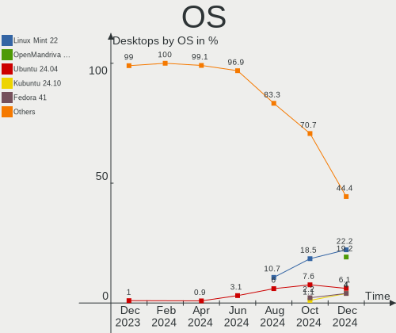
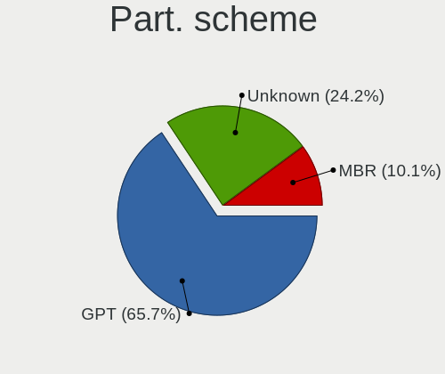
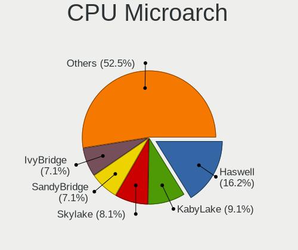
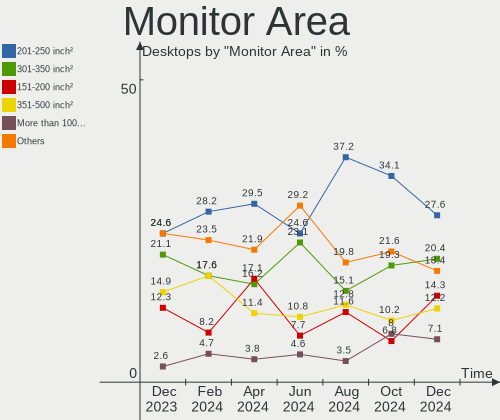
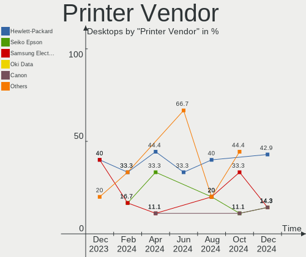
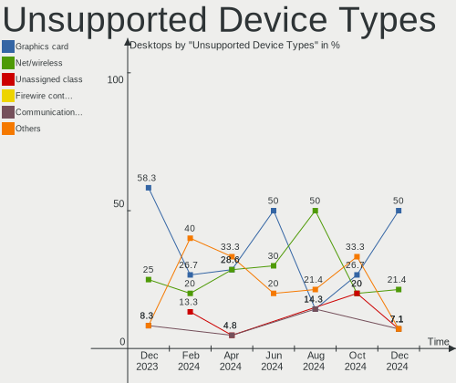

Linux in Italy - Hardware Trends (Desktops)
-------------------------------------------

A project to identify most popular hardware characteristics and track their change
over time based on data collected by Linux users at https://Linux-Hardware.org.

Anyone can contribute to this report by the [hw-probe](https://github.com/linuxhw/hw-probe) tool:

    sudo -E hw-probe -all -upload

Period: Sep, 2023.

Contents
--------

* [ System ](#system)
  - [ OS                       ](#os)
  - [ OS Family                ](#os-family)
  - [ Kernel                   ](#kernel)
  - [ Kernel Family            ](#kernel-family)
  - [ Kernel Major Ver.        ](#kernel-major-ver)
  - [ Arch                     ](#arch)
  - [ DE                       ](#de)
  - [ Display Server           ](#display-server)
  - [ Display Manager          ](#display-manager)
  - [ OS Lang                  ](#os-lang)
  - [ Boot Mode                ](#boot-mode)
  - [ Filesystem               ](#filesystem)
  - [ Part. scheme             ](#part-scheme)
  - [ Dual Boot with Linux/BSD ](#dual-boot-with-linuxbsd)
  - [ Dual Boot (Win)          ](#dual-boot-win)

* [ Board ](#board)
  - [ Vendor                   ](#vendor)
  - [ Model                    ](#model)
  - [ Model Family             ](#model-family)
  - [ MFG Year                 ](#mfg-year)
  - [ Form Factor              ](#form-factor)
  - [ Secure Boot              ](#secure-boot)
  - [ Coreboot                 ](#coreboot)
  - [ RAM Size                 ](#ram-size)
  - [ RAM Used                 ](#ram-used)
  - [ Total Drives             ](#total-drives)
  - [ Has CD-ROM               ](#has-cd-rom)
  - [ Has Ethernet             ](#has-ethernet)
  - [ Has WiFi                 ](#has-wifi)
  - [ Has Bluetooth            ](#has-bluetooth)

* [ Location ](#location)
  - [ Country                  ](#country)
  - [ City                     ](#city)

* [ Drives ](#drives)
  - [ Drive Vendor             ](#drive-vendor)
  - [ Drive Model              ](#drive-model)
  - [ HDD Vendor               ](#hdd-vendor)
  - [ SSD Vendor               ](#ssd-vendor)
  - [ Drive Kind               ](#drive-kind)
  - [ Drive Connector          ](#drive-connector)
  - [ Drive Size               ](#drive-size)
  - [ Space Total              ](#space-total)
  - [ Space Used               ](#space-used)
  - [ Malfunc. Drives          ](#malfunc-drives)
  - [ Malfunc. Drive Vendor    ](#malfunc-drive-vendor)
  - [ Malfunc. HDD Vendor      ](#malfunc-hdd-vendor)
  - [ Malfunc. Drive Kind      ](#malfunc-drive-kind)
  - [ Failed Drives            ](#failed-drives)
  - [ Failed Drive Vendor      ](#failed-drive-vendor)
  - [ Drive Status             ](#drive-status)

* [ Storage controller ](#storage-controller)
  - [ Storage Vendor           ](#storage-vendor)
  - [ Storage Model            ](#storage-model)
  - [ Storage Kind             ](#storage-kind)

* [ Processor ](#processor)
  - [ CPU Vendor               ](#cpu-vendor)
  - [ CPU Model                ](#cpu-model)
  - [ CPU Model Family         ](#cpu-model-family)
  - [ CPU Cores                ](#cpu-cores)
  - [ CPU Sockets              ](#cpu-sockets)
  - [ CPU Threads              ](#cpu-threads)
  - [ CPU Op-Modes             ](#cpu-op-modes)
  - [ CPU Microcode            ](#cpu-microcode)
  - [ CPU Microarch            ](#cpu-microarch)

* [ Graphics ](#graphics)
  - [ GPU Vendor               ](#gpu-vendor)
  - [ GPU Model                ](#gpu-model)
  - [ GPU Combo                ](#gpu-combo)
  - [ GPU Driver               ](#gpu-driver)
  - [ GPU Memory               ](#gpu-memory)

* [ Monitor ](#monitor)
  - [ Monitor Vendor           ](#monitor-vendor)
  - [ Monitor Model            ](#monitor-model)
  - [ Monitor Resolution       ](#monitor-resolution)
  - [ Monitor Diagonal         ](#monitor-diagonal)
  - [ Monitor Width            ](#monitor-width)
  - [ Aspect Ratio             ](#aspect-ratio)
  - [ Monitor Area             ](#monitor-area)
  - [ Pixel Density            ](#pixel-density)
  - [ Multiple Monitors        ](#multiple-monitors)

* [ Network ](#network)
  - [ Net Controller Vendor    ](#net-controller-vendor)
  - [ Net Controller Model     ](#net-controller-model)
  - [ Wireless Vendor          ](#wireless-vendor)
  - [ Wireless Model           ](#wireless-model)
  - [ Ethernet Vendor          ](#ethernet-vendor)
  - [ Ethernet Model           ](#ethernet-model)
  - [ Net Controller Kind      ](#net-controller-kind)
  - [ Used Controller          ](#used-controller)
  - [ NICs                     ](#nics)
  - [ IPv6                     ](#ipv6)

* [ Bluetooth ](#bluetooth)
  - [ Bluetooth Vendor         ](#bluetooth-vendor)
  - [ Bluetooth Model          ](#bluetooth-model)

* [ Sound ](#sound)
  - [ Sound Vendor             ](#sound-vendor)
  - [ Sound Model              ](#sound-model)

* [ Memory ](#memory)
  - [ Memory Vendor            ](#memory-vendor)
  - [ Memory Model             ](#memory-model)
  - [ Memory Kind              ](#memory-kind)
  - [ Memory Form Factor       ](#memory-form-factor)
  - [ Memory Size              ](#memory-size)
  - [ Memory Speed             ](#memory-speed)

* [ Printers & scanners ](#printers--scanners)
  - [ Printer Vendor           ](#printer-vendor)
  - [ Printer Model            ](#printer-model)
  - [ Scanner Vendor           ](#scanner-vendor)
  - [ Scanner Model            ](#scanner-model)

* [ Camera ](#camera)
  - [ Camera Vendor            ](#camera-vendor)
  - [ Camera Model             ](#camera-model)

* [ Security ](#security)
  - [ Fingerprint Vendor       ](#fingerprint-vendor)
  - [ Fingerprint Model        ](#fingerprint-model)
  - [ Chipcard Vendor          ](#chipcard-vendor)
  - [ Chipcard Model           ](#chipcard-model)

* [ Unsupported ](#unsupported)
  - [ Unsupported Devices      ](#unsupported-devices)
  - [ Unsupported Device Types ](#unsupported-device-types)

System
------

OS
--

Installed operating systems

| Name                         | Desktops | Percent |
|------------------------------|----------|---------|
| Ubuntu 22.04                 | 11       | 12.36%  |
| OpenMandriva 23.08           | 9        | 10.11%  |
| Linux Mint 21.2              | 8        | 8.99%   |
| Fedora 38                    | 6        | 6.74%   |
| Zorin 16                     | 5        | 5.62%   |
| Ubuntu 23.04                 | 5        | 5.62%   |
| Ubuntu MATE 22.04            | 4        | 4.49%   |
| Debian 12                    | 4        | 4.49%   |
| Arch Rolling                 | 4        | 4.49%   |
| OpenMandriva 23.09           | 3        | 3.37%   |
| KDE neon 22.04               | 3        | 3.37%   |
| Ubuntu 22.10                 | 2        | 2.25%   |
| Linux Mint 20.3              | 2        | 2.25%   |
| Xubuntu 23.04                | 1        | 1.12%   |
| Xubuntu 22.04                | 1        | 1.12%   |
| Ubuntu MATE 20.04            | 1        | 1.12%   |
| Ubuntu 20.04                 | 1        | 1.12%   |
| ROSA 12.1                    | 1        | 1.12%   |
| Pop!_OS 22.04                | 1        | 1.12%   |
| openSUSE Tumbleweed-XXXXXXXX | 1        | 1.12%   |
| OpenMandriva 4.2             | 1        | 1.12%   |
| OpenMandriva 23.90           | 1        | 1.12%   |
| OpenMandriva 23.03           | 1        | 1.12%   |
| Manjaro                      | 1        | 1.12%   |
| LMDE 5                       | 1        | 1.12%   |
| Linux Mint 21.1              | 1        | 1.12%   |
| Linux Mint 21                | 1        | 1.12%   |
| Linux Mint 20.2              | 1        | 1.12%   |
| Kubuntu 23.04                | 1        | 1.12%   |
| Elementary 7                 | 1        | 1.12%   |
| Debian 11                    | 1        | 1.12%   |
| Debian                       | 1        | 1.12%   |
| Crystal Linux                | 1        | 1.12%   |
| blendOS                      | 1        | 1.12%   |
| BlackPanther 18.1            | 1        | 1.12%   |
| ArcoLinux Rolling            | 1        | 1.12%   |

OS Family
---------

OS without a version

| Name          | Desktops | Percent |
|---------------|----------|---------|
| Ubuntu        | 19       | 21.35%  |
| OpenMandriva  | 15       | 16.85%  |
| Linux Mint    | 13       | 14.61%  |
| Fedora        | 6        | 6.74%   |
| Debian        | 6        | 6.74%   |
| Zorin         | 5        | 5.62%   |
| Ubuntu MATE   | 5        | 5.62%   |
| Arch          | 4        | 4.49%   |
| KDE neon      | 3        | 3.37%   |
| Xubuntu       | 2        | 2.25%   |
| ROSA          | 1        | 1.12%   |
| Pop!_OS       | 1        | 1.12%   |
| openSUSE      | 1        | 1.12%   |
| Manjaro       | 1        | 1.12%   |
| LMDE          | 1        | 1.12%   |
| Kubuntu       | 1        | 1.12%   |
| Elementary    | 1        | 1.12%   |
| Crystal Linux | 1        | 1.12%   |
| blendOS       | 1        | 1.12%   |
| BlackPanther  | 1        | 1.12%   |
| ArcoLinux     | 1        | 1.12%   |

Kernel
------

Version of the Linux kernel

| Version                      | Desktops | Percent |
|------------------------------|----------|---------|
| 6.4.11-desktop-1omv2390      | 10       | 11.24%  |
| 6.2.0-32-generic             | 8        | 8.99%   |
| 6.2.0-33-generic             | 7        | 7.87%   |
| 5.15.0-83-generic            | 6        | 6.74%   |
| 5.15.0-84-generic            | 5        | 5.62%   |
| 5.15.0-82-generic            | 5        | 5.62%   |
| 6.4.15-200.fc38.x86_64       | 3        | 3.37%   |
| 5.4.0-163-generic            | 3        | 3.37%   |
| 6.5.0-desktop-1omv2390       | 2        | 2.25%   |
| 6.4.12-arch1-1               | 2        | 2.25%   |
| 6.2.0-26-generic             | 2        | 2.25%   |
| 6.1.0-10-amd64               | 2        | 2.25%   |
| 6.6.0-rc1-273-tkg-eevdf-llvm | 1        | 1.12%   |
| 6.5.4-arch2-1                | 1        | 1.12%   |
| 6.5.3-zen1-1-zen             | 1        | 1.12%   |
| 6.5.3-desktop-1omv2390       | 1        | 1.12%   |
| 6.5.3-arch1-1                | 1        | 1.12%   |
| 6.5.3-060503-generic         | 1        | 1.12%   |
| 6.5.1-060501-generic         | 1        | 1.12%   |
| 6.5.1                        | 1        | 1.12%   |
| 6.5.0-060500-generic         | 1        | 1.12%   |
| 6.4.6-76060406-generic       | 1        | 1.12%   |
| 6.4.14-200.fc38.x86_64       | 1        | 1.12%   |
| 6.4.12-200.fc38.x86_64       | 1        | 1.12%   |
| 6.4.11-1-default             | 1        | 1.12%   |
| 6.4.0-4-amd64                | 1        | 1.12%   |
| 6.3.9-zen1-1-zen             | 1        | 1.12%   |
| 6.2.6-desktop-1omv2390       | 1        | 1.12%   |
| 6.2.16-8-pve                 | 1        | 1.12%   |
| 6.2.14-300.fc38.x86_64       | 1        | 1.12%   |
| 6.2.0-20-generic             | 1        | 1.12%   |
| 6.1.49-1-MANJARO             | 1        | 1.12%   |
| 6.1.0-11-amd64               | 1        | 1.12%   |
| 5.4.0-58-generic             | 1        | 1.12%   |
| 5.19.0-46-generic            | 1        | 1.12%   |
| 5.19.0-21-generic            | 1        | 1.12%   |
| 5.15.116-1-pve               | 1        | 1.12%   |
| 5.15.0-79-generic            | 1        | 1.12%   |
| 5.15.0-78-generic            | 1        | 1.12%   |
| 5.15.0-76-generic            | 1        | 1.12%   |

Kernel Family
-------------

Linux kernel without a distro release

| Version  | Desktops | Percent |
|----------|----------|---------|
| 5.15.0   | 21       | 23.6%   |
| 6.2.0    | 18       | 20.22%  |
| 6.4.11   | 11       | 12.36%  |
| 6.5.3    | 4        | 4.49%   |
| 5.4.0    | 4        | 4.49%   |
| 6.5.0    | 3        | 3.37%   |
| 6.4.15   | 3        | 3.37%   |
| 6.4.12   | 3        | 3.37%   |
| 6.1.0    | 3        | 3.37%   |
| 6.5.1    | 2        | 2.25%   |
| 5.19.0   | 2        | 2.25%   |
| 6.6.0    | 1        | 1.12%   |
| 6.5.4    | 1        | 1.12%   |
| 6.4.6    | 1        | 1.12%   |
| 6.4.14   | 1        | 1.12%   |
| 6.4.0    | 1        | 1.12%   |
| 6.3.9    | 1        | 1.12%   |
| 6.2.6    | 1        | 1.12%   |
| 6.2.16   | 1        | 1.12%   |
| 6.2.14   | 1        | 1.12%   |
| 6.1.49   | 1        | 1.12%   |
| 5.15.116 | 1        | 1.12%   |
| 5.10.74  | 1        | 1.12%   |
| 5.10.14  | 1        | 1.12%   |
| 5.10.0   | 1        | 1.12%   |
| 4.18.16  | 1        | 1.12%   |

Kernel Major Ver.
-----------------

Linux kernel major version

| Version | Desktops | Percent |
|---------|----------|---------|
| 5.15    | 22       | 24.72%  |
| 6.2     | 21       | 23.6%   |
| 6.4     | 20       | 22.47%  |
| 6.5     | 10       | 11.24%  |
| 6.1     | 4        | 4.49%   |
| 5.4     | 4        | 4.49%   |
| 5.10    | 3        | 3.37%   |
| 5.19    | 2        | 2.25%   |
| 6.6     | 1        | 1.12%   |
| 6.3     | 1        | 1.12%   |
| 4.18    | 1        | 1.12%   |

Arch
----

OS architecture (x86_64, i586, etc.)

| Name   | Desktops | Percent |
|--------|----------|---------|
| x86_64 | 89       | 100%    |

DE
--

Desktop Environment

| Name            | Desktops | Percent |
|-----------------|----------|---------|
| GNOME           | 33       | 37.08%  |
| KDE5            | 20       | 22.47%  |
| X-Cinnamon      | 14       | 15.73%  |
| MATE            | 7        | 7.87%   |
| Unknown         | 5        | 5.62%   |
| XFCE            | 2        | 2.25%   |
| LXQt            | 2        | 2.25%   |
| Pantheon        | 1        | 1.12%   |
| onyx:GNOME      | 1        | 1.12%   |
| i3              | 1        | 1.12%   |
| Hyprland        | 1        | 1.12%   |
| GNOME Flashback | 1        | 1.12%   |
| GNOME Classic   | 1        | 1.12%   |

Display Server
--------------

X11 or Wayland

| Name    | Desktops | Percent |
|---------|----------|---------|
| X11     | 51       | 57.3%   |
| Wayland | 31       | 34.83%  |
| Tty     | 7        | 7.87%   |

Display Manager
---------------

SDDM, LightDM, etc.

| Name    | Desktops | Percent |
|---------|----------|---------|
| Unknown | 30       | 33.71%  |
| SDDM    | 19       | 21.35%  |
| GDM3    | 19       | 21.35%  |
| LightDM | 15       | 16.85%  |
| GDM     | 5        | 5.62%   |
| GREETD  | 1        | 1.12%   |

OS Lang
-------

Language

| Lang       | Desktops | Percent |
|------------|----------|---------|
| it_IT      | 64       | 71.91%  |
| en_US      | 20       | 22.47%  |
| en_GB      | 2        | 2.25%   |
| Unknown    | 2        | 2.25%   |
| it_IT@euro | 1        | 1.12%   |

Boot Mode
---------

EFI or BIOS

| Mode | Desktops | Percent |
|------|----------|---------|
| BIOS | 46       | 51.69%  |
| EFI  | 43       | 48.31%  |

Filesystem
----------

Type of filesystem

| Type    | Desktops | Percent |
|---------|----------|---------|
| Ext4    | 50       | 56.18%  |
| Tmpfs   | 16       | 17.98%  |
| Overlay | 10       | 11.24%  |
| Btrfs   | 9        | 10.11%  |
| Xfs     | 3        | 3.37%   |
| Zfs     | 1        | 1.12%   |

Part. scheme
------------

Scheme of partitioning

| Type    | Desktops | Percent |
|---------|----------|---------|
| GPT     | 51       | 57.3%   |
| Unknown | 26       | 29.21%  |
| MBR     | 12       | 13.48%  |

Dual Boot with Linux/BSD
------------------------

Hosting more than one Linux/BSD

| Dual boot | Desktops | Percent |
|-----------|----------|---------|
| No        | 70       | 78.65%  |
| Yes       | 19       | 21.35%  |

Dual Boot (Win)
---------------

Hosting Linux and Windows

| Dual boot | Desktops | Percent |
|-----------|----------|---------|
| No        | 56       | 62.92%  |
| Yes       | 33       | 37.08%  |

Board
-----

Vendor
------

Motherboard manufacturer

| Name                                 | Desktops | Percent |
|--------------------------------------|----------|---------|
| ASUSTek Computer                     | 22       | 24.72%  |
| MSI                                  | 12       | 13.48%  |
| ASRock                               | 9        | 10.11%  |
| Hewlett-Packard                      | 8        | 8.99%   |
| Intel                                | 6        | 6.74%   |
| Gigabyte Technology                  | 6        | 6.74%   |
| Dell                                 | 6        | 6.74%   |
| Acer                                 | 5        | 5.62%   |
| Unknown                              | 3        | 3.37%   |
| Foxconn                              | 2        | 2.25%   |
| AZW                                  | 2        | 2.25%   |
| YANYU                                | 1        | 1.12%   |
| Shuttle                              | 1        | 1.12%   |
| Shenzhen Meigao Electronic Equipment | 1        | 1.12%   |
| Lenovo                               | 1        | 1.12%   |
| Huanan                               | 1        | 1.12%   |
| HC Technology.                       | 1        | 1.12%   |
| GEEKOM                               | 1        | 1.12%   |
| Cincoze                              | 1        | 1.12%   |

Model
-----

Motherboard model

| Name                                          | Desktops | Percent |
|-----------------------------------------------|----------|---------|
| ASUS All Series                               | 4        | 4.49%   |
| Dell OptiPlex 7010                            | 3        | 3.37%   |
| Unknown                                       | 3        | 3.37%   |
| MSI MS-7C76                                   | 2        | 2.25%   |
| AZW MINI S                                    | 2        | 2.25%   |
| YANYU H17SL                                   | 1        | 1.12%   |
| Shuttle XS36V                                 | 1        | 1.12%   |
| Shenzhen Meigao Electronic Equipment UM560 XT | 1        | 1.12%   |
| MSI NQ890AA-ABZ CQ5011IT                      | 1        | 1.12%   |
| MSI MS-7D06                                   | 1        | 1.12%   |
| MSI MS-7C56                                   | 1        | 1.12%   |
| MSI MS-7C52                                   | 1        | 1.12%   |
| MSI MS-7C02                                   | 1        | 1.12%   |
| MSI MS-7B87                                   | 1        | 1.12%   |
| MSI MS-7B86                                   | 1        | 1.12%   |
| MSI MS-7B33                                   | 1        | 1.12%   |
| MSI MS-7721                                   | 1        | 1.12%   |
| MSI MS-7673                                   | 1        | 1.12%   |
| Lenovo ThinkCentre M910t 10MNS1Y900           | 1        | 1.12%   |
| Intel X79M-S                                  | 1        | 1.12%   |
| Intel X79                                     | 1        | 1.12%   |
| Intel H61                                     | 1        | 1.12%   |
| Intel DP67DE AAG10217-300                     | 1        | 1.12%   |
| Intel DH67CL AAG10212-210                     | 1        | 1.12%   |
| Intel DG41RQ AAE54511-203                     | 1        | 1.12%   |
| Huanan X99-F8                                 | 1        | 1.12%   |
| HP Victus by 15L Gaming Desktop TG02-0xxx     | 1        | 1.12%   |
| HP rp5800                                     | 1        | 1.12%   |
| HP rp 5800 Retail system                      | 1        | 1.12%   |
| HP ProDesk 600 G1 SFF                         | 1        | 1.12%   |
| HP EliteDesk 800 G1 DM                        | 1        | 1.12%   |
| HP Compaq dc7800p Small Form Factor           | 1        | 1.12%   |
| HP 2ADC                                       | 1        | 1.12%   |
| HP 290 G2 MT Business PC                      | 1        | 1.12%   |
| HC Technology. HCAR5000-MI                    | 1        | 1.12%   |
| Gigabyte Z390 AORUS PRO                       | 1        | 1.12%   |
| Gigabyte X570 I AORUS PRO WIFI                | 1        | 1.12%   |
| Gigabyte M5NM1AI-GB                           | 1        | 1.12%   |
| Gigabyte GA-78LMT-USB3 R2                     | 1        | 1.12%   |
| Gigabyte B450M DS3H                           | 1        | 1.12%   |

Model Family
------------

Motherboard model prefix

| Name                                       | Desktops | Percent |
|--------------------------------------------|----------|---------|
| Dell OptiPlex                              | 4        | 4.49%   |
| ASUS PRIME                                 | 4        | 4.49%   |
| ASUS All                                   | 4        | 4.49%   |
| Acer Veriton                               | 3        | 3.37%   |
| Unknown                                    | 3        | 3.37%   |
| MSI MS-7C76                                | 2        | 2.25%   |
| AZW MINI                                   | 2        | 2.25%   |
| ASUS ROG                                   | 2        | 2.25%   |
| YANYU H17SL                                | 1        | 1.12%   |
| Shuttle XS36V                              | 1        | 1.12%   |
| Shenzhen Meigao Electronic Equipment UM560 | 1        | 1.12%   |
| MSI NQ890AA-ABZ                            | 1        | 1.12%   |
| MSI MS-7D06                                | 1        | 1.12%   |
| MSI MS-7C56                                | 1        | 1.12%   |
| MSI MS-7C52                                | 1        | 1.12%   |
| MSI MS-7C02                                | 1        | 1.12%   |
| MSI MS-7B87                                | 1        | 1.12%   |
| MSI MS-7B86                                | 1        | 1.12%   |
| MSI MS-7B33                                | 1        | 1.12%   |
| MSI MS-7721                                | 1        | 1.12%   |
| MSI MS-7673                                | 1        | 1.12%   |
| Lenovo ThinkCentre                         | 1        | 1.12%   |
| Intel X79M-S                               | 1        | 1.12%   |
| Intel X79                                  | 1        | 1.12%   |
| Intel H61                                  | 1        | 1.12%   |
| Intel DP67DE                               | 1        | 1.12%   |
| Intel DH67CL                               | 1        | 1.12%   |
| Intel DG41RQ                               | 1        | 1.12%   |
| Huanan X99-F8                              | 1        | 1.12%   |
| HP Victus                                  | 1        | 1.12%   |
| HP rp5800                                  | 1        | 1.12%   |
| HP rp                                      | 1        | 1.12%   |
| HP ProDesk                                 | 1        | 1.12%   |
| HP EliteDesk                               | 1        | 1.12%   |
| HP Compaq                                  | 1        | 1.12%   |
| HP 2ADC                                    | 1        | 1.12%   |
| HP 290                                     | 1        | 1.12%   |
| HC Technology. HCAR5000-MI                 | 1        | 1.12%   |
| Gigabyte Z390                              | 1        | 1.12%   |
| Gigabyte X570                              | 1        | 1.12%   |

MFG Year
--------

Motherboard manufacture year

| Year | Desktops | Percent |
|------|----------|---------|
| 2011 | 10       | 11.24%  |
| 2018 | 9        | 10.11%  |
| 2013 | 9        | 10.11%  |
| 2012 | 8        | 8.99%   |
| 2023 | 7        | 7.87%   |
| 2019 | 7        | 7.87%   |
| 2020 | 6        | 6.74%   |
| 2017 | 6        | 6.74%   |
| 2022 | 5        | 5.62%   |
| 2008 | 5        | 5.62%   |
| 2014 | 4        | 4.49%   |
| 2016 | 3        | 3.37%   |
| 2009 | 3        | 3.37%   |
| 2021 | 2        | 2.25%   |
| 2015 | 2        | 2.25%   |
| 2010 | 1        | 1.12%   |
| 2007 | 1        | 1.12%   |
| 2006 | 1        | 1.12%   |

Form Factor
-----------

Physical design of the computer

| Name    | Desktops | Percent |
|---------|----------|---------|
| Desktop | 89       | 100%    |

Secure Boot
-----------

Enabled or disabled

| State    | Desktops | Percent |
|----------|----------|---------|
| Disabled | 85       | 95.51%  |
| Enabled  | 4        | 4.49%   |

Coreboot
--------

Have coreboot on board

| Used | Desktops | Percent |
|------|----------|---------|
| No   | 89       | 100%    |

RAM Size
--------

Total RAM memory

| Size in GB  | Desktops | Percent |
|-------------|----------|---------|
| 16.01-24.0  | 25       | 28.09%  |
| 8.01-16.0   | 16       | 17.98%  |
| 4.01-8.0    | 14       | 15.73%  |
| 3.01-4.0    | 13       | 14.61%  |
| 32.01-64.0  | 12       | 13.48%  |
| 64.01-256.0 | 5        | 5.62%   |
| 24.01-32.0  | 2        | 2.25%   |
| 1.01-2.0    | 1        | 1.12%   |
| 0.51-1.0    | 1        | 1.12%   |

RAM Used
--------

Used RAM memory

| Used GB   | Desktops | Percent |
|-----------|----------|---------|
| 1.01-2.0  | 36       | 40.45%  |
| 2.01-3.0  | 27       | 30.34%  |
| 4.01-8.0  | 10       | 11.24%  |
| 3.01-4.0  | 8        | 8.99%   |
| 0.51-1.0  | 6        | 6.74%   |
| 8.01-16.0 | 2        | 2.25%   |

Total Drives
------------

Number of drives on board

| Drives | Desktops | Percent |
|--------|----------|---------|
| 1      | 33       | 37.08%  |
| 3      | 19       | 21.35%  |
| 2      | 18       | 20.22%  |
| 4      | 10       | 11.24%  |
| 6      | 4        | 4.49%   |
| 5      | 4        | 4.49%   |
| 9      | 1        | 1.12%   |

Has CD-ROM
----------

Has CD-ROM on board

| Presented | Desktops | Percent |
|-----------|----------|---------|
| Yes       | 48       | 53.93%  |
| No        | 41       | 46.07%  |

Has Ethernet
------------

Has Ethernet on board

| Presented | Desktops | Percent |
|-----------|----------|---------|
| Yes       | 89       | 100%    |

Has WiFi
--------

Has WiFi module

| Presented | Desktops | Percent |
|-----------|----------|---------|
| Yes       | 52       | 58.43%  |
| No        | 37       | 41.57%  |

Has Bluetooth
-------------

Has Bluetooth module

| Presented | Desktops | Percent |
|-----------|----------|---------|
| No        | 51       | 57.3%   |
| Yes       | 38       | 42.7%   |

Location
--------

Country
-------

Geographic location (country)

| Country | Desktops | Percent |
|---------|----------|---------|
| Italy   | 89       | 100%    |

City
----

Geographic location (city)

| City                  | Desktops | Percent |
|-----------------------|----------|---------|
| Rome                  | 8        | 8.99%   |
| Milan                 | 8        | 8.99%   |
| Turin                 | 5        | 5.62%   |
| Bologna               | 4        | 4.49%   |
| Milano                | 3        | 3.37%   |
| Riva                  | 2        | 2.25%   |
| Rho                   | 2        | 2.25%   |
| Naples                | 2        | 2.25%   |
| Forlì                | 2        | 2.25%   |
| Zogno                 | 1        | 1.12%   |
| Zero Branco           | 1        | 1.12%   |
| Villa d'Adda          | 1        | 1.12%   |
| Viareggio             | 1        | 1.12%   |
| Verona                | 1        | 1.12%   |
| Venice                | 1        | 1.12%   |
| Turbigo               | 1        | 1.12%   |
| Treviglio             | 1        | 1.12%   |
| Spello                | 1        | 1.12%   |
| Senago                | 1        | 1.12%   |
| Sassari               | 1        | 1.12%   |
| Salerno               | 1        | 1.12%   |
| Rubiera               | 1        | 1.12%   |
| Rozzano               | 1        | 1.12%   |
| Robbiate              | 1        | 1.12%   |
| Pozzuolo del Friuli   | 1        | 1.12%   |
| Porto Mantovano       | 1        | 1.12%   |
| Pordenone             | 1        | 1.12%   |
| Ponte San Pietro      | 1        | 1.12%   |
| Pisa                  | 1        | 1.12%   |
| Pavia                 | 1        | 1.12%   |
| Pantano               | 1        | 1.12%   |
| Oulx                  | 1        | 1.12%   |
| Nola                  | 1        | 1.12%   |
| Moncalieri            | 1        | 1.12%   |
| Misano di Gera d'Adda | 1        | 1.12%   |
| Marcon                | 1        | 1.12%   |
| Marcaria              | 1        | 1.12%   |
| Livorno               | 1        | 1.12%   |
| Legnaro               | 1        | 1.12%   |
| Lecce                 | 1        | 1.12%   |

Drives
------

Drive Vendor
------------

Hard drive vendors

| Vendor                       | Desktops | Drives | Percent |
|------------------------------|----------|--------|---------|
| Seagate                      | 29       | 40     | 16.2%   |
| WDC                          | 24       | 35     | 13.41%  |
| Samsung Electronics          | 22       | 25     | 12.29%  |
| Kingston                     | 18       | 19     | 10.06%  |
| Crucial                      | 10       | 10     | 5.59%   |
| SanDisk                      | 8        | 10     | 4.47%   |
| Toshiba                      | 7        | 8      | 3.91%   |
| Hitachi                      | 7        | 8      | 3.91%   |
| Phison Electronics           | 5        | 8      | 2.79%   |
| Micron Technology            | 5        | 5      | 2.79%   |
| Phison                       | 4        | 6      | 2.23%   |
| HGST                         | 3        | 3      | 1.68%   |
| China                        | 3        | 3      | 1.68%   |
| Unknown                      | 2        | 4      | 1.12%   |
| SPCC                         | 2        | 2      | 1.12%   |
| Shenzhen Longsys Electronics | 2        | 2      | 1.12%   |
| PNY                          | 2        | 2      | 1.12%   |
| KingDian                     | 2        | 2      | 1.12%   |
| JMicron Technology           | 2        | 2      | 1.12%   |
| Fanxiang                     | 2        | 2      | 1.12%   |
| Vaseky                       | 1        | 1      | 0.56%   |
| Transcend                    | 1        | 1      | 0.56%   |
| SK hynix                     | 1        | 1      | 0.56%   |
| Silicon Motion               | 1        | 1      | 0.56%   |
| SABRENT                      | 1        | 1      | 0.56%   |
| Realtek Semiconductor        | 1        | 1      | 0.56%   |
| Patriot                      | 1        | 1      | 0.56%   |
| MAXIO Technology (Hangzhou)  | 1        | 1      | 0.56%   |
| Lexar                        | 1        | 1      | 0.56%   |
| Kingston Technology Company  | 1        | 1      | 0.56%   |
| Intenso                      | 1        | 1      | 0.56%   |
| Intel                        | 1        | 1      | 0.56%   |
| Hikvision                    | 1        | 1      | 0.56%   |
| Emtec                        | 1        | 1      | 0.56%   |
| Drevo                        | 1        | 1      | 0.56%   |
| BIWIN                        | 1        | 1      | 0.56%   |
| ASMT                         | 1        | 1      | 0.56%   |
| Advantech                    | 1        | 2      | 0.56%   |
| ADATA Technology             | 1        | 1      | 0.56%   |
| Unknown                      | 1        | 1      | 0.56%   |

Drive Model
-----------

Hard drive models

| Model                                               | Desktops | Percent |
|-----------------------------------------------------|----------|---------|
| Seagate ST500DM002-1BD142 500GB                     | 4        | 1.98%   |
| Seagate ST2000DM008-2FR102 2TB                      | 4        | 1.98%   |
| Kingston SA400S37240G 240GB SSD                     | 4        | 1.98%   |
| Kingston SA400S37120G 120GB SSD                     | 4        | 1.98%   |
| WDC WD5003AZEX-00K3CA0 500GB                        | 3        | 1.49%   |
| Toshiba DT01ACA100 1TB                              | 3        | 1.49%   |
| Phison E12 NVMe Controller 2TB                      | 3        | 1.49%   |
| Micron CT500P5SSD8 500GB                            | 3        | 1.49%   |
| Kingston SA400S37480G 480GB SSD                     | 3        | 1.49%   |
| WDC WD4004FZWX-00GBGB0 4TB                          | 2        | 0.99%   |
| WDC WD3200BEKT-60V5T1 320GB                         | 2        | 0.99%   |
| SPCC Solid State Disk 512GB                         | 2        | 0.99%   |
| Seagate ST3160812AS 160GB                           | 2        | 0.99%   |
| Seagate ST31000528AS 1TB                            | 2        | 0.99%   |
| Seagate ST31000524AS 1TB                            | 2        | 0.99%   |
| Seagate ST1000LM024 HN-M101MBB 1TB                  | 2        | 0.99%   |
| SanDisk SDSSDP128G 128GB                            | 2        | 0.99%   |
| SanDisk SDSSDH3 1T00 1TB                            | 2        | 0.99%   |
| Samsung SSD 870 EVO 500GB                           | 2        | 0.99%   |
| Samsung SSD 840 Series 250GB                        | 2        | 0.99%   |
| Samsung NVMe SSD Controller SM981/PM981/PM983 256GB | 2        | 0.99%   |
| Phison Sabrent Rocket 4.0 Plus 4TB                  | 2        | 0.99%   |
| Kingston SV300S37A120G 120GB SSD                    | 2        | 0.99%   |
| JMicron Generic 240GB                               | 2        | 0.99%   |
| Crucial CT480BX500SSD1 480GB                        | 2        | 0.99%   |
| WDC WDS240G2G0A-00JH30 240GB SSD                    | 1        | 0.5%    |
| WDC WDS240G1G0B-00RC30 240GB SSD                    | 1        | 0.5%    |
| WDC WD800JD-60LUA0 80GB                             | 1        | 0.5%    |
| WDC WD7500AADS-00M2B0 752GB                         | 1        | 0.5%    |
| WDC WD60EFRX-68L0BN1 6TB                            | 1        | 0.5%    |
| WDC WD5000AAKX-001CA0 500GB                         | 1        | 0.5%    |
| WDC WD5000AAKS-60Z1A0 500GB                         | 1        | 0.5%    |
| WDC WD5000AAKS-00UU3A0 500GB                        | 1        | 0.5%    |
| WDC WD5000AADS-00S9B0 500GB                         | 1        | 0.5%    |
| WDC WD40EFRX-68WT0N0 4TB                            | 1        | 0.5%    |
| WDC WD4005FZBX-00K5WB0 4TB                          | 1        | 0.5%    |
| WDC WD4003FZEX-00Z4SA0 4TB                          | 1        | 0.5%    |
| WDC WD2500AAJS-75M0A0 250GB                         | 1        | 0.5%    |
| WDC WD20PURZ-85AKKY0 2TB                            | 1        | 0.5%    |
| WDC WD20EZRZ-00Z5HB0 2TB                            | 1        | 0.5%    |

HDD Vendor
----------

Hard disk drive vendors

| Vendor              | Desktops | Drives | Percent |
|---------------------|----------|--------|---------|
| Seagate             | 29       | 40     | 40.85%  |
| WDC                 | 21       | 32     | 29.58%  |
| Hitachi             | 7        | 8      | 9.86%   |
| Toshiba             | 6        | 6      | 8.45%   |
| Samsung Electronics | 5        | 6      | 7.04%   |
| HGST                | 3        | 3      | 4.23%   |

SSD Vendor
----------

Solid state drive vendors

| Vendor              | Desktops | Drives | Percent |
|---------------------|----------|--------|---------|
| Kingston            | 16       | 17     | 22.86%  |
| Samsung Electronics | 10       | 11     | 14.29%  |
| Crucial             | 9        | 9      | 12.86%  |
| SanDisk             | 6        | 7      | 8.57%   |
| WDC                 | 3        | 3      | 4.29%   |
| China               | 3        | 3      | 4.29%   |
| Toshiba             | 2        | 2      | 2.86%   |
| SPCC                | 2        | 2      | 2.86%   |
| PNY                 | 2        | 2      | 2.86%   |
| Micron Technology   | 2        | 2      | 2.86%   |
| KingDian            | 2        | 2      | 2.86%   |
| JMicron Technology  | 2        | 2      | 2.86%   |
| Vaseky              | 1        | 1      | 1.43%   |
| Transcend           | 1        | 1      | 1.43%   |
| SK hynix            | 1        | 1      | 1.43%   |
| SABRENT             | 1        | 1      | 1.43%   |
| Patriot             | 1        | 1      | 1.43%   |
| Lexar               | 1        | 1      | 1.43%   |
| Intenso             | 1        | 1      | 1.43%   |
| Fanxiang            | 1        | 1      | 1.43%   |
| Drevo               | 1        | 1      | 1.43%   |
| ASMT                | 1        | 1      | 1.43%   |
| Advantech           | 1        | 2      | 1.43%   |

Drive Kind
----------

HDD or SSD

| Kind    | Desktops | Drives | Percent |
|---------|----------|--------|---------|
| HDD     | 56       | 95     | 39.16%  |
| SSD     | 52       | 74     | 36.36%  |
| NVMe    | 32       | 43     | 22.38%  |
| Unknown | 3        | 5      | 2.1%    |

Drive Connector
---------------

SATA, SAS, NVMe, etc.

| Type | Desktops | Drives | Percent |
|------|----------|--------|---------|
| SATA | 77       | 163    | 65.25%  |
| NVMe | 32       | 42     | 27.12%  |
| SAS  | 9        | 12     | 7.63%   |

Drive Size
----------

Size of hard drive

| Size in TB | Desktops | Drives | Percent |
|------------|----------|--------|---------|
| 0.01-0.5   | 63       | 94     | 53.39%  |
| 0.51-1.0   | 35       | 44     | 29.66%  |
| 1.01-2.0   | 11       | 16     | 9.32%   |
| 3.01-4.0   | 6        | 12     | 5.08%   |
| 2.01-3.0   | 2        | 2      | 1.69%   |
| 4.01-10.0  | 1        | 1      | 0.85%   |

Space Total
-----------

Amount of disk space available on the file system

| Size in GB     | Desktops | Percent |
|----------------|----------|---------|
| 101-250        | 19       | 21.35%  |
| 501-1000       | 17       | 19.1%   |
| 251-500        | 12       | 13.48%  |
| 1001-2000      | 10       | 11.24%  |
| More than 3000 | 9        | 10.11%  |
| 51-100         | 7        | 7.87%   |
| 1-20           | 6        | 6.74%   |
| Unknown        | 4        | 4.49%   |
| 2001-3000      | 3        | 3.37%   |
| 21-50          | 2        | 2.25%   |

Space Used
----------

Amount of used disk space

| Used GB        | Desktops | Percent |
|----------------|----------|---------|
| 1-20           | 33       | 37.08%  |
| 21-50          | 15       | 16.85%  |
| 501-1000       | 10       | 11.24%  |
| 101-250        | 8        | 8.99%   |
| 51-100         | 6        | 6.74%   |
| 251-500        | 4        | 4.49%   |
| 1001-2000      | 4        | 4.49%   |
| Unknown        | 4        | 4.49%   |
| More than 3000 | 3        | 3.37%   |
| 2001-3000      | 2        | 2.25%   |

Malfunc. Drives
---------------

Drive models with a malfunction

| Model                                                           | Desktops | Drives | Percent |
|-----------------------------------------------------------------|----------|--------|---------|
| Seagate ST500DM002-1BD142 500GB                                 | 2        | 2      | 14.29%  |
| WDC WD40EFRX-68WT0N0 4TB                                        | 1        | 1      | 7.14%   |
| WDC WD2002FYPS-02W3B0 2TB                                       | 1        | 1      | 7.14%   |
| WDC WD10EZEX-60M2NA0 1TB                                        | 1        | 1      | 7.14%   |
| WDC WD Blue SA510 2.5 500GB                                     | 1        | 1      | 7.14%   |
| Samsung Electronics SSD 860 EVO mSATA 250GB                     | 1        | 1      | 7.14%   |
| Samsung Electronics SSD 840 Series 250GB                        | 1        | 1      | 7.14%   |
| Samsung Electronics NVMe SSD Controller SM961/PM961/SM963 500GB | 1        | 1      | 7.14%   |
| Micron Technology MTFDDAK128MAM-1J1 128GB SSD                   | 1        | 1      | 7.14%   |
| Hitachi HTS725032A9A364 320GB                                   | 1        | 1      | 7.14%   |
| HGST HTS541075A9E680 752GB                                      | 1        | 1      | 7.14%   |
| HGST HTS541050A9E680 500GB                                      | 1        | 1      | 7.14%   |
| HGST HTS541010A9E680 1TB                                        | 1        | 1      | 7.14%   |

Malfunc. Drive Vendor
---------------------

Vendors of faulty drives

| Vendor              | Desktops | Drives | Percent |
|---------------------|----------|--------|---------|
| WDC                 | 4        | 4      | 28.57%  |
| Samsung Electronics | 3        | 3      | 21.43%  |
| HGST                | 3        | 3      | 21.43%  |
| Seagate             | 2        | 2      | 14.29%  |
| Micron Technology   | 1        | 1      | 7.14%   |
| Hitachi             | 1        | 1      | 7.14%   |

Malfunc. HDD Vendor
-------------------

Vendors of faulty HDD drives

| Vendor  | Desktops | Drives | Percent |
|---------|----------|--------|---------|
| WDC     | 3        | 3      | 33.33%  |
| HGST    | 3        | 3      | 33.33%  |
| Seagate | 2        | 2      | 22.22%  |
| Hitachi | 1        | 1      | 11.11%  |

Malfunc. Drive Kind
-------------------

Kinds of faulty drives

| Kind | Desktops | Drives | Percent |
|------|----------|--------|---------|
| HDD  | 8        | 9      | 61.54%  |
| SSD  | 4        | 4      | 30.77%  |
| NVMe | 1        | 1      | 7.69%   |

Failed Drives
-------------

Failed drive models

Zero info for selected period =(

Failed Drive Vendor
-------------------

Failed drive vendors

Zero info for selected period =(

Drive Status
------------

Number of failed and malfunc. drives

| Status   | Desktops | Drives | Percent |
|----------|----------|--------|---------|
| Detected | 47       | 113    | 46.53%  |
| Works    | 41       | 90     | 40.59%  |
| Malfunc  | 13       | 14     | 12.87%  |

Storage controller
------------------

Storage Vendor
--------------

Storage controller vendors

| Vendor                       | Desktops | Percent |
|------------------------------|----------|---------|
| Intel                        | 69       | 51.49%  |
| AMD                          | 19       | 14.18%  |
| Samsung Electronics          | 8        | 5.97%   |
| Phison Electronics           | 8        | 5.97%   |
| SanDisk                      | 3        | 2.24%   |
| Micron Technology            | 3        | 2.24%   |
| MAXIO Technology (Hangzhou)  | 3        | 2.24%   |
| Marvell Technology Group     | 3        | 2.24%   |
| Kingston Technology Company  | 3        | 2.24%   |
| ASMedia Technology           | 3        | 2.24%   |
| Shenzhen Longsys Electronics | 2        | 1.49%   |
| JMicron Technology           | 2        | 1.49%   |
| VIA Technologies             | 1        | 0.75%   |
| Silicon Motion               | 1        | 0.75%   |
| Silicon Image                | 1        | 0.75%   |
| Realtek Semiconductor        | 1        | 0.75%   |
| Micron/Crucial Technology    | 1        | 0.75%   |
| HighPoint Technologies       | 1        | 0.75%   |
| Biwin Storage Technology     | 1        | 0.75%   |
| ADATA Technology             | 1        | 0.75%   |

Storage Model
-------------

Storage controller models

| Model                                                                                   | Desktops | Percent |
|-----------------------------------------------------------------------------------------|----------|---------|
| AMD FCH SATA Controller [AHCI mode]                                                     | 12       | 7.41%   |
| Intel 6 Series/C200 Series Chipset Family 6 port Desktop SATA AHCI Controller           | 8        | 4.94%   |
| Intel 8 Series/C220 Series Chipset Family 6-port SATA Controller 1 [AHCI mode]          | 7        | 4.32%   |
| AMD 400 Series Chipset SATA Controller                                                  | 7        | 4.32%   |
| Intel 7 Series/C210 Series Chipset Family 6-port SATA Controller [AHCI mode]            | 6        | 3.7%    |
| Phison E12 NVMe Controller                                                              | 5        | 3.09%   |
| Intel NM10/ICH7 Family SATA Controller [IDE mode]                                       | 5        | 3.09%   |
| Intel Cannon Lake PCH SATA AHCI Controller                                              | 5        | 3.09%   |
| Intel 6 Series/C200 Series Chipset Family Desktop SATA Controller (IDE mode, ports 4-5) | 5        | 3.09%   |
| Intel 6 Series/C200 Series Chipset Family Desktop SATA Controller (IDE mode, ports 0-3) | 5        | 3.09%   |
| Intel SATA Controller [RAID mode]                                                       | 4        | 2.47%   |
| Intel Q170/Q150/B150/H170/H110/Z170/CM236 Chipset SATA Controller [AHCI Mode]           | 4        | 2.47%   |
| Samsung NVMe SSD Controller SM981/PM981/PM983                                           | 3        | 1.85%   |
| Micron 2300 NVMe SSD [Santana]                                                          | 3        | 1.85%   |
| Intel Comet Lake SATA AHCI Controller                                                   | 3        | 1.85%   |
| Intel 9 Series Chipset Family SATA Controller [AHCI Mode]                               | 3        | 1.85%   |
| Intel 200 Series PCH SATA controller [AHCI mode]                                        | 3        | 1.85%   |
| Samsung NVMe SSD Controller SM961/PM961/SM963                                           | 2        | 1.23%   |
| Phison E18 PCIe4 NVMe Controller                                                        | 2        | 1.23%   |
| MAXIO (Hangzhou) NVMe SSD Controller MAP1202                                            | 2        | 1.23%   |
| Kingston Company A2000 NVMe SSD                                                         | 2        | 1.23%   |
| Intel SATA controller                                                                   | 2        | 1.23%   |
| Intel Alder Lake-P SATA AHCI Controller                                                 | 2        | 1.23%   |
| Intel 82801I (ICH9 Family) 2 port SATA Controller [IDE mode]                            | 2        | 1.23%   |
| Intel 82801G (ICH7 Family) IDE Controller                                               | 2        | 1.23%   |
| Intel 700 Series Chipset Family SATA AHCI Controller                                    | 2        | 1.23%   |
| ASMedia ASM1062 Serial ATA Controller                                                   | 2        | 1.23%   |
| AMD SB7x0/SB8x0/SB9x0 SATA Controller [IDE mode]                                        | 2        | 1.23%   |
| AMD SB7x0/SB8x0/SB9x0 IDE Controller                                                    | 2        | 1.23%   |
| VIA VT82C586A/B/VT82C686/A/B/VT823x/A/C PIPC Bus Master IDE                             | 1        | 0.62%   |
| VIA VT8237A SATA 2-Port Controller                                                      | 1        | 0.62%   |
| Silicon Motion SM2263EN/SM2263XT (DRAM-less) NVMe SSD Controllers                       | 1        | 0.62%   |
| Silicon Image SiI 3512 [SATALink/SATARaid] Serial ATA Controller                        | 1        | 0.62%   |
| Shenzhen Longsys Non-Volatile memory controller                                         | 1        | 0.62%   |
| Shenzhen Longsys Lexar NM620 NVME SSD (DRAM-less)                                       | 1        | 0.62%   |
| Sandisk Western Digital WD Black SN850X NVMe SSD                                        | 1        | 0.62%   |
| SanDisk WD Blue SN550 NVMe SSD                                                          | 1        | 0.62%   |
| SanDisk WD Blue SN500 / PC SN520 NVMe SSD                                               | 1        | 0.62%   |
| Samsung NVMe SSD Controller S4LV008[Pascal]                                             | 1        | 0.62%   |
| Samsung NVMe SSD Controller PM9A1/PM9A3/980PRO                                          | 1        | 0.62%   |

Storage Kind
------------

Kind of storage controller (IDE, SATA, NVMe, SAS, ...)

| Kind | Desktops | Percent |
|------|----------|---------|
| SATA | 71       | 54.2%   |
| NVMe | 32       | 24.43%  |
| IDE  | 19       | 14.5%   |
| RAID | 8        | 6.11%   |
| SAS  | 1        | 0.76%   |

Processor
---------

CPU Vendor
----------

Processor vendors

| Vendor | Desktops | Percent |
|--------|----------|---------|
| Intel  | 70       | 78.65%  |
| AMD    | 19       | 21.35%  |

CPU Model
---------

Processor models

| Model                                  | Desktops | Percent |
|----------------------------------------|----------|---------|
| Intel Core i5-3470 CPU @ 3.20GHz       | 4        | 4.49%   |
| Intel Core i7-2600 CPU @ 3.40GHz       | 3        | 3.37%   |
| Intel Core 2 Duo CPU E8400 @ 3.00GHz   | 3        | 3.37%   |
| Intel N100                             | 2        | 2.25%   |
| Intel Core i7-4790K CPU @ 4.00GHz      | 2        | 2.25%   |
| Intel Core i7-4770S CPU @ 3.10GHz      | 2        | 2.25%   |
| Intel Core i7-2600K CPU @ 3.40GHz      | 2        | 2.25%   |
| Intel Core i5-10600K CPU @ 4.10GHz     | 2        | 2.25%   |
| Intel Core i3-4130 CPU @ 3.40GHz       | 2        | 2.25%   |
| Intel Core 2 Duo CPU E7400 @ 2.80GHz   | 2        | 2.25%   |
| Intel Atom CPU D2550 @ 1.86GHz         | 2        | 2.25%   |
| AMD Ryzen 7 5700G with Radeon Graphics | 2        | 2.25%   |
| AMD Ryzen 5 3600 6-Core Processor      | 2        | 2.25%   |
| Intel Xeon CPU E5-2697 v2 @ 2.70GHz    | 1        | 1.12%   |
| Intel Xeon CPU E5-2678 v3 @ 2.50GHz    | 1        | 1.12%   |
| Intel Xeon CPU E5-2650 v2 @ 2.60GHz    | 1        | 1.12%   |
| Intel Xeon CPU E5-1620 0 @ 3.60GHz     | 1        | 1.12%   |
| Intel Pentium Gold G5400 CPU @ 3.70GHz | 1        | 1.12%   |
| Intel Pentium Dual CPU E2180 @ 2.00GHz | 1        | 1.12%   |
| Intel Pentium CPU G4400TE @ 2.40GHz    | 1        | 1.12%   |
| Intel Pentium 4 CPU 3.00GHz            | 1        | 1.12%   |
| Intel Core i7-9700K CPU @ 3.60GHz      | 1        | 1.12%   |
| Intel Core i7-9700E CPU @ 2.60GHz      | 1        | 1.12%   |
| Intel Core i7-8700T CPU @ 2.40GHz      | 1        | 1.12%   |
| Intel Core i7-8700 CPU @ 3.20GHz       | 1        | 1.12%   |
| Intel Core i7-6700 CPU @ 3.40GHz       | 1        | 1.12%   |
| Intel Core i7-4790 CPU @ 3.60GHz       | 1        | 1.12%   |
| Intel Core i7-3770S CPU @ 3.10GHz      | 1        | 1.12%   |
| Intel Core i7-3770K CPU @ 3.50GHz      | 1        | 1.12%   |
| Intel Core i7-10700 CPU @ 2.90GHz      | 1        | 1.12%   |
| Intel Core i5-9400F CPU @ 2.90GHz      | 1        | 1.12%   |
| Intel Core i5-8400 CPU @ 2.80GHz       | 1        | 1.12%   |
| Intel Core i5-7400 CPU @ 3.00GHz       | 1        | 1.12%   |
| Intel Core i5-6500 CPU @ 3.20GHz       | 1        | 1.12%   |
| Intel Core i5-4670 CPU @ 3.40GHz       | 1        | 1.12%   |
| Intel Core i5-4590T CPU @ 2.00GHz      | 1        | 1.12%   |
| Intel Core i5-3570K CPU @ 3.40GHz      | 1        | 1.12%   |
| Intel Core i5-3470S CPU @ 2.90GHz      | 1        | 1.12%   |
| Intel Core i5-3330 CPU @ 3.00GHz       | 1        | 1.12%   |
| Intel Core i5-2500 CPU @ 3.30GHz       | 1        | 1.12%   |

CPU Model Family
----------------

Processor model prefix

| Model              | Desktops | Percent |
|--------------------|----------|---------|
| Intel Core i5      | 19       | 21.35%  |
| Intel Core i7      | 18       | 20.22%  |
| AMD Ryzen 5        | 9        | 10.11%  |
| Other              | 8        | 8.99%   |
| Intel Core i3      | 6        | 6.74%   |
| Intel Core 2 Duo   | 6        | 6.74%   |
| Intel Xeon         | 4        | 4.49%   |
| Intel Core 2 Quad  | 3        | 3.37%   |
| AMD Ryzen 7        | 3        | 3.37%   |
| Intel Atom         | 2        | 2.25%   |
| AMD FX             | 2        | 2.25%   |
| Intel Pentium Gold | 1        | 1.12%   |
| Intel Pentium Dual | 1        | 1.12%   |
| Intel Pentium 4    | 1        | 1.12%   |
| Intel Pentium      | 1        | 1.12%   |
| AMD Ryzen 9        | 1        | 1.12%   |
| AMD Phenom II X4   | 1        | 1.12%   |
| AMD Athlon X4      | 1        | 1.12%   |
| AMD Athlon         | 1        | 1.12%   |
| AMD A8             | 1        | 1.12%   |

CPU Cores
---------

Number of processor cores

| Number | Desktops | Percent |
|--------|----------|---------|
| 4      | 40       | 44.94%  |
| 2      | 18       | 20.22%  |
| 6      | 16       | 17.98%  |
| 8      | 8        | 8.99%   |
| 24     | 2        | 2.25%   |
| 12     | 2        | 2.25%   |
| 16     | 1        | 1.12%   |
| 10     | 1        | 1.12%   |
| 1      | 1        | 1.12%   |

CPU Sockets
-----------

Number of sockets

| Number | Desktops | Percent |
|--------|----------|---------|
| 1      | 89       | 100%    |

CPU Threads
-----------

Threads per core (Hyper-Threading)

| Number | Desktops | Percent |
|--------|----------|---------|
| 2      | 55       | 61.8%   |
| 1      | 34       | 38.2%   |

CPU Op-Modes
------------

CPU Operation Modes (32-bit, 64-bit)

| Op mode        | Desktops | Percent |
|----------------|----------|---------|
| 32-bit, 64-bit | 89       | 100%    |

CPU Microcode
-------------

Microcode number

| Number     | Desktops | Percent |
|------------|----------|---------|
| Unknown    | 54       | 60.67%  |
| 0x0a50000d | 4        | 4.49%   |
| 0x506e3    | 3        | 3.37%   |
| 0x306c3    | 3        | 3.37%   |
| 0x1067a    | 3        | 3.37%   |
| 0x306e4    | 2        | 2.25%   |
| 0x306a9    | 2        | 2.25%   |
| 0x08701021 | 2        | 2.25%   |
| 0xa0671    | 1        | 1.12%   |
| 0x906ed    | 1        | 1.12%   |
| 0x906eb    | 1        | 1.12%   |
| 0x906ea    | 1        | 1.12%   |
| 0x906e9    | 1        | 1.12%   |
| 0x906a3    | 1        | 1.12%   |
| 0x206a7    | 1        | 1.12%   |
| 0x10676    | 1        | 1.12%   |
| 0x0a201025 | 1        | 1.12%   |
| 0x08600106 | 1        | 1.12%   |
| 0x08108109 | 1        | 1.12%   |
| 0x0800820d | 1        | 1.12%   |
| 0x08001129 | 1        | 1.12%   |
| 0x06001119 | 1        | 1.12%   |
| 0x06000852 | 1        | 1.12%   |
| 0x03000027 | 1        | 1.12%   |

CPU Microarch
-------------

Microarchitecture

| Name             | Desktops | Percent |
|------------------|----------|---------|
| IvyBridge        | 12       | 13.48%  |
| Haswell          | 11       | 12.36%  |
| KabyLake         | 10       | 11.24%  |
| SandyBridge      | 9        | 10.11%  |
| Penryn           | 9        | 10.11%  |
| Zen 3            | 6        | 6.74%   |
| Zen 2            | 4        | 4.49%   |
| CometLake        | 4        | 4.49%   |
| Zen+             | 3        | 3.37%   |
| Skylake          | 3        | 3.37%   |
| Piledriver       | 3        | 3.37%   |
| Alderlake Hybrid | 3        | 3.37%   |
| Unknown          | 3        | 3.37%   |
| Bonnell          | 2        | 2.25%   |
| Zen              | 1        | 1.12%   |
| NetBurst         | 1        | 1.12%   |
| K10 Llano        | 1        | 1.12%   |
| K10              | 1        | 1.12%   |
| Icelake          | 1        | 1.12%   |
| Gracemont        | 1        | 1.12%   |
| Core             | 1        | 1.12%   |

Graphics
--------

GPU Vendor
----------

Vendors of graphics cards

| Vendor | Desktops | Percent |
|--------|----------|---------|
| Intel  | 36       | 38.3%   |
| Nvidia | 30       | 31.91%  |
| AMD    | 28       | 29.79%  |

GPU Model
---------

Graphics card models

| Model                                                                       | Desktops | Percent |
|-----------------------------------------------------------------------------|----------|---------|
| Intel Xeon E3-1200 v2/3rd Gen Core processor Graphics Controller            | 7        | 7.22%   |
| Nvidia GK208B [GeForce GT 710]                                              | 5        | 5.15%   |
| AMD Ellesmere [Radeon RX 470/480/570/570X/580/580X/590]                     | 5        | 5.15%   |
| Nvidia GP107 [GeForce GTX 1050 Ti]                                          | 3        | 3.09%   |
| Nvidia GM107 [GeForce GTX 750 Ti]                                           | 3        | 3.09%   |
| Intel CometLake-S GT2 [UHD Graphics 630]                                    | 3        | 3.09%   |
| Intel CoffeeLake-S GT2 [UHD Graphics 630]                                   | 3        | 3.09%   |
| Intel 82G33/G31 Express Integrated Graphics Controller                      | 3        | 3.09%   |
| Intel 2nd Generation Core Processor Family Integrated Graphics Controller   | 3        | 3.09%   |
| AMD Cezanne [Radeon Vega Series / Radeon Vega Mobile Series]                | 3        | 3.09%   |
| AMD Cedar [Radeon HD 5000/6000/7350/8350 Series]                            | 3        | 3.09%   |
| Nvidia GP107 [GeForce GTX 1050]                                             | 2        | 2.06%   |
| Nvidia GP106 [GeForce GTX 1060 6GB]                                         | 2        | 2.06%   |
| Intel Xeon E3-1200 v3/4th Gen Core Processor Integrated Graphics Controller | 2        | 2.06%   |
| Intel Atom Processor D2xxx/N2xxx Integrated Graphics Controller             | 2        | 2.06%   |
| Intel Alder Lake-P GT1 [UHD Graphics]                                       | 2        | 2.06%   |
| Intel Alder Lake-N [UHD Graphics]                                           | 2        | 2.06%   |
| Intel 4 Series Chipset Integrated Graphics Controller                       | 2        | 2.06%   |
| AMD Picasso/Raven 2 [Radeon Vega Series / Radeon Vega Mobile Series]        | 2        | 2.06%   |
| AMD Caicos [Radeon HD 6450/7450/8450 / R5 230 OEM]                          | 2        | 2.06%   |
| Nvidia TU117 [GeForce GTX 1650]                                             | 1        | 1.03%   |
| Nvidia TU106 [GeForce RTX 2060 Rev. A]                                      | 1        | 1.03%   |
| Nvidia TU104 [GeForce RTX 2080 SUPER]                                       | 1        | 1.03%   |
| Nvidia TU104 [GeForce RTX 2060]                                             | 1        | 1.03%   |
| Nvidia GP102 [GeForce GTX 1080 Ti]                                          | 1        | 1.03%   |
| Nvidia GK208B [GeForce GT 730]                                              | 1        | 1.03%   |
| Nvidia GK107 [GeForce GTX 650]                                              | 1        | 1.03%   |
| Nvidia GK104 [GeForce GTX 770]                                              | 1        | 1.03%   |
| Nvidia GK104 [GeForce GTX 670]                                              | 1        | 1.03%   |
| Nvidia GF108 [GeForce GT 440]                                               | 1        | 1.03%   |
| Nvidia GF108 [GeForce GT 420]                                               | 1        | 1.03%   |
| Nvidia GA106 [Geforce RTX 3050]                                             | 1        | 1.03%   |
| Nvidia GA104 [GeForce RTX 3060 Ti Lite Hash Rate]                           | 1        | 1.03%   |
| Nvidia GA102 [GeForce RTX 3080 Ti]                                          | 1        | 1.03%   |
| Nvidia G96C [GeForce 9400 GT]                                               | 1        | 1.03%   |
| Intel Raptor Lake-S GT1 [UHD Graphics 770]                                  | 1        | 1.03%   |
| Intel HD Graphics 630                                                       | 1        | 1.03%   |
| Intel HD Graphics 530                                                       | 1        | 1.03%   |
| Intel HD Graphics 510                                                       | 1        | 1.03%   |
| Intel CoffeeLake-U GT3e [Iris Plus Graphics 655]                            | 1        | 1.03%   |

GPU Combo
---------

Combinations of graphics cards

| Name           | Desktops | Percent |
|----------------|----------|---------|
| 1 x Intel      | 32       | 35.96%  |
| 1 x Nvidia     | 27       | 30.34%  |
| 1 x AMD        | 25       | 28.09%  |
| 2 x AMD        | 2        | 2.25%   |
| Intel + Nvidia | 2        | 2.25%   |
| AMD + Nvidia   | 1        | 1.12%   |

GPU Driver
----------

Free vs proprietary

| Driver      | Desktops | Percent |
|-------------|----------|---------|
| Free        | 70       | 78.65%  |
| Proprietary | 15       | 16.85%  |
| Unknown     | 4        | 4.49%   |

GPU Memory
----------

Total video memory

| Size in GB | Desktops | Percent |
|------------|----------|---------|
| Unknown    | 55       | 61.8%   |
| 1.01-2.0   | 11       | 12.36%  |
| 0.51-1.0   | 6        | 6.74%   |
| 7.01-8.0   | 5        | 5.62%   |
| 5.01-6.0   | 4        | 4.49%   |
| 3.01-4.0   | 4        | 4.49%   |
| 8.01-16.0  | 2        | 2.25%   |
| 0.01-0.5   | 2        | 2.25%   |

Monitor
-------

Monitor Vendor
--------------

Monitor vendors

| Vendor               | Desktops | Percent |
|----------------------|----------|---------|
| Samsung Electronics  | 17       | 18.68%  |
| Goldstar             | 14       | 15.38%  |
| Hewlett-Packard      | 11       | 12.09%  |
| Ancor Communications | 7        | 7.69%   |
| Philips              | 4        | 4.4%    |
| BenQ                 | 4        | 4.4%    |
| Acer                 | 4        | 4.4%    |
| MSI                  | 3        | 3.3%    |
| NEC Computers        | 2        | 2.2%    |
| Lenovo               | 2        | 2.2%    |
| HKC                  | 2        | 2.2%    |
| GreenWood            | 2        | 2.2%    |
| Dell                 | 2        | 2.2%    |
| Unknown (XXX)        | 1        | 1.1%    |
| TCL                  | 1        | 1.1%    |
| Sony                 | 1        | 1.1%    |
| SGT                  | 1        | 1.1%    |
| Qushimei             | 1        | 1.1%    |
| QBell                | 1        | 1.1%    |
| OEM                  | 1        | 1.1%    |
| Mi                   | 1        | 1.1%    |
| Iiyama               | 1        | 1.1%    |
| HPN                  | 1        | 1.1%    |
| Hannspree            | 1        | 1.1%    |
| Fujitsu Siemens      | 1        | 1.1%    |
| Eizo                 | 1        | 1.1%    |
| CPT                  | 1        | 1.1%    |
| CHR                  | 1        | 1.1%    |
| ASUSTek Computer     | 1        | 1.1%    |
| Apple                | 1        | 1.1%    |

Monitor Model
-------------

Monitor models

| Model                                                                   | Desktops | Percent |
|-------------------------------------------------------------------------|----------|---------|
| Goldstar FULL HD GSM5B55 1920x1080 480x270mm 21.7-inch                  | 3        | 3.09%   |
| Samsung Electronics SyncMaster SAM010B 1280x1024 338x270mm 17.0-inch    | 2        | 2.06%   |
| Hewlett-Packard 27es HWP3326 1920x1080 598x336mm 27.0-inch              | 2        | 2.06%   |
| GreenWood ARZOPA GWD1580 1920x1080 350x200mm 15.9-inch                  | 2        | 2.06%   |
| Unknown (XXX) Union TV XXX2841 1920x1080 1209x680mm 54.6-inch           | 1        | 1.03%   |
| TCL SMART TV TCL6586 3840x2160 1209x680mm 54.6-inch                     | 1        | 1.03%   |
| Sony TV SNY3002 1920x1080 710x400mm 32.1-inch                           | 1        | 1.03%   |
| SGT HS133PC SGTB720 1920x1080 294x166mm 13.3-inch                       | 1        | 1.03%   |
| Samsung Electronics T23C350 SAM0ABC 1920x1080 510x287mm 23.0-inch       | 1        | 1.03%   |
| Samsung Electronics SyncMaster SAM0458 1360x768                         | 1        | 1.03%   |
| Samsung Electronics SyncMaster SAM01E1 1280x1024 380x300mm 19.1-inch    | 1        | 1.03%   |
| Samsung Electronics SyncMaster SAM01D3 1440x900 410x260mm 19.1-inch     | 1        | 1.03%   |
| Samsung Electronics SyncMaster SAM006A 1280x1024 338x270mm 17.0-inch    | 1        | 1.03%   |
| Samsung Electronics SMS22A450 SAM0836 1680x1050 470x300mm 22.0-inch     | 1        | 1.03%   |
| Samsung Electronics SMS22A450 SAM0835 1680x1050 470x300mm 22.0-inch     | 1        | 1.03%   |
| Samsung Electronics SMBX2440 SAM068A 1920x1080 531x299mm 24.0-inch      | 1        | 1.03%   |
| Samsung Electronics SA300/350/360 SAM07D6 1920x1080 531x299mm 24.0-inch | 1        | 1.03%   |
| Samsung Electronics S34J55x SAM0F72 3440x1440 797x333mm 34.0-inch       | 1        | 1.03%   |
| Samsung Electronics S24F350 SAM0D20 1920x1080 521x293mm 23.5-inch       | 1        | 1.03%   |
| Samsung Electronics S24D330 SAM0D92 1920x1080 531x299mm 24.0-inch       | 1        | 1.03%   |
| Samsung Electronics S22E200 SAM0C6D 1920x1080 477x268mm 21.5-inch       | 1        | 1.03%   |
| Samsung Electronics LF24T35 SAM707D 1920x1080 528x297mm 23.9-inch       | 1        | 1.03%   |
| Samsung Electronics LCD Monitor SMBX2440                                | 1        | 1.03%   |
| Samsung Electronics LCD Monitor SAM0FEE 3840x2160 1872x1053mm 84.6-inch | 1        | 1.03%   |
| Samsung Electronics LCD Monitor SAM0297 1360x768 885x498mm 40.0-inch    | 1        | 1.03%   |
| Samsung Electronics C24F390 SAM0D2C 1920x1080 521x293mm 23.5-inch       | 1        | 1.03%   |
| Qushimei QUSHIMEI190 QSM1900 1440x900 341x256mm 16.8-inch               | 1        | 1.03%   |
| QBell QBL.19NB QBL8004 1280x1024 380x300mm 19.1-inch                    | 1        | 1.03%   |
| Philips PHL 273V7 PHLC156 1920x1080 600x340mm 27.2-inch                 | 1        | 1.03%   |
| Philips PHL 223V5 PHLC0CF 1920x1080 477x268mm 21.5-inch                 | 1        | 1.03%   |
| Philips 22PFL3404D PHLD05D 1360x768 640x360mm 28.9-inch                 | 1        | 1.03%   |
| Philips 196VL PHLC07F 1366x768 409x230mm 18.5-inch                      | 1        | 1.03%   |
| OEM 22_LCD_TV OEM3700 1920x540                                          | 1        | 1.03%   |
| NEC Computers LCD195VXM+ NEC66C1 1280x1024 376x301mm 19.0-inch          | 1        | 1.03%   |
| NEC Computers EA193Mi NEC6957 1280x1024 375x300mm 18.9-inch             | 1        | 1.03%   |
| MSI MP242 MSI30A1 1920x1080 527x296mm 23.8-inch                         | 1        | 1.03%   |
| MSI MAG272CQR MSI3CA6 2560x1440 598x336mm 27.0-inch                     | 1        | 1.03%   |
| MSI MAG241C MSI3EA2 1920x1080 521x293mm 23.5-inch                       | 1        | 1.03%   |
| Mi 27 NFGL XMIB004 1920x1080 598x336mm 27.0-inch                        | 1        | 1.03%   |
| Lenovo LEN S24e-10 LEN61CA 1920x1080 527x296mm 23.8-inch                | 1        | 1.03%   |

Monitor Resolution
------------------

Monitor screen resolution

| Resolution         | Desktops | Percent |
|--------------------|----------|---------|
| 1920x1080 (FHD)    | 42       | 44.21%  |
| 1280x1024 (SXGA)   | 12       | 12.63%  |
| 2560x1440 (QHD)    | 8        | 8.42%   |
| 3840x2160 (4K)     | 7        | 7.37%   |
| 1920x1200 (WUXGA)  | 4        | 4.21%   |
| 1680x1050 (WSXGA+) | 4        | 4.21%   |
| 1440x900 (WXGA+)   | 4        | 4.21%   |
| 1366x768 (WXGA)    | 3        | 3.16%   |
| 3440x1440          | 2        | 2.11%   |
| 2560x1080          | 2        | 2.11%   |
| 1360x768           | 2        | 2.11%   |
| 4480x1440          | 1        | 1.05%   |
| 3840x1600          | 1        | 1.05%   |
| 2048x1152          | 1        | 1.05%   |
| 1920x540           | 1        | 1.05%   |
| Unknown            | 1        | 1.05%   |

Monitor Diagonal
----------------

Diagonal size in inches

| Inches  | Desktops | Percent |
|---------|----------|---------|
| 27      | 18       | 19.57%  |
| 24      | 13       | 14.13%  |
| 21      | 12       | 13.04%  |
| 23      | 8        | 8.7%    |
| 17      | 7        | 7.61%   |
| 34      | 5        | 5.43%   |
| 19      | 5        | 5.43%   |
| 22      | 3        | 3.26%   |
| 18      | 3        | 3.26%   |
| 15      | 3        | 3.26%   |
| Unknown | 3        | 3.26%   |
| 54      | 2        | 2.17%   |
| 25      | 2        | 2.17%   |
| 84      | 1        | 1.09%   |
| 52      | 1        | 1.09%   |
| 46      | 1        | 1.09%   |
| 40      | 1        | 1.09%   |
| 37      | 1        | 1.09%   |
| 28      | 1        | 1.09%   |
| 16      | 1        | 1.09%   |
| 13      | 1        | 1.09%   |

Monitor Width
-------------

Physical width

| Width in mm | Desktops | Percent |
|-------------|----------|---------|
| 501-600     | 37       | 40.66%  |
| 401-500     | 20       | 21.98%  |
| 301-350     | 11       | 12.09%  |
| 701-800     | 5        | 5.49%   |
| 351-400     | 5        | 5.49%   |
| 1001-1500   | 4        | 4.4%    |
| Unknown     | 3        | 3.3%    |
| 801-900     | 2        | 2.2%    |
| 601-700     | 2        | 2.2%    |
| 201-300     | 1        | 1.1%    |
| 1501-2000   | 1        | 1.1%    |

Aspect Ratio
------------

Proportional relationship between the width and the height

| Ratio   | Desktops | Percent |
|---------|----------|---------|
| 16/9    | 58       | 65.17%  |
| 5/4     | 12       | 13.48%  |
| 16/10   | 10       | 11.24%  |
| 21/9    | 6        | 6.74%   |
| Unknown | 2        | 2.25%   |
| 4/3     | 1        | 1.12%   |

Monitor Area
------------

Area in inch²

| Area in inch² | Desktops | Percent |
|----------------|----------|---------|
| 201-250        | 32       | 34.41%  |
| 301-350        | 18       | 19.35%  |
| 151-200        | 10       | 10.75%  |
| 141-150        | 8        | 8.6%    |
| 351-500        | 7        | 7.53%   |
| More than 1000 | 4        | 4.3%    |
| 251-300        | 4        | 4.3%    |
| 101-110        | 3        | 3.23%   |
| Unknown        | 3        | 3.23%   |
| 501-1000       | 2        | 2.15%   |
| 71-80          | 1        | 1.08%   |
| 131-140        | 1        | 1.08%   |

Pixel Density
-------------

Pixels per inch

| Density | Desktops | Percent |
|---------|----------|---------|
| 51-100  | 53       | 59.55%  |
| 101-120 | 25       | 28.09%  |
| 1-50    | 4        | 4.49%   |
| Unknown | 3        | 3.37%   |
| 161-240 | 2        | 2.25%   |
| 121-160 | 2        | 2.25%   |

Multiple Monitors
-----------------

Total monitors connected

| Total | Desktops | Percent |
|-------|----------|---------|
| 1     | 75       | 84.27%  |
| 2     | 10       | 11.24%  |
| 0     | 3        | 3.37%   |
| 3     | 1        | 1.12%   |

Network
-------

Net Controller Vendor
---------------------

Controller vendors

| Vendor                          | Desktops | Percent |
|---------------------------------|----------|---------|
| Realtek Semiconductor           | 63       | 45.99%  |
| Intel                           | 42       | 30.66%  |
| Qualcomm Atheros                | 5        | 3.65%   |
| TP-Link                         | 3        | 2.19%   |
| Ralink Technology               | 3        | 2.19%   |
| Qualcomm Atheros Communications | 3        | 2.19%   |
| VIA Technologies                | 2        | 1.46%   |
| Samsung Electronics             | 2        | 1.46%   |
| Ralink                          | 2        | 1.46%   |
| D-Link System                   | 2        | 1.46%   |
| Tehuti Networks                 | 1        | 0.73%   |
| Sitecom Europe                  | 1        | 0.73%   |
| MediaTek                        | 1        | 0.73%   |
| Marvell Technology Group        | 1        | 0.73%   |
| Google                          | 1        | 0.73%   |
| DisplayLink                     | 1        | 0.73%   |
| D-Link                          | 1        | 0.73%   |
| Compal Electronics              | 1        | 0.73%   |
| Broadcom                        | 1        | 0.73%   |
| AVM                             | 1        | 0.73%   |

Net Controller Model
--------------------

Controller models

| Model                                                             | Desktops | Percent |
|-------------------------------------------------------------------|----------|---------|
| Realtek RTL8111/8168/8411 PCI Express Gigabit Ethernet Controller | 47       | 29.38%  |
| Realtek 802.11ac NIC                                              | 6        | 3.75%   |
| Intel Wi-Fi 6 AX200                                               | 6        | 3.75%   |
| Intel 82579LM Gigabit Network Connection (Lewisville)             | 6        | 3.75%   |
| Realtek RTL88x2bu [AC1200 Techkey]                                | 4        | 2.5%    |
| Realtek RTL810xE PCI Express Fast Ethernet controller             | 4        | 2.5%    |
| Realtek RTL8125 2.5GbE Controller                                 | 3        | 1.88%   |
| Qualcomm Atheros AR9271 802.11n                                   | 3        | 1.88%   |
| Intel I211 Gigabit Network Connection                             | 3        | 1.88%   |
| Intel I210 Gigabit Network Connection                             | 3        | 1.88%   |
| Intel Comet Lake PCH CNVi WiFi                                    | 3        | 1.88%   |
| Intel 82579V Gigabit Network Connection                           | 3        | 1.88%   |
| Samsung Galaxy series, misc. (tethering mode)                     | 2        | 1.25%   |
| Realtek RTL8822CE 802.11ac PCIe Wireless Network Adapter          | 2        | 1.25%   |
| Realtek RTL8821CE 802.11ac PCIe Wireless Network Adapter          | 2        | 1.25%   |
| Ralink MT7601U Wireless Adapter                                   | 2        | 1.25%   |
| Intel Ethernet Controller I226-V                                  | 2        | 1.25%   |
| Intel Ethernet Controller I225-V                                  | 2        | 1.25%   |
| Intel Ethernet Connection I217-LM                                 | 2        | 1.25%   |
| Intel CNVi: Wi-Fi                                                 | 2        | 1.25%   |
| Intel 700 Series Chipset Family Wi-Fi                             | 2        | 1.25%   |
| VIA VT86C100A [Rhine]                                             | 1        | 0.63%   |
| VIA VT6102/VT6103 [Rhine-II]                                      | 1        | 0.63%   |
| TP-Link TL-WN823N v2/v3 [Realtek RTL8192EU]                       | 1        | 0.63%   |
| TP-Link 802.11ac WLAN Adapter                                     | 1        | 0.63%   |
| TP-Link 802.11ac NIC                                              | 1        | 0.63%   |
| Tehuti Networks TN9710P 10GBase-T/NBASE-T Ethernet Adapter        | 1        | 0.63%   |
| Sitecom Europe WL-343 Wireless USB Adapter 150N X1                | 1        | 0.63%   |
| Realtek RTL8852BE PCIe 802.11ax Wireless Network Controller       | 1        | 0.63%   |
| Realtek RTL8812AU 802.11a/b/g/n/ac 2T2R DB WLAN Adapter           | 1        | 0.63%   |
| Realtek RTL8812AE 802.11ac PCIe Wireless Network Adapter          | 1        | 0.63%   |
| Realtek RTL8188EUS 802.11n Wireless Network Adapter               | 1        | 0.63%   |
| Realtek RTL8188CE 802.11b/g/n WiFi Adapter                        | 1        | 0.63%   |
| Realtek RTL-8029(AS)                                              | 1        | 0.63%   |
| Realtek Killer E3000 2.5GbE Controller                            | 1        | 0.63%   |
| Ralink RT2870/RT3070 Wireless Adapter                             | 1        | 0.63%   |
| Ralink RT3090 Wireless 802.11n 1T/1R PCIe                         | 1        | 0.63%   |
| Ralink RT2561/RT61 rev B 802.11g                                  | 1        | 0.63%   |
| Qualcomm Atheros Killer E220x Gigabit Ethernet Controller         | 1        | 0.63%   |
| Qualcomm Atheros AR9287 Wireless Network Adapter (PCI-Express)    | 1        | 0.63%   |

Wireless Vendor
---------------

Wireless vendors

| Vendor                          | Desktops | Percent |
|---------------------------------|----------|---------|
| Realtek Semiconductor           | 18       | 32.73%  |
| Intel                           | 16       | 29.09%  |
| TP-Link                         | 3        | 5.45%   |
| Ralink Technology               | 3        | 5.45%   |
| Qualcomm Atheros Communications | 3        | 5.45%   |
| Qualcomm Atheros                | 3        | 5.45%   |
| Ralink                          | 2        | 3.64%   |
| D-Link System                   | 2        | 3.64%   |
| Sitecom Europe                  | 1        | 1.82%   |
| MediaTek                        | 1        | 1.82%   |
| D-Link                          | 1        | 1.82%   |
| Broadcom                        | 1        | 1.82%   |
| AVM                             | 1        | 1.82%   |

Wireless Model
--------------

Wireless models

| Model                                                                     | Desktops | Percent |
|---------------------------------------------------------------------------|----------|---------|
| Realtek 802.11ac NIC                                                      | 6        | 10.71%  |
| Intel Wi-Fi 6 AX200                                                       | 6        | 10.71%  |
| Realtek RTL88x2bu [AC1200 Techkey]                                        | 4        | 7.14%   |
| Qualcomm Atheros AR9271 802.11n                                           | 3        | 5.36%   |
| Intel Comet Lake PCH CNVi WiFi                                            | 3        | 5.36%   |
| Realtek RTL8822CE 802.11ac PCIe Wireless Network Adapter                  | 2        | 3.57%   |
| Realtek RTL8821CE 802.11ac PCIe Wireless Network Adapter                  | 2        | 3.57%   |
| Ralink MT7601U Wireless Adapter                                           | 2        | 3.57%   |
| Intel CNVi: Wi-Fi                                                         | 2        | 3.57%   |
| Intel 700 Series Chipset Family Wi-Fi                                     | 2        | 3.57%   |
| TP-Link TL-WN823N v2/v3 [Realtek RTL8192EU]                               | 1        | 1.79%   |
| TP-Link 802.11ac WLAN Adapter                                             | 1        | 1.79%   |
| TP-Link 802.11ac NIC                                                      | 1        | 1.79%   |
| Sitecom Europe WL-343 Wireless USB Adapter 150N X1                        | 1        | 1.79%   |
| Realtek RTL8852BE PCIe 802.11ax Wireless Network Controller               | 1        | 1.79%   |
| Realtek RTL8812AU 802.11a/b/g/n/ac 2T2R DB WLAN Adapter                   | 1        | 1.79%   |
| Realtek RTL8812AE 802.11ac PCIe Wireless Network Adapter                  | 1        | 1.79%   |
| Realtek RTL8188EUS 802.11n Wireless Network Adapter                       | 1        | 1.79%   |
| Realtek RTL8188CE 802.11b/g/n WiFi Adapter                                | 1        | 1.79%   |
| Ralink RT2870/RT3070 Wireless Adapter                                     | 1        | 1.79%   |
| Ralink RT3090 Wireless 802.11n 1T/1R PCIe                                 | 1        | 1.79%   |
| Ralink RT2561/RT61 rev B 802.11g                                          | 1        | 1.79%   |
| Qualcomm Atheros AR9287 Wireless Network Adapter (PCI-Express)            | 1        | 1.79%   |
| Qualcomm Atheros AR9227 Wireless Network Adapter                          | 1        | 1.79%   |
| Qualcomm Atheros AR5212/5213/2414 Wireless Network Adapter                | 1        | 1.79%   |
| MediaTek MT7921K (RZ608) Wi-Fi 6E 80MHz                                   | 1        | 1.79%   |
| Intel Wireless 7265                                                       | 1        | 1.79%   |
| Intel Wi-Fi 6 AX210/AX211/AX411 160MHz                                    | 1        | 1.79%   |
| Intel Cannon Point-LP CNVi [Wireless-AC]                                  | 1        | 1.79%   |
| D-Link System DWA-125 Wireless N 150 Adapter(rev.A2) [Ralink RT3070]      | 1        | 1.79%   |
| D-Link System AirPlus G DWL-G122 Wireless Adapter(rev.E1) [Ralink RT2070] | 1        | 1.79%   |
| D-Link 11ac adapter                                                       | 1        | 1.79%   |
| Broadcom BCM43228 802.11a/b/g/n                                           | 1        | 1.79%   |
| AVM FRITZ!WLAN AC 860                                                     | 1        | 1.79%   |

Ethernet Vendor
---------------

Ethernet vendors

| Vendor                   | Desktops | Percent |
|--------------------------|----------|---------|
| Realtek Semiconductor    | 56       | 55.45%  |
| Intel                    | 33       | 32.67%  |
| Qualcomm Atheros         | 3        | 2.97%   |
| VIA Technologies         | 2        | 1.98%   |
| Samsung Electronics      | 2        | 1.98%   |
| Tehuti Networks          | 1        | 0.99%   |
| Marvell Technology Group | 1        | 0.99%   |
| Google                   | 1        | 0.99%   |
| DisplayLink              | 1        | 0.99%   |
| Compal Electronics       | 1        | 0.99%   |

Ethernet Model
--------------

Ethernet models

| Model                                                             | Desktops | Percent |
|-------------------------------------------------------------------|----------|---------|
| Realtek RTL8111/8168/8411 PCI Express Gigabit Ethernet Controller | 47       | 45.19%  |
| Intel 82579LM Gigabit Network Connection (Lewisville)             | 6        | 5.77%   |
| Realtek RTL810xE PCI Express Fast Ethernet controller             | 4        | 3.85%   |
| Realtek RTL8125 2.5GbE Controller                                 | 3        | 2.88%   |
| Intel I211 Gigabit Network Connection                             | 3        | 2.88%   |
| Intel I210 Gigabit Network Connection                             | 3        | 2.88%   |
| Intel 82579V Gigabit Network Connection                           | 3        | 2.88%   |
| Samsung Galaxy series, misc. (tethering mode)                     | 2        | 1.92%   |
| Intel Ethernet Controller I226-V                                  | 2        | 1.92%   |
| Intel Ethernet Controller I225-V                                  | 2        | 1.92%   |
| Intel Ethernet Connection I217-LM                                 | 2        | 1.92%   |
| VIA VT86C100A [Rhine]                                             | 1        | 0.96%   |
| VIA VT6102/VT6103 [Rhine-II]                                      | 1        | 0.96%   |
| Tehuti Networks TN9710P 10GBase-T/NBASE-T Ethernet Adapter        | 1        | 0.96%   |
| Realtek RTL-8029(AS)                                              | 1        | 0.96%   |
| Realtek Killer E3000 2.5GbE Controller                            | 1        | 0.96%   |
| Qualcomm Atheros Killer E220x Gigabit Ethernet Controller         | 1        | 0.96%   |
| Qualcomm Atheros AR8151 v2.0 Gigabit Ethernet                     | 1        | 0.96%   |
| Qualcomm Atheros AR8121/AR8113/AR8114 Gigabit or Fast Ethernet    | 1        | 0.96%   |
| Marvell Group 88E8056 PCI-E Gigabit Ethernet Controller           | 1        | 0.96%   |
| Intel Ethernet Controller X710 for 10GbE SFP+                     | 1        | 0.96%   |
| Intel Ethernet Connection I219-LM                                 | 1        | 0.96%   |
| Intel Ethernet Connection (7) I219-V                              | 1        | 0.96%   |
| Intel Ethernet Connection (7) I219-LM                             | 1        | 0.96%   |
| Intel Ethernet Connection (6) I219-V                              | 1        | 0.96%   |
| Intel Ethernet Connection (2) I219-V                              | 1        | 0.96%   |
| Intel Ethernet Connection (2) I219-LM                             | 1        | 0.96%   |
| Intel Ethernet Connection (2) I218-V                              | 1        | 0.96%   |
| Intel Ethernet Connection (17) I219-V                             | 1        | 0.96%   |
| Intel Ethernet Connection (16) I219-LM                            | 1        | 0.96%   |
| Intel 82599ES 10-Gigabit SFI/SFP+ Network Connection              | 1        | 0.96%   |
| Intel 82567V-2 Gigabit Network Connection                         | 1        | 0.96%   |
| Intel 82567LM-3 Gigabit Network Connection                        | 1        | 0.96%   |
| Intel 82566DM-2 Gigabit Network Connection                        | 1        | 0.96%   |
| Intel 82566DC-2 Gigabit Network Connection                        | 1        | 0.96%   |
| Google Nexus/Pixel Device (tether)                                | 1        | 0.96%   |
| DisplayLink USB-C Triple-4K Dock                                  | 1        | 0.96%   |
| Compal S62 Pro                                                    | 1        | 0.96%   |

Net Controller Kind
-------------------

Ethernet, WiFi or modem

| Kind     | Desktops | Percent |
|----------|----------|---------|
| Ethernet | 89       | 63.12%  |
| WiFi     | 52       | 36.88%  |

Used Controller
---------------

Currently used network controller

| Kind     | Desktops | Percent |
|----------|----------|---------|
| Ethernet | 62       | 68.13%  |
| WiFi     | 29       | 31.87%  |

NICs
----

Total network controllers on board

| Total | Desktops | Percent |
|-------|----------|---------|
| 1     | 52       | 58.43%  |
| 2     | 31       | 34.83%  |
| 3     | 4        | 4.49%   |
| 12    | 1        | 1.12%   |
| 4     | 1        | 1.12%   |

IPv6
----

IPv6 vs IPv4

| Used | Desktops | Percent |
|------|----------|---------|
| No   | 74       | 83.15%  |
| Yes  | 15       | 16.85%  |

Bluetooth
---------

Bluetooth Vendor
----------------

Controller vendors

| Vendor                  | Desktops | Percent |
|-------------------------|----------|---------|
| Intel                   | 16       | 41.03%  |
| Realtek Semiconductor   | 9        | 23.08%  |
| Cambridge Silicon Radio | 8        | 20.51%  |
| Broadcom                | 2        | 5.13%   |
| Realtek                 | 1        | 2.56%   |
| MediaTek                | 1        | 2.56%   |
| D-Link                  | 1        | 2.56%   |
| ASUSTek Computer        | 1        | 2.56%   |

Bluetooth Model
---------------

Controller models

| Model                                               | Desktops | Percent |
|-----------------------------------------------------|----------|---------|
| Realtek Bluetooth Radio                             | 9        | 23.08%  |
| Cambridge Silicon Radio Bluetooth Dongle (HCI mode) | 8        | 20.51%  |
| Intel AX200 Bluetooth                               | 6        | 15.38%  |
| Intel AX201 Bluetooth                               | 5        | 12.82%  |
| Intel Bluetooth Device                              | 2        | 5.13%   |
| Realtek Bluetooth Radio                             | 1        | 2.56%   |
| MediaTek Wireless_Device                            | 1        | 2.56%   |
| Intel Bluetooth wireless interface                  | 1        | 2.56%   |
| Intel Bluetooth 9460/9560 Jefferson Peak (JfP)      | 1        | 2.56%   |
| Intel AX210 Bluetooth                               | 1        | 2.56%   |
| D-Link DBT-122 Bluetooth adapter                    | 1        | 2.56%   |
| Broadcom HP Portable Bumble Bee                     | 1        | 2.56%   |
| Broadcom BCM2045 Bluetooth                          | 1        | 2.56%   |
| ASUS Broadcom BCM20702A0 Bluetooth                  | 1        | 2.56%   |

Sound
-----

Sound Vendor
------------

Sound card vendors

| Vendor                                       | Desktops | Percent |
|----------------------------------------------|----------|---------|
| Intel                                        | 66       | 43.14%  |
| AMD                                          | 34       | 22.22%  |
| Nvidia                                       | 29       | 18.95%  |
| C-Media Electronics                          | 4        | 2.61%   |
| Zoran Co. Personal Media Division (Nogatech) | 2        | 1.31%   |
| Thesycon Systemsoftware & Consulting         | 2        | 1.31%   |
| Hewlett-Packard                              | 2        | 1.31%   |
| VIA Technologies                             | 1        | 0.65%   |
| Sony                                         | 1        | 0.65%   |
| Razer USA                                    | 1        | 0.65%   |
| Plantronics                                  | 1        | 0.65%   |
| Nordic Semiconductor ASA                     | 1        | 0.65%   |
| Micro Star International                     | 1        | 0.65%   |
| MAG Technology                               | 1        | 0.65%   |
| Logitech                                     | 1        | 0.65%   |
| Kingston Technology                          | 1        | 0.65%   |
| Focusrite-Novation                           | 1        | 0.65%   |
| Creative Technology                          | 1        | 0.65%   |
| Cambridge Silicon Radio                      | 1        | 0.65%   |
| ASUSTek Computer                             | 1        | 0.65%   |
| ASRock                                       | 1        | 0.65%   |

Sound Model
-----------

Sound card models

| Model                                                                             | Desktops | Percent |
|-----------------------------------------------------------------------------------|----------|---------|
| Intel 6 Series/C200 Series Chipset Family High Definition Audio Controller        | 14       | 8.33%   |
| AMD Family 17h/19h HD Audio Controller                                            | 7        | 4.17%   |
| Nvidia GK208 HDMI/DP Audio Controller                                             | 6        | 3.57%   |
| Intel NM10/ICH7 Family High Definition Audio Controller                           | 6        | 3.57%   |
| Intel 8 Series/C220 Series Chipset High Definition Audio Controller               | 6        | 3.57%   |
| Intel 7 Series/C216 Chipset Family High Definition Audio Controller               | 6        | 3.57%   |
| Nvidia GP107GL High Definition Audio Controller                                   | 5        | 2.98%   |
| Intel Cannon Lake PCH cAVS                                                        | 5        | 2.98%   |
| AMD Renoir Radeon High Definition Audio Controller                                | 5        | 2.98%   |
| AMD Ellesmere HDMI Audio [Radeon RX 470/480 / 570/580/590]                        | 5        | 2.98%   |
| Intel 100 Series/C230 Series Chipset Family HD Audio Controller                   | 4        | 2.38%   |
| AMD Starship/Matisse HD Audio Controller                                          | 4        | 2.38%   |
| AMD Cedar HDMI Audio [Radeon HD 5400/6300/7300 Series]                            | 4        | 2.38%   |
| Nvidia GM107 High Definition Audio Controller [GeForce 940MX]                     | 3        | 1.79%   |
| Intel Comet Lake PCH cAVS                                                         | 3        | 1.79%   |
| Intel 82801I (ICH9 Family) HD Audio Controller                                    | 3        | 1.79%   |
| Intel 200 Series PCH HD Audio                                                     | 3        | 1.79%   |
| AMD SBx00 Azalia (Intel HDA)                                                      | 3        | 1.79%   |
| AMD Navi 21/23 HDMI/DP Audio Controller                                           | 3        | 1.79%   |
| Zoran Co. Personal Media Division (Nogatech) USB Audio and HID                    | 2        | 1.19%   |
| Thesycon Systemsoftware & Consulting DX3 Pro+                                     | 2        | 1.19%   |
| Nvidia TU104 HD Audio Controller                                                  | 2        | 1.19%   |
| Nvidia GP106 High Definition Audio Controller                                     | 2        | 1.19%   |
| Nvidia GK104 HDMI Audio Controller                                                | 2        | 1.19%   |
| Nvidia GF108 High Definition Audio Controller                                     | 2        | 1.19%   |
| Intel Xeon E3-1200 v3/4th Gen Core Processor HD Audio Controller                  | 2        | 1.19%   |
| Intel Alder Lake-N HD Graphics SGPC                                               | 2        | 1.19%   |
| Intel Alder Lake PCH-P High Definition Audio Controller                           | 2        | 1.19%   |
| Intel 9 Series Chipset Family HD Audio Controller                                 | 2        | 1.19%   |
| Intel 82801JI (ICH10 Family) HD Audio Controller                                  | 2        | 1.19%   |
| C-Media Electronics Audio Adapter (Unitek Y-247A)                                 | 2        | 1.19%   |
| AMD Raven/Raven2/Fenghuang HDMI/DP Audio Controller                               | 2        | 1.19%   |
| AMD FCH Azalia Controller                                                         | 2        | 1.19%   |
| AMD Family 17h (Models 00h-0fh) HD Audio Controller                               | 2        | 1.19%   |
| AMD Caicos HDMI Audio [Radeon HD 6450 / 7450/8450/8490 OEM / R5 230/235/235X OEM] | 2        | 1.19%   |
| AMD Baffin HDMI/DP Audio [Radeon RX 550 640SP / RX 560/560X]                      | 2        | 1.19%   |
| VIA Technologies VX900/VT8xxx High Definition Audio Controller                    | 1        | 0.6%    |
| Sony DualShock 4 [CUH-ZCT2x]                                                      | 1        | 0.6%    |
| Razer USA Kraken Tournament Edition                                               | 1        | 0.6%    |
| Plantronics Blackwire 3210 Series                                                 | 1        | 0.6%    |

Memory
------

Memory Vendor
-------------

Memory module vendors

| Vendor                             | Desktops | Percent |
|------------------------------------|----------|---------|
| Corsair                            | 12       | 19.35%  |
| Kingston                           | 8        | 12.9%   |
| Samsung Electronics                | 7        | 11.29%  |
| SK hynix                           | 5        | 8.06%   |
| Crucial                            | 5        | 8.06%   |
| Unknown                            | 4        | 6.45%   |
| A-DATA Technology                  | 4        | 6.45%   |
| Ramaxel Technology                 | 2        | 3.23%   |
| Nanya Technology                   | 2        | 3.23%   |
| Micron Technology                  | 2        | 3.23%   |
| G.Skill                            | 2        | 3.23%   |
| ASint Technology                   | 2        | 3.23%   |
| Unknown                            | 2        | 3.23%   |
| Wodposit                           | 1        | 1.61%   |
| PUSKILL                            | 1        | 1.61%   |
| Patriot                            | 1        | 1.61%   |
| Kimtigo Semiconductor (HK) Limited | 1        | 1.61%   |
| Exceleram                          | 1        | 1.61%   |

Memory Model
------------

Memory module models

| Model                                                               | Desktops | Percent |
|---------------------------------------------------------------------|----------|---------|
| Corsair RAM CMK16GX4M2B3200C16 8GB DIMM DDR4 3600MT/s               | 3        | 4.41%   |
| Samsung RAM M378B5173QH0-CK0 4GB DIMM DDR3 1600MT/s                 | 2        | 2.94%   |
| Unknown                                                             | 2        | 2.94%   |
| Wodposit RAM WPBH26D416SXA-8G 8GB SODIMM DDR4 2667MT/s              | 1        | 1.47%   |
| Unknown RAM Module 4GB SODIMM DDR3 1066MT/s                         | 1        | 1.47%   |
| Unknown RAM Module 2GB DIMM SDRAM                                   | 1        | 1.47%   |
| Unknown RAM Module 2GB DIMM DDR2 800MT/s                            | 1        | 1.47%   |
| Unknown RAM Module 1GB DIMM DDR2 1066MT/s                           | 1        | 1.47%   |
| SK hynix RAM Module 8GB DIMM DDR3 1600MT/s                          | 1        | 1.47%   |
| SK hynix RAM Module 4GB DIMM DDR3 1333MT/s                          | 1        | 1.47%   |
| SK hynix RAM Module 2GB DIMM DDR3 1333MT/s                          | 1        | 1.47%   |
| SK hynix RAM HYMP125U64CP8-S6 2GB DIMM DDR2 49926MT/s               | 1        | 1.47%   |
| SK hynix RAM HMT451S6AFR8A-PB 4GB SODIMM DDR3 1600MT/s              | 1        | 1.47%   |
| SK hynix RAM HMCG78AGBUA081N 16GB DIMM DDR5 5600MT/s                | 1        | 1.47%   |
| Samsung RAM Module 4GB DIMM DDR4 2400MT/s                           | 1        | 1.47%   |
| Samsung RAM Module 4GB DIMM DDR3 1333MT/s                           | 1        | 1.47%   |
| Samsung RAM M471B5273CH0-CK0 4GB SODIMM DDR3 1600MT/s               | 1        | 1.47%   |
| Samsung RAM M378B5273DH0-CK0 4GB DIMM DDR3 2200MT/s                 | 1        | 1.47%   |
| Samsung RAM M378B5273CH0-CK0 4096MB DIMM DDR3 2000MT/s              | 1        | 1.47%   |
| Samsung RAM M378B5173EB0-YK0 4GB DIMM DDR3 1600MT/s                 | 1        | 1.47%   |
| Samsung RAM M3 78T5663RZ3-CF7 2GB DIMM DDR2 800MT/s                 | 1        | 1.47%   |
| Ramaxel RAM RMT3170ME68F9F1600 4GB SODIMM DDR3 1600MT/s             | 1        | 1.47%   |
| Ramaxel RAM RMR5030MM58E8F1600 2GB DIMM DDR3 1600MT/s               | 1        | 1.47%   |
| Ramaxel RAM RMR5030ED58E8W1600 2GB DIMM DDR3 1600MT/s               | 1        | 1.47%   |
| PUSKILL RAM PJ16TFK1GM8 16GB SODIMM DDR4 3200MT/s                   | 1        | 1.47%   |
| Patriot RAM 3600 C18 Series 32GB DIMM DDR4 3600MT/s                 | 1        | 1.47%   |
| Nanya RAM NT2GC64B8HC0NF-CG 2048MB DIMM DDR3 1333MT/s               | 1        | 1.47%   |
| Nanya RAM NT1GT64U88D0BY-3C 1GB DIMM DDR2 667MT/s                   | 1        | 1.47%   |
| Micron RAM Module 2GB DIMM DDR3 1333MT/s                            | 1        | 1.47%   |
| Micron RAM 8JTF51264AZ-1G6E1 4GB DIMM DDR3 1600MT/s                 | 1        | 1.47%   |
| Kingston RAM KVT8FP-HYC 4GB DIMM DDR3 1600MT/s                      | 1        | 1.47%   |
| Kingston RAM KHX3200C16D4/16GX 16GB DIMM DDR4 3600MT/s              | 1        | 1.47%   |
| Kingston RAM KHX2133C14D4/4G 4GB DIMM DDR4 2933MT/s                 | 1        | 1.47%   |
| Kingston RAM KF1600C10D3/8G 8GB DIMM DDR3 1600MT/s                  | 1        | 1.47%   |
| Kingston RAM ACR32D4U2S8ME-16 16GB DIMM DDR4 3200MT/s               | 1        | 1.47%   |
| Kingston RAM 99U5474-016.A00LF 4GB DIMM DDR3 1600MT/s               | 1        | 1.47%   |
| Kingston RAM 99U5471-040.A00LF 8GB DIMM DDR3                        | 1        | 1.47%   |
| Kingston RAM 99U5471-012.A00LF 4GB DIMM 1600MT/s                    | 1        | 1.47%   |
| Kingston RAM 99P5474-013.A00LF 4GB DIMM DDR3 1600MT/s               | 1        | 1.47%   |
| Kimtigo (HK) Limited RAM KTB900D4S16-16GB 16GB SODIMM DDR4 2667MT/s | 1        | 1.47%   |

Memory Kind
-----------

Memory module kinds

| Kind  | Desktops | Percent |
|-------|----------|---------|
| DDR4  | 23       | 46%     |
| DDR3  | 20       | 40%     |
| SDRAM | 3        | 6%      |
| DDR2  | 3        | 6%      |
| DDR5  | 1        | 2%      |

Memory Form Factor
------------------

Physical design of the memory module

| Name   | Desktops | Percent |
|--------|----------|---------|
| DIMM   | 40       | 81.63%  |
| SODIMM | 9        | 18.37%  |

Memory Size
-----------

Memory module size

| Size  | Desktops | Percent |
|-------|----------|---------|
| 8192  | 18       | 32.73%  |
| 4096  | 17       | 30.91%  |
| 2048  | 8        | 14.55%  |
| 16384 | 7        | 12.73%  |
| 32768 | 3        | 5.45%   |
| 1024  | 2        | 3.64%   |

Memory Speed
------------

Memory module speed

| Speed   | Desktops | Percent |
|---------|----------|---------|
| 1600    | 14       | 23.33%  |
| 3600    | 8        | 13.33%  |
| 3200    | 6        | 10%     |
| 1333    | 6        | 10%     |
| 2400    | 5        | 8.33%   |
| 1066    | 3        | 5%      |
| 3000    | 2        | 3.33%   |
| 2667    | 2        | 3.33%   |
| 1866    | 2        | 3.33%   |
| 800     | 2        | 3.33%   |
| 49926   | 1        | 1.67%   |
| 5600    | 1        | 1.67%   |
| 3533    | 1        | 1.67%   |
| 2933    | 1        | 1.67%   |
| 2666    | 1        | 1.67%   |
| 2200    | 1        | 1.67%   |
| 2000    | 1        | 1.67%   |
| 1800    | 1        | 1.67%   |
| 667     | 1        | 1.67%   |
| Unknown | 1        | 1.67%   |

Printers & scanners
-------------------

Printer Vendor
--------------

Printer device vendors

| Vendor             | Desktops | Percent |
|--------------------|----------|---------|
| Hewlett-Packard    | 3        | 42.86%  |
| Seiko Epson        | 2        | 28.57%  |
| Brother Industries | 2        | 28.57%  |

Printer Model
-------------

Printer device models

| Model                      | Desktops | Percent |
|----------------------------|----------|---------|
| Seiko Epson Printer        | 1        | 14.29%  |
| Seiko Epson ET-2710 Series | 1        | 14.29%  |
| HP Officejet 4500 G510a-f  | 1        | 14.29%  |
| HP ENVY 5000 series        | 1        | 14.29%  |
| HP DeskJet 5650c           | 1        | 14.29%  |
| Brother MFC-L2710DW series | 1        | 14.29%  |
| Brother HL-52x0 series     | 1        | 14.29%  |

Scanner Vendor
--------------

Scanner device vendors

| Vendor | Desktops | Percent |
|--------|----------|---------|
| Canon  | 3        | 100%    |

Scanner Model
-------------

Scanner device models

| Model                              | Desktops | Percent |
|------------------------------------|----------|---------|
| Canon CanoScan N670U/N676U/LiDE 20 | 1        | 33.33%  |
| Canon CanoScan LiDE 60             | 1        | 33.33%  |
| Canon CanoScan LiDE 100            | 1        | 33.33%  |

Camera
------

Camera Vendor
-------------

Camera device vendors

| Vendor                        | Desktops | Percent |
|-------------------------------|----------|---------|
| Logitech                      | 8        | 38.1%   |
| Microdia                      | 4        | 19.05%  |
| webcamvendor                  | 1        | 4.76%   |
| Trust                         | 1        | 4.76%   |
| Sunplus Innovation Technology | 1        | 4.76%   |
| Samsung Electronics           | 1        | 4.76%   |
| Microsoft                     | 1        | 4.76%   |
| GEMBIRD                       | 1        | 4.76%   |
| Creative Technology           | 1        | 4.76%   |
| AVerMedia Technologies        | 1        | 4.76%   |
| Apple                         | 1        | 4.76%   |

Camera Model
------------

Camera device models

| Model                                   | Desktops | Percent |
|-----------------------------------------|----------|---------|
| Logitech HD Pro Webcam C920             | 3        | 14.29%  |
| Logitech HD Webcam C525                 | 2        | 9.52%   |
| webcamvendor webcamproduct              | 1        | 4.76%   |
| Trust Webcam                            | 1        | 4.76%   |
| Sunplus AUKEY PC-LM1E Camera            | 1        | 4.76%   |
| Samsung Galaxy series, misc. (MTP mode) | 1        | 4.76%   |
| Microsoft LifeCam HD-3000               | 1        | 4.76%   |
| Microdia Webcam Vitade AF               | 1        | 4.76%   |
| Microdia USB Camera                     | 1        | 4.76%   |
| Microdia MSI Starcam Racer              | 1        | 4.76%   |
| Microdia Camera                         | 1        | 4.76%   |
| Logitech Webcam C270                    | 1        | 4.76%   |
| Logitech C922 Pro Stream Webcam         | 1        | 4.76%   |
| Logitech BRIO                           | 1        | 4.76%   |
| GEMBIRD USB2.0 PC CAMERA                | 1        | 4.76%   |
| Creative Live! Cam Sync 1080p           | 1        | 4.76%   |
| AVerMedia Live Gamer MINI               | 1        | 4.76%   |
| Apple iPhone 5/5C/5S/6/SE/7/8/X/XR      | 1        | 4.76%   |

Security
--------

Fingerprint Vendor
------------------

Fingerprint sensor vendors

Zero info for selected period =(

Fingerprint Model
-----------------

Fingerprint sensor models

Zero info for selected period =(

Chipcard Vendor
---------------

Chipcard module vendors

| Vendor                | Desktops | Percent |
|-----------------------|----------|---------|
| Advanced Card Systems | 1        | 100%    |

Chipcard Model
--------------

Chipcard module models

| Model                                        | Desktops | Percent |
|----------------------------------------------|----------|---------|
| Advanced Card Systems ACR38 SmartCard Reader | 1        | 100%    |

Unsupported
-----------

Unsupported Devices
-------------------

Total unsupported devices on board

| Total | Desktops | Percent |
|-------|----------|---------|
| 0     | 71       | 79.78%  |
| 1     | 16       | 17.98%  |
| 2     | 2        | 2.25%   |

Unsupported Device Types
------------------------

Types of unsupported devices

| Type                     | Desktops | Percent |
|--------------------------|----------|---------|
| Net/wireless             | 7        | 38.89%  |
| Graphics card            | 5        | 27.78%  |
| Unassigned class         | 1        | 5.56%   |
| Storage/raid             | 1        | 5.56%   |
| Sound                    | 1        | 5.56%   |
| Net/ethernet             | 1        | 5.56%   |
| Communication controller | 1        | 5.56%   |
| Chipcard                 | 1        | 5.56%   |

