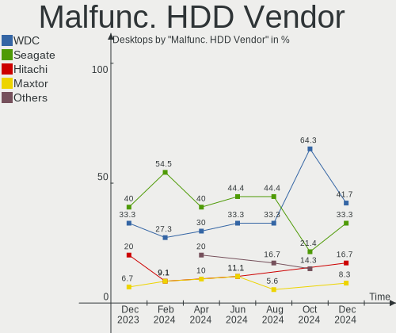
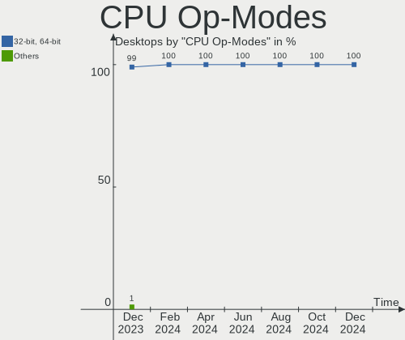
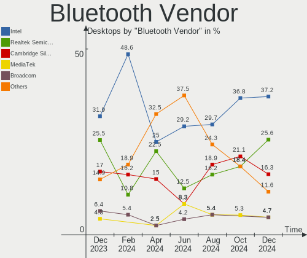
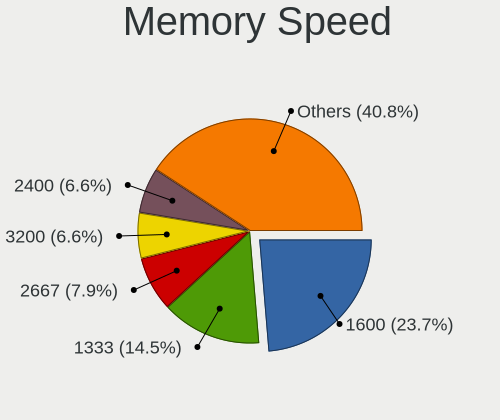

Linux in Italy - Hardware Trends (Desktops)
-------------------------------------------

A project to identify most popular hardware characteristics and track their change
over time based on data collected by Linux users at https://Linux-Hardware.org.

Anyone can contribute to this report by the [hw-probe](https://github.com/linuxhw/hw-probe) tool:

    sudo -E hw-probe -all -upload

Period: Jul, 2023.

Contents
--------

* [ System ](#system)
  - [ OS                       ](#os)
  - [ OS Family                ](#os-family)
  - [ Kernel                   ](#kernel)
  - [ Kernel Family            ](#kernel-family)
  - [ Kernel Major Ver.        ](#kernel-major-ver)
  - [ Arch                     ](#arch)
  - [ DE                       ](#de)
  - [ Display Server           ](#display-server)
  - [ Display Manager          ](#display-manager)
  - [ OS Lang                  ](#os-lang)
  - [ Boot Mode                ](#boot-mode)
  - [ Filesystem               ](#filesystem)
  - [ Part. scheme             ](#part-scheme)
  - [ Dual Boot with Linux/BSD ](#dual-boot-with-linuxbsd)
  - [ Dual Boot (Win)          ](#dual-boot-win)

* [ Board ](#board)
  - [ Vendor                   ](#vendor)
  - [ Model                    ](#model)
  - [ Model Family             ](#model-family)
  - [ MFG Year                 ](#mfg-year)
  - [ Form Factor              ](#form-factor)
  - [ Secure Boot              ](#secure-boot)
  - [ Coreboot                 ](#coreboot)
  - [ RAM Size                 ](#ram-size)
  - [ RAM Used                 ](#ram-used)
  - [ Total Drives             ](#total-drives)
  - [ Has CD-ROM               ](#has-cd-rom)
  - [ Has Ethernet             ](#has-ethernet)
  - [ Has WiFi                 ](#has-wifi)
  - [ Has Bluetooth            ](#has-bluetooth)

* [ Location ](#location)
  - [ Country                  ](#country)
  - [ City                     ](#city)

* [ Drives ](#drives)
  - [ Drive Vendor             ](#drive-vendor)
  - [ Drive Model              ](#drive-model)
  - [ HDD Vendor               ](#hdd-vendor)
  - [ SSD Vendor               ](#ssd-vendor)
  - [ Drive Kind               ](#drive-kind)
  - [ Drive Connector          ](#drive-connector)
  - [ Drive Size               ](#drive-size)
  - [ Space Total              ](#space-total)
  - [ Space Used               ](#space-used)
  - [ Malfunc. Drives          ](#malfunc-drives)
  - [ Malfunc. Drive Vendor    ](#malfunc-drive-vendor)
  - [ Malfunc. HDD Vendor      ](#malfunc-hdd-vendor)
  - [ Malfunc. Drive Kind      ](#malfunc-drive-kind)
  - [ Failed Drives            ](#failed-drives)
  - [ Failed Drive Vendor      ](#failed-drive-vendor)
  - [ Drive Status             ](#drive-status)

* [ Storage controller ](#storage-controller)
  - [ Storage Vendor           ](#storage-vendor)
  - [ Storage Model            ](#storage-model)
  - [ Storage Kind             ](#storage-kind)

* [ Processor ](#processor)
  - [ CPU Vendor               ](#cpu-vendor)
  - [ CPU Model                ](#cpu-model)
  - [ CPU Model Family         ](#cpu-model-family)
  - [ CPU Cores                ](#cpu-cores)
  - [ CPU Sockets              ](#cpu-sockets)
  - [ CPU Threads              ](#cpu-threads)
  - [ CPU Op-Modes             ](#cpu-op-modes)
  - [ CPU Microcode            ](#cpu-microcode)
  - [ CPU Microarch            ](#cpu-microarch)

* [ Graphics ](#graphics)
  - [ GPU Vendor               ](#gpu-vendor)
  - [ GPU Model                ](#gpu-model)
  - [ GPU Combo                ](#gpu-combo)
  - [ GPU Driver               ](#gpu-driver)
  - [ GPU Memory               ](#gpu-memory)

* [ Monitor ](#monitor)
  - [ Monitor Vendor           ](#monitor-vendor)
  - [ Monitor Model            ](#monitor-model)
  - [ Monitor Resolution       ](#monitor-resolution)
  - [ Monitor Diagonal         ](#monitor-diagonal)
  - [ Monitor Width            ](#monitor-width)
  - [ Aspect Ratio             ](#aspect-ratio)
  - [ Monitor Area             ](#monitor-area)
  - [ Pixel Density            ](#pixel-density)
  - [ Multiple Monitors        ](#multiple-monitors)

* [ Network ](#network)
  - [ Net Controller Vendor    ](#net-controller-vendor)
  - [ Net Controller Model     ](#net-controller-model)
  - [ Wireless Vendor          ](#wireless-vendor)
  - [ Wireless Model           ](#wireless-model)
  - [ Ethernet Vendor          ](#ethernet-vendor)
  - [ Ethernet Model           ](#ethernet-model)
  - [ Net Controller Kind      ](#net-controller-kind)
  - [ Used Controller          ](#used-controller)
  - [ NICs                     ](#nics)
  - [ IPv6                     ](#ipv6)

* [ Bluetooth ](#bluetooth)
  - [ Bluetooth Vendor         ](#bluetooth-vendor)
  - [ Bluetooth Model          ](#bluetooth-model)

* [ Sound ](#sound)
  - [ Sound Vendor             ](#sound-vendor)
  - [ Sound Model              ](#sound-model)

* [ Memory ](#memory)
  - [ Memory Vendor            ](#memory-vendor)
  - [ Memory Model             ](#memory-model)
  - [ Memory Kind              ](#memory-kind)
  - [ Memory Form Factor       ](#memory-form-factor)
  - [ Memory Size              ](#memory-size)
  - [ Memory Speed             ](#memory-speed)

* [ Printers & scanners ](#printers--scanners)
  - [ Printer Vendor           ](#printer-vendor)
  - [ Printer Model            ](#printer-model)
  - [ Scanner Vendor           ](#scanner-vendor)
  - [ Scanner Model            ](#scanner-model)

* [ Camera ](#camera)
  - [ Camera Vendor            ](#camera-vendor)
  - [ Camera Model             ](#camera-model)

* [ Security ](#security)
  - [ Fingerprint Vendor       ](#fingerprint-vendor)
  - [ Fingerprint Model        ](#fingerprint-model)
  - [ Chipcard Vendor          ](#chipcard-vendor)
  - [ Chipcard Model           ](#chipcard-model)

* [ Unsupported ](#unsupported)
  - [ Unsupported Devices      ](#unsupported-devices)
  - [ Unsupported Device Types ](#unsupported-device-types)

System
------

OS
--

Installed operating systems

| Name                         | Desktops | Percent |
|------------------------------|----------|---------|
| Ubuntu 22.04                 | 11       | 17.19%  |
| Linux Mint 21.1              | 6        | 9.38%   |
| Fedora 38                    | 6        | 9.38%   |
| Arch Rolling                 | 4        | 6.25%   |
| Ubuntu 23.04                 | 3        | 4.69%   |
| ArcoLinux Rolling            | 3        | 4.69%   |
| openSUSE Tumbleweed-XXXXXXXX | 2        | 3.13%   |
| OpenMandriva 23.07           | 2        | 3.13%   |
| OpenMandriva 23.03           | 2        | 3.13%   |
| Debian 12                    | 2        | 3.13%   |
| Debian                       | 2        | 3.13%   |
| Zorin 15                     | 1        | 1.56%   |
| Xubuntu 23.04                | 1        | 1.56%   |
| Xubuntu 22.04                | 1        | 1.56%   |
| Xero Rolling                 | 1        | 1.56%   |
| Ubuntu MATE 22.04            | 1        | 1.56%   |
| Ubuntu 20.04                 | 1        | 1.56%   |
| Slackware 15.0               | 1        | 1.56%   |
| Pop!_OS 22.04                | 1        | 1.56%   |
| openSUSE Leap-15.5           | 1        | 1.56%   |
| OpenMandriva 4.3             | 1        | 1.56%   |
| NixOS 23.05                  | 1        | 1.56%   |
| MX 21                        | 1        | 1.56%   |
| Manjaro 23.0.0               | 1        | 1.56%   |
| LMDE 5                       | 1        | 1.56%   |
| Linux Mint 20.3              | 1        | 1.56%   |
| Kubuntu 22.04                | 1        | 1.56%   |
| Garuda Linux Soaring         | 1        | 1.56%   |
| Fedora 37                    | 1        | 1.56%   |
| Elementary 7                 | 1        | 1.56%   |
| Debian 11                    | 1        | 1.56%   |
| CachyOS Rolling              | 1        | 1.56%   |

OS Family
---------

OS without a version

| Name         | Desktops | Percent |
|--------------|----------|---------|
| Ubuntu       | 15       | 23.44%  |
| Linux Mint   | 7        | 10.94%  |
| Fedora       | 7        | 10.94%  |
| OpenMandriva | 5        | 7.81%   |
| Debian       | 5        | 7.81%   |
| Arch         | 4        | 6.25%   |
| openSUSE     | 3        | 4.69%   |
| ArcoLinux    | 3        | 4.69%   |
| Xubuntu      | 2        | 3.13%   |
| Zorin        | 1        | 1.56%   |
| Xero         | 1        | 1.56%   |
| Ubuntu MATE  | 1        | 1.56%   |
| Slackware    | 1        | 1.56%   |
| Pop!_OS      | 1        | 1.56%   |
| NixOS        | 1        | 1.56%   |
| MX           | 1        | 1.56%   |
| Manjaro      | 1        | 1.56%   |
| LMDE         | 1        | 1.56%   |
| Kubuntu      | 1        | 1.56%   |
| Garuda Linux | 1        | 1.56%   |
| Elementary   | 1        | 1.56%   |
| CachyOS      | 1        | 1.56%   |

Kernel
------

Version of the Linux kernel

| Version                 | Desktops | Percent |
|-------------------------|----------|---------|
| 5.15.0-76-generic       | 7        | 10.94%  |
| 5.19.0-46-generic       | 5        | 7.81%   |
| 6.4.1-zen1-1-zen        | 3        | 4.69%   |
| 6.2.6-desktop-1omv2390  | 3        | 4.69%   |
| 6.4.2-arch1-1           | 2        | 3.13%   |
| 6.3.11-200.fc38.x86_64  | 2        | 3.13%   |
| 6.3.0-1-amd64           | 2        | 3.13%   |
| 6.2.9-300.fc38.x86_64   | 2        | 3.13%   |
| 6.2.0-25-generic        | 2        | 3.13%   |
| 5.19.0-50-generic       | 2        | 3.13%   |
| 5.10.0-23-amd64         | 2        | 3.13%   |
| 6.4.5-arch1-1           | 1        | 1.56%   |
| 6.4.4-zen1-1-zen        | 1        | 1.56%   |
| 6.4.3-arch1-1           | 1        | 1.56%   |
| 6.4.3-1-default         | 1        | 1.56%   |
| 6.4.3-1-cachyos         | 1        | 1.56%   |
| 6.4.1                   | 1        | 1.56%   |
| 6.4.0-1-amd64           | 1        | 1.56%   |
| 6.4.0-060400-generic    | 1        | 1.56%   |
| 6.3.9-1-default         | 1        | 1.56%   |
| 6.3.8-200.fc38.x86_64   | 1        | 1.56%   |
| 6.3.5-desktop-3omv2390  | 1        | 1.56%   |
| 6.3.12-200.fc38.x86_64  | 1        | 1.56%   |
| 6.2.6-76060206-generic  | 1        | 1.56%   |
| 6.2.16-3-pve            | 1        | 1.56%   |
| 6.2.15-200.fc37.x86_64  | 1        | 1.56%   |
| 6.2.0-24-generic        | 1        | 1.56%   |
| 6.1.39-1-lts            | 1        | 1.56%   |
| 6.1.38-1-MANJARO        | 1        | 1.56%   |
| 6.1.37                  | 1        | 1.56%   |
| 5.4.0-148-generic       | 1        | 1.56%   |
| 5.19.0-45-generic       | 1        | 1.56%   |
| 5.19.0-43-generic       | 1        | 1.56%   |
| 5.16.7-desktop-1omv4003 | 1        | 1.56%   |
| 5.15.117                | 1        | 1.56%   |
| 5.15.0-78-generic       | 1        | 1.56%   |
| 5.15.0-75-generic       | 1        | 1.56%   |
| 5.15.0-73-generic       | 1        | 1.56%   |
| 5.15.0-72-generic       | 1        | 1.56%   |
| 5.15.0-69-generic       | 1        | 1.56%   |

Kernel Family
-------------

Linux kernel without a distro release

| Version  | Desktops | Percent |
|----------|----------|---------|
| 5.15.0   | 13       | 20.31%  |
| 5.19.0   | 9        | 14.06%  |
| 6.4.1    | 4        | 6.25%   |
| 6.2.6    | 4        | 6.25%   |
| 6.4.3    | 3        | 4.69%   |
| 6.2.0    | 3        | 4.69%   |
| 5.10.0   | 3        | 4.69%   |
| 6.4.2    | 2        | 3.13%   |
| 6.4.0    | 2        | 3.13%   |
| 6.3.11   | 2        | 3.13%   |
| 6.3.0    | 2        | 3.13%   |
| 6.2.9    | 2        | 3.13%   |
| 6.4.5    | 1        | 1.56%   |
| 6.4.4    | 1        | 1.56%   |
| 6.3.9    | 1        | 1.56%   |
| 6.3.8    | 1        | 1.56%   |
| 6.3.5    | 1        | 1.56%   |
| 6.3.12   | 1        | 1.56%   |
| 6.2.16   | 1        | 1.56%   |
| 6.2.15   | 1        | 1.56%   |
| 6.1.39   | 1        | 1.56%   |
| 6.1.38   | 1        | 1.56%   |
| 6.1.37   | 1        | 1.56%   |
| 5.4.0    | 1        | 1.56%   |
| 5.16.7   | 1        | 1.56%   |
| 5.15.117 | 1        | 1.56%   |
| 5.14.21  | 1        | 1.56%   |

Kernel Major Ver.
-----------------

Linux kernel major version

| Version | Desktops | Percent |
|---------|----------|---------|
| 5.15    | 14       | 21.88%  |
| 6.4     | 13       | 20.31%  |
| 6.2     | 11       | 17.19%  |
| 5.19    | 9        | 14.06%  |
| 6.3     | 8        | 12.5%   |
| 6.1     | 3        | 4.69%   |
| 5.10    | 3        | 4.69%   |
| 5.4     | 1        | 1.56%   |
| 5.16    | 1        | 1.56%   |
| 5.14    | 1        | 1.56%   |

Arch
----

OS architecture (x86_64, i586, etc.)

| Name   | Desktops | Percent |
|--------|----------|---------|
| x86_64 | 63       | 98.44%  |
| i686   | 1        | 1.56%   |

DE
--

Desktop Environment

| Name       | Desktops | Percent |
|------------|----------|---------|
| GNOME      | 30       | 46.88%  |
| KDE5       | 13       | 20.31%  |
| XFCE       | 6        | 9.38%   |
| X-Cinnamon | 5        | 7.81%   |
| MATE       | 3        | 4.69%   |
| Unknown    | 3        | 4.69%   |
| i3         | 2        | 3.13%   |
| Pantheon   | 1        | 1.56%   |
| Cinnamon   | 1        | 1.56%   |

Display Server
--------------

X11 or Wayland

| Name    | Desktops | Percent |
|---------|----------|---------|
| X11     | 45       | 70.31%  |
| Wayland | 16       | 25%     |
| Tty     | 2        | 3.13%   |
| Unknown | 1        | 1.56%   |

Display Manager
---------------

SDDM, LightDM, etc.

| Name    | Desktops | Percent |
|---------|----------|---------|
| GDM3    | 16       | 25%     |
| Unknown | 16       | 25%     |
| LightDM | 13       | 20.31%  |
| SDDM    | 12       | 18.75%  |
| GDM     | 5        | 7.81%   |
| XDM     | 2        | 3.13%   |

OS Lang
-------

Language

| Lang  | Desktops | Percent |
|-------|----------|---------|
| it_IT | 43       | 67.19%  |
| en_US | 18       | 28.13%  |
| en_GB | 3        | 4.69%   |

Boot Mode
---------

EFI or BIOS

| Mode | Desktops | Percent |
|------|----------|---------|
| EFI  | 38       | 59.38%  |
| BIOS | 26       | 40.63%  |

Filesystem
----------

Type of filesystem

| Type    | Desktops | Percent |
|---------|----------|---------|
| Ext4    | 38       | 59.38%  |
| Btrfs   | 13       | 20.31%  |
| Tmpfs   | 9        | 14.06%  |
| Xfs     | 2        | 3.13%   |
| Overlay | 2        | 3.13%   |

Part. scheme
------------

Scheme of partitioning

| Type    | Desktops | Percent |
|---------|----------|---------|
| GPT     | 43       | 67.19%  |
| Unknown | 15       | 23.44%  |
| MBR     | 6        | 9.38%   |

Dual Boot with Linux/BSD
------------------------

Hosting more than one Linux/BSD

| Dual boot | Desktops | Percent |
|-----------|----------|---------|
| No        | 44       | 68.75%  |
| Yes       | 20       | 31.25%  |

Dual Boot (Win)
---------------

Hosting Linux and Windows

| Dual boot | Desktops | Percent |
|-----------|----------|---------|
| No        | 44       | 68.75%  |
| Yes       | 20       | 31.25%  |

Board
-----

Vendor
------

Motherboard manufacturer

| Name                                 | Desktops | Percent |
|--------------------------------------|----------|---------|
| MSI                                  | 13       | 20.31%  |
| ASUSTek Computer                     | 13       | 20.31%  |
| Gigabyte Technology                  | 9        | 14.06%  |
| ASRock                               | 7        | 10.94%  |
| Hewlett-Packard                      | 6        | 9.38%   |
| Acer                                 | 4        | 6.25%   |
| Fujitsu                              | 2        | 3.13%   |
| Dell                                 | 2        | 3.13%   |
| Shenzhen Meigao Electronic Equipment | 1        | 1.56%   |
| Phoenix Contact                      | 1        | 1.56%   |
| Intel                                | 1        | 1.56%   |
| Cincoze                              | 1        | 1.56%   |
| Chuwi                                | 1        | 1.56%   |
| AMI                                  | 1        | 1.56%   |
| ADLINK Technology                    | 1        | 1.56%   |
| Unknown                              | 1        | 1.56%   |

Model
-----

Motherboard model

| Name                                       | Desktops | Percent |
|--------------------------------------------|----------|---------|
| MSI MS-7C52                                | 2        | 3.13%   |
| HP Compaq 6000 Pro MT PC                   | 2        | 3.13%   |
| Shenzhen Meigao Electronic Equipment HX99G | 1        | 1.56%   |
| Phoenix Contact Valueline VL3 UPC          | 1        | 1.56%   |
| MSI NQ890AA-ABZ CQ5011IT                   | 1        | 1.56%   |
| MSI MS-7D78                                | 1        | 1.56%   |
| MSI MS-7D75                                | 1        | 1.56%   |
| MSI MS-7D25                                | 1        | 1.56%   |
| MSI MS-7D16                                | 1        | 1.56%   |
| MSI MS-7C56                                | 1        | 1.56%   |
| MSI MS-7C51                                | 1        | 1.56%   |
| MSI MS-7C37                                | 1        | 1.56%   |
| MSI MS-7C02                                | 1        | 1.56%   |
| MSI MS-7984                                | 1        | 1.56%   |
| MSI CML-U PRO Cubi 5 (MS-B183)             | 1        | 1.56%   |
| Intel X79                                  | 1        | 1.56%   |
| HP Victus by 15L Gaming Desktop TG02-0xxx  | 1        | 1.56%   |
| HP ProDesk 600 G1 SFF                      | 1        | 1.56%   |
| HP ProDesk 400 G4 MT                       | 1        | 1.56%   |
| HP Pavilion Desktop PC 570-p0xx            | 1        | 1.56%   |
| Gigabyte Z490 VISION D                     | 1        | 1.56%   |
| Gigabyte Z390 AORUS PRO                    | 1        | 1.56%   |
| Gigabyte X570 AORUS ELITE                  | 1        | 1.56%   |
| Gigabyte H170-HD3-CF                       | 1        | 1.56%   |
| Gigabyte GA-MA78GM-S2H                     | 1        | 1.56%   |
| Gigabyte B85M-D3H                          | 1        | 1.56%   |
| Gigabyte B550M DS3H                        | 1        | 1.56%   |
| Gigabyte B550 AORUS ELITE AX V2            | 1        | 1.56%   |
| Gigabyte B450 AORUS ELITE                  | 1        | 1.56%   |
| Fujitsu ESPRIMO Q920                       | 1        | 1.56%   |
| Fujitsu ESPRIMO E700                       | 1        | 1.56%   |
| Dell OptiPlex 7050                         | 1        | 1.56%   |
| Dell OptiPlex 3020                         | 1        | 1.56%   |
| Cincoze DX-1000                            | 1        | 1.56%   |
| Chuwi RZBOX                                | 1        | 1.56%   |
| ASUS Z170-PRO                              | 1        | 1.56%   |
| ASUS ROG STRIX Z790-I GAMING WIFI          | 1        | 1.56%   |
| ASUS ROG STRIX B560-G GAMING WIFI          | 1        | 1.56%   |
| ASUS ROG CROSSHAIR VIII DARK HERO          | 1        | 1.56%   |
| ASUS RJ083AA-ABZ t3630.it                  | 1        | 1.56%   |

Model Family
------------

Motherboard model prefix

| Name                                       | Desktops | Percent |
|--------------------------------------------|----------|---------|
| ASUS PRIME                                 | 4        | 6.25%   |
| ASUS ROG                                   | 3        | 4.69%   |
| Acer Aspire                                | 3        | 4.69%   |
| MSI MS-7C52                                | 2        | 3.13%   |
| HP ProDesk                                 | 2        | 3.13%   |
| HP Compaq                                  | 2        | 3.13%   |
| Fujitsu ESPRIMO                            | 2        | 3.13%   |
| Dell OptiPlex                              | 2        | 3.13%   |
| Shenzhen Meigao Electronic Equipment HX99G | 1        | 1.56%   |
| Phoenix Contact Valueline                  | 1        | 1.56%   |
| MSI NQ890AA-ABZ                            | 1        | 1.56%   |
| MSI MS-7D78                                | 1        | 1.56%   |
| MSI MS-7D75                                | 1        | 1.56%   |
| MSI MS-7D25                                | 1        | 1.56%   |
| MSI MS-7D16                                | 1        | 1.56%   |
| MSI MS-7C56                                | 1        | 1.56%   |
| MSI MS-7C51                                | 1        | 1.56%   |
| MSI MS-7C37                                | 1        | 1.56%   |
| MSI MS-7C02                                | 1        | 1.56%   |
| MSI MS-7984                                | 1        | 1.56%   |
| MSI CML-U                                  | 1        | 1.56%   |
| Intel X79                                  | 1        | 1.56%   |
| HP Victus                                  | 1        | 1.56%   |
| HP Pavilion                                | 1        | 1.56%   |
| Gigabyte Z490                              | 1        | 1.56%   |
| Gigabyte Z390                              | 1        | 1.56%   |
| Gigabyte X570                              | 1        | 1.56%   |
| Gigabyte H170-HD3-CF                       | 1        | 1.56%   |
| Gigabyte GA-MA78GM-S2H                     | 1        | 1.56%   |
| Gigabyte B85M-D3H                          | 1        | 1.56%   |
| Gigabyte B550M                             | 1        | 1.56%   |
| Gigabyte B550                              | 1        | 1.56%   |
| Gigabyte B450                              | 1        | 1.56%   |
| Cincoze DX-1000                            | 1        | 1.56%   |
| Chuwi RZBOX                                | 1        | 1.56%   |
| ASUS Z170-PRO                              | 1        | 1.56%   |
| ASUS RJ083AA-ABZ                           | 1        | 1.56%   |
| ASUS P8H61-M                               | 1        | 1.56%   |
| ASUS P6X58D                                | 1        | 1.56%   |
| ASUS K8V-X                                 | 1        | 1.56%   |

MFG Year
--------

Motherboard manufacture year

| Year | Desktops | Percent |
|------|----------|---------|
| 2018 | 9        | 14.06%  |
| 2022 | 7        | 10.94%  |
| 2021 | 7        | 10.94%  |
| 2019 | 6        | 9.38%   |
| 2020 | 5        | 7.81%   |
| 2023 | 4        | 6.25%   |
| 2013 | 4        | 6.25%   |
| 2009 | 4        | 6.25%   |
| 2017 | 3        | 4.69%   |
| 2016 | 3        | 4.69%   |
| 2015 | 3        | 4.69%   |
| 2012 | 2        | 3.13%   |
| 2008 | 2        | 3.13%   |
| 2014 | 1        | 1.56%   |
| 2011 | 1        | 1.56%   |
| 2010 | 1        | 1.56%   |
| 2006 | 1        | 1.56%   |
| 2005 | 1        | 1.56%   |

Form Factor
-----------

Physical design of the computer

| Name    | Desktops | Percent |
|---------|----------|---------|
| Desktop | 64       | 100%    |

Secure Boot
-----------

Enabled or disabled

| State    | Desktops | Percent |
|----------|----------|---------|
| Disabled | 63       | 98.44%  |
| Enabled  | 1        | 1.56%   |

Coreboot
--------

Have coreboot on board

| Used | Desktops | Percent |
|------|----------|---------|
| No   | 64       | 100%    |

RAM Size
--------

Total RAM memory

| Size in GB  | Desktops | Percent |
|-------------|----------|---------|
| 16.01-24.0  | 15       | 23.44%  |
| 4.01-8.0    | 11       | 17.19%  |
| 32.01-64.0  | 10       | 15.63%  |
| 64.01-256.0 | 7        | 10.94%  |
| 8.01-16.0   | 7        | 10.94%  |
| 3.01-4.0    | 6        | 9.38%   |
| 24.01-32.0  | 4        | 6.25%   |
| 1.01-2.0    | 2        | 3.13%   |
| 2.01-3.0    | 1        | 1.56%   |
| 0.51-1.0    | 1        | 1.56%   |

RAM Used
--------

Used RAM memory

| Used GB   | Desktops | Percent |
|-----------|----------|---------|
| 1.01-2.0  | 16       | 25%     |
| 3.01-4.0  | 15       | 23.44%  |
| 2.01-3.0  | 13       | 20.31%  |
| 4.01-8.0  | 12       | 18.75%  |
| 8.01-16.0 | 4        | 6.25%   |
| 0.51-1.0  | 3        | 4.69%   |
| 0.01-0.5  | 1        | 1.56%   |

Total Drives
------------

Number of drives on board

| Drives | Desktops | Percent |
|--------|----------|---------|
| 1      | 24       | 37.5%   |
| 2      | 18       | 28.13%  |
| 3      | 11       | 17.19%  |
| 4      | 5        | 7.81%   |
| 6      | 3        | 4.69%   |
| 5      | 2        | 3.13%   |
| 7      | 1        | 1.56%   |

Has CD-ROM
----------

Has CD-ROM on board

| Presented | Desktops | Percent |
|-----------|----------|---------|
| No        | 41       | 64.06%  |
| Yes       | 23       | 35.94%  |

Has Ethernet
------------

Has Ethernet on board

| Presented | Desktops | Percent |
|-----------|----------|---------|
| Yes       | 64       | 100%    |

Has WiFi
--------

Has WiFi module

| Presented | Desktops | Percent |
|-----------|----------|---------|
| No        | 35       | 54.69%  |
| Yes       | 29       | 45.31%  |

Has Bluetooth
-------------

Has Bluetooth module

| Presented | Desktops | Percent |
|-----------|----------|---------|
| No        | 40       | 62.5%   |
| Yes       | 24       | 37.5%   |

Location
--------

Country
-------

Geographic location (country)

| Country | Desktops | Percent |
|---------|----------|---------|
| Italy   | 64       | 100%    |

City
----

Geographic location (city)

| City                     | Desktops | Percent |
|--------------------------|----------|---------|
| Milan                    | 6        | 9.38%   |
| Milano                   | 5        | 7.81%   |
| Naples                   | 3        | 4.69%   |
| Rho                      | 2        | 3.13%   |
| Paderno Dugnano          | 2        | 3.13%   |
| Cagliari                 | 2        | 3.13%   |
| Vigolo                   | 1        | 1.56%   |
| Venice                   | 1        | 1.56%   |
| Vendone                  | 1        | 1.56%   |
| Udine                    | 1        | 1.56%   |
| Turin                    | 1        | 1.56%   |
| Trivero                  | 1        | 1.56%   |
| Seregno                  | 1        | 1.56%   |
| Santa Flavia             | 1        | 1.56%   |
| San Lazzaro di Savena    | 1        | 1.56%   |
| Salerno                  | 1        | 1.56%   |
| Rome                     | 1        | 1.56%   |
| Prato                    | 1        | 1.56%   |
| Ponte San Pietro         | 1        | 1.56%   |
| Pistoia                  | 1        | 1.56%   |
| Pesaro                   | 1        | 1.56%   |
| Pavia                    | 1        | 1.56%   |
| Passignano sul Trasimeno | 1        | 1.56%   |
| Padova                   | 1        | 1.56%   |
| Omegna                   | 1        | 1.56%   |
| Monza                    | 1        | 1.56%   |
| Lonato                   | 1        | 1.56%   |
| Legnaro                  | 1        | 1.56%   |
| Imola                    | 1        | 1.56%   |
| Iglesias                 | 1        | 1.56%   |
| Gruaro                   | 1        | 1.56%   |
| Frassinello Monferrato   | 1        | 1.56%   |
| Florence                 | 1        | 1.56%   |
| Fiera di Primiero        | 1        | 1.56%   |
| Domaso                   | 1        | 1.56%   |
| Dalmine                  | 1        | 1.56%   |
| Cosio Valtellino         | 1        | 1.56%   |
| Cortenuova               | 1        | 1.56%   |
| Como                     | 1        | 1.56%   |
| Cernusco sul Naviglio    | 1        | 1.56%   |

Drives
------

Drive Vendor
------------

Hard drive vendors

| Vendor                      | Desktops | Drives | Percent |
|-----------------------------|----------|--------|---------|
| Samsung Electronics         | 24       | 33     | 19.51%  |
| Seagate                     | 19       | 26     | 15.45%  |
| WDC                         | 18       | 22     | 14.63%  |
| Crucial                     | 9        | 11     | 7.32%   |
| Toshiba                     | 7        | 8      | 5.69%   |
| Kingston                    | 7        | 8      | 5.69%   |
| SanDisk                     | 6        | 7      | 4.88%   |
| Silicon Motion              | 3        | 3      | 2.44%   |
| Micron/Crucial Technology   | 3        | 3      | 2.44%   |
| Kingston Technology Company | 3        | 3      | 2.44%   |
| Unknown                     | 3        | 3      | 2.44%   |
| Team                        | 2        | 2      | 1.63%   |
| SPCC                        | 2        | 2      | 1.63%   |
| Phison Electronics          | 2        | 2      | 1.63%   |
| China                       | 2        | 2      | 1.63%   |
| Verbatim                    | 1        | 1      | 0.81%   |
| Vaseky                      | 1        | 1      | 0.81%   |
| Unknown                     | 1        | 1      | 0.81%   |
| SK hynix                    | 1        | 1      | 0.81%   |
| SCY                         | 1        | 1      | 0.81%   |
| Phison                      | 1        | 2      | 0.81%   |
| Patriot                     | 1        | 1      | 0.81%   |
| Maxtor                      | 1        | 2      | 0.81%   |
| MAXIO Technology (Hangzhou) | 1        | 1      | 0.81%   |
| Lexar                       | 1        | 1      | 0.81%   |
| Intenso                     | 1        | 2      | 0.81%   |
| Hitachi                     | 1        | 1      | 0.81%   |
| Drevo                       | 1        | 1      | 0.81%   |

Drive Model
-----------

Hard drive models

| Model                                                 | Desktops | Percent |
|-------------------------------------------------------|----------|---------|
| Seagate ST4000DM004-2CV104 4TB                        | 3        | 2.08%   |
| Seagate ST1000DM010-2EP102 1TB                        | 3        | 2.08%   |
| Samsung SSD 870 QVO 1TB                               | 3        | 2.08%   |
| Samsung SSD 850 EVO 500GB                             | 3        | 2.08%   |
| Samsung NVMe SSD Controller SM981/PM981/PM983 500GB   | 3        | 2.08%   |
| Kingston SA400S37480G 480GB SSD                       | 3        | 2.08%   |
| Crucial CT500MX500SSD1 500GB                          | 3        | 2.08%   |
| Unknown                                               | 3        | 2.08%   |
| WDC WD5000AAKS-00UU3A0 500GB                          | 2        | 1.39%   |
| Toshiba HDWD130 3TB                                   | 2        | 1.39%   |
| Silicon Motion SM2263EN/SM2263XT SSD Controller 500GB | 2        | 1.39%   |
| Seagate ST500DM002-1BD142 500GB                       | 2        | 1.39%   |
| Seagate ST3500418AS 500GB                             | 2        | 1.39%   |
| Seagate Expansion 1TB                                 | 2        | 1.39%   |
| Samsung SSD 980 1TB                                   | 2        | 1.39%   |
| Samsung SSD 870 QVO 2TB                               | 2        | 1.39%   |
| Samsung SSD 870 EVO 500GB                             | 2        | 1.39%   |
| Samsung SSD 860 EVO 500GB                             | 2        | 1.39%   |
| Samsung NVMe SSD Controller PM9A1/PM9A3/980PRO 1TB    | 2        | 1.39%   |
| Phison E12 NVMe Controller 2TB                        | 2        | 1.39%   |
| Micron/Crucial P2 NVMe PCIe SSD 1TB                   | 2        | 1.39%   |
| WDC WDS250G2X0C-00L350 250GB                          | 1        | 0.69%   |
| WDC WDS240G2G0A-00JH30 240GB SSD                      | 1        | 0.69%   |
| WDC WDS100T2B0A-00SM50 1TB SSD                        | 1        | 0.69%   |
| WDC WD800JD-75MSA3 80GB                               | 1        | 0.69%   |
| WDC WD60EFAX-68JH4N1 6TB                              | 1        | 0.69%   |
| WDC WD5000LPLX-00ZNTT0 500GB                          | 1        | 0.69%   |
| WDC WD5000AAKX-001CA0 500GB                           | 1        | 0.69%   |
| WDC WD5000AAKS-60Z1A0 500GB                           | 1        | 0.69%   |
| WDC WD5000AAKS-22A7B0 500GB                           | 1        | 0.69%   |
| WDC WD5000AAKS-00TMA0 500GB                           | 1        | 0.69%   |
| WDC WD40PURZ-85TTDY0 4TB                              | 1        | 0.69%   |
| WDC WD40EFZX-68AWUN0 4TB                              | 1        | 0.69%   |
| WDC WD3200AAKX-073CA1 320GB                           | 1        | 0.69%   |
| WDC WD20EZRZ-22Z5HB0 2TB                              | 1        | 0.69%   |
| WDC WD20EARS-00MVWB0 2TB                              | 1        | 0.69%   |
| WDC WD10EZRX-00A3KB0 1TB                              | 1        | 0.69%   |
| WDC WD10EZEX-21WN4A0 1TB                              | 1        | 0.69%   |
| WDC WD10EADS-00M2B0 1TB                               | 1        | 0.69%   |
| WDC PC SN530 SDBPNPZ-512G-1006 512GB                  | 1        | 0.69%   |

HDD Vendor
----------

Hard disk drive vendors

| Vendor  | Desktops | Drives | Percent |
|---------|----------|--------|---------|
| Seagate | 19       | 25     | 44.19%  |
| WDC     | 15       | 18     | 34.88%  |
| Toshiba | 6        | 6      | 13.95%  |
| Unknown | 1        | 1      | 2.33%   |
| Maxtor  | 1        | 2      | 2.33%   |
| Hitachi | 1        | 1      | 2.33%   |

SSD Vendor
----------

Solid state drive vendors

| Vendor              | Desktops | Drives | Percent |
|---------------------|----------|--------|---------|
| Samsung Electronics | 15       | 20     | 30.61%  |
| Crucial             | 8        | 9      | 16.33%  |
| Kingston            | 5        | 6      | 10.2%   |
| SanDisk             | 3        | 3      | 6.12%   |
| WDC                 | 2        | 2      | 4.08%   |
| Toshiba             | 2        | 2      | 4.08%   |
| Team                | 2        | 2      | 4.08%   |
| SPCC                | 2        | 2      | 4.08%   |
| China               | 2        | 2      | 4.08%   |
| Verbatim            | 1        | 1      | 2.04%   |
| Vaseky              | 1        | 1      | 2.04%   |
| SCY                 | 1        | 1      | 2.04%   |
| Patriot             | 1        | 1      | 2.04%   |
| Lexar               | 1        | 1      | 2.04%   |
| Intenso             | 1        | 2      | 2.04%   |
| Drevo               | 1        | 1      | 2.04%   |
| Unknown             | 1        | 1      | 2.04%   |

Drive Kind
----------

HDD or SSD

| Kind    | Desktops | Drives | Percent |
|---------|----------|--------|---------|
| SSD     | 45       | 57     | 42.06%  |
| HDD     | 31       | 53     | 28.97%  |
| NVMe    | 29       | 39     | 27.1%   |
| Unknown | 2        | 2      | 1.87%   |

Drive Connector
---------------

SATA, SAS, NVMe, etc.

| Type | Desktops | Drives | Percent |
|------|----------|--------|---------|
| SATA | 53       | 104    | 60.23%  |
| NVMe | 29       | 39     | 32.95%  |
| SAS  | 6        | 8      | 6.82%   |

Drive Size
----------

Size of hard drive

| Size in TB | Desktops | Drives | Percent |
|------------|----------|--------|---------|
| 0.01-0.5   | 40       | 58     | 47.06%  |
| 0.51-1.0   | 24       | 27     | 28.24%  |
| 1.01-2.0   | 11       | 14     | 12.94%  |
| 2.01-3.0   | 5        | 5      | 5.88%   |
| 3.01-4.0   | 4        | 5      | 4.71%   |
| 4.01-10.0  | 1        | 1      | 1.18%   |

Space Total
-----------

Amount of disk space available on the file system

| Size in GB     | Desktops | Percent |
|----------------|----------|---------|
| 251-500        | 12       | 18.75%  |
| 101-250        | 11       | 17.19%  |
| 1001-2000      | 11       | 17.19%  |
| 501-1000       | 11       | 17.19%  |
| More than 3000 | 10       | 15.63%  |
| 2001-3000      | 3        | 4.69%   |
| 1-20           | 3        | 4.69%   |
| 51-100         | 2        | 3.13%   |
| 0              | 1        | 1.56%   |

Space Used
----------

Amount of used disk space

| Used GB        | Desktops | Percent |
|----------------|----------|---------|
| 1-20           | 15       | 23.44%  |
| 51-100         | 11       | 17.19%  |
| 101-250        | 9        | 14.06%  |
| 21-50          | 8        | 12.5%   |
| 501-1000       | 7        | 10.94%  |
| 251-500        | 5        | 7.81%   |
| 2001-3000      | 4        | 6.25%   |
| More than 3000 | 2        | 3.13%   |
| 1001-2000      | 2        | 3.13%   |
| 0              | 1        | 1.56%   |

Malfunc. Drives
---------------

Drive models with a malfunction

| Model                          | Desktops | Drives | Percent |
|--------------------------------|----------|--------|---------|
| WDC WD10EZRX-00A3KB0 1TB       | 1        | 1      | 33.33%  |
| Seagate ST3500418AS 500GB      | 1        | 1      | 33.33%  |
| Seagate ST1000DM010-2EP102 1TB | 1        | 1      | 33.33%  |

Malfunc. Drive Vendor
---------------------

Vendors of faulty drives

| Vendor  | Desktops | Drives | Percent |
|---------|----------|--------|---------|
| Seagate | 2        | 2      | 66.67%  |
| WDC     | 1        | 1      | 33.33%  |

Malfunc. HDD Vendor
-------------------

Vendors of faulty HDD drives

| Vendor  | Desktops | Drives | Percent |
|---------|----------|--------|---------|
| Seagate | 2        | 2      | 66.67%  |
| WDC     | 1        | 1      | 33.33%  |

Malfunc. Drive Kind
-------------------

Kinds of faulty drives

| Kind | Desktops | Drives | Percent |
|------|----------|--------|---------|
| HDD  | 3        | 3      | 100%    |

Failed Drives
-------------

Failed drive models

Zero info for selected period =(

Failed Drive Vendor
-------------------

Failed drive vendors

Zero info for selected period =(

Drive Status
------------

Number of failed and malfunc. drives

| Status   | Desktops | Drives | Percent |
|----------|----------|--------|---------|
| Works    | 40       | 84     | 54.05%  |
| Detected | 31       | 64     | 41.89%  |
| Malfunc  | 3        | 3      | 4.05%   |

Storage controller
------------------

Storage Vendor
--------------

Storage controller vendors

| Vendor                      | Desktops | Percent |
|-----------------------------|----------|---------|
| Intel                       | 37       | 34.91%  |
| AMD                         | 24       | 22.64%  |
| Samsung Electronics         | 13       | 12.26%  |
| ASMedia Technology          | 6        | 5.66%   |
| SanDisk                     | 5        | 4.72%   |
| Micron/Crucial Technology   | 5        | 4.72%   |
| Kingston Technology Company | 4        | 3.77%   |
| Silicon Motion              | 3        | 2.83%   |
| Phison Electronics          | 3        | 2.83%   |
| VIA Technologies            | 1        | 0.94%   |
| Swissbit                    | 1        | 0.94%   |
| SK hynix                    | 1        | 0.94%   |
| Nvidia                      | 1        | 0.94%   |
| MAXIO Technology (Hangzhou) | 1        | 0.94%   |
| Marvell Technology Group    | 1        | 0.94%   |

Storage Model
-------------

Storage controller models

| Model                                                                                   | Desktops | Percent |
|-----------------------------------------------------------------------------------------|----------|---------|
| AMD FCH SATA Controller [AHCI mode]                                                     | 15       | 11.9%   |
| AMD 400 Series Chipset SATA Controller                                                  | 7        | 5.56%   |
| Samsung NVMe SSD Controller SM981/PM981/PM983                                           | 5        | 3.97%   |
| Samsung NVMe SSD Controller PM9A1/PM9A3/980PRO                                          | 4        | 3.17%   |
| Micron/Crucial P2 [Nick P2] / P3 / P3 Plus NVMe PCIe SSD (DRAM-less)                    | 4        | 3.17%   |
| Intel Q170/Q150/B150/H170/H110/Z170/CM236 Chipset SATA Controller [AHCI Mode]           | 4        | 3.17%   |
| Intel 8 Series/C220 Series Chipset Family 6-port SATA Controller 1 [AHCI mode]          | 4        | 3.17%   |
| Intel 500 Series Chipset Family SATA AHCI Controller                                    | 4        | 3.17%   |
| ASMedia ASM1062 Serial ATA Controller                                                   | 4        | 3.17%   |
| Silicon Motion SM2263EN/SM2263XT (DRAM-less) NVMe SSD Controllers                       | 3        | 2.38%   |
| Samsung NVMe SSD Controller 980                                                         | 3        | 2.38%   |
| Intel Cannon Lake PCH SATA AHCI Controller                                              | 3        | 2.38%   |
| Phison E12 NVMe Controller                                                              | 2        | 1.59%   |
| Kingston Company A2000 NVMe SSD                                                         | 2        | 1.59%   |
| Intel NM10/ICH7 Family SATA Controller [IDE mode]                                       | 2        | 1.59%   |
| Intel Comet Lake SATA AHCI Controller                                                   | 2        | 1.59%   |
| Intel Alder Lake-S PCH SATA Controller [AHCI Mode]                                      | 2        | 1.59%   |
| Intel 82801JD/DO (ICH10 Family) SATA AHCI Controller                                    | 2        | 1.59%   |
| Intel 82801G (ICH7 Family) IDE Controller                                               | 2        | 1.59%   |
| Intel 6 Series/C200 Series Chipset Family Desktop SATA Controller (IDE mode, ports 4-5) | 2        | 1.59%   |
| Intel 6 Series/C200 Series Chipset Family Desktop SATA Controller (IDE mode, ports 0-3) | 2        | 1.59%   |
| Intel 200 Series PCH SATA controller [AHCI mode]                                        | 2        | 1.59%   |
| AMD SB7x0/SB8x0/SB9x0 SATA Controller [AHCI mode]                                       | 2        | 1.59%   |
| AMD SB7x0/SB8x0/SB9x0 IDE Controller                                                    | 2        | 1.59%   |
| AMD FCH SATA Controller D                                                               | 2        | 1.59%   |
| AMD 500 Series Chipset SATA Controller                                                  | 2        | 1.59%   |
| AMD 300 Series Chipset SATA Controller                                                  | 2        | 1.59%   |
| VIA VT82C586A/B/VT82C686/A/B/VT823x/A/C PIPC Bus Master IDE                             | 1        | 0.79%   |
| VIA VIA VT6420 SATA RAID Controller                                                     | 1        | 0.79%   |
| Swissbit Non-Volatile memory controller                                                 | 1        | 0.79%   |
| SK hynix BC501 NVMe Solid State Drive                                                   | 1        | 0.79%   |
| Sandisk Western Digital WD Black SN850X NVMe SSD                                        | 1        | 0.79%   |
| SanDisk WD PC SN810 / Black SN850 NVMe SSD                                              | 1        | 0.79%   |
| SanDisk WD Blue SN550 NVMe SSD                                                          | 1        | 0.79%   |
| SanDisk WD Black SN770 / PC SN740 256GB / PC SN560 (DRAM-less) NVMe SSD                 | 1        | 0.79%   |
| SanDisk WD Black 2018/SN750 / PC SN720 NVMe SSD                                         | 1        | 0.79%   |
| Samsung NVMe SSD Controller S4LV008[Pascal]                                             | 1        | 0.79%   |
| Phison E18 PCIe4 NVMe Controller                                                        | 1        | 0.79%   |
| Nvidia MCP79 AHCI Controller                                                            | 1        | 0.79%   |
| Micron/Crucial P5 Plus NVMe PCIe SSD                                                    | 1        | 0.79%   |

Storage Kind
------------

Kind of storage controller (IDE, SATA, NVMe, SAS, ...)

| Kind | Desktops | Percent |
|------|----------|---------|
| SATA | 55       | 55.56%  |
| NVMe | 29       | 29.29%  |
| IDE  | 10       | 10.1%   |
| RAID | 5        | 5.05%   |

Processor
---------

CPU Vendor
----------

Processor vendors

| Vendor | Desktops | Percent |
|--------|----------|---------|
| Intel  | 38       | 59.38%  |
| AMD    | 26       | 40.63%  |

CPU Model
---------

Processor models

| Model                                       | Desktops | Percent |
|---------------------------------------------|----------|---------|
| AMD Ryzen 5 5600G with Radeon Graphics      | 3        | 4.69%   |
| AMD Ryzen 9 5950X 16-Core Processor         | 2        | 3.13%   |
| AMD Ryzen 7 3700X 8-Core Processor          | 2        | 3.13%   |
| AMD Ryzen 3 3200G with Radeon Vega Graphics | 2        | 3.13%   |
| Intel Xeon CPU E5-2697 v2 @ 2.70GHz         | 1        | 1.56%   |
| Intel Pentium Dual-Core CPU E6500 @ 2.93GHz | 1        | 1.56%   |
| Intel Pentium Dual CPU E2160 @ 1.80GHz      | 1        | 1.56%   |
| Intel Pentium D CPU 2.80GHz                 | 1        | 1.56%   |
| Intel Pentium CPU G4600 @ 3.60GHz           | 1        | 1.56%   |
| Intel Pentium CPU G4400TE @ 2.40GHz         | 1        | 1.56%   |
| Intel Pentium CPU G4400 @ 3.30GHz           | 1        | 1.56%   |
| Intel Pentium CPU G2020 @ 2.90GHz           | 1        | 1.56%   |
| Intel Core i7-9850HE CPU @ 2.70GHz          | 1        | 1.56%   |
| Intel Core i7-9700K CPU @ 3.60GHz           | 1        | 1.56%   |
| Intel Core i7-6700 CPU @ 3.40GHz            | 1        | 1.56%   |
| Intel Core i7-4790 CPU @ 3.60GHz            | 1        | 1.56%   |
| Intel Core i7-3770K CPU @ 3.50GHz           | 1        | 1.56%   |
| Intel Core i7-10700K CPU @ 3.80GHz          | 1        | 1.56%   |
| Intel Core i7 CPU 965 @ 3.20GHz             | 1        | 1.56%   |
| Intel Core i5-8400 CPU @ 2.80GHz            | 1        | 1.56%   |
| Intel Core i5-7500 CPU @ 3.40GHz            | 1        | 1.56%   |
| Intel Core i5-6500T CPU @ 2.50GHz           | 1        | 1.56%   |
| Intel Core i5-4590T CPU @ 2.00GHz           | 1        | 1.56%   |
| Intel Core i5-4590 CPU @ 3.30GHz            | 1        | 1.56%   |
| Intel Core i3-9100 CPU @ 3.60GHz            | 1        | 1.56%   |
| Intel Core i3-6100 CPU @ 3.70GHz            | 1        | 1.56%   |
| Intel Core i3-4160 CPU @ 3.60GHz            | 1        | 1.56%   |
| Intel Core i3-2120 CPU @ 3.30GHz            | 1        | 1.56%   |
| Intel Core i3-10110U CPU @ 2.10GHz          | 1        | 1.56%   |
| Intel Core i3-10100F CPU @ 3.60GHz          | 1        | 1.56%   |
| Intel Core i3-10100 CPU @ 3.60GHz           | 1        | 1.56%   |
| Intel Core 2 Duo CPU E8500 @ 3.16GHz        | 1        | 1.56%   |
| Intel Core 2 Duo CPU E7600 @ 3.06GHz        | 1        | 1.56%   |
| Intel Celeron N5105 @ 2.00GHz               | 1        | 1.56%   |
| Intel Celeron J4105 CPU @ 1.50GHz           | 1        | 1.56%   |
| Intel Atom x6211E Processor @ 1.30GHz       | 1        | 1.56%   |
| Intel Atom CPU 230 @ 1.60GHz                | 1        | 1.56%   |
| Intel 13th Gen Core i7-13700KF              | 1        | 1.56%   |
| Intel 12th Gen Core i9-12900K               | 1        | 1.56%   |
| Intel 12th Gen Core i5-12400                | 1        | 1.56%   |

CPU Model Family
----------------

Processor model prefix

| Model                   | Desktops | Percent |
|-------------------------|----------|---------|
| AMD Ryzen 5             | 8        | 12.5%   |
| Intel Core i7           | 7        | 10.94%  |
| Intel Core i3           | 7        | 10.94%  |
| AMD Ryzen 7             | 6        | 9.38%   |
| Other                   | 5        | 7.81%   |
| Intel Core i5           | 5        | 7.81%   |
| AMD Ryzen 9             | 5        | 7.81%   |
| Intel Pentium           | 4        | 6.25%   |
| Intel Core 2 Duo        | 2        | 3.13%   |
| Intel Celeron           | 2        | 3.13%   |
| Intel Atom              | 2        | 3.13%   |
| AMD Ryzen 3             | 2        | 3.13%   |
| Intel Xeon              | 1        | 1.56%   |
| Intel Pentium Dual-Core | 1        | 1.56%   |
| Intel Pentium Dual      | 1        | 1.56%   |
| Intel Pentium D         | 1        | 1.56%   |
| AMD Phenom II X6        | 1        | 1.56%   |
| AMD Phenom II X4        | 1        | 1.56%   |
| AMD Athlon 64           | 1        | 1.56%   |
| AMD A8                  | 1        | 1.56%   |
| AMD A10                 | 1        | 1.56%   |

CPU Cores
---------

Number of processor cores

| Number | Desktops | Percent |
|--------|----------|---------|
| 4      | 19       | 29.69%  |
| 2      | 15       | 23.44%  |
| 6      | 11       | 17.19%  |
| 8      | 10       | 15.63%  |
| 16     | 5        | 7.81%   |
| 12     | 2        | 3.13%   |
| 1      | 2        | 3.13%   |

CPU Sockets
-----------

Number of sockets

| Number | Desktops | Percent |
|--------|----------|---------|
| 1      | 64       | 100%    |

CPU Threads
-----------

Threads per core (Hyper-Threading)

| Number | Desktops | Percent |
|--------|----------|---------|
| 2      | 40       | 62.5%   |
| 1      | 24       | 37.5%   |

CPU Op-Modes
------------

CPU Operation Modes (32-bit, 64-bit)

| Op mode        | Desktops | Percent |
|----------------|----------|---------|
| 32-bit, 64-bit | 64       | 100%    |

CPU Microcode
-------------

Microcode number

| Number     | Desktops | Percent |
|------------|----------|---------|
| Unknown    | 23       | 35.94%  |
| 0x0a601203 | 3        | 4.69%   |
| 0x08701021 | 3        | 4.69%   |
| 0x08108109 | 3        | 4.69%   |
| 0x906ea    | 2        | 3.13%   |
| 0x906e9    | 2        | 3.13%   |
| 0x306c3    | 2        | 3.13%   |
| 0x0a50000d | 2        | 3.13%   |
| 0x0a50000c | 2        | 3.13%   |
| 0x0a20120a | 2        | 3.13%   |
| 0xf47      | 1        | 1.56%   |
| 0xa0671    | 1        | 1.56%   |
| 0xa0653    | 1        | 1.56%   |
| 0x906eb    | 1        | 1.56%   |
| 0x906c0    | 1        | 1.56%   |
| 0x90675    | 1        | 1.56%   |
| 0x90672    | 1        | 1.56%   |
| 0x90661    | 1        | 1.56%   |
| 0x806ec    | 1        | 1.56%   |
| 0x706a1    | 1        | 1.56%   |
| 0x6fd      | 1        | 1.56%   |
| 0x506e3    | 1        | 1.56%   |
| 0x306e4    | 1        | 1.56%   |
| 0x1067a    | 1        | 1.56%   |
| 0x0a404102 | 1        | 1.56%   |
| 0x0a201025 | 1        | 1.56%   |
| 0x08701030 | 1        | 1.56%   |
| 0x08600109 | 1        | 1.56%   |
| 0x0600611a | 1        | 1.56%   |
| 0x010000c8 | 1        | 1.56%   |

CPU Microarch
-------------

Microarchitecture

| Name             | Desktops | Percent |
|------------------|----------|---------|
| Zen 3            | 8        | 12.5%   |
| KabyLake         | 7        | 10.94%  |
| Unknown          | 6        | 9.38%   |
| Zen 2            | 5        | 7.81%   |
| Skylake          | 5        | 7.81%   |
| Haswell          | 4        | 6.25%   |
| Zen+             | 3        | 4.69%   |
| Penryn           | 3        | 4.69%   |
| IvyBridge        | 3        | 4.69%   |
| CometLake        | 3        | 4.69%   |
| Tremont          | 2        | 3.13%   |
| K10              | 2        | 3.13%   |
| Alderlake Hybrid | 2        | 3.13%   |
| Zen              | 1        | 1.56%   |
| SandyBridge      | 1        | 1.56%   |
| NetBurst         | 1        | 1.56%   |
| Nehalem          | 1        | 1.56%   |
| K8 Hammer        | 1        | 1.56%   |
| K10 Llano        | 1        | 1.56%   |
| Icelake          | 1        | 1.56%   |
| Goldmont plus    | 1        | 1.56%   |
| Excavator        | 1        | 1.56%   |
| Core             | 1        | 1.56%   |
| Bonnell          | 1        | 1.56%   |

Graphics
--------

GPU Vendor
----------

Vendors of graphics cards

| Vendor | Desktops | Percent |
|--------|----------|---------|
| AMD    | 28       | 38.89%  |
| Nvidia | 24       | 33.33%  |
| Intel  | 20       | 27.78%  |

GPU Model
---------

Graphics card models

| Model                                                                       | Desktops | Percent |
|-----------------------------------------------------------------------------|----------|---------|
| AMD Cezanne [Radeon Vega Series / Radeon Vega Mobile Series]                | 5        | 6.76%   |
| Nvidia GP107 [GeForce GTX 1050 Ti]                                          | 4        | 5.41%   |
| AMD Navi 22 [Radeon RX 6700/6700 XT/6750 XT / 6800M/6850M XT]               | 4        | 5.41%   |
| Intel Xeon E3-1200 v3/4th Gen Core Processor Integrated Graphics Controller | 3        | 4.05%   |
| AMD Raphael                                                                 | 3        | 4.05%   |
| AMD Picasso/Raven 2 [Radeon Vega Series / Radeon Vega Mobile Series]        | 3        | 4.05%   |
| Nvidia GP108 [GeForce GT 1030]                                              | 2        | 2.7%    |
| Nvidia GM204 [GeForce GTX 970]                                              | 2        | 2.7%    |
| Nvidia GF108 [GeForce GT 730]                                               | 2        | 2.7%    |
| Nvidia GA104 [GeForce RTX 3060 Ti Lite Hash Rate]                           | 2        | 2.7%    |
| Nvidia AD103 [GeForce RTX 4080]                                             | 2        | 2.7%    |
| Intel HD Graphics 630                                                       | 2        | 2.7%    |
| Intel HD Graphics 510                                                       | 2        | 2.7%    |
| AMD Navi 21 [Radeon RX 6800/6800 XT / 6900 XT]                              | 2        | 2.7%    |
| AMD Ellesmere [Radeon RX 470/480/570/570X/580/580X/590]                     | 2        | 2.7%    |
| Nvidia TU116 [GeForce GTX 1650]                                             | 1        | 1.35%   |
| Nvidia GP106 [GeForce GTX 1060 6GB]                                         | 1        | 1.35%   |
| Nvidia GM200 [GeForce GTX 980 Ti]                                           | 1        | 1.35%   |
| Nvidia GK208B [GeForce GT 710]                                              | 1        | 1.35%   |
| Nvidia GK104 [GeForce GTX 670]                                              | 1        | 1.35%   |
| Nvidia GF119 [GeForce GT 610]                                               | 1        | 1.35%   |
| Nvidia GF108 [GeForce GT 420]                                               | 1        | 1.35%   |
| Nvidia GF106 [GeForce GTS 450]                                              | 1        | 1.35%   |
| Nvidia G72 [GeForce 7500 LE]                                                | 1        | 1.35%   |
| Nvidia C79 [ION]                                                            | 1        | 1.35%   |
| Intel JasperLake [UHD Graphics]                                             | 1        | 1.35%   |
| Intel HD Graphics 530                                                       | 1        | 1.35%   |
| Intel GeminiLake [UHD Graphics 600]                                         | 1        | 1.35%   |
| Intel Elkhart Lake [UHD Graphics Gen11 16EU]                                | 1        | 1.35%   |
| Intel CometLake-U GT2 [UHD Graphics]                                        | 1        | 1.35%   |
| Intel CoffeeLake-S GT2 [UHD Graphics 630]                                   | 1        | 1.35%   |
| Intel CoffeeLake-H GT2 [UHD Graphics 630]                                   | 1        | 1.35%   |
| Intel AlderLake-S GT1                                                       | 1        | 1.35%   |
| Intel 82G33/G31 Express Integrated Graphics Controller                      | 1        | 1.35%   |
| Intel 82945G/GZ Integrated Graphics Controller                              | 1        | 1.35%   |
| Intel 4th Generation Core Processor Family Integrated Graphics Controller   | 1        | 1.35%   |
| Intel 4 Series Chipset Integrated Graphics Controller                       | 1        | 1.35%   |
| Intel 2nd Generation Core Processor Family Integrated Graphics Controller   | 1        | 1.35%   |
| AMD Wani [Radeon R5/R6/R7 Graphics]                                         | 1        | 1.35%   |
| AMD RV635 [Radeon HD 3650/3750/4570/4580]                                   | 1        | 1.35%   |

GPU Combo
---------

Combinations of graphics cards

| Name         | Desktops | Percent |
|--------------|----------|---------|
| 1 x AMD      | 21       | 32.81%  |
| 1 x Nvidia   | 18       | 28.13%  |
| 1 x Intel    | 18       | 28.13%  |
| AMD + Nvidia | 5        | 7.81%   |
| 2 x AMD      | 2        | 3.13%   |

GPU Driver
----------

Free vs proprietary

| Driver      | Desktops | Percent |
|-------------|----------|---------|
| Free        | 48       | 75%     |
| Proprietary | 15       | 23.44%  |
| Unknown     | 1        | 1.56%   |

GPU Memory
----------

Total video memory

| Size in GB | Desktops | Percent |
|------------|----------|---------|
| Unknown    | 26       | 40.63%  |
| 3.01-4.0   | 8        | 12.5%   |
| 8.01-16.0  | 7        | 10.94%  |
| 0.01-0.5   | 7        | 10.94%  |
| 7.01-8.0   | 6        | 9.38%   |
| 1.01-2.0   | 5        | 7.81%   |
| 0.51-1.0   | 3        | 4.69%   |
| 5.01-6.0   | 2        | 3.13%   |

Monitor
-------

Monitor Vendor
--------------

Monitor vendors

| Vendor               | Desktops | Percent |
|----------------------|----------|---------|
| Samsung Electronics  | 17       | 25%     |
| Hewlett-Packard      | 8        | 11.76%  |
| Goldstar             | 7        | 10.29%  |
| Philips              | 5        | 7.35%   |
| Acer                 | 4        | 5.88%   |
| BenQ                 | 3        | 4.41%   |
| Ancor Communications | 3        | 4.41%   |
| Sony                 | 2        | 2.94%   |
| LG Electronics       | 2        | 2.94%   |
| Lenovo               | 2        | 2.94%   |
| AOC                  | 2        | 2.94%   |
| Vestel Elektronik    | 1        | 1.47%   |
| SGT                  | 1        | 1.47%   |
| Pixio                | 1        | 1.47%   |
| NEC Computers        | 1        | 1.47%   |
| MSI                  | 1        | 1.47%   |
| MiTAC                | 1        | 1.47%   |
| HIK                  | 1        | 1.47%   |
| HannStar             | 1        | 1.47%   |
| Fujitsu Siemens      | 1        | 1.47%   |
| Dell                 | 1        | 1.47%   |
| CPT                  | 1        | 1.47%   |
| CHR                  | 1        | 1.47%   |
| ASUSTek Computer     | 1        | 1.47%   |

Monitor Model
-------------

Monitor models

| Model                                                                 | Desktops | Percent |
|-----------------------------------------------------------------------|----------|---------|
| Samsung Electronics S24F350 SAM0D20 1920x1080 521x293mm 23.5-inch     | 2        | 2.86%   |
| Samsung Electronics C27R50x SAM0F9D 1920x1080 600x340mm 27.2-inch     | 2        | 2.86%   |
| Samsung Electronics C24F390 SAM0D2C 1920x1080 521x293mm 23.5-inch     | 2        | 2.86%   |
| Hewlett-Packard 27f HPN354A 1920x1080 598x336mm 27.0-inch             | 2        | 2.86%   |
| Hewlett-Packard 24fw HPN3545 1920x1080 527x296mm 23.8-inch            | 2        | 2.86%   |
| Ancor Communications ASUS PB278 ACI27A3 2560x1440 597x336mm 27.0-inch | 2        | 2.86%   |
| Vestel Elektronik 42 FHD_LCD-TV VES3700 1920x540                      | 1        | 1.43%   |
| Sony TV SNY0801 1360x768                                              | 1        | 1.43%   |
| Sony TV SNY0101 1360x768                                              | 1        | 1.43%   |
| SGT HS133PC SGTB720 1920x1080 294x166mm 13.3-inch                     | 1        | 1.43%   |
| Samsung Electronics U28E570 SAM0D6F 3840x2160 607x345mm 27.5-inch     | 1        | 1.43%   |
| Samsung Electronics T22B300 SAM092D 1920x1080 477x268mm 21.5-inch     | 1        | 1.43%   |
| Samsung Electronics SyncMaster SAM0486 1600x900                       | 1        | 1.43%   |
| Samsung Electronics SyncMaster SAM02FD 1680x1050 433x271mm 20.1-inch  | 1        | 1.43%   |
| Samsung Electronics SyncMaster SAM010B 1280x1024 340x270mm 17.1-inch  | 1        | 1.43%   |
| Samsung Electronics S27E510 SAM0C5F 1920x1080 598x336mm 27.0-inch     | 1        | 1.43%   |
| Samsung Electronics S27D590C SAM0BEA 1920x1080 598x336mm 27.0-inch    | 1        | 1.43%   |
| Samsung Electronics S24F350 SAM0D21 1920x1080 521x293mm 23.5-inch     | 1        | 1.43%   |
| Samsung Electronics S24D330 SAM0D92 1920x1080 531x299mm 24.0-inch     | 1        | 1.43%   |
| Samsung Electronics Odyssey G7 SAM7232 3840x2160 698x392mm 31.5-inch  | 1        | 1.43%   |
| Samsung Electronics LCD Monitor SyncMaster 1680x1050                  | 1        | 1.43%   |
| Samsung Electronics C34H89x SAM0E26 3440x1440 797x333mm 34.0-inch     | 1        | 1.43%   |
| Samsung Electronics C27F390 SAM0D32 1920x1080 598x336mm 27.0-inch     | 1        | 1.43%   |
| Pixio YMC-70804 PNS2500 1920x1080 560x300mm 25.0-inch                 | 1        | 1.43%   |
| Philips PHL 276E9Q PHLC17B 1920x1080 598x336mm 27.0-inch              | 1        | 1.43%   |
| Philips 236V4 PHLC0B3 1920x1080 510x287mm 23.0-inch                   | 1        | 1.43%   |
| Philips 226V4 PHLC0B1 1920x1080 477x268mm 21.5-inch                   | 1        | 1.43%   |
| Philips 191EL PHLC050 1366x768 410x230mm 18.5-inch                    | 1        | 1.43%   |
| Philips 170S PHL0856 1280x1024 338x270mm 17.0-inch                    | 1        | 1.43%   |
| NEC Computers EA244WMi NEC68D6 1920x1200 519x324mm 24.1-inch          | 1        | 1.43%   |
| MSI G32CQ4 MSI3DB5 2560x1440 697x392mm 31.5-inch                      | 1        | 1.43%   |
| MiTAC MTC26T42 SZM0308 1280x720 708x398mm 32.0-inch                   | 1        | 1.43%   |
| LG Electronics LCD Monitor LG HDR 4K 3840x2160                        | 1        | 1.43%   |
| LG Electronics LCD Monitor 27GL850 2560x1440                          | 1        | 1.43%   |
| Lenovo T22v-20 LEN61FB 1920x1080 476x268mm 21.5-inch                  | 1        | 1.43%   |
| Lenovo L24q-10 LEN65CF 2560x1440 527x296mm 23.8-inch                  | 1        | 1.43%   |
| HIK 23.8 Monitor HIK2380 1920x1080 527x296mm 23.8-inch                | 1        | 1.43%   |
| Hewlett-Packard 27w HPN3494 1920x1080 598x336mm 27.0-inch             | 1        | 1.43%   |
| Hewlett-Packard 27f HPN354B 1920x1080 598x336mm 27.0-inch             | 1        | 1.43%   |
| Hewlett-Packard 27es HWP3325 1920x1080 600x340mm 27.2-inch            | 1        | 1.43%   |

Monitor Resolution
------------------

Monitor screen resolution

| Resolution         | Desktops | Percent |
|--------------------|----------|---------|
| 1920x1080 (FHD)    | 32       | 49.23%  |
| 3840x2160 (4K)     | 7        | 10.77%  |
| 2560x1440 (QHD)    | 5        | 7.69%   |
| 1280x1024 (SXGA)   | 4        | 6.15%   |
| 1360x768           | 3        | 4.62%   |
| 1920x1200 (WUXGA)  | 2        | 3.08%   |
| 1680x1050 (WSXGA+) | 2        | 3.08%   |
| 1440x900 (WXGA+)   | 2        | 3.08%   |
| 1366x768 (WXGA)    | 2        | 3.08%   |
| 3840x1600          | 1        | 1.54%   |
| 3440x1440          | 1        | 1.54%   |
| 2560x1080          | 1        | 1.54%   |
| 1920x540           | 1        | 1.54%   |
| 1600x900 (HD+)     | 1        | 1.54%   |
| Unknown            | 1        | 1.54%   |

Monitor Diagonal
----------------

Diagonal size in inches

| Inches  | Desktops | Percent |
|---------|----------|---------|
| 27      | 17       | 26.56%  |
| 24      | 8        | 12.5%   |
| 23      | 7        | 10.94%  |
| 21      | 6        | 9.38%   |
| Unknown | 5        | 7.81%   |
| 17      | 4        | 6.25%   |
| 34      | 2        | 3.13%   |
| 31      | 2        | 3.13%   |
| 20      | 2        | 3.13%   |
| 19      | 2        | 3.13%   |
| 18      | 2        | 3.13%   |
| 84      | 1        | 1.56%   |
| 72      | 1        | 1.56%   |
| 40      | 1        | 1.56%   |
| 39      | 1        | 1.56%   |
| 37      | 1        | 1.56%   |
| 25      | 1        | 1.56%   |
| 13      | 1        | 1.56%   |

Monitor Width
-------------

Physical width

| Width in mm | Desktops | Percent |
|-------------|----------|---------|
| 501-600     | 32       | 50%     |
| 401-500     | 10       | 15.63%  |
| Unknown     | 5        | 7.81%   |
| 301-350     | 4        | 6.25%   |
| 801-900     | 3        | 4.69%   |
| 601-700     | 3        | 4.69%   |
| 701-800     | 2        | 3.13%   |
| 351-400     | 2        | 3.13%   |
| 1501-2000   | 2        | 3.13%   |
| 201-300     | 1        | 1.56%   |

Aspect Ratio
------------

Proportional relationship between the width and the height

| Ratio   | Desktops | Percent |
|---------|----------|---------|
| 16/9    | 45       | 75%     |
| 5/4     | 6        | 10%     |
| 21/9    | 3        | 5%      |
| 16/10   | 3        | 5%      |
| Unknown | 3        | 5%      |

Monitor Area
------------

Area in inch

| Area in inch | Desktops | Percent |
|----------------|----------|---------|
| 301-350        | 17       | 27.42%  |
| 201-250        | 16       | 25.81%  |
| 151-200        | 6        | 9.68%   |
| 141-150        | 6        | 9.68%   |
| Unknown        | 5        | 8.06%   |
| 351-500        | 4        | 6.45%   |
| 251-300        | 3        | 4.84%   |
| More than 1000 | 2        | 3.23%   |
| 501-1000       | 2        | 3.23%   |
| 71-80          | 1        | 1.61%   |

Pixel Density
-------------

Pixels per inch

| Density | Desktops | Percent |
|---------|----------|---------|
| 51-100  | 40       | 64.52%  |
| 101-120 | 10       | 16.13%  |
| Unknown | 5        | 8.06%   |
| 161-240 | 3        | 4.84%   |
| 121-160 | 3        | 4.84%   |
| 1-50    | 1        | 1.61%   |

Multiple Monitors
-----------------

Total monitors connected

| Total | Desktops | Percent |
|-------|----------|---------|
| 1     | 52       | 81.25%  |
| 2     | 8        | 12.5%   |
| 3     | 2        | 3.13%   |
| 0     | 2        | 3.13%   |

Network
-------

Net Controller Vendor
---------------------

Controller vendors

| Vendor                     | Desktops | Percent |
|----------------------------|----------|---------|
| Realtek Semiconductor      | 44       | 43.56%  |
| Intel                      | 28       | 27.72%  |
| MediaTek                   | 6        | 5.94%   |
| ASIX Electronics           | 4        | 3.96%   |
| Qualcomm Atheros           | 3        | 2.97%   |
| Ralink Technology          | 2        | 1.98%   |
| Marvell Technology Group   | 2        | 1.98%   |
| Broadcom                   | 2        | 1.98%   |
| ZTE WCDMA Technologies MSM | 1        | 0.99%   |
| Xiaomi                     | 1        | 0.99%   |
| VIA Technologies           | 1        | 0.99%   |
| Sierra Wireless            | 1        | 0.99%   |
| Ralink                     | 1        | 0.99%   |
| Nvidia                     | 1        | 0.99%   |
| Linksys                    | 1        | 0.99%   |
| D-Link System              | 1        | 0.99%   |
| D-Link                     | 1        | 0.99%   |
| Compal Electronics         | 1        | 0.99%   |

Net Controller Model
--------------------

Controller models

| Model                                                                          | Desktops | Percent |
|--------------------------------------------------------------------------------|----------|---------|
| Realtek RTL8111/8168/8411 PCI Express Gigabit Ethernet Controller              | 32       | 28.32%  |
| Realtek RTL8125 2.5GbE Controller                                              | 6        | 5.31%   |
| Intel Ethernet Controller I225-V                                               | 4        | 3.54%   |
| MediaTek MT7921K (RZ608) Wi-Fi 6E 80MHz                                        | 3        | 2.65%   |
| Intel I211 Gigabit Network Connection                                          | 3        | 2.65%   |
| Intel Ethernet Connection (2) I219-V                                           | 3        | 2.65%   |
| ASIX AX88179 Gigabit Ethernet                                                  | 3        | 2.65%   |
| Realtek RTL8153 Gigabit Ethernet Adapter                                       | 2        | 1.77%   |
| Realtek RTL810xE PCI Express Fast Ethernet controller                          | 2        | 1.77%   |
| MediaTek MT7922 802.11ax PCI Express Wireless Network Adapter                  | 2        | 1.77%   |
| Intel Ethernet Connection I217-LM                                              | 2        | 1.77%   |
| Intel 82567LM-3 Gigabit Network Connection                                     | 2        | 1.77%   |
| ZTE WCDMA MSM USB SCSI CD-ROM                                                  | 1        | 0.88%   |
| Xiaomi Mi/Redmi series (RNDIS + ADB)                                           | 1        | 0.88%   |
| VIA AC'97 Modem Controller                                                     | 1        | 0.88%   |
| Sierra Wireless MC7710                                                         | 1        | 0.88%   |
| Realtek USB 10/100/1G/2.5G LAN                                                 | 1        | 0.88%   |
| Realtek RTL8852BE PCIe 802.11ax Wireless Network Controller                    | 1        | 0.88%   |
| Realtek RTL8822CE 802.11ac PCIe Wireless Network Adapter                       | 1        | 0.88%   |
| Realtek RTL8192CU 802.11n WLAN Adapter                                         | 1        | 0.88%   |
| Realtek RTL8188CUS 802.11n WLAN Adapter                                        | 1        | 0.88%   |
| Realtek RTL8187 Wireless Adapter                                               | 1        | 0.88%   |
| Ralink RT5370 Wireless Adapter                                                 | 1        | 0.88%   |
| Ralink MT7601U Wireless Adapter                                                | 1        | 0.88%   |
| Ralink RT3090 Wireless 802.11n 1T/1R PCIe                                      | 1        | 0.88%   |
| Qualcomm Atheros AR9227 Wireless Network Adapter                               | 1        | 0.88%   |
| Qualcomm Atheros AR5413/AR5414 Wireless Network Adapter [AR5006X(S) 802.11abg] | 1        | 0.88%   |
| Qualcomm Atheros AR242x / AR542x Wireless Network Adapter (PCI-Express)        | 1        | 0.88%   |
| Nvidia MCP79 Ethernet                                                          | 1        | 0.88%   |
| MediaTek MT7612U 802.11a/b/g/n/ac Wireless Adapter                             | 1        | 0.88%   |
| Marvell Group 88E8056 PCI-E Gigabit Ethernet Controller                        | 1        | 0.88%   |
| Marvell Group 88E8001 Gigabit Ethernet Controller                              | 1        | 0.88%   |
| Linksys WUSB300N 802.11bgn Wireless Adapter [Marvell 88W8362+88W8060]          | 1        | 0.88%   |
| Intel Wireless-AC 9260                                                         | 1        | 0.88%   |
| Intel Wi-Fi 6 AX210/AX211/AX411 160MHz                                         | 1        | 0.88%   |
| Intel Wi-Fi 6 AX200                                                            | 1        | 0.88%   |
| Intel Ultimate N WiFi Link 5300                                                | 1        | 0.88%   |
| Intel Tiger Lake PCH CNVi WiFi                                                 | 1        | 0.88%   |
| Intel NM10/ICH7 Family LAN Controller                                          | 1        | 0.88%   |
| Intel I210 Gigabit Network Connection                                          | 1        | 0.88%   |

Wireless Vendor
---------------

Wireless vendors

| Vendor                | Desktops | Percent |
|-----------------------|----------|---------|
| Intel                 | 10       | 31.25%  |
| MediaTek              | 6        | 18.75%  |
| Realtek Semiconductor | 5        | 15.63%  |
| Qualcomm Atheros      | 3        | 9.38%   |
| Ralink Technology     | 2        | 6.25%   |
| Sierra Wireless       | 1        | 3.13%   |
| Ralink                | 1        | 3.13%   |
| Linksys               | 1        | 3.13%   |
| D-Link System         | 1        | 3.13%   |
| D-Link                | 1        | 3.13%   |
| Broadcom              | 1        | 3.13%   |

Wireless Model
--------------

Wireless models

| Model                                                                          | Desktops | Percent |
|--------------------------------------------------------------------------------|----------|---------|
| MediaTek MT7921K (RZ608) Wi-Fi 6E 80MHz                                        | 3        | 9.38%   |
| MediaTek MT7922 802.11ax PCI Express Wireless Network Adapter                  | 2        | 6.25%   |
| Sierra Wireless MC7710                                                         | 1        | 3.13%   |
| Realtek RTL8852BE PCIe 802.11ax Wireless Network Controller                    | 1        | 3.13%   |
| Realtek RTL8822CE 802.11ac PCIe Wireless Network Adapter                       | 1        | 3.13%   |
| Realtek RTL8192CU 802.11n WLAN Adapter                                         | 1        | 3.13%   |
| Realtek RTL8188CUS 802.11n WLAN Adapter                                        | 1        | 3.13%   |
| Realtek RTL8187 Wireless Adapter                                               | 1        | 3.13%   |
| Ralink RT5370 Wireless Adapter                                                 | 1        | 3.13%   |
| Ralink MT7601U Wireless Adapter                                                | 1        | 3.13%   |
| Ralink RT3090 Wireless 802.11n 1T/1R PCIe                                      | 1        | 3.13%   |
| Qualcomm Atheros AR9227 Wireless Network Adapter                               | 1        | 3.13%   |
| Qualcomm Atheros AR5413/AR5414 Wireless Network Adapter [AR5006X(S) 802.11abg] | 1        | 3.13%   |
| Qualcomm Atheros AR242x / AR542x Wireless Network Adapter (PCI-Express)        | 1        | 3.13%   |
| MediaTek MT7612U 802.11a/b/g/n/ac Wireless Adapter                             | 1        | 3.13%   |
| Linksys WUSB300N 802.11bgn Wireless Adapter [Marvell 88W8362+88W8060]          | 1        | 3.13%   |
| Intel Wireless-AC 9260                                                         | 1        | 3.13%   |
| Intel Wi-Fi 6 AX210/AX211/AX411 160MHz                                         | 1        | 3.13%   |
| Intel Wi-Fi 6 AX200                                                            | 1        | 3.13%   |
| Intel Ultimate N WiFi Link 5300                                                | 1        | 3.13%   |
| Intel Tiger Lake PCH CNVi WiFi                                                 | 1        | 3.13%   |
| Intel Gemini Lake PCH CNVi WiFi                                                | 1        | 3.13%   |
| Intel Dual Band Wireless-AC 3168NGW [Stone Peak]                               | 1        | 3.13%   |
| Intel Comet Lake PCH-LP CNVi WiFi                                              | 1        | 3.13%   |
| Intel Comet Lake PCH CNVi WiFi                                                 | 1        | 3.13%   |
| Intel 700 Series Chipset Family Wi-Fi                                          | 1        | 3.13%   |
| D-Link System AirPlus G DWL-G122 Wireless Adapter(rev.C1) [Ralink RT2571W]     | 1        | 3.13%   |
| D-Link 802.11ac NIC                                                            | 1        | 3.13%   |
| Broadcom BCM4360 802.11ac Wireless Network Adapter                             | 1        | 3.13%   |

Ethernet Vendor
---------------

Ethernet vendors

| Vendor                     | Desktops | Percent |
|----------------------------|----------|---------|
| Realtek Semiconductor      | 43       | 55.84%  |
| Intel                      | 23       | 29.87%  |
| ASIX Electronics           | 4        | 5.19%   |
| Marvell Technology Group   | 2        | 2.6%    |
| ZTE WCDMA Technologies MSM | 1        | 1.3%    |
| Xiaomi                     | 1        | 1.3%    |
| Nvidia                     | 1        | 1.3%    |
| Compal Electronics         | 1        | 1.3%    |
| Broadcom                   | 1        | 1.3%    |

Ethernet Model
--------------

Ethernet models

| Model                                                                         | Desktops | Percent |
|-------------------------------------------------------------------------------|----------|---------|
| Realtek RTL8111/8168/8411 PCI Express Gigabit Ethernet Controller             | 32       | 40%     |
| Realtek RTL8125 2.5GbE Controller                                             | 6        | 7.5%    |
| Intel Ethernet Controller I225-V                                              | 4        | 5%      |
| Intel I211 Gigabit Network Connection                                         | 3        | 3.75%   |
| Intel Ethernet Connection (2) I219-V                                          | 3        | 3.75%   |
| ASIX AX88179 Gigabit Ethernet                                                 | 3        | 3.75%   |
| Realtek RTL8153 Gigabit Ethernet Adapter                                      | 2        | 2.5%    |
| Realtek RTL810xE PCI Express Fast Ethernet controller                         | 2        | 2.5%    |
| Intel Ethernet Connection I217-LM                                             | 2        | 2.5%    |
| Intel 82567LM-3 Gigabit Network Connection                                    | 2        | 2.5%    |
| ZTE WCDMA MSM USB SCSI CD-ROM                                                 | 1        | 1.25%   |
| Xiaomi Mi/Redmi series (RNDIS + ADB)                                          | 1        | 1.25%   |
| Realtek USB 10/100/1G/2.5G LAN                                                | 1        | 1.25%   |
| Nvidia MCP79 Ethernet                                                         | 1        | 1.25%   |
| Marvell Group 88E8056 PCI-E Gigabit Ethernet Controller                       | 1        | 1.25%   |
| Marvell Group 88E8001 Gigabit Ethernet Controller                             | 1        | 1.25%   |
| Intel NM10/ICH7 Family LAN Controller                                         | 1        | 1.25%   |
| Intel I210 Gigabit Network Connection                                         | 1        | 1.25%   |
| Intel Ethernet Controller I226-V                                              | 1        | 1.25%   |
| Intel Ethernet Controller I225-IT                                             | 1        | 1.25%   |
| Intel Ethernet Connection I219-LM                                             | 1        | 1.25%   |
| Intel Ethernet Connection (7) I219-V                                          | 1        | 1.25%   |
| Intel Ethernet Connection (7) I219-LM                                         | 1        | 1.25%   |
| Intel Ethernet Connection (6) I219-V                                          | 1        | 1.25%   |
| Intel Ethernet Connection (5) I219-LM                                         | 1        | 1.25%   |
| Intel Ethernet Connection (11) I219-V                                         | 1        | 1.25%   |
| Intel 82579V Gigabit Network Connection                                       | 1        | 1.25%   |
| Intel 82571EB/82571GB Gigabit Ethernet Controller D0/D1 (copper applications) | 1        | 1.25%   |
| Compal S62 Pro                                                                | 1        | 1.25%   |
| Broadcom NetXtreme BCM5721 Gigabit Ethernet PCI Express                       | 1        | 1.25%   |
| ASIX AX88772B                                                                 | 1        | 1.25%   |

Net Controller Kind
-------------------

Ethernet, WiFi or modem

| Kind     | Desktops | Percent |
|----------|----------|---------|
| Ethernet | 64       | 68.09%  |
| WiFi     | 29       | 30.85%  |
| Modem    | 1        | 1.06%   |

Used Controller
---------------

Currently used network controller

| Kind     | Desktops | Percent |
|----------|----------|---------|
| Ethernet | 53       | 81.54%  |
| WiFi     | 12       | 18.46%  |

NICs
----

Total network controllers on board

| Total | Desktops | Percent |
|-------|----------|---------|
| 1     | 37       | 57.81%  |
| 2     | 22       | 34.38%  |
| 3     | 4        | 6.25%   |
| 5     | 1        | 1.56%   |

IPv6
----

IPv6 vs IPv4

| Used | Desktops | Percent |
|------|----------|---------|
| No   | 60       | 93.75%  |
| Yes  | 4        | 6.25%   |

Bluetooth
---------

Bluetooth Vendor
----------------

Controller vendors

| Vendor                  | Desktops | Percent |
|-------------------------|----------|---------|
| Intel                   | 10       | 41.67%  |
| MediaTek                | 5        | 20.83%  |
| Cambridge Silicon Radio | 4        | 16.67%  |
| Realtek Semiconductor   | 3        | 12.5%   |
| Broadcom                | 1        | 4.17%   |
| Belkin Components       | 1        | 4.17%   |

Bluetooth Model
---------------

Controller models

| Model                                               | Desktops | Percent |
|-----------------------------------------------------|----------|---------|
| MediaTek Wireless_Device                            | 5        | 20.83%  |
| Cambridge Silicon Radio Bluetooth Dongle (HCI mode) | 4        | 16.67%  |
| Realtek Bluetooth Radio                             | 3        | 12.5%   |
| Intel AX201 Bluetooth                               | 3        | 12.5%   |
| Intel Wireless-AC 3168 Bluetooth                    | 2        | 8.33%   |
| Intel Wireless-AC 9260 Bluetooth Adapter            | 1        | 4.17%   |
| Intel Bluetooth Device                              | 1        | 4.17%   |
| Intel Bluetooth 9460/9560 Jefferson Peak (JfP)      | 1        | 4.17%   |
| Intel AX210 Bluetooth                               | 1        | 4.17%   |
| Intel AX200 Bluetooth                               | 1        | 4.17%   |
| Broadcom BCM92046DG-CL1ROM Bluetooth 2.1 Adapter    | 1        | 4.17%   |
| Belkin Components F8T012 Bluetooth Adapter          | 1        | 4.17%   |

Sound
-----

Sound Vendor
------------

Sound card vendors

| Vendor                   | Desktops | Percent |
|--------------------------|----------|---------|
| Intel                    | 36       | 32.14%  |
| AMD                      | 30       | 26.79%  |
| Nvidia                   | 23       | 20.54%  |
| C-Media Electronics      | 4        | 3.57%   |
| Samson Technologies      | 2        | 1.79%   |
| Razer USA                | 2        | 1.79%   |
| BEHRINGER International  | 2        | 1.79%   |
| Xilinx                   | 1        | 0.89%   |
| VIA Technologies         | 1        | 0.89%   |
| Texas Instruments        | 1        | 0.89%   |
| Tenx Technology          | 1        | 0.89%   |
| Roland                   | 1        | 0.89%   |
| Native Instruments       | 1        | 0.89%   |
| Micro Star International | 1        | 0.89%   |
| MAG Technology           | 1        | 0.89%   |
| Logitech                 | 1        | 0.89%   |
| Lenovo                   | 1        | 0.89%   |
| JMTek                    | 1        | 0.89%   |
| Creative Labs            | 1        | 0.89%   |
| ASUSTek Computer         | 1        | 0.89%   |

Sound Model
-----------

Sound card models

| Model                                                                      | Desktops | Percent |
|----------------------------------------------------------------------------|----------|---------|
| AMD Family 17h/19h HD Audio Controller                                     | 14       | 10.07%  |
| AMD Navi 21/23 HDMI/DP Audio Controller                                    | 8        | 5.76%   |
| AMD Starship/Matisse HD Audio Controller                                   | 7        | 5.04%   |
| AMD Renoir Radeon High Definition Audio Controller                         | 6        | 4.32%   |
| Nvidia GP107GL High Definition Audio Controller                            | 4        | 2.88%   |
| Intel Xeon E3-1200 v3/4th Gen Core Processor HD Audio Controller           | 4        | 2.88%   |
| Intel Cannon Lake PCH cAVS                                                 | 4        | 2.88%   |
| Intel 8 Series/C220 Series Chipset High Definition Audio Controller        | 4        | 2.88%   |
| AMD Rembrandt Radeon High Definition Audio Controller                      | 4        | 2.88%   |
| Nvidia GF108 High Definition Audio Controller                              | 3        | 2.16%   |
| Intel NM10/ICH7 Family High Definition Audio Controller                    | 3        | 2.16%   |
| Intel 6 Series/C200 Series Chipset Family High Definition Audio Controller | 3        | 2.16%   |
| Intel 200 Series PCH HD Audio                                              | 3        | 2.16%   |
| Intel 100 Series/C230 Series Chipset Family HD Audio Controller            | 3        | 2.16%   |
| AMD Raven/Raven2/Fenghuang HDMI/DP Audio Controller                        | 3        | 2.16%   |
| AMD Ellesmere HDMI Audio [Radeon RX 470/480 / 570/580/590]                 | 3        | 2.16%   |
| Nvidia GM204 High Definition Audio Controller                              | 2        | 1.44%   |
| Nvidia GA104 High Definition Audio Controller                              | 2        | 1.44%   |
| Nvidia Audio device                                                        | 2        | 1.44%   |
| Intel Tiger Lake-H HD Audio Controller                                     | 2        | 1.44%   |
| Intel Smart Sound Technology (SST) Audio Controller                        | 2        | 1.44%   |
| Intel Alder Lake-S HD Audio Controller                                     | 2        | 1.44%   |
| Intel 82801JD/DO (ICH10 Family) HD Audio Controller                        | 2        | 1.44%   |
| AMD SBx00 Azalia (Intel HDA)                                               | 2        | 1.44%   |
| Xilinx RME Hammerfall DSP                                                  | 1        | 0.72%   |
| VIA Technologies VT8233/A/8235/8237 AC97 Audio Controller                  | 1        | 0.72%   |
| Texas Instruments PCM2900C Audio CODEC                                     | 1        | 0.72%   |
| Tenx Technology USB AUDIO                                                  | 1        | 0.72%   |
| Samson Technologies Meteor condenser microphone                            | 1        | 0.72%   |
| Samson Technologies GoMic compact condenser mic                            | 1        | 0.72%   |
| Roland EDIROL PC-50                                                        | 1        | 0.72%   |
| Razer USA Razer Seiren Mini                                                | 1        | 0.72%   |
| Razer USA Kraken 7.1 V2                                                    | 1        | 0.72%   |
| Nvidia TU116 High Definition Audio Controller                              | 1        | 0.72%   |
| Nvidia MCP79 High Definition Audio                                         | 1        | 0.72%   |
| Nvidia GP108 High Definition Audio Controller                              | 1        | 0.72%   |
| Nvidia GP106 High Definition Audio Controller                              | 1        | 0.72%   |
| Nvidia GM200 High Definition Audio                                         | 1        | 0.72%   |
| Nvidia GK208 HDMI/DP Audio Controller                                      | 1        | 0.72%   |
| Nvidia GK107 HDMI Audio Controller                                         | 1        | 0.72%   |

Memory
------

Memory Vendor
-------------

Memory module vendors

| Vendor                       | Desktops | Percent |
|------------------------------|----------|---------|
| Kingston                     | 13       | 27.66%  |
| Samsung Electronics          | 7        | 14.89%  |
| Corsair                      | 5        | 10.64%  |
| G.Skill                      | 4        | 8.51%   |
| Crucial                      | 4        | 8.51%   |
| Micron Technology            | 3        | 6.38%   |
| Unknown                      | 2        | 4.26%   |
| Team                         | 2        | 4.26%   |
| Unknown (ABCD)               | 1        | 2.13%   |
| SK hynix                     | 1        | 2.13%   |
| Patriot Memory (PDP Systems) | 1        | 2.13%   |
| Nanya Technology             | 1        | 2.13%   |
| Innodisk                     | 1        | 2.13%   |
| A-DATA Technology            | 1        | 2.13%   |
| Unknown                      | 1        | 2.13%   |

Memory Model
------------

Memory module models

| Model                                                                   | Desktops | Percent |
|-------------------------------------------------------------------------|----------|---------|
| Kingston RAM KHX3200C16D4/16GX 16GB DIMM DDR4 3600MT/s                  | 2        | 3.92%   |
| Unknown RAM Module 1GB DIMM DDR2 533MT/s                                | 1        | 1.96%   |
| Unknown RAM 3600 C18 Series 16GB DIMM DDR4 2933MT/s                     | 1        | 1.96%   |
| Unknown (ABCD) RAM 123456789012345678 1536MB DIMM LPDDR4 2400MT/s       | 1        | 1.96%   |
| Team RAM TEAMGROUP-UD4-3200 16GB DIMM DDR4 3733MT/s                     | 1        | 1.96%   |
| Team RAM TEAMGROUP-UD4-2666 16GB DIMM DDR4 2933MT/s                     | 1        | 1.96%   |
| SK hynix RAM HMAA1GU6CJR6N-XN 8GB DIMM DDR4 3200MT/s                    | 1        | 1.96%   |
| Samsung RAM M471B5173QH0-YK0 4096MB SODIMM DDR3 1600MT/s                | 1        | 1.96%   |
| Samsung RAM M471A1K43EB1-CWE 8GB SODIMM DDR4 3200MT/s                   | 1        | 1.96%   |
| Samsung RAM M378B5673FH0-CH9 2GB DIMM DDR3 1600MT/s                     | 1        | 1.96%   |
| Samsung RAM M378B5173QH0-YK0 4GB DIMM DDR3 1600MT/s                     | 1        | 1.96%   |
| Samsung RAM M378B2873EH1-CH9 1GB DIMM DDR3 1334MT/s                     | 1        | 1.96%   |
| Samsung RAM F6E3S4HM-MGCJ 4GB Row Of Chips LPDDR4 3733MT/s              | 1        | 1.96%   |
| Samsung RAM 53D512M64D4RQ-046 4GB Row Of Chips LPDDR4 3733MT/s          | 1        | 1.96%   |
| Patriot Memory (PDP Systems) RAM 2666 C16 Series 8GB DIMM DDR4 2933MT/s | 1        | 1.96%   |
| Nanya RAM NT1GT64UH8D0FN-AD 1GB DIMM DDR2 2048MT/s                      | 1        | 1.96%   |
| Micron RAM 8ATF1G64AZ-2G3B1 8GB DIMM DDR4 2448MT/s                      | 1        | 1.96%   |
| Micron RAM 16KTF1G64AZ-1G6E1 8GB DIMM DDR3 1600MT/s                     | 1        | 1.96%   |
| Micron RAM 16ATF2G64HZ-2G3E1 16GB SODIMM DDR4 2667MT/s                  | 1        | 1.96%   |
| Kingston RAM MSI32D4S2S1ME-8 8GB SODIMM DDR4 3200MT/s                   | 1        | 1.96%   |
| Kingston RAM KHX3200C18D4/4G 4GB DIMM DDR4 2933MT/s                     | 1        | 1.96%   |
| Kingston RAM KHX3200C16D4/4GX 4GB DIMM DDR4 3600MT/s                    | 1        | 1.96%   |
| Kingston RAM KHX2400C15D4/4G 4GB DIMM DDR4 3151MT/s                     | 1        | 1.96%   |
| Kingston RAM KHX2133C14/8G 8GB DIMM DDR4 2400MT/s                       | 1        | 1.96%   |
| Kingston RAM KF552C40-16 16GB DIMM DDR5 5200MT/s                        | 1        | 1.96%   |
| Kingston RAM KF552C36-32 32GB DIMM DDR5 4800MT/s                        | 1        | 1.96%   |
| Kingston RAM KF548C38-32 32GB DIMM DDR5 4800MT/s                        | 1        | 1.96%   |
| Kingston RAM KF3600C18D4/32GX 32GB DIMM DDR4 3600MT/s                   | 1        | 1.96%   |
| Kingston RAM KF3600C18D4/16GX 16GB DIMM DDR4 3600MT/s                   | 1        | 1.96%   |
| Kingston RAM KF3200C20S4/32GX 32GB SODIMM DDR4 3200MT/s                 | 1        | 1.96%   |
| Kingston RAM 9905471-073.A00LF 8GB DIMM DDR3 1600MT/s                   | 1        | 1.96%   |
| Kingston RAM 9905403-892.A00LF 8GB DIMM DDR3 1333MT/s                   | 1        | 1.96%   |
| Kingston RAM 9905403-888.A00LF 8GB DIMM DDR3 1333MT/s                   | 1        | 1.96%   |
| Innodisk RAM A4SAG1OSXCSJ 16GB SODIMM DDR4 2400MT/s                     | 1        | 1.96%   |
| G.Skill RAM F4-3600C18-8GVK 8GB DIMM DDR4 3600MT/s                      | 1        | 1.96%   |
| G.Skill RAM F4-3600C18-8GTZRX 8GB DIMM DDR4 3600MT/s                    | 1        | 1.96%   |
| G.Skill RAM F4-3600C16-32GTRS 32GB DIMM DDR4 3600MT/s                   | 1        | 1.96%   |
| G.Skill RAM F4-3200C16-16GTZRX 16GB DIMM DDR4 3200MT/s                  | 1        | 1.96%   |
| G.Skill RAM F4-3000C16-8GISB 8GB DIMM DDR4 3200MT/s                     | 1        | 1.96%   |
| Crucial RAM CT8G4DFS8266.M8FD 8GB DIMM DDR4 3600MT/s                    | 1        | 1.96%   |

Memory Kind
-----------

Memory module kinds

| Kind    | Desktops | Percent |
|---------|----------|---------|
| DDR4    | 28       | 60.87%  |
| DDR3    | 6        | 13.04%  |
| DDR5    | 4        | 8.7%    |
| LPDDR4  | 3        | 6.52%   |
| DDR2    | 3        | 6.52%   |
| SDRAM   | 1        | 2.17%   |
| Unknown | 1        | 2.17%   |

Memory Form Factor
------------------

Physical design of the memory module

| Name         | Desktops | Percent |
|--------------|----------|---------|
| DIMM         | 36       | 81.82%  |
| SODIMM       | 6        | 13.64%  |
| Row Of Chips | 2        | 4.55%   |

Memory Size
-----------

Memory module size

| Size  | Desktops | Percent |
|-------|----------|---------|
| 8192  | 20       | 40.82%  |
| 16384 | 12       | 24.49%  |
| 32768 | 7        | 14.29%  |
| 4096  | 7        | 14.29%  |
| 1024  | 2        | 4.08%   |
| 2048  | 1        | 2.04%   |

Memory Speed
------------

Memory module speed

| Speed | Desktops | Percent |
|-------|----------|---------|
| 3600  | 7        | 14.89%  |
| 3200  | 6        | 12.77%  |
| 2933  | 4        | 8.51%   |
| 2400  | 4        | 8.51%   |
| 1600  | 4        | 8.51%   |
| 4800  | 3        | 6.38%   |
| 3733  | 3        | 6.38%   |
| 3400  | 2        | 4.26%   |
| 52217 | 1        | 2.13%   |
| 5200  | 1        | 2.13%   |
| 3800  | 1        | 2.13%   |
| 3666  | 1        | 2.13%   |
| 3533  | 1        | 2.13%   |
| 3151  | 1        | 2.13%   |
| 2733  | 1        | 2.13%   |
| 2667  | 1        | 2.13%   |
| 2448  | 1        | 2.13%   |
| 2133  | 1        | 2.13%   |
| 2048  | 1        | 2.13%   |
| 1334  | 1        | 2.13%   |
| 1333  | 1        | 2.13%   |
| 533   | 1        | 2.13%   |

Printers & scanners
-------------------

Printer Vendor
--------------

Printer device vendors

| Vendor              | Desktops | Percent |
|---------------------|----------|---------|
| Seiko Epson         | 1        | 33.33%  |
| Samsung Electronics | 1        | 33.33%  |
| Canon               | 1        | 33.33%  |

Printer Model
-------------

Printer device models

| Model                       | Desktops | Percent |
|-----------------------------|----------|---------|
| Seiko Epson WF-2840 Series  | 1        | 33.33%  |
| Samsung M2070 Series        | 1        | 33.33%  |
| Canon PIXMA iP3000x Printer | 1        | 33.33%  |

Scanner Vendor
--------------

Scanner device vendors

| Vendor | Desktops | Percent |
|--------|----------|---------|
| Canon  | 1        | 100%    |

Scanner Model
-------------

Scanner device models

| Model                            | Desktops | Percent |
|----------------------------------|----------|---------|
| Canon CanoScan 3000/3000F/3000ex | 1        | 100%    |

Camera
------

Camera Vendor
-------------

Camera device vendors

| Vendor                      | Desktops | Percent |
|-----------------------------|----------|---------|
| Logitech                    | 8        | 47.06%  |
| KYE Systems (Mouse Systems) | 2        | 11.76%  |
| ARC International           | 2        | 11.76%  |
| Trust                       | 1        | 5.88%   |
| Realtek Semiconductor       | 1        | 5.88%   |
| Microsoft                   | 1        | 5.88%   |
| Hopewin Electronic Material | 1        | 5.88%   |
| Hewlett-Packard             | 1        | 5.88%   |

Camera Model
------------

Camera device models

| Model                                             | Desktops | Percent |
|---------------------------------------------------|----------|---------|
| Logitech Webcam C270                              | 2        | 11.76%  |
| KYE Systems (Mouse Systems) PC-LM1E Camera        | 2        | 11.76%  |
| ARC International Camera                          | 2        | 11.76%  |
| Trust 17676 Webcam                                | 1        | 5.88%   |
| Realtek FULL HD 1080P Webcam                      | 1        | 5.88%   |
| Microsoft LifeCam HD-3000                         | 1        | 5.88%   |
| Logitech Webcam C930e                             | 1        | 5.88%   |
| Logitech Webcam C925e                             | 1        | 5.88%   |
| Logitech StreamCam                                | 1        | 5.88%   |
| Logitech HD Webcam C910                           | 1        | 5.88%   |
| Logitech C922 Pro Stream Webcam                   | 1        | 5.88%   |
| Logitech BRIO Ultra HD Webcam                     | 1        | 5.88%   |
| Hopewin Electronic Material Integrated RGB Camera | 1        | 5.88%   |
| HP USB Webcam                                     | 1        | 5.88%   |

Security
--------

Fingerprint Vendor
------------------

Fingerprint sensor vendors

Zero info for selected period =(

Fingerprint Model
-----------------

Fingerprint sensor models

Zero info for selected period =(

Chipcard Vendor
---------------

Chipcard module vendors

| Vendor           | Desktops | Percent |
|------------------|----------|---------|
| SCM Microsystems | 1        | 100%    |

Chipcard Model
--------------

Chipcard module models

| Model                                   | Desktops | Percent |
|-----------------------------------------|----------|---------|
| SCM Microsystems Identiv SmartOS Reader | 1        | 100%    |

Unsupported
-----------

Unsupported Devices
-------------------

Total unsupported devices on board

| Total | Desktops | Percent |
|-------|----------|---------|
| 0     | 54       | 84.38%  |
| 1     | 9        | 14.06%  |
| 2     | 1        | 1.56%   |

Unsupported Device Types
------------------------

Types of unsupported devices

| Type                     | Desktops | Percent |
|--------------------------|----------|---------|
| Graphics card            | 4        | 36.36%  |
| Net/wireless             | 2        | 18.18%  |
| Communication controller | 2        | 18.18%  |
| Storage/raid             | 1        | 9.09%   |
| Chipcard                 | 1        | 9.09%   |
| Camera                   | 1        | 9.09%   |

