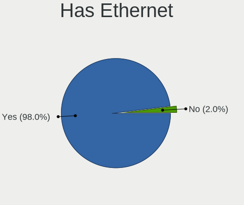
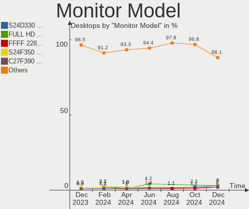
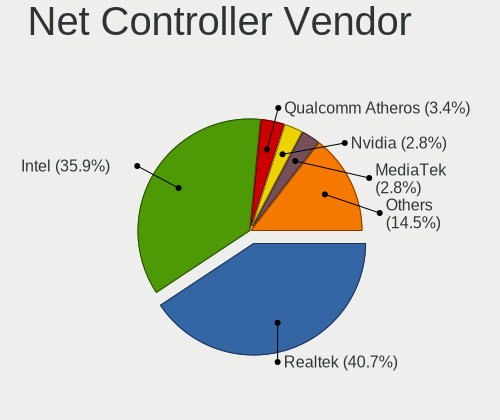
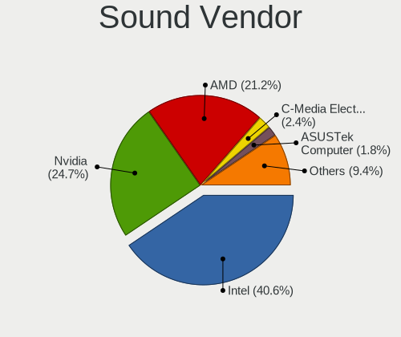
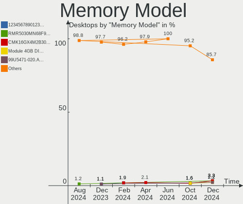
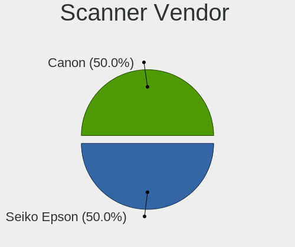

Linux in Italy - Hardware Trends (Desktops)
-------------------------------------------

A project to identify most popular hardware characteristics and track their change
over time based on data collected by Linux users at https://Linux-Hardware.org.

Anyone can contribute to this report by the [hw-probe](https://github.com/linuxhw/hw-probe) tool:

    sudo -E hw-probe -all -upload

Period: Sep, 2022.

Contents
--------

* [ System ](#system)
  - [ OS                       ](#os)
  - [ OS Family                ](#os-family)
  - [ Kernel                   ](#kernel)
  - [ Kernel Family            ](#kernel-family)
  - [ Kernel Major Ver.        ](#kernel-major-ver)
  - [ Arch                     ](#arch)
  - [ DE                       ](#de)
  - [ Display Server           ](#display-server)
  - [ Display Manager          ](#display-manager)
  - [ OS Lang                  ](#os-lang)
  - [ Boot Mode                ](#boot-mode)
  - [ Filesystem               ](#filesystem)
  - [ Part. scheme             ](#part-scheme)
  - [ Dual Boot with Linux/BSD ](#dual-boot-with-linuxbsd)
  - [ Dual Boot (Win)          ](#dual-boot-win)

* [ Board ](#board)
  - [ Vendor                   ](#vendor)
  - [ Model                    ](#model)
  - [ Model Family             ](#model-family)
  - [ MFG Year                 ](#mfg-year)
  - [ Form Factor              ](#form-factor)
  - [ Secure Boot              ](#secure-boot)
  - [ Coreboot                 ](#coreboot)
  - [ RAM Size                 ](#ram-size)
  - [ RAM Used                 ](#ram-used)
  - [ Total Drives             ](#total-drives)
  - [ Has CD-ROM               ](#has-cd-rom)
  - [ Has Ethernet             ](#has-ethernet)
  - [ Has WiFi                 ](#has-wifi)
  - [ Has Bluetooth            ](#has-bluetooth)

* [ Location ](#location)
  - [ Country                  ](#country)
  - [ City                     ](#city)

* [ Drives ](#drives)
  - [ Drive Vendor             ](#drive-vendor)
  - [ Drive Model              ](#drive-model)
  - [ HDD Vendor               ](#hdd-vendor)
  - [ SSD Vendor               ](#ssd-vendor)
  - [ Drive Kind               ](#drive-kind)
  - [ Drive Connector          ](#drive-connector)
  - [ Drive Size               ](#drive-size)
  - [ Space Total              ](#space-total)
  - [ Space Used               ](#space-used)
  - [ Malfunc. Drives          ](#malfunc-drives)
  - [ Malfunc. Drive Vendor    ](#malfunc-drive-vendor)
  - [ Malfunc. HDD Vendor      ](#malfunc-hdd-vendor)
  - [ Malfunc. Drive Kind      ](#malfunc-drive-kind)
  - [ Failed Drives            ](#failed-drives)
  - [ Failed Drive Vendor      ](#failed-drive-vendor)
  - [ Drive Status             ](#drive-status)

* [ Storage controller ](#storage-controller)
  - [ Storage Vendor           ](#storage-vendor)
  - [ Storage Model            ](#storage-model)
  - [ Storage Kind             ](#storage-kind)

* [ Processor ](#processor)
  - [ CPU Vendor               ](#cpu-vendor)
  - [ CPU Model                ](#cpu-model)
  - [ CPU Model Family         ](#cpu-model-family)
  - [ CPU Cores                ](#cpu-cores)
  - [ CPU Sockets              ](#cpu-sockets)
  - [ CPU Threads              ](#cpu-threads)
  - [ CPU Op-Modes             ](#cpu-op-modes)
  - [ CPU Microcode            ](#cpu-microcode)
  - [ CPU Microarch            ](#cpu-microarch)

* [ Graphics ](#graphics)
  - [ GPU Vendor               ](#gpu-vendor)
  - [ GPU Model                ](#gpu-model)
  - [ GPU Combo                ](#gpu-combo)
  - [ GPU Driver               ](#gpu-driver)
  - [ GPU Memory               ](#gpu-memory)

* [ Monitor ](#monitor)
  - [ Monitor Vendor           ](#monitor-vendor)
  - [ Monitor Model            ](#monitor-model)
  - [ Monitor Resolution       ](#monitor-resolution)
  - [ Monitor Diagonal         ](#monitor-diagonal)
  - [ Monitor Width            ](#monitor-width)
  - [ Aspect Ratio             ](#aspect-ratio)
  - [ Monitor Area             ](#monitor-area)
  - [ Pixel Density            ](#pixel-density)
  - [ Multiple Monitors        ](#multiple-monitors)

* [ Network ](#network)
  - [ Net Controller Vendor    ](#net-controller-vendor)
  - [ Net Controller Model     ](#net-controller-model)
  - [ Wireless Vendor          ](#wireless-vendor)
  - [ Wireless Model           ](#wireless-model)
  - [ Ethernet Vendor          ](#ethernet-vendor)
  - [ Ethernet Model           ](#ethernet-model)
  - [ Net Controller Kind      ](#net-controller-kind)
  - [ Used Controller          ](#used-controller)
  - [ NICs                     ](#nics)
  - [ IPv6                     ](#ipv6)

* [ Bluetooth ](#bluetooth)
  - [ Bluetooth Vendor         ](#bluetooth-vendor)
  - [ Bluetooth Model          ](#bluetooth-model)

* [ Sound ](#sound)
  - [ Sound Vendor             ](#sound-vendor)
  - [ Sound Model              ](#sound-model)

* [ Memory ](#memory)
  - [ Memory Vendor            ](#memory-vendor)
  - [ Memory Model             ](#memory-model)
  - [ Memory Kind              ](#memory-kind)
  - [ Memory Form Factor       ](#memory-form-factor)
  - [ Memory Size              ](#memory-size)
  - [ Memory Speed             ](#memory-speed)

* [ Printers & scanners ](#printers--scanners)
  - [ Printer Vendor           ](#printer-vendor)
  - [ Printer Model            ](#printer-model)
  - [ Scanner Vendor           ](#scanner-vendor)
  - [ Scanner Model            ](#scanner-model)

* [ Camera ](#camera)
  - [ Camera Vendor            ](#camera-vendor)
  - [ Camera Model             ](#camera-model)

* [ Security ](#security)
  - [ Fingerprint Vendor       ](#fingerprint-vendor)
  - [ Fingerprint Model        ](#fingerprint-model)
  - [ Chipcard Vendor          ](#chipcard-vendor)
  - [ Chipcard Model           ](#chipcard-model)

* [ Unsupported ](#unsupported)
  - [ Unsupported Devices      ](#unsupported-devices)
  - [ Unsupported Device Types ](#unsupported-device-types)

System
------

OS
--

Installed operating systems

| Name                         | Desktops | Percent |
|------------------------------|----------|---------|
| Ubuntu 22.04                 | 24       | 20.34%  |
| Fedora 36                    | 17       | 14.41%  |
| Linux Mint 21                | 8        | 6.78%   |
| Ubuntu 20.04                 | 7        | 5.93%   |
| Debian 11                    | 7        | 5.93%   |
| Arch Rolling                 | 7        | 5.93%   |
| Arch                         | 5        | 4.24%   |
| Kubuntu 22.04                | 4        | 3.39%   |
| Zorin 16                     | 3        | 2.54%   |
| Manjaro 21.3.7               | 3        | 2.54%   |
| Linux Mint 20.3              | 3        | 2.54%   |
| Fedora 35                    | 3        | 2.54%   |
| Xubuntu 22.04                | 2        | 1.69%   |
| OpenMandriva 4.90            | 2        | 1.69%   |
| Manjaro 22.0.0               | 2        | 1.69%   |
| Linux Mint 19.3              | 2        | 1.69%   |
| KDE neon 20.04               | 2        | 1.69%   |
| Xubuntu 18.04                | 1        | 0.85%   |
| Ubuntu MATE 22.04            | 1        | 0.85%   |
| PureOS 10                    | 1        | 0.85%   |
| Pop!_OS 22.04                | 1        | 0.85%   |
| openSUSE Tumbleweed-XXXXXXXX | 1        | 0.85%   |
| OpenMandriva 4.3             | 1        | 0.85%   |
| MX 20                        | 1        | 0.85%   |
| LMDE 5                       | 1        | 0.85%   |
| LinuxFX 11                   | 1        | 0.85%   |
| Linux Mint 20.1              | 1        | 0.85%   |
| Linux Mint 20                | 1        | 0.85%   |
| Kubuntu 21.10                | 1        | 0.85%   |
| Kubuntu 20.04                | 1        | 0.85%   |
| EndeavourOS Rolling          | 1        | 0.85%   |
| Debian Unstable              | 1        | 0.85%   |
| Debian Testing               | 1        | 0.85%   |
| Asimov                       | 1        | 0.85%   |

OS Family
---------

OS without a version

| Name         | Desktops | Percent |
|--------------|----------|---------|
| Ubuntu       | 31       | 26.27%  |
| Fedora       | 20       | 16.95%  |
| Linux Mint   | 15       | 12.71%  |
| Arch         | 12       | 10.17%  |
| Debian       | 9        | 7.63%   |
| Kubuntu      | 6        | 5.08%   |
| Manjaro      | 5        | 4.24%   |
| Zorin        | 3        | 2.54%   |
| Xubuntu      | 3        | 2.54%   |
| OpenMandriva | 3        | 2.54%   |
| KDE neon     | 2        | 1.69%   |
| Ubuntu MATE  | 1        | 0.85%   |
| PureOS       | 1        | 0.85%   |
| Pop!_OS      | 1        | 0.85%   |
| openSUSE     | 1        | 0.85%   |
| MX           | 1        | 0.85%   |
| LMDE         | 1        | 0.85%   |
| LinuxFX      | 1        | 0.85%   |
| EndeavourOS  | 1        | 0.85%   |
| Asimov       | 1        | 0.85%   |

Kernel
------

Version of the Linux kernel

| Version                   | Desktops | Percent |
|---------------------------|----------|---------|
| 5.15.0-47-generic         | 31       | 26.27%  |
| 5.19.6-200.fc36.x86_64    | 10       | 8.47%   |
| 5.15.0-46-generic         | 9        | 7.63%   |
| 5.15.0-48-generic         | 6        | 5.08%   |
| 5.4.0-125-generic         | 5        | 4.24%   |
| 5.19.6-zen1-1-zen         | 3        | 2.54%   |
| 5.15.60-1-MANJARO         | 3        | 2.54%   |
| 5.10.0-18-amd64           | 3        | 2.54%   |
| 5.4.0-124-generic         | 2        | 1.69%   |
| 5.19.4-arch1-1            | 2        | 1.69%   |
| 5.19.4-200.fc36.x86_64    | 2        | 1.69%   |
| 5.18.19-200.fc36.x86_64   | 2        | 1.69%   |
| 5.18.12-desktop-3omv4090  | 2        | 1.69%   |
| 5.15.0-43-generic         | 2        | 1.69%   |
| 5.10.0-17-amd64           | 2        | 1.69%   |
| 5.4.0-126-generic         | 1        | 0.85%   |
| 5.19.9-zen1-1-zen         | 1        | 0.85%   |
| 5.19.9-200.fc36.x86_64    | 1        | 0.85%   |
| 5.19.8-arch1-1            | 1        | 0.85%   |
| 5.19.8-200.fc36.x86_64    | 1        | 0.85%   |
| 5.19.7-zen2-1-zen         | 1        | 0.85%   |
| 5.19.7-1-MANJARO          | 1        | 0.85%   |
| 5.19.7-1-default          | 1        | 0.85%   |
| 5.19.6-arch1-1            | 1        | 0.85%   |
| 5.19.6-100.fc35.x86_64    | 1        | 0.85%   |
| 5.19.5-zen1-1-zen         | 1        | 0.85%   |
| 5.19.4-100.fc35.x86_64    | 1        | 0.85%   |
| 5.19.3-arch1-1            | 1        | 0.85%   |
| 5.19.11-arch1-1           | 1        | 0.85%   |
| 5.19.1-3-MANJARO          | 1        | 0.85%   |
| 5.19.0-8.2-liquorix-amd64 | 1        | 0.85%   |
| 5.19.0-76051900-generic   | 1        | 0.85%   |
| 5.19.0-1-amd64            | 1        | 0.85%   |
| 5.18.16-100.fc35.x86_64   | 1        | 0.85%   |
| 5.18.0-4-amd64            | 1        | 0.85%   |
| 5.17.5-300.fc36.x86_64    | 1        | 0.85%   |
| 5.16.7-desktop-1omv4003   | 1        | 0.85%   |
| 5.15.7-arch1-1            | 1        | 0.85%   |
| 5.15.64-1-lts             | 1        | 0.85%   |
| 5.15.39-4-pve             | 1        | 0.85%   |

Kernel Family
-------------

Linux kernel without a distro release

| Version | Desktops | Percent |
|---------|----------|---------|
| 5.15.0  | 49       | 41.53%  |
| 5.19.6  | 15       | 12.71%  |
| 5.4.0   | 8        | 6.78%   |
| 5.10.0  | 8        | 6.78%   |
| 5.19.4  | 5        | 4.24%   |
| 5.19.7  | 3        | 2.54%   |
| 5.19.0  | 3        | 2.54%   |
| 5.15.60 | 3        | 2.54%   |
| 5.19.9  | 2        | 1.69%   |
| 5.19.8  | 2        | 1.69%   |
| 5.18.19 | 2        | 1.69%   |
| 5.18.12 | 2        | 1.69%   |
| 4.15.0  | 2        | 1.69%   |
| 5.19.5  | 1        | 0.85%   |
| 5.19.3  | 1        | 0.85%   |
| 5.19.11 | 1        | 0.85%   |
| 5.19.1  | 1        | 0.85%   |
| 5.18.16 | 1        | 0.85%   |
| 5.18.0  | 1        | 0.85%   |
| 5.17.5  | 1        | 0.85%   |
| 5.16.7  | 1        | 0.85%   |
| 5.15.7  | 1        | 0.85%   |
| 5.15.64 | 1        | 0.85%   |
| 5.15.39 | 1        | 0.85%   |
| 5.13.0  | 1        | 0.85%   |
| 5.11.0  | 1        | 0.85%   |
| 4.19.0  | 1        | 0.85%   |

Kernel Major Ver.
-----------------

Linux kernel major version

| Version | Desktops | Percent |
|---------|----------|---------|
| 5.15    | 55       | 46.61%  |
| 5.19    | 34       | 28.81%  |
| 5.4     | 8        | 6.78%   |
| 5.10    | 8        | 6.78%   |
| 5.18    | 6        | 5.08%   |
| 4.15    | 2        | 1.69%   |
| 5.17    | 1        | 0.85%   |
| 5.16    | 1        | 0.85%   |
| 5.13    | 1        | 0.85%   |
| 5.11    | 1        | 0.85%   |
| 4.19    | 1        | 0.85%   |

Arch
----

OS architecture (x86_64, i586, etc.)

| Name   | Desktops | Percent |
|--------|----------|---------|
| x86_64 | 117      | 99.15%  |
| i686   | 1        | 0.85%   |

DE
--

Desktop Environment

| Name             | Desktops | Percent |
|------------------|----------|---------|
| GNOME            | 52       | 44.07%  |
| KDE5             | 26       | 22.03%  |
| XFCE             | 13       | 11.02%  |
| X-Cinnamon       | 13       | 11.02%  |
| MATE             | 4        | 3.39%   |
| i3               | 3        | 2.54%   |
| lightdm-xsession | 2        | 1.69%   |
| Cinnamon         | 2        | 1.69%   |
| Unknown          | 2        | 1.69%   |
| GNOME Flashback  | 1        | 0.85%   |

Display Server
--------------

X11 or Wayland

| Name    | Desktops | Percent |
|---------|----------|---------|
| X11     | 88       | 74.58%  |
| Wayland | 29       | 24.58%  |
| Unknown | 1        | 0.85%   |

Display Manager
---------------

SDDM, LightDM, etc.

| Name    | Desktops | Percent |
|---------|----------|---------|
| LightDM | 29       | 24.58%  |
| Unknown | 25       | 21.19%  |
| GDM3    | 24       | 20.34%  |
| GDM     | 21       | 17.8%   |
| SDDM    | 18       | 15.25%  |
| GREETD  | 1        | 0.85%   |

OS Lang
-------

Language

| Lang    | Desktops | Percent |
|---------|----------|---------|
| it_IT   | 88       | 74.58%  |
| en_US   | 22       | 18.64%  |
| en_GB   | 5        | 4.24%   |
| Unknown | 2        | 1.69%   |
| it_CH   | 1        | 0.85%   |

Boot Mode
---------

EFI or BIOS

| Mode | Desktops | Percent |
|------|----------|---------|
| EFI  | 63       | 53.39%  |
| BIOS | 55       | 46.61%  |

Filesystem
----------

Type of filesystem

| Type    | Desktops | Percent |
|---------|----------|---------|
| Ext4    | 89       | 75.42%  |
| Btrfs   | 22       | 18.64%  |
| Overlay | 5        | 4.24%   |
| Zfs     | 1        | 0.85%   |
| Xfs     | 1        | 0.85%   |

Part. scheme
------------

Scheme of partitioning

| Type    | Desktops | Percent |
|---------|----------|---------|
| GPT     | 61       | 51.69%  |
| Unknown | 46       | 38.98%  |
| MBR     | 11       | 9.32%   |

Dual Boot with Linux/BSD
------------------------

Hosting more than one Linux/BSD

| Dual boot | Desktops | Percent |
|-----------|----------|---------|
| No        | 93       | 78.81%  |
| Yes       | 25       | 21.19%  |

Dual Boot (Win)
---------------

Hosting Linux and Windows

| Dual boot | Desktops | Percent |
|-----------|----------|---------|
| Yes       | 59       | 50%     |
| No        | 59       | 50%     |

Board
-----

Vendor
------

Motherboard manufacturer

| Name                | Desktops | Percent |
|---------------------|----------|---------|
| ASUSTek Computer    | 34       | 28.81%  |
| MSI                 | 18       | 15.25%  |
| ASRock              | 17       | 14.41%  |
| Gigabyte Technology | 14       | 11.86%  |
| Dell                | 11       | 9.32%   |
| Lenovo              | 7        | 5.93%   |
| Hewlett-Packard     | 5        | 4.24%   |
| Pegatron            | 2        | 1.69%   |
| Intel               | 2        | 1.69%   |
| Acer                | 2        | 1.69%   |
| Supermicro          | 1        | 0.85%   |
| Packard Bell        | 1        | 0.85%   |
| OEM                 | 1        | 0.85%   |
| Fujitsu Siemens     | 1        | 0.85%   |
| Fujitsu             | 1        | 0.85%   |
| BESSTAR Tech        | 1        | 0.85%   |

Model
-----

Motherboard model

| Name                                    | Desktops | Percent |
|-----------------------------------------|----------|---------|
| MSI MS-7C56                             | 4        | 3.39%   |
| MSI MS-7B86                             | 3        | 2.54%   |
| MSI MS-7C91                             | 2        | 1.69%   |
| MSI MS-7C37                             | 2        | 1.69%   |
| MSI MS-7B79                             | 2        | 1.69%   |
| HP Compaq Elite 8300 SFF                | 2        | 1.69%   |
| Gigabyte X470 AORUS ULTRA GAMING        | 2        | 1.69%   |
| Dell OptiPlex 7010                      | 2        | 1.69%   |
| ASUS TUF Gaming B550-PLUS               | 2        | 1.69%   |
| ASUS PRIME A320M-K                      | 2        | 1.69%   |
| ASUS All Series                         | 2        | 1.69%   |
| ASRock Q1900M                           | 2        | 1.69%   |
| Supermicro C7P67                        | 1        | 0.85%   |
| Pegatron WC934AA-ABZ CQ5334IT           | 1        | 0.85%   |
| Pegatron Pro 3015 Microtower PC         | 1        | 0.85%   |
| Packard Bell IMEDIA L4875               | 1        | 0.85%   |
| OEM G41 775 ICH7 8712                   | 1        | 0.85%   |
| MSI NQ890AA-ABZ CQ5011IT                | 1        | 0.85%   |
| MSI MS-7C02                             | 1        | 0.85%   |
| MSI MS-7978                             | 1        | 0.85%   |
| MSI MS-7788                             | 1        | 0.85%   |
| MSI MS-7522                             | 1        | 0.85%   |
| Lenovo ThinkCentre M92 3229A11          | 1        | 0.85%   |
| Lenovo ThinkCentre M700 10HY002WUK      | 1        | 0.85%   |
| Lenovo ThinkCentre M57 6072WMD          | 1        | 0.85%   |
| Lenovo IdeaCentre 720-18ASU 90H1004TIX  | 1        | 0.85%   |
| Lenovo IdeaCentre 300S-11ISH 90D9003KYD | 1        | 0.85%   |
| Lenovo IdeaCentre 3 07ADA05 90MV00BCIX  | 1        | 0.85%   |
| Lenovo H530 10130                       | 1        | 0.85%   |
| Intel H55                               | 1        | 0.85%   |
| Intel DH77DF AAG40293-300               | 1        | 0.85%   |
| HP Z400 Workstation                     | 1        | 0.85%   |
| HP Pavilion Desktop 590-p0xxx           | 1        | 0.85%   |
| HP 100-410nl                            | 1        | 0.85%   |
| Gigabyte Z97X-UD5H-BK                   | 1        | 0.85%   |
| Gigabyte Z97-HD3                        | 1        | 0.85%   |
| Gigabyte Z77X-UP7                       | 1        | 0.85%   |
| Gigabyte Z390 GAMING X                  | 1        | 0.85%   |
| Gigabyte Z390 AORUS PRO                 | 1        | 0.85%   |
| Gigabyte X570 AORUS MASTER              | 1        | 0.85%   |

Model Family
------------

Motherboard model prefix

| Name                  | Desktops | Percent |
|-----------------------|----------|---------|
| Dell OptiPlex         | 8        | 6.78%   |
| ASUS PRIME            | 6        | 5.08%   |
| ASUS ROG              | 5        | 4.24%   |
| MSI MS-7C56           | 4        | 3.39%   |
| ASUS TUF              | 4        | 3.39%   |
| MSI MS-7B86           | 3        | 2.54%   |
| Lenovo ThinkCentre    | 3        | 2.54%   |
| Lenovo IdeaCentre     | 3        | 2.54%   |
| MSI MS-7C91           | 2        | 1.69%   |
| MSI MS-7C37           | 2        | 1.69%   |
| MSI MS-7B79           | 2        | 1.69%   |
| HP Compaq             | 2        | 1.69%   |
| Gigabyte Z390         | 2        | 1.69%   |
| Gigabyte X470         | 2        | 1.69%   |
| Dell Precision        | 2        | 1.69%   |
| ASUS P9X79            | 2        | 1.69%   |
| ASUS All              | 2        | 1.69%   |
| ASRock Q1900M         | 2        | 1.69%   |
| Supermicro C7P67      | 1        | 0.85%   |
| Pegatron WC934AA-ABZ  | 1        | 0.85%   |
| Pegatron Pro          | 1        | 0.85%   |
| Packard Bell IMEDIA   | 1        | 0.85%   |
| OEM G41               | 1        | 0.85%   |
| MSI NQ890AA-ABZ       | 1        | 0.85%   |
| MSI MS-7C02           | 1        | 0.85%   |
| MSI MS-7978           | 1        | 0.85%   |
| MSI MS-7788           | 1        | 0.85%   |
| MSI MS-7522           | 1        | 0.85%   |
| Lenovo H530           | 1        | 0.85%   |
| Intel H55             | 1        | 0.85%   |
| Intel DH77DF          | 1        | 0.85%   |
| HP Z400               | 1        | 0.85%   |
| HP Pavilion           | 1        | 0.85%   |
| HP 100-410nl          | 1        | 0.85%   |
| Gigabyte Z97X-UD5H-BK | 1        | 0.85%   |
| Gigabyte Z97-HD3      | 1        | 0.85%   |
| Gigabyte Z77X-UP7     | 1        | 0.85%   |
| Gigabyte X570         | 1        | 0.85%   |
| Gigabyte F2A55M-DS2   | 1        | 0.85%   |
| Gigabyte B560M        | 1        | 0.85%   |

MFG Year
--------

Motherboard manufacture year

| Year | Desktops | Percent |
|------|----------|---------|
| 2018 | 16       | 13.56%  |
| 2020 | 14       | 11.86%  |
| 2019 | 13       | 11.02%  |
| 2012 | 11       | 9.32%   |
| 2013 | 10       | 8.47%   |
| 2017 | 9        | 7.63%   |
| 2014 | 7        | 5.93%   |
| 2011 | 7        | 5.93%   |
| 2015 | 6        | 5.08%   |
| 2009 | 6        | 5.08%   |
| 2007 | 6        | 5.08%   |
| 2016 | 3        | 2.54%   |
| 2010 | 3        | 2.54%   |
| 2022 | 2        | 1.69%   |
| 2021 | 2        | 1.69%   |
| 2006 | 2        | 1.69%   |
| 2008 | 1        | 0.85%   |

Form Factor
-----------

Physical design of the computer

| Name    | Desktops | Percent |
|---------|----------|---------|
| Desktop | 118      | 100%    |

Secure Boot
-----------

Enabled or disabled

| State    | Desktops | Percent |
|----------|----------|---------|
| Disabled | 116      | 98.31%  |
| Enabled  | 2        | 1.69%   |

Coreboot
--------

Have coreboot on board

| Used | Desktops | Percent |
|------|----------|---------|
| No   | 118      | 100%    |

RAM Size
--------

Total RAM memory

| Size in GB  | Desktops | Percent |
|-------------|----------|---------|
| 16.01-24.0  | 32       | 27.12%  |
| 8.01-16.0   | 28       | 23.73%  |
| 32.01-64.0  | 23       | 19.49%  |
| 3.01-4.0    | 14       | 11.86%  |
| 4.01-8.0    | 12       | 10.17%  |
| 24.01-32.0  | 4        | 3.39%   |
| 2.01-3.0    | 2        | 1.69%   |
| 64.01-256.0 | 2        | 1.69%   |
| 1.01-2.0    | 1        | 0.85%   |

RAM Used
--------

Used RAM memory

| Used GB    | Desktops | Percent |
|------------|----------|---------|
| 2.01-3.0   | 33       | 27.97%  |
| 1.01-2.0   | 26       | 22.03%  |
| 3.01-4.0   | 25       | 21.19%  |
| 4.01-8.0   | 21       | 17.8%   |
| 8.01-16.0  | 9        | 7.63%   |
| 0.51-1.0   | 2        | 1.69%   |
| 16.01-24.0 | 1        | 0.85%   |
| 0.01-0.5   | 1        | 0.85%   |

Total Drives
------------

Number of drives on board

| Drives | Desktops | Percent |
|--------|----------|---------|
| 2      | 36       | 30.51%  |
| 1      | 32       | 27.12%  |
| 3      | 27       | 22.88%  |
| 4      | 19       | 16.1%   |
| 5      | 3        | 2.54%   |
| 0      | 1        | 0.85%   |

Has CD-ROM
----------

Has CD-ROM on board

| Presented | Desktops | Percent |
|-----------|----------|---------|
| Yes       | 63       | 53.39%  |
| No        | 55       | 46.61%  |

Has Ethernet
------------

Has Ethernet on board

| Presented | Desktops | Percent |
|-----------|----------|---------|
| Yes       | 117      | 99.15%  |
| No        | 1        | 0.85%   |

Has WiFi
--------

Has WiFi module

| Presented | Desktops | Percent |
|-----------|----------|---------|
| No        | 61       | 51.69%  |
| Yes       | 57       | 48.31%  |

Has Bluetooth
-------------

Has Bluetooth module

| Presented | Desktops | Percent |
|-----------|----------|---------|
| No        | 68       | 57.63%  |
| Yes       | 50       | 42.37%  |

Location
--------

Country
-------

Geographic location (country)

| Country | Desktops | Percent |
|---------|----------|---------|
| Italy   | 118      | 100%    |

City
----

Geographic location (city)

| City                        | Desktops | Percent |
|-----------------------------|----------|---------|
| Milan                       | 14       | 11.86%  |
| Rome                        | 11       | 9.32%   |
| Verona                      | 4        | 3.39%   |
| Palermo                     | 4        | 3.39%   |
| Genoa                       | 3        | 2.54%   |
| Cagliari                    | 3        | 2.54%   |
| Bologna                     | 3        | 2.54%   |
| Venice                      | 2        | 1.69%   |
| Rozzano                     | 2        | 1.69%   |
| Rho                         | 2        | 1.69%   |
| Naples                      | 2        | 1.69%   |
| Limena                      | 2        | 1.69%   |
| Florence                    | 2        | 1.69%   |
| Bitonto                     | 2        | 1.69%   |
| Zambana                     | 1        | 0.85%   |
| Vitinia                     | 1        | 0.85%   |
| Vignola                     | 1        | 0.85%   |
| Vado Ligure                 | 1        | 0.85%   |
| Udine                       | 1        | 0.85%   |
| Turin                       | 1        | 0.85%   |
| Sulmona                     | 1        | 0.85%   |
| Spinea                      | 1        | 0.85%   |
| Somma Vesuviana             | 1        | 0.85%   |
| Sogliano Cavour             | 1        | 0.85%   |
| Sestri Levante              | 1        | 0.85%   |
| Sesto San Giovanni          | 1        | 0.85%   |
| Sciacca                     | 1        | 0.85%   |
| Scandicci                   | 1        | 0.85%   |
| Sannazzaro de' Burgondi     | 1        | 0.85%   |
| San Gregorio nelle Alpi     | 1        | 0.85%   |
| San Casciano in Val di Pesa | 1        | 0.85%   |
| Russi                       | 1        | 0.85%   |
| Rosignano Marittimo         | 1        | 0.85%   |
| Reggio Emilia               | 1        | 0.85%   |
| Reggio Calabria             | 1        | 0.85%   |
| Ragusa                      | 1        | 0.85%   |
| Ponte Buggianese            | 1        | 0.85%   |
| Ponsacco                    | 1        | 0.85%   |
| Pistoia                     | 1        | 0.85%   |
| Pisa                        | 1        | 0.85%   |

Drives
------

Drive Vendor
------------

Hard drive vendors

| Vendor                      | Desktops | Drives | Percent |
|-----------------------------|----------|--------|---------|
| Seagate                     | 44       | 56     | 19.05%  |
| WDC                         | 41       | 53     | 17.75%  |
| Samsung Electronics         | 34       | 47     | 14.72%  |
| Crucial                     | 25       | 28     | 10.82%  |
| Kingston                    | 24       | 25     | 10.39%  |
| Toshiba                     | 15       | 15     | 6.49%   |
| SanDisk                     | 8        | 10     | 3.46%   |
| Phison                      | 4        | 4      | 1.73%   |
| Phison Electronics          | 3        | 4      | 1.3%    |
| Maxtor                      | 3        | 4      | 1.3%    |
| Hitachi                     | 3        | 3      | 1.3%    |
| China                       | 3        | 3      | 1.3%    |
| Team                        | 2        | 2      | 0.87%   |
| SPCC                        | 2        | 2      | 0.87%   |
| HGST                        | 2        | 2      | 0.87%   |
| A-DATA Technology           | 2        | 2      | 0.87%   |
| WD MediaMax                 | 1        | 1      | 0.43%   |
| TCSUNBOW                    | 1        | 1      | 0.43%   |
| SK hynix                    | 1        | 1      | 0.43%   |
| Silicon Motion              | 1        | 1      | 0.43%   |
| S3+                         | 1        | 1      | 0.43%   |
| Realtek Semiconductor       | 1        | 1      | 0.43%   |
| Plextor                     | 1        | 1      | 0.43%   |
| Patriot                     | 1        | 1      | 0.43%   |
| MAXIO Technology (Hangzhou) | 1        | 1      | 0.43%   |
| Lexar                       | 1        | 1      | 0.43%   |
| LaCie                       | 1        | 1      | 0.43%   |
| Kingston Technology Company | 1        | 1      | 0.43%   |
| KingDian                    | 1        | 1      | 0.43%   |
| Fanxiang                    | 1        | 1      | 0.43%   |
| Drevo                       | 1        | 1      | 0.43%   |
| Corsair                     | 1        | 3      | 0.43%   |

Drive Model
-----------

Hard drive models

| Model                                               | Desktops | Percent |
|-----------------------------------------------------|----------|---------|
| Kingston SA400S37240G 240GB SSD                     | 7        | 2.58%   |
| Toshiba DT01ACA100 1TB                              | 5        | 1.85%   |
| Crucial CT500MX500SSD1 500GB                        | 5        | 1.85%   |
| Crucial CT240BX500SSD1 240GB                        | 5        | 1.85%   |
| Samsung SSD 860 EVO 250GB                           | 4        | 1.48%   |
| Samsung SSD 850 EVO 250GB                           | 4        | 1.48%   |
| Crucial CT480BX500SSD1 480GB                        | 4        | 1.48%   |
| Seagate ST500DM002-1BD142 500GB                     | 3        | 1.11%   |
| Seagate ST4000DM004-2CV104 4TB                      | 3        | 1.11%   |
| Seagate ST2000DM001-1ER164 2TB                      | 3        | 1.11%   |
| Seagate ST2000DM001-1CH164 2TB                      | 3        | 1.11%   |
| Seagate ST1000DM003-1CH162 1TB                      | 3        | 1.11%   |
| Samsung SSD 870 QVO 1TB                             | 3        | 1.11%   |
| Samsung SSD 860 EVO 500GB                           | 3        | 1.11%   |
| Kingston SV300S37A120G 120GB SSD                    | 3        | 1.11%   |
| Kingston SA400S37480G 480GB SSD                     | 3        | 1.11%   |
| Kingston SA400S37120G 120GB SSD                     | 3        | 1.11%   |
| Kingston SA2000M8250G 250GB                         | 3        | 1.11%   |
| Crucial CT250MX500SSD1 250GB                        | 3        | 1.11%   |
| WDC WDS250G2B0A-00SM50 250GB SSD                    | 2        | 0.74%   |
| WDC WD5000AAKX-60U6AA0 500GB                        | 2        | 0.74%   |
| WDC WD10EZEX-08WN4A0 1TB                            | 2        | 0.74%   |
| WDC WD10EZEX-00WN4A0 1TB                            | 2        | 0.74%   |
| Toshiba HDWD110 1TB                                 | 2        | 0.74%   |
| Seagate STM3500418AS 500GB                          | 2        | 0.74%   |
| Seagate ST2000DM008-2FR102 2TB                      | 2        | 0.74%   |
| Seagate ST2000DL003-9VT166 2TB                      | 2        | 0.74%   |
| Seagate ST1000DM010-2EP102 1TB                      | 2        | 0.74%   |
| Seagate ST1000DM003-9YN162 1TB                      | 2        | 0.74%   |
| Seagate ST1000DM003-1SB10C 1TB                      | 2        | 0.74%   |
| Seagate ST1000DM003-1ER162 1TB                      | 2        | 0.74%   |
| Seagate M3 Portable 2TB                             | 2        | 0.74%   |
| SanDisk SDSSDH3 1T00 1TB                            | 2        | 0.74%   |
| Samsung SSD 870 QVO 2TB                             | 2        | 0.74%   |
| Samsung NVMe SSD Drive 250GB                        | 2        | 0.74%   |
| Samsung NVMe SSD Controller SM981/PM981/PM983 256GB | 2        | 0.74%   |
| Phison NVMe SSD Drive 512GB                         | 2        | 0.74%   |
| Phison E12 NVMe Controller 1024GB                   | 2        | 0.74%   |
| Maxtor STM3250310AS 250GB                           | 2        | 0.74%   |
| Kingston SV300S37A60G 64GB SSD                      | 2        | 0.74%   |

HDD Vendor
----------

Hard disk drive vendors

| Vendor              | Desktops | Drives | Percent |
|---------------------|----------|--------|---------|
| Seagate             | 42       | 53     | 39.62%  |
| WDC                 | 37       | 45     | 34.91%  |
| Toshiba             | 13       | 13     | 12.26%  |
| Samsung Electronics | 5        | 5      | 4.72%   |
| Maxtor              | 3        | 4      | 2.83%   |
| Hitachi             | 3        | 3      | 2.83%   |
| HGST                | 2        | 2      | 1.89%   |
| WD MediaMax         | 1        | 1      | 0.94%   |

SSD Vendor
----------

Solid state drive vendors

| Vendor              | Desktops | Drives | Percent |
|---------------------|----------|--------|---------|
| Crucial             | 22       | 24     | 25%     |
| Samsung Electronics | 20       | 29     | 22.73%  |
| Kingston            | 19       | 20     | 21.59%  |
| SanDisk             | 8        | 10     | 9.09%   |
| WDC                 | 4        | 5      | 4.55%   |
| China               | 3        | 3      | 3.41%   |
| Toshiba             | 1        | 1      | 1.14%   |
| Team                | 1        | 1      | 1.14%   |
| TCSUNBOW            | 1        | 1      | 1.14%   |
| SPCC                | 1        | 1      | 1.14%   |
| S3+                 | 1        | 1      | 1.14%   |
| Plextor             | 1        | 1      | 1.14%   |
| Patriot             | 1        | 1      | 1.14%   |
| Lexar               | 1        | 1      | 1.14%   |
| KingDian            | 1        | 1      | 1.14%   |
| Drevo               | 1        | 1      | 1.14%   |
| Corsair             | 1        | 3      | 1.14%   |
| A-DATA Technology   | 1        | 1      | 1.14%   |

Drive Kind
----------

HDD or SSD

| Kind    | Desktops | Drives | Percent |
|---------|----------|--------|---------|
| HDD     | 90       | 126    | 43.06%  |
| SSD     | 76       | 105    | 36.36%  |
| NVMe    | 38       | 42     | 18.18%  |
| Unknown | 5        | 5      | 2.39%   |

Drive Connector
---------------

SATA, SAS, NVMe, etc.

| Type | Desktops | Drives | Percent |
|------|----------|--------|---------|
| SATA | 111      | 226    | 70.7%   |
| NVMe | 38       | 42     | 24.2%   |
| SAS  | 8        | 10     | 5.1%    |

Drive Size
----------

Size of hard drive

| Size in TB | Desktops | Drives | Percent |
|------------|----------|--------|---------|
| 0.01-0.5   | 83       | 131    | 50.61%  |
| 0.51-1.0   | 45       | 57     | 27.44%  |
| 1.01-2.0   | 21       | 27     | 12.8%   |
| 3.01-4.0   | 8        | 9      | 4.88%   |
| 2.01-3.0   | 5        | 5      | 3.05%   |
| 4.01-10.0  | 2        | 2      | 1.22%   |

Space Total
-----------

Amount of disk space available on the file system

| Size in GB     | Desktops | Percent |
|----------------|----------|---------|
| 101-250        | 31       | 26.27%  |
| 1001-2000      | 18       | 15.25%  |
| More than 3000 | 17       | 14.41%  |
| 501-1000       | 17       | 14.41%  |
| 251-500        | 12       | 10.17%  |
| 2001-3000      | 9        | 7.63%   |
| 1-20           | 6        | 5.08%   |
| 51-100         | 5        | 4.24%   |
| Unknown        | 2        | 1.69%   |
| 21-50          | 1        | 0.85%   |

Space Used
----------

Amount of used disk space

| Used GB        | Desktops | Percent |
|----------------|----------|---------|
| 1-20           | 21       | 17.8%   |
| 21-50          | 20       | 16.95%  |
| 501-1000       | 16       | 13.56%  |
| 101-250        | 15       | 12.71%  |
| 1001-2000      | 12       | 10.17%  |
| 51-100         | 10       | 8.47%   |
| 251-500        | 9        | 7.63%   |
| More than 3000 | 8        | 6.78%   |
| 2001-3000      | 5        | 4.24%   |
| Unknown        | 2        | 1.69%   |

Malfunc. Drives
---------------

Drive models with a malfunction

| Model                                            | Desktops | Drives | Percent |
|--------------------------------------------------|----------|--------|---------|
| WDC WD5000AAKX-00ERMA0 500GB                     | 1        | 1      | 5.88%   |
| WDC WD5000AAKS-00A7B0 500GB                      | 1        | 1      | 5.88%   |
| WDC WD5000AADS-00S9B0 500GB                      | 1        | 1      | 5.88%   |
| WDC WD40PURZ-85TTDY0 4TB                         | 1        | 1      | 5.88%   |
| WDC WD2002FAEX-00MJRA0 2TB                       | 1        | 1      | 5.88%   |
| WDC WD10EARS-00Y5B1 1TB                          | 1        | 1      | 5.88%   |
| WDC WD10EARS-00MVWB0 1TB                         | 1        | 1      | 5.88%   |
| WDC WD10EADS-00P8B0 1TB                          | 1        | 1      | 5.88%   |
| WD MediaMax WL2000GSA6454G 2TB                   | 1        | 1      | 5.88%   |
| Seagate ST500DM002-1BD142 500GB                  | 1        | 1      | 5.88%   |
| Seagate ST2000DM001-1CH164 2TB                   | 1        | 1      | 5.88%   |
| Samsung Electronics SP2504C 250GB                | 1        | 1      | 5.88%   |
| Samsung Electronics MZHPV256HDGL-00000 256GB SSD | 1        | 1      | 5.88%   |
| Samsung Electronics HM321HI 320GB                | 1        | 1      | 5.88%   |
| Kingston SA400S37120G 120GB SSD                  | 1        | 1      | 5.88%   |
| HGST HTS545050A7E680 500GB                       | 1        | 1      | 5.88%   |
| Crucial CT128M550SSD1 128GB                      | 1        | 1      | 5.88%   |

Malfunc. Drive Vendor
---------------------

Vendors of faulty drives

| Vendor              | Desktops | Drives | Percent |
|---------------------|----------|--------|---------|
| WDC                 | 7        | 8      | 43.75%  |
| Samsung Electronics | 3        | 3      | 18.75%  |
| Seagate             | 2        | 2      | 12.5%   |
| WD MediaMax         | 1        | 1      | 6.25%   |
| Kingston            | 1        | 1      | 6.25%   |
| HGST                | 1        | 1      | 6.25%   |
| Crucial             | 1        | 1      | 6.25%   |

Malfunc. HDD Vendor
-------------------

Vendors of faulty HDD drives

| Vendor              | Desktops | Drives | Percent |
|---------------------|----------|--------|---------|
| WDC                 | 7        | 8      | 53.85%  |
| Seagate             | 2        | 2      | 15.38%  |
| Samsung Electronics | 2        | 2      | 15.38%  |
| WD MediaMax         | 1        | 1      | 7.69%   |
| HGST                | 1        | 1      | 7.69%   |

Malfunc. Drive Kind
-------------------

Kinds of faulty drives

| Kind | Desktops | Drives | Percent |
|------|----------|--------|---------|
| HDD  | 13       | 14     | 81.25%  |
| SSD  | 3        | 3      | 18.75%  |

Failed Drives
-------------

Failed drive models

Zero info for selected period =(

Failed Drive Vendor
-------------------

Failed drive vendors

Zero info for selected period =(

Drive Status
------------

Number of failed and malfunc. drives

| Status   | Desktops | Drives | Percent |
|----------|----------|--------|---------|
| Works    | 67       | 142    | 49.63%  |
| Detected | 52       | 119    | 38.52%  |
| Malfunc  | 16       | 17     | 11.85%  |

Storage controller
------------------

Storage Vendor
--------------

Storage controller vendors

| Vendor                       | Desktops | Percent |
|------------------------------|----------|---------|
| Intel                        | 67       | 37.64%  |
| AMD                          | 44       | 24.72%  |
| Samsung Electronics          | 14       | 7.87%   |
| ASMedia Technology           | 9        | 5.06%   |
| Phison Electronics           | 7        | 3.93%   |
| Kingston Technology Company  | 6        | 3.37%   |
| JMicron Technology           | 6        | 3.37%   |
| Marvell Technology Group     | 5        | 2.81%   |
| Nvidia                       | 4        | 2.25%   |
| Micron/Crucial Technology    | 4        | 2.25%   |
| SanDisk                      | 3        | 1.69%   |
| Realtek Semiconductor        | 3        | 1.69%   |
| VIA Technologies             | 2        | 1.12%   |
| Toshiba America Info Systems | 1        | 0.56%   |
| SK hynix                     | 1        | 0.56%   |
| Silicon Motion               | 1        | 0.56%   |
| MAXIO Technology (Hangzhou)  | 1        | 0.56%   |

Storage Model
-------------

Storage controller models

| Model                                                                            | Desktops | Percent |
|----------------------------------------------------------------------------------|----------|---------|
| AMD FCH SATA Controller [AHCI mode]                                              | 27       | 12.33%  |
| AMD 400 Series Chipset SATA Controller                                           | 14       | 6.39%   |
| Intel 7 Series/C210 Series Chipset Family 6-port SATA Controller [AHCI mode]     | 9        | 4.11%   |
| ASMedia ASM1062 Serial ATA Controller                                            | 9        | 4.11%   |
| AMD 500 Series Chipset SATA Controller                                           | 9        | 4.11%   |
| Intel SATA Controller [RAID mode]                                                | 7        | 3.2%    |
| Samsung NVMe SSD Controller SM981/PM981/PM983                                    | 6        | 2.74%   |
| JMicron JMB363 SATA/IDE Controller                                               | 5        | 2.28%   |
| Intel Q170/Q150/B150/H170/H110/Z170/CM236 Chipset SATA Controller [AHCI Mode]    | 5        | 2.28%   |
| Intel Cannon Lake PCH SATA AHCI Controller                                       | 5        | 2.28%   |
| Intel 8 Series/C220 Series Chipset Family 6-port SATA Controller 1 [AHCI mode]   | 5        | 2.28%   |
| Phison E12 NVMe Controller                                                       | 4        | 1.83%   |
| Kingston Company A2000 NVMe SSD                                                  | 4        | 1.83%   |
| Intel 6 Series/C200 Series Chipset Family 6 port Desktop SATA AHCI Controller    | 4        | 1.83%   |
| Samsung NVMe SSD Controller SM961/PM961/SM963                                    | 3        | 1.37%   |
| Realtek Realtek Non-Volatile memory controller                                   | 3        | 1.37%   |
| Intel NM10/ICH7 Family SATA Controller [IDE mode]                                | 3        | 1.37%   |
| Intel C600/X79 series chipset 6-Port SATA AHCI Controller                        | 3        | 1.37%   |
| Intel 82801I (ICH9 Family) 2 port SATA Controller [IDE mode]                     | 3        | 1.37%   |
| Intel 400 Series Chipset Family SATA AHCI Controller                             | 3        | 1.37%   |
| Intel 200 Series PCH SATA controller [AHCI mode]                                 | 3        | 1.37%   |
| AMD FCH SATA Controller D                                                        | 3        | 1.37%   |
| AMD 300 Series Chipset SATA Controller                                           | 3        | 1.37%   |
| VIA VT82C586A/B/VT82C686/A/B/VT823x/A/C PIPC Bus Master IDE                      | 2        | 0.91%   |
| SanDisk WD Black 2018/SN750 / PC SN720 NVMe SSD                                  | 2        | 0.91%   |
| Samsung NVMe SSD Controller PM9A1/PM9A3/980PRO                                   | 2        | 0.91%   |
| Samsung NVMe SSD Controller 980                                                  | 2        | 0.91%   |
| Phison PS5013 E13 NVMe Controller                                                | 2        | 0.91%   |
| Phison E16 PCIe4 NVMe Controller                                                 | 2        | 0.91%   |
| Micron/Crucial P2 NVMe PCIe SSD                                                  | 2        | 0.91%   |
| Micron/Crucial P1 NVMe PCIe SSD                                                  | 2        | 0.91%   |
| Marvell Group 88SE9172 SATA 6Gb/s Controller                                     | 2        | 0.91%   |
| Marvell Group 88SE9128 PCIe SATA 6 Gb/s RAID controller with HyperDuo            | 2        | 0.91%   |
| Intel Atom/Celeron/Pentium Processor x5-E8000/J3xxx/N3xxx Series SATA Controller | 2        | 0.91%   |
| Intel Atom Processor E3800 Series SATA AHCI Controller                           | 2        | 0.91%   |
| Intel 9 Series Chipset Family SATA Controller [AHCI Mode]                        | 2        | 0.91%   |
| Intel 82Q35 Express PT IDER Controller                                           | 2        | 0.91%   |
| Intel 82801JI (ICH10 Family) 4 port SATA IDE Controller #1                       | 2        | 0.91%   |
| Intel 82801JI (ICH10 Family) 2 port SATA IDE Controller #2                       | 2        | 0.91%   |
| Intel 82801IB (ICH9) 2 port SATA Controller [IDE mode]                           | 2        | 0.91%   |

Storage Kind
------------

Kind of storage controller (IDE, SATA, NVMe, SAS, ...)

| Kind | Desktops | Percent |
|------|----------|---------|
| SATA | 94       | 57.32%  |
| NVMe | 38       | 23.17%  |
| IDE  | 25       | 15.24%  |
| RAID | 7        | 4.27%   |

Processor
---------

CPU Vendor
----------

Processor vendors

| Vendor | Desktops | Percent |
|--------|----------|---------|
| Intel  | 72       | 61.02%  |
| AMD    | 46       | 38.98%  |

CPU Model
---------

Processor models

| Model                                       | Desktops | Percent |
|---------------------------------------------|----------|---------|
| AMD Ryzen 5 3600 6-Core Processor           | 10       | 8.47%   |
| AMD Ryzen 7 3700X 8-Core Processor          | 4        | 3.39%   |
| Intel Core i5-3470 CPU @ 3.20GHz            | 3        | 2.54%   |
| Intel Core i5-2400 CPU @ 3.10GHz            | 3        | 2.54%   |
| AMD Ryzen 7 5700G with Radeon Graphics      | 3        | 2.54%   |
| Intel Core i7-8700 CPU @ 3.20GHz            | 2        | 1.69%   |
| Intel Core i7-6700 CPU @ 3.40GHz            | 2        | 1.69%   |
| Intel Core i7-3820 CPU @ 3.60GHz            | 2        | 1.69%   |
| Intel Core i7-10700 CPU @ 2.90GHz           | 2        | 1.69%   |
| Intel Core i5-4460 CPU @ 3.20GHz            | 2        | 1.69%   |
| Intel Core i5-3570 CPU @ 3.40GHz            | 2        | 1.69%   |
| Intel Core i5-2320 CPU @ 3.00GHz            | 2        | 1.69%   |
| Intel Celeron CPU J1900 @ 1.99GHz           | 2        | 1.69%   |
| AMD Ryzen 7 5800X 8-Core Processor          | 2        | 1.69%   |
| AMD Ryzen 5 1400 Quad-Core Processor        | 2        | 1.69%   |
| AMD Athlon II X2 215 Processor              | 2        | 1.69%   |
| Intel Xeon CPU W3520 @ 2.67GHz              | 1        | 0.85%   |
| Intel Xeon CPU E5-1620 v2 @ 3.70GHz         | 1        | 0.85%   |
| Intel Xeon CPU E3-1225 v5 @ 3.30GHz         | 1        | 0.85%   |
| Intel Pentium Dual-Core CPU E5300 @ 2.60GHz | 1        | 0.85%   |
| Intel Pentium D CPU 3.40GHz                 | 1        | 0.85%   |
| Intel Pentium D CPU 2.80GHz                 | 1        | 0.85%   |
| Intel Pentium CPU N3700 @ 1.60GHz           | 1        | 0.85%   |
| Intel Pentium CPU G2130 @ 3.20GHz           | 1        | 0.85%   |
| Intel Pentium CPU G2030 @ 3.00GHz           | 1        | 0.85%   |
| Intel Core i9-9900K CPU @ 3.60GHz           | 1        | 0.85%   |
| Intel Core i7-9700K CPU @ 3.60GHz           | 1        | 0.85%   |
| Intel Core i7-7700 CPU @ 3.60GHz            | 1        | 0.85%   |
| Intel Core i7-4790K CPU @ 4.00GHz           | 1        | 0.85%   |
| Intel Core i7-3770K CPU @ 3.50GHz           | 1        | 0.85%   |
| Intel Core i7-3770 CPU @ 3.40GHz            | 1        | 0.85%   |
| Intel Core i7-2600 CPU @ 3.40GHz            | 1        | 0.85%   |
| Intel Core i7 CPU 920 @ 2.67GHz             | 1        | 0.85%   |
| Intel Core i7 CPU 860 @ 2.80GHz             | 1        | 0.85%   |
| Intel Core i5-9600K CPU @ 3.70GHz           | 1        | 0.85%   |
| Intel Core i5-8600K CPU @ 3.60GHz           | 1        | 0.85%   |
| Intel Core i5-8600 CPU @ 3.10GHz            | 1        | 0.85%   |
| Intel Core i5-6600K CPU @ 3.50GHz           | 1        | 0.85%   |
| Intel Core i5-6500 CPU @ 3.20GHz            | 1        | 0.85%   |
| Intel Core i5-6400T CPU @ 2.20GHz           | 1        | 0.85%   |

CPU Model Family
----------------

Processor model prefix

| Model                   | Desktops | Percent |
|-------------------------|----------|---------|
| Intel Core i5           | 26       | 22.03%  |
| AMD Ryzen 5             | 20       | 16.95%  |
| Intel Core i7           | 16       | 13.56%  |
| AMD Ryzen 7             | 12       | 10.17%  |
| Intel Celeron           | 6        | 5.08%   |
| Intel Core 2 Quad       | 5        | 4.24%   |
| Intel Core i3           | 4        | 3.39%   |
| Intel Core 2 Duo        | 4        | 3.39%   |
| AMD Ryzen 3             | 4        | 3.39%   |
| Intel Xeon              | 3        | 2.54%   |
| Intel Pentium           | 3        | 2.54%   |
| AMD Ryzen 9             | 3        | 2.54%   |
| Intel Pentium D         | 2        | 1.69%   |
| AMD Athlon II X2        | 2        | 1.69%   |
| Intel Pentium Dual-Core | 1        | 0.85%   |
| Intel Core i9           | 1        | 0.85%   |
| Intel Core 2            | 1        | 0.85%   |
| AMD Sempron             | 1        | 0.85%   |
| AMD Phenom II X4        | 1        | 0.85%   |
| AMD E1                  | 1        | 0.85%   |
| AMD A8                  | 1        | 0.85%   |
| AMD A4                  | 1        | 0.85%   |

CPU Cores
---------

Number of processor cores

| Number | Desktops | Percent |
|--------|----------|---------|
| 4      | 55       | 46.61%  |
| 6      | 22       | 18.64%  |
| 2      | 20       | 16.95%  |
| 8      | 16       | 13.56%  |
| 12     | 2        | 1.69%   |
| 1      | 2        | 1.69%   |
| 16     | 1        | 0.85%   |

CPU Sockets
-----------

Number of sockets

| Number | Desktops | Percent |
|--------|----------|---------|
| 1      | 118      | 100%    |

CPU Threads
-----------

Threads per core (Hyper-Threading)

| Number | Desktops | Percent |
|--------|----------|---------|
| 2      | 60       | 50.85%  |
| 1      | 58       | 49.15%  |

CPU Op-Modes
------------

CPU Operation Modes (32-bit, 64-bit)

| Op mode        | Desktops | Percent |
|----------------|----------|---------|
| 32-bit, 64-bit | 118      | 100%    |

CPU Microcode
-------------

Microcode number

| Number     | Desktops | Percent |
|------------|----------|---------|
| Unknown    | 23       | 19.49%  |
| 0x08701021 | 15       | 12.71%  |
| 0x306a9    | 9        | 7.63%   |
| 0x506e3    | 7        | 5.93%   |
| 0x306c3    | 7        | 5.93%   |
| 0x206a7    | 5        | 4.24%   |
| 0x906ea    | 4        | 3.39%   |
| 0xa0653    | 3        | 2.54%   |
| 0x08701013 | 3        | 2.54%   |
| 0x08108109 | 3        | 2.54%   |
| 0xf64      | 2        | 1.69%   |
| 0x6fb      | 2        | 1.69%   |
| 0x406c3    | 2        | 1.69%   |
| 0x30678    | 2        | 1.69%   |
| 0x206d7    | 2        | 1.69%   |
| 0x106e5    | 2        | 1.69%   |
| 0x1067a    | 2        | 1.69%   |
| 0x0a50000d | 2        | 1.69%   |
| 0x0a201016 | 2        | 1.69%   |
| 0x0800820d | 2        | 1.69%   |
| 0x08001138 | 2        | 1.69%   |
| 0x06001119 | 2        | 1.69%   |
| 0xa0655    | 1        | 0.85%   |
| 0x906ed    | 1        | 0.85%   |
| 0x906ec    | 1        | 0.85%   |
| 0x906eb    | 1        | 0.85%   |
| 0x406c4    | 1        | 0.85%   |
| 0x106a4    | 1        | 0.85%   |
| 0x10677    | 1        | 0.85%   |
| 0x0a50000b | 1        | 0.85%   |
| 0x0a201204 | 1        | 0.85%   |
| 0x08101016 | 1        | 0.85%   |
| 0x08001137 | 1        | 0.85%   |
| 0x08001136 | 1        | 0.85%   |
| 0x08001129 | 1        | 0.85%   |
| 0x07030105 | 1        | 0.85%   |
| 0x010000c8 | 1        | 0.85%   |

CPU Microarch
-------------

Microarchitecture

| Name        | Desktops | Percent |
|-------------|----------|---------|
| Zen 2       | 19       | 16.1%   |
| IvyBridge   | 12       | 10.17%  |
| SandyBridge | 10       | 8.47%   |
| KabyLake    | 9        | 7.63%   |
| Zen 3       | 8        | 6.78%   |
| Penryn      | 8        | 6.78%   |
| Zen         | 7        | 5.93%   |
| Skylake     | 7        | 5.93%   |
| Haswell     | 7        | 5.93%   |
| Zen+        | 5        | 4.24%   |
| Silvermont  | 5        | 4.24%   |
| CometLake   | 5        | 4.24%   |
| Nehalem     | 4        | 3.39%   |
| K10         | 4        | 3.39%   |
| Core        | 3        | 2.54%   |
| Piledriver  | 2        | 1.69%   |
| NetBurst    | 2        | 1.69%   |
| Puma        | 1        | 0.85%   |

Graphics
--------

GPU Vendor
----------

Vendors of graphics cards

| Vendor | Desktops | Percent |
|--------|----------|---------|
| Nvidia | 56       | 45.9%   |
| AMD    | 38       | 31.15%  |
| Intel  | 28       | 22.95%  |

GPU Model
---------

Graphics card models

| Model                                                                                    | Desktops | Percent |
|------------------------------------------------------------------------------------------|----------|---------|
| AMD Ellesmere [Radeon RX 470/480/570/570X/580/580X/590]                                  | 8        | 6.45%   |
| Nvidia GP107 [GeForce GTX 1050 Ti]                                                       | 6        | 4.84%   |
| Intel Xeon E3-1200 v2/3rd Gen Core processor Graphics Controller                         | 5        | 4.03%   |
| Intel 2nd Generation Core Processor Family Integrated Graphics Controller                | 5        | 4.03%   |
| Nvidia GP106 [GeForce GTX 1060 6GB]                                                      | 4        | 3.23%   |
| Nvidia GK208B [GeForce GT 710]                                                           | 4        | 3.23%   |
| Intel Xeon E3-1200 v3/4th Gen Core Processor Integrated Graphics Controller              | 4        | 3.23%   |
| Nvidia TU106 [GeForce RTX 2060 Rev. A]                                                   | 3        | 2.42%   |
| Nvidia GF119 [GeForce GT 610]                                                            | 3        | 2.42%   |
| Intel Atom/Celeron/Pentium Processor x5-E8000/J3xxx/N3xxx Integrated Graphics Controller | 3        | 2.42%   |
| AMD Picasso/Raven 2 [Radeon Vega Series / Radeon Vega Mobile Series]                     | 3        | 2.42%   |
| Nvidia TU116 [GeForce GTX 1660 SUPER]                                                    | 2        | 1.61%   |
| Nvidia GP104 [GeForce GTX 1070]                                                          | 2        | 1.61%   |
| Nvidia GM204 [GeForce GTX 980]                                                           | 2        | 1.61%   |
| Nvidia GM204 [GeForce GTX 970]                                                           | 2        | 1.61%   |
| Nvidia GK208B [GeForce GT 730]                                                           | 2        | 1.61%   |
| Intel CometLake-S GT2 [UHD Graphics 630]                                                 | 2        | 1.61%   |
| Intel CoffeeLake-S GT2 [UHD Graphics 630]                                                | 2        | 1.61%   |
| AMD RV770 [Radeon HD 4870]                                                               | 2        | 1.61%   |
| AMD RV710 [Radeon HD 4350/4550]                                                          | 2        | 1.61%   |
| AMD Raven Ridge [Radeon Vega Series / Radeon Vega Mobile Series]                         | 2        | 1.61%   |
| AMD Navi 23 [Radeon RX 6600/6600 XT/6600M]                                               | 2        | 1.61%   |
| AMD Navi 22 [Radeon RX 6700/6700 XT/6750 XT / 6800M]                                     | 2        | 1.61%   |
| AMD Cezanne                                                                              | 2        | 1.61%   |
| AMD Baffin [Radeon RX 460/560D / Pro 450/455/460/555/555X/560/560X]                      | 2        | 1.61%   |
| Nvidia TU117GLM [Quadro T400 Mobile]                                                     | 1        | 0.81%   |
| Nvidia TU117 [GeForce GTX 1650]                                                          | 1        | 0.81%   |
| Nvidia TU104 [GeForce RTX 2070 SUPER]                                                    | 1        | 0.81%   |
| Nvidia GT218 [NVS 300]                                                                   | 1        | 0.81%   |
| Nvidia GT218 [GeForce 210]                                                               | 1        | 0.81%   |
| Nvidia GP108 [GeForce GT 1030]                                                           | 1        | 0.81%   |
| Nvidia GP107 [GeForce GTX 1050]                                                          | 1        | 0.81%   |
| Nvidia GP106 [GeForce GTX 1060 3GB]                                                      | 1        | 0.81%   |
| Nvidia GM206 [GeForce GTX 950]                                                           | 1        | 0.81%   |
| Nvidia GM107GL [Quadro K620]                                                             | 1        | 0.81%   |
| Nvidia GM107 [GeForce GTX 750 Ti]                                                        | 1        | 0.81%   |
| Nvidia GK208B [GeForce GT 720]                                                           | 1        | 0.81%   |
| Nvidia GK107GL [Quadro K2000]                                                            | 1        | 0.81%   |
| Nvidia GK106 [GeForce GTX 660]                                                           | 1        | 0.81%   |
| Nvidia GK104 [GeForce GTX 760]                                                           | 1        | 0.81%   |

GPU Combo
---------

Combinations of graphics cards

| Name           | Desktops | Percent |
|----------------|----------|---------|
| 1 x Nvidia     | 54       | 45.76%  |
| 1 x AMD        | 37       | 31.36%  |
| 1 x Intel      | 24       | 20.34%  |
| 3 x AMD        | 1        | 0.85%   |
| 2 x Nvidia     | 1        | 0.85%   |
| Intel + Nvidia | 1        | 0.85%   |

GPU Driver
----------

Free vs proprietary

| Driver      | Desktops | Percent |
|-------------|----------|---------|
| Free        | 79       | 66.95%  |
| Proprietary | 37       | 31.36%  |
| Unknown     | 2        | 1.69%   |

GPU Memory
----------

Total video memory

| Size in GB | Desktops | Percent |
|------------|----------|---------|
| Unknown    | 46       | 38.98%  |
| 1.01-2.0   | 16       | 13.56%  |
| 7.01-8.0   | 12       | 10.17%  |
| 3.01-4.0   | 12       | 10.17%  |
| 0.51-1.0   | 11       | 9.32%   |
| 5.01-6.0   | 8        | 6.78%   |
| 0.01-0.5   | 8        | 6.78%   |
| 2.01-3.0   | 3        | 2.54%   |
| 8.01-16.0  | 2        | 1.69%   |

Monitor
-------

Monitor Vendor
--------------

Monitor vendors

| Vendor                  | Desktops | Percent |
|-------------------------|----------|---------|
| Samsung Electronics     | 27       | 20.15%  |
| Goldstar                | 17       | 12.69%  |
| Hewlett-Packard         | 11       | 8.21%   |
| Philips                 | 10       | 7.46%   |
| BenQ                    | 10       | 7.46%   |
| AOC                     | 10       | 7.46%   |
| Dell                    | 7        | 5.22%   |
| Ancor Communications    | 7        | 5.22%   |
| Acer                    | 7        | 5.22%   |
| ASUSTek Computer        | 5        | 3.73%   |
| Sony                    | 2        | 1.49%   |
| NEC Computers           | 2        | 1.49%   |
| Lenovo                  | 2        | 1.49%   |
| Hyundai ImageQuest      | 2        | 1.49%   |
| YEY                     | 1        | 0.75%   |
| WYT                     | 1        | 0.75%   |
| Toshiba                 | 1        | 0.75%   |
| Sharp                   | 1        | 0.75%   |
| RTK                     | 1        | 0.75%   |
| QBell                   | 1        | 0.75%   |
| Panasonic               | 1        | 0.75%   |
| OEM                     | 1        | 0.75%   |
| Mi                      | 1        | 0.75%   |
| Impression              | 1        | 0.75%   |
| HannStar Display        | 1        | 0.75%   |
| Eizo                    | 1        | 0.75%   |
| CVT                     | 1        | 0.75%   |
| Chi Mei Optoelectronics | 1        | 0.75%   |
| CGC                     | 1        | 0.75%   |

Monitor Model
-------------

Monitor models

| Model                                                                 | Desktops | Percent |
|-----------------------------------------------------------------------|----------|---------|
| Goldstar FULL HD GSM5B55 1920x1080 480x270mm 21.7-inch                | 5        | 3.57%   |
| Samsung Electronics S22B150 SAM08A3 1920x1080 480x270mm 21.7-inch     | 3        | 2.14%   |
| Samsung Electronics C27F390 SAM0D32 1920x1080 600x340mm 27.2-inch     | 3        | 2.14%   |
| BenQ EL2870U BNQ7949 3840x2160 620x340mm 27.8-inch                    | 3        | 2.14%   |
| AOC 24B2W1G5 AOC2402 1920x1080 527x296mm 23.8-inch                    | 3        | 2.14%   |
| Samsung Electronics S24F350 SAM0D20 1920x1080 521x293mm 23.5-inch     | 2        | 1.43%   |
| Samsung Electronics S24D330 SAM0D92 1920x1080 531x299mm 24.0-inch     | 2        | 1.43%   |
| Samsung Electronics C24F390 SAM0D2C 1920x1080 521x293mm 23.5-inch     | 2        | 1.43%   |
| AOC Q34E2G5 AOC3402 2560x1080 800x335mm 34.1-inch                     | 2        | 1.43%   |
| AOC 27G2G3 AOC2702 1920x1080 598x336mm 27.0-inch                      | 2        | 1.43%   |
| Acer HA240Y ACR0583 1920x1080 527x296mm 23.8-inch                     | 2        | 1.43%   |
| YEY YMG-4K32-01 YEY3150 3840x2160 700x390mm 31.5-inch                 | 1        | 0.71%   |
| WYT LCD Monitor WYT1113 1440x900 430x260mm 19.8-inch                  | 1        | 0.71%   |
| Toshiba TV TSB0105 1920x540 708x398mm 32.0-inch                       | 1        | 0.71%   |
| Sony TV SNY06CE 1360x768                                              | 1        | 0.71%   |
| Sony TV *00 SNY3F05 3840x2160 1660x934mm 75.0-inch                    | 1        | 0.71%   |
| Sharp HDMI SHP0FFD 1920x1080 820x460mm 37.0-inch                      | 1        | 0.71%   |
| Samsung Electronics U28E590 SAM0C4D 3840x2160 607x345mm 27.5-inch     | 1        | 0.71%   |
| Samsung Electronics U28E590 SAM0C4C 3840x2160 608x345mm 27.5-inch     | 1        | 0.71%   |
| Samsung Electronics T22B300 SAM092D 1920x1080 477x268mm 21.5-inch     | 1        | 0.71%   |
| Samsung Electronics T22B300 SAM092B 1920x1080 477x268mm 21.5-inch     | 1        | 0.71%   |
| Samsung Electronics SyncMaster SAM05B1 1600x900 440x250mm 19.9-inch   | 1        | 0.71%   |
| Samsung Electronics SyncMaster SAM0486 1920x1080                      | 1        | 0.71%   |
| Samsung Electronics SyncMaster SAM03EF 1680x1050 433x271mm 20.1-inch  | 1        | 0.71%   |
| Samsung Electronics SyncMaster SAM01F9 1280x1024 376x301mm 19.0-inch  | 1        | 0.71%   |
| Samsung Electronics SyncMaster SAM010B 1280x1024 340x270mm 17.1-inch  | 1        | 0.71%   |
| Samsung Electronics SyncMaster SAM00A1 1280x1024 338x270mm 17.0-inch  | 1        | 0.71%   |
| Samsung Electronics SMS24A450 SAM083A 1920x1200 518x324mm 24.1-inch   | 1        | 0.71%   |
| Samsung Electronics SMB1930HD SAM0708 1360x768 410x230mm 18.5-inch    | 1        | 0.71%   |
| Samsung Electronics SA300/SA350 SAM0795 1920x1080 520x290mm 23.4-inch | 1        | 0.71%   |
| Samsung Electronics S24E450 SAM0C81 1920x1080 531x299mm 24.0-inch     | 1        | 0.71%   |
| Samsung Electronics S24C350 SAM0A3A 1920x1080 531x299mm 24.0-inch     | 1        | 0.71%   |
| Samsung Electronics S19D300 SAM0B34 1366x768 410x230mm 18.5-inch      | 1        | 0.71%   |
| Samsung Electronics S19B150 SAM08A2 1366x768 410x230mm 18.5-inch      | 1        | 0.71%   |
| Samsung Electronics LCD Monitor SAM07C0 1920x1080 480x270mm 21.7-inch | 1        | 0.71%   |
| Samsung Electronics LCD Monitor SAM0658 1920x1080 880x500mm 39.8-inch | 1        | 0.71%   |
| Samsung Electronics C24F390 SAM0D2D 1920x1080 521x293mm 23.5-inch     | 1        | 0.71%   |
| RTK TV RTK0001 3840x2160                                              | 1        | 0.71%   |
| QBell LCD Monitor QBL01E5 1680x1050 470x290mm 21.7-inch               | 1        | 0.71%   |
| Philips PHL 273V7 PHLC156 1920x1080 598x336mm 27.0-inch               | 1        | 0.71%   |

Monitor Resolution
------------------

Monitor screen resolution

| Resolution         | Desktops | Percent |
|--------------------|----------|---------|
| 1920x1080 (FHD)    | 62       | 47.69%  |
| 3840x2160 (4K)     | 15       | 11.54%  |
| 1280x1024 (SXGA)   | 11       | 8.46%   |
| 2560x1440 (QHD)    | 10       | 7.69%   |
| 1680x1050 (WSXGA+) | 5        | 3.85%   |
| 1366x768 (WXGA)    | 5        | 3.85%   |
| 3440x1440          | 4        | 3.08%   |
| 1440x900 (WXGA+)   | 4        | 3.08%   |
| 2560x1080          | 3        | 2.31%   |
| 1920x1200 (WUXGA)  | 3        | 2.31%   |
| 1600x900 (HD+)     | 3        | 2.31%   |
| 1360x768           | 2        | 1.54%   |
| 2560x1600          | 1        | 0.77%   |
| 1920x540           | 1        | 0.77%   |
| 1280x720 (HD)      | 1        | 0.77%   |

Monitor Diagonal
----------------

Diagonal size in inches

| Inches  | Desktops | Percent |
|---------|----------|---------|
| 24      | 23       | 17.04%  |
| 27      | 22       | 16.3%   |
| 21      | 20       | 14.81%  |
| 23      | 18       | 13.33%  |
| 19      | 11       | 8.15%   |
| 34      | 7        | 5.19%   |
| 18      | 6        | 4.44%   |
| 20      | 5        | 3.7%    |
| Unknown | 5        | 3.7%    |
| 31      | 3        | 2.22%   |
| 17      | 3        | 2.22%   |
| 15      | 2        | 1.48%   |
| 75      | 1        | 0.74%   |
| 72      | 1        | 0.74%   |
| 46      | 1        | 0.74%   |
| 40      | 1        | 0.74%   |
| 37      | 1        | 0.74%   |
| 32      | 1        | 0.74%   |
| 29      | 1        | 0.74%   |
| 26      | 1        | 0.74%   |
| 25      | 1        | 0.74%   |
| 22      | 1        | 0.74%   |

Monitor Width
-------------

Physical width

| Width in mm | Desktops | Percent |
|-------------|----------|---------|
| 501-600     | 58       | 44.27%  |
| 401-500     | 35       | 26.72%  |
| 701-800     | 8        | 6.11%   |
| 601-700     | 8        | 6.11%   |
| 351-400     | 7        | 5.34%   |
| 301-350     | 5        | 3.82%   |
| Unknown     | 5        | 3.82%   |
| 801-900     | 2        | 1.53%   |
| 1501-2000   | 2        | 1.53%   |
| 1001-1500   | 1        | 0.76%   |

Aspect Ratio
------------

Proportional relationship between the width and the height

| Ratio   | Desktops | Percent |
|---------|----------|---------|
| 16/9    | 89       | 72.95%  |
| 16/10   | 13       | 10.66%  |
| 5/4     | 9        | 7.38%   |
| 21/9    | 7        | 5.74%   |
| Unknown | 3        | 2.46%   |
| 4/3     | 1        | 0.82%   |

Monitor Area
------------

Area in inch

| Area in inch | Desktops | Percent |
|----------------|----------|---------|
| 201-250        | 49       | 36.84%  |
| 301-350        | 22       | 16.54%  |
| 151-200        | 22       | 16.54%  |
| 351-500        | 12       | 9.02%   |
| 251-300        | 9        | 6.77%   |
| 141-150        | 7        | 5.26%   |
| Unknown        | 5        | 3.76%   |
| 501-1000       | 3        | 2.26%   |
| More than 1000 | 2        | 1.5%    |
| 101-110        | 2        | 1.5%    |

Pixel Density
-------------

Pixels per inch

| Density | Desktops | Percent |
|---------|----------|---------|
| 51-100  | 78       | 62.9%   |
| 101-120 | 31       | 25%     |
| 121-160 | 6        | 4.84%   |
| Unknown | 5        | 4.03%   |
| 1-50    | 3        | 2.42%   |
| 161-240 | 1        | 0.81%   |

Multiple Monitors
-----------------

Total monitors connected

| Total | Desktops | Percent |
|-------|----------|---------|
| 1     | 96       | 81.36%  |
| 2     | 21       | 17.8%   |
| 3     | 1        | 0.85%   |

Network
-------

Net Controller Vendor
---------------------

Controller vendors

| Vendor                          | Desktops | Percent |
|---------------------------------|----------|---------|
| Realtek Semiconductor           | 74       | 44.58%  |
| Intel                           | 51       | 30.72%  |
| Qualcomm Atheros                | 10       | 6.02%   |
| TP-Link                         | 7        | 4.22%   |
| Nvidia                          | 4        | 2.41%   |
| Xiaomi                          | 2        | 1.2%    |
| VIA Technologies                | 2        | 1.2%    |
| Samsung Electronics             | 2        | 1.2%    |
| Qualcomm Atheros Communications | 2        | 1.2%    |
| D-Link System                   | 2        | 1.2%    |
| Broadcom                        | 2        | 1.2%    |
| Sitecom Europe                  | 1        | 0.6%    |
| Ralink Technology               | 1        | 0.6%    |
| NetGear                         | 1        | 0.6%    |
| Microchip Technology            | 1        | 0.6%    |
| Marvell Technology Group        | 1        | 0.6%    |
| Huawei Technologies             | 1        | 0.6%    |
| Compal Electronics              | 1        | 0.6%    |
| AVM                             | 1        | 0.6%    |

Net Controller Model
--------------------

Controller models

| Model                                                             | Desktops | Percent |
|-------------------------------------------------------------------|----------|---------|
| Realtek RTL8111/8168/8411 PCI Express Gigabit Ethernet Controller | 58       | 29.9%   |
| Intel Wi-Fi 6 AX200                                               | 11       | 5.67%   |
| Intel I211 Gigabit Network Connection                             | 11       | 5.67%   |
| Intel 82579LM Gigabit Network Connection (Lewisville)             | 8        | 4.12%   |
| Realtek RTL8125 2.5GbE Controller                                 | 7        | 3.61%   |
| Intel Wireless 7265                                               | 5        | 2.58%   |
| Intel Ethernet Connection (7) I219-V                              | 5        | 2.58%   |
| Intel Ethernet Connection (2) I219-V                              | 5        | 2.58%   |
| Realtek RTL810xE PCI Express Fast Ethernet controller             | 4        | 2.06%   |
| Intel 82579V Gigabit Network Connection                           | 4        | 2.06%   |
| TP-Link 802.11ac NIC                                              | 3        | 1.55%   |
| Xiaomi Mi/Redmi series (RNDIS)                                    | 2        | 1.03%   |
| VIA VT6102/VT6103 [Rhine-II]                                      | 2        | 1.03%   |
| TP-Link TL-WN823N v2/v3 [Realtek RTL8192EU]                       | 2        | 1.03%   |
| Samsung Galaxy series, misc. (tethering mode)                     | 2        | 1.03%   |
| Realtek RTL8821AE 802.11ac PCIe Wireless Network Adapter          | 2        | 1.03%   |
| Realtek RTL8188EUS 802.11n Wireless Network Adapter               | 2        | 1.03%   |
| Realtek RTL8187B Wireless 802.11g 54Mbps Network Adapter          | 2        | 1.03%   |
| Realtek RTL8153 Gigabit Ethernet Adapter                          | 2        | 1.03%   |
| Realtek 802.11ac NIC                                              | 2        | 1.03%   |
| Qualcomm Atheros AR9271 802.11n                                   | 2        | 1.03%   |
| Qualcomm Atheros Attansic L1 Gigabit Ethernet                     | 2        | 1.03%   |
| Qualcomm Atheros AR9462 Wireless Network Adapter                  | 2        | 1.03%   |
| Nvidia MCP77 Ethernet                                             | 2        | 1.03%   |
| Intel Ethernet Controller I225-V                                  | 2        | 1.03%   |
| Intel Dual Band Wireless-AC 3168NGW [Stone Peak]                  | 2        | 1.03%   |
| Intel 82566DM-2 Gigabit Network Connection                        | 2        | 1.03%   |
| TP-Link TL-WN722N v2/v3 [Realtek RTL8188EUS]                      | 1        | 0.52%   |
| TP-Link Archer T3U [Realtek RTL8812BU]                            | 1        | 0.52%   |
| Sitecom Europe WLA-2000 v1.001 WLAN [RTL8191SU]                   | 1        | 0.52%   |
| Realtek RTL8822CE 802.11ac PCIe Wireless Network Adapter          | 1        | 0.52%   |
| Realtek RTL8822BE 802.11a/b/g/n/ac WiFi adapter                   | 1        | 0.52%   |
| Realtek RTL8821CE 802.11ac PCIe Wireless Network Adapter          | 1        | 0.52%   |
| Realtek RTL8812AU 802.11a/b/g/n/ac 2T2R DB WLAN Adapter           | 1        | 0.52%   |
| Realtek RTL8188EE Wireless Network Adapter                        | 1        | 0.52%   |
| Realtek RTL8187 Wireless Adapter                                  | 1        | 0.52%   |
| Realtek RTL-8185 IEEE 802.11a/b/g Wireless LAN Controller         | 1        | 0.52%   |
| Ralink RT2501/RT2573 Wireless Adapter                             | 1        | 0.52%   |
| Qualcomm Atheros QCA8171 Gigabit Ethernet                         | 1        | 0.52%   |
| Qualcomm Atheros Killer E2400 Gigabit Ethernet Controller         | 1        | 0.52%   |

Wireless Vendor
---------------

Wireless vendors

| Vendor                          | Desktops | Percent |
|---------------------------------|----------|---------|
| Intel                           | 23       | 39.66%  |
| Realtek Semiconductor           | 14       | 24.14%  |
| TP-Link                         | 7        | 12.07%  |
| Qualcomm Atheros                | 5        | 8.62%   |
| Qualcomm Atheros Communications | 2        | 3.45%   |
| D-Link System                   | 2        | 3.45%   |
| Sitecom Europe                  | 1        | 1.72%   |
| Ralink Technology               | 1        | 1.72%   |
| NetGear                         | 1        | 1.72%   |
| Broadcom                        | 1        | 1.72%   |
| AVM                             | 1        | 1.72%   |

Wireless Model
--------------

Wireless models

| Model                                                                      | Desktops | Percent |
|----------------------------------------------------------------------------|----------|---------|
| Intel Wi-Fi 6 AX200                                                        | 11       | 18.64%  |
| Intel Wireless 7265                                                        | 5        | 8.47%   |
| TP-Link 802.11ac NIC                                                       | 3        | 5.08%   |
| TP-Link TL-WN823N v2/v3 [Realtek RTL8192EU]                                | 2        | 3.39%   |
| Realtek RTL8821AE 802.11ac PCIe Wireless Network Adapter                   | 2        | 3.39%   |
| Realtek RTL8188EUS 802.11n Wireless Network Adapter                        | 2        | 3.39%   |
| Realtek RTL8187B Wireless 802.11g 54Mbps Network Adapter                   | 2        | 3.39%   |
| Realtek 802.11ac NIC                                                       | 2        | 3.39%   |
| Qualcomm Atheros AR9271 802.11n                                            | 2        | 3.39%   |
| Qualcomm Atheros AR9462 Wireless Network Adapter                           | 2        | 3.39%   |
| Intel Dual Band Wireless-AC 3168NGW [Stone Peak]                           | 2        | 3.39%   |
| TP-Link TL-WN722N v2/v3 [Realtek RTL8188EUS]                               | 1        | 1.69%   |
| TP-Link Archer T3U [Realtek RTL8812BU]                                     | 1        | 1.69%   |
| Sitecom Europe WLA-2000 v1.001 WLAN [RTL8191SU]                            | 1        | 1.69%   |
| Realtek RTL8822CE 802.11ac PCIe Wireless Network Adapter                   | 1        | 1.69%   |
| Realtek RTL8822BE 802.11a/b/g/n/ac WiFi adapter                            | 1        | 1.69%   |
| Realtek RTL8821CE 802.11ac PCIe Wireless Network Adapter                   | 1        | 1.69%   |
| Realtek RTL8812AU 802.11a/b/g/n/ac 2T2R DB WLAN Adapter                    | 1        | 1.69%   |
| Realtek RTL8188EE Wireless Network Adapter                                 | 1        | 1.69%   |
| Realtek RTL8187 Wireless Adapter                                           | 1        | 1.69%   |
| Realtek RTL-8185 IEEE 802.11a/b/g Wireless LAN Controller                  | 1        | 1.69%   |
| Ralink RT2501/RT2573 Wireless Adapter                                      | 1        | 1.69%   |
| Qualcomm Atheros AR9485 Wireless Network Adapter                           | 1        | 1.69%   |
| Qualcomm Atheros AR93xx Wireless Network Adapter                           | 1        | 1.69%   |
| Qualcomm Atheros AR9285 Wireless Network Adapter (PCI-Express)             | 1        | 1.69%   |
| NetGear WNA1100 Wireless-N 150 [Atheros AR9271]                            | 1        | 1.69%   |
| Intel Wireless 8260                                                        | 1        | 1.69%   |
| Intel Wi-Fi 6 AX210/AX211/AX411 160MHz                                     | 1        | 1.69%   |
| Intel Dual Band Wireless-AC 3165 Plus Bluetooth                            | 1        | 1.69%   |
| Intel Centrino Advanced-N 6235                                             | 1        | 1.69%   |
| Intel Cannon Lake PCH CNVi WiFi                                            | 1        | 1.69%   |
| D-Link System AirPlus G DWL-G122 Wireless Adapter(rev.E1) [Ralink RT2070]  | 1        | 1.69%   |
| D-Link System AirPlus G DWL-G122 Wireless Adapter(rev.C1) [Ralink RT2571W] | 1        | 1.69%   |
| Broadcom BCM43142 802.11b/g/n                                              | 1        | 1.69%   |
| AVM FRITZ!WLAN AC 860                                                      | 1        | 1.69%   |

Ethernet Vendor
---------------

Ethernet vendors

| Vendor                   | Desktops | Percent |
|--------------------------|----------|---------|
| Realtek Semiconductor    | 69       | 53.08%  |
| Intel                    | 41       | 31.54%  |
| Qualcomm Atheros         | 7        | 5.38%   |
| Nvidia                   | 4        | 3.08%   |
| Xiaomi                   | 2        | 1.54%   |
| VIA Technologies         | 2        | 1.54%   |
| Samsung Electronics      | 2        | 1.54%   |
| Marvell Technology Group | 1        | 0.77%   |
| Huawei Technologies      | 1        | 0.77%   |
| Broadcom                 | 1        | 0.77%   |

Ethernet Model
--------------

Ethernet models

| Model                                                             | Desktops | Percent |
|-------------------------------------------------------------------|----------|---------|
| Realtek RTL8111/8168/8411 PCI Express Gigabit Ethernet Controller | 58       | 43.61%  |
| Intel I211 Gigabit Network Connection                             | 11       | 8.27%   |
| Intel 82579LM Gigabit Network Connection (Lewisville)             | 8        | 6.02%   |
| Realtek RTL8125 2.5GbE Controller                                 | 7        | 5.26%   |
| Intel Ethernet Connection (7) I219-V                              | 5        | 3.76%   |
| Intel Ethernet Connection (2) I219-V                              | 5        | 3.76%   |
| Realtek RTL810xE PCI Express Fast Ethernet controller             | 4        | 3.01%   |
| Intel 82579V Gigabit Network Connection                           | 4        | 3.01%   |
| Xiaomi Mi/Redmi series (RNDIS)                                    | 2        | 1.5%    |
| VIA VT6102/VT6103 [Rhine-II]                                      | 2        | 1.5%    |
| Samsung Galaxy series, misc. (tethering mode)                     | 2        | 1.5%    |
| Realtek RTL8153 Gigabit Ethernet Adapter                          | 2        | 1.5%    |
| Qualcomm Atheros Attansic L1 Gigabit Ethernet                     | 2        | 1.5%    |
| Nvidia MCP77 Ethernet                                             | 2        | 1.5%    |
| Intel Ethernet Controller I225-V                                  | 2        | 1.5%    |
| Intel 82566DM-2 Gigabit Network Connection                        | 2        | 1.5%    |
| Qualcomm Atheros QCA8171 Gigabit Ethernet                         | 1        | 0.75%   |
| Qualcomm Atheros Killer E2400 Gigabit Ethernet Controller         | 1        | 0.75%   |
| Qualcomm Atheros Killer E220x Gigabit Ethernet Controller         | 1        | 0.75%   |
| Qualcomm Atheros AR8161 Gigabit Ethernet                          | 1        | 0.75%   |
| Qualcomm Atheros AR8121/AR8113/AR8114 Gigabit or Fast Ethernet    | 1        | 0.75%   |
| Nvidia MCP61 Ethernet                                             | 1        | 0.75%   |
| Nvidia MCP55 Ethernet                                             | 1        | 0.75%   |
| Marvell Group 88E8056 PCI-E Gigabit Ethernet Controller           | 1        | 0.75%   |
| Intel Ethernet Connection I217-V                                  | 1        | 0.75%   |
| Intel Ethernet Connection I217-LM                                 | 1        | 0.75%   |
| Intel Ethernet Connection (2) I219-LM                             | 1        | 0.75%   |
| Intel Ethernet Connection (12) I219-V                             | 1        | 0.75%   |
| Intel 82567LM-3 Gigabit Network Connection                        | 1        | 0.75%   |
| Huawei YAL-L21                                                    | 1        | 0.75%   |
| Broadcom NetXtreme BCM5764M Gigabit Ethernet PCIe                 | 1        | 0.75%   |

Net Controller Kind
-------------------

Ethernet, WiFi or modem

| Kind     | Desktops | Percent |
|----------|----------|---------|
| Ethernet | 117      | 66.48%  |
| WiFi     | 57       | 32.39%  |
| Modem    | 1        | 0.57%   |
| Unknown  | 1        | 0.57%   |

Used Controller
---------------

Currently used network controller

| Kind     | Desktops | Percent |
|----------|----------|---------|
| Ethernet | 88       | 72.13%  |
| WiFi     | 33       | 27.05%  |
| Unknown  | 1        | 0.82%   |

NICs
----

Total network controllers on board

| Total | Desktops | Percent |
|-------|----------|---------|
| 1     | 76       | 64.41%  |
| 2     | 37       | 31.36%  |
| 3     | 5        | 4.24%   |

IPv6
----

IPv6 vs IPv4

| Used | Desktops | Percent |
|------|----------|---------|
| No   | 107      | 90.68%  |
| Yes  | 11       | 9.32%   |

Bluetooth
---------

Bluetooth Vendor
----------------

Controller vendors

| Vendor                          | Desktops | Percent |
|---------------------------------|----------|---------|
| Intel                           | 22       | 44%     |
| Cambridge Silicon Radio         | 12       | 24%     |
| Realtek Semiconductor           | 6        | 12%     |
| Broadcom                        | 3        | 6%      |
| Qualcomm Atheros Communications | 2        | 4%      |
| IMC Networks                    | 2        | 4%      |
| TP-Link                         | 1        | 2%      |
| D-Link System                   | 1        | 2%      |
| ASUSTek Computer                | 1        | 2%      |

Bluetooth Model
---------------

Controller models

| Model                                               | Desktops | Percent |
|-----------------------------------------------------|----------|---------|
| Cambridge Silicon Radio Bluetooth Dongle (HCI mode) | 12       | 24%     |
| Intel AX200 Bluetooth                               | 11       | 22%     |
| Intel Bluetooth wireless interface                  | 7        | 14%     |
| Realtek Bluetooth Radio                             | 5        | 10%     |
| Qualcomm Atheros AR3011 Bluetooth                   | 2        | 4%      |
| Intel Wireless-AC 3168 Bluetooth                    | 2        | 4%      |
| TP-Link UB500 Adapter                               | 1        | 2%      |
| Realtek  Bluetooth 4.2 Adapter                      | 1        | 2%      |
| Intel Bluetooth 9460/9560 Jefferson Peak (JfP)      | 1        | 2%      |
| Intel AX210 Bluetooth                               | 1        | 2%      |
| IMC Networks Bluetooth Radio                        | 1        | 2%      |
| IMC Networks Bluetooth Device                       | 1        | 2%      |
| D-Link System DBT-122 Bluetooth                     | 1        | 2%      |
| Broadcom BCM43142 Bluetooth 4.0                     | 1        | 2%      |
| Broadcom BCM2210 Bluetooth                          | 1        | 2%      |
| Broadcom BCM20702A0 Bluetooth 4.0                   | 1        | 2%      |
| ASUS Bluetooth Radio                                | 1        | 2%      |

Sound
-----

Sound Vendor
------------

Sound card vendors

| Vendor                  | Desktops | Percent |
|-------------------------|----------|---------|
| Intel                   | 66       | 30.99%  |
| AMD                     | 57       | 26.76%  |
| Nvidia                  | 53       | 24.88%  |
| C-Media Electronics     | 6        | 2.82%   |
| Logitech                | 4        | 1.88%   |
| VIA Technologies        | 2        | 0.94%   |
| Texas Instruments       | 2        | 0.94%   |
| Samson Technologies     | 2        | 0.94%   |
| JMTek                   | 2        | 0.94%   |
| GN Netcom               | 2        | 0.94%   |
| Creative Labs           | 2        | 0.94%   |
| Tenx Technology         | 1        | 0.47%   |
| SAVITECH                | 1        | 0.47%   |
| Razer USA               | 1        | 0.47%   |
| Midiplus                | 1        | 0.47%   |
| Mark of the Unicorn     | 1        | 0.47%   |
| M-Audio                 | 1        | 0.47%   |
| Kingston Technology     | 1        | 0.47%   |
| Focusrite-Novation      | 1        | 0.47%   |
| Fnatic Gear             | 1        | 0.47%   |
| Elgato Systems          | 1        | 0.47%   |
| Creative Technology     | 1        | 0.47%   |
| Cooler Master           | 1        | 0.47%   |
| Cambridge Silicon Radio | 1        | 0.47%   |
| Barco Display Systems   | 1        | 0.47%   |
| AKAI Professional M.I.  | 1        | 0.47%   |

Sound Model
-----------

Sound card models

| Model                                                                                             | Desktops | Percent |
|---------------------------------------------------------------------------------------------------|----------|---------|
| AMD Starship/Matisse HD Audio Controller                                                          | 23       | 9.66%   |
| Intel 7 Series/C216 Chipset Family High Definition Audio Controller                               | 11       | 4.62%   |
| Intel 6 Series/C200 Series Chipset Family High Definition Audio Controller                        | 8        | 3.36%   |
| AMD Ellesmere HDMI Audio [Radeon RX 470/480 / 570/580/590]                                        | 8        | 3.36%   |
| Nvidia GP107GL High Definition Audio Controller                                                   | 7        | 2.94%   |
| Nvidia GK208 HDMI/DP Audio Controller                                                             | 7        | 2.94%   |
| Intel 100 Series/C230 Series Chipset Family HD Audio Controller                                   | 7        | 2.94%   |
| AMD Family 17h/19h HD Audio Controller                                                            | 7        | 2.94%   |
| AMD Family 17h (Models 00h-0fh) HD Audio Controller                                               | 7        | 2.94%   |
| Nvidia GP106 High Definition Audio Controller                                                     | 5        | 2.1%    |
| Nvidia GF119 HDMI Audio Controller                                                                | 5        | 2.1%    |
| Intel Cannon Lake PCH cAVS                                                                        | 5        | 2.1%    |
| Intel 8 Series/C220 Series Chipset High Definition Audio Controller                               | 5        | 2.1%    |
| AMD Raven/Raven2/Fenghuang HDMI/DP Audio Controller                                               | 5        | 2.1%    |
| Nvidia GM204 High Definition Audio Controller                                                     | 4        | 1.68%   |
| Intel 82801I (ICH9 Family) HD Audio Controller                                                    | 4        | 1.68%   |
| Intel 200 Series PCH HD Audio                                                                     | 4        | 1.68%   |
| AMD Navi 21/23 HDMI/DP Audio Controller                                                           | 4        | 1.68%   |
| Nvidia TU106 High Definition Audio Controller                                                     | 3        | 1.26%   |
| Intel Xeon E3-1200 v3/4th Gen Core Processor HD Audio Controller                                  | 3        | 1.26%   |
| Intel Comet Lake PCH-V cAVS                                                                       | 3        | 1.26%   |
| Intel C600/X79 series chipset High Definition Audio Controller                                    | 3        | 1.26%   |
| Intel Atom/Celeron/Pentium Processor x5-E8000/J3xxx/N3xxx Series High Definition Audio Controller | 3        | 1.26%   |
| Intel 82801JI (ICH10 Family) HD Audio Controller                                                  | 3        | 1.26%   |
| C-Media Electronics Audio Adapter (Unitek Y-247A)                                                 | 3        | 1.26%   |
| AMD Renoir Radeon High Definition Audio Controller                                                | 3        | 1.26%   |
| AMD FCH Azalia Controller                                                                         | 3        | 1.26%   |
| VIA Technologies VX900/VT8xxx High Definition Audio Controller                                    | 2        | 0.84%   |
| Nvidia TU116 High Definition Audio Controller                                                     | 2        | 0.84%   |
| Nvidia TU107 GeForce GTX 1650 High Definition Audio Controller                                    | 2        | 0.84%   |
| Nvidia MCP72XE/MCP72P/MCP78U/MCP78S High Definition Audio                                         | 2        | 0.84%   |
| Nvidia High Definition Audio Controller                                                           | 2        | 0.84%   |
| Nvidia GP104 High Definition Audio Controller                                                     | 2        | 0.84%   |
| Nvidia GM107 High Definition Audio Controller [GeForce 940MX]                                     | 2        | 0.84%   |
| Nvidia GF108 High Definition Audio Controller                                                     | 2        | 0.84%   |
| Intel NM10/ICH7 Family High Definition Audio Controller                                           | 2        | 0.84%   |
| Intel Atom Processor Z36xxx/Z37xxx Series High Definition Audio Controller                        | 2        | 0.84%   |
| Intel 9 Series Chipset Family HD Audio Controller                                                 | 2        | 0.84%   |
| C-Media Electronics CM108 Audio Controller                                                        | 2        | 0.84%   |
| AMD Tahiti HDMI Audio [Radeon HD 7870 XT / 7950/7970]                                             | 2        | 0.84%   |

Memory
------

Memory Vendor
-------------

Memory module vendors

| Vendor              | Desktops | Percent |
|---------------------|----------|---------|
| Kingston            | 19       | 20.88%  |
| Corsair             | 18       | 19.78%  |
| Crucial             | 13       | 14.29%  |
| G.Skill             | 11       | 12.09%  |
| Samsung Electronics | 8        | 8.79%   |
| Unknown             | 5        | 5.49%   |
| SK hynix            | 5        | 5.49%   |
| Team                | 4        | 4.4%    |
| Micron Technology   | 3        | 3.3%    |
| Nanya Technology    | 2        | 2.2%    |
| Patriot             | 1        | 1.1%    |
| ASint Technology    | 1        | 1.1%    |
| Unknown             | 1        | 1.1%    |

Memory Model
------------

Memory module models

| Model                                                                   | Desktops | Percent |
|-------------------------------------------------------------------------|----------|---------|
| G.Skill RAM F4-3200C16-8GIS 8192MB DIMM DDR4 3200MT/s                   | 3        | 2.88%   |
| Corsair RAM CMK16GX4M2D3600C18 8GB DIMM DDR4 3600MT/s                   | 3        | 2.88%   |
| Team RAM TEAMGROUP-UD3-1600 8GB DIMM DDR3 1600MT/s                      | 2        | 1.92%   |
| Samsung RAM M378A1K43CB2-CRC 8GB DIMM DDR4 3500MT/s                     | 2        | 1.92%   |
| Nanya RAM NT4GC64B8HG0NF-CG 4096MB DIMM DDR3 1333MT/s                   | 2        | 1.92%   |
| G.Skill RAM F4-3200C16-16GVK 16GB DIMM DDR4 3600MT/s                    | 2        | 1.92%   |
| G.Skill RAM F4-3000C16-8GTZR 8GB DIMM DDR4 3200MT/s                     | 2        | 1.92%   |
| G.Skill RAM F4-3000C16-8GISB 8GB DIMM DDR4 3200MT/s                     | 2        | 1.92%   |
| Corsair RAM CMK16GX4M2B3200C16 8GB DIMM DDR4 3600MT/s                   | 2        | 1.92%   |
| Corsair RAM CMK16GX4M2B3000C15 8GB DIMM DDR4 3200MT/s                   | 2        | 1.92%   |
| Unknown RAM Module 8GB DIMM DDR3 1600MT/s                               | 1        | 0.96%   |
| Unknown RAM Module 4GB DIMM SDRAM                                       | 1        | 0.96%   |
| Unknown RAM Module 4GB DIMM DDR 1333MT/s                                | 1        | 0.96%   |
| Unknown RAM Module 2GB DIMM DDR2 800MT/s                                | 1        | 0.96%   |
| Unknown RAM Module 2GB DIMM DDR2 333MT/s                                | 1        | 0.96%   |
| Unknown RAM Module 2GB DIMM DDR 1333MT/s                                | 1        | 0.96%   |
| Unknown RAM Module 1GB DIMM DDR2 333MT/s                                | 1        | 0.96%   |
| Team RAM TEAMGROUP-UD4-3200 8GB DIMM DDR4 3733MT/s                      | 1        | 0.96%   |
| Team RAM TEAMGROUP-UD4-2400 8GB DIMM DDR4 2400MT/s                      | 1        | 0.96%   |
| SK hynix RAM HMT451U6AFR8C-PB 4GB DIMM DDR3 1600MT/s                    | 1        | 0.96%   |
| SK hynix RAM HMT351U6CFR8C-PB 4GB DIMM DDR3 1800MT/s                    | 1        | 0.96%   |
| SK hynix RAM HMA41GU6AFR8N-TF 8GB DIMM DDR4 2465MT/s                    | 1        | 0.96%   |
| SK hynix RAM HMA41GS6AFR8N-TF 8GB SODIMM DDR4 2667MT/s                  | 1        | 0.96%   |
| SK hynix RAM 48594D503131325536344350382D59352020 1GB DIMM DDR2 667MT/s | 1        | 0.96%   |
| Samsung RAM M471A5143EB0-CPB 4GB SODIMM DDR4 2133MT/s                   | 1        | 0.96%   |
| Samsung RAM M471A1K43DB1-CWE 8192MB SODIMM DDR4 3200MT/s                | 1        | 0.96%   |
| Samsung RAM M378B5673FH0-CH9 2GB DIMM DDR3 1600MT/s                     | 1        | 0.96%   |
| Samsung RAM M378B5173EB0-YK0 4GB DIMM DDR3 1600MT/s                     | 1        | 0.96%   |
| Samsung RAM M378B5173DB0-CK0 4GB DIMM DDR3 1600MT/s                     | 1        | 0.96%   |
| Samsung RAM M378B1G73BH0-CK0 8GB DIMM DDR3 1600MT/s                     | 1        | 0.96%   |
| Patriot RAM 1600 CL9 Series 8GB DIMM DDR3 1600MT/s                      | 1        | 0.96%   |
| Micron RAM CT102464BD160B.C16 8GB DIMM DDR3 1333MT/s                    | 1        | 0.96%   |
| Micron RAM 8JTF51264AZ-1G6E1 4GB DIMM DDR3 1600MT/s                     | 1        | 0.96%   |
| Micron RAM 8ATF1G64AZ-2G6E1 8192MB DIMM DDR4 2667MT/s                   | 1        | 0.96%   |
| Micron RAM 8ATF1G64AZ-2G3H1 8GB DIMM DDR4 2400MT/s                      | 1        | 0.96%   |
| Kingston RAM KP223C-ELD 2GB DIMM DDR3 1600MT/s                          | 1        | 0.96%   |
| Kingston RAM KHX3600C17D4/8GX 8GB DIMM DDR4 3600MT/s                    | 1        | 0.96%   |
| Kingston RAM KHX3200C16D4/8GX 8GB DIMM DDR4 3600MT/s                    | 1        | 0.96%   |
| Kingston RAM KHX2666C16/8G 8GB DIMM DDR4 3466MT/s                       | 1        | 0.96%   |
| Kingston RAM KHX2666C16/16G 16384MB DIMM DDR4 3200MT/s                  | 1        | 0.96%   |

Memory Kind
-----------

Memory module kinds

| Kind  | Desktops | Percent |
|-------|----------|---------|
| DDR4  | 49       | 62.03%  |
| DDR3  | 23       | 29.11%  |
| DDR2  | 4        | 5.06%   |
| SDRAM | 2        | 2.53%   |
| DDR   | 1        | 1.27%   |

Memory Form Factor
------------------

Physical design of the memory module

| Name   | Desktops | Percent |
|--------|----------|---------|
| DIMM   | 74       | 94.87%  |
| SODIMM | 4        | 5.13%   |

Memory Size
-----------

Memory module size

| Size  | Desktops | Percent |
|-------|----------|---------|
| 8192  | 43       | 48.31%  |
| 4096  | 20       | 22.47%  |
| 16384 | 15       | 16.85%  |
| 2048  | 8        | 8.99%   |
| 1024  | 2        | 2.25%   |
| 32768 | 1        | 1.12%   |

Memory Speed
------------

Memory module speed

| Speed   | Desktops | Percent |
|---------|----------|---------|
| 1600    | 18       | 19.35%  |
| 3200    | 14       | 15.05%  |
| 3600    | 13       | 13.98%  |
| 1333    | 6        | 6.45%   |
| 2667    | 5        | 5.38%   |
| 3466    | 4        | 4.3%    |
| 3000    | 3        | 3.23%   |
| 2933    | 3        | 3.23%   |
| 2400    | 3        | 3.23%   |
| 1800    | 3        | 3.23%   |
| 3500    | 2        | 2.15%   |
| 2133    | 2        | 2.15%   |
| 1867    | 2        | 2.15%   |
| 3866    | 1        | 1.08%   |
| 3733    | 1        | 1.08%   |
| 3666    | 1        | 1.08%   |
| 3400    | 1        | 1.08%   |
| 3333    | 1        | 1.08%   |
| 3100    | 1        | 1.08%   |
| 2866    | 1        | 1.08%   |
| 2465    | 1        | 1.08%   |
| 2448    | 1        | 1.08%   |
| 1400    | 1        | 1.08%   |
| 1066    | 1        | 1.08%   |
| 800     | 1        | 1.08%   |
| 667     | 1        | 1.08%   |
| 333     | 1        | 1.08%   |
| Unknown | 1        | 1.08%   |

Printers & scanners
-------------------

Printer Vendor
--------------

Printer device vendors

| Vendor             | Desktops | Percent |
|--------------------|----------|---------|
| Seiko Epson        | 1        | 25%     |
| Hewlett-Packard    | 1        | 25%     |
| Canon              | 1        | 25%     |
| Brother Industries | 1        | 25%     |

Printer Model
-------------

Printer device models

| Model                | Desktops | Percent |
|----------------------|----------|---------|
| Seiko Epson AL-M300  | 1        | 25%     |
| HP LaserJet M14-M17  | 1        | 25%     |
| Canon LiDE 400       | 1        | 25%     |
| Brother MFC-L3750CDW | 1        | 25%     |

Scanner Vendor
--------------

Scanner device vendors

| Vendor      | Desktops | Percent |
|-------------|----------|---------|
| Seiko Epson | 1        | 100%    |

Scanner Model
-------------

Scanner device models

| Model                                               | Desktops | Percent |
|-----------------------------------------------------|----------|---------|
| Seiko Epson GT-F520/GT-F570 [Perfection 3590 PHOTO] | 1        | 100%    |

Camera
------

Camera Vendor
-------------

Camera device vendors

| Vendor                        | Desktops | Percent |
|-------------------------------|----------|---------|
| Logitech                      | 13       | 39.39%  |
| Sunplus Innovation Technology | 3        | 9.09%   |
| Microsoft                     | 3        | 9.09%   |
| Generalplus Technology        | 3        | 9.09%   |
| IMC Networks                  | 2        | 6.06%   |
| GEMBIRD                       | 2        | 6.06%   |
| SunplusIT                     | 1        | 3.03%   |
| Samsung Electronics           | 1        | 3.03%   |
| Quanta                        | 1        | 3.03%   |
| Microdia                      | 1        | 3.03%   |
| KYE Systems (Mouse Systems)   | 1        | 3.03%   |
| ARC International             | 1        | 3.03%   |
| 2M UVC CAMERA                 | 1        | 3.03%   |

Camera Model
------------

Camera device models

| Model                                             | Desktops | Percent |
|---------------------------------------------------|----------|---------|
| Logitech Webcam C270                              | 5        | 15.15%  |
| Sunplus Aukey-PC-LM1E Camera                      | 3        | 9.09%   |
| Generalplus GENERAL WEBCAM                        | 3        | 9.09%   |
| Logitech Webcam C310                              | 2        | 6.06%   |
| Logitech HD Pro Webcam C920                       | 2        | 6.06%   |
| SunplusIT USB camera                              | 1        | 3.03%   |
| Samsung Galaxy A5 (MTP)                           | 1        | 3.03%   |
| Quanta Astro HD Camera                            | 1        | 3.03%   |
| Microsoft LifeCam VX-500 [1357]                   | 1        | 3.03%   |
| Microsoft LifeCam HD-3000                         | 1        | 3.03%   |
| Microsoft LifeCam Cinema                          | 1        | 3.03%   |
| Microdia Webcam Vitade AF                         | 1        | 3.03%   |
| Logitech Logitech Webcam C100                     | 1        | 3.03%   |
| Logitech HD Webcam C910                           | 1        | 3.03%   |
| Logitech C922 Pro Stream Webcam                   | 1        | 3.03%   |
| Logitech C505 HD Webcam                           | 1        | 3.03%   |
| KYE Systems (Mouse Systems) PC-LM1E Camera        | 1        | 3.03%   |
| IMC Networks XHC Camera                           | 1        | 3.03%   |
| IMC Networks USB2.0 UVC HD Webcam                 | 1        | 3.03%   |
| GEMBIRD USB2.0 PC CAMERA                          | 1        | 3.03%   |
| GEMBIRD Generic UVC 1.00 camera [AppoTech AX2311] | 1        | 3.03%   |
| ARC International Camera                          | 1        | 3.03%   |
| 2M UVC CAMERA NexiGo N60 FHD Webcam               | 1        | 3.03%   |

Security
--------

Fingerprint Vendor
------------------

Fingerprint sensor vendors

Zero info for selected period =(

Fingerprint Model
-----------------

Fingerprint sensor models

Zero info for selected period =(

Chipcard Vendor
---------------

Chipcard module vendors

| Vendor                | Desktops | Percent |
|-----------------------|----------|---------|
| Realtek Semiconductor | 1        | 50%     |
| Advanced Card Systems | 1        | 50%     |

Chipcard Model
--------------

Chipcard module models

| Model                                             | Desktops | Percent |
|---------------------------------------------------|----------|---------|
| Realtek Semiconductor Smart Card Reader Interface | 1        | 50%     |
| Advanced Card Systems ACR122U                     | 1        | 50%     |

Unsupported
-----------

Unsupported Devices
-------------------

Total unsupported devices on board

| Total | Desktops | Percent |
|-------|----------|---------|
| 0     | 107      | 90.68%  |
| 1     | 10       | 8.47%   |
| 2     | 1        | 0.85%   |

Unsupported Device Types
------------------------

Types of unsupported devices

| Type                | Desktops | Percent |
|---------------------|----------|---------|
| Net/wireless        | 4        | 33.33%  |
| Sound               | 3        | 25%     |
| Graphics card       | 2        | 16.67%  |
| Firewire controller | 2        | 16.67%  |
| Chipcard            | 1        | 8.33%   |

