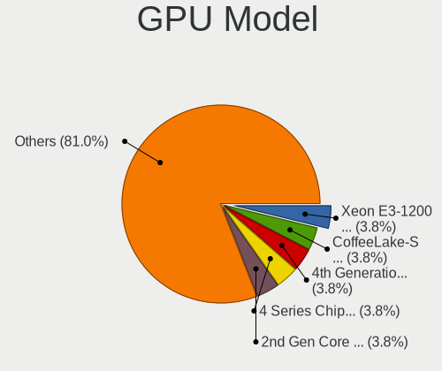
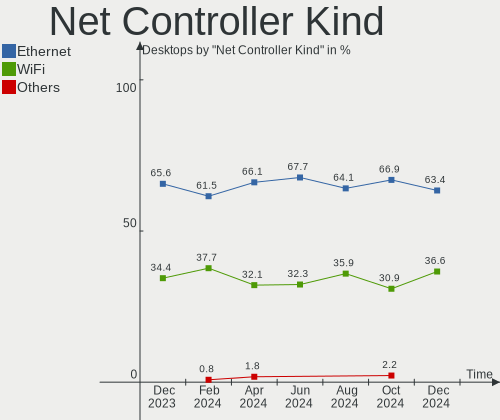

Linux in Italy - Hardware Trends (Desktops)
-------------------------------------------

A project to identify most popular hardware characteristics and track their change
over time based on data collected by Linux users at https://Linux-Hardware.org.

Anyone can contribute to this report by the [hw-probe](https://github.com/linuxhw/hw-probe) tool:

    sudo -E hw-probe -all -upload

Period: Jul, 2022.

Contents
--------

* [ System ](#system)
  - [ OS                       ](#os)
  - [ OS Family                ](#os-family)
  - [ Kernel                   ](#kernel)
  - [ Kernel Family            ](#kernel-family)
  - [ Kernel Major Ver.        ](#kernel-major-ver)
  - [ Arch                     ](#arch)
  - [ DE                       ](#de)
  - [ Display Server           ](#display-server)
  - [ Display Manager          ](#display-manager)
  - [ OS Lang                  ](#os-lang)
  - [ Boot Mode                ](#boot-mode)
  - [ Filesystem               ](#filesystem)
  - [ Part. scheme             ](#part-scheme)
  - [ Dual Boot with Linux/BSD ](#dual-boot-with-linuxbsd)
  - [ Dual Boot (Win)          ](#dual-boot-win)

* [ Board ](#board)
  - [ Vendor                   ](#vendor)
  - [ Model                    ](#model)
  - [ Model Family             ](#model-family)
  - [ MFG Year                 ](#mfg-year)
  - [ Form Factor              ](#form-factor)
  - [ Secure Boot              ](#secure-boot)
  - [ Coreboot                 ](#coreboot)
  - [ RAM Size                 ](#ram-size)
  - [ RAM Used                 ](#ram-used)
  - [ Total Drives             ](#total-drives)
  - [ Has CD-ROM               ](#has-cd-rom)
  - [ Has Ethernet             ](#has-ethernet)
  - [ Has WiFi                 ](#has-wifi)
  - [ Has Bluetooth            ](#has-bluetooth)

* [ Location ](#location)
  - [ Country                  ](#country)
  - [ City                     ](#city)

* [ Drives ](#drives)
  - [ Drive Vendor             ](#drive-vendor)
  - [ Drive Model              ](#drive-model)
  - [ HDD Vendor               ](#hdd-vendor)
  - [ SSD Vendor               ](#ssd-vendor)
  - [ Drive Kind               ](#drive-kind)
  - [ Drive Connector          ](#drive-connector)
  - [ Drive Size               ](#drive-size)
  - [ Space Total              ](#space-total)
  - [ Space Used               ](#space-used)
  - [ Malfunc. Drives          ](#malfunc-drives)
  - [ Malfunc. Drive Vendor    ](#malfunc-drive-vendor)
  - [ Malfunc. HDD Vendor      ](#malfunc-hdd-vendor)
  - [ Malfunc. Drive Kind      ](#malfunc-drive-kind)
  - [ Failed Drives            ](#failed-drives)
  - [ Failed Drive Vendor      ](#failed-drive-vendor)
  - [ Drive Status             ](#drive-status)

* [ Storage controller ](#storage-controller)
  - [ Storage Vendor           ](#storage-vendor)
  - [ Storage Model            ](#storage-model)
  - [ Storage Kind             ](#storage-kind)

* [ Processor ](#processor)
  - [ CPU Vendor               ](#cpu-vendor)
  - [ CPU Model                ](#cpu-model)
  - [ CPU Model Family         ](#cpu-model-family)
  - [ CPU Cores                ](#cpu-cores)
  - [ CPU Sockets              ](#cpu-sockets)
  - [ CPU Threads              ](#cpu-threads)
  - [ CPU Op-Modes             ](#cpu-op-modes)
  - [ CPU Microcode            ](#cpu-microcode)
  - [ CPU Microarch            ](#cpu-microarch)

* [ Graphics ](#graphics)
  - [ GPU Vendor               ](#gpu-vendor)
  - [ GPU Model                ](#gpu-model)
  - [ GPU Combo                ](#gpu-combo)
  - [ GPU Driver               ](#gpu-driver)
  - [ GPU Memory               ](#gpu-memory)

* [ Monitor ](#monitor)
  - [ Monitor Vendor           ](#monitor-vendor)
  - [ Monitor Model            ](#monitor-model)
  - [ Monitor Resolution       ](#monitor-resolution)
  - [ Monitor Diagonal         ](#monitor-diagonal)
  - [ Monitor Width            ](#monitor-width)
  - [ Aspect Ratio             ](#aspect-ratio)
  - [ Monitor Area             ](#monitor-area)
  - [ Pixel Density            ](#pixel-density)
  - [ Multiple Monitors        ](#multiple-monitors)

* [ Network ](#network)
  - [ Net Controller Vendor    ](#net-controller-vendor)
  - [ Net Controller Model     ](#net-controller-model)
  - [ Wireless Vendor          ](#wireless-vendor)
  - [ Wireless Model           ](#wireless-model)
  - [ Ethernet Vendor          ](#ethernet-vendor)
  - [ Ethernet Model           ](#ethernet-model)
  - [ Net Controller Kind      ](#net-controller-kind)
  - [ Used Controller          ](#used-controller)
  - [ NICs                     ](#nics)
  - [ IPv6                     ](#ipv6)

* [ Bluetooth ](#bluetooth)
  - [ Bluetooth Vendor         ](#bluetooth-vendor)
  - [ Bluetooth Model          ](#bluetooth-model)

* [ Sound ](#sound)
  - [ Sound Vendor             ](#sound-vendor)
  - [ Sound Model              ](#sound-model)

* [ Memory ](#memory)
  - [ Memory Vendor            ](#memory-vendor)
  - [ Memory Model             ](#memory-model)
  - [ Memory Kind              ](#memory-kind)
  - [ Memory Form Factor       ](#memory-form-factor)
  - [ Memory Size              ](#memory-size)
  - [ Memory Speed             ](#memory-speed)

* [ Printers & scanners ](#printers--scanners)
  - [ Printer Vendor           ](#printer-vendor)
  - [ Printer Model            ](#printer-model)
  - [ Scanner Vendor           ](#scanner-vendor)
  - [ Scanner Model            ](#scanner-model)

* [ Camera ](#camera)
  - [ Camera Vendor            ](#camera-vendor)
  - [ Camera Model             ](#camera-model)

* [ Security ](#security)
  - [ Fingerprint Vendor       ](#fingerprint-vendor)
  - [ Fingerprint Model        ](#fingerprint-model)
  - [ Chipcard Vendor          ](#chipcard-vendor)
  - [ Chipcard Model           ](#chipcard-model)

* [ Unsupported ](#unsupported)
  - [ Unsupported Devices      ](#unsupported-devices)
  - [ Unsupported Device Types ](#unsupported-device-types)

System
------

OS
--

Installed operating systems

| Name                 | Desktops | Percent |
|----------------------|----------|---------|
| Ubuntu 22.04         | 6        | 13.95%  |
| OpenMandriva 4.3     | 6        | 13.95%  |
| Ubuntu 20.04         | 4        | 9.3%    |
| Pop!_OS 22.04        | 3        | 6.98%   |
| Linux Mint 20.3      | 3        | 6.98%   |
| Zorin 16             | 2        | 4.65%   |
| Xubuntu 20.04        | 2        | 4.65%   |
| Ubuntu 18.04         | 2        | 4.65%   |
| ROSA 12.1            | 2        | 4.65%   |
| Ubuntu 21.10         | 1        | 2.33%   |
| Pop!_OS 20.04        | 1        | 2.33%   |
| OpenMandriva 4.90    | 1        | 2.33%   |
| Lubuntu 22.04        | 1        | 2.33%   |
| LMDE 5               | 1        | 2.33%   |
| Linux Mint 20.2      | 1        | 2.33%   |
| Kubuntu 22.10        | 1        | 2.33%   |
| Kubuntu 22.04        | 1        | 2.33%   |
| Garuda Linux Soaring | 1        | 2.33%   |
| Fedora 36            | 1        | 2.33%   |
| Elementary 6.1       | 1        | 2.33%   |
| Debian 11            | 1        | 2.33%   |
| ArcoLinux Rolling    | 1        | 2.33%   |

OS Family
---------

OS without a version

| Name         | Desktops | Percent |
|--------------|----------|---------|
| Ubuntu       | 13       | 30.23%  |
| OpenMandriva | 7        | 16.28%  |
| Pop!_OS      | 4        | 9.3%    |
| Linux Mint   | 4        | 9.3%    |
| Zorin        | 2        | 4.65%   |
| Xubuntu      | 2        | 4.65%   |
| ROSA         | 2        | 4.65%   |
| Kubuntu      | 2        | 4.65%   |
| Lubuntu      | 1        | 2.33%   |
| LMDE         | 1        | 2.33%   |
| Garuda Linux | 1        | 2.33%   |
| Fedora       | 1        | 2.33%   |
| Elementary   | 1        | 2.33%   |
| Debian       | 1        | 2.33%   |
| ArcoLinux    | 1        | 2.33%   |

Kernel
------

Version of the Linux kernel

| Version                            | Desktops | Percent |
|------------------------------------|----------|---------|
| 5.16.7-desktop-1omv4003            | 5        | 11.63%  |
| 5.15.0-41-generic                  | 4        | 9.3%    |
| 5.13.0-52-generic                  | 4        | 9.3%    |
| 5.4.0-121-generic                  | 3        | 6.98%   |
| 5.15.0-43-generic                  | 3        | 6.98%   |
| 5.17.15-76051715-generic           | 2        | 4.65%   |
| 5.15.0-40-generic                  | 2        | 4.65%   |
| 5.10.74-generic-2rosa2021.1-x86_64 | 2        | 4.65%   |
| 5.4.0-97-generic                   | 1        | 2.33%   |
| 5.4.0-120-generic                  | 1        | 2.33%   |
| 5.18.9-arch1-1                     | 1        | 2.33%   |
| 5.18.12-zen1-1-zen                 | 1        | 2.33%   |
| 5.18.12-desktop-3omv4090           | 1        | 2.33%   |
| 5.18.11-200.fc36.x86_64            | 1        | 2.33%   |
| 5.17.5-76051705-generic            | 1        | 2.33%   |
| 5.17.1-desktop-2omv4050            | 1        | 2.33%   |
| 5.16.11-76051611-generic           | 1        | 2.33%   |
| 5.15.0-39-generic                  | 1        | 2.33%   |
| 5.15.0-27-generic                  | 1        | 2.33%   |
| 5.15.0-25-generic                  | 1        | 2.33%   |
| 5.13.0-51-generic                  | 1        | 2.33%   |
| 5.11.0-27-generic                  | 1        | 2.33%   |
| 5.10.0-16-amd64                    | 1        | 2.33%   |
| 5.10.0-15-amd64                    | 1        | 2.33%   |
| 4.15.0-189-generic                 | 1        | 2.33%   |
| 4.15.0-188-lowlatency              | 1        | 2.33%   |

Kernel Family
-------------

Linux kernel without a distro release

| Version | Desktops | Percent |
|---------|----------|---------|
| 5.15.0  | 12       | 27.91%  |
| 5.4.0   | 5        | 11.63%  |
| 5.16.7  | 5        | 11.63%  |
| 5.13.0  | 5        | 11.63%  |
| 5.18.12 | 2        | 4.65%   |
| 5.17.15 | 2        | 4.65%   |
| 5.10.74 | 2        | 4.65%   |
| 5.10.0  | 2        | 4.65%   |
| 4.15.0  | 2        | 4.65%   |
| 5.18.9  | 1        | 2.33%   |
| 5.18.11 | 1        | 2.33%   |
| 5.17.5  | 1        | 2.33%   |
| 5.17.1  | 1        | 2.33%   |
| 5.16.11 | 1        | 2.33%   |
| 5.11.0  | 1        | 2.33%   |

Kernel Major Ver.
-----------------

Linux kernel major version

| Version | Desktops | Percent |
|---------|----------|---------|
| 5.15    | 12       | 27.91%  |
| 5.16    | 6        | 13.95%  |
| 5.4     | 5        | 11.63%  |
| 5.13    | 5        | 11.63%  |
| 5.18    | 4        | 9.3%    |
| 5.17    | 4        | 9.3%    |
| 5.10    | 4        | 9.3%    |
| 4.15    | 2        | 4.65%   |
| 5.11    | 1        | 2.33%   |

Arch
----

OS architecture (x86_64, i586, etc.)

| Name   | Desktops | Percent |
|--------|----------|---------|
| x86_64 | 43       | 100%    |

DE
--

Desktop Environment

| Name       | Desktops | Percent |
|------------|----------|---------|
| GNOME      | 18       | 41.86%  |
| KDE5       | 12       | 27.91%  |
| XFCE       | 6        | 13.95%  |
| X-Cinnamon | 4        | 9.3%    |
| Unity      | 1        | 2.33%   |
| Pantheon   | 1        | 2.33%   |
| LXQt       | 1        | 2.33%   |

Display Server
--------------

X11 or Wayland

| Name    | Desktops | Percent |
|---------|----------|---------|
| X11     | 35       | 81.4%   |
| Wayland | 7        | 16.28%  |
| Tty     | 1        | 2.33%   |

Display Manager
---------------

SDDM, LightDM, etc.

| Name    | Desktops | Percent |
|---------|----------|---------|
| GDM3    | 14       | 32.56%  |
| Unknown | 14       | 32.56%  |
| SDDM    | 10       | 23.26%  |
| LightDM | 3        | 6.98%   |
| GDM     | 2        | 4.65%   |

OS Lang
-------

Language

| Lang  | Desktops | Percent |
|-------|----------|---------|
| it_IT | 32       | 74.42%  |
| en_US | 9        | 20.93%  |
| ru_RU | 1        | 2.33%   |
| de_AT | 1        | 2.33%   |

Boot Mode
---------

EFI or BIOS

| Mode | Desktops | Percent |
|------|----------|---------|
| BIOS | 31       | 72.09%  |
| EFI  | 12       | 27.91%  |

Filesystem
----------

Type of filesystem

| Type    | Desktops | Percent |
|---------|----------|---------|
| Ext4    | 31       | 72.09%  |
| Overlay | 7        | 16.28%  |
| Btrfs   | 4        | 9.3%    |
| Unknown | 1        | 2.33%   |

Part. scheme
------------

Scheme of partitioning

| Type    | Desktops | Percent |
|---------|----------|---------|
| Unknown | 29       | 67.44%  |
| GPT     | 8        | 18.6%   |
| MBR     | 6        | 13.95%  |

Dual Boot with Linux/BSD
------------------------

Hosting more than one Linux/BSD

| Dual boot | Desktops | Percent |
|-----------|----------|---------|
| No        | 32       | 74.42%  |
| Yes       | 11       | 25.58%  |

Dual Boot (Win)
---------------

Hosting Linux and Windows

| Dual boot | Desktops | Percent |
|-----------|----------|---------|
| No        | 32       | 74.42%  |
| Yes       | 11       | 25.58%  |

Board
-----

Vendor
------

Motherboard manufacturer

| Name                | Desktops | Percent |
|---------------------|----------|---------|
| MSI                 | 10       | 23.26%  |
| ASUSTek Computer    | 9        | 20.93%  |
| Gigabyte Technology | 5        | 11.63%  |
| ASRock              | 4        | 9.3%    |
| Acer                | 4        | 9.3%    |
| Hewlett-Packard     | 3        | 6.98%   |
| Intel               | 2        | 4.65%   |
| Dell                | 2        | 4.65%   |
| Foxconn             | 1        | 2.33%   |
| Biostar             | 1        | 2.33%   |
| AMI                 | 1        | 2.33%   |
| Unknown             | 1        | 2.33%   |

Model
-----

Motherboard model

| Name                              | Desktops | Percent |
|-----------------------------------|----------|---------|
| MSI MS-7C02                       | 2        | 4.65%   |
| MSI MS-7A74                       | 2        | 4.65%   |
| HP Compaq 8200 Elite SFF PC       | 2        | 4.65%   |
| Acer Aspire T180                  | 2        | 4.65%   |
| MSI NQ890AA-ABZ CQ5011IT          | 1        | 2.33%   |
| MSI MS-7D52                       | 1        | 2.33%   |
| MSI MS-7C75                       | 1        | 2.33%   |
| MSI MS-7B98                       | 1        | 2.33%   |
| MSI MS-7994                       | 1        | 2.33%   |
| MSI MPG B460 Trident A (MS-B926)  | 1        | 2.33%   |
| Intel DQ77MK                      | 1        | 2.33%   |
| Intel D2500CC AAG81477-400        | 1        | 2.33%   |
| HP 870-022nl                      | 1        | 2.33%   |
| Gigabyte P35-DS3L                 | 1        | 2.33%   |
| Gigabyte GA-MA78GM-S2H            | 1        | 2.33%   |
| Gigabyte G31M-S2L                 | 1        | 2.33%   |
| Gigabyte B450M DS3H               | 1        | 2.33%   |
| Gigabyte B450 AORUS ELITE         | 1        | 2.33%   |
| Foxconn Pro3500 Series            | 1        | 2.33%   |
| Dell OptiPlex GX620               | 1        | 2.33%   |
| Dell OptiPlex 390                 | 1        | 2.33%   |
| Biostar P4M90-M7A                 | 1        | 2.33%   |
| ASUS TUF Gaming B560-PLUS WIFI    | 1        | 2.33%   |
| ASUS ROG CROSSHAIR VIII DARK HERO | 1        | 2.33%   |
| ASUS P8H77-M PRO                  | 1        | 2.33%   |
| ASUS P8H61-M LX R2.0              | 1        | 2.33%   |
| ASUS P6T DELUXE V2                | 1        | 2.33%   |
| ASUS P5QLD PRO                    | 1        | 2.33%   |
| ASUS Maximus VIII HERO            | 1        | 2.33%   |
| ASUS H110M-A/M.2                  | 1        | 2.33%   |
| ASUS All Series                   | 1        | 2.33%   |
| ASRock N68C-S UCC                 | 1        | 2.33%   |
| ASRock J4105M                     | 1        | 2.33%   |
| ASRock AM1B-M                     | 1        | 2.33%   |
| ASRock 990FX Extreme3             | 1        | 2.33%   |
| AMI Z83-V                         | 1        | 2.33%   |
| Acer Power FV                     | 1        | 2.33%   |
| Acer Aspire X5950                 | 1        | 2.33%   |
| Unknown                           | 1        | 2.33%   |

Model Family
------------

Motherboard model prefix

| Name                   | Desktops | Percent |
|------------------------|----------|---------|
| Acer Aspire            | 3        | 6.98%   |
| MSI MS-7C02            | 2        | 4.65%   |
| MSI MS-7A74            | 2        | 4.65%   |
| HP Compaq              | 2        | 4.65%   |
| Dell OptiPlex          | 2        | 4.65%   |
| MSI NQ890AA-ABZ        | 1        | 2.33%   |
| MSI MS-7D52            | 1        | 2.33%   |
| MSI MS-7C75            | 1        | 2.33%   |
| MSI MS-7B98            | 1        | 2.33%   |
| MSI MS-7994            | 1        | 2.33%   |
| MSI MPG                | 1        | 2.33%   |
| Intel DQ77MK           | 1        | 2.33%   |
| Intel D2500CC          | 1        | 2.33%   |
| HP 870-022nl           | 1        | 2.33%   |
| Gigabyte P35-DS3L      | 1        | 2.33%   |
| Gigabyte GA-MA78GM-S2H | 1        | 2.33%   |
| Gigabyte G31M-S2L      | 1        | 2.33%   |
| Gigabyte B450M         | 1        | 2.33%   |
| Gigabyte B450          | 1        | 2.33%   |
| Foxconn Pro3500        | 1        | 2.33%   |
| Biostar P4M90-M7A      | 1        | 2.33%   |
| ASUS TUF               | 1        | 2.33%   |
| ASUS ROG               | 1        | 2.33%   |
| ASUS P8H77-M           | 1        | 2.33%   |
| ASUS P8H61-M           | 1        | 2.33%   |
| ASUS P6T               | 1        | 2.33%   |
| ASUS P5QLD             | 1        | 2.33%   |
| ASUS Maximus           | 1        | 2.33%   |
| ASUS H110M-A           | 1        | 2.33%   |
| ASUS All               | 1        | 2.33%   |
| ASRock N68C-S          | 1        | 2.33%   |
| ASRock J4105M          | 1        | 2.33%   |
| ASRock AM1B-M          | 1        | 2.33%   |
| ASRock 990FX           | 1        | 2.33%   |
| AMI Z83-V              | 1        | 2.33%   |
| Acer Power             | 1        | 2.33%   |
| Unknown                | 1        | 2.33%   |

MFG Year
--------

Motherboard manufacture year

| Year    | Desktops | Percent |
|---------|----------|---------|
| 2016    | 5        | 11.63%  |
| 2021    | 4        | 9.3%    |
| 2018    | 4        | 9.3%    |
| 2012    | 4        | 9.3%    |
| 2020    | 3        | 6.98%   |
| 2017    | 3        | 6.98%   |
| 2011    | 3        | 6.98%   |
| 2007    | 3        | 6.98%   |
| 2006    | 3        | 6.98%   |
| 2014    | 2        | 4.65%   |
| 2010    | 2        | 4.65%   |
| 2009    | 2        | 4.65%   |
| 2008    | 2        | 4.65%   |
| 2013    | 1        | 2.33%   |
| 2005    | 1        | 2.33%   |
| Unknown | 1        | 2.33%   |

Form Factor
-----------

Physical design of the computer

| Name    | Desktops | Percent |
|---------|----------|---------|
| Desktop | 43       | 100%    |

Secure Boot
-----------

Enabled or disabled

| State    | Desktops | Percent |
|----------|----------|---------|
| Disabled | 43       | 100%    |

Coreboot
--------

Have coreboot on board

| Used | Desktops | Percent |
|------|----------|---------|
| No   | 43       | 100%    |

RAM Size
--------

Total RAM memory

| Size in GB  | Desktops | Percent |
|-------------|----------|---------|
| 16.01-24.0  | 12       | 27.91%  |
| 3.01-4.0    | 11       | 25.58%  |
| 4.01-8.0    | 5        | 11.63%  |
| 8.01-16.0   | 5        | 11.63%  |
| 32.01-64.0  | 3        | 6.98%   |
| 1.01-2.0    | 3        | 6.98%   |
| 24.01-32.0  | 2        | 4.65%   |
| 2.01-3.0    | 1        | 2.33%   |
| 64.01-256.0 | 1        | 2.33%   |

RAM Used
--------

Used RAM memory

| Used GB   | Desktops | Percent |
|-----------|----------|---------|
| 1.01-2.0  | 23       | 53.49%  |
| 2.01-3.0  | 7        | 16.28%  |
| 3.01-4.0  | 4        | 9.3%    |
| 0.51-1.0  | 4        | 9.3%    |
| 4.01-8.0  | 3        | 6.98%   |
| 8.01-16.0 | 1        | 2.33%   |
| 0.01-0.5  | 1        | 2.33%   |

Total Drives
------------

Number of drives on board

| Drives | Desktops | Percent |
|--------|----------|---------|
| 2      | 15       | 34.88%  |
| 1      | 13       | 30.23%  |
| 3      | 6        | 13.95%  |
| 4      | 3        | 6.98%   |
| 5      | 2        | 4.65%   |
| 0      | 2        | 4.65%   |
| 8      | 1        | 2.33%   |
| 6      | 1        | 2.33%   |

Has CD-ROM
----------

Has CD-ROM on board

| Presented | Desktops | Percent |
|-----------|----------|---------|
| Yes       | 22       | 51.16%  |
| No        | 21       | 48.84%  |

Has Ethernet
------------

Has Ethernet on board

| Presented | Desktops | Percent |
|-----------|----------|---------|
| Yes       | 42       | 97.67%  |
| No        | 1        | 2.33%   |

Has WiFi
--------

Has WiFi module

| Presented | Desktops | Percent |
|-----------|----------|---------|
| No        | 23       | 53.49%  |
| Yes       | 20       | 46.51%  |

Has Bluetooth
-------------

Has Bluetooth module

| Presented | Desktops | Percent |
|-----------|----------|---------|
| No        | 33       | 76.74%  |
| Yes       | 10       | 23.26%  |

Location
--------

Country
-------

Geographic location (country)

| Country | Desktops | Percent |
|---------|----------|---------|
| Italy   | 43       | 100%    |

City
----

Geographic location (city)

| City                 | Desktops | Percent |
|----------------------|----------|---------|
| Milan                | 9        | 20.93%  |
| Rome                 | 4        | 9.3%    |
| Naples               | 2        | 4.65%   |
| Venice               | 1        | 2.33%   |
| Spello               | 1        | 2.33%   |
| Sonico               | 1        | 2.33%   |
| Santa Teresa Gallura | 1        | 2.33%   |
| Rozzano              | 1        | 2.33%   |
| Riccione             | 1        | 2.33%   |
| Reggio Emilia        | 1        | 2.33%   |
| Ponte San Pietro     | 1        | 2.33%   |
| Pieris               | 1        | 2.33%   |
| Peschiera del Garda  | 1        | 2.33%   |
| Parma                | 1        | 2.33%   |
| Padova               | 1        | 2.33%   |
| Paderno Dugnano      | 1        | 2.33%   |
| Monreale             | 1        | 2.33%   |
| Maglie               | 1        | 2.33%   |
| Luni                 | 1        | 2.33%   |
| Lecce                | 1        | 2.33%   |
| Jenesien             | 1        | 2.33%   |
| Genoa                | 1        | 2.33%   |
| Gallarate            | 1        | 2.33%   |
| Forlì               | 1        | 2.33%   |
| Florence             | 1        | 2.33%   |
| Costa Masnaga        | 1        | 2.33%   |
| Cisterna di Latina   | 1        | 2.33%   |
| Caserta              | 1        | 2.33%   |
| Casalecchio di Reno  | 1        | 2.33%   |
| Camponogara          | 1        | 2.33%   |
| Bologna              | 1        | 2.33%   |

Drives
------

Drive Vendor
------------

Hard drive vendors

| Vendor                    | Desktops | Drives | Percent |
|---------------------------|----------|--------|---------|
| WDC                       | 19       | 22     | 22.89%  |
| Seagate                   | 13       | 17     | 15.66%  |
| Samsung Electronics       | 11       | 14     | 13.25%  |
| Kingston                  | 6        | 6      | 7.23%   |
| Crucial                   | 6        | 6      | 7.23%   |
| SanDisk                   | 5        | 5      | 6.02%   |
| A-DATA Technology         | 5        | 5      | 6.02%   |
| Toshiba                   | 2        | 4      | 2.41%   |
| Maxtor                    | 2        | 2      | 2.41%   |
| Unknown                   | 1        | 1      | 1.2%    |
| Silicon Motion            | 1        | 1      | 1.2%    |
| Qunion                    | 1        | 1      | 1.2%    |
| Phison                    | 1        | 1      | 1.2%    |
| OCZ                       | 1        | 1      | 1.2%    |
| Micron/Crucial Technology | 1        | 1      | 1.2%    |
| Intenso                   | 1        | 1      | 1.2%    |
| Intel                     | 1        | 1      | 1.2%    |
| HS-SSD-E100N              | 1        | 1      | 1.2%    |
| Hitachi                   | 1        | 1      | 1.2%    |
| Dogfish                   | 1        | 1      | 1.2%    |
| Corsair                   | 1        | 2      | 1.2%    |
| China                     | 1        | 1      | 1.2%    |
| BORY                      | 1        | 1      | 1.2%    |

Drive Model
-----------

Hard drive models

| Model                                | Desktops | Percent |
|--------------------------------------|----------|---------|
| Crucial CT480BX500SSD1 480GB         | 3        | 3.23%   |
| Seagate ST500DM002-1BD142 500GB      | 2        | 2.15%   |
| Samsung SSD 980 PRO 1TB              | 2        | 2.15%   |
| Samsung SSD 840 EVO 500GB            | 2        | 2.15%   |
| Samsung SP0612N 64GB                 | 2        | 2.15%   |
| Kingston SV300S37A120G 120GB SSD     | 2        | 2.15%   |
| WDC WDS500G2B0B-00YS70 500GB SSD     | 1        | 1.08%   |
| WDC WDS250G2X0C-00L350 250GB         | 1        | 1.08%   |
| WDC WD800JD-00LSA0 80GB              | 1        | 1.08%   |
| WDC WD7500AARS-00Y5B1 752GB          | 1        | 1.08%   |
| WDC WD75 00BPVT-16HXZ 752GB          | 1        | 1.08%   |
| WDC WD5000AAKX-603CA0 500GB          | 1        | 1.08%   |
| WDC WD5000AAKS-00UU3A0 500GB         | 1        | 1.08%   |
| WDC WD5000AADS-56S9B1 500GB          | 1        | 1.08%   |
| WDC WD3200BEVT-60A23T0 320GB         | 1        | 1.08%   |
| WDC WD3200AAJS-22L7A0 320GB          | 1        | 1.08%   |
| WDC WD30EZRX-00DC0B0 3TB             | 1        | 1.08%   |
| WDC WD25 00BEVT-22ZCT0 250GB         | 1        | 1.08%   |
| WDC WD20EARS-60MVWB0 2TB             | 1        | 1.08%   |
| WDC WD20EADS-32S2B0 2TB              | 1        | 1.08%   |
| WDC WD1600JS-60MHB1 160GB            | 1        | 1.08%   |
| WDC WD10EZEX-08WN4A0 1TB             | 1        | 1.08%   |
| WDC WD10EZEX-08M2NA0 1TB             | 1        | 1.08%   |
| WDC WD10EFRX-68FYTN0 1TB             | 1        | 1.08%   |
| WDC WD10EARS-22Y5B1 1TB              | 1        | 1.08%   |
| WDC WD1002FBYS-50A6B0 1TB            | 1        | 1.08%   |
| WDC PC SN530 SDBPNPZ-512G-1032 512GB | 1        | 1.08%   |
| Unknown SD/MMC/MS PRO 64GB           | 1        | 1.08%   |
| Toshiba HDWD120 2TB                  | 1        | 1.08%   |
| Toshiba DT01ACA300 3TB               | 1        | 1.08%   |
| Toshiba DT01ACA200 2TB               | 1        | 1.08%   |
| Toshiba DT01ACA100 1TB               | 1        | 1.08%   |
| Silicon Motion NVMe SSD Drive 1TB    | 1        | 1.08%   |
| Seagate ST8000DM004-2CX188 8TB       | 1        | 1.08%   |
| Seagate ST500LT012-1DG142 500GB      | 1        | 1.08%   |
| Seagate ST500LM012 HN-M5 500GB       | 1        | 1.08%   |
| Seagate ST5000LM000-2AN170 5TB       | 1        | 1.08%   |
| Seagate ST3500413AS 500GB            | 1        | 1.08%   |
| Seagate ST3160318AS 160GB            | 1        | 1.08%   |
| Seagate ST31500341AS 1TB             | 1        | 1.08%   |
| Seagate ST31000528AS 1TB             | 1        | 1.08%   |
| Seagate ST31000524AS 1TB             | 1        | 1.08%   |
| Seagate ST3000DM001-1ER166 3TB       | 1        | 1.08%   |
| Seagate ST2000DM008-2FR102 2TB       | 1        | 1.08%   |
| Seagate ST1000DM003-1ER162 1TB       | 1        | 1.08%   |
| Seagate ST1000DM003-1CH162 1TB       | 1        | 1.08%   |
| Seagate Backup+ Hub BK 4TB           | 1        | 1.08%   |
| SanDisk SSD PLUS 240GB               | 1        | 1.08%   |
| SanDisk SSD PLUS 2000GB              | 1        | 1.08%   |
| SanDisk SDSSDH3 1T00 1TB             | 1        | 1.08%   |
| SanDisk NVMe SSD Drive 512GB         | 1        | 1.08%   |
| SanDisk DF4032  32GB                 | 1        | 1.08%   |
| Samsung SSD 870 QVO 2TB              | 1        | 1.08%   |
| Samsung SSD 850 EVO 500GB            | 1        | 1.08%   |
| Samsung SSD 840 Series 120GB         | 1        | 1.08%   |
| Samsung SSD 840 EVO 120GB            | 1        | 1.08%   |
| Samsung NVMe SSD Drive 2TB           | 1        | 1.08%   |
| Samsung NVMe SSD Drive 1TB           | 1        | 1.08%   |
| Samsung HD250HJ 250GB                | 1        | 1.08%   |
| Samsung HD160JJ/ 160GB               | 1        | 1.08%   |

HDD Vendor
----------

Hard disk drive vendors

| Vendor              | Desktops | Drives | Percent |
|---------------------|----------|--------|---------|
| WDC                 | 16       | 19     | 41.03%  |
| Seagate             | 13       | 17     | 33.33%  |
| Samsung Electronics | 4        | 4      | 10.26%  |
| Toshiba             | 2        | 4      | 5.13%   |
| Maxtor              | 2        | 2      | 5.13%   |
| Unknown             | 1        | 1      | 2.56%   |
| Hitachi             | 1        | 1      | 2.56%   |

SSD Vendor
----------

Solid state drive vendors

| Vendor              | Desktops | Drives | Percent |
|---------------------|----------|--------|---------|
| Crucial             | 6        | 6      | 19.35%  |
| Samsung Electronics | 5        | 6      | 16.13%  |
| A-DATA Technology   | 5        | 5      | 16.13%  |
| Kingston            | 4        | 4      | 12.9%   |
| SanDisk             | 3        | 3      | 9.68%   |
| WDC                 | 1        | 1      | 3.23%   |
| OCZ                 | 1        | 1      | 3.23%   |
| Intenso             | 1        | 1      | 3.23%   |
| Intel               | 1        | 1      | 3.23%   |
| HS-SSD-E100N        | 1        | 1      | 3.23%   |
| Dogfish             | 1        | 1      | 3.23%   |
| Corsair             | 1        | 2      | 3.23%   |
| China               | 1        | 1      | 3.23%   |

Drive Kind
----------

HDD or SSD

| Kind    | Desktops | Drives | Percent |
|---------|----------|--------|---------|
| HDD     | 29       | 48     | 45.31%  |
| SSD     | 25       | 33     | 39.06%  |
| NVMe    | 8        | 13     | 12.5%   |
| MMC     | 1        | 1      | 1.56%   |
| Unknown | 1        | 1      | 1.56%   |

Drive Connector
---------------

SATA, SAS, NVMe, etc.

| Type | Desktops | Drives | Percent |
|------|----------|--------|---------|
| SATA | 38       | 78     | 74.51%  |
| NVMe | 8        | 13     | 15.69%  |
| SAS  | 4        | 4      | 7.84%   |
| MMC  | 1        | 1      | 1.96%   |

Drive Size
----------

Size of hard drive

| Size in TB | Desktops | Drives | Percent |
|------------|----------|--------|---------|
| 0.01-0.5   | 34       | 50     | 60.71%  |
| 0.51-1.0   | 11       | 18     | 19.64%  |
| 1.01-2.0   | 5        | 7      | 8.93%   |
| 2.01-3.0   | 3        | 3      | 5.36%   |
| 4.01-10.0  | 2        | 2      | 3.57%   |
| 3.01-4.0   | 1        | 1      | 1.79%   |

Space Total
-----------

Amount of disk space available on the file system

| Size in GB     | Desktops | Percent |
|----------------|----------|---------|
| 101-250        | 9        | 20.93%  |
| 501-1000       | 7        | 16.28%  |
| 1-20           | 6        | 13.95%  |
| More than 3000 | 5        | 11.63%  |
| Unknown        | 4        | 9.3%    |
| 251-500        | 3        | 6.98%   |
| 51-100         | 3        | 6.98%   |
| 21-50          | 2        | 4.65%   |
| 2001-3000      | 2        | 4.65%   |
| 1001-2000      | 2        | 4.65%   |

Space Used
----------

Amount of used disk space

| Used GB        | Desktops | Percent |
|----------------|----------|---------|
| 1-20           | 15       | 34.88%  |
| 21-50          | 7        | 16.28%  |
| 251-500        | 5        | 11.63%  |
| Unknown        | 4        | 9.3%    |
| 101-250        | 3        | 6.98%   |
| 51-100         | 3        | 6.98%   |
| More than 3000 | 2        | 4.65%   |
| 2001-3000      | 2        | 4.65%   |
| 1001-2000      | 2        | 4.65%   |

Malfunc. Drives
---------------

Drive models with a malfunction

| Model                             | Desktops | Drives | Percent |
|-----------------------------------|----------|--------|---------|
| WDC WD75 00BPVT-16HXZ 752GB       | 1        | 1      | 20%     |
| WDC WD3200AAJS-22L7A0 320GB       | 1        | 1      | 20%     |
| Seagate ST3500413AS 500GB         | 1        | 2      | 20%     |
| Seagate ST31500341AS 1TB          | 1        | 1      | 20%     |
| Samsung Electronics HD250HJ 250GB | 1        | 1      | 20%     |

Malfunc. Drive Vendor
---------------------

Vendors of faulty drives

| Vendor              | Desktops | Drives | Percent |
|---------------------|----------|--------|---------|
| WDC                 | 2        | 2      | 40%     |
| Seagate             | 2        | 3      | 40%     |
| Samsung Electronics | 1        | 1      | 20%     |

Malfunc. HDD Vendor
-------------------

Vendors of faulty HDD drives

| Vendor              | Desktops | Drives | Percent |
|---------------------|----------|--------|---------|
| WDC                 | 2        | 2      | 40%     |
| Seagate             | 2        | 3      | 40%     |
| Samsung Electronics | 1        | 1      | 20%     |

Malfunc. Drive Kind
-------------------

Kinds of faulty drives

| Kind | Desktops | Drives | Percent |
|------|----------|--------|---------|
| HDD  | 4        | 6      | 100%    |

Failed Drives
-------------

Failed drive models

Zero info for selected period =(

Failed Drive Vendor
-------------------

Failed drive vendors

Zero info for selected period =(

Drive Status
------------

Number of failed and malfunc. drives

| Status   | Desktops | Drives | Percent |
|----------|----------|--------|---------|
| Detected | 29       | 63     | 65.91%  |
| Works    | 11       | 27     | 25%     |
| Malfunc  | 4        | 6      | 9.09%   |

Storage controller
------------------

Storage Vendor
--------------

Storage controller vendors

| Vendor                      | Desktops | Percent |
|-----------------------------|----------|---------|
| Intel                       | 28       | 50%     |
| AMD                         | 9        | 16.07%  |
| Samsung Electronics         | 4        | 7.14%   |
| Nvidia                      | 3        | 5.36%   |
| SanDisk                     | 2        | 3.57%   |
| Marvell Technology Group    | 2        | 3.57%   |
| Kingston Technology Company | 2        | 3.57%   |
| VIA Technologies            | 1        | 1.79%   |
| Silicon Motion              | 1        | 1.79%   |
| Phison Electronics          | 1        | 1.79%   |
| Micron/Crucial Technology   | 1        | 1.79%   |
| JMicron Technology          | 1        | 1.79%   |
| ASMedia Technology          | 1        | 1.79%   |

Storage Model
-------------

Storage controller models

| Model                                                                                   | Desktops | Percent |
|-----------------------------------------------------------------------------------------|----------|---------|
| Intel Q170/Q150/B150/H170/H110/Z170/CM236 Chipset SATA Controller [AHCI Mode]           | 4        | 5.8%    |
| AMD FCH SATA Controller [AHCI mode]                                                     | 4        | 5.8%    |
| AMD 400 Series Chipset SATA Controller                                                  | 4        | 5.8%    |
| Samsung NVMe SSD Controller PM9A1/PM9A3/980PRO                                          | 3        | 4.35%   |
| Nvidia MCP61 SATA Controller                                                            | 3        | 4.35%   |
| Nvidia MCP61 IDE                                                                        | 3        | 4.35%   |
| Intel NM10/ICH7 Family SATA Controller [IDE mode]                                       | 3        | 4.35%   |
| Intel 6 Series/C200 Series Chipset Family 6 port Desktop SATA AHCI Controller           | 3        | 4.35%   |
| Intel 6 Series/C200 Series Chipset Family Desktop SATA Controller (IDE mode, ports 4-5) | 2        | 2.9%    |
| Intel 6 Series/C200 Series Chipset Family Desktop SATA Controller (IDE mode, ports 0-3) | 2        | 2.9%    |
| Intel 200 Series PCH SATA controller [AHCI mode]                                        | 2        | 2.9%    |
| AMD SB7x0/SB8x0/SB9x0 SATA Controller [AHCI mode]                                       | 2        | 2.9%    |
| AMD SB7x0/SB8x0/SB9x0 IDE Controller                                                    | 2        | 2.9%    |
| VIA VT82C586A/B/VT82C686/A/B/VT823x/A/C PIPC Bus Master IDE                             | 1        | 1.45%   |
| VIA Serial ATA Controller                                                               | 1        | 1.45%   |
| Silicon Motion SM2263EN/SM2263XT SSD Controller                                         | 1        | 1.45%   |
| SanDisk WD Blue SN550 NVMe SSD                                                          | 1        | 1.45%   |
| SanDisk WD Black 2018/SN750 / PC SN720 NVMe SSD                                         | 1        | 1.45%   |
| Samsung NVMe SSD Controller SM981/PM981/PM983                                           | 1        | 1.45%   |
| Phison E12 NVMe Controller                                                              | 1        | 1.45%   |
| Micron/Crucial P2 NVMe PCIe SSD                                                         | 1        | 1.45%   |
| Marvell Group 88SE9172 SATA III 6Gb/s RAID Controller                                   | 1        | 1.45%   |
| Marvell Group 88SE6111/6121 SATA II / PATA Controller                                   | 1        | 1.45%   |
| Kingston Company Company Non-Volatile memory controller                                 | 1        | 1.45%   |
| Kingston Company A2000 NVMe SSD                                                         | 1        | 1.45%   |
| JMicron JMB368 IDE controller                                                           | 1        | 1.45%   |
| Intel NM10/ICH7 Family SATA Controller [AHCI mode]                                      | 1        | 1.45%   |
| Intel Comet Lake SATA AHCI Controller                                                   | 1        | 1.45%   |
| Intel Celeron/Pentium Silver Processor SATA Controller                                  | 1        | 1.45%   |
| Intel Cannon Lake PCH SATA AHCI Controller                                              | 1        | 1.45%   |
| Intel 9 Series Chipset Family SATA Controller [AHCI Mode]                               | 1        | 1.45%   |
| Intel 82801JI (ICH10 Family) SATA AHCI Controller                                       | 1        | 1.45%   |
| Intel 82801JI (ICH10 Family) 4 port SATA IDE Controller #1                              | 1        | 1.45%   |
| Intel 82801JI (ICH10 Family) 2 port SATA IDE Controller #2                              | 1        | 1.45%   |
| Intel 82801IB (ICH9) 2 port SATA Controller [IDE mode]                                  | 1        | 1.45%   |
| Intel 82801I (ICH9 Family) 2 port SATA Controller [IDE mode]                            | 1        | 1.45%   |
| Intel 82801G (ICH7 Family) IDE Controller                                               | 1        | 1.45%   |
| Intel 82801FB/FW (ICH6/ICH6W) SATA Controller                                           | 1        | 1.45%   |
| Intel 7 Series/C210 Series Chipset Family 6-port SATA Controller [AHCI mode]            | 1        | 1.45%   |
| Intel 7 Series/C210 Series Chipset Family 4-port SATA Controller [IDE mode]             | 1        | 1.45%   |
| Intel 7 Series/C210 Series Chipset Family 2-port SATA Controller [IDE mode]             | 1        | 1.45%   |
| Intel 500 Series Chipset Family SATA AHCI Controller                                    | 1        | 1.45%   |
| Intel 5 Series/3400 Series Chipset 6 port SATA AHCI Controller                          | 1        | 1.45%   |
| Intel 400 Series Chipset Family SATA AHCI Controller                                    | 1        | 1.45%   |
| ASMedia ASM1062 Serial ATA Controller                                                   | 1        | 1.45%   |

Storage Kind
------------

Kind of storage controller (IDE, SATA, NVMe, SAS, ...)

| Kind | Desktops | Percent |
|------|----------|---------|
| SATA | 28       | 54.9%   |
| IDE  | 15       | 29.41%  |
| NVMe | 8        | 15.69%  |

Processor
---------

CPU Vendor
----------

Processor vendors

| Vendor | Desktops | Percent |
|--------|----------|---------|
| Intel  | 31       | 72.09%  |
| AMD    | 12       | 27.91%  |

CPU Model
---------

Processor models

| Model                                       | Desktops | Percent |
|---------------------------------------------|----------|---------|
| Intel Pentium Dual CPU E2200 @ 2.20GHz      | 2        | 4.65%   |
| Intel Core i5-10400F CPU @ 2.90GHz          | 2        | 4.65%   |
| AMD Ryzen 5 3600 6-Core Processor           | 2        | 4.65%   |
| AMD Athlon 64 X2 Dual Core Processor 5000+  | 2        | 4.65%   |
| Intel Pentium Dual-Core CPU E5400 @ 2.70GHz | 1        | 2.33%   |
| Intel Pentium Dual CPU E2160 @ 1.80GHz      | 1        | 2.33%   |
| Intel Pentium D CPU 2.80GHz                 | 1        | 2.33%   |
| Intel Pentium CPU G2030 @ 3.00GHz           | 1        | 2.33%   |
| Intel Pentium 4 CPU 3.00GHz                 | 1        | 2.33%   |
| Intel Core i9-9900KF CPU @ 3.60GHz          | 1        | 2.33%   |
| Intel Core i7-7700 CPU @ 3.60GHz            | 1        | 2.33%   |
| Intel Core i7-6700 CPU @ 3.40GHz            | 1        | 2.33%   |
| Intel Core i7-4790K CPU @ 4.00GHz           | 1        | 2.33%   |
| Intel Core i7-2600 CPU @ 3.40GHz            | 1        | 2.33%   |
| Intel Core i7 CPU 950 @ 3.07GHz             | 1        | 2.33%   |
| Intel Core i5-6600K CPU @ 3.50GHz           | 1        | 2.33%   |
| Intel Core i5-6500 CPU @ 3.20GHz            | 1        | 2.33%   |
| Intel Core i5-3330 CPU @ 3.00GHz            | 1        | 2.33%   |
| Intel Core i5-2400S CPU @ 2.50GHz           | 1        | 2.33%   |
| Intel Core i5-2400 CPU @ 3.10GHz            | 1        | 2.33%   |
| Intel Core i5-10600 CPU @ 3.30GHz           | 1        | 2.33%   |
| Intel Core i3-6320 CPU @ 3.90GHz            | 1        | 2.33%   |
| Intel Core i3-2130 CPU @ 3.40GHz            | 1        | 2.33%   |
| Intel Core i3-2120 CPU @ 3.30GHz            | 1        | 2.33%   |
| Intel Core i3 CPU 540 @ 3.07GHz             | 1        | 2.33%   |
| Intel Core 2 Duo CPU E7600 @ 3.06GHz        | 1        | 2.33%   |
| Intel Core 2 Duo CPU E6550 @ 2.33GHz        | 1        | 2.33%   |
| Intel Celeron J4105 CPU @ 1.50GHz           | 1        | 2.33%   |
| Intel Celeron CPU G3900 @ 2.80GHz           | 1        | 2.33%   |
| Intel Atom x5-Z8350 CPU @ 1.44GHz           | 1        | 2.33%   |
| Intel Atom CPU D2500 @ 1.86GHz              | 1        | 2.33%   |
| AMD Sempron 3850 APU with Radeon R3         | 1        | 2.33%   |
| AMD Ryzen 9 5950X 16-Core Processor         | 1        | 2.33%   |
| AMD Ryzen 9 5900X 12-Core Processor         | 1        | 2.33%   |
| AMD Ryzen 7 5700X 8-Core Processor          | 1        | 2.33%   |
| AMD Ryzen 5 3400G with Radeon Vega Graphics | 1        | 2.33%   |
| AMD Phenom 9950 Quad-Core Processor         | 1        | 2.33%   |
| AMD FX-8320 Eight-Core Processor            | 1        | 2.33%   |
| AMD Athlon II X2 240 Processor              | 1        | 2.33%   |

CPU Model Family
----------------

Processor model prefix

| Model                   | Desktops | Percent |
|-------------------------|----------|---------|
| Intel Core i5           | 8        | 18.6%   |
| Intel Core i7           | 5        | 11.63%  |
| Intel Core i3           | 4        | 9.3%    |
| Intel Pentium Dual      | 3        | 6.98%   |
| AMD Ryzen 5             | 3        | 6.98%   |
| Intel Core 2 Duo        | 2        | 4.65%   |
| Intel Celeron           | 2        | 4.65%   |
| Intel Atom              | 2        | 4.65%   |
| AMD Ryzen 9             | 2        | 4.65%   |
| AMD Athlon 64 X2        | 2        | 4.65%   |
| Intel Pentium Dual-Core | 1        | 2.33%   |
| Intel Pentium D         | 1        | 2.33%   |
| Intel Pentium 4         | 1        | 2.33%   |
| Intel Pentium           | 1        | 2.33%   |
| Intel Core i9           | 1        | 2.33%   |
| AMD Sempron             | 1        | 2.33%   |
| AMD Ryzen 7             | 1        | 2.33%   |
| AMD Phenom              | 1        | 2.33%   |
| AMD FX                  | 1        | 2.33%   |
| AMD Athlon II X2        | 1        | 2.33%   |

CPU Cores
---------

Number of processor cores

| Number | Desktops | Percent |
|--------|----------|---------|
| 2      | 17       | 39.53%  |
| 4      | 16       | 37.21%  |
| 6      | 5        | 11.63%  |
| 8      | 2        | 4.65%   |
| 16     | 1        | 2.33%   |
| 12     | 1        | 2.33%   |
| 1      | 1        | 2.33%   |

CPU Sockets
-----------

Number of sockets

| Number | Desktops | Percent |
|--------|----------|---------|
| 1      | 43       | 100%    |

CPU Threads
-----------

Threads per core (Hyper-Threading)

| Number | Desktops | Percent |
|--------|----------|---------|
| 1      | 22       | 51.16%  |
| 2      | 21       | 48.84%  |

CPU Op-Modes
------------

CPU Operation Modes (32-bit, 64-bit)

| Op mode        | Desktops | Percent |
|----------------|----------|---------|
| 32-bit, 64-bit | 42       | 97.67%  |
| Unknown        | 1        | 2.33%   |

CPU Microcode
-------------

Microcode number

| Number     | Desktops | Percent |
|------------|----------|---------|
| Unknown    | 14       | 32.56%  |
| 0x206a7    | 4        | 9.3%    |
| 0x506e3    | 3        | 6.98%   |
| 0x6fd      | 2        | 4.65%   |
| 0x1067a    | 2        | 4.65%   |
| 0x0a201016 | 2        | 4.65%   |
| 0x08701021 | 2        | 4.65%   |
| 0xf47      | 1        | 2.33%   |
| 0xf43      | 1        | 2.33%   |
| 0xa0653    | 1        | 2.33%   |
| 0x906ed    | 1        | 2.33%   |
| 0x906e9    | 1        | 2.33%   |
| 0x706a1    | 1        | 2.33%   |
| 0x406c4    | 1        | 2.33%   |
| 0x306a9    | 1        | 2.33%   |
| 0x30661    | 1        | 2.33%   |
| 0x08108109 | 1        | 2.33%   |
| 0x0700010f | 1        | 2.33%   |
| 0x010000b7 | 1        | 2.33%   |
| 0x01000095 | 1        | 2.33%   |
| 0x00000000 | 1        | 2.33%   |

CPU Microarch
-------------

Microarchitecture

| Name          | Desktops | Percent |
|---------------|----------|---------|
| Skylake       | 5        | 11.63%  |
| SandyBridge   | 5        | 11.63%  |
| Core          | 4        | 9.3%    |
| Zen 3         | 3        | 6.98%   |
| CometLake     | 3        | 6.98%   |
| Zen 2         | 2        | 4.65%   |
| Penryn        | 2        | 4.65%   |
| NetBurst      | 2        | 4.65%   |
| KabyLake      | 2        | 4.65%   |
| K8 Hammer     | 2        | 4.65%   |
| K10           | 2        | 4.65%   |
| IvyBridge     | 2        | 4.65%   |
| Zen+          | 1        | 2.33%   |
| Westmere      | 1        | 2.33%   |
| Silvermont    | 1        | 2.33%   |
| Piledriver    | 1        | 2.33%   |
| Nehalem       | 1        | 2.33%   |
| Jaguar        | 1        | 2.33%   |
| Haswell       | 1        | 2.33%   |
| Goldmont plus | 1        | 2.33%   |
| Bonnell       | 1        | 2.33%   |

Graphics
--------

GPU Vendor
----------

Vendors of graphics cards

| Vendor           | Desktops | Percent |
|------------------|----------|---------|
| Nvidia           | 20       | 43.48%  |
| Intel            | 14       | 30.43%  |
| AMD              | 11       | 23.91%  |
| VIA Technologies | 1        | 2.17%   |

GPU Model
---------

Graphics card models

| Model                                                                                    | Desktops | Percent |
|------------------------------------------------------------------------------------------|----------|---------|
| Intel 2nd Generation Core Processor Family Integrated Graphics Controller                | 5        | 10.64%  |
| Nvidia GP107 [GeForce GTX 1050 Ti]                                                       | 3        | 6.38%   |
| Nvidia GK208B [GeForce GT 730]                                                           | 2        | 4.26%   |
| Nvidia GF119 [GeForce GT 610]                                                            | 2        | 4.26%   |
| AMD Navi 23 [Radeon RX 6600/6600 XT/6600M]                                               | 2        | 4.26%   |
| VIA Technologies CN896/VN896/P4M900 [Chrome 9 HC]                                        | 1        | 2.13%   |
| Nvidia TU117 [GeForce GTX 1650]                                                          | 1        | 2.13%   |
| Nvidia TU116 [GeForce GTX 1660]                                                          | 1        | 2.13%   |
| Nvidia TU106 [GeForce RTX 2060 Rev. A]                                                   | 1        | 2.13%   |
| Nvidia GM204 [GeForce GTX 970]                                                           | 1        | 2.13%   |
| Nvidia GK107 [GeForce GTX 650]                                                           | 1        | 2.13%   |
| Nvidia GK104 [GeForce GTX 770]                                                           | 1        | 2.13%   |
| Nvidia GK104 [GeForce GTX 760]                                                           | 1        | 2.13%   |
| Nvidia GF108GL [Quadro 600]                                                              | 1        | 2.13%   |
| Nvidia GF108 [GeForce GT 420]                                                            | 1        | 2.13%   |
| Nvidia GA106 [GeForce RTX 3060 Lite Hash Rate]                                           | 1        | 2.13%   |
| Nvidia GA104 [GeForce RTX 3060 Ti Lite Hash Rate]                                        | 1        | 2.13%   |
| Nvidia G96C [GeForce 9400 GT]                                                            | 1        | 2.13%   |
| Nvidia C61 [GeForce 7025 / nForce 630a]                                                  | 1        | 2.13%   |
| Intel Xeon E3-1200 v2/3rd Gen Core processor Graphics Controller                         | 1        | 2.13%   |
| Intel HD Graphics 530                                                                    | 1        | 2.13%   |
| Intel HD Graphics 510                                                                    | 1        | 2.13%   |
| Intel GeminiLake [UHD Graphics 600]                                                      | 1        | 2.13%   |
| Intel CometLake-S GT2 [UHD Graphics 630]                                                 | 1        | 2.13%   |
| Intel Atom/Celeron/Pentium Processor x5-E8000/J3xxx/N3xxx Integrated Graphics Controller | 1        | 2.13%   |
| Intel Atom Processor D2xxx/N2xxx Integrated Graphics Controller                          | 1        | 2.13%   |
| Intel 82945G/GZ Integrated Graphics Controller                                           | 1        | 2.13%   |
| Intel 82915G/GV/910GL Integrated Graphics Controller                                     | 1        | 2.13%   |
| AMD RV670 [Radeon HD 3870]                                                               | 1        | 2.13%   |
| AMD RV370 [Radeon X300/X550/X1050 Series] (Secondary)                                    | 1        | 2.13%   |
| AMD RV370 [Radeon X300/X550/X1050 Series]                                                | 1        | 2.13%   |
| AMD RS780 [Radeon HD 3200]                                                               | 1        | 2.13%   |
| AMD Picasso/Raven 2 [Radeon Vega Series / Radeon Vega Mobile Series]                     | 1        | 2.13%   |
| AMD Navi 22 [Radeon RX 6700/6700 XT/6750 XT / 6800M]                                     | 1        | 2.13%   |
| AMD Lexa PRO [Radeon 540/540X/550/550X / RX 540X/550/550X]                               | 1        | 2.13%   |
| AMD Kabini [Radeon HD 8280 / R3 Series]                                                  | 1        | 2.13%   |
| AMD Ellesmere [Radeon RX 470/480/570/570X/580/580X/590]                                  | 1        | 2.13%   |
| AMD Caicos PRO [Radeon HD 7450]                                                          | 1        | 2.13%   |

GPU Combo
---------

Combinations of graphics cards

| Name           | Desktops | Percent |
|----------------|----------|---------|
| 1 x Nvidia     | 18       | 41.86%  |
| 1 x Intel      | 11       | 25.58%  |
| 1 x AMD        | 9        | 20.93%  |
| Other          | 1        | 2.33%   |
| 2 x AMD        | 1        | 2.33%   |
| 1 x VIA        | 1        | 2.33%   |
| Intel + Nvidia | 1        | 2.33%   |
| AMD + Nvidia   | 1        | 2.33%   |

GPU Driver
----------

Free vs proprietary

| Driver      | Desktops | Percent |
|-------------|----------|---------|
| Free        | 30       | 69.77%  |
| Proprietary | 10       | 23.26%  |
| Unknown     | 3        | 6.98%   |

GPU Memory
----------

Total video memory

| Size in GB | Desktops | Percent |
|------------|----------|---------|
| Unknown    | 24       | 55.81%  |
| 1.01-2.0   | 7        | 16.28%  |
| 3.01-4.0   | 5        | 11.63%  |
| 0.01-0.5   | 4        | 9.3%    |
| 7.01-8.0   | 1        | 2.33%   |
| 8.01-16.0  | 1        | 2.33%   |
| 0.51-1.0   | 1        | 2.33%   |

Monitor
-------

Monitor Vendor
--------------

Monitor vendors

| Vendor               | Desktops | Percent |
|----------------------|----------|---------|
| Samsung Electronics  | 12       | 30.77%  |
| Hewlett-Packard      | 6        | 15.38%  |
| Acer                 | 4        | 10.26%  |
| Dell                 | 3        | 7.69%   |
| Ancor Communications | 3        | 7.69%   |
| Goldstar             | 2        | 5.13%   |
| BenQ                 | 2        | 5.13%   |
| Unknown              | 1        | 2.56%   |
| Sony                 | 1        | 2.56%   |
| Philips              | 1        | 2.56%   |
| MSI                  | 1        | 2.56%   |
| LG Electronics       | 1        | 2.56%   |
| Lenovo               | 1        | 2.56%   |
| Fujitsu Siemens      | 1        | 2.56%   |

Monitor Model
-------------

Monitor models

| Model                                                                 | Desktops | Percent |
|-----------------------------------------------------------------------|----------|---------|
| Unknown LCD Monitor SAMSUNG 1920x1080                                 | 1        | 2.44%   |
| Sony SDM-HS94P SNY1C90 1280x1024 376x301mm 19.0-inch                  | 1        | 2.44%   |
| Samsung Electronics U28E590 SAM0C4D 3840x2160 607x345mm 27.5-inch     | 1        | 2.44%   |
| Samsung Electronics U28E590 SAM0C4C 3840x2160 608x345mm 27.5-inch     | 1        | 2.44%   |
| Samsung Electronics T27B550 SAM095C 1920x1080 598x336mm 27.0-inch     | 1        | 2.44%   |
| Samsung Electronics SyncMaster SAM0456 1360x768 410x230mm 18.5-inch   | 1        | 2.44%   |
| Samsung Electronics SyncMaster SAM011F 1280x1024 376x301mm 19.0-inch  | 1        | 2.44%   |
| Samsung Electronics SyncMaster SAM011E 1280x1024 338x270mm 17.0-inch  | 1        | 2.44%   |
| Samsung Electronics SyncMaster SAM010B 1280x1024 340x270mm 17.1-inch  | 1        | 2.44%   |
| Samsung Electronics S27D590 SAM0BE9 1920x1080 598x336mm 27.0-inch     | 1        | 2.44%   |
| Samsung Electronics S24B300 SAM08B4 1920x1080 521x293mm 23.5-inch     | 1        | 2.44%   |
| Samsung Electronics S19B150 SAM08A2 1366x768 410x230mm 18.5-inch      | 1        | 2.44%   |
| Samsung Electronics LCD Monitor SMBX2331 1920x1080                    | 1        | 2.44%   |
| Samsung Electronics LCD Monitor SAM0297 1360x768 885x498mm 40.0-inch  | 1        | 2.44%   |
| Philips 278G4 PHLC0B9 1920x1080 598x336mm 27.0-inch                   | 1        | 2.44%   |
| MSI Optix MAG27CQ MSI1462 2560x1440 597x336mm 27.0-inch               | 1        | 2.44%   |
| LG Electronics LCD Monitor E2442 1920x1080                            | 1        | 2.44%   |
| Lenovo LCD Monitor LEN1144 1920x1200 518x324mm 24.1-inch              | 1        | 2.44%   |
| Hewlett-Packard X24ih HPN36DA 1920x1080 527x297mm 23.8-inch           | 1        | 2.44%   |
| Hewlett-Packard V24i HPN36AC 1920x1080 530x300mm 24.0-inch            | 1        | 2.44%   |
| Hewlett-Packard V24 HPN36B5 1920x1080 531x299mm 24.0-inch             | 1        | 2.44%   |
| Hewlett-Packard E23 G4 HPN3687 1920x1080 509x286mm 23.0-inch          | 1        | 2.44%   |
| Hewlett-Packard E201 HWP305E 1600x900 443x249mm 20.0-inch             | 1        | 2.44%   |
| Hewlett-Packard 27w HPN3494 1920x1080 598x336mm 27.0-inch             | 1        | 2.44%   |
| Goldstar M2094D-PZ GSM4E8F 1680x1050 433x270mm 20.1-inch              | 1        | 2.44%   |
| Goldstar L1715S GSM436F 1280x1024 338x270mm 17.0-inch                 | 1        | 2.44%   |
| Fujitsu Siemens A19W-3 FUS077D 1440x900 410x256mm 19.0-inch           | 1        | 2.44%   |
| Dell S2722DZ DEL4262 2560x1440 597x336mm 27.0-inch                    | 1        | 2.44%   |
| Dell S2218H DELD0B7 1920x1080 476x268mm 21.5-inch                     | 1        | 2.44%   |
| Dell P2214H DELA099 1920x1080 477x268mm 21.5-inch                     | 1        | 2.44%   |
| BenQ LCD Monitor EX2780Q 3840x2160                                    | 1        | 2.44%   |
| BenQ LCD Monitor EW3280U                                              | 1        | 2.44%   |
| BenQ G900 BNQ7803 1280x1024 376x301mm 19.0-inch                       | 1        | 2.44%   |
| Ancor Communications VS278 ACI27A1 1920x1080 598x336mm 27.0-inch      | 1        | 2.44%   |
| Ancor Communications MX279 ACI27C3 1920x1080 598x336mm 27.0-inch      | 1        | 2.44%   |
| Ancor Communications ASUS 24T1E ACI24F4 1920x1080 521x293mm 23.5-inch | 1        | 2.44%   |
| Acer V193 ACR0024 1280x1024 376x301mm 19.0-inch                       | 1        | 2.44%   |
| Acer AL922 ABO9990 1280x1024 375x301mm 18.9-inch                      | 1        | 2.44%   |
| Acer AL1951 ACRAD41 1280x1024 340x270mm 17.1-inch                     | 1        | 2.44%   |
| Acer AL1717 ACR1717 1280x1024 338x270mm 17.0-inch                     | 1        | 2.44%   |
| Acer AL1716 ACR06B4 1280x1024 338x271mm 17.1-inch                     | 1        | 2.44%   |

Monitor Resolution
------------------

Monitor screen resolution

| Resolution         | Desktops | Percent |
|--------------------|----------|---------|
| 1920x1080 (FHD)    | 18       | 45%     |
| 1280x1024 (SXGA)   | 10       | 25%     |
| 3840x2160 (4K)     | 3        | 7.5%    |
| 1360x768           | 2        | 5%      |
| 3440x1440          | 1        | 2.5%    |
| 2560x1440 (QHD)    | 1        | 2.5%    |
| 1680x1050 (WSXGA+) | 1        | 2.5%    |
| 1600x900 (HD+)     | 1        | 2.5%    |
| 1440x900 (WXGA+)   | 1        | 2.5%    |
| 1366x768 (WXGA)    | 1        | 2.5%    |
| Unknown            | 1        | 2.5%    |

Monitor Diagonal
----------------

Diagonal size in inches

| Inches  | Desktops | Percent |
|---------|----------|---------|
| 27      | 9        | 23.08%  |
| 19      | 5        | 12.82%  |
| 17      | 5        | 12.82%  |
| 23      | 4        | 10.26%  |
| Unknown | 4        | 10.26%  |
| 24      | 3        | 7.69%   |
| 18      | 3        | 7.69%   |
| 21      | 2        | 5.13%   |
| 20      | 2        | 5.13%   |
| 40      | 1        | 2.56%   |
| 34      | 1        | 2.56%   |

Monitor Width
-------------

Physical width

| Width in mm | Desktops | Percent |
|-------------|----------|---------|
| 501-600     | 14       | 35.9%   |
| 401-500     | 7        | 17.95%  |
| 351-400     | 5        | 12.82%  |
| 301-350     | 5        | 12.82%  |
| Unknown     | 4        | 10.26%  |
| 601-700     | 2        | 5.13%   |
| 801-900     | 1        | 2.56%   |
| 701-800     | 1        | 2.56%   |

Aspect Ratio
------------

Proportional relationship between the width and the height

| Ratio   | Desktops | Percent |
|---------|----------|---------|
| 16/9    | 21       | 53.85%  |
| 5/4     | 10       | 25.64%  |
| Unknown | 4        | 10.26%  |
| 16/10   | 3        | 7.69%   |
| 21/9    | 1        | 2.56%   |

Monitor Area
------------

Area in inch²

| Area in inch² | Desktops | Percent |
|----------------|----------|---------|
| 301-350        | 9        | 23.08%  |
| 151-200        | 9        | 23.08%  |
| 201-250        | 7        | 17.95%  |
| 141-150        | 7        | 17.95%  |
| Unknown        | 4        | 10.26%  |
| 351-500        | 1        | 2.56%   |
| 251-300        | 1        | 2.56%   |
| 501-1000       | 1        | 2.56%   |

Pixel Density
-------------

Pixels per inch

| Density | Desktops | Percent |
|---------|----------|---------|
| 51-100  | 27       | 71.05%  |
| 101-120 | 4        | 10.53%  |
| Unknown | 4        | 10.53%  |
| 121-160 | 2        | 5.26%   |
| 1-50    | 1        | 2.63%   |

Multiple Monitors
-----------------

Total monitors connected

| Total | Desktops | Percent |
|-------|----------|---------|
| 1     | 33       | 76.74%  |
| 0     | 5        | 11.63%  |
| 2     | 4        | 9.3%    |
| 3     | 1        | 2.33%   |

Network
-------

Net Controller Vendor
---------------------

Controller vendors

| Vendor                          | Desktops | Percent |
|---------------------------------|----------|---------|
| Realtek Semiconductor           | 32       | 48.48%  |
| Intel                           | 16       | 24.24%  |
| Qualcomm Atheros                | 3        | 4.55%   |
| Marvell Technology Group        | 3        | 4.55%   |
| Broadcom                        | 2        | 3.03%   |
| ZyXEL Communications            | 1        | 1.52%   |
| Xiaomi                          | 1        | 1.52%   |
| VIA Technologies                | 1        | 1.52%   |
| Sigma Designs                   | 1        | 1.52%   |
| Qualcomm Atheros Communications | 1        | 1.52%   |
| Nvidia                          | 1        | 1.52%   |
| Huawei Technologies             | 1        | 1.52%   |
| D-Link                          | 1        | 1.52%   |
| Compal Electronics              | 1        | 1.52%   |
| AVM                             | 1        | 1.52%   |

Net Controller Model
--------------------

Controller models

| Model                                                               | Desktops | Percent |
|---------------------------------------------------------------------|----------|---------|
| Realtek RTL8111/8168/8411 PCI Express Gigabit Ethernet Controller   | 18       | 25%     |
| Realtek RTL8125 2.5GbE Controller                                   | 6        | 8.33%   |
| Realtek RTL-8100/8101L/8139 PCI Fast Ethernet Adapter               | 3        | 4.17%   |
| Marvell Group 88E8056 PCI-E Gigabit Ethernet Controller             | 3        | 4.17%   |
| Intel Wireless 7265                                                 | 3        | 4.17%   |
| Intel Ethernet Connection (2) I219-V                                | 3        | 4.17%   |
| Intel 82579LM Gigabit Network Connection (Lewisville)               | 3        | 4.17%   |
| Realtek RTL8812AE 802.11ac PCIe Wireless Network Adapter            | 2        | 2.78%   |
| Realtek RTL8188EUS 802.11n Wireless Network Adapter                 | 2        | 2.78%   |
| Intel Wi-Fi 6 AX200                                                 | 2        | 2.78%   |
| Intel 82574L Gigabit Network Connection                             | 2        | 2.78%   |
| ZyXEL ZyAIR G-202 802.11bg                                          | 1        | 1.39%   |
| Xiaomi Mi/Redmi series (RNDIS)                                      | 1        | 1.39%   |
| VIA VT6102/VT6103 [Rhine-II]                                        | 1        | 1.39%   |
| Sigma Designs Aeotec Z-Stick Gen5 (ZW090) - UZB                     | 1        | 1.39%   |
| Realtek RTL8192EE PCIe Wireless Network Adapter                     | 1        | 1.39%   |
| Realtek RTL810xE PCI Express Fast Ethernet controller               | 1        | 1.39%   |
| Realtek 802.11ac NIC                                                | 1        | 1.39%   |
| Qualcomm Atheros AR9271 802.11n                                     | 1        | 1.39%   |
| Qualcomm Atheros AR9227 Wireless Network Adapter                    | 1        | 1.39%   |
| Qualcomm Atheros AR8121/AR8113/AR8114 Gigabit or Fast Ethernet      | 1        | 1.39%   |
| Qualcomm Atheros AR5212/5213/2414 Wireless Network Adapter          | 1        | 1.39%   |
| Qualcomm Atheros AR2417 Wireless Network Adapter [AR5007G 802.11bg] | 1        | 1.39%   |
| Nvidia MCP61 Ethernet                                               | 1        | 1.39%   |
| Intel Wireless 3165                                                 | 1        | 1.39%   |
| Intel Wi-Fi 6 AX210/AX211/AX411 160MHz                              | 1        | 1.39%   |
| Intel Tiger Lake PCH CNVi WiFi                                      | 1        | 1.39%   |
| Intel I211 Gigabit Network Connection                               | 1        | 1.39%   |
| Intel Ethernet Connection (7) I219-V                                | 1        | 1.39%   |
| Intel Ethernet Connection (2) I218-V                                | 1        | 1.39%   |
| Huawei LYA-L09                                                      | 1        | 1.39%   |
| D-Link 802.11 n WLAN                                                | 1        | 1.39%   |
| Compal S61                                                          | 1        | 1.39%   |
| Broadcom NetXtreme BCM5751 Gigabit Ethernet PCI Express             | 1        | 1.39%   |
| Broadcom NetLink BCM57781 Gigabit Ethernet PCIe                     | 1        | 1.39%   |
| AVM FRITZ!WLAN AC 860                                               | 1        | 1.39%   |

Wireless Vendor
---------------

Wireless vendors

| Vendor                          | Desktops | Percent |
|---------------------------------|----------|---------|
| Intel                           | 8        | 38.1%   |
| Realtek Semiconductor           | 6        | 28.57%  |
| Qualcomm Atheros                | 3        | 14.29%  |
| ZyXEL Communications            | 1        | 4.76%   |
| Qualcomm Atheros Communications | 1        | 4.76%   |
| D-Link                          | 1        | 4.76%   |
| AVM                             | 1        | 4.76%   |

Wireless Model
--------------

Wireless models

| Model                                                               | Desktops | Percent |
|---------------------------------------------------------------------|----------|---------|
| Intel Wireless 7265                                                 | 3        | 14.29%  |
| Realtek RTL8812AE 802.11ac PCIe Wireless Network Adapter            | 2        | 9.52%   |
| Realtek RTL8188EUS 802.11n Wireless Network Adapter                 | 2        | 9.52%   |
| Intel Wi-Fi 6 AX200                                                 | 2        | 9.52%   |
| ZyXEL ZyAIR G-202 802.11bg                                          | 1        | 4.76%   |
| Realtek RTL8192EE PCIe Wireless Network Adapter                     | 1        | 4.76%   |
| Realtek 802.11ac NIC                                                | 1        | 4.76%   |
| Qualcomm Atheros AR9271 802.11n                                     | 1        | 4.76%   |
| Qualcomm Atheros AR9227 Wireless Network Adapter                    | 1        | 4.76%   |
| Qualcomm Atheros AR5212/5213/2414 Wireless Network Adapter          | 1        | 4.76%   |
| Qualcomm Atheros AR2417 Wireless Network Adapter [AR5007G 802.11bg] | 1        | 4.76%   |
| Intel Wireless 3165                                                 | 1        | 4.76%   |
| Intel Wi-Fi 6 AX210/AX211/AX411 160MHz                              | 1        | 4.76%   |
| Intel Tiger Lake PCH CNVi WiFi                                      | 1        | 4.76%   |
| D-Link 802.11 n WLAN                                                | 1        | 4.76%   |
| AVM FRITZ!WLAN AC 860                                               | 1        | 4.76%   |

Ethernet Vendor
---------------

Ethernet vendors

| Vendor                   | Desktops | Percent |
|--------------------------|----------|---------|
| Realtek Semiconductor    | 28       | 58.33%  |
| Intel                    | 10       | 20.83%  |
| Marvell Technology Group | 3        | 6.25%   |
| Broadcom                 | 2        | 4.17%   |
| Xiaomi                   | 1        | 2.08%   |
| VIA Technologies         | 1        | 2.08%   |
| Qualcomm Atheros         | 1        | 2.08%   |
| Nvidia                   | 1        | 2.08%   |
| Huawei Technologies      | 1        | 2.08%   |

Ethernet Model
--------------

Ethernet models

| Model                                                             | Desktops | Percent |
|-------------------------------------------------------------------|----------|---------|
| Realtek RTL8111/8168/8411 PCI Express Gigabit Ethernet Controller | 18       | 36.73%  |
| Realtek RTL8125 2.5GbE Controller                                 | 6        | 12.24%  |
| Realtek RTL-8100/8101L/8139 PCI Fast Ethernet Adapter             | 3        | 6.12%   |
| Marvell Group 88E8056 PCI-E Gigabit Ethernet Controller           | 3        | 6.12%   |
| Intel Ethernet Connection (2) I219-V                              | 3        | 6.12%   |
| Intel 82579LM Gigabit Network Connection (Lewisville)             | 3        | 6.12%   |
| Intel 82574L Gigabit Network Connection                           | 2        | 4.08%   |
| Xiaomi Mi/Redmi series (RNDIS)                                    | 1        | 2.04%   |
| VIA VT6102/VT6103 [Rhine-II]                                      | 1        | 2.04%   |
| Realtek RTL810xE PCI Express Fast Ethernet controller             | 1        | 2.04%   |
| Qualcomm Atheros AR8121/AR8113/AR8114 Gigabit or Fast Ethernet    | 1        | 2.04%   |
| Nvidia MCP61 Ethernet                                             | 1        | 2.04%   |
| Intel I211 Gigabit Network Connection                             | 1        | 2.04%   |
| Intel Ethernet Connection (7) I219-V                              | 1        | 2.04%   |
| Intel Ethernet Connection (2) I218-V                              | 1        | 2.04%   |
| Huawei LYA-L09                                                    | 1        | 2.04%   |
| Broadcom NetXtreme BCM5751 Gigabit Ethernet PCI Express           | 1        | 2.04%   |
| Broadcom NetLink BCM57781 Gigabit Ethernet PCIe                   | 1        | 2.04%   |

Net Controller Kind
-------------------

Ethernet, WiFi or modem

| Kind     | Desktops | Percent |
|----------|----------|---------|
| Ethernet | 42       | 65.63%  |
| WiFi     | 20       | 31.25%  |
| Modem    | 1        | 1.56%   |
| Unknown  | 1        | 1.56%   |

Used Controller
---------------

Currently used network controller

| Kind     | Desktops | Percent |
|----------|----------|---------|
| Ethernet | 35       | 81.4%   |
| WiFi     | 7        | 16.28%  |
| Unknown  | 1        | 2.33%   |

NICs
----

Total network controllers on board

| Total | Desktops | Percent |
|-------|----------|---------|
| 1     | 22       | 51.16%  |
| 2     | 18       | 41.86%  |
| 3     | 2        | 4.65%   |
| 0     | 1        | 2.33%   |

IPv6
----

IPv6 vs IPv4

| Used | Desktops | Percent |
|------|----------|---------|
| No   | 38       | 88.37%  |
| Yes  | 5        | 11.63%  |

Bluetooth
---------

Bluetooth Vendor
----------------

Controller vendors

| Vendor   | Desktops | Percent |
|----------|----------|---------|
| Intel    | 8        | 80%     |
| Broadcom | 2        | 20%     |

Bluetooth Model
---------------

Controller models

| Model                                            | Desktops | Percent |
|--------------------------------------------------|----------|---------|
| Intel Bluetooth wireless interface               | 4        | 40%     |
| Intel AX200 Bluetooth                            | 2        | 20%     |
| Intel AX210 Bluetooth                            | 1        | 10%     |
| Intel AX201 Bluetooth                            | 1        | 10%     |
| Broadcom BCM92046DG-CL1ROM Bluetooth 2.1 Adapter | 1        | 10%     |
| Broadcom BCM2035 Bluetooth dongle                | 1        | 10%     |

Sound
-----

Sound Vendor
------------

Sound card vendors

| Vendor                   | Desktops | Percent |
|--------------------------|----------|---------|
| Intel                    | 28       | 41.79%  |
| Nvidia                   | 19       | 28.36%  |
| AMD                      | 14       | 20.9%   |
| VIA Technologies         | 1        | 1.49%   |
| Tenx Technology          | 1        | 1.49%   |
| Micro Star International | 1        | 1.49%   |
| GN Netcom                | 1        | 1.49%   |
| Dell                     | 1        | 1.49%   |
| C-Media Electronics      | 1        | 1.49%   |

Sound Model
-----------

Sound card models

| Model                                                                             | Desktops | Percent |
|-----------------------------------------------------------------------------------|----------|---------|
| Intel 6 Series/C200 Series Chipset Family High Definition Audio Controller        | 5        | 6.85%   |
| AMD Starship/Matisse HD Audio Controller                                          | 5        | 6.85%   |
| Intel 100 Series/C230 Series Chipset Family HD Audio Controller                   | 4        | 5.48%   |
| Nvidia MCP61 High Definition Audio                                                | 3        | 4.11%   |
| Nvidia GP107GL High Definition Audio Controller                                   | 3        | 4.11%   |
| Intel NM10/ICH7 Family High Definition Audio Controller                           | 3        | 4.11%   |
| AMD Navi 21/23 HDMI/DP Audio Controller                                           | 3        | 4.11%   |
| Nvidia GK208 HDMI/DP Audio Controller                                             | 2        | 2.74%   |
| Nvidia GK104 HDMI Audio Controller                                                | 2        | 2.74%   |
| Nvidia GF119 HDMI Audio Controller                                                | 2        | 2.74%   |
| Nvidia GF108 High Definition Audio Controller                                     | 2        | 2.74%   |
| Intel 82801JI (ICH10 Family) HD Audio Controller                                  | 2        | 2.74%   |
| Intel 7 Series/C216 Chipset Family High Definition Audio Controller               | 2        | 2.74%   |
| Intel 200 Series PCH HD Audio                                                     | 2        | 2.74%   |
| AMD SBx00 Azalia (Intel HDA)                                                      | 2        | 2.74%   |
| VIA Technologies VX900/VT8xxx High Definition Audio Controller                    | 1        | 1.37%   |
| Tenx Technology USB AUDIO                                                         | 1        | 1.37%   |
| Nvidia TU116 High Definition Audio Controller                                     | 1        | 1.37%   |
| Nvidia TU107 GeForce GTX 1650 High Definition Audio Controller                    | 1        | 1.37%   |
| Nvidia TU106 High Definition Audio Controller                                     | 1        | 1.37%   |
| Nvidia GM204 High Definition Audio Controller                                     | 1        | 1.37%   |
| Nvidia GK107 HDMI Audio Controller                                                | 1        | 1.37%   |
| Nvidia GA106 High Definition Audio Controller                                     | 1        | 1.37%   |
| Nvidia GA104 High Definition Audio Controller                                     | 1        | 1.37%   |
| Micro Star International USB Audio                                                | 1        | 1.37%   |
| Intel Comet Lake PCH-V cAVS                                                       | 1        | 1.37%   |
| Intel Comet Lake PCH cAVS                                                         | 1        | 1.37%   |
| Intel Celeron/Pentium Silver Processor High Definition Audio                      | 1        | 1.37%   |
| Intel Cannon Lake PCH cAVS                                                        | 1        | 1.37%   |
| Intel Audio device                                                                | 1        | 1.37%   |
| Intel 9 Series Chipset Family HD Audio Controller                                 | 1        | 1.37%   |
| Intel 82801I (ICH9 Family) HD Audio Controller                                    | 1        | 1.37%   |
| Intel 82801G (ICH7 Family) AC'97 Audio Controller                                 | 1        | 1.37%   |
| Intel 82801FB/FBM/FR/FW/FRW (ICH6 Family) High Definition Audio Controller        | 1        | 1.37%   |
| Intel 5 Series/3400 Series Chipset High Definition Audio                          | 1        | 1.37%   |
| GN Netcom Jabra EVOLVE 20 MS                                                      | 1        | 1.37%   |
| Dell S2722DZ                                                                      | 1        | 1.37%   |
| C-Media Electronics USB Audio Device                                              | 1        | 1.37%   |
| AMD RV670/680 HDMI Audio [Radeon HD 3690/3800 Series]                             | 1        | 1.37%   |
| AMD RS780 HDMI Audio [Radeon 3000/3100 / HD 3200/3300]                            | 1        | 1.37%   |
| AMD Raven/Raven2/Fenghuang HDMI/DP Audio Controller                               | 1        | 1.37%   |
| AMD FCH Azalia Controller                                                         | 1        | 1.37%   |
| AMD Family 17h/19h HD Audio Controller                                            | 1        | 1.37%   |
| AMD Ellesmere HDMI Audio [Radeon RX 470/480 / 570/580/590]                        | 1        | 1.37%   |
| AMD Caicos HDMI Audio [Radeon HD 6450 / 7450/8450/8490 OEM / R5 230/235/235X OEM] | 1        | 1.37%   |
| AMD Baffin HDMI/DP Audio [Radeon RX 550 640SP / RX 560/560X]                      | 1        | 1.37%   |

Memory
------

Memory Vendor
-------------

Memory module vendors

| Vendor              | Desktops | Percent |
|---------------------|----------|---------|
| Corsair             | 6        | 30%     |
| Unknown             | 3        | 15%     |
| SK hynix            | 3        | 15%     |
| Samsung Electronics | 2        | 10%     |
| Team                | 1        | 5%      |
| Patriot             | 1        | 5%      |
| Nanya Technology    | 1        | 5%      |
| Kingston            | 1        | 5%      |
| Crucial             | 1        | 5%      |
| Unknown             | 1        | 5%      |

Memory Model
------------

Memory module models

| Model                                                  | Desktops | Percent |
|--------------------------------------------------------|----------|---------|
| Corsair RAM CMK16GX4M2B3200C16 8GB DIMM DDR4 3600MT/s  | 3        | 15%     |
| Unknown RAM Module 2GB DIMM DDR2 266MT/s               | 1        | 5%      |
| Unknown RAM Module 2GB DIMM DDR 667MT/s                | 1        | 5%      |
| Unknown RAM Module 2GB DIMM                            | 1        | 5%      |
| Team RAM TEAMGROUP-UD4-2400 8GB DIMM DDR4 2400MT/s     | 1        | 5%      |
| SK hynix RAM Module 2GB DIMM DDR3 1333MT/s             | 1        | 5%      |
| SK hynix RAM Module 2GB DIMM DDR3 1066MT/s             | 1        | 5%      |
| SK hynix RAM HMT351U6CFR8C-H9 4GB DIMM DDR3 1600MT/s   | 1        | 5%      |
| Samsung RAM M378B5273DH0-CH9 4096MB DIMM DDR3 2133MT/s | 1        | 5%      |
| Samsung RAM M378A1K43CB2-CTD 8GB DIMM DDR4 3200MT/s    | 1        | 5%      |
| Patriot RAM PSD34G13332 4GB DIMM DDR3 1600MT/s         | 1        | 5%      |
| Nanya RAM NT2GC64B88G0NF-CG 2GB DIMM DDR3 1333MT/s     | 1        | 5%      |
| Kingston RAM 99U5471-002.A00LF 2GB DIMM DDR3 1334MT/s  | 1        | 5%      |
| Crucial RAM BLS4G4D240FSB.8FBD 4GB DIMM DDR4 2400MT/s  | 1        | 5%      |
| Corsair RAM CMK32GX4M2D3600C18 16GB DIMM DDR4 3600MT/s | 1        | 5%      |
| Corsair RAM CMK16GX4M2A2133C13 8GB DIMM DDR4 3000MT/s  | 1        | 5%      |
| Corsair RAM CMH32GX4M2D3600C18 16GB DIMM DDR4 3600MT/s | 1        | 5%      |
| Unknown                                                | 1        | 5%      |

Memory Kind
-----------

Memory module kinds

| Kind    | Desktops | Percent |
|---------|----------|---------|
| DDR4    | 9        | 52.94%  |
| DDR3    | 5        | 29.41%  |
| DDR2    | 1        | 5.88%   |
| DDR     | 1        | 5.88%   |
| Unknown | 1        | 5.88%   |

Memory Form Factor
------------------

Physical design of the memory module

| Name | Desktops | Percent |
|------|----------|---------|
| DIMM | 17       | 100%    |

Memory Size
-----------

Memory module size

| Size  | Desktops | Percent |
|-------|----------|---------|
| 2048  | 7        | 38.89%  |
| 8192  | 5        | 27.78%  |
| 16384 | 3        | 16.67%  |
| 4096  | 2        | 11.11%  |
| 1024  | 1        | 5.56%   |

Memory Speed
------------

Memory module speed

| Speed   | Desktops | Percent |
|---------|----------|---------|
| 3600    | 5        | 26.32%  |
| 2400    | 2        | 10.53%  |
| 1333    | 2        | 10.53%  |
| 667     | 2        | 10.53%  |
| 3200    | 1        | 5.26%   |
| 3000    | 1        | 5.26%   |
| 2133    | 1        | 5.26%   |
| 1600    | 1        | 5.26%   |
| 1334    | 1        | 5.26%   |
| 1066    | 1        | 5.26%   |
| 266     | 1        | 5.26%   |
| Unknown | 1        | 5.26%   |

Printers & scanners
-------------------

Printer Vendor
--------------

Printer device vendors

| Vendor              | Desktops | Percent |
|---------------------|----------|---------|
| Hewlett-Packard     | 3        | 50%     |
| Samsung Electronics | 2        | 33.33%  |
| Dymo-CoStar         | 1        | 16.67%  |

Printer Model
-------------

Printer device models

| Model                       | Desktops | Percent |
|-----------------------------|----------|---------|
| Samsung M267x 287x Series   | 1        | 16.67%  |
| Samsung Composite Device    | 1        | 16.67%  |
| HP OfficeJet 6950           | 1        | 16.67%  |
| HP LaserJet P2055 series    | 1        | 16.67%  |
| HP Deskjet 2050 J510        | 1        | 16.67%  |
| Dymo-CoStar LabelWriter 450 | 1        | 16.67%  |

Scanner Vendor
--------------

Scanner device vendors

Zero info for selected period =(

Scanner Model
-------------

Scanner device models

Zero info for selected period =(

Camera
------

Camera Vendor
-------------

Camera device vendors

| Vendor     | Desktops | Percent |
|------------|----------|---------|
| Logitech   | 2        | 40%     |
| Microsoft  | 1        | 20%     |
| Dell       | 1        | 20%     |
| Cubeternet | 1        | 20%     |

Camera Model
------------

Camera device models

| Model                                 | Desktops | Percent |
|---------------------------------------|----------|---------|
| Microsoft Microsoft LifeCam VX-5500 | 1        | 20%     |
| Logitech Webcam C270                  | 1        | 20%     |
| Logitech HD Pro Webcam C920           | 1        | 20%     |
| Dell Integrated_Webcam_5M_IR          | 1        | 20%     |
| Cubeternet USB2.0 Camera              | 1        | 20%     |

Security
--------

Fingerprint Vendor
------------------

Fingerprint sensor vendors

Zero info for selected period =(

Fingerprint Model
-----------------

Fingerprint sensor models

Zero info for selected period =(

Chipcard Vendor
---------------

Chipcard module vendors

| Vendor           | Desktops | Percent |
|------------------|----------|---------|
| SCM Microsystems | 1        | 100%    |

Chipcard Model
--------------

Chipcard module models

| Model                                      | Desktops | Percent |
|--------------------------------------------|----------|---------|
| SCM Microsystems SCR35xx Smart Card Reader | 1        | 100%    |

Unsupported
-----------

Unsupported Devices
-------------------

Total unsupported devices on board

| Total | Desktops | Percent |
|-------|----------|---------|
| 0     | 37       | 86.05%  |
| 1     | 6        | 13.95%  |

Unsupported Device Types
------------------------

Types of unsupported devices

| Type                     | Desktops | Percent |
|--------------------------|----------|---------|
| Graphics card            | 3        | 50%     |
| Communication controller | 1        | 16.67%  |
| Chipcard                 | 1        | 16.67%  |
| Card reader              | 1        | 16.67%  |

