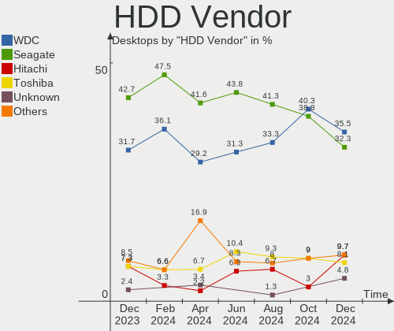
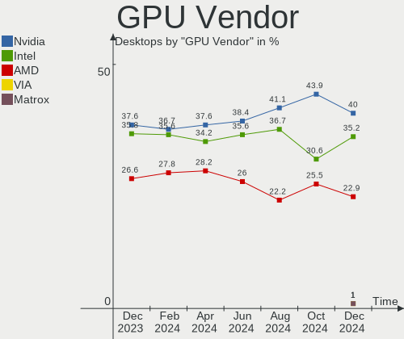
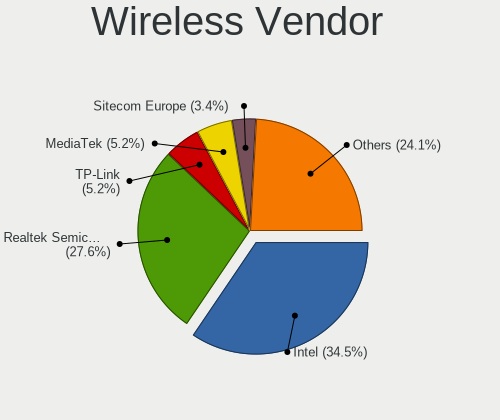
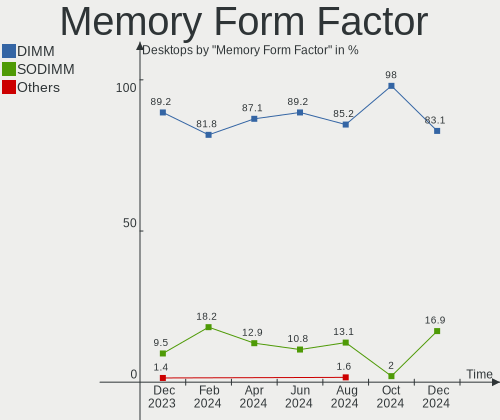
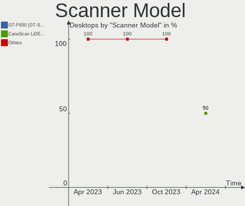

Linux in Italy - Hardware Trends (Desktops)
-------------------------------------------

A project to identify most popular hardware characteristics and track their change
over time based on data collected by Linux users at https://Linux-Hardware.org.

Anyone can contribute to this report by the [hw-probe](https://github.com/linuxhw/hw-probe) tool:

    sudo -E hw-probe -all -upload

Period: Apr, 2023.

Contents
--------

* [ System ](#system)
  - [ OS                       ](#os)
  - [ OS Family                ](#os-family)
  - [ Kernel                   ](#kernel)
  - [ Kernel Family            ](#kernel-family)
  - [ Kernel Major Ver.        ](#kernel-major-ver)
  - [ Arch                     ](#arch)
  - [ DE                       ](#de)
  - [ Display Server           ](#display-server)
  - [ Display Manager          ](#display-manager)
  - [ OS Lang                  ](#os-lang)
  - [ Boot Mode                ](#boot-mode)
  - [ Filesystem               ](#filesystem)
  - [ Part. scheme             ](#part-scheme)
  - [ Dual Boot with Linux/BSD ](#dual-boot-with-linuxbsd)
  - [ Dual Boot (Win)          ](#dual-boot-win)

* [ Board ](#board)
  - [ Vendor                   ](#vendor)
  - [ Model                    ](#model)
  - [ Model Family             ](#model-family)
  - [ MFG Year                 ](#mfg-year)
  - [ Form Factor              ](#form-factor)
  - [ Secure Boot              ](#secure-boot)
  - [ Coreboot                 ](#coreboot)
  - [ RAM Size                 ](#ram-size)
  - [ RAM Used                 ](#ram-used)
  - [ Total Drives             ](#total-drives)
  - [ Has CD-ROM               ](#has-cd-rom)
  - [ Has Ethernet             ](#has-ethernet)
  - [ Has WiFi                 ](#has-wifi)
  - [ Has Bluetooth            ](#has-bluetooth)

* [ Location ](#location)
  - [ Country                  ](#country)
  - [ City                     ](#city)

* [ Drives ](#drives)
  - [ Drive Vendor             ](#drive-vendor)
  - [ Drive Model              ](#drive-model)
  - [ HDD Vendor               ](#hdd-vendor)
  - [ SSD Vendor               ](#ssd-vendor)
  - [ Drive Kind               ](#drive-kind)
  - [ Drive Connector          ](#drive-connector)
  - [ Drive Size               ](#drive-size)
  - [ Space Total              ](#space-total)
  - [ Space Used               ](#space-used)
  - [ Malfunc. Drives          ](#malfunc-drives)
  - [ Malfunc. Drive Vendor    ](#malfunc-drive-vendor)
  - [ Malfunc. HDD Vendor      ](#malfunc-hdd-vendor)
  - [ Malfunc. Drive Kind      ](#malfunc-drive-kind)
  - [ Failed Drives            ](#failed-drives)
  - [ Failed Drive Vendor      ](#failed-drive-vendor)
  - [ Drive Status             ](#drive-status)

* [ Storage controller ](#storage-controller)
  - [ Storage Vendor           ](#storage-vendor)
  - [ Storage Model            ](#storage-model)
  - [ Storage Kind             ](#storage-kind)

* [ Processor ](#processor)
  - [ CPU Vendor               ](#cpu-vendor)
  - [ CPU Model                ](#cpu-model)
  - [ CPU Model Family         ](#cpu-model-family)
  - [ CPU Cores                ](#cpu-cores)
  - [ CPU Sockets              ](#cpu-sockets)
  - [ CPU Threads              ](#cpu-threads)
  - [ CPU Op-Modes             ](#cpu-op-modes)
  - [ CPU Microcode            ](#cpu-microcode)
  - [ CPU Microarch            ](#cpu-microarch)

* [ Graphics ](#graphics)
  - [ GPU Vendor               ](#gpu-vendor)
  - [ GPU Model                ](#gpu-model)
  - [ GPU Combo                ](#gpu-combo)
  - [ GPU Driver               ](#gpu-driver)
  - [ GPU Memory               ](#gpu-memory)

* [ Monitor ](#monitor)
  - [ Monitor Vendor           ](#monitor-vendor)
  - [ Monitor Model            ](#monitor-model)
  - [ Monitor Resolution       ](#monitor-resolution)
  - [ Monitor Diagonal         ](#monitor-diagonal)
  - [ Monitor Width            ](#monitor-width)
  - [ Aspect Ratio             ](#aspect-ratio)
  - [ Monitor Area             ](#monitor-area)
  - [ Pixel Density            ](#pixel-density)
  - [ Multiple Monitors        ](#multiple-monitors)

* [ Network ](#network)
  - [ Net Controller Vendor    ](#net-controller-vendor)
  - [ Net Controller Model     ](#net-controller-model)
  - [ Wireless Vendor          ](#wireless-vendor)
  - [ Wireless Model           ](#wireless-model)
  - [ Ethernet Vendor          ](#ethernet-vendor)
  - [ Ethernet Model           ](#ethernet-model)
  - [ Net Controller Kind      ](#net-controller-kind)
  - [ Used Controller          ](#used-controller)
  - [ NICs                     ](#nics)
  - [ IPv6                     ](#ipv6)

* [ Bluetooth ](#bluetooth)
  - [ Bluetooth Vendor         ](#bluetooth-vendor)
  - [ Bluetooth Model          ](#bluetooth-model)

* [ Sound ](#sound)
  - [ Sound Vendor             ](#sound-vendor)
  - [ Sound Model              ](#sound-model)

* [ Memory ](#memory)
  - [ Memory Vendor            ](#memory-vendor)
  - [ Memory Model             ](#memory-model)
  - [ Memory Kind              ](#memory-kind)
  - [ Memory Form Factor       ](#memory-form-factor)
  - [ Memory Size              ](#memory-size)
  - [ Memory Speed             ](#memory-speed)

* [ Printers & scanners ](#printers--scanners)
  - [ Printer Vendor           ](#printer-vendor)
  - [ Printer Model            ](#printer-model)
  - [ Scanner Vendor           ](#scanner-vendor)
  - [ Scanner Model            ](#scanner-model)

* [ Camera ](#camera)
  - [ Camera Vendor            ](#camera-vendor)
  - [ Camera Model             ](#camera-model)

* [ Security ](#security)
  - [ Fingerprint Vendor       ](#fingerprint-vendor)
  - [ Fingerprint Model        ](#fingerprint-model)
  - [ Chipcard Vendor          ](#chipcard-vendor)
  - [ Chipcard Model           ](#chipcard-model)

* [ Unsupported ](#unsupported)
  - [ Unsupported Devices      ](#unsupported-devices)
  - [ Unsupported Device Types ](#unsupported-device-types)

System
------

OS
--

Installed operating systems

| Name                         | Desktops | Percent |
|------------------------------|----------|---------|
| OpenMandriva 23.03           | 15       | 18.07%  |
| Linux Mint 21.1              | 10       | 12.05%  |
| Ubuntu 22.04                 | 9        | 10.84%  |
| KDE neon 22.04               | 4        | 4.82%   |
| Arch Rolling                 | 4        | 4.82%   |
| Ubuntu 20.04                 | 3        | 3.61%   |
| OpenMandriva 4.2             | 3        | 3.61%   |
| Fedora 38                    | 3        | 3.61%   |
| Zorin 16                     | 2        | 2.41%   |
| Ubuntu 23.04                 | 2        | 2.41%   |
| openSUSE Tumbleweed-XXXXXXXX | 2        | 2.41%   |
| Manjaro 22.1.0               | 2        | 2.41%   |
| Xubuntu 22.10                | 1        | 1.2%    |
| Xubuntu 22.04                | 1        | 1.2%    |
| Ubuntu Unity 16.04           | 1        | 1.2%    |
| Ubuntu 22.10                 | 1        | 1.2%    |
| Siduction 12                 | 1        | 1.2%    |
| ROSA 12.4                    | 1        | 1.2%    |
| Regata OS 23                 | 1        | 1.2%    |
| Q4OS 4                       | 1        | 1.2%    |
| Pop!_OS 22.04                | 1        | 1.2%    |
| OpenMandriva 4.50            | 1        | 1.2%    |
| OpenMandriva 23.01           | 1        | 1.2%    |
| OpenMandriva 22.12           | 1        | 1.2%    |
| Nobara 36                    | 1        | 1.2%    |
| Lubuntu 22.04                | 1        | 1.2%    |
| Linux Mint 21                | 1        | 1.2%    |
| Kubuntu 22.04                | 1        | 1.2%    |
| Gentoo 2.13                  | 1        | 1.2%    |
| Garuda Linux Soaring         | 1        | 1.2%    |
| Fedora 37                    | 1        | 1.2%    |
| FATDOG64 813                 | 1        | 1.2%    |
| EndeavourOS Rolling          | 1        | 1.2%    |
| Elementary 7                 | 1        | 1.2%    |
| Debian 12                    | 1        | 1.2%    |
| Debian 11                    | 1        | 1.2%    |

OS Family
---------

OS without a version

| Name         | Desktops | Percent |
|--------------|----------|---------|
| OpenMandriva | 21       | 25.3%   |
| Ubuntu       | 15       | 18.07%  |
| Linux Mint   | 11       | 13.25%  |
| KDE neon     | 4        | 4.82%   |
| Fedora       | 4        | 4.82%   |
| Arch         | 4        | 4.82%   |
| Zorin        | 2        | 2.41%   |
| Xubuntu      | 2        | 2.41%   |
| openSUSE     | 2        | 2.41%   |
| Manjaro      | 2        | 2.41%   |
| Debian       | 2        | 2.41%   |
| Ubuntu Unity | 1        | 1.2%    |
| Siduction    | 1        | 1.2%    |
| ROSA         | 1        | 1.2%    |
| Regata OS    | 1        | 1.2%    |
| Q4OS         | 1        | 1.2%    |
| Pop!_OS      | 1        | 1.2%    |
| Nobara       | 1        | 1.2%    |
| Lubuntu      | 1        | 1.2%    |
| Kubuntu      | 1        | 1.2%    |
| Gentoo       | 1        | 1.2%    |
| Garuda Linux | 1        | 1.2%    |
| FATDOG64     | 1        | 1.2%    |
| EndeavourOS  | 1        | 1.2%    |
| Elementary   | 1        | 1.2%    |

Kernel
------

Version of the Linux kernel

| Version                           | Desktops | Percent |
|-----------------------------------|----------|---------|
| 6.2.6-desktop-1omv2390            | 15       | 18.07%  |
| 5.15.0-69-generic                 | 9        | 10.84%  |
| 5.19.0-38-generic                 | 7        | 8.43%   |
| 5.19.0-40-generic                 | 5        | 6.02%   |
| 5.15.0-71-generic                 | 3        | 3.61%   |
| 5.15.0-70-generic                 | 3        | 3.61%   |
| 5.10.14-desktop-1omv4002          | 3        | 3.61%   |
| 6.2.9-1-default                   | 2        | 2.41%   |
| 6.2.11-300.fc38.x86_64            | 2        | 2.41%   |
| 6.2.0-20-generic                  | 2        | 2.41%   |
| 5.15.0-56-generic                 | 2        | 2.41%   |
| 6.3.0                             | 1        | 1.2%    |
| 6.2.9-arch1-1                     | 1        | 1.2%    |
| 6.2.7-zen1-1-zen                  | 1        | 1.2%    |
| 6.2.6-76060206-generic            | 1        | 1.2%    |
| 6.2.12-arch1-1                    | 1        | 1.2%    |
| 6.2.12-300.fc38.x86_64            | 1        | 1.2%    |
| 6.2.11-arch1-1                    | 1        | 1.2%    |
| 6.2.10-zen1-1-zen                 | 1        | 1.2%    |
| 6.2.10-lp154.5-default            | 1        | 1.2%    |
| 6.2.10-arch1-1                    | 1        | 1.2%    |
| 6.2.10-1-siduction-amd64          | 1        | 1.2%    |
| 6.2.10-1-MANJARO                  | 1        | 1.2%    |
| 6.2.0-060200-generic              | 1        | 1.2%    |
| 6.1.4-desktop-1omv2301            | 1        | 1.2%    |
| 6.1.23-1-MANJARO                  | 1        | 1.2%    |
| 6.1.20-generic-2rosa2021.1-x86_64 | 1        | 1.2%    |
| 6.1.19-gentoo                     | 1        | 1.2%    |
| 6.1.0-7-amd64                     | 1        | 1.2%    |
| 6.1.0-0.deb11.6-rt-amd64          | 1        | 1.2%    |
| 6.0.7-301.fc37.x86_64             | 1        | 1.2%    |
| 6.0.14-201.fsync.fc36.x86_64      | 1        | 1.2%    |
| 6.0.10-desktop-2omv22090          | 1        | 1.2%    |
| 5.4.0-146-generic                 | 1        | 1.2%    |
| 5.19.5-desktop-1omv4090           | 1        | 1.2%    |
| 5.19.14                           | 1        | 1.2%    |
| 5.19.0-41-generic                 | 1        | 1.2%    |
| 5.15.0-69-lowlatency              | 1        | 1.2%    |
| 5.15.0-43-generic                 | 1        | 1.2%    |
| 5.10.0-21-686-pae                 | 1        | 1.2%    |

Kernel Family
-------------

Linux kernel without a distro release

| Version | Desktops | Percent |
|---------|----------|---------|
| 5.15.0  | 19       | 22.89%  |
| 6.2.6   | 16       | 19.28%  |
| 5.19.0  | 13       | 15.66%  |
| 6.2.10  | 5        | 6.02%   |
| 6.2.9   | 3        | 3.61%   |
| 6.2.11  | 3        | 3.61%   |
| 6.2.0   | 3        | 3.61%   |
| 5.10.14 | 3        | 3.61%   |
| 6.2.12  | 2        | 2.41%   |
| 6.1.0   | 2        | 2.41%   |
| 6.3.0   | 1        | 1.2%    |
| 6.2.7   | 1        | 1.2%    |
| 6.1.4   | 1        | 1.2%    |
| 6.1.23  | 1        | 1.2%    |
| 6.1.20  | 1        | 1.2%    |
| 6.1.19  | 1        | 1.2%    |
| 6.0.7   | 1        | 1.2%    |
| 6.0.14  | 1        | 1.2%    |
| 6.0.10  | 1        | 1.2%    |
| 5.4.0   | 1        | 1.2%    |
| 5.19.5  | 1        | 1.2%    |
| 5.19.14 | 1        | 1.2%    |
| 5.10.0  | 1        | 1.2%    |
| 4.4.0   | 1        | 1.2%    |

Kernel Major Ver.
-----------------

Linux kernel major version

| Version | Desktops | Percent |
|---------|----------|---------|
| 6.2     | 33       | 39.76%  |
| 5.15    | 19       | 22.89%  |
| 5.19    | 15       | 18.07%  |
| 6.1     | 6        | 7.23%   |
| 5.10    | 4        | 4.82%   |
| 6.0     | 3        | 3.61%   |
| 6.3     | 1        | 1.2%    |
| 5.4     | 1        | 1.2%    |
| 4.4     | 1        | 1.2%    |

Arch
----

OS architecture (x86_64, i586, etc.)

| Name   | Desktops | Percent |
|--------|----------|---------|
| x86_64 | 82       | 98.8%   |
| i686   | 1        | 1.2%    |

DE
--

Desktop Environment

| Name       | Desktops | Percent |
|------------|----------|---------|
| KDE5       | 32       | 38.55%  |
| GNOME      | 26       | 31.33%  |
| X-Cinnamon | 9        | 10.84%  |
| XFCE       | 3        | 3.61%   |
| MATE       | 3        | 3.61%   |
| LXQt       | 3        | 3.61%   |
| i3         | 2        | 2.41%   |
| Unknown    | 2        | 2.41%   |
| Unity      | 1        | 1.2%    |
| Trinity    | 1        | 1.2%    |
| Pantheon   | 1        | 1.2%    |

Display Server
--------------

X11 or Wayland

| Name    | Desktops | Percent |
|---------|----------|---------|
| X11     | 66       | 79.52%  |
| Wayland | 16       | 19.28%  |
| Tty     | 1        | 1.2%    |

Display Manager
---------------

SDDM, LightDM, etc.

| Name    | Desktops | Percent |
|---------|----------|---------|
| SDDM    | 32       | 38.55%  |
| Unknown | 18       | 21.69%  |
| GDM3    | 15       | 18.07%  |
| LightDM | 10       | 12.05%  |
| GDM     | 6        | 7.23%   |
| XDM     | 1        | 1.2%    |
| TDM     | 1        | 1.2%    |

OS Lang
-------

Language

| Lang  | Desktops | Percent |
|-------|----------|---------|
| it_IT | 59       | 71.08%  |
| en_US | 19       | 22.89%  |
| C     | 3        | 3.61%   |
| sc_IT | 1        | 1.2%    |
| fr_CH | 1        | 1.2%    |

Boot Mode
---------

EFI or BIOS

| Mode | Desktops | Percent |
|------|----------|---------|
| BIOS | 43       | 51.81%  |
| EFI  | 40       | 48.19%  |

Filesystem
----------

Type of filesystem

| Type    | Desktops | Percent |
|---------|----------|---------|
| Ext4    | 58       | 69.88%  |
| Overlay | 10       | 12.05%  |
| Btrfs   | 7        | 8.43%   |
| Tmpfs   | 6        | 7.23%   |
| Xfs     | 1        | 1.2%    |
| Aufs    | 1        | 1.2%    |

Part. scheme
------------

Scheme of partitioning

| Type    | Desktops | Percent |
|---------|----------|---------|
| GPT     | 50       | 60.24%  |
| Unknown | 17       | 20.48%  |
| MBR     | 16       | 19.28%  |

Dual Boot with Linux/BSD
------------------------

Hosting more than one Linux/BSD

| Dual boot | Desktops | Percent |
|-----------|----------|---------|
| No        | 65       | 78.31%  |
| Yes       | 18       | 21.69%  |

Dual Boot (Win)
---------------

Hosting Linux and Windows

| Dual boot | Desktops | Percent |
|-----------|----------|---------|
| No        | 51       | 61.45%  |
| Yes       | 32       | 38.55%  |

Board
-----

Vendor
------

Motherboard manufacturer

| Name                | Desktops | Percent |
|---------------------|----------|---------|
| ASUSTek Computer    | 29       | 34.94%  |
| MSI                 | 19       | 22.89%  |
| ASRock              | 8        | 9.64%   |
| Gigabyte Technology | 5        | 6.02%   |
| Dell                | 5        | 6.02%   |
| Acer                | 5        | 6.02%   |
| Hewlett-Packard     | 4        | 4.82%   |
| Acidanthera         | 2        | 2.41%   |
| Lenovo              | 1        | 1.2%    |
| Intel               | 1        | 1.2%    |
| ELSKY               | 1        | 1.2%    |
| Cincoze             | 1        | 1.2%    |
| AMI                 | 1        | 1.2%    |
| Unknown             | 1        | 1.2%    |

Model
-----

Motherboard model

| Name                                    | Desktops | Percent |
|-----------------------------------------|----------|---------|
| MSI MS-7B79                             | 3        | 3.61%   |
| Dell OptiPlex 7010                      | 3        | 3.61%   |
| ASUS All Series                         | 3        | 3.61%   |
| ASUS PRIME B350-PLUS                    | 2        | 2.41%   |
| ASUS PRIME A320M-K                      | 2        | 2.41%   |
| Acidanthera MacPro7,1                   | 2        | 2.41%   |
| MSI W200                                | 1        | 1.2%    |
| MSI Pro 3130 Microtower PC              | 1        | 1.2%    |
| MSI NQ890AA-ABZ CQ5011IT                | 1        | 1.2%    |
| MSI MS-7D75                             | 1        | 1.2%    |
| MSI MS-7D59                             | 1        | 1.2%    |
| MSI MS-7C83                             | 1        | 1.2%    |
| MSI MS-7C52                             | 1        | 1.2%    |
| MSI MS-7C35                             | 1        | 1.2%    |
| MSI MS-7C13                             | 1        | 1.2%    |
| MSI MS-7C02                             | 1        | 1.2%    |
| MSI MS-7B87                             | 1        | 1.2%    |
| MSI MS-7B33                             | 1        | 1.2%    |
| MSI MS-7B24                             | 1        | 1.2%    |
| MSI MS-7866                             | 1        | 1.2%    |
| MSI MS-7693                             | 1        | 1.2%    |
| MSI MS-7641                             | 1        | 1.2%    |
| Lenovo IdeaCentre 310S-08ASR 90G9006DIX | 1        | 1.2%    |
| Intel DB75EN AAG39650-303               | 1        | 1.2%    |
| HP ProDesk 400 G1 SFF                   | 1        | 1.2%    |
| HP Pavilion Desktop PC 570-p0xx         | 1        | 1.2%    |
| HP Compaq Pro 6300 MT                   | 1        | 1.2%    |
| HP 1998                                 | 1        | 1.2%    |
| Gigabyte Z68X-UD7-B3                    | 1        | 1.2%    |
| Gigabyte H97-HD3                        | 1        | 1.2%    |
| Gigabyte B75M-D3H                       | 1        | 1.2%    |
| Gigabyte AB350-Gaming                   | 1        | 1.2%    |
| Gigabyte 945GCM-S2L                     | 1        | 1.2%    |
| ELSKY M219F-6C                          | 1        | 1.2%    |
| Dell OptiPlex 7040                      | 1        | 1.2%    |
| Dell OptiPlex 5040                      | 1        | 1.2%    |
| Cincoze DX-1000                         | 1        | 1.2%    |
| ASUS TUF Gaming Z490-PLUS               | 1        | 1.2%    |
| ASUS TUF B450M-PLUS GAMING              | 1        | 1.2%    |
| ASUS SABERTOOTH 990FX                   | 1        | 1.2%    |

Model Family
------------

Motherboard model prefix

| Name                  | Desktops | Percent |
|-----------------------|----------|---------|
| ASUS PRIME            | 7        | 8.43%   |
| Dell OptiPlex         | 5        | 6.02%   |
| MSI MS-7B79           | 3        | 3.61%   |
| ASUS P8Z77-V          | 3        | 3.61%   |
| ASUS All              | 3        | 3.61%   |
| Acer Aspire           | 3        | 3.61%   |
| ASUS TUF              | 2        | 2.41%   |
| ASUS ROG              | 2        | 2.41%   |
| Acidanthera MacPro7   | 2        | 2.41%   |
| Acer Veriton          | 2        | 2.41%   |
| MSI W200              | 1        | 1.2%    |
| MSI Pro               | 1        | 1.2%    |
| MSI NQ890AA-ABZ       | 1        | 1.2%    |
| MSI MS-7D75           | 1        | 1.2%    |
| MSI MS-7D59           | 1        | 1.2%    |
| MSI MS-7C83           | 1        | 1.2%    |
| MSI MS-7C52           | 1        | 1.2%    |
| MSI MS-7C35           | 1        | 1.2%    |
| MSI MS-7C13           | 1        | 1.2%    |
| MSI MS-7C02           | 1        | 1.2%    |
| MSI MS-7B87           | 1        | 1.2%    |
| MSI MS-7B33           | 1        | 1.2%    |
| MSI MS-7B24           | 1        | 1.2%    |
| MSI MS-7866           | 1        | 1.2%    |
| MSI MS-7693           | 1        | 1.2%    |
| MSI MS-7641           | 1        | 1.2%    |
| Lenovo IdeaCentre     | 1        | 1.2%    |
| Intel DB75EN          | 1        | 1.2%    |
| HP ProDesk            | 1        | 1.2%    |
| HP Pavilion           | 1        | 1.2%    |
| HP Compaq             | 1        | 1.2%    |
| HP 1998               | 1        | 1.2%    |
| Gigabyte Z68X-UD7-B3  | 1        | 1.2%    |
| Gigabyte H97-HD3      | 1        | 1.2%    |
| Gigabyte B75M-D3H     | 1        | 1.2%    |
| Gigabyte AB350-Gaming | 1        | 1.2%    |
| Gigabyte 945GCM-S2L   | 1        | 1.2%    |
| ELSKY M219F-6C        | 1        | 1.2%    |
| Cincoze DX-1000       | 1        | 1.2%    |
| ASUS SABERTOOTH       | 1        | 1.2%    |

MFG Year
--------

Motherboard manufacture year

| Year | Desktops | Percent |
|------|----------|---------|
| 2012 | 13       | 15.66%  |
| 2019 | 10       | 12.05%  |
| 2018 | 8        | 9.64%   |
| 2017 | 8        | 9.64%   |
| 2020 | 7        | 8.43%   |
| 2011 | 6        | 7.23%   |
| 2021 | 5        | 6.02%   |
| 2013 | 5        | 6.02%   |
| 2014 | 4        | 4.82%   |
| 2010 | 4        | 4.82%   |
| 2009 | 4        | 4.82%   |
| 2022 | 3        | 3.61%   |
| 2016 | 2        | 2.41%   |
| 2008 | 2        | 2.41%   |
| 2015 | 1        | 1.2%    |
| 2007 | 1        | 1.2%    |

Form Factor
-----------

Physical design of the computer

| Name    | Desktops | Percent |
|---------|----------|---------|
| Desktop | 83       | 100%    |

Secure Boot
-----------

Enabled or disabled

| State    | Desktops | Percent |
|----------|----------|---------|
| Disabled | 81       | 97.59%  |
| Enabled  | 2        | 2.41%   |

Coreboot
--------

Have coreboot on board

| Used | Desktops | Percent |
|------|----------|---------|
| No   | 83       | 100%    |

RAM Size
--------

Total RAM memory

| Size in GB  | Desktops | Percent |
|-------------|----------|---------|
| 16.01-24.0  | 26       | 31.33%  |
| 8.01-16.0   | 20       | 24.1%   |
| 4.01-8.0    | 14       | 16.87%  |
| 3.01-4.0    | 9        | 10.84%  |
| 32.01-64.0  | 7        | 8.43%   |
| 64.01-256.0 | 4        | 4.82%   |
| 24.01-32.0  | 2        | 2.41%   |
| 2.01-3.0    | 1        | 1.2%    |

RAM Used
--------

Used RAM memory

| Used GB   | Desktops | Percent |
|-----------|----------|---------|
| 1.01-2.0  | 33       | 39.76%  |
| 2.01-3.0  | 25       | 30.12%  |
| 4.01-8.0  | 10       | 12.05%  |
| 3.01-4.0  | 7        | 8.43%   |
| 8.01-16.0 | 4        | 4.82%   |
| 0.51-1.0  | 3        | 3.61%   |
| 0.01-0.5  | 1        | 1.2%    |

Total Drives
------------

Number of drives on board

| Drives | Desktops | Percent |
|--------|----------|---------|
| 1      | 37       | 44.58%  |
| 3      | 19       | 22.89%  |
| 2      | 15       | 18.07%  |
| 4      | 9        | 10.84%  |
| 5      | 2        | 2.41%   |
| 6      | 1        | 1.2%    |

Has CD-ROM
----------

Has CD-ROM on board

| Presented | Desktops | Percent |
|-----------|----------|---------|
| No        | 44       | 53.01%  |
| Yes       | 39       | 46.99%  |

Has Ethernet
------------

Has Ethernet on board

| Presented | Desktops | Percent |
|-----------|----------|---------|
| Yes       | 83       | 100%    |

Has WiFi
--------

Has WiFi module

| Presented | Desktops | Percent |
|-----------|----------|---------|
| No        | 45       | 54.22%  |
| Yes       | 38       | 45.78%  |

Has Bluetooth
-------------

Has Bluetooth module

| Presented | Desktops | Percent |
|-----------|----------|---------|
| No        | 53       | 63.86%  |
| Yes       | 30       | 36.14%  |

Location
--------

Country
-------

Geographic location (country)

| Country | Desktops | Percent |
|---------|----------|---------|
| Italy   | 83       | 100%    |

City
----

Geographic location (city)

| City                   | Desktops | Percent |
|------------------------|----------|---------|
| Milan                  | 14       | 16.87%  |
| Rome                   | 12       | 14.46%  |
| Milano                 | 5        | 6.02%   |
| Padova                 | 2        | 2.41%   |
| Naples                 | 2        | 2.41%   |
| Monza                  | 2        | 2.41%   |
| Vicenza                | 1        | 1.2%    |
| Verona                 | 1        | 1.2%    |
| Udine                  | 1        | 1.2%    |
| Savona                 | 1        | 1.2%    |
| Santa Giustina         | 1        | 1.2%    |
| San Severino Marche    | 1        | 1.2%    |
| San Pietro in Casale   | 1        | 1.2%    |
| Pozzuoli               | 1        | 1.2%    |
| Porlezza               | 1        | 1.2%    |
| Ponte San Pietro       | 1        | 1.2%    |
| Pescara                | 1        | 1.2%    |
| Perugia                | 1        | 1.2%    |
| Pergola                | 1        | 1.2%    |
| Partinico              | 1        | 1.2%    |
| Oria                   | 1        | 1.2%    |
| Novoli                 | 1        | 1.2%    |
| Novara                 | 1        | 1.2%    |
| Motta Visconti         | 1        | 1.2%    |
| Monsummano Terme       | 1        | 1.2%    |
| Mombello di Torino     | 1        | 1.2%    |
| Messina                | 1        | 1.2%    |
| Marnate                | 1        | 1.2%    |
| Marcon                 | 1        | 1.2%    |
| Legnaro                | 1        | 1.2%    |
| Imperia                | 1        | 1.2%    |
| Guagnano               | 1        | 1.2%    |
| Genoa                  | 1        | 1.2%    |
| Gardone Riviera        | 1        | 1.2%    |
| Ferrara di Monte Baldo | 1        | 1.2%    |
| Dalmine                | 1        | 1.2%    |
| Condove                | 1        | 1.2%    |
| Città Sant'Angelo     | 1        | 1.2%    |
| Cisano Bergamasco      | 1        | 1.2%    |
| Ciampino               | 1        | 1.2%    |

Drives
------

Drive Vendor
------------

Hard drive vendors

| Vendor                         | Desktops | Drives | Percent |
|--------------------------------|----------|--------|---------|
| WDC                            | 24       | 34     | 15.09%  |
| Seagate                        | 24       | 26     | 15.09%  |
| Samsung Electronics            | 21       | 24     | 13.21%  |
| Crucial                        | 15       | 17     | 9.43%   |
| Kingston                       | 13       | 13     | 8.18%   |
| Sandisk                        | 11       | 11     | 6.92%   |
| Toshiba                        | 7        | 7      | 4.4%    |
| Maxtor                         | 7        | 7      | 4.4%    |
| Phison                         | 3        | 5      | 1.89%   |
| Fanxiang                       | 3        | 3      | 1.89%   |
| China                          | 3        | 3      | 1.89%   |
| Unknown                        | 2        | 2      | 1.26%   |
| SPCC                           | 2        | 3      | 1.26%   |
| Silicon Motion                 | 2        | 2      | 1.26%   |
| MAXIO Technology (Hangzhou)    | 2        | 2      | 1.26%   |
| Intenso                        | 2        | 2      | 1.26%   |
| Hitachi                        | 2        | 2      | 1.26%   |
| HGST                           | 2        | 2      | 1.26%   |
| Transcend                      | 1        | 1      | 0.63%   |
| T-FORCE                        | 1        | 1      | 0.63%   |
| StoreJet                       | 1        | 1      | 0.63%   |
| Solid State Storage Technology | 1        | 1      | 0.63%   |
| SABRENT                        | 1        | 1      | 0.63%   |
| Phison Electronics             | 1        | 1      | 0.63%   |
| OCZ-VERTEX3                    | 1        | 1      | 0.63%   |
| OCZ                            | 1        | 1      | 0.63%   |
| Micron/Crucial Technology      | 1        | 1      | 0.63%   |
| Micron Technology              | 1        | 1      | 0.63%   |
| KingFast                       | 1        | 1      | 0.63%   |
| Intel                          | 1        | 1      | 0.63%   |
| Emtec                          | 1        | 1      | 0.63%   |
| ASENNO                         | 1        | 1      | 0.63%   |

Drive Model
-----------

Hard drive models

| Model                                                  | Desktops | Percent |
|--------------------------------------------------------|----------|---------|
| Crucial CT500MX500SSD1 500GB                           | 8        | 4.57%   |
| Kingston SA400S37240G 240GB SSD                        | 6        | 3.43%   |
| Seagate ST500DM002-1BD142 500GB                        | 4        | 2.29%   |
| Samsung NVMe SSD Controller SM981/PM981/PM983 1TB      | 4        | 2.29%   |
| WDC WDS240G2G0A-00JH30 240GB SSD                       | 2        | 1.14%   |
| WDC WD40EFRX-68N32N0 4TB                               | 2        | 1.14%   |
| Unknown SD/MMC/MS PRO 249GB                            | 2        | 1.14%   |
| Silicon Motion SM2263EN/SM2263XT SSD Controller 1024GB | 2        | 1.14%   |
| Seagate ST250DM000-1BD141 250GB                        | 2        | 1.14%   |
| Seagate ST2000DM008-2FR102 2TB                         | 2        | 1.14%   |
| Seagate ST2000DM001-9YN164 2TB                         | 2        | 1.14%   |
| Seagate ST1000DM010-2EP102 1TB                         | 2        | 1.14%   |
| Seagate ST1000DM003-9YN162 1TB                         | 2        | 1.14%   |
| SanDisk SSD PLUS 1000GB                                | 2        | 1.14%   |
| SanDisk SDSSDA240G 240GB                               | 2        | 1.14%   |
| Samsung SSD 870 EVO 500GB                              | 2        | 1.14%   |
| Samsung SSD 860 EVO 500GB                              | 2        | 1.14%   |
| Samsung SSD 850 EVO 250GB                              | 2        | 1.14%   |
| Samsung SSD 840 PRO Series 256GB                       | 2        | 1.14%   |
| Maxtor STM380215AS 80GB                                | 2        | 1.14%   |
| MAXIO (Hangzhou) NVMe SSD Controller MAP1202 1TB       | 2        | 1.14%   |
| Kingston SA400S37480G 480GB SSD                        | 2        | 1.14%   |
| Kingston SA400S37120G 120GB SSD                        | 2        | 1.14%   |
| Fanxiang S101 512GB                                    | 2        | 1.14%   |
| Crucial CT480BX500SSD1 480GB                           | 2        | 1.14%   |
| Crucial CT1000MX500SSD1 1TB                            | 2        | 1.14%   |
| WDC WD800JD-60LSA0 80GB                                | 1        | 0.57%   |
| WDC WD800AAJS-60WAA0 80GB                              | 1        | 0.57%   |
| WDC WD5002ABYS-02B1B0 500GB                            | 1        | 0.57%   |
| WDC WD5000AAKX-603CA0 500GB                            | 1        | 0.57%   |
| WDC WD5000AAKX-22ERMA0 500GB                           | 1        | 0.57%   |
| WDC WD5000AAKS-65A7B0 500GB                            | 1        | 0.57%   |
| WDC WD5000AAKS-00UU3A0 500GB                           | 1        | 0.57%   |
| WDC WD3200BPVT-00JJ5T0 320GB                           | 1        | 0.57%   |
| WDC WD3200BEVT-22ZCT0 320GB                            | 1        | 0.57%   |
| WDC WD3200AAKS-00L9A0 320GB                            | 1        | 0.57%   |
| WDC WD20EZRX-00D8PB0 2TB                               | 1        | 0.57%   |
| WDC WD20EZAZ-00GGJB0 2TB                               | 1        | 0.57%   |
| WDC WD20EFRX-68AX9N0 2TB                               | 1        | 0.57%   |
| WDC WD20EARS-00MVWB0 2TB                               | 1        | 0.57%   |

HDD Vendor
----------

Hard disk drive vendors

| Vendor              | Desktops | Drives | Percent |
|---------------------|----------|--------|---------|
| Seagate             | 24       | 26     | 36.36%  |
| WDC                 | 22       | 32     | 33.33%  |
| Maxtor              | 7        | 7      | 10.61%  |
| Toshiba             | 6        | 6      | 9.09%   |
| Unknown             | 2        | 2      | 3.03%   |
| Hitachi             | 2        | 2      | 3.03%   |
| HGST                | 2        | 2      | 3.03%   |
| Samsung Electronics | 1        | 1      | 1.52%   |

SSD Vendor
----------

Solid state drive vendors

| Vendor              | Desktops | Drives | Percent |
|---------------------|----------|--------|---------|
| Samsung Electronics | 14       | 14     | 20.9%   |
| Crucial             | 14       | 14     | 20.9%   |
| Kingston            | 12       | 12     | 17.91%  |
| SanDisk             | 9        | 9      | 13.43%  |
| China               | 3        | 3      | 4.48%   |
| WDC                 | 2        | 2      | 2.99%   |
| SPCC                | 2        | 3      | 2.99%   |
| Intenso             | 2        | 2      | 2.99%   |
| Fanxiang            | 2        | 2      | 2.99%   |
| Transcend           | 1        | 1      | 1.49%   |
| StoreJet            | 1        | 1      | 1.49%   |
| OCZ-VERTEX3         | 1        | 1      | 1.49%   |
| OCZ                 | 1        | 1      | 1.49%   |
| Micron Technology   | 1        | 1      | 1.49%   |
| Emtec               | 1        | 1      | 1.49%   |
| ASENNO              | 1        | 1      | 1.49%   |

Drive Kind
----------

HDD or SSD

| Kind    | Desktops | Drives | Percent |
|---------|----------|--------|---------|
| SSD     | 54       | 68     | 42.19%  |
| HDD     | 48       | 78     | 37.5%   |
| NVMe    | 24       | 31     | 18.75%  |
| Unknown | 2        | 2      | 1.56%   |

Drive Connector
---------------

SATA, SAS, NVMe, etc.

| Type | Desktops | Drives | Percent |
|------|----------|--------|---------|
| SATA | 74       | 144    | 73.27%  |
| NVMe | 23       | 30     | 22.77%  |
| SAS  | 4        | 5      | 3.96%   |

Drive Size
----------

Size of hard drive

| Size in TB | Desktops | Drives | Percent |
|------------|----------|--------|---------|
| 0.01-0.5   | 65       | 92     | 60.19%  |
| 0.51-1.0   | 24       | 34     | 22.22%  |
| 1.01-2.0   | 12       | 13     | 11.11%  |
| 3.01-4.0   | 3        | 3      | 2.78%   |
| 2.01-3.0   | 2        | 2      | 1.85%   |
| 10.01-20.0 | 1        | 1      | 0.93%   |
| 4.01-10.0  | 1        | 1      | 0.93%   |

Space Total
-----------

Amount of disk space available on the file system

| Size in GB     | Desktops | Percent |
|----------------|----------|---------|
| 251-500        | 21       | 25.3%   |
| 101-250        | 14       | 16.87%  |
| 2001-3000      | 9        | 10.84%  |
| 1001-2000      | 8        | 9.64%   |
| 21-50          | 7        | 8.43%   |
| 51-100         | 7        | 8.43%   |
| 501-1000       | 6        | 7.23%   |
| More than 3000 | 4        | 4.82%   |
| 1-20           | 4        | 4.82%   |
| Unknown        | 3        | 3.61%   |

Space Used
----------

Amount of used disk space

| Used GB        | Desktops | Percent |
|----------------|----------|---------|
| 1-20           | 35       | 42.17%  |
| 51-100         | 11       | 13.25%  |
| 21-50          | 10       | 12.05%  |
| 251-500        | 7        | 8.43%   |
| 1001-2000      | 6        | 7.23%   |
| 501-1000       | 5        | 6.02%   |
| More than 3000 | 3        | 3.61%   |
| 101-250        | 3        | 3.61%   |
| Unknown        | 3        | 3.61%   |

Malfunc. Drives
---------------

Drive models with a malfunction

| Model                                    | Desktops | Drives | Percent |
|------------------------------------------|----------|--------|---------|
| Maxtor STM380215AS 80GB                  | 2        | 2      | 10.53%  |
| WDC WDS240G2G0A-00JH30 240GB SSD         | 1        | 1      | 5.26%   |
| WDC WD800AAJS-60WAA0 80GB                | 1        | 1      | 5.26%   |
| WDC WD5002ABYS-02B1B0 500GB              | 1        | 1      | 5.26%   |
| WDC WD3200BPVT-00JJ5T0 320GB             | 1        | 1      | 5.26%   |
| Toshiba MQ01ABB200 2TB                   | 1        | 1      | 5.26%   |
| Toshiba MK2035GSS 200GB                  | 1        | 1      | 5.26%   |
| Seagate ST9500325AS 500GB                | 1        | 1      | 5.26%   |
| Seagate ST6000AS0002-1N917X 6TB          | 1        | 1      | 5.26%   |
| Seagate ST500DM002-1BD142 500GB          | 1        | 1      | 5.26%   |
| Seagate ST3320820AS 320GB                | 1        | 1      | 5.26%   |
| Seagate ST3250310AS 250GB                | 1        | 1      | 5.26%   |
| Seagate ST2000VM003-1ET164 2TB           | 1        | 1      | 5.26%   |
| Samsung Electronics SSD 970 EVO Plus 1TB | 1        | 1      | 5.26%   |
| Maxtor STM3320820AS 320GB                | 1        | 1      | 5.26%   |
| Maxtor STM3250310AS 250GB                | 1        | 1      | 5.26%   |
| Hitachi HTE545050B9A300 500GB            | 1        | 1      | 5.26%   |
| HGST HTS725050A7E630 500GB               | 1        | 1      | 5.26%   |

Malfunc. Drive Vendor
---------------------

Vendors of faulty drives

| Vendor              | Desktops | Drives | Percent |
|---------------------|----------|--------|---------|
| Seagate             | 6        | 6      | 31.58%  |
| WDC                 | 4        | 4      | 21.05%  |
| Maxtor              | 4        | 4      | 21.05%  |
| Toshiba             | 2        | 2      | 10.53%  |
| Samsung Electronics | 1        | 1      | 5.26%   |
| Hitachi             | 1        | 1      | 5.26%   |
| HGST                | 1        | 1      | 5.26%   |

Malfunc. HDD Vendor
-------------------

Vendors of faulty HDD drives

| Vendor  | Desktops | Drives | Percent |
|---------|----------|--------|---------|
| Seagate | 6        | 6      | 35.29%  |
| Maxtor  | 4        | 4      | 23.53%  |
| WDC     | 3        | 3      | 17.65%  |
| Toshiba | 2        | 2      | 11.76%  |
| Hitachi | 1        | 1      | 5.88%   |
| HGST    | 1        | 1      | 5.88%   |

Malfunc. Drive Kind
-------------------

Kinds of faulty drives

| Kind | Desktops | Drives | Percent |
|------|----------|--------|---------|
| HDD  | 15       | 17     | 88.24%  |
| NVMe | 1        | 1      | 5.88%   |
| SSD  | 1        | 1      | 5.88%   |

Failed Drives
-------------

Failed drive models

Zero info for selected period =(

Failed Drive Vendor
-------------------

Failed drive vendors

Zero info for selected period =(

Drive Status
------------

Number of failed and malfunc. drives

| Status   | Desktops | Drives | Percent |
|----------|----------|--------|---------|
| Works    | 41       | 79     | 43.62%  |
| Detected | 37       | 81     | 39.36%  |
| Malfunc  | 16       | 19     | 17.02%  |

Storage controller
------------------

Storage Vendor
--------------

Storage controller vendors

| Vendor                         | Desktops | Percent |
|--------------------------------|----------|---------|
| Intel                          | 57       | 46.72%  |
| AMD                            | 24       | 19.67%  |
| Samsung Electronics            | 8        | 6.56%   |
| ASMedia Technology             | 7        | 5.74%   |
| JMicron Technology             | 6        | 4.92%   |
| Phison Electronics             | 4        | 3.28%   |
| Micron/Crucial Technology      | 3        | 2.46%   |
| MAXIO Technology (Hangzhou)    | 3        | 2.46%   |
| Silicon Motion                 | 2        | 1.64%   |
| SanDisk                        | 2        | 1.64%   |
| Marvell Technology Group       | 2        | 1.64%   |
| Toshiba America Info Systems   | 1        | 0.82%   |
| Solid State Storage Technology | 1        | 0.82%   |
| Nvidia                         | 1        | 0.82%   |
| Kingston Technology Company    | 1        | 0.82%   |

Storage Model
-------------

Storage controller models

| Model                                                                          | Desktops | Percent |
|--------------------------------------------------------------------------------|----------|---------|
| AMD FCH SATA Controller [AHCI mode]                                            | 17       | 11.72%  |
| Intel 7 Series/C210 Series Chipset Family 6-port SATA Controller [AHCI mode]   | 9        | 6.21%   |
| Samsung NVMe SSD Controller SM981/PM981/PM983                                  | 7        | 4.83%   |
| AMD 400 Series Chipset SATA Controller                                         | 7        | 4.83%   |
| Intel Q170/Q150/B150/H170/H110/Z170/CM236 Chipset SATA Controller [AHCI Mode]  | 6        | 4.14%   |
| ASMedia ASM1062 Serial ATA Controller                                          | 6        | 4.14%   |
| Intel 8 Series/C220 Series Chipset Family 6-port SATA Controller 1 [AHCI mode] | 5        | 3.45%   |
| Intel Cannon Lake PCH SATA AHCI Controller                                     | 4        | 2.76%   |
| MAXIO (Hangzhou) NVMe SSD Controller MAP1202                                   | 3        | 2.07%   |
| Intel NM10/ICH7 Family SATA Controller [IDE mode]                              | 3        | 2.07%   |
| Intel 6 Series/C200 Series Chipset Family 6 port Desktop SATA AHCI Controller  | 3        | 2.07%   |
| Intel 400 Series Chipset Family SATA AHCI Controller                           | 3        | 2.07%   |
| Intel 200 Series PCH SATA controller [AHCI mode]                               | 3        | 2.07%   |
| AMD SB7x0/SB8x0/SB9x0 SATA Controller [IDE mode]                               | 3        | 2.07%   |
| AMD SB7x0/SB8x0/SB9x0 SATA Controller [AHCI mode]                              | 3        | 2.07%   |
| AMD SB7x0/SB8x0/SB9x0 IDE Controller                                           | 3        | 2.07%   |
| AMD 300 Series Chipset SATA Controller                                         | 3        | 2.07%   |
| Silicon Motion SM2263EN/SM2263XT SSD Controller                                | 2        | 1.38%   |
| Phison E16 PCIe4 NVMe Controller                                               | 2        | 1.38%   |
| Micron/Crucial P2 NVMe PCIe SSD                                                | 2        | 1.38%   |
| JMicron JMB368 IDE controller                                                  | 2        | 1.38%   |
| JMicron JMB363 SATA/IDE Controller                                             | 2        | 1.38%   |
| Intel Sunrise Point-LP SATA Controller [AHCI mode]                             | 2        | 1.38%   |
| Intel Comet Lake SATA AHCI Controller                                          | 2        | 1.38%   |
| Intel Atom Processor E3800 Series SATA AHCI Controller                         | 2        | 1.38%   |
| Intel Alder Lake-S PCH SATA Controller [AHCI Mode]                             | 2        | 1.38%   |
| Intel 9 Series Chipset Family SATA Controller [AHCI Mode]                      | 2        | 1.38%   |
| Intel 7 Series/C210 Series Chipset Family 4-port SATA Controller [IDE mode]    | 2        | 1.38%   |
| Intel 7 Series/C210 Series Chipset Family 2-port SATA Controller [IDE mode]    | 2        | 1.38%   |
| Intel 5 Series/3400 Series Chipset 6 port SATA AHCI Controller                 | 2        | 1.38%   |
| AMD FCH SATA Controller D                                                      | 2        | 1.38%   |
| Toshiba America Info Systems BG3 NVMe SSD Controller                           | 1        | 0.69%   |
| Solid State Storage Non-Volatile memory controller                             | 1        | 0.69%   |
| SanDisk WD Blue SN550 NVMe SSD                                                 | 1        | 0.69%   |
| SanDisk Non-Volatile memory controller                                         | 1        | 0.69%   |
| Samsung NVMe SSD Controller PM9A1/PM9A3/980PRO                                 | 1        | 0.69%   |
| Phison E18 PCIe4 NVMe Controller                                               | 1        | 0.69%   |
| Phison E12 NVMe Controller                                                     | 1        | 0.69%   |
| Nvidia MCP61 SATA Controller                                                   | 1        | 0.69%   |
| Nvidia MCP61 IDE                                                               | 1        | 0.69%   |

Storage Kind
------------

Kind of storage controller (IDE, SATA, NVMe, SAS, ...)

| Kind | Desktops | Percent |
|------|----------|---------|
| SATA | 73       | 64.6%   |
| NVMe | 23       | 20.35%  |
| IDE  | 15       | 13.27%  |
| RAID | 2        | 1.77%   |

Processor
---------

CPU Vendor
----------

Processor vendors

| Vendor | Desktops | Percent |
|--------|----------|---------|
| Intel  | 58       | 69.88%  |
| AMD    | 25       | 30.12%  |

CPU Model
---------

Processor models

| Model                                       | Desktops | Percent |
|---------------------------------------------|----------|---------|
| AMD Ryzen 5 3600 6-Core Processor           | 3        | 3.61%   |
| Intel Core i7-9700 CPU @ 3.00GHz            | 2        | 2.41%   |
| Intel Core i7-8550U CPU @ 1.80GHz           | 2        | 2.41%   |
| Intel Core i7-4790K CPU @ 4.00GHz           | 2        | 2.41%   |
| Intel Core i7-3770 CPU @ 3.40GHz            | 2        | 2.41%   |
| Intel Core i7-10700K CPU @ 3.80GHz          | 2        | 2.41%   |
| Intel Core i5-7400 CPU @ 3.00GHz            | 2        | 2.41%   |
| Intel Core i5-4570 CPU @ 3.20GHz            | 2        | 2.41%   |
| Intel Core i5-3470 CPU @ 3.20GHz            | 2        | 2.41%   |
| Intel Core i5-2400 CPU @ 3.10GHz            | 2        | 2.41%   |
| Intel 12th Gen Core i7-12700K               | 2        | 2.41%   |
| AMD Ryzen 7 3700X 8-Core Processor          | 2        | 2.41%   |
| Intel Xeon CPU E31220 @ 3.10GHz             | 1        | 1.2%    |
| Intel Xeon CPU E3-1230 v3 @ 3.30GHz         | 1        | 1.2%    |
| Intel Pentium Dual-Core CPU E5700 @ 3.00GHz | 1        | 1.2%    |
| Intel Pentium Dual CPU E2180 @ 2.00GHz      | 1        | 1.2%    |
| Intel Pentium CPU N3700 @ 1.60GHz           | 1        | 1.2%    |
| Intel Pentium CPU G630 @ 2.70GHz            | 1        | 1.2%    |
| Intel Pentium CPU G4400TE @ 2.40GHz         | 1        | 1.2%    |
| Intel Pentium CPU G3420 @ 3.20GHz           | 1        | 1.2%    |
| Intel Pentium CPU G2030 @ 3.00GHz           | 1        | 1.2%    |
| Intel Genuine CPU 0000 @ 2.40GHz            | 1        | 1.2%    |
| Intel Core i7-8700 CPU @ 3.20GHz            | 1        | 1.2%    |
| Intel Core i7-3770K CPU @ 3.50GHz           | 1        | 1.2%    |
| Intel Core i7-2700K CPU @ 3.50GHz           | 1        | 1.2%    |
| Intel Core i7-2600 CPU @ 3.40GHz            | 1        | 1.2%    |
| Intel Core i7-10700 CPU @ 2.90GHz           | 1        | 1.2%    |
| Intel Core i7 CPU 870 @ 2.93GHz             | 1        | 1.2%    |
| Intel Core i5-9600K CPU @ 3.70GHz           | 1        | 1.2%    |
| Intel Core i5-8400 CPU @ 2.80GHz            | 1        | 1.2%    |
| Intel Core i5-6500T CPU @ 2.50GHz           | 1        | 1.2%    |
| Intel Core i5-6500 CPU @ 3.20GHz            | 1        | 1.2%    |
| Intel Core i5-6400 CPU @ 2.70GHz            | 1        | 1.2%    |
| Intel Core i5-4590 CPU @ 3.30GHz            | 1        | 1.2%    |
| Intel Core i5-3570K CPU @ 3.40GHz           | 1        | 1.2%    |
| Intel Core i5-3450 CPU @ 3.10GHz            | 1        | 1.2%    |
| Intel Core i5-10400 CPU @ 2.90GHz           | 1        | 1.2%    |
| Intel Core i5 CPU 650 @ 3.20GHz             | 1        | 1.2%    |
| Intel Core i3-6100 CPU @ 3.70GHz            | 1        | 1.2%    |
| Intel Core i3-3220 CPU @ 3.30GHz            | 1        | 1.2%    |

CPU Model Family
----------------

Processor model prefix

| Model                   | Desktops | Percent |
|-------------------------|----------|---------|
| Intel Core i5           | 18       | 21.69%  |
| Intel Core i7           | 16       | 19.28%  |
| AMD Ryzen 5             | 9        | 10.84%  |
| Other                   | 5        | 6.02%   |
| Intel Pentium           | 5        | 6.02%   |
| Intel Core i3           | 4        | 4.82%   |
| AMD Ryzen 7             | 4        | 4.82%   |
| Intel Celeron           | 3        | 3.61%   |
| Intel Xeon              | 2        | 2.41%   |
| Intel Core 2 Duo        | 2        | 2.41%   |
| AMD Ryzen 9             | 2        | 2.41%   |
| AMD Phenom II X4        | 2        | 2.41%   |
| Intel Pentium Dual-Core | 1        | 1.2%    |
| Intel Pentium Dual      | 1        | 1.2%    |
| Intel Genuine           | 1        | 1.2%    |
| Intel Core 2 Quad       | 1        | 1.2%    |
| Intel Atom              | 1        | 1.2%    |
| AMD Sempron             | 1        | 1.2%    |
| AMD Ryzen 3             | 1        | 1.2%    |
| AMD FX                  | 1        | 1.2%    |
| AMD Athlon II X4        | 1        | 1.2%    |
| AMD Athlon II X2        | 1        | 1.2%    |
| AMD Athlon              | 1        | 1.2%    |

CPU Cores
---------

Number of processor cores

| Number | Desktops | Percent |
|--------|----------|---------|
| 4      | 36       | 43.37%  |
| 2      | 16       | 19.28%  |
| 6      | 13       | 15.66%  |
| 8      | 10       | 12.05%  |
| 12     | 3        | 3.61%   |
| 1      | 3        | 3.61%   |
| 16     | 1        | 1.2%    |
| 3      | 1        | 1.2%    |

CPU Sockets
-----------

Number of sockets

| Number | Desktops | Percent |
|--------|----------|---------|
| 1      | 83       | 100%    |

CPU Threads
-----------

Threads per core (Hyper-Threading)

| Number | Desktops | Percent |
|--------|----------|---------|
| 1      | 42       | 50.6%   |
| 2      | 40       | 48.19%  |
| 4      | 1        | 1.2%    |

CPU Op-Modes
------------

CPU Operation Modes (32-bit, 64-bit)

| Op mode        | Desktops | Percent |
|----------------|----------|---------|
| 32-bit, 64-bit | 82       | 98.8%   |
| 32-bit         | 1        | 1.2%    |

CPU Microcode
-------------

Microcode number

| Number     | Desktops | Percent |
|------------|----------|---------|
| Unknown    | 34       | 40.96%  |
| 0x08701021 | 5        | 6.02%   |
| 0x306a9    | 4        | 4.82%   |
| 0x306c3    | 3        | 3.61%   |
| 0x08001138 | 3        | 3.61%   |
| 0x010000c8 | 3        | 3.61%   |
| 0x906ed    | 2        | 2.41%   |
| 0x906ea    | 2        | 2.41%   |
| 0x906e9    | 2        | 2.41%   |
| 0x506e3    | 2        | 2.41%   |
| 0x1067a    | 2        | 2.41%   |
| 0x010000c7 | 2        | 2.41%   |
| 0xa0655    | 1        | 1.2%    |
| 0x806ea    | 1        | 1.2%    |
| 0x6fd      | 1        | 1.2%    |
| 0x406c3    | 1        | 1.2%    |
| 0x30679    | 1        | 1.2%    |
| 0x206a7    | 1        | 1.2%    |
| 0x20652    | 1        | 1.2%    |
| 0x106e5    | 1        | 1.2%    |
| 0x106c2    | 1        | 1.2%    |
| 0x0a601203 | 1        | 1.2%    |
| 0x0a50000d | 1        | 1.2%    |
| 0x0a20120a | 1        | 1.2%    |
| 0x0a201025 | 1        | 1.2%    |
| 0x08701013 | 1        | 1.2%    |
| 0x08101016 | 1        | 1.2%    |
| 0x0800820d | 1        | 1.2%    |
| 0x08001137 | 1        | 1.2%    |
| 0x06006705 | 1        | 1.2%    |
| 0x06000626 | 1        | 1.2%    |

CPU Microarch
-------------

Microarchitecture

| Name             | Desktops | Percent |
|------------------|----------|---------|
| KabyLake         | 10       | 12.05%  |
| IvyBridge        | 9        | 10.84%  |
| Haswell          | 7        | 8.43%   |
| Zen 2            | 6        | 7.23%   |
| SandyBridge      | 6        | 7.23%   |
| K10              | 6        | 7.23%   |
| Zen              | 5        | 6.02%   |
| Skylake          | 5        | 6.02%   |
| CometLake        | 5        | 6.02%   |
| Penryn           | 4        | 4.82%   |
| Zen 3            | 3        | 3.61%   |
| Silvermont       | 3        | 3.61%   |
| Zen+             | 2        | 2.41%   |
| Westmere         | 2        | 2.41%   |
| Unknown          | 2        | 2.41%   |
| Nehalem          | 1        | 1.2%    |
| Icelake          | 1        | 1.2%    |
| Goldmont plus    | 1        | 1.2%    |
| Excavator        | 1        | 1.2%    |
| Core             | 1        | 1.2%    |
| Bulldozer        | 1        | 1.2%    |
| Bonnell          | 1        | 1.2%    |
| Alderlake Hybrid | 1        | 1.2%    |

Graphics
--------

GPU Vendor
----------

Vendors of graphics cards

| Vendor | Desktops | Percent |
|--------|----------|---------|
| Nvidia | 34       | 37.36%  |
| Intel  | 31       | 34.07%  |
| AMD    | 26       | 28.57%  |

GPU Model
---------

Graphics card models

| Model                                                                                 | Desktops | Percent |
|---------------------------------------------------------------------------------------|----------|---------|
| Intel Xeon E3-1200 v3/4th Gen Core Processor Integrated Graphics Controller           | 4        | 4.3%    |
| Nvidia GM206 [GeForce GTX 960]                                                        | 3        | 3.23%   |
| Nvidia GK208B [GeForce GT 730]                                                        | 3        | 3.23%   |
| Intel Xeon E3-1200 v2/3rd Gen Core processor Graphics Controller                      | 3        | 3.23%   |
| Intel IvyBridge GT2 [HD Graphics 4000]                                                | 3        | 3.23%   |
| Intel 2nd Generation Core Processor Family Integrated Graphics Controller             | 3        | 3.23%   |
| AMD Navi 10 [Radeon RX 5600 OEM/5600 XT / 5700/5700 XT]                               | 3        | 3.23%   |
| AMD Ellesmere [Radeon RX 470/480/570/570X/580/580X/590]                               | 3        | 3.23%   |
| Nvidia GP108 [GeForce GT 1030]                                                        | 2        | 2.15%   |
| Nvidia GP107 [GeForce GTX 1050 Ti]                                                    | 2        | 2.15%   |
| Nvidia GP104 [GeForce GTX 1070]                                                       | 2        | 2.15%   |
| Nvidia GM107 [GeForce GTX 750 Ti]                                                     | 2        | 2.15%   |
| Nvidia GK208B [GeForce GT 710]                                                        | 2        | 2.15%   |
| Intel UHD Graphics 620                                                                | 2        | 2.15%   |
| Intel HD Graphics 530                                                                 | 2        | 2.15%   |
| Intel CoffeeLake-S GT2 [UHD Graphics 630]                                             | 2        | 2.15%   |
| Intel Atom Processor Z36xxx/Z37xxx Series Graphics & Display                          | 2        | 2.15%   |
| AMD Topaz XT [Radeon R7 M260/M265 / M340/M360 / M440/M445 / 530/535 / 620/625 Mobile] | 2        | 2.15%   |
| AMD Lexa PRO [Radeon 540/540X/550/550X / RX 540X/550/550X]                            | 2        | 2.15%   |
| AMD Barts XT [Radeon HD 6870]                                                         | 2        | 2.15%   |
| AMD Baffin [Radeon RX 550 640SP / RX 560/560X]                                        | 2        | 2.15%   |
| AMD Baffin [Radeon RX 460/560D / Pro 450/455/460/555/555X/560/560X]                   | 2        | 2.15%   |
| Nvidia TU116 [GeForce GTX 1660 Ti]                                                    | 1        | 1.08%   |
| Nvidia TU116 [GeForce GTX 1650]                                                       | 1        | 1.08%   |
| Nvidia GT216 [GeForce 315]                                                            | 1        | 1.08%   |
| Nvidia GP106 [GeForce GTX 1060 6GB]                                                   | 1        | 1.08%   |
| Nvidia GP106 [GeForce GTX 1060 3GB]                                                   | 1        | 1.08%   |
| Nvidia GP104 [GeForce GTX 1060 6GB]                                                   | 1        | 1.08%   |
| Nvidia GM107 [GeForce GTX 750]                                                        | 1        | 1.08%   |
| Nvidia GK208B [GeForce GT 720]                                                        | 1        | 1.08%   |
| Nvidia GK107 [GeForce GT 740]                                                         | 1        | 1.08%   |
| Nvidia GF119 [GeForce GT 610]                                                         | 1        | 1.08%   |
| Nvidia GF108 [GeForce GT 420]                                                         | 1        | 1.08%   |
| Nvidia GF104 [GeForce GTX 460]                                                        | 1        | 1.08%   |
| Nvidia GA104 [GeForce RTX 3070 Ti]                                                    | 1        | 1.08%   |
| Nvidia GA104 [GeForce RTX 3070 Lite Hash Rate]                                        | 1        | 1.08%   |
| Nvidia GA104 [GeForce RTX 3060]                                                       | 1        | 1.08%   |
| Nvidia GA104 [GeForce RTX 3060 Ti Lite Hash Rate]                                     | 1        | 1.08%   |
| Nvidia G98 [GeForce 8400 GS Rev. 2]                                                   | 1        | 1.08%   |
| Nvidia G84 [GeForce 8600 GT]                                                          | 1        | 1.08%   |

GPU Combo
---------

Combinations of graphics cards

| Name           | Desktops | Percent |
|----------------|----------|---------|
| 1 x Nvidia     | 29       | 34.94%  |
| 1 x Intel      | 24       | 28.92%  |
| 1 x AMD        | 23       | 27.71%  |
| Intel + Nvidia | 3        | 3.61%   |
| Intel + AMD    | 2        | 2.41%   |
| 2 x Nvidia     | 1        | 1.2%    |
| AMD + Nvidia   | 1        | 1.2%    |

GPU Driver
----------

Free vs proprietary

| Driver      | Desktops | Percent |
|-------------|----------|---------|
| Free        | 68       | 81.93%  |
| Proprietary | 13       | 15.66%  |
| Unknown     | 2        | 2.41%   |

GPU Memory
----------

Total video memory

| Size in GB | Desktops | Percent |
|------------|----------|---------|
| Unknown    | 35       | 42.17%  |
| 1.01-2.0   | 16       | 19.28%  |
| 7.01-8.0   | 8        | 9.64%   |
| 3.01-4.0   | 7        | 8.43%   |
| 0.01-0.5   | 6        | 7.23%   |
| 0.51-1.0   | 4        | 4.82%   |
| 5.01-6.0   | 3        | 3.61%   |
| 2.01-3.0   | 2        | 2.41%   |
| 8.01-16.0  | 2        | 2.41%   |

Monitor
-------

Monitor Vendor
--------------

Monitor vendors

| Vendor               | Desktops | Percent |
|----------------------|----------|---------|
| Samsung Electronics  | 12       | 14.46%  |
| Philips              | 10       | 12.05%  |
| Ancor Communications | 9        | 10.84%  |
| Hewlett-Packard      | 7        | 8.43%   |
| Goldstar             | 6        | 7.23%   |
| Dell                 | 5        | 6.02%   |
| BenQ                 | 5        | 6.02%   |
| AOC                  | 4        | 4.82%   |
| Acer                 | 4        | 4.82%   |
| MSI                  | 3        | 3.61%   |
| Lenovo               | 2        | 2.41%   |
| Chimei Innolux       | 2        | 2.41%   |
| ASUSTek Computer     | 2        | 2.41%   |
| VIE                  | 1        | 1.2%    |
| Sony                 | 1        | 1.2%    |
| Packard Bell         | 1        | 1.2%    |
| Onkyo                | 1        | 1.2%    |
| OLT                  | 1        | 1.2%    |
| NEC Computers        | 1        | 1.2%    |
| HKC                  | 1        | 1.2%    |
| HannStar             | 1        | 1.2%    |
| Eizo                 | 1        | 1.2%    |
| CHR                  | 1        | 1.2%    |
| Belinea              | 1        | 1.2%    |
| Unknown              | 1        | 1.2%    |

Monitor Model
-------------

Monitor models

| Model                                                                  | Desktops | Percent |
|------------------------------------------------------------------------|----------|---------|
| Philips 191EL PHLC03D 1366x768 410x230mm 18.5-inch                     | 2        | 2.35%   |
| Chimei Innolux LCD Monitor CMN15E7 1920x1080 344x193mm 15.5-inch       | 2        | 2.35%   |
| BenQ GW2270 BNQ78DB 1920x1080 476x268mm 21.5-inch                      | 2        | 2.35%   |
| Ancor Communications ASUS PB278 ACI27A3 2560x1440 597x336mm 27.0-inch  | 2        | 2.35%   |
| VIE M22E3 VIE215E 1920x1080 477x268mm 21.5-inch                        | 1        | 1.18%   |
| Sony SDM-HS75P SNY2300 1280x1024 338x270mm 17.0-inch                   | 1        | 1.18%   |
| Samsung Electronics U32J59x SAM0F35 3840x2160 697x392mm 31.5-inch      | 1        | 1.18%   |
| Samsung Electronics SyncMaster SAM03E5 1680x1050 474x296mm 22.0-inch   | 1        | 1.18%   |
| Samsung Electronics SME1920W SAM06BE 1440x900 408x255mm 18.9-inch      | 1        | 1.18%   |
| Samsung Electronics S24F350 SAM0D20 1920x1080 521x293mm 23.5-inch      | 1        | 1.18%   |
| Samsung Electronics S24D330 SAM0D93 1920x1080 531x299mm 24.0-inch      | 1        | 1.18%   |
| Samsung Electronics LU28R55 SAM1017 3840x2160 632x360mm 28.6-inch      | 1        | 1.18%   |
| Samsung Electronics LCD Monitor SAM7245 1920x1080 1210x680mm 54.6-inch | 1        | 1.18%   |
| Samsung Electronics LCD Monitor S24F350 3840x1080                      | 1        | 1.18%   |
| Samsung Electronics LCD Monitor S24F350                                | 1        | 1.18%   |
| Samsung Electronics LC32G5xT SAM7080 2560x1440 698x393mm 31.5-inch     | 1        | 1.18%   |
| Samsung Electronics LC27G5xT SAM7079 2560x1440 597x336mm 27.0-inch     | 1        | 1.18%   |
| Samsung Electronics LC24T55 SAM7021 1920x1080 522x272mm 23.2-inch      | 1        | 1.18%   |
| Samsung Electronics C27F390 SAM0D33 1920x1080 598x336mm 27.0-inch      | 1        | 1.18%   |
| Philips PHL 276E8V PHLC18F 3840x2160 597x336mm 27.0-inch               | 1        | 1.18%   |
| Philips PHL 231B4Q PHL08EB 1920x1080 509x286mm 23.0-inch               | 1        | 1.18%   |
| Philips PHL 221S8L PHL091C 1920x1080 477x268mm 21.5-inch               | 1        | 1.18%   |
| Philips PHL 203V5 PHLC0CE 1600x900 434x236mm 19.4-inch                 | 1        | 1.18%   |
| Philips LCD Monitor PHL 246V5 3840x1080                                | 1        | 1.18%   |
| Philips LCD Monitor PHL 246V5                                          | 1        | 1.18%   |
| Philips FTV PHL01EA 1920x1080 1440x810mm 65.0-inch                     | 1        | 1.18%   |
| Philips 220WS PHL0851 1680x1050 474x296mm 22.0-inch                    | 1        | 1.18%   |
| Philips 190C PHL0849 1280x1024 376x301mm 19.0-inch                     | 1        | 1.18%   |
| Packard Bell Viseo200T PKB00F8 1600x900 443x249mm 20.0-inch            | 1        | 1.18%   |
| Onkyo TX-SR607 ONK0865 1920x1080                                       | 1        | 1.18%   |
| OLT MR19F05N OLT2CC6 1280x1024 376x301mm 19.0-inch                     | 1        | 1.18%   |
| NEC Computers LCD2090UXi NEC66B0 1600x1200 408x306mm 20.1-inch         | 1        | 1.18%   |
| MSI MAG342CQR MSI3DB6 3440x1440 797x333mm 34.0-inch                    | 1        | 1.18%   |
| MSI G27C5 MSI3CA9 1920x1080 598x336mm 27.0-inch                        | 1        | 1.18%   |
| MSI G241 MSI3BA4 1920x1080 527x296mm 23.8-inch                         | 1        | 1.18%   |
| Lenovo LEN T2424pA LEN60C8 1920x1080 527x296mm 23.8-inch               | 1        | 1.18%   |
| Lenovo D24-20 LEN66AE 1920x1080 527x296mm 23.8-inch                    | 1        | 1.18%   |
| HKC LCD Monitor HKC1850 1360x768 304x228mm 15.0-inch                   | 1        | 1.18%   |
| Hewlett-Packard Z23i HWP3090 1920x1080 509x286mm 23.0-inch             | 1        | 1.18%   |
| Hewlett-Packard P221 HWP3057 1920x1080 476x268mm 21.5-inch             | 1        | 1.18%   |

Monitor Resolution
------------------

Monitor screen resolution

| Resolution         | Desktops | Percent |
|--------------------|----------|---------|
| 1920x1080 (FHD)    | 37       | 45.12%  |
| 3840x2160 (4K)     | 9        | 10.98%  |
| 2560x1440 (QHD)    | 7        | 8.54%   |
| 1280x1024 (SXGA)   | 7        | 8.54%   |
| 1680x1050 (WSXGA+) | 4        | 4.88%   |
| 1600x900 (HD+)     | 3        | 3.66%   |
| 1440x900 (WXGA+)   | 3        | 3.66%   |
| 1366x768 (WXGA)    | 3        | 3.66%   |
| 3840x1080          | 2        | 2.44%   |
| Unknown            | 2        | 2.44%   |
| 3840x1600          | 1        | 1.22%   |
| 3440x1440          | 1        | 1.22%   |
| 2048x1152          | 1        | 1.22%   |
| 1600x1200          | 1        | 1.22%   |
| 1360x768           | 1        | 1.22%   |

Monitor Diagonal
----------------

Diagonal size in inches

| Inches  | Desktops | Percent |
|---------|----------|---------|
| 27      | 13       | 15.85%  |
| 21      | 11       | 13.41%  |
| 23      | 10       | 12.2%   |
| 24      | 9        | 10.98%  |
| 19      | 8        | 9.76%   |
| 18      | 5        | 6.1%    |
| 22      | 4        | 4.88%   |
| Unknown | 4        | 4.88%   |
| 31      | 3        | 3.66%   |
| 20      | 3        | 3.66%   |
| 32      | 2        | 2.44%   |
| 17      | 2        | 2.44%   |
| 15      | 2        | 2.44%   |
| 72      | 1        | 1.22%   |
| 65      | 1        | 1.22%   |
| 54      | 1        | 1.22%   |
| 37      | 1        | 1.22%   |
| 34      | 1        | 1.22%   |
| 28      | 1        | 1.22%   |

Monitor Width
-------------

Physical width

| Width in mm | Desktops | Percent |
|-------------|----------|---------|
| 501-600     | 31       | 38.75%  |
| 401-500     | 25       | 31.25%  |
| 351-400     | 5        | 6.25%   |
| 601-700     | 4        | 5%      |
| 301-350     | 4        | 5%      |
| Unknown     | 4        | 5%      |
| 701-800     | 3        | 3.75%   |
| 1001-1500   | 2        | 2.5%    |
| 801-900     | 1        | 1.25%   |
| 1501-2000   | 1        | 1.25%   |

Aspect Ratio
------------

Proportional relationship between the width and the height

| Ratio   | Desktops | Percent |
|---------|----------|---------|
| 16/9    | 57       | 73.08%  |
| 5/4     | 7        | 8.97%   |
| 16/10   | 7        | 8.97%   |
| Unknown | 4        | 5.13%   |
| 21/9    | 2        | 2.56%   |
| 4/3     | 1        | 1.28%   |

Monitor Area
------------

Area in inch²

| Area in inch² | Desktops | Percent |
|----------------|----------|---------|
| 201-250        | 28       | 34.15%  |
| 151-200        | 16       | 19.51%  |
| 301-350        | 13       | 15.85%  |
| 351-500        | 8        | 9.76%   |
| 141-150        | 6        | 7.32%   |
| Unknown        | 4        | 4.88%   |
| More than 1000 | 3        | 3.66%   |
| 251-300        | 2        | 2.44%   |
| 101-110        | 2        | 2.44%   |

Pixel Density
-------------

Pixels per inch

| Density | Desktops | Percent |
|---------|----------|---------|
| 51-100  | 49       | 61.25%  |
| 101-120 | 18       | 22.5%   |
| 121-160 | 5        | 6.25%   |
| Unknown | 4        | 5%      |
| 1-50    | 2        | 2.5%    |
| 161-240 | 2        | 2.5%    |

Multiple Monitors
-----------------

Total monitors connected

| Total | Desktops | Percent |
|-------|----------|---------|
| 1     | 70       | 84.34%  |
| 2     | 10       | 12.05%  |
| 0     | 2        | 2.41%   |
| 3     | 1        | 1.2%    |

Network
-------

Net Controller Vendor
---------------------

Controller vendors

| Vendor                                | Desktops | Percent |
|---------------------------------------|----------|---------|
| Realtek Semiconductor                 | 61       | 50.41%  |
| Intel                                 | 27       | 22.31%  |
| Qualcomm Atheros                      | 7        | 5.79%   |
| Ralink                                | 3        | 2.48%   |
| Microsoft                             | 3        | 2.48%   |
| D-Link                                | 3        | 2.48%   |
| TP-Link                               | 2        | 1.65%   |
| Samsung Electronics                   | 2        | 1.65%   |
| Ralink Technology                     | 2        | 1.65%   |
| MediaTek                              | 2        | 1.65%   |
| Marvell Technology Group              | 2        | 1.65%   |
| ZTE WCDMA Technologies MSM            | 1        | 0.83%   |
| T & A Mobile Phones                   | 1        | 0.83%   |
| Motorola PCS                          | 1        | 0.83%   |
| Compal Electronics                    | 1        | 0.83%   |
| Broadcom                              | 1        | 0.83%   |
| ASIX Electronics                      | 1        | 0.83%   |
| 802.11g Adapter [Linksys WUSB54GC v3] | 1        | 0.83%   |

Net Controller Model
--------------------

Controller models

| Model                                                             | Desktops | Percent |
|-------------------------------------------------------------------|----------|---------|
| Realtek RTL8111/8168/8411 PCI Express Gigabit Ethernet Controller | 47       | 33.57%  |
| Realtek RTL8125 2.5GbE Controller                                 | 5        | 3.57%   |
| Intel Wi-Fi 6 AX200                                               | 5        | 3.57%   |
| Intel 82579LM Gigabit Network Connection (Lewisville)             | 4        | 2.86%   |
| Realtek RTL8153 Gigabit Ethernet Adapter                          | 3        | 2.14%   |
| Intel I211 Gigabit Network Connection                             | 3        | 2.14%   |
| Samsung Galaxy series, misc. (tethering mode)                     | 2        | 1.43%   |
| Realtek RTL88x2bu [AC1200 Techkey]                                | 2        | 1.43%   |
| Realtek RTL810xE PCI Express Fast Ethernet controller             | 2        | 1.43%   |
| Realtek RTL-8185 IEEE 802.11a/b/g Wireless LAN Controller         | 2        | 1.43%   |
| Ralink RT2790 Wireless 802.11n 1T/2R PCIe                         | 2        | 1.43%   |
| Qualcomm Atheros QCA9377 802.11ac Wireless Network Adapter        | 2        | 1.43%   |
| Qualcomm Atheros AR9485 Wireless Network Adapter                  | 2        | 1.43%   |
| Microsoft Xbox 360 Wireless Adapter                               | 2        | 1.43%   |
| Marvell Group 88E8056 PCI-E Gigabit Ethernet Controller           | 2        | 1.43%   |
| Intel Ethernet Controller I225-V                                  | 2        | 1.43%   |
| Intel Ethernet Connection (7) I219-V                              | 2        | 1.43%   |
| Intel Ethernet Connection (2) I219-V                              | 2        | 1.43%   |
| Intel 82579V Gigabit Network Connection                           | 2        | 1.43%   |
| ZTE WCDMA MSM DEMO Mobile Boardband                               | 1        | 0.71%   |
| TP-Link UE300 10/100/1000 LAN (ethernet mode) [Realtek RTL8153]   | 1        | 0.71%   |
| TP-Link AC600 wireless Realtek RTL8811AU [Archer T2U Nano]        | 1        | 0.71%   |
| T & A Mobile Phones Mobilebroadband                               | 1        | 0.71%   |
| Realtek RTL8812AU 802.11a/b/g/n/ac 2T2R DB WLAN Adapter           | 1        | 0.71%   |
| Realtek RTL8812AE 802.11ac PCIe Wireless Network Adapter          | 1        | 0.71%   |
| Realtek RTL8192CU 802.11n WLAN Adapter                            | 1        | 0.71%   |
| Realtek RTL8191SU 802.11n WLAN Adapter                            | 1        | 0.71%   |
| Realtek RTL8188CUS 802.11n WLAN Adapter                           | 1        | 0.71%   |
| Realtek RTL8188CE 802.11b/g/n WiFi Adapter                        | 1        | 0.71%   |
| Realtek RTL8169 PCI Gigabit Ethernet Controller                   | 1        | 0.71%   |
| Realtek RTL-8100/8101L/8139 PCI Fast Ethernet Adapter             | 1        | 0.71%   |
| Realtek 802.11ac NIC                                              | 1        | 0.71%   |
| Ralink RT2870/RT3070 Wireless Adapter                             | 1        | 0.71%   |
| Ralink MT7601U Wireless Adapter                                   | 1        | 0.71%   |
| Ralink RT5592 PCIe Wireless Network Adapter                       | 1        | 0.71%   |
| Qualcomm Atheros QCA8171 Gigabit Ethernet                         | 1        | 0.71%   |
| Qualcomm Atheros Killer E220x Gigabit Ethernet Controller         | 1        | 0.71%   |
| Qualcomm Atheros AR8151 v2.0 Gigabit Ethernet                     | 1        | 0.71%   |
| Qualcomm Atheros AR8131 Gigabit Ethernet                          | 1        | 0.71%   |
| Motorola PCS motorola razr 2022                                   | 1        | 0.71%   |

Wireless Vendor
---------------

Wireless vendors

| Vendor                                | Desktops | Percent |
|---------------------------------------|----------|---------|
| Intel                                 | 12       | 27.91%  |
| Realtek Semiconductor                 | 11       | 25.58%  |
| Qualcomm Atheros                      | 4        | 9.3%    |
| Ralink                                | 3        | 6.98%   |
| Microsoft                             | 3        | 6.98%   |
| D-Link                                | 3        | 6.98%   |
| Ralink Technology                     | 2        | 4.65%   |
| MediaTek                              | 2        | 4.65%   |
| TP-Link                               | 1        | 2.33%   |
| Broadcom                              | 1        | 2.33%   |
| 802.11g Adapter [Linksys WUSB54GC v3] | 1        | 2.33%   |

Wireless Model
--------------

Wireless models

| Model                                                                                               | Desktops | Percent |
|-----------------------------------------------------------------------------------------------------|----------|---------|
| Intel Wi-Fi 6 AX200                                                                                 | 5        | 11.63%  |
| Realtek RTL88x2bu [AC1200 Techkey]                                                                  | 2        | 4.65%   |
| Realtek RTL-8185 IEEE 802.11a/b/g Wireless LAN Controller                                           | 2        | 4.65%   |
| Ralink RT2790 Wireless 802.11n 1T/2R PCIe                                                           | 2        | 4.65%   |
| Qualcomm Atheros QCA9377 802.11ac Wireless Network Adapter                                          | 2        | 4.65%   |
| Qualcomm Atheros AR9485 Wireless Network Adapter                                                    | 2        | 4.65%   |
| Microsoft Xbox 360 Wireless Adapter                                                                 | 2        | 4.65%   |
| TP-Link AC600 wireless Realtek RTL8811AU [Archer T2U Nano]                                          | 1        | 2.33%   |
| Realtek RTL8812AU 802.11a/b/g/n/ac 2T2R DB WLAN Adapter                                             | 1        | 2.33%   |
| Realtek RTL8812AE 802.11ac PCIe Wireless Network Adapter                                            | 1        | 2.33%   |
| Realtek RTL8192CU 802.11n WLAN Adapter                                                              | 1        | 2.33%   |
| Realtek RTL8191SU 802.11n WLAN Adapter                                                              | 1        | 2.33%   |
| Realtek RTL8188CUS 802.11n WLAN Adapter                                                             | 1        | 2.33%   |
| Realtek RTL8188CE 802.11b/g/n WiFi Adapter                                                          | 1        | 2.33%   |
| Realtek 802.11ac NIC                                                                                | 1        | 2.33%   |
| Ralink RT2870/RT3070 Wireless Adapter                                                               | 1        | 2.33%   |
| Ralink MT7601U Wireless Adapter                                                                     | 1        | 2.33%   |
| Ralink RT5592 PCIe Wireless Network Adapter                                                         | 1        | 2.33%   |
| Microsoft Xbox Wireless Adapter for Windows                                                         | 1        | 2.33%   |
| MediaTek MT7922 802.11ax PCI Express Wireless Network Adapter                                       | 1        | 2.33%   |
| MediaTek MT7921 802.11ax PCI Express Wireless Network Adapter                                       | 1        | 2.33%   |
| Intel Wireless-AC 9260                                                                              | 1        | 2.33%   |
| Intel Wireless 7260                                                                                 | 1        | 2.33%   |
| Intel Tiger Lake PCH CNVi WiFi                                                                      | 1        | 2.33%   |
| Intel Gemini Lake PCH CNVi WiFi                                                                     | 1        | 2.33%   |
| Intel Dual Band Wireless-AC 3168NGW [Stone Peak]                                                    | 1        | 2.33%   |
| Intel Comet Lake PCH CNVi WiFi                                                                      | 1        | 2.33%   |
| Intel Alder Lake-S PCH CNVi WiFi                                                                    | 1        | 2.33%   |
| D-Link DWA-131 Wireless N Nano Adapter (Rev. E1) [Realtek RTL8192EU]                                | 1        | 2.33%   |
| D-Link DWA-121 802.11n Wireless N 150 Pico Adapter [Realtek RTL8188CUS]                             | 1        | 2.33%   |
| D-Link 802.11ac NIC                                                                                 | 1        | 2.33%   |
| Broadcom BCM4360 802.11ac Wireless Network Adapter                                                  | 1        | 2.33%   |
| 802.11g Adapter [Linksys WUSB54GC v3] WUSB100 v2 RangePlus Wireless Network Adapter [Ralink RT3070] | 1        | 2.33%   |

Ethernet Vendor
---------------

Ethernet vendors

| Vendor                     | Desktops | Percent |
|----------------------------|----------|---------|
| Realtek Semiconductor      | 57       | 61.96%  |
| Intel                      | 22       | 23.91%  |
| Qualcomm Atheros           | 4        | 4.35%   |
| Samsung Electronics        | 2        | 2.17%   |
| Marvell Technology Group   | 2        | 2.17%   |
| ZTE WCDMA Technologies MSM | 1        | 1.09%   |
| TP-Link                    | 1        | 1.09%   |
| Motorola PCS               | 1        | 1.09%   |
| Compal Electronics         | 1        | 1.09%   |
| ASIX Electronics           | 1        | 1.09%   |

Ethernet Model
--------------

Ethernet models

| Model                                                             | Desktops | Percent |
|-------------------------------------------------------------------|----------|---------|
| Realtek RTL8111/8168/8411 PCI Express Gigabit Ethernet Controller | 47       | 48.96%  |
| Realtek RTL8125 2.5GbE Controller                                 | 5        | 5.21%   |
| Intel 82579LM Gigabit Network Connection (Lewisville)             | 4        | 4.17%   |
| Realtek RTL8153 Gigabit Ethernet Adapter                          | 3        | 3.13%   |
| Intel I211 Gigabit Network Connection                             | 3        | 3.13%   |
| Samsung Galaxy series, misc. (tethering mode)                     | 2        | 2.08%   |
| Realtek RTL810xE PCI Express Fast Ethernet controller             | 2        | 2.08%   |
| Marvell Group 88E8056 PCI-E Gigabit Ethernet Controller           | 2        | 2.08%   |
| Intel Ethernet Controller I225-V                                  | 2        | 2.08%   |
| Intel Ethernet Connection (7) I219-V                              | 2        | 2.08%   |
| Intel Ethernet Connection (2) I219-V                              | 2        | 2.08%   |
| Intel 82579V Gigabit Network Connection                           | 2        | 2.08%   |
| ZTE WCDMA MSM DEMO Mobile Boardband                               | 1        | 1.04%   |
| TP-Link UE300 10/100/1000 LAN (ethernet mode) [Realtek RTL8153]   | 1        | 1.04%   |
| Realtek RTL8169 PCI Gigabit Ethernet Controller                   | 1        | 1.04%   |
| Realtek RTL-8100/8101L/8139 PCI Fast Ethernet Adapter             | 1        | 1.04%   |
| Qualcomm Atheros QCA8171 Gigabit Ethernet                         | 1        | 1.04%   |
| Qualcomm Atheros Killer E220x Gigabit Ethernet Controller         | 1        | 1.04%   |
| Qualcomm Atheros AR8151 v2.0 Gigabit Ethernet                     | 1        | 1.04%   |
| Qualcomm Atheros AR8131 Gigabit Ethernet                          | 1        | 1.04%   |
| Motorola PCS motorola razr 2022                                   | 1        | 1.04%   |
| Intel I210 Gigabit Network Connection                             | 1        | 1.04%   |
| Intel Ethernet Connection I219-LM                                 | 1        | 1.04%   |
| Intel Ethernet Connection I217-LM                                 | 1        | 1.04%   |
| Intel Ethernet Connection (2) I219-LM                             | 1        | 1.04%   |
| Intel Ethernet Connection (14) I219-LM                            | 1        | 1.04%   |
| Intel Ethernet Connection (12) I219-V                             | 1        | 1.04%   |
| Intel Ethernet Connection (11) I219-V                             | 1        | 1.04%   |
| Intel 82578DC Gigabit Network Connection                          | 1        | 1.04%   |
| Intel 82567V-2 Gigabit Network Connection                         | 1        | 1.04%   |
| Compal S62 Pro                                                    | 1        | 1.04%   |
| ASIX AX88772                                                      | 1        | 1.04%   |

Net Controller Kind
-------------------

Ethernet, WiFi or modem

| Kind     | Desktops | Percent |
|----------|----------|---------|
| Ethernet | 83       | 68.03%  |
| WiFi     | 38       | 31.15%  |
| Modem    | 1        | 0.82%   |

Used Controller
---------------

Currently used network controller

| Kind     | Desktops | Percent |
|----------|----------|---------|
| Ethernet | 70       | 83.33%  |
| WiFi     | 14       | 16.67%  |

NICs
----

Total network controllers on board

| Total | Desktops | Percent |
|-------|----------|---------|
| 1     | 56       | 67.47%  |
| 2     | 22       | 26.51%  |
| 3     | 4        | 4.82%   |
| 0     | 1        | 1.2%    |

IPv6
----

IPv6 vs IPv4

| Used | Desktops | Percent |
|------|----------|---------|
| No   | 78       | 93.98%  |
| Yes  | 5        | 6.02%   |

Bluetooth
---------

Bluetooth Vendor
----------------

Controller vendors

| Vendor                          | Desktops | Percent |
|---------------------------------|----------|---------|
| Intel                           | 12       | 40%     |
| Cambridge Silicon Radio         | 6        | 20%     |
| Realtek Semiconductor           | 4        | 13.33%  |
| Qualcomm Atheros Communications | 3        | 10%     |
| TP-Link                         | 2        | 6.67%   |
| MediaTek                        | 1        | 3.33%   |
| Foxconn / Hon Hai               | 1        | 3.33%   |
| Apple                           | 1        | 3.33%   |

Bluetooth Model
---------------

Controller models

| Model                                               | Desktops | Percent |
|-----------------------------------------------------|----------|---------|
| Cambridge Silicon Radio Bluetooth Dongle (HCI mode) | 6        | 20%     |
| Intel AX200 Bluetooth                               | 5        | 16.67%  |
| Realtek Bluetooth Radio                             | 3        | 10%     |
| Intel AX201 Bluetooth                               | 3        | 10%     |
| TP-Link UB500 Adapter                               | 2        | 6.67%   |
| Qualcomm Atheros  Bluetooth Device                  | 2        | 6.67%   |
| Realtek Bluetooth 5.1 Radio                         | 1        | 3.33%   |
| Qualcomm Atheros AR3011 Bluetooth                   | 1        | 3.33%   |
| MediaTek Wireless_Device                            | 1        | 3.33%   |
| Intel Wireless-AC 9260 Bluetooth Adapter            | 1        | 3.33%   |
| Intel Wireless-AC 3168 Bluetooth                    | 1        | 3.33%   |
| Intel Bluetooth wireless interface                  | 1        | 3.33%   |
| Intel Bluetooth 9460/9560 Jefferson Peak (JfP)      | 1        | 3.33%   |
| Foxconn / Hon Hai Wireless_Device                   | 1        | 3.33%   |
| Apple Bluetooth Host Controller                     | 1        | 3.33%   |

Sound
-----

Sound Vendor
------------

Sound card vendors

| Vendor                      | Desktops | Percent |
|-----------------------------|----------|---------|
| Intel                       | 56       | 40.58%  |
| Nvidia                      | 32       | 23.19%  |
| AMD                         | 32       | 23.19%  |
| C-Media Electronics         | 4        | 2.9%    |
| VIA Technologies            | 1        | 0.72%   |
| Tenx Technology             | 1        | 0.72%   |
| SAVITECH                    | 1        | 0.72%   |
| Samson Technologies         | 1        | 0.72%   |
| Razer USA                   | 1        | 0.72%   |
| Micro Star International    | 1        | 0.72%   |
| MAG Technology              | 1        | 0.72%   |
| Logitech                    | 1        | 0.72%   |
| JMTek                       | 1        | 0.72%   |
| Hewlett-Packard             | 1        | 0.72%   |
| Fnatic Gear                 | 1        | 0.72%   |
| FiiO Electronics Technology | 1        | 0.72%   |
| Creative Labs               | 1        | 0.72%   |
| Corsair                     | 1        | 0.72%   |

Sound Model
-----------

Sound card models

| Model                                                                       | Desktops | Percent |
|-----------------------------------------------------------------------------|----------|---------|
| Intel 7 Series/C216 Chipset Family High Definition Audio Controller         | 10       | 6.37%   |
| AMD Starship/Matisse HD Audio Controller                                    | 8        | 5.1%    |
| Nvidia GK208 HDMI/DP Audio Controller                                       | 6        | 3.82%   |
| Intel 100 Series/C230 Series Chipset Family HD Audio Controller             | 6        | 3.82%   |
| AMD SBx00 Azalia (Intel HDA)                                                | 6        | 3.82%   |
| AMD Family 17h (Models 00h-0fh) HD Audio Controller                         | 6        | 3.82%   |
| AMD Baffin HDMI/DP Audio [Radeon RX 550 640SP / RX 560/560X]                | 6        | 3.82%   |
| Intel 8 Series/C220 Series Chipset High Definition Audio Controller         | 5        | 3.18%   |
| Nvidia GA104 High Definition Audio Controller                               | 4        | 2.55%   |
| Intel NM10/ICH7 Family High Definition Audio Controller                     | 4        | 2.55%   |
| Intel Cannon Lake PCH cAVS                                                  | 4        | 2.55%   |
| Nvidia GP104 High Definition Audio Controller                               | 3        | 1.91%   |
| Nvidia GM206 High Definition Audio Controller                               | 3        | 1.91%   |
| Nvidia GM107 High Definition Audio Controller [GeForce 940MX]               | 3        | 1.91%   |
| Intel Xeon E3-1200 v3/4th Gen Core Processor HD Audio Controller            | 3        | 1.91%   |
| Intel Comet Lake PCH-V cAVS                                                 | 3        | 1.91%   |
| Intel 6 Series/C200 Series Chipset Family High Definition Audio Controller  | 3        | 1.91%   |
| Intel 5 Series/3400 Series Chipset High Definition Audio                    | 3        | 1.91%   |
| Intel 200 Series PCH HD Audio                                               | 3        | 1.91%   |
| AMD Navi 10 HDMI Audio                                                      | 3        | 1.91%   |
| AMD Family 17h/19h HD Audio Controller                                      | 3        | 1.91%   |
| AMD Ellesmere HDMI Audio [Radeon RX 470/480 / 570/580/590]                  | 3        | 1.91%   |
| Nvidia TU116 High Definition Audio Controller                               | 2        | 1.27%   |
| Nvidia GP108 High Definition Audio Controller                               | 2        | 1.27%   |
| Nvidia GP107GL High Definition Audio Controller                             | 2        | 1.27%   |
| Nvidia GP106 High Definition Audio Controller                               | 2        | 1.27%   |
| Intel Sunrise Point-LP HD Audio                                             | 2        | 1.27%   |
| Intel Comet Lake PCH cAVS                                                   | 2        | 1.27%   |
| Intel Atom Processor Z36xxx/Z37xxx Series High Definition Audio Controller  | 2        | 1.27%   |
| Intel Alder Lake-S HD Audio Controller                                      | 2        | 1.27%   |
| Intel 9 Series Chipset Family HD Audio Controller                           | 2        | 1.27%   |
| C-Media Electronics CMI8788 [Oxygen HD Audio]                               | 2        | 1.27%   |
| AMD Barts HDMI Audio [Radeon HD 6790/6850/6870 / 7720 OEM]                  | 2        | 1.27%   |
| VIA Technologies VT1720/24 [Envy24PT/HT] PCI Multi-Channel Audio Controller | 1        | 0.64%   |
| Tenx Technology USB AUDIO                                                   | 1        | 0.64%   |
| SAVITECH SA9023 audio controller                                            | 1        | 0.64%   |
| Samson Technologies Meteor condenser microphone                             | 1        | 0.64%   |
| Razer USA Kraken Tournament Edition                                         | 1        | 0.64%   |
| Nvidia MCP61 High Definition Audio                                          | 1        | 0.64%   |
| Nvidia GT216 HDMI Audio Controller                                          | 1        | 0.64%   |

Memory
------

Memory Vendor
-------------

Memory module vendors

| Vendor              | Desktops | Percent |
|---------------------|----------|---------|
| Corsair             | 15       | 21.74%  |
| Kingston            | 13       | 18.84%  |
| Crucial             | 11       | 15.94%  |
| Unknown             | 6        | 8.7%    |
| Samsung Electronics | 6        | 8.7%    |
| SK hynix            | 5        | 7.25%   |
| Micron Technology   | 4        | 5.8%    |
| G.Skill             | 3        | 4.35%   |
| A-DATA Technology   | 2        | 2.9%    |
| Unknown             | 2        | 2.9%    |
| Unknown (ABCD)      | 1        | 1.45%   |
| Patriot             | 1        | 1.45%   |

Memory Model
------------

Memory module models

| Model                                                          | Desktops | Percent |
|----------------------------------------------------------------|----------|---------|
| SK hynix RAM HMT451U6BFR8C-PB 4GB DIMM DDR3 1600MT/s           | 2        | 2.41%   |
| SK hynix RAM HMT351U6CFR8C-PB 4GB DIMM DDR3 1800MT/s           | 2        | 2.41%   |
| Samsung RAM M378B5673FH0-CH9 2GB DIMM DDR3 1600MT/s            | 2        | 2.41%   |
| Samsung RAM M378B5273DH0-CK0 4GB DIMM DDR3 2200MT/s            | 2        | 2.41%   |
| Micron RAM 4ATF51264HZ-2G6E1 4GB SODIMM DDR4 2667MT/s          | 2        | 2.41%   |
| Micron RAM 4ATF51264HZ-2G3B1 4GB SODIMM DDR4 2400MT/s          | 2        | 2.41%   |
| Kingston RAM KHX1600C10D3/8G 8GB DIMM DDR3 1600MT/s            | 2        | 2.41%   |
| Corsair RAM CMV4GX3M1A1333C9 4GB DIMM DDR3 1600MT/s            | 2        | 2.41%   |
| Unknown                                                        | 2        | 2.41%   |
| Unknown RAM Module 8GB DIMM DDR3 1600MT/s                      | 1        | 1.2%    |
| Unknown RAM Module 4GB DIMM DDR3 1333MT/s                      | 1        | 1.2%    |
| Unknown RAM Module 2GB DIMM DDR3 1333MT/s                      | 1        | 1.2%    |
| Unknown RAM Module 2GB DIMM 667MT/s                            | 1        | 1.2%    |
| Unknown RAM Module 2048MB DIMM 1333MT/s                        | 1        | 1.2%    |
| Unknown RAM Module 1GB DIMM DDR2 533MT/s                       | 1        | 1.2%    |
| Unknown RAM DDR3 1600 8G 8192MB DIMM DDR3 1600MT/s             | 1        | 1.2%    |
| Unknown RAM 3600 C17 Series 8GB DIMM DDR4 3200MT/s             | 1        | 1.2%    |
| Unknown (ABCD) RAM 123456789012345678 2GB DIMM LPDDR4 2400MT/s | 1        | 1.2%    |
| SK hynix RAM HMT41GU6BFR8C-PB 8GB DIMM DDR3 1600MT/s           | 1        | 1.2%    |
| SK hynix RAM HMT351U6CFR8C-PB 4GB DIMM 1333MT/s                | 1        | 1.2%    |
| SK hynix RAM HMA81GU6CJR8N-VK 8GB DIMM DDR4 2400MT/s           | 1        | 1.2%    |
| Samsung RAM Module 2GB DIMM DDR3 1333MT/s                      | 1        | 1.2%    |
| Samsung RAM M378A5244CB0-CTD 4GB DIMM DDR4 3334MT/s            | 1        | 1.2%    |
| Samsung RAM M378A5244CB0-CRC 4GB DIMM DDR4 3066MT/s            | 1        | 1.2%    |
| Samsung RAM M378A1K43CB2-CRC 8GB DIMM DDR4 3500MT/s            | 1        | 1.2%    |
| Samsung RAM M378A1G43EB1-CPB 8GB DIMM DDR4 2667MT/s            | 1        | 1.2%    |
| Patriot RAM PSD48G240081 8GB DIMM DDR4 2800MT/s                | 1        | 1.2%    |
| Micron RAM Module 4GB DIMM DDR4 2400MT/s                       | 1        | 1.2%    |
| Micron RAM 8ATF1G64AZ-2G3B1 8GB DIMM DDR4 2448MT/s             | 1        | 1.2%    |
| Kingston RAM Module 16GB DIMM DDR4 3200MT/s                    | 1        | 1.2%    |
| Kingston RAM LV32D4S2S8HD-8 8GB SODIMM DDR4 3200MT/s           | 1        | 1.2%    |
| Kingston RAM KHX2133C14D4/4G 4GB DIMM DDR4 2933MT/s            | 1        | 1.2%    |
| Kingston RAM KHX1600C9S3L/4G 4GB DIMM DDR3 1600MT/s            | 1        | 1.2%    |
| Kingston RAM KHX1600C10D3/4G 4GB DIMM DDR3 1866MT/s            | 1        | 1.2%    |
| Kingston RAM KF552C36-32 32GB DIMM DDR5 4800MT/s               | 1        | 1.2%    |
| Kingston RAM 99U5584-007.A00LF 4GB DIMM DDR3 1333MT/s          | 1        | 1.2%    |
| Kingston RAM 99U5474-028.A00LF 4GB DIMM 1333MT/s               | 1        | 1.2%    |
| Kingston RAM 99U5474-026.A00LF 4GB DIMM DDR3 1333MT/s          | 1        | 1.2%    |
| Kingston RAM 99U5471-054.A00LF 8GB DIMM DDR3 1600MT/s          | 1        | 1.2%    |
| Kingston RAM 9905584-032.A00LF 4GB DIMM DDR3 1600MT/s          | 1        | 1.2%    |

Memory Kind
-----------

Memory module kinds

| Kind    | Desktops | Percent |
|---------|----------|---------|
| DDR4    | 29       | 48.33%  |
| DDR3    | 20       | 33.33%  |
| SDRAM   | 4        | 6.67%   |
| DDR2    | 2        | 3.33%   |
| Unknown | 2        | 3.33%   |
| LPDDR4  | 1        | 1.67%   |
| DDR5    | 1        | 1.67%   |
| DDR     | 1        | 1.67%   |

Memory Form Factor
------------------

Physical design of the memory module

| Name   | Desktops | Percent |
|--------|----------|---------|
| DIMM   | 54       | 94.74%  |
| SODIMM | 3        | 5.26%   |

Memory Size
-----------

Memory module size

| Size  | Desktops | Percent |
|-------|----------|---------|
| 8192  | 29       | 43.28%  |
| 4096  | 19       | 28.36%  |
| 2048  | 10       | 14.93%  |
| 16384 | 6        | 8.96%   |
| 32768 | 2        | 2.99%   |
| 1024  | 1        | 1.49%   |

Memory Speed
------------

Memory module speed

| Speed   | Desktops | Percent |
|---------|----------|---------|
| 1600    | 17       | 22.08%  |
| 2400    | 9        | 11.69%  |
| 1333    | 9        | 11.69%  |
| 3600    | 8        | 10.39%  |
| 3200    | 5        | 6.49%   |
| 2667    | 4        | 5.19%   |
| 3000    | 2        | 2.6%    |
| 2933    | 2        | 2.6%    |
| 2200    | 2        | 2.6%    |
| 1867    | 2        | 2.6%    |
| 1800    | 2        | 2.6%    |
| 4800    | 1        | 1.3%    |
| 3666    | 1        | 1.3%    |
| 3500    | 1        | 1.3%    |
| 3400    | 1        | 1.3%    |
| 3334    | 1        | 1.3%    |
| 3280    | 1        | 1.3%    |
| 3066    | 1        | 1.3%    |
| 2800    | 1        | 1.3%    |
| 2666    | 1        | 1.3%    |
| 2448    | 1        | 1.3%    |
| 2048    | 1        | 1.3%    |
| 1866    | 1        | 1.3%    |
| 667     | 1        | 1.3%    |
| 533     | 1        | 1.3%    |
| Unknown | 1        | 1.3%    |

Printers & scanners
-------------------

Printer Vendor
--------------

Printer device vendors

| Vendor             | Desktops | Percent |
|--------------------|----------|---------|
| Xerox              | 1        | 25%     |
| Hewlett-Packard    | 1        | 25%     |
| Canon              | 1        | 25%     |
| Brother Industries | 1        | 25%     |

Printer Model
-------------

Printer device models

| Model                     | Desktops | Percent |
|---------------------------|----------|---------|
| Xerox WorkCentre 6015N/NI | 1        | 25%     |
| HP DeskJet 3630 series    | 1        | 25%     |
| Canon LBP3000             | 1        | 25%     |
| Brother MFC-1810          | 1        | 25%     |

Scanner Vendor
--------------

Scanner device vendors

| Vendor | Desktops | Percent |
|--------|----------|---------|
| Canon  | 1        | 100%    |

Scanner Model
-------------

Scanner device models

| Model                   | Desktops | Percent |
|-------------------------|----------|---------|
| Canon CanoScan LiDE 100 | 1        | 100%    |

Camera
------

Camera Vendor
-------------

Camera device vendors

| Vendor                      | Desktops | Percent |
|-----------------------------|----------|---------|
| Logitech                    | 6        | 35.29%  |
| Microsoft                   | 2        | 11.76%  |
| Chicony Electronics         | 2        | 11.76%  |
| Trust                       | 1        | 5.88%   |
| Silicon Motion              | 1        | 5.88%   |
| Realtek Semiconductor       | 1        | 5.88%   |
| Microdia                    | 1        | 5.88%   |
| KYE Systems (Mouse Systems) | 1        | 5.88%   |
| ARC International           | 1        | 5.88%   |
| Alcorlink                   | 1        | 5.88%   |

Camera Model
------------

Camera device models

| Model                                          | Desktops | Percent |
|------------------------------------------------|----------|---------|
| Chicony Integrated Camera                      | 2        | 11.76%  |
| Trust USB Camera                               | 1        | 5.88%   |
| Silicon Motion 300k Pixel Camera               | 1        | 5.88%   |
| Realtek USB Camera                             | 1        | 5.88%   |
| Microsoft LifeCam VX-5000                      | 1        | 5.88%   |
| Microsoft LifeCam HD-3000                      | 1        | 5.88%   |
| Microdia Webcam Vitade AF                      | 1        | 5.88%   |
| Logitech Webcam C925e                          | 1        | 5.88%   |
| Logitech Webcam C310                           | 1        | 5.88%   |
| Logitech Webcam C270                           | 1        | 5.88%   |
| Logitech Webcam C170                           | 1        | 5.88%   |
| Logitech QuickCam Pro 9000                     | 1        | 5.88%   |
| Logitech BRIO Ultra HD Webcam                  | 1        | 5.88%   |
| KYE Systems (Mouse Systems) ASUS USB2.0 Webcam | 1        | 5.88%   |
| ARC International Camera                       | 1        | 5.88%   |
| Alcorlink USB 2.0 Camera                       | 1        | 5.88%   |

Security
--------

Fingerprint Vendor
------------------

Fingerprint sensor vendors

Zero info for selected period =(

Fingerprint Model
-----------------

Fingerprint sensor models

Zero info for selected period =(

Chipcard Vendor
---------------

Chipcard module vendors

Zero info for selected period =(

Chipcard Model
--------------

Chipcard module models

Zero info for selected period =(

Unsupported
-----------

Unsupported Devices
-------------------

Total unsupported devices on board

| Total | Desktops | Percent |
|-------|----------|---------|
| 0     | 73       | 87.95%  |
| 1     | 10       | 12.05%  |

Unsupported Device Types
------------------------

Types of unsupported devices

| Type                     | Desktops | Percent |
|--------------------------|----------|---------|
| Net/wireless             | 4        | 40%     |
| Graphics card            | 2        | 20%     |
| Communication controller | 2        | 20%     |
| Storage/ide              | 1        | 10%     |
| Net/ethernet             | 1        | 10%     |

