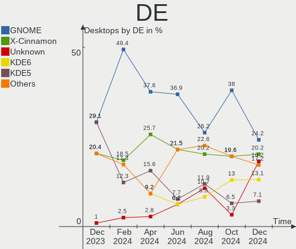
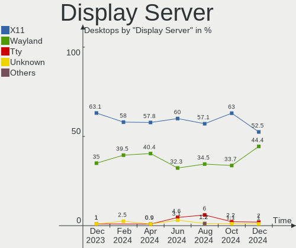
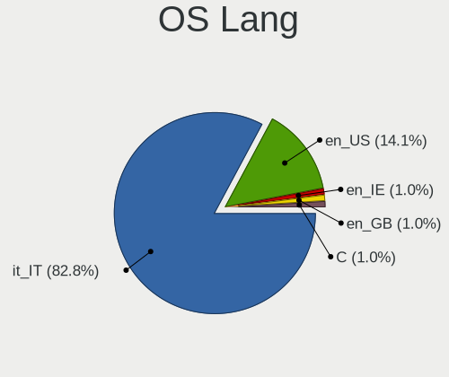
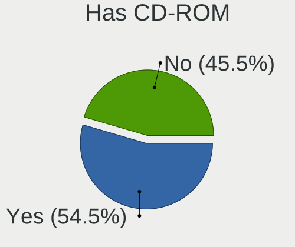
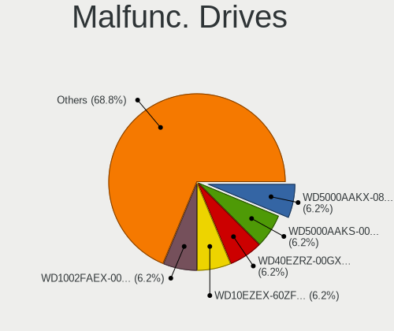
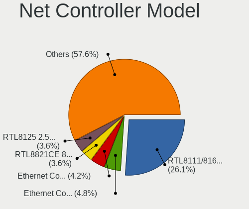
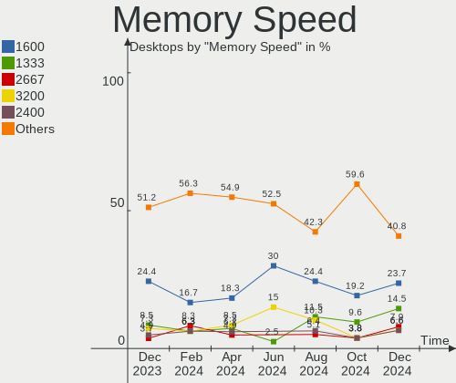
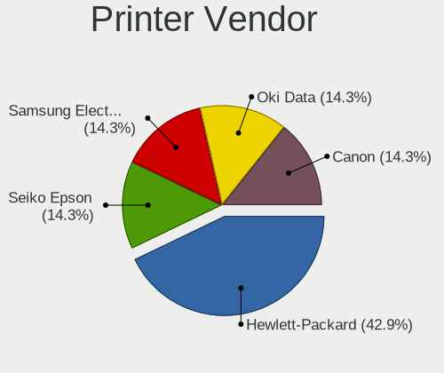
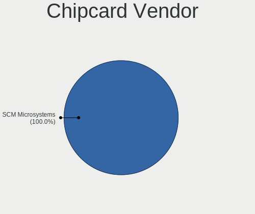

Linux in Italy - Hardware Trends (Desktops)
-------------------------------------------

A project to identify most popular hardware characteristics and track their change
over time based on data collected by Linux users at https://Linux-Hardware.org.

Anyone can contribute to this report by the [hw-probe](https://github.com/linuxhw/hw-probe) tool:

    sudo -E hw-probe -all -upload

Period: Aug, 2022.

Contents
--------

* [ System ](#system)
  - [ OS                       ](#os)
  - [ OS Family                ](#os-family)
  - [ Kernel                   ](#kernel)
  - [ Kernel Family            ](#kernel-family)
  - [ Kernel Major Ver.        ](#kernel-major-ver)
  - [ Arch                     ](#arch)
  - [ DE                       ](#de)
  - [ Display Server           ](#display-server)
  - [ Display Manager          ](#display-manager)
  - [ OS Lang                  ](#os-lang)
  - [ Boot Mode                ](#boot-mode)
  - [ Filesystem               ](#filesystem)
  - [ Part. scheme             ](#part-scheme)
  - [ Dual Boot with Linux/BSD ](#dual-boot-with-linuxbsd)
  - [ Dual Boot (Win)          ](#dual-boot-win)

* [ Board ](#board)
  - [ Vendor                   ](#vendor)
  - [ Model                    ](#model)
  - [ Model Family             ](#model-family)
  - [ MFG Year                 ](#mfg-year)
  - [ Form Factor              ](#form-factor)
  - [ Secure Boot              ](#secure-boot)
  - [ Coreboot                 ](#coreboot)
  - [ RAM Size                 ](#ram-size)
  - [ RAM Used                 ](#ram-used)
  - [ Total Drives             ](#total-drives)
  - [ Has CD-ROM               ](#has-cd-rom)
  - [ Has Ethernet             ](#has-ethernet)
  - [ Has WiFi                 ](#has-wifi)
  - [ Has Bluetooth            ](#has-bluetooth)

* [ Location ](#location)
  - [ Country                  ](#country)
  - [ City                     ](#city)

* [ Drives ](#drives)
  - [ Drive Vendor             ](#drive-vendor)
  - [ Drive Model              ](#drive-model)
  - [ HDD Vendor               ](#hdd-vendor)
  - [ SSD Vendor               ](#ssd-vendor)
  - [ Drive Kind               ](#drive-kind)
  - [ Drive Connector          ](#drive-connector)
  - [ Drive Size               ](#drive-size)
  - [ Space Total              ](#space-total)
  - [ Space Used               ](#space-used)
  - [ Malfunc. Drives          ](#malfunc-drives)
  - [ Malfunc. Drive Vendor    ](#malfunc-drive-vendor)
  - [ Malfunc. HDD Vendor      ](#malfunc-hdd-vendor)
  - [ Malfunc. Drive Kind      ](#malfunc-drive-kind)
  - [ Failed Drives            ](#failed-drives)
  - [ Failed Drive Vendor      ](#failed-drive-vendor)
  - [ Drive Status             ](#drive-status)

* [ Storage controller ](#storage-controller)
  - [ Storage Vendor           ](#storage-vendor)
  - [ Storage Model            ](#storage-model)
  - [ Storage Kind             ](#storage-kind)

* [ Processor ](#processor)
  - [ CPU Vendor               ](#cpu-vendor)
  - [ CPU Model                ](#cpu-model)
  - [ CPU Model Family         ](#cpu-model-family)
  - [ CPU Cores                ](#cpu-cores)
  - [ CPU Sockets              ](#cpu-sockets)
  - [ CPU Threads              ](#cpu-threads)
  - [ CPU Op-Modes             ](#cpu-op-modes)
  - [ CPU Microcode            ](#cpu-microcode)
  - [ CPU Microarch            ](#cpu-microarch)

* [ Graphics ](#graphics)
  - [ GPU Vendor               ](#gpu-vendor)
  - [ GPU Model                ](#gpu-model)
  - [ GPU Combo                ](#gpu-combo)
  - [ GPU Driver               ](#gpu-driver)
  - [ GPU Memory               ](#gpu-memory)

* [ Monitor ](#monitor)
  - [ Monitor Vendor           ](#monitor-vendor)
  - [ Monitor Model            ](#monitor-model)
  - [ Monitor Resolution       ](#monitor-resolution)
  - [ Monitor Diagonal         ](#monitor-diagonal)
  - [ Monitor Width            ](#monitor-width)
  - [ Aspect Ratio             ](#aspect-ratio)
  - [ Monitor Area             ](#monitor-area)
  - [ Pixel Density            ](#pixel-density)
  - [ Multiple Monitors        ](#multiple-monitors)

* [ Network ](#network)
  - [ Net Controller Vendor    ](#net-controller-vendor)
  - [ Net Controller Model     ](#net-controller-model)
  - [ Wireless Vendor          ](#wireless-vendor)
  - [ Wireless Model           ](#wireless-model)
  - [ Ethernet Vendor          ](#ethernet-vendor)
  - [ Ethernet Model           ](#ethernet-model)
  - [ Net Controller Kind      ](#net-controller-kind)
  - [ Used Controller          ](#used-controller)
  - [ NICs                     ](#nics)
  - [ IPv6                     ](#ipv6)

* [ Bluetooth ](#bluetooth)
  - [ Bluetooth Vendor         ](#bluetooth-vendor)
  - [ Bluetooth Model          ](#bluetooth-model)

* [ Sound ](#sound)
  - [ Sound Vendor             ](#sound-vendor)
  - [ Sound Model              ](#sound-model)

* [ Memory ](#memory)
  - [ Memory Vendor            ](#memory-vendor)
  - [ Memory Model             ](#memory-model)
  - [ Memory Kind              ](#memory-kind)
  - [ Memory Form Factor       ](#memory-form-factor)
  - [ Memory Size              ](#memory-size)
  - [ Memory Speed             ](#memory-speed)

* [ Printers & scanners ](#printers--scanners)
  - [ Printer Vendor           ](#printer-vendor)
  - [ Printer Model            ](#printer-model)
  - [ Scanner Vendor           ](#scanner-vendor)
  - [ Scanner Model            ](#scanner-model)

* [ Camera ](#camera)
  - [ Camera Vendor            ](#camera-vendor)
  - [ Camera Model             ](#camera-model)

* [ Security ](#security)
  - [ Fingerprint Vendor       ](#fingerprint-vendor)
  - [ Fingerprint Model        ](#fingerprint-model)
  - [ Chipcard Vendor          ](#chipcard-vendor)
  - [ Chipcard Model           ](#chipcard-model)

* [ Unsupported ](#unsupported)
  - [ Unsupported Devices      ](#unsupported-devices)
  - [ Unsupported Device Types ](#unsupported-device-types)

System
------

OS
--

Installed operating systems

| Name                 | Desktops | Percent |
|----------------------|----------|---------|
| Ubuntu 22.04         | 13       | 32.5%   |
| OpenMandriva 4.3     | 5        | 12.5%   |
| OpenMandriva 4.90    | 3        | 7.5%    |
| Linux Mint 21        | 3        | 7.5%    |
| Linux Mint 20.3      | 3        | 7.5%    |
| Xubuntu 22.04        | 2        | 5%      |
| Fedora 36            | 2        | 5%      |
| Zorin 16             | 1        | 2.5%    |
| Ubuntu 21.04         | 1        | 2.5%    |
| Ubuntu 16.04         | 1        | 2.5%    |
| Manjaro              | 1        | 2.5%    |
| LMDE 5               | 1        | 2.5%    |
| Linux Mint 19.1      | 1        | 2.5%    |
| Garuda Linux Soaring | 1        | 2.5%    |
| Debian 10            | 1        | 2.5%    |
| Arch Rolling         | 1        | 2.5%    |

OS Family
---------

OS without a version

| Name         | Desktops | Percent |
|--------------|----------|---------|
| Ubuntu       | 15       | 37.5%   |
| OpenMandriva | 8        | 20%     |
| Linux Mint   | 7        | 17.5%   |
| Xubuntu      | 2        | 5%      |
| Fedora       | 2        | 5%      |
| Zorin        | 1        | 2.5%    |
| Manjaro      | 1        | 2.5%    |
| LMDE         | 1        | 2.5%    |
| Garuda Linux | 1        | 2.5%    |
| Debian       | 1        | 2.5%    |
| Arch         | 1        | 2.5%    |

Kernel
------

Version of the Linux kernel

| Version                  | Desktops | Percent |
|--------------------------|----------|---------|
| 5.15.0-46-generic        | 10       | 25%     |
| 5.16.7-desktop-1omv4003  | 5        | 12.5%   |
| 5.15.0-43-generic        | 5        | 12.5%   |
| 5.4.0-124-generic        | 2        | 5%      |
| 5.18.12-desktop-3omv4090 | 2        | 5%      |
| 5.19.4-zen1-1-zen        | 1        | 2.5%    |
| 5.19.4-200.fc36.x86_64   | 1        | 2.5%    |
| 5.19.2-zen1-1-zen        | 1        | 2.5%    |
| 5.19.1-desktop-1omv4090  | 1        | 2.5%    |
| 5.19.1                   | 1        | 2.5%    |
| 5.18.16-200.fc36.x86_64  | 1        | 2.5%    |
| 5.15.59-1-MANJARO        | 1        | 2.5%    |
| 5.15.0-47-lowlatency     | 1        | 2.5%    |
| 5.15.0-47-generic        | 1        | 2.5%    |
| 5.15.0-41-generic        | 1        | 2.5%    |
| 5.15.0-25-generic        | 1        | 2.5%    |
| 5.11.0-49-generic        | 1        | 2.5%    |
| 5.10.0-17-amd64          | 1        | 2.5%    |
| 4.4.0-230-generic        | 1        | 2.5%    |
| 4.19.0-21-amd64          | 1        | 2.5%    |
| 4.15.0-191-generic       | 1        | 2.5%    |

Kernel Family
-------------

Linux kernel without a distro release

| Version | Desktops | Percent |
|---------|----------|---------|
| 5.15.0  | 19       | 47.5%   |
| 5.16.7  | 5        | 12.5%   |
| 5.4.0   | 2        | 5%      |
| 5.19.4  | 2        | 5%      |
| 5.19.1  | 2        | 5%      |
| 5.18.12 | 2        | 5%      |
| 5.19.2  | 1        | 2.5%    |
| 5.18.16 | 1        | 2.5%    |
| 5.15.59 | 1        | 2.5%    |
| 5.11.0  | 1        | 2.5%    |
| 5.10.0  | 1        | 2.5%    |
| 4.4.0   | 1        | 2.5%    |
| 4.19.0  | 1        | 2.5%    |
| 4.15.0  | 1        | 2.5%    |

Kernel Major Ver.
-----------------

Linux kernel major version

| Version | Desktops | Percent |
|---------|----------|---------|
| 5.15    | 20       | 50%     |
| 5.19    | 5        | 12.5%   |
| 5.16    | 5        | 12.5%   |
| 5.18    | 3        | 7.5%    |
| 5.4     | 2        | 5%      |
| 5.11    | 1        | 2.5%    |
| 5.10    | 1        | 2.5%    |
| 4.4     | 1        | 2.5%    |
| 4.19    | 1        | 2.5%    |
| 4.15    | 1        | 2.5%    |

Arch
----

OS architecture (x86_64, i586, etc.)

| Name   | Desktops | Percent |
|--------|----------|---------|
| x86_64 | 40       | 100%    |

DE
--

Desktop Environment

| Name       | Desktops | Percent |
|------------|----------|---------|
| GNOME      | 15       | 37.5%   |
| KDE5       | 12       | 30%     |
| XFCE       | 5        | 12.5%   |
| X-Cinnamon | 3        | 7.5%    |
| Unknown    | 3        | 7.5%    |
| MATE       | 1        | 2.5%    |
| i3         | 1        | 2.5%    |

Display Server
--------------

X11 or Wayland

| Name    | Desktops | Percent |
|---------|----------|---------|
| X11     | 33       | 82.5%   |
| Wayland | 6        | 15%     |
| Tty     | 1        | 2.5%    |

Display Manager
---------------

SDDM, LightDM, etc.

| Name    | Desktops | Percent |
|---------|----------|---------|
| GDM3    | 13       | 32.5%   |
| SDDM    | 11       | 27.5%   |
| Unknown | 10       | 25%     |
| LightDM | 6        | 15%     |

OS Lang
-------

Language

| Lang    | Desktops | Percent |
|---------|----------|---------|
| it_IT   | 26       | 65%     |
| en_US   | 9        | 22.5%   |
| en_GB   | 2        | 5%      |
| hu_HU   | 1        | 2.5%    |
| Default | 1        | 2.5%    |
| C       | 1        | 2.5%    |

Boot Mode
---------

EFI or BIOS

| Mode | Desktops | Percent |
|------|----------|---------|
| BIOS | 26       | 65%     |
| EFI  | 14       | 35%     |

Filesystem
----------

Type of filesystem

| Type    | Desktops | Percent |
|---------|----------|---------|
| Ext4    | 29       | 72.5%   |
| Overlay | 8        | 20%     |
| Btrfs   | 3        | 7.5%    |

Part. scheme
------------

Scheme of partitioning

| Type    | Desktops | Percent |
|---------|----------|---------|
| Unknown | 21       | 52.5%   |
| GPT     | 14       | 35%     |
| MBR     | 5        | 12.5%   |

Dual Boot with Linux/BSD
------------------------

Hosting more than one Linux/BSD

| Dual boot | Desktops | Percent |
|-----------|----------|---------|
| No        | 28       | 70%     |
| Yes       | 12       | 30%     |

Dual Boot (Win)
---------------

Hosting Linux and Windows

| Dual boot | Desktops | Percent |
|-----------|----------|---------|
| No        | 25       | 62.5%   |
| Yes       | 15       | 37.5%   |

Board
-----

Vendor
------

Motherboard manufacturer

| Name                | Desktops | Percent |
|---------------------|----------|---------|
| ASUSTek Computer    | 12       | 30%     |
| Gigabyte Technology | 6        | 15%     |
| MSI                 | 4        | 10%     |
| ASRock              | 4        | 10%     |
| Hewlett-Packard     | 3        | 7.5%    |
| Acer                | 3        | 7.5%    |
| OEM                 | 2        | 5%      |
| AZW                 | 2        | 5%      |
| Pegatron            | 1        | 2.5%    |
| Lenovo              | 1        | 2.5%    |
| Intel               | 1        | 2.5%    |
| Fujitsu             | 1        | 2.5%    |

Model
-----

Motherboard model

| Name                              | Desktops | Percent |
|-----------------------------------|----------|---------|
| OEM G41 775 ICH7 8712             | 2        | 5%      |
| Gigabyte B550 AORUS ELITE AX V2   | 2        | 5%      |
| Pegatron HPE-521it                | 1        | 2.5%    |
| MSI VIG610M                       | 1        | 2.5%    |
| MSI NQ890AA-ABZ CQ5011IT          | 1        | 2.5%    |
| MSI MS-7C37                       | 1        | 2.5%    |
| MSI MS-7C02                       | 1        | 2.5%    |
| Lenovo ThinkStation C20 4263BA7   | 1        | 2.5%    |
| Intel Productiva                  | 1        | 2.5%    |
| HP Z2 Tower G5 Workstation        | 1        | 2.5%    |
| HP ProDesk 400 G1 SFF             | 1        | 2.5%    |
| HP Compaq 8200 Elite SFF PC       | 1        | 2.5%    |
| Gigabyte Z490 UD                  | 1        | 2.5%    |
| Gigabyte Z370 HD3P                | 1        | 2.5%    |
| Gigabyte P35-DS3L                 | 1        | 2.5%    |
| Gigabyte H97-HD3                  | 1        | 2.5%    |
| Fujitsu ESPRIMO P700              | 1        | 2.5%    |
| AZW U59                           | 1        | 2.5%    |
| AZW MII-V                         | 1        | 2.5%    |
| ASUS STRIX Z270E GAMING           | 1        | 2.5%    |
| ASUS ROG CROSSHAIR VIII DARK HERO | 1        | 2.5%    |
| ASUS PRIME Z690-P WIFI            | 1        | 2.5%    |
| ASUS PRIME Z390-P                 | 1        | 2.5%    |
| ASUS PRIME B450M-A II             | 1        | 2.5%    |
| ASUS PRIME A320M-K                | 1        | 2.5%    |
| ASUS P5QPL-AM                     | 1        | 2.5%    |
| ASUS P5KPL-AM SE                  | 1        | 2.5%    |
| ASUS M5A78L LE                    | 1        | 2.5%    |
| ASUS M4N68T-M-V2                  | 1        | 2.5%    |
| ASUS H110M-A/M.2                  | 1        | 2.5%    |
| ASUS All Series                   | 1        | 2.5%    |
| ASRock H61M-DGS                   | 1        | 2.5%    |
| ASRock H55M-LE                    | 1        | 2.5%    |
| ASRock G41M-VS3                   | 1        | 2.5%    |
| ASRock 775Dual-VSTA               | 1        | 2.5%    |
| Acer Predator PO3-620             | 1        | 2.5%    |
| Acer Aspire X5950                 | 1        | 2.5%    |
| Acer Aspire M5610                 | 1        | 2.5%    |

Model Family
------------

Motherboard model prefix

| Name                | Desktops | Percent |
|---------------------|----------|---------|
| ASUS PRIME          | 4        | 10%     |
| OEM G41             | 2        | 5%      |
| Gigabyte B550       | 2        | 5%      |
| Acer Aspire         | 2        | 5%      |
| Pegatron HPE-521it  | 1        | 2.5%    |
| MSI VIG610M         | 1        | 2.5%    |
| MSI NQ890AA-ABZ     | 1        | 2.5%    |
| MSI MS-7C37         | 1        | 2.5%    |
| MSI MS-7C02         | 1        | 2.5%    |
| Lenovo ThinkStation | 1        | 2.5%    |
| Intel Productiva    | 1        | 2.5%    |
| HP Z2               | 1        | 2.5%    |
| HP ProDesk          | 1        | 2.5%    |
| HP Compaq           | 1        | 2.5%    |
| Gigabyte Z490       | 1        | 2.5%    |
| Gigabyte Z370       | 1        | 2.5%    |
| Gigabyte P35-DS3L   | 1        | 2.5%    |
| Gigabyte H97-HD3    | 1        | 2.5%    |
| Fujitsu ESPRIMO     | 1        | 2.5%    |
| AZW U59             | 1        | 2.5%    |
| AZW MII-V           | 1        | 2.5%    |
| ASUS STRIX          | 1        | 2.5%    |
| ASUS ROG            | 1        | 2.5%    |
| ASUS P5QPL-AM       | 1        | 2.5%    |
| ASUS P5KPL-AM       | 1        | 2.5%    |
| ASUS M5A78L         | 1        | 2.5%    |
| ASUS M4N68T-M-V2    | 1        | 2.5%    |
| ASUS H110M-A        | 1        | 2.5%    |
| ASUS All            | 1        | 2.5%    |
| ASRock H61M-DGS     | 1        | 2.5%    |
| ASRock H55M-LE      | 1        | 2.5%    |
| ASRock G41M-VS3     | 1        | 2.5%    |
| ASRock 775Dual-VSTA | 1        | 2.5%    |
| Acer Predator       | 1        | 2.5%    |

MFG Year
--------

Motherboard manufacture year

| Year | Desktops | Percent |
|------|----------|---------|
| 2020 | 7        | 17.5%   |
| 2011 | 5        | 12.5%   |
| 2019 | 4        | 10%     |
| 2010 | 4        | 10%     |
| 2021 | 3        | 7.5%    |
| 2014 | 3        | 7.5%    |
| 2009 | 3        | 7.5%    |
| 2017 | 2        | 5%      |
| 2016 | 2        | 5%      |
| 2012 | 2        | 5%      |
| 2007 | 2        | 5%      |
| 2018 | 1        | 2.5%    |
| 2008 | 1        | 2.5%    |
| 2006 | 1        | 2.5%    |

Form Factor
-----------

Physical design of the computer

| Name    | Desktops | Percent |
|---------|----------|---------|
| Desktop | 40       | 100%    |

Secure Boot
-----------

Enabled or disabled

| State    | Desktops | Percent |
|----------|----------|---------|
| Disabled | 39       | 97.5%   |
| Enabled  | 1        | 2.5%    |

Coreboot
--------

Have coreboot on board

| Used | Desktops | Percent |
|------|----------|---------|
| No   | 40       | 100%    |

RAM Size
--------

Total RAM memory

| Size in GB  | Desktops | Percent |
|-------------|----------|---------|
| 3.01-4.0    | 13       | 32.5%   |
| 8.01-16.0   | 10       | 25%     |
| 16.01-24.0  | 7        | 17.5%   |
| 32.01-64.0  | 5        | 12.5%   |
| 4.01-8.0    | 2        | 5%      |
| 64.01-256.0 | 2        | 5%      |
| 0.51-1.0    | 1        | 2.5%    |

RAM Used
--------

Used RAM memory

| Used GB   | Desktops | Percent |
|-----------|----------|---------|
| 1.01-2.0  | 19       | 47.5%   |
| 2.01-3.0  | 6        | 15%     |
| 4.01-8.0  | 5        | 12.5%   |
| 3.01-4.0  | 4        | 10%     |
| 0.51-1.0  | 4        | 10%     |
| 8.01-16.0 | 1        | 2.5%    |
| 0.01-0.5  | 1        | 2.5%    |

Total Drives
------------

Number of drives on board

| Drives | Desktops | Percent |
|--------|----------|---------|
| 2      | 16       | 40%     |
| 1      | 15       | 37.5%   |
| 3      | 7        | 17.5%   |
| 5      | 1        | 2.5%    |
| 4      | 1        | 2.5%    |

Has CD-ROM
----------

Has CD-ROM on board

| Presented | Desktops | Percent |
|-----------|----------|---------|
| Yes       | 22       | 55%     |
| No        | 18       | 45%     |

Has Ethernet
------------

Has Ethernet on board

| Presented | Desktops | Percent |
|-----------|----------|---------|
| Yes       | 40       | 100%    |

Has WiFi
--------

Has WiFi module

| Presented | Desktops | Percent |
|-----------|----------|---------|
| Yes       | 21       | 52.5%   |
| No        | 19       | 47.5%   |

Has Bluetooth
-------------

Has Bluetooth module

| Presented | Desktops | Percent |
|-----------|----------|---------|
| No        | 30       | 75%     |
| Yes       | 10       | 25%     |

Location
--------

Country
-------

Geographic location (country)

| Country | Desktops | Percent |
|---------|----------|---------|
| Italy   | 40       | 100%    |

City
----

Geographic location (city)

| City                     | Desktops | Percent |
|--------------------------|----------|---------|
| Rome                     | 3        | 7.5%    |
| Turin                    | 2        | 5%      |
| Milan                    | 2        | 5%      |
| Brescia                  | 2        | 5%      |
| Venice                   | 1        | 2.5%    |
| Trieste                  | 1        | 2.5%    |
| Treviso                  | 1        | 2.5%    |
| Siniscola                | 1        | 2.5%    |
| Selvazzano Dentro        | 1        | 2.5%    |
| Sant'Egidio alla Vibrata | 1        | 2.5%    |
| San Vito al Tagliamento  | 1        | 2.5%    |
| San Teodoro              | 1        | 2.5%    |
| Rho                      | 1        | 2.5%    |
| Ponte San Pietro         | 1        | 2.5%    |
| Pieris                   | 1        | 2.5%    |
| Pessano Con Bornago      | 1        | 2.5%    |
| Pavia                    | 1        | 2.5%    |
| Parma                    | 1        | 2.5%    |
| Naples                   | 1        | 2.5%    |
| Monza                    | 1        | 2.5%    |
| Mascali                  | 1        | 2.5%    |
| Maropati                 | 1        | 2.5%    |
| Macerata                 | 1        | 2.5%    |
| Limbiate                 | 1        | 2.5%    |
| Lavagno                  | 1        | 2.5%    |
| Ladispoli                | 1        | 2.5%    |
| Gonzaga                  | 1        | 2.5%    |
| Concordia Sagittaria     | 1        | 2.5%    |
| Comun Nuovo              | 1        | 2.5%    |
| Catania                  | 1        | 2.5%    |
| Casatenovo               | 1        | 2.5%    |
| Cagliari                 | 1        | 2.5%    |
| Bolzano                  | 1        | 2.5%    |
| Arluno                   | 1        | 2.5%    |
| Aosta                    | 1        | 2.5%    |

Drives
------

Drive Vendor
------------

Hard drive vendors

| Vendor              | Desktops | Drives | Percent |
|---------------------|----------|--------|---------|
| WDC                 | 20       | 24     | 28.99%  |
| Samsung Electronics | 10       | 14     | 14.49%  |
| Seagate             | 9        | 9      | 13.04%  |
| Crucial             | 4        | 4      | 5.8%    |
| Toshiba             | 3        | 3      | 4.35%   |
| SanDisk             | 3        | 4      | 4.35%   |
| Phison              | 3        | 4      | 4.35%   |
| Kingston            | 3        | 3      | 4.35%   |
| Hitachi             | 3        | 3      | 4.35%   |
| SPCC                | 2        | 2      | 2.9%    |
| China               | 2        | 2      | 2.9%    |
| USB3.0              | 1        | 1      | 1.45%   |
| Unknown             | 1        | 1      | 1.45%   |
| Maxtor              | 1        | 2      | 1.45%   |
| Intenso             | 1        | 1      | 1.45%   |
| Intel               | 1        | 1      | 1.45%   |
| Hikvision           | 1        | 1      | 1.45%   |
| A-DATA Technology   | 1        | 1      | 1.45%   |

Drive Model
-----------

Hard drive models

| Model                               | Desktops | Percent |
|-------------------------------------|----------|---------|
| WDC WD10EZEX-00BN5A0 1TB            | 2        | 2.53%   |
| Crucial CT1000MX500SSD1 1TB         | 2        | 2.53%   |
| WDC WD7500BPKX-00HPJT0 752GB        | 1        | 1.27%   |
| WDC WD5000LPCX-22VHAT0 500GB        | 1        | 1.27%   |
| WDC WD5000LPCX-21VHAT0 500GB        | 1        | 1.27%   |
| WDC WD5000AAKX-22ERMA0 500GB        | 1        | 1.27%   |
| WDC WD5000AAKX-07U6AA0 500GB        | 1        | 1.27%   |
| WDC WD5000AAKS-00V1A0 500GB         | 1        | 1.27%   |
| WDC WD5000AAKS-00UU3A0 500GB        | 1        | 1.27%   |
| WDC WD5000AADS-00M2B0 500GB         | 1        | 1.27%   |
| WDC WD40EFRX-68N32N0 4TB            | 1        | 1.27%   |
| WDC WD4005FZBX-00K5WB0 4TB          | 1        | 1.27%   |
| WDC WD3200AAJS-22RYA0 320GB         | 1        | 1.27%   |
| WDC WD20EARS-00MVWB0 2TB            | 1        | 1.27%   |
| WDC WD2000BB-00RDA0 200GB           | 1        | 1.27%   |
| WDC WD1600JS-60MHB1 160GB           | 1        | 1.27%   |
| WDC WD1600AAJS-07PSA0 160GB         | 1        | 1.27%   |
| WDC WD10EZRX-00A8LB0 1TB            | 1        | 1.27%   |
| WDC WD10EZEX-21WN4A0 1TB            | 1        | 1.27%   |
| WDC WD10EZEX-08WN4A0 1TB            | 1        | 1.27%   |
| WDC WD10EAVS-00D7B1 1TB             | 1        | 1.27%   |
| WDC WD10EARS-22Y5B1 1TB             | 1        | 1.27%   |
| WDC WD1002FBYS-50A6B0 1TB           | 1        | 1.27%   |
| WDC WD1002FAEX-00Z3A0 1TB           | 1        | 1.27%   |
| USB3.0 Super Speed 128GB            | 1        | 1.27%   |
| Unknown SLD64G  64GB                | 1        | 1.27%   |
| Toshiba MQ01ABF050 500GB            | 1        | 1.27%   |
| Toshiba MQ01ABD100 1TB              | 1        | 1.27%   |
| Toshiba MQ01ABD050 500GB            | 1        | 1.27%   |
| SPCC Solid State Disk 256GB         | 1        | 1.27%   |
| SPCC Solid State Disk 1024GB        | 1        | 1.27%   |
| Seagate ST500DM002-1BD142 500GB     | 1        | 1.27%   |
| Seagate ST3500418AS 500GB           | 1        | 1.27%   |
| Seagate ST3500413AS 500GB           | 1        | 1.27%   |
| Seagate ST31000528AS 1TB            | 1        | 1.27%   |
| Seagate ST31000524AS 1TB            | 1        | 1.27%   |
| Seagate ST31000340NS 1TB            | 1        | 1.27%   |
| Seagate ST31000333AS 1TB            | 1        | 1.27%   |
| Seagate ST3000DM001-1CH166 3TB      | 1        | 1.27%   |
| Seagate ST1000DM003-1SB10C 1TB      | 1        | 1.27%   |
| SanDisk SSD PLUS 2000GB             | 1        | 1.27%   |
| SanDisk SDSSDXPS480G 480GB          | 1        | 1.27%   |
| SanDisk SDSSDH3 1T00 1TB            | 1        | 1.27%   |
| SanDisk SD8SN8U-256G-1006 256GB SSD | 1        | 1.27%   |
| Samsung SSD 970 EVO Plus 500GB      | 1        | 1.27%   |
| Samsung SSD 970 EVO Plus 1TB        | 1        | 1.27%   |
| Samsung SSD 970 EVO 500GB           | 1        | 1.27%   |
| Samsung SSD 860 EVO 500GB           | 1        | 1.27%   |
| Samsung SSD 860 EVO 1TB             | 1        | 1.27%   |
| Samsung SSD 850 EVO 500GB           | 1        | 1.27%   |
| Samsung SSD 840 Series 120GB        | 1        | 1.27%   |
| Samsung SSD 840 EVO 500GB           | 1        | 1.27%   |
| Samsung SSD 840 EVO 120GB           | 1        | 1.27%   |
| Samsung NVMe SSD Drive 512GB        | 1        | 1.27%   |
| Samsung NVMe SSD Drive 500GB        | 1        | 1.27%   |
| Samsung NVMe SSD Drive 1TB          | 1        | 1.27%   |
| Samsung MZVLQ1T0HALB-00000 1TB      | 1        | 1.27%   |
| Samsung HD162GJ 160GB               | 1        | 1.27%   |
| Phison Sabrent Rocket 4.0 Plus 4TB  | 1        | 1.27%   |
| Phison Sabrent 2TB                  | 1        | 1.27%   |

HDD Vendor
----------

Hard disk drive vendors

| Vendor              | Desktops | Drives | Percent |
|---------------------|----------|--------|---------|
| WDC                 | 20       | 24     | 52.63%  |
| Seagate             | 9        | 9      | 23.68%  |
| Toshiba             | 3        | 3      | 7.89%   |
| Hitachi             | 3        | 3      | 7.89%   |
| USB3.0              | 1        | 1      | 2.63%   |
| Samsung Electronics | 1        | 1      | 2.63%   |
| Maxtor              | 1        | 2      | 2.63%   |

SSD Vendor
----------

Solid state drive vendors

| Vendor              | Desktops | Drives | Percent |
|---------------------|----------|--------|---------|
| Samsung Electronics | 5        | 6      | 23.81%  |
| Crucial             | 4        | 4      | 19.05%  |
| SanDisk             | 3        | 4      | 14.29%  |
| SPCC                | 2        | 2      | 9.52%   |
| Kingston            | 2        | 2      | 9.52%   |
| China               | 2        | 2      | 9.52%   |
| Intenso             | 1        | 1      | 4.76%   |
| Hikvision           | 1        | 1      | 4.76%   |
| A-DATA Technology   | 1        | 1      | 4.76%   |

Drive Kind
----------

HDD or SSD

| Kind | Desktops | Drives | Percent |
|------|----------|--------|---------|
| HDD  | 30       | 43     | 51.72%  |
| SSD  | 18       | 23     | 31.03%  |
| NVMe | 9        | 13     | 15.52%  |
| MMC  | 1        | 1      | 1.72%   |

Drive Connector
---------------

SATA, SAS, NVMe, etc.

| Type | Desktops | Drives | Percent |
|------|----------|--------|---------|
| SATA | 34       | 65     | 75.56%  |
| NVMe | 9        | 13     | 20%     |
| SAS  | 1        | 1      | 2.22%   |
| MMC  | 1        | 1      | 2.22%   |

Drive Size
----------

Size of hard drive

| Size in TB | Desktops | Drives | Percent |
|------------|----------|--------|---------|
| 0.01-0.5   | 28       | 39     | 53.85%  |
| 0.51-1.0   | 18       | 21     | 34.62%  |
| 1.01-2.0   | 3        | 3      | 5.77%   |
| 3.01-4.0   | 2        | 2      | 3.85%   |
| 2.01-3.0   | 1        | 1      | 1.92%   |

Space Total
-----------

Amount of disk space available on the file system

| Size in GB     | Desktops | Percent |
|----------------|----------|---------|
| 501-1000       | 8        | 20%     |
| 101-250        | 6        | 15%     |
| 251-500        | 5        | 12.5%   |
| 1001-2000      | 5        | 12.5%   |
| 1-20           | 5        | 12.5%   |
| More than 3000 | 4        | 10%     |
| 2001-3000      | 4        | 10%     |
| 21-50          | 1        | 2.5%    |
| 51-100         | 1        | 2.5%    |
| Unknown        | 1        | 2.5%    |

Space Used
----------

Amount of used disk space

| Used GB        | Desktops | Percent |
|----------------|----------|---------|
| 1-20           | 13       | 32.5%   |
| 21-50          | 7        | 17.5%   |
| 1001-2000      | 5        | 12.5%   |
| 251-500        | 4        | 10%     |
| 501-1000       | 4        | 10%     |
| 101-250        | 3        | 7.5%    |
| 51-100         | 2        | 5%      |
| More than 3000 | 1        | 2.5%    |
| Unknown        | 1        | 2.5%    |

Malfunc. Drives
---------------

Drive models with a malfunction

| Model                                 | Desktops | Drives | Percent |
|---------------------------------------|----------|--------|---------|
| Seagate ST31000528AS 1TB              | 1        | 1      | 50%     |
| Samsung Electronics SSD 860 EVO 500GB | 1        | 1      | 50%     |

Malfunc. Drive Vendor
---------------------

Vendors of faulty drives

| Vendor              | Desktops | Drives | Percent |
|---------------------|----------|--------|---------|
| Seagate             | 1        | 1      | 50%     |
| Samsung Electronics | 1        | 1      | 50%     |

Malfunc. HDD Vendor
-------------------

Vendors of faulty HDD drives

| Vendor  | Desktops | Drives | Percent |
|---------|----------|--------|---------|
| Seagate | 1        | 1      | 100%    |

Malfunc. Drive Kind
-------------------

Kinds of faulty drives

| Kind | Desktops | Drives | Percent |
|------|----------|--------|---------|
| SSD  | 1        | 1      | 50%     |
| HDD  | 1        | 1      | 50%     |

Failed Drives
-------------

Failed drive models

Zero info for selected period =(

Failed Drive Vendor
-------------------

Failed drive vendors

Zero info for selected period =(

Drive Status
------------

Number of failed and malfunc. drives

| Status   | Desktops | Drives | Percent |
|----------|----------|--------|---------|
| Detected | 22       | 46     | 53.66%  |
| Works    | 17       | 32     | 41.46%  |
| Malfunc  | 2        | 2      | 4.88%   |

Storage controller
------------------

Storage Vendor
--------------

Storage controller vendors

| Vendor                      | Desktops | Percent |
|-----------------------------|----------|---------|
| Intel                       | 29       | 54.72%  |
| AMD                         | 9        | 16.98%  |
| Samsung Electronics         | 6        | 11.32%  |
| Phison Electronics          | 3        | 5.66%   |
| VIA Technologies            | 1        | 1.89%   |
| Silicon Image               | 1        | 1.89%   |
| Nvidia                      | 1        | 1.89%   |
| Kingston Technology Company | 1        | 1.89%   |
| JMicron Technology          | 1        | 1.89%   |
| ASMedia Technology          | 1        | 1.89%   |

Storage Model
-------------

Storage controller models

| Model                                                                          | Desktops | Percent |
|--------------------------------------------------------------------------------|----------|---------|
| Intel NM10/ICH7 Family SATA Controller [IDE mode]                              | 7        | 10.61%  |
| Samsung NVMe SSD Controller SM981/PM981/PM983                                  | 5        | 7.58%   |
| Intel 82801G (ICH7 Family) IDE Controller                                      | 5        | 7.58%   |
| Intel 6 Series/C200 Series Chipset Family 6 port Desktop SATA AHCI Controller  | 4        | 6.06%   |
| AMD FCH SATA Controller [AHCI mode]                                            | 4        | 6.06%   |
| Phison E12 NVMe Controller                                                     | 2        | 3.03%   |
| Intel Comet Lake SATA AHCI Controller                                          | 2        | 3.03%   |
| Intel 9 Series Chipset Family SATA Controller [AHCI Mode]                      | 2        | 3.03%   |
| Intel 5 Series/3400 Series Chipset 6 port SATA AHCI Controller                 | 2        | 3.03%   |
| AMD 500 Series Chipset SATA Controller                                         | 2        | 3.03%   |
| AMD 400 Series Chipset SATA Controller                                         | 2        | 3.03%   |
| VIA VT82C586A/B/VT82C686/A/B/VT823x/A/C PIPC Bus Master IDE                    | 1        | 1.52%   |
| VIA VT8237A SATA 2-Port Controller                                             | 1        | 1.52%   |
| Silicon Image SiI 3114 [SATALink/SATARaid] Serial ATA Controller               | 1        | 1.52%   |
| Samsung NVMe SSD Controller 980                                                | 1        | 1.52%   |
| Phison E18 PCIe4 NVMe Controller                                               | 1        | 1.52%   |
| Nvidia MCP61 SATA Controller                                                   | 1        | 1.52%   |
| Nvidia MCP61 IDE                                                               | 1        | 1.52%   |
| Kingston Company Company Non-Volatile memory controller                        | 1        | 1.52%   |
| JMicron JMB368 IDE controller                                                  | 1        | 1.52%   |
| Intel Volume Management Device NVMe RAID Controller                            | 1        | 1.52%   |
| Intel SSD 660P Series                                                          | 1        | 1.52%   |
| Intel SATA Controller [RAID mode]                                              | 1        | 1.52%   |
| Intel Q170/Q150/B150/H170/H110/Z170/CM236 Chipset SATA Controller [AHCI Mode]  | 1        | 1.52%   |
| Intel NM10/ICH7 Family SATA Controller [AHCI mode]                             | 1        | 1.52%   |
| Intel Jasper Lake SATA AHCI Controller                                         | 1        | 1.52%   |
| Intel Comet Lake PCH-H RAID                                                    | 1        | 1.52%   |
| Intel Celeron N3350/Pentium N4200/Atom E3900 Series SATA AHCI Controller       | 1        | 1.52%   |
| Intel Cannon Lake PCH SATA AHCI Controller                                     | 1        | 1.52%   |
| Intel Alder Lake-S PCH SATA Controller [AHCI Mode]                             | 1        | 1.52%   |
| Intel 82801JI (ICH10 Family) SATA AHCI Controller                              | 1        | 1.52%   |
| Intel 82801IB (ICH9) 4 port SATA Controller [AHCI mode]                        | 1        | 1.52%   |
| Intel 8 Series/C220 Series Chipset Family 6-port SATA Controller 1 [AHCI mode] | 1        | 1.52%   |
| Intel 200 Series PCH SATA controller [AHCI mode]                               | 1        | 1.52%   |
| ASMedia ASM1062 Serial ATA Controller                                          | 1        | 1.52%   |
| AMD SB7x0/SB8x0/SB9x0 SATA Controller [IDE mode]                               | 1        | 1.52%   |
| AMD SB7x0/SB8x0/SB9x0 IDE Controller                                           | 1        | 1.52%   |
| AMD SB600 Non-Raid-5 SATA                                                      | 1        | 1.52%   |
| AMD SB600 IDE                                                                  | 1        | 1.52%   |
| AMD FCH SATA Controller D                                                      | 1        | 1.52%   |

Storage Kind
------------

Kind of storage controller (IDE, SATA, NVMe, SAS, ...)

| Kind | Desktops | Percent |
|------|----------|---------|
| SATA | 29       | 52.73%  |
| IDE  | 12       | 21.82%  |
| NVMe | 9        | 16.36%  |
| RAID | 5        | 9.09%   |

Processor
---------

CPU Vendor
----------

Processor vendors

| Vendor | Desktops | Percent |
|--------|----------|---------|
| Intel  | 31       | 77.5%   |
| AMD    | 9        | 22.5%   |

CPU Model
---------

Processor models

| Model                                       | Desktops | Percent |
|---------------------------------------------|----------|---------|
| Intel Core i7-2600 CPU @ 3.40GHz            | 2        | 5%      |
| Intel Core i3 CPU 540 @ 3.07GHz             | 2        | 5%      |
| Intel Xeon CPU E5620 @ 2.40GHz              | 1        | 2.5%    |
| Intel Xeon CPU E5430 @ 2.66GHz              | 1        | 2.5%    |
| Intel Pentium Dual-Core CPU E6500 @ 2.93GHz | 1        | 2.5%    |
| Intel Pentium Dual CPU E2200 @ 2.20GHz      | 1        | 2.5%    |
| Intel Pentium CPU G2030 @ 3.00GHz           | 1        | 2.5%    |
| Intel Pentium 4 CPU 3.00GHz                 | 1        | 2.5%    |
| Intel Genuine CPU 2140 @ 1.60GHz            | 1        | 2.5%    |
| Intel Core i9-10900KF CPU @ 3.70GHz         | 1        | 2.5%    |
| Intel Core i7-8700 CPU @ 3.20GHz            | 1        | 2.5%    |
| Intel Core i7-7700K CPU @ 4.20GHz           | 1        | 2.5%    |
| Intel Core i7-4790K CPU @ 4.00GHz           | 1        | 2.5%    |
| Intel Core i7-10700F CPU @ 2.90GHz          | 1        | 2.5%    |
| Intel Core i5-8400 CPU @ 2.80GHz            | 1        | 2.5%    |
| Intel Core i5-4460 CPU @ 3.20GHz            | 1        | 2.5%    |
| Intel Core i5-2400 CPU @ 3.10GHz            | 1        | 2.5%    |
| Intel Core i5-10500 CPU @ 3.10GHz           | 1        | 2.5%    |
| Intel Core i3-7100 CPU @ 3.90GHz            | 1        | 2.5%    |
| Intel Core i3-4130 CPU @ 3.40GHz            | 1        | 2.5%    |
| Intel Core 2 Quad CPU Q9505 @ 2.83GHz       | 1        | 2.5%    |
| Intel Core 2 Quad CPU Q6600 @ 2.40GHz       | 1        | 2.5%    |
| Intel Core 2 Duo CPU E7600 @ 3.06GHz        | 1        | 2.5%    |
| Intel Core 2 Duo CPU E6550 @ 2.33GHz        | 1        | 2.5%    |
| Intel Core 2 CPU 4300 @ 1.80GHz             | 1        | 2.5%    |
| Intel Celeron N5095 @ 2.00GHz               | 1        | 2.5%    |
| Intel Celeron CPU N3350 @ 1.10GHz           | 1        | 2.5%    |
| Intel Atom CPU D2550 @ 1.86GHz              | 1        | 2.5%    |
| Intel 12th Gen Core i5-12600K               | 1        | 2.5%    |
| AMD Ryzen 9 5950X 16-Core Processor         | 1        | 2.5%    |
| AMD Ryzen 9 3900X 12-Core Processor         | 1        | 2.5%    |
| AMD Ryzen 7 5700X 8-Core Processor          | 1        | 2.5%    |
| AMD Ryzen 5 5600X 6-Core Processor          | 1        | 2.5%    |
| AMD Ryzen 5 5600G with Radeon Graphics      | 1        | 2.5%    |
| AMD Ryzen 3 3200G with Radeon Vega Graphics | 1        | 2.5%    |
| AMD Ryzen 3 2200G with Radeon Vega Graphics | 1        | 2.5%    |
| AMD Phenom II X4 955 Processor              | 1        | 2.5%    |
| AMD FX-4100 Quad-Core Processor             | 1        | 2.5%    |

CPU Model Family
----------------

Processor model prefix

| Model                   | Desktops | Percent |
|-------------------------|----------|---------|
| Intel Core i7           | 6        | 15%     |
| Intel Core i5           | 4        | 10%     |
| Intel Core i3           | 4        | 10%     |
| Intel Xeon              | 2        | 5%      |
| Intel Core 2 Quad       | 2        | 5%      |
| Intel Core 2 Duo        | 2        | 5%      |
| Intel Celeron           | 2        | 5%      |
| AMD Ryzen 9             | 2        | 5%      |
| AMD Ryzen 5             | 2        | 5%      |
| AMD Ryzen 3             | 2        | 5%      |
| Other                   | 1        | 2.5%    |
| Intel Pentium Dual-Core | 1        | 2.5%    |
| Intel Pentium Dual      | 1        | 2.5%    |
| Intel Pentium 4         | 1        | 2.5%    |
| Intel Pentium           | 1        | 2.5%    |
| Intel Genuine           | 1        | 2.5%    |
| Intel Core i9           | 1        | 2.5%    |
| Intel Core 2            | 1        | 2.5%    |
| Intel Atom              | 1        | 2.5%    |
| AMD Ryzen 7             | 1        | 2.5%    |
| AMD Phenom II X4        | 1        | 2.5%    |
| AMD FX                  | 1        | 2.5%    |

CPU Cores
---------

Number of processor cores

| Number | Desktops | Percent |
|--------|----------|---------|
| 2      | 14       | 35%     |
| 4      | 13       | 32.5%   |
| 6      | 5        | 12.5%   |
| 8      | 3        | 7.5%    |
| 10     | 2        | 5%      |
| 16     | 1        | 2.5%    |
| 12     | 1        | 2.5%    |
| 1      | 1        | 2.5%    |

CPU Sockets
-----------

Number of sockets

| Number | Desktops | Percent |
|--------|----------|---------|
| 1      | 39       | 97.5%   |
| 2      | 1        | 2.5%    |

CPU Threads
-----------

Threads per core (Hyper-Threading)

| Number | Desktops | Percent |
|--------|----------|---------|
| 2      | 22       | 55%     |
| 1      | 18       | 45%     |

CPU Op-Modes
------------

CPU Operation Modes (32-bit, 64-bit)

| Op mode        | Desktops | Percent |
|----------------|----------|---------|
| 32-bit, 64-bit | 40       | 100%    |

CPU Microcode
-------------

Microcode number

| Number     | Desktops | Percent |
|------------|----------|---------|
| Unknown    | 12       | 30%     |
| 0xa0655    | 2        | 5%      |
| 0x906e9    | 2        | 5%      |
| 0x6fb      | 2        | 5%      |
| 0x206a7    | 2        | 5%      |
| 0x1067a    | 2        | 5%      |
| 0xa0653    | 1        | 2.5%    |
| 0x906ea    | 1        | 2.5%    |
| 0x90672    | 1        | 2.5%    |
| 0x6fd      | 1        | 2.5%    |
| 0x6f2      | 1        | 2.5%    |
| 0x506c9    | 1        | 2.5%    |
| 0x306c3    | 1        | 2.5%    |
| 0x306a9    | 1        | 2.5%    |
| 0x30661    | 1        | 2.5%    |
| 0x10676    | 1        | 2.5%    |
| 0x0a50000d | 1        | 2.5%    |
| 0x0a201204 | 1        | 2.5%    |
| 0x0a201016 | 1        | 2.5%    |
| 0x08701021 | 1        | 2.5%    |
| 0x08108109 | 1        | 2.5%    |
| 0x06000626 | 1        | 2.5%    |
| 0x010000b6 | 1        | 2.5%    |
| 0x00000000 | 1        | 2.5%    |

CPU Microarch
-------------

Microarchitecture

| Name             | Desktops | Percent |
|------------------|----------|---------|
| Core             | 5        | 12.5%   |
| Zen 3            | 4        | 10%     |
| Penryn           | 4        | 10%     |
| KabyLake         | 4        | 10%     |
| Westmere         | 3        | 7.5%    |
| SandyBridge      | 3        | 7.5%    |
| Haswell          | 3        | 7.5%    |
| CometLake        | 3        | 7.5%    |
| Zen+             | 1        | 2.5%    |
| Zen 2            | 1        | 2.5%    |
| Zen              | 1        | 2.5%    |
| NetBurst         | 1        | 2.5%    |
| K10              | 1        | 2.5%    |
| IvyBridge        | 1        | 2.5%    |
| Goldmont         | 1        | 2.5%    |
| Bulldozer        | 1        | 2.5%    |
| Bonnell          | 1        | 2.5%    |
| Alderlake Hybrid | 1        | 2.5%    |
| Unknown          | 1        | 2.5%    |

Graphics
--------

GPU Vendor
----------

Vendors of graphics cards

| Vendor | Desktops | Percent |
|--------|----------|---------|
| Intel  | 15       | 35.71%  |
| Nvidia | 14       | 33.33%  |
| AMD    | 13       | 30.95%  |

GPU Model
---------

Graphics card models

| Model                                                                     | Desktops | Percent |
|---------------------------------------------------------------------------|----------|---------|
| AMD Cedar [Radeon HD 5000/6000/7350/8350 Series]                          | 3        | 6.98%   |
| Intel HD Graphics 630                                                     | 2        | 4.65%   |
| Intel 4 Series Chipset Integrated Graphics Controller                     | 2        | 4.65%   |
| Intel 2nd Generation Core Processor Family Integrated Graphics Controller | 2        | 4.65%   |
| AMD Caicos [Radeon HD 6450/7450/8450 / R5 230 OEM]                        | 2        | 4.65%   |
| Nvidia TU106 [GeForce RTX 2060 SUPER]                                     | 1        | 2.33%   |
| Nvidia GT218 [GeForce 210]                                                | 1        | 2.33%   |
| Nvidia GP107 [GeForce GTX 1050 Ti]                                        | 1        | 2.33%   |
| Nvidia GM204 [GeForce GTX 970]                                            | 1        | 2.33%   |
| Nvidia GK208B [GeForce GT 730]                                            | 1        | 2.33%   |
| Nvidia GF119 [GeForce GT 610]                                             | 1        | 2.33%   |
| Nvidia GF119 [GeForce 605]                                                | 1        | 2.33%   |
| Nvidia GF108GL [Quadro 600]                                               | 1        | 2.33%   |
| Nvidia GF108 [GeForce GT 420]                                             | 1        | 2.33%   |
| Nvidia GF106 [GeForce GT 440]                                             | 1        | 2.33%   |
| Nvidia GF104 [GeForce GTX 460]                                            | 1        | 2.33%   |
| Nvidia GA106 [GeForce RTX 3060 Lite Hash Rate]                            | 1        | 2.33%   |
| Nvidia GA104 [GeForce RTX 3070]                                           | 1        | 2.33%   |
| Nvidia G96C [GeForce 9500 GT]                                             | 1        | 2.33%   |
| Intel Xeon E3-1200 v2/3rd Gen Core processor Graphics Controller          | 1        | 2.33%   |
| Intel JasperLake [UHD Graphics]                                           | 1        | 2.33%   |
| Intel HD Graphics 500                                                     | 1        | 2.33%   |
| Intel Core Processor Integrated Graphics Controller                       | 1        | 2.33%   |
| Intel CometLake-S GT2 [UHD Graphics 630]                                  | 1        | 2.33%   |
| Intel Atom Processor D2xxx/N2xxx Integrated Graphics Controller           | 1        | 2.33%   |
| Intel AlderLake-S GT1                                                     | 1        | 2.33%   |
| Intel 82G33/G31 Express Integrated Graphics Controller                    | 1        | 2.33%   |
| Intel 4th Generation Core Processor Family Integrated Graphics Controller | 1        | 2.33%   |
| AMD Vega 10 XL/XT [Radeon RX Vega 56/64]                                  | 1        | 2.33%   |
| AMD RV370 [Radeon X300/X550/X1050 Series] (Secondary)                     | 1        | 2.33%   |
| AMD RV370 [Radeon X300/X550/X1050 Series]                                 | 1        | 2.33%   |
| AMD Raven Ridge [Radeon Vega Series / Radeon Vega Mobile Series]          | 1        | 2.33%   |
| AMD Picasso/Raven 2 [Radeon Vega Series / Radeon Vega Mobile Series]      | 1        | 2.33%   |
| AMD Navi 21 [Radeon RX 6800/6800 XT / 6900 XT]                            | 1        | 2.33%   |
| AMD Juniper XT [Radeon HD 5770]                                           | 1        | 2.33%   |
| AMD Cezanne                                                               | 1        | 2.33%   |
| AMD Cayman PRO [Radeon HD 6950]                                           | 1        | 2.33%   |

GPU Combo
---------

Combinations of graphics cards

| Name           | Desktops | Percent |
|----------------|----------|---------|
| 1 x Nvidia     | 13       | 32.5%   |
| 1 x Intel      | 13       | 32.5%   |
| 1 x AMD        | 11       | 27.5%   |
| 2 x AMD        | 1        | 2.5%    |
| Intel + Nvidia | 1        | 2.5%    |
| Intel + AMD    | 1        | 2.5%    |

GPU Driver
----------

Free vs proprietary

| Driver      | Desktops | Percent |
|-------------|----------|---------|
| Free        | 29       | 72.5%   |
| Proprietary | 11       | 27.5%   |

GPU Memory
----------

Total video memory

| Size in GB | Desktops | Percent |
|------------|----------|---------|
| Unknown    | 21       | 52.5%   |
| 0.51-1.0   | 8        | 20%     |
| 1.01-2.0   | 5        | 12.5%   |
| 7.01-8.0   | 2        | 5%      |
| 3.01-4.0   | 1        | 2.5%    |
| 2.01-3.0   | 1        | 2.5%    |
| 8.01-16.0  | 1        | 2.5%    |
| 0.01-0.5   | 1        | 2.5%    |

Monitor
-------

Monitor Vendor
--------------

Monitor vendors

| Vendor               | Desktops | Percent |
|----------------------|----------|---------|
| Philips              | 6        | 14.63%  |
| Samsung Electronics  | 5        | 12.2%   |
| Acer                 | 4        | 9.76%   |
| Hewlett-Packard      | 3        | 7.32%   |
| Goldstar             | 3        | 7.32%   |
| BenQ                 | 3        | 7.32%   |
| Ancor Communications | 3        | 7.32%   |
| LG Electronics       | 2        | 4.88%   |
| Lenovo               | 2        | 4.88%   |
| ViewSonic            | 1        | 2.44%   |
| Unknown              | 1        | 2.44%   |
| Sony                 | 1        | 2.44%   |
| OLD                  | 1        | 2.44%   |
| HannStar             | 1        | 2.44%   |
| Eizo                 | 1        | 2.44%   |
| Denver               | 1        | 2.44%   |
| Dell                 | 1        | 2.44%   |
| Apple                | 1        | 2.44%   |
| AOC                  | 1        | 2.44%   |

Monitor Model
-------------

Monitor models

| Model                                                                   | Desktops | Percent |
|-------------------------------------------------------------------------|----------|---------|
| Philips PHL 223V5 PHLC0CF 1920x1080 477x268mm 21.5-inch                 | 2        | 4.88%   |
| Philips 196VL PHLC07F 1366x768 409x230mm 18.5-inch                      | 2        | 4.88%   |
| ViewSonic VX3276-QHD VSCE635 2560x1440 698x393mm 31.5-inch              | 1        | 2.44%   |
| Unknown LCD Monitor SAMSUNG 1920x1080                                   | 1        | 2.44%   |
| Sony TV *00 SNY4904 3840x2160                                           | 1        | 2.44%   |
| Samsung Electronics SyncMaster SAM02B5 1920x1200 518x324mm 24.1-inch    | 1        | 2.44%   |
| Samsung Electronics SyncMaster SAM010B 1280x1024 340x270mm 17.1-inch    | 1        | 2.44%   |
| Samsung Electronics LCD Monitor U28E570 1920x2160                       | 1        | 2.44%   |
| Samsung Electronics LCD Monitor SAM0F13 3840x2160 1872x1053mm 84.6-inch | 1        | 2.44%   |
| Samsung Electronics C27F390 SAM0D32 1920x1080 600x340mm 27.2-inch       | 1        | 2.44%   |
| Philips PHL 243V7 PHLC155 1920x1080 527x296mm 23.8-inch                 | 1        | 2.44%   |
| Philips PHL 203V5 PHLC0CE 1600x900 434x236mm 19.4-inch                  | 1        | 2.44%   |
| OLD LCD Monitor OLD9996 1440x900 410x260mm 19.1-inch                    | 1        | 2.44%   |
| LG Electronics LCD Monitor LG TV                                        | 1        | 2.44%   |
| LG Electronics LCD Monitor E2442 1920x1080                              | 1        | 2.44%   |
| Lenovo LEN L1711pC LEN13B7 1280x1024 360x300mm 18.4-inch                | 1        | 2.44%   |
| Lenovo D27-30 LEN66B8 1920x1080 597x336mm 27.0-inch                     | 1        | 2.44%   |
| Hewlett-Packard V24i HPN36AC 1920x1080 530x300mm 24.0-inch              | 1        | 2.44%   |
| Hewlett-Packard V22e HPN371C 1920x1080 477x268mm 21.5-inch              | 1        | 2.44%   |
| Hewlett-Packard P22h G4 HPN365C 1920x1080 476x268mm 21.5-inch           | 1        | 2.44%   |
| HannStar Hanns.G HQ191 HSD0013 1280x1024 376x301mm 19.0-inch            | 1        | 2.44%   |
| Goldstar ULTRAWIDE GSM59F1 2560x1080 673x284mm 28.8-inch                | 1        | 2.44%   |
| Goldstar Ultra HD GSM5B09 3840x2160 600x340mm 27.2-inch                 | 1        | 2.44%   |
| Goldstar HDR 4K GSM7707 3840x2160 600x340mm 27.2-inch                   | 1        | 2.44%   |
| Eizo FS2434 ENC2636 1920x1080 528x297mm 23.9-inch                       | 1        | 2.44%   |
| Denver ITMC30V201FHD LHC3000 2560x1080 690x291mm 29.5-inch              | 1        | 2.44%   |
| Dell DELL3007WFPHC DEL4016 2560x1600 646x406mm 30.0-inch                | 1        | 2.44%   |
| BenQ RL2455 BNQ7F1C 1920x1080 531x298mm 24.0-inch                       | 1        | 2.44%   |
| BenQ GW2765 BNQ78D6 2560x1440 597x336mm 27.0-inch                       | 1        | 2.44%   |
| BenQ EL2870U BNQ7949 3840x2160 621x341mm 27.9-inch                      | 1        | 2.44%   |
| Apple Color LCD APP9C6B 1680x1050 430x270mm 20.0-inch                   | 1        | 2.44%   |
| AOC G2460 AOC2460 1920x1080 531x299mm 24.0-inch                         | 1        | 2.44%   |
| Ancor Communications VX228 ACI22C1 1920x1080 476x268mm 21.5-inch        | 1        | 2.44%   |
| Ancor Communications ASUS VP278 ACI27C8 1920x1080 598x336mm 27.0-inch   | 1        | 2.44%   |
| Ancor Communications ASUS VH197 ACI19EB 1366x768 410x230mm 18.5-inch    | 1        | 2.44%   |
| Acer X193W ACR0036 1440x900 410x265mm 19.2-inch                         | 1        | 2.44%   |
| Acer VG240Y ACR06BF 1920x1080 527x296mm 23.8-inch                       | 1        | 2.44%   |
| Acer LCD Monitor S220HQL 3280x1080                                      | 1        | 2.44%   |
| Acer AL1716 ACR06B4 1280x1024 338x270mm 17.0-inch                       | 1        | 2.44%   |

Monitor Resolution
------------------

Monitor screen resolution

| Resolution         | Desktops | Percent |
|--------------------|----------|---------|
| 1920x1080 (FHD)    | 16       | 39.02%  |
| 3840x2160 (4K)     | 5        | 12.2%   |
| 1440x900 (WXGA+)   | 3        | 7.32%   |
| 1366x768 (WXGA)    | 3        | 7.32%   |
| 1280x1024 (SXGA)   | 3        | 7.32%   |
| 2560x1440 (QHD)    | 2        | 4.88%   |
| 2560x1080          | 2        | 4.88%   |
| 3280x1080          | 1        | 2.44%   |
| 2560x1600          | 1        | 2.44%   |
| 1920x2160          | 1        | 2.44%   |
| 1920x1200 (WUXGA)  | 1        | 2.44%   |
| 1680x1050 (WSXGA+) | 1        | 2.44%   |
| 1600x900 (HD+)     | 1        | 2.44%   |
| Unknown            | 1        | 2.44%   |

Monitor Diagonal
----------------

Diagonal size in inches

| Inches  | Desktops | Percent |
|---------|----------|---------|
| 24      | 7        | 17.95%  |
| 27      | 6        | 15.38%  |
| 21      | 5        | 12.82%  |
| 19      | 4        | 10.26%  |
| 18      | 4        | 10.26%  |
| Unknown | 4        | 10.26%  |
| 17      | 2        | 5.13%   |
| 84      | 1        | 2.56%   |
| 72      | 1        | 2.56%   |
| 34      | 1        | 2.56%   |
| 31      | 1        | 2.56%   |
| 30      | 1        | 2.56%   |
| 29      | 1        | 2.56%   |
| 20      | 1        | 2.56%   |

Monitor Width
-------------

Physical width

| Width in mm | Desktops | Percent |
|-------------|----------|---------|
| 501-600     | 12       | 31.58%  |
| 401-500     | 11       | 28.95%  |
| 601-700     | 4        | 10.53%  |
| Unknown     | 4        | 10.53%  |
| 351-400     | 2        | 5.26%   |
| 301-350     | 2        | 5.26%   |
| 1501-2000   | 2        | 5.26%   |
| 701-800     | 1        | 2.63%   |

Aspect Ratio
------------

Proportional relationship between the width and the height

| Ratio   | Desktops | Percent |
|---------|----------|---------|
| 16/9    | 22       | 56.41%  |
| 16/10   | 6        | 15.38%  |
| Unknown | 4        | 10.26%  |
| 5/4     | 3        | 7.69%   |
| 21/9    | 2        | 5.13%   |
| 6/5     | 1        | 2.56%   |
| 3/2     | 1        | 2.56%   |

Monitor Area
------------

Area in inch

| Area in inch | Desktops | Percent |
|----------------|----------|---------|
| 201-250        | 8        | 21.05%  |
| 301-350        | 7        | 18.42%  |
| 151-200        | 7        | 18.42%  |
| 141-150        | 5        | 13.16%  |
| Unknown        | 4        | 10.53%  |
| 351-500        | 3        | 7.89%   |
| More than 1000 | 2        | 5.26%   |
| 251-300        | 2        | 5.26%   |

Pixel Density
-------------

Pixels per inch

| Density | Desktops | Percent |
|---------|----------|---------|
| 51-100  | 26       | 66.67%  |
| 101-120 | 7        | 17.95%  |
| Unknown | 4        | 10.26%  |
| 161-240 | 1        | 2.56%   |
| 121-160 | 1        | 2.56%   |

Multiple Monitors
-----------------

Total monitors connected

| Total | Desktops | Percent |
|-------|----------|---------|
| 1     | 36       | 90%     |
| 2     | 4        | 10%     |

Network
-------

Net Controller Vendor
---------------------

Controller vendors

| Vendor                   | Desktops | Percent |
|--------------------------|----------|---------|
| Realtek Semiconductor    | 27       | 44.26%  |
| Intel                    | 17       | 27.87%  |
| Qualcomm Atheros         | 5        | 8.2%    |
| TP-Link                  | 2        | 3.28%   |
| Ralink Technology        | 2        | 3.28%   |
| VIA Technologies         | 1        | 1.64%   |
| Realtek                  | 1        | 1.64%   |
| Ralink                   | 1        | 1.64%   |
| Qualcomm                 | 1        | 1.64%   |
| Nvidia                   | 1        | 1.64%   |
| Marvell Technology Group | 1        | 1.64%   |
| Broadcom Limited         | 1        | 1.64%   |
| Broadcom                 | 1        | 1.64%   |

Net Controller Model
--------------------

Controller models

| Model                                                             | Desktops | Percent |
|-------------------------------------------------------------------|----------|---------|
| Realtek RTL8111/8168/8411 PCI Express Gigabit Ethernet Controller | 17       | 26.15%  |
| Realtek RTL8125 2.5GbE Controller                                 | 4        | 6.15%   |
| Realtek RTL810xE PCI Express Fast Ethernet controller             | 4        | 6.15%   |
| Intel Wi-Fi 6 AX200                                               | 4        | 6.15%   |
| Intel Ethernet Connection (2) I219-V                              | 3        | 4.62%   |
| Intel Wireless 3165                                               | 2        | 3.08%   |
| VIA VT6102/VT6103 [Rhine-II]                                      | 1        | 1.54%   |
| TP-Link TL-WN823N v2/v3 [Realtek RTL8192EU]                       | 1        | 1.54%   |
| TP-Link TL-WN822N Version 4 RTL8192EU                             | 1        | 1.54%   |
| Realtek RTL88x2bu [AC1200 Techkey]                                | 1        | 1.54%   |
| Realtek RTL8812AU 802.11a/b/g/n/ac 2T2R DB WLAN Adapter           | 1        | 1.54%   |
| Realtek RTL8192CE PCIe Wireless Network Adapter                   | 1        | 1.54%   |
| Realtek Killer E2600 Gigabit Ethernet Controller                  | 1        | 1.54%   |
| Realtek 802.11ac NIC                                              | 1        | 1.54%   |
| Realtek 802.11ac NIC                                              | 1        | 1.54%   |
| Ralink RT2070 Wireless Adapter                                    | 1        | 1.54%   |
| Ralink MT7601U Wireless Adapter                                   | 1        | 1.54%   |
| Ralink RT3090 Wireless 802.11n 1T/1R PCIe                         | 1        | 1.54%   |
| Qualcomm Nokia X100                                               | 1        | 1.54%   |
| Qualcomm Atheros QCA6174 802.11ac Wireless Network Adapter        | 1        | 1.54%   |
| Qualcomm Atheros AR9227 Wireless Network Adapter                  | 1        | 1.54%   |
| Qualcomm Atheros AR8152 v2.0 Fast Ethernet                        | 1        | 1.54%   |
| Qualcomm Atheros AR8121/AR8113/AR8114 Gigabit or Fast Ethernet    | 1        | 1.54%   |
| Qualcomm Atheros AR5212/5213/2414 Wireless Network Adapter        | 1        | 1.54%   |
| Nvidia MCP61 Ethernet                                             | 1        | 1.54%   |
| Marvell Group 88E8056 PCI-E Gigabit Ethernet Controller           | 1        | 1.54%   |
| Intel Wireless 7265                                               | 1        | 1.54%   |
| Intel I211 Gigabit Network Connection                             | 1        | 1.54%   |
| Intel Ethernet Connection (2) I218-V                              | 1        | 1.54%   |
| Intel Ethernet Connection (11) I219-LM                            | 1        | 1.54%   |
| Intel Comet Lake PCH CNVi WiFi                                    | 1        | 1.54%   |
| Intel Alder Lake-S PCH CNVi WiFi                                  | 1        | 1.54%   |
| Intel 82579V Gigabit Network Connection                           | 1        | 1.54%   |
| Intel 82579LM Gigabit Network Connection (Lewisville)             | 1        | 1.54%   |
| Intel 82574L Gigabit Network Connection                           | 1        | 1.54%   |
| Broadcom NetXtreme BCM5752 Gigabit Ethernet PCI Express           | 1        | 1.54%   |
| Broadcom Limited NetXtreme BCM5755 Gigabit Ethernet PCI Express   | 1        | 1.54%   |

Wireless Vendor
---------------

Wireless vendors

| Vendor                | Desktops | Percent |
|-----------------------|----------|---------|
| Intel                 | 9        | 40.91%  |
| Realtek Semiconductor | 4        | 18.18%  |
| Qualcomm Atheros      | 3        | 13.64%  |
| TP-Link               | 2        | 9.09%   |
| Ralink Technology     | 2        | 9.09%   |
| Realtek               | 1        | 4.55%   |
| Ralink                | 1        | 4.55%   |

Wireless Model
--------------

Wireless models

| Model                                                      | Desktops | Percent |
|------------------------------------------------------------|----------|---------|
| Intel Wi-Fi 6 AX200                                        | 4        | 18.18%  |
| Intel Wireless 3165                                        | 2        | 9.09%   |
| TP-Link TL-WN823N v2/v3 [Realtek RTL8192EU]                | 1        | 4.55%   |
| TP-Link TL-WN822N Version 4 RTL8192EU                      | 1        | 4.55%   |
| Realtek RTL88x2bu [AC1200 Techkey]                         | 1        | 4.55%   |
| Realtek RTL8812AU 802.11a/b/g/n/ac 2T2R DB WLAN Adapter    | 1        | 4.55%   |
| Realtek RTL8192CE PCIe Wireless Network Adapter            | 1        | 4.55%   |
| Realtek 802.11ac NIC                                       | 1        | 4.55%   |
| Realtek 802.11ac NIC                                       | 1        | 4.55%   |
| Ralink RT2070 Wireless Adapter                             | 1        | 4.55%   |
| Ralink MT7601U Wireless Adapter                            | 1        | 4.55%   |
| Ralink RT3090 Wireless 802.11n 1T/1R PCIe                  | 1        | 4.55%   |
| Qualcomm Atheros QCA6174 802.11ac Wireless Network Adapter | 1        | 4.55%   |
| Qualcomm Atheros AR9227 Wireless Network Adapter           | 1        | 4.55%   |
| Qualcomm Atheros AR5212/5213/2414 Wireless Network Adapter | 1        | 4.55%   |
| Intel Wireless 7265                                        | 1        | 4.55%   |
| Intel Comet Lake PCH CNVi WiFi                             | 1        | 4.55%   |
| Intel Alder Lake-S PCH CNVi WiFi                           | 1        | 4.55%   |

Ethernet Vendor
---------------

Ethernet vendors

| Vendor                   | Desktops | Percent |
|--------------------------|----------|---------|
| Realtek Semiconductor    | 26       | 60.47%  |
| Intel                    | 9        | 20.93%  |
| Qualcomm Atheros         | 2        | 4.65%   |
| VIA Technologies         | 1        | 2.33%   |
| Qualcomm                 | 1        | 2.33%   |
| Nvidia                   | 1        | 2.33%   |
| Marvell Technology Group | 1        | 2.33%   |
| Broadcom Limited         | 1        | 2.33%   |
| Broadcom                 | 1        | 2.33%   |

Ethernet Model
--------------

Ethernet models

| Model                                                             | Desktops | Percent |
|-------------------------------------------------------------------|----------|---------|
| Realtek RTL8111/8168/8411 PCI Express Gigabit Ethernet Controller | 17       | 39.53%  |
| Realtek RTL8125 2.5GbE Controller                                 | 4        | 9.3%    |
| Realtek RTL810xE PCI Express Fast Ethernet controller             | 4        | 9.3%    |
| Intel Ethernet Connection (2) I219-V                              | 3        | 6.98%   |
| VIA VT6102/VT6103 [Rhine-II]                                      | 1        | 2.33%   |
| Realtek Killer E2600 Gigabit Ethernet Controller                  | 1        | 2.33%   |
| Qualcomm Nokia X100                                               | 1        | 2.33%   |
| Qualcomm Atheros AR8152 v2.0 Fast Ethernet                        | 1        | 2.33%   |
| Qualcomm Atheros AR8121/AR8113/AR8114 Gigabit or Fast Ethernet    | 1        | 2.33%   |
| Nvidia MCP61 Ethernet                                             | 1        | 2.33%   |
| Marvell Group 88E8056 PCI-E Gigabit Ethernet Controller           | 1        | 2.33%   |
| Intel I211 Gigabit Network Connection                             | 1        | 2.33%   |
| Intel Ethernet Connection (2) I218-V                              | 1        | 2.33%   |
| Intel Ethernet Connection (11) I219-LM                            | 1        | 2.33%   |
| Intel 82579V Gigabit Network Connection                           | 1        | 2.33%   |
| Intel 82579LM Gigabit Network Connection (Lewisville)             | 1        | 2.33%   |
| Intel 82574L Gigabit Network Connection                           | 1        | 2.33%   |
| Broadcom NetXtreme BCM5752 Gigabit Ethernet PCI Express           | 1        | 2.33%   |
| Broadcom Limited NetXtreme BCM5755 Gigabit Ethernet PCI Express   | 1        | 2.33%   |

Net Controller Kind
-------------------

Ethernet, WiFi or modem

| Kind     | Desktops | Percent |
|----------|----------|---------|
| Ethernet | 40       | 65.57%  |
| WiFi     | 21       | 34.43%  |

Used Controller
---------------

Currently used network controller

| Kind     | Desktops | Percent |
|----------|----------|---------|
| Ethernet | 32       | 80%     |
| WiFi     | 8        | 20%     |

NICs
----

Total network controllers on board

| Total | Desktops | Percent |
|-------|----------|---------|
| 1     | 25       | 62.5%   |
| 2     | 14       | 35%     |
| 3     | 1        | 2.5%    |

IPv6
----

IPv6 vs IPv4

| Used | Desktops | Percent |
|------|----------|---------|
| No   | 38       | 95%     |
| Yes  | 2        | 5%      |

Bluetooth
---------

Bluetooth Vendor
----------------

Controller vendors

| Vendor                | Desktops | Percent |
|-----------------------|----------|---------|
| Intel                 | 7        | 63.64%  |
| ASUSTek Computer      | 2        | 18.18%  |
| Realtek Semiconductor | 1        | 9.09%   |
| Broadcom              | 1        | 9.09%   |

Bluetooth Model
---------------

Controller models

| Model                              | Desktops | Percent |
|------------------------------------|----------|---------|
| Intel Bluetooth wireless interface | 3        | 27.27%  |
| Intel AX201 Bluetooth              | 2        | 18.18%  |
| Intel AX200 Bluetooth              | 2        | 18.18%  |
| Realtek Bluetooth Radio            | 1        | 9.09%   |
| Broadcom BCM20702A0 Bluetooth 4.0  | 1        | 9.09%   |
| ASUS Qualcomm Bluetooth 4.1        | 1        | 9.09%   |
| ASUS Broadcom BCM20702A0 Bluetooth | 1        | 9.09%   |

Sound
-----

Sound Vendor
------------

Sound card vendors

| Vendor                               | Desktops | Percent |
|--------------------------------------|----------|---------|
| Intel                                | 27       | 40.3%   |
| AMD                                  | 15       | 22.39%  |
| Nvidia                               | 14       | 20.9%   |
| C-Media Electronics                  | 2        | 2.99%   |
| VIA Technologies                     | 1        | 1.49%   |
| Trust                                | 1        | 1.49%   |
| Thesycon Systemsoftware & Consulting | 1        | 1.49%   |
| MAG Technology                       | 1        | 1.49%   |
| Logitech                             | 1        | 1.49%   |
| Kingston Technology                  | 1        | 1.49%   |
| Cambridge Silicon Radio              | 1        | 1.49%   |
| BEHRINGER International              | 1        | 1.49%   |
| AOKEO                                | 1        | 1.49%   |

Sound Model
-----------

Sound card models

| Model                                                                             | Desktops | Percent |
|-----------------------------------------------------------------------------------|----------|---------|
| Intel NM10/ICH7 Family High Definition Audio Controller                           | 7        | 9.59%   |
| Intel 6 Series/C200 Series Chipset Family High Definition Audio Controller        | 4        | 5.48%   |
| AMD Starship/Matisse HD Audio Controller                                          | 4        | 5.48%   |
| Intel Comet Lake PCH cAVS                                                         | 3        | 4.11%   |
| AMD Family 17h/19h HD Audio Controller                                            | 3        | 4.11%   |
| AMD Cedar HDMI Audio [Radeon HD 5400/6300/7300 Series]                            | 3        | 4.11%   |
| Nvidia GF119 HDMI Audio Controller                                                | 2        | 2.74%   |
| Nvidia GF108 High Definition Audio Controller                                     | 2        | 2.74%   |
| Intel 9 Series Chipset Family HD Audio Controller                                 | 2        | 2.74%   |
| Intel 5 Series/3400 Series Chipset High Definition Audio                          | 2        | 2.74%   |
| AMD SBx00 Azalia (Intel HDA)                                                      | 2        | 2.74%   |
| AMD Raven/Raven2/Fenghuang HDMI/DP Audio Controller                               | 2        | 2.74%   |
| AMD Caicos HDMI Audio [Radeon HD 6450 / 7450/8450/8490 OEM / R5 230/235/235X OEM] | 2        | 2.74%   |
| VIA Technologies VX900/VT8xxx High Definition Audio Controller                    | 1        | 1.37%   |
| Trust GXT 232 Microphone                                                          | 1        | 1.37%   |
| Thesycon Systemsoftware & Consulting SMSL USB AUDIO                               | 1        | 1.37%   |
| Nvidia TU106 High Definition Audio Controller                                     | 1        | 1.37%   |
| Nvidia MCP61 High Definition Audio                                                | 1        | 1.37%   |
| Nvidia High Definition Audio Controller                                           | 1        | 1.37%   |
| Nvidia GP107GL High Definition Audio Controller                                   | 1        | 1.37%   |
| Nvidia GM204 High Definition Audio Controller                                     | 1        | 1.37%   |
| Nvidia GK208 HDMI/DP Audio Controller                                             | 1        | 1.37%   |
| Nvidia GF106 High Definition Audio Controller                                     | 1        | 1.37%   |
| Nvidia GF104 High Definition Audio Controller                                     | 1        | 1.37%   |
| Nvidia GA106 High Definition Audio Controller                                     | 1        | 1.37%   |
| Nvidia GA104 High Definition Audio Controller                                     | 1        | 1.37%   |
| MAG Technology ARC AMP DAC                                                        | 1        | 1.37%   |
| Logitech G432 Gaming Headset                                                      | 1        | 1.37%   |
| Kingston Technology HyperX Cloud Stinger Core (Wireless)  PS                | 1        | 1.37%   |
| Intel Jasper Lake HD Audio                                                        | 1        | 1.37%   |
| Intel Celeron N3350/Pentium N4200/Atom E3900 Series Audio Cluster                 | 1        | 1.37%   |
| Intel Cannon Lake PCH cAVS                                                        | 1        | 1.37%   |
| Intel Alder Lake-S HD Audio Controller                                            | 1        | 1.37%   |
| Intel 82801JI (ICH10 Family) HD Audio Controller                                  | 1        | 1.37%   |
| Intel 82801I (ICH9 Family) HD Audio Controller                                    | 1        | 1.37%   |
| Intel 8 Series/C220 Series Chipset High Definition Audio Controller               | 1        | 1.37%   |
| Intel 200 Series PCH HD Audio                                                     | 1        | 1.37%   |
| Intel 100 Series/C230 Series Chipset Family HD Audio Controller                   | 1        | 1.37%   |
| Cambridge Silicon Radio Avantree Leaf                                             | 1        | 1.37%   |
| C-Media Electronics CMI8788 [Oxygen HD Audio]                                     | 1        | 1.37%   |
| C-Media Electronics Anua Mic CM 900                                               | 1        | 1.37%   |
| BEHRINGER International UMC202HD 192k                                             | 1        | 1.37%   |
| AOKEO LCS_USB_Audio                                                               | 1        | 1.37%   |
| AMD Vega 10 HDMI Audio [Radeon Vega 56/64]                                        | 1        | 1.37%   |
| AMD Renoir Radeon High Definition Audio Controller                                | 1        | 1.37%   |
| AMD Navi 21/23 HDMI/DP Audio Controller                                           | 1        | 1.37%   |
| AMD Juniper HDMI Audio [Radeon HD 5700 Series]                                    | 1        | 1.37%   |
| AMD Cayman/Antilles HDMI Audio [Radeon HD 6930/6950/6970/6990]                    | 1        | 1.37%   |

Memory
------

Memory Vendor
-------------

Memory module vendors

| Vendor              | Desktops | Percent |
|---------------------|----------|---------|
| Unknown             | 6        | 25%     |
| Corsair             | 5        | 20.83%  |
| Kingston            | 3        | 12.5%   |
| SK hynix            | 2        | 8.33%   |
| Samsung Electronics | 2        | 8.33%   |
| G.Skill             | 2        | 8.33%   |
| Unknown (ABCD)      | 1        | 4.17%   |
| Team                | 1        | 4.17%   |
| Micron Technology   | 1        | 4.17%   |
| Crucial             | 1        | 4.17%   |

Memory Model
------------

Memory module models

| Model                                                        | Desktops | Percent |
|--------------------------------------------------------------|----------|---------|
| Unknown RAM Module 8GB DIMM 1600MT/s                         | 1        | 3.7%    |
| Unknown RAM Module 512MB DIMM DDR2 667MT/s                   | 1        | 3.7%    |
| Unknown RAM Module 4GB DIMM 1600MT/s                         | 1        | 3.7%    |
| Unknown RAM Module 4GB DIMM 1333MT/s                         | 1        | 3.7%    |
| Unknown RAM Module 2GB DIMM DDR3 1066MT/s                    | 1        | 3.7%    |
| Unknown RAM Module 2GB DIMM DDR2 667MT/s                     | 1        | 3.7%    |
| Unknown RAM Module 2GB DIMM 1600MT/s                         | 1        | 3.7%    |
| Unknown RAM Module 2048MB DIMM SDRAM                         | 1        | 3.7%    |
| Unknown RAM Module 1GB DIMM DDR2 667MT/s                     | 1        | 3.7%    |
| Unknown (ABCD) RAM 123456789012345678 1GB DIMM DDR3 2400MT/s | 1        | 3.7%    |
| Team RAM TEAMGROUP-UD4-3200 32GB DIMM DDR4 3200MT/s          | 1        | 3.7%    |
| SK hynix RAM Module 2GB DIMM DDR3 1333MT/s                   | 1        | 3.7%    |
| SK hynix RAM HMT125U6TFR8C-H9 2GB DIMM DDR3 1333MT/s         | 1        | 3.7%    |
| Samsung RAM M378B5773CH0-CH9 2GB DIMM DDR3 1867MT/s          | 1        | 3.7%    |
| Samsung RAM M378B5273CH0-CH9 4GB DIMM DDR3 1867MT/s          | 1        | 3.7%    |
| Micron RAM 16JTF51264AZ-1G4D1 4GB DIMM DDR3 1333MT/s         | 1        | 3.7%    |
| Kingston RAM KHX3200C16D4/8GX 8GB DIMM DDR4 3600MT/s         | 1        | 3.7%    |
| Kingston RAM KHX3200C16D4/16GX 16GB DIMM DDR4 3600MT/s       | 1        | 3.7%    |
| Kingston RAM ACR32D4U2S8HD-8X 8GB DIMM DDR4 3200MT/s         | 1        | 3.7%    |
| G.Skill RAM F4-3600C16-32GTRS 32GB DIMM DDR4 3600MT/s        | 1        | 3.7%    |
| G.Skill RAM F3-1600C9-4GAB 4GB DIMM DDR3 1600MT/s            | 1        | 3.7%    |
| Crucial RAM BL8G32C16U4BL.M8FE 8GB DIMM DDR4 3600MT/s        | 1        | 3.7%    |
| Corsair RAM K32GX5M2B5200C40 16GB DIMM 4800MT/s              | 1        | 3.7%    |
| Corsair RAM CMP8GX3M2B1333C9 4GB DIMM SDRAM 1066MT/s         | 1        | 3.7%    |
| Corsair RAM CMK32GX4M2D3600C18 16GB DIMM DDR4 3600MT/s       | 1        | 3.7%    |
| Corsair RAM CMK16GX4M2D3600C18 8GB DIMM DDR4 3600MT/s        | 1        | 3.7%    |
| Corsair RAM CMK16GX4M2B3200C16 8GB DIMM DDR4 3600MT/s        | 1        | 3.7%    |

Memory Kind
-----------

Memory module kinds

| Kind    | Desktops | Percent |
|---------|----------|---------|
| DDR4    | 9        | 39.13%  |
| DDR3    | 5        | 21.74%  |
| SDRAM   | 3        | 13.04%  |
| Unknown | 3        | 13.04%  |
| DDR2    | 2        | 8.7%    |
| LPDDR4  | 1        | 4.35%   |

Memory Form Factor
------------------

Physical design of the memory module

| Name | Desktops | Percent |
|------|----------|---------|
| DIMM | 22       | 100%    |

Memory Size
-----------

Memory module size

| Size  | Desktops | Percent |
|-------|----------|---------|
| 2048  | 7        | 25.93%  |
| 8192  | 6        | 22.22%  |
| 4096  | 6        | 22.22%  |
| 16384 | 4        | 14.81%  |
| 32768 | 2        | 7.41%   |
| 1024  | 1        | 3.7%    |
| 512   | 1        | 3.7%    |

Memory Speed
------------

Memory module speed

| Speed   | Desktops | Percent |
|---------|----------|---------|
| 3600    | 7        | 29.17%  |
| 1333    | 4        | 16.67%  |
| 3200    | 2        | 8.33%   |
| 1867    | 2        | 8.33%   |
| 1600    | 2        | 8.33%   |
| 1066    | 2        | 8.33%   |
| 667     | 2        | 8.33%   |
| 4800    | 1        | 4.17%   |
| 2400    | 1        | 4.17%   |
| Unknown | 1        | 4.17%   |

Printers & scanners
-------------------

Printer Vendor
--------------

Printer device vendors

| Vendor              | Desktops | Percent |
|---------------------|----------|---------|
| Samsung Electronics | 2        | 28.57%  |
| Seiko Epson         | 1        | 14.29%  |
| Kyocera             | 1        | 14.29%  |
| Hewlett-Packard     | 1        | 14.29%  |
| Canon               | 1        | 14.29%  |
| Brother Industries  | 1        | 14.29%  |

Printer Model
-------------

Printer device models

| Model                      | Desktops | Percent |
|----------------------------|----------|---------|
| Seiko Epson XP-3150 Series | 1        | 14.29%  |
| Samsung M2020 Series       | 1        | 14.29%  |
| Samsung Composite Device   | 1        | 14.29%  |
| Kyocera ECOSYS P5021cdw    | 1        | 14.29%  |
| HP Officejet 4500 G510n-z  | 1        | 14.29%  |
| Canon PIXMA iX6850 Printer | 1        | 14.29%  |
| Brother MFC-1810           | 1        | 14.29%  |

Scanner Vendor
--------------

Scanner device vendors

| Vendor | Desktops | Percent |
|--------|----------|---------|
| Canon  | 1        | 100%    |

Scanner Model
-------------

Scanner device models

| Model                   | Desktops | Percent |
|-------------------------|----------|---------|
| Canon CanoScan LiDE 110 | 1        | 100%    |

Camera
------

Camera Vendor
-------------

Camera device vendors

| Vendor                 | Desktops | Percent |
|------------------------|----------|---------|
| Logitech               | 3        | 50%     |
| Microsoft              | 2        | 33.33%  |
| Generalplus Technology | 1        | 16.67%  |

Camera Model
------------

Camera device models

| Model                         | Desktops | Percent |
|-------------------------------|----------|---------|
| Microsoft LifeCam VX-5000     | 1        | 16.67%  |
| Microsoft LifeCam VX-2000     | 1        | 16.67%  |
| Logitech QuickCam E 3500      | 1        | 16.67%  |
| Logitech HD Webcam C525       | 1        | 16.67%  |
| Logitech BRIO Ultra HD Webcam | 1        | 16.67%  |
| Generalplus GENERAL WEBCAM    | 1        | 16.67%  |

Security
--------

Fingerprint Vendor
------------------

Fingerprint sensor vendors

Zero info for selected period =(

Fingerprint Model
-----------------

Fingerprint sensor models

Zero info for selected period =(

Chipcard Vendor
---------------

Chipcard module vendors

| Vendor                | Desktops | Percent |
|-----------------------|----------|---------|
| Advanced Card Systems | 1        | 100%    |

Chipcard Model
--------------

Chipcard module models

| Model                                        | Desktops | Percent |
|----------------------------------------------|----------|---------|
| Advanced Card Systems ACR38 SmartCard Reader | 1        | 100%    |

Unsupported
-----------

Unsupported Devices
-------------------

Total unsupported devices on board

| Total | Desktops | Percent |
|-------|----------|---------|
| 0     | 38       | 95%     |
| 1     | 2        | 5%      |

Unsupported Device Types
------------------------

Types of unsupported devices

| Type         | Desktops | Percent |
|--------------|----------|---------|
| Net/wireless | 2        | 100%    |

