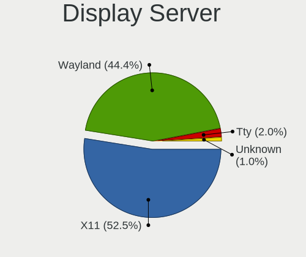
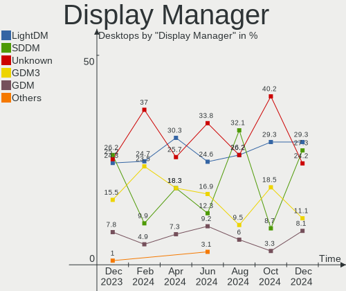
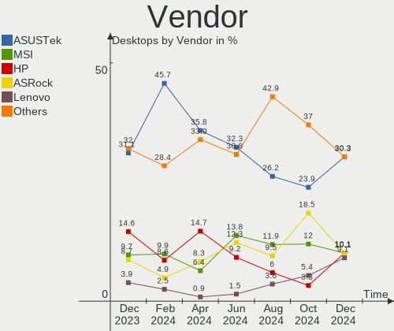
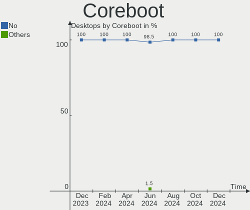
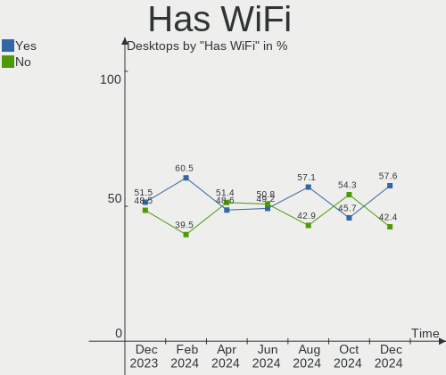
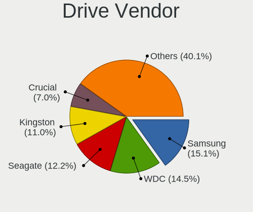
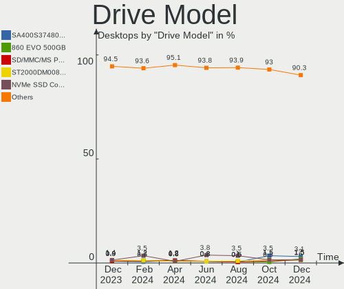
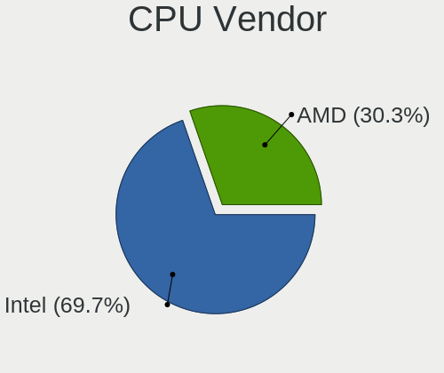
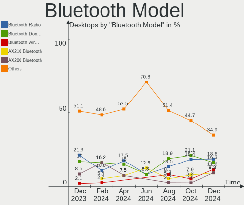

Linux in Italy - Hardware Trends (Desktops)
-------------------------------------------

A project to identify most popular hardware characteristics and track their change
over time based on data collected by Linux users at https://Linux-Hardware.org.

Anyone can contribute to this report by the [hw-probe](https://github.com/linuxhw/hw-probe) tool:

    sudo -E hw-probe -all -upload

Period: Feb, 2023.

Contents
--------

* [ System ](#system)
  - [ OS                       ](#os)
  - [ OS Family                ](#os-family)
  - [ Kernel                   ](#kernel)
  - [ Kernel Family            ](#kernel-family)
  - [ Kernel Major Ver.        ](#kernel-major-ver)
  - [ Arch                     ](#arch)
  - [ DE                       ](#de)
  - [ Display Server           ](#display-server)
  - [ Display Manager          ](#display-manager)
  - [ OS Lang                  ](#os-lang)
  - [ Boot Mode                ](#boot-mode)
  - [ Filesystem               ](#filesystem)
  - [ Part. scheme             ](#part-scheme)
  - [ Dual Boot with Linux/BSD ](#dual-boot-with-linuxbsd)
  - [ Dual Boot (Win)          ](#dual-boot-win)

* [ Board ](#board)
  - [ Vendor                   ](#vendor)
  - [ Model                    ](#model)
  - [ Model Family             ](#model-family)
  - [ MFG Year                 ](#mfg-year)
  - [ Form Factor              ](#form-factor)
  - [ Secure Boot              ](#secure-boot)
  - [ Coreboot                 ](#coreboot)
  - [ RAM Size                 ](#ram-size)
  - [ RAM Used                 ](#ram-used)
  - [ Total Drives             ](#total-drives)
  - [ Has CD-ROM               ](#has-cd-rom)
  - [ Has Ethernet             ](#has-ethernet)
  - [ Has WiFi                 ](#has-wifi)
  - [ Has Bluetooth            ](#has-bluetooth)

* [ Location ](#location)
  - [ Country                  ](#country)
  - [ City                     ](#city)

* [ Drives ](#drives)
  - [ Drive Vendor             ](#drive-vendor)
  - [ Drive Model              ](#drive-model)
  - [ HDD Vendor               ](#hdd-vendor)
  - [ SSD Vendor               ](#ssd-vendor)
  - [ Drive Kind               ](#drive-kind)
  - [ Drive Connector          ](#drive-connector)
  - [ Drive Size               ](#drive-size)
  - [ Space Total              ](#space-total)
  - [ Space Used               ](#space-used)
  - [ Malfunc. Drives          ](#malfunc-drives)
  - [ Malfunc. Drive Vendor    ](#malfunc-drive-vendor)
  - [ Malfunc. HDD Vendor      ](#malfunc-hdd-vendor)
  - [ Malfunc. Drive Kind      ](#malfunc-drive-kind)
  - [ Failed Drives            ](#failed-drives)
  - [ Failed Drive Vendor      ](#failed-drive-vendor)
  - [ Drive Status             ](#drive-status)

* [ Storage controller ](#storage-controller)
  - [ Storage Vendor           ](#storage-vendor)
  - [ Storage Model            ](#storage-model)
  - [ Storage Kind             ](#storage-kind)

* [ Processor ](#processor)
  - [ CPU Vendor               ](#cpu-vendor)
  - [ CPU Model                ](#cpu-model)
  - [ CPU Model Family         ](#cpu-model-family)
  - [ CPU Cores                ](#cpu-cores)
  - [ CPU Sockets              ](#cpu-sockets)
  - [ CPU Threads              ](#cpu-threads)
  - [ CPU Op-Modes             ](#cpu-op-modes)
  - [ CPU Microcode            ](#cpu-microcode)
  - [ CPU Microarch            ](#cpu-microarch)

* [ Graphics ](#graphics)
  - [ GPU Vendor               ](#gpu-vendor)
  - [ GPU Model                ](#gpu-model)
  - [ GPU Combo                ](#gpu-combo)
  - [ GPU Driver               ](#gpu-driver)
  - [ GPU Memory               ](#gpu-memory)

* [ Monitor ](#monitor)
  - [ Monitor Vendor           ](#monitor-vendor)
  - [ Monitor Model            ](#monitor-model)
  - [ Monitor Resolution       ](#monitor-resolution)
  - [ Monitor Diagonal         ](#monitor-diagonal)
  - [ Monitor Width            ](#monitor-width)
  - [ Aspect Ratio             ](#aspect-ratio)
  - [ Monitor Area             ](#monitor-area)
  - [ Pixel Density            ](#pixel-density)
  - [ Multiple Monitors        ](#multiple-monitors)

* [ Network ](#network)
  - [ Net Controller Vendor    ](#net-controller-vendor)
  - [ Net Controller Model     ](#net-controller-model)
  - [ Wireless Vendor          ](#wireless-vendor)
  - [ Wireless Model           ](#wireless-model)
  - [ Ethernet Vendor          ](#ethernet-vendor)
  - [ Ethernet Model           ](#ethernet-model)
  - [ Net Controller Kind      ](#net-controller-kind)
  - [ Used Controller          ](#used-controller)
  - [ NICs                     ](#nics)
  - [ IPv6                     ](#ipv6)

* [ Bluetooth ](#bluetooth)
  - [ Bluetooth Vendor         ](#bluetooth-vendor)
  - [ Bluetooth Model          ](#bluetooth-model)

* [ Sound ](#sound)
  - [ Sound Vendor             ](#sound-vendor)
  - [ Sound Model              ](#sound-model)

* [ Memory ](#memory)
  - [ Memory Vendor            ](#memory-vendor)
  - [ Memory Model             ](#memory-model)
  - [ Memory Kind              ](#memory-kind)
  - [ Memory Form Factor       ](#memory-form-factor)
  - [ Memory Size              ](#memory-size)
  - [ Memory Speed             ](#memory-speed)

* [ Printers & scanners ](#printers--scanners)
  - [ Printer Vendor           ](#printer-vendor)
  - [ Printer Model            ](#printer-model)
  - [ Scanner Vendor           ](#scanner-vendor)
  - [ Scanner Model            ](#scanner-model)

* [ Camera ](#camera)
  - [ Camera Vendor            ](#camera-vendor)
  - [ Camera Model             ](#camera-model)

* [ Security ](#security)
  - [ Fingerprint Vendor       ](#fingerprint-vendor)
  - [ Fingerprint Model        ](#fingerprint-model)
  - [ Chipcard Vendor          ](#chipcard-vendor)
  - [ Chipcard Model           ](#chipcard-model)

* [ Unsupported ](#unsupported)
  - [ Unsupported Devices      ](#unsupported-devices)
  - [ Unsupported Device Types ](#unsupported-device-types)

System
------

OS
--

Installed operating systems

| Name                         | Desktops | Percent |
|------------------------------|----------|---------|
| OpenMandriva 23.01           | 15       | 15.79%  |
| Linux Mint 21.1              | 10       | 10.53%  |
| Ubuntu 22.04                 | 9        | 9.47%   |
| Ubuntu 22.10                 | 5        | 5.26%   |
| OpenMandriva 4.3             | 5        | 5.26%   |
| Fedora 37                    | 4        | 4.21%   |
| EndeavourOS Rolling          | 4        | 4.21%   |
| Nobara 37                    | 3        | 3.16%   |
| Debian 11                    | 3        | 3.16%   |
| Debian                       | 3        | 3.16%   |
| Zorin 16                     | 2        | 2.11%   |
| Xubuntu 22.10                | 2        | 2.11%   |
| openSUSE Tumbleweed-XXXXXXXX | 2        | 2.11%   |
| OpenMandriva 23.90           | 2        | 2.11%   |
| Lubuntu 22.04                | 2        | 2.11%   |
| Linux Mint 20.3              | 2        | 2.11%   |
| Kubuntu 22.10                | 2        | 2.11%   |
| Arch Rolling                 | 2        | 2.11%   |
| Xubuntu 20.04                | 1        | 1.05%   |
| Ubuntu MATE 22.10            | 1        | 1.05%   |
| Ubuntu 23.04                 | 1        | 1.05%   |
| Ubuntu 20.04                 | 1        | 1.05%   |
| ROSA 12.3                    | 1        | 1.05%   |
| Pop!_OS 22.04                | 1        | 1.05%   |
| PCLinuxOS 2023               | 1        | 1.05%   |
| OpenMandriva 4.2             | 1        | 1.05%   |
| MX 21                        | 1        | 1.05%   |
| Manjaro                      | 1        | 1.05%   |
| LMDE 5                       | 1        | 1.05%   |
| Linux Mint 19.3              | 1        | 1.05%   |
| Kubuntu 22.04                | 1        | 1.05%   |
| Kali 2022.4                  | 1        | 1.05%   |
| Fedora 33                    | 1        | 1.05%   |
| Elementary 6.1               | 1        | 1.05%   |
| ArcoLinux Rolling            | 1        | 1.05%   |
| antiX 22                     | 1        | 1.05%   |

OS Family
---------

OS without a version

| Name         | Desktops | Percent |
|--------------|----------|---------|
| OpenMandriva | 23       | 24.21%  |
| Ubuntu       | 16       | 16.84%  |
| Linux Mint   | 13       | 13.68%  |
| Debian       | 6        | 6.32%   |
| Fedora       | 5        | 5.26%   |
| EndeavourOS  | 4        | 4.21%   |
| Xubuntu      | 3        | 3.16%   |
| Nobara       | 3        | 3.16%   |
| Kubuntu      | 3        | 3.16%   |
| Zorin        | 2        | 2.11%   |
| openSUSE     | 2        | 2.11%   |
| Lubuntu      | 2        | 2.11%   |
| Arch         | 2        | 2.11%   |
| Ubuntu MATE  | 1        | 1.05%   |
| ROSA         | 1        | 1.05%   |
| Pop!_OS      | 1        | 1.05%   |
| PCLinuxOS    | 1        | 1.05%   |
| MX           | 1        | 1.05%   |
| Manjaro      | 1        | 1.05%   |
| LMDE         | 1        | 1.05%   |
| Kali         | 1        | 1.05%   |
| Elementary   | 1        | 1.05%   |
| ArcoLinux    | 1        | 1.05%   |
| antiX        | 1        | 1.05%   |

Kernel
------

Version of the Linux kernel

| Version                        | Desktops | Percent |
|--------------------------------|----------|---------|
| 5.15.0-60-generic              | 14       | 14.74%  |
| 6.1.1-desktop-1omv2290         | 12       | 12.63%  |
| 5.19.0-32-generic              | 4        | 4.21%   |
| 5.15.0-56-generic              | 4        | 4.21%   |
| 5.10.0-21-amd64                | 4        | 4.21%   |
| 6.1.4-desktop-1omv2301         | 3        | 3.16%   |
| 6.1.0-3-amd64                  | 3        | 3.16%   |
| 5.19.0-31-generic              | 3        | 3.16%   |
| 5.19.0-29-generic              | 3        | 3.16%   |
| 5.16.7-desktop-1omv4003        | 3        | 3.16%   |
| 5.15.0-58-generic              | 3        | 3.16%   |
| 6.1.9-arch1-2                  | 2        | 2.11%   |
| 6.1.8-200.fc37.x86_64          | 2        | 2.11%   |
| 5.4.0-139-generic              | 2        | 2.11%   |
| 5.19.0-35-generic              | 2        | 2.11%   |
| 5.16.13-desktop-1omv4003       | 2        | 2.11%   |
| 6.2.0-rc6-1-amd-git            | 1        | 1.05%   |
| 6.2.0                          | 1        | 1.05%   |
| 6.1.9-desktop-1omv2390         | 1        | 1.05%   |
| 6.1.9-arch1-1                  | 1        | 1.05%   |
| 6.1.9-200.fc37.x86_64          | 1        | 1.05%   |
| 6.1.8-zen1-1-zen               | 1        | 1.05%   |
| 6.1.8-desktop-1omv2390         | 1        | 1.05%   |
| 6.1.8-202.fsync.fc37.x86_64    | 1        | 1.05%   |
| 6.1.8-1-default                | 1        | 1.05%   |
| 6.1.4-203.fsync.fc37.x86_64    | 1        | 1.05%   |
| 6.1.12_tkg_cfs                 | 1        | 1.05%   |
| 6.1.12-1-default               | 1        | 1.05%   |
| 6.1.11-200.fc37.x86_64         | 1        | 1.05%   |
| 6.1.11-1-MANJARO               | 1        | 1.05%   |
| 6.1.1-pclos2                   | 1        | 1.05%   |
| 6.0.12-arch1-1                 | 1        | 1.05%   |
| 6.0.12-76060006-generic        | 1        | 1.05%   |
| 6.0.11-x64v2-rt14-xanmod1-1-rt | 1        | 1.05%   |
| 6.0.0-kali6-amd64              | 1        | 1.05%   |
| 5.4.0-139-lowlatency           | 1        | 1.05%   |
| 5.4.0-137-generic              | 1        | 1.05%   |
| 5.19.0-21-generic              | 1        | 1.05%   |
| 5.19.0-1017-lowlatency         | 1        | 1.05%   |
| 5.16.15-051615-generic         | 1        | 1.05%   |

Kernel Family
-------------

Linux kernel without a distro release

| Version  | Desktops | Percent |
|----------|----------|---------|
| 5.15.0   | 21       | 22.11%  |
| 5.19.0   | 14       | 14.74%  |
| 6.1.1    | 13       | 13.68%  |
| 6.1.8    | 6        | 6.32%   |
| 6.1.9    | 5        | 5.26%   |
| 5.10.0   | 5        | 5.26%   |
| 6.1.4    | 4        | 4.21%   |
| 5.4.0    | 4        | 4.21%   |
| 6.1.0    | 3        | 3.16%   |
| 5.16.7   | 3        | 3.16%   |
| 6.2.0    | 2        | 2.11%   |
| 6.1.12   | 2        | 2.11%   |
| 6.1.11   | 2        | 2.11%   |
| 6.0.12   | 2        | 2.11%   |
| 5.16.13  | 2        | 2.11%   |
| 6.0.11   | 1        | 1.05%   |
| 6.0.0    | 1        | 1.05%   |
| 5.16.15  | 1        | 1.05%   |
| 5.15.75  | 1        | 1.05%   |
| 5.14.18  | 1        | 1.05%   |
| 5.10.142 | 1        | 1.05%   |
| 5.10.14  | 1        | 1.05%   |

Kernel Major Ver.
-----------------

Linux kernel major version

| Version | Desktops | Percent |
|---------|----------|---------|
| 6.1     | 35       | 36.84%  |
| 5.15    | 22       | 23.16%  |
| 5.19    | 14       | 14.74%  |
| 5.10    | 7        | 7.37%   |
| 5.16    | 6        | 6.32%   |
| 6.0     | 4        | 4.21%   |
| 5.4     | 4        | 4.21%   |
| 6.2     | 2        | 2.11%   |
| 5.14    | 1        | 1.05%   |

Arch
----

OS architecture (x86_64, i586, etc.)

| Name   | Desktops | Percent |
|--------|----------|---------|
| x86_64 | 95       | 100%    |

DE
--

Desktop Environment

| Name       | Desktops | Percent |
|------------|----------|---------|
| KDE5       | 34       | 35.79%  |
| GNOME      | 30       | 31.58%  |
| XFCE       | 10       | 10.53%  |
| X-Cinnamon | 10       | 10.53%  |
| MATE       | 4        | 4.21%   |
| LXQt       | 2        | 2.11%   |
| Pantheon   | 1        | 1.05%   |
| icewm      | 1        | 1.05%   |
| i3         | 1        | 1.05%   |
| Cinnamon   | 1        | 1.05%   |
| Budgie     | 1        | 1.05%   |

Display Server
--------------

X11 or Wayland

| Name    | Desktops | Percent |
|---------|----------|---------|
| X11     | 79       | 83.16%  |
| Wayland | 14       | 14.74%  |
| Tty     | 2        | 2.11%   |

Display Manager
---------------

SDDM, LightDM, etc.

| Name    | Desktops | Percent |
|---------|----------|---------|
| SDDM    | 31       | 32.63%  |
| Unknown | 20       | 21.05%  |
| LightDM | 18       | 18.95%  |
| GDM3    | 18       | 18.95%  |
| GDM     | 8        | 8.42%   |

OS Lang
-------

Language

| Lang  | Desktops | Percent |
|-------|----------|---------|
| it_IT | 69       | 72.63%  |
| en_US | 18       | 18.95%  |
| C     | 3        | 3.16%   |
| fr_FR | 2        | 2.11%   |
| en_GB | 2        | 2.11%   |
| de_DE | 1        | 1.05%   |

Boot Mode
---------

EFI or BIOS

| Mode | Desktops | Percent |
|------|----------|---------|
| BIOS | 57       | 60%     |
| EFI  | 38       | 40%     |

Filesystem
----------

Type of filesystem

| Type    | Desktops | Percent |
|---------|----------|---------|
| Ext4    | 65       | 68.42%  |
| Overlay | 17       | 17.89%  |
| Btrfs   | 10       | 10.53%  |
| Xfs     | 1        | 1.05%   |
| F2fs    | 1        | 1.05%   |
| Ext3    | 1        | 1.05%   |

Part. scheme
------------

Scheme of partitioning

| Type    | Desktops | Percent |
|---------|----------|---------|
| GPT     | 51       | 53.68%  |
| MBR     | 25       | 26.32%  |
| Unknown | 19       | 20%     |

Dual Boot with Linux/BSD
------------------------

Hosting more than one Linux/BSD

| Dual boot | Desktops | Percent |
|-----------|----------|---------|
| No        | 73       | 76.84%  |
| Yes       | 22       | 23.16%  |

Dual Boot (Win)
---------------

Hosting Linux and Windows

| Dual boot | Desktops | Percent |
|-----------|----------|---------|
| No        | 50       | 52.63%  |
| Yes       | 45       | 47.37%  |

Board
-----

Vendor
------

Motherboard manufacturer

| Name                | Desktops | Percent |
|---------------------|----------|---------|
| ASUSTek Computer    | 33       | 34.74%  |
| ASRock              | 11       | 11.58%  |
| MSI                 | 9        | 9.47%   |
| Hewlett-Packard     | 8        | 8.42%   |
| Gigabyte Technology | 8        | 8.42%   |
| Fujitsu             | 5        | 5.26%   |
| Lenovo              | 4        | 4.21%   |
| Acer                | 4        | 4.21%   |
| Intel               | 3        | 3.16%   |
| Pegatron            | 2        | 2.11%   |
| Dell                | 2        | 2.11%   |
| Unknown             | 2        | 2.11%   |
| VXL                 | 1        | 1.05%   |
| Supermicro          | 1        | 1.05%   |
| Packard Bell        | 1        | 1.05%   |
| Cincoze             | 1        | 1.05%   |

Model
-----

Motherboard model

| Name                                    | Desktops | Percent |
|-----------------------------------------|----------|---------|
| MSI MS-7C56                             | 2        | 2.11%   |
| ASUS ROG CROSSHAIR VIII DARK HERO       | 2        | 2.11%   |
| ASUS P5K                                | 2        | 2.11%   |
| ASUS All Series                         | 2        | 2.11%   |
| Unknown                                 | 2        | 2.11%   |
| VXL TC7520d                             | 1        | 1.05%   |
| Supermicro SYS-7048GR-TR                | 1        | 1.05%   |
| Pegatron Pro 3120 Microtower PC         | 1        | 1.05%   |
| Pegatron p7-1011it                      | 1        | 1.05%   |
| Packard Bell IMEDIA S3810               | 1        | 1.05%   |
| MSI p6610it                             | 1        | 1.05%   |
| MSI MS-7D43                             | 1        | 1.05%   |
| MSI MS-7B98                             | 1        | 1.05%   |
| MSI MS-7984                             | 1        | 1.05%   |
| MSI MS-7821                             | 1        | 1.05%   |
| MSI MS-7522                             | 1        | 1.05%   |
| MSI MS-7309                             | 1        | 1.05%   |
| Lenovo ThinkCentre M93p 10A8S08114      | 1        | 1.05%   |
| Lenovo ThinkCentre M92p 3212BD3         | 1        | 1.05%   |
| Lenovo ThinkCentre E73 10DS0015IX       | 1        | 1.05%   |
| Lenovo IdeaCentre 310S-08ASR 90G9006DIX | 1        | 1.05%   |
| Intel Jasper Lake Client Platform       | 1        | 1.05%   |
| Intel H61                               | 1        | 1.05%   |
| Intel DH55TC AAE70932-301               | 1        | 1.05%   |
| HP ProDesk 600 G1 SFF                   | 1        | 1.05%   |
| HP Desktop Pro PCI MT                   | 1        | 1.05%   |
| HP Compaq Elite 8300 SFF                | 1        | 1.05%   |
| HP Compaq Elite 8300 CMT                | 1        | 1.05%   |
| HP Compaq dc7900 Small Form Factor      | 1        | 1.05%   |
| HP Compaq dc5800 Small Form Factor      | 1        | 1.05%   |
| HP Compaq 8200 Elite SFF PC             | 1        | 1.05%   |
| HP 290 G2 MT Business PC                | 1        | 1.05%   |
| Gigabyte Z77MX-D3H                      | 1        | 1.05%   |
| Gigabyte Z370 HD3P                      | 1        | 1.05%   |
| Gigabyte X570 AORUS ELITE               | 1        | 1.05%   |
| Gigabyte H270M-D3H                      | 1        | 1.05%   |
| Gigabyte GA-MA78GM-S2H                  | 1        | 1.05%   |
| Gigabyte B560M DS3H                     | 1        | 1.05%   |
| Gigabyte B550 AORUS ELITE V2            | 1        | 1.05%   |
| Gigabyte B250M-D3H                      | 1        | 1.05%   |

Model Family
------------

Motherboard model prefix

| Name                     | Desktops | Percent |
|--------------------------|----------|---------|
| ASUS PRIME               | 6        | 6.32%   |
| HP Compaq                | 5        | 5.26%   |
| Fujitsu ESPRIMO          | 4        | 4.21%   |
| Lenovo ThinkCentre       | 3        | 3.16%   |
| ASUS TUF                 | 3        | 3.16%   |
| MSI MS-7C56              | 2        | 2.11%   |
| ASUS ROG                 | 2        | 2.11%   |
| ASUS Rampage             | 2        | 2.11%   |
| ASUS P5K                 | 2        | 2.11%   |
| ASUS All                 | 2        | 2.11%   |
| Acer Veriton             | 2        | 2.11%   |
| Acer Aspire              | 2        | 2.11%   |
| Unknown                  | 2        | 2.11%   |
| VXL TC7520d              | 1        | 1.05%   |
| Supermicro SYS-7048GR-TR | 1        | 1.05%   |
| Pegatron Pro             | 1        | 1.05%   |
| Pegatron p7-1011it       | 1        | 1.05%   |
| Packard Bell IMEDIA      | 1        | 1.05%   |
| MSI p6610it              | 1        | 1.05%   |
| MSI MS-7D43              | 1        | 1.05%   |
| MSI MS-7B98              | 1        | 1.05%   |
| MSI MS-7984              | 1        | 1.05%   |
| MSI MS-7821              | 1        | 1.05%   |
| MSI MS-7522              | 1        | 1.05%   |
| MSI MS-7309              | 1        | 1.05%   |
| Lenovo IdeaCentre        | 1        | 1.05%   |
| Intel Jasper             | 1        | 1.05%   |
| Intel H61                | 1        | 1.05%   |
| Intel DH55TC             | 1        | 1.05%   |
| HP ProDesk               | 1        | 1.05%   |
| HP Desktop               | 1        | 1.05%   |
| HP 290                   | 1        | 1.05%   |
| Gigabyte Z77MX-D3H       | 1        | 1.05%   |
| Gigabyte Z370            | 1        | 1.05%   |
| Gigabyte X570            | 1        | 1.05%   |
| Gigabyte H270M-D3H       | 1        | 1.05%   |
| Gigabyte GA-MA78GM-S2H   | 1        | 1.05%   |
| Gigabyte B560M           | 1        | 1.05%   |
| Gigabyte B550            | 1        | 1.05%   |
| Gigabyte B250M-D3H       | 1        | 1.05%   |

MFG Year
--------

Motherboard manufacture year

| Year | Desktops | Percent |
|------|----------|---------|
| 2019 | 8        | 8.42%   |
| 2013 | 8        | 8.42%   |
| 2012 | 8        | 8.42%   |
| 2020 | 7        | 7.37%   |
| 2018 | 7        | 7.37%   |
| 2014 | 7        | 7.37%   |
| 2010 | 7        | 7.37%   |
| 2021 | 6        | 6.32%   |
| 2017 | 6        | 6.32%   |
| 2022 | 5        | 5.26%   |
| 2011 | 5        | 5.26%   |
| 2008 | 5        | 5.26%   |
| 2015 | 4        | 4.21%   |
| 2009 | 4        | 4.21%   |
| 2007 | 3        | 3.16%   |
| 2016 | 2        | 2.11%   |
| 2006 | 2        | 2.11%   |
| 2005 | 1        | 1.05%   |

Form Factor
-----------

Physical design of the computer

| Name    | Desktops | Percent |
|---------|----------|---------|
| Desktop | 95       | 100%    |

Secure Boot
-----------

Enabled or disabled

| State    | Desktops | Percent |
|----------|----------|---------|
| Disabled | 93       | 97.89%  |
| Enabled  | 2        | 2.11%   |

Coreboot
--------

Have coreboot on board

| Used | Desktops | Percent |
|------|----------|---------|
| No   | 95       | 100%    |

RAM Size
--------

Total RAM memory

| Size in GB  | Desktops | Percent |
|-------------|----------|---------|
| 8.01-16.0   | 27       | 28.42%  |
| 16.01-24.0  | 26       | 27.37%  |
| 4.01-8.0    | 14       | 14.74%  |
| 3.01-4.0    | 12       | 12.63%  |
| 32.01-64.0  | 7        | 7.37%   |
| 64.01-256.0 | 4        | 4.21%   |
| 24.01-32.0  | 2        | 2.11%   |
| 1.01-2.0    | 2        | 2.11%   |
| 0.51-1.0    | 1        | 1.05%   |

RAM Used
--------

Used RAM memory

| Used GB    | Desktops | Percent |
|------------|----------|---------|
| 1.01-2.0   | 40       | 42.11%  |
| 2.01-3.0   | 24       | 25.26%  |
| 4.01-8.0   | 16       | 16.84%  |
| 3.01-4.0   | 7        | 7.37%   |
| 0.51-1.0   | 4        | 4.21%   |
| 8.01-16.0  | 2        | 2.11%   |
| 24.01-32.0 | 1        | 1.05%   |
| 16.01-24.0 | 1        | 1.05%   |

Total Drives
------------

Number of drives on board

| Drives | Desktops | Percent |
|--------|----------|---------|
| 2      | 31       | 32.63%  |
| 1      | 31       | 32.63%  |
| 3      | 16       | 16.84%  |
| 4      | 7        | 7.37%   |
| 5      | 6        | 6.32%   |
| 8      | 1        | 1.05%   |
| 7      | 1        | 1.05%   |
| 6      | 1        | 1.05%   |
| 0      | 1        | 1.05%   |

Has CD-ROM
----------

Has CD-ROM on board

| Presented | Desktops | Percent |
|-----------|----------|---------|
| Yes       | 62       | 65.26%  |
| No        | 33       | 34.74%  |

Has Ethernet
------------

Has Ethernet on board

| Presented | Desktops | Percent |
|-----------|----------|---------|
| Yes       | 94       | 98.95%  |
| No        | 1        | 1.05%   |

Has WiFi
--------

Has WiFi module

| Presented | Desktops | Percent |
|-----------|----------|---------|
| No        | 54       | 56.84%  |
| Yes       | 41       | 43.16%  |

Has Bluetooth
-------------

Has Bluetooth module

| Presented | Desktops | Percent |
|-----------|----------|---------|
| No        | 65       | 68.42%  |
| Yes       | 30       | 31.58%  |

Location
--------

Country
-------

Geographic location (country)

| Country | Desktops | Percent |
|---------|----------|---------|
| Italy   | 95       | 100%    |

City
----

Geographic location (city)

| City                   | Desktops | Percent |
|------------------------|----------|---------|
| Milan                  | 8        | 8.42%   |
| Milano                 | 7        | 7.37%   |
| Rome                   | 5        | 5.26%   |
| Turin                  | 4        | 4.21%   |
| Naples                 | 4        | 4.21%   |
| Genoa                  | 4        | 4.21%   |
| Verona                 | 2        | 2.11%   |
| Trieste                | 2        | 2.11%   |
| Mombello di Torino     | 2        | 2.11%   |
| Florence               | 2        | 2.11%   |
| Brescia                | 2        | 2.11%   |
| Bolzano                | 2        | 2.11%   |
| Bologna                | 2        | 2.11%   |
| Zevio                  | 1        | 1.05%   |
| Villanders             | 1        | 1.05%   |
| Varese                 | 1        | 1.05%   |
| Udine                  | 1        | 1.05%   |
| Trissino               | 1        | 1.05%   |
| Terranuova Bracciolini | 1        | 1.05%   |
| Terno d'Isola          | 1        | 1.05%   |
| Sona                   | 1        | 1.05%   |
| Sesto San Giovanni     | 1        | 1.05%   |
| Selvazzano Dentro      | 1        | 1.05%   |
| Salento                | 1        | 1.05%   |
| Rho                    | 1        | 1.05%   |
| Pistoia                | 1        | 1.05%   |
| Parma                  | 1        | 1.05%   |
| Palazzolo sull'Oglio   | 1        | 1.05%   |
| Ornavasso              | 1        | 1.05%   |
| Negrar                 | 1        | 1.05%   |
| Monza                  | 1        | 1.05%   |
| Montecalvo Versiggia   | 1        | 1.05%   |
| Mondragone             | 1        | 1.05%   |
| Luino                  | 1        | 1.05%   |
| Lucca                  | 1        | 1.05%   |
| Lestizza               | 1        | 1.05%   |
| Legnaro                | 1        | 1.05%   |
| Introbio               | 1        | 1.05%   |
| Imola                  | 1        | 1.05%   |
| Iesi                   | 1        | 1.05%   |

Drives
------

Drive Vendor
------------

Hard drive vendors

| Vendor                    | Desktops | Drives | Percent |
|---------------------------|----------|--------|---------|
| Seagate                   | 38       | 53     | 21.84%  |
| WDC                       | 28       | 41     | 16.09%  |
| Samsung Electronics       | 24       | 30     | 13.79%  |
| Kingston                  | 17       | 18     | 9.77%   |
| Toshiba                   | 12       | 12     | 6.9%    |
| Crucial                   | 12       | 14     | 6.9%    |
| SanDisk                   | 4        | 4      | 2.3%    |
| China                     | 4        | 4      | 2.3%    |
| Phison                    | 3        | 4      | 1.72%   |
| Maxtor                    | 3        | 4      | 1.72%   |
| Hitachi                   | 3        | 3      | 1.72%   |
| HGST                      | 3        | 6      | 1.72%   |
| Team                      | 2        | 2      | 1.15%   |
| PNY                       | 2        | 2      | 1.15%   |
| OCZ                       | 2        | 2      | 1.15%   |
| Micron/Crucial Technology | 2        | 2      | 1.15%   |
| Unknown                   | 2        | 2      | 1.15%   |
| XPG                       | 1        | 1      | 0.57%   |
| Unknown                   | 1        | 2      | 0.57%   |
| TO Exter                  | 1        | 1      | 0.57%   |
| ShanDianZhe               | 1        | 1      | 0.57%   |
| Phison Electronics        | 1        | 1      | 0.57%   |
| Patriot                   | 1        | 1      | 0.57%   |
| Micron Technology         | 1        | 1      | 0.57%   |
| KIOXIA-EXCERIA            | 1        | 1      | 0.57%   |
| KingDian                  | 1        | 1      | 0.57%   |
| Intel                     | 1        | 1      | 0.57%   |
| Gigabyte Technology       | 1        | 1      | 0.57%   |
| Apacer                    | 1        | 1      | 0.57%   |
| ADATA Technology          | 1        | 1      | 0.57%   |

Drive Model
-----------

Hard drive models

| Model                                                | Desktops | Percent |
|------------------------------------------------------|----------|---------|
| Seagate ST500DM002-1BD142 500GB                      | 7        | 3.4%    |
| Toshiba DT01ACA100 1TB                               | 3        | 1.46%   |
| Seagate ST1000DM010-2EP102 1TB                       | 3        | 1.46%   |
| Seagate M3 Portable 4TB                              | 3        | 1.46%   |
| Samsung SSD 870 EVO 500GB                            | 3        | 1.46%   |
| Samsung SSD 860 EVO 500GB                            | 3        | 1.46%   |
| Samsung NVMe SSD Controller SM981/PM981/PM983 250GB  | 3        | 1.46%   |
| Kingston SA400S37240G 240GB SSD                      | 3        | 1.46%   |
| Kingston SA400S37120G 120GB SSD                      | 3        | 1.46%   |
| WDC WDS240G2G0A-00JH30 240GB SSD                     | 2        | 0.97%   |
| WDC WD10EZEX-22MFCA0 1TB                             | 2        | 0.97%   |
| WDC WD10EZEX-00BN5A0 1TB                             | 2        | 0.97%   |
| Toshiba HDWD110 1TB                                  | 2        | 0.97%   |
| Seagate ST4000DM004-2U9104 4TB                       | 2        | 0.97%   |
| Seagate ST31000528AS 1TB                             | 2        | 0.97%   |
| Seagate ST2000LM015-2E8174 2TB                       | 2        | 0.97%   |
| Seagate ST1000LM024 HN-M101MBB 1TB                   | 2        | 0.97%   |
| Seagate Expansion 1TB                                | 2        | 0.97%   |
| Samsung SSD 970 EVO Plus 500GB                       | 2        | 0.97%   |
| Samsung SSD 870 EVO 250GB                            | 2        | 0.97%   |
| Samsung SSD 850 EVO 250GB                            | 2        | 0.97%   |
| Samsung NVMe SSD Controller PM9A1/PM9A3/980PRO 960GB | 2        | 0.97%   |
| Kingston SUV400S37240G 240GB SSD                     | 2        | 0.97%   |
| Kingston SA400S37480G 480GB SSD                      | 2        | 0.97%   |
| HGST HTS541010A9E680 1TB                             | 2        | 0.97%   |
| Crucial CT500MX500SSD1 500GB                         | 2        | 0.97%   |
| Crucial CT240BX500SSD1 240GB                         | 2        | 0.97%   |
| Crucial CT120BX500SSD1 120GB                         | 2        | 0.97%   |
| Crucial CT1000MX500SSD1 1TB                          | 2        | 0.97%   |
| Crucial CT1000BX500SSD1 1TB                          | 2        | 0.97%   |
| Unknown                                              | 2        | 0.97%   |
| XPG SPECTRIX S40G 4TB                                | 1        | 0.49%   |
| WDC WD60PURZ-85ZUFY1 6TB                             | 1        | 0.49%   |
| WDC WD60EZAZ-00SF3B0 6TB                             | 1        | 0.49%   |
| WDC WD60EFAX-68JH4N1 6TB                             | 1        | 0.49%   |
| WDC WD5000LPVT-22G33T0 500GB                         | 1        | 0.49%   |
| WDC WD5000AAKX-75U6AA0 500GB                         | 1        | 0.49%   |
| WDC WD5000AAKX-08U6AA0 500GB                         | 1        | 0.49%   |
| WDC WD5000AAKX-08ERMA0 500GB                         | 1        | 0.49%   |
| WDC WD5000AAKX-07U6AA0 500GB                         | 1        | 0.49%   |

HDD Vendor
----------

Hard disk drive vendors

| Vendor              | Desktops | Drives | Percent |
|---------------------|----------|--------|---------|
| Seagate             | 37       | 50     | 43.02%  |
| WDC                 | 27       | 39     | 31.4%   |
| Toshiba             | 11       | 11     | 12.79%  |
| Maxtor              | 3        | 4      | 3.49%   |
| Hitachi             | 3        | 3      | 3.49%   |
| HGST                | 3        | 6      | 3.49%   |
| Samsung Electronics | 1        | 1      | 1.16%   |
| China               | 1        | 1      | 1.16%   |

SSD Vendor
----------

Solid state drive vendors

| Vendor              | Desktops | Drives | Percent |
|---------------------|----------|--------|---------|
| Samsung Electronics | 18       | 19     | 27.69%  |
| Kingston            | 15       | 16     | 23.08%  |
| Crucial             | 12       | 14     | 18.46%  |
| SanDisk             | 3        | 3      | 4.62%   |
| China               | 3        | 3      | 4.62%   |
| WDC                 | 2        | 2      | 3.08%   |
| Team                | 2        | 2      | 3.08%   |
| PNY                 | 2        | 2      | 3.08%   |
| OCZ                 | 2        | 2      | 3.08%   |
| TO Exter            | 1        | 1      | 1.54%   |
| Patriot             | 1        | 1      | 1.54%   |
| KingDian            | 1        | 1      | 1.54%   |
| Intel               | 1        | 1      | 1.54%   |
| Apacer              | 1        | 1      | 1.54%   |
| Unknown             | 1        | 1      | 1.54%   |

Drive Kind
----------

HDD or SSD

| Kind    | Desktops | Drives | Percent |
|---------|----------|--------|---------|
| HDD     | 68       | 115    | 45.33%  |
| SSD     | 55       | 69     | 36.67%  |
| NVMe    | 20       | 25     | 13.33%  |
| Unknown | 5        | 6      | 3.33%   |
| MMC     | 2        | 2      | 1.33%   |

Drive Connector
---------------

SATA, SAS, NVMe, etc.

| Type | Desktops | Drives | Percent |
|------|----------|--------|---------|
| SATA | 89       | 177    | 74.17%  |
| NVMe | 20       | 25     | 16.67%  |
| SAS  | 9        | 13     | 7.5%    |
| MMC  | 2        | 2      | 1.67%   |

Drive Size
----------

Size of hard drive

| Size in TB | Desktops | Drives | Percent |
|------------|----------|--------|---------|
| 0.01-0.5   | 67       | 94     | 49.26%  |
| 0.51-1.0   | 37       | 48     | 27.21%  |
| 1.01-2.0   | 12       | 17     | 8.82%   |
| 3.01-4.0   | 8        | 11     | 5.88%   |
| 2.01-3.0   | 7        | 7      | 5.15%   |
| 4.01-10.0  | 5        | 7      | 3.68%   |

Space Total
-----------

Amount of disk space available on the file system

| Size in GB     | Desktops | Percent |
|----------------|----------|---------|
| 101-250        | 20       | 21.05%  |
| 501-1000       | 15       | 15.79%  |
| More than 3000 | 11       | 11.58%  |
| 21-50          | 10       | 10.53%  |
| 1-20           | 10       | 10.53%  |
| 251-500        | 9        | 9.47%   |
| 1001-2000      | 9        | 9.47%   |
| 2001-3000      | 8        | 8.42%   |
| Unknown        | 2        | 2.11%   |
| 51-100         | 1        | 1.05%   |

Space Used
----------

Amount of used disk space

| Used GB        | Desktops | Percent |
|----------------|----------|---------|
| 1-20           | 34       | 35.79%  |
| 21-50          | 13       | 13.68%  |
| 101-250        | 10       | 10.53%  |
| 251-500        | 9        | 9.47%   |
| 501-1000       | 8        | 8.42%   |
| 51-100         | 6        | 6.32%   |
| 1001-2000      | 5        | 5.26%   |
| More than 3000 | 4        | 4.21%   |
| 2001-3000      | 4        | 4.21%   |
| Unknown        | 2        | 2.11%   |

Malfunc. Drives
---------------

Drive models with a malfunction

| Model                               | Desktops | Drives | Percent |
|-------------------------------------|----------|--------|---------|
| WDC WD60EFAX-68JH4N1 6TB            | 1        | 1      | 7.14%   |
| WDC WD5000AAKX-08ERMA0 500GB        | 1        | 1      | 7.14%   |
| WDC WD3200BPVT-00JJ5T0 320GB        | 1        | 1      | 7.14%   |
| WDC WD10EACS-65D6B0 1TB             | 1        | 1      | 7.14%   |
| Seagate ST750LM022 HN-M750MBB 752GB | 1        | 1      | 7.14%   |
| Seagate ST500DM002-1BD142 500GB     | 1        | 1      | 7.14%   |
| Seagate ST3160815AS 160GB           | 1        | 1      | 7.14%   |
| Seagate ST250DM000-1BD141 250GB     | 1        | 1      | 7.14%   |
| SanDisk SSD PLUS 120 GB             | 1        | 1      | 7.14%   |
| Maxtor 6Y120L0 128GB                | 1        | 1      | 7.14%   |
| Hitachi HTS543232A7A384 320GB       | 1        | 1      | 7.14%   |
| Hitachi HDS721010CLA332 1TB         | 1        | 1      | 7.14%   |
| Crucial CT275MX300SSD1 275GB        | 1        | 1      | 7.14%   |
| Apacer 32GB SATA Flash Drive SSD    | 1        | 1      | 7.14%   |

Malfunc. Drive Vendor
---------------------

Vendors of faulty drives

| Vendor  | Desktops | Drives | Percent |
|---------|----------|--------|---------|
| WDC     | 3        | 4      | 25%     |
| Seagate | 3        | 4      | 25%     |
| Hitachi | 2        | 2      | 16.67%  |
| SanDisk | 1        | 1      | 8.33%   |
| Maxtor  | 1        | 1      | 8.33%   |
| Crucial | 1        | 1      | 8.33%   |
| Apacer  | 1        | 1      | 8.33%   |

Malfunc. HDD Vendor
-------------------

Vendors of faulty HDD drives

| Vendor  | Desktops | Drives | Percent |
|---------|----------|--------|---------|
| WDC     | 3        | 4      | 33.33%  |
| Seagate | 3        | 4      | 33.33%  |
| Hitachi | 2        | 2      | 22.22%  |
| Maxtor  | 1        | 1      | 11.11%  |

Malfunc. Drive Kind
-------------------

Kinds of faulty drives

| Kind | Desktops | Drives | Percent |
|------|----------|--------|---------|
| HDD  | 9        | 11     | 75%     |
| SSD  | 3        | 3      | 25%     |

Failed Drives
-------------

Failed drive models

Zero info for selected period =(

Failed Drive Vendor
-------------------

Failed drive vendors

Zero info for selected period =(

Drive Status
------------

Number of failed and malfunc. drives

| Status   | Desktops | Drives | Percent |
|----------|----------|--------|---------|
| Works    | 50       | 93     | 47.17%  |
| Detected | 45       | 110    | 42.45%  |
| Malfunc  | 11       | 14     | 10.38%  |

Storage controller
------------------

Storage Vendor
--------------

Storage controller vendors

| Vendor                        | Desktops | Percent |
|-------------------------------|----------|---------|
| Intel                         | 70       | 51.85%  |
| AMD                           | 20       | 14.81%  |
| Samsung Electronics           | 9        | 6.67%   |
| ASMedia Technology            | 7        | 5.19%   |
| JMicron Technology            | 6        | 4.44%   |
| Phison Electronics            | 5        | 3.7%    |
| Nvidia                        | 3        | 2.22%   |
| VIA Technologies              | 2        | 1.48%   |
| Micron/Crucial Technology     | 2        | 1.48%   |
| Kingston Technology Company   | 2        | 1.48%   |
| Toshiba America Info Systems  | 1        | 0.74%   |
| SanDisk                       | 1        | 0.74%   |
| Realtek Semiconductor         | 1        | 0.74%   |
| Micron Technology             | 1        | 0.74%   |
| Marvell Technology Group      | 1        | 0.74%   |
| LSI Logic / Symbios Logic     | 1        | 0.74%   |
| KIOXIA                        | 1        | 0.74%   |
| Integrated Technology Express | 1        | 0.74%   |
| ADATA Technology              | 1        | 0.74%   |

Storage Model
-------------

Storage controller models

| Model                                                                          | Desktops | Percent |
|--------------------------------------------------------------------------------|----------|---------|
| AMD FCH SATA Controller [AHCI mode]                                            | 12       | 7.55%   |
| Intel 8 Series/C220 Series Chipset Family 6-port SATA Controller 1 [AHCI mode] | 9        | 5.66%   |
| Intel Q170/Q150/B150/H170/H110/Z170/CM236 Chipset SATA Controller [AHCI Mode]  | 8        | 5.03%   |
| Intel 6 Series/C200 Series Chipset Family 6 port Desktop SATA AHCI Controller  | 8        | 5.03%   |
| Samsung NVMe SSD Controller SM981/PM981/PM983                                  | 5        | 3.14%   |
| Intel 7 Series/C210 Series Chipset Family 6-port SATA Controller [AHCI mode]   | 5        | 3.14%   |
| ASMedia ASM1062 Serial ATA Controller                                          | 5        | 3.14%   |
| JMicron JMB363 SATA/IDE Controller                                             | 4        | 2.52%   |
| Intel Cannon Lake PCH SATA AHCI Controller                                     | 4        | 2.52%   |
| Intel 82801I (ICH9 Family) 2 port SATA Controller [IDE mode]                   | 4        | 2.52%   |
| AMD SB7x0/SB8x0/SB9x0 IDE Controller                                           | 4        | 2.52%   |
| AMD 500 Series Chipset SATA Controller                                         | 4        | 2.52%   |
| Samsung NVMe SSD Controller PM9A1/PM9A3/980PRO                                 | 3        | 1.89%   |
| Phison E12 NVMe Controller                                                     | 3        | 1.89%   |
| Intel SATA Controller [RAID mode]                                              | 3        | 1.89%   |
| Intel Alder Lake-S PCH SATA Controller [AHCI Mode]                             | 3        | 1.89%   |
| Intel 82801IB (ICH9) 2 port SATA Controller [IDE mode]                         | 3        | 1.89%   |
| Intel 5 Series/3400 Series Chipset 6 port SATA AHCI Controller                 | 3        | 1.89%   |
| Intel 200 Series PCH SATA controller [AHCI mode]                               | 3        | 1.89%   |
| AMD SB7x0/SB8x0/SB9x0 SATA Controller [AHCI mode]                              | 3        | 1.89%   |
| Phison E18 PCIe4 NVMe Controller                                               | 2        | 1.26%   |
| Nvidia MCP61 SATA Controller                                                   | 2        | 1.26%   |
| Nvidia MCP61 IDE                                                               | 2        | 1.26%   |
| Intel Volume Management Device NVMe RAID Controller                            | 2        | 1.26%   |
| Intel Celeron N3350/Pentium N4200/Atom E3900 Series SATA AHCI Controller       | 2        | 1.26%   |
| Intel Atom Processor E3800 Series SATA AHCI Controller                         | 2        | 1.26%   |
| Intel 82801JI (ICH10 Family) SATA AHCI Controller                              | 2        | 1.26%   |
| Intel 82801JI (ICH10 Family) 4 port SATA IDE Controller #1                     | 2        | 1.26%   |
| Intel 82801G (ICH7 Family) IDE Controller                                      | 2        | 1.26%   |
| VIA VX900 Series Serial-ATA Controller                                         | 1        | 0.63%   |
| VIA VT82C586A/B/VT82C686/A/B/VT823x/A/C PIPC Bus Master IDE                    | 1        | 0.63%   |
| VIA VT8237A SATA 2-Port Controller                                             | 1        | 0.63%   |
| Toshiba America Info Systems XG5 NVMe SSD Controller                           | 1        | 0.63%   |
| SanDisk WD Blue SN570 NVMe SSD                                                 | 1        | 0.63%   |
| Samsung NVMe SSD Controller 980                                                | 1        | 0.63%   |
| Realtek RTS5763DL NVMe SSD Controller                                          | 1        | 0.63%   |
| Nvidia MCP78S [GeForce 8200] AHCI Controller                                   | 1        | 0.63%   |
| Micron/Crucial P5 Plus NVMe PCIe SSD                                           | 1        | 0.63%   |
| Micron/Crucial P2 NVMe PCIe SSD                                                | 1        | 0.63%   |
| Micron Non-Volatile memory controller                                          | 1        | 0.63%   |

Storage Kind
------------

Kind of storage controller (IDE, SATA, NVMe, SAS, ...)

| Kind | Desktops | Percent |
|------|----------|---------|
| SATA | 79       | 60.31%  |
| IDE  | 23       | 17.56%  |
| NVMe | 20       | 15.27%  |
| RAID | 9        | 6.87%   |

Processor
---------

CPU Vendor
----------

Processor vendors

| Vendor       | Desktops | Percent |
|--------------|----------|---------|
| Intel        | 71       | 74.74%  |
| AMD          | 23       | 24.21%  |
| CentaurHauls | 1        | 1.05%   |

CPU Model
---------

Processor models

| Model                                       | Desktops | Percent |
|---------------------------------------------|----------|---------|
| Intel Core i7-7700 CPU @ 3.60GHz            | 3        | 3.16%   |
| AMD Ryzen 7 5700G with Radeon Graphics      | 3        | 3.16%   |
| Intel Core i7-6700 CPU @ 3.40GHz            | 2        | 2.11%   |
| Intel Core i7-2600K CPU @ 3.40GHz           | 2        | 2.11%   |
| Intel Core i5-4590 CPU @ 3.30GHz            | 2        | 2.11%   |
| Intel Core i5-3570 CPU @ 3.40GHz            | 2        | 2.11%   |
| Intel Core i5-3470 CPU @ 3.20GHz            | 2        | 2.11%   |
| Intel Core i3-4170 CPU @ 3.70GHz            | 2        | 2.11%   |
| Intel Core i3 CPU 550 @ 3.20GHz             | 2        | 2.11%   |
| Intel Core i3 CPU 540 @ 3.07GHz             | 2        | 2.11%   |
| Intel Celeron CPU J1900 @ 1.99GHz           | 2        | 2.11%   |
| Intel 12th Gen Core i5-12400                | 2        | 2.11%   |
| AMD Ryzen 9 5950X 16-Core Processor         | 2        | 2.11%   |
| AMD Ryzen 5 3600 6-Core Processor           | 2        | 2.11%   |
| Intel Xeon CPU E5-2660 v4 @ 2.00GHz         | 1        | 1.05%   |
| Intel Pentium Gold G5400 CPU @ 3.70GHz      | 1        | 1.05%   |
| Intel Pentium Dual-Core CPU E5700 @ 3.00GHz | 1        | 1.05%   |
| Intel Pentium Dual-Core CPU E5500 @ 2.80GHz | 1        | 1.05%   |
| Intel Pentium Dual-Core CPU E5300 @ 2.60GHz | 1        | 1.05%   |
| Intel Pentium CPU G4400TE @ 2.40GHz         | 1        | 1.05%   |
| Intel Pentium CPU G3420 @ 3.20GHz           | 1        | 1.05%   |
| Intel Pentium 4 CPU 3.20GHz                 | 1        | 1.05%   |
| Intel Pentium 4 CPU 3.00GHz                 | 1        | 1.05%   |
| Intel Core i9-9900KF CPU @ 3.60GHz          | 1        | 1.05%   |
| Intel Core i9-9900K CPU @ 3.60GHz           | 1        | 1.05%   |
| Intel Core i7-8700 CPU @ 3.20GHz            | 1        | 1.05%   |
| Intel Core i7-6700K CPU @ 4.00GHz           | 1        | 1.05%   |
| Intel Core i7-4790 CPU @ 3.60GHz            | 1        | 1.05%   |
| Intel Core i7-4770 CPU @ 3.40GHz            | 1        | 1.05%   |
| Intel Core i7-3960X CPU @ 3.30GHz           | 1        | 1.05%   |
| Intel Core i7-3770S CPU @ 3.10GHz           | 1        | 1.05%   |
| Intel Core i7-2700K CPU @ 3.50GHz           | 1        | 1.05%   |
| Intel Core i7 CPU 920 @ 2.67GHz             | 1        | 1.05%   |
| Intel Core i5-8400 CPU @ 2.80GHz            | 1        | 1.05%   |
| Intel Core i5-7500 CPU @ 3.40GHz            | 1        | 1.05%   |
| Intel Core i5-6500 CPU @ 3.20GHz            | 1        | 1.05%   |
| Intel Core i5-6400 CPU @ 2.70GHz            | 1        | 1.05%   |
| Intel Core i5-4670 CPU @ 3.40GHz            | 1        | 1.05%   |
| Intel Core i5-4570 CPU @ 3.20GHz            | 1        | 1.05%   |
| Intel Core i5-3340S CPU @ 2.80GHz           | 1        | 1.05%   |

CPU Model Family
----------------

Processor model prefix

| Model                   | Desktops | Percent |
|-------------------------|----------|---------|
| Intel Core i5           | 17       | 17.89%  |
| Intel Core i7           | 15       | 15.79%  |
| Intel Core i3           | 11       | 11.58%  |
| AMD Ryzen 7             | 7        | 7.37%   |
| Other                   | 6        | 6.32%   |
| Intel Celeron           | 5        | 5.26%   |
| Intel Pentium Dual-Core | 3        | 3.16%   |
| Intel Core 2 Duo        | 3        | 3.16%   |
| AMD Ryzen 9             | 3        | 3.16%   |
| AMD Ryzen 5             | 3        | 3.16%   |
| Intel Pentium 4         | 2        | 2.11%   |
| Intel Pentium           | 2        | 2.11%   |
| Intel Core i9           | 2        | 2.11%   |
| Intel Core 2 Quad       | 2        | 2.11%   |
| Intel Core 2            | 2        | 2.11%   |
| AMD Phenom II X6        | 2        | 2.11%   |
| AMD Phenom              | 2        | 2.11%   |
| Intel Xeon              | 1        | 1.05%   |
| Intel Pentium Gold      | 1        | 1.05%   |
| CentaurHauls VIA Eden   | 1        | 1.05%   |
| AMD Phenom II X4        | 1        | 1.05%   |
| AMD Athlon X4           | 1        | 1.05%   |
| AMD Athlon II X3        | 1        | 1.05%   |
| AMD Athlon 64 X2        | 1        | 1.05%   |
| AMD A6                  | 1        | 1.05%   |

CPU Cores
---------

Number of processor cores

| Number | Desktops | Percent |
|--------|----------|---------|
| 4      | 39       | 41.05%  |
| 2      | 25       | 26.32%  |
| 6      | 11       | 11.58%  |
| 8      | 9        | 9.47%   |
| 16     | 3        | 3.16%   |
| 1      | 3        | 3.16%   |
| 12     | 2        | 2.11%   |
| 3      | 2        | 2.11%   |
| 28     | 1        | 1.05%   |

CPU Sockets
-----------

Number of sockets

| Number | Desktops | Percent |
|--------|----------|---------|
| 1      | 94       | 98.95%  |
| 2      | 1        | 1.05%   |

CPU Threads
-----------

Threads per core (Hyper-Threading)

| Number | Desktops | Percent |
|--------|----------|---------|
| 2      | 50       | 52.63%  |
| 1      | 45       | 47.37%  |

CPU Op-Modes
------------

CPU Operation Modes (32-bit, 64-bit)

| Op mode        | Desktops | Percent |
|----------------|----------|---------|
| 32-bit, 64-bit | 95       | 100%    |

CPU Microcode
-------------

Microcode number

| Number     | Desktops | Percent |
|------------|----------|---------|
| Unknown    | 26       | 27.37%  |
| 0x306a9    | 7        | 7.37%   |
| 0x306c3    | 6        | 6.32%   |
| 0x206a7    | 5        | 5.26%   |
| 0x906e9    | 4        | 4.21%   |
| 0x506e3    | 4        | 4.21%   |
| 0x1067a    | 4        | 4.21%   |
| 0x08701021 | 3        | 3.16%   |
| 0x906ed    | 2        | 2.11%   |
| 0x906ea    | 2        | 2.11%   |
| 0x90672    | 2        | 2.11%   |
| 0x20655    | 2        | 2.11%   |
| 0x0a50000d | 2        | 2.11%   |
| 0xf49      | 1        | 1.05%   |
| 0xf43      | 1        | 1.05%   |
| 0xa0671    | 1        | 1.05%   |
| 0x906eb    | 1        | 1.05%   |
| 0x906c0    | 1        | 1.05%   |
| 0x90675    | 1        | 1.05%   |
| 0x6fb      | 1        | 1.05%   |
| 0x6f6      | 1        | 1.05%   |
| 0x506ca    | 1        | 1.05%   |
| 0x506c9    | 1        | 1.05%   |
| 0x406f1    | 1        | 1.05%   |
| 0x30678    | 1        | 1.05%   |
| 0x20652    | 1        | 1.05%   |
| 0x106a4    | 1        | 1.05%   |
| 0x10676    | 1        | 1.05%   |
| 0x0a201205 | 1        | 1.05%   |
| 0x0a201025 | 1        | 1.05%   |
| 0x0a201016 | 1        | 1.05%   |
| 0x0a201009 | 1        | 1.05%   |
| 0x08701013 | 1        | 1.05%   |
| 0x06006705 | 1        | 1.05%   |
| 0x010000db | 1        | 1.05%   |
| 0x010000c9 | 1        | 1.05%   |
| 0x010000bf | 1        | 1.05%   |
| 0x010000b6 | 1        | 1.05%   |
| 0x01000095 | 1        | 1.05%   |

CPU Microarch
-------------

Microarchitecture

| Name             | Desktops | Percent |
|------------------|----------|---------|
| KabyLake         | 11       | 11.58%  |
| Haswell          | 10       | 10.53%  |
| Zen 3            | 8        | 8.42%   |
| SandyBridge      | 8        | 8.42%   |
| IvyBridge        | 8        | 8.42%   |
| Penryn           | 7        | 7.37%   |
| Skylake          | 6        | 6.32%   |
| K10              | 6        | 6.32%   |
| Zen 2            | 5        | 5.26%   |
| Westmere         | 4        | 4.21%   |
| Alderlake Hybrid | 4        | 4.21%   |
| Core             | 3        | 3.16%   |
| Silvermont       | 2        | 2.11%   |
| NetBurst         | 2        | 2.11%   |
| Goldmont         | 2        | 2.11%   |
| Excavator        | 2        | 2.11%   |
| Tremont          | 1        | 1.05%   |
| Piledriver       | 1        | 1.05%   |
| Nehalem          | 1        | 1.05%   |
| K8 Hammer        | 1        | 1.05%   |
| Icelake          | 1        | 1.05%   |
| Broadwell        | 1        | 1.05%   |
| Unknown          | 1        | 1.05%   |

Graphics
--------

GPU Vendor
----------

Vendors of graphics cards

| Vendor            | Desktops | Percent |
|-------------------|----------|---------|
| Nvidia            | 37       | 37%     |
| Intel             | 34       | 34%     |
| AMD               | 26       | 26%     |
| VIA Technologies  | 1        | 1%      |
| ATI Technologies  | 1        | 1%      |
| ASPEED Technology | 1        | 1%      |

GPU Model
---------

Graphics card models

| Model                                                                       | Desktops | Percent |
|-----------------------------------------------------------------------------|----------|---------|
| Intel 2nd Generation Core Processor Family Integrated Graphics Controller   | 5        | 4.9%    |
| Intel Xeon E3-1200 v3/4th Gen Core Processor Integrated Graphics Controller | 4        | 3.92%   |
| Intel HD Graphics 630                                                       | 4        | 3.92%   |
| Nvidia GT218 [GeForce 210]                                                  | 3        | 2.94%   |
| Nvidia GP107 [GeForce GTX 1050 Ti]                                          | 3        | 2.94%   |
| Nvidia GM204 [GeForce GTX 970]                                              | 3        | 2.94%   |
| Intel Xeon E3-1200 v2/3rd Gen Core processor Graphics Controller            | 3        | 2.94%   |
| AMD Cezanne [Radeon Vega Series / Radeon Vega Mobile Series]                | 3        | 2.94%   |
| AMD Caicos [Radeon HD 6450/7450/8450 / R5 230 OEM]                          | 3        | 2.94%   |
| Nvidia GM107 [GeForce GTX 750]                                              | 2        | 1.96%   |
| Intel HD Graphics 530                                                       | 2        | 1.96%   |
| Intel HD Graphics 500                                                       | 2        | 1.96%   |
| Intel CoffeeLake-S GT2 [UHD Graphics 630]                                   | 2        | 1.96%   |
| Intel Atom Processor Z36xxx/Z37xxx Series Graphics & Display                | 2        | 1.96%   |
| AMD Navi 22 [Radeon RX 6700/6700 XT/6750 XT / 6800M/6850M XT]               | 2        | 1.96%   |
| AMD Navi 21 [Radeon RX 6800/6800 XT / 6900 XT]                              | 2        | 1.96%   |
| AMD Navi 10 [Radeon RX 5600 OEM/5600 XT / 5700/5700 XT]                     | 2        | 1.96%   |
| AMD Barts XT [Radeon HD 6870]                                               | 2        | 1.96%   |
| AMD Baffin [Radeon RX 460/560D / Pro 450/455/460/555/555X/560/560X]         | 2        | 1.96%   |
| VIA Technologies VX900 Graphics [Chrome9 HD]                                | 1        | 0.98%   |
| Nvidia TU106 [GeForce RTX 2060 Rev. A]                                      | 1        | 0.98%   |
| Nvidia TU104 [GeForce RTX 2080 SUPER]                                       | 1        | 0.98%   |
| Nvidia GT218 [GeForce 315]                                                  | 1        | 0.98%   |
| Nvidia GT216 [GeForce 315]                                                  | 1        | 0.98%   |
| Nvidia GT215 [GeForce GT 320]                                               | 1        | 0.98%   |
| Nvidia GP108 [GeForce GT 1030]                                              | 1        | 0.98%   |
| Nvidia GP106 [GeForce GTX 1060 6GB]                                         | 1        | 0.98%   |
| Nvidia GP104 [GeForce GTX 1070]                                             | 1        | 0.98%   |
| Nvidia GM206 [GeForce GTX 950]                                              | 1        | 0.98%   |
| Nvidia GK208B [GeForce GT 710]                                              | 1        | 0.98%   |
| Nvidia GK110BGL [Tesla K40m]                                                | 1        | 0.98%   |
| Nvidia GK107 [GeForce GTX 650]                                              | 1        | 0.98%   |
| Nvidia GK107 [GeForce GT 630 OEM]                                           | 1        | 0.98%   |
| Nvidia GK106 [GeForce GTX 660]                                              | 1        | 0.98%   |
| Nvidia GF119 [GeForce GT 610]                                               | 1        | 0.98%   |
| Nvidia GF108GL [Quadro 600]                                                 | 1        | 0.98%   |
| Nvidia GF108 [GeForce GT 730]                                               | 1        | 0.98%   |
| Nvidia GF108 [GeForce GT 440]                                               | 1        | 0.98%   |
| Nvidia GF104 [GeForce GTX 460]                                              | 1        | 0.98%   |
| Nvidia GA104 [GeForce RTX 3060 Ti]                                          | 1        | 0.98%   |

GPU Combo
---------

Combinations of graphics cards

| Name            | Desktops | Percent |
|-----------------|----------|---------|
| 1 x Nvidia      | 33       | 34.74%  |
| 1 x Intel       | 32       | 33.68%  |
| 1 x AMD         | 22       | 23.16%  |
| 2 x AMD         | 3        | 3.16%   |
| AMD + Nvidia    | 2        | 2.11%   |
| 1 x VIA         | 1        | 1.05%   |
| Nvidia + ASPEED | 1        | 1.05%   |
| Intel + Nvidia  | 1        | 1.05%   |

GPU Driver
----------

Free vs proprietary

| Driver      | Desktops | Percent |
|-------------|----------|---------|
| Free        | 72       | 75.79%  |
| Proprietary | 18       | 18.95%  |
| Unknown     | 5        | 5.26%   |

GPU Memory
----------

Total video memory

| Size in GB | Desktops | Percent |
|------------|----------|---------|
| Unknown    | 51       | 53.68%  |
| 0.51-1.0   | 13       | 13.68%  |
| 1.01-2.0   | 9        | 9.47%   |
| 0.01-0.5   | 8        | 8.42%   |
| 3.01-4.0   | 5        | 5.26%   |
| 8.01-16.0  | 4        | 4.21%   |
| 7.01-8.0   | 3        | 3.16%   |
| 5.01-6.0   | 2        | 2.11%   |

Monitor
-------

Monitor Vendor
--------------

Monitor vendors

| Vendor               | Desktops | Percent |
|----------------------|----------|---------|
| Samsung Electronics  | 22       | 23.16%  |
| Hewlett-Packard      | 19       | 20%     |
| Goldstar             | 7        | 7.37%   |
| Philips              | 5        | 5.26%   |
| Ancor Communications | 5        | 5.26%   |
| Acer                 | 5        | 5.26%   |
| MSI                  | 4        | 4.21%   |
| Lenovo               | 3        | 3.16%   |
| Eizo                 | 3        | 3.16%   |
| Dell                 | 3        | 3.16%   |
| AOC                  | 3        | 3.16%   |
| Unknown              | 2        | 2.11%   |
| BenQ                 | 2        | 2.11%   |
| ASUSTek Computer     | 2        | 2.11%   |
| Unknown (XXX)        | 1        | 1.05%   |
| Tatung               | 1        | 1.05%   |
| Sharp                | 1        | 1.05%   |
| RS                   | 1        | 1.05%   |
| OLT                  | 1        | 1.05%   |
| Iiyama               | 1        | 1.05%   |
| Fujitsu Siemens      | 1        | 1.05%   |
| EXP                  | 1        | 1.05%   |
| Compaq Computer      | 1        | 1.05%   |
| CHR                  | 1        | 1.05%   |

Monitor Model
-------------

Monitor models

| Model                                                                   | Desktops | Percent |
|-------------------------------------------------------------------------|----------|---------|
| Samsung Electronics SyncMaster SAM011E 1280x1024 338x270mm 17.0-inch    | 2        | 1.98%   |
| MSI G241 MSI3BA4 1920x1080 527x296mm 23.8-inch                          | 2        | 1.98%   |
| Hewlett-Packard w1907 HWP26A2 1440x900 408x255mm 18.9-inch              | 2        | 1.98%   |
| Unknown LCD TV 0101 1920x1080 1600x900mm 72.3-inch                      | 1        | 0.99%   |
| Unknown LCD Monitor SAMSUNG 1920x1080                                   | 1        | 0.99%   |
| Unknown (XXX) Union TV XXX2841 1920x1080 1209x680mm 54.6-inch           | 1        | 0.99%   |
| Tatung PC DIVISION V70 (XJ63754) TAT3054 1280x1024 250x190mm 12.4-inch  | 1        | 0.99%   |
| Sharp LCD Monitor HDMI 1920x1080                                        | 1        | 0.99%   |
| Samsung Electronics U28E570 SAM0D6F 3840x2160 607x345mm 27.5-inch       | 1        | 0.99%   |
| Samsung Electronics T23C350 SAM0ABC 1920x1080 510x287mm 23.0-inch       | 1        | 0.99%   |
| Samsung Electronics T22B300 SAM092D 1920x1080 477x268mm 21.5-inch       | 1        | 0.99%   |
| Samsung Electronics SyncMaster SAM0564 1360x768 410x230mm 18.5-inch     | 1        | 0.99%   |
| Samsung Electronics SyncMaster SAM02B5 1920x1200 518x324mm 24.1-inch    | 1        | 0.99%   |
| Samsung Electronics SyncMaster SAM010F 1280x1024 376x301mm 19.0-inch    | 1        | 0.99%   |
| Samsung Electronics SyncMaster SAM0094 1280x1024 338x270mm 17.0-inch    | 1        | 0.99%   |
| Samsung Electronics S32D850 SAM0BCC 2560x1440 708x398mm 32.0-inch       | 1        | 0.99%   |
| Samsung Electronics S24F350 SAM0D21 1920x1080 521x293mm 23.5-inch       | 1        | 0.99%   |
| Samsung Electronics S24D300 SAM0B43 1920x1080 531x299mm 24.0-inch       | 1        | 0.99%   |
| Samsung Electronics S23B550 SAM0919 1920x1080 510x287mm 23.0-inch       | 1        | 0.99%   |
| Samsung Electronics S22E200 SAM0C6D 1920x1080 477x268mm 21.5-inch       | 1        | 0.99%   |
| Samsung Electronics LS49AG95 SAM71AC 3840x1080 1193x336mm 48.8-inch     | 1        | 0.99%   |
| Samsung Electronics LCD Monitor SyncMaster 1680x1050                    | 1        | 0.99%   |
| Samsung Electronics LCD Monitor SMT22A350 1920x1080                     | 1        | 0.99%   |
| Samsung Electronics LCD Monitor SMS24A450 1920x1200                     | 1        | 0.99%   |
| Samsung Electronics LCD Monitor SAM7016 3840x2160 1872x1053mm 84.6-inch | 1        | 0.99%   |
| Samsung Electronics LCD Monitor SAM0D49 1920x1080 885x498mm 40.0-inch   | 1        | 0.99%   |
| Samsung Electronics C32JG5x SAM0F55 2560x1440 697x392mm 31.5-inch       | 1        | 0.99%   |
| Samsung Electronics C27R500 SAM0F9D 1920x1080 598x336mm 27.0-inch       | 1        | 0.99%   |
| RS LM-1901 BTC1908 1280x1024 376x301mm 19.0-inch                        | 1        | 0.99%   |
| Philips PHL 243V5 PHLC0D1 1920x1080 521x293mm 23.5-inch                 | 1        | 0.99%   |
| Philips PHL 223V5 PHLC0CF 1920x1080 477x268mm 21.5-inch                 | 1        | 0.99%   |
| Philips 220E PHLC02E 1920x1080 476x268mm 21.5-inch                      | 1        | 0.99%   |
| Philips 196VL PHLC07F 1366x768 409x230mm 18.5-inch                      | 1        | 0.99%   |
| Philips 190CW PHLC023 1440x900 408x255mm 18.9-inch                      | 1        | 0.99%   |
| OLT MR17F10N OLT2DC6 1280x1024 338x270mm 17.0-inch                      | 1        | 0.99%   |
| MSI MP242 MSI30A1 1920x1080 527x296mm 23.8-inch                         | 1        | 0.99%   |
| MSI MAG322CR MSI3DA5 1920x1080 698x393mm 31.5-inch                      | 1        | 0.99%   |
| MSI G32CQ4 MSI3DB5 2560x1440 697x392mm 31.5-inch                        | 1        | 0.99%   |
| Lenovo L24q-10 LEN65CF 2560x1440 527x296mm 23.8-inch                    | 1        | 0.99%   |
| Lenovo D24-20 LEN66AE 1920x1080 527x296mm 23.8-inch                     | 1        | 0.99%   |

Monitor Resolution
------------------

Monitor screen resolution

| Resolution         | Desktops | Percent |
|--------------------|----------|---------|
| 1920x1080 (FHD)    | 46       | 48.42%  |
| 1280x1024 (SXGA)   | 12       | 12.63%  |
| 2560x1440 (QHD)    | 9        | 9.47%   |
| 3840x2160 (4K)     | 6        | 6.32%   |
| 1680x1050 (WSXGA+) | 5        | 5.26%   |
| 1440x900 (WXGA+)   | 4        | 4.21%   |
| 1600x900 (HD+)     | 3        | 3.16%   |
| 1920x1200 (WUXGA)  | 2        | 2.11%   |
| 1024x768 (XGA)     | 2        | 2.11%   |
| 3840x1600          | 1        | 1.05%   |
| 3840x1080          | 1        | 1.05%   |
| 3440x1440          | 1        | 1.05%   |
| 1366x768 (WXGA)    | 1        | 1.05%   |
| 1360x768           | 1        | 1.05%   |
| 1280x720 (HD)      | 1        | 1.05%   |

Monitor Diagonal
----------------

Diagonal size in inches

| Inches  | Desktops | Percent |
|---------|----------|---------|
| 21      | 14       | 14.14%  |
| 27      | 13       | 13.13%  |
| 23      | 13       | 13.13%  |
| 24      | 11       | 11.11%  |
| 19      | 8        | 8.08%   |
| 17      | 7        | 7.07%   |
| Unknown | 7        | 7.07%   |
| 20      | 4        | 4.04%   |
| 31      | 3        | 3.03%   |
| 18      | 3        | 3.03%   |
| 32      | 2        | 2.02%   |
| 22      | 2        | 2.02%   |
| 15      | 2        | 2.02%   |
| 84      | 1        | 1.01%   |
| 72      | 1        | 1.01%   |
| 54      | 1        | 1.01%   |
| 52      | 1        | 1.01%   |
| 48      | 1        | 1.01%   |
| 41      | 1        | 1.01%   |
| 40      | 1        | 1.01%   |
| 37      | 1        | 1.01%   |
| 34      | 1        | 1.01%   |
| 12      | 1        | 1.01%   |

Monitor Width
-------------

Physical width

| Width in mm | Desktops | Percent |
|-------------|----------|---------|
| 501-600     | 33       | 34.38%  |
| 401-500     | 26       | 27.08%  |
| 301-350     | 9        | 9.38%   |
| Unknown     | 7        | 7.29%   |
| 351-400     | 5        | 5.21%   |
| 601-700     | 4        | 4.17%   |
| 701-800     | 3        | 3.13%   |
| 1001-1500   | 3        | 3.13%   |
| 801-900     | 2        | 2.08%   |
| 1501-2000   | 2        | 2.08%   |
| 201-300     | 1        | 1.04%   |
| 901-1000    | 1        | 1.04%   |

Aspect Ratio
------------

Proportional relationship between the width and the height

| Ratio   | Desktops | Percent |
|---------|----------|---------|
| 16/9    | 58       | 63.04%  |
| 5/4     | 12       | 13.04%  |
| 16/10   | 8        | 8.7%    |
| Unknown | 7        | 7.61%   |
| 4/3     | 3        | 3.26%   |
| 21/9    | 2        | 2.17%   |
| 32/9    | 1        | 1.09%   |
| 3/2     | 1        | 1.09%   |

Monitor Area
------------

Area in inch

| Area in inch | Desktops | Percent |
|----------------|----------|---------|
| 201-250        | 30       | 30.61%  |
| 151-200        | 19       | 19.39%  |
| 301-350        | 13       | 13.27%  |
| 141-150        | 9        | 9.18%   |
| 351-500        | 7        | 7.14%   |
| Unknown        | 7        | 7.14%   |
| More than 1000 | 4        | 4.08%   |
| 251-300        | 3        | 3.06%   |
| 501-1000       | 3        | 3.06%   |
| 101-110        | 2        | 2.04%   |
| 71-80          | 1        | 1.02%   |

Pixel Density
-------------

Pixels per inch

| Density | Desktops | Percent |
|---------|----------|---------|
| 51-100  | 61       | 64.21%  |
| 101-120 | 20       | 21.05%  |
| Unknown | 7        | 7.37%   |
| 1-50    | 3        | 3.16%   |
| 121-160 | 3        | 3.16%   |
| 161-240 | 1        | 1.05%   |

Multiple Monitors
-----------------

Total monitors connected

| Total | Desktops | Percent |
|-------|----------|---------|
| 1     | 76       | 80%     |
| 2     | 13       | 13.68%  |
| 0     | 6        | 6.32%   |

Network
-------

Net Controller Vendor
---------------------

Controller vendors

| Vendor                          | Desktops | Percent |
|---------------------------------|----------|---------|
| Realtek Semiconductor           | 55       | 41.35%  |
| Intel                           | 42       | 31.58%  |
| Qualcomm Atheros                | 10       | 7.52%   |
| TP-Link                         | 5        | 3.76%   |
| Nvidia                          | 3        | 2.26%   |
| D-Link                          | 3        | 2.26%   |
| MediaTek                        | 2        | 1.5%    |
| Broadcom                        | 2        | 1.5%    |
| Xiaomi                          | 1        | 0.75%   |
| VIA Technologies                | 1        | 0.75%   |
| Sitecom Europe                  | 1        | 0.75%   |
| Ralink Technology               | 1        | 0.75%   |
| Qualcomm Atheros Communications | 1        | 0.75%   |
| QinHeng Electronics             | 1        | 0.75%   |
| OPPO                            | 1        | 0.75%   |
| NetGear                         | 1        | 0.75%   |
| Marvell Technology Group        | 1        | 0.75%   |
| D-Link System                   | 1        | 0.75%   |
| ASUSTek Computer                | 1        | 0.75%   |

Net Controller Model
--------------------

Controller models

| Model                                                                         | Desktops | Percent |
|-------------------------------------------------------------------------------|----------|---------|
| Realtek RTL8111/8168/8411 PCI Express Gigabit Ethernet Controller             | 43       | 28.86%  |
| Intel I211 Gigabit Network Connection                                         | 6        | 4.03%   |
| Intel Ethernet Connection (2) I219-V                                          | 6        | 4.03%   |
| Intel 82579LM Gigabit Network Connection (Lewisville)                         | 5        | 3.36%   |
| Realtek RTL8125 2.5GbE Controller                                             | 4        | 2.68%   |
| Intel 82579V Gigabit Network Connection                                       | 4        | 2.68%   |
| Intel Wireless-AC 9260                                                        | 3        | 2.01%   |
| Intel Wi-Fi 6 AX200                                                           | 3        | 2.01%   |
| TP-Link TL-WN823N v2/v3 [Realtek RTL8192EU]                                   | 2        | 1.34%   |
| TP-Link 802.11ac WLAN Adapter                                                 | 2        | 1.34%   |
| Realtek RTL8821CE 802.11ac PCIe Wireless Network Adapter                      | 2        | 1.34%   |
| Realtek RTL8192EE PCIe Wireless Network Adapter                               | 2        | 1.34%   |
| Realtek RTL8192CU 802.11n WLAN Adapter                                        | 2        | 1.34%   |
| Realtek RTL8188EUS 802.11n Wireless Network Adapter                           | 2        | 1.34%   |
| Qualcomm Atheros Attansic L1 Gigabit Ethernet                                 | 2        | 1.34%   |
| Nvidia MCP61 Ethernet                                                         | 2        | 1.34%   |
| Intel Wireless 7265                                                           | 2        | 1.34%   |
| Intel Ethernet Controller I225-V                                              | 2        | 1.34%   |
| Intel Ethernet Connection I217-LM                                             | 2        | 1.34%   |
| Intel Ethernet Connection (7) I219-V                                          | 2        | 1.34%   |
| Broadcom BCM4360 802.11ac Wireless Network Adapter                            | 2        | 1.34%   |
| Xiaomi Mi/Redmi series (RNDIS)                                                | 1        | 0.67%   |
| VIA VT6102/VT6103 [Rhine-II]                                                  | 1        | 0.67%   |
| TP-Link TL-WN722N v2/v3 [Realtek RTL8188EUS]                                  | 1        | 0.67%   |
| Sitecom Europe WL-344 Wireless Adapter 300N X2 [Ralink RT3071]                | 1        | 0.67%   |
| Realtek USB 10/100/1G/2.5G LAN                                                | 1        | 0.67%   |
| Realtek RTL8821AE 802.11ac PCIe Wireless Network Adapter                      | 1        | 0.67%   |
| Realtek RTL8188CUS 802.11n WLAN Adapter                                       | 1        | 0.67%   |
| Realtek RTL8169 PCI Gigabit Ethernet Controller                               | 1        | 0.67%   |
| Realtek RTL810xE PCI Express Fast Ethernet controller                         | 1        | 0.67%   |
| Realtek RTL-8100/8101L/8139 PCI Fast Ethernet Adapter                         | 1        | 0.67%   |
| Realtek 802.11n WLAN Adapter                                                  | 1        | 0.67%   |
| Realtek 802.11ac NIC                                                          | 1        | 0.67%   |
| Ralink RT2870/RT3070 Wireless Adapter                                         | 1        | 0.67%   |
| Qualcomm Atheros QCA9565 / AR9565 Wireless Network Adapter                    | 1        | 0.67%   |
| Qualcomm Atheros QCA9377 802.11ac Wireless Network Adapter                    | 1        | 0.67%   |
| Qualcomm Atheros Killer E220x Gigabit Ethernet Controller                     | 1        | 0.67%   |
| Qualcomm Atheros TP-Link TL-WN322G v3 / TL-WN422G v2 802.11g [Atheros AR9271] | 1        | 0.67%   |
| Qualcomm Atheros AR9287 Wireless Network Adapter (PCI-Express)                | 1        | 0.67%   |
| Qualcomm Atheros AR9227 Wireless Network Adapter                              | 1        | 0.67%   |

Wireless Vendor
---------------

Wireless vendors

| Vendor                          | Desktops | Percent |
|---------------------------------|----------|---------|
| Realtek Semiconductor           | 12       | 26.67%  |
| Intel                           | 11       | 24.44%  |
| TP-Link                         | 5        | 11.11%  |
| Qualcomm Atheros                | 4        | 8.89%   |
| D-Link                          | 3        | 6.67%   |
| MediaTek                        | 2        | 4.44%   |
| Broadcom                        | 2        | 4.44%   |
| Sitecom Europe                  | 1        | 2.22%   |
| Ralink Technology               | 1        | 2.22%   |
| Qualcomm Atheros Communications | 1        | 2.22%   |
| NetGear                         | 1        | 2.22%   |
| D-Link System                   | 1        | 2.22%   |
| ASUSTek Computer                | 1        | 2.22%   |

Wireless Model
--------------

Wireless models

| Model                                                                         | Desktops | Percent |
|-------------------------------------------------------------------------------|----------|---------|
| Intel Wireless-AC 9260                                                        | 3        | 6.67%   |
| Intel Wi-Fi 6 AX200                                                           | 3        | 6.67%   |
| TP-Link TL-WN823N v2/v3 [Realtek RTL8192EU]                                   | 2        | 4.44%   |
| TP-Link 802.11ac WLAN Adapter                                                 | 2        | 4.44%   |
| Realtek RTL8821CE 802.11ac PCIe Wireless Network Adapter                      | 2        | 4.44%   |
| Realtek RTL8192EE PCIe Wireless Network Adapter                               | 2        | 4.44%   |
| Realtek RTL8192CU 802.11n WLAN Adapter                                        | 2        | 4.44%   |
| Realtek RTL8188EUS 802.11n Wireless Network Adapter                           | 2        | 4.44%   |
| Intel Wireless 7265                                                           | 2        | 4.44%   |
| Broadcom BCM4360 802.11ac Wireless Network Adapter                            | 2        | 4.44%   |
| TP-Link TL-WN722N v2/v3 [Realtek RTL8188EUS]                                  | 1        | 2.22%   |
| Sitecom Europe WL-344 Wireless Adapter 300N X2 [Ralink RT3071]                | 1        | 2.22%   |
| Realtek RTL8821AE 802.11ac PCIe Wireless Network Adapter                      | 1        | 2.22%   |
| Realtek RTL8188CUS 802.11n WLAN Adapter                                       | 1        | 2.22%   |
| Realtek 802.11n WLAN Adapter                                                  | 1        | 2.22%   |
| Realtek 802.11ac NIC                                                          | 1        | 2.22%   |
| Ralink RT2870/RT3070 Wireless Adapter                                         | 1        | 2.22%   |
| Qualcomm Atheros QCA9565 / AR9565 Wireless Network Adapter                    | 1        | 2.22%   |
| Qualcomm Atheros QCA9377 802.11ac Wireless Network Adapter                    | 1        | 2.22%   |
| Qualcomm Atheros TP-Link TL-WN322G v3 / TL-WN422G v2 802.11g [Atheros AR9271] | 1        | 2.22%   |
| Qualcomm Atheros AR9287 Wireless Network Adapter (PCI-Express)                | 1        | 2.22%   |
| Qualcomm Atheros AR9227 Wireless Network Adapter                              | 1        | 2.22%   |
| NetGear WG111v3 54 Mbps Wireless [realtek RTL8187B]                           | 1        | 2.22%   |
| MediaTek MT7921K (RZ608) Wi-Fi 6E 80MHz                                       | 1        | 2.22%   |
| MediaTek MT7612U 802.11a/b/g/n/ac Wireless Adapter                            | 1        | 2.22%   |
| Intel WLAN controller                                                         | 1        | 2.22%   |
| Intel Dual Band Wireless-AC 3168NGW [Stone Peak]                              | 1        | 2.22%   |
| Intel Alder Lake-S PCH CNVi WiFi                                              | 1        | 2.22%   |
| D-Link System AirPlus G DWL-G122 Wireless Adapter(rev.E1) [Ralink RT2070]     | 1        | 2.22%   |
| D-Link DWA-140 RangeBooster N Adapter(rev.B3) [Ralink RT5372]                 | 1        | 2.22%   |
| D-Link DWA-131 Wireless N Nano Adapter (Rev. E1) [Realtek RTL8192EU]          | 1        | 2.22%   |
| D-Link 802.11ac NIC                                                           | 1        | 2.22%   |
| ASUS USB-N13 802.11n Network Adapter (rev. B1) [Realtek RTL8192CU]            | 1        | 2.22%   |

Ethernet Vendor
---------------

Ethernet vendors

| Vendor                   | Desktops | Percent |
|--------------------------|----------|---------|
| Realtek Semiconductor    | 50       | 49.5%   |
| Intel                    | 38       | 37.62%  |
| Qualcomm Atheros         | 6        | 5.94%   |
| Nvidia                   | 3        | 2.97%   |
| Xiaomi                   | 1        | 0.99%   |
| VIA Technologies         | 1        | 0.99%   |
| OPPO                     | 1        | 0.99%   |
| Marvell Technology Group | 1        | 0.99%   |

Ethernet Model
--------------

Ethernet models

| Model                                                             | Desktops | Percent |
|-------------------------------------------------------------------|----------|---------|
| Realtek RTL8111/8168/8411 PCI Express Gigabit Ethernet Controller | 43       | 41.75%  |
| Intel I211 Gigabit Network Connection                             | 6        | 5.83%   |
| Intel Ethernet Connection (2) I219-V                              | 6        | 5.83%   |
| Intel 82579LM Gigabit Network Connection (Lewisville)             | 5        | 4.85%   |
| Realtek RTL8125 2.5GbE Controller                                 | 4        | 3.88%   |
| Intel 82579V Gigabit Network Connection                           | 4        | 3.88%   |
| Qualcomm Atheros Attansic L1 Gigabit Ethernet                     | 2        | 1.94%   |
| Nvidia MCP61 Ethernet                                             | 2        | 1.94%   |
| Intel Ethernet Controller I225-V                                  | 2        | 1.94%   |
| Intel Ethernet Connection I217-LM                                 | 2        | 1.94%   |
| Intel Ethernet Connection (7) I219-V                              | 2        | 1.94%   |
| Xiaomi Mi/Redmi series (RNDIS)                                    | 1        | 0.97%   |
| VIA VT6102/VT6103 [Rhine-II]                                      | 1        | 0.97%   |
| Realtek USB 10/100/1G/2.5G LAN                                    | 1        | 0.97%   |
| Realtek RTL8169 PCI Gigabit Ethernet Controller                   | 1        | 0.97%   |
| Realtek RTL810xE PCI Express Fast Ethernet controller             | 1        | 0.97%   |
| Realtek RTL-8100/8101L/8139 PCI Fast Ethernet Adapter             | 1        | 0.97%   |
| Qualcomm Atheros Killer E220x Gigabit Ethernet Controller         | 1        | 0.97%   |
| Qualcomm Atheros AR8161 Gigabit Ethernet                          | 1        | 0.97%   |
| Qualcomm Atheros AR8151 v2.0 Gigabit Ethernet                     | 1        | 0.97%   |
| Qualcomm Atheros AR8121/AR8113/AR8114 Gigabit or Fast Ethernet    | 1        | 0.97%   |
| OPPO CPH1923                                                      | 1        | 0.97%   |
| Nvidia MCP77 Ethernet                                             | 1        | 0.97%   |
| Marvell Group 88E8056 PCI-E Gigabit Ethernet Controller           | 1        | 0.97%   |
| Intel NM10/ICH7 Family LAN Controller                             | 1        | 0.97%   |
| Intel I350 Gigabit Network Connection                             | 1        | 0.97%   |
| Intel I210 Gigabit Network Connection                             | 1        | 0.97%   |
| Intel Ethernet Controller I226-V                                  | 1        | 0.97%   |
| Intel Ethernet Connection I219-LM                                 | 1        | 0.97%   |
| Intel Ethernet Connection I217-V                                  | 1        | 0.97%   |
| Intel Ethernet Connection (17) I219-V                             | 1        | 0.97%   |
| Intel 82578DC Gigabit Network Connection                          | 1        | 0.97%   |
| Intel 82572EI Gigabit Ethernet Controller (Copper)                | 1        | 0.97%   |
| Intel 82567V-2 Gigabit Network Connection                         | 1        | 0.97%   |
| Intel 82567LM-3 Gigabit Network Connection                        | 1        | 0.97%   |
| Intel 82566DM-2 Gigabit Network Connection                        | 1        | 0.97%   |

Net Controller Kind
-------------------

Ethernet, WiFi or modem

| Kind     | Desktops | Percent |
|----------|----------|---------|
| Ethernet | 94       | 69.12%  |
| WiFi     | 41       | 30.15%  |
| Modem    | 1        | 0.74%   |

Used Controller
---------------

Currently used network controller

| Kind     | Desktops | Percent |
|----------|----------|---------|
| Ethernet | 73       | 75.26%  |
| WiFi     | 24       | 24.74%  |

NICs
----

Total network controllers on board

| Total | Desktops | Percent |
|-------|----------|---------|
| 1     | 65       | 68.42%  |
| 2     | 27       | 28.42%  |
| 3     | 2        | 2.11%   |
| 0     | 1        | 1.05%   |

IPv6
----

IPv6 vs IPv4

| Used | Desktops | Percent |
|------|----------|---------|
| No   | 85       | 89.47%  |
| Yes  | 10       | 10.53%  |

Bluetooth
---------

Bluetooth Vendor
----------------

Controller vendors

| Vendor                          | Desktops | Percent |
|---------------------------------|----------|---------|
| Intel                           | 11       | 36.67%  |
| Realtek Semiconductor           | 5        | 16.67%  |
| Cambridge Silicon Radio         | 5        | 16.67%  |
| Broadcom                        | 2        | 6.67%   |
| ASUSTek Computer                | 2        | 6.67%   |
| Realtek                         | 1        | 3.33%   |
| Qualcomm Atheros Communications | 1        | 3.33%   |
| MediaTek                        | 1        | 3.33%   |
| IMC Networks                    | 1        | 3.33%   |
| Conwise Technology              | 1        | 3.33%   |

Bluetooth Model
---------------

Controller models

| Model                                               | Desktops | Percent |
|-----------------------------------------------------|----------|---------|
| Realtek Bluetooth Radio                             | 5        | 16.67%  |
| Cambridge Silicon Radio Bluetooth Dongle (HCI mode) | 5        | 16.67%  |
| Intel Wireless-AC 9260 Bluetooth Adapter            | 3        | 10%     |
| Intel AX200 Bluetooth                               | 3        | 10%     |
| Intel Bluetooth wireless interface                  | 2        | 6.67%   |
| Intel AX201 Bluetooth                               | 2        | 6.67%   |
| Broadcom BCM2045 Bluetooth                          | 2        | 6.67%   |
| Realtek Bluetooth Radio                             | 1        | 3.33%   |
| Qualcomm Atheros  Bluetooth Device                  | 1        | 3.33%   |
| MediaTek Wireless_Device                            | 1        | 3.33%   |
| Intel Wireless-AC 3168 Bluetooth                    | 1        | 3.33%   |
| IMC Networks Bluetooth Device                       | 1        | 3.33%   |
| Conwise CW6622                                      | 1        | 3.33%   |
| ASUS Broadcom BCM20702A0 Bluetooth                  | 1        | 3.33%   |
| ASUS Bluetooth Adapter                              | 1        | 3.33%   |

Sound
-----

Sound Vendor
------------

Sound card vendors

| Vendor                  | Desktops | Percent |
|-------------------------|----------|---------|
| Intel                   | 67       | 41.36%  |
| Nvidia                  | 34       | 20.99%  |
| AMD                     | 33       | 20.37%  |
| C-Media Electronics     | 10       | 6.17%   |
| VIA Technologies        | 2        | 1.23%   |
| Generalplus Technology  | 2        | 1.23%   |
| Creative Labs           | 2        | 1.23%   |
| TC Electronic           | 1        | 0.62%   |
| SteelSeries ApS         | 1        | 0.62%   |
| Razer USA               | 1        | 0.62%   |
| MAG Technology          | 1        | 0.62%   |
| Jieli Technology        | 1        | 0.62%   |
| Hewlett-Packard         | 1        | 0.62%   |
| GN Netcom               | 1        | 0.62%   |
| Focusrite-Novation      | 1        | 0.62%   |
| Dell                    | 1        | 0.62%   |
| Bose                    | 1        | 0.62%   |
| BEHRINGER International | 1        | 0.62%   |
| ATI Technologies        | 1        | 0.62%   |

Sound Model
-----------

Sound card models

| Model                                                                             | Desktops | Percent |
|-----------------------------------------------------------------------------------|----------|---------|
| AMD Starship/Matisse HD Audio Controller                                          | 10       | 5.62%   |
| Intel 8 Series/C220 Series Chipset High Definition Audio Controller               | 9        | 5.06%   |
| Intel 6 Series/C200 Series Chipset Family High Definition Audio Controller        | 9        | 5.06%   |
| Intel 100 Series/C230 Series Chipset Family HD Audio Controller                   | 8        | 4.49%   |
| Intel 7 Series/C216 Chipset Family High Definition Audio Controller               | 6        | 3.37%   |
| Intel Xeon E3-1200 v3/4th Gen Core Processor HD Audio Controller                  | 5        | 2.81%   |
| Intel Cannon Lake PCH cAVS                                                        | 5        | 2.81%   |
| Nvidia High Definition Audio Controller                                           | 4        | 2.25%   |
| Intel 82801JI (ICH10 Family) HD Audio Controller                                  | 4        | 2.25%   |
| Intel 5 Series/3400 Series Chipset High Definition Audio                          | 4        | 2.25%   |
| AMD SBx00 Azalia (Intel HDA)                                                      | 4        | 2.25%   |
| AMD Navi 21/23 HDMI/DP Audio Controller                                           | 4        | 2.25%   |
| Nvidia GP107GL High Definition Audio Controller                                   | 3        | 1.69%   |
| Nvidia GM204 High Definition Audio Controller                                     | 3        | 1.69%   |
| Nvidia GF108 High Definition Audio Controller                                     | 3        | 1.69%   |
| Intel Alder Lake-S HD Audio Controller                                            | 3        | 1.69%   |
| Intel 82801I (ICH9 Family) HD Audio Controller                                    | 3        | 1.69%   |
| Intel 200 Series PCH HD Audio                                                     | 3        | 1.69%   |
| C-Media Electronics Audio Adapter (Unitek Y-247A)                                 | 3        | 1.69%   |
| AMD Renoir Radeon High Definition Audio Controller                                | 3        | 1.69%   |
| AMD Family 17h/19h HD Audio Controller                                            | 3        | 1.69%   |
| AMD Caicos HDMI Audio [Radeon HD 6450 / 7450/8450/8490 OEM / R5 230/235/235X OEM] | 3        | 1.69%   |
| AMD Baffin HDMI/DP Audio [Radeon RX 550 640SP / RX 560/560X]                      | 3        | 1.69%   |
| VIA Technologies VX900/VT8xxx High Definition Audio Controller                    | 2        | 1.12%   |
| Nvidia MCP61 High Definition Audio                                                | 2        | 1.12%   |
| Nvidia GM107 High Definition Audio Controller [GeForce 940MX]                     | 2        | 1.12%   |
| Nvidia GK107 HDMI Audio Controller                                                | 2        | 1.12%   |
| Nvidia GA104 High Definition Audio Controller                                     | 2        | 1.12%   |
| Intel Celeron N3350/Pentium N4200/Atom E3900 Series Audio Cluster                 | 2        | 1.12%   |
| Intel Atom Processor Z36xxx/Z37xxx Series High Definition Audio Controller        | 2        | 1.12%   |
| Generalplus Technology USB Audio Device                                           | 2        | 1.12%   |
| AMD RV710/730 HDMI Audio [Radeon HD 4000 series]                                  | 2        | 1.12%   |
| AMD Navi 10 HDMI Audio                                                            | 2        | 1.12%   |
| AMD Family 15h (Models 60h-6fh) Audio Controller                                  | 2        | 1.12%   |
| AMD Barts HDMI Audio [Radeon HD 6790/6850/6870 / 7720 OEM]                        | 2        | 1.12%   |
| VIA Technologies High Definition Audio Controller                                 | 1        | 0.56%   |
| TC Electronic GoXLRMini                                                           | 1        | 0.56%   |
| SteelSeries ApS SteelSeries Arctis 5                                              | 1        | 0.56%   |
| Razer USA RZ19-0229 Gaming Microphone                                             | 1        | 0.56%   |
| Nvidia TU106 High Definition Audio Controller                                     | 1        | 0.56%   |

Memory
------

Memory Vendor
-------------

Memory module vendors

| Vendor                       | Desktops | Percent |
|------------------------------|----------|---------|
| Samsung Electronics          | 13       | 17.33%  |
| Unknown                      | 10       | 13.33%  |
| Kingston                     | 10       | 13.33%  |
| SK hynix                     | 8        | 10.67%  |
| Crucial                      | 7        | 9.33%   |
| Corsair                      | 6        | 8%      |
| Micron Technology            | 4        | 5.33%   |
| G.Skill                      | 3        | 4%      |
| Unknown (ABCD)               | 2        | 2.67%   |
| Unknown (AB)                 | 2        | 2.67%   |
| Team                         | 2        | 2.67%   |
| Patriot                      | 2        | 2.67%   |
| Unifosa                      | 1        | 1.33%   |
| Patriot Memory (PDP Systems) | 1        | 1.33%   |
| Nanya Technology             | 1        | 1.33%   |
| Hewlett-Packard              | 1        | 1.33%   |
| A-DATA Technology            | 1        | 1.33%   |
| Unknown                      | 1        | 1.33%   |

Memory Model
------------

Memory module models

| Model                                                                    | Desktops | Percent |
|--------------------------------------------------------------------------|----------|---------|
| Unknown RAM Module 2GB DIMM DDR2 800MT/s                                 | 4        | 5%      |
| Unknown RAM Module 4GB DIMM 1333MT/s                                     | 2        | 2.5%    |
| Unknown (ABCD) RAM 123456789012345678 2GB DIMM LPDDR4 2400MT/s           | 2        | 2.5%    |
| SK hynix RAM HMT351U6CFR8C-PB 4GB DIMM DDR3 1800MT/s                     | 2        | 2.5%    |
| Unknown RAM Module 8GB DIMM 1600MT/s                                     | 1        | 1.25%   |
| Unknown RAM Module 4GB DIMM DDR3 1333MT/s                                | 1        | 1.25%   |
| Unknown RAM Module 2GB DIMM SDRAM                                        | 1        | 1.25%   |
| Unknown RAM Module 1GB DIMM DDR2 800MT/s                                 | 1        | 1.25%   |
| Unknown RAM DDR4 16GB 2666MHz 16GB SODIMM DDR4 2667MT/s                  | 1        | 1.25%   |
| Unknown (AB) RAM Module 3GB DIMM LPDDR3 2133MT/s                         | 1        | 1.25%   |
| Unknown (AB) RAM Module 2GB DIMM LPDDR3 1333MT/s                         | 1        | 1.25%   |
| Unifosa RAM GU512303EP0202 2GB DIMM DDR3 1333MT/s                        | 1        | 1.25%   |
| Team RAM TEAMGROUP-UD4-3200 16384MB DIMM DDR4 3733MT/s                   | 1        | 1.25%   |
| Team RAM TEAMGROUP-SD4-2666 16GB SODIMM DDR4 2667MT/s                    | 1        | 1.25%   |
| SK hynix RAM Module 2GB DIMM DDR3 1333MT/s                               | 1        | 1.25%   |
| SK hynix RAM HMT325S6EFR8A-PB 2GB SODIMM DDR3 1600MT/s                   | 1        | 1.25%   |
| SK hynix RAM HMT125U7BFR8C-H9 2GB DIMM DDR3 1333MT/s                     | 1        | 1.25%   |
| SK hynix RAM HMA81GU6CJR8N-VK 8GB DIMM DDR4 2400MT/s                     | 1        | 1.25%   |
| SK hynix RAM HMA81GU6AFR8N-UH 8GB DIMM DDR4 2400MT/s                     | 1        | 1.25%   |
| SK hynix RAM HMA41GU6AFR8N-TF 8GB DIMM DDR4 2465MT/s                     | 1        | 1.25%   |
| Samsung RAM Module 4GB DIMM DDR4 2400MT/s                                | 1        | 1.25%   |
| Samsung RAM Module 2GB DIMM DDR3 1333MT/s                                | 1        | 1.25%   |
| Samsung RAM M471B5173EB0-YK0 4GB SODIMM DDR3 1600MT/s                    | 1        | 1.25%   |
| Samsung RAM M471B1G73DB0-YK0 8GB DIMM DDR3 1600MT/s                      | 1        | 1.25%   |
| Samsung RAM M393A2K40BB1-CRC 16GB DIMM DDR4 2400MT/s                     | 1        | 1.25%   |
| Samsung RAM M378B5773DH0-CK0 2GB DIMM DDR3 1600MT/s                      | 1        | 1.25%   |
| Samsung RAM M378B5273DH0-CH9 4096MB DIMM DDR3 2133MT/s                   | 1        | 1.25%   |
| Samsung RAM M378B5273CH0-CH9 4GB DIMM 1867MT/s                           | 1        | 1.25%   |
| Samsung RAM M378B5173QH0-CK0 4GB DIMM DDR3 1600MT/s                      | 1        | 1.25%   |
| Samsung RAM M378B5173DB0-CK0 4096MB DIMM DDR3 1600MT/s                   | 1        | 1.25%   |
| Samsung RAM M378B5173CB0-CK0 4GB DIMM DDR3 2000MT/s                      | 1        | 1.25%   |
| Samsung RAM M378B5173BH0-CK0 4GB DIMM DDR3 1600MT/s                      | 1        | 1.25%   |
| Samsung RAM M378A1K43CB2-CTD 8GB DIMM DDR4 3266MT/s                      | 1        | 1.25%   |
| Samsung RAM M378A1K43CB2-CRC 8GB DIMM DDR4 3500MT/s                      | 1        | 1.25%   |
| Samsung RAM M3 78T2863EHS-CF7 1GB DIMM DDR2 800MT/s                      | 1        | 1.25%   |
| Patriot RAM PSD22G8002 2GB DIMM DDR2 800MT/s                             | 1        | 1.25%   |
| Patriot RAM 3200 C16 Series 8GB DIMM DDR4 3266MT/s                       | 1        | 1.25%   |
| Patriot Memory (PDP Systems) RAM 3600 C20 Series 16GB DIMM DDR4 2667MT/s | 1        | 1.25%   |
| Nanya RAM NT2GC64B88G0NF-CG 2GB DIMM DDR3 1333MT/s                       | 1        | 1.25%   |
| Micron RAM 4ATF51264AZ-2G6E1 4GB DIMM DDR4 2667MT/s                      | 1        | 1.25%   |

Memory Kind
-----------

Memory module kinds

| Kind    | Desktops | Percent |
|---------|----------|---------|
| DDR4    | 25       | 40.32%  |
| DDR3    | 20       | 32.26%  |
| DDR2    | 7        | 11.29%  |
| Unknown | 4        | 6.45%   |
| SDRAM   | 2        | 3.23%   |
| LPDDR4  | 2        | 3.23%   |
| LPDDR3  | 2        | 3.23%   |

Memory Form Factor
------------------

Physical design of the memory module

| Name   | Desktops | Percent |
|--------|----------|---------|
| DIMM   | 55       | 93.22%  |
| SODIMM | 4        | 6.78%   |

Memory Size
-----------

Memory module size

| Size  | Desktops | Percent |
|-------|----------|---------|
| 8192  | 19       | 29.23%  |
| 4096  | 16       | 24.62%  |
| 2048  | 16       | 24.62%  |
| 16384 | 6        | 9.23%   |
| 32768 | 5        | 7.69%   |
| 1024  | 2        | 3.08%   |
| 3072  | 1        | 1.54%   |

Memory Speed
------------

Memory module speed

| Speed   | Desktops | Percent |
|---------|----------|---------|
| 1333    | 12       | 16.67%  |
| 2400    | 9        | 12.5%   |
| 1600    | 9        | 12.5%   |
| 800     | 6        | 8.33%   |
| 3600    | 4        | 5.56%   |
| 2667    | 4        | 5.56%   |
| 3400    | 3        | 4.17%   |
| 2133    | 3        | 4.17%   |
| 3733    | 2        | 2.78%   |
| 3266    | 2        | 2.78%   |
| 3200    | 2        | 2.78%   |
| 1867    | 2        | 2.78%   |
| 1800    | 2        | 2.78%   |
| 52217   | 1        | 1.39%   |
| 3800    | 1        | 1.39%   |
| 3500    | 1        | 1.39%   |
| 3466    | 1        | 1.39%   |
| 2800    | 1        | 1.39%   |
| 2666    | 1        | 1.39%   |
| 2465    | 1        | 1.39%   |
| 2000    | 1        | 1.39%   |
| 1866    | 1        | 1.39%   |
| 1400    | 1        | 1.39%   |
| 1334    | 1        | 1.39%   |
| Unknown | 1        | 1.39%   |

Printers & scanners
-------------------

Printer Vendor
--------------

Printer device vendors

| Vendor              | Desktops | Percent |
|---------------------|----------|---------|
| Hewlett-Packard     | 6        | 54.55%  |
| Samsung Electronics | 3        | 27.27%  |
| Seiko Epson         | 1        | 9.09%   |
| Kyocera             | 1        | 9.09%   |

Printer Model
-------------

Printer device models

| Model                      | Desktops | Percent |
|----------------------------|----------|---------|
| Seiko Epson ET-2710 Series | 1        | 9.09%   |
| Samsung SCX-4300 Series    | 1        | 9.09%   |
| Samsung SCX-4200 series    | 1        | 9.09%   |
| Samsung M2070 Series       | 1        | 9.09%   |
| Kyocera ECOSYS P5021cdw    | 1        | 9.09%   |
| HP OfficeJet 6950          | 1        | 9.09%   |
| HP Officejet 4620 series   | 1        | 9.09%   |
| HP ENVY Photo 6200 series  | 1        | 9.09%   |
| HP DeskJet 5650c           | 1        | 9.09%   |
| HP DeskJet 5550            | 1        | 9.09%   |
| HP Deskjet 2050 J510       | 1        | 9.09%   |

Scanner Vendor
--------------

Scanner device vendors

| Vendor | Desktops | Percent |
|--------|----------|---------|
| Canon  | 3        | 100%    |

Scanner Model
-------------

Scanner device models

| Model                   | Desktops | Percent |
|-------------------------|----------|---------|
| Canon CanoScan LiDE 110 | 2        | 66.67%  |
| Canon CanoScan LiDE 60  | 1        | 33.33%  |

Camera
------

Camera Vendor
-------------

Camera device vendors

| Vendor                        | Desktops | Percent |
|-------------------------------|----------|---------|
| Logitech                      | 5        | 29.41%  |
| Microsoft                     | 4        | 23.53%  |
| Microdia                      | 2        | 11.76%  |
| Unknown                       | 1        | 5.88%   |
| Sunplus Innovation Technology | 1        | 5.88%   |
| Realtek Semiconductor         | 1        | 5.88%   |
| Philips (or NXP)              | 1        | 5.88%   |
| ARC International             | 1        | 5.88%   |
| Apple                         | 1        | 5.88%   |

Camera Model
------------

Camera device models

| Model                         | Desktops | Percent |
|-------------------------------|----------|---------|
| Microdia Webcam Vitade AF     | 2        | 11.76%  |
| Logitech Webcam C270          | 2        | 11.76%  |
| Unknown HD camera             | 1        | 5.88%   |
| Sunplus Aukey-PC-LM1E Camera  | 1        | 5.88%   |
| Realtek USB Camera            | 1        | 5.88%   |
| Philips (or NXP) SPZ2500      | 1        | 5.88%   |
| Microsoft LifeCam VX-800      | 1        | 5.88%   |
| Microsoft LifeCam VX-2000     | 1        | 5.88%   |
| Microsoft LifeCam HD-5000     | 1        | 5.88%   |
| Microsoft LifeCam Cinema      | 1        | 5.88%   |
| Logitech StreamCam            | 1        | 5.88%   |
| Logitech HD Webcam C525       | 1        | 5.88%   |
| Logitech BRIO Ultra HD Webcam | 1        | 5.88%   |
| ARC International Camera      | 1        | 5.88%   |
| Apple iPhone 5/5C/5S/6/SE     | 1        | 5.88%   |

Security
--------

Fingerprint Vendor
------------------

Fingerprint sensor vendors

Zero info for selected period =(

Fingerprint Model
-----------------

Fingerprint sensor models

Zero info for selected period =(

Chipcard Vendor
---------------

Chipcard module vendors

| Vendor                | Desktops | Percent |
|-----------------------|----------|---------|
| BIT4ID                | 1        | 50%     |
| Advanced Card Systems | 1        | 50%     |

Chipcard Model
--------------

Chipcard module models

| Model                         | Desktops | Percent |
|-------------------------------|----------|---------|
| BIT4ID miniLector AIR NFC v3  | 1        | 50%     |
| Advanced Card Systems ACR122U | 1        | 50%     |

Unsupported
-----------

Unsupported Devices
-------------------

Total unsupported devices on board

| Total | Desktops | Percent |
|-------|----------|---------|
| 0     | 76       | 80%     |
| 1     | 17       | 17.89%  |
| 3     | 1        | 1.05%   |
| 2     | 1        | 1.05%   |

Unsupported Device Types
------------------------

Types of unsupported devices

| Type                     | Desktops | Percent |
|--------------------------|----------|---------|
| Graphics card            | 9        | 40.91%  |
| Net/wireless             | 3        | 13.64%  |
| Unassigned class         | 2        | 9.09%   |
| Multimedia controller    | 2        | 9.09%   |
| Firewire controller      | 2        | 9.09%   |
| Communication controller | 2        | 9.09%   |
| Chipcard                 | 1        | 4.55%   |
| Bluetooth                | 1        | 4.55%   |

