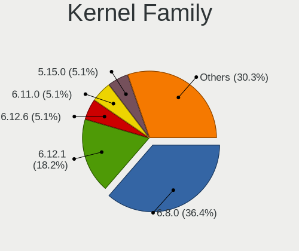
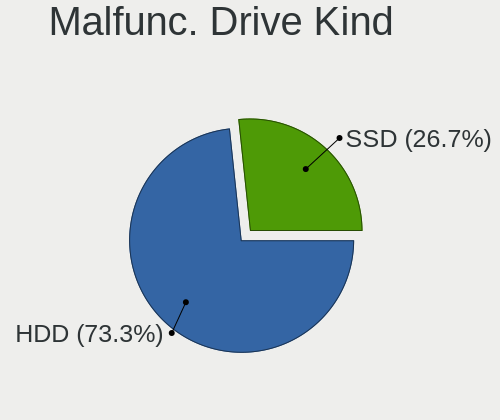
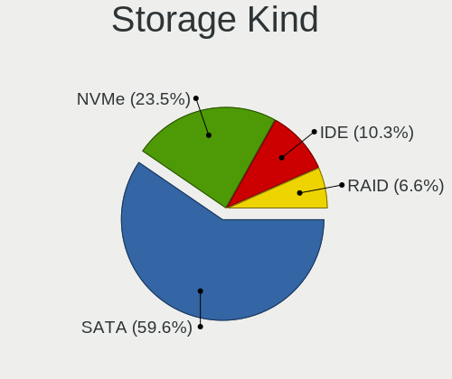
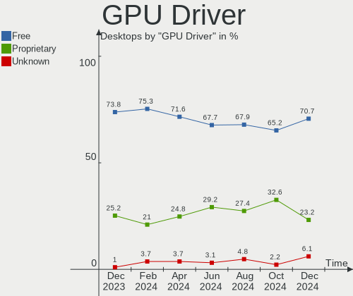
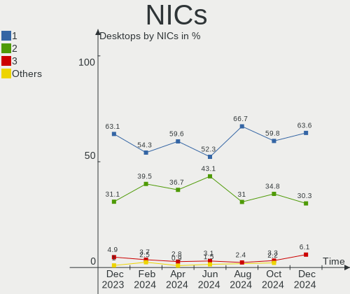
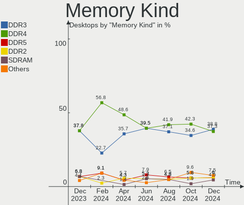
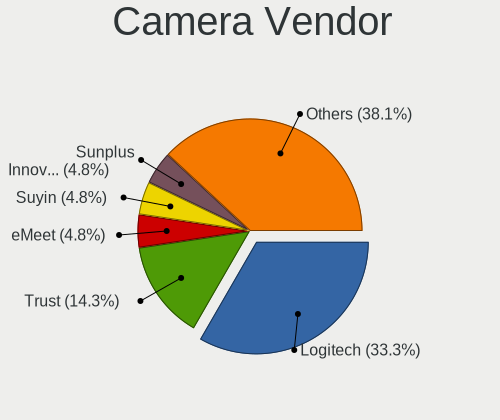

Linux in Italy - Hardware Trends (Desktops)
-------------------------------------------

A project to identify most popular hardware characteristics and track their change
over time based on data collected by Linux users at https://Linux-Hardware.org.

Anyone can contribute to this report by the [hw-probe](https://github.com/linuxhw/hw-probe) tool:

    sudo -E hw-probe -all -upload

Period: May, 2023.

Contents
--------

* [ System ](#system)
  - [ OS                       ](#os)
  - [ OS Family                ](#os-family)
  - [ Kernel                   ](#kernel)
  - [ Kernel Family            ](#kernel-family)
  - [ Kernel Major Ver.        ](#kernel-major-ver)
  - [ Arch                     ](#arch)
  - [ DE                       ](#de)
  - [ Display Server           ](#display-server)
  - [ Display Manager          ](#display-manager)
  - [ OS Lang                  ](#os-lang)
  - [ Boot Mode                ](#boot-mode)
  - [ Filesystem               ](#filesystem)
  - [ Part. scheme             ](#part-scheme)
  - [ Dual Boot with Linux/BSD ](#dual-boot-with-linuxbsd)
  - [ Dual Boot (Win)          ](#dual-boot-win)

* [ Board ](#board)
  - [ Vendor                   ](#vendor)
  - [ Model                    ](#model)
  - [ Model Family             ](#model-family)
  - [ MFG Year                 ](#mfg-year)
  - [ Form Factor              ](#form-factor)
  - [ Secure Boot              ](#secure-boot)
  - [ Coreboot                 ](#coreboot)
  - [ RAM Size                 ](#ram-size)
  - [ RAM Used                 ](#ram-used)
  - [ Total Drives             ](#total-drives)
  - [ Has CD-ROM               ](#has-cd-rom)
  - [ Has Ethernet             ](#has-ethernet)
  - [ Has WiFi                 ](#has-wifi)
  - [ Has Bluetooth            ](#has-bluetooth)

* [ Location ](#location)
  - [ Country                  ](#country)
  - [ City                     ](#city)

* [ Drives ](#drives)
  - [ Drive Vendor             ](#drive-vendor)
  - [ Drive Model              ](#drive-model)
  - [ HDD Vendor               ](#hdd-vendor)
  - [ SSD Vendor               ](#ssd-vendor)
  - [ Drive Kind               ](#drive-kind)
  - [ Drive Connector          ](#drive-connector)
  - [ Drive Size               ](#drive-size)
  - [ Space Total              ](#space-total)
  - [ Space Used               ](#space-used)
  - [ Malfunc. Drives          ](#malfunc-drives)
  - [ Malfunc. Drive Vendor    ](#malfunc-drive-vendor)
  - [ Malfunc. HDD Vendor      ](#malfunc-hdd-vendor)
  - [ Malfunc. Drive Kind      ](#malfunc-drive-kind)
  - [ Failed Drives            ](#failed-drives)
  - [ Failed Drive Vendor      ](#failed-drive-vendor)
  - [ Drive Status             ](#drive-status)

* [ Storage controller ](#storage-controller)
  - [ Storage Vendor           ](#storage-vendor)
  - [ Storage Model            ](#storage-model)
  - [ Storage Kind             ](#storage-kind)

* [ Processor ](#processor)
  - [ CPU Vendor               ](#cpu-vendor)
  - [ CPU Model                ](#cpu-model)
  - [ CPU Model Family         ](#cpu-model-family)
  - [ CPU Cores                ](#cpu-cores)
  - [ CPU Sockets              ](#cpu-sockets)
  - [ CPU Threads              ](#cpu-threads)
  - [ CPU Op-Modes             ](#cpu-op-modes)
  - [ CPU Microcode            ](#cpu-microcode)
  - [ CPU Microarch            ](#cpu-microarch)

* [ Graphics ](#graphics)
  - [ GPU Vendor               ](#gpu-vendor)
  - [ GPU Model                ](#gpu-model)
  - [ GPU Combo                ](#gpu-combo)
  - [ GPU Driver               ](#gpu-driver)
  - [ GPU Memory               ](#gpu-memory)

* [ Monitor ](#monitor)
  - [ Monitor Vendor           ](#monitor-vendor)
  - [ Monitor Model            ](#monitor-model)
  - [ Monitor Resolution       ](#monitor-resolution)
  - [ Monitor Diagonal         ](#monitor-diagonal)
  - [ Monitor Width            ](#monitor-width)
  - [ Aspect Ratio             ](#aspect-ratio)
  - [ Monitor Area             ](#monitor-area)
  - [ Pixel Density            ](#pixel-density)
  - [ Multiple Monitors        ](#multiple-monitors)

* [ Network ](#network)
  - [ Net Controller Vendor    ](#net-controller-vendor)
  - [ Net Controller Model     ](#net-controller-model)
  - [ Wireless Vendor          ](#wireless-vendor)
  - [ Wireless Model           ](#wireless-model)
  - [ Ethernet Vendor          ](#ethernet-vendor)
  - [ Ethernet Model           ](#ethernet-model)
  - [ Net Controller Kind      ](#net-controller-kind)
  - [ Used Controller          ](#used-controller)
  - [ NICs                     ](#nics)
  - [ IPv6                     ](#ipv6)

* [ Bluetooth ](#bluetooth)
  - [ Bluetooth Vendor         ](#bluetooth-vendor)
  - [ Bluetooth Model          ](#bluetooth-model)

* [ Sound ](#sound)
  - [ Sound Vendor             ](#sound-vendor)
  - [ Sound Model              ](#sound-model)

* [ Memory ](#memory)
  - [ Memory Vendor            ](#memory-vendor)
  - [ Memory Model             ](#memory-model)
  - [ Memory Kind              ](#memory-kind)
  - [ Memory Form Factor       ](#memory-form-factor)
  - [ Memory Size              ](#memory-size)
  - [ Memory Speed             ](#memory-speed)

* [ Printers & scanners ](#printers--scanners)
  - [ Printer Vendor           ](#printer-vendor)
  - [ Printer Model            ](#printer-model)
  - [ Scanner Vendor           ](#scanner-vendor)
  - [ Scanner Model            ](#scanner-model)

* [ Camera ](#camera)
  - [ Camera Vendor            ](#camera-vendor)
  - [ Camera Model             ](#camera-model)

* [ Security ](#security)
  - [ Fingerprint Vendor       ](#fingerprint-vendor)
  - [ Fingerprint Model        ](#fingerprint-model)
  - [ Chipcard Vendor          ](#chipcard-vendor)
  - [ Chipcard Model           ](#chipcard-model)

* [ Unsupported ](#unsupported)
  - [ Unsupported Devices      ](#unsupported-devices)
  - [ Unsupported Device Types ](#unsupported-device-types)

System
------

OS
--

Installed operating systems

| Name                 | Desktops | Percent |
|----------------------|----------|---------|
| Linux Mint 21.1      | 12       | 19.67%  |
| Arch Rolling         | 6        | 9.84%   |
| OpenMandriva 23.03   | 4        | 6.56%   |
| Fedora 38            | 4        | 6.56%   |
| Zorin 16             | 3        | 4.92%   |
| Ubuntu 22.04         | 3        | 4.92%   |
| Kubuntu 22.04        | 3        | 4.92%   |
| Manjaro              | 2        | 3.28%   |
| Linux Mint 21        | 2        | 3.28%   |
| Linux Mint 20.3      | 2        | 3.28%   |
| KDE neon 22.04       | 2        | 3.28%   |
| Debian 11            | 2        | 3.28%   |
| ArcoLinux Rolling    | 2        | 3.28%   |
| Zorin 15             | 1        | 1.64%   |
| Xubuntu 22.04        | 1        | 1.64%   |
| Ubuntu 23.04         | 1        | 1.64%   |
| Ubuntu 22.10         | 1        | 1.64%   |
| Ubuntu 20.04         | 1        | 1.64%   |
| ROSA 12.4            | 1        | 1.64%   |
| Rocky Linux 9.2      | 1        | 1.64%   |
| Pop!_OS 22.04        | 1        | 1.64%   |
| OpenMandriva 4.90    | 1        | 1.64%   |
| OpenMandriva 4.3     | 1        | 1.64%   |
| OpenMandriva 4.2     | 1        | 1.64%   |
| NixOS 23.05          | 1        | 1.64%   |
| Garuda Linux Soaring | 1        | 1.64%   |
| Elementary 7         | 1        | 1.64%   |

OS Family
---------

OS without a version

| Name         | Desktops | Percent |
|--------------|----------|---------|
| Linux Mint   | 16       | 26.23%  |
| OpenMandriva | 7        | 11.48%  |
| Ubuntu       | 6        | 9.84%   |
| Arch         | 6        | 9.84%   |
| Zorin        | 4        | 6.56%   |
| Fedora       | 4        | 6.56%   |
| Kubuntu      | 3        | 4.92%   |
| Manjaro      | 2        | 3.28%   |
| KDE neon     | 2        | 3.28%   |
| Debian       | 2        | 3.28%   |
| ArcoLinux    | 2        | 3.28%   |
| Xubuntu      | 1        | 1.64%   |
| ROSA         | 1        | 1.64%   |
| Rocky Linux  | 1        | 1.64%   |
| Pop!_OS      | 1        | 1.64%   |
| NixOS        | 1        | 1.64%   |
| Garuda Linux | 1        | 1.64%   |
| Elementary   | 1        | 1.64%   |

Kernel
------

Version of the Linux kernel

| Version                           | Desktops | Percent |
|-----------------------------------|----------|---------|
| 5.15.0-72-generic                 | 9        | 14.75%  |
| 5.15.0-71-generic                 | 7        | 11.48%  |
| 6.2.6-desktop-1omv2390            | 4        | 6.56%   |
| 5.19.0-41-generic                 | 3        | 4.92%   |
| 6.3.2-arch1-1                     | 2        | 3.28%   |
| 5.4.0-148-generic                 | 2        | 3.28%   |
| 5.15.107-2-pve                    | 2        | 3.28%   |
| 5.15.0-56-generic                 | 2        | 3.28%   |
| 6.4.0-0.rc2.23.fc39.ppc64le       | 1        | 1.64%   |
| 6.3.2-zen1-1.1-zen                | 1        | 1.64%   |
| 6.3.2-zen1-1-zen                  | 1        | 1.64%   |
| 6.3.2-060302-generic              | 1        | 1.64%   |
| 6.3.1-arch2-1                     | 1        | 1.64%   |
| 6.3.0-1-MANJARO                   | 1        | 1.64%   |
| 6.2.9-300.fc38.x86_64             | 1        | 1.64%   |
| 6.2.6-76060206-generic            | 1        | 1.64%   |
| 6.2.15-300.fc38.x86_64            | 1        | 1.64%   |
| 6.2.13-zen-1-zen                  | 1        | 1.64%   |
| 6.2.13-arch1-1                    | 1        | 1.64%   |
| 6.2.12-300.fc38.x86_64            | 1        | 1.64%   |
| 6.1.26-1-lts                      | 1        | 1.64%   |
| 6.1.25-1-MANJARO                  | 1        | 1.64%   |
| 6.1.24                            | 1        | 1.64%   |
| 6.1.20-generic-2rosa2021.1-x86_64 | 1        | 1.64%   |
| 5.4.0-94-generic                  | 1        | 1.64%   |
| 5.19.0-42-generic                 | 1        | 1.64%   |
| 5.19.0-40-generic                 | 1        | 1.64%   |
| 5.19.0-38-generic                 | 1        | 1.64%   |
| 5.19.0-29-generic                 | 1        | 1.64%   |
| 5.18.12-desktop-3omv4090          | 1        | 1.64%   |
| 5.18.12-arch1-1                   | 1        | 1.64%   |
| 5.16.13-desktop-1omv4003          | 1        | 1.64%   |
| 5.15.0-522304060810-generic       | 1        | 1.64%   |
| 5.15.0-43-generic                 | 1        | 1.64%   |
| 5.15.0-41-generic                 | 1        | 1.64%   |
| 5.14.0-284.11.1.el9_2.x86_64      | 1        | 1.64%   |
| 5.13.0-40-generic                 | 1        | 1.64%   |
| 5.10.14-desktop-1omv4002          | 1        | 1.64%   |

Kernel Family
-------------

Linux kernel without a distro release

| Version  | Desktops | Percent |
|----------|----------|---------|
| 5.15.0   | 21       | 34.43%  |
| 5.19.0   | 7        | 11.48%  |
| 6.3.2    | 5        | 8.2%    |
| 6.2.6    | 5        | 8.2%    |
| 5.4.0    | 3        | 4.92%   |
| 6.2.13   | 2        | 3.28%   |
| 5.18.12  | 2        | 3.28%   |
| 5.15.107 | 2        | 3.28%   |
| 6.4.0    | 1        | 1.64%   |
| 6.3.1    | 1        | 1.64%   |
| 6.3.0    | 1        | 1.64%   |
| 6.2.9    | 1        | 1.64%   |
| 6.2.15   | 1        | 1.64%   |
| 6.2.12   | 1        | 1.64%   |
| 6.1.26   | 1        | 1.64%   |
| 6.1.25   | 1        | 1.64%   |
| 6.1.24   | 1        | 1.64%   |
| 6.1.20   | 1        | 1.64%   |
| 5.16.13  | 1        | 1.64%   |
| 5.14.0   | 1        | 1.64%   |
| 5.13.0   | 1        | 1.64%   |
| 5.10.14  | 1        | 1.64%   |

Kernel Major Ver.
-----------------

Linux kernel major version

| Version | Desktops | Percent |
|---------|----------|---------|
| 5.15    | 23       | 37.7%   |
| 6.2     | 10       | 16.39%  |
| 6.3     | 7        | 11.48%  |
| 5.19    | 7        | 11.48%  |
| 6.1     | 4        | 6.56%   |
| 5.4     | 3        | 4.92%   |
| 5.18    | 2        | 3.28%   |
| 6.4     | 1        | 1.64%   |
| 5.16    | 1        | 1.64%   |
| 5.14    | 1        | 1.64%   |
| 5.13    | 1        | 1.64%   |
| 5.10    | 1        | 1.64%   |

Arch
----

OS architecture (x86_64, i586, etc.)

| Name    | Desktops | Percent |
|---------|----------|---------|
| x86_64  | 59       | 96.72%  |
| ppc64le | 1        | 1.64%   |
| i686    | 1        | 1.64%   |

DE
--

Desktop Environment

| Name       | Desktops | Percent |
|------------|----------|---------|
| KDE5       | 18       | 29.51%  |
| GNOME      | 16       | 26.23%  |
| X-Cinnamon | 11       | 18.03%  |
| XFCE       | 7        | 11.48%  |
| MATE       | 4        | 6.56%   |
| Unknown    | 3        | 4.92%   |
| Pantheon   | 1        | 1.64%   |
| Hyprland   | 1        | 1.64%   |

Display Server
--------------

X11 or Wayland

| Name    | Desktops | Percent |
|---------|----------|---------|
| X11     | 46       | 75.41%  |
| Wayland | 12       | 19.67%  |
| Unknown | 2        | 3.28%   |
| Tty     | 1        | 1.64%   |

Display Manager
---------------

SDDM, LightDM, etc.

| Name    | Desktops | Percent |
|---------|----------|---------|
| Unknown | 25       | 40.98%  |
| SDDM    | 15       | 24.59%  |
| LightDM | 12       | 19.67%  |
| GDM3    | 6        | 9.84%   |
| GDM     | 3        | 4.92%   |

OS Lang
-------

Language

| Lang    | Desktops | Percent |
|---------|----------|---------|
| it_IT   | 41       | 67.21%  |
| en_US   | 13       | 21.31%  |
| C       | 3        | 4.92%   |
| en_GB   | 2        | 3.28%   |
| Unknown | 2        | 3.28%   |

Boot Mode
---------

EFI or BIOS

| Mode | Desktops | Percent |
|------|----------|---------|
| BIOS | 32       | 52.46%  |
| EFI  | 29       | 47.54%  |

Filesystem
----------

Type of filesystem

| Type    | Desktops | Percent |
|---------|----------|---------|
| Ext4    | 40       | 65.57%  |
| Btrfs   | 8        | 13.11%  |
| Overlay | 6        | 9.84%   |
| Tmpfs   | 5        | 8.2%    |
| Xfs     | 2        | 3.28%   |

Part. scheme
------------

Scheme of partitioning

| Type    | Desktops | Percent |
|---------|----------|---------|
| GPT     | 30       | 49.18%  |
| Unknown | 24       | 39.34%  |
| MBR     | 7        | 11.48%  |

Dual Boot with Linux/BSD
------------------------

Hosting more than one Linux/BSD

| Dual boot | Desktops | Percent |
|-----------|----------|---------|
| No        | 54       | 88.52%  |
| Yes       | 7        | 11.48%  |

Dual Boot (Win)
---------------

Hosting Linux and Windows

| Dual boot | Desktops | Percent |
|-----------|----------|---------|
| No        | 41       | 67.21%  |
| Yes       | 20       | 32.79%  |

Board
-----

Vendor
------

Motherboard manufacturer

| Name                | Desktops | Percent |
|---------------------|----------|---------|
| ASUSTek Computer    | 15       | 24.59%  |
| MSI                 | 8        | 13.11%  |
| ASRock              | 8        | 13.11%  |
| Hewlett-Packard     | 7        | 11.48%  |
| Gigabyte Technology | 7        | 11.48%  |
| Fujitsu             | 3        | 4.92%   |
| Dell                | 3        | 4.92%   |
| Lenovo              | 2        | 3.28%   |
| BESSTAR Tech        | 2        | 3.28%   |
| Acer                | 2        | 3.28%   |
| Unknown             | 2        | 3.28%   |
| Pegatron            | 1        | 1.64%   |
| HPE                 | 1        | 1.64%   |

Model
-----

Motherboard model

| Name                                   | Desktops | Percent |
|----------------------------------------|----------|---------|
| Gigabyte B550 GAMING X V2              | 2        | 3.28%   |
| Fujitsu ESPRIMO Q920                   | 2        | 3.28%   |
| BESSTAR Tech UM350                     | 2        | 3.28%   |
| Unknown                                | 2        | 3.28%   |
| Pegatron Pro 3120 Microtower PC        | 1        | 1.64%   |
| MSI MS-7D98                            | 1        | 1.64%   |
| MSI MS-7D75                            | 1        | 1.64%   |
| MSI MS-7C56                            | 1        | 1.64%   |
| MSI MS-7C37                            | 1        | 1.64%   |
| MSI MS-7B93                            | 1        | 1.64%   |
| MSI MS-7A20                            | 1        | 1.64%   |
| MSI MS-7982                            | 1        | 1.64%   |
| MSI MS-7369                            | 1        | 1.64%   |
| Lenovo ThinkCentre M93p 10AAS1KE00     | 1        | 1.64%   |
| Lenovo IdeaCentre 3 07IMB05 90NB009QIX | 1        | 1.64%   |
| HPE ProLiant MicroServer Gen10 Plus    | 1        | 1.64%   |
| HP OMEN by Desktop PC 880-p1xx         | 1        | 1.64%   |
| HP EliteDesk 800 G1 USDT               | 1        | 1.64%   |
| HP Compaq Pro 4300 SFF PC              | 1        | 1.64%   |
| HP Compaq dc7600 Small Form Factor     | 1        | 1.64%   |
| HP Compaq 6000 Pro MT PC               | 1        | 1.64%   |
| HP 810-311nl                           | 1        | 1.64%   |
| HP 1998                                | 1        | 1.64%   |
| Gigabyte Z87X-OC                       | 1        | 1.64%   |
| Gigabyte Z170X-Gaming 3                | 1        | 1.64%   |
| Gigabyte B450M DS3H                    | 1        | 1.64%   |
| Gigabyte AB350M-DS3H V2                | 1        | 1.64%   |
| Gigabyte A520M DS3H                    | 1        | 1.64%   |
| Fujitsu ESPRIMO P710                   | 1        | 1.64%   |
| Dell Precision WorkStation T7500       | 1        | 1.64%   |
| Dell OptiPlex 7050                     | 1        | 1.64%   |
| Dell OptiPlex 7010                     | 1        | 1.64%   |
| ASUS Z170 PRO GAMING                   | 1        | 1.64%   |
| ASUS TUF Gaming B650-PLUS WIFI         | 1        | 1.64%   |
| ASUS ROG STRIX X299-E GAMING           | 1        | 1.64%   |
| ASUS ROG STRIX B560-G GAMING WIFI      | 1        | 1.64%   |
| ASUS PRIME Z270-A                      | 1        | 1.64%   |
| ASUS PRIME H270-PRO                    | 1        | 1.64%   |
| ASUS PRIME B650-PLUS                   | 1        | 1.64%   |
| ASUS PRIME B350M-A                     | 1        | 1.64%   |

Model Family
------------

Motherboard model prefix

| Name                  | Desktops | Percent |
|-----------------------|----------|---------|
| ASUS PRIME            | 4        | 6.56%   |
| HP Compaq             | 3        | 4.92%   |
| Fujitsu ESPRIMO       | 3        | 4.92%   |
| Gigabyte B550         | 2        | 3.28%   |
| Dell OptiPlex         | 2        | 3.28%   |
| BESSTAR Tech UM350    | 2        | 3.28%   |
| ASUS ROG              | 2        | 3.28%   |
| Unknown               | 2        | 3.28%   |
| Pegatron Pro          | 1        | 1.64%   |
| MSI MS-7D98           | 1        | 1.64%   |
| MSI MS-7D75           | 1        | 1.64%   |
| MSI MS-7C56           | 1        | 1.64%   |
| MSI MS-7C37           | 1        | 1.64%   |
| MSI MS-7B93           | 1        | 1.64%   |
| MSI MS-7A20           | 1        | 1.64%   |
| MSI MS-7982           | 1        | 1.64%   |
| MSI MS-7369           | 1        | 1.64%   |
| Lenovo ThinkCentre    | 1        | 1.64%   |
| Lenovo IdeaCentre     | 1        | 1.64%   |
| HPE ProLiant          | 1        | 1.64%   |
| HP OMEN               | 1        | 1.64%   |
| HP EliteDesk          | 1        | 1.64%   |
| HP 810-311nl          | 1        | 1.64%   |
| HP 1998               | 1        | 1.64%   |
| Gigabyte Z87X-OC      | 1        | 1.64%   |
| Gigabyte Z170X-Gaming | 1        | 1.64%   |
| Gigabyte B450M        | 1        | 1.64%   |
| Gigabyte AB350M-DS3H  | 1        | 1.64%   |
| Gigabyte A520M        | 1        | 1.64%   |
| Dell Precision        | 1        | 1.64%   |
| ASUS Z170             | 1        | 1.64%   |
| ASUS TUF              | 1        | 1.64%   |
| ASUS P9X79            | 1        | 1.64%   |
| ASUS P7P55-M          | 1        | 1.64%   |
| ASUS P5KPL-AM         | 1        | 1.64%   |
| ASUS P5B              | 1        | 1.64%   |
| ASUS M32CD4-K         | 1        | 1.64%   |
| ASUS K200             | 1        | 1.64%   |
| ASUS CROSSHAIR        | 1        | 1.64%   |
| ASRock Z370           | 1        | 1.64%   |

MFG Year
--------

Motherboard manufacture year

| Year    | Desktops | Percent |
|---------|----------|---------|
| 2017    | 8        | 13.11%  |
| 2022    | 7        | 11.48%  |
| 2020    | 6        | 9.84%   |
| 2015    | 5        | 8.2%    |
| 2009    | 5        | 8.2%    |
| 2013    | 4        | 6.56%   |
| 2012    | 4        | 6.56%   |
| 2021    | 3        | 4.92%   |
| 2016    | 3        | 4.92%   |
| 2014    | 3        | 4.92%   |
| 2019    | 2        | 3.28%   |
| 2018    | 2        | 3.28%   |
| 2011    | 2        | 3.28%   |
| 2006    | 2        | 3.28%   |
| 2010    | 1        | 1.64%   |
| 2008    | 1        | 1.64%   |
| 2007    | 1        | 1.64%   |
| 2005    | 1        | 1.64%   |
| Unknown | 1        | 1.64%   |

Form Factor
-----------

Physical design of the computer

| Name    | Desktops | Percent |
|---------|----------|---------|
| Desktop | 61       | 100%    |

Secure Boot
-----------

Enabled or disabled

| State    | Desktops | Percent |
|----------|----------|---------|
| Disabled | 59       | 96.72%  |
| Enabled  | 2        | 3.28%   |

Coreboot
--------

Have coreboot on board

| Used | Desktops | Percent |
|------|----------|---------|
| No   | 61       | 100%    |

RAM Size
--------

Total RAM memory

| Size in GB  | Desktops | Percent |
|-------------|----------|---------|
| 16.01-24.0  | 16       | 26.23%  |
| 4.01-8.0    | 10       | 16.39%  |
| 8.01-16.0   | 10       | 16.39%  |
| 32.01-64.0  | 8        | 13.11%  |
| 3.01-4.0    | 7        | 11.48%  |
| 24.01-32.0  | 4        | 6.56%   |
| 64.01-256.0 | 3        | 4.92%   |
| 2.01-3.0    | 1        | 1.64%   |
| 1.01-2.0    | 1        | 1.64%   |
| 0.51-1.0    | 1        | 1.64%   |

RAM Used
--------

Used RAM memory

| Used GB    | Desktops | Percent |
|------------|----------|---------|
| 1.01-2.0   | 18       | 29.51%  |
| 2.01-3.0   | 15       | 24.59%  |
| 4.01-8.0   | 10       | 16.39%  |
| 3.01-4.0   | 10       | 16.39%  |
| 0.51-1.0   | 5        | 8.2%    |
| 8.01-16.0  | 2        | 3.28%   |
| 16.01-24.0 | 1        | 1.64%   |

Total Drives
------------

Number of drives on board

| Drives | Desktops | Percent |
|--------|----------|---------|
| 1      | 23       | 37.7%   |
| 2      | 16       | 26.23%  |
| 3      | 14       | 22.95%  |
| 4      | 7        | 11.48%  |
| 6      | 1        | 1.64%   |

Has CD-ROM
----------

Has CD-ROM on board

| Presented | Desktops | Percent |
|-----------|----------|---------|
| No        | 33       | 54.1%   |
| Yes       | 28       | 45.9%   |

Has Ethernet
------------

Has Ethernet on board

| Presented | Desktops | Percent |
|-----------|----------|---------|
| Yes       | 60       | 98.36%  |
| No        | 1        | 1.64%   |

Has WiFi
--------

Has WiFi module

| Presented | Desktops | Percent |
|-----------|----------|---------|
| No        | 31       | 50.82%  |
| Yes       | 30       | 49.18%  |

Has Bluetooth
-------------

Has Bluetooth module

| Presented | Desktops | Percent |
|-----------|----------|---------|
| No        | 39       | 63.93%  |
| Yes       | 22       | 36.07%  |

Location
--------

Country
-------

Geographic location (country)

| Country | Desktops | Percent |
|---------|----------|---------|
| Italy   | 61       | 100%    |

City
----

Geographic location (city)

| City                    | Desktops | Percent |
|-------------------------|----------|---------|
| Rome                    | 11       | 18.03%  |
| Milan                   | 4        | 6.56%   |
| Milano                  | 3        | 4.92%   |
| Turin                   | 2        | 3.28%   |
| Palermo                 | 2        | 3.28%   |
| Florence                | 2        | 3.28%   |
| Viareggio               | 1        | 1.64%   |
| Somaglia                | 1        | 1.64%   |
| Sannazzaro de' Burgondi | 1        | 1.64%   |
| Rovereto                | 1        | 1.64%   |
| Rho                     | 1        | 1.64%   |
| Ponteranica             | 1        | 1.64%   |
| Pistoia                 | 1        | 1.64%   |
| Pisa                    | 1        | 1.64%   |
| Montevarchi             | 1        | 1.64%   |
| Montebelluna            | 1        | 1.64%   |
| Messina                 | 1        | 1.64%   |
| Malo                    | 1        | 1.64%   |
| Magenta                 | 1        | 1.64%   |
| Lignano Sabbiadoro      | 1        | 1.64%   |
| Giugliano in Campania   | 1        | 1.64%   |
| Fucecchio               | 1        | 1.64%   |
| Frassinello Monferrato  | 1        | 1.64%   |
| Forlì                  | 1        | 1.64%   |
| Fiesso d'Artico         | 1        | 1.64%   |
| Fiesole                 | 1        | 1.64%   |
| Ferrara                 | 1        | 1.64%   |
| Decimomannu             | 1        | 1.64%   |
| Creazzo                 | 1        | 1.64%   |
| Catania                 | 1        | 1.64%   |
| Casalecchio di Reno     | 1        | 1.64%   |
| Caprino Veronese        | 1        | 1.64%   |
| Campobasso              | 1        | 1.64%   |
| Cagliari                | 1        | 1.64%   |
| Busto Arsizio           | 1        | 1.64%   |
| Bulgarograsso           | 1        | 1.64%   |
| Bracciano               | 1        | 1.64%   |
| Bergamo                 | 1        | 1.64%   |
| Bari                    | 1        | 1.64%   |
| Aviano                  | 1        | 1.64%   |

Drives
------

Drive Vendor
------------

Hard drive vendors

| Vendor                         | Desktops | Drives | Percent |
|--------------------------------|----------|--------|---------|
| Seagate                        | 22       | 29     | 20%     |
| Samsung Electronics            | 19       | 31     | 17.27%  |
| WDC                            | 12       | 14     | 10.91%  |
| Kingston                       | 9        | 10     | 8.18%   |
| Toshiba                        | 6        | 6      | 5.45%   |
| Lexar                          | 5        | 5      | 4.55%   |
| SPCC                           | 3        | 3      | 2.73%   |
| Crucial                        | 3        | 4      | 2.73%   |
| SK hynix                       | 2        | 2      | 1.82%   |
| SanDisk                        | 2        | 2      | 1.82%   |
| Realtek                        | 2        | 2      | 1.82%   |
| PNY                            | 2        | 2      | 1.82%   |
| Maxtor                         | 2        | 2      | 1.82%   |
| Intenso                        | 2        | 2      | 1.82%   |
| China                          | 2        | 2      | 1.82%   |
| Unknown                        | 2        | 2      | 1.82%   |
| Unknown                        | 1        | 1      | 0.91%   |
| Solid State Storage Technology | 1        | 1      | 0.91%   |
| Shenzhen Longsys Electronics   | 1        | 1      | 0.91%   |
| ShanDianZhe                    | 1        | 1      | 0.91%   |
| QUANTUM                        | 1        | 1      | 0.91%   |
| Phison Electronics             | 1        | 1      | 0.91%   |
| OCZ                            | 1        | 1      | 0.91%   |
| Micron/Crucial Technology      | 1        | 1      | 0.91%   |
| Micron Technology              | 1        | 1      | 0.91%   |
| Intel                          | 1        | 1      | 0.91%   |
| Hitachi                        | 1        | 1      | 0.91%   |
| HGST                           | 1        | 1      | 0.91%   |
| Hewlett-Packard                | 1        | 1      | 0.91%   |
| Fanxiang                       | 1        | 1      | 0.91%   |
| A-DATA Technology              | 1        | 1      | 0.91%   |

Drive Model
-----------

Hard drive models

| Model                                               | Desktops | Percent |
|-----------------------------------------------------|----------|---------|
| Samsung SSD 860 EVO 500GB                           | 5        | 4%      |
| Kingston SA400S37240G 240GB SSD                     | 5        | 4%      |
| Samsung SSD 870 QVO 1TB                             | 3        | 2.4%    |
| Samsung SSD 860 QVO 1TB                             | 3        | 2.4%    |
| Samsung NVMe SSD Controller SM981/PM981/PM983 256GB | 3        | 2.4%    |
| Seagate ST31000528AS 1TB                            | 2        | 1.6%    |
| Seagate Expansion 1TB                               | 2        | 1.6%    |
| Samsung SSD 850 PRO 256GB                           | 2        | 1.6%    |
| Realtek RTL9210B-CG 1TB                             | 2        | 1.6%    |
| Lexar SSD NM610PRO 1TB                              | 2        | 1.6%    |
| Unknown                                             | 2        | 1.6%    |
| WDC WD6400AAKS-22A7B2 640GB                         | 1        | 0.8%    |
| WDC WD5000AAKX-60U6AA0 500GB                        | 1        | 0.8%    |
| WDC WD5000AAKX-22ERMA0 500GB                        | 1        | 0.8%    |
| WDC WD5000AAKS-7                                    | 1        | 0.8%    |
| WDC WD40EZRZ-00WN9B0 4TB                            | 1        | 0.8%    |
| WDC WD400BB-00DEA0 40GB                             | 1        | 0.8%    |
| WDC WD3200BPVT-00JJ5T0 320GB                        | 1        | 0.8%    |
| WDC WD3200AAJS-60Z0A0 320GB                         | 1        | 0.8%    |
| WDC WD3200AAJS-56M0A0 320GB                         | 1        | 0.8%    |
| WDC WD2000BB-00RDA0 200GB                           | 1        | 0.8%    |
| WDC WD1500HLFS-01G6U0 150GB                         | 1        | 0.8%    |
| WDC WD10EZEX-75WN4A0 1TB                            | 1        | 0.8%    |
| WDC WD10EZEX-60WN4A0 1TB                            | 1        | 0.8%    |
| Unknown SD/MMC/MS PRO 64GB                          | 1        | 0.8%    |
| Toshiba MQ01ABB200 2TB                              | 1        | 0.8%    |
| Toshiba MK1646GSX 160GB                             | 1        | 0.8%    |
| Toshiba KXG50ZNV256G 256GB                          | 1        | 0.8%    |
| Toshiba HDWD110 1TB                                 | 1        | 0.8%    |
| Toshiba DT01ACA200 2TB                              | 1        | 0.8%    |
| Toshiba DT01ACA100 1TB                              | 1        | 0.8%    |
| SPCC Solid State Disk 256GB                         | 1        | 0.8%    |
| SPCC Solid State Disk 1TB                           | 1        | 0.8%    |
| SPCC Solid State Disk 1024GB                        | 1        | 0.8%    |
| Solid State Storage NVMe CLR-8W512 512GB            | 1        | 0.8%    |
| SK hynix PC401 NVMe 256GB                           | 1        | 0.8%    |
| SK hynix HFS256G39TND-N210A 256GB SSD               | 1        | 0.8%    |
| Shenzhen Longsys Lexar SSD NM610PRO 2TB             | 1        | 0.8%    |
| ShanDianZhe 512G                                    | 1        | 0.8%    |
| Seagate ST8000VN004-2M2101 8TB                      | 1        | 0.8%    |

HDD Vendor
----------

Hard disk drive vendors

| Vendor          | Desktops | Drives | Percent |
|-----------------|----------|--------|---------|
| Seagate         | 21       | 28     | 46.67%  |
| WDC             | 12       | 14     | 26.67%  |
| Toshiba         | 5        | 5      | 11.11%  |
| Maxtor          | 2        | 2      | 4.44%   |
| Unknown         | 1        | 1      | 2.22%   |
| QUANTUM         | 1        | 1      | 2.22%   |
| Hitachi         | 1        | 1      | 2.22%   |
| HGST            | 1        | 1      | 2.22%   |
| Hewlett-Packard | 1        | 1      | 2.22%   |

SSD Vendor
----------

Solid state drive vendors

| Vendor              | Desktops | Drives | Percent |
|---------------------|----------|--------|---------|
| Samsung Electronics | 15       | 22     | 36.59%  |
| Kingston            | 7        | 8      | 17.07%  |
| SPCC                | 3        | 3      | 7.32%   |
| Crucial             | 3        | 4      | 7.32%   |
| Lexar               | 2        | 2      | 4.88%   |
| Intenso             | 2        | 2      | 4.88%   |
| China               | 2        | 2      | 4.88%   |
| Unknown             | 2        | 2      | 4.88%   |
| SK hynix            | 1        | 1      | 2.44%   |
| PNY                 | 1        | 1      | 2.44%   |
| OCZ                 | 1        | 1      | 2.44%   |
| Fanxiang            | 1        | 1      | 2.44%   |
| A-DATA Technology   | 1        | 1      | 2.44%   |

Drive Kind
----------

HDD or SSD

| Kind    | Desktops | Drives | Percent |
|---------|----------|--------|---------|
| HDD     | 37       | 54     | 40.22%  |
| SSD     | 36       | 50     | 39.13%  |
| NVMe    | 18       | 28     | 19.57%  |
| Unknown | 1        | 1      | 1.09%   |

Drive Connector
---------------

SATA, SAS, NVMe, etc.

| Type | Desktops | Drives | Percent |
|------|----------|--------|---------|
| SATA | 56       | 102    | 70.89%  |
| NVMe | 18       | 26     | 22.78%  |
| SAS  | 5        | 5      | 6.33%   |

Drive Size
----------

Size of hard drive

| Size in TB | Desktops | Drives | Percent |
|------------|----------|--------|---------|
| 0.01-0.5   | 46       | 56     | 56.1%   |
| 0.51-1.0   | 24       | 31     | 29.27%  |
| 1.01-2.0   | 8        | 9      | 9.76%   |
| 3.01-4.0   | 2        | 2      | 2.44%   |
| 10.01-20.0 | 1        | 5      | 1.22%   |
| 4.01-10.0  | 1        | 1      | 1.22%   |

Space Total
-----------

Amount of disk space available on the file system

| Size in GB     | Desktops | Percent |
|----------------|----------|---------|
| 101-250        | 15       | 24.59%  |
| 251-500        | 10       | 16.39%  |
| 1001-2000      | 9        | 14.75%  |
| 501-1000       | 7        | 11.48%  |
| 2001-3000      | 5        | 8.2%    |
| 1-20           | 5        | 8.2%    |
| More than 3000 | 4        | 6.56%   |
| 21-50          | 4        | 6.56%   |
| 51-100         | 1        | 1.64%   |
| Unknown        | 1        | 1.64%   |

Space Used
----------

Amount of used disk space

| Used GB        | Desktops | Percent |
|----------------|----------|---------|
| 21-50          | 12       | 19.67%  |
| 1-20           | 12       | 19.67%  |
| 51-100         | 10       | 16.39%  |
| 101-250        | 7        | 11.48%  |
| 1001-2000      | 7        | 11.48%  |
| 251-500        | 5        | 8.2%    |
| 501-1000       | 4        | 6.56%   |
| 2001-3000      | 2        | 3.28%   |
| More than 3000 | 1        | 1.64%   |
| Unknown        | 1        | 1.64%   |

Malfunc. Drives
---------------

Drive models with a malfunction

| Model                           | Desktops | Drives | Percent |
|---------------------------------|----------|--------|---------|
| WDC WD40EZRZ-00WN9B0 4TB        | 1        | 1      | 12.5%   |
| WDC WD3200BPVT-00JJ5T0 320GB    | 1        | 1      | 12.5%   |
| Seagate ST3160215SCE 160GB      | 1        | 1      | 12.5%   |
| QUANTUM FIREBALLlct15 20 20GB   | 1        | 1      | 12.5%   |
| Maxtor STM3250310AS 250GB       | 1        | 1      | 12.5%   |
| Kingston SA400S37240G 240GB SSD | 1        | 1      | 12.5%   |
| Crucial CT275MX300SSD1 275GB    | 1        | 1      | 12.5%   |
| Crucial CT1050MX300SSD1 1TB     | 1        | 1      | 12.5%   |

Malfunc. Drive Vendor
---------------------

Vendors of faulty drives

| Vendor   | Desktops | Drives | Percent |
|----------|----------|--------|---------|
| WDC      | 2        | 2      | 25%     |
| Crucial  | 2        | 2      | 25%     |
| Seagate  | 1        | 1      | 12.5%   |
| QUANTUM  | 1        | 1      | 12.5%   |
| Maxtor   | 1        | 1      | 12.5%   |
| Kingston | 1        | 1      | 12.5%   |

Malfunc. HDD Vendor
-------------------

Vendors of faulty HDD drives

| Vendor  | Desktops | Drives | Percent |
|---------|----------|--------|---------|
| WDC     | 2        | 2      | 40%     |
| Seagate | 1        | 1      | 20%     |
| QUANTUM | 1        | 1      | 20%     |
| Maxtor  | 1        | 1      | 20%     |

Malfunc. Drive Kind
-------------------

Kinds of faulty drives

| Kind | Desktops | Drives | Percent |
|------|----------|--------|---------|
| HDD  | 5        | 5      | 62.5%   |
| SSD  | 3        | 3      | 37.5%   |

Failed Drives
-------------

Failed drive models

Zero info for selected period =(

Failed Drive Vendor
-------------------

Failed drive vendors

Zero info for selected period =(

Drive Status
------------

Number of failed and malfunc. drives

| Status   | Desktops | Drives | Percent |
|----------|----------|--------|---------|
| Detected | 33       | 62     | 49.25%  |
| Works    | 27       | 63     | 40.3%   |
| Malfunc  | 7        | 8      | 10.45%  |

Storage controller
------------------

Storage Vendor
--------------

Storage controller vendors

| Vendor                         | Desktops | Percent |
|--------------------------------|----------|---------|
| Intel                          | 41       | 43.62%  |
| AMD                            | 18       | 19.15%  |
| Samsung Electronics            | 6        | 6.38%   |
| ASMedia Technology             | 5        | 5.32%   |
| VIA Technologies               | 2        | 2.13%   |
| Shenzhen Longsys Electronics   | 2        | 2.13%   |
| SanDisk                        | 2        | 2.13%   |
| Phison Electronics             | 2        | 2.13%   |
| MAXIO Technology (Hangzhou)    | 2        | 2.13%   |
| Marvell Technology Group       | 2        | 2.13%   |
| Kingston Technology Company    | 2        | 2.13%   |
| Toshiba America Info Systems   | 1        | 1.06%   |
| Solid State Storage Technology | 1        | 1.06%   |
| SK hynix                       | 1        | 1.06%   |
| Seagate Technology             | 1        | 1.06%   |
| Nvidia                         | 1        | 1.06%   |
| Micron/Crucial Technology      | 1        | 1.06%   |
| Micron Technology              | 1        | 1.06%   |
| LSI Logic / Symbios Logic      | 1        | 1.06%   |
| JMicron Technology             | 1        | 1.06%   |
| Adaptec                        | 1        | 1.06%   |

Storage Model
-------------

Storage controller models

| Model                                                                          | Desktops | Percent |
|--------------------------------------------------------------------------------|----------|---------|
| AMD FCH SATA Controller [AHCI mode]                                            | 11       | 10.09%  |
| Intel 8 Series/C220 Series Chipset Family 6-port SATA Controller 1 [AHCI mode] | 8        | 7.34%   |
| Intel Q170/Q150/B150/H170/H110/Z170/CM236 Chipset SATA Controller [AHCI Mode]  | 5        | 4.59%   |
| ASMedia ASM1062 Serial ATA Controller                                          | 5        | 4.59%   |
| Samsung NVMe SSD Controller SM981/PM981/PM983                                  | 4        | 3.67%   |
| Intel SATA Controller [RAID mode]                                              | 4        | 3.67%   |
| AMD 500 Series Chipset SATA Controller                                         | 4        | 3.67%   |
| Intel NM10/ICH7 Family SATA Controller [IDE mode]                              | 3        | 2.75%   |
| Intel 82801G (ICH7 Family) IDE Controller                                      | 3        | 2.75%   |
| AMD 300 Series Chipset SATA Controller                                         | 3        | 2.75%   |
| Shenzhen Longsys Electronics Non-Volatile memory controller                    | 2        | 1.83%   |
| MAXIO (Hangzhou) NVMe SSD Controller MAP1202                                   | 2        | 1.83%   |
| Kingston Company Company Non-Volatile memory controller                        | 2        | 1.83%   |
| Intel 82801JI (ICH10 Family) 4 port SATA IDE Controller #1                     | 2        | 1.83%   |
| Intel 7 Series/C210 Series Chipset Family 6-port SATA Controller [AHCI mode]   | 2        | 1.83%   |
| Intel 6 Series/C200 Series Chipset Family 6 port Desktop SATA AHCI Controller  | 2        | 1.83%   |
| Intel 400 Series Chipset Family SATA AHCI Controller                           | 2        | 1.83%   |
| Intel 200 Series PCH SATA controller [AHCI mode]                               | 2        | 1.83%   |
| AMD SB7x0/SB8x0/SB9x0 IDE Controller                                           | 2        | 1.83%   |
| VIA VT82C586A/B/VT82C686/A/B/VT823x/A/C PIPC Bus Master IDE                    | 1        | 0.92%   |
| VIA VT8237A SATA 2-Port Controller                                             | 1        | 0.92%   |
| VIA VT6415 PATA IDE Host Controller                                            | 1        | 0.92%   |
| Toshiba America Info Systems XG5 NVMe SSD Controller                           | 1        | 0.92%   |
| Solid State Storage Non-Volatile memory controller                             | 1        | 0.92%   |
| SK hynix PC401 NVMe Solid State Drive 256GB                                    | 1        | 0.92%   |
| Seagate FireCuda 530 SSD                                                       | 1        | 0.92%   |
| SanDisk WD Blue SN570 NVMe SSD 1TB                                             | 1        | 0.92%   |
| SanDisk Non-Volatile memory controller                                         | 1        | 0.92%   |
| Samsung NVMe SSD Controller SM961/PM961/SM963                                  | 1        | 0.92%   |
| Samsung NVMe SSD Controller 980                                                | 1        | 0.92%   |
| Samsung Electronics Non-Volatile memory controller                             | 1        | 0.92%   |
| Phison E16 PCIe4 NVMe Controller                                               | 1        | 0.92%   |
| Phison E12 NVMe Controller                                                     | 1        | 0.92%   |
| Nvidia MCP65 SATA Controller                                                   | 1        | 0.92%   |
| Nvidia MCP65 IDE                                                               | 1        | 0.92%   |
| Micron/Crucial P2 NVMe PCIe SSD                                                | 1        | 0.92%   |
| Micron NVMe Storage Controller                                                 | 1        | 0.92%   |
| Marvell Group 88SE9235 PCIe 2.0 x2 4-port SATA 6 Gb/s Controller               | 1        | 0.92%   |
| Marvell Group 88SE912x SATA 6Gb/s Controller [IDE mode]                        | 1        | 0.92%   |
| LSI Logic / Symbios Logic SAS1068E PCI-Express Fusion-MPT SAS                  | 1        | 0.92%   |

Storage Kind
------------

Kind of storage controller (IDE, SATA, NVMe, SAS, ...)

| Kind | Desktops | Percent |
|------|----------|---------|
| SATA | 48       | 57.14%  |
| NVMe | 18       | 21.43%  |
| IDE  | 11       | 13.1%   |
| RAID | 5        | 5.95%   |
| SCSI | 2        | 2.38%   |

Processor
---------

CPU Vendor
----------

Processor vendors

| Vendor                   | Desktops | Percent |
|--------------------------|----------|---------|
| Intel                    | 41       | 67.21%  |
| AMD                      | 19       | 31.15%  |
| PowerNV C1P9S01 REV 1.01 | 1        | 1.64%   |

CPU Model
---------

Processor models

| Model                                              | Desktops | Percent |
|----------------------------------------------------|----------|---------|
| AMD Ryzen 9 7900X 12-Core Processor                | 3        | 4.92%   |
| Intel Pentium 4 CPU 3.00GHz                        | 2        | 3.28%   |
| Intel Core i7-7700 CPU @ 3.60GHz                   | 2        | 3.28%   |
| Intel Core i7-6700K CPU @ 4.00GHz                  | 2        | 3.28%   |
| Intel Core i7-4790 CPU @ 3.60GHz                   | 2        | 3.28%   |
| Intel Core i5-4590T CPU @ 2.00GHz                  | 2        | 3.28%   |
| Intel Core i5-3470 CPU @ 3.20GHz                   | 2        | 3.28%   |
| AMD Ryzen 9 3900X 12-Core Processor                | 2        | 3.28%   |
| AMD Ryzen 7 5800X 8-Core Processor                 | 2        | 3.28%   |
| AMD Ryzen 5 3600 6-Core Processor                  | 2        | 3.28%   |
| AMD Ryzen 5 3550H with Radeon Vega Mobile Gfx      | 2        | 3.28%   |
| PowerNV C1P9S01 REV 1.01 POWER9, altivec supported | 1        | 1.64%   |
| Intel Xeon E-2244G CPU @ 3.80GHz                   | 1        | 1.64%   |
| Intel Xeon CPU X5550 @ 2.67GHz                     | 1        | 1.64%   |
| Intel Pentium Dual-Core CPU E5700 @ 3.00GHz        | 1        | 1.64%   |
| Intel Pentium Dual-Core CPU E5500 @ 2.80GHz        | 1        | 1.64%   |
| Intel Pentium Dual-Core CPU E5300 @ 2.60GHz        | 1        | 1.64%   |
| Intel Pentium CPU G2030 @ 3.00GHz                  | 1        | 1.64%   |
| Intel Core i9-10940X CPU @ 3.30GHz                 | 1        | 1.64%   |
| Intel Core i7-8700K CPU @ 3.70GHz                  | 1        | 1.64%   |
| Intel Core i7-7700K CPU @ 4.20GHz                  | 1        | 1.64%   |
| Intel Core i7-5820K CPU @ 3.30GHz                  | 1        | 1.64%   |
| Intel Core i7-3820 CPU @ 3.60GHz                   | 1        | 1.64%   |
| Intel Core i7 CPU 860 @ 2.80GHz                    | 1        | 1.64%   |
| Intel Core i5-8600K CPU @ 3.60GHz                  | 1        | 1.64%   |
| Intel Core i5-7500 CPU @ 3.40GHz                   | 1        | 1.64%   |
| Intel Core i5-7400 CPU @ 3.00GHz                   | 1        | 1.64%   |
| Intel Core i5-6500T CPU @ 2.50GHz                  | 1        | 1.64%   |
| Intel Core i5-4690K CPU @ 3.50GHz                  | 1        | 1.64%   |
| Intel Core i5-4590 CPU @ 3.30GHz                   | 1        | 1.64%   |
| Intel Core i5-4570T CPU @ 2.90GHz                  | 1        | 1.64%   |
| Intel Core i5-4570S CPU @ 2.90GHz                  | 1        | 1.64%   |
| Intel Core i5-10400 CPU @ 2.90GHz                  | 1        | 1.64%   |
| Intel Core i3-3240 CPU @ 3.40GHz                   | 1        | 1.64%   |
| Intel Core i3-10100 CPU @ 3.60GHz                  | 1        | 1.64%   |
| Intel Core 2 Quad CPU Q6600 @ 2.40GHz              | 1        | 1.64%   |
| Intel Core 2 Duo CPU E8500 @ 3.16GHz               | 1        | 1.64%   |
| Intel Core 2 CPU 6400 @ 2.13GHz                    | 1        | 1.64%   |
| Intel Celeron CPU J3455 @ 1.50GHz                  | 1        | 1.64%   |
| Intel 13th Gen Core i5-13400F                      | 1        | 1.64%   |

CPU Model Family
----------------

Processor model prefix

| Model                   | Desktops | Percent |
|-------------------------|----------|---------|
| Intel Core i5           | 13       | 21.31%  |
| Intel Core i7           | 11       | 18.03%  |
| AMD Ryzen 5             | 6        | 9.84%   |
| AMD Ryzen 9             | 5        | 8.2%    |
| AMD Ryzen 7             | 4        | 6.56%   |
| Other                   | 3        | 4.92%   |
| Intel Pentium Dual-Core | 3        | 4.92%   |
| Intel Xeon              | 2        | 3.28%   |
| Intel Pentium 4         | 2        | 3.28%   |
| Intel Core i3           | 2        | 3.28%   |
| AMD FX                  | 2        | 3.28%   |
| Intel Pentium           | 1        | 1.64%   |
| Intel Core i9           | 1        | 1.64%   |
| Intel Core 2 Quad       | 1        | 1.64%   |
| Intel Core 2 Duo        | 1        | 1.64%   |
| Intel Core 2            | 1        | 1.64%   |
| Intel Celeron           | 1        | 1.64%   |
| AMD Ryzen 3             | 1        | 1.64%   |
| AMD Athlon 64 X2        | 1        | 1.64%   |

CPU Cores
---------

Number of processor cores

| Number | Desktops | Percent |
|--------|----------|---------|
| 4      | 30       | 49.18%  |
| 2      | 10       | 16.39%  |
| 6      | 7        | 11.48%  |
| 12     | 5        | 8.2%    |
| 8      | 4        | 6.56%   |
| 1      | 3        | 4.92%   |
| 14     | 1        | 1.64%   |
| 10     | 1        | 1.64%   |

CPU Sockets
-----------

Number of sockets

| Number | Desktops | Percent |
|--------|----------|---------|
| 1      | 61       | 100%    |

CPU Threads
-----------

Threads per core (Hyper-Threading)

| Number | Desktops | Percent |
|--------|----------|---------|
| 2      | 36       | 59.02%  |
| 1      | 23       | 37.7%   |
| 8      | 1        | 1.64%   |
| 4      | 1        | 1.64%   |

CPU Op-Modes
------------

CPU Operation Modes (32-bit, 64-bit)

| Op mode        | Desktops | Percent |
|----------------|----------|---------|
| 32-bit, 64-bit | 60       | 98.36%  |
| Unknown        | 1        | 1.64%   |

CPU Microcode
-------------

Microcode number

| Number     | Desktops | Percent |
|------------|----------|---------|
| Unknown    | 26       | 42.62%  |
| 0x306c3    | 4        | 6.56%   |
| 0x306a9    | 4        | 6.56%   |
| 0x906e9    | 3        | 4.92%   |
| 0x0a601203 | 3        | 4.92%   |
| 0x08108109 | 3        | 4.92%   |
| 0x506e3    | 2        | 3.28%   |
| 0x1067a    | 2        | 3.28%   |
| 0x0a20120a | 2        | 3.28%   |
| 0x08701030 | 2        | 3.28%   |
| 0xf49      | 1        | 1.64%   |
| 0xb06f2    | 1        | 1.64%   |
| 0xa0653    | 1        | 1.64%   |
| 0x906ea    | 1        | 1.64%   |
| 0x6f2      | 1        | 1.64%   |
| 0x206d7    | 1        | 1.64%   |
| 0x106e5    | 1        | 1.64%   |
| 0x0a50000d | 1        | 1.64%   |
| 0x08701021 | 1        | 1.64%   |
| 0x08001138 | 1        | 1.64%   |

CPU Microarch
-------------

Microarchitecture

| Name        | Desktops | Percent |
|-------------|----------|---------|
| Haswell     | 9        | 14.75%  |
| KabyLake    | 8        | 13.11%  |
| Unknown     | 5        | 8.2%    |
| Zen 2       | 4        | 6.56%   |
| Skylake     | 4        | 6.56%   |
| Penryn      | 4        | 6.56%   |
| IvyBridge   | 4        | 6.56%   |
| Zen+        | 3        | 4.92%   |
| Zen 3       | 3        | 4.92%   |
| Zen         | 3        | 4.92%   |
| Piledriver  | 2        | 3.28%   |
| NetBurst    | 2        | 3.28%   |
| Nehalem     | 2        | 3.28%   |
| Core        | 2        | 3.28%   |
| CometLake   | 2        | 3.28%   |
| SandyBridge | 1        | 1.64%   |
| K8 Hammer   | 1        | 1.64%   |
| Icelake     | 1        | 1.64%   |
| Goldmont    | 1        | 1.64%   |

Graphics
--------

GPU Vendor
----------

Vendors of graphics cards

| Vendor            | Desktops | Percent |
|-------------------|----------|---------|
| Nvidia            | 25       | 38.46%  |
| AMD               | 21       | 32.31%  |
| Intel             | 18       | 27.69%  |
| ASPEED Technology | 1        | 1.54%   |

GPU Model
---------

Graphics card models

| Model                                                                       | Desktops | Percent |
|-----------------------------------------------------------------------------|----------|---------|
| Intel Xeon E3-1200 v3/4th Gen Core Processor Integrated Graphics Controller | 6        | 8.82%   |
| Nvidia GK208B [GeForce GT 710]                                              | 3        | 4.41%   |
| Intel Xeon E3-1200 v2/3rd Gen Core processor Graphics Controller            | 3        | 4.41%   |
| Intel HD Graphics 630                                                       | 3        | 4.41%   |
| AMD Raphael                                                                 | 3        | 4.41%   |
| AMD Picasso/Raven 2 [Radeon Vega Series / Radeon Vega Mobile Series]        | 3        | 4.41%   |
| AMD Navi 10 [Radeon RX 5600 OEM/5600 XT / 5700/5700 XT]                     | 3        | 4.41%   |
| AMD Ellesmere [Radeon RX 470/480/570/570X/580/580X/590]                     | 3        | 4.41%   |
| Nvidia GP107 [GeForce GTX 1050]                                             | 2        | 2.94%   |
| Nvidia GP106 [GeForce GTX 1060 6GB]                                         | 2        | 2.94%   |
| Intel HD Graphics 530                                                       | 2        | 2.94%   |
| AMD Navi 22 [Radeon RX 6700/6700 XT/6750 XT / 6800M/6850M XT]               | 2        | 2.94%   |
| Nvidia TU116 [GeForce GTX 1660 SUPER]                                       | 1        | 1.47%   |
| Nvidia TU116 [GeForce GTX 1650 SUPER]                                       | 1        | 1.47%   |
| Nvidia TU106 [GeForce RTX 2070]                                             | 1        | 1.47%   |
| Nvidia NV43 [GeForce 6600]                                                  | 1        | 1.47%   |
| Nvidia GT218 [GeForce 210]                                                  | 1        | 1.47%   |
| Nvidia GP104 [GeForce GTX 1080]                                             | 1        | 1.47%   |
| Nvidia GP102 [GeForce GTX 1080 Ti]                                          | 1        | 1.47%   |
| Nvidia GM206 [GeForce GTX 960]                                              | 1        | 1.47%   |
| Nvidia GM107 [GeForce GTX 750 Ti]                                           | 1        | 1.47%   |
| Nvidia GM107 [GeForce GTX 745]                                              | 1        | 1.47%   |
| Nvidia GK208 [GeForce GT 630 Rev. 2]                                        | 1        | 1.47%   |
| Nvidia GK110GL [Tesla K20m]                                                 | 1        | 1.47%   |
| Nvidia GK107GL [Quadro K420]                                                | 1        | 1.47%   |
| Nvidia GK107 [GeForce GT 640]                                               | 1        | 1.47%   |
| Nvidia GK107 [GeForce GT 640 OEM]                                           | 1        | 1.47%   |
| Nvidia GK106GL [Quadro K4000]                                               | 1        | 1.47%   |
| Nvidia GA102 [GeForce RTX 3090]                                             | 1        | 1.47%   |
| Nvidia G96C [GeForce 9400 GT]                                               | 1        | 1.47%   |
| Nvidia G92 [GeForce 9800 GT]                                                | 1        | 1.47%   |
| Intel HD Graphics 500                                                       | 1        | 1.47%   |
| Intel CometLake-S GT2 [UHD Graphics 630]                                    | 1        | 1.47%   |
| Intel 82945G/GZ Integrated Graphics Controller                              | 1        | 1.47%   |
| Intel 4 Series Chipset Integrated Graphics Controller                       | 1        | 1.47%   |
| ASPEED Technology ASPEED Graphics Family                                    | 1        | 1.47%   |
| AMD RV370 [Radeon X300/X550/X1050 Series] (Secondary)                       | 1        | 1.47%   |
| AMD RV370 [Radeon X300/X550/X1050 Series]                                   | 1        | 1.47%   |
| AMD Oland XT [Radeon HD 8670 / R5 340X OEM / R7 250/350/350X OEM]           | 1        | 1.47%   |
| AMD Navi 23 [Radeon RX 6600/6600 XT/6600M]                                  | 1        | 1.47%   |

GPU Combo
---------

Combinations of graphics cards

| Name           | Desktops | Percent |
|----------------|----------|---------|
| 1 x Nvidia     | 21       | 34.43%  |
| 1 x AMD        | 17       | 27.87%  |
| 1 x Intel      | 16       | 26.23%  |
| 2 x AMD        | 2        | 3.28%   |
| AMD + Nvidia   | 2        | 3.28%   |
| 2 x Nvidia     | 1        | 1.64%   |
| Intel + Nvidia | 1        | 1.64%   |
| 1 x ASPEED     | 1        | 1.64%   |

GPU Driver
----------

Free vs proprietary

| Driver      | Desktops | Percent |
|-------------|----------|---------|
| Free        | 50       | 81.97%  |
| Proprietary | 10       | 16.39%  |
| Unknown     | 1        | 1.64%   |

GPU Memory
----------

Total video memory

| Size in GB | Desktops | Percent |
|------------|----------|---------|
| Unknown    | 26       | 42.62%  |
| 1.01-2.0   | 11       | 18.03%  |
| 7.01-8.0   | 5        | 8.2%    |
| 0.01-0.5   | 5        | 8.2%    |
| 5.01-6.0   | 4        | 6.56%   |
| 3.01-4.0   | 4        | 6.56%   |
| 8.01-16.0  | 3        | 4.92%   |
| 0.51-1.0   | 3        | 4.92%   |

Monitor
-------

Monitor Vendor
--------------

Monitor vendors

| Vendor               | Desktops | Percent |
|----------------------|----------|---------|
| Hewlett-Packard      | 9        | 13.64%  |
| Goldstar             | 8        | 12.12%  |
| BenQ                 | 7        | 10.61%  |
| Samsung Electronics  | 6        | 9.09%   |
| Acer                 | 6        | 9.09%   |
| AOC                  | 5        | 7.58%   |
| Ancor Communications | 5        | 7.58%   |
| Philips              | 4        | 6.06%   |
| Sony                 | 2        | 3.03%   |
| RTK                  | 2        | 3.03%   |
| Dell                 | 2        | 3.03%   |
| ASUSTek Computer     | 2        | 3.03%   |
| Xiaomi               | 1        | 1.52%   |
| Optoma               | 1        | 1.52%   |
| NECCI                | 1        | 1.52%   |
| MSI                  | 1        | 1.52%   |
| LG Electronics       | 1        | 1.52%   |
| Iiyama               | 1        | 1.52%   |
| HIK                  | 1        | 1.52%   |
| Haier                | 1        | 1.52%   |

Monitor Model
-------------

Monitor models

| Model                                                                | Desktops | Percent |
|----------------------------------------------------------------------|----------|---------|
| RTK TV RTK0001 3840x2160                                             | 2        | 2.99%   |
| Goldstar FULL HD GSM5B55 1920x1080 480x270mm 21.7-inch               | 2        | 2.99%   |
| BenQ GW2280 BNQ78E8 1920x1080 476x268mm 21.5-inch                    | 2        | 2.99%   |
| AOC 2460G4 AOC0001 1920x1080 530x300mm 24.0-inch                     | 2        | 2.99%   |
| Ancor Communications VE247 ACI2493 1920x1080 531x299mm 24.0-inch     | 2        | 2.99%   |
| Xiaomi Mi TV XMD00E1 3840x2160 708x398mm 32.0-inch                   | 1        | 1.49%   |
| Sony SDM-X72 SNY1D70 1280x1024 338x270mm 17.0-inch                   | 1        | 1.49%   |
| Sony SDM-HS75P SNY2300 1280x1024 338x270mm 17.0-inch                 | 1        | 1.49%   |
| Samsung Electronics SyncMaster SAM03F2 1680x1050                     | 1        | 1.49%   |
| Samsung Electronics S34J55x SAM0F70 3440x1440 797x333mm 34.0-inch    | 1        | 1.49%   |
| Samsung Electronics S24D330 SAM0D92 1920x1080 531x299mm 24.0-inch    | 1        | 1.49%   |
| Samsung Electronics S24D300 SAM0B43 1920x1080 531x299mm 24.0-inch    | 1        | 1.49%   |
| Samsung Electronics S23B550 SAM0919 1920x1080 510x290mm 23.1-inch    | 1        | 1.49%   |
| Samsung Electronics LCD Monitor SAM010A 1024x768 304x228mm 15.0-inch | 1        | 1.49%   |
| Samsung Electronics F24G3xTF SAM710B 1920x1080 527x296mm 23.8-inch   | 1        | 1.49%   |
| Philips PHL 203V5 PHLC0CE 1600x900 434x236mm 19.4-inch               | 1        | 1.49%   |
| Philips 196VL PHLC07F 1366x768 409x230mm 18.5-inch                   | 1        | 1.49%   |
| Philips 170S PHL0856 1280x1024 338x270mm 17.0-inch                   | 1        | 1.49%   |
| Philips 107E PHL0004 1280x960 306x230mm 15.1-inch                    | 1        | 1.49%   |
| Optoma 1080P OTM0026 1920x1080                                       | 1        | 1.49%   |
| NECCI NEC CI FT700 NCI5022 1280x1024 337x270mm 17.0-inch             | 1        | 1.49%   |
| MSI MAG272CQR MSI3CA6 2560x1440 598x336mm 27.0-inch                  | 1        | 1.49%   |
| LG Electronics LCD Monitor LG ULTRAWIDE 2560x1080                    | 1        | 1.49%   |
| Iiyama PLE2403WS IVM5604 1920x1200 519x324mm 24.1-inch               | 1        | 1.49%   |
| HIK 23.8 Monitor HIK2380 1920x1080 527x296mm 23.8-inch               | 1        | 1.49%   |
| Hewlett-Packard w1907 HWP26A2 1440x900 408x255mm 18.9-inch           | 1        | 1.49%   |
| Hewlett-Packard P202va HWP3287 1920x1080 476x268mm 21.5-inch         | 1        | 1.49%   |
| Hewlett-Packard LP2065 HWP0A72 1600x1200 408x306mm 20.1-inch         | 1        | 1.49%   |
| Hewlett-Packard LA1951 HWP285A 1280x1024 380x300mm 19.1-inch         | 1        | 1.49%   |
| Hewlett-Packard 27vx HWP329E 1920x1080 600x340mm 27.2-inch           | 1        | 1.49%   |
| Hewlett-Packard 27f HPN354B 1920x1080 598x336mm 27.0-inch            | 1        | 1.49%   |
| Hewlett-Packard 27f HPN354A 1920x1080 598x336mm 27.0-inch            | 1        | 1.49%   |
| Hewlett-Packard 23cw HWP3187 1920x1080 509x286mm 23.0-inch           | 1        | 1.49%   |
| Hewlett-Packard 22w HPN342E 1920x1080 480x270mm 21.7-inch            | 1        | 1.49%   |
| Haier LED TV HAR2210 1920x1080 640x360mm 28.9-inch                   | 1        | 1.49%   |
| Goldstar ULTRAGEAR GSM7766 2560x1440 697x392mm 31.5-inch             | 1        | 1.49%   |
| Goldstar ULTRAGEAR GSM5BD3 2560x1440 697x392mm 31.5-inch             | 1        | 1.49%   |
| Goldstar ULTRAFINE GSM5BC2 3840x2160 697x392mm 31.5-inch             | 1        | 1.49%   |
| Goldstar M2080D GSM4EB7 1920x1080 443x249mm 20.0-inch                | 1        | 1.49%   |
| Goldstar FULL HD GSM5BDF 1920x1080 480x270mm 21.7-inch               | 1        | 1.49%   |

Monitor Resolution
------------------

Monitor screen resolution

| Resolution         | Desktops | Percent |
|--------------------|----------|---------|
| 1920x1080 (FHD)    | 27       | 45%     |
| 3840x2160 (4K)     | 8        | 13.33%  |
| 1280x1024 (SXGA)   | 6        | 10%     |
| 2560x1440 (QHD)    | 5        | 8.33%   |
| 1440x900 (WXGA+)   | 3        | 5%      |
| 1920x1200 (WUXGA)  | 2        | 3.33%   |
| 1600x900 (HD+)     | 2        | 3.33%   |
| 1366x768 (WXGA)    | 2        | 3.33%   |
| 3440x1440          | 1        | 1.67%   |
| 2560x1080          | 1        | 1.67%   |
| 1680x1050 (WSXGA+) | 1        | 1.67%   |
| 1600x1200          | 1        | 1.67%   |
| 1024x768 (XGA)     | 1        | 1.67%   |

Monitor Diagonal
----------------

Diagonal size in inches

| Inches  | Desktops | Percent |
|---------|----------|---------|
| 21      | 11       | 16.92%  |
| 27      | 10       | 15.38%  |
| 24      | 9        | 13.85%  |
| 23      | 7        | 10.77%  |
| 17      | 5        | 7.69%   |
| 31      | 3        | 4.62%   |
| 20      | 3        | 4.62%   |
| 19      | 3        | 4.62%   |
| 18      | 3        | 4.62%   |
| Unknown | 3        | 4.62%   |
| 72      | 2        | 3.08%   |
| 15      | 2        | 3.08%   |
| 65      | 1        | 1.54%   |
| 34      | 1        | 1.54%   |
| 32      | 1        | 1.54%   |
| 28      | 1        | 1.54%   |

Monitor Width
-------------

Physical width

| Width in mm | Desktops | Percent |
|-------------|----------|---------|
| 501-600     | 23       | 37.7%   |
| 401-500     | 18       | 29.51%  |
| 301-350     | 7        | 11.48%  |
| 601-700     | 5        | 8.2%    |
| Unknown     | 3        | 4.92%   |
| 701-800     | 2        | 3.28%   |
| 1501-2000   | 2        | 3.28%   |
| 1001-1500   | 1        | 1.64%   |

Aspect Ratio
------------

Proportional relationship between the width and the height

| Ratio   | Desktops | Percent |
|---------|----------|---------|
| 16/9    | 42       | 72.41%  |
| 16/10   | 6        | 10.34%  |
| 5/4     | 5        | 8.62%   |
| 4/3     | 3        | 5.17%   |
| 21/9    | 1        | 1.72%   |
| Unknown | 1        | 1.72%   |

Monitor Area
------------

Area in inch²

| Area in inch² | Desktops | Percent |
|----------------|----------|---------|
| 201-250        | 21       | 32.81%  |
| 301-350        | 10       | 15.63%  |
| 151-200        | 10       | 15.63%  |
| 141-150        | 7        | 10.94%  |
| 351-500        | 6        | 9.38%   |
| More than 1000 | 3        | 4.69%   |
| Unknown        | 3        | 4.69%   |
| 251-300        | 2        | 3.13%   |
| 101-110        | 2        | 3.13%   |

Pixel Density
-------------

Pixels per inch

| Density | Desktops | Percent |
|---------|----------|---------|
| 51-100  | 38       | 62.3%   |
| 101-120 | 16       | 26.23%  |
| Unknown | 3        | 4.92%   |
| 1-50    | 2        | 3.28%   |
| 121-160 | 2        | 3.28%   |

Multiple Monitors
-----------------

Total monitors connected

| Total | Desktops | Percent |
|-------|----------|---------|
| 1     | 46       | 75.41%  |
| 2     | 11       | 18.03%  |
| 3     | 2        | 3.28%   |
| 0     | 2        | 3.28%   |

Network
-------

Net Controller Vendor
---------------------

Controller vendors

| Vendor                | Desktops | Percent |
|-----------------------|----------|---------|
| Realtek Semiconductor | 36       | 37.5%   |
| Intel                 | 32       | 33.33%  |
| TP-Link               | 5        | 5.21%   |
| Qualcomm Atheros      | 3        | 3.13%   |
| Xiaomi                | 2        | 2.08%   |
| Ralink Technology     | 2        | 2.08%   |
| MediaTek              | 2        | 2.08%   |
| Broadcom Limited      | 2        | 2.08%   |
| Broadcom              | 2        | 2.08%   |
| VIA Technologies      | 1        | 1.04%   |
| Samsung Electronics   | 1        | 1.04%   |
| Ralink                | 1        | 1.04%   |
| Oculus VR             | 1        | 1.04%   |
| Huawei Technologies   | 1        | 1.04%   |
| Holtek Semiconductor  | 1        | 1.04%   |
| D-Link                | 1        | 1.04%   |
| ASIX Electronics      | 1        | 1.04%   |
| Arduino SA            | 1        | 1.04%   |
| Accton Technology     | 1        | 1.04%   |

Net Controller Model
--------------------

Controller models

| Model                                                             | Desktops | Percent |
|-------------------------------------------------------------------|----------|---------|
| Realtek RTL8111/8168/8411 PCI Express Gigabit Ethernet Controller | 23       | 22.33%  |
| Intel Ethernet Connection I217-LM                                 | 5        | 4.85%   |
| Realtek RTL8125 2.5GbE Controller                                 | 4        | 3.88%   |
| Intel Wi-Fi 6 AX200                                               | 4        | 3.88%   |
| Intel Ethernet Connection (2) I219-V                              | 4        | 3.88%   |
| Intel Wireless 7265                                               | 3        | 2.91%   |
| Xiaomi Mi/Redmi series (RNDIS)                                    | 2        | 1.94%   |
| TP-Link TL-WN823N v2/v3 [Realtek RTL8192EU]                       | 2        | 1.94%   |
| Realtek RTL88x2bu [AC1200 Techkey]                                | 2        | 1.94%   |
| Realtek RTL8821CE 802.11ac PCIe Wireless Network Adapter          | 2        | 1.94%   |
| Intel Wi-Fi 6 AX210/AX211/AX411 160MHz                            | 2        | 1.94%   |
| Intel I211 Gigabit Network Connection                             | 2        | 1.94%   |
| Intel Ethernet Controller I226-V                                  | 2        | 1.94%   |
| Intel Ethernet Controller I225-V                                  | 2        | 1.94%   |
| Intel 82579V Gigabit Network Connection                           | 2        | 1.94%   |
| VIA VT6102/VT6103 [Rhine-II]                                      | 1        | 0.97%   |
| TP-Link UE300 10/100/1000 LAN (ethernet mode) [Realtek RTL8153]   | 1        | 0.97%   |
| TP-Link TL-WN822N Version 4 RTL8192EU                             | 1        | 0.97%   |
| TP-Link M7200                                                     | 1        | 0.97%   |
| Samsung Galaxy series, misc. (tethering mode)                     | 1        | 0.97%   |
| Realtek RTL8822BE 802.11a/b/g/n/ac WiFi adapter                   | 1        | 0.97%   |
| Realtek RTL8188FTV 802.11b/g/n 1T1R 2.4G WLAN Adapter             | 1        | 0.97%   |
| Realtek RTL8188ETV Wireless LAN 802.11n Network Adapter           | 1        | 0.97%   |
| Realtek RTL8188CE 802.11b/g/n WiFi Adapter                        | 1        | 0.97%   |
| Realtek RTL8153 Gigabit Ethernet Adapter                          | 1        | 0.97%   |
| Realtek RTL810xE PCI Express Fast Ethernet controller             | 1        | 0.97%   |
| Realtek 802.11ac NIC                                              | 1        | 0.97%   |
| Ralink MT7610U ("Archer T2U" 2.4G+5G WLAN Adapter                 | 1        | 0.97%   |
| Ralink MT7601U Wireless Adapter                                   | 1        | 0.97%   |
| Ralink RT5392 PCIe Wireless Network Adapter                       | 1        | 0.97%   |
| Qualcomm Atheros QCA9377 802.11ac Wireless Network Adapter        | 1        | 0.97%   |
| Qualcomm Atheros Killer E220x Gigabit Ethernet Controller         | 1        | 0.97%   |
| Qualcomm Atheros AR93xx Wireless Network Adapter                  | 1        | 0.97%   |
| Oculus VR Rift S                                                  | 1        | 0.97%   |
| MediaTek MT7922 802.11ax PCI Express Wireless Network Adapter     | 1        | 0.97%   |
| MediaTek MT7921 802.11ax PCI Express Wireless Network Adapter     | 1        | 0.97%   |
| Intel Wireless 7260                                               | 1        | 0.97%   |
| Intel I350 Gigabit Network Connection                             | 1        | 0.97%   |
| Intel Ethernet Connection I217-V                                  | 1        | 0.97%   |
| Intel Ethernet Connection (5) I219-V                              | 1        | 0.97%   |

Wireless Vendor
---------------

Wireless vendors

| Vendor                | Desktops | Percent |
|-----------------------|----------|---------|
| Intel                 | 11       | 35.48%  |
| Realtek Semiconductor | 8        | 25.81%  |
| TP-Link               | 3        | 9.68%   |
| Ralink Technology     | 2        | 6.45%   |
| Qualcomm Atheros      | 2        | 6.45%   |
| MediaTek              | 2        | 6.45%   |
| Ralink                | 1        | 3.23%   |
| D-Link                | 1        | 3.23%   |
| Accton Technology     | 1        | 3.23%   |

Wireless Model
--------------

Wireless models

| Model                                                                | Desktops | Percent |
|----------------------------------------------------------------------|----------|---------|
| Intel Wi-Fi 6 AX200                                                  | 4        | 12.5%   |
| Intel Wireless 7265                                                  | 3        | 9.38%   |
| TP-Link TL-WN823N v2/v3 [Realtek RTL8192EU]                          | 2        | 6.25%   |
| Realtek RTL88x2bu [AC1200 Techkey]                                   | 2        | 6.25%   |
| Realtek RTL8821CE 802.11ac PCIe Wireless Network Adapter             | 2        | 6.25%   |
| Intel Wi-Fi 6 AX210/AX211/AX411 160MHz                               | 2        | 6.25%   |
| TP-Link TL-WN822N Version 4 RTL8192EU                                | 1        | 3.13%   |
| Realtek RTL8822BE 802.11a/b/g/n/ac WiFi adapter                      | 1        | 3.13%   |
| Realtek RTL8188FTV 802.11b/g/n 1T1R 2.4G WLAN Adapter                | 1        | 3.13%   |
| Realtek RTL8188ETV Wireless LAN 802.11n Network Adapter              | 1        | 3.13%   |
| Realtek RTL8188CE 802.11b/g/n WiFi Adapter                           | 1        | 3.13%   |
| Realtek 802.11ac NIC                                                 | 1        | 3.13%   |
| Ralink MT7610U ("Archer T2U" 2.4G+5G WLAN Adapter                    | 1        | 3.13%   |
| Ralink MT7601U Wireless Adapter                                      | 1        | 3.13%   |
| Ralink RT5392 PCIe Wireless Network Adapter                          | 1        | 3.13%   |
| Qualcomm Atheros QCA9377 802.11ac Wireless Network Adapter           | 1        | 3.13%   |
| Qualcomm Atheros AR93xx Wireless Network Adapter                     | 1        | 3.13%   |
| MediaTek MT7922 802.11ax PCI Express Wireless Network Adapter        | 1        | 3.13%   |
| MediaTek MT7921 802.11ax PCI Express Wireless Network Adapter        | 1        | 3.13%   |
| Intel Wireless 7260                                                  | 1        | 3.13%   |
| Intel Centrino Advanced-N 6205 [Taylor Peak]                         | 1        | 3.13%   |
| D-Link DWA-131 Wireless N Nano Adapter (Rev. E1) [Realtek RTL8192EU] | 1        | 3.13%   |
| Accton Arcadyan 802.11N Wireless Adapter                             | 1        | 3.13%   |

Ethernet Vendor
---------------

Ethernet vendors

| Vendor                | Desktops | Percent |
|-----------------------|----------|---------|
| Realtek Semiconductor | 29       | 42.65%  |
| Intel                 | 26       | 38.24%  |
| Xiaomi                | 2        | 2.94%   |
| TP-Link               | 2        | 2.94%   |
| Broadcom Limited      | 2        | 2.94%   |
| Broadcom              | 2        | 2.94%   |
| VIA Technologies      | 1        | 1.47%   |
| Samsung Electronics   | 1        | 1.47%   |
| Qualcomm Atheros      | 1        | 1.47%   |
| Huawei Technologies   | 1        | 1.47%   |
| ASIX Electronics      | 1        | 1.47%   |

Ethernet Model
--------------

Ethernet models

| Model                                                             | Desktops | Percent |
|-------------------------------------------------------------------|----------|---------|
| Realtek RTL8111/8168/8411 PCI Express Gigabit Ethernet Controller | 23       | 33.82%  |
| Intel Ethernet Connection I217-LM                                 | 5        | 7.35%   |
| Realtek RTL8125 2.5GbE Controller                                 | 4        | 5.88%   |
| Intel Ethernet Connection (2) I219-V                              | 4        | 5.88%   |
| Xiaomi Mi/Redmi series (RNDIS)                                    | 2        | 2.94%   |
| Intel I211 Gigabit Network Connection                             | 2        | 2.94%   |
| Intel Ethernet Controller I226-V                                  | 2        | 2.94%   |
| Intel Ethernet Controller I225-V                                  | 2        | 2.94%   |
| Intel 82579V Gigabit Network Connection                           | 2        | 2.94%   |
| VIA VT6102/VT6103 [Rhine-II]                                      | 1        | 1.47%   |
| TP-Link UE300 10/100/1000 LAN (ethernet mode) [Realtek RTL8153]   | 1        | 1.47%   |
| TP-Link M7200                                                     | 1        | 1.47%   |
| Samsung Galaxy series, misc. (tethering mode)                     | 1        | 1.47%   |
| Realtek RTL8153 Gigabit Ethernet Adapter                          | 1        | 1.47%   |
| Realtek RTL810xE PCI Express Fast Ethernet controller             | 1        | 1.47%   |
| Qualcomm Atheros Killer E220x Gigabit Ethernet Controller         | 1        | 1.47%   |
| Intel I350 Gigabit Network Connection                             | 1        | 1.47%   |
| Intel Ethernet Connection I217-V                                  | 1        | 1.47%   |
| Intel Ethernet Connection (5) I219-V                              | 1        | 1.47%   |
| Intel Ethernet Connection (5) I219-LM                             | 1        | 1.47%   |
| Intel Ethernet Connection (2) I218-V                              | 1        | 1.47%   |
| Intel Ethernet Connection (12) I219-V                             | 1        | 1.47%   |
| Intel 82579LM Gigabit Network Connection (Lewisville)             | 1        | 1.47%   |
| Intel 82567V-2 Gigabit Network Connection                         | 1        | 1.47%   |
| Intel 82567LM-3 Gigabit Network Connection                        | 1        | 1.47%   |
| Huawei ANE-LX1                                                    | 1        | 1.47%   |
| Broadcom NetXtreme BCM5761 Gigabit Ethernet PCIe                  | 1        | 1.47%   |
| Broadcom NetXtreme BCM5719 Gigabit Ethernet PCIe                  | 1        | 1.47%   |
| Broadcom Limited NetXtreme BCM5752 Gigabit Ethernet PCI Express   | 1        | 1.47%   |
| Broadcom Limited NetLink BCM57788 Gigabit Ethernet PCIe           | 1        | 1.47%   |
| ASIX AX88179 Gigabit Ethernet                                     | 1        | 1.47%   |

Net Controller Kind
-------------------

Ethernet, WiFi or modem

| Kind     | Desktops | Percent |
|----------|----------|---------|
| Ethernet | 60       | 65.22%  |
| WiFi     | 30       | 32.61%  |
| Modem    | 1        | 1.09%   |
| Unknown  | 1        | 1.09%   |

Used Controller
---------------

Currently used network controller

| Kind     | Desktops | Percent |
|----------|----------|---------|
| Ethernet | 43       | 72.88%  |
| WiFi     | 16       | 27.12%  |

NICs
----

Total network controllers on board

| Total | Desktops | Percent |
|-------|----------|---------|
| 1     | 40       | 65.57%  |
| 2     | 19       | 31.15%  |
| 4     | 1        | 1.64%   |
| 3     | 1        | 1.64%   |

IPv6
----

IPv6 vs IPv4

| Used | Desktops | Percent |
|------|----------|---------|
| No   | 51       | 83.61%  |
| Yes  | 10       | 16.39%  |

Bluetooth
---------

Bluetooth Vendor
----------------

Controller vendors

| Vendor                  | Desktops | Percent |
|-------------------------|----------|---------|
| Intel                   | 9        | 39.13%  |
| Cambridge Silicon Radio | 5        | 21.74%  |
| Realtek Semiconductor   | 4        | 17.39%  |
| IMC Networks            | 2        | 8.7%    |
| TP-Link                 | 1        | 4.35%   |
| SINO WEALTH             | 1        | 4.35%   |
| MediaTek                | 1        | 4.35%   |

Bluetooth Model
---------------

Controller models

| Model                                               | Desktops | Percent |
|-----------------------------------------------------|----------|---------|
| Cambridge Silicon Radio Bluetooth Dongle (HCI mode) | 5        | 21.74%  |
| Intel AX200 Bluetooth                               | 4        | 17.39%  |
| Realtek Bluetooth Radio                             | 3        | 13.04%  |
| Intel Bluetooth wireless interface                  | 3        | 13.04%  |
| Intel AX210 Bluetooth                               | 2        | 8.7%    |
| TP-Link UB500 Adapter                               | 1        | 4.35%   |
| SINO WEALTH RK Bluetooth Keyboard                   | 1        | 4.35%   |
| Realtek  Bluetooth 4.2 Adapter                      | 1        | 4.35%   |
| MediaTek Wireless_Device                            | 1        | 4.35%   |
| IMC Networks Wireless_Device                        | 1        | 4.35%   |
| IMC Networks Bluetooth Device                       | 1        | 4.35%   |

Sound
-----

Sound Vendor
------------

Sound card vendors

| Vendor                   | Desktops | Percent |
|--------------------------|----------|---------|
| Intel                    | 39       | 38.24%  |
| AMD                      | 24       | 23.53%  |
| Nvidia                   | 22       | 21.57%  |
| C-Media Electronics      | 3        | 2.94%   |
| Focusrite-Novation       | 2        | 1.96%   |
| VIA Technologies         | 1        | 0.98%   |
| Trust                    | 1        | 0.98%   |
| Sony                     | 1        | 0.98%   |
| Razer USA                | 1        | 0.98%   |
| Micro Star International | 1        | 0.98%   |
| Logitech                 | 1        | 0.98%   |
| Kingston Technology      | 1        | 0.98%   |
| Generalplus Technology   | 1        | 0.98%   |
| Fnatic Gear              | 1        | 0.98%   |
| Creative Technology      | 1        | 0.98%   |
| Creative Labs            | 1        | 0.98%   |
| Conexant Systems         | 1        | 0.98%   |

Sound Model
-----------

Sound card models

| Model                                                                      | Desktops | Percent |
|----------------------------------------------------------------------------|----------|---------|
| Intel 8 Series/C220 Series Chipset High Definition Audio Controller        | 8        | 6.5%    |
| AMD Family 17h/19h HD Audio Controller                                     | 8        | 6.5%    |
| Intel Xeon E3-1200 v3/4th Gen Core Processor HD Audio Controller           | 6        | 4.88%   |
| Intel 200 Series PCH HD Audio                                              | 6        | 4.88%   |
| AMD Starship/Matisse HD Audio Controller                                   | 6        | 4.88%   |
| Intel 100 Series/C230 Series Chipset Family HD Audio Controller            | 5        | 4.07%   |
| Nvidia GK208 HDMI/DP Audio Controller                                      | 4        | 3.25%   |
| Nvidia GK107 HDMI Audio Controller                                         | 3        | 2.44%   |
| Intel NM10/ICH7 Family High Definition Audio Controller                    | 3        | 2.44%   |
| Intel 82801JI (ICH10 Family) HD Audio Controller                           | 3        | 2.44%   |
| AMD Rembrandt Radeon High Definition Audio Controller                      | 3        | 2.44%   |
| AMD Raven/Raven2/Fenghuang HDMI/DP Audio Controller                        | 3        | 2.44%   |
| AMD Navi 21/23 HDMI/DP Audio Controller                                    | 3        | 2.44%   |
| AMD Navi 10 HDMI Audio                                                     | 3        | 2.44%   |
| AMD Ellesmere HDMI Audio [Radeon RX 470/480 / 570/580/590]                 | 3        | 2.44%   |
| Nvidia TU116 High Definition Audio Controller                              | 2        | 1.63%   |
| Nvidia GP107GL High Definition Audio Controller                            | 2        | 1.63%   |
| Nvidia GP106 High Definition Audio Controller                              | 2        | 1.63%   |
| Nvidia GM107 High Definition Audio Controller [GeForce 940MX]              | 2        | 1.63%   |
| Intel Comet Lake PCH-V cAVS                                                | 2        | 1.63%   |
| Intel 7 Series/C216 Chipset Family High Definition Audio Controller        | 2        | 1.63%   |
| Intel 6 Series/C200 Series Chipset Family High Definition Audio Controller | 2        | 1.63%   |
| C-Media Electronics Audio Adapter (Unitek Y-247A)                          | 2        | 1.63%   |
| AMD Family 17h (Models 00h-0fh) HD Audio Controller                        | 2        | 1.63%   |
| AMD Baffin HDMI/DP Audio [Radeon RX 550 640SP / RX 560/560X]               | 2        | 1.63%   |
| VIA Technologies VX900/VT8xxx High Definition Audio Controller             | 1        | 0.81%   |
| Trust GXT 232 Microphone                                                   | 1        | 0.81%   |
| Sony DualShock 4 [CUH-ZCT2x]                                               | 1        | 0.81%   |
| Razer USA Razer Barracuda X                                                | 1        | 0.81%   |
| Nvidia TU106 High Definition Audio Controller                              | 1        | 0.81%   |
| Nvidia MCP65 High Definition Audio                                         | 1        | 0.81%   |
| Nvidia High Definition Audio Controller                                    | 1        | 0.81%   |
| Nvidia GP104 High Definition Audio Controller                              | 1        | 0.81%   |
| Nvidia GP102 HDMI Audio Controller                                         | 1        | 0.81%   |
| Nvidia GM206 High Definition Audio Controller                              | 1        | 0.81%   |
| Nvidia GK106 HDMI Audio Controller                                         | 1        | 0.81%   |
| Nvidia GA102 High Definition Audio Controller                              | 1        | 0.81%   |
| Micro Star International USB Audio                                         | 1        | 0.81%   |
| Logitech Logitech G PRO X Gaming Headset                                   | 1        | 0.81%   |
| Kingston Technology HyperX 7.1 Audio                                       | 1        | 0.81%   |

Memory
------

Memory Vendor
-------------

Memory module vendors

| Vendor              | Desktops | Percent |
|---------------------|----------|---------|
| Corsair             | 8        | 22.22%  |
| Kingston            | 7        | 19.44%  |
| Unknown             | 4        | 11.11%  |
| Micron Technology   | 4        | 11.11%  |
| Crucial             | 4        | 11.11%  |
| SK hynix            | 3        | 8.33%   |
| G.Skill             | 2        | 5.56%   |
| Unknown (ABCD)      | 1        | 2.78%   |
| Samsung Electronics | 1        | 2.78%   |
| HPE                 | 1        | 2.78%   |
| GOODRAM             | 1        | 2.78%   |

Memory Model
------------

Memory module models

| Model                                                          | Desktops | Percent |
|----------------------------------------------------------------|----------|---------|
| Crucial RAM CT8G4SFS832A.C8FR 8GB SODIMM DDR4 3200MT/s         | 2        | 4.76%   |
| Crucial RAM CT16G4SFRA32A.M16FR 16GB SODIMM DDR4 3200MT/s      | 2        | 4.76%   |
| Unknown RAM Module 4GB DIMM DDR 1333MT/s                       | 1        | 2.38%   |
| Unknown RAM Module 2GB DIMM DDR2 667MT/s                       | 1        | 2.38%   |
| Unknown RAM Module 2GB DIMM DDR2 333MT/s                       | 1        | 2.38%   |
| Unknown RAM Module 1GB DIMM DDR2 333MT/s                       | 1        | 2.38%   |
| Unknown RAM Module 16GB DIMM DDR4 2666MT/s                     | 1        | 2.38%   |
| Unknown (ABCD) RAM 123456789012345678 2GB DIMM LPDDR4 2400MT/s | 1        | 2.38%   |
| SK hynix RAM Module 4GB DIMM DDR3 1333MT/s                     | 1        | 2.38%   |
| SK hynix RAM HMT325U6CFR8C-PB 2048MB DIMM DDR3 1600MT/s        | 1        | 2.38%   |
| SK hynix RAM HMA81GU6AFR8N-UH 8GB DIMM DDR4 2400MT/s           | 1        | 2.38%   |
| Samsung RAM M471B5173QH0-YK0 4GB SODIMM DDR3 1600MT/s          | 1        | 2.38%   |
| Micron RAM Module 4GB DIMM DDR4 2400MT/s                       | 1        | 2.38%   |
| Micron RAM 4JTF25664AZ-1G6E1 2GB DIMM DDR3 1600MT/s            | 1        | 2.38%   |
| Micron RAM 16JTF1G64AZ-1G6E1 8GB DIMM DDR3 1600MT/s            | 1        | 2.38%   |
| Micron RAM 16ATF2G64HZ-2G3E1 16GB SODIMM DDR4 2667MT/s         | 1        | 2.38%   |
| Kingston RAM MSI32D4S2S1ME-8 8GB SODIMM DDR4 3200MT/s          | 1        | 2.38%   |
| Kingston RAM KHX3200C16D4/16GX 16GB DIMM DDR4 3600MT/s         | 1        | 2.38%   |
| Kingston RAM KF556C40-32 32GB DIMM DDR5 5808MT/s               | 1        | 2.38%   |
| Kingston RAM KF3600C17D4/8GX 8GB DIMM DDR4 3600MT/s            | 1        | 2.38%   |
| Kingston RAM HP26D4U9S8ME-8X 8GB DIMM DDR4 2667MT/s            | 1        | 2.38%   |
| Kingston RAM 99U5474-028.A00LF 4GB DIMM DDR3 1333MT/s          | 1        | 2.38%   |
| Kingston RAM 99U5471-050.A00LF 8GB DIMM DDR3 1600MT/s          | 1        | 2.38%   |
| Kingston RAM 9905584-022.A00LF 4GB DIMM DDR3 1600MT/s          | 1        | 2.38%   |
| HPE RAM 879527-091 16GB DIMM DDR4 2666MT/s                     | 1        | 2.38%   |
| GOODRAM RAM GR1600S364L11S/4G 4GB SODIMM DDR3 1600MT/s         | 1        | 2.38%   |
| G.Skill RAM F4-3200C16-8GVKB 8GB DIMM DDR4 3866MT/s            | 1        | 2.38%   |
| G.Skill RAM F4-3200C16-8GTZB 8GB DIMM DDR4 3200MT/s            | 1        | 2.38%   |
| Crucial RAM CT4G4DFS824A.C8FDD2 4GB DIMM DDR4 3000MT/s         | 1        | 2.38%   |
| Crucial RAM BLS8G4D240FSB.16FBD 8GB DIMM DDR4 3000MT/s         | 1        | 2.38%   |
| Crucial RAM BLS16G4D30BESB.16FD 16GB DIMM DDR4 3000MT/s        | 1        | 2.38%   |
| Crucial RAM BL8G30C15U4R.M8FE 8GB DIMM DDR4 3200MT/s           | 1        | 2.38%   |
| Corsair RAM CMZ8GX3M4X1600C9 2GB DIMM DDR3 1333MT/s            | 1        | 2.38%   |
| Corsair RAM CMR16GX4M2C3000C15 8GB DIMM DDR4 3066MT/s          | 1        | 2.38%   |
| Corsair RAM CMK8GX4M2B3000C15 4GB DIMM DDR4 2933MT/s           | 1        | 2.38%   |
| Corsair RAM CMK32GX5M2D6000Z36 16GB DIMM DDR5 6000MT/s         | 1        | 2.38%   |
| Corsair RAM CMK32GX5M2B6000C40 16GB DIMM DDR5 4800MT/s         | 1        | 2.38%   |
| Corsair RAM CMK32GX4M2E3200C16 16GB DIMM DDR4 3534MT/s         | 1        | 2.38%   |
| Corsair RAM CMK32GX4M2B3200C16 16GB DIMM DDR4 3400MT/s         | 1        | 2.38%   |
| Corsair RAM CMK16GX4M2B3200C16 8GB DIMM DDR4 3600MT/s          | 1        | 2.38%   |

Memory Kind
-----------

Memory module kinds

| Kind   | Desktops | Percent |
|--------|----------|---------|
| DDR4   | 17       | 54.84%  |
| DDR3   | 6        | 19.35%  |
| DDR5   | 3        | 9.68%   |
| DDR2   | 2        | 6.45%   |
| SDRAM  | 1        | 3.23%   |
| LPDDR4 | 1        | 3.23%   |
| DDR    | 1        | 3.23%   |

Memory Form Factor
------------------

Physical design of the memory module

| Name   | Desktops | Percent |
|--------|----------|---------|
| DIMM   | 26       | 83.87%  |
| SODIMM | 5        | 16.13%  |

Memory Size
-----------

Memory module size

| Size  | Desktops | Percent |
|-------|----------|---------|
| 8192  | 13       | 35.14%  |
| 16384 | 11       | 29.73%  |
| 4096  | 7        | 18.92%  |
| 2048  | 4        | 10.81%  |
| 32768 | 1        | 2.7%    |
| 1024  | 1        | 2.7%    |

Memory Speed
------------

Memory module speed

| Speed | Desktops | Percent |
|-------|----------|---------|
| 1600  | 6        | 17.14%  |
| 3200  | 5        | 14.29%  |
| 3600  | 3        | 8.57%   |
| 2400  | 3        | 8.57%   |
| 1333  | 3        | 8.57%   |
| 3000  | 2        | 5.71%   |
| 2667  | 2        | 5.71%   |
| 6000  | 1        | 2.86%   |
| 5808  | 1        | 2.86%   |
| 4800  | 1        | 2.86%   |
| 3866  | 1        | 2.86%   |
| 3534  | 1        | 2.86%   |
| 3400  | 1        | 2.86%   |
| 3066  | 1        | 2.86%   |
| 3007  | 1        | 2.86%   |
| 2666  | 1        | 2.86%   |
| 667   | 1        | 2.86%   |
| 333   | 1        | 2.86%   |

Printers & scanners
-------------------

Printer Vendor
--------------

Printer device vendors

| Vendor             | Desktops | Percent |
|--------------------|----------|---------|
| Hewlett-Packard    | 1        | 50%     |
| Brother Industries | 1        | 50%     |

Printer Model
-------------

Printer device models

| Model                 | Desktops | Percent |
|-----------------------|----------|---------|
| HP LaserJet CP 1025nw | 1        | 50%     |
| Brother MFC-1810      | 1        | 50%     |

Scanner Vendor
--------------

Scanner device vendors

Zero info for selected period =(

Scanner Model
-------------

Scanner device models

Zero info for selected period =(

Camera
------

Camera Vendor
-------------

Camera device vendors

| Vendor                        | Desktops | Percent |
|-------------------------------|----------|---------|
| Logitech                      | 2        | 22.22%  |
| Sunplus Innovation Technology | 1        | 11.11%  |
| Sonix Technology              | 1        | 11.11%  |
| Realtek Semiconductor         | 1        | 11.11%  |
| Novatel Wireless              | 1        | 11.11%  |
| Microsoft                     | 1        | 11.11%  |
| ARC International             | 1        | 11.11%  |
| Apple                         | 1        | 11.11%  |

Camera Model
------------

Camera device models

| Model                                       | Desktops | Percent |
|---------------------------------------------|----------|---------|
| Sunplus Aukey-PC-LM1E Camera                | 1        | 11.11%  |
| Sonix USB 2.0 Camera                        | 1        | 11.11%  |
| Realtek Dell_Monitor_IR_Webcam              | 1        | 11.11%  |
| Novatel Wireless Merlin U740 (non-Vodafone) | 1        | 11.11%  |
| Microsoft LifeCam VX-500 [1357]             | 1        | 11.11%  |
| Logitech Webcam C170                        | 1        | 11.11%  |
| Logitech Brio 500                           | 1        | 11.11%  |
| ARC International Camera                    | 1        | 11.11%  |
| Apple iPhone 5/5C/5S/6/SE/7/8/X             | 1        | 11.11%  |

Security
--------

Fingerprint Vendor
------------------

Fingerprint sensor vendors

Zero info for selected period =(

Fingerprint Model
-----------------

Fingerprint sensor models

Zero info for selected period =(

Chipcard Vendor
---------------

Chipcard module vendors

| Vendor | Desktops | Percent |
|--------|----------|---------|
| BIT4ID | 1        | 100%    |

Chipcard Model
--------------

Chipcard module models

| Model                 | Desktops | Percent |
|-----------------------|----------|---------|
| BIT4ID miniLector EVO | 1        | 100%    |

Unsupported
-----------

Unsupported Devices
-------------------

Total unsupported devices on board

| Total | Desktops | Percent |
|-------|----------|---------|
| 0     | 50       | 81.97%  |
| 1     | 10       | 16.39%  |
| 2     | 1        | 1.64%   |

Unsupported Device Types
------------------------

Types of unsupported devices

| Type                     | Desktops | Percent |
|--------------------------|----------|---------|
| Net/wireless             | 3        | 25%     |
| Graphics card            | 3        | 25%     |
| Unassigned class         | 1        | 8.33%   |
| Sound                    | 1        | 8.33%   |
| Network                  | 1        | 8.33%   |
| Net/ethernet             | 1        | 8.33%   |
| Communication controller | 1        | 8.33%   |
| Chipcard                 | 1        | 8.33%   |

