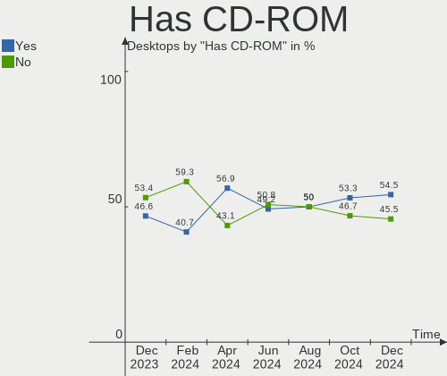
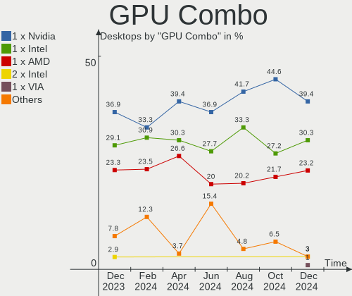
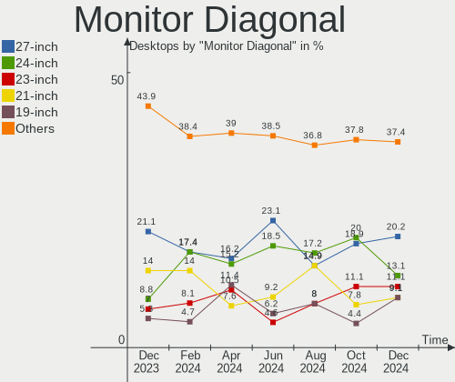
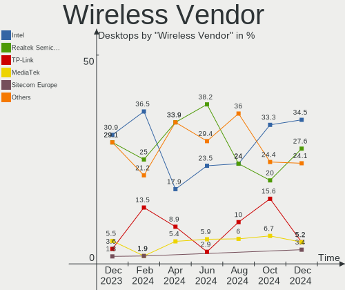
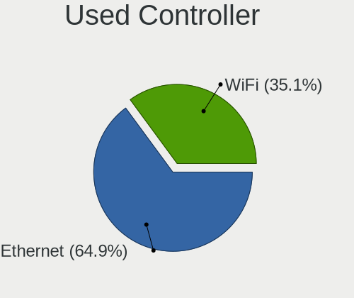

Linux in Italy - Hardware Trends (Desktops)
-------------------------------------------

A project to identify most popular hardware characteristics and track their change
over time based on data collected by Linux users at https://Linux-Hardware.org.

Anyone can contribute to this report by the [hw-probe](https://github.com/linuxhw/hw-probe) tool:

    sudo -E hw-probe -all -upload

Period: Aug, 2023.

Contents
--------

* [ System ](#system)
  - [ OS                       ](#os)
  - [ OS Family                ](#os-family)
  - [ Kernel                   ](#kernel)
  - [ Kernel Family            ](#kernel-family)
  - [ Kernel Major Ver.        ](#kernel-major-ver)
  - [ Arch                     ](#arch)
  - [ DE                       ](#de)
  - [ Display Server           ](#display-server)
  - [ Display Manager          ](#display-manager)
  - [ OS Lang                  ](#os-lang)
  - [ Boot Mode                ](#boot-mode)
  - [ Filesystem               ](#filesystem)
  - [ Part. scheme             ](#part-scheme)
  - [ Dual Boot with Linux/BSD ](#dual-boot-with-linuxbsd)
  - [ Dual Boot (Win)          ](#dual-boot-win)

* [ Board ](#board)
  - [ Vendor                   ](#vendor)
  - [ Model                    ](#model)
  - [ Model Family             ](#model-family)
  - [ MFG Year                 ](#mfg-year)
  - [ Form Factor              ](#form-factor)
  - [ Secure Boot              ](#secure-boot)
  - [ Coreboot                 ](#coreboot)
  - [ RAM Size                 ](#ram-size)
  - [ RAM Used                 ](#ram-used)
  - [ Total Drives             ](#total-drives)
  - [ Has CD-ROM               ](#has-cd-rom)
  - [ Has Ethernet             ](#has-ethernet)
  - [ Has WiFi                 ](#has-wifi)
  - [ Has Bluetooth            ](#has-bluetooth)

* [ Location ](#location)
  - [ Country                  ](#country)
  - [ City                     ](#city)

* [ Drives ](#drives)
  - [ Drive Vendor             ](#drive-vendor)
  - [ Drive Model              ](#drive-model)
  - [ HDD Vendor               ](#hdd-vendor)
  - [ SSD Vendor               ](#ssd-vendor)
  - [ Drive Kind               ](#drive-kind)
  - [ Drive Connector          ](#drive-connector)
  - [ Drive Size               ](#drive-size)
  - [ Space Total              ](#space-total)
  - [ Space Used               ](#space-used)
  - [ Malfunc. Drives          ](#malfunc-drives)
  - [ Malfunc. Drive Vendor    ](#malfunc-drive-vendor)
  - [ Malfunc. HDD Vendor      ](#malfunc-hdd-vendor)
  - [ Malfunc. Drive Kind      ](#malfunc-drive-kind)
  - [ Failed Drives            ](#failed-drives)
  - [ Failed Drive Vendor      ](#failed-drive-vendor)
  - [ Drive Status             ](#drive-status)

* [ Storage controller ](#storage-controller)
  - [ Storage Vendor           ](#storage-vendor)
  - [ Storage Model            ](#storage-model)
  - [ Storage Kind             ](#storage-kind)

* [ Processor ](#processor)
  - [ CPU Vendor               ](#cpu-vendor)
  - [ CPU Model                ](#cpu-model)
  - [ CPU Model Family         ](#cpu-model-family)
  - [ CPU Cores                ](#cpu-cores)
  - [ CPU Sockets              ](#cpu-sockets)
  - [ CPU Threads              ](#cpu-threads)
  - [ CPU Op-Modes             ](#cpu-op-modes)
  - [ CPU Microcode            ](#cpu-microcode)
  - [ CPU Microarch            ](#cpu-microarch)

* [ Graphics ](#graphics)
  - [ GPU Vendor               ](#gpu-vendor)
  - [ GPU Model                ](#gpu-model)
  - [ GPU Combo                ](#gpu-combo)
  - [ GPU Driver               ](#gpu-driver)
  - [ GPU Memory               ](#gpu-memory)

* [ Monitor ](#monitor)
  - [ Monitor Vendor           ](#monitor-vendor)
  - [ Monitor Model            ](#monitor-model)
  - [ Monitor Resolution       ](#monitor-resolution)
  - [ Monitor Diagonal         ](#monitor-diagonal)
  - [ Monitor Width            ](#monitor-width)
  - [ Aspect Ratio             ](#aspect-ratio)
  - [ Monitor Area             ](#monitor-area)
  - [ Pixel Density            ](#pixel-density)
  - [ Multiple Monitors        ](#multiple-monitors)

* [ Network ](#network)
  - [ Net Controller Vendor    ](#net-controller-vendor)
  - [ Net Controller Model     ](#net-controller-model)
  - [ Wireless Vendor          ](#wireless-vendor)
  - [ Wireless Model           ](#wireless-model)
  - [ Ethernet Vendor          ](#ethernet-vendor)
  - [ Ethernet Model           ](#ethernet-model)
  - [ Net Controller Kind      ](#net-controller-kind)
  - [ Used Controller          ](#used-controller)
  - [ NICs                     ](#nics)
  - [ IPv6                     ](#ipv6)

* [ Bluetooth ](#bluetooth)
  - [ Bluetooth Vendor         ](#bluetooth-vendor)
  - [ Bluetooth Model          ](#bluetooth-model)

* [ Sound ](#sound)
  - [ Sound Vendor             ](#sound-vendor)
  - [ Sound Model              ](#sound-model)

* [ Memory ](#memory)
  - [ Memory Vendor            ](#memory-vendor)
  - [ Memory Model             ](#memory-model)
  - [ Memory Kind              ](#memory-kind)
  - [ Memory Form Factor       ](#memory-form-factor)
  - [ Memory Size              ](#memory-size)
  - [ Memory Speed             ](#memory-speed)

* [ Printers & scanners ](#printers--scanners)
  - [ Printer Vendor           ](#printer-vendor)
  - [ Printer Model            ](#printer-model)
  - [ Scanner Vendor           ](#scanner-vendor)
  - [ Scanner Model            ](#scanner-model)

* [ Camera ](#camera)
  - [ Camera Vendor            ](#camera-vendor)
  - [ Camera Model             ](#camera-model)

* [ Security ](#security)
  - [ Fingerprint Vendor       ](#fingerprint-vendor)
  - [ Fingerprint Model        ](#fingerprint-model)
  - [ Chipcard Vendor          ](#chipcard-vendor)
  - [ Chipcard Model           ](#chipcard-model)

* [ Unsupported ](#unsupported)
  - [ Unsupported Devices      ](#unsupported-devices)
  - [ Unsupported Device Types ](#unsupported-device-types)

System
------

OS
--

Installed operating systems

| Name                | Desktops | Percent |
|---------------------|----------|---------|
| OpenMandriva 23.08  | 9        | 12.33%  |
| Ubuntu 22.04        | 7        | 9.59%   |
| Fedora 38           | 7        | 9.59%   |
| Linux Mint 21.2     | 5        | 6.85%   |
| Ubuntu 23.04        | 3        | 4.11%   |
| EndeavourOS Rolling | 3        | 4.11%   |
| Arch Rolling        | 3        | 4.11%   |
| Zorin 16            | 2        | 2.74%   |
| Xero Rolling        | 2        | 2.74%   |
| Ubuntu 20.04        | 2        | 2.74%   |
| Pop!_OS 22.04       | 2        | 2.74%   |
| OpenMandriva 23.90  | 2        | 2.74%   |
| OpenMandriva 23.07  | 2        | 2.74%   |
| Manjaro             | 2        | 2.74%   |
| Debian 12           | 2        | 2.74%   |
| Debian              | 2        | 2.74%   |
| blendOS             | 2        | 2.74%   |
| Xubuntu 22.10       | 1        | 1.37%   |
| Ubuntu Studio 20.04 | 1        | 1.37%   |
| Parrot 5.3          | 1        | 1.37%   |
| OpenMandriva 4.3    | 1        | 1.37%   |
| OpenMandriva 23.03  | 1        | 1.37%   |
| Nobara 38           | 1        | 1.37%   |
| MX 23               | 1        | 1.37%   |
| Lubuntu 20.04       | 1        | 1.37%   |
| LMDE 5              | 1        | 1.37%   |
| LMDE 4              | 1        | 1.37%   |
| Linux Mint 21.1     | 1        | 1.37%   |
| Linux Lite 6.4      | 1        | 1.37%   |
| KDE neon 22.04      | 1        | 1.37%   |
| Gentoo 2.14         | 1        | 1.37%   |
| Fedora 37           | 1        | 1.37%   |
| Elementary 7        | 1        | 1.37%   |

OS Family
---------

OS without a version

| Name          | Desktops | Percent |
|---------------|----------|---------|
| OpenMandriva  | 15       | 20.55%  |
| Ubuntu        | 12       | 16.44%  |
| Fedora        | 8        | 10.96%  |
| Linux Mint    | 6        | 8.22%   |
| Debian        | 4        | 5.48%   |
| EndeavourOS   | 3        | 4.11%   |
| Arch          | 3        | 4.11%   |
| Zorin         | 2        | 2.74%   |
| Xero          | 2        | 2.74%   |
| Pop!_OS       | 2        | 2.74%   |
| Manjaro       | 2        | 2.74%   |
| LMDE          | 2        | 2.74%   |
| blendOS       | 2        | 2.74%   |
| Xubuntu       | 1        | 1.37%   |
| Ubuntu Studio | 1        | 1.37%   |
| Parrot        | 1        | 1.37%   |
| Nobara        | 1        | 1.37%   |
| MX            | 1        | 1.37%   |
| Lubuntu       | 1        | 1.37%   |
| Linux Lite    | 1        | 1.37%   |
| KDE neon      | 1        | 1.37%   |
| Gentoo        | 1        | 1.37%   |
| Elementary    | 1        | 1.37%   |

Kernel
------

Version of the Linux kernel

| Version                      | Desktops | Percent |
|------------------------------|----------|---------|
| 6.2.0-26-generic             | 9        | 12.33%  |
| 6.4.11-desktop-1omv2390      | 8        | 10.96%  |
| 5.15.0-78-generic            | 4        | 5.48%   |
| 6.4.8-desktop-2omv2390       | 3        | 4.11%   |
| 5.15.0-76-generic            | 3        | 4.11%   |
| 6.4.6-200.fc38.x86_64        | 2        | 2.74%   |
| 6.4.12-arch1-1               | 2        | 2.74%   |
| 6.4.11-arch2-1               | 2        | 2.74%   |
| 6.4.11-200.fc38.x86_64       | 2        | 2.74%   |
| 6.3.9-zen1-1-zen             | 2        | 2.74%   |
| 6.3.5-desktop-3omv2390       | 2        | 2.74%   |
| 6.1.0-11-amd64               | 2        | 2.74%   |
| 5.15.0-79-generic            | 2        | 2.74%   |
| 6.5.0-060500rc5-generic      | 1        | 1.37%   |
| 6.4.9-arch1-1                | 1        | 1.37%   |
| 6.4.8-x64v3-xanmod1          | 1        | 1.37%   |
| 6.4.7-gentoo                 | 1        | 1.37%   |
| 6.4.7-arch1-2                | 1        | 1.37%   |
| 6.4.7-200.fc38.x86_64        | 1        | 1.37%   |
| 6.4.6-76060406-generic       | 1        | 1.37%   |
| 6.4.6-1-MANJARO              | 1        | 1.37%   |
| 6.4.12-200.fc38.x86_64       | 1        | 1.37%   |
| 6.4.11-100.fc37.x86_64       | 1        | 1.37%   |
| 6.4.11-060411-generic        | 1        | 1.37%   |
| 6.4.10-arch1-1               | 1        | 1.37%   |
| 6.4.10-201.fsync.fc38.x86_64 | 1        | 1.37%   |
| 6.4.0-1-amd64                | 1        | 1.37%   |
| 6.2.9-300.fc38.x86_64        | 1        | 1.37%   |
| 6.2.6-desktop-1omv2390       | 1        | 1.37%   |
| 6.2.0-31-generic             | 1        | 1.37%   |
| 6.2.0-20-generic             | 1        | 1.37%   |
| 6.2.0-2-rt3-MANJARO          | 1        | 1.37%   |
| 6.1.47-1-lts                 | 1        | 1.37%   |
| 6.1.0-9-amd64                | 1        | 1.37%   |
| 6.1.0-1parrot1-amd64         | 1        | 1.37%   |
| 6.1.0-10-amd64               | 1        | 1.37%   |
| 6.0.0-060000-generic         | 1        | 1.37%   |
| 5.4.0-156-lowlatency         | 1        | 1.37%   |
| 5.19.0-50-generic            | 1        | 1.37%   |
| 5.16.7-desktop-1omv4003      | 1        | 1.37%   |

Kernel Family
-------------

Linux kernel without a distro release

| Version | Desktops | Percent |
|---------|----------|---------|
| 6.4.11  | 14       | 19.18%  |
| 6.2.0   | 12       | 16.44%  |
| 5.15.0  | 10       | 13.7%   |
| 6.1.0   | 5        | 6.85%   |
| 6.4.8   | 4        | 5.48%   |
| 6.4.6   | 4        | 5.48%   |
| 6.4.7   | 3        | 4.11%   |
| 6.4.12  | 3        | 4.11%   |
| 6.4.10  | 2        | 2.74%   |
| 6.3.9   | 2        | 2.74%   |
| 6.3.5   | 2        | 2.74%   |
| 6.5.0   | 1        | 1.37%   |
| 6.4.9   | 1        | 1.37%   |
| 6.4.0   | 1        | 1.37%   |
| 6.2.9   | 1        | 1.37%   |
| 6.2.6   | 1        | 1.37%   |
| 6.1.47  | 1        | 1.37%   |
| 6.0.0   | 1        | 1.37%   |
| 5.4.0   | 1        | 1.37%   |
| 5.19.0  | 1        | 1.37%   |
| 5.16.7  | 1        | 1.37%   |
| 5.10.0  | 1        | 1.37%   |
| 4.19.0  | 1        | 1.37%   |

Kernel Major Ver.
-----------------

Linux kernel major version

| Version | Desktops | Percent |
|---------|----------|---------|
| 6.4     | 32       | 43.84%  |
| 6.2     | 14       | 19.18%  |
| 5.15    | 10       | 13.7%   |
| 6.1     | 6        | 8.22%   |
| 6.3     | 4        | 5.48%   |
| 6.5     | 1        | 1.37%   |
| 6.0     | 1        | 1.37%   |
| 5.4     | 1        | 1.37%   |
| 5.19    | 1        | 1.37%   |
| 5.16    | 1        | 1.37%   |
| 5.10    | 1        | 1.37%   |
| 4.19    | 1        | 1.37%   |

Arch
----

OS architecture (x86_64, i586, etc.)

| Name   | Desktops | Percent |
|--------|----------|---------|
| x86_64 | 73       | 100%    |

DE
--

Desktop Environment

| Name       | Desktops | Percent |
|------------|----------|---------|
| GNOME      | 29       | 39.73%  |
| KDE5       | 24       | 32.88%  |
| XFCE       | 5        | 6.85%   |
| X-Cinnamon | 5        | 6.85%   |
| MATE       | 5        | 6.85%   |
| Unknown    | 3        | 4.11%   |
| Pantheon   | 1        | 1.37%   |
| LXQt       | 1        | 1.37%   |

Display Server
--------------

X11 or Wayland

| Name    | Desktops | Percent |
|---------|----------|---------|
| X11     | 48       | 65.75%  |
| Wayland | 24       | 32.88%  |
| Tty     | 1        | 1.37%   |

Display Manager
---------------

SDDM, LightDM, etc.

| Name    | Desktops | Percent |
|---------|----------|---------|
| Unknown | 27       | 36.99%  |
| SDDM    | 20       | 27.4%   |
| GDM3    | 10       | 13.7%   |
| GDM     | 9        | 12.33%  |
| LightDM | 7        | 9.59%   |

OS Lang
-------

Language

| Lang  | Desktops | Percent |
|-------|----------|---------|
| it_IT | 52       | 71.23%  |
| en_US | 14       | 19.18%  |
| en_GB | 3        | 4.11%   |
| fr_FR | 2        | 2.74%   |
| C     | 2        | 2.74%   |

Boot Mode
---------

EFI or BIOS

| Mode | Desktops | Percent |
|------|----------|---------|
| EFI  | 38       | 52.05%  |
| BIOS | 35       | 47.95%  |

Filesystem
----------

Type of filesystem

| Type    | Desktops | Percent |
|---------|----------|---------|
| Ext4    | 45       | 61.64%  |
| Overlay | 10       | 13.7%   |
| Btrfs   | 10       | 13.7%   |
| Tmpfs   | 8        | 10.96%  |

Part. scheme
------------

Scheme of partitioning

| Type    | Desktops | Percent |
|---------|----------|---------|
| GPT     | 41       | 56.16%  |
| Unknown | 26       | 35.62%  |
| MBR     | 6        | 8.22%   |

Dual Boot with Linux/BSD
------------------------

Hosting more than one Linux/BSD

| Dual boot | Desktops | Percent |
|-----------|----------|---------|
| No        | 54       | 73.97%  |
| Yes       | 19       | 26.03%  |

Dual Boot (Win)
---------------

Hosting Linux and Windows

| Dual boot | Desktops | Percent |
|-----------|----------|---------|
| No        | 44       | 60.27%  |
| Yes       | 29       | 39.73%  |

Board
-----

Vendor
------

Motherboard manufacturer

| Name                | Desktops | Percent |
|---------------------|----------|---------|
| ASUSTek Computer    | 23       | 31.51%  |
| MSI                 | 11       | 15.07%  |
| Gigabyte Technology | 9        | 12.33%  |
| Hewlett-Packard     | 7        | 9.59%   |
| ASRock              | 7        | 9.59%   |
| Pegatron            | 5        | 6.85%   |
| Acer                | 3        | 4.11%   |
| Lenovo              | 2        | 2.74%   |
| Intel               | 2        | 2.74%   |
| Dell                | 2        | 2.74%   |
| Fujitsu Siemens     | 1        | 1.37%   |
| AZW                 | 1        | 1.37%   |

Model
-----

Motherboard model

| Name                                        | Desktops | Percent |
|---------------------------------------------|----------|---------|
| ASUS All Series                             | 3        | 4.11%   |
| Pegatron WC912AA-ABZ p6300it                | 1        | 1.37%   |
| Pegatron T5060                              | 1        | 1.37%   |
| Pegatron Pro 3010 Microtower PC             | 1        | 1.37%   |
| Pegatron NF335AA-ABZ a6664it                | 1        | 1.37%   |
| Pegatron 2AD5                               | 1        | 1.37%   |
| MSI Z390 Gaming Infinite X Plus 9 (MS-B916) | 1        | 1.37%   |
| MSI NQ890AA-ABZ CQ5011IT                    | 1        | 1.37%   |
| MSI MS-7E06                                 | 1        | 1.37%   |
| MSI MS-7D76                                 | 1        | 1.37%   |
| MSI MS-7D46                                 | 1        | 1.37%   |
| MSI MS-7C13                                 | 1        | 1.37%   |
| MSI MS-7C02                                 | 1        | 1.37%   |
| MSI MS-7A36                                 | 1        | 1.37%   |
| MSI MS-7966                                 | 1        | 1.37%   |
| MSI MS-7815                                 | 1        | 1.37%   |
| MSI MS-7793                                 | 1        | 1.37%   |
| Lenovo ThinkCentre M83 10AHS35Q00           | 1        | 1.37%   |
| Lenovo ThinkCentre M725s 10VUS0U400         | 1        | 1.37%   |
| Intel X79M-S                                | 1        | 1.37%   |
| Intel X79                                   | 1        | 1.37%   |
| HP ProDesk 600 G3 SFF                       | 1        | 1.37%   |
| HP ProDesk 600 G1 DM                        | 1        | 1.37%   |
| HP ProDesk 490 G2 MT                        | 1        | 1.37%   |
| HP EliteDesk 800 G2 DM 35W                  | 1        | 1.37%   |
| HP Compaq dc7900 Small Form Factor          | 1        | 1.37%   |
| HP Compaq 6000 Pro MT PC                    | 1        | 1.37%   |
| HP 550-100nl                                | 1        | 1.37%   |
| Gigabyte Z370P D3                           | 1        | 1.37%   |
| Gigabyte X570S AERO G                       | 1        | 1.37%   |
| Gigabyte H410M S2H V3                       | 1        | 1.37%   |
| Gigabyte B75M-D2V                           | 1        | 1.37%   |
| Gigabyte B650 AORUS ELITE AX                | 1        | 1.37%   |
| Gigabyte B450M DS3H                         | 1        | 1.37%   |
| Gigabyte B450 AORUS ELITE                   | 1        | 1.37%   |
| Gigabyte B250-HD3P                          | 1        | 1.37%   |
| Gigabyte AB350-Gaming 3                     | 1        | 1.37%   |
| Fujitsu Siemens G31T-M2                     | 1        | 1.37%   |
| Dell OptiPlex 5055 Ryzen CPU                | 1        | 1.37%   |
| Dell OptiPlex 3050                          | 1        | 1.37%   |

Model Family
------------

Motherboard model prefix

| Name                    | Desktops | Percent |
|-------------------------|----------|---------|
| HP ProDesk              | 3        | 4.11%   |
| ASUS ROG                | 3        | 4.11%   |
| ASUS PRIME              | 3        | 4.11%   |
| ASUS All                | 3        | 4.11%   |
| Lenovo ThinkCentre      | 2        | 2.74%   |
| HP Compaq               | 2        | 2.74%   |
| Dell OptiPlex           | 2        | 2.74%   |
| ASUS Intel              | 2        | 2.74%   |
| Acer Predator           | 2        | 2.74%   |
| Pegatron WC912AA-ABZ    | 1        | 1.37%   |
| Pegatron T5060          | 1        | 1.37%   |
| Pegatron Pro            | 1        | 1.37%   |
| Pegatron NF335AA-ABZ    | 1        | 1.37%   |
| Pegatron 2AD5           | 1        | 1.37%   |
| MSI Z390                | 1        | 1.37%   |
| MSI NQ890AA-ABZ         | 1        | 1.37%   |
| MSI MS-7E06             | 1        | 1.37%   |
| MSI MS-7D76             | 1        | 1.37%   |
| MSI MS-7D46             | 1        | 1.37%   |
| MSI MS-7C13             | 1        | 1.37%   |
| MSI MS-7C02             | 1        | 1.37%   |
| MSI MS-7A36             | 1        | 1.37%   |
| MSI MS-7966             | 1        | 1.37%   |
| MSI MS-7815             | 1        | 1.37%   |
| MSI MS-7793             | 1        | 1.37%   |
| Intel X79M-S            | 1        | 1.37%   |
| Intel X79               | 1        | 1.37%   |
| HP EliteDesk            | 1        | 1.37%   |
| HP 550-100nl            | 1        | 1.37%   |
| Gigabyte Z370P          | 1        | 1.37%   |
| Gigabyte X570S          | 1        | 1.37%   |
| Gigabyte H410M          | 1        | 1.37%   |
| Gigabyte B75M-D2V       | 1        | 1.37%   |
| Gigabyte B650           | 1        | 1.37%   |
| Gigabyte B450M          | 1        | 1.37%   |
| Gigabyte B450           | 1        | 1.37%   |
| Gigabyte B250-HD3P      | 1        | 1.37%   |
| Gigabyte AB350-Gaming   | 1        | 1.37%   |
| Fujitsu Siemens G31T-M2 | 1        | 1.37%   |
| AZW U59                 | 1        | 1.37%   |

MFG Year
--------

Motherboard manufacture year

| Year | Desktops | Percent |
|------|----------|---------|
| 2020 | 7        | 9.59%   |
| 2019 | 7        | 9.59%   |
| 2021 | 6        | 8.22%   |
| 2017 | 6        | 8.22%   |
| 2018 | 5        | 6.85%   |
| 2015 | 5        | 6.85%   |
| 2014 | 5        | 6.85%   |
| 2013 | 5        | 6.85%   |
| 2022 | 4        | 5.48%   |
| 2012 | 4        | 5.48%   |
| 2011 | 3        | 4.11%   |
| 2010 | 3        | 4.11%   |
| 2009 | 3        | 4.11%   |
| 2023 | 2        | 2.74%   |
| 2016 | 2        | 2.74%   |
| 2008 | 2        | 2.74%   |
| 2005 | 2        | 2.74%   |
| 2007 | 1        | 1.37%   |
| 2006 | 1        | 1.37%   |

Form Factor
-----------

Physical design of the computer

| Name    | Desktops | Percent |
|---------|----------|---------|
| Desktop | 73       | 100%    |

Secure Boot
-----------

Enabled or disabled

| State    | Desktops | Percent |
|----------|----------|---------|
| Disabled | 71       | 97.26%  |
| Enabled  | 2        | 2.74%   |

Coreboot
--------

Have coreboot on board

| Used | Desktops | Percent |
|------|----------|---------|
| No   | 73       | 100%    |

RAM Size
--------

Total RAM memory

| Size in GB  | Desktops | Percent |
|-------------|----------|---------|
| 16.01-24.0  | 32       | 43.84%  |
| 4.01-8.0    | 11       | 15.07%  |
| 3.01-4.0    | 9        | 12.33%  |
| 32.01-64.0  | 8        | 10.96%  |
| 8.01-16.0   | 5        | 6.85%   |
| 64.01-256.0 | 4        | 5.48%   |
| 24.01-32.0  | 2        | 2.74%   |
| 1.01-2.0    | 1        | 1.37%   |
| 0.51-1.0    | 1        | 1.37%   |

RAM Used
--------

Used RAM memory

| Used GB   | Desktops | Percent |
|-----------|----------|---------|
| 1.01-2.0  | 27       | 36.99%  |
| 2.01-3.0  | 16       | 21.92%  |
| 3.01-4.0  | 13       | 17.81%  |
| 4.01-8.0  | 12       | 16.44%  |
| 0.51-1.0  | 3        | 4.11%   |
| 8.01-16.0 | 2        | 2.74%   |

Total Drives
------------

Number of drives on board

| Drives | Desktops | Percent |
|--------|----------|---------|
| 1      | 27       | 36.99%  |
| 2      | 21       | 28.77%  |
| 3      | 14       | 19.18%  |
| 6      | 4        | 5.48%   |
| 4      | 4        | 5.48%   |
| 5      | 3        | 4.11%   |

Has CD-ROM
----------

Has CD-ROM on board

| Presented | Desktops | Percent |
|-----------|----------|---------|
| No        | 42       | 57.53%  |
| Yes       | 31       | 42.47%  |

Has Ethernet
------------

Has Ethernet on board

| Presented | Desktops | Percent |
|-----------|----------|---------|
| Yes       | 73       | 100%    |

Has WiFi
--------

Has WiFi module

| Presented | Desktops | Percent |
|-----------|----------|---------|
| Yes       | 39       | 53.42%  |
| No        | 34       | 46.58%  |

Has Bluetooth
-------------

Has Bluetooth module

| Presented | Desktops | Percent |
|-----------|----------|---------|
| No        | 42       | 57.53%  |
| Yes       | 31       | 42.47%  |

Location
--------

Country
-------

Geographic location (country)

| Country | Desktops | Percent |
|---------|----------|---------|
| Italy   | 73       | 100%    |

City
----

Geographic location (city)

| City                | Desktops | Percent |
|---------------------|----------|---------|
| Milan               | 10       | 13.7%   |
| Rome                | 8        | 10.96%  |
| Verona              | 3        | 4.11%   |
| Milano              | 3        | 4.11%   |
| Livorno             | 3        | 4.11%   |
| Nemoli              | 2        | 2.74%   |
| Florence            | 2        | 2.74%   |
| Viggiù             | 1        | 1.37%   |
| Vicenza             | 1        | 1.37%   |
| Vercelli            | 1        | 1.37%   |
| Venice              | 1        | 1.37%   |
| Turin               | 1        | 1.37%   |
| Torre Orsaia        | 1        | 1.37%   |
| Tornareccio         | 1        | 1.37%   |
| Thiene              | 1        | 1.37%   |
| Sesto Fiorentino    | 1        | 1.37%   |
| San Gavino Monreale | 1        | 1.37%   |
| Sacile              | 1        | 1.37%   |
| Ripi                | 1        | 1.37%   |
| Rho                 | 1        | 1.37%   |
| Portici             | 1        | 1.37%   |
| Pistoia             | 1        | 1.37%   |
| Pisa                | 1        | 1.37%   |
| Parma               | 1        | 1.37%   |
| Padova              | 1        | 1.37%   |
| Novara              | 1        | 1.37%   |
| Naples              | 1        | 1.37%   |
| Molfetta            | 1        | 1.37%   |
| Messina             | 1        | 1.37%   |
| Lucca               | 1        | 1.37%   |
| Loreggia            | 1        | 1.37%   |
| Genoa               | 1        | 1.37%   |
| Formigine           | 1        | 1.37%   |
| Farra di Soligo     | 1        | 1.37%   |
| Comun Nuovo         | 1        | 1.37%   |
| Como                | 1        | 1.37%   |
| Cinisello Balsamo   | 1        | 1.37%   |
| Cesena              | 1        | 1.37%   |
| Catania             | 1        | 1.37%   |
| Castellazzo Bormida | 1        | 1.37%   |

Drives
------

Drive Vendor
------------

Hard drive vendors

| Vendor                         | Desktops | Drives | Percent |
|--------------------------------|----------|--------|---------|
| Seagate                        | 31       | 35     | 20.95%  |
| WDC                            | 19       | 23     | 12.84%  |
| Crucial                        | 16       | 16     | 10.81%  |
| Samsung Electronics            | 15       | 20     | 10.14%  |
| Kingston                       | 12       | 12     | 8.11%   |
| Sandisk                        | 8        | 9      | 5.41%   |
| Toshiba                        | 6        | 6      | 4.05%   |
| Phison Electronics             | 4        | 4      | 2.7%    |
| PNY                            | 3        | 3      | 2.03%   |
| Maxtor                         | 3        | 7      | 2.03%   |
| Kingston Technology Company    | 3        | 3      | 2.03%   |
| SPCC                           | 2        | 2      | 1.35%   |
| Micron/Crucial Technology      | 2        | 2      | 1.35%   |
| Micron Technology              | 2        | 2      | 1.35%   |
| China                          | 2        | 2      | 1.35%   |
| A-DATA Technology              | 2        | 2      | 1.35%   |
| Vaseky                         | 1        | 1      | 0.68%   |
| Unknown                        | 1        | 1      | 0.68%   |
| Team                           | 1        | 1      | 0.68%   |
| Solid State Storage Technology | 1        | 1      | 0.68%   |
| Silicon Motion                 | 1        | 1      | 0.68%   |
| Realtek Semiconductor          | 1        | 1      | 0.68%   |
| NGFF                           | 1        | 1      | 0.68%   |
| Mushkin                        | 1        | 1      | 0.68%   |
| MAXIO Technology (Hangzhou)    | 1        | 1      | 0.68%   |
| Lexar                          | 1        | 1      | 0.68%   |
| Leven                          | 1        | 1      | 0.68%   |
| KingDian                       | 1        | 1      | 0.68%   |
| Intenso                        | 1        | 1      | 0.68%   |
| Hitachi                        | 1        | 1      | 0.68%   |
| HGST                           | 1        | 1      | 0.68%   |
| BAITITON                       | 1        | 1      | 0.68%   |
| Apple                          | 1        | 1      | 0.68%   |
| Unknown                        | 1        | 1      | 0.68%   |

Drive Model
-----------

Hard drive models

| Model                                               | Desktops | Percent |
|-----------------------------------------------------|----------|---------|
| Crucial CT500MX500SSD1 500GB                        | 5        | 3.14%   |
| Seagate ST1000DM010-2EP102 1TB                      | 4        | 2.52%   |
| Samsung NVMe SSD Controller SM981/PM981/PM983 500GB | 4        | 2.52%   |
| Toshiba DT01ACA100 1TB                              | 3        | 1.89%   |
| Kingston SA400S37240G 240GB SSD                     | 3        | 1.89%   |
| Seagate ST500DM002-1BD142 500GB                     | 2        | 1.26%   |
| Seagate ST2000DM008-2UB102 2TB                      | 2        | 1.26%   |
| Seagate ST2000DM008-2FR102 2TB                      | 2        | 1.26%   |
| Seagate ST1000LM048-2E7172 1TB                      | 2        | 1.26%   |
| Sandisk WD_BLACK SN850X 1000GB                      | 2        | 1.26%   |
| SanDisk SSD PLUS 480GB                              | 2        | 1.26%   |
| Samsung SSD 850 EVO 250GB                           | 2        | 1.26%   |
| Phison E16 PCIe4 NVMe Controller 1TB                | 2        | 1.26%   |
| Phison E12 NVMe Controller 256GB                    | 2        | 1.26%   |
| Micron/Crucial P2 NVMe PCIe SSD 1TB                 | 2        | 1.26%   |
| Kingston Company A2000 NVMe SSD 1TB                 | 2        | 1.26%   |
| Kingston SV300S37A240G 240GB SSD                    | 2        | 1.26%   |
| Kingston SA400S37960G 960GB SSD                     | 2        | 1.26%   |
| Crucial CT500P2SSD8 500GB                           | 2        | 1.26%   |
| Crucial CT250MX500SSD1 250GB                        | 2        | 1.26%   |
| Crucial CT1000MX500SSD1 1TB                         | 2        | 1.26%   |
| WDC WDS500G2B0C-00PXH0 500GB                        | 1        | 0.63%   |
| WDC WDS120G1G0A-00SS50 120GB SSD                    | 1        | 0.63%   |
| WDC WD5000AAKX-08U6AA0 500GB                        | 1        | 0.63%   |
| WDC WD5000AAKX-001CA0 500GB                         | 1        | 0.63%   |
| WDC WD5000AAKS-60Z1A0 500GB                         | 1        | 0.63%   |
| WDC WD5000AAKS-08V0A0 500GB                         | 1        | 0.63%   |
| WDC WD5000AAKS-00UU3A0 500GB                        | 1        | 0.63%   |
| WDC WD2500BEVT-80A23T0 250GB                        | 1        | 0.63%   |
| WDC WD20PURZ-85AKKY0 2TB                            | 1        | 0.63%   |
| WDC WD20EZRZ-00Z5HB0 2TB                            | 1        | 0.63%   |
| WDC WD20EZRX-00D8PB0 2TB                            | 1        | 0.63%   |
| WDC WD20EARS-22MVWB0 2TB                            | 1        | 0.63%   |
| WDC WD2000BB-00RDA0 200GB                           | 1        | 0.63%   |
| WDC WD10PURZ-85U8XY0 1TB                            | 1        | 0.63%   |
| WDC WD10EZRZ-00HTKB0 1TB                            | 1        | 0.63%   |
| WDC WD10EZRX-00A8LB0 1TB                            | 1        | 0.63%   |
| WDC WD10EZEX-60ZF5A0 1TB                            | 1        | 0.63%   |
| WDC WD10EZEX-60M2NA0 1TB                            | 1        | 0.63%   |
| WDC WD10EZEX-08WN4A0 1TB                            | 1        | 0.63%   |

HDD Vendor
----------

Hard disk drive vendors

| Vendor              | Desktops | Drives | Percent |
|---------------------|----------|--------|---------|
| Seagate             | 31       | 35     | 50.82%  |
| WDC                 | 17       | 21     | 27.87%  |
| Toshiba             | 5        | 5      | 8.2%    |
| Maxtor              | 3        | 7      | 4.92%   |
| Unknown             | 1        | 1      | 1.64%   |
| Samsung Electronics | 1        | 1      | 1.64%   |
| Hitachi             | 1        | 1      | 1.64%   |
| HGST                | 1        | 1      | 1.64%   |
| Apple               | 1        | 1      | 1.64%   |

SSD Vendor
----------

Solid state drive vendors

| Vendor              | Desktops | Drives | Percent |
|---------------------|----------|--------|---------|
| Crucial             | 12       | 12     | 22.22%  |
| Kingston            | 11       | 11     | 20.37%  |
| Samsung Electronics | 7        | 7      | 12.96%  |
| SanDisk             | 4        | 4      | 7.41%   |
| PNY                 | 3        | 3      | 5.56%   |
| SPCC                | 2        | 2      | 3.7%    |
| China               | 2        | 2      | 3.7%    |
| A-DATA Technology   | 2        | 2      | 3.7%    |
| WDC                 | 1        | 1      | 1.85%   |
| Vaseky              | 1        | 1      | 1.85%   |
| Team                | 1        | 1      | 1.85%   |
| NGFF                | 1        | 1      | 1.85%   |
| Mushkin             | 1        | 1      | 1.85%   |
| Micron Technology   | 1        | 1      | 1.85%   |
| Lexar               | 1        | 1      | 1.85%   |
| Leven               | 1        | 1      | 1.85%   |
| KingDian            | 1        | 1      | 1.85%   |
| Intenso             | 1        | 1      | 1.85%   |
| BAITITON            | 1        | 1      | 1.85%   |

Drive Kind
----------

HDD or SSD

| Kind    | Desktops | Drives | Percent |
|---------|----------|--------|---------|
| HDD     | 50       | 73     | 40.98%  |
| SSD     | 41       | 54     | 33.61%  |
| NVMe    | 30       | 38     | 24.59%  |
| Unknown | 1        | 1      | 0.82%   |

Drive Connector
---------------

SATA, SAS, NVMe, etc.

| Type | Desktops | Drives | Percent |
|------|----------|--------|---------|
| SATA | 63       | 125    | 65.63%  |
| NVMe | 30       | 38     | 31.25%  |
| SAS  | 3        | 3      | 3.13%   |

Drive Size
----------

Size of hard drive

| Size in TB | Desktops | Drives | Percent |
|------------|----------|--------|---------|
| 0.01-0.5   | 42       | 67     | 46.67%  |
| 0.51-1.0   | 34       | 43     | 37.78%  |
| 1.01-2.0   | 11       | 13     | 12.22%  |
| 3.01-4.0   | 1        | 1      | 1.11%   |
| 2.01-3.0   | 1        | 1      | 1.11%   |
| 4.01-10.0  | 1        | 2      | 1.11%   |

Space Total
-----------

Amount of disk space available on the file system

| Size in GB     | Desktops | Percent |
|----------------|----------|---------|
| 251-500        | 13       | 17.81%  |
| 101-250        | 12       | 16.44%  |
| 501-1000       | 12       | 16.44%  |
| 1001-2000      | 8        | 10.96%  |
| More than 3000 | 7        | 9.59%   |
| 1-20           | 7        | 9.59%   |
| 51-100         | 6        | 8.22%   |
| 2001-3000      | 5        | 6.85%   |
| 21-50          | 2        | 2.74%   |
| Unknown        | 1        | 1.37%   |

Space Used
----------

Amount of used disk space

| Used GB        | Desktops | Percent |
|----------------|----------|---------|
| 1-20           | 26       | 35.62%  |
| 21-50          | 15       | 20.55%  |
| 251-500        | 8        | 10.96%  |
| 1001-2000      | 6        | 8.22%   |
| 501-1000       | 6        | 8.22%   |
| 51-100         | 6        | 8.22%   |
| 101-250        | 3        | 4.11%   |
| More than 3000 | 2        | 2.74%   |
| Unknown        | 1        | 1.37%   |

Malfunc. Drives
---------------

Drive models with a malfunction

| Model                                       | Desktops | Drives | Percent |
|---------------------------------------------|----------|--------|---------|
| WDC WD2500BEVT-80A23T0 250GB                | 1        | 1      | 7.14%   |
| WDC WD10EZEX-60M2NA0 1TB                    | 1        | 1      | 7.14%   |
| Seagate ST500DM002-1BD142 500GB             | 1        | 1      | 7.14%   |
| Seagate ST3500418AS 500GB                   | 1        | 1      | 7.14%   |
| Seagate ST3320613AS 320GB                   | 1        | 1      | 7.14%   |
| Seagate ST320LT009-9WC142 320GB             | 1        | 1      | 7.14%   |
| Seagate ST3160815AS 160GB                   | 1        | 1      | 7.14%   |
| Seagate ST1000NM0011 99Y1164 59Y1812XIV 1TB | 1        | 1      | 7.14%   |
| Seagate ST1000DM003-1ER162 1TB              | 1        | 1      | 7.14%   |
| SanDisk SSD PLUS 480GB                      | 1        | 1      | 7.14%   |
| Maxtor 6Y250M0 256GB                        | 1        | 1      | 7.14%   |
| Maxtor 6Y120L0 128GB                        | 1        | 1      | 7.14%   |
| Maxtor 6V300F0 304GB                        | 1        | 3      | 7.14%   |
| A-DATA Technology SU800 1TB SSD             | 1        | 1      | 7.14%   |

Malfunc. Drive Vendor
---------------------

Vendors of faulty drives

| Vendor            | Desktops | Drives | Percent |
|-------------------|----------|--------|---------|
| Seagate           | 7        | 7      | 53.85%  |
| WDC               | 2        | 2      | 15.38%  |
| Maxtor            | 2        | 5      | 15.38%  |
| SanDisk           | 1        | 1      | 7.69%   |
| A-DATA Technology | 1        | 1      | 7.69%   |

Malfunc. HDD Vendor
-------------------

Vendors of faulty HDD drives

| Vendor  | Desktops | Drives | Percent |
|---------|----------|--------|---------|
| Seagate | 7        | 7      | 63.64%  |
| WDC     | 2        | 2      | 18.18%  |
| Maxtor  | 2        | 5      | 18.18%  |

Malfunc. Drive Kind
-------------------

Kinds of faulty drives

| Kind | Desktops | Drives | Percent |
|------|----------|--------|---------|
| HDD  | 11       | 14     | 84.62%  |
| SSD  | 2        | 2      | 15.38%  |

Failed Drives
-------------

Failed drive models

Zero info for selected period =(

Failed Drive Vendor
-------------------

Failed drive vendors

Zero info for selected period =(

Drive Status
------------

Number of failed and malfunc. drives

| Status   | Desktops | Drives | Percent |
|----------|----------|--------|---------|
| Detected | 37       | 82     | 44.58%  |
| Works    | 34       | 68     | 40.96%  |
| Malfunc  | 12       | 16     | 14.46%  |

Storage controller
------------------

Storage Vendor
--------------

Storage controller vendors

| Vendor                         | Desktops | Percent |
|--------------------------------|----------|---------|
| Intel                          | 47       | 41.59%  |
| AMD                            | 24       | 21.24%  |
| Samsung Electronics            | 9        | 7.96%   |
| Micron/Crucial Technology      | 6        | 5.31%   |
| Sandisk                        | 5        | 4.42%   |
| Phison Electronics             | 4        | 3.54%   |
| Kingston Technology Company    | 4        | 3.54%   |
| VIA Technologies               | 2        | 1.77%   |
| ASMedia Technology             | 2        | 1.77%   |
| Toshiba America Info Systems   | 1        | 0.88%   |
| Solid State Storage Technology | 1        | 0.88%   |
| Silicon Motion                 | 1        | 0.88%   |
| Silicon Image                  | 1        | 0.88%   |
| Realtek Semiconductor          | 1        | 0.88%   |
| Nvidia                         | 1        | 0.88%   |
| Micron Technology              | 1        | 0.88%   |
| MAXIO Technology (Hangzhou)    | 1        | 0.88%   |
| JMicron Technology             | 1        | 0.88%   |
| Integrated Technology Express  | 1        | 0.88%   |

Storage Model
-------------

Storage controller models

| Model                                                                          | Desktops | Percent |
|--------------------------------------------------------------------------------|----------|---------|
| AMD FCH SATA Controller [AHCI mode]                                            | 13       | 9.85%   |
| Intel 8 Series/C220 Series Chipset Family 6-port SATA Controller 1 [AHCI mode] | 6        | 4.55%   |
| Intel 200 Series PCH SATA controller [AHCI mode]                               | 6        | 4.55%   |
| Samsung NVMe SSD Controller SM981/PM981/PM983                                  | 5        | 3.79%   |
| Micron/Crucial P2 [Nick P2] / P3 / P3 Plus NVMe PCIe SSD (DRAM-less)           | 5        | 3.79%   |
| Intel 7 Series/C210 Series Chipset Family 6-port SATA Controller [AHCI mode]   | 5        | 3.79%   |
| AMD 400 Series Chipset SATA Controller                                         | 5        | 3.79%   |
| Intel Q170/Q150/B150/H170/H110/Z170/CM236 Chipset SATA Controller [AHCI Mode]  | 4        | 3.03%   |
| AMD 500 Series Chipset SATA Controller                                         | 4        | 3.03%   |
| Intel NM10/ICH7 Family SATA Controller [IDE mode]                              | 3        | 2.27%   |
| AMD SB7x0/SB8x0/SB9x0 SATA Controller [IDE mode]                               | 3        | 2.27%   |
| AMD SB7x0/SB8x0/SB9x0 IDE Controller                                           | 3        | 2.27%   |
| Sandisk Western Digital WD Black SN850X NVMe SSD                               | 2        | 1.52%   |
| Samsung NVMe SSD Controller PM9A1/PM9A3/980PRO                                 | 2        | 1.52%   |
| Phison E16 PCIe4 NVMe Controller                                               | 2        | 1.52%   |
| Phison E12 NVMe Controller                                                     | 2        | 1.52%   |
| Kingston Company A2000 NVMe SSD                                                | 2        | 1.52%   |
| Intel Volume Management Device NVMe RAID Controller                            | 2        | 1.52%   |
| Intel SATA Controller [RAID mode]                                              | 2        | 1.52%   |
| Intel Cannon Lake PCH SATA AHCI Controller                                     | 2        | 1.52%   |
| Intel Alder Lake-S PCH SATA Controller [AHCI Mode]                             | 2        | 1.52%   |
| Intel 9 Series Chipset Family SATA Controller [AHCI Mode]                      | 2        | 1.52%   |
| Intel 82801JD/DO (ICH10 Family) SATA AHCI Controller                           | 2        | 1.52%   |
| Intel 700 Series Chipset Family SATA AHCI Controller                           | 2        | 1.52%   |
| Intel 6 Series/C200 Series Chipset Family 6 port Desktop SATA AHCI Controller  | 2        | 1.52%   |
| Intel 500 Series Chipset Family SATA AHCI Controller                           | 2        | 1.52%   |
| ASMedia ASM1062 Serial ATA Controller                                          | 2        | 1.52%   |
| AMD 300 Series Chipset SATA Controller                                         | 2        | 1.52%   |
| VIA VT82C586A/B/VT82C686/A/B/VT823x/A/C PIPC Bus Master IDE                    | 1        | 0.76%   |
| VIA VT8237A SATA 2-Port Controller                                             | 1        | 0.76%   |
| VIA VT6415 PATA IDE Host Controller                                            | 1        | 0.76%   |
| Toshiba America Info Systems XG5 NVMe SSD Controller                           | 1        | 0.76%   |
| Solid State Storage CLR-8W512 NVMe SSD M.2 (DRAM-less)                         | 1        | 0.76%   |
| Silicon Motion SM2263EN/SM2263XT (DRAM-less) NVMe SSD Controllers              | 1        | 0.76%   |
| Silicon Image SiI 3132 Serial ATA Raid II Controller                           | 1        | 0.76%   |
| SanDisk WD Green SN350 NVMe SSD 240GB (DRAM-less)                              | 1        | 0.76%   |
| SanDisk WD Blue SN570 NVMe SSD 1TB                                             | 1        | 0.76%   |
| SanDisk WD Black SN750 / PC SN730 NVMe SSD                                     | 1        | 0.76%   |
| Samsung NVMe SSD Controller SM961/PM961/SM963                                  | 1        | 0.76%   |
| Samsung NVMe SSD Controller 980                                                | 1        | 0.76%   |

Storage Kind
------------

Kind of storage controller (IDE, SATA, NVMe, SAS, ...)

| Kind | Desktops | Percent |
|------|----------|---------|
| SATA | 63       | 55.75%  |
| NVMe | 30       | 26.55%  |
| IDE  | 11       | 9.73%   |
| RAID | 9        | 7.96%   |

Processor
---------

CPU Vendor
----------

Processor vendors

| Vendor | Desktops | Percent |
|--------|----------|---------|
| Intel  | 48       | 65.75%  |
| AMD    | 25       | 34.25%  |

CPU Model
---------

Processor models

| Model                                       | Desktops | Percent |
|---------------------------------------------|----------|---------|
| AMD Ryzen 5 3600 6-Core Processor           | 4        | 5.48%   |
| Intel Core i5-10400 CPU @ 2.90GHz           | 3        | 4.11%   |
| Intel Core i7-4790K CPU @ 4.00GHz           | 2        | 2.74%   |
| Intel Core i7-4790 CPU @ 3.60GHz            | 2        | 2.74%   |
| Intel Core i7-3770 CPU @ 3.40GHz            | 2        | 2.74%   |
| Intel Core i5-7500 CPU @ 3.40GHz            | 2        | 2.74%   |
| Intel Core i5-3450 CPU @ 3.10GHz            | 2        | 2.74%   |
| AMD Ryzen 7 1700 Eight-Core Processor       | 2        | 2.74%   |
| AMD FX-8350 Eight-Core Processor            | 2        | 2.74%   |
| Intel Xeon CPU E5-2697 v2 @ 2.70GHz         | 1        | 1.37%   |
| Intel Xeon CPU E5-2650 v2 @ 2.60GHz         | 1        | 1.37%   |
| Intel Pentium Dual-Core CPU E6300 @ 2.80GHz | 1        | 1.37%   |
| Intel Pentium Dual CPU E2140 @ 1.60GHz      | 1        | 1.37%   |
| Intel Pentium CPU G2130 @ 3.20GHz           | 1        | 1.37%   |
| Intel Pentium 4 CPU 3.20GHz                 | 1        | 1.37%   |
| Intel Pentium 4 CPU 3.00GHz                 | 1        | 1.37%   |
| Intel Core i7-9700KF CPU @ 3.60GHz          | 1        | 1.37%   |
| Intel Core i7-9700K CPU @ 3.60GHz           | 1        | 1.37%   |
| Intel Core i7-9700 CPU @ 3.00GHz            | 1        | 1.37%   |
| Intel Core i7-6700K CPU @ 4.00GHz           | 1        | 1.37%   |
| Intel Core i7-6700 CPU @ 3.40GHz            | 1        | 1.37%   |
| Intel Core i7-4770 CPU @ 3.40GHz            | 1        | 1.37%   |
| Intel Core i7-2600 CPU @ 3.40GHz            | 1        | 1.37%   |
| Intel Core i5-8600K CPU @ 3.60GHz           | 1        | 1.37%   |
| Intel Core i5-7400 CPU @ 3.00GHz            | 1        | 1.37%   |
| Intel Core i5-6500T CPU @ 2.50GHz           | 1        | 1.37%   |
| Intel Core i5-6500 CPU @ 3.20GHz            | 1        | 1.37%   |
| Intel Core i5-4570S CPU @ 2.90GHz           | 1        | 1.37%   |
| Intel Core i5-4460 CPU @ 3.20GHz            | 1        | 1.37%   |
| Intel Core i5-3330 CPU @ 3.00GHz            | 1        | 1.37%   |
| Intel Core i3-9100F CPU @ 3.60GHz           | 1        | 1.37%   |
| Intel Core i3-4170 CPU @ 3.70GHz            | 1        | 1.37%   |
| Intel Core 2 Quad CPU Q8300 @ 2.50GHz       | 1        | 1.37%   |
| Intel Core 2 Quad CPU Q6600 @ 2.40GHz       | 1        | 1.37%   |
| Intel Core 2 Duo CPU E8500 @ 3.16GHz        | 1        | 1.37%   |
| Intel Core 2 Duo CPU E8400 @ 3.00GHz        | 1        | 1.37%   |
| Intel Core 2 Duo CPU E7600 @ 3.06GHz        | 1        | 1.37%   |
| Intel Celeron N5095 @ 2.00GHz               | 1        | 1.37%   |
| Intel Celeron CPU J1900 @ 1.99GHz           | 1        | 1.37%   |
| Intel 13th Gen Core i7-13700KF              | 1        | 1.37%   |

CPU Model Family
----------------

Processor model prefix

| Model                   | Desktops | Percent |
|-------------------------|----------|---------|
| Intel Core i5           | 14       | 19.18%  |
| Intel Core i7           | 13       | 17.81%  |
| AMD Ryzen 5             | 9        | 12.33%  |
| AMD Ryzen 7             | 6        | 8.22%   |
| Other                   | 5        | 6.85%   |
| Intel Core 2 Duo        | 3        | 4.11%   |
| Intel Xeon              | 2        | 2.74%   |
| Intel Pentium 4         | 2        | 2.74%   |
| Intel Core i3           | 2        | 2.74%   |
| Intel Core 2 Quad       | 2        | 2.74%   |
| Intel Celeron           | 2        | 2.74%   |
| AMD FX                  | 2        | 2.74%   |
| Intel Pentium Dual-Core | 1        | 1.37%   |
| Intel Pentium Dual      | 1        | 1.37%   |
| Intel Pentium           | 1        | 1.37%   |
| AMD Ryzen 7 PRO         | 1        | 1.37%   |
| AMD Ryzen 5 PRO         | 1        | 1.37%   |
| AMD Ryzen 3             | 1        | 1.37%   |
| AMD Phenom II X6        | 1        | 1.37%   |
| AMD Phenom II X4        | 1        | 1.37%   |
| AMD Athlon 64 X2        | 1        | 1.37%   |
| AMD A8                  | 1        | 1.37%   |
| AMD A10                 | 1        | 1.37%   |

CPU Cores
---------

Number of processor cores

| Number | Desktops | Percent |
|--------|----------|---------|
| 4      | 30       | 41.1%   |
| 8      | 12       | 16.44%  |
| 6      | 12       | 16.44%  |
| 2      | 10       | 13.7%   |
| 12     | 3        | 4.11%   |
| 1      | 3        | 4.11%   |
| 16     | 2        | 2.74%   |
| 5      | 1        | 1.37%   |

CPU Sockets
-----------

Number of sockets

| Number | Desktops | Percent |
|--------|----------|---------|
| 1      | 73       | 100%    |

CPU Threads
-----------

Threads per core (Hyper-Threading)

| Number | Desktops | Percent |
|--------|----------|---------|
| 2      | 42       | 57.53%  |
| 1      | 30       | 41.1%   |
| 12     | 1        | 1.37%   |

CPU Op-Modes
------------

CPU Operation Modes (32-bit, 64-bit)

| Op mode        | Desktops | Percent |
|----------------|----------|---------|
| 32-bit, 64-bit | 73       | 100%    |

CPU Microcode
-------------

Microcode number

| Number     | Desktops | Percent |
|------------|----------|---------|
| Unknown    | 46       | 63.01%  |
| 0x90672    | 2        | 2.74%   |
| 0x306e4    | 2        | 2.74%   |
| 0x306c3    | 2        | 2.74%   |
| 0x306a9    | 2        | 2.74%   |
| 0x08701030 | 2        | 2.74%   |
| 0x08101016 | 2        | 2.74%   |
| 0x08001138 | 2        | 2.74%   |
| 0x06003104 | 2        | 2.74%   |
| 0xb0671    | 1        | 1.37%   |
| 0xa0653    | 1        | 1.37%   |
| 0x906ed    | 1        | 1.37%   |
| 0x906ec    | 1        | 1.37%   |
| 0x906e9    | 1        | 1.37%   |
| 0x1067a    | 1        | 1.37%   |
| 0x0a601203 | 1        | 1.37%   |
| 0x0a50000d | 1        | 1.37%   |
| 0x0a20120a | 1        | 1.37%   |
| 0x08701021 | 1        | 1.37%   |
| 0x08001137 | 1        | 1.37%   |

CPU Microarch
-------------

Microarchitecture

| Name             | Desktops | Percent |
|------------------|----------|---------|
| KabyLake         | 8        | 10.96%  |
| IvyBridge        | 8        | 10.96%  |
| Haswell          | 8        | 10.96%  |
| Zen              | 6        | 8.22%   |
| Zen 2            | 5        | 6.85%   |
| Penryn           | 5        | 6.85%   |
| Zen 3            | 4        | 5.48%   |
| Skylake          | 4        | 5.48%   |
| Alderlake Hybrid | 4        | 5.48%   |
| CometLake        | 3        | 4.11%   |
| Unknown          | 3        | 4.11%   |
| Steamroller      | 2        | 2.74%   |
| Piledriver       | 2        | 2.74%   |
| NetBurst         | 2        | 2.74%   |
| K10              | 2        | 2.74%   |
| Core             | 2        | 2.74%   |
| Zen+             | 1        | 1.37%   |
| Silvermont       | 1        | 1.37%   |
| SandyBridge      | 1        | 1.37%   |
| K8 Hammer        | 1        | 1.37%   |
| Icelake          | 1        | 1.37%   |

Graphics
--------

GPU Vendor
----------

Vendors of graphics cards

| Vendor | Desktops | Percent |
|--------|----------|---------|
| Nvidia | 33       | 41.25%  |
| AMD    | 26       | 32.5%   |
| Intel  | 21       | 26.25%  |

GPU Model
---------

Graphics card models

| Model                                                                       | Desktops | Percent |
|-----------------------------------------------------------------------------|----------|---------|
| Intel Xeon E3-1200 v3/4th Gen Core Processor Integrated Graphics Controller | 3        | 3.57%   |
| Intel Xeon E3-1200 v2/3rd Gen Core processor Graphics Controller            | 3        | 3.57%   |
| Intel HD Graphics 630                                                       | 3        | 3.57%   |
| Intel HD Graphics 530                                                       | 3        | 3.57%   |
| Intel 4 Series Chipset Integrated Graphics Controller                       | 3        | 3.57%   |
| AMD Ellesmere [Radeon RX 470/480/570/570X/580/580X/590]                     | 3        | 3.57%   |
| Nvidia GP108 [GeForce GT 1030]                                              | 2        | 2.38%   |
| Nvidia GM204 [GeForce GTX 980]                                              | 2        | 2.38%   |
| Nvidia GM204 [GeForce GTX 970]                                              | 2        | 2.38%   |
| Nvidia GK208B [GeForce GT 730]                                              | 2        | 2.38%   |
| AMD Raven Ridge [Radeon Vega Series / Radeon Vega Mobile Series]            | 2        | 2.38%   |
| AMD Raphael                                                                 | 2        | 2.38%   |
| AMD Navi 22 [Radeon RX 6700/6700 XT/6750 XT / 6800M/6850M XT]               | 2        | 2.38%   |
| AMD Lexa PRO [Radeon 540/540X/550/550X / RX 540X/550/550X]                  | 2        | 2.38%   |
| AMD Cezanne [Radeon Vega Series / Radeon Vega Mobile Series]                | 2        | 2.38%   |
| Nvidia TU116 [GeForce GTX 1650 SUPER]                                       | 1        | 1.19%   |
| Nvidia TU106 [GeForce RTX 2060 Rev. A]                                      | 1        | 1.19%   |
| Nvidia TU104 [GeForce RTX 2080 Rev. A]                                      | 1        | 1.19%   |
| Nvidia TU102 [GeForce RTX 2080 Ti]                                          | 1        | 1.19%   |
| Nvidia GT218 [GeForce 315]                                                  | 1        | 1.19%   |
| Nvidia GT218 [GeForce 210]                                                  | 1        | 1.19%   |
| Nvidia GP106 [GeForce GTX 1060 6GB]                                         | 1        | 1.19%   |
| Nvidia GP106 [GeForce GTX 1060 3GB]                                         | 1        | 1.19%   |
| Nvidia GP104 [GeForce GTX 1060 6GB]                                         | 1        | 1.19%   |
| Nvidia GM206 [GeForce GTX 960]                                              | 1        | 1.19%   |
| Nvidia GM107 [GeForce GTX 750]                                              | 1        | 1.19%   |
| Nvidia GM107 [GeForce GTX 750 Ti]                                           | 1        | 1.19%   |
| Nvidia GK107 [GeForce GTX 650]                                              | 1        | 1.19%   |
| Nvidia GK104 [GeForce GTX 760]                                              | 1        | 1.19%   |
| Nvidia GF119 [GeForce GT 610]                                               | 1        | 1.19%   |
| Nvidia GF119 [GeForce 605]                                                  | 1        | 1.19%   |
| Nvidia GF116 [GeForce GT 640 OEM]                                           | 1        | 1.19%   |
| Nvidia GF108 [GeForce GT 730]                                               | 1        | 1.19%   |
| Nvidia GF108 [GeForce GT 630]                                               | 1        | 1.19%   |
| Nvidia GF108 [GeForce GT 420]                                               | 1        | 1.19%   |
| Nvidia GA106 [GeForce RTX 3060 Lite Hash Rate]                              | 1        | 1.19%   |
| Nvidia GA106 [Geforce RTX 3050]                                             | 1        | 1.19%   |
| Nvidia GA104 [GeForce RTX 3070 Lite Hash Rate]                              | 1        | 1.19%   |
| Nvidia GA104 [GeForce RTX 3060 Ti Lite Hash Rate]                           | 1        | 1.19%   |
| Nvidia GA102 [GeForce RTX 3080]                                             | 1        | 1.19%   |

GPU Combo
---------

Combinations of graphics cards

| Name           | Desktops | Percent |
|----------------|----------|---------|
| 1 x Nvidia     | 30       | 41.1%   |
| 1 x AMD        | 18       | 24.66%  |
| 1 x Intel      | 17       | 23.29%  |
| 2 x AMD        | 4        | 5.48%   |
| AMD + Nvidia   | 2        | 2.74%   |
| Intel + Nvidia | 1        | 1.37%   |
| Intel + AMD    | 1        | 1.37%   |

GPU Driver
----------

Free vs proprietary

| Driver      | Desktops | Percent |
|-------------|----------|---------|
| Free        | 50       | 68.49%  |
| Proprietary | 22       | 30.14%  |
| Unknown     | 1        | 1.37%   |

GPU Memory
----------

Total video memory

| Size in GB | Desktops | Percent |
|------------|----------|---------|
| Unknown    | 32       | 43.84%  |
| 1.01-2.0   | 10       | 13.7%   |
| 3.01-4.0   | 8        | 10.96%  |
| 0.51-1.0   | 5        | 6.85%   |
| 0.01-0.5   | 5        | 6.85%   |
| 7.01-8.0   | 4        | 5.48%   |
| 8.01-16.0  | 4        | 5.48%   |
| 5.01-6.0   | 3        | 4.11%   |
| 2.01-3.0   | 2        | 2.74%   |

Monitor
-------

Monitor Vendor
--------------

Monitor vendors

| Vendor               | Desktops | Percent |
|----------------------|----------|---------|
| Samsung Electronics  | 14       | 18.92%  |
| Goldstar             | 8        | 10.81%  |
| Philips              | 7        | 9.46%   |
| Hewlett-Packard      | 7        | 9.46%   |
| Ancor Communications | 7        | 9.46%   |
| Acer                 | 6        | 8.11%   |
| Sony                 | 4        | 5.41%   |
| BenQ                 | 3        | 4.05%   |
| Dell                 | 2        | 2.7%    |
| ViewSonic            | 1        | 1.35%   |
| Unknown              | 1        | 1.35%   |
| TCL                  | 1        | 1.35%   |
| Tatung               | 1        | 1.35%   |
| QBell                | 1        | 1.35%   |
| Packard Bell         | 1        | 1.35%   |
| NEC Computers        | 1        | 1.35%   |
| Lenovo               | 1        | 1.35%   |
| Iiyama               | 1        | 1.35%   |
| HKC                  | 1        | 1.35%   |
| GreenWood            | 1        | 1.35%   |
| Eizo                 | 1        | 1.35%   |
| ASUSTek Computer     | 1        | 1.35%   |
| AOC                  | 1        | 1.35%   |
| AGO                  | 1        | 1.35%   |
| Unknown              | 1        | 1.35%   |

Monitor Model
-------------

Monitor models

| Model                                                                  | Desktops | Percent |
|------------------------------------------------------------------------|----------|---------|
| Samsung Electronics S24F350 SAM0D20 1920x1080 521x293mm 23.5-inch      | 2        | 2.56%   |
| Samsung Electronics LCD Monitor SAM0C39 1920x1080 885x498mm 40.0-inch  | 2        | 2.56%   |
| Samsung Electronics C24F390 SAM0D2C 1920x1080 521x293mm 23.5-inch      | 2        | 2.56%   |
| Hewlett-Packard 25x HPN357F 1920x1080 544x303mm 24.5-inch              | 2        | 2.56%   |
| Goldstar HDR 4K GSM7750 3840x2160 697x392mm 31.5-inch                  | 2        | 2.56%   |
| ViewSonic VX3276-QHD VSCE635 2560x1440 698x393mm 31.5-inch             | 1        | 1.28%   |
| Unknown LCD Monitor SAMSUNG 1920x1080                                  | 1        | 1.28%   |
| TCL SMART TV TCL6586 3840x2160 1209x680mm 54.6-inch                    | 1        | 1.28%   |
| Tatung PC DIVISION V70 (XJ63754) TAT3054 1280x1024 250x190mm 12.4-inch | 1        | 1.28%   |
| Sony TV SNY3002 1920x1080 886x498mm 40.0-inch                          | 1        | 1.28%   |
| Sony TV SNY0801 1360x768                                               | 1        | 1.28%   |
| Sony TV *00 SNY3705 3840x2160 1218x685mm 55.0-inch                     | 1        | 1.28%   |
| Sony SDM-HS75P SNY2300 1280x1024 338x270mm 17.0-inch                   | 1        | 1.28%   |
| Sony LCD Monitor TV 1920x1080                                          | 1        | 1.28%   |
| Samsung Electronics U28E590 SAM0C4D 3840x2160 607x345mm 27.5-inch      | 1        | 1.28%   |
| Samsung Electronics SyncMaster SAM03F2 1680x1050                       | 1        | 1.28%   |
| Samsung Electronics SyncMaster SAM010B 1280x1024 340x270mm 17.1-inch   | 1        | 1.28%   |
| Samsung Electronics SMBX2035 SAM06FD 1600x900 443x249mm 20.0-inch      | 1        | 1.28%   |
| Samsung Electronics S24E370 SAM0CF0 1920x1080 521x293mm 23.5-inch      | 1        | 1.28%   |
| Samsung Electronics LF27T35 SAM707F 1920x1080 598x337mm 27.0-inch      | 1        | 1.28%   |
| Samsung Electronics LCD Monitor SyncMaster 1920x1080                   | 1        | 1.28%   |
| Samsung Electronics LC24RG50 SAM0F90 1920x1080 532x304mm 24.1-inch     | 1        | 1.28%   |
| QBell QXL.216WA QBL8011 1920x1080 304x228mm 15.0-inch                  | 1        | 1.28%   |
| Philips PHL 246V5 PHLC0C5 1920x1080 531x299mm 24.0-inch                | 1        | 1.28%   |
| Philips PHL 243V7 PHLC155 1920x1080 527x296mm 23.8-inch                | 1        | 1.28%   |
| Philips PHL 241V8 PHLC212 1920x1080 527x296mm 23.8-inch                | 1        | 1.28%   |
| Philips PHL 221V8 PHLC211 1920x1080 477x268mm 21.5-inch                | 1        | 1.28%   |
| Philips 230W PHL0836 1920x1200 495x310mm 23.0-inch                     | 1        | 1.28%   |
| Philips 196VL PHLC07F 1366x768 409x230mm 18.5-inch                     | 1        | 1.28%   |
| Philips 170S PHL0856 1280x1024 338x270mm 17.0-inch                     | 1        | 1.28%   |
| Packard Bell Viseo 230Ws PKB00C1 1920x1080 509x286mm 23.0-inch         | 1        | 1.28%   |
| NEC Computers EA241WM NEC674F 1920x1200 518x324mm 24.1-inch            | 1        | 1.28%   |
| Lenovo LEN T22i-10 LEN61A9 1920x1080 476x268mm 21.5-inch               | 1        | 1.28%   |
| Iiyama PL4380UH IVM0011 3840x2160 941x529mm 42.5-inch                  | 1        | 1.28%   |
| HKC 27E6QC HKC274F 2560x1440 597x336mm 27.0-inch                       | 1        | 1.28%   |
| Hewlett-Packard LE1901w HWP2842 1440x900 410x256mm 19.0-inch           | 1        | 1.28%   |
| Hewlett-Packard LCD Monitor Inc. HP 25x 1920x1080                      | 1        | 1.28%   |
| Hewlett-Packard 27fw HPN3607 1920x1080 598x336mm 27.0-inch             | 1        | 1.28%   |
| Hewlett-Packard 27fw HPN354A 1920x1080 598x336mm 27.0-inch             | 1        | 1.28%   |
| Hewlett-Packard 24f HPN3545 1920x1080 527x296mm 23.8-inch              | 1        | 1.28%   |

Monitor Resolution
------------------

Monitor screen resolution

| Resolution         | Desktops | Percent |
|--------------------|----------|---------|
| 1920x1080 (FHD)    | 39       | 53.42%  |
| 3840x2160 (4K)     | 10       | 13.7%   |
| 1280x1024 (SXGA)   | 5        | 6.85%   |
| 2560x1440 (QHD)    | 4        | 5.48%   |
| 1920x1200 (WUXGA)  | 3        | 4.11%   |
| 1680x1050 (WSXGA+) | 3        | 4.11%   |
| 1440x900 (WXGA+)   | 3        | 4.11%   |
| 3440x1440          | 1        | 1.37%   |
| 2560x1080          | 1        | 1.37%   |
| 1600x900 (HD+)     | 1        | 1.37%   |
| 1366x768 (WXGA)    | 1        | 1.37%   |
| 1360x768           | 1        | 1.37%   |
| 1280x720 (HD)      | 1        | 1.37%   |

Monitor Diagonal
----------------

Diagonal size in inches

| Inches  | Desktops | Percent |
|---------|----------|---------|
| 24      | 15       | 19.48%  |
| 27      | 9        | 11.69%  |
| 21      | 9        | 11.69%  |
| 23      | 8        | 10.39%  |
| Unknown | 7        | 9.09%   |
| 31      | 5        | 6.49%   |
| 19      | 4        | 5.19%   |
| 54      | 3        | 3.9%    |
| 17      | 3        | 3.9%    |
| 20      | 2        | 2.6%    |
| 15      | 2        | 2.6%    |
| 12      | 2        | 2.6%    |
| 85      | 1        | 1.3%    |
| 72      | 1        | 1.3%    |
| 46      | 1        | 1.3%    |
| 42      | 1        | 1.3%    |
| 34      | 1        | 1.3%    |
| 32      | 1        | 1.3%    |
| 22      | 1        | 1.3%    |
| 18      | 1        | 1.3%    |

Monitor Width
-------------

Physical width

| Width in mm | Desktops | Percent |
|-------------|----------|---------|
| 501-600     | 28       | 37.84%  |
| 401-500     | 15       | 20.27%  |
| Unknown     | 7        | 9.46%   |
| 601-700     | 6        | 8.11%   |
| 301-350     | 5        | 6.76%   |
| 1001-1500   | 4        | 5.41%   |
| 701-800     | 2        | 2.7%    |
| 351-400     | 2        | 2.7%    |
| 201-300     | 2        | 2.7%    |
| 1501-2000   | 2        | 2.7%    |
| 901-1000    | 1        | 1.35%   |

Aspect Ratio
------------

Proportional relationship between the width and the height

| Ratio   | Desktops | Percent |
|---------|----------|---------|
| 16/9    | 47       | 67.14%  |
| 16/10   | 8        | 11.43%  |
| Unknown | 6        | 8.57%   |
| 5/4     | 5        | 7.14%   |
| 4/3     | 3        | 4.29%   |
| 21/9    | 1        | 1.43%   |

Monitor Area
------------

Area in inch²

| Area in inch² | Desktops | Percent |
|----------------|----------|---------|
| 201-250        | 24       | 32%     |
| 301-350        | 9        | 12%     |
| 351-500        | 7        | 9.33%   |
| 251-300        | 7        | 9.33%   |
| Unknown        | 7        | 9.33%   |
| 151-200        | 6        | 8%      |
| More than 1000 | 5        | 6.67%   |
| 141-150        | 4        | 5.33%   |
| 71-80          | 2        | 2.67%   |
| 101-110        | 2        | 2.67%   |
| 501-1000       | 2        | 2.67%   |

Pixel Density
-------------

Pixels per inch

| Density | Desktops | Percent |
|---------|----------|---------|
| 51-100  | 39       | 53.42%  |
| 101-120 | 13       | 17.81%  |
| 121-160 | 9        | 12.33%  |
| Unknown | 7        | 9.59%   |
| 1-50    | 4        | 5.48%   |
| 161-240 | 1        | 1.37%   |

Multiple Monitors
-----------------

Total monitors connected

| Total | Desktops | Percent |
|-------|----------|---------|
| 1     | 60       | 82.19%  |
| 2     | 10       | 13.7%   |
| 0     | 2        | 2.74%   |
| 3     | 1        | 1.37%   |

Network
-------

Net Controller Vendor
---------------------

Controller vendors

| Vendor                          | Desktops | Percent |
|---------------------------------|----------|---------|
| Realtek Semiconductor           | 46       | 42.99%  |
| Intel                           | 36       | 33.64%  |
| Qualcomm Atheros                | 5        | 4.67%   |
| TP-Link                         | 4        | 3.74%   |
| VIA Technologies                | 2        | 1.87%   |
| Ralink                          | 2        | 1.87%   |
| MediaTek                        | 2        | 1.87%   |
| ZTE WCDMA Technologies MSM      | 1        | 0.93%   |
| Xiaomi                          | 1        | 0.93%   |
| Sitecom Europe                  | 1        | 0.93%   |
| Samsung Electronics             | 1        | 0.93%   |
| Qualcomm Atheros Communications | 1        | 0.93%   |
| Nvidia                          | 1        | 0.93%   |
| Google                          | 1        | 0.93%   |
| Compal Electronics              | 1        | 0.93%   |
| Broadcom                        | 1        | 0.93%   |
| Belkin Components               | 1        | 0.93%   |

Net Controller Model
--------------------

Controller models

| Model                                                             | Desktops | Percent |
|-------------------------------------------------------------------|----------|---------|
| Realtek RTL8111/8168/8411 PCI Express Gigabit Ethernet Controller | 37       | 29.84%  |
| Intel Wi-Fi 6 AX200                                               | 10       | 8.06%   |
| Intel Ethernet Controller I225-V                                  | 5        | 4.03%   |
| Realtek RTL8125 2.5GbE Controller                                 | 3        | 2.42%   |
| Realtek RTL810xE PCI Express Fast Ethernet controller             | 3        | 2.42%   |
| Intel I211 Gigabit Network Connection                             | 3        | 2.42%   |
| TP-Link AC600 wireless Realtek RTL8811AU [Archer T2U Nano]        | 2        | 1.61%   |
| Realtek 802.11ac NIC                                              | 2        | 1.61%   |
| Qualcomm Atheros Killer E2400 Gigabit Ethernet Controller         | 2        | 1.61%   |
| Qualcomm Atheros AR93xx Wireless Network Adapter                  | 2        | 1.61%   |
| MediaTek MT7922 802.11ax PCI Express Wireless Network Adapter     | 2        | 1.61%   |
| Intel Wireless 7265                                               | 2        | 1.61%   |
| Intel Wireless 3165                                               | 2        | 1.61%   |
| Intel Ethernet Connection I217-LM                                 | 2        | 1.61%   |
| Intel Ethernet Connection (7) I219-V                              | 2        | 1.61%   |
| Intel Ethernet Connection (2) I219-V                              | 2        | 1.61%   |
| Intel 82567LM-3 Gigabit Network Connection                        | 2        | 1.61%   |
| Intel 700 Series Chipset Family Wi-Fi                             | 2        | 1.61%   |
| ZTE WCDMA MSM SCSI CD-ROM 2.31                                    | 1        | 0.81%   |
| Xiaomi Mi/Redmi series (RNDIS)                                    | 1        | 0.81%   |
| VIA VT86C100A [Rhine]                                             | 1        | 0.81%   |
| VIA VT6102/VT6103 [Rhine-II]                                      | 1        | 0.81%   |
| TP-Link TL-WN823N v2/v3 [Realtek RTL8192EU]                       | 1        | 0.81%   |
| TP-Link 802.11ac WLAN Adapter                                     | 1        | 0.81%   |
| Sitecom Europe RTL8188S WLAN Adapter                              | 1        | 0.81%   |
| Samsung Galaxy series, misc. (tethering mode)                     | 1        | 0.81%   |
| Realtek RTL8188FTV 802.11b/g/n 1T1R 2.4G WLAN Adapter             | 1        | 0.81%   |
| Realtek RTL8188EE Wireless Network Adapter                        | 1        | 0.81%   |
| Realtek RTL8188CE 802.11b/g/n WiFi Adapter                        | 1        | 0.81%   |
| Realtek RTL-8100/8101L/8139 PCI Fast Ethernet Adapter             | 1        | 0.81%   |
| Realtek Killer E2600 Gigabit Ethernet Controller                  | 1        | 0.81%   |
| Ralink RT3090 Wireless 802.11n 1T/1R PCIe                         | 1        | 0.81%   |
| Ralink RT2790 Wireless 802.11n 1T/2R PCIe                         | 1        | 0.81%   |
| Qualcomm Atheros QCA6174 802.11ac Wireless Network Adapter        | 1        | 0.81%   |
| Qualcomm Atheros Killer E220x Gigabit Ethernet Controller         | 1        | 0.81%   |
| Qualcomm Atheros AR9271 802.11n                                   | 1        | 0.81%   |
| Qualcomm Atheros AR8161 Gigabit Ethernet                          | 1        | 0.81%   |
| Nvidia CK804 Ethernet Controller                                  | 1        | 0.81%   |
| Intel Wireless 7260                                               | 1        | 0.81%   |
| Intel Wi-Fi 6 AX210/AX211/AX411 160MHz                            | 1        | 0.81%   |

Wireless Vendor
---------------

Wireless vendors

| Vendor                          | Desktops | Percent |
|---------------------------------|----------|---------|
| Intel                           | 22       | 53.66%  |
| Realtek Semiconductor           | 5        | 12.2%   |
| TP-Link                         | 4        | 9.76%   |
| Qualcomm Atheros                | 3        | 7.32%   |
| Ralink                          | 2        | 4.88%   |
| MediaTek                        | 2        | 4.88%   |
| Sitecom Europe                  | 1        | 2.44%   |
| Qualcomm Atheros Communications | 1        | 2.44%   |
| Belkin Components               | 1        | 2.44%   |

Wireless Model
--------------

Wireless models

| Model                                                                 | Desktops | Percent |
|-----------------------------------------------------------------------|----------|---------|
| Intel Wi-Fi 6 AX200                                                   | 10       | 24.39%  |
| TP-Link AC600 wireless Realtek RTL8811AU [Archer T2U Nano]            | 2        | 4.88%   |
| Realtek 802.11ac NIC                                                  | 2        | 4.88%   |
| Qualcomm Atheros AR93xx Wireless Network Adapter                      | 2        | 4.88%   |
| MediaTek MT7922 802.11ax PCI Express Wireless Network Adapter         | 2        | 4.88%   |
| Intel Wireless 7265                                                   | 2        | 4.88%   |
| Intel Wireless 3165                                                   | 2        | 4.88%   |
| Intel 700 Series Chipset Family Wi-Fi                                 | 2        | 4.88%   |
| TP-Link TL-WN823N v2/v3 [Realtek RTL8192EU]                           | 1        | 2.44%   |
| TP-Link 802.11ac WLAN Adapter                                         | 1        | 2.44%   |
| Sitecom Europe RTL8188S WLAN Adapter                                  | 1        | 2.44%   |
| Realtek RTL8188FTV 802.11b/g/n 1T1R 2.4G WLAN Adapter                 | 1        | 2.44%   |
| Realtek RTL8188EE Wireless Network Adapter                            | 1        | 2.44%   |
| Realtek RTL8188CE 802.11b/g/n WiFi Adapter                            | 1        | 2.44%   |
| Ralink RT3090 Wireless 802.11n 1T/1R PCIe                             | 1        | 2.44%   |
| Ralink RT2790 Wireless 802.11n 1T/2R PCIe                             | 1        | 2.44%   |
| Qualcomm Atheros QCA6174 802.11ac Wireless Network Adapter            | 1        | 2.44%   |
| Qualcomm Atheros AR9271 802.11n                                       | 1        | 2.44%   |
| Intel Wireless 7260                                                   | 1        | 2.44%   |
| Intel Wi-Fi 6 AX210/AX211/AX411 160MHz                                | 1        | 2.44%   |
| Intel Tiger Lake PCH CNVi WiFi                                        | 1        | 2.44%   |
| Intel Dual Band Wireless-AC 3168NGW [Stone Peak]                      | 1        | 2.44%   |
| Intel Centrino Wireless-N 2230                                        | 1        | 2.44%   |
| Intel Alder Lake-S PCH CNVi WiFi                                      | 1        | 2.44%   |
| Belkin Components F5D7050 Wireless G Adapter v5000 [Realtek RTL8187B] | 1        | 2.44%   |

Ethernet Vendor
---------------

Ethernet vendors

| Vendor                     | Desktops | Percent |
|----------------------------|----------|---------|
| Realtek Semiconductor      | 45       | 54.22%  |
| Intel                      | 25       | 30.12%  |
| Qualcomm Atheros           | 4        | 4.82%   |
| VIA Technologies           | 2        | 2.41%   |
| ZTE WCDMA Technologies MSM | 1        | 1.2%    |
| Xiaomi                     | 1        | 1.2%    |
| Samsung Electronics        | 1        | 1.2%    |
| Nvidia                     | 1        | 1.2%    |
| Google                     | 1        | 1.2%    |
| Compal Electronics         | 1        | 1.2%    |
| Broadcom                   | 1        | 1.2%    |

Ethernet Model
--------------

Ethernet models

| Model                                                                         | Desktops | Percent |
|-------------------------------------------------------------------------------|----------|---------|
| Realtek RTL8111/8168/8411 PCI Express Gigabit Ethernet Controller             | 37       | 44.58%  |
| Intel Ethernet Controller I225-V                                              | 5        | 6.02%   |
| Realtek RTL8125 2.5GbE Controller                                             | 3        | 3.61%   |
| Realtek RTL810xE PCI Express Fast Ethernet controller                         | 3        | 3.61%   |
| Intel I211 Gigabit Network Connection                                         | 3        | 3.61%   |
| Qualcomm Atheros Killer E2400 Gigabit Ethernet Controller                     | 2        | 2.41%   |
| Intel Ethernet Connection I217-LM                                             | 2        | 2.41%   |
| Intel Ethernet Connection (7) I219-V                                          | 2        | 2.41%   |
| Intel Ethernet Connection (2) I219-V                                          | 2        | 2.41%   |
| Intel 82567LM-3 Gigabit Network Connection                                    | 2        | 2.41%   |
| ZTE WCDMA MSM SCSI CD-ROM 2.31                                                | 1        | 1.2%    |
| Xiaomi Mi/Redmi series (RNDIS)                                                | 1        | 1.2%    |
| VIA VT86C100A [Rhine]                                                         | 1        | 1.2%    |
| VIA VT6102/VT6103 [Rhine-II]                                                  | 1        | 1.2%    |
| Samsung Galaxy series, misc. (tethering mode)                                 | 1        | 1.2%    |
| Realtek RTL-8100/8101L/8139 PCI Fast Ethernet Adapter                         | 1        | 1.2%    |
| Realtek Killer E2600 Gigabit Ethernet Controller                              | 1        | 1.2%    |
| Qualcomm Atheros Killer E220x Gigabit Ethernet Controller                     | 1        | 1.2%    |
| Qualcomm Atheros AR8161 Gigabit Ethernet                                      | 1        | 1.2%    |
| Nvidia CK804 Ethernet Controller                                              | 1        | 1.2%    |
| Intel Ethernet Controller I226-V                                              | 1        | 1.2%    |
| Intel Ethernet Connection (5) I219-LM                                         | 1        | 1.2%    |
| Intel Ethernet Connection (2) I219-LM                                         | 1        | 1.2%    |
| Intel Ethernet Connection (17) I219-V                                         | 1        | 1.2%    |
| Intel Ethernet Connection (12) I219-V                                         | 1        | 1.2%    |
| Intel Ethernet Connection (11) I219-V                                         | 1        | 1.2%    |
| Intel 82579LM Gigabit Network Connection (Lewisville)                         | 1        | 1.2%    |
| Intel 82574L Gigabit Network Connection                                       | 1        | 1.2%    |
| Intel 82571EB/82571GB Gigabit Ethernet Controller D0/D1 (copper applications) | 1        | 1.2%    |
| Google Nexus/Pixel Device (tether)                                            | 1        | 1.2%    |
| Compal S62 Pro                                                                | 1        | 1.2%    |
| Broadcom NetXtreme BCM5762 Gigabit Ethernet PCIe                              | 1        | 1.2%    |

Net Controller Kind
-------------------

Ethernet, WiFi or modem

| Kind     | Desktops | Percent |
|----------|----------|---------|
| Ethernet | 73       | 65.18%  |
| WiFi     | 39       | 34.82%  |

Used Controller
---------------

Currently used network controller

| Kind     | Desktops | Percent |
|----------|----------|---------|
| Ethernet | 52       | 70.27%  |
| WiFi     | 22       | 29.73%  |

NICs
----

Total network controllers on board

| Total | Desktops | Percent |
|-------|----------|---------|
| 1     | 39       | 53.42%  |
| 2     | 31       | 42.47%  |
| 3     | 3        | 4.11%   |

IPv6
----

IPv6 vs IPv4

| Used | Desktops | Percent |
|------|----------|---------|
| No   | 65       | 89.04%  |
| Yes  | 8        | 10.96%  |

Bluetooth
---------

Bluetooth Vendor
----------------

Controller vendors

| Vendor                          | Desktops | Percent |
|---------------------------------|----------|---------|
| Intel                           | 19       | 61.29%  |
| Cambridge Silicon Radio         | 6        | 19.35%  |
| TP-Link                         | 2        | 6.45%   |
| MediaTek                        | 2        | 6.45%   |
| Realtek Semiconductor           | 1        | 3.23%   |
| Qualcomm Atheros Communications | 1        | 3.23%   |

Bluetooth Model
---------------

Controller models

| Model                                               | Desktops | Percent |
|-----------------------------------------------------|----------|---------|
| Intel AX200 Bluetooth                               | 9        | 29.03%  |
| Cambridge Silicon Radio Bluetooth Dongle (HCI mode) | 6        | 19.35%  |
| Intel Bluetooth wireless interface                  | 4        | 12.9%   |
| Intel Bluetooth Device                              | 3        | 9.68%   |
| TP-Link UB5A Adapter                                | 2        | 6.45%   |
| MediaTek Wireless_Device                            | 2        | 6.45%   |
| Intel AX201 Bluetooth                               | 2        | 6.45%   |
| Realtek Bluetooth Radio                             | 1        | 3.23%   |
| Qualcomm Atheros QCA61x4 Bluetooth 4.0              | 1        | 3.23%   |
| Intel Centrino Bluetooth Wireless Transceiver       | 1        | 3.23%   |

Sound
-----

Sound Vendor
------------

Sound card vendors

| Vendor                               | Desktops | Percent |
|--------------------------------------|----------|---------|
| Intel                                | 47       | 36.72%  |
| Nvidia                               | 33       | 25.78%  |
| AMD                                  | 30       | 23.44%  |
| Creative Labs                        | 3        | 2.34%   |
| C-Media Electronics                  | 3        | 2.34%   |
| Micro Star International             | 2        | 1.56%   |
| Logitech                             | 2        | 1.56%   |
| VIA Technologies                     | 1        | 0.78%   |
| Thesycon Systemsoftware & Consulting | 1        | 0.78%   |
| Hewlett-Packard                      | 1        | 0.78%   |
| Generalplus Technology               | 1        | 0.78%   |
| Focusrite-Novation                   | 1        | 0.78%   |
| BEHRINGER International              | 1        | 0.78%   |
| ASUSTek Computer                     | 1        | 0.78%   |
| Unknown                              | 1        | 0.78%   |

Sound Model
-----------

Sound card models

| Model                                                                                           | Desktops | Percent |
|-------------------------------------------------------------------------------------------------|----------|---------|
| AMD Family 17h/19h HD Audio Controller                                                          | 7        | 4.7%    |
| Intel 8 Series/C220 Series Chipset High Definition Audio Controller                             | 6        | 4.03%   |
| Intel 200 Series PCH HD Audio                                                                   | 6        | 4.03%   |
| AMD Starship/Matisse HD Audio Controller                                                        | 6        | 4.03%   |
| Intel 7 Series/C216 Chipset Family High Definition Audio Controller                             | 5        | 3.36%   |
| Nvidia GM204 High Definition Audio Controller                                                   | 4        | 2.68%   |
| Intel Xeon E3-1200 v3/4th Gen Core Processor HD Audio Controller                                | 4        | 2.68%   |
| Intel 6 Series/C200 Series Chipset Family High Definition Audio Controller                      | 4        | 2.68%   |
| Intel 100 Series/C230 Series Chipset Family HD Audio Controller                                 | 4        | 2.68%   |
| AMD SBx00 Azalia (Intel HDA)                                                                    | 4        | 2.68%   |
| AMD Navi 21/23 HDMI/DP Audio Controller                                                         | 4        | 2.68%   |
| AMD Family 17h (Models 00h-0fh) HD Audio Controller                                             | 4        | 2.68%   |
| Nvidia GF108 High Definition Audio Controller                                                   | 3        | 2.01%   |
| Intel NM10/ICH7 Family High Definition Audio Controller                                         | 3        | 2.01%   |
| AMD Renoir Radeon High Definition Audio Controller                                              | 3        | 2.01%   |
| AMD Oland/Hainan/Cape Verde/Pitcairn HDMI Audio [Radeon HD 7000 Series]                         | 3        | 2.01%   |
| AMD Ellesmere HDMI Audio [Radeon RX 470/480 / 570/580/590]                                      | 3        | 2.01%   |
| AMD Baffin HDMI/DP Audio [Radeon RX 550 640SP / RX 560/560X]                                    | 3        | 2.01%   |
| Nvidia High Definition Audio Controller                                                         | 2        | 1.34%   |
| Nvidia GP108 High Definition Audio Controller                                                   | 2        | 1.34%   |
| Nvidia GP106 High Definition Audio Controller                                                   | 2        | 1.34%   |
| Nvidia GM107 High Definition Audio Controller [GeForce 940MX]                                   | 2        | 1.34%   |
| Nvidia GK208 HDMI/DP Audio Controller                                                           | 2        | 1.34%   |
| Nvidia GF119 HDMI Audio Controller                                                              | 2        | 1.34%   |
| Nvidia GA106 High Definition Audio Controller                                                   | 2        | 1.34%   |
| Nvidia GA104 High Definition Audio Controller                                                   | 2        | 1.34%   |
| Intel Cannon Lake PCH cAVS                                                                      | 2        | 1.34%   |
| Intel Alder Lake-S HD Audio Controller                                                          | 2        | 1.34%   |
| Intel 9 Series Chipset Family HD Audio Controller                                               | 2        | 1.34%   |
| Intel 82801JD/DO (ICH10 Family) HD Audio Controller                                             | 2        | 1.34%   |
| Intel 700 Series Chipset Family Precise Touch and Stylus Port #1                                | 2        | 1.34%   |
| Creative Labs CA0132 Sound Core3D [Sound Blaster Recon3D / Z-Series / Sound BlasterX AE-5 Plus] | 2        | 1.34%   |
| C-Media Electronics Audio Adapter (Unitek Y-247A)                                               | 2        | 1.34%   |
| AMD Rembrandt Radeon High Definition Audio Controller                                           | 2        | 1.34%   |
| AMD Raven/Raven2/Fenghuang HDMI/DP Audio Controller                                             | 2        | 1.34%   |
| AMD FCH Azalia Controller                                                                       | 2        | 1.34%   |
| VIA Technologies VX900/VT8xxx High Definition Audio Controller                                  | 1        | 0.67%   |
| Thesycon Systemsoftware & Consulting DX5                                                        | 1        | 0.67%   |
| Nvidia TU116 High Definition Audio Controller                                                   | 1        | 0.67%   |
| Nvidia TU106 High Definition Audio Controller                                                   | 1        | 0.67%   |

Memory
------

Memory Vendor
-------------

Memory module vendors

| Vendor              | Desktops | Percent |
|---------------------|----------|---------|
| Corsair             | 13       | 30.95%  |
| Kingston            | 5        | 11.9%   |
| Crucial             | 4        | 9.52%   |
| Unknown             | 3        | 7.14%   |
| SK hynix            | 3        | 7.14%   |
| Samsung Electronics | 3        | 7.14%   |
| G.Skill             | 3        | 7.14%   |
| A-DATA Technology   | 3        | 7.14%   |
| Ramaxel Technology  | 1        | 2.38%   |
| Micron Technology   | 1        | 2.38%   |
| INNOVATION PC       | 1        | 2.38%   |
| Essencore           | 1        | 2.38%   |
| Elpida              | 1        | 2.38%   |

Memory Model
------------

Memory module models

| Model                                                         | Desktops | Percent |
|---------------------------------------------------------------|----------|---------|
| Corsair RAM CMK16GX4M2B3200C16 8GB DIMM DDR4 3600MT/s         | 5        | 10.64%  |
| Unknown RAM Module 2GB DIMM SDRAM                             | 2        | 4.26%   |
| Unknown RAM Module 1GB DIMM DDR 400MT/s                       | 1        | 2.13%   |
| SK hynix RAM Module 8GB DIMM DDR3 1600MT/s                    | 1        | 2.13%   |
| SK hynix RAM HMT41GU6BFR8A-PB 8GB DIMM DDR3 2000MT/s          | 1        | 2.13%   |
| SK hynix RAM HMA851U6CJR6N-VK 4GB DIMM DDR4 2667MT/s          | 1        | 2.13%   |
| Samsung RAM M471B5173QH0-YK0 4GB SODIMM DDR3 1600MT/s         | 1        | 2.13%   |
| Samsung RAM M471B5173DB0-YK0 4GB SODIMM DDR3 1600MT/s         | 1        | 2.13%   |
| Samsung RAM M471A2K43CB1-CRC 16GB SODIMM DDR4 2667MT/s        | 1        | 2.13%   |
| Samsung RAM M471A2K43BB1-CRC 16GB SODIMM DDR4 2400MT/s        | 1        | 2.13%   |
| Samsung RAM M378B1G73EB0-YK0 8GB DIMM DDR3 1600MT/s           | 1        | 2.13%   |
| Ramaxel RAM RMR5040ED58E9W1600 4GB DIMM DDR3 1600MT/s         | 1        | 2.13%   |
| Micron RAM 16JTF1G64AZ-1G6E1 8GB DIMM DDR3 1600MT/s           | 1        | 2.13%   |
| Kingston RAM Module 4096MB DIMM DDR3 1333MT/s                 | 1        | 2.13%   |
| Kingston RAM KHX1600C10D3/4G 4GB DIMM DDR3 1600MT/s           | 1        | 2.13%   |
| Kingston RAM ACR32D4U2S8ME-16 16GB DIMM DDR4 3200MT/s         | 1        | 2.13%   |
| Kingston RAM 99P5471-016.A01LF 8GB DIMM DDR3 1600MT/s         | 1        | 2.13%   |
| Kingston RAM 9905782-148.A00G 32GB DIMM DDR5 4000MT/s         | 1        | 2.13%   |
| Kingston RAM 9905782-145.A00G 32GB DIMM DDR5 4000MT/s         | 1        | 2.13%   |
| INNOVATION PC RAM INNO16G3200202GS 16384MB DIMM DDR4 2667MT/s | 1        | 2.13%   |
| INNOVATION PC RAM INNO125155 16384MB DIMM DDR4 2667MT/s       | 1        | 2.13%   |
| G.Skill RAM F4-3200C16-8GVKB 8192MB DIMM DDR4 3866MT/s        | 1        | 2.13%   |
| G.Skill RAM F4-3200C14-8GTZ 8GB DIMM DDR4 3733MT/s            | 1        | 2.13%   |
| G.Skill RAM F4-3000C15-8GVRB 8GB DIMM DDR4 2933MT/s           | 1        | 2.13%   |
| Essencore RAM IM44GU48N21-FFFHM 4GB DIMM DDR4 2267MT/s        | 1        | 2.13%   |
| Elpida RAM EBJ21UE8BDF0-DJ-F 2GB DIMM DDR3 1333MT/s           | 1        | 2.13%   |
| Crucial RAM CT8G4SFS824A.M8FR 8192MB SODIMM DDR4 2400MT/s     | 1        | 2.13%   |
| Crucial RAM CT25664AA800.K16F 2GB DIMM DDR2 800MT/s           | 1        | 2.13%   |
| Crucial RAM CT25664AA800.C16FH 2GB DIMM DDR2 800MT/s          | 1        | 2.13%   |
| Crucial RAM BLS8G4D30BESBK.8FD 8GB DIMM DDR4 3000MT/s         | 1        | 2.13%   |
| Crucial RAM BL8G32C16U4B.8FE 8GB DIMM DDR4 3666MT/s           | 1        | 2.13%   |
| Corsair RAM CMZ8GX3M2A1600C9 4096MB DIMM DDR3 1800MT/s        | 1        | 2.13%   |
| Corsair RAM CMX8GX3M2A1333C9 4GB DIMM DDR3 1333MT/s           | 1        | 2.13%   |
| Corsair RAM CMK8GX4M1D3000C16 8GB DIMM DDR4 3200MT/s          | 1        | 2.13%   |
| Corsair RAM CMK64GX4M2D3600C18 32GB DIMM DDR4 3600MT/s        | 1        | 2.13%   |
| Corsair RAM CMK32GX5M2D6000Z36 16GB DIMM DDR5 6000MT/s        | 1        | 2.13%   |
| Corsair RAM CMK16GX4M2Z3200C16 8GB DIMM DDR4 3200MT/s         | 1        | 2.13%   |
| Corsair RAM CMK16GX4M2A2400C16 8GB DIMM DDR4 2933MT/s         | 1        | 2.13%   |
| Corsair RAM CM4X8GD3200C16K4 8GB DIMM DDR4 3200MT/s           | 1        | 2.13%   |
| A-DATA RAM Module 16GB DIMM DDR5 4800MT/s                     | 1        | 2.13%   |

Memory Kind
-----------

Memory module kinds

| Kind  | Desktops | Percent |
|-------|----------|---------|
| DDR4  | 23       | 54.76%  |
| DDR3  | 10       | 23.81%  |
| SDRAM | 4        | 9.52%   |
| DDR5  | 3        | 7.14%   |
| DDR2  | 1        | 2.38%   |
| DDR   | 1        | 2.38%   |

Memory Form Factor
------------------

Physical design of the memory module

| Name   | Desktops | Percent |
|--------|----------|---------|
| DIMM   | 39       | 92.86%  |
| SODIMM | 3        | 7.14%   |

Memory Size
-----------

Memory module size

| Size  | Desktops | Percent |
|-------|----------|---------|
| 8192  | 20       | 47.62%  |
| 4096  | 8        | 19.05%  |
| 16384 | 7        | 16.67%  |
| 2048  | 4        | 9.52%   |
| 32768 | 2        | 4.76%   |
| 1024  | 1        | 2.38%   |

Memory Speed
------------

Memory module speed

| Speed   | Desktops | Percent |
|---------|----------|---------|
| 3600    | 6        | 13.95%  |
| 1600    | 6        | 13.95%  |
| 3200    | 5        | 11.63%  |
| 2667    | 3        | 6.98%   |
| 2400    | 3        | 6.98%   |
| 1333    | 3        | 6.98%   |
| 2933    | 2        | 4.65%   |
| Unknown | 2        | 4.65%   |
| 6000    | 1        | 2.33%   |
| 4800    | 1        | 2.33%   |
| 4000    | 1        | 2.33%   |
| 3866    | 1        | 2.33%   |
| 3733    | 1        | 2.33%   |
| 3666    | 1        | 2.33%   |
| 3000    | 1        | 2.33%   |
| 2267    | 1        | 2.33%   |
| 2000    | 1        | 2.33%   |
| 1866    | 1        | 2.33%   |
| 1800    | 1        | 2.33%   |
| 800     | 1        | 2.33%   |
| 400     | 1        | 2.33%   |

Printers & scanners
-------------------

Printer Vendor
--------------

Printer device vendors

| Vendor | Desktops | Percent |
|--------|----------|---------|
| Xerox  | 1        | 100%    |

Printer Model
-------------

Printer device models

| Model                     | Desktops | Percent |
|---------------------------|----------|---------|
| Xerox WorkCentre 6015N/NI | 1        | 100%    |

Scanner Vendor
--------------

Scanner device vendors

Zero info for selected period =(

Scanner Model
-------------

Scanner device models

Zero info for selected period =(

Camera
------

Camera Vendor
-------------

Camera device vendors

| Vendor                        | Desktops | Percent |
|-------------------------------|----------|---------|
| Logitech                      | 4        | 40%     |
| Microsoft                     | 3        | 30%     |
| Trust                         | 1        | 10%     |
| Sunplus Innovation Technology | 1        | 10%     |
| Microdia                      | 1        | 10%     |

Camera Model
------------

Camera device models

| Model                                  | Desktops | Percent |
|----------------------------------------|----------|---------|
| Trust AUKEY PC-LM1A Webcam             | 1        | 10%     |
| Sunplus Aukey-PC-LM1E Camera           | 1        | 10%     |
| Microsoft LifeCam VX-5000              | 1        | 10%     |
| Microsoft LifeCam HD-3000              | 1        | 10%     |
| Microsoft LifeCam Cinema               | 1        | 10%     |
| Microdia AUKEY PC-LM3                  | 1        | 10%     |
| Logitech Webcam C925e                  | 1        | 10%     |
| Logitech Webcam C310                   | 1        | 10%     |
| Logitech QuickCam Communicate MP/S5500 | 1        | 10%     |
| Logitech HD Pro Webcam C920            | 1        | 10%     |

Security
--------

Fingerprint Vendor
------------------

Fingerprint sensor vendors

| Vendor    | Desktops | Percent |
|-----------|----------|---------|
| AuthenTec | 1        | 100%    |

Fingerprint Model
-----------------

Fingerprint sensor models

| Model                        | Desktops | Percent |
|------------------------------|----------|---------|
| AuthenTec Fingerprint Sensor | 1        | 100%    |

Chipcard Vendor
---------------

Chipcard module vendors

Zero info for selected period =(

Chipcard Model
--------------

Chipcard module models

Zero info for selected period =(

Unsupported
-----------

Unsupported Devices
-------------------

Total unsupported devices on board

| Total | Desktops | Percent |
|-------|----------|---------|
| 0     | 60       | 82.19%  |
| 1     | 12       | 16.44%  |
| 2     | 1        | 1.37%   |

Unsupported Device Types
------------------------

Types of unsupported devices

| Type                     | Desktops | Percent |
|--------------------------|----------|---------|
| Net/wireless             | 4        | 28.57%  |
| Graphics card            | 4        | 28.57%  |
| Network                  | 2        | 14.29%  |
| Storage/raid             | 1        | 7.14%   |
| Sound                    | 1        | 7.14%   |
| Fingerprint reader       | 1        | 7.14%   |
| Communication controller | 1        | 7.14%   |

