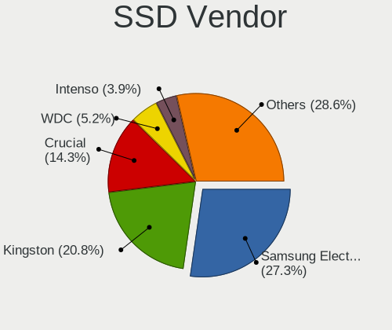
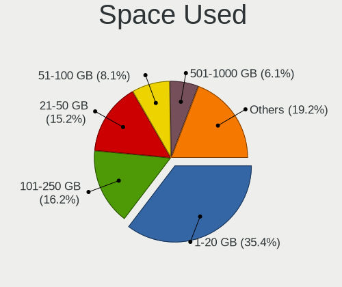
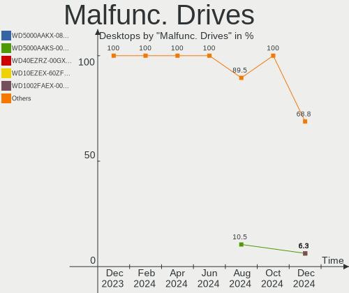
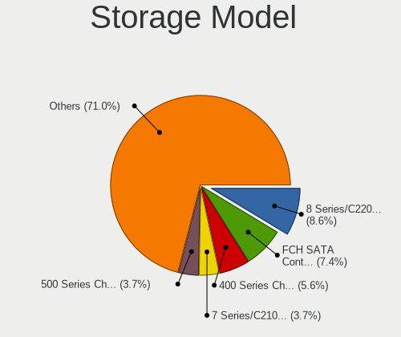
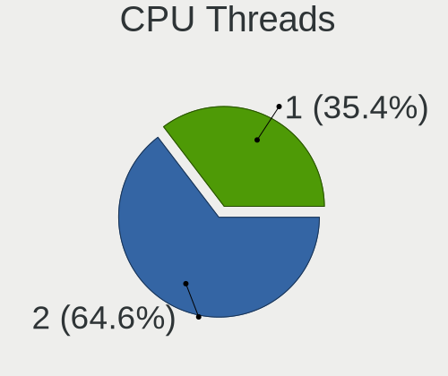
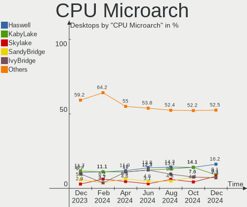
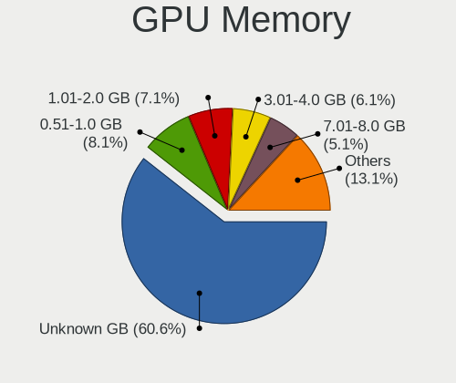
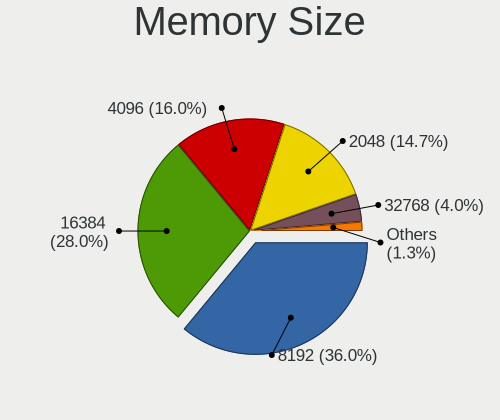
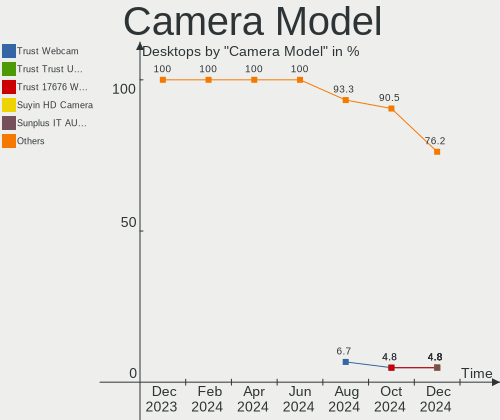

Linux in Italy - Hardware Trends (Desktops)
-------------------------------------------

A project to identify most popular hardware characteristics and track their change
over time based on data collected by Linux users at https://Linux-Hardware.org.

Anyone can contribute to this report by the [hw-probe](https://github.com/linuxhw/hw-probe) tool:

    sudo -E hw-probe -all -upload

Period: Mar, 2023.

Contents
--------

* [ System ](#system)
  - [ OS                       ](#os)
  - [ OS Family                ](#os-family)
  - [ Kernel                   ](#kernel)
  - [ Kernel Family            ](#kernel-family)
  - [ Kernel Major Ver.        ](#kernel-major-ver)
  - [ Arch                     ](#arch)
  - [ DE                       ](#de)
  - [ Display Server           ](#display-server)
  - [ Display Manager          ](#display-manager)
  - [ OS Lang                  ](#os-lang)
  - [ Boot Mode                ](#boot-mode)
  - [ Filesystem               ](#filesystem)
  - [ Part. scheme             ](#part-scheme)
  - [ Dual Boot with Linux/BSD ](#dual-boot-with-linuxbsd)
  - [ Dual Boot (Win)          ](#dual-boot-win)

* [ Board ](#board)
  - [ Vendor                   ](#vendor)
  - [ Model                    ](#model)
  - [ Model Family             ](#model-family)
  - [ MFG Year                 ](#mfg-year)
  - [ Form Factor              ](#form-factor)
  - [ Secure Boot              ](#secure-boot)
  - [ Coreboot                 ](#coreboot)
  - [ RAM Size                 ](#ram-size)
  - [ RAM Used                 ](#ram-used)
  - [ Total Drives             ](#total-drives)
  - [ Has CD-ROM               ](#has-cd-rom)
  - [ Has Ethernet             ](#has-ethernet)
  - [ Has WiFi                 ](#has-wifi)
  - [ Has Bluetooth            ](#has-bluetooth)

* [ Location ](#location)
  - [ Country                  ](#country)
  - [ City                     ](#city)

* [ Drives ](#drives)
  - [ Drive Vendor             ](#drive-vendor)
  - [ Drive Model              ](#drive-model)
  - [ HDD Vendor               ](#hdd-vendor)
  - [ SSD Vendor               ](#ssd-vendor)
  - [ Drive Kind               ](#drive-kind)
  - [ Drive Connector          ](#drive-connector)
  - [ Drive Size               ](#drive-size)
  - [ Space Total              ](#space-total)
  - [ Space Used               ](#space-used)
  - [ Malfunc. Drives          ](#malfunc-drives)
  - [ Malfunc. Drive Vendor    ](#malfunc-drive-vendor)
  - [ Malfunc. HDD Vendor      ](#malfunc-hdd-vendor)
  - [ Malfunc. Drive Kind      ](#malfunc-drive-kind)
  - [ Failed Drives            ](#failed-drives)
  - [ Failed Drive Vendor      ](#failed-drive-vendor)
  - [ Drive Status             ](#drive-status)

* [ Storage controller ](#storage-controller)
  - [ Storage Vendor           ](#storage-vendor)
  - [ Storage Model            ](#storage-model)
  - [ Storage Kind             ](#storage-kind)

* [ Processor ](#processor)
  - [ CPU Vendor               ](#cpu-vendor)
  - [ CPU Model                ](#cpu-model)
  - [ CPU Model Family         ](#cpu-model-family)
  - [ CPU Cores                ](#cpu-cores)
  - [ CPU Sockets              ](#cpu-sockets)
  - [ CPU Threads              ](#cpu-threads)
  - [ CPU Op-Modes             ](#cpu-op-modes)
  - [ CPU Microcode            ](#cpu-microcode)
  - [ CPU Microarch            ](#cpu-microarch)

* [ Graphics ](#graphics)
  - [ GPU Vendor               ](#gpu-vendor)
  - [ GPU Model                ](#gpu-model)
  - [ GPU Combo                ](#gpu-combo)
  - [ GPU Driver               ](#gpu-driver)
  - [ GPU Memory               ](#gpu-memory)

* [ Monitor ](#monitor)
  - [ Monitor Vendor           ](#monitor-vendor)
  - [ Monitor Model            ](#monitor-model)
  - [ Monitor Resolution       ](#monitor-resolution)
  - [ Monitor Diagonal         ](#monitor-diagonal)
  - [ Monitor Width            ](#monitor-width)
  - [ Aspect Ratio             ](#aspect-ratio)
  - [ Monitor Area             ](#monitor-area)
  - [ Pixel Density            ](#pixel-density)
  - [ Multiple Monitors        ](#multiple-monitors)

* [ Network ](#network)
  - [ Net Controller Vendor    ](#net-controller-vendor)
  - [ Net Controller Model     ](#net-controller-model)
  - [ Wireless Vendor          ](#wireless-vendor)
  - [ Wireless Model           ](#wireless-model)
  - [ Ethernet Vendor          ](#ethernet-vendor)
  - [ Ethernet Model           ](#ethernet-model)
  - [ Net Controller Kind      ](#net-controller-kind)
  - [ Used Controller          ](#used-controller)
  - [ NICs                     ](#nics)
  - [ IPv6                     ](#ipv6)

* [ Bluetooth ](#bluetooth)
  - [ Bluetooth Vendor         ](#bluetooth-vendor)
  - [ Bluetooth Model          ](#bluetooth-model)

* [ Sound ](#sound)
  - [ Sound Vendor             ](#sound-vendor)
  - [ Sound Model              ](#sound-model)

* [ Memory ](#memory)
  - [ Memory Vendor            ](#memory-vendor)
  - [ Memory Model             ](#memory-model)
  - [ Memory Kind              ](#memory-kind)
  - [ Memory Form Factor       ](#memory-form-factor)
  - [ Memory Size              ](#memory-size)
  - [ Memory Speed             ](#memory-speed)

* [ Printers & scanners ](#printers--scanners)
  - [ Printer Vendor           ](#printer-vendor)
  - [ Printer Model            ](#printer-model)
  - [ Scanner Vendor           ](#scanner-vendor)
  - [ Scanner Model            ](#scanner-model)

* [ Camera ](#camera)
  - [ Camera Vendor            ](#camera-vendor)
  - [ Camera Model             ](#camera-model)

* [ Security ](#security)
  - [ Fingerprint Vendor       ](#fingerprint-vendor)
  - [ Fingerprint Model        ](#fingerprint-model)
  - [ Chipcard Vendor          ](#chipcard-vendor)
  - [ Chipcard Model           ](#chipcard-model)

* [ Unsupported ](#unsupported)
  - [ Unsupported Devices      ](#unsupported-devices)
  - [ Unsupported Device Types ](#unsupported-device-types)

System
------

OS
--

Installed operating systems

| Name                         | Desktops | Percent |
|------------------------------|----------|---------|
| Ubuntu 22.04                 | 10       | 11.11%  |
| Ubuntu 22.10                 | 8        | 8.89%   |
| OpenMandriva 23.01           | 8        | 8.89%   |
| Linux Mint 21.1              | 8        | 8.89%   |
| Debian 11                    | 7        | 7.78%   |
| Arch Rolling                 | 7        | 7.78%   |
| Fedora 37                    | 5        | 5.56%   |
| OpenMandriva 23.03           | 4        | 4.44%   |
| Zorin 16                     | 3        | 3.33%   |
| openSUSE Tumbleweed-XXXXXXXX | 3        | 3.33%   |
| Ubuntu MATE 22.04            | 2        | 2.22%   |
| Ubuntu 20.04                 | 2        | 2.22%   |
| OpenMandriva 4.3             | 2        | 2.22%   |
| Kubuntu 22.10                | 2        | 2.22%   |
| ArcoLinux Rolling            | 2        | 2.22%   |
| Xubuntu 22.10                | 1        | 1.11%   |
| Ubuntu MATE 23.04            | 1        | 1.11%   |
| SteamOS 3.4                  | 1        | 1.11%   |
| ROSA 12.3                    | 1        | 1.11%   |
| Reborn OS                    | 1        | 1.11%   |
| Oracle Linux 8.5             | 1        | 1.11%   |
| Nobara 37                    | 1        | 1.11%   |
| Manjaro                      | 1        | 1.11%   |
| Mageia 8                     | 1        | 1.11%   |
| Lubuntu 22.04                | 1        | 1.11%   |
| Kubuntu 22.04                | 1        | 1.11%   |
| KDE neon 22.04               | 1        | 1.11%   |
| Kali 2023.1                  | 1        | 1.11%   |
| EndeavourOS Rolling          | 1        | 1.11%   |
| Elementary 7                 | 1        | 1.11%   |
| Elementary 6.1               | 1        | 1.11%   |
| Debian 10                    | 1        | 1.11%   |

OS Family
---------

OS without a version

| Name         | Desktops | Percent |
|--------------|----------|---------|
| Ubuntu       | 20       | 22.22%  |
| OpenMandriva | 14       | 15.56%  |
| Linux Mint   | 8        | 8.89%   |
| Debian       | 8        | 8.89%   |
| Arch         | 7        | 7.78%   |
| Fedora       | 5        | 5.56%   |
| Zorin        | 3        | 3.33%   |
| Ubuntu MATE  | 3        | 3.33%   |
| openSUSE     | 3        | 3.33%   |
| Kubuntu      | 3        | 3.33%   |
| Elementary   | 2        | 2.22%   |
| ArcoLinux    | 2        | 2.22%   |
| Xubuntu      | 1        | 1.11%   |
| SteamOS      | 1        | 1.11%   |
| ROSA         | 1        | 1.11%   |
| Reborn OS    | 1        | 1.11%   |
| Oracle Linux | 1        | 1.11%   |
| Nobara       | 1        | 1.11%   |
| Manjaro      | 1        | 1.11%   |
| Mageia       | 1        | 1.11%   |
| Lubuntu      | 1        | 1.11%   |
| KDE neon     | 1        | 1.11%   |
| Kali         | 1        | 1.11%   |
| EndeavourOS  | 1        | 1.11%   |

Kernel
------

Version of the Linux kernel

| Version                                | Desktops | Percent |
|----------------------------------------|----------|---------|
| 5.19.0-35-generic                      | 13       | 14.44%  |
| 5.15.0-67-generic                      | 8        | 8.89%   |
| 6.1.1-desktop-1omv2290                 | 6        | 6.67%   |
| 5.10.0-21-amd64                        | 5        | 5.56%   |
| 6.2.6-desktop-1omv2390                 | 4        | 4.44%   |
| 5.19.0-38-generic                      | 4        | 4.44%   |
| 6.2.8-arch1-1                          | 3        | 3.33%   |
| 5.19.0-32-generic                      | 3        | 3.33%   |
| 5.15.0-56-generic                      | 3        | 3.33%   |
| 6.2.7-200.fc37.x86_64                  | 2        | 2.22%   |
| 6.2.2-arch1-1                          | 2        | 2.22%   |
| 6.2.1-arch1-1                          | 2        | 2.22%   |
| 6.2.1-1-default                        | 2        | 2.22%   |
| 6.1.18-200.fc37.x86_64                 | 2        | 2.22%   |
| 5.19.0-31-generic                      | 2        | 2.22%   |
| 5.16.7-desktop-1omv4003                | 2        | 2.22%   |
| 5.15.0-60-generic                      | 2        | 2.22%   |
| 6.2.8-x64v3-xanmod1                    | 1        | 1.11%   |
| 6.2.6-zen1-1-zen                       | 1        | 1.11%   |
| 6.2.6-arch1-1                          | 1        | 1.11%   |
| 6.2.6-1-default                        | 1        | 1.11%   |
| 6.2.3-060203-generic                   | 1        | 1.11%   |
| 6.2.2-zen1-1-zen                       | 1        | 1.11%   |
| 6.2.2-desktop-1omv2390                 | 1        | 1.11%   |
| 6.1.4-desktop-1omv2301                 | 1        | 1.11%   |
| 6.1.19-1-MANJARO                       | 1        | 1.11%   |
| 6.1.18-060118-generic                  | 1        | 1.11%   |
| 6.1.15-200.fc37.x86_64                 | 1        | 1.11%   |
| 6.1.14-201.fsync.fc37.x86_64           | 1        | 1.11%   |
| 6.1.12-arch1-1                         | 1        | 1.11%   |
| 6.1.0-kali5-amd64                      | 1        | 1.11%   |
| 6.1.0-16-generic                       | 1        | 1.11%   |
| 6.0.0-0.deb11.6-amd64                  | 1        | 1.11%   |
| 5.4.17-2136.300.7.el8uek.x86_64        | 1        | 1.11%   |
| 5.19.0-37-generic                      | 1        | 1.11%   |
| 5.18.1-arch1_testHoloISO_20220606.1811 | 1        | 1.11%   |
| 5.15.98-desktop-1.mga8                 | 1        | 1.11%   |
| 5.15.79-generic-1rosa2021.1-x86_64     | 1        | 1.11%   |
| 5.15.0-58-generic                      | 1        | 1.11%   |
| 5.15.0-25-generic                      | 1        | 1.11%   |

Kernel Family
-------------

Linux kernel without a distro release

| Version | Desktops | Percent |
|---------|----------|---------|
| 5.19.0  | 23       | 25.56%  |
| 5.15.0  | 15       | 16.67%  |
| 6.2.6   | 7        | 7.78%   |
| 6.1.1   | 6        | 6.67%   |
| 5.10.0  | 5        | 5.56%   |
| 6.2.8   | 4        | 4.44%   |
| 6.2.2   | 4        | 4.44%   |
| 6.2.1   | 4        | 4.44%   |
| 6.1.18  | 3        | 3.33%   |
| 6.2.7   | 2        | 2.22%   |
| 6.1.0   | 2        | 2.22%   |
| 5.16.7  | 2        | 2.22%   |
| 6.2.3   | 1        | 1.11%   |
| 6.1.4   | 1        | 1.11%   |
| 6.1.19  | 1        | 1.11%   |
| 6.1.15  | 1        | 1.11%   |
| 6.1.14  | 1        | 1.11%   |
| 6.1.12  | 1        | 1.11%   |
| 6.0.0   | 1        | 1.11%   |
| 5.4.17  | 1        | 1.11%   |
| 5.18.1  | 1        | 1.11%   |
| 5.15.98 | 1        | 1.11%   |
| 5.15.79 | 1        | 1.11%   |
| 5.13.19 | 1        | 1.11%   |
| 4.19.0  | 1        | 1.11%   |

Kernel Major Ver.
-----------------

Linux kernel major version

| Version | Desktops | Percent |
|---------|----------|---------|
| 5.19    | 23       | 25.56%  |
| 6.2     | 22       | 24.44%  |
| 5.15    | 17       | 18.89%  |
| 6.1     | 16       | 17.78%  |
| 5.10    | 5        | 5.56%   |
| 5.16    | 2        | 2.22%   |
| 6.0     | 1        | 1.11%   |
| 5.4     | 1        | 1.11%   |
| 5.18    | 1        | 1.11%   |
| 5.13    | 1        | 1.11%   |
| 4.19    | 1        | 1.11%   |

Arch
----

OS architecture (x86_64, i586, etc.)

| Name   | Desktops | Percent |
|--------|----------|---------|
| x86_64 | 90       | 100%    |

DE
--

Desktop Environment

| Name          | Desktops | Percent |
|---------------|----------|---------|
| GNOME         | 35       | 38.89%  |
| KDE5          | 27       | 30%     |
| MATE          | 7        | 7.78%   |
| X-Cinnamon    | 5        | 5.56%   |
| XFCE          | 4        | 4.44%   |
| Unknown       | 3        | 3.33%   |
| Pantheon      | 2        | 2.22%   |
| LXQt          | 2        | 2.22%   |
| GNOME Classic | 2        | 2.22%   |
| Hyprland      | 1        | 1.11%   |
| Cinnamon      | 1        | 1.11%   |
| Budgie        | 1        | 1.11%   |

Display Server
--------------

X11 or Wayland

| Name    | Desktops | Percent |
|---------|----------|---------|
| X11     | 63       | 70%     |
| Wayland | 22       | 24.44%  |
| Tty     | 5        | 5.56%   |

Display Manager
---------------

SDDM, LightDM, etc.

| Name    | Desktops | Percent |
|---------|----------|---------|
| Unknown | 29       | 32.22%  |
| SDDM    | 21       | 23.33%  |
| GDM3    | 21       | 23.33%  |
| LightDM | 10       | 11.11%  |
| GDM     | 8        | 8.89%   |
| LXDM    | 1        | 1.11%   |

OS Lang
-------

Language

| Lang       | Desktops | Percent |
|------------|----------|---------|
| it_IT      | 67       | 74.44%  |
| en_US      | 18       | 20%     |
| it_IT@euro | 1        | 1.11%   |
| it         | 1        | 1.11%   |
| en_IE      | 1        | 1.11%   |
| en_GB      | 1        | 1.11%   |
| C          | 1        | 1.11%   |

Boot Mode
---------

EFI or BIOS

| Mode | Desktops | Percent |
|------|----------|---------|
| BIOS | 47       | 52.22%  |
| EFI  | 43       | 47.78%  |

Filesystem
----------

Type of filesystem

| Type    | Desktops | Percent |
|---------|----------|---------|
| Ext4    | 60       | 66.67%  |
| Overlay | 12       | 13.33%  |
| Btrfs   | 12       | 13.33%  |
| Xfs     | 3        | 3.33%   |
| F2fs    | 2        | 2.22%   |
| Tmpfs   | 1        | 1.11%   |

Part. scheme
------------

Scheme of partitioning

| Type    | Desktops | Percent |
|---------|----------|---------|
| GPT     | 51       | 56.67%  |
| Unknown | 27       | 30%     |
| MBR     | 12       | 13.33%  |

Dual Boot with Linux/BSD
------------------------

Hosting more than one Linux/BSD

| Dual boot | Desktops | Percent |
|-----------|----------|---------|
| No        | 73       | 81.11%  |
| Yes       | 17       | 18.89%  |

Dual Boot (Win)
---------------

Hosting Linux and Windows

| Dual boot | Desktops | Percent |
|-----------|----------|---------|
| No        | 61       | 67.78%  |
| Yes       | 29       | 32.22%  |

Board
-----

Vendor
------

Motherboard manufacturer

| Name                                 | Desktops | Percent |
|--------------------------------------|----------|---------|
| ASUSTek Computer                     | 25       | 27.78%  |
| MSI                                  | 15       | 16.67%  |
| ASRock                               | 11       | 12.22%  |
| Gigabyte Technology                  | 8        | 8.89%   |
| Hewlett-Packard                      | 7        | 7.78%   |
| Acer                                 | 7        | 7.78%   |
| Lenovo                               | 3        | 3.33%   |
| Dell                                 | 3        | 3.33%   |
| Fujitsu                              | 2        | 2.22%   |
| AZW                                  | 2        | 2.22%   |
| AMI                                  | 2        | 2.22%   |
| Techvision                           | 1        | 1.11%   |
| Shenzhen Meigao Electronic Equipment | 1        | 1.11%   |
| Packard Bell                         | 1        | 1.11%   |
| DFI                                  | 1        | 1.11%   |
| Unknown                              | 1        | 1.11%   |

Model
-----

Motherboard model

| Name                                       | Desktops | Percent |
|--------------------------------------------|----------|---------|
| MSI MS-7D09                                | 2        | 2.22%   |
| MSI MS-7C56                                | 2        | 2.22%   |
| MSI MS-7C37                                | 2        | 2.22%   |
| MSI MS-7B86                                | 2        | 2.22%   |
| AZW U59                                    | 2        | 2.22%   |
| ASUS All Series                            | 2        | 2.22%   |
| ASRock X570 Phantom Gaming 4               | 2        | 2.22%   |
| AMI Intel                                  | 2        | 2.22%   |
| Techvision TVI7309X                        | 1        | 1.11%   |
| Shenzhen Meigao Electronic Equipment HX90G | 1        | 1.11%   |
| Packard Bell IMEDIA S3800                  | 1        | 1.11%   |
| MSI MS-7D43                                | 1        | 1.11%   |
| MSI MS-7C91                                | 1        | 1.11%   |
| MSI MS-7B89                                | 1        | 1.11%   |
| MSI MS-7971                                | 1        | 1.11%   |
| MSI MS-7693                                | 1        | 1.11%   |
| MSI MS-7636                                | 1        | 1.11%   |
| MSI MS-7586                                | 1        | 1.11%   |
| Lenovo ThinkStation E31 2553B49            | 1        | 1.11%   |
| Lenovo IdeaCentre 720-18APR 90HY002EIX     | 1        | 1.11%   |
| Lenovo H30-05 90BJ001XIX                   | 1        | 1.11%   |
| HP ProDesk 600 G1 SFF                      | 1        | 1.11%   |
| HP Pavilion Desktop 590-p0xxx              | 1        | 1.11%   |
| HP EliteOne 800 G1 Touch AiO               | 1        | 1.11%   |
| HP Compaq Elite 8300 SFF                   | 1        | 1.11%   |
| HP Compaq Elite 8300 CMT                   | 1        | 1.11%   |
| HP Compaq 8000 Elite SFF PC                | 1        | 1.11%   |
| HP 500-524nl                               | 1        | 1.11%   |
| Gigabyte Z390 M                            | 1        | 1.11%   |
| Gigabyte Z370N WIFI                        | 1        | 1.11%   |
| Gigabyte X570S AERO G                      | 1        | 1.11%   |
| Gigabyte X570 I AORUS PRO WIFI             | 1        | 1.11%   |
| Gigabyte H81M-S2PV                         | 1        | 1.11%   |
| Gigabyte B550M AORUS PRO-P                 | 1        | 1.11%   |
| Gigabyte A320M-S2H                         | 1        | 1.11%   |
| Gigabyte 970A-DS3P                         | 1        | 1.11%   |
| Fujitsu ESPRIMO_P756                       | 1        | 1.11%   |
| Fujitsu ESPRIMO P9900                      | 1        | 1.11%   |
| DFI LP UT X58                              | 1        | 1.11%   |
| Dell OptiPlex 980                          | 1        | 1.11%   |

Model Family
------------

Motherboard model prefix

| Name                                       | Desktops | Percent |
|--------------------------------------------|----------|---------|
| Acer Veriton                               | 5        | 5.56%   |
| ASUS TUF                                   | 4        | 4.44%   |
| ASUS ROG                                   | 4        | 4.44%   |
| HP Compaq                                  | 3        | 3.33%   |
| Dell OptiPlex                              | 3        | 3.33%   |
| MSI MS-7D09                                | 2        | 2.22%   |
| MSI MS-7C56                                | 2        | 2.22%   |
| MSI MS-7C37                                | 2        | 2.22%   |
| MSI MS-7B86                                | 2        | 2.22%   |
| Fujitsu ESPRIMO                            | 2        | 2.22%   |
| AZW U59                                    | 2        | 2.22%   |
| ASUS PRIME                                 | 2        | 2.22%   |
| ASUS All                                   | 2        | 2.22%   |
| ASRock X570                                | 2        | 2.22%   |
| AMI Intel                                  | 2        | 2.22%   |
| Acer Aspire                                | 2        | 2.22%   |
| Techvision TVI7309X                        | 1        | 1.11%   |
| Shenzhen Meigao Electronic Equipment HX90G | 1        | 1.11%   |
| Packard Bell IMEDIA                        | 1        | 1.11%   |
| MSI MS-7D43                                | 1        | 1.11%   |
| MSI MS-7C91                                | 1        | 1.11%   |
| MSI MS-7B89                                | 1        | 1.11%   |
| MSI MS-7971                                | 1        | 1.11%   |
| MSI MS-7693                                | 1        | 1.11%   |
| MSI MS-7636                                | 1        | 1.11%   |
| MSI MS-7586                                | 1        | 1.11%   |
| Lenovo ThinkStation                        | 1        | 1.11%   |
| Lenovo IdeaCentre                          | 1        | 1.11%   |
| Lenovo H30-05                              | 1        | 1.11%   |
| HP ProDesk                                 | 1        | 1.11%   |
| HP Pavilion                                | 1        | 1.11%   |
| HP EliteOne                                | 1        | 1.11%   |
| HP 500-524nl                               | 1        | 1.11%   |
| Gigabyte Z390                              | 1        | 1.11%   |
| Gigabyte Z370N                             | 1        | 1.11%   |
| Gigabyte X570S                             | 1        | 1.11%   |
| Gigabyte X570                              | 1        | 1.11%   |
| Gigabyte H81M-S2PV                         | 1        | 1.11%   |
| Gigabyte B550M                             | 1        | 1.11%   |
| Gigabyte A320M-S2H                         | 1        | 1.11%   |

MFG Year
--------

Motherboard manufacture year

| Year | Desktops | Percent |
|------|----------|---------|
| 2021 | 12       | 13.33%  |
| 2019 | 12       | 13.33%  |
| 2020 | 8        | 8.89%   |
| 2018 | 7        | 7.78%   |
| 2017 | 6        | 6.67%   |
| 2013 | 6        | 6.67%   |
| 2012 | 6        | 6.67%   |
| 2011 | 6        | 6.67%   |
| 2009 | 6        | 6.67%   |
| 2022 | 5        | 5.56%   |
| 2014 | 5        | 5.56%   |
| 2010 | 5        | 5.56%   |
| 2016 | 2        | 2.22%   |
| 2015 | 2        | 2.22%   |
| 2008 | 2        | 2.22%   |

Form Factor
-----------

Physical design of the computer

| Name    | Desktops | Percent |
|---------|----------|---------|
| Desktop | 90       | 100%    |

Secure Boot
-----------

Enabled or disabled

| State    | Desktops | Percent |
|----------|----------|---------|
| Disabled | 88       | 97.78%  |
| Enabled  | 2        | 2.22%   |

Coreboot
--------

Have coreboot on board

| Used | Desktops | Percent |
|------|----------|---------|
| No   | 90       | 100%    |

RAM Size
--------

Total RAM memory

| Size in GB  | Desktops | Percent |
|-------------|----------|---------|
| 4.01-8.0    | 19       | 21.11%  |
| 16.01-24.0  | 19       | 21.11%  |
| 32.01-64.0  | 18       | 20%     |
| 8.01-16.0   | 18       | 20%     |
| 3.01-4.0    | 9        | 10%     |
| 64.01-256.0 | 6        | 6.67%   |
| 2.01-3.0    | 1        | 1.11%   |

RAM Used
--------

Used RAM memory

| Used GB    | Desktops | Percent |
|------------|----------|---------|
| 1.01-2.0   | 27       | 30%     |
| 2.01-3.0   | 26       | 28.89%  |
| 4.01-8.0   | 16       | 17.78%  |
| 3.01-4.0   | 16       | 17.78%  |
| 8.01-16.0  | 2        | 2.22%   |
| 16.01-24.0 | 1        | 1.11%   |
| 0.51-1.0   | 1        | 1.11%   |
| 0.01-0.5   | 1        | 1.11%   |

Total Drives
------------

Number of drives on board

| Drives | Desktops | Percent |
|--------|----------|---------|
| 1      | 32       | 35.56%  |
| 2      | 28       | 31.11%  |
| 3      | 17       | 18.89%  |
| 5      | 7        | 7.78%   |
| 4      | 5        | 5.56%   |
| 6      | 1        | 1.11%   |

Has CD-ROM
----------

Has CD-ROM on board

| Presented | Desktops | Percent |
|-----------|----------|---------|
| No        | 52       | 57.78%  |
| Yes       | 38       | 42.22%  |

Has Ethernet
------------

Has Ethernet on board

| Presented | Desktops | Percent |
|-----------|----------|---------|
| Yes       | 90       | 100%    |

Has WiFi
--------

Has WiFi module

| Presented | Desktops | Percent |
|-----------|----------|---------|
| No        | 48       | 53.33%  |
| Yes       | 42       | 46.67%  |

Has Bluetooth
-------------

Has Bluetooth module

| Presented | Desktops | Percent |
|-----------|----------|---------|
| Yes       | 51       | 56.67%  |
| No        | 39       | 43.33%  |

Location
--------

Country
-------

Geographic location (country)

| Country | Desktops | Percent |
|---------|----------|---------|
| Italy   | 90       | 100%    |

City
----

Geographic location (city)

| City                  | Desktops | Percent |
|-----------------------|----------|---------|
| Rome                  | 9        | 10%     |
| Milan                 | 8        | 8.89%   |
| Milano                | 6        | 6.67%   |
| Turin                 | 5        | 5.56%   |
| Naples                | 3        | 3.33%   |
| Genoa                 | 2        | 2.22%   |
| Florence              | 2        | 2.22%   |
| Zevio                 | 1        | 1.11%   |
| Villachiara           | 1        | 1.11%   |
| Vicenza               | 1        | 1.11%   |
| Verona                | 1        | 1.11%   |
| Verbania              | 1        | 1.11%   |
| Vajont                | 1        | 1.11%   |
| Uzzano                | 1        | 1.11%   |
| Spoltore              | 1        | 1.11%   |
| Siena                 | 1        | 1.11%   |
| Sestri Levante        | 1        | 1.11%   |
| Savona                | 1        | 1.11%   |
| Sassari               | 1        | 1.11%   |
| Sarzana               | 1        | 1.11%   |
| Sant'Antimo           | 1        | 1.11%   |
| San Severino Marche   | 1        | 1.11%   |
| San Giovanni Lupatoto | 1        | 1.11%   |
| Ruvo di Puglia        | 1        | 1.11%   |
| Riccione              | 1        | 1.11%   |
| Reggio Calabria       | 1        | 1.11%   |
| Ranica                | 1        | 1.11%   |
| Prad am Stilfser Joch | 1        | 1.11%   |
| Perugia               | 1        | 1.11%   |
| Parma                 | 1        | 1.11%   |
| Palermo               | 1        | 1.11%   |
| Paese                 | 1        | 1.11%   |
| Niardo                | 1        | 1.11%   |
| Mombello di Torino    | 1        | 1.11%   |
| Messina               | 1        | 1.11%   |
| Mantova               | 1        | 1.11%   |
| Lurate Caccivio       | 1        | 1.11%   |
| Lugo                  | 1        | 1.11%   |
| Legnaro               | 1        | 1.11%   |
| Grassobbio            | 1        | 1.11%   |

Drives
------

Drive Vendor
------------

Hard drive vendors

| Vendor                      | Desktops | Drives | Percent |
|-----------------------------|----------|--------|---------|
| Seagate                     | 30       | 38     | 17.24%  |
| Samsung Electronics         | 28       | 35     | 16.09%  |
| WDC                         | 26       | 32     | 14.94%  |
| Kingston                    | 16       | 16     | 9.2%    |
| Crucial                     | 12       | 13     | 6.9%    |
| Toshiba                     | 11       | 11     | 6.32%   |
| Sandisk                     | 5        | 6      | 2.87%   |
| Phison                      | 4        | 4      | 2.3%    |
| Micron/Crucial Technology   | 4        | 4      | 2.3%    |
| Hitachi                     | 4        | 4      | 2.3%    |
| HGST                        | 4        | 4      | 2.3%    |
| Phison Electronics          | 3        | 3      | 1.72%   |
| SK hynix                    | 2        | 2      | 1.15%   |
| Maxtor                      | 2        | 2      | 1.15%   |
| China                       | 2        | 2      | 1.15%   |
| A-DATA Technology           | 2        | 3      | 1.15%   |
| Unknown                     | 1        | 1      | 0.57%   |
| T-FORCE                     | 1        | 1      | 0.57%   |
| SABRENT                     | 1        | 1      | 0.57%   |
| PNY                         | 1        | 1      | 0.57%   |
| OCZ                         | 1        | 1      | 0.57%   |
| Lexar                       | 1        | 1      | 0.57%   |
| KIOXIA                      | 1        | 2      | 0.57%   |
| Kingston Technology Company | 1        | 1      | 0.57%   |
| JMicron Technology          | 1        | 1      | 0.57%   |
| iODD                        | 1        | 1      | 0.57%   |
| Intenso                     | 1        | 1      | 0.57%   |
| GSemi                       | 1        | 1      | 0.57%   |
| GOODRAM                     | 1        | 1      | 0.57%   |
| Gigabyte Technology         | 1        | 1      | 0.57%   |
| Corsair                     | 1        | 1      | 0.57%   |
| ASMT                        | 1        | 1      | 0.57%   |
| Apple                       | 1        | 1      | 0.57%   |
| ADATA Technology            | 1        | 1      | 0.57%   |
| 2-Power                     | 1        | 1      | 0.57%   |

Drive Model
-----------

Hard drive models

| Model                                               | Desktops | Percent |
|-----------------------------------------------------|----------|---------|
| Kingston SA400S37240G 240GB SSD                     | 6        | 3.13%   |
| Samsung NVMe SSD Controller SM981/PM981/PM983 250GB | 5        | 2.6%    |
| Seagate ST500DM002-1BD142 500GB                     | 4        | 2.08%   |
| Seagate ST2000DM008-2FR102 2TB                      | 4        | 2.08%   |
| Samsung SSD 860 EVO 500GB                           | 4        | 2.08%   |
| Crucial CT500MX500SSD1 500GB                        | 4        | 2.08%   |
| Phison Sabrent 512GB                                | 3        | 1.56%   |
| WDC WD5000AADS-00S9B0 500GB                         | 2        | 1.04%   |
| WDC WD10EZEX-08WN4A0 1TB                            | 2        | 1.04%   |
| Toshiba DT01ACA100 1TB                              | 2        | 1.04%   |
| SK hynix HCG8e  64GB                                | 2        | 1.04%   |
| Seagate ST1000DM010-2EP102 1TB                      | 2        | 1.04%   |
| Seagate ST1000DM003-1ER162 1TB                      | 2        | 1.04%   |
| Seagate Basic 2TB                                   | 2        | 1.04%   |
| Samsung SSD 970 EVO Plus 1TB                        | 2        | 1.04%   |
| Samsung SSD 850 EVO 500GB                           | 2        | 1.04%   |
| Samsung SSD 850 EVO 250GB                           | 2        | 1.04%   |
| Samsung SSD 840 Series 250GB                        | 2        | 1.04%   |
| Samsung NVMe SSD Controller PM9A1/PM9A3/980PRO 1TB  | 2        | 1.04%   |
| Phison E12 NVMe Controller 256GB                    | 2        | 1.04%   |
| Kingston SA400S37960G 960GB SSD                     | 2        | 1.04%   |
| Kingston SA400S37480G 480GB SSD                     | 2        | 1.04%   |
| Crucial CT500P2SSD8 500GB                           | 2        | 1.04%   |
| WDC WDS250G3X0C-00SJG0 250GB                        | 1        | 0.52%   |
| WDC WDS120G2G0B-00EPW0 120GB SSD                    | 1        | 0.52%   |
| WDC WDS120G2G0A-00JH30 120GB SSD                    | 1        | 0.52%   |
| WDC WD800JD-00JNC0 80GB                             | 1        | 0.52%   |
| WDC WD7500BPKX-00HPJT0 752GB                        | 1        | 0.52%   |
| WDC WD5000LPCX-60VHAT0 500GB                        | 1        | 0.52%   |
| WDC WD5000AVDS-63U7B1 500GB                         | 1        | 0.52%   |
| WDC WD5000AAKX-60U6AA0 500GB                        | 1        | 0.52%   |
| WDC WD5000AAKX-22ERMA0 500GB                        | 1        | 0.52%   |
| WDC WD5000AAKX-08U6AA0 500GB                        | 1        | 0.52%   |
| WDC WD5000AAKS-22YGA0 500GB                         | 1        | 0.52%   |
| WDC WD40EFRX-68WT0N0 4TB                            | 1        | 0.52%   |
| WDC WD30EZRZ-22Z5HB0 3TB                            | 1        | 0.52%   |
| WDC WD30EZRZ-00Z5HB0 3TB                            | 1        | 0.52%   |
| WDC WD2500BEVT-26ZCT0 250GB                         | 1        | 0.52%   |
| WDC WD2500AAKX-221CA1 250GB                         | 1        | 0.52%   |
| WDC WD20EZAZ-00GGJB0 2TB                            | 1        | 0.52%   |

HDD Vendor
----------

Hard disk drive vendors

| Vendor  | Desktops | Drives | Percent |
|---------|----------|--------|---------|
| Seagate | 27       | 34     | 36.49%  |
| WDC     | 24       | 29     | 32.43%  |
| Toshiba | 9        | 9      | 12.16%  |
| Hitachi | 4        | 4      | 5.41%   |
| HGST    | 4        | 4      | 5.41%   |
| Maxtor  | 2        | 2      | 2.7%    |
| Unknown | 1        | 1      | 1.35%   |
| SABRENT | 1        | 1      | 1.35%   |
| ASMT    | 1        | 1      | 1.35%   |
| Apple   | 1        | 1      | 1.35%   |

SSD Vendor
----------

Solid state drive vendors

| Vendor              | Desktops | Drives | Percent |
|---------------------|----------|--------|---------|
| Samsung Electronics | 20       | 20     | 31.75%  |
| Kingston            | 14       | 14     | 22.22%  |
| Crucial             | 9        | 9      | 14.29%  |
| SanDisk             | 3        | 4      | 4.76%   |
| WDC                 | 2        | 2      | 3.17%   |
| China               | 2        | 2      | 3.17%   |
| A-DATA Technology   | 2        | 3      | 3.17%   |
| PNY                 | 1        | 1      | 1.59%   |
| OCZ                 | 1        | 1      | 1.59%   |
| Lexar               | 1        | 1      | 1.59%   |
| JMicron Technology  | 1        | 1      | 1.59%   |
| iODD                | 1        | 1      | 1.59%   |
| Intenso             | 1        | 1      | 1.59%   |
| GSemi               | 1        | 1      | 1.59%   |
| GOODRAM             | 1        | 1      | 1.59%   |
| Gigabyte Technology | 1        | 1      | 1.59%   |
| Corsair             | 1        | 1      | 1.59%   |
| 2-Power             | 1        | 1      | 1.59%   |

Drive Kind
----------

HDD or SSD

| Kind    | Desktops | Drives | Percent |
|---------|----------|--------|---------|
| HDD     | 58       | 86     | 38.41%  |
| SSD     | 55       | 65     | 36.42%  |
| NVMe    | 32       | 41     | 21.19%  |
| Unknown | 4        | 5      | 2.65%   |
| MMC     | 2        | 2      | 1.32%   |

Drive Connector
---------------

SATA, SAS, NVMe, etc.

| Type | Desktops | Drives | Percent |
|------|----------|--------|---------|
| SATA | 79       | 145    | 65.29%  |
| NVMe | 32       | 41     | 26.45%  |
| SAS  | 8        | 11     | 6.61%   |
| MMC  | 2        | 2      | 1.65%   |

Drive Size
----------

Size of hard drive

| Size in TB | Desktops | Drives | Percent |
|------------|----------|--------|---------|
| 0.01-0.5   | 62       | 93     | 55.36%  |
| 0.51-1.0   | 30       | 34     | 26.79%  |
| 1.01-2.0   | 12       | 15     | 10.71%  |
| 2.01-3.0   | 4        | 4      | 3.57%   |
| 3.01-4.0   | 2        | 2      | 1.79%   |
| 4.01-10.0  | 2        | 3      | 1.79%   |

Space Total
-----------

Amount of disk space available on the file system

| Size in GB     | Desktops | Percent |
|----------------|----------|---------|
| 101-250        | 17       | 18.89%  |
| 251-500        | 15       | 16.67%  |
| 1001-2000      | 13       | 14.44%  |
| 501-1000       | 13       | 14.44%  |
| 2001-3000      | 10       | 11.11%  |
| More than 3000 | 8        | 8.89%   |
| 1-20           | 8        | 8.89%   |
| 51-100         | 3        | 3.33%   |
| Unknown        | 2        | 2.22%   |
| 21-50          | 1        | 1.11%   |

Space Used
----------

Amount of used disk space

| Used GB        | Desktops | Percent |
|----------------|----------|---------|
| 1-20           | 21       | 23.33%  |
| 101-250        | 17       | 18.89%  |
| 51-100         | 12       | 13.33%  |
| 21-50          | 11       | 12.22%  |
| 501-1000       | 9        | 10%     |
| 1001-2000      | 8        | 8.89%   |
| 251-500        | 5        | 5.56%   |
| 2001-3000      | 3        | 3.33%   |
| More than 3000 | 2        | 2.22%   |
| Unknown        | 2        | 2.22%   |

Malfunc. Drives
---------------

Drive models with a malfunction

| Model                                    | Desktops | Drives | Percent |
|------------------------------------------|----------|--------|---------|
| WDC WDS120G2G0A-00JH30 120GB SSD         | 1        | 1      | 6.25%   |
| WDC WD5000AVDS-63U7B1 500GB              | 1        | 1      | 6.25%   |
| WDC WD10EZEX-00BN5A0 1TB                 | 1        | 1      | 6.25%   |
| Toshiba MK6465GSX 640GB                  | 1        | 1      | 6.25%   |
| Toshiba MK5065GSX 500GB                  | 1        | 1      | 6.25%   |
| Toshiba MK2035GSS 200GB                  | 1        | 1      | 6.25%   |
| Toshiba DT01ACA100 1TB                   | 1        | 1      | 6.25%   |
| Seagate ST500DM002-1BD142 500GB          | 1        | 1      | 6.25%   |
| Seagate ST500DM002-1BC142 500GB          | 1        | 1      | 6.25%   |
| Seagate ST3250620AS 250GB                | 1        | 1      | 6.25%   |
| SanDisk SSD PLUS 480GB                   | 1        | 2      | 6.25%   |
| Samsung Electronics SSD 970 EVO Plus 1TB | 1        | 1      | 6.25%   |
| Maxtor STM3250310AS 250GB                | 1        | 1      | 6.25%   |
| Hitachi HDS722020ALA330 2TB              | 1        | 1      | 6.25%   |
| GSemi GSDSM256TY2F1QGCX 256GB SSD        | 1        | 1      | 6.25%   |
| Corsair Force GS 240GB SSD               | 1        | 1      | 6.25%   |

Malfunc. Drive Vendor
---------------------

Vendors of faulty drives

| Vendor              | Desktops | Drives | Percent |
|---------------------|----------|--------|---------|
| Toshiba             | 4        | 4      | 26.67%  |
| Seagate             | 3        | 3      | 20%     |
| WDC                 | 2        | 3      | 13.33%  |
| SanDisk             | 1        | 2      | 6.67%   |
| Samsung Electronics | 1        | 1      | 6.67%   |
| Maxtor              | 1        | 1      | 6.67%   |
| Hitachi             | 1        | 1      | 6.67%   |
| GSemi               | 1        | 1      | 6.67%   |
| Corsair             | 1        | 1      | 6.67%   |

Malfunc. HDD Vendor
-------------------

Vendors of faulty HDD drives

| Vendor  | Desktops | Drives | Percent |
|---------|----------|--------|---------|
| Toshiba | 4        | 4      | 36.36%  |
| Seagate | 3        | 3      | 27.27%  |
| WDC     | 2        | 2      | 18.18%  |
| Maxtor  | 1        | 1      | 9.09%   |
| Hitachi | 1        | 1      | 9.09%   |

Malfunc. Drive Kind
-------------------

Kinds of faulty drives

| Kind | Desktops | Drives | Percent |
|------|----------|--------|---------|
| HDD  | 11       | 11     | 68.75%  |
| SSD  | 4        | 5      | 25%     |
| NVMe | 1        | 1      | 6.25%   |

Failed Drives
-------------

Failed drive models

Zero info for selected period =(

Failed Drive Vendor
-------------------

Failed drive vendors

Zero info for selected period =(

Drive Status
------------

Number of failed and malfunc. drives

| Status   | Desktops | Drives | Percent |
|----------|----------|--------|---------|
| Detected | 49       | 102    | 46.23%  |
| Works    | 43       | 80     | 40.57%  |
| Malfunc  | 14       | 17     | 13.21%  |

Storage controller
------------------

Storage Vendor
--------------

Storage controller vendors

| Vendor                       | Desktops | Percent |
|------------------------------|----------|---------|
| Intel                        | 57       | 39.86%  |
| AMD                          | 32       | 22.38%  |
| Samsung Electronics          | 14       | 9.79%   |
| Micron/Crucial Technology    | 8        | 5.59%   |
| Phison Electronics           | 7        | 4.9%    |
| ASMedia Technology           | 6        | 4.2%    |
| JMicron Technology           | 4        | 2.8%    |
| SanDisk                      | 3        | 2.1%    |
| Marvell Technology Group     | 3        | 2.1%    |
| Kingston Technology Company  | 3        | 2.1%    |
| Toshiba America Info Systems | 2        | 1.4%    |
| VIA Technologies             | 1        | 0.7%    |
| Silicon Image                | 1        | 0.7%    |
| KIOXIA                       | 1        | 0.7%    |
| ADATA Technology             | 1        | 0.7%    |

Storage Model
-------------

Storage controller models

| Model                                                                          | Desktops | Percent |
|--------------------------------------------------------------------------------|----------|---------|
| AMD FCH SATA Controller [AHCI mode]                                            | 18       | 10.65%  |
| Intel 6 Series/C200 Series Chipset Family 6 port Desktop SATA AHCI Controller  | 9        | 5.33%   |
| Samsung NVMe SSD Controller SM981/PM981/PM983                                  | 8        | 4.73%   |
| ASMedia ASM1062 Serial ATA Controller                                          | 6        | 3.55%   |
| AMD 500 Series Chipset SATA Controller                                         | 6        | 3.55%   |
| AMD 400 Series Chipset SATA Controller                                         | 6        | 3.55%   |
| Phison E12 NVMe Controller                                                     | 5        | 2.96%   |
| Intel Q170/Q150/B150/H170/H110/Z170/CM236 Chipset SATA Controller [AHCI Mode]  | 5        | 2.96%   |
| Intel 8 Series/C220 Series Chipset Family 6-port SATA Controller 1 [AHCI mode] | 5        | 2.96%   |
| Samsung NVMe SSD Controller PM9A1/PM9A3/980PRO                                 | 4        | 2.37%   |
| Micron/Crucial P2 NVMe PCIe SSD                                                | 4        | 2.37%   |
| AMD 300 Series Chipset SATA Controller                                         | 4        | 2.37%   |
| Intel Jasper Lake SATA AHCI Controller                                         | 3        | 1.78%   |
| Intel Alder Lake-S PCH SATA Controller [AHCI Mode]                             | 3        | 1.78%   |
| Intel 500 Series Chipset Family SATA AHCI Controller                           | 3        | 1.78%   |
| Intel 5 Series/3400 Series Chipset 6 port SATA AHCI Controller                 | 3        | 1.78%   |
| Intel 200 Series PCH SATA controller [AHCI mode]                               | 3        | 1.78%   |
| AMD SB7x0/SB8x0/SB9x0 SATA Controller [AHCI mode]                              | 3        | 1.78%   |
| Samsung NVMe SSD Controller 980                                                | 2        | 1.18%   |
| Micron/Crucial P5 Plus NVMe PCIe SSD                                           | 2        | 1.18%   |
| Marvell Group 88SE9172 SATA 6Gb/s Controller                                   | 2        | 1.18%   |
| JMicron JMB363 SATA/IDE Controller                                             | 2        | 1.18%   |
| JMicron JMB362 SATA Controller                                                 | 2        | 1.18%   |
| Intel Volume Management Device NVMe RAID Controller                            | 2        | 1.18%   |
| Intel SATA Controller [RAID mode]                                              | 2        | 1.18%   |
| Intel NM10/ICH7 Family SATA Controller [IDE mode]                              | 2        | 1.18%   |
| Intel Celeron N3350/Pentium N4200/Atom E3900 Series SATA AHCI Controller       | 2        | 1.18%   |
| Intel Cannon Lake PCH SATA AHCI Controller                                     | 2        | 1.18%   |
| Intel 82801G (ICH7 Family) IDE Controller                                      | 2        | 1.18%   |
| Intel 7 Series/C210 Series Chipset Family 6-port SATA Controller [AHCI mode]   | 2        | 1.18%   |
| Intel 7 Series/C210 Series Chipset Family 4-port SATA Controller [IDE mode]    | 2        | 1.18%   |
| Intel 7 Series/C210 Series Chipset Family 2-port SATA Controller [IDE mode]    | 2        | 1.18%   |
| Intel 6 Series/C200 Series Chipset Family IDE-r Controller                     | 2        | 1.18%   |
| Intel 5 Series/3400 Series Chipset 4 port SATA IDE Controller                  | 2        | 1.18%   |
| Intel 5 Series/3400 Series Chipset 2 port SATA IDE Controller                  | 2        | 1.18%   |
| Intel 400 Series Chipset Family SATA AHCI Controller                           | 2        | 1.18%   |
| AMD SB7x0/SB8x0/SB9x0 IDE Controller                                           | 2        | 1.18%   |
| AMD FCH SATA Controller D                                                      | 2        | 1.18%   |
| VIA VT6415 PATA IDE Host Controller                                            | 1        | 0.59%   |
| Toshiba America Info Systems XG5 NVMe SSD Controller                           | 1        | 0.59%   |

Storage Kind
------------

Kind of storage controller (IDE, SATA, NVMe, SAS, ...)

| Kind | Desktops | Percent |
|------|----------|---------|
| SATA | 78       | 60%     |
| NVMe | 32       | 24.62%  |
| IDE  | 14       | 10.77%  |
| RAID | 6        | 4.62%   |

Processor
---------

CPU Vendor
----------

Processor vendors

| Vendor | Desktops | Percent |
|--------|----------|---------|
| Intel  | 58       | 64.44%  |
| AMD    | 32       | 35.56%  |

CPU Model
---------

Processor models

| Model                                       | Desktops | Percent |
|---------------------------------------------|----------|---------|
| AMD Ryzen 7 1700 Eight-Core Processor       | 4        | 4.44%   |
| AMD Ryzen 5 5600X 6-Core Processor          | 3        | 3.33%   |
| Intel Core i7-3770 CPU @ 3.40GHz            | 2        | 2.22%   |
| Intel Core i5-3470 CPU @ 3.20GHz            | 2        | 2.22%   |
| Intel Core i5-2400 CPU @ 3.10GHz            | 2        | 2.22%   |
| Intel Core i3 CPU 530 @ 2.93GHz             | 2        | 2.22%   |
| Intel Core 2 Duo CPU E7500 @ 2.93GHz        | 2        | 2.22%   |
| Intel Celeron N5105 @ 2.00GHz               | 2        | 2.22%   |
| Intel Celeron CPU N3350 @ 1.10GHz           | 2        | 2.22%   |
| Intel 12th Gen Core i5-12600K               | 2        | 2.22%   |
| AMD Ryzen 9 5900X 12-Core Processor         | 2        | 2.22%   |
| AMD Ryzen 7 5700G with Radeon Graphics      | 2        | 2.22%   |
| AMD Ryzen 5 5600G with Radeon Graphics      | 2        | 2.22%   |
| AMD Ryzen 5 3600 6-Core Processor           | 2        | 2.22%   |
| AMD Ryzen 5 2400G with Radeon Vega Graphics | 2        | 2.22%   |
| Intel Xeon CPU E3-1230 V2 @ 3.30GHz         | 1        | 1.11%   |
| Intel Pentium Gold G6400 CPU @ 4.00GHz      | 1        | 1.11%   |
| Intel Pentium CPU G3240 @ 3.10GHz           | 1        | 1.11%   |
| Intel Pentium CPU G3220 @ 3.00GHz           | 1        | 1.11%   |
| Intel Pentium CPU G2030 @ 3.00GHz           | 1        | 1.11%   |
| Intel Core i9-10850K CPU @ 3.60GHz          | 1        | 1.11%   |
| Intel Core i7-9700K CPU @ 3.60GHz           | 1        | 1.11%   |
| Intel Core i7-9700F CPU @ 3.00GHz           | 1        | 1.11%   |
| Intel Core i7-9700 CPU @ 3.00GHz            | 1        | 1.11%   |
| Intel Core i7-7700 CPU @ 3.60GHz            | 1        | 1.11%   |
| Intel Core i7-6700 CPU @ 3.40GHz            | 1        | 1.11%   |
| Intel Core i7-5930K CPU @ 3.50GHz           | 1        | 1.11%   |
| Intel Core i7-4960X CPU @ 3.60GHz           | 1        | 1.11%   |
| Intel Core i7-3770S CPU @ 3.10GHz           | 1        | 1.11%   |
| Intel Core i7-2600K CPU @ 3.40GHz           | 1        | 1.11%   |
| Intel Core i7-10700 CPU @ 2.90GHz           | 1        | 1.11%   |
| Intel Core i7 CPU 920 @ 2.67GHz             | 1        | 1.11%   |
| Intel Core i7 CPU 870 @ 2.93GHz             | 1        | 1.11%   |
| Intel Core i5-7600K CPU @ 3.80GHz           | 1        | 1.11%   |
| Intel Core i5-7400 CPU @ 3.00GHz            | 1        | 1.11%   |
| Intel Core i5-6600K CPU @ 3.50GHz           | 1        | 1.11%   |
| Intel Core i5-6500 CPU @ 3.20GHz            | 1        | 1.11%   |
| Intel Core i5-4570S CPU @ 2.90GHz           | 1        | 1.11%   |
| Intel Core i5-2500 CPU @ 3.30GHz            | 1        | 1.11%   |
| Intel Core i5-2320 CPU @ 3.00GHz            | 1        | 1.11%   |

CPU Model Family
----------------

Processor model prefix

| Model              | Desktops | Percent |
|--------------------|----------|---------|
| Intel Core i7      | 14       | 15.56%  |
| Intel Core i5      | 14       | 15.56%  |
| AMD Ryzen 7        | 10       | 11.11%  |
| AMD Ryzen 5        | 10       | 11.11%  |
| Intel Core i3      | 9        | 10%     |
| Intel Celeron      | 6        | 6.67%   |
| Other              | 5        | 5.56%   |
| AMD Ryzen 9        | 4        | 4.44%   |
| AMD FX             | 4        | 4.44%   |
| Intel Pentium      | 3        | 3.33%   |
| Intel Core 2 Duo   | 3        | 3.33%   |
| AMD A10            | 2        | 2.22%   |
| Intel Xeon         | 1        | 1.11%   |
| Intel Pentium Gold | 1        | 1.11%   |
| Intel Core i9      | 1        | 1.11%   |
| Intel Core 2 Quad  | 1        | 1.11%   |
| AMD Ryzen 3        | 1        | 1.11%   |
| AMD A6             | 1        | 1.11%   |

CPU Cores
---------

Number of processor cores

| Number | Desktops | Percent |
|--------|----------|---------|
| 4      | 33       | 36.67%  |
| 2      | 19       | 21.11%  |
| 8      | 17       | 18.89%  |
| 6      | 11       | 12.22%  |
| 12     | 3        | 3.33%   |
| 10     | 3        | 3.33%   |
| 3      | 3        | 3.33%   |
| 16     | 1        | 1.11%   |

CPU Sockets
-----------

Number of sockets

| Number | Desktops | Percent |
|--------|----------|---------|
| 1      | 90       | 100%    |

CPU Threads
-----------

Threads per core (Hyper-Threading)

| Number | Desktops | Percent |
|--------|----------|---------|
| 2      | 58       | 64.44%  |
| 1      | 32       | 35.56%  |

CPU Op-Modes
------------

CPU Operation Modes (32-bit, 64-bit)

| Op mode        | Desktops | Percent |
|----------------|----------|---------|
| 32-bit, 64-bit | 90       | 100%    |

CPU Microcode
-------------

Microcode number

| Number     | Desktops | Percent |
|------------|----------|---------|
| Unknown    | 41       | 45.56%  |
| 0x206a7    | 4        | 4.44%   |
| 0x506e3    | 3        | 3.33%   |
| 0x306a9    | 3        | 3.33%   |
| 0x0a201016 | 3        | 3.33%   |
| 0x08001137 | 3        | 3.33%   |
| 0xa0671    | 2        | 2.22%   |
| 0x906e9    | 2        | 2.22%   |
| 0x906c0    | 2        | 2.22%   |
| 0x90672    | 2        | 2.22%   |
| 0x506c9    | 2        | 2.22%   |
| 0x306c3    | 2        | 2.22%   |
| 0x1067a    | 2        | 2.22%   |
| 0x0a50000c | 2        | 2.22%   |
| 0x08701021 | 2        | 2.22%   |
| 0x906eb    | 1        | 1.11%   |
| 0x306f2    | 1        | 1.11%   |
| 0x20655    | 1        | 1.11%   |
| 0x20652    | 1        | 1.11%   |
| 0x106e5    | 1        | 1.11%   |
| 0x0a50000d | 1        | 1.11%   |
| 0x0a201009 | 1        | 1.11%   |
| 0x08108109 | 1        | 1.11%   |
| 0x0810100b | 1        | 1.11%   |
| 0x0800820d | 1        | 1.11%   |
| 0x08001138 | 1        | 1.11%   |
| 0x07030105 | 1        | 1.11%   |
| 0x0600611a | 1        | 1.11%   |
| 0x06000822 | 1        | 1.11%   |
| 0x06000637 | 1        | 1.11%   |

CPU Microarch
-------------

Microarchitecture

| Name             | Desktops | Percent |
|------------------|----------|---------|
| Zen 3            | 12       | 13.33%  |
| IvyBridge        | 9        | 10%     |
| Zen              | 7        | 7.78%   |
| KabyLake         | 7        | 7.78%   |
| SandyBridge      | 6        | 6.67%   |
| Haswell          | 6        | 6.67%   |
| CometLake        | 5        | 5.56%   |
| Zen 2            | 4        | 4.44%   |
| Westmere         | 4        | 4.44%   |
| Skylake          | 3        | 3.33%   |
| Piledriver       | 3        | 3.33%   |
| Penryn           | 3        | 3.33%   |
| Nehalem          | 3        | 3.33%   |
| Zen+             | 2        | 2.22%   |
| Tremont          | 2        | 2.22%   |
| Icelake          | 2        | 2.22%   |
| Goldmont         | 2        | 2.22%   |
| Bulldozer        | 2        | 2.22%   |
| Alderlake Hybrid | 2        | 2.22%   |
| Unknown          | 2        | 2.22%   |
| Puma             | 1        | 1.11%   |
| Goldmont plus    | 1        | 1.11%   |
| Excavator        | 1        | 1.11%   |
| Core             | 1        | 1.11%   |

Graphics
--------

GPU Vendor
----------

Vendors of graphics cards

| Vendor | Desktops | Percent |
|--------|----------|---------|
| Nvidia | 37       | 40.22%  |
| Intel  | 28       | 30.43%  |
| AMD    | 27       | 29.35%  |

GPU Model
---------

Graphics card models

| Model                                                                       | Desktops | Percent |
|-----------------------------------------------------------------------------|----------|---------|
| Nvidia GK208B [GeForce GT 710]                                              | 5        | 5.21%   |
| AMD Cezanne [Radeon Vega Series / Radeon Vega Mobile Series]                | 5        | 5.21%   |
| Nvidia GA104 [GeForce RTX 3060 Ti Lite Hash Rate]                           | 3        | 3.13%   |
| Intel Xeon E3-1200 v3/4th Gen Core Processor Integrated Graphics Controller | 3        | 3.13%   |
| Intel JasperLake [UHD Graphics]                                             | 3        | 3.13%   |
| AMD Navi 23 [Radeon RX 6600/6600 XT/6600M]                                  | 3        | 3.13%   |
| Nvidia TU106 [GeForce RTX 2060 Rev. A]                                      | 2        | 2.08%   |
| Nvidia GP108 [GeForce GT 1030]                                              | 2        | 2.08%   |
| Nvidia GP107 [GeForce GTX 1050 Ti]                                          | 2        | 2.08%   |
| Nvidia GM107 [GeForce GTX 750 Ti]                                           | 2        | 2.08%   |
| Nvidia GF108 [GeForce GT 440]                                               | 2        | 2.08%   |
| Intel Xeon E3-1200 v2/3rd Gen Core processor Graphics Controller            | 2        | 2.08%   |
| Intel IvyBridge GT2 [HD Graphics 4000]                                      | 2        | 2.08%   |
| Intel HD Graphics 500                                                       | 2        | 2.08%   |
| Intel CoffeeLake-S GT2 [UHD Graphics 630]                                   | 2        | 2.08%   |
| Intel AlderLake-S GT1                                                       | 2        | 2.08%   |
| Intel 4 Series Chipset Integrated Graphics Controller                       | 2        | 2.08%   |
| Intel 2nd Generation Core Processor Family Integrated Graphics Controller   | 2        | 2.08%   |
| AMD Navi 22 [Radeon RX 6700/6700 XT/6750 XT / 6800M/6850M XT]               | 2        | 2.08%   |
| AMD Navi 10 [Radeon RX 5600 OEM/5600 XT / 5700/5700 XT]                     | 2        | 2.08%   |
| AMD Ellesmere [Radeon RX 470/480/570/570X/580/580X/590]                     | 2        | 2.08%   |
| Nvidia TU116 [GeForce GTX 1660 Ti]                                          | 1        | 1.04%   |
| Nvidia GT218 [GeForce 310]                                                  | 1        | 1.04%   |
| Nvidia GT216 [GeForce GT 220]                                               | 1        | 1.04%   |
| Nvidia GP107 [GeForce GTX 1050]                                             | 1        | 1.04%   |
| Nvidia GP106 [GeForce GTX 1060 3GB]                                         | 1        | 1.04%   |
| Nvidia GP104 [GeForce GTX 1080]                                             | 1        | 1.04%   |
| Nvidia GP104 [GeForce GTX 1070]                                             | 1        | 1.04%   |
| Nvidia GP102 [GeForce GTX 1080 Ti]                                          | 1        | 1.04%   |
| Nvidia GM206 [GeForce GTX 960]                                              | 1        | 1.04%   |
| Nvidia GM204 [GeForce GTX 970]                                              | 1        | 1.04%   |
| Nvidia GM200GL [Tesla M40]                                                  | 1        | 1.04%   |
| Nvidia GK208B [GeForce GT 730]                                              | 1        | 1.04%   |
| Nvidia GK106 [GeForce GTX 660]                                              | 1        | 1.04%   |
| Nvidia GF119 [GeForce GT 610]                                               | 1        | 1.04%   |
| Nvidia GF119 [GeForce GT 520]                                               | 1        | 1.04%   |
| Nvidia GF119 [GeForce 605]                                                  | 1        | 1.04%   |
| Nvidia GF108 [GeForce GT 630]                                               | 1        | 1.04%   |
| Nvidia GA106 [GeForce RTX 3060]                                             | 1        | 1.04%   |
| Nvidia GA106 [GeForce RTX 3060 Lite Hash Rate]                              | 1        | 1.04%   |

GPU Combo
---------

Combinations of graphics cards

| Name         | Desktops | Percent |
|--------------|----------|---------|
| 1 x Nvidia   | 34       | 37.78%  |
| 1 x Intel    | 27       | 30%     |
| 1 x AMD      | 22       | 24.44%  |
| 2 x AMD      | 3        | 3.33%   |
| AMD + Nvidia | 2        | 2.22%   |
| 2 x Nvidia   | 1        | 1.11%   |
| 2 x Intel    | 1        | 1.11%   |

GPU Driver
----------

Free vs proprietary

| Driver      | Desktops | Percent |
|-------------|----------|---------|
| Free        | 62       | 68.89%  |
| Proprietary | 25       | 27.78%  |
| Unknown     | 3        | 3.33%   |

GPU Memory
----------

Total video memory

| Size in GB | Desktops | Percent |
|------------|----------|---------|
| Unknown    | 44       | 48.89%  |
| 1.01-2.0   | 13       | 14.44%  |
| 0.51-1.0   | 9        | 10%     |
| 7.01-8.0   | 8        | 8.89%   |
| 3.01-4.0   | 6        | 6.67%   |
| 5.01-6.0   | 4        | 4.44%   |
| 8.01-16.0  | 3        | 3.33%   |
| 0.01-0.5   | 2        | 2.22%   |
| 2.01-3.0   | 1        | 1.11%   |

Monitor
-------

Monitor Vendor
--------------

Monitor vendors

| Vendor               | Desktops | Percent |
|----------------------|----------|---------|
| Samsung Electronics  | 20       | 22.22%  |
| Philips              | 9        | 10%     |
| Hewlett-Packard      | 9        | 10%     |
| Acer                 | 8        | 8.89%   |
| Dell                 | 6        | 6.67%   |
| Unknown              | 5        | 5.56%   |
| Sony                 | 4        | 4.44%   |
| BenQ                 | 4        | 4.44%   |
| AOC                  | 4        | 4.44%   |
| Goldstar             | 3        | 3.33%   |
| ASUSTek Computer     | 3        | 3.33%   |
| Ancor Communications | 3        | 3.33%   |
| Wacom                | 1        | 1.11%   |
| ViewSonic            | 1        | 1.11%   |
| Vestel               | 1        | 1.11%   |
| NEC Computers        | 1        | 1.11%   |
| MSI                  | 1        | 1.11%   |
| Lenovo Group Limited | 1        | 1.11%   |
| Lenovo               | 1        | 1.11%   |
| Iiyama               | 1        | 1.11%   |
| HUAWEI               | 1        | 1.11%   |
| GreenWood            | 1        | 1.11%   |
| CVT                  | 1        | 1.11%   |
| Unknown              | 1        | 1.11%   |

Monitor Model
-------------

Monitor models

| Model                                                                 | Desktops | Percent |
|-----------------------------------------------------------------------|----------|---------|
| Unknown LCD TV 9000 1360x768 1600x900mm 72.3-inch                     | 2        | 2.17%   |
| Samsung Electronics C27F390 SAM0D32 1920x1080 598x336mm 27.0-inch     | 2        | 2.17%   |
| BenQ EX2510S BNQ7FA3 1920x1080 544x303mm 24.5-inch                    | 2        | 2.17%   |
| AOC 27B2G5 AOC2702 1920x1080 598x336mm 27.0-inch                      | 2        | 2.17%   |
| Acer X223W ACR000D 1680x1050 474x296mm 22.0-inch                      | 2        | 2.17%   |
| Acer K242HL ACR03E3 1920x1080 531x299mm 24.0-inch                     | 2        | 2.17%   |
| Wacom Cintiq 22 WAC1065 1920x1080 476x268mm 21.5-inch                 | 1        | 1.09%   |
| ViewSonic VX3276-QHD VSCE635 2560x1440 698x393mm 31.5-inch            | 1        | 1.09%   |
| Vestel LCD Monitor 32W_LCD_TV 1920x1080                               | 1        | 1.09%   |
| Unknown LCDTV16 0101 1920x1080 1600x900mm 72.3-inch                   | 1        | 1.09%   |
| Unknown LCD Monitor SAMSUNG 3840x2160                                 | 1        | 1.09%   |
| Unknown LCD Monitor SAMSUNG 1920x1080                                 | 1        | 1.09%   |
| Sony TV SNY4B03 1920x1080 1063x598mm 48.0-inch                        | 1        | 1.09%   |
| Sony TV SNY1601 1280x768 1200x900mm 59.1-inch                         | 1        | 1.09%   |
| Sony TV *00 SNYF303 1920x1080 1085x610mm 49.0-inch                    | 1        | 1.09%   |
| Sony TV *00 SNY3F05 3840x2160 1085x610mm 49.0-inch                    | 1        | 1.09%   |
| Samsung Electronics T23C350 SAM0ABC 1920x1080 510x287mm 23.0-inch     | 1        | 1.09%   |
| Samsung Electronics T22B300 SAM092B 1920x1080 477x268mm 21.5-inch     | 1        | 1.09%   |
| Samsung Electronics SyncMaster SAM03DB 1680x1050 433x270mm 20.1-inch  | 1        | 1.09%   |
| Samsung Electronics SMT24A350 SAM07AB 1920x1080 531x299mm 24.0-inch   | 1        | 1.09%   |
| Samsung Electronics S32D850 SAM0BCC 2560x1440 708x398mm 32.0-inch     | 1        | 1.09%   |
| Samsung Electronics S22E450 SAM0C7C 1680x1050 473x291mm 21.9-inch     | 1        | 1.09%   |
| Samsung Electronics S22B300 SAM08C8 1920x1080 477x268mm 21.5-inch     | 1        | 1.09%   |
| Samsung Electronics S22B150 SAM08A3 1920x1080 477x268mm 21.5-inch     | 1        | 1.09%   |
| Samsung Electronics LS24A40xV SAM717D 1920x1080 527x296mm 23.8-inch   | 1        | 1.09%   |
| Samsung Electronics LCD Monitor SAM0C39 1920x1080 885x498mm 40.0-inch | 1        | 1.09%   |
| Samsung Electronics LCD Monitor SAM07C5 1920x1080 700x390mm 31.5-inch | 1        | 1.09%   |
| Samsung Electronics LCD Monitor SAM0297 1360x768 885x498mm 40.0-inch  | 1        | 1.09%   |
| Samsung Electronics LCD Monitor LC24RG50 1920x1080                    | 1        | 1.09%   |
| Samsung Electronics LCD Monitor C27F390 3840x1080                     | 1        | 1.09%   |
| Samsung Electronics LCD Monitor C27F390                               | 1        | 1.09%   |
| Samsung Electronics C49HG9x SAM0E5E 3840x1080 1196x336mm 48.9-inch    | 1        | 1.09%   |
| Samsung Electronics C34J79x SAM0F1C 3440x1440 797x333mm 34.0-inch     | 1        | 1.09%   |
| Samsung Electronics C27R500 SAM0F9D 1920x1080 598x336mm 27.0-inch     | 1        | 1.09%   |
| Samsung Electronics C27F591 SAM0D37 1920x1080 598x336mm 27.0-inch     | 1        | 1.09%   |
| Samsung Electronics C24FG7x SAM0E43 1920x1080 532x304mm 24.1-inch     | 1        | 1.09%   |
| Philips PHL 275E1 PHLC20C 2560x1440 597x336mm 27.0-inch               | 1        | 1.09%   |
| Philips PHL 243V7 PHLC155 1920x1080 527x296mm 23.8-inch               | 1        | 1.09%   |
| Philips PHL 221V8 PHLC211 1920x1080 477x268mm 21.5-inch               | 1        | 1.09%   |
| Philips LCD Monitor PHL0001 1920x1080 886x498mm 40.0-inch             | 1        | 1.09%   |

Monitor Resolution
------------------

Monitor screen resolution

| Resolution         | Desktops | Percent |
|--------------------|----------|---------|
| 1920x1080 (FHD)    | 51       | 56.67%  |
| 2560x1440 (QHD)    | 9        | 10%     |
| 3840x2160 (4K)     | 6        | 6.67%   |
| 1680x1050 (WSXGA+) | 6        | 6.67%   |
| 1360x768           | 3        | 3.33%   |
| 1280x1024 (SXGA)   | 3        | 3.33%   |
| 3840x1080          | 2        | 2.22%   |
| 3440x1440          | 2        | 2.22%   |
| 1440x900 (WXGA+)   | 2        | 2.22%   |
| 3840x1600          | 1        | 1.11%   |
| 1920x1200 (WUXGA)  | 1        | 1.11%   |
| 1600x900 (HD+)     | 1        | 1.11%   |
| 1366x768 (WXGA)    | 1        | 1.11%   |
| 1280x768           | 1        | 1.11%   |
| Unknown            | 1        | 1.11%   |

Monitor Diagonal
----------------

Diagonal size in inches

| Inches  | Desktops | Percent |
|---------|----------|---------|
| 24      | 14       | 15.56%  |
| 27      | 13       | 14.44%  |
| 21      | 11       | 12.22%  |
| Unknown | 11       | 12.22%  |
| 23      | 7        | 7.78%   |
| 40      | 5        | 5.56%   |
| 22      | 4        | 4.44%   |
| 72      | 3        | 3.33%   |
| 75      | 2        | 2.22%   |
| 34      | 2        | 2.22%   |
| 32      | 2        | 2.22%   |
| 31      | 2        | 2.22%   |
| 20      | 2        | 2.22%   |
| 19      | 2        | 2.22%   |
| 59      | 1        | 1.11%   |
| 54      | 1        | 1.11%   |
| 50      | 1        | 1.11%   |
| 48      | 1        | 1.11%   |
| 47      | 1        | 1.11%   |
| 38      | 1        | 1.11%   |
| 26      | 1        | 1.11%   |
| 25      | 1        | 1.11%   |
| 18      | 1        | 1.11%   |
| 15      | 1        | 1.11%   |

Monitor Width
-------------

Physical width

| Width in mm | Desktops | Percent |
|-------------|----------|---------|
| 501-600     | 35       | 39.33%  |
| 401-500     | 19       | 21.35%  |
| Unknown     | 11       | 12.36%  |
| 801-900     | 6        | 6.74%   |
| 1501-2000   | 5        | 5.62%   |
| 1001-1500   | 5        | 5.62%   |
| 701-800     | 4        | 4.49%   |
| 601-700     | 2        | 2.25%   |
| 351-400     | 1        | 1.12%   |
| 301-350     | 1        | 1.12%   |

Aspect Ratio
------------

Proportional relationship between the width and the height

| Ratio   | Desktops | Percent |
|---------|----------|---------|
| 16/9    | 58       | 66.67%  |
| 16/10   | 12       | 13.79%  |
| Unknown | 11       | 12.64%  |
| 21/9    | 3        | 3.45%   |
| 5/4     | 1        | 1.15%   |
| 4/3     | 1        | 1.15%   |
| 32/9    | 1        | 1.15%   |

Monitor Area
------------

Area in inch

| Area in inch | Desktops | Percent |
|----------------|----------|---------|
| 201-250        | 26       | 29.21%  |
| 301-350        | 13       | 14.61%  |
| Unknown        | 11       | 12.36%  |
| 151-200        | 9        | 10.11%  |
| More than 1000 | 8        | 8.99%   |
| 501-1000       | 8        | 8.99%   |
| 251-300        | 7        | 7.87%   |
| 351-500        | 6        | 6.74%   |
| 101-110        | 1        | 1.12%   |

Pixel Density
-------------

Pixels per inch

| Density | Desktops | Percent |
|---------|----------|---------|
| 51-100  | 48       | 55.17%  |
| 101-120 | 18       | 20.69%  |
| Unknown | 11       | 12.64%  |
| 1-50    | 8        | 9.2%    |
| 121-160 | 2        | 2.3%    |

Multiple Monitors
-----------------

Total monitors connected

| Total | Desktops | Percent |
|-------|----------|---------|
| 1     | 79       | 87.78%  |
| 2     | 6        | 6.67%   |
| 0     | 4        | 4.44%   |
| 3     | 1        | 1.11%   |

Network
-------

Net Controller Vendor
---------------------

Controller vendors

| Vendor                   | Desktops | Percent |
|--------------------------|----------|---------|
| Realtek Semiconductor    | 55       | 44.35%  |
| Intel                    | 49       | 39.52%  |
| TP-Link                  | 4        | 3.23%   |
| Qualcomm Atheros         | 3        | 2.42%   |
| Broadcom                 | 3        | 2.42%   |
| Marvell Technology Group | 2        | 1.61%   |
| ZyDAS                    | 1        | 0.81%   |
| Xiaomi                   | 1        | 0.81%   |
| Ralink Technology        | 1        | 0.81%   |
| Microsoft                | 1        | 0.81%   |
| MediaTek                 | 1        | 0.81%   |
| Broadcom Limited         | 1        | 0.81%   |
| ASUSTek Computer         | 1        | 0.81%   |
| Aquantia                 | 1        | 0.81%   |

Net Controller Model
--------------------

Controller models

| Model                                                             | Desktops | Percent |
|-------------------------------------------------------------------|----------|---------|
| Realtek RTL8111/8168/8411 PCI Express Gigabit Ethernet Controller | 45       | 31.25%  |
| Intel Wi-Fi 6 AX200                                               | 9        | 6.25%   |
| Intel Ethernet Controller I225-V                                  | 7        | 4.86%   |
| Intel I211 Gigabit Network Connection                             | 6        | 4.17%   |
| Intel 82579LM Gigabit Network Connection (Lewisville)             | 6        | 4.17%   |
| Realtek RTL8821CE 802.11ac PCIe Wireless Network Adapter          | 5        | 3.47%   |
| Realtek RTL8125 2.5GbE Controller                                 | 5        | 3.47%   |
| Intel Ethernet Connection (2) I219-V                              | 4        | 2.78%   |
| Realtek RTL810xE PCI Express Fast Ethernet controller             | 3        | 2.08%   |
| Intel Wireless 7265                                               | 3        | 2.08%   |
| Intel Wi-Fi 6 AX210/AX211/AX411 160MHz                            | 3        | 2.08%   |
| Intel 82579V Gigabit Network Connection                           | 3        | 2.08%   |
| Intel Wireless 3165                                               | 2        | 1.39%   |
| Intel Ethernet Connection I217-LM                                 | 2        | 1.39%   |
| Intel Ethernet Connection (7) I219-V                              | 2        | 1.39%   |
| Intel Alder Lake-S PCH CNVi WiFi                                  | 2        | 1.39%   |
| Intel 82578DM Gigabit Network Connection                          | 2        | 1.39%   |
| ZyDAS ZD1211B 802.11g                                             | 1        | 0.69%   |
| Xiaomi Mi/Redmi series (RNDIS)                                    | 1        | 0.69%   |
| TP-Link TL-WN823N v2/v3 [Realtek RTL8192EU]                       | 1        | 0.69%   |
| TP-Link TL-WN722N v2/v3 [Realtek RTL8188EUS]                      | 1        | 0.69%   |
| TP-Link Archer T9UH v1 [Realtek RTL8814AU]                        | 1        | 0.69%   |
| TP-Link 802.11ac NIC                                              | 1        | 0.69%   |
| Realtek RTL8821AE 802.11ac PCIe Wireless Network Adapter          | 1        | 0.69%   |
| Realtek RTL8812AE 802.11ac PCIe Wireless Network Adapter          | 1        | 0.69%   |
| Realtek RTL8192EE PCIe Wireless Network Adapter                   | 1        | 0.69%   |
| Realtek RTL8169 PCI Gigabit Ethernet Controller                   | 1        | 0.69%   |
| Realtek RTL-8100/8101L/8139 PCI Fast Ethernet Adapter             | 1        | 0.69%   |
| Ralink RT3072 Wireless Adapter                                    | 1        | 0.69%   |
| Qualcomm Atheros QCA6174 802.11ac Wireless Network Adapter        | 1        | 0.69%   |
| Qualcomm Atheros AR9462 Wireless Network Adapter                  | 1        | 0.69%   |
| Qualcomm Atheros AR9287 Wireless Network Adapter (PCI-Express)    | 1        | 0.69%   |
| Microsoft XBOX ACC                                                | 1        | 0.69%   |
| MediaTek MT7921K (RZ608) Wi-Fi 6E 80MHz                           | 1        | 0.69%   |
| Marvell Group 88E8071 PCI-E Gigabit Ethernet Controller           | 1        | 0.69%   |
| Marvell Group 88E8053 PCI-E Gigabit Ethernet Controller           | 1        | 0.69%   |
| Marvell Group 88E8052 PCI-E ASF Gigabit Ethernet Controller       | 1        | 0.69%   |
| Intel Wireless 8265 / 8275                                        | 1        | 0.69%   |
| Intel Ethernet Controller I226-V                                  | 1        | 0.69%   |
| Intel Ethernet Connection (2) I218-V                              | 1        | 0.69%   |

Wireless Vendor
---------------

Wireless vendors

| Vendor                | Desktops | Percent |
|-----------------------|----------|---------|
| Intel                 | 22       | 50%     |
| Realtek Semiconductor | 8        | 18.18%  |
| TP-Link               | 4        | 9.09%   |
| Qualcomm Atheros      | 3        | 6.82%   |
| Broadcom              | 2        | 4.55%   |
| ZyDAS                 | 1        | 2.27%   |
| Ralink Technology     | 1        | 2.27%   |
| Microsoft             | 1        | 2.27%   |
| MediaTek              | 1        | 2.27%   |
| ASUSTek Computer      | 1        | 2.27%   |

Wireless Model
--------------

Wireless models

| Model                                                          | Desktops | Percent |
|----------------------------------------------------------------|----------|---------|
| Intel Wi-Fi 6 AX200                                            | 9        | 20.45%  |
| Realtek RTL8821CE 802.11ac PCIe Wireless Network Adapter       | 5        | 11.36%  |
| Intel Wireless 7265                                            | 3        | 6.82%   |
| Intel Wi-Fi 6 AX210/AX211/AX411 160MHz                         | 3        | 6.82%   |
| Intel Wireless 3165                                            | 2        | 4.55%   |
| Intel Alder Lake-S PCH CNVi WiFi                               | 2        | 4.55%   |
| ZyDAS ZD1211B 802.11g                                          | 1        | 2.27%   |
| TP-Link TL-WN823N v2/v3 [Realtek RTL8192EU]                    | 1        | 2.27%   |
| TP-Link TL-WN722N v2/v3 [Realtek RTL8188EUS]                   | 1        | 2.27%   |
| TP-Link Archer T9UH v1 [Realtek RTL8814AU]                     | 1        | 2.27%   |
| TP-Link 802.11ac NIC                                           | 1        | 2.27%   |
| Realtek RTL8821AE 802.11ac PCIe Wireless Network Adapter       | 1        | 2.27%   |
| Realtek RTL8812AE 802.11ac PCIe Wireless Network Adapter       | 1        | 2.27%   |
| Realtek RTL8192EE PCIe Wireless Network Adapter                | 1        | 2.27%   |
| Ralink RT3072 Wireless Adapter                                 | 1        | 2.27%   |
| Qualcomm Atheros QCA6174 802.11ac Wireless Network Adapter     | 1        | 2.27%   |
| Qualcomm Atheros AR9462 Wireless Network Adapter               | 1        | 2.27%   |
| Qualcomm Atheros AR9287 Wireless Network Adapter (PCI-Express) | 1        | 2.27%   |
| Microsoft XBOX ACC                                             | 1        | 2.27%   |
| MediaTek MT7921K (RZ608) Wi-Fi 6E 80MHz                        | 1        | 2.27%   |
| Intel Wireless 8265 / 8275                                     | 1        | 2.27%   |
| Intel Dual Band Wireless-AC 3168NGW [Stone Peak]               | 1        | 2.27%   |
| Intel Comet Lake PCH CNVi WiFi                                 | 1        | 2.27%   |
| Broadcom BCM4360 802.11ac Wireless Network Adapter             | 1        | 2.27%   |
| Broadcom BCM4352 802.11ac Wireless Network Adapter             | 1        | 2.27%   |
| ASUS USB-N10 802.11n Network Adapter [Realtek RTL8188SU]       | 1        | 2.27%   |

Ethernet Vendor
---------------

Ethernet vendors

| Vendor                   | Desktops | Percent |
|--------------------------|----------|---------|
| Realtek Semiconductor    | 54       | 55.67%  |
| Intel                    | 37       | 38.14%  |
| Marvell Technology Group | 2        | 2.06%   |
| Xiaomi                   | 1        | 1.03%   |
| Broadcom Limited         | 1        | 1.03%   |
| Broadcom                 | 1        | 1.03%   |
| Aquantia                 | 1        | 1.03%   |

Ethernet Model
--------------

Ethernet models

| Model                                                             | Desktops | Percent |
|-------------------------------------------------------------------|----------|---------|
| Realtek RTL8111/8168/8411 PCI Express Gigabit Ethernet Controller | 45       | 45%     |
| Intel Ethernet Controller I225-V                                  | 7        | 7%      |
| Intel I211 Gigabit Network Connection                             | 6        | 6%      |
| Intel 82579LM Gigabit Network Connection (Lewisville)             | 6        | 6%      |
| Realtek RTL8125 2.5GbE Controller                                 | 5        | 5%      |
| Intel Ethernet Connection (2) I219-V                              | 4        | 4%      |
| Realtek RTL810xE PCI Express Fast Ethernet controller             | 3        | 3%      |
| Intel 82579V Gigabit Network Connection                           | 3        | 3%      |
| Intel Ethernet Connection I217-LM                                 | 2        | 2%      |
| Intel Ethernet Connection (7) I219-V                              | 2        | 2%      |
| Intel 82578DM Gigabit Network Connection                          | 2        | 2%      |
| Xiaomi Mi/Redmi series (RNDIS)                                    | 1        | 1%      |
| Realtek RTL8169 PCI Gigabit Ethernet Controller                   | 1        | 1%      |
| Realtek RTL-8100/8101L/8139 PCI Fast Ethernet Adapter             | 1        | 1%      |
| Marvell Group 88E8071 PCI-E Gigabit Ethernet Controller           | 1        | 1%      |
| Marvell Group 88E8053 PCI-E Gigabit Ethernet Controller           | 1        | 1%      |
| Marvell Group 88E8052 PCI-E ASF Gigabit Ethernet Controller       | 1        | 1%      |
| Intel Ethernet Controller I226-V                                  | 1        | 1%      |
| Intel Ethernet Connection (2) I218-V                              | 1        | 1%      |
| Intel Ethernet Connection (12) I219-V                             | 1        | 1%      |
| Intel Ethernet Connection (11) I219-V                             | 1        | 1%      |
| Intel 82578DC Gigabit Network Connection                          | 1        | 1%      |
| Intel 82567LM-3 Gigabit Network Connection                        | 1        | 1%      |
| Broadcom NetXtreme BCM5762 Gigabit Ethernet PCIe                  | 1        | 1%      |
| Broadcom Limited NetXtreme BCM5722 Gigabit Ethernet PCI Express   | 1        | 1%      |
| Aquantia AQC107 NBase-T/IEEE 802.3bz Ethernet Controller [AQtion] | 1        | 1%      |

Net Controller Kind
-------------------

Ethernet, WiFi or modem

| Kind     | Desktops | Percent |
|----------|----------|---------|
| Ethernet | 90       | 68.18%  |
| WiFi     | 42       | 31.82%  |

Used Controller
---------------

Currently used network controller

| Kind     | Desktops | Percent |
|----------|----------|---------|
| Ethernet | 68       | 74.73%  |
| WiFi     | 23       | 25.27%  |

NICs
----

Total network controllers on board

| Total | Desktops | Percent |
|-------|----------|---------|
| 1     | 46       | 51.11%  |
| 2     | 38       | 42.22%  |
| 3     | 5        | 5.56%   |
| 6     | 1        | 1.11%   |

IPv6
----

IPv6 vs IPv4

| Used | Desktops | Percent |
|------|----------|---------|
| No   | 78       | 86.67%  |
| Yes  | 12       | 13.33%  |

Bluetooth
---------

Bluetooth Vendor
----------------

Controller vendors

| Vendor                          | Desktops | Percent |
|---------------------------------|----------|---------|
| Intel                           | 22       | 41.51%  |
| Realtek Semiconductor           | 9        | 16.98%  |
| Cambridge Silicon Radio         | 8        | 15.09%  |
| ASUSTek Computer                | 4        | 7.55%   |
| Qualcomm Atheros Communications | 3        | 5.66%   |
| TP-Link                         | 1        | 1.89%   |
| SINO WEALTH                     | 1        | 1.89%   |
| Realtek                         | 1        | 1.89%   |
| MediaTek                        | 1        | 1.89%   |
| IMC Networks                    | 1        | 1.89%   |
| Apple                           | 1        | 1.89%   |
| Accel Semiconductor             | 1        | 1.89%   |

Bluetooth Model
---------------

Controller models

| Model                                               | Desktops | Percent |
|-----------------------------------------------------|----------|---------|
| Intel AX200 Bluetooth                               | 9        | 16.98%  |
| Cambridge Silicon Radio Bluetooth Dongle (HCI mode) | 8        | 15.09%  |
| Realtek Bluetooth Radio                             | 6        | 11.32%  |
| Intel Bluetooth wireless interface                  | 6        | 11.32%  |
| Intel AX210 Bluetooth                               | 3        | 5.66%   |
| Intel AX201 Bluetooth                               | 3        | 5.66%   |
| Realtek Bluetooth 5.1 Radio                         | 2        | 3.77%   |
| Qualcomm Atheros AR3011 Bluetooth                   | 2        | 3.77%   |
| TP-Link UB500 Adapter                               | 1        | 1.89%   |
| SINO WEALTH RK Bluetooth Keyboard                   | 1        | 1.89%   |
| Realtek  Bluetooth 4.2 Adapter                      | 1        | 1.89%   |
| Realtek Bluetooth Radio                             | 1        | 1.89%   |
| Qualcomm Atheros  Bluetooth Device                  | 1        | 1.89%   |
| MediaTek Wireless_Device                            | 1        | 1.89%   |
| Intel Wireless-AC 3168 Bluetooth                    | 1        | 1.89%   |
| IMC Networks Bluetooth Radio                        | 1        | 1.89%   |
| ASUS Qualcomm Bluetooth 4.1                         | 1        | 1.89%   |
| ASUS Broadcom BCM20702A0 Bluetooth                  | 1        | 1.89%   |
| ASUS BCM20702A0                                     | 1        | 1.89%   |
| ASUS ASUS USB-BT500                                 | 1        | 1.89%   |
| Apple Bluetooth Host Controller                     | 1        | 1.89%   |
| Accel Bluetooth Device                              | 1        | 1.89%   |

Sound
-----

Sound Vendor
------------

Sound card vendors

| Vendor                | Desktops | Percent |
|-----------------------|----------|---------|
| Intel                 | 56       | 35.44%  |
| AMD                   | 37       | 23.42%  |
| Nvidia                | 36       | 22.78%  |
| C-Media Electronics   | 7        | 4.43%   |
| Creative Labs         | 4        | 2.53%   |
| ASUSTek Computer      | 3        | 1.9%    |
| KTMicro               | 2        | 1.27%   |
| Corsair               | 2        | 1.27%   |
| USB Audio             | 1        | 0.63%   |
| UCQ01000              | 1        | 0.63%   |
| Texas Instruments     | 1        | 0.63%   |
| Tenx Technology       | 1        | 0.63%   |
| Samson Technologies   | 1        | 0.63%   |
| Realtek Semiconductor | 1        | 0.63%   |
| Razer USA             | 1        | 0.63%   |
| JMTek                 | 1        | 0.63%   |
| Fnatic Gear           | 1        | 0.63%   |
| Dell                  | 1        | 0.63%   |
| BR36                  | 1        | 0.63%   |

Sound Model
-----------

Sound card models

| Model                                                                                           | Desktops | Percent |
|-------------------------------------------------------------------------------------------------|----------|---------|
| AMD Starship/Matisse HD Audio Controller                                                        | 11       | 5.95%   |
| Intel 6 Series/C200 Series Chipset Family High Definition Audio Controller                      | 10       | 5.41%   |
| AMD Family 17h/19h HD Audio Controller                                                          | 8        | 4.32%   |
| Nvidia GK208 HDMI/DP Audio Controller                                                           | 6        | 3.24%   |
| Intel 5 Series/3400 Series Chipset High Definition Audio                                        | 6        | 3.24%   |
| AMD Navi 21/23 HDMI/DP Audio Controller                                                         | 6        | 3.24%   |
| AMD Family 17h (Models 00h-0fh) HD Audio Controller                                             | 6        | 3.24%   |
| Intel 8 Series/C220 Series Chipset High Definition Audio Controller                             | 5        | 2.7%    |
| C-Media Electronics Audio Adapter (Unitek Y-247A)                                               | 5        | 2.7%    |
| AMD Renoir Radeon High Definition Audio Controller                                              | 5        | 2.7%    |
| Intel Xeon E3-1200 v3/4th Gen Core Processor HD Audio Controller                                | 4        | 2.16%   |
| Intel 7 Series/C216 Chipset Family High Definition Audio Controller                             | 4        | 2.16%   |
| Intel 100 Series/C230 Series Chipset Family HD Audio Controller                                 | 4        | 2.16%   |
| Nvidia GP107GL High Definition Audio Controller                                                 | 3        | 1.62%   |
| Nvidia GF119 HDMI Audio Controller                                                              | 3        | 1.62%   |
| Nvidia GF108 High Definition Audio Controller                                                   | 3        | 1.62%   |
| Nvidia GA104 High Definition Audio Controller                                                   | 3        | 1.62%   |
| Intel Jasper Lake HD Audio                                                                      | 3        | 1.62%   |
| Intel Alder Lake-S HD Audio Controller                                                          | 3        | 1.62%   |
| Intel 200 Series PCH HD Audio                                                                   | 3        | 1.62%   |
| AMD SBx00 Azalia (Intel HDA)                                                                    | 3        | 1.62%   |
| AMD Navi 10 HDMI Audio                                                                          | 3        | 1.62%   |
| Nvidia TU106 High Definition Audio Controller                                                   | 2        | 1.08%   |
| Nvidia GP108 High Definition Audio Controller                                                   | 2        | 1.08%   |
| Nvidia GP104 High Definition Audio Controller                                                   | 2        | 1.08%   |
| Nvidia GM107 High Definition Audio Controller [GeForce 940MX]                                   | 2        | 1.08%   |
| Nvidia GA106 High Definition Audio Controller                                                   | 2        | 1.08%   |
| KTMicro KT USB Audio                                                                            | 2        | 1.08%   |
| Intel Tiger Lake-H HD Audio Controller                                                          | 2        | 1.08%   |
| Intel NM10/ICH7 Family High Definition Audio Controller                                         | 2        | 1.08%   |
| Intel Comet Lake PCH-V cAVS                                                                     | 2        | 1.08%   |
| Intel Comet Lake PCH cAVS                                                                       | 2        | 1.08%   |
| Intel Cannon Lake PCH cAVS                                                                      | 2        | 1.08%   |
| Intel 82801JI (ICH10 Family) HD Audio Controller                                                | 2        | 1.08%   |
| Creative Labs CA0132 Sound Core3D [Sound Blaster Recon3D / Z-Series / Sound BlasterX AE-5 Plus] | 2        | 1.08%   |
| ASUSTek Computer USB Audio                                                                      | 2        | 1.08%   |
| AMD Raven/Raven2/Fenghuang HDMI/DP Audio Controller                                             | 2        | 1.08%   |
| AMD Oland/Hainan/Cape Verde/Pitcairn HDMI Audio [Radeon HD 7000 Series]                         | 2        | 1.08%   |
| AMD Kabini HDMI/DP Audio                                                                        | 2        | 1.08%   |
| AMD FCH Azalia Controller                                                                       | 2        | 1.08%   |

Memory
------

Memory Vendor
-------------

Memory module vendors

| Vendor              | Desktops | Percent |
|---------------------|----------|---------|
| Crucial             | 11       | 17.74%  |
| Kingston            | 9        | 14.52%  |
| Corsair             | 8        | 12.9%   |
| Unknown             | 6        | 9.68%   |
| Samsung Electronics | 6        | 9.68%   |
| Micron Technology   | 5        | 8.06%   |
| Unknown (ABCD)      | 3        | 4.84%   |
| SK hynix            | 3        | 4.84%   |
| G.Skill             | 3        | 4.84%   |
| A-DATA Technology   | 2        | 3.23%   |
| Team                | 1        | 1.61%   |
| Ramaxel Technology  | 1        | 1.61%   |
| Patriot             | 1        | 1.61%   |
| INNOVATION PC       | 1        | 1.61%   |
| Elpida              | 1        | 1.61%   |
| Unknown             | 1        | 1.61%   |

Memory Model
------------

Memory module models

| Model                                                         | Desktops | Percent |
|---------------------------------------------------------------|----------|---------|
| Unknown (ABCD) RAM 123456789012345678 1GB DIMM DDR3 2400MT/s  | 3        | 4.35%   |
| Samsung RAM Module 2GB DIMM DDR3 1333MT/s                     | 2        | 2.9%    |
| G.Skill RAM F4-3200C16-16GIS 16GB DIMM DDR4 3600MT/s          | 2        | 2.9%    |
| Unknown RAM Module 4GB DIMM DDR3 1333MT/s                     | 1        | 1.45%   |
| Unknown RAM Module 4GB DIMM DDR3 1067MT/s                     | 1        | 1.45%   |
| Unknown RAM Module 2GB DIMM SDRAM                             | 1        | 1.45%   |
| Unknown RAM Module 2GB DIMM DDR3 1333MT/s                     | 1        | 1.45%   |
| Unknown RAM Module 2GB DIMM DDR2 800MT/s                      | 1        | 1.45%   |
| Unknown RAM DDR4 NB 8G 2666 8GB SODIMM DDR4 2667MT/s          | 1        | 1.45%   |
| Team RAM TEAMGROUP-UD4-3200 8GB DIMM DDR4 3800MT/s            | 1        | 1.45%   |
| SK hynix RAM HMT41GU7AFR8A-PB 8GB DIMM DDR3 1600MT/s          | 1        | 1.45%   |
| SK hynix RAM HMA81GU6AFR8N-UH 8GB DIMM DDR4 2400MT/s          | 1        | 1.45%   |
| SK hynix RAM HMA41GU6AFR8N-TF 8GB DIMM DDR4 2465MT/s          | 1        | 1.45%   |
| Samsung RAM M391B1G73QH0-YK0 8GB DIMM DDR3 1600MT/s           | 1        | 1.45%   |
| Samsung RAM M378B5773DH0-CH9 2GB DIMM DDR3 1333MT/s           | 1        | 1.45%   |
| Samsung RAM M378B5773CH0-CH9 2GB DIMM DDR3 1867MT/s           | 1        | 1.45%   |
| Samsung RAM M378B5673EH1-CH9 2GB DIMM DDR3 1333MT/s           | 1        | 1.45%   |
| Samsung RAM M378B2873EH1-CH9 1GB DIMM DDR3 1334MT/s           | 1        | 1.45%   |
| Ramaxel RAM RMR5030ED58E8W1600 2GB DIMM DDR3 1600MT/s         | 1        | 1.45%   |
| Patriot RAM PSD32G133381 2GB DIMM DDR3 1333MT/s               | 1        | 1.45%   |
| Micron RAM Module 4GB DIMM DDR4 2400MT/s                      | 1        | 1.45%   |
| Micron RAM Module 2GB DIMM DDR3 1333MT/s                      | 1        | 1.45%   |
| Micron RAM Module 1GB DIMM DDR3 1333MT/s                      | 1        | 1.45%   |
| Micron RAM 8KTF51264HZ-1G6E1 4GB SODIMM DDR3 1600MT/s         | 1        | 1.45%   |
| Micron RAM 8ATF1G64AZ-2G6E1 8GB DIMM DDR4 2667MT/s            | 1        | 1.45%   |
| Kingston RAM KHX3200C16D4/4GX 4GB DIMM DDR4 3600MT/s          | 1        | 1.45%   |
| Kingston RAM KHX2400C15/16G 16GB DIMM DDR4 3334MT/s           | 1        | 1.45%   |
| Kingston RAM KHX1866C9D3/8 8GB DIMM DDR3 1600MT/s             | 1        | 1.45%   |
| Kingston RAM KF3600C18D4/16GX 16GB DIMM DDR4 3600MT/s         | 1        | 1.45%   |
| Kingston RAM ASU16D3LU1KBG/4G 4GB DIMM DDR3 3200MT/s          | 1        | 1.45%   |
| Kingston RAM ACR26D4U9S8MH-8 8GB DIMM DDR4 2667MT/s           | 1        | 1.45%   |
| Kingston RAM 99U5584-007.A00LF 4GB DIMM DDR3 1333MT/s         | 1        | 1.45%   |
| Kingston RAM 99U5402-027.A01LF 2GB DIMM DDR3 1333MT/s         | 1        | 1.45%   |
| Kingston RAM 9905598-009.A00G 8GB DIMM DDR4 2133MT/s          | 1        | 1.45%   |
| Kingston RAM 9905471-001.A01LF 2GB DIMM DDR3 1600MT/s         | 1        | 1.45%   |
| INNOVATION PC RAM INNO16G3200202GS 16384MB DIMM DDR4 2667MT/s | 1        | 1.45%   |
| INNOVATION PC RAM INNO125155 16384MB DIMM DDR4 2667MT/s       | 1        | 1.45%   |
| G.Skill RAM F4-3200C16-8GIS 8GB DIMM DDR4 3200MT/s            | 1        | 1.45%   |
| G.Skill RAM F4-3000C16-8GISB 8GB DIMM DDR4 3200MT/s           | 1        | 1.45%   |
| Elpida RAM EBJ21UE8BDF0-DJ-F 2GB DIMM DDR3 1333MT/s           | 1        | 1.45%   |

Memory Kind
-----------

Memory module kinds

| Kind   | Desktops | Percent |
|--------|----------|---------|
| DDR4   | 28       | 51.85%  |
| DDR3   | 15       | 27.78%  |
| SDRAM  | 5        | 9.26%   |
| LPDDR4 | 3        | 5.56%   |
| DDR2   | 2        | 3.7%    |
| DDR5   | 1        | 1.85%   |

Memory Form Factor
------------------

Physical design of the memory module

| Name   | Desktops | Percent |
|--------|----------|---------|
| DIMM   | 46       | 90.2%   |
| SODIMM | 5        | 9.8%    |

Memory Size
-----------

Memory module size

| Size  | Desktops | Percent |
|-------|----------|---------|
| 8192  | 20       | 34.48%  |
| 2048  | 12       | 20.69%  |
| 16384 | 11       | 18.97%  |
| 4096  | 11       | 18.97%  |
| 32768 | 2        | 3.45%   |
| 1024  | 2        | 3.45%   |

Memory Speed
------------

Memory module speed

| Speed   | Desktops | Percent |
|---------|----------|---------|
| 1333    | 9        | 14.52%  |
| 3600    | 7        | 11.29%  |
| 2400    | 7        | 11.29%  |
| 1600    | 7        | 11.29%  |
| 2667    | 6        | 9.68%   |
| 3200    | 5        | 8.06%   |
| 2133    | 3        | 4.84%   |
| 3400    | 2        | 3.23%   |
| 3000    | 2        | 3.23%   |
| 1867    | 2        | 3.23%   |
| 4800    | 1        | 1.61%   |
| 3800    | 1        | 1.61%   |
| 3733    | 1        | 1.61%   |
| 3666    | 1        | 1.61%   |
| 3334    | 1        | 1.61%   |
| 2733    | 1        | 1.61%   |
| 2465    | 1        | 1.61%   |
| 1334    | 1        | 1.61%   |
| 1067    | 1        | 1.61%   |
| 1033    | 1        | 1.61%   |
| 800     | 1        | 1.61%   |
| Unknown | 1        | 1.61%   |

Printers & scanners
-------------------

Printer Vendor
--------------

Printer device vendors

| Vendor              | Desktops | Percent |
|---------------------|----------|---------|
| Seiko Epson         | 4        | 26.67%  |
| Samsung Electronics | 4        | 26.67%  |
| Hewlett-Packard     | 3        | 20%     |
| Canon               | 3        | 20%     |
| Xerox               | 1        | 6.67%   |

Printer Model
-------------

Printer device models

| Model                      | Desktops | Percent |
|----------------------------|----------|---------|
| Samsung M2020 Series       | 2        | 13.33%  |
| Canon LiDE 400             | 2        | 13.33%  |
| Xerox WorkCentre 6015N/NI  | 1        | 6.67%   |
| Seiko Epson XP-2150 Series | 1        | 6.67%   |
| Seiko Epson WF-2860 Series | 1        | 6.67%   |
| Seiko Epson ET-2820 Series | 1        | 6.67%   |
| Seiko Epson ET-2710 Series | 1        | 6.67%   |
| Samsung SCX-4200 series    | 1        | 6.67%   |
| Samsung M2070 Series       | 1        | 6.67%   |
| HP LaserJet P1102          | 1        | 6.67%   |
| HP ENVY Photo 7800 series  | 1        | 6.67%   |
| HP DeskJet 5650c           | 1        | 6.67%   |
| Canon PIXMA iP3600 Printer | 1        | 6.67%   |

Scanner Vendor
--------------

Scanner device vendors

| Vendor          | Desktops | Percent |
|-----------------|----------|---------|
| Hewlett-Packard | 1        | 50%     |
| Canon           | 1        | 50%     |

Scanner Model
-------------

Scanner device models

| Model                   | Desktops | Percent |
|-------------------------|----------|---------|
| HP ScanJet 3400cse      | 1        | 50%     |
| Canon CanoScan LiDE 210 | 1        | 50%     |

Camera
------

Camera Vendor
-------------

Camera device vendors

| Vendor                                 | Desktops | Percent |
|----------------------------------------|----------|---------|
| Logitech                               | 10       | 43.48%  |
| Microdia                               | 3        | 13.04%  |
| Sunplus Innovation Technology          | 2        | 8.7%    |
| Z-Star Microelectronics                | 1        | 4.35%   |
| Trust                                  | 1        | 4.35%   |
| SunplusIT                              | 1        | 4.35%   |
| Microsoft                              | 1        | 4.35%   |
| Cheng Uei Precision Industry (Foxlink) | 1        | 4.35%   |
| ARC International                      | 1        | 4.35%   |
| Apple                                  | 1        | 4.35%   |
| Alcorlink                              | 1        | 4.35%   |

Camera Model
------------

Camera device models

| Model                                                                  | Desktops | Percent |
|------------------------------------------------------------------------|----------|---------|
| Logitech Webcam C270                                                   | 6        | 26.09%  |
| Microdia Webcam Vitade AF                                              | 2        | 8.7%    |
| Z-Star NMG 3M Webcam                                                   | 1        | 4.35%   |
| Trust 17676 Webcam                                                     | 1        | 4.35%   |
| SunplusIT USB 2.0 Camera                                               | 1        | 4.35%   |
| Sunplus WEMISS CM-A1                                                   | 1        | 4.35%   |
| Sunplus Aukey-PC-LM1E Camera                                           | 1        | 4.35%   |
| Microsoft LifeCam VX-800                                               | 1        | 4.35%   |
| Microdia AUKEY PC-LM3                                                  | 1        | 4.35%   |
| Logitech Webcam C170                                                   | 1        | 4.35%   |
| Logitech Quickcam 3000 For Business                                    | 1        | 4.35%   |
| Logitech HD Webcam C615                                                | 1        | 4.35%   |
| Logitech HD Webcam C525                                                | 1        | 4.35%   |
| Cheng Uei Precision Industry (Foxlink) HP 2.0MP High Definition Webcam | 1        | 4.35%   |
| ARC International Camera                                               | 1        | 4.35%   |
| Apple iPhone 5/5C/5S/6/SE/7/8/X                                        | 1        | 4.35%   |
| Alcorlink USB 2.0 Camera                                               | 1        | 4.35%   |

Security
--------

Fingerprint Vendor
------------------

Fingerprint sensor vendors

Zero info for selected period =(

Fingerprint Model
-----------------

Fingerprint sensor models

Zero info for selected period =(

Chipcard Vendor
---------------

Chipcard module vendors

Zero info for selected period =(

Chipcard Model
--------------

Chipcard module models

Zero info for selected period =(

Unsupported
-----------

Unsupported Devices
-------------------

Total unsupported devices on board

| Total | Desktops | Percent |
|-------|----------|---------|
| 0     | 83       | 92.22%  |
| 1     | 7        | 7.78%   |

Unsupported Device Types
------------------------

Types of unsupported devices

| Type             | Desktops | Percent |
|------------------|----------|---------|
| Graphics card    | 6        | 85.71%  |
| Unassigned class | 1        | 14.29%  |

