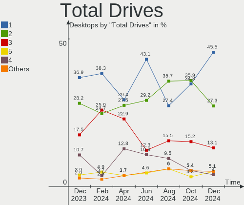
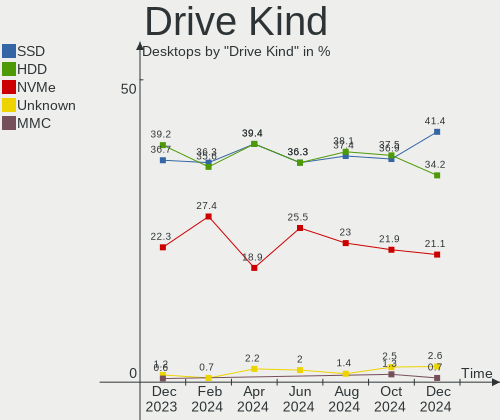
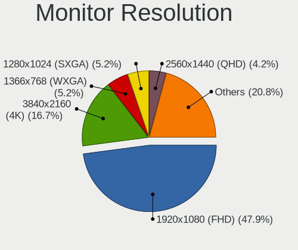
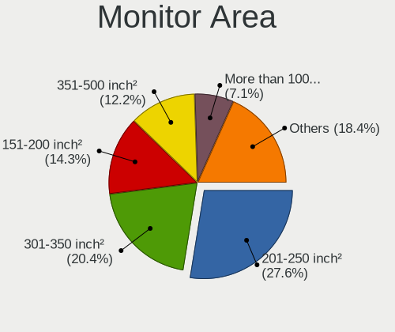
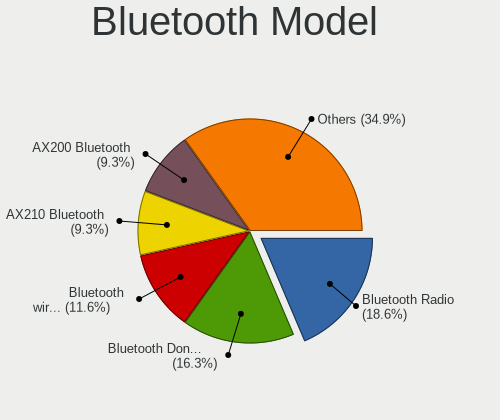
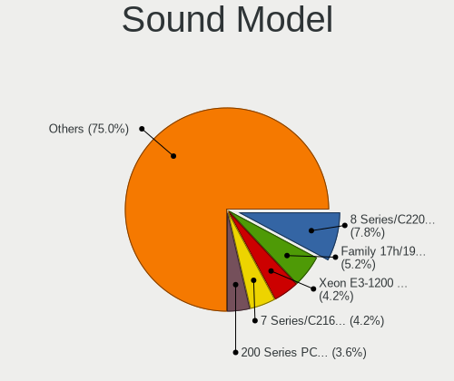
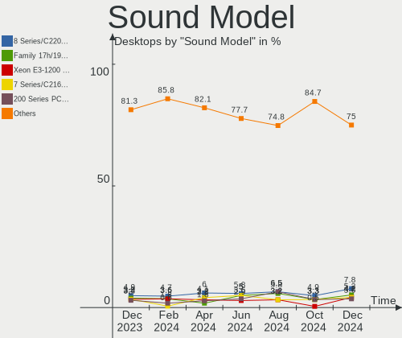

Linux in Italy - Hardware Trends (Desktops)
-------------------------------------------

A project to identify most popular hardware characteristics and track their change
over time based on data collected by Linux users at https://Linux-Hardware.org.

Anyone can contribute to this report by the [hw-probe](https://github.com/linuxhw/hw-probe) tool:

    sudo -E hw-probe -all -upload

Period: Jan, 2023.

Contents
--------

* [ System ](#system)
  - [ OS                       ](#os)
  - [ OS Family                ](#os-family)
  - [ Kernel                   ](#kernel)
  - [ Kernel Family            ](#kernel-family)
  - [ Kernel Major Ver.        ](#kernel-major-ver)
  - [ Arch                     ](#arch)
  - [ DE                       ](#de)
  - [ Display Server           ](#display-server)
  - [ Display Manager          ](#display-manager)
  - [ OS Lang                  ](#os-lang)
  - [ Boot Mode                ](#boot-mode)
  - [ Filesystem               ](#filesystem)
  - [ Part. scheme             ](#part-scheme)
  - [ Dual Boot with Linux/BSD ](#dual-boot-with-linuxbsd)
  - [ Dual Boot (Win)          ](#dual-boot-win)

* [ Board ](#board)
  - [ Vendor                   ](#vendor)
  - [ Model                    ](#model)
  - [ Model Family             ](#model-family)
  - [ MFG Year                 ](#mfg-year)
  - [ Form Factor              ](#form-factor)
  - [ Secure Boot              ](#secure-boot)
  - [ Coreboot                 ](#coreboot)
  - [ RAM Size                 ](#ram-size)
  - [ RAM Used                 ](#ram-used)
  - [ Total Drives             ](#total-drives)
  - [ Has CD-ROM               ](#has-cd-rom)
  - [ Has Ethernet             ](#has-ethernet)
  - [ Has WiFi                 ](#has-wifi)
  - [ Has Bluetooth            ](#has-bluetooth)

* [ Location ](#location)
  - [ Country                  ](#country)
  - [ City                     ](#city)

* [ Drives ](#drives)
  - [ Drive Vendor             ](#drive-vendor)
  - [ Drive Model              ](#drive-model)
  - [ HDD Vendor               ](#hdd-vendor)
  - [ SSD Vendor               ](#ssd-vendor)
  - [ Drive Kind               ](#drive-kind)
  - [ Drive Connector          ](#drive-connector)
  - [ Drive Size               ](#drive-size)
  - [ Space Total              ](#space-total)
  - [ Space Used               ](#space-used)
  - [ Malfunc. Drives          ](#malfunc-drives)
  - [ Malfunc. Drive Vendor    ](#malfunc-drive-vendor)
  - [ Malfunc. HDD Vendor      ](#malfunc-hdd-vendor)
  - [ Malfunc. Drive Kind      ](#malfunc-drive-kind)
  - [ Failed Drives            ](#failed-drives)
  - [ Failed Drive Vendor      ](#failed-drive-vendor)
  - [ Drive Status             ](#drive-status)

* [ Storage controller ](#storage-controller)
  - [ Storage Vendor           ](#storage-vendor)
  - [ Storage Model            ](#storage-model)
  - [ Storage Kind             ](#storage-kind)

* [ Processor ](#processor)
  - [ CPU Vendor               ](#cpu-vendor)
  - [ CPU Model                ](#cpu-model)
  - [ CPU Model Family         ](#cpu-model-family)
  - [ CPU Cores                ](#cpu-cores)
  - [ CPU Sockets              ](#cpu-sockets)
  - [ CPU Threads              ](#cpu-threads)
  - [ CPU Op-Modes             ](#cpu-op-modes)
  - [ CPU Microcode            ](#cpu-microcode)
  - [ CPU Microarch            ](#cpu-microarch)

* [ Graphics ](#graphics)
  - [ GPU Vendor               ](#gpu-vendor)
  - [ GPU Model                ](#gpu-model)
  - [ GPU Combo                ](#gpu-combo)
  - [ GPU Driver               ](#gpu-driver)
  - [ GPU Memory               ](#gpu-memory)

* [ Monitor ](#monitor)
  - [ Monitor Vendor           ](#monitor-vendor)
  - [ Monitor Model            ](#monitor-model)
  - [ Monitor Resolution       ](#monitor-resolution)
  - [ Monitor Diagonal         ](#monitor-diagonal)
  - [ Monitor Width            ](#monitor-width)
  - [ Aspect Ratio             ](#aspect-ratio)
  - [ Monitor Area             ](#monitor-area)
  - [ Pixel Density            ](#pixel-density)
  - [ Multiple Monitors        ](#multiple-monitors)

* [ Network ](#network)
  - [ Net Controller Vendor    ](#net-controller-vendor)
  - [ Net Controller Model     ](#net-controller-model)
  - [ Wireless Vendor          ](#wireless-vendor)
  - [ Wireless Model           ](#wireless-model)
  - [ Ethernet Vendor          ](#ethernet-vendor)
  - [ Ethernet Model           ](#ethernet-model)
  - [ Net Controller Kind      ](#net-controller-kind)
  - [ Used Controller          ](#used-controller)
  - [ NICs                     ](#nics)
  - [ IPv6                     ](#ipv6)

* [ Bluetooth ](#bluetooth)
  - [ Bluetooth Vendor         ](#bluetooth-vendor)
  - [ Bluetooth Model          ](#bluetooth-model)

* [ Sound ](#sound)
  - [ Sound Vendor             ](#sound-vendor)
  - [ Sound Model              ](#sound-model)

* [ Memory ](#memory)
  - [ Memory Vendor            ](#memory-vendor)
  - [ Memory Model             ](#memory-model)
  - [ Memory Kind              ](#memory-kind)
  - [ Memory Form Factor       ](#memory-form-factor)
  - [ Memory Size              ](#memory-size)
  - [ Memory Speed             ](#memory-speed)

* [ Printers & scanners ](#printers--scanners)
  - [ Printer Vendor           ](#printer-vendor)
  - [ Printer Model            ](#printer-model)
  - [ Scanner Vendor           ](#scanner-vendor)
  - [ Scanner Model            ](#scanner-model)

* [ Camera ](#camera)
  - [ Camera Vendor            ](#camera-vendor)
  - [ Camera Model             ](#camera-model)

* [ Security ](#security)
  - [ Fingerprint Vendor       ](#fingerprint-vendor)
  - [ Fingerprint Model        ](#fingerprint-model)
  - [ Chipcard Vendor          ](#chipcard-vendor)
  - [ Chipcard Model           ](#chipcard-model)

* [ Unsupported ](#unsupported)
  - [ Unsupported Devices      ](#unsupported-devices)
  - [ Unsupported Device Types ](#unsupported-device-types)

System
------

OS
--

Installed operating systems

| Name                         | Desktops | Percent |
|------------------------------|----------|---------|
| OpenMandriva 23.01           | 20       | 16.67%  |
| Ubuntu 22.04                 | 13       | 10.83%  |
| Linux Mint 21.1              | 12       | 10%     |
| Ubuntu 22.10                 | 11       | 9.17%   |
| Zorin 16                     | 4        | 3.33%   |
| Ubuntu 20.04                 | 3        | 2.5%    |
| OpenMandriva 22.12           | 3        | 2.5%    |
| Linux Mint 20.3              | 3        | 2.5%    |
| KDE neon 22.04               | 3        | 2.5%    |
| EndeavourOS Rolling          | 3        | 2.5%    |
| Elementary 6.1               | 3        | 2.5%    |
| Debian 11                    | 3        | 2.5%    |
| Pop!_OS 22.04                | 2        | 1.67%   |
| OpenMandriva 4.3             | 2        | 1.67%   |
| MX 21                        | 2        | 1.67%   |
| Linux Mint 20.2              | 2        | 1.67%   |
| Gentoo 2.9                   | 2        | 1.67%   |
| Fedora 37                    | 2        | 1.67%   |
| Arch Rolling                 | 2        | 1.67%   |
| Xubuntu 22.04                | 1        | 0.83%   |
| Xubuntu 18.04                | 1        | 0.83%   |
| Ubuntu Unity 16.04           | 1        | 0.83%   |
| Ubuntu Studio 22.04          | 1        | 0.83%   |
| Ubuntu MATE 22.10            | 1        | 0.83%   |
| Ubuntu MATE 22.04            | 1        | 0.83%   |
| Ubuntu 18.04                 | 1        | 0.83%   |
| ROSA 12.3                    | 1        | 0.83%   |
| openSUSE Tumbleweed-XXXXXXXX | 1        | 0.83%   |
| openSUSE Leap-15.4           | 1        | 0.83%   |
| OpenMandriva 4.2             | 1        | 0.83%   |
| Nobara 36                    | 1        | 0.83%   |
| Manjaro 22.0.1               | 1        | 0.83%   |
| Manjaro                      | 1        | 0.83%   |
| LMDE 5                       | 1        | 0.83%   |
| Linux Mint 21                | 1        | 0.83%   |
| Linux Mint 20                | 1        | 0.83%   |
| Lilidog 22                   | 1        | 0.83%   |
| Kubuntu 20.04                | 1        | 0.83%   |
| Kali 2022.4                  | 1        | 0.83%   |
| Gnoppix 22                   | 1        | 0.83%   |

OS Family
---------

OS without a version

| Name          | Desktops | Percent |
|---------------|----------|---------|
| Ubuntu        | 28       | 23.33%  |
| OpenMandriva  | 26       | 21.67%  |
| Linux Mint    | 19       | 15.83%  |
| Zorin         | 4        | 3.33%   |
| Debian        | 4        | 3.33%   |
| KDE neon      | 3        | 2.5%    |
| Fedora        | 3        | 2.5%    |
| EndeavourOS   | 3        | 2.5%    |
| Elementary    | 3        | 2.5%    |
| Xubuntu       | 2        | 1.67%   |
| Ubuntu MATE   | 2        | 1.67%   |
| Pop!_OS       | 2        | 1.67%   |
| openSUSE      | 2        | 1.67%   |
| MX            | 2        | 1.67%   |
| Manjaro       | 2        | 1.67%   |
| Gentoo        | 2        | 1.67%   |
| Arch          | 2        | 1.67%   |
| Ubuntu Unity  | 1        | 0.83%   |
| Ubuntu Studio | 1        | 0.83%   |
| ROSA          | 1        | 0.83%   |
| Nobara        | 1        | 0.83%   |
| LMDE          | 1        | 0.83%   |
| Lilidog       | 1        | 0.83%   |
| Kubuntu       | 1        | 0.83%   |
| Kali          | 1        | 0.83%   |
| Gnoppix       | 1        | 0.83%   |
| Garuda Linux  | 1        | 0.83%   |
| BuildRoot     | 1        | 0.83%   |

Kernel
------

Version of the Linux kernel

| Version                            | Desktops | Percent |
|------------------------------------|----------|---------|
| 5.15.0-58-generic                  | 21       | 17.5%   |
| 6.1.1-desktop-1omv2290             | 18       | 15%     |
| 5.15.0-56-generic                  | 9        | 7.5%    |
| 5.4.0-137-generic                  | 8        | 6.67%   |
| 5.19.0-29-generic                  | 7        | 5.83%   |
| 5.15.0-57-generic                  | 4        | 3.33%   |
| 5.10.0-20-amd64                    | 4        | 3.33%   |
| 6.0.10-desktop-2omv22090           | 3        | 2.5%    |
| 6.1.6-200.fc37.x86_64              | 2        | 1.67%   |
| 6.0.12-76060006-generic            | 2        | 1.67%   |
| 5.19.0-28-generic                  | 2        | 1.67%   |
| 5.19.0-26-generic                  | 2        | 1.67%   |
| 5.16.7-desktop-1omv4003            | 2        | 1.67%   |
| 6.1.8-x64v2-xanmod1                | 1        | 0.83%   |
| 6.1.7-gentoo                       | 1        | 0.83%   |
| 6.1.7-arch1-1                      | 1        | 0.83%   |
| 6.1.7-1-MANJARO                    | 1        | 0.83%   |
| 6.1.6-gentoo-dist                  | 1        | 0.83%   |
| 6.1.6-arch1-1                      | 1        | 0.83%   |
| 6.1.4-desktop-1omv2301             | 1        | 0.83%   |
| 6.1.4-arch1-1                      | 1        | 0.83%   |
| 6.1.2-desktop-1omv2301             | 1        | 0.83%   |
| 6.1.1-zen1-1-zen                   | 1        | 0.83%   |
| 6.1.1-arch1-1                      | 1        | 0.83%   |
| 6.1.1-1-MANJARO                    | 1        | 0.83%   |
| 6.1.1-1-default                    | 1        | 0.83%   |
| 6.0.14-201.fsync.fc36.x86_64       | 1        | 0.83%   |
| 6.0.0-kali6-amd64                  | 1        | 0.83%   |
| 6.0.0-kali3-amd64                  | 1        | 0.83%   |
| 5.4.0-136-generic                  | 1        | 0.83%   |
| 5.19.0-23-generic                  | 1        | 0.83%   |
| 5.18.19                            | 1        | 0.83%   |
| 5.17.12-100.fc34.x86_64            | 1        | 0.83%   |
| 5.16.15-051615-generic             | 1        | 0.83%   |
| 5.16.0-5mx-amd64                   | 1        | 0.83%   |
| 5.15.86-1-lts                      | 1        | 0.83%   |
| 5.15.75-generic-1rosa2021.1-x86_64 | 1        | 0.83%   |
| 5.15.0-46-generic                  | 1        | 0.83%   |
| 5.15.0-43-lowlatency               | 1        | 0.83%   |
| 5.15.0-43-generic                  | 1        | 0.83%   |

Kernel Family
-------------

Linux kernel without a distro release

| Version | Desktops | Percent |
|---------|----------|---------|
| 5.15.0  | 38       | 31.67%  |
| 6.1.1   | 22       | 18.33%  |
| 5.19.0  | 12       | 10%     |
| 5.4.0   | 9        | 7.5%    |
| 5.10.0  | 6        | 5%      |
| 6.1.6   | 4        | 3.33%   |
| 6.1.7   | 3        | 2.5%    |
| 6.0.10  | 3        | 2.5%    |
| 6.1.4   | 2        | 1.67%   |
| 6.0.12  | 2        | 1.67%   |
| 6.0.0   | 2        | 1.67%   |
| 5.16.7  | 2        | 1.67%   |
| 6.1.8   | 1        | 0.83%   |
| 6.1.2   | 1        | 0.83%   |
| 6.0.14  | 1        | 0.83%   |
| 5.18.19 | 1        | 0.83%   |
| 5.17.12 | 1        | 0.83%   |
| 5.16.15 | 1        | 0.83%   |
| 5.16.0  | 1        | 0.83%   |
| 5.15.86 | 1        | 0.83%   |
| 5.15.75 | 1        | 0.83%   |
| 5.14.21 | 1        | 0.83%   |
| 5.13.0  | 1        | 0.83%   |
| 5.10.14 | 1        | 0.83%   |
| 4.9.0   | 1        | 0.83%   |
| 4.4.0   | 1        | 0.83%   |
| 4.15.0  | 1        | 0.83%   |

Kernel Major Ver.
-----------------

Linux kernel major version

| Version | Desktops | Percent |
|---------|----------|---------|
| 5.15    | 40       | 33.33%  |
| 6.1     | 33       | 27.5%   |
| 5.19    | 12       | 10%     |
| 5.4     | 9        | 7.5%    |
| 6.0     | 8        | 6.67%   |
| 5.10    | 7        | 5.83%   |
| 5.16    | 4        | 3.33%   |
| 5.18    | 1        | 0.83%   |
| 5.17    | 1        | 0.83%   |
| 5.14    | 1        | 0.83%   |
| 5.13    | 1        | 0.83%   |
| 4.9     | 1        | 0.83%   |
| 4.4     | 1        | 0.83%   |
| 4.15    | 1        | 0.83%   |

Arch
----

OS architecture (x86_64, i586, etc.)

| Name   | Desktops | Percent |
|--------|----------|---------|
| x86_64 | 119      | 99.17%  |
| i686   | 1        | 0.83%   |

DE
--

Desktop Environment

| Name             | Desktops | Percent |
|------------------|----------|---------|
| GNOME            | 48       | 40%     |
| KDE5             | 34       | 28.33%  |
| X-Cinnamon       | 16       | 13.33%  |
| XFCE             | 8        | 6.67%   |
| MATE             | 4        | 3.33%   |
| Pantheon         | 3        | 2.5%    |
| Unknown          | 3        | 2.5%    |
| Unity            | 1        | 0.83%   |
| LXDE             | 1        | 0.83%   |
| lightdm-xsession | 1        | 0.83%   |
| GNOME Classic    | 1        | 0.83%   |

Display Server
--------------

X11 or Wayland

| Name    | Desktops | Percent |
|---------|----------|---------|
| X11     | 88       | 73.33%  |
| Wayland | 32       | 26.67%  |

Display Manager
---------------

SDDM, LightDM, etc.

| Name    | Desktops | Percent |
|---------|----------|---------|
| Unknown | 33       | 27.5%   |
| GDM3    | 28       | 23.33%  |
| SDDM    | 27       | 22.5%   |
| LightDM | 21       | 17.5%   |
| GDM     | 11       | 9.17%   |

OS Lang
-------

Language

| Lang    | Desktops | Percent |
|---------|----------|---------|
| it_IT   | 92       | 76.67%  |
| en_US   | 21       | 17.5%   |
| Unknown | 3        | 2.5%    |
| POSIX   | 1        | 0.83%   |
| en_GB   | 1        | 0.83%   |
| de_DE   | 1        | 0.83%   |
| C       | 1        | 0.83%   |

Boot Mode
---------

EFI or BIOS

| Mode | Desktops | Percent |
|------|----------|---------|
| BIOS | 71       | 59.17%  |
| EFI  | 49       | 40.83%  |

Filesystem
----------

Type of filesystem

| Type    | Desktops | Percent |
|---------|----------|---------|
| Ext4    | 84       | 70%     |
| Overlay | 25       | 20.83%  |
| Btrfs   | 8        | 6.67%   |
| Tmpfs   | 2        | 1.67%   |
| Zfs     | 1        | 0.83%   |

Part. scheme
------------

Scheme of partitioning

| Type    | Desktops | Percent |
|---------|----------|---------|
| GPT     | 62       | 51.67%  |
| Unknown | 32       | 26.67%  |
| MBR     | 26       | 21.67%  |

Dual Boot with Linux/BSD
------------------------

Hosting more than one Linux/BSD

| Dual boot | Desktops | Percent |
|-----------|----------|---------|
| No        | 84       | 70%     |
| Yes       | 36       | 30%     |

Dual Boot (Win)
---------------

Hosting Linux and Windows

| Dual boot | Desktops | Percent |
|-----------|----------|---------|
| No        | 77       | 64.17%  |
| Yes       | 43       | 35.83%  |

Board
-----

Vendor
------

Motherboard manufacturer

| Name                | Desktops | Percent |
|---------------------|----------|---------|
| ASUSTek Computer    | 34       | 28.33%  |
| ASRock              | 20       | 16.67%  |
| MSI                 | 15       | 12.5%   |
| Gigabyte Technology | 13       | 10.83%  |
| Hewlett-Packard     | 8        | 6.67%   |
| Dell                | 7        | 5.83%   |
| Lenovo              | 5        | 4.17%   |
| Pegatron            | 4        | 3.33%   |
| Intel               | 3        | 2.5%    |
| Fujitsu             | 3        | 2.5%    |
| Acer                | 3        | 2.5%    |
| T-bao               | 1        | 0.83%   |
| Packard Bell        | 1        | 0.83%   |
| ASRockRack          | 1        | 0.83%   |
| AOpen               | 1        | 0.83%   |
| Unknown             | 1        | 0.83%   |

Model
-----

Motherboard model

| Name                                      | Desktops | Percent |
|-------------------------------------------|----------|---------|
| MSI MS-7B79                               | 2        | 1.67%   |
| Intel B75                                 | 2        | 1.67%   |
| Gigabyte Z370P D3                         | 2        | 1.67%   |
| Gigabyte B450M DS3H                       | 2        | 1.67%   |
| Dell OptiPlex 3020                        | 2        | 1.67%   |
| ASUS PRIME A320M-K                        | 2        | 1.67%   |
| ASUS H110M-R                              | 2        | 1.67%   |
| T-bao MINI PC                             | 1        | 0.83%   |
| Pegatron p6-2013it                        | 1        | 0.83%   |
| Pegatron KN444AA-ABZ m9242.it             | 1        | 0.83%   |
| Pegatron FZ147AA-ABZ a6643it              | 1        | 0.83%   |
| Pegatron 2AD5                             | 1        | 0.83%   |
| Packard Bell IXTREME M5722                | 1        | 0.83%   |
| MSI POWERMATE_ML470                       | 1        | 0.83%   |
| MSI NQ890AA-ABZ CQ5011IT                  | 1        | 0.83%   |
| MSI MS-7D54                               | 1        | 0.83%   |
| MSI MS-7C94                               | 1        | 0.83%   |
| MSI MS-7B98                               | 1        | 0.83%   |
| MSI MS-7B89                               | 1        | 0.83%   |
| MSI MS-7B45                               | 1        | 0.83%   |
| MSI MS-7A74                               | 1        | 0.83%   |
| MSI MS-7982                               | 1        | 0.83%   |
| MSI MS-7976                               | 1        | 0.83%   |
| MSI MS-7751                               | 1        | 0.83%   |
| MSI MS-7586                               | 1        | 0.83%   |
| MSI Hyrican PC                            | 1        | 0.83%   |
| Lenovo ThinkStation C20 4263BA7           | 1        | 0.83%   |
| Lenovo ThinkCentre M82 2929AC4            | 1        | 0.83%   |
| Lenovo ThinkCentre M73z 10BC000MIX        | 1        | 0.83%   |
| Lenovo ThinkCentre M57e 7066W57           | 1        | 0.83%   |
| Lenovo H30-05 90BJ001XIX                  | 1        | 0.83%   |
| Intel Productiva                          | 1        | 0.83%   |
| HP Z2 SFF G5 Workstation                  | 1        | 0.83%   |
| HP Victus by 15L Gaming Desktop TG02-0xxx | 1        | 0.83%   |
| HP ProLiant MicroServer                   | 1        | 0.83%   |
| HP ProDesk 600 G3 SFF                     | 1        | 0.83%   |
| HP Pavilion Power Desktop 580-1xx         | 1        | 0.83%   |
| HP Pavilion Gaming Desktop TG01-1xxx      | 1        | 0.83%   |
| HP Pavilion Desktop 590-p0xxx             | 1        | 0.83%   |
| HP Compaq 6200 Pro MT PC                  | 1        | 0.83%   |

Model Family
------------

Motherboard model prefix

| Name                 | Desktops | Percent |
|----------------------|----------|---------|
| ASUS PRIME           | 9        | 7.5%    |
| Dell OptiPlex        | 6        | 5%      |
| Lenovo ThinkCentre   | 3        | 2.5%    |
| HP Pavilion          | 3        | 2.5%    |
| Fujitsu ESPRIMO      | 3        | 2.5%    |
| ASUS ROG             | 3        | 2.5%    |
| Acer Veriton         | 3        | 2.5%    |
| MSI MS-7B79          | 2        | 1.67%   |
| Intel B75            | 2        | 1.67%   |
| Gigabyte Z370P       | 2        | 1.67%   |
| Gigabyte B450M       | 2        | 1.67%   |
| ASUS TUF             | 2        | 1.67%   |
| ASUS M5A97           | 2        | 1.67%   |
| ASUS H110M-R         | 2        | 1.67%   |
| ASRock X370          | 2        | 1.67%   |
| T-bao MINI           | 1        | 0.83%   |
| Pegatron p6-2013it   | 1        | 0.83%   |
| Pegatron KN444AA-ABZ | 1        | 0.83%   |
| Pegatron FZ147AA-ABZ | 1        | 0.83%   |
| Pegatron 2AD5        | 1        | 0.83%   |
| Packard Bell IXTREME | 1        | 0.83%   |
| MSI POWERMATE        | 1        | 0.83%   |
| MSI NQ890AA-ABZ      | 1        | 0.83%   |
| MSI MS-7D54          | 1        | 0.83%   |
| MSI MS-7C94          | 1        | 0.83%   |
| MSI MS-7B98          | 1        | 0.83%   |
| MSI MS-7B89          | 1        | 0.83%   |
| MSI MS-7B45          | 1        | 0.83%   |
| MSI MS-7A74          | 1        | 0.83%   |
| MSI MS-7982          | 1        | 0.83%   |
| MSI MS-7976          | 1        | 0.83%   |
| MSI MS-7751          | 1        | 0.83%   |
| MSI MS-7586          | 1        | 0.83%   |
| MSI Hyrican          | 1        | 0.83%   |
| Lenovo ThinkStation  | 1        | 0.83%   |
| Lenovo H30-05        | 1        | 0.83%   |
| Intel Productiva     | 1        | 0.83%   |
| HP Z2                | 1        | 0.83%   |
| HP Victus            | 1        | 0.83%   |
| HP ProLiant          | 1        | 0.83%   |

MFG Year
--------

Motherboard manufacture year

| Year | Desktops | Percent |
|------|----------|---------|
| 2018 | 13       | 10.83%  |
| 2012 | 13       | 10.83%  |
| 2020 | 11       | 9.17%   |
| 2014 | 11       | 9.17%   |
| 2013 | 10       | 8.33%   |
| 2017 | 9        | 7.5%    |
| 2016 | 8        | 6.67%   |
| 2021 | 6        | 5%      |
| 2015 | 6        | 5%      |
| 2008 | 6        | 5%      |
| 2022 | 5        | 4.17%   |
| 2019 | 5        | 4.17%   |
| 2011 | 5        | 4.17%   |
| 2009 | 5        | 4.17%   |
| 2010 | 3        | 2.5%    |
| 2006 | 2        | 1.67%   |
| 2005 | 2        | 1.67%   |

Form Factor
-----------

Physical design of the computer

| Name    | Desktops | Percent |
|---------|----------|---------|
| Desktop | 120      | 100%    |

Secure Boot
-----------

Enabled or disabled

| State    | Desktops | Percent |
|----------|----------|---------|
| Disabled | 119      | 99.17%  |
| Enabled  | 1        | 0.83%   |

Coreboot
--------

Have coreboot on board

| Used | Desktops | Percent |
|------|----------|---------|
| No   | 120      | 100%    |

RAM Size
--------

Total RAM memory

| Size in GB  | Desktops | Percent |
|-------------|----------|---------|
| 8.01-16.0   | 34       | 28.33%  |
| 16.01-24.0  | 28       | 23.33%  |
| 3.01-4.0    | 20       | 16.67%  |
| 32.01-64.0  | 16       | 13.33%  |
| 4.01-8.0    | 15       | 12.5%   |
| 24.01-32.0  | 3        | 2.5%    |
| 64.01-256.0 | 2        | 1.67%   |
| 1.01-2.0    | 1        | 0.83%   |
| 0.51-1.0    | 1        | 0.83%   |

RAM Used
--------

Used RAM memory

| Used GB   | Desktops | Percent |
|-----------|----------|---------|
| 1.01-2.0  | 48       | 40%     |
| 2.01-3.0  | 37       | 30.83%  |
| 3.01-4.0  | 15       | 12.5%   |
| 4.01-8.0  | 11       | 9.17%   |
| 0.51-1.0  | 5        | 4.17%   |
| 8.01-16.0 | 3        | 2.5%    |
| 0.01-0.5  | 1        | 0.83%   |

Total Drives
------------

Number of drives on board

| Drives | Desktops | Percent |
|--------|----------|---------|
| 1      | 47       | 39.17%  |
| 2      | 24       | 20%     |
| 3      | 20       | 16.67%  |
| 4      | 13       | 10.83%  |
| 5      | 8        | 6.67%   |
| 6      | 4        | 3.33%   |
| 7      | 3        | 2.5%    |
| 8      | 1        | 0.83%   |

Has CD-ROM
----------

Has CD-ROM on board

| Presented | Desktops | Percent |
|-----------|----------|---------|
| Yes       | 71       | 59.17%  |
| No        | 49       | 40.83%  |

Has Ethernet
------------

Has Ethernet on board

| Presented | Desktops | Percent |
|-----------|----------|---------|
| Yes       | 120      | 100%    |

Has WiFi
--------

Has WiFi module

| Presented | Desktops | Percent |
|-----------|----------|---------|
| No        | 66       | 55%     |
| Yes       | 54       | 45%     |

Has Bluetooth
-------------

Has Bluetooth module

| Presented | Desktops | Percent |
|-----------|----------|---------|
| No        | 75       | 62.5%   |
| Yes       | 45       | 37.5%   |

Location
--------

Country
-------

Geographic location (country)

| Country | Desktops | Percent |
|---------|----------|---------|
| Italy   | 120      | 100%    |

City
----

Geographic location (city)

| City                          | Desktops | Percent |
|-------------------------------|----------|---------|
| Rome                          | 14       | 11.67%  |
| Milan                         | 14       | 11.67%  |
| Milano                        | 4        | 3.33%   |
| Turin                         | 2        | 1.67%   |
| Trecastelli                   | 2        | 1.67%   |
| Rho                           | 2        | 1.67%   |
| Naples                        | 2        | 1.67%   |
| Licata                        | 2        | 1.67%   |
| Genoa                         | 2        | 1.67%   |
| Como                          | 2        | 1.67%   |
| Campobasso                    | 2        | 1.67%   |
| Bologna                       | 2        | 1.67%   |
| Bergamo                       | 2        | 1.67%   |
| Alassio                       | 2        | 1.67%   |
| Villimpenta                   | 1        | 0.83%   |
| Vigliano Biellese             | 1        | 0.83%   |
| Vicenza                       | 1        | 0.83%   |
| Verona                        | 1        | 0.83%   |
| Varese                        | 1        | 0.83%   |
| Valenza                       | 1        | 0.83%   |
| Trieste                       | 1        | 0.83%   |
| Tradate                       | 1        | 0.83%   |
| Termoli                       | 1        | 0.83%   |
| Spinea                        | 1        | 0.83%   |
| Sesto San Giovanni            | 1        | 0.83%   |
| Seravezza                     | 1        | 0.83%   |
| Selvazzano Dentro             | 1        | 0.83%   |
| Sassari                       | 1        | 0.83%   |
| Sant'Ambrogio di Valpolicella | 1        | 0.83%   |
| Sand in Taufers               | 1        | 0.83%   |
| San Pietro Specchiarica       | 1        | 0.83%   |
| San Bonifacio                 | 1        | 0.83%   |
| Salerno                       | 1        | 0.83%   |
| Rovato                        | 1        | 0.83%   |
| Roncaro                       | 1        | 0.83%   |
| Rimini                        | 1        | 0.83%   |
| Ragusa                        | 1        | 0.83%   |
| Pistoia                       | 1        | 0.83%   |
| Palermo                       | 1        | 0.83%   |
| Paderno del Grappa            | 1        | 0.83%   |

Drives
------

Drive Vendor
------------

Hard drive vendors

| Vendor                      | Desktops | Drives  | Percent |
|-----------------------------|----------|---------|---------|
| WDC                         | 47       | 63      | 18.65%  |
| Seagate                     | 46       | 56      | 18.25%  |
| Samsung Electronics         | 34       | 47      | 13.49%  |
| Crucial                     | 21       | 26      | 8.33%   |
| Toshiba                     | 18       | 19      | 7.14%   |
| Kingston                    | 16       | 16      | 6.35%   |
| SanDisk                     | 7        | 8       | 2.78%   |
| Hitachi                     | 6        | 6       | 2.38%   |
| Maxtor                      | 5        | 5       | 1.98%   |
| Unknown                     | 4        | 5       | 1.59%   |
| China                       | 4        | 4       | 1.59%   |
| OCZ                         | 3        | 3       | 1.19%   |
| Micron/Crucial Technology   | 3        | 3       | 1.19%   |
| Kingston Technology Company | 3        | 3       | 1.19%   |
| TO Exter                    | 2        | 2       | 0.79%   |
| Team                        | 2        | 2       | 0.79%   |
| Silicon Motion              | 2        | 2       | 0.79%   |
| Lexar                       | 2        | 2       | 0.79%   |
| KingDian                    | 2        | 2       | 0.79%   |
| Intel                       | 2        | 2       | 0.79%   |
| HGST                        | 2        | 2       | 0.79%   |
| Fanxiang                    | 2        | 2       | 0.79%   |
| X12                         | 1        | 1       | 0.4%    |
| USB3.0                      | 1        | 1       | 0.4%    |
| TakeMS                      | 1        | 1       | 0.4%    |
| PNY                         | 1        | 1       | 0.4%    |
| Phison Electronics          | 1        | 1       | 0.4%    |
| Patriot                     | 1        | 1       | 0.4%    |
| Netac                       | 1        | 1       | 0.4%    |
| Mushkin                     | 1        | 1       | 0.4%    |
| KIOXIA                      | 1        | 2       | 0.4%    |
| Kingchuxing                 | 1        | 2       | 0.4%    |
| JMicron Technology          | 1        | 1       | 0.4%    |
| Intenso                     | 1        | 1       | 0.4%    |
| HS-SSD-E100N                | 1        | 1       | 0.4%    |
| HL-DT-ST                    | 1        | Unknown | 0.4%    |
| Hewlett-Packard             | 1        | 2       | 0.4%    |
| GOODRAM                     | 1        | 1       | 0.4%    |
| Gigabyte Technology         | 1        | 1       | 0.4%    |
| External                    | 1        | 1       | 0.4%    |

Drive Model
-----------

Hard drive models

| Model                                                 | Desktops | Percent |
|-------------------------------------------------------|----------|---------|
| Kingston SA400S37240G 240GB SSD                       | 7        | 2.43%   |
| Seagate ST2000DM008-2FR102 2TB                        | 5        | 1.74%   |
| Seagate ST1000DM010-2EP102 1TB                        | 5        | 1.74%   |
| Toshiba DT01ACA200 2TB                                | 4        | 1.39%   |
| Samsung SSD 850 EVO 250GB                             | 4        | 1.39%   |
| Crucial CT500MX500SSD1 500GB                          | 4        | 1.39%   |
| WDC WD10EZEX-00BN5A0 1TB                              | 3        | 1.04%   |
| Toshiba HDWD110 1TB                                   | 3        | 1.04%   |
| Toshiba DT01ACA050 500GB                              | 3        | 1.04%   |
| Seagate ST500DM002-1BD142 500GB                       | 3        | 1.04%   |
| Seagate ST3500413AS 500GB                             | 3        | 1.04%   |
| Seagate ST1000DM003-1ER162 1TB                        | 3        | 1.04%   |
| Seagate ST1000DM003-1CH162 1TB                        | 3        | 1.04%   |
| Samsung SSD 860 EVO 500GB                             | 3        | 1.04%   |
| Crucial CT500P2SSD8 500GB                             | 3        | 1.04%   |
| Crucial CT480BX500SSD1 480GB                          | 3        | 1.04%   |
| WDC WDS120G2G0B-00EPW0 120GB SSD                      | 2        | 0.69%   |
| WDC WD5000AAKX-60U6AA0 500GB                          | 2        | 0.69%   |
| WDC WD5000AAKX-22ERMA0 500GB                          | 2        | 0.69%   |
| WDC WD5000AAKX-08U6AA0 500GB                          | 2        | 0.69%   |
| WDC WD40EFRX-68N32N0 4TB                              | 2        | 0.69%   |
| WDC WD20EZRZ-00Z5HB0 2TB                              | 2        | 0.69%   |
| Unknown SD/MMC/MS PRO 2GB                             | 2        | 0.69%   |
| TO Exter nal USB 3.0 500GB                            | 2        | 0.69%   |
| Silicon Motion SM2263EN/SM2263XT SSD Controller 512GB | 2        | 0.69%   |
| Seagate ST4000DM004-2CV104 4TB                        | 2        | 0.69%   |
| Seagate ST31000528AS 1TB                              | 2        | 0.69%   |
| Seagate ST2000DM001-1ER164 2TB                        | 2        | 0.69%   |
| Seagate ST1000LM035-1RK172 1TB                        | 2        | 0.69%   |
| Seagate ST1000DM003-1SB10C 1TB                        | 2        | 0.69%   |
| Seagate Expansion 240GB                               | 2        | 0.69%   |
| Sandisk WD Blue SN550 NVMe SSD 1TB                    | 2        | 0.69%   |
| SanDisk SSD PLUS 240GB                                | 2        | 0.69%   |
| Samsung SSD 970 PRO 512GB                             | 2        | 0.69%   |
| Samsung SSD 970 EVO Plus 500GB                        | 2        | 0.69%   |
| Samsung SSD 870 QVO 1TB                               | 2        | 0.69%   |
| Samsung SSD 840 Series 120GB                          | 2        | 0.69%   |
| Samsung SSD 750 EVO 500GB                             | 2        | 0.69%   |
| Micron/Crucial P2 NVMe PCIe SSD 500GB                 | 2        | 0.69%   |
| Kingston SV300S37A120G 120GB SSD                      | 2        | 0.69%   |

HDD Vendor
----------

Hard disk drive vendors

| Vendor              | Desktops | Drives | Percent |
|---------------------|----------|--------|---------|
| Seagate             | 45       | 55     | 36%     |
| WDC                 | 44       | 56     | 35.2%   |
| Toshiba             | 16       | 17     | 12.8%   |
| Hitachi             | 6        | 6      | 4.8%    |
| Maxtor              | 5        | 5      | 4%      |
| Samsung Electronics | 3        | 3      | 2.4%    |
| Unknown             | 2        | 2      | 1.6%    |
| HGST                | 2        | 2      | 1.6%    |
| USB3.0              | 1        | 1      | 0.8%    |
| Hewlett-Packard     | 1        | 2      | 0.8%    |

SSD Vendor
----------

Solid state drive vendors

| Vendor              | Desktops | Drives | Percent |
|---------------------|----------|--------|---------|
| Samsung Electronics | 25       | 31     | 27.17%  |
| Crucial             | 17       | 21     | 18.48%  |
| Kingston            | 13       | 13     | 14.13%  |
| SanDisk             | 5        | 6      | 5.43%   |
| China               | 4        | 4      | 4.35%   |
| WDC                 | 3        | 3      | 3.26%   |
| OCZ                 | 3        | 3      | 3.26%   |
| Toshiba             | 2        | 2      | 2.17%   |
| TO Exter            | 2        | 2      | 2.17%   |
| Team                | 2        | 2      | 2.17%   |
| KingDian            | 2        | 2      | 2.17%   |
| X12                 | 1        | 1      | 1.09%   |
| TakeMS              | 1        | 1      | 1.09%   |
| PNY                 | 1        | 1      | 1.09%   |
| Patriot             | 1        | 1      | 1.09%   |
| Netac               | 1        | 1      | 1.09%   |
| Mushkin             | 1        | 1      | 1.09%   |
| Lexar               | 1        | 1      | 1.09%   |
| Kingchuxing         | 1        | 1      | 1.09%   |
| JMicron Technology  | 1        | 1      | 1.09%   |
| Intenso             | 1        | 1      | 1.09%   |
| GOODRAM             | 1        | 1      | 1.09%   |
| Gigabyte Technology | 1        | 1      | 1.09%   |
| Fanxiang            | 1        | 1      | 1.09%   |
| Dogfish             | 1        | 1      | 1.09%   |

Drive Kind
----------

HDD or SSD

| Kind    | Desktops | Drives | Percent |
|---------|----------|--------|---------|
| HDD     | 89       | 149    | 43.84%  |
| SSD     | 74       | 103    | 36.45%  |
| NVMe    | 33       | 42     | 16.26%  |
| Unknown | 6        | 6      | 2.96%   |
| MMC     | 1        | 1      | 0.49%   |

Drive Connector
---------------

SATA, SAS, NVMe, etc.

| Type | Desktops | Drives | Percent |
|------|----------|--------|---------|
| SATA | 112      | 246    | 71.34%  |
| NVMe | 32       | 41     | 20.38%  |
| SAS  | 12       | 13     | 7.64%   |
| MMC  | 1        | 1      | 0.64%   |

Drive Size
----------

Size of hard drive

| Size in TB | Desktops | Drives | Percent |
|------------|----------|--------|---------|
| 0.01-0.5   | 85       | 139    | 49.13%  |
| 0.51-1.0   | 52       | 70     | 30.06%  |
| 1.01-2.0   | 21       | 25     | 12.14%  |
| 3.01-4.0   | 7        | 8      | 4.05%   |
| 2.01-3.0   | 6        | 7      | 3.47%   |
| 4.01-10.0  | 2        | 3      | 1.16%   |

Space Total
-----------

Amount of disk space available on the file system

| Size in GB     | Desktops | Percent |
|----------------|----------|---------|
| 101-250        | 24       | 20%     |
| 1-20           | 23       | 19.17%  |
| 1001-2000      | 17       | 14.17%  |
| 251-500        | 16       | 13.33%  |
| 501-1000       | 16       | 13.33%  |
| More than 3000 | 8        | 6.67%   |
| 2001-3000      | 7        | 5.83%   |
| Unknown        | 5        | 4.17%   |
| 21-50          | 3        | 2.5%    |
| 51-100         | 1        | 0.83%   |

Space Used
----------

Amount of used disk space

| Used GB        | Desktops | Percent |
|----------------|----------|---------|
| 1-20           | 48       | 40%     |
| 251-500        | 13       | 10.83%  |
| 21-50          | 12       | 10%     |
| 101-250        | 11       | 9.17%   |
| 501-1000       | 10       | 8.33%   |
| 51-100         | 9        | 7.5%    |
| 1001-2000      | 6        | 5%      |
| Unknown        | 5        | 4.17%   |
| More than 3000 | 3        | 2.5%    |
| 2001-3000      | 3        | 2.5%    |

Malfunc. Drives
---------------

Drive models with a malfunction

| Model                            | Desktops | Drives | Percent |
|----------------------------------|----------|--------|---------|
| WDC WDS120G2G0B-00EPW0 120GB SSD | 1        | 1      | 5.26%   |
| WDC WD800JD-75MSA3 80GB          | 1        | 1      | 5.26%   |
| WDC WD5000AAKX-22ERMA0 500GB     | 1        | 1      | 5.26%   |
| WDC WD40EFRX-68N32N0 4TB         | 1        | 1      | 5.26%   |
| WDC WD360GD-00FNA0 37GB          | 1        | 1      | 5.26%   |
| WDC WD3000HLFS-01MZUV0 304GB     | 1        | 1      | 5.26%   |
| WDC WD2500BEVT-80A23T0 250GB     | 1        | 1      | 5.26%   |
| WDC WD2500AAKS-00B3A0 250GB      | 1        | 1      | 5.26%   |
| WDC WD20EADS-00S2B0 2TB          | 1        | 1      | 5.26%   |
| WDC WD10EZRX-00D8PB0 1TB         | 1        | 1      | 5.26%   |
| WDC WD10EADS-65L5B1 1TB          | 1        | 1      | 5.26%   |
| USB3.0 Super Speed 128GB         | 1        | 1      | 5.26%   |
| Seagate ST3320613AS 320GB        | 1        | 1      | 5.26%   |
| Seagate ST2000DM001-1CH164 2TB   | 1        | 1      | 5.26%   |
| Seagate ST2000DL003-9VT166 2TB   | 1        | 1      | 5.26%   |
| OCZ VECTOR150 240GB SSD          | 1        | 1      | 5.26%   |
| Maxtor STM3250310AS 250GB        | 1        | 1      | 5.26%   |
| Hitachi HTS543232L9A300 320GB    | 1        | 1      | 5.26%   |
| Hitachi HDS721616PLA380 160GB    | 1        | 1      | 5.26%   |

Malfunc. Drive Vendor
---------------------

Vendors of faulty drives

| Vendor  | Desktops | Drives | Percent |
|---------|----------|--------|---------|
| WDC     | 9        | 11     | 52.94%  |
| Seagate | 3        | 3      | 17.65%  |
| Hitachi | 2        | 2      | 11.76%  |
| USB3.0  | 1        | 1      | 5.88%   |
| OCZ     | 1        | 1      | 5.88%   |
| Maxtor  | 1        | 1      | 5.88%   |

Malfunc. HDD Vendor
-------------------

Vendors of faulty HDD drives

| Vendor  | Desktops | Drives | Percent |
|---------|----------|--------|---------|
| WDC     | 9        | 10     | 56.25%  |
| Seagate | 3        | 3      | 18.75%  |
| Hitachi | 2        | 2      | 12.5%   |
| USB3.0  | 1        | 1      | 6.25%   |
| Maxtor  | 1        | 1      | 6.25%   |

Malfunc. Drive Kind
-------------------

Kinds of faulty drives

| Kind | Desktops | Drives | Percent |
|------|----------|--------|---------|
| HDD  | 13       | 17     | 86.67%  |
| SSD  | 2        | 2      | 13.33%  |

Failed Drives
-------------

Failed drive models

Zero info for selected period =(

Failed Drive Vendor
-------------------

Failed drive vendors

Zero info for selected period =(

Drive Status
------------

Number of failed and malfunc. drives

| Status   | Desktops | Drives | Percent |
|----------|----------|--------|---------|
| Works    | 64       | 152    | 45.39%  |
| Detected | 63       | 130    | 44.68%  |
| Malfunc  | 14       | 19     | 9.93%   |

Storage controller
------------------

Storage Vendor
--------------

Storage controller vendors

| Vendor                       | Desktops | Percent |
|------------------------------|----------|---------|
| Intel                        | 82       | 48.24%  |
| AMD                          | 35       | 20.59%  |
| Samsung Electronics          | 10       | 5.88%   |
| ASMedia Technology           | 9        | 5.29%   |
| Micron/Crucial Technology    | 7        | 4.12%   |
| SanDisk                      | 5        | 2.94%   |
| Marvell Technology Group     | 5        | 2.94%   |
| Kingston Technology Company  | 5        | 2.94%   |
| JMicron Technology           | 4        | 2.35%   |
| Silicon Motion               | 2        | 1.18%   |
| VIA Technologies             | 1        | 0.59%   |
| Silicon Image                | 1        | 0.59%   |
| Shenzhen Longsys Electronics | 1        | 0.59%   |
| Phison Electronics           | 1        | 0.59%   |
| Nvidia                       | 1        | 0.59%   |
| KIOXIA                       | 1        | 0.59%   |

Storage Model
-------------

Storage controller models

| Model                                                                          | Desktops | Percent |
|--------------------------------------------------------------------------------|----------|---------|
| AMD FCH SATA Controller [AHCI mode]                                            | 20       | 9.52%   |
| Intel Q170/Q150/B150/H170/H110/Z170/CM236 Chipset SATA Controller [AHCI Mode]  | 12       | 5.71%   |
| Intel 7 Series/C210 Series Chipset Family 6-port SATA Controller [AHCI mode]   | 10       | 4.76%   |
| AMD 400 Series Chipset SATA Controller                                         | 10       | 4.76%   |
| Intel 8 Series/C220 Series Chipset Family 6-port SATA Controller 1 [AHCI mode] | 7        | 3.33%   |
| Intel 200 Series PCH SATA controller [AHCI mode]                               | 7        | 3.33%   |
| Samsung NVMe SSD Controller SM981/PM981/PM983                                  | 6        | 2.86%   |
| Intel 6 Series/C200 Series Chipset Family 6 port Desktop SATA AHCI Controller  | 6        | 2.86%   |
| Micron/Crucial P2 NVMe PCIe SSD                                                | 5        | 2.38%   |
| Intel NM10/ICH7 Family SATA Controller [IDE mode]                              | 5        | 2.38%   |
| ASMedia ASM1062 Serial ATA Controller                                          | 5        | 2.38%   |
| AMD SB7x0/SB8x0/SB9x0 IDE Controller                                           | 5        | 2.38%   |
| Intel Alder Lake-S PCH SATA Controller [AHCI Mode]                             | 4        | 1.9%    |
| SanDisk WD Blue SN550 NVMe SSD                                                 | 3        | 1.43%   |
| JMicron JMB363 SATA/IDE Controller                                             | 3        | 1.43%   |
| Intel Volume Management Device NVMe RAID Controller                            | 3        | 1.43%   |
| Intel SATA Controller [RAID mode]                                              | 3        | 1.43%   |
| Intel Cannon Lake PCH SATA AHCI Controller                                     | 3        | 1.43%   |
| Intel 82801JI (ICH10 Family) 4 port SATA IDE Controller #1                     | 3        | 1.43%   |
| Intel 82801JI (ICH10 Family) 2 port SATA IDE Controller #2                     | 3        | 1.43%   |
| Intel 82801G (ICH7 Family) IDE Controller                                      | 3        | 1.43%   |
| ASMedia ASM1061 SATA IDE Controller                                            | 3        | 1.43%   |
| AMD X370 Series Chipset SATA Controller                                        | 3        | 1.43%   |
| AMD SB7x0/SB8x0/SB9x0 SATA Controller [IDE mode]                               | 3        | 1.43%   |
| AMD SB7x0/SB8x0/SB9x0 SATA Controller [AHCI mode]                              | 3        | 1.43%   |
| AMD 500 Series Chipset SATA Controller                                         | 3        | 1.43%   |
| AMD 300 Series Chipset SATA Controller                                         | 3        | 1.43%   |
| Silicon Motion SM2263EN/SM2263XT SSD Controller                                | 2        | 0.95%   |
| Samsung NVMe SSD Controller SM961/PM961/SM963                                  | 2        | 0.95%   |
| Samsung NVMe SSD Controller 980                                                | 2        | 0.95%   |
| Marvell Group 88SE9172 SATA 6Gb/s Controller                                   | 2        | 0.95%   |
| Kingston Company SNVS2000G [NV1 NVMe PCIe SSD 2TB]                             | 2        | 0.95%   |
| Intel C600/X79 series chipset 6-Port SATA AHCI Controller                      | 2        | 0.95%   |
| Intel 82801IR/IO/IH (ICH9R/DO/DH) 6 port SATA Controller [AHCI mode]           | 2        | 0.95%   |
| Intel 500 Series Chipset Family SATA AHCI Controller                           | 2        | 0.95%   |
| Intel 5 Series/3400 Series Chipset 4 port SATA IDE Controller                  | 2        | 0.95%   |
| Intel 5 Series/3400 Series Chipset 2 port SATA IDE Controller                  | 2        | 0.95%   |
| Intel 400 Series Chipset Family SATA AHCI Controller                           | 2        | 0.95%   |
| AMD FCH SATA Controller D                                                      | 2        | 0.95%   |
| VIA VT82C586A/B/VT82C686/A/B/VT823x/A/C PIPC Bus Master IDE                    | 1        | 0.48%   |

Storage Kind
------------

Kind of storage controller (IDE, SATA, NVMe, SAS, ...)

| Kind | Desktops | Percent |
|------|----------|---------|
| SATA | 98       | 59.04%  |
| NVMe | 32       | 19.28%  |
| IDE  | 24       | 14.46%  |
| RAID | 11       | 6.63%   |
| SAS  | 1        | 0.6%    |

Processor
---------

CPU Vendor
----------

Processor vendors

| Vendor | Desktops | Percent |
|--------|----------|---------|
| Intel  | 84       | 70%     |
| AMD    | 36       | 30%     |

CPU Model
---------

Processor models

| Model                                       | Desktops | Percent |
|---------------------------------------------|----------|---------|
| AMD Ryzen 5 2400G with Radeon Vega Graphics | 4        | 3.33%   |
| Intel Core i7-4770 CPU @ 3.40GHz            | 3        | 2.5%    |
| Intel Core i7-3770 CPU @ 3.40GHz            | 3        | 2.5%    |
| Intel Core i5-7500 CPU @ 3.40GHz            | 3        | 2.5%    |
| Intel Core 2 Quad CPU Q6600 @ 2.40GHz       | 3        | 2.5%    |
| AMD Ryzen 5 5600G with Radeon Graphics      | 3        | 2.5%    |
| Intel Pentium CPU G4500 @ 3.50GHz           | 2        | 1.67%   |
| Intel Pentium 4 CPU 3.00GHz                 | 2        | 1.67%   |
| Intel Core i7-6700 CPU @ 3.40GHz            | 2        | 1.67%   |
| Intel Core i7-10700F CPU @ 2.90GHz          | 2        | 1.67%   |
| Intel Core i7-10700 CPU @ 2.90GHz           | 2        | 1.67%   |
| Intel Core i5-3570 CPU @ 3.40GHz            | 2        | 1.67%   |
| Intel Core i3-2120 CPU @ 3.30GHz            | 2        | 1.67%   |
| AMD Ryzen 9 3900X 12-Core Processor         | 2        | 1.67%   |
| AMD Ryzen 7 5800X 8-Core Processor          | 2        | 1.67%   |
| AMD Ryzen 5 5600X 6-Core Processor          | 2        | 1.67%   |
| AMD FX-8320E Eight-Core Processor           | 2        | 1.67%   |
| Intel Xeon CPU E5620 @ 2.40GHz              | 1        | 0.83%   |
| Intel Xeon CPU E5-2620 v2 @ 2.10GHz         | 1        | 0.83%   |
| Intel Xeon CPU E31260L @ 2.40GHz            | 1        | 0.83%   |
| Intel Pentium Gold G6400 CPU @ 4.00GHz      | 1        | 0.83%   |
| Intel Pentium Dual-Core CPU E6500 @ 2.93GHz | 1        | 0.83%   |
| Intel Pentium Dual-Core CPU E5300 @ 2.60GHz | 1        | 0.83%   |
| Intel Pentium D CPU 3.00GHz                 | 1        | 0.83%   |
| Intel Pentium CPU G4400T @ 2.90GHz          | 1        | 0.83%   |
| Intel Pentium CPU G3220 @ 3.00GHz           | 1        | 0.83%   |
| Intel Pentium CPU G2030 @ 3.00GHz           | 1        | 0.83%   |
| Intel Pentium 4 CPU 3.20GHz                 | 1        | 0.83%   |
| Intel Core i9-9900K CPU @ 3.60GHz           | 1        | 0.83%   |
| Intel Core i7-9700 CPU @ 3.00GHz            | 1        | 0.83%   |
| Intel Core i7-8700 CPU @ 3.20GHz            | 1        | 0.83%   |
| Intel Core i7-7700 CPU @ 3.60GHz            | 1        | 0.83%   |
| Intel Core i7-4770K CPU @ 3.50GHz           | 1        | 0.83%   |
| Intel Core i7-3820 CPU @ 3.60GHz            | 1        | 0.83%   |
| Intel Core i7-3770S CPU @ 3.10GHz           | 1        | 0.83%   |
| Intel Core i7-2700K CPU @ 3.50GHz           | 1        | 0.83%   |
| Intel Core i7-2600 CPU @ 3.40GHz            | 1        | 0.83%   |
| Intel Core i7-10700K CPU @ 3.80GHz          | 1        | 0.83%   |
| Intel Core i5-9600K CPU @ 3.70GHz           | 1        | 0.83%   |
| Intel Core i5-9400F CPU @ 2.90GHz           | 1        | 0.83%   |

CPU Model Family
----------------

Processor model prefix

| Model                   | Desktops | Percent |
|-------------------------|----------|---------|
| Intel Core i5           | 23       | 19.17%  |
| Intel Core i7           | 21       | 17.5%   |
| AMD Ryzen 5             | 13       | 10.83%  |
| Other                   | 7        | 5.83%   |
| AMD Ryzen 7             | 6        | 5%      |
| Intel Pentium           | 5        | 4.17%   |
| Intel Core i3           | 5        | 4.17%   |
| Intel Core 2 Quad       | 5        | 4.17%   |
| AMD FX                  | 5        | 4.17%   |
| Intel Xeon              | 3        | 2.5%    |
| Intel Pentium 4         | 3        | 2.5%    |
| Intel Core 2 Duo        | 3        | 2.5%    |
| Intel Celeron           | 3        | 2.5%    |
| AMD Ryzen 9             | 3        | 2.5%    |
| Intel Pentium Dual-Core | 2        | 1.67%   |
| AMD Ryzen 3             | 2        | 1.67%   |
| AMD Phenom II X4        | 2        | 1.67%   |
| AMD A6                  | 2        | 1.67%   |
| Intel Pentium Gold      | 1        | 0.83%   |
| Intel Pentium D         | 1        | 0.83%   |
| Intel Core i9           | 1        | 0.83%   |
| Intel Atom              | 1        | 0.83%   |
| AMD Turion II Neo       | 1        | 0.83%   |
| AMD Athlon X4           | 1        | 0.83%   |
| AMD A8                  | 1        | 0.83%   |

CPU Cores
---------

Number of processor cores

| Number | Desktops | Percent |
|--------|----------|---------|
| 4      | 56       | 46.67%  |
| 2      | 24       | 20%     |
| 6      | 17       | 14.17%  |
| 8      | 14       | 11.67%  |
| 1      | 3        | 2.5%    |
| 12     | 2        | 1.67%   |
| 16     | 1        | 0.83%   |
| 14     | 1        | 0.83%   |
| 10     | 1        | 0.83%   |
| 3      | 1        | 0.83%   |

CPU Sockets
-----------

Number of sockets

| Number | Desktops | Percent |
|--------|----------|---------|
| 1      | 119      | 99.17%  |
| 2      | 1        | 0.83%   |

CPU Threads
-----------

Threads per core (Hyper-Threading)

| Number | Desktops | Percent |
|--------|----------|---------|
| 2      | 70       | 58.33%  |
| 1      | 50       | 41.67%  |

CPU Op-Modes
------------

CPU Operation Modes (32-bit, 64-bit)

| Op mode        | Desktops | Percent |
|----------------|----------|---------|
| 32-bit, 64-bit | 120      | 100%    |

CPU Microcode
-------------

Microcode number

| Number     | Desktops | Percent |
|------------|----------|---------|
| Unknown    | 34       | 28.33%  |
| 0x306a9    | 10       | 8.33%   |
| 0x506e3    | 7        | 5.83%   |
| 0x306c3    | 7        | 5.83%   |
| 0xa0655    | 4        | 3.33%   |
| 0x906e9    | 4        | 3.33%   |
| 0x906ea    | 3        | 2.5%    |
| 0x90675    | 3        | 2.5%    |
| 0x206a7    | 3        | 2.5%    |
| 0x1067a    | 3        | 2.5%    |
| 0x08701021 | 3        | 2.5%    |
| 0x08001138 | 3        | 2.5%    |
| 0xa0671    | 2        | 1.67%   |
| 0x0a20120a | 2        | 1.67%   |
| 0x0a201016 | 2        | 1.67%   |
| 0x0810100b | 2        | 1.67%   |
| 0x08001137 | 2        | 1.67%   |
| 0x06000822 | 2        | 1.67%   |
| 0x010000c8 | 2        | 1.67%   |
| 0xf4a      | 1        | 0.83%   |
| 0xf49      | 1        | 0.83%   |
| 0xf43      | 1        | 0.83%   |
| 0xb0671    | 1        | 0.83%   |
| 0x906ed    | 1        | 0.83%   |
| 0x906ec    | 1        | 0.83%   |
| 0x6fb      | 1        | 0.83%   |
| 0x406c4    | 1        | 0.83%   |
| 0x30678    | 1        | 0.83%   |
| 0x206d7    | 1        | 0.83%   |
| 0x106e5    | 1        | 0.83%   |
| 0x10676    | 1        | 0.83%   |
| 0x0a50000d | 1        | 0.83%   |
| 0x0a50000c | 1        | 0.83%   |
| 0x0a201204 | 1        | 0.83%   |
| 0x08101016 | 1        | 0.83%   |
| 0x0800820d | 1        | 0.83%   |
| 0x08001126 | 1        | 0.83%   |
| 0x07030105 | 1        | 0.83%   |
| 0x06000817 | 1        | 0.83%   |
| 0x06000803 | 1        | 0.83%   |

CPU Microarch
-------------

Microarchitecture

| Name             | Desktops | Percent |
|------------------|----------|---------|
| IvyBridge        | 13       | 10.83%  |
| KabyLake         | 12       | 10%     |
| Zen              | 11       | 9.17%   |
| Skylake          | 11       | 9.17%   |
| Zen 3            | 9        | 7.5%    |
| Haswell          | 8        | 6.67%   |
| SandyBridge      | 7        | 5.83%   |
| Penryn           | 6        | 5%      |
| CometLake        | 6        | 5%      |
| Piledriver       | 5        | 4.17%   |
| NetBurst         | 4        | 3.33%   |
| Core             | 4        | 3.33%   |
| Alderlake Hybrid | 4        | 3.33%   |
| Zen 2            | 3        | 2.5%    |
| K10              | 3        | 2.5%    |
| Westmere         | 2        | 1.67%   |
| Silvermont       | 2        | 1.67%   |
| Nehalem          | 2        | 1.67%   |
| Icelake          | 2        | 1.67%   |
| Zen+             | 1        | 0.83%   |
| Steamroller      | 1        | 0.83%   |
| Puma             | 1        | 0.83%   |
| K10 Llano        | 1        | 0.83%   |
| Bulldozer        | 1        | 0.83%   |
| Unknown          | 1        | 0.83%   |

Graphics
--------

GPU Vendor
----------

Vendors of graphics cards

| Vendor | Desktops | Percent |
|--------|----------|---------|
| Nvidia | 52       | 40.63%  |
| Intel  | 45       | 35.16%  |
| AMD    | 31       | 24.22%  |

GPU Model
---------

Graphics card models

| Model                                                                       | Desktops | Percent |
|-----------------------------------------------------------------------------|----------|---------|
| Intel HD Graphics 530                                                       | 7        | 5.34%   |
| Nvidia GP107 [GeForce GTX 1050 Ti]                                          | 5        | 3.82%   |
| Intel 2nd Generation Core Processor Family Integrated Graphics Controller   | 5        | 3.82%   |
| AMD Ellesmere [Radeon RX 470/480/570/570X/580/580X/590]                     | 5        | 3.82%   |
| Intel Xeon E3-1200 v3/4th Gen Core Processor Integrated Graphics Controller | 4        | 3.05%   |
| Intel HD Graphics 630                                                       | 4        | 3.05%   |
| AMD Raven Ridge [Radeon Vega Series / Radeon Vega Mobile Series]            | 4        | 3.05%   |
| Nvidia GP108 [GeForce GT 1030]                                              | 3        | 2.29%   |
| Intel Xeon E3-1200 v2/3rd Gen Core processor Graphics Controller            | 3        | 2.29%   |
| AMD Cezanne [Radeon Vega Series / Radeon Vega Mobile Series]                | 3        | 2.29%   |
| Nvidia TU117 [GeForce GTX 1650]                                             | 2        | 1.53%   |
| Nvidia TU116 [GeForce GTX 1660 SUPER]                                       | 2        | 1.53%   |
| Nvidia GT218 [GeForce 210]                                                  | 2        | 1.53%   |
| Nvidia GP106 [GeForce GTX 1060 6GB]                                         | 2        | 1.53%   |
| Nvidia GM204 [GeForce GTX 970]                                              | 2        | 1.53%   |
| Nvidia GM107 [GeForce GTX 750]                                              | 2        | 1.53%   |
| Nvidia GM107 [GeForce GTX 750 Ti]                                           | 2        | 1.53%   |
| Nvidia GK208B [GeForce GT 710]                                              | 2        | 1.53%   |
| Intel IvyBridge GT2 [HD Graphics 4000]                                      | 2        | 1.53%   |
| Intel CometLake-S GT2 [UHD Graphics 630]                                    | 2        | 1.53%   |
| Intel CoffeeLake-S GT2 [UHD Graphics 630]                                   | 2        | 1.53%   |
| Intel Alder Lake-S GT1 [UHD Graphics 730]                                   | 2        | 1.53%   |
| Intel 82G33/G31 Express Integrated Graphics Controller                      | 2        | 1.53%   |
| AMD Navi 23 [Radeon RX 6600/6600 XT/6600M]                                  | 2        | 1.53%   |
| AMD Navi 22 [Radeon RX 6700/6700 XT/6750 XT / 6800M]                        | 2        | 1.53%   |
| AMD Cedar [Radeon HD 5000/6000/7350/8350 Series]                            | 2        | 1.53%   |
| Nvidia TU116 [GeForce GTX 1650 SUPER]                                       | 1        | 0.76%   |
| Nvidia TU106 [GeForce RTX 2070 Rev. A]                                      | 1        | 0.76%   |
| Nvidia TU106 [GeForce GTX 1650]                                             | 1        | 0.76%   |
| Nvidia NV42GL [Quadro FX 3450/4000 SDI]                                     | 1        | 0.76%   |
| Nvidia GP107GL [Quadro P620]                                                | 1        | 0.76%   |
| Nvidia GP107 [GeForce GTX 1050]                                             | 1        | 0.76%   |
| Nvidia GP106 [GeForce GTX 1060 3GB]                                         | 1        | 0.76%   |
| Nvidia GP104 [GeForce GTX 1070 Ti]                                          | 1        | 0.76%   |
| Nvidia GM206 [GeForce GTX 950]                                              | 1        | 0.76%   |
| Nvidia GK208B [GeForce GT 730]                                              | 1        | 0.76%   |
| Nvidia GK107GL [Quadro K600]                                                | 1        | 0.76%   |
| Nvidia GK107 [GeForce GTX 650]                                              | 1        | 0.76%   |
| Nvidia GK107 [GeForce GT 630 OEM]                                           | 1        | 0.76%   |
| Nvidia GK106 [GeForce GTX 660]                                              | 1        | 0.76%   |

GPU Combo
---------

Combinations of graphics cards

| Name           | Desktops | Percent |
|----------------|----------|---------|
| 1 x Nvidia     | 47       | 39.17%  |
| 1 x Intel      | 39       | 32.5%   |
| 1 x AMD        | 26       | 21.67%  |
| Intel + Nvidia | 3        | 2.5%    |
| 2 x AMD        | 2        | 1.67%   |
| AMD + Nvidia   | 2        | 1.67%   |
| Intel + AMD    | 1        | 0.83%   |

GPU Driver
----------

Free vs proprietary

| Driver      | Desktops | Percent |
|-------------|----------|---------|
| Free        | 98       | 81.67%  |
| Proprietary | 22       | 18.33%  |

GPU Memory
----------

Total video memory

| Size in GB | Desktops | Percent |
|------------|----------|---------|
| Unknown    | 55       | 45.83%  |
| 0.51-1.0   | 16       | 13.33%  |
| 3.01-4.0   | 13       | 10.83%  |
| 1.01-2.0   | 12       | 10%     |
| 7.01-8.0   | 10       | 8.33%   |
| 0.01-0.5   | 5        | 4.17%   |
| 5.01-6.0   | 4        | 3.33%   |
| 8.01-16.0  | 3        | 2.5%    |
| 2.01-3.0   | 2        | 1.67%   |

Monitor
-------

Monitor Vendor
--------------

Monitor vendors

| Vendor               | Desktops | Percent |
|----------------------|----------|---------|
| Samsung Electronics  | 34       | 25.76%  |
| Hewlett-Packard      | 16       | 12.12%  |
| Acer                 | 14       | 10.61%  |
| Ancor Communications | 10       | 7.58%   |
| Philips              | 9        | 6.82%   |
| Goldstar             | 9        | 6.82%   |
| BenQ                 | 7        | 5.3%    |
| Dell                 | 4        | 3.03%   |
| Mi                   | 3        | 2.27%   |
| Lenovo               | 3        | 2.27%   |
| HannStar             | 3        | 2.27%   |
| Sony                 | 2        | 1.52%   |
| LG Electronics       | 2        | 1.52%   |
| AOC                  | 2        | 1.52%   |
| ___                  | 1        | 0.76%   |
| YSI                  | 1        | 0.76%   |
| ViewSonic            | 1        | 0.76%   |
| Unknown              | 1        | 0.76%   |
| Panasonic            | 1        | 0.76%   |
| MStar                | 1        | 0.76%   |
| MSI                  | 1        | 0.76%   |
| MiTAC                | 1        | 0.76%   |
| Hyundai ImageQuest   | 1        | 0.76%   |
| HannStar Display     | 1        | 0.76%   |
| CVT                  | 1        | 0.76%   |
| ASUSTek Computer     | 1        | 0.76%   |
| AGO                  | 1        | 0.76%   |
| Unknown              | 1        | 0.76%   |

Monitor Model
-------------

Monitor models

| Model                                                                   | Desktops | Percent |
|-------------------------------------------------------------------------|----------|---------|
| Samsung Electronics LCD Monitor SAM0A7A 1920x1080 1060x626mm 48.5-inch  | 2        | 1.47%   |
| Samsung Electronics C27F390 SAM0D32 1920x1080 598x336mm 27.0-inch       | 2        | 1.47%   |
| Samsung Electronics C24F390 SAM0D2C 1920x1080 521x293mm 23.5-inch       | 2        | 1.47%   |
| Mi 27 NFGL XMIB004 1920x1080 598x336mm 27.0-inch                        | 2        | 1.47%   |
| Hewlett-Packard 27w HPN3494 1920x1080 598x336mm 27.0-inch               | 2        | 1.47%   |
| ___ LCD TV ___9000 1360x768                                             | 1        | 0.74%   |
| YSI YZ2816 YSI2800 3840x2160 620x350mm 28.0-inch                        | 1        | 0.74%   |
| ViewSonic VX3276-QHD VSCE635 2560x1440 698x393mm 31.5-inch              | 1        | 0.74%   |
| Unknown LCD TV 9000 1360x768 1600x900mm 72.3-inch                       | 1        | 0.74%   |
| Sony TV SNY5501 1280x768 1200x900mm 59.1-inch                           | 1        | 0.74%   |
| Sony TV SNY0101 1360x768                                                | 1        | 0.74%   |
| Samsung Electronics T28C570 SAM0AFC 1920x1080 649x369mm 29.4-inch       | 1        | 0.74%   |
| Samsung Electronics T24E390 SAM0C20 1920x1080 521x293mm 23.5-inch       | 1        | 0.74%   |
| Samsung Electronics T22B300 SAM092D 1920x1080 477x268mm 21.5-inch       | 1        | 0.74%   |
| Samsung Electronics SyncMaster SAM05B0 1920x1080                        | 1        | 0.74%   |
| Samsung Electronics SyncMaster SAM0580 1280x1024 376x301mm 19.0-inch    | 1        | 0.74%   |
| Samsung Electronics SyncMaster SAM010B 1280x1024 340x270mm 17.1-inch    | 1        | 0.74%   |
| Samsung Electronics SMT24A350 SAM07AB 1920x1080 531x299mm 24.0-inch     | 1        | 0.74%   |
| Samsung Electronics SMS24A450 SAM083A 1920x1200 518x324mm 24.1-inch     | 1        | 0.74%   |
| Samsung Electronics SMBX2035 SAM06FD 1600x900 443x249mm 20.0-inch       | 1        | 0.74%   |
| Samsung Electronics SMB2430L SAM0645 1920x1080 521x293mm 23.5-inch      | 1        | 0.74%   |
| Samsung Electronics SMB2230N SAM0635 1920x1080 477x268mm 21.5-inch      | 1        | 0.74%   |
| Samsung Electronics SA300/350/360 SAM07D5 1920x1080 531x299mm 24.0-inch | 1        | 0.74%   |
| Samsung Electronics S27E510 SAM0C5F 1920x1080 598x336mm 27.0-inch       | 1        | 0.74%   |
| Samsung Electronics S24E370 SAM0CF0 1920x1080 521x293mm 23.5-inch       | 1        | 0.74%   |
| Samsung Electronics S24D391 SAM0B87 1920x1080 521x293mm 23.5-inch       | 1        | 0.74%   |
| Samsung Electronics S22D390 SAM0B63 1920x1080 477x268mm 21.5-inch       | 1        | 0.74%   |
| Samsung Electronics S22D300 SAM0B3B 1920x1080 477x268mm 21.5-inch       | 1        | 0.74%   |
| Samsung Electronics LS24A33x SAM71D8 1920x1080 526x296mm 23.8-inch      | 1        | 0.74%   |
| Samsung Electronics LCD Monitor U28E570 2560x1440                       | 1        | 0.74%   |
| Samsung Electronics LCD Monitor SyncMaster 1600x900                     | 1        | 0.74%   |
| Samsung Electronics LCD Monitor SAM0C39 1920x1080 885x498mm 40.0-inch   | 1        | 0.74%   |
| Samsung Electronics LCD Monitor SAM03D4 1280x720                        | 1        | 0.74%   |
| Samsung Electronics LCD Monitor S24D300 1920x1080                       | 1        | 0.74%   |
| Samsung Electronics LCD Monitor S22F350 5760x1080                       | 1        | 0.74%   |
| Samsung Electronics LCD Monitor S22F350 1920x1080                       | 1        | 0.74%   |
| Samsung Electronics LCD Monitor LS24AG30x 3840x1080                     | 1        | 0.74%   |
| Samsung Electronics C49HG9x SAM0E5E 3840x1080 1196x336mm 48.9-inch      | 1        | 0.74%   |
| Samsung Electronics C32F391 SAM0D34 1920x1080 698x393mm 31.5-inch       | 1        | 0.74%   |
| Philips PHL BDM4350 PHL08FA 3840x2160 953x543mm 43.2-inch               | 1        | 0.74%   |

Monitor Resolution
------------------

Monitor screen resolution

| Resolution         | Desktops | Percent |
|--------------------|----------|---------|
| 1920x1080 (FHD)    | 64       | 51.61%  |
| 1280x1024 (SXGA)   | 10       | 8.06%   |
| 1680x1050 (WSXGA+) | 8        | 6.45%   |
| 3840x2160 (4K)     | 7        | 5.65%   |
| 2560x1440 (QHD)    | 6        | 4.84%   |
| 1600x900 (HD+)     | 6        | 4.84%   |
| 1440x900 (WXGA+)   | 4        | 3.23%   |
| 3840x1080          | 3        | 2.42%   |
| 1920x1200 (WUXGA)  | 3        | 2.42%   |
| 1366x768 (WXGA)    | 3        | 2.42%   |
| 1360x768           | 3        | 2.42%   |
| 2560x1080          | 2        | 1.61%   |
| 5760x1080          | 1        | 0.81%   |
| 3440x1440          | 1        | 0.81%   |
| 1920x540           | 1        | 0.81%   |
| 1280x768           | 1        | 0.81%   |
| Unknown            | 1        | 0.81%   |

Monitor Diagonal
----------------

Diagonal size in inches

| Inches  | Desktops | Percent |
|---------|----------|---------|
| 24      | 23       | 17.69%  |
| 23      | 16       | 12.31%  |
| 27      | 14       | 10.77%  |
| Unknown | 13       | 10%     |
| 21      | 12       | 9.23%   |
| 19      | 9        | 6.92%   |
| 20      | 6        | 4.62%   |
| 17      | 6        | 4.62%   |
| 22      | 5        | 3.85%   |
| 31      | 3        | 2.31%   |
| 48      | 2        | 1.54%   |
| 40      | 2        | 1.54%   |
| 34      | 2        | 1.54%   |
| 28      | 2        | 1.54%   |
| 25      | 2        | 1.54%   |
| 18      | 2        | 1.54%   |
| 84      | 1        | 0.77%   |
| 72      | 1        | 0.77%   |
| 59      | 1        | 0.77%   |
| 52      | 1        | 0.77%   |
| 49      | 1        | 0.77%   |
| 47      | 1        | 0.77%   |
| 43      | 1        | 0.77%   |
| 32      | 1        | 0.77%   |
| 29      | 1        | 0.77%   |
| 26      | 1        | 0.77%   |
| 12      | 1        | 0.77%   |

Monitor Width
-------------

Physical width

| Width in mm | Desktops | Percent |
|-------------|----------|---------|
| 501-600     | 52       | 41.94%  |
| 401-500     | 28       | 22.58%  |
| Unknown     | 13       | 10.48%  |
| 601-700     | 6        | 4.84%   |
| 301-350     | 6        | 4.84%   |
| 1001-1500   | 6        | 4.84%   |
| 351-400     | 4        | 3.23%   |
| 701-800     | 3        | 2.42%   |
| 801-900     | 2        | 1.61%   |
| 1501-2000   | 2        | 1.61%   |
| 201-300     | 1        | 0.81%   |
| 901-1000    | 1        | 0.81%   |

Aspect Ratio
------------

Proportional relationship between the width and the height

| Ratio   | Desktops | Percent |
|---------|----------|---------|
| 16/9    | 81       | 66.94%  |
| 16/10   | 16       | 13.22%  |
| 5/4     | 10       | 8.26%   |
| Unknown | 9        | 7.44%   |
| 4/3     | 2        | 1.65%   |
| 21/9    | 2        | 1.65%   |
| 32/9    | 1        | 0.83%   |

Monitor Area
------------

Area in inch

| Area in inch | Desktops | Percent |
|----------------|----------|---------|
| 201-250        | 43       | 34.4%   |
| 151-200        | 16       | 12.8%   |
| 301-350        | 15       | 12%     |
| Unknown        | 13       | 10.4%   |
| 251-300        | 10       | 8%      |
| 351-500        | 8        | 6.4%    |
| 141-150        | 8        | 6.4%    |
| More than 1000 | 6        | 4.8%    |
| 501-1000       | 5        | 4%      |
| 71-80          | 1        | 0.8%    |

Pixel Density
-------------

Pixels per inch

| Density | Desktops | Percent |
|---------|----------|---------|
| 51-100  | 83       | 68.6%   |
| 101-120 | 15       | 12.4%   |
| Unknown | 13       | 10.74%  |
| 1-50    | 7        | 5.79%   |
| 161-240 | 2        | 1.65%   |
| 121-160 | 1        | 0.83%   |

Multiple Monitors
-----------------

Total monitors connected

| Total | Desktops | Percent |
|-------|----------|---------|
| 1     | 100      | 83.33%  |
| 2     | 17       | 14.17%  |
| 3     | 2        | 1.67%   |
| 0     | 1        | 0.83%   |

Network
-------

Net Controller Vendor
---------------------

Controller vendors

| Vendor                                | Desktops | Percent |
|---------------------------------------|----------|---------|
| Realtek Semiconductor                 | 80       | 45.98%  |
| Intel                                 | 44       | 25.29%  |
| Qualcomm Atheros                      | 11       | 6.32%   |
| TP-Link                               | 9        | 5.17%   |
| Xiaomi                                | 4        | 2.3%    |
| Ralink                                | 2        | 1.15%   |
| NetGear                               | 2        | 1.15%   |
| Marvell Technology Group              | 2        | 1.15%   |
| Broadcom                              | 2        | 1.15%   |
| VIA Technologies                      | 1        | 0.57%   |
| SysKonnect                            | 1        | 0.57%   |
| Samsung Electronics                   | 1        | 0.57%   |
| Ralink Technology                     | 1        | 0.57%   |
| Qualcomm Atheros Communications       | 1        | 0.57%   |
| OnePlus Technology (Shenzhen)         | 1        | 0.57%   |
| Nvidia                                | 1        | 0.57%   |
| Microsoft                             | 1        | 0.57%   |
| MediaTek                              | 1        | 0.57%   |
| Gemtek                                | 1        | 0.57%   |
| DisplayLink                           | 1        | 0.57%   |
| D-Link System                         | 1        | 0.57%   |
| D-Link                                | 1        | 0.57%   |
| Compal Electronics                    | 1        | 0.57%   |
| Broadcom Limited                      | 1        | 0.57%   |
| ASIX Electronics                      | 1        | 0.57%   |
| Arduino SA                            | 1        | 0.57%   |
| 802.11g Adapter [Linksys WUSB54GC v3] | 1        | 0.57%   |

Net Controller Model
--------------------

Controller models

| Model                                                              | Desktops | Percent |
|--------------------------------------------------------------------|----------|---------|
| Realtek RTL8111/8168/8411 PCI Express Gigabit Ethernet Controller  | 66       | 33.5%   |
| Realtek RTL8821CE 802.11ac PCIe Wireless Network Adapter           | 4        | 2.03%   |
| Realtek RTL8125 2.5GbE Controller                                  | 4        | 2.03%   |
| Realtek RTL810xE PCI Express Fast Ethernet controller              | 4        | 2.03%   |
| Realtek 802.11ac NIC                                               | 4        | 2.03%   |
| Intel Wi-Fi 6 AX200                                                | 4        | 2.03%   |
| Intel Ethernet Connection I217-V                                   | 4        | 2.03%   |
| Intel 82579V Gigabit Network Connection                            | 4        | 2.03%   |
| Xiaomi Mi/Redmi series (RNDIS)                                     | 3        | 1.52%   |
| Realtek RTL8192EE PCIe Wireless Network Adapter                    | 3        | 1.52%   |
| Qualcomm Atheros AR8121/AR8113/AR8114 Gigabit or Fast Ethernet     | 3        | 1.52%   |
| Intel I211 Gigabit Network Connection                              | 3        | 1.52%   |
| Intel Ethernet Controller I225-V                                   | 3        | 1.52%   |
| Intel Ethernet Connection (2) I219-V                               | 3        | 1.52%   |
| Intel 82579LM Gigabit Network Connection (Lewisville)              | 3        | 1.52%   |
| Realtek RTL88x2bu [AC1200 Techkey]                                 | 2        | 1.02%   |
| Realtek RTL8188EUS 802.11n Wireless Network Adapter                | 2        | 1.02%   |
| Qualcomm Atheros Killer E2400 Gigabit Ethernet Controller          | 2        | 1.02%   |
| Qualcomm Atheros AR8151 v2.0 Gigabit Ethernet                      | 2        | 1.02%   |
| Intel Wireless-AC 9260                                             | 2        | 1.02%   |
| Intel Wireless 7265                                                | 2        | 1.02%   |
| Intel Ethernet Connection (5) I219-LM                              | 2        | 1.02%   |
| Intel Alder Lake-S PCH CNVi WiFi                                   | 2        | 1.02%   |
| Xiaomi Mi/Redmi series (RNDIS + ADB)                               | 1        | 0.51%   |
| VIA VT6102/VT6103 [Rhine-II]                                       | 1        | 0.51%   |
| TP-Link TL-WN822N Version 4 RTL8192EU                              | 1        | 0.51%   |
| TP-Link RTL8812AU Archer T4U 802.11ac                              | 1        | 0.51%   |
| TP-Link Archer T9UH v1 [Realtek RTL8814AU]                         | 1        | 0.51%   |
| TP-Link Archer T4U ver.3                                           | 1        | 0.51%   |
| TP-Link Archer T4U v2 [Realtek RTL8812AU]                          | 1        | 0.51%   |
| TP-Link Archer T2U PLUS [RTL8821AU]                                | 1        | 0.51%   |
| TP-Link AC600 wireless Realtek RTL8811AU [Archer T2U Nano]         | 1        | 0.51%   |
| TP-Link 802.11ac WLAN Adapter                                      | 1        | 0.51%   |
| TP-Link 802.11ac NIC                                               | 1        | 0.51%   |
| SysKonnect SK-98xx V2.0 Gigabit Ethernet Adapter [Marvell 88E8001] | 1        | 0.51%   |
| Samsung Galaxy series, misc. (tethering mode)                      | 1        | 0.51%   |
| Realtek RTL8822CE 802.11ac PCIe Wireless Network Adapter           | 1        | 0.51%   |
| Realtek RTL8821AE 802.11ac PCIe Wireless Network Adapter           | 1        | 0.51%   |
| Realtek RTL8812AE 802.11ac PCIe Wireless Network Adapter           | 1        | 0.51%   |
| Realtek RTL8192SE Wireless LAN Controller                          | 1        | 0.51%   |

Wireless Vendor
---------------

Wireless vendors

| Vendor                                | Desktops | Percent |
|---------------------------------------|----------|---------|
| Realtek Semiconductor                 | 22       | 37.29%  |
| Intel                                 | 14       | 23.73%  |
| TP-Link                               | 9        | 15.25%  |
| Qualcomm Atheros                      | 3        | 5.08%   |
| Ralink                                | 2        | 3.39%   |
| Ralink Technology                     | 1        | 1.69%   |
| Qualcomm Atheros Communications       | 1        | 1.69%   |
| NetGear                               | 1        | 1.69%   |
| Microsoft                             | 1        | 1.69%   |
| MediaTek                              | 1        | 1.69%   |
| Gemtek                                | 1        | 1.69%   |
| D-Link System                         | 1        | 1.69%   |
| D-Link                                | 1        | 1.69%   |
| 802.11g Adapter [Linksys WUSB54GC v3] | 1        | 1.69%   |

Wireless Model
--------------

Wireless models

| Model                                                      | Desktops | Percent |
|------------------------------------------------------------|----------|---------|
| Realtek RTL8821CE 802.11ac PCIe Wireless Network Adapter   | 4        | 6.67%   |
| Realtek 802.11ac NIC                                       | 4        | 6.67%   |
| Intel Wi-Fi 6 AX200                                        | 4        | 6.67%   |
| Realtek RTL8192EE PCIe Wireless Network Adapter            | 3        | 5%      |
| Realtek RTL88x2bu [AC1200 Techkey]                         | 2        | 3.33%   |
| Realtek RTL8188EUS 802.11n Wireless Network Adapter        | 2        | 3.33%   |
| Intel Wireless-AC 9260                                     | 2        | 3.33%   |
| Intel Wireless 7265                                        | 2        | 3.33%   |
| Intel Alder Lake-S PCH CNVi WiFi                           | 2        | 3.33%   |
| TP-Link TL-WN822N Version 4 RTL8192EU                      | 1        | 1.67%   |
| TP-Link RTL8812AU Archer T4U 802.11ac                      | 1        | 1.67%   |
| TP-Link Archer T9UH v1 [Realtek RTL8814AU]                 | 1        | 1.67%   |
| TP-Link Archer T4U ver.3                                   | 1        | 1.67%   |
| TP-Link Archer T4U v2 [Realtek RTL8812AU]                  | 1        | 1.67%   |
| TP-Link Archer T2U PLUS [RTL8821AU]                        | 1        | 1.67%   |
| TP-Link AC600 wireless Realtek RTL8811AU [Archer T2U Nano] | 1        | 1.67%   |
| TP-Link 802.11ac WLAN Adapter                              | 1        | 1.67%   |
| TP-Link 802.11ac NIC                                       | 1        | 1.67%   |
| Realtek RTL8822CE 802.11ac PCIe Wireless Network Adapter   | 1        | 1.67%   |
| Realtek RTL8821AE 802.11ac PCIe Wireless Network Adapter   | 1        | 1.67%   |
| Realtek RTL8812AE 802.11ac PCIe Wireless Network Adapter   | 1        | 1.67%   |
| Realtek RTL8192SE Wireless LAN Controller                  | 1        | 1.67%   |
| Realtek RTL8192EU 802.11b/g/n WLAN Adapter                 | 1        | 1.67%   |
| Realtek RTL8191SU 802.11n WLAN Adapter                     | 1        | 1.67%   |
| Realtek RTL8187 Wireless Adapter                           | 1        | 1.67%   |
| Realtek 802.11n WLAN Adapter                               | 1        | 1.67%   |
| Ralink RT2870/RT3070 Wireless Adapter                      | 1        | 1.67%   |
| Ralink RT2790 Wireless 802.11n 1T/2R PCIe                  | 1        | 1.67%   |
| Ralink RT2561/RT61 rev B 802.11g                           | 1        | 1.67%   |
| Qualcomm Atheros QCA6174 802.11ac Wireless Network Adapter | 1        | 1.67%   |
| Qualcomm Atheros AR9271 802.11n                            | 1        | 1.67%   |
| Qualcomm Atheros AR9462 Wireless Network Adapter           | 1        | 1.67%   |
| Qualcomm Atheros AR93xx Wireless Network Adapter           | 1        | 1.67%   |
| NetGear A6150                                              | 1        | 1.67%   |
| Microsoft Wireless XBox Controller Dongle                  | 1        | 1.67%   |
| MediaTek MT7612U 802.11a/b/g/n/ac Wireless Adapter         | 1        | 1.67%   |
| Intel WLAN controller                                      | 1        | 1.67%   |
| Intel Wi-Fi 6 AX210/AX211/AX411 160MHz                     | 1        | 1.67%   |
| Intel Comet Lake PCH CNVi WiFi                             | 1        | 1.67%   |
| Intel Centrino Wireless-N 2230                             | 1        | 1.67%   |

Ethernet Vendor
---------------

Ethernet vendors

| Vendor                        | Desktops | Percent |
|-------------------------------|----------|---------|
| Realtek Semiconductor         | 74       | 55.22%  |
| Intel                         | 34       | 25.37%  |
| Qualcomm Atheros              | 9        | 6.72%   |
| Xiaomi                        | 4        | 2.99%   |
| Marvell Technology Group      | 2        | 1.49%   |
| Broadcom                      | 2        | 1.49%   |
| VIA Technologies              | 1        | 0.75%   |
| SysKonnect                    | 1        | 0.75%   |
| Samsung Electronics           | 1        | 0.75%   |
| OnePlus Technology (Shenzhen) | 1        | 0.75%   |
| Nvidia                        | 1        | 0.75%   |
| NetGear                       | 1        | 0.75%   |
| DisplayLink                   | 1        | 0.75%   |
| Broadcom Limited              | 1        | 0.75%   |
| ASIX Electronics              | 1        | 0.75%   |

Ethernet Model
--------------

Ethernet models

| Model                                                              | Desktops | Percent |
|--------------------------------------------------------------------|----------|---------|
| Realtek RTL8111/8168/8411 PCI Express Gigabit Ethernet Controller  | 66       | 48.89%  |
| Realtek RTL8125 2.5GbE Controller                                  | 4        | 2.96%   |
| Realtek RTL810xE PCI Express Fast Ethernet controller              | 4        | 2.96%   |
| Intel Ethernet Connection I217-V                                   | 4        | 2.96%   |
| Intel 82579V Gigabit Network Connection                            | 4        | 2.96%   |
| Xiaomi Mi/Redmi series (RNDIS)                                     | 3        | 2.22%   |
| Qualcomm Atheros AR8121/AR8113/AR8114 Gigabit or Fast Ethernet     | 3        | 2.22%   |
| Intel I211 Gigabit Network Connection                              | 3        | 2.22%   |
| Intel Ethernet Controller I225-V                                   | 3        | 2.22%   |
| Intel Ethernet Connection (2) I219-V                               | 3        | 2.22%   |
| Intel 82579LM Gigabit Network Connection (Lewisville)              | 3        | 2.22%   |
| Qualcomm Atheros Killer E2400 Gigabit Ethernet Controller          | 2        | 1.48%   |
| Qualcomm Atheros AR8151 v2.0 Gigabit Ethernet                      | 2        | 1.48%   |
| Intel Ethernet Connection (5) I219-LM                              | 2        | 1.48%   |
| Xiaomi Mi/Redmi series (RNDIS + ADB)                               | 1        | 0.74%   |
| VIA VT6102/VT6103 [Rhine-II]                                       | 1        | 0.74%   |
| SysKonnect SK-98xx V2.0 Gigabit Ethernet Adapter [Marvell 88E8001] | 1        | 0.74%   |
| Samsung Galaxy series, misc. (tethering mode)                      | 1        | 0.74%   |
| Realtek RTL-8100/8101L/8139 PCI Fast Ethernet Adapter              | 1        | 0.74%   |
| Qualcomm Atheros Killer E220x Gigabit Ethernet Controller          | 1        | 0.74%   |
| Qualcomm Atheros AR8161 Gigabit Ethernet                           | 1        | 0.74%   |
| OnePlus (Shenzhen) OnePlus                                         | 1        | 0.74%   |
| Nvidia MCP61 Ethernet                                              | 1        | 0.74%   |
| NetGear LB1120-100NAS                                              | 1        | 0.74%   |
| Marvell Group 88E8056 PCI-E Gigabit Ethernet Controller            | 1        | 0.74%   |
| Marvell Group 88E8053 PCI-E Gigabit Ethernet Controller            | 1        | 0.74%   |
| Intel NM10/ICH7 Family LAN Controller                              | 1        | 0.74%   |
| Intel I210 Gigabit Network Connection                              | 1        | 0.74%   |
| Intel Ethernet Connection (7) I219-V                               | 1        | 0.74%   |
| Intel Ethernet Connection (2) I219-LM                              | 1        | 0.74%   |
| Intel Ethernet Connection (14) I219-V                              | 1        | 0.74%   |
| Intel Ethernet Connection (12) I219-V                              | 1        | 0.74%   |
| Intel Ethernet Connection (11) I219-V                              | 1        | 0.74%   |
| Intel Ethernet Connection (11) I219-LM                             | 1        | 0.74%   |
| Intel 82577LM Gigabit Network Connection                           | 1        | 0.74%   |
| Intel 82574L Gigabit Network Connection                            | 1        | 0.74%   |
| Intel 82567V-2 Gigabit Network Connection                          | 1        | 0.74%   |
| Intel 82566DM-2 Gigabit Network Connection                         | 1        | 0.74%   |
| DisplayLink USB3.0 5K Graphic Docking                              | 1        | 0.74%   |
| Broadcom NetXtreme BCM5754 Gigabit Ethernet PCI Express            | 1        | 0.74%   |

Net Controller Kind
-------------------

Ethernet, WiFi or modem

| Kind     | Desktops | Percent |
|----------|----------|---------|
| Ethernet | 120      | 68.18%  |
| WiFi     | 54       | 30.68%  |
| Modem    | 1        | 0.57%   |
| Unknown  | 1        | 0.57%   |

Used Controller
---------------

Currently used network controller

| Kind     | Desktops | Percent |
|----------|----------|---------|
| Ethernet | 89       | 74.79%  |
| WiFi     | 29       | 24.37%  |
| Unknown  | 1        | 0.84%   |

NICs
----

Total network controllers on board

| Total | Desktops | Percent |
|-------|----------|---------|
| 1     | 85       | 70.83%  |
| 2     | 33       | 27.5%   |
| 3     | 2        | 1.67%   |

IPv6
----

IPv6 vs IPv4

| Used | Desktops | Percent |
|------|----------|---------|
| No   | 104      | 86.67%  |
| Yes  | 16       | 13.33%  |

Bluetooth
---------

Bluetooth Vendor
----------------

Controller vendors

| Vendor                  | Desktops | Percent |
|-------------------------|----------|---------|
| Cambridge Silicon Radio | 16       | 34.78%  |
| Intel                   | 13       | 28.26%  |
| Realtek Semiconductor   | 6        | 13.04%  |
| Broadcom                | 3        | 6.52%   |
| ASUSTek Computer        | 2        | 4.35%   |
| TP-Link                 | 1        | 2.17%   |
| Sitecom Europe          | 1        | 2.17%   |
| Realtek                 | 1        | 2.17%   |
| Lite-On Technology      | 1        | 2.17%   |
| Belkin Components       | 1        | 2.17%   |
| 3Com                    | 1        | 2.17%   |

Bluetooth Model
---------------

Controller models

| Model                                               | Desktops | Percent |
|-----------------------------------------------------|----------|---------|
| Cambridge Silicon Radio Bluetooth Dongle (HCI mode) | 16       | 34.78%  |
| Intel Bluetooth Device                              | 4        | 8.7%    |
| Realtek  Bluetooth 4.2 Adapter                      | 3        | 6.52%   |
| Realtek Bluetooth Radio                             | 3        | 6.52%   |
| Intel AX200 Bluetooth                               | 3        | 6.52%   |
| Intel Wireless-AC 9260 Bluetooth Adapter            | 2        | 4.35%   |
| Intel Bluetooth wireless interface                  | 2        | 4.35%   |
| Broadcom BCM20702A0 Bluetooth 4.0                   | 2        | 4.35%   |
| TP-Link TPuLink UB500 Adapter                       | 1        | 2.17%   |
| Sitecom Europe Bluetooth 2.0 Adapter DFU            | 1        | 2.17%   |
| Realtek Bluetooth Radio                             | 1        | 2.17%   |
| Lite-On Bluetooth Device                            | 1        | 2.17%   |
| Intel Centrino Bluetooth Wireless Transceiver       | 1        | 2.17%   |
| Intel AX210 Bluetooth                               | 1        | 2.17%   |
| Broadcom BCM2045 Bluetooth                          | 1        | 2.17%   |
| Belkin Components Bluetooth Mini Dongle             | 1        | 2.17%   |
| ASUS Bluetooth Adapter                              | 1        | 2.17%   |
| ASUS 2045 Bluetooth 2.0 Device with trace filter    | 1        | 2.17%   |
| 3Com 3CREB96 Bluetooth Adapter                      | 1        | 2.17%   |

Sound
-----

Sound Vendor
------------

Sound card vendors

| Vendor                   | Desktops | Percent |
|--------------------------|----------|---------|
| Intel                    | 81       | 38.94%  |
| Nvidia                   | 48       | 23.08%  |
| AMD                      | 40       | 19.23%  |
| C-Media Electronics      | 12       | 5.77%   |
| Creative Labs            | 6        | 2.88%   |
| Logitech                 | 4        | 1.92%   |
| KTMicro                  | 2        | 0.96%   |
| JMTek                    | 2        | 0.96%   |
| Hewlett-Packard          | 2        | 0.96%   |
| Generalplus Technology   | 2        | 0.96%   |
| VIA Technologies         | 1        | 0.48%   |
| TerraTec Electronic      | 1        | 0.48%   |
| Tenx Technology          | 1        | 0.48%   |
| Sony                     | 1        | 0.48%   |
| Realtek Semiconductor    | 1        | 0.48%   |
| Micro Star International | 1        | 0.48%   |
| Jieli Technology         | 1        | 0.48%   |
| GYROCOM C&C              | 1        | 0.48%   |
| Creative Technology      | 1        | 0.48%   |

Sound Model
-----------

Sound card models

| Model                                                                                           | Desktops | Percent |
|-------------------------------------------------------------------------------------------------|----------|---------|
| Intel 100 Series/C230 Series Chipset Family HD Audio Controller                                 | 12       | 5.13%   |
| Intel 7 Series/C216 Chipset Family High Definition Audio Controller                             | 11       | 4.7%    |
| AMD Family 17h/19h HD Audio Controller                                                          | 8        | 3.42%   |
| Nvidia GP107GL High Definition Audio Controller                                                 | 7        | 2.99%   |
| Intel 8 Series/C220 Series Chipset High Definition Audio Controller                             | 7        | 2.99%   |
| Intel 6 Series/C200 Series Chipset Family High Definition Audio Controller                      | 7        | 2.99%   |
| Intel 200 Series PCH HD Audio                                                                   | 7        | 2.99%   |
| AMD Family 17h (Models 00h-0fh) HD Audio Controller                                             | 7        | 2.99%   |
| AMD Starship/Matisse HD Audio Controller                                                        | 6        | 2.56%   |
| AMD SBx00 Azalia (Intel HDA)                                                                    | 6        | 2.56%   |
| AMD Ellesmere HDMI Audio [Radeon RX 470/480 / 570/580/590]                                      | 6        | 2.56%   |
| Intel NM10/ICH7 Family High Definition Audio Controller                                         | 5        | 2.14%   |
| Nvidia GM107 High Definition Audio Controller [GeForce 940MX]                                   | 4        | 1.71%   |
| Intel Xeon E3-1200 v3/4th Gen Core Processor HD Audio Controller                                | 4        | 1.71%   |
| Intel Alder Lake-S HD Audio Controller                                                          | 4        | 1.71%   |
| Intel 82801JI (ICH10 Family) HD Audio Controller                                                | 4        | 1.71%   |
| Creative Labs CA0132 Sound Core3D [Sound Blaster Recon3D / Z-Series / Sound BlasterX AE-5 Plus] | 4        | 1.71%   |
| C-Media Electronics CM108 Audio Controller                                                      | 4        | 1.71%   |
| AMD Raven/Raven2/Fenghuang HDMI/DP Audio Controller                                             | 4        | 1.71%   |
| AMD Navi 21/23 HDMI/DP Audio Controller                                                         | 4        | 1.71%   |
| Nvidia TU116 High Definition Audio Controller                                                   | 3        | 1.28%   |
| Nvidia GP108 High Definition Audio Controller                                                   | 3        | 1.28%   |
| Nvidia GP106 High Definition Audio Controller                                                   | 3        | 1.28%   |
| Nvidia GK208 HDMI/DP Audio Controller                                                           | 3        | 1.28%   |
| Nvidia GK107 HDMI Audio Controller                                                              | 3        | 1.28%   |
| Intel Comet Lake PCH-V cAVS                                                                     | 3        | 1.28%   |
| Intel Comet Lake PCH cAVS                                                                       | 3        | 1.28%   |
| Intel Cannon Lake PCH cAVS                                                                      | 3        | 1.28%   |
| Intel 82801I (ICH9 Family) HD Audio Controller                                                  | 3        | 1.28%   |
| Intel 5 Series/3400 Series Chipset High Definition Audio                                        | 3        | 1.28%   |
| C-Media Electronics Audio Adapter (Unitek Y-247A)                                               | 3        | 1.28%   |
| AMD Renoir Radeon High Definition Audio Controller                                              | 3        | 1.28%   |
| AMD FCH Azalia Controller                                                                       | 3        | 1.28%   |
| Nvidia TU107 GeForce GTX 1650 High Definition Audio Controller                                  | 2        | 0.85%   |
| Nvidia TU106 High Definition Audio Controller                                                   | 2        | 0.85%   |
| Nvidia High Definition Audio Controller                                                         | 2        | 0.85%   |
| Nvidia GM204 High Definition Audio Controller                                                   | 2        | 0.85%   |
| Nvidia GF119 HDMI Audio Controller                                                              | 2        | 0.85%   |
| Nvidia GF116 High Definition Audio Controller                                                   | 2        | 0.85%   |
| Nvidia GF108 High Definition Audio Controller                                                   | 2        | 0.85%   |

Memory
------

Memory Vendor
-------------

Memory module vendors

| Vendor                       | Desktops | Percent |
|------------------------------|----------|---------|
| Corsair                      | 21       | 25.93%  |
| Kingston                     | 13       | 16.05%  |
| Samsung Electronics          | 9        | 11.11%  |
| Crucial                      | 8        | 9.88%   |
| SK hynix                     | 7        | 8.64%   |
| G.Skill                      | 5        | 6.17%   |
| Unknown                      | 3        | 3.7%    |
| Ramaxel Technology           | 3        | 3.7%    |
| Micron Technology            | 3        | 3.7%    |
| Transcend                    | 1        | 1.23%   |
| Team                         | 1        | 1.23%   |
| Patriot Memory (PDP Systems) | 1        | 1.23%   |
| Patriot                      | 1        | 1.23%   |
| GOODRAM                      | 1        | 1.23%   |
| Essencore                    | 1        | 1.23%   |
| CSX                          | 1        | 1.23%   |
| A-DATA Technology            | 1        | 1.23%   |
| Unknown                      | 1        | 1.23%   |

Memory Model
------------

Memory module models

| Model                                                                    | Desktops | Percent |
|--------------------------------------------------------------------------|----------|---------|
| Corsair RAM CMK16GX4M2B3200C16 8GB DIMM DDR4 3600MT/s                    | 3        | 3.53%   |
| Crucial RAM BL8G32C16U4B.M8FE 8GB DIMM DDR4 3600MT/s                     | 2        | 2.35%   |
| Corsair RAM CMK32GX5M2B5200C40 16GB DIMM 5200MT/s                        | 2        | 2.35%   |
| Unknown RAM Module 4GB DIMM 400MT/s                                      | 1        | 1.18%   |
| Unknown RAM Module 4GB DIMM 1333MT/s                                     | 1        | 1.18%   |
| Unknown RAM Module 2GB DIMM DDR2 800MT/s                                 | 1        | 1.18%   |
| Unknown RAM Module 2GB DIMM 400MT/s                                      | 1        | 1.18%   |
| Unknown RAM Module 2GB DIMM 1333MT/s                                     | 1        | 1.18%   |
| Transcend RAM JM667QLU-2G 2GB DIMM DDR2 667MT/s                          | 1        | 1.18%   |
| Team RAM TEAMGROUP-UD4-3200 8GB DIMM DDR4 3733MT/s                       | 1        | 1.18%   |
| SK hynix RAM Module 4GB DIMM DDR3 1333MT/s                               | 1        | 1.18%   |
| SK hynix RAM Module 2GB SODIMM DDR3 1600MT/s                             | 1        | 1.18%   |
| SK hynix RAM Module 16GB DIMM DDR4 3200MT/s                              | 1        | 1.18%   |
| SK hynix RAM HMT351U6CFR8C-PB 4GB DIMM DDR3 1800MT/s                     | 1        | 1.18%   |
| SK hynix RAM HMAA1GU6CJR6N-XN 8GB DIMM DDR4 3200MT/s                     | 1        | 1.18%   |
| SK hynix RAM HMA81GS6AFR8N-UH 8192MB SODIMM DDR4 2667MT/s                | 1        | 1.18%   |
| SK hynix RAM HMA41GU6AFR8N-TF 8GB DIMM DDR4 2465MT/s                     | 1        | 1.18%   |
| Samsung RAM Module 8GB DIMM DDR4 2400MT/s                                | 1        | 1.18%   |
| Samsung RAM Module 16GB DIMM DDR4 3200MT/s                               | 1        | 1.18%   |
| Samsung RAM M471B5173QH0-YK0 4GB SODIMM DDR3 1600MT/s                    | 1        | 1.18%   |
| Samsung RAM M378B5673FH0-CF8 2GB DIMM DDR3 1067MT/s                      | 1        | 1.18%   |
| Samsung RAM M378B5273DH0-CH9 4GB DIMM DDR3 2133MT/s                      | 1        | 1.18%   |
| Samsung RAM M378B5173QH0-YK0 4GB DIMM DDR3 1600MT/s                      | 1        | 1.18%   |
| Samsung RAM M378A5143EB1-CPB 4096MB DIMM DDR4 2400MT/s                   | 1        | 1.18%   |
| Samsung RAM M378A1K43CB2-CRC 8GB DIMM DDR4 3500MT/s                      | 1        | 1.18%   |
| Samsung RAM M378A1G43DB0-CPB 8GB DIMM DDR4 2133MT/s                      | 1        | 1.18%   |
| Ramaxel RAM RMR5040ED58E9W1600 4GB DIMM DDR3 1600MT/s                    | 1        | 1.18%   |
| Ramaxel RAM RMR5030KD68F9F1600 4GB DIMM DDR3 1600MT/s                    | 1        | 1.18%   |
| Ramaxel RAM Module 4GB SODIMM DDR3 1600MT/s                              | 1        | 1.18%   |
| Patriot RAM 4000 C19 Series 8GB DIMM DDR4 4200MT/s                       | 1        | 1.18%   |
| Patriot Memory (PDP Systems) RAM 3600 C18 Series 16GB DIMM DDR4 3600MT/s | 1        | 1.18%   |
| Micron RAM 8ATF1G64HZ-2G3H1R 8GB SODIMM DDR4 2400MT/s                    | 1        | 1.18%   |
| Micron RAM 8ATF1G64AZ-2G1A1 8GB DIMM DDR4 2133MT/s                       | 1        | 1.18%   |
| Micron RAM 16HTF25664AY-667E1 2GB DIMM DDR2 667MT/s                      | 1        | 1.18%   |
| Kingston RAM Module 4GB DIMM DDR3 1600MT/s                               | 1        | 1.18%   |
| Kingston RAM KHX3000C16D4/16GX 16GB DIMM DDR4 2400MT/s                   | 1        | 1.18%   |
| Kingston RAM KHX2400C15D4/4G 4GB DIMM DDR4 3151MT/s                      | 1        | 1.18%   |
| Kingston RAM KHX2400C15/8G 8GB DIMM DDR4 3400MT/s                        | 1        | 1.18%   |
| Kingston RAM KHX1600C9D3/8G 8192MB DIMM DDR3 1600MT/s                    | 1        | 1.18%   |
| Kingston RAM KHX1600C9D3/4GX 4GB DIMM DDR3 2400MT/s                      | 1        | 1.18%   |

Memory Kind
-----------

Memory module kinds

| Kind    | Desktops | Percent |
|---------|----------|---------|
| DDR4    | 40       | 54.05%  |
| DDR3    | 24       | 32.43%  |
| DDR5    | 3        | 4.05%   |
| Unknown | 3        | 4.05%   |
| DDR2    | 2        | 2.7%    |
| SDRAM   | 1        | 1.35%   |
| DDR     | 1        | 1.35%   |

Memory Form Factor
------------------

Physical design of the memory module

| Name   | Desktops | Percent |
|--------|----------|---------|
| DIMM   | 70       | 95.89%  |
| SODIMM | 3        | 4.11%   |

Memory Size
-----------

Memory module size

| Size  | Desktops | Percent |
|-------|----------|---------|
| 8192  | 30       | 37.97%  |
| 4096  | 27       | 34.18%  |
| 16384 | 12       | 15.19%  |
| 2048  | 6        | 7.59%   |
| 32768 | 3        | 3.8%    |
| 1024  | 1        | 1.27%   |

Memory Speed
------------

Memory module speed

| Speed | Desktops | Percent |
|-------|----------|---------|
| 1600  | 15       | 19.23%  |
| 3200  | 10       | 12.82%  |
| 3600  | 7        | 8.97%   |
| 2400  | 6        | 7.69%   |
| 2133  | 6        | 7.69%   |
| 1333  | 6        | 7.69%   |
| 3000  | 4        | 5.13%   |
| 1867  | 3        | 3.85%   |
| 5200  | 2        | 2.56%   |
| 2667  | 2        | 2.56%   |
| 5800  | 1        | 1.28%   |
| 4200  | 1        | 1.28%   |
| 3733  | 1        | 1.28%   |
| 3500  | 1        | 1.28%   |
| 3466  | 1        | 1.28%   |
| 3400  | 1        | 1.28%   |
| 3151  | 1        | 1.28%   |
| 3100  | 1        | 1.28%   |
| 2666  | 1        | 1.28%   |
| 2465  | 1        | 1.28%   |
| 2267  | 1        | 1.28%   |
| 1800  | 1        | 1.28%   |
| 1067  | 1        | 1.28%   |
| 800   | 1        | 1.28%   |
| 667   | 1        | 1.28%   |
| 533   | 1        | 1.28%   |
| 400   | 1        | 1.28%   |

Printers & scanners
-------------------

Printer Vendor
--------------

Printer device vendors

| Vendor             | Desktops | Percent |
|--------------------|----------|---------|
| Hewlett-Packard    | 6        | 54.55%  |
| Seiko Epson        | 3        | 27.27%  |
| STMicroelectronics | 1        | 9.09%   |
| Brother Industries | 1        | 9.09%   |

Printer Model
-------------

Printer device models

| Model                                                     | Desktops | Percent |
|-----------------------------------------------------------|----------|---------|
| Seiko Epson ET-2820 Series                                | 2        | 18.18%  |
| STMicroelectronics LED badge -- mini LED display -- 11x44 | 1        | 9.09%   |
| Seiko Epson XP-225 Series                                 | 1        | 9.09%   |
| HP OfficeJet 4650 series                                  | 1        | 9.09%   |
| HP ENVY Photo 7800 series                                 | 1        | 9.09%   |
| HP ENVY 5000 series                                       | 1        | 9.09%   |
| HP Deskjet F2280 series                                   | 1        | 9.09%   |
| HP DeskJet 5150c                                          | 1        | 9.09%   |
| HP Deskjet 3520 series                                    | 1        | 9.09%   |
| Brother MFC-1810                                          | 1        | 9.09%   |

Scanner Vendor
--------------

Scanner device vendors

| Vendor          | Desktops | Percent |
|-----------------|----------|---------|
| Hewlett-Packard | 1        | 100%    |

Scanner Model
-------------

Scanner device models

| Model              | Desktops | Percent |
|--------------------|----------|---------|
| HP ScanJet 3400cse | 1        | 100%    |

Camera
------

Camera Vendor
-------------

Camera device vendors

| Vendor                        | Desktops | Percent |
|-------------------------------|----------|---------|
| Logitech                      | 7        | 21.88%  |
| Microdia                      | 5        | 15.63%  |
| Microsoft                     | 3        | 9.38%   |
| WaveRider Communications      | 2        | 6.25%   |
| Sunplus Innovation Technology | 2        | 6.25%   |
| Z-Star Microelectronics       | 1        | 3.13%   |
| Unknown                       | 1        | 3.13%   |
| Trust                         | 1        | 3.13%   |
| Silicon Motion                | 1        | 3.13%   |
| Samsung Electronics           | 1        | 3.13%   |
| Realtek Semiconductor         | 1        | 3.13%   |
| Novatel Wireless              | 1        | 3.13%   |
| Nintendo                      | 1        | 3.13%   |
| KYE Systems (Mouse Systems)   | 1        | 3.13%   |
| Jieli Technology              | 1        | 3.13%   |
| Generalplus Technology        | 1        | 3.13%   |
| Chicony Electronics           | 1        | 3.13%   |
| ARC International             | 1        | 3.13%   |

Camera Model
------------

Camera device models

| Model                                       | Desktops | Percent |
|---------------------------------------------|----------|---------|
| WaveRider USB 2.0 Camera                    | 2        | 6.06%   |
| Microdia Webcam Vitade AF                   | 2        | 6.06%   |
| Logitech Webcam C310                        | 2        | 6.06%   |
| Z-Star Vimicro USB Camera (Altair)          | 1        | 3.03%   |
| Unknown Integrated RGB Camera               | 1        | 3.03%   |
| Trust 17676 Webcam                          | 1        | 3.03%   |
| Sunplus FHD Camera Microphone               | 1        | 3.03%   |
| Sunplus ASUS Webcam                         | 1        | 3.03%   |
| Silicon Motion 300k Pixel Camera            | 1        | 3.03%   |
| Samsung Galaxy A5 (MTP)                     | 1        | 3.03%   |
| Realtek USB Camera                          | 1        | 3.03%   |
| Realtek Realtek USB MIC                     | 1        | 3.03%   |
| Novatel Wireless Merlin U740 (non-Vodafone) | 1        | 3.03%   |
| Nintendo USB Camera                         | 1        | 3.03%   |
| Microsoft LifeCam VX-700                    | 1        | 3.03%   |
| Microsoft LifeCam HD-5000                   | 1        | 3.03%   |
| Microsoft LifeCam HD-3000                   | 1        | 3.03%   |
| Microdia USB Live camera                    | 1        | 3.03%   |
| Microdia USB 2.0 Camera                     | 1        | 3.03%   |
| Microdia Sonix USB 2.0 Camera               | 1        | 3.03%   |
| Logitech Webcam C170                        | 1        | 3.03%   |
| Logitech StreamCam                          | 1        | 3.03%   |
| Logitech QuickCam Express                   | 1        | 3.03%   |
| Logitech QuickCam E 3500                    | 1        | 3.03%   |
| Logitech HD Webcam C525                     | 1        | 3.03%   |
| KYE Systems (Mouse Systems) PC-LM1E Camera  | 1        | 3.03%   |
| Jieli USB PHY 2.0                           | 1        | 3.03%   |
| Generalplus GENERAL WEBCAM                  | 1        | 3.03%   |
| Chicony HP Prem AF Webcam KQ245AA           | 1        | 3.03%   |
| ARC International Camera                    | 1        | 3.03%   |

Security
--------

Fingerprint Vendor
------------------

Fingerprint sensor vendors

Zero info for selected period =(

Fingerprint Model
-----------------

Fingerprint sensor models

Zero info for selected period =(

Chipcard Vendor
---------------

Chipcard module vendors

| Vendor                | Desktops | Percent |
|-----------------------|----------|---------|
| SCM Microsystems      | 1        | 50%     |
| Advanced Card Systems | 1        | 50%     |

Chipcard Model
--------------

Chipcard module models

| Model                                        | Desktops | Percent |
|----------------------------------------------|----------|---------|
| SCM Microsystems uTrust 3700 F CL Reader     | 1        | 50%     |
| Advanced Card Systems ACR38 SmartCard Reader | 1        | 50%     |

Unsupported
-----------

Unsupported Devices
-------------------

Total unsupported devices on board

| Total | Desktops | Percent |
|-------|----------|---------|
| 0     | 104      | 86.67%  |
| 1     | 15       | 12.5%   |
| 2     | 1        | 0.83%   |

Unsupported Device Types
------------------------

Types of unsupported devices

| Type                     | Desktops | Percent |
|--------------------------|----------|---------|
| Net/wireless             | 8        | 47.06%  |
| Communication controller | 4        | 23.53%  |
| Graphics card            | 2        | 11.76%  |
| Chipcard                 | 2        | 11.76%  |
| Camera                   | 1        | 5.88%   |

