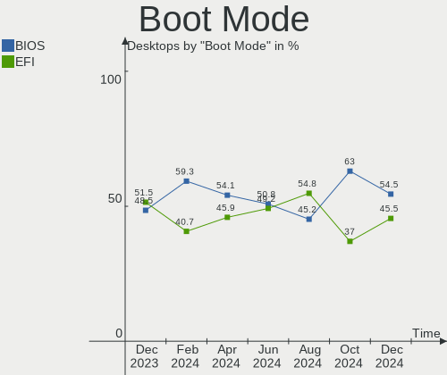
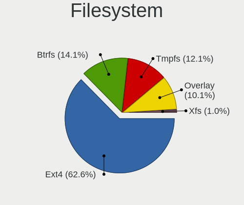
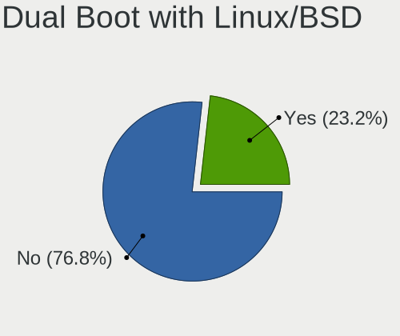
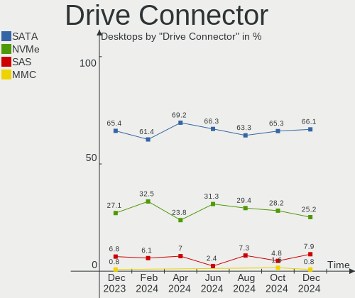
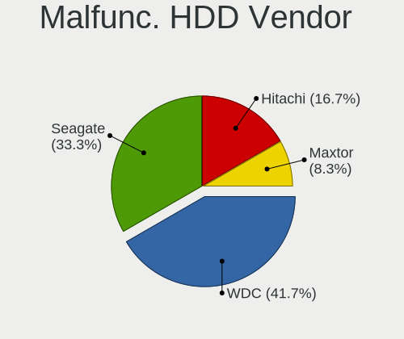
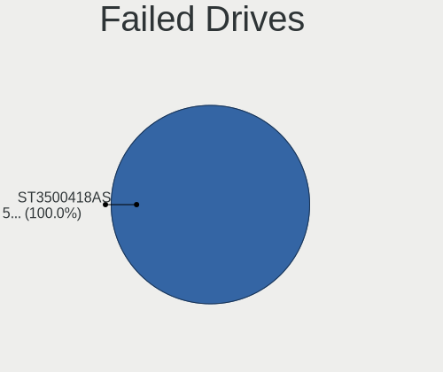
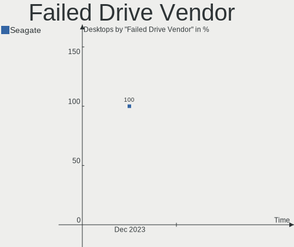
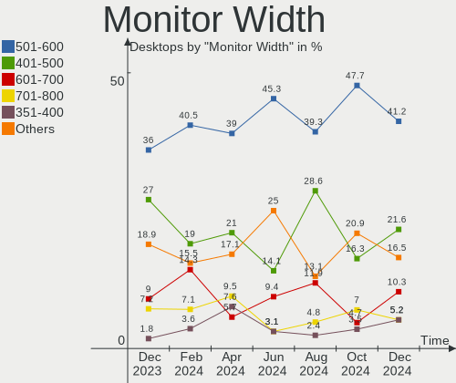

Linux in Italy - Hardware Trends (Desktops)
-------------------------------------------

A project to identify most popular hardware characteristics and track their change
over time based on data collected by Linux users at https://Linux-Hardware.org.

Anyone can contribute to this report by the [hw-probe](https://github.com/linuxhw/hw-probe) tool:

    sudo -E hw-probe -all -upload

Period: Dec, 2023.

Contents
--------

* [ System ](#system)
  - [ OS                       ](#os)
  - [ OS Family                ](#os-family)
  - [ Kernel                   ](#kernel)
  - [ Kernel Family            ](#kernel-family)
  - [ Kernel Major Ver.        ](#kernel-major-ver)
  - [ Arch                     ](#arch)
  - [ DE                       ](#de)
  - [ Display Server           ](#display-server)
  - [ Display Manager          ](#display-manager)
  - [ OS Lang                  ](#os-lang)
  - [ Boot Mode                ](#boot-mode)
  - [ Filesystem               ](#filesystem)
  - [ Part. scheme             ](#part-scheme)
  - [ Dual Boot with Linux/BSD ](#dual-boot-with-linuxbsd)
  - [ Dual Boot (Win)          ](#dual-boot-win)

* [ Board ](#board)
  - [ Vendor                   ](#vendor)
  - [ Model                    ](#model)
  - [ Model Family             ](#model-family)
  - [ MFG Year                 ](#mfg-year)
  - [ Form Factor              ](#form-factor)
  - [ Secure Boot              ](#secure-boot)
  - [ Coreboot                 ](#coreboot)
  - [ RAM Size                 ](#ram-size)
  - [ RAM Used                 ](#ram-used)
  - [ Total Drives             ](#total-drives)
  - [ Has CD-ROM               ](#has-cd-rom)
  - [ Has Ethernet             ](#has-ethernet)
  - [ Has WiFi                 ](#has-wifi)
  - [ Has Bluetooth            ](#has-bluetooth)

* [ Location ](#location)
  - [ Country                  ](#country)
  - [ City                     ](#city)

* [ Drives ](#drives)
  - [ Drive Vendor             ](#drive-vendor)
  - [ Drive Model              ](#drive-model)
  - [ HDD Vendor               ](#hdd-vendor)
  - [ SSD Vendor               ](#ssd-vendor)
  - [ Drive Kind               ](#drive-kind)
  - [ Drive Connector          ](#drive-connector)
  - [ Drive Size               ](#drive-size)
  - [ Space Total              ](#space-total)
  - [ Space Used               ](#space-used)
  - [ Malfunc. Drives          ](#malfunc-drives)
  - [ Malfunc. Drive Vendor    ](#malfunc-drive-vendor)
  - [ Malfunc. HDD Vendor      ](#malfunc-hdd-vendor)
  - [ Malfunc. Drive Kind      ](#malfunc-drive-kind)
  - [ Failed Drives            ](#failed-drives)
  - [ Failed Drive Vendor      ](#failed-drive-vendor)
  - [ Drive Status             ](#drive-status)

* [ Storage controller ](#storage-controller)
  - [ Storage Vendor           ](#storage-vendor)
  - [ Storage Model            ](#storage-model)
  - [ Storage Kind             ](#storage-kind)

* [ Processor ](#processor)
  - [ CPU Vendor               ](#cpu-vendor)
  - [ CPU Model                ](#cpu-model)
  - [ CPU Model Family         ](#cpu-model-family)
  - [ CPU Cores                ](#cpu-cores)
  - [ CPU Sockets              ](#cpu-sockets)
  - [ CPU Threads              ](#cpu-threads)
  - [ CPU Op-Modes             ](#cpu-op-modes)
  - [ CPU Microcode            ](#cpu-microcode)
  - [ CPU Microarch            ](#cpu-microarch)

* [ Graphics ](#graphics)
  - [ GPU Vendor               ](#gpu-vendor)
  - [ GPU Model                ](#gpu-model)
  - [ GPU Combo                ](#gpu-combo)
  - [ GPU Driver               ](#gpu-driver)
  - [ GPU Memory               ](#gpu-memory)

* [ Monitor ](#monitor)
  - [ Monitor Vendor           ](#monitor-vendor)
  - [ Monitor Model            ](#monitor-model)
  - [ Monitor Resolution       ](#monitor-resolution)
  - [ Monitor Diagonal         ](#monitor-diagonal)
  - [ Monitor Width            ](#monitor-width)
  - [ Aspect Ratio             ](#aspect-ratio)
  - [ Monitor Area             ](#monitor-area)
  - [ Pixel Density            ](#pixel-density)
  - [ Multiple Monitors        ](#multiple-monitors)

* [ Network ](#network)
  - [ Net Controller Vendor    ](#net-controller-vendor)
  - [ Net Controller Model     ](#net-controller-model)
  - [ Wireless Vendor          ](#wireless-vendor)
  - [ Wireless Model           ](#wireless-model)
  - [ Ethernet Vendor          ](#ethernet-vendor)
  - [ Ethernet Model           ](#ethernet-model)
  - [ Net Controller Kind      ](#net-controller-kind)
  - [ Used Controller          ](#used-controller)
  - [ NICs                     ](#nics)
  - [ IPv6                     ](#ipv6)

* [ Bluetooth ](#bluetooth)
  - [ Bluetooth Vendor         ](#bluetooth-vendor)
  - [ Bluetooth Model          ](#bluetooth-model)

* [ Sound ](#sound)
  - [ Sound Vendor             ](#sound-vendor)
  - [ Sound Model              ](#sound-model)

* [ Memory ](#memory)
  - [ Memory Vendor            ](#memory-vendor)
  - [ Memory Model             ](#memory-model)
  - [ Memory Kind              ](#memory-kind)
  - [ Memory Form Factor       ](#memory-form-factor)
  - [ Memory Size              ](#memory-size)
  - [ Memory Speed             ](#memory-speed)

* [ Printers & scanners ](#printers--scanners)
  - [ Printer Vendor           ](#printer-vendor)
  - [ Printer Model            ](#printer-model)
  - [ Scanner Vendor           ](#scanner-vendor)
  - [ Scanner Model            ](#scanner-model)

* [ Camera ](#camera)
  - [ Camera Vendor            ](#camera-vendor)
  - [ Camera Model             ](#camera-model)

* [ Security ](#security)
  - [ Fingerprint Vendor       ](#fingerprint-vendor)
  - [ Fingerprint Model        ](#fingerprint-model)
  - [ Chipcard Vendor          ](#chipcard-vendor)
  - [ Chipcard Model           ](#chipcard-model)

* [ Unsupported ](#unsupported)
  - [ Unsupported Devices      ](#unsupported-devices)
  - [ Unsupported Device Types ](#unsupported-device-types)

System
------

OS
--

Installed operating systems

| Name                         | Desktops | Percent |
|------------------------------|----------|---------|
| Linux Mint 21.2              | 15       | 14.56%  |
| OpenMandriva 5.0             | 9        | 8.74%   |
| Ubuntu 22.04                 | 8        | 7.77%   |
| Fedora 39                    | 6        | 5.83%   |
| Debian 12                    | 6        | 5.83%   |
| EndeavourOS Rolling          | 5        | 4.85%   |
| LMDE 6                       | 4        | 3.88%   |
| Ubuntu 23.10                 | 3        | 2.91%   |
| OpenMandriva 23.08           | 3        | 2.91%   |
| Linux Mint 21.1              | 3        | 2.91%   |
| ArcoLinux Rolling            | 3        | 2.91%   |
| Arch Rolling                 | 3        | 2.91%   |
| Zorin 16                     | 2        | 1.94%   |
| Ubuntu 23.04                 | 2        | 1.94%   |
| Ubuntu 20.04                 | 2        | 1.94%   |
| Ubuntu 18.04                 | 2        | 1.94%   |
| OpenMandriva 23.11           | 2        | 1.94%   |
| Kubuntu 23.10                | 2        | 1.94%   |
| Kubuntu 22.04                | 2        | 1.94%   |
| Xubuntu 23.10                | 1        | 0.97%   |
| Void Linux Rolling           | 1        | 0.97%   |
| Ubuntu Studio 22.04          | 1        | 0.97%   |
| Ubuntu MATE 22.04            | 1        | 0.97%   |
| Ubuntu 24.04                 | 1        | 0.97%   |
| TUXEDO OS 22.04              | 1        | 0.97%   |
| Sparky 6.7                   | 1        | 0.97%   |
| openSUSE Tumbleweed-XXXXXXXX | 1        | 0.97%   |
| OpenMandriva 4.2             | 1        | 0.97%   |
| OpenMandriva 23.90           | 1        | 0.97%   |
| OpenMandriva 23.03           | 1        | 0.97%   |
| OpenMandriva 22.12           | 1        | 0.97%   |
| Nobara 38                    | 1        | 0.97%   |
| Manjaro 23.1.0               | 1        | 0.97%   |
| Linux Mint 21                | 1        | 0.97%   |
| Linux Mint 20.3              | 1        | 0.97%   |
| Linux Mint 20                | 1        | 0.97%   |
| Garuda Linux Soaring         | 1        | 0.97%   |
| Debian 11                    | 1        | 0.97%   |
| Debian 10                    | 1        | 0.97%   |
| antiX 23                     | 1        | 0.97%   |

OS Family
---------

OS without a version

| Name          | Desktops | Percent |
|---------------|----------|---------|
| Linux Mint    | 21       | 20.39%  |
| Ubuntu        | 18       | 17.48%  |
| OpenMandriva  | 18       | 17.48%  |
| Debian        | 8        | 7.77%   |
| Fedora        | 6        | 5.83%   |
| EndeavourOS   | 5        | 4.85%   |
| LMDE          | 4        | 3.88%   |
| Kubuntu       | 4        | 3.88%   |
| ArcoLinux     | 3        | 2.91%   |
| Arch          | 3        | 2.91%   |
| Zorin         | 2        | 1.94%   |
| Xubuntu       | 1        | 0.97%   |
| Void Linux    | 1        | 0.97%   |
| Ubuntu Studio | 1        | 0.97%   |
| Ubuntu MATE   | 1        | 0.97%   |
| TUXEDO OS     | 1        | 0.97%   |
| Sparky        | 1        | 0.97%   |
| openSUSE      | 1        | 0.97%   |
| Nobara        | 1        | 0.97%   |
| Manjaro       | 1        | 0.97%   |
| Garuda Linux  | 1        | 0.97%   |
| antiX         | 1        | 0.97%   |

Kernel
------

Version of the Linux kernel

| Version                     | Desktops | Percent |
|-----------------------------|----------|---------|
| 5.15.0-91-generic           | 13       | 12.62%  |
| 6.6.2-desktop-1omv2390      | 11       | 10.68%  |
| 6.2.0-39-generic            | 7        | 6.8%    |
| 6.1.0-13-amd64              | 6        | 5.83%   |
| 6.5.0-14-generic            | 5        | 4.85%   |
| 6.6.8-200.fc39.x86_64       | 3        | 2.91%   |
| 6.4.11-desktop-1omv2390     | 3        | 2.91%   |
| 6.2.0-37-generic            | 3        | 2.91%   |
| 6.6.7-arch1-1               | 2        | 1.94%   |
| 6.6.4-zen1-1-zen            | 2        | 1.94%   |
| 6.6.4-arch1-1               | 2        | 1.94%   |
| 6.5.6-300.fc39.x86_64       | 2        | 1.94%   |
| 6.5.0-9-generic             | 2        | 1.94%   |
| 6.1.0-16-amd64              | 2        | 1.94%   |
| 5.4.0-169-generic           | 2        | 1.94%   |
| 5.4.0-150-generic           | 2        | 1.94%   |
| 5.15.0-89-generic           | 2        | 1.94%   |
| 6.6.8_1                     | 1        | 0.97%   |
| 6.6.8-arch1-1               | 1        | 0.97%   |
| 6.6.8-060608-generic        | 1        | 0.97%   |
| 6.6.7-zen1-1-zen            | 1        | 0.97%   |
| 6.6.7-1-liquorix-amd64      | 1        | 0.97%   |
| 6.6.6-arch1-1               | 1        | 0.97%   |
| 6.6.6-200.fc39.x86_64       | 1        | 0.97%   |
| 6.6.6-1-default             | 1        | 0.97%   |
| 6.6.4-202.fsync.fc38.x86_64 | 1        | 0.97%   |
| 6.6.4-200.fc39.x86_64       | 1        | 0.97%   |
| 6.6.3-desktop-1omv2390      | 1        | 0.97%   |
| 6.6.3-arch1-1               | 1        | 0.97%   |
| 6.6.1-arch1-1               | 1        | 0.97%   |
| 6.5.7-zen1-1-zen            | 1        | 0.97%   |
| 6.5.0-14-lowlatency         | 1        | 0.97%   |
| 6.5.0-10010-tuxedo          | 1        | 0.97%   |
| 6.2.6-desktop-1omv2390      | 1        | 0.97%   |
| 6.2.0-26-generic            | 1        | 0.97%   |
| 6.2.0-20-generic            | 1        | 0.97%   |
| 6.1.0-15-amd64              | 1        | 0.97%   |
| 6.1.0-12-amd64              | 1        | 0.97%   |
| 6.0.10-desktop-2omv22090    | 1        | 0.97%   |
| 5.4.0-167-generic           | 1        | 0.97%   |

Kernel Family
-------------

Linux kernel without a distro release

| Version  | Desktops | Percent |
|----------|----------|---------|
| 5.15.0   | 20       | 19.42%  |
| 6.2.0    | 12       | 11.65%  |
| 6.6.2    | 11       | 10.68%  |
| 6.1.0    | 10       | 9.71%   |
| 6.5.0    | 9        | 8.74%   |
| 6.6.8    | 6        | 5.83%   |
| 6.6.4    | 6        | 5.83%   |
| 5.4.0    | 5        | 4.85%   |
| 6.6.7    | 4        | 3.88%   |
| 6.6.6    | 3        | 2.91%   |
| 6.4.11   | 3        | 2.91%   |
| 5.10.0   | 3        | 2.91%   |
| 6.6.3    | 2        | 1.94%   |
| 6.5.6    | 2        | 1.94%   |
| 6.6.1    | 1        | 0.97%   |
| 6.5.7    | 1        | 0.97%   |
| 6.2.6    | 1        | 0.97%   |
| 6.0.10   | 1        | 0.97%   |
| 5.15.143 | 1        | 0.97%   |
| 5.10.188 | 1        | 0.97%   |
| 5.10.14  | 1        | 0.97%   |

Kernel Major Ver.
-----------------

Linux kernel major version

| Version | Desktops | Percent |
|---------|----------|---------|
| 6.6     | 33       | 32.04%  |
| 5.15    | 21       | 20.39%  |
| 6.2     | 13       | 12.62%  |
| 6.5     | 12       | 11.65%  |
| 6.1     | 10       | 9.71%   |
| 5.4     | 5        | 4.85%   |
| 5.10    | 5        | 4.85%   |
| 6.4     | 3        | 2.91%   |
| 6.0     | 1        | 0.97%   |

Arch
----

OS architecture (x86_64, i586, etc.)

| Name   | Desktops | Percent |
|--------|----------|---------|
| x86_64 | 102      | 99.03%  |
| i686   | 1        | 0.97%   |

DE
--

Desktop Environment

| Name            | Desktops | Percent |
|-----------------|----------|---------|
| KDE5            | 30       | 29.13%  |
| GNOME           | 30       | 29.13%  |
| X-Cinnamon      | 21       | 20.39%  |
| XFCE            | 11       | 10.68%  |
| MATE            | 5        | 4.85%   |
| sway            | 1        | 0.97%   |
| icewm           | 1        | 0.97%   |
| Hyprland        | 1        | 0.97%   |
| GNOME Flashback | 1        | 0.97%   |
| Cinnamon        | 1        | 0.97%   |
| Unknown         | 1        | 0.97%   |

Display Server
--------------

X11 or Wayland

| Name    | Desktops | Percent |
|---------|----------|---------|
| X11     | 65       | 63.11%  |
| Wayland | 36       | 34.95%  |
| Tty     | 1        | 0.97%   |
| Unknown | 1        | 0.97%   |

Display Manager
---------------

SDDM, LightDM, etc.

| Name    | Desktops | Percent |
|---------|----------|---------|
| SDDM    | 27       | 26.21%  |
| Unknown | 26       | 25.24%  |
| LightDM | 25       | 24.27%  |
| GDM3    | 16       | 15.53%  |
| GDM     | 8        | 7.77%   |
| SLIMSKI | 1        | 0.97%   |

OS Lang
-------

Language

| Lang  | Desktops | Percent |
|-------|----------|---------|
| it_IT | 74       | 71.84%  |
| en_US | 25       | 24.27%  |
| C     | 2        | 1.94%   |
| en_GB | 1        | 0.97%   |
| de_DE | 1        | 0.97%   |

Boot Mode
---------

EFI or BIOS

| Mode | Desktops | Percent |
|------|----------|---------|
| EFI  | 53       | 51.46%  |
| BIOS | 50       | 48.54%  |

Filesystem
----------

Type of filesystem

| Type    | Desktops | Percent |
|---------|----------|---------|
| Ext4    | 73       | 70.87%  |
| Tmpfs   | 10       | 9.71%   |
| Overlay | 9        | 8.74%   |
| Btrfs   | 9        | 8.74%   |
| Xfs     | 1        | 0.97%   |
| Ext3    | 1        | 0.97%   |

Part. scheme
------------

Scheme of partitioning

| Type    | Desktops | Percent |
|---------|----------|---------|
| GPT     | 62       | 60.19%  |
| Unknown | 23       | 22.33%  |
| MBR     | 18       | 17.48%  |

Dual Boot with Linux/BSD
------------------------

Hosting more than one Linux/BSD

| Dual boot | Desktops | Percent |
|-----------|----------|---------|
| No        | 86       | 83.5%   |
| Yes       | 17       | 16.5%   |

Dual Boot (Win)
---------------

Hosting Linux and Windows

| Dual boot | Desktops | Percent |
|-----------|----------|---------|
| No        | 59       | 57.28%  |
| Yes       | 44       | 42.72%  |

Board
-----

Vendor
------

Motherboard manufacturer

| Name                                 | Desktops | Percent |
|--------------------------------------|----------|---------|
| ASUSTek Computer                     | 32       | 31.07%  |
| Hewlett-Packard                      | 15       | 14.56%  |
| MSI                                  | 10       | 9.71%   |
| Dell                                 | 9        | 8.74%   |
| ASRock                               | 9        | 8.74%   |
| Gigabyte Technology                  | 7        | 6.8%    |
| Lenovo                               | 4        | 3.88%   |
| Unknown                              | 4        | 3.88%   |
| Foxconn                              | 3        | 2.91%   |
| Shenzhen Meigao Electronic Equipment | 2        | 1.94%   |
| Acer                                 | 2        | 1.94%   |
| T-bao                                | 1        | 0.97%   |
| Intel                                | 1        | 0.97%   |
| Fujitsu                              | 1        | 0.97%   |
| AZW                                  | 1        | 0.97%   |
| Apple                                | 1        | 0.97%   |
| AMI                                  | 1        | 0.97%   |

Model
-----

Motherboard model

| Name                                            | Desktops | Percent |
|-------------------------------------------------|----------|---------|
| Unknown                                         | 5        | 4.85%   |
| ASUS All Series                                 | 3        | 2.91%   |
| Shenzhen Meigao Electronic Equipment UM773 Lite | 2        | 1.94%   |
| MSI MS-7C02                                     | 2        | 1.94%   |
| HP ProDesk 600 G1 SFF                           | 2        | 1.94%   |
| Dell OptiPlex 7010                              | 2        | 1.94%   |
| ASRock G41M-VS3                                 | 2        | 1.94%   |
| T-bao MINI PC                                   | 1        | 0.97%   |
| MSI MS-7D91                                     | 1        | 0.97%   |
| MSI MS-7D25                                     | 1        | 0.97%   |
| MSI MS-7C91                                     | 1        | 0.97%   |
| MSI MS-7C37                                     | 1        | 0.97%   |
| MSI MS-7C13                                     | 1        | 0.97%   |
| MSI MS-7B86                                     | 1        | 0.97%   |
| MSI MS-7751                                     | 1        | 0.97%   |
| MSI MS-7693                                     | 1        | 0.97%   |
| Lenovo V50t-13IMB 11HD000DUM                    | 1        | 0.97%   |
| Lenovo ThinkCentre M93 10A4A05QGE               | 1        | 0.97%   |
| Lenovo IdeaCentre 3 07IMB05 90NB009QIX          | 1        | 0.97%   |
| Lenovo IdeaCentre 3 07IAB7 90SM00A1IX           | 1        | 0.97%   |
| HP Z240 SFF Workstation                         | 1        | 0.97%   |
| HP Z220 CMT Workstation                         | 1        | 0.97%   |
| HP Slim Desktop S01-aF0xxx                      | 1        | 0.97%   |
| HP ProLiant MicroServer Gen8                    | 1        | 0.97%   |
| HP ProLiant MicroServer                         | 1        | 0.97%   |
| HP ProDesk 600 G2 DM                            | 1        | 0.97%   |
| HP ProDesk 400 G1 SFF                           | 1        | 0.97%   |
| HP Pavilion Desktop TP01-0xxx                   | 1        | 0.97%   |
| HP F01                                          | 1        | 0.97%   |
| HP EliteDesk 800 G2 TWR                         | 1        | 0.97%   |
| HP Compaq Elite 8300 SFF                        | 1        | 0.97%   |
| HP Compaq dc7900 Convertible Minitower          | 1        | 0.97%   |
| HP 870-211nl                                    | 1        | 0.97%   |
| Gigabyte Z390 GAMING X                          | 1        | 0.97%   |
| Gigabyte Z170XP-SLI                             | 1        | 0.97%   |
| Gigabyte X570 AORUS MASTER                      | 1        | 0.97%   |
| Gigabyte H510M H                                | 1        | 0.97%   |
| Gigabyte H410M H V3                             | 1        | 0.97%   |
| Gigabyte B550M DS3H                             | 1        | 0.97%   |
| Gigabyte B250M-D2V                              | 1        | 0.97%   |

Model Family
------------

Motherboard model prefix

| Name                                       | Desktops | Percent |
|--------------------------------------------|----------|---------|
| ASUS PRIME                                 | 9        | 8.74%   |
| Dell OptiPlex                              | 8        | 7.77%   |
| Unknown                                    | 5        | 4.85%   |
| HP ProDesk                                 | 4        | 3.88%   |
| ASUS ROG                                   | 4        | 3.88%   |
| ASUS TUF                                   | 3        | 2.91%   |
| ASUS All                                   | 3        | 2.91%   |
| Shenzhen Meigao Electronic Equipment UM773 | 2        | 1.94%   |
| MSI MS-7C02                                | 2        | 1.94%   |
| Lenovo IdeaCentre                          | 2        | 1.94%   |
| HP ProLiant                                | 2        | 1.94%   |
| HP Compaq                                  | 2        | 1.94%   |
| ASUS M5A97                                 | 2        | 1.94%   |
| ASRock H310CM-HDV                          | 2        | 1.94%   |
| ASRock G41M-VS3                            | 2        | 1.94%   |
| Acer Aspire                                | 2        | 1.94%   |
| T-bao MINI                                 | 1        | 0.97%   |
| MSI MS-7D91                                | 1        | 0.97%   |
| MSI MS-7D25                                | 1        | 0.97%   |
| MSI MS-7C91                                | 1        | 0.97%   |
| MSI MS-7C37                                | 1        | 0.97%   |
| MSI MS-7C13                                | 1        | 0.97%   |
| MSI MS-7B86                                | 1        | 0.97%   |
| MSI MS-7751                                | 1        | 0.97%   |
| MSI MS-7693                                | 1        | 0.97%   |
| Lenovo V50t-13IMB                          | 1        | 0.97%   |
| Lenovo ThinkCentre                         | 1        | 0.97%   |
| HP Z240                                    | 1        | 0.97%   |
| HP Z220                                    | 1        | 0.97%   |
| HP Slim                                    | 1        | 0.97%   |
| HP Pavilion                                | 1        | 0.97%   |
| HP F01                                     | 1        | 0.97%   |
| HP EliteDesk                               | 1        | 0.97%   |
| HP 870-211nl                               | 1        | 0.97%   |
| Gigabyte Z390                              | 1        | 0.97%   |
| Gigabyte Z170XP-SLI                        | 1        | 0.97%   |
| Gigabyte X570                              | 1        | 0.97%   |
| Gigabyte H510M                             | 1        | 0.97%   |
| Gigabyte H410M                             | 1        | 0.97%   |
| Gigabyte B550M                             | 1        | 0.97%   |

MFG Year
--------

Motherboard manufacture year

| Year | Desktops | Percent |
|------|----------|---------|
| 2012 | 12       | 11.65%  |
| 2021 | 10       | 9.71%   |
| 2019 | 10       | 9.71%   |
| 2018 | 9        | 8.74%   |
| 2023 | 8        | 7.77%   |
| 2013 | 8        | 7.77%   |
| 2022 | 7        | 6.8%    |
| 2016 | 7        | 6.8%    |
| 2014 | 6        | 5.83%   |
| 2011 | 6        | 5.83%   |
| 2010 | 5        | 4.85%   |
| 2009 | 4        | 3.88%   |
| 2008 | 4        | 3.88%   |
| 2020 | 3        | 2.91%   |
| 2017 | 2        | 1.94%   |
| 2015 | 2        | 1.94%   |

Form Factor
-----------

Physical design of the computer

| Name    | Desktops | Percent |
|---------|----------|---------|
| Desktop | 103      | 100%    |

Secure Boot
-----------

Enabled or disabled

| State    | Desktops | Percent |
|----------|----------|---------|
| Disabled | 101      | 98.06%  |
| Enabled  | 2        | 1.94%   |

Coreboot
--------

Have coreboot on board

| Used | Desktops | Percent |
|------|----------|---------|
| No   | 103      | 100%    |

RAM Size
--------

Total RAM memory

| Size in GB  | Desktops | Percent |
|-------------|----------|---------|
| 16.01-24.0  | 29       | 28.16%  |
| 4.01-8.0    | 18       | 17.48%  |
| 8.01-16.0   | 18       | 17.48%  |
| 32.01-64.0  | 13       | 12.62%  |
| 64.01-256.0 | 10       | 9.71%   |
| 3.01-4.0    | 6        | 5.83%   |
| 24.01-32.0  | 5        | 4.85%   |
| 1.01-2.0    | 2        | 1.94%   |
| 2.01-3.0    | 1        | 0.97%   |
| 0.51-1.0    | 1        | 0.97%   |

RAM Used
--------

Used RAM memory

| Used GB    | Desktops | Percent |
|------------|----------|---------|
| 1.01-2.0   | 32       | 31.07%  |
| 2.01-3.0   | 29       | 28.16%  |
| 4.01-8.0   | 18       | 17.48%  |
| 3.01-4.0   | 11       | 10.68%  |
| 8.01-16.0  | 8        | 7.77%   |
| 0.51-1.0   | 3        | 2.91%   |
| 32.01-64.0 | 1        | 0.97%   |
| 0.01-0.5   | 1        | 0.97%   |

Total Drives
------------

Number of drives on board

| Drives | Desktops | Percent |
|--------|----------|---------|
| 1      | 38       | 36.89%  |
| 2      | 29       | 28.16%  |
| 3      | 18       | 17.48%  |
| 4      | 11       | 10.68%  |
| 5      | 4        | 3.88%   |
| 9      | 1        | 0.97%   |
| 7      | 1        | 0.97%   |
| 0      | 1        | 0.97%   |

Has CD-ROM
----------

Has CD-ROM on board

| Presented | Desktops | Percent |
|-----------|----------|---------|
| No        | 55       | 53.4%   |
| Yes       | 48       | 46.6%   |

Has Ethernet
------------

Has Ethernet on board

| Presented | Desktops | Percent |
|-----------|----------|---------|
| Yes       | 101      | 98.06%  |
| No        | 2        | 1.94%   |

Has WiFi
--------

Has WiFi module

| Presented | Desktops | Percent |
|-----------|----------|---------|
| Yes       | 56       | 54.37%  |
| No        | 47       | 45.63%  |

Has Bluetooth
-------------

Has Bluetooth module

| Presented | Desktops | Percent |
|-----------|----------|---------|
| No        | 57       | 55.34%  |
| Yes       | 46       | 44.66%  |

Location
--------

Country
-------

Geographic location (country)

| Country | Desktops | Percent |
|---------|----------|---------|
| Italy   | 103      | 100%    |

City
----

Geographic location (city)

| City                | Desktops | Percent |
|---------------------|----------|---------|
| Rome                | 13       | 12.62%  |
| Milan               | 10       | 9.71%   |
| Milano              | 5        | 4.85%   |
| Bologna             | 5        | 4.85%   |
| Turin               | 3        | 2.91%   |
| Rho                 | 3        | 2.91%   |
| Genoa               | 3        | 2.91%   |
| Nova Milanese       | 2        | 1.94%   |
| Naples              | 2        | 1.94%   |
| Casalecchio di Reno | 2        | 1.94%   |
| Voghera             | 1        | 0.97%   |
| Villafranca d'Asti  | 1        | 0.97%   |
| Villa Cortese       | 1        | 0.97%   |
| Vicenza             | 1        | 0.97%   |
| Viareggio           | 1        | 0.97%   |
| Verona              | 1        | 0.97%   |
| Venice              | 1        | 0.97%   |
| Varese              | 1        | 0.97%   |
| Trieste             | 1        | 0.97%   |
| Trento              | 1        | 0.97%   |
| Trappeto            | 1        | 0.97%   |
| Torre del Greco     | 1        | 0.97%   |
| Terzigno            | 1        | 0.97%   |
| Tavagnacco          | 1        | 0.97%   |
| Taranto             | 1        | 0.97%   |
| Sergnano            | 1        | 0.97%   |
| Sassari             | 1        | 0.97%   |
| Saronno             | 1        | 0.97%   |
| Rossano Veneto      | 1        | 0.97%   |
| Pisa                | 1        | 0.97%   |
| Pescara             | 1        | 0.97%   |
| Pasturo             | 1        | 0.97%   |
| Pasturana           | 1        | 0.97%   |
| Pasian di Prato     | 1        | 0.97%   |
| Parma               | 1        | 0.97%   |
| Parabiago           | 1        | 0.97%   |
| Palermo             | 1        | 0.97%   |
| Padova              | 1        | 0.97%   |
| Nove                | 1        | 0.97%   |
| Nichelino           | 1        | 0.97%   |

Drives
------

Drive Vendor
------------

Hard drive vendors

| Vendor                      | Desktops | Drives | Percent |
|-----------------------------|----------|--------|---------|
| Seagate                     | 35       | 47     | 18.23%  |
| Samsung Electronics         | 33       | 42     | 17.19%  |
| WDC                         | 28       | 33     | 14.58%  |
| Crucial                     | 16       | 19     | 8.33%   |
| Kingston                    | 13       | 14     | 6.77%   |
| Toshiba                     | 9        | 10     | 4.69%   |
| Micron/Crucial Technology   | 6        | 6      | 3.13%   |
| Hitachi                     | 6        | 7      | 3.13%   |
| Sandisk                     | 4        | 4      | 2.08%   |
| Unknown                     | 3        | 5      | 1.56%   |
| Team                        | 3        | 3      | 1.56%   |
| Micron Technology           | 3        | 3      | 1.56%   |
| HGST                        | 3        | 3      | 1.56%   |
| Fanxiang                    | 3        | 3      | 1.56%   |
| China                       | 3        | 3      | 1.56%   |
| Phison Electronics          | 2        | 2      | 1.04%   |
| Patriot                     | 2        | 2      | 1.04%   |
| Kingston Technology Company | 2        | 2      | 1.04%   |
| SPCC                        | 1        | 1      | 0.52%   |
| sobetter                    | 1        | 1      | 0.52%   |
| SK hynix                    | 1        | 1      | 0.52%   |
| Silicon Motion              | 1        | 1      | 0.52%   |
| ROG                         | 1        | 1      | 0.52%   |
| Maxtor                      | 1        | 1      | 0.52%   |
| MAXIO Technology (Hangzhou) | 1        | 1      | 0.52%   |
| Lexar                       | 1        | 1      | 0.52%   |
| KIOXIA-EXCERIA              | 1        | 1      | 0.52%   |
| Intel                       | 1        | 1      | 0.52%   |
| Hewlett-Packard             | 1        | 2      | 0.52%   |
| FIKWOT                      | 1        | 1      | 0.52%   |
| Emtec                       | 1        | 1      | 0.52%   |
| Dogfish                     | 1        | 1      | 0.52%   |
| CT1000P3                    | 1        | 1      | 0.52%   |
| BIWIN                       | 1        | 1      | 0.52%   |
| Apple                       | 1        | 1      | 0.52%   |
| Unknown                     | 1        | 1      | 0.52%   |

Drive Model
-----------

Hard drive models

| Model                                               | Desktops | Percent |
|-----------------------------------------------------|----------|---------|
| Seagate ST1000DM010-2EP102 1TB                      | 4        | 1.83%   |
| Samsung NVMe SSD Controller PM9A1/PM9A3/980PRO 2TB  | 4        | 1.83%   |
| Crucial CT500MX500SSD1 500GB                        | 4        | 1.83%   |
| Crucial CT240BX500SSD1 240GB                        | 4        | 1.83%   |
| Crucial CT1000MX500SSD1 1TB                         | 4        | 1.83%   |
| Toshiba DT01ACA100 1TB                              | 3        | 1.38%   |
| Seagate ST500DM002-1BD142 500GB                     | 3        | 1.38%   |
| Seagate ST2000LM015-2E8174 2TB                      | 3        | 1.38%   |
| Seagate ST2000DM008-2FR102 2TB                      | 3        | 1.38%   |
| Samsung SSD 870 QVO 1TB                             | 3        | 1.38%   |
| Samsung SSD 850 EVO 500GB                           | 3        | 1.38%   |
| Samsung NVMe SSD Controller SM981/PM981/PM983 512GB | 3        | 1.38%   |
| Micron/Crucial P2 NVMe PCIe SSD 4TB                 | 3        | 1.38%   |
| Crucial CT1000BX500SSD1 1TB                         | 3        | 1.38%   |
| WDC WD5000AAKX-08U6AA0 500GB                        | 2        | 0.92%   |
| WDC WD20EARX-00PASB0 2TB                            | 2        | 0.92%   |
| Unknown SD/MMC/MS PRO 512GB                         | 2        | 0.92%   |
| Toshiba HDWD110 1TB                                 | 2        | 0.92%   |
| Seagate ST3500418AS 500GB                           | 2        | 0.92%   |
| Seagate ST31000524AS 1TB                            | 2        | 0.92%   |
| Seagate ST2000DM001-1ER164 2TB                      | 2        | 0.92%   |
| Seagate ST1000LM024 HN-M101MBB 1TB                  | 2        | 0.92%   |
| Seagate ST1000DM003-1SB102 1TB                      | 2        | 0.92%   |
| Samsung SSD 970 EVO Plus 1TB                        | 2        | 0.92%   |
| Samsung SSD 870 QVO 2TB                             | 2        | 0.92%   |
| Samsung SSD 860 EVO 500GB                           | 2        | 0.92%   |
| Samsung SSD 860 EVO 250GB                           | 2        | 0.92%   |
| Samsung SSD 860 EVO 1TB                             | 2        | 0.92%   |
| Samsung SSD 840 EVO 500GB                           | 2        | 0.92%   |
| Phison E12 NVMe Controller 1TB                      | 2        | 0.92%   |
| Micron/Crucial CT500P5PSSD8 500GB                   | 2        | 0.92%   |
| Micron MTFDHBA512QFD 512GB                          | 2        | 0.92%   |
| Kingston SA400S37480G 480GB SSD                     | 2        | 0.92%   |
| Kingston SA400S37240G 240GB SSD                     | 2        | 0.92%   |
| Kingston SA400S37120G 120GB SSD                     | 2        | 0.92%   |
| Hitachi HDS723020BLA642 2TB                         | 2        | 0.92%   |
| WDC WDS500G2B0B-00YS70 500GB SSD                    | 1        | 0.46%   |
| WDC WDS240G2G0A-00JH30 240GB SSD                    | 1        | 0.46%   |
| WDC WDS120G2G0A-00JH30 120GB SSD                    | 1        | 0.46%   |
| WDC WD6400AAKS-22A7B2 640GB                         | 1        | 0.46%   |

HDD Vendor
----------

Hard disk drive vendors

| Vendor              | Desktops | Drives | Percent |
|---------------------|----------|--------|---------|
| Seagate             | 35       | 46     | 42.68%  |
| WDC                 | 26       | 30     | 31.71%  |
| Toshiba             | 6        | 7      | 7.32%   |
| Hitachi             | 6        | 7      | 7.32%   |
| HGST                | 3        | 3      | 3.66%   |
| Unknown             | 2        | 2      | 2.44%   |
| Samsung Electronics | 2        | 2      | 2.44%   |
| Maxtor              | 1        | 1      | 1.22%   |
| Hewlett-Packard     | 1        | 2      | 1.22%   |

SSD Vendor
----------

Solid state drive vendors

| Vendor              | Desktops | Drives | Percent |
|---------------------|----------|--------|---------|
| Samsung Electronics | 24       | 27     | 33.33%  |
| Crucial             | 16       | 19     | 22.22%  |
| Kingston            | 9        | 10     | 12.5%   |
| WDC                 | 3        | 3      | 4.17%   |
| Team                | 3        | 3      | 4.17%   |
| SanDisk             | 3        | 3      | 4.17%   |
| China               | 3        | 3      | 4.17%   |
| Fanxiang            | 2        | 2      | 2.78%   |
| SPCC                | 1        | 1      | 1.39%   |
| ROG                 | 1        | 1      | 1.39%   |
| Patriot             | 1        | 1      | 1.39%   |
| Micron Technology   | 1        | 1      | 1.39%   |
| Intel               | 1        | 1      | 1.39%   |
| FIKWOT              | 1        | 1      | 1.39%   |
| Emtec               | 1        | 1      | 1.39%   |
| Dogfish             | 1        | 1      | 1.39%   |
| Apple               | 1        | 1      | 1.39%   |

Drive Kind
----------

HDD or SSD

| Kind    | Desktops | Drives | Percent |
|---------|----------|--------|---------|
| HDD     | 65       | 100    | 39.16%  |
| SSD     | 60       | 79     | 36.14%  |
| NVMe    | 37       | 42     | 22.29%  |
| Unknown | 3        | 5      | 1.81%   |
| MMC     | 1        | 1      | 0.6%    |

Drive Connector
---------------

SATA, SAS, NVMe, etc.

| Type | Desktops | Drives | Percent |
|------|----------|--------|---------|
| SATA | 87       | 172    | 65.41%  |
| NVMe | 36       | 40     | 27.07%  |
| SAS  | 9        | 14     | 6.77%   |
| MMC  | 1        | 1      | 0.75%   |

Drive Size
----------

Size of hard drive

| Size in TB | Desktops | Drives | Percent |
|------------|----------|--------|---------|
| 0.01-0.5   | 64       | 89     | 48.48%  |
| 0.51-1.0   | 38       | 48     | 28.79%  |
| 1.01-2.0   | 21       | 29     | 15.91%  |
| 3.01-4.0   | 4        | 6      | 3.03%   |
| 2.01-3.0   | 3        | 3      | 2.27%   |
| 10.01-20.0 | 1        | 2      | 0.76%   |
| 4.01-10.0  | 1        | 2      | 0.76%   |

Space Total
-----------

Amount of disk space available on the file system

| Size in GB     | Desktops | Percent |
|----------------|----------|---------|
| 1001-2000      | 17       | 16.5%   |
| 251-500        | 16       | 15.53%  |
| 101-250        | 16       | 15.53%  |
| 501-1000       | 14       | 13.59%  |
| More than 3000 | 10       | 9.71%   |
| 51-100         | 8        | 7.77%   |
| 2001-3000      | 7        | 6.8%    |
| 21-50          | 6        | 5.83%   |
| 1-20           | 6        | 5.83%   |
| Unknown        | 3        | 2.91%   |

Space Used
----------

Amount of used disk space

| Used GB        | Desktops | Percent |
|----------------|----------|---------|
| 1-20           | 29       | 28.16%  |
| 21-50          | 15       | 14.56%  |
| 501-1000       | 13       | 12.62%  |
| 101-250        | 11       | 10.68%  |
| 251-500        | 10       | 9.71%   |
| 51-100         | 9        | 8.74%   |
| 1001-2000      | 8        | 7.77%   |
| More than 3000 | 4        | 3.88%   |
| Unknown        | 3        | 2.91%   |
| 2001-3000      | 1        | 0.97%   |

Malfunc. Drives
---------------

Drive models with a malfunction

| Model                                                          | Desktops | Drives | Percent |
|----------------------------------------------------------------|----------|--------|---------|
| WDC WD5000AURX-63UY4Y0 500GB                                   | 1        | 1      | 3.85%   |
| WDC WD40EZRX-00SPEB0 4TB                                       | 1        | 1      | 3.85%   |
| WDC WD40EFRX-68N32N0 4TB                                       | 1        | 1      | 3.85%   |
| WDC WD2003FYPS-27W9B0 2TB                                      | 1        | 1      | 3.85%   |
| WDC WD10EADS-65L5B1 1TB                                        | 1        | 1      | 3.85%   |
| WDC WD10 JPVX-22JC3T0 1TB                                      | 1        | 1      | 3.85%   |
| Seagate ST500DM002-1BD142 500GB                                | 1        | 1      | 3.85%   |
| Seagate ST3250310AS 250GB                                      | 1        | 1      | 3.85%   |
| Seagate ST31000524AS 1TB                                       | 1        | 1      | 3.85%   |
| Seagate ST2000VM003-1ET164 2TB                                 | 1        | 1      | 3.85%   |
| Seagate ST2000DM001-9YN164 2TB                                 | 1        | 1      | 3.85%   |
| Seagate ST12000VN0007-2GS116 12TB                              | 1        | 1      | 3.85%   |
| SanDisk SSD PLUS 480GB                                         | 1        | 1      | 3.85%   |
| Samsung Electronics SSD 980 1TB                                | 1        | 1      | 3.85%   |
| Samsung Electronics SSD 970 EVO Plus 1TB                       | 1        | 1      | 3.85%   |
| Samsung Electronics SSD 860 EVO 500GB                          | 1        | 1      | 3.85%   |
| Samsung Electronics NVMe SSD Controller PM9A1/PM9A3/980PRO 2TB | 1        | 1      | 3.85%   |
| Micron/Crucial Technology P2 NVMe PCIe SSD 4TB                 | 1        | 1      | 3.85%   |
| Maxtor STM380215AS 80GB                                        | 1        | 1      | 3.85%   |
| Kingston RBU-SNS8350DES3128GP 128GB SSD                        | 1        | 1      | 3.85%   |
| Hitachi HTS725032A9A364 320GB                                  | 1        | 1      | 3.85%   |
| Hitachi HTS543232A7A384 320GB                                  | 1        | 1      | 3.85%   |
| Hitachi HTS542580K9SA00 80GB                                   | 1        | 1      | 3.85%   |
| Hitachi HDT721010SLA360 1TB                                    | 1        | 1      | 3.85%   |
| Crucial CT275MX300SSD1 275GB                                   | 1        | 1      | 3.85%   |
| China SH00M240GB SSD                                           | 1        | 1      | 3.85%   |

Malfunc. Drive Vendor
---------------------

Vendors of faulty drives

| Vendor                    | Desktops | Drives | Percent |
|---------------------------|----------|--------|---------|
| Seagate                   | 6        | 6      | 25%     |
| WDC                       | 5        | 6      | 20.83%  |
| Samsung Electronics       | 4        | 4      | 16.67%  |
| Hitachi                   | 3        | 4      | 12.5%   |
| SanDisk                   | 1        | 1      | 4.17%   |
| Micron/Crucial Technology | 1        | 1      | 4.17%   |
| Maxtor                    | 1        | 1      | 4.17%   |
| Kingston                  | 1        | 1      | 4.17%   |
| Crucial                   | 1        | 1      | 4.17%   |
| China                     | 1        | 1      | 4.17%   |

Malfunc. HDD Vendor
-------------------

Vendors of faulty HDD drives

| Vendor  | Desktops | Drives | Percent |
|---------|----------|--------|---------|
| Seagate | 6        | 6      | 40%     |
| WDC     | 5        | 6      | 33.33%  |
| Hitachi | 3        | 4      | 20%     |
| Maxtor  | 1        | 1      | 6.67%   |

Malfunc. Drive Kind
-------------------

Kinds of faulty drives

| Kind | Desktops | Drives | Percent |
|------|----------|--------|---------|
| HDD  | 13       | 17     | 59.09%  |
| SSD  | 5        | 5      | 22.73%  |
| NVMe | 4        | 4      | 18.18%  |

Failed Drives
-------------

Failed drive models

| Model                     | Desktops | Drives | Percent |
|---------------------------|----------|--------|---------|
| Seagate ST3500418AS 500GB | 1        | 1      | 100%    |

Failed Drive Vendor
-------------------

Failed drive vendors

| Vendor  | Desktops | Drives | Percent |
|---------|----------|--------|---------|
| Seagate | 1        | 1      | 100%    |

Drive Status
------------

Number of failed and malfunc. drives

| Status   | Desktops | Drives | Percent |
|----------|----------|--------|---------|
| Works    | 62       | 113    | 52.54%  |
| Detected | 38       | 87     | 32.2%   |
| Malfunc  | 17       | 26     | 14.41%  |
| Failed   | 1        | 1      | 0.85%   |

Storage controller
------------------

Storage Vendor
--------------

Storage controller vendors

| Vendor                       | Desktops | Percent |
|------------------------------|----------|---------|
| Intel                        | 68       | 45.95%  |
| AMD                          | 30       | 20.27%  |
| Samsung Electronics          | 14       | 9.46%   |
| Micron/Crucial Technology    | 6        | 4.05%   |
| Kingston Technology Company  | 6        | 4.05%   |
| Toshiba America Info Systems | 3        | 2.03%   |
| ASMedia Technology           | 3        | 2.03%   |
| Phison Electronics           | 2        | 1.35%   |
| Nvidia                       | 2        | 1.35%   |
| Micron Technology            | 2        | 1.35%   |
| Marvell Technology Group     | 2        | 1.35%   |
| INNOGRIT                     | 2        | 1.35%   |
| VIA Technologies             | 1        | 0.68%   |
| SK hynix                     | 1        | 0.68%   |
| Silicon Motion               | 1        | 0.68%   |
| SanDisk                      | 1        | 0.68%   |
| MAXIO Technology (Hangzhou)  | 1        | 0.68%   |
| KIOXIA                       | 1        | 0.68%   |
| JMicron Technology           | 1        | 0.68%   |
| Biwin Storage Technology     | 1        | 0.68%   |

Storage Model
-------------

Storage controller models

| Model                                                                                   | Desktops | Percent |
|-----------------------------------------------------------------------------------------|----------|---------|
| AMD FCH SATA Controller [AHCI mode]                                                     | 18       | 10.23%  |
| Intel 8 Series/C220 Series Chipset Family 6-port SATA Controller 1 [AHCI mode]          | 9        | 5.11%   |
| Intel 7 Series/C210 Series Chipset Family 6-port SATA Controller [AHCI mode]            | 7        | 3.98%   |
| AMD 400 Series Chipset SATA Controller                                                  | 7        | 3.98%   |
| Samsung NVMe SSD Controller SM981/PM981/PM983                                           | 6        | 3.41%   |
| Intel Q170/Q150/B150/H170/H110/Z170/CM236 Chipset SATA Controller [AHCI Mode]           | 5        | 2.84%   |
| Intel 200 Series PCH SATA controller [AHCI mode]                                        | 5        | 2.84%   |
| Samsung NVMe SSD Controller PM9A1/PM9A3/980PRO                                          | 4        | 2.27%   |
| Intel Alder Lake-S PCH SATA Controller [AHCI Mode]                                      | 4        | 2.27%   |
| Intel 6 Series/C200 Series Chipset Family 6 port Desktop SATA AHCI Controller           | 4        | 2.27%   |
| Intel 500 Series Chipset Family SATA AHCI Controller                                    | 4        | 2.27%   |
| AMD SB7x0/SB8x0/SB9x0 IDE Controller                                                    | 4        | 2.27%   |
| Micron/Crucial P5 Plus NVMe PCIe SSD                                                    | 3        | 1.7%    |
| Micron/Crucial P2 [Nick P2] / P3 / P3 Plus NVMe PCIe SSD (DRAM-less)                    | 3        | 1.7%    |
| Intel SATA Controller [RAID mode]                                                       | 3        | 1.7%    |
| Intel SATA controller                                                                   | 3        | 1.7%    |
| Intel Cannon Lake PCH SATA AHCI Controller                                              | 3        | 1.7%    |
| Intel 82801JD/DO (ICH10 Family) SATA AHCI Controller                                    | 3        | 1.7%    |
| Intel 6 Series/C200 Series Chipset Family Desktop SATA Controller (IDE mode, ports 4-5) | 3        | 1.7%    |
| Intel 6 Series/C200 Series Chipset Family Desktop SATA Controller (IDE mode, ports 0-3) | 3        | 1.7%    |
| Intel 400 Series Chipset Family SATA AHCI Controller                                    | 3        | 1.7%    |
| ASMedia ASM1062 Serial ATA Controller                                                   | 3        | 1.7%    |
| AMD SB7x0/SB8x0/SB9x0 SATA Controller [IDE mode]                                        | 3        | 1.7%    |
| AMD SB7x0/SB8x0/SB9x0 SATA Controller [AHCI mode]                                       | 3        | 1.7%    |
| Samsung NVMe SSD Controller 980 (DRAM-less)                                             | 2        | 1.14%   |
| Phison E12 NVMe Controller                                                              | 2        | 1.14%   |
| Micron 2210 NVMe SSD [Cobain]                                                           | 2        | 1.14%   |
| Kingston Company OM8PGP4 NVMe PCIe SSD (DRAM-less)                                      | 2        | 1.14%   |
| Intel Volume Management Device NVMe RAID Controller                                     | 2        | 1.14%   |
| Intel NM10/ICH7 Family SATA Controller [IDE mode]                                       | 2        | 1.14%   |
| Intel 82801G (ICH7 Family) IDE Controller                                               | 2        | 1.14%   |
| Intel 700 Series Chipset Family SATA AHCI Controller                                    | 2        | 1.14%   |
| Intel 5 Series/3400 Series Chipset 6 port SATA AHCI Controller                          | 2        | 1.14%   |
| Intel 4 Series Chipset PT IDER Controller                                               | 2        | 1.14%   |
| INNOGRIT NVMe SSD Controller IG5236                                                     | 2        | 1.14%   |
| AMD 500 Series Chipset SATA Controller                                                  | 2        | 1.14%   |
| VIA VT6415 PATA IDE Host Controller                                                     | 1        | 0.57%   |
| Toshiba America Info Systems XG6 NVMe SSD Controller                                    | 1        | 0.57%   |
| Toshiba America Info Systems XG5 NVMe SSD Controller                                    | 1        | 0.57%   |
| Toshiba America Info Systems BG3 x2 NVMe SSD Controller (DRAM-less)                     | 1        | 0.57%   |

Storage Kind
------------

Kind of storage controller (IDE, SATA, NVMe, SAS, ...)

| Kind | Desktops | Percent |
|------|----------|---------|
| SATA | 86       | 58.11%  |
| NVMe | 36       | 24.32%  |
| IDE  | 18       | 12.16%  |
| RAID | 8        | 5.41%   |

Processor
---------

CPU Vendor
----------

Processor vendors

| Vendor | Desktops | Percent |
|--------|----------|---------|
| Intel  | 71       | 68.93%  |
| AMD    | 32       | 31.07%  |

CPU Model
---------

Processor models

| Model                                       | Desktops | Percent |
|---------------------------------------------|----------|---------|
| Intel Core i7-3770 CPU @ 3.40GHz            | 5        | 4.85%   |
| AMD Ryzen 7 2700X Eight-Core Processor      | 4        | 3.88%   |
| AMD Ryzen 9 5950X 16-Core Processor         | 3        | 2.91%   |
| AMD Ryzen 7 7735HS with Radeon Graphics     | 3        | 2.91%   |
| Intel N100                                  | 2        | 1.94%   |
| Intel Core i5-8600K CPU @ 3.60GHz           | 2        | 1.94%   |
| Intel Core i5-4590T CPU @ 2.00GHz           | 2        | 1.94%   |
| Intel Core i5 CPU 650 @ 3.20GHz             | 2        | 1.94%   |
| Intel Core i3-2100 CPU @ 3.10GHz            | 2        | 1.94%   |
| Intel Core 2 Duo CPU E8400 @ 3.00GHz        | 2        | 1.94%   |
| Intel 11th Gen Core i5-11400 @ 2.60GHz      | 2        | 1.94%   |
| AMD FX-6300 Six-Core Processor              | 2        | 1.94%   |
| AMD FX-6100 Six-Core Processor              | 2        | 1.94%   |
| Intel Xeon CPU E5-2697 v2 @ 2.70GHz         | 1        | 0.97%   |
| Intel Xeon CPU E31270 @ 3.40GHz             | 1        | 0.97%   |
| Intel Xeon CPU E3-1230 v6 @ 3.50GHz         | 1        | 0.97%   |
| Intel Xeon CPU E3-1225 V2 @ 3.20GHz         | 1        | 0.97%   |
| Intel Pentium M processor 1.73GHz           | 1        | 0.97%   |
| Intel Pentium Dual-Core CPU E5200 @ 2.50GHz | 1        | 0.97%   |
| Intel Pentium CPU G620 @ 2.60GHz            | 1        | 0.97%   |
| Intel Pentium CPU G3220 @ 3.00GHz           | 1        | 0.97%   |
| Intel N95                                   | 1        | 0.97%   |
| Intel Core i9-9900K CPU @ 3.60GHz           | 1        | 0.97%   |
| Intel Core i9-14900KF                       | 1        | 0.97%   |
| Intel Core i7-9700 CPU @ 3.00GHz            | 1        | 0.97%   |
| Intel Core i7-7700K CPU @ 4.20GHz           | 1        | 0.97%   |
| Intel Core i7-7700 CPU @ 3.60GHz            | 1        | 0.97%   |
| Intel Core i7-6700K CPU @ 4.00GHz           | 1        | 0.97%   |
| Intel Core i7-4790 CPU @ 3.60GHz            | 1        | 0.97%   |
| Intel Core i7-3770K CPU @ 3.50GHz           | 1        | 0.97%   |
| Intel Core i7-10700 CPU @ 2.90GHz           | 1        | 0.97%   |
| Intel Core i5-9400F CPU @ 2.90GHz           | 1        | 0.97%   |
| Intel Core i5-8400 CPU @ 2.80GHz            | 1        | 0.97%   |
| Intel Core i5-7500 CPU @ 3.40GHz            | 1        | 0.97%   |
| Intel Core i5-6600K CPU @ 3.50GHz           | 1        | 0.97%   |
| Intel Core i5-6500T CPU @ 2.50GHz           | 1        | 0.97%   |
| Intel Core i5-4590 CPU @ 3.30GHz            | 1        | 0.97%   |
| Intel Core i5-4440 CPU @ 3.10GHz            | 1        | 0.97%   |
| Intel Core i5-3550 CPU @ 3.30GHz            | 1        | 0.97%   |
| Intel Core i5-2500 CPU @ 3.30GHz            | 1        | 0.97%   |

CPU Model Family
----------------

Processor model prefix

| Model                   | Desktops | Percent |
|-------------------------|----------|---------|
| Intel Core i5           | 18       | 17.48%  |
| AMD Ryzen 7             | 13       | 12.62%  |
| Intel Core i7           | 12       | 11.65%  |
| Intel Core i3           | 12       | 11.65%  |
| Other                   | 11       | 10.68%  |
| AMD Ryzen 9             | 5        | 4.85%   |
| Intel Xeon              | 4        | 3.88%   |
| Intel Core 2 Duo        | 4        | 3.88%   |
| AMD Ryzen 5             | 4        | 3.88%   |
| AMD FX                  | 4        | 3.88%   |
| Intel Pentium           | 2        | 1.94%   |
| Intel Core i9           | 2        | 1.94%   |
| Intel Core 2 Quad       | 2        | 1.94%   |
| Intel Celeron           | 2        | 1.94%   |
| Intel Pentium M         | 1        | 0.97%   |
| Intel Pentium Dual-Core | 1        | 0.97%   |
| Intel Atom              | 1        | 0.97%   |
| AMD Turion II Neo       | 1        | 0.97%   |
| AMD Athlon II X2        | 1        | 0.97%   |
| AMD Athlon              | 1        | 0.97%   |
| AMD A8                  | 1        | 0.97%   |
| AMD A4                  | 1        | 0.97%   |

CPU Cores
---------

Number of processor cores

| Number | Desktops | Percent |
|--------|----------|---------|
| 4      | 34       | 33.01%  |
| 2      | 23       | 22.33%  |
| 8      | 15       | 14.56%  |
| 6      | 15       | 14.56%  |
| 12     | 4        | 3.88%   |
| 3      | 4        | 3.88%   |
| 16     | 3        | 2.91%   |
| 1      | 3        | 2.91%   |
| 24     | 2        | 1.94%   |

CPU Sockets
-----------

Number of sockets

| Number | Desktops | Percent |
|--------|----------|---------|
| 1      | 103      | 100%    |

CPU Threads
-----------

Threads per core (Hyper-Threading)

| Number | Desktops | Percent |
|--------|----------|---------|
| 2      | 66       | 64.08%  |
| 1      | 37       | 35.92%  |

CPU Op-Modes
------------

CPU Operation Modes (32-bit, 64-bit)

| Op mode        | Desktops | Percent |
|----------------|----------|---------|
| 32-bit, 64-bit | 102      | 99.03%  |
| 32-bit         | 1        | 0.97%   |

CPU Microcode
-------------

Microcode number

| Number     | Desktops | Percent |
|------------|----------|---------|
| Unknown    | 52       | 50.49%  |
| 0x306a9    | 5        | 4.85%   |
| 0x306c3    | 4        | 3.88%   |
| 0x206a7    | 3        | 2.91%   |
| 0x0a404102 | 3        | 2.91%   |
| 0x0800820d | 3        | 2.91%   |
| 0xb06e0    | 2        | 1.94%   |
| 0x906ed    | 2        | 1.94%   |
| 0x906e9    | 2        | 1.94%   |
| 0x20652    | 2        | 1.94%   |
| 0x08108109 | 2        | 1.94%   |
| 0x06000852 | 2        | 1.94%   |
| 0xb0671    | 1        | 0.97%   |
| 0xa0655    | 1        | 0.97%   |
| 0xa0653    | 1        | 0.97%   |
| 0x906ea    | 1        | 0.97%   |
| 0x6d8      | 1        | 0.97%   |
| 0x506e3    | 1        | 0.97%   |
| 0x1067a    | 1        | 0.97%   |
| 0x10677    | 1        | 0.97%   |
| 0x0a601206 | 1        | 0.97%   |
| 0x0a50000f | 1        | 0.97%   |
| 0x0a20120e | 1        | 0.97%   |
| 0x08701030 | 1        | 0.97%   |
| 0x08701021 | 1        | 0.97%   |
| 0x08701013 | 1        | 0.97%   |
| 0x08001138 | 1        | 0.97%   |
| 0x06001119 | 1        | 0.97%   |
| 0x06000637 | 1        | 0.97%   |
| 0x06000626 | 1        | 0.97%   |
| 0x03000027 | 1        | 0.97%   |
| 0x010000dc | 1        | 0.97%   |
| 0x010000b6 | 1        | 0.97%   |

CPU Microarch
-------------

Microarchitecture

| Name             | Desktops | Percent |
|------------------|----------|---------|
| KabyLake         | 12       | 11.65%  |
| Haswell          | 11       | 10.68%  |
| IvyBridge        | 10       | 9.71%   |
| Zen+             | 7        | 6.8%    |
| Zen 3            | 6        | 5.83%   |
| SandyBridge      | 6        | 5.83%   |
| Penryn           | 6        | 5.83%   |
| Alderlake Hybrid | 6        | 5.83%   |
| CometLake        | 5        | 4.85%   |
| Unknown          | 5        | 4.85%   |
| Zen 2            | 4        | 3.88%   |
| Westmere         | 3        | 2.91%   |
| Skylake          | 3        | 2.91%   |
| Piledriver       | 3        | 2.91%   |
| K10              | 3        | 2.91%   |
| Gracemont        | 3        | 2.91%   |
| Icelake          | 2        | 1.94%   |
| Bulldozer        | 2        | 1.94%   |
| Zen              | 1        | 0.97%   |
| P6               | 1        | 0.97%   |
| K10 Llano        | 1        | 0.97%   |
| Goldmont         | 1        | 0.97%   |
| Core             | 1        | 0.97%   |
| Bonnell          | 1        | 0.97%   |

Graphics
--------

GPU Vendor
----------

Vendors of graphics cards

| Vendor | Desktops | Percent |
|--------|----------|---------|
| Nvidia | 41       | 37.61%  |
| Intel  | 39       | 35.78%  |
| AMD    | 29       | 26.61%  |

GPU Model
---------

Graphics card models

| Model                                                                       | Desktops | Percent |
|-----------------------------------------------------------------------------|----------|---------|
| Nvidia GK208B [GeForce GT 710]                                              | 5        | 4.42%   |
| Intel Xeon E3-1200 v3/4th Gen Core Processor Integrated Graphics Controller | 5        | 4.42%   |
| Intel CometLake-S GT2 [UHD Graphics 630]                                    | 4        | 3.54%   |
| Intel 4 Series Chipset Integrated Graphics Controller                       | 4        | 3.54%   |
| Nvidia TU116 [GeForce GTX 1660 SUPER]                                       | 3        | 2.65%   |
| Intel CoffeeLake-S GT2 [UHD Graphics 630]                                   | 3        | 2.65%   |
| Intel Alder Lake-N [UHD Graphics]                                           | 3        | 2.65%   |
| Intel 4th Generation Core Processor Family Integrated Graphics Controller   | 3        | 2.65%   |
| Intel 2nd Generation Core Processor Family Integrated Graphics Controller   | 3        | 2.65%   |
| AMD Rembrandt [Radeon 680M]                                                 | 3        | 2.65%   |
| AMD Navi 21 [Radeon RX 6800/6800 XT / 6900 XT]                              | 3        | 2.65%   |
| AMD Caicos [Radeon HD 6450/7450/8450 / R5 230 OEM]                          | 3        | 2.65%   |
| Nvidia GT218 [GeForce 210]                                                  | 2        | 1.77%   |
| Nvidia GM206 [GeForce GTX 960]                                              | 2        | 1.77%   |
| Nvidia GK208B [GeForce GT 730]                                              | 2        | 1.77%   |
| Nvidia GK104 [GeForce GTX 670]                                              | 2        | 1.77%   |
| Nvidia GF108 [GeForce GT 620]                                               | 2        | 1.77%   |
| Nvidia GA104 [GeForce RTX 3060 Ti Lite Hash Rate]                           | 2        | 1.77%   |
| Intel RocketLake-S GT1 [UHD Graphics 730]                                   | 2        | 1.77%   |
| Intel IvyBridge GT2 [HD Graphics 4000]                                      | 2        | 1.77%   |
| Intel HD Graphics 630                                                       | 2        | 1.77%   |
| Intel HD Graphics 530                                                       | 2        | 1.77%   |
| AMD Turks PRO [Radeon HD 7570]                                              | 2        | 1.77%   |
| AMD Raphael                                                                 | 2        | 1.77%   |
| AMD Picasso/Raven 2 [Radeon Vega Series / Radeon Vega Mobile Series]        | 2        | 1.77%   |
| AMD Navi 23 [Radeon RX 6600/6600 XT/6600M]                                  | 2        | 1.77%   |
| Nvidia TU117 [GeForce GTX 1650]                                             | 1        | 0.88%   |
| Nvidia TU106 [GeForce RTX 2060 SUPER]                                       | 1        | 0.88%   |
| Nvidia TU104 [GeForce RTX 2080 Rev. A]                                      | 1        | 0.88%   |
| Nvidia GT218 [GeForce 310]                                                  | 1        | 0.88%   |
| Nvidia GP107 [GeForce GTX 1050 Ti]                                          | 1        | 0.88%   |
| Nvidia GP104 [GeForce GTX 1080]                                             | 1        | 0.88%   |
| Nvidia GP104 [GeForce GTX 1070]                                             | 1        | 0.88%   |
| Nvidia GM204 [GeForce GTX 970]                                              | 1        | 0.88%   |
| Nvidia GK110 [GeForce GTX TITAN]                                            | 1        | 0.88%   |
| Nvidia GF119 [GeForce GT 610]                                               | 1        | 0.88%   |
| Nvidia GF108 [GeForce GT 730]                                               | 1        | 0.88%   |
| Nvidia GA106 [GeForce RTX 3060 Lite Hash Rate]                              | 1        | 0.88%   |
| Nvidia GA104 [GeForce RTX 3070]                                             | 1        | 0.88%   |
| Nvidia GA104 [GeForce RTX 3070 Ti]                                          | 1        | 0.88%   |

GPU Combo
---------

Combinations of graphics cards

| Name           | Desktops | Percent |
|----------------|----------|---------|
| 1 x Nvidia     | 38       | 36.89%  |
| 1 x Intel      | 30       | 29.13%  |
| 1 x AMD        | 24       | 23.3%   |
| 2 x AMD        | 4        | 3.88%   |
| 2 x Intel      | 3        | 2.91%   |
| Intel + Nvidia | 2        | 1.94%   |
| 2 x Nvidia     | 1        | 0.97%   |
| Intel + AMD    | 1        | 0.97%   |

GPU Driver
----------

Free vs proprietary

| Driver      | Desktops | Percent |
|-------------|----------|---------|
| Free        | 76       | 73.79%  |
| Proprietary | 26       | 25.24%  |
| Unknown     | 1        | 0.97%   |

GPU Memory
----------

Total video memory

| Size in GB | Desktops | Percent |
|------------|----------|---------|
| Unknown    | 45       | 43.69%  |
| 1.01-2.0   | 14       | 13.59%  |
| 7.01-8.0   | 10       | 9.71%   |
| 0.51-1.0   | 10       | 9.71%   |
| 3.01-4.0   | 8        | 7.77%   |
| 0.01-0.5   | 7        | 6.8%    |
| 5.01-6.0   | 5        | 4.85%   |
| 8.01-16.0  | 3        | 2.91%   |
| 16.01-24.0 | 1        | 0.97%   |

Monitor
-------

Monitor Vendor
--------------

Monitor vendors

| Vendor               | Desktops | Percent |
|----------------------|----------|---------|
| Samsung Electronics  | 27       | 24.11%  |
| Philips              | 11       | 9.82%   |
| Goldstar             | 11       | 9.82%   |
| Hewlett-Packard      | 10       | 8.93%   |
| Ancor Communications | 8        | 7.14%   |
| Dell                 | 6        | 5.36%   |
| BenQ                 | 6        | 5.36%   |
| Acer                 | 5        | 4.46%   |
| AOC                  | 4        | 3.57%   |
| MSI                  | 3        | 2.68%   |
| HUAWEI               | 2        | 1.79%   |
| HKC                  | 2        | 1.79%   |
| GreenWood            | 2        | 1.79%   |
| WIT                  | 1        | 0.89%   |
| ViewSonic            | 1        | 0.89%   |
| S2-Tek               | 1        | 0.89%   |
| Pixio                | 1        | 0.89%   |
| PFS                  | 1        | 0.89%   |
| NEC Computers        | 1        | 0.89%   |
| Lenovo               | 1        | 0.89%   |
| INNOCN               | 1        | 0.89%   |
| Iiyama               | 1        | 0.89%   |
| IFS                  | 1        | 0.89%   |
| Gigabyte Technology  | 1        | 0.89%   |
| Fujitsu Siemens      | 1        | 0.89%   |
| DWL                  | 1        | 0.89%   |
| CTV                  | 1        | 0.89%   |
| AVX                  | 1        | 0.89%   |

Monitor Model
-------------

Monitor models

| Model                                                                | Desktops | Percent |
|----------------------------------------------------------------------|----------|---------|
| Samsung Electronics S24F350 SAM0D20 1920x1080 521x293mm 23.5-inch    | 2        | 1.75%   |
| Samsung Electronics LCD Monitor SAM0677 1360x768 410x256mm 19.0-inch | 2        | 1.75%   |
| Philips FTV PHL01EA 1920x1080 1440x810mm 65.0-inch                   | 2        | 1.75%   |
| HUAWEI ZQE-CBA HWV6A25 3440x1440 797x334mm 34.0-inch                 | 2        | 1.75%   |
| Hewlett-Packard 27es HWP3325 1920x1080 598x336mm 27.0-inch           | 2        | 1.75%   |
| Goldstar HDR 4K GSM7707 3840x2160 600x340mm 27.2-inch                | 2        | 1.75%   |
| WIT DVI WIT00FA 2560x1600 600x340mm 27.2-inch                        | 1        | 0.88%   |
| ViewSonic VP3881 VSCE234 3840x1600 880x367mm 37.5-inch               | 1        | 0.88%   |
| Samsung Electronics T27C350 SAM0AC3 1920x1080 598x336mm 27.0-inch    | 1        | 0.88%   |
| Samsung Electronics T24C300 SAM0A9B 1920x1080 531x299mm 24.0-inch    | 1        | 0.88%   |
| Samsung Electronics T22D390 SAM0B6B 1920x1080 477x268mm 21.5-inch    | 1        | 0.88%   |
| Samsung Electronics T22C300 SAM0AB3 1920x1080 480x270mm 21.7-inch    | 1        | 0.88%   |
| Samsung Electronics T19C300 SAM0A96 1366x768 410x230mm 18.5-inch     | 1        | 0.88%   |
| Samsung Electronics SyncMaster SAM0650 1920x1080                     | 1        | 0.88%   |
| Samsung Electronics SyncMaster SAM0304 1680x1050 494x320mm 23.2-inch | 1        | 0.88%   |
| Samsung Electronics SyncMaster SAM0274 1440x900 410x257mm 19.1-inch  | 1        | 0.88%   |
| Samsung Electronics SyncMaster SAM011E 1280x1024 338x270mm 17.0-inch | 1        | 0.88%   |
| Samsung Electronics SyncMaster SAM00A1 1280x1024 338x270mm 17.0-inch | 1        | 0.88%   |
| Samsung Electronics SyncMaster SAM0017 1024x768 304x228mm 15.0-inch  | 1        | 0.88%   |
| Samsung Electronics SMFX2490HD SAM074A 1920x1080 531x299mm 24.0-inch | 1        | 0.88%   |
| Samsung Electronics S32D850 SAM0BCC 2560x1440 708x398mm 32.0-inch    | 1        | 0.88%   |
| Samsung Electronics S27E370 SAM0CF4 1920x1080 600x340mm 27.2-inch    | 1        | 0.88%   |
| Samsung Electronics S24E450 SAM0C81 1920x1080 531x299mm 24.0-inch    | 1        | 0.88%   |
| Samsung Electronics S22E450 SAM0C7C 1680x1050 473x291mm 21.9-inch    | 1        | 0.88%   |
| Samsung Electronics S22C300 SAM0A1E 1920x1080 480x270mm 21.7-inch    | 1        | 0.88%   |
| Samsung Electronics LU28R55 SAM1017 3840x2160 632x360mm 28.6-inch    | 1        | 0.88%   |
| Samsung Electronics LS49AG95 SAM71AC 3840x1080 1193x336mm 48.8-inch  | 1        | 0.88%   |
| Samsung Electronics LS24C36x SAM7314 1920x1080 598x336mm 27.0-inch   | 1        | 0.88%   |
| Samsung Electronics LCD Monitor C27F390 1920x1080                    | 1        | 0.88%   |
| Samsung Electronics LC32G5xT SAM7089 2560x1440 698x393mm 31.5-inch   | 1        | 0.88%   |
| Samsung Electronics LC32G5xT SAM7088 2560x1440 698x393mm 31.5-inch   | 1        | 0.88%   |
| Samsung Electronics LC24RG50 SAM0F91 1920x1080 530x300mm 24.0-inch   | 1        | 0.88%   |
| Samsung Electronics C27F390 SAM0D32 1920x1080 598x336mm 27.0-inch    | 1        | 0.88%   |
| S2-Tek TV STK531A 1920x1080 930x530mm 42.1-inch                      | 1        | 0.88%   |
| Pixio PX7 Prime HYC2700 2560x1440 530x280mm 23.6-inch                | 1        | 0.88%   |
| Philips PHL 275E1 PHLC20C 2560x1440 600x340mm 27.2-inch              | 1        | 0.88%   |
| Philips PHL 221V8 PHLC211 1920x1080 477x268mm 21.5-inch              | 1        | 0.88%   |
| Philips PHL 221B8L PHL091D 1920x1080 477x268mm 21.5-inch             | 1        | 0.88%   |
| Philips LCD Monitor PHL BDL3220QL 1920x1080                          | 1        | 0.88%   |
| Philips LCD Monitor PHL 272B8Q 2560x1440                             | 1        | 0.88%   |

Monitor Resolution
------------------

Monitor screen resolution

| Resolution         | Desktops | Percent |
|--------------------|----------|---------|
| 1920x1080 (FHD)    | 54       | 48.65%  |
| 3840x2160 (4K)     | 13       | 11.71%  |
| 2560x1440 (QHD)    | 10       | 9.01%   |
| 1680x1050 (WSXGA+) | 6        | 5.41%   |
| 3440x1440          | 5        | 4.5%    |
| 1280x1024 (SXGA)   | 5        | 4.5%    |
| 1440x900 (WXGA+)   | 4        | 3.6%    |
| 1600x900 (HD+)     | 3        | 2.7%    |
| 1366x768 (WXGA)    | 3        | 2.7%    |
| 1360x768           | 2        | 1.8%    |
| 800x600            | 1        | 0.9%    |
| 3840x1600          | 1        | 0.9%    |
| 3840x1080          | 1        | 0.9%    |
| 2560x1600          | 1        | 0.9%    |
| 1920x1200 (WUXGA)  | 1        | 0.9%    |
| 1024x768 (XGA)     | 1        | 0.9%    |

Monitor Diagonal
----------------

Diagonal size in inches

| Inches  | Desktops | Percent |
|---------|----------|---------|
| 27      | 25       | 21.93%  |
| 21      | 17       | 14.91%  |
| 24      | 10       | 8.77%   |
| 31      | 8        | 7.02%   |
| 23      | 8        | 7.02%   |
| 19      | 6        | 5.26%   |
| Unknown | 6        | 5.26%   |
| 34      | 5        | 4.39%   |
| 18      | 4        | 3.51%   |
| 17      | 4        | 3.51%   |
| 32      | 3        | 2.63%   |
| 20      | 3        | 2.63%   |
| 65      | 2        | 1.75%   |
| 40      | 2        | 1.75%   |
| 22      | 2        | 1.75%   |
| 15      | 2        | 1.75%   |
| 48      | 1        | 0.88%   |
| 42      | 1        | 0.88%   |
| 37      | 1        | 0.88%   |
| 28      | 1        | 0.88%   |
| 26      | 1        | 0.88%   |
| 25      | 1        | 0.88%   |
| 16      | 1        | 0.88%   |

Monitor Width
-------------

Physical width

| Width in mm | Desktops | Percent |
|-------------|----------|---------|
| 501-600     | 41       | 37.27%  |
| 401-500     | 30       | 27.27%  |
| 601-700     | 10       | 9.09%   |
| 701-800     | 8        | 7.27%   |
| 301-350     | 6        | 5.45%   |
| Unknown     | 6        | 5.45%   |
| 801-900     | 3        | 2.73%   |
| 1001-1500   | 3        | 2.73%   |
| 351-400     | 2        | 1.82%   |
| 901-1000    | 1        | 0.91%   |

Aspect Ratio
------------

Proportional relationship between the width and the height

| Ratio   | Desktops | Percent |
|---------|----------|---------|
| 16/9    | 73       | 70.19%  |
| 16/10   | 11       | 10.58%  |
| 21/9    | 6        | 5.77%   |
| 5/4     | 5        | 4.81%   |
| Unknown | 4        | 3.85%   |
| 4/3     | 2        | 1.92%   |
| 3/2     | 2        | 1.92%   |
| 32/9    | 1        | 0.96%   |

Monitor Area
------------

Area in inch

| Area in inch | Desktops | Percent |
|----------------|----------|---------|
| 201-250        | 28       | 24.56%  |
| 301-350        | 25       | 21.93%  |
| 351-500        | 17       | 14.91%  |
| 151-200        | 15       | 13.16%  |
| 141-150        | 7        | 6.14%   |
| 251-300        | 6        | 5.26%   |
| Unknown        | 6        | 5.26%   |
| 501-1000       | 5        | 4.39%   |
| 101-110        | 3        | 2.63%   |
| More than 1000 | 2        | 1.75%   |

Pixel Density
-------------

Pixels per inch

| Density | Desktops | Percent |
|---------|----------|---------|
| 51-100  | 64       | 59.81%  |
| 101-120 | 23       | 21.5%   |
| 121-160 | 7        | 6.54%   |
| Unknown | 6        | 5.61%   |
| 161-240 | 5        | 4.67%   |
| 1-50    | 2        | 1.87%   |

Multiple Monitors
-----------------

Total monitors connected

| Total | Desktops | Percent |
|-------|----------|---------|
| 1     | 87       | 84.47%  |
| 2     | 12       | 11.65%  |
| 3     | 2        | 1.94%   |
| 0     | 2        | 1.94%   |

Network
-------

Net Controller Vendor
---------------------

Controller vendors

| Vendor                          | Desktops | Percent |
|---------------------------------|----------|---------|
| Realtek Semiconductor           | 65       | 46.43%  |
| Intel                           | 44       | 31.43%  |
| Qualcomm Atheros                | 8        | 5.71%   |
| MediaTek                        | 4        | 2.86%   |
| D-Link                          | 3        | 2.14%   |
| Broadcom                        | 3        | 2.14%   |
| TP-Link                         | 2        | 1.43%   |
| Nvidia                          | 2        | 1.43%   |
| Microsoft                       | 2        | 1.43%   |
| D-Link System                   | 2        | 1.43%   |
| Sitecom Europe                  | 1        | 0.71%   |
| Ralink Technology               | 1        | 0.71%   |
| Qualcomm Atheros Communications | 1        | 0.71%   |
| Qualcomm                        | 1        | 0.71%   |
| Gemtek                          | 1        | 0.71%   |

Net Controller Model
--------------------

Controller models

| Model                                                                   | Desktops | Percent |
|-------------------------------------------------------------------------|----------|---------|
| Realtek RTL8111/8168/8411 PCI Express Gigabit Ethernet Controller       | 52       | 30.77%  |
| Realtek RTL8125 2.5GbE Controller                                       | 7        | 4.14%   |
| Realtek RTL88x2bu [AC1200 Techkey]                                      | 5        | 2.96%   |
| Intel Wi-Fi 6 AX200                                                     | 5        | 2.96%   |
| Intel I211 Gigabit Network Connection                                   | 5        | 2.96%   |
| Intel Ethernet Controller I225-V                                        | 5        | 2.96%   |
| Intel Ethernet Connection (2) I219-V                                    | 5        | 2.96%   |
| Realtek RTL8821CE 802.11ac PCIe Wireless Network Adapter                | 4        | 2.37%   |
| Intel Ethernet Connection I217-LM                                       | 4        | 2.37%   |
| Intel 82579LM Gigabit Network Connection (Lewisville)                   | 4        | 2.37%   |
| Realtek RTL8852BE PCIe 802.11ax Wireless Network Controller             | 3        | 1.78%   |
| Realtek 802.11ac NIC                                                    | 3        | 1.78%   |
| Qualcomm Atheros AR9485 Wireless Network Adapter                        | 3        | 1.78%   |
| Intel Wireless 7265                                                     | 3        | 1.78%   |
| Intel Ethernet Connection (2) I219-LM                                   | 3        | 1.78%   |
| Intel Alder Lake-S PCH CNVi WiFi                                        | 3        | 1.78%   |
| Intel 82567LM-3 Gigabit Network Connection                              | 3        | 1.78%   |
| Realtek USB 10/100/1G/2.5G LAN                                          | 2        | 1.18%   |
| Realtek RTL8188FTV 802.11b/g/n 1T1R 2.4G WLAN Adapter                   | 2        | 1.18%   |
| Qualcomm Atheros AR8152 v2.0 Fast Ethernet                              | 2        | 1.18%   |
| MediaTek MT7922 802.11ax PCI Express Wireless Network Adapter           | 2        | 1.18%   |
| MediaTek MT7921K (RZ608) Wi-Fi 6E 80MHz                                 | 2        | 1.18%   |
| Intel Ethernet Connection (7) I219-V                                    | 2        | 1.18%   |
| Intel Ethernet Connection (14) I219-V                                   | 2        | 1.18%   |
| Intel Dual Band Wireless-AC 3168NGW [Stone Peak]                        | 2        | 1.18%   |
| Intel 700 Series Chipset Family Wi-Fi                                   | 2        | 1.18%   |
| D-Link DWA-131 Wireless N Nano Adapter (Rev. E1) [Realtek RTL8192EU]    | 2        | 1.18%   |
| TP-Link TL-WN823N v2/v3 [Realtek RTL8192EU]                             | 1        | 0.59%   |
| TP-Link Archer T4U v2 [Realtek RTL8812AU]                               | 1        | 0.59%   |
| Sitecom Europe WL-329 Wireless Dualband USB adapter 300N                | 1        | 0.59%   |
| Realtek RTL8814AU 802.11a/b/g/n/ac Wireless Adapter                     | 1        | 0.59%   |
| Realtek RTL8192EU 802.11b/g/n WLAN Adapter                              | 1        | 0.59%   |
| Realtek RTL8188EUS 802.11n Wireless Network Adapter                     | 1        | 0.59%   |
| Realtek RTL8153 Gigabit Ethernet Adapter                                | 1        | 0.59%   |
| Realtek RTL810xE PCI Express Fast Ethernet controller                   | 1        | 0.59%   |
| Ralink MT7601U Wireless Adapter                                         | 1        | 0.59%   |
| Qualcomm FP3                                                            | 1        | 0.59%   |
| Qualcomm Atheros AR9271 802.11n                                         | 1        | 0.59%   |
| Qualcomm Atheros AR8121/AR8113/AR8114 Gigabit or Fast Ethernet          | 1        | 0.59%   |
| Qualcomm Atheros AR242x / AR542x Wireless Network Adapter (PCI-Express) | 1        | 0.59%   |

Wireless Vendor
---------------

Wireless vendors

| Vendor                          | Desktops | Percent |
|---------------------------------|----------|---------|
| Intel                           | 18       | 31.03%  |
| Realtek Semiconductor           | 17       | 29.31%  |
| Qualcomm Atheros                | 5        | 8.62%   |
| MediaTek                        | 4        | 6.9%    |
| D-Link                          | 3        | 5.17%   |
| TP-Link                         | 2        | 3.45%   |
| Microsoft                       | 2        | 3.45%   |
| D-Link System                   | 2        | 3.45%   |
| Sitecom Europe                  | 1        | 1.72%   |
| Ralink Technology               | 1        | 1.72%   |
| Qualcomm Atheros Communications | 1        | 1.72%   |
| Gemtek                          | 1        | 1.72%   |
| Broadcom                        | 1        | 1.72%   |

Wireless Model
--------------

Wireless models

| Model                                                                         | Desktops | Percent |
|-------------------------------------------------------------------------------|----------|---------|
| Realtek RTL88x2bu [AC1200 Techkey]                                            | 5        | 8.2%    |
| Intel Wi-Fi 6 AX200                                                           | 5        | 8.2%    |
| Realtek RTL8821CE 802.11ac PCIe Wireless Network Adapter                      | 4        | 6.56%   |
| Realtek RTL8852BE PCIe 802.11ax Wireless Network Controller                   | 3        | 4.92%   |
| Realtek 802.11ac NIC                                                          | 3        | 4.92%   |
| Qualcomm Atheros AR9485 Wireless Network Adapter                              | 3        | 4.92%   |
| Intel Wireless 7265                                                           | 3        | 4.92%   |
| Intel Alder Lake-S PCH CNVi WiFi                                              | 3        | 4.92%   |
| Realtek RTL8188FTV 802.11b/g/n 1T1R 2.4G WLAN Adapter                         | 2        | 3.28%   |
| MediaTek MT7922 802.11ax PCI Express Wireless Network Adapter                 | 2        | 3.28%   |
| MediaTek MT7921K (RZ608) Wi-Fi 6E 80MHz                                       | 2        | 3.28%   |
| Intel Dual Band Wireless-AC 3168NGW [Stone Peak]                              | 2        | 3.28%   |
| Intel 700 Series Chipset Family Wi-Fi                                         | 2        | 3.28%   |
| D-Link DWA-131 Wireless N Nano Adapter (Rev. E1) [Realtek RTL8192EU]          | 2        | 3.28%   |
| TP-Link TL-WN823N v2/v3 [Realtek RTL8192EU]                                   | 1        | 1.64%   |
| TP-Link Archer T4U v2 [Realtek RTL8812AU]                                     | 1        | 1.64%   |
| Sitecom Europe WL-329 Wireless Dualband USB adapter 300N                      | 1        | 1.64%   |
| Realtek RTL8814AU 802.11a/b/g/n/ac Wireless Adapter                           | 1        | 1.64%   |
| Realtek RTL8192EU 802.11b/g/n WLAN Adapter                                    | 1        | 1.64%   |
| Realtek RTL8188EUS 802.11n Wireless Network Adapter                           | 1        | 1.64%   |
| Ralink MT7601U Wireless Adapter                                               | 1        | 1.64%   |
| Qualcomm Atheros AR9271 802.11n                                               | 1        | 1.64%   |
| Qualcomm Atheros AR242x / AR542x Wireless Network Adapter (PCI-Express)       | 1        | 1.64%   |
| Qualcomm Atheros AR2413/AR2414 Wireless Network Adapter [AR5005G(S) 802.11bg] | 1        | 1.64%   |
| Microsoft Xbox Wireless Adapter for Windows                                   | 1        | 1.64%   |
| Microsoft Xbox 360 Wireless Adapter                                           | 1        | 1.64%   |
| Intel Wireless-AC 9260                                                        | 1        | 1.64%   |
| Intel Tiger Lake PCH CNVi WiFi                                                | 1        | 1.64%   |
| Intel CNVi: Wi-Fi                                                             | 1        | 1.64%   |
| Gemtek WUBR-177G [Ralink RT2571W]                                             | 1        | 1.64%   |
| D-Link WLAN controller                                                        | 1        | 1.64%   |
| D-Link System AirPlus G DWL-G122 Wireless Adapter(rev.E1) [Ralink RT2070]     | 1        | 1.64%   |
| D-Link System AirPlus G DWL-G122 Wireless Adapter(rev.C1) [Ralink RT2571W]    | 1        | 1.64%   |
| Broadcom BCM4360 802.11ac Dual Band Wireless Network Adapter                  | 1        | 1.64%   |

Ethernet Vendor
---------------

Ethernet vendors

| Vendor                | Desktops | Percent |
|-----------------------|----------|---------|
| Realtek Semiconductor | 59       | 56.73%  |
| Intel                 | 36       | 34.62%  |
| Qualcomm Atheros      | 3        | 2.88%   |
| Broadcom              | 3        | 2.88%   |
| Nvidia                | 2        | 1.92%   |
| Qualcomm              | 1        | 0.96%   |

Ethernet Model
--------------

Ethernet models

| Model                                                             | Desktops | Percent |
|-------------------------------------------------------------------|----------|---------|
| Realtek RTL8111/8168/8411 PCI Express Gigabit Ethernet Controller | 52       | 48.15%  |
| Realtek RTL8125 2.5GbE Controller                                 | 7        | 6.48%   |
| Intel I211 Gigabit Network Connection                             | 5        | 4.63%   |
| Intel Ethernet Controller I225-V                                  | 5        | 4.63%   |
| Intel Ethernet Connection (2) I219-V                              | 5        | 4.63%   |
| Intel Ethernet Connection I217-LM                                 | 4        | 3.7%    |
| Intel 82579LM Gigabit Network Connection (Lewisville)             | 4        | 3.7%    |
| Intel Ethernet Connection (2) I219-LM                             | 3        | 2.78%   |
| Intel 82567LM-3 Gigabit Network Connection                        | 3        | 2.78%   |
| Realtek USB 10/100/1G/2.5G LAN                                    | 2        | 1.85%   |
| Qualcomm Atheros AR8152 v2.0 Fast Ethernet                        | 2        | 1.85%   |
| Intel Ethernet Connection (7) I219-V                              | 2        | 1.85%   |
| Intel Ethernet Connection (14) I219-V                             | 2        | 1.85%   |
| Realtek RTL8153 Gigabit Ethernet Adapter                          | 1        | 0.93%   |
| Realtek RTL810xE PCI Express Fast Ethernet controller             | 1        | 0.93%   |
| Qualcomm FP3                                                      | 1        | 0.93%   |
| Qualcomm Atheros AR8121/AR8113/AR8114 Gigabit or Fast Ethernet    | 1        | 0.93%   |
| Nvidia MCP79 Ethernet                                             | 1        | 0.93%   |
| Nvidia MCP73 Ethernet                                             | 1        | 0.93%   |
| Intel Ethernet Connection (17) I219-V                             | 1        | 0.93%   |
| Intel 82578DC Gigabit Network Connection                          | 1        | 0.93%   |
| Intel 82562ET/EZ/GT/GZ - PRO/100 VE Ethernet Controller           | 1        | 0.93%   |
| Broadcom NetXtreme BCM57762 Gigabit Ethernet PCIe                 | 1        | 0.93%   |
| Broadcom NetXtreme BCM5723 Gigabit Ethernet PCIe                  | 1        | 0.93%   |
| Broadcom NetXtreme BCM5720 Gigabit Ethernet PCIe                  | 1        | 0.93%   |

Net Controller Kind
-------------------

Ethernet, WiFi or modem

| Kind     | Desktops | Percent |
|----------|----------|---------|
| Ethernet | 101      | 64.33%  |
| WiFi     | 56       | 35.67%  |

Used Controller
---------------

Currently used network controller

| Kind     | Desktops | Percent |
|----------|----------|---------|
| Ethernet | 76       | 71.7%   |
| WiFi     | 30       | 28.3%   |

NICs
----

Total network controllers on board

| Total | Desktops | Percent |
|-------|----------|---------|
| 1     | 65       | 63.11%  |
| 2     | 32       | 31.07%  |
| 3     | 5        | 4.85%   |
| 0     | 1        | 0.97%   |

IPv6
----

IPv6 vs IPv4

| Used | Desktops | Percent |
|------|----------|---------|
| No   | 91       | 88.35%  |
| Yes  | 12       | 11.65%  |

Bluetooth
---------

Bluetooth Vendor
----------------

Controller vendors

| Vendor                          | Desktops | Percent |
|---------------------------------|----------|---------|
| Intel                           | 15       | 31.91%  |
| Realtek Semiconductor           | 12       | 25.53%  |
| Cambridge Silicon Radio         | 8        | 17.02%  |
| Broadcom                        | 3        | 6.38%   |
| Qualcomm Atheros Communications | 2        | 4.26%   |
| MediaTek                        | 2        | 4.26%   |
| TP-Link                         | 1        | 2.13%   |
| IMC Networks                    | 1        | 2.13%   |
| Foxconn / Hon Hai               | 1        | 2.13%   |
| ASUSTek Computer                | 1        | 2.13%   |
| Apple                           | 1        | 2.13%   |

Bluetooth Model
---------------

Controller models

| Model                                               | Desktops | Percent |
|-----------------------------------------------------|----------|---------|
| Cambridge Silicon Radio Bluetooth Dongle (HCI mode) | 8        | 17.02%  |
| Realtek Bluetooth Radio                             | 7        | 14.89%  |
| Intel Bluetooth Device                              | 6        | 12.77%  |
| Intel AX200 Bluetooth                               | 4        | 8.51%   |
| Realtek Bluetooth 5.1 Radio                         | 3        | 6.38%   |
| Realtek  Bluetooth 4.2 Adapter                      | 2        | 4.26%   |
| MediaTek Wireless_Device                            | 2        | 4.26%   |
| Intel Wireless-AC 3168 Bluetooth                    | 2        | 4.26%   |
| Broadcom BCM2045 Bluetooth                          | 2        | 4.26%   |
| TP-Link UB500 Adapter                               | 1        | 2.13%   |
| Qualcomm Atheros Bluetooth USB Host Controller      | 1        | 2.13%   |
| Qualcomm Atheros AR3011 Bluetooth                   | 1        | 2.13%   |
| Intel Wireless-AC 9260 Bluetooth Adapter            | 1        | 2.13%   |
| Intel Bluetooth wireless interface                  | 1        | 2.13%   |
| Intel Bluetooth 9460/9560 Jefferson Peak (JfP)      | 1        | 2.13%   |
| IMC Networks Bluetooth Radio                        | 1        | 2.13%   |
| Foxconn / Hon Hai Wireless_Device                   | 1        | 2.13%   |
| Broadcom HP Bluethunder                             | 1        | 2.13%   |
| ASUS Broadcom BCM20702A0 Bluetooth                  | 1        | 2.13%   |
| Apple Bluetooth USB Host Controller                 | 1        | 2.13%   |

Sound
-----

Sound Vendor
------------

Sound card vendors

| Vendor                                       | Desktops | Percent |
|----------------------------------------------|----------|---------|
| Intel                                        | 67       | 38.29%  |
| AMD                                          | 42       | 24%     |
| Nvidia                                       | 38       | 21.71%  |
| C-Media Electronics                          | 6        | 3.43%   |
| Zoran Co. Personal Media Division (Nogatech) | 2        | 1.14%   |
| Hewlett-Packard                              | 2        | 1.14%   |
| Yamaha                                       | 1        | 0.57%   |
| Trust                                        | 1        | 0.57%   |
| Thesycon Systemsoftware & Consulting         | 1        | 0.57%   |
| Texas Instruments                            | 1        | 0.57%   |
| TerraTec Electronic                          | 1        | 0.57%   |
| Sony                                         | 1        | 0.57%   |
| Realtek Semiconductor                        | 1        | 0.57%   |
| Panasonic (Matsushita)                       | 1        | 0.57%   |
| Microsoft                                    | 1        | 0.57%   |
| Micro Star International                     | 1        | 0.57%   |
| Logitech                                     | 1        | 0.57%   |
| JMTek                                        | 1        | 0.57%   |
| GN Netcom                                    | 1        | 0.57%   |
| Focusrite-Novation                           | 1        | 0.57%   |
| Evolution Electronics                        | 1        | 0.57%   |
| DSEA A/S                                     | 1        | 0.57%   |
| BR23                                         | 1        | 0.57%   |
| AlfaPlus Semiconductor                       | 1        | 0.57%   |

Sound Model
-----------

Sound card models

| Model                                                                             | Desktops | Percent |
|-----------------------------------------------------------------------------------|----------|---------|
| Intel 8 Series/C220 Series Chipset High Definition Audio Controller               | 10       | 4.93%   |
| AMD Starship/Matisse HD Audio Controller                                          | 8        | 3.94%   |
| AMD Family 17h/19h HD Audio Controller                                            | 8        | 3.94%   |
| Nvidia GK208 HDMI/DP Audio Controller                                             | 7        | 3.45%   |
| Intel Xeon E3-1200 v3/4th Gen Core Processor HD Audio Controller                  | 7        | 3.45%   |
| Intel 7 Series/C216 Chipset Family High Definition Audio Controller               | 7        | 3.45%   |
| Intel 6 Series/C200 Series Chipset Family High Definition Audio Controller        | 7        | 3.45%   |
| Intel 200 Series PCH HD Audio                                                     | 6        | 2.96%   |
| Intel 100 Series/C230 Series Chipset Family HD Audio Controller                   | 6        | 2.96%   |
| AMD SBx00 Azalia (Intel HDA)                                                      | 6        | 2.96%   |
| AMD Navi 21/23 HDMI/DP Audio Controller                                           | 6        | 2.96%   |
| AMD Family 17h (Models 00h-0fh) HD Audio Controller                               | 6        | 2.96%   |
| AMD Rembrandt Radeon High Definition Audio Controller                             | 5        | 2.46%   |
| Nvidia GA104 High Definition Audio Controller                                     | 4        | 1.97%   |
| Intel Alder Lake-S HD Audio Controller                                            | 4        | 1.97%   |
| Nvidia TU116 High Definition Audio Controller                                     | 3        | 1.48%   |
| Nvidia High Definition Audio Controller                                           | 3        | 1.48%   |
| Nvidia GF108 High Definition Audio Controller                                     | 3        | 1.48%   |
| Intel Comet Lake PCH-V cAVS                                                       | 3        | 1.48%   |
| Intel Cannon Lake PCH cAVS                                                        | 3        | 1.48%   |
| Intel Alder Lake-N HD Graphics SGPC                                               | 3        | 1.48%   |
| Intel 82801JD/DO (ICH10 Family) HD Audio Controller                               | 3        | 1.48%   |
| Intel 5 Series/3400 Series Chipset High Definition Audio                          | 3        | 1.48%   |
| C-Media Electronics Audio Adapter (Unitek Y-247A)                                 | 3        | 1.48%   |
| AMD Turks HDMI Audio [Radeon HD 6500/6600 / 6700M Series]                         | 3        | 1.48%   |
| AMD Navi 31 HDMI/DP Audio                                                         | 3        | 1.48%   |
| AMD Caicos HDMI Audio [Radeon HD 6450 / 7450/8450/8490 OEM / R5 230/235/235X OEM] | 3        | 1.48%   |
| Zoran Co. Personal Media Division (Nogatech) USB Audio and HID                    | 2        | 0.99%   |
| Nvidia GP104 High Definition Audio Controller                                     | 2        | 0.99%   |
| Nvidia GM206 High Definition Audio Controller                                     | 2        | 0.99%   |
| Nvidia GK104 HDMI Audio Controller                                                | 2        | 0.99%   |
| Nvidia Audio device                                                               | 2        | 0.99%   |
| Intel Tiger Lake-H HD Audio Controller                                            | 2        | 0.99%   |
| Intel Smart Sound Technology (SST) Audio Controller                               | 2        | 0.99%   |
| Intel 700 Series Chipset Family Precise Touch and Stylus Port #1                  | 2        | 0.99%   |
| C-Media Electronics TONOR TC-777 Audio Device                                     | 2        | 0.99%   |
| AMD Raven/Raven2/Fenghuang HDMI/DP Audio Controller                               | 2        | 0.99%   |
| AMD FCH Azalia Controller                                                         | 2        | 0.99%   |
| Yamaha Steinberg UR44C                                                            | 1        | 0.49%   |
| Trust GXT 232 Microphone                                                          | 1        | 0.49%   |

Memory
------

Memory Vendor
-------------

Memory module vendors

| Vendor              | Desktops | Percent |
|---------------------|----------|---------|
| Kingston            | 19       | 23.75%  |
| Unknown             | 12       | 15%     |
| Corsair             | 10       | 12.5%   |
| SK hynix            | 9        | 11.25%  |
| Crucial             | 6        | 7.5%    |
| Samsung Electronics | 5        | 6.25%   |
| Team                | 3        | 3.75%   |
| G.Skill             | 3        | 3.75%   |
| Micron Technology   | 2        | 2.5%    |
| A-DATA Technology   | 2        | 2.5%    |
| Unknown             | 2        | 2.5%    |
| Unknown (ABCD)      | 1        | 1.25%   |
| Unifosa             | 1        | 1.25%   |
| Transcend           | 1        | 1.25%   |
| Patriot Memory      | 1        | 1.25%   |
| Patriot             | 1        | 1.25%   |
| Nanya Technology    | 1        | 1.25%   |
| Hewlett-Packard     | 1        | 1.25%   |

Memory Model
------------

Memory module models

| Model                                                          | Desktops | Percent |
|----------------------------------------------------------------|----------|---------|
| Unknown RAM Module 4GB DIMM SDRAM                              | 2        | 2.27%   |
| Unknown RAM Module 2GB DIMM DDR2 800MT/s                       | 2        | 2.27%   |
| SK hynix RAM HYMP125U64CP8-S6 2GB DIMM DDR2 49926MT/s          | 2        | 2.27%   |
| SK hynix RAM HMT351U6CFR8C-PB 4GB DIMM DDR3 1800MT/s           | 2        | 2.27%   |
| Kingston RAM 99U5471-025.A00LF 4096MB DIMM DDR3 1333MT/s       | 2        | 2.27%   |
| Corsair RAM CMK16GX4M2B3200C16 8GB DIMM DDR4 3600MT/s          | 2        | 2.27%   |
| Unknown                                                        | 2        | 2.27%   |
| Unknown RAM Module 8GB DIMM SDRAM                              | 1        | 1.14%   |
| Unknown RAM Module 8GB DIMM DDR3 1600MT/s                      | 1        | 1.14%   |
| Unknown RAM Module 512MB DIMM SDRAM                            | 1        | 1.14%   |
| Unknown RAM Module 4GB DIMM DDR3 1600MT/s                      | 1        | 1.14%   |
| Unknown RAM Module 4GB DIMM DDR3 1333MT/s                      | 1        | 1.14%   |
| Unknown RAM Module 4GB DIMM 1333MT/s                           | 1        | 1.14%   |
| Unknown RAM Module 1GB DIMM SDRAM                              | 1        | 1.14%   |
| Unknown RAM 3600 C17 Series 8GB DIMM DDR4 3200MT/s             | 1        | 1.14%   |
| Unknown RAM 3000 C16 Series 8192MB DIMM DDR4 2133MT/s          | 1        | 1.14%   |
| Unknown (ABCD) RAM 123456789012345678 2GB DIMM LPDDR4 2400MT/s | 1        | 1.14%   |
| Unifosa RAM GU512303EP0202 2048MB DIMM DDR3 1333MT/s           | 1        | 1.14%   |
| Transcend RAM JM1600KLH-8G 8GB DIMM DDR3 1600MT/s              | 1        | 1.14%   |
| Team RAM TEAMGROUP-UD4-3200 8GB DIMM DDR4 3733MT/s             | 1        | 1.14%   |
| Team RAM TEAMGROUP-UD4-2400 16GB DIMM DDR4 2400MT/s            | 1        | 1.14%   |
| Team RAM TEAMGROUP-SD4-2666 16GB SODIMM DDR4 2667MT/s          | 1        | 1.14%   |
| SK hynix RAM Module 8GB DIMM DDR4 2666MT/s                     | 1        | 1.14%   |
| SK hynix RAM Module 8GB DIMM DDR4 2133MT/s                     | 1        | 1.14%   |
| SK hynix RAM Module 16GB DIMM DDR3 1866MT/s                    | 1        | 1.14%   |
| SK hynix RAM HYMP112U64CP8-S6 1GB DIMM DDR2 800MT/s            | 1        | 1.14%   |
| SK hynix RAM HMT451U6BFR8A-PB 4GB DIMM DDR3 1600MT/s           | 1        | 1.14%   |
| SK hynix RAM HMT451U6AFR8A-PB 4GB DIMM DDR3 1600MT/s           | 1        | 1.14%   |
| SK hynix RAM HMT41GU7AFR8A-PB 8GB DIMM DDR3 1600MT/s           | 1        | 1.14%   |
| Samsung RAM Module 8GB SODIMM DDR4 2133MT/s                    | 1        | 1.14%   |
| Samsung RAM Module 2GB Row Of Chips LPDDR5 6400MT/s            | 1        | 1.14%   |
| Samsung RAM M471B5173EB0-YK0 4GB SODIMM DDR3 1600MT/s          | 1        | 1.14%   |
| Samsung RAM M378B5273CH0-CK0 4GB DIMM DDR3 2000MT/s            | 1        | 1.14%   |
| Samsung RAM M378B1G73EB0-CK0 8GB DIMM DDR3 1600MT/s            | 1        | 1.14%   |
| Patriot RAM PSD32G133381 2GB DIMM DDR3 1333MT/s                | 1        | 1.14%   |
| Patriot Memory RAM 5200 C40 Series 32GB DIMM DDR5 4800MT/s     | 1        | 1.14%   |
| Nanya RAM NT1GT64UH8D0FN-AD 1GB DIMM DDR2 2048MT/s             | 1        | 1.14%   |
| Micron RAM 16KTF51264HZ-1G6M1 4GB SODIMM DDR3 1600MT/s         | 1        | 1.14%   |
| Micron RAM 16JTF25664AZ-1G4G1 2GB DIMM 1400MT/s                | 1        | 1.14%   |
| Kingston RAM Module 16GB DIMM DDR4 2400MT/s                    | 1        | 1.14%   |

Memory Kind
-----------

Memory module kinds

| Kind    | Desktops | Percent |
|---------|----------|---------|
| DDR4    | 28       | 37.84%  |
| DDR3    | 28       | 37.84%  |
| SDRAM   | 5        | 6.76%   |
| DDR5    | 5        | 6.76%   |
| DDR2    | 5        | 6.76%   |
| LPDDR5  | 1        | 1.35%   |
| LPDDR4  | 1        | 1.35%   |
| Unknown | 1        | 1.35%   |

Memory Form Factor
------------------

Physical design of the memory module

| Name         | Desktops | Percent |
|--------------|----------|---------|
| DIMM         | 66       | 89.19%  |
| SODIMM       | 7        | 9.46%   |
| Row Of Chips | 1        | 1.35%   |

Memory Size
-----------

Memory module size

| Size  | Desktops | Percent |
|-------|----------|---------|
| 8192  | 29       | 35.8%   |
| 4096  | 20       | 24.69%  |
| 16384 | 13       | 16.05%  |
| 2048  | 9        | 11.11%  |
| 32768 | 6        | 7.41%   |
| 1024  | 3        | 3.7%    |
| 512   | 1        | 1.23%   |

Memory Speed
------------

Memory module speed

| Speed   | Desktops | Percent |
|---------|----------|---------|
| 1600    | 20       | 24.39%  |
| 1333    | 7        | 8.54%   |
| 3600    | 5        | 6.1%    |
| 3200    | 5        | 6.1%    |
| 2667    | 5        | 6.1%    |
| 4800    | 4        | 4.88%   |
| 2400    | 4        | 4.88%   |
| Unknown | 4        | 4.88%   |
| 3733    | 3        | 3.66%   |
| 2133    | 3        | 3.66%   |
| 800     | 3        | 3.66%   |
| 49926   | 2        | 2.44%   |
| 1800    | 2        | 2.44%   |
| 6400    | 1        | 1.22%   |
| 5600    | 1        | 1.22%   |
| 3800    | 1        | 1.22%   |
| 3666    | 1        | 1.22%   |
| 3534    | 1        | 1.22%   |
| 3400    | 1        | 1.22%   |
| 3066    | 1        | 1.22%   |
| 2933    | 1        | 1.22%   |
| 2666    | 1        | 1.22%   |
| 2048    | 1        | 1.22%   |
| 2000    | 1        | 1.22%   |
| 1867    | 1        | 1.22%   |
| 1866    | 1        | 1.22%   |
| 1648    | 1        | 1.22%   |
| 1400    | 1        | 1.22%   |

Printers & scanners
-------------------

Printer Vendor
--------------

Printer device vendors

| Vendor              | Desktops | Percent |
|---------------------|----------|---------|
| Samsung Electronics | 2        | 40%     |
| Hewlett-Packard     | 2        | 40%     |
| Xerox               | 1        | 20%     |

Printer Model
-------------

Printer device models

| Model                                | Desktops | Percent |
|--------------------------------------|----------|---------|
| Xerox WorkCentre 6015N/NI            | 1        | 20%     |
| Samsung ML-331x Series Laser Printer | 1        | 20%     |
| Samsung CLP-325 Color Laser Printer  | 1        | 20%     |
| HP ENVY 5000 series                  | 1        | 20%     |
| HP ENVY 4500 series                  | 1        | 20%     |

Scanner Vendor
--------------

Scanner device vendors

Zero info for selected period =(

Scanner Model
-------------

Scanner device models

Zero info for selected period =(

Camera
------

Camera Vendor
-------------

Camera device vendors

| Vendor                        | Desktops | Percent |
|-------------------------------|----------|---------|
| Logitech                      | 8        | 36.36%  |
| Trust                         | 2        | 9.09%   |
| Microdia                      | 2        | 9.09%   |
| Creality 3D Technology        | 2        | 9.09%   |
| Chicony Electronics           | 2        | 9.09%   |
| Xiongmai                      | 1        | 4.55%   |
| Sunplus Innovation Technology | 1        | 4.55%   |
| MacroSilicon                  | 1        | 4.55%   |
| Hopewin Electronic Material   | 1        | 4.55%   |
| Arkmicro Technologies         | 1        | 4.55%   |
| Apple                         | 1        | 4.55%   |

Camera Model
------------

Camera device models

| Model                                             | Desktops | Percent |
|---------------------------------------------------|----------|---------|
| Logitech Webcam C270                              | 3        | 13.64%  |
| Trust Full HD Webcam                              | 2        | 9.09%   |
| Logitech HD Pro Webcam C920                       | 2        | 9.09%   |
| Creality 3D CREALITY CAM                          | 2        | 9.09%   |
| Xiongmai web camera                               | 1        | 4.55%   |
| Sunplus Integrated_Webcam_HD                      | 1        | 4.55%   |
| Microdia USB 2.0 Camera                           | 1        | 4.55%   |
| Microdia Sonix USB 2.0 Camera                     | 1        | 4.55%   |
| MacroSilicon USB3. 0 capture                      | 1        | 4.55%   |
| Logitech Webcam C310                              | 1        | 4.55%   |
| Logitech HD Webcam C615                           | 1        | 4.55%   |
| Logitech HD Webcam C525                           | 1        | 4.55%   |
| Hopewin Electronic Material Integrated RGB Camera | 1        | 4.55%   |
| Chicony QEye 2.0M pixel                           | 1        | 4.55%   |
| Chicony HP High Definition Webcam                 | 1        | 4.55%   |
| Arkmicro USB2.0 PC CAMERA                         | 1        | 4.55%   |
| Apple iPhone 5/5C/5S/6/SE                         | 1        | 4.55%   |

Security
--------

Fingerprint Vendor
------------------

Fingerprint sensor vendors

Zero info for selected period =(

Fingerprint Model
-----------------

Fingerprint sensor models

Zero info for selected period =(

Chipcard Vendor
---------------

Chipcard module vendors

| Vendor                | Desktops | Percent |
|-----------------------|----------|---------|
| Advanced Card Systems | 1        | 100%    |

Chipcard Model
--------------

Chipcard module models

| Model                                        | Desktops | Percent |
|----------------------------------------------|----------|---------|
| Advanced Card Systems ACR38 SmartCard Reader | 1        | 100%    |

Unsupported
-----------

Unsupported Devices
-------------------

Total unsupported devices on board

| Total | Desktops | Percent |
|-------|----------|---------|
| 0     | 92       | 89.32%  |
| 1     | 10       | 9.71%   |
| 2     | 1        | 0.97%   |

Unsupported Device Types
------------------------

Types of unsupported devices

| Type                     | Desktops | Percent |
|--------------------------|----------|---------|
| Graphics card            | 7        | 58.33%  |
| Net/wireless             | 3        | 25%     |
| Communication controller | 1        | 8.33%   |
| Chipcard                 | 1        | 8.33%   |

