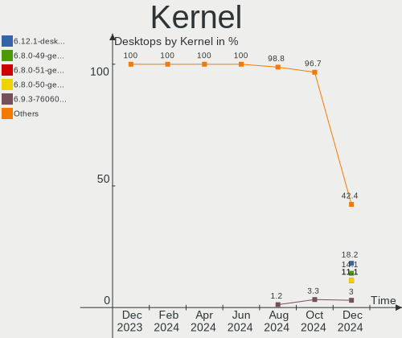
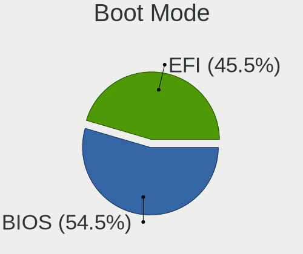
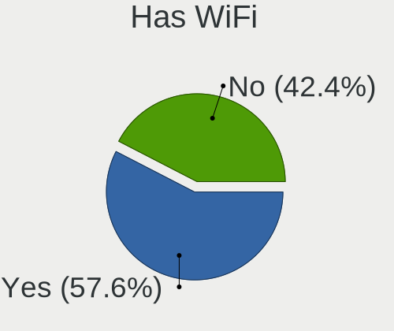
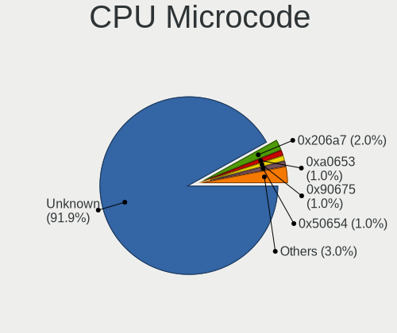
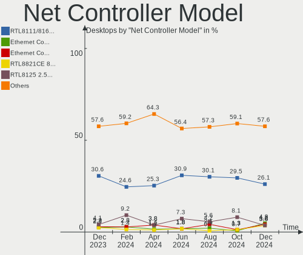
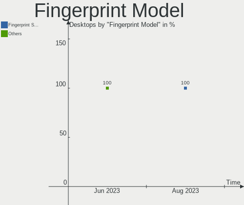

Linux in Italy - Hardware Trends (Desktops)
-------------------------------------------

A project to identify most popular hardware characteristics and track their change
over time based on data collected by Linux users at https://Linux-Hardware.org.

Anyone can contribute to this report by the [hw-probe](https://github.com/linuxhw/hw-probe) tool:

    sudo -E hw-probe -all -upload

Period: Jun, 2023.

Contents
--------

* [ System ](#system)
  - [ OS                       ](#os)
  - [ OS Family                ](#os-family)
  - [ Kernel                   ](#kernel)
  - [ Kernel Family            ](#kernel-family)
  - [ Kernel Major Ver.        ](#kernel-major-ver)
  - [ Arch                     ](#arch)
  - [ DE                       ](#de)
  - [ Display Server           ](#display-server)
  - [ Display Manager          ](#display-manager)
  - [ OS Lang                  ](#os-lang)
  - [ Boot Mode                ](#boot-mode)
  - [ Filesystem               ](#filesystem)
  - [ Part. scheme             ](#part-scheme)
  - [ Dual Boot with Linux/BSD ](#dual-boot-with-linuxbsd)
  - [ Dual Boot (Win)          ](#dual-boot-win)

* [ Board ](#board)
  - [ Vendor                   ](#vendor)
  - [ Model                    ](#model)
  - [ Model Family             ](#model-family)
  - [ MFG Year                 ](#mfg-year)
  - [ Form Factor              ](#form-factor)
  - [ Secure Boot              ](#secure-boot)
  - [ Coreboot                 ](#coreboot)
  - [ RAM Size                 ](#ram-size)
  - [ RAM Used                 ](#ram-used)
  - [ Total Drives             ](#total-drives)
  - [ Has CD-ROM               ](#has-cd-rom)
  - [ Has Ethernet             ](#has-ethernet)
  - [ Has WiFi                 ](#has-wifi)
  - [ Has Bluetooth            ](#has-bluetooth)

* [ Location ](#location)
  - [ Country                  ](#country)
  - [ City                     ](#city)

* [ Drives ](#drives)
  - [ Drive Vendor             ](#drive-vendor)
  - [ Drive Model              ](#drive-model)
  - [ HDD Vendor               ](#hdd-vendor)
  - [ SSD Vendor               ](#ssd-vendor)
  - [ Drive Kind               ](#drive-kind)
  - [ Drive Connector          ](#drive-connector)
  - [ Drive Size               ](#drive-size)
  - [ Space Total              ](#space-total)
  - [ Space Used               ](#space-used)
  - [ Malfunc. Drives          ](#malfunc-drives)
  - [ Malfunc. Drive Vendor    ](#malfunc-drive-vendor)
  - [ Malfunc. HDD Vendor      ](#malfunc-hdd-vendor)
  - [ Malfunc. Drive Kind      ](#malfunc-drive-kind)
  - [ Failed Drives            ](#failed-drives)
  - [ Failed Drive Vendor      ](#failed-drive-vendor)
  - [ Drive Status             ](#drive-status)

* [ Storage controller ](#storage-controller)
  - [ Storage Vendor           ](#storage-vendor)
  - [ Storage Model            ](#storage-model)
  - [ Storage Kind             ](#storage-kind)

* [ Processor ](#processor)
  - [ CPU Vendor               ](#cpu-vendor)
  - [ CPU Model                ](#cpu-model)
  - [ CPU Model Family         ](#cpu-model-family)
  - [ CPU Cores                ](#cpu-cores)
  - [ CPU Sockets              ](#cpu-sockets)
  - [ CPU Threads              ](#cpu-threads)
  - [ CPU Op-Modes             ](#cpu-op-modes)
  - [ CPU Microcode            ](#cpu-microcode)
  - [ CPU Microarch            ](#cpu-microarch)

* [ Graphics ](#graphics)
  - [ GPU Vendor               ](#gpu-vendor)
  - [ GPU Model                ](#gpu-model)
  - [ GPU Combo                ](#gpu-combo)
  - [ GPU Driver               ](#gpu-driver)
  - [ GPU Memory               ](#gpu-memory)

* [ Monitor ](#monitor)
  - [ Monitor Vendor           ](#monitor-vendor)
  - [ Monitor Model            ](#monitor-model)
  - [ Monitor Resolution       ](#monitor-resolution)
  - [ Monitor Diagonal         ](#monitor-diagonal)
  - [ Monitor Width            ](#monitor-width)
  - [ Aspect Ratio             ](#aspect-ratio)
  - [ Monitor Area             ](#monitor-area)
  - [ Pixel Density            ](#pixel-density)
  - [ Multiple Monitors        ](#multiple-monitors)

* [ Network ](#network)
  - [ Net Controller Vendor    ](#net-controller-vendor)
  - [ Net Controller Model     ](#net-controller-model)
  - [ Wireless Vendor          ](#wireless-vendor)
  - [ Wireless Model           ](#wireless-model)
  - [ Ethernet Vendor          ](#ethernet-vendor)
  - [ Ethernet Model           ](#ethernet-model)
  - [ Net Controller Kind      ](#net-controller-kind)
  - [ Used Controller          ](#used-controller)
  - [ NICs                     ](#nics)
  - [ IPv6                     ](#ipv6)

* [ Bluetooth ](#bluetooth)
  - [ Bluetooth Vendor         ](#bluetooth-vendor)
  - [ Bluetooth Model          ](#bluetooth-model)

* [ Sound ](#sound)
  - [ Sound Vendor             ](#sound-vendor)
  - [ Sound Model              ](#sound-model)

* [ Memory ](#memory)
  - [ Memory Vendor            ](#memory-vendor)
  - [ Memory Model             ](#memory-model)
  - [ Memory Kind              ](#memory-kind)
  - [ Memory Form Factor       ](#memory-form-factor)
  - [ Memory Size              ](#memory-size)
  - [ Memory Speed             ](#memory-speed)

* [ Printers & scanners ](#printers--scanners)
  - [ Printer Vendor           ](#printer-vendor)
  - [ Printer Model            ](#printer-model)
  - [ Scanner Vendor           ](#scanner-vendor)
  - [ Scanner Model            ](#scanner-model)

* [ Camera ](#camera)
  - [ Camera Vendor            ](#camera-vendor)
  - [ Camera Model             ](#camera-model)

* [ Security ](#security)
  - [ Fingerprint Vendor       ](#fingerprint-vendor)
  - [ Fingerprint Model        ](#fingerprint-model)
  - [ Chipcard Vendor          ](#chipcard-vendor)
  - [ Chipcard Model           ](#chipcard-model)

* [ Unsupported ](#unsupported)
  - [ Unsupported Devices      ](#unsupported-devices)
  - [ Unsupported Device Types ](#unsupported-device-types)

System
------

OS
--

Installed operating systems

| Name                         | Desktops | Percent |
|------------------------------|----------|---------|
| Ubuntu 22.04                 | 14       | 25%     |
| OpenMandriva 23.03           | 6        | 10.71%  |
| OpenMandriva 4.3             | 3        | 5.36%   |
| Linux Mint 21.1              | 3        | 5.36%   |
| Fedora 38                    | 3        | 5.36%   |
| Ubuntu 23.04                 | 2        | 3.57%   |
| Ubuntu 22.10                 | 2        | 3.57%   |
| Pop!_OS 22.04                | 2        | 3.57%   |
| openSUSE Tumbleweed-XXXXXXXX | 2        | 3.57%   |
| OpenMandriva 23.06           | 2        | 3.57%   |
| Zorin 16                     | 1        | 1.79%   |
| Ubuntu MATE 23.04            | 1        | 1.79%   |
| Ubuntu 20.04                 | 1        | 1.79%   |
| openSUSE Leap-15.5           | 1        | 1.79%   |
| OpenMandriva 4.2             | 1        | 1.79%   |
| OpenMandriva 23.01           | 1        | 1.79%   |
| Manjaro                      | 1        | 1.79%   |
| LMDE 5                       | 1        | 1.79%   |
| Linux Mint 20.3              | 1        | 1.79%   |
| Linux Mint 20.2              | 1        | 1.79%   |
| Kubuntu 23.04                | 1        | 1.79%   |
| KDE neon 22.04               | 1        | 1.79%   |
| EndeavourOS Rolling          | 1        | 1.79%   |
| Debian 12                    | 1        | 1.79%   |
| Debian 11                    | 1        | 1.79%   |
| blendOS                      | 1        | 1.79%   |
| Arch Rolling                 | 1        | 1.79%   |

OS Family
---------

OS without a version

| Name         | Desktops | Percent |
|--------------|----------|---------|
| Ubuntu       | 19       | 33.93%  |
| OpenMandriva | 13       | 23.21%  |
| Linux Mint   | 5        | 8.93%   |
| openSUSE     | 3        | 5.36%   |
| Fedora       | 3        | 5.36%   |
| Pop!_OS      | 2        | 3.57%   |
| Debian       | 2        | 3.57%   |
| Zorin        | 1        | 1.79%   |
| Ubuntu MATE  | 1        | 1.79%   |
| Manjaro      | 1        | 1.79%   |
| LMDE         | 1        | 1.79%   |
| Kubuntu      | 1        | 1.79%   |
| KDE neon     | 1        | 1.79%   |
| EndeavourOS  | 1        | 1.79%   |
| blendOS      | 1        | 1.79%   |
| Arch         | 1        | 1.79%   |

Kernel
------

Version of the Linux kernel

| Version                   | Desktops | Percent |
|---------------------------|----------|---------|
| 5.19.0-43-generic         | 9        | 16.07%  |
| 6.2.6-desktop-1omv2390    | 6        | 10.71%  |
| 5.15.0-73-generic         | 5        | 8.93%   |
| 6.3.4-201.fc38.x86_64     | 3        | 5.36%   |
| 5.19.0-45-generic         | 3        | 5.36%   |
| 5.16.7-desktop-1omv4003   | 3        | 5.36%   |
| 6.3.5-desktop-3omv2390    | 2        | 3.57%   |
| 6.3.4-1-default           | 2        | 3.57%   |
| 6.2.6-76060206-generic    | 2        | 3.57%   |
| 6.2.0-23-generic          | 2        | 3.57%   |
| 5.4.0-150-generic         | 2        | 3.57%   |
| 6.3.9-arch1-1             | 1        | 1.79%   |
| 6.3.6-zen1-1-zen          | 1        | 1.79%   |
| 6.2.0-24-generic          | 1        | 1.79%   |
| 6.2.0-20-generic          | 1        | 1.79%   |
| 6.1.31-2-MANJARO          | 1        | 1.79%   |
| 6.1.30-1-lts              | 1        | 1.79%   |
| 6.1.1-desktop-1omv2290    | 1        | 1.79%   |
| 6.1.0-9-amd64             | 1        | 1.79%   |
| 5.19.0-38-generic         | 1        | 1.79%   |
| 5.15.107-2-pve            | 1        | 1.79%   |
| 5.15.0-76-generic         | 1        | 1.79%   |
| 5.15.0-75-generic         | 1        | 1.79%   |
| 5.15.0-56-generic         | 1        | 1.79%   |
| 5.15.0-48-generic         | 1        | 1.79%   |
| 5.14.21-150500.53-default | 1        | 1.79%   |
| 5.10.14-desktop-1omv4002  | 1        | 1.79%   |
| 5.10.0-23-amd64           | 1        | 1.79%   |

Kernel Family
-------------

Linux kernel without a distro release

| Version  | Desktops | Percent |
|----------|----------|---------|
| 5.19.0   | 13       | 23.21%  |
| 5.15.0   | 9        | 16.07%  |
| 6.2.6    | 8        | 14.29%  |
| 6.3.4    | 5        | 8.93%   |
| 6.2.0    | 4        | 7.14%   |
| 5.16.7   | 3        | 5.36%   |
| 6.3.5    | 2        | 3.57%   |
| 5.4.0    | 2        | 3.57%   |
| 6.3.9    | 1        | 1.79%   |
| 6.3.6    | 1        | 1.79%   |
| 6.1.31   | 1        | 1.79%   |
| 6.1.30   | 1        | 1.79%   |
| 6.1.1    | 1        | 1.79%   |
| 6.1.0    | 1        | 1.79%   |
| 5.15.107 | 1        | 1.79%   |
| 5.14.21  | 1        | 1.79%   |
| 5.10.14  | 1        | 1.79%   |
| 5.10.0   | 1        | 1.79%   |

Kernel Major Ver.
-----------------

Linux kernel major version

| Version | Desktops | Percent |
|---------|----------|---------|
| 5.19    | 13       | 23.21%  |
| 6.2     | 12       | 21.43%  |
| 5.15    | 10       | 17.86%  |
| 6.3     | 9        | 16.07%  |
| 6.1     | 4        | 7.14%   |
| 5.16    | 3        | 5.36%   |
| 5.4     | 2        | 3.57%   |
| 5.10    | 2        | 3.57%   |
| 5.14    | 1        | 1.79%   |

Arch
----

OS architecture (x86_64, i586, etc.)

| Name   | Desktops | Percent |
|--------|----------|---------|
| x86_64 | 56       | 100%    |

DE
--

Desktop Environment

| Name       | Desktops | Percent |
|------------|----------|---------|
| GNOME      | 29       | 51.79%  |
| KDE5       | 17       | 30.36%  |
| X-Cinnamon | 4        | 7.14%   |
| MATE       | 2        | 3.57%   |
| XFCE       | 1        | 1.79%   |
| LXQt       | 1        | 1.79%   |
| i3         | 1        | 1.79%   |
| Unknown    | 1        | 1.79%   |

Display Server
--------------

X11 or Wayland

| Name    | Desktops | Percent |
|---------|----------|---------|
| X11     | 38       | 67.86%  |
| Wayland | 16       | 28.57%  |
| Tty     | 1        | 1.79%   |
| Unknown | 1        | 1.79%   |

Display Manager
---------------

SDDM, LightDM, etc.

| Name    | Desktops | Percent |
|---------|----------|---------|
| SDDM    | 17       | 30.36%  |
| GDM3    | 16       | 28.57%  |
| Unknown | 15       | 26.79%  |
| LightDM | 5        | 8.93%   |
| GDM     | 3        | 5.36%   |

OS Lang
-------

Language

| Lang  | Desktops | Percent |
|-------|----------|---------|
| it_IT | 39       | 69.64%  |
| en_US | 15       | 26.79%  |
| POSIX | 1        | 1.79%   |
| C     | 1        | 1.79%   |

Boot Mode
---------

EFI or BIOS

| Mode | Desktops | Percent |
|------|----------|---------|
| EFI  | 29       | 51.79%  |
| BIOS | 27       | 48.21%  |

Filesystem
----------

Type of filesystem

| Type    | Desktops | Percent |
|---------|----------|---------|
| Ext4    | 26       | 46.43%  |
| Tmpfs   | 11       | 19.64%  |
| Overlay | 11       | 19.64%  |
| Btrfs   | 8        | 14.29%  |

Part. scheme
------------

Scheme of partitioning

| Type    | Desktops | Percent |
|---------|----------|---------|
| GPT     | 34       | 60.71%  |
| Unknown | 14       | 25%     |
| MBR     | 8        | 14.29%  |

Dual Boot with Linux/BSD
------------------------

Hosting more than one Linux/BSD

| Dual boot | Desktops | Percent |
|-----------|----------|---------|
| No        | 40       | 71.43%  |
| Yes       | 16       | 28.57%  |

Dual Boot (Win)
---------------

Hosting Linux and Windows

| Dual boot | Desktops | Percent |
|-----------|----------|---------|
| Yes       | 29       | 51.79%  |
| No        | 27       | 48.21%  |

Board
-----

Vendor
------

Motherboard manufacturer

| Name                | Desktops | Percent |
|---------------------|----------|---------|
| MSI                 | 15       | 26.79%  |
| ASUSTek Computer    | 14       | 25%     |
| Hewlett-Packard     | 6        | 10.71%  |
| ASRock              | 5        | 8.93%   |
| Gigabyte Technology | 3        | 5.36%   |
| Lenovo              | 2        | 3.57%   |
| Fujitsu             | 2        | 3.57%   |
| Chuwi               | 2        | 3.57%   |
| Unknown             | 2        | 3.57%   |
| Intel               | 1        | 1.79%   |
| Fujitsu Siemens     | 1        | 1.79%   |
| Dell                | 1        | 1.79%   |
| AMI                 | 1        | 1.79%   |
| Acer                | 1        | 1.79%   |

Model
-----

Motherboard model

| Name                                   | Desktops | Percent |
|----------------------------------------|----------|---------|
| MSI MS-7D75                            | 2        | 3.57%   |
| MSI MS-7C37                            | 2        | 3.57%   |
| MSI MS-7B79                            | 2        | 3.57%   |
| HP ProDesk 600 G1 SFF                  | 2        | 3.57%   |
| Chuwi RZBOX                            | 2        | 3.57%   |
| ASUS P8H61-M LX                        | 2        | 3.57%   |
| Unknown                                | 2        | 3.57%   |
| MSI NQ890AA-ABZ CQ5011IT               | 1        | 1.79%   |
| MSI MS-7C95                            | 1        | 1.79%   |
| MSI MS-7C94                            | 1        | 1.79%   |
| MSI MS-7C91                            | 1        | 1.79%   |
| MSI MS-7B53                            | 1        | 1.79%   |
| MSI MS-7A74                            | 1        | 1.79%   |
| MSI MS-7A15                            | 1        | 1.79%   |
| MSI MS-7851                            | 1        | 1.79%   |
| MSI MS-7360                            | 1        | 1.79%   |
| Lenovo ThinkStation P320 30BK0023UK    | 1        | 1.79%   |
| Lenovo IdeaCentre 5 14IMB05 90NA001RIX | 1        | 1.79%   |
| Intel X79                              | 1        | 1.79%   |
| HP Z230 Tower Workstation              | 1        | 1.79%   |
| HP OMEN by Desktop PC 880-p1xx         | 1        | 1.79%   |
| HP Compaq dc5100 MT(PM213AV)           | 1        | 1.79%   |
| HP 500-524nl                           | 1        | 1.79%   |
| Gigabyte B550M DS3H                    | 1        | 1.79%   |
| Gigabyte B450M DS3H                    | 1        | 1.79%   |
| Gigabyte B450 I AORUS PRO WIFI         | 1        | 1.79%   |
| Fujitsu Siemens ESPRIMO EDITION P2530  | 1        | 1.79%   |
| Fujitsu ESPRIMO P556/E85+              | 1        | 1.79%   |
| Fujitsu ESPRIMO E700                   | 1        | 1.79%   |
| Dell OptiPlex 5070                     | 1        | 1.79%   |
| ASUS ROG STRIX X570-E GAMING           | 1        | 1.79%   |
| ASUS ROG STRIX B450-F GAMING II        | 1        | 1.79%   |
| ASUS ROG CROSSHAIR VII HERO            | 1        | 1.79%   |
| ASUS PRIME Z370M-PLUS II               | 1        | 1.79%   |
| ASUS PRIME H310M-A R2.0                | 1        | 1.79%   |
| ASUS PRIME H270-PLUS                   | 1        | 1.79%   |
| ASUS P5SD2-VM                          | 1        | 1.79%   |
| ASUS P5B-Deluxe                        | 1        | 1.79%   |
| ASUS H110M-K                           | 1        | 1.79%   |
| ASUS H110M-A                           | 1        | 1.79%   |

Model Family
------------

Motherboard model prefix

| Name                    | Desktops | Percent |
|-------------------------|----------|---------|
| ASUS ROG                | 3        | 5.36%   |
| ASUS PRIME              | 3        | 5.36%   |
| MSI MS-7D75             | 2        | 3.57%   |
| MSI MS-7C37             | 2        | 3.57%   |
| MSI MS-7B79             | 2        | 3.57%   |
| HP ProDesk              | 2        | 3.57%   |
| Fujitsu ESPRIMO         | 2        | 3.57%   |
| Chuwi RZBOX             | 2        | 3.57%   |
| ASUS P8H61-M            | 2        | 3.57%   |
| Unknown                 | 2        | 3.57%   |
| MSI NQ890AA-ABZ         | 1        | 1.79%   |
| MSI MS-7C95             | 1        | 1.79%   |
| MSI MS-7C94             | 1        | 1.79%   |
| MSI MS-7C91             | 1        | 1.79%   |
| MSI MS-7B53             | 1        | 1.79%   |
| MSI MS-7A74             | 1        | 1.79%   |
| MSI MS-7A15             | 1        | 1.79%   |
| MSI MS-7851             | 1        | 1.79%   |
| MSI MS-7360             | 1        | 1.79%   |
| Lenovo ThinkStation     | 1        | 1.79%   |
| Lenovo IdeaCentre       | 1        | 1.79%   |
| Intel X79               | 1        | 1.79%   |
| HP Z230                 | 1        | 1.79%   |
| HP OMEN                 | 1        | 1.79%   |
| HP Compaq               | 1        | 1.79%   |
| HP 500-524nl            | 1        | 1.79%   |
| Gigabyte B550M          | 1        | 1.79%   |
| Gigabyte B450M          | 1        | 1.79%   |
| Gigabyte B450           | 1        | 1.79%   |
| Fujitsu Siemens ESPRIMO | 1        | 1.79%   |
| Dell OptiPlex           | 1        | 1.79%   |
| ASUS P5SD2-VM           | 1        | 1.79%   |
| ASUS P5B-Deluxe         | 1        | 1.79%   |
| ASUS H110M-K            | 1        | 1.79%   |
| ASUS H110M-A            | 1        | 1.79%   |
| ASUS F2A85-M            | 1        | 1.79%   |
| ASUS All                | 1        | 1.79%   |
| ASRock X370             | 1        | 1.79%   |
| ASRock H310M-HDV        | 1        | 1.79%   |
| ASRock B365             | 1        | 1.79%   |

MFG Year
--------

Motherboard manufacture year

| Year | Desktops | Percent |
|------|----------|---------|
| 2021 | 7        | 12.5%   |
| 2018 | 7        | 12.5%   |
| 2020 | 6        | 10.71%  |
| 2019 | 6        | 10.71%  |
| 2022 | 4        | 7.14%   |
| 2016 | 4        | 7.14%   |
| 2013 | 4        | 7.14%   |
| 2011 | 3        | 5.36%   |
| 2017 | 2        | 3.57%   |
| 2015 | 2        | 3.57%   |
| 2012 | 2        | 3.57%   |
| 2007 | 2        | 3.57%   |
| 2006 | 2        | 3.57%   |
| 2023 | 1        | 1.79%   |
| 2014 | 1        | 1.79%   |
| 2009 | 1        | 1.79%   |
| 2008 | 1        | 1.79%   |
| 2005 | 1        | 1.79%   |

Form Factor
-----------

Physical design of the computer

| Name    | Desktops | Percent |
|---------|----------|---------|
| Desktop | 56       | 100%    |

Secure Boot
-----------

Enabled or disabled

| State    | Desktops | Percent |
|----------|----------|---------|
| Disabled | 54       | 96.43%  |
| Enabled  | 2        | 3.57%   |

Coreboot
--------

Have coreboot on board

| Used | Desktops | Percent |
|------|----------|---------|
| No   | 56       | 100%    |

RAM Size
--------

Total RAM memory

| Size in GB  | Desktops | Percent |
|-------------|----------|---------|
| 16.01-24.0  | 17       | 30.36%  |
| 4.01-8.0    | 10       | 17.86%  |
| 32.01-64.0  | 9        | 16.07%  |
| 3.01-4.0    | 8        | 14.29%  |
| 8.01-16.0   | 8        | 14.29%  |
| 24.01-32.0  | 1        | 1.79%   |
| 64.01-256.0 | 1        | 1.79%   |
| 1.01-2.0    | 1        | 1.79%   |
| 0.51-1.0    | 1        | 1.79%   |

RAM Used
--------

Used RAM memory

| Used GB    | Desktops | Percent |
|------------|----------|---------|
| 1.01-2.0   | 16       | 28.57%  |
| 2.01-3.0   | 14       | 25%     |
| 4.01-8.0   | 9        | 16.07%  |
| 3.01-4.0   | 9        | 16.07%  |
| 0.51-1.0   | 3        | 5.36%   |
| 8.01-16.0  | 2        | 3.57%   |
| 0.01-0.5   | 2        | 3.57%   |
| 16.01-24.0 | 1        | 1.79%   |

Total Drives
------------

Number of drives on board

| Drives | Desktops | Percent |
|--------|----------|---------|
| 1      | 18       | 32.14%  |
| 3      | 16       | 28.57%  |
| 2      | 13       | 23.21%  |
| 5      | 3        | 5.36%   |
| 4      | 3        | 5.36%   |
| 6      | 2        | 3.57%   |
| 0      | 1        | 1.79%   |

Has CD-ROM
----------

Has CD-ROM on board

| Presented | Desktops | Percent |
|-----------|----------|---------|
| No        | 30       | 53.57%  |
| Yes       | 26       | 46.43%  |

Has Ethernet
------------

Has Ethernet on board

| Presented | Desktops | Percent |
|-----------|----------|---------|
| Yes       | 56       | 100%    |

Has WiFi
--------

Has WiFi module

| Presented | Desktops | Percent |
|-----------|----------|---------|
| No        | 30       | 53.57%  |
| Yes       | 26       | 46.43%  |

Has Bluetooth
-------------

Has Bluetooth module

| Presented | Desktops | Percent |
|-----------|----------|---------|
| No        | 32       | 57.14%  |
| Yes       | 24       | 42.86%  |

Location
--------

Country
-------

Geographic location (country)

| Country | Desktops | Percent |
|---------|----------|---------|
| Italy   | 56       | 100%    |

City
----

Geographic location (city)

| City                      | Desktops | Percent |
|---------------------------|----------|---------|
| Milan                     | 10       | 17.86%  |
| Rome                      | 5        | 8.93%   |
| Milano                    | 4        | 7.14%   |
| Rho                       | 2        | 3.57%   |
| Gattinara                 | 2        | 3.57%   |
| Bologna                   | 2        | 3.57%   |
| Villaputzu                | 1        | 1.79%   |
| Verona                    | 1        | 1.79%   |
| Verbania                  | 1        | 1.79%   |
| Tremestieri Etneo         | 1        | 1.79%   |
| Trapani                   | 1        | 1.79%   |
| Riese Pio X               | 1        | 1.79%   |
| Rapallo                   | 1        | 1.79%   |
| Raddusa                   | 1        | 1.79%   |
| Pistoia                   | 1        | 1.79%   |
| Orbassano                 | 1        | 1.79%   |
| Monteriggioni             | 1        | 1.79%   |
| Mirano                    | 1        | 1.79%   |
| Mira                      | 1        | 1.79%   |
| Mestrino                  | 1        | 1.79%   |
| Lonato                    | 1        | 1.79%   |
| Lecce                     | 1        | 1.79%   |
| Jesolo                    | 1        | 1.79%   |
| Grottaglie                | 1        | 1.79%   |
| Genoa                     | 1        | 1.79%   |
| Florence                  | 1        | 1.79%   |
| Dalmine                   | 1        | 1.79%   |
| Corsico                   | 1        | 1.79%   |
| Comun Nuovo               | 1        | 1.79%   |
| Castano Primo             | 1        | 1.79%   |
| Casalecchio di Reno       | 1        | 1.79%   |
| Campobasso                | 1        | 1.79%   |
| Brescia                   | 1        | 1.79%   |
| Bedizzole                 | 1        | 1.79%   |
| Barcellona Pozzo di Gotto | 1        | 1.79%   |
| Bagheria                  | 1        | 1.79%   |
| Alghero                   | 1        | 1.79%   |

Drives
------

Drive Vendor
------------

Hard drive vendors

| Vendor                      | Desktops | Drives | Percent |
|-----------------------------|----------|--------|---------|
| WDC                         | 17       | 21     | 15.32%  |
| Seagate                     | 14       | 18     | 12.61%  |
| Samsung Electronics         | 14       | 18     | 12.61%  |
| Kingston                    | 9        | 10     | 8.11%   |
| Crucial                     | 9        | 10     | 8.11%   |
| SanDisk                     | 7        | 9      | 6.31%   |
| Toshiba                     | 4        | 5      | 3.6%    |
| Unknown                     | 3        | 3      | 2.7%    |
| SPCC                        | 3        | 3      | 2.7%    |
| SABRENT                     | 2        | 2      | 1.8%    |
| Micron/Crucial Technology   | 2        | 2      | 1.8%    |
| Maxtor                      | 2        | 2      | 1.8%    |
| KIOXIA                      | 2        | 3      | 1.8%    |
| Kingston Technology Company | 2        | 2      | 1.8%    |
| China                       | 2        | 2      | 1.8%    |
| Vaseky                      | 1        | 1      | 0.9%    |
| Transcend                   | 1        | 1      | 0.9%    |
| Team                        | 1        | 1      | 0.9%    |
| SK hynix                    | 1        | 1      | 0.9%    |
| Silicon Motion              | 1        | 1      | 0.9%    |
| Phison Electronics          | 1        | 1      | 0.9%    |
| Phison                      | 1        | 1      | 0.9%    |
| Kimtigo                     | 1        | 1      | 0.9%    |
| Intel                       | 1        | 1      | 0.9%    |
| IBM-ESXS                    | 1        | 2      | 0.9%    |
| Hitachi                     | 1        | 1      | 0.9%    |
| GOODRAM                     | 1        | 1      | 0.9%    |
| Gigabyte Technology         | 1        | 1      | 0.9%    |
| FORESEE                     | 1        | 1      | 0.9%    |
| Fanxiang                    | 1        | 1      | 0.9%    |
| Emtec                       | 1        | 1      | 0.9%    |
| Apple                       | 1        | 1      | 0.9%    |
| A-DATA Technology           | 1        | 1      | 0.9%    |
| Unknown                     | 1        | 1      | 0.9%    |

Drive Model
-----------

Hard drive models

| Model                                              | Desktops | Percent |
|----------------------------------------------------|----------|---------|
| Kingston SA400S37240G 240GB SSD                    | 4        | 3.17%   |
| Seagate ST1000DM003-1ER162 1TB                     | 3        | 2.38%   |
| Sandisk WD Blue SN550 NVMe SSD 1TB                 | 3        | 2.38%   |
| Samsung NVMe SSD Controller PM9A1/PM9A3/980PRO 2TB | 3        | 2.38%   |
| Unknown SD/MMC/MS PRO 250GB                        | 2        | 1.59%   |
| Toshiba DT01ACA100 1TB                             | 2        | 1.59%   |
| Seagate ST1000DM003-1SB102 1TB                     | 2        | 1.59%   |
| Sandisk WD Blue SN570 500GB                        | 2        | 1.59%   |
| Samsung SSD 850 EVO 250GB                          | 2        | 1.59%   |
| SABRENT Disk 1TB                                   | 2        | 1.59%   |
| Micron/Crucial P2 NVMe PCIe SSD 4TB                | 2        | 1.59%   |
| Kingston SA400S37120G 120GB SSD                    | 2        | 1.59%   |
| Crucial CT480BX500SSD1 480GB                       | 2        | 1.59%   |
| Crucial CT1000MX500SSD1 1TB                        | 2        | 1.59%   |
| WDC WDS250G3X0C-00SJG0 250GB                       | 1        | 0.79%   |
| WDC WDS240G2G0A-00JH30 240GB SSD                   | 1        | 0.79%   |
| WDC WD6400BPVT-22HXZT1 640GB                       | 1        | 0.79%   |
| WDC WD5000LPLX-00ZNTT0 500GB                       | 1        | 0.79%   |
| WDC WD5000AAKS-60Z1A0 500GB                        | 1        | 0.79%   |
| WDC WD5000AAKS-00UU3A0 500GB                       | 1        | 0.79%   |
| WDC WD3200AAKX-073CA1 320GB                        | 1        | 0.79%   |
| WDC WD20EFRX-68EUZN0 2TB                           | 1        | 0.79%   |
| WDC WD2000BB-00RDA0 200GB                          | 1        | 0.79%   |
| WDC WD1600BEVT-22A23T0 160GB                       | 1        | 0.79%   |
| WDC WD1600AAJS-61WAA0 160GB                        | 1        | 0.79%   |
| WDC WD1600AAJB-00J3A0 160GB                        | 1        | 0.79%   |
| WDC WD10EZEX-21WN4A0 1TB                           | 1        | 0.79%   |
| WDC WD10EZEX-08WN4A0 1TB                           | 1        | 0.79%   |
| WDC WD10EZEX-00WN4A0 1TB                           | 1        | 0.79%   |
| WDC WD10EZEX-00MFCA0 1TB                           | 1        | 0.79%   |
| WDC WD10EALX-009BA0 1TB                            | 1        | 0.79%   |
| WDC WD1002FAEX-00Y9A0 1TB                          | 1        | 0.79%   |
| WDC WD My Passport 261B 500GB                      | 1        | 0.79%   |
| WDC PC SN520 SDAPMUW-256G-1101 256GB               | 1        | 0.79%   |
| Vaseky V800/120G 120GB                             | 1        | 0.79%   |
| Unknown MMC Card  256GB                            | 1        | 0.79%   |
| Transcend TS240GSSD220S 240GB                      | 1        | 0.79%   |
| Toshiba KXG50ZNV256G 256GB                         | 1        | 0.79%   |
| Toshiba HDWD110 1TB                                | 1        | 0.79%   |
| Toshiba DT01ACA050 500GB                           | 1        | 0.79%   |

HDD Vendor
----------

Hard disk drive vendors

| Vendor              | Desktops | Drives | Percent |
|---------------------|----------|--------|---------|
| WDC                 | 14       | 17     | 36.84%  |
| Seagate             | 12       | 16     | 31.58%  |
| Toshiba             | 4        | 4      | 10.53%  |
| Unknown             | 2        | 2      | 5.26%   |
| Samsung Electronics | 2        | 2      | 5.26%   |
| Maxtor              | 2        | 2      | 5.26%   |
| Hitachi             | 1        | 1      | 2.63%   |
| Apple               | 1        | 1      | 2.63%   |

SSD Vendor
----------

Solid state drive vendors

| Vendor              | Desktops | Drives | Percent |
|---------------------|----------|--------|---------|
| Kingston            | 8        | 9      | 20%     |
| Crucial             | 8        | 9      | 20%     |
| Samsung Electronics | 6        | 6      | 15%     |
| SanDisk             | 3        | 3      | 7.5%    |
| SPCC                | 2        | 2      | 5%      |
| China               | 2        | 2      | 5%      |
| WDC                 | 1        | 1      | 2.5%    |
| Vaseky              | 1        | 1      | 2.5%    |
| Transcend           | 1        | 1      | 2.5%    |
| Team                | 1        | 1      | 2.5%    |
| Kimtigo             | 1        | 1      | 2.5%    |
| Intel               | 1        | 1      | 2.5%    |
| GOODRAM             | 1        | 1      | 2.5%    |
| Gigabyte Technology | 1        | 1      | 2.5%    |
| FORESEE             | 1        | 1      | 2.5%    |
| Emtec               | 1        | 1      | 2.5%    |
| A-DATA Technology   | 1        | 1      | 2.5%    |

Drive Kind
----------

HDD or SSD

| Kind    | Desktops | Drives | Percent |
|---------|----------|--------|---------|
| SSD     | 33       | 42     | 33.33%  |
| HDD     | 32       | 45     | 32.32%  |
| NVMe    | 28       | 36     | 28.28%  |
| Unknown | 5        | 6      | 5.05%   |
| MMC     | 1        | 1      | 1.01%   |

Drive Connector
---------------

SATA, SAS, NVMe, etc.

| Type | Desktops | Drives | Percent |
|------|----------|--------|---------|
| SATA | 48       | 86     | 57.14%  |
| NVMe | 27       | 34     | 32.14%  |
| SAS  | 8        | 9      | 9.52%   |
| MMC  | 1        | 1      | 1.19%   |

Drive Size
----------

Size of hard drive

| Size in TB | Desktops | Drives | Percent |
|------------|----------|--------|---------|
| 0.01-0.5   | 42       | 53     | 63.64%  |
| 0.51-1.0   | 22       | 31     | 33.33%  |
| 1.01-2.0   | 2        | 3      | 3.03%   |

Space Total
-----------

Amount of disk space available on the file system

| Size in GB     | Desktops | Percent |
|----------------|----------|---------|
| 101-250        | 15       | 26.79%  |
| 1-20           | 8        | 14.29%  |
| 501-1000       | 8        | 14.29%  |
| 251-500        | 7        | 12.5%   |
| 1001-2000      | 6        | 10.71%  |
| 51-100         | 6        | 10.71%  |
| More than 3000 | 5        | 8.93%   |
| 2001-3000      | 1        | 1.79%   |

Space Used
----------

Amount of used disk space

| Used GB   | Desktops | Percent |
|-----------|----------|---------|
| 1-20      | 25       | 44.64%  |
| 21-50     | 7        | 12.5%   |
| 51-100    | 7        | 12.5%   |
| 101-250   | 6        | 10.71%  |
| 251-500   | 4        | 7.14%   |
| 1001-2000 | 4        | 7.14%   |
| 501-1000  | 2        | 3.57%   |
| 2001-3000 | 1        | 1.79%   |

Malfunc. Drives
---------------

Drive models with a malfunction

| Model                             | Desktops | Drives | Percent |
|-----------------------------------|----------|--------|---------|
| WDC WDS240G2G0A-00JH30 240GB SSD  | 1        | 1      | 8.33%   |
| WDC WD10EZEX-00WN4A0 1TB          | 1        | 1      | 8.33%   |
| WDC WD10EALX-009BA0 1TB           | 1        | 1      | 8.33%   |
| Toshiba DT01ACA050 500GB          | 1        | 1      | 8.33%   |
| Seagate ST9320325AS 320GB         | 1        | 1      | 8.33%   |
| Seagate ST500DM002-1BD142 500GB   | 1        | 2      | 8.33%   |
| Samsung Electronics HD103UJ 1TB   | 1        | 1      | 8.33%   |
| Samsung Electronics HD080HJ/ 80GB | 1        | 1      | 8.33%   |
| Hitachi HDP725025GLA380 250GB     | 1        | 1      | 8.33%   |
| Emtec X150 240GB                  | 1        | 1      | 8.33%   |
| Crucial CT480BX500SSD1 480GB      | 1        | 1      | 8.33%   |
| Crucial CT120M500SSD1 120GB       | 1        | 1      | 8.33%   |

Malfunc. Drive Vendor
---------------------

Vendors of faulty drives

| Vendor              | Desktops | Drives | Percent |
|---------------------|----------|--------|---------|
| WDC                 | 3        | 3      | 25%     |
| Seagate             | 2        | 3      | 16.67%  |
| Samsung Electronics | 2        | 2      | 16.67%  |
| Crucial             | 2        | 2      | 16.67%  |
| Toshiba             | 1        | 1      | 8.33%   |
| Hitachi             | 1        | 1      | 8.33%   |
| Emtec               | 1        | 1      | 8.33%   |

Malfunc. HDD Vendor
-------------------

Vendors of faulty HDD drives

| Vendor              | Desktops | Drives | Percent |
|---------------------|----------|--------|---------|
| WDC                 | 2        | 2      | 25%     |
| Seagate             | 2        | 3      | 25%     |
| Samsung Electronics | 2        | 2      | 25%     |
| Toshiba             | 1        | 1      | 12.5%   |
| Hitachi             | 1        | 1      | 12.5%   |

Malfunc. Drive Kind
-------------------

Kinds of faulty drives

| Kind | Desktops | Drives | Percent |
|------|----------|--------|---------|
| HDD  | 8        | 9      | 66.67%  |
| SSD  | 4        | 4      | 33.33%  |

Failed Drives
-------------

Failed drive models

Zero info for selected period =(

Failed Drive Vendor
-------------------

Failed drive vendors

Zero info for selected period =(

Drive Status
------------

Number of failed and malfunc. drives

| Status   | Desktops | Drives | Percent |
|----------|----------|--------|---------|
| Detected | 29       | 66     | 43.28%  |
| Works    | 27       | 51     | 40.3%   |
| Malfunc  | 11       | 13     | 16.42%  |

Storage controller
------------------

Storage Vendor
--------------

Storage controller vendors

| Vendor                           | Desktops | Percent |
|----------------------------------|----------|---------|
| Intel                            | 31       | 32.98%  |
| AMD                              | 21       | 22.34%  |
| Samsung Electronics              | 8        | 8.51%   |
| SanDisk                          | 7        | 7.45%   |
| ASMedia Technology               | 6        | 6.38%   |
| Micron/Crucial Technology        | 3        | 3.19%   |
| Kingston Technology Company      | 3        | 3.19%   |
| Phison Electronics               | 2        | 2.13%   |
| MAXIO Technology (Hangzhou)      | 2        | 2.13%   |
| KIOXIA                           | 2        | 2.13%   |
| VIA Technologies                 | 1        | 1.06%   |
| Toshiba America Info Systems     | 1        | 1.06%   |
| SK hynix                         | 1        | 1.06%   |
| Silicon Motion                   | 1        | 1.06%   |
| Silicon Integrated Systems [SiS] | 1        | 1.06%   |
| Nvidia                           | 1        | 1.06%   |
| LSI Logic / Symbios Logic        | 1        | 1.06%   |
| JMicron Technology               | 1        | 1.06%   |
| Broadcom / LSI                   | 1        | 1.06%   |

Storage Model
-------------

Storage controller models

| Model                                                                                   | Desktops | Percent |
|-----------------------------------------------------------------------------------------|----------|---------|
| AMD FCH SATA Controller [AHCI mode]                                                     | 15       | 13.64%  |
| Intel Q170/Q150/B150/H170/H110/Z170/CM236 Chipset SATA Controller [AHCI Mode]           | 6        | 5.45%   |
| ASMedia ASM1062 Serial ATA Controller                                                   | 6        | 5.45%   |
| AMD 400 Series Chipset SATA Controller                                                  | 6        | 5.45%   |
| Samsung NVMe SSD Controller SM981/PM981/PM983                                           | 5        | 4.55%   |
| Intel 200 Series PCH SATA controller [AHCI mode]                                        | 5        | 4.55%   |
| Intel 8 Series/C220 Series Chipset Family 6-port SATA Controller 1 [AHCI mode]          | 4        | 3.64%   |
| AMD 500 Series Chipset SATA Controller                                                  | 4        | 3.64%   |
| SanDisk WD Blue SN550 NVMe SSD                                                          | 3        | 2.73%   |
| Samsung NVMe SSD Controller PM9A1/PM9A3/980PRO                                          | 3        | 2.73%   |
| Intel Cannon Lake PCH SATA AHCI Controller                                              | 3        | 2.73%   |
| SanDisk WD Blue SN570 NVMe SSD 1TB                                                      | 2        | 1.82%   |
| SanDisk WD Black SN750 / PC SN730 NVMe SSD                                              | 2        | 1.82%   |
| Micron/Crucial P2 NVMe PCIe SSD                                                         | 2        | 1.82%   |
| Kingston Company OM3PDP3 NVMe SSD                                                       | 2        | 1.82%   |
| Intel 6 Series/C200 Series Chipset Family Desktop SATA Controller (IDE mode, ports 4-5) | 2        | 1.82%   |
| Intel 6 Series/C200 Series Chipset Family Desktop SATA Controller (IDE mode, ports 0-3) | 2        | 1.82%   |
| Intel 6 Series/C200 Series Chipset Family 6 port Desktop SATA AHCI Controller           | 2        | 1.82%   |
| VIA VT82C586A/B/VT82C686/A/B/VT823x/A/C PIPC Bus Master IDE                             | 1        | 0.91%   |
| VIA VT8237A SATA 2-Port Controller                                                      | 1        | 0.91%   |
| Toshiba America Info Systems XG5 NVMe SSD Controller                                    | 1        | 0.91%   |
| SK hynix PC611 NVMe Solid State Drive                                                   | 1        | 0.91%   |
| Silicon Motion SM2263EN/SM2263XT SSD Controller                                         | 1        | 0.91%   |
| Silicon Integrated Systems [SiS] AHCI IDE Controller (0106)                             | 1        | 0.91%   |
| Silicon Integrated Systems [SiS] 5513 IDE Controller                                    | 1        | 0.91%   |
| SanDisk PC SN520 NVMe SSD                                                               | 1        | 0.91%   |
| Samsung NVMe SSD Controller SM961/PM961/SM963                                           | 1        | 0.91%   |
| Samsung Electronics Non-Volatile memory controller                                      | 1        | 0.91%   |
| Phison E16 PCIe4 NVMe Controller                                                        | 1        | 0.91%   |
| Phison E12 NVMe Controller                                                              | 1        | 0.91%   |
| Nvidia MCP73 SATA Controller (IDE mode)                                                 | 1        | 0.91%   |
| Micron/Crucial P1 NVMe PCIe SSD                                                         | 1        | 0.91%   |
| MAXIO (Hangzhou) NVMe SSD Controller MAP1602                                            | 1        | 0.91%   |
| MAXIO (Hangzhou) NVMe SSD Controller MAP1202                                            | 1        | 0.91%   |
| LSI Logic / Symbios Logic SAS2308 PCI-Express Fusion-MPT SAS-2                          | 1        | 0.91%   |
| KIOXIA NVMe SSD Controller BG4                                                          | 1        | 0.91%   |
| KIOXIA NVMe SSD                                                                         | 1        | 0.91%   |
| Kingston Company Company Non-Volatile memory controller                                 | 1        | 0.91%   |
| JMicron JMB363 SATA/IDE Controller                                                      | 1        | 0.91%   |
| Intel SATA Controller [RAID mode]                                                       | 1        | 0.91%   |

Storage Kind
------------

Kind of storage controller (IDE, SATA, NVMe, SAS, ...)

| Kind | Desktops | Percent |
|------|----------|---------|
| SATA | 46       | 54.12%  |
| NVMe | 27       | 31.76%  |
| IDE  | 9        | 10.59%  |
| RAID | 2        | 2.35%   |
| SAS  | 1        | 1.18%   |

Processor
---------

CPU Vendor
----------

Processor vendors

| Vendor | Desktops | Percent |
|--------|----------|---------|
| Intel  | 35       | 62.5%   |
| AMD    | 21       | 37.5%   |

CPU Model
---------

Processor models

| Model                                  | Desktops | Percent |
|----------------------------------------|----------|---------|
| AMD Ryzen 5 3600 6-Core Processor      | 3        | 5.36%   |
| Intel Pentium Dual CPU E2200 @ 2.20GHz | 2        | 3.57%   |
| Intel Core i7-9700 CPU @ 3.00GHz       | 2        | 3.57%   |
| Intel Core i5-6400 CPU @ 2.70GHz       | 2        | 3.57%   |
| AMD Ryzen 9 4900H with Radeon Graphics | 2        | 3.57%   |
| AMD Ryzen 9 3900X 12-Core Processor    | 2        | 3.57%   |
| AMD Ryzen 7 3700X 8-Core Processor     | 2        | 3.57%   |
| AMD Ryzen 7 2700X Eight-Core Processor | 2        | 3.57%   |
| Intel Xeon CPU E5-2689 0 @ 2.60GHz     | 1        | 1.79%   |
| Intel Xeon CPU E3-1245 v6 @ 3.70GHz    | 1        | 1.79%   |
| Intel Xeon CPU E3-1240 v3 @ 3.40GHz    | 1        | 1.79%   |
| Intel Pentium Gold G5420 CPU @ 3.80GHz | 1        | 1.79%   |
| Intel Pentium Dual CPU E2220 @ 2.40GHz | 1        | 1.79%   |
| Intel Pentium CPU G4560 @ 3.50GHz      | 1        | 1.79%   |
| Intel Pentium CPU G4400 @ 3.30GHz      | 1        | 1.79%   |
| Intel Pentium CPU G3450 @ 3.40GHz      | 1        | 1.79%   |
| Intel Pentium 4 CPU 3.06GHz            | 1        | 1.79%   |
| Intel Pentium 4 CPU 3.00GHz            | 1        | 1.79%   |
| Intel N95                              | 1        | 1.79%   |
| Intel Genuine CPU 0000 @ 2.40GHz       | 1        | 1.79%   |
| Intel Core i7-8700K CPU @ 3.70GHz      | 1        | 1.79%   |
| Intel Core i7-7700K CPU @ 4.20GHz      | 1        | 1.79%   |
| Intel Core i7-7700 CPU @ 3.60GHz       | 1        | 1.79%   |
| Intel Core i7-3770 CPU @ 3.40GHz       | 1        | 1.79%   |
| Intel Core i5-8600K CPU @ 3.60GHz      | 1        | 1.79%   |
| Intel Core i5-7400 CPU @ 3.00GHz       | 1        | 1.79%   |
| Intel Core i5-4670 CPU @ 3.40GHz       | 1        | 1.79%   |
| Intel Core i5-4590 CPU @ 3.30GHz       | 1        | 1.79%   |
| Intel Core i5-4460 CPU @ 3.20GHz       | 1        | 1.79%   |
| Intel Core i5-2400 CPU @ 3.10GHz       | 1        | 1.79%   |
| Intel Core i5-10400 CPU @ 2.90GHz      | 1        | 1.79%   |
| Intel Core i3-2120 CPU @ 3.30GHz       | 1        | 1.79%   |
| Intel Core 2 Duo CPU E7600 @ 3.06GHz   | 1        | 1.79%   |
| Intel Core 2 CPU 6600 @ 2.40GHz        | 1        | 1.79%   |
| Intel Celeron N5105 @ 2.00GHz          | 1        | 1.79%   |
| Intel Celeron J4105 CPU @ 1.50GHz      | 1        | 1.79%   |
| Intel Celeron G4900 CPU @ 3.10GHz      | 1        | 1.79%   |
| AMD Ryzen 9 7900X 12-Core Processor    | 1        | 1.79%   |
| AMD Ryzen 7 7800X3D 8-Core Processor   | 1        | 1.79%   |
| AMD Ryzen 5 5600X 6-Core Processor     | 1        | 1.79%   |

CPU Model Family
----------------

Processor model prefix

| Model              | Desktops | Percent |
|--------------------|----------|---------|
| Intel Core i5      | 9        | 16.07%  |
| AMD Ryzen 5        | 8        | 14.29%  |
| Intel Core i7      | 6        | 10.71%  |
| AMD Ryzen 9        | 5        | 8.93%   |
| AMD Ryzen 7        | 5        | 8.93%   |
| Intel Xeon         | 3        | 5.36%   |
| Intel Pentium Dual | 3        | 5.36%   |
| Intel Pentium      | 3        | 5.36%   |
| Intel Celeron      | 3        | 5.36%   |
| Intel Pentium 4    | 2        | 3.57%   |
| AMD A10            | 2        | 3.57%   |
| Other              | 1        | 1.79%   |
| Intel Pentium Gold | 1        | 1.79%   |
| Intel Genuine      | 1        | 1.79%   |
| Intel Core i3      | 1        | 1.79%   |
| Intel Core 2 Duo   | 1        | 1.79%   |
| Intel Core 2       | 1        | 1.79%   |
| AMD Ryzen 3        | 1        | 1.79%   |

CPU Cores
---------

Number of processor cores

| Number | Desktops | Percent |
|--------|----------|---------|
| 4      | 17       | 30.36%  |
| 2      | 13       | 23.21%  |
| 6      | 11       | 19.64%  |
| 8      | 10       | 17.86%  |
| 12     | 3        | 5.36%   |
| 1      | 2        | 3.57%   |

CPU Sockets
-----------

Number of sockets

| Number | Desktops | Percent |
|--------|----------|---------|
| 1      | 56       | 100%    |

CPU Threads
-----------

Threads per core (Hyper-Threading)

| Number | Desktops | Percent |
|--------|----------|---------|
| 2      | 34       | 60.71%  |
| 1      | 22       | 39.29%  |

CPU Op-Modes
------------

CPU Operation Modes (32-bit, 64-bit)

| Op mode        | Desktops | Percent |
|----------------|----------|---------|
| 32-bit, 64-bit | 56       | 100%    |

CPU Microcode
-------------

Microcode number

| Number     | Desktops | Percent |
|------------|----------|---------|
| Unknown    | 27       | 48.21%  |
| 0x306c3    | 3        | 5.36%   |
| 0x08701030 | 3        | 5.36%   |
| 0x08701021 | 3        | 5.36%   |
| 0x906ed    | 2        | 3.57%   |
| 0x906e9    | 2        | 3.57%   |
| 0x6fd      | 2        | 3.57%   |
| 0x08600106 | 2        | 3.57%   |
| 0xf49      | 1        | 1.79%   |
| 0x906c0    | 1        | 1.79%   |
| 0x706a1    | 1        | 1.79%   |
| 0x506e3    | 1        | 1.79%   |
| 0x306a9    | 1        | 1.79%   |
| 0x206d7    | 1        | 1.79%   |
| 0x206a7    | 1        | 1.79%   |
| 0x0a201025 | 1        | 1.79%   |
| 0x08101016 | 1        | 1.79%   |
| 0x0800820d | 1        | 1.79%   |
| 0x0800820b | 1        | 1.79%   |
| 0x08001138 | 1        | 1.79%   |

CPU Microarch
-------------

Microarchitecture

| Name          | Desktops | Percent |
|---------------|----------|---------|
| KabyLake      | 12       | 21.43%  |
| Zen 2         | 10       | 17.86%  |
| Haswell       | 5        | 8.93%   |
| Core          | 4        | 7.14%   |
| Zen           | 3        | 5.36%   |
| Skylake       | 3        | 5.36%   |
| SandyBridge   | 3        | 5.36%   |
| Zen+          | 2        | 3.57%   |
| Zen 3         | 2        | 3.57%   |
| Piledriver    | 2        | 3.57%   |
| NetBurst      | 2        | 3.57%   |
| Unknown       | 2        | 3.57%   |
| Tremont       | 1        | 1.79%   |
| Penryn        | 1        | 1.79%   |
| IvyBridge     | 1        | 1.79%   |
| Gracemont     | 1        | 1.79%   |
| Goldmont plus | 1        | 1.79%   |
| CometLake     | 1        | 1.79%   |

Graphics
--------

GPU Vendor
----------

Vendors of graphics cards

| Vendor                           | Desktops | Percent |
|----------------------------------|----------|---------|
| Nvidia                           | 21       | 35.59%  |
| Intel                            | 18       | 30.51%  |
| AMD                              | 18       | 30.51%  |
| Silicon Integrated Systems [SiS] | 1        | 1.69%   |
| S3 Graphics                      | 1        | 1.69%   |

GPU Model
---------

Graphics card models

| Model                                                                       | Desktops | Percent |
|-----------------------------------------------------------------------------|----------|---------|
| Intel Xeon E3-1200 v3/4th Gen Core Processor Integrated Graphics Controller | 3        | 4.84%   |
| Nvidia GP108 [GeForce GT 1030]                                              | 2        | 3.23%   |
| Nvidia GK208B [GeForce GT 710]                                              | 2        | 3.23%   |
| Intel HD Graphics 530                                                       | 2        | 3.23%   |
| Intel CoffeeLake-S GT2 [UHD Graphics 630]                                   | 2        | 3.23%   |
| AMD Renoir                                                                  | 2        | 3.23%   |
| AMD Raphael                                                                 | 2        | 3.23%   |
| AMD Caicos [Radeon HD 6450/7450/8450 / R5 230 OEM]                          | 2        | 3.23%   |
| Silicon Integrated Systems [SiS] 771/671 PCIE VGA Display Adapter           | 1        | 1.61%   |
| S3 Graphics 86c375 [ViRGE/DX] or 86c385 [ViRGE/GX]                          | 1        | 1.61%   |
| Nvidia TU116 [GeForce GTX 1660 SUPER]                                       | 1        | 1.61%   |
| Nvidia TU116 [GeForce GTX 1650]                                             | 1        | 1.61%   |
| Nvidia TU106 [GeForce RTX 2060 Rev. A]                                      | 1        | 1.61%   |
| Nvidia TU104GL [Quadro RTX 4000]                                            | 1        | 1.61%   |
| Nvidia TU104 [GeForce RTX 2070 SUPER]                                       | 1        | 1.61%   |
| Nvidia GP107 [GeForce GTX 1050]                                             | 1        | 1.61%   |
| Nvidia GP106 [GeForce GTX 1060 6GB]                                         | 1        | 1.61%   |
| Nvidia GP106 [GeForce GTX 1060 3GB]                                         | 1        | 1.61%   |
| Nvidia GP104 [P104-100]                                                     | 1        | 1.61%   |
| Nvidia GP104 [GeForce GTX 1080]                                             | 1        | 1.61%   |
| Nvidia GF119 [GeForce GT 520]                                               | 1        | 1.61%   |
| Nvidia GF108 [GeForce GT 420]                                               | 1        | 1.61%   |
| Nvidia GA106 [GeForce RTX 3060 Lite Hash Rate]                              | 1        | 1.61%   |
| Nvidia GA102 [GeForce RTX 3090]                                             | 1        | 1.61%   |
| Nvidia GA102 [GeForce RTX 3080]                                             | 1        | 1.61%   |
| Nvidia G96C [GeForce 9400 GT]                                               | 1        | 1.61%   |
| Nvidia G94GL [Quadro FX 1800]                                               | 1        | 1.61%   |
| Intel JasperLake [UHD Graphics]                                             | 1        | 1.61%   |
| Intel HD Graphics P630                                                      | 1        | 1.61%   |
| Intel HD Graphics 630                                                       | 1        | 1.61%   |
| Intel HD Graphics 610                                                       | 1        | 1.61%   |
| Intel GeminiLake [UHD Graphics 600]                                         | 1        | 1.61%   |
| Intel CometLake-S GT2 [UHD Graphics 630]                                    | 1        | 1.61%   |
| Intel CoffeeLake-S GT1 [UHD Graphics 610]                                   | 1        | 1.61%   |
| Intel CoffeeLake-H GT2 [UHD Graphics 630]                                   | 1        | 1.61%   |
| Intel Alder Lake-N [UHD Graphics]                                           | 1        | 1.61%   |
| Intel 82915G/GV/910GL Integrated Graphics Controller                        | 1        | 1.61%   |
| Intel 2nd Generation Core Processor Family Integrated Graphics Controller   | 1        | 1.61%   |
| AMD Trinity [Radeon HD 7660D]                                               | 1        | 1.61%   |
| AMD RV380 [Radeon X550/X600] (Secondary)                                    | 1        | 1.61%   |

GPU Combo
---------

Combinations of graphics cards

| Name            | Desktops | Percent |
|-----------------|----------|---------|
| 1 x Nvidia      | 18       | 32.14%  |
| 1 x Intel       | 18       | 32.14%  |
| 1 x AMD         | 12       | 21.43%  |
| 2 x AMD         | 3        | 5.36%   |
| AMD + Nvidia    | 3        | 5.36%   |
| 1 x SiS         | 1        | 1.79%   |
| 1 x S3 Graphics | 1        | 1.79%   |

GPU Driver
----------

Free vs proprietary

| Driver      | Desktops | Percent |
|-------------|----------|---------|
| Free        | 39       | 69.64%  |
| Proprietary | 13       | 23.21%  |
| Unknown     | 4        | 7.14%   |

GPU Memory
----------

Total video memory

| Size in GB | Desktops | Percent |
|------------|----------|---------|
| Unknown    | 31       | 55.36%  |
| 1.01-2.0   | 6        | 10.71%  |
| 8.01-16.0  | 4        | 7.14%   |
| 0.51-1.0   | 4        | 7.14%   |
| 0.01-0.5   | 4        | 7.14%   |
| 7.01-8.0   | 3        | 5.36%   |
| 5.01-6.0   | 3        | 5.36%   |
| 2.01-3.0   | 1        | 1.79%   |

Monitor
-------

Monitor Vendor
--------------

Monitor vendors

| Vendor               | Desktops | Percent |
|----------------------|----------|---------|
| Samsung Electronics  | 16       | 26.67%  |
| Goldstar             | 10       | 16.67%  |
| Philips              | 8        | 13.33%  |
| Acer                 | 6        | 10%     |
| Ancor Communications | 5        | 8.33%   |
| Hewlett-Packard      | 4        | 6.67%   |
| Panasonic            | 2        | 3.33%   |
| BenQ                 | 2        | 3.33%   |
| Wacom                | 1        | 1.67%   |
| Metz                 | 1        | 1.67%   |
| Lenovo               | 1        | 1.67%   |
| Fujitsu Siemens      | 1        | 1.67%   |
| Dell                 | 1        | 1.67%   |
| AOC                  | 1        | 1.67%   |
| AGO                  | 1        | 1.67%   |

Monitor Model
-------------

Monitor models

| Model                                                                 | Desktops | Percent |
|-----------------------------------------------------------------------|----------|---------|
| Samsung Electronics LCD Monitor SAM07C0 1920x1080 700x390mm 31.5-inch | 2        | 3.17%   |
| Samsung Electronics C24F390 SAM0D2C 1920x1080 521x293mm 23.5-inch     | 2        | 3.17%   |
| Goldstar FULL HD GSM5B55 1920x1080 480x270mm 21.7-inch                | 2        | 3.17%   |
| Wacom One 13 WAC1070 1920x1080 294x166mm 13.3-inch                    | 1        | 1.59%   |
| Samsung Electronics T23B350 SAM093B 1920x1080 510x287mm 23.0-inch     | 1        | 1.59%   |
| Samsung Electronics T22E390 SAM0C1E 1920x1080 480x270mm 21.7-inch     | 1        | 1.59%   |
| Samsung Electronics SyncMaster SAM0579 1920x1080                      | 1        | 1.59%   |
| Samsung Electronics SyncMaster SAM0486 1920x1080                      | 1        | 1.59%   |
| Samsung Electronics SyncMaster SAM03EF 1680x1050 433x271mm 20.1-inch  | 1        | 1.59%   |
| Samsung Electronics SyncMaster SAM02FA 1440x900 410x260mm 19.1-inch   | 1        | 1.59%   |
| Samsung Electronics SyncMaster SAM010B 1280x1024 338x270mm 17.0-inch  | 1        | 1.59%   |
| Samsung Electronics SMT24A350 SAM07AB 1920x1080 531x299mm 24.0-inch   | 1        | 1.59%   |
| Samsung Electronics SMB1930HD SAM0708 1360x768 410x230mm 18.5-inch    | 1        | 1.59%   |
| Samsung Electronics S24F350 SAM0D20 1920x1080 521x293mm 23.5-inch     | 1        | 1.59%   |
| Samsung Electronics S24D330 SAM0D92 1920x1080 531x299mm 24.0-inch     | 1        | 1.59%   |
| Samsung Electronics S23B550 SAM0919 1920x1080 510x287mm 23.0-inch     | 1        | 1.59%   |
| Samsung Electronics LCD Monitor SAM0679 1360x768 410x256mm 19.0-inch  | 1        | 1.59%   |
| Samsung Electronics C27F390 SAM0D33 1920x1080 598x336mm 27.0-inch     | 1        | 1.59%   |
| Philips PHL 272B8Q PHL0918 2560x1440 597x336mm 27.0-inch              | 1        | 1.59%   |
| Philips PHL 243V7 PHLC155 1920x1080 527x296mm 23.8-inch               | 1        | 1.59%   |
| Philips PHL 241B7Q PHL0909 1920x1080 527x296mm 23.8-inch              | 1        | 1.59%   |
| Philips PhilipsTV (5) PHL14CA 1360x768 708x398mm 32.0-inch            | 1        | 1.59%   |
| Philips 27M1N3200V PHLC279 1920x1080 598x336mm 27.0-inch              | 1        | 1.59%   |
| Philips 273EL PHLC07C 1920x1080 598x336mm 27.0-inch                   | 1        | 1.59%   |
| Philips 196VL PHLC07F 1366x768 409x230mm 18.5-inch                    | 1        | 1.59%   |
| Philips 191EL PHLC050 1366x768 410x230mm 18.5-inch                    | 1        | 1.59%   |
| Panasonic LCD Monitor TV 1920x1080                                    | 1        | 1.59%   |
| Panasonic LCD Monitor TV 1280x720                                     | 1        | 1.59%   |
| Metz TV MCE1202 1920x1080 885x498mm 40.0-inch                         | 1        | 1.59%   |
| Lenovo T22i-20 LEN61FE 1920x1080 476x268mm 21.5-inch                  | 1        | 1.59%   |
| Hewlett-Packard Z23i HWP3090 1920x1080 509x286mm 23.0-inch            | 1        | 1.59%   |
| Hewlett-Packard U28 4K HDR HPN36D8 3840x2160 620x340mm 27.8-inch      | 1        | 1.59%   |
| Hewlett-Packard U28 4K HDR HPN36D7 3840x2160 621x341mm 27.9-inch      | 1        | 1.59%   |
| Hewlett-Packard 27f HPN354A 1920x1080 598x336mm 27.0-inch             | 1        | 1.59%   |
| Hewlett-Packard 22vx HWP3294 1920x1080 480x270mm 21.7-inch            | 1        | 1.59%   |
| Goldstar ULTRAWIDE GSM76FE 2560x1080 798x334mm 34.1-inch              | 1        | 1.59%   |
| Goldstar ULTRAWIDE GSM5A2B 2560x1080 677x290mm 29.0-inch              | 1        | 1.59%   |
| Goldstar ULTRAGEAR GSM7766 2560x1440 697x392mm 31.5-inch              | 1        | 1.59%   |
| Goldstar Ultra HD GSM5B09 3840x2160 600x340mm 27.2-inch               | 1        | 1.59%   |
| Goldstar LG IPS FULLHD GSM5AB8 1920x1080 480x270mm 21.7-inch          | 1        | 1.59%   |

Monitor Resolution
------------------

Monitor screen resolution

| Resolution         | Desktops | Percent |
|--------------------|----------|---------|
| 1920x1080 (FHD)    | 30       | 51.72%  |
| 3840x2160 (4K)     | 4        | 6.9%    |
| 2560x1440 (QHD)    | 4        | 6.9%    |
| 2560x1080          | 4        | 6.9%    |
| 1680x1050 (WSXGA+) | 3        | 5.17%   |
| 1366x768 (WXGA)    | 3        | 5.17%   |
| 1360x768           | 3        | 5.17%   |
| 1600x900 (HD+)     | 2        | 3.45%   |
| 1440x900 (WXGA+)   | 2        | 3.45%   |
| 1280x1024 (SXGA)   | 2        | 3.45%   |
| 1280x720 (HD)      | 1        | 1.72%   |

Monitor Diagonal
----------------

Diagonal size in inches

| Inches  | Desktops | Percent |
|---------|----------|---------|
| 27      | 9        | 14.52%  |
| 24      | 8        | 12.9%   |
| 23      | 8        | 12.9%   |
| 21      | 8        | 12.9%   |
| 19      | 4        | 6.45%   |
| 18      | 4        | 6.45%   |
| Unknown | 4        | 6.45%   |
| 34      | 3        | 4.84%   |
| 20      | 3        | 4.84%   |
| 46      | 2        | 3.23%   |
| 22      | 2        | 3.23%   |
| 40      | 1        | 1.61%   |
| 32      | 1        | 1.61%   |
| 31      | 1        | 1.61%   |
| 29      | 1        | 1.61%   |
| 17      | 1        | 1.61%   |
| 13      | 1        | 1.61%   |
| 12      | 1        | 1.61%   |

Monitor Width
-------------

Physical width

| Width in mm | Desktops | Percent |
|-------------|----------|---------|
| 501-600     | 24       | 38.71%  |
| 401-500     | 19       | 30.65%  |
| 701-800     | 4        | 6.45%   |
| Unknown     | 4        | 6.45%   |
| 601-700     | 3        | 4.84%   |
| 351-400     | 2        | 3.23%   |
| 201-300     | 2        | 3.23%   |
| 1001-1500   | 2        | 3.23%   |
| 801-900     | 1        | 1.61%   |
| 301-350     | 1        | 1.61%   |

Aspect Ratio
------------

Proportional relationship between the width and the height

| Ratio   | Desktops | Percent |
|---------|----------|---------|
| 16/9    | 40       | 71.43%  |
| 16/10   | 6        | 10.71%  |
| 21/9    | 4        | 7.14%   |
| 5/4     | 3        | 5.36%   |
| Unknown | 2        | 3.57%   |
| 4/3     | 1        | 1.79%   |

Monitor Area
------------

Area in inch

| Area in inch | Desktops | Percent |
|----------------|----------|---------|
| 201-250        | 24       | 39.34%  |
| 301-350        | 10       | 16.39%  |
| 151-200        | 8        | 13.11%  |
| 351-500        | 5        | 8.2%    |
| 141-150        | 5        | 8.2%    |
| Unknown        | 4        | 6.56%   |
| 501-1000       | 3        | 4.92%   |
| 71-80          | 2        | 3.28%   |

Pixel Density
-------------

Pixels per inch

| Density | Desktops | Percent |
|---------|----------|---------|
| 51-100  | 38       | 64.41%  |
| 101-120 | 10       | 16.95%  |
| Unknown | 4        | 6.78%   |
| 1-50    | 3        | 5.08%   |
| 161-240 | 2        | 3.39%   |
| 121-160 | 2        | 3.39%   |

Multiple Monitors
-----------------

Total monitors connected

| Total | Desktops | Percent |
|-------|----------|---------|
| 1     | 43       | 76.79%  |
| 2     | 8        | 14.29%  |
| 0     | 3        | 5.36%   |
| 3     | 2        | 3.57%   |

Network
-------

Net Controller Vendor
---------------------

Controller vendors

| Vendor                           | Desktops | Percent |
|----------------------------------|----------|---------|
| Realtek Semiconductor            | 44       | 54.32%  |
| Intel                            | 19       | 23.46%  |
| Qualcomm Atheros Communications  | 2        | 2.47%   |
| OPPO Electronics                 | 2        | 2.47%   |
| MediaTek                         | 2        | 2.47%   |
| VIA Technologies                 | 1        | 1.23%   |
| TP-Link                          | 1        | 1.23%   |
| Silicon Integrated Systems [SiS] | 1        | 1.23%   |
| Nvidia                           | 1        | 1.23%   |
| NetGear                          | 1        | 1.23%   |
| Microsoft                        | 1        | 1.23%   |
| Marvell Technology Group         | 1        | 1.23%   |
| D-Link System                    | 1        | 1.23%   |
| Compal Electronics               | 1        | 1.23%   |
| Broadcom Limited                 | 1        | 1.23%   |
| Broadcom                         | 1        | 1.23%   |
| 3Com                             | 1        | 1.23%   |

Net Controller Model
--------------------

Controller models

| Model                                                                                | Desktops | Percent |
|--------------------------------------------------------------------------------------|----------|---------|
| Realtek RTL8111/8168/8411 PCI Express Gigabit Ethernet Controller                    | 33       | 36.26%  |
| Realtek RTL8125 2.5GbE Controller                                                    | 5        | 5.49%   |
| Intel I211 Gigabit Network Connection                                                | 4        | 4.4%    |
| Intel Wi-Fi 6 AX210/AX211/AX411 160MHz                                               | 3        | 3.3%    |
| Intel Wi-Fi 6 AX200                                                                  | 3        | 3.3%    |
| Intel Ethernet Connection I217-LM                                                    | 3        | 3.3%    |
| Realtek RTL8821CE 802.11ac PCIe Wireless Network Adapter                             | 2        | 2.2%    |
| Realtek RTL810xE PCI Express Fast Ethernet controller                                | 2        | 2.2%    |
| OPPO CPH2411                                                                         | 2        | 2.2%    |
| MediaTek MT7922 802.11ax PCI Express Wireless Network Adapter                        | 2        | 2.2%    |
| Intel Ethernet Connection (2) I219-V                                                 | 2        | 2.2%    |
| VIA VT6102/VT6103 [Rhine-II]                                                         | 1        | 1.1%    |
| TP-Link M7200                                                                        | 1        | 1.1%    |
| Silicon Integrated Systems [SiS] 191 Gigabit Ethernet Adapter                        | 1        | 1.1%    |
| Realtek RTL88x2bu [AC1200 Techkey]                                                   | 1        | 1.1%    |
| Realtek RTL8852BE PCIe 802.11ax Wireless Network Controller                          | 1        | 1.1%    |
| Realtek RTL8192EE PCIe Wireless Network Adapter                                      | 1        | 1.1%    |
| Realtek RTL8192CU 802.11n WLAN Adapter                                               | 1        | 1.1%    |
| Realtek RTL8191SU 802.11n WLAN Adapter                                               | 1        | 1.1%    |
| Realtek RTL8187 Wireless Adapter                                                     | 1        | 1.1%    |
| Realtek RTL8153 Gigabit Ethernet Adapter                                             | 1        | 1.1%    |
| Qualcomm Atheros TP-Link TL-WN821N v3 / TL-WN822N v2 802.11n [Atheros AR7010+AR9287] | 1        | 1.1%    |
| Qualcomm Atheros AR9271 802.11n                                                      | 1        | 1.1%    |
| Nvidia MCP73 Ethernet                                                                | 1        | 1.1%    |
| NetGear A6150                                                                        | 1        | 1.1%    |
| Microsoft Xbox 360 Wireless Adapter                                                  | 1        | 1.1%    |
| Marvell Group 88E8056 PCI-E Gigabit Ethernet Controller                              | 1        | 1.1%    |
| Marvell Group 88E8001 Gigabit Ethernet Controller                                    | 1        | 1.1%    |
| Intel Wireless-AC 9260                                                               | 1        | 1.1%    |
| Intel Wireless 7265                                                                  | 1        | 1.1%    |
| Intel Gemini Lake PCH CNVi WiFi                                                      | 1        | 1.1%    |
| Intel Ethernet Connection (7) I219-V                                                 | 1        | 1.1%    |
| Intel Ethernet Connection (2) I219-LM                                                | 1        | 1.1%    |
| Intel Dual Band Wireless-AC 3168NGW [Stone Peak]                                     | 1        | 1.1%    |
| Intel Cannon Lake PCH CNVi WiFi                                                      | 1        | 1.1%    |
| Intel 82579V Gigabit Network Connection                                              | 1        | 1.1%    |
| D-Link System DWA-125 Wireless N 150 Adapter(rev.A2) [Ralink RT3070]                 | 1        | 1.1%    |
| Compal S62 Pro                                                                       | 1        | 1.1%    |
| Broadcom Limited NetXtreme BCM5751 Gigabit Ethernet PCI Express                      | 1        | 1.1%    |
| Broadcom BCM4352 802.11ac Wireless Network Adapter                                   | 1        | 1.1%    |

Wireless Vendor
---------------

Wireless vendors

| Vendor                          | Desktops | Percent |
|---------------------------------|----------|---------|
| Intel                           | 11       | 40.74%  |
| Realtek Semiconductor           | 8        | 29.63%  |
| Qualcomm Atheros Communications | 2        | 7.41%   |
| MediaTek                        | 2        | 7.41%   |
| NetGear                         | 1        | 3.7%    |
| Microsoft                       | 1        | 3.7%    |
| D-Link System                   | 1        | 3.7%    |
| Broadcom                        | 1        | 3.7%    |

Wireless Model
--------------

Wireless models

| Model                                                                                | Desktops | Percent |
|--------------------------------------------------------------------------------------|----------|---------|
| Intel Wi-Fi 6 AX210/AX211/AX411 160MHz                                               | 3        | 11.11%  |
| Intel Wi-Fi 6 AX200                                                                  | 3        | 11.11%  |
| Realtek RTL8821CE 802.11ac PCIe Wireless Network Adapter                             | 2        | 7.41%   |
| MediaTek MT7922 802.11ax PCI Express Wireless Network Adapter                        | 2        | 7.41%   |
| Realtek RTL88x2bu [AC1200 Techkey]                                                   | 1        | 3.7%    |
| Realtek RTL8852BE PCIe 802.11ax Wireless Network Controller                          | 1        | 3.7%    |
| Realtek RTL8192EE PCIe Wireless Network Adapter                                      | 1        | 3.7%    |
| Realtek RTL8192CU 802.11n WLAN Adapter                                               | 1        | 3.7%    |
| Realtek RTL8191SU 802.11n WLAN Adapter                                               | 1        | 3.7%    |
| Realtek RTL8187 Wireless Adapter                                                     | 1        | 3.7%    |
| Qualcomm Atheros TP-Link TL-WN821N v3 / TL-WN822N v2 802.11n [Atheros AR7010+AR9287] | 1        | 3.7%    |
| Qualcomm Atheros AR9271 802.11n                                                      | 1        | 3.7%    |
| NetGear A6150                                                                        | 1        | 3.7%    |
| Microsoft Xbox 360 Wireless Adapter                                                  | 1        | 3.7%    |
| Intel Wireless-AC 9260                                                               | 1        | 3.7%    |
| Intel Wireless 7265                                                                  | 1        | 3.7%    |
| Intel Gemini Lake PCH CNVi WiFi                                                      | 1        | 3.7%    |
| Intel Dual Band Wireless-AC 3168NGW [Stone Peak]                                     | 1        | 3.7%    |
| Intel Cannon Lake PCH CNVi WiFi                                                      | 1        | 3.7%    |
| D-Link System DWA-125 Wireless N 150 Adapter(rev.A2) [Ralink RT3070]                 | 1        | 3.7%    |
| Broadcom BCM4352 802.11ac Wireless Network Adapter                                   | 1        | 3.7%    |

Ethernet Vendor
---------------

Ethernet vendors

| Vendor                           | Desktops | Percent |
|----------------------------------|----------|---------|
| Realtek Semiconductor            | 41       | 65.08%  |
| Intel                            | 12       | 19.05%  |
| OPPO Electronics                 | 2        | 3.17%   |
| VIA Technologies                 | 1        | 1.59%   |
| TP-Link                          | 1        | 1.59%   |
| Silicon Integrated Systems [SiS] | 1        | 1.59%   |
| Nvidia                           | 1        | 1.59%   |
| Marvell Technology Group         | 1        | 1.59%   |
| Compal Electronics               | 1        | 1.59%   |
| Broadcom Limited                 | 1        | 1.59%   |
| 3Com                             | 1        | 1.59%   |

Ethernet Model
--------------

Ethernet models

| Model                                                             | Desktops | Percent |
|-------------------------------------------------------------------|----------|---------|
| Realtek RTL8111/8168/8411 PCI Express Gigabit Ethernet Controller | 33       | 51.56%  |
| Realtek RTL8125 2.5GbE Controller                                 | 5        | 7.81%   |
| Intel I211 Gigabit Network Connection                             | 4        | 6.25%   |
| Intel Ethernet Connection I217-LM                                 | 3        | 4.69%   |
| Realtek RTL810xE PCI Express Fast Ethernet controller             | 2        | 3.13%   |
| OPPO CPH2411                                                      | 2        | 3.13%   |
| Intel Ethernet Connection (2) I219-V                              | 2        | 3.13%   |
| VIA VT6102/VT6103 [Rhine-II]                                      | 1        | 1.56%   |
| TP-Link M7200                                                     | 1        | 1.56%   |
| Silicon Integrated Systems [SiS] 191 Gigabit Ethernet Adapter     | 1        | 1.56%   |
| Realtek RTL8153 Gigabit Ethernet Adapter                          | 1        | 1.56%   |
| Nvidia MCP73 Ethernet                                             | 1        | 1.56%   |
| Marvell Group 88E8056 PCI-E Gigabit Ethernet Controller           | 1        | 1.56%   |
| Marvell Group 88E8001 Gigabit Ethernet Controller                 | 1        | 1.56%   |
| Intel Ethernet Connection (7) I219-V                              | 1        | 1.56%   |
| Intel Ethernet Connection (2) I219-LM                             | 1        | 1.56%   |
| Intel 82579V Gigabit Network Connection                           | 1        | 1.56%   |
| Compal S62 Pro                                                    | 1        | 1.56%   |
| Broadcom Limited NetXtreme BCM5751 Gigabit Ethernet PCI Express   | 1        | 1.56%   |
| 3Com 3c905B 100BaseTX [Cyclone]                                   | 1        | 1.56%   |

Net Controller Kind
-------------------

Ethernet, WiFi or modem

| Kind     | Desktops | Percent |
|----------|----------|---------|
| Ethernet | 56       | 68.29%  |
| WiFi     | 26       | 31.71%  |

Used Controller
---------------

Currently used network controller

| Kind     | Desktops | Percent |
|----------|----------|---------|
| Ethernet | 44       | 78.57%  |
| WiFi     | 12       | 21.43%  |

NICs
----

Total network controllers on board

| Total | Desktops | Percent |
|-------|----------|---------|
| 1     | 35       | 62.5%   |
| 2     | 18       | 32.14%  |
| 3     | 3        | 5.36%   |

IPv6
----

IPv6 vs IPv4

| Used | Desktops | Percent |
|------|----------|---------|
| No   | 50       | 89.29%  |
| Yes  | 6        | 10.71%  |

Bluetooth
---------

Bluetooth Vendor
----------------

Controller vendors

| Vendor                  | Desktops | Percent |
|-------------------------|----------|---------|
| Intel                   | 11       | 45.83%  |
| Realtek Semiconductor   | 7        | 29.17%  |
| Cambridge Silicon Radio | 4        | 16.67%  |
| MediaTek                | 1        | 4.17%   |
| Belkin Components       | 1        | 4.17%   |

Bluetooth Model
---------------

Controller models

| Model                                               | Desktops | Percent |
|-----------------------------------------------------|----------|---------|
| Realtek Bluetooth Radio                             | 6        | 25%     |
| Cambridge Silicon Radio Bluetooth Dongle (HCI mode) | 4        | 16.67%  |
| Intel AX210 Bluetooth                               | 3        | 12.5%   |
| Intel AX200 Bluetooth                               | 3        | 12.5%   |
| Intel Bluetooth 9460/9560 Jefferson Peak (JfP)      | 2        | 8.33%   |
| Realtek  Bluetooth 4.2 Adapter                      | 1        | 4.17%   |
| MediaTek Wireless_Device                            | 1        | 4.17%   |
| Intel Wireless-AC 9260 Bluetooth Adapter            | 1        | 4.17%   |
| Intel Wireless-AC 3168 Bluetooth                    | 1        | 4.17%   |
| Intel Bluetooth wireless interface                  | 1        | 4.17%   |
| Belkin Components F8T012 Bluetooth Adapter          | 1        | 4.17%   |

Sound
-----

Sound Vendor
------------

Sound card vendors

| Vendor                                       | Desktops | Percent |
|----------------------------------------------|----------|---------|
| Intel                                        | 32       | 34.78%  |
| AMD                                          | 23       | 25%     |
| Nvidia                                       | 19       | 20.65%  |
| C-Media Electronics                          | 4        | 4.35%   |
| Razer USA                                    | 2        | 2.17%   |
| Micro Star International                     | 2        | 2.17%   |
| Creative Labs                                | 2        | 2.17%   |
| Zoran Co. Personal Media Division (Nogatech) | 1        | 1.09%   |
| VIA Technologies                             | 1        | 1.09%   |
| Tenx Technology                              | 1        | 1.09%   |
| Silicon Integrated Systems [SiS]             | 1        | 1.09%   |
| Scarlett                                     | 1        | 1.09%   |
| Plantronics                                  | 1        | 1.09%   |
| GN Netcom                                    | 1        | 1.09%   |
| Generalplus Technology                       | 1        | 1.09%   |

Sound Model
-----------

Sound card models

| Model                                                                                           | Desktops | Percent |
|-------------------------------------------------------------------------------------------------|----------|---------|
| AMD Starship/Matisse HD Audio Controller                                                        | 7        | 6.48%   |
| AMD Family 17h/19h HD Audio Controller                                                          | 7        | 6.48%   |
| Intel 200 Series PCH HD Audio                                                                   | 6        | 5.56%   |
| Intel 100 Series/C230 Series Chipset Family HD Audio Controller                                 | 6        | 5.56%   |
| Intel 8 Series/C220 Series Chipset High Definition Audio Controller                             | 5        | 4.63%   |
| Intel 6 Series/C200 Series Chipset Family High Definition Audio Controller                      | 4        | 3.7%    |
| Intel Xeon E3-1200 v3/4th Gen Core Processor HD Audio Controller                                | 3        | 2.78%   |
| Intel Cannon Lake PCH cAVS                                                                      | 3        | 2.78%   |
| AMD Renoir Radeon High Definition Audio Controller                                              | 3        | 2.78%   |
| AMD Navi 21/23 HDMI/DP Audio Controller                                                         | 3        | 2.78%   |
| AMD Family 17h (Models 00h-0fh) HD Audio Controller                                             | 3        | 2.78%   |
| Razer USA Razer Seiren Mini                                                                     | 2        | 1.85%   |
| Nvidia TU116 High Definition Audio Controller                                                   | 2        | 1.85%   |
| Nvidia TU104 HD Audio Controller                                                                | 2        | 1.85%   |
| Nvidia GP108 High Definition Audio Controller                                                   | 2        | 1.85%   |
| Nvidia GP106 High Definition Audio Controller                                                   | 2        | 1.85%   |
| Nvidia GK208 HDMI/DP Audio Controller                                                           | 2        | 1.85%   |
| Nvidia GA102 High Definition Audio Controller                                                   | 2        | 1.85%   |
| Micro Star International USB Audio                                                              | 2        | 1.85%   |
| Creative Labs CA0132 Sound Core3D [Sound Blaster Recon3D / Z-Series / Sound BlasterX AE-5 Plus] | 2        | 1.85%   |
| C-Media Electronics USB Audio Device                                                            | 2        | 1.85%   |
| AMD Rembrandt Radeon High Definition Audio Controller                                           | 2        | 1.85%   |
| AMD FCH Azalia Controller                                                                       | 2        | 1.85%   |
| AMD Caicos HDMI Audio [Radeon HD 6450 / 7450/8450/8490 OEM / R5 230/235/235X OEM]               | 2        | 1.85%   |
| Zoran Co. Personal Media Division (Nogatech) USB Audio and HID                                  | 1        | 0.93%   |
| VIA Technologies VX900/VT8xxx High Definition Audio Controller                                  | 1        | 0.93%   |
| Tenx Technology USB AUDIO                                                                       | 1        | 0.93%   |
| Silicon Integrated Systems [SiS] Azalia Audio Controller                                        | 1        | 0.93%   |
| Scarlett Scarlett 2i2 Camera                                                                    | 1        | 0.93%   |
| Plantronics RIG 800HD                                                                           | 1        | 0.93%   |
| Nvidia TU106 High Definition Audio Controller                                                   | 1        | 0.93%   |
| Nvidia MCP73 High Definition Audio                                                              | 1        | 0.93%   |
| Nvidia GP107GL High Definition Audio Controller                                                 | 1        | 0.93%   |
| Nvidia GP104 High Definition Audio Controller                                                   | 1        | 0.93%   |
| Nvidia GF119 HDMI Audio Controller                                                              | 1        | 0.93%   |
| Nvidia GF108 High Definition Audio Controller                                                   | 1        | 0.93%   |
| Nvidia GA106 High Definition Audio Controller                                                   | 1        | 0.93%   |
| Intel NM10/ICH7 Family High Definition Audio Controller                                         | 1        | 0.93%   |
| Intel Jasper Lake HD Audio                                                                      | 1        | 0.93%   |
| Intel Comet Lake PCH-V cAVS                                                                     | 1        | 0.93%   |

Memory
------

Memory Vendor
-------------

Memory module vendors

| Vendor              | Desktops | Percent |
|---------------------|----------|---------|
| Kingston            | 7        | 17.5%   |
| Crucial             | 6        | 15%     |
| Corsair             | 5        | 12.5%   |
| SK hynix            | 3        | 7.5%    |
| G.Skill             | 3        | 7.5%    |
| Unknown             | 2        | 5%      |
| Transcend           | 2        | 5%      |
| Team                | 2        | 5%      |
| Samsung Electronics | 2        | 5%      |
| Unknown (ABCD)      | 1        | 2.5%    |
| Unknown (0x0E9D)    | 1        | 2.5%    |
| Ramaxel Technology  | 1        | 2.5%    |
| Patriot             | 1        | 2.5%    |
| Netac               | 1        | 2.5%    |
| Micron Technology   | 1        | 2.5%    |
| GOODRAM             | 1        | 2.5%    |
| 48spaces            | 1        | 2.5%    |

Memory Model
------------

Memory module models

| Model                                                            | Desktops | Percent |
|------------------------------------------------------------------|----------|---------|
| Corsair RAM CMK16GX4M2B3200C16 8192MB DIMM DDR4 3600MT/s         | 2        | 4.55%   |
| Unknown RAM Module 2GB DIMM SDRAM 533MT/s                        | 1        | 2.27%   |
| Unknown RAM Module 2GB DIMM SDRAM                                | 1        | 2.27%   |
| Unknown RAM Module 1GB DIMM SDRAM 533MT/s                        | 1        | 2.27%   |
| Unknown RAM Module 1GB DIMM SDRAM                                | 1        | 2.27%   |
| Unknown (ABCD) RAM 123456789012345678 2GB DIMM LPDDR4 2400MT/s   | 1        | 2.27%   |
| Unknown (0x0E9D) RAM KINSOTIN8GB2666MHZ 8GB SODIMM DDR4 2667MT/s | 1        | 2.27%   |
| Transcend RAM TS512MLH64V4H 4GB DIMM DDR4 2400MT/s               | 1        | 2.27%   |
| Transcend RAM TS1GLH72V1H 8GB DIMM DDR4 2133MT/s                 | 1        | 2.27%   |
| Team RAM TEAMGROUP-UD4-2666 16384MB DIMM DDR4 2933MT/s           | 1        | 2.27%   |
| Team RAM TEAMGROUP-UD3-1600 4GB DIMM DDR3 1600MT/s               | 1        | 2.27%   |
| SK hynix RAM HMT351U6EFR8C-PB 4GB DIMM DDR3 1800MT/s             | 1        | 2.27%   |
| SK hynix RAM HMA82GU6DJR8N-VK 16GB DIMM DDR4 2666MT/s            | 1        | 2.27%   |
| SK hynix RAM HMA81GU7AFR8N-UH 8GB DIMM DDR4 2400MT/s             | 1        | 2.27%   |
| Samsung RAM M378B5673FH0-CH9 2GB DIMM DDR3 1600MT/s              | 1        | 2.27%   |
| Samsung RAM 53D512M64D4RQ-046 8GB Row Of Chips LPDDR4 3733MT/s   | 1        | 2.27%   |
| Ramaxel RAM RML1040EG38D6W-533 512MB DIMM DDR2 533MT/s           | 1        | 2.27%   |
| Patriot RAM 3200 C16 Series 8GB DIMM DDR4 3266MT/s               | 1        | 2.27%   |
| Netac RAM NS08GS4G8 8GB SODIMM DDR4 3200MT/s                     | 1        | 2.27%   |
| Micron RAM 8KTF51264AZ-1G6E1 4GB DIMM DDR3 1600MT/s              | 1        | 2.27%   |
| Micron RAM 8JTF51264AZ-1G6E1 4GB DIMM DDR3 1600MT/s              | 1        | 2.27%   |
| Kingston RAM KHX3200C16D4/8GX 8GB DIMM DDR4 3600MT/s             | 1        | 2.27%   |
| Kingston RAM KHX2133C14D4/4G 4GB DIMM DDR4 2933MT/s              | 1        | 2.27%   |
| Kingston RAM KF552C36-32 32GB DIMM DDR5 4800MT/s                 | 1        | 2.27%   |
| Kingston RAM 99U5584-005.A00LF 4GB DIMM DDR3 1600MT/s            | 1        | 2.27%   |
| Kingston RAM 99U5471-057.A00LF 8GB DIMM DDR3 1333MT/s            | 1        | 2.27%   |
| Kingston RAM 9905471-073.A00LF 8GB DIMM DDR3 1600MT/s            | 1        | 2.27%   |
| Kingston RAM 1G-UDIMM 1GB DIMM DDR2 667MT/s                      | 1        | 2.27%   |
| GOODRAM RAM GR2666D464L19/16G 16GB DIMM DDR4 2667MT/s            | 1        | 2.27%   |
| G.Skill RAM F4-3200C14-8GFX 8GB DIMM DDR4 3733MT/s               | 1        | 2.27%   |
| G.Skill RAM F4-3000C16-8GISB 8GB DIMM DDR4 3200MT/s              | 1        | 2.27%   |
| G.Skill RAM F4-3000C14-16GTZR 16GB DIMM DDR4 3000MT/s            | 1        | 2.27%   |
| Crucial RAM CT8G4DFS8266.C8FN 8GB DIMM DDR4 2667MT/s             | 1        | 2.27%   |
| Crucial RAM CT8G4DFS8266.C8FD1 8GB DIMM DDR4 2667MT/s            | 1        | 2.27%   |
| Crucial RAM CT8G4DFS8213.C8FDD1 8GB DIMM DDR4 2400MT/s           | 1        | 2.27%   |
| Crucial RAM CT16G4SFRA32A.M16FR 16GB SODIMM DDR4 3200MT/s        | 1        | 2.27%   |
| Crucial RAM CT102464BA160B.M16 8GB DIMM DDR3 1600MT/s            | 1        | 2.27%   |
| Crucial RAM BL8G32C16U4W.8FE 8GB DIMM DDR4 3200MT/s              | 1        | 2.27%   |
| Crucial RAM BL8G30C15U4R.M8FE1 8GB DIMM DDR4 3200MT/s            | 1        | 2.27%   |
| Corsair RAM CMK32GX4M2Z2400C16 16GB DIMM DDR4 2400MT/s           | 1        | 2.27%   |

Memory Kind
-----------

Memory module kinds

| Kind   | Desktops | Percent |
|--------|----------|---------|
| DDR4   | 22       | 62.86%  |
| DDR3   | 5        | 14.29%  |
| SDRAM  | 3        | 8.57%   |
| LPDDR4 | 2        | 5.71%   |
| DDR2   | 2        | 5.71%   |
| DDR5   | 1        | 2.86%   |

Memory Form Factor
------------------

Physical design of the memory module

| Name         | Desktops | Percent |
|--------------|----------|---------|
| DIMM         | 30       | 88.24%  |
| SODIMM       | 3        | 8.82%   |
| Row Of Chips | 1        | 2.94%   |

Memory Size
-----------

Memory module size

| Size  | Desktops | Percent |
|-------|----------|---------|
| 8192  | 18       | 47.37%  |
| 16384 | 6        | 15.79%  |
| 4096  | 4        | 10.53%  |
| 2048  | 4        | 10.53%  |
| 1024  | 3        | 7.89%   |
| 32768 | 2        | 5.26%   |
| 512   | 1        | 2.63%   |

Memory Speed
------------

Memory module speed

| Speed   | Desktops | Percent |
|---------|----------|---------|
| 3200    | 6        | 15.38%  |
| 2400    | 5        | 12.82%  |
| 1600    | 4        | 10.26%  |
| 3600    | 3        | 7.69%   |
| 2667    | 3        | 7.69%   |
| 3733    | 2        | 5.13%   |
| 2933    | 2        | 5.13%   |
| 1800    | 2        | 5.13%   |
| 533     | 2        | 5.13%   |
| 4800    | 1        | 2.56%   |
| 3400    | 1        | 2.56%   |
| 3266    | 1        | 2.56%   |
| 3000    | 1        | 2.56%   |
| 2666    | 1        | 2.56%   |
| 2133    | 1        | 2.56%   |
| 1333    | 1        | 2.56%   |
| 800     | 1        | 2.56%   |
| 667     | 1        | 2.56%   |
| Unknown | 1        | 2.56%   |

Printers & scanners
-------------------

Printer Vendor
--------------

Printer device vendors

| Vendor              | Desktops | Percent |
|---------------------|----------|---------|
| Samsung Electronics | 1        | 33.33%  |
| Hewlett-Packard     | 1        | 33.33%  |
| Brother Industries  | 1        | 33.33%  |

Printer Model
-------------

Printer device models

| Model                                | Desktops | Percent |
|--------------------------------------|----------|---------|
| Samsung ML-216x Series Laser Printer | 1        | 33.33%  |
| HP OfficeJet 4650 series             | 1        | 33.33%  |
| Brother DCP-L3550CDW                 | 1        | 33.33%  |

Scanner Vendor
--------------

Scanner device vendors

| Vendor      | Desktops | Percent |
|-------------|----------|---------|
| Seiko Epson | 2        | 66.67%  |
| Canon       | 1        | 33.33%  |

Scanner Model
-------------

Scanner device models

| Model                                               | Desktops | Percent |
|-----------------------------------------------------|----------|---------|
| Seiko Epson GT-X800 [Perfection 4990 PHOTO]         | 1        | 33.33%  |
| Seiko Epson GT-F520/GT-F570 [Perfection 3590 PHOTO] | 1        | 33.33%  |
| Canon CanoScan LiDE 220                             | 1        | 33.33%  |

Camera
------

Camera Vendor
-------------

Camera device vendors

| Vendor                        | Desktops | Percent |
|-------------------------------|----------|---------|
| Logitech                      | 4        | 36.36%  |
| KYE Systems (Mouse Systems)   | 2        | 18.18%  |
| Trust                         | 1        | 9.09%   |
| Sunplus Innovation Technology | 1        | 9.09%   |
| Sonix Technology              | 1        | 9.09%   |
| Realtek Semiconductor         | 1        | 9.09%   |
| Unknown                       | 1        | 9.09%   |

Camera Model
------------

Camera device models

| Model                                            | Desktops | Percent |
|--------------------------------------------------|----------|---------|
| KYE Systems (Mouse Systems) AUKEY PC-LM1E Camera | 2        | 18.18%  |
| Trust 17676 Webcam                               | 1        | 9.09%   |
| Sunplus HD 720P webcam                           | 1        | 9.09%   |
| Sonix USB Camera                                 | 1        | 9.09%   |
| Realtek FULL HD 1080P Webcam                     | 1        | 9.09%   |
| Logitech Webcam C930e                            | 1        | 9.09%   |
| Logitech Webcam C925e                            | 1        | 9.09%   |
| Logitech Webcam C270                             | 1        | 9.09%   |
| Logitech HD Webcam C525                          | 1        | 9.09%   |
| Unknown                                          | 1        | 9.09%   |

Security
--------

Fingerprint Vendor
------------------

Fingerprint sensor vendors

| Vendor | Desktops | Percent |
|--------|----------|---------|
| Dell   | 1        | 100%    |

Fingerprint Model
-----------------

Fingerprint sensor models

| Model                                          | Desktops | Percent |
|------------------------------------------------|----------|---------|
| Dell MS819 Wired Mouse With Fingerprint Reader | 1        | 100%    |

Chipcard Vendor
---------------

Chipcard module vendors

Zero info for selected period =(

Chipcard Model
--------------

Chipcard module models

Zero info for selected period =(

Unsupported
-----------

Unsupported Devices
-------------------

Total unsupported devices on board

| Total | Desktops | Percent |
|-------|----------|---------|
| 0     | 47       | 83.93%  |
| 1     | 9        | 16.07%  |

Unsupported Device Types
------------------------

Types of unsupported devices

| Type          | Desktops | Percent |
|---------------|----------|---------|
| Graphics card | 5        | 55.56%  |
| Net/wireless  | 2        | 22.22%  |
| Net/ethernet  | 1        | 11.11%  |
| Card reader   | 1        | 11.11%  |

