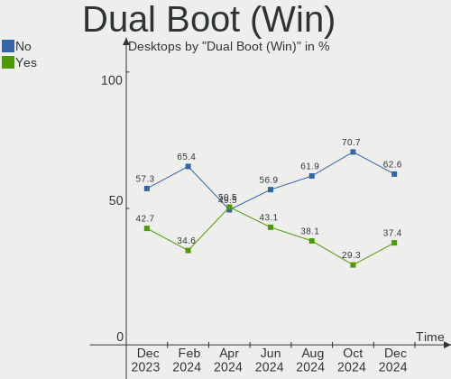
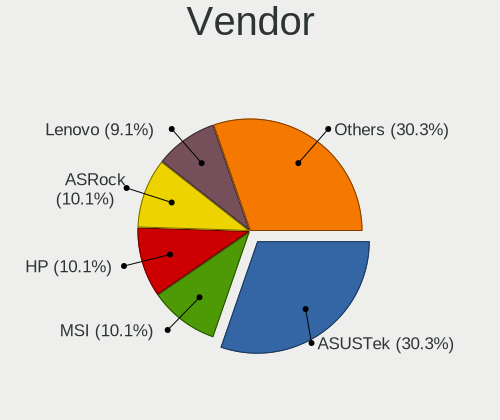
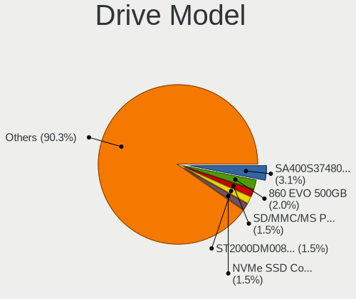
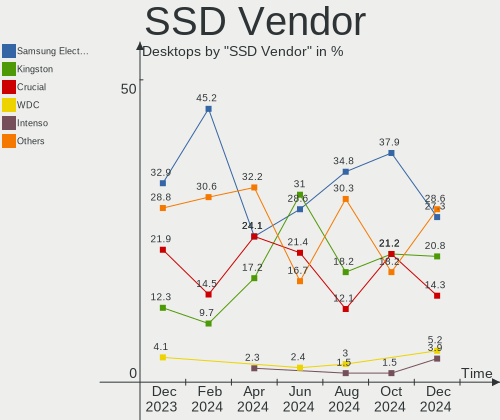
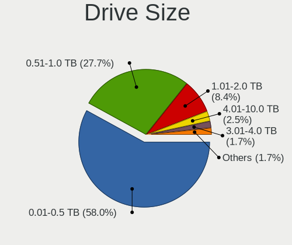
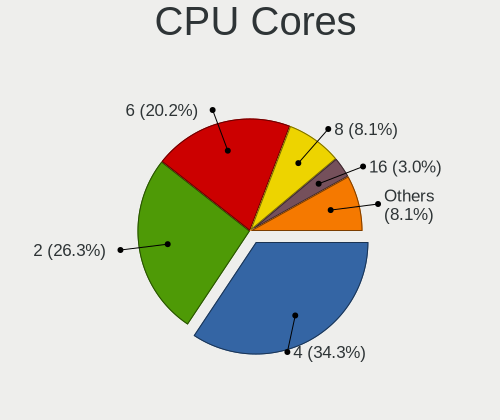
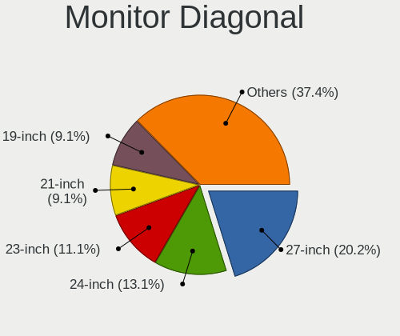
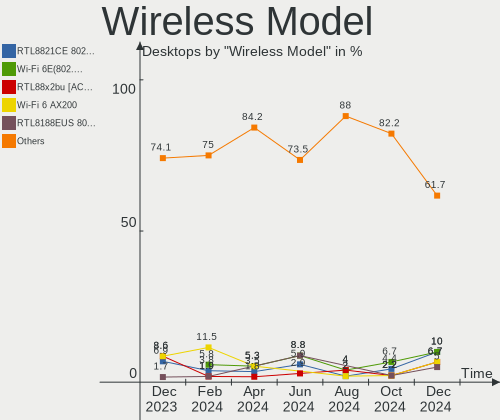
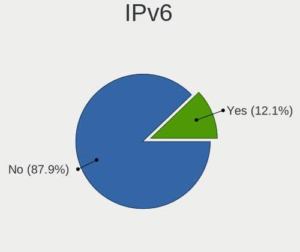
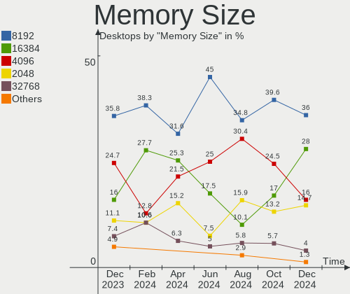

Linux in Italy - Hardware Trends (Desktops)
-------------------------------------------

A project to identify most popular hardware characteristics and track their change
over time based on data collected by Linux users at https://Linux-Hardware.org.

Anyone can contribute to this report by the [hw-probe](https://github.com/linuxhw/hw-probe) tool:

    sudo -E hw-probe -all -upload

Period: Jun, 2022.

Contents
--------

* [ System ](#system)
  - [ OS                       ](#os)
  - [ OS Family                ](#os-family)
  - [ Kernel                   ](#kernel)
  - [ Kernel Family            ](#kernel-family)
  - [ Kernel Major Ver.        ](#kernel-major-ver)
  - [ Arch                     ](#arch)
  - [ DE                       ](#de)
  - [ Display Server           ](#display-server)
  - [ Display Manager          ](#display-manager)
  - [ OS Lang                  ](#os-lang)
  - [ Boot Mode                ](#boot-mode)
  - [ Filesystem               ](#filesystem)
  - [ Part. scheme             ](#part-scheme)
  - [ Dual Boot with Linux/BSD ](#dual-boot-with-linuxbsd)
  - [ Dual Boot (Win)          ](#dual-boot-win)

* [ Board ](#board)
  - [ Vendor                   ](#vendor)
  - [ Model                    ](#model)
  - [ Model Family             ](#model-family)
  - [ MFG Year                 ](#mfg-year)
  - [ Form Factor              ](#form-factor)
  - [ Secure Boot              ](#secure-boot)
  - [ Coreboot                 ](#coreboot)
  - [ RAM Size                 ](#ram-size)
  - [ RAM Used                 ](#ram-used)
  - [ Total Drives             ](#total-drives)
  - [ Has CD-ROM               ](#has-cd-rom)
  - [ Has Ethernet             ](#has-ethernet)
  - [ Has WiFi                 ](#has-wifi)
  - [ Has Bluetooth            ](#has-bluetooth)

* [ Location ](#location)
  - [ Country                  ](#country)
  - [ City                     ](#city)

* [ Drives ](#drives)
  - [ Drive Vendor             ](#drive-vendor)
  - [ Drive Model              ](#drive-model)
  - [ HDD Vendor               ](#hdd-vendor)
  - [ SSD Vendor               ](#ssd-vendor)
  - [ Drive Kind               ](#drive-kind)
  - [ Drive Connector          ](#drive-connector)
  - [ Drive Size               ](#drive-size)
  - [ Space Total              ](#space-total)
  - [ Space Used               ](#space-used)
  - [ Malfunc. Drives          ](#malfunc-drives)
  - [ Malfunc. Drive Vendor    ](#malfunc-drive-vendor)
  - [ Malfunc. HDD Vendor      ](#malfunc-hdd-vendor)
  - [ Malfunc. Drive Kind      ](#malfunc-drive-kind)
  - [ Failed Drives            ](#failed-drives)
  - [ Failed Drive Vendor      ](#failed-drive-vendor)
  - [ Drive Status             ](#drive-status)

* [ Storage controller ](#storage-controller)
  - [ Storage Vendor           ](#storage-vendor)
  - [ Storage Model            ](#storage-model)
  - [ Storage Kind             ](#storage-kind)

* [ Processor ](#processor)
  - [ CPU Vendor               ](#cpu-vendor)
  - [ CPU Model                ](#cpu-model)
  - [ CPU Model Family         ](#cpu-model-family)
  - [ CPU Cores                ](#cpu-cores)
  - [ CPU Sockets              ](#cpu-sockets)
  - [ CPU Threads              ](#cpu-threads)
  - [ CPU Op-Modes             ](#cpu-op-modes)
  - [ CPU Microcode            ](#cpu-microcode)
  - [ CPU Microarch            ](#cpu-microarch)

* [ Graphics ](#graphics)
  - [ GPU Vendor               ](#gpu-vendor)
  - [ GPU Model                ](#gpu-model)
  - [ GPU Combo                ](#gpu-combo)
  - [ GPU Driver               ](#gpu-driver)
  - [ GPU Memory               ](#gpu-memory)

* [ Monitor ](#monitor)
  - [ Monitor Vendor           ](#monitor-vendor)
  - [ Monitor Model            ](#monitor-model)
  - [ Monitor Resolution       ](#monitor-resolution)
  - [ Monitor Diagonal         ](#monitor-diagonal)
  - [ Monitor Width            ](#monitor-width)
  - [ Aspect Ratio             ](#aspect-ratio)
  - [ Monitor Area             ](#monitor-area)
  - [ Pixel Density            ](#pixel-density)
  - [ Multiple Monitors        ](#multiple-monitors)

* [ Network ](#network)
  - [ Net Controller Vendor    ](#net-controller-vendor)
  - [ Net Controller Model     ](#net-controller-model)
  - [ Wireless Vendor          ](#wireless-vendor)
  - [ Wireless Model           ](#wireless-model)
  - [ Ethernet Vendor          ](#ethernet-vendor)
  - [ Ethernet Model           ](#ethernet-model)
  - [ Net Controller Kind      ](#net-controller-kind)
  - [ Used Controller          ](#used-controller)
  - [ NICs                     ](#nics)
  - [ IPv6                     ](#ipv6)

* [ Bluetooth ](#bluetooth)
  - [ Bluetooth Vendor         ](#bluetooth-vendor)
  - [ Bluetooth Model          ](#bluetooth-model)

* [ Sound ](#sound)
  - [ Sound Vendor             ](#sound-vendor)
  - [ Sound Model              ](#sound-model)

* [ Memory ](#memory)
  - [ Memory Vendor            ](#memory-vendor)
  - [ Memory Model             ](#memory-model)
  - [ Memory Kind              ](#memory-kind)
  - [ Memory Form Factor       ](#memory-form-factor)
  - [ Memory Size              ](#memory-size)
  - [ Memory Speed             ](#memory-speed)

* [ Printers & scanners ](#printers--scanners)
  - [ Printer Vendor           ](#printer-vendor)
  - [ Printer Model            ](#printer-model)
  - [ Scanner Vendor           ](#scanner-vendor)
  - [ Scanner Model            ](#scanner-model)

* [ Camera ](#camera)
  - [ Camera Vendor            ](#camera-vendor)
  - [ Camera Model             ](#camera-model)

* [ Security ](#security)
  - [ Fingerprint Vendor       ](#fingerprint-vendor)
  - [ Fingerprint Model        ](#fingerprint-model)
  - [ Chipcard Vendor          ](#chipcard-vendor)
  - [ Chipcard Model           ](#chipcard-model)

* [ Unsupported ](#unsupported)
  - [ Unsupported Devices      ](#unsupported-devices)
  - [ Unsupported Device Types ](#unsupported-device-types)

System
------

OS
--

Installed operating systems

| Name                 | Desktops | Percent |
|----------------------|----------|---------|
| Ubuntu 20.04         | 4        | 10.53%  |
| OpenMandriva 4.3     | 4        | 10.53%  |
| Ubuntu 22.04         | 3        | 7.89%   |
| Pop!_OS 22.04        | 2        | 5.26%   |
| Linux Mint 20.3      | 2        | 5.26%   |
| Kubuntu 22.04        | 2        | 5.26%   |
| Fedora 36            | 2        | 5.26%   |
| Arch Rolling         | 2        | 5.26%   |
| Arch                 | 2        | 5.26%   |
| Zorin 16             | 1        | 2.63%   |
| Zorin 15             | 1        | 2.63%   |
| Xubuntu 22.04        | 1        | 2.63%   |
| OpenMandriva 4.2     | 1        | 2.63%   |
| Manjaro 21.3.1       | 1        | 2.63%   |
| Lubuntu 22.04        | 1        | 2.63%   |
| Kubuntu 21.10        | 1        | 2.63%   |
| KDE neon 20.04       | 1        | 2.63%   |
| Kali 2022.2          | 1        | 2.63%   |
| Garuda Linux Soaring | 1        | 2.63%   |
| EndeavourOS Rolling  | 1        | 2.63%   |
| Elementary 6.1       | 1        | 2.63%   |
| Debian 11            | 1        | 2.63%   |
| CentOS 9             | 1        | 2.63%   |
| ArcoLinux Rolling    | 1        | 2.63%   |

OS Family
---------

OS without a version

| Name         | Desktops | Percent |
|--------------|----------|---------|
| Ubuntu       | 7        | 18.42%  |
| OpenMandriva | 5        | 13.16%  |
| Arch         | 4        | 10.53%  |
| Kubuntu      | 3        | 7.89%   |
| Zorin        | 2        | 5.26%   |
| Pop!_OS      | 2        | 5.26%   |
| Linux Mint   | 2        | 5.26%   |
| Fedora       | 2        | 5.26%   |
| Xubuntu      | 1        | 2.63%   |
| Manjaro      | 1        | 2.63%   |
| Lubuntu      | 1        | 2.63%   |
| KDE neon     | 1        | 2.63%   |
| Kali         | 1        | 2.63%   |
| Garuda Linux | 1        | 2.63%   |
| EndeavourOS  | 1        | 2.63%   |
| Elementary   | 1        | 2.63%   |
| Debian       | 1        | 2.63%   |
| CentOS       | 1        | 2.63%   |
| ArcoLinux    | 1        | 2.63%   |

Kernel
------

Version of the Linux kernel

| Version                  | Desktops | Percent |
|--------------------------|----------|---------|
| 5.16.7-desktop-1omv4003  | 4        | 10.53%  |
| 5.13.0-44-generic        | 3        | 7.89%   |
| 5.4.0-120-generic        | 2        | 5.26%   |
| 5.4.0-117-generic        | 2        | 5.26%   |
| 5.17.5-76051705-generic  | 2        | 5.26%   |
| 5.15.0-39-generic        | 2        | 5.26%   |
| 5.4.0-113-generic        | 1        | 2.63%   |
| 5.18.6-1-MANJARO         | 1        | 2.63%   |
| 5.18.5-zen1-1-zen        | 1        | 2.63%   |
| 5.18.5-200.fc36.x86_64   | 1        | 2.63%   |
| 5.18.4-vitodoc           | 1        | 2.63%   |
| 5.18.3-zen1-1-zen        | 1        | 2.63%   |
| 5.18.1-zen1-1-zen        | 1        | 2.63%   |
| 5.18.1-arch1-1           | 1        | 2.63%   |
| 5.17.9-arch1-1           | 1        | 2.63%   |
| 5.17.5-300.fc36.x86_64   | 1        | 2.63%   |
| 5.17.3-xanmod1           | 1        | 2.63%   |
| 5.17.14-xanmod1          | 1        | 2.63%   |
| 5.17.0-kali3-amd64       | 1        | 2.63%   |
| 5.15.49-1-lts            | 1        | 2.63%   |
| 5.15.48-1-lts            | 1        | 2.63%   |
| 5.15.35-2-pve            | 1        | 2.63%   |
| 5.15.0-39-lowlatency     | 1        | 2.63%   |
| 5.15.0-37-lowlatency     | 1        | 2.63%   |
| 5.15.0-25-generic        | 1        | 2.63%   |
| 5.14.0-109.el9.x86_64    | 1        | 2.63%   |
| 5.13.0-51-generic        | 1        | 2.63%   |
| 5.13.0-48-generic        | 1        | 2.63%   |
| 5.10.14-desktop-1omv4002 | 1        | 2.63%   |

Kernel Family
-------------

Linux kernel without a distro release

| Version | Desktops | Percent |
|---------|----------|---------|
| 5.4.0   | 5        | 13.16%  |
| 5.15.0  | 5        | 13.16%  |
| 5.13.0  | 5        | 13.16%  |
| 5.16.7  | 4        | 10.53%  |
| 5.17.5  | 3        | 7.89%   |
| 5.18.5  | 2        | 5.26%   |
| 5.18.1  | 2        | 5.26%   |
| 5.18.6  | 1        | 2.63%   |
| 5.18.4  | 1        | 2.63%   |
| 5.18.3  | 1        | 2.63%   |
| 5.17.9  | 1        | 2.63%   |
| 5.17.3  | 1        | 2.63%   |
| 5.17.14 | 1        | 2.63%   |
| 5.17.0  | 1        | 2.63%   |
| 5.15.49 | 1        | 2.63%   |
| 5.15.48 | 1        | 2.63%   |
| 5.15.35 | 1        | 2.63%   |
| 5.14.0  | 1        | 2.63%   |
| 5.10.14 | 1        | 2.63%   |

Kernel Major Ver.
-----------------

Linux kernel major version

| Version | Desktops | Percent |
|---------|----------|---------|
| 5.15    | 8        | 21.05%  |
| 5.18    | 7        | 18.42%  |
| 5.17    | 7        | 18.42%  |
| 5.4     | 5        | 13.16%  |
| 5.13    | 5        | 13.16%  |
| 5.16    | 4        | 10.53%  |
| 5.14    | 1        | 2.63%   |
| 5.10    | 1        | 2.63%   |

Arch
----

OS architecture (x86_64, i586, etc.)

| Name   | Desktops | Percent |
|--------|----------|---------|
| x86_64 | 37       | 97.37%  |
| i686   | 1        | 2.63%   |

DE
--

Desktop Environment

| Name       | Desktops | Percent |
|------------|----------|---------|
| GNOME      | 14       | 36.84%  |
| KDE5       | 13       | 34.21%  |
| XFCE       | 4        | 10.53%  |
| LXQt       | 2        | 5.26%   |
| Unknown    | 2        | 5.26%   |
| X-Cinnamon | 1        | 2.63%   |
| Pantheon   | 1        | 2.63%   |
| bspwm      | 1        | 2.63%   |

Display Server
--------------

X11 or Wayland

| Name    | Desktops | Percent |
|---------|----------|---------|
| X11     | 30       | 78.95%  |
| Wayland | 5        | 13.16%  |
| Unknown | 2        | 5.26%   |
| Tty     | 1        | 2.63%   |

Display Manager
---------------

SDDM, LightDM, etc.

| Name    | Desktops | Percent |
|---------|----------|---------|
| SDDM    | 14       | 36.84%  |
| Unknown | 11       | 28.95%  |
| LightDM | 6        | 15.79%  |
| GDM3    | 6        | 15.79%  |
| GDM     | 1        | 2.63%   |

OS Lang
-------

Language

| Lang  | Desktops | Percent |
|-------|----------|---------|
| it_IT | 29       | 76.32%  |
| en_US | 9        | 23.68%  |

Boot Mode
---------

EFI or BIOS

| Mode | Desktops | Percent |
|------|----------|---------|
| BIOS | 24       | 63.16%  |
| EFI  | 14       | 36.84%  |

Filesystem
----------

Type of filesystem

| Type    | Desktops | Percent |
|---------|----------|---------|
| Ext4    | 27       | 71.05%  |
| Overlay | 5        | 13.16%  |
| Btrfs   | 5        | 13.16%  |
| Xfs     | 1        | 2.63%   |

Part. scheme
------------

Scheme of partitioning

| Type    | Desktops | Percent |
|---------|----------|---------|
| Unknown | 20       | 52.63%  |
| GPT     | 15       | 39.47%  |
| MBR     | 3        | 7.89%   |

Dual Boot with Linux/BSD
------------------------

Hosting more than one Linux/BSD

| Dual boot | Desktops | Percent |
|-----------|----------|---------|
| No        | 30       | 78.95%  |
| Yes       | 8        | 21.05%  |

Dual Boot (Win)
---------------

Hosting Linux and Windows

| Dual boot | Desktops | Percent |
|-----------|----------|---------|
| Yes       | 21       | 55.26%  |
| No        | 17       | 44.74%  |

Board
-----

Vendor
------

Motherboard manufacturer

| Name                | Desktops | Percent |
|---------------------|----------|---------|
| ASUSTek Computer    | 10       | 26.32%  |
| MSI                 | 9        | 23.68%  |
| Gigabyte Technology | 5        | 13.16%  |
| ASRock              | 4        | 10.53%  |
| Hewlett-Packard     | 2        | 5.26%   |
| Foxconn             | 2        | 5.26%   |
| Dell                | 2        | 5.26%   |
| T-bao               | 1        | 2.63%   |
| Lenovo              | 1        | 2.63%   |
| Intel               | 1        | 2.63%   |
| Unknown             | 1        | 2.63%   |

Model
-----

Motherboard model

| Name                               | Desktops | Percent |
|------------------------------------|----------|---------|
| T-bao MINI PC                      | 1        | 2.63%   |
| MSI NQ890AA-ABZ CQ5011IT           | 1        | 2.63%   |
| MSI MS-7C96                        | 1        | 2.63%   |
| MSI MS-7C95                        | 1        | 2.63%   |
| MSI MS-7C52                        | 1        | 2.63%   |
| MSI MS-7C37                        | 1        | 2.63%   |
| MSI MS-7A78                        | 1        | 2.63%   |
| MSI MS-7A62                        | 1        | 2.63%   |
| MSI MS-7721                        | 1        | 2.63%   |
| MSI MPG B460 Trident A (MS-B926)   | 1        | 2.63%   |
| Lenovo ThinkCentre M93p 10A7000LIX | 1        | 2.63%   |
| Intel DX58SO AAE29331-703          | 1        | 2.63%   |
| HP xw4600 Workstation              | 1        | 2.63%   |
| HP Compaq Elite 8300 USDT          | 1        | 2.63%   |
| Gigabyte Z390 AORUS PRO            | 1        | 2.63%   |
| Gigabyte H97M-D3H                  | 1        | 2.63%   |
| Gigabyte GA-MA790FXT-UD5P          | 1        | 2.63%   |
| Gigabyte B450M DS3H                | 1        | 2.63%   |
| Gigabyte B450 AORUS ELITE          | 1        | 2.63%   |
| Foxconn NQ824AA-ABZ s3821it        | 1        | 2.63%   |
| Foxconn 945 7MC Series             | 1        | 2.63%   |
| Dell OptiPlex 745                  | 1        | 2.63%   |
| Dell OptiPlex 3020                 | 1        | 2.63%   |
| ASUS Z170-A                        | 1        | 2.63%   |
| ASUS TUF Z390-PLUS GAMING          | 1        | 2.63%   |
| ASUS ROG STRIX B560-G GAMING WIFI  | 1        | 2.63%   |
| ASUS ROG STRIX B550-E GAMING       | 1        | 2.63%   |
| ASUS PRIME H270M-PLUS              | 1        | 2.63%   |
| ASUS PRIME A320M-K                 | 1        | 2.63%   |
| ASUS P5QC                          | 1        | 2.63%   |
| ASUS M5A97 R2.0                    | 1        | 2.63%   |
| ASUS M5A78L-M/USB3                 | 1        | 2.63%   |
| ASUS M4N78-AM                      | 1        | 2.63%   |
| ASRock X370 Pro4                   | 1        | 2.63%   |
| ASRock T6010                       | 1        | 2.63%   |
| ASRock H77 Pro4/MVP                | 1        | 2.63%   |
| ASRock 775Dual-VSTA                | 1        | 2.63%   |
| Unknown                            | 1        | 2.63%   |

Model Family
------------

Motherboard model prefix

| Name                      | Desktops | Percent |
|---------------------------|----------|---------|
| Dell OptiPlex             | 2        | 5.26%   |
| ASUS ROG                  | 2        | 5.26%   |
| ASUS PRIME                | 2        | 5.26%   |
| T-bao MINI                | 1        | 2.63%   |
| MSI NQ890AA-ABZ           | 1        | 2.63%   |
| MSI MS-7C96               | 1        | 2.63%   |
| MSI MS-7C95               | 1        | 2.63%   |
| MSI MS-7C52               | 1        | 2.63%   |
| MSI MS-7C37               | 1        | 2.63%   |
| MSI MS-7A78               | 1        | 2.63%   |
| MSI MS-7A62               | 1        | 2.63%   |
| MSI MS-7721               | 1        | 2.63%   |
| MSI MPG                   | 1        | 2.63%   |
| Lenovo ThinkCentre        | 1        | 2.63%   |
| Intel DX58SO              | 1        | 2.63%   |
| HP xw4600                 | 1        | 2.63%   |
| HP Compaq                 | 1        | 2.63%   |
| Gigabyte Z390             | 1        | 2.63%   |
| Gigabyte H97M-D3H         | 1        | 2.63%   |
| Gigabyte GA-MA790FXT-UD5P | 1        | 2.63%   |
| Gigabyte B450M            | 1        | 2.63%   |
| Gigabyte B450             | 1        | 2.63%   |
| Foxconn NQ824AA-ABZ       | 1        | 2.63%   |
| Foxconn 945               | 1        | 2.63%   |
| ASUS Z170-A               | 1        | 2.63%   |
| ASUS TUF                  | 1        | 2.63%   |
| ASUS P5QC                 | 1        | 2.63%   |
| ASUS M5A97                | 1        | 2.63%   |
| ASUS M5A78L-M             | 1        | 2.63%   |
| ASUS M4N78-AM             | 1        | 2.63%   |
| ASRock X370               | 1        | 2.63%   |
| ASRock T6010              | 1        | 2.63%   |
| ASRock H77                | 1        | 2.63%   |
| ASRock 775Dual-VSTA       | 1        | 2.63%   |
| Unknown                   | 1        | 2.63%   |

MFG Year
--------

Motherboard manufacture year

| Year | Desktops | Percent |
|------|----------|---------|
| 2018 | 6        | 15.79%  |
| 2020 | 4        | 10.53%  |
| 2009 | 4        | 10.53%  |
| 2014 | 3        | 7.89%   |
| 2012 | 3        | 7.89%   |
| 2008 | 3        | 7.89%   |
| 2006 | 3        | 7.89%   |
| 2021 | 2        | 5.26%   |
| 2019 | 2        | 5.26%   |
| 2017 | 2        | 5.26%   |
| 2016 | 2        | 5.26%   |
| 2015 | 1        | 2.63%   |
| 2013 | 1        | 2.63%   |
| 2011 | 1        | 2.63%   |
| 2010 | 1        | 2.63%   |

Form Factor
-----------

Physical design of the computer

| Name    | Desktops | Percent |
|---------|----------|---------|
| Desktop | 38       | 100%    |

Secure Boot
-----------

Enabled or disabled

| State    | Desktops | Percent |
|----------|----------|---------|
| Disabled | 38       | 100%    |

Coreboot
--------

Have coreboot on board

| Used | Desktops | Percent |
|------|----------|---------|
| No   | 38       | 100%    |

RAM Size
--------

Total RAM memory

| Size in GB  | Desktops | Percent |
|-------------|----------|---------|
| 16.01-24.0  | 10       | 26.32%  |
| 3.01-4.0    | 9        | 23.68%  |
| 32.01-64.0  | 6        | 15.79%  |
| 4.01-8.0    | 5        | 13.16%  |
| 8.01-16.0   | 5        | 13.16%  |
| 2.01-3.0    | 1        | 2.63%   |
| 64.01-256.0 | 1        | 2.63%   |
| 0.51-1.0    | 1        | 2.63%   |

RAM Used
--------

Used RAM memory

| Used GB   | Desktops | Percent |
|-----------|----------|---------|
| 1.01-2.0  | 18       | 47.37%  |
| 2.01-3.0  | 7        | 18.42%  |
| 0.51-1.0  | 5        | 13.16%  |
| 4.01-8.0  | 3        | 7.89%   |
| 3.01-4.0  | 3        | 7.89%   |
| 8.01-16.0 | 2        | 5.26%   |

Total Drives
------------

Number of drives on board

| Drives | Desktops | Percent |
|--------|----------|---------|
| 1      | 12       | 31.58%  |
| 3      | 8        | 21.05%  |
| 2      | 7        | 18.42%  |
| 5      | 6        | 15.79%  |
| 4      | 5        | 13.16%  |

Has CD-ROM
----------

Has CD-ROM on board

| Presented | Desktops | Percent |
|-----------|----------|---------|
| No        | 22       | 57.89%  |
| Yes       | 16       | 42.11%  |

Has Ethernet
------------

Has Ethernet on board

| Presented | Desktops | Percent |
|-----------|----------|---------|
| Yes       | 38       | 100%    |

Has WiFi
--------

Has WiFi module

| Presented | Desktops | Percent |
|-----------|----------|---------|
| No        | 22       | 57.89%  |
| Yes       | 16       | 42.11%  |

Has Bluetooth
-------------

Has Bluetooth module

| Presented | Desktops | Percent |
|-----------|----------|---------|
| No        | 30       | 78.95%  |
| Yes       | 8        | 21.05%  |

Location
--------

Country
-------

Geographic location (country)

| Country | Desktops | Percent |
|---------|----------|---------|
| Italy   | 38       | 100%    |

City
----

Geographic location (city)

| City                   | Desktops | Percent |
|------------------------|----------|---------|
| Milan                  | 3        | 7.89%   |
| Vicenza                | 2        | 5.26%   |
| Rome                   | 2        | 5.26%   |
| Udine                  | 1        | 2.63%   |
| Stazione Masotti       | 1        | 2.63%   |
| Siniscola              | 1        | 2.63%   |
| Sesto San Giovanni     | 1        | 2.63%   |
| San Biagio di Callalta | 1        | 2.63%   |
| Saluzzo                | 1        | 2.63%   |
| Rozzano                | 1        | 2.63%   |
| Potenza                | 1        | 2.63%   |
| Porto Mantovano        | 1        | 2.63%   |
| Partinico              | 1        | 2.63%   |
| Monteprandone          | 1        | 2.63%   |
| Mira                   | 1        | 2.63%   |
| Mantova                | 1        | 2.63%   |
| Manfredonia            | 1        | 2.63%   |
| Luni                   | 1        | 2.63%   |
| Latiano                | 1        | 2.63%   |
| Istrana                | 1        | 2.63%   |
| Gorlago                | 1        | 2.63%   |
| Fossano                | 1        | 2.63%   |
| Costa Masnaga          | 1        | 2.63%   |
| Cortemaggiore          | 1        | 2.63%   |
| Como                   | 1        | 2.63%   |
| Cermenate              | 1        | 2.63%   |
| Calco                  | 1        | 2.63%   |
| Cagliari               | 1        | 2.63%   |
| Brescia                | 1        | 2.63%   |
| Barzana                | 1        | 2.63%   |
| Asti                   | 1        | 2.63%   |
| Arluno                 | 1        | 2.63%   |
| Ancona                 | 1        | 2.63%   |
| Adelfia                | 1        | 2.63%   |

Drives
------

Drive Vendor
------------

Hard drive vendors

| Vendor                    | Desktops | Drives | Percent |
|---------------------------|----------|--------|---------|
| WDC                       | 18       | 25     | 21.18%  |
| Seagate                   | 15       | 17     | 17.65%  |
| Samsung Electronics       | 10       | 17     | 11.76%  |
| Toshiba                   | 6        | 6      | 7.06%   |
| Crucial                   | 6        | 6      | 7.06%   |
| SanDisk                   | 4        | 4      | 4.71%   |
| Maxtor                    | 3        | 3      | 3.53%   |
| Kingston                  | 3        | 3      | 3.53%   |
| SPCC                      | 2        | 2      | 2.35%   |
| Silicon Motion            | 2        | 2      | 2.35%   |
| Phison                    | 2        | 2      | 2.35%   |
| Intenso                   | 2        | 2      | 2.35%   |
| Hitachi                   | 2        | 2      | 2.35%   |
| XPG                       | 1        | 1      | 1.18%   |
| Verbatim                  | 1        | 1      | 1.18%   |
| USB3.0                    | 1        | 1      | 1.18%   |
| Team                      | 1        | 1      | 1.18%   |
| TCSUNBOW                  | 1        | 1      | 1.18%   |
| Qunion                    | 1        | 1      | 1.18%   |
| Netac                     | 1        | 1      | 1.18%   |
| Micron/Crucial Technology | 1        | 1      | 1.18%   |
| Corsair                   | 1        | 2      | 1.18%   |
| Apacer                    | 1        | 1      | 1.18%   |

Drive Model
-----------

Hard drive models

| Model                                | Desktops | Percent |
|--------------------------------------|----------|---------|
| Samsung SSD 860 EVO 250GB            | 3        | 3.03%   |
| WDC WD5000AAKX-001CA0 500GB          | 2        | 2.02%   |
| WDC WD30EZRX-00D8PB0 3TB             | 2        | 2.02%   |
| Seagate ST4000DM004-2CV104 4TB       | 2        | 2.02%   |
| Seagate ST3500418AS 500GB            | 2        | 2.02%   |
| Seagate ST2000DM008-2FR102 2TB       | 2        | 2.02%   |
| Seagate ST1000DM003-1CH162 1TB       | 2        | 2.02%   |
| Samsung SSD 860 EVO 500GB            | 2        | 2.02%   |
| Samsung SSD 850 PRO 256GB            | 2        | 2.02%   |
| Samsung SSD 850 EVO 250GB            | 2        | 2.02%   |
| Maxtor STM3160215AS 160GB            | 2        | 2.02%   |
| XPG NVMe SSD Drive 512GB             | 1        | 1.01%   |
| WDC WDS250G2B0A-00SM50 250GB SSD     | 1        | 1.01%   |
| WDC WDS240G2G0B-00EPW0 240GB SSD     | 1        | 1.01%   |
| WDC WDS240G1G0B-00RC30 240GB SSD     | 1        | 1.01%   |
| WDC WD6003FFBX-68MU3N0 6TB           | 1        | 1.01%   |
| WDC WD5000AAKS-00UU3A0 500GB         | 1        | 1.01%   |
| WDC WD5000AAKS-00A7B2 500GB          | 1        | 1.01%   |
| WDC WD5000AADS-00S9B0 500GB          | 1        | 1.01%   |
| WDC WD3200AAKX-22ERMA0 320GB         | 1        | 1.01%   |
| WDC WD3200AAKX-00ERMA0 320GB         | 1        | 1.01%   |
| WDC WD3200AAJS-65M0A0 320GB          | 1        | 1.01%   |
| WDC WD2500JS-60MHB1 250GB            | 1        | 1.01%   |
| WDC WD2000BB-00RDA0 200GB            | 1        | 1.01%   |
| WDC WD1600AAJB-00J3A0 160GB          | 1        | 1.01%   |
| WDC WD10EZRZ-00HTKB0 1TB             | 1        | 1.01%   |
| WDC WD10EZEX-08WN4A0 1TB             | 1        | 1.01%   |
| WDC WD10EZEX-00ZF5A0 1TB             | 1        | 1.01%   |
| WDC WD10EARS-22Y5B1 1TB              | 1        | 1.01%   |
| WDC WD10EARS-00Z5B1 1TB              | 1        | 1.01%   |
| WDC PC SN530 SDBPNPZ-512G-1032 512GB | 1        | 1.01%   |
| Verbatim Portable SSD 240GB          | 1        | 1.01%   |
| USB3.0 Super Speed 320GB             | 1        | 1.01%   |
| Toshiba MQ04ABF100 1TB               | 1        | 1.01%   |
| Toshiba MQ01ABD100 1TB               | 1        | 1.01%   |
| Toshiba HDWD130 3TB                  | 1        | 1.01%   |
| Toshiba DT01ACA300 3TB               | 1        | 1.01%   |
| Toshiba DT01ACA100 1TB               | 1        | 1.01%   |
| Toshiba DT01ACA050 500GB             | 1        | 1.01%   |
| Team T253X1480G 480GB SSD            | 1        | 1.01%   |
| TCSUNBOW X3 120GB SSD                | 1        | 1.01%   |
| SPCC Solid State Disk 128GB          | 1        | 1.01%   |
| SPCC M.2 PCIe SSD 512GB              | 1        | 1.01%   |
| Silicon Motion NVMe SSD Drive 1TB    | 1        | 1.01%   |
| Silicon Motion ASint AS806 128GB     | 1        | 1.01%   |
| Seagate ST9500325AS 500GB            | 1        | 1.01%   |
| Seagate ST500LM012 HN-M500MBB 500GB  | 1        | 1.01%   |
| Seagate ST5000LM000-2AN170 5TB       | 1        | 1.01%   |
| Seagate ST3000DM008-2DM166 3TB       | 1        | 1.01%   |
| Seagate ST2000DX001-1NS164 2TB       | 1        | 1.01%   |
| Seagate ST1000LM024 HN-M101MBB 1TB   | 1        | 1.01%   |
| Seagate ST1000DM010-2EP102 1TB       | 1        | 1.01%   |
| Seagate ST1000DM003-9YN162 1TB       | 1        | 1.01%   |
| Seagate ST1000DM003-1ER162 1TB       | 1        | 1.01%   |
| SanDisk SSD PLUS 480 GB              | 1        | 1.01%   |
| SanDisk SDSSDH3 500G                 | 1        | 1.01%   |
| SanDisk SDSSDH3 1T00 1TB             | 1        | 1.01%   |
| SanDisk NVMe SSD Drive 512GB         | 1        | 1.01%   |
| Samsung SSD 970 EVO 1TB              | 1        | 1.01%   |
| Samsung SSD 870 QVO 2TB              | 1        | 1.01%   |

HDD Vendor
----------

Hard disk drive vendors

| Vendor              | Desktops | Drives | Percent |
|---------------------|----------|--------|---------|
| Seagate             | 15       | 17     | 35.71%  |
| WDC                 | 14       | 21     | 33.33%  |
| Toshiba             | 6        | 6      | 14.29%  |
| Maxtor              | 3        | 3      | 7.14%   |
| Samsung Electronics | 2        | 3      | 4.76%   |
| Hitachi             | 2        | 2      | 4.76%   |

SSD Vendor
----------

Solid state drive vendors

| Vendor              | Desktops | Drives | Percent |
|---------------------|----------|--------|---------|
| Samsung Electronics | 9        | 13     | 30%     |
| Crucial             | 4        | 4      | 13.33%  |
| WDC                 | 3        | 3      | 10%     |
| SanDisk             | 3        | 3      | 10%     |
| Kingston            | 2        | 2      | 6.67%   |
| Intenso             | 2        | 2      | 6.67%   |
| Verbatim            | 1        | 1      | 3.33%   |
| USB3.0              | 1        | 1      | 3.33%   |
| Team                | 1        | 1      | 3.33%   |
| TCSUNBOW            | 1        | 1      | 3.33%   |
| SPCC                | 1        | 1      | 3.33%   |
| Corsair             | 1        | 2      | 3.33%   |
| Apacer              | 1        | 1      | 3.33%   |

Drive Kind
----------

HDD or SSD

| Kind    | Desktops | Drives | Percent |
|---------|----------|--------|---------|
| HDD     | 29       | 52     | 45.31%  |
| SSD     | 24       | 35     | 37.5%   |
| NVMe    | 10       | 14     | 15.63%  |
| Unknown | 1        | 1      | 1.56%   |

Drive Connector
---------------

SATA, SAS, NVMe, etc.

| Type | Desktops | Drives | Percent |
|------|----------|--------|---------|
| SATA | 36       | 84     | 72%     |
| NVMe | 10       | 14     | 20%     |
| SAS  | 4        | 4      | 8%      |

Drive Size
----------

Size of hard drive

| Size in TB | Desktops | Drives | Percent |
|------------|----------|--------|---------|
| 0.01-0.5   | 30       | 53     | 54.55%  |
| 0.51-1.0   | 12       | 18     | 21.82%  |
| 2.01-3.0   | 5        | 6      | 9.09%   |
| 1.01-2.0   | 4        | 5      | 7.27%   |
| 3.01-4.0   | 2        | 2      | 3.64%   |
| 4.01-10.0  | 2        | 3      | 3.64%   |

Space Total
-----------

Amount of disk space available on the file system

| Size in GB     | Desktops | Percent |
|----------------|----------|---------|
| 501-1000       | 10       | 26.32%  |
| 101-250        | 9        | 23.68%  |
| 251-500        | 6        | 15.79%  |
| 1-20           | 4        | 10.53%  |
| 2001-3000      | 2        | 5.26%   |
| 1001-2000      | 2        | 5.26%   |
| 51-100         | 2        | 5.26%   |
| More than 3000 | 1        | 2.63%   |
| 21-50          | 1        | 2.63%   |
| Unknown        | 1        | 2.63%   |

Space Used
----------

Amount of used disk space

| Used GB        | Desktops | Percent |
|----------------|----------|---------|
| 1-20           | 13       | 34.21%  |
| 21-50          | 8        | 21.05%  |
| 101-250        | 4        | 10.53%  |
| 51-100         | 4        | 10.53%  |
| 501-1000       | 3        | 7.89%   |
| 251-500        | 2        | 5.26%   |
| 1001-2000      | 2        | 5.26%   |
| More than 3000 | 1        | 2.63%   |
| Unknown        | 1        | 2.63%   |

Malfunc. Drives
---------------

Drive models with a malfunction

| Model                             | Desktops | Drives | Percent |
|-----------------------------------|----------|--------|---------|
| WDC WDS240G2G0B-00EPW0 240GB SSD  | 1        | 1      | 12.5%   |
| WDC WD6003FFBX-68MU3N0 6TB        | 1        | 2      | 12.5%   |
| Toshiba DT01ACA100 1TB            | 1        | 1      | 12.5%   |
| TCSUNBOW X3 120GB SSD             | 1        | 1      | 12.5%   |
| Samsung Electronics HD501LJ 500GB | 1        | 1      | 12.5%   |
| Maxtor STM3160215AS 160GB         | 1        | 1      | 12.5%   |
| Hitachi HDP725050GLA360 500GB     | 1        | 1      | 12.5%   |
| Crucial CT128MX100SSD1 128GB      | 1        | 1      | 12.5%   |

Malfunc. Drive Vendor
---------------------

Vendors of faulty drives

| Vendor              | Desktops | Drives | Percent |
|---------------------|----------|--------|---------|
| WDC                 | 2        | 3      | 25%     |
| Toshiba             | 1        | 1      | 12.5%   |
| TCSUNBOW            | 1        | 1      | 12.5%   |
| Samsung Electronics | 1        | 1      | 12.5%   |
| Maxtor              | 1        | 1      | 12.5%   |
| Hitachi             | 1        | 1      | 12.5%   |
| Crucial             | 1        | 1      | 12.5%   |

Malfunc. HDD Vendor
-------------------

Vendors of faulty HDD drives

| Vendor              | Desktops | Drives | Percent |
|---------------------|----------|--------|---------|
| WDC                 | 1        | 2      | 20%     |
| Toshiba             | 1        | 1      | 20%     |
| Samsung Electronics | 1        | 1      | 20%     |
| Maxtor              | 1        | 1      | 20%     |
| Hitachi             | 1        | 1      | 20%     |

Malfunc. Drive Kind
-------------------

Kinds of faulty drives

| Kind | Desktops | Drives | Percent |
|------|----------|--------|---------|
| HDD  | 4        | 6      | 66.67%  |
| SSD  | 2        | 3      | 33.33%  |

Failed Drives
-------------

Failed drive models

Zero info for selected period =(

Failed Drive Vendor
-------------------

Failed drive vendors

Zero info for selected period =(

Drive Status
------------

Number of failed and malfunc. drives

| Status   | Desktops | Drives | Percent |
|----------|----------|--------|---------|
| Detected | 25       | 54     | 54.35%  |
| Works    | 16       | 39     | 34.78%  |
| Malfunc  | 5        | 9      | 10.87%  |

Storage controller
------------------

Storage Vendor
--------------

Storage controller vendors

| Vendor                      | Desktops | Percent |
|-----------------------------|----------|---------|
| Intel                       | 20       | 35.09%  |
| AMD                         | 15       | 26.32%  |
| Phison Electronics          | 3        | 5.26%   |
| Micron/Crucial Technology   | 3        | 5.26%   |
| ASMedia Technology          | 3        | 5.26%   |
| VIA Technologies            | 2        | 3.51%   |
| Silicon Motion              | 2        | 3.51%   |
| Nvidia                      | 2        | 3.51%   |
| Marvell Technology Group    | 2        | 3.51%   |
| SanDisk                     | 1        | 1.75%   |
| Samsung Electronics         | 1        | 1.75%   |
| Kingston Technology Company | 1        | 1.75%   |
| JMicron Technology          | 1        | 1.75%   |
| ADATA Technology            | 1        | 1.75%   |

Storage Model
-------------

Storage controller models

| Model                                                                          | Desktops | Percent |
|--------------------------------------------------------------------------------|----------|---------|
| AMD FCH SATA Controller [AHCI mode]                                            | 7        | 10.14%  |
| Intel SATA Controller [RAID mode]                                              | 4        | 5.8%    |
| Intel 8 Series/C220 Series Chipset Family 6-port SATA Controller 1 [AHCI mode] | 3        | 4.35%   |
| ASMedia ASM1062 Serial ATA Controller                                          | 3        | 4.35%   |
| AMD SB7x0/SB8x0/SB9x0 IDE Controller                                           | 3        | 4.35%   |
| AMD 500 Series Chipset SATA Controller                                         | 3        | 4.35%   |
| AMD 400 Series Chipset SATA Controller                                         | 3        | 4.35%   |
| Silicon Motion SM2263EN/SM2263XT SSD Controller                                | 2        | 2.9%    |
| Phison E12 NVMe Controller                                                     | 2        | 2.9%    |
| Micron/Crucial NVMe Controller                                                 | 2        | 2.9%    |
| Intel NM10/ICH7 Family SATA Controller [IDE mode]                              | 2        | 2.9%    |
| Intel Cannon Lake PCH SATA AHCI Controller                                     | 2        | 2.9%    |
| Intel 7 Series/C210 Series Chipset Family 6-port SATA Controller [AHCI mode]   | 2        | 2.9%    |
| Intel 200 Series PCH SATA controller [AHCI mode]                               | 2        | 2.9%    |
| AMD SB7x0/SB8x0/SB9x0 SATA Controller [IDE mode]                               | 2        | 2.9%    |
| AMD SB7x0/SB8x0/SB9x0 SATA Controller [AHCI mode]                              | 2        | 2.9%    |
| VIA VT82C586A/B/VT82C686/A/B/VT823x/A/C PIPC Bus Master IDE                    | 1        | 1.45%   |
| VIA VT8237A SATA 2-Port Controller                                             | 1        | 1.45%   |
| VIA VT6421 IDE/SATA Controller                                                 | 1        | 1.45%   |
| SanDisk WD Blue SN550 NVMe SSD                                                 | 1        | 1.45%   |
| Samsung NVMe SSD Controller SM981/PM981/PM983                                  | 1        | 1.45%   |
| Phison E16 PCIe4 NVMe Controller                                               | 1        | 1.45%   |
| Nvidia MCP78S [GeForce 8200] SATA Controller (non-AHCI mode)                   | 1        | 1.45%   |
| Nvidia MCP78S [GeForce 8200] IDE                                               | 1        | 1.45%   |
| Nvidia MCP73 SATA Controller (IDE mode)                                        | 1        | 1.45%   |
| Nvidia MCP73 IDE Controller                                                    | 1        | 1.45%   |
| Micron/Crucial P2 NVMe PCIe SSD                                                | 1        | 1.45%   |
| Marvell Group 88SE9172 SATA 6Gb/s Controller                                   | 1        | 1.45%   |
| Marvell Group 88SE6111/6121 SATA II / PATA Controller                          | 1        | 1.45%   |
| Kingston Company A2000 NVMe SSD                                                | 1        | 1.45%   |
| JMicron JMB363 SATA/IDE Controller                                             | 1        | 1.45%   |
| Intel Q170/Q150/B150/H170/H110/Z170/CM236 Chipset SATA Controller [AHCI Mode]  | 1        | 1.45%   |
| Intel 82801JI (ICH10 Family) SATA AHCI Controller                              | 1        | 1.45%   |
| Intel 82801HR/HO/HH (ICH8R/DO/DH) 2 port SATA Controller [IDE mode]            | 1        | 1.45%   |
| Intel 82801H (ICH8 Family) 4 port SATA Controller [IDE mode]                   | 1        | 1.45%   |
| Intel 82801G (ICH7 Family) IDE Controller                                      | 1        | 1.45%   |
| Intel 500 Series Chipset Family SATA AHCI Controller                           | 1        | 1.45%   |
| Intel 400 Series Chipset Family SATA AHCI Controller                           | 1        | 1.45%   |
| AMD X370 Series Chipset SATA Controller                                        | 1        | 1.45%   |
| AMD FCH SATA Controller D                                                      | 1        | 1.45%   |
| ADATA XPG SX8200 Pro PCIe Gen3x4 M.2 2280 Solid State Drive                    | 1        | 1.45%   |

Storage Kind
------------

Kind of storage controller (IDE, SATA, NVMe, SAS, ...)

| Kind | Desktops | Percent |
|------|----------|---------|
| SATA | 28       | 51.85%  |
| NVMe | 10       | 18.52%  |
| IDE  | 10       | 18.52%  |
| RAID | 6        | 11.11%  |

Processor
---------

CPU Vendor
----------

Processor vendors

| Vendor | Desktops | Percent |
|--------|----------|---------|
| Intel  | 22       | 57.89%  |
| AMD    | 16       | 42.11%  |

CPU Model
---------

Processor models

| Model                                         | Desktops | Percent |
|-----------------------------------------------|----------|---------|
| AMD Ryzen 5 3600 6-Core Processor             | 2        | 5.26%   |
| Intel Xeon CPU E3-1230 v3 @ 3.30GHz           | 1        | 2.63%   |
| Intel Pentium Dual-Core CPU E5200 @ 2.50GHz   | 1        | 2.63%   |
| Intel Pentium Dual CPU E2180 @ 2.00GHz        | 1        | 2.63%   |
| Intel Pentium CPU G4560 @ 3.50GHz             | 1        | 2.63%   |
| Intel Pentium 4 CPU 3.00GHz                   | 1        | 2.63%   |
| Intel Core i7-9700K CPU @ 3.60GHz             | 1        | 2.63%   |
| Intel Core i7-7700K CPU @ 4.20GHz             | 1        | 2.63%   |
| Intel Core i7-6700K CPU @ 4.00GHz             | 1        | 2.63%   |
| Intel Core i7-4770 CPU @ 3.40GHz              | 1        | 2.63%   |
| Intel Core i7 CPU 950 @ 3.07GHz               | 1        | 2.63%   |
| Intel Core i5-9600K CPU @ 3.70GHz             | 1        | 2.63%   |
| Intel Core i5-7400 CPU @ 3.00GHz              | 1        | 2.63%   |
| Intel Core i5-4590 CPU @ 3.30GHz              | 1        | 2.63%   |
| Intel Core i5-3470S CPU @ 2.90GHz             | 1        | 2.63%   |
| Intel Core i5-3470 CPU @ 3.20GHz              | 1        | 2.63%   |
| Intel Core i5-10400F CPU @ 2.90GHz            | 1        | 2.63%   |
| Intel Core i3-4130 CPU @ 3.40GHz              | 1        | 2.63%   |
| Intel Core 2 Quad CPU Q9550 @ 2.83GHz         | 1        | 2.63%   |
| Intel Core 2 Quad CPU Q9300 @ 2.50GHz         | 1        | 2.63%   |
| Intel Core 2 Duo CPU E7600 @ 3.06GHz          | 1        | 2.63%   |
| Intel Core 2 CPU 6300 @ 1.86GHz               | 1        | 2.63%   |
| Intel 11th Gen Core i5-11400 @ 2.60GHz        | 1        | 2.63%   |
| AMD Ryzen 7 5800X 8-Core Processor            | 1        | 2.63%   |
| AMD Ryzen 7 2700 Eight-Core Processor         | 1        | 2.63%   |
| AMD Ryzen 5 5600G with Radeon Graphics        | 1        | 2.63%   |
| AMD Ryzen 5 3600X 6-Core Processor            | 1        | 2.63%   |
| AMD Ryzen 5 3400G with Radeon Vega Graphics   | 1        | 2.63%   |
| AMD Ryzen 5 1600 Six-Core Processor           | 1        | 2.63%   |
| AMD Ryzen 3 2200U with Radeon Vega Mobile Gfx | 1        | 2.63%   |
| AMD Ryzen 3 2200G with Radeon Vega Graphics   | 1        | 2.63%   |
| AMD Processor model unknown                   | 1        | 2.63%   |
| AMD Phenom II X4 955 Processor                | 1        | 2.63%   |
| AMD FX-8350 Eight-Core Processor              | 1        | 2.63%   |
| AMD FX-4350 Quad-Core Processor               | 1        | 2.63%   |
| AMD Athlon 64 X2 Dual Core Processor 5000+    | 1        | 2.63%   |
| AMD A8-5500 APU with Radeon HD Graphics       | 1        | 2.63%   |

CPU Model Family
----------------

Processor model prefix

| Model                   | Desktops | Percent |
|-------------------------|----------|---------|
| Intel Core i5           | 6        | 15.79%  |
| AMD Ryzen 5             | 6        | 15.79%  |
| Intel Core i7           | 5        | 13.16%  |
| Other                   | 2        | 5.26%   |
| Intel Core 2 Quad       | 2        | 5.26%   |
| AMD Ryzen 7             | 2        | 5.26%   |
| AMD Ryzen 3             | 2        | 5.26%   |
| AMD FX                  | 2        | 5.26%   |
| Intel Xeon              | 1        | 2.63%   |
| Intel Pentium Dual-Core | 1        | 2.63%   |
| Intel Pentium Dual      | 1        | 2.63%   |
| Intel Pentium 4         | 1        | 2.63%   |
| Intel Pentium           | 1        | 2.63%   |
| Intel Core i3           | 1        | 2.63%   |
| Intel Core 2 Duo        | 1        | 2.63%   |
| Intel Core 2            | 1        | 2.63%   |
| AMD Phenom II X4        | 1        | 2.63%   |
| AMD Athlon 64 X2        | 1        | 2.63%   |
| AMD A8                  | 1        | 2.63%   |

CPU Cores
---------

Number of processor cores

| Number | Desktops | Percent |
|--------|----------|---------|
| 4      | 16       | 42.11%  |
| 2      | 10       | 26.32%  |
| 6      | 7        | 18.42%  |
| 8      | 3        | 7.89%   |
| 1      | 2        | 5.26%   |

CPU Sockets
-----------

Number of sockets

| Number | Desktops | Percent |
|--------|----------|---------|
| 1      | 38       | 100%    |

CPU Threads
-----------

Threads per core (Hyper-Threading)

| Number | Desktops | Percent |
|--------|----------|---------|
| 2      | 22       | 57.89%  |
| 1      | 16       | 42.11%  |

CPU Op-Modes
------------

CPU Operation Modes (32-bit, 64-bit)

| Op mode        | Desktops | Percent |
|----------------|----------|---------|
| 32-bit, 64-bit | 38       | 100%    |

CPU Microcode
-------------

Microcode number

| Number     | Desktops | Percent |
|------------|----------|---------|
| Unknown    | 9        | 23.68%  |
| 0x906e9    | 3        | 7.89%   |
| 0x306c3    | 3        | 7.89%   |
| 0x306a9    | 2        | 5.26%   |
| 0x1067a    | 2        | 5.26%   |
| 0x08701021 | 2        | 5.26%   |
| 0xf49      | 1        | 2.63%   |
| 0xa0671    | 1        | 2.63%   |
| 0xa0653    | 1        | 2.63%   |
| 0x906ed    | 1        | 2.63%   |
| 0x906ec    | 1        | 2.63%   |
| 0x6fd      | 1        | 2.63%   |
| 0x506e3    | 1        | 2.63%   |
| 0x106a5    | 1        | 2.63%   |
| 0x10676    | 1        | 2.63%   |
| 0x0a201016 | 1        | 2.63%   |
| 0x08108109 | 1        | 2.63%   |
| 0x0810100b | 1        | 2.63%   |
| 0x0800820d | 1        | 2.63%   |
| 0x06001119 | 1        | 2.63%   |
| 0x0600081c | 1        | 2.63%   |
| 0x010000db | 1        | 2.63%   |
| 0x010000c7 | 1        | 2.63%   |

CPU Microarch
-------------

Microarchitecture

| Name       | Desktops | Percent |
|------------|----------|---------|
| KabyLake   | 5        | 13.16%  |
| Penryn     | 4        | 10.53%  |
| Haswell    | 4        | 10.53%  |
| Zen 2      | 3        | 7.89%   |
| Zen        | 3        | 7.89%   |
| Piledriver | 3        | 7.89%   |
| Zen+       | 2        | 5.26%   |
| Zen 3      | 2        | 5.26%   |
| K10        | 2        | 5.26%   |
| IvyBridge  | 2        | 5.26%   |
| Core       | 2        | 5.26%   |
| Skylake    | 1        | 2.63%   |
| NetBurst   | 1        | 2.63%   |
| Nehalem    | 1        | 2.63%   |
| K8 Hammer  | 1        | 2.63%   |
| Icelake    | 1        | 2.63%   |
| CometLake  | 1        | 2.63%   |

Graphics
--------

GPU Vendor
----------

Vendors of graphics cards

| Vendor | Desktops | Percent |
|--------|----------|---------|
| Nvidia | 19       | 46.34%  |
| AMD    | 14       | 34.15%  |
| Intel  | 8        | 19.51%  |

GPU Model
---------

Graphics card models

| Model                                                                       | Desktops | Percent |
|-----------------------------------------------------------------------------|----------|---------|
| Nvidia GK208B [GeForce GT 710]                                              | 2        | 4.65%   |
| Intel Xeon E3-1200 v3/4th Gen Core Processor Integrated Graphics Controller | 2        | 4.65%   |
| Intel Xeon E3-1200 v2/3rd Gen Core processor Graphics Controller            | 2        | 4.65%   |
| AMD Raven Ridge [Radeon Vega Series / Radeon Vega Mobile Series]            | 2        | 4.65%   |
| AMD Navi 22 [Radeon RX 6700/6700 XT/6750 XT / 6800M]                        | 2        | 4.65%   |
| AMD Navi 10 [Radeon RX 5600 OEM/5600 XT / 5700/5700 XT]                     | 2        | 4.65%   |
| Nvidia TU117 [GeForce GTX 1650]                                             | 1        | 2.33%   |
| Nvidia TU116 [GeForce GTX 1660]                                             | 1        | 2.33%   |
| Nvidia TU106 [GeForce RTX 2060 Rev. A]                                      | 1        | 2.33%   |
| Nvidia NV42GL [Quadro FX 3450/4000 SDI]                                     | 1        | 2.33%   |
| Nvidia GT218 [GeForce 210]                                                  | 1        | 2.33%   |
| Nvidia GP107 [GeForce GTX 1050 Ti]                                          | 1        | 2.33%   |
| Nvidia GP106 [GeForce GTX 1060 6GB]                                         | 1        | 2.33%   |
| Nvidia GP106 [GeForce GTX 1060 3GB]                                         | 1        | 2.33%   |
| Nvidia GP104 [GeForce GTX 1070]                                             | 1        | 2.33%   |
| Nvidia GM206 [GeForce GTX 960]                                              | 1        | 2.33%   |
| Nvidia GM107 [GeForce GTX 750]                                              | 1        | 2.33%   |
| Nvidia GM107 [GeForce GTX 750 Ti]                                           | 1        | 2.33%   |
| Nvidia GF108 [GeForce GT 730]                                               | 1        | 2.33%   |
| Nvidia GF108 [GeForce GT 420]                                               | 1        | 2.33%   |
| Nvidia G92 [GeForce 9800 GT]                                                | 1        | 2.33%   |
| Nvidia G84GL [Quadro FX 1700]                                               | 1        | 2.33%   |
| Nvidia C77 [GeForce 8200]                                                   | 1        | 2.33%   |
| Nvidia C73 [GeForce 7100 / nForce 630i]                                     | 1        | 2.33%   |
| Intel RocketLake-S GT1 [UHD Graphics 730]                                   | 1        | 2.33%   |
| Intel HD Graphics 630                                                       | 1        | 2.33%   |
| Intel 82945G/GZ Integrated Graphics Controller                              | 1        | 2.33%   |
| Intel 4th Generation Core Processor Family Integrated Graphics Controller   | 1        | 2.33%   |
| AMD Trinity [Radeon HD 7560D]                                               | 1        | 2.33%   |
| AMD RV730 PRO [Radeon HD 4650]                                              | 1        | 2.33%   |
| AMD RV370 [Radeon X300/X550/X1050 Series] (Secondary)                       | 1        | 2.33%   |
| AMD RV370 [Radeon X300/X550/X1050 Series]                                   | 1        | 2.33%   |
| AMD Picasso/Raven 2 [Radeon Vega Series / Radeon Vega Mobile Series]        | 1        | 2.33%   |
| AMD Oland PRO [Radeon R7 240/340 / Radeon 520]                              | 1        | 2.33%   |
| AMD Ellesmere [Radeon RX 470/480/570/570X/580/580X/590]                     | 1        | 2.33%   |
| AMD Cezanne                                                                 | 1        | 2.33%   |
| AMD Barts XT [Radeon HD 6870]                                               | 1        | 2.33%   |

GPU Combo
---------

Combinations of graphics cards

| Name         | Desktops | Percent |
|--------------|----------|---------|
| 1 x Nvidia   | 16       | 42.11%  |
| 1 x AMD      | 11       | 28.95%  |
| 1 x Intel    | 7        | 18.42%  |
| AMD + Nvidia | 2        | 5.26%   |
| 2 x Nvidia   | 1        | 2.63%   |
| 2 x AMD      | 1        | 2.63%   |

GPU Driver
----------

Free vs proprietary

| Driver      | Desktops | Percent |
|-------------|----------|---------|
| Free        | 28       | 73.68%  |
| Proprietary | 8        | 21.05%  |
| Unknown     | 2        | 5.26%   |

GPU Memory
----------

Total video memory

| Size in GB | Desktops | Percent |
|------------|----------|---------|
| Unknown    | 18       | 47.37%  |
| 7.01-8.0   | 4        | 10.53%  |
| 0.51-1.0   | 4        | 10.53%  |
| 1.01-2.0   | 3        | 7.89%   |
| 0.01-0.5   | 3        | 7.89%   |
| 5.01-6.0   | 2        | 5.26%   |
| 3.01-4.0   | 2        | 5.26%   |
| 2.01-3.0   | 1        | 2.63%   |
| 8.01-16.0  | 1        | 2.63%   |

Monitor
-------

Monitor Vendor
--------------

Monitor vendors

| Vendor               | Desktops | Percent |
|----------------------|----------|---------|
| Samsung Electronics  | 10       | 26.32%  |
| Philips              | 9        | 23.68%  |
| Hewlett-Packard      | 4        | 10.53%  |
| Acer                 | 4        | 10.53%  |
| Goldstar             | 3        | 7.89%   |
| AOC                  | 3        | 7.89%   |
| Toshiba              | 1        | 2.63%   |
| Sony                 | 1        | 2.63%   |
| NEC Computers        | 1        | 2.63%   |
| LG Electronics       | 1        | 2.63%   |
| Ancor Communications | 1        | 2.63%   |

Monitor Model
-------------

Monitor models

| Model                                                                  | Desktops | Percent |
|------------------------------------------------------------------------|----------|---------|
| Philips PHL 246V5 PHLC0C5 1920x1080 531x299mm 24.0-inch                | 2        | 4.88%   |
| Philips 196VL PHLC07F 1366x768 409x230mm 18.5-inch                     | 2        | 4.88%   |
| Toshiba TV TSB0109 1920x1080                                           | 1        | 2.44%   |
| Sony TV SNYEE01 1920x1080                                              | 1        | 2.44%   |
| Samsung Electronics U28E590 SAM0C4D 3840x2160 607x345mm 27.5-inch      | 1        | 2.44%   |
| Samsung Electronics U28D590 SAM0B80 3840x2160 607x345mm 27.5-inch      | 1        | 2.44%   |
| Samsung Electronics SyncMaster SAM05B0 1920x1080                       | 1        | 2.44%   |
| Samsung Electronics SyncMaster SAM01DA 1280x1024 376x301mm 19.0-inch   | 1        | 2.44%   |
| Samsung Electronics SyncMaster SAM011E 1280x1024 338x270mm 17.0-inch   | 1        | 2.44%   |
| Samsung Electronics SyncMaster SAM010B 1280x1024 340x270mm 17.1-inch   | 1        | 2.44%   |
| Samsung Electronics SMBX2035 SAM06FD 1600x900 443x249mm 20.0-inch      | 1        | 2.44%   |
| Samsung Electronics S22B150 SAM08A3 1920x1080 477x268mm 21.5-inch      | 1        | 2.44%   |
| Samsung Electronics LF27T35 SAM707F 1920x1080 598x337mm 27.0-inch      | 1        | 2.44%   |
| Samsung Electronics C27F390 SAM0D32 1920x1080 598x336mm 27.0-inch      | 1        | 2.44%   |
| Philips PHL 243V5 PHLC0D1 1920x1080 521x293mm 23.5-inch                | 1        | 2.44%   |
| Philips PHL 221V8 PHLC211 1920x1080 477x268mm 21.5-inch                | 1        | 2.44%   |
| Philips LCD Monitor PHL 276E9Q 3840x1080                               | 1        | 2.44%   |
| Philips LCD Monitor PHL 276E9Q                                         | 1        | 2.44%   |
| Philips 273ELH PHLC07D 1920x1080 598x336mm 27.0-inch                   | 1        | 2.44%   |
| Philips 221TE PHLC062 1920x1080 476x268mm 21.5-inch                    | 1        | 2.44%   |
| Philips 107S PHL770C 1280x960 306x230mm 15.1-inch                      | 1        | 2.44%   |
| NEC Computers EA244WMi NEC68D6 1920x1200 519x324mm 24.1-inch           | 1        | 2.44%   |
| LG Electronics LCD Monitor LG ULTRAWIDE 2560x1080                      | 1        | 2.44%   |
| Hewlett-Packard V24 HPN36B5 1920x1080 531x299mm 24.0-inch              | 1        | 2.44%   |
| Hewlett-Packard OMEN by HP 25 HPN3425 1920x1080 543x302mm 24.5-inch    | 1        | 2.44%   |
| Hewlett-Packard LCD Monitor f2105 1680x1050                            | 1        | 2.44%   |
| Hewlett-Packard 22fw HPN3541 1920x1080 476x268mm 21.5-inch             | 1        | 2.44%   |
| Hewlett-Packard 2009 HWP2827 1600x900 442x249mm 20.0-inch              | 1        | 2.44%   |
| Goldstar LG TV SSCR2 GSMC0C8 3840x2160                                 | 1        | 2.44%   |
| Goldstar HDR WFHD GSM7714 2560x1080 798x334mm 34.1-inch                | 1        | 2.44%   |
| Goldstar HDR WFHD GSM5BA0 2560x1080 798x334mm 34.1-inch                | 1        | 2.44%   |
| AOC 2475W AOC2475 1920x1080 521x293mm 23.5-inch                        | 1        | 2.44%   |
| AOC 2470W AOC2470 1920x1080 521x293mm 23.5-inch                        | 1        | 2.44%   |
| AOC 2270W AOC2270 1920x1080 480x270mm 21.7-inch                        | 1        | 2.44%   |
| Ancor Communications ASUS VH222H ACI22F3 1920x1080 477x268mm 21.5-inch | 1        | 2.44%   |
| Acer P193W ACR000C 1440x900 410x256mm 19.0-inch                        | 1        | 2.44%   |
| Acer K222HQL ACR03E1 1920x1080 477x268mm 21.5-inch                     | 1        | 2.44%   |
| Acer CB280HK ACR040A 3840x2160 621x341mm 27.9-inch                     | 1        | 2.44%   |
| Acer AL1916 ACRAD49 1280x1024 380x300mm 19.1-inch                      | 1        | 2.44%   |

Monitor Resolution
------------------

Monitor screen resolution

| Resolution         | Desktops | Percent |
|--------------------|----------|---------|
| 1920x1080 (FHD)    | 17       | 44.74%  |
| 1280x1024 (SXGA)   | 5        | 13.16%  |
| 3840x2160 (4K)     | 4        | 10.53%  |
| 2560x1080          | 3        | 7.89%   |
| 1600x900 (HD+)     | 2        | 5.26%   |
| 1366x768 (WXGA)    | 2        | 5.26%   |
| 3840x1080          | 1        | 2.63%   |
| 1920x1200 (WUXGA)  | 1        | 2.63%   |
| 1680x1050 (WSXGA+) | 1        | 2.63%   |
| 1440x900 (WXGA+)   | 1        | 2.63%   |
| Unknown            | 1        | 2.63%   |

Monitor Diagonal
----------------

Diagonal size in inches

| Inches  | Desktops | Percent |
|---------|----------|---------|
| 27      | 6        | 15%     |
| 21      | 6        | 15%     |
| 24      | 5        | 12.5%   |
| 23      | 4        | 10%     |
| Unknown | 4        | 10%     |
| 72      | 3        | 7.5%    |
| 19      | 3        | 7.5%    |
| 34      | 2        | 5%      |
| 20      | 2        | 5%      |
| 18      | 2        | 5%      |
| 17      | 2        | 5%      |
| 15      | 1        | 2.5%    |

Monitor Width
-------------

Physical width

| Width in mm | Desktops | Percent |
|-------------|----------|---------|
| 501-600     | 11       | 28.21%  |
| 401-500     | 11       | 28.21%  |
| Unknown     | 4        | 10.26%  |
| 601-700     | 3        | 7.69%   |
| 301-350     | 3        | 7.69%   |
| 1501-2000   | 3        | 7.69%   |
| 701-800     | 2        | 5.13%   |
| 351-400     | 2        | 5.13%   |

Aspect Ratio
------------

Proportional relationship between the width and the height

| Ratio   | Desktops | Percent |
|---------|----------|---------|
| 16/9    | 22       | 64.71%  |
| 5/4     | 4        | 11.76%  |
| Unknown | 3        | 8.82%   |
| 21/9    | 2        | 5.88%   |
| 16/10   | 2        | 5.88%   |
| 4/3     | 1        | 2.94%   |

Monitor Area
------------

Area in inch

| Area in inch | Desktops | Percent |
|----------------|----------|---------|
| 201-250        | 10       | 26.32%  |
| 301-350        | 6        | 15.79%  |
| 151-200        | 6        | 15.79%  |
| 141-150        | 4        | 10.53%  |
| Unknown        | 4        | 10.53%  |
| More than 1000 | 3        | 7.89%   |
| 351-500        | 2        | 5.26%   |
| 251-300        | 2        | 5.26%   |
| 101-110        | 1        | 2.63%   |

Pixel Density
-------------

Pixels per inch

| Density | Desktops | Percent |
|---------|----------|---------|
| 51-100  | 21       | 56.76%  |
| 101-120 | 7        | 18.92%  |
| Unknown | 4        | 10.81%  |
| 121-160 | 3        | 8.11%   |
| 1-50    | 2        | 5.41%   |

Multiple Monitors
-----------------

Total monitors connected

| Total | Desktops | Percent |
|-------|----------|---------|
| 1     | 27       | 71.05%  |
| 2     | 7        | 18.42%  |
| 0     | 3        | 7.89%   |
| 3     | 1        | 2.63%   |

Network
-------

Net Controller Vendor
---------------------

Controller vendors

| Vendor                          | Desktops | Percent |
|---------------------------------|----------|---------|
| Realtek Semiconductor           | 21       | 37.5%   |
| Intel                           | 11       | 19.64%  |
| Qualcomm Atheros                | 5        | 8.93%   |
| Xiaomi                          | 2        | 3.57%   |
| Nvidia                          | 2        | 3.57%   |
| VIA Technologies                | 1        | 1.79%   |
| TP-Link                         | 1        | 1.79%   |
| Ralink Technology               | 1        | 1.79%   |
| Ralink                          | 1        | 1.79%   |
| Qualcomm Atheros Communications | 1        | 1.79%   |
| Marvell Technology Group        | 1        | 1.79%   |
| Gemtek                          | 1        | 1.79%   |
| Edimax Technology               | 1        | 1.79%   |
| D-Link System                   | 1        | 1.79%   |
| D-Link                          | 1        | 1.79%   |
| Compal Electronics              | 1        | 1.79%   |
| Broadcom Limited                | 1        | 1.79%   |
| Broadcom                        | 1        | 1.79%   |
| AVM                             | 1        | 1.79%   |
| ASUSTek Computer                | 1        | 1.79%   |

Net Controller Model
--------------------

Controller models

| Model                                                                          | Desktops | Percent |
|--------------------------------------------------------------------------------|----------|---------|
| Realtek RTL8111/8168/8411 PCI Express Gigabit Ethernet Controller              | 16       | 27.12%  |
| Intel Wi-Fi 6 AX200                                                            | 3        | 5.08%   |
| Xiaomi Mi/Redmi series (RNDIS)                                                 | 2        | 3.39%   |
| Qualcomm Atheros Killer E2500 Gigabit Ethernet Controller                      | 2        | 3.39%   |
| Intel Ethernet Controller I225-V                                               | 2        | 3.39%   |
| Intel Ethernet Connection (7) I219-V                                           | 2        | 3.39%   |
| Intel Ethernet Connection (2) I219-V                                           | 2        | 3.39%   |
| VIA VT6102/VT6103 [Rhine-II]                                                   | 1        | 1.69%   |
| TP-Link UE300 10/100/1000 LAN (ethernet mode) [Realtek RTL8153]                | 1        | 1.69%   |
| Realtek RTL8821CE 802.11ac PCIe Wireless Network Adapter                       | 1        | 1.69%   |
| Realtek RTL8192CU 802.11n WLAN Adapter                                         | 1        | 1.69%   |
| Realtek RTL8125 2.5GbE Controller                                              | 1        | 1.69%   |
| Realtek RTL810xE PCI Express Fast Ethernet controller                          | 1        | 1.69%   |
| Realtek RTL-8110SC/8169SC Gigabit Ethernet                                     | 1        | 1.69%   |
| Realtek RTL-8100/8101L/8139 PCI Fast Ethernet Adapter                          | 1        | 1.69%   |
| Ralink MT7601U Wireless Adapter                                                | 1        | 1.69%   |
| Ralink RT2561/RT61 802.11g PCI                                                 | 1        | 1.69%   |
| Qualcomm Atheros AR9271 802.11n                                                | 1        | 1.69%   |
| Qualcomm Atheros AR8121/AR8113/AR8114 Gigabit or Fast Ethernet                 | 1        | 1.69%   |
| Qualcomm Atheros AR5413/AR5414 Wireless Network Adapter [AR5006X(S) 802.11abg] | 1        | 1.69%   |
| Qualcomm Atheros AR2417 Wireless Network Adapter [AR5007G 802.11bg]            | 1        | 1.69%   |
| Nvidia MCP77 Ethernet                                                          | 1        | 1.69%   |
| Nvidia MCP73 Ethernet                                                          | 1        | 1.69%   |
| Marvell Group 88E8056 PCI-E Gigabit Ethernet Controller                        | 1        | 1.69%   |
| Intel Wireless 7265                                                            | 1        | 1.69%   |
| Intel Ethernet Connection I217-LM                                              | 1        | 1.69%   |
| Intel 82579LM Gigabit Network Connection (Lewisville)                          | 1        | 1.69%   |
| Intel 82567LM-2 Gigabit Network Connection                                     | 1        | 1.69%   |
| Gemtek WUBR-177G [Ralink RT2571W]                                              | 1        | 1.69%   |
| Edimax EW-7811Un 802.11n Wireless Adapter [Realtek RTL8188CUS]                 | 1        | 1.69%   |
| D-Link System DGE-528T Gigabit Ethernet Adapter                                | 1        | 1.69%   |
| D-Link DWA-131 Wireless N Nano Adapter (Rev. E1) [Realtek RTL8192EU]           | 1        | 1.69%   |
| Compal S61                                                                     | 1        | 1.69%   |
| Broadcom NetXtreme BCM5754 Gigabit Ethernet PCI Express                        | 1        | 1.69%   |
| Broadcom Limited NetXtreme BCM5755 Gigabit Ethernet PCI Express                | 1        | 1.69%   |
| AVM FRITZ!WLAN AC 860                                                          | 1        | 1.69%   |
| ASUS USB-N13 802.11n Network Adapter (rev. B1) [Realtek RTL8192CU]             | 1        | 1.69%   |

Wireless Vendor
---------------

Wireless vendors

| Vendor                          | Desktops | Percent |
|---------------------------------|----------|---------|
| Intel                           | 4        | 25%     |
| Realtek Semiconductor           | 2        | 12.5%   |
| Qualcomm Atheros                | 2        | 12.5%   |
| Ralink Technology               | 1        | 6.25%   |
| Ralink                          | 1        | 6.25%   |
| Qualcomm Atheros Communications | 1        | 6.25%   |
| Gemtek                          | 1        | 6.25%   |
| Edimax Technology               | 1        | 6.25%   |
| D-Link                          | 1        | 6.25%   |
| AVM                             | 1        | 6.25%   |
| ASUSTek Computer                | 1        | 6.25%   |

Wireless Model
--------------

Wireless models

| Model                                                                          | Desktops | Percent |
|--------------------------------------------------------------------------------|----------|---------|
| Intel Wi-Fi 6 AX200                                                            | 3        | 18.75%  |
| Realtek RTL8821CE 802.11ac PCIe Wireless Network Adapter                       | 1        | 6.25%   |
| Realtek RTL8192CU 802.11n WLAN Adapter                                         | 1        | 6.25%   |
| Ralink MT7601U Wireless Adapter                                                | 1        | 6.25%   |
| Ralink RT2561/RT61 802.11g PCI                                                 | 1        | 6.25%   |
| Qualcomm Atheros AR9271 802.11n                                                | 1        | 6.25%   |
| Qualcomm Atheros AR5413/AR5414 Wireless Network Adapter [AR5006X(S) 802.11abg] | 1        | 6.25%   |
| Qualcomm Atheros AR2417 Wireless Network Adapter [AR5007G 802.11bg]            | 1        | 6.25%   |
| Intel Wireless 7265                                                            | 1        | 6.25%   |
| Gemtek WUBR-177G [Ralink RT2571W]                                              | 1        | 6.25%   |
| Edimax EW-7811Un 802.11n Wireless Adapter [Realtek RTL8188CUS]                 | 1        | 6.25%   |
| D-Link DWA-131 Wireless N Nano Adapter (Rev. E1) [Realtek RTL8192EU]           | 1        | 6.25%   |
| AVM FRITZ!WLAN AC 860                                                          | 1        | 6.25%   |
| ASUS USB-N13 802.11n Network Adapter (rev. B1) [Realtek RTL8192CU]             | 1        | 6.25%   |

Ethernet Vendor
---------------

Ethernet vendors

| Vendor                   | Desktops | Percent |
|--------------------------|----------|---------|
| Realtek Semiconductor    | 20       | 47.62%  |
| Intel                    | 9        | 21.43%  |
| Qualcomm Atheros         | 3        | 7.14%   |
| Xiaomi                   | 2        | 4.76%   |
| Nvidia                   | 2        | 4.76%   |
| VIA Technologies         | 1        | 2.38%   |
| TP-Link                  | 1        | 2.38%   |
| Marvell Technology Group | 1        | 2.38%   |
| D-Link System            | 1        | 2.38%   |
| Broadcom Limited         | 1        | 2.38%   |
| Broadcom                 | 1        | 2.38%   |

Ethernet Model
--------------

Ethernet models

| Model                                                             | Desktops | Percent |
|-------------------------------------------------------------------|----------|---------|
| Realtek RTL8111/8168/8411 PCI Express Gigabit Ethernet Controller | 16       | 38.1%   |
| Xiaomi Mi/Redmi series (RNDIS)                                    | 2        | 4.76%   |
| Qualcomm Atheros Killer E2500 Gigabit Ethernet Controller         | 2        | 4.76%   |
| Intel Ethernet Controller I225-V                                  | 2        | 4.76%   |
| Intel Ethernet Connection (7) I219-V                              | 2        | 4.76%   |
| Intel Ethernet Connection (2) I219-V                              | 2        | 4.76%   |
| VIA VT6102/VT6103 [Rhine-II]                                      | 1        | 2.38%   |
| TP-Link UE300 10/100/1000 LAN (ethernet mode) [Realtek RTL8153]   | 1        | 2.38%   |
| Realtek RTL8125 2.5GbE Controller                                 | 1        | 2.38%   |
| Realtek RTL810xE PCI Express Fast Ethernet controller             | 1        | 2.38%   |
| Realtek RTL-8110SC/8169SC Gigabit Ethernet                        | 1        | 2.38%   |
| Realtek RTL-8100/8101L/8139 PCI Fast Ethernet Adapter             | 1        | 2.38%   |
| Qualcomm Atheros AR8121/AR8113/AR8114 Gigabit or Fast Ethernet    | 1        | 2.38%   |
| Nvidia MCP77 Ethernet                                             | 1        | 2.38%   |
| Nvidia MCP73 Ethernet                                             | 1        | 2.38%   |
| Marvell Group 88E8056 PCI-E Gigabit Ethernet Controller           | 1        | 2.38%   |
| Intel Ethernet Connection I217-LM                                 | 1        | 2.38%   |
| Intel 82579LM Gigabit Network Connection (Lewisville)             | 1        | 2.38%   |
| Intel 82567LM-2 Gigabit Network Connection                        | 1        | 2.38%   |
| D-Link System DGE-528T Gigabit Ethernet Adapter                   | 1        | 2.38%   |
| Broadcom NetXtreme BCM5754 Gigabit Ethernet PCI Express           | 1        | 2.38%   |
| Broadcom Limited NetXtreme BCM5755 Gigabit Ethernet PCI Express   | 1        | 2.38%   |

Net Controller Kind
-------------------

Ethernet, WiFi or modem

| Kind     | Desktops | Percent |
|----------|----------|---------|
| Ethernet | 38       | 69.09%  |
| WiFi     | 16       | 29.09%  |
| Unknown  | 1        | 1.82%   |

Used Controller
---------------

Currently used network controller

| Kind     | Desktops | Percent |
|----------|----------|---------|
| Ethernet | 32       | 80%     |
| WiFi     | 7        | 17.5%   |
| Unknown  | 1        | 2.5%    |

NICs
----

Total network controllers on board

| Total | Desktops | Percent |
|-------|----------|---------|
| 1     | 26       | 68.42%  |
| 2     | 11       | 28.95%  |
| 0     | 1        | 2.63%   |

IPv6
----

IPv6 vs IPv4

| Used | Desktops | Percent |
|------|----------|---------|
| No   | 36       | 94.74%  |
| Yes  | 2        | 5.26%   |

Bluetooth
---------

Bluetooth Vendor
----------------

Controller vendors

| Vendor                  | Desktops | Percent |
|-------------------------|----------|---------|
| Intel                   | 3        | 37.5%   |
| Realtek Semiconductor   | 2        | 25%     |
| Cambridge Silicon Radio | 2        | 25%     |
| Broadcom                | 1        | 12.5%   |

Bluetooth Model
---------------

Controller models

| Model                                               | Desktops | Percent |
|-----------------------------------------------------|----------|---------|
| Realtek Bluetooth Radio                             | 2        | 25%     |
| Intel AX200 Bluetooth                               | 2        | 25%     |
| Cambridge Silicon Radio Bluetooth Dongle (HCI mode) | 2        | 25%     |
| Intel Bluetooth wireless interface                  | 1        | 12.5%   |
| Broadcom BCM20702A0 Bluetooth 4.0                   | 1        | 12.5%   |

Sound
-----

Sound Vendor
------------

Sound card vendors

| Vendor                 | Desktops | Percent |
|------------------------|----------|---------|
| Intel                  | 20       | 34.48%  |
| AMD                    | 18       | 31.03%  |
| Nvidia                 | 16       | 27.59%  |
| VIA Technologies       | 1        | 1.72%   |
| JMTek                  | 1        | 1.72%   |
| Generalplus Technology | 1        | 1.72%   |
| C-Media Electronics    | 1        | 1.72%   |

Sound Model
-----------

Sound card models

| Model                                                                   | Desktops | Percent |
|-------------------------------------------------------------------------|----------|---------|
| AMD Starship/Matisse HD Audio Controller                                | 4        | 5.56%   |
| AMD SBx00 Azalia (Intel HDA)                                            | 4        | 5.56%   |
| AMD Family 17h/19h HD Audio Controller                                  | 4        | 5.56%   |
| Intel Xeon E3-1200 v3/4th Gen Core Processor HD Audio Controller        | 3        | 4.17%   |
| Intel 8 Series/C220 Series Chipset High Definition Audio Controller     | 3        | 4.17%   |
| Intel 200 Series PCH HD Audio                                           | 3        | 4.17%   |
| AMD Raven/Raven2/Fenghuang HDMI/DP Audio Controller                     | 3        | 4.17%   |
| Nvidia GP106 High Definition Audio Controller                           | 2        | 2.78%   |
| Nvidia GM107 High Definition Audio Controller [GeForce 940MX]           | 2        | 2.78%   |
| Nvidia GK208 HDMI/DP Audio Controller                                   | 2        | 2.78%   |
| Nvidia GF108 High Definition Audio Controller                           | 2        | 2.78%   |
| Intel NM10/ICH7 Family High Definition Audio Controller                 | 2        | 2.78%   |
| Intel Cannon Lake PCH cAVS                                              | 2        | 2.78%   |
| Intel 82801JI (ICH10 Family) HD Audio Controller                        | 2        | 2.78%   |
| Intel 7 Series/C216 Chipset Family High Definition Audio Controller     | 2        | 2.78%   |
| AMD Navi 21/23 HDMI/DP Audio Controller                                 | 2        | 2.78%   |
| AMD Navi 10 HDMI Audio                                                  | 2        | 2.78%   |
| AMD Family 17h (Models 00h-0fh) HD Audio Controller                     | 2        | 2.78%   |
| VIA Technologies VX900/VT8xxx High Definition Audio Controller          | 1        | 1.39%   |
| Nvidia TU116 High Definition Audio Controller                           | 1        | 1.39%   |
| Nvidia TU107 GeForce GTX 1650 High Definition Audio Controller          | 1        | 1.39%   |
| Nvidia TU106 High Definition Audio Controller                           | 1        | 1.39%   |
| Nvidia MCP73 High Definition Audio                                      | 1        | 1.39%   |
| Nvidia MCP72XE/MCP72P/MCP78U/MCP78S High Definition Audio               | 1        | 1.39%   |
| Nvidia High Definition Audio Controller                                 | 1        | 1.39%   |
| Nvidia GP107GL High Definition Audio Controller                         | 1        | 1.39%   |
| Nvidia GP104 High Definition Audio Controller                           | 1        | 1.39%   |
| Nvidia GM206 High Definition Audio Controller                           | 1        | 1.39%   |
| JMTek USB PnP Audio Device                                              | 1        | 1.39%   |
| Intel Tiger Lake-H HD Audio Controller                                  | 1        | 1.39%   |
| Intel Comet Lake PCH-V cAVS                                             | 1        | 1.39%   |
| Intel 9 Series Chipset Family HD Audio Controller                       | 1        | 1.39%   |
| Intel 82801I (ICH9 Family) HD Audio Controller                          | 1        | 1.39%   |
| Intel 82801H (ICH8 Family) HD Audio Controller                          | 1        | 1.39%   |
| Intel 100 Series/C230 Series Chipset Family HD Audio Controller         | 1        | 1.39%   |
| Generalplus Technology IMYB 7.1 Channel                                 | 1        | 1.39%   |
| C-Media Electronics SKP PODCAST-300U                                    | 1        | 1.39%   |
| AMD Trinity HDMI Audio Controller                                       | 1        | 1.39%   |
| AMD RV710/730 HDMI Audio [Radeon HD 4000 series]                        | 1        | 1.39%   |
| AMD Renoir Radeon High Definition Audio Controller                      | 1        | 1.39%   |
| AMD Oland/Hainan/Cape Verde/Pitcairn HDMI Audio [Radeon HD 7000 Series] | 1        | 1.39%   |
| AMD FCH Azalia Controller                                               | 1        | 1.39%   |
| AMD Ellesmere HDMI Audio [Radeon RX 470/480 / 570/580/590]              | 1        | 1.39%   |
| AMD Barts HDMI Audio [Radeon HD 6790/6850/6870 / 7720 OEM]              | 1        | 1.39%   |

Memory
------

Memory Vendor
-------------

Memory module vendors

| Vendor              | Desktops | Percent |
|---------------------|----------|---------|
| Unknown             | 4        | 16.67%  |
| Crucial             | 4        | 16.67%  |
| Samsung Electronics | 3        | 12.5%   |
| Micron Technology   | 3        | 12.5%   |
| Corsair             | 3        | 12.5%   |
| Kingston            | 2        | 8.33%   |
| G.Skill             | 2        | 8.33%   |
| SK hynix            | 1        | 4.17%   |
| GeIL                | 1        | 4.17%   |
| Unknown             | 1        | 4.17%   |

Memory Model
------------

Memory module models

| Model                                                    | Desktops | Percent |
|----------------------------------------------------------|----------|---------|
| Crucial RAM BL8G36C16U4B.M8FE1 8GB DIMM DDR4 3733MT/s    | 2        | 7.69%   |
| Unknown RAM Module 8GB DIMM DDR3 1600MT/s                | 1        | 3.85%   |
| Unknown RAM Module 8GB DIMM 1600MT/s                     | 1        | 3.85%   |
| Unknown RAM Module 2GB DIMM SDRAM                        | 1        | 3.85%   |
| Unknown RAM Module 2GB DIMM DDR3 1333MT/s                | 1        | 3.85%   |
| Unknown RAM Module 1GB DIMM DDR3 1333MT/s                | 1        | 3.85%   |
| SK hynix RAM HMT451U6AFR8A-PB 4GB DIMM DDR3 1600MT/s     | 1        | 3.85%   |
| Samsung RAM M378B5173QH0-CK0 4096MB DIMM DDR3 1866MT/s   | 1        | 3.85%   |
| Samsung RAM M378B5173BH0-CK0 4GB DIMM DDR3 1600MT/s      | 1        | 3.85%   |
| Samsung RAM M378A1K43CB2-CTD 8192MB DIMM DDR4 3200MT/s   | 1        | 3.85%   |
| Micron RAM 4ATF51264HZ-2G6B1 4GB SODIMM DDR4 1200MT/s    | 1        | 3.85%   |
| Micron RAM 18KSF1G72AZ-1G6E1 8GB DIMM DDR3 1600MT/s      | 1        | 3.85%   |
| Micron RAM 16JTF51264AZ-1G6K1 4GB DIMM DDR3 1600MT/s     | 1        | 3.85%   |
| Kingston RAM KHX3200C16D4/8GX 8192MB DIMM DDR4 3533MT/s  | 1        | 3.85%   |
| Kingston RAM KHX2400C12D4/8GX 8GB DIMM DDR4 2400MT/s     | 1        | 3.85%   |
| GeIL RAM CL11-11-11 D3-1600 4GB DIMM DDR3 1600MT/s       | 1        | 3.85%   |
| G.Skill RAM F4-3000C15-8GRBB 8GB DIMM DDR4 3000MT/s      | 1        | 3.85%   |
| G.Skill RAM F3-14900CL9-4GBSR 4GB DIMM DDR3 1867MT/s     | 1        | 3.85%   |
| Crucial RAM CT8G4DFS824A.C8FHD1 8GB DIMM DDR4 2667MT/s   | 1        | 3.85%   |
| Crucial RAM CT16G4DFD832A.M16FJ 16GB DIMM DDR4 3200MT/s  | 1        | 3.85%   |
| Crucial RAM BL16G32C16U4B.M16FE1 16GB DIMM DDR4 3200MT/s | 1        | 3.85%   |
| Corsair RAM CMK16GX4M2B3200C16 8GB DIMM DDR4 3600MT/s    | 1        | 3.85%   |
| Corsair RAM CMK16GX4M2B3000C15 8192MB DIMM DDR4 3000MT/s | 1        | 3.85%   |
| Corsair RAM CMD16GX4M2B3200C14 8GB DIMM DDR4 3200MT/s    | 1        | 3.85%   |
| Unknown                                                  | 1        | 3.85%   |

Memory Kind
-----------

Memory module kinds

| Kind    | Desktops | Percent |
|---------|----------|---------|
| DDR4    | 12       | 60%     |
| DDR3    | 5        | 25%     |
| SDRAM   | 1        | 5%      |
| DDR2    | 1        | 5%      |
| Unknown | 1        | 5%      |

Memory Form Factor
------------------

Physical design of the memory module

| Name   | Desktops | Percent |
|--------|----------|---------|
| DIMM   | 19       | 95%     |
| SODIMM | 1        | 5%      |

Memory Size
-----------

Memory module size

| Size  | Desktops | Percent |
|-------|----------|---------|
| 8192  | 13       | 59.09%  |
| 4096  | 4        | 18.18%  |
| 2048  | 3        | 13.64%  |
| 16384 | 1        | 4.55%   |
| 1024  | 1        | 4.55%   |

Memory Speed
------------

Memory module speed

| Speed   | Desktops | Percent |
|---------|----------|---------|
| 1600    | 4        | 19.05%  |
| 3200    | 3        | 14.29%  |
| 3733    | 2        | 9.52%   |
| 3600    | 1        | 4.76%   |
| 3533    | 1        | 4.76%   |
| 3466    | 1        | 4.76%   |
| 3000    | 1        | 4.76%   |
| 2667    | 1        | 4.76%   |
| 2400    | 1        | 4.76%   |
| 1867    | 1        | 4.76%   |
| 1866    | 1        | 4.76%   |
| 1333    | 1        | 4.76%   |
| 1200    | 1        | 4.76%   |
| 1066    | 1        | 4.76%   |
| Unknown | 1        | 4.76%   |

Printers & scanners
-------------------

Printer Vendor
--------------

Printer device vendors

| Vendor      | Desktops | Percent |
|-------------|----------|---------|
| Toshiba TEC | 1        | 50%     |
| Seiko Epson | 1        | 50%     |

Printer Model
-------------

Printer device models

| Model                      | Desktops | Percent |
|----------------------------|----------|---------|
| Toshiba TEC e-STD120 USB   | 1        | 50%     |
| Seiko Epson WF-7830 Series | 1        | 50%     |

Scanner Vendor
--------------

Scanner device vendors

| Vendor | Desktops | Percent |
|--------|----------|---------|
| Canon  | 1        | 100%    |

Scanner Model
-------------

Scanner device models

| Model                   | Desktops | Percent |
|-------------------------|----------|---------|
| Canon CanoScan LiDE 100 | 1        | 100%    |

Camera
------

Camera Vendor
-------------

Camera device vendors

| Vendor                                            | Desktops | Percent |
|---------------------------------------------------|----------|---------|
| Logitech                                          | 4        | 40%     |
| WaveRider Communications                          | 1        | 10%     |
| Sunplus Innovation Technology                     | 1        | 10%     |
| STMicroelectronics Imaging Division (VLSI Vision) | 1        | 10%     |
| Microsoft                                         | 1        | 10%     |
| Microdia                                          | 1        | 10%     |
| Hewlett-Packard                                   | 1        | 10%     |

Camera Model
------------

Camera device models

| Model                                                            | Desktops | Percent |
|------------------------------------------------------------------|----------|---------|
| WaveRider USB 2.0 Camera                                         | 1        | 10%     |
| Sunplus FHD Camera Microphone                                    | 1        | 10%     |
| STMicroelectronics Imaging Division (VLSI Vision) STV0680 Camera | 1        | 10%     |
| Microsoft LifeCam VX-2000                                        | 1        | 10%     |
| Microdia Sonix USB 2.0 Camera                                    | 1        | 10%     |
| Logitech Webcam C270                                             | 1        | 10%     |
| Logitech Webcam C170                                             | 1        | 10%     |
| Logitech QuickCam E 3500                                         | 1        | 10%     |
| Logitech C922 Pro Stream Webcam                                  | 1        | 10%     |
| HP Webcam 1300                                                   | 1        | 10%     |

Security
--------

Fingerprint Vendor
------------------

Fingerprint sensor vendors

Zero info for selected period =(

Fingerprint Model
-----------------

Fingerprint sensor models

Zero info for selected period =(

Chipcard Vendor
---------------

Chipcard module vendors

| Vendor | Desktops | Percent |
|--------|----------|---------|
| BIT4ID | 1        | 100%    |

Chipcard Model
--------------

Chipcard module models

| Model                 | Desktops | Percent |
|-----------------------|----------|---------|
| BIT4ID miniLector EVO | 1        | 100%    |

Unsupported
-----------

Unsupported Devices
-------------------

Total unsupported devices on board

| Total | Desktops | Percent |
|-------|----------|---------|
| 0     | 31       | 81.58%  |
| 1     | 5        | 13.16%  |
| 3     | 1        | 2.63%   |
| 2     | 1        | 2.63%   |

Unsupported Device Types
------------------------

Types of unsupported devices

| Type                  | Desktops | Percent |
|-----------------------|----------|---------|
| Graphics card         | 3        | 37.5%   |
| Net/wireless          | 2        | 25%     |
| Sound                 | 1        | 12.5%   |
| Multimedia controller | 1        | 12.5%   |
| Chipcard              | 1        | 12.5%   |

