Linux in Italy - Hardware Trends (Desktops)
-------------------------------------------

A project to identify most popular hardware characteristics and track their change
over time based on data collected by Linux users at https://Linux-Hardware.org.

Anyone can contribute to this report by the [hw-probe](https://github.com/linuxhw/hw-probe) tool:

    sudo -E hw-probe -all -upload

Period: Jan, 2024.

Contents
--------

* [ System ](#system)
  - [ OS                       ](#os)
  - [ OS Family                ](#os-family)
  - [ Kernel                   ](#kernel)
  - [ Kernel Family            ](#kernel-family)
  - [ Kernel Major Ver.        ](#kernel-major-ver)
  - [ Arch                     ](#arch)
  - [ DE                       ](#de)
  - [ Display Server           ](#display-server)
  - [ Display Manager          ](#display-manager)
  - [ OS Lang                  ](#os-lang)
  - [ Boot Mode                ](#boot-mode)
  - [ Filesystem               ](#filesystem)
  - [ Part. scheme             ](#part-scheme)
  - [ Dual Boot with Linux/BSD ](#dual-boot-with-linuxbsd)
  - [ Dual Boot (Win)          ](#dual-boot-win)

* [ Board ](#board)
  - [ Vendor                   ](#vendor)
  - [ Model                    ](#model)
  - [ Model Family             ](#model-family)
  - [ MFG Year                 ](#mfg-year)
  - [ Form Factor              ](#form-factor)
  - [ Secure Boot              ](#secure-boot)
  - [ Coreboot                 ](#coreboot)
  - [ RAM Size                 ](#ram-size)
  - [ RAM Used                 ](#ram-used)
  - [ Total Drives             ](#total-drives)
  - [ Has CD-ROM               ](#has-cd-rom)
  - [ Has Ethernet             ](#has-ethernet)
  - [ Has WiFi                 ](#has-wifi)
  - [ Has Bluetooth            ](#has-bluetooth)

* [ Location ](#location)
  - [ Country                  ](#country)
  - [ City                     ](#city)

* [ Drives ](#drives)
  - [ Drive Vendor             ](#drive-vendor)
  - [ Drive Model              ](#drive-model)
  - [ HDD Vendor               ](#hdd-vendor)
  - [ SSD Vendor               ](#ssd-vendor)
  - [ Drive Kind               ](#drive-kind)
  - [ Drive Connector          ](#drive-connector)
  - [ Drive Size               ](#drive-size)
  - [ Space Total              ](#space-total)
  - [ Space Used               ](#space-used)
  - [ Malfunc. Drives          ](#malfunc-drives)
  - [ Malfunc. Drive Vendor    ](#malfunc-drive-vendor)
  - [ Malfunc. HDD Vendor      ](#malfunc-hdd-vendor)
  - [ Malfunc. Drive Kind      ](#malfunc-drive-kind)
  - [ Failed Drives            ](#failed-drives)
  - [ Failed Drive Vendor      ](#failed-drive-vendor)
  - [ Drive Status             ](#drive-status)

* [ Storage controller ](#storage-controller)
  - [ Storage Vendor           ](#storage-vendor)
  - [ Storage Model            ](#storage-model)
  - [ Storage Kind             ](#storage-kind)

* [ Processor ](#processor)
  - [ CPU Vendor               ](#cpu-vendor)
  - [ CPU Model                ](#cpu-model)
  - [ CPU Model Family         ](#cpu-model-family)
  - [ CPU Cores                ](#cpu-cores)
  - [ CPU Sockets              ](#cpu-sockets)
  - [ CPU Threads              ](#cpu-threads)
  - [ CPU Op-Modes             ](#cpu-op-modes)
  - [ CPU Microcode            ](#cpu-microcode)
  - [ CPU Microarch            ](#cpu-microarch)

* [ Graphics ](#graphics)
  - [ GPU Vendor               ](#gpu-vendor)
  - [ GPU Model                ](#gpu-model)
  - [ GPU Combo                ](#gpu-combo)
  - [ GPU Driver               ](#gpu-driver)
  - [ GPU Memory               ](#gpu-memory)

* [ Monitor ](#monitor)
  - [ Monitor Vendor           ](#monitor-vendor)
  - [ Monitor Model            ](#monitor-model)
  - [ Monitor Resolution       ](#monitor-resolution)
  - [ Monitor Diagonal         ](#monitor-diagonal)
  - [ Monitor Width            ](#monitor-width)
  - [ Aspect Ratio             ](#aspect-ratio)
  - [ Monitor Area             ](#monitor-area)
  - [ Pixel Density            ](#pixel-density)
  - [ Multiple Monitors        ](#multiple-monitors)

* [ Network ](#network)
  - [ Net Controller Vendor    ](#net-controller-vendor)
  - [ Net Controller Model     ](#net-controller-model)
  - [ Wireless Vendor          ](#wireless-vendor)
  - [ Wireless Model           ](#wireless-model)
  - [ Ethernet Vendor          ](#ethernet-vendor)
  - [ Ethernet Model           ](#ethernet-model)
  - [ Net Controller Kind      ](#net-controller-kind)
  - [ Used Controller          ](#used-controller)
  - [ NICs                     ](#nics)
  - [ IPv6                     ](#ipv6)

* [ Bluetooth ](#bluetooth)
  - [ Bluetooth Vendor         ](#bluetooth-vendor)
  - [ Bluetooth Model          ](#bluetooth-model)

* [ Sound ](#sound)
  - [ Sound Vendor             ](#sound-vendor)
  - [ Sound Model              ](#sound-model)

* [ Memory ](#memory)
  - [ Memory Vendor            ](#memory-vendor)
  - [ Memory Model             ](#memory-model)
  - [ Memory Kind              ](#memory-kind)
  - [ Memory Form Factor       ](#memory-form-factor)
  - [ Memory Size              ](#memory-size)
  - [ Memory Speed             ](#memory-speed)

* [ Printers & scanners ](#printers--scanners)
  - [ Printer Vendor           ](#printer-vendor)
  - [ Printer Model            ](#printer-model)
  - [ Scanner Vendor           ](#scanner-vendor)
  - [ Scanner Model            ](#scanner-model)

* [ Camera ](#camera)
  - [ Camera Vendor            ](#camera-vendor)
  - [ Camera Model             ](#camera-model)

* [ Security ](#security)
  - [ Fingerprint Vendor       ](#fingerprint-vendor)
  - [ Fingerprint Model        ](#fingerprint-model)
  - [ Chipcard Vendor          ](#chipcard-vendor)
  - [ Chipcard Model           ](#chipcard-model)

* [ Unsupported ](#unsupported)
  - [ Unsupported Devices      ](#unsupported-devices)
  - [ Unsupported Device Types ](#unsupported-device-types)

System
------

OS
--

Installed operating systems

| Name                | Desktops | Percent |
|---------------------|----------|---------|
| Linux Mint 21.2     | 9        | 10.84%  |
| OpenMandriva 23.08  | 7        | 8.43%   |
| Linux Mint 21.3     | 7        | 8.43%   |
| Fedora 39           | 6        | 7.23%   |
| Ubuntu 22.04        | 5        | 6.02%   |
| Debian              | 5        | 6.02%   |
| Ubuntu 18.04        | 3        | 3.61%   |
| Manjaro             | 3        | 3.61%   |
| Arch Rolling        | 3        | 3.61%   |
| Zorin 16            | 2        | 2.41%   |
| Ubuntu 23.10        | 2        | 2.41%   |
| Ubuntu 23.04        | 2        | 2.41%   |
| Ubuntu 20.04        | 2        | 2.41%   |
| OpenMandriva 5.0    | 2        | 2.41%   |
| OpenMandriva 24.01  | 2        | 2.41%   |
| Kubuntu 23.10       | 2        | 2.41%   |
| Debian 11           | 2        | 2.41%   |
| ArcoLinux Rolling   | 2        | 2.41%   |
| Zorin 17            | 1        | 1.2%    |
| Xubuntu 23.10       | 1        | 1.2%    |
| Xubuntu 22.04       | 1        | 1.2%    |
| Ubuntu 22.10        | 1        | 1.2%    |
| TUXEDO OS 22.04     | 1        | 1.2%    |
| Slackware 15.0      | 1        | 1.2%    |
| OpenMandriva 4.3    | 1        | 1.2%    |
| OpenMandriva 23.03  | 1        | 1.2%    |
| OpenMandriva 23.01  | 1        | 1.2%    |
| Manjaro 23.1.3      | 1        | 1.2%    |
| Lubuntu 23.10       | 1        | 1.2%    |
| Lubuntu 23.04       | 1        | 1.2%    |
| Linux Mint 21       | 1        | 1.2%    |
| Linux Mint 20.3     | 1        | 1.2%    |
| Linux Mint 20       | 1        | 1.2%    |
| EndeavourOS Rolling | 1        | 1.2%    |
| Debian 12           | 1        | 1.2%    |

OS Family
---------

OS without a version

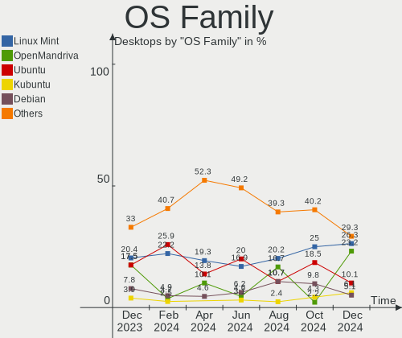

| Name         | Desktops | Percent |
|--------------|----------|---------|
| Linux Mint   | 19       | 22.89%  |
| Ubuntu       | 15       | 18.07%  |
| OpenMandriva | 14       | 16.87%  |
| Debian       | 8        | 9.64%   |
| Fedora       | 6        | 7.23%   |
| Manjaro      | 4        | 4.82%   |
| Zorin        | 3        | 3.61%   |
| Arch         | 3        | 3.61%   |
| Xubuntu      | 2        | 2.41%   |
| Lubuntu      | 2        | 2.41%   |
| Kubuntu      | 2        | 2.41%   |
| ArcoLinux    | 2        | 2.41%   |
| TUXEDO OS    | 1        | 1.2%    |
| Slackware    | 1        | 1.2%    |
| EndeavourOS  | 1        | 1.2%    |

Kernel
------

Version of the Linux kernel

| Version                 | Desktops | Percent |
|-------------------------|----------|---------|
| 6.2.0-39-generic        | 10       | 12.05%  |
| 5.15.0-91-generic       | 9        | 10.84%  |
| 6.5.0-14-generic        | 7        | 8.43%   |
| 6.4.11-desktop-1omv2390 | 5        | 6.02%   |
| 6.6.2-desktop-1omv2390  | 4        | 4.82%   |
| 6.5.0-5-amd64           | 4        | 4.82%   |
| 6.5.0-15-generic        | 3        | 3.61%   |
| 5.15.0-92-generic       | 3        | 3.61%   |
| 6.6.8-arch1-1           | 2        | 2.41%   |
| 6.6.12-200.fc39.x86_64  | 2        | 2.41%   |
| 6.6.11-200.fc39.x86_64  | 2        | 2.41%   |
| 6.6.10-1-MANJARO        | 2        | 2.41%   |
| 6.4.8-desktop-2omv2390  | 2        | 2.41%   |
| 5.4.0-169-generic       | 2        | 2.41%   |
| 5.15.0-76-generic       | 2        | 2.41%   |
| 6.7.2-arch1-1           | 1        | 1.2%    |
| 6.7.0-arch3-1           | 1        | 1.2%    |
| 6.7.0-0-MANJARO         | 1        | 1.2%    |
| 6.7.0                   | 1        | 1.2%    |
| 6.6.9-arch1-1           | 1        | 1.2%    |
| 6.6.8-zen1-1-zen        | 1        | 1.2%    |
| 6.6.8-200.fc39.x86_64   | 1        | 1.2%    |
| 6.6.13-amd64            | 1        | 1.2%    |
| 6.5.6-300.fc39.x86_64   | 1        | 1.2%    |
| 6.5.2-1-rt8-MANJARO     | 1        | 1.2%    |
| 6.5.0-10022-tuxedo      | 1        | 1.2%    |
| 6.2.6-desktop-1omv2390  | 1        | 1.2%    |
| 6.1.61                  | 1        | 1.2%    |
| 6.1.1-desktop-1omv2290  | 1        | 1.2%    |
| 6.1.0-15-amd64          | 1        | 1.2%    |
| 5.3.0-7648-generic      | 1        | 1.2%    |
| 5.19.0-46-generic       | 1        | 1.2%    |
| 5.16.7-desktop-1omv4003 | 1        | 1.2%    |
| 5.15.0-89-generic       | 1        | 1.2%    |
| 5.15.0-88-generic       | 1        | 1.2%    |
| 5.10.0-27-amd64         | 1        | 1.2%    |
| 5.10.0-23-amd64         | 1        | 1.2%    |
| 4.15.0-46-generic       | 1        | 1.2%    |
| 4.15.0-220-generic      | 1        | 1.2%    |

Kernel Family
-------------

Linux kernel without a distro release

| Version | Desktops | Percent |
|---------|----------|---------|
| 5.15.0  | 16       | 19.28%  |
| 6.5.0   | 15       | 18.07%  |
| 6.2.0   | 10       | 12.05%  |
| 6.4.11  | 5        | 6.02%   |
| 6.6.8   | 4        | 4.82%   |
| 6.6.2   | 4        | 4.82%   |
| 6.7.0   | 3        | 3.61%   |
| 6.6.12  | 2        | 2.41%   |
| 6.6.11  | 2        | 2.41%   |
| 6.6.10  | 2        | 2.41%   |
| 6.4.8   | 2        | 2.41%   |
| 5.4.0   | 2        | 2.41%   |
| 5.10.0  | 2        | 2.41%   |
| 4.15.0  | 2        | 2.41%   |
| 6.7.2   | 1        | 1.2%    |
| 6.6.9   | 1        | 1.2%    |
| 6.6.13  | 1        | 1.2%    |
| 6.5.6   | 1        | 1.2%    |
| 6.5.2   | 1        | 1.2%    |
| 6.2.6   | 1        | 1.2%    |
| 6.1.61  | 1        | 1.2%    |
| 6.1.1   | 1        | 1.2%    |
| 6.1.0   | 1        | 1.2%    |
| 5.3.0   | 1        | 1.2%    |
| 5.19.0  | 1        | 1.2%    |
| 5.16.7  | 1        | 1.2%    |

Kernel Major Ver.
-----------------

Linux kernel major version

| Version | Desktops | Percent |
|---------|----------|---------|
| 6.5     | 17       | 20.48%  |
| 6.6     | 16       | 19.28%  |
| 5.15    | 16       | 19.28%  |
| 6.2     | 11       | 13.25%  |
| 6.4     | 7        | 8.43%   |
| 6.7     | 4        | 4.82%   |
| 6.1     | 3        | 3.61%   |
| 5.4     | 2        | 2.41%   |
| 5.10    | 2        | 2.41%   |
| 4.15    | 2        | 2.41%   |
| 5.3     | 1        | 1.2%    |
| 5.19    | 1        | 1.2%    |
| 5.16    | 1        | 1.2%    |

Arch
----

OS architecture (x86_64, i586, etc.)

| Name   | Desktops | Percent |
|--------|----------|---------|
| x86_64 | 83       | 100%    |

DE
--

Desktop Environment

| Name          | Desktops | Percent |
|---------------|----------|---------|
| KDE5          | 26       | 31.33%  |
| GNOME         | 25       | 30.12%  |
| X-Cinnamon    | 18       | 21.69%  |
| XFCE          | 4        | 4.82%   |
| LXQt          | 4        | 4.82%   |
| MATE          | 2        | 2.41%   |
| LXDE          | 1        | 1.2%    |
| i3            | 1        | 1.2%    |
| GNOME Classic | 1        | 1.2%    |
| Unknown       | 1        | 1.2%    |

Display Server
--------------

X11 or Wayland

| Name    | Desktops | Percent |
|---------|----------|---------|
| X11     | 56       | 67.47%  |
| Wayland | 27       | 32.53%  |

Display Manager
---------------

SDDM, LightDM, etc.

| Name    | Desktops | Percent |
|---------|----------|---------|
| SDDM    | 24       | 28.92%  |
| Unknown | 24       | 28.92%  |
| LightDM | 18       | 21.69%  |
| GDM3    | 13       | 15.66%  |
| GDM     | 3        | 3.61%   |
| XDM     | 1        | 1.2%    |

OS Lang
-------

Language

| Lang    | Desktops | Percent |
|---------|----------|---------|
| it_IT   | 60       | 72.29%  |
| en_US   | 11       | 13.25%  |
| Unknown | 6        | 7.23%   |
| C       | 4        | 4.82%   |
| it_CH   | 1        | 1.2%    |
| en_GB   | 1        | 1.2%    |

Boot Mode
---------

EFI or BIOS

| Mode | Desktops | Percent |
|------|----------|---------|
| EFI  | 42       | 50.6%   |
| BIOS | 41       | 49.4%   |

Filesystem
----------

Type of filesystem

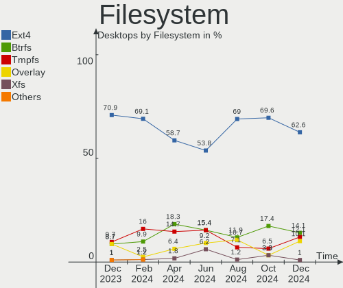

| Type    | Desktops | Percent |
|---------|----------|---------|
| Ext4    | 57       | 68.67%  |
| Tmpfs   | 9        | 10.84%  |
| Overlay | 9        | 10.84%  |
| Btrfs   | 8        | 9.64%   |

Part. scheme
------------

Scheme of partitioning

| Type    | Desktops | Percent |
|---------|----------|---------|
| GPT     | 46       | 55.42%  |
| Unknown | 24       | 28.92%  |
| MBR     | 13       | 15.66%  |

Dual Boot with Linux/BSD
------------------------

Hosting more than one Linux/BSD

| Dual boot | Desktops | Percent |
|-----------|----------|---------|
| No        | 67       | 80.72%  |
| Yes       | 16       | 19.28%  |

Dual Boot (Win)
---------------

Hosting Linux and Windows

| Dual boot | Desktops | Percent |
|-----------|----------|---------|
| No        | 47       | 56.63%  |
| Yes       | 36       | 43.37%  |

Board
-----

Vendor
------

Motherboard manufacturer

| Name                                 | Desktops | Percent |
|--------------------------------------|----------|---------|
| ASUSTek Computer                     | 18       | 21.69%  |
| MSI                                  | 11       | 13.25%  |
| ASRock                               | 9        | 10.84%  |
| Hewlett-Packard                      | 8        | 9.64%   |
| Gigabyte Technology                  | 7        | 8.43%   |
| Dell                                 | 7        | 8.43%   |
| Unknown                              | 4        | 4.82%   |
| Shenzhen Meigao Electronic Equipment | 3        | 3.61%   |
| Lenovo                               | 3        | 3.61%   |
| Intel                                | 2        | 2.41%   |
| Sapphire                             | 1        | 1.2%    |
| Pegatron                             | 1        | 1.2%    |
| Koloe                                | 1        | 1.2%    |
| Huanan                               | 1        | 1.2%    |
| GEEKOM                               | 1        | 1.2%    |
| Fujitsu                              | 1        | 1.2%    |
| Biostar                              | 1        | 1.2%    |
| AOpen                                | 1        | 1.2%    |
| AMI                                  | 1        | 1.2%    |
| AMD                                  | 1        | 1.2%    |
| Acer                                 | 1        | 1.2%    |

Model
-----

Motherboard model

| Name                                            | Desktops | Percent |
|-------------------------------------------------|----------|---------|
| Dell OptiPlex 390                               | 4        | 4.82%   |
| ASUS All Series                                 | 4        | 4.82%   |
| Unknown                                         | 4        | 4.82%   |
| Shenzhen Meigao Electronic Equipment UM690      | 2        | 2.41%   |
| MSI MS-7C52                                     | 2        | 2.41%   |
| HP Compaq Pro 6300 MT                           | 2        | 2.41%   |
| Gigabyte H110M-S2H                              | 2        | 2.41%   |
| ASUS TUF Gaming X570-PLUS                       | 2        | 2.41%   |
| Shenzhen Meigao Electronic Equipment UM773 Lite | 1        | 1.2%    |
| Sapphire PE-AM2RS690V2                          | 1        | 1.2%    |
| Pegatron p6-2053itm                             | 1        | 1.2%    |
| MSI MS-7D93                                     | 1        | 1.2%    |
| MSI MS-7D19                                     | 1        | 1.2%    |
| MSI MS-7C91                                     | 1        | 1.2%    |
| MSI MS-7B93                                     | 1        | 1.2%    |
| MSI MS-7B79                                     | 1        | 1.2%    |
| MSI MS-7976                                     | 1        | 1.2%    |
| MSI MS-7916                                     | 1        | 1.2%    |
| MSI MS-7885                                     | 1        | 1.2%    |
| MSI H310 Gaming Infinite S (MS-B928)            | 1        | 1.2%    |
| Lenovo ThinkCentre M92P 3227ER3                 | 1        | 1.2%    |
| Lenovo ThinkCentre M81 5049RA9                  | 1        | 1.2%    |
| Lenovo ThinkCentre M72e 0896A2G                 | 1        | 1.2%    |
| Koloe Thurley                                   | 1        | 1.2%    |
| Intel Jasper Lake Client Platform               | 1        | 1.2%    |
| Intel DG41AN AAE92991-401                       | 1        | 1.2%    |
| Huanan X99-F8                                   | 1        | 1.2%    |
| HP Z400 Workstation                             | 1        | 1.2%    |
| HP ProDesk 600 G1 SFF                           | 1        | 1.2%    |
| HP F01                                          | 1        | 1.2%    |
| HP Compaq Pro 6300 SFF                          | 1        | 1.2%    |
| HP Compaq 8200 Elite SFF PC                     | 1        | 1.2%    |
| HP 500-524nl                                    | 1        | 1.2%    |
| Gigabyte Z87N-WIFI                              | 1        | 1.2%    |
| Gigabyte H410M S2H V3                           | 1        | 1.2%    |
| Gigabyte GA-K8NF9 Ultra                         | 1        | 1.2%    |
| Gigabyte B550 AORUS ELITE AX V2                 | 1        | 1.2%    |
| Gigabyte B450M DS3H                             | 1        | 1.2%    |
| GEEKOM A5                                       | 1        | 1.2%    |
| Fujitsu ESPRIMO Q920                            | 1        | 1.2%    |

Model Family
------------

Motherboard model prefix

| Name                                       | Desktops | Percent |
|--------------------------------------------|----------|---------|
| Dell OptiPlex                              | 5        | 6.02%   |
| HP Compaq                                  | 4        | 4.82%   |
| ASUS All                                   | 4        | 4.82%   |
| Unknown                                    | 4        | 4.82%   |
| Lenovo ThinkCentre                         | 3        | 3.61%   |
| ASUS ROG                                   | 3        | 3.61%   |
| ASUS M5A97                                 | 3        | 3.61%   |
| Shenzhen Meigao Electronic Equipment UM690 | 2        | 2.41%   |
| MSI MS-7C52                                | 2        | 2.41%   |
| Gigabyte H110M-S2H                         | 2        | 2.41%   |
| ASUS TUF                                   | 2        | 2.41%   |
| ASUS PRIME                                 | 2        | 2.41%   |
| Shenzhen Meigao Electronic Equipment UM773 | 1        | 1.2%    |
| Sapphire PE-AM2RS690V2                     | 1        | 1.2%    |
| Pegatron p6-2053itm                        | 1        | 1.2%    |
| MSI MS-7D93                                | 1        | 1.2%    |
| MSI MS-7D19                                | 1        | 1.2%    |
| MSI MS-7C91                                | 1        | 1.2%    |
| MSI MS-7B93                                | 1        | 1.2%    |
| MSI MS-7B79                                | 1        | 1.2%    |
| MSI MS-7976                                | 1        | 1.2%    |
| MSI MS-7916                                | 1        | 1.2%    |
| MSI MS-7885                                | 1        | 1.2%    |
| MSI H310                                   | 1        | 1.2%    |
| Koloe Thurley                              | 1        | 1.2%    |
| Intel Jasper                               | 1        | 1.2%    |
| Intel DG41AN                               | 1        | 1.2%    |
| Huanan X99-F8                              | 1        | 1.2%    |
| HP Z400                                    | 1        | 1.2%    |
| HP ProDesk                                 | 1        | 1.2%    |
| HP F01                                     | 1        | 1.2%    |
| HP 500-524nl                               | 1        | 1.2%    |
| Gigabyte Z87N-WIFI                         | 1        | 1.2%    |
| Gigabyte H410M                             | 1        | 1.2%    |
| Gigabyte GA-K8NF9                          | 1        | 1.2%    |
| Gigabyte B550                              | 1        | 1.2%    |
| Gigabyte B450M                             | 1        | 1.2%    |
| GEEKOM A5                                  | 1        | 1.2%    |
| Fujitsu ESPRIMO                            | 1        | 1.2%    |
| Dell XPS                                   | 1        | 1.2%    |

MFG Year
--------

Motherboard manufacture year

| Year | Desktops | Percent |
|------|----------|---------|
| 2012 | 11       | 13.25%  |
| 2019 | 9        | 10.84%  |
| 2023 | 7        | 8.43%   |
| 2022 | 7        | 8.43%   |
| 2013 | 7        | 8.43%   |
| 2017 | 6        | 7.23%   |
| 2015 | 6        | 7.23%   |
| 2011 | 6        | 7.23%   |
| 2021 | 4        | 4.82%   |
| 2014 | 4        | 4.82%   |
| 2020 | 3        | 3.61%   |
| 2018 | 3        | 3.61%   |
| 2010 | 3        | 3.61%   |
| 2008 | 3        | 3.61%   |
| 2016 | 2        | 2.41%   |
| 2009 | 1        | 1.2%    |
| 2006 | 1        | 1.2%    |

Form Factor
-----------

Physical design of the computer

| Name    | Desktops | Percent |
|---------|----------|---------|
| Desktop | 83       | 100%    |

Secure Boot
-----------

Enabled or disabled

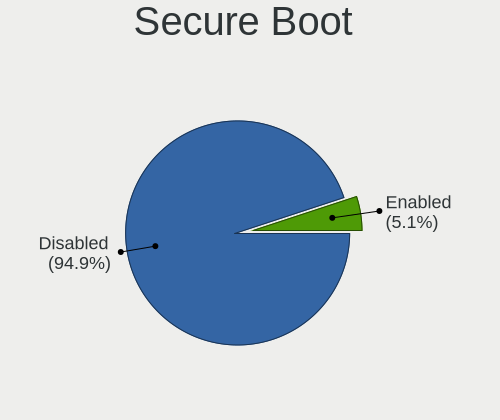

| State    | Desktops | Percent |
|----------|----------|---------|
| Disabled | 81       | 97.59%  |
| Enabled  | 2        | 2.41%   |

Coreboot
--------

Have coreboot on board

| Used | Desktops | Percent |
|------|----------|---------|
| No   | 83       | 100%    |

RAM Size
--------

Total RAM memory

| Size in GB  | Desktops | Percent |
|-------------|----------|---------|
| 16.01-24.0  | 21       | 25.3%   |
| 4.01-8.0    | 18       | 21.69%  |
| 8.01-16.0   | 16       | 19.28%  |
| 32.01-64.0  | 15       | 18.07%  |
| 24.01-32.0  | 6        | 7.23%   |
| 3.01-4.0    | 5        | 6.02%   |
| 64.01-256.0 | 1        | 1.2%    |
| 0.51-1.0    | 1        | 1.2%    |

RAM Used
--------

Used RAM memory

| Used GB    | Desktops | Percent |
|------------|----------|---------|
| 2.01-3.0   | 28       | 33.73%  |
| 1.01-2.0   | 23       | 27.71%  |
| 4.01-8.0   | 12       | 14.46%  |
| 3.01-4.0   | 11       | 13.25%  |
| 0.51-1.0   | 5        | 6.02%   |
| 8.01-16.0  | 3        | 3.61%   |
| 16.01-24.0 | 1        | 1.2%    |

Total Drives
------------

Number of drives on board

| Drives | Desktops | Percent |
|--------|----------|---------|
| 2      | 30       | 36.14%  |
| 1      | 24       | 28.92%  |
| 3      | 23       | 27.71%  |
| 4      | 4        | 4.82%   |
| 5      | 1        | 1.2%    |
| 0      | 1        | 1.2%    |

Has CD-ROM
----------

Has CD-ROM on board

| Presented | Desktops | Percent |
|-----------|----------|---------|
| No        | 45       | 54.22%  |
| Yes       | 38       | 45.78%  |

Has Ethernet
------------

Has Ethernet on board

| Presented | Desktops | Percent |
|-----------|----------|---------|
| Yes       | 83       | 100%    |

Has WiFi
--------

Has WiFi module

| Presented | Desktops | Percent |
|-----------|----------|---------|
| Yes       | 42       | 50.6%   |
| No        | 41       | 49.4%   |

Has Bluetooth
-------------

Has Bluetooth module

| Presented | Desktops | Percent |
|-----------|----------|---------|
| No        | 42       | 50.6%   |
| Yes       | 41       | 49.4%   |

Location
--------

Country
-------

Geographic location (country)

| Country | Desktops | Percent |
|---------|----------|---------|
| Italy   | 83       | 100%    |

City
----

Geographic location (city)

| City                  | Desktops | Percent |
|-----------------------|----------|---------|
| Turin                 | 11       | 13.25%  |
| Milan                 | 11       | 13.25%  |
| Rome                  | 9        | 10.84%  |
| Genoa                 | 4        | 4.82%   |
| Venice                | 2        | 2.41%   |
| Taranto               | 2        | 2.41%   |
| Naples                | 2        | 2.41%   |
| Livorno               | 2        | 2.41%   |
| Florence              | 2        | 2.41%   |
| Erba                  | 2        | 2.41%   |
| Vittoria              | 1        | 1.2%    |
| Vigodarzere           | 1        | 1.2%    |
| Venosa                | 1        | 1.2%    |
| Udine                 | 1        | 1.2%    |
| Trieste               | 1        | 1.2%    |
| Treviso               | 1        | 1.2%    |
| Spinea                | 1        | 1.2%    |
| Siena                 | 1        | 1.2%    |
| Scandolara Ravara     | 1        | 1.2%    |
| Sassari               | 1        | 1.2%    |
| San Vendemiano        | 1        | 1.2%    |
| Rho                   | 1        | 1.2%    |
| Remanzacco            | 1        | 1.2%    |
| Presezzo              | 1        | 1.2%    |
| Perugia               | 1        | 1.2%    |
| Orta di Atella        | 1        | 1.2%    |
| Oristano              | 1        | 1.2%    |
| Monticello Conte Otto | 1        | 1.2%    |
| Monterenzio           | 1        | 1.2%    |
| Milano                | 1        | 1.2%    |
| Marina di Camerota    | 1        | 1.2%    |
| Legnaro               | 1        | 1.2%    |
| Galliate Lombardo     | 1        | 1.2%    |
| Cremona               | 1        | 1.2%    |
| Cesenatico            | 1        | 1.2%    |
| Cerro Maggiore        | 1        | 1.2%    |
| Cernusco sul Naviglio | 1        | 1.2%    |
| Casavatore            | 1        | 1.2%    |
| Camugnano             | 1        | 1.2%    |
| Campobasso            | 1        | 1.2%    |

Drives
------

Drive Vendor
------------

Hard drive vendors

| Vendor                      | Desktops | Drives | Percent |
|-----------------------------|----------|--------|---------|
| WDC                         | 24       | 28     | 15.29%  |
| Samsung Electronics         | 23       | 28     | 14.65%  |
| Seagate                     | 21       | 23     | 13.38%  |
| Kingston                    | 17       | 17     | 10.83%  |
| Crucial                     | 11       | 12     | 7.01%   |
| SanDisk                     | 6        | 6      | 3.82%   |
| Toshiba                     | 4        | 4      | 2.55%   |
| China                       | 4        | 4      | 2.55%   |
| Phison                      | 3        | 5      | 1.91%   |
| Kingston Technology Company | 3        | 3      | 1.91%   |
| Intenso                     | 3        | 3      | 1.91%   |
| Fanxiang                    | 3        | 3      | 1.91%   |
| SPCC                        | 2        | 2      | 1.27%   |
| Micron/Crucial Technology   | 2        | 2      | 1.27%   |
| Micron Technology           | 2        | 2      | 1.27%   |
| Lexar                       | 2        | 2      | 1.27%   |
| A-DATA Technology           | 2        | 2      | 1.27%   |
| XrayDisk                    | 1        | 1      | 0.64%   |
| X12                         | 1        | 1      | 0.64%   |
| TCSUNBOW                    | 1        | 1      | 0.64%   |
| sobetter                    | 1        | 1      | 0.64%   |
| SK hynix                    | 1        | 1      | 0.64%   |
| ROG                         | 1        | 1      | 0.64%   |
| Realtek                     | 1        | 1      | 0.64%   |
| Phison Electronics          | 1        | 1      | 0.64%   |
| Patriot                     | 1        | 1      | 0.64%   |
| OCZ                         | 1        | 1      | 0.64%   |
| Netac                       | 1        | 1      | 0.64%   |
| Maxtor                      | 1        | 1      | 0.64%   |
| KingDian                    | 1        | 1      | 0.64%   |
| Kimtigo                     | 1        | 1      | 0.64%   |
| JMicron Technology          | 1        | 1      | 0.64%   |
| Intel                       | 1        | 1      | 0.64%   |
| Hitachi                     | 1        | 1      | 0.64%   |
| HGST                        | 1        | 1      | 0.64%   |
| GOODRAM                     | 1        | 1      | 0.64%   |
| FIKWOT                      | 1        | 1      | 0.64%   |
| Dogfish                     | 1        | 1      | 0.64%   |
| Corsair                     | 1        | 1      | 0.64%   |
| BAITITON                    | 1        | 1      | 0.64%   |

Drive Model
-----------

Hard drive models

| Model                                              | Desktops | Percent |
|----------------------------------------------------|----------|---------|
| Kingston SA400S37240G 240GB SSD                    | 6        | 3.59%   |
| Samsung SSD 860 EVO 250GB                          | 3        | 1.8%    |
| Crucial CT480BX500SSD1 480GB                       | 3        | 1.8%    |
| WDC WD10EZEX-00BN5A0 1TB                           | 2        | 1.2%    |
| Toshiba HDWD110 1TB                                | 2        | 1.2%    |
| Seagate ST500DM002-1BD142 500GB                    | 2        | 1.2%    |
| Seagate ST31000524AS 1TB                           | 2        | 1.2%    |
| Seagate ST1000DM003-1ER162 1TB                     | 2        | 1.2%    |
| SanDisk SSD PLUS 480GB                             | 2        | 1.2%    |
| Samsung SSD 860 EVO 500GB                          | 2        | 1.2%    |
| Samsung SSD 860 EVO 1TB                            | 2        | 1.2%    |
| Samsung SSD 850 EVO 500GB                          | 2        | 1.2%    |
| Samsung NVMe SSD Controller SM981/PM981/PM983 1TB  | 2        | 1.2%    |
| Samsung NVMe SSD Controller PM9A1/PM9A3/980PRO 2TB | 2        | 1.2%    |
| Lexar SSD NM610PRO 1TB                             | 2        | 1.2%    |
| Kingston SUV400S37240G 240GB SSD                   | 2        | 1.2%    |
| Kingston SA400S37480G 480GB SSD                    | 2        | 1.2%    |
| Intenso SSD Sata III 512GB                         | 2        | 1.2%    |
| Crucial CT500MX500SSD1 500GB                       | 2        | 1.2%    |
| XrayDisk 256GB SSD                                 | 1        | 0.6%    |
| X12 SSD 480GB                                      | 1        | 0.6%    |
| WDC WDS500G2B0C-00PXH0 500GB                       | 1        | 0.6%    |
| WDC WDS480G2G0A-00JH30 480GB SSD                   | 1        | 0.6%    |
| WDC WDS120G2G0A-00JH30 120GB SSD                   | 1        | 0.6%    |
| WDC WD7500KPVT-00HT5T0 752GB                       | 1        | 0.6%    |
| WDC WD60EFAX-68JH4N0 6TB                           | 1        | 0.6%    |
| WDC WD5000AZRX-00A8LB0 500GB                       | 1        | 0.6%    |
| WDC WD5000AZLX-00K2TA0 500GB                       | 1        | 0.6%    |
| WDC WD5000AAKX-60U6AA0 500GB                       | 1        | 0.6%    |
| WDC WD5000AAKX-08U6AA0 500GB                       | 1        | 0.6%    |
| WDC WD5000AAKS-00UU3A0 500GB                       | 1        | 0.6%    |
| WDC WD40EFAX-68JH4N1 4TB                           | 1        | 0.6%    |
| WDC WD4000F9YZ-09N20L0 4TB                         | 1        | 0.6%    |
| WDC WD3200BEKT-60V5T1 320GB                        | 1        | 0.6%    |
| WDC WD3200AAJS-56M0A0 320GB                        | 1        | 0.6%    |
| WDC WD30EZRX-00D8PB0 3TB                           | 1        | 0.6%    |
| WDC WD30EFRX-68EUZN0 3TB                           | 1        | 0.6%    |
| WDC WD20EZRZ-00Z5HB0 2TB                           | 1        | 0.6%    |
| WDC WD20EZRX-00DC0B0 2TB                           | 1        | 0.6%    |
| WDC WD2002FAEX-007BA0 2TB                          | 1        | 0.6%    |

HDD Vendor
----------

Hard disk drive vendors

| Vendor              | Desktops | Drives | Percent |
|---------------------|----------|--------|---------|
| WDC                 | 22       | 25     | 41.51%  |
| Seagate             | 21       | 23     | 39.62%  |
| Toshiba             | 4        | 4      | 7.55%   |
| Samsung Electronics | 3        | 4      | 5.66%   |
| Maxtor              | 1        | 1      | 1.89%   |
| Hitachi             | 1        | 1      | 1.89%   |
| HGST                | 1        | 1      | 1.89%   |

SSD Vendor
----------

Solid state drive vendors

| Vendor              | Desktops | Drives | Percent |
|---------------------|----------|--------|---------|
| Samsung Electronics | 14       | 16     | 19.44%  |
| Kingston            | 14       | 14     | 19.44%  |
| Crucial             | 11       | 12     | 15.28%  |
| China               | 4        | 4      | 5.56%   |
| SanDisk             | 3        | 3      | 4.17%   |
| Intenso             | 3        | 3      | 4.17%   |
| WDC                 | 2        | 2      | 2.78%   |
| SPCC                | 2        | 2      | 2.78%   |
| XrayDisk            | 1        | 1      | 1.39%   |
| X12                 | 1        | 1      | 1.39%   |
| TCSUNBOW            | 1        | 1      | 1.39%   |
| sobetter            | 1        | 1      | 1.39%   |
| ROG                 | 1        | 1      | 1.39%   |
| Patriot             | 1        | 1      | 1.39%   |
| OCZ                 | 1        | 1      | 1.39%   |
| Netac               | 1        | 1      | 1.39%   |
| KingDian            | 1        | 1      | 1.39%   |
| Kimtigo             | 1        | 1      | 1.39%   |
| GOODRAM             | 1        | 1      | 1.39%   |
| FIKWOT              | 1        | 1      | 1.39%   |
| Fanxiang            | 1        | 1      | 1.39%   |
| Dogfish             | 1        | 1      | 1.39%   |
| Corsair             | 1        | 1      | 1.39%   |
| BAITITON            | 1        | 1      | 1.39%   |
| A-DATA Technology   | 1        | 1      | 1.39%   |
| 2.5"                | 1        | 1      | 1.39%   |
| 2-Power             | 1        | 1      | 1.39%   |

Drive Kind
----------

HDD or SSD

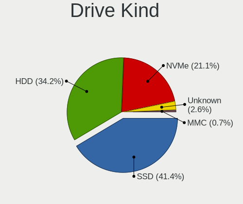

| Kind    | Desktops | Drives | Percent |
|---------|----------|--------|---------|
| SSD     | 57       | 75     | 43.18%  |
| HDD     | 45       | 59     | 34.09%  |
| NVMe    | 29       | 36     | 21.97%  |
| Unknown | 1        | 1      | 0.76%   |

Drive Connector
---------------

SATA, SAS, NVMe, etc.

| Type | Desktops | Drives | Percent |
|------|----------|--------|---------|
| SATA | 74       | 131    | 67.89%  |
| NVMe | 29       | 34     | 26.61%  |
| SAS  | 6        | 6      | 5.5%    |

Drive Size
----------

Size of hard drive

| Size in TB | Desktops | Drives | Percent |
|------------|----------|--------|---------|
| 0.01-0.5   | 55       | 78     | 53.4%   |
| 0.51-1.0   | 31       | 36     | 30.1%   |
| 1.01-2.0   | 9        | 10     | 8.74%   |
| 3.01-4.0   | 3        | 4      | 2.91%   |
| 2.01-3.0   | 3        | 3      | 2.91%   |
| 4.01-10.0  | 2        | 3      | 1.94%   |

Space Total
-----------

Amount of disk space available on the file system

| Size in GB     | Desktops | Percent |
|----------------|----------|---------|
| 101-250        | 22       | 26.51%  |
| 501-1000       | 13       | 15.66%  |
| 251-500        | 10       | 12.05%  |
| 1-20           | 10       | 12.05%  |
| 2001-3000      | 7        | 8.43%   |
| More than 3000 | 6        | 7.23%   |
| 1001-2000      | 6        | 7.23%   |
| 51-100         | 5        | 6.02%   |
| Unknown        | 3        | 3.61%   |
| 21-50          | 1        | 1.2%    |

Space Used
----------

Amount of used disk space

| Used GB        | Desktops | Percent |
|----------------|----------|---------|
| 1-20           | 29       | 34.94%  |
| 51-100         | 13       | 15.66%  |
| 101-250        | 11       | 13.25%  |
| 21-50          | 10       | 12.05%  |
| 501-1000       | 9        | 10.84%  |
| 2001-3000      | 3        | 3.61%   |
| 1001-2000      | 3        | 3.61%   |
| Unknown        | 3        | 3.61%   |
| More than 3000 | 1        | 1.2%    |
| 251-500        | 1        | 1.2%    |

Malfunc. Drives
---------------

Drive models with a malfunction

| Model                             | Desktops | Drives | Percent |
|-----------------------------------|----------|--------|---------|
| Seagate ST500DM002-1BD142 500GB   | 2        | 2      | 18.18%  |
| WDC WD5000AAKX-60U6AA0 500GB      | 1        | 1      | 9.09%   |
| WDC WD3200AAJS-56M0A0 320GB       | 1        | 1      | 9.09%   |
| WDC WD2002FAEX-007BA0 2TB         | 1        | 1      | 9.09%   |
| Seagate ST1000DM010-2EP102 1TB    | 1        | 1      | 9.09%   |
| SanDisk SSD PLUS 480GB            | 1        | 1      | 9.09%   |
| Samsung Electronics SP2014N 200GB | 1        | 2      | 9.09%   |
| OCZ VECTOR150 120GB SSD           | 1        | 1      | 9.09%   |
| HGST HTS545050A7E680 500GB        | 1        | 1      | 9.09%   |
| Crucial CT275MX300SSD1 275GB      | 1        | 1      | 9.09%   |

Malfunc. Drive Vendor
---------------------

Vendors of faulty drives

| Vendor              | Desktops | Drives | Percent |
|---------------------|----------|--------|---------|
| WDC                 | 3        | 3      | 27.27%  |
| Seagate             | 3        | 3      | 27.27%  |
| SanDisk             | 1        | 1      | 9.09%   |
| Samsung Electronics | 1        | 2      | 9.09%   |
| OCZ                 | 1        | 1      | 9.09%   |
| HGST                | 1        | 1      | 9.09%   |
| Crucial             | 1        | 1      | 9.09%   |

Malfunc. HDD Vendor
-------------------

Vendors of faulty HDD drives

| Vendor              | Desktops | Drives | Percent |
|---------------------|----------|--------|---------|
| WDC                 | 3        | 3      | 37.5%   |
| Seagate             | 3        | 3      | 37.5%   |
| Samsung Electronics | 1        | 2      | 12.5%   |
| HGST                | 1        | 1      | 12.5%   |

Malfunc. Drive Kind
-------------------

Kinds of faulty drives

| Kind | Desktops | Drives | Percent |
|------|----------|--------|---------|
| HDD  | 7        | 9      | 70%     |
| SSD  | 3        | 3      | 30%     |

Failed Drives
-------------

Failed drive models

Zero info for selected period =(

Failed Drive Vendor
-------------------

Failed drive vendors

Zero info for selected period =(

Drive Status
------------

Number of failed and malfunc. drives

| Status   | Desktops | Drives | Percent |
|----------|----------|--------|---------|
| Works    | 47       | 93     | 51.09%  |
| Detected | 35       | 66     | 38.04%  |
| Malfunc  | 10       | 12     | 10.87%  |

Storage controller
------------------

Storage Vendor
--------------

Storage controller vendors

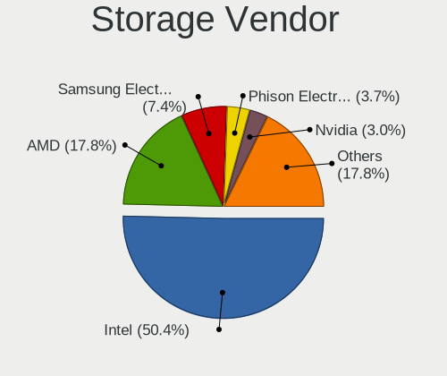

| Vendor                      | Desktops | Percent |
|-----------------------------|----------|---------|
| Intel                       | 52       | 41.6%   |
| AMD                         | 27       | 21.6%   |
| Samsung Electronics         | 8        | 6.4%    |
| ASMedia Technology          | 8        | 6.4%    |
| Kingston Technology Company | 5        | 4%      |
| SanDisk                     | 4        | 3.2%    |
| Phison Electronics          | 4        | 3.2%    |
| MAXIO Technology (Hangzhou) | 4        | 3.2%    |
| Marvell Technology Group    | 3        | 2.4%    |
| Micron/Crucial Technology   | 2        | 1.6%    |
| Micron Technology           | 2        | 1.6%    |
| JMicron Technology          | 2        | 1.6%    |
| VIA Technologies            | 1        | 0.8%    |
| SK hynix                    | 1        | 0.8%    |
| Nvidia                      | 1        | 0.8%    |
| ADATA Technology            | 1        | 0.8%    |

Storage Model
-------------

Storage controller models

| Model                                                                                   | Desktops | Percent |
|-----------------------------------------------------------------------------------------|----------|---------|
| AMD FCH SATA Controller [AHCI mode]                                                     | 13       | 8.97%   |
| ASMedia ASM1061/ASM1062 Serial ATA Controller                                           | 8        | 5.52%   |
| Intel 8 Series/C220 Series Chipset Family 6-port SATA Controller 1 [AHCI mode]          | 7        | 4.83%   |
| Intel 7 Series/C210 Series Chipset Family 6-port SATA Controller [AHCI mode]            | 7        | 4.83%   |
| Intel Q170/Q150/B150/H170/H110/Z170/CM236 Chipset SATA Controller [AHCI Mode]           | 6        | 4.14%   |
| Intel 6 Series/C200 Series Chipset Family Desktop SATA Controller (IDE mode, ports 4-5) | 6        | 4.14%   |
| Intel 6 Series/C200 Series Chipset Family Desktop SATA Controller (IDE mode, ports 0-3) | 6        | 4.14%   |
| Samsung NVMe SSD Controller SM981/PM981/PM983                                           | 4        | 2.76%   |
| Samsung NVMe SSD Controller PM9A1/PM9A3/980PRO                                          | 3        | 2.07%   |
| MAXIO (Hangzhou) NVMe SSD Controller MAP1202 (DRAM-less)                                | 3        | 2.07%   |
| AMD SB7x0/SB8x0/SB9x0 SATA Controller [AHCI mode]                                       | 3        | 2.07%   |
| AMD 400 Series Chipset SATA Controller                                                  | 3        | 2.07%   |
| Phison E12 NVMe Controller                                                              | 2        | 1.38%   |
| Kingston Company A2000 NVMe SSD SM2263EN                                                | 2        | 1.38%   |
| Intel SATA Controller [RAID mode]                                                       | 2        | 1.38%   |
| Intel Celeron/Pentium Silver Processor SATA Controller                                  | 2        | 1.38%   |
| Intel C610/X99 series chipset sSATA Controller [AHCI mode]                              | 2        | 1.38%   |
| Intel C610/X99 series chipset 6-Port SATA Controller [AHCI mode]                        | 2        | 1.38%   |
| Intel 6 Series/C200 Series Chipset Family 6 port Desktop SATA AHCI Controller           | 2        | 1.38%   |
| Intel 500 Series Chipset Family SATA AHCI Controller                                    | 2        | 1.38%   |
| Intel 200 Series PCH SATA controller [AHCI mode]                                        | 2        | 1.38%   |
| AMD FCH SATA Controller D                                                               | 2        | 1.38%   |
| AMD FCH RAID Controller                                                                 | 2        | 1.38%   |
| AMD 600 Series Chipset SATA Controller                                                  | 2        | 1.38%   |
| AMD 300 Series Chipset SATA Controller                                                  | 2        | 1.38%   |
| VIA VT82C586A/B/VT82C686/A/B/VT823x/A/C PIPC Bus Master IDE                             | 1        | 0.69%   |
| VIA VT8237A SATA 2-Port Controller                                                      | 1        | 0.69%   |
| SK hynix Platinum P41/PC801 NVMe Solid State Drive                                      | 1        | 0.69%   |
| SanDisk WD PC SN810 / Black SN850 NVMe SSD                                              | 1        | 0.69%   |
| SanDisk WD Blue SN500 / PC SN520 x2 M.2 2280 NVMe SSD                                   | 1        | 0.69%   |
| Sandisk WD Black SN850X NVMe SSD                                                        | 1        | 0.69%   |
| SanDisk Ultra 3D / WD Blue SN550 NVMe SSD                                               | 1        | 0.69%   |
| Samsung NVMe SSD Controller SM961/PM961/SM963                                           | 1        | 0.69%   |
| Phison E18 PCIe4 NVMe Controller                                                        | 1        | 0.69%   |
| Phison E16 PCIe4 NVMe Controller                                                        | 1        | 0.69%   |
| Nvidia CK804 IDE                                                                        | 1        | 0.69%   |
| Micron/Crucial P5 Plus NVMe PCIe SSD                                                    | 1        | 0.69%   |
| Micron/Crucial P2 [Nick P2] / P3 / P3 Plus NVMe PCIe SSD (DRAM-less)                    | 1        | 0.69%   |
| Micron 2300 NVMe SSD [Santana]                                                          | 1        | 0.69%   |
| Micron 2210 NVMe SSD [Cobain]                                                           | 1        | 0.69%   |

Storage Kind
------------

Kind of storage controller (IDE, SATA, NVMe, SAS, ...)

| Kind | Desktops | Percent |
|------|----------|---------|
| SATA | 69       | 58.47%  |
| NVMe | 29       | 24.58%  |
| IDE  | 14       | 11.86%  |
| RAID | 6        | 5.08%   |

Processor
---------

CPU Vendor
----------

Processor vendors

| Vendor | Desktops | Percent |
|--------|----------|---------|
| Intel  | 53       | 63.86%  |
| AMD    | 30       | 36.14%  |

CPU Model
---------

Processor models

| Model                                       | Desktops | Percent |
|---------------------------------------------|----------|---------|
| Intel Core i7-3770 CPU @ 3.40GHz            | 4        | 4.82%   |
| Intel Core i5-2400 CPU @ 3.10GHz            | 4        | 4.82%   |
| Intel Core i7-6700 CPU @ 3.40GHz            | 2        | 2.41%   |
| Intel Core i7-4770K CPU @ 3.50GHz           | 2        | 2.41%   |
| Intel Core i5-3470 CPU @ 3.20GHz            | 2        | 2.41%   |
| AMD Ryzen 9 6900HX with Radeon Graphics     | 2        | 2.41%   |
| AMD Ryzen 9 5950X 16-Core Processor         | 2        | 2.41%   |
| AMD Ryzen 5 3600 6-Core Processor           | 2        | 2.41%   |
| Intel Xeon CPU W3550 @ 3.07GHz              | 1        | 1.2%    |
| Intel Xeon CPU E5-2678 v3 @ 2.50GHz         | 1        | 1.2%    |
| Intel Pentium Dual-Core CPU E6700 @ 3.20GHz | 1        | 1.2%    |
| Intel Pentium CPU G4500 @ 3.50GHz           | 1        | 1.2%    |
| Intel Pentium CPU G4400 @ 3.30GHz           | 1        | 1.2%    |
| Intel Pentium 4 CPU 3.00GHz                 | 1        | 1.2%    |
| Intel N95                                   | 1        | 1.2%    |
| Intel Core i9-9900K CPU @ 3.60GHz           | 1        | 1.2%    |
| Intel Core i7-6800K CPU @ 3.40GHz           | 1        | 1.2%    |
| Intel Core i7-6700K CPU @ 4.00GHz           | 1        | 1.2%    |
| Intel Core i7-4790K CPU @ 4.00GHz           | 1        | 1.2%    |
| Intel Core i7-4770S CPU @ 3.10GHz           | 1        | 1.2%    |
| Intel Core i7-10810U CPU @ 1.10GHz          | 1        | 1.2%    |
| Intel Core i7-10700K CPU @ 3.80GHz          | 1        | 1.2%    |
| Intel Core i7 CPU 920 @ 2.67GHz             | 1        | 1.2%    |
| Intel Core i5-9400F CPU @ 2.90GHz           | 1        | 1.2%    |
| Intel Core i5-8600K CPU @ 3.60GHz           | 1        | 1.2%    |
| Intel Core i5-8500 CPU @ 3.00GHz            | 1        | 1.2%    |
| Intel Core i5-8365UE CPU @ 1.60GHz          | 1        | 1.2%    |
| Intel Core i5-4590T CPU @ 2.00GHz           | 1        | 1.2%    |
| Intel Core i5-4460 CPU @ 3.20GHz            | 1        | 1.2%    |
| Intel Core i5-3570K CPU @ 3.40GHz           | 1        | 1.2%    |
| Intel Core i5-3570 CPU @ 3.40GHz            | 1        | 1.2%    |
| Intel Core i5-10400F CPU @ 2.90GHz          | 1        | 1.2%    |
| Intel Core i5 CPU 650 @ 3.20GHz             | 1        | 1.2%    |
| Intel Core i3-6100 CPU @ 3.70GHz            | 1        | 1.2%    |
| Intel Core i3-4170 CPU @ 3.70GHz            | 1        | 1.2%    |
| Intel Core i3-4160 CPU @ 3.60GHz            | 1        | 1.2%    |
| Intel Core i3-3240 CPU @ 3.40GHz            | 1        | 1.2%    |
| Intel Core i3-2120 CPU @ 3.30GHz            | 1        | 1.2%    |
| Intel Core i3-2100 CPU @ 3.10GHz            | 1        | 1.2%    |
| Intel Core 2 Quad CPU Q9650 @ 3.00GHz       | 1        | 1.2%    |

CPU Model Family
----------------

Processor model prefix

| Model                   | Desktops | Percent |
|-------------------------|----------|---------|
| Intel Core i5           | 16       | 19.28%  |
| Intel Core i7           | 15       | 18.07%  |
| Intel Core i3           | 6        | 7.23%   |
| AMD Ryzen 9             | 6        | 7.23%   |
| AMD Ryzen 7             | 6        | 7.23%   |
| AMD Ryzen 5             | 6        | 7.23%   |
| Other                   | 4        | 4.82%   |
| AMD FX                  | 4        | 4.82%   |
| Intel Celeron           | 3        | 3.61%   |
| Intel Xeon              | 2        | 2.41%   |
| Intel Pentium           | 2        | 2.41%   |
| AMD Athlon              | 2        | 2.41%   |
| AMD A10                 | 2        | 2.41%   |
| Intel Pentium Dual-Core | 1        | 1.2%    |
| Intel Pentium 4         | 1        | 1.2%    |
| Intel Core i9           | 1        | 1.2%    |
| Intel Core 2 Quad       | 1        | 1.2%    |
| Intel Core 2 Duo        | 1        | 1.2%    |
| AMD Phenom II X4        | 1        | 1.2%    |
| AMD Athlon 64           | 1        | 1.2%    |
| AMD A6                  | 1        | 1.2%    |
| AMD A4                  | 1        | 1.2%    |

CPU Cores
---------

Number of processor cores

| Number | Desktops | Percent |
|--------|----------|---------|
| 4      | 33       | 39.76%  |
| 2      | 16       | 19.28%  |
| 6      | 12       | 14.46%  |
| 8      | 11       | 13.25%  |
| 12     | 4        | 4.82%   |
| 16     | 3        | 3.61%   |
| 1      | 3        | 3.61%   |
| 3      | 1        | 1.2%    |

CPU Sockets
-----------

Number of sockets

| Number | Desktops | Percent |
|--------|----------|---------|
| 1      | 83       | 100%    |

CPU Threads
-----------

Threads per core (Hyper-Threading)

| Number | Desktops | Percent |
|--------|----------|---------|
| 2      | 58       | 69.88%  |
| 1      | 25       | 30.12%  |

CPU Op-Modes
------------

CPU Operation Modes (32-bit, 64-bit)

| Op mode        | Desktops | Percent |
|----------------|----------|---------|
| 32-bit, 64-bit | 83       | 100%    |

CPU Microcode
-------------

Microcode number

| Number     | Desktops | Percent |
|------------|----------|---------|
| Unknown    | 45       | 54.22%  |
| 0x506e3    | 3        | 3.61%   |
| 0x306c3    | 3        | 3.61%   |
| 0x306a9    | 3        | 3.61%   |
| 0x0a404102 | 3        | 3.61%   |
| 0x06000852 | 3        | 3.61%   |
| 0x0a601206 | 2        | 2.41%   |
| 0x08701030 | 2        | 2.41%   |
| 0x0800820d | 2        | 2.41%   |
| 0xa0671    | 1        | 1.2%    |
| 0xa0655    | 1        | 1.2%    |
| 0x906ea    | 1        | 1.2%    |
| 0x206a7    | 1        | 1.2%    |
| 0x106a5    | 1        | 1.2%    |
| 0x0a50000f | 1        | 1.2%    |
| 0x0a50000d | 1        | 1.2%    |
| 0x0a20120a | 1        | 1.2%    |
| 0x0a20102b | 1        | 1.2%    |
| 0x0a201009 | 1        | 1.2%    |
| 0x08701021 | 1        | 1.2%    |
| 0x08108109 | 1        | 1.2%    |
| 0x08101016 | 1        | 1.2%    |
| 0x08001138 | 1        | 1.2%    |
| 0x06001119 | 1        | 1.2%    |
| 0x03000027 | 1        | 1.2%    |
| 0x010000db | 1        | 1.2%    |

CPU Microarch
-------------

Microarchitecture

| Name             | Desktops | Percent |
|------------------|----------|---------|
| IvyBridge        | 9        | 10.84%  |
| Haswell          | 9        | 10.84%  |
| Piledriver       | 7        | 8.43%   |
| Zen 3            | 6        | 7.23%   |
| Skylake          | 6        | 7.23%   |
| SandyBridge      | 6        | 7.23%   |
| KabyLake         | 5        | 6.02%   |
| Unknown          | 5        | 6.02%   |
| Zen 2            | 4        | 4.82%   |
| Zen+             | 3        | 3.61%   |
| Penryn           | 3        | 3.61%   |
| CometLake        | 3        | 3.61%   |
| Zen              | 2        | 2.41%   |
| Nehalem          | 2        | 2.41%   |
| Goldmont plus    | 2        | 2.41%   |
| Alderlake Hybrid | 2        | 2.41%   |
| Westmere         | 1        | 1.2%    |
| Tremont          | 1        | 1.2%    |
| NetBurst         | 1        | 1.2%    |
| K8 Hammer        | 1        | 1.2%    |
| K10 Llano        | 1        | 1.2%    |
| K10              | 1        | 1.2%    |
| Icelake          | 1        | 1.2%    |
| Gracemont        | 1        | 1.2%    |
| Broadwell        | 1        | 1.2%    |

Graphics
--------

GPU Vendor
----------

Vendors of graphics cards

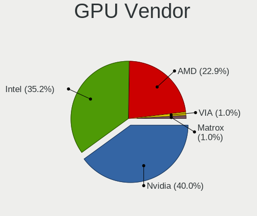

| Vendor | Desktops | Percent |
|--------|----------|---------|
| AMD    | 36       | 40.91%  |
| Intel  | 28       | 31.82%  |
| Nvidia | 24       | 27.27%  |

GPU Model
---------

Graphics card models

| Model                                                                       | Desktops | Percent |
|-----------------------------------------------------------------------------|----------|---------|
| Intel 2nd Generation Core Processor Family Integrated Graphics Controller   | 6        | 6.38%   |
| Nvidia GK208B [GeForce GT 710]                                              | 5        | 5.32%   |
| AMD Ellesmere [Radeon RX 470/480/570/570X/580/580X/590]                     | 5        | 5.32%   |
| AMD Caicos [Radeon HD 6450/7450/8450 / R5 230 OEM]                          | 5        | 5.32%   |
| Intel Xeon E3-1200 v3/4th Gen Core Processor Integrated Graphics Controller | 3        | 3.19%   |
| Intel IvyBridge GT2 [HD Graphics 4000]                                      | 3        | 3.19%   |
| AMD Rembrandt [Radeon 680M]                                                 | 3        | 3.19%   |
| Nvidia TU117 [GeForce GTX 1650]                                             | 2        | 2.13%   |
| Nvidia TU104 [GeForce RTX 2070 SUPER]                                       | 2        | 2.13%   |
| Nvidia GF119 [GeForce GT 610]                                               | 2        | 2.13%   |
| Intel HD Graphics 530                                                       | 2        | 2.13%   |
| Intel GeminiLake [UHD Graphics 600]                                         | 2        | 2.13%   |
| Intel CoffeeLake-S GT2 [UHD Graphics 630]                                   | 2        | 2.13%   |
| AMD Raphael                                                                 | 2        | 2.13%   |
| AMD Navi 22 [Radeon RX 6700/6700 XT/6750 XT / 6800M/6850M XT]               | 2        | 2.13%   |
| AMD Navi 21 [Radeon RX 6800/6800 XT / 6900 XT]                              | 2        | 2.13%   |
| AMD Cezanne [Radeon Vega Series / Radeon Vega Mobile Series]                | 2        | 2.13%   |
| Nvidia TU106 [GeForce RTX 2070 Rev. A]                                      | 1        | 1.06%   |
| Nvidia TU106 [GeForce RTX 2060 Rev. A]                                      | 1        | 1.06%   |
| Nvidia TU104 [GeForce RTX 2080 SUPER]                                       | 1        | 1.06%   |
| Nvidia TU104 [GeForce RTX 2060]                                             | 1        | 1.06%   |
| Nvidia GT218 [GeForce 210]                                                  | 1        | 1.06%   |
| Nvidia GP108 [GeForce GT 1030]                                              | 1        | 1.06%   |
| Nvidia GP106 [GeForce GTX 1060 6GB]                                         | 1        | 1.06%   |
| Nvidia GP106 [GeForce GTX 1060 3GB]                                         | 1        | 1.06%   |
| Nvidia GP104 [GeForce GTX 1080]                                             | 1        | 1.06%   |
| Nvidia GM107 [GeForce GTX 750]                                              | 1        | 1.06%   |
| Nvidia GF108GL [Quadro 600]                                                 | 1        | 1.06%   |
| Nvidia GA104 [GeForce RTX 3070]                                             | 1        | 1.06%   |
| Nvidia AD102 [GeForce RTX 4090]                                             | 1        | 1.06%   |
| Intel Xeon E3-1200 v2/3rd Gen Core processor Graphics Controller            | 1        | 1.06%   |
| Intel WhiskeyLake-U GT2 [UHD Graphics 620]                                  | 1        | 1.06%   |
| Intel Raptor Lake-S GT1 [UHD Graphics 770]                                  | 1        | 1.06%   |
| Intel Mobile GM965/GL960 Integrated Graphics Controller (secondary)         | 1        | 1.06%   |
| Intel Mobile GM965/GL960 Integrated Graphics Controller (primary)           | 1        | 1.06%   |
| Intel JasperLake [UHD Graphics]                                             | 1        | 1.06%   |
| Intel Comet Lake UHD Graphics                                               | 1        | 1.06%   |
| Intel AlderLake-S GT1                                                       | 1        | 1.06%   |
| Intel Alder Lake-N [UHD Graphics]                                           | 1        | 1.06%   |
| Intel 4th Generation Core Processor Family Integrated Graphics Controller   | 1        | 1.06%   |

GPU Combo
---------

Combinations of graphics cards

| Name           | Desktops | Percent |
|----------------|----------|---------|
| 1 x AMD        | 29       | 34.94%  |
| 1 x Intel      | 24       | 28.92%  |
| 1 x Nvidia     | 22       | 26.51%  |
| 2 x AMD        | 6        | 7.23%   |
| Intel + Nvidia | 1        | 1.2%    |
| AMD + Nvidia   | 1        | 1.2%    |

GPU Driver
----------

Free vs proprietary

| Driver      | Desktops | Percent |
|-------------|----------|---------|
| Free        | 68       | 81.93%  |
| Proprietary | 15       | 18.07%  |

GPU Memory
----------

Total video memory

| Size in GB | Desktops | Percent |
|------------|----------|---------|
| Unknown    | 34       | 40.96%  |
| 0.51-1.0   | 12       | 14.46%  |
| 1.01-2.0   | 10       | 12.05%  |
| 7.01-8.0   | 9        | 10.84%  |
| 3.01-4.0   | 4        | 4.82%   |
| 0.01-0.5   | 4        | 4.82%   |
| 2.01-3.0   | 3        | 3.61%   |
| 8.01-16.0  | 3        | 3.61%   |
| 5.01-6.0   | 2        | 2.41%   |
| 16.01-24.0 | 2        | 2.41%   |

Monitor
-------

Monitor Vendor
--------------

Monitor vendors

| Vendor               | Desktops | Percent |
|----------------------|----------|---------|
| Samsung Electronics  | 19       | 21.35%  |
| Philips              | 13       | 14.61%  |
| Goldstar             | 11       | 12.36%  |
| Hewlett-Packard      | 10       | 11.24%  |
| BenQ                 | 5        | 5.62%   |
| Acer                 | 4        | 4.49%   |
| HannStar             | 3        | 3.37%   |
| Dell                 | 3        | 3.37%   |
| Ancor Communications | 3        | 3.37%   |
| Sony                 | 2        | 2.25%   |
| RTK                  | 2        | 2.25%   |
| ASUSTek Computer     | 2        | 2.25%   |
| TCL                  | 1        | 1.12%   |
| QBell                | 1        | 1.12%   |
| MStar                | 1        | 1.12%   |
| MSI                  | 1        | 1.12%   |
| Mi                   | 1        | 1.12%   |
| JWY                  | 1        | 1.12%   |
| Iiyama               | 1        | 1.12%   |
| Hyundai ImageQuest   | 1        | 1.12%   |
| HVR                  | 1        | 1.12%   |
| HKC                  | 1        | 1.12%   |
| Eizo                 | 1        | 1.12%   |
| AOC                  | 1        | 1.12%   |

Monitor Model
-------------

Monitor models

| Model                                                                | Desktops | Percent |
|----------------------------------------------------------------------|----------|---------|
| Philips 190SW PHL086D 1440x900 408x255mm 18.9-inch                   | 4        | 4.35%   |
| Samsung Electronics C27F390 SAM0D32 1920x1080 598x336mm 27.0-inch    | 3        | 3.26%   |
| Samsung Electronics SyncMaster SAM01B7 1280x1024 338x270mm 17.0-inch | 2        | 2.17%   |
| Samsung Electronics S24F350 SAM0D20 1920x1080 521x293mm 23.5-inch    | 2        | 2.17%   |
| RTK TV RTK0001 3840x2160                                             | 2        | 2.17%   |
| Philips PHL 276E8V PHLC18F 3840x2160 597x336mm 27.0-inch             | 2        | 2.17%   |
| Goldstar HDR 4K GSM7707 3840x2160 600x340mm 27.2-inch                | 2        | 2.17%   |
| TCL SMART TV TCL6586 3840x2160 1209x680mm 54.6-inch                  | 1        | 1.09%   |
| Sony TV SNY6604 1920x1080                                            | 1        | 1.09%   |
| Sony TV *00 SNY7C04 3840x2160 1085x610mm 49.0-inch                   | 1        | 1.09%   |
| Samsung Electronics T27C350 SAM0AC5 1920x1080 598x336mm 27.0-inch    | 1        | 1.09%   |
| Samsung Electronics T22D390 SAM0B6B 1920x1080 477x268mm 21.5-inch    | 1        | 1.09%   |
| Samsung Electronics T22B300 SAM092D 1920x1080 477x268mm 21.5-inch    | 1        | 1.09%   |
| Samsung Electronics SyncMaster SAM0304 1680x1050 494x320mm 23.2-inch | 1        | 1.09%   |
| Samsung Electronics S27F350 SAM0D22 1920x1080 598x336mm 27.0-inch    | 1        | 1.09%   |
| Samsung Electronics S24C450 SAM09CA 1920x1080 531x299mm 24.0-inch    | 1        | 1.09%   |
| Samsung Electronics S24C36x SAM7314 1920x1080 521x293mm 23.5-inch    | 1        | 1.09%   |
| Samsung Electronics S22F350 SAM0D1A 1920x1080 477x268mm 21.5-inch    | 1        | 1.09%   |
| Samsung Electronics S22D300 SAM0B3E 1920x1080 477x268mm 21.5-inch    | 1        | 1.09%   |
| Samsung Electronics LF27T35 SAM707F 1920x1080 598x337mm 27.0-inch    | 1        | 1.09%   |
| Samsung Electronics LCD Monitor SAM0669 1920x1080                    | 1        | 1.09%   |
| Samsung Electronics LC24T55 SAM7021 1920x1080 530x280mm 23.6-inch    | 1        | 1.09%   |
| QBell 216KKMR QBL800F 1920x1080 360x270mm 17.7-inch                  | 1        | 1.09%   |
| Philips PHL 271V8 PHLC213 1920x1080 598x336mm 27.0-inch              | 1        | 1.09%   |
| Philips PHL 242S1 PHL0944 1920x1080 527x296mm 23.8-inch              | 1        | 1.09%   |
| Philips PHL 223V5 PHLC0CF 1920x1080 477x268mm 21.5-inch              | 1        | 1.09%   |
| Philips 27M1C5200W PHLC30C 1920x1080 598x336mm 27.0-inch             | 1        | 1.09%   |
| Philips 22PFL3404D PHLD05D 1920x1080 640x360mm 28.9-inch             | 1        | 1.09%   |
| Philips 196VL PHLC07F 1366x768 409x230mm 18.5-inch                   | 1        | 1.09%   |
| Philips 190S PHL083F 1280x1024 380x300mm 19.1-inch                   | 1        | 1.09%   |
| MStar DIGITAL MST2150 1920x1080 453x255mm 20.5-inch                  | 1        | 1.09%   |
| MSI G281UV MSI4CC8 3840x2160 621x341mm 27.9-inch                     | 1        | 1.09%   |
| Mi Monitor XMI23C3 1920x1080 527x293mm 23.7-inch                     | 1        | 1.09%   |
| JWY '' JWY1733 1280x1024 340x270mm 17.1-inch                         | 1        | 1.09%   |
| Iiyama PL2760H IVM664A 1920x1080 598x336mm 27.0-inch                 | 1        | 1.09%   |
| Hyundai ImageQuest W24XD DSUB IQT900D 1920x1080 520x320mm 24.0-inch  | 1        | 1.09%   |
| HVR HTC-VIVE HVRAA01 2160x1200                                       | 1        | 1.09%   |
| HKC 24S2 HKC2380 1920x1080 530x290mm 23.8-inch                       | 1        | 1.09%   |
| Hewlett-Packard Z23i HWP308F 1920x1080 509x286mm 23.0-inch           | 1        | 1.09%   |
| Hewlett-Packard X27i HPN3679 2560x1440 597x336mm 27.0-inch           | 1        | 1.09%   |

Monitor Resolution
------------------

Monitor screen resolution

| Resolution         | Desktops | Percent |
|--------------------|----------|---------|
| 1920x1080 (FHD)    | 45       | 53.57%  |
| 3840x2160 (4K)     | 12       | 14.29%  |
| 1440x900 (WXGA+)   | 8        | 9.52%   |
| 1280x1024 (SXGA)   | 7        | 8.33%   |
| 2560x1440 (QHD)    | 3        | 3.57%   |
| 1680x1050 (WSXGA+) | 3        | 3.57%   |
| 1600x900 (HD+)     | 2        | 2.38%   |
| 3840x1600          | 1        | 1.19%   |
| 2560x1080          | 1        | 1.19%   |
| 2160x1200          | 1        | 1.19%   |
| 1366x768 (WXGA)    | 1        | 1.19%   |

Monitor Diagonal
----------------

Diagonal size in inches

| Inches  | Desktops | Percent |
|---------|----------|---------|
| 27      | 22       | 24.72%  |
| 24      | 11       | 12.36%  |
| 23      | 10       | 11.24%  |
| 18      | 9        | 10.11%  |
| 21      | 8        | 8.99%   |
| 17      | 5        | 5.62%   |
| 72      | 3        | 3.37%   |
| 40      | 3        | 3.37%   |
| 31      | 3        | 3.37%   |
| 20      | 3        | 3.37%   |
| 19      | 3        | 3.37%   |
| 22      | 2        | 2.25%   |
| Unknown | 2        | 2.25%   |
| 65      | 1        | 1.12%   |
| 54      | 1        | 1.12%   |
| 37      | 1        | 1.12%   |
| 34      | 1        | 1.12%   |
| 28      | 1        | 1.12%   |

Monitor Width
-------------

Physical width

| Width in mm | Desktops | Percent |
|-------------|----------|---------|
| 501-600     | 35       | 41.67%  |
| 401-500     | 23       | 27.38%  |
| 601-700     | 6        | 7.14%   |
| 801-900     | 4        | 4.76%   |
| 351-400     | 4        | 4.76%   |
| 301-350     | 4        | 4.76%   |
| 1501-2000   | 3        | 3.57%   |
| 1001-1500   | 2        | 2.38%   |
| Unknown     | 2        | 2.38%   |
| 701-800     | 1        | 1.19%   |

Aspect Ratio
------------

Proportional relationship between the width and the height

| Ratio | Desktops | Percent |
|-------|----------|---------|
| 16/9  | 56       | 70.89%  |
| 16/10 | 12       | 15.19%  |
| 5/4   | 7        | 8.86%   |
| 21/9  | 2        | 2.53%   |
| 4/3   | 1        | 1.27%   |
| 3/2   | 1        | 1.27%   |

Monitor Area
------------

Area in inch

| Area in inch | Desktops | Percent |
|----------------|----------|---------|
| 201-250        | 26       | 29.55%  |
| 301-350        | 22       | 25%     |
| 151-200        | 16       | 18.18%  |
| 351-500        | 6        | 6.82%   |
| More than 1000 | 5        | 5.68%   |
| 141-150        | 5        | 5.68%   |
| 251-300        | 3        | 3.41%   |
| 501-1000       | 3        | 3.41%   |
| Unknown        | 2        | 2.27%   |

Pixel Density
-------------

Pixels per inch

| Density | Desktops | Percent |
|---------|----------|---------|
| 51-100  | 59       | 71.08%  |
| 101-120 | 12       | 14.46%  |
| 121-160 | 5        | 6.02%   |
| 1-50    | 3        | 3.61%   |
| 161-240 | 2        | 2.41%   |
| Unknown | 2        | 2.41%   |

Multiple Monitors
-----------------

Total monitors connected

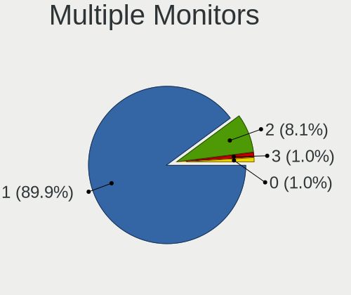

| Total | Desktops | Percent |
|-------|----------|---------|
| 1     | 69       | 83.13%  |
| 2     | 13       | 15.66%  |
| 3     | 1        | 1.2%    |

Network
-------

Net Controller Vendor
---------------------

Controller vendors

| Vendor                     | Desktops | Percent |
|----------------------------|----------|---------|
| Realtek Semiconductor      | 56       | 46.67%  |
| Intel                      | 29       | 24.17%  |
| Qualcomm Atheros           | 12       | 10%     |
| MediaTek                   | 6        | 5%      |
| TP-Link                    | 3        | 2.5%    |
| Ralink Technology          | 2        | 1.67%   |
| Microsoft                  | 2        | 1.67%   |
| Broadcom                   | 2        | 1.67%   |
| ZTE WCDMA Technologies MSM | 1        | 0.83%   |
| VIA Technologies           | 1        | 0.83%   |
| Samsung Electronics        | 1        | 0.83%   |
| Ralink                     | 1        | 0.83%   |
| D-Link System              | 1        | 0.83%   |
| D-Link                     | 1        | 0.83%   |
| ASIX Electronics           | 1        | 0.83%   |
| 3Com                       | 1        | 0.83%   |

Net Controller Model
--------------------

Controller models

| Model                                                                   | Desktops | Percent |
|-------------------------------------------------------------------------|----------|---------|
| Realtek RTL8111/8168/8211/8411 PCI Express Gigabit Ethernet Controller  | 44       | 31.43%  |
| Realtek RTL8125 2.5GbE Controller                                       | 8        | 5.71%   |
| Realtek RTL8821CE 802.11ac PCIe Wireless Network Adapter                | 6        | 4.29%   |
| Intel 82579LM Gigabit Network Connection (Lewisville)                   | 6        | 4.29%   |
| MediaTek MT7921K (RZ608) Wi-Fi 6E 80MHz                                 | 5        | 3.57%   |
| Intel Ethernet Controller I225-V                                        | 5        | 3.57%   |
| Realtek RTL88x2bu [AC1200 Techkey]                                      | 4        | 2.86%   |
| Qualcomm Atheros AR9485 Wireless Network Adapter                        | 4        | 2.86%   |
| Intel I211 Gigabit Network Connection                                   | 3        | 2.14%   |
| Intel Ethernet Connection I217-V                                        | 3        | 2.14%   |
| Intel Ethernet Connection (2) I219-V                                    | 3        | 2.14%   |
| Realtek RTL810xE PCI Express Fast Ethernet controller                   | 2        | 1.43%   |
| Qualcomm Atheros Killer E220x Gigabit Ethernet Controller               | 2        | 1.43%   |
| Microsoft Xbox Wireless Adapter for Windows                             | 2        | 1.43%   |
| Intel Wi-Fi 6E(802.11ax) AX210/AX1675* 2x2 [Typhoon Peak]               | 2        | 1.43%   |
| Intel Wi-Fi 6 AX200                                                     | 2        | 1.43%   |
| Intel Ethernet Connection I217-LM                                       | 2        | 1.43%   |
| ZTE WCDMA MSM USB SCSI CD-ROM                                           | 1        | 0.71%   |
| VIA VT6102/VT6103 [Rhine-II]                                            | 1        | 0.71%   |
| TP-Link TL-WN823N v2/v3 [Realtek RTL8192EU]                             | 1        | 0.71%   |
| TP-Link TL-WN821N v5/v6 [RTL8192EU]                                     | 1        | 0.71%   |
| TP-Link 802.11ac WLAN Adapter                                           | 1        | 0.71%   |
| Samsung Galaxy series, misc. (tethering mode)                           | 1        | 0.71%   |
| Realtek RTL8852BE PCIe 802.11ax Wireless Network Controller             | 1        | 0.71%   |
| Realtek RTL8192EE PCIe Wireless Network Adapter                         | 1        | 0.71%   |
| Realtek RTL8169 PCI Gigabit Ethernet Controller                         | 1        | 0.71%   |
| Realtek RTL8111/8168/8411 PCI Express Gigabit Ethernet Controller       | 1        | 0.71%   |
| Realtek RTL-8110SC/8169SC Gigabit Ethernet                              | 1        | 0.71%   |
| Realtek Killer E3000 2.5GbE Controller                                  | 1        | 0.71%   |
| Realtek 802.11ac NIC                                                    | 1        | 0.71%   |
| Ralink RT2870 Wireless Adapter                                          | 1        | 0.71%   |
| Ralink MT7601U Wireless Adapter                                         | 1        | 0.71%   |
| Ralink RT5390 Wireless 802.11n 1T/1R PCIe                               | 1        | 0.71%   |
| Qualcomm Atheros QCA8171 Gigabit Ethernet                               | 1        | 0.71%   |
| Qualcomm Atheros Killer E2400 Gigabit Ethernet Controller               | 1        | 0.71%   |
| Qualcomm Atheros AR9462 Wireless Network Adapter                        | 1        | 0.71%   |
| Qualcomm Atheros AR8161 Gigabit Ethernet                                | 1        | 0.71%   |
| Qualcomm Atheros AR8121/AR8113/AR8114 Gigabit or Fast Ethernet          | 1        | 0.71%   |
| Qualcomm Atheros AR242x / AR542x Wireless Network Adapter (PCI-Express) | 1        | 0.71%   |
| MediaTek MT7922 802.11ax PCI Express Wireless Network Adapter           | 1        | 0.71%   |

Wireless Vendor
---------------

Wireless vendors

| Vendor                | Desktops | Percent |
|-----------------------|----------|---------|
| Realtek Semiconductor | 13       | 30.95%  |
| Intel                 | 8        | 19.05%  |
| Qualcomm Atheros      | 6        | 14.29%  |
| MediaTek              | 6        | 14.29%  |
| TP-Link               | 3        | 7.14%   |
| Ralink Technology     | 2        | 4.76%   |
| Microsoft             | 2        | 4.76%   |
| Ralink                | 1        | 2.38%   |
| D-Link                | 1        | 2.38%   |

Wireless Model
--------------

Wireless models

| Model                                                                   | Desktops | Percent |
|-------------------------------------------------------------------------|----------|---------|
| Realtek RTL8821CE 802.11ac PCIe Wireless Network Adapter                | 6        | 14.29%  |
| MediaTek MT7921K (RZ608) Wi-Fi 6E 80MHz                                 | 5        | 11.9%   |
| Realtek RTL88x2bu [AC1200 Techkey]                                      | 4        | 9.52%   |
| Qualcomm Atheros AR9485 Wireless Network Adapter                        | 4        | 9.52%   |
| Microsoft Xbox Wireless Adapter for Windows                             | 2        | 4.76%   |
| Intel Wi-Fi 6E(802.11ax) AX210/AX1675* 2x2 [Typhoon Peak]               | 2        | 4.76%   |
| Intel Wi-Fi 6 AX200                                                     | 2        | 4.76%   |
| TP-Link TL-WN823N v2/v3 [Realtek RTL8192EU]                             | 1        | 2.38%   |
| TP-Link TL-WN821N v5/v6 [RTL8192EU]                                     | 1        | 2.38%   |
| TP-Link 802.11ac WLAN Adapter                                           | 1        | 2.38%   |
| Realtek RTL8852BE PCIe 802.11ax Wireless Network Controller             | 1        | 2.38%   |
| Realtek RTL8192EE PCIe Wireless Network Adapter                         | 1        | 2.38%   |
| Realtek 802.11ac NIC                                                    | 1        | 2.38%   |
| Ralink RT2870 Wireless Adapter                                          | 1        | 2.38%   |
| Ralink MT7601U Wireless Adapter                                         | 1        | 2.38%   |
| Ralink RT5390 Wireless 802.11n 1T/1R PCIe                               | 1        | 2.38%   |
| Qualcomm Atheros AR9462 Wireless Network Adapter                        | 1        | 2.38%   |
| Qualcomm Atheros AR242x / AR542x Wireless Network Adapter (PCI-Express) | 1        | 2.38%   |
| MediaTek MT7922 802.11ax PCI Express Wireless Network Adapter           | 1        | 2.38%   |
| Intel Wireless 7260                                                     | 1        | 2.38%   |
| Intel Raptor Lake-S PCH CNVi WiFi                                       | 1        | 2.38%   |
| Intel Dual Band Wireless-AC 3168NGW [Stone Peak]                        | 1        | 2.38%   |
| Intel Comet Lake PCH CNVi WiFi                                          | 1        | 2.38%   |
| D-Link DWA-171 AC600 DB Wireless Adapter(rev.A1) [Realtek RTL8811AU]    | 1        | 2.38%   |

Ethernet Vendor
---------------

Ethernet vendors

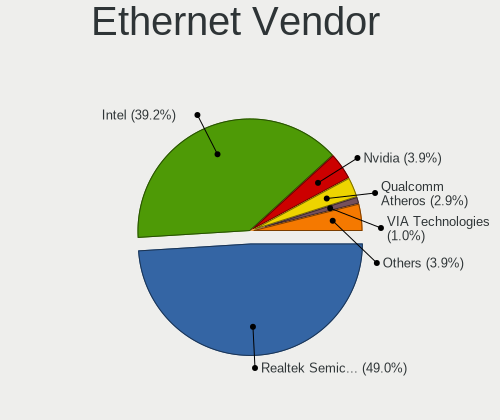

| Vendor                     | Desktops | Percent |
|----------------------------|----------|---------|
| Realtek Semiconductor      | 53       | 57.61%  |
| Intel                      | 25       | 27.17%  |
| Qualcomm Atheros           | 6        | 6.52%   |
| Broadcom                   | 2        | 2.17%   |
| ZTE WCDMA Technologies MSM | 1        | 1.09%   |
| VIA Technologies           | 1        | 1.09%   |
| Samsung Electronics        | 1        | 1.09%   |
| D-Link System              | 1        | 1.09%   |
| ASIX Electronics           | 1        | 1.09%   |
| 3Com                       | 1        | 1.09%   |

Ethernet Model
--------------

Ethernet models

| Model                                                                  | Desktops | Percent |
|------------------------------------------------------------------------|----------|---------|
| Realtek RTL8111/8168/8211/8411 PCI Express Gigabit Ethernet Controller | 44       | 44.9%   |
| Realtek RTL8125 2.5GbE Controller                                      | 8        | 8.16%   |
| Intel 82579LM Gigabit Network Connection (Lewisville)                  | 6        | 6.12%   |
| Intel Ethernet Controller I225-V                                       | 5        | 5.1%    |
| Intel I211 Gigabit Network Connection                                  | 3        | 3.06%   |
| Intel Ethernet Connection I217-V                                       | 3        | 3.06%   |
| Intel Ethernet Connection (2) I219-V                                   | 3        | 3.06%   |
| Realtek RTL810xE PCI Express Fast Ethernet controller                  | 2        | 2.04%   |
| Qualcomm Atheros Killer E220x Gigabit Ethernet Controller              | 2        | 2.04%   |
| Intel Ethernet Connection I217-LM                                      | 2        | 2.04%   |
| ZTE WCDMA MSM USB SCSI CD-ROM                                          | 1        | 1.02%   |
| VIA VT6102/VT6103 [Rhine-II]                                           | 1        | 1.02%   |
| Samsung Galaxy series, misc. (tethering mode)                          | 1        | 1.02%   |
| Realtek RTL8169 PCI Gigabit Ethernet Controller                        | 1        | 1.02%   |
| Realtek RTL8111/8168/8411 PCI Express Gigabit Ethernet Controller      | 1        | 1.02%   |
| Realtek RTL-8110SC/8169SC Gigabit Ethernet                             | 1        | 1.02%   |
| Realtek Killer E3000 2.5GbE Controller                                 | 1        | 1.02%   |
| Qualcomm Atheros QCA8171 Gigabit Ethernet                              | 1        | 1.02%   |
| Qualcomm Atheros Killer E2400 Gigabit Ethernet Controller              | 1        | 1.02%   |
| Qualcomm Atheros AR8161 Gigabit Ethernet                               | 1        | 1.02%   |
| Qualcomm Atheros AR8121/AR8113/AR8114 Gigabit or Fast Ethernet         | 1        | 1.02%   |
| Intel Ethernet Connection (7) I219-V                                   | 1        | 1.02%   |
| Intel Ethernet Connection (6) I219-LM                                  | 1        | 1.02%   |
| Intel 82579V Gigabit Network Connection                                | 1        | 1.02%   |
| Intel 82566MM Gigabit Network Connection                               | 1        | 1.02%   |
| D-Link System DGE-528T Gigabit Ethernet Adapter                        | 1        | 1.02%   |
| Broadcom NetXtreme BCM5764M Gigabit Ethernet PCIe                      | 1        | 1.02%   |
| Broadcom NetLink BCM57781 Gigabit Ethernet PCIe                        | 1        | 1.02%   |
| ASIX AX88179 Gigabit Ethernet                                          | 1        | 1.02%   |
| 3Com 3c905 100BaseTX [Boomerang]                                       | 1        | 1.02%   |

Net Controller Kind
-------------------

Ethernet, WiFi or modem

| Kind     | Desktops | Percent |
|----------|----------|---------|
| Ethernet | 83       | 66.4%   |
| WiFi     | 42       | 33.6%   |

Used Controller
---------------

Currently used network controller

| Kind     | Desktops | Percent |
|----------|----------|---------|
| Ethernet | 65       | 76.47%  |
| WiFi     | 20       | 23.53%  |

NICs
----

Total network controllers on board

| Total | Desktops | Percent |
|-------|----------|---------|
| 1     | 47       | 56.63%  |
| 2     | 31       | 37.35%  |
| 3     | 5        | 6.02%   |

IPv6
----

IPv6 vs IPv4

| Used | Desktops | Percent |
|------|----------|---------|
| No   | 71       | 85.54%  |
| Yes  | 12       | 14.46%  |

Bluetooth
---------

Bluetooth Vendor
----------------

Controller vendors

| Vendor                          | Desktops | Percent |
|---------------------------------|----------|---------|
| Cambridge Silicon Radio         | 9        | 21.43%  |
| Intel                           | 8        | 19.05%  |
| Realtek Semiconductor           | 7        | 16.67%  |
| MediaTek                        | 5        | 11.9%   |
| ASUSTek Computer                | 3        | 7.14%   |
| Broadcom                        | 2        | 4.76%   |
| Belkin Components               | 2        | 4.76%   |
| TP-Link                         | 1        | 2.38%   |
| Realtek                         | 1        | 2.38%   |
| Qualcomm Atheros Communications | 1        | 2.38%   |
| IMC Networks                    | 1        | 2.38%   |
| HTC (High Tech Computer)        | 1        | 2.38%   |
| Foxconn / Hon Hai               | 1        | 2.38%   |

Bluetooth Model
---------------

Controller models

| Model                                                                | Desktops | Percent |
|----------------------------------------------------------------------|----------|---------|
| Cambridge Silicon Radio Bluetooth Dongle (HCI mode)                  | 9        | 21.43%  |
| Realtek Bluetooth Radio                                              | 7        | 16.67%  |
| MediaTek Wireless_Device                                             | 5        | 11.9%   |
| Intel AX200 Bluetooth                                                | 2        | 4.76%   |
| TP-Link UB500 Adapter                                                | 1        | 2.38%   |
| Realtek Bluetooth Radio                                              | 1        | 2.38%   |
| Qualcomm Atheros Bluetooth USB Host Controller                       | 1        | 2.38%   |
| Intel Wireless-AC 9260 Bluetooth Adapter                             | 1        | 2.38%   |
| Intel Wireless-AC 3168 Bluetooth                                     | 1        | 2.38%   |
| Intel Bluetooth wireless interface                                   | 1        | 2.38%   |
| Intel Bluetooth Device                                               | 1        | 2.38%   |
| Intel AX210 Bluetooth                                                | 1        | 2.38%   |
| Intel AX201 Bluetooth                                                | 1        | 2.38%   |
| IMC Networks Bluetooth Radio                                         | 1        | 2.38%   |
| HTC (High Tech Computer) Vive Hub Bluetooth 4.1 (Broadcom BCM920703) | 1        | 2.38%   |
| Foxconn / Hon Hai Wireless_Device                                    | 1        | 2.38%   |
| Broadcom HP Bluethunder                                              | 1        | 2.38%   |
| Broadcom BCM2045 Bluetooth                                           | 1        | 2.38%   |
| Belkin Components F8T012 Bluetooth Adapter                           | 1        | 2.38%   |
| Belkin Components Bluetooth Mini Dongle                              | 1        | 2.38%   |
| ASUS Bluetooth Device                                                | 1        | 2.38%   |
| ASUS Bluetooth Adapter                                               | 1        | 2.38%   |
| ASUS ASUS USB-BT500                                                  | 1        | 2.38%   |

Sound
-----

Sound Vendor
------------

Sound card vendors

| Vendor                                       | Desktops | Percent |
|----------------------------------------------|----------|---------|
| Intel                                        | 50       | 37.04%  |
| AMD                                          | 39       | 28.89%  |
| Nvidia                                       | 24       | 17.78%  |
| Logitech                                     | 3        | 2.22%   |
| C-Media Electronics                          | 3        | 2.22%   |
| JMTek                                        | 2        | 1.48%   |
| Zoran Co. Personal Media Division (Nogatech) | 1        | 0.74%   |
| VIA Technologies                             | 1        | 0.74%   |
| Thesycon Systemsoftware & Consulting         | 1        | 0.74%   |
| Texas Instruments                            | 1        | 0.74%   |
| SteelSeries ApS                              | 1        | 0.74%   |
| Sony                                         | 1        | 0.74%   |
| Razer USA                                    | 1        | 0.74%   |
| MAG Technology                               | 1        | 0.74%   |
| IK Multimedia                                | 1        | 0.74%   |
| Generalplus Technology                       | 1        | 0.74%   |
| Creative Technology                          | 1        | 0.74%   |
| Creative Labs                                | 1        | 0.74%   |
| BEHRINGER International                      | 1        | 0.74%   |
| ASUSTek Computer                             | 1        | 0.74%   |

Sound Model
-----------

Sound card models

| Model                                                                             | Desktops | Percent |
|-----------------------------------------------------------------------------------|----------|---------|
| Intel 6 Series/C200 Series Chipset Family High Definition Audio Controller        | 8        | 4.94%   |
| AMD Family 17h/19h HD Audio Controller                                            | 8        | 4.94%   |
| Intel 7 Series/C216 Chipset Family High Definition Audio Controller               | 7        | 4.32%   |
| AMD Starship/Matisse HD Audio Controller                                          | 7        | 4.32%   |
| Intel 8 Series/C220 Series Chipset High Definition Audio Controller               | 6        | 3.7%    |
| Intel 100 Series/C230 Series Chipset Family HD Audio Controller                   | 6        | 3.7%    |
| AMD Ellesmere HDMI Audio [Radeon RX 470/480 / 570/580/590]                        | 6        | 3.7%    |
| Nvidia GK208 HDMI/DP Audio Controller                                             | 5        | 3.09%   |
| AMD SBx00 Azalia (Intel HDA)                                                      | 5        | 3.09%   |
| AMD Rembrandt Radeon High Definition Audio Controller                             | 5        | 3.09%   |
| AMD Caicos HDMI Audio [Radeon HD 6450 / 7450/8450/8490 OEM / R5 230/235/235X OEM] | 5        | 3.09%   |
| Nvidia TU104 HD Audio Controller                                                  | 4        | 2.47%   |
| AMD Navi 21/23 HDMI/DP Audio Controller                                           | 4        | 2.47%   |
| AMD FCH Azalia Controller                                                         | 4        | 2.47%   |
| Intel Xeon E3-1200 v3/4th Gen Core Processor HD Audio Controller                  | 3        | 1.85%   |
| Intel 82801JI (ICH10 Family) HD Audio Controller                                  | 3        | 1.85%   |
| AMD Oland/Hainan/Cape Verde/Pitcairn HDMI Audio [Radeon HD 7000 Series]           | 3        | 1.85%   |
| AMD Family 17h (Models 00h-0fh) HD Audio Controller                               | 3        | 1.85%   |
| Nvidia TU107 GeForce GTX 1650 High Definition Audio Controller                    | 2        | 1.23%   |
| Nvidia TU106 High Definition Audio Controller                                     | 2        | 1.23%   |
| Nvidia GP106 High Definition Audio Controller                                     | 2        | 1.23%   |
| Nvidia GF119 HDMI Audio Controller                                                | 2        | 1.23%   |
| Intel Celeron/Pentium Silver Processor High Definition Audio                      | 2        | 1.23%   |
| Intel Cannon Lake PCH cAVS                                                        | 2        | 1.23%   |
| Intel 200 Series PCH HD Audio                                                     | 2        | 1.23%   |
| C-Media Electronics USB Advanced Audio Device                                     | 2        | 1.23%   |
| AMD Turks HDMI Audio [Radeon HD 6500/6600 / 6700M Series]                         | 2        | 1.23%   |
| AMD Renoir Radeon High Definition Audio Controller                                | 2        | 1.23%   |
| Zoran Co. Personal Media Division (Nogatech) USB Audio and HID                    | 1        | 0.62%   |
| VIA Technologies VX900/VT8xxx High Definition Audio Controller                    | 1        | 0.62%   |
| Thesycon Systemsoftware & Consulting D50s                                         | 1        | 0.62%   |
| Texas Instruments PCM2904 Audio Codec                                             | 1        | 0.62%   |
| SteelSeries ApS Arctis Nova Pro Wireless                                          | 1        | 0.62%   |
| Sony DualShock 4 [CUH-ZCT2x]                                                      | 1        | 0.62%   |
| Razer USA RZ19-0229 Gaming Microphone                                             | 1        | 0.62%   |
| Nvidia High Definition Audio Controller                                           | 1        | 0.62%   |
| Nvidia GP108 High Definition Audio Controller                                     | 1        | 0.62%   |
| Nvidia GP104 High Definition Audio Controller                                     | 1        | 0.62%   |
| Nvidia GM107 High Definition Audio Controller [GeForce 940MX]                     | 1        | 0.62%   |
| Nvidia GF108 High Definition Audio Controller                                     | 1        | 0.62%   |

Memory
------

Memory Vendor
-------------

Memory module vendors

| Vendor              | Desktops | Percent |
|---------------------|----------|---------|
| Corsair             | 12       | 20.34%  |
| Kingston            | 11       | 18.64%  |
| Samsung Electronics | 8        | 13.56%  |
| Crucial             | 6        | 10.17%  |
| G.Skill             | 5        | 8.47%   |
| SK hynix            | 4        | 6.78%   |
| Unknown             | 3        | 5.08%   |
| Unknown             | 2        | 3.39%   |
| Wodposit            | 1        | 1.69%   |
| Unknown (ABCD)      | 1        | 1.69%   |
| Unknown (0x0E9D)    | 1        | 1.69%   |
| Thermaltake         | 1        | 1.69%   |
| Ramaxel Technology  | 1        | 1.69%   |
| Nanya Technology    | 1        | 1.69%   |
| Micron Technology   | 1        | 1.69%   |
| A-DATA Technology   | 1        | 1.69%   |

Memory Model
------------

Memory module models

| Model                                                              | Desktops | Percent |
|--------------------------------------------------------------------|----------|---------|
| Samsung RAM M378B5273DH0-CH9 4096MB DIMM DDR2 2133MT/s             | 2        | 3.17%   |
| Kingston RAM KHX2666C16/8G 8GB DIMM DDR4 3466MT/s                  | 2        | 3.17%   |
| Kingston RAM 9905599-020.A00G 8GB DIMM DDR4 2133MT/s               | 2        | 3.17%   |
| Crucial RAM CT32G48C40S5.M16A1 32GB SODIMM DDR5 4800MT/s           | 2        | 3.17%   |
| Crucial RAM CT16G48C40S5.C8A1 16GB SODIMM DDR5 4800MT/s            | 2        | 3.17%   |
| Corsair RAM CMK32GX4M2D3600C18 16GB DIMM DDR4 3800MT/s             | 2        | 3.17%   |
| Unknown                                                            | 2        | 3.17%   |
| Wodposit RAM WPBH32D408SWM-16G 16GB SODIMM DDR4 3200MT/s           | 1        | 1.59%   |
| Unknown RAM Module 4GB DIMM 1600MT/s                               | 1        | 1.59%   |
| Unknown RAM Module 16GB DIMM DDR4 3200MT/s                         | 1        | 1.59%   |
| Unknown RAM DDR4 16GB 2666MHz 16GB SODIMM DDR4 2667MT/s            | 1        | 1.59%   |
| Unknown (ABCD) RAM 123456789012345678 2GB DIMM LPDDR4 2400MT/s     | 1        | 1.59%   |
| Unknown (0x0E9D) RAM KINSOTIN16GB2666MHZ 16GB SODIMM DDR4 2667MT/s | 1        | 1.59%   |
| Thermaltake RAM R009D408GX2-4000C19A 8192MB DIMM DDR4 3600MT/s     | 1        | 1.59%   |
| SK hynix RAM HMT351U6CFR8C-H9 4GB DIMM DDR3 1600MT/s               | 1        | 1.59%   |
| SK hynix RAM HMT351U6BFR8C-H9 4GB DIMM DDR3 1333MT/s               | 1        | 1.59%   |
| SK hynix RAM HMT125U7TFR8C-H9 2GB DIMM DDR3 1333MT/s               | 1        | 1.59%   |
| SK hynix RAM HMAA2GU6CJR8N-XN 16GB DIMM DDR4 3200MT/s              | 1        | 1.59%   |
| Samsung RAM Module 6GB Row Of Chips LPDDR4 3733MT/s                | 1        | 1.59%   |
| Samsung RAM Module 4GB DIMM DDR3 1333MT/s                          | 1        | 1.59%   |
| Samsung RAM M471B5173EB0-YK0 4GB SODIMM DDR3 1600MT/s              | 1        | 1.59%   |
| Samsung RAM M391B5673FH0-CH9 2GB DIMM DDR3 1333MT/s                | 1        | 1.59%   |
| Samsung RAM M378B5773CH0-CK0 2GB DIMM DDR3 1600MT/s                | 1        | 1.59%   |
| Samsung RAM M378B1G73EB0-CK0 8GB DIMM DDR3 1600MT/s                | 1        | 1.59%   |
| Ramaxel RAM RMR5040ED58E9W1600 4GB DIMM DDR3 1600MT/s              | 1        | 1.59%   |
| Nanya RAM NT4GC64B8HG0NF-CG 4GB DIMM DDR3 1333MT/s                 | 1        | 1.59%   |
| Micron RAM 16JTF51264AZ-1G4M1 4GB DIMM DDR3 1333MT/s               | 1        | 1.59%   |
| Kingston RAM KHX2133C14/8G 8GB DIMM DDR4 2666MT/s                  | 1        | 1.59%   |
| Kingston RAM KHX2133C11D3/8GX 8GB DIMM DDR3 2133MT/s               | 1        | 1.59%   |
| Kingston RAM KF560C36-16 16GB DIMM DDR5 6000MT/s                   | 1        | 1.59%   |
| Kingston RAM ACR256X64D3U1333C9 2GB DIMM DDR3 1333MT/s             | 1        | 1.59%   |
| Kingston RAM 99U5584-018.A00LF 4GB DIMM DDR3 1333MT/s              | 1        | 1.59%   |
| Kingston RAM 99U5471-025.A00LF 4GB DIMM DDR3 1333MT/s              | 1        | 1.59%   |
| Kingston RAM 9905702-136.A00G 8192MB DIMM DDR4 2667MT/s            | 1        | 1.59%   |
| Kingston RAM 9905584-023.A00LF 4GB DIMM DDR3 1600MT/s              | 1        | 1.59%   |
| G.Skill RAM F4-3600C16-32GTRS 32GB DIMM DDR4 3600MT/s              | 1        | 1.59%   |
| G.Skill RAM F4-3600C16-16GVKC 16GB DIMM DDR4 3866MT/s              | 1        | 1.59%   |
| G.Skill RAM F4-3200C16-8GIS 8GB DIMM DDR4 3200MT/s                 | 1        | 1.59%   |
| G.Skill RAM F4-3000C16-8GISB 8192MB DIMM DDR4 3200MT/s             | 1        | 1.59%   |
| G.Skill RAM F3-1600C9-4GAO 4GB DIMM DDR3 1600MT/s                  | 1        | 1.59%   |

Memory Kind
-----------

Memory module kinds

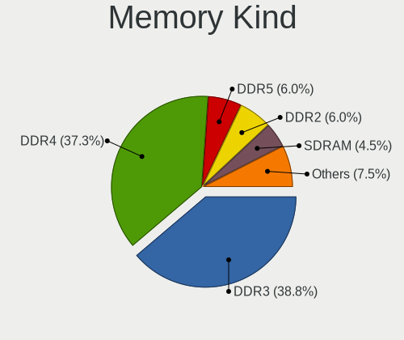

| Kind    | Desktops | Percent |
|---------|----------|---------|
| DDR4    | 24       | 45.28%  |
| DDR3    | 17       | 32.08%  |
| DDR5    | 4        | 7.55%   |
| Unknown | 4        | 7.55%   |
| SDRAM   | 2        | 3.77%   |
| LPDDR4  | 2        | 3.77%   |

Memory Form Factor
------------------

Physical design of the memory module

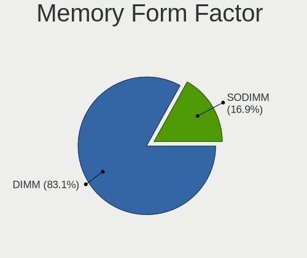

| Name         | Desktops | Percent |
|--------------|----------|---------|
| DIMM         | 44       | 86.27%  |
| SODIMM       | 6        | 11.76%  |
| Row Of Chips | 1        | 1.96%   |

Memory Size
-----------

Memory module size

| Size  | Desktops | Percent |
|-------|----------|---------|
| 16384 | 17       | 30.91%  |
| 8192  | 16       | 29.09%  |
| 4096  | 14       | 25.45%  |
| 32768 | 3        | 5.45%   |
| 2048  | 2        | 3.64%   |
| 1024  | 2        | 3.64%   |
| 6144  | 1        | 1.82%   |

Memory Speed
------------

Memory module speed

| Speed | Desktops | Percent |
|-------|----------|---------|
| 1600  | 12       | 20.34%  |
| 1333  | 8        | 13.56%  |
| 2133  | 6        | 10.17%  |
| 3200  | 5        | 8.47%   |
| 4800  | 3        | 5.08%   |
| 3800  | 3        | 5.08%   |
| 2667  | 3        | 5.08%   |
| 3733  | 2        | 3.39%   |
| 3600  | 2        | 3.39%   |
| 3466  | 2        | 3.39%   |
| 2400  | 2        | 3.39%   |
| 55438 | 1        | 1.69%   |
| 6000  | 1        | 1.69%   |
| 3866  | 1        | 1.69%   |
| 3534  | 1        | 1.69%   |
| 3533  | 1        | 1.69%   |
| 3066  | 1        | 1.69%   |
| 3007  | 1        | 1.69%   |
| 2933  | 1        | 1.69%   |
| 2666  | 1        | 1.69%   |
| 1867  | 1        | 1.69%   |
| 166   | 1        | 1.69%   |

Printers & scanners
-------------------

Printer Vendor
--------------

Printer device vendors

| Vendor             | Desktops | Percent |
|--------------------|----------|---------|
| Dymo-CoStar        | 1        | 33.33%  |
| Canon              | 1        | 33.33%  |
| Brother Industries | 1        | 33.33%  |

Printer Model
-------------

Printer device models

| Model                       | Desktops | Percent |
|-----------------------------|----------|---------|
| Dymo-CoStar LabelWriter 400 | 1        | 33.33%  |
| Canon LBP2900               | 1        | 33.33%  |
| Brother HL-52x0 series      | 1        | 33.33%  |

Scanner Vendor
--------------

Scanner device vendors

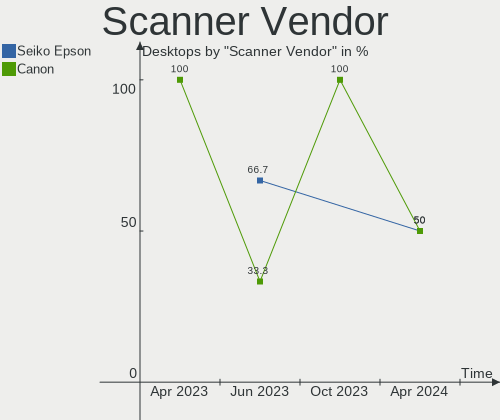

| Vendor | Desktops | Percent |
|--------|----------|---------|
| Canon  | 2        | 100%    |

Scanner Model
-------------

Scanner device models

| Model                              | Desktops | Percent |
|------------------------------------|----------|---------|
| Canon CanoScan N670U/N676U/LiDE 20 | 1        | 50%     |
| Canon CanoScan LiDE 100            | 1        | 50%     |

Camera
------

Camera Vendor
-------------

Camera device vendors

| Vendor                        | Desktops | Percent |
|-------------------------------|----------|---------|
| Logitech                      | 5        | 35.71%  |
| Microdia                      | 3        | 21.43%  |
| Sunplus Innovation Technology | 2        | 14.29%  |
| Sonix Technology              | 1        | 7.14%   |
| MacroSilicon                  | 1        | 7.14%   |
| Cubeternet                    | 1        | 7.14%   |
| Chicony Electronics           | 1        | 7.14%   |

Camera Model
------------

Camera device models

| Model                             | Desktops | Percent |
|-----------------------------------|----------|---------|
| Sunplus FHD Camera Microphone     | 2        | 14.29%  |
| Sonix USB 2.0 Camera              | 1        | 7.14%   |
| Microdia Webcam Vitade AF         | 1        | 7.14%   |
| Microdia USB 2.0 Camera           | 1        | 7.14%   |
| Microdia Sonix USB 2.0 Camera     | 1        | 7.14%   |
| MacroSilicon USB3. 0 capture      | 1        | 7.14%   |
| Logitech Webcam C270              | 1        | 7.14%   |
| Logitech Webcam C170              | 1        | 7.14%   |
| Logitech Logitech Webcam C100     | 1        | 7.14%   |
| Logitech C920 PRO HD Webcam       | 1        | 7.14%   |
| Logitech BRIO Ultra HD Webcam     | 1        | 7.14%   |
| Cubeternet GL-UPC822 UVC WebCam   | 1        | 7.14%   |
| Chicony HP High Definition Webcam | 1        | 7.14%   |

Security
--------

Fingerprint Vendor
------------------

Fingerprint sensor vendors

Zero info for selected period =(

Fingerprint Model
-----------------

Fingerprint sensor models

Zero info for selected period =(

Chipcard Vendor
---------------

Chipcard module vendors

Zero info for selected period =(

Chipcard Model
--------------

Chipcard module models

Zero info for selected period =(

Unsupported
-----------

Unsupported Devices
-------------------

Total unsupported devices on board

| Total | Desktops | Percent |
|-------|----------|---------|
| 0     | 73       | 87.95%  |
| 1     | 10       | 12.05%  |

Unsupported Device Types
------------------------

Types of unsupported devices

| Type             | Desktops | Percent |
|------------------|----------|---------|
| Graphics card    | 4        | 40%     |
| Unassigned class | 2        | 20%     |
| Storage/raid     | 2        | 20%     |
| Net/wireless     | 2        | 20%     |

