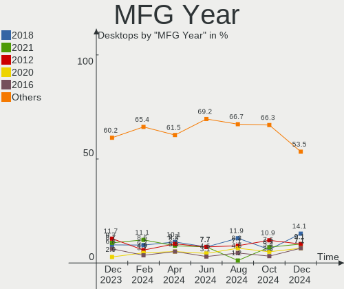
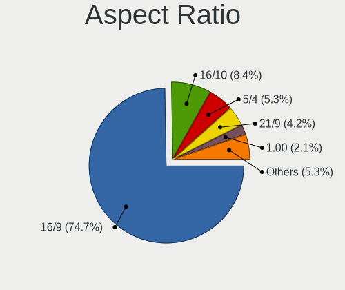
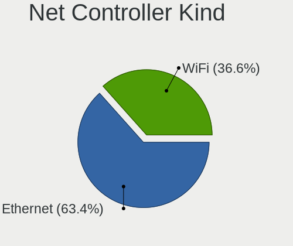
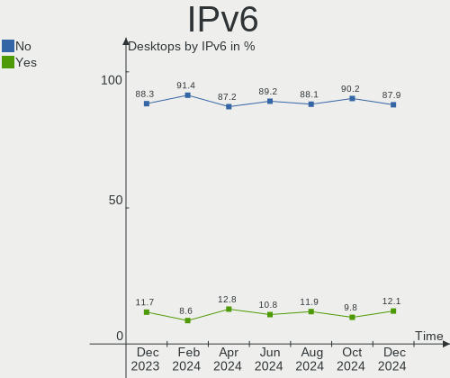

Linux in Italy - Hardware Trends (Desktops)
-------------------------------------------

A project to identify most popular hardware characteristics and track their change
over time based on data collected by Linux users at https://Linux-Hardware.org.

Anyone can contribute to this report by the [hw-probe](https://github.com/linuxhw/hw-probe) tool:

    sudo -E hw-probe -all -upload

Period: Dec, 2022.

Contents
--------

* [ System ](#system)
  - [ OS                       ](#os)
  - [ OS Family                ](#os-family)
  - [ Kernel                   ](#kernel)
  - [ Kernel Family            ](#kernel-family)
  - [ Kernel Major Ver.        ](#kernel-major-ver)
  - [ Arch                     ](#arch)
  - [ DE                       ](#de)
  - [ Display Server           ](#display-server)
  - [ Display Manager          ](#display-manager)
  - [ OS Lang                  ](#os-lang)
  - [ Boot Mode                ](#boot-mode)
  - [ Filesystem               ](#filesystem)
  - [ Part. scheme             ](#part-scheme)
  - [ Dual Boot with Linux/BSD ](#dual-boot-with-linuxbsd)
  - [ Dual Boot (Win)          ](#dual-boot-win)

* [ Board ](#board)
  - [ Vendor                   ](#vendor)
  - [ Model                    ](#model)
  - [ Model Family             ](#model-family)
  - [ MFG Year                 ](#mfg-year)
  - [ Form Factor              ](#form-factor)
  - [ Secure Boot              ](#secure-boot)
  - [ Coreboot                 ](#coreboot)
  - [ RAM Size                 ](#ram-size)
  - [ RAM Used                 ](#ram-used)
  - [ Total Drives             ](#total-drives)
  - [ Has CD-ROM               ](#has-cd-rom)
  - [ Has Ethernet             ](#has-ethernet)
  - [ Has WiFi                 ](#has-wifi)
  - [ Has Bluetooth            ](#has-bluetooth)

* [ Location ](#location)
  - [ Country                  ](#country)
  - [ City                     ](#city)

* [ Drives ](#drives)
  - [ Drive Vendor             ](#drive-vendor)
  - [ Drive Model              ](#drive-model)
  - [ HDD Vendor               ](#hdd-vendor)
  - [ SSD Vendor               ](#ssd-vendor)
  - [ Drive Kind               ](#drive-kind)
  - [ Drive Connector          ](#drive-connector)
  - [ Drive Size               ](#drive-size)
  - [ Space Total              ](#space-total)
  - [ Space Used               ](#space-used)
  - [ Malfunc. Drives          ](#malfunc-drives)
  - [ Malfunc. Drive Vendor    ](#malfunc-drive-vendor)
  - [ Malfunc. HDD Vendor      ](#malfunc-hdd-vendor)
  - [ Malfunc. Drive Kind      ](#malfunc-drive-kind)
  - [ Failed Drives            ](#failed-drives)
  - [ Failed Drive Vendor      ](#failed-drive-vendor)
  - [ Drive Status             ](#drive-status)

* [ Storage controller ](#storage-controller)
  - [ Storage Vendor           ](#storage-vendor)
  - [ Storage Model            ](#storage-model)
  - [ Storage Kind             ](#storage-kind)

* [ Processor ](#processor)
  - [ CPU Vendor               ](#cpu-vendor)
  - [ CPU Model                ](#cpu-model)
  - [ CPU Model Family         ](#cpu-model-family)
  - [ CPU Cores                ](#cpu-cores)
  - [ CPU Sockets              ](#cpu-sockets)
  - [ CPU Threads              ](#cpu-threads)
  - [ CPU Op-Modes             ](#cpu-op-modes)
  - [ CPU Microcode            ](#cpu-microcode)
  - [ CPU Microarch            ](#cpu-microarch)

* [ Graphics ](#graphics)
  - [ GPU Vendor               ](#gpu-vendor)
  - [ GPU Model                ](#gpu-model)
  - [ GPU Combo                ](#gpu-combo)
  - [ GPU Driver               ](#gpu-driver)
  - [ GPU Memory               ](#gpu-memory)

* [ Monitor ](#monitor)
  - [ Monitor Vendor           ](#monitor-vendor)
  - [ Monitor Model            ](#monitor-model)
  - [ Monitor Resolution       ](#monitor-resolution)
  - [ Monitor Diagonal         ](#monitor-diagonal)
  - [ Monitor Width            ](#monitor-width)
  - [ Aspect Ratio             ](#aspect-ratio)
  - [ Monitor Area             ](#monitor-area)
  - [ Pixel Density            ](#pixel-density)
  - [ Multiple Monitors        ](#multiple-monitors)

* [ Network ](#network)
  - [ Net Controller Vendor    ](#net-controller-vendor)
  - [ Net Controller Model     ](#net-controller-model)
  - [ Wireless Vendor          ](#wireless-vendor)
  - [ Wireless Model           ](#wireless-model)
  - [ Ethernet Vendor          ](#ethernet-vendor)
  - [ Ethernet Model           ](#ethernet-model)
  - [ Net Controller Kind      ](#net-controller-kind)
  - [ Used Controller          ](#used-controller)
  - [ NICs                     ](#nics)
  - [ IPv6                     ](#ipv6)

* [ Bluetooth ](#bluetooth)
  - [ Bluetooth Vendor         ](#bluetooth-vendor)
  - [ Bluetooth Model          ](#bluetooth-model)

* [ Sound ](#sound)
  - [ Sound Vendor             ](#sound-vendor)
  - [ Sound Model              ](#sound-model)

* [ Memory ](#memory)
  - [ Memory Vendor            ](#memory-vendor)
  - [ Memory Model             ](#memory-model)
  - [ Memory Kind              ](#memory-kind)
  - [ Memory Form Factor       ](#memory-form-factor)
  - [ Memory Size              ](#memory-size)
  - [ Memory Speed             ](#memory-speed)

* [ Printers & scanners ](#printers--scanners)
  - [ Printer Vendor           ](#printer-vendor)
  - [ Printer Model            ](#printer-model)
  - [ Scanner Vendor           ](#scanner-vendor)
  - [ Scanner Model            ](#scanner-model)

* [ Camera ](#camera)
  - [ Camera Vendor            ](#camera-vendor)
  - [ Camera Model             ](#camera-model)

* [ Security ](#security)
  - [ Fingerprint Vendor       ](#fingerprint-vendor)
  - [ Fingerprint Model        ](#fingerprint-model)
  - [ Chipcard Vendor          ](#chipcard-vendor)
  - [ Chipcard Model           ](#chipcard-model)

* [ Unsupported ](#unsupported)
  - [ Unsupported Devices      ](#unsupported-devices)
  - [ Unsupported Device Types ](#unsupported-device-types)

System
------

OS
--

Installed operating systems

| Name                         | Desktops | Percent |
|------------------------------|----------|---------|
| Ubuntu 22.04                 | 13       | 14.13%  |
| Ubuntu 22.10                 | 8        | 8.7%    |
| OpenMandriva 4.3             | 6        | 6.52%   |
| Debian 11                    | 6        | 6.52%   |
| Pop!_OS 22.04                | 4        | 4.35%   |
| openSUSE Tumbleweed-XXXXXXXX | 4        | 4.35%   |
| OpenMandriva 22.12           | 4        | 4.35%   |
| Linux Mint 21.1              | 4        | 4.35%   |
| Linux Mint 20.3              | 4        | 4.35%   |
| Fedora 37                    | 4        | 4.35%   |
| Arch Rolling                 | 4        | 4.35%   |
| Zorin 16                     | 2        | 2.17%   |
| Ubuntu 20.04                 | 2        | 2.17%   |
| MX 21                        | 2        | 2.17%   |
| Linux Mint 21                | 2        | 2.17%   |
| Kubuntu 22.04                | 2        | 2.17%   |
| KDE neon 22.04               | 2        | 2.17%   |
| Xubuntu 22.04                | 1        | 1.09%   |
| Ubuntu MATE 22.10            | 1        | 1.09%   |
| Ubuntu MATE 22.04            | 1        | 1.09%   |
| Manjaro 22.0.0               | 1        | 1.09%   |
| Manjaro 21.3.7               | 1        | 1.09%   |
| LMDE 5                       | 1        | 1.09%   |
| Linux Mint 20.2              | 1        | 1.09%   |
| Linux Mint 19.3              | 1        | 1.09%   |
| Kubuntu 22.10                | 1        | 1.09%   |
| Kubuntu 20.04                | 1        | 1.09%   |
| KDE neon 20.04               | 1        | 1.09%   |
| Gentoo 2.9                   | 1        | 1.09%   |
| Fedora 36                    | 1        | 1.09%   |
| EndeavourOS Rolling          | 1        | 1.09%   |
| Elementary 5.1.7             | 1        | 1.09%   |
| Debian 10                    | 1        | 1.09%   |
| Clear Linux 37860            | 1        | 1.09%   |
| BlackPanther 18.1            | 1        | 1.09%   |
| ArcoLinux                    | 1        | 1.09%   |

OS Family
---------

OS without a version

| Name         | Desktops | Percent |
|--------------|----------|---------|
| Ubuntu       | 23       | 25%     |
| Linux Mint   | 12       | 13.04%  |
| OpenMandriva | 10       | 10.87%  |
| Debian       | 7        | 7.61%   |
| Fedora       | 5        | 5.43%   |
| Pop!_OS      | 4        | 4.35%   |
| openSUSE     | 4        | 4.35%   |
| Kubuntu      | 4        | 4.35%   |
| Arch         | 4        | 4.35%   |
| KDE neon     | 3        | 3.26%   |
| Zorin        | 2        | 2.17%   |
| Ubuntu MATE  | 2        | 2.17%   |
| MX           | 2        | 2.17%   |
| Manjaro      | 2        | 2.17%   |
| Xubuntu      | 1        | 1.09%   |
| LMDE         | 1        | 1.09%   |
| Gentoo       | 1        | 1.09%   |
| EndeavourOS  | 1        | 1.09%   |
| Elementary   | 1        | 1.09%   |
| Clear Linux  | 1        | 1.09%   |
| BlackPanther | 1        | 1.09%   |
| ArcoLinux    | 1        | 1.09%   |

Kernel
------

Version of the Linux kernel

| Version                      | Desktops | Percent |
|------------------------------|----------|---------|
| 5.15.0-56-generic            | 25       | 27.17%  |
| 5.19.0-26-generic            | 7        | 7.61%   |
| 5.4.0-135-generic            | 5        | 5.43%   |
| 5.16.7-desktop-1omv4003      | 5        | 5.43%   |
| 6.0.6-76060006-generic       | 4        | 4.35%   |
| 6.0.10-desktop-2omv22090     | 4        | 4.35%   |
| 6.0.12-arch1-1               | 3        | 3.26%   |
| 5.19.0-23-generic            | 3        | 3.26%   |
| 6.0.12-300.fc37.x86_64       | 2        | 2.17%   |
| 5.15.0-57-generic            | 2        | 2.17%   |
| 5.10.0-19-amd64              | 2        | 2.17%   |
| 6.1.1-1228.native            | 1        | 1.09%   |
| 6.1.0-1-default              | 1        | 1.09%   |
| 6.0.8-1-default              | 1        | 1.09%   |
| 6.0.7-1-default              | 1        | 1.09%   |
| 6.0.12-zen1-1-zen            | 1        | 1.09%   |
| 6.0.11-gentoo                | 1        | 1.09%   |
| 6.0.11-300.fc37.x86_64       | 1        | 1.09%   |
| 6.0.11-1-MANJARO             | 1        | 1.09%   |
| 6.0.10-301.fsync.fc37.x86_64 | 1        | 1.09%   |
| 6.0.10-200.fc36.x86_64       | 1        | 1.09%   |
| 6.0.10-1-default             | 1        | 1.09%   |
| 6.0.0-0.deb11.2-amd64        | 1        | 1.09%   |
| 5.4.0-86-generic             | 1        | 1.09%   |
| 5.4.0-120-generic            | 1        | 1.09%   |
| 5.19.0-051900-generic        | 1        | 1.09%   |
| 5.16.13-desktop-1omv4003     | 1        | 1.09%   |
| 5.16.0-5mx-amd64             | 1        | 1.09%   |
| 5.15.85-1-lts                | 1        | 1.09%   |
| 5.15.83-1-lts                | 1        | 1.09%   |
| 5.15.60-1-MANJARO            | 1        | 1.09%   |
| 5.15.30-2-pve                | 1        | 1.09%   |
| 5.15.0-43-lowlatency         | 1        | 1.09%   |
| 5.15.0-43-generic            | 1        | 1.09%   |
| 5.10.0-20-amd64              | 1        | 1.09%   |
| 5.10.0-18-amd64              | 1        | 1.09%   |
| 5.10.0-15-amd64              | 1        | 1.09%   |
| 5.10.0-12-amd64              | 1        | 1.09%   |
| 4.19.0-22-amd64              | 1        | 1.09%   |
| 4.18.16-desktop-1bP          | 1        | 1.09%   |

Kernel Family
-------------

Linux kernel without a distro release

| Version | Desktops | Percent |
|---------|----------|---------|
| 5.15.0  | 29       | 31.52%  |
| 5.19.0  | 11       | 11.96%  |
| 6.0.10  | 7        | 7.61%   |
| 5.4.0   | 7        | 7.61%   |
| 6.0.12  | 6        | 6.52%   |
| 5.10.0  | 6        | 6.52%   |
| 5.16.7  | 5        | 5.43%   |
| 6.0.6   | 4        | 4.35%   |
| 6.0.11  | 3        | 3.26%   |
| 6.1.1   | 1        | 1.09%   |
| 6.1.0   | 1        | 1.09%   |
| 6.0.8   | 1        | 1.09%   |
| 6.0.7   | 1        | 1.09%   |
| 6.0.0   | 1        | 1.09%   |
| 5.16.13 | 1        | 1.09%   |
| 5.16.0  | 1        | 1.09%   |
| 5.15.85 | 1        | 1.09%   |
| 5.15.83 | 1        | 1.09%   |
| 5.15.60 | 1        | 1.09%   |
| 5.15.30 | 1        | 1.09%   |
| 4.19.0  | 1        | 1.09%   |
| 4.18.16 | 1        | 1.09%   |
| 4.15.0  | 1        | 1.09%   |

Kernel Major Ver.
-----------------

Linux kernel major version

| Version | Desktops | Percent |
|---------|----------|---------|
| 5.15    | 33       | 35.87%  |
| 6.0     | 23       | 25%     |
| 5.19    | 11       | 11.96%  |
| 5.4     | 7        | 7.61%   |
| 5.16    | 7        | 7.61%   |
| 5.10    | 6        | 6.52%   |
| 6.1     | 2        | 2.17%   |
| 4.19    | 1        | 1.09%   |
| 4.18    | 1        | 1.09%   |
| 4.15    | 1        | 1.09%   |

Arch
----

OS architecture (x86_64, i586, etc.)

| Name   | Desktops | Percent |
|--------|----------|---------|
| x86_64 | 92       | 100%    |

DE
--

Desktop Environment

| Name       | Desktops | Percent |
|------------|----------|---------|
| GNOME      | 37       | 40.22%  |
| KDE5       | 27       | 29.35%  |
| X-Cinnamon | 12       | 13.04%  |
| XFCE       | 5        | 5.43%   |
| Unknown    | 4        | 4.35%   |
| MATE       | 3        | 3.26%   |
| Pantheon   | 1        | 1.09%   |
| LXDE       | 1        | 1.09%   |
| Hyprland   | 1        | 1.09%   |
| Cinnamon   | 1        | 1.09%   |

Display Server
--------------

X11 or Wayland

| Name    | Desktops | Percent |
|---------|----------|---------|
| X11     | 68       | 73.91%  |
| Wayland | 18       | 19.57%  |
| Unknown | 4        | 4.35%   |
| Tty     | 2        | 2.17%   |

Display Manager
---------------

SDDM, LightDM, etc.

| Name    | Desktops | Percent |
|---------|----------|---------|
| GDM3    | 27       | 29.35%  |
| SDDM    | 24       | 26.09%  |
| Unknown | 19       | 20.65%  |
| LightDM | 16       | 17.39%  |
| GDM     | 6        | 6.52%   |

OS Lang
-------

Language

| Lang    | Desktops | Percent |
|---------|----------|---------|
| it_IT   | 65       | 70.65%  |
| en_US   | 19       | 20.65%  |
| C       | 6        | 6.52%   |
| en_GB   | 1        | 1.09%   |
| Unknown | 1        | 1.09%   |

Boot Mode
---------

EFI or BIOS

| Mode | Desktops | Percent |
|------|----------|---------|
| BIOS | 47       | 51.09%  |
| EFI  | 45       | 48.91%  |

Filesystem
----------

Type of filesystem

| Type    | Desktops | Percent |
|---------|----------|---------|
| Ext4    | 63       | 68.48%  |
| Overlay | 19       | 20.65%  |
| Btrfs   | 8        | 8.7%    |
| Zfs     | 1        | 1.09%   |
| F2fs    | 1        | 1.09%   |

Part. scheme
------------

Scheme of partitioning

| Type    | Desktops | Percent |
|---------|----------|---------|
| GPT     | 59       | 64.13%  |
| MBR     | 19       | 20.65%  |
| Unknown | 14       | 15.22%  |

Dual Boot with Linux/BSD
------------------------

Hosting more than one Linux/BSD

| Dual boot | Desktops | Percent |
|-----------|----------|---------|
| No        | 69       | 75%     |
| Yes       | 23       | 25%     |

Dual Boot (Win)
---------------

Hosting Linux and Windows

| Dual boot | Desktops | Percent |
|-----------|----------|---------|
| Yes       | 47       | 51.09%  |
| No        | 45       | 48.91%  |

Board
-----

Vendor
------

Motherboard manufacturer

| Name                | Desktops | Percent |
|---------------------|----------|---------|
| ASUSTek Computer    | 23       | 25%     |
| MSI                 | 15       | 16.3%   |
| ASRock              | 11       | 11.96%  |
| Hewlett-Packard     | 9        | 9.78%   |
| Gigabyte Technology | 9        | 9.78%   |
| Acer                | 5        | 5.43%   |
| Dell                | 4        | 4.35%   |
| Lenovo              | 3        | 3.26%   |
| Pegatron            | 2        | 2.17%   |
| Intel               | 2        | 2.17%   |
| Fujitsu             | 2        | 2.17%   |
| Foxconn             | 2        | 2.17%   |
| Unknown             | 2        | 2.17%   |
| MAXSUN              | 1        | 1.09%   |
| BESSTAR Tech        | 1        | 1.09%   |
| AMI                 | 1        | 1.09%   |

Model
-----

Motherboard model

| Name                                | Desktops | Percent |
|-------------------------------------|----------|---------|
| MSI MS-7B79                         | 3        | 3.26%   |
| Unknown                             | 2        | 2.17%   |
| Pegatron Pro 3505 Series            | 1        | 1.09%   |
| Pegatron p7-1011it                  | 1        | 1.09%   |
| MSI NQ890AA-ABZ CQ5011IT            | 1        | 1.09%   |
| MSI MS-7D54                         | 1        | 1.09%   |
| MSI MS-7C02                         | 1        | 1.09%   |
| MSI MS-7B98                         | 1        | 1.09%   |
| MSI MS-7B90                         | 1        | 1.09%   |
| MSI MS-7B17                         | 1        | 1.09%   |
| MSI MS-7A70                         | 1        | 1.09%   |
| MSI MS-7A63                         | 1        | 1.09%   |
| MSI MS-7978                         | 1        | 1.09%   |
| MSI MS-7885                         | 1        | 1.09%   |
| MSI MS-7865                         | 1        | 1.09%   |
| MSI Cubi N 8GL (MS-B171)            | 1        | 1.09%   |
| MAXSUN MS-TZZ A320M.2-VH            | 1        | 1.09%   |
| Lenovo ThinkCentre M93p 10AAS0ME00  | 1        | 1.09%   |
| Lenovo ThinkCentre M910t 10MNS1Y900 | 1        | 1.09%   |
| Lenovo ThinkCentre M71e 3129C3G     | 1        | 1.09%   |
| Intel H55                           | 1        | 1.09%   |
| Intel DB75EN AAG39650-400           | 1        | 1.09%   |
| HP Z600 Workstation                 | 1        | 1.09%   |
| HP ProLiant MicroServer             | 1        | 1.09%   |
| HP ProDesk 600 G1 SFF               | 1        | 1.09%   |
| HP Pavilion Power Desktop 580-1xx   | 1        | 1.09%   |
| HP Pavilion Desktop TP01-2xxx       | 1        | 1.09%   |
| HP 550-100nl                        | 1        | 1.09%   |
| HP 500-345nl                        | 1        | 1.09%   |
| HP 290 G2 MT Business PC            | 1        | 1.09%   |
| HP 0A64h                            | 1        | 1.09%   |
| Gigabyte Z390 M GAMING              | 1        | 1.09%   |
| Gigabyte Z370P D3                   | 1        | 1.09%   |
| Gigabyte X570S AERO G               | 1        | 1.09%   |
| Gigabyte X470 AORUS GAMING 7 WIFI   | 1        | 1.09%   |
| Gigabyte B75M-D3H                   | 1        | 1.09%   |
| Gigabyte B75M-D2V                   | 1        | 1.09%   |
| Gigabyte B550 AORUS ELITE AX V2     | 1        | 1.09%   |
| Gigabyte B450M DS3H                 | 1        | 1.09%   |
| Gigabyte 970-GAMING                 | 1        | 1.09%   |

Model Family
------------

Motherboard model prefix

| Name               | Desktops | Percent |
|--------------------|----------|---------|
| ASUS ROG           | 5        | 5.43%   |
| ASUS PRIME         | 4        | 4.35%   |
| MSI MS-7B79        | 3        | 3.26%   |
| Lenovo ThinkCentre | 3        | 3.26%   |
| Acer Aspire        | 3        | 3.26%   |
| HP Pavilion        | 2        | 2.17%   |
| Fujitsu ESPRIMO    | 2        | 2.17%   |
| Dell Precision     | 2        | 2.17%   |
| ASRock B450        | 2        | 2.17%   |
| Acer Veriton       | 2        | 2.17%   |
| Unknown            | 2        | 2.17%   |
| Pegatron Pro       | 1        | 1.09%   |
| Pegatron p7-1011it | 1        | 1.09%   |
| MSI NQ890AA-ABZ    | 1        | 1.09%   |
| MSI MS-7D54        | 1        | 1.09%   |
| MSI MS-7C02        | 1        | 1.09%   |
| MSI MS-7B98        | 1        | 1.09%   |
| MSI MS-7B90        | 1        | 1.09%   |
| MSI MS-7B17        | 1        | 1.09%   |
| MSI MS-7A70        | 1        | 1.09%   |
| MSI MS-7A63        | 1        | 1.09%   |
| MSI MS-7978        | 1        | 1.09%   |
| MSI MS-7885        | 1        | 1.09%   |
| MSI MS-7865        | 1        | 1.09%   |
| MSI Cubi           | 1        | 1.09%   |
| MAXSUN MS-TZZ      | 1        | 1.09%   |
| Intel H55          | 1        | 1.09%   |
| Intel DB75EN       | 1        | 1.09%   |
| HP Z600            | 1        | 1.09%   |
| HP ProLiant        | 1        | 1.09%   |
| HP ProDesk         | 1        | 1.09%   |
| HP 550-100nl       | 1        | 1.09%   |
| HP 500-345nl       | 1        | 1.09%   |
| HP 290             | 1        | 1.09%   |
| HP 0A64h           | 1        | 1.09%   |
| Gigabyte Z390      | 1        | 1.09%   |
| Gigabyte Z370P     | 1        | 1.09%   |
| Gigabyte X570S     | 1        | 1.09%   |
| Gigabyte X470      | 1        | 1.09%   |
| Gigabyte B75M-D3H  | 1        | 1.09%   |

MFG Year
--------

Motherboard manufacture year

| Year | Desktops | Percent |
|------|----------|---------|
| 2018 | 15       | 16.3%   |
| 2012 | 10       | 10.87%  |
| 2019 | 8        | 8.7%    |
| 2017 | 7        | 7.61%   |
| 2013 | 7        | 7.61%   |
| 2021 | 6        | 6.52%   |
| 2020 | 6        | 6.52%   |
| 2016 | 6        | 6.52%   |
| 2015 | 6        | 6.52%   |
| 2011 | 6        | 6.52%   |
| 2014 | 4        | 4.35%   |
| 2009 | 4        | 4.35%   |
| 2010 | 3        | 3.26%   |
| 2006 | 2        | 2.17%   |
| 2022 | 1        | 1.09%   |
| 2007 | 1        | 1.09%   |

Form Factor
-----------

Physical design of the computer

| Name    | Desktops | Percent |
|---------|----------|---------|
| Desktop | 92       | 100%    |

Secure Boot
-----------

Enabled or disabled

| State    | Desktops | Percent |
|----------|----------|---------|
| Disabled | 92       | 100%    |

Coreboot
--------

Have coreboot on board

| Used | Desktops | Percent |
|------|----------|---------|
| No   | 92       | 100%    |

RAM Size
--------

Total RAM memory

| Size in GB  | Desktops | Percent |
|-------------|----------|---------|
| 16.01-24.0  | 27       | 29.35%  |
| 4.01-8.0    | 21       | 22.83%  |
| 8.01-16.0   | 16       | 17.39%  |
| 32.01-64.0  | 12       | 13.04%  |
| 3.01-4.0    | 9        | 9.78%   |
| 64.01-256.0 | 3        | 3.26%   |
| 0.51-1.0    | 2        | 2.17%   |
| 24.01-32.0  | 1        | 1.09%   |
| 2.01-3.0    | 1        | 1.09%   |

RAM Used
--------

Used RAM memory

| Used GB    | Desktops | Percent |
|------------|----------|---------|
| 2.01-3.0   | 31       | 33.7%   |
| 1.01-2.0   | 24       | 26.09%  |
| 4.01-8.0   | 13       | 14.13%  |
| 3.01-4.0   | 12       | 13.04%  |
| 0.51-1.0   | 7        | 7.61%   |
| 8.01-16.0  | 4        | 4.35%   |
| 16.01-24.0 | 1        | 1.09%   |

Total Drives
------------

Number of drives on board

| Drives | Desktops | Percent |
|--------|----------|---------|
| 1      | 38       | 41.3%   |
| 3      | 21       | 22.83%  |
| 2      | 15       | 16.3%   |
| 4      | 9        | 9.78%   |
| 5      | 5        | 5.43%   |
| 6      | 2        | 2.17%   |
| 12     | 1        | 1.09%   |
| 0      | 1        | 1.09%   |

Has CD-ROM
----------

Has CD-ROM on board

| Presented | Desktops | Percent |
|-----------|----------|---------|
| No        | 50       | 54.35%  |
| Yes       | 42       | 45.65%  |

Has Ethernet
------------

Has Ethernet on board

| Presented | Desktops | Percent |
|-----------|----------|---------|
| Yes       | 91       | 98.91%  |
| No        | 1        | 1.09%   |

Has WiFi
--------

Has WiFi module

| Presented | Desktops | Percent |
|-----------|----------|---------|
| Yes       | 51       | 55.43%  |
| No        | 41       | 44.57%  |

Has Bluetooth
-------------

Has Bluetooth module

| Presented | Desktops | Percent |
|-----------|----------|---------|
| No        | 55       | 59.78%  |
| Yes       | 37       | 40.22%  |

Location
--------

Country
-------

Geographic location (country)

| Country | Desktops | Percent |
|---------|----------|---------|
| Italy   | 92       | 100%    |

City
----

Geographic location (city)

| City                   | Desktops | Percent |
|------------------------|----------|---------|
| Milan                  | 16       | 17.39%  |
| Rome                   | 9        | 9.78%   |
| Bologna                | 4        | 4.35%   |
| Turin                  | 2        | 2.17%   |
| Parma                  | 2        | 2.17%   |
| Dolzago                | 2        | 2.17%   |
| Chieti                 | 2        | 2.17%   |
| Alfonsine              | 2        | 2.17%   |
| Vittuone               | 1        | 1.09%   |
| Verona                 | 1        | 1.09%   |
| Venice                 | 1        | 1.09%   |
| Valdengo               | 1        | 1.09%   |
| Tuglie                 | 1        | 1.09%   |
| Treviso                | 1        | 1.09%   |
| Tovo San Giacomo       | 1        | 1.09%   |
| Taranto                | 1        | 1.09%   |
| Settimo Torinese       | 1        | 1.09%   |
| Scorzè                | 1        | 1.09%   |
| Santa Lucia di Piave   | 1        | 1.09%   |
| San Germano Vercellese | 1        | 1.09%   |
| Rodi Garganico         | 1        | 1.09%   |
| Rivarolo Canavese      | 1        | 1.09%   |
| Rho                    | 1        | 1.09%   |
| Reggio Calabria        | 1        | 1.09%   |
| Quinto Vicentino       | 1        | 1.09%   |
| Portovenere            | 1        | 1.09%   |
| Pavia                  | 1        | 1.09%   |
| Palermo                | 1        | 1.09%   |
| Padova                 | 1        | 1.09%   |
| Osnago                 | 1        | 1.09%   |
| Nonantola              | 1        | 1.09%   |
| Naples                 | 1        | 1.09%   |
| Modena                 | 1        | 1.09%   |
| Mira                   | 1        | 1.09%   |
| Mestre                 | 1        | 1.09%   |
| Marzabotto             | 1        | 1.09%   |
| Mantova                | 1        | 1.09%   |
| Lurate Caccivio        | 1        | 1.09%   |
| Kastelruth             | 1        | 1.09%   |
| Guanzate               | 1        | 1.09%   |

Drives
------

Drive Vendor
------------

Hard drive vendors

| Vendor                      | Desktops | Drives | Percent |
|-----------------------------|----------|--------|---------|
| Seagate                     | 28       | 39     | 15.73%  |
| Samsung Electronics         | 28       | 40     | 15.73%  |
| WDC                         | 25       | 33     | 14.04%  |
| Crucial                     | 16       | 17     | 8.99%   |
| Kingston                    | 14       | 14     | 7.87%   |
| Toshiba                     | 13       | 17     | 7.3%    |
| SanDisk                     | 8        | 10     | 4.49%   |
| Unknown                     | 5        | 5      | 2.81%   |
| Hitachi                     | 5        | 5      | 2.81%   |
| Silicon Motion              | 4        | 4      | 2.25%   |
| Phison Electronics          | 3        | 3      | 1.69%   |
| Phison                      | 3        | 3      | 1.69%   |
| Maxtor                      | 3        | 4      | 1.69%   |
| SPCC                        | 2        | 2      | 1.12%   |
| Intenso                     | 2        | 3      | 1.12%   |
| HGST                        | 2        | 2      | 1.12%   |
| Team                        | 1        | 1      | 0.56%   |
| SK hynix                    | 1        | 1      | 0.56%   |
| PNY                         | 1        | 1      | 0.56%   |
| Plextor                     | 1        | 1      | 0.56%   |
| OCZ                         | 1        | 1      | 0.56%   |
| Micron/Crucial Technology   | 1        | 1      | 0.56%   |
| LITEON                      | 1        | 1      | 0.56%   |
| Lexar                       | 1        | 1      | 0.56%   |
| Kingston Technology Company | 1        | 1      | 0.56%   |
| KingSpec                    | 1        | 1      | 0.56%   |
| Intel                       | 1        | 1      | 0.56%   |
| GSemi                       | 1        | 1      | 0.56%   |
| FORESEE                     | 1        | 1      | 0.56%   |
| Drevo                       | 1        | 1      | 0.56%   |
| CT1000P1                    | 1        | 2      | 0.56%   |
| Corsair                     | 1        | 1      | 0.56%   |
| ASMT                        | 1        | 1      | 0.56%   |

Drive Model
-----------

Hard drive models

| Model                                                  | Desktops | Percent |
|--------------------------------------------------------|----------|---------|
| Kingston SA400S37240G 240GB SSD                        | 6        | 2.97%   |
| WDC WD10EZEX-08WN4A0 1TB                               | 4        | 1.98%   |
| Toshiba DT01ACA100 1TB                                 | 4        | 1.98%   |
| Samsung SSD 860 EVO 500GB                              | 4        | 1.98%   |
| Samsung SSD 850 EVO 250GB                              | 4        | 1.98%   |
| Samsung NVMe SSD Controller SM981/PM981/PM983 500GB    | 4        | 1.98%   |
| Unknown SD/MMC/MS PRO 64GB                             | 3        | 1.49%   |
| Silicon Motion SM2263EN/SM2263XT SSD Controller 1024GB | 3        | 1.49%   |
| Seagate ST2000DM008-2FR102 2TB                         | 3        | 1.49%   |
| Seagate ST1000DM003-9YN162 1TB                         | 3        | 1.49%   |
| Samsung SSD 860 QVO 1TB                                | 3        | 1.49%   |
| Phison E12 NVMe Controller 1TB                         | 3        | 1.49%   |
| Kingston SA400S37480G 480GB SSD                        | 3        | 1.49%   |
| Crucial CT500MX500SSD1 500GB                           | 3        | 1.49%   |
| WDC WD10EZEX-60WN4A0 1TB                               | 2        | 0.99%   |
| WDC WD10EZEX-60M2NA0 1TB                               | 2        | 0.99%   |
| WDC WD10EZEX-00BN5A0 1TB                               | 2        | 0.99%   |
| Toshiba DT01ACA200 2TB                                 | 2        | 0.99%   |
| Seagate ST500DM002-1BD142 500GB                        | 2        | 0.99%   |
| Seagate ST4000DM004-2CV104 4TB                         | 2        | 0.99%   |
| Seagate ST3500418AS 500GB                              | 2        | 0.99%   |
| Seagate ST2000DM001-1ER164 2TB                         | 2        | 0.99%   |
| Seagate ST1000DM010-2EP102 1TB                         | 2        | 0.99%   |
| SanDisk SSD PLUS 480GB                                 | 2        | 0.99%   |
| Samsung SSD 970 EVO Plus 500GB                         | 2        | 0.99%   |
| Samsung SSD 870 QVO 1TB                                | 2        | 0.99%   |
| Samsung SSD 860 EVO 250GB                              | 2        | 0.99%   |
| Samsung SSD 860 EVO 1TB                                | 2        | 0.99%   |
| Kingston SA400S37120G 120GB SSD                        | 2        | 0.99%   |
| Crucial CT500P1SSD8 500GB                              | 2        | 0.99%   |
| Crucial CT250MX500SSD1 250GB                           | 2        | 0.99%   |
| Crucial CT1000P1SSD8 1TB                               | 2        | 0.99%   |
| WDC WDS500G3X0C-00SJG0 500GB                           | 1        | 0.5%    |
| WDC WDS240G2G0A-00JH30 240GB SSD                       | 1        | 0.5%    |
| WDC WD800JD-60LSA5 80GB                                | 1        | 0.5%    |
| WDC WD6400AAKS-22A7B0 640GB                            | 1        | 0.5%    |
| WDC WD5000BPVT-80HXZT3 500GB                           | 1        | 0.5%    |
| WDC WD5000AAKS-65TMA0 500GB                            | 1        | 0.5%    |
| WDC WD5000AAKS-60WWPA0 500GB                           | 1        | 0.5%    |
| WDC WD5000AAKS-00UU3A0 500GB                           | 1        | 0.5%    |

HDD Vendor
----------

Hard disk drive vendors

| Vendor              | Desktops | Drives | Percent |
|---------------------|----------|--------|---------|
| Seagate             | 27       | 38     | 35.06%  |
| WDC                 | 23       | 30     | 29.87%  |
| Toshiba             | 12       | 16     | 15.58%  |
| Hitachi             | 5        | 5      | 6.49%   |
| Unknown             | 3        | 3      | 3.9%    |
| Maxtor              | 3        | 4      | 3.9%    |
| HGST                | 2        | 2      | 2.6%    |
| Samsung Electronics | 1        | 1      | 1.3%    |
| ASMT                | 1        | 1      | 1.3%    |

SSD Vendor
----------

Solid state drive vendors

| Vendor              | Desktops | Drives | Percent |
|---------------------|----------|--------|---------|
| Samsung Electronics | 21       | 25     | 31.34%  |
| Kingston            | 14       | 14     | 20.9%   |
| Crucial             | 10       | 10     | 14.93%  |
| SanDisk             | 6        | 8      | 8.96%   |
| SPCC                | 2        | 2      | 2.99%   |
| Intenso             | 2        | 3      | 2.99%   |
| WDC                 | 1        | 1      | 1.49%   |
| Unknown             | 1        | 1      | 1.49%   |
| Toshiba             | 1        | 1      | 1.49%   |
| Team                | 1        | 1      | 1.49%   |
| SK hynix            | 1        | 1      | 1.49%   |
| PNY                 | 1        | 1      | 1.49%   |
| Plextor             | 1        | 1      | 1.49%   |
| OCZ                 | 1        | 1      | 1.49%   |
| LITEON              | 1        | 1      | 1.49%   |
| KingSpec            | 1        | 1      | 1.49%   |
| FORESEE             | 1        | 1      | 1.49%   |
| Drevo               | 1        | 1      | 1.49%   |

Drive Kind
----------

HDD or SSD

| Kind    | Desktops | Drives | Percent |
|---------|----------|--------|---------|
| SSD     | 57       | 74     | 38.26%  |
| HDD     | 57       | 100    | 38.26%  |
| NVMe    | 33       | 43     | 22.15%  |
| MMC     | 1        | 1      | 0.67%   |
| Unknown | 1        | 1      | 0.67%   |

Drive Connector
---------------

SATA, SAS, NVMe, etc.

| Type | Desktops | Drives | Percent |
|------|----------|--------|---------|
| SATA | 82       | 170    | 67.21%  |
| NVMe | 33       | 41     | 27.05%  |
| SAS  | 6        | 7      | 4.92%   |
| MMC  | 1        | 1      | 0.82%   |

Drive Size
----------

Size of hard drive

| Size in TB | Desktops | Drives | Percent |
|------------|----------|--------|---------|
| 0.01-0.5   | 62       | 85     | 50%     |
| 0.51-1.0   | 41       | 54     | 33.06%  |
| 1.01-2.0   | 13       | 23     | 10.48%  |
| 3.01-4.0   | 4        | 7      | 3.23%   |
| 2.01-3.0   | 2        | 2      | 1.61%   |
| 4.01-10.0  | 2        | 3      | 1.61%   |

Space Total
-----------

Amount of disk space available on the file system

| Size in GB     | Desktops | Percent |
|----------------|----------|---------|
| 1001-2000      | 18       | 19.57%  |
| 101-250        | 16       | 17.39%  |
| 1-20           | 15       | 16.3%   |
| 501-1000       | 11       | 11.96%  |
| 251-500        | 9        | 9.78%   |
| More than 3000 | 8        | 8.7%    |
| 51-100         | 6        | 6.52%   |
| 21-50          | 5        | 5.43%   |
| 2001-3000      | 3        | 3.26%   |
| Unknown        | 1        | 1.09%   |

Space Used
----------

Amount of used disk space

| Used GB   | Desktops | Percent |
|-----------|----------|---------|
| 1-20      | 33       | 35.87%  |
| 21-50     | 17       | 18.48%  |
| 501-1000  | 13       | 14.13%  |
| 1001-2000 | 10       | 10.87%  |
| 101-250   | 7        | 7.61%   |
| 51-100    | 6        | 6.52%   |
| 2001-3000 | 3        | 3.26%   |
| 251-500   | 2        | 2.17%   |
| Unknown   | 1        | 1.09%   |

Malfunc. Drives
---------------

Drive models with a malfunction

| Model                                       | Desktops | Drives | Percent |
|---------------------------------------------|----------|--------|---------|
| WDC WD5000AADS-00S9B0 500GB                 | 1        | 1      | 6.25%   |
| WDC WD10EZEX-60WN4A0 1TB                    | 1        | 2      | 6.25%   |
| Toshiba MK1234GSX 120GB                     | 1        | 1      | 6.25%   |
| SK hynix HFS256G39TND-N210A 256GB SSD       | 1        | 1      | 6.25%   |
| Seagate ST3500418AS 500GB                   | 1        | 1      | 6.25%   |
| Seagate ST3500413AS 500GB                   | 1        | 1      | 6.25%   |
| Seagate ST3200822AS 200GB                   | 1        | 1      | 6.25%   |
| Seagate ST31000340AS 1TB                    | 1        | 1      | 6.25%   |
| Seagate ST2000DM001-1ER164 2TB              | 1        | 1      | 6.25%   |
| Seagate ST1000NM0011 99Y1164 59Y1812XIV 1TB | 1        | 1      | 6.25%   |
| Samsung Electronics SSD 870 EVO 250GB       | 1        | 1      | 6.25%   |
| Samsung Electronics HD103SI 1TB             | 1        | 1      | 6.25%   |
| Maxtor STM3320613AS 320GB                   | 1        | 2      | 6.25%   |
| Intenso SSD Sata III 128GB                  | 1        | 1      | 6.25%   |
| CT1000P1 SSD8 P3CR 1TB                      | 1        | 2      | 6.25%   |
| ASMT 2115 320GB                             | 1        | 1      | 6.25%   |

Malfunc. Drive Vendor
---------------------

Vendors of faulty drives

| Vendor              | Desktops | Drives | Percent |
|---------------------|----------|--------|---------|
| Seagate             | 6        | 6      | 37.5%   |
| WDC                 | 2        | 3      | 12.5%   |
| Samsung Electronics | 2        | 2      | 12.5%   |
| Toshiba             | 1        | 1      | 6.25%   |
| SK hynix            | 1        | 1      | 6.25%   |
| Maxtor              | 1        | 2      | 6.25%   |
| Intenso             | 1        | 1      | 6.25%   |
| CT1000P1            | 1        | 2      | 6.25%   |
| ASMT                | 1        | 1      | 6.25%   |

Malfunc. HDD Vendor
-------------------

Vendors of faulty HDD drives

| Vendor              | Desktops | Drives | Percent |
|---------------------|----------|--------|---------|
| Seagate             | 6        | 6      | 50%     |
| WDC                 | 2        | 3      | 16.67%  |
| Toshiba             | 1        | 1      | 8.33%   |
| Samsung Electronics | 1        | 1      | 8.33%   |
| Maxtor              | 1        | 2      | 8.33%   |
| ASMT                | 1        | 1      | 8.33%   |

Malfunc. Drive Kind
-------------------

Kinds of faulty drives

| Kind | Desktops | Drives | Percent |
|------|----------|--------|---------|
| HDD  | 12       | 14     | 75%     |
| SSD  | 3        | 3      | 18.75%  |
| NVMe | 1        | 2      | 6.25%   |

Failed Drives
-------------

Failed drive models

Zero info for selected period =(

Failed Drive Vendor
-------------------

Failed drive vendors

Zero info for selected period =(

Drive Status
------------

Number of failed and malfunc. drives

| Status   | Desktops | Drives | Percent |
|----------|----------|--------|---------|
| Works    | 48       | 112    | 45.28%  |
| Detected | 42       | 88     | 39.62%  |
| Malfunc  | 16       | 19     | 15.09%  |

Storage controller
------------------

Storage Vendor
--------------

Storage controller vendors

| Vendor                      | Desktops | Percent |
|-----------------------------|----------|---------|
| Intel                       | 53       | 39.26%  |
| AMD                         | 35       | 25.93%  |
| Samsung Electronics         | 11       | 8.15%   |
| Micron/Crucial Technology   | 8        | 5.93%   |
| Phison Electronics          | 6        | 4.44%   |
| ASMedia Technology          | 6        | 4.44%   |
| Silicon Motion              | 4        | 2.96%   |
| SanDisk                     | 4        | 2.96%   |
| Marvell Technology Group    | 4        | 2.96%   |
| VIA Technologies            | 1        | 0.74%   |
| Seagate Technology          | 1        | 0.74%   |
| MAXIO Technology (Hangzhou) | 1        | 0.74%   |
| Kingston Technology Company | 1        | 0.74%   |

Storage Model
-------------

Storage controller models

| Model                                                                          | Desktops | Percent |
|--------------------------------------------------------------------------------|----------|---------|
| AMD FCH SATA Controller [AHCI mode]                                            | 21       | 12.5%   |
| AMD 400 Series Chipset SATA Controller                                         | 12       | 7.14%   |
| Intel 8 Series/C220 Series Chipset Family 6-port SATA Controller 1 [AHCI mode] | 8        | 4.76%   |
| Samsung NVMe SSD Controller SM981/PM981/PM983                                  | 7        | 4.17%   |
| Intel Cannon Lake PCH SATA AHCI Controller                                     | 6        | 3.57%   |
| Intel SATA Controller [RAID mode]                                              | 5        | 2.98%   |
| ASMedia ASM1062 Serial ATA Controller                                          | 5        | 2.98%   |
| Phison E12 NVMe Controller                                                     | 4        | 2.38%   |
| Micron/Crucial P2 NVMe PCIe SSD                                                | 4        | 2.38%   |
| Intel Q170/Q150/B150/H170/H110/Z170/CM236 Chipset SATA Controller [AHCI Mode]  | 4        | 2.38%   |
| Intel 200 Series PCH SATA controller [AHCI mode]                               | 4        | 2.38%   |
| Silicon Motion SM2263EN/SM2263XT SSD Controller                                | 3        | 1.79%   |
| Micron/Crucial P1 NVMe PCIe SSD                                                | 3        | 1.79%   |
| Intel 82801G (ICH7 Family) IDE Controller                                      | 3        | 1.79%   |
| Intel 7 Series/C210 Series Chipset Family 6-port SATA Controller [AHCI mode]   | 3        | 1.79%   |
| Intel 6 Series/C200 Series Chipset Family 6 port Desktop SATA AHCI Controller  | 3        | 1.79%   |
| AMD SB7x0/SB8x0/SB9x0 SATA Controller [AHCI mode]                              | 3        | 1.79%   |
| AMD SB7x0/SB8x0/SB9x0 IDE Controller                                           | 3        | 1.79%   |
| AMD FCH SATA Controller D                                                      | 3        | 1.79%   |
| SanDisk Non-Volatile memory controller                                         | 2        | 1.19%   |
| Samsung NVMe SSD Controller SM961/PM961/SM963                                  | 2        | 1.19%   |
| Phison E16 PCIe4 NVMe Controller                                               | 2        | 1.19%   |
| Intel NM10/ICH7 Family SATA Controller [IDE mode]                              | 2        | 1.19%   |
| Intel NM10/ICH7 Family SATA Controller [AHCI mode]                             | 2        | 1.19%   |
| Intel Celeron/Pentium Silver Processor SATA Controller                         | 2        | 1.19%   |
| Intel 7 Series/C210 Series Chipset Family 4-port SATA Controller [IDE mode]    | 2        | 1.19%   |
| Intel 7 Series/C210 Series Chipset Family 2-port SATA Controller [IDE mode]    | 2        | 1.19%   |
| Intel 5 Series/3400 Series Chipset 4 port SATA IDE Controller                  | 2        | 1.19%   |
| Intel 5 Series/3400 Series Chipset 2 port SATA IDE Controller                  | 2        | 1.19%   |
| AMD SB7x0/SB8x0/SB9x0 SATA Controller [IDE mode]                               | 2        | 1.19%   |
| AMD FCH IDE Controller                                                         | 2        | 1.19%   |
| AMD 500 Series Chipset SATA Controller                                         | 2        | 1.19%   |
| VIA VT82C586A/B/VT82C686/A/B/VT823x/A/C PIPC Bus Master IDE                    | 1        | 0.6%    |
| VIA VT8237/8251 Serial ATA Controller                                          | 1        | 0.6%    |
| Silicon Motion SM2262/SM2262EN SSD Controller                                  | 1        | 0.6%    |
| Seagate FireCuda 530 SSD                                                       | 1        | 0.6%    |
| SanDisk WD Blue SN550 NVMe SSD                                                 | 1        | 0.6%    |
| SanDisk WD Black SN750 / PC SN730 NVMe SSD                                     | 1        | 0.6%    |
| Samsung NVMe SSD Controller SM951/PM951                                        | 1        | 0.6%    |
| Samsung NVMe SSD Controller PM9A1/PM9A3/980PRO                                 | 1        | 0.6%    |

Storage Kind
------------

Kind of storage controller (IDE, SATA, NVMe, SAS, ...)

| Kind | Desktops | Percent |
|------|----------|---------|
| SATA | 75       | 55.97%  |
| NVMe | 33       | 24.63%  |
| IDE  | 17       | 12.69%  |
| RAID | 8        | 5.97%   |
| SAS  | 1        | 0.75%   |

Processor
---------

CPU Vendor
----------

Processor vendors

| Vendor | Desktops | Percent |
|--------|----------|---------|
| Intel  | 57       | 61.96%  |
| AMD    | 35       | 38.04%  |

CPU Model
---------

Processor models

| Model                                       | Desktops | Percent |
|---------------------------------------------|----------|---------|
| AMD Ryzen 5 3600 6-Core Processor           | 4        | 4.35%   |
| Intel Core i7-6700 CPU @ 3.40GHz            | 3        | 3.26%   |
| AMD Ryzen 7 5800X 8-Core Processor          | 3        | 3.26%   |
| Intel Pentium Dual-Core CPU E5300 @ 2.60GHz | 2        | 2.17%   |
| Intel Core i5-9600K CPU @ 3.70GHz           | 2        | 2.17%   |
| Intel Core i5-8600K CPU @ 3.60GHz           | 2        | 2.17%   |
| Intel Core i5-4440 CPU @ 3.10GHz            | 2        | 2.17%   |
| Intel Core i5-4430 CPU @ 3.00GHz            | 2        | 2.17%   |
| AMD Ryzen 9 5950X 16-Core Processor         | 2        | 2.17%   |
| AMD Ryzen 9 5900X 12-Core Processor         | 2        | 2.17%   |
| AMD Ryzen 5 2600 Six-Core Processor         | 2        | 2.17%   |
| Intel Xeon CPU E5504 @ 2.00GHz              | 1        | 1.09%   |
| Intel Xeon CPU E5-1620 0 @ 3.60GHz          | 1        | 1.09%   |
| Intel Pentium Silver N5000 CPU @ 1.10GHz    | 1        | 1.09%   |
| Intel Pentium Gold G5400 CPU @ 3.70GHz      | 1        | 1.09%   |
| Intel Pentium D CPU 2.80GHz                 | 1        | 1.09%   |
| Intel Pentium CPU N3700 @ 1.60GHz           | 1        | 1.09%   |
| Intel Pentium CPU G4400 @ 3.30GHz           | 1        | 1.09%   |
| Intel Pentium CPU G2020 @ 2.90GHz           | 1        | 1.09%   |
| Intel Core i9-9900KF CPU @ 3.60GHz          | 1        | 1.09%   |
| Intel Core i9-9900K CPU @ 3.60GHz           | 1        | 1.09%   |
| Intel Core i7-7700K CPU @ 4.20GHz           | 1        | 1.09%   |
| Intel Core i7-6700K CPU @ 4.00GHz           | 1        | 1.09%   |
| Intel Core i7-5820K CPU @ 3.30GHz           | 1        | 1.09%   |
| Intel Core i7-3770 CPU @ 3.40GHz            | 1        | 1.09%   |
| Intel Core i7-2600 CPU @ 3.40GHz            | 1        | 1.09%   |
| Intel Core i7-10700 CPU @ 2.90GHz           | 1        | 1.09%   |
| Intel Core i5-9600KF CPU @ 3.70GHz          | 1        | 1.09%   |
| Intel Core i5-8400 CPU @ 2.80GHz            | 1        | 1.09%   |
| Intel Core i5-7500 CPU @ 3.40GHz            | 1        | 1.09%   |
| Intel Core i5-6500 CPU @ 3.20GHz            | 1        | 1.09%   |
| Intel Core i5-4670 CPU @ 3.40GHz            | 1        | 1.09%   |
| Intel Core i5-4590 CPU @ 3.30GHz            | 1        | 1.09%   |
| Intel Core i5-4570T CPU @ 2.90GHz           | 1        | 1.09%   |
| Intel Core i5-3570K CPU @ 3.40GHz           | 1        | 1.09%   |
| Intel Core i5-3450 CPU @ 3.10GHz            | 1        | 1.09%   |
| Intel Core i5-2320 CPU @ 3.00GHz            | 1        | 1.09%   |
| Intel Core i5-2310 CPU @ 2.90GHz            | 1        | 1.09%   |
| Intel Core i5-10400 CPU @ 2.90GHz           | 1        | 1.09%   |
| Intel Core i5 CPU 750 @ 2.67GHz             | 1        | 1.09%   |

CPU Model Family
----------------

Processor model prefix

| Model                   | Desktops | Percent |
|-------------------------|----------|---------|
| Intel Core i5           | 22       | 23.91%  |
| AMD Ryzen 5             | 11       | 11.96%  |
| Intel Core i7           | 9        | 9.78%   |
| Intel Core i3           | 5        | 5.43%   |
| AMD Ryzen 9             | 5        | 5.43%   |
| AMD Ryzen 7             | 5        | 5.43%   |
| AMD FX                  | 4        | 4.35%   |
| Intel Pentium           | 3        | 3.26%   |
| Intel Celeron           | 3        | 3.26%   |
| AMD A4                  | 3        | 3.26%   |
| Other                   | 2        | 2.17%   |
| Intel Xeon              | 2        | 2.17%   |
| Intel Pentium Dual-Core | 2        | 2.17%   |
| Intel Core i9           | 2        | 2.17%   |
| Intel Atom              | 2        | 2.17%   |
| AMD Ryzen 3             | 2        | 2.17%   |
| Intel Pentium Silver    | 1        | 1.09%   |
| Intel Pentium Gold      | 1        | 1.09%   |
| Intel Pentium D         | 1        | 1.09%   |
| Intel Core 2 Duo        | 1        | 1.09%   |
| Intel Core 2            | 1        | 1.09%   |
| AMD Turion II Neo       | 1        | 1.09%   |
| AMD E                   | 1        | 1.09%   |
| AMD Athlon II X4        | 1        | 1.09%   |
| AMD Athlon 64 X2        | 1        | 1.09%   |
| AMD A8                  | 1        | 1.09%   |

CPU Cores
---------

Number of processor cores

| Number | Desktops | Percent |
|--------|----------|---------|
| 4      | 34       | 36.96%  |
| 2      | 23       | 25%     |
| 6      | 18       | 19.57%  |
| 8      | 10       | 10.87%  |
| 12     | 3        | 3.26%   |
| 16     | 2        | 2.17%   |
| 3      | 1        | 1.09%   |
| 1      | 1        | 1.09%   |

CPU Sockets
-----------

Number of sockets

| Number | Desktops | Percent |
|--------|----------|---------|
| 1      | 91       | 98.91%  |
| 2      | 1        | 1.09%   |

CPU Threads
-----------

Threads per core (Hyper-Threading)

| Number | Desktops | Percent |
|--------|----------|---------|
| 2      | 51       | 55.43%  |
| 1      | 41       | 44.57%  |

CPU Op-Modes
------------

CPU Operation Modes (32-bit, 64-bit)

| Op mode        | Desktops | Percent |
|----------------|----------|---------|
| 32-bit, 64-bit | 92       | 100%    |

CPU Microcode
-------------

Microcode number

| Number     | Desktops | Percent |
|------------|----------|---------|
| Unknown    | 27       | 29.35%  |
| 0x306a9    | 5        | 5.43%   |
| 0x906ea    | 4        | 4.35%   |
| 0x206a7    | 4        | 4.35%   |
| 0x506e3    | 3        | 3.26%   |
| 0x0a201016 | 3        | 3.26%   |
| 0x08701021 | 3        | 3.26%   |
| 0x906ec    | 2        | 2.17%   |
| 0x406c3    | 2        | 2.17%   |
| 0x306c3    | 2        | 2.17%   |
| 0x1067a    | 2        | 2.17%   |
| 0x0a20120a | 2        | 2.17%   |
| 0x08701013 | 2        | 2.17%   |
| 0x08001138 | 2        | 2.17%   |
| 0x06000852 | 2        | 2.17%   |
| 0x010000c8 | 2        | 2.17%   |
| 0xf47      | 1        | 1.09%   |
| 0xa0671    | 1        | 1.09%   |
| 0xa0655    | 1        | 1.09%   |
| 0xa0653    | 1        | 1.09%   |
| 0x906ed    | 1        | 1.09%   |
| 0x906e9    | 1        | 1.09%   |
| 0x90672    | 1        | 1.09%   |
| 0x706a8    | 1        | 1.09%   |
| 0x706a1    | 1        | 1.09%   |
| 0x6f6      | 1        | 1.09%   |
| 0x406c4    | 1        | 1.09%   |
| 0x306f2    | 1        | 1.09%   |
| 0x20655    | 1        | 1.09%   |
| 0x20652    | 1        | 1.09%   |
| 0x106e5    | 1        | 1.09%   |
| 0x106a5    | 1        | 1.09%   |
| 0x0a50000c | 1        | 1.09%   |
| 0x0a201204 | 1        | 1.09%   |
| 0x08600106 | 1        | 1.09%   |
| 0x0800820d | 1        | 1.09%   |
| 0x0800820b | 1        | 1.09%   |
| 0x06003104 | 1        | 1.09%   |
| 0x06001119 | 1        | 1.09%   |
| 0x06000817 | 1        | 1.09%   |

CPU Microarch
-------------

Microarchitecture

| Name             | Desktops | Percent |
|------------------|----------|---------|
| KabyLake         | 11       | 11.96%  |
| Haswell          | 9        | 9.78%   |
| Zen 3            | 8        | 8.7%    |
| Zen 2            | 7        | 7.61%   |
| IvyBridge        | 7        | 7.61%   |
| Skylake          | 6        | 6.52%   |
| Zen+             | 5        | 5.43%   |
| SandyBridge      | 5        | 5.43%   |
| Piledriver       | 4        | 4.35%   |
| Zen              | 3        | 3.26%   |
| Silvermont       | 3        | 3.26%   |
| Penryn           | 3        | 3.26%   |
| Westmere         | 2        | 2.17%   |
| Nehalem          | 2        | 2.17%   |
| K10 Llano        | 2        | 2.17%   |
| K10              | 2        | 2.17%   |
| Goldmont plus    | 2        | 2.17%   |
| CometLake        | 2        | 2.17%   |
| Steamroller      | 1        | 1.09%   |
| NetBurst         | 1        | 1.09%   |
| K8 Hammer        | 1        | 1.09%   |
| Jaguar           | 1        | 1.09%   |
| Icelake          | 1        | 1.09%   |
| Goldmont         | 1        | 1.09%   |
| Core             | 1        | 1.09%   |
| Bulldozer        | 1        | 1.09%   |
| Alderlake Hybrid | 1        | 1.09%   |

Graphics
--------

GPU Vendor
----------

Vendors of graphics cards

| Vendor | Desktops | Percent |
|--------|----------|---------|
| Nvidia | 34       | 36.96%  |
| AMD    | 34       | 36.96%  |
| Intel  | 24       | 26.09%  |

GPU Model
---------

Graphics card models

| Model                                                                                    | Desktops | Percent |
|------------------------------------------------------------------------------------------|----------|---------|
| Intel Xeon E3-1200 v3/4th Gen Core Processor Integrated Graphics Controller              | 6        | 6.25%   |
| Nvidia GP107 [GeForce GTX 1050 Ti]                                                       | 4        | 4.17%   |
| Intel Atom/Celeron/Pentium Processor x5-E8000/J3xxx/N3xxx Integrated Graphics Controller | 3        | 3.13%   |
| AMD Ellesmere [Radeon RX 470/480/570/570X/580/580X/590]                                  | 3        | 3.13%   |
| AMD Caicos [Radeon HD 6450/7450/8450 / R5 230 OEM]                                       | 3        | 3.13%   |
| Nvidia GP108 [GeForce GT 1030]                                                           | 2        | 2.08%   |
| Intel Xeon E3-1200 v2/3rd Gen Core processor Graphics Controller                         | 2        | 2.08%   |
| Intel HD Graphics 530                                                                    | 2        | 2.08%   |
| Intel CometLake-S GT2 [UHD Graphics 630]                                                 | 2        | 2.08%   |
| AMD SuperSumo [Radeon HD 6410D]                                                          | 2        | 2.08%   |
| AMD Navi 23 [Radeon RX 6600/6600 XT/6600M]                                               | 2        | 2.08%   |
| AMD Navi 10 [Radeon RX 5600 OEM/5600 XT / 5700/5700 XT]                                  | 2        | 2.08%   |
| AMD Lexa PRO [Radeon 540/540X/550/550X / RX 540X/550/550X]                               | 2        | 2.08%   |
| Nvidia TU116 [GeForce GTX 1660]                                                          | 1        | 1.04%   |
| Nvidia TU116 [GeForce GTX 1660 SUPER]                                                    | 1        | 1.04%   |
| Nvidia TU106 [GeForce RTX 2060 Rev. A]                                                   | 1        | 1.04%   |
| Nvidia TU104 [GeForce RTX 2060]                                                          | 1        | 1.04%   |
| Nvidia TU102 [GeForce RTX 2080 Ti]                                                       | 1        | 1.04%   |
| Nvidia GT215 [GeForce GT 320]                                                            | 1        | 1.04%   |
| Nvidia GP107GL [Quadro P1000]                                                            | 1        | 1.04%   |
| Nvidia GP107 [GeForce GTX 1050]                                                          | 1        | 1.04%   |
| Nvidia GP106 [GeForce GTX 1060 6GB]                                                      | 1        | 1.04%   |
| Nvidia GP106 [GeForce GTX 1060 3GB]                                                      | 1        | 1.04%   |
| Nvidia GP104 [GeForce GTX 1080]                                                          | 1        | 1.04%   |
| Nvidia GP104 [GeForce GTX 1070 Ti]                                                       | 1        | 1.04%   |
| Nvidia GM206 [GeForce GTX 950]                                                           | 1        | 1.04%   |
| Nvidia GM204 [GeForce GTX 970]                                                           | 1        | 1.04%   |
| Nvidia GM107 [GeForce GTX 750 Ti]                                                        | 1        | 1.04%   |
| Nvidia GM107 [GeForce GTX 745]                                                           | 1        | 1.04%   |
| Nvidia GK208B [GeForce GT 710]                                                           | 1        | 1.04%   |
| Nvidia GK104GL [Quadro K5000]                                                            | 1        | 1.04%   |
| Nvidia GK104 [GeForce GTX 760]                                                           | 1        | 1.04%   |
| Nvidia GF108 [GeForce GT 730]                                                            | 1        | 1.04%   |
| Nvidia GF108 [GeForce GT 630]                                                            | 1        | 1.04%   |
| Nvidia GF108 [GeForce GT 440]                                                            | 1        | 1.04%   |
| Nvidia GF108 [GeForce GT 420]                                                            | 1        | 1.04%   |
| Nvidia GA104 [GeForce RTX 3060 Ti Lite Hash Rate]                                        | 1        | 1.04%   |
| Nvidia GA102 [GeForce RTX 3080 12GB]                                                     | 1        | 1.04%   |
| Nvidia G96C [GeForce 9500 GT]                                                            | 1        | 1.04%   |
| Nvidia G94 [GeForce 9600 GS]                                                             | 1        | 1.04%   |

GPU Combo
---------

Combinations of graphics cards

| Name       | Desktops | Percent |
|------------|----------|---------|
| 1 x Nvidia | 34       | 36.96%  |
| 1 x AMD    | 30       | 32.61%  |
| 1 x Intel  | 23       | 25%     |
| 2 x AMD    | 4        | 4.35%   |
| Other      | 1        | 1.09%   |

GPU Driver
----------

Free vs proprietary

| Driver      | Desktops | Percent |
|-------------|----------|---------|
| Free        | 71       | 77.17%  |
| Proprietary | 16       | 17.39%  |
| Unknown     | 5        | 5.43%   |

GPU Memory
----------

Total video memory

| Size in GB | Desktops | Percent |
|------------|----------|---------|
| Unknown    | 42       | 45.65%  |
| 3.01-4.0   | 10       | 10.87%  |
| 0.51-1.0   | 10       | 10.87%  |
| 1.01-2.0   | 9        | 9.78%   |
| 7.01-8.0   | 6        | 6.52%   |
| 0.01-0.5   | 6        | 6.52%   |
| 5.01-6.0   | 4        | 4.35%   |
| 8.01-16.0  | 4        | 4.35%   |
| 2.01-3.0   | 1        | 1.09%   |

Monitor
-------

Monitor Vendor
--------------

Monitor vendors

| Vendor               | Desktops | Percent |
|----------------------|----------|---------|
| Samsung Electronics  | 14       | 14.58%  |
| Acer                 | 14       | 14.58%  |
| Hewlett-Packard      | 8        | 8.33%   |
| Goldstar             | 8        | 8.33%   |
| Philips              | 7        | 7.29%   |
| Ancor Communications | 6        | 6.25%   |
| ASUSTek Computer     | 5        | 5.21%   |
| Dell                 | 4        | 4.17%   |
| BenQ                 | 4        | 4.17%   |
| AOC                  | 3        | 3.13%   |
| Unknown (XXX)        | 2        | 2.08%   |
| Mi                   | 2        | 2.08%   |
| Lenovo               | 2        | 2.08%   |
| HUAWEI               | 2        | 2.08%   |
| ___                  | 1        | 1.04%   |
| Unknown              | 1        | 1.04%   |
| Sony                 | 1        | 1.04%   |
| Packard Bell         | 1        | 1.04%   |
| Novatek              | 1        | 1.04%   |
| LG Electronics       | 1        | 1.04%   |
| ITE                  | 1        | 1.04%   |
| Iiyama               | 1        | 1.04%   |
| IBM                  | 1        | 1.04%   |
| HKC                  | 1        | 1.04%   |
| HannStar Display     | 1        | 1.04%   |
| HannStar             | 1        | 1.04%   |
| Hannspree            | 1        | 1.04%   |
| GDH                  | 1        | 1.04%   |
| Eizo                 | 1        | 1.04%   |

Monitor Model
-------------

Monitor models

| Model                                                                 | Desktops | Percent |
|-----------------------------------------------------------------------|----------|---------|
| Acer V226HQL ACR0335 1920x1080 477x268mm 21.5-inch                    | 4        | 4.12%   |
| Goldstar FULL HD GSM5B55 1920x1080 480x270mm 21.7-inch                | 3        | 3.09%   |
| Hewlett-Packard w2007 HWP26A6 1680x1050 433x271mm 20.1-inch           | 2        | 2.06%   |
| Ancor Communications ASUS VS228 ACI22FD 1920x1080 476x268mm 21.5-inch | 2        | 2.06%   |
| ___ LCDTV16 ___9000 1360x768                                          | 1        | 1.03%   |
| Unknown LCDTV16 9000 1360x768 1600x900mm 72.3-inch                    | 1        | 1.03%   |
| Unknown (XXX) Union TV XXX2841 1920x1080 1209x680mm 54.6-inch         | 1        | 1.03%   |
| Unknown (XXX) Beyond TV XXX2851 3840x2160 1209x680mm 54.6-inch        | 1        | 1.03%   |
| Sony SDM-HS74P SNY3170 1280x1024 338x270mm 17.0-inch                  | 1        | 1.03%   |
| Samsung Electronics U28E570 SAM0D71 3840x2160 608x345mm 27.5-inch     | 1        | 1.03%   |
| Samsung Electronics T24D390 SAM0B6C 1920x1080 521x293mm 23.5-inch     | 1        | 1.03%   |
| Samsung Electronics SyncMaster SAM048D 1680x1050 459x296mm 21.5-inch  | 1        | 1.03%   |
| Samsung Electronics SyncMaster SAM03EE 1680x1050                      | 1        | 1.03%   |
| Samsung Electronics SyncMaster SAM01E1 1280x1024 376x301mm 19.0-inch  | 1        | 1.03%   |
| Samsung Electronics SyncMaster SAM010B 1280x1024 340x270mm 17.1-inch  | 1        | 1.03%   |
| Samsung Electronics SAMTRON STN0022 1280x1024 376x301mm 19.0-inch     | 1        | 1.03%   |
| Samsung Electronics S24D391 SAM0B87 1920x1080 521x293mm 23.5-inch     | 1        | 1.03%   |
| Samsung Electronics S22B150 SAM08A3 1920x1080 477x268mm 21.5-inch     | 1        | 1.03%   |
| Samsung Electronics LCD Monitor SAM0C3C 1366x768 609x347mm 27.6-inch  | 1        | 1.03%   |
| Samsung Electronics LC49G95T SAM7053 3840x1080 1193x336mm 48.8-inch   | 1        | 1.03%   |
| Samsung Electronics C32JG5x SAM0F55 2560x1440 697x392mm 31.5-inch     | 1        | 1.03%   |
| Samsung Electronics C27JG5x SAM0F58 2560x1440 597x336mm 27.0-inch     | 1        | 1.03%   |
| Samsung Electronics C24F390 SAM0D2C 1920x1080 521x293mm 23.5-inch     | 1        | 1.03%   |
| Philips PHL 276B9 PHL095D 2560x1440 597x336mm 27.0-inch               | 1        | 1.03%   |
| Philips PHL 273V7 PHLC156 1920x1080 598x336mm 27.0-inch               | 1        | 1.03%   |
| Philips PHL 273V5 PHLC0D2 1920x1080 598x336mm 27.0-inch               | 1        | 1.03%   |
| Philips PHL 243V7 PHLC155 1920x1080 527x296mm 23.8-inch               | 1        | 1.03%   |
| Philips PHL 223V5 PHLC0CF 1920x1080 477x268mm 21.5-inch               | 1        | 1.03%   |
| Philips 226V4 PHLC0B1 1920x1080 477x268mm 21.5-inch                   | 1        | 1.03%   |
| Philips 221EL PHLC056 1920x1080 477x268mm 21.5-inch                   | 1        | 1.03%   |
| Packard Bell PKB MAE221W PKB5058 1680x1050 474x296mm 22.0-inch        | 1        | 1.03%   |
| Novatek 623A NVT623A 1280x1024 380x300mm 19.1-inch                    | 1        | 1.03%   |
| Mi Monitor XMI3444 3440x1440 800x330mm 34.1-inch                      | 1        | 1.03%   |
| Mi 27 NFGL XMIB004 1920x1080 598x336mm 27.0-inch                      | 1        | 1.03%   |
| LG Electronics LCD Monitor 24EA53 1920x1080                           | 1        | 1.03%   |
| Lenovo T22v-10 LEN61BB 1920x1080 476x267mm 21.5-inch                  | 1        | 1.03%   |
| Lenovo LCD Monitor LEN60A0 1600x900 430x240mm 19.4-inch               | 1        | 1.03%   |
| ITE DP2VGA V235 ITE6516 1920x1080 600x340mm 27.2-inch                 | 1        | 1.03%   |
| Iiyama PL2492H IVM612F 1920x1080 527x296mm 23.8-inch                  | 1        | 1.03%   |
| IBM L180p IBM23DC 1280x1024 359x287mm 18.1-inch                       | 1        | 1.03%   |

Monitor Resolution
------------------

Monitor screen resolution

| Resolution         | Desktops | Percent |
|--------------------|----------|---------|
| 1920x1080 (FHD)    | 40       | 43.48%  |
| 3840x2160 (4K)     | 11       | 11.96%  |
| 1280x1024 (SXGA)   | 9        | 9.78%   |
| 2560x1440 (QHD)    | 8        | 8.7%    |
| 1680x1050 (WSXGA+) | 7        | 7.61%   |
| 1440x900 (WXGA+)   | 4        | 4.35%   |
| 3440x1440          | 3        | 3.26%   |
| 2560x1080          | 2        | 2.17%   |
| 1600x900 (HD+)     | 2        | 2.17%   |
| 1366x768 (WXGA)    | 2        | 2.17%   |
| 3840x1080          | 1        | 1.09%   |
| 1920x1200 (WUXGA)  | 1        | 1.09%   |
| 1360x768           | 1        | 1.09%   |
| 1024x768 (XGA)     | 1        | 1.09%   |

Monitor Diagonal
----------------

Diagonal size in inches

| Inches  | Desktops | Percent |
|---------|----------|---------|
| 21      | 19       | 20.43%  |
| 27      | 17       | 18.28%  |
| 24      | 11       | 11.83%  |
| 23      | 8        | 8.6%    |
| 19      | 6        | 6.45%   |
| 34      | 5        | 5.38%   |
| 17      | 4        | 4.3%    |
| Unknown | 4        | 4.3%    |
| 31      | 3        | 3.23%   |
| 22      | 3        | 3.23%   |
| 20      | 3        | 3.23%   |
| 18      | 3        | 3.23%   |
| 54      | 2        | 2.15%   |
| 72      | 1        | 1.08%   |
| 52      | 1        | 1.08%   |
| 48      | 1        | 1.08%   |
| 42      | 1        | 1.08%   |
| 15      | 1        | 1.08%   |

Monitor Width
-------------

Physical width

| Width in mm | Desktops | Percent |
|-------------|----------|---------|
| 501-600     | 33       | 35.48%  |
| 401-500     | 30       | 32.26%  |
| 701-800     | 5        | 5.38%   |
| 601-700     | 5        | 5.38%   |
| 351-400     | 5        | 5.38%   |
| 301-350     | 5        | 5.38%   |
| 1001-1500   | 4        | 4.3%    |
| Unknown     | 4        | 4.3%    |
| 1501-2000   | 1        | 1.08%   |
| 901-1000    | 1        | 1.08%   |

Aspect Ratio
------------

Proportional relationship between the width and the height

| Ratio   | Desktops | Percent |
|---------|----------|---------|
| 16/9    | 63       | 69.23%  |
| 16/10   | 10       | 10.99%  |
| 5/4     | 9        | 9.89%   |
| 21/9    | 5        | 5.49%   |
| Unknown | 2        | 2.2%    |
| 4/3     | 1        | 1.1%    |
| 32/9    | 1        | 1.1%    |

Monitor Area
------------

Area in inch²

| Area in inch² | Desktops | Percent |
|----------------|----------|---------|
| 201-250        | 35       | 38.04%  |
| 301-350        | 17       | 18.48%  |
| 151-200        | 15       | 16.3%   |
| 351-500        | 7        | 7.61%   |
| 141-150        | 5        | 5.43%   |
| More than 1000 | 4        | 4.35%   |
| Unknown        | 4        | 4.35%   |
| 251-300        | 2        | 2.17%   |
| 501-1000       | 2        | 2.17%   |
| 101-110        | 1        | 1.09%   |

Pixel Density
-------------

Pixels per inch

| Density | Desktops | Percent |
|---------|----------|---------|
| 51-100  | 50       | 55.56%  |
| 101-120 | 28       | 31.11%  |
| 1-50    | 4        | 4.44%   |
| Unknown | 4        | 4.44%   |
| 161-240 | 3        | 3.33%   |
| 121-160 | 1        | 1.11%   |

Multiple Monitors
-----------------

Total monitors connected

| Total | Desktops | Percent |
|-------|----------|---------|
| 1     | 75       | 81.52%  |
| 2     | 12       | 13.04%  |
| 0     | 4        | 4.35%   |
| 3     | 1        | 1.09%   |

Network
-------

Net Controller Vendor
---------------------

Controller vendors

| Vendor                | Desktops | Percent |
|-----------------------|----------|---------|
| Realtek Semiconductor | 58       | 46.03%  |
| Intel                 | 38       | 30.16%  |
| Qualcomm Atheros      | 7        | 5.56%   |
| TP-Link               | 5        | 3.97%   |
| Broadcom Limited      | 3        | 2.38%   |
| Broadcom              | 3        | 2.38%   |
| Ralink                | 2        | 1.59%   |
| Xiaomi                | 1        | 0.79%   |
| VIA Technologies      | 1        | 0.79%   |
| Sitecom Europe        | 1        | 0.79%   |
| NetGear               | 1        | 0.79%   |
| Microsoft             | 1        | 0.79%   |
| MediaTek              | 1        | 0.79%   |
| Huawei Technologies   | 1        | 0.79%   |
| Compal Electronics    | 1        | 0.79%   |
| ASUSTek Computer      | 1        | 0.79%   |
| ASIX Electronics      | 1        | 0.79%   |

Net Controller Model
--------------------

Controller models

| Model                                                                          | Desktops | Percent |
|--------------------------------------------------------------------------------|----------|---------|
| Realtek RTL8111/8168/8411 PCI Express Gigabit Ethernet Controller              | 52       | 34.44%  |
| Intel Wi-Fi 6 AX200                                                            | 8        | 5.3%    |
| Intel Ethernet Connection (7) I219-V                                           | 5        | 3.31%   |
| TP-Link 802.11ac WLAN Adapter                                                  | 4        | 2.65%   |
| Intel I211 Gigabit Network Connection                                          | 4        | 2.65%   |
| Intel Ethernet Connection (2) I219-V                                           | 4        | 2.65%   |
| Intel 82579V Gigabit Network Connection                                        | 4        | 2.65%   |
| Realtek RTL8812AU 802.11a/b/g/n/ac 2T2R DB WLAN Adapter                        | 3        | 1.99%   |
| Realtek RTL810xE PCI Express Fast Ethernet controller                          | 3        | 1.99%   |
| Realtek 802.11ac NIC                                                           | 3        | 1.99%   |
| Intel Ethernet Controller I225-V                                               | 3        | 1.99%   |
| Realtek RTL8125 2.5GbE Controller                                              | 2        | 1.32%   |
| Qualcomm Atheros Killer E2400 Gigabit Ethernet Controller                      | 2        | 1.32%   |
| Qualcomm Atheros AR9485 Wireless Network Adapter                               | 2        | 1.32%   |
| Intel Wireless 7265                                                            | 2        | 1.32%   |
| Intel Wireless 3165                                                            | 2        | 1.32%   |
| Intel Ethernet Connection I217-LM                                              | 2        | 1.32%   |
| Intel Dual Band Wireless-AC 3168NGW [Stone Peak]                               | 2        | 1.32%   |
| Xiaomi Mi/Redmi series (RNDIS)                                                 | 1        | 0.66%   |
| VIA VT6102/VT6103 [Rhine-II]                                                   | 1        | 0.66%   |
| TP-Link TL-WN722N v2/v3 [Realtek RTL8188EUS]                                   | 1        | 0.66%   |
| Sitecom Europe WL-608 Wireless USB Adapter 54g                                 | 1        | 0.66%   |
| Realtek USB 10/100/1G/2.5G LAN                                                 | 1        | 0.66%   |
| Realtek RTL88x2bu [AC1200 Techkey]                                             | 1        | 0.66%   |
| Realtek RTL8822CE 802.11ac PCIe Wireless Network Adapter                       | 1        | 0.66%   |
| Realtek RTL8821CE 802.11ac PCIe Wireless Network Adapter                       | 1        | 0.66%   |
| Realtek RTL8821AE 802.11ac PCIe Wireless Network Adapter                       | 1        | 0.66%   |
| Realtek RTL8812AE 802.11ac PCIe Wireless Network Adapter                       | 1        | 0.66%   |
| Realtek RTL8192EE PCIe Wireless Network Adapter                                | 1        | 0.66%   |
| Realtek RTL8192CU 802.11n WLAN Adapter                                         | 1        | 0.66%   |
| Realtek RTL8192CE PCIe Wireless Network Adapter                                | 1        | 0.66%   |
| Realtek RTL8188EE Wireless Network Adapter                                     | 1        | 0.66%   |
| Realtek 802.11n WLAN Adapter                                                   | 1        | 0.66%   |
| Ralink RT5390 Wireless 802.11n 1T/1R PCIe                                      | 1        | 0.66%   |
| Ralink RT2561/RT61 802.11g PCI                                                 | 1        | 0.66%   |
| Qualcomm Atheros AR9462 Wireless Network Adapter                               | 1        | 0.66%   |
| Qualcomm Atheros AR8121/AR8113/AR8114 Gigabit or Fast Ethernet                 | 1        | 0.66%   |
| Qualcomm Atheros AR5413/AR5414 Wireless Network Adapter [AR5006X(S) 802.11abg] | 1        | 0.66%   |
| NetGear A6210                                                                  | 1        | 0.66%   |
| Microsoft XBOX ACC                                                             | 1        | 0.66%   |

Wireless Vendor
---------------

Wireless vendors

| Vendor                | Desktops | Percent |
|-----------------------|----------|---------|
| Intel                 | 19       | 36.54%  |
| Realtek Semiconductor | 15       | 28.85%  |
| TP-Link               | 5        | 9.62%   |
| Qualcomm Atheros      | 4        | 7.69%   |
| Ralink                | 2        | 3.85%   |
| Sitecom Europe        | 1        | 1.92%   |
| NetGear               | 1        | 1.92%   |
| Microsoft             | 1        | 1.92%   |
| MediaTek              | 1        | 1.92%   |
| Broadcom Limited      | 1        | 1.92%   |
| Broadcom              | 1        | 1.92%   |
| ASUSTek Computer      | 1        | 1.92%   |

Wireless Model
--------------

Wireless models

| Model                                                                          | Desktops | Percent |
|--------------------------------------------------------------------------------|----------|---------|
| Intel Wi-Fi 6 AX200                                                            | 8        | 15.09%  |
| TP-Link 802.11ac WLAN Adapter                                                  | 4        | 7.55%   |
| Realtek RTL8812AU 802.11a/b/g/n/ac 2T2R DB WLAN Adapter                        | 3        | 5.66%   |
| Realtek 802.11ac NIC                                                           | 3        | 5.66%   |
| Qualcomm Atheros AR9485 Wireless Network Adapter                               | 2        | 3.77%   |
| Intel Wireless 7265                                                            | 2        | 3.77%   |
| Intel Wireless 3165                                                            | 2        | 3.77%   |
| Intel Dual Band Wireless-AC 3168NGW [Stone Peak]                               | 2        | 3.77%   |
| TP-Link TL-WN722N v2/v3 [Realtek RTL8188EUS]                                   | 1        | 1.89%   |
| Sitecom Europe WL-608 Wireless USB Adapter 54g                                 | 1        | 1.89%   |
| Realtek RTL88x2bu [AC1200 Techkey]                                             | 1        | 1.89%   |
| Realtek RTL8822CE 802.11ac PCIe Wireless Network Adapter                       | 1        | 1.89%   |
| Realtek RTL8821CE 802.11ac PCIe Wireless Network Adapter                       | 1        | 1.89%   |
| Realtek RTL8821AE 802.11ac PCIe Wireless Network Adapter                       | 1        | 1.89%   |
| Realtek RTL8812AE 802.11ac PCIe Wireless Network Adapter                       | 1        | 1.89%   |
| Realtek RTL8192EE PCIe Wireless Network Adapter                                | 1        | 1.89%   |
| Realtek RTL8192CU 802.11n WLAN Adapter                                         | 1        | 1.89%   |
| Realtek RTL8192CE PCIe Wireless Network Adapter                                | 1        | 1.89%   |
| Realtek RTL8188EE Wireless Network Adapter                                     | 1        | 1.89%   |
| Realtek 802.11n WLAN Adapter                                                   | 1        | 1.89%   |
| Ralink RT5390 Wireless 802.11n 1T/1R PCIe                                      | 1        | 1.89%   |
| Ralink RT2561/RT61 802.11g PCI                                                 | 1        | 1.89%   |
| Qualcomm Atheros AR9462 Wireless Network Adapter                               | 1        | 1.89%   |
| Qualcomm Atheros AR5413/AR5414 Wireless Network Adapter [AR5006X(S) 802.11abg] | 1        | 1.89%   |
| NetGear A6210                                                                  | 1        | 1.89%   |
| Microsoft XBOX ACC                                                             | 1        | 1.89%   |
| MediaTek MT7921K (RZ608) Wi-Fi 6E 80MHz                                        | 1        | 1.89%   |
| Intel Wireless-AC 9260                                                         | 1        | 1.89%   |
| Intel Wireless 7260                                                            | 1        | 1.89%   |
| Intel Wi-Fi 6 AX210/AX211/AX411 160MHz                                         | 1        | 1.89%   |
| Intel Cannon Lake PCH CNVi WiFi                                                | 1        | 1.89%   |
| Intel Alder Lake-S PCH CNVi WiFi                                               | 1        | 1.89%   |
| Broadcom Limited BCM4352 802.11ac Wireless Network Adapter                     | 1        | 1.89%   |
| Broadcom BCM4360 802.11ac Wireless Network Adapter                             | 1        | 1.89%   |
| ASUS USB-N13 802.11n Network Adapter (rev. B1) [Realtek RTL8192CU]             | 1        | 1.89%   |

Ethernet Vendor
---------------

Ethernet vendors

| Vendor                | Desktops | Percent |
|-----------------------|----------|---------|
| Realtek Semiconductor | 57       | 59.38%  |
| Intel                 | 28       | 29.17%  |
| Qualcomm Atheros      | 3        | 3.13%   |
| Broadcom Limited      | 2        | 2.08%   |
| Broadcom              | 2        | 2.08%   |
| Xiaomi                | 1        | 1.04%   |
| VIA Technologies      | 1        | 1.04%   |
| Huawei Technologies   | 1        | 1.04%   |
| ASIX Electronics      | 1        | 1.04%   |

Ethernet Model
--------------

Ethernet models

| Model                                                             | Desktops | Percent |
|-------------------------------------------------------------------|----------|---------|
| Realtek RTL8111/8168/8411 PCI Express Gigabit Ethernet Controller | 52       | 53.61%  |
| Intel Ethernet Connection (7) I219-V                              | 5        | 5.15%   |
| Intel I211 Gigabit Network Connection                             | 4        | 4.12%   |
| Intel Ethernet Connection (2) I219-V                              | 4        | 4.12%   |
| Intel 82579V Gigabit Network Connection                           | 4        | 4.12%   |
| Realtek RTL810xE PCI Express Fast Ethernet controller             | 3        | 3.09%   |
| Intel Ethernet Controller I225-V                                  | 3        | 3.09%   |
| Realtek RTL8125 2.5GbE Controller                                 | 2        | 2.06%   |
| Qualcomm Atheros Killer E2400 Gigabit Ethernet Controller         | 2        | 2.06%   |
| Intel Ethernet Connection I217-LM                                 | 2        | 2.06%   |
| Xiaomi Mi/Redmi series (RNDIS)                                    | 1        | 1.03%   |
| VIA VT6102/VT6103 [Rhine-II]                                      | 1        | 1.03%   |
| Realtek USB 10/100/1G/2.5G LAN                                    | 1        | 1.03%   |
| Qualcomm Atheros AR8121/AR8113/AR8114 Gigabit or Fast Ethernet    | 1        | 1.03%   |
| Intel NM10/ICH7 Family LAN Controller                             | 1        | 1.03%   |
| Intel Ethernet Connection I217-V                                  | 1        | 1.03%   |
| Intel Ethernet Connection (2) I219-LM                             | 1        | 1.03%   |
| Intel Ethernet Connection (2) I218-V                              | 1        | 1.03%   |
| Intel Ethernet Connection (17) I219-V                             | 1        | 1.03%   |
| Intel 82579LM Gigabit Network Connection (Lewisville)             | 1        | 1.03%   |
| Huawei STK-L21                                                    | 1        | 1.03%   |
| Broadcom NetXtreme BCM5764M Gigabit Ethernet PCIe                 | 1        | 1.03%   |
| Broadcom NetXtreme BCM5723 Gigabit Ethernet PCIe                  | 1        | 1.03%   |
| Broadcom Limited NetXtreme BCM5755 Gigabit Ethernet PCI Express   | 1        | 1.03%   |
| Broadcom Limited NetXtreme BCM5754 Gigabit Ethernet PCI Express   | 1        | 1.03%   |
| ASIX AX88179 Gigabit Ethernet                                     | 1        | 1.03%   |

Net Controller Kind
-------------------

Ethernet, WiFi or modem

| Kind     | Desktops | Percent |
|----------|----------|---------|
| Ethernet | 91       | 63.64%  |
| WiFi     | 51       | 35.66%  |
| Unknown  | 1        | 0.7%    |

Used Controller
---------------

Currently used network controller

| Kind     | Desktops | Percent |
|----------|----------|---------|
| Ethernet | 71       | 75.53%  |
| WiFi     | 22       | 23.4%   |
| Unknown  | 1        | 1.06%   |

NICs
----

Total network controllers on board

| Total | Desktops | Percent |
|-------|----------|---------|
| 1     | 55       | 59.78%  |
| 2     | 34       | 36.96%  |
| 3     | 2        | 2.17%   |
| 0     | 1        | 1.09%   |

IPv6
----

IPv6 vs IPv4

| Used | Desktops | Percent |
|------|----------|---------|
| No   | 85       | 92.39%  |
| Yes  | 7        | 7.61%   |

Bluetooth
---------

Bluetooth Vendor
----------------

Controller vendors

| Vendor                     | Desktops | Percent |
|----------------------------|----------|---------|
| Intel                      | 17       | 45.95%  |
| Cambridge Silicon Radio    | 6        | 16.22%  |
| Realtek Semiconductor      | 3        | 8.11%   |
| Broadcom                   | 3        | 8.11%   |
| TP-Link                    | 2        | 5.41%   |
| MediaTek                   | 1        | 2.7%    |
| Lite-On Technology         | 1        | 2.7%    |
| Integrated System Solution | 1        | 2.7%    |
| IMC Networks               | 1        | 2.7%    |
| ASUSTek Computer           | 1        | 2.7%    |
| Apple                      | 1        | 2.7%    |

Bluetooth Model
---------------

Controller models

| Model                                                 | Desktops | Percent |
|-------------------------------------------------------|----------|---------|
| Intel AX200 Bluetooth                                 | 6        | 16.22%  |
| Cambridge Silicon Radio Bluetooth Dongle (HCI mode)   | 6        | 16.22%  |
| Intel Bluetooth wireless interface                    | 5        | 13.51%  |
| TP-Link UB500 Adapter                                 | 2        | 5.41%   |
| Realtek Bluetooth Radio                               | 2        | 5.41%   |
| Intel Wireless-AC 3168 Bluetooth                      | 2        | 5.41%   |
| Broadcom BCM20702A0 Bluetooth 4.0                     | 2        | 5.41%   |
| Realtek  Bluetooth 4.2 Adapter                        | 1        | 2.7%    |
| MediaTek Wireless_Device                              | 1        | 2.7%    |
| Lite-On Bluetooth Device                              | 1        | 2.7%    |
| Intel Wireless-AC 9260 Bluetooth Adapter              | 1        | 2.7%    |
| Intel Bluetooth 9460/9560 Jefferson Peak (JfP)        | 1        | 2.7%    |
| Intel AX210 Bluetooth                                 | 1        | 2.7%    |
| Intel AX201 Bluetooth                                 | 1        | 2.7%    |
| Integrated System Solution KY-BT100 Bluetooth Adapter | 1        | 2.7%    |
| IMC Networks Bluetooth Radio                          | 1        | 2.7%    |
| Broadcom BCM20702A0 Bluetooth                         | 1        | 2.7%    |
| ASUS Broadcom BCM20702A0 Bluetooth                    | 1        | 2.7%    |
| Apple Bluetooth USB Host Controller                   | 1        | 2.7%    |

Sound
-----

Sound Vendor
------------

Sound card vendors

| Vendor                   | Desktops | Percent |
|--------------------------|----------|---------|
| Intel                    | 54       | 33.96%  |
| AMD                      | 44       | 27.67%  |
| Nvidia                   | 31       | 19.5%   |
| C-Media Electronics      | 8        | 5.03%   |
| Logitech                 | 3        | 1.89%   |
| Texas Instruments        | 2        | 1.26%   |
| Razer USA                | 2        | 1.26%   |
| Creative Labs            | 2        | 1.26%   |
| ASUSTek Computer         | 2        | 1.26%   |
| VIA Technologies         | 1        | 0.63%   |
| Unknown (ABC)            | 1        | 0.63%   |
| ONN                      | 1        | 0.63%   |
| Microsoft                | 1        | 0.63%   |
| Micro Star International | 1        | 0.63%   |
| Medeli Electronics       | 1        | 0.63%   |
| Kingston Technology      | 1        | 0.63%   |
| JMTek                    | 1        | 0.63%   |
| Hewlett-Packard          | 1        | 0.63%   |
| Focusrite-Novation       | 1        | 0.63%   |
| Astro Gaming             | 1        | 0.63%   |

Sound Model
-----------

Sound card models

| Model                                                                             | Desktops | Percent |
|-----------------------------------------------------------------------------------|----------|---------|
| AMD Starship/Matisse HD Audio Controller                                          | 12       | 6.59%   |
| Intel 8 Series/C220 Series Chipset High Definition Audio Controller               | 8        | 4.4%    |
| Intel Cannon Lake PCH cAVS                                                        | 7        | 3.85%   |
| AMD Family 17h (Models 00h-0fh) HD Audio Controller                               | 7        | 3.85%   |
| Nvidia GP107GL High Definition Audio Controller                                   | 6        | 3.3%    |
| Intel Xeon E3-1200 v3/4th Gen Core Processor HD Audio Controller                  | 6        | 3.3%    |
| Intel 7 Series/C216 Chipset Family High Definition Audio Controller               | 6        | 3.3%    |
| Intel 6 Series/C200 Series Chipset Family High Definition Audio Controller        | 5        | 2.75%   |
| Intel 200 Series PCH HD Audio                                                     | 5        | 2.75%   |
| Intel 100 Series/C230 Series Chipset Family HD Audio Controller                   | 5        | 2.75%   |
| AMD SBx00 Azalia (Intel HDA)                                                      | 5        | 2.75%   |
| AMD FCH Azalia Controller                                                         | 5        | 2.75%   |
| Nvidia GF108 High Definition Audio Controller                                     | 4        | 2.2%    |
| Intel NM10/ICH7 Family High Definition Audio Controller                           | 4        | 2.2%    |
| C-Media Electronics Audio Adapter (Unitek Y-247A)                                 | 4        | 2.2%    |
| AMD Navi 21/23 HDMI/DP Audio Controller                                           | 4        | 2.2%    |
| Intel 5 Series/3400 Series Chipset High Definition Audio                          | 3        | 1.65%   |
| AMD Navi 10 HDMI Audio                                                            | 3        | 1.65%   |
| AMD Family 17h/19h HD Audio Controller                                            | 3        | 1.65%   |
| AMD Ellesmere HDMI Audio [Radeon RX 470/480 / 570/580/590]                        | 3        | 1.65%   |
| AMD Caicos HDMI Audio [Radeon HD 6450 / 7450/8450/8490 OEM / R5 230/235/235X OEM] | 3        | 1.65%   |
| AMD Baffin HDMI/DP Audio [Radeon RX 550 640SP / RX 560/560X]                      | 3        | 1.65%   |
| Texas Instruments PCM2902 Audio Codec                                             | 2        | 1.1%    |
| Nvidia TU116 High Definition Audio Controller                                     | 2        | 1.1%    |
| Nvidia GP108 High Definition Audio Controller                                     | 2        | 1.1%    |
| Nvidia GP106 High Definition Audio Controller                                     | 2        | 1.1%    |
| Nvidia GP104 High Definition Audio Controller                                     | 2        | 1.1%    |
| Nvidia GM107 High Definition Audio Controller [GeForce 940MX]                     | 2        | 1.1%    |
| Nvidia GK104 HDMI Audio Controller                                                | 2        | 1.1%    |
| Intel Comet Lake PCH-V cAVS                                                       | 2        | 1.1%    |
| Intel Celeron/Pentium Silver Processor High Definition Audio                      | 2        | 1.1%    |
| C-Media Electronics CM108 Audio Controller                                        | 2        | 1.1%    |
| AMD Renoir Radeon High Definition Audio Controller                                | 2        | 1.1%    |
| VIA Technologies VX900/VT8xxx High Definition Audio Controller                    | 1        | 0.55%   |
| Unknown (ABC) MIC_TEST                                                            | 1        | 0.55%   |
| Razer USA Razer Seiren Elite                                                      | 1        | 0.55%   |
| Razer USA CONEXANT USB AUDIO                                                      | 1        | 0.55%   |
| ONN 100009002                                                                     | 1        | 0.55%   |
| Nvidia TU106 High Definition Audio Controller                                     | 1        | 0.55%   |
| Nvidia TU104 HD Audio Controller                                                  | 1        | 0.55%   |

Memory
------

Memory Vendor
-------------

Memory module vendors

| Vendor              | Desktops | Percent |
|---------------------|----------|---------|
| Corsair             | 13       | 18.57%  |
| Kingston            | 11       | 15.71%  |
| Crucial             | 11       | 15.71%  |
| Unknown             | 8        | 11.43%  |
| Samsung Electronics | 6        | 8.57%   |
| SK hynix            | 5        | 7.14%   |
| Micron Technology   | 3        | 4.29%   |
| G.Skill             | 3        | 4.29%   |
| Patriot             | 2        | 2.86%   |
| Elpida              | 2        | 2.86%   |
| Transcend           | 1        | 1.43%   |
| Team                | 1        | 1.43%   |
| Silicon Power       | 1        | 1.43%   |
| Nanya Technology    | 1        | 1.43%   |
| Kllisre             | 1        | 1.43%   |
| A-DATA Technology   | 1        | 1.43%   |

Memory Model
------------

Memory module models

| Model                                                     | Desktops | Percent |
|-----------------------------------------------------------|----------|---------|
| Corsair RAM CMK16GX4M2B3200C16 8GB DIMM DDR4 3600MT/s     | 4        | 5.13%   |
| Kingston RAM KHX1600C10D3/8G 8192MB DIMM DDR3 1600MT/s    | 2        | 2.56%   |
| Elpida RAM EBJ21UE8BDF0-DJ-F 2GB DIMM DDR3 1333MT/s       | 2        | 2.56%   |
| Corsair RAM CMK32GX4M2D3600C18 16GB DIMM DDR4 3600MT/s    | 2        | 2.56%   |
| Corsair RAM CMK16GX4M2B3000C15 8GB DIMM DDR4 3200MT/s     | 2        | 2.56%   |
| Unknown RAM Module 8GB DIMM DDR3 1333MT/s                 | 1        | 1.28%   |
| Unknown RAM Module 8GB DIMM DDR3 1066MT/s                 | 1        | 1.28%   |
| Unknown RAM Module 8GB DIMM 1333MT/s                      | 1        | 1.28%   |
| Unknown RAM Module 4GB DIMM SDRAM                         | 1        | 1.28%   |
| Unknown RAM Module 4GB DIMM DDR3 1333MT/s                 | 1        | 1.28%   |
| Unknown RAM Module 2GB DIMM SDRAM                         | 1        | 1.28%   |
| Unknown RAM Module 2048MB DIMM DDR 1333MT/s               | 1        | 1.28%   |
| Unknown RAM Module 1GB DIMM DDR2 533MT/s                  | 1        | 1.28%   |
| Unknown RAM CL17-17-17 D4-2400 16384MB DIMM DDR4 2400MT/s | 1        | 1.28%   |
| Transcend RAM JM800QLU-2G 2048MB DIMM DDR 2048MT/s        | 1        | 1.28%   |
| Team RAM TEAMGROUP-UD4-2400 4GB DIMM DDR4 2400MT/s        | 1        | 1.28%   |
| SK hynix RAM Module 2GB SODIMM DDR3 1600MT/s              | 1        | 1.28%   |
| SK hynix RAM Module 2048MB DIMM DDR3 1600MT/s             | 1        | 1.28%   |
| SK hynix RAM HMA81GU6DJR8N-XN 8GB DIMM DDR4 3200MT/s      | 1        | 1.28%   |
| SK hynix RAM HMA81GU6CJR8N-XN 8GB DIMM DDR4 3200MT/s      | 1        | 1.28%   |
| SK hynix RAM HMA41GU6AFR8N-TF 8GB DIMM DDR4 2465MT/s      | 1        | 1.28%   |
| Silicon Power RAM DBLT4GN568S 4GB DIMM DDR3 1333MT/s      | 1        | 1.28%   |
| Samsung RAM Module 4GB SODIMM DDR3 1600MT/s               | 1        | 1.28%   |
| Samsung RAM Module 4GB DIMM DDR4 2400MT/s                 | 1        | 1.28%   |
| Samsung RAM Module 4096MB DIMM DDR4 2400MT/s              | 1        | 1.28%   |
| Samsung RAM M378B5773CH0-CH9 2GB DIMM DDR3 1867MT/s       | 1        | 1.28%   |
| Samsung RAM M378B5273DH0-CH9 4096MB DIMM DDR3 2133MT/s    | 1        | 1.28%   |
| Samsung RAM M378B5173QH0-CK0 4GB DIMM DDR3 1600MT/s       | 1        | 1.28%   |
| Samsung RAM M378B1G73EB0-YK0 8GB DIMM DDR3 1600MT/s       | 1        | 1.28%   |
| Patriot RAM 4000 C19 Series 8GB DIMM DDR4 4200MT/s        | 1        | 1.28%   |
| Patriot RAM 1600 CL10 Series 8GB DIMM DDR3 1600MT/s       | 1        | 1.28%   |
| Nanya RAM NT2GC64B8HC0NF-CG 2GB DIMM DDR3 1333MT/s        | 1        | 1.28%   |
| Nanya RAM NT2GC64B88G0NF-CG 2GB DIMM DDR3 1333MT/s        | 1        | 1.28%   |
| Micron RAM 8ATF51264AZ-2G1A1 4GB DIMM DDR4 2667MT/s       | 1        | 1.28%   |
| Micron RAM 8ATF1G64AZ-2G6H1 8GB DIMM DDR4 2667MT/s        | 1        | 1.28%   |
| Micron RAM 16ATF1G64AZ-2G1A2 8GB DIMM DDR4 2400MT/s       | 1        | 1.28%   |
| Kllisre RAM DDR3 8GB DIMM DDR3 800MT/s                    | 1        | 1.28%   |
| Kingston RAM Module 2GB DIMM DDR3 1333MT/s                | 1        | 1.28%   |
| Kingston RAM KTC1G-UDIMM 1024MB DIMM DDR 1639MT/s         | 1        | 1.28%   |
| Kingston RAM KHX1600C9S3L/4G 4GB DIMM DDR3 1600MT/s       | 1        | 1.28%   |

Memory Kind
-----------

Memory module kinds

| Kind    | Desktops | Percent |
|---------|----------|---------|
| DDR4    | 32       | 51.61%  |
| DDR3    | 21       | 33.87%  |
| SDRAM   | 5        | 8.06%   |
| DDR2    | 2        | 3.23%   |
| DDR     | 1        | 1.61%   |
| Unknown | 1        | 1.61%   |

Memory Form Factor
------------------

Physical design of the memory module

| Name   | Desktops | Percent |
|--------|----------|---------|
| DIMM   | 57       | 96.61%  |
| SODIMM | 2        | 3.39%   |

Memory Size
-----------

Memory module size

| Size  | Desktops | Percent |
|-------|----------|---------|
| 8192  | 31       | 46.97%  |
| 4096  | 13       | 19.7%   |
| 2048  | 11       | 16.67%  |
| 16384 | 9        | 13.64%  |
| 1024  | 2        | 3.03%   |

Memory Speed
------------

Memory module speed

| Speed   | Desktops | Percent |
|---------|----------|---------|
| 1333    | 10       | 14.49%  |
| 3600    | 8        | 11.59%  |
| 2400    | 8        | 11.59%  |
| 1600    | 8        | 11.59%  |
| 3200    | 6        | 8.7%    |
| 2667    | 3        | 4.35%   |
| 1867    | 3        | 4.35%   |
| 3466    | 2        | 2.9%    |
| 3000    | 2        | 2.9%    |
| 2666    | 2        | 2.9%    |
| 1334    | 2        | 2.9%    |
| 800     | 2        | 2.9%    |
| 4200    | 1        | 1.45%   |
| 3800    | 1        | 1.45%   |
| 3733    | 1        | 1.45%   |
| 2933    | 1        | 1.45%   |
| 2800    | 1        | 1.45%   |
| 2465    | 1        | 1.45%   |
| 2133    | 1        | 1.45%   |
| 2048    | 1        | 1.45%   |
| 1866    | 1        | 1.45%   |
| 1639    | 1        | 1.45%   |
| 1066    | 1        | 1.45%   |
| 533     | 1        | 1.45%   |
| Unknown | 1        | 1.45%   |

Printers & scanners
-------------------

Printer Vendor
--------------

Printer device vendors

| Vendor          | Desktops | Percent |
|-----------------|----------|---------|
| Hewlett-Packard | 4        | 57.14%  |
| Canon           | 2        | 28.57%  |
| Apple           | 1        | 14.29%  |

Printer Model
-------------

Printer device models

| Model                     | Desktops | Percent |
|---------------------------|----------|---------|
| HP OfficeJet 4650 series  | 1        | 14.29%  |
| HP LaserJet Pro M12a      | 1        | 14.29%  |
| HP ENVY 5000 series       | 1        | 14.29%  |
| HP Deskjet 3050A          | 1        | 14.29%  |
| Canon TS5100 series       | 1        | 14.29%  |
| Canon PIXMA MG2500 Series | 1        | 14.29%  |
| Apple Gamesir-G3s 2.15    | 1        | 14.29%  |

Scanner Vendor
--------------

Scanner device vendors

| Vendor      | Desktops | Percent |
|-------------|----------|---------|
| Seiko Epson | 1        | 100%    |

Scanner Model
-------------

Scanner device models

| Model                                                | Desktops | Percent |
|------------------------------------------------------|----------|---------|
| Seiko Epson GT-7600UF [Perfection 1200U/1200U Photo] | 1        | 100%    |

Camera
------

Camera Vendor
-------------

Camera device vendors

| Vendor                      | Desktops | Percent |
|-----------------------------|----------|---------|
| Logitech                    | 7        | 36.84%  |
| Microdia                    | 5        | 26.32%  |
| ARC International           | 2        | 10.53%  |
| Trust                       | 1        | 5.26%   |
| Microsoft                   | 1        | 5.26%   |
| KYE Systems (Mouse Systems) | 1        | 5.26%   |
| Chicony Electronics         | 1        | 5.26%   |
| Aveo Technology             | 1        | 5.26%   |

Camera Model
------------

Camera device models

| Model                                      | Desktops | Percent |
|--------------------------------------------|----------|---------|
| Microdia Webcam Vitade AF                  | 2        | 10.53%  |
| ARC International Camera                   | 2        | 10.53%  |
| Trust Webcam                               | 1        | 5.26%   |
| Microsoft LifeCam HD-3000                  | 1        | 5.26%   |
| Microdia Sonix USB 2.0 Camera              | 1        | 5.26%   |
| Microdia PC Microscope camera              | 1        | 5.26%   |
| Microdia Camera                            | 1        | 5.26%   |
| Logitech Webcam C310                       | 1        | 5.26%   |
| Logitech Webcam C270                       | 1        | 5.26%   |
| Logitech Webcam C210                       | 1        | 5.26%   |
| Logitech StreamCam                         | 1        | 5.26%   |
| Logitech HD Webcam C615                    | 1        | 5.26%   |
| Logitech C920 PRO HD Webcam                | 1        | 5.26%   |
| Logitech BRIO Ultra HD Webcam              | 1        | 5.26%   |
| KYE Systems (Mouse Systems) PC-LM1E Camera | 1        | 5.26%   |
| Chicony HP Prem AF Webcam KQ245AA          | 1        | 5.26%   |
| Aveo USB2.0 Camera                         | 1        | 5.26%   |

Security
--------

Fingerprint Vendor
------------------

Fingerprint sensor vendors

Zero info for selected period =(

Fingerprint Model
-----------------

Fingerprint sensor models

Zero info for selected period =(

Chipcard Vendor
---------------

Chipcard module vendors

Zero info for selected period =(

Chipcard Model
--------------

Chipcard module models

Zero info for selected period =(

Unsupported
-----------

Unsupported Devices
-------------------

Total unsupported devices on board

| Total | Desktops | Percent |
|-------|----------|---------|
| 0     | 76       | 82.61%  |
| 1     | 16       | 17.39%  |

Unsupported Device Types
------------------------

Types of unsupported devices

| Type                     | Desktops | Percent |
|--------------------------|----------|---------|
| Net/wireless             | 5        | 31.25%  |
| Graphics card            | 5        | 31.25%  |
| Communication controller | 2        | 12.5%   |
| Camera                   | 2        | 12.5%   |
| Unassigned class         | 1        | 6.25%   |
| Network                  | 1        | 6.25%   |

