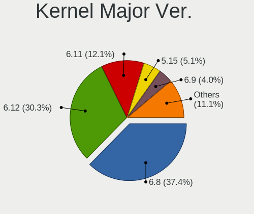
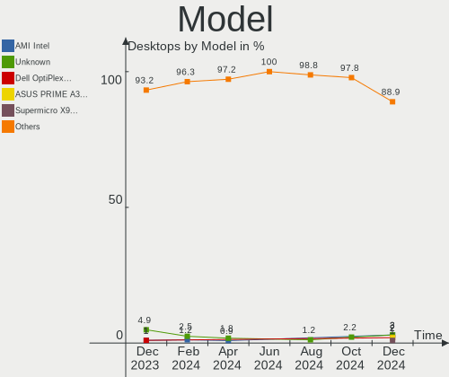
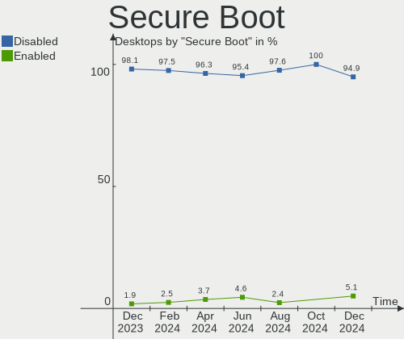
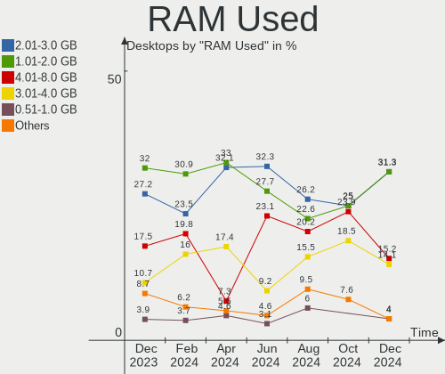
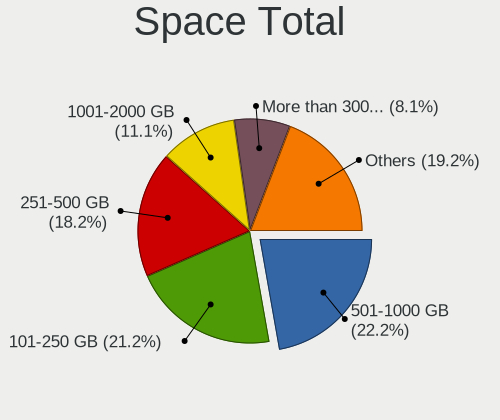
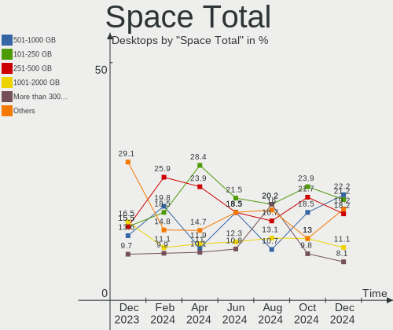
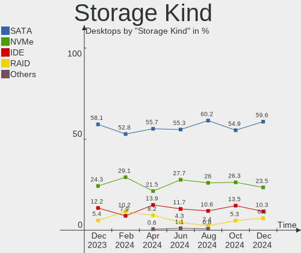
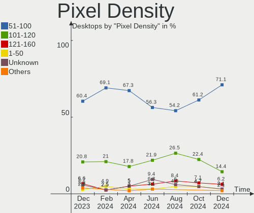
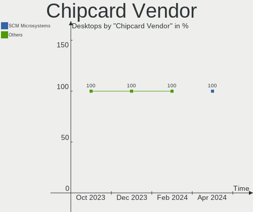

Linux in Italy - Hardware Trends (Desktops)
-------------------------------------------

A project to identify most popular hardware characteristics and track their change
over time based on data collected by Linux users at https://Linux-Hardware.org.

Anyone can contribute to this report by the [hw-probe](https://github.com/linuxhw/hw-probe) tool:

    sudo -E hw-probe -all -upload

Period: Apr, 2024.

Contents
--------

* [ System ](#system)
  - [ OS                       ](#os)
  - [ OS Family                ](#os-family)
  - [ Kernel                   ](#kernel)
  - [ Kernel Family            ](#kernel-family)
  - [ Kernel Major Ver.        ](#kernel-major-ver)
  - [ Arch                     ](#arch)
  - [ DE                       ](#de)
  - [ Display Server           ](#display-server)
  - [ Display Manager          ](#display-manager)
  - [ OS Lang                  ](#os-lang)
  - [ Boot Mode                ](#boot-mode)
  - [ Filesystem               ](#filesystem)
  - [ Part. scheme             ](#part-scheme)
  - [ Dual Boot with Linux/BSD ](#dual-boot-with-linuxbsd)
  - [ Dual Boot (Win)          ](#dual-boot-win)

* [ Board ](#board)
  - [ Vendor                   ](#vendor)
  - [ Model                    ](#model)
  - [ Model Family             ](#model-family)
  - [ MFG Year                 ](#mfg-year)
  - [ Form Factor              ](#form-factor)
  - [ Secure Boot              ](#secure-boot)
  - [ Coreboot                 ](#coreboot)
  - [ RAM Size                 ](#ram-size)
  - [ RAM Used                 ](#ram-used)
  - [ Total Drives             ](#total-drives)
  - [ Has CD-ROM               ](#has-cd-rom)
  - [ Has Ethernet             ](#has-ethernet)
  - [ Has WiFi                 ](#has-wifi)
  - [ Has Bluetooth            ](#has-bluetooth)

* [ Location ](#location)
  - [ Country                  ](#country)
  - [ City                     ](#city)

* [ Drives ](#drives)
  - [ Drive Vendor             ](#drive-vendor)
  - [ Drive Model              ](#drive-model)
  - [ HDD Vendor               ](#hdd-vendor)
  - [ SSD Vendor               ](#ssd-vendor)
  - [ Drive Kind               ](#drive-kind)
  - [ Drive Connector          ](#drive-connector)
  - [ Drive Size               ](#drive-size)
  - [ Space Total              ](#space-total)
  - [ Space Used               ](#space-used)
  - [ Malfunc. Drives          ](#malfunc-drives)
  - [ Malfunc. Drive Vendor    ](#malfunc-drive-vendor)
  - [ Malfunc. HDD Vendor      ](#malfunc-hdd-vendor)
  - [ Malfunc. Drive Kind      ](#malfunc-drive-kind)
  - [ Failed Drives            ](#failed-drives)
  - [ Failed Drive Vendor      ](#failed-drive-vendor)
  - [ Drive Status             ](#drive-status)

* [ Storage controller ](#storage-controller)
  - [ Storage Vendor           ](#storage-vendor)
  - [ Storage Model            ](#storage-model)
  - [ Storage Kind             ](#storage-kind)

* [ Processor ](#processor)
  - [ CPU Vendor               ](#cpu-vendor)
  - [ CPU Model                ](#cpu-model)
  - [ CPU Model Family         ](#cpu-model-family)
  - [ CPU Cores                ](#cpu-cores)
  - [ CPU Sockets              ](#cpu-sockets)
  - [ CPU Threads              ](#cpu-threads)
  - [ CPU Op-Modes             ](#cpu-op-modes)
  - [ CPU Microcode            ](#cpu-microcode)
  - [ CPU Microarch            ](#cpu-microarch)

* [ Graphics ](#graphics)
  - [ GPU Vendor               ](#gpu-vendor)
  - [ GPU Model                ](#gpu-model)
  - [ GPU Combo                ](#gpu-combo)
  - [ GPU Driver               ](#gpu-driver)
  - [ GPU Memory               ](#gpu-memory)

* [ Monitor ](#monitor)
  - [ Monitor Vendor           ](#monitor-vendor)
  - [ Monitor Model            ](#monitor-model)
  - [ Monitor Resolution       ](#monitor-resolution)
  - [ Monitor Diagonal         ](#monitor-diagonal)
  - [ Monitor Width            ](#monitor-width)
  - [ Aspect Ratio             ](#aspect-ratio)
  - [ Monitor Area             ](#monitor-area)
  - [ Pixel Density            ](#pixel-density)
  - [ Multiple Monitors        ](#multiple-monitors)

* [ Network ](#network)
  - [ Net Controller Vendor    ](#net-controller-vendor)
  - [ Net Controller Model     ](#net-controller-model)
  - [ Wireless Vendor          ](#wireless-vendor)
  - [ Wireless Model           ](#wireless-model)
  - [ Ethernet Vendor          ](#ethernet-vendor)
  - [ Ethernet Model           ](#ethernet-model)
  - [ Net Controller Kind      ](#net-controller-kind)
  - [ Used Controller          ](#used-controller)
  - [ NICs                     ](#nics)
  - [ IPv6                     ](#ipv6)

* [ Bluetooth ](#bluetooth)
  - [ Bluetooth Vendor         ](#bluetooth-vendor)
  - [ Bluetooth Model          ](#bluetooth-model)

* [ Sound ](#sound)
  - [ Sound Vendor             ](#sound-vendor)
  - [ Sound Model              ](#sound-model)

* [ Memory ](#memory)
  - [ Memory Vendor            ](#memory-vendor)
  - [ Memory Model             ](#memory-model)
  - [ Memory Kind              ](#memory-kind)
  - [ Memory Form Factor       ](#memory-form-factor)
  - [ Memory Size              ](#memory-size)
  - [ Memory Speed             ](#memory-speed)

* [ Printers & scanners ](#printers--scanners)
  - [ Printer Vendor           ](#printer-vendor)
  - [ Printer Model            ](#printer-model)
  - [ Scanner Vendor           ](#scanner-vendor)
  - [ Scanner Model            ](#scanner-model)

* [ Camera ](#camera)
  - [ Camera Vendor            ](#camera-vendor)
  - [ Camera Model             ](#camera-model)

* [ Security ](#security)
  - [ Fingerprint Vendor       ](#fingerprint-vendor)
  - [ Fingerprint Model        ](#fingerprint-model)
  - [ Chipcard Vendor          ](#chipcard-vendor)
  - [ Chipcard Model           ](#chipcard-model)

* [ Unsupported ](#unsupported)
  - [ Unsupported Devices      ](#unsupported-devices)
  - [ Unsupported Device Types ](#unsupported-device-types)

System
------

OS
--

Installed operating systems

| Name                         | Desktops | Percent |
|------------------------------|----------|---------|
| Linux Mint 21.3              | 17       | 15.6%   |
| Ubuntu 22.04                 | 12       | 11.01%  |
| LMDE 6                       | 7        | 6.42%   |
| Fedora 39                    | 7        | 6.42%   |
| Debian 12                    | 5        | 4.59%   |
| Arch Rolling                 | 5        | 4.59%   |
| Zorin 17                     | 4        | 3.67%   |
| OpenMandriva 23.08           | 4        | 3.67%   |
| Fedora 40                    | 4        | 3.67%   |
| ROSA 12.5                    | 3        | 2.75%   |
| KDE neon 22.04               | 3        | 2.75%   |
| EndeavourOS Rolling          | 3        | 2.75%   |
| Zorin 16                     | 2        | 1.83%   |
| Ubuntu 20.04                 | 2        | 1.83%   |
| openSUSE Tumbleweed-XXXXXXXX | 2        | 1.83%   |
| OpenMandriva 5.0             | 2        | 1.83%   |
| OpenMandriva 4.3             | 2        | 1.83%   |
| Linux Mint 21.2              | 2        | 1.83%   |
| Garuda Linux Soaring         | 2        | 1.83%   |
| ArcoLinux Rolling            | 2        | 1.83%   |
| Xubuntu 23.04                | 1        | 0.92%   |
| Xubuntu 22.04                | 1        | 0.92%   |
| Xubuntu 20.04                | 1        | 0.92%   |
| Vanilla 2.0                  | 1        | 0.92%   |
| Ubuntu MATE 22.04            | 1        | 0.92%   |
| Ubuntu 24.04                 | 1        | 0.92%   |
| PureOS 10.x                  | 1        | 0.92%   |
| Pop!_OS 22.04                | 1        | 0.92%   |
| Peppermint 10                | 1        | 0.92%   |
| openSUSE Leap-15.5           | 1        | 0.92%   |
| OpenMandriva 4.50            | 1        | 0.92%   |
| OpenMandriva 24.90           | 1        | 0.92%   |
| OpenMandriva 23.06           | 1        | 0.92%   |
| MX 23                        | 1        | 0.92%   |
| Manjaro 23.1.4               | 1        | 0.92%   |
| Manjaro                      | 1        | 0.92%   |
| Linux Mint 21                | 1        | 0.92%   |
| Linux Mint 20.3              | 1        | 0.92%   |
| AlmaLinux 9.3                | 1        | 0.92%   |

OS Family
---------

OS without a version

| Name         | Desktops | Percent |
|--------------|----------|---------|
| Linux Mint   | 21       | 19.27%  |
| Ubuntu       | 15       | 13.76%  |
| OpenMandriva | 11       | 10.09%  |
| Fedora       | 11       | 10.09%  |
| LMDE         | 7        | 6.42%   |
| Zorin        | 6        | 5.5%    |
| Debian       | 5        | 4.59%   |
| Arch         | 5        | 4.59%   |
| Xubuntu      | 3        | 2.75%   |
| ROSA         | 3        | 2.75%   |
| openSUSE     | 3        | 2.75%   |
| KDE neon     | 3        | 2.75%   |
| EndeavourOS  | 3        | 2.75%   |
| Manjaro      | 2        | 1.83%   |
| Garuda Linux | 2        | 1.83%   |
| ArcoLinux    | 2        | 1.83%   |
| Vanilla      | 1        | 0.92%   |
| Ubuntu MATE  | 1        | 0.92%   |
| PureOS       | 1        | 0.92%   |
| Pop!_OS      | 1        | 0.92%   |
| Peppermint   | 1        | 0.92%   |
| MX           | 1        | 0.92%   |
| AlmaLinux    | 1        | 0.92%   |

Kernel
------

Version of the Linux kernel

| Version                             | Desktops | Percent |
|-------------------------------------|----------|---------|
| 6.5.0-26-generic                    | 8        | 7.34%   |
| 5.15.0-105-generic                  | 8        | 7.34%   |
| 5.15.0-101-generic                  | 7        | 6.42%   |
| 6.5.0-28-generic                    | 6        | 5.5%    |
| 6.5.0-27-generic                    | 6        | 5.5%    |
| 6.1.0-20-amd64                      | 6        | 5.5%    |
| 5.15.0-102-generic                  | 5        | 4.59%   |
| 6.8.7-arch1-1                       | 3        | 2.75%   |
| 6.8.5-301.fc40.x86_64               | 3        | 2.75%   |
| 6.6.21-generic-8rosa2021.1-x86_64   | 3        | 2.75%   |
| 6.4.11-desktop-1omv2390             | 3        | 2.75%   |
| 6.1.0-18-amd64                      | 3        | 2.75%   |
| 6.8.6-200.fc39.x86_64               | 2        | 1.83%   |
| 6.8.4-arch1-1                       | 2        | 1.83%   |
| 6.8.2-arch2-1                       | 2        | 1.83%   |
| 6.6.2-desktop-1omv2390              | 2        | 1.83%   |
| 6.2.0-39-generic                    | 2        | 1.83%   |
| 6.1.0-12-amd64                      | 2        | 1.83%   |
| 5.16.7-desktop-1omv4003             | 2        | 1.83%   |
| 6.8.7-arch1-2                       | 1        | 0.92%   |
| 6.8.7-300.fc40.x86_64               | 1        | 0.92%   |
| 6.8.5-zen1-1-zen                    | 1        | 0.92%   |
| 6.8.5-arch1-1                       | 1        | 0.92%   |
| 6.8.5-201.fc39.x86_64               | 1        | 0.92%   |
| 6.8.4-zen1-1-zen                    | 1        | 0.92%   |
| 6.8.4-rc1-1-default                 | 1        | 0.92%   |
| 6.8.4-desktop-4omv2490              | 1        | 0.92%   |
| 6.8.4-AMD-znver3                    | 1        | 0.92%   |
| 6.8.4-200.fc39.x86_64               | 1        | 0.92%   |
| 6.8.1-1-default                     | 1        | 0.92%   |
| 6.8.0-76060800daily20240311-generic | 1        | 0.92%   |
| 6.8.0-31-generic                    | 1        | 0.92%   |
| 6.7.9-amd64                         | 1        | 0.92%   |
| 6.7.9-200.fc39.x86_64               | 1        | 0.92%   |
| 6.7.11-200.fc39.x86_64              | 1        | 0.92%   |
| 6.6.26-1-MANJARO                    | 1        | 0.92%   |
| 6.6.25-1-MANJARO                    | 1        | 0.92%   |
| 6.5.6-300.fc39.x86_64               | 1        | 0.92%   |
| 6.5.0-18-generic                    | 1        | 0.92%   |
| 6.4.8-desktop-2omv2390              | 1        | 0.92%   |

Kernel Family
-------------

Linux kernel without a distro release

| Version | Desktops | Percent |
|---------|----------|---------|
| 5.15.0  | 23       | 21.1%   |
| 6.5.0   | 21       | 19.27%  |
| 6.1.0   | 13       | 11.93%  |
| 6.8.4   | 7        | 6.42%   |
| 6.8.5   | 6        | 5.5%    |
| 6.8.7   | 5        | 4.59%   |
| 6.6.21  | 3        | 2.75%   |
| 6.4.11  | 3        | 2.75%   |
| 5.4.0   | 3        | 2.75%   |
| 6.8.6   | 2        | 1.83%   |
| 6.8.2   | 2        | 1.83%   |
| 6.8.0   | 2        | 1.83%   |
| 6.7.9   | 2        | 1.83%   |
| 6.6.2   | 2        | 1.83%   |
| 6.2.0   | 2        | 1.83%   |
| 5.16.7  | 2        | 1.83%   |
| 6.8.1   | 1        | 0.92%   |
| 6.7.11  | 1        | 0.92%   |
| 6.6.26  | 1        | 0.92%   |
| 6.6.25  | 1        | 0.92%   |
| 6.5.6   | 1        | 0.92%   |
| 6.4.8   | 1        | 0.92%   |
| 6.3.5   | 1        | 0.92%   |
| 5.19.12 | 1        | 0.92%   |
| 5.14.21 | 1        | 0.92%   |
| 5.14.0  | 1        | 0.92%   |
| 5.10.0  | 1        | 0.92%   |

Kernel Major Ver.
-----------------

Linux kernel major version

| Version | Desktops | Percent |
|---------|----------|---------|
| 6.8     | 25       | 22.94%  |
| 5.15    | 23       | 21.1%   |
| 6.5     | 22       | 20.18%  |
| 6.1     | 13       | 11.93%  |
| 6.6     | 7        | 6.42%   |
| 6.4     | 4        | 3.67%   |
| 6.7     | 3        | 2.75%   |
| 5.4     | 3        | 2.75%   |
| 6.2     | 2        | 1.83%   |
| 5.16    | 2        | 1.83%   |
| 5.14    | 2        | 1.83%   |
| 6.3     | 1        | 0.92%   |
| 5.19    | 1        | 0.92%   |
| 5.10    | 1        | 0.92%   |

Arch
----

OS architecture (x86_64, i586, etc.)

| Name   | Desktops | Percent |
|--------|----------|---------|
| x86_64 | 109      | 100%    |

DE
--

Desktop Environment

| Name          | Desktops | Percent |
|---------------|----------|---------|
| GNOME         | 41       | 37.61%  |
| X-Cinnamon    | 28       | 25.69%  |
| KDE5          | 17       | 15.6%   |
| KDE6          | 10       | 9.17%   |
| XFCE          | 5        | 4.59%   |
| Unknown       | 3        | 2.75%   |
| MATE          | 2        | 1.83%   |
| LXDE          | 1        | 0.92%   |
| GNOME Classic | 1        | 0.92%   |
| Cinnamon      | 1        | 0.92%   |

Display Server
--------------

X11 or Wayland

| Name    | Desktops | Percent |
|---------|----------|---------|
| X11     | 63       | 57.8%   |
| Wayland | 44       | 40.37%  |
| Tty     | 1        | 0.92%   |
| Unknown | 1        | 0.92%   |

Display Manager
---------------

SDDM, LightDM, etc.

| Name    | Desktops | Percent |
|---------|----------|---------|
| LightDM | 33       | 30.28%  |
| Unknown | 28       | 25.69%  |
| SDDM    | 20       | 18.35%  |
| GDM3    | 20       | 18.35%  |
| GDM     | 8        | 7.34%   |

OS Lang
-------

Language

| Lang  | Desktops | Percent |
|-------|----------|---------|
| it_IT | 91       | 83.49%  |
| en_US | 15       | 13.76%  |
| C     | 3        | 2.75%   |

Boot Mode
---------

EFI or BIOS

| Mode | Desktops | Percent |
|------|----------|---------|
| BIOS | 59       | 54.13%  |
| EFI  | 50       | 45.87%  |

Filesystem
----------

Type of filesystem

| Type    | Desktops | Percent |
|---------|----------|---------|
| Ext4    | 64       | 58.72%  |
| Btrfs   | 20       | 18.35%  |
| Tmpfs   | 16       | 14.68%  |
| Overlay | 7        | 6.42%   |
| Xfs     | 2        | 1.83%   |

Part. scheme
------------

Scheme of partitioning

| Type    | Desktops | Percent |
|---------|----------|---------|
| GPT     | 65       | 59.63%  |
| Unknown | 26       | 23.85%  |
| MBR     | 18       | 16.51%  |

Dual Boot with Linux/BSD
------------------------

Hosting more than one Linux/BSD

| Dual boot | Desktops | Percent |
|-----------|----------|---------|
| No        | 87       | 79.82%  |
| Yes       | 22       | 20.18%  |

Dual Boot (Win)
---------------

Hosting Linux and Windows

| Dual boot | Desktops | Percent |
|-----------|----------|---------|
| Yes       | 55       | 50.46%  |
| No        | 54       | 49.54%  |

Board
-----

Vendor
------

Motherboard manufacturer

| Name                                 | Desktops | Percent |
|--------------------------------------|----------|---------|
| ASUSTek Computer                     | 39       | 35.78%  |
| Hewlett-Packard                      | 16       | 14.68%  |
| Gigabyte Technology                  | 10       | 9.17%   |
| ASRock                               | 9        | 8.26%   |
| MSI                                  | 7        | 6.42%   |
| Dell                                 | 5        | 4.59%   |
| Acer                                 | 4        | 3.67%   |
| Pegatron                             | 2        | 1.83%   |
| Packard Bell                         | 2        | 1.83%   |
| Fujitsu                              | 2        | 1.83%   |
| Unknown                              | 2        | 1.83%   |
| SiComputer                           | 1        | 0.92%   |
| Shenzhen Meigao Electronic Equipment | 1        | 0.92%   |
| MACHINIST                            | 1        | 0.92%   |
| Lenovo                               | 1        | 0.92%   |
| Intel                                | 1        | 0.92%   |
| Huanan                               | 1        | 0.92%   |
| HPE                                  | 1        | 0.92%   |
| GenMachine                           | 1        | 0.92%   |
| GEEKOM                               | 1        | 0.92%   |
| Colorful Technology                  | 1        | 0.92%   |
| AMI                                  | 1        | 0.92%   |

Model
-----

Motherboard model

| Name                                              | Desktops | Percent |
|---------------------------------------------------|----------|---------|
| ASUS All Series                                   | 4        | 3.67%   |
| Unknown                                           | 2        | 1.83%   |
| SiComputer ActivaOne                              | 1        | 0.92%   |
| Shenzhen Meigao Electronic Equipment Venus series | 1        | 0.92%   |
| Pegatron Pro 3120 Microtower PC                   | 1        | 0.92%   |
| Pegatron Elite 7500 Series MT                     | 1        | 0.92%   |
| Packard Bell IMEDIA S3712                         | 1        | 0.92%   |
| Packard Bell IMEDIA S3210                         | 1        | 0.92%   |
| MSI MS-7C52                                       | 1        | 0.92%   |
| MSI MS-7C37                                       | 1        | 0.92%   |
| MSI MS-7C02                                       | 1        | 0.92%   |
| MSI MS-7B93                                       | 1        | 0.92%   |
| MSI MS-7B38                                       | 1        | 0.92%   |
| MSI MS-7976                                       | 1        | 0.92%   |
| MSI MS-7823                                       | 1        | 0.92%   |
| MACHINIST H81M-PRO S1 V2.0                        | 1        | 0.92%   |
| Lenovo ThinkStation S30 43516T2                   | 1        | 0.92%   |
| Intel DH61CR                                      | 1        | 0.92%   |
| Huanan X99-F8D PLUS V1.3                          | 1        | 0.92%   |
| HPE ProLiant MicroServer Gen10                    | 1        | 0.92%   |
| HP Z240 SFF Workstation                           | 1        | 0.92%   |
| HP Z2 Tower G4 Workstation                        | 1        | 0.92%   |
| HP rp5800 Retail System                           | 1        | 0.92%   |
| HP ProDesk 600 G1 TWR                             | 1        | 0.92%   |
| HP ProDesk 600 G1 SFF                             | 1        | 0.92%   |
| HP ProDesk 405 G1 MT                              | 1        | 0.92%   |
| HP Pavilion Desktop TP01-0xxx                     | 1        | 0.92%   |
| HP EliteDesk 705 G5 SFF                           | 1        | 0.92%   |
| HP Compaq Elite 8300 CMT                          | 1        | 0.92%   |
| HP Compaq dc7600 Small Form Factor                | 1        | 0.92%   |
| HP Compaq 8200 Elite MT PC                        | 1        | 0.92%   |
| HP Compaq 6200 Pro MT PC                          | 1        | 0.92%   |
| HP Compaq 6000 Pro MT PC                          | 1        | 0.92%   |
| HP 550-204nl                                      | 1        | 0.92%   |
| HP 550-113nl                                      | 1        | 0.92%   |
| HP 500-350nl                                      | 1        | 0.92%   |
| Gigabyte Z790 AERO G                              | 1        | 0.92%   |
| Gigabyte Z390 UD                                  | 1        | 0.92%   |
| Gigabyte Z390 GAMING X                            | 1        | 0.92%   |
| Gigabyte Z390 AORUS PRO                           | 1        | 0.92%   |

Model Family
------------

Motherboard model prefix

| Name                                       | Desktops | Percent |
|--------------------------------------------|----------|---------|
| ASUS ROG                                   | 7        | 6.42%   |
| ASUS PRIME                                 | 6        | 5.5%    |
| HP Compaq                                  | 5        | 4.59%   |
| ASUS All                                   | 4        | 3.67%   |
| HP ProDesk                                 | 3        | 2.75%   |
| Gigabyte Z390                              | 3        | 2.75%   |
| Dell OptiPlex                              | 3        | 2.75%   |
| Packard Bell IMEDIA                        | 2        | 1.83%   |
| Fujitsu ESPRIMO                            | 2        | 1.83%   |
| ASUS TUF                                   | 2        | 1.83%   |
| Acer Aspire                                | 2        | 1.83%   |
| Unknown                                    | 2        | 1.83%   |
| SiComputer ActivaOne                       | 1        | 0.92%   |
| Shenzhen Meigao Electronic Equipment Venus | 1        | 0.92%   |
| Pegatron Pro                               | 1        | 0.92%   |
| Pegatron Elite                             | 1        | 0.92%   |
| MSI MS-7C52                                | 1        | 0.92%   |
| MSI MS-7C37                                | 1        | 0.92%   |
| MSI MS-7C02                                | 1        | 0.92%   |
| MSI MS-7B93                                | 1        | 0.92%   |
| MSI MS-7B38                                | 1        | 0.92%   |
| MSI MS-7976                                | 1        | 0.92%   |
| MSI MS-7823                                | 1        | 0.92%   |
| MACHINIST H81M-PRO                         | 1        | 0.92%   |
| Lenovo ThinkStation                        | 1        | 0.92%   |
| Intel DH61CR                               | 1        | 0.92%   |
| Huanan X99-F8D                             | 1        | 0.92%   |
| HPE ProLiant                               | 1        | 0.92%   |
| HP Z240                                    | 1        | 0.92%   |
| HP Z2                                      | 1        | 0.92%   |
| HP rp5800                                  | 1        | 0.92%   |
| HP Pavilion                                | 1        | 0.92%   |
| HP EliteDesk                               | 1        | 0.92%   |
| HP 550-204nl                               | 1        | 0.92%   |
| HP 550-113nl                               | 1        | 0.92%   |
| HP 500-350nl                               | 1        | 0.92%   |
| Gigabyte Z790                              | 1        | 0.92%   |
| Gigabyte H81M-D2V                          | 1        | 0.92%   |
| Gigabyte H610M                             | 1        | 0.92%   |
| Gigabyte GA-MA78G-DS3H                     | 1        | 0.92%   |

MFG Year
--------

Motherboard manufacture year

| Year | Desktops | Percent |
|------|----------|---------|
| 2013 | 12       | 11.01%  |
| 2018 | 11       | 10.09%  |
| 2012 | 10       | 9.17%   |
| 2021 | 9        | 8.26%   |
| 2011 | 9        | 8.26%   |
| 2019 | 8        | 7.34%   |
| 2009 | 8        | 7.34%   |
| 2023 | 7        | 6.42%   |
| 2020 | 6        | 5.5%    |
| 2016 | 6        | 5.5%    |
| 2010 | 6        | 5.5%    |
| 2008 | 5        | 4.59%   |
| 2022 | 3        | 2.75%   |
| 2015 | 3        | 2.75%   |
| 2014 | 3        | 2.75%   |
| 2024 | 1        | 0.92%   |
| 2017 | 1        | 0.92%   |
| 2005 | 1        | 0.92%   |

Form Factor
-----------

Physical design of the computer

| Name    | Desktops | Percent |
|---------|----------|---------|
| Desktop | 109      | 100%    |

Secure Boot
-----------

Enabled or disabled

| State    | Desktops | Percent |
|----------|----------|---------|
| Disabled | 105      | 96.33%  |
| Enabled  | 4        | 3.67%   |

Coreboot
--------

Have coreboot on board

| Used | Desktops | Percent |
|------|----------|---------|
| No   | 109      | 100%    |

RAM Size
--------

Total RAM memory

| Size in GB  | Desktops | Percent |
|-------------|----------|---------|
| 16.01-24.0  | 27       | 24.77%  |
| 32.01-64.0  | 21       | 19.27%  |
| 4.01-8.0    | 19       | 17.43%  |
| 8.01-16.0   | 19       | 17.43%  |
| 3.01-4.0    | 12       | 11.01%  |
| 64.01-256.0 | 9        | 8.26%   |
| 24.01-32.0  | 1        | 0.92%   |
| 1.01-2.0    | 1        | 0.92%   |

RAM Used
--------

Used RAM memory

| Used GB   | Desktops | Percent |
|-----------|----------|---------|
| 1.01-2.0  | 36       | 33.03%  |
| 2.01-3.0  | 35       | 32.11%  |
| 3.01-4.0  | 19       | 17.43%  |
| 4.01-8.0  | 8        | 7.34%   |
| 8.01-16.0 | 5        | 4.59%   |
| 0.51-1.0  | 5        | 4.59%   |
| 0.01-0.5  | 1        | 0.92%   |

Total Drives
------------

Number of drives on board

| Drives | Desktops | Percent |
|--------|----------|---------|
| 1      | 32       | 29.36%  |
| 2      | 30       | 27.52%  |
| 3      | 25       | 22.94%  |
| 4      | 14       | 12.84%  |
| 5      | 4        | 3.67%   |
| 6      | 2        | 1.83%   |
| 7      | 1        | 0.92%   |
| 0      | 1        | 0.92%   |

Has CD-ROM
----------

Has CD-ROM on board

| Presented | Desktops | Percent |
|-----------|----------|---------|
| Yes       | 62       | 56.88%  |
| No        | 47       | 43.12%  |

Has Ethernet
------------

Has Ethernet on board

| Presented | Desktops | Percent |
|-----------|----------|---------|
| Yes       | 109      | 100%    |

Has WiFi
--------

Has WiFi module

| Presented | Desktops | Percent |
|-----------|----------|---------|
| No        | 56       | 51.38%  |
| Yes       | 53       | 48.62%  |

Has Bluetooth
-------------

Has Bluetooth module

| Presented | Desktops | Percent |
|-----------|----------|---------|
| No        | 71       | 65.14%  |
| Yes       | 38       | 34.86%  |

Location
--------

Country
-------

Geographic location (country)

| Country | Desktops | Percent |
|---------|----------|---------|
| Italy   | 109      | 100%    |

City
----

Geographic location (city)

| City                    | Desktops | Percent |
|-------------------------|----------|---------|
| Rome                    | 14       | 12.84%  |
| Milan                   | 9        | 8.26%   |
| Rho                     | 5        | 4.59%   |
| Milano                  | 5        | 4.59%   |
| Bologna                 | 5        | 4.59%   |
| Turin                   | 3        | 2.75%   |
| Naples                  | 3        | 2.75%   |
| Pescara                 | 2        | 1.83%   |
| Padova                  | 2        | 1.83%   |
| Genoa                   | 2        | 1.83%   |
| Bergamo                 | 2        | 1.83%   |
| Bellaria-Igea Marina    | 2        | 1.83%   |
| Zero Branco             | 1        | 0.92%   |
| Vicenza                 | 1        | 0.92%   |
| Verona                  | 1        | 0.92%   |
| Verolanuova             | 1        | 0.92%   |
| Trento                  | 1        | 0.92%   |
| Torre Orsaia            | 1        | 0.92%   |
| Tavagnacco              | 1        | 0.92%   |
| Spoltore                | 1        | 0.92%   |
| Siena                   | 1        | 0.92%   |
| Seveso                  | 1        | 0.92%   |
| Sesto San Giovanni      | 1        | 0.92%   |
| Sermoneta               | 1        | 0.92%   |
| Selvazzano Dentro       | 1        | 0.92%   |
| Scordia                 | 1        | 0.92%   |
| Sannazzaro de' Burgondi | 1        | 0.92%   |
| Reggio Calabria         | 1        | 0.92%   |
| Pomigliano d'Arco       | 1        | 0.92%   |
| Pisa                    | 1        | 0.92%   |
| Perugia                 | 1        | 0.92%   |
| Paliano                 | 1        | 0.92%   |
| Ornago                  | 1        | 0.92%   |
| Nova Milanese           | 1        | 0.92%   |
| Montalcino              | 1        | 0.92%   |
| Montagna in Valtellina  | 1        | 0.92%   |
| Mogliano Veneto         | 1        | 0.92%   |
| Modena                  | 1        | 0.92%   |
| Messina                 | 1        | 0.92%   |
| Matino                  | 1        | 0.92%   |

Drives
------

Drive Vendor
------------

Hard drive vendors

| Vendor                      | Desktops | Drives | Percent |
|-----------------------------|----------|--------|---------|
| Seagate                     | 37       | 44     | 17.45%  |
| Samsung Electronics         | 33       | 46     | 15.57%  |
| WDC                         | 26       | 31     | 12.26%  |
| Crucial                     | 22       | 33     | 10.38%  |
| Kingston                    | 19       | 22     | 8.96%   |
| Toshiba                     | 8        | 9      | 3.77%   |
| SanDisk                     | 6        | 6      | 2.83%   |
| Unknown                     | 4        | 7      | 1.89%   |
| Maxtor                      | 4        | 4      | 1.89%   |
| Phison Electronics          | 3        | 3      | 1.42%   |
| Micron/Crucial Technology   | 3        | 3      | 1.42%   |
| Micron Technology           | 3        | 3      | 1.42%   |
| HGST                        | 3        | 6      | 1.42%   |
| Fanxiang                    | 3        | 3      | 1.42%   |
| SPCC                        | 2        | 3      | 0.94%   |
| SABRENT                     | 2        | 2      | 0.94%   |
| Phison                      | 2        | 2      | 0.94%   |
| Lexar                       | 2        | 2      | 0.94%   |
| JMicron Technology          | 2        | 2      | 0.94%   |
| Intenso                     | 2        | 2      | 0.94%   |
| Hitachi                     | 2        | 2      | 0.94%   |
| China                       | 2        | 2      | 0.94%   |
| TSA                         | 1        | 1      | 0.47%   |
| SK hynix                    | 1        | 1      | 0.47%   |
| Silicon Motion              | 1        | 1      | 0.47%   |
| S3+                         | 1        | 1      | 0.47%   |
| ROG                         | 1        | 1      | 0.47%   |
| Realtek Semiconductor       | 1        | 1      | 0.47%   |
| PNY                         | 1        | 2      | 0.47%   |
| Patriot                     | 1        | 1      | 0.47%   |
| MAXIO Technology (Hangzhou) | 1        | 1      | 0.47%   |
| MARVELL                     | 1        | 2      | 0.47%   |
| LITEONIT                    | 1        | 1      | 0.47%   |
| Leven                       | 1        | 1      | 0.47%   |
| Kingston Technology Company | 1        | 1      | 0.47%   |
| KingDian                    | 1        | 1      | 0.47%   |
| Kimtigo                     | 1        | 1      | 0.47%   |
| Gigabyte Technology         | 1        | 1      | 0.47%   |
| EDILOCA                     | 1        | 1      | 0.47%   |
| Drevo                       | 1        | 1      | 0.47%   |

Drive Model
-----------

Hard drive models

| Model                                              | Desktops | Percent |
|----------------------------------------------------|----------|---------|
| Crucial CT500MX500SSD1 500GB                       | 7        | 2.87%   |
| Seagate ST500DM002-1BD142 500GB                    | 5        | 2.05%   |
| Kingston SA400S37240G 240GB SSD                    | 4        | 1.64%   |
| Crucial CT1000MX500SSD1 1TB                        | 4        | 1.64%   |
| Unknown SD/MMC/MS PRO 128GB                        | 3        | 1.23%   |
| Toshiba DT01ACA050 500GB                           | 3        | 1.23%   |
| Seagate ST1000DM010-2EP102 1TB                     | 3        | 1.23%   |
| Seagate ST1000DM003-1SB102 1TB                     | 3        | 1.23%   |
| Seagate ST1000DM003-1CH162 1TB                     | 3        | 1.23%   |
| Phison E12 NVMe Controller 2TB                     | 3        | 1.23%   |
| Kingston SV300S37A120G 120GB SSD                   | 3        | 1.23%   |
| Kingston SA400S37480G 480GB SSD                    | 3        | 1.23%   |
| Crucial CT480BX500SSD1 480GB                       | 3        | 1.23%   |
| WDC WD30EZRX-00D8PB0 3TB                           | 2        | 0.82%   |
| WDC WD20EFRX-68EUZN0 2TB                           | 2        | 0.82%   |
| WDC WD1003FZEX-00MK2A0 1TB                         | 2        | 0.82%   |
| Seagate ST2000DM008-2FR102 2TB                     | 2        | 0.82%   |
| Seagate ST1000LM024 HN-M101MBB 1TB                 | 2        | 0.82%   |
| Seagate ST1000DM003-1ER162 1TB                     | 2        | 0.82%   |
| SanDisk SSD PLUS 480GB                             | 2        | 0.82%   |
| Samsung SSD 870 EVO 500GB                          | 2        | 0.82%   |
| Samsung SSD 870 EVO 1TB                            | 2        | 0.82%   |
| Samsung SSD 860 EVO 500GB                          | 2        | 0.82%   |
| Samsung SSD 860 EVO 250GB                          | 2        | 0.82%   |
| Samsung SSD 750 EVO 250GB                          | 2        | 0.82%   |
| Samsung NVMe SSD Controller SM981/PM981/PM983 1TB  | 2        | 0.82%   |
| Samsung NVMe SSD Controller SM961/PM961/SM963 1TB  | 2        | 0.82%   |
| Samsung NVMe SSD Controller PM9A1/PM9A3/980PRO 1TB | 2        | 0.82%   |
| SABRENT Disk 1TB                                   | 2        | 0.82%   |
| Phison Sabrent 1TB                                 | 2        | 0.82%   |
| Micron/Crucial P1 NVMe PCIe SSD 1TB                | 2        | 0.82%   |
| JMicron Tech 250GB                                 | 2        | 0.82%   |
| Crucial CT500P3SSD8 500GB                          | 2        | 0.82%   |
| Crucial CT250MX500SSD1 250GB                       | 2        | 0.82%   |
| Crucial CT240BX500SSD1 240GB                       | 2        | 0.82%   |
| Crucial CT1000BX500SSD1 1TB                        | 2        | 0.82%   |
| WDC WD7500BFCX-68N6GN0 752GB                       | 1        | 0.41%   |
| WDC WD5000AZLX-60K2TA0 500GB                       | 1        | 0.41%   |
| WDC WD5000AAKS-00A7B0 500GB                        | 1        | 0.41%   |
| WDC WD5000AADS-00S9B0 500GB                        | 1        | 0.41%   |

HDD Vendor
----------

Hard disk drive vendors

| Vendor              | Desktops | Drives | Percent |
|---------------------|----------|--------|---------|
| Seagate             | 37       | 44     | 41.57%  |
| WDC                 | 26       | 31     | 29.21%  |
| Toshiba             | 6        | 7      | 6.74%   |
| Samsung Electronics | 5        | 5      | 5.62%   |
| Maxtor              | 4        | 4      | 4.49%   |
| Unknown             | 3        | 3      | 3.37%   |
| HGST                | 3        | 6      | 3.37%   |
| SABRENT             | 2        | 2      | 2.25%   |
| Hitachi             | 2        | 2      | 2.25%   |
| MARVELL             | 1        | 2      | 1.12%   |

SSD Vendor
----------

Solid state drive vendors

| Vendor              | Desktops | Drives | Percent |
|---------------------|----------|--------|---------|
| Samsung Electronics | 21       | 26     | 24.14%  |
| Crucial             | 21       | 29     | 24.14%  |
| Kingston            | 15       | 17     | 17.24%  |
| SanDisk             | 5        | 5      | 5.75%   |
| Fanxiang            | 3        | 3      | 3.45%   |
| SPCC                | 2        | 3      | 2.3%    |
| Intenso             | 2        | 2      | 2.3%    |
| China               | 2        | 2      | 2.3%    |
| TSA                 | 1        | 1      | 1.15%   |
| Toshiba             | 1        | 1      | 1.15%   |
| S3+                 | 1        | 1      | 1.15%   |
| ROG                 | 1        | 1      | 1.15%   |
| PNY                 | 1        | 2      | 1.15%   |
| Patriot             | 1        | 1      | 1.15%   |
| Micron Technology   | 1        | 1      | 1.15%   |
| LITEONIT            | 1        | 1      | 1.15%   |
| Lexar               | 1        | 1      | 1.15%   |
| Leven               | 1        | 1      | 1.15%   |
| KingDian            | 1        | 1      | 1.15%   |
| Kimtigo             | 1        | 1      | 1.15%   |
| Gigabyte Technology | 1        | 1      | 1.15%   |
| EDILOCA             | 1        | 1      | 1.15%   |
| Drevo               | 1        | 1      | 1.15%   |
| Dogfish             | 1        | 1      | 1.15%   |

Drive Kind
----------

HDD or SSD

| Kind    | Desktops | Drives | Percent |
|---------|----------|--------|---------|
| SSD     | 71       | 104    | 39.44%  |
| HDD     | 71       | 106    | 39.44%  |
| NVMe    | 34       | 45     | 18.89%  |
| Unknown | 4        | 7      | 2.22%   |

Drive Connector
---------------

SATA, SAS, NVMe, etc.

| Type | Desktops | Drives | Percent |
|------|----------|--------|---------|
| SATA | 99       | 202    | 69.23%  |
| NVMe | 34       | 45     | 23.78%  |
| SAS  | 10       | 15     | 6.99%   |

Drive Size
----------

Size of hard drive

| Size in TB | Desktops | Drives | Percent |
|------------|----------|--------|---------|
| 0.01-0.5   | 76       | 118    | 52.78%  |
| 0.51-1.0   | 47       | 62     | 32.64%  |
| 1.01-2.0   | 12       | 16     | 8.33%   |
| 2.01-3.0   | 5        | 9      | 3.47%   |
| 3.01-4.0   | 2        | 2      | 1.39%   |
| 10.01-20.0 | 1        | 2      | 0.69%   |
| 4.01-10.0  | 1        | 1      | 0.69%   |

Space Total
-----------

Amount of disk space available on the file system

| Size in GB     | Desktops | Percent |
|----------------|----------|---------|
| 101-250        | 31       | 28.44%  |
| 251-500        | 26       | 23.85%  |
| 1001-2000      | 13       | 11.93%  |
| 501-1000       | 12       | 11.01%  |
| More than 3000 | 11       | 10.09%  |
| 1-20           | 6        | 5.5%    |
| Unknown        | 5        | 4.59%   |
| 2001-3000      | 2        | 1.83%   |
| 51-100         | 2        | 1.83%   |
| 21-50          | 1        | 0.92%   |

Space Used
----------

Amount of used disk space

| Used GB        | Desktops | Percent |
|----------------|----------|---------|
| 1-20           | 35       | 32.11%  |
| 21-50          | 21       | 19.27%  |
| 101-250        | 15       | 13.76%  |
| 51-100         | 12       | 11.01%  |
| 251-500        | 6        | 5.5%    |
| 501-1000       | 6        | 5.5%    |
| Unknown        | 5        | 4.59%   |
| More than 3000 | 4        | 3.67%   |
| 1001-2000      | 3        | 2.75%   |
| 2001-3000      | 2        | 1.83%   |

Malfunc. Drives
---------------

Drive models with a malfunction

| Model                                   | Desktops | Drives | Percent |
|-----------------------------------------|----------|--------|---------|
| WDC WD5000AAKS-00A7B0 500GB             | 1        | 1      | 6.67%   |
| WDC WD30EFRX-68EUZN0 3TB                | 1        | 1      | 6.67%   |
| WDC WD1600JS-55NCB1 160GB               | 1        | 1      | 6.67%   |
| Toshiba DT01ACA050 500GB                | 1        | 1      | 6.67%   |
| SPCC Solid State Disk 512GB             | 1        | 2      | 6.67%   |
| Seagate ST500DM002-1BD142 500GB         | 1        | 1      | 6.67%   |
| Seagate ST3250312AS 250GB               | 1        | 1      | 6.67%   |
| Seagate ST31000524AS 1TB                | 1        | 1      | 6.67%   |
| Seagate ST1000DM003-1CH162 1TB          | 1        | 1      | 6.67%   |
| SanDisk SSD PLUS 480GB                  | 1        | 1      | 6.67%   |
| Samsung Electronics HD753LJ 752GB       | 1        | 1      | 6.67%   |
| Maxtor 7V250F0 256GB                    | 1        | 1      | 6.67%   |
| Kingston SHFS37A240G 240GB SSD          | 1        | 1      | 6.67%   |
| Kingston RBU-SNS8350DES3128GP 128GB SSD | 1        | 1      | 6.67%   |
| Crucial CT275MX300SSD1 275GB            | 1        | 1      | 6.67%   |

Malfunc. Drive Vendor
---------------------

Vendors of faulty drives

| Vendor              | Desktops | Drives | Percent |
|---------------------|----------|--------|---------|
| Seagate             | 4        | 4      | 26.67%  |
| WDC                 | 3        | 3      | 20%     |
| Kingston            | 2        | 2      | 13.33%  |
| Toshiba             | 1        | 1      | 6.67%   |
| SPCC                | 1        | 2      | 6.67%   |
| SanDisk             | 1        | 1      | 6.67%   |
| Samsung Electronics | 1        | 1      | 6.67%   |
| Maxtor              | 1        | 1      | 6.67%   |
| Crucial             | 1        | 1      | 6.67%   |

Malfunc. HDD Vendor
-------------------

Vendors of faulty HDD drives

| Vendor              | Desktops | Drives | Percent |
|---------------------|----------|--------|---------|
| Seagate             | 4        | 4      | 40%     |
| WDC                 | 3        | 3      | 30%     |
| Toshiba             | 1        | 1      | 10%     |
| Samsung Electronics | 1        | 1      | 10%     |
| Maxtor              | 1        | 1      | 10%     |

Malfunc. Drive Kind
-------------------

Kinds of faulty drives

| Kind | Desktops | Drives | Percent |
|------|----------|--------|---------|
| HDD  | 10       | 10     | 66.67%  |
| SSD  | 5        | 6      | 33.33%  |

Failed Drives
-------------

Failed drive models

Zero info for selected period =(

Failed Drive Vendor
-------------------

Failed drive vendors

Zero info for selected period =(

Drive Status
------------

Number of failed and malfunc. drives

| Status   | Desktops | Drives | Percent |
|----------|----------|--------|---------|
| Works    | 62       | 127    | 49.6%   |
| Detected | 50       | 119    | 40%     |
| Malfunc  | 13       | 16     | 10.4%   |

Storage controller
------------------

Storage Vendor
--------------

Storage controller vendors

| Vendor                       | Desktops | Percent |
|------------------------------|----------|---------|
| Intel                        | 82       | 48.52%  |
| AMD                          | 24       | 14.2%   |
| Samsung Electronics          | 11       | 6.51%   |
| ASMedia Technology           | 10       | 5.92%   |
| Marvell Technology Group     | 6        | 3.55%   |
| Kingston Technology Company  | 6        | 3.55%   |
| Phison Electronics           | 5        | 2.96%   |
| Micron/Crucial Technology    | 5        | 2.96%   |
| Micron Technology            | 4        | 2.37%   |
| JMicron Technology           | 4        | 2.37%   |
| Silicon Motion               | 2        | 1.18%   |
| Nvidia                       | 2        | 1.18%   |
| Toshiba America Info Systems | 1        | 0.59%   |
| SK hynix                     | 1        | 0.59%   |
| Silicon Image                | 1        | 0.59%   |
| Shenzhen Longsys Electronics | 1        | 0.59%   |
| SanDisk                      | 1        | 0.59%   |
| Realtek Semiconductor        | 1        | 0.59%   |
| MAXIO Technology (Hangzhou)  | 1        | 0.59%   |
| ADATA Technology             | 1        | 0.59%   |

Storage Model
-------------

Storage controller models

| Model                                                                                   | Desktops | Percent |
|-----------------------------------------------------------------------------------------|----------|---------|
| Intel 8 Series/C220 Series Chipset Family 6-port SATA Controller 1 [AHCI mode]          | 13       | 6.57%   |
| ASMedia ASM1061/ASM1062 Serial ATA Controller                                           | 10       | 5.05%   |
| AMD FCH SATA Controller [AHCI mode]                                                     | 10       | 5.05%   |
| AMD 400 Series Chipset SATA Controller                                                  | 9        | 4.55%   |
| Intel 7 Series/C210 Series Chipset Family 6-port SATA Controller [AHCI mode]            | 8        | 4.04%   |
| Intel SATA Controller [RAID mode]                                                       | 6        | 3.03%   |
| Intel NM10/ICH7 Family SATA Controller [IDE mode]                                       | 6        | 3.03%   |
| Intel 6 Series/C200 Series Chipset Family 6 port Desktop SATA AHCI Controller           | 6        | 3.03%   |
| Phison E12 NVMe Controller                                                              | 5        | 2.53%   |
| Intel Alder Lake-S PCH SATA Controller [AHCI Mode]                                      | 5        | 2.53%   |
| Intel 200 Series PCH SATA controller [AHCI mode]                                        | 5        | 2.53%   |
| Samsung NVMe SSD Controller PM9A1/PM9A3/980PRO                                          | 4        | 2.02%   |
| Intel Q170/Q150/B150/H170/H110/Z170/CM236 Chipset SATA Controller [AHCI Mode]           | 4        | 2.02%   |
| Intel Cannon Lake PCH SATA AHCI Controller                                              | 4        | 2.02%   |
| Intel 82801JI (ICH10 Family) 4 port SATA IDE Controller #1                              | 4        | 2.02%   |
| Intel 82801G (ICH7 Family) IDE Controller                                               | 4        | 2.02%   |
| AMD SB7x0/SB8x0/SB9x0 IDE Controller                                                    | 4        | 2.02%   |
| Samsung NVMe SSD Controller SM981/PM981/PM983                                           | 3        | 1.52%   |
| Samsung NVMe SSD Controller SM961/PM961/SM963                                           | 3        | 1.52%   |
| Micron 2550 NVMe SSD (DRAM-less)                                                        | 3        | 1.52%   |
| Intel Volume Management Device NVMe RAID Controller                                     | 3        | 1.52%   |
| Intel 82801JI (ICH10 Family) SATA AHCI Controller                                       | 3        | 1.52%   |
| Intel 82801JI (ICH10 Family) 2 port SATA IDE Controller #2                              | 3        | 1.52%   |
| Intel 6 Series/C200 Series Chipset Family Desktop SATA Controller (IDE mode, ports 4-5) | 3        | 1.52%   |
| Intel 6 Series/C200 Series Chipset Family Desktop SATA Controller (IDE mode, ports 0-3) | 3        | 1.52%   |
| AMD SB7x0/SB8x0/SB9x0 SATA Controller [IDE mode]                                        | 3        | 1.52%   |
| Nvidia MCP78S [GeForce 8200] IDE                                                        | 2        | 1.01%   |
| Nvidia MCP78S [GeForce 8200] AHCI Controller                                            | 2        | 1.01%   |
| Micron/Crucial P2 [Nick P2] / P3 / P3 Plus NVMe PCIe SSD (DRAM-less)                    | 2        | 1.01%   |
| Micron/Crucial P1 NVMe PCIe SSD[Frampton]                                               | 2        | 1.01%   |
| Marvell Group 88SE9230 PCIe 2.0 x2 4-port SATA 6 Gb/s RAID Controller                   | 2        | 1.01%   |
| Kingston Company KC3000/FURY Renegade NVMe SSD E18                                      | 2        | 1.01%   |
| JMicron JMB368 IDE controller                                                           | 2        | 1.01%   |
| Intel SATA controller                                                                   | 2        | 1.01%   |
| Intel Raptor Lake SATA AHCI Controller                                                  | 2        | 1.01%   |
| Intel Alder Lake-P SATA AHCI Controller                                                 | 2        | 1.01%   |
| Intel 500 Series Chipset Family SATA AHCI Controller                                    | 2        | 1.01%   |
| AMD 500 Series Chipset SATA Controller                                                  | 2        | 1.01%   |
| Toshiba America Info Systems XG6 NVMe SSD Controller                                    | 1        | 0.51%   |
| SK hynix BC511 NVMe SSD                                                                 | 1        | 0.51%   |

Storage Kind
------------

Kind of storage controller (IDE, SATA, NVMe, SAS, ...)

| Kind | Desktops | Percent |
|------|----------|---------|
| SATA | 88       | 55.7%   |
| NVMe | 34       | 21.52%  |
| IDE  | 22       | 13.92%  |
| RAID | 13       | 8.23%   |
| SAS  | 1        | 0.63%   |

Processor
---------

CPU Vendor
----------

Processor vendors

| Vendor | Desktops | Percent |
|--------|----------|---------|
| Intel  | 83       | 76.15%  |
| AMD    | 26       | 23.85%  |

CPU Model
---------

Processor models

| Model                                       | Desktops | Percent |
|---------------------------------------------|----------|---------|
| Intel Core i7-3770 CPU @ 3.40GHz            | 5        | 4.59%   |
| Intel Core i3-4160 CPU @ 3.60GHz            | 3        | 2.75%   |
| Intel Pentium Dual-Core CPU E5300 @ 2.60GHz | 2        | 1.83%   |
| Intel Core i7-7700K CPU @ 4.20GHz           | 2        | 1.83%   |
| Intel Core i5-9600K CPU @ 3.70GHz           | 2        | 1.83%   |
| Intel Core i5-3470 CPU @ 3.20GHz            | 2        | 1.83%   |
| Intel Core i5-2400 CPU @ 3.10GHz            | 2        | 1.83%   |
| Intel Core i3-4130 CPU @ 3.40GHz            | 2        | 1.83%   |
| Intel Core 2 Quad CPU Q9550 @ 2.83GHz       | 2        | 1.83%   |
| Intel 11th Gen Core i7-11700F @ 2.50GHz     | 2        | 1.83%   |
| AMD Ryzen 9 5950X 16-Core Processor         | 2        | 1.83%   |
| AMD Ryzen 9 3900X 12-Core Processor         | 2        | 1.83%   |
| Intel Xeon CPU X5650 @ 2.67GHz              | 1        | 0.92%   |
| Intel Xeon CPU E5-2680 v4 @ 2.40GHz         | 1        | 0.92%   |
| Intel Xeon CPU E5-1650 v2 @ 3.50GHz         | 1        | 0.92%   |
| Intel Xeon CPU E3-1230 v6 @ 3.50GHz         | 1        | 0.92%   |
| Intel Pentium Dual-Core CPU E6500 @ 2.93GHz | 1        | 0.92%   |
| Intel Pentium Dual-Core CPU E5700 @ 3.00GHz | 1        | 0.92%   |
| Intel Pentium Dual-Core CPU E5500 @ 2.80GHz | 1        | 0.92%   |
| Intel Pentium Dual-Core CPU E5200 @ 2.50GHz | 1        | 0.92%   |
| Intel Pentium 4 CPU 3.00GHz                 | 1        | 0.92%   |
| Intel N95                                   | 1        | 0.92%   |
| Intel N100                                  | 1        | 0.92%   |
| Intel Core i9-10900KF CPU @ 3.70GHz         | 1        | 0.92%   |
| Intel Core i7-9700K CPU @ 3.60GHz           | 1        | 0.92%   |
| Intel Core i7-9700 CPU @ 3.00GHz            | 1        | 0.92%   |
| Intel Core i7-8700 CPU @ 3.20GHz            | 1        | 0.92%   |
| Intel Core i7-6700K CPU @ 4.00GHz           | 1        | 0.92%   |
| Intel Core i7-6700 CPU @ 3.40GHz            | 1        | 0.92%   |
| Intel Core i7-4790S CPU @ 3.20GHz           | 1        | 0.92%   |
| Intel Core i7-4770K CPU @ 3.50GHz           | 1        | 0.92%   |
| Intel Core i7-3770K CPU @ 3.50GHz           | 1        | 0.92%   |
| Intel Core i7-2600K CPU @ 3.40GHz           | 1        | 0.92%   |
| Intel Core i7-2600 CPU @ 3.40GHz            | 1        | 0.92%   |
| Intel Core i7 CPU 870 @ 2.93GHz             | 1        | 0.92%   |
| Intel Core i5-9400F CPU @ 2.90GHz           | 1        | 0.92%   |
| Intel Core i5-8600K CPU @ 3.60GHz           | 1        | 0.92%   |
| Intel Core i5-8260U CPU @ 1.60GHz           | 1        | 0.92%   |
| Intel Core i5-6500 CPU @ 3.20GHz            | 1        | 0.92%   |
| Intel Core i5-6400 CPU @ 2.70GHz            | 1        | 0.92%   |

CPU Model Family
----------------

Processor model prefix

| Model                   | Desktops | Percent |
|-------------------------|----------|---------|
| Intel Core i5           | 20       | 18.35%  |
| Intel Core i7           | 18       | 16.51%  |
| Other                   | 15       | 13.76%  |
| Intel Core i3           | 11       | 10.09%  |
| Intel Pentium Dual-Core | 6        | 5.5%    |
| AMD Ryzen 9             | 5        | 4.59%   |
| AMD Ryzen 7             | 5        | 4.59%   |
| Intel Xeon              | 4        | 3.67%   |
| Intel Core 2 Quad       | 4        | 3.67%   |
| AMD Ryzen 5             | 4        | 3.67%   |
| Intel Core 2 Duo        | 2        | 1.83%   |
| AMD A10                 | 2        | 1.83%   |
| Intel Pentium 4         | 1        | 0.92%   |
| Intel Core i9           | 1        | 0.92%   |
| Intel Celeron           | 1        | 0.92%   |
| AMD Ryzen 5 PRO         | 1        | 0.92%   |
| AMD Ryzen 3             | 1        | 0.92%   |
| AMD Phenom II X6        | 1        | 0.92%   |
| AMD Phenom II X4        | 1        | 0.92%   |
| AMD Phenom              | 1        | 0.92%   |
| AMD Opteron             | 1        | 0.92%   |
| AMD FX                  | 1        | 0.92%   |
| AMD Athlon II X2        | 1        | 0.92%   |
| AMD Athlon 64 X2        | 1        | 0.92%   |
| AMD A4                  | 1        | 0.92%   |

CPU Cores
---------

Number of processor cores

| Number | Desktops | Percent |
|--------|----------|---------|
| 4      | 46       | 42.2%   |
| 2      | 25       | 22.94%  |
| 6      | 13       | 11.93%  |
| 8      | 9        | 8.26%   |
| 16     | 4        | 3.67%   |
| 12     | 4        | 3.67%   |
| 10     | 3        | 2.75%   |
| 14     | 2        | 1.83%   |
| 28     | 1        | 0.92%   |
| 24     | 1        | 0.92%   |
| 1      | 1        | 0.92%   |

CPU Sockets
-----------

Number of sockets

| Number | Desktops | Percent |
|--------|----------|---------|
| 1      | 108      | 99.08%  |
| 2      | 1        | 0.92%   |

CPU Threads
-----------

Threads per core (Hyper-Threading)

| Number | Desktops | Percent |
|--------|----------|---------|
| 2      | 65       | 59.63%  |
| 1      | 44       | 40.37%  |

CPU Op-Modes
------------

CPU Operation Modes (32-bit, 64-bit)

| Op mode        | Desktops | Percent |
|----------------|----------|---------|
| 32-bit, 64-bit | 109      | 100%    |

CPU Microcode
-------------

Microcode number

| Number     | Desktops | Percent |
|------------|----------|---------|
| Unknown    | 63       | 57.8%   |
| 0x1067a    | 5        | 4.59%   |
| 0x306c3    | 4        | 3.67%   |
| 0x306a9    | 4        | 3.67%   |
| 0x206a7    | 4        | 3.67%   |
| 0x506e3    | 3        | 2.75%   |
| 0xb06e0    | 2        | 1.83%   |
| 0xb0671    | 1        | 0.92%   |
| 0xa0655    | 1        | 0.92%   |
| 0x906ed    | 1        | 0.92%   |
| 0x906ec    | 1        | 0.92%   |
| 0x906ea    | 1        | 0.92%   |
| 0x906a4    | 1        | 0.92%   |
| 0x806ea    | 1        | 0.92%   |
| 0x706a1    | 1        | 0.92%   |
| 0x206c2    | 1        | 0.92%   |
| 0x0a20120e | 1        | 0.92%   |
| 0x0a201205 | 1        | 0.92%   |
| 0x08701030 | 1        | 0.92%   |
| 0x08108109 | 1        | 0.92%   |
| 0x0810100b | 1        | 0.92%   |
| 0x0800820d | 1        | 0.92%   |
| 0x08001138 | 1        | 0.92%   |
| 0x0700010b | 1        | 0.92%   |
| 0x0600611a | 1        | 0.92%   |
| 0x06003104 | 1        | 0.92%   |
| 0x06001119 | 1        | 0.92%   |
| 0x06000852 | 1        | 0.92%   |
| 0x010000dc | 1        | 0.92%   |
| 0x010000db | 1        | 0.92%   |
| 0x01000095 | 1        | 0.92%   |

CPU Microarch
-------------

Microarchitecture

| Name             | Desktops | Percent |
|------------------|----------|---------|
| Haswell          | 13       | 11.93%  |
| Penryn           | 12       | 11.01%  |
| KabyLake         | 12       | 11.01%  |
| IvyBridge        | 12       | 11.01%  |
| SandyBridge      | 7        | 6.42%   |
| Unknown          | 7        | 6.42%   |
| Alderlake Hybrid | 6        | 5.5%    |
| Zen 3            | 5        | 4.59%   |
| Zen 2            | 5        | 4.59%   |
| Skylake          | 5        | 4.59%   |
| K10              | 4        | 3.67%   |
| Zen+             | 3        | 2.75%   |
| Zen              | 2        | 1.83%   |
| Westmere         | 2        | 1.83%   |
| Piledriver       | 2        | 1.83%   |
| Icelake          | 2        | 1.83%   |
| Steamroller      | 1        | 0.92%   |
| NetBurst         | 1        | 0.92%   |
| Nehalem          | 1        | 0.92%   |
| K8 Hammer        | 1        | 0.92%   |
| Jaguar           | 1        | 0.92%   |
| Gracemont        | 1        | 0.92%   |
| Goldmont plus    | 1        | 0.92%   |
| Excavator        | 1        | 0.92%   |
| CometLake        | 1        | 0.92%   |
| Broadwell        | 1        | 0.92%   |

Graphics
--------

GPU Vendor
----------

Vendors of graphics cards

| Vendor | Desktops | Percent |
|--------|----------|---------|
| Nvidia | 44       | 37.61%  |
| Intel  | 40       | 34.19%  |
| AMD    | 33       | 28.21%  |

GPU Model
---------

Graphics card models

| Model                                                                       | Desktops | Percent |
|-----------------------------------------------------------------------------|----------|---------|
| Intel IvyBridge GT2 [HD Graphics 4000]                                      | 5        | 4.2%    |
| Intel 4 Series Chipset Integrated Graphics Controller                       | 5        | 4.2%    |
| Nvidia GP108 [GeForce GT 1030]                                              | 4        | 3.36%   |
| Nvidia GK208B [GeForce GT 730]                                              | 4        | 3.36%   |
| Intel Xeon E3-1200 v3/4th Gen Core Processor Integrated Graphics Controller | 4        | 3.36%   |
| Intel CoffeeLake-S GT2 [UHD Graphics 630]                                   | 4        | 3.36%   |
| Intel 4th Generation Core Processor Family Integrated Graphics Controller   | 4        | 3.36%   |
| Intel 2nd Generation Core Processor Family Integrated Graphics Controller   | 4        | 3.36%   |
| AMD Ellesmere [Radeon RX 470/480/570/570X/580/580X/590]                     | 3        | 2.52%   |
| AMD Caicos [Radeon HD 6450/7450/8450 / R5 230 OEM]                          | 3        | 2.52%   |
| Nvidia TU117 [GeForce GTX 1650]                                             | 2        | 1.68%   |
| Nvidia TU116 [GeForce GTX 1660 SUPER]                                       | 2        | 1.68%   |
| Nvidia GP106 [GeForce GTX 1060 6GB]                                         | 2        | 1.68%   |
| Nvidia GM107 [GeForce GTX 750]                                              | 2        | 1.68%   |
| Nvidia GK208B [GeForce GT 710]                                              | 2        | 1.68%   |
| Nvidia GF119 [GeForce GT 610]                                               | 2        | 1.68%   |
| Nvidia GA104 [GeForce RTX 3060 Ti Lite Hash Rate]                           | 2        | 1.68%   |
| Intel Xeon E3-1200 v2/3rd Gen Core processor Graphics Controller            | 2        | 1.68%   |
| Intel HD Graphics 530                                                       | 2        | 1.68%   |
| Intel Alder Lake-N [UHD Graphics]                                           | 2        | 1.68%   |
| AMD Navi 32 [Radeon RX 7700 XT / 7800 XT]                                   | 2        | 1.68%   |
| AMD Navi 23 [Radeon RX 6600/6600 XT/6600M]                                  | 2        | 1.68%   |
| AMD Lexa PRO [Radeon 540/540X/550/550X / RX 540X/550/550X]                  | 2        | 1.68%   |
| AMD Cedar [Radeon HD 5000/6000/7350/8350 Series]                            | 2        | 1.68%   |
| Nvidia TU116 [GeForce GTX 1650]                                             | 1        | 0.84%   |
| Nvidia TU116 [GeForce GTX 1650 SUPER]                                       | 1        | 0.84%   |
| Nvidia TU104 [GeForce RTX 2080 SUPER]                                       | 1        | 0.84%   |
| Nvidia TU102 [GeForce RTX 2080 Ti Rev. A]                                   | 1        | 0.84%   |
| Nvidia NV38GL [Quadro FX 1300]                                              | 1        | 0.84%   |
| Nvidia GT218 [GeForce 210]                                                  | 1        | 0.84%   |
| Nvidia GT216 [GeForce GT 220]                                               | 1        | 0.84%   |
| Nvidia GP107 [GeForce GTX 1050]                                             | 1        | 0.84%   |
| Nvidia GP106GL [Quadro P2000]                                               | 1        | 0.84%   |
| Nvidia GP104 [GeForce GTX 1080]                                             | 1        | 0.84%   |
| Nvidia GP104 [GeForce GTX 1070]                                             | 1        | 0.84%   |
| Nvidia GM206 [GeForce GTX 950]                                              | 1        | 0.84%   |
| Nvidia GK107 [GeForce GT 640]                                               | 1        | 0.84%   |
| Nvidia GK106GL [Quadro K4000]                                               | 1        | 0.84%   |
| Nvidia GK104 [GeForce GTX 680]                                              | 1        | 0.84%   |
| Nvidia GF116 [GeForce GTX 550 Ti]                                           | 1        | 0.84%   |

GPU Combo
---------

Combinations of graphics cards

| Name         | Desktops | Percent |
|--------------|----------|---------|
| 1 x Nvidia   | 43       | 39.45%  |
| 1 x Intel    | 33       | 30.28%  |
| 1 x AMD      | 29       | 26.61%  |
| Intel + AMD  | 2        | 1.83%   |
| 2 x AMD      | 1        | 0.92%   |
| AMD + Nvidia | 1        | 0.92%   |

GPU Driver
----------

Free vs proprietary

| Driver      | Desktops | Percent |
|-------------|----------|---------|
| Free        | 78       | 71.56%  |
| Proprietary | 27       | 24.77%  |
| Unknown     | 4        | 3.67%   |

GPU Memory
----------

Total video memory

| Size in GB | Desktops | Percent |
|------------|----------|---------|
| Unknown    | 46       | 42.2%   |
| 1.01-2.0   | 16       | 14.68%  |
| 0.51-1.0   | 12       | 11.01%  |
| 7.01-8.0   | 9        | 8.26%   |
| 3.01-4.0   | 8        | 7.34%   |
| 0.01-0.5   | 8        | 7.34%   |
| 8.01-16.0  | 5        | 4.59%   |
| 5.01-6.0   | 3        | 2.75%   |
| 4.01-5.0   | 1        | 0.92%   |
| 2.01-3.0   | 1        | 0.92%   |

Monitor
-------

Monitor Vendor
--------------

Monitor vendors

| Vendor               | Desktops | Percent |
|----------------------|----------|---------|
| Samsung Electronics  | 24       | 22.86%  |
| Goldstar             | 16       | 15.24%  |
| Philips              | 13       | 12.38%  |
| Hewlett-Packard      | 6        | 5.71%   |
| Ancor Communications | 6        | 5.71%   |
| Dell                 | 4        | 3.81%   |
| ASUSTek Computer     | 3        | 2.86%   |
| AOC                  | 3        | 2.86%   |
| Acer                 | 3        | 2.86%   |
| Sony                 | 2        | 1.9%    |
| NEC Computers        | 2        | 1.9%    |
| MSI                  | 2        | 1.9%    |
| Mi                   | 2        | 1.9%    |
| HKC                  | 2        | 1.9%    |
| BenQ                 | 2        | 1.9%    |
| XGM                  | 1        | 0.95%   |
| Wacom                | 1        | 0.95%   |
| ViewSonic            | 1        | 0.95%   |
| Unknown              | 1        | 0.95%   |
| RTK                  | 1        | 0.95%   |
| LG Electronics       | 1        | 0.95%   |
| Lenovo               | 1        | 0.95%   |
| JYR                  | 1        | 0.95%   |
| IPS                  | 1        | 0.95%   |
| InnoLux Display      | 1        | 0.95%   |
| HUAWEI               | 1        | 0.95%   |
| Fujitsu Siemens      | 1        | 0.95%   |
| Eizo                 | 1        | 0.95%   |
| CHR                  | 1        | 0.95%   |
| Unknown              | 1        | 0.95%   |

Monitor Model
-------------

Monitor models

| Model                                                                | Desktops | Percent |
|----------------------------------------------------------------------|----------|---------|
| Samsung Electronics SyncMaster SAM0456 1360x768 410x230mm 18.5-inch  | 2        | 1.9%    |
| Samsung Electronics S24F350 SAM0D20 1920x1080 521x293mm 23.5-inch    | 2        | 1.9%    |
| Samsung Electronics S24D330 SAM0D92 1920x1080 531x299mm 24.0-inch    | 2        | 1.9%    |
| XGM XGIMI TV XGM8130 3840x2160 708x398mm 32.0-inch                   | 1        | 0.95%   |
| Wacom Cintiq 22 WAC1065 1920x1080 476x268mm 21.5-inch                | 1        | 0.95%   |
| ViewSonic VP3881 VSCE234 3840x1600 880x370mm 37.6-inch               | 1        | 0.95%   |
| Unknown LCD Monitor FFFF 2288x1287 2550x2550mm 142.0-inch            | 1        | 0.95%   |
| Sony TV SNY1601 1280x768 1200x900mm 59.1-inch                        | 1        | 0.95%   |
| Sony TV *00 SNYAA04 3840x2160 1218x685mm 55.0-inch                   | 1        | 0.95%   |
| Samsung Electronics U28E570 SAM0D6F 3840x2160 607x345mm 27.5-inch    | 1        | 0.95%   |
| Samsung Electronics T23B550 SAM0959 1920x1080 510x287mm 23.0-inch    | 1        | 0.95%   |
| Samsung Electronics T22D390 SAM0B6B 1920x1080 477x268mm 21.5-inch    | 1        | 0.95%   |
| Samsung Electronics SyncMaster SAM0294 1440x900 408x225mm 18.3-inch  | 1        | 0.95%   |
| Samsung Electronics SyncMaster SAM027D 1680x1050 433x271mm 20.1-inch | 1        | 0.95%   |
| Samsung Electronics SyncMaster SAM0167 1280x1024 338x270mm 17.0-inch | 1        | 0.95%   |
| Samsung Electronics SyncMaster SAM0115 1280x1024 376x301mm 19.0-inch | 1        | 0.95%   |
| Samsung Electronics SyncMaster SAM0020 1280x1024 338x270mm 17.0-inch | 1        | 0.95%   |
| Samsung Electronics SMB2220N SAM06A2 1920x1080 477x268mm 21.5-inch   | 1        | 0.95%   |
| Samsung Electronics S34J55x SAM0F72 3440x1440 797x333mm 34.0-inch    | 1        | 0.95%   |
| Samsung Electronics S27F350 SAM0D22 1920x1080 600x340mm 27.2-inch    | 1        | 0.95%   |
| Samsung Electronics S24D330 SAM0D93 1920x1080 531x299mm 24.0-inch    | 1        | 0.95%   |
| Samsung Electronics S24C450 SAM09CE 1920x1200 518x324mm 24.1-inch    | 1        | 0.95%   |
| Samsung Electronics S22F350 SAM0D1B 1920x1080 480x270mm 21.7-inch    | 1        | 0.95%   |
| Samsung Electronics S22B150 SAM08A3 1920x1080 477x268mm 21.5-inch    | 1        | 0.95%   |
| Samsung Electronics F24G3xTF SAM710A 1920x1080 527x296mm 23.8-inch   | 1        | 0.95%   |
| Samsung Electronics C27F390 SAM0D32 1920x1080 598x336mm 27.0-inch    | 1        | 0.95%   |
| Samsung Electronics C24F390 SAM0D2C 1920x1080 521x293mm 23.5-inch    | 1        | 0.95%   |
| RTK J584T05 RTK2775 3840x2160 609x355mm 27.8-inch                    | 1        | 0.95%   |
| Philips PHL 273V7 PHLC156 1920x1080 598x336mm 27.0-inch              | 1        | 0.95%   |
| Philips PHL 271V8 PHLC213 1920x1080 598x336mm 27.0-inch              | 1        | 0.95%   |
| Philips PHL 271E1 PHLC208 1920x1080 598x336mm 27.0-inch              | 1        | 0.95%   |
| Philips PHL 243V7 PHLC155 1920x1080 527x296mm 23.8-inch              | 1        | 0.95%   |
| Philips PHL 241E1 PHLC207 1920x1080 527x296mm 23.8-inch              | 1        | 0.95%   |
| Philips PHL 240B4LPY PHL08CC 1920x1200 518x324mm 24.1-inch           | 1        | 0.95%   |
| Philips PHL 203V5 PHLC0CE 1600x900 434x236mm 19.4-inch               | 1        | 0.95%   |
| Philips LCD Monitor PHL4650 1280x768 710x400mm 32.1-inch             | 1        | 0.95%   |
| Philips LCD Monitor 240BW 1920x1200                                  | 1        | 0.95%   |
| Philips 244EL PHLC06C 1920x1080 530x300mm 24.0-inch                  | 1        | 0.95%   |
| Philips 22PFL3404D PHLD05D 1920x1080 640x360mm 28.9-inch             | 1        | 0.95%   |
| Philips 190S PHL086B 1280x1024 376x301mm 19.0-inch                   | 1        | 0.95%   |

Monitor Resolution
------------------

Monitor screen resolution

| Resolution         | Desktops | Percent |
|--------------------|----------|---------|
| 1920x1080 (FHD)    | 44       | 42.72%  |
| 3840x2160 (4K)     | 12       | 11.65%  |
| 1280x1024 (SXGA)   | 11       | 10.68%  |
| 3440x1440          | 7        | 6.8%    |
| 1440x900 (WXGA+)   | 6        | 5.83%   |
| 1920x1200 (WUXGA)  | 4        | 3.88%   |
| 1680x1050 (WSXGA+) | 4        | 3.88%   |
| 2560x1440 (QHD)    | 2        | 1.94%   |
| 1600x900 (HD+)     | 2        | 1.94%   |
| 1360x768           | 2        | 1.94%   |
| 1280x768           | 2        | 1.94%   |
| 3840x1600          | 1        | 0.97%   |
| 2560x1080          | 1        | 0.97%   |
| 2288x1287          | 1        | 0.97%   |
| 1366x768 (WXGA)    | 1        | 0.97%   |
| 1280x800 (WXGA)    | 1        | 0.97%   |
| 1280x720 (HD)      | 1        | 0.97%   |
| 1024x768 (XGA)     | 1        | 0.97%   |

Monitor Diagonal
----------------

Diagonal size in inches

| Inches  | Desktops | Percent |
|---------|----------|---------|
| 27      | 16       | 15.24%  |
| 24      | 16       | 15.24%  |
| 19      | 12       | 11.43%  |
| 23      | 10       | 9.52%   |
| 21      | 10       | 9.52%   |
| 34      | 9        | 8.57%   |
| 18      | 6        | 5.71%   |
| Unknown | 5        | 4.76%   |
| 17      | 4        | 3.81%   |
| 40      | 2        | 1.9%    |
| 22      | 2        | 1.9%    |
| 20      | 2        | 1.9%    |
| 142     | 1        | 0.95%   |
| 72      | 1        | 0.95%   |
| 65      | 1        | 0.95%   |
| 59      | 1        | 0.95%   |
| 37      | 1        | 0.95%   |
| 32      | 1        | 0.95%   |
| 31      | 1        | 0.95%   |
| 28      | 1        | 0.95%   |
| 26      | 1        | 0.95%   |
| 15      | 1        | 0.95%   |
| 13      | 1        | 0.95%   |

Monitor Width
-------------

Physical width

| Width in mm    | Desktops | Percent |
|----------------|----------|---------|
| 501-600        | 40       | 38.1%   |
| 401-500        | 24       | 22.86%  |
| 701-800        | 10       | 9.52%   |
| 351-400        | 8        | 7.62%   |
| 601-700        | 5        | 4.76%   |
| 301-350        | 5        | 4.76%   |
| Unknown        | 5        | 4.76%   |
| 801-900        | 3        | 2.86%   |
| 1001-1500      | 2        | 1.9%    |
| More than 2000 | 1        | 0.95%   |
| 201-300        | 1        | 0.95%   |
| 1501-2000      | 1        | 0.95%   |

Aspect Ratio
------------

Proportional relationship between the width and the height

| Ratio   | Desktops | Percent |
|---------|----------|---------|
| 16/9    | 62       | 59.62%  |
| 5/4     | 12       | 11.54%  |
| 16/10   | 12       | 11.54%  |
| 21/9    | 9        | 8.65%   |
| Unknown | 5        | 4.81%   |
| 4/3     | 3        | 2.88%   |
| 1.00    | 1        | 0.96%   |

Monitor Area
------------

Area in inch

| Area in inch | Desktops | Percent |
|----------------|----------|---------|
| 201-250        | 31       | 29.52%  |
| 151-200        | 19       | 18.1%   |
| 301-350        | 17       | 16.19%  |
| 351-500        | 11       | 10.48%  |
| 141-150        | 7        | 6.67%   |
| 251-300        | 5        | 4.76%   |
| Unknown        | 5        | 4.76%   |
| More than 1000 | 4        | 3.81%   |
| 501-1000       | 4        | 3.81%   |
| 81-90          | 1        | 0.95%   |
| 101-110        | 1        | 0.95%   |

Pixel Density
-------------

Pixels per inch

| Density | Desktops | Percent |
|---------|----------|---------|
| 51-100  | 66       | 65.35%  |
| 101-120 | 20       | 19.8%   |
| 121-160 | 5        | 4.95%   |
| Unknown | 5        | 4.95%   |
| 1-50    | 3        | 2.97%   |
| 161-240 | 2        | 1.98%   |

Multiple Monitors
-----------------

Total monitors connected

| Total | Desktops | Percent |
|-------|----------|---------|
| 1     | 98       | 89.91%  |
| 2     | 8        | 7.34%   |
| 0     | 3        | 2.75%   |

Network
-------

Net Controller Vendor
---------------------

Controller vendors

| Vendor                          | Desktops | Percent |
|---------------------------------|----------|---------|
| Realtek Semiconductor           | 59       | 37.82%  |
| Intel                           | 44       | 28.21%  |
| Qualcomm Atheros                | 13       | 8.33%   |
| Broadcom                        | 9        | 5.77%   |
| TP-Link                         | 5        | 3.21%   |
| Ralink Technology               | 3        | 1.92%   |
| MediaTek                        | 3        | 1.92%   |
| Samsung Electronics             | 2        | 1.28%   |
| Nvidia                          | 2        | 1.28%   |
| NetGear                         | 2        | 1.28%   |
| Xiaomi                          | 1        | 0.64%   |
| VIA Technologies                | 1        | 0.64%   |
| Ralink                          | 1        | 0.64%   |
| Qualcomm Atheros Communications | 1        | 0.64%   |
| QinHeng Electronics             | 1        | 0.64%   |
| Oculus VR                       | 1        | 0.64%   |
| Microsoft                       | 1        | 0.64%   |
| Marvell Technology Group        | 1        | 0.64%   |
| Mad Catz                        | 1        | 0.64%   |
| DisplayLink                     | 1        | 0.64%   |
| D-Link                          | 1        | 0.64%   |
| Broadcom Limited                | 1        | 0.64%   |
| ASUSTek Computer                | 1        | 0.64%   |
| 3Com                            | 1        | 0.64%   |

Net Controller Model
--------------------

Controller models

| Model                                                                                         | Desktops | Percent |
|-----------------------------------------------------------------------------------------------|----------|---------|
| Realtek RTL8111/8168/8211/8411 PCI Express Gigabit Ethernet Controller                        | 46       | 25.27%  |
| Realtek RTL8125 2.5GbE Controller                                                             | 7        | 3.85%   |
| Intel Ethernet Controller I225-V                                                              | 7        | 3.85%   |
| Intel 82579LM Gigabit Network Connection (Lewisville)                                         | 7        | 3.85%   |
| Intel I211 Gigabit Network Connection                                                         | 5        | 2.75%   |
| Intel Ethernet Connection (2) I219-V                                                          | 5        | 2.75%   |
| TP-Link TL-WN823N v2/v3 [Realtek RTL8192EU]                                                   | 4        | 2.2%    |
| Realtek RTL8852BE PCIe 802.11ax Wireless Network Controller                                   | 4        | 2.2%    |
| Realtek 802.11ac NIC                                                                          | 4        | 2.2%    |
| Qualcomm Atheros AR8121/AR8113/AR8114 Gigabit or Fast Ethernet                                | 4        | 2.2%    |
| Intel 82579V Gigabit Network Connection                                                       | 4        | 2.2%    |
| Intel Wi-Fi 6E(802.11ax) AX210/AX1675* 2x2 [Typhoon Peak]                                     | 3        | 1.65%   |
| Intel Wi-Fi 6 AX200                                                                           | 3        | 1.65%   |
| Intel Ethernet Connection I217-LM                                                             | 3        | 1.65%   |
| Samsung Galaxy series, misc. (tethering mode)                                                 | 2        | 1.1%    |
| Realtek RTL8821CE 802.11ac PCIe Wireless Network Adapter                                      | 2        | 1.1%    |
| Realtek RTL8192EE PCIe Wireless Network Adapter                                               | 2        | 1.1%    |
| Realtek RTL8188EE Wireless Network Adapter                                                    | 2        | 1.1%    |
| Ralink RT5370 Wireless Adapter                                                                | 2        | 1.1%    |
| Nvidia MCP77 Ethernet                                                                         | 2        | 1.1%    |
| Intel Raptor Lake-S PCH CNVi WiFi                                                             | 2        | 1.1%    |
| Intel Ethernet Controller I226-V                                                              | 2        | 1.1%    |
| Intel Ethernet Connection (7) I219-V                                                          | 2        | 1.1%    |
| Intel 82567V-2 Gigabit Network Connection                                                     | 2        | 1.1%    |
| Broadcom BCM4360 802.11ac Dual Band Wireless Network Adapter                                  | 2        | 1.1%    |
| Broadcom BCM4352 802.11ac Dual Band Wireless Network Adapter                                  | 2        | 1.1%    |
| Xiaomi Mi/Redmi series (RNDIS)                                                                | 1        | 0.55%   |
| VIA VT6105/VT6106S [Rhine-III]                                                                | 1        | 0.55%   |
| TP-Link AC600 wireless Realtek RTL8811AU [Archer T2U Nano]                                    | 1        | 0.55%   |
| Realtek RTL88x2bu [AC1200 Techkey]                                                            | 1        | 0.55%   |
| Realtek RTL8821AE 802.11ac PCIe Wireless Network Adapter                                      | 1        | 0.55%   |
| Realtek RTL8192EU 802.11b/g/n WLAN Adapter                                                    | 1        | 0.55%   |
| Realtek RTL8192CU 802.11n WLAN Adapter                                                        | 1        | 0.55%   |
| Realtek RTL8191SU 802.11n WLAN Adapter                                                        | 1        | 0.55%   |
| Realtek RTL8169 PCI Gigabit Ethernet Controller                                               | 1        | 0.55%   |
| Realtek Realtek 8812AU/8821AU 802.11ac WLAN Adapter [USB Wireless Dual-Band Adapter 2.4/5Ghz] | 1        | 0.55%   |
| Realtek Killer E2600 GbE Controller                                                           | 1        | 0.55%   |
| Ralink RT2870/RT3070 Wireless Adapter                                                         | 1        | 0.55%   |
| Ralink RT5392 PCIe Wireless Network Adapter                                                   | 1        | 0.55%   |
| Qualcomm Atheros QCA9377 802.11ac Wireless Network Adapter                                    | 1        | 0.55%   |

Wireless Vendor
---------------

Wireless vendors

| Vendor                          | Desktops | Percent |
|---------------------------------|----------|---------|
| Realtek Semiconductor           | 19       | 33.93%  |
| Intel                           | 10       | 17.86%  |
| TP-Link                         | 5        | 8.93%   |
| Broadcom                        | 5        | 8.93%   |
| Qualcomm Atheros                | 4        | 7.14%   |
| Ralink Technology               | 3        | 5.36%   |
| MediaTek                        | 3        | 5.36%   |
| NetGear                         | 2        | 3.57%   |
| Ralink                          | 1        | 1.79%   |
| Qualcomm Atheros Communications | 1        | 1.79%   |
| Microsoft                       | 1        | 1.79%   |
| D-Link                          | 1        | 1.79%   |
| ASUSTek Computer                | 1        | 1.79%   |

Wireless Model
--------------

Wireless models

| Model                                                                                         | Desktops | Percent |
|-----------------------------------------------------------------------------------------------|----------|---------|
| TP-Link TL-WN823N v2/v3 [Realtek RTL8192EU]                                                   | 4        | 7.02%   |
| Realtek RTL8852BE PCIe 802.11ax Wireless Network Controller                                   | 4        | 7.02%   |
| Realtek 802.11ac NIC                                                                          | 4        | 7.02%   |
| Intel Wi-Fi 6E(802.11ax) AX210/AX1675* 2x2 [Typhoon Peak]                                     | 3        | 5.26%   |
| Intel Wi-Fi 6 AX200                                                                           | 3        | 5.26%   |
| Realtek RTL8821CE 802.11ac PCIe Wireless Network Adapter                                      | 2        | 3.51%   |
| Realtek RTL8192EE PCIe Wireless Network Adapter                                               | 2        | 3.51%   |
| Realtek RTL8188EE Wireless Network Adapter                                                    | 2        | 3.51%   |
| Ralink RT5370 Wireless Adapter                                                                | 2        | 3.51%   |
| Intel Raptor Lake-S PCH CNVi WiFi                                                             | 2        | 3.51%   |
| Broadcom BCM4360 802.11ac Dual Band Wireless Network Adapter                                  | 2        | 3.51%   |
| Broadcom BCM4352 802.11ac Dual Band Wireless Network Adapter                                  | 2        | 3.51%   |
| TP-Link AC600 wireless Realtek RTL8811AU [Archer T2U Nano]                                    | 1        | 1.75%   |
| Realtek RTL88x2bu [AC1200 Techkey]                                                            | 1        | 1.75%   |
| Realtek RTL8821AE 802.11ac PCIe Wireless Network Adapter                                      | 1        | 1.75%   |
| Realtek RTL8192EU 802.11b/g/n WLAN Adapter                                                    | 1        | 1.75%   |
| Realtek RTL8192CU 802.11n WLAN Adapter                                                        | 1        | 1.75%   |
| Realtek RTL8191SU 802.11n WLAN Adapter                                                        | 1        | 1.75%   |
| Realtek Realtek 8812AU/8821AU 802.11ac WLAN Adapter [USB Wireless Dual-Band Adapter 2.4/5Ghz] | 1        | 1.75%   |
| Ralink RT2870/RT3070 Wireless Adapter                                                         | 1        | 1.75%   |
| Ralink RT5392 PCIe Wireless Network Adapter                                                   | 1        | 1.75%   |
| Qualcomm Atheros QCA9377 802.11ac Wireless Network Adapter                                    | 1        | 1.75%   |
| Qualcomm Atheros QCA6174 802.11ac Wireless Network Adapter                                    | 1        | 1.75%   |
| Qualcomm Atheros AR9271 802.11n                                                               | 1        | 1.75%   |
| Qualcomm Atheros AR9485 Wireless Network Adapter                                              | 1        | 1.75%   |
| Qualcomm Atheros AR9462 Wireless Network Adapter                                              | 1        | 1.75%   |
| NetGear WNA3100(v1) Wireless-N 300 [Broadcom BCM43231]                                        | 1        | 1.75%   |
| NetGear WNA1100 Wireless-N 150 [Atheros AR9271]                                               | 1        | 1.75%   |
| Microsoft XBOX ACC                                                                            | 1        | 1.75%   |
| MediaTek Wi-Fi 6E MT7902 Wireless Network Adapter                                             | 1        | 1.75%   |
| MediaTek MT7922 802.11ax PCI Express Wireless Network Adapter                                 | 1        | 1.75%   |
| MediaTek MT7921 802.11ax PCI Express Wireless Network Adapter                                 | 1        | 1.75%   |
| Intel Tiger Lake PCH CNVi WiFi                                                                | 1        | 1.75%   |
| Intel Alder Lake-S PCH CNVi WiFi                                                              | 1        | 1.75%   |
| D-Link 802.11ac NIC                                                                           | 1        | 1.75%   |
| Broadcom BCM43217 802.11b/g/n                                                                 | 1        | 1.75%   |
| ASUS 802.11n Network Adapter                                                                  | 1        | 1.75%   |

Ethernet Vendor
---------------

Ethernet vendors

| Vendor                   | Desktops | Percent |
|--------------------------|----------|---------|
| Realtek Semiconductor    | 54       | 45.38%  |
| Intel                    | 41       | 34.45%  |
| Qualcomm Atheros         | 10       | 8.4%    |
| Broadcom                 | 4        | 3.36%   |
| Samsung Electronics      | 2        | 1.68%   |
| Nvidia                   | 2        | 1.68%   |
| Xiaomi                   | 1        | 0.84%   |
| VIA Technologies         | 1        | 0.84%   |
| Marvell Technology Group | 1        | 0.84%   |
| DisplayLink              | 1        | 0.84%   |
| Broadcom Limited         | 1        | 0.84%   |
| 3Com                     | 1        | 0.84%   |

Ethernet Model
--------------

Ethernet models

| Model                                                                  | Desktops | Percent |
|------------------------------------------------------------------------|----------|---------|
| Realtek RTL8111/8168/8211/8411 PCI Express Gigabit Ethernet Controller | 46       | 37.7%   |
| Realtek RTL8125 2.5GbE Controller                                      | 7        | 5.74%   |
| Intel Ethernet Controller I225-V                                       | 7        | 5.74%   |
| Intel 82579LM Gigabit Network Connection (Lewisville)                  | 7        | 5.74%   |
| Intel I211 Gigabit Network Connection                                  | 5        | 4.1%    |
| Intel Ethernet Connection (2) I219-V                                   | 5        | 4.1%    |
| Qualcomm Atheros AR8121/AR8113/AR8114 Gigabit or Fast Ethernet         | 4        | 3.28%   |
| Intel 82579V Gigabit Network Connection                                | 4        | 3.28%   |
| Intel Ethernet Connection I217-LM                                      | 3        | 2.46%   |
| Samsung Galaxy series, misc. (tethering mode)                          | 2        | 1.64%   |
| Nvidia MCP77 Ethernet                                                  | 2        | 1.64%   |
| Intel Ethernet Controller I226-V                                       | 2        | 1.64%   |
| Intel Ethernet Connection (7) I219-V                                   | 2        | 1.64%   |
| Intel 82567V-2 Gigabit Network Connection                              | 2        | 1.64%   |
| Xiaomi Mi/Redmi series (RNDIS)                                         | 1        | 0.82%   |
| VIA VT6105/VT6106S [Rhine-III]                                         | 1        | 0.82%   |
| Realtek RTL8169 PCI Gigabit Ethernet Controller                        | 1        | 0.82%   |
| Realtek Killer E2600 GbE Controller                                    | 1        | 0.82%   |
| Qualcomm Atheros Killer E2400 Gigabit Ethernet Controller              | 1        | 0.82%   |
| Qualcomm Atheros Killer E220x Gigabit Ethernet Controller              | 1        | 0.82%   |
| Qualcomm Atheros AR8161 Gigabit Ethernet                               | 1        | 0.82%   |
| Qualcomm Atheros AR8152 v2.0 Fast Ethernet                             | 1        | 0.82%   |
| Qualcomm Atheros AR8151 v2.0 Gigabit Ethernet                          | 1        | 0.82%   |
| Qualcomm Atheros AR8131 Gigabit Ethernet                               | 1        | 0.82%   |
| Marvell Group 88E8056 PCI-E Gigabit Ethernet Controller                | 1        | 0.82%   |
| Marvell Group 88E8001 Gigabit Ethernet Controller                      | 1        | 0.82%   |
| Intel I350 Gigabit Network Connection                                  | 1        | 0.82%   |
| Intel Ethernet Connection (7) I219-LM                                  | 1        | 0.82%   |
| Intel Ethernet Connection (2) I219-LM                                  | 1        | 0.82%   |
| Intel 82578DM Gigabit Network Connection                               | 1        | 0.82%   |
| Intel 82567LM-3 Gigabit Network Connection                             | 1        | 0.82%   |
| DisplayLink Kensington SD3600 Dual Video Dock                          | 1        | 0.82%   |
| Broadcom NetXtreme BCM5761 Gigabit Ethernet PCIe                       | 1        | 0.82%   |
| Broadcom NetXtreme BCM5720 Gigabit Ethernet PCIe                       | 1        | 0.82%   |
| Broadcom NetLink BCM57788 Gigabit Ethernet PCIe                        | 1        | 0.82%   |
| Broadcom NetLink BCM57781 Gigabit Ethernet PCIe                        | 1        | 0.82%   |
| Broadcom Limited NetXtreme BCM5752 Gigabit Ethernet PCI Express        | 1        | 0.82%   |
| 3Com 3c905C-TX/TX-M [Tornado]                                          | 1        | 0.82%   |

Net Controller Kind
-------------------

Ethernet, WiFi or modem

| Kind     | Desktops | Percent |
|----------|----------|---------|
| Ethernet | 109      | 66.06%  |
| WiFi     | 53       | 32.12%  |
| Modem    | 2        | 1.21%   |
| Unknown  | 1        | 0.61%   |

Used Controller
---------------

Currently used network controller

| Kind     | Desktops | Percent |
|----------|----------|---------|
| Ethernet | 84       | 74.34%  |
| WiFi     | 29       | 25.66%  |

NICs
----

Total network controllers on board

| Total | Desktops | Percent |
|-------|----------|---------|
| 1     | 65       | 59.63%  |
| 2     | 40       | 36.7%   |
| 3     | 3        | 2.75%   |
| 5     | 1        | 0.92%   |

IPv6
----

IPv6 vs IPv4

| Used | Desktops | Percent |
|------|----------|---------|
| No   | 95       | 87.16%  |
| Yes  | 14       | 12.84%  |

Bluetooth
---------

Bluetooth Vendor
----------------

Controller vendors

| Vendor                  | Desktops | Percent |
|-------------------------|----------|---------|
| Intel                   | 10       | 25%     |
| Realtek Semiconductor   | 9        | 22.5%   |
| Cambridge Silicon Radio | 6        | 15%     |
| IMC Networks            | 4        | 10%     |
| ASUSTek Computer        | 3        | 7.5%    |
| TP-Link                 | 2        | 5%      |
| MediaTek                | 1        | 2.5%    |
| Lite-On Technology      | 1        | 2.5%    |
| Foxconn / Hon Hai       | 1        | 2.5%    |
| Broadcom                | 1        | 2.5%    |
| Apple                   | 1        | 2.5%    |
| Unknown                 | 1        | 2.5%    |

Bluetooth Model
---------------

Controller models

| Model                                               | Desktops | Percent |
|-----------------------------------------------------|----------|---------|
| Realtek Bluetooth Radio                             | 7        | 17.5%   |
| Cambridge Silicon Radio Bluetooth Dongle (HCI mode) | 6        | 15%     |
| Intel AX210 Bluetooth                               | 3        | 7.5%    |
| Intel AX200 Bluetooth                               | 3        | 7.5%    |
| TP-Link UB500 Adapter                               | 2        | 5%      |
| Intel AX211 Bluetooth                               | 2        | 5%      |
| Intel AX201 Bluetooth                               | 2        | 5%      |
| IMC Networks Wireless_Device                        | 2        | 5%      |
| IMC Networks Bluetooth Radio                        | 2        | 5%      |
| Realtek  Bluetooth 4.2 Adapter                      | 1        | 2.5%    |
| Realtek Bluetooth 5.3 Radio                         | 1        | 2.5%    |
| MediaTek Wireless_Device                            | 1        | 2.5%    |
| Lite-On Qualcomm Atheros QCA9377 Bluetooth          | 1        | 2.5%    |
| Foxconn / Hon Hai Bluetooth Device                  | 1        | 2.5%    |
| Broadcom Bluetooth Controller                       | 1        | 2.5%    |
| ASUS Qualcomm Bluetooth 4.1                         | 1        | 2.5%    |
| ASUS Broadcom BCM20702A0 Bluetooth                  | 1        | 2.5%    |
| ASUS Bluetooth Adapter                              | 1        | 2.5%    |
| Apple Bluetooth Host Controller                     | 1        | 2.5%    |
| Unknown                                             | 1        | 2.5%    |

Sound
-----

Sound Vendor
------------

Sound card vendors

| Vendor                                          | Desktops | Percent |
|-------------------------------------------------|----------|---------|
| Intel                                           | 83       | 42.56%  |
| Nvidia                                          | 44       | 22.56%  |
| AMD                                             | 36       | 18.46%  |
| C-Media Electronics                             | 7        | 3.59%   |
| Samson Technologies                             | 3        | 1.54%   |
| Generalplus Technology                          | 3        | 1.54%   |
| ASUSTek Computer                                | 3        | 1.54%   |
| Zoran Co. Personal Media Division (Nogatech)    | 2        | 1.03%   |
| Logitech                                        | 2        | 1.03%   |
| Trust                                           | 1        | 0.51%   |
| Texas Instruments                               | 1        | 0.51%   |
| Razer USA                                       | 1        | 0.51%   |
| Licensed by Sony Computer Entertainment America | 1        | 0.51%   |
| Guillemot                                       | 1        | 0.51%   |
| GN Netcom                                       | 1        | 0.51%   |
| Focusrite-Novation                              | 1        | 0.51%   |
| fifinemicrophone.com                            | 1        | 0.51%   |
| Elgato Systems                                  | 1        | 0.51%   |
| Dell                                            | 1        | 0.51%   |
| Creative Labs                                   | 1        | 0.51%   |
| Corsair                                         | 1        | 0.51%   |

Sound Model
-----------

Sound card models

| Model                                                                             | Desktops | Percent |
|-----------------------------------------------------------------------------------|----------|---------|
| Intel 8 Series/C220 Series Chipset High Definition Audio Controller               | 13       | 5.96%   |
| AMD Starship/Matisse HD Audio Controller                                          | 10       | 4.59%   |
| Intel 7 Series/C216 Chipset Family High Definition Audio Controller               | 9        | 4.13%   |
| Intel 6 Series/C200 Series Chipset Family High Definition Audio Controller        | 9        | 4.13%   |
| Intel Xeon E3-1200 v3/4th Gen Core Processor HD Audio Controller                  | 7        | 3.21%   |
| Intel 82801JI (ICH10 Family) HD Audio Controller                                  | 7        | 3.21%   |
| Nvidia GK208 HDMI/DP Audio Controller                                             | 6        | 2.75%   |
| Intel NM10/ICH7 Family High Definition Audio Controller                           | 6        | 2.75%   |
| Intel 200 Series PCH HD Audio                                                     | 6        | 2.75%   |
| Intel Cannon Lake PCH cAVS                                                        | 5        | 2.29%   |
| Intel Alder Lake-S HD Audio Controller                                            | 5        | 2.29%   |
| Intel 100 Series/C230 Series Chipset Family HD Audio Controller                   | 5        | 2.29%   |
| Nvidia TU116 High Definition Audio Controller                                     | 4        | 1.83%   |
| AMD SBx00 Azalia (Intel HDA)                                                      | 4        | 1.83%   |
| AMD Oland/Hainan/Cape Verde/Pitcairn HDMI Audio [Radeon HD 7000 Series]           | 4        | 1.83%   |
| AMD Navi 21/23 HDMI/DP Audio Controller                                           | 4        | 1.83%   |
| AMD Family 17h/19h HD Audio Controller                                            | 4        | 1.83%   |
| AMD Ellesmere HDMI Audio [Radeon RX 470/480 / 570/580/590]                        | 4        | 1.83%   |
| AMD Caicos HDMI Audio [Radeon HD 6450 / 7450/8450/8490 OEM / R5 230/235/235X OEM] | 4        | 1.83%   |
| Samson Technologies Meteor condenser microphone                                   | 3        | 1.38%   |
| Nvidia GP108 High Definition Audio Controller                                     | 3        | 1.38%   |
| Nvidia GP106 High Definition Audio Controller                                     | 3        | 1.38%   |
| Nvidia GA104 High Definition Audio Controller                                     | 3        | 1.38%   |
| Intel Tiger Lake-H HD Audio Controller                                            | 3        | 1.38%   |
| Generalplus Technology USB Audio Device                                           | 3        | 1.38%   |
| ASUSTek Computer USB Audio                                                        | 3        | 1.38%   |
| AMD FCH Azalia Controller                                                         | 3        | 1.38%   |
| Zoran Co. Personal Media Division (Nogatech) USB Audio and HID                    | 2        | 0.92%   |
| Nvidia TU107 GeForce GTX 1650 High Definition Audio Controller                    | 2        | 0.92%   |
| Nvidia MCP72XE/MCP72P/MCP78U/MCP78S High Definition Audio                         | 2        | 0.92%   |
| Nvidia GP104 High Definition Audio Controller                                     | 2        | 0.92%   |
| Nvidia GM107 High Definition Audio Controller [GeForce 940MX]                     | 2        | 0.92%   |
| Nvidia GK107 HDMI Audio Controller                                                | 2        | 0.92%   |
| Nvidia GF119 HDMI Audio Controller                                                | 2        | 0.92%   |
| Intel Raptor Lake High Definition Audio Controller                                | 2        | 0.92%   |
| Intel Alder Lake-N PCH High Definition Audio Controller                           | 2        | 0.92%   |
| Intel Alder Lake PCH-P High Definition Audio Controller                           | 2        | 0.92%   |
| Intel 5 Series/3400 Series Chipset High Definition Audio                          | 2        | 0.92%   |
| C-Media Electronics USB PnP Audio Device                                          | 2        | 0.92%   |
| AMD RS780 HDMI Audio [Radeon 3000/3100 / HD 3200/3300]                            | 2        | 0.92%   |

Memory
------

Memory Vendor
-------------

Memory module vendors

| Vendor              | Desktops | Percent |
|---------------------|----------|---------|
| Corsair             | 17       | 19.77%  |
| Samsung Electronics | 13       | 15.12%  |
| Kingston            | 13       | 15.12%  |
| Unknown             | 8        | 9.3%    |
| Crucial             | 7        | 8.14%   |
| SK hynix            | 5        | 5.81%   |
| Micron Technology   | 5        | 5.81%   |
| Patriot             | 3        | 3.49%   |
| G.Skill             | 3        | 3.49%   |
| Elpida              | 2        | 2.33%   |
| Unknown (0x0E9D)    | 1        | 1.16%   |
| Unknown (0x0B45)    | 1        | 1.16%   |
| Unifosa             | 1        | 1.16%   |
| Team                | 1        | 1.16%   |
| Lexar Co Limited    | 1        | 1.16%   |
| Kimtigo             | 1        | 1.16%   |
| GIGA-BYTE           | 1        | 1.16%   |
| Apacer              | 1        | 1.16%   |
| A-DATA Technology   | 1        | 1.16%   |
| Unknown             | 1        | 1.16%   |

Memory Model
------------

Memory module models

| Model                                                              | Desktops | Percent |
|--------------------------------------------------------------------|----------|---------|
| Unknown RAM Module 2GB DIMM DDR2 800MT/s                           | 3        | 3.16%   |
| Corsair RAM CMZ8GX3M2A1600C9 4GB DIMM DDR3 1800MT/s                | 3        | 3.16%   |
| Samsung RAM Module 2GB DIMM DDR3 1333MT/s                          | 2        | 2.11%   |
| Corsair RAM CMK16GX4M2B3000C15 8GB DIMM DDR4 3600MT/s              | 2        | 2.11%   |
| Unknown RAM Module 8GB DIMM 667MT/s                                | 1        | 1.05%   |
| Unknown RAM Module 4GB DIMM DDR3 1600MT/s                          | 1        | 1.05%   |
| Unknown RAM Module 4GB DIMM DDR3 1067MT/s                          | 1        | 1.05%   |
| Unknown RAM Module 2GB DIMM DDR 800MT/s                            | 1        | 1.05%   |
| Unknown RAM Module 2GB DIMM 800MT/s                                | 1        | 1.05%   |
| Unknown RAM Module 2GB DIMM 667MT/s                                | 1        | 1.05%   |
| Unknown RAM Module 2048MB DIMM DDR 800MT/s                         | 1        | 1.05%   |
| Unknown (0x0E9D) RAM KINSOTIN16GB2666MHZ 16GB SODIMM DDR4 2667MT/s | 1        | 1.05%   |
| Unknown (0x0B45) RAM WPBH32D408SWM-16G 16GB SODIMM DDR4 3200MT/s   | 1        | 1.05%   |
| Unifosa RAM GU342G0ALEPR692C6 2GB DIMM DDR2 2048MT/s               | 1        | 1.05%   |
| Team RAM TEAMGROUP-UD4-3600 16GB DIMM DDR4 3733MT/s                | 1        | 1.05%   |
| SK hynix RAM Module 8GB DIMM DDR4 2666MT/s                         | 1        | 1.05%   |
| SK hynix RAM HMT351U6EFR8C-PB 4GB DIMM DDR3 1600MT/s               | 1        | 1.05%   |
| SK hynix RAM HMT351U6CFR8C-PB 4GB DIMM DDR3 1800MT/s               | 1        | 1.05%   |
| SK hynix RAM HMT125U7TFR8C-H9 2GB DIMM DDR3 1333MT/s               | 1        | 1.05%   |
| SK hynix RAM HMA41GU6AFR8N-TF 8GB DIMM DDR4 2465MT/s               | 1        | 1.05%   |
| Samsung RAM Module 16GB DIMM DDR4 2667MT/s                         | 1        | 1.05%   |
| Samsung RAM M393B1K70DH0 8GB DIMM DDR3 1866MT/s                    | 1        | 1.05%   |
| Samsung RAM M391B5673DZ1-CF8 2GB DIMM DDR3 1067MT/s                | 1        | 1.05%   |
| Samsung RAM M378B5673FH0-CH9 2GB DIMM DDR3 1600MT/s                | 1        | 1.05%   |
| Samsung RAM M378B5273CH0-CK0 4GB DIMM DDR3 2000MT/s                | 1        | 1.05%   |
| Samsung RAM M378B5273CH0-CH9 4GB DIMM DDR3 1867MT/s                | 1        | 1.05%   |
| Samsung RAM M378B5173EB0-CK0 4GB DIMM DDR3 1600MT/s                | 1        | 1.05%   |
| Samsung RAM M378B2873EH1-CH9 1GB DIMM DDR3 1334MT/s                | 1        | 1.05%   |
| Samsung RAM M378B1G73EB0-YK0 8GB DIMM DDR3 1600MT/s                | 1        | 1.05%   |
| Samsung RAM M378B1G73EB0-CK0 8GB DIMM DDR3 1600MT/s                | 1        | 1.05%   |
| Samsung RAM M378B1G73DB0-CK0 8192MB DIMM DDR3 2133MT/s             | 1        | 1.05%   |
| Patriot RAM PSD34G133381 4GB DIMM DDR3 1333MT/s                    | 1        | 1.05%   |
| Patriot RAM 3600 C18 Series 16GB DIMM DDR4 3600MT/s                | 1        | 1.05%   |
| Patriot RAM 3000 C16 Series 4GB DIMM DDR4 3200MT/s                 | 1        | 1.05%   |
| Micron RAM Module 2GB DIMM DDR3 1333MT/s                           | 1        | 1.05%   |
| Micron RAM CT102464BD160B.C16 8GB DIMM DDR3 1600MT/s               | 1        | 1.05%   |
| Micron RAM 8JTF25664AZ-1G6M1 2GB DIMM DDR3 1600MT/s                | 1        | 1.05%   |
| Micron RAM 8ATF1G64AZ-3G2J1 8GB DIMM DDR4 3200MT/s                 | 1        | 1.05%   |
| Micron RAM 4ATF51264AZ-2G3B1 4GB DIMM DDR4 2800MT/s                | 1        | 1.05%   |
| Lexar Co Limited RAM LD4S16G32C22ST 16GB SODIMM DDR4 3200MT/s      | 1        | 1.05%   |

Memory Kind
-----------

Memory module kinds

| Kind    | Desktops | Percent |
|---------|----------|---------|
| DDR4    | 34       | 48.57%  |
| DDR3    | 25       | 35.71%  |
| DDR2    | 4        | 5.71%   |
| DDR5    | 3        | 4.29%   |
| Unknown | 2        | 2.86%   |
| SDRAM   | 1        | 1.43%   |
| DDR     | 1        | 1.43%   |

Memory Form Factor
------------------

Physical design of the memory module

| Name   | Desktops | Percent |
|--------|----------|---------|
| DIMM   | 61       | 87.14%  |
| SODIMM | 9        | 12.86%  |

Memory Size
-----------

Memory module size

| Size  | Desktops | Percent |
|-------|----------|---------|
| 8192  | 25       | 31.65%  |
| 16384 | 20       | 25.32%  |
| 4096  | 17       | 21.52%  |
| 2048  | 12       | 15.19%  |
| 32768 | 5        | 6.33%   |

Memory Speed
------------

Memory module speed

| Speed | Desktops | Percent |
|-------|----------|---------|
| 1600  | 15       | 18.07%  |
| 3200  | 9        | 10.84%  |
| 3600  | 6        | 7.23%   |
| 1333  | 6        | 7.23%   |
| 2400  | 5        | 6.02%   |
| 1800  | 5        | 6.02%   |
| 800   | 5        | 6.02%   |
| 2667  | 4        | 4.82%   |
| 3733  | 3        | 3.61%   |
| 2133  | 3        | 3.61%   |
| 3800  | 2        | 2.41%   |
| 3466  | 2        | 2.41%   |
| 1334  | 2        | 2.41%   |
| 1067  | 2        | 2.41%   |
| 5800  | 1        | 1.2%    |
| 5600  | 1        | 1.2%    |
| 4800  | 1        | 1.2%    |
| 3066  | 1        | 1.2%    |
| 3000  | 1        | 1.2%    |
| 2933  | 1        | 1.2%    |
| 2800  | 1        | 1.2%    |
| 2666  | 1        | 1.2%    |
| 2465  | 1        | 1.2%    |
| 2048  | 1        | 1.2%    |
| 2000  | 1        | 1.2%    |
| 1867  | 1        | 1.2%    |
| 1866  | 1        | 1.2%    |
| 667   | 1        | 1.2%    |

Printers & scanners
-------------------

Printer Vendor
--------------

Printer device vendors

| Vendor              | Desktops | Percent |
|---------------------|----------|---------|
| Hewlett-Packard     | 4        | 44.44%  |
| Seiko Epson         | 3        | 33.33%  |
| Samsung Electronics | 1        | 11.11%  |
| Canon               | 1        | 11.11%  |

Printer Model
-------------

Printer device models

| Model                                                  | Desktops | Percent |
|--------------------------------------------------------|----------|---------|
| Seiko Epson WF-2870 Series                             | 1        | 11.11%  |
| Seiko Epson ME Office 600F/Stylus Office BX300F/TX300F | 1        | 11.11%  |
| Seiko Epson ET-2820 Series                             | 1        | 11.11%  |
| Samsung M2070 Series                                   | 1        | 11.11%  |
| HP OfficeJet 3830 series                               | 1        | 11.11%  |
| HP LaserJet P2015 series                               | 1        | 11.11%  |
| HP ENVY Photo 6200 series                              | 1        | 11.11%  |
| HP ENVY 4500 series                                    | 1        | 11.11%  |
| Canon PIXMA MX920 Series                               | 1        | 11.11%  |

Scanner Vendor
--------------

Scanner device vendors

| Vendor      | Desktops | Percent |
|-------------|----------|---------|
| Seiko Epson | 1        | 50%     |
| Canon       | 1        | 50%     |

Scanner Model
-------------

Scanner device models

| Model                                             | Desktops | Percent |
|---------------------------------------------------|----------|---------|
| Seiko Epson GT-F650 [GT-S600/Perfection V10/V100] | 1        | 50%     |
| Canon CanoScan LiDE 500F                          | 1        | 50%     |

Camera
------

Camera Vendor
-------------

Camera device vendors

| Vendor                 | Desktops | Percent |
|------------------------|----------|---------|
| Logitech               | 6        | 23.08%  |
| Microdia               | 3        | 11.54%  |
| Realtek Semiconductor  | 2        | 7.69%   |
| Generalplus Technology | 2        | 7.69%   |
| ARC International      | 2        | 7.69%   |
| 2M UVC CAMERA          | 2        | 7.69%   |
| Trust                  | 1        | 3.85%   |
| Sunplus IT             | 1        | 3.85%   |
| Microsoft              | 1        | 3.85%   |
| DarkHorse .            | 1        | 3.85%   |
| Creative Technology    | 1        | 3.85%   |
| Chicony Electronics    | 1        | 3.85%   |
| AVerMedia Technologies | 1        | 3.85%   |
| Arkmicro Technologies  | 1        | 3.85%   |
| Alcor Micro            | 1        | 3.85%   |

Camera Model
------------

Camera device models

| Model                                      | Desktops | Percent |
|--------------------------------------------|----------|---------|
| Logitech Webcam C270                       | 3        | 11.54%  |
| Generalplus CAMERA - UVC                   | 2        | 7.69%   |
| ARC International Camera                   | 2        | 7.69%   |
| 2M UVC CAMERA NexiGo N60 FHD Webcam        | 2        | 7.69%   |
| Trust WB-6250X Webcam                      | 1        | 3.85%   |
| Sunplus IT 1080P Webcam                    | 1        | 3.85%   |
| Realtek FULL HD 1080P Webcam               | 1        | 3.85%   |
| Realtek FHD Camera                         | 1        | 3.85%   |
| Microsoft LifeCam HD-3000                  | 1        | 3.85%   |
| Microdia USB 2.0 Camera                    | 1        | 3.85%   |
| Microdia Integrated Camera                 | 1        | 3.85%   |
| Microdia Camera                            | 1        | 3.85%   |
| Logitech Webcam C310                       | 1        | 3.85%   |
| Logitech QuickCam E 3500                   | 1        | 3.85%   |
| Logitech HD Webcam C615                    | 1        | 3.85%   |
| DarkHorse . USB2.0 Web Camera              | 1        | 3.85%   |
| Creative Live! Cam Chat HD [VF0700/VF0790] | 1        | 3.85%   |
| Chicony HP Deluxe Webcam KQ246AA           | 1        | 3.85%   |
| AVerMedia Live Gamer MINI                  | 1        | 3.85%   |
| Arkmicro USB2.0 PC CAMERA                  | 1        | 3.85%   |
| Alcor Micro USB 2.0 PC Camera              | 1        | 3.85%   |

Security
--------

Fingerprint Vendor
------------------

Fingerprint sensor vendors

Zero info for selected period =(

Fingerprint Model
-----------------

Fingerprint sensor models

Zero info for selected period =(

Chipcard Vendor
---------------

Chipcard module vendors

| Vendor           | Desktops | Percent |
|------------------|----------|---------|
| SCM Microsystems | 1        | 100%    |

Chipcard Model
--------------

Chipcard module models

| Model                                   | Desktops | Percent |
|-----------------------------------------|----------|---------|
| SCM Microsystems Identiv SmartOS Reader | 1        | 100%    |

Unsupported
-----------

Unsupported Devices
-------------------

Total unsupported devices on board

| Total | Desktops | Percent |
|-------|----------|---------|
| 0     | 89       | 81.65%  |
| 1     | 19       | 17.43%  |
| 3     | 1        | 0.92%   |

Unsupported Device Types
------------------------

Types of unsupported devices

| Type                     | Desktops | Percent |
|--------------------------|----------|---------|
| Net/wireless             | 6        | 28.57%  |
| Graphics card            | 6        | 28.57%  |
| Storage/raid             | 2        | 9.52%   |
| Video                    | 1        | 4.76%   |
| Unassigned class         | 1        | 4.76%   |
| Network                  | 1        | 4.76%   |
| Communication controller | 1        | 4.76%   |
| Chipcard                 | 1        | 4.76%   |
| Camera                   | 1        | 4.76%   |
| Bluetooth                | 1        | 4.76%   |

