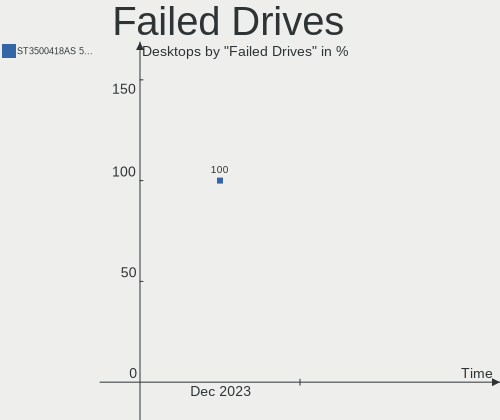
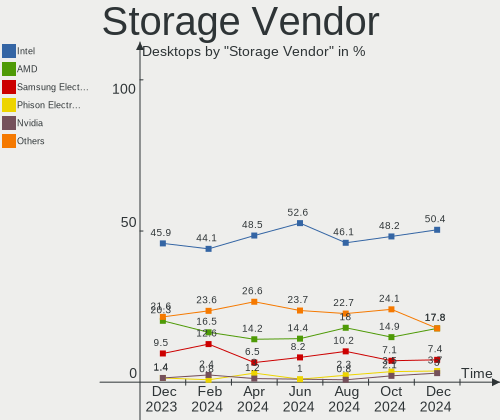
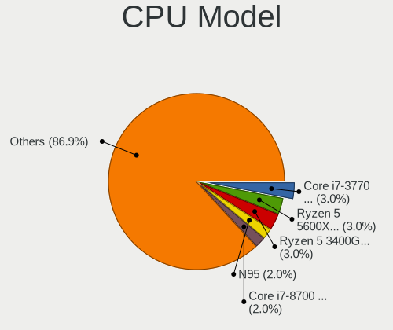
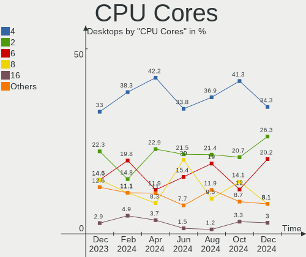
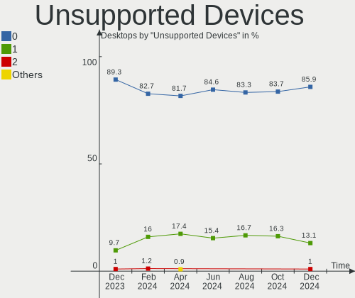

Linux in Italy - Hardware Trends (Desktops)
-------------------------------------------

A project to identify most popular hardware characteristics and track their change
over time based on data collected by Linux users at https://Linux-Hardware.org.

Anyone can contribute to this report by the [hw-probe](https://github.com/linuxhw/hw-probe) tool:

    sudo -E hw-probe -all -upload

Period: Oct, 2022.

Contents
--------

* [ System ](#system)
  - [ OS                       ](#os)
  - [ OS Family                ](#os-family)
  - [ Kernel                   ](#kernel)
  - [ Kernel Family            ](#kernel-family)
  - [ Kernel Major Ver.        ](#kernel-major-ver)
  - [ Arch                     ](#arch)
  - [ DE                       ](#de)
  - [ Display Server           ](#display-server)
  - [ Display Manager          ](#display-manager)
  - [ OS Lang                  ](#os-lang)
  - [ Boot Mode                ](#boot-mode)
  - [ Filesystem               ](#filesystem)
  - [ Part. scheme             ](#part-scheme)
  - [ Dual Boot with Linux/BSD ](#dual-boot-with-linuxbsd)
  - [ Dual Boot (Win)          ](#dual-boot-win)

* [ Board ](#board)
  - [ Vendor                   ](#vendor)
  - [ Model                    ](#model)
  - [ Model Family             ](#model-family)
  - [ MFG Year                 ](#mfg-year)
  - [ Form Factor              ](#form-factor)
  - [ Secure Boot              ](#secure-boot)
  - [ Coreboot                 ](#coreboot)
  - [ RAM Size                 ](#ram-size)
  - [ RAM Used                 ](#ram-used)
  - [ Total Drives             ](#total-drives)
  - [ Has CD-ROM               ](#has-cd-rom)
  - [ Has Ethernet             ](#has-ethernet)
  - [ Has WiFi                 ](#has-wifi)
  - [ Has Bluetooth            ](#has-bluetooth)

* [ Location ](#location)
  - [ Country                  ](#country)
  - [ City                     ](#city)

* [ Drives ](#drives)
  - [ Drive Vendor             ](#drive-vendor)
  - [ Drive Model              ](#drive-model)
  - [ HDD Vendor               ](#hdd-vendor)
  - [ SSD Vendor               ](#ssd-vendor)
  - [ Drive Kind               ](#drive-kind)
  - [ Drive Connector          ](#drive-connector)
  - [ Drive Size               ](#drive-size)
  - [ Space Total              ](#space-total)
  - [ Space Used               ](#space-used)
  - [ Malfunc. Drives          ](#malfunc-drives)
  - [ Malfunc. Drive Vendor    ](#malfunc-drive-vendor)
  - [ Malfunc. HDD Vendor      ](#malfunc-hdd-vendor)
  - [ Malfunc. Drive Kind      ](#malfunc-drive-kind)
  - [ Failed Drives            ](#failed-drives)
  - [ Failed Drive Vendor      ](#failed-drive-vendor)
  - [ Drive Status             ](#drive-status)

* [ Storage controller ](#storage-controller)
  - [ Storage Vendor           ](#storage-vendor)
  - [ Storage Model            ](#storage-model)
  - [ Storage Kind             ](#storage-kind)

* [ Processor ](#processor)
  - [ CPU Vendor               ](#cpu-vendor)
  - [ CPU Model                ](#cpu-model)
  - [ CPU Model Family         ](#cpu-model-family)
  - [ CPU Cores                ](#cpu-cores)
  - [ CPU Sockets              ](#cpu-sockets)
  - [ CPU Threads              ](#cpu-threads)
  - [ CPU Op-Modes             ](#cpu-op-modes)
  - [ CPU Microcode            ](#cpu-microcode)
  - [ CPU Microarch            ](#cpu-microarch)

* [ Graphics ](#graphics)
  - [ GPU Vendor               ](#gpu-vendor)
  - [ GPU Model                ](#gpu-model)
  - [ GPU Combo                ](#gpu-combo)
  - [ GPU Driver               ](#gpu-driver)
  - [ GPU Memory               ](#gpu-memory)

* [ Monitor ](#monitor)
  - [ Monitor Vendor           ](#monitor-vendor)
  - [ Monitor Model            ](#monitor-model)
  - [ Monitor Resolution       ](#monitor-resolution)
  - [ Monitor Diagonal         ](#monitor-diagonal)
  - [ Monitor Width            ](#monitor-width)
  - [ Aspect Ratio             ](#aspect-ratio)
  - [ Monitor Area             ](#monitor-area)
  - [ Pixel Density            ](#pixel-density)
  - [ Multiple Monitors        ](#multiple-monitors)

* [ Network ](#network)
  - [ Net Controller Vendor    ](#net-controller-vendor)
  - [ Net Controller Model     ](#net-controller-model)
  - [ Wireless Vendor          ](#wireless-vendor)
  - [ Wireless Model           ](#wireless-model)
  - [ Ethernet Vendor          ](#ethernet-vendor)
  - [ Ethernet Model           ](#ethernet-model)
  - [ Net Controller Kind      ](#net-controller-kind)
  - [ Used Controller          ](#used-controller)
  - [ NICs                     ](#nics)
  - [ IPv6                     ](#ipv6)

* [ Bluetooth ](#bluetooth)
  - [ Bluetooth Vendor         ](#bluetooth-vendor)
  - [ Bluetooth Model          ](#bluetooth-model)

* [ Sound ](#sound)
  - [ Sound Vendor             ](#sound-vendor)
  - [ Sound Model              ](#sound-model)

* [ Memory ](#memory)
  - [ Memory Vendor            ](#memory-vendor)
  - [ Memory Model             ](#memory-model)
  - [ Memory Kind              ](#memory-kind)
  - [ Memory Form Factor       ](#memory-form-factor)
  - [ Memory Size              ](#memory-size)
  - [ Memory Speed             ](#memory-speed)

* [ Printers & scanners ](#printers--scanners)
  - [ Printer Vendor           ](#printer-vendor)
  - [ Printer Model            ](#printer-model)
  - [ Scanner Vendor           ](#scanner-vendor)
  - [ Scanner Model            ](#scanner-model)

* [ Camera ](#camera)
  - [ Camera Vendor            ](#camera-vendor)
  - [ Camera Model             ](#camera-model)

* [ Security ](#security)
  - [ Fingerprint Vendor       ](#fingerprint-vendor)
  - [ Fingerprint Model        ](#fingerprint-model)
  - [ Chipcard Vendor          ](#chipcard-vendor)
  - [ Chipcard Model           ](#chipcard-model)

* [ Unsupported ](#unsupported)
  - [ Unsupported Devices      ](#unsupported-devices)
  - [ Unsupported Device Types ](#unsupported-device-types)

System
------

OS
--

Installed operating systems

| Name                         | Desktops | Percent |
|------------------------------|----------|---------|
| Ubuntu 22.04                 | 27       | 15.34%  |
| Arch Rolling                 | 16       | 9.09%   |
| Fedora 36                    | 14       | 7.95%   |
| Linux Mint 21                | 13       | 7.39%   |
| Pop!_OS 22.04                | 12       | 6.82%   |
| Debian 11                    | 10       | 5.68%   |
| Manjaro 22.0.0               | 8        | 4.55%   |
| Linux Mint 20.3              | 8        | 4.55%   |
| Xubuntu 22.04                | 7        | 3.98%   |
| Ubuntu 22.10                 | 5        | 2.84%   |
| Ubuntu 20.04                 | 5        | 2.84%   |
| Kubuntu 22.04                | 4        | 2.27%   |
| Kubuntu 20.04                | 4        | 2.27%   |
| EndeavourOS Rolling          | 4        | 2.27%   |
| OpenMandriva 4.3             | 3        | 1.7%    |
| KDE neon 22.04               | 3        | 1.7%    |
| Debian Testing               | 3        | 1.7%    |
| Zorin 16                     | 2        | 1.14%   |
| Peppermint 11.4              | 2        | 1.14%   |
| openSUSE Tumbleweed-XXXXXXXX | 2        | 1.14%   |
| OpenMandriva 4.50            | 2        | 1.14%   |
| MX 21                        | 2        | 1.14%   |
| KDE neon 20.04               | 2        | 1.14%   |
| Xubuntu 18.04                | 1        | 0.57%   |
| Ubuntu Studio 20.04          | 1        | 0.57%   |
| Ubuntu MATE 22.10            | 1        | 0.57%   |
| Ubuntu MATE 22.04            | 1        | 0.57%   |
| Ubuntu MATE 20.04            | 1        | 0.57%   |
| Rocky Linux 8.6              | 1        | 0.57%   |
| OpenMandriva 4.2             | 1        | 0.57%   |
| NixOS 22.05                  | 1        | 0.57%   |
| MX 20                        | 1        | 0.57%   |
| Manjaro                      | 1        | 0.57%   |
| LinuxFX 11.2                 | 1        | 0.57%   |
| Kubuntu 22.10                | 1        | 0.57%   |
| Kubuntu 18.04                | 1        | 0.57%   |
| Fedora 37                    | 1        | 0.57%   |
| Fedora 35                    | 1        | 0.57%   |
| Debian 10                    | 1        | 0.57%   |
| Debian                       | 1        | 0.57%   |

OS Family
---------

OS without a version

| Name          | Desktops | Percent |
|---------------|----------|---------|
| Ubuntu        | 37       | 21.02%  |
| Linux Mint    | 21       | 11.93%  |
| Fedora        | 16       | 9.09%   |
| Arch          | 16       | 9.09%   |
| Debian        | 15       | 8.52%   |
| Pop!_OS       | 12       | 6.82%   |
| Kubuntu       | 10       | 5.68%   |
| Manjaro       | 9        | 5.11%   |
| Xubuntu       | 8        | 4.55%   |
| OpenMandriva  | 6        | 3.41%   |
| KDE neon      | 5        | 2.84%   |
| EndeavourOS   | 4        | 2.27%   |
| Ubuntu MATE   | 3        | 1.7%    |
| MX            | 3        | 1.7%    |
| Zorin         | 2        | 1.14%   |
| Peppermint    | 2        | 1.14%   |
| openSUSE      | 2        | 1.14%   |
| Ubuntu Studio | 1        | 0.57%   |
| Rocky Linux   | 1        | 0.57%   |
| NixOS         | 1        | 0.57%   |
| LinuxFX       | 1        | 0.57%   |
| CentOS        | 1        | 0.57%   |

Kernel
------

Version of the Linux kernel

| Version                  | Desktops | Percent |
|--------------------------|----------|---------|
| 5.15.0-52-generic        | 41       | 23.3%   |
| 5.15.0-50-generic        | 10       | 5.68%   |
| 6.0.2-arch1-1            | 9        | 5.11%   |
| 5.19.16-200.fc36.x86_64  | 8        | 4.55%   |
| 6.0.2-zen1-1-zen         | 6        | 3.41%   |
| 5.19.0-23-generic        | 6        | 3.41%   |
| 5.10.0-19-amd64          | 6        | 3.41%   |
| 5.4.0-126-generic        | 5        | 2.84%   |
| 5.19.0-76051900-generic  | 5        | 2.84%   |
| 5.15.0-48-generic        | 5        | 2.84%   |
| 6.0.2-2-MANJARO          | 4        | 2.27%   |
| 6.0.5-arch1-1            | 3        | 1.7%    |
| 6.0.2-76060002-generic   | 3        | 1.7%    |
| 5.4.0-131-generic        | 3        | 1.7%    |
| 5.19.0-2-amd64           | 3        | 1.7%    |
| 5.16.7-desktop-1omv4003  | 3        | 1.7%    |
| 5.10.0-18-amd64          | 3        | 1.7%    |
| 5.4.0-128-generic        | 2        | 1.14%   |
| 5.19.5-desktop-1omv4090  | 2        | 1.14%   |
| 5.19.16-76051916-generic | 2        | 1.14%   |
| 5.19.14-200.fc36.x86_64  | 2        | 1.14%   |
| 5.15.75-1-lts            | 2        | 1.14%   |
| 5.15.0-41-generic        | 2        | 1.14%   |
| 5.10.0-16-amd64          | 2        | 1.14%   |
| 4.19.0-22-amd64          | 2        | 1.14%   |
| 6.0.5-x64v1-xanmod1      | 1        | 0.57%   |
| 6.0.3-x64v2-xanmod1      | 1        | 0.57%   |
| 6.0.3-1-default          | 1        | 0.57%   |
| 6.0.2-3-MANJARO          | 1        | 0.57%   |
| 6.0.2-1-default          | 1        | 0.57%   |
| 6.0.1-060001-generic     | 1        | 0.57%   |
| 6.0.0-2-amd64            | 1        | 0.57%   |
| 6.0.0                    | 1        | 0.57%   |
| 5.4.0-131-lowlatency     | 1        | 0.57%   |
| 5.19.9-200.fc36.x86_64   | 1        | 0.57%   |
| 5.19.16-2-MANJARO        | 1        | 0.57%   |
| 5.19.16-100.fc35.x86_64  | 1        | 0.57%   |
| 5.19.15-301.fc37.x86_64  | 1        | 0.57%   |
| 5.19.15-201.fc36.x86_64  | 1        | 0.57%   |
| 5.19.13-100.fc35.x86_64  | 1        | 0.57%   |

Kernel Family
-------------

Linux kernel without a distro release

| Version | Desktops | Percent |
|---------|----------|---------|
| 5.15.0  | 63       | 35.8%   |
| 6.0.2   | 24       | 13.64%  |
| 5.19.0  | 17       | 9.66%   |
| 5.19.16 | 12       | 6.82%   |
| 5.4.0   | 11       | 6.25%   |
| 5.10.0  | 11       | 6.25%   |
| 6.0.5   | 4        | 2.27%   |
| 5.16.7  | 3        | 1.7%    |
| 6.0.3   | 2        | 1.14%   |
| 6.0.0   | 2        | 1.14%   |
| 5.19.5  | 2        | 1.14%   |
| 5.19.15 | 2        | 1.14%   |
| 5.19.14 | 2        | 1.14%   |
| 5.15.75 | 2        | 1.14%   |
| 5.15.74 | 2        | 1.14%   |
| 4.19.0  | 2        | 1.14%   |
| 6.0.1   | 1        | 0.57%   |
| 5.19.9  | 1        | 0.57%   |
| 5.19.13 | 1        | 0.57%   |
| 5.18.16 | 1        | 0.57%   |
| 5.18.10 | 1        | 0.57%   |
| 5.17.5  | 1        | 0.57%   |
| 5.17.15 | 1        | 0.57%   |
| 5.17.0  | 1        | 0.57%   |
| 5.15.72 | 1        | 0.57%   |
| 5.15.60 | 1        | 0.57%   |
| 5.15.53 | 1        | 0.57%   |
| 5.10.14 | 1        | 0.57%   |
| 4.18.0  | 1        | 0.57%   |
| 4.15.0  | 1        | 0.57%   |
| 3.10.0  | 1        | 0.57%   |

Kernel Major Ver.
-----------------

Linux kernel major version

| Version | Desktops | Percent |
|---------|----------|---------|
| 5.15    | 70       | 39.77%  |
| 5.19    | 37       | 21.02%  |
| 6.0     | 33       | 18.75%  |
| 5.10    | 12       | 6.82%   |
| 5.4     | 11       | 6.25%   |
| 5.17    | 3        | 1.7%    |
| 5.16    | 3        | 1.7%    |
| 5.18    | 2        | 1.14%   |
| 4.19    | 2        | 1.14%   |
| 4.18    | 1        | 0.57%   |
| 4.15    | 1        | 0.57%   |
| 3.10    | 1        | 0.57%   |

Arch
----

OS architecture (x86_64, i586, etc.)

| Name   | Desktops | Percent |
|--------|----------|---------|
| x86_64 | 176      | 100%    |

DE
--

Desktop Environment

| Name            | Desktops | Percent |
|-----------------|----------|---------|
| GNOME           | 78       | 44.32%  |
| KDE5            | 48       | 27.27%  |
| XFCE            | 18       | 10.23%  |
| X-Cinnamon      | 18       | 10.23%  |
| MATE            | 7        | 3.98%   |
| i3              | 2        | 1.14%   |
| openbox         | 1        | 0.57%   |
| LXQt            | 1        | 0.57%   |
| GNOME Flashback | 1        | 0.57%   |
| Cinnamon        | 1        | 0.57%   |
| Unknown         | 1        | 0.57%   |

Display Server
--------------

X11 or Wayland

| Name    | Desktops | Percent |
|---------|----------|---------|
| X11     | 137      | 77.84%  |
| Wayland | 37       | 21.02%  |
| Tty     | 2        | 1.14%   |

Display Manager
---------------

SDDM, LightDM, etc.

| Name    | Desktops | Percent |
|---------|----------|---------|
| LightDM | 44       | 25%     |
| GDM3    | 44       | 25%     |
| SDDM    | 40       | 22.73%  |
| Unknown | 25       | 14.2%   |
| GDM     | 23       | 13.07%  |

OS Lang
-------

Language

| Lang    | Desktops | Percent |
|---------|----------|---------|
| it_IT   | 129      | 73.3%   |
| en_US   | 33       | 18.75%  |
| C       | 9        | 5.11%   |
| en_GB   | 2        | 1.14%   |
| Unknown | 2        | 1.14%   |
| en_AG   | 1        | 0.57%   |

Boot Mode
---------

EFI or BIOS

| Mode | Desktops | Percent |
|------|----------|---------|
| EFI  | 102      | 57.95%  |
| BIOS | 74       | 42.05%  |

Filesystem
----------

Type of filesystem

| Type    | Desktops | Percent |
|---------|----------|---------|
| Ext4    | 129      | 73.3%   |
| Btrfs   | 27       | 15.34%  |
| Overlay | 15       | 8.52%   |
| Xfs     | 2        | 1.14%   |
| Zfs     | 1        | 0.57%   |
| XXXX    | 1        | 0.57%   |
| F2fs    | 1        | 0.57%   |

Part. scheme
------------

Scheme of partitioning

| Type    | Desktops | Percent |
|---------|----------|---------|
| GPT     | 119      | 67.61%  |
| MBR     | 36       | 20.45%  |
| Unknown | 21       | 11.93%  |

Dual Boot with Linux/BSD
------------------------

Hosting more than one Linux/BSD

| Dual boot | Desktops | Percent |
|-----------|----------|---------|
| No        | 132      | 75%     |
| Yes       | 44       | 25%     |

Dual Boot (Win)
---------------

Hosting Linux and Windows

| Dual boot | Desktops | Percent |
|-----------|----------|---------|
| Yes       | 88       | 50%     |
| No        | 88       | 50%     |

Board
-----

Vendor
------

Motherboard manufacturer

| Name                | Desktops | Percent |
|---------------------|----------|---------|
| ASUSTek Computer    | 59       | 33.52%  |
| MSI                 | 35       | 19.89%  |
| Gigabyte Technology | 21       | 11.93%  |
| Hewlett-Packard     | 15       | 8.52%   |
| ASRock              | 14       | 7.95%   |
| Lenovo              | 8        | 4.55%   |
| Dell                | 7        | 3.98%   |
| Intel               | 4        | 2.27%   |
| Acer                | 3        | 1.7%    |
| Pegatron            | 2        | 1.14%   |
| Packard Bell        | 2        | 1.14%   |
| Fujitsu             | 2        | 1.14%   |
| Unknown             | 2        | 1.14%   |
| Supermicro          | 1        | 0.57%   |
| AZW                 | 1        | 0.57%   |

Model
-----

Motherboard model

| Name                                       | Desktops | Percent |
|--------------------------------------------|----------|---------|
| ASUS All Series                            | 5        | 2.84%   |
| MSI MS-7C37                                | 2        | 1.14%   |
| MSI MS-7C02                                | 2        | 1.14%   |
| MSI MS-7817                                | 2        | 1.14%   |
| MSI MS-7522                                | 2        | 1.14%   |
| HP Compaq Elite 8300 SFF                   | 2        | 1.14%   |
| HP Compaq 6000 Pro MT PC                   | 2        | 1.14%   |
| Gigabyte X570 AORUS ELITE                  | 2        | 1.14%   |
| Gigabyte B450 AORUS M                      | 2        | 1.14%   |
| ASUS TUF Gaming B550-PLUS                  | 2        | 1.14%   |
| ASUS ROG STRIX B550-F GAMING               | 2        | 1.14%   |
| ASUS ROG CROSSHAIR VII HERO                | 2        | 1.14%   |
| ASUS PRIME H270-PRO                        | 2        | 1.14%   |
| Unknown                                    | 2        | 1.14%   |
| Supermicro C7P67                           | 1        | 0.57%   |
| Pegatron TouchSmart 7320 Lavaca-B EU L6 PC | 1        | 0.57%   |
| Pegatron KX637AA-ABZ m9390.it              | 1        | 0.57%   |
| Packard Bell IMEDIA S3810                  | 1        | 0.57%   |
| Packard Bell IMEDIA S3712                  | 1        | 0.57%   |
| MSI MS-7D54                                | 1        | 0.57%   |
| MSI MS-7D25                                | 1        | 0.57%   |
| MSI MS-7D22                                | 1        | 0.57%   |
| MSI MS-7C91                                | 1        | 0.57%   |
| MSI MS-7C83                                | 1        | 0.57%   |
| MSI MS-7C80                                | 1        | 0.57%   |
| MSI MS-7C79                                | 1        | 0.57%   |
| MSI MS-7C56                                | 1        | 0.57%   |
| MSI MS-7C52                                | 1        | 0.57%   |
| MSI MS-7B98                                | 1        | 0.57%   |
| MSI MS-7B89                                | 1        | 0.57%   |
| MSI MS-7B84                                | 1        | 0.57%   |
| MSI MS-7B79                                | 1        | 0.57%   |
| MSI MS-7B46                                | 1        | 0.57%   |
| MSI MS-7B38                                | 1        | 0.57%   |
| MSI MS-7B17                                | 1        | 0.57%   |
| MSI MS-7A15                                | 1        | 0.57%   |
| MSI MS-7977                                | 1        | 0.57%   |
| MSI MS-7976                                | 1        | 0.57%   |
| MSI MS-7921                                | 1        | 0.57%   |
| MSI MS-7850                                | 1        | 0.57%   |

Model Family
------------

Motherboard model prefix

| Name                 | Desktops | Percent |
|----------------------|----------|---------|
| ASUS PRIME           | 14       | 7.95%   |
| HP Compaq            | 7        | 3.98%   |
| ASUS TUF             | 7        | 3.98%   |
| ASUS ROG             | 7        | 3.98%   |
| Dell OptiPlex        | 5        | 2.84%   |
| ASUS All             | 5        | 2.84%   |
| HP ProDesk           | 4        | 2.27%   |
| Gigabyte X570        | 3        | 1.7%    |
| Packard Bell IMEDIA  | 2        | 1.14%   |
| MSI MS-7C37          | 2        | 1.14%   |
| MSI MS-7C02          | 2        | 1.14%   |
| MSI MS-7817          | 2        | 1.14%   |
| MSI MS-7522          | 2        | 1.14%   |
| Lenovo ThinkStation  | 2        | 1.14%   |
| Lenovo ThinkCentre   | 2        | 1.14%   |
| Lenovo IdeaCentre    | 2        | 1.14%   |
| Gigabyte H310M       | 2        | 1.14%   |
| Gigabyte B450        | 2        | 1.14%   |
| Fujitsu ESPRIMO      | 2        | 1.14%   |
| ASRock B450          | 2        | 1.14%   |
| Acer Aspire          | 2        | 1.14%   |
| Unknown              | 2        | 1.14%   |
| Supermicro C7P67     | 1        | 0.57%   |
| Pegatron TouchSmart  | 1        | 0.57%   |
| Pegatron KX637AA-ABZ | 1        | 0.57%   |
| MSI MS-7D54          | 1        | 0.57%   |
| MSI MS-7D25          | 1        | 0.57%   |
| MSI MS-7D22          | 1        | 0.57%   |
| MSI MS-7C91          | 1        | 0.57%   |
| MSI MS-7C83          | 1        | 0.57%   |
| MSI MS-7C80          | 1        | 0.57%   |
| MSI MS-7C79          | 1        | 0.57%   |
| MSI MS-7C56          | 1        | 0.57%   |
| MSI MS-7C52          | 1        | 0.57%   |
| MSI MS-7B98          | 1        | 0.57%   |
| MSI MS-7B89          | 1        | 0.57%   |
| MSI MS-7B84          | 1        | 0.57%   |
| MSI MS-7B79          | 1        | 0.57%   |
| MSI MS-7B46          | 1        | 0.57%   |
| MSI MS-7B38          | 1        | 0.57%   |

MFG Year
--------

Motherboard manufacture year

| Year | Desktops | Percent |
|------|----------|---------|
| 2018 | 23       | 13.07%  |
| 2012 | 23       | 13.07%  |
| 2020 | 21       | 11.93%  |
| 2013 | 16       | 9.09%   |
| 2021 | 13       | 7.39%   |
| 2019 | 13       | 7.39%   |
| 2014 | 13       | 7.39%   |
| 2009 | 10       | 5.68%   |
| 2016 | 7        | 3.98%   |
| 2011 | 7        | 3.98%   |
| 2008 | 7        | 3.98%   |
| 2015 | 6        | 3.41%   |
| 2017 | 5        | 2.84%   |
| 2010 | 4        | 2.27%   |
| 2007 | 3        | 1.7%    |
| 2006 | 3        | 1.7%    |
| 2022 | 2        | 1.14%   |

Form Factor
-----------

Physical design of the computer

| Name    | Desktops | Percent |
|---------|----------|---------|
| Desktop | 176      | 100%    |

Secure Boot
-----------

Enabled or disabled

| State    | Desktops | Percent |
|----------|----------|---------|
| Disabled | 170      | 96.59%  |
| Enabled  | 6        | 3.41%   |

Coreboot
--------

Have coreboot on board

| Used | Desktops | Percent |
|------|----------|---------|
| No   | 176      | 100%    |

RAM Size
--------

Total RAM memory

| Size in GB  | Desktops | Percent |
|-------------|----------|---------|
| 16.01-24.0  | 55       | 31.25%  |
| 8.01-16.0   | 40       | 22.73%  |
| 32.01-64.0  | 29       | 16.48%  |
| 4.01-8.0    | 20       | 11.36%  |
| 3.01-4.0    | 15       | 8.52%   |
| 64.01-256.0 | 7        | 3.98%   |
| 24.01-32.0  | 5        | 2.84%   |
| 1.01-2.0    | 3        | 1.7%    |
| 2.01-3.0    | 1        | 0.57%   |
| 0.51-1.0    | 1        | 0.57%   |

RAM Used
--------

Used RAM memory

| Used GB    | Desktops | Percent |
|------------|----------|---------|
| 2.01-3.0   | 43       | 24.43%  |
| 3.01-4.0   | 42       | 23.86%  |
| 4.01-8.0   | 39       | 22.16%  |
| 1.01-2.0   | 35       | 19.89%  |
| 8.01-16.0  | 11       | 6.25%   |
| 0.51-1.0   | 5        | 2.84%   |
| 16.01-24.0 | 1        | 0.57%   |

Total Drives
------------

Number of drives on board

| Drives | Desktops | Percent |
|--------|----------|---------|
| 2      | 58       | 32.95%  |
| 1      | 49       | 27.84%  |
| 3      | 32       | 18.18%  |
| 4      | 16       | 9.09%   |
| 5      | 11       | 6.25%   |
| 6      | 5        | 2.84%   |
| 7      | 4        | 2.27%   |
| 8      | 1        | 0.57%   |

Has CD-ROM
----------

Has CD-ROM on board

| Presented | Desktops | Percent |
|-----------|----------|---------|
| No        | 92       | 52.27%  |
| Yes       | 84       | 47.73%  |

Has Ethernet
------------

Has Ethernet on board

| Presented | Desktops | Percent |
|-----------|----------|---------|
| Yes       | 176      | 100%    |

Has WiFi
--------

Has WiFi module

| Presented | Desktops | Percent |
|-----------|----------|---------|
| No        | 99       | 56.25%  |
| Yes       | 77       | 43.75%  |

Has Bluetooth
-------------

Has Bluetooth module

| Presented | Desktops | Percent |
|-----------|----------|---------|
| No        | 102      | 57.95%  |
| Yes       | 74       | 42.05%  |

Location
--------

Country
-------

Geographic location (country)

| Country | Desktops | Percent |
|---------|----------|---------|
| Italy   | 176      | 100%    |

City
----

Geographic location (city)

| City                   | Desktops | Percent |
|------------------------|----------|---------|
| Milan                  | 23       | 13.07%  |
| Rome                   | 12       | 6.82%   |
| Turin                  | 9        | 5.11%   |
| Genoa                  | 6        | 3.41%   |
| Naples                 | 5        | 2.84%   |
| Bologna                | 4        | 2.27%   |
| Rho                    | 3        | 1.7%    |
| Palermo                | 3        | 1.7%    |
| Florence               | 3        | 1.7%    |
| Bari                   | 3        | 1.7%    |
| Verona                 | 2        | 1.14%   |
| Trieste                | 2        | 1.14%   |
| Savignano sul Rubicone | 2        | 1.14%   |
| Pisa                   | 2        | 1.14%   |
| Pavia di Udine         | 2        | 1.14%   |
| Parma                  | 2        | 1.14%   |
| Padova                 | 2        | 1.14%   |
| Cesena                 | 2        | 1.14%   |
| Cavallino              | 2        | 1.14%   |
| Catania                | 2        | 1.14%   |
| Brescia                | 2        | 1.14%   |
| Bolzano                | 2        | 1.14%   |
| Biella                 | 2        | 1.14%   |
| Bergamo                | 2        | 1.14%   |
| Voghera                | 1        | 0.57%   |
| Vittoria               | 1        | 0.57%   |
| Vinci                  | 1        | 0.57%   |
| Villa di Serio         | 1        | 0.57%   |
| Vigonza                | 1        | 0.57%   |
| Viggianello            | 1        | 0.57%   |
| Vercelli               | 1        | 0.57%   |
| Venice                 | 1        | 0.57%   |
| Varese                 | 1        | 0.57%   |
| Triggiano              | 1        | 0.57%   |
| Treviolo               | 1        | 0.57%   |
| Trento                 | 1        | 0.57%   |
| Traversetolo           | 1        | 0.57%   |
| Torbole Casaglia       | 1        | 0.57%   |
| Tolentino              | 1        | 0.57%   |
| Taranto                | 1        | 0.57%   |

Drives
------

Drive Vendor
------------

Hard drive vendors

| Vendor                      | Desktops | Drives | Percent |
|-----------------------------|----------|--------|---------|
| Samsung Electronics         | 80       | 104    | 21.92%  |
| Seagate                     | 65       | 87     | 17.81%  |
| WDC                         | 60       | 78     | 16.44%  |
| Crucial                     | 33       | 37     | 9.04%   |
| Kingston                    | 25       | 26     | 6.85%   |
| Toshiba                     | 16       | 18     | 4.38%   |
| Phison                      | 10       | 11     | 2.74%   |
| SanDisk                     | 8        | 9      | 2.19%   |
| Maxtor                      | 6        | 6      | 1.64%   |
| HGST                        | 6        | 7      | 1.64%   |
| Hitachi                     | 5        | 5      | 1.37%   |
| Phison Electronics          | 4        | 4      | 1.1%    |
| Corsair                     | 4        | 6      | 1.1%    |
| Unknown                     | 3        | 6      | 0.82%   |
| OCZ                         | 3        | 3      | 0.82%   |
| Micron Technology           | 3        | 3      | 0.82%   |
| XPG                         | 2        | 2      | 0.55%   |
| Team                        | 2        | 2      | 0.55%   |
| SPCC                        | 2        | 2      | 0.55%   |
| Micron/Crucial Technology   | 2        | 2      | 0.55%   |
| LITEON                      | 2        | 2      | 0.55%   |
| Intel                       | 2        | 2      | 0.55%   |
| China                       | 2        | 2      | 0.55%   |
| Transcend                   | 1        | 1      | 0.27%   |
| SSK                         | 1        | 1      | 0.27%   |
| sobetter                    | 1        | 1      | 0.27%   |
| SK hynix                    | 1        | 1      | 0.27%   |
| Plextor                     | 1        | 1      | 0.27%   |
| Patriot                     | 1        | 1      | 0.27%   |
| Netac                       | 1        | 1      | 0.27%   |
| Mushkin                     | 1        | 1      | 0.27%   |
| Lexar                       | 1        | 1      | 0.27%   |
| Leven                       | 1        | 1      | 0.27%   |
| Kingston Technology Company | 1        | 1      | 0.27%   |
| KingFast                    | 1        | 1      | 0.27%   |
| JMicron Technology          | 1        | 1      | 0.27%   |
| Intenso                     | 1        | 1      | 0.27%   |
| IBM/Hitachi                 | 1        | 1      | 0.27%   |
| Hoodisk                     | 1        | 1      | 0.27%   |
| HGST HTS                    | 1        | 1      | 0.27%   |

Drive Model
-----------

Hard drive models

| Model                                                | Desktops | Percent |
|------------------------------------------------------|----------|---------|
| Samsung SSD 860 EVO 500GB                            | 10       | 2.33%   |
| Samsung SSD 850 EVO 250GB                            | 10       | 2.33%   |
| Crucial CT500MX500SSD1 500GB                         | 10       | 2.33%   |
| Samsung SSD 860 EVO 250GB                            | 9        | 2.09%   |
| Samsung NVMe SSD Controller SM981/PM981/PM983 500GB  | 7        | 1.63%   |
| Kingston SA400S37480G 480GB SSD                      | 7        | 1.63%   |
| Kingston SA400S37240G 240GB SSD                      | 7        | 1.63%   |
| Seagate ST500DM002-1BD142 500GB                      | 6        | 1.4%    |
| Seagate ST1000DM010-2EP102 1TB                       | 6        | 1.4%    |
| Phison Sabrent 512GB                                 | 6        | 1.4%    |
| Seagate ST31000528AS 1TB                             | 5        | 1.16%   |
| Seagate ST2000DM008-2FR102 2TB                       | 5        | 1.16%   |
| Seagate M3 Portable 2TB                              | 5        | 1.16%   |
| SanDisk SSD PLUS 480GB                               | 5        | 1.16%   |
| Samsung SSD 980 500GB                                | 5        | 1.16%   |
| Seagate ST4000DM004-2CV104 4TB                       | 4        | 0.93%   |
| Seagate ST1000DM003-1CH162 1TB                       | 4        | 0.93%   |
| Samsung SSD 980 1TB                                  | 4        | 0.93%   |
| Samsung SSD 850 EVO 500GB                            | 4        | 0.93%   |
| Samsung NVMe SSD Controller PM9A1/PM9A3/980PRO 250GB | 4        | 0.93%   |
| Crucial CT480BX500SSD1 480GB                         | 4        | 0.93%   |
| Crucial CT1000MX500SSD1 1TB                          | 4        | 0.93%   |
| WDC WD30EFRX-68EUZN0 3TB                             | 3        | 0.7%    |
| WDC WD10EZEX-60WN4A0 1TB                             | 3        | 0.7%    |
| WDC WD10EZEX-08WN4A0 1TB                             | 3        | 0.7%    |
| Toshiba HDWD130 3TB                                  | 3        | 0.7%    |
| Seagate ST9500325AS 500GB                            | 3        | 0.7%    |
| Seagate ST2000DM001-1CH164 2TB                       | 3        | 0.7%    |
| Seagate ST2000DL003-9VT166 2TB                       | 3        | 0.7%    |
| Seagate ST1000DM003-1ER162 1TB                       | 3        | 0.7%    |
| Samsung HD103UJ 1TB                                  | 3        | 0.7%    |
| Phison E12 NVMe Controller 2TB                       | 3        | 0.7%    |
| Kingston SV300S37A120G 120GB SSD                     | 3        | 0.7%    |
| Kingston SUV400S37120G 120GB SSD                     | 3        | 0.7%    |
| Crucial CT240BX500SSD1 240GB                         | 3        | 0.7%    |
| Crucial CT120BX500SSD1 120GB                         | 3        | 0.7%    |
| XPG GAMMIX S70 BLADE 2TB                             | 2        | 0.47%   |
| WDC WDS500G3X0C-00SJG0 500GB                         | 2        | 0.47%   |
| WDC WDS100T1X0E-00AFY0 1TB                           | 2        | 0.47%   |
| WDC WD20EZRZ-00Z5HB0 2TB                             | 2        | 0.47%   |

HDD Vendor
----------

Hard disk drive vendors

| Vendor              | Desktops | Drives | Percent |
|---------------------|----------|--------|---------|
| Seagate             | 62       | 82     | 39.49%  |
| WDC                 | 55       | 69     | 35.03%  |
| Toshiba             | 15       | 16     | 9.55%   |
| Samsung Electronics | 6        | 7      | 3.82%   |
| Maxtor              | 6        | 6      | 3.82%   |
| HGST                | 6        | 7      | 3.82%   |
| Hitachi             | 5        | 5      | 3.18%   |
| IBM/Hitachi         | 1        | 1      | 0.64%   |
| HGST HTS            | 1        | 1      | 0.64%   |

SSD Vendor
----------

Solid state drive vendors

| Vendor              | Desktops | Drives | Percent |
|---------------------|----------|--------|---------|
| Samsung Electronics | 49       | 56     | 34.51%  |
| Crucial             | 31       | 34     | 21.83%  |
| Kingston            | 25       | 26     | 17.61%  |
| SanDisk             | 7        | 8      | 4.93%   |
| OCZ                 | 3        | 3      | 2.11%   |
| Team                | 2        | 2      | 1.41%   |
| SPCC                | 2        | 2      | 1.41%   |
| LITEON              | 2        | 2      | 1.41%   |
| Corsair             | 2        | 4      | 1.41%   |
| China               | 2        | 2      | 1.41%   |
| WDC                 | 1        | 1      | 0.7%    |
| Unknown             | 1        | 1      | 0.7%    |
| Transcend           | 1        | 1      | 0.7%    |
| Toshiba             | 1        | 1      | 0.7%    |
| SK hynix            | 1        | 1      | 0.7%    |
| Plextor             | 1        | 1      | 0.7%    |
| Patriot             | 1        | 1      | 0.7%    |
| Mushkin             | 1        | 1      | 0.7%    |
| Micron Technology   | 1        | 1      | 0.7%    |
| Lexar               | 1        | 1      | 0.7%    |
| Leven               | 1        | 1      | 0.7%    |
| KingFast            | 1        | 1      | 0.7%    |
| Intenso             | 1        | 1      | 0.7%    |
| Hoodisk             | 1        | 1      | 0.7%    |
| GOODRAM             | 1        | 1      | 0.7%    |
| BAITITON            | 1        | 1      | 0.7%    |
| A-DATA Technology   | 1        | 1      | 0.7%    |

Drive Kind
----------

HDD or SSD

| Kind    | Desktops | Drives | Percent |
|---------|----------|--------|---------|
| HDD     | 122      | 194    | 39.61%  |
| SSD     | 112      | 156    | 36.36%  |
| NVMe    | 64       | 81     | 20.78%  |
| Unknown | 9        | 11     | 2.92%   |
| MMC     | 1        | 2      | 0.32%   |

Drive Connector
---------------

SATA, SAS, NVMe, etc.

| Type | Desktops | Drives | Percent |
|------|----------|--------|---------|
| SATA | 161      | 342    | 66.53%  |
| NVMe | 64       | 81     | 26.45%  |
| SAS  | 16       | 19     | 6.61%   |
| MMC  | 1        | 2      | 0.41%   |

Drive Size
----------

Size of hard drive

| Size in TB | Desktops | Drives | Percent |
|------------|----------|--------|---------|
| 0.01-0.5   | 127      | 194    | 50.8%   |
| 0.51-1.0   | 66       | 87     | 26.4%   |
| 1.01-2.0   | 30       | 37     | 12%     |
| 3.01-4.0   | 11       | 12     | 4.4%    |
| 2.01-3.0   | 10       | 12     | 4%      |
| 4.01-10.0  | 5        | 7      | 2%      |
| 10.01-20.0 | 1        | 1      | 0.4%    |

Space Total
-----------

Amount of disk space available on the file system

| Size in GB     | Desktops | Percent |
|----------------|----------|---------|
| 101-250        | 32       | 18.18%  |
| 251-500        | 28       | 15.91%  |
| 501-1000       | 28       | 15.91%  |
| 1001-2000      | 23       | 13.07%  |
| More than 3000 | 22       | 12.5%   |
| 2001-3000      | 15       | 8.52%   |
| 1-20           | 13       | 7.39%   |
| 51-100         | 7        | 3.98%   |
| 21-50          | 4        | 2.27%   |
| Unknown        | 4        | 2.27%   |

Space Used
----------

Amount of used disk space

| Used GB        | Desktops | Percent |
|----------------|----------|---------|
| 1-20           | 31       | 17.61%  |
| 251-500        | 27       | 15.34%  |
| 101-250        | 27       | 15.34%  |
| 51-100         | 24       | 13.64%  |
| 501-1000       | 17       | 9.66%   |
| 21-50          | 15       | 8.52%   |
| 1001-2000      | 15       | 8.52%   |
| More than 3000 | 8        | 4.55%   |
| 2001-3000      | 8        | 4.55%   |
| Unknown        | 4        | 2.27%   |

Malfunc. Drives
---------------

Drive models with a malfunction

| Model                           | Desktops | Drives | Percent |
|---------------------------------|----------|--------|---------|
| Seagate ST500DM002-1BD142 500GB | 2        | 2      | 5.41%   |
| Samsung Electronics HD103UJ 1TB | 2        | 2      | 5.41%   |
| WDC WD5000LPVX-00V0TT0 500GB    | 1        | 1      | 2.7%    |
| WDC WD5000BEVT-22A0RT0 500GB    | 1        | 1      | 2.7%    |
| WDC WD40EFRX-68N32N0 4TB        | 1        | 1      | 2.7%    |
| WDC WD30EZRX-00SPEB0 3TB        | 1        | 1      | 2.7%    |
| WDC WD20EFRX-68EUZN0 2TB        | 1        | 1      | 2.7%    |
| WDC WD10EZEX-60WN4A0 1TB        | 1        | 1      | 2.7%    |
| WDC WD10EZEX-08M2NA0 1TB        | 1        | 1      | 2.7%    |
| WDC WD10EZEX-07M2NA1 1TB        | 1        | 1      | 2.7%    |
| WDC WD10EARS-00MVWB0 1TB        | 1        | 1      | 2.7%    |
| WDC WD10EADS-00M2B0 1TB         | 1        | 1      | 2.7%    |
| Toshiba MQ01ABF050 500GB        | 1        | 1      | 2.7%    |
| Toshiba MK1059GSM 1TB           | 1        | 1      | 2.7%    |
| Seagate ST9500325AS 500GB       | 1        | 1      | 2.7%    |
| Seagate ST3500620AS 500GB       | 1        | 1      | 2.7%    |
| Seagate ST3500412AS 500GB       | 1        | 1      | 2.7%    |
| Seagate ST3500320AS 500GB       | 1        | 1      | 2.7%    |
| Seagate ST3320620AS 320GB       | 1        | 2      | 2.7%    |
| Seagate ST3320613AS 320GB       | 1        | 1      | 2.7%    |
| Seagate ST2000DM008-2FR102 2TB  | 1        | 1      | 2.7%    |
| Seagate ST2000DL003-9VT166 2TB  | 1        | 1      | 2.7%    |
| Seagate ST1000DM003-9YN162 1TB  | 1        | 1      | 2.7%    |
| Seagate ST1000DM003-1CH162 1TB  | 1        | 1      | 2.7%    |
| SanDisk SSD PLUS 480GB          | 1        | 1      | 2.7%    |
| OCZ AGILITY3 120GB SSD          | 1        | 1      | 2.7%    |
| Maxtor STM3500320AS 500GB       | 1        | 1      | 2.7%    |
| Maxtor STM3250310AS 250GB       | 1        | 1      | 2.7%    |
| Maxtor STM3160613AS 160GB       | 1        | 1      | 2.7%    |
| Maxtor 6Y160M0 164GB            | 1        | 1      | 2.7%    |
| Kingston SA400S37240G 240GB SSD | 1        | 1      | 2.7%    |
| Hitachi HUA722010CLA330 1TB     | 1        | 1      | 2.7%    |
| HGST HTS545050A7E680 500GB      | 1        | 1      | 2.7%    |
| Crucial CT120M500SSD1 120GB     | 1        | 1      | 2.7%    |
| BAITITON BT58SSD08M 128GB       | 1        | 1      | 2.7%    |

Malfunc. Drive Vendor
---------------------

Vendors of faulty drives

| Vendor              | Desktops | Drives | Percent |
|---------------------|----------|--------|---------|
| Seagate             | 12       | 13     | 33.33%  |
| WDC                 | 9        | 10     | 25%     |
| Maxtor              | 4        | 4      | 11.11%  |
| Toshiba             | 2        | 2      | 5.56%   |
| Samsung Electronics | 2        | 2      | 5.56%   |
| SanDisk             | 1        | 1      | 2.78%   |
| OCZ                 | 1        | 1      | 2.78%   |
| Kingston            | 1        | 1      | 2.78%   |
| Hitachi             | 1        | 1      | 2.78%   |
| HGST                | 1        | 1      | 2.78%   |
| Crucial             | 1        | 1      | 2.78%   |
| BAITITON            | 1        | 1      | 2.78%   |

Malfunc. HDD Vendor
-------------------

Vendors of faulty HDD drives

| Vendor              | Desktops | Drives | Percent |
|---------------------|----------|--------|---------|
| Seagate             | 12       | 13     | 38.71%  |
| WDC                 | 9        | 10     | 29.03%  |
| Maxtor              | 4        | 4      | 12.9%   |
| Toshiba             | 2        | 2      | 6.45%   |
| Samsung Electronics | 2        | 2      | 6.45%   |
| Hitachi             | 1        | 1      | 3.23%   |
| HGST                | 1        | 1      | 3.23%   |

Malfunc. Drive Kind
-------------------

Kinds of faulty drives

| Kind | Desktops | Drives | Percent |
|------|----------|--------|---------|
| HDD  | 30       | 33     | 85.71%  |
| SSD  | 5        | 5      | 14.29%  |

Failed Drives
-------------

Failed drive models

| Model                           | Desktops | Drives | Percent |
|---------------------------------|----------|--------|---------|
| Seagate ST9500420AS 500GB       | 1        | 1      | 50%     |
| Seagate ST500DM002-1BD142 500GB | 1        | 1      | 50%     |

Failed Drive Vendor
-------------------

Failed drive vendors

| Vendor  | Desktops | Drives | Percent |
|---------|----------|--------|---------|
| Seagate | 2        | 2      | 100%    |

Drive Status
------------

Number of failed and malfunc. drives

| Status   | Desktops | Drives | Percent |
|----------|----------|--------|---------|
| Works    | 125      | 279    | 57.87%  |
| Detected | 54       | 125    | 25%     |
| Malfunc  | 35       | 38     | 16.2%   |
| Failed   | 2        | 2      | 0.93%   |

Storage controller
------------------

Storage Vendor
--------------

Storage controller vendors

| Vendor                       | Desktops | Percent |
|------------------------------|----------|---------|
| Intel                        | 115      | 42.59%  |
| AMD                          | 56       | 20.74%  |
| Samsung Electronics          | 34       | 12.59%  |
| Phison Electronics           | 16       | 5.93%   |
| ASMedia Technology           | 11       | 4.07%   |
| SanDisk                      | 9        | 3.33%   |
| Micron/Crucial Technology    | 5        | 1.85%   |
| JMicron Technology           | 5        | 1.85%   |
| VIA Technologies             | 4        | 1.48%   |
| Nvidia                       | 4        | 1.48%   |
| Marvell Technology Group     | 4        | 1.48%   |
| Micron Technology            | 2        | 0.74%   |
| Unknown                      | 1        | 0.37%   |
| Toshiba America Info Systems | 1        | 0.37%   |
| Silicon Motion               | 1        | 0.37%   |
| Kingston Technology Company  | 1        | 0.37%   |
| ADATA Technology             | 1        | 0.37%   |

Storage Model
-------------

Storage controller models

| Model                                                                          | Desktops | Percent |
|--------------------------------------------------------------------------------|----------|---------|
| AMD FCH SATA Controller [AHCI mode]                                            | 29       | 9.06%   |
| AMD 400 Series Chipset SATA Controller                                         | 17       | 5.31%   |
| Samsung NVMe SSD Controller SM981/PM981/PM983                                  | 16       | 5%      |
| Intel 8 Series/C220 Series Chipset Family 6-port SATA Controller 1 [AHCI mode] | 16       | 5%      |
| Phison E12 NVMe Controller                                                     | 12       | 3.75%   |
| Intel 7 Series/C210 Series Chipset Family 6-port SATA Controller [AHCI mode]   | 12       | 3.75%   |
| Samsung NVMe SSD Controller 980                                                | 11       | 3.44%   |
| Intel Cannon Lake PCH SATA AHCI Controller                                     | 10       | 3.13%   |
| ASMedia ASM1062 Serial ATA Controller                                          | 10       | 3.13%   |
| AMD 500 Series Chipset SATA Controller                                         | 10       | 3.13%   |
| Intel Q170/Q150/B150/H170/H110/Z170/CM236 Chipset SATA Controller [AHCI Mode]  | 9        | 2.81%   |
| Intel 6 Series/C200 Series Chipset Family 6 port Desktop SATA AHCI Controller  | 9        | 2.81%   |
| Samsung NVMe SSD Controller PM9A1/PM9A3/980PRO                                 | 6        | 1.88%   |
| Intel SATA Controller [RAID mode]                                              | 6        | 1.88%   |
| Intel 82801G (ICH7 Family) IDE Controller                                      | 6        | 1.88%   |
| Intel 200 Series PCH SATA controller [AHCI mode]                               | 6        | 1.88%   |
| AMD SB7x0/SB8x0/SB9x0 IDE Controller                                           | 6        | 1.88%   |
| Intel 82801JI (ICH10 Family) SATA AHCI Controller                              | 5        | 1.56%   |
| AMD SB7x0/SB8x0/SB9x0 SATA Controller [AHCI mode]                              | 5        | 1.56%   |
| Intel NM10/ICH7 Family SATA Controller [IDE mode]                              | 4        | 1.25%   |
| Intel Comet Lake SATA AHCI Controller                                          | 4        | 1.25%   |
| Intel 9 Series Chipset Family SATA Controller [AHCI Mode]                      | 4        | 1.25%   |
| Intel 400 Series Chipset Family SATA AHCI Controller                           | 4        | 1.25%   |
| SanDisk WD PC SN810 / Black SN850 NVMe SSD                                     | 3        | 0.94%   |
| SanDisk WD Blue SN550 NVMe SSD                                                 | 3        | 0.94%   |
| SanDisk WD Black SN750 / PC SN730 NVMe SSD                                     | 3        | 0.94%   |
| Phison E16 PCIe4 NVMe Controller                                               | 3        | 0.94%   |
| JMicron JMB363 SATA/IDE Controller                                             | 3        | 0.94%   |
| Intel Alder Lake-S PCH SATA Controller [AHCI Mode]                             | 3        | 0.94%   |
| AMD SB7x0/SB8x0/SB9x0 SATA Controller [IDE mode]                               | 3        | 0.94%   |
| AMD 300 Series Chipset SATA Controller                                         | 3        | 0.94%   |
| VIA VT6421 IDE/SATA Controller                                                 | 2        | 0.63%   |
| Samsung NVMe SSD Controller SM961/PM961/SM963                                  | 2        | 0.63%   |
| Micron/Crucial P2 NVMe PCIe SSD                                                | 2        | 0.63%   |
| Micron Non-Volatile memory controller                                          | 2        | 0.63%   |
| Marvell Group 88SE9172 SATA 6Gb/s Controller                                   | 2        | 0.63%   |
| Intel SSD 660P Series                                                          | 2        | 0.63%   |
| Intel Celeron/Pentium Silver Processor SATA Controller                         | 2        | 0.63%   |
| Intel C600/X79 series chipset 6-Port SATA AHCI Controller                      | 2        | 0.63%   |
| Intel 82801GR/GDH (ICH7R/ICH7DH) SATA Controller [RAID mode]                   | 2        | 0.63%   |

Storage Kind
------------

Kind of storage controller (IDE, SATA, NVMe, SAS, ...)

| Kind | Desktops | Percent |
|------|----------|---------|
| SATA | 153      | 57.74%  |
| NVMe | 64       | 24.15%  |
| IDE  | 34       | 12.83%  |
| RAID | 13       | 4.91%   |
| SAS  | 1        | 0.38%   |

Processor
---------

CPU Vendor
----------

Processor vendors

| Vendor | Desktops | Percent |
|--------|----------|---------|
| Intel  | 117      | 66.48%  |
| AMD    | 59       | 33.52%  |

CPU Model
---------

Processor models

| Model                                       | Desktops | Percent |
|---------------------------------------------|----------|---------|
| Intel Core i7-3770 CPU @ 3.40GHz            | 4        | 2.27%   |
| Intel Core i5-3470 CPU @ 3.20GHz            | 4        | 2.27%   |
| AMD Ryzen 7 5800X 8-Core Processor          | 4        | 2.27%   |
| AMD Ryzen 5 5600X 6-Core Processor          | 4        | 2.27%   |
| Intel Core i7-9700K CPU @ 3.60GHz           | 3        | 1.7%    |
| Intel Core i7-7700 CPU @ 3.60GHz            | 3        | 1.7%    |
| Intel Core i7-6700K CPU @ 4.00GHz           | 3        | 1.7%    |
| Intel Core i7-4790 CPU @ 3.60GHz            | 3        | 1.7%    |
| Intel Core i7-10700K CPU @ 3.80GHz          | 3        | 1.7%    |
| Intel Core i7 CPU 920 @ 2.67GHz             | 3        | 1.7%    |
| Intel Core i5-6400 CPU @ 2.70GHz            | 3        | 1.7%    |
| Intel Core i5-4590 CPU @ 3.30GHz            | 3        | 1.7%    |
| AMD Ryzen 9 5950X 16-Core Processor         | 3        | 1.7%    |
| AMD Ryzen 5 5600G with Radeon Graphics      | 3        | 1.7%    |
| AMD Ryzen 5 3600 6-Core Processor           | 3        | 1.7%    |
| AMD Ryzen 5 2600X Six-Core Processor        | 3        | 1.7%    |
| Intel Core i9-9900K CPU @ 3.60GHz           | 2        | 1.14%   |
| Intel Core i7-6700 CPU @ 3.40GHz            | 2        | 1.14%   |
| Intel Core i7-4770 CPU @ 3.40GHz            | 2        | 1.14%   |
| Intel Core i7-3770K CPU @ 3.50GHz           | 2        | 1.14%   |
| Intel Core i7-2600 CPU @ 3.40GHz            | 2        | 1.14%   |
| Intel Core i7 CPU 860 @ 2.80GHz             | 2        | 1.14%   |
| Intel Core i5-4670 CPU @ 3.40GHz            | 2        | 1.14%   |
| Intel Core i5-3470S CPU @ 2.90GHz           | 2        | 1.14%   |
| Intel Core i5-2500 CPU @ 3.30GHz            | 2        | 1.14%   |
| Intel Core i5-2400S CPU @ 2.50GHz           | 2        | 1.14%   |
| Intel Core i3-2120 CPU @ 3.30GHz            | 2        | 1.14%   |
| Intel Core i3-10100 CPU @ 3.60GHz           | 2        | 1.14%   |
| Intel Core 2 Quad CPU Q6600 @ 2.40GHz       | 2        | 1.14%   |
| AMD Ryzen 9 3900X 12-Core Processor         | 2        | 1.14%   |
| AMD Ryzen 7 3700X 8-Core Processor          | 2        | 1.14%   |
| AMD Ryzen 5 3400G with Radeon Vega Graphics | 2        | 1.14%   |
| AMD Ryzen 3 3200G with Radeon Vega Graphics | 2        | 1.14%   |
| AMD FX-8320 Eight-Core Processor            | 2        | 1.14%   |
| Intel Xeon W-1250 CPU @ 3.30GHz             | 1        | 0.57%   |
| Intel Xeon CPU X5260 @ 3.33GHz              | 1        | 0.57%   |
| Intel Xeon CPU W3690 @ 3.47GHz              | 1        | 0.57%   |
| Intel Xeon CPU E5-1630 v3 @ 3.70GHz         | 1        | 0.57%   |
| Intel Xeon CPU E5-1620 0 @ 3.60GHz          | 1        | 0.57%   |
| Intel Pentium Silver N5000 CPU @ 1.10GHz    | 1        | 0.57%   |

CPU Model Family
----------------

Processor model prefix

| Model                   | Desktops | Percent |
|-------------------------|----------|---------|
| Intel Core i7           | 38       | 21.59%  |
| Intel Core i5           | 35       | 19.89%  |
| AMD Ryzen 5             | 22       | 12.5%   |
| Intel Core i3           | 13       | 7.39%   |
| AMD Ryzen 7             | 11       | 6.25%   |
| AMD Ryzen 9             | 7        | 3.98%   |
| Intel Xeon              | 5        | 2.84%   |
| AMD FX                  | 5        | 2.84%   |
| Other                   | 4        | 2.27%   |
| Intel Core 2 Quad       | 4        | 2.27%   |
| Intel Core 2 Duo        | 4        | 2.27%   |
| AMD Ryzen 3             | 4        | 2.27%   |
| Intel Celeron           | 3        | 1.7%    |
| AMD Phenom II X6        | 3        | 1.7%    |
| Intel Pentium Dual-Core | 2        | 1.14%   |
| Intel Pentium           | 2        | 1.14%   |
| Intel Core i9           | 2        | 1.14%   |
| AMD A10                 | 2        | 1.14%   |
| Intel Pentium Silver    | 1        | 0.57%   |
| Intel Pentium D         | 1        | 0.57%   |
| Intel Pentium 4         | 1        | 0.57%   |
| Intel Core m5           | 1        | 0.57%   |
| Intel Atom              | 1        | 0.57%   |
| AMD Ryzen 5 PRO         | 1        | 0.57%   |
| AMD Phenom II X4        | 1        | 0.57%   |
| AMD Athlon 64 X2        | 1        | 0.57%   |
| AMD Athlon 64           | 1        | 0.57%   |
| AMD A8                  | 1        | 0.57%   |

CPU Cores
---------

Number of processor cores

| Number | Desktops | Percent |
|--------|----------|---------|
| 4      | 85       | 48.3%   |
| 6      | 32       | 18.18%  |
| 2      | 25       | 14.2%   |
| 8      | 21       | 11.93%  |
| 16     | 5        | 2.84%   |
| 12     | 4        | 2.27%   |
| 1      | 3        | 1.7%    |
| 3      | 1        | 0.57%   |

CPU Sockets
-----------

Number of sockets

| Number | Desktops | Percent |
|--------|----------|---------|
| 1      | 175      | 99.43%  |
| 2      | 1        | 0.57%   |

CPU Threads
-----------

Threads per core (Hyper-Threading)

| Number | Desktops | Percent |
|--------|----------|---------|
| 2      | 110      | 62.5%   |
| 1      | 66       | 37.5%   |

CPU Op-Modes
------------

CPU Operation Modes (32-bit, 64-bit)

| Op mode        | Desktops | Percent |
|----------------|----------|---------|
| 32-bit, 64-bit | 176      | 100%    |

CPU Microcode
-------------

Microcode number

| Number     | Desktops | Percent |
|------------|----------|---------|
| Unknown    | 28       | 15.91%  |
| 0x306c3    | 18       | 10.23%  |
| 0x306a9    | 14       | 7.95%   |
| 0x08701021 | 12       | 6.82%   |
| 0x506e3    | 10       | 5.68%   |
| 0x206a7    | 6        | 3.41%   |
| 0x08108109 | 6        | 3.41%   |
| 0xa0653    | 5        | 2.84%   |
| 0x0a201016 | 5        | 2.84%   |
| 0x906ed    | 4        | 2.27%   |
| 0x0a50000c | 4        | 2.27%   |
| 0x06000852 | 4        | 2.27%   |
| 0x906ea    | 3        | 1.7%    |
| 0x906e9    | 3        | 1.7%    |
| 0x90672    | 3        | 1.7%    |
| 0x1067a    | 3        | 1.7%    |
| 0x0800820d | 3        | 1.7%    |
| 0x010000dc | 3        | 1.7%    |
| 0xa0655    | 2        | 1.14%   |
| 0x906ec    | 2        | 1.14%   |
| 0x706a1    | 2        | 1.14%   |
| 0x6fb      | 2        | 1.14%   |
| 0x106e5    | 2        | 1.14%   |
| 0x106a4    | 2        | 1.14%   |
| 0x10676    | 2        | 1.14%   |
| 0x0a20120a | 2        | 1.14%   |
| 0x0a201009 | 2        | 1.14%   |
| 0xf47      | 1        | 0.57%   |
| 0xf43      | 1        | 0.57%   |
| 0xa0671    | 1        | 0.57%   |
| 0x906eb    | 1        | 0.57%   |
| 0x506ca    | 1        | 0.57%   |
| 0x406e3    | 1        | 0.57%   |
| 0x306f2    | 1        | 0.57%   |
| 0x306e4    | 1        | 0.57%   |
| 0x206d7    | 1        | 0.57%   |
| 0x206c2    | 1        | 0.57%   |
| 0x106c2    | 1        | 0.57%   |
| 0x106a5    | 1        | 0.57%   |
| 0x10677    | 1        | 0.57%   |

CPU Microarch
-------------

Microarchitecture

| Name             | Desktops | Percent |
|------------------|----------|---------|
| Haswell          | 22       | 12.5%   |
| IvyBridge        | 18       | 10.23%  |
| KabyLake         | 17       | 9.66%   |
| Zen 3            | 16       | 9.09%   |
| Zen 2            | 14       | 7.95%   |
| Skylake          | 11       | 6.25%   |
| SandyBridge      | 11       | 6.25%   |
| Zen+             | 10       | 5.68%   |
| CometLake        | 9        | 5.11%   |
| Penryn           | 8        | 4.55%   |
| Piledriver       | 6        | 3.41%   |
| Zen              | 5        | 2.84%   |
| Nehalem          | 5        | 2.84%   |
| K10              | 4        | 2.27%   |
| Westmere         | 3        | 1.7%    |
| Core             | 3        | 1.7%    |
| NetBurst         | 2        | 1.14%   |
| K8 Hammer        | 2        | 1.14%   |
| Goldmont plus    | 2        | 1.14%   |
| Alderlake Hybrid | 2        | 1.14%   |
| Steamroller      | 1        | 0.57%   |
| Icelake          | 1        | 0.57%   |
| Goldmont         | 1        | 0.57%   |
| Bulldozer        | 1        | 0.57%   |
| Bonnell          | 1        | 0.57%   |
| Unknown          | 1        | 0.57%   |

Graphics
--------

GPU Vendor
----------

Vendors of graphics cards

| Vendor | Desktops | Percent |
|--------|----------|---------|
| Nvidia | 84       | 46.15%  |
| AMD    | 57       | 31.32%  |
| Intel  | 41       | 22.53%  |

GPU Model
---------

Graphics card models

| Model                                                                       | Desktops | Percent |
|-----------------------------------------------------------------------------|----------|---------|
| Intel Xeon E3-1200 v3/4th Gen Core Processor Integrated Graphics Controller | 8        | 4.35%   |
| Nvidia GP107 [GeForce GTX 1050 Ti]                                          | 7        | 3.8%    |
| Intel 2nd Generation Core Processor Family Integrated Graphics Controller   | 7        | 3.8%    |
| AMD Picasso/Raven 2 [Radeon Vega Series / Radeon Vega Mobile Series]        | 6        | 3.26%   |
| AMD Ellesmere [Radeon RX 470/480/570/570X/580/580X/590]                     | 6        | 3.26%   |
| Nvidia TU106 [GeForce RTX 2060 SUPER]                                       | 4        | 2.17%   |
| Nvidia GP106 [GeForce GTX 1060 6GB]                                         | 4        | 2.17%   |
| Nvidia GK208B [GeForce GT 710]                                              | 4        | 2.17%   |
| Nvidia GF119 [GeForce GT 610]                                               | 4        | 2.17%   |
| Intel CometLake-S GT2 [UHD Graphics 630]                                    | 4        | 2.17%   |
| Nvidia GP104 [GeForce GTX 1080]                                             | 3        | 1.63%   |
| Nvidia GM204 [GeForce GTX 970]                                              | 3        | 1.63%   |
| Nvidia GM107 [GeForce GTX 750 Ti]                                           | 3        | 1.63%   |
| Intel 4 Series Chipset Integrated Graphics Controller                       | 3        | 1.63%   |
| AMD Tahiti XT [Radeon HD 7970/8970 OEM / R9 280X]                           | 3        | 1.63%   |
| AMD Navi 22 [Radeon RX 6700/6700 XT/6750 XT / 6800M]                        | 3        | 1.63%   |
| AMD Navi 10 [Radeon RX 5600 OEM/5600 XT / 5700/5700 XT]                     | 3        | 1.63%   |
| AMD Cezanne                                                                 | 3        | 1.63%   |
| AMD Cedar [Radeon HD 5000/6000/7350/8350 Series]                            | 3        | 1.63%   |
| AMD Baffin [Radeon RX 550 640SP / RX 560/560X]                              | 3        | 1.63%   |
| Nvidia TU116 [GeForce GTX 1660 Ti]                                          | 2        | 1.09%   |
| Nvidia TU116 [GeForce GTX 1660 SUPER]                                       | 2        | 1.09%   |
| Nvidia GP108 [GeForce GT 1030]                                              | 2        | 1.09%   |
| Nvidia GP107 [GeForce GTX 1050]                                             | 2        | 1.09%   |
| Nvidia GF108 [GeForce GT 630]                                               | 2        | 1.09%   |
| Nvidia GF108 [GeForce GT 440]                                               | 2        | 1.09%   |
| Nvidia GA104 [GeForce RTX 3070]                                             | 2        | 1.09%   |
| Intel Xeon E3-1200 v2/3rd Gen Core processor Graphics Controller            | 2        | 1.09%   |
| Intel IvyBridge GT2 [HD Graphics 4000]                                      | 2        | 1.09%   |
| Intel HD Graphics 630                                                       | 2        | 1.09%   |
| Intel HD Graphics 530                                                       | 2        | 1.09%   |
| Intel CoffeeLake-S GT2 [UHD Graphics 630]                                   | 2        | 1.09%   |
| AMD RV710 [Radeon HD 4350/4550]                                             | 2        | 1.09%   |
| AMD Raven Ridge [Radeon Vega Series / Radeon Vega Mobile Series]            | 2        | 1.09%   |
| AMD Oland [Radeon HD 8570 / R5 430 OEM / R7 240/340 / Radeon 520 OEM]       | 2        | 1.09%   |
| AMD Oland PRO [Radeon R7 240/340 / Radeon 520]                              | 2        | 1.09%   |
| AMD Navi 23 [Radeon RX 6600/6600 XT/6600M]                                  | 2        | 1.09%   |
| AMD Navi 21 [Radeon RX 6800/6800 XT / 6900 XT]                              | 2        | 1.09%   |
| AMD Lexa PRO [Radeon 540/540X/550/550X / RX 540X/550/550X]                  | 2        | 1.09%   |
| Nvidia TU117GLM [Quadro T400 Mobile]                                        | 1        | 0.54%   |

GPU Combo
---------

Combinations of graphics cards

| Name         | Desktops | Percent |
|--------------|----------|---------|
| 1 x Nvidia   | 83       | 47.16%  |
| 1 x AMD      | 52       | 29.55%  |
| 1 x Intel    | 36       | 20.45%  |
| 2 x AMD      | 3        | 1.7%    |
| Intel + AMD  | 1        | 0.57%   |
| AMD + Nvidia | 1        | 0.57%   |

GPU Driver
----------

Free vs proprietary

| Driver      | Desktops | Percent |
|-------------|----------|---------|
| Free        | 119      | 67.61%  |
| Proprietary | 54       | 30.68%  |
| Unknown     | 3        | 1.7%    |

GPU Memory
----------

Total video memory

| Size in GB | Desktops | Percent |
|------------|----------|---------|
| Unknown    | 59       | 33.52%  |
| 1.01-2.0   | 35       | 19.89%  |
| 7.01-8.0   | 20       | 11.36%  |
| 0.51-1.0   | 15       | 8.52%   |
| 3.01-4.0   | 14       | 7.95%   |
| 0.01-0.5   | 14       | 7.95%   |
| 5.01-6.0   | 9        | 5.11%   |
| 8.01-16.0  | 7        | 3.98%   |
| 2.01-3.0   | 3        | 1.7%    |

Monitor
-------

Monitor Vendor
--------------

Monitor vendors

| Vendor                  | Desktops | Percent |
|-------------------------|----------|---------|
| Samsung Electronics     | 40       | 19.8%   |
| Goldstar                | 33       | 16.34%  |
| Ancor Communications    | 20       | 9.9%    |
| Hewlett-Packard         | 15       | 7.43%   |
| Philips                 | 14       | 6.93%   |
| BenQ                    | 14       | 6.93%   |
| Acer                    | 8        | 3.96%   |
| Lenovo                  | 6        | 2.97%   |
| Dell                    | 6        | 2.97%   |
| AOC                     | 6        | 2.97%   |
| MSI                     | 4        | 1.98%   |
| HannStar                | 3        | 1.49%   |
| ASUSTek Computer        | 3        | 1.49%   |
| ___                     | 2        | 0.99%   |
| Unknown                 | 2        | 0.99%   |
| Mi                      | 2        | 0.99%   |
| HPN                     | 2        | 0.99%   |
| Xiaomi                  | 1        | 0.5%    |
| WYT                     | 1        | 0.5%    |
| ViewSonic               | 1        | 0.5%    |
| Vestel Elektronik       | 1        | 0.5%    |
| Unknown (XXX)           | 1        | 0.5%    |
| Targa Visionary         | 1        | 0.5%    |
| STD                     | 1        | 0.5%    |
| Sony                    | 1        | 0.5%    |
| NEC Computers           | 1        | 0.5%    |
| MiTAC                   | 1        | 0.5%    |
| Microstep               | 1        | 0.5%    |
| Medion                  | 1        | 0.5%    |
| LG Electronics          | 1        | 0.5%    |
| Iiyama                  | 1        | 0.5%    |
| ICD                     | 1        | 0.5%    |
| HIK                     | 1        | 0.5%    |
| Haier                   | 1        | 0.5%    |
| Chi Mei Optoelectronics | 1        | 0.5%    |
| CHI                     | 1        | 0.5%    |
| AMO                     | 1        | 0.5%    |
| AGO                     | 1        | 0.5%    |
| Unknown                 | 1        | 0.5%    |

Monitor Model
-------------

Monitor models

| Model                                                                  | Desktops | Percent |
|------------------------------------------------------------------------|----------|---------|
| Goldstar LG HDR 4K GSM7707 3840x2160 600x340mm 27.2-inch               | 5        | 2.38%   |
| Goldstar FULL HD GSM5B55 1920x1080 480x270mm 21.7-inch                 | 5        | 2.38%   |
| Samsung Electronics S24D330 SAM0D92 1920x1080 531x299mm 24.0-inch      | 3        | 1.43%   |
| Samsung Electronics C27F390 SAM0D32 1920x1080 598x336mm 27.0-inch      | 3        | 1.43%   |
| Samsung Electronics T23C350 SAM0ABC 1920x1080 510x287mm 23.0-inch      | 2        | 0.95%   |
| Samsung Electronics S24F350 SAM0D20 1920x1080 521x293mm 23.5-inch      | 2        | 0.95%   |
| Samsung Electronics LCD Monitor SAM04FB 1920x1080                      | 2        | 0.95%   |
| Samsung Electronics LC24RG50 SAM0F91 1920x1080 532x304mm 24.1-inch     | 2        | 0.95%   |
| Philips PHL 243V7 PHLC155 1920x1080 530x300mm 24.0-inch                | 2        | 0.95%   |
| Philips PHL 243V5 PHLC0D1 1920x1080 520x290mm 23.4-inch                | 2        | 0.95%   |
| Hewlett-Packard L1706 HWP265C 1280x1024 337x270mm 17.0-inch            | 2        | 0.95%   |
| Goldstar ULTRAGEAR GSM5BB4 2560x1440 597x336mm 27.0-inch               | 2        | 0.95%   |
| Goldstar HDR WFHD GSM7714 2560x1080 798x334mm 34.1-inch                | 2        | 0.95%   |
| Goldstar FULL HD GSM5B54 1920x1080 480x270mm 21.7-inch                 | 2        | 0.95%   |
| BenQ EL2870U BNQ7949 3840x2160 621x341mm 27.9-inch                     | 2        | 0.95%   |
| Ancor Communications BE24A ACI24AB 1920x1200 518x324mm 24.1-inch       | 2        | 0.95%   |
| Ancor Communications ASUS VX239 ACI23E1 1920x1080 509x286mm 23.0-inch  | 2        | 0.95%   |
| Ancor Communications ASUS VC239 ACI23C4 1920x1080 509x286mm 23.0-inch  | 2        | 0.95%   |
| ___ LCD TV ___9000 1360x768                                            | 1        | 0.48%   |
| ___ LCD Monitor ___1BBC 1920x540 140x90mm 6.6-inch                     | 1        | 0.48%   |
| Xiaomi Mi TV XMD00E2 3840x2160 800x450mm 36.1-inch                     | 1        | 0.48%   |
| WYT MNT-ANALOG19W WYT1113 1440x900 410x256mm 19.0-inch                 | 1        | 0.48%   |
| ViewSonic VX3276-QHD VSCE635 2560x1440 700x390mm 31.5-inch             | 1        | 0.48%   |
| Vestel Elektronik 50UHD_LCD_TV VES3700 3840x2160 1872x1053mm 84.6-inch | 1        | 0.48%   |
| Unknown LCD TV 9000 1360x768 1600x900mm 72.3-inch                      | 1        | 0.48%   |
| Unknown LCD Monitor FFFF 2288x1287 2550x2550mm 142.0-inch              | 1        | 0.48%   |
| Unknown (XXX) Union TV XXX2841 1920x1080 1209x680mm 54.6-inch          | 1        | 0.48%   |
| Targa Visionary LCD Monitor TARA240 1920x1080 520x300mm 23.6-inch      | 1        | 0.48%   |
| STD LCD TV STD0101 1920x1080                                           | 1        | 0.48%   |
| Sony TV SNY4B03 1920x1080 708x398mm 32.0-inch                          | 1        | 0.48%   |
| Samsung Electronics T24D391 SAM0DB0 1920x1080 521x293mm 23.5-inch      | 1        | 0.48%   |
| Samsung Electronics T22C300 SAM0AB1 1920x1080 477x268mm 21.5-inch      | 1        | 0.48%   |
| Samsung Electronics SyncMaster SAM05C3 1920x1080 510x287mm 23.0-inch   | 1        | 0.48%   |
| Samsung Electronics SyncMaster SAM05B0 1920x1080                       | 1        | 0.48%   |
| Samsung Electronics SyncMaster SAM0580 1280x1024 376x301mm 19.0-inch   | 1        | 0.48%   |
| Samsung Electronics SyncMaster SAM055D 1920x1080 510x290mm 23.1-inch   | 1        | 0.48%   |
| Samsung Electronics SyncMaster SAM03EF 1680x1050 433x271mm 20.1-inch   | 1        | 0.48%   |
| Samsung Electronics SyncMaster SAM03EC 1680x1050 430x270mm 20.0-inch   | 1        | 0.48%   |
| Samsung Electronics SyncMaster SAM030D 1680x1050 474x296mm 22.0-inch   | 1        | 0.48%   |
| Samsung Electronics SyncMaster SAM021D 1680x1050 433x271mm 20.1-inch   | 1        | 0.48%   |

Monitor Resolution
------------------

Monitor screen resolution

| Resolution         | Desktops | Percent |
|--------------------|----------|---------|
| 1920x1080 (FHD)    | 98       | 51.04%  |
| 3840x2160 (4K)     | 22       | 11.46%  |
| 2560x1440 (QHD)    | 16       | 8.33%   |
| 1680x1050 (WSXGA+) | 10       | 5.21%   |
| 1280x1024 (SXGA)   | 9        | 4.69%   |
| 1440x900 (WXGA+)   | 6        | 3.13%   |
| 2560x1080          | 5        | 2.6%    |
| 1920x1200 (WUXGA)  | 4        | 2.08%   |
| 3840x1080          | 3        | 1.56%   |
| 1366x768 (WXGA)    | 3        | 1.56%   |
| Unknown            | 3        | 1.56%   |
| 3840x1600          | 2        | 1.04%   |
| 1600x900 (HD+)     | 2        | 1.04%   |
| 1360x768           | 2        | 1.04%   |
| 1024x768 (XGA)     | 2        | 1.04%   |
| 3520x1080          | 1        | 0.52%   |
| 3440x1440          | 1        | 0.52%   |
| 2288x1287          | 1        | 0.52%   |
| 1920x540           | 1        | 0.52%   |
| 1280x720 (HD)      | 1        | 0.52%   |

Monitor Diagonal
----------------

Diagonal size in inches

| Inches  | Desktops | Percent |
|---------|----------|---------|
| 27      | 36       | 17.91%  |
| 24      | 36       | 17.91%  |
| 23      | 29       | 14.43%  |
| 21      | 21       | 10.45%  |
| Unknown | 11       | 5.47%   |
| 31      | 8        | 3.98%   |
| 19      | 8        | 3.98%   |
| 22      | 7        | 3.48%   |
| 20      | 7        | 3.48%   |
| 17      | 7        | 3.48%   |
| 34      | 6        | 2.99%   |
| 15      | 3        | 1.49%   |
| 84      | 2        | 1%      |
| 72      | 2        | 1%      |
| 54      | 2        | 1%      |
| 37      | 2        | 1%      |
| 25      | 2        | 1%      |
| 18      | 2        | 1%      |
| 142     | 1        | 0.5%    |
| 50      | 1        | 0.5%    |
| 48      | 1        | 0.5%    |
| 42      | 1        | 0.5%    |
| 39      | 1        | 0.5%    |
| 36      | 1        | 0.5%    |
| 28      | 1        | 0.5%    |
| 26      | 1        | 0.5%    |
| 12      | 1        | 0.5%    |
| 6       | 1        | 0.5%    |

Monitor Width
-------------

Physical width

| Width in mm    | Desktops | Percent |
|----------------|----------|---------|
| 501-600        | 89       | 47.34%  |
| 401-500        | 40       | 21.28%  |
| 601-700        | 13       | 6.91%   |
| Unknown        | 11       | 5.85%   |
| 301-350        | 10       | 5.32%   |
| 701-800        | 7        | 3.72%   |
| 1501-2000      | 4        | 2.13%   |
| 1001-1500      | 4        | 2.13%   |
| 801-900        | 3        | 1.6%    |
| 351-400        | 3        | 1.6%    |
| More than 2000 | 1        | 0.53%   |
| 201-300        | 1        | 0.53%   |
| 101-200        | 1        | 0.53%   |
| 901-1000       | 1        | 0.53%   |

Aspect Ratio
------------

Proportional relationship between the width and the height

| Ratio   | Desktops | Percent |
|---------|----------|---------|
| 16/9    | 129      | 71.67%  |
| 16/10   | 20       | 11.11%  |
| 5/4     | 10       | 5.56%   |
| 21/9    | 8        | 4.44%   |
| Unknown | 6        | 3.33%   |
| 4/3     | 4        | 2.22%   |
| 32/9    | 1        | 0.56%   |
| 3/2     | 1        | 0.56%   |
| 1.00    | 1        | 0.56%   |

Monitor Area
------------

Area in inch

| Area in inch | Desktops | Percent |
|----------------|----------|---------|
| 201-250        | 71       | 37.57%  |
| 301-350        | 38       | 20.11%  |
| 151-200        | 17       | 8.99%   |
| 351-500        | 14       | 7.41%   |
| 251-300        | 11       | 5.82%   |
| Unknown        | 11       | 5.82%   |
| 141-150        | 9        | 4.76%   |
| More than 1000 | 8        | 4.23%   |
| 501-1000       | 5        | 2.65%   |
| 101-110        | 3        | 1.59%   |
| 71-80          | 1        | 0.53%   |
| 1-40           | 1        | 0.53%   |

Pixel Density
-------------

Pixels per inch

| Density       | Desktops | Percent |
|---------------|----------|---------|
| 51-100        | 119      | 63.64%  |
| 101-120       | 36       | 19.25%  |
| Unknown       | 11       | 5.88%   |
| 161-240       | 7        | 3.74%   |
| 121-160       | 7        | 3.74%   |
| 1-50          | 6        | 3.21%   |
| More than 240 | 1        | 0.53%   |

Multiple Monitors
-----------------

Total monitors connected

| Total | Desktops | Percent |
|-------|----------|---------|
| 1     | 135      | 76.7%   |
| 2     | 37       | 21.02%  |
| 3     | 3        | 1.7%    |
| 0     | 1        | 0.57%   |

Network
-------

Net Controller Vendor
---------------------

Controller vendors

| Vendor                   | Desktops | Percent |
|--------------------------|----------|---------|
| Realtek Semiconductor    | 109      | 44.86%  |
| Intel                    | 79       | 32.51%  |
| Qualcomm Atheros         | 18       | 7.41%   |
| Broadcom                 | 6        | 2.47%   |
| Ralink Technology        | 4        | 1.65%   |
| TP-Link                  | 3        | 1.23%   |
| Nvidia                   | 3        | 1.23%   |
| Microsoft                | 3        | 1.23%   |
| Sitecom Europe           | 2        | 0.82%   |
| Ralink                   | 2        | 0.82%   |
| D-Link System            | 2        | 0.82%   |
| Wacom                    | 1        | 0.41%   |
| VIA Technologies         | 1        | 0.41%   |
| Samsung Electronics      | 1        | 0.41%   |
| QinHeng Electronics      | 1        | 0.41%   |
| NetGear                  | 1        | 0.41%   |
| MediaTek                 | 1        | 0.41%   |
| Marvell Technology Group | 1        | 0.41%   |
| Huawei Technologies      | 1        | 0.41%   |
| Google                   | 1        | 0.41%   |
| Gemtek                   | 1        | 0.41%   |
| ASUSTek Computer         | 1        | 0.41%   |
| ASIX Electronics         | 1        | 0.41%   |

Net Controller Model
--------------------

Controller models

| Model                                                                          | Desktops | Percent |
|--------------------------------------------------------------------------------|----------|---------|
| Realtek RTL8111/8168/8411 PCI Express Gigabit Ethernet Controller              | 96       | 34.41%  |
| Intel Wi-Fi 6 AX200                                                            | 14       | 5.02%   |
| Intel I211 Gigabit Network Connection                                          | 11       | 3.94%   |
| Realtek RTL8125 2.5GbE Controller                                              | 9        | 3.23%   |
| Intel 82579LM Gigabit Network Connection (Lewisville)                          | 8        | 2.87%   |
| Intel Ethernet Connection (2) I219-V                                           | 7        | 2.51%   |
| Intel Wireless 7265                                                            | 6        | 2.15%   |
| Intel Ethernet Controller I225-V                                               | 6        | 2.15%   |
| Intel Ethernet Connection (7) I219-V                                           | 6        | 2.15%   |
| Intel 82579V Gigabit Network Connection                                        | 5        | 1.79%   |
| Qualcomm Atheros AR9462 Wireless Network Adapter                               | 4        | 1.43%   |
| Intel Ethernet Connection I217-V                                               | 4        | 1.43%   |
| Realtek 802.11ac NIC                                                           | 3        | 1.08%   |
| Qualcomm Atheros Killer E2400 Gigabit Ethernet Controller                      | 3        | 1.08%   |
| Intel Dual Band Wireless-AC 3168NGW [Stone Peak]                               | 3        | 1.08%   |
| TP-Link TL-WN823N v2/v3 [Realtek RTL8192EU]                                    | 2        | 0.72%   |
| Realtek RTL88x2bu [AC1200 Techkey]                                             | 2        | 0.72%   |
| Realtek RTL8169 PCI Gigabit Ethernet Controller                                | 2        | 0.72%   |
| Realtek RTL810xE PCI Express Fast Ethernet controller                          | 2        | 0.72%   |
| Ralink RT5370 Wireless Adapter                                                 | 2        | 0.72%   |
| Qualcomm Atheros AR9287 Wireless Network Adapter (PCI-Express)                 | 2        | 0.72%   |
| Qualcomm Atheros AR8161 Gigabit Ethernet                                       | 2        | 0.72%   |
| Qualcomm Atheros AR8121/AR8113/AR8114 Gigabit or Fast Ethernet                 | 2        | 0.72%   |
| Qualcomm Atheros AR5413/AR5414 Wireless Network Adapter [AR5006X(S) 802.11abg] | 2        | 0.72%   |
| Microsoft Xbox 360 Wireless Adapter                                            | 2        | 0.72%   |
| Intel NM10/ICH7 Family LAN Controller                                          | 2        | 0.72%   |
| Intel Ethernet Connection I217-LM                                              | 2        | 0.72%   |
| Intel 82574L Gigabit Network Connection                                        | 2        | 0.72%   |
| Intel 82567LM-3 Gigabit Network Connection                                     | 2        | 0.72%   |
| Broadcom BCM4352 802.11ac Wireless Network Adapter                             | 2        | 0.72%   |
| Wacom ACK-40401 [Wireless Accessory Kit]                                       | 1        | 0.36%   |
| VIA VT6102/VT6103 [Rhine-II]                                                   | 1        | 0.36%   |
| TP-Link Archer T3U [Realtek RTL8812BU]                                         | 1        | 0.36%   |
| Sitecom Europe WiFi                                                            | 1        | 0.36%   |
| Sitecom Europe RTL8188S WLAN Adapter                                           | 1        | 0.36%   |
| Samsung Galaxy series, misc. (tethering mode)                                  | 1        | 0.36%   |
| Realtek RTL8822CE 802.11ac PCIe Wireless Network Adapter                       | 1        | 0.36%   |
| Realtek RTL8822BE 802.11a/b/g/n/ac WiFi adapter                                | 1        | 0.36%   |
| Realtek RTL8821CE 802.11ac PCIe Wireless Network Adapter                       | 1        | 0.36%   |
| Realtek RTL8811AU 802.11a/b/g/n/ac WLAN Adapter                                | 1        | 0.36%   |

Wireless Vendor
---------------

Wireless vendors

| Vendor                | Desktops | Percent |
|-----------------------|----------|---------|
| Intel                 | 30       | 36.59%  |
| Realtek Semiconductor | 16       | 19.51%  |
| Qualcomm Atheros      | 13       | 15.85%  |
| Ralink Technology     | 4        | 4.88%   |
| TP-Link               | 3        | 3.66%   |
| Microsoft             | 3        | 3.66%   |
| Broadcom              | 3        | 3.66%   |
| Sitecom Europe        | 2        | 2.44%   |
| Ralink                | 2        | 2.44%   |
| D-Link System         | 2        | 2.44%   |
| Wacom                 | 1        | 1.22%   |
| NetGear               | 1        | 1.22%   |
| Gemtek                | 1        | 1.22%   |
| ASUSTek Computer      | 1        | 1.22%   |

Wireless Model
--------------

Wireless models

| Model                                                                          | Desktops | Percent |
|--------------------------------------------------------------------------------|----------|---------|
| Intel Wi-Fi 6 AX200                                                            | 14       | 16.87%  |
| Intel Wireless 7265                                                            | 6        | 7.23%   |
| Qualcomm Atheros AR9462 Wireless Network Adapter                               | 4        | 4.82%   |
| Realtek 802.11ac NIC                                                           | 3        | 3.61%   |
| Intel Dual Band Wireless-AC 3168NGW [Stone Peak]                               | 3        | 3.61%   |
| TP-Link TL-WN823N v2/v3 [Realtek RTL8192EU]                                    | 2        | 2.41%   |
| Realtek RTL88x2bu [AC1200 Techkey]                                             | 2        | 2.41%   |
| Ralink RT5370 Wireless Adapter                                                 | 2        | 2.41%   |
| Qualcomm Atheros AR9287 Wireless Network Adapter (PCI-Express)                 | 2        | 2.41%   |
| Qualcomm Atheros AR5413/AR5414 Wireless Network Adapter [AR5006X(S) 802.11abg] | 2        | 2.41%   |
| Microsoft Xbox 360 Wireless Adapter                                            | 2        | 2.41%   |
| Broadcom BCM4352 802.11ac Wireless Network Adapter                             | 2        | 2.41%   |
| Wacom ACK-40401 [Wireless Accessory Kit]                                       | 1        | 1.2%    |
| TP-Link Archer T3U [Realtek RTL8812BU]                                         | 1        | 1.2%    |
| Sitecom Europe WiFi                                                            | 1        | 1.2%    |
| Sitecom Europe RTL8188S WLAN Adapter                                           | 1        | 1.2%    |
| Realtek RTL8822CE 802.11ac PCIe Wireless Network Adapter                       | 1        | 1.2%    |
| Realtek RTL8822BE 802.11a/b/g/n/ac WiFi adapter                                | 1        | 1.2%    |
| Realtek RTL8821CE 802.11ac PCIe Wireless Network Adapter                       | 1        | 1.2%    |
| Realtek RTL8811AU 802.11a/b/g/n/ac WLAN Adapter                                | 1        | 1.2%    |
| Realtek RTL8192EE PCIe Wireless Network Adapter                                | 1        | 1.2%    |
| Realtek RTL8192CU 802.11n WLAN Adapter                                         | 1        | 1.2%    |
| Realtek RTL8192CE PCIe Wireless Network Adapter                                | 1        | 1.2%    |
| Realtek RTL8191SEvA Wireless LAN Controller                                    | 1        | 1.2%    |
| Realtek RTL8188FTV 802.11b/g/n 1T1R 2.4G WLAN Adapter                          | 1        | 1.2%    |
| Realtek RTL8188EUS 802.11n Wireless Network Adapter                            | 1        | 1.2%    |
| Realtek RTL8188CUS 802.11n WLAN Adapter                                        | 1        | 1.2%    |
| Realtek RTL-8185 IEEE 802.11a/b/g Wireless LAN Controller                      | 1        | 1.2%    |
| Ralink RT2501/RT2573 Wireless Adapter                                          | 1        | 1.2%    |
| Ralink MT7601U Wireless Adapter                                                | 1        | 1.2%    |
| Ralink RT5390 Wireless 802.11n 1T/1R PCIe                                      | 1        | 1.2%    |
| Ralink RT3090 Wireless 802.11n 1T/1R PCIe                                      | 1        | 1.2%    |
| Qualcomm Atheros QCA6174 802.11ac Wireless Network Adapter                     | 1        | 1.2%    |
| Qualcomm Atheros AR9485 Wireless Network Adapter                               | 1        | 1.2%    |
| Qualcomm Atheros AR93xx Wireless Network Adapter                               | 1        | 1.2%    |
| Qualcomm Atheros AR9227 Wireless Network Adapter                               | 1        | 1.2%    |
| Qualcomm Atheros AR242x / AR542x Wireless Network Adapter (PCI-Express)        | 1        | 1.2%    |
| NetGear WG111v3 54 Mbps Wireless [realtek RTL8187B]                            | 1        | 1.2%    |
| Microsoft XBOX ACC                                                             | 1        | 1.2%    |
| Intel Wireless-AC 9260                                                         | 1        | 1.2%    |

Ethernet Vendor
---------------

Ethernet vendors

| Vendor                   | Desktops | Percent |
|--------------------------|----------|---------|
| Realtek Semiconductor    | 107      | 56.32%  |
| Intel                    | 62       | 32.63%  |
| Qualcomm Atheros         | 8        | 4.21%   |
| Nvidia                   | 3        | 1.58%   |
| Broadcom                 | 3        | 1.58%   |
| VIA Technologies         | 1        | 0.53%   |
| Samsung Electronics      | 1        | 0.53%   |
| MediaTek                 | 1        | 0.53%   |
| Marvell Technology Group | 1        | 0.53%   |
| Huawei Technologies      | 1        | 0.53%   |
| Google                   | 1        | 0.53%   |
| ASIX Electronics         | 1        | 0.53%   |

Ethernet Model
--------------

Ethernet models

| Model                                                                         | Desktops | Percent |
|-------------------------------------------------------------------------------|----------|---------|
| Realtek RTL8111/8168/8411 PCI Express Gigabit Ethernet Controller             | 96       | 49.23%  |
| Intel I211 Gigabit Network Connection                                         | 11       | 5.64%   |
| Realtek RTL8125 2.5GbE Controller                                             | 9        | 4.62%   |
| Intel 82579LM Gigabit Network Connection (Lewisville)                         | 8        | 4.1%    |
| Intel Ethernet Connection (2) I219-V                                          | 7        | 3.59%   |
| Intel Ethernet Controller I225-V                                              | 6        | 3.08%   |
| Intel Ethernet Connection (7) I219-V                                          | 6        | 3.08%   |
| Intel 82579V Gigabit Network Connection                                       | 5        | 2.56%   |
| Intel Ethernet Connection I217-V                                              | 4        | 2.05%   |
| Qualcomm Atheros Killer E2400 Gigabit Ethernet Controller                     | 3        | 1.54%   |
| Realtek RTL8169 PCI Gigabit Ethernet Controller                               | 2        | 1.03%   |
| Realtek RTL810xE PCI Express Fast Ethernet controller                         | 2        | 1.03%   |
| Qualcomm Atheros AR8161 Gigabit Ethernet                                      | 2        | 1.03%   |
| Qualcomm Atheros AR8121/AR8113/AR8114 Gigabit or Fast Ethernet                | 2        | 1.03%   |
| Intel NM10/ICH7 Family LAN Controller                                         | 2        | 1.03%   |
| Intel Ethernet Connection I217-LM                                             | 2        | 1.03%   |
| Intel 82574L Gigabit Network Connection                                       | 2        | 1.03%   |
| Intel 82567LM-3 Gigabit Network Connection                                    | 2        | 1.03%   |
| VIA VT6102/VT6103 [Rhine-II]                                                  | 1        | 0.51%   |
| Samsung Galaxy series, misc. (tethering mode)                                 | 1        | 0.51%   |
| Realtek RTL-8100/8101L/8139 PCI Fast Ethernet Adapter                         | 1        | 0.51%   |
| Qualcomm Atheros QCA8171 Gigabit Ethernet                                     | 1        | 0.51%   |
| Nvidia MCP79 Ethernet                                                         | 1        | 0.51%   |
| Nvidia MCP77 Ethernet                                                         | 1        | 0.51%   |
| Nvidia MCP61 Ethernet                                                         | 1        | 0.51%   |
| MediaTek TECNO Pouvoir 3 Air                                                  | 1        | 0.51%   |
| Marvell Group 88E8056 PCI-E Gigabit Ethernet Controller                       | 1        | 0.51%   |
| Intel Ethernet Connection (2) I219-LM                                         | 1        | 0.51%   |
| Intel Ethernet Connection (2) I218-LM                                         | 1        | 0.51%   |
| Intel Ethernet Connection (17) I219-V                                         | 1        | 0.51%   |
| Intel Ethernet Connection (12) I219-V                                         | 1        | 0.51%   |
| Intel Ethernet Connection (11) I219-LM                                        | 1        | 0.51%   |
| Intel Ethernet Connection (10) I219-V                                         | 1        | 0.51%   |
| Intel 82578DM Gigabit Network Connection                                      | 1        | 0.51%   |
| Intel 82571EB/82571GB Gigabit Ethernet Controller D0/D1 (copper applications) | 1        | 0.51%   |
| Intel 82567V-2 Gigabit Network Connection                                     | 1        | 0.51%   |
| Huawei LYA-L09                                                                | 1        | 0.51%   |
| Google Pixel 6 Pro                                                            | 1        | 0.51%   |
| Broadcom NetXtreme BCM5761 Gigabit Ethernet PCIe                              | 1        | 0.51%   |
| Broadcom NetXtreme BCM5754 Gigabit Ethernet PCI Express                       | 1        | 0.51%   |

Net Controller Kind
-------------------

Ethernet, WiFi or modem

| Kind     | Desktops | Percent |
|----------|----------|---------|
| Ethernet | 176      | 69.29%  |
| WiFi     | 77       | 30.31%  |
| Modem    | 1        | 0.39%   |

Used Controller
---------------

Currently used network controller

| Kind     | Desktops | Percent |
|----------|----------|---------|
| Ethernet | 134      | 74.44%  |
| WiFi     | 46       | 25.56%  |

NICs
----

Total network controllers on board

| Total | Desktops | Percent |
|-------|----------|---------|
| 1     | 106      | 60.23%  |
| 2     | 63       | 35.8%   |
| 3     | 7        | 3.98%   |

IPv6
----

IPv6 vs IPv4

| Used | Desktops | Percent |
|------|----------|---------|
| No   | 158      | 89.77%  |
| Yes  | 18       | 10.23%  |

Bluetooth
---------

Bluetooth Vendor
----------------

Controller vendors

| Vendor                  | Desktops | Percent |
|-------------------------|----------|---------|
| Intel                   | 27       | 36.49%  |
| Cambridge Silicon Radio | 27       | 36.49%  |
| Realtek Semiconductor   | 8        | 10.81%  |
| ASUSTek Computer        | 4        | 5.41%   |
| Unknown                 | 1        | 1.35%   |
| TP-Link                 | 1        | 1.35%   |
| Sitecom Europe          | 1        | 1.35%   |
| IMC Networks            | 1        | 1.35%   |
| Fujitsu                 | 1        | 1.35%   |
| D-Link System           | 1        | 1.35%   |
| Broadcom                | 1        | 1.35%   |
| Apple                   | 1        | 1.35%   |

Bluetooth Model
---------------

Controller models

| Model                                                     | Desktops | Percent |
|-----------------------------------------------------------|----------|---------|
| Cambridge Silicon Radio Bluetooth Dongle (HCI mode)       | 27       | 36.49%  |
| Intel AX200 Bluetooth                                     | 12       | 16.22%  |
| Realtek Bluetooth Radio                                   | 7        | 9.46%   |
| Intel Bluetooth wireless interface                        | 7        | 9.46%   |
| Intel Wireless-AC 3168 Bluetooth                          | 3        | 4.05%   |
| Intel AX201 Bluetooth                                     | 2        | 2.7%    |
| Unknown Bluetooth Device                                  | 1        | 1.35%   |
| TP-Link TPuLink UB500 Adapter                             | 1        | 1.35%   |
| Sitecom Europe Sitecom bluetooth2.0 class 2 dongle CN-512 | 1        | 1.35%   |
| Realtek  Bluetooth 4.2 Adapter                            | 1        | 1.35%   |
| Intel Wireless-AC 9260 Bluetooth Adapter                  | 1        | 1.35%   |
| Intel Bluetooth 9460/9560 Jefferson Peak (JfP)            | 1        | 1.35%   |
| Intel AX210 Bluetooth                                     | 1        | 1.35%   |
| IMC Networks Bluetooth Device                             | 1        | 1.35%   |
| Fujitsu Bluetooth Device                                  | 1        | 1.35%   |
| D-Link System DBT-122 Bluetooth                           | 1        | 1.35%   |
| Broadcom BCM2045 Bluetooth                                | 1        | 1.35%   |
| ASUS Qualcomm Bluetooth 4.1                               | 1        | 1.35%   |
| ASUS Broadcom BCM20702A0 Bluetooth                        | 1        | 1.35%   |
| ASUS Bluetooth Device                                     | 1        | 1.35%   |
| ASUS BCM20702A0                                           | 1        | 1.35%   |
| Apple Bluetooth USB Host Controller                       | 1        | 1.35%   |

Sound
-----

Sound Vendor
------------

Sound card vendors

| Vendor                    | Desktops | Percent |
|---------------------------|----------|---------|
| Intel                     | 114      | 36.19%  |
| Nvidia                    | 78       | 24.76%  |
| AMD                       | 76       | 24.13%  |
| C-Media Electronics       | 8        | 2.54%   |
| Logitech                  | 6        | 1.9%    |
| Razer USA                 | 4        | 1.27%   |
| Focusrite-Novation        | 4        | 1.27%   |
| Trust                     | 3        | 0.95%   |
| Creative Labs             | 3        | 0.95%   |
| Yamaha                    | 2        | 0.63%   |
| VIA Technologies          | 2        | 0.63%   |
| Texas Instruments         | 2        | 0.63%   |
| Kingston Technology       | 2        | 0.63%   |
| JMTek                     | 2        | 0.63%   |
| SteelSeries ApS           | 1        | 0.32%   |
| Sennheiser Communications | 1        | 0.32%   |
| Realtek Semiconductor     | 1        | 0.32%   |
| Micro Star International  | 1        | 0.32%   |
| MAG Technology            | 1        | 0.32%   |
| GS3                       | 1        | 0.32%   |
| Creative Technology       | 1        | 0.32%   |
| Compal Electronics        | 1        | 0.32%   |
| Astro Gaming              | 1        | 0.32%   |

Sound Model
-----------

Sound card models

| Model                                                                      | Desktops | Percent |
|----------------------------------------------------------------------------|----------|---------|
| AMD Starship/Matisse HD Audio Controller                                   | 25       | 7%      |
| Intel 8 Series/C220 Series Chipset High Definition Audio Controller        | 17       | 4.76%   |
| Intel 7 Series/C216 Chipset Family High Definition Audio Controller        | 15       | 4.2%    |
| AMD Family 17h/19h HD Audio Controller                                     | 13       | 3.64%   |
| Intel 6 Series/C200 Series Chipset Family High Definition Audio Controller | 12       | 3.36%   |
| Intel Cannon Lake PCH cAVS                                                 | 10       | 2.8%    |
| Intel 100 Series/C230 Series Chipset Family HD Audio Controller            | 10       | 2.8%    |
| Nvidia GP107GL High Definition Audio Controller                            | 9        | 2.52%   |
| AMD SBx00 Azalia (Intel HDA)                                               | 8        | 2.24%   |
| AMD Raven/Raven2/Fenghuang HDMI/DP Audio Controller                        | 8        | 2.24%   |
| Intel Xeon E3-1200 v3/4th Gen Core Processor HD Audio Controller           | 7        | 1.96%   |
| Intel 200 Series PCH HD Audio                                              | 7        | 1.96%   |
| AMD Navi 21/23 HDMI/DP Audio Controller                                    | 7        | 1.96%   |
| AMD Family 17h (Models 00h-0fh) HD Audio Controller                        | 7        | 1.96%   |
| Nvidia GF119 HDMI Audio Controller                                         | 6        | 1.68%   |
| Intel NM10/ICH7 Family High Definition Audio Controller                    | 6        | 1.68%   |
| AMD Oland/Hainan/Cape Verde/Pitcairn HDMI Audio [Radeon HD 7000 Series]    | 6        | 1.68%   |
| AMD Ellesmere HDMI Audio [Radeon RX 470/480 / 570/580/590]                 | 6        | 1.68%   |
| Nvidia TU106 High Definition Audio Controller                              | 5        | 1.4%    |
| Nvidia GP106 High Definition Audio Controller                              | 5        | 1.4%    |
| Nvidia GM107 High Definition Audio Controller [GeForce 940MX]              | 5        | 1.4%    |
| Nvidia GK208 HDMI/DP Audio Controller                                      | 5        | 1.4%    |
| Nvidia GA104 High Definition Audio Controller                              | 5        | 1.4%    |
| Intel 82801JI (ICH10 Family) HD Audio Controller                           | 5        | 1.4%    |
| AMD Renoir Radeon High Definition Audio Controller                         | 5        | 1.4%    |
| AMD Baffin HDMI/DP Audio [Radeon RX 550 640SP / RX 560/560X]               | 5        | 1.4%    |
| Nvidia TU116 High Definition Audio Controller                              | 4        | 1.12%   |
| Nvidia GP104 High Definition Audio Controller                              | 4        | 1.12%   |
| Nvidia GK104 HDMI Audio Controller                                         | 4        | 1.12%   |
| Nvidia GF108 High Definition Audio Controller                              | 4        | 1.12%   |
| Intel Comet Lake PCH-V cAVS                                                | 4        | 1.12%   |
| Intel Comet Lake PCH cAVS                                                  | 4        | 1.12%   |
| Intel 9 Series Chipset Family HD Audio Controller                          | 4        | 1.12%   |
| Intel 5 Series/3400 Series Chipset High Definition Audio                   | 4        | 1.12%   |
| Nvidia TU104 HD Audio Controller                                           | 3        | 0.84%   |
| Nvidia GM204 High Definition Audio Controller                              | 3        | 0.84%   |
| Intel Alder Lake-S HD Audio Controller                                     | 3        | 0.84%   |
| Creative Labs Sound Core3D [Sound Blaster Recon3D / Z-Series]              | 3        | 0.84%   |
| AMD Tahiti HDMI Audio [Radeon HD 7870 XT / 7950/7970]                      | 3        | 0.84%   |
| AMD Navi 10 HDMI Audio                                                     | 3        | 0.84%   |

Memory
------

Memory Vendor
-------------

Memory module vendors

| Vendor              | Desktops | Percent |
|---------------------|----------|---------|
| Kingston            | 32       | 20.25%  |
| Corsair             | 29       | 18.35%  |
| Unknown             | 20       | 12.66%  |
| Crucial             | 20       | 12.66%  |
| Samsung Electronics | 11       | 6.96%   |
| G.Skill             | 11       | 6.96%   |
| Micron Technology   | 10       | 6.33%   |
| SK hynix            | 7        | 4.43%   |
| Patriot             | 4        | 2.53%   |
| Team                | 3        | 1.9%    |
| Unknown (ABCD)      | 2        | 1.27%   |
| Ramaxel Technology  | 2        | 1.27%   |
| ASint Technology    | 2        | 1.27%   |
| Unknown (AB)        | 1        | 0.63%   |
| Nanya Technology    | 1        | 0.63%   |
| Goldkey             | 1        | 0.63%   |
| Elpida              | 1        | 0.63%   |
| Unknown             | 1        | 0.63%   |

Memory Model
------------

Memory module models

| Model                                                        | Desktops | Percent |
|--------------------------------------------------------------|----------|---------|
| Corsair RAM CMK16GX4M2B3200C16 8192MB DIMM DDR4 3600MT/s     | 6        | 3.68%   |
| Crucial RAM BL8G36C16U4B.M8FE1 8GB DIMM DDR4 3733MT/s        | 4        | 2.45%   |
| Corsair RAM CMK16GX4M2D3600C18 8GB DIMM DDR4 3600MT/s        | 4        | 2.45%   |
| Kingston RAM KHX3200C16D4/8GX 8GB DIMM DDR4 3600MT/s         | 3        | 1.84%   |
| Corsair RAM CMK16GX4M2B3000C15 8GB DIMM DDR4 3200MT/s        | 3        | 1.84%   |
| Unknown RAM Module 4GB DIMM DDR3 1333MT/s                    | 2        | 1.23%   |
| Unknown RAM Module 4GB DIMM DDR 1333MT/s                     | 2        | 1.23%   |
| Unknown RAM Module 2GB DIMM DDR2 800MT/s                     | 2        | 1.23%   |
| Unknown RAM Module 2048MB DIMM SDRAM                         | 2        | 1.23%   |
| Unknown (ABCD) RAM 123456789012345678 8GB DIMM DDR4 2400MT/s | 2        | 1.23%   |
| Team RAM TEAMGROUP-UD4-2400 16GB DIMM DDR4 2400MT/s          | 2        | 1.23%   |
| Micron RAM 8JTF51264AZ-1G6E1 4GB DIMM DDR3 1600MT/s          | 2        | 1.23%   |
| Kingston RAM KHX3200C16D4/16GX 16GB DIMM DDR4 3600MT/s       | 2        | 1.23%   |
| Kingston RAM KHX3000C15D4/8GX 8192MB DIMM DDR4 3400MT/s      | 2        | 1.23%   |
| Kingston RAM KHX2133C14/8G 8GB DIMM DDR4 2400MT/s            | 2        | 1.23%   |
| G.Skill RAM F4-3200C16-8GIS 8GB DIMM DDR4 3200MT/s           | 2        | 1.23%   |
| Crucial RAM BL16G32C16U4B.16FE 16GB DIMM DDR4 3200MT/s       | 2        | 1.23%   |
| Corsair RAM CMK16GX4M2D3000C16 8GB DIMM DDR4 3200MT/s        | 2        | 1.23%   |
| Unknown RAM Module 8GB DIMM DDR3 800MT/s                     | 1        | 0.61%   |
| Unknown RAM Module 8GB DIMM DDR3 1333MT/s                    | 1        | 0.61%   |
| Unknown RAM Module 8192MB DIMM DDR3 1600MT/s                 | 1        | 0.61%   |
| Unknown RAM Module 8192MB DIMM 1600MT/s                      | 1        | 0.61%   |
| Unknown RAM Module 4GB DIMM SDRAM                            | 1        | 0.61%   |
| Unknown RAM Module 4GB DIMM 800MT/s                          | 1        | 0.61%   |
| Unknown RAM Module 2GB DIMM 800MT/s                          | 1        | 0.61%   |
| Unknown RAM Module 2GB DIMM 1066MT/s                         | 1        | 0.61%   |
| Unknown RAM Module 1GB DIMM DDR2 800MT/s                     | 1        | 0.61%   |
| Unknown RAM Module 1GB DIMM DDR2 533MT/s                     | 1        | 0.61%   |
| Unknown RAM 3733 C17 Series 8192MB DIMM DDR4 2133MT/s        | 1        | 0.61%   |
| Unknown RAM 3600 C18 Series 16GB DIMM DDR4 2933MT/s          | 1        | 0.61%   |
| Unknown (AB) RAM Module 3GB DIMM LPDDR3 1600MT/s             | 1        | 0.61%   |
| Team RAM Elite-1600 8GB DIMM DDR3 1600MT/s                   | 1        | 0.61%   |
| SK hynix RAM Module 2GB DIMM DDR3 1333MT/s                   | 1        | 0.61%   |
| SK hynix RAM HYMP351F72AMP4D2Y5 4096MB FB-DIMM DDR2 667MT/s  | 1        | 0.61%   |
| SK hynix RAM HMT41GU6BFR8A-PB 8GB DIMM DDR3 2000MT/s         | 1        | 0.61%   |
| SK hynix RAM HMT351U6CFR8C-PB 4096MB DIMM DDR3 1800MT/s      | 1        | 0.61%   |
| SK hynix RAM HMT351S6CFR8C-PB 4GB DIMM DDR3 1333MT/s         | 1        | 0.61%   |
| SK hynix RAM HMT351S6CFR8C-H9 4GB DIMM DDR3 1333MT/s         | 1        | 0.61%   |
| SK hynix RAM HMA82GU6DJR8N-WM 16GB DIMM DDR4 2933MT/s        | 1        | 0.61%   |
| Samsung RAM Module 2GB SODIMM LPDDR3 1867MT/s                | 1        | 0.61%   |

Memory Kind
-----------

Memory module kinds

| Kind    | Desktops | Percent |
|---------|----------|---------|
| DDR4    | 78       | 53.42%  |
| DDR3    | 41       | 28.08%  |
| DDR2    | 8        | 5.48%   |
| SDRAM   | 7        | 4.79%   |
| Unknown | 5        | 3.42%   |
| LPDDR4  | 2        | 1.37%   |
| LPDDR3  | 2        | 1.37%   |
| DDR     | 2        | 1.37%   |
| DDR5    | 1        | 0.68%   |

Memory Form Factor
------------------

Physical design of the memory module

| Name    | Desktops | Percent |
|---------|----------|---------|
| DIMM    | 137      | 96.48%  |
| SODIMM  | 4        | 2.82%   |
| FB-DIMM | 1        | 0.7%    |

Memory Size
-----------

Memory module size

| Size  | Desktops | Percent |
|-------|----------|---------|
| 8192  | 71       | 46.71%  |
| 4096  | 29       | 19.08%  |
| 16384 | 25       | 16.45%  |
| 2048  | 16       | 10.53%  |
| 32768 | 5        | 3.29%   |
| 1024  | 5        | 3.29%   |
| 3072  | 1        | 0.66%   |

Memory Speed
------------

Memory module speed

| Speed   | Desktops | Percent |
|---------|----------|---------|
| 1600    | 28       | 18.54%  |
| 3600    | 24       | 15.89%  |
| 3200    | 20       | 13.25%  |
| 1333    | 13       | 8.61%   |
| 2400    | 12       | 7.95%   |
| 800     | 8        | 5.3%    |
| 2133    | 7        | 4.64%   |
| 3733    | 5        | 3.31%   |
| 3400    | 4        | 2.65%   |
| 3466    | 3        | 1.99%   |
| 667     | 3        | 1.99%   |
| Unknown | 3        | 1.99%   |
| 3800    | 2        | 1.32%   |
| 2933    | 2        | 1.32%   |
| 2667    | 2        | 1.32%   |
| 1867    | 2        | 1.32%   |
| 4800    | 1        | 0.66%   |
| 3666    | 1        | 0.66%   |
| 3000    | 1        | 0.66%   |
| 2800    | 1        | 0.66%   |
| 2747    | 1        | 0.66%   |
| 2666    | 1        | 0.66%   |
| 2048    | 1        | 0.66%   |
| 2000    | 1        | 0.66%   |
| 1866    | 1        | 0.66%   |
| 1800    | 1        | 0.66%   |
| 1334    | 1        | 0.66%   |
| 1066    | 1        | 0.66%   |
| 533     | 1        | 0.66%   |

Printers & scanners
-------------------

Printer Vendor
--------------

Printer device vendors

| Vendor             | Desktops | Percent |
|--------------------|----------|---------|
| Hewlett-Packard    | 3        | 37.5%   |
| Brother Industries | 2        | 25%     |
| Seiko Epson        | 1        | 12.5%   |
| Dymo-CoStar        | 1        | 12.5%   |
| Canon              | 1        | 12.5%   |

Printer Model
-------------

Printer device models

| Model                       | Desktops | Percent |
|-----------------------------|----------|---------|
| Seiko Epson WF-2510 Series  | 1        | 12.5%   |
| HP LaserJet 1200            | 1        | 12.5%   |
| HP DeskJet D2300            | 1        | 12.5%   |
| HP DeskJet 5650c            | 1        | 12.5%   |
| Dymo-CoStar LabelWriter 400 | 1        | 12.5%   |
| Canon TS700 series          | 1        | 12.5%   |
| Brother MFC-L2700DW         | 1        | 12.5%   |
| Brother HL-2130 series      | 1        | 12.5%   |

Scanner Vendor
--------------

Scanner device vendors

| Vendor         | Desktops | Percent |
|----------------|----------|---------|
| Mustek Systems | 1        | 100%    |

Scanner Model
-------------

Scanner device models

| Model                                      | Desktops | Percent |
|--------------------------------------------|----------|---------|
| Mustek Systems ScanExpress A3 USB 1200 PRO | 1        | 100%    |

Camera
------

Camera Vendor
-------------

Camera device vendors

| Vendor                        | Desktops | Percent |
|-------------------------------|----------|---------|
| Logitech                      | 19       | 40.43%  |
| Sunplus Innovation Technology | 6        | 12.77%  |
| Microsoft                     | 4        | 8.51%   |
| Microdia                      | 4        | 8.51%   |
| Cubeternet                    | 2        | 4.26%   |
| WaveRider Communications      | 1        | 2.13%   |
| Trust                         | 1        | 2.13%   |
| Sunplus IT                    | 1        | 2.13%   |
| Owon                          | 1        | 2.13%   |
| Novatek Microelectronics      | 1        | 2.13%   |
| IMC Networks                  | 1        | 2.13%   |
| Hewlett-Packard               | 1        | 2.13%   |
| Generalplus Technology        | 1        | 2.13%   |
| GEMBIRD                       | 1        | 2.13%   |
| Creative Technology           | 1        | 2.13%   |
| Arkmicro Technologies         | 1        | 2.13%   |
| Apple                         | 1        | 2.13%   |

Camera Model
------------

Camera device models

| Model                                 | Desktops | Percent |
|---------------------------------------|----------|---------|
| Logitech Webcam C270                  | 4        | 8.51%   |
| Logitech Webcam C170                  | 4        | 8.51%   |
| Microsoft LifeCam HD-3000             | 3        | 6.38%   |
| Sunplus FHD Camera Microphone         | 2        | 4.26%   |
| Microdia USB 2.0 Camera               | 2        | 4.26%   |
| Logitech StreamCam                    | 2        | 4.26%   |
| Logitech HD Webcam C525               | 2        | 4.26%   |
| Logitech BRIO Ultra HD Webcam         | 2        | 4.26%   |
| WaveRider USB Live camera             | 1        | 2.13%   |
| Trust WB-6250X Webcam                 | 1        | 2.13%   |
| Sunplus IT AUKEY PC-LM1 USB Camera    | 1        | 2.13%   |
| Sunplus SPCA2281 Web Camera           | 1        | 2.13%   |
| Sunplus HD 720P webcam                | 1        | 2.13%   |
| Sunplus Full HD webcam                | 1        | 2.13%   |
| Sunplus EKACOM-K30                    | 1        | 2.13%   |
| Owon USB CAMERA                       | 1        | 2.13%   |
| Novatek HP High Definition 2MP Webcam | 1        | 2.13%   |
| Microsoft Microsoft LifeCam Studio  | 1        | 2.13%   |
| Microdia Webcam Vitade AF             | 1        | 2.13%   |
| Microdia JOYACCESS JA-Webcam          | 1        | 2.13%   |
| Logitech Webcam C310                  | 1        | 2.13%   |
| Logitech Webcam C120                  | 1        | 2.13%   |
| Logitech QuickCam E 3500              | 1        | 2.13%   |
| Logitech Logi 4K Stream Edition       | 1        | 2.13%   |
| Logitech C920 PRO HD Webcam           | 1        | 2.13%   |
| IMC Networks USB2.0 UVC HD Webcam     | 1        | 2.13%   |
| HP Webcam 1300                        | 1        | 2.13%   |
| Generalplus GENERAL WEBCAM            | 1        | 2.13%   |
| GEMBIRD USB2.0 PC CAMERA              | 1        | 2.13%   |
| Cubeternet WebCam                     | 1        | 2.13%   |
| Cubeternet GL-UPC822 UVC WebCam       | 1        | 2.13%   |
| Creative Live! Cam Sync 1080p V2      | 1        | 2.13%   |
| Arkmicro USB2.0 PC CAMERA             | 1        | 2.13%   |
| Apple iPhone 5/5C/5S/6/SE             | 1        | 2.13%   |

Security
--------

Fingerprint Vendor
------------------

Fingerprint sensor vendors

Zero info for selected period =(

Fingerprint Model
-----------------

Fingerprint sensor models

Zero info for selected period =(

Chipcard Vendor
---------------

Chipcard module vendors

| Vendor                | Desktops | Percent |
|-----------------------|----------|---------|
| Gemalto (was Gemplus) | 1        | 50%     |
| BIT4ID                | 1        | 50%     |

Chipcard Model
--------------

Chipcard module models

| Model                                             | Desktops | Percent |
|---------------------------------------------------|----------|---------|
| Gemalto (was Gemplus) GemPC Twin SmartCard Reader | 1        | 50%     |
| BIT4ID miniLector EVO                             | 1        | 50%     |

Unsupported
-----------

Unsupported Devices
-------------------

Total unsupported devices on board

| Total | Desktops | Percent |
|-------|----------|---------|
| 0     | 162      | 92.05%  |
| 1     | 11       | 6.25%   |
| 2     | 2        | 1.14%   |
| 4     | 1        | 0.57%   |

Unsupported Device Types
------------------------

Types of unsupported devices

| Type                     | Desktops | Percent |
|--------------------------|----------|---------|
| Graphics card            | 5        | 27.78%  |
| Net/wireless             | 3        | 16.67%  |
| Communication controller | 3        | 16.67%  |
| Unassigned class         | 2        | 11.11%  |
| Storage/raid             | 2        | 11.11%  |
| Firewire controller      | 2        | 11.11%  |
| Chipcard                 | 1        | 5.56%   |

