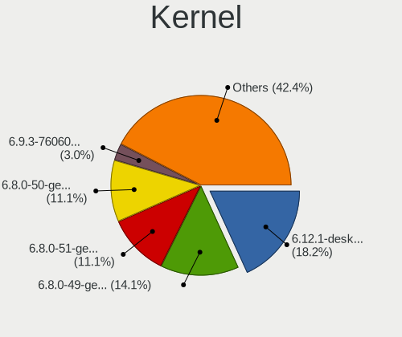
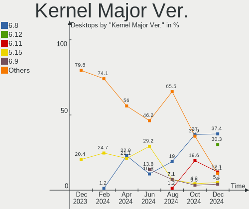
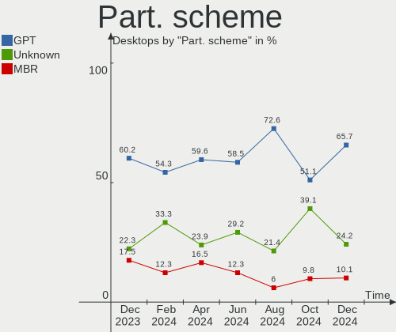
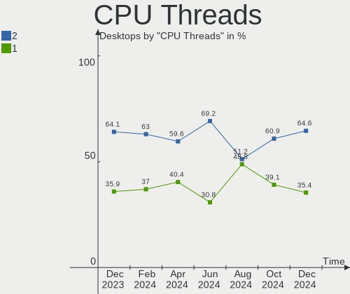
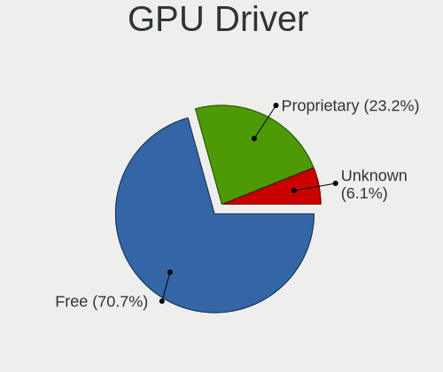
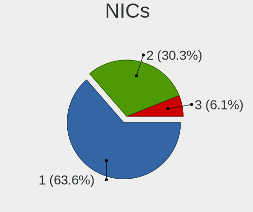
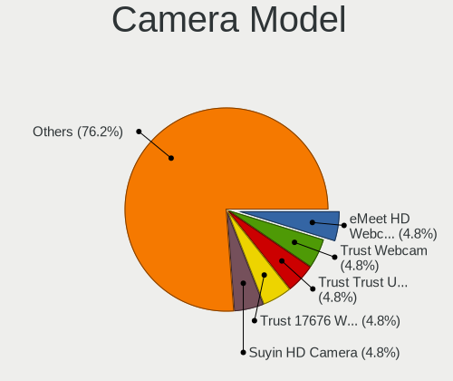

Linux in Italy - Hardware Trends (Desktops)
-------------------------------------------

A project to identify most popular hardware characteristics and track their change
over time based on data collected by Linux users at https://Linux-Hardware.org.

Anyone can contribute to this report by the [hw-probe](https://github.com/linuxhw/hw-probe) tool:

    sudo -E hw-probe -all -upload

Period: Nov, 2023.

Contents
--------

* [ System ](#system)
  - [ OS                       ](#os)
  - [ OS Family                ](#os-family)
  - [ Kernel                   ](#kernel)
  - [ Kernel Family            ](#kernel-family)
  - [ Kernel Major Ver.        ](#kernel-major-ver)
  - [ Arch                     ](#arch)
  - [ DE                       ](#de)
  - [ Display Server           ](#display-server)
  - [ Display Manager          ](#display-manager)
  - [ OS Lang                  ](#os-lang)
  - [ Boot Mode                ](#boot-mode)
  - [ Filesystem               ](#filesystem)
  - [ Part. scheme             ](#part-scheme)
  - [ Dual Boot with Linux/BSD ](#dual-boot-with-linuxbsd)
  - [ Dual Boot (Win)          ](#dual-boot-win)

* [ Board ](#board)
  - [ Vendor                   ](#vendor)
  - [ Model                    ](#model)
  - [ Model Family             ](#model-family)
  - [ MFG Year                 ](#mfg-year)
  - [ Form Factor              ](#form-factor)
  - [ Secure Boot              ](#secure-boot)
  - [ Coreboot                 ](#coreboot)
  - [ RAM Size                 ](#ram-size)
  - [ RAM Used                 ](#ram-used)
  - [ Total Drives             ](#total-drives)
  - [ Has CD-ROM               ](#has-cd-rom)
  - [ Has Ethernet             ](#has-ethernet)
  - [ Has WiFi                 ](#has-wifi)
  - [ Has Bluetooth            ](#has-bluetooth)

* [ Location ](#location)
  - [ Country                  ](#country)
  - [ City                     ](#city)

* [ Drives ](#drives)
  - [ Drive Vendor             ](#drive-vendor)
  - [ Drive Model              ](#drive-model)
  - [ HDD Vendor               ](#hdd-vendor)
  - [ SSD Vendor               ](#ssd-vendor)
  - [ Drive Kind               ](#drive-kind)
  - [ Drive Connector          ](#drive-connector)
  - [ Drive Size               ](#drive-size)
  - [ Space Total              ](#space-total)
  - [ Space Used               ](#space-used)
  - [ Malfunc. Drives          ](#malfunc-drives)
  - [ Malfunc. Drive Vendor    ](#malfunc-drive-vendor)
  - [ Malfunc. HDD Vendor      ](#malfunc-hdd-vendor)
  - [ Malfunc. Drive Kind      ](#malfunc-drive-kind)
  - [ Failed Drives            ](#failed-drives)
  - [ Failed Drive Vendor      ](#failed-drive-vendor)
  - [ Drive Status             ](#drive-status)

* [ Storage controller ](#storage-controller)
  - [ Storage Vendor           ](#storage-vendor)
  - [ Storage Model            ](#storage-model)
  - [ Storage Kind             ](#storage-kind)

* [ Processor ](#processor)
  - [ CPU Vendor               ](#cpu-vendor)
  - [ CPU Model                ](#cpu-model)
  - [ CPU Model Family         ](#cpu-model-family)
  - [ CPU Cores                ](#cpu-cores)
  - [ CPU Sockets              ](#cpu-sockets)
  - [ CPU Threads              ](#cpu-threads)
  - [ CPU Op-Modes             ](#cpu-op-modes)
  - [ CPU Microcode            ](#cpu-microcode)
  - [ CPU Microarch            ](#cpu-microarch)

* [ Graphics ](#graphics)
  - [ GPU Vendor               ](#gpu-vendor)
  - [ GPU Model                ](#gpu-model)
  - [ GPU Combo                ](#gpu-combo)
  - [ GPU Driver               ](#gpu-driver)
  - [ GPU Memory               ](#gpu-memory)

* [ Monitor ](#monitor)
  - [ Monitor Vendor           ](#monitor-vendor)
  - [ Monitor Model            ](#monitor-model)
  - [ Monitor Resolution       ](#monitor-resolution)
  - [ Monitor Diagonal         ](#monitor-diagonal)
  - [ Monitor Width            ](#monitor-width)
  - [ Aspect Ratio             ](#aspect-ratio)
  - [ Monitor Area             ](#monitor-area)
  - [ Pixel Density            ](#pixel-density)
  - [ Multiple Monitors        ](#multiple-monitors)

* [ Network ](#network)
  - [ Net Controller Vendor    ](#net-controller-vendor)
  - [ Net Controller Model     ](#net-controller-model)
  - [ Wireless Vendor          ](#wireless-vendor)
  - [ Wireless Model           ](#wireless-model)
  - [ Ethernet Vendor          ](#ethernet-vendor)
  - [ Ethernet Model           ](#ethernet-model)
  - [ Net Controller Kind      ](#net-controller-kind)
  - [ Used Controller          ](#used-controller)
  - [ NICs                     ](#nics)
  - [ IPv6                     ](#ipv6)

* [ Bluetooth ](#bluetooth)
  - [ Bluetooth Vendor         ](#bluetooth-vendor)
  - [ Bluetooth Model          ](#bluetooth-model)

* [ Sound ](#sound)
  - [ Sound Vendor             ](#sound-vendor)
  - [ Sound Model              ](#sound-model)

* [ Memory ](#memory)
  - [ Memory Vendor            ](#memory-vendor)
  - [ Memory Model             ](#memory-model)
  - [ Memory Kind              ](#memory-kind)
  - [ Memory Form Factor       ](#memory-form-factor)
  - [ Memory Size              ](#memory-size)
  - [ Memory Speed             ](#memory-speed)

* [ Printers & scanners ](#printers--scanners)
  - [ Printer Vendor           ](#printer-vendor)
  - [ Printer Model            ](#printer-model)
  - [ Scanner Vendor           ](#scanner-vendor)
  - [ Scanner Model            ](#scanner-model)

* [ Camera ](#camera)
  - [ Camera Vendor            ](#camera-vendor)
  - [ Camera Model             ](#camera-model)

* [ Security ](#security)
  - [ Fingerprint Vendor       ](#fingerprint-vendor)
  - [ Fingerprint Model        ](#fingerprint-model)
  - [ Chipcard Vendor          ](#chipcard-vendor)
  - [ Chipcard Model           ](#chipcard-model)

* [ Unsupported ](#unsupported)
  - [ Unsupported Devices      ](#unsupported-devices)
  - [ Unsupported Device Types ](#unsupported-device-types)

System
------

OS
--

Installed operating systems

| Name                         | Desktops | Percent |
|------------------------------|----------|---------|
| Ubuntu 22.04                 | 17       | 13.6%   |
| Linux Mint 21.2              | 13       | 10.4%   |
| Pop!_OS 22.04                | 8        | 6.4%    |
| Arch Rolling                 | 7        | 5.6%    |
| Ubuntu 23.10                 | 5        | 4%      |
| OpenMandriva 23.08           | 5        | 4%      |
| Kubuntu 22.04                | 5        | 4%      |
| Manjaro 23.0.4               | 4        | 3.2%    |
| Fedora 39                    | 4        | 3.2%    |
| Debian 12                    | 4        | 3.2%    |
| ArcoLinux Rolling            | 4        | 3.2%    |
| OpenMandriva 5.0             | 3        | 2.4%    |
| Linux Mint 21.1              | 3        | 2.4%    |
| Kubuntu 23.10                | 3        | 2.4%    |
| Fedora 38                    | 3        | 2.4%    |
| Debian                       | 3        | 2.4%    |
| Ubuntu MATE 22.04            | 2        | 1.6%    |
| Ubuntu 23.04                 | 2        | 1.6%    |
| Ubuntu 20.04                 | 2        | 1.6%    |
| SteamOS 4                    | 2        | 1.6%    |
| Manjaro                      | 2        | 1.6%    |
| Linux Mint 20.3              | 2        | 1.6%    |
| Debian 11                    | 2        | 1.6%    |
| Zorin 16                     | 1        | 0.8%    |
| Xubuntu 23.10                | 1        | 0.8%    |
| Ubuntu MATE 23.10            | 1        | 0.8%    |
| Ubuntu 18.04                 | 1        | 0.8%    |
| Slackware 15.0               | 1        | 0.8%    |
| ROSA 12.4                    | 1        | 0.8%    |
| openSUSE Tumbleweed-XXXXXXXX | 1        | 0.8%    |
| openSUSE Microos-XXXXXXXX    | 1        | 0.8%    |
| OpenMandriva 4.3             | 1        | 0.8%    |
| OpenMandriva 23.90           | 1        | 0.8%    |
| OpenMandriva 23.06           | 1        | 0.8%    |
| Manjaro 23.1.0               | 1        | 0.8%    |
| LMDE 6                       | 1        | 0.8%    |
| Linux Mint 21                | 1        | 0.8%    |
| Linux Mint 20.2              | 1        | 0.8%    |
| KDE neon 22.04               | 1        | 0.8%    |
| Kali 2023.3                  | 1        | 0.8%    |

OS Family
---------

OS without a version

| Name         | Desktops | Percent |
|--------------|----------|---------|
| Ubuntu       | 27       | 21.6%   |
| Linux Mint   | 20       | 16%     |
| OpenMandriva | 11       | 8.8%    |
| Debian       | 10       | 8%      |
| Pop!_OS      | 8        | 6.4%    |
| Kubuntu      | 8        | 6.4%    |
| Manjaro      | 7        | 5.6%    |
| Fedora       | 7        | 5.6%    |
| Arch         | 7        | 5.6%    |
| ArcoLinux    | 4        | 3.2%    |
| Ubuntu MATE  | 3        | 2.4%    |
| SteamOS      | 2        | 1.6%    |
| openSUSE     | 2        | 1.6%    |
| Zorin        | 1        | 0.8%    |
| Xubuntu      | 1        | 0.8%    |
| Slackware    | 1        | 0.8%    |
| ROSA         | 1        | 0.8%    |
| LMDE         | 1        | 0.8%    |
| KDE neon     | 1        | 0.8%    |
| Kali         | 1        | 0.8%    |
| EndeavourOS  | 1        | 0.8%    |
| Elementary   | 1        | 0.8%    |

Kernel
------

Version of the Linux kernel

| Version                 | Desktops | Percent |
|-------------------------|----------|---------|
| 6.2.0-36-generic        | 16       | 12.8%   |
| 5.15.0-88-generic       | 14       | 11.2%   |
| 6.5.0-10-generic        | 9        | 7.2%    |
| 6.5.6-76060506-generic  | 7        | 5.6%    |
| 6.4.11-desktop-1omv2390 | 6        | 4.8%    |
| 6.5.9-arch2-1           | 4        | 3.2%    |
| 6.1.0-13-amd64          | 4        | 3.2%    |
| 5.15.0-89-generic       | 4        | 3.2%    |
| 6.6.2-desktop-1omv2390  | 3        | 2.4%    |
| 6.5.0-4-amd64           | 3        | 2.4%    |
| 6.1.55-1-MANJARO        | 3        | 2.4%    |
| 5.4.0-166-generic       | 3        | 2.4%    |
| 5.15.0-87-generic       | 3        | 2.4%    |
| 6.6.2-arch1-1           | 2        | 1.6%    |
| 6.6.1-arch1-1           | 2        | 1.6%    |
| 6.5.9-1-default         | 2        | 1.6%    |
| 6.5.5-1-MANJARO         | 2        | 1.6%    |
| 6.5.11-300.fc39.x86_64  | 2        | 1.6%    |
| 6.2.0-37-generic        | 2        | 1.6%    |
| 6.2.0-26-generic        | 2        | 1.6%    |
| 5.10.0-26-amd64         | 2        | 1.6%    |
| 6.6.3-zen1-1-zen        | 1        | 0.8%    |
| 6.6.0-1-MANJARO         | 1        | 0.8%    |
| 6.5.8-zen1-1-zen        | 1        | 0.8%    |
| 6.5.8-200.fc38.x86_64   | 1        | 0.8%    |
| 6.5.6-300.fc39.x86_64   | 1        | 0.8%    |
| 6.5.4-76060504-generic  | 1        | 0.8%    |
| 6.5.10-300.fc39.x86_64  | 1        | 0.8%    |
| 6.5.10-200.fc38.x86_64  | 1        | 0.8%    |
| 6.5.0-9-generic         | 1        | 0.8%    |
| 6.4.3-arch1-2           | 1        | 0.8%    |
| 6.4.12-zen1-1-zen       | 1        | 0.8%    |
| 6.4.0-060400-generic    | 1        | 0.8%    |
| 6.3.7-zen1-1-zen        | 1        | 0.8%    |
| 6.3.5-desktop-3omv2390  | 1        | 0.8%    |
| 6.3.0-kali1-amd64       | 1        | 0.8%    |
| 6.2.9-300.fc38.x86_64   | 1        | 0.8%    |
| 6.2.16-19-pve           | 1        | 0.8%    |
| 6.2.0-1011-nvidia       | 1        | 0.8%    |
| 6.1.60-1-lts            | 1        | 0.8%    |

Kernel Family
-------------

Linux kernel without a distro release

| Version  | Desktops | Percent |
|----------|----------|---------|
| 5.15.0   | 26       | 20.8%   |
| 6.2.0    | 21       | 16.8%   |
| 6.5.0    | 13       | 10.4%   |
| 6.5.6    | 8        | 6.4%    |
| 6.5.9    | 6        | 4.8%    |
| 6.4.11   | 6        | 4.8%    |
| 6.6.2    | 5        | 4%      |
| 6.1.0    | 4        | 3.2%    |
| 6.1.55   | 3        | 2.4%    |
| 5.4.0    | 3        | 2.4%    |
| 6.6.1    | 2        | 1.6%    |
| 6.5.8    | 2        | 1.6%    |
| 6.5.5    | 2        | 1.6%    |
| 6.5.11   | 2        | 1.6%    |
| 6.5.10   | 2        | 1.6%    |
| 5.10.0   | 2        | 1.6%    |
| 6.6.3    | 1        | 0.8%    |
| 6.6.0    | 1        | 0.8%    |
| 6.5.4    | 1        | 0.8%    |
| 6.4.3    | 1        | 0.8%    |
| 6.4.12   | 1        | 0.8%    |
| 6.4.0    | 1        | 0.8%    |
| 6.3.7    | 1        | 0.8%    |
| 6.3.5    | 1        | 0.8%    |
| 6.3.0    | 1        | 0.8%    |
| 6.2.9    | 1        | 0.8%    |
| 6.2.16   | 1        | 0.8%    |
| 6.1.60   | 1        | 0.8%    |
| 6.1.20   | 1        | 0.8%    |
| 5.16.7   | 1        | 0.8%    |
| 5.15.94  | 1        | 0.8%    |
| 5.15.138 | 1        | 0.8%    |
| 4.15.0   | 1        | 0.8%    |
| 3.16.0   | 1        | 0.8%    |

Kernel Major Ver.
-----------------

Linux kernel major version

| Version | Desktops | Percent |
|---------|----------|---------|
| 6.5     | 36       | 28.8%   |
| 5.15    | 28       | 22.4%   |
| 6.2     | 23       | 18.4%   |
| 6.6     | 9        | 7.2%    |
| 6.4     | 9        | 7.2%    |
| 6.1     | 9        | 7.2%    |
| 6.3     | 3        | 2.4%    |
| 5.4     | 3        | 2.4%    |
| 5.10    | 2        | 1.6%    |
| 5.16    | 1        | 0.8%    |
| 4.15    | 1        | 0.8%    |
| 3.16    | 1        | 0.8%    |

Arch
----

OS architecture (x86_64, i586, etc.)

| Name   | Desktops | Percent |
|--------|----------|---------|
| x86_64 | 124      | 99.2%   |
| i686   | 1        | 0.8%    |

DE
--

Desktop Environment

| Name       | Desktops | Percent |
|------------|----------|---------|
| GNOME      | 51       | 40.8%   |
| KDE5       | 34       | 27.2%   |
| X-Cinnamon | 12       | 9.6%    |
| MATE       | 12       | 9.6%    |
| XFCE       | 7        | 5.6%    |
| Cinnamon   | 2        | 1.6%    |
| Unknown    | 2        | 1.6%    |
| sway       | 1        | 0.8%    |
| Pantheon   | 1        | 0.8%    |
| KDE        | 1        | 0.8%    |
| i3         | 1        | 0.8%    |
| hyprland   | 1        | 0.8%    |

Display Server
--------------

X11 or Wayland

| Name    | Desktops | Percent |
|---------|----------|---------|
| X11     | 90       | 72%     |
| Wayland | 33       | 26.4%   |
| Tty     | 2        | 1.6%    |

Display Manager
---------------

SDDM, LightDM, etc.

| Name    | Desktops | Percent |
|---------|----------|---------|
| GDM3    | 36       | 28.8%   |
| Unknown | 34       | 27.2%   |
| SDDM    | 28       | 22.4%   |
| LightDM | 17       | 13.6%   |
| GDM     | 9        | 7.2%    |
| KDM     | 1        | 0.8%    |

OS Lang
-------

Language

| Lang  | Desktops | Percent |
|-------|----------|---------|
| it_IT | 91       | 72.8%   |
| en_US | 24       | 19.2%   |
| C     | 8        | 6.4%    |
| en_IE | 1        | 0.8%    |
| en_GB | 1        | 0.8%    |

Boot Mode
---------

EFI or BIOS

| Mode | Desktops | Percent |
|------|----------|---------|
| BIOS | 67       | 53.6%   |
| EFI  | 58       | 46.4%   |

Filesystem
----------

Type of filesystem

| Type    | Desktops | Percent |
|---------|----------|---------|
| Ext4    | 75       | 60%     |
| Tmpfs   | 23       | 18.4%   |
| Btrfs   | 16       | 12.8%   |
| Overlay | 10       | 8%      |
| F2fs    | 1        | 0.8%    |

Part. scheme
------------

Scheme of partitioning

| Type    | Desktops | Percent |
|---------|----------|---------|
| GPT     | 79       | 63.2%   |
| Unknown | 32       | 25.6%   |
| MBR     | 14       | 11.2%   |

Dual Boot with Linux/BSD
------------------------

Hosting more than one Linux/BSD

| Dual boot | Desktops | Percent |
|-----------|----------|---------|
| No        | 100      | 80%     |
| Yes       | 25       | 20%     |

Dual Boot (Win)
---------------

Hosting Linux and Windows

| Dual boot | Desktops | Percent |
|-----------|----------|---------|
| No        | 76       | 60.8%   |
| Yes       | 49       | 39.2%   |

Board
-----

Vendor
------

Motherboard manufacturer

| Name                | Desktops | Percent |
|---------------------|----------|---------|
| ASUSTek Computer    | 42       | 33.6%   |
| Gigabyte Technology | 17       | 13.6%   |
| Hewlett-Packard     | 15       | 12%     |
| ASRock              | 13       | 10.4%   |
| MSI                 | 11       | 8.8%    |
| Fujitsu             | 5        | 4%      |
| Dell                | 5        | 4%      |
| Acer                | 4        | 3.2%    |
| HC Technology.      | 2        | 1.6%    |
| AZW                 | 2        | 1.6%    |
| Unknown             | 2        | 1.6%    |
| Sapphire            | 1        | 0.8%    |
| Pegatron            | 1        | 0.8%    |
| NZXT                | 1        | 0.8%    |
| Lenovo              | 1        | 0.8%    |
| BESSTAR Tech        | 1        | 0.8%    |
| ASRockRack          | 1        | 0.8%    |
| AMI                 | 1        | 0.8%    |

Model
-----

Motherboard model

| Name                                | Desktops | Percent |
|-------------------------------------|----------|---------|
| ASUS TUF Gaming X570-PLUS           | 3        | 2.4%    |
| HP EliteDesk 800 G1 SFF             | 2        | 1.6%    |
| HC Technology. HCAR5000-MI          | 2        | 1.6%    |
| Fujitsu ESPRIMO_P556                | 2        | 1.6%    |
| ASUS TUF Gaming B550M-PLUS          | 2        | 1.6%    |
| ASUS P8H67-M                        | 2        | 1.6%    |
| ASUS P5KPL-AM SE                    | 2        | 1.6%    |
| ASUS M5A97 R2.0                     | 2        | 1.6%    |
| ASUS M32CD_A_F_K20CD_K31CD          | 2        | 1.6%    |
| Unknown                             | 2        | 1.6%    |
| Sapphire PE-AM2RS690V2              | 1        | 0.8%    |
| Pegatron KZ654AA-ABZ a6422.it       | 1        | 0.8%    |
| NZXT N7 B550                        | 1        | 0.8%    |
| MSI MS-7E26                         | 1        | 0.8%    |
| MSI MS-7E12                         | 1        | 0.8%    |
| MSI MS-7D93                         | 1        | 0.8%    |
| MSI MS-7D14                         | 1        | 0.8%    |
| MSI MS-7C91                         | 1        | 0.8%    |
| MSI MS-7C56                         | 1        | 0.8%    |
| MSI MS-7C52                         | 1        | 0.8%    |
| MSI MS-7A74                         | 1        | 0.8%    |
| MSI MS-7A34                         | 1        | 0.8%    |
| MSI MS-7A15                         | 1        | 0.8%    |
| MSI MS-7808                         | 1        | 0.8%    |
| Lenovo ThinkStation P320 30BGS0XR00 | 1        | 0.8%    |
| HP Z600 Workstation                 | 1        | 0.8%    |
| HP Z230 Tower Workstation           | 1        | 0.8%    |
| HP ProDesk 600 G1 SFF               | 1        | 0.8%    |
| HP ProDesk 400 G2 MT                | 1        | 0.8%    |
| HP OMEN by Desktop PC 880-p1xx      | 1        | 0.8%    |
| HP F01                              | 1        | 0.8%    |
| HP Compaq Elite 8300 SFF            | 1        | 0.8%    |
| HP Compaq dc7900 Small Form Factor  | 1        | 0.8%    |
| HP Compaq 8200 Elite SFF PC         | 1        | 0.8%    |
| HP Compaq 6200 Pro SFF PC           | 1        | 0.8%    |
| HP 510-p134nl                       | 1        | 0.8%    |
| HP 500-160el                        | 1        | 0.8%    |
| HP 110-503nl                        | 1        | 0.8%    |
| Gigabyte Z790 AERO G                | 1        | 0.8%    |
| Gigabyte Z690M AORUS ELITE AX DDR4  | 1        | 0.8%    |

Model Family
------------

Motherboard model prefix

| Name                       | Desktops | Percent |
|----------------------------|----------|---------|
| ASUS TUF                   | 7        | 5.6%    |
| ASUS PRIME                 | 7        | 5.6%    |
| HP Compaq                  | 4        | 3.2%    |
| Fujitsu ESPRIMO            | 4        | 3.2%    |
| ASUS ROG                   | 4        | 3.2%    |
| Gigabyte B450              | 3        | 2.4%    |
| Dell OptiPlex              | 3        | 2.4%    |
| ASUS P5KPL-AM              | 3        | 2.4%    |
| HP ProDesk                 | 2        | 1.6%    |
| HP EliteDesk               | 2        | 1.6%    |
| HC Technology. HCAR5000-MI | 2        | 1.6%    |
| Gigabyte X570              | 2        | 1.6%    |
| ASUS P8H67-M               | 2        | 1.6%    |
| ASUS M5A97                 | 2        | 1.6%    |
| ASUS M32CD                 | 2        | 1.6%    |
| ASRock 970                 | 2        | 1.6%    |
| Acer Veriton               | 2        | 1.6%    |
| Unknown                    | 2        | 1.6%    |
| Sapphire PE-AM2RS690V2     | 1        | 0.8%    |
| Pegatron KZ654AA-ABZ       | 1        | 0.8%    |
| NZXT N7                    | 1        | 0.8%    |
| MSI MS-7E26                | 1        | 0.8%    |
| MSI MS-7E12                | 1        | 0.8%    |
| MSI MS-7D93                | 1        | 0.8%    |
| MSI MS-7D14                | 1        | 0.8%    |
| MSI MS-7C91                | 1        | 0.8%    |
| MSI MS-7C56                | 1        | 0.8%    |
| MSI MS-7C52                | 1        | 0.8%    |
| MSI MS-7A74                | 1        | 0.8%    |
| MSI MS-7A34                | 1        | 0.8%    |
| MSI MS-7A15                | 1        | 0.8%    |
| MSI MS-7808                | 1        | 0.8%    |
| Lenovo ThinkStation        | 1        | 0.8%    |
| HP Z600                    | 1        | 0.8%    |
| HP Z230                    | 1        | 0.8%    |
| HP OMEN                    | 1        | 0.8%    |
| HP F01                     | 1        | 0.8%    |
| HP 510-p134nl              | 1        | 0.8%    |
| HP 500-160el               | 1        | 0.8%    |
| HP 110-503nl               | 1        | 0.8%    |

MFG Year
--------

Motherboard manufacture year

| Year | Desktops | Percent |
|------|----------|---------|
| 2019 | 12       | 9.6%    |
| 2020 | 11       | 8.8%    |
| 2013 | 11       | 8.8%    |
| 2018 | 10       | 8%      |
| 2014 | 10       | 8%      |
| 2022 | 8        | 6.4%    |
| 2016 | 8        | 6.4%    |
| 2015 | 8        | 6.4%    |
| 2012 | 8        | 6.4%    |
| 2021 | 7        | 5.6%    |
| 2010 | 7        | 5.6%    |
| 2011 | 6        | 4.8%    |
| 2008 | 6        | 4.8%    |
| 2017 | 5        | 4%      |
| 2023 | 4        | 3.2%    |
| 2009 | 2        | 1.6%    |
| 2007 | 2        | 1.6%    |

Form Factor
-----------

Physical design of the computer

| Name    | Desktops | Percent |
|---------|----------|---------|
| Desktop | 125      | 100%    |

Secure Boot
-----------

Enabled or disabled

| State    | Desktops | Percent |
|----------|----------|---------|
| Disabled | 121      | 96.8%   |
| Enabled  | 4        | 3.2%    |

Coreboot
--------

Have coreboot on board

| Used | Desktops | Percent |
|------|----------|---------|
| No   | 125      | 100%    |

RAM Size
--------

Total RAM memory

| Size in GB  | Desktops | Percent |
|-------------|----------|---------|
| 16.01-24.0  | 28       | 22.4%   |
| 8.01-16.0   | 25       | 20%     |
| 32.01-64.0  | 23       | 18.4%   |
| 4.01-8.0    | 20       | 16%     |
| 3.01-4.0    | 13       | 10.4%   |
| 24.01-32.0  | 11       | 8.8%    |
| 64.01-256.0 | 5        | 4%      |

RAM Used
--------

Used RAM memory

| Used GB    | Desktops | Percent |
|------------|----------|---------|
| 2.01-3.0   | 32       | 25.6%   |
| 1.01-2.0   | 29       | 23.2%   |
| 4.01-8.0   | 27       | 21.6%   |
| 3.01-4.0   | 25       | 20%     |
| 8.01-16.0  | 9        | 7.2%    |
| 0.51-1.0   | 2        | 1.6%    |
| 16.01-24.0 | 1        | 0.8%    |

Total Drives
------------

Number of drives on board

| Drives | Desktops | Percent |
|--------|----------|---------|
| 2      | 39       | 31.2%   |
| 1      | 35       | 28%     |
| 3      | 20       | 16%     |
| 4      | 16       | 12.8%   |
| 5      | 8        | 6.4%    |
| 6      | 4        | 3.2%    |
| 14     | 1        | 0.8%    |
| 9      | 1        | 0.8%    |
| 7      | 1        | 0.8%    |

Has CD-ROM
----------

Has CD-ROM on board

| Presented | Desktops | Percent |
|-----------|----------|---------|
| No        | 66       | 52.8%   |
| Yes       | 59       | 47.2%   |

Has Ethernet
------------

Has Ethernet on board

| Presented | Desktops | Percent |
|-----------|----------|---------|
| Yes       | 125      | 100%    |

Has WiFi
--------

Has WiFi module

| Presented | Desktops | Percent |
|-----------|----------|---------|
| Yes       | 68       | 54.4%   |
| No        | 57       | 45.6%   |

Has Bluetooth
-------------

Has Bluetooth module

| Presented | Desktops | Percent |
|-----------|----------|---------|
| No        | 66       | 52.8%   |
| Yes       | 59       | 47.2%   |

Location
--------

Country
-------

Geographic location (country)

| Country | Desktops | Percent |
|---------|----------|---------|
| Italy   | 125      | 100%    |

City
----

Geographic location (city)

| City                     | Desktops | Percent |
|--------------------------|----------|---------|
| Rome                     | 19       | 15.2%   |
| Milan                    | 12       | 9.6%    |
| Milano                   | 4        | 3.2%    |
| Florence                 | 4        | 3.2%    |
| Turin                    | 3        | 2.4%    |
| Padova                   | 3        | 2.4%    |
| Genoa                    | 3        | 2.4%    |
| Vicenza                  | 2        | 1.6%    |
| Udine                    | 2        | 1.6%    |
| Pisa                     | 2        | 1.6%    |
| Naples                   | 2        | 1.6%    |
| Montoggio                | 2        | 1.6%    |
| Brescia                  | 2        | 1.6%    |
| Bologna                  | 2        | 1.6%    |
| Villa San Giovanni       | 1        | 0.8%    |
| Vigonza                  | 1        | 0.8%    |
| Verona                   | 1        | 0.8%    |
| Venice                   | 1        | 0.8%    |
| Trento                   | 1        | 0.8%    |
| Torre Boldone            | 1        | 0.8%    |
| Teramo                   | 1        | 0.8%    |
| Soresina                 | 1        | 0.8%    |
| Siziano                  | 1        | 0.8%    |
| Siena                    | 1        | 0.8%    |
| Scandolara Ravara        | 1        | 0.8%    |
| Santa Maria Capua Vetere | 1        | 0.8%    |
| San Giovanni Teatino     | 1        | 0.8%    |
| San Cesareo              | 1        | 0.8%    |
| Rombiolo                 | 1        | 0.8%    |
| Rogno                    | 1        | 0.8%    |
| Roe Volciano             | 1        | 0.8%    |
| Roccamonfina             | 1        | 0.8%    |
| Rimini                   | 1        | 0.8%    |
| Rho                      | 1        | 0.8%    |
| Rescaldina               | 1        | 0.8%    |
| Reggio Emilia            | 1        | 0.8%    |
| Ravenna                  | 1        | 0.8%    |
| Portici                  | 1        | 0.8%    |
| Pianoro                  | 1        | 0.8%    |
| Pesaro                   | 1        | 0.8%    |

Drives
------

Drive Vendor
------------

Hard drive vendors

| Vendor                      | Desktops | Drives | Percent |
|-----------------------------|----------|--------|---------|
| Samsung Electronics         | 44       | 68     | 17.25%  |
| Seagate                     | 36       | 56     | 14.12%  |
| WDC                         | 30       | 51     | 11.76%  |
| Crucial                     | 25       | 26     | 9.8%    |
| Kingston                    | 19       | 22     | 7.45%   |
| Toshiba                     | 17       | 17     | 6.67%   |
| Sandisk                     | 11       | 12     | 4.31%   |
| Micron/Crucial Technology   | 7        | 7      | 2.75%   |
| Hitachi                     | 6        | 6      | 2.35%   |
| China                       | 5        | 6      | 1.96%   |
| Phison                      | 4        | 5      | 1.57%   |
| Unknown                     | 3        | 4      | 1.18%   |
| Phison Electronics          | 3        | 4      | 1.18%   |
| Micron Technology           | 3        | 3      | 1.18%   |
| Maxtor                      | 3        | 3      | 1.18%   |
| HGST                        | 3        | 3      | 1.18%   |
| Unknown                     | 3        | 3      | 1.18%   |
| Transcend                   | 2        | 2      | 0.78%   |
| Silicon Motion              | 2        | 2      | 0.78%   |
| Kingston Technology Company | 2        | 2      | 0.78%   |
| JMicron Technology          | 2        | 2      | 0.78%   |
| Intenso                     | 2        | 2      | 0.78%   |
| Fanxiang                    | 2        | 2      | 0.78%   |
| X12                         | 1        | 1      | 0.39%   |
| WDC WDS5                    | 1        | 1      | 0.39%   |
| T-FORCE                     | 1        | 1      | 0.39%   |
| SPCC                        | 1        | 1      | 0.39%   |
| SABRENT                     | 1        | 1      | 0.39%   |
| Realtek Semiconductor       | 1        | 1      | 0.39%   |
| PNY                         | 1        | 1      | 0.39%   |
| Patriot                     | 1        | 1      | 0.39%   |
| MAXIO Technology (Hangzhou) | 1        | 1      | 0.39%   |
| LITEONIT                    | 1        | 1      | 0.39%   |
| Kimtigo                     | 1        | 1      | 0.39%   |
| Intel                       | 1        | 1      | 0.39%   |
| HS-SSD-E100                 | 1        | 1      | 0.39%   |
| Hoodisk                     | 1        | 1      | 0.39%   |
| Hikvision                   | 1        | 1      | 0.39%   |
| GOODRAM                     | 1        | 1      | 0.39%   |
| Gigabyte Technology         | 1        | 1      | 0.39%   |

Drive Model
-----------

Hard drive models

| Model                                                 | Desktops | Percent |
|-------------------------------------------------------|----------|---------|
| Toshiba DT01ACA100 1TB                                | 8        | 2.62%   |
| Samsung NVMe SSD Controller SM981/PM981/PM983 250GB   | 8        | 2.62%   |
| Kingston SA400S37240G 240GB SSD                       | 6        | 1.97%   |
| Crucial CT480BX500SSD1 480GB                          | 6        | 1.97%   |
| Samsung SSD 860 EVO 500GB                             | 5        | 1.64%   |
| Seagate ST2000DM008-2FR102 2TB                        | 4        | 1.31%   |
| Samsung SSD 850 EVO 250GB                             | 4        | 1.31%   |
| Micron/Crucial P2 NVMe PCIe SSD 1TB                   | 4        | 1.31%   |
| Crucial CT1000MX500SSD1 1TB                           | 4        | 1.31%   |
| WDC WD10EZEX-08WN4A0 1TB                              | 3        | 0.98%   |
| Seagate ST4000DM004-2CV104 4TB                        | 3        | 0.98%   |
| Seagate ST2000DM006-2DM164 2TB                        | 3        | 0.98%   |
| Seagate ST1000DM010-2EP102 1TB                        | 3        | 0.98%   |
| SanDisk SSD PLUS 480GB                                | 3        | 0.98%   |
| Samsung SSD 980 1TB                                   | 3        | 0.98%   |
| Samsung SSD 860 EVO 1TB                               | 3        | 0.98%   |
| Samsung SSD 850 EVO 500GB                             | 3        | 0.98%   |
| Samsung NVMe SSD Controller PM9A1/PM9A3/980PRO 2TB    | 3        | 0.98%   |
| Phison E12 NVMe Controller 512GB                      | 3        | 0.98%   |
| Crucial CT500MX500SSD1 500GB                          | 3        | 0.98%   |
| Unknown                                               | 3        | 0.98%   |
| WDC WD20EARS-00MVWB0 2TB                              | 2        | 0.66%   |
| WDC WD10EZRX-00L4HB0 1TB                              | 2        | 0.66%   |
| Toshiba DT01ACA050 500GB                              | 2        | 0.66%   |
| Silicon Motion SM2263EN/SM2263XT SSD Controller 256GB | 2        | 0.66%   |
| Seagate ST500DM009-2F110A 500GB                       | 2        | 0.66%   |
| Seagate ST500DM002-1BD142 500GB                       | 2        | 0.66%   |
| Seagate ST3500418AS 500GB                             | 2        | 0.66%   |
| Seagate ST2000DM001-1CH164 2TB                        | 2        | 0.66%   |
| Seagate BUP Slim BL 1TB                               | 2        | 0.66%   |
| Samsung SSD 870 QVO 1TB                               | 2        | 0.66%   |
| Samsung SSD 870 EVO 500GB                             | 2        | 0.66%   |
| Samsung SSD 870 EVO 1TB                               | 2        | 0.66%   |
| Phison Sabrent 512GB                                  | 2        | 0.66%   |
| Micron/Crucial CT1000P5PSSD8 1TB                      | 2        | 0.66%   |
| Kingston SV300S37A240G 240GB SSD                      | 2        | 0.66%   |
| Kingston SV300S37A120G 120GB SSD                      | 2        | 0.66%   |
| Kingston SFYRD2000G 2TB                               | 2        | 0.66%   |
| Kingston SA400S37480G 480GB SSD                       | 2        | 0.66%   |
| Kingston SA400S37120G 120GB SSD                       | 2        | 0.66%   |

HDD Vendor
----------

Hard disk drive vendors

| Vendor              | Desktops | Drives | Percent |
|---------------------|----------|--------|---------|
| Seagate             | 36       | 56     | 37.11%  |
| WDC                 | 29       | 49     | 29.9%   |
| Toshiba             | 14       | 14     | 14.43%  |
| Hitachi             | 6        | 6      | 6.19%   |
| Samsung Electronics | 3        | 3      | 3.09%   |
| Maxtor              | 3        | 3      | 3.09%   |
| HGST                | 3        | 3      | 3.09%   |
| Unknown             | 1        | 1      | 1.03%   |
| SABRENT             | 1        | 1      | 1.03%   |
| Fujitsu             | 1        | 1      | 1.03%   |

SSD Vendor
----------

Solid state drive vendors

| Vendor              | Desktops | Drives | Percent |
|---------------------|----------|--------|---------|
| Samsung Electronics | 32       | 40     | 29.09%  |
| Crucial             | 23       | 23     | 20.91%  |
| Kingston            | 16       | 17     | 14.55%  |
| SanDisk             | 7        | 7      | 6.36%   |
| China               | 5        | 5      | 4.55%   |
| Micron Technology   | 3        | 3      | 2.73%   |
| Unknown             | 3        | 3      | 2.73%   |
| Transcend           | 2        | 2      | 1.82%   |
| Toshiba             | 2        | 2      | 1.82%   |
| Intenso             | 2        | 2      | 1.82%   |
| X12                 | 1        | 1      | 0.91%   |
| WDC WDS5            | 1        | 1      | 0.91%   |
| SPCC                | 1        | 1      | 0.91%   |
| PNY                 | 1        | 1      | 0.91%   |
| Patriot             | 1        | 1      | 0.91%   |
| LITEONIT            | 1        | 1      | 0.91%   |
| Kimtigo             | 1        | 1      | 0.91%   |
| JMicron Technology  | 1        | 1      | 0.91%   |
| Hoodisk             | 1        | 1      | 0.91%   |
| Hikvision           | 1        | 1      | 0.91%   |
| GOODRAM             | 1        | 1      | 0.91%   |
| Fanxiang            | 1        | 1      | 0.91%   |
| Emtec               | 1        | 1      | 0.91%   |
| Corsair             | 1        | 1      | 0.91%   |
| A-DATA Technology   | 1        | 1      | 0.91%   |

Drive Kind
----------

HDD or SSD

| Kind    | Desktops | Drives | Percent |
|---------|----------|--------|---------|
| SSD     | 83       | 119    | 39.71%  |
| HDD     | 73       | 137    | 34.93%  |
| NVMe    | 47       | 66     | 22.49%  |
| Unknown | 5        | 6      | 2.39%   |
| MMC     | 1        | 1      | 0.48%   |

Drive Connector
---------------

SATA, SAS, NVMe, etc.

| Type | Desktops | Drives | Percent |
|------|----------|--------|---------|
| SATA | 112      | 250    | 65.5%   |
| NVMe | 47       | 66     | 27.49%  |
| SAS  | 11       | 12     | 6.43%   |
| MMC  | 1        | 1      | 0.58%   |

Drive Size
----------

Size of hard drive

| Size in TB | Desktops | Drives | Percent |
|------------|----------|--------|---------|
| 0.01-0.5   | 87       | 126    | 48.88%  |
| 0.51-1.0   | 53       | 67     | 29.78%  |
| 1.01-2.0   | 20       | 26     | 11.24%  |
| 3.01-4.0   | 9        | 10     | 5.06%   |
| 2.01-3.0   | 5        | 5      | 2.81%   |
| 4.01-10.0  | 4        | 22     | 2.25%   |

Space Total
-----------

Amount of disk space available on the file system

| Size in GB     | Desktops | Percent |
|----------------|----------|---------|
| 251-500        | 24       | 19.2%   |
| 101-250        | 23       | 18.4%   |
| 501-1000       | 19       | 15.2%   |
| 1001-2000      | 16       | 12.8%   |
| More than 3000 | 15       | 12%     |
| 2001-3000      | 11       | 8.8%    |
| 1-20           | 9        | 7.2%    |
| 21-50          | 4        | 3.2%    |
| 51-100         | 3        | 2.4%    |
| Unknown        | 1        | 0.8%    |

Space Used
----------

Amount of used disk space

| Used GB        | Desktops | Percent |
|----------------|----------|---------|
| 1-20           | 26       | 20.8%   |
| 101-250        | 22       | 17.6%   |
| 21-50          | 18       | 14.4%   |
| 501-1000       | 15       | 12%     |
| 51-100         | 13       | 10.4%   |
| 1001-2000      | 11       | 8.8%    |
| 251-500        | 9        | 7.2%    |
| More than 3000 | 5        | 4%      |
| 2001-3000      | 5        | 4%      |
| Unknown        | 1        | 0.8%    |

Malfunc. Drives
---------------

Drive models with a malfunction

| Model                                                     | Desktops | Drives | Percent |
|-----------------------------------------------------------|----------|--------|---------|
| Toshiba DT01ACA100 1TB                                    | 2        | 2      | 8%      |
| Seagate ST500DM009-2F110A 500GB                           | 2        | 2      | 8%      |
| Seagate ST3500418AS 500GB                                 | 2        | 3      | 8%      |
| WDC WD5000AAKX-001CA0 500GB                               | 1        | 1      | 4%      |
| WDC WD5000AAKS-00V1A0 500GB                               | 1        | 1      | 4%      |
| WDC WD20EARS-00MVWB0 2TB                                  | 1        | 1      | 4%      |
| WDC WD10EADX-22TDHB0 1TB                                  | 1        | 1      | 4%      |
| Seagate ST9250315AS 250GB                                 | 1        | 1      | 4%      |
| Seagate ST4000NM0035-1V4107 4TB                           | 1        | 2      | 4%      |
| Seagate ST1000LM024 HN-M101MBB 1TB                        | 1        | 1      | 4%      |
| Seagate ST1000DM003-9YN162 1TB                            | 1        | 1      | 4%      |
| SanDisk SSD PLUS 480GB                                    | 1        | 1      | 4%      |
| Samsung Electronics SSD 870 EVO 1TB                       | 1        | 1      | 4%      |
| Realtek Semiconductor RTS5763DL NVMe SSD Controller 512GB | 1        | 1      | 4%      |
| Maxtor STM3500320AS 500GB                                 | 1        | 1      | 4%      |
| Kingston SA400S37240G 240GB SSD                           | 1        | 1      | 4%      |
| Kingston SA400S37120G 120GB SSD                           | 1        | 1      | 4%      |
| Intenso SSD SATAIII 512GB                                 | 1        | 1      | 4%      |
| Hitachi HDS722020ALA330 2TB                               | 1        | 1      | 4%      |
| Crucial CT275MX300SSD1 275GB                              | 1        | 1      | 4%      |
| Crucial CT1000MX500SSD1 1TB                               | 1        | 1      | 4%      |
| Corsair Nova 2 SSD 32GB                                   | 1        | 1      | 4%      |

Malfunc. Drive Vendor
---------------------

Vendors of faulty drives

| Vendor                | Desktops | Drives | Percent |
|-----------------------|----------|--------|---------|
| Seagate               | 7        | 10     | 29.17%  |
| WDC                   | 4        | 4      | 16.67%  |
| Toshiba               | 2        | 2      | 8.33%   |
| Kingston              | 2        | 2      | 8.33%   |
| Crucial               | 2        | 2      | 8.33%   |
| SanDisk               | 1        | 1      | 4.17%   |
| Samsung Electronics   | 1        | 1      | 4.17%   |
| Realtek Semiconductor | 1        | 1      | 4.17%   |
| Maxtor                | 1        | 1      | 4.17%   |
| Intenso               | 1        | 1      | 4.17%   |
| Hitachi               | 1        | 1      | 4.17%   |
| Corsair               | 1        | 1      | 4.17%   |

Malfunc. HDD Vendor
-------------------

Vendors of faulty HDD drives

| Vendor  | Desktops | Drives | Percent |
|---------|----------|--------|---------|
| Seagate | 7        | 10     | 46.67%  |
| WDC     | 4        | 4      | 26.67%  |
| Toshiba | 2        | 2      | 13.33%  |
| Maxtor  | 1        | 1      | 6.67%   |
| Hitachi | 1        | 1      | 6.67%   |

Malfunc. Drive Kind
-------------------

Kinds of faulty drives

| Kind | Desktops | Drives | Percent |
|------|----------|--------|---------|
| HDD  | 13       | 18     | 59.09%  |
| SSD  | 8        | 8      | 36.36%  |
| NVMe | 1        | 1      | 4.55%   |

Failed Drives
-------------

Failed drive models

Zero info for selected period =(

Failed Drive Vendor
-------------------

Failed drive vendors

Zero info for selected period =(

Drive Status
------------

Number of failed and malfunc. drives

| Status   | Desktops | Drives | Percent |
|----------|----------|--------|---------|
| Works    | 66       | 168    | 43.71%  |
| Detected | 64       | 134    | 42.38%  |
| Malfunc  | 21       | 27     | 13.91%  |

Storage controller
------------------

Storage Vendor
--------------

Storage controller vendors

| Vendor                       | Desktops | Percent |
|------------------------------|----------|---------|
| Intel                        | 86       | 43%     |
| AMD                          | 39       | 19.5%   |
| Samsung Electronics          | 19       | 9.5%    |
| Micron/Crucial Technology    | 9        | 4.5%    |
| Marvell Technology Group     | 8        | 4%      |
| Phison Electronics           | 7        | 3.5%    |
| Kingston Technology Company  | 7        | 3.5%    |
| SanDisk                      | 6        | 3%      |
| ASMedia Technology           | 5        | 2.5%    |
| JMicron Technology           | 4        | 2%      |
| VIA Technologies             | 3        | 1.5%    |
| Silicon Motion               | 2        | 1%      |
| Toshiba America Info Systems | 1        | 0.5%    |
| Realtek Semiconductor        | 1        | 0.5%    |
| MAXIO Technology (Hangzhou)  | 1        | 0.5%    |
| INNOGRIT                     | 1        | 0.5%    |
| Broadcom / LSI               | 1        | 0.5%    |

Storage Model
-------------

Storage controller models

| Model                                                                                   | Desktops | Percent |
|-----------------------------------------------------------------------------------------|----------|---------|
| AMD FCH SATA Controller [AHCI mode]                                                     | 23       | 9.79%   |
| Intel Q170/Q150/B150/H170/H110/Z170/CM236 Chipset SATA Controller [AHCI Mode]           | 13       | 5.53%   |
| Intel 8 Series/C220 Series Chipset Family 6-port SATA Controller 1 [AHCI mode]          | 12       | 5.11%   |
| Samsung NVMe SSD Controller SM981/PM981/PM983                                           | 10       | 4.26%   |
| Intel 200 Series PCH SATA controller [AHCI mode]                                        | 8        | 3.4%    |
| AMD 500 Series Chipset SATA Controller                                                  | 7        | 2.98%   |
| AMD 400 Series Chipset SATA Controller                                                  | 7        | 2.98%   |
| Micron/Crucial P2 [Nick P2] / P3 / P3 Plus NVMe PCIe SSD (DRAM-less)                    | 6        | 2.55%   |
| Intel SATA Controller [RAID mode]                                                       | 6        | 2.55%   |
| Intel 6 Series/C200 Series Chipset Family 6 port Desktop SATA AHCI Controller           | 6        | 2.55%   |
| Samsung NVMe SSD Controller 980 (DRAM-less)                                             | 5        | 2.13%   |
| Phison E12 NVMe Controller                                                              | 5        | 2.13%   |
| Intel NM10/ICH7 Family SATA Controller [IDE mode]                                       | 5        | 2.13%   |
| Intel 82801G (ICH7 Family) IDE Controller                                               | 5        | 2.13%   |
| ASMedia ASM1062 Serial ATA Controller                                                   | 5        | 2.13%   |
| AMD SB7x0/SB8x0/SB9x0 SATA Controller [AHCI mode]                                       | 5        | 2.13%   |
| VIA VT6415 PATA IDE Host Controller                                                     | 3        | 1.28%   |
| Samsung NVMe SSD Controller PM9A1/PM9A3/980PRO                                          | 3        | 1.28%   |
| Marvell Group 88SE9172 SATA 6Gb/s Controller                                            | 3        | 1.28%   |
| Intel Comet Lake SATA AHCI Controller                                                   | 3        | 1.28%   |
| Intel Cannon Lake PCH SATA AHCI Controller                                              | 3        | 1.28%   |
| Intel 7 Series/C210 Series Chipset Family 6-port SATA Controller [AHCI mode]            | 3        | 1.28%   |
| AMD SB7x0/SB8x0/SB9x0 IDE Controller                                                    | 3        | 1.28%   |
| Silicon Motion SM2263EN/SM2263XT (DRAM-less) NVMe SSD Controllers                       | 2        | 0.85%   |
| SanDisk WD Black SN770 / PC SN740 256GB / PC SN560 (DRAM-less) NVMe SSD                 | 2        | 0.85%   |
| Samsung NVMe SSD Controller S4LV008[Pascal]                                             | 2        | 0.85%   |
| Phison E16 PCIe4 NVMe Controller                                                        | 2        | 0.85%   |
| Micron/Crucial P5 Plus NVMe PCIe SSD                                                    | 2        | 0.85%   |
| Kingston Company NV1 NVMe SSD SM2263XT                                                  | 2        | 0.85%   |
| Kingston Company KC3000/FURY Renegade NVMe SSD E18                                      | 2        | 0.85%   |
| Kingston Company A2000 NVMe SSD SM2263EN                                                | 2        | 0.85%   |
| Intel C600/X79 series chipset 6-Port SATA AHCI Controller                               | 2        | 0.85%   |
| Intel Alder Lake-S PCH SATA Controller [AHCI Mode]                                      | 2        | 0.85%   |
| Intel 700 Series Chipset Family SATA AHCI Controller                                    | 2        | 0.85%   |
| Intel 6 Series/C200 Series Chipset Family Desktop SATA Controller (IDE mode, ports 4-5) | 2        | 0.85%   |
| Intel 6 Series/C200 Series Chipset Family Desktop SATA Controller (IDE mode, ports 0-3) | 2        | 0.85%   |
| Intel 5 Series/3400 Series Chipset 6 port SATA AHCI Controller                          | 2        | 0.85%   |
| Intel 5 Series/3400 Series Chipset 4 port SATA IDE Controller                           | 2        | 0.85%   |
| Intel 5 Series/3400 Series Chipset 2 port SATA IDE Controller                           | 2        | 0.85%   |
| AMD FCH SATA Controller D                                                               | 2        | 0.85%   |

Storage Kind
------------

Kind of storage controller (IDE, SATA, NVMe, SAS, ...)

| Kind | Desktops | Percent |
|------|----------|---------|
| SATA | 107      | 58.15%  |
| NVMe | 47       | 25.54%  |
| IDE  | 20       | 10.87%  |
| RAID | 8        | 4.35%   |
| SAS  | 2        | 1.09%   |

Processor
---------

CPU Vendor
----------

Processor vendors

| Vendor | Desktops | Percent |
|--------|----------|---------|
| Intel  | 86       | 68.8%   |
| AMD    | 39       | 31.2%   |

CPU Model
---------

Processor models

| Model                                       | Desktops | Percent |
|---------------------------------------------|----------|---------|
| Intel Core i7-6700 CPU @ 3.40GHz            | 4        | 3.2%    |
| Intel Core i5-6400 CPU @ 2.70GHz            | 4        | 3.2%    |
| Intel Core i3-4160 CPU @ 3.60GHz            | 4        | 3.2%    |
| AMD Ryzen 7 3700X 8-Core Processor          | 4        | 3.2%    |
| Intel Core i7-4790 CPU @ 3.60GHz            | 3        | 2.4%    |
| AMD Ryzen 5 3600 6-Core Processor           | 3        | 2.4%    |
| Intel Core i9-9900K CPU @ 3.60GHz           | 2        | 1.6%    |
| Intel Core i7-8700K CPU @ 3.70GHz           | 2        | 1.6%    |
| Intel Core i7-4770 CPU @ 3.40GHz            | 2        | 1.6%    |
| Intel Core i7-3770 CPU @ 3.40GHz            | 2        | 1.6%    |
| Intel Core i7-10700K CPU @ 3.80GHz          | 2        | 1.6%    |
| Intel Core i5-3470 CPU @ 3.20GHz            | 2        | 1.6%    |
| Intel Core i5-10400F CPU @ 2.90GHz          | 2        | 1.6%    |
| Intel Core i5 CPU 650 @ 3.20GHz             | 2        | 1.6%    |
| Intel Core i3-6100 CPU @ 3.70GHz            | 2        | 1.6%    |
| AMD Ryzen 9 7900X3D 12-Core Processor       | 2        | 1.6%    |
| AMD Ryzen 9 3900X 12-Core Processor         | 2        | 1.6%    |
| AMD Ryzen 5 5600X 6-Core Processor          | 2        | 1.6%    |
| AMD Ryzen 5 5600G with Radeon Graphics      | 2        | 1.6%    |
| AMD FX-8350 Eight-Core Processor            | 2        | 1.6%    |
| Intel Xeon CPU X5650 @ 2.67GHz              | 1        | 0.8%    |
| Intel Xeon CPU E5-2620 v2 @ 2.10GHz         | 1        | 0.8%    |
| Intel Xeon CPU E3110 @ 3.00GHz              | 1        | 0.8%    |
| Intel Pentium Dual-Core CPU E6700 @ 3.20GHz | 1        | 0.8%    |
| Intel Pentium CPU G4600 @ 3.60GHz           | 1        | 0.8%    |
| Intel N95                                   | 1        | 0.8%    |
| Intel Core i7-8086K CPU @ 4.00GHz           | 1        | 0.8%    |
| Intel Core i7-6700K CPU @ 4.00GHz           | 1        | 0.8%    |
| Intel Core i7-4960X CPU @ 3.60GHz           | 1        | 0.8%    |
| Intel Core i7-2700K CPU @ 3.50GHz           | 1        | 0.8%    |
| Intel Core i7-2600K CPU @ 3.40GHz           | 1        | 0.8%    |
| Intel Core i7-2600 CPU @ 3.40GHz            | 1        | 0.8%    |
| Intel Core i7-10700F CPU @ 2.90GHz          | 1        | 0.8%    |
| Intel Core i5-9400F CPU @ 2.90GHz           | 1        | 0.8%    |
| Intel Core i5-9400 CPU @ 2.90GHz            | 1        | 0.8%    |
| Intel Core i5-8600K CPU @ 3.60GHz           | 1        | 0.8%    |
| Intel Core i5-8279U CPU @ 2.40GHz           | 1        | 0.8%    |
| Intel Core i5-7500 CPU @ 3.40GHz            | 1        | 0.8%    |
| Intel Core i5-6600 CPU @ 3.30GHz            | 1        | 0.8%    |
| Intel Core i5-4690 CPU @ 3.50GHz            | 1        | 0.8%    |

CPU Model Family
----------------

Processor model prefix

| Model                   | Desktops | Percent |
|-------------------------|----------|---------|
| Intel Core i5           | 25       | 20%     |
| Intel Core i7           | 22       | 17.6%   |
| Intel Core i3           | 12       | 9.6%    |
| AMD Ryzen 7             | 11       | 8.8%    |
| AMD Ryzen 5             | 11       | 8.8%    |
| Other                   | 7        | 5.6%    |
| Intel Core 2 Duo        | 6        | 4.8%    |
| AMD Ryzen 9             | 5        | 4%      |
| AMD FX                  | 5        | 4%      |
| Intel Celeron           | 4        | 3.2%    |
| Intel Xeon              | 3        | 2.4%    |
| AMD Ryzen 3             | 3        | 2.4%    |
| Intel Core i9           | 2        | 1.6%    |
| Intel Core 2 Quad       | 2        | 1.6%    |
| AMD Phenom II X4        | 2        | 1.6%    |
| AMD A10                 | 2        | 1.6%    |
| Intel Pentium Dual-Core | 1        | 0.8%    |
| Intel Pentium           | 1        | 0.8%    |
| Intel Atom              | 1        | 0.8%    |

CPU Cores
---------

Number of processor cores

| Number | Desktops | Percent |
|--------|----------|---------|
| 4      | 49       | 39.2%   |
| 2      | 28       | 22.4%   |
| 6      | 21       | 16.8%   |
| 8      | 17       | 13.6%   |
| 12     | 6        | 4.8%    |
| 16     | 2        | 1.6%    |
| 14     | 1        | 0.8%    |
| 3      | 1        | 0.8%    |

CPU Sockets
-----------

Number of sockets

| Number | Desktops | Percent |
|--------|----------|---------|
| 1      | 124      | 99.2%   |
| 2      | 1        | 0.8%    |

CPU Threads
-----------

Threads per core (Hyper-Threading)

| Number | Desktops | Percent |
|--------|----------|---------|
| 2      | 86       | 68.8%   |
| 1      | 39       | 31.2%   |

CPU Op-Modes
------------

CPU Operation Modes (32-bit, 64-bit)

| Op mode        | Desktops | Percent |
|----------------|----------|---------|
| 32-bit, 64-bit | 125      | 100%    |

CPU Microcode
-------------

Microcode number

| Number     | Desktops | Percent |
|------------|----------|---------|
| Unknown    | 66       | 52.8%   |
| 0x506e3    | 5        | 4%      |
| 0x306c3    | 5        | 4%      |
| 0x206a7    | 5        | 4%      |
| 0x08701021 | 5        | 4%      |
| 0x1067a    | 4        | 3.2%    |
| 0x0a601203 | 4        | 3.2%    |
| 0x06000852 | 4        | 3.2%    |
| 0xa0655    | 2        | 1.6%    |
| 0x306a9    | 2        | 1.6%    |
| 0x0a20120a | 2        | 1.6%    |
| 0x08701030 | 2        | 1.6%    |
| 0x906ea    | 1        | 0.8%    |
| 0x906e9    | 1        | 0.8%    |
| 0x806ea    | 1        | 0.8%    |
| 0x806c2    | 1        | 0.8%    |
| 0x6fd      | 1        | 0.8%    |
| 0x30661    | 1        | 0.8%    |
| 0x206c2    | 1        | 0.8%    |
| 0x20655    | 1        | 0.8%    |
| 0x0a50000d | 1        | 0.8%    |
| 0x0a50000c | 1        | 0.8%    |
| 0x08701013 | 1        | 0.8%    |
| 0x08608103 | 1        | 0.8%    |
| 0x08108109 | 1        | 0.8%    |
| 0x0810100b | 1        | 0.8%    |
| 0x08001138 | 1        | 0.8%    |
| 0x06006118 | 1        | 0.8%    |
| 0x06003106 | 1        | 0.8%    |
| 0x010000db | 1        | 0.8%    |
| 0x010000c8 | 1        | 0.8%    |

CPU Microarch
-------------

Microarchitecture

| Name             | Desktops | Percent |
|------------------|----------|---------|
| Haswell          | 14       | 11.2%   |
| Skylake          | 13       | 10.4%   |
| KabyLake         | 13       | 10.4%   |
| Zen 2            | 11       | 8.8%    |
| SandyBridge      | 8        | 6.4%    |
| Unknown          | 8        | 6.4%    |
| Zen 3            | 7        | 5.6%    |
| Penryn           | 7        | 5.6%    |
| IvyBridge        | 7        | 5.6%    |
| Westmere         | 5        | 4%      |
| Piledriver       | 5        | 4%      |
| CometLake        | 5        | 4%      |
| Zen+             | 4        | 3.2%    |
| Core             | 3        | 2.4%    |
| Alderlake Hybrid | 3        | 2.4%    |
| Zen              | 2        | 1.6%    |
| K10              | 2        | 1.6%    |
| Tremont          | 1        | 0.8%    |
| TigerLake        | 1        | 0.8%    |
| Steamroller      | 1        | 0.8%    |
| Icelake          | 1        | 0.8%    |
| Goldmont plus    | 1        | 0.8%    |
| Goldmont         | 1        | 0.8%    |
| Excavator        | 1        | 0.8%    |
| Bonnell          | 1        | 0.8%    |

Graphics
--------

GPU Vendor
----------

Vendors of graphics cards

| Vendor | Desktops | Percent |
|--------|----------|---------|
| Nvidia | 59       | 44.36%  |
| Intel  | 41       | 30.83%  |
| AMD    | 33       | 24.81%  |

GPU Model
---------

Graphics card models

| Model                                                                       | Desktops | Percent |
|-----------------------------------------------------------------------------|----------|---------|
| Intel Xeon E3-1200 v3/4th Gen Core Processor Integrated Graphics Controller | 7        | 5.11%   |
| Nvidia GP107 [GeForce GTX 1050 Ti]                                          | 4        | 2.92%   |
| Nvidia GM107 [GeForce GTX 750 Ti]                                           | 4        | 2.92%   |
| Nvidia GK208B [GeForce GT 710]                                              | 4        | 2.92%   |
| Intel 2nd Generation Core Processor Family Integrated Graphics Controller   | 4        | 2.92%   |
| AMD Raphael                                                                 | 4        | 2.92%   |
| Nvidia GM206 [GeForce GTX 960]                                              | 3        | 2.19%   |
| Nvidia GK208B [GeForce GT 730]                                              | 3        | 2.19%   |
| Intel HD Graphics 530                                                       | 3        | 2.19%   |
| Intel 4th Generation Core Processor Family Integrated Graphics Controller   | 3        | 2.19%   |
| AMD Baffin [Radeon RX 460/560D / Pro 450/455/460/555/555X/560/560X]         | 3        | 2.19%   |
| Nvidia TU117 [GeForce GTX 1650]                                             | 2        | 1.46%   |
| Nvidia TU116 [GeForce GTX 1650 SUPER]                                       | 2        | 1.46%   |
| Nvidia TU104 [GeForce RTX 2070 SUPER]                                       | 2        | 1.46%   |
| Nvidia GT218 [GeForce 210]                                                  | 2        | 1.46%   |
| Nvidia GP106 [GeForce GTX 1060 6GB]                                         | 2        | 1.46%   |
| Nvidia GP104 [GeForce GTX 1080]                                             | 2        | 1.46%   |
| Nvidia GM204 [GeForce GTX 970]                                              | 2        | 1.46%   |
| Intel Xeon E3-1200 v2/3rd Gen Core processor Graphics Controller            | 2        | 1.46%   |
| Intel Raptor Lake-S GT1 [UHD Graphics 770]                                  | 2        | 1.46%   |
| Intel HD Graphics 630                                                       | 2        | 1.46%   |
| Intel CoffeeLake-S GT2 [UHD Graphics 630]                                   | 2        | 1.46%   |
| Intel 82G33/G31 Express Integrated Graphics Controller                      | 2        | 1.46%   |
| Intel 4 Series Chipset Integrated Graphics Controller                       | 2        | 1.46%   |
| AMD Picasso/Raven 2 [Radeon Vega Series / Radeon Vega Mobile Series]        | 2        | 1.46%   |
| AMD Navi 32 [Radeon RX 7700 XT / 7800 XT]                                   | 2        | 1.46%   |
| AMD Navi 31 [Radeon RX 7900 XT/7900 XTX]                                    | 2        | 1.46%   |
| AMD Navi 23 [Radeon RX 6600/6600 XT/6600M]                                  | 2        | 1.46%   |
| AMD Lucienne                                                                | 2        | 1.46%   |
| AMD Ellesmere [Radeon RX 470/480/570/570X/580/580X/590]                     | 2        | 1.46%   |
| AMD Cezanne [Radeon Vega Series / Radeon Vega Mobile Series]                | 2        | 1.46%   |
| AMD Cedar [Radeon HD 5000/6000/7350/8350 Series]                            | 2        | 1.46%   |
| Nvidia TU106 [GeForce RTX 2070]                                             | 1        | 0.73%   |
| Nvidia TU106 [GeForce GTX 1650]                                             | 1        | 0.73%   |
| Nvidia TU104 [GeForce RTX 2060]                                             | 1        | 0.73%   |
| Nvidia TU102 [GeForce RTX 2080 Ti Rev. A]                                   | 1        | 0.73%   |
| Nvidia GT218 [GeForce 405]                                                  | 1        | 0.73%   |
| Nvidia GT216 [GeForce GT 220]                                               | 1        | 0.73%   |
| Nvidia GP106 [GeForce GTX 1060 3GB]                                         | 1        | 0.73%   |
| Nvidia GP104 [GeForce GTX 1070]                                             | 1        | 0.73%   |

GPU Combo
---------

Combinations of graphics cards

| Name           | Desktops | Percent |
|----------------|----------|---------|
| 1 x Nvidia     | 57       | 45.6%   |
| 1 x Intel      | 33       | 26.4%   |
| 1 x AMD        | 26       | 20.8%   |
| 2 x AMD        | 4        | 3.2%    |
| Intel + AMD    | 3        | 2.4%    |
| Intel + Nvidia | 2        | 1.6%    |

GPU Driver
----------

Free vs proprietary

| Driver      | Desktops | Percent |
|-------------|----------|---------|
| Free        | 80       | 64%     |
| Proprietary | 43       | 34.4%   |
| Unknown     | 2        | 1.6%    |

GPU Memory
----------

Total video memory

| Size in GB | Desktops | Percent |
|------------|----------|---------|
| Unknown    | 53       | 42.4%   |
| 1.01-2.0   | 18       | 14.4%   |
| 3.01-4.0   | 15       | 12%     |
| 0.01-0.5   | 11       | 8.8%    |
| 7.01-8.0   | 9        | 7.2%    |
| 8.01-16.0  | 7        | 5.6%    |
| 0.51-1.0   | 7        | 5.6%    |
| 2.01-3.0   | 2        | 1.6%    |
| 16.01-24.0 | 2        | 1.6%    |
| 5.01-6.0   | 1        | 0.8%    |

Monitor
-------

Monitor Vendor
--------------

Monitor vendors

| Vendor               | Desktops | Percent |
|----------------------|----------|---------|
| Samsung Electronics  | 34       | 24.11%  |
| Philips              | 15       | 10.64%  |
| Goldstar             | 15       | 10.64%  |
| Hewlett-Packard      | 14       | 9.93%   |
| Ancor Communications | 10       | 7.09%   |
| Acer                 | 9        | 6.38%   |
| Dell                 | 8        | 5.67%   |
| BenQ                 | 8        | 5.67%   |
| AOC                  | 4        | 2.84%   |
| MSI                  | 3        | 2.13%   |
| Unknown              | 2        | 1.42%   |
| Eizo                 | 2        | 1.42%   |
| ASUSTek Computer     | 2        | 1.42%   |
| ___                  | 1        | 0.71%   |
| Yashi                | 1        | 0.71%   |
| ViewSonic            | 1        | 0.71%   |
| Vestel Elektronik    | 1        | 0.71%   |
| Sony                 | 1        | 0.71%   |
| SKG                  | 1        | 0.71%   |
| LG Electronics       | 1        | 0.71%   |
| Lenovo Group Limited | 1        | 0.71%   |
| Iiyama               | 1        | 0.71%   |
| HVR                  | 1        | 0.71%   |
| HPN                  | 1        | 0.71%   |
| HKC                  | 1        | 0.71%   |
| GreenWood            | 1        | 0.71%   |
| Daewoo               | 1        | 0.71%   |
| Unknown              | 1        | 0.71%   |

Monitor Model
-------------

Monitor models

| Model                                                                 | Desktops | Percent |
|-----------------------------------------------------------------------|----------|---------|
| Samsung Electronics C27R50x SAM0F9D 1920x1080 598x336mm 27.0-inch     | 2        | 1.34%   |
| Philips 226V4 PHLC0B1 1920x1080 477x268mm 21.5-inch                   | 2        | 1.34%   |
| Goldstar ULTRAWIDE GSM59F1 2560x1080 798x334mm 34.1-inch              | 2        | 1.34%   |
| Dell U2715H DELD066 2560x1440 600x340mm 27.2-inch                     | 2        | 1.34%   |
| Ancor Communications ASUS VS228 ACI22FD 1920x1080 480x270mm 21.7-inch | 2        | 1.34%   |
| ___ LCD TV ___0101 1920x1080                                          | 1        | 0.67%   |
| Yashi YZ2816 YSI2800 3840x2160 620x350mm 28.0-inch                    | 1        | 0.67%   |
| ViewSonic LCD Monitor VX3276-QHD 2560x1440                            | 1        | 0.67%   |
| Vestel Elektronik 32W_LCD_TV VES3700 1920x1080 706x398mm 31.9-inch    | 1        | 0.67%   |
| Unknown LCD TV 0101 1920x1080 1600x900mm 72.3-inch                    | 1        | 0.67%   |
| Unknown LCD Monitor FFFF 2288x1287 2550x2550mm 142.0-inch             | 1        | 0.67%   |
| Sony TV *00 SNYAA04 3840x2160 1218x685mm 55.0-inch                    | 1        | 0.67%   |
| SKG H27T22 SKG2702 2560x1440 597x336mm 27.0-inch                      | 1        | 0.67%   |
| Samsung Electronics U28E590 SAM0C4D 3840x2160 610x350mm 27.7-inch     | 1        | 0.67%   |
| Samsung Electronics T24E390 SAM0DB2 1920x1080 521x293mm 23.5-inch     | 1        | 0.67%   |
| Samsung Electronics T24E390 SAM0C20 1920x1080 521x293mm 23.5-inch     | 1        | 0.67%   |
| Samsung Electronics T22C350 SAM0AB9 1920x1080 477x268mm 21.5-inch     | 1        | 0.67%   |
| Samsung Electronics SyncMaster SAM0522 1600x900 443x249mm 20.0-inch   | 1        | 0.67%   |
| Samsung Electronics SyncMaster SAM02FB 1440x900 410x257mm 19.1-inch   | 1        | 0.67%   |
| Samsung Electronics SyncMaster SAM021D 1680x1050 433x271mm 20.1-inch  | 1        | 0.67%   |
| Samsung Electronics SMXL2270HD SAM072B 1920x1080 476x268mm 21.5-inch  | 1        | 0.67%   |
| Samsung Electronics SMT24A350 SAM07AD 1920x1080 530x300mm 24.0-inch   | 1        | 0.67%   |
| Samsung Electronics SA300/SA350 SAM078F 1920x1080 477x268mm 21.5-inch | 1        | 0.67%   |
| Samsung Electronics S24R35x SAM100E 1920x1080 527x296mm 23.8-inch     | 1        | 0.67%   |
| Samsung Electronics S24F350 SAM0D21 1920x1080 521x293mm 23.5-inch     | 1        | 0.67%   |
| Samsung Electronics S24F350 SAM0D20 1920x1080 521x293mm 23.5-inch     | 1        | 0.67%   |
| Samsung Electronics S24D390 SAM0B65 1920x1080 521x293mm 23.5-inch     | 1        | 0.67%   |
| Samsung Electronics S24D330 SAM0D92 1920x1080 531x299mm 24.0-inch     | 1        | 0.67%   |
| Samsung Electronics S24D300 SAM0B45 1920x1080 521x293mm 23.5-inch     | 1        | 0.67%   |
| Samsung Electronics S22C200 SAM09B7 1920x1080 480x270mm 21.7-inch     | 1        | 0.67%   |
| Samsung Electronics S22B150 SAM08A3 1920x1080 477x268mm 21.5-inch     | 1        | 0.67%   |
| Samsung Electronics LU28R55 SAM1016 3840x2160 632x360mm 28.6-inch     | 1        | 0.67%   |
| Samsung Electronics LS24A40xV SAM717D 1920x1080 530x300mm 24.0-inch   | 1        | 0.67%   |
| Samsung Electronics LF24T35 SAM707D 1920x1080 528x297mm 23.9-inch     | 1        | 0.67%   |
| Samsung Electronics LCD Monitor T22C350 1920x1080                     | 1        | 0.67%   |
| Samsung Electronics LCD Monitor SMBX2440                              | 1        | 0.67%   |
| Samsung Electronics LCD Monitor SAM0C39 1920x1080 885x498mm 40.0-inch | 1        | 0.67%   |
| Samsung Electronics LCD Monitor SAM0900 1366x768 700x390mm 31.5-inch  | 1        | 0.67%   |
| Samsung Electronics LCD Monitor SAM02A4 1360x768                      | 1        | 0.67%   |
| Samsung Electronics LCD Monitor S24D330 1920x1080                     | 1        | 0.67%   |

Monitor Resolution
------------------

Monitor screen resolution

| Resolution         | Desktops | Percent |
|--------------------|----------|---------|
| 1920x1080 (FHD)    | 77       | 56.62%  |
| 2560x1440 (QHD)    | 11       | 8.09%   |
| 3840x2160 (4K)     | 7        | 5.15%   |
| 1440x900 (WXGA+)   | 6        | 4.41%   |
| 2560x1080          | 5        | 3.68%   |
| 1280x1024 (SXGA)   | 5        | 3.68%   |
| 1680x1050 (WSXGA+) | 4        | 2.94%   |
| 3440x1440          | 3        | 2.21%   |
| 1920x1200 (WUXGA)  | 3        | 2.21%   |
| 1366x768 (WXGA)    | 3        | 2.21%   |
| 3840x1080          | 2        | 1.47%   |
| 1360x768           | 2        | 1.47%   |
| Unknown            | 2        | 1.47%   |
| 5120x1440          | 1        | 0.74%   |
| 4480x1440          | 1        | 0.74%   |
| 2288x1287          | 1        | 0.74%   |
| 2160x1200          | 1        | 0.74%   |
| 1600x900 (HD+)     | 1        | 0.74%   |
| 1280x960           | 1        | 0.74%   |

Monitor Diagonal
----------------

Diagonal size in inches

| Inches  | Desktops | Percent |
|---------|----------|---------|
| 27      | 24       | 17.14%  |
| 24      | 23       | 16.43%  |
| 21      | 21       | 15%     |
| 23      | 16       | 11.43%  |
| Unknown | 12       | 8.57%   |
| 34      | 6        | 4.29%   |
| 19      | 6        | 4.29%   |
| 31      | 5        | 3.57%   |
| 28      | 4        | 2.86%   |
| 20      | 3        | 2.14%   |
| 18      | 3        | 2.14%   |
| 25      | 2        | 1.43%   |
| 17      | 2        | 1.43%   |
| 142     | 1        | 0.71%   |
| 84      | 1        | 0.71%   |
| 72      | 1        | 0.71%   |
| 65      | 1        | 0.71%   |
| 54      | 1        | 0.71%   |
| 52      | 1        | 0.71%   |
| 49      | 1        | 0.71%   |
| 48      | 1        | 0.71%   |
| 32      | 1        | 0.71%   |
| 29      | 1        | 0.71%   |
| 26      | 1        | 0.71%   |
| 22      | 1        | 0.71%   |
| 15      | 1        | 0.71%   |

Monitor Width
-------------

Physical width

| Width in mm    | Desktops | Percent |
|----------------|----------|---------|
| 501-600        | 60       | 43.8%   |
| 401-500        | 31       | 22.63%  |
| 601-700        | 12       | 8.76%   |
| Unknown        | 12       | 8.76%   |
| 701-800        | 7        | 5.11%   |
| 1001-1500      | 5        | 3.65%   |
| 351-400        | 4        | 2.92%   |
| 301-350        | 3        | 2.19%   |
| 1501-2000      | 2        | 1.46%   |
| More than 2000 | 1        | 0.73%   |

Aspect Ratio
------------

Proportional relationship between the width and the height

| Ratio   | Desktops | Percent |
|---------|----------|---------|
| 16/9    | 86       | 67.72%  |
| 16/10   | 14       | 11.02%  |
| Unknown | 10       | 7.87%   |
| 21/9    | 8        | 6.3%    |
| 5/4     | 6        | 4.72%   |
| 32/9    | 2        | 1.57%   |
| 1.00    | 1        | 0.79%   |

Monitor Area
------------

Area in inch

| Area in inch | Desktops | Percent |
|----------------|----------|---------|
| 201-250        | 49       | 35.51%  |
| 301-350        | 27       | 19.57%  |
| 351-500        | 14       | 10.14%  |
| 151-200        | 14       | 10.14%  |
| Unknown        | 12       | 8.7%    |
| 251-300        | 10       | 7.25%   |
| More than 1000 | 6        | 4.35%   |
| 141-150        | 3        | 2.17%   |
| 501-1000       | 2        | 1.45%   |
| 101-110        | 1        | 0.72%   |

Pixel Density
-------------

Pixels per inch

| Density | Desktops | Percent |
|---------|----------|---------|
| 51-100  | 79       | 58.96%  |
| 101-120 | 30       | 22.39%  |
| Unknown | 12       | 8.96%   |
| 1-50    | 7        | 5.22%   |
| 121-160 | 6        | 4.48%   |

Multiple Monitors
-----------------

Total monitors connected

| Total | Desktops | Percent |
|-------|----------|---------|
| 1     | 94       | 75.2%   |
| 2     | 21       | 16.8%   |
| 3     | 5        | 4%      |
| 0     | 5        | 4%      |

Network
-------

Net Controller Vendor
---------------------

Controller vendors

| Vendor                          | Desktops | Percent |
|---------------------------------|----------|---------|
| Realtek Semiconductor           | 85       | 45.7%   |
| Intel                           | 63       | 33.87%  |
| Broadcom                        | 8        | 4.3%    |
| TP-Link                         | 5        | 2.69%   |
| Qualcomm Atheros                | 5        | 2.69%   |
| Microsoft                       | 3        | 1.61%   |
| MediaTek                        | 3        | 1.61%   |
| D-Link System                   | 3        | 1.61%   |
| Samsung Electronics             | 2        | 1.08%   |
| Qualcomm Atheros Communications | 2        | 1.08%   |
| ASUSTek Computer                | 2        | 1.08%   |
| ASIX Electronics                | 2        | 1.08%   |
| ZyXEL Communications            | 1        | 0.54%   |
| Ralink Technology               | 1        | 0.54%   |
| Aquantia                        | 1        | 0.54%   |

Net Controller Model
--------------------

Controller models

| Model                                                                             | Desktops | Percent |
|-----------------------------------------------------------------------------------|----------|---------|
| Realtek RTL8111/8168/8411 PCI Express Gigabit Ethernet Controller                 | 67       | 31.31%  |
| Realtek RTL8125 2.5GbE Controller                                                 | 10       | 4.67%   |
| Intel Ethernet Connection I217-LM                                                 | 7        | 3.27%   |
| Intel Ethernet Connection (2) I219-V                                              | 7        | 3.27%   |
| Intel I211 Gigabit Network Connection                                             | 6        | 2.8%    |
| Intel Wireless 7265                                                               | 5        | 2.34%   |
| Intel Ethernet Controller I225-V                                                  | 5        | 2.34%   |
| Intel Wi-Fi 6 AX200                                                               | 4        | 1.87%   |
| Intel 82579LM Gigabit Network Connection (Lewisville)                             | 4        | 1.87%   |
| TP-Link TL-WN823N v2/v3 [Realtek RTL8192EU]                                       | 3        | 1.4%    |
| Realtek RTL8821CE 802.11ac PCIe Wireless Network Adapter                          | 3        | 1.4%    |
| Realtek RTL8188EUS 802.11n Wireless Network Adapter                               | 3        | 1.4%    |
| Realtek RTL810xE PCI Express Fast Ethernet controller                             | 3        | 1.4%    |
| Realtek 802.11ac NIC                                                              | 3        | 1.4%    |
| Intel Wi-Fi 6 AX210/AX211/AX411 160MHz                                            | 3        | 1.4%    |
| Intel Ethernet Connection (7) I219-V                                              | 3        | 1.4%    |
| Intel 82579V Gigabit Network Connection                                           | 3        | 1.4%    |
| TP-Link TL-WN821N v5/v6 [RTL8192EU]                                               | 2        | 0.93%   |
| Samsung Galaxy series, misc. (tethering mode)                                     | 2        | 0.93%   |
| Realtek RTL8852BE PCIe 802.11ax Wireless Network Controller                       | 2        | 0.93%   |
| Realtek RTL8821AE 802.11ac PCIe Wireless Network Adapter                          | 2        | 0.93%   |
| Realtek RTL8192CU 802.11n WLAN Adapter                                            | 2        | 0.93%   |
| Qualcomm Atheros AR9271 802.11n                                                   | 2        | 0.93%   |
| Qualcomm Atheros AR8121/AR8113/AR8114 Gigabit or Fast Ethernet                    | 2        | 0.93%   |
| Microsoft XBOX ACC                                                                | 2        | 0.93%   |
| MediaTek MT7921K (RZ608) Wi-Fi 6E 80MHz                                           | 2        | 0.93%   |
| Intel Wireless-AC 9260                                                            | 2        | 0.93%   |
| Intel Wireless 3165                                                               | 2        | 0.93%   |
| Intel Ethernet Controller I226-V                                                  | 2        | 0.93%   |
| Intel Ethernet Connection (2) I219-LM                                             | 2        | 0.93%   |
| Intel Ethernet Connection (11) I219-V                                             | 2        | 0.93%   |
| Intel Comet Lake PCH CNVi WiFi                                                    | 2        | 0.93%   |
| Intel 700 Series Chipset Family Wi-Fi                                             | 2        | 0.93%   |
| D-Link System DWA-131 802.11n Wireless N Nano Adapter(rev.A1) [Realtek RTL8192SU] | 2        | 0.93%   |
| Broadcom NetLink BCM57781 Gigabit Ethernet PCIe                                   | 2        | 0.93%   |
| ASIX AX88179 Gigabit Ethernet                                                     | 2        | 0.93%   |
| ZyXEL ZyAIR G-202 802.11bg                                                        | 1        | 0.47%   |
| Realtek RTL88x2bu [AC1200 Techkey]                                                | 1        | 0.47%   |
| Realtek RTL8822BE 802.11a/b/g/n/ac WiFi adapter                                   | 1        | 0.47%   |
| Realtek RTL8812AU 802.11a/b/g/n/ac 2T2R DB WLAN Adapter                           | 1        | 0.47%   |

Wireless Vendor
---------------

Wireless vendors

| Vendor                          | Desktops | Percent |
|---------------------------------|----------|---------|
| Intel                           | 25       | 34.72%  |
| Realtek Semiconductor           | 21       | 29.17%  |
| TP-Link                         | 5        | 6.94%   |
| Broadcom                        | 5        | 6.94%   |
| Microsoft                       | 3        | 4.17%   |
| MediaTek                        | 3        | 4.17%   |
| Qualcomm Atheros Communications | 2        | 2.78%   |
| Qualcomm Atheros                | 2        | 2.78%   |
| D-Link System                   | 2        | 2.78%   |
| ASUSTek Computer                | 2        | 2.78%   |
| ZyXEL Communications            | 1        | 1.39%   |
| Ralink Technology               | 1        | 1.39%   |

Wireless Model
--------------

Wireless models

| Model                                                                             | Desktops | Percent |
|-----------------------------------------------------------------------------------|----------|---------|
| Intel Wireless 7265                                                               | 5        | 6.85%   |
| Intel Wi-Fi 6 AX200                                                               | 4        | 5.48%   |
| TP-Link TL-WN823N v2/v3 [Realtek RTL8192EU]                                       | 3        | 4.11%   |
| Realtek RTL8821CE 802.11ac PCIe Wireless Network Adapter                          | 3        | 4.11%   |
| Realtek RTL8188EUS 802.11n Wireless Network Adapter                               | 3        | 4.11%   |
| Realtek 802.11ac NIC                                                              | 3        | 4.11%   |
| Intel Wi-Fi 6 AX210/AX211/AX411 160MHz                                            | 3        | 4.11%   |
| TP-Link TL-WN821N v5/v6 [RTL8192EU]                                               | 2        | 2.74%   |
| Realtek RTL8852BE PCIe 802.11ax Wireless Network Controller                       | 2        | 2.74%   |
| Realtek RTL8821AE 802.11ac PCIe Wireless Network Adapter                          | 2        | 2.74%   |
| Realtek RTL8192CU 802.11n WLAN Adapter                                            | 2        | 2.74%   |
| Qualcomm Atheros AR9271 802.11n                                                   | 2        | 2.74%   |
| Microsoft XBOX ACC                                                                | 2        | 2.74%   |
| MediaTek MT7921K (RZ608) Wi-Fi 6E 80MHz                                           | 2        | 2.74%   |
| Intel Wireless-AC 9260                                                            | 2        | 2.74%   |
| Intel Wireless 3165                                                               | 2        | 2.74%   |
| Intel Comet Lake PCH CNVi WiFi                                                    | 2        | 2.74%   |
| Intel 700 Series Chipset Family Wi-Fi                                             | 2        | 2.74%   |
| D-Link System DWA-131 802.11n Wireless N Nano Adapter(rev.A1) [Realtek RTL8192SU] | 2        | 2.74%   |
| ZyXEL ZyAIR G-202 802.11bg                                                        | 1        | 1.37%   |
| Realtek RTL88x2bu [AC1200 Techkey]                                                | 1        | 1.37%   |
| Realtek RTL8822BE 802.11a/b/g/n/ac WiFi adapter                                   | 1        | 1.37%   |
| Realtek RTL8812AU 802.11a/b/g/n/ac 2T2R DB WLAN Adapter                           | 1        | 1.37%   |
| Realtek RTL8188FTV 802.11b/g/n 1T1R 2.4G WLAN Adapter                             | 1        | 1.37%   |
| Realtek RTL-8185 IEEE 802.11a/b/g Wireless LAN Controller                         | 1        | 1.37%   |
| Realtek 802.11ac WLAN Adapter                                                     | 1        | 1.37%   |
| Ralink MT7601U Wireless Adapter                                                   | 1        | 1.37%   |
| Qualcomm Atheros AR93xx Wireless Network Adapter                                  | 1        | 1.37%   |
| Qualcomm Atheros AR9287 Wireless Network Adapter (PCI-Express)                    | 1        | 1.37%   |
| Microsoft Xbox 360 Wireless Adapter                                               | 1        | 1.37%   |
| MediaTek MT7922 802.11ax PCI Express Wireless Network Adapter                     | 1        | 1.37%   |
| Intel Wireless 8265 / 8275                                                        | 1        | 1.37%   |
| Intel Wireless 7260                                                               | 1        | 1.37%   |
| Intel Tiger Lake PCH CNVi WiFi                                                    | 1        | 1.37%   |
| Intel Gemini Lake PCH CNVi WiFi                                                   | 1        | 1.37%   |
| Intel Dual Band Wireless-AC 3168NGW [Stone Peak]                                  | 1        | 1.37%   |
| Intel Alder Lake-S PCH CNVi WiFi                                                  | 1        | 1.37%   |
| Broadcom BCM43602 802.11ac Wireless LAN SoC                                       | 1        | 1.37%   |
| Broadcom BCM4360 802.11ac Dual Band Wireless Network Adapter                      | 1        | 1.37%   |
| Broadcom BCM4352 802.11ac Dual Band Wireless Network Adapter                      | 1        | 1.37%   |

Ethernet Vendor
---------------

Ethernet vendors

| Vendor                | Desktops | Percent |
|-----------------------|----------|---------|
| Realtek Semiconductor | 78       | 57.78%  |
| Intel                 | 45       | 33.33%  |
| Qualcomm Atheros      | 3        | 2.22%   |
| Broadcom              | 3        | 2.22%   |
| Samsung Electronics   | 2        | 1.48%   |
| ASIX Electronics      | 2        | 1.48%   |
| D-Link System         | 1        | 0.74%   |
| Aquantia              | 1        | 0.74%   |

Ethernet Model
--------------

Ethernet models

| Model                                                               | Desktops | Percent |
|---------------------------------------------------------------------|----------|---------|
| Realtek RTL8111/8168/8411 PCI Express Gigabit Ethernet Controller   | 67       | 47.52%  |
| Realtek RTL8125 2.5GbE Controller                                   | 10       | 7.09%   |
| Intel Ethernet Connection I217-LM                                   | 7        | 4.96%   |
| Intel Ethernet Connection (2) I219-V                                | 7        | 4.96%   |
| Intel I211 Gigabit Network Connection                               | 6        | 4.26%   |
| Intel Ethernet Controller I225-V                                    | 5        | 3.55%   |
| Intel 82579LM Gigabit Network Connection (Lewisville)               | 4        | 2.84%   |
| Realtek RTL810xE PCI Express Fast Ethernet controller               | 3        | 2.13%   |
| Intel Ethernet Connection (7) I219-V                                | 3        | 2.13%   |
| Intel 82579V Gigabit Network Connection                             | 3        | 2.13%   |
| Samsung Galaxy series, misc. (tethering mode)                       | 2        | 1.42%   |
| Qualcomm Atheros AR8121/AR8113/AR8114 Gigabit or Fast Ethernet      | 2        | 1.42%   |
| Intel Ethernet Controller I226-V                                    | 2        | 1.42%   |
| Intel Ethernet Connection (2) I219-LM                               | 2        | 1.42%   |
| Intel Ethernet Connection (11) I219-V                               | 2        | 1.42%   |
| Broadcom NetLink BCM57781 Gigabit Ethernet PCIe                     | 2        | 1.42%   |
| ASIX AX88179 Gigabit Ethernet                                       | 2        | 1.42%   |
| Realtek RTL8169 PCI Gigabit Ethernet Controller                     | 1        | 0.71%   |
| Realtek RTL8153 Gigabit Ethernet Adapter                            | 1        | 0.71%   |
| Qualcomm Atheros Killer E2500 Gigabit Ethernet Controller           | 1        | 0.71%   |
| Intel I210 Gigabit Network Connection                               | 1        | 0.71%   |
| Intel Ethernet Connection I217-V                                    | 1        | 0.71%   |
| Intel Ethernet Connection (14) I219-LM                              | 1        | 0.71%   |
| Intel 82578DM Gigabit Network Connection                            | 1        | 0.71%   |
| Intel 82567LM-3 Gigabit Network Connection                          | 1        | 0.71%   |
| Intel 82566DM-2 Gigabit Network Connection                          | 1        | 0.71%   |
| D-Link System DGE-528T Gigabit Ethernet Adapter                     | 1        | 0.71%   |
| Broadcom NetXtreme BCM5764M Gigabit Ethernet PCIe                   | 1        | 0.71%   |
| Aquantia AQC113CS NBase-T/IEEE 802.3bz Ethernet Controller [AQtion] | 1        | 0.71%   |

Net Controller Kind
-------------------

Ethernet, WiFi or modem

| Kind     | Desktops | Percent |
|----------|----------|---------|
| Ethernet | 125      | 64.77%  |
| WiFi     | 68       | 35.23%  |

Used Controller
---------------

Currently used network controller

| Kind     | Desktops | Percent |
|----------|----------|---------|
| Ethernet | 85       | 69.11%  |
| WiFi     | 38       | 30.89%  |

NICs
----

Total network controllers on board

| Total | Desktops | Percent |
|-------|----------|---------|
| 1     | 71       | 56.8%   |
| 2     | 42       | 33.6%   |
| 3     | 10       | 8%      |
| 4     | 1        | 0.8%    |
| 0     | 1        | 0.8%    |

IPv6
----

IPv6 vs IPv4

| Used | Desktops | Percent |
|------|----------|---------|
| No   | 108      | 86.4%   |
| Yes  | 17       | 13.6%   |

Bluetooth
---------

Bluetooth Vendor
----------------

Controller vendors

| Vendor                          | Desktops | Percent |
|---------------------------------|----------|---------|
| Intel                           | 24       | 39.34%  |
| Realtek Semiconductor           | 8        | 13.11%  |
| Cambridge Silicon Radio         | 8        | 13.11%  |
| ASUSTek Computer                | 7        | 11.48%  |
| MediaTek                        | 3        | 4.92%   |
| IMC Networks                    | 3        | 4.92%   |
| Apple                           | 2        | 3.28%   |
| TP-Link                         | 1        | 1.64%   |
| Qualcomm Atheros Communications | 1        | 1.64%   |
| Integrated System Solution      | 1        | 1.64%   |
| HTC (High Tech Computer)        | 1        | 1.64%   |
| Edimax Technology               | 1        | 1.64%   |
| Broadcom                        | 1        | 1.64%   |

Bluetooth Model
---------------

Controller models

| Model                                                                | Desktops | Percent |
|----------------------------------------------------------------------|----------|---------|
| Intel Bluetooth wireless interface                                   | 9        | 14.52%  |
| Cambridge Silicon Radio Bluetooth Dongle (HCI mode)                  | 8        | 12.9%   |
| Realtek Bluetooth Radio                                              | 6        | 9.68%   |
| Intel AX201 Bluetooth                                                | 4        | 6.45%   |
| Intel AX200 Bluetooth                                                | 4        | 6.45%   |
| MediaTek Wireless_Device                                             | 3        | 4.84%   |
| IMC Networks Bluetooth Radio                                         | 3        | 4.84%   |
| ASUS Broadcom BCM20702A0 Bluetooth                                   | 3        | 4.84%   |
| Intel Wireless-AC 9260 Bluetooth Adapter                             | 2        | 3.23%   |
| Intel Bluetooth Device                                               | 2        | 3.23%   |
| Intel AX210 Bluetooth                                                | 2        | 3.23%   |
| Apple Bluetooth Host Controller                                      | 2        | 3.23%   |
| TP-Link TP-Cdj+ UB5A Adapter                                         | 1        | 1.61%   |
| Realtek  Bluetooth 4.2 Adapter                                       | 1        | 1.61%   |
| Realtek Bluetooth 5.1 Radio                                          | 1        | 1.61%   |
| Qualcomm Atheros AR3011 Bluetooth                                    | 1        | 1.61%   |
| Intel Wireless-AC 3168 Bluetooth                                     | 1        | 1.61%   |
| Intel Bluetooth 9460/9560 Jefferson Peak (JfP)                       | 1        | 1.61%   |
| Integrated System Solution Bluetooth Device                          | 1        | 1.61%   |
| HTC (High Tech Computer) Vive Hub Bluetooth 4.1 (Broadcom BCM920703) | 1        | 1.61%   |
| Edimax Bluetooth Adapter                                             | 1        | 1.61%   |
| Broadcom HP Bluethunder                                              | 1        | 1.61%   |
| ASUS Bluetooth Radio                                                 | 1        | 1.61%   |
| ASUS BCM20702A0                                                      | 1        | 1.61%   |
| ASUS ASUS USB-BT500                                                  | 1        | 1.61%   |
| ASUS 2045 Bluetooth 2.0 Device with trace filter                     | 1        | 1.61%   |

Sound
-----

Sound Vendor
------------

Sound card vendors

| Vendor                                       | Desktops | Percent |
|----------------------------------------------|----------|---------|
| Intel                                        | 86       | 37.89%  |
| Nvidia                                       | 56       | 24.67%  |
| AMD                                          | 49       | 21.59%  |
| C-Media Electronics                          | 6        | 2.64%   |
| Logitech                                     | 4        | 1.76%   |
| Thesycon Systemsoftware & Consulting         | 3        | 1.32%   |
| Texas Instruments                            | 2        | 0.88%   |
| Realtek Semiconductor                        | 2        | 0.88%   |
| KTMicro                                      | 2        | 0.88%   |
| EasyPass Industrial                          | 2        | 0.88%   |
| Creative Labs                                | 2        | 0.88%   |
| BR25                                         | 2        | 0.88%   |
| Blue Microphones                             | 2        | 0.88%   |
| Zoran Co. Personal Media Division (Nogatech) | 1        | 0.44%   |
| ZOOM                                         | 1        | 0.44%   |
| SteelSeries ApS                              | 1        | 0.44%   |
| Samson Technologies                          | 1        | 0.44%   |
| Hewlett-Packard                              | 1        | 0.44%   |
| FiiO Electronics Technology                  | 1        | 0.44%   |
| Elgato Systems                               | 1        | 0.44%   |
| Corsair                                      | 1        | 0.44%   |
| ASUSTek Computer                             | 1        | 0.44%   |

Sound Model
-----------

Sound card models

| Model                                                                      | Desktops | Percent |
|----------------------------------------------------------------------------|----------|---------|
| AMD Starship/Matisse HD Audio Controller                                   | 15       | 5.77%   |
| Intel 100 Series/C230 Series Chipset Family HD Audio Controller            | 14       | 5.38%   |
| Intel 8 Series/C220 Series Chipset High Definition Audio Controller        | 13       | 5%      |
| AMD Family 17h/19h HD Audio Controller                                     | 11       | 4.23%   |
| Nvidia GK208 HDMI/DP Audio Controller                                      | 8        | 3.08%   |
| Intel Xeon E3-1200 v3/4th Gen Core Processor HD Audio Controller           | 8        | 3.08%   |
| Intel 6 Series/C200 Series Chipset Family High Definition Audio Controller | 8        | 3.08%   |
| Intel 200 Series PCH HD Audio                                              | 8        | 3.08%   |
| Nvidia GM107 High Definition Audio Controller [GeForce 940MX]              | 7        | 2.69%   |
| Intel NM10/ICH7 Family High Definition Audio Controller                    | 6        | 2.31%   |
| Intel 7 Series/C216 Chipset Family High Definition Audio Controller        | 5        | 1.92%   |
| AMD SBx00 Azalia (Intel HDA)                                               | 5        | 1.92%   |
| AMD Renoir Radeon High Definition Audio Controller                         | 5        | 1.92%   |
| Nvidia GP107GL High Definition Audio Controller                            | 4        | 1.54%   |
| Nvidia GM206 High Definition Audio Controller                              | 4        | 1.54%   |
| Intel Comet Lake PCH cAVS                                                  | 4        | 1.54%   |
| Intel 5 Series/3400 Series Chipset High Definition Audio                   | 4        | 1.54%   |
| C-Media Electronics Audio Adapter (Unitek Y-247A)                          | 4        | 1.54%   |
| AMD Rembrandt Radeon High Definition Audio Controller                      | 4        | 1.54%   |
| AMD Navi 31 HDMI/DP Audio                                                  | 4        | 1.54%   |
| AMD Navi 21/23 HDMI/DP Audio Controller                                    | 4        | 1.54%   |
| AMD Baffin HDMI/DP Audio [Radeon RX 550 640SP / RX 560/560X]               | 4        | 1.54%   |
| Thesycon Systemsoftware & Consulting DX3 Pro                               | 3        | 1.15%   |
| Nvidia TU104 HD Audio Controller                                           | 3        | 1.15%   |
| Nvidia High Definition Audio Controller                                    | 3        | 1.15%   |
| Nvidia GP106 High Definition Audio Controller                              | 3        | 1.15%   |
| Nvidia GP104 High Definition Audio Controller                              | 3        | 1.15%   |
| Nvidia GA102 High Definition Audio Controller                              | 3        | 1.15%   |
| Intel Cannon Lake PCH cAVS                                                 | 3        | 1.15%   |
| Intel 82801I (ICH9 Family) HD Audio Controller                             | 3        | 1.15%   |
| AMD Raven/Raven2/Fenghuang HDMI/DP Audio Controller                        | 3        | 1.15%   |
| AMD Family 17h (Models 00h-0fh) HD Audio Controller                        | 3        | 1.15%   |
| Nvidia TU116 High Definition Audio Controller                              | 2        | 0.77%   |
| Nvidia TU107 GeForce GTX 1650 High Definition Audio Controller             | 2        | 0.77%   |
| Nvidia TU106 High Definition Audio Controller                              | 2        | 0.77%   |
| Nvidia GM204 High Definition Audio Controller                              | 2        | 0.77%   |
| Nvidia GA104 High Definition Audio Controller                              | 2        | 0.77%   |
| Nvidia Audio device                                                        | 2        | 0.77%   |
| Logitech G432 Gaming Headset                                               | 2        | 0.77%   |
| KTMicro KT USB Audio                                                       | 2        | 0.77%   |

Memory
------

Memory Vendor
-------------

Memory module vendors

| Vendor              | Desktops | Percent |
|---------------------|----------|---------|
| Kingston            | 19       | 21.11%  |
| Corsair             | 18       | 20%     |
| Samsung Electronics | 11       | 12.22%  |
| SK hynix            | 8        | 8.89%   |
| Unknown             | 6        | 6.67%   |
| Crucial             | 5        | 5.56%   |
| Micron Technology   | 4        | 4.44%   |
| G.Skill             | 3        | 3.33%   |
| Unknown (ABCD)      | 2        | 2.22%   |
| Team                | 2        | 2.22%   |
| Ramaxel Technology  | 2        | 2.22%   |
| ASint Technology    | 2        | 2.22%   |
| A-DATA Technology   | 2        | 2.22%   |
| Unknown (AB)        | 1        | 1.11%   |
| PNY                 | 1        | 1.11%   |
| PLEXHD              | 1        | 1.11%   |
| Nanya Technology    | 1        | 1.11%   |
| GeIL                | 1        | 1.11%   |
| Unknown             | 1        | 1.11%   |

Memory Model
------------

Memory module models

| Model                                                             | Desktops | Percent |
|-------------------------------------------------------------------|----------|---------|
| Corsair RAM CMK16GX4M2B3000C15 8GB DIMM DDR4 3533MT/s             | 3        | 3%      |
| Unknown (ABCD) RAM 123456789012345678 1536MB DIMM LPDDR4 2400MT/s | 2        | 2%      |
| SK hynix RAM HMA82GU6AFR8N-UH 16GB DIMM DDR4 2400MT/s             | 2        | 2%      |
| Samsung RAM M378B5773CH0-CH9 2048MB DIMM DDR3 1867MT/s            | 2        | 2%      |
| Kingston RAM KHX2400C15D4/4G 4GB DIMM DDR4 3151MT/s               | 2        | 2%      |
| Kingston RAM KHX2133C14D4/8G 8GB DIMM DDR4 2667MT/s               | 2        | 2%      |
| Corsair RAM CMK32GX4M2E3200C16 16GB DIMM DDR4 3534MT/s            | 2        | 2%      |
| Unknown RAM Module 4GB DIMM SDRAM                                 | 1        | 1%      |
| Unknown RAM Module 4GB DIMM DDR3 1333MT/s                         | 1        | 1%      |
| Unknown RAM Module 4GB DIMM DDR 1333MT/s                          | 1        | 1%      |
| Unknown RAM Module 2GB DIMM DDR2 800MT/s                          | 1        | 1%      |
| Unknown RAM Module 2GB DIMM DDR 800MT/s                           | 1        | 1%      |
| Unknown RAM Module 2GB DIMM DDR 1333MT/s                          | 1        | 1%      |
| Unknown RAM DDR4 NB 8G 2666 8GB SODIMM DDR4 2667MT/s              | 1        | 1%      |
| Unknown (AB) RAM Module 3GB DIMM LPDDR3 1600MT/s                  | 1        | 1%      |
| Team RAM TEAMGROUP-UD4-3200 16GB DIMM DDR4 3800MT/s               | 1        | 1%      |
| Team RAM Elite-1600 4GB DIMM DDR3 1600MT/s                        | 1        | 1%      |
| SK hynix RAM HMT451U6BFR8C-PB 4GB DIMM DDR3 1600MT/s              | 1        | 1%      |
| SK hynix RAM HMT451U6AFR8C-PB 4GB DIMM DDR3 1600MT/s              | 1        | 1%      |
| SK hynix RAM HMT151R7TFR4C-H9 4GB DIMM DDR3 1333MT/s              | 1        | 1%      |
| SK hynix RAM HMA851U6AFR6N-UH 4GB DIMM DDR4 2400MT/s              | 1        | 1%      |
| SK hynix RAM HMA82GU6JJR8N-VK 16GB DIMM DDR4 2666MT/s             | 1        | 1%      |
| SK hynix RAM HMA41GU6AFR8N-TF 8GB DIMM DDR4 2465MT/s              | 1        | 1%      |
| SK hynix RAM HKNNNFBMAVAR-NEH 2GB Row Of Chips LPDDR4 3200MT/s    | 1        | 1%      |
| Samsung RAM Module 8GB DIMM DDR3 1600MT/s                         | 1        | 1%      |
| Samsung RAM M471B5173DB0-YK0 4GB SODIMM DDR3 1600MT/s             | 1        | 1%      |
| Samsung RAM M378B5773DH0-CH9 2GB DIMM DDR3 1333MT/s               | 1        | 1%      |
| Samsung RAM M378B5673FH0-CH9 2GB DIMM DDR3 1600MT/s               | 1        | 1%      |
| Samsung RAM M378B5173QH0-CK0 4GB DIMM DDR3 1600MT/s               | 1        | 1%      |
| Samsung RAM M378B5173EB0-YK0 4GB DIMM DDR3 1600MT/s               | 1        | 1%      |
| Samsung RAM M378B5173DB0-CK0 4GB DIMM DDR3 1600MT/s               | 1        | 1%      |
| Samsung RAM M378B1G73EB0-CK0 8GB DIMM DDR3 1600MT/s               | 1        | 1%      |
| Samsung RAM M378A5244CB0-CRC 4GB DIMM DDR4 3066MT/s               | 1        | 1%      |
| Samsung RAM M378A1G43DB0-CPB 8GB DIMM DDR4 2133MT/s               | 1        | 1%      |
| Samsung RAM M3 78T2863QZS-CF7 1GB DIMM DDR2 800MT/s               | 1        | 1%      |
| Ramaxel RAM RMR1810EC58E8F1333 2GB DIMM DDR3 1333MT/s             | 1        | 1%      |
| Ramaxel RAM RML1520EF48D7W-800 1GB DIMM DDR2 800MT/s              | 1        | 1%      |
| PNY RAM 8GBF1X08RHJJ40-135-K 8GB DIMM DDR4 3600MT/s               | 1        | 1%      |
| PLEXHD RAM Module 8GB DIMM DDR3 1600MT/s                          | 1        | 1%      |
| Nanya RAM NT4GC72B4NA1NL-CG 4GB DIMM DDR3 1333MT/s                | 1        | 1%      |

Memory Kind
-----------

Memory module kinds

| Kind   | Desktops | Percent |
|--------|----------|---------|
| DDR4   | 35       | 44.3%   |
| DDR3   | 26       | 32.91%  |
| SDRAM  | 5        | 6.33%   |
| DDR5   | 5        | 6.33%   |
| LPDDR4 | 3        | 3.8%    |
| DDR2   | 2        | 2.53%   |
| DDR    | 2        | 2.53%   |
| LPDDR3 | 1        | 1.27%   |

Memory Form Factor
------------------

Physical design of the memory module

| Name         | Desktops | Percent |
|--------------|----------|---------|
| DIMM         | 70       | 93.33%  |
| SODIMM       | 4        | 5.33%   |
| Row Of Chips | 1        | 1.33%   |

Memory Size
-----------

Memory module size

| Size  | Desktops | Percent |
|-------|----------|---------|
| 8192  | 31       | 36.47%  |
| 4096  | 24       | 28.24%  |
| 16384 | 17       | 20%     |
| 2048  | 10       | 11.76%  |
| 32768 | 1        | 1.18%   |
| 3072  | 1        | 1.18%   |
| 1024  | 1        | 1.18%   |

Memory Speed
------------

Memory module speed

| Speed   | Desktops | Percent |
|---------|----------|---------|
| 1600    | 16       | 17.58%  |
| 1333    | 8        | 8.79%   |
| 2667    | 7        | 7.69%   |
| 2400    | 7        | 7.69%   |
| 1867    | 7        | 7.69%   |
| 3600    | 5        | 5.49%   |
| 3533    | 3        | 3.3%    |
| 3400    | 3        | 3.3%    |
| 3200    | 3        | 3.3%    |
| 2666    | 3        | 3.3%    |
| 2133    | 3        | 3.3%    |
| 800     | 3        | 3.3%    |
| 4800    | 2        | 2.2%    |
| 3733    | 2        | 2.2%    |
| 3534    | 2        | 2.2%    |
| 3151    | 2        | 2.2%    |
| 1866    | 2        | 2.2%    |
| 6400    | 1        | 1.1%    |
| 6000    | 1        | 1.1%    |
| 5800    | 1        | 1.1%    |
| 3866    | 1        | 1.1%    |
| 3800    | 1        | 1.1%    |
| 3666    | 1        | 1.1%    |
| 3066    | 1        | 1.1%    |
| 3007    | 1        | 1.1%    |
| 3000    | 1        | 1.1%    |
| 2472    | 1        | 1.1%    |
| 2465    | 1        | 1.1%    |
| 1066    | 1        | 1.1%    |
| Unknown | 1        | 1.1%    |

Printers & scanners
-------------------

Printer Vendor
--------------

Printer device vendors

| Vendor              | Desktops | Percent |
|---------------------|----------|---------|
| Hewlett-Packard     | 3        | 50%     |
| Xerox               | 1        | 16.67%  |
| Samsung Electronics | 1        | 16.67%  |
| Canon               | 1        | 16.67%  |

Printer Model
-------------

Printer device models

| Model                     | Desktops | Percent |
|---------------------------|----------|---------|
| Xerox WorkCentre 6015N/NI | 1        | 16.67%  |
| Samsung M2020 Series      | 1        | 16.67%  |
| HP LaserJet M14-M17       | 1        | 16.67%  |
| HP ENVY Pro 6400 series   | 1        | 16.67%  |
| HP ENVY 5540 series       | 1        | 16.67%  |
| Canon iP4200              | 1        | 16.67%  |

Scanner Vendor
--------------

Scanner device vendors

Zero info for selected period =(

Scanner Model
-------------

Scanner device models

Zero info for selected period =(

Camera
------

Camera Vendor
-------------

Camera device vendors

| Vendor                        | Desktops | Percent |
|-------------------------------|----------|---------|
| Logitech                      | 7        | 23.33%  |
| Sunplus Innovation Technology | 4        | 13.33%  |
| Microsoft                     | 4        | 13.33%  |
| Trust                         | 2        | 6.67%   |
| Realtek Semiconductor         | 2        | 6.67%   |
| Microdia                      | 2        | 6.67%   |
| Genesys Logic                 | 2        | 6.67%   |
| Chicony Electronics           | 2        | 6.67%   |
| ARC International             | 2        | 6.67%   |
| Sunplus IT                    | 1        | 3.33%   |
| Creative Technology           | 1        | 3.33%   |
| Apple                         | 1        | 3.33%   |

Camera Model
------------

Camera device models

| Model                              | Desktops | Percent |
|------------------------------------|----------|---------|
| Microsoft LifeCam HD-3000          | 3        | 10%     |
| Realtek FULL HD 1080P Webcam       | 2        | 6.67%   |
| Microdia USB 2.0 Camera            | 2        | 6.67%   |
| Logitech Webcam C270               | 2        | 6.67%   |
| ARC International Camera           | 2        | 6.67%   |
| Trust QHD Webcam                   | 1        | 3.33%   |
| Trust 17676 Webcam                 | 1        | 3.33%   |
| Sunplus IT AUKEY PC-LM1 USB Camera | 1        | 3.33%   |
| Sunplus Webcam                     | 1        | 3.33%   |
| Sunplus SPCA2281 Web Camera        | 1        | 3.33%   |
| Sunplus HD 720P webcam             | 1        | 3.33%   |
| Sunplus FHD Camera Microphone      | 1        | 3.33%   |
| Microsoft LifeCam VX-500 [1357]    | 1        | 3.33%   |
| Logitech Webcam C170               | 1        | 3.33%   |
| Logitech QuickCam E 3500           | 1        | 3.33%   |
| Logitech HD Pro Webcam C920        | 1        | 3.33%   |
| Logitech C505e HD Webcam           | 1        | 3.33%   |
| Logitech BRIO 4K Stream Edition    | 1        | 3.33%   |
| Genesys Logic USB 2.0 Camera       | 1        | 3.33%   |
| Genesys Logic Digital Microscope   | 1        | 3.33%   |
| Creative Live! Cam Sync 1080p      | 1        | 3.33%   |
| Chicony USB2.0 FHD UVC WebCam      | 1        | 3.33%   |
| Chicony HP High Definition Webcam  | 1        | 3.33%   |
| Apple iPhone 5/5C/5S/6/SE/7/8/X/XR | 1        | 3.33%   |

Security
--------

Fingerprint Vendor
------------------

Fingerprint sensor vendors

Zero info for selected period =(

Fingerprint Model
-----------------

Fingerprint sensor models

Zero info for selected period =(

Chipcard Vendor
---------------

Chipcard module vendors

| Vendor           | Desktops | Percent |
|------------------|----------|---------|
| SCM Microsystems | 1        | 50%     |
| Bit4id           | 1        | 50%     |

Chipcard Model
--------------

Chipcard module models

| Model                                   | Desktops | Percent |
|-----------------------------------------|----------|---------|
| SCM Microsystems Identiv SmartOS Reader | 1        | 50%     |
| Bit4id miniLector-s                     | 1        | 50%     |

Unsupported
-----------

Unsupported Devices
-------------------

Total unsupported devices on board

| Total | Desktops | Percent |
|-------|----------|---------|
| 0     | 114      | 91.2%   |
| 1     | 11       | 8.8%    |

Unsupported Device Types
------------------------

Types of unsupported devices

| Type                     | Desktops | Percent |
|--------------------------|----------|---------|
| Net/wireless             | 4        | 36.36%  |
| Graphics card            | 4        | 36.36%  |
| Chipcard                 | 2        | 18.18%  |
| Communication controller | 1        | 9.09%   |

