Linux in Italy - Hardware Trends (Desktops)
-------------------------------------------

A project to identify most popular hardware characteristics and track their change
over time based on data collected by Linux users at https://Linux-Hardware.org.

Anyone can contribute to this report by the [hw-probe](https://github.com/linuxhw/hw-probe) tool:

    sudo -E hw-probe -all -upload

Contents
--------

* [ System ](#system)
  - [ OS                       ](#os)
  - [ OS Family                ](#os-family)
  - [ Kernel                   ](#kernel)
  - [ Kernel Family            ](#kernel-family)
  - [ Kernel Major Ver.        ](#kernel-major-ver)
  - [ Arch                     ](#arch)
  - [ DE                       ](#de)
  - [ Display Server           ](#display-server)
  - [ Display Manager          ](#display-manager)
  - [ OS Lang                  ](#os-lang)
  - [ Boot Mode                ](#boot-mode)
  - [ Filesystem               ](#filesystem)
  - [ Part. scheme             ](#part-scheme)
  - [ Dual Boot with Linux/BSD ](#dual-boot-with-linuxbsd)
  - [ Dual Boot (Win)          ](#dual-boot-win)

* [ Board ](#board)
  - [ Vendor                   ](#vendor)
  - [ Model                    ](#model)
  - [ Model Family             ](#model-family)
  - [ MFG Year                 ](#mfg-year)
  - [ Form Factor              ](#form-factor)
  - [ Secure Boot              ](#secure-boot)
  - [ Coreboot                 ](#coreboot)
  - [ RAM Size                 ](#ram-size)
  - [ RAM Used                 ](#ram-used)
  - [ Total Drives             ](#total-drives)
  - [ Has CD-ROM               ](#has-cd-rom)
  - [ Has Ethernet             ](#has-ethernet)
  - [ Has WiFi                 ](#has-wifi)
  - [ Has Bluetooth            ](#has-bluetooth)

* [ Location ](#location)
  - [ Country                  ](#country)
  - [ City                     ](#city)

* [ Drives ](#drives)
  - [ Drive Vendor             ](#drive-vendor)
  - [ Drive Model              ](#drive-model)
  - [ HDD Vendor               ](#hdd-vendor)
  - [ SSD Vendor               ](#ssd-vendor)
  - [ Drive Kind               ](#drive-kind)
  - [ Drive Connector          ](#drive-connector)
  - [ Drive Size               ](#drive-size)
  - [ Space Total              ](#space-total)
  - [ Space Used               ](#space-used)
  - [ Malfunc. Drives          ](#malfunc-drives)
  - [ Malfunc. Drive Vendor    ](#malfunc-drive-vendor)
  - [ Malfunc. HDD Vendor      ](#malfunc-hdd-vendor)
  - [ Malfunc. Drive Kind      ](#malfunc-drive-kind)
  - [ Failed Drives            ](#failed-drives)
  - [ Failed Drive Vendor      ](#failed-drive-vendor)
  - [ Drive Status             ](#drive-status)

* [ Storage controller ](#storage-controller)
  - [ Storage Vendor           ](#storage-vendor)
  - [ Storage Model            ](#storage-model)
  - [ Storage Kind             ](#storage-kind)

* [ Processor ](#processor)
  - [ CPU Vendor               ](#cpu-vendor)
  - [ CPU Model                ](#cpu-model)
  - [ CPU Model Family         ](#cpu-model-family)
  - [ CPU Cores                ](#cpu-cores)
  - [ CPU Sockets              ](#cpu-sockets)
  - [ CPU Threads              ](#cpu-threads)
  - [ CPU Op-Modes             ](#cpu-op-modes)
  - [ CPU Microcode            ](#cpu-microcode)
  - [ CPU Microarch            ](#cpu-microarch)

* [ Graphics ](#graphics)
  - [ GPU Vendor               ](#gpu-vendor)
  - [ GPU Model                ](#gpu-model)
  - [ GPU Combo                ](#gpu-combo)
  - [ GPU Driver               ](#gpu-driver)
  - [ GPU Memory               ](#gpu-memory)

* [ Monitor ](#monitor)
  - [ Monitor Vendor           ](#monitor-vendor)
  - [ Monitor Model            ](#monitor-model)
  - [ Monitor Resolution       ](#monitor-resolution)
  - [ Monitor Diagonal         ](#monitor-diagonal)
  - [ Monitor Width            ](#monitor-width)
  - [ Aspect Ratio             ](#aspect-ratio)
  - [ Monitor Area             ](#monitor-area)
  - [ Pixel Density            ](#pixel-density)
  - [ Multiple Monitors        ](#multiple-monitors)

* [ Network ](#network)
  - [ Net Controller Vendor    ](#net-controller-vendor)
  - [ Net Controller Model     ](#net-controller-model)
  - [ Wireless Vendor          ](#wireless-vendor)
  - [ Wireless Model           ](#wireless-model)
  - [ Ethernet Vendor          ](#ethernet-vendor)
  - [ Ethernet Model           ](#ethernet-model)
  - [ Net Controller Kind      ](#net-controller-kind)
  - [ Used Controller          ](#used-controller)
  - [ NICs                     ](#nics)
  - [ IPv6                     ](#ipv6)

* [ Bluetooth ](#bluetooth)
  - [ Bluetooth Vendor         ](#bluetooth-vendor)
  - [ Bluetooth Model          ](#bluetooth-model)

* [ Sound ](#sound)
  - [ Sound Vendor             ](#sound-vendor)
  - [ Sound Model              ](#sound-model)

* [ Memory ](#memory)
  - [ Memory Vendor            ](#memory-vendor)
  - [ Memory Model             ](#memory-model)
  - [ Memory Kind              ](#memory-kind)
  - [ Memory Form Factor       ](#memory-form-factor)
  - [ Memory Size              ](#memory-size)
  - [ Memory Speed             ](#memory-speed)

* [ Printers & scanners ](#printers--scanners)
  - [ Printer Vendor           ](#printer-vendor)
  - [ Printer Model            ](#printer-model)
  - [ Scanner Vendor           ](#scanner-vendor)
  - [ Scanner Model            ](#scanner-model)

* [ Camera ](#camera)
  - [ Camera Vendor            ](#camera-vendor)
  - [ Camera Model             ](#camera-model)

* [ Security ](#security)
  - [ Fingerprint Vendor       ](#fingerprint-vendor)
  - [ Fingerprint Model        ](#fingerprint-model)
  - [ Chipcard Vendor          ](#chipcard-vendor)
  - [ Chipcard Model           ](#chipcard-model)

* [ Unsupported ](#unsupported)
  - [ Unsupported Devices      ](#unsupported-devices)
  - [ Unsupported Device Types ](#unsupported-device-types)

System
------

OS
--

Installed operating systems

| Name              | Desktops | Percent |
|-------------------|----------|---------|
| OpenMandriva 4.3  | 7        | 13.46%  |
| Ubuntu 20.04      | 6        | 11.54%  |
| Fedora 35         | 6        | 11.54%  |
| Arch              | 5        | 9.62%   |
| Ubuntu 21.10      | 3        | 5.77%   |
| Zorin 16          | 2        | 3.85%   |
| Linux Mint 20.3   | 2        | 3.85%   |
| Zorin 15          | 1        | 1.92%   |
| Xubuntu 22.04     | 1        | 1.92%   |
| Xubuntu 21.10     | 1        | 1.92%   |
| Xubuntu 20.04     | 1        | 1.92%   |
| Ubuntu MATE 21.10 | 1        | 1.92%   |
| Ubuntu 22.04      | 1        | 1.92%   |
| Pop!_OS 21.10     | 1        | 1.92%   |
| Parabola Rolling  | 1        | 1.92%   |
| openSUSE 20220419 | 1        | 1.92%   |
| Manjaro           | 1        | 1.92%   |
| Mageia 8          | 1        | 1.92%   |
| Linux Mint 20.2   | 1        | 1.92%   |
| KDE neon 20.04    | 1        | 1.92%   |
| Fedora 36         | 1        | 1.92%   |
| Fedora 34         | 1        | 1.92%   |
| Endless 4.0.4     | 1        | 1.92%   |
| Elementary 6.1    | 1        | 1.92%   |
| Debian Testing    | 1        | 1.92%   |
| Debian 11-updates | 1        | 1.92%   |
| Debian 11         | 1        | 1.92%   |
| Debian 10         | 1        | 1.92%   |

OS Family
---------

OS without a version

| Name         | Desktops | Percent |
|--------------|----------|---------|
| Ubuntu       | 10       | 19.23%  |
| Fedora       | 8        | 15.38%  |
| OpenMandriva | 7        | 13.46%  |
| Arch         | 5        | 9.62%   |
| Debian       | 4        | 7.69%   |
| Zorin        | 3        | 5.77%   |
| Xubuntu      | 3        | 5.77%   |
| Linux Mint   | 3        | 5.77%   |
| Ubuntu MATE  | 1        | 1.92%   |
| Pop!_OS      | 1        | 1.92%   |
| Parabola     | 1        | 1.92%   |
| openSUSE     | 1        | 1.92%   |
| Manjaro      | 1        | 1.92%   |
| Mageia       | 1        | 1.92%   |
| KDE neon     | 1        | 1.92%   |
| Endless      | 1        | 1.92%   |
| Elementary   | 1        | 1.92%   |

Kernel
------

Version of the Linux kernel

| Version                  | Desktops | Percent |
|--------------------------|----------|---------|
| 5.13.0-39-generic        | 11       | 21.15%  |
| 5.16.7-desktop-1omv4003  | 7        | 13.46%  |
| 5.4.0-107-generic        | 5        | 9.62%   |
| 5.16.18-200.fc35.x86_64  | 3        | 5.77%   |
| 5.13.0-40-generic        | 3        | 5.77%   |
| 5.17.4-200.fc35.x86_64   | 2        | 3.85%   |
| 5.4.0-91-generic         | 1        | 1.92%   |
| 5.17.5-arch1-1           | 1        | 1.92%   |
| 5.17.3-1-default         | 1        | 1.92%   |
| 5.17.2-xanmod1+amdnative | 1        | 1.92%   |
| 5.17.2-arch3-1           | 1        | 1.92%   |
| 5.17.1-300.fc36.x86_64   | 1        | 1.92%   |
| 5.16.20-200.fc35.x86_64  | 1        | 1.92%   |
| 5.16.18-100.fc34.x86_64  | 1        | 1.92%   |
| 5.16.0-6-amd64           | 1        | 1.92%   |
| 5.15.8-76051508-generic  | 1        | 1.92%   |
| 5.15.36-1-lts            | 1        | 1.92%   |
| 5.15.34-xanmod1-1        | 1        | 1.92%   |
| 5.15.33-1-lts            | 1        | 1.92%   |
| 5.15.32-desktop-1.mga8   | 1        | 1.92%   |
| 5.15.32-1-MANJARO        | 1        | 1.92%   |
| 5.15.32-1-lts            | 1        | 1.92%   |
| 5.15.0-27-generic        | 1        | 1.92%   |
| 5.15.0-23-generic        | 1        | 1.92%   |
| 5.15.0-2-amd64           | 1        | 1.92%   |
| 5.15.0-1mx-amd64         | 1        | 1.92%   |
| 5.11.0-35-generic        | 1        | 1.92%   |

Kernel Family
-------------

Linux kernel without a distro release

| Version | Desktops | Percent |
|---------|----------|---------|
| 5.13.0  | 14       | 26.92%  |
| 5.16.7  | 7        | 13.46%  |
| 5.4.0   | 6        | 11.54%  |
| 5.16.18 | 4        | 7.69%   |
| 5.15.0  | 4        | 7.69%   |
| 5.15.32 | 3        | 5.77%   |
| 5.17.4  | 2        | 3.85%   |
| 5.17.2  | 2        | 3.85%   |
| 5.17.5  | 1        | 1.92%   |
| 5.17.3  | 1        | 1.92%   |
| 5.17.1  | 1        | 1.92%   |
| 5.16.20 | 1        | 1.92%   |
| 5.16.0  | 1        | 1.92%   |
| 5.15.8  | 1        | 1.92%   |
| 5.15.36 | 1        | 1.92%   |
| 5.15.34 | 1        | 1.92%   |
| 5.15.33 | 1        | 1.92%   |
| 5.11.0  | 1        | 1.92%   |

Kernel Major Ver.
-----------------

Linux kernel major version

| Version | Desktops | Percent |
|---------|----------|---------|
| 5.13    | 14       | 26.92%  |
| 5.16    | 13       | 25%     |
| 5.15    | 11       | 21.15%  |
| 5.17    | 7        | 13.46%  |
| 5.4     | 6        | 11.54%  |
| 5.11    | 1        | 1.92%   |

Arch
----

OS architecture (x86_64, i586, etc.)

| Name   | Desktops | Percent |
|--------|----------|---------|
| x86_64 | 51       | 98.08%  |
| i686   | 1        | 1.92%   |

DE
--

Desktop Environment

| Name     | Desktops | Percent |
|----------|----------|---------|
| GNOME    | 18       | 34.62%  |
| KDE5     | 15       | 28.85%  |
| XFCE     | 7        | 13.46%  |
| MATE     | 5        | 9.62%   |
| Unknown  | 5        | 9.62%   |
| Pantheon | 1        | 1.92%   |
| Lubuntu  | 1        | 1.92%   |

Display Server
--------------

X11 or Wayland

| Name    | Desktops | Percent |
|---------|----------|---------|
| X11     | 42       | 80.77%  |
| Wayland | 7        | 13.46%  |
| Tty     | 3        | 5.77%   |

Display Manager
---------------

SDDM, LightDM, etc.

| Name    | Desktops | Percent |
|---------|----------|---------|
| Unknown | 19       | 36.54%  |
| SDDM    | 11       | 21.15%  |
| LightDM | 10       | 19.23%  |
| GDM3    | 9        | 17.31%  |
| GDM     | 3        | 5.77%   |

OS Lang
-------

Language

| Lang    | Desktops | Percent |
|---------|----------|---------|
| it_IT   | 37       | 71.15%  |
| en_US   | 11       | 21.15%  |
| en_GB   | 3        | 5.77%   |
| Unknown | 1        | 1.92%   |

Boot Mode
---------

EFI or BIOS

| Mode | Desktops | Percent |
|------|----------|---------|
| BIOS | 32       | 61.54%  |
| EFI  | 20       | 38.46%  |

Filesystem
----------

Type of filesystem

| Type    | Desktops | Percent |
|---------|----------|---------|
| Ext4    | 37       | 71.15%  |
| Overlay | 7        | 13.46%  |
| Btrfs   | 6        | 11.54%  |
| Xfs     | 2        | 3.85%   |

Part. scheme
------------

Scheme of partitioning

| Type    | Desktops | Percent |
|---------|----------|---------|
| Unknown | 29       | 55.77%  |
| GPT     | 19       | 36.54%  |
| MBR     | 4        | 7.69%   |

Dual Boot with Linux/BSD
------------------------

Hosting more than one Linux/BSD

| Dual boot | Desktops | Percent |
|-----------|----------|---------|
| No        | 38       | 73.08%  |
| Yes       | 14       | 26.92%  |

Dual Boot (Win)
---------------

Hosting Linux and Windows

| Dual boot | Desktops | Percent |
|-----------|----------|---------|
| No        | 39       | 75%     |
| Yes       | 13       | 25%     |

Board
-----

Vendor
------

Motherboard manufacturer

| Name                | Desktops | Percent |
|---------------------|----------|---------|
| ASUSTek Computer    | 16       | 30.77%  |
| MSI                 | 9        | 17.31%  |
| Lenovo              | 6        | 11.54%  |
| Gigabyte Technology | 6        | 11.54%  |
| ASRock              | 5        | 9.62%   |
| Hewlett-Packard     | 4        | 7.69%   |
| Acer                | 4        | 7.69%   |
| Intel               | 1        | 1.92%   |
| Dell                | 1        | 1.92%   |

Model
-----

Motherboard model

| Name                               | Desktops | Percent |
|------------------------------------|----------|---------|
| MSI MS-7C37                        | 2        | 3.85%   |
| ASUS P8Z68 DELUXE                  | 2        | 3.85%   |
| MSI NQ890AA-ABZ CQ5011IT           | 1        | 1.92%   |
| MSI MS-7D54                        | 1        | 1.92%   |
| MSI MS-7D09                        | 1        | 1.92%   |
| MSI MS-7D03                        | 1        | 1.92%   |
| MSI MS-7C75                        | 1        | 1.92%   |
| MSI MS-7B79                        | 1        | 1.92%   |
| MSI MS-7721                        | 1        | 1.92%   |
| Lenovo ThinkStation S20 4157WC1    | 1        | 1.92%   |
| Lenovo ThinkCentre M83 10AGS03400  | 1        | 1.92%   |
| Lenovo ThinkCentre M82 2929AC4     | 1        | 1.92%   |
| Lenovo ThinkCentre M700 10HY002VIX | 1        | 1.92%   |
| Lenovo ThinkCentre E73 10DR001EIX  | 1        | 1.92%   |
| Lenovo H50-50 90B60081IX           | 1        | 1.92%   |
| Intel STK2MV64CC                   | 1        | 1.92%   |
| HP Z210 SFF Workstation            | 1        | 1.92%   |
| HP Compaq Elite 8300 SFF           | 1        | 1.92%   |
| HP Compaq dc7600 Small Form Factor | 1        | 1.92%   |
| HP Compaq 8200 Elite CMT PC        | 1        | 1.92%   |
| Gigabyte GA-MA78GM-S2H             | 1        | 1.92%   |
| Gigabyte GA-A55M-S2V               | 1        | 1.92%   |
| Gigabyte B450 AORUS M              | 1        | 1.92%   |
| Gigabyte B450 AORUS ELITE          | 1        | 1.92%   |
| Gigabyte B365 M AORUS ELITE        | 1        | 1.92%   |
| Gigabyte B150M-D3H-CF              | 1        | 1.92%   |
| Dell OptiPlex 380                  | 1        | 1.92%   |
| ASUS TUF Gaming B560-PLUS WIFI     | 1        | 1.92%   |
| ASUS ROG STRIX X470-F GAMING       | 1        | 1.92%   |
| ASUS ROG STRIX B550-F GAMING       | 1        | 1.92%   |
| ASUS PRIME Z390M-PLUS              | 1        | 1.92%   |
| ASUS PRIME X470-PRO                | 1        | 1.92%   |
| ASUS PRIME H510M-A                 | 1        | 1.92%   |
| ASUS PRIME B460M-A                 | 1        | 1.92%   |
| ASUS PRIME A520M-K                 | 1        | 1.92%   |
| ASUS P8H61-M LX2                   | 1        | 1.92%   |
| ASUS P5KPL-AM SE                   | 1        | 1.92%   |
| ASUS P5GD1 PRO                     | 1        | 1.92%   |
| ASUS P5GD1                         | 1        | 1.92%   |
| ASUS M2N8L                         | 1        | 1.92%   |
| ASUS A68HM-K                       | 1        | 1.92%   |
| ASRock X570 Phantom Gaming 4       | 1        | 1.92%   |
| ASRock H61M-DGS                    | 1        | 1.92%   |
| ASRock C2750D4I                    | 1        | 1.92%   |
| ASRock 970 Extreme4                | 1        | 1.92%   |
| ASRock 775Dual-VSTA                | 1        | 1.92%   |
| Acer Veriton M2631                 | 1        | 1.92%   |
| Acer Aspire TC-780                 | 1        | 1.92%   |
| Acer Aspire TC-115                 | 1        | 1.92%   |
| Acer Aspire M1920                  | 1        | 1.92%   |

Model Family
------------

Motherboard model prefix

| Name                   | Desktops | Percent |
|------------------------|----------|---------|
| ASUS PRIME             | 5        | 9.62%   |
| Lenovo ThinkCentre     | 4        | 7.69%   |
| HP Compaq              | 3        | 5.77%   |
| Acer Aspire            | 3        | 5.77%   |
| MSI MS-7C37            | 2        | 3.85%   |
| Gigabyte B450          | 2        | 3.85%   |
| ASUS ROG               | 2        | 3.85%   |
| ASUS P8Z68             | 2        | 3.85%   |
| ASUS P5GD1             | 2        | 3.85%   |
| MSI NQ890AA-ABZ        | 1        | 1.92%   |
| MSI MS-7D54            | 1        | 1.92%   |
| MSI MS-7D09            | 1        | 1.92%   |
| MSI MS-7D03            | 1        | 1.92%   |
| MSI MS-7C75            | 1        | 1.92%   |
| MSI MS-7B79            | 1        | 1.92%   |
| MSI MS-7721            | 1        | 1.92%   |
| Lenovo ThinkStation    | 1        | 1.92%   |
| Lenovo H50-50          | 1        | 1.92%   |
| Intel STK2MV64CC       | 1        | 1.92%   |
| HP Z210                | 1        | 1.92%   |
| Gigabyte GA-MA78GM-S2H | 1        | 1.92%   |
| Gigabyte GA-A55M-S2V   | 1        | 1.92%   |
| Gigabyte B365          | 1        | 1.92%   |
| Gigabyte B150M-D3H-CF  | 1        | 1.92%   |
| Dell OptiPlex          | 1        | 1.92%   |
| ASUS TUF               | 1        | 1.92%   |
| ASUS P8H61-M           | 1        | 1.92%   |
| ASUS P5KPL-AM          | 1        | 1.92%   |
| ASUS M2N8L             | 1        | 1.92%   |
| ASUS A68HM-K           | 1        | 1.92%   |
| ASRock X570            | 1        | 1.92%   |
| ASRock H61M-DGS        | 1        | 1.92%   |
| ASRock C2750D4I        | 1        | 1.92%   |
| ASRock 970             | 1        | 1.92%   |
| ASRock 775Dual-VSTA    | 1        | 1.92%   |
| Acer Veriton           | 1        | 1.92%   |

MFG Year
--------

Motherboard manufacture year

| Year | Desktops | Percent |
|------|----------|---------|
| 2011 | 8        | 15.38%  |
| 2018 | 6        | 11.54%  |
| 2014 | 6        | 11.54%  |
| 2020 | 5        | 9.62%   |
| 2019 | 5        | 9.62%   |
| 2021 | 4        | 7.69%   |
| 2016 | 3        | 5.77%   |
| 2005 | 3        | 5.77%   |
| 2012 | 2        | 3.85%   |
| 2009 | 2        | 3.85%   |
| 2008 | 2        | 3.85%   |
| 2022 | 1        | 1.92%   |
| 2015 | 1        | 1.92%   |
| 2013 | 1        | 1.92%   |
| 2010 | 1        | 1.92%   |
| 2007 | 1        | 1.92%   |
| 2006 | 1        | 1.92%   |

Form Factor
-----------

Physical design of the computer

| Name    | Desktops | Percent |
|---------|----------|---------|
| Desktop | 52       | 100%    |

Secure Boot
-----------

Enabled or disabled

| State    | Desktops | Percent |
|----------|----------|---------|
| Disabled | 52       | 100%    |

Coreboot
--------

Have coreboot on board

| Used | Desktops | Percent |
|------|----------|---------|
| No   | 52       | 100%    |

RAM Size
--------

Total RAM memory

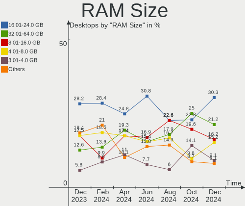

| Size in GB  | Desktops | Percent |
|-------------|----------|---------|
| 16.01-24.0  | 12       | 23.08%  |
| 8.01-16.0   | 10       | 19.23%  |
| 4.01-8.0    | 9        | 17.31%  |
| 3.01-4.0    | 8        | 15.38%  |
| 32.01-64.0  | 4        | 7.69%   |
| 1.01-2.0    | 4        | 7.69%   |
| 24.01-32.0  | 2        | 3.85%   |
| 64.01-256.0 | 2        | 3.85%   |
| 0.51-1.0    | 1        | 1.92%   |

RAM Used
--------

Used RAM memory

| Used GB   | Desktops | Percent |
|-----------|----------|---------|
| 1.01-2.0  | 18       | 34.62%  |
| 4.01-8.0  | 12       | 23.08%  |
| 0.51-1.0  | 8        | 15.38%  |
| 3.01-4.0  | 7        | 13.46%  |
| 2.01-3.0  | 6        | 11.54%  |
| 8.01-16.0 | 1        | 1.92%   |

Total Drives
------------

Number of drives on board

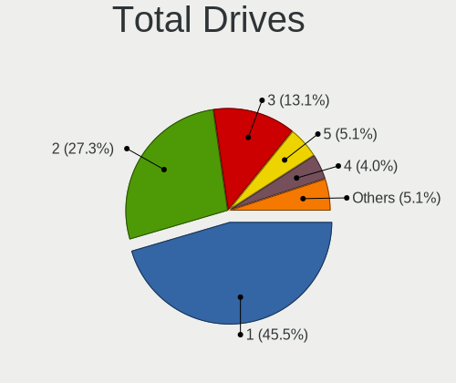

| Drives | Desktops | Percent |
|--------|----------|---------|
| 1      | 21       | 40.38%  |
| 2      | 12       | 23.08%  |
| 3      | 8        | 15.38%  |
| 4      | 5        | 9.62%   |
| 6      | 3        | 5.77%   |
| 5      | 3        | 5.77%   |

Has CD-ROM
----------

Has CD-ROM on board

| Presented | Desktops | Percent |
|-----------|----------|---------|
| Yes       | 31       | 59.62%  |
| No        | 21       | 40.38%  |

Has Ethernet
------------

Has Ethernet on board

| Presented | Desktops | Percent |
|-----------|----------|---------|
| Yes       | 51       | 98.08%  |
| No        | 1        | 1.92%   |

Has WiFi
--------

Has WiFi module

| Presented | Desktops | Percent |
|-----------|----------|---------|
| No        | 33       | 63.46%  |
| Yes       | 19       | 36.54%  |

Has Bluetooth
-------------

Has Bluetooth module

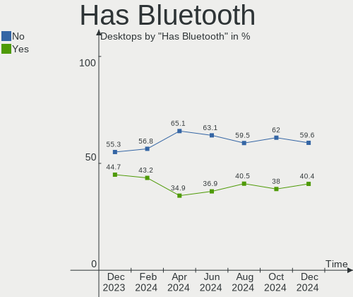

| Presented | Desktops | Percent |
|-----------|----------|---------|
| No        | 38       | 73.08%  |
| Yes       | 14       | 26.92%  |

Location
--------

Country
-------

Geographic location (country)

| Country | Desktops | Percent |
|---------|----------|---------|
| Italy   | 52       | 100%    |

City
----

Geographic location (city)

| City                   | Desktops | Percent |
|------------------------|----------|---------|
| Milan                  | 11       | 21.15%  |
| Rome                   | 8        | 15.38%  |
| Venice                 | 2        | 3.85%   |
| Turin                  | 2        | 3.85%   |
| Rho                    | 2        | 3.85%   |
| Altopascio             | 2        | 3.85%   |
| Vigodarzere            | 1        | 1.92%   |
| Trento                 | 1        | 1.92%   |
| Tivoli                 | 1        | 1.92%   |
| Terni                  | 1        | 1.92%   |
| Sora                   | 1        | 1.92%   |
| Siniscola              | 1        | 1.92%   |
| Sedriano               | 1        | 1.92%   |
| Saonara                | 1        | 1.92%   |
| San Valentino Torio    | 1        | 1.92%   |
| San Severino Marche    | 1        | 1.92%   |
| Rovereto               | 1        | 1.92%   |
| Revere                 | 1        | 1.92%   |
| Piacenza               | 1        | 1.92%   |
| Naples                 | 1        | 1.92%   |
| Mölten                | 1        | 1.92%   |
| Lissone                | 1        | 1.92%   |
| La Spezia              | 1        | 1.92%   |
| Gorle                  | 1        | 1.92%   |
| Fossano                | 1        | 1.92%   |
| Ferrara di Monte Baldo | 1        | 1.92%   |
| Cupello                | 1        | 1.92%   |
| Corridonia             | 1        | 1.92%   |
| Castiglion Fiorentino  | 1        | 1.92%   |
| Castelnovo di Sotto    | 1        | 1.92%   |
| Caltanissetta          | 1        | 1.92%   |

Drives
------

Drive Vendor
------------

Hard drive vendors

| Vendor                    | Desktops | Drives | Percent |
|---------------------------|----------|--------|---------|
| Seagate                   | 23       | 37     | 23.71%  |
| WDC                       | 18       | 23     | 18.56%  |
| Samsung Electronics       | 16       | 20     | 16.49%  |
| Micron/Crucial Technology | 5        | 5      | 5.15%   |
| MAXTOR                    | 5        | 7      | 5.15%   |
| Hitachi                   | 4        | 4      | 4.12%   |
| Sandisk                   | 3        | 3      | 3.09%   |
| Kingston                  | 3        | 3      | 3.09%   |
| Crucial                   | 3        | 3      | 3.09%   |
| Unknown                   | 2        | 2      | 2.06%   |
| Toshiba                   | 2        | 2      | 2.06%   |
| PNY                       | 2        | 2      | 2.06%   |
| Phison                    | 2        | 2      | 2.06%   |
| OCZ                       | 2        | 2      | 2.06%   |
| Team                      | 1        | 1      | 1.03%   |
| Patriot                   | 1        | 1      | 1.03%   |
| Lexar                     | 1        | 1      | 1.03%   |
| Intel                     | 1        | 2      | 1.03%   |
| EMTEC                     | 1        | 1      | 1.03%   |
| Corsair                   | 1        | 1      | 1.03%   |
| A-DATA Technology         | 1        | 2      | 1.03%   |

Drive Model
-----------

Hard drive models

| Model                               | Desktops | Percent |
|-------------------------------------|----------|---------|
| Seagate ST2000DM008-2FR102 2TB      | 3        | 2.61%   |
| Samsung SSD 870 EVO 500GB           | 3        | 2.61%   |
| Micron/Crucial NVMe SSD Drive 500GB | 3        | 2.61%   |
| WDC WD10EARS-22Y5B1 1TB             | 2        | 1.74%   |
| Seagate ST500DM002-1BD142 500GB     | 2        | 1.74%   |
| Seagate ST4000DM004-2CV104 4TB      | 2        | 1.74%   |
| Seagate ST3500418AS 500GB           | 2        | 1.74%   |
| Seagate ST31000528AS 1TB            | 2        | 1.74%   |
| Seagate ST2000DM001-1ER164 2TB      | 2        | 1.74%   |
| Samsung SSD 860 QVO 1TB             | 2        | 1.74%   |
| Samsung SSD 860 EVO 500GB           | 2        | 1.74%   |
| Samsung SSD 850 EVO 250GB           | 2        | 1.74%   |
| Samsung NVMe SSD Drive 1TB          | 2        | 1.74%   |
| Micron/Crucial NVMe SSD Drive 1TB   | 2        | 1.74%   |
| MAXTOR STM3320820AS 320GB           | 2        | 1.74%   |
| WDC WDS500G2B0C-00PXH0 500GB        | 1        | 0.87%   |
| WDC WDS500G2B0A-00SM50 500GB SSD    | 1        | 0.87%   |
| WDC WDS500G1X0E-00AFY0 500GB        | 1        | 0.87%   |
| WDC WDS500G1B0C-00S6U0 500GB        | 1        | 0.87%   |
| WDC WD6402AAEX-00Y9A0 640GB         | 1        | 0.87%   |
| WDC WD5000AZLX-75K2TA0 500GB        | 1        | 0.87%   |
| WDC WD5000AZLX-60K2TA0 500GB        | 1        | 0.87%   |
| WDC WD5000AZLX-21K2TA0 500GB        | 1        | 0.87%   |
| WDC WD5000AAKX-22ERMA0 500GB        | 1        | 0.87%   |
| WDC WD5000AAKS-22A7B0 500GB         | 1        | 0.87%   |
| WDC WD5000AAKS-00UU3A0 500GB        | 1        | 0.87%   |
| WDC WD30EFRX-68EUZN0 3TB            | 1        | 0.87%   |
| WDC WD20EARS-00MVWB0 2TB            | 1        | 0.87%   |
| WDC WD2000BB-00RDA0 200GB           | 1        | 0.87%   |
| WDC WD10EZEX-60M2NA0 1TB            | 1        | 0.87%   |
| WDC WD10EZEX-00ZF5A0 1TB            | 1        | 0.87%   |
| WDC WD10EZEX-00BBHA0 1TB            | 1        | 0.87%   |
| WDC WD10EARX-00N0YB0 1TB            | 1        | 0.87%   |
| WDC WD10EADX-22TDHB0 1TB            | 1        | 0.87%   |
| WDC WD10EADS-22M2B0 1TB             | 1        | 0.87%   |
| Unknown SD/MMC/MS PRO 128GB         | 1        | 0.87%   |
| Unknown M52564  64GB                | 1        | 0.87%   |
| Toshiba TR200 240GB SSD             | 1        | 0.87%   |
| Toshiba HDWD130 3TB                 | 1        | 0.87%   |
| Team T253X1480G 480GB SSD           | 1        | 0.87%   |
| Seagate STM3250318AS 250GB          | 1        | 0.87%   |
| Seagate ST4000VN000-1H4168 4TB      | 1        | 0.87%   |
| Seagate ST4000DM005-2DP166 4TB      | 1        | 0.87%   |
| Seagate ST3500630AS 500GB           | 1        | 0.87%   |
| Seagate ST3500413AS 500GB           | 1        | 0.87%   |
| Seagate ST3320620AS 320GB           | 1        | 0.87%   |
| Seagate ST3250318AS 250GB           | 1        | 0.87%   |
| Seagate ST31500341AS 1TB            | 1        | 0.87%   |
| Seagate ST3000DM001-1CH166 3TB      | 1        | 0.87%   |
| Seagate ST2000DM006-2DM164 2TB      | 1        | 0.87%   |
| Seagate ST16000NM001G-2KK103 16TB   | 1        | 0.87%   |
| Seagate ST1000LM024 HN-M101MBB 1TB  | 1        | 0.87%   |
| Seagate ST1000DM010-2EP102 1TB      | 1        | 0.87%   |
| Seagate ST1000DM003-9YN162 1TB      | 1        | 0.87%   |
| Seagate ST1000DM003-1SB10C 1TB      | 1        | 0.87%   |
| Seagate ST1000DM003-1SB102 1TB      | 1        | 0.87%   |
| Seagate ST1000DL002-9TT153 1TB      | 1        | 0.87%   |
| Seagate Basic 4TB                   | 1        | 0.87%   |
| SanDisk SDSSDH3 1T00 1TB            | 1        | 0.87%   |
| Sandisk NVMe SSD Drive 500GB        | 1        | 0.87%   |

HDD Vendor
----------

Hard disk drive vendors

| Vendor  | Desktops | Drives | Percent |
|---------|----------|--------|---------|
| Seagate | 22       | 35     | 44.9%   |
| WDC     | 16       | 19     | 32.65%  |
| MAXTOR  | 5        | 7      | 10.2%   |
| Hitachi | 4        | 4      | 8.16%   |
| Unknown | 1        | 1      | 2.04%   |
| Toshiba | 1        | 1      | 2.04%   |

SSD Vendor
----------

Solid state drive vendors

| Vendor              | Desktops | Drives | Percent |
|---------------------|----------|--------|---------|
| Samsung Electronics | 12       | 15     | 40%     |
| Kingston            | 3        | 3      | 10%     |
| PNY                 | 2        | 2      | 6.67%   |
| OCZ                 | 2        | 2      | 6.67%   |
| Crucial             | 2        | 2      | 6.67%   |
| WDC                 | 1        | 1      | 3.33%   |
| Toshiba             | 1        | 1      | 3.33%   |
| Team                | 1        | 1      | 3.33%   |
| SanDisk             | 1        | 1      | 3.33%   |
| Patriot             | 1        | 1      | 3.33%   |
| Lexar               | 1        | 1      | 3.33%   |
| Intel               | 1        | 2      | 3.33%   |
| EMTEC               | 1        | 1      | 3.33%   |
| A-DATA Technology   | 1        | 2      | 3.33%   |

Drive Kind
----------

HDD or SSD

| Kind    | Desktops | Drives | Percent |
|---------|----------|--------|---------|
| HDD     | 40       | 67     | 47.62%  |
| SSD     | 24       | 35     | 28.57%  |
| NVMe    | 18       | 19     | 21.43%  |
| MMC     | 1        | 1      | 1.19%   |
| Unknown | 1        | 2      | 1.19%   |

Drive Connector
---------------

SATA, SAS, NVMe, etc.

| Type | Desktops | Drives | Percent |
|------|----------|--------|---------|
| SATA | 48       | 101    | 69.57%  |
| NVMe | 18       | 19     | 26.09%  |
| SAS  | 2        | 3      | 2.9%    |
| MMC  | 1        | 1      | 1.45%   |

Drive Size
----------

Size of hard drive

| Size in TB | Desktops | Drives | Percent |
|------------|----------|--------|---------|
| 0.01-0.5   | 36       | 54     | 51.43%  |
| 0.51-1.0   | 19       | 25     | 27.14%  |
| 1.01-2.0   | 7        | 10     | 10%     |
| 3.01-4.0   | 4        | 5      | 5.71%   |
| 2.01-3.0   | 3        | 4      | 4.29%   |
| 10.01-20.0 | 1        | 4      | 1.43%   |

Space Total
-----------

Amount of disk space available on the file system

| Size in GB     | Desktops | Percent |
|----------------|----------|---------|
| 101-250        | 13       | 25%     |
| More than 3000 | 8        | 15.38%  |
| 251-500        | 7        | 13.46%  |
| 1-20           | 7        | 13.46%  |
| 501-1000       | 7        | 13.46%  |
| 1001-2000      | 5        | 9.62%   |
| 21-50          | 2        | 3.85%   |
| 2001-3000      | 1        | 1.92%   |
| 51-100         | 1        | 1.92%   |
| Unknown        | 1        | 1.92%   |

Space Used
----------

Amount of used disk space

| Used GB        | Desktops | Percent |
|----------------|----------|---------|
| 1-20           | 16       | 30.77%  |
| 21-50          | 8        | 15.38%  |
| 101-250        | 6        | 11.54%  |
| More than 3000 | 5        | 9.62%   |
| 501-1000       | 5        | 9.62%   |
| 51-100         | 5        | 9.62%   |
| 1001-2000      | 4        | 7.69%   |
| 251-500        | 2        | 3.85%   |
| Unknown        | 1        | 1.92%   |

Malfunc. Drives
---------------

Drive models with a malfunction

| Model                               | Desktops | Drives | Percent |
|-------------------------------------|----------|--------|---------|
| WDC WD10EADX-22TDHB0 1TB            | 1        | 1      | 14.29%  |
| Seagate ST3500418AS 500GB           | 1        | 1      | 14.29%  |
| Seagate ST3500413AS 500GB           | 1        | 1      | 14.29%  |
| Seagate ST3320620AS 320GB           | 1        | 1      | 14.29%  |
| Samsung Electronics SSD 970 EVO 1TB | 1        | 1      | 14.29%  |
| MAXTOR STM3320820AS 320GB           | 1        | 1      | 14.29%  |
| Hitachi HTS545032B9SA02 320GB       | 1        | 1      | 14.29%  |

Malfunc. Drive Vendor
---------------------

Vendors of faulty drives

| Vendor              | Desktops | Drives | Percent |
|---------------------|----------|--------|---------|
| Seagate             | 3        | 3      | 42.86%  |
| WDC                 | 1        | 1      | 14.29%  |
| Samsung Electronics | 1        | 1      | 14.29%  |
| MAXTOR              | 1        | 1      | 14.29%  |
| Hitachi             | 1        | 1      | 14.29%  |

Malfunc. HDD Vendor
-------------------

Vendors of faulty HDD drives

| Vendor  | Desktops | Drives | Percent |
|---------|----------|--------|---------|
| Seagate | 3        | 3      | 50%     |
| WDC     | 1        | 1      | 16.67%  |
| MAXTOR  | 1        | 1      | 16.67%  |
| Hitachi | 1        | 1      | 16.67%  |

Malfunc. Drive Kind
-------------------

Kinds of faulty drives

| Kind | Desktops | Drives | Percent |
|------|----------|--------|---------|
| HDD  | 5        | 6      | 83.33%  |
| NVMe | 1        | 1      | 16.67%  |

Failed Drives
-------------

Failed drive models

Zero info for selected period =(

Failed Drive Vendor
-------------------

Failed drive vendors

Zero info for selected period =(

Drive Status
------------

Number of failed and malfunc. drives

| Status   | Desktops | Drives | Percent |
|----------|----------|--------|---------|
| Detected | 32       | 69     | 55.17%  |
| Works    | 20       | 48     | 34.48%  |
| Malfunc  | 6        | 7      | 10.34%  |

Storage controller
------------------

Storage Vendor
--------------

Storage controller vendors

| Vendor                        | Desktops | Percent |
|-------------------------------|----------|---------|
| Intel                         | 32       | 41.03%  |
| AMD                           | 17       | 21.79%  |
| Micron/Crucial Technology     | 6        | 7.69%   |
| Sandisk                       | 5        | 6.41%   |
| Samsung Electronics           | 5        | 6.41%   |
| Phison Electronics            | 3        | 3.85%   |
| Marvell Technology Group      | 2        | 2.56%   |
| JMicron Technology            | 2        | 2.56%   |
| ASMedia Technology            | 2        | 2.56%   |
| VIA Technologies              | 1        | 1.28%   |
| Nvidia                        | 1        | 1.28%   |
| Integrated Technology Express | 1        | 1.28%   |
| Adaptec                       | 1        | 1.28%   |

Storage Model
-------------

Storage controller models

| Model                                                                                   | Desktops | Percent |
|-----------------------------------------------------------------------------------------|----------|---------|
| AMD FCH SATA Controller [AHCI mode]                                                     | 12       | 12%     |
| Intel NM10/ICH7 Family SATA Controller [IDE mode]                                       | 5        | 5%      |
| AMD 400 Series Chipset SATA Controller                                                  | 5        | 5%      |
| Intel 82801G (ICH7 Family) IDE Controller                                               | 4        | 4%      |
| Intel 500 Series Chipset Family SATA AHCI Controller                                    | 4        | 4%      |
| Samsung NVMe SSD Controller PM9A1/PM9A3/980PRO                                          | 3        | 3%      |
| Phison E12 NVMe Controller                                                              | 3        | 3%      |
| Micron/Crucial P2 NVMe PCIe SSD                                                         | 3        | 3%      |
| Intel Q170/Q150/B150/H170/H110/Z170/CM236 Chipset SATA Controller [AHCI Mode]           | 3        | 3%      |
| Intel 8 Series/C220 Series Chipset Family 6-port SATA Controller 1 [AHCI mode]          | 3        | 3%      |
| Intel 6 Series/C200 Series Chipset Family 6 port Desktop SATA AHCI Controller           | 3        | 3%      |
| Sandisk WD Blue SN550 NVMe SSD                                                          | 2        | 2%      |
| Samsung NVMe SSD Controller SM981/PM981/PM983                                           | 2        | 2%      |
| Micron/Crucial NVMe Controller                                                          | 2        | 2%      |
| JMicron JMB362 SATA Controller                                                          | 2        | 2%      |
| Intel 82801FR/FRW (ICH6R/ICH6RW) SATA Controller                                        | 2        | 2%      |
| Intel 82801FB/FBM/FR/FW/FRW (ICH6 Family) IDE Controller                                | 2        | 2%      |
| Intel 6 Series/C200 Series Chipset Family IDE-r Controller                              | 2        | 2%      |
| Intel 6 Series/C200 Series Chipset Family Desktop SATA Controller (IDE mode, ports 4-5) | 2        | 2%      |
| Intel 6 Series/C200 Series Chipset Family Desktop SATA Controller (IDE mode, ports 0-3) | 2        | 2%      |
| ASMedia ASM1062 Serial ATA Controller                                                   | 2        | 2%      |
| AMD SB7x0/SB8x0/SB9x0 IDE Controller                                                    | 2        | 2%      |
| AMD 500 Series Chipset SATA Controller                                                  | 2        | 2%      |
| VIA VT82C586A/B/VT82C686/A/B/VT823x/A/C PIPC Bus Master IDE                             | 1        | 1%      |
| VIA VT8237A SATA 2-Port Controller                                                      | 1        | 1%      |
| Sandisk WD PC SN810 / Black SN850 NVMe SSD                                              | 1        | 1%      |
| Sandisk WD Blue SN570 NVMe SSD                                                          | 1        | 1%      |
| Sandisk WD Blue SN500 / PC SN520 NVMe SSD                                               | 1        | 1%      |
| Nvidia MCP51 Serial ATA Controller                                                      | 1        | 1%      |
| Nvidia MCP51 IDE                                                                        | 1        | 1%      |
| Micron/Crucial P1 NVMe PCIe SSD                                                         | 1        | 1%      |
| Marvell Group 88SE9230 PCIe 2.0 x2 4-port SATA 6 Gb/s RAID Controller                   | 1        | 1%      |
| Marvell Group 88SE9172 SATA 6Gb/s Controller                                            | 1        | 1%      |
| Marvell Group 88SE9128 PCIe SATA 6 Gb/s RAID controller with HyperDuo                   | 1        | 1%      |
| Intel SATA Controller [RAID mode]                                                       | 1        | 1%      |
| Intel Comet Lake SATA AHCI Controller                                                   | 1        | 1%      |
| Intel Cannon Lake PCH SATA AHCI Controller                                              | 1        | 1%      |
| Intel Atom processor C2000 AHCI SATA3 Controller                                        | 1        | 1%      |
| Intel Atom processor C2000 AHCI SATA2 Controller                                        | 1        | 1%      |
| Intel 82801JI (ICH10 Family) SATA AHCI Controller                                       | 1        | 1%      |
| Intel 8 Series/C220 Series Chipset Family 4-port SATA Controller 1 [IDE mode]           | 1        | 1%      |
| Intel 8 Series/C220 Series Chipset Family 2-port SATA Controller 2 [IDE mode]           | 1        | 1%      |
| Intel 7 Series/C210 Series Chipset Family 6-port SATA Controller [AHCI mode]            | 1        | 1%      |
| Intel 7 Series/C210 Series Chipset Family 4-port SATA Controller [IDE mode]             | 1        | 1%      |
| Intel 7 Series/C210 Series Chipset Family 2-port SATA Controller [IDE mode]             | 1        | 1%      |
| Intel 400 Series Chipset Family SATA AHCI Controller                                    | 1        | 1%      |
| Intel 200 Series PCH SATA controller [AHCI mode]                                        | 1        | 1%      |
| Integrated Express IT8212 Dual channel ATA RAID controller                              | 1        | 1%      |
| AMD SB7x0/SB8x0/SB9x0 SATA Controller [IDE mode]                                        | 1        | 1%      |
| AMD SB7x0/SB8x0/SB9x0 SATA Controller [AHCI mode]                                       | 1        | 1%      |
| Adaptec AIC-7892B U160/m                                                                | 1        | 1%      |

Storage Kind
------------

Kind of storage controller (IDE, SATA, NVMe, SAS, ...)

| Kind | Desktops | Percent |
|------|----------|---------|
| SATA | 37       | 49.33%  |
| NVMe | 18       | 24%     |
| IDE  | 16       | 21.33%  |
| RAID | 3        | 4%      |
| SCSI | 1        | 1.33%   |

Processor
---------

CPU Vendor
----------

Processor vendors

| Vendor | Desktops | Percent |
|--------|----------|---------|
| Intel  | 34       | 65.38%  |
| AMD    | 18       | 34.62%  |

CPU Model
---------

Processor models

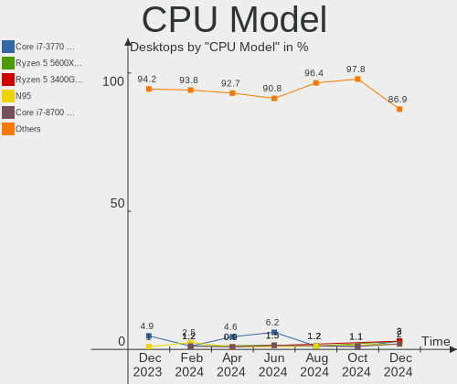

| Model                                       | Desktops | Percent |
|---------------------------------------------|----------|---------|
| Intel Pentium 4 CPU 3.00GHz                 | 4        | 7.69%   |
| Intel Core i7-2600K CPU @ 3.40GHz           | 2        | 3.85%   |
| Intel 11th Gen Core i5-11400 @ 2.60GHz      | 2        | 3.85%   |
| AMD Ryzen 7 5700G with Radeon Graphics      | 2        | 3.85%   |
| Intel Xeon CPU W3503 @ 2.40GHz              | 1        | 1.92%   |
| Intel Xeon CPU E31225 @ 3.10GHz             | 1        | 1.92%   |
| Intel Pentium Dual-Core CPU E6700 @ 3.20GHz | 1        | 1.92%   |
| Intel Pentium Dual-Core CPU E6300 @ 2.80GHz | 1        | 1.92%   |
| Intel Pentium CPU G630 @ 2.70GHz            | 1        | 1.92%   |
| Intel Pentium CPU G2030 @ 3.00GHz           | 1        | 1.92%   |
| Intel Core m5-6Y57 CPU @ 1.10GHz            | 1        | 1.92%   |
| Intel Core i9-10900 CPU @ 2.80GHz           | 1        | 1.92%   |
| Intel Core i7-4770 CPU @ 3.40GHz            | 1        | 1.92%   |
| Intel Core i7-3770 CPU @ 3.40GHz            | 1        | 1.92%   |
| Intel Core i7-10700KF CPU @ 3.80GHz         | 1        | 1.92%   |
| Intel Core i5-9400 CPU @ 2.90GHz            | 1        | 1.92%   |
| Intel Core i5-7400 CPU @ 3.00GHz            | 1        | 1.92%   |
| Intel Core i5-6500 CPU @ 3.20GHz            | 1        | 1.92%   |
| Intel Core i5-6400T CPU @ 2.20GHz           | 1        | 1.92%   |
| Intel Core i5-4460S CPU @ 2.90GHz           | 1        | 1.92%   |
| Intel Core i5-3470 CPU @ 3.20GHz            | 1        | 1.92%   |
| Intel Core i5-2500 CPU @ 3.30GHz            | 1        | 1.92%   |
| Intel Core i3-9100F CPU @ 3.60GHz           | 1        | 1.92%   |
| Intel Core i3-4160 CPU @ 3.60GHz            | 1        | 1.92%   |
| Intel Core i3-4130 CPU @ 3.40GHz            | 1        | 1.92%   |
| Intel Core 2 Quad CPU Q9300 @ 2.50GHz       | 1        | 1.92%   |
| Intel Core 2 Duo CPU E7600 @ 3.06GHz        | 1        | 1.92%   |
| Intel Atom CPU C2750 @ 2.41GHz              | 1        | 1.92%   |
| Intel 11th Gen Core i9-11900 @ 2.50GHz      | 1        | 1.92%   |
| Intel 11th Gen Core i7-11700K @ 3.60GHz     | 1        | 1.92%   |
| AMD Ryzen 9 3900XT 12-Core Processor        | 1        | 1.92%   |
| AMD Ryzen 9 3900X 12-Core Processor         | 1        | 1.92%   |
| AMD Ryzen 7 3700X 8-Core Processor          | 1        | 1.92%   |
| AMD Ryzen 7 2700X Eight-Core Processor      | 1        | 1.92%   |
| AMD Ryzen 7 1700X Eight-Core Processor      | 1        | 1.92%   |
| AMD Ryzen 5 5600G with Radeon Graphics      | 1        | 1.92%   |
| AMD Ryzen 5 3600 6-Core Processor           | 1        | 1.92%   |
| AMD Ryzen 5 2600 Six-Core Processor         | 1        | 1.92%   |
| AMD Ryzen 3 4300GE with Radeon Graphics     | 1        | 1.92%   |
| AMD Phenom II X6 1065T Processor            | 1        | 1.92%   |
| AMD FX-8350 Eight-Core Processor            | 1        | 1.92%   |
| AMD Athlon X4 880K Quad Core Processor      | 1        | 1.92%   |
| AMD Athlon X4 750K Quad Core Processor      | 1        | 1.92%   |
| AMD Athlon 64 X2 Dual Core Processor 4000+  | 1        | 1.92%   |
| AMD A6-6310 APU with AMD Radeon R4 Graphics | 1        | 1.92%   |
| AMD A4-3400 APU with Radeon HD Graphics     | 1        | 1.92%   |

CPU Model Family
----------------

Processor model prefix

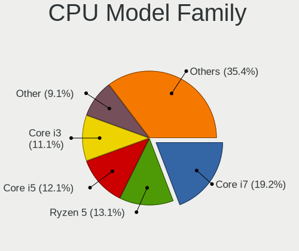

| Model                   | Desktops | Percent |
|-------------------------|----------|---------|
| Intel Core i5           | 7        | 13.46%  |
| Intel Core i7           | 5        | 9.62%   |
| AMD Ryzen 7             | 5        | 9.62%   |
| Other                   | 4        | 7.69%   |
| Intel Pentium 4         | 4        | 7.69%   |
| Intel Core i3           | 3        | 5.77%   |
| AMD Ryzen 5             | 3        | 5.77%   |
| Intel Xeon              | 2        | 3.85%   |
| Intel Pentium Dual-Core | 2        | 3.85%   |
| Intel Pentium           | 2        | 3.85%   |
| AMD Ryzen 9             | 2        | 3.85%   |
| AMD Athlon X4           | 2        | 3.85%   |
| Intel Core m5           | 1        | 1.92%   |
| Intel Core i9           | 1        | 1.92%   |
| Intel Core 2 Quad       | 1        | 1.92%   |
| Intel Core 2 Duo        | 1        | 1.92%   |
| Intel Atom              | 1        | 1.92%   |
| AMD Ryzen 3             | 1        | 1.92%   |
| AMD Phenom II X6        | 1        | 1.92%   |
| AMD FX                  | 1        | 1.92%   |
| AMD Athlon 64 X2        | 1        | 1.92%   |
| AMD A6                  | 1        | 1.92%   |
| AMD A4                  | 1        | 1.92%   |

CPU Cores
---------

Number of processor cores

| Number | Desktops | Percent |
|--------|----------|---------|
| 4      | 16       | 30.77%  |
| 2      | 13       | 25%     |
| 8      | 9        | 17.31%  |
| 6      | 7        | 13.46%  |
| 1      | 4        | 7.69%   |
| 12     | 2        | 3.85%   |
| 10     | 1        | 1.92%   |

CPU Sockets
-----------

Number of sockets

| Number | Desktops | Percent |
|--------|----------|---------|
| 1      | 52       | 100%    |

CPU Threads
-----------

Threads per core (Hyper-Threading)

| Number | Desktops | Percent |
|--------|----------|---------|
| 2      | 30       | 57.69%  |
| 1      | 22       | 42.31%  |

CPU Op-Modes
------------

CPU Operation Modes (32-bit, 64-bit)

| Op mode        | Desktops | Percent |
|----------------|----------|---------|
| 32-bit, 64-bit | 52       | 100%    |

CPU Microcode
-------------

Microcode number

| Number     | Desktops | Percent |
|------------|----------|---------|
| Unknown    | 12       | 23.08%  |
| 0x306c3    | 4        | 7.69%   |
| 0xa0671    | 3        | 5.77%   |
| 0x206a7    | 3        | 5.77%   |
| 0x0a50000c | 3        | 5.77%   |
| 0x08701021 | 3        | 5.77%   |
| 0x506e3    | 2        | 3.85%   |
| 0x306a9    | 2        | 3.85%   |
| 0x1067a    | 2        | 3.85%   |
| 0x0800820d | 2        | 3.85%   |
| 0xf49      | 1        | 1.92%   |
| 0xf43      | 1        | 1.92%   |
| 0x906ed    | 1        | 1.92%   |
| 0x906e9    | 1        | 1.92%   |
| 0x406e3    | 1        | 1.92%   |
| 0x406d8    | 1        | 1.92%   |
| 0x106a5    | 1        | 1.92%   |
| 0x10677    | 1        | 1.92%   |
| 0x08701013 | 1        | 1.92%   |
| 0x08600106 | 1        | 1.92%   |
| 0x08001138 | 1        | 1.92%   |
| 0x07030104 | 1        | 1.92%   |
| 0x06003106 | 1        | 1.92%   |
| 0x06001119 | 1        | 1.92%   |
| 0x06000852 | 1        | 1.92%   |
| 0x03000027 | 1        | 1.92%   |

CPU Microarch
-------------

Microarchitecture

| Name        | Desktops | Percent |
|-------------|----------|---------|
| Zen 2       | 5        | 9.62%   |
| SandyBridge | 5        | 9.62%   |
| Penryn      | 4        | 7.69%   |
| NetBurst    | 4        | 7.69%   |
| Haswell     | 4        | 7.69%   |
| Zen 3       | 3        | 5.77%   |
| Skylake     | 3        | 5.77%   |
| KabyLake    | 3        | 5.77%   |
| IvyBridge   | 3        | 5.77%   |
| Icelake     | 3        | 5.77%   |
| Zen+        | 2        | 3.85%   |
| Piledriver  | 2        | 3.85%   |
| CometLake   | 2        | 3.85%   |
| Zen         | 1        | 1.92%   |
| Steamroller | 1        | 1.92%   |
| Silvermont  | 1        | 1.92%   |
| Puma        | 1        | 1.92%   |
| Nehalem     | 1        | 1.92%   |
| K8 Hammer   | 1        | 1.92%   |
| K10 Llano   | 1        | 1.92%   |
| K10         | 1        | 1.92%   |
| Unknown     | 1        | 1.92%   |

Graphics
--------

GPU Vendor
----------

Vendors of graphics cards

| Vendor            | Desktops | Percent |
|-------------------|----------|---------|
| Nvidia            | 23       | 39.66%  |
| Intel             | 18       | 31.03%  |
| AMD               | 16       | 27.59%  |
| ASPEED Technology | 1        | 1.72%   |

GPU Model
---------

Graphics card models

| Model                                                                       | Desktops | Percent |
|-----------------------------------------------------------------------------|----------|---------|
| AMD Ellesmere [Radeon RX 470/480/570/570X/580/580X/590]                     | 3        | 5.08%   |
| AMD Cezanne                                                                 | 3        | 5.08%   |
| Nvidia GP107 [GeForce GTX 1050 Ti]                                          | 2        | 3.39%   |
| Nvidia GP106 [GeForce GTX 1060 6GB]                                         | 2        | 3.39%   |
| Nvidia GK208B [GeForce GT 730]                                              | 2        | 3.39%   |
| Nvidia G86 [GeForce 8500 GT]                                                | 2        | 3.39%   |
| Intel Xeon E3-1200 v3/4th Gen Core Processor Integrated Graphics Controller | 2        | 3.39%   |
| Intel Xeon E3-1200 v2/3rd Gen Core processor Graphics Controller            | 2        | 3.39%   |
| Intel RocketLake-S GT1 [UHD Graphics 730]                                   | 2        | 3.39%   |
| Intel 2nd Generation Core Processor Family Integrated Graphics Controller   | 2        | 3.39%   |
| AMD Vega 10 XL/XT [Radeon RX Vega 56/64]                                    | 2        | 3.39%   |
| Nvidia TU116 [GeForce GTX 1660 SUPER]                                       | 1        | 1.69%   |
| Nvidia GT218 [GeForce 405]                                                  | 1        | 1.69%   |
| Nvidia GT218 [GeForce 210]                                                  | 1        | 1.69%   |
| Nvidia GP108 [GeForce GT 1030]                                              | 1        | 1.69%   |
| Nvidia GP107 [GeForce GTX 1050]                                             | 1        | 1.69%   |
| Nvidia GP104 [GeForce GTX 1080]                                             | 1        | 1.69%   |
| Nvidia GM107 [GeForce GTX 750]                                              | 1        | 1.69%   |
| Nvidia GK208B [GeForce GT 720]                                              | 1        | 1.69%   |
| Nvidia GK208B [GeForce GT 710]                                              | 1        | 1.69%   |
| Nvidia GK107 [GeForce GT 740]                                               | 1        | 1.69%   |
| Nvidia GF119 [GeForce GT 705]                                               | 1        | 1.69%   |
| Nvidia GF108 [GeForce GT 730]                                               | 1        | 1.69%   |
| Nvidia GF108 [GeForce GT 420]                                               | 1        | 1.69%   |
| Nvidia G86 [Quadro NVS 290]                                                 | 1        | 1.69%   |
| Nvidia C51PV [GeForce 6150]                                                 | 1        | 1.69%   |
| Intel Xeon E3-1200 Processor Family Integrated Graphics Controller          | 1        | 1.69%   |
| Intel RocketLake-S GT1 [UHD Graphics 750]                                   | 1        | 1.69%   |
| Intel IvyBridge GT2 [HD Graphics 4000]                                      | 1        | 1.69%   |
| Intel HD Graphics 530                                                       | 1        | 1.69%   |
| Intel HD Graphics 515                                                       | 1        | 1.69%   |
| Intel CometLake-S GT2 [UHD Graphics 630]                                    | 1        | 1.69%   |
| Intel 82G33/G31 Express Integrated Graphics Controller                      | 1        | 1.69%   |
| Intel 82945G/GZ Integrated Graphics Controller                              | 1        | 1.69%   |
| Intel 4th Generation Core Processor Family Integrated Graphics Controller   | 1        | 1.69%   |
| Intel 4 Series Chipset Integrated Graphics Controller                       | 1        | 1.69%   |
| ASPEED Technology ASPEED Graphics Family                                    | 1        | 1.69%   |
| AMD RV710 [Radeon HD 4350/4550]                                             | 1        | 1.69%   |
| AMD RV370 [Radeon X300/X550/X1050 Series] (Secondary)                       | 1        | 1.69%   |
| AMD RV370 [Radeon X300/X550/X1050 Series]                                   | 1        | 1.69%   |
| AMD Renoir                                                                  | 1        | 1.69%   |
| AMD Redwood LE [Radeon HD 5550/5570/5630/6390/6490/7570]                    | 1        | 1.69%   |
| AMD Navi 24 [Radeon RX 6400 / 6500 XT]                                      | 1        | 1.69%   |
| AMD Navi 22 [Radeon RX 6700/6700 XT/6750 XT / 6800M]                        | 1        | 1.69%   |
| AMD Lexa PRO [Radeon 540/540X/550/550X / RX 540X/550/550X]                  | 1        | 1.69%   |
| AMD Juniper XT [Radeon HD 6770]                                             | 1        | 1.69%   |

GPU Combo
---------

Combinations of graphics cards

| Name           | Desktops | Percent |
|----------------|----------|---------|
| 1 x Nvidia     | 20       | 38.46%  |
| 1 x Intel      | 13       | 25%     |
| 1 x AMD        | 13       | 25%     |
| Intel + Nvidia | 2        | 3.85%   |
| 2 x AMD        | 1        | 1.92%   |
| Intel + AMD    | 1        | 1.92%   |
| 1 x ASPEED     | 1        | 1.92%   |
| AMD + Nvidia   | 1        | 1.92%   |

GPU Driver
----------

Free vs proprietary

| Driver      | Desktops | Percent |
|-------------|----------|---------|
| Free        | 39       | 75%     |
| Proprietary | 12       | 23.08%  |
| Unknown     | 1        | 1.92%   |

GPU Memory
----------

Total video memory

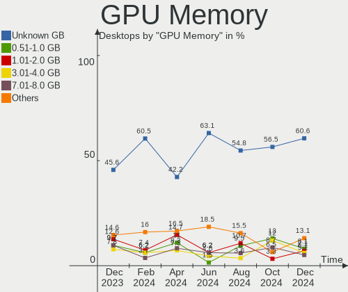

| Size in GB | Desktops | Percent |
|------------|----------|---------|
| Unknown    | 26       | 50%     |
| 0.01-0.5   | 7        | 13.46%  |
| 3.01-4.0   | 5        | 9.62%   |
| 0.51-1.0   | 5        | 9.62%   |
| 1.01-2.0   | 4        | 7.69%   |
| 5.01-6.0   | 3        | 5.77%   |
| 7.01-8.0   | 2        | 3.85%   |

Monitor
-------

Monitor Vendor
--------------

Monitor vendors

| Vendor               | Desktops | Percent |
|----------------------|----------|---------|
| Samsung Electronics  | 11       | 21.57%  |
| Hewlett-Packard      | 8        | 15.69%  |
| Philips              | 7        | 13.73%  |
| Dell                 | 4        | 7.84%   |
| AOC                  | 4        | 7.84%   |
| Ancor Communications | 4        | 7.84%   |
| Acer                 | 3        | 5.88%   |
| Goldstar             | 2        | 3.92%   |
| BenQ                 | 2        | 3.92%   |
| Unknown              | 1        | 1.96%   |
| Sony                 | 1        | 1.96%   |
| Plain Tree Systems   | 1        | 1.96%   |
| MSI                  | 1        | 1.96%   |
| HUAWEI               | 1        | 1.96%   |
| ASUSTek Computer     | 1        | 1.96%   |

Monitor Model
-------------

Monitor models

| Model                                                                 | Desktops | Percent |
|-----------------------------------------------------------------------|----------|---------|
| Hewlett-Packard w1907 HWP26A2 1440x900 408x255mm 18.9-inch            | 2        | 3.92%   |
| AOC 27G2G8 AOC2702 1920x1080 598x336mm 27.0-inch                      | 2        | 3.92%   |
| Unknown LCD Monitor SAMSUNG 1920x1080                                 | 1        | 1.96%   |
| Sony SDM-HX75 SNY5200 1280x1024 338x270mm 17.0-inch                   | 1        | 1.96%   |
| Samsung Electronics SyncMaster SAM04D3 1920x1080 530x300mm 24.0-inch  | 1        | 1.96%   |
| Samsung Electronics SyncMaster SAM03EC 1680x1050 430x270mm 20.0-inch  | 1        | 1.96%   |
| Samsung Electronics SyncMaster SAM0187 1280x1024 340x270mm 17.1-inch  | 1        | 1.96%   |
| Samsung Electronics SyncMaster SAM010B 1280x1024 338x270mm 17.0-inch  | 1        | 1.96%   |
| Samsung Electronics SMC23A750X SAM07F8 1920x1080 510x287mm 23.0-inch  | 1        | 1.96%   |
| Samsung Electronics SMBX2035 SAM06FD 1600x900 443x249mm 20.0-inch     | 1        | 1.96%   |
| Samsung Electronics S22F350 SAM0D1A 1920x1080 477x268mm 21.5-inch     | 1        | 1.96%   |
| Samsung Electronics LCD Monitor SAM7106 1920x1080 600x340mm 27.2-inch | 1        | 1.96%   |
| Samsung Electronics LCD Monitor SAM07C5 1920x1080 890x500mm 40.2-inch | 1        | 1.96%   |
| Samsung Electronics C32HG7x SAM0E13 2560x1440 697x392mm 31.5-inch     | 1        | 1.96%   |
| Samsung Electronics C24F390 SAM0D2C 1920x1080 521x293mm 23.5-inch     | 1        | 1.96%   |
| Plain Tree Systems PS-976 PTS0319 1280x1024 376x301mm 19.0-inch       | 1        | 1.96%   |
| Philips PHL 242S1 PHL0944 1920x1080 527x296mm 23.8-inch               | 1        | 1.96%   |
| Philips PHL 223V5 PHLC0CF 1920x1080 477x268mm 21.5-inch               | 1        | 1.96%   |
| Philips PHL 221V8 PHLC211 1920x1080 477x268mm 21.5-inch               | 1        | 1.96%   |
| Philips PHL 203V5 PHLC0CE 1600x900 434x236mm 19.4-inch                | 1        | 1.96%   |
| Philips LCD Monitor 226V4 1920x1080                                   | 1        | 1.96%   |
| Philips 200P PHL0844 1600x1200 408x306mm 20.1-inch                    | 1        | 1.96%   |
| Philips 196VL PHLC07F 1366x768 409x230mm 18.5-inch                    | 1        | 1.96%   |
| MSI Optix G27C2 MSI1462 1920x1080 600x340mm 27.2-inch                 | 1        | 1.96%   |
| HUAWEI ZQE-CAA HWV6A25 3440x1440 797x334mm 34.0-inch                  | 1        | 1.96%   |
| Hewlett-Packard LA2205 HWP2849 1680x1050 473x296mm 22.0-inch          | 1        | 1.96%   |
| Hewlett-Packard L1706 HWP265C 1280x1024 338x270mm 17.0-inch           | 1        | 1.96%   |
| Hewlett-Packard 32 Display HPN351A 1920x1080 698x393mm 31.5-inch      | 1        | 1.96%   |
| Hewlett-Packard 27cw HWP3194 1920x1080 598x336mm 27.0-inch            | 1        | 1.96%   |
| Hewlett-Packard 2311gt HWP2982 1920x1080 510x287mm 23.0-inch          | 1        | 1.96%   |
| Hewlett-Packard 22es HWP331B 1920x1080 476x268mm 21.5-inch            | 1        | 1.96%   |
| Goldstar HDR 4K GSM7707 3840x2160 600x340mm 27.2-inch                 | 1        | 1.96%   |
| Goldstar 24EN33 GSM59D5 1920x1080 521x293mm 23.5-inch                 | 1        | 1.96%   |
| Dell P2419H DELD0DA 1920x1080 527x296mm 23.8-inch                     | 1        | 1.96%   |
| Dell P2212H DELA07F 1920x1080 531x299mm 24.0-inch                     | 1        | 1.96%   |
| Dell P2212H DELA07E 1920x1080 531x299mm 24.0-inch                     | 1        | 1.96%   |
| Dell P2012H DEL4078 1600x900 443x249mm 20.0-inch                      | 1        | 1.96%   |
| BenQ PD3200Q BNQ8026 2560x1440 708x399mm 32.0-inch                    | 1        | 1.96%   |
| BenQ LCD BNQ8024 2560x1440 597x336mm 27.0-inch                        | 1        | 1.96%   |
| ASUSTek Computer VA27EHE AUS27D2 1920x1080 598x336mm 27.0-inch        | 1        | 1.96%   |
| AOC 24B1W1 AOC2401 1920x1080 527x296mm 23.8-inch                      | 1        | 1.96%   |
| AOC 2481W AOC2481 1920x1080 527x296mm 23.8-inch                       | 1        | 1.96%   |
| Ancor Communications VX238 ACI23C1 1920x1080 510x290mm 23.1-inch      | 1        | 1.96%   |
| Ancor Communications VW222 ACI22A2 1680x1050 473x296mm 22.0-inch      | 1        | 1.96%   |
| Ancor Communications ASUS VW193S ACI19D4 1440x900 408x255mm 18.9-inch | 1        | 1.96%   |
| Ancor Communications ASUS MG279 ACI27A7 2560x1440 597x336mm 27.0-inch | 1        | 1.96%   |
| Acer VG240Y ACR06BF 1920x1080 527x296mm 23.8-inch                     | 1        | 1.96%   |
| Acer R241Y ACR0521 1920x1080 527x296mm 23.8-inch                      | 1        | 1.96%   |
| Acer KB272HL H ACR08AB 1920x1080 597x336mm 27.0-inch                  | 1        | 1.96%   |

Monitor Resolution
------------------

Monitor screen resolution

| Resolution         | Desktops | Percent |
|--------------------|----------|---------|
| 1920x1080 (FHD)    | 24       | 48.98%  |
| 2560x1440 (QHD)    | 5        | 10.2%   |
| 1280x1024 (SXGA)   | 4        | 8.16%   |
| 3840x2160 (4K)     | 3        | 6.12%   |
| 1680x1050 (WSXGA+) | 3        | 6.12%   |
| 1600x900 (HD+)     | 3        | 6.12%   |
| 1440x900 (WXGA+)   | 3        | 6.12%   |
| 3440x1440          | 2        | 4.08%   |
| 1600x1200          | 1        | 2.04%   |
| 1366x768 (WXGA)    | 1        | 2.04%   |

Monitor Diagonal
----------------

Diagonal size in inches

| Inches  | Desktops | Percent |
|---------|----------|---------|
| 27      | 8        | 16%     |
| 23      | 8        | 16%     |
| 24      | 7        | 14%     |
| 19      | 6        | 12%     |
| 20      | 4        | 8%      |
| 21      | 3        | 6%      |
| 54      | 2        | 4%      |
| 34      | 2        | 4%      |
| 31      | 2        | 4%      |
| 22      | 2        | 4%      |
| 17      | 2        | 4%      |
| Unknown | 2        | 4%      |
| 32      | 1        | 2%      |
| 18      | 1        | 2%      |

Monitor Width
-------------

Physical width

| Width in mm | Desktops | Percent |
|-------------|----------|---------|
| 501-600     | 22       | 44.9%   |
| 401-500     | 14       | 28.57%  |
| 701-800     | 3        | 6.12%   |
| 601-700     | 2        | 4.08%   |
| 351-400     | 2        | 4.08%   |
| 301-350     | 2        | 4.08%   |
| 1001-1500   | 2        | 4.08%   |
| Unknown     | 2        | 4.08%   |

Aspect Ratio
------------

Proportional relationship between the width and the height

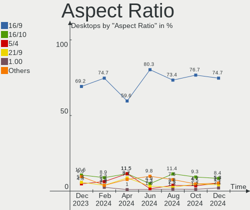

| Ratio   | Desktops | Percent |
|---------|----------|---------|
| 16/9    | 33       | 67.35%  |
| 16/10   | 7        | 14.29%  |
| 5/4     | 4        | 8.16%   |
| 21/9    | 2        | 4.08%   |
| Unknown | 2        | 4.08%   |
| 4/3     | 1        | 2.04%   |

Monitor Area
------------

Area in inch²

| Area in inch² | Desktops | Percent |
|----------------|----------|---------|
| 201-250        | 19       | 38%     |
| 151-200        | 10       | 20%     |
| 301-350        | 8        | 16%     |
| 351-500        | 5        | 10%     |
| 141-150        | 3        | 6%      |
| More than 1000 | 2        | 4%      |
| Unknown        | 2        | 4%      |
| 251-300        | 1        | 2%      |

Pixel Density
-------------

Pixels per inch

| Density | Desktops | Percent |
|---------|----------|---------|
| 51-100  | 38       | 76%     |
| 101-120 | 7        | 14%     |
| 1-50    | 2        | 4%      |
| Unknown | 2        | 4%      |
| 161-240 | 1        | 2%      |

Multiple Monitors
-----------------

Total monitors connected

| Total | Desktops | Percent |
|-------|----------|---------|
| 1     | 47       | 90.38%  |
| 2     | 3        | 5.77%   |
| 0     | 2        | 3.85%   |

Network
-------

Net Controller Vendor
---------------------

Controller vendors

| Vendor                          | Desktops | Percent |
|---------------------------------|----------|---------|
| Realtek Semiconductor           | 28       | 39.44%  |
| Intel                           | 22       | 30.99%  |
| Qualcomm Atheros                | 4        | 5.63%   |
| Broadcom                        | 4        | 5.63%   |
| VIA Technologies                | 2        | 2.82%   |
| Qualcomm Atheros Communications | 2        | 2.82%   |
| Marvell Technology Group        | 2        | 2.82%   |
| TP-Link                         | 1        | 1.41%   |
| Ralink Technology               | 1        | 1.41%   |
| Nvidia                          | 1        | 1.41%   |
| D-Link System                   | 1        | 1.41%   |
| Compal Electronics              | 1        | 1.41%   |
| Broadcom Limited                | 1        | 1.41%   |
| Aquantia                        | 1        | 1.41%   |

Net Controller Model
--------------------

Controller models

| Model                                                                  | Desktops | Percent |
|------------------------------------------------------------------------|----------|---------|
| Realtek RTL8111/8168/8411 PCI Express Gigabit Ethernet Controller      | 23       | 29.11%  |
| Intel 82579LM Gigabit Network Connection (Lewisville)                  | 4        | 5.06%   |
| Realtek RTL8125 2.5GbE Controller                                      | 3        | 3.8%    |
| Intel Wi-Fi 6 AX200                                                    | 3        | 3.8%    |
| Intel I211 Gigabit Network Connection                                  | 3        | 3.8%    |
| Intel Ethernet Controller I225-V                                       | 3        | 3.8%    |
| Intel Ethernet Connection (2) I219-V                                   | 3        | 3.8%    |
| Realtek RTL810xE PCI Express Fast Ethernet controller                  | 2        | 2.53%   |
| Qualcomm Atheros AR9271 802.11n                                        | 2        | 2.53%   |
| Marvell Group 88E8053 PCI-E Gigabit Ethernet Controller                | 2        | 2.53%   |
| Intel Wireless 8260                                                    | 2        | 2.53%   |
| Intel 82579V Gigabit Network Connection                                | 2        | 2.53%   |
| VIA VT86C100A [Rhine]                                                  | 1        | 1.27%   |
| VIA VT6102/VT6103 [Rhine-II]                                           | 1        | 1.27%   |
| TP-Link TL-WN823N v2/v3 [Realtek RTL8192EU]                            | 1        | 1.27%   |
| Realtek RTL8192EE PCIe Wireless Network Adapter                        | 1        | 1.27%   |
| Realtek RTL8192CE PCIe Wireless Network Adapter                        | 1        | 1.27%   |
| Realtek RTL8188EUS 802.11n Wireless Network Adapter                    | 1        | 1.27%   |
| Realtek RTL8188CUS 802.11n WLAN Adapter                                | 1        | 1.27%   |
| Realtek 802.11ac NIC                                                   | 1        | 1.27%   |
| Ralink RT2501/RT2573 Wireless Adapter                                  | 1        | 1.27%   |
| Qualcomm Atheros AR928X Wireless Network Adapter (PCI-Express)         | 1        | 1.27%   |
| Qualcomm Atheros AR9287 Wireless Network Adapter (PCI-Express)         | 1        | 1.27%   |
| Qualcomm Atheros AR9227 Wireless Network Adapter                       | 1        | 1.27%   |
| Qualcomm Atheros AR5416 Wireless Network Adapter [AR5008 802.11(a)bgn] | 1        | 1.27%   |
| Nvidia MCP51 Ethernet Controller                                       | 1        | 1.27%   |
| Intel Tiger Lake PCH CNVi WiFi                                         | 1        | 1.27%   |
| Intel I210 Gigabit Network Connection                                  | 1        | 1.27%   |
| Intel Ethernet Connection I217-LM                                      | 1        | 1.27%   |
| Intel Ethernet Connection (7) I219-V                                   | 1        | 1.27%   |
| Intel Ethernet Connection (14) I219-V                                  | 1        | 1.27%   |
| D-Link System DGE-528T Gigabit Ethernet Adapter                        | 1        | 1.27%   |
| Compal S61                                                             | 1        | 1.27%   |
| Broadcom NetXtreme BCM5761 Gigabit Ethernet PCIe                       | 1        | 1.27%   |
| Broadcom NetXtreme BCM5755 Gigabit Ethernet PCI Express                | 1        | 1.27%   |
| Broadcom NetLink BCM57780 Gigabit Ethernet PCIe                        | 1        | 1.27%   |
| Broadcom Limited NetXtreme BCM5752 Gigabit Ethernet PCI Express        | 1        | 1.27%   |
| Broadcom BCM4352 802.11ac Wireless Network Adapter                     | 1        | 1.27%   |
| Aquantia AQC107 NBase-T/IEEE 802.3bz Ethernet Controller [AQtion]      | 1        | 1.27%   |

Wireless Vendor
---------------

Wireless vendors

| Vendor                          | Desktops | Percent |
|---------------------------------|----------|---------|
| Intel                           | 6        | 30%     |
| Realtek Semiconductor           | 5        | 25%     |
| Qualcomm Atheros                | 4        | 20%     |
| Qualcomm Atheros Communications | 2        | 10%     |
| TP-Link                         | 1        | 5%      |
| Ralink Technology               | 1        | 5%      |
| Broadcom                        | 1        | 5%      |

Wireless Model
--------------

Wireless models

| Model                                                                  | Desktops | Percent |
|------------------------------------------------------------------------|----------|---------|
| Intel Wi-Fi 6 AX200                                                    | 3        | 15%     |
| Qualcomm Atheros AR9271 802.11n                                        | 2        | 10%     |
| Intel Wireless 8260                                                    | 2        | 10%     |
| TP-Link TL-WN823N v2/v3 [Realtek RTL8192EU]                            | 1        | 5%      |
| Realtek RTL8192EE PCIe Wireless Network Adapter                        | 1        | 5%      |
| Realtek RTL8192CE PCIe Wireless Network Adapter                        | 1        | 5%      |
| Realtek RTL8188EUS 802.11n Wireless Network Adapter                    | 1        | 5%      |
| Realtek RTL8188CUS 802.11n WLAN Adapter                                | 1        | 5%      |
| Realtek 802.11ac NIC                                                   | 1        | 5%      |
| Ralink RT2501/RT2573 Wireless Adapter                                  | 1        | 5%      |
| Qualcomm Atheros AR928X Wireless Network Adapter (PCI-Express)         | 1        | 5%      |
| Qualcomm Atheros AR9287 Wireless Network Adapter (PCI-Express)         | 1        | 5%      |
| Qualcomm Atheros AR9227 Wireless Network Adapter                       | 1        | 5%      |
| Qualcomm Atheros AR5416 Wireless Network Adapter [AR5008 802.11(a)bgn] | 1        | 5%      |
| Intel Tiger Lake PCH CNVi WiFi                                         | 1        | 5%      |
| Broadcom BCM4352 802.11ac Wireless Network Adapter                     | 1        | 5%      |

Ethernet Vendor
---------------

Ethernet vendors

| Vendor                   | Desktops | Percent |
|--------------------------|----------|---------|
| Realtek Semiconductor    | 27       | 47.37%  |
| Intel                    | 19       | 33.33%  |
| Broadcom                 | 3        | 5.26%   |
| VIA Technologies         | 2        | 3.51%   |
| Marvell Technology Group | 2        | 3.51%   |
| Nvidia                   | 1        | 1.75%   |
| D-Link System            | 1        | 1.75%   |
| Broadcom Limited         | 1        | 1.75%   |
| Aquantia                 | 1        | 1.75%   |

Ethernet Model
--------------

Ethernet models

| Model                                                             | Desktops | Percent |
|-------------------------------------------------------------------|----------|---------|
| Realtek RTL8111/8168/8411 PCI Express Gigabit Ethernet Controller | 23       | 39.66%  |
| Intel 82579LM Gigabit Network Connection (Lewisville)             | 4        | 6.9%    |
| Realtek RTL8125 2.5GbE Controller                                 | 3        | 5.17%   |
| Intel I211 Gigabit Network Connection                             | 3        | 5.17%   |
| Intel Ethernet Controller I225-V                                  | 3        | 5.17%   |
| Intel Ethernet Connection (2) I219-V                              | 3        | 5.17%   |
| Realtek RTL810xE PCI Express Fast Ethernet controller             | 2        | 3.45%   |
| Marvell Group 88E8053 PCI-E Gigabit Ethernet Controller           | 2        | 3.45%   |
| Intel 82579V Gigabit Network Connection                           | 2        | 3.45%   |
| VIA VT86C100A [Rhine]                                             | 1        | 1.72%   |
| VIA VT6102/VT6103 [Rhine-II]                                      | 1        | 1.72%   |
| Nvidia MCP51 Ethernet Controller                                  | 1        | 1.72%   |
| Intel I210 Gigabit Network Connection                             | 1        | 1.72%   |
| Intel Ethernet Connection I217-LM                                 | 1        | 1.72%   |
| Intel Ethernet Connection (7) I219-V                              | 1        | 1.72%   |
| Intel Ethernet Connection (14) I219-V                             | 1        | 1.72%   |
| D-Link System DGE-528T Gigabit Ethernet Adapter                   | 1        | 1.72%   |
| Broadcom NetXtreme BCM5761 Gigabit Ethernet PCIe                  | 1        | 1.72%   |
| Broadcom NetXtreme BCM5755 Gigabit Ethernet PCI Express           | 1        | 1.72%   |
| Broadcom NetLink BCM57780 Gigabit Ethernet PCIe                   | 1        | 1.72%   |
| Broadcom Limited NetXtreme BCM5752 Gigabit Ethernet PCI Express   | 1        | 1.72%   |
| Aquantia AQC107 NBase-T/IEEE 802.3bz Ethernet Controller [AQtion] | 1        | 1.72%   |

Net Controller Kind
-------------------

Ethernet, WiFi or modem

| Kind     | Desktops | Percent |
|----------|----------|---------|
| Ethernet | 51       | 71.83%  |
| WiFi     | 19       | 26.76%  |
| Unknown  | 1        | 1.41%   |

Used Controller
---------------

Currently used network controller

| Kind     | Desktops | Percent |
|----------|----------|---------|
| Ethernet | 40       | 78.43%  |
| WiFi     | 10       | 19.61%  |
| Unknown  | 1        | 1.96%   |

NICs
----

Total network controllers on board

| Total | Desktops | Percent |
|-------|----------|---------|
| 1     | 34       | 65.38%  |
| 2     | 17       | 32.69%  |
| 3     | 1        | 1.92%   |

IPv6
----

IPv6 vs IPv4

| Used | Desktops | Percent |
|------|----------|---------|
| No   | 49       | 94.23%  |
| Yes  | 3        | 5.77%   |

Bluetooth
---------

Bluetooth Vendor
----------------

Controller vendors

| Vendor                          | Desktops | Percent |
|---------------------------------|----------|---------|
| Cambridge Silicon Radio         | 6        | 40%     |
| Intel                           | 5        | 33.33%  |
| Realtek Semiconductor           | 1        | 6.67%   |
| Qualcomm Atheros Communications | 1        | 6.67%   |
| Integrated System Solution      | 1        | 6.67%   |
| Dell                            | 1        | 6.67%   |

Bluetooth Model
---------------

Controller models

| Model                                               | Desktops | Percent |
|-----------------------------------------------------|----------|---------|
| Cambridge Silicon Radio Bluetooth Dongle (HCI mode) | 6        | 40%     |
| Intel AX200 Bluetooth                               | 3        | 20%     |
| Realtek Bluetooth Radio                             | 1        | 6.67%   |
| Qualcomm Atheros AR3011 Bluetooth                   | 1        | 6.67%   |
| Intel Bluetooth wireless interface                  | 1        | 6.67%   |
| Intel AX201 Bluetooth                               | 1        | 6.67%   |
| Integrated System Solution Bluetooth Device         | 1        | 6.67%   |
| Dell BCM20702A0 Bluetooth Module                    | 1        | 6.67%   |

Sound
-----

Sound Vendor
------------

Sound card vendors

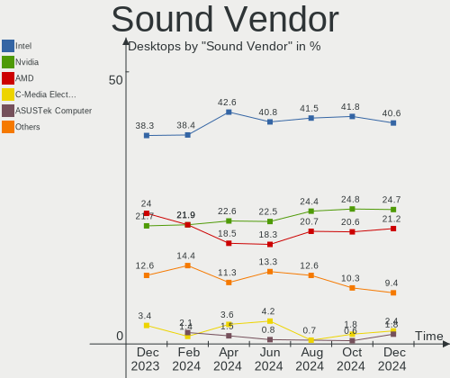

| Vendor                   | Desktops | Percent |
|--------------------------|----------|---------|
| Intel                    | 32       | 38.55%  |
| AMD                      | 22       | 26.51%  |
| Nvidia                   | 20       | 24.1%   |
| Micro Star International | 2        | 2.41%   |
| C-Media Electronics      | 2        | 2.41%   |
| XMOS                     | 1        | 1.2%    |
| VIA Technologies         | 1        | 1.2%    |
| Studiologic              | 1        | 1.2%    |
| Creative Labs            | 1        | 1.2%    |
| Corsair                  | 1        | 1.2%    |

Sound Model
-----------

Sound card models

| Model                                                                      | Desktops | Percent |
|----------------------------------------------------------------------------|----------|---------|
| Intel 6 Series/C200 Series Chipset Family High Definition Audio Controller | 6        | 6.25%   |
| Intel NM10/ICH7 Family High Definition Audio Controller                    | 5        | 5.21%   |
| Nvidia GK208 HDMI/DP Audio Controller                                      | 4        | 4.17%   |
| Intel 8 Series/C220 Series Chipset High Definition Audio Controller        | 4        | 4.17%   |
| AMD Renoir Radeon High Definition Audio Controller                         | 4        | 4.17%   |
| AMD FCH Azalia Controller                                                  | 4        | 4.17%   |
| AMD Family 17h/19h HD Audio Controller                                     | 4        | 4.17%   |
| Nvidia GP107GL High Definition Audio Controller                            | 3        | 3.13%   |
| Intel Xeon E3-1200 v3/4th Gen Core Processor HD Audio Controller           | 3        | 3.13%   |
| Intel Tiger Lake-H HD Audio Controller                                     | 3        | 3.13%   |
| Intel 100 Series/C230 Series Chipset Family HD Audio Controller            | 3        | 3.13%   |
| AMD Starship/Matisse HD Audio Controller                                   | 3        | 3.13%   |
| AMD Family 17h (Models 00h-0fh) HD Audio Controller                        | 3        | 3.13%   |
| AMD Ellesmere HDMI Audio [Radeon RX 470/480 / 570/580/590]                 | 3        | 3.13%   |
| Nvidia High Definition Audio Controller                                    | 2        | 2.08%   |
| Nvidia GP106 High Definition Audio Controller                              | 2        | 2.08%   |
| Nvidia GF108 High Definition Audio Controller                              | 2        | 2.08%   |
| Micro Star International USB Audio                                         | 2        | 2.08%   |
| Intel Audio device                                                         | 2        | 2.08%   |
| Intel 82801FB/FBM/FR/FW/FRW (ICH6 Family) High Definition Audio Controller | 2        | 2.08%   |
| Intel 7 Series/C216 Chipset Family High Definition Audio Controller        | 2        | 2.08%   |
| AMD Vega 10 HDMI Audio [Radeon Vega 56/64]                                 | 2        | 2.08%   |
| AMD SBx00 Azalia (Intel HDA)                                               | 2        | 2.08%   |
| AMD Navi 21/23 HDMI/DP Audio Controller                                    | 2        | 2.08%   |
| XMOS iFi (by AMR) HD USB Audio                                             | 1        | 1.04%   |
| VIA Technologies VX900/VT8xxx High Definition Audio Controller             | 1        | 1.04%   |
| Studiologic USB                                                            | 1        | 1.04%   |
| Nvidia TU116 High Definition Audio Controller                              | 1        | 1.04%   |
| Nvidia MCP51 High Definition Audio                                         | 1        | 1.04%   |
| Nvidia GP108 High Definition Audio Controller                              | 1        | 1.04%   |
| Nvidia GP104 High Definition Audio Controller                              | 1        | 1.04%   |
| Nvidia GM107 High Definition Audio Controller [GeForce 940MX]              | 1        | 1.04%   |
| Nvidia GK107 HDMI Audio Controller                                         | 1        | 1.04%   |
| Nvidia GF119 HDMI Audio Controller                                         | 1        | 1.04%   |
| Intel USB PnP Sound Device                                                 | 1        | 1.04%   |
| Intel Sunrise Point-LP HD Audio                                            | 1        | 1.04%   |
| Intel Comet Lake PCH-V cAVS                                                | 1        | 1.04%   |
| Intel Cannon Lake PCH cAVS                                                 | 1        | 1.04%   |
| Intel 82801JI (ICH10 Family) HD Audio Controller                           | 1        | 1.04%   |
| Intel 200 Series PCH HD Audio                                              | 1        | 1.04%   |
| Creative Labs Sound Core3D [Sound Blaster Recon3D / Z-Series]              | 1        | 1.04%   |
| Corsair CORSAIR HS60 HAPTIC Gaming Headset                                 | 1        | 1.04%   |
| C-Media Electronics CMI8738/CMI8768 PCI Audio                              | 1        | 1.04%   |
| C-Media Electronics Audio Adapter (Unitek Y-247A)                          | 1        | 1.04%   |
| AMD RV710/730 HDMI Audio [Radeon HD 4000 series]                           | 1        | 1.04%   |
| AMD Redwood HDMI Audio [Radeon HD 5000 Series]                             | 1        | 1.04%   |
| AMD Juniper HDMI Audio [Radeon HD 5700 Series]                             | 1        | 1.04%   |
| AMD Baffin HDMI/DP Audio [Radeon RX 550 640SP / RX 560/560X]               | 1        | 1.04%   |

Memory
------

Memory Vendor
-------------

Memory module vendors

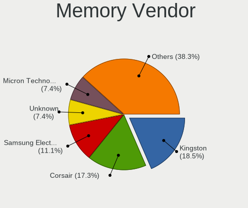

| Vendor              | Desktops | Percent |
|---------------------|----------|---------|
| Kingston            | 5        | 17.24%  |
| Unknown             | 4        | 13.79%  |
| Samsung Electronics | 4        | 13.79%  |
| Micron Technology   | 4        | 13.79%  |
| Crucial             | 3        | 10.34%  |
| Team                | 2        | 6.9%    |
| SK Hynix            | 2        | 6.9%    |
| G.Skill             | 2        | 6.9%    |
| Toshiba             | 1        | 3.45%   |
| Nanya Technology    | 1        | 3.45%   |
| Corsair             | 1        | 3.45%   |

Memory Model
------------

Memory module models

| Model                                                      | Desktops | Percent |
|------------------------------------------------------------|----------|---------|
| Unknown RAM Module 8GB DIMM DDR3 1600MT/s                  | 1        | 3.13%   |
| Unknown RAM Module 4GB DIMM 1066MT/s                       | 1        | 3.13%   |
| Unknown RAM Module 2GB DIMM 1066MT/s                       | 1        | 3.13%   |
| Unknown RAM 3733 C17 Series 8192MB DIMM DDR4 2133MT/s      | 1        | 3.13%   |
| Unknown RAM 3600 C18 Series 16GB DIMM DDR4 2933MT/s        | 1        | 3.13%   |
| Toshiba RAM KHX1600C10D3/8GX 8GB DIMM DDR3 1333MT/s        | 1        | 3.13%   |
| Team RAM Xteem-LV-1866 4GB DIMM DDR3 1600MT/s              | 1        | 3.13%   |
| Team RAM Elite-1600 8GB DIMM DDR3 1600MT/s                 | 1        | 3.13%   |
| SK Hynix RAM Module 2048MB DIMM DDR3 1333MT/s              | 1        | 3.13%   |
| SK Hynix RAM HMT125U6TFR8C-G7 2GB DIMM DDR3 1066MT/s       | 1        | 3.13%   |
| Samsung RAM Module 2GB SODIMM LPDDR3 1867MT/s              | 1        | 3.13%   |
| Samsung RAM Module 2048MB DIMM DDR3 1333MT/s               | 1        | 3.13%   |
| Samsung RAM M471A1G43DB0-CPB 8GB SODIMM DDR4 2400MT/s      | 1        | 3.13%   |
| Samsung RAM M378B5773DH0-CH9 2GB DIMM DDR3 1333MT/s        | 1        | 3.13%   |
| Nanya RAM NT2GC64B88G0NF-DI 2048MB DIMM DDR3 1600MT/s      | 1        | 3.13%   |
| Micron RAM 8JTF51264AZ-1G6E1 4GB DIMM DDR3 1600MT/s        | 1        | 3.13%   |
| Micron RAM 8JTF25664AZ-1G6M1 2GB DIMM DDR3 1600MT/s        | 1        | 3.13%   |
| Micron RAM 8JTF25664AZ-1G4M1 2048MB DIMM DDR3 1333MT/s     | 1        | 3.13%   |
| Micron RAM 8ATF1G64AZ-2G3B1 8GB DIMM DDR4 2400MT/s         | 1        | 3.13%   |
| Micron RAM 16JTF25664AZ-1G1F1 2GB DIMM DDR3 1066MT/s       | 1        | 3.13%   |
| Kingston RAM Module 4GB DIMM DDR3 1600MT/s                 | 1        | 3.13%   |
| Kingston RAM Module 2GB DIMM DDR3 1066MT/s                 | 1        | 3.13%   |
| Kingston RAM KHX3200C18D4/8G 8GB DIMM DDR4 3333MT/s        | 1        | 3.13%   |
| Kingston RAM 99U5702-101.A00G 8GB DIMM DDR4 2667MT/s       | 1        | 3.13%   |
| Kingston RAM 9905402-174.A00G 4GB DIMM DDR3 1600MT/s       | 1        | 3.13%   |
| G.Skill RAM F4-3600C16-16GTZNC 16GB DIMM DDR4 3600MT/s     | 1        | 3.13%   |
| G.Skill RAM F4-3000C16-8GISB 8192MB DIMM DDR4 3200MT/s     | 1        | 3.13%   |
| Crucial RAM CT4G4DFS824A.M8FF 4GB DIMM DDR4 2400MT/s       | 1        | 3.13%   |
| Crucial RAM CT25664BA160B.C8FE 2GB DIMM DDR3 1600MT/s      | 1        | 3.13%   |
| Crucial RAM CT16G4DFRA32A.M16FR 16384MB DIMM DDR4 3200MT/s | 1        | 3.13%   |
| Crucial RAM BLS4G4D240FSB.8FARG 4GB DIMM DDR4 2133MT/s     | 1        | 3.13%   |
| Corsair RAM CMK16GX4M2B3000C15 8GB DIMM DDR4 3000MT/s      | 1        | 3.13%   |

Memory Kind
-----------

Memory module kinds

| Kind    | Desktops | Percent |
|---------|----------|---------|
| DDR4    | 11       | 44%     |
| DDR3    | 11       | 44%     |
| SDRAM   | 1        | 4%      |
| LPDDR3  | 1        | 4%      |
| Unknown | 1        | 4%      |

Memory Form Factor
------------------

Physical design of the memory module

| Name   | Desktops | Percent |
|--------|----------|---------|
| DIMM   | 22       | 91.67%  |
| SODIMM | 2        | 8.33%   |

Memory Size
-----------

Memory module size

| Size  | Desktops | Percent |
|-------|----------|---------|
| 8192  | 11       | 40.74%  |
| 2048  | 7        | 25.93%  |
| 4096  | 6        | 22.22%  |
| 16384 | 2        | 7.41%   |
| 32768 | 1        | 3.7%    |

Memory Speed
------------

Memory module speed

| Speed | Desktops | Percent |
|-------|----------|---------|
| 1600  | 6        | 23.08%  |
| 2400  | 3        | 11.54%  |
| 1333  | 3        | 11.54%  |
| 1066  | 3        | 11.54%  |
| 3600  | 2        | 7.69%   |
| 3200  | 2        | 7.69%   |
| 1867  | 2        | 7.69%   |
| 3733  | 1        | 3.85%   |
| 3466  | 1        | 3.85%   |
| 3333  | 1        | 3.85%   |
| 2667  | 1        | 3.85%   |
| 2133  | 1        | 3.85%   |

Printers & scanners
-------------------

Printer Vendor
--------------

Printer device vendors

| Vendor              | Desktops | Percent |
|---------------------|----------|---------|
| Hewlett-Packard     | 3        | 60%     |
| Samsung Electronics | 2        | 40%     |

Printer Model
-------------

Printer device models

| Model                                | Desktops | Percent |
|--------------------------------------|----------|---------|
| Samsung ML-216x Series Laser Printer | 1        | 20%     |
| Samsung M2020 Series                 | 1        | 20%     |
| HP OfficeJet 4650 series             | 1        | 20%     |
| HP LaserJet 200 colorMFP M276nw      | 1        | 20%     |
| HP ENVY 4520 series                  | 1        | 20%     |

Scanner Vendor
--------------

Scanner device vendors

Zero info for selected period =(

Scanner Model
-------------

Scanner device models

Zero info for selected period =(

Camera
------

Camera Vendor
-------------

Camera device vendors

| Vendor                        | Desktops | Percent |
|-------------------------------|----------|---------|
| Logitech                      | 2        | 28.57%  |
| Xiongmai                      | 1        | 14.29%  |
| Unknown                       | 1        | 14.29%  |
| Sunplus Innovation Technology | 1        | 14.29%  |
| KYE Systems (Mouse Systems)   | 1        | 14.29%  |
| Genesys Logic                 | 1        | 14.29%  |

Camera Model
------------

Camera device models

| Model                                      | Desktops | Percent |
|--------------------------------------------|----------|---------|
| Xiongmai web camera                        | 1        | 14.29%  |
| Unknown HD camera                          | 1        | 14.29%  |
| Sunplus Aukey-PC-LM1E Camera               | 1        | 14.29%  |
| Logitech QuickCam Pro for Notebooks        | 1        | 14.29%  |
| Logitech C920 PRO HD Webcam                | 1        | 14.29%  |
| KYE Systems (Mouse Systems) PC-LM1E Camera | 1        | 14.29%  |
| Genesys Logic Digital Microscope           | 1        | 14.29%  |

Security
--------

Fingerprint Vendor
------------------

Fingerprint sensor vendors

Zero info for selected period =(

Fingerprint Model
-----------------

Fingerprint sensor models

Zero info for selected period =(

Chipcard Vendor
---------------

Chipcard module vendors

| Vendor                | Desktops | Percent |
|-----------------------|----------|---------|
| Realtek Semiconductor | 1        | 33.33%  |
| OmniKey               | 1        | 33.33%  |
| Clay Logic            | 1        | 33.33%  |

Chipcard Model
--------------

Chipcard module models

| Model                                             | Desktops | Percent |
|---------------------------------------------------|----------|---------|
| Realtek Semiconductor Smart Card Reader Interface | 1        | 33.33%  |
| OmniKey 3x21 Smart Card Reader                    | 1        | 33.33%  |
| Clay Logic Nitrokey Pro                           | 1        | 33.33%  |

Unsupported
-----------

Unsupported Devices
-------------------

Total unsupported devices on board

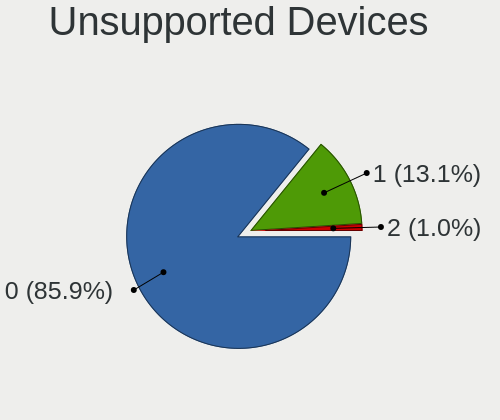

| Total | Desktops | Percent |
|-------|----------|---------|
| 0     | 46       | 88.46%  |
| 1     | 6        | 11.54%  |

Unsupported Device Types
------------------------

Types of unsupported devices

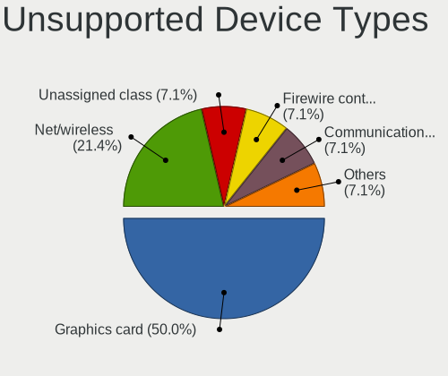

| Type                     | Desktops | Percent |
|--------------------------|----------|---------|
| Graphics card            | 3        | 50%     |
| Chipcard                 | 2        | 33.33%  |
| Communication controller | 1        | 16.67%  |

