Linux in Italy - Hardware Trends (Notebooks)
--------------------------------------------

A project to identify most popular hardware characteristics and track their change
over time based on data collected by Linux users at https://Linux-Hardware.org.

Anyone can contribute to this report by the [hw-probe](https://github.com/linuxhw/hw-probe) tool:

    sudo -E hw-probe -all -upload

Period: Dec, 2025.

Contents
--------

* [ System ](#system)
  - [ OS                       ](#os)
  - [ OS Family                ](#os-family)
  - [ Kernel                   ](#kernel)
  - [ Kernel Family            ](#kernel-family)
  - [ Kernel Major Ver.        ](#kernel-major-ver)
  - [ Arch                     ](#arch)
  - [ DE                       ](#de)
  - [ Display Server           ](#display-server)
  - [ Display Manager          ](#display-manager)
  - [ OS Lang                  ](#os-lang)
  - [ Boot Mode                ](#boot-mode)
  - [ Filesystem               ](#filesystem)
  - [ Part. scheme             ](#part-scheme)
  - [ Dual Boot with Linux/BSD ](#dual-boot-with-linuxbsd)
  - [ Dual Boot (Win)          ](#dual-boot-win)

* [ Board ](#board)
  - [ Vendor                   ](#vendor)
  - [ Model                    ](#model)
  - [ Model Family             ](#model-family)
  - [ MFG Year                 ](#mfg-year)
  - [ Form Factor              ](#form-factor)
  - [ Secure Boot              ](#secure-boot)
  - [ Coreboot                 ](#coreboot)
  - [ RAM Size                 ](#ram-size)
  - [ RAM Used                 ](#ram-used)
  - [ Total Drives             ](#total-drives)
  - [ Has CD-ROM               ](#has-cd-rom)
  - [ Has Ethernet             ](#has-ethernet)
  - [ Has WiFi                 ](#has-wifi)
  - [ Has Bluetooth            ](#has-bluetooth)

* [ Location ](#location)
  - [ Country                  ](#country)
  - [ City                     ](#city)

* [ Drives ](#drives)
  - [ Drive Vendor             ](#drive-vendor)
  - [ Drive Model              ](#drive-model)
  - [ HDD Vendor               ](#hdd-vendor)
  - [ SSD Vendor               ](#ssd-vendor)
  - [ Drive Kind               ](#drive-kind)
  - [ Drive Connector          ](#drive-connector)
  - [ Drive Size               ](#drive-size)
  - [ Space Total              ](#space-total)
  - [ Space Used               ](#space-used)
  - [ Malfunc. Drives          ](#malfunc-drives)
  - [ Malfunc. Drive Vendor    ](#malfunc-drive-vendor)
  - [ Malfunc. HDD Vendor      ](#malfunc-hdd-vendor)
  - [ Malfunc. Drive Kind      ](#malfunc-drive-kind)
  - [ Failed Drives            ](#failed-drives)
  - [ Failed Drive Vendor      ](#failed-drive-vendor)
  - [ Drive Status             ](#drive-status)

* [ Storage controller ](#storage-controller)
  - [ Storage Vendor           ](#storage-vendor)
  - [ Storage Model            ](#storage-model)
  - [ Storage Kind             ](#storage-kind)

* [ Processor ](#processor)
  - [ CPU Vendor               ](#cpu-vendor)
  - [ CPU Model                ](#cpu-model)
  - [ CPU Model Family         ](#cpu-model-family)
  - [ CPU Cores                ](#cpu-cores)
  - [ CPU Sockets              ](#cpu-sockets)
  - [ CPU Threads              ](#cpu-threads)
  - [ CPU Op-Modes             ](#cpu-op-modes)
  - [ CPU Microcode            ](#cpu-microcode)
  - [ CPU Microarch            ](#cpu-microarch)

* [ Graphics ](#graphics)
  - [ GPU Vendor               ](#gpu-vendor)
  - [ GPU Model                ](#gpu-model)
  - [ GPU Combo                ](#gpu-combo)
  - [ GPU Driver               ](#gpu-driver)
  - [ GPU Memory               ](#gpu-memory)

* [ Monitor ](#monitor)
  - [ Monitor Vendor           ](#monitor-vendor)
  - [ Monitor Model            ](#monitor-model)
  - [ Monitor Resolution       ](#monitor-resolution)
  - [ Monitor Diagonal         ](#monitor-diagonal)
  - [ Monitor Width            ](#monitor-width)
  - [ Aspect Ratio             ](#aspect-ratio)
  - [ Monitor Area             ](#monitor-area)
  - [ Pixel Density            ](#pixel-density)
  - [ Multiple Monitors        ](#multiple-monitors)

* [ Network ](#network)
  - [ Net Controller Vendor    ](#net-controller-vendor)
  - [ Net Controller Model     ](#net-controller-model)
  - [ Wireless Vendor          ](#wireless-vendor)
  - [ Wireless Model           ](#wireless-model)
  - [ Ethernet Vendor          ](#ethernet-vendor)
  - [ Ethernet Model           ](#ethernet-model)
  - [ Net Controller Kind      ](#net-controller-kind)
  - [ Used Controller          ](#used-controller)
  - [ NICs                     ](#nics)
  - [ IPv6                     ](#ipv6)

* [ Bluetooth ](#bluetooth)
  - [ Bluetooth Vendor         ](#bluetooth-vendor)
  - [ Bluetooth Model          ](#bluetooth-model)

* [ Sound ](#sound)
  - [ Sound Vendor             ](#sound-vendor)
  - [ Sound Model              ](#sound-model)

* [ Memory ](#memory)
  - [ Memory Vendor            ](#memory-vendor)
  - [ Memory Model             ](#memory-model)
  - [ Memory Kind              ](#memory-kind)
  - [ Memory Form Factor       ](#memory-form-factor)
  - [ Memory Size              ](#memory-size)
  - [ Memory Speed             ](#memory-speed)

* [ Printers & scanners ](#printers--scanners)
  - [ Printer Vendor           ](#printer-vendor)
  - [ Printer Model            ](#printer-model)
  - [ Scanner Vendor           ](#scanner-vendor)
  - [ Scanner Model            ](#scanner-model)

* [ Camera ](#camera)
  - [ Camera Vendor            ](#camera-vendor)
  - [ Camera Model             ](#camera-model)

* [ Security ](#security)
  - [ Fingerprint Vendor       ](#fingerprint-vendor)
  - [ Fingerprint Model        ](#fingerprint-model)
  - [ Chipcard Vendor          ](#chipcard-vendor)
  - [ Chipcard Model           ](#chipcard-model)

* [ Unsupported ](#unsupported)
  - [ Unsupported Devices      ](#unsupported-devices)
  - [ Unsupported Device Types ](#unsupported-device-types)

System
------

OS
--

Installed operating systems

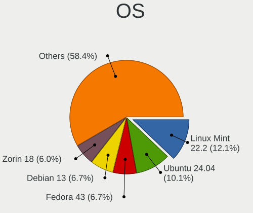

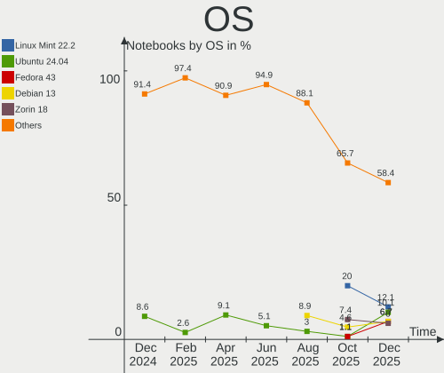

| Name                        | Notebooks | Percent |
|-----------------------------|-----------|---------|
| Linux Mint 22.2             | 18        | 12.08%  |
| Ubuntu 24.04                | 15        | 10.07%  |
| Fedora 43                   | 10        | 6.71%   |
| Debian 13                   | 10        | 6.71%   |
| Zorin 18                    | 9         | 6.04%   |
| EndeavourOS Rolling         | 8         | 5.37%   |
| Ubuntu 25.10                | 7         | 4.7%    |
| Pop!_OS 24.04               | 6         | 4.03%   |
| Arch Rolling                | 6         | 4.03%   |
| OpenMandriva 25.90          | 5         | 3.36%   |
| LMDE 7                      | 5         | 3.36%   |
| Bazzite 43                  | 5         | 3.36%   |
| Kubuntu 25.10               | 4         | 2.68%   |
| Zorin 17                    | 3         | 2.01%   |
| Elementary 8                | 3         | 2.01%   |
| Debian 12                   | 3         | 2.01%   |
| Ubuntu 22.04                | 2         | 1.34%   |
| Pop!_OS 22.04               | 2         | 1.34%   |
| OpenMandriva 6.0            | 2         | 1.34%   |
| OpenMandriva 25.11          | 2         | 1.34%   |
| Fedora 42                   | 2         | 1.34%   |
| Xubuntu 24.04               | 1         | 0.67%   |
| Ubuntu Budgie 24.04         | 1         | 0.67%   |
| TUXEDO OS 24.04             | 1         | 0.67%   |
| ROSA 13.1                   | 1         | 0.67%   |
| org.kde.Platform 5.15-21.08 | 1         | 0.67%   |
| OpenMandriva 4.2            | 1         | 0.67%   |
| OpenMandriva 25.06          | 1         | 0.67%   |
| OpenMandriva 23.08          | 1         | 0.67%   |
| NixOS 26.05                 | 1         | 0.67%   |
| NixOS 25.11                 | 1         | 0.67%   |
| MX 25                       | 1         | 0.67%   |
| Manjaro 25.1.0              | 1         | 0.67%   |
| Lubuntu 24.04               | 1         | 0.67%   |
| Linux Mint 22.3             | 1         | 0.67%   |
| Linux Lite 7.6              | 1         | 0.67%   |
| Lilidog 12                  | 1         | 0.67%   |
| Kubuntu 24.04               | 1         | 0.67%   |
| Gentoo 2.18                 | 1         | 0.67%   |
| CachyOS                     | 1         | 0.67%   |

OS Family
---------

OS without a version

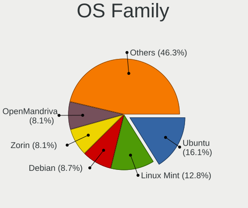

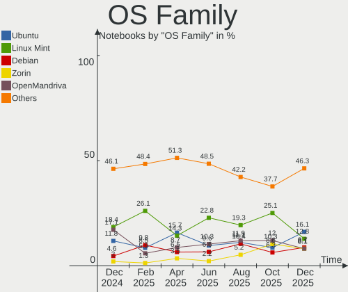

| Name             | Notebooks | Percent |
|------------------|-----------|---------|
| Ubuntu           | 24        | 16.11%  |
| Linux Mint       | 19        | 12.75%  |
| Debian           | 13        | 8.72%   |
| Zorin            | 12        | 8.05%   |
| OpenMandriva     | 12        | 8.05%   |
| Fedora           | 12        | 8.05%   |
| Pop!_OS          | 8         | 5.37%   |
| EndeavourOS      | 8         | 5.37%   |
| Arch             | 6         | 4.03%   |
| LMDE             | 5         | 3.36%   |
| Kubuntu          | 5         | 3.36%   |
| Bazzite          | 5         | 3.36%   |
| Elementary       | 3         | 2.01%   |
| NixOS            | 2         | 1.34%   |
| Xubuntu          | 1         | 0.67%   |
| Ubuntu Budgie    | 1         | 0.67%   |
| TUXEDO OS        | 1         | 0.67%   |
| ROSA             | 1         | 0.67%   |
| org.kde.Platform | 1         | 0.67%   |
| MX               | 1         | 0.67%   |
| Manjaro          | 1         | 0.67%   |
| Lubuntu          | 1         | 0.67%   |
| Linux Lite       | 1         | 0.67%   |
| Lilidog          | 1         | 0.67%   |
| Gentoo           | 1         | 0.67%   |
| CachyOS          | 1         | 0.67%   |
| BunsenLabs       | 1         | 0.67%   |
| Aurora           | 1         | 0.67%   |
| Aeon             | 1         | 0.67%   |

Kernel
------

Version of the Linux kernel

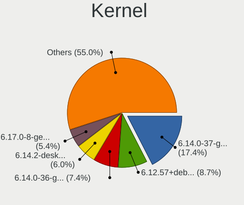

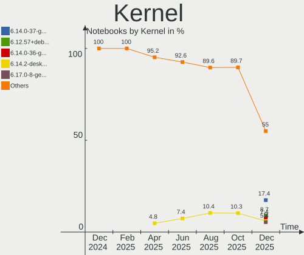

| Version                  | Notebooks | Percent |
|--------------------------|-----------|---------|
| 6.14.0-37-generic        | 26        | 17.45%  |
| 6.12.57+deb13-amd64      | 13        | 8.72%   |
| 6.14.0-36-generic        | 11        | 7.38%   |
| 6.14.2-desktop-3omv2590  | 9         | 6.04%   |
| 6.17.0-8-generic         | 8         | 5.37%   |
| 6.8.0-90-generic         | 6         | 4.03%   |
| 6.17.9-76061709-generic  | 6         | 4.03%   |
| 6.17.9-arch1-1           | 5         | 3.36%   |
| 6.17.9-300.fc43.x86_64   | 4         | 2.68%   |
| 6.14.0-29-generic        | 4         | 2.68%   |
| 6.17.7-ba20.fc43.x86_64  | 3         | 2.01%   |
| 6.17.12-300.fc43.x86_64  | 3         | 2.01%   |
| 6.12.48+deb13-amd64      | 3         | 2.01%   |
| 6.18.0-3-cachyos         | 2         | 1.34%   |
| 6.18.0                   | 2         | 1.34%   |
| 6.17.8-arch1-1           | 2         | 1.34%   |
| 6.17.7-ba19.fc43.x86_64  | 2         | 1.34%   |
| 6.17.13-200.fc42.x86_64  | 2         | 1.34%   |
| 6.17.1-300.fc43.x86_64   | 2         | 1.34%   |
| 6.17.0-7-generic         | 2         | 1.34%   |
| 6.8.0-90-lowlatency      | 1         | 0.67%   |
| 6.8.0-88-generic         | 1         | 0.67%   |
| 6.8.0-87-generic         | 1         | 0.67%   |
| 6.8.0-60-generic         | 1         | 0.67%   |
| 6.8.0-57-generic         | 1         | 0.67%   |
| 6.4.11-desktop-1omv2390  | 1         | 0.67%   |
| 6.18.2-zen2-1-zen        | 1         | 0.67%   |
| 6.18.2-arch2-1           | 1         | 0.67%   |
| 6.18.2-1-liquorix-amd64  | 1         | 0.67%   |
| 6.18.2-1-cachyos         | 1         | 0.67%   |
| 6.18.0-desktop-1omv2590  | 1         | 0.67%   |
| 6.18.0-1-default         | 1         | 0.67%   |
| 6.17.9-2-cachyos         | 1         | 0.67%   |
| 6.17.7-zen1              | 1         | 0.67%   |
| 6.17.5-arch1-1           | 1         | 0.67%   |
| 6.17.13-1-liquorix-amd64 | 1         | 0.67%   |
| 6.17.11-300.fc43.x86_64  | 1         | 0.67%   |
| 6.17.10-300.fc43.x86_64  | 1         | 0.67%   |
| 6.17.1-061701-generic    | 1         | 0.67%   |
| 6.16.3-76061603-generic  | 1         | 0.67%   |

Kernel Family
-------------

Linux kernel without a distro release

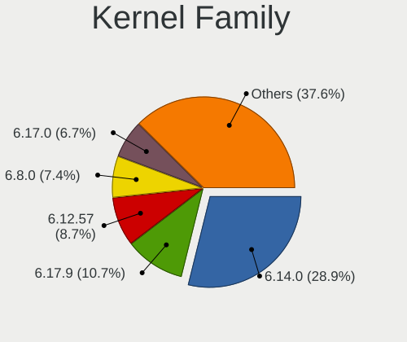

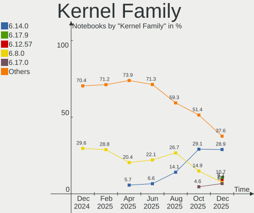

| Version | Notebooks | Percent |
|---------|-----------|---------|
| 6.14.0  | 43        | 28.86%  |
| 6.17.9  | 16        | 10.74%  |
| 6.12.57 | 13        | 8.72%   |
| 6.8.0   | 11        | 7.38%   |
| 6.17.0  | 10        | 6.71%   |
| 6.14.2  | 9         | 6.04%   |
| 6.18.0  | 6         | 4.03%   |
| 6.17.7  | 6         | 4.03%   |
| 6.18.2  | 4         | 2.68%   |
| 6.1.0   | 4         | 2.68%   |
| 6.17.13 | 3         | 2.01%   |
| 6.17.12 | 3         | 2.01%   |
| 6.17.1  | 3         | 2.01%   |
| 6.12.48 | 3         | 2.01%   |
| 6.17.8  | 2         | 1.34%   |
| 6.16.3  | 2         | 1.34%   |
| 6.4.11  | 1         | 0.67%   |
| 6.17.5  | 1         | 0.67%   |
| 6.17.11 | 1         | 0.67%   |
| 6.17.10 | 1         | 0.67%   |
| 6.12.63 | 1         | 0.67%   |
| 6.12.60 | 1         | 0.67%   |
| 6.12.58 | 1         | 0.67%   |
| 6.12.47 | 1         | 0.67%   |
| 6.0.2   | 1         | 0.67%   |
| 5.15.0  | 1         | 0.67%   |
| 5.10.14 | 1         | 0.67%   |

Kernel Major Ver.
-----------------

Linux kernel major version

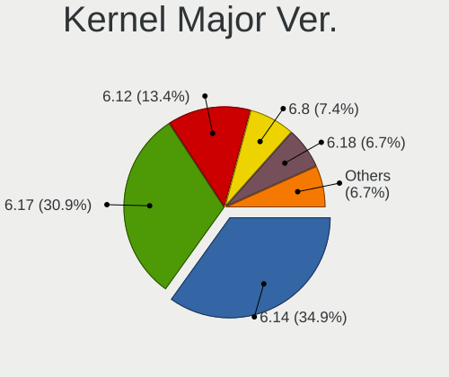

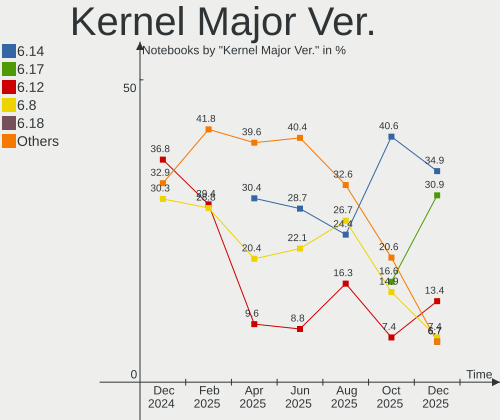

| Version | Notebooks | Percent |
|---------|-----------|---------|
| 6.14    | 52        | 34.9%   |
| 6.17    | 46        | 30.87%  |
| 6.12    | 20        | 13.42%  |
| 6.8     | 11        | 7.38%   |
| 6.18    | 10        | 6.71%   |
| 6.1     | 4         | 2.68%   |
| 6.16    | 2         | 1.34%   |
| 6.4     | 1         | 0.67%   |
| 6.0     | 1         | 0.67%   |
| 5.15    | 1         | 0.67%   |
| 5.10    | 1         | 0.67%   |

Arch
----

OS architecture (x86_64, i586, etc.)

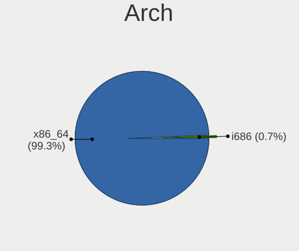

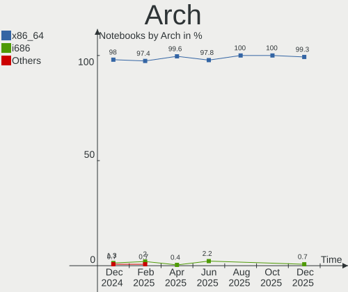

| Name   | Notebooks | Percent |
|--------|-----------|---------|
| x86_64 | 148       | 99.33%  |
| i686   | 1         | 0.67%   |

DE
--

Desktop Environment

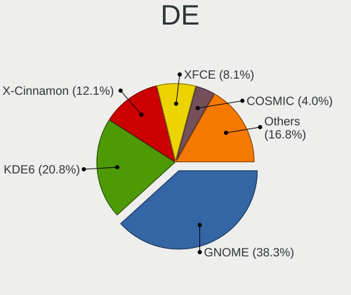

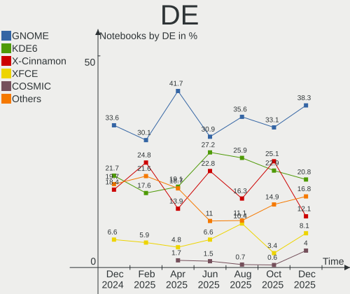

| Name            | Notebooks | Percent |
|-----------------|-----------|---------|
| GNOME           | 57        | 38.26%  |
| KDE6            | 31        | 20.81%  |
| X-Cinnamon      | 18        | 12.08%  |
| XFCE            | 12        | 8.05%   |
| COSMIC          | 6         | 4.03%   |
| KDE             | 5         | 3.36%   |
| LXQt            | 4         | 2.68%   |
| KDE5            | 4         | 2.68%   |
| Pantheon        | 3         | 2.01%   |
| Hyprland        | 3         | 2.01%   |
| MATE            | 2         | 1.34%   |
| i3              | 1         | 0.67%   |
| BunsenLabs:XFCE | 1         | 0.67%   |
| Budgie          | 1         | 0.67%   |
| Unknown         | 1         | 0.67%   |

Display Server
--------------

X11 or Wayland

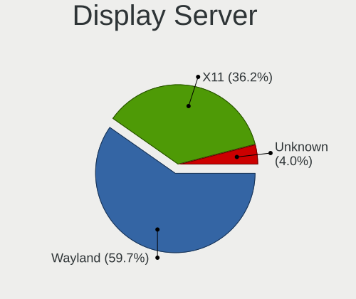

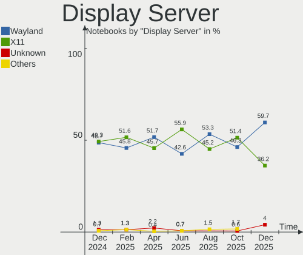

| Name    | Notebooks | Percent |
|---------|-----------|---------|
| Wayland | 89        | 59.73%  |
| X11     | 54        | 36.24%  |
| Unknown | 6         | 4.03%   |

Display Manager
---------------

SDDM, LightDM, etc.

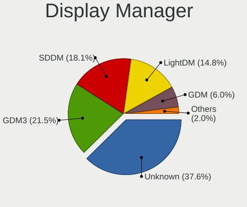

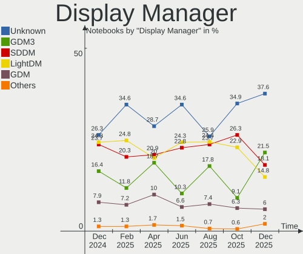

| Name           | Notebooks | Percent |
|----------------|-----------|---------|
| Unknown        | 56        | 37.58%  |
| GDM3           | 32        | 21.48%  |
| SDDM           | 27        | 18.12%  |
| LightDM        | 22        | 14.77%  |
| GDM            | 9         | 6.04%   |
| GREETD         | 2         | 1.34%   |
| COSMIC-GREETER | 1         | 0.67%   |

OS Lang
-------

Language

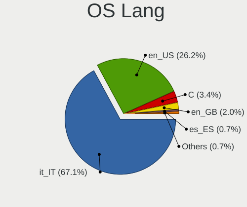

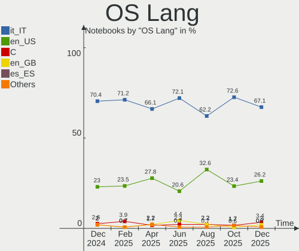

| Lang  | Notebooks | Percent |
|-------|-----------|---------|
| it_IT | 100       | 67.11%  |
| en_US | 39        | 26.17%  |
| C     | 5         | 3.36%   |
| en_GB | 3         | 2.01%   |
| es_ES | 1         | 0.67%   |
| af_ZA | 1         | 0.67%   |

Boot Mode
---------

EFI or BIOS

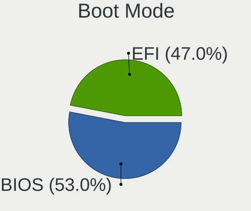

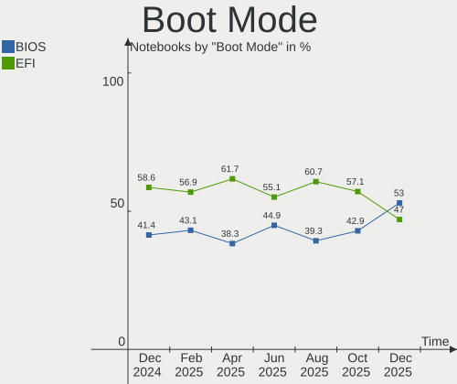

| Mode | Notebooks | Percent |
|------|-----------|---------|
| BIOS | 79        | 53.02%  |
| EFI  | 70        | 46.98%  |

Filesystem
----------

Type of filesystem

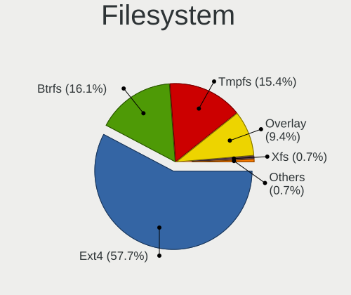

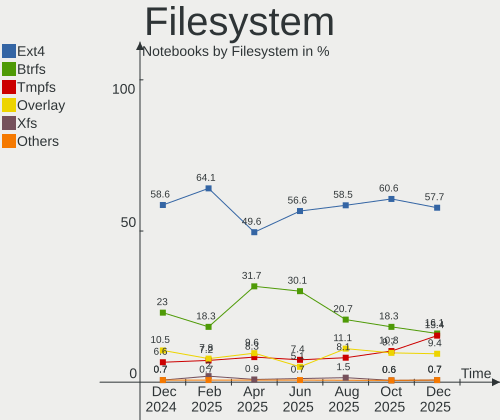

| Type    | Notebooks | Percent |
|---------|-----------|---------|
| Ext4    | 86        | 57.72%  |
| Btrfs   | 24        | 16.11%  |
| Tmpfs   | 23        | 15.44%  |
| Overlay | 14        | 9.4%    |
| Xfs     | 1         | 0.67%   |
| Unknown | 1         | 0.67%   |

Part. scheme
------------

Scheme of partitioning

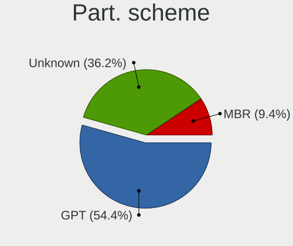

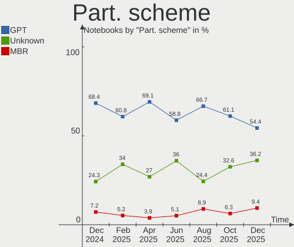

| Type    | Notebooks | Percent |
|---------|-----------|---------|
| GPT     | 81        | 54.36%  |
| Unknown | 54        | 36.24%  |
| MBR     | 14        | 9.4%    |

Dual Boot with Linux/BSD
------------------------

Hosting more than one Linux/BSD

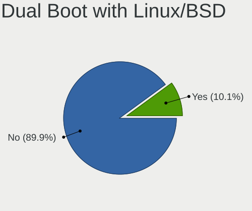

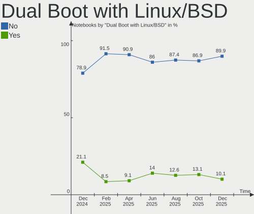

| Dual boot | Notebooks | Percent |
|-----------|-----------|---------|
| No        | 134       | 89.93%  |
| Yes       | 15        | 10.07%  |

Dual Boot (Win)
---------------

Hosting Linux and Windows

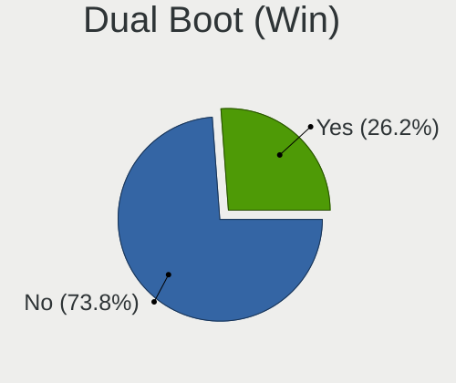

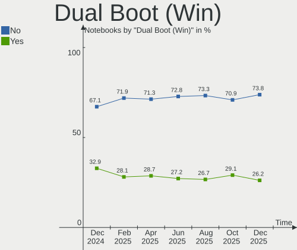

| Dual boot | Notebooks | Percent |
|-----------|-----------|---------|
| No        | 110       | 73.83%  |
| Yes       | 39        | 26.17%  |

Board
-----

Vendor
------

Motherboard manufacturer

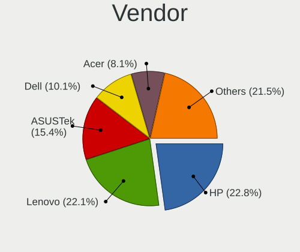

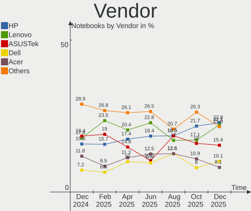

| Name                | Notebooks | Percent |
|---------------------|-----------|---------|
| Hewlett-Packard     | 34        | 22.82%  |
| Lenovo              | 33        | 22.15%  |
| ASUSTek Computer    | 23        | 15.44%  |
| Dell                | 15        | 10.07%  |
| Acer                | 12        | 8.05%   |
| Apple               | 7         | 4.7%    |
| Samsung Electronics | 4         | 2.68%   |
| MSI                 | 3         | 2.01%   |
| Fujitsu             | 3         | 2.01%   |
| Medion              | 2         | 1.34%   |
| HUAWEI              | 2         | 1.34%   |
| TUXEDO              | 1         | 0.67%   |
| Toshiba             | 1         | 0.67%   |
| Timi                | 1         | 0.67%   |
| PC Specialist       | 1         | 0.67%   |
| Panasonic           | 1         | 0.67%   |
| Packard Bell        | 1         | 0.67%   |
| IBM                 | 1         | 0.67%   |
| Hampoo              | 1         | 0.67%   |
| GPD                 | 1         | 0.67%   |
| AB8139              | 1         | 0.67%   |
| Unknown             | 1         | 0.67%   |

Model
-----

Motherboard model

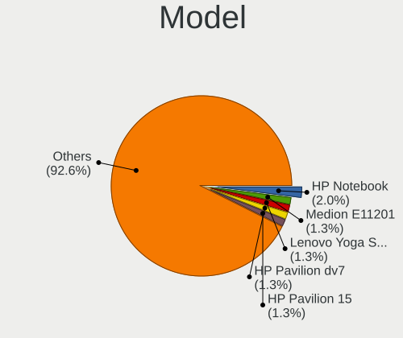

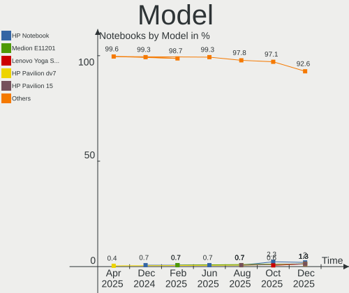

| Name                                              | Notebooks | Percent |
|---------------------------------------------------|-----------|---------|
| HP Notebook                                       | 3         | 2.01%   |
| Medion E11201                                     | 2         | 1.34%   |
| Lenovo Yoga Slim 7 14ILL10 83JX                   | 2         | 1.34%   |
| HP Pavilion dv7                                   | 2         | 1.34%   |
| HP Pavilion 15                                    | 2         | 1.34%   |
| HP OMEN by Laptop 15-dc1xxx                       | 2         | 1.34%   |
| Fujitsu LIFEBOOK E754                             | 2         | 1.34%   |
| ASUS X550LD                                       | 2         | 1.34%   |
| Unknown                                           | 2         | 1.34%   |
| TUXEDO Stellaris 17 Intel Gen6                    | 1         | 0.67%   |
| Toshiba Satellite C660                            | 1         | 0.67%   |
| Timi TM1701                                       | 1         | 0.67%   |
| Samsung RV420/RV520/RV720/E3530/S3530/E3420/E3520 | 1         | 0.67%   |
| Samsung R540/SA41/E452                            | 1         | 0.67%   |
| Samsung 750XDA                                    | 1         | 0.67%   |
| Samsung 700T1C                                    | 1         | 0.67%   |
| PC Specialist X6AR558Y                            | 1         | 0.67%   |
| Panasonic CF-C2AHCLHMG                            | 1         | 0.67%   |
| Packard Bell EasyNote ML65                        | 1         | 0.67%   |
| MSI Prestige 16 AI Evo B1MG                       | 1         | 0.67%   |
| MSI GF65 Thin 10UE                                | 1         | 0.67%   |
| MSI GF65 Thin 10SDR                               | 1         | 0.67%   |
| Lenovo Yoga Slim 6 14IAP8 82WU                    | 1         | 0.67%   |
| Lenovo Y520-15IKBN 80WK                           | 1         | 0.67%   |
| Lenovo V15 G4 AMN 82YU                            | 1         | 0.67%   |
| Lenovo ThinkPad X280 20KES18800                   | 1         | 0.67%   |
| Lenovo ThinkPad X270 W10DG 20K5S07400             | 1         | 0.67%   |
| Lenovo ThinkPad X230 2333AZ2                      | 1         | 0.67%   |
| Lenovo ThinkPad X230 23252FG                      | 1         | 0.67%   |
| Lenovo ThinkPad X1 Extreme Gen 3 20TKS04P00       | 1         | 0.67%   |
| Lenovo ThinkPad X1 Carbon 3rd 20BS003NIX          | 1         | 0.67%   |
| Lenovo ThinkPad T580 20LAS24800                   | 1         | 0.67%   |
| Lenovo ThinkPad T520 42404CG                      | 1         | 0.67%   |
| Lenovo ThinkPad T495 20NKS2BD00                   | 1         | 0.67%   |
| Lenovo ThinkPad T490s 20NYS1Q900                  | 1         | 0.67%   |
| Lenovo ThinkPad T470 20HES20M0A                   | 1         | 0.67%   |
| Lenovo ThinkPad T470 20HD000EUK                   | 1         | 0.67%   |
| Lenovo ThinkPad T14 Gen 6 21QJCTO1WW              | 1         | 0.67%   |
| Lenovo ThinkPad T14 Gen 4 21K3CTO1WW              | 1         | 0.67%   |
| Lenovo ThinkPad T14 Gen 1 20UD001AIX              | 1         | 0.67%   |

Model Family
------------

Motherboard model prefix

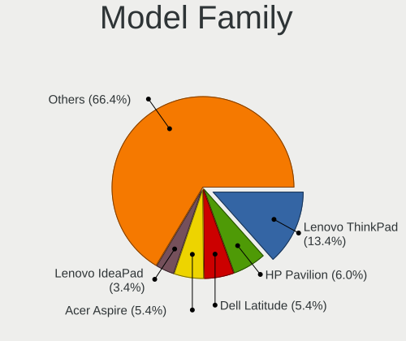

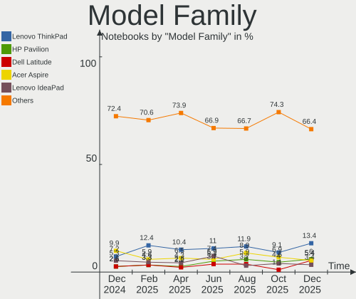

| Name                   | Notebooks | Percent |
|------------------------|-----------|---------|
| Lenovo ThinkPad        | 20        | 13.42%  |
| HP Pavilion            | 9         | 6.04%   |
| Dell Latitude          | 8         | 5.37%   |
| Acer Aspire            | 8         | 5.37%   |
| Lenovo IdeaPad         | 5         | 3.36%   |
| HP Laptop              | 4         | 2.68%   |
| ASUS VivoBook          | 4         | 2.68%   |
| Lenovo Yoga            | 3         | 2.01%   |
| HP ZBook               | 3         | 2.01%   |
| HP ProBook             | 3         | 2.01%   |
| HP Notebook            | 3         | 2.01%   |
| Fujitsu LIFEBOOK       | 3         | 2.01%   |
| Dell XPS               | 3         | 2.01%   |
| Dell Inspiron          | 3         | 2.01%   |
| MSI GF65               | 2         | 1.34%   |
| Medion E11201          | 2         | 1.34%   |
| HP Victus              | 2         | 1.34%   |
| HP OMEN                | 2         | 1.34%   |
| HP EliteBook           | 2         | 1.34%   |
| ASUS X550LD            | 2         | 1.34%   |
| ASUS ROG               | 2         | 1.34%   |
| Apple MacBook5         | 2         | 1.34%   |
| Acer Extensa           | 2         | 1.34%   |
| Unknown                | 2         | 1.34%   |
| TUXEDO Stellaris       | 1         | 0.67%   |
| Toshiba Satellite      | 1         | 0.67%   |
| Timi TM1701            | 1         | 0.67%   |
| Samsung RV420          | 1         | 0.67%   |
| Samsung R540           | 1         | 0.67%   |
| Samsung 750XDA         | 1         | 0.67%   |
| Samsung 700T1C         | 1         | 0.67%   |
| PC Specialist X6AR558Y | 1         | 0.67%   |
| Panasonic CF-C2AHCLHMG | 1         | 0.67%   |
| Packard Bell EasyNote  | 1         | 0.67%   |
| MSI Prestige           | 1         | 0.67%   |
| Lenovo Y520-15IKBN     | 1         | 0.67%   |
| Lenovo V15             | 1         | 0.67%   |
| Lenovo LOQ             | 1         | 0.67%   |
| Lenovo Legion          | 1         | 0.67%   |
| Lenovo G500            | 1         | 0.67%   |

MFG Year
--------

Motherboard manufacture year

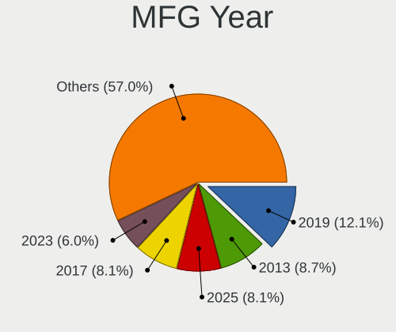

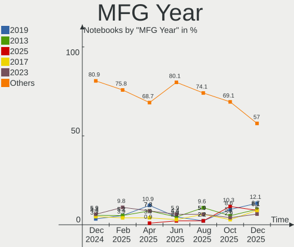

| Year    | Notebooks | Percent |
|---------|-----------|---------|
| 2019    | 18        | 12.08%  |
| 2013    | 13        | 8.72%   |
| 2025    | 12        | 8.05%   |
| 2017    | 12        | 8.05%   |
| 2023    | 9         | 6.04%   |
| 2018    | 9         | 6.04%   |
| 2020    | 8         | 5.37%   |
| 2015    | 8         | 5.37%   |
| 2008    | 8         | 5.37%   |
| 2024    | 7         | 4.7%    |
| 2014    | 7         | 4.7%    |
| 2011    | 7         | 4.7%    |
| 2022    | 6         | 4.03%   |
| 2021    | 5         | 3.36%   |
| 2010    | 5         | 3.36%   |
| 2016    | 4         | 2.68%   |
| 2012    | 4         | 2.68%   |
| 2009    | 4         | 2.68%   |
| 2007    | 1         | 0.67%   |
| 2006    | 1         | 0.67%   |
| Unknown | 1         | 0.67%   |

Form Factor
-----------

Physical design of the computer

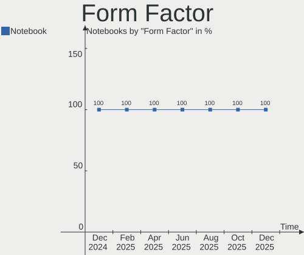

| Name     | Notebooks | Percent |
|----------|-----------|---------|
| Notebook | 149       | 100%    |

Secure Boot
-----------

Enabled or disabled

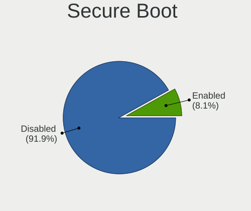

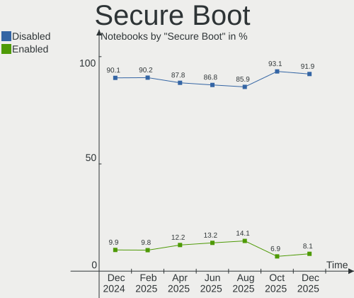

| State    | Notebooks | Percent |
|----------|-----------|---------|
| Disabled | 137       | 91.95%  |
| Enabled  | 12        | 8.05%   |

Coreboot
--------

Have coreboot on board

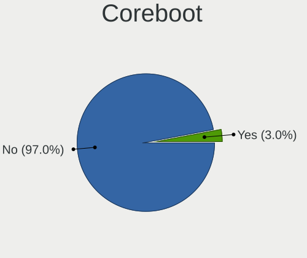

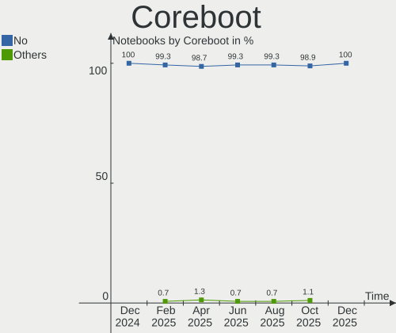

| Used | Notebooks | Percent |
|------|-----------|---------|
| No   | 149       | 100%    |

RAM Size
--------

Total RAM memory

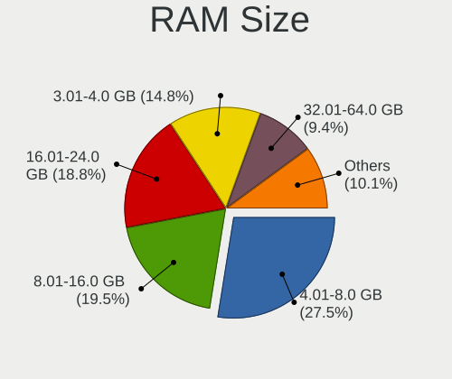

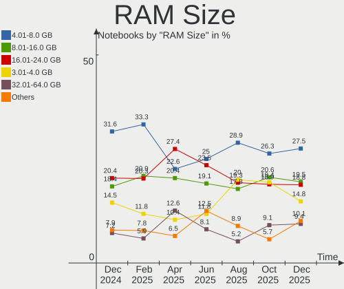

| Size in GB  | Notebooks | Percent |
|-------------|-----------|---------|
| 4.01-8.0    | 41        | 27.52%  |
| 8.01-16.0   | 29        | 19.46%  |
| 16.01-24.0  | 28        | 18.79%  |
| 3.01-4.0    | 22        | 14.77%  |
| 32.01-64.0  | 14        | 9.4%    |
| 24.01-32.0  | 6         | 4.03%   |
| 1.01-2.0    | 4         | 2.68%   |
| 64.01-256.0 | 3         | 2.01%   |
| 2.01-3.0    | 1         | 0.67%   |
| 0.51-1.0    | 1         | 0.67%   |

RAM Used
--------

Used RAM memory

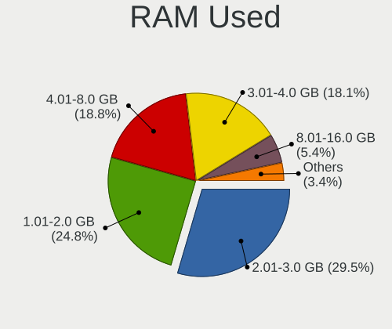

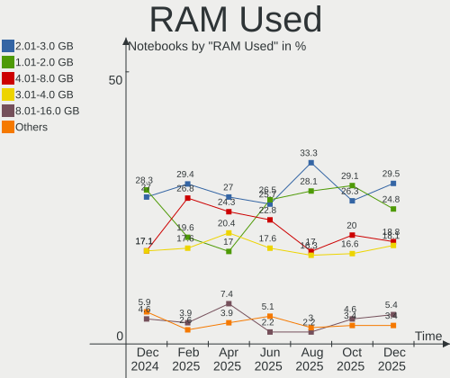

| Used GB    | Notebooks | Percent |
|------------|-----------|---------|
| 2.01-3.0   | 44        | 29.53%  |
| 1.01-2.0   | 37        | 24.83%  |
| 4.01-8.0   | 28        | 18.79%  |
| 3.01-4.0   | 27        | 18.12%  |
| 8.01-16.0  | 8         | 5.37%   |
| 0.51-1.0   | 2         | 1.34%   |
| 0.01-0.5   | 2         | 1.34%   |
| 24.01-32.0 | 1         | 0.67%   |

Total Drives
------------

Number of drives on board

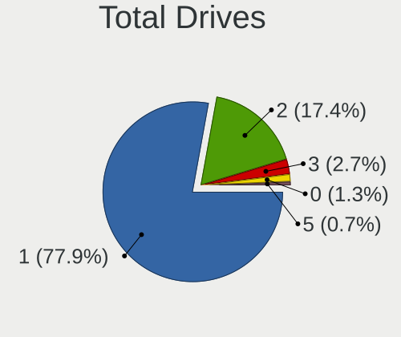

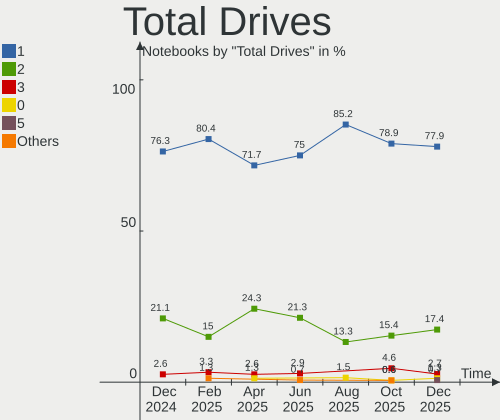

| Drives | Notebooks | Percent |
|--------|-----------|---------|
| 1      | 116       | 77.85%  |
| 2      | 26        | 17.45%  |
| 3      | 4         | 2.68%   |
| 0      | 2         | 1.34%   |
| 5      | 1         | 0.67%   |

Has CD-ROM
----------

Has CD-ROM on board

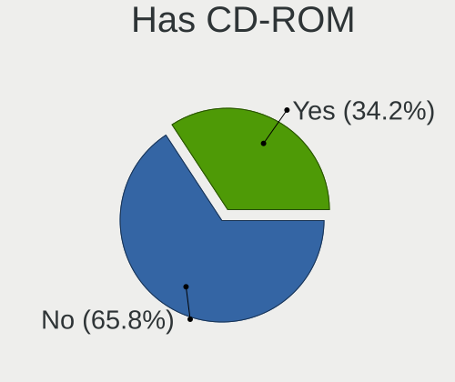

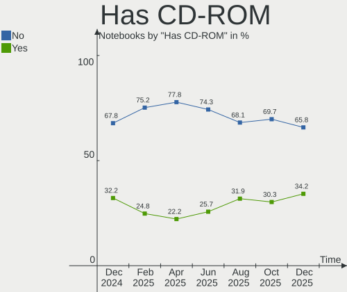

| Presented | Notebooks | Percent |
|-----------|-----------|---------|
| No        | 98        | 65.77%  |
| Yes       | 51        | 34.23%  |

Has Ethernet
------------

Has Ethernet on board

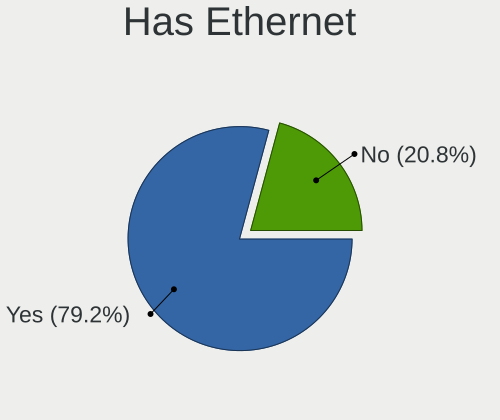

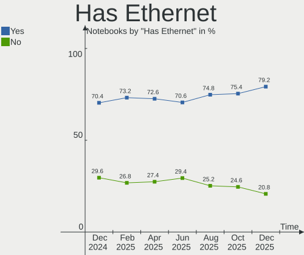

| Presented | Notebooks | Percent |
|-----------|-----------|---------|
| Yes       | 118       | 79.19%  |
| No        | 31        | 20.81%  |

Has WiFi
--------

Has WiFi module

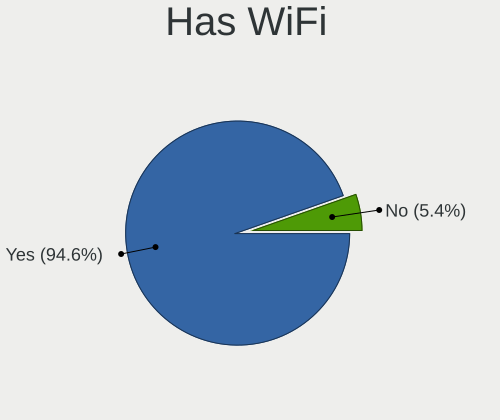

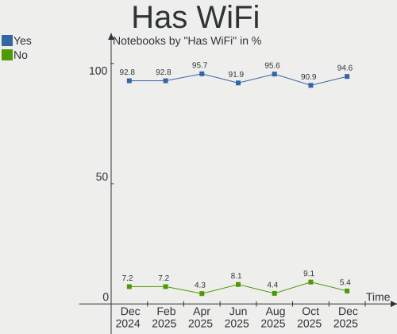

| Presented | Notebooks | Percent |
|-----------|-----------|---------|
| Yes       | 141       | 94.63%  |
| No        | 8         | 5.37%   |

Has Bluetooth
-------------

Has Bluetooth module

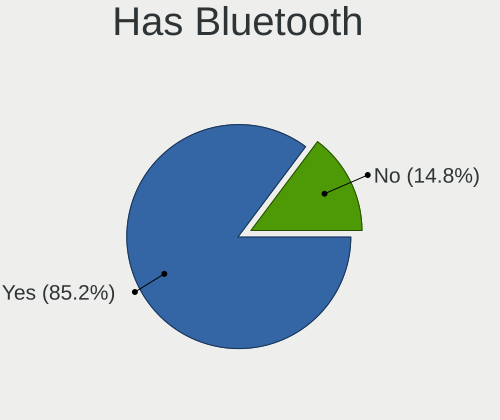

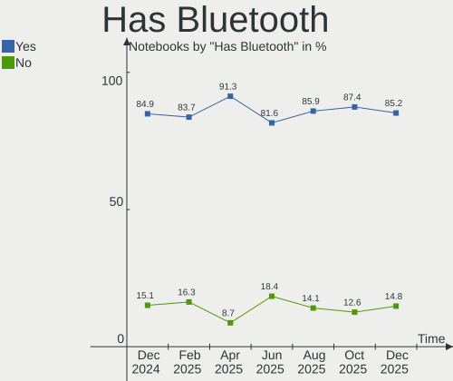

| Presented | Notebooks | Percent |
|-----------|-----------|---------|
| Yes       | 127       | 85.23%  |
| No        | 22        | 14.77%  |

Location
--------

Country
-------

Geographic location (country)

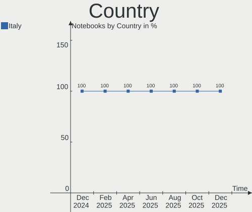

| Country | Notebooks | Percent |
|---------|-----------|---------|
| Italy   | 149       | 100%    |

City
----

Geographic location (city)

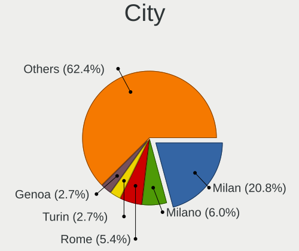

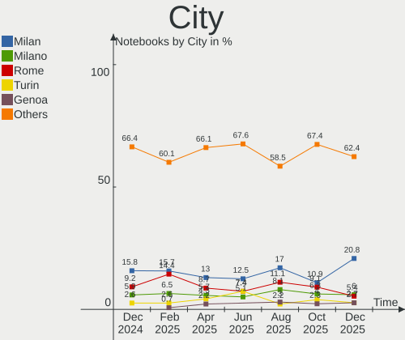

| City                  | Notebooks | Percent |
|-----------------------|-----------|---------|
| Milan                 | 31        | 20.81%  |
| Milano                | 9         | 6.04%   |
| Rome                  | 8         | 5.37%   |
| Turin                 | 4         | 2.68%   |
| Genoa                 | 4         | 2.68%   |
| Reggio Emilia         | 3         | 2.01%   |
| Palermo               | 3         | 2.01%   |
| Bologna               | 3         | 2.01%   |
| Vicenza               | 2         | 1.34%   |
| Venice                | 2         | 1.34%   |
| Ravenna               | 2         | 1.34%   |
| Padova                | 2         | 1.34%   |
| Legnano               | 2         | 1.34%   |
| Gravina di Catania    | 2         | 1.34%   |
| Giugliano in Campania | 2         | 1.34%   |
| Florence              | 2         | 1.34%   |
| Catania               | 2         | 1.34%   |
| Vignola               | 1         | 0.67%   |
| Vigevano              | 1         | 0.67%   |
| Udine                 | 1         | 0.67%   |
| Torre Caracciolo      | 1         | 0.67%   |
| Teramo                | 1         | 0.67%   |
| Sizzano               | 1         | 0.67%   |
| San Marcello          | 1         | 0.67%   |
| San Felice A Cancello | 1         | 0.67%   |
| Roncoferraro          | 1         | 0.67%   |
| Riposto               | 1         | 0.67%   |
| Putignano             | 1         | 0.67%   |
| Presezzo              | 1         | 0.67%   |
| Pozzaglio ed Uniti    | 1         | 0.67%   |
| Pordenone             | 1         | 0.67%   |
| Porcia                | 1         | 0.67%   |
| Ponte a Poppi         | 1         | 0.67%   |
| Piombino              | 1         | 0.67%   |
| Piea                  | 1         | 0.67%   |
| Parma                 | 1         | 0.67%   |
| Palazzolo sull'Oglio  | 1         | 0.67%   |
| Orta Nova             | 1         | 0.67%   |
| Ornago                | 1         | 0.67%   |
| Nuoro                 | 1         | 0.67%   |

Drives
------

Drive Vendor
------------

Hard drive vendors

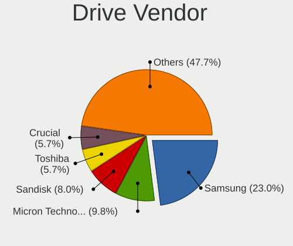

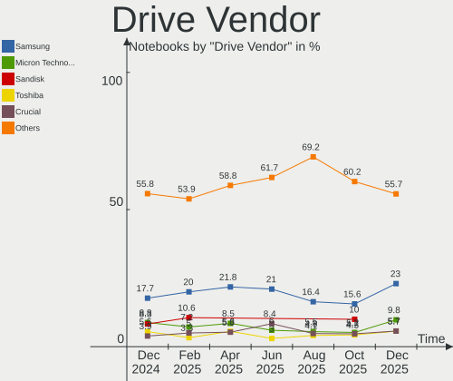

| Vendor                                  | Notebooks | Drives | Percent |
|-----------------------------------------|-----------|--------|---------|
| Samsung Electronics                     | 40        | 43     | 22.99%  |
| Micron Technology                       | 17        | 17     | 9.77%   |
| Sandisk                                 | 14        | 15     | 8.05%   |
| Toshiba                                 | 10        | 11     | 5.75%   |
| Crucial                                 | 10        | 10     | 5.75%   |
| Seagate                                 | 9         | 9      | 5.17%   |
| Kingston                                | 8         | 8      | 4.6%    |
| WDC                                     | 7         | 8      | 4.02%   |
| SK hynix                                | 7         | 7      | 4.02%   |
| HGST                                    | 5         | 5      | 2.87%   |
| Unknown                                 | 4         | 6      | 2.3%    |
| Intel                                   | 4         | 5      | 2.3%    |
| KIOXIA                                  | 3         | 3      | 1.72%   |
| Fujitsu                                 | 3         | 3      | 1.72%   |
| PNY                                     | 2         | 2      | 1.15%   |
| MAXIO Technology (Hangzhou)             | 2         | 2      | 1.15%   |
| LITEON                                  | 2         | 2      | 1.15%   |
| JMicron Technology                      | 2         | 2      | 1.15%   |
| China                                   | 2         | 2      | 1.15%   |
| Apple                                   | 2         | 2      | 1.15%   |
| USB                                     | 1         | 1      | 0.57%   |
| Transcend                               | 1         | 1      | 0.57%   |
| SPCC                                    | 1         | 1      | 0.57%   |
| Shenzhen Unionmemory Information System | 1         | 1      | 0.57%   |
| Shenzhen Longsys Electronics            | 1         | 1      | 0.57%   |
| SABRENT                                 | 1         | 1      | 0.57%   |
| Realtek Semiconductor                   | 1         | 1      | 0.57%   |
| Phison Electronics                      | 1         | 1      | 0.57%   |
| Phison                                  | 1         | 1      | 0.57%   |
| Netac                                   | 1         | 1      | 0.57%   |
| Micron/Crucial Technology               | 1         | 1      | 0.57%   |
| LaCie                                   | 1         | 1      | 0.57%   |
| KLEVV                                   | 1         | 1      | 0.57%   |
| Kingston Technology Company             | 1         | 1      | 0.57%   |
| KingSpec                                | 1         | 1      | 0.57%   |
| KingDian                                | 1         | 1      | 0.57%   |
| Hitachi                                 | 1         | 1      | 0.57%   |
| HGST HTS                                | 1         | 1      | 0.57%   |
| EDILOCA                                 | 1         | 1      | 0.57%   |
| Aura                                    | 1         | 1      | 0.57%   |

Drive Model
-----------

Hard drive models

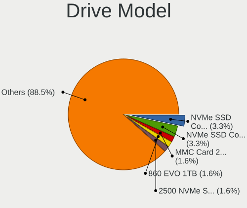

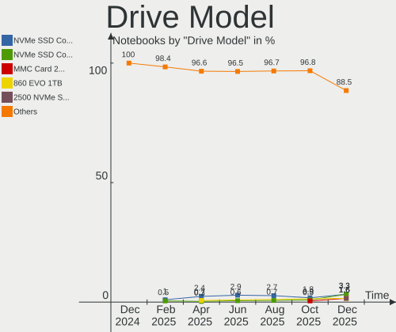

| Model                                                | Notebooks | Percent |
|------------------------------------------------------|-----------|---------|
| Samsung NVMe SSD Controller SM981/PM981/PM983 1TB    | 6         | 3.3%    |
| Samsung NVMe SSD Controller SM961/PM961/SM963 1024GB | 6         | 3.3%    |
| Unknown MMC Card  256GB                              | 3         | 1.65%   |
| Samsung SSD 860 EVO 1TB                              | 3         | 1.65%   |
| Micron 2500 NVMe SSD (DRAM-less) 512GB               | 3         | 1.65%   |
| HGST HTS545050A7E680 500GB                           | 3         | 1.65%   |
| Unknown MMC Card  128GB                              | 2         | 1.1%    |
| Toshiba TR200 480GB SSD                              | 2         | 1.1%    |
| Toshiba MQ04ABF100 1TB                               | 2         | 1.1%    |
| SanDisk SSD PLUS 240GB                               | 2         | 1.1%    |
| Samsung SSD 870 EVO 500GB                            | 2         | 1.1%    |
| Samsung SSD 860 EVO 500GB                            | 2         | 1.1%    |
| Samsung SSD 850 EVO 250GB                            | 2         | 1.1%    |
| MAXIO (Hangzhou) NVMe SSD Controller MAP1202 2TB     | 2         | 1.1%    |
| Kingston SA400S37480G 480GB SSD                      | 2         | 1.1%    |
| Kingston SA400S37240G 240GB SSD                      | 2         | 1.1%    |
| Intel SSDPEKNU512GZ 512GB                            | 2         | 1.1%    |
| Fujitsu MJA2500BH G2 500GB                           | 2         | 1.1%    |
| WDC WDS100T2B0B-00YS70 1TB SSD                       | 1         | 0.55%   |
| WDC WD7500BPKX-80HPJT0 752GB                         | 1         | 0.55%   |
| WDC WD3200BEKT-60V5T1 320GB                          | 1         | 0.55%   |
| WDC WD2500BEVT-26ZCT0 250GB                          | 1         | 0.55%   |
| WDC WD1600BEVT-60ZCT1 160GB                          | 1         | 0.55%   |
| WDC WD10SPZX-21Z10T0 1TB                             | 1         | 0.55%   |
| WDC WD10JPVX-60JC3T1 1TB                             | 1         | 0.55%   |
| WDC WD Blue SA510 M.2 2280 500GB SSD                 | 1         | 0.55%   |
| USB SanDisk 3.2Gen1 496GB                            | 1         | 0.55%   |
| Unknown SD/MMC/MS PRO 2GB                            | 1         | 0.55%   |
| Transcend TS120GMTS420S 120GB SSD                    | 1         | 0.55%   |
| Toshiba XG6 NVMe SSD Controller 1024GB               | 1         | 0.55%   |
| Toshiba MQ01ABD100V -63 1TB                          | 1         | 0.55%   |
| Toshiba MQ01ABD100 1TB                               | 1         | 0.55%   |
| Toshiba MQ01ABD050V 500GB                            | 1         | 0.55%   |
| Toshiba MK5056GSY 500GB                              | 1         | 0.55%   |
| Toshiba KXG5AZNV256G 256GB                           | 1         | 0.55%   |
| Toshiba BG3 NVMe SSD Controller 256GB                | 1         | 0.55%   |
| SPCC Solid State Disk 128GB                          | 1         | 0.55%   |
| SK hynix SKHynix_HFS256GD9TNG-L5B0B 256GB            | 1         | 0.55%   |
| SK hynix HFS001TEJ9X110N 1TB                         | 1         | 0.55%   |
| SK hynix HFM512GDHTNG-8710B 512GB                    | 1         | 0.55%   |

HDD Vendor
----------

Hard disk drive vendors

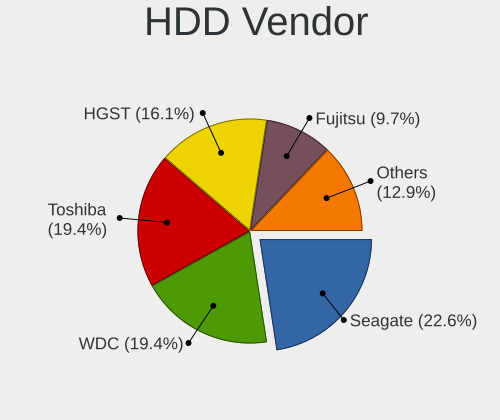

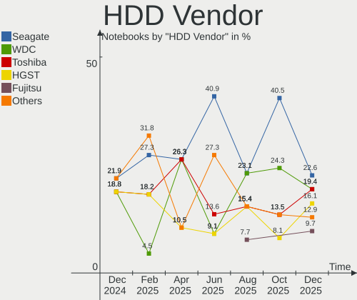

| Vendor             | Notebooks | Drives | Percent |
|--------------------|-----------|--------|---------|
| Seagate            | 7         | 7      | 22.58%  |
| WDC                | 6         | 6      | 19.35%  |
| Toshiba            | 6         | 6      | 19.35%  |
| HGST               | 5         | 5      | 16.13%  |
| Fujitsu            | 3         | 3      | 9.68%   |
| Unknown            | 1         | 1      | 3.23%   |
| JMicron Technology | 1         | 1      | 3.23%   |
| Hitachi            | 1         | 1      | 3.23%   |
| HGST HTS           | 1         | 1      | 3.23%   |

SSD Vendor
----------

Solid state drive vendors

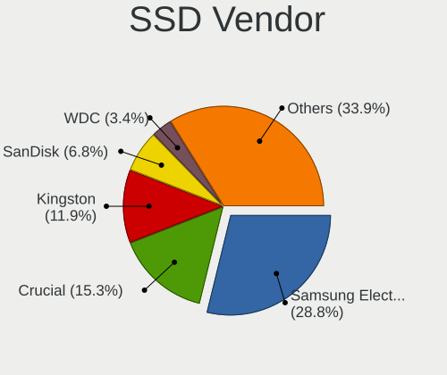

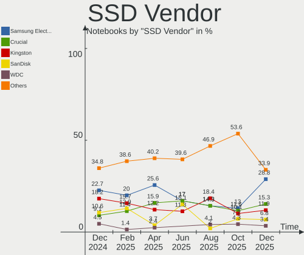

| Vendor              | Notebooks | Drives | Percent |
|---------------------|-----------|--------|---------|
| Samsung Electronics | 17        | 17     | 28.81%  |
| Crucial             | 9         | 9      | 15.25%  |
| Kingston            | 7         | 7      | 11.86%  |
| SanDisk             | 4         | 4      | 6.78%   |
| WDC                 | 2         | 2      | 3.39%   |
| Toshiba             | 2         | 2      | 3.39%   |
| PNY                 | 2         | 2      | 3.39%   |
| LITEON              | 2         | 2      | 3.39%   |
| China               | 2         | 2      | 3.39%   |
| Apple               | 2         | 2      | 3.39%   |
| Transcend           | 1         | 1      | 1.69%   |
| SPCC                | 1         | 1      | 1.69%   |
| SABRENT             | 1         | 1      | 1.69%   |
| Netac               | 1         | 1      | 1.69%   |
| Micron Technology   | 1         | 1      | 1.69%   |
| KLEVV               | 1         | 1      | 1.69%   |
| KingSpec            | 1         | 1      | 1.69%   |
| KingDian            | 1         | 1      | 1.69%   |
| EDILOCA             | 1         | 1      | 1.69%   |
| Aura                | 1         | 1      | 1.69%   |

Drive Kind
----------

HDD or SSD

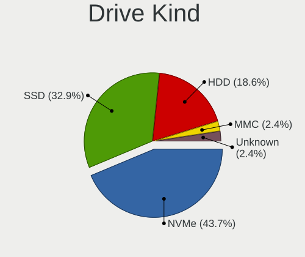

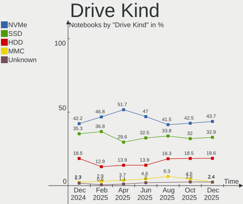

| Kind    | Notebooks | Drives | Percent |
|---------|-----------|--------|---------|
| NVMe    | 73        | 83     | 43.71%  |
| SSD     | 55        | 59     | 32.93%  |
| HDD     | 31        | 31     | 18.56%  |
| MMC     | 4         | 6      | 2.4%    |
| Unknown | 4         | 4      | 2.4%    |

Drive Connector
---------------

SATA, SAS, NVMe, etc.

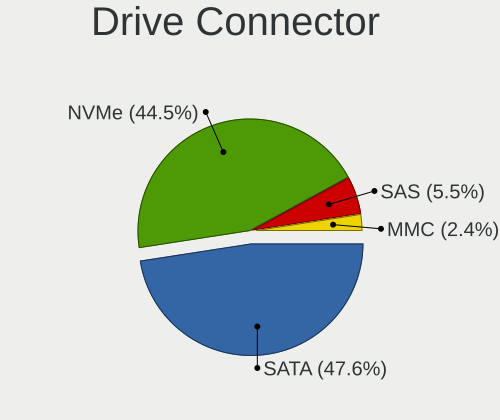

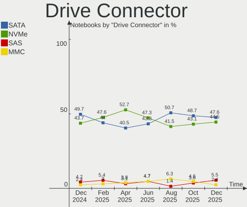

| Type | Notebooks | Drives | Percent |
|------|-----------|--------|---------|
| SATA | 78        | 85     | 47.56%  |
| NVMe | 73        | 82     | 44.51%  |
| SAS  | 9         | 10     | 5.49%   |
| MMC  | 4         | 6      | 2.44%   |

Drive Size
----------

Size of hard drive

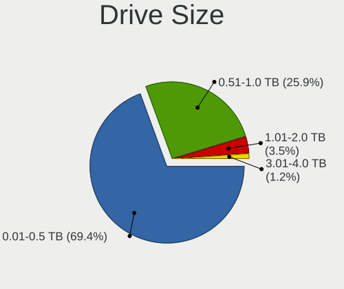

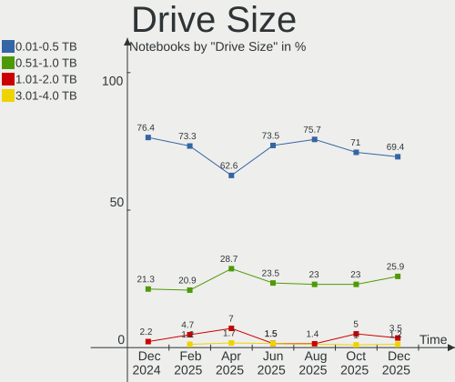

| Size in TB | Notebooks | Drives | Percent |
|------------|-----------|--------|---------|
| 0.01-0.5   | 59        | 64     | 69.41%  |
| 0.51-1.0   | 22        | 22     | 25.88%  |
| 1.01-2.0   | 3         | 3      | 3.53%   |
| 3.01-4.0   | 1         | 1      | 1.18%   |

Space Total
-----------

Amount of disk space available on the file system

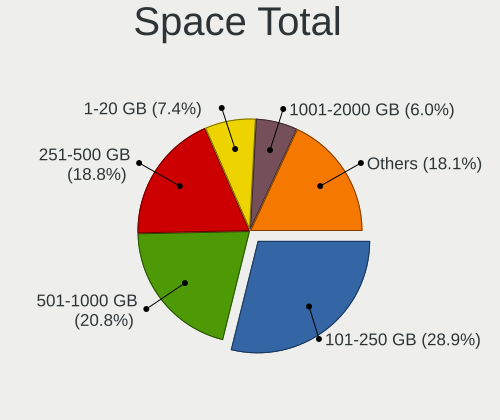

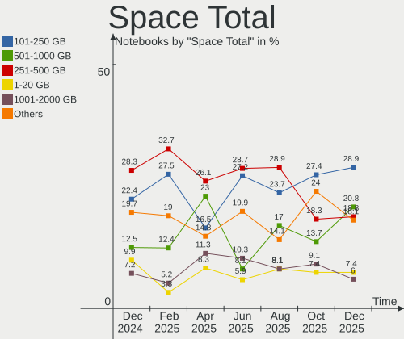

| Size in GB     | Notebooks | Percent |
|----------------|-----------|---------|
| 101-250        | 43        | 28.86%  |
| 501-1000       | 31        | 20.81%  |
| 251-500        | 28        | 18.79%  |
| 1-20           | 11        | 7.38%   |
| 1001-2000      | 9         | 6.04%   |
| Unknown        | 8         | 5.37%   |
| 21-50          | 6         | 4.03%   |
| More than 3000 | 5         | 3.36%   |
| 2001-3000      | 4         | 2.68%   |
| 51-100         | 4         | 2.68%   |

Space Used
----------

Amount of used disk space

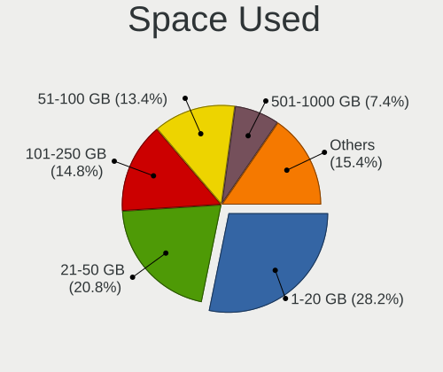

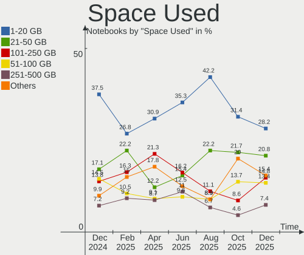

| Used GB        | Notebooks | Percent |
|----------------|-----------|---------|
| 1-20           | 42        | 28.19%  |
| 21-50          | 31        | 20.81%  |
| 101-250        | 22        | 14.77%  |
| 51-100         | 20        | 13.42%  |
| 251-500        | 11        | 7.38%   |
| 501-1000       | 11        | 7.38%   |
| Unknown        | 8         | 5.37%   |
| More than 3000 | 2         | 1.34%   |
| 1001-2000      | 2         | 1.34%   |

Malfunc. Drives
---------------

Drive models with a malfunction

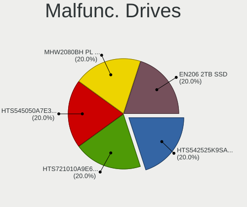

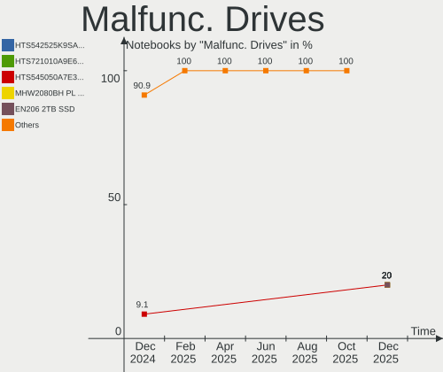

| Model                         | Notebooks | Drives | Percent |
|-------------------------------|-----------|--------|---------|
| Hitachi HTS542525K9SA00 250GB | 1         | 1      | 20%     |
| HGST HTS721010A9E630 1TB      | 1         | 1      | 20%     |
| HGST HTS545050A7E380 500GB    | 1         | 1      | 20%     |
| Fujitsu MHW2080BH PL 80GB     | 1         | 1      | 20%     |
| EDILOCA EN206 2TB SSD         | 1         | 1      | 20%     |

Malfunc. Drive Vendor
---------------------

Vendors of faulty drives

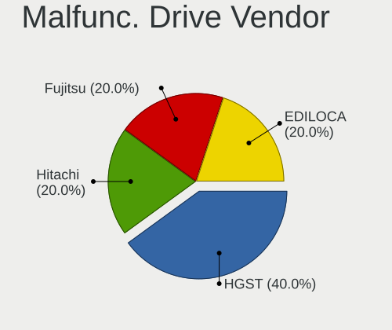

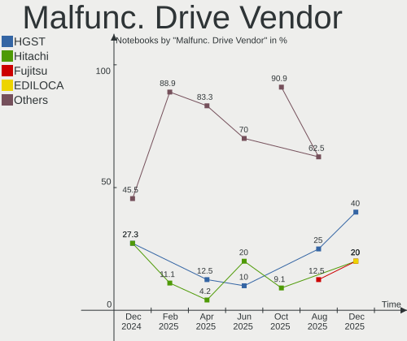

| Vendor  | Notebooks | Drives | Percent |
|---------|-----------|--------|---------|
| HGST    | 2         | 2      | 40%     |
| Hitachi | 1         | 1      | 20%     |
| Fujitsu | 1         | 1      | 20%     |
| EDILOCA | 1         | 1      | 20%     |

Malfunc. HDD Vendor
-------------------

Vendors of faulty HDD drives

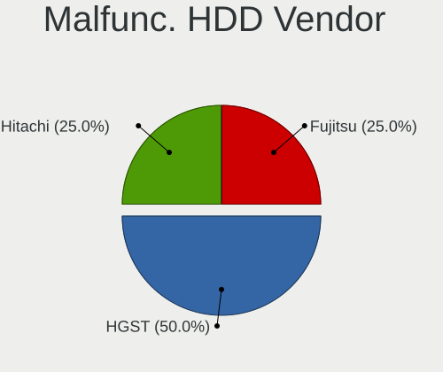

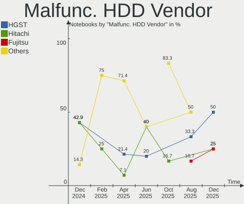

| Vendor  | Notebooks | Drives | Percent |
|---------|-----------|--------|---------|
| HGST    | 2         | 2      | 50%     |
| Hitachi | 1         | 1      | 25%     |
| Fujitsu | 1         | 1      | 25%     |

Malfunc. Drive Kind
-------------------

Kinds of faulty drives

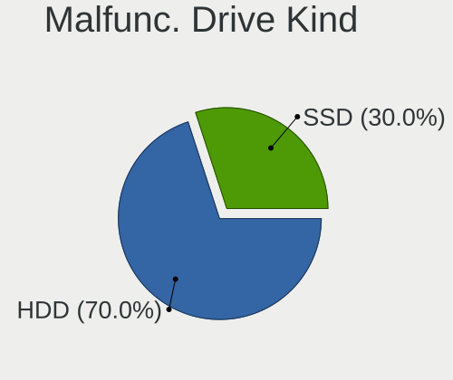

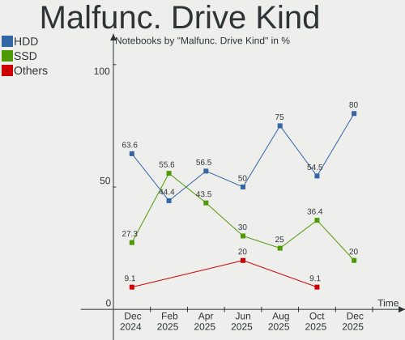

| Kind | Notebooks | Drives | Percent |
|------|-----------|--------|---------|
| HDD  | 4         | 4      | 80%     |
| SSD  | 1         | 1      | 20%     |

Failed Drives
-------------

Failed drive models

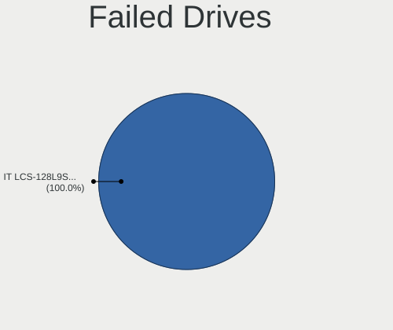

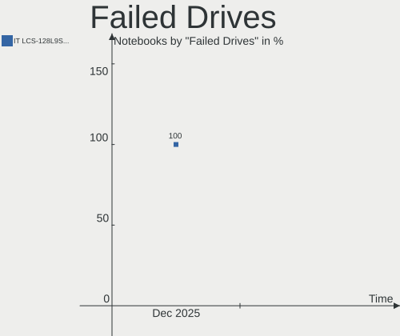

| Model                                     | Notebooks | Drives | Percent |
|-------------------------------------------|-----------|--------|---------|
| LITEON IT LCS-128L9S-11 2.5 7mm 128GB SSD | 1         | 1      | 100%    |

Failed Drive Vendor
-------------------

Failed drive vendors

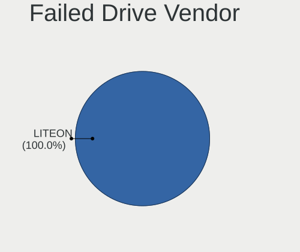

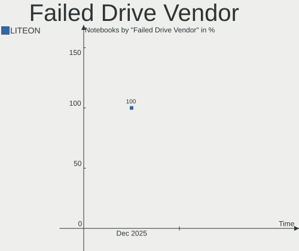

| Vendor | Notebooks | Drives | Percent |
|--------|-----------|--------|---------|
| LITEON | 1         | 1      | 100%    |

Drive Status
------------

Number of failed and malfunc. drives

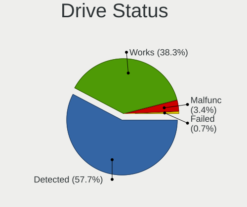

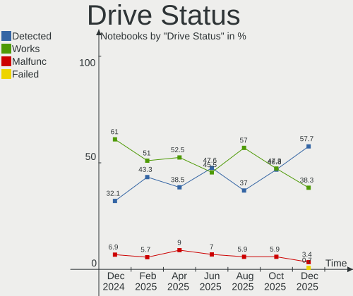

| Status   | Notebooks | Drives | Percent |
|----------|-----------|--------|---------|
| Detected | 86        | 115    | 57.72%  |
| Works    | 57        | 62     | 38.26%  |
| Malfunc  | 5         | 5      | 3.36%   |
| Failed   | 1         | 1      | 0.67%   |

Storage controller
------------------

Storage Vendor
--------------

Storage controller vendors

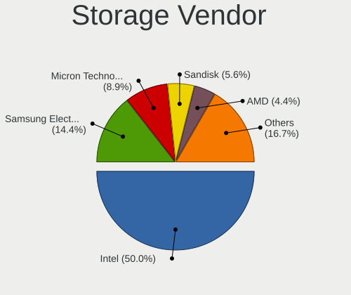

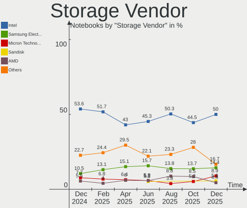

| Vendor                                  | Notebooks | Percent |
|-----------------------------------------|-----------|---------|
| Intel                                   | 90        | 50%     |
| Samsung Electronics                     | 26        | 14.44%  |
| Micron Technology                       | 16        | 8.89%   |
| Sandisk                                 | 10        | 5.56%   |
| AMD                                     | 8         | 4.44%   |
| SK hynix                                | 7         | 3.89%   |
| Toshiba America Info Systems            | 4         | 2.22%   |
| Nvidia                                  | 3         | 1.67%   |
| Phison Electronics                      | 2         | 1.11%   |
| Micron/Crucial Technology               | 2         | 1.11%   |
| MAXIO Technology (Hangzhou)             | 2         | 1.11%   |
| KIOXIA                                  | 2         | 1.11%   |
| Kingston Technology Company             | 2         | 1.11%   |
| Shenzhen Unionmemory Information System | 1         | 0.56%   |
| Shenzhen Longsys Electronics            | 1         | 0.56%   |
| Seagate Technology                      | 1         | 0.56%   |
| Realtek Semiconductor                   | 1         | 0.56%   |
| Marvell Technology Group                | 1         | 0.56%   |
| JMicron Technology                      | 1         | 0.56%   |

Storage Model
-------------

Storage controller models

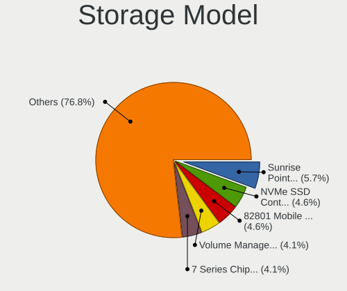

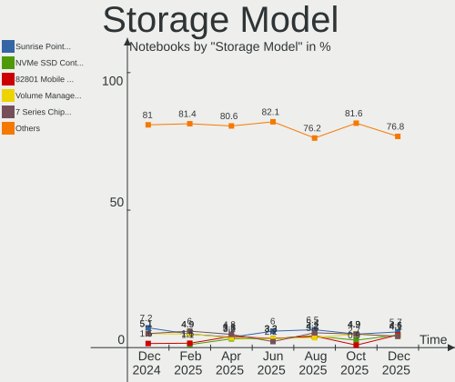

| Model                                                                          | Notebooks | Percent |
|--------------------------------------------------------------------------------|-----------|---------|
| Intel Sunrise Point-LP SATA Controller [AHCI mode]                             | 11        | 5.67%   |
| Samsung NVMe SSD Controller SM981/PM981/PM983                                  | 9         | 4.64%   |
| Intel 82801 Mobile SATA Controller [RAID mode]                                 | 9         | 4.64%   |
| Intel Volume Management Device NVMe RAID Controller                            | 8         | 4.12%   |
| Intel 7 Series Chipset Family 6-port SATA Controller [AHCI mode]               | 8         | 4.12%   |
| Intel 8 Series SATA Controller 1 [AHCI mode]                                   | 7         | 3.61%   |
| Intel 6 Series/C200 Series Chipset Family 6 port Mobile SATA AHCI Controller   | 7         | 3.61%   |
| AMD FCH SATA Controller [AHCI mode]                                            | 7         | 3.61%   |
| Samsung NVMe SSD Controller SM961/PM961/SM963                                  | 6         | 3.09%   |
| Intel Alder Lake-P SATA AHCI Controller                                        | 5         | 2.58%   |
| Intel 82801IBM/IEM (ICH9M/ICH9M-E) 4 port SATA Controller [AHCI mode]          | 5         | 2.58%   |
| Intel 8 Series/C220 Series Chipset Family 6-port SATA Controller 1 [AHCI mode] | 5         | 2.58%   |
| Samsung NVMe SSD Controller PM9B1 (DRAM-less)                                  | 4         | 2.06%   |
| Nvidia MCP79 AHCI Controller                                                   | 3         | 1.55%   |
| Micron 2500 NVMe SSD (DRAM-less)                                               | 3         | 1.55%   |
| Micron 2400 NVMe SSD (DRAM-less)                                               | 3         | 1.55%   |
| Intel Wildcat Point-LP SATA Controller [AHCI Mode]                             | 3         | 1.55%   |
| Intel SSD 670p Series [Keystone Harbor]                                        | 3         | 1.55%   |
| Intel HM170/QM170 Chipset SATA Controller [AHCI Mode]                          | 3         | 1.55%   |
| Intel Atom Processor E3800 Series SATA AHCI Controller                         | 3         | 1.55%   |
| Intel 82801HM/HEM (ICH8M/ICH8M-E) SATA Controller [AHCI mode]                  | 3         | 1.55%   |
| Intel 82801HM/HEM (ICH8M/ICH8M-E) IDE Controller                               | 3         | 1.55%   |
| Intel 5 Series/3400 Series Chipset 4 port SATA AHCI Controller                 | 3         | 1.55%   |
| Toshiba America Info Systems XG6 NVMe SSD Controller                           | 2         | 1.03%   |
| SK hynix BC901 NVMe Solid State Drive (DRAM-less)                              | 2         | 1.03%   |
| SK hynix BC511 NVMe SSD                                                        | 2         | 1.03%   |
| SanDisk WD SN560/SN740/SN770/SN5000 NVMe SSD                                   | 2         | 1.03%   |
| Sandisk WD Black SN850X NVMe SSD                                               | 2         | 1.03%   |
| SanDisk Extreme Pro / WD Black SN750 / PC SN730 / Red SN700 NVMe SSD           | 2         | 1.03%   |
| Samsung S4LN058A01[SSUBX] AHCI SSD Controller (Apple slot)                     | 2         | 1.03%   |
| Samsung NVMe SSD Controller S4LV008[Pascal]                                    | 2         | 1.03%   |
| Micron/Crucial P2 [Nick P2] / P3 / P3 Plus NVMe PCIe SSD (DRAM-less)           | 2         | 1.03%   |
| Micron 2550 NVMe SSD (DRAM-less)                                               | 2         | 1.03%   |
| Micron 2450 NVMe SSD [HendrixV] (DRAM-less)                                    | 2         | 1.03%   |
| Micron 2300 NVMe SSD [Santana]                                                 | 2         | 1.03%   |
| MAXIO (Hangzhou) NVMe SSD Controller MAP1202 (DRAM-less)                       | 2         | 1.03%   |
| Intel Tiger Lake-LP SATA Controller                                            | 2         | 1.03%   |
| Intel SSD DC P4101/Pro 7600p/760p/E 6100p Series                               | 2         | 1.03%   |
| Intel RST Volume Management Device Controller                                  | 2         | 1.03%   |
| Intel Celeron N3350/Pentium N4200/Atom E3900 Series SATA AHCI Controller       | 2         | 1.03%   |

Storage Kind
------------

Kind of storage controller (IDE, SATA, NVMe, SAS, ...)

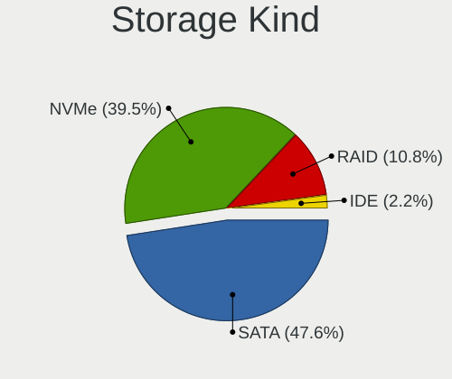

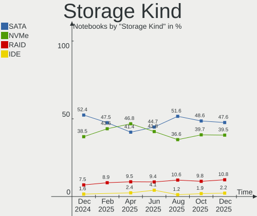

| Kind | Notebooks | Percent |
|------|-----------|---------|
| SATA | 88        | 47.57%  |
| NVMe | 73        | 39.46%  |
| RAID | 20        | 10.81%  |
| IDE  | 4         | 2.16%   |

Processor
---------

CPU Vendor
----------

Processor vendors

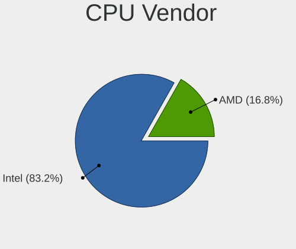

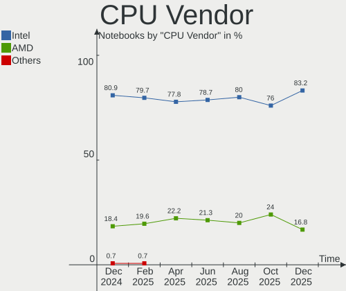

| Vendor | Notebooks | Percent |
|--------|-----------|---------|
| Intel  | 124       | 83.22%  |
| AMD    | 25        | 16.78%  |

CPU Model
---------

Processor models

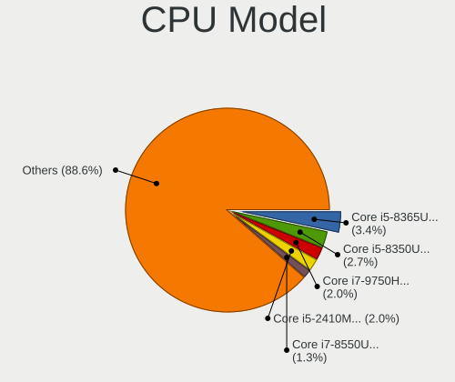

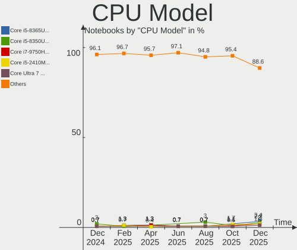

| Model                                           | Notebooks | Percent |
|-------------------------------------------------|-----------|---------|
| Intel Core i5-8365U CPU @ 1.60GHz               | 5         | 3.36%   |
| Intel Core i5-8350U CPU @ 1.70GHz               | 4         | 2.68%   |
| Intel Core i7-9750H CPU @ 2.60GHz               | 3         | 2.01%   |
| Intel Core i5-2410M CPU @ 2.30GHz               | 3         | 2.01%   |
| Intel Core Ultra 7 258V                         | 2         | 1.34%   |
| Intel Core Ultra 7 155H                         | 2         | 1.34%   |
| Intel Core i7-8550U CPU @ 1.80GHz               | 2         | 1.34%   |
| Intel Core i7-7500U CPU @ 2.70GHz               | 2         | 1.34%   |
| Intel Core i7-6500U CPU @ 2.50GHz               | 2         | 1.34%   |
| Intel Core i7-5500U CPU @ 2.40GHz               | 2         | 1.34%   |
| Intel Core i7-4700HQ CPU @ 2.40GHz              | 2         | 1.34%   |
| Intel Core i7-3630QM CPU @ 2.40GHz              | 2         | 1.34%   |
| Intel Core i5-8250U CPU @ 1.60GHz               | 2         | 1.34%   |
| Intel Core i5-6300U CPU @ 2.40GHz               | 2         | 1.34%   |
| Intel Core i5-4200U CPU @ 1.60GHz               | 2         | 1.34%   |
| Intel Core i5-3427U CPU @ 1.80GHz               | 2         | 1.34%   |
| Intel Core i3-6006U CPU @ 2.00GHz               | 2         | 1.34%   |
| Intel Core i3-4030U CPU @ 1.90GHz               | 2         | 1.34%   |
| Intel Core 5 120U                               | 2         | 1.34%   |
| Intel Core 2 Duo CPU P7450 @ 2.13GHz            | 2         | 1.34%   |
| Intel Core 2 Duo CPU P7350 @ 2.00GHz            | 2         | 1.34%   |
| Intel Celeron CPU N3450 @ 1.10GHz               | 2         | 1.34%   |
| Intel 13th Gen Core i7-1355U                    | 2         | 1.34%   |
| Intel 12th Gen Core i5-1235U                    | 2         | 1.34%   |
| Intel 11th Gen Core i7-1165G7 @ 2.80GHz         | 2         | 1.34%   |
| AMD Ryzen AI 7 PRO 350 w/ Radeon 860M           | 2         | 1.34%   |
| AMD Ryzen 7 3700U with Radeon Vega Mobile Gfx   | 2         | 1.34%   |
| AMD Ryzen 5 7430U with Radeon Graphics          | 2         | 1.34%   |
| AMD Ryzen 5 3500U with Radeon Vega Mobile Gfx   | 2         | 1.34%   |
| AMD A10-9600P RADEON R5, 10 COMPUTE CORES 4C+6G | 2         | 1.34%   |
| Intel Pentium Silver N5000 CPU @ 1.10GHz        | 1         | 0.67%   |
| Intel Pentium M processor 1.50GHz               | 1         | 0.67%   |
| Intel Pentium Gold 7505 @ 2.00GHz               | 1         | 0.67%   |
| Intel Pentium Dual-Core CPU T4200 @ 2.00GHz     | 1         | 0.67%   |
| Intel Pentium CPU N3540 @ 2.16GHz               | 1         | 0.67%   |
| Intel Pentium CPU 987 @ 1.50GHz                 | 1         | 0.67%   |
| Intel Core Ultra 9 275HX                        | 1         | 0.67%   |
| Intel Core m3-7Y30 CPU @ 1.00GHz                | 1         | 0.67%   |
| Intel Core i9-9880H CPU @ 2.30GHz               | 1         | 0.67%   |
| Intel Core i9-14900HX                           | 1         | 0.67%   |

CPU Model Family
----------------

Processor model prefix

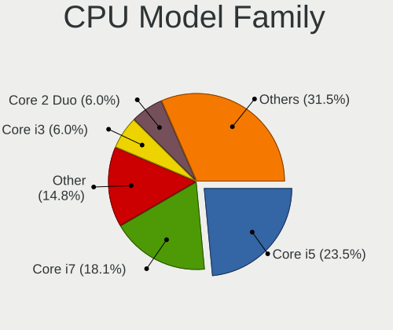

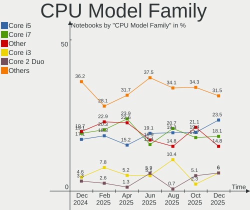

| Model                   | Notebooks | Percent |
|-------------------------|-----------|---------|
| Intel Core i5           | 35        | 23.49%  |
| Intel Core i7           | 27        | 18.12%  |
| Other                   | 22        | 14.77%  |
| Intel Core i3           | 9         | 6.04%   |
| Intel Core 2 Duo        | 9         | 6.04%   |
| Intel Core              | 8         | 5.37%   |
| Intel Celeron           | 6         | 4.03%   |
| AMD Ryzen 5             | 6         | 4.03%   |
| AMD Ryzen 7             | 5         | 3.36%   |
| Intel Core i9           | 3         | 2.01%   |
| AMD Ryzen 7 PRO         | 3         | 2.01%   |
| Intel Pentium           | 2         | 1.34%   |
| AMD Ryzen 9             | 2         | 1.34%   |
| AMD A10                 | 2         | 1.34%   |
| Intel Pentium Silver    | 1         | 0.67%   |
| Intel Pentium M         | 1         | 0.67%   |
| Intel Pentium Gold      | 1         | 0.67%   |
| Intel Pentium Dual-Core | 1         | 0.67%   |
| Intel Core m3           | 1         | 0.67%   |
| Intel Atom              | 1         | 0.67%   |
| AMD Ryzen 5 PRO         | 1         | 0.67%   |
| AMD Athlon II           | 1         | 0.67%   |
| AMD A8                  | 1         | 0.67%   |
| AMD A6                  | 1         | 0.67%   |

CPU Cores
---------

Number of processor cores

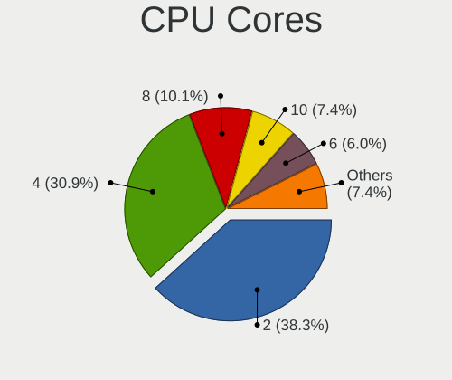

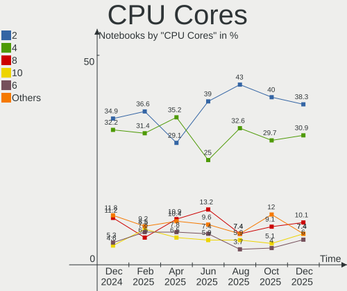

| Number | Notebooks | Percent |
|--------|-----------|---------|
| 2      | 57        | 38.26%  |
| 4      | 46        | 30.87%  |
| 8      | 15        | 10.07%  |
| 10     | 11        | 7.38%   |
| 6      | 9         | 6.04%   |
| 16     | 3         | 2.01%   |
| 14     | 3         | 2.01%   |
| 24     | 2         | 1.34%   |
| 1      | 2         | 1.34%   |
| 12     | 1         | 0.67%   |

CPU Sockets
-----------

Number of sockets

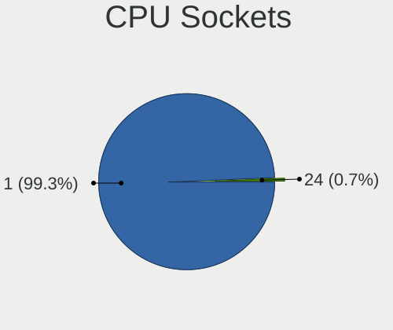

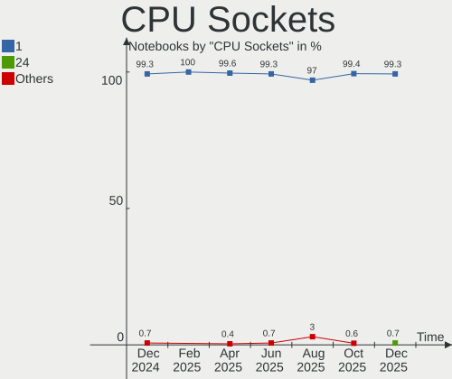

| Number | Notebooks | Percent |
|--------|-----------|---------|
| 1      | 148       | 99.33%  |
| 24     | 1         | 0.67%   |

CPU Threads
-----------

Threads per core (Hyper-Threading)

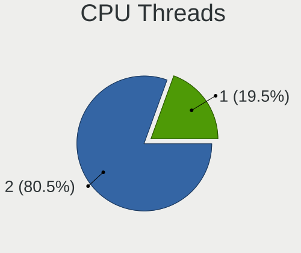

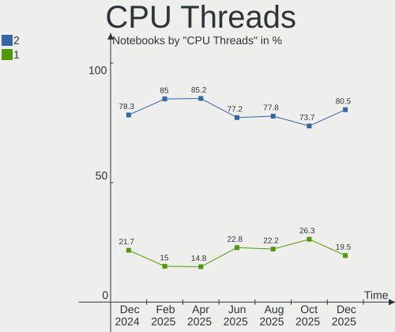

| Number | Notebooks | Percent |
|--------|-----------|---------|
| 2      | 120       | 80.54%  |
| 1      | 29        | 19.46%  |

CPU Op-Modes
------------

CPU Operation Modes (32-bit, 64-bit)

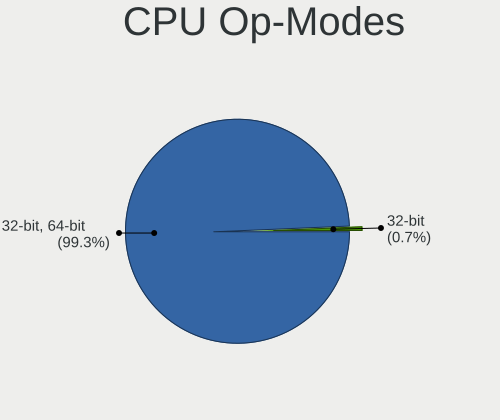

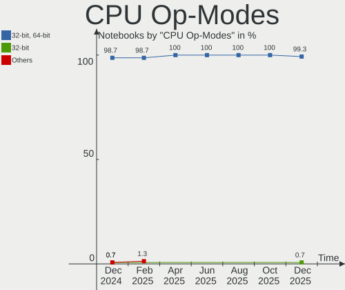

| Op mode        | Notebooks | Percent |
|----------------|-----------|---------|
| 32-bit, 64-bit | 148       | 99.33%  |
| 32-bit         | 1         | 0.67%   |

CPU Microcode
-------------

Microcode number

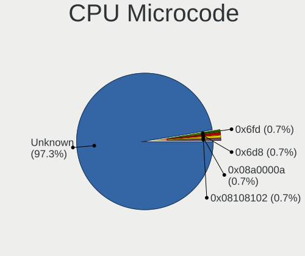

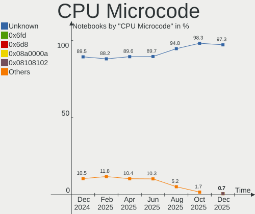

| Number     | Notebooks | Percent |
|------------|-----------|---------|
| Unknown    | 145       | 97.32%  |
| 0x6fd      | 1         | 0.67%   |
| 0x6d8      | 1         | 0.67%   |
| 0x08a0000a | 1         | 0.67%   |
| 0x08108102 | 1         | 0.67%   |

CPU Microarch
-------------

Microarchitecture

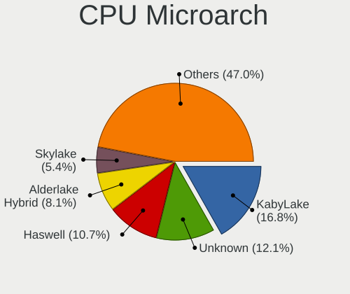

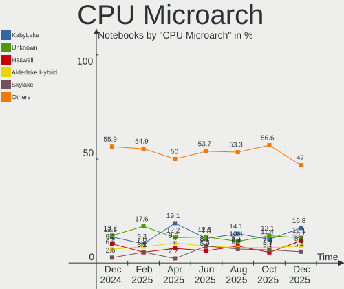

| Name              | Notebooks | Percent |
|-------------------|-----------|---------|
| KabyLake          | 25        | 16.78%  |
| Unknown           | 18        | 12.08%  |
| Haswell           | 16        | 10.74%  |
| Alderlake Hybrid  | 12        | 8.05%   |
| Skylake           | 8         | 5.37%   |
| SandyBridge       | 8         | 5.37%   |
| Penryn            | 8         | 5.37%   |
| IvyBridge         | 7         | 4.7%    |
| Zen+              | 6         | 4.03%   |
| TigerLake         | 5         | 3.36%   |
| CometLake         | 4         | 2.68%   |
| Broadwell         | 4         | 2.68%   |
| Zen 3             | 3         | 2.01%   |
| Silvermont        | 3         | 2.01%   |
| Core              | 3         | 2.01%   |
| Westmere          | 2         | 1.34%   |
| Lunarlake Hybrid  | 2         | 1.34%   |
| Goldmont          | 2         | 1.34%   |
| Excavator         | 2         | 1.34%   |
| Zen 2             | 1         | 0.67%   |
| Zen               | 1         | 0.67%   |
| Puma              | 1         | 0.67%   |
| P6                | 1         | 0.67%   |
| Nehalem           | 1         | 0.67%   |
| Meteorlake Hybrid | 1         | 0.67%   |
| K10 Llano         | 1         | 0.67%   |
| K10               | 1         | 0.67%   |
| IceLake           | 1         | 0.67%   |
| Goldmont plus     | 1         | 0.67%   |
| Bonnell           | 1         | 0.67%   |

Graphics
--------

GPU Vendor
----------

Vendors of graphics cards

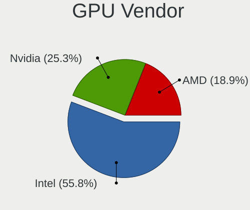

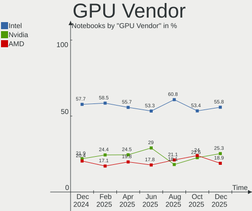

| Vendor | Notebooks | Percent |
|--------|-----------|---------|
| Intel  | 106       | 55.79%  |
| Nvidia | 48        | 25.26%  |
| AMD    | 36        | 18.95%  |

GPU Model
---------

Graphics card models

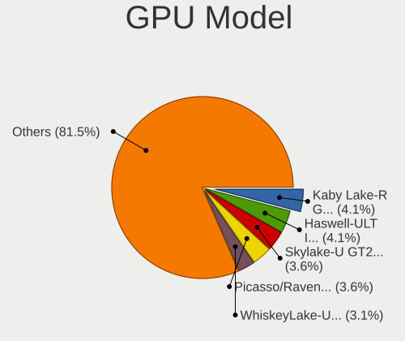

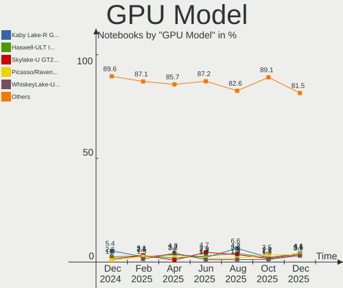

| Model                                                                                 | Notebooks | Percent |
|---------------------------------------------------------------------------------------|-----------|---------|
| Intel Kaby Lake-R GT2 [UHD Graphics 620]                                              | 8         | 4.1%    |
| Intel Haswell-ULT Integrated Graphics Controller                                      | 8         | 4.1%    |
| Intel Skylake-U GT2 [HD Graphics 520]                                                 | 7         | 3.59%   |
| AMD Picasso/Raven 2 [Radeon Vega Series / Radeon Vega Mobile Series]                  | 7         | 3.59%   |
| Intel WhiskeyLake-U GT2 [UHD Graphics 620]                                            | 6         | 3.08%   |
| Intel 4th Gen Core Processor Integrated Graphics Controller                           | 6         | 3.08%   |
| Intel 3rd Gen Core processor Graphics Controller                                      | 6         | 3.08%   |
| Intel 2nd Generation Core Processor Family Integrated Graphics Controller             | 6         | 3.08%   |
| Intel TigerLake-LP GT2 [Iris Xe Graphics]                                             | 4         | 2.05%   |
| Intel Raptor Lake-P [Iris Xe Graphics]                                                | 4         | 2.05%   |
| Intel Broadwell-U GT2 [HD Graphics 5500]                                              | 4         | 2.05%   |
| Nvidia TU116M [GeForce GTX 1660 Ti Mobile]                                            | 3         | 1.54%   |
| Nvidia GF117M [GeForce 610M/710M/810M/820M / GT 620M/625M/630M/720M]                  | 3         | 1.54%   |
| Nvidia GA106M [GeForce RTX 3060 Mobile / Max-Q]                                       | 3         | 1.54%   |
| Intel Kaby Lake-U GT2 [HD Graphics 620]                                               | 3         | 1.54%   |
| Intel CoffeeLake-H GT2 [UHD Graphics 630]                                             | 3         | 1.54%   |
| Intel Atom Processor Z36xxx/Z37xxx Series Graphics & Display                          | 3         | 1.54%   |
| AMD Sun XT [Radeon HD 8670A/8670M/8690M / R5 M330 / M430 / Radeon 520 Mobile]         | 3         | 1.54%   |
| AMD Barcelo                                                                           | 3         | 1.54%   |
| Nvidia TU117M [GeForce GTX 1650 Mobile / Max-Q]                                       | 2         | 1.03%   |
| Nvidia GP108M [GeForce MX150]                                                         | 2         | 1.03%   |
| Nvidia GP107M [GeForce GTX 1050 Mobile]                                               | 2         | 1.03%   |
| Nvidia GM107M [GeForce GTX 960M]                                                      | 2         | 1.03%   |
| Nvidia GK208BM [GeForce 920M]                                                         | 2         | 1.03%   |
| Nvidia C79 [GeForce 9400M]                                                            | 2         | 1.03%   |
| Intel Raptor Lake-U [Intel Graphics]                                                  | 2         | 1.03%   |
| Intel Raptor Lake-P [UHD Graphics]                                                    | 2         | 1.03%   |
| Intel Lunar Lake [Intel Arc Graphics 130V / 140V]                                     | 2         | 1.03%   |
| Intel Kaby Lake-H GT2 [HD Graphics 630]                                               | 2         | 1.03%   |
| Intel CometLake-H GT2 [UHD Graphics]                                                  | 2         | 1.03%   |
| Intel Apollo Lake GT1 [HD Graphics 500]                                               | 2         | 1.03%   |
| Intel Alder Lake-UP3 GT2 [Iris Xe Graphics]                                           | 2         | 1.03%   |
| AMD Wani [Radeon R5/R6/R7 Graphics]                                                   | 2         | 1.03%   |
| AMD Topaz XT [Radeon R7 M260/M265 / M340/M360 / M440/M445 / 530/535 / 620/625 Mobile] | 2         | 1.03%   |
| AMD Seymour [Radeon HD 6400M/7400M Series]                                            | 2         | 1.03%   |
| AMD RV730/M96 [Mobility Radeon HD 4650/5165]                                          | 2         | 1.03%   |
| AMD Phoenix1                                                                          | 2         | 1.03%   |
| AMD Krackan [Radeon 840M / 860M Graphics]                                             | 2         | 1.03%   |
| AMD HawkPoint1                                                                        | 2         | 1.03%   |
| Nvidia TU117M [GeForce GTX 1650 Ti Mobile]                                            | 1         | 0.51%   |

GPU Combo
---------

Combinations of graphics cards

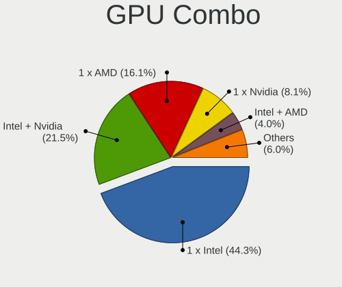

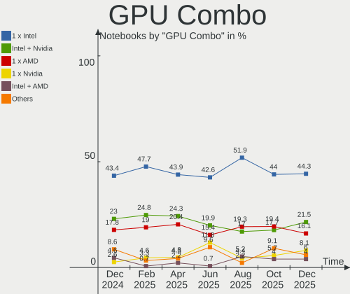

| Name           | Notebooks | Percent |
|----------------|-----------|---------|
| 1 x Intel      | 66        | 44.3%   |
| Intel + Nvidia | 32        | 21.48%  |
| 1 x AMD        | 24        | 16.11%  |
| 1 x Nvidia     | 12        | 8.05%   |
| Intel + AMD    | 6         | 4.03%   |
| 2 x AMD        | 3         | 2.01%   |
| AMD + Nvidia   | 3         | 2.01%   |
| 2 x Intel      | 2         | 1.34%   |
| 2 x Nvidia     | 1         | 0.67%   |

GPU Driver
----------

Free vs proprietary

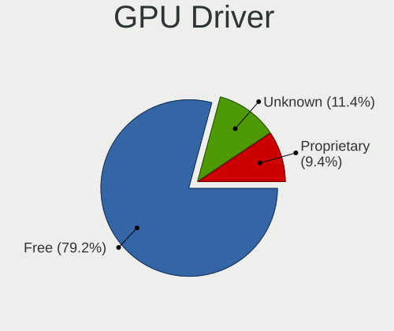

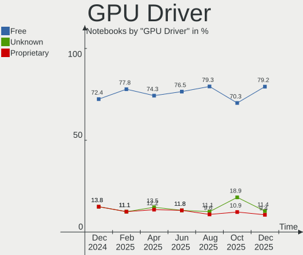

| Driver      | Notebooks | Percent |
|-------------|-----------|---------|
| Free        | 118       | 79.19%  |
| Unknown     | 17        | 11.41%  |
| Proprietary | 14        | 9.4%    |

GPU Memory
----------

Total video memory

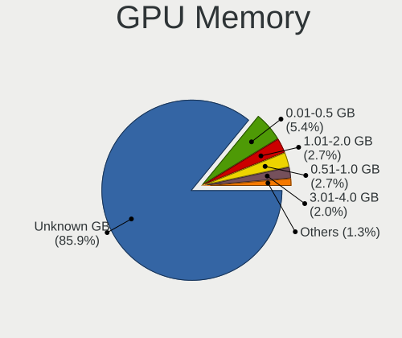

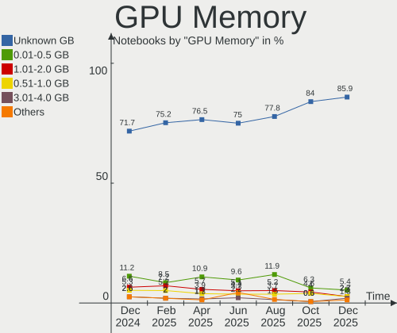

| Size in GB | Notebooks | Percent |
|------------|-----------|---------|
| Unknown    | 128       | 85.91%  |
| 0.01-0.5   | 8         | 5.37%   |
| 1.01-2.0   | 4         | 2.68%   |
| 0.51-1.0   | 4         | 2.68%   |
| 3.01-4.0   | 3         | 2.01%   |
| 7.01-8.0   | 1         | 0.67%   |
| 5.01-6.0   | 1         | 0.67%   |

Monitor
-------

Monitor Vendor
--------------

Monitor vendors

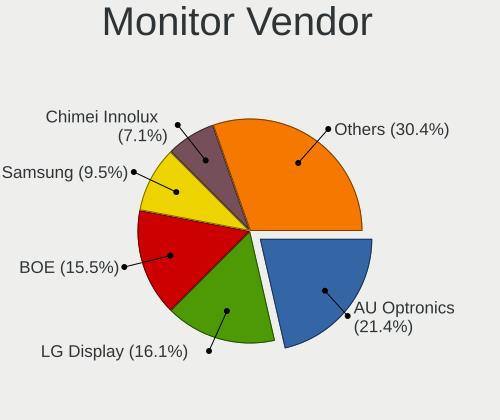

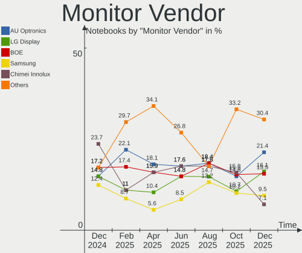

| Vendor                  | Notebooks | Percent |
|-------------------------|-----------|---------|
| AU Optronics            | 36        | 21.43%  |
| LG Display              | 27        | 16.07%  |
| BOE                     | 26        | 15.48%  |
| Samsung Electronics     | 16        | 9.52%   |
| Chimei Innolux          | 12        | 7.14%   |
| Lenovo                  | 9         | 5.36%   |
| Apple                   | 7         | 4.17%   |
| Hewlett-Packard         | 6         | 3.57%   |
| Sharp                   | 3         | 1.79%   |
| Chi Mei Optoelectronics | 3         | 1.79%   |
| STA                     | 2         | 1.19%   |
| Philips                 | 2         | 1.19%   |
| PANDA                   | 2         | 1.19%   |
| Goldstar                | 2         | 1.19%   |
| BenQ                    | 2         | 1.19%   |
| ZTR                     | 1         | 0.6%    |
| TMX                     | 1         | 0.6%    |
| MSI                     | 1         | 0.6%    |
| LG Philips              | 1         | 0.6%    |
| InfoVision              | 1         | 0.6%    |
| HSX                     | 1         | 0.6%    |
| HannStar                | 1         | 0.6%    |
| EQV                     | 1         | 0.6%    |
| Dell                    | 1         | 0.6%    |
| CSOT                    | 1         | 0.6%    |
| ASUSTek Computer        | 1         | 0.6%    |
| AOC                     | 1         | 0.6%    |
| Acer                    | 1         | 0.6%    |

Monitor Model
-------------

Monitor models

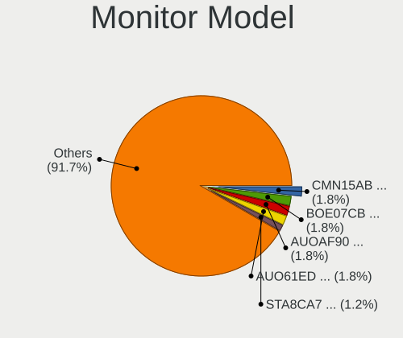

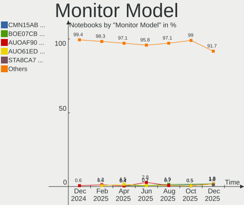

| Model                                                                   | Notebooks | Percent |
|-------------------------------------------------------------------------|-----------|---------|
| Chimei Innolux LCD Monitor CMN15AB 1366x768 344x193mm 15.5-inch         | 3         | 1.79%   |
| BOE LCD Monitor BOE07CB 1920x1080 344x193mm 15.5-inch                   | 3         | 1.79%   |
| AU Optronics LCD Monitor AUOAF90 1920x1080 344x193mm 15.5-inch          | 3         | 1.79%   |
| AU Optronics LCD Monitor AUO61ED 1920x1080 344x194mm 15.5-inch          | 3         | 1.79%   |
| STA LCD Monitor STA8CA7 1366x768 256x144mm 11.6-inch                    | 2         | 1.19%   |
| LG Display LCD Monitor LGD046B 1366x768 344x194mm 15.5-inch             | 2         | 1.19%   |
| Lenovo LCD Monitor LEN40A9 1920x1080 309x173mm 13.9-inch                | 2         | 1.19%   |
| Lenovo B140UAN02.7 LEN403A 1920x1200 302x188mm 14.0-inch                | 2         | 1.19%   |
| Goldstar FULL HD GSM5B55 1920x1080 480x270mm 21.7-inch                  | 2         | 1.19%   |
| Chimei Innolux LCD Monitor CMN150D 1920x1080 344x193mm 15.5-inch        | 2         | 1.19%   |
| AU Optronics LCD Monitor AUO45EC 1366x768 344x193mm 15.5-inch           | 2         | 1.19%   |
| AU Optronics LCD Monitor AUO21ED 1920x1080 344x193mm 15.5-inch          | 2         | 1.19%   |
| AU Optronics LCD Monitor AUO219D 1920x1080 381x214mm 17.2-inch          | 2         | 1.19%   |
| AU Optronics LCD Monitor AUO106C 1366x768 276x155mm 12.5-inch           | 2         | 1.19%   |
| ZTR 156XX5419T02 ZTR0015 1920x1080 344x193mm 15.5-inch                  | 1         | 0.6%    |
| TMX TL160ADMP03-0 TMX1603 2560x1600 345x215mm 16.0-inch                 | 1         | 0.6%    |
| Sharp LQ140M1JW49 SHP1523 1920x1080 309x174mm 14.0-inch                 | 1         | 0.6%    |
| Sharp LCD Monitor SHP1453 1920x1080 346x194mm 15.6-inch                 | 1         | 0.6%    |
| Sharp LCD Monitor SHP1449 1920x1080 294x165mm 13.3-inch                 | 1         | 0.6%    |
| Samsung Electronics SyncMaster SAM011E 1280x1024 338x270mm 17.0-inch    | 1         | 0.6%    |
| Samsung Electronics Odyssey G5 SAM74A6 2560x1440 597x336mm 27.0-inch    | 1         | 0.6%    |
| Samsung Electronics LS27D36xG SAM76DF 1920x1080 527x296mm 23.8-inch     | 1         | 0.6%    |
| Samsung Electronics LF24T40 SAM703D 1920x1080 520x290mm 23.4-inch       | 1         | 0.6%    |
| Samsung Electronics LCD Monitor SEC5541 1366x768 344x193mm 15.5-inch    | 1         | 0.6%    |
| Samsung Electronics LCD Monitor SEC5441 1280x800 331x207mm 15.4-inch    | 1         | 0.6%    |
| Samsung Electronics LCD Monitor SEC3245 1366x768 340x190mm 15.3-inch    | 1         | 0.6%    |
| Samsung Electronics LCD Monitor SEC3130 1024x600 223x125mm 10.1-inch    | 1         | 0.6%    |
| Samsung Electronics LCD Monitor SDC4E51 1366x768 344x194mm 15.5-inch    | 1         | 0.6%    |
| Samsung Electronics LCD Monitor SDC4A52 1366x768 344x194mm 15.5-inch    | 1         | 0.6%    |
| Samsung Electronics LCD Monitor SDC434B 3840x2160 344x194mm 15.5-inch   | 1         | 0.6%    |
| Samsung Electronics LCD Monitor SDC4208 1920x1200 302x189mm 14.0-inch   | 1         | 0.6%    |
| Samsung Electronics LCD Monitor SDC4187 1920x1200 302x189mm 14.0-inch   | 1         | 0.6%    |
| Samsung Electronics LCD Monitor SAM7353 3840x2160 1872x1053mm 84.6-inch | 1         | 0.6%    |
| Samsung Electronics LC24RG50 SAM0F90 1920x1080 532x304mm 24.1-inch      | 1         | 0.6%    |
| Samsung Electronics ATNA40HQ01-0  SDC4203                               | 1         | 0.6%    |
| Philips PHL24E1N1100A PHLC324 1920x1080 527x296mm 23.8-inch             | 1         | 0.6%    |
| Philips 247EL PHLC084 1920x1080 521x293mm 23.5-inch                     | 1         | 0.6%    |
| PANDA LCD Monitor NCP002D 1920x1080 344x194mm 15.5-inch                 | 1         | 0.6%    |
| PANDA LC133LF4L02 NCP0017 1920x1080 294x165mm 13.3-inch                 | 1         | 0.6%    |
| MSI MP243X MSI40B5 1920x1080 530x290mm 23.8-inch                        | 1         | 0.6%    |

Monitor Resolution
------------------

Monitor screen resolution

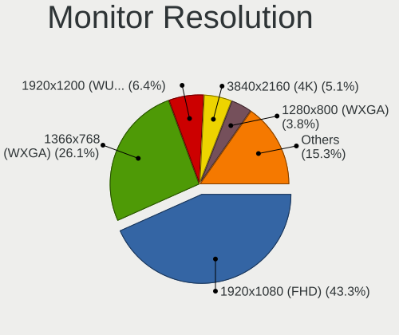

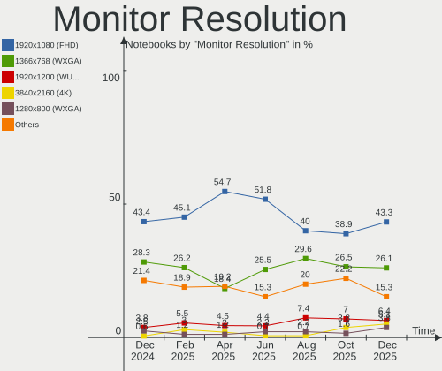

| Resolution         | Notebooks | Percent |
|--------------------|-----------|---------|
| 1920x1080 (FHD)    | 68        | 43.31%  |
| 1366x768 (WXGA)    | 41        | 26.11%  |
| 1920x1200 (WUXGA)  | 10        | 6.37%   |
| 3840x2160 (4K)     | 8         | 5.1%    |
| 1280x800 (WXGA)    | 6         | 3.82%   |
| 1600x900 (HD+)     | 5         | 3.18%   |
| 2560x1600          | 3         | 1.91%   |
| 2560x1440 (QHD)    | 3         | 1.91%   |
| 1680x1050 (WSXGA+) | 3         | 1.91%   |
| 1440x900 (WXGA+)   | 3         | 1.91%   |
| 2880x1800          | 2         | 1.27%   |
| 3840x2400          | 1         | 0.64%   |
| 1600x2560          | 1         | 0.64%   |
| 1280x1024 (SXGA)   | 1         | 0.64%   |
| 1024x600           | 1         | 0.64%   |
| Unknown            | 1         | 0.64%   |

Monitor Diagonal
----------------

Diagonal size in inches

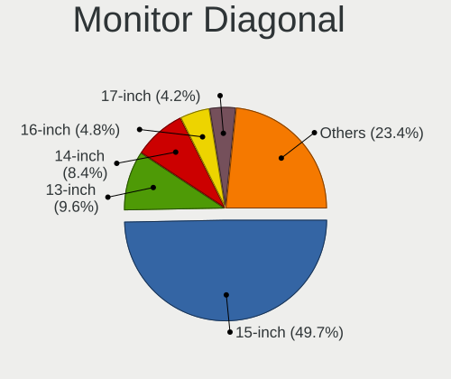

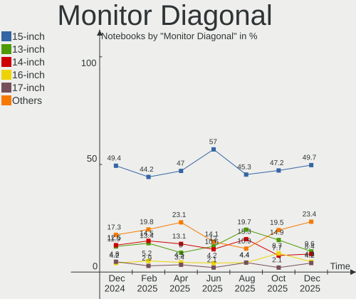

| Inches  | Notebooks | Percent |
|---------|-----------|---------|
| 15      | 83        | 49.7%   |
| 13      | 16        | 9.58%   |
| 14      | 14        | 8.38%   |
| 16      | 8         | 4.79%   |
| 17      | 7         | 4.19%   |
| 27      | 6         | 3.59%   |
| 12      | 6         | 3.59%   |
| 23      | 5         | 2.99%   |
| 24      | 4         | 2.4%    |
| 11      | 4         | 2.4%    |
| 22      | 3         | 1.8%    |
| 21      | 3         | 1.8%    |
| 31      | 2         | 1.2%    |
| 84      | 1         | 0.6%    |
| 26      | 1         | 0.6%    |
| 20      | 1         | 0.6%    |
| 10      | 1         | 0.6%    |
| 8       | 1         | 0.6%    |
| Unknown | 1         | 0.6%    |

Monitor Width
-------------

Physical width

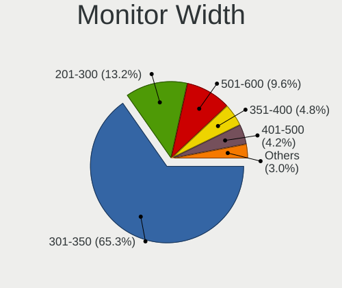

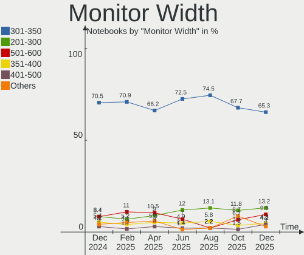

| Width in mm | Notebooks | Percent |
|-------------|-----------|---------|
| 301-350     | 109       | 65.27%  |
| 201-300     | 22        | 13.17%  |
| 501-600     | 16        | 9.58%   |
| 351-400     | 8         | 4.79%   |
| 401-500     | 7         | 4.19%   |
| 601-700     | 2         | 1.2%    |
| 1501-2000   | 1         | 0.6%    |
| 101-200     | 1         | 0.6%    |
| Unknown     | 1         | 0.6%    |

Aspect Ratio
------------

Proportional relationship between the width and the height

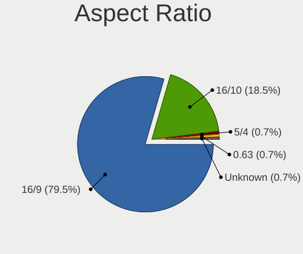

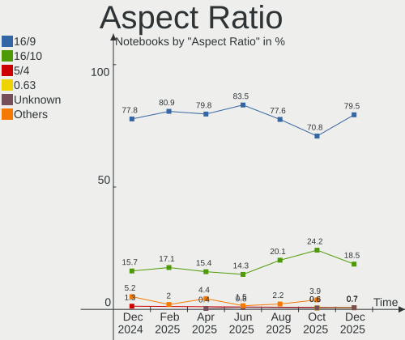

| Ratio   | Notebooks | Percent |
|---------|-----------|---------|
| 16/9    | 120       | 79.47%  |
| 16/10   | 28        | 18.54%  |
| 5/4     | 1         | 0.66%   |
| 0.63    | 1         | 0.66%   |
| Unknown | 1         | 0.66%   |

Monitor Area
------------

Area in inch²

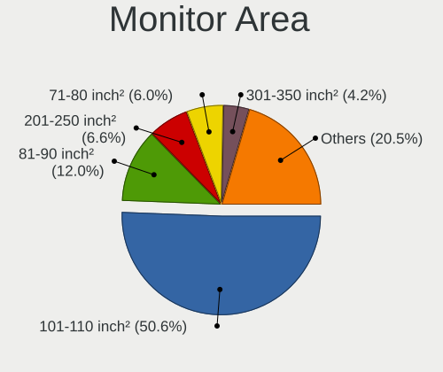

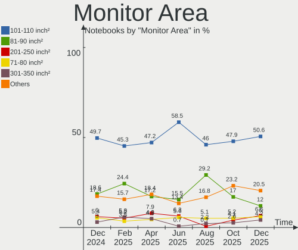

| Area in inch² | Notebooks | Percent |
|----------------|-----------|---------|
| 101-110        | 84        | 50.6%   |
| 81-90          | 20        | 12.05%  |
| 201-250        | 11        | 6.63%   |
| 71-80          | 10        | 6.02%   |
| 301-350        | 7         | 4.22%   |
| 111-120        | 7         | 4.22%   |
| 61-70          | 6         | 3.61%   |
| 121-130        | 6         | 3.61%   |
| 51-60          | 4         | 2.41%   |
| 351-500        | 2         | 1.2%    |
| 251-300        | 2         | 1.2%    |
| 151-200        | 2         | 1.2%    |
| More than 1000 | 1         | 0.6%    |
| 41-50          | 1         | 0.6%    |
| 1-40           | 1         | 0.6%    |
| 141-150        | 1         | 0.6%    |
| Unknown        | 1         | 0.6%    |

Pixel Density
-------------

Pixels per inch

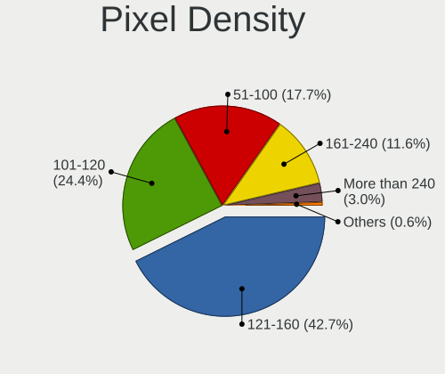

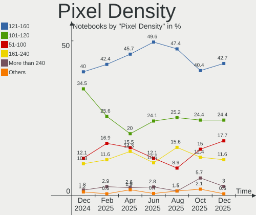

| Density       | Notebooks | Percent |
|---------------|-----------|---------|
| 121-160       | 70        | 42.68%  |
| 101-120       | 40        | 24.39%  |
| 51-100        | 29        | 17.68%  |
| 161-240       | 19        | 11.59%  |
| More than 240 | 5         | 3.05%   |
| Unknown       | 1         | 0.61%   |

Multiple Monitors
-----------------

Total monitors connected

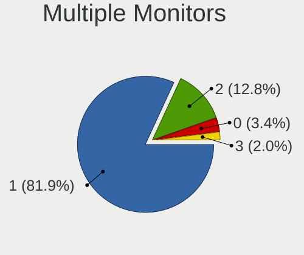

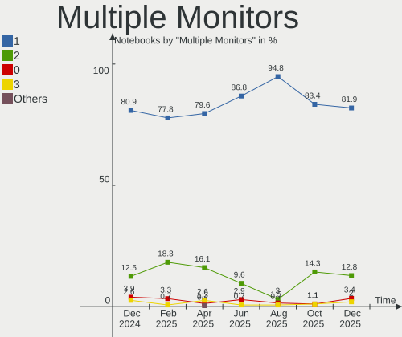

| Total | Notebooks | Percent |
|-------|-----------|---------|
| 1     | 122       | 81.88%  |
| 2     | 19        | 12.75%  |
| 0     | 5         | 3.36%   |
| 3     | 3         | 2.01%   |

Network
-------

Net Controller Vendor
---------------------

Controller vendors

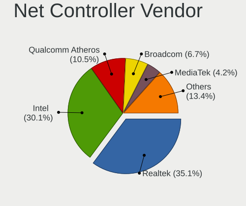

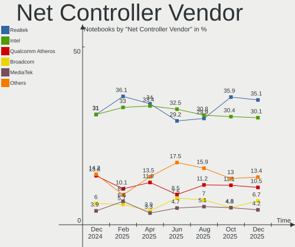

| Vendor                            | Notebooks | Percent |
|-----------------------------------|-----------|---------|
| Realtek Semiconductor             | 84        | 35.15%  |
| Intel                             | 72        | 30.13%  |
| Qualcomm Atheros                  | 25        | 10.46%  |
| Broadcom                          | 16        | 6.69%   |
| MediaTek                          | 10        | 4.18%   |
| TP-Link                           | 4         | 1.67%   |
| Sierra Wireless                   | 3         | 1.26%   |
| Ralink                            | 3         | 1.26%   |
| Nvidia                            | 3         | 1.26%   |
| Broadcom Limited                  | 3         | 1.26%   |
| Qualcomm                          | 2         | 0.84%   |
| OPPO Electronics                  | 2         | 0.84%   |
| JMicron Technology                | 2         | 0.84%   |
| Ericsson Business Mobile Networks | 2         | 0.84%   |
| Ralink Technology                 | 1         | 0.42%   |
| Mercucys                          | 1         | 0.42%   |
| Marvell Technology Group          | 1         | 0.42%   |
| Huawei Technologies               | 1         | 0.42%   |
| Hewlett-Packard                   | 1         | 0.42%   |
| Fibocom                           | 1         | 0.42%   |
| Dell                              | 1         | 0.42%   |
| Attansic Technology               | 1         | 0.42%   |

Net Controller Model
--------------------

Controller models

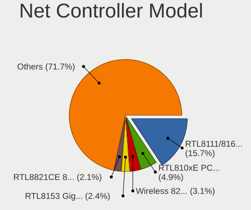

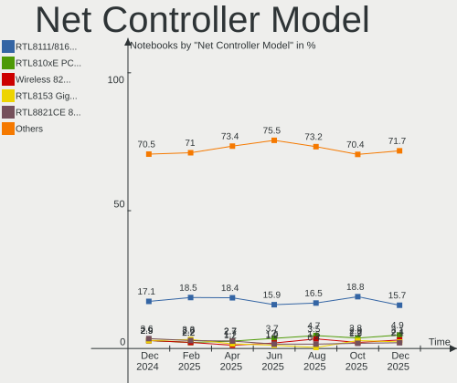

| Model                                                                           | Notebooks | Percent |
|---------------------------------------------------------------------------------|-----------|---------|
| Realtek RTL8111/8168/8211/8411 PCI Express Gigabit Ethernet Controller          | 45        | 15.73%  |
| Realtek RTL810xE PCI Express Fast Ethernet controller                           | 14        | 4.9%    |
| Intel Wireless 8265 / 8275                                                      | 9         | 3.15%   |
| Realtek RTL8153 Gigabit Ethernet Adapter                                        | 7         | 2.45%   |
| Realtek RTL8821CE 802.11ac PCIe Wireless Network Adapter                        | 6         | 2.1%    |
| Qualcomm Atheros AR9285 Wireless Network Adapter (PCI-Express)                  | 6         | 2.1%    |
| Intel 82579LM Gigabit Network Connection (Lewisville)                           | 6         | 2.1%    |
| Realtek RTL8822CE 802.11ac PCIe Wireless Network Adapter                        | 5         | 1.75%   |
| Qualcomm Atheros QCA9565 / AR9565 Wireless Network Adapter                      | 5         | 1.75%   |
| Intel Ethernet Connection (6) I219-LM                                           | 5         | 1.75%   |
| Intel Cannon Point-LP CNVi [Wireless-AC]                                        | 5         | 1.75%   |
| Realtek RTL8852BE PCIe 802.11ax Wireless Network Controller                     | 4         | 1.4%    |
| Realtek RTL8188EE Wireless Network Adapter                                      | 4         | 1.4%    |
| Qualcomm Atheros QCA9377 802.11ac Wireless Network Adapter                      | 4         | 1.4%    |
| Intel Raptor Lake PCH CNVi WiFi                                                 | 4         | 1.4%    |
| Intel Ethernet Connection (4) I219-LM                                           | 4         | 1.4%    |
| Intel Comet Lake PCH CNVi WiFi                                                  | 4         | 1.4%    |
| Intel Centrino Advanced-N 6205 [Taylor Peak]                                    | 4         | 1.4%    |
| Intel Alder Lake-P PCH CNVi WiFi                                                | 4         | 1.4%    |
| Broadcom BCM4312 802.11b/g LP-PHY                                               | 4         | 1.4%    |
| Realtek RTL8125 2.5GbE Controller                                               | 3         | 1.05%   |
| Ralink RT3290 Wireless 802.11n 1T/1R PCIe                                       | 3         | 1.05%   |
| Qualcomm Atheros QCA6174 802.11ac Wireless Network Adapter                      | 3         | 1.05%   |
| Qualcomm Atheros AR9462 Wireless Network Adapter                                | 3         | 1.05%   |
| Nvidia MCP79 Ethernet                                                           | 3         | 1.05%   |
| MediaTek MT7922 802.11ax PCI Express Wireless Network Adapter                   | 3         | 1.05%   |
| Intel Wireless 7260                                                             | 3         | 1.05%   |
| Intel Wireless 3165                                                             | 3         | 1.05%   |
| Intel Wi-Fi 6 AX200                                                             | 3         | 1.05%   |
| Intel Ethernet Connection I217-LM                                               | 3         | 1.05%   |
| Broadcom BCM43142 802.11b/g/n                                                   | 3         | 1.05%   |
| TP-Link TL-WN823N v2/v3 [Realtek RTL8192EU]                                     | 2         | 0.7%    |
| Sierra Wireless EM7305 Modem                                                    | 2         | 0.7%    |
| Realtek RTL8188CE 802.11b/g/n WiFi Adapter                                      | 2         | 0.7%    |
| OPPO RMX3741                                                                    | 2         | 0.7%    |
| MediaTek MT7925 802.11be 160MHz 2x2 PCIe Wireless Network Adapter [Filogic 360] | 2         | 0.7%    |
| MediaTek MT7921 802.11ax PCIe Wireless Network Adapter [Filogic 330]            | 2         | 0.7%    |
| MediaTek MT7902 802.11ax PCIe Wireless Network Adapter [Filogic 310]            | 2         | 0.7%    |
| JMicron JMC250 PCI Express Gigabit Ethernet Controller                          | 2         | 0.7%    |
| Intel Wireless 8260                                                             | 2         | 0.7%    |

Wireless Vendor
---------------

Wireless vendors

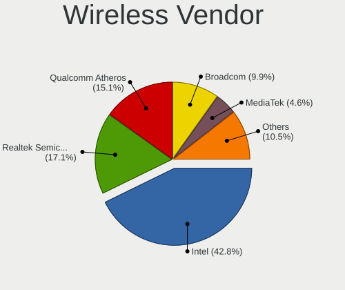

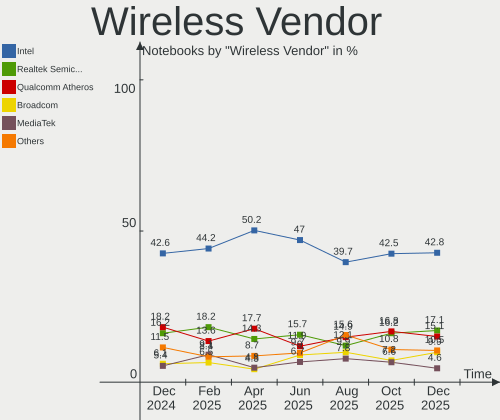

| Vendor                | Notebooks | Percent |
|-----------------------|-----------|---------|
| Intel                 | 65        | 42.76%  |
| Realtek Semiconductor | 26        | 17.11%  |
| Qualcomm Atheros      | 23        | 15.13%  |
| Broadcom              | 15        | 9.87%   |
| MediaTek              | 7         | 4.61%   |
| TP-Link               | 3         | 1.97%   |
| Sierra Wireless       | 3         | 1.97%   |
| Ralink                | 3         | 1.97%   |
| Broadcom Limited      | 2         | 1.32%   |
| Ralink Technology     | 1         | 0.66%   |
| Qualcomm              | 1         | 0.66%   |
| Mercucys              | 1         | 0.66%   |
| Fibocom               | 1         | 0.66%   |
| Dell                  | 1         | 0.66%   |

Wireless Model
--------------

Wireless models

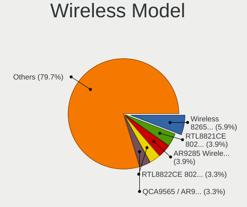

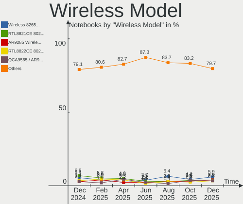

| Model                                                                | Notebooks | Percent |
|----------------------------------------------------------------------|-----------|---------|
| Intel Wireless 8265 / 8275                                           | 9         | 5.88%   |
| Realtek RTL8821CE 802.11ac PCIe Wireless Network Adapter             | 6         | 3.92%   |
| Qualcomm Atheros AR9285 Wireless Network Adapter (PCI-Express)       | 6         | 3.92%   |
| Realtek RTL8822CE 802.11ac PCIe Wireless Network Adapter             | 5         | 3.27%   |
| Qualcomm Atheros QCA9565 / AR9565 Wireless Network Adapter           | 5         | 3.27%   |
| Intel Cannon Point-LP CNVi [Wireless-AC]                             | 5         | 3.27%   |
| Realtek RTL8188EE Wireless Network Adapter                           | 4         | 2.61%   |
| Qualcomm Atheros QCA9377 802.11ac Wireless Network Adapter           | 4         | 2.61%   |
| Intel Raptor Lake PCH CNVi WiFi                                      | 4         | 2.61%   |
| Intel Comet Lake PCH CNVi WiFi                                       | 4         | 2.61%   |
| Intel Centrino Advanced-N 6205 [Taylor Peak]                         | 4         | 2.61%   |
| Broadcom BCM4312 802.11b/g LP-PHY                                    | 4         | 2.61%   |
| Ralink RT3290 Wireless 802.11n 1T/1R PCIe                            | 3         | 1.96%   |
| Qualcomm Atheros QCA6174 802.11ac Wireless Network Adapter           | 3         | 1.96%   |
| Qualcomm Atheros AR9462 Wireless Network Adapter                     | 3         | 1.96%   |
| Intel Wireless 7260                                                  | 3         | 1.96%   |
| Intel Wireless 3165                                                  | 3         | 1.96%   |
| Intel Wi-Fi 6 AX200                                                  | 3         | 1.96%   |
| Intel Alder Lake-P PCH CNVi WiFi                                     | 3         | 1.96%   |
| Broadcom BCM43142 802.11b/g/n                                        | 3         | 1.96%   |
| TP-Link TL-WN823N v2/v3 [Realtek RTL8192EU]                          | 2         | 1.31%   |
| Sierra Wireless EM7305 Modem                                         | 2         | 1.31%   |
| Realtek RTL8852BE PCIe 802.11ax Wireless Network Controller          | 2         | 1.31%   |
| Realtek RTL8188CE 802.11b/g/n WiFi Adapter                           | 2         | 1.31%   |
| MediaTek MT7922 802.11ax PCI Express Wireless Network Adapter        | 2         | 1.31%   |
| MediaTek MT7921 802.11ax PCIe Wireless Network Adapter [Filogic 330] | 2         | 1.31%   |
| MediaTek MT7902 802.11ax PCIe Wireless Network Adapter [Filogic 310] | 2         | 1.31%   |
| Intel Wireless 8260                                                  | 2         | 1.31%   |
| Intel Wireless 7265                                                  | 2         | 1.31%   |
| Intel WiFi Link 5100                                                 | 2         | 1.31%   |
| Intel Wi-Fi 6 AX201                                                  | 2         | 1.31%   |
| Intel Wi-Fi 5(802.11ac) Wireless-AC 9x6x [Thunder Peak]              | 2         | 1.31%   |
| Intel Dual Band Wireless-AC 3168NGW [Stone Peak]                     | 2         | 1.31%   |
| Intel Centrino Advanced-N 6235                                       | 2         | 1.31%   |
| Intel Cannon Lake PCH CNVi WiFi                                      | 2         | 1.31%   |
| Broadcom BCM4322 802.11a/b/g/n Wireless LAN Controller               | 2         | 1.31%   |
| TP-Link TL-WN821N v5/v6 [RTL8192EU]                                  | 1         | 0.65%   |
| TP-Link 802.11ac NIC                                                 | 1         | 0.65%   |
| Sierra Wireless EM7345 4G LTE                                        | 1         | 0.65%   |
| Realtek RTL8852BE-VT PCIe 802.11ax Wireless Network Controller       | 1         | 0.65%   |

Ethernet Vendor
---------------

Ethernet vendors

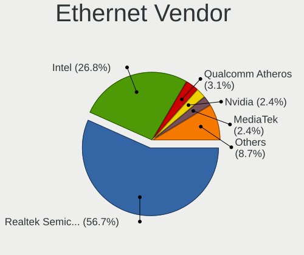

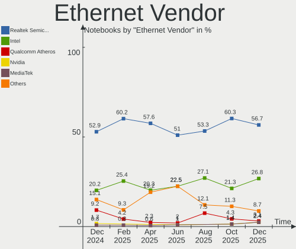

| Vendor                   | Notebooks | Percent |
|--------------------------|-----------|---------|
| Realtek Semiconductor    | 72        | 56.69%  |
| Intel                    | 34        | 26.77%  |
| Qualcomm Atheros         | 4         | 3.15%   |
| Nvidia                   | 3         | 2.36%   |
| MediaTek                 | 3         | 2.36%   |
| OPPO Electronics         | 2         | 1.57%   |
| JMicron Technology       | 2         | 1.57%   |
| Broadcom                 | 2         | 1.57%   |
| TP-Link                  | 1         | 0.79%   |
| Qualcomm                 | 1         | 0.79%   |
| Marvell Technology Group | 1         | 0.79%   |
| Broadcom Limited         | 1         | 0.79%   |
| Attansic Technology      | 1         | 0.79%   |

Ethernet Model
--------------

Ethernet models

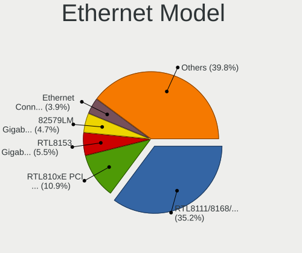

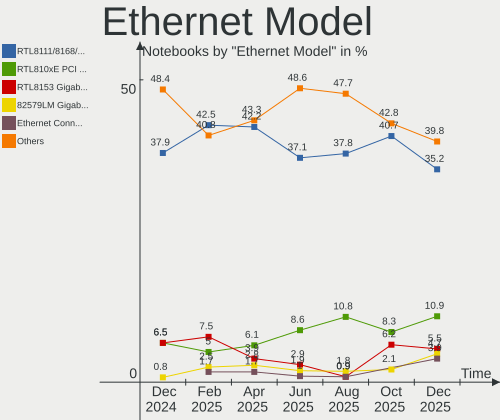

| Model                                                                           | Notebooks | Percent |
|---------------------------------------------------------------------------------|-----------|---------|
| Realtek RTL8111/8168/8211/8411 PCI Express Gigabit Ethernet Controller          | 45        | 35.16%  |
| Realtek RTL810xE PCI Express Fast Ethernet controller                           | 14        | 10.94%  |
| Realtek RTL8153 Gigabit Ethernet Adapter                                        | 7         | 5.47%   |
| Intel 82579LM Gigabit Network Connection (Lewisville)                           | 6         | 4.69%   |
| Intel Ethernet Connection (6) I219-LM                                           | 5         | 3.91%   |
| Intel Ethernet Connection (4) I219-LM                                           | 4         | 3.13%   |
| Realtek RTL8125 2.5GbE Controller                                               | 3         | 2.34%   |
| Nvidia MCP79 Ethernet                                                           | 3         | 2.34%   |
| Intel Ethernet Connection I217-LM                                               | 3         | 2.34%   |
| Realtek RTL8852BE PCIe 802.11ax Wireless Network Controller                     | 2         | 1.56%   |
| OPPO RMX3741                                                                    | 2         | 1.56%   |
| MediaTek MT7925 802.11be 160MHz 2x2 PCIe Wireless Network Adapter [Filogic 360] | 2         | 1.56%   |
| JMicron JMC250 PCI Express Gigabit Ethernet Controller                          | 2         | 1.56%   |
| Intel Ethernet Connection I219-LM                                               | 2         | 1.56%   |
| Intel Ethernet Connection (7) I219-LM                                           | 2         | 1.56%   |
| Intel Ethernet Connection (4) I219-V                                            | 2         | 1.56%   |
| Intel Ethernet Connection (18) I219-LM                                          | 2         | 1.56%   |
| Intel BE201 320MHz                                                              | 2         | 1.56%   |
| TP-Link UE300 10/100/1000 LAN (ethernet mode) [Realtek RTL8153]                 | 1         | 0.78%   |
| Realtek USB 10/100/1G/2.5 LAN                                                   | 1         | 0.78%   |
| Realtek Killer E2600 GbE Controller                                             | 1         | 0.78%   |
| Qualcomm Nokia X30 5G                                                           | 1         | 0.78%   |
| Qualcomm Atheros QCA8172 Fast Ethernet                                          | 1         | 0.78%   |
| Qualcomm Atheros QCA8171 Gigabit Ethernet                                       | 1         | 0.78%   |
| Qualcomm Atheros AR8161 Gigabit Ethernet                                        | 1         | 0.78%   |
| Qualcomm Atheros AR8131 Gigabit Ethernet                                        | 1         | 0.78%   |
| MediaTek MT7922 802.11ax PCI Express Wireless Network Adapter                   | 1         | 0.78%   |
| Marvell Group 88E8040 PCI-E Fast Ethernet Controller                            | 1         | 0.78%   |
| Intel Ethernet Connection I217-V                                                | 1         | 0.78%   |
| Intel Ethernet Connection (3) I218-V                                            | 1         | 0.78%   |
| Intel Ethernet Connection (13) I219-V                                           | 1         | 0.78%   |
| Intel Alder Lake-P PCH CNVi WiFi                                                | 1         | 0.78%   |
| Intel 82562GT 10/100 Network Connection                                         | 1         | 0.78%   |
| Intel 82541GI Gigabit Ethernet Controller                                       | 1         | 0.78%   |
| Broadcom NetXtreme BCM57765 Gigabit Ethernet PCIe                               | 1         | 0.78%   |
| Broadcom NetLink BCM5784M Gigabit Ethernet PCIe                                 | 1         | 0.78%   |
| Broadcom Limited NetLink BCM5787M Gigabit Ethernet PCI Express                  | 1         | 0.78%   |
| Attansic AR8152 v2.0 Fast Ethernet                                              | 1         | 0.78%   |

Net Controller Kind
-------------------

Ethernet, WiFi or modem

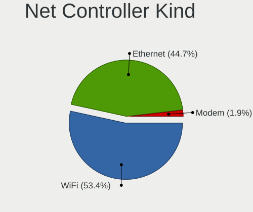

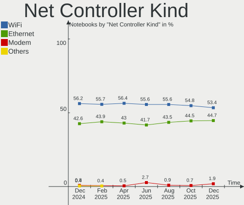

| Kind     | Notebooks | Percent |
|----------|-----------|---------|
| WiFi     | 141       | 53.41%  |
| Ethernet | 118       | 44.7%   |
| Modem    | 5         | 1.89%   |

Used Controller
---------------

Currently used network controller

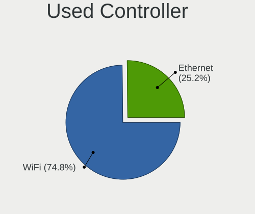

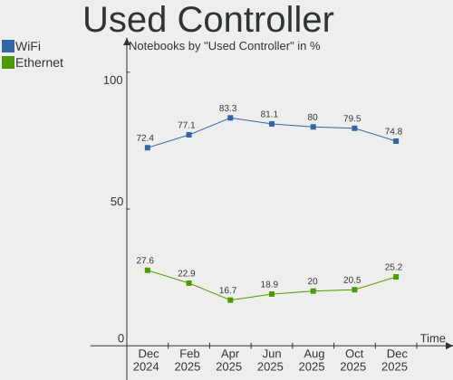

| Kind     | Notebooks | Percent |
|----------|-----------|---------|
| WiFi     | 113       | 74.83%  |
| Ethernet | 38        | 25.17%  |

NICs
----

Total network controllers on board

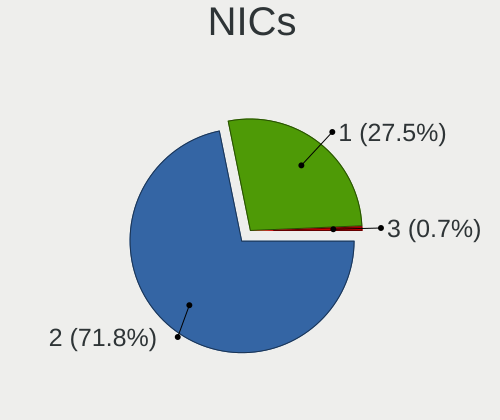

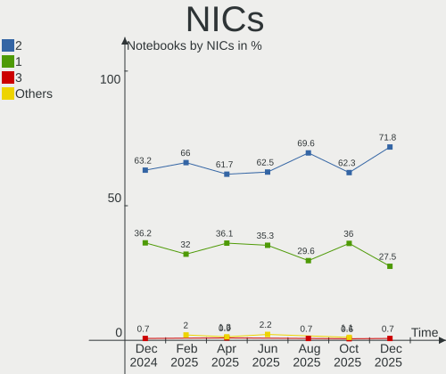

| Total | Notebooks | Percent |
|-------|-----------|---------|
| 2     | 107       | 71.81%  |
| 1     | 41        | 27.52%  |
| 3     | 1         | 0.67%   |

IPv6
----

IPv6 vs IPv4

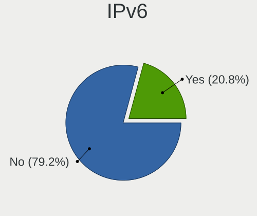

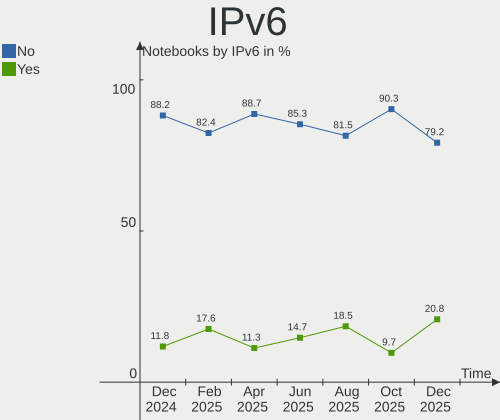

| Used | Notebooks | Percent |
|------|-----------|---------|
| No   | 118       | 79.19%  |
| Yes  | 31        | 20.81%  |

Bluetooth
---------

Bluetooth Vendor
----------------

Controller vendors

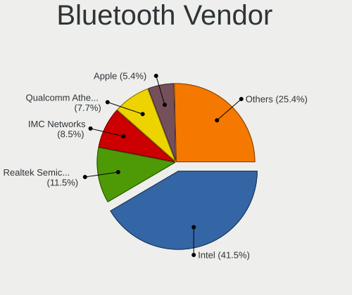

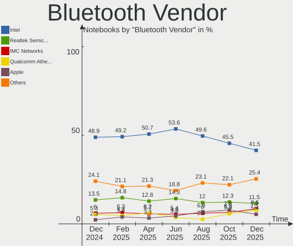

| Vendor                          | Notebooks | Percent |
|---------------------------------|-----------|---------|
| Intel                           | 54        | 41.54%  |
| Realtek Semiconductor           | 15        | 11.54%  |
| IMC Networks                    | 11        | 8.46%   |
| Qualcomm Atheros Communications | 10        | 7.69%   |
| Apple                           | 7         | 5.38%   |
| Broadcom                        | 6         | 4.62%   |
| MediaTek                        | 5         | 3.85%   |
| Lite-On Technology              | 4         | 3.08%   |
| Foxconn / Hon Hai               | 4         | 3.08%   |
| Ralink                          | 3         | 2.31%   |
| Hewlett-Packard                 | 3         | 2.31%   |
| TP-Link                         | 2         | 1.54%   |
| Realtek                         | 2         | 1.54%   |
| USI                             | 1         | 0.77%   |
| Toshiba                         | 1         | 0.77%   |
| Foxconn International           | 1         | 0.77%   |
| Actions                         | 1         | 0.77%   |

Bluetooth Model
---------------

Controller models

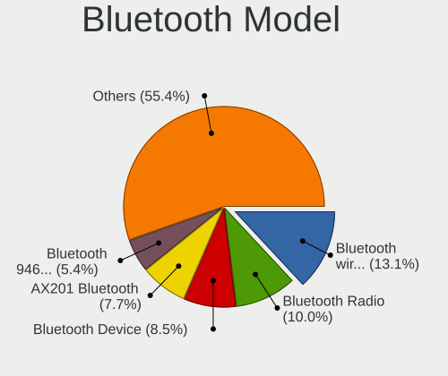

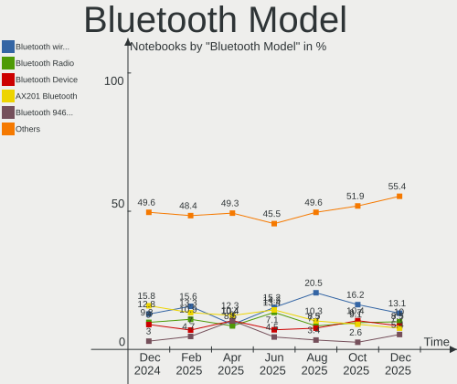

| Model                                             | Notebooks | Percent |
|---------------------------------------------------|-----------|---------|
| Intel Bluetooth wireless interface                | 17        | 13.08%  |
| Realtek Bluetooth Radio                           | 13        | 10%     |
| Intel Bluetooth Device                            | 11        | 8.46%   |
| Intel AX201 Bluetooth                             | 10        | 7.69%   |
| Intel Bluetooth 9460/9560 Jefferson Peak (JfP)    | 7         | 5.38%   |
| Qualcomm Atheros  Bluetooth Device                | 5         | 3.85%   |
| MediaTek Wireless_Device                          | 5         | 3.85%   |
| IMC Networks Wireless_Device                      | 4         | 3.08%   |
| Apple Bluetooth Host Controller                   | 4         | 3.08%   |
| Ralink RT3290 Bluetooth                           | 3         | 2.31%   |
| Intel AX200 Bluetooth                             | 3         | 2.31%   |
| IMC Networks Bluetooth Radio                      | 3         | 2.31%   |
| TP-Link TP-T@- UB500 Adapter                      | 2         | 1.54%   |
| Realtek  Bluetooth 4.2 Adapter                    | 2         | 1.54%   |
| Realtek Bluetooth Radio                           | 2         | 1.54%   |
| Qualcomm Atheros QCA61x4 Bluetooth 4.0            | 2         | 1.54%   |
| Qualcomm Atheros AR3011 Bluetooth                 | 2         | 1.54%   |
| Lite-On Bluetooth Device                          | 2         | 1.54%   |
| Intel Wireless-AC 3168 Bluetooth                  | 2         | 1.54%   |
| Intel Centrino Bluetooth Wireless Transceiver     | 2         | 1.54%   |
| IMC Networks Bluetooth Device                     | 2         | 1.54%   |
| HP Bluetooth 2.0 Interface [Broadcom BCM2045]     | 2         | 1.54%   |
| Foxconn / Hon Hai Wireless_Device                 | 2         | 1.54%   |
| Broadcom BCM20702 Bluetooth 4.0 [ThinkPad]        | 2         | 1.54%   |
| Apple Built-in Bluetooth 2.0+EDR HCI              | 2         | 1.54%   |
| USI Bluetooth Device                              | 1         | 0.77%   |
| Toshiba Atheros AR3012 Bluetooth                  | 1         | 0.77%   |
| Qualcomm Atheros AR3012 Bluetooth 4.0             | 1         | 0.77%   |
| Lite-On Qualcomm Atheros QCA9377 Bluetooth        | 1         | 0.77%   |
| Lite-On Broadcom BCM43142A0 Bluetooth Device      | 1         | 0.77%   |
| Intel Wireless-AC 9260 Bluetooth Adapter          | 1         | 0.77%   |
| Intel AX210 Bluetooth                             | 1         | 0.77%   |
| IMC Networks Bluetooth USB Host Controller        | 1         | 0.77%   |
| IMC Networks Atheros AR3012 Bluetooth             | 1         | 0.77%   |
| HP Broadcom 2070 Bluetooth Combo                  | 1         | 0.77%   |
| Foxconn International BCM43142A0 Bluetooth module | 1         | 0.77%   |
| Foxconn / Hon Hai Bluetooth Radio                 | 1         | 0.77%   |
| Foxconn / Hon Hai BCM43142A0 broadcom bluetooth   | 1         | 0.77%   |
| Broadcom HP Portable SoftSailing                  | 1         | 0.77%   |
| Broadcom HP Portable Bumble Bee                   | 1         | 0.77%   |

Sound
-----

Sound Vendor
------------

Sound card vendors

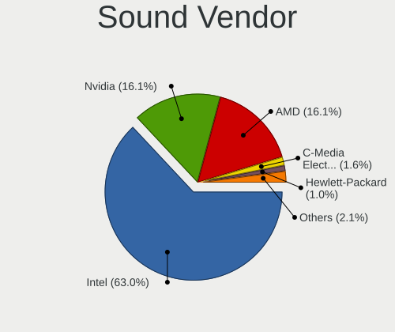

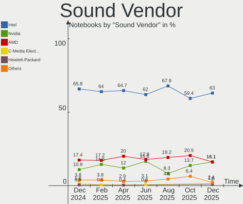

| Vendor              | Notebooks | Percent |
|---------------------|-----------|---------|
| Intel               | 121       | 63.02%  |
| Nvidia              | 31        | 16.15%  |
| AMD                 | 31        | 16.15%  |
| C-Media Electronics | 3         | 1.56%   |
| Hewlett-Packard     | 2         | 1.04%   |
| Synaptics           | 1         | 0.52%   |
| Razer USA           | 1         | 0.52%   |
| Logitech            | 1         | 0.52%   |
| Compal Electronics  | 1         | 0.52%   |

Sound Model
-----------

Sound card models

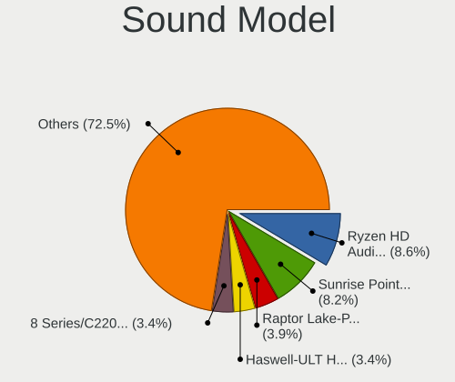

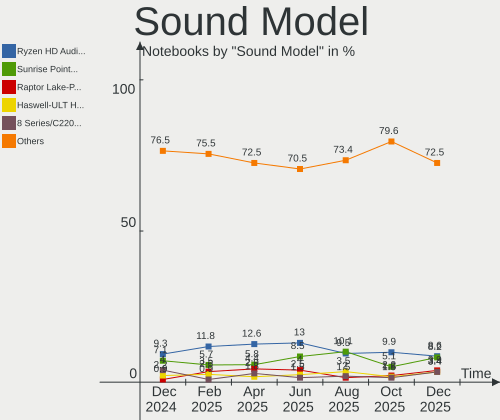

| Model                                                                      | Notebooks | Percent |
|----------------------------------------------------------------------------|-----------|---------|
| AMD Ryzen HD Audio Controller                                              | 20        | 8.58%   |
| Intel Sunrise Point-LP HD Audio                                            | 19        | 8.15%   |
| Intel Raptor Lake-P/U/H cAVS                                               | 9         | 3.86%   |
| Intel Haswell-ULT HD Audio Controller                                      | 8         | 3.43%   |
| Intel 8 Series/C220 Series Chipset High Definition Audio Controller        | 8         | 3.43%   |
| Intel 8 Series HD Audio Controller                                         | 8         | 3.43%   |
| Intel 7 Series/C216 Chipset Family High Definition Audio Controller        | 8         | 3.43%   |
| AMD Radeon High Definition Audio Controller                                | 8         | 3.43%   |
| Intel Alder Lake PCH-P High Definition Audio Controller                    | 7         | 3%      |
| Intel 6 Series/C200 Series Chipset Family High Definition Audio Controller | 7         | 3%      |
| Intel Xeon E3-1200 v3/4th Gen Core Processor HD Audio Controller           | 6         | 2.58%   |
| Intel Cannon Point-LP High Definition Audio Controller                     | 6         | 2.58%   |
| AMD Raven/Raven2/Fenghuang HDMI/DP Audio Controller                        | 6         | 2.58%   |
| Intel Tiger Lake-LP Smart Sound Technology Audio Controller                | 5         | 2.15%   |
| Intel Cannon Lake PCH cAVS                                                 | 5         | 2.15%   |
| Intel 82801I (ICH9 Family) HD Audio Controller                             | 5         | 2.15%   |
| Nvidia TU107 GeForce GTX 1650 High Definition Audio Controller             | 4         | 1.72%   |
| Intel Wildcat Point-LP High Definition Audio Controller                    | 4         | 1.72%   |
| Intel Comet Lake PCH cAVS                                                  | 4         | 1.72%   |
| Intel Broadwell-U Audio Controller                                         | 4         | 1.72%   |
| AMD Renoir/Cezanne HDMI/DP Audio Controller                                | 4         | 1.72%   |
| Nvidia TU116 High Definition Audio Controller                              | 3         | 1.29%   |
| Nvidia MCP79 High Definition Audio                                         | 3         | 1.29%   |
| Intel Atom Processor Z36xxx/Z37xxx Series High Definition Audio Controller | 3         | 1.29%   |
| Intel 82801H (ICH8 Family) HD Audio Controller                             | 3         | 1.29%   |
| Intel 5 Series/3400 Series Chipset High Definition Audio                   | 3         | 1.29%   |
| AMD RV710/730 HDMI Audio [Radeon HD 4000 series]                           | 3         | 1.29%   |
| AMD Kabini HDMI/DP Audio                                                   | 3         | 1.29%   |
| Nvidia TU106 High Definition Audio Controller                              | 2         | 0.86%   |
| Nvidia GK208 HDMI/DP Audio Controller                                      | 2         | 0.86%   |
| Nvidia GK107 HDMI Audio Controller                                         | 2         | 0.86%   |
| Nvidia GK104 HDMI Audio Controller                                         | 2         | 0.86%   |
| Nvidia GF119 HDMI Audio Controller                                         | 2         | 0.86%   |
| Nvidia GA106 High Definition Audio Controller                              | 2         | 0.86%   |
| Intel Meteor Lake-P HD Audio Controller                                    | 2         | 0.86%   |
| Intel Lunar Lake-M HD Audio Controller                                     | 2         | 0.86%   |
| Intel CM238 HD Audio Controller                                            | 2         | 0.86%   |
| Intel Celeron N3350/Pentium N4200/Atom E3900 Series Audio Cluster          | 2         | 0.86%   |
| AMD FCH Azalia Controller                                                  | 2         | 0.86%   |
| AMD Family 15h (Models 60h-6fh) Audio Controller                           | 2         | 0.86%   |

Memory
------

Memory Vendor
-------------

Memory module vendors

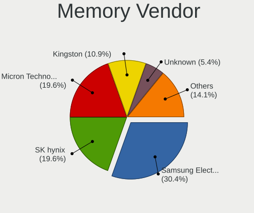

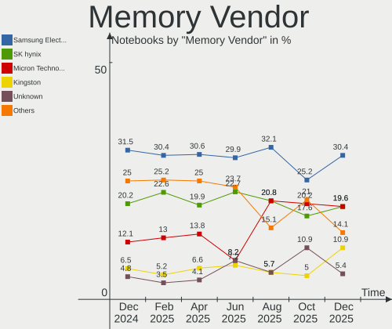

| Vendor              | Notebooks | Percent |
|---------------------|-----------|---------|
| Samsung Electronics | 28        | 30.43%  |
| SK hynix            | 18        | 19.57%  |
| Micron Technology   | 18        | 19.57%  |
| Kingston            | 10        | 10.87%  |
| Unknown             | 5         | 5.43%   |
| Crucial             | 3         | 3.26%   |
| Unknown (ABCD)      | 2         | 2.17%   |
| Transcend           | 2         | 2.17%   |
| Team                | 1         | 1.09%   |
| Ramaxel Technology  | 1         | 1.09%   |
| Nanya Technology    | 1         | 1.09%   |
| Apacer              | 1         | 1.09%   |
| A-DATA Technology   | 1         | 1.09%   |
| Unknown             | 1         | 1.09%   |

Memory Model
------------

Memory module models

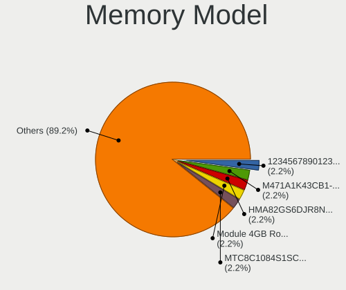

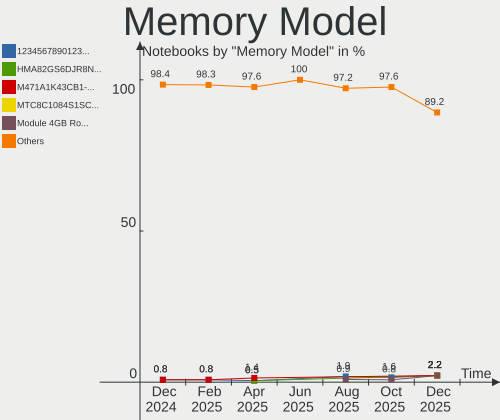

| Model                                                            | Notebooks | Percent |
|------------------------------------------------------------------|-----------|---------|
| Unknown (ABCD) RAM 123456789012345678 2GB SODIMM LPDDR4 2400MT/s | 2         | 2.15%   |
| SK hynix RAM HMA82GS6DJR8N-VK 16GB SODIMM DDR4 2667MT/s          | 2         | 2.15%   |
| Samsung RAM M471A1K43CB1-CTD 8GB SODIMM DDR4 3200MT/s            | 2         | 2.15%   |
| Micron RAM MTC8C1084S1SC56BD1 B 16GB SODIMM DDR5 5600MT/s        | 2         | 2.15%   |
| Micron RAM Module 4GB Row Of Chips LPDDR5 8533MT/s               | 2         | 2.15%   |
| Micron RAM 8ATF1G64HZ-3G2R1 8GB SODIMM DDR4 3200MT/s             | 2         | 2.15%   |
| Unknown RAM Module 512MB SODIMM DDR                              | 1         | 1.08%   |
| Unknown RAM Module 4GB SODIMM DDR4 2400MT/s                      | 1         | 1.08%   |
| Unknown RAM Module 4GB SODIMM DDR3 1600MT/s                      | 1         | 1.08%   |
| Unknown RAM Module 2GB SODIMM 800MT/s                            | 1         | 1.08%   |
| Unknown RAM Module 2GB SODIMM 667MT/s                            | 1         | 1.08%   |
| Transcend RAM Module 16GB SODIMM DDR5 4800MT/s                   | 1         | 1.08%   |
| Transcend RAM JM1333KSN-4G 4GB SODIMM DDR3 1334MT/s              | 1         | 1.08%   |
| Team RAM TEAMGROUP-SD4-2666 8GB SODIMM DDR4 2667MT/s             | 1         | 1.08%   |
| SK hynix RAM Module 32GB SODIMM DDR5 5600MT/s                    | 1         | 1.08%   |
| SK hynix RAM Module 2GB SODIMM DDR3 1600MT/s                     | 1         | 1.08%   |
| SK hynix RAM HMT425S2AFR6R-PB 2GB SODIMM DDR3 1333MT/s           | 1         | 1.08%   |
| SK hynix RAM HMT41GS6BFR8C-PB 8GB SODIMM DDR3 1600MT/s           | 1         | 1.08%   |
| SK hynix RAM HMT41GS6AFR8A-PB 8GiB SODIMM DDR3 2667MT/s          | 1         | 1.08%   |
| SK hynix RAM HMT325S6BFR8C-H9 2GB SODIMM DDR3 1333MT/s           | 1         | 1.08%   |
| SK hynix RAM HMCG66AGBSA095N 8GiB SODIMM DDR5 5600MT/s           | 1         | 1.08%   |
| SK hynix RAM HMCG66AGBSA092N 8GB SODIMM DDR5 5600MT/s            | 1         | 1.08%   |
| SK hynix RAM HMA851S6CJR6N-VK 4GB SODIMM DDR4 2667MT/s           | 1         | 1.08%   |
| SK hynix RAM HMA851S6CJR6N-VK 4GB Row Of Chips DDR4 2667MT/s     | 1         | 1.08%   |
| SK hynix RAM HMA81GS6JJR8N-VK 8GB SODIMM DDR4 2667MT/s           | 1         | 1.08%   |
| SK hynix RAM HMA81GS6DJR8N-XN 8GB SODIMM DDR4 3200MT/s           | 1         | 1.08%   |
| SK hynix RAM HMA451S6AFR8N-TF 4GB SODIMM DDR4 2133MT/s           | 1         | 1.08%   |
| SK hynix RAM HMA41GS6AFR8N-TF 8GB SODIMM DDR4 2667MT/s           | 1         | 1.08%   |
| SK hynix RAM HMA41GS6AFR8N-TF 8GB SODIMM DDR4 2133MT/s           | 1         | 1.08%   |
| SK hynix RAM H9CCNNNCLTMLAR-NUD 8GB Row Of Chips LPDDR3 1867MT/s | 1         | 1.08%   |
| Samsung RAM Module 8GB SODIMM DDR4 3200MT/s                      | 1         | 1.08%   |
| Samsung RAM Module 32GB SODIMM DDR5 5600MT/s                     | 1         | 1.08%   |
| Samsung RAM Module 2GB SODIMM DDR3 1600MT/s                      | 1         | 1.08%   |
| Samsung RAM Module 2GB SODIMM DDR3 1067MT/s                      | 1         | 1.08%   |
| Samsung RAM Module 16GB SODIMM DDR4 2667MT/s                     | 1         | 1.08%   |
| Samsung RAM M471B5674-M0-YK0 4GB Chip DDR3 1600MT/s              | 1         | 1.08%   |
| Samsung RAM M471B5673EH1-CF8 2GB SODIMM 4199MT/s                 | 1         | 1.08%   |
| Samsung RAM M471B5173DB0-YK0 4GB SODIMM DDR3 1600MT/s            | 1         | 1.08%   |
| Samsung RAM M471B1G73BH0-CK0 8GB SODIMM DDR3 1600MT/s            | 1         | 1.08%   |
| Samsung RAM M471A5244CB0-CWE 4GB SODIMM DDR4 3200MT/s            | 1         | 1.08%   |

Memory Kind
-----------

Memory module kinds

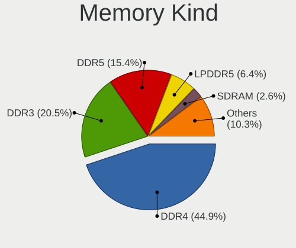

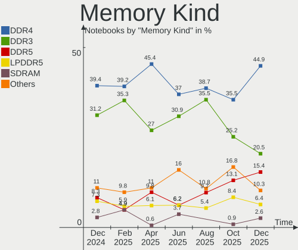

| Kind    | Notebooks | Percent |
|---------|-----------|---------|
| DDR4    | 35        | 44.87%  |
| DDR3    | 16        | 20.51%  |
| DDR5    | 12        | 15.38%  |
| LPDDR5  | 5         | 6.41%   |
| SDRAM   | 2         | 2.56%   |
| LPDDR4  | 2         | 2.56%   |
| DDR2    | 2         | 2.56%   |
| Unknown | 2         | 2.56%   |
| LPDDR3  | 1         | 1.28%   |
| DDR     | 1         | 1.28%   |

Memory Form Factor
------------------

Physical design of the memory module

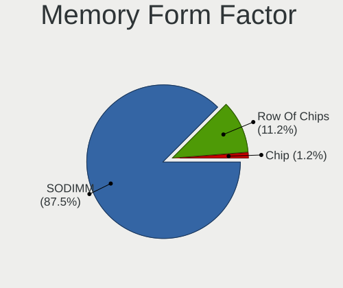

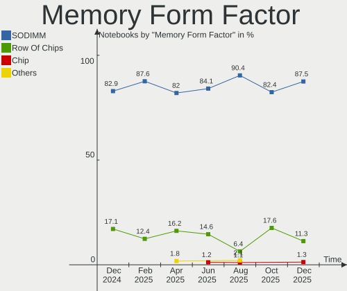

| Name         | Notebooks | Percent |
|--------------|-----------|---------|
| SODIMM       | 70        | 87.5%   |
| Row Of Chips | 9         | 11.25%  |
| Chip         | 1         | 1.25%   |

Memory Size
-----------

Memory module size

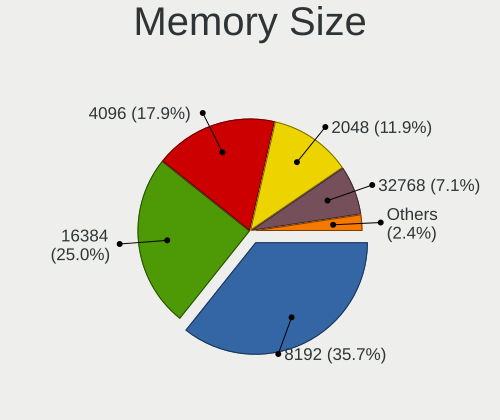

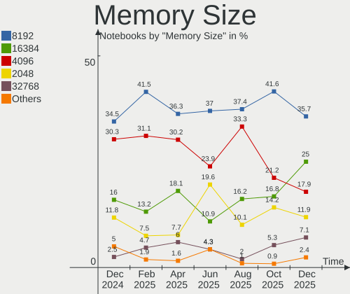

| Size  | Notebooks | Percent |
|-------|-----------|---------|
| 8192  | 30        | 35.71%  |
| 16384 | 21        | 25%     |
| 4096  | 15        | 17.86%  |
| 2048  | 10        | 11.9%   |
| 32768 | 6         | 7.14%   |
| 1024  | 1         | 1.19%   |
| 512   | 1         | 1.19%   |

Memory Speed
------------

Memory module speed

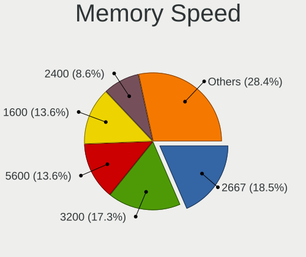

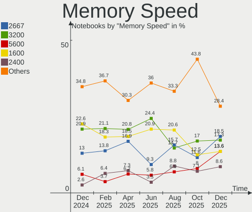

| Speed   | Notebooks | Percent |
|---------|-----------|---------|
| 2667    | 15        | 18.52%  |
| 3200    | 14        | 17.28%  |
| 5600    | 11        | 13.58%  |
| 1600    | 11        | 13.58%  |
| 2400    | 7         | 8.64%   |
| 667     | 3         | 3.7%    |
| 8533    | 2         | 2.47%   |
| 6400    | 2         | 2.47%   |
| 4199    | 2         | 2.47%   |
| 2133    | 2         | 2.47%   |
| 1334    | 2         | 2.47%   |
| 1333    | 2         | 2.47%   |
| 8400    | 1         | 1.23%   |
| 7400    | 1         | 1.23%   |
| 4800    | 1         | 1.23%   |
| 3266    | 1         | 1.23%   |
| 1867    | 1         | 1.23%   |
| 1067    | 1         | 1.23%   |
| 800     | 1         | 1.23%   |
| Unknown | 1         | 1.23%   |

Printers & scanners
-------------------

Printer Vendor
--------------

Printer device vendors

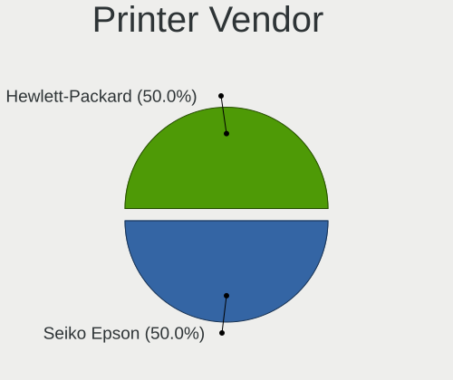

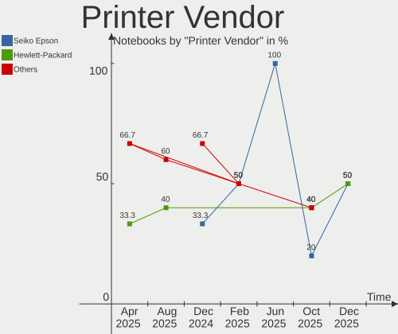

| Vendor          | Notebooks | Percent |
|-----------------|-----------|---------|
| Seiko Epson     | 2         | 50%     |
| Hewlett-Packard | 2         | 50%     |

Printer Model
-------------

Printer device models

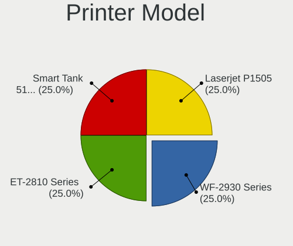

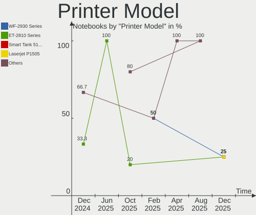

| Model                      | Notebooks | Percent |
|----------------------------|-----------|---------|
| Seiko Epson WF-2930 Series | 1         | 25%     |
| Seiko Epson ET-2810 Series | 1         | 25%     |
| HP Smart Tank 5100 series  | 1         | 25%     |
| HP Laserjet P1505          | 1         | 25%     |

Scanner Vendor
--------------

Scanner device vendors

Zero info for selected period =(

Scanner Model
-------------

Scanner device models

Zero info for selected period =(

Camera
------

Camera Vendor
-------------

Camera device vendors

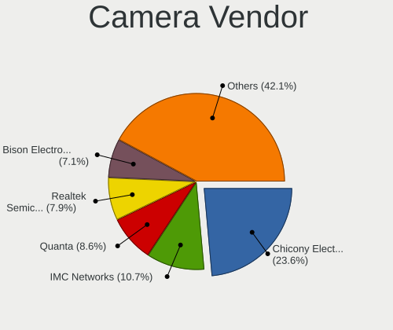

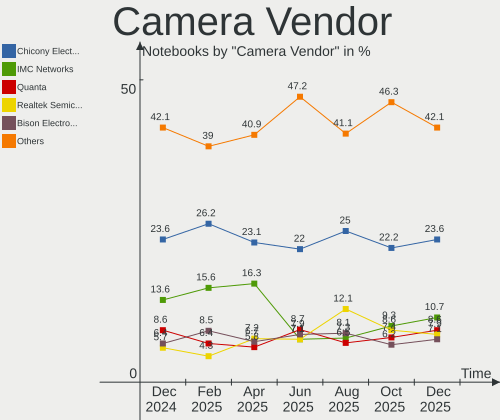

| Vendor                                 | Notebooks | Percent |
|----------------------------------------|-----------|---------|
| Chicony Electronics                    | 33        | 23.57%  |
| IMC Networks                           | 15        | 10.71%  |
| Quanta                                 | 12        | 8.57%   |
| Realtek Semiconductor                  | 11        | 7.86%   |
| Bison Electronics                      | 10        | 7.14%   |
| Cheng Uei Precision Industry (Foxlink) | 9         | 6.43%   |
| Sunplus Innovation Technology          | 8         | 5.71%   |
| Microdia                               | 8         | 5.71%   |
| Suyin                                  | 4         | 2.86%   |
| Luxvisions Innotech Limited            | 4         | 2.86%   |
| Apple                                  | 4         | 2.86%   |
| Syntek                                 | 3         | 2.14%   |
| Sonix Technology                       | 3         | 2.14%   |
| Lite-On Technology                     | 3         | 2.14%   |
| Silicon Motion                         | 2         | 1.43%   |
| OYT Tech                               | 2         | 1.43%   |
| vivo                                   | 1         | 0.71%   |
| USB CAMERA                             | 1         | 0.71%   |
| SunplusIT                              | 1         | 0.71%   |
| ShineTech                              | 1         | 0.71%   |
| kingcome                               | 1         | 0.71%   |
| Hopewin Electronic Material            | 1         | 0.71%   |
| Genesys Logic                          | 1         | 0.71%   |
| DigiTech                               | 1         | 0.71%   |
| Alcor Micro                            | 1         | 0.71%   |

Camera Model
------------

Camera device models

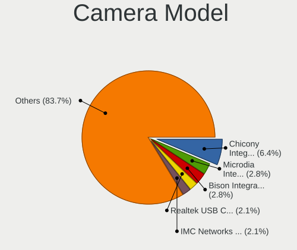

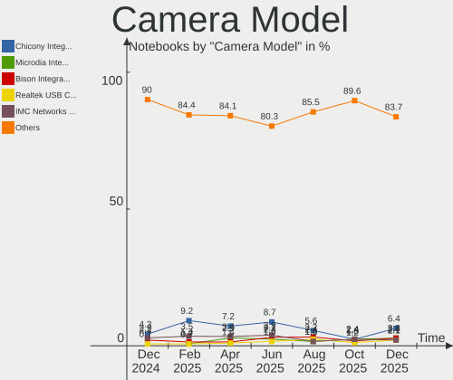

| Model                                                   | Notebooks | Percent |
|---------------------------------------------------------|-----------|---------|
| Chicony Integrated Camera                               | 9         | 6.38%   |
| Microdia Integrated_Webcam_HD                           | 4         | 2.84%   |
| Bison Integrated Camera                                 | 4         | 2.84%   |
| Realtek USB Camera                                      | 3         | 2.13%   |
| IMC Networks Integrated Camera                          | 3         | 2.13%   |
| Chicony ACER HD User Facing                             | 3         | 2.13%   |
| Cheng Uei Precision Industry (Foxlink) HP TrueVision HD | 3         | 2.13%   |
| Sunplus Integrated_Webcam_HD                            | 2         | 1.42%   |
| Sunplus Full HD webcam                                  | 2         | 1.42%   |
| Sonix USB2.0 HD UVC WebCam                              | 2         | 1.42%   |
| Realtek Integrated_Webcam_HD                            | 2         | 1.42%   |
| Quanta HP Wide Vision HD Camera                         | 2         | 1.42%   |
| Quanta HP TrueVision HD Camera                          | 2         | 1.42%   |
| Quanta ACER HD User Facing                              | 2         | 1.42%   |
| OYT Tech OYV1RDFF1                                      | 2         | 1.42%   |
| Lite-On Integrated Camera                               | 2         | 1.42%   |
| IMC Networks VGA UVC WebCam                             | 2         | 1.42%   |
| IMC Networks USB2.0 HD UVC WebCam                       | 2         | 1.42%   |
| IMC Networks ov9734_azurewave_camera                    | 2         | 1.42%   |
| Chicony USB2.0 HD UVC WebCam                            | 2         | 1.42%   |
| Chicony Integrated Camera (1280x720@30)                 | 2         | 1.42%   |
| Chicony HP Wide Vision HD Camera                        | 2         | 1.42%   |
| Chicony FJ Camera                                       | 2         | 1.42%   |
| Apple Built-in iSight                                   | 2         | 1.42%   |
| vivo V2514                                              | 1         | 0.71%   |
| USB CAMERA USB CAMERA                                   | 1         | 0.71%   |
| Syntek Lenovo EasyCamera                                | 1         | 0.71%   |
| Syntek Integrated Camera                                | 1         | 0.71%   |
| Syntek EasyCamera                                       | 1         | 0.71%   |
| Suyin HP Webcam                                         | 1         | 0.71%   |
| Suyin HP Truevision HD                                  | 1         | 0.71%   |
| Suyin HP Integrated Webcam                              | 1         | 0.71%   |
| Suyin Acer/HP Integrated Webcam [CN0314]                | 1         | 0.71%   |
| SunplusIT FHD Webcam                                    | 1         | 0.71%   |
| Sunplus MTD camera                                      | 1         | 0.71%   |
| Sunplus Integrated Webcam                               | 1         | 0.71%   |
| Sunplus HP TrueVision HD Camera                         | 1         | 0.71%   |
| Sunplus HP HD Webcam [Fixed]                            | 1         | 0.71%   |
| Sonix USB2.0 FHD UVC WebCam                             | 1         | 0.71%   |
| Silicon Motion WebCam SC-50AFL11C54N                    | 1         | 0.71%   |

Security
--------

Fingerprint Vendor
------------------

Fingerprint sensor vendors

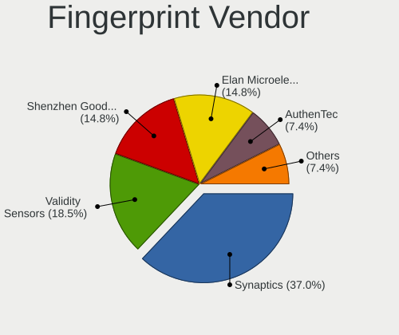

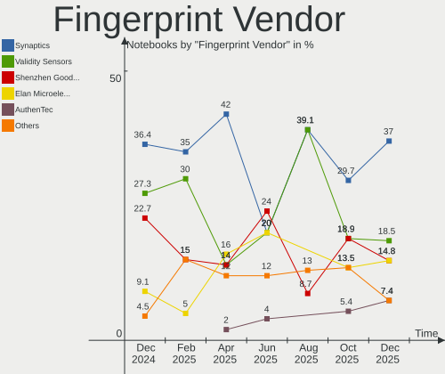

| Vendor                     | Notebooks | Percent |
|----------------------------|-----------|---------|
| Synaptics                  | 10        | 37.04%  |
| Validity Sensors           | 5         | 18.52%  |
| Shenzhen Goodix Technology | 4         | 14.81%  |
| Elan Microelectronics      | 4         | 14.81%  |
| AuthenTec                  | 2         | 7.41%   |
| Upek                       | 1         | 3.7%    |
| HOLTEK                     | 1         | 3.7%    |

Fingerprint Model
-----------------

Fingerprint sensor models

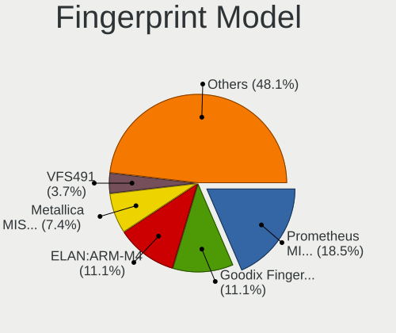

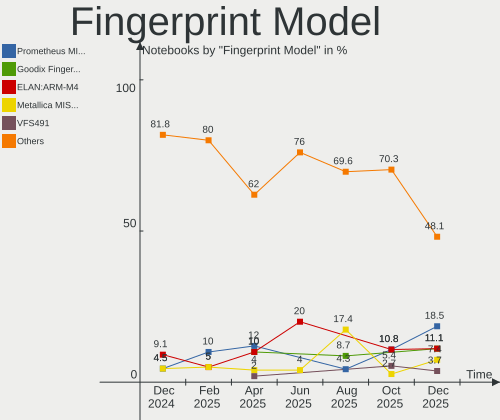

| Model                                                    | Notebooks | Percent |
|----------------------------------------------------------|-----------|---------|
| Synaptics Prometheus MIS Touch Fingerprint Reader        | 5         | 18.52%  |
| Shenzhen Goodix  FingerPrint Device                      | 3         | 11.11%  |
| Elan ELAN:ARM-M4                                         | 3         | 11.11%  |
| Synaptics Metallica MIS Touch Fingerprint Reader         | 2         | 7.41%   |
| Validity Sensors VFS491                                  | 1         | 3.7%    |
| Validity Sensors VFS 5011 fingerprint sensor             | 1         | 3.7%    |
| Validity Sensors Synaptics WBDI                          | 1         | 3.7%    |
| Validity Sensors Swipe Fingerprint Sensor                | 1         | 3.7%    |
| Validity Sensors Fingerprint scanner                     | 1         | 3.7%    |
| Upek Biometric Touchchip/Touchstrip Fingerprint Sensor   | 1         | 3.7%    |
| Synaptics UWP WBDI Device                                | 1         | 3.7%    |
| Synaptics FS7604 Touch Fingerprint Sensor with PurePrint | 1         | 3.7%    |
| Synaptics Fingerprint reader [HP G6]                     | 1         | 3.7%    |
| Shenzhen Goodix Fingerprint Reader                       | 1         | 3.7%    |
| HOLTEK FocalTech Fingerprint Device                      | 1         | 3.7%    |
| Elan ELAN:Fingerprint                                    | 1         | 3.7%    |
| AuthenTec AES2501 Fingerprint Sensor                     | 1         | 3.7%    |
| AuthenTec AES1600                                        | 1         | 3.7%    |

Chipcard Vendor
---------------

Chipcard module vendors

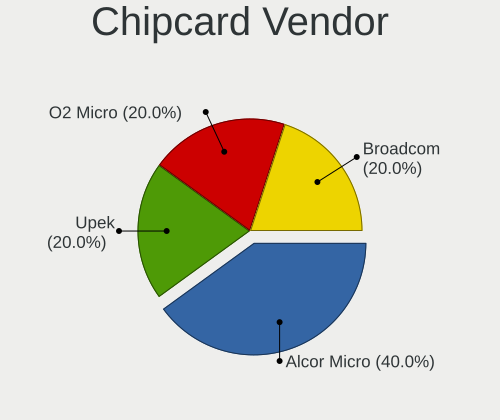

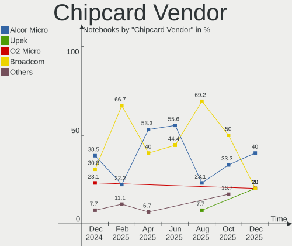

| Vendor      | Notebooks | Percent |
|-------------|-----------|---------|
| Alcor Micro | 4         | 40%     |
| Upek        | 2         | 20%     |
| O2 Micro    | 2         | 20%     |
| Broadcom    | 2         | 20%     |

Chipcard Model
--------------

Chipcard module models

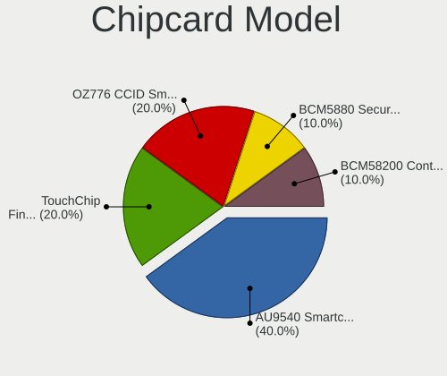

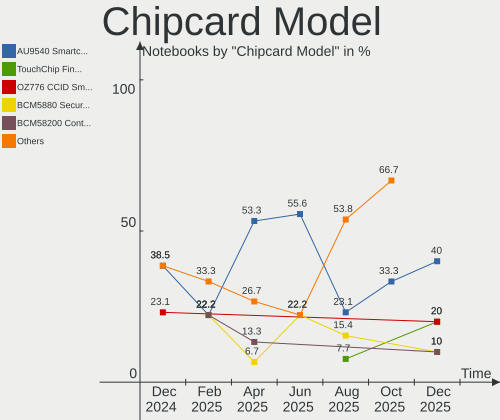

| Model                                                                       | Notebooks | Percent |
|-----------------------------------------------------------------------------|-----------|---------|
| Alcor Micro AU9540 Smartcard Reader                                         | 4         | 40%     |
| Upek TouchChip Fingerprint Coprocessor (WBF advanced mode)                  | 2         | 20%     |
| O2 Micro OZ776 CCID Smartcard Reader                                        | 2         | 20%     |
| Broadcom BCM5880 Secure Applications Processor                              | 1         | 10%     |
| Broadcom BCM58200 ControlVault 3 (FingerPrint sensor + Contacted SmartCard) | 1         | 10%     |

Unsupported
-----------

Unsupported Devices
-------------------

Total unsupported devices on board

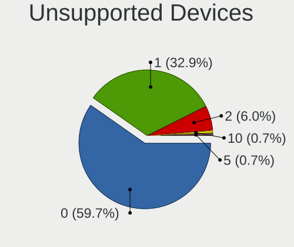

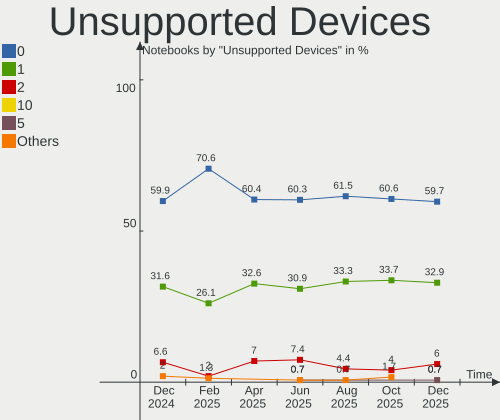

| Total | Notebooks | Percent |
|-------|-----------|---------|
| 0     | 89        | 59.73%  |
| 1     | 49        | 32.89%  |
| 2     | 9         | 6.04%   |
| 10    | 1         | 0.67%   |
| 5     | 1         | 0.67%   |

Unsupported Device Types
------------------------

Types of unsupported devices

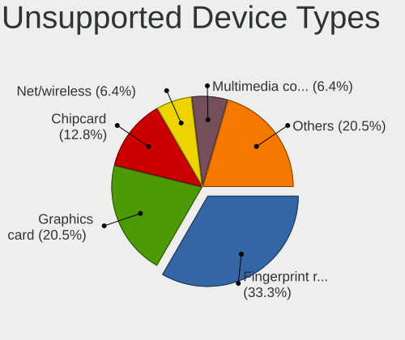

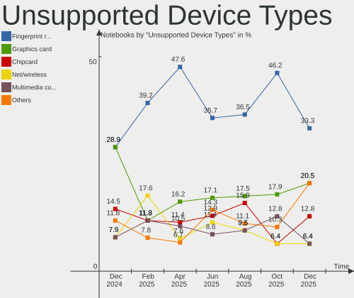

| Type                     | Notebooks | Percent |
|--------------------------|-----------|---------|
| Fingerprint reader       | 26        | 33.33%  |
| Graphics card            | 16        | 20.51%  |
| Chipcard                 | 10        | 12.82%  |
| Net/wireless             | 5         | 6.41%   |
| Multimedia controller    | 5         | 6.41%   |
| Bluetooth                | 5         | 6.41%   |
| Communication controller | 3         | 3.85%   |
| Storage                  | 2         | 2.56%   |
| Sound                    | 2         | 2.56%   |
| Unassigned class         | 1         | 1.28%   |
| Net/ethernet             | 1         | 1.28%   |
| Dvb card                 | 1         | 1.28%   |
| Camera                   | 1         | 1.28%   |

