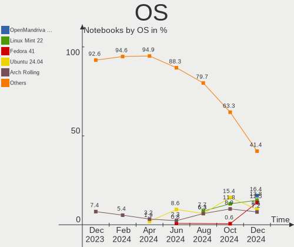
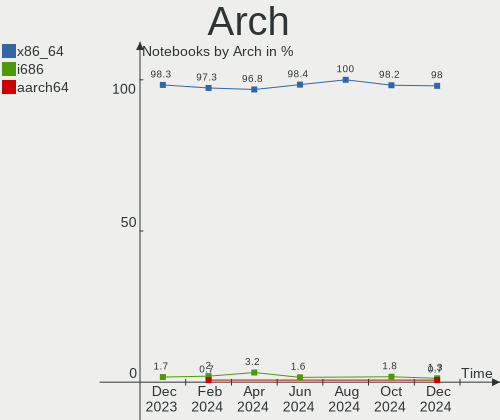
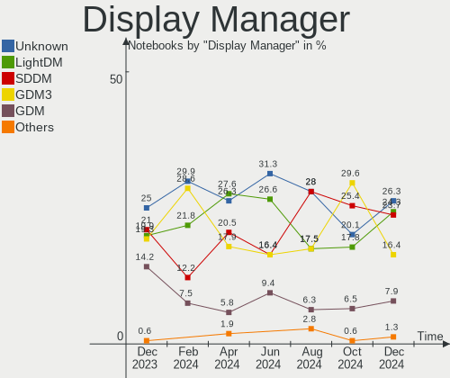
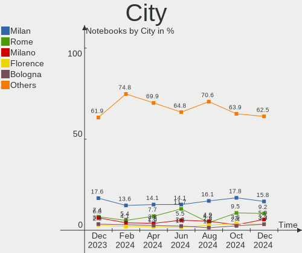
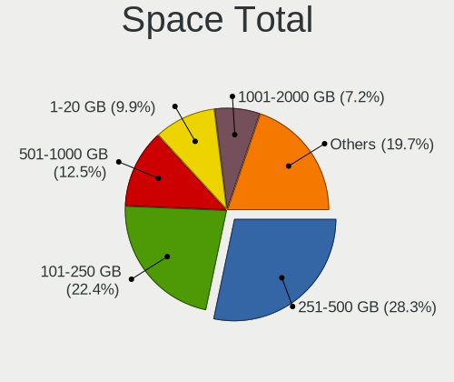
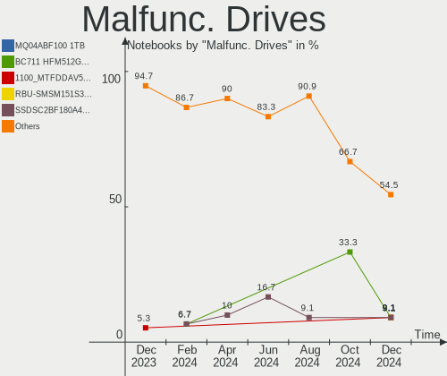
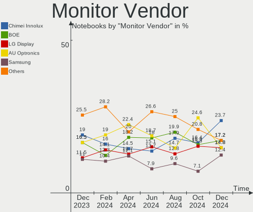

Linux in Italy - Hardware Trends (Notebooks)
--------------------------------------------

A project to identify most popular hardware characteristics and track their change
over time based on data collected by Linux users at https://Linux-Hardware.org.

Anyone can contribute to this report by the [hw-probe](https://github.com/linuxhw/hw-probe) tool:

    sudo -E hw-probe -all -upload

Period: Feb, 2023.

Contents
--------

* [ System ](#system)
  - [ OS                       ](#os)
  - [ OS Family                ](#os-family)
  - [ Kernel                   ](#kernel)
  - [ Kernel Family            ](#kernel-family)
  - [ Kernel Major Ver.        ](#kernel-major-ver)
  - [ Arch                     ](#arch)
  - [ DE                       ](#de)
  - [ Display Server           ](#display-server)
  - [ Display Manager          ](#display-manager)
  - [ OS Lang                  ](#os-lang)
  - [ Boot Mode                ](#boot-mode)
  - [ Filesystem               ](#filesystem)
  - [ Part. scheme             ](#part-scheme)
  - [ Dual Boot with Linux/BSD ](#dual-boot-with-linuxbsd)
  - [ Dual Boot (Win)          ](#dual-boot-win)

* [ Board ](#board)
  - [ Vendor                   ](#vendor)
  - [ Model                    ](#model)
  - [ Model Family             ](#model-family)
  - [ MFG Year                 ](#mfg-year)
  - [ Form Factor              ](#form-factor)
  - [ Secure Boot              ](#secure-boot)
  - [ Coreboot                 ](#coreboot)
  - [ RAM Size                 ](#ram-size)
  - [ RAM Used                 ](#ram-used)
  - [ Total Drives             ](#total-drives)
  - [ Has CD-ROM               ](#has-cd-rom)
  - [ Has Ethernet             ](#has-ethernet)
  - [ Has WiFi                 ](#has-wifi)
  - [ Has Bluetooth            ](#has-bluetooth)

* [ Location ](#location)
  - [ Country                  ](#country)
  - [ City                     ](#city)

* [ Drives ](#drives)
  - [ Drive Vendor             ](#drive-vendor)
  - [ Drive Model              ](#drive-model)
  - [ HDD Vendor               ](#hdd-vendor)
  - [ SSD Vendor               ](#ssd-vendor)
  - [ Drive Kind               ](#drive-kind)
  - [ Drive Connector          ](#drive-connector)
  - [ Drive Size               ](#drive-size)
  - [ Space Total              ](#space-total)
  - [ Space Used               ](#space-used)
  - [ Malfunc. Drives          ](#malfunc-drives)
  - [ Malfunc. Drive Vendor    ](#malfunc-drive-vendor)
  - [ Malfunc. HDD Vendor      ](#malfunc-hdd-vendor)
  - [ Malfunc. Drive Kind      ](#malfunc-drive-kind)
  - [ Failed Drives            ](#failed-drives)
  - [ Failed Drive Vendor      ](#failed-drive-vendor)
  - [ Drive Status             ](#drive-status)

* [ Storage controller ](#storage-controller)
  - [ Storage Vendor           ](#storage-vendor)
  - [ Storage Model            ](#storage-model)
  - [ Storage Kind             ](#storage-kind)

* [ Processor ](#processor)
  - [ CPU Vendor               ](#cpu-vendor)
  - [ CPU Model                ](#cpu-model)
  - [ CPU Model Family         ](#cpu-model-family)
  - [ CPU Cores                ](#cpu-cores)
  - [ CPU Sockets              ](#cpu-sockets)
  - [ CPU Threads              ](#cpu-threads)
  - [ CPU Op-Modes             ](#cpu-op-modes)
  - [ CPU Microcode            ](#cpu-microcode)
  - [ CPU Microarch            ](#cpu-microarch)

* [ Graphics ](#graphics)
  - [ GPU Vendor               ](#gpu-vendor)
  - [ GPU Model                ](#gpu-model)
  - [ GPU Combo                ](#gpu-combo)
  - [ GPU Driver               ](#gpu-driver)
  - [ GPU Memory               ](#gpu-memory)

* [ Monitor ](#monitor)
  - [ Monitor Vendor           ](#monitor-vendor)
  - [ Monitor Model            ](#monitor-model)
  - [ Monitor Resolution       ](#monitor-resolution)
  - [ Monitor Diagonal         ](#monitor-diagonal)
  - [ Monitor Width            ](#monitor-width)
  - [ Aspect Ratio             ](#aspect-ratio)
  - [ Monitor Area             ](#monitor-area)
  - [ Pixel Density            ](#pixel-density)
  - [ Multiple Monitors        ](#multiple-monitors)

* [ Network ](#network)
  - [ Net Controller Vendor    ](#net-controller-vendor)
  - [ Net Controller Model     ](#net-controller-model)
  - [ Wireless Vendor          ](#wireless-vendor)
  - [ Wireless Model           ](#wireless-model)
  - [ Ethernet Vendor          ](#ethernet-vendor)
  - [ Ethernet Model           ](#ethernet-model)
  - [ Net Controller Kind      ](#net-controller-kind)
  - [ Used Controller          ](#used-controller)
  - [ NICs                     ](#nics)
  - [ IPv6                     ](#ipv6)

* [ Bluetooth ](#bluetooth)
  - [ Bluetooth Vendor         ](#bluetooth-vendor)
  - [ Bluetooth Model          ](#bluetooth-model)

* [ Sound ](#sound)
  - [ Sound Vendor             ](#sound-vendor)
  - [ Sound Model              ](#sound-model)

* [ Memory ](#memory)
  - [ Memory Vendor            ](#memory-vendor)
  - [ Memory Model             ](#memory-model)
  - [ Memory Kind              ](#memory-kind)
  - [ Memory Form Factor       ](#memory-form-factor)
  - [ Memory Size              ](#memory-size)
  - [ Memory Speed             ](#memory-speed)

* [ Printers & scanners ](#printers--scanners)
  - [ Printer Vendor           ](#printer-vendor)
  - [ Printer Model            ](#printer-model)
  - [ Scanner Vendor           ](#scanner-vendor)
  - [ Scanner Model            ](#scanner-model)

* [ Camera ](#camera)
  - [ Camera Vendor            ](#camera-vendor)
  - [ Camera Model             ](#camera-model)

* [ Security ](#security)
  - [ Fingerprint Vendor       ](#fingerprint-vendor)
  - [ Fingerprint Model        ](#fingerprint-model)
  - [ Chipcard Vendor          ](#chipcard-vendor)
  - [ Chipcard Model           ](#chipcard-model)

* [ Unsupported ](#unsupported)
  - [ Unsupported Devices      ](#unsupported-devices)
  - [ Unsupported Device Types ](#unsupported-device-types)

System
------

OS
--

Installed operating systems

| Name                        | Notebooks | Percent |
|-----------------------------|-----------|---------|
| Linux Mint 21.1             | 23        | 14.65%  |
| Ubuntu 22.04                | 21        | 13.38%  |
| Ubuntu 22.10                | 12        | 7.64%   |
| OpenMandriva 23.01          | 9         | 5.73%   |
| Fedora 37                   | 9         | 5.73%   |
| Debian 11                   | 9         | 5.73%   |
| Pop!_OS 22.04               | 7         | 4.46%   |
| Arch Rolling                | 7         | 4.46%   |
| EndeavourOS Rolling         | 6         | 3.82%   |
| OpenMandriva 4.3            | 5         | 3.18%   |
| Zorin 16                    | 4         | 2.55%   |
| Kubuntu 22.10               | 4         | 2.55%   |
| Ubuntu 20.04                | 3         | 1.91%   |
| Linux Mint 20.3             | 3         | 1.91%   |
| Kubuntu 22.04               | 3         | 1.91%   |
| Xubuntu 22.04               | 2         | 1.27%   |
| Nobara 37                   | 2         | 1.27%   |
| Manjaro                     | 2         | 1.27%   |
| Lubuntu 22.10               | 2         | 1.27%   |
| KDE neon 22.04              | 2         | 1.27%   |
| BunsenLabs 11               | 2         | 1.27%   |
| Ubuntu MATE 22.04           | 1         | 0.64%   |
| Ubuntu Budgie 22.04         | 1         | 0.64%   |
| Ubuntu 16.04                | 1         | 0.64%   |
| SteamOS 3.4.4               | 1         | 0.64%   |
| ROSA 12.3                   | 1         | 0.64%   |
| Q4OS 4                      | 1         | 0.64%   |
| org.kde.Platform 5.15-21.08 | 1         | 0.64%   |
| openSUSE Microos-XXXXXXXX   | 1         | 0.64%   |
| MX 21                       | 1         | 0.64%   |
| Manjaro 22.0.3              | 1         | 0.64%   |
| Manjaro 22.0.2              | 1         | 0.64%   |
| Lubuntu 22.04               | 1         | 0.64%   |
| Linux Mint 21               | 1         | 0.64%   |
| Linux Mint 20.2             | 1         | 0.64%   |
| Gentoo 2.9                  | 1         | 0.64%   |
| Fedora 36                   | 1         | 0.64%   |
| Endless 5.0.0               | 1         | 0.64%   |
| Elementary 7                | 1         | 0.64%   |
| Clear Linux 38280           | 1         | 0.64%   |

OS Family
---------

OS without a version

| Name             | Notebooks | Percent |
|------------------|-----------|---------|
| Ubuntu           | 37        | 23.57%  |
| Linux Mint       | 28        | 17.83%  |
| OpenMandriva     | 14        | 8.92%   |
| Fedora           | 10        | 6.37%   |
| Debian           | 9         | 5.73%   |
| Pop!_OS          | 7         | 4.46%   |
| Kubuntu          | 7         | 4.46%   |
| Arch             | 7         | 4.46%   |
| EndeavourOS      | 6         | 3.82%   |
| Zorin            | 4         | 2.55%   |
| Manjaro          | 4         | 2.55%   |
| Lubuntu          | 3         | 1.91%   |
| Xubuntu          | 2         | 1.27%   |
| Nobara           | 2         | 1.27%   |
| KDE neon         | 2         | 1.27%   |
| BunsenLabs       | 2         | 1.27%   |
| Ubuntu MATE      | 1         | 0.64%   |
| Ubuntu Budgie    | 1         | 0.64%   |
| SteamOS          | 1         | 0.64%   |
| ROSA             | 1         | 0.64%   |
| Q4OS             | 1         | 0.64%   |
| org.kde.Platform | 1         | 0.64%   |
| openSUSE         | 1         | 0.64%   |
| MX               | 1         | 0.64%   |
| Gentoo           | 1         | 0.64%   |
| Endless          | 1         | 0.64%   |
| Elementary       | 1         | 0.64%   |
| Clear Linux      | 1         | 0.64%   |
| ChimeraOS        | 1         | 0.64%   |

Kernel
------

Version of the Linux kernel

| Version                     | Notebooks | Percent |
|-----------------------------|-----------|---------|
| 5.15.0-60-generic           | 22        | 14.01%  |
| 5.19.0-32-generic           | 17        | 10.83%  |
| 5.15.0-58-generic           | 15        | 9.55%   |
| 5.19.0-31-generic           | 10        | 6.37%   |
| 5.10.0-21-amd64             | 9         | 5.73%   |
| 6.1.1-desktop-1omv2290      | 6         | 3.82%   |
| 5.15.0-56-generic           | 6         | 3.82%   |
| 6.0.12-76060006-generic     | 5         | 3.18%   |
| 5.19.0-21-generic           | 5         | 3.18%   |
| 6.1.8-200.fc37.x86_64       | 4         | 2.55%   |
| 5.16.13-desktop-1omv4003    | 4         | 2.55%   |
| 6.1.9-arch1-2               | 2         | 1.27%   |
| 6.1.8-arch1-1               | 2         | 1.27%   |
| 6.1.13-200.fc37.x86_64      | 2         | 1.27%   |
| 6.1.12-arch1-1              | 2         | 1.27%   |
| 6.1.11-arch1-1              | 2         | 1.27%   |
| 6.1.10-arch1-1              | 2         | 1.27%   |
| 5.4.0-137-generic           | 2         | 1.27%   |
| 5.10.0-20-amd64             | 2         | 1.27%   |
| 6.1.9-gentoo-x86_64         | 1         | 0.64%   |
| 6.1.9-200.fsync.fc37.x86_64 | 1         | 0.64%   |
| 6.1.9-200.fc37.x86_64       | 1         | 0.64%   |
| 6.1.9-100.fc36.x86_64       | 1         | 0.64%   |
| 6.1.8-202.fsync.fc37.x86_64 | 1         | 0.64%   |
| 6.1.8-1-default             | 1         | 0.64%   |
| 6.1.8-060108-generic        | 1         | 0.64%   |
| 6.1.4-desktop-1omv2301      | 1         | 0.64%   |
| 6.1.12-zen1-1-zen           | 1         | 0.64%   |
| 6.1.12-200.fc37.x86_64      | 1         | 0.64%   |
| 6.1.12-1265.native          | 1         | 0.64%   |
| 6.1.11-zen1-1-zen           | 1         | 0.64%   |
| 6.1.11-x64v3-xanmod1        | 1         | 0.64%   |
| 6.1.11-76060111-generic     | 1         | 0.64%   |
| 6.1.11-1-MANJARO            | 1         | 0.64%   |
| 6.1.10-AMD                  | 1         | 0.64%   |
| 6.0.7-301.fc37.x86_64       | 1         | 0.64%   |
| 6.0.6-76060006-generic      | 1         | 0.64%   |
| 6.0.12-arch1-1              | 1         | 0.64%   |
| 6.0.10-desktop-2omv22090    | 1         | 0.64%   |
| 6.0.0-6mx-amd64             | 1         | 0.64%   |

Kernel Family
-------------

Linux kernel without a distro release

| Version  | Notebooks | Percent |
|----------|-----------|---------|
| 5.15.0   | 46        | 29.3%   |
| 5.19.0   | 34        | 21.66%  |
| 5.10.0   | 11        | 7.01%   |
| 6.1.8    | 9         | 5.73%   |
| 6.1.9    | 6         | 3.82%   |
| 6.1.11   | 6         | 3.82%   |
| 6.1.1    | 6         | 3.82%   |
| 6.0.12   | 6         | 3.82%   |
| 6.1.12   | 5         | 3.18%   |
| 5.16.13  | 4         | 2.55%   |
| 6.1.10   | 3         | 1.91%   |
| 5.4.0    | 3         | 1.91%   |
| 6.1.13   | 2         | 1.27%   |
| 6.0.0    | 2         | 1.27%   |
| 6.1.4    | 1         | 0.64%   |
| 6.0.7    | 1         | 0.64%   |
| 6.0.6    | 1         | 0.64%   |
| 6.0.10   | 1         | 0.64%   |
| 5.16.7   | 1         | 0.64%   |
| 5.15.93  | 1         | 0.64%   |
| 5.15.91  | 1         | 0.64%   |
| 5.15.77  | 1         | 0.64%   |
| 5.15.75  | 1         | 0.64%   |
| 5.15.74  | 1         | 0.64%   |
| 5.13.0   | 1         | 0.64%   |
| 5.10.153 | 1         | 0.64%   |
| 5.10.14  | 1         | 0.64%   |
| 4.4.0    | 1         | 0.64%   |

Kernel Major Ver.
-----------------

Linux kernel major version

| Version | Notebooks | Percent |
|---------|-----------|---------|
| 5.15    | 51        | 32.48%  |
| 6.1     | 38        | 24.2%   |
| 5.19    | 34        | 21.66%  |
| 5.10    | 13        | 8.28%   |
| 6.0     | 11        | 7.01%   |
| 5.16    | 5         | 3.18%   |
| 5.4     | 3         | 1.91%   |
| 5.13    | 1         | 0.64%   |
| 4.4     | 1         | 0.64%   |

Arch
----

OS architecture (x86_64, i586, etc.)

| Name   | Notebooks | Percent |
|--------|-----------|---------|
| x86_64 | 156       | 99.36%  |
| i686   | 1         | 0.64%   |

DE
--

Desktop Environment

| Name          | Notebooks | Percent |
|---------------|-----------|---------|
| GNOME         | 63        | 40.13%  |
| KDE5          | 41        | 26.11%  |
| X-Cinnamon    | 22        | 14.01%  |
| XFCE          | 13        | 8.28%   |
| MATE          | 6         | 3.82%   |
| LXQt          | 4         | 2.55%   |
| Unknown       | 4         | 2.55%   |
| Pantheon      | 1         | 0.64%   |
| GNOME Classic | 1         | 0.64%   |
| Deepin        | 1         | 0.64%   |
| Budgie        | 1         | 0.64%   |

Display Server
--------------

X11 or Wayland

| Name    | Notebooks | Percent |
|---------|-----------|---------|
| X11     | 109       | 69.43%  |
| Wayland | 45        | 28.66%  |
| Tty     | 3         | 1.91%   |

Display Manager
---------------

SDDM, LightDM, etc.

| Name    | Notebooks | Percent |
|---------|-----------|---------|
| Unknown | 42        | 26.75%  |
| GDM3    | 35        | 22.29%  |
| SDDM    | 33        | 21.02%  |
| LightDM | 33        | 21.02%  |
| GDM     | 14        | 8.92%   |

OS Lang
-------

Language

| Lang    | Notebooks | Percent |
|---------|-----------|---------|
| it_IT   | 106       | 67.52%  |
| en_US   | 37        | 23.57%  |
| C       | 6         | 3.82%   |
| en_GB   | 5         | 3.18%   |
| Unknown | 2         | 1.27%   |
| de_AT   | 1         | 0.64%   |

Boot Mode
---------

EFI or BIOS

| Mode | Notebooks | Percent |
|------|-----------|---------|
| EFI  | 94        | 59.87%  |
| BIOS | 63        | 40.13%  |

Filesystem
----------

Type of filesystem

| Type    | Notebooks | Percent |
|---------|-----------|---------|
| Ext4    | 120       | 76.43%  |
| Btrfs   | 20        | 12.74%  |
| Overlay | 15        | 9.55%   |
| Zfs     | 2         | 1.27%   |

Part. scheme
------------

Scheme of partitioning

| Type    | Notebooks | Percent |
|---------|-----------|---------|
| GPT     | 103       | 65.61%  |
| Unknown | 41        | 26.11%  |
| MBR     | 13        | 8.28%   |

Dual Boot with Linux/BSD
------------------------

Hosting more than one Linux/BSD

| Dual boot | Notebooks | Percent |
|-----------|-----------|---------|
| No        | 136       | 86.62%  |
| Yes       | 21        | 13.38%  |

Dual Boot (Win)
---------------

Hosting Linux and Windows

| Dual boot | Notebooks | Percent |
|-----------|-----------|---------|
| No        | 96        | 61.15%  |
| Yes       | 61        | 38.85%  |

Board
-----

Vendor
------

Motherboard manufacturer

| Name                | Notebooks | Percent |
|---------------------|-----------|---------|
| Lenovo              | 34        | 21.66%  |
| Hewlett-Packard     | 34        | 21.66%  |
| Acer                | 22        | 14.01%  |
| ASUSTek Computer    | 21        | 13.38%  |
| Dell                | 13        | 8.28%   |
| MSI                 | 5         | 3.18%   |
| HUAWEI              | 4         | 2.55%   |
| Timi                | 2         | 1.27%   |
| Samsung Electronics | 2         | 1.27%   |
| Notebook            | 2         | 1.27%   |
| Mediacom            | 2         | 1.27%   |
| Unknown             | 2         | 1.27%   |
| Valve               | 1         | 0.64%   |
| Toshiba             | 1         | 0.64%   |
| Teclast             | 1         | 0.64%   |
| SiComputer          | 1         | 0.64%   |
| Razer               | 1         | 0.64%   |
| Packard Bell        | 1         | 0.64%   |
| Microtech           | 1         | 0.64%   |
| Jumper              | 1         | 0.64%   |
| Intel               | 1         | 0.64%   |
| HONOR               | 1         | 0.64%   |
| Google              | 1         | 0.64%   |
| Getac               | 1         | 0.64%   |
| Fujitsu             | 1         | 0.64%   |
| BESSTAR Tech        | 1         | 0.64%   |

Model
-----

Motherboard model

| Name                                               | Notebooks | Percent |
|----------------------------------------------------|-----------|---------|
| HP ENVY 15                                         | 3         | 1.91%   |
| Unknown                                            | 3         | 1.91%   |
| Mediacom SmartBook 14 FullHD - SB14UC              | 2         | 1.27%   |
| Lenovo IdeaPad 3 15ADA05 81W1                      | 2         | 1.27%   |
| HP Pavilion 15                                     | 2         | 1.27%   |
| HP Notebook                                        | 2         | 1.27%   |
| HP 255 G8 Notebook PC                              | 2         | 1.27%   |
| Dell Latitude 5530                                 | 2         | 1.27%   |
| ASUS X555LA                                        | 2         | 1.27%   |
| Acer TravelMate P253                               | 2         | 1.27%   |
| Acer Aspire 5750G                                  | 2         | 1.27%   |
| Valve Jupiter                                      | 1         | 0.64%   |
| Toshiba Satellite Pro S500                         | 1         | 0.64%   |
| Timi TM1612                                        | 1         | 0.64%   |
| Timi Mi Laptop Pro 15                              | 1         | 0.64%   |
| Teclast F7                                         | 1         | 0.64%   |
| SiComputer Nauta 01C                               | 1         | 0.64%   |
| Samsung RF511/RF411/RF711                          | 1         | 0.64%   |
| Samsung 300E4C/300E5C/300E7C                       | 1         | 0.64%   |
| Razer Blade 15 Base Model (Early 2020) - RZ09-0328 | 1         | 0.64%   |
| Packard Bell EasyNote TJ65                         | 1         | 0.64%   |
| Notebook W65_67SJ                                  | 1         | 0.64%   |
| Notebook W25CSW                                    | 1         | 0.64%   |
| MSI U90/U100                                       | 1         | 0.64%   |
| MSI Summit E13FlipEvo A11MT                        | 1         | 0.64%   |
| MSI Prestige 15 A11SCX                             | 1         | 0.64%   |
| MSI Prestige 14Evo A11M                            | 1         | 0.64%   |
| MSI GF63 Thin 11UC                                 | 1         | 0.64%   |
| Microtech CoreBook                                 | 1         | 0.64%   |
| Lenovo Yoga Slim 7 13ITL5 82CU                     | 1         | 0.64%   |
| Lenovo Y50-70 20378                                | 1         | 0.64%   |
| Lenovo ThinkPad T470s 20HGS0BY00                   | 1         | 0.64%   |
| Lenovo ThinkPad T470 20HES3X300                    | 1         | 0.64%   |
| Lenovo ThinkPad T440p 20AWS0XX04                   | 1         | 0.64%   |
| Lenovo ThinkPad T430 2349IF8                       | 1         | 0.64%   |
| Lenovo ThinkPad T430 2347G7G                       | 1         | 0.64%   |
| Lenovo ThinkPad SL 2746AHG                         | 1         | 0.64%   |
| Lenovo ThinkPad S430 336457G                       | 1         | 0.64%   |
| Lenovo ThinkPad L460 20FVS25H01                    | 1         | 0.64%   |
| Lenovo ThinkPad E590 20NB001AMX                    | 1         | 0.64%   |

Model Family
------------

Motherboard model prefix

| Name                  | Notebooks | Percent |
|-----------------------|-----------|---------|
| Lenovo IdeaPad        | 17        | 10.83%  |
| Acer Aspire           | 14        | 8.92%   |
| Lenovo ThinkPad       | 10        | 6.37%   |
| HP ENVY               | 6         | 3.82%   |
| Dell Latitude         | 6         | 3.82%   |
| HP Pavilion           | 5         | 3.18%   |
| Dell XPS              | 5         | 3.18%   |
| HP ProBook            | 4         | 2.55%   |
| HP EliteBook          | 4         | 2.55%   |
| HP 255                | 4         | 2.55%   |
| Lenovo ThinkBook      | 3         | 1.91%   |
| HP 250                | 3         | 1.91%   |
| Acer TravelMate       | 3         | 1.91%   |
| Unknown               | 3         | 1.91%   |
| MSI Prestige          | 2         | 1.27%   |
| Mediacom SmartBook    | 2         | 1.27%   |
| HP Notebook           | 2         | 1.27%   |
| HP Laptop             | 2         | 1.27%   |
| ASUS X555LA           | 2         | 1.27%   |
| Acer Swift            | 2         | 1.27%   |
| Acer Extensa          | 2         | 1.27%   |
| Valve Jupiter         | 1         | 0.64%   |
| Toshiba Satellite     | 1         | 0.64%   |
| Timi TM1612           | 1         | 0.64%   |
| Timi Mi               | 1         | 0.64%   |
| Teclast F7            | 1         | 0.64%   |
| SiComputer Nauta      | 1         | 0.64%   |
| Samsung RF511         | 1         | 0.64%   |
| Samsung 300E4C        | 1         | 0.64%   |
| Razer Blade           | 1         | 0.64%   |
| Packard Bell EasyNote | 1         | 0.64%   |
| Notebook W65          | 1         | 0.64%   |
| Notebook W25CSW       | 1         | 0.64%   |
| MSI U90               | 1         | 0.64%   |
| MSI Summit            | 1         | 0.64%   |
| MSI GF63              | 1         | 0.64%   |
| Microtech CoreBook    | 1         | 0.64%   |
| Lenovo Yoga           | 1         | 0.64%   |
| Lenovo Y50-70         | 1         | 0.64%   |
| Lenovo G50-45         | 1         | 0.64%   |

MFG Year
--------

Motherboard manufacture year

| Year | Notebooks | Percent |
|------|-----------|---------|
| 2021 | 23        | 14.65%  |
| 2020 | 15        | 9.55%   |
| 2019 | 15        | 9.55%   |
| 2022 | 13        | 8.28%   |
| 2017 | 13        | 8.28%   |
| 2014 | 13        | 8.28%   |
| 2015 | 11        | 7.01%   |
| 2012 | 10        | 6.37%   |
| 2016 | 9         | 5.73%   |
| 2013 | 8         | 5.1%    |
| 2011 | 8         | 5.1%    |
| 2010 | 6         | 3.82%   |
| 2018 | 5         | 3.18%   |
| 2009 | 4         | 2.55%   |
| 2008 | 3         | 1.91%   |
| 2007 | 1         | 0.64%   |

Form Factor
-----------

Physical design of the computer

| Name     | Notebooks | Percent |
|----------|-----------|---------|
| Notebook | 157       | 100%    |

Secure Boot
-----------

Enabled or disabled

| State    | Notebooks | Percent |
|----------|-----------|---------|
| Disabled | 138       | 87.9%   |
| Enabled  | 19        | 12.1%   |

Coreboot
--------

Have coreboot on board

| Used | Notebooks | Percent |
|------|-----------|---------|
| No   | 156       | 99.36%  |
| Yes  | 1         | 0.64%   |

RAM Size
--------

Total RAM memory

| Size in GB  | Notebooks | Percent |
|-------------|-----------|---------|
| 4.01-8.0    | 45        | 28.66%  |
| 16.01-24.0  | 40        | 25.48%  |
| 3.01-4.0    | 29        | 18.47%  |
| 8.01-16.0   | 28        | 17.83%  |
| 1.01-2.0    | 6         | 3.82%   |
| 32.01-64.0  | 5         | 3.18%   |
| 64.01-256.0 | 2         | 1.27%   |
| 24.01-32.0  | 1         | 0.64%   |
| 2.01-3.0    | 1         | 0.64%   |

RAM Used
--------

Used RAM memory

| Used GB   | Notebooks | Percent |
|-----------|-----------|---------|
| 2.01-3.0  | 53        | 33.76%  |
| 1.01-2.0  | 44        | 28.03%  |
| 4.01-8.0  | 27        | 17.2%   |
| 3.01-4.0  | 20        | 12.74%  |
| 0.51-1.0  | 8         | 5.1%    |
| 8.01-16.0 | 5         | 3.18%   |

Total Drives
------------

Number of drives on board

| Drives | Notebooks | Percent |
|--------|-----------|---------|
| 1      | 114       | 72.61%  |
| 2      | 41        | 26.11%  |
| 3      | 2         | 1.27%   |

Has CD-ROM
----------

Has CD-ROM on board

| Presented | Notebooks | Percent |
|-----------|-----------|---------|
| No        | 100       | 63.69%  |
| Yes       | 57        | 36.31%  |

Has Ethernet
------------

Has Ethernet on board

| Presented | Notebooks | Percent |
|-----------|-----------|---------|
| Yes       | 117       | 74.52%  |
| No        | 40        | 25.48%  |

Has WiFi
--------

Has WiFi module

| Presented | Notebooks | Percent |
|-----------|-----------|---------|
| Yes       | 149       | 94.9%   |
| No        | 8         | 5.1%    |

Has Bluetooth
-------------

Has Bluetooth module

| Presented | Notebooks | Percent |
|-----------|-----------|---------|
| Yes       | 125       | 79.62%  |
| No        | 32        | 20.38%  |

Location
--------

Country
-------

Geographic location (country)

| Country | Notebooks | Percent |
|---------|-----------|---------|
| Italy   | 157       | 100%    |

City
----

Geographic location (city)

| City                  | Notebooks | Percent |
|-----------------------|-----------|---------|
| Milan                 | 29        | 18.47%  |
| Milano                | 14        | 8.92%   |
| Rome                  | 11        | 7.01%   |
| Naples                | 4         | 2.55%   |
| Florence              | 4         | 2.55%   |
| Turin                 | 3         | 1.91%   |
| Venice                | 2         | 1.27%   |
| Rho                   | 2         | 1.27%   |
| Peschiera Borromeo    | 2         | 1.27%   |
| Mogliano              | 2         | 1.27%   |
| Modena                | 2         | 1.27%   |
| Giarre                | 2         | 1.27%   |
| Citta                 | 2         | 1.27%   |
| Catania               | 2         | 1.27%   |
| Cascina               | 2         | 1.27%   |
| Brescia               | 2         | 1.27%   |
| Bergamo               | 2         | 1.27%   |
| Zevio                 | 1         | 0.64%   |
| Verona                | 1         | 0.64%   |
| Verdello              | 1         | 0.64%   |
| Vercelli              | 1         | 0.64%   |
| Varese                | 1         | 0.64%   |
| Urbino                | 1         | 0.64%   |
| Trieste               | 1         | 0.64%   |
| Treviso               | 1         | 0.64%   |
| Trento                | 1         | 0.64%   |
| Terni                 | 1         | 0.64%   |
| Taranto               | 1         | 0.64%   |
| Suzzara               | 1         | 0.64%   |
| Sulmona               | 1         | 0.64%   |
| Statte                | 1         | 0.64%   |
| Sesto San Giovanni    | 1         | 0.64%   |
| Savona                | 1         | 0.64%   |
| San Lazzaro di Savena | 1         | 0.64%   |
| San Giuliano Terme    | 1         | 0.64%   |
| San Giuliano Milanese | 1         | 0.64%   |
| San Daniele Po        | 1         | 0.64%   |
| San Cesareo           | 1         | 0.64%   |
| Rossano Veneto        | 1         | 0.64%   |
| Prad am Stilfser Joch | 1         | 0.64%   |

Drives
------

Drive Vendor
------------

Hard drive vendors

| Vendor                      | Notebooks | Drives | Percent |
|-----------------------------|-----------|--------|---------|
| Samsung Electronics         | 31        | 33     | 16.06%  |
| Unknown                     | 18        | 24     | 9.33%   |
| Kingston                    | 18        | 18     | 9.33%   |
| WDC                         | 15        | 15     | 7.77%   |
| Crucial                     | 14        | 14     | 7.25%   |
| Seagate                     | 12        | 12     | 6.22%   |
| Micron Technology           | 11        | 11     | 5.7%    |
| SK hynix                    | 9         | 9      | 4.66%   |
| SanDisk                     | 9         | 9      | 4.66%   |
| Intel                       | 8         | 8      | 4.15%   |
| HGST                        | 7         | 7      | 3.63%   |
| Toshiba                     | 5         | 5      | 2.59%   |
| Phison Electronics          | 2         | 2      | 1.04%   |
| Phison                      | 2         | 2      | 1.04%   |
| Patriot                     | 2         | 2      | 1.04%   |
| LITEON                      | 2         | 2      | 1.04%   |
| KIOXIA                      | 2         | 2      | 1.04%   |
| Kingston Technology Company | 2         | 2      | 1.04%   |
| Intenso                     | 2         | 2      | 1.04%   |
| Hitachi                     | 2         | 2      | 1.04%   |
| A-DATA Technology           | 2         | 2      | 1.04%   |
| Unknown                     | 2         | 2      | 1.04%   |
| Yangtze Memory Technologies | 1         | 1      | 0.52%   |
| UMIS                        | 1         | 1      | 0.52%   |
| Transcend                   | 1         | 1      | 0.52%   |
| TO Exter                    | 1         | 1      | 0.52%   |
| Teclast                     | 1         | 1      | 0.52%   |
| TCSUNBOW                    | 1         | 1      | 0.52%   |
| SPCC                        | 1         | 1      | 0.52%   |
| Silicon Motion              | 1         | 1      | 0.52%   |
| ShanDianZhe                 | 1         | 1      | 0.52%   |
| Lite-On Technology          | 1         | 1      | 0.52%   |
| LaCie                       | 1         | 1      | 0.52%   |
| KIOXIA-EXCERIA              | 1         | 1      | 0.52%   |
| CT500MX5                    | 1         | 1      | 0.52%   |
| China                       | 1         | 1      | 0.52%   |
| BAITITON                    | 1         | 1      | 0.52%   |
| ADATA Technology            | 1         | 1      | 0.52%   |

Drive Model
-----------

Hard drive models

| Model                                                | Notebooks | Percent |
|------------------------------------------------------|-----------|---------|
| Kingston SA400S37240G 240GB SSD                      | 7         | 3.5%    |
| Unknown MMC Card  32GB                               | 5         | 2.5%    |
| Unknown MMC Card  128GB                              | 4         | 2%      |
| Seagate ST1000LM024 HN-M101MBB 1TB                   | 4         | 2%      |
| HGST HTS545050A7E680 500GB                           | 4         | 2%      |
| Crucial CT500MX500SSD1 500GB                         | 4         | 2%      |
| WDC WD5000LPCX-24C6HT0 500GB                         | 3         | 1.5%    |
| Unknown MMC Card  64GB                               | 3         | 1.5%    |
| Samsung NVMe SSD Controller SM981/PM981/PM983 250GB  | 3         | 1.5%    |
| Samsung NVMe SSD Controller PM9A1/PM9A3/980PRO 960GB | 3         | 1.5%    |
| Samsung MZALQ512HALU-000L2 512GB                     | 3         | 1.5%    |
| Crucial CT240BX500SSD1 240GB                         | 3         | 1.5%    |
| Unknown SN128  128GB                                 | 2         | 1%      |
| Unknown NCard  32GB                                  | 2         | 1%      |
| Unknown MMC Card  16GB                               | 2         | 1%      |
| SK hynix BC501 NVMe Solid State Drive 512GB          | 2         | 1%      |
| Seagate ST500LM012 HN-M500MBB 500GB                  | 2         | 1%      |
| Sandisk WD Blue SN550 NVMe SSD 1TB                   | 2         | 1%      |
| Samsung SSD 870 QVO 1TB                              | 2         | 1%      |
| Micron MTFDKCD512TFK 512GB                           | 2         | 1%      |
| Micron MTFDHBA512QFD 512GB                           | 2         | 1%      |
| Micron 1100_MTFDDAV512TBN 512GB SSD                  | 2         | 1%      |
| Kingston SA400S37480G 480GB SSD                      | 2         | 1%      |
| Intenso SSD 120GB                                    | 2         | 1%      |
| Intel SSDPEKNW512GZL 512GB                           | 2         | 1%      |
| HGST HTS541075A9E680 752GB                           | 2         | 1%      |
| Crucial CT1000MX500SSD1 1TB                          | 2         | 1%      |
| Unknown                                              | 2         | 1%      |
| Yangtze Memory YMTC PC005 256GB                      | 1         | 0.5%    |
| WDC WDS500G2B0B-00YS70 500GB SSD                     | 1         | 0.5%    |
| WDC WDS100T2B0A-00SM50 1TB SSD                       | 1         | 0.5%    |
| WDC WD6400BPVT-22HXZT3 640GB                         | 1         | 0.5%    |
| WDC WD5000LPLX-60ZNTT1 500GB                         | 1         | 0.5%    |
| WDC WD5000LPCX-24VHAT0 500GB                         | 1         | 0.5%    |
| WDC WD3200BPVT-22JJ5T0 320GB                         | 1         | 0.5%    |
| WDC WD3200BEVT-22ZCT0 320GB                          | 1         | 0.5%    |
| WDC WD3200BEKT-60V5T1 320GB                          | 1         | 0.5%    |
| WDC WD10SPZX-24Z10 1TB                               | 1         | 0.5%    |
| WDC WD10JPVT-75A1YT0 1TB                             | 1         | 0.5%    |
| WDC WD Green M.2 2280 480GB                          | 1         | 0.5%    |

HDD Vendor
----------

Hard disk drive vendors

| Vendor  | Notebooks | Drives | Percent |
|---------|-----------|--------|---------|
| Seagate | 12        | 12     | 33.33%  |
| WDC     | 11        | 11     | 30.56%  |
| HGST    | 7         | 7      | 19.44%  |
| Toshiba | 4         | 4      | 11.11%  |
| Hitachi | 2         | 2      | 5.56%   |

SSD Vendor
----------

Solid state drive vendors

| Vendor              | Notebooks | Drives | Percent |
|---------------------|-----------|--------|---------|
| Samsung Electronics | 13        | 13     | 20%     |
| Kingston            | 12        | 12     | 18.46%  |
| Crucial             | 12        | 12     | 18.46%  |
| SanDisk             | 5         | 5      | 7.69%   |
| WDC                 | 2         | 2      | 3.08%   |
| Patriot             | 2         | 2      | 3.08%   |
| Micron Technology   | 2         | 2      | 3.08%   |
| LITEON              | 2         | 2      | 3.08%   |
| Intenso             | 2         | 2      | 3.08%   |
| Intel               | 2         | 2      | 3.08%   |
| A-DATA Technology   | 2         | 2      | 3.08%   |
| Transcend           | 1         | 1      | 1.54%   |
| Toshiba             | 1         | 1      | 1.54%   |
| TO Exter            | 1         | 1      | 1.54%   |
| Teclast             | 1         | 1      | 1.54%   |
| SPCC                | 1         | 1      | 1.54%   |
| SK hynix            | 1         | 1      | 1.54%   |
| CT500MX5            | 1         | 1      | 1.54%   |
| China               | 1         | 1      | 1.54%   |
| BAITITON            | 1         | 1      | 1.54%   |

Drive Kind
----------

HDD or SSD

| Kind    | Notebooks | Drives | Percent |
|---------|-----------|--------|---------|
| NVMe    | 64        | 69     | 34.59%  |
| SSD     | 61        | 65     | 32.97%  |
| HDD     | 36        | 36     | 19.46%  |
| MMC     | 20        | 27     | 10.81%  |
| Unknown | 4         | 4      | 2.16%   |

Drive Connector
---------------

SATA, SAS, NVMe, etc.

| Type | Notebooks | Drives | Percent |
|------|-----------|--------|---------|
| SATA | 90        | 101    | 50.56%  |
| NVMe | 64        | 69     | 35.96%  |
| MMC  | 20        | 27     | 11.24%  |
| SAS  | 4         | 4      | 2.25%   |

Drive Size
----------

Size of hard drive

| Size in TB | Notebooks | Drives | Percent |
|------------|-----------|--------|---------|
| 0.01-0.5   | 68        | 72     | 70.1%   |
| 0.51-1.0   | 27        | 27     | 27.84%  |
| 1.01-2.0   | 2         | 2      | 2.06%   |

Space Total
-----------

Amount of disk space available on the file system

| Size in GB     | Notebooks | Percent |
|----------------|-----------|---------|
| 101-250        | 44        | 28.03%  |
| 251-500        | 39        | 24.84%  |
| 501-1000       | 23        | 14.65%  |
| 1-20           | 18        | 11.46%  |
| 51-100         | 13        | 8.28%   |
| 1001-2000      | 11        | 7.01%   |
| 21-50          | 6         | 3.82%   |
| Unknown        | 2         | 1.27%   |
| More than 3000 | 1         | 0.64%   |

Space Used
----------

Amount of used disk space

| Used GB   | Notebooks | Percent |
|-----------|-----------|---------|
| 1-20      | 57        | 36.31%  |
| 21-50     | 34        | 21.66%  |
| 101-250   | 25        | 15.92%  |
| 51-100    | 23        | 14.65%  |
| 251-500   | 10        | 6.37%   |
| 501-1000  | 5         | 3.18%   |
| Unknown   | 2         | 1.27%   |
| 1001-2000 | 1         | 0.64%   |

Malfunc. Drives
---------------

Drive models with a malfunction

| Model                                          | Notebooks | Drives | Percent |
|------------------------------------------------|-----------|--------|---------|
| Seagate ST500LM012 HN-M500MBB 500GB            | 2         | 2      | 13.33%  |
| HGST HTS545050A7E680 500GB                     | 2         | 2      | 13.33%  |
| HGST HTS541075A9E680 752GB                     | 2         | 2      | 13.33%  |
| Yangtze Memory Technologies YMTC PC005 256GB   | 1         | 1      | 6.67%   |
| WDC WD3200BEKT-60V5T1 320GB                    | 1         | 1      | 6.67%   |
| Toshiba THNSNK256GVN8 M.2 2280 256GB SSD       | 1         | 1      | 6.67%   |
| Teclast 128GB NS550-2242 SSD                   | 1         | 1      | 6.67%   |
| Micron Technology 1100_MTFDDAV512TBN 512GB SSD | 1         | 1      | 6.67%   |
| Kingston SA400S37240G 240GB SSD                | 1         | 1      | 6.67%   |
| HGST HTS725050A7E630 500GB                     | 1         | 1      | 6.67%   |
| BAITITON BT58SSD09S 240GB                      | 1         | 1      | 6.67%   |
| A-DATA Technology SP900 256GB SSD              | 1         | 1      | 6.67%   |

Malfunc. Drive Vendor
---------------------

Vendors of faulty drives

| Vendor                      | Notebooks | Drives | Percent |
|-----------------------------|-----------|--------|---------|
| HGST                        | 5         | 5      | 33.33%  |
| Seagate                     | 2         | 2      | 13.33%  |
| Yangtze Memory Technologies | 1         | 1      | 6.67%   |
| WDC                         | 1         | 1      | 6.67%   |
| Toshiba                     | 1         | 1      | 6.67%   |
| Teclast                     | 1         | 1      | 6.67%   |
| Micron Technology           | 1         | 1      | 6.67%   |
| Kingston                    | 1         | 1      | 6.67%   |
| BAITITON                    | 1         | 1      | 6.67%   |
| A-DATA Technology           | 1         | 1      | 6.67%   |

Malfunc. HDD Vendor
-------------------

Vendors of faulty HDD drives

| Vendor  | Notebooks | Drives | Percent |
|---------|-----------|--------|---------|
| HGST    | 5         | 5      | 62.5%   |
| Seagate | 2         | 2      | 25%     |
| WDC     | 1         | 1      | 12.5%   |

Malfunc. Drive Kind
-------------------

Kinds of faulty drives

| Kind | Notebooks | Drives | Percent |
|------|-----------|--------|---------|
| HDD  | 8         | 8      | 53.33%  |
| SSD  | 6         | 6      | 40%     |
| NVMe | 1         | 1      | 6.67%   |

Failed Drives
-------------

Failed drive models

| Model                                            | Notebooks | Drives | Percent |
|--------------------------------------------------|-----------|--------|---------|
| Samsung Electronics MZNTY128HDHP-00000 128GB SSD | 1         | 1      | 100%    |

Failed Drive Vendor
-------------------

Failed drive vendors

| Vendor              | Notebooks | Drives | Percent |
|---------------------|-----------|--------|---------|
| Samsung Electronics | 1         | 1      | 100%    |

Drive Status
------------

Number of failed and malfunc. drives

| Status   | Notebooks | Drives | Percent |
|----------|-----------|--------|---------|
| Detected | 76        | 100    | 45.78%  |
| Works    | 74        | 85     | 44.58%  |
| Malfunc  | 15        | 15     | 9.04%   |
| Failed   | 1         | 1      | 0.6%    |

Storage controller
------------------

Storage Vendor
--------------

Storage controller vendors

| Vendor                      | Notebooks | Percent |
|-----------------------------|-----------|---------|
| Intel                       | 100       | 53.48%  |
| AMD                         | 25        | 13.37%  |
| Samsung Electronics         | 19        | 10.16%  |
| Micron Technology           | 9         | 4.81%   |
| SK hynix                    | 8         | 4.28%   |
| Kingston Technology Company | 8         | 4.28%   |
| SanDisk                     | 4         | 2.14%   |
| Phison Electronics          | 4         | 2.14%   |
| KIOXIA                      | 3         | 1.6%    |
| Micron/Crucial Technology   | 2         | 1.07%   |
| Yangtze Memory Technologies | 1         | 0.53%   |
| Union Memory (Shenzhen)     | 1         | 0.53%   |
| Silicon Motion              | 1         | 0.53%   |
| Lite-On Technology          | 1         | 0.53%   |
| ADATA Technology            | 1         | 0.53%   |

Storage Model
-------------

Storage controller models

| Model                                                                          | Notebooks | Percent |
|--------------------------------------------------------------------------------|-----------|---------|
| AMD FCH SATA Controller [AHCI mode]                                            | 23        | 11.86%  |
| Intel Sunrise Point-LP SATA Controller [AHCI mode]                             | 14        | 7.22%   |
| Intel 7 Series Chipset Family 6-port SATA Controller [AHCI mode]               | 13        | 6.7%    |
| Intel Volume Management Device NVMe RAID Controller                            | 11        | 5.67%   |
| Intel 8 Series SATA Controller 1 [AHCI mode]                                   | 10        | 5.15%   |
| Micron Non-Volatile memory controller                                          | 9         | 4.64%   |
| Samsung NVMe SSD Controller PM9A1/PM9A3/980PRO                                 | 7         | 3.61%   |
| Samsung NVMe SSD Controller 980                                                | 7         | 3.61%   |
| Intel 8 Series/C220 Series Chipset Family 6-port SATA Controller 1 [AHCI mode] | 7         | 3.61%   |
| Samsung NVMe SSD Controller SM981/PM981/PM983                                  | 5         | 2.58%   |
| Intel 82801IBM/IEM (ICH9M/ICH9M-E) 4 port SATA Controller [AHCI mode]          | 5         | 2.58%   |
| Intel 6 Series/C200 Series Chipset Family 6 port Mobile SATA AHCI Controller   | 5         | 2.58%   |
| SK hynix Gold P31/PC711 NVMe Solid State Drive                                 | 4         | 2.06%   |
| Intel Comet Lake SATA AHCI Controller                                          | 4         | 2.06%   |
| Intel Celeron/Pentium Silver Processor SATA Controller                         | 4         | 2.06%   |
| Intel 82801 Mobile SATA Controller [RAID mode]                                 | 4         | 2.06%   |
| SanDisk WD Blue SN550 NVMe SSD                                                 | 3         | 1.55%   |
| Kingston Company OM3PDP3 NVMe SSD                                              | 3         | 1.55%   |
| Intel Wildcat Point-LP SATA Controller [AHCI Mode]                             | 3         | 1.55%   |
| Intel Tiger Lake-LP SATA Controller                                            | 3         | 1.55%   |
| Intel SSD 660P Series                                                          | 3         | 1.55%   |
| Intel Non-Volatile memory controller                                           | 3         | 1.55%   |
| Intel Celeron N3350/Pentium N4200/Atom E3900 Series SATA AHCI Controller       | 3         | 1.55%   |
| SK hynix Non-Volatile memory controller                                        | 2         | 1.03%   |
| SK hynix BC501 NVMe Solid State Drive                                          | 2         | 1.03%   |
| Phison E16 PCIe4 NVMe Controller                                               | 2         | 1.03%   |
| Micron/Crucial P2 NVMe PCIe SSD                                                | 2         | 1.03%   |
| KIOXIA NVMe SSD Controller BG4                                                 | 2         | 1.03%   |
| Kingston Company U-SNS8154P3 NVMe SSD                                          | 2         | 1.03%   |
| Kingston Company Company Non-Volatile memory controller                        | 2         | 1.03%   |
| Intel Cannon Point-LP SATA Controller [AHCI Mode]                              | 2         | 1.03%   |
| Intel Cannon Lake Mobile PCH SATA AHCI Controller                              | 2         | 1.03%   |
| Intel 5 Series/3400 Series Chipset 4 port SATA AHCI Controller                 | 2         | 1.03%   |
| AMD SB7x0/SB8x0/SB9x0 SATA Controller [AHCI mode]                              | 2         | 1.03%   |
| Yangtze Memory Non-Volatile memory controller                                  | 1         | 0.52%   |
| Union Memory (Shenzhen) Non-Volatile memory controller                         | 1         | 0.52%   |
| Silicon Motion SM2263EN/SM2263XT SSD Controller                                | 1         | 0.52%   |
| SanDisk WD Blue SN570 NVMe SSD                                                 | 1         | 0.52%   |
| Phison PS5013 E13 NVMe Controller                                              | 1         | 0.52%   |
| Phison E12 NVMe Controller                                                     | 1         | 0.52%   |

Storage Kind
------------

Kind of storage controller (IDE, SATA, NVMe, SAS, ...)

| Kind | Notebooks | Percent |
|------|-----------|---------|
| SATA | 109       | 57.37%  |
| NVMe | 64        | 33.68%  |
| RAID | 15        | 7.89%   |
| IDE  | 2         | 1.05%   |

Processor
---------

CPU Vendor
----------

Processor vendors

| Vendor | Notebooks | Percent |
|--------|-----------|---------|
| Intel  | 118       | 75.16%  |
| AMD    | 39        | 24.84%  |

CPU Model
---------

Processor models

| Model                                         | Notebooks | Percent |
|-----------------------------------------------|-----------|---------|
| AMD Ryzen 7 5700U with Radeon Graphics        | 5         | 3.18%   |
| Intel Core i7-8550U CPU @ 1.80GHz             | 4         | 2.55%   |
| Intel 11th Gen Core i7-1185G7 @ 3.00GHz       | 4         | 2.55%   |
| Intel 11th Gen Core i7-1165G7 @ 2.80GHz       | 4         | 2.55%   |
| Intel Core i7-4510U CPU @ 2.00GHz             | 3         | 1.91%   |
| Intel Core i7-10510U CPU @ 1.80GHz            | 3         | 1.91%   |
| Intel Core i5-7300U CPU @ 2.60GHz             | 3         | 1.91%   |
| Intel Core i5-6300U CPU @ 2.40GHz             | 3         | 1.91%   |
| Intel Core i5-4210U CPU @ 1.70GHz             | 3         | 1.91%   |
| Intel Core i7-9750H CPU @ 2.60GHz             | 2         | 1.27%   |
| Intel Core i7-8565U CPU @ 1.80GHz             | 2         | 1.27%   |
| Intel Core i7-7500U CPU @ 2.70GHz             | 2         | 1.27%   |
| Intel Core i7-4500U CPU @ 1.80GHz             | 2         | 1.27%   |
| Intel Core i7-3520M CPU @ 2.90GHz             | 2         | 1.27%   |
| Intel Core i7-2630QM CPU @ 2.00GHz            | 2         | 1.27%   |
| Intel Core i5-7200U CPU @ 2.50GHz             | 2         | 1.27%   |
| Intel Core i5-5200U CPU @ 2.20GHz             | 2         | 1.27%   |
| Intel Core i5-4210M CPU @ 2.60GHz             | 2         | 1.27%   |
| Intel Core i5-10210U CPU @ 1.60GHz            | 2         | 1.27%   |
| Intel Celeron N4020 CPU @ 1.10GHz             | 2         | 1.27%   |
| Intel Atom x5-Z8300 CPU @ 1.44GHz             | 2         | 1.27%   |
| Intel Atom CPU Z3735F @ 1.33GHz               | 2         | 1.27%   |
| Intel 12th Gen Core i7-1260P                  | 2         | 1.27%   |
| Intel 12th Gen Core i5-1245U                  | 2         | 1.27%   |
| AMD Ryzen 7 3700U with Radeon Vega Mobile Gfx | 2         | 1.27%   |
| AMD Ryzen 5 5600H with Radeon Graphics        | 2         | 1.27%   |
| AMD Ryzen 5 5500U with Radeon Graphics        | 2         | 1.27%   |
| AMD E1-6010 APU with AMD Radeon R2 Graphics   | 2         | 1.27%   |
| Intel Pentium Dual-Core CPU T4500 @ 2.30GHz   | 1         | 0.64%   |
| Intel Pentium Dual-Core CPU T4400 @ 2.20GHz   | 1         | 0.64%   |
| Intel Pentium CPU N4200 @ 1.10GHz             | 1         | 0.64%   |
| Intel Pentium CPU B960 @ 2.20GHz              | 1         | 0.64%   |
| Intel Pentium CPU B950 @ 2.10GHz              | 1         | 0.64%   |
| Intel Core m3-6Y30 CPU @ 0.90GHz              | 1         | 0.64%   |
| Intel Core i9-10885H CPU @ 2.40GHz            | 1         | 0.64%   |
| Intel Core i7-9750HF CPU @ 2.60GHz            | 1         | 0.64%   |
| Intel Core i7-6820HQ CPU @ 2.70GHz            | 1         | 0.64%   |
| Intel Core i7-6600U CPU @ 2.60GHz             | 1         | 0.64%   |
| Intel Core i7-6500U CPU @ 2.50GHz             | 1         | 0.64%   |
| Intel Core i7-5500U CPU @ 2.40GHz             | 1         | 0.64%   |

CPU Model Family
----------------

Processor model prefix

| Model                   | Notebooks | Percent |
|-------------------------|-----------|---------|
| Intel Core i7           | 38        | 24.2%   |
| Intel Core i5           | 24        | 15.29%  |
| Other                   | 20        | 12.74%  |
| AMD Ryzen 7             | 14        | 8.92%   |
| Intel Core i3           | 10        | 6.37%   |
| Intel Celeron           | 9         | 5.73%   |
| AMD Ryzen 5             | 8         | 5.1%    |
| Intel Atom              | 7         | 4.46%   |
| Intel Core 2 Duo        | 4         | 2.55%   |
| AMD E1                  | 4         | 2.55%   |
| Intel Pentium           | 3         | 1.91%   |
| Intel Pentium Dual-Core | 2         | 1.27%   |
| AMD A10                 | 2         | 1.27%   |
| Intel Core m3           | 1         | 0.64%   |
| Intel Core i9           | 1         | 0.64%   |
| AMD Turion II           | 1         | 0.64%   |
| AMD Ryzen 9             | 1         | 0.64%   |
| AMD Ryzen 3 PRO         | 1         | 0.64%   |
| AMD Ryzen 3             | 1         | 0.64%   |
| AMD E2                  | 1         | 0.64%   |
| AMD E                   | 1         | 0.64%   |
| AMD A8                  | 1         | 0.64%   |
| AMD A6                  | 1         | 0.64%   |
| AMD A4                  | 1         | 0.64%   |
| AMD A12                 | 1         | 0.64%   |

CPU Cores
---------

Number of processor cores

| Number | Notebooks | Percent |
|--------|-----------|---------|
| 2      | 70        | 44.59%  |
| 4      | 55        | 35.03%  |
| 8      | 14        | 8.92%   |
| 6      | 11        | 7.01%   |
| 10     | 3         | 1.91%   |
| 12     | 2         | 1.27%   |
| 14     | 1         | 0.64%   |
| 1      | 1         | 0.64%   |

CPU Sockets
-----------

Number of sockets

| Number | Notebooks | Percent |
|--------|-----------|---------|
| 1      | 157       | 100%    |

CPU Threads
-----------

Threads per core (Hyper-Threading)

| Number | Notebooks | Percent |
|--------|-----------|---------|
| 2      | 119       | 75.8%   |
| 1      | 38        | 24.2%   |

CPU Op-Modes
------------

CPU Operation Modes (32-bit, 64-bit)

| Op mode        | Notebooks | Percent |
|----------------|-----------|---------|
| 32-bit, 64-bit | 156       | 99.36%  |
| 32-bit         | 1         | 0.64%   |

CPU Microcode
-------------

Microcode number

| Number     | Notebooks | Percent |
|------------|-----------|---------|
| Unknown    | 38        | 24.2%   |
| 0x40651    | 9         | 5.73%   |
| 0x806ec    | 7         | 4.46%   |
| 0x806c1    | 7         | 4.46%   |
| 0x306c3    | 7         | 4.46%   |
| 0x806e9    | 6         | 3.82%   |
| 0x406e3    | 6         | 3.82%   |
| 0x306a9    | 6         | 3.82%   |
| 0x206a7    | 6         | 3.82%   |
| 0x08608103 | 5         | 3.18%   |
| 0x806ea    | 4         | 2.55%   |
| 0x0a50000c | 4         | 2.55%   |
| 0x506c9    | 3         | 1.91%   |
| 0x406c3    | 3         | 1.91%   |
| 0x08600106 | 3         | 1.91%   |
| 0xa0660    | 2         | 1.27%   |
| 0x906a4    | 2         | 1.27%   |
| 0x806c2    | 2         | 1.27%   |
| 0x706a8    | 2         | 1.27%   |
| 0x6fd      | 2         | 1.27%   |
| 0x30678    | 2         | 1.27%   |
| 0x1067a    | 2         | 1.27%   |
| 0x0a50000d | 2         | 1.27%   |
| 0x08608102 | 2         | 1.27%   |
| 0x0700010f | 2         | 1.27%   |
| 0xa0652    | 1         | 0.64%   |
| 0x906ed    | 1         | 0.64%   |
| 0x906ea    | 1         | 0.64%   |
| 0x906a3    | 1         | 0.64%   |
| 0x806d1    | 1         | 0.64%   |
| 0x706e5    | 1         | 0.64%   |
| 0x706a1    | 1         | 0.64%   |
| 0x506e3    | 1         | 0.64%   |
| 0x406c4    | 1         | 0.64%   |
| 0x40661    | 1         | 0.64%   |
| 0x306d4    | 1         | 0.64%   |
| 0x20652    | 1         | 0.64%   |
| 0x106c2    | 1         | 0.64%   |
| 0x08600104 | 1         | 0.64%   |
| 0x08108109 | 1         | 0.64%   |

CPU Microarch
-------------

Microarchitecture

| Name             | Notebooks | Percent |
|------------------|-----------|---------|
| KabyLake         | 23        | 14.65%  |
| Haswell          | 18        | 11.46%  |
| Unknown          | 14        | 8.92%   |
| TigerLake        | 12        | 7.64%   |
| SandyBridge      | 10        | 6.37%   |
| Zen 3            | 8         | 5.1%    |
| Silvermont       | 8         | 5.1%    |
| IvyBridge        | 8         | 5.1%    |
| Skylake          | 7         | 4.46%   |
| Excavator        | 5         | 3.18%   |
| Zen+             | 4         | 2.55%   |
| Zen 2            | 4         | 2.55%   |
| Goldmont plus    | 4         | 2.55%   |
| CometLake        | 4         | 2.55%   |
| Westmere         | 3         | 1.91%   |
| Puma             | 3         | 1.91%   |
| Penryn           | 3         | 1.91%   |
| Jaguar           | 3         | 1.91%   |
| Goldmont         | 3         | 1.91%   |
| Core             | 3         | 1.91%   |
| Broadwell        | 3         | 1.91%   |
| Icelake          | 2         | 1.27%   |
| Alderlake Hybrid | 2         | 1.27%   |
| K10              | 1         | 0.64%   |
| Bonnell          | 1         | 0.64%   |
| Bobcat           | 1         | 0.64%   |

Graphics
--------

GPU Vendor
----------

Vendors of graphics cards

| Vendor | Notebooks | Percent |
|--------|-----------|---------|
| Intel  | 114       | 57%     |
| AMD    | 45        | 22.5%   |
| Nvidia | 41        | 20.5%   |

GPU Model
---------

Graphics card models

| Model                                                                                    | Notebooks | Percent |
|------------------------------------------------------------------------------------------|-----------|---------|
| Intel TigerLake-LP GT2 [Iris Xe Graphics]                                                | 11        | 5.34%   |
| Intel Haswell-ULT Integrated Graphics Controller                                         | 10        | 4.85%   |
| Intel 2nd Generation Core Processor Family Integrated Graphics Controller                | 10        | 4.85%   |
| AMD Lucienne                                                                             | 8         | 3.88%   |
| Intel HD Graphics 620                                                                    | 7         | 3.4%    |
| Intel 4th Gen Core Processor Integrated Graphics Controller                              | 7         | 3.4%    |
| Intel 3rd Gen Core processor Graphics Controller                                         | 7         | 3.4%    |
| AMD Cezanne [Radeon Vega Series / Radeon Vega Mobile Series]                             | 6         | 2.91%   |
| Intel UHD Graphics 620                                                                   | 5         | 2.43%   |
| Intel Skylake GT2 [HD Graphics 520]                                                      | 5         | 2.43%   |
| Intel Atom/Celeron/Pentium Processor x5-E8000/J3xxx/N3xxx Integrated Graphics Controller | 5         | 2.43%   |
| Intel WhiskeyLake-U GT2 [UHD Graphics 620]                                               | 4         | 1.94%   |
| Intel Mobile 4 Series Chipset Integrated Graphics Controller                             | 4         | 1.94%   |
| Intel GeminiLake [UHD Graphics 600]                                                      | 4         | 1.94%   |
| Intel CometLake-U GT2 [UHD Graphics]                                                     | 4         | 1.94%   |
| AMD Sun XT [Radeon HD 8670A/8670M/8690M / R5 M330 / M430 / Radeon 520 Mobile]            | 4         | 1.94%   |
| AMD Renoir                                                                               | 4         | 1.94%   |
| AMD Picasso/Raven 2 [Radeon Vega Series / Radeon Vega Mobile Series]                     | 4         | 1.94%   |
| Nvidia GM107M [GeForce GTX 850M]                                                         | 3         | 1.46%   |
| Nvidia GA107M [GeForce RTX 3050 Mobile]                                                  | 3         | 1.46%   |
| Intel HD Graphics 5500                                                                   | 3         | 1.46%   |
| Intel Core Processor Integrated Graphics Controller                                      | 3         | 1.46%   |
| Intel Atom Processor Z36xxx/Z37xxx Series Graphics & Display                             | 3         | 1.46%   |
| Intel Alder Lake-UP3 GT2 [Iris Xe Graphics]                                              | 3         | 1.46%   |
| Intel Alder Lake-P Integrated Graphics Controller                                        | 3         | 1.46%   |
| AMD Wani [Radeon R5/R6/R7 Graphics]                                                      | 3         | 1.46%   |
| Nvidia TU117M [GeForce GTX 1650 Mobile / Max-Q]                                          | 2         | 0.97%   |
| Nvidia GP108M [GeForce MX250]                                                            | 2         | 0.97%   |
| Nvidia GM108M [GeForce MX130]                                                            | 2         | 0.97%   |
| Nvidia GM108M [GeForce 840M]                                                             | 2         | 0.97%   |
| Nvidia GK208M [GeForce GT 740M]                                                          | 2         | 0.97%   |
| Nvidia GF108M [GeForce GT 540M]                                                          | 2         | 0.97%   |
| Intel HD Graphics 500                                                                    | 2         | 0.97%   |
| Intel CometLake-H GT2 [UHD Graphics]                                                     | 2         | 0.97%   |
| Intel Comet Lake UHD Graphics                                                            | 2         | 0.97%   |
| AMD Topaz XT [Radeon R7 M260/M265 / M340/M360 / M440/M445 / 530/535 / 620/625 Mobile]    | 2         | 0.97%   |
| AMD Stoney [Radeon R2/R3/R4/R5 Graphics]                                                 | 2         | 0.97%   |
| AMD Mullins [Radeon R2 Graphics]                                                         | 2         | 0.97%   |
| AMD Barcelo                                                                              | 2         | 0.97%   |
| Nvidia TU117M [GeForce MX450]                                                            | 1         | 0.49%   |

GPU Combo
---------

Combinations of graphics cards

| Name           | Notebooks | Percent |
|----------------|-----------|---------|
| 1 x Intel      | 76        | 48.41%  |
| Intel + Nvidia | 32        | 20.38%  |
| 1 x AMD        | 29        | 18.47%  |
| Intel + AMD    | 6         | 3.82%   |
| 2 x AMD        | 5         | 3.18%   |
| AMD + Nvidia   | 5         | 3.18%   |
| 1 x Nvidia     | 4         | 2.55%   |

GPU Driver
----------

Free vs proprietary

| Driver      | Notebooks | Percent |
|-------------|-----------|---------|
| Free        | 140       | 89.17%  |
| Proprietary | 15        | 9.55%   |
| Unknown     | 2         | 1.27%   |

GPU Memory
----------

Total video memory

| Size in GB | Notebooks | Percent |
|------------|-----------|---------|
| Unknown    | 110       | 70.06%  |
| 0.01-0.5   | 19        | 12.1%   |
| 1.01-2.0   | 18        | 11.46%  |
| 3.01-4.0   | 5         | 3.18%   |
| 0.51-1.0   | 5         | 3.18%   |

Monitor
-------

Monitor Vendor
--------------

Monitor vendors

| Vendor                  | Notebooks | Percent |
|-------------------------|-----------|---------|
| AU Optronics            | 38        | 21.23%  |
| LG Display              | 28        | 15.64%  |
| Chimei Innolux          | 28        | 15.64%  |
| Samsung Electronics     | 22        | 12.29%  |
| BOE                     | 20        | 11.17%  |
| Sharp                   | 7         | 3.91%   |
| Goldstar                | 6         | 3.35%   |
| Ancor Communications    | 3         | 1.68%   |
| Philips                 | 2         | 1.12%   |
| PANDA                   | 2         | 1.12%   |
| InfoVision              | 2         | 1.12%   |
| Chi Mei Optoelectronics | 2         | 1.12%   |
| AOC                     | 2         | 1.12%   |
| Acer                    | 2         | 1.12%   |
| Valve                   | 1         | 0.56%   |
| Toshiba                 | 1         | 0.56%   |
| OLT                     | 1         | 0.56%   |
| OEM                     | 1         | 0.56%   |
| NEC Computers           | 1         | 0.56%   |
| JDI                     | 1         | 0.56%   |
| InnoLux Display         | 1         | 0.56%   |
| Hewlett-Packard         | 1         | 0.56%   |
| HannStar                | 1         | 0.56%   |
| GJX                     | 1         | 0.56%   |
| Eizo                    | 1         | 0.56%   |
| Dell                    | 1         | 0.56%   |
| CSO                     | 1         | 0.56%   |
| Apple                   | 1         | 0.56%   |
| Unknown                 | 1         | 0.56%   |

Monitor Model
-------------

Monitor models

| Model                                                                 | Notebooks | Percent |
|-----------------------------------------------------------------------|-----------|---------|
| Chimei Innolux LCD Monitor CMN15E7 1920x1080 344x193mm 15.5-inch      | 4         | 2.22%   |
| Samsung Electronics LCD Monitor SDC4651 1366x768 344x194mm 15.5-inch  | 3         | 1.67%   |
| AU Optronics LCD Monitor AUOE48D 1920x1080 344x194mm 15.5-inch        | 3         | 1.67%   |
| AU Optronics LCD Monitor AUO71EC 1366x768 344x193mm 15.5-inch         | 3         | 1.67%   |
| AU Optronics LCD Monitor AUO21ED 1920x1080 344x193mm 15.5-inch        | 3         | 1.67%   |
| LG Display LCD Monitor LGD0709 1920x1080 344x194mm 15.5-inch          | 2         | 1.11%   |
| LG Display LCD Monitor LGD02DC 1366x768 344x194mm 15.5-inch           | 2         | 1.11%   |
| Chimei Innolux LCD Monitor CMN15DB 1366x768 344x193mm 15.5-inch       | 2         | 1.11%   |
| Chimei Innolux LCD Monitor CMN15C9 1366x768 344x193mm 15.5-inch       | 2         | 1.11%   |
| Chimei Innolux LCD Monitor CMN151E 1920x1080 344x193mm 15.5-inch      | 2         | 1.11%   |
| Chimei Innolux LCD Monitor CMN14D4 1920x1080 309x173mm 13.9-inch      | 2         | 1.11%   |
| BOE LCD Monitor BOE08E2 1920x1080 344x194mm 15.5-inch                 | 2         | 1.11%   |
| BOE LCD Monitor BOE0872 1920x1080 344x194mm 15.5-inch                 | 2         | 1.11%   |
| BOE LCD Monitor BOE06A5 1366x768 344x194mm 15.5-inch                  | 2         | 1.11%   |
| AU Optronics LCD Monitor AUO499F 1920x1080 344x194mm 15.5-inch        | 2         | 1.11%   |
| AU Optronics LCD Monitor AUO38ED 1920x1080 344x193mm 15.5-inch        | 2         | 1.11%   |
| AU Optronics LCD Monitor AUO2E3C 1366x768 309x173mm 13.9-inch         | 2         | 1.11%   |
| Valve ANX7530 U VLV3001 800x1280 100x150mm 7.1-inch                   | 1         | 0.56%   |
| Toshiba LCD Monitor LCD5860 1280x800 261x163mm 12.1-inch              | 1         | 0.56%   |
| Sharp LQ156M1JW25 SHP152C 1920x1080 344x194mm 15.5-inch               | 1         | 0.56%   |
| Sharp LQ156M1JW01 SHP14C3 1920x1080 344x194mm 15.5-inch               | 1         | 0.56%   |
| Sharp LQ134N1JW53 SHP1521 1920x1200 288x180mm 13.4-inch               | 1         | 0.56%   |
| Sharp LCD Monitor SHP1548 1920x1200 288x180mm 13.4-inch               | 1         | 0.56%   |
| Sharp LCD Monitor SHP1517 3840x2400 366x229mm 17.0-inch               | 1         | 0.56%   |
| Sharp LCD Monitor SHP14D1 1920x1200 336x210mm 15.6-inch               | 1         | 0.56%   |
| Sharp LCD Monitor SHP141B 1920x1080 294x165mm 13.3-inch               | 1         | 0.56%   |
| Samsung Electronics T22B300 SAM092D 1920x1080 477x268mm 21.5-inch     | 1         | 0.56%   |
| Samsung Electronics SyncMaster SAM0458 1360x768                       | 1         | 0.56%   |
| Samsung Electronics SMB2030HD SAM070A 1600x900 443x249mm 20.0-inch    | 1         | 0.56%   |
| Samsung Electronics S27B350 SAM08DC 1920x1080 598x336mm 27.0-inch     | 1         | 0.56%   |
| Samsung Electronics LS32A70 SAM7165 3840x2160 698x393mm 31.5-inch     | 1         | 0.56%   |
| Samsung Electronics LCD Monitor SEC5448 1920x1080 344x194mm 15.5-inch | 1         | 0.56%   |
| Samsung Electronics LCD Monitor SEC4C45 1280x800 331x207mm 15.4-inch  | 1         | 0.56%   |
| Samsung Electronics LCD Monitor SEC4141 1366x768 344x193mm 15.5-inch  | 1         | 0.56%   |
| Samsung Electronics LCD Monitor SEC3651 1366x768 344x194mm 15.5-inch  | 1         | 0.56%   |
| Samsung Electronics LCD Monitor SEC364A 1366x768 344x194mm 15.5-inch  | 1         | 0.56%   |
| Samsung Electronics LCD Monitor SEC314B 1600x900 344x194mm 15.5-inch  | 1         | 0.56%   |
| Samsung Electronics LCD Monitor SDCA029 3840x2160 344x194mm 15.5-inch | 1         | 0.56%   |
| Samsung Electronics LCD Monitor SDC4C51 1366x768 344x194mm 15.5-inch  | 1         | 0.56%   |
| Samsung Electronics LCD Monitor SDC4852 1366x768 344x194mm 15.5-inch  | 1         | 0.56%   |

Monitor Resolution
------------------

Monitor screen resolution

| Resolution         | Notebooks | Percent |
|--------------------|-----------|---------|
| 1920x1080 (FHD)    | 82        | 46.86%  |
| 1366x768 (WXGA)    | 52        | 29.71%  |
| 3840x2160 (4K)     | 7         | 4%      |
| 1600x900 (HD+)     | 6         | 3.43%   |
| 2560x1440 (QHD)    | 5         | 2.86%   |
| 1920x1200 (WUXGA)  | 4         | 2.29%   |
| 1280x800 (WXGA)    | 3         | 1.71%   |
| 2560x1600          | 2         | 1.14%   |
| 1680x1050 (WSXGA+) | 2         | 1.14%   |
| 1360x768           | 2         | 1.14%   |
| 800x1280           | 1         | 0.57%   |
| 3840x2400          | 1         | 0.57%   |
| 3840x1200          | 1         | 0.57%   |
| 3000x2000          | 1         | 0.57%   |
| 2560x1080          | 1         | 0.57%   |
| 1920x550           | 1         | 0.57%   |
| 1920x540           | 1         | 0.57%   |
| 1680x945           | 1         | 0.57%   |
| 1024x600           | 1         | 0.57%   |
| Unknown            | 1         | 0.57%   |

Monitor Diagonal
----------------

Diagonal size in inches

| Inches  | Notebooks | Percent |
|---------|-----------|---------|
| 15      | 96        | 53.63%  |
| 13      | 22        | 12.29%  |
| 14      | 13        | 7.26%   |
| 27      | 7         | 3.91%   |
| 24      | 6         | 3.35%   |
| 17      | 6         | 3.35%   |
| 21      | 5         | 2.79%   |
| 12      | 3         | 1.68%   |
| Unknown | 3         | 1.68%   |
| 23      | 2         | 1.12%   |
| 20      | 2         | 1.12%   |
| 18      | 2         | 1.12%   |
| 16      | 2         | 1.12%   |
| 11      | 2         | 1.12%   |
| 84      | 1         | 0.56%   |
| 40      | 1         | 0.56%   |
| 34      | 1         | 0.56%   |
| 32      | 1         | 0.56%   |
| 31      | 1         | 0.56%   |
| 19      | 1         | 0.56%   |
| 10      | 1         | 0.56%   |
| 7       | 1         | 0.56%   |

Monitor Width
-------------

Physical width

| Width in mm | Notebooks | Percent |
|-------------|-----------|---------|
| 301-350     | 123       | 69.1%   |
| 201-300     | 15        | 8.43%   |
| 501-600     | 14        | 7.87%   |
| 401-500     | 9         | 5.06%   |
| 351-400     | 7         | 3.93%   |
| Unknown     | 3         | 1.69%   |
| 701-800     | 2         | 1.12%   |
| 601-700     | 2         | 1.12%   |
| 801-900     | 1         | 0.56%   |
| 1501-2000   | 1         | 0.56%   |
| 1-100       | 1         | 0.56%   |

Aspect Ratio
------------

Proportional relationship between the width and the height

| Ratio   | Notebooks | Percent |
|---------|-----------|---------|
| 16/9    | 144       | 88.34%  |
| 16/10   | 14        | 8.59%   |
| 32/9    | 1         | 0.61%   |
| 3/2     | 1         | 0.61%   |
| 21/9    | 1         | 0.61%   |
| 0.67    | 1         | 0.61%   |
| Unknown | 1         | 0.61%   |

Monitor Area
------------

Area in inch

| Area in inch | Notebooks | Percent |
|----------------|-----------|---------|
| 101-110        | 97        | 54.19%  |
| 81-90          | 27        | 15.08%  |
| 201-250        | 10        | 5.59%   |
| 71-80          | 9         | 5.03%   |
| 301-350        | 7         | 3.91%   |
| 121-130        | 6         | 3.35%   |
| 351-500        | 3         | 1.68%   |
| 251-300        | 3         | 1.68%   |
| 151-200        | 3         | 1.68%   |
| Unknown        | 3         | 1.68%   |
| 61-70          | 2         | 1.12%   |
| 51-60          | 2         | 1.12%   |
| 141-150        | 2         | 1.12%   |
| More than 1000 | 1         | 0.56%   |
| 41-50          | 1         | 0.56%   |
| 1-40           | 1         | 0.56%   |
| 111-120        | 1         | 0.56%   |
| 501-1000       | 1         | 0.56%   |

Pixel Density
-------------

Pixels per inch

| Density       | Notebooks | Percent |
|---------------|-----------|---------|
| 121-160       | 78        | 45.35%  |
| 101-120       | 56        | 32.56%  |
| 51-100        | 21        | 12.21%  |
| 161-240       | 11        | 6.4%    |
| More than 240 | 3         | 1.74%   |
| Unknown       | 3         | 1.74%   |

Multiple Monitors
-----------------

Total monitors connected

| Total | Notebooks | Percent |
|-------|-----------|---------|
| 1     | 126       | 80.25%  |
| 2     | 27        | 17.2%   |
| 0     | 3         | 1.91%   |
| 3     | 1         | 0.64%   |

Network
-------

Net Controller Vendor
---------------------

Controller vendors

| Vendor                            | Notebooks | Percent |
|-----------------------------------|-----------|---------|
| Realtek Semiconductor             | 84        | 35.15%  |
| Intel                             | 70        | 29.29%  |
| Qualcomm Atheros                  | 43        | 17.99%  |
| Broadcom                          | 13        | 5.44%   |
| MediaTek                          | 5         | 2.09%   |
| Xiaomi                            | 4         | 1.67%   |
| Ralink                            | 3         | 1.26%   |
| Qualcomm                          | 3         | 1.26%   |
| ASIX Electronics                  | 3         | 1.26%   |
| TP-Link                           | 2         | 0.84%   |
| Broadcom Limited                  | 2         | 0.84%   |
| Samsung Electronics               | 1         | 0.42%   |
| OnePlus Technology (Shenzhen)     | 1         | 0.42%   |
| Motorola PCS                      | 1         | 0.42%   |
| JMicron Technology                | 1         | 0.42%   |
| Google                            | 1         | 0.42%   |
| Ericsson Business Mobile Networks | 1         | 0.42%   |
| Dell                              | 1         | 0.42%   |

Net Controller Model
--------------------

Controller models

| Model                                                             | Notebooks | Percent |
|-------------------------------------------------------------------|-----------|---------|
| Realtek RTL8111/8168/8411 PCI Express Gigabit Ethernet Controller | 58        | 20.79%  |
| Realtek RTL810xE PCI Express Fast Ethernet controller             | 13        | 4.66%   |
| Qualcomm Atheros QCA9565 / AR9565 Wireless Network Adapter        | 11        | 3.94%   |
| Intel Wi-Fi 6 AX201                                               | 10        | 3.58%   |
| Realtek RTL8822CE 802.11ac PCIe Wireless Network Adapter          | 9         | 3.23%   |
| Qualcomm Atheros QCA9377 802.11ac Wireless Network Adapter        | 8         | 2.87%   |
| Intel Wi-Fi 6 AX200                                               | 8         | 2.87%   |
| Intel Wireless 8265 / 8275                                        | 7         | 2.51%   |
| Broadcom NetLink BCM57785 Gigabit Ethernet PCIe                   | 6         | 2.15%   |
| Qualcomm Atheros AR9485 Wireless Network Adapter                  | 5         | 1.79%   |
| Qualcomm Atheros AR928X Wireless Network Adapter (PCI-Express)    | 5         | 1.79%   |
| Intel Wireless 8260                                               | 5         | 1.79%   |
| Intel Alder Lake-P PCH CNVi WiFi                                  | 5         | 1.79%   |
| Realtek RTL8821CE 802.11ac PCIe Wireless Network Adapter          | 4         | 1.43%   |
| Realtek RTL8723BE PCIe Wireless Network Adapter                   | 4         | 1.43%   |
| Realtek RTL8153 Gigabit Ethernet Adapter                          | 4         | 1.43%   |
| Qualcomm Atheros AR9285 Wireless Network Adapter (PCI-Express)    | 4         | 1.43%   |
| Intel Ethernet Connection (4) I219-LM                             | 4         | 1.43%   |
| Intel Comet Lake PCH-LP CNVi WiFi                                 | 4         | 1.43%   |
| Xiaomi Mi/Redmi series (RNDIS)                                    | 3         | 1.08%   |
| Realtek RTL8852AE 802.11ax PCIe Wireless Network Adapter          | 3         | 1.08%   |
| Qualcomm Atheros QCA6174 802.11ac Wireless Network Adapter        | 3         | 1.08%   |
| Qualcomm Atheros AR9462 Wireless Network Adapter                  | 3         | 1.08%   |
| MediaTek MT7921 802.11ax PCI Express Wireless Network Adapter     | 3         | 1.08%   |
| Intel Ethernet Connection I219-LM                                 | 3         | 1.08%   |
| Intel Centrino Wireless-N 2230                                    | 3         | 1.08%   |
| Intel Centrino Advanced-N 6205 [Taylor Peak]                      | 3         | 1.08%   |
| Intel Cannon Point-LP CNVi [Wireless-AC]                          | 3         | 1.08%   |
| Intel 82579LM Gigabit Network Connection (Lewisville)             | 3         | 1.08%   |
| Broadcom BCM43142 802.11b/g/n                                     | 3         | 1.08%   |
| ASIX AX88179 Gigabit Ethernet                                     | 3         | 1.08%   |
| Realtek RTL8821AE 802.11ac PCIe Wireless Network Adapter          | 2         | 0.72%   |
| Realtek RTL8188EE Wireless Network Adapter                        | 2         | 0.72%   |
| Realtek Realtek Network controller                                | 2         | 0.72%   |
| Ralink RT3290 Wireless 802.11n 1T/1R PCIe                         | 2         | 0.72%   |
| Qualcomm Atheros AR9287 Wireless Network Adapter (PCI-Express)    | 2         | 0.72%   |
| Qualcomm Atheros AR8151 v2.0 Gigabit Ethernet                     | 2         | 0.72%   |
| Qualcomm Atheros AR8131 Gigabit Ethernet                          | 2         | 0.72%   |
| Intel Wireless-AC 9260                                            | 2         | 0.72%   |
| Intel Wireless 3165                                               | 2         | 0.72%   |

Wireless Vendor
---------------

Wireless vendors

| Vendor                | Notebooks | Percent |
|-----------------------|-----------|---------|
| Intel                 | 67        | 43.51%  |
| Qualcomm Atheros      | 41        | 26.62%  |
| Realtek Semiconductor | 27        | 17.53%  |
| Broadcom              | 6         | 3.9%    |
| Ralink                | 3         | 1.95%   |
| MediaTek              | 3         | 1.95%   |
| TP-Link               | 2         | 1.3%    |
| Qualcomm              | 2         | 1.3%    |
| Broadcom Limited      | 2         | 1.3%    |
| Dell                  | 1         | 0.65%   |

Wireless Model
--------------

Wireless models

| Model                                                          | Notebooks | Percent |
|----------------------------------------------------------------|-----------|---------|
| Qualcomm Atheros QCA9565 / AR9565 Wireless Network Adapter     | 11        | 7.14%   |
| Intel Wi-Fi 6 AX201                                            | 10        | 6.49%   |
| Realtek RTL8822CE 802.11ac PCIe Wireless Network Adapter       | 9         | 5.84%   |
| Qualcomm Atheros QCA9377 802.11ac Wireless Network Adapter     | 8         | 5.19%   |
| Intel Wi-Fi 6 AX200                                            | 8         | 5.19%   |
| Intel Wireless 8265 / 8275                                     | 7         | 4.55%   |
| Qualcomm Atheros AR9485 Wireless Network Adapter               | 5         | 3.25%   |
| Qualcomm Atheros AR928X Wireless Network Adapter (PCI-Express) | 5         | 3.25%   |
| Intel Wireless 8260                                            | 5         | 3.25%   |
| Intel Alder Lake-P PCH CNVi WiFi                               | 5         | 3.25%   |
| Realtek RTL8821CE 802.11ac PCIe Wireless Network Adapter       | 4         | 2.6%    |
| Realtek RTL8723BE PCIe Wireless Network Adapter                | 4         | 2.6%    |
| Qualcomm Atheros AR9285 Wireless Network Adapter (PCI-Express) | 4         | 2.6%    |
| Intel Comet Lake PCH-LP CNVi WiFi                              | 4         | 2.6%    |
| Realtek RTL8852AE 802.11ax PCIe Wireless Network Adapter       | 3         | 1.95%   |
| Qualcomm Atheros QCA6174 802.11ac Wireless Network Adapter     | 3         | 1.95%   |
| Qualcomm Atheros AR9462 Wireless Network Adapter               | 3         | 1.95%   |
| Intel Centrino Wireless-N 2230                                 | 3         | 1.95%   |
| Intel Centrino Advanced-N 6205 [Taylor Peak]                   | 3         | 1.95%   |
| Intel Cannon Point-LP CNVi [Wireless-AC]                       | 3         | 1.95%   |
| Broadcom BCM43142 802.11b/g/n                                  | 3         | 1.95%   |
| Realtek RTL8821AE 802.11ac PCIe Wireless Network Adapter       | 2         | 1.3%    |
| Realtek RTL8188EE Wireless Network Adapter                     | 2         | 1.3%    |
| Realtek Realtek Network controller                             | 2         | 1.3%    |
| Ralink RT3290 Wireless 802.11n 1T/1R PCIe                      | 2         | 1.3%    |
| Qualcomm Atheros AR9287 Wireless Network Adapter (PCI-Express) | 2         | 1.3%    |
| Intel Wireless-AC 9260                                         | 2         | 1.3%    |
| Intel Wireless 3165                                            | 2         | 1.3%    |
| Intel Wireless 3160                                            | 2         | 1.3%    |
| Intel Gemini Lake PCH CNVi WiFi                                | 2         | 1.3%    |
| TP-Link TL-WN823N v2/v3 [Realtek RTL8192EU]                    | 1         | 0.65%   |
| TP-Link 802.11ac WLAN Adapter                                  | 1         | 0.65%   |
| Realtek 802.11ac NIC                                           | 1         | 0.65%   |
| Ralink WLAN controller                                         | 1         | 0.65%   |
| Qualcomm QCNFA765 Wireless Network Adapter                     | 1         | 0.65%   |
| Qualcomm QCA6390 Wireless Network Adapter                      | 1         | 0.65%   |
| MediaTek MT7921 802.11ax PCI Express Wireless Network Adapter  | 1         | 0.65%   |
| MediaTek MT7630e 802.11bgn Wireless Network Adapter            | 1         | 0.65%   |
| MediaTek MT7612U 802.11a/b/g/n/ac Wireless Adapter             | 1         | 0.65%   |
| Intel Wireless 7260                                            | 1         | 0.65%   |

Ethernet Vendor
---------------

Ethernet vendors

| Vendor                        | Notebooks | Percent |
|-------------------------------|-----------|---------|
| Realtek Semiconductor         | 75        | 60.98%  |
| Intel                         | 21        | 17.07%  |
| Broadcom                      | 7         | 5.69%   |
| Qualcomm Atheros              | 5         | 4.07%   |
| Xiaomi                        | 4         | 3.25%   |
| ASIX Electronics              | 3         | 2.44%   |
| MediaTek                      | 2         | 1.63%   |
| Samsung Electronics           | 1         | 0.81%   |
| Qualcomm                      | 1         | 0.81%   |
| OnePlus Technology (Shenzhen) | 1         | 0.81%   |
| Motorola PCS                  | 1         | 0.81%   |
| JMicron Technology            | 1         | 0.81%   |
| Google                        | 1         | 0.81%   |

Ethernet Model
--------------

Ethernet models

| Model                                                             | Notebooks | Percent |
|-------------------------------------------------------------------|-----------|---------|
| Realtek RTL8111/8168/8411 PCI Express Gigabit Ethernet Controller | 58        | 46.77%  |
| Realtek RTL810xE PCI Express Fast Ethernet controller             | 13        | 10.48%  |
| Broadcom NetLink BCM57785 Gigabit Ethernet PCIe                   | 6         | 4.84%   |
| Realtek RTL8153 Gigabit Ethernet Adapter                          | 4         | 3.23%   |
| Intel Ethernet Connection (4) I219-LM                             | 4         | 3.23%   |
| Xiaomi Mi/Redmi series (RNDIS)                                    | 3         | 2.42%   |
| Intel Ethernet Connection I219-LM                                 | 3         | 2.42%   |
| Intel 82579LM Gigabit Network Connection (Lewisville)             | 3         | 2.42%   |
| ASIX AX88179 Gigabit Ethernet                                     | 3         | 2.42%   |
| Qualcomm Atheros AR8151 v2.0 Gigabit Ethernet                     | 2         | 1.61%   |
| Qualcomm Atheros AR8131 Gigabit Ethernet                          | 2         | 1.61%   |
| MediaTek MT7921 802.11ax PCI Express Wireless Network Adapter     | 2         | 1.61%   |
| Intel Ethernet Connection I217-V                                  | 2         | 1.61%   |
| Intel Ethernet Connection (16) I219-LM                            | 2         | 1.61%   |
| Xiaomi Mi/Redmi series (RNDIS + ADB)                              | 1         | 0.81%   |
| Samsung GT-I9070 (network tethering, USB debugging enabled)       | 1         | 0.81%   |
| Realtek RTL8152 Fast Ethernet Adapter                             | 1         | 0.81%   |
| Qualcomm Redmi Note 7                                             | 1         | 0.81%   |
| Qualcomm Atheros AR8152 v2.0 Fast Ethernet                        | 1         | 0.81%   |
| OnePlus (Shenzhen) Android                                        | 1         | 0.81%   |
| Motorola PCS moto g(8) plus                                       | 1         | 0.81%   |
| JMicron JMC250 PCI Express Gigabit Ethernet Controller            | 1         | 0.81%   |
| Intel Ethernet Connection I217-LM                                 | 1         | 0.81%   |
| Intel Ethernet Connection (6) I219-LM                             | 1         | 0.81%   |
| Intel Ethernet Connection (2) I219-LM                             | 1         | 0.81%   |
| Intel Ethernet Connection (10) I219-V                             | 1         | 0.81%   |
| Intel 82577LM Gigabit Network Connection                          | 1         | 0.81%   |
| Intel 82577LC Gigabit Network Connection                          | 1         | 0.81%   |
| Intel 82562GT 10/100 Network Connection                           | 1         | 0.81%   |
| Google Pixel 6                                                    | 1         | 0.81%   |
| Broadcom NetLink BCM5784M Gigabit Ethernet PCIe                   | 1         | 0.81%   |

Net Controller Kind
-------------------

Ethernet, WiFi or modem

| Kind     | Notebooks | Percent |
|----------|-----------|---------|
| WiFi     | 149       | 56.02%  |
| Ethernet | 116       | 43.61%  |
| Modem    | 1         | 0.38%   |

Used Controller
---------------

Currently used network controller

| Kind     | Notebooks | Percent |
|----------|-----------|---------|
| WiFi     | 127       | 83.01%  |
| Ethernet | 26        | 16.99%  |

NICs
----

Total network controllers on board

| Total | Notebooks | Percent |
|-------|-----------|---------|
| 2     | 104       | 66.24%  |
| 1     | 46        | 29.3%   |
| 0     | 6         | 3.82%   |
| 3     | 1         | 0.64%   |

IPv6
----

IPv6 vs IPv4

| Used | Notebooks | Percent |
|------|-----------|---------|
| No   | 144       | 91.72%  |
| Yes  | 13        | 8.28%   |

Bluetooth
---------

Bluetooth Vendor
----------------

Controller vendors

| Vendor                          | Notebooks | Percent |
|---------------------------------|-----------|---------|
| Intel                           | 56        | 44.44%  |
| Realtek Semiconductor           | 20        | 15.87%  |
| Qualcomm Atheros Communications | 13        | 10.32%  |
| Lite-On Technology              | 8         | 6.35%   |
| IMC Networks                    | 7         | 5.56%   |
| Foxconn / Hon Hai               | 7         | 5.56%   |
| Broadcom                        | 7         | 5.56%   |
| Ralink                          | 2         | 1.59%   |
| Cambridge Silicon Radio         | 2         | 1.59%   |
| ASUSTek Computer                | 2         | 1.59%   |
| Toshiba                         | 1         | 0.79%   |
| Realtek                         | 1         | 0.79%   |

Bluetooth Model
---------------

Controller models

| Model                                               | Notebooks | Percent |
|-----------------------------------------------------|-----------|---------|
| Realtek Bluetooth Radio                             | 17        | 13.49%  |
| Intel Bluetooth wireless interface                  | 15        | 11.9%   |
| Intel AX201 Bluetooth                               | 13        | 10.32%  |
| Intel Bluetooth 9460/9560 Jefferson Peak (JfP)      | 8         | 6.35%   |
| Intel AX200 Bluetooth                               | 8         | 6.35%   |
| Qualcomm Atheros  Bluetooth Device                  | 4         | 3.17%   |
| Qualcomm Atheros AR3012 Bluetooth 4.0               | 4         | 3.17%   |
| Intel Centrino Bluetooth Wireless Transceiver       | 4         | 3.17%   |
| Foxconn / Hon Hai Bluetooth Device                  | 4         | 3.17%   |
| Qualcomm Atheros QCA61x4 Bluetooth 4.0              | 3         | 2.38%   |
| Intel Bluetooth Device                              | 3         | 2.38%   |
| IMC Networks Bluetooth Radio                        | 3         | 2.38%   |
| IMC Networks Bluetooth Device                       | 3         | 2.38%   |
| Realtek RTL8821A Bluetooth                          | 2         | 1.59%   |
| Ralink RT3290 Bluetooth                             | 2         | 1.59%   |
| Qualcomm Atheros AR3011 Bluetooth                   | 2         | 1.59%   |
| Lite-On Qualcomm Atheros QCA9377 Bluetooth          | 2         | 1.59%   |
| Lite-On Broadcom BCM43142A0 Bluetooth Device        | 2         | 1.59%   |
| Lite-On Bluetooth Device                            | 2         | 1.59%   |
| Lite-On Atheros AR3012 Bluetooth                    | 2         | 1.59%   |
| Intel Wireless-AC 9260 Bluetooth Adapter            | 2         | 1.59%   |
| Foxconn / Hon Hai Wireless_Device                   | 2         | 1.59%   |
| Cambridge Silicon Radio Bluetooth Dongle (HCI mode) | 2         | 1.59%   |
| Broadcom BCM43142A0 Bluetooth Device                | 2         | 1.59%   |
| Toshiba Integrated Bluetooth HCI                    | 1         | 0.79%   |
| Realtek  Bluetooth 4.2 Adapter                      | 1         | 0.79%   |
| Realtek 802.11ac WLAN Adapter                       | 1         | 0.79%   |
| Intel Wireless-AC 3168 Bluetooth                    | 1         | 0.79%   |
| Intel Centrino Advanced-N 6230 Bluetooth adapter    | 1         | 0.79%   |
| Intel AX210 Bluetooth                               | 1         | 0.79%   |
| IMC Networks Wireless_Device                        | 1         | 0.79%   |
| Foxconn / Hon Hai BT                                | 1         | 0.79%   |
| Broadcom HP Portable SoftSailing                    | 1         | 0.79%   |
| Broadcom BCM20702A0                                 | 1         | 0.79%   |
| Broadcom BCM20702 Bluetooth 4.0 [ThinkPad]          | 1         | 0.79%   |
| Broadcom BCM2070 Bluetooth Device                   | 1         | 0.79%   |
| Broadcom BCM2045B (BDC-2.1) [Bluetooth Controller]  | 1         | 0.79%   |
| ASUS BT-253 Bluetooth Adapter                       | 1         | 0.79%   |
| ASUS Broadcom BCM20702A0 Bluetooth                  | 1         | 0.79%   |

Sound
-----

Sound Vendor
------------

Sound card vendors

| Vendor                 | Notebooks | Percent |
|------------------------|-----------|---------|
| Intel                  | 112       | 64.74%  |
| AMD                    | 38        | 21.97%  |
| Nvidia                 | 12        | 6.94%   |
| C-Media Electronics    | 3         | 1.73%   |
| Logitech               | 2         | 1.16%   |
| Hewlett-Packard        | 2         | 1.16%   |
| Generalplus Technology | 2         | 1.16%   |
| Plantronics            | 1         | 0.58%   |
| Barco Display Systems  | 1         | 0.58%   |

Sound Model
-----------

Sound card models

| Model                                                                      | Notebooks | Percent |
|----------------------------------------------------------------------------|-----------|---------|
| AMD Family 17h/19h HD Audio Controller                                     | 23        | 10.18%  |
| Intel Sunrise Point-LP HD Audio                                            | 18        | 7.96%   |
| AMD Renoir Radeon High Definition Audio Controller                         | 17        | 7.52%   |
| Intel 7 Series/C216 Chipset Family High Definition Audio Controller        | 13        | 5.75%   |
| Intel Tiger Lake-LP Smart Sound Technology Audio Controller                | 12        | 5.31%   |
| Intel Haswell-ULT HD Audio Controller                                      | 10        | 4.42%   |
| Intel 8 Series HD Audio Controller                                         | 10        | 4.42%   |
| AMD Kabini HDMI/DP Audio                                                   | 9         | 3.98%   |
| Intel 8 Series/C220 Series Chipset High Definition Audio Controller        | 8         | 3.54%   |
| Intel Xeon E3-1200 v3/4th Gen Core Processor HD Audio Controller           | 7         | 3.1%    |
| Intel Comet Lake PCH-LP cAVS                                               | 6         | 2.65%   |
| Intel Alder Lake PCH-P High Definition Audio Controller                    | 6         | 2.65%   |
| AMD FCH Azalia Controller                                                  | 6         | 2.65%   |
| Intel 82801I (ICH9 Family) HD Audio Controller                             | 5         | 2.21%   |
| Intel 6 Series/C200 Series Chipset Family High Definition Audio Controller | 5         | 2.21%   |
| Intel Celeron/Pentium Silver Processor High Definition Audio               | 4         | 1.77%   |
| Intel Cannon Point-LP High Definition Audio Controller                     | 4         | 1.77%   |
| AMD Family 15h (Models 60h-6fh) Audio Controller                           | 4         | 1.77%   |
| Nvidia GF108 High Definition Audio Controller                              | 3         | 1.33%   |
| Intel Wildcat Point-LP High Definition Audio Controller                    | 3         | 1.33%   |
| Intel Celeron N3350/Pentium N4200/Atom E3900 Series Audio Cluster          | 3         | 1.33%   |
| Intel Cannon Lake PCH cAVS                                                 | 3         | 1.33%   |
| Intel Broadwell-U Audio Controller                                         | 3         | 1.33%   |
| Intel 5 Series/3400 Series Chipset High Definition Audio                   | 3         | 1.33%   |
| AMD Raven/Raven2/Fenghuang HDMI/DP Audio Controller                        | 3         | 1.33%   |
| Nvidia TU106 High Definition Audio Controller                              | 2         | 0.88%   |
| Intel Comet Lake PCH cAVS                                                  | 2         | 0.88%   |
| Hewlett-Packard USB Audio                                                  | 2         | 0.88%   |
| Generalplus Technology USB Audio Device                                    | 2         | 0.88%   |
| AMD SBx00 Azalia (Intel HDA)                                               | 2         | 0.88%   |
| AMD Rembrandt Radeon High Definition Audio Controller                      | 2         | 0.88%   |
| AMD High Definition Audio Controller                                       | 2         | 0.88%   |
| Plantronics Audio 622 USB                                                  | 1         | 0.44%   |
| Nvidia TU116 High Definition Audio Controller                              | 1         | 0.44%   |
| Nvidia TU107 GeForce GTX 1650 High Definition Audio Controller             | 1         | 0.44%   |
| Nvidia High Definition Audio Controller                                    | 1         | 0.44%   |
| Nvidia GK208 HDMI/DP Audio Controller                                      | 1         | 0.44%   |
| Nvidia GK107 HDMI Audio Controller                                         | 1         | 0.44%   |
| Nvidia GF116 High Definition Audio Controller                              | 1         | 0.44%   |
| Nvidia GA104 High Definition Audio Controller                              | 1         | 0.44%   |

Memory
------

Memory Vendor
-------------

Memory module vendors

| Vendor              | Notebooks | Percent |
|---------------------|-----------|---------|
| Samsung Electronics | 34        | 28.57%  |
| SK hynix            | 28        | 23.53%  |
| Micron Technology   | 22        | 18.49%  |
| Kingston            | 10        | 8.4%    |
| Unknown             | 9         | 7.56%   |
| Crucial             | 5         | 4.2%    |
| Unknown (ABCD)      | 2         | 1.68%   |
| Ramaxel Technology  | 2         | 1.68%   |
| Elpida              | 2         | 1.68%   |
| Team                | 1         | 0.84%   |
| Nanya Technology    | 1         | 0.84%   |
| Corsair             | 1         | 0.84%   |
| A-DATA Technology   | 1         | 0.84%   |
| Unknown             | 1         | 0.84%   |

Memory Model
------------

Memory module models

| Model                                                            | Notebooks | Percent |
|------------------------------------------------------------------|-----------|---------|
| SK hynix RAM HMT451S6BFR8A-PB 4GB SODIMM DDR3 1600MT/s           | 3         | 2.34%   |
| Samsung RAM M471A1K43EB1-CWE 8GB SODIMM DDR4 3200MT/s            | 3         | 2.34%   |
| Unknown RAM Module 2GB SODIMM DDR3 1066MT/s                      | 2         | 1.56%   |
| Unknown (ABCD) RAM 123456789012345678 2GB SODIMM LPDDR4 2400MT/s | 2         | 1.56%   |
| SK hynix RAM HMAA1GS6CJR6N-XN 8GB Row Of Chips DDR4 3200MT/s     | 2         | 1.56%   |
| SK hynix RAM HMAA1GS6CJR6N-XN 8192MB SODIMM DDR4 3200MT/s        | 2         | 1.56%   |
| SK hynix RAM HMA81GS6AFR8N-UH 8GB SODIMM DDR4 2667MT/s           | 2         | 1.56%   |
| Samsung RAM Module 8GB SODIMM DDR4 2133MT/s                      | 2         | 1.56%   |
| Samsung RAM M471B5173EB0-YK0 4GB SODIMM DDR3 1600MT/s            | 2         | 1.56%   |
| Samsung RAM M471B5173DB0-YK0 4GB SODIMM DDR3 1600MT/s            | 2         | 1.56%   |
| Samsung RAM M471A5244CB0-CWE 4GB SODIMM DDR4 3200MT/s            | 2         | 1.56%   |
| Samsung RAM M471A5244CB0-CTD 4GB SODIMM DDR4 3266MT/s            | 2         | 1.56%   |
| Samsung RAM M471A2K43DB1-CTD 16GB SODIMM DDR4 2667MT/s           | 2         | 1.56%   |
| Samsung RAM M471A2K43CB1-CTD 16GB SODIMM DDR4 8400MT/s           | 2         | 1.56%   |
| Samsung RAM M471A2G43AB2-CWE 16GB SODIMM DDR4 3200MT/s           | 2         | 1.56%   |
| Micron RAM 8KTF51264HZ-1G6E1 4GB SODIMM DDR3 1600MT/s            | 2         | 1.56%   |
| Micron RAM 8ATF1G64HZ-2G6E1 8GB SODIMM DDR4 2667MT/s             | 2         | 1.56%   |
| Micron RAM 4ATF51264HZ-2G6E1 4GB SODIMM DDR4 2667MT/s            | 2         | 1.56%   |
| Micron RAM 4ATF1G64HZ-3G2E1 8GB Row Of Chips DDR4 3200MT/s       | 2         | 1.56%   |
| Kingston RAM HP32D4S2S8MR-8 8GB SODIMM DDR4 3200MT/s             | 2         | 1.56%   |
| Unknown RAM Module 8GB SODIMM DDR4 2133MT/s                      | 1         | 0.78%   |
| Unknown RAM Module 8GB SODIMM DDR3 1600MT/s                      | 1         | 0.78%   |
| Unknown RAM Module 4GB SODIMM DDR3 1333MT/s                      | 1         | 0.78%   |
| Unknown RAM Module 2GB SODIMM DDR3 1333MT/s                      | 1         | 0.78%   |
| Unknown RAM Module 2GB SODIMM DDR2 667MT/s                       | 1         | 0.78%   |
| Unknown RAM Module 2GB SODIMM 800MT/s                            | 1         | 0.78%   |
| Unknown RAM Module 1GB SODIMM DDR2 667MT/s                       | 1         | 0.78%   |
| Unknown RAM Module 1GB SODIMM DDR2                               | 1         | 0.78%   |
| Team RAM TEAMGROUP-SD4-3200 16GB SODIMM DDR4 3200MT/s            | 1         | 0.78%   |
| SK hynix RAM Module 4GB SODIMM DDR3 1600MT/s                     | 1         | 0.78%   |
| SK hynix RAM Module 16GB SODIMM DDR4 3200MT/s                    | 1         | 0.78%   |
| SK hynix RAM HMT451S6MFR8C-PB 4GB SODIMM DDR3 1600MT/s           | 1         | 0.78%   |
| SK hynix RAM HMT451S6MFR6A-PB 4GB SODIMM DDR3 1600MT/s           | 1         | 0.78%   |
| SK hynix RAM HMT451S6AFR8C-PB 4GB SODIMM DDR3 1600MT/s           | 1         | 0.78%   |
| SK hynix RAM HMT451S6AFR8A-PB 4GB SODIMM DDR3 1600MT/s           | 1         | 0.78%   |
| SK hynix RAM HMT425S6AFR6A-PB 2GB SODIMM DDR3 1600MT/s           | 1         | 0.78%   |
| SK hynix RAM HMT41GS6BFR8A-PB 8GB SODIMM DDR3 1600MT/s           | 1         | 0.78%   |
| SK hynix RAM HMT351S6EFR8A-PB 4GB SODIMM DDR3 1600MT/s           | 1         | 0.78%   |
| SK hynix RAM HMT351S6CFR8C-PB 4GB SODIMM DDR3 1600MT/s           | 1         | 0.78%   |
| SK hynix RAM HMT351S6CFR8A-PB 4GB SODIMM DDR3 1600MT/s           | 1         | 0.78%   |

Memory Kind
-----------

Memory module kinds

| Kind    | Notebooks | Percent |
|---------|-----------|---------|
| DDR4    | 53        | 53%     |
| DDR3    | 33        | 33%     |
| LPDDR4  | 8         | 8%      |
| LPDDR3  | 2         | 2%      |
| DDR2    | 2         | 2%      |
| DDR5    | 1         | 1%      |
| Unknown | 1         | 1%      |

Memory Form Factor
------------------

Physical design of the memory module

| Name         | Notebooks | Percent |
|--------------|-----------|---------|
| SODIMM       | 89        | 87.25%  |
| Row Of Chips | 13        | 12.75%  |

Memory Size
-----------

Memory module size

| Size  | Notebooks | Percent |
|-------|-----------|---------|
| 8192  | 43        | 40.95%  |
| 4096  | 34        | 32.38%  |
| 16384 | 14        | 13.33%  |
| 2048  | 9         | 8.57%   |
| 1024  | 3         | 2.86%   |
| 32768 | 2         | 1.9%    |

Memory Speed
------------

Memory module speed

| Speed   | Notebooks | Percent |
|---------|-----------|---------|
| 3200    | 28        | 26.42%  |
| 1600    | 24        | 22.64%  |
| 2667    | 16        | 15.09%  |
| 2400    | 8         | 7.55%   |
| 2133    | 5         | 4.72%   |
| 4267    | 4         | 3.77%   |
| 1334    | 4         | 3.77%   |
| 1333    | 4         | 3.77%   |
| 8400    | 2         | 1.89%   |
| 3266    | 2         | 1.89%   |
| 1066    | 2         | 1.89%   |
| 4800    | 1         | 0.94%   |
| 1867    | 1         | 0.94%   |
| 1866    | 1         | 0.94%   |
| 933     | 1         | 0.94%   |
| 800     | 1         | 0.94%   |
| 667     | 1         | 0.94%   |
| Unknown | 1         | 0.94%   |

Printers & scanners
-------------------

Printer Vendor
--------------

Printer device vendors

Zero info for selected period =(

Printer Model
-------------

Printer device models

Zero info for selected period =(

Scanner Vendor
--------------

Scanner device vendors

Zero info for selected period =(

Scanner Model
-------------

Scanner device models

Zero info for selected period =(

Camera
------

Camera Vendor
-------------

Camera device vendors

| Vendor                                 | Notebooks | Percent |
|----------------------------------------|-----------|---------|
| Chicony Electronics                    | 46        | 30.87%  |
| IMC Networks                           | 15        | 10.07%  |
| Acer                                   | 12        | 8.05%   |
| Realtek Semiconductor                  | 10        | 6.71%   |
| Microdia                               | 9         | 6.04%   |
| Syntek                                 | 8         | 5.37%   |
| Suyin                                  | 8         | 5.37%   |
| Quanta                                 | 8         | 5.37%   |
| Cheng Uei Precision Industry (Foxlink) | 7         | 4.7%    |
| Sunplus Innovation Technology          | 4         | 2.68%   |
| Alcor Micro                            | 4         | 2.68%   |
| Logitech                               | 3         | 2.01%   |
| Silicon Motion                         | 2         | 1.34%   |
| Luxvisions Innotech Limited            | 2         | 1.34%   |
| Lite-On Technology                     | 2         | 1.34%   |
| DLEQNA19IFK6G2                         | 2         | 1.34%   |
| Apple                                  | 2         | 1.34%   |
| Unknown                                | 1         | 0.67%   |
| SunplusIT                              | 1         | 0.67%   |
| Sunplus Technology                     | 1         | 0.67%   |
| Primax Electronics                     | 1         | 0.67%   |
| Lenovo                                 | 1         | 0.67%   |

Camera Model
------------

Camera device models

| Model                                               | Notebooks | Percent |
|-----------------------------------------------------|-----------|---------|
| Chicony Integrated Camera                           | 9         | 6%      |
| Syntek Integrated Camera                            | 6         | 4%      |
| Microdia Integrated_Webcam_HD                       | 5         | 3.33%   |
| Chicony HD WebCam                                   | 5         | 3.33%   |
| Acer Integrated Camera                              | 5         | 3.33%   |
| IMC Networks Integrated Camera                      | 4         | 2.67%   |
| Chicony USB2.0 VGA UVC WebCam                       | 4         | 2.67%   |
| Chicony HP Truevision HD                            | 4         | 2.67%   |
| IMC Networks USB2.0 HD UVC WebCam                   | 3         | 2%      |
| Chicony HP TrueVision HD Camera                     | 3         | 2%      |
| Alcor Micro USB Camera                              | 3         | 2%      |
| Suyin Acer/HP Integrated Webcam [CN0314]            | 2         | 1.33%   |
| Sunplus Integrated_Webcam_FHD                       | 2         | 1.33%   |
| Sunplus HD WebCam                                   | 2         | 1.33%   |
| Realtek USB Camera                                  | 2         | 1.33%   |
| Realtek MTD camera                                  | 2         | 1.33%   |
| Realtek Integrated_Webcam_HD                        | 2         | 1.33%   |
| Realtek HD WebCam                                   | 2         | 1.33%   |
| Quanta HP HD Camera                                 | 2         | 1.33%   |
| Quanta HD User Facing                               | 2         | 1.33%   |
| Microdia HP Webcam                                  | 2         | 1.33%   |
| IMC Networks VGA UVC WebCam                         | 2         | 1.33%   |
| DLEQNA19IFK6G2 HP TrueVision HD Camera              | 2         | 1.33%   |
| Chicony XiaoMi USB 2.0 Webcam                       | 2         | 1.33%   |
| Chicony USB2.0 HD UVC WebCam                        | 2         | 1.33%   |
| Chicony HP HD Camera                                | 2         | 1.33%   |
| Chicony HD User Facing                              | 2         | 1.33%   |
| Cheng Uei Precision Industry (Foxlink) HP HD Camera | 2         | 1.33%   |
| Apple iPhone 5/5C/5S/6/SE                           | 2         | 1.33%   |
| Acer HD Camera                                      | 2         | 1.33%   |
| Unknown HD camera                                   | 1         | 0.67%   |
| Syntek Lenovo EasyCamera                            | 1         | 0.67%   |
| Syntek EasyCamera                                   | 1         | 0.67%   |
| Suyin WebCam                                        | 1         | 0.67%   |
| Suyin UVC HD Webcam                                 | 1         | 0.67%   |
| Suyin Laptop_Integrated_Webcam_HD                   | 1         | 0.67%   |
| Suyin HP Webcam                                     | 1         | 0.67%   |
| Suyin HP Truevision HD                              | 1         | 0.67%   |
| Suyin 1.3M HD WebCam                                | 1         | 0.67%   |
| SunplusIT HD Camera                                 | 1         | 0.67%   |

Security
--------

Fingerprint Vendor
------------------

Fingerprint sensor vendors

| Vendor                     | Notebooks | Percent |
|----------------------------|-----------|---------|
| Validity Sensors           | 8         | 30.77%  |
| Shenzhen Goodix Technology | 7         | 26.92%  |
| Synaptics                  | 3         | 11.54%  |
| Elan Microelectronics      | 3         | 11.54%  |
| Upek                       | 2         | 7.69%   |
| AuthenTec                  | 2         | 7.69%   |
| LighTuning Technology      | 1         | 3.85%   |

Fingerprint Model
-----------------

Fingerprint sensor models

| Model                                                  | Notebooks | Percent |
|--------------------------------------------------------|-----------|---------|
| Shenzhen Goodix  Fingerprint Device                    | 6         | 23.08%  |
| Validity Sensors Swipe Fingerprint Sensor              | 4         | 15.38%  |
| Upek Biometric Touchchip/Touchstrip Fingerprint Sensor | 2         | 7.69%   |
| Elan ELAN:Fingerprint                                  | 2         | 7.69%   |
| Unknown                                                | 2         | 7.69%   |
| Validity Sensors VFS5011 Fingerprint Reader            | 1         | 3.85%   |
| Validity Sensors VFS495 Fingerprint Reader             | 1         | 3.85%   |
| Validity Sensors VFS491                                | 1         | 3.85%   |
| Validity Sensors VFS 5011 fingerprint sensor           | 1         | 3.85%   |
| Synaptics Metallica MOH Touch Fingerprint Reader       | 1         | 3.85%   |
| Shenzhen Goodix FingerPrint                            | 1         | 3.85%   |
| LighTuning ES603 Swipe Fingerprint Sensor              | 1         | 3.85%   |
| Elan ELAN:ARM-M4                                       | 1         | 3.85%   |
| AuthenTec Fingerprint Sensor                           | 1         | 3.85%   |
| AuthenTec AES1600                                      | 1         | 3.85%   |

Chipcard Vendor
---------------

Chipcard module vendors

| Vendor                | Notebooks | Percent |
|-----------------------|-----------|---------|
| Upek                  | 1         | 20%     |
| Lenovo                | 1         | 20%     |
| Broadcom              | 1         | 20%     |
| Alcor Micro           | 1         | 20%     |
| Advanced Card Systems | 1         | 20%     |

Chipcard Model
--------------

Chipcard module models

| Model                                                      | Notebooks | Percent |
|------------------------------------------------------------|-----------|---------|
| Upek TouchChip Fingerprint Coprocessor (WBF advanced mode) | 1         | 20%     |
| Lenovo Integrated Smart Card Reader                        | 1         | 20%     |
| Broadcom 5880                                              | 1         | 20%     |
| Alcor Micro Watchdata W 1981                               | 1         | 20%     |
| Advanced Card Systems ACR122U                              | 1         | 20%     |

Unsupported
-----------

Unsupported Devices
-------------------

Total unsupported devices on board

| Total | Notebooks | Percent |
|-------|-----------|---------|
| 0     | 102       | 64.97%  |
| 1     | 46        | 29.3%   |
| 2     | 8         | 5.1%    |
| 3     | 1         | 0.64%   |

Unsupported Device Types
------------------------

Types of unsupported devices

| Type                  | Notebooks | Percent |
|-----------------------|-----------|---------|
| Fingerprint reader    | 26        | 40%     |
| Graphics card         | 16        | 24.62%  |
| Multimedia controller | 6         | 9.23%   |
| Net/wireless          | 5         | 7.69%   |
| Chipcard              | 5         | 7.69%   |
| Bluetooth             | 3         | 4.62%   |
| Network               | 2         | 3.08%   |
| Dvb card              | 1         | 1.54%   |
| Camera                | 1         | 1.54%   |

