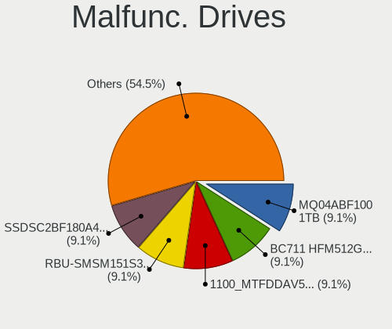
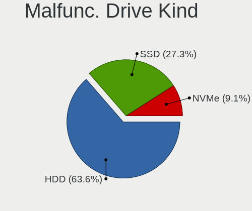
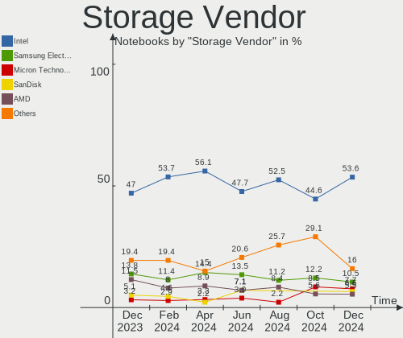
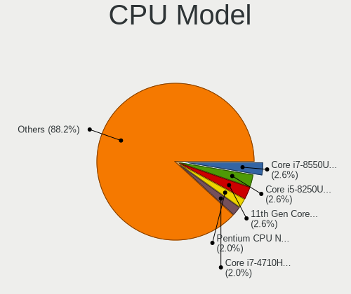
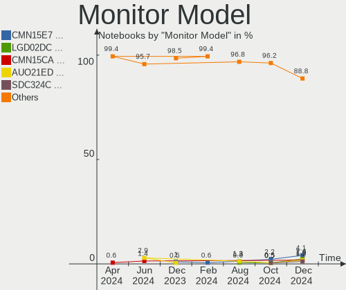
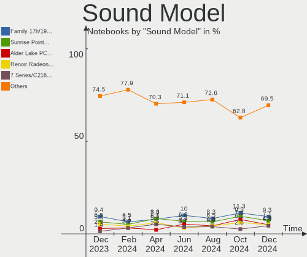
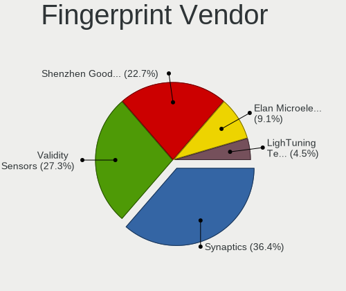

Linux in Italy - Hardware Trends (Notebooks)
--------------------------------------------

A project to identify most popular hardware characteristics and track their change
over time based on data collected by Linux users at https://Linux-Hardware.org.

Anyone can contribute to this report by the [hw-probe](https://github.com/linuxhw/hw-probe) tool:

    sudo -E hw-probe -all -upload

Period: Apr, 2024.

Contents
--------

* [ System ](#system)
  - [ OS                       ](#os)
  - [ OS Family                ](#os-family)
  - [ Kernel                   ](#kernel)
  - [ Kernel Family            ](#kernel-family)
  - [ Kernel Major Ver.        ](#kernel-major-ver)
  - [ Arch                     ](#arch)
  - [ DE                       ](#de)
  - [ Display Server           ](#display-server)
  - [ Display Manager          ](#display-manager)
  - [ OS Lang                  ](#os-lang)
  - [ Boot Mode                ](#boot-mode)
  - [ Filesystem               ](#filesystem)
  - [ Part. scheme             ](#part-scheme)
  - [ Dual Boot with Linux/BSD ](#dual-boot-with-linuxbsd)
  - [ Dual Boot (Win)          ](#dual-boot-win)

* [ Board ](#board)
  - [ Vendor                   ](#vendor)
  - [ Model                    ](#model)
  - [ Model Family             ](#model-family)
  - [ MFG Year                 ](#mfg-year)
  - [ Form Factor              ](#form-factor)
  - [ Secure Boot              ](#secure-boot)
  - [ Coreboot                 ](#coreboot)
  - [ RAM Size                 ](#ram-size)
  - [ RAM Used                 ](#ram-used)
  - [ Total Drives             ](#total-drives)
  - [ Has CD-ROM               ](#has-cd-rom)
  - [ Has Ethernet             ](#has-ethernet)
  - [ Has WiFi                 ](#has-wifi)
  - [ Has Bluetooth            ](#has-bluetooth)

* [ Location ](#location)
  - [ Country                  ](#country)
  - [ City                     ](#city)

* [ Drives ](#drives)
  - [ Drive Vendor             ](#drive-vendor)
  - [ Drive Model              ](#drive-model)
  - [ HDD Vendor               ](#hdd-vendor)
  - [ SSD Vendor               ](#ssd-vendor)
  - [ Drive Kind               ](#drive-kind)
  - [ Drive Connector          ](#drive-connector)
  - [ Drive Size               ](#drive-size)
  - [ Space Total              ](#space-total)
  - [ Space Used               ](#space-used)
  - [ Malfunc. Drives          ](#malfunc-drives)
  - [ Malfunc. Drive Vendor    ](#malfunc-drive-vendor)
  - [ Malfunc. HDD Vendor      ](#malfunc-hdd-vendor)
  - [ Malfunc. Drive Kind      ](#malfunc-drive-kind)
  - [ Failed Drives            ](#failed-drives)
  - [ Failed Drive Vendor      ](#failed-drive-vendor)
  - [ Drive Status             ](#drive-status)

* [ Storage controller ](#storage-controller)
  - [ Storage Vendor           ](#storage-vendor)
  - [ Storage Model            ](#storage-model)
  - [ Storage Kind             ](#storage-kind)

* [ Processor ](#processor)
  - [ CPU Vendor               ](#cpu-vendor)
  - [ CPU Model                ](#cpu-model)
  - [ CPU Model Family         ](#cpu-model-family)
  - [ CPU Cores                ](#cpu-cores)
  - [ CPU Sockets              ](#cpu-sockets)
  - [ CPU Threads              ](#cpu-threads)
  - [ CPU Op-Modes             ](#cpu-op-modes)
  - [ CPU Microcode            ](#cpu-microcode)
  - [ CPU Microarch            ](#cpu-microarch)

* [ Graphics ](#graphics)
  - [ GPU Vendor               ](#gpu-vendor)
  - [ GPU Model                ](#gpu-model)
  - [ GPU Combo                ](#gpu-combo)
  - [ GPU Driver               ](#gpu-driver)
  - [ GPU Memory               ](#gpu-memory)

* [ Monitor ](#monitor)
  - [ Monitor Vendor           ](#monitor-vendor)
  - [ Monitor Model            ](#monitor-model)
  - [ Monitor Resolution       ](#monitor-resolution)
  - [ Monitor Diagonal         ](#monitor-diagonal)
  - [ Monitor Width            ](#monitor-width)
  - [ Aspect Ratio             ](#aspect-ratio)
  - [ Monitor Area             ](#monitor-area)
  - [ Pixel Density            ](#pixel-density)
  - [ Multiple Monitors        ](#multiple-monitors)

* [ Network ](#network)
  - [ Net Controller Vendor    ](#net-controller-vendor)
  - [ Net Controller Model     ](#net-controller-model)
  - [ Wireless Vendor          ](#wireless-vendor)
  - [ Wireless Model           ](#wireless-model)
  - [ Ethernet Vendor          ](#ethernet-vendor)
  - [ Ethernet Model           ](#ethernet-model)
  - [ Net Controller Kind      ](#net-controller-kind)
  - [ Used Controller          ](#used-controller)
  - [ NICs                     ](#nics)
  - [ IPv6                     ](#ipv6)

* [ Bluetooth ](#bluetooth)
  - [ Bluetooth Vendor         ](#bluetooth-vendor)
  - [ Bluetooth Model          ](#bluetooth-model)

* [ Sound ](#sound)
  - [ Sound Vendor             ](#sound-vendor)
  - [ Sound Model              ](#sound-model)

* [ Memory ](#memory)
  - [ Memory Vendor            ](#memory-vendor)
  - [ Memory Model             ](#memory-model)
  - [ Memory Kind              ](#memory-kind)
  - [ Memory Form Factor       ](#memory-form-factor)
  - [ Memory Size              ](#memory-size)
  - [ Memory Speed             ](#memory-speed)

* [ Printers & scanners ](#printers--scanners)
  - [ Printer Vendor           ](#printer-vendor)
  - [ Printer Model            ](#printer-model)
  - [ Scanner Vendor           ](#scanner-vendor)
  - [ Scanner Model            ](#scanner-model)

* [ Camera ](#camera)
  - [ Camera Vendor            ](#camera-vendor)
  - [ Camera Model             ](#camera-model)

* [ Security ](#security)
  - [ Fingerprint Vendor       ](#fingerprint-vendor)
  - [ Fingerprint Model        ](#fingerprint-model)
  - [ Chipcard Vendor          ](#chipcard-vendor)
  - [ Chipcard Model           ](#chipcard-model)

* [ Unsupported ](#unsupported)
  - [ Unsupported Devices      ](#unsupported-devices)
  - [ Unsupported Device Types ](#unsupported-device-types)

System
------

OS
--

Installed operating systems

| Name                         | Notebooks | Percent |
|------------------------------|-----------|---------|
| Linux Mint 21.3              | 19        | 12.18%  |
| Ubuntu 22.04                 | 13        | 8.33%   |
| Fedora 39                    | 13        | 8.33%   |
| Zorin 17                     | 11        | 7.05%   |
| LMDE 6                       | 6         | 3.85%   |
| Fedora 40                    | 6         | 3.85%   |
| Elementary 7.1               | 6         | 3.85%   |
| Kubuntu 23.10                | 5         | 3.21%   |
| EndeavourOS Rolling          | 5         | 3.21%   |
| Arch Rolling                 | 5         | 3.21%   |
| Xubuntu 22.04                | 4         | 2.56%   |
| Ubuntu 23.10                 | 4         | 2.56%   |
| Manjaro                      | 4         | 2.56%   |
| Debian 12                    | 4         | 2.56%   |
| Ubuntu 24.04                 | 3         | 1.92%   |
| ROSA 12.5                    | 3         | 1.92%   |
| openSUSE Tumbleweed-XXXXXXXX | 3         | 1.92%   |
| OpenMandriva 23.08           | 3         | 1.92%   |
| Lubuntu 22.04                | 3         | 1.92%   |
| Debian                       | 3         | 1.92%   |
| ArcoLinux Rolling            | 3         | 1.92%   |
| Zorin 16                     | 2         | 1.28%   |
| Kubuntu 22.04                | 2         | 1.28%   |
| Xubuntu 18.04                | 1         | 0.64%   |
| Ubuntu MATE 23.10            | 1         | 0.64%   |
| Ubuntu Budgie 22.04          | 1         | 0.64%   |
| Ubuntu 20.04                 | 1         | 0.64%   |
| TUXEDO OS 22.04              | 1         | 0.64%   |
| SteamOS 3.5.17               | 1         | 0.64%   |
| ROSA R11.1                   | 1         | 0.64%   |
| Pop!_OS 22.04                | 1         | 0.64%   |
| Parrot 6.0                   | 1         | 0.64%   |
| openSUSE Microos-XXXXXXXX    | 1         | 0.64%   |
| OpenMandriva 24.90           | 1         | 0.64%   |
| OpenMandriva 24.03           | 1         | 0.64%   |
| OpenMandriva 24.01           | 1         | 0.64%   |
| MX 23                        | 1         | 0.64%   |
| Manjaro 23.1.4               | 1         | 0.64%   |
| Lubuntu 24.04                | 1         | 0.64%   |
| Linux Mint 21.2              | 1         | 0.64%   |

OS Family
---------

OS without a version

| Name          | Notebooks | Percent |
|---------------|-----------|---------|
| Linux Mint    | 23        | 14.74%  |
| Ubuntu        | 21        | 13.46%  |
| Fedora        | 21        | 13.46%  |
| Zorin         | 13        | 8.33%   |
| Debian        | 8         | 5.13%   |
| Kubuntu       | 7         | 4.49%   |
| OpenMandriva  | 6         | 3.85%   |
| LMDE          | 6         | 3.85%   |
| Elementary    | 6         | 3.85%   |
| Xubuntu       | 5         | 3.21%   |
| Manjaro       | 5         | 3.21%   |
| EndeavourOS   | 5         | 3.21%   |
| Arch          | 5         | 3.21%   |
| ROSA          | 4         | 2.56%   |
| openSUSE      | 4         | 2.56%   |
| Lubuntu       | 4         | 2.56%   |
| ArcoLinux     | 3         | 1.92%   |
| Ubuntu MATE   | 1         | 0.64%   |
| Ubuntu Budgie | 1         | 0.64%   |
| TUXEDO OS     | 1         | 0.64%   |
| SteamOS       | 1         | 0.64%   |
| Pop!_OS       | 1         | 0.64%   |
| Parrot        | 1         | 0.64%   |
| MX            | 1         | 0.64%   |
| KDE neon      | 1         | 0.64%   |
| antiX         | 1         | 0.64%   |
| Alpine        | 1         | 0.64%   |

Kernel
------

Version of the Linux kernel

| Version                           | Notebooks | Percent |
|-----------------------------------|-----------|---------|
| 6.5.0-28-generic                  | 19        | 12.18%  |
| 6.5.0-27-generic                  | 13        | 8.33%   |
| 6.5.0-26-generic                  | 11        | 7.05%   |
| 5.15.0-105-generic                | 7         | 4.49%   |
| 6.1.0-20-amd64                    | 5         | 3.21%   |
| 5.15.0-102-generic                | 5         | 3.21%   |
| 5.15.0-101-generic                | 5         | 3.21%   |
| 6.8.0-31-generic                  | 4         | 2.56%   |
| 6.8.7-arch1-1                     | 3         | 1.92%   |
| 6.8.7-300.fc40.x86_64             | 3         | 1.92%   |
| 6.8.5-201.fc39.x86_64             | 3         | 1.92%   |
| 6.8.4-200.fc39.x86_64             | 3         | 1.92%   |
| 6.7.11-200.fc39.x86_64            | 3         | 1.92%   |
| 6.6.21-generic-8rosa2021.1-x86_64 | 3         | 1.92%   |
| 6.5.0-18-generic                  | 3         | 1.92%   |
| 6.4.11-desktop-1omv2390           | 3         | 1.92%   |
| 6.8.4-arch1-1                     | 2         | 1.28%   |
| 6.8.1-arch1-1                     | 2         | 1.28%   |
| 6.6.26-1-MANJARO                  | 2         | 1.28%   |
| 6.6.25-1-MANJARO                  | 2         | 1.28%   |
| 6.6.15-amd64                      | 2         | 1.28%   |
| 6.5.0-9-generic                   | 2         | 1.28%   |
| 6.1.0-18-amd64                    | 2         | 1.28%   |
| 5.4.0-150-generic                 | 2         | 1.28%   |
| 5.15.0-91-generic                 | 2         | 1.28%   |
| 6.9.0-060900rc6-generic           | 1         | 0.64%   |
| 6.8.7-cb1.0.fc39.x86_64           | 1         | 0.64%   |
| 6.8.7-100.fc38.x86_64             | 1         | 0.64%   |
| 6.8.7-1-default                   | 1         | 0.64%   |
| 6.8.7-060807-generic              | 1         | 0.64%   |
| 6.8.6-200.fc39.x86_64             | 1         | 0.64%   |
| 6.8.6-1-default                   | 1         | 0.64%   |
| 6.8.5-arch1-1                     | 1         | 0.64%   |
| 6.8.5-301.fc40.x86_64             | 1         | 0.64%   |
| 6.8.4-rc1-1-default               | 1         | 0.64%   |
| 6.8.4-300.fc40.x86_64             | 1         | 0.64%   |
| 6.8.2-zen2-1-zen                  | 1         | 0.64%   |
| 6.8.2-arch2-1                     | 1         | 0.64%   |
| 6.8.2-arch1-1                     | 1         | 0.64%   |
| 6.8.2-300.fc40.x86_64             | 1         | 0.64%   |

Kernel Family
-------------

Linux kernel without a distro release

| Version | Notebooks | Percent |
|---------|-----------|---------|
| 6.5.0   | 50        | 32.05%  |
| 5.15.0  | 22        | 14.1%   |
| 6.8.7   | 10        | 6.41%   |
| 6.1.0   | 10        | 6.41%   |
| 6.8.4   | 7         | 4.49%   |
| 6.8.5   | 5         | 3.21%   |
| 6.8.1   | 5         | 3.21%   |
| 6.8.0   | 5         | 3.21%   |
| 6.8.2   | 4         | 2.56%   |
| 6.7.11  | 3         | 1.92%   |
| 6.6.21  | 3         | 1.92%   |
| 6.4.11  | 3         | 1.92%   |
| 6.8.6   | 2         | 1.28%   |
| 6.6.26  | 2         | 1.28%   |
| 6.6.25  | 2         | 1.28%   |
| 6.6.15  | 2         | 1.28%   |
| 5.4.0   | 2         | 1.28%   |
| 5.19.0  | 2         | 1.28%   |
| 6.9.0   | 1         | 0.64%   |
| 6.7.4   | 1         | 0.64%   |
| 6.7.12  | 1         | 0.64%   |
| 6.7.10  | 1         | 0.64%   |
| 6.6.28  | 1         | 0.64%   |
| 6.6.23  | 1         | 0.64%   |
| 6.6.2   | 1         | 0.64%   |
| 6.6.11  | 1         | 0.64%   |
| 6.5.6   | 1         | 0.64%   |
| 6.5.13  | 1         | 0.64%   |
| 6.4.0   | 1         | 0.64%   |
| 6.2.0   | 1         | 0.64%   |
| 6.1.60  | 1         | 0.64%   |
| 6.1.52  | 1         | 0.64%   |
| 5.6.13  | 1         | 0.64%   |
| 5.10.0  | 1         | 0.64%   |
| 4.15.0  | 1         | 0.64%   |

Kernel Major Ver.
-----------------

Linux kernel major version

| Version | Notebooks | Percent |
|---------|-----------|---------|
| 6.5     | 52        | 33.33%  |
| 6.8     | 38        | 24.36%  |
| 5.15    | 22        | 14.1%   |
| 6.6     | 13        | 8.33%   |
| 6.1     | 12        | 7.69%   |
| 6.7     | 6         | 3.85%   |
| 6.4     | 4         | 2.56%   |
| 5.4     | 2         | 1.28%   |
| 5.19    | 2         | 1.28%   |
| 6.9     | 1         | 0.64%   |
| 6.2     | 1         | 0.64%   |
| 5.6     | 1         | 0.64%   |
| 5.10    | 1         | 0.64%   |
| 4.15    | 1         | 0.64%   |

Arch
----

OS architecture (x86_64, i586, etc.)

| Name   | Notebooks | Percent |
|--------|-----------|---------|
| x86_64 | 151       | 96.79%  |
| i686   | 5         | 3.21%   |

DE
--

Desktop Environment

| Name         | Notebooks | Percent |
|--------------|-----------|---------|
| GNOME        | 57        | 36.54%  |
| X-Cinnamon   | 27        | 17.31%  |
| KDE5         | 22        | 14.1%   |
| XFCE         | 15        | 9.62%   |
| LXQt         | 9         | 5.77%   |
| Pantheon     | 6         | 3.85%   |
| KDE6         | 4         | 2.56%   |
| MATE         | 3         | 1.92%   |
| KDE          | 3         | 1.92%   |
| i3           | 2         | 1.28%   |
| Unknown      | 2         | 1.28%   |
| Openbox      | 1         | 0.64%   |
| KDE4         | 1         | 0.64%   |
| icewm        | 1         | 0.64%   |
| Hyprland     | 1         | 0.64%   |
| herbstluftwm | 1         | 0.64%   |
| Budgie       | 1         | 0.64%   |

Display Server
--------------

X11 or Wayland

| Name        | Notebooks | Percent |
|-------------|-----------|---------|
| X11         | 96        | 61.54%  |
| Wayland     | 57        | 36.54%  |
| Tty         | 2         | 1.28%   |
| Unspecified | 1         | 0.64%   |

Display Manager
---------------

SDDM, LightDM, etc.

| Name    | Notebooks | Percent |
|---------|-----------|---------|
| LightDM | 43        | 27.56%  |
| Unknown | 41        | 26.28%  |
| SDDM    | 32        | 20.51%  |
| GDM3    | 28        | 17.95%  |
| GDM     | 9         | 5.77%   |
| SLIMSKI | 1         | 0.64%   |
| SLiM    | 1         | 0.64%   |
| KDM     | 1         | 0.64%   |

OS Lang
-------

Language

| Lang  | Notebooks | Percent |
|-------|-----------|---------|
| it_IT | 118       | 75.64%  |
| en_US | 27        | 17.31%  |
| C     | 8         | 5.13%   |
| en_GB | 2         | 1.28%   |
| de_DE | 1         | 0.64%   |

Boot Mode
---------

EFI or BIOS

| Mode | Notebooks | Percent |
|------|-----------|---------|
| BIOS | 78        | 50%     |
| EFI  | 78        | 50%     |

Filesystem
----------

Type of filesystem

| Type     | Notebooks | Percent |
|----------|-----------|---------|
| Ext4     | 93        | 59.62%  |
| Btrfs    | 26        | 16.67%  |
| Tmpfs    | 25        | 16.03%  |
| Overlay  | 10        | 6.41%   |
| Zfs      | 1         | 0.64%   |
| Bcachefs | 1         | 0.64%   |

Part. scheme
------------

Scheme of partitioning

| Type    | Notebooks | Percent |
|---------|-----------|---------|
| GPT     | 98        | 62.82%  |
| Unknown | 42        | 26.92%  |
| MBR     | 16        | 10.26%  |

Dual Boot with Linux/BSD
------------------------

Hosting more than one Linux/BSD

| Dual boot | Notebooks | Percent |
|-----------|-----------|---------|
| No        | 140       | 89.74%  |
| Yes       | 16        | 10.26%  |

Dual Boot (Win)
---------------

Hosting Linux and Windows

| Dual boot | Notebooks | Percent |
|-----------|-----------|---------|
| No        | 105       | 67.31%  |
| Yes       | 51        | 32.69%  |

Board
-----

Vendor
------

Motherboard manufacturer

| Name                | Notebooks | Percent |
|---------------------|-----------|---------|
| Hewlett-Packard     | 38        | 24.36%  |
| Acer                | 26        | 16.67%  |
| Lenovo              | 21        | 13.46%  |
| ASUSTek Computer    | 19        | 12.18%  |
| Dell                | 11        | 7.05%   |
| Apple               | 9         | 5.77%   |
| Samsung Electronics | 5         | 3.21%   |
| HUAWEI              | 5         | 3.21%   |
| Mediacom            | 3         | 1.92%   |
| TUXEDO              | 2         | 1.28%   |
| Sony                | 2         | 1.28%   |
| Chuwi               | 2         | 1.28%   |
| Unknown             | 2         | 1.28%   |
| Valve               | 1         | 0.64%   |
| Toshiba             | 1         | 0.64%   |
| Timi                | 1         | 0.64%   |
| Teclast             | 1         | 0.64%   |
| Seco                | 1         | 0.64%   |
| Packard Bell        | 1         | 0.64%   |
| Notebook            | 1         | 0.64%   |
| MSI                 | 1         | 0.64%   |
| Microtech           | 1         | 0.64%   |
| Jumper              | 1         | 0.64%   |
| Fujitsu             | 1         | 0.64%   |

Model
-----

Motherboard model

| Name                                       | Notebooks | Percent |
|--------------------------------------------|-----------|---------|
| Apple MacBookAir7,2                        | 4         | 2.56%   |
| Unknown                                    | 3         | 1.92%   |
| Samsung 300E4A/300E5A/300E7A/3430EA/3530EA | 2         | 1.28%   |
| HP Stream Laptop 14-ax0XX                  | 2         | 1.28%   |
| HP Pavilion Laptop 15-eh2xxx               | 2         | 1.28%   |
| HP Pavilion dv6                            | 2         | 1.28%   |
| Acer Aspire ES1-523                        | 2         | 1.28%   |
| Valve Jupiter                              | 1         | 0.64%   |
| TUXEDO Gemini Gen2                         | 1         | 0.64%   |
| TUXEDO Aura 15 Gen1                        | 1         | 0.64%   |
| Toshiba PORTEGE R30-D                      | 1         | 0.64%   |
| Timi RedmiBook 16                          | 1         | 0.64%   |
| Teclast F15                                | 1         | 0.64%   |
| Sony SVE1512Z1EB                           | 1         | 0.64%   |
| Sony SVE1111M1EW                           | 1         | 0.64%   |
| Seco UDOO x86                              | 1         | 0.64%   |
| Samsung N150P/N210P/N220P                  | 1         | 0.64%   |
| Samsung 750XED                             | 1         | 0.64%   |
| Samsung 300E4C/300E5C/300E7C               | 1         | 0.64%   |
| Packard Bell DOT SE                        | 1         | 0.64%   |
| Notebook NJx0PU                            | 1         | 0.64%   |
| MSI Prestige 14Evo A11M                    | 1         | 0.64%   |
| Microtech CoreBook Lite                    | 1         | 0.64%   |
| Mediacom SmartBook Pro i5                  | 1         | 0.64%   |
| Mediacom SmartBook 14 FullHD - SB14UC      | 1         | 0.64%   |
| Mediacom M-SBE130                          | 1         | 0.64%   |
| Lenovo Z50-75 80EC                         | 1         | 0.64%   |
| Lenovo Z50-70 20354                        | 1         | 0.64%   |
| Lenovo ThinkPad T60 1951FDG                | 1         | 0.64%   |
| Lenovo ThinkPad T495 20NKS1YE00            | 1         | 0.64%   |
| Lenovo ThinkPad T470 20HES6VG00            | 1         | 0.64%   |
| Lenovo ThinkPad T450s 20BWS00V00           | 1         | 0.64%   |
| Lenovo ThinkPad T430 2349IF8               | 1         | 0.64%   |
| Lenovo ThinkPad T14 Gen 3 21CF0043IX       | 1         | 0.64%   |
| Lenovo ThinkPad S430 336457G               | 1         | 0.64%   |
| Lenovo ThinkPad P52 20MAS1DM00             | 1         | 0.64%   |
| Lenovo ThinkPad L380 20M50013IX            | 1         | 0.64%   |
| Lenovo ThinkBook 15 G2 ITL 20VE            | 1         | 0.64%   |
| Lenovo Legion Pro 5 16IRX9 83DF            | 1         | 0.64%   |
| Lenovo IdeaPad Gaming 3 15ACH6 82K2        | 1         | 0.64%   |

Model Family
------------

Motherboard model prefix

| Name               | Notebooks | Percent |
|--------------------|-----------|---------|
| Acer Aspire        | 20        | 12.82%  |
| HP Pavilion        | 12        | 7.69%   |
| Lenovo ThinkPad    | 9         | 5.77%   |
| Lenovo IdeaPad     | 6         | 3.85%   |
| HP Laptop          | 6         | 3.85%   |
| HP ProBook         | 5         | 3.21%   |
| Dell Latitude      | 5         | 3.21%   |
| Apple MacBookAir7  | 4         | 2.56%   |
| HP EliteBook       | 3         | 1.92%   |
| Unknown            | 3         | 1.92%   |
| Samsung 300E4A     | 2         | 1.28%   |
| Mediacom SmartBook | 2         | 1.28%   |
| HP Victus          | 2         | 1.28%   |
| HP Stream          | 2         | 1.28%   |
| HP 250             | 2         | 1.28%   |
| Dell XPS           | 2         | 1.28%   |
| Dell Vostro        | 2         | 1.28%   |
| ASUS VivoBook      | 2         | 1.28%   |
| Acer Nitro         | 2         | 1.28%   |
| Valve Jupiter      | 1         | 0.64%   |
| TUXEDO Gemini      | 1         | 0.64%   |
| TUXEDO Aura        | 1         | 0.64%   |
| Toshiba PORTEGE    | 1         | 0.64%   |
| Timi RedmiBook     | 1         | 0.64%   |
| Teclast F15        | 1         | 0.64%   |
| Sony SVE1512Z1EB   | 1         | 0.64%   |
| Sony SVE1111M1EW   | 1         | 0.64%   |
| Seco UDOO          | 1         | 0.64%   |
| Samsung N150P      | 1         | 0.64%   |
| Samsung 750XED     | 1         | 0.64%   |
| Samsung 300E4C     | 1         | 0.64%   |
| Packard Bell DOT   | 1         | 0.64%   |
| Notebook NJx0PU    | 1         | 0.64%   |
| MSI Prestige       | 1         | 0.64%   |
| Microtech CoreBook | 1         | 0.64%   |
| Mediacom M-SBE130  | 1         | 0.64%   |
| Lenovo Z50-75      | 1         | 0.64%   |
| Lenovo Z50-70      | 1         | 0.64%   |
| Lenovo ThinkBook   | 1         | 0.64%   |
| Lenovo Legion      | 1         | 0.64%   |

MFG Year
--------

Motherboard manufacture year

| Year | Notebooks | Percent |
|------|-----------|---------|
| 2021 | 19        | 12.18%  |
| 2020 | 12        | 7.69%   |
| 2016 | 12        | 7.69%   |
| 2012 | 12        | 7.69%   |
| 2022 | 10        | 6.41%   |
| 2018 | 10        | 6.41%   |
| 2015 | 10        | 6.41%   |
| 2010 | 9         | 5.77%   |
| 2019 | 8         | 5.13%   |
| 2017 | 8         | 5.13%   |
| 2011 | 8         | 5.13%   |
| 2007 | 8         | 5.13%   |
| 2014 | 6         | 3.85%   |
| 2013 | 6         | 3.85%   |
| 2008 | 6         | 3.85%   |
| 2023 | 4         | 2.56%   |
| 2024 | 3         | 1.92%   |
| 2009 | 3         | 1.92%   |
| 2006 | 2         | 1.28%   |

Form Factor
-----------

Physical design of the computer

| Name     | Notebooks | Percent |
|----------|-----------|---------|
| Notebook | 156       | 100%    |

Secure Boot
-----------

Enabled or disabled

| State    | Notebooks | Percent |
|----------|-----------|---------|
| Disabled | 140       | 89.74%  |
| Enabled  | 16        | 10.26%  |

Coreboot
--------

Have coreboot on board

| Used | Notebooks | Percent |
|------|-----------|---------|
| No   | 156       | 100%    |

RAM Size
--------

Total RAM memory

| Size in GB  | Notebooks | Percent |
|-------------|-----------|---------|
| 4.01-8.0    | 58        | 37.18%  |
| 3.01-4.0    | 31        | 19.87%  |
| 16.01-24.0  | 29        | 18.59%  |
| 8.01-16.0   | 20        | 12.82%  |
| 1.01-2.0    | 8         | 5.13%   |
| 32.01-64.0  | 5         | 3.21%   |
| 2.01-3.0    | 3         | 1.92%   |
| 24.01-32.0  | 1         | 0.64%   |
| 64.01-256.0 | 1         | 0.64%   |

RAM Used
--------

Used RAM memory

| Used GB    | Notebooks | Percent |
|------------|-----------|---------|
| 2.01-3.0   | 55        | 35.26%  |
| 1.01-2.0   | 50        | 32.05%  |
| 4.01-8.0   | 22        | 14.1%   |
| 3.01-4.0   | 18        | 11.54%  |
| 0.51-1.0   | 8         | 5.13%   |
| 8.01-16.0  | 2         | 1.28%   |
| 16.01-24.0 | 1         | 0.64%   |

Total Drives
------------

Number of drives on board

| Drives | Notebooks | Percent |
|--------|-----------|---------|
| 1      | 126       | 80.77%  |
| 2      | 24        | 15.38%  |
| 3      | 6         | 3.85%   |

Has CD-ROM
----------

Has CD-ROM on board

| Presented | Notebooks | Percent |
|-----------|-----------|---------|
| No        | 95        | 60.9%   |
| Yes       | 61        | 39.1%   |

Has Ethernet
------------

Has Ethernet on board

| Presented | Notebooks | Percent |
|-----------|-----------|---------|
| Yes       | 118       | 75.64%  |
| No        | 38        | 24.36%  |

Has WiFi
--------

Has WiFi module

| Presented | Notebooks | Percent |
|-----------|-----------|---------|
| Yes       | 153       | 98.08%  |
| No        | 3         | 1.92%   |

Has Bluetooth
-------------

Has Bluetooth module

| Presented | Notebooks | Percent |
|-----------|-----------|---------|
| Yes       | 120       | 76.92%  |
| No        | 36        | 23.08%  |

Location
--------

Country
-------

Geographic location (country)

| Country | Notebooks | Percent |
|---------|-----------|---------|
| Italy   | 156       | 100%    |

City
----

Geographic location (city)

| City                       | Notebooks | Percent |
|----------------------------|-----------|---------|
| Milan                      | 22        | 14.1%   |
| Turin                      | 12        | 7.69%   |
| Rome                       | 12        | 7.69%   |
| Milano                     | 6         | 3.85%   |
| Naples                     | 4         | 2.56%   |
| Bologna                    | 4         | 2.56%   |
| Reggio Calabria            | 3         | 1.92%   |
| Palermo                    | 3         | 1.92%   |
| Florence                   | 3         | 1.92%   |
| Taranto                    | 2         | 1.28%   |
| Salerno                    | 2         | 1.28%   |
| Rho                        | 2         | 1.28%   |
| Perugia                    | 2         | 1.28%   |
| Padova                     | 2         | 1.28%   |
| Fiano Romano               | 2         | 1.28%   |
| Brescia                    | 2         | 1.28%   |
| Bergamo                    | 2         | 1.28%   |
| Aprilia                    | 2         | 1.28%   |
| Voghera                    | 1         | 0.64%   |
| Vercelli                   | 1         | 0.64%   |
| Venice                     | 1         | 0.64%   |
| Valdagno                   | 1         | 0.64%   |
| Trieste                    | 1         | 0.64%   |
| Trento                     | 1         | 0.64%   |
| Terzigno                   | 1         | 0.64%   |
| Succivo                    | 1         | 0.64%   |
| Somaglia                   | 1         | 0.64%   |
| Selvazzano Dentro          | 1         | 0.64%   |
| Santa Cristina Val Gardena | 1         | 0.64%   |
| Sant'Ilario d'Enza         | 1         | 0.64%   |
| San Nazzaro Sesia          | 1         | 0.64%   |
| San Giovanni Teatino       | 1         | 0.64%   |
| San Gervasio               | 1         | 0.64%   |
| Rozzano                    | 1         | 0.64%   |
| Rodello                    | 1         | 0.64%   |
| Resana                     | 1         | 0.64%   |
| Rende                      | 1         | 0.64%   |
| Reggio Emilia              | 1         | 0.64%   |
| Quattro Castella           | 1         | 0.64%   |
| Porto Mantovano            | 1         | 0.64%   |

Drives
------

Drive Vendor
------------

Hard drive vendors

| Vendor                       | Notebooks | Drives | Percent |
|------------------------------|-----------|--------|---------|
| Samsung Electronics          | 39        | 42     | 21.55%  |
| Kingston                     | 20        | 21     | 11.05%  |
| WDC                          | 15        | 15     | 8.29%   |
| Unknown                      | 11        | 11     | 6.08%   |
| Seagate                      | 11        | 12     | 6.08%   |
| Toshiba                      | 8         | 9      | 4.42%   |
| Crucial                      | 8         | 8      | 4.42%   |
| Micron Technology            | 7         | 7      | 3.87%   |
| SK hynix                     | 6         | 6      | 3.31%   |
| Sandisk                      | 6         | 6      | 3.31%   |
| KIOXIA                       | 5         | 5      | 2.76%   |
| Hitachi                      | 4         | 5      | 2.21%   |
| China                        | 4         | 4      | 2.21%   |
| SPCC                         | 3         | 3      | 1.66%   |
| Phison Electronics           | 3         | 3      | 1.66%   |
| Intel                        | 3         | 3      | 1.66%   |
| HGST                         | 3         | 3      | 1.66%   |
| Fujitsu                      | 3         | 3      | 1.66%   |
| Apple                        | 3         | 3      | 1.66%   |
| JMicron Technology           | 2         | 2      | 1.1%    |
| Unknown                      | 2         | 2      | 1.1%    |
| WDC WDS                      | 1         | 1      | 0.55%   |
| Verbatim                     | 1         | 1      | 0.55%   |
| Transcend                    | 1         | 1      | 0.55%   |
| Teclast                      | 1         | 1      | 0.55%   |
| Team                         | 1         | 1      | 0.55%   |
| SSSTC                        | 1         | 1      | 0.55%   |
| Silicon Motion               | 1         | 1      | 0.55%   |
| S3+                          | 1         | 1      | 0.55%   |
| Realtek Semiconductor        | 1         | 1      | 0.55%   |
| Lexar                        | 1         | 1      | 0.55%   |
| KUU                          | 1         | 1      | 0.55%   |
| KingFast                     | 1         | 1      | 0.55%   |
| HEORIADY                     | 1         | 1      | 0.55%   |
| Fanxiang                     | 1         | 1      | 0.55%   |
| Beijing Starblaze Technology | 1         | 1      | 0.55%   |

Drive Model
-----------

Hard drive models

| Model                                              | Notebooks | Percent |
|----------------------------------------------------|-----------|---------|
| Kingston SA400S37480G 480GB SSD                    | 5         | 2.67%   |
| Kingston SA400S37240G 240GB SSD                    | 5         | 2.67%   |
| Samsung NVMe SSD Controller PM9A1/PM9A3/980PRO 1TB | 4         | 2.14%   |
| Samsung SSD 860 EVO 500GB                          | 3         | 1.6%    |
| Samsung SSD 850 EVO 250GB                          | 3         | 1.6%    |
| Samsung NVMe SSD Controller SM981/PM981/PM983 1TB  | 3         | 1.6%    |
| Fujitsu MHV2060BH 64GB                             | 3         | 1.6%    |
| Unknown MMC Card  32GB                             | 2         | 1.07%   |
| Toshiba MQ01ABD100 1TB                             | 2         | 1.07%   |
| Toshiba MQ01ABD032 320GB                           | 2         | 1.07%   |
| SPCC Solid State Disk 512GB                        | 2         | 1.07%   |
| SK hynix HFM512GD3JX016N 512GB                     | 2         | 1.07%   |
| Sandisk WD Blue SN550 NVMe SSD 2TB                 | 2         | 1.07%   |
| SanDisk DF4032  32GB                               | 2         | 1.07%   |
| Samsung SSD 870 EVO 250GB                          | 2         | 1.07%   |
| Samsung NVMe SSD Controller SM961/PM961/SM963 1TB  | 2         | 1.07%   |
| Samsung MZALQ512HALU-000L2 512GB                   | 2         | 1.07%   |
| Phison E12 NVMe Controller 2TB                     | 2         | 1.07%   |
| Micron 2450_MTFDKBA512TFK 512GB                    | 2         | 1.07%   |
| Kingston SA400S37120G 120GB SSD                    | 2         | 1.07%   |
| Crucial CT240BX500SSD1 240GB                       | 2         | 1.07%   |
| Crucial CT1000MX500SSD1 1TB                        | 2         | 1.07%   |
| Unknown                                            | 2         | 1.07%   |
| WDC WDS500G2B0A-00SM50 500GB SSD                   | 1         | 0.53%   |
| WDC WDS240G2G0A-00JH30 240GB SSD                   | 1         | 0.53%   |
| WDC WDS100T2B0A-00SM50 1TB SSD                     | 1         | 0.53%   |
| WDC WDS 500G2B0A-00SM50 500GB SSD                  | 1         | 0.53%   |
| WDC WD6400BPVT-22HXZT1 640GB                       | 1         | 0.53%   |
| WDC WD5000LPVX-75V0TT0 500GB                       | 1         | 0.53%   |
| WDC WD5000LPVX-22V0TT0 500GB                       | 1         | 0.53%   |
| WDC WD5000LPCX-24VHAT0 500GB                       | 1         | 0.53%   |
| WDC WD5000LPCX-24C6HT0 500GB                       | 1         | 0.53%   |
| WDC WD5000BPVT-55A1YT0 500GB                       | 1         | 0.53%   |
| WDC WD5000BEKT-75KA9T0 500GB                       | 1         | 0.53%   |
| WDC WD3200BEVT-80A0RT1 320GB                       | 1         | 0.53%   |
| WDC WD3200BEVT-22A23T0 320GB                       | 1         | 0.53%   |
| WDC WD2500BEVT-00ZCT0 250GB                        | 1         | 0.53%   |
| WDC WD Blue SA510 2.5 500GB SSD                    | 1         | 0.53%   |
| WDC PC SN530 SDBPNPZ-512G-1114 512GB               | 1         | 0.53%   |
| Verbatim Vi550 S3 128GB SSD                        | 1         | 0.53%   |

HDD Vendor
----------

Hard disk drive vendors

| Vendor             | Notebooks | Drives | Percent |
|--------------------|-----------|--------|---------|
| Seagate            | 11        | 12     | 28.21%  |
| WDC                | 10        | 10     | 25.64%  |
| Toshiba            | 7         | 8      | 17.95%  |
| Hitachi            | 4         | 5      | 10.26%  |
| HGST               | 3         | 3      | 7.69%   |
| Fujitsu            | 3         | 3      | 7.69%   |
| JMicron Technology | 1         | 1      | 2.56%   |

SSD Vendor
----------

Solid state drive vendors

| Vendor              | Notebooks | Drives | Percent |
|---------------------|-----------|--------|---------|
| Kingston            | 17        | 18     | 25.37%  |
| Samsung Electronics | 16        | 16     | 23.88%  |
| Crucial             | 7         | 7      | 10.45%  |
| WDC                 | 4         | 4      | 5.97%   |
| China               | 4         | 4      | 5.97%   |
| SPCC                | 3         | 3      | 4.48%   |
| Apple               | 3         | 3      | 4.48%   |
| WDC WDS             | 1         | 1      | 1.49%   |
| Verbatim            | 1         | 1      | 1.49%   |
| Transcend           | 1         | 1      | 1.49%   |
| Toshiba             | 1         | 1      | 1.49%   |
| Teclast             | 1         | 1      | 1.49%   |
| SK hynix            | 1         | 1      | 1.49%   |
| SanDisk             | 1         | 1      | 1.49%   |
| S3+                 | 1         | 1      | 1.49%   |
| Micron Technology   | 1         | 1      | 1.49%   |
| KUU                 | 1         | 1      | 1.49%   |
| Intel               | 1         | 1      | 1.49%   |
| HEORIADY            | 1         | 1      | 1.49%   |
| Fanxiang            | 1         | 1      | 1.49%   |

Drive Kind
----------

HDD or SSD

| Kind    | Notebooks | Drives | Percent |
|---------|-----------|--------|---------|
| SSD     | 63        | 68     | 36.42%  |
| NVMe    | 57        | 62     | 32.95%  |
| HDD     | 39        | 42     | 22.54%  |
| MMC     | 12        | 14     | 6.94%   |
| Unknown | 2         | 2      | 1.16%   |

Drive Connector
---------------

SATA, SAS, NVMe, etc.

| Type | Notebooks | Drives | Percent |
|------|-----------|--------|---------|
| SATA | 97        | 107    | 56.4%   |
| NVMe | 57        | 61     | 33.14%  |
| MMC  | 12        | 14     | 6.98%   |
| SAS  | 6         | 6      | 3.49%   |

Drive Size
----------

Size of hard drive

| Size in TB | Notebooks | Drives | Percent |
|------------|-----------|--------|---------|
| 0.01-0.5   | 77        | 81     | 74.04%  |
| 0.51-1.0   | 23        | 25     | 22.12%  |
| 1.01-2.0   | 2         | 2      | 1.92%   |
| 3.01-4.0   | 1         | 1      | 0.96%   |
| 4.01-10.0  | 1         | 1      | 0.96%   |

Space Total
-----------

Amount of disk space available on the file system

| Size in GB     | Notebooks | Percent |
|----------------|-----------|---------|
| 251-500        | 44        | 28.21%  |
| 101-250        | 34        | 21.79%  |
| 501-1000       | 25        | 16.03%  |
| 1-20           | 16        | 10.26%  |
| 51-100         | 12        | 7.69%   |
| 1001-2000      | 8         | 5.13%   |
| 21-50          | 6         | 3.85%   |
| More than 3000 | 4         | 2.56%   |
| Unknown        | 4         | 2.56%   |
| 2001-3000      | 3         | 1.92%   |

Space Used
----------

Amount of used disk space

| Used GB        | Notebooks | Percent |
|----------------|-----------|---------|
| 1-20           | 55        | 35.26%  |
| 21-50          | 43        | 27.56%  |
| 101-250        | 18        | 11.54%  |
| 51-100         | 17        | 10.9%   |
| 251-500        | 10        | 6.41%   |
| 501-1000       | 4         | 2.56%   |
| Unknown        | 4         | 2.56%   |
| More than 3000 | 3         | 1.92%   |
| 1001-2000      | 2         | 1.28%   |

Malfunc. Drives
---------------

Drive models with a malfunction

| Model                         | Notebooks | Drives | Percent |
|-------------------------------|-----------|--------|---------|
| WDC WD3200BEVT-80A0RT1 320GB  | 1         | 1      | 10%     |
| WDC WD3200BEVT-22A23T0 320GB  | 1         | 1      | 10%     |
| Seagate ST9750420AS 752GB     | 1         | 1      | 10%     |
| Seagate ST9500420AS 500GB     | 1         | 1      | 10%     |
| KUU SSD 512GB                 | 1         | 1      | 10%     |
| Intel SSDSC2BF180A4L 180GB    | 1         | 1      | 10%     |
| Hitachi HTS545025B9SA02 250GB | 1         | 1      | 10%     |
| Hitachi HTS545025B9A300 250GB | 1         | 1      | 10%     |
| China SH00M256GB SSD          | 1         | 1      | 10%     |
| China G521N256GB SSD          | 1         | 1      | 10%     |

Malfunc. Drive Vendor
---------------------

Vendors of faulty drives

| Vendor  | Notebooks | Drives | Percent |
|---------|-----------|--------|---------|
| WDC     | 2         | 2      | 20%     |
| Seagate | 2         | 2      | 20%     |
| Hitachi | 2         | 2      | 20%     |
| China   | 2         | 2      | 20%     |
| KUU     | 1         | 1      | 10%     |
| Intel   | 1         | 1      | 10%     |

Malfunc. HDD Vendor
-------------------

Vendors of faulty HDD drives

| Vendor  | Notebooks | Drives | Percent |
|---------|-----------|--------|---------|
| WDC     | 2         | 2      | 33.33%  |
| Seagate | 2         | 2      | 33.33%  |
| Hitachi | 2         | 2      | 33.33%  |

Malfunc. Drive Kind
-------------------

Kinds of faulty drives

| Kind | Notebooks | Drives | Percent |
|------|-----------|--------|---------|
| HDD  | 6         | 6      | 60%     |
| SSD  | 4         | 4      | 40%     |

Failed Drives
-------------

Failed drive models

Zero info for selected period =(

Failed Drive Vendor
-------------------

Failed drive vendors

Zero info for selected period =(

Drive Status
------------

Number of failed and malfunc. drives

| Status   | Notebooks | Drives | Percent |
|----------|-----------|--------|---------|
| Works    | 79        | 87     | 47.88%  |
| Detected | 76        | 91     | 46.06%  |
| Malfunc  | 10        | 10     | 6.06%   |

Storage controller
------------------

Storage Vendor
--------------

Storage controller vendors

| Vendor                         | Notebooks | Percent |
|--------------------------------|-----------|---------|
| Intel                          | 101       | 56.11%  |
| Samsung Electronics            | 26        | 14.44%  |
| AMD                            | 16        | 8.89%   |
| Micron Technology              | 6         | 3.33%   |
| Phison Electronics             | 5         | 2.78%   |
| KIOXIA                         | 5         | 2.78%   |
| SK hynix                       | 4         | 2.22%   |
| SanDisk                        | 4         | 2.22%   |
| MAXIO Technology (Hangzhou)    | 3         | 1.67%   |
| Kingston Technology Company    | 3         | 1.67%   |
| Nvidia                         | 2         | 1.11%   |
| Solid State Storage Technology | 1         | 0.56%   |
| Silicon Motion                 | 1         | 0.56%   |
| Realtek Semiconductor          | 1         | 0.56%   |
| Micron/Crucial Technology      | 1         | 0.56%   |
| Beijing Starblaze Technology   | 1         | 0.56%   |

Storage Model
-------------

Storage controller models

| Model                                                                            | Notebooks | Percent |
|----------------------------------------------------------------------------------|-----------|---------|
| AMD FCH SATA Controller [AHCI mode]                                              | 16        | 8.25%   |
| Intel Sunrise Point-LP SATA Controller [AHCI mode]                               | 12        | 6.19%   |
| Samsung NVMe SSD Controller 980 (DRAM-less)                                      | 11        | 5.67%   |
| Intel 7 Series Chipset Family 6-port SATA Controller [AHCI mode]                 | 10        | 5.15%   |
| Intel Volume Management Device NVMe RAID Controller                              | 8         | 4.12%   |
| Intel 6 Series/C200 Series Chipset Family 6 port Mobile SATA AHCI Controller     | 7         | 3.61%   |
| Samsung NVMe SSD Controller PM9A1/PM9A3/980PRO                                   | 6         | 3.09%   |
| Intel 82801 Mobile SATA Controller [RAID mode]                                   | 6         | 3.09%   |
| Intel Wildcat Point-LP SATA Controller [AHCI Mode]                               | 5         | 2.58%   |
| Intel 82801HM/HEM (ICH8M/ICH8M-E) IDE Controller                                 | 5         | 2.58%   |
| Intel NM10/ICH7 Family SATA Controller [AHCI mode]                               | 4         | 2.06%   |
| Intel 82801IBM/IEM (ICH9M/ICH9M-E) 4 port SATA Controller [AHCI mode]            | 4         | 2.06%   |
| Intel 82801HM/HEM (ICH8M/ICH8M-E) SATA Controller [AHCI mode]                    | 4         | 2.06%   |
| Intel 5 Series/3400 Series Chipset 6 port SATA AHCI Controller                   | 4         | 2.06%   |
| SK hynix Gold P31/BC711/PC711 NVMe Solid State Drive                             | 3         | 1.55%   |
| SanDisk Ultra 3D / WD Blue SN550 NVMe SSD                                        | 3         | 1.55%   |
| Samsung S4LN058A01[SSUBX] AHCI SSD Controller (Apple slot)                       | 3         | 1.55%   |
| Samsung NVMe SSD Controller SM981/PM981/PM983                                    | 3         | 1.55%   |
| Micron 2450 NVMe SSD [HendrixV] (DRAM-less)                                      | 3         | 1.55%   |
| MAXIO (Hangzhou) NVMe SSD Controller MAP1202 (DRAM-less)                         | 3         | 1.55%   |
| Intel Tiger Lake-LP SATA Controller                                              | 3         | 1.55%   |
| Intel Celeron/Pentium Silver Processor SATA Controller                           | 3         | 1.55%   |
| Intel Atom/Celeron/Pentium Processor x5-E8000/J3xxx/N3xxx Series SATA Controller | 3         | 1.55%   |
| Intel Atom Processor E3800 Series SATA AHCI Controller                           | 3         | 1.55%   |
| Intel 5 Series/3400 Series Chipset 4 port SATA AHCI Controller                   | 3         | 1.55%   |
| Samsung NVMe SSD Controller SM961/PM961/SM963                                    | 2         | 1.03%   |
| Phison PS5013-E13 PCIe3 NVMe Controller (DRAM-less)                              | 2         | 1.03%   |
| Phison E12 NVMe Controller                                                       | 2         | 1.03%   |
| KIOXIA NVMe SSD Controller BG5 (DRAM-less)                                       | 2         | 1.03%   |
| KIOXIA NVMe SSD Controller BG4 (DRAM-less)                                       | 2         | 1.03%   |
| Intel SSD 670p Series [Keystone Harbor]                                          | 2         | 1.03%   |
| Intel HM170/QM170 Chipset SATA Controller [AHCI Mode]                            | 2         | 1.03%   |
| Intel Celeron N3350/Pentium N4200/Atom E3900 Series SATA AHCI Controller         | 2         | 1.03%   |
| Intel Cannon Lake Mobile PCH SATA AHCI Controller                                | 2         | 1.03%   |
| Intel Alder Lake-P SATA AHCI Controller                                          | 2         | 1.03%   |
| Intel 82801GBM/GHM (ICH7-M Family) SATA Controller [AHCI mode]                   | 2         | 1.03%   |
| Intel 8 Series/C220 Series Chipset Family 6-port SATA Controller 1 [AHCI mode]   | 2         | 1.03%   |
| Intel 8 Series SATA Controller 1 [AHCI mode]                                     | 2         | 1.03%   |
| Solid State Storage CL1-3D256-Q11 NVMe SSD M.2                                   | 1         | 0.52%   |
| SK hynix BC511 NVMe SSD                                                          | 1         | 0.52%   |

Storage Kind
------------

Kind of storage controller (IDE, SATA, NVMe, SAS, ...)

| Kind | Notebooks | Percent |
|------|-----------|---------|
| SATA | 106       | 56.38%  |
| NVMe | 58        | 30.85%  |
| RAID | 15        | 7.98%   |
| IDE  | 9         | 4.79%   |

Processor
---------

CPU Vendor
----------

Processor vendors

| Vendor | Notebooks | Percent |
|--------|-----------|---------|
| Intel  | 126       | 80.77%  |
| AMD    | 30        | 19.23%  |

CPU Model
---------

Processor models

| Model                                       | Notebooks | Percent |
|---------------------------------------------|-----------|---------|
| Intel 11th Gen Core i5-1135G7 @ 2.40GHz     | 5         | 3.21%   |
| Intel Core i5-8250U CPU @ 1.60GHz           | 4         | 2.56%   |
| AMD Ryzen 7 5825U with Radeon Graphics      | 4         | 2.56%   |
| Intel Core i7-7500U CPU @ 2.70GHz           | 3         | 1.92%   |
| Intel Core i5-5250U CPU @ 1.60GHz           | 3         | 1.92%   |
| Intel Core 2 Duo CPU P8600 @ 2.40GHz        | 3         | 1.92%   |
| Intel Celeron CPU N3060 @ 1.60GHz           | 3         | 1.92%   |
| Intel Atom CPU N450 @ 1.66GHz               | 3         | 1.92%   |
| AMD A8-7410 APU with AMD Radeon R5 Graphics | 3         | 1.92%   |
| Intel Core i7-8750H CPU @ 2.20GHz           | 2         | 1.28%   |
| Intel Core i7-8565U CPU @ 1.80GHz           | 2         | 1.28%   |
| Intel Core i7-6700HQ CPU @ 2.60GHz          | 2         | 1.28%   |
| Intel Core i7-3632QM CPU @ 2.20GHz          | 2         | 1.28%   |
| Intel Core i5-7200U CPU @ 2.50GHz           | 2         | 1.28%   |
| Intel Core i5-6200U CPU @ 2.30GHz           | 2         | 1.28%   |
| Intel Core i5-5257U CPU @ 2.70GHz           | 2         | 1.28%   |
| Intel Core i5-5200U CPU @ 2.20GHz           | 2         | 1.28%   |
| Intel Core i5-3230M CPU @ 2.60GHz           | 2         | 1.28%   |
| Intel Core i5-3210M CPU @ 2.50GHz           | 2         | 1.28%   |
| Intel Core i3-2310M CPU @ 2.10GHz           | 2         | 1.28%   |
| Intel Core i3 CPU M 330 @ 2.13GHz           | 2         | 1.28%   |
| Intel Celeron CPU N3350 @ 1.10GHz           | 2         | 1.28%   |
| Intel Atom x5-Z8300 CPU @ 1.44GHz           | 2         | 1.28%   |
| Intel 12th Gen Core i7-1255U                | 2         | 1.28%   |
| AMD Ryzen 7 5700U with Radeon Graphics      | 2         | 1.28%   |
| AMD Ryzen 7 4700U with Radeon Graphics      | 2         | 1.28%   |
| AMD Ryzen 5 5600H with Radeon Graphics      | 2         | 1.28%   |
| AMD Ryzen 5 5500U with Radeon Graphics      | 2         | 1.28%   |
| Intel Pentium M processor 1.73GHz           | 1         | 0.64%   |
| Intel Pentium Dual-Core CPU T4500 @ 2.30GHz | 1         | 0.64%   |
| Intel Pentium CPU N3710 @ 1.60GHz           | 1         | 0.64%   |
| Intel Pentium CPU B980 @ 2.40GHz            | 1         | 0.64%   |
| Intel Pentium CPU B940 @ 2.00GHz            | 1         | 0.64%   |
| Intel N100                                  | 1         | 0.64%   |
| Intel Core m5-6Y54 CPU @ 1.10GHz            | 1         | 0.64%   |
| Intel Core i9-14900HX                       | 1         | 0.64%   |
| Intel Core i7-8850H CPU @ 2.60GHz           | 1         | 0.64%   |
| Intel Core i7-8665U CPU @ 1.90GHz           | 1         | 0.64%   |
| Intel Core i7-8650U CPU @ 1.90GHz           | 1         | 0.64%   |
| Intel Core i7-7Y75 CPU @ 1.30GHz            | 1         | 0.64%   |

CPU Model Family
----------------

Processor model prefix

| Model                   | Notebooks | Percent |
|-------------------------|-----------|---------|
| Intel Core i5           | 30        | 19.23%  |
| Intel Core i7           | 26        | 16.67%  |
| Other                   | 22        | 14.1%   |
| Intel Celeron           | 15        | 9.62%   |
| Intel Core i3           | 12        | 7.69%   |
| AMD Ryzen 5             | 9         | 5.77%   |
| Intel Core 2 Duo        | 8         | 5.13%   |
| AMD Ryzen 7             | 8         | 5.13%   |
| Intel Atom              | 7         | 4.49%   |
| Intel Pentium           | 3         | 1.92%   |
| AMD A8                  | 3         | 1.92%   |
| AMD Ryzen 5 PRO         | 2         | 1.28%   |
| Intel Pentium M         | 1         | 0.64%   |
| Intel Pentium Dual-Core | 1         | 0.64%   |
| Intel Core m5           | 1         | 0.64%   |
| Intel Core i9           | 1         | 0.64%   |
| Intel Core 2            | 1         | 0.64%   |
| AMD FX                  | 1         | 0.64%   |
| AMD E2                  | 1         | 0.64%   |
| AMD E1                  | 1         | 0.64%   |
| AMD A6                  | 1         | 0.64%   |
| AMD A4                  | 1         | 0.64%   |
| AMD A10                 | 1         | 0.64%   |

CPU Cores
---------

Number of processor cores

| Number | Notebooks | Percent |
|--------|-----------|---------|
| 2      | 77        | 49.36%  |
| 4      | 42        | 26.92%  |
| 6      | 11        | 7.05%   |
| 8      | 8         | 5.13%   |
| 1      | 8         | 5.13%   |
| 10     | 4         | 2.56%   |
| 12     | 3         | 1.92%   |
| 24     | 2         | 1.28%   |
| 14     | 1         | 0.64%   |

CPU Sockets
-----------

Number of sockets

| Number | Notebooks | Percent |
|--------|-----------|---------|
| 1      | 156       | 100%    |

CPU Threads
-----------

Threads per core (Hyper-Threading)

| Number | Notebooks | Percent |
|--------|-----------|---------|
| 2      | 110       | 70.51%  |
| 1      | 46        | 29.49%  |

CPU Op-Modes
------------

CPU Operation Modes (32-bit, 64-bit)

| Op mode        | Notebooks | Percent |
|----------------|-----------|---------|
| 32-bit, 64-bit | 153       | 98.08%  |
| 32-bit         | 2         | 1.28%   |
| Unknown        | 1         | 0.64%   |

CPU Microcode
-------------

Microcode number

| Number     | Notebooks | Percent |
|------------|-----------|---------|
| Unknown    | 119       | 76.28%  |
| 0x306d4    | 3         | 1.92%   |
| 0x806e9    | 2         | 1.28%   |
| 0x806c1    | 2         | 1.28%   |
| 0x406c3    | 2         | 1.28%   |
| 0x306a9    | 2         | 1.28%   |
| 0x206a7    | 2         | 1.28%   |
| 0x106ca    | 2         | 1.28%   |
| 0x10661    | 2         | 1.28%   |
| 0x0a50000c | 2         | 1.28%   |
| 0xb06e0    | 1         | 0.64%   |
| 0x906a4    | 1         | 0.64%   |
| 0x806d1    | 1         | 0.64%   |
| 0x6fa      | 1         | 0.64%   |
| 0x6d8      | 1         | 0.64%   |
| 0x506ca    | 1         | 0.64%   |
| 0x406c4    | 1         | 0.64%   |
| 0x306c3    | 1         | 0.64%   |
| 0x30678    | 1         | 0.64%   |
| 0x30661    | 1         | 0.64%   |
| 0x20655    | 1         | 0.64%   |
| 0x106c2    | 1         | 0.64%   |
| 0x0a50000d | 1         | 0.64%   |
| 0x08608103 | 1         | 0.64%   |
| 0x08600106 | 1         | 0.64%   |
| 0x08108109 | 1         | 0.64%   |
| 0x07030105 | 1         | 0.64%   |
| 0x0500010d | 1         | 0.64%   |

CPU Microarch
-------------

Microarchitecture

| Name             | Notebooks | Percent |
|------------------|-----------|---------|
| KabyLake         | 21        | 13.46%  |
| Unknown          | 12        | 7.69%   |
| Silvermont       | 10        | 6.41%   |
| SandyBridge      | 10        | 6.41%   |
| IvyBridge        | 10        | 6.41%   |
| Broadwell        | 10        | 6.41%   |
| TigerLake        | 9         | 5.77%   |
| Skylake          | 8         | 5.13%   |
| Zen 3            | 7         | 4.49%   |
| Westmere         | 7         | 4.49%   |
| Penryn           | 6         | 3.85%   |
| Core             | 6         | 3.85%   |
| Haswell          | 5         | 3.21%   |
| Bonnell          | 5         | 3.21%   |
| Alderlake Hybrid | 5         | 3.21%   |
| Puma             | 4         | 2.56%   |
| Zen 2            | 3         | 1.92%   |
| Goldmont plus    | 3         | 1.92%   |
| Zen+             | 2         | 1.28%   |
| Icelake          | 2         | 1.28%   |
| Goldmont         | 2         | 1.28%   |
| Excavator        | 2         | 1.28%   |
| Zen              | 1         | 0.64%   |
| Steamroller      | 1         | 0.64%   |
| Piledriver       | 1         | 0.64%   |
| P6               | 1         | 0.64%   |
| Jaguar           | 1         | 0.64%   |
| Gracemont        | 1         | 0.64%   |
| Bobcat           | 1         | 0.64%   |

Graphics
--------

GPU Vendor
----------

Vendors of graphics cards

| Vendor | Notebooks | Percent |
|--------|-----------|---------|
| Intel  | 113       | 58.25%  |
| Nvidia | 42        | 21.65%  |
| AMD    | 39        | 20.1%   |

GPU Model
---------

Graphics card models

| Model                                                                                    | Notebooks | Percent |
|------------------------------------------------------------------------------------------|-----------|---------|
| Intel 2nd Generation Core Processor Family Integrated Graphics Controller                | 10        | 5%      |
| Intel 3rd Gen Core processor Graphics Controller                                         | 9         | 4.5%    |
| Intel TigerLake-LP GT2 [Iris Xe Graphics]                                                | 8         | 4%      |
| Intel Atom/Celeron/Pentium Processor x5-E8000/J3xxx/N3xxx Integrated Graphics Controller | 7         | 3.5%    |
| Intel UHD Graphics 620                                                                   | 6         | 3%      |
| Intel HD Graphics 620                                                                    | 6         | 3%      |
| AMD Barcelo                                                                              | 5         | 2.5%    |
| Intel Skylake GT2 [HD Graphics 520]                                                      | 4         | 2%      |
| Intel HD Graphics 6000                                                                   | 4         | 2%      |
| Intel HD Graphics 5500                                                                   | 4         | 2%      |
| AMD Lucienne                                                                             | 4         | 2%      |
| Nvidia GM107M [GeForce GTX 950M]                                                         | 3         | 1.5%    |
| Nvidia GA107M [GeForce RTX 3050 Mobile]                                                  | 3         | 1.5%    |
| Intel WhiskeyLake-U GT2 [UHD Graphics 620]                                               | 3         | 1.5%    |
| Intel Mobile GM965/GL960 Integrated Graphics Controller (secondary)                      | 3         | 1.5%    |
| Intel Mobile GM965/GL960 Integrated Graphics Controller (primary)                        | 3         | 1.5%    |
| Intel GeminiLake [UHD Graphics 600]                                                      | 3         | 1.5%    |
| Intel CoffeeLake-H GT2 [UHD Graphics 630]                                                | 3         | 1.5%    |
| Intel Atom Processor Z36xxx/Z37xxx Series Graphics & Display                             | 3         | 1.5%    |
| Intel Atom Processor D4xx/D5xx/N4xx/N5xx Integrated Graphics Controller                  | 3         | 1.5%    |
| Intel 4th Gen Core Processor Integrated Graphics Controller                              | 3         | 1.5%    |
| AMD Renoir [Radeon RX Vega 6 (Ryzen 4000/5000 Mobile Series)]                            | 3         | 1.5%    |
| AMD Park [Mobility Radeon HD 5430/5450/5470]                                             | 3         | 1.5%    |
| AMD Mullins [Radeon R4/R5 Graphics]                                                      | 3         | 1.5%    |
| Nvidia GT216M [GeForce GT 320M]                                                          | 2         | 1%      |
| Nvidia GP107M [GeForce GTX 1050 Ti Mobile]                                               | 2         | 1%      |
| Nvidia GM108M [GeForce MX130]                                                            | 2         | 1%      |
| Nvidia GM108M [GeForce 920MX]                                                            | 2         | 1%      |
| Nvidia GF119M [GeForce GT 520MX]                                                         | 2         | 1%      |
| Nvidia GF108M [GeForce GT 540M]                                                          | 2         | 1%      |
| Nvidia GA106M [GeForce RTX 3060 Mobile / Max-Q]                                          | 2         | 1%      |
| Nvidia AD106M [GeForce RTX 4070 Max-Q / Mobile]                                          | 2         | 1%      |
| Intel Raptor Lake-S UHD Graphics                                                         | 2         | 1%      |
| Intel Mobile 945GM/GMS/GME, 943/940GML Express Integrated Graphics Controller            | 2         | 1%      |
| Intel Iris Graphics 6100                                                                 | 2         | 1%      |
| Intel HD Graphics 500                                                                    | 2         | 1%      |
| Intel Haswell-ULT Integrated Graphics Controller                                         | 2         | 1%      |
| Intel Core Processor Integrated Graphics Controller                                      | 2         | 1%      |
| Intel Alder Lake-UP3 GT2 [Iris Xe Graphics]                                              | 2         | 1%      |
| AMD Sun XT [Radeon HD 8670A/8670M/8690M / R5 M330 / M430 / Radeon 520 Mobile]            | 2         | 1%      |

GPU Combo
---------

Combinations of graphics cards

| Name           | Notebooks | Percent |
|----------------|-----------|---------|
| 1 x Intel      | 75        | 48.08%  |
| Intel + Nvidia | 30        | 19.23%  |
| 1 x AMD        | 30        | 19.23%  |
| 1 x Nvidia     | 9         | 5.77%   |
| Intel + AMD    | 5         | 3.21%   |
| 2 x Intel      | 3         | 1.92%   |
| AMD + Nvidia   | 3         | 1.92%   |
| 2 x AMD        | 1         | 0.64%   |

GPU Driver
----------

Free vs proprietary

| Driver      | Notebooks | Percent |
|-------------|-----------|---------|
| Free        | 137       | 87.82%  |
| Proprietary | 13        | 8.33%   |
| Unknown     | 6         | 3.85%   |

GPU Memory
----------

Total video memory

| Size in GB | Notebooks | Percent |
|------------|-----------|---------|
| Unknown    | 115       | 73.72%  |
| 0.01-0.5   | 14        | 8.97%   |
| 1.01-2.0   | 12        | 7.69%   |
| 0.51-1.0   | 8         | 5.13%   |
| 3.01-4.0   | 6         | 3.85%   |
| 8.01-16.0  | 1         | 0.64%   |

Monitor
-------

Monitor Vendor
--------------

Monitor vendors

| Vendor                  | Notebooks | Percent |
|-------------------------|-----------|---------|
| AU Optronics            | 37        | 22.42%  |
| BOE                     | 30        | 18.18%  |
| Chimei Innolux          | 24        | 14.55%  |
| LG Display              | 21        | 12.73%  |
| Samsung Electronics     | 20        | 12.12%  |
| Apple                   | 9         | 5.45%   |
| Lenovo                  | 4         | 2.42%   |
| Goldstar                | 4         | 2.42%   |
| Chi Mei Optoelectronics | 4         | 2.42%   |
| Philips                 | 2         | 1.21%   |
| PANDA                   | 2         | 1.21%   |
| Hewlett-Packard         | 2         | 1.21%   |
| Valve                   | 1         | 0.61%   |
| Sharp                   | 1         | 0.61%   |
| LG Philips              | 1         | 0.61%   |
| BenQ                    | 1         | 0.61%   |
| ASUSTek Computer        | 1         | 0.61%   |
| Ancor Communications    | 1         | 0.61%   |

Monitor Model
-------------

Monitor models

| Model                                                                 | Notebooks | Percent |
|-----------------------------------------------------------------------|-----------|---------|
| BOE LCD Monitor BOE0872 1920x1080 344x194mm 15.5-inch                 | 3         | 1.82%   |
| AU Optronics LCD Monitor AUOE997 1920x1080 344x194mm 15.5-inch        | 3         | 1.82%   |
| AU Optronics LCD Monitor AUO71EC 1366x768 344x193mm 15.5-inch         | 3         | 1.82%   |
| AU Optronics LCD Monitor AUO5799 1920x1080 344x194mm 15.5-inch        | 3         | 1.82%   |
| LG Display LCD Monitor LGD038E 1366x768 344x194mm 15.5-inch           | 2         | 1.21%   |
| LG Display LCD Monitor LGD0250 1366x768 345x194mm 15.6-inch           | 2         | 1.21%   |
| Chimei Innolux LCD Monitor CMN15DB 1366x768 344x193mm 15.5-inch       | 2         | 1.21%   |
| BOE LCD Monitor BOE0991 1920x1080 344x194mm 15.5-inch                 | 2         | 1.21%   |
| BOE LCD Monitor BOE0675 1366x768 344x194mm 15.5-inch                  | 2         | 1.21%   |
| AU Optronics LCD Monitor AUO2D3C 1366x768 309x173mm 13.9-inch         | 2         | 1.21%   |
| AU Optronics LCD Monitor AUO22EC 1366x768 344x193mm 15.5-inch         | 2         | 1.21%   |
| Apple LCD Monitor APP9CCB 1280x800 286x179mm 13.3-inch                | 2         | 1.21%   |
| Apple Color LCD APPA01B 1440x900 286x179mm 13.3-inch                  | 2         | 1.21%   |
| Apple Color LCD APP9CDF 1440x900 286x179mm 13.3-inch                  | 2         | 1.21%   |
| Valve ANX7530 U VLV3001 800x1280 100x150mm 7.1-inch                   | 1         | 0.61%   |
| Sharp LQ133M1JW02 SHP141A 1920x1080 294x165mm 13.3-inch               | 1         | 0.61%   |
| Samsung Electronics U28E590 SAM0C4E 3840x2160 608x345mm 27.5-inch     | 1         | 0.61%   |
| Samsung Electronics SyncMaster SAM060A 1920x1080                      | 1         | 0.61%   |
| Samsung Electronics LCD Monitor SEC5441 1366x768 344x194mm 15.5-inch  | 1         | 0.61%   |
| Samsung Electronics LCD Monitor SEC5341 1366x768 344x193mm 15.5-inch  | 1         | 0.61%   |
| Samsung Electronics LCD Monitor SEC4E45 1280x800 331x207mm 15.4-inch  | 1         | 0.61%   |
| Samsung Electronics LCD Monitor SEC4445 1280x800 331x207mm 15.4-inch  | 1         | 0.61%   |
| Samsung Electronics LCD Monitor SEC384A 1366x768 344x194mm 15.5-inch  | 1         | 0.61%   |
| Samsung Electronics LCD Monitor SEC364D 1600x900 382x214mm 17.2-inch  | 1         | 0.61%   |
| Samsung Electronics LCD Monitor SEC334A 1366x768 344x194mm 15.5-inch  | 1         | 0.61%   |
| Samsung Electronics LCD Monitor SEC3345 1280x800 331x207mm 15.4-inch  | 1         | 0.61%   |
| Samsung Electronics LCD Monitor SEC324A 1366x768 344x194mm 15.5-inch  | 1         | 0.61%   |
| Samsung Electronics LCD Monitor SEC3157 1280x800 261x163mm 12.1-inch  | 1         | 0.61%   |
| Samsung Electronics LCD Monitor SEC3052 1024x600 223x125mm 10.1-inch  | 1         | 0.61%   |
| Samsung Electronics LCD Monitor SEC304C 1366x768 353x198mm 15.9-inch  | 1         | 0.61%   |
| Samsung Electronics LCD Monitor SDC4951 1366x768 344x194mm 15.5-inch  | 1         | 0.61%   |
| Samsung Electronics LCD Monitor SDC4171 2880x1800 302x189mm 14.0-inch | 1         | 0.61%   |
| Samsung Electronics LCD Monitor SDC4161 1920x1080 344x194mm 15.5-inch | 1         | 0.61%   |
| Samsung Electronics LCD Monitor SDC4144 2160x1440 254x169mm 12.0-inch | 1         | 0.61%   |
| Samsung Electronics LCD Monitor SDC354A 1366x768 344x194mm 15.5-inch  | 1         | 0.61%   |
| Samsung Electronics C27F390 SAM0D32 1920x1080 598x336mm 27.0-inch     | 1         | 0.61%   |
| Philips PHL 233V5 PHLC0D0 1920x1080 509x286mm 23.0-inch               | 1         | 0.61%   |
| Philips 234EL PHLC069 1920x1080 509x286mm 23.0-inch                   | 1         | 0.61%   |
| PANDA LCD Monitor NCP004D 1920x1080 344x194mm 15.5-inch               | 1         | 0.61%   |
| PANDA LCD Monitor NCP0040 1920x1080 344x194mm 15.5-inch               | 1         | 0.61%   |

Monitor Resolution
------------------

Monitor screen resolution

| Resolution        | Notebooks | Percent |
|-------------------|-----------|---------|
| 1920x1080 (FHD)   | 70        | 43.48%  |
| 1366x768 (WXGA)   | 47        | 29.19%  |
| 1280x800 (WXGA)   | 12        | 7.45%   |
| 2560x1440 (QHD)   | 5         | 3.11%   |
| 1600x900 (HD+)    | 5         | 3.11%   |
| 1440x900 (WXGA+)  | 5         | 3.11%   |
| 1024x600          | 4         | 2.48%   |
| 3840x2160 (4K)    | 3         | 1.86%   |
| 2560x1600         | 2         | 1.24%   |
| 2160x1440         | 2         | 1.24%   |
| 1920x1200 (WUXGA) | 2         | 1.24%   |
| 800x1280          | 1         | 0.62%   |
| 2880x1800         | 1         | 0.62%   |
| 1360x768          | 1         | 0.62%   |
| 1024x768 (XGA)    | 1         | 0.62%   |

Monitor Diagonal
----------------

Diagonal size in inches

| Inches  | Notebooks | Percent |
|---------|-----------|---------|
| 15      | 83        | 50.3%   |
| 13      | 29        | 17.58%  |
| 14      | 16        | 9.7%    |
| 17      | 7         | 4.24%   |
| 10      | 5         | 3.03%   |
| 23      | 4         | 2.42%   |
| 27      | 3         | 1.82%   |
| 24      | 3         | 1.82%   |
| 16      | 3         | 1.82%   |
| 12      | 3         | 1.82%   |
| 21      | 2         | 1.21%   |
| 40      | 1         | 0.61%   |
| 26      | 1         | 0.61%   |
| 20      | 1         | 0.61%   |
| 18      | 1         | 0.61%   |
| 11      | 1         | 0.61%   |
| 7       | 1         | 0.61%   |
| Unknown | 1         | 0.61%   |

Monitor Width
-------------

Physical width

| Width in mm | Notebooks | Percent |
|-------------|-----------|---------|
| 301-350     | 112       | 67.88%  |
| 201-300     | 24        | 14.55%  |
| 351-400     | 11        | 6.67%   |
| 501-600     | 10        | 6.06%   |
| 401-500     | 4         | 2.42%   |
| 801-900     | 1         | 0.61%   |
| 601-700     | 1         | 0.61%   |
| 1-100       | 1         | 0.61%   |
| Unknown     | 1         | 0.61%   |

Aspect Ratio
------------

Proportional relationship between the width and the height

| Ratio | Notebooks | Percent |
|-------|-----------|---------|
| 16/9  | 127       | 83.01%  |
| 16/10 | 22        | 14.38%  |
| 3/2   | 2         | 1.31%   |
| 4/3   | 1         | 0.65%   |
| 0.67  | 1         | 0.65%   |

Monitor Area
------------

Area in inch

| Area in inch | Notebooks | Percent |
|----------------|-----------|---------|
| 101-110        | 84        | 50.91%  |
| 81-90          | 34        | 20.61%  |
| 71-80          | 11        | 6.67%   |
| 201-250        | 9         | 5.45%   |
| 121-130        | 7         | 4.24%   |
| 41-50          | 5         | 3.03%   |
| 301-350        | 4         | 2.42%   |
| 61-70          | 2         | 1.21%   |
| 111-120        | 2         | 1.21%   |
| 51-60          | 1         | 0.61%   |
| 1-40           | 1         | 0.61%   |
| 151-200        | 1         | 0.61%   |
| 141-150        | 1         | 0.61%   |
| 501-1000       | 1         | 0.61%   |
| 91-100         | 1         | 0.61%   |
| Unknown        | 1         | 0.61%   |

Pixel Density
-------------

Pixels per inch

| Density       | Notebooks | Percent |
|---------------|-----------|---------|
| 121-160       | 71        | 43.56%  |
| 101-120       | 54        | 33.13%  |
| 51-100        | 24        | 14.72%  |
| 161-240       | 11        | 6.75%   |
| More than 240 | 2         | 1.23%   |
| Unknown       | 1         | 0.61%   |

Multiple Monitors
-----------------

Total monitors connected

| Total | Notebooks | Percent |
|-------|-----------|---------|
| 1     | 141       | 90.38%  |
| 2     | 13        | 8.33%   |
| 0     | 2         | 1.28%   |

Network
-------

Net Controller Vendor
---------------------

Controller vendors

| Vendor                            | Notebooks | Percent |
|-----------------------------------|-----------|---------|
| Realtek Semiconductor             | 93        | 36.47%  |
| Intel                             | 69        | 27.06%  |
| Qualcomm Atheros                  | 35        | 13.73%  |
| Broadcom                          | 16        | 6.27%   |
| Broadcom Limited                  | 9         | 3.53%   |
| TP-Link                           | 7         | 2.75%   |
| MediaTek                          | 6         | 2.35%   |
| Ralink                            | 2         | 0.78%   |
| Marvell Technology Group          | 2         | 0.78%   |
| T & A Mobile Phones               | 1         | 0.39%   |
| Sigma Designs                     | 1         | 0.39%   |
| Sierra Wireless                   | 1         | 0.39%   |
| Samsung Electronics               | 1         | 0.39%   |
| Ralink Technology                 | 1         | 0.39%   |
| Qualcomm                          | 1         | 0.39%   |
| OPPO Electronics                  | 1         | 0.39%   |
| Nvidia                            | 1         | 0.39%   |
| Microsoft                         | 1         | 0.39%   |
| Lenovo                            | 1         | 0.39%   |
| JMicron Technology                | 1         | 0.39%   |
| Hewlett-Packard                   | 1         | 0.39%   |
| Ericsson Business Mobile Networks | 1         | 0.39%   |
| Dresden Elektronik                | 1         | 0.39%   |
| D-Link                            | 1         | 0.39%   |
| ASUSTek Computer                  | 1         | 0.39%   |

Net Controller Model
--------------------

Controller models

| Model                                                                  | Notebooks | Percent |
|------------------------------------------------------------------------|-----------|---------|
| Realtek RTL8111/8168/8211/8411 PCI Express Gigabit Ethernet Controller | 58        | 19.73%  |
| Realtek RTL810xE PCI Express Fast Ethernet controller                  | 12        | 4.08%   |
| Realtek RTL8822CE 802.11ac PCIe Wireless Network Adapter               | 10        | 3.4%    |
| Qualcomm Atheros AR9485 Wireless Network Adapter                       | 10        | 3.4%    |
| Intel Wireless 7265                                                    | 9         | 3.06%   |
| Qualcomm Atheros QCA9377 802.11ac Wireless Network Adapter             | 8         | 2.72%   |
| Realtek RTL8821CE 802.11ac PCIe Wireless Network Adapter               | 7         | 2.38%   |
| Qualcomm Atheros QCA9565 / AR9565 Wireless Network Adapter             | 7         | 2.38%   |
| Intel Wireless 8265 / 8275                                             | 7         | 2.38%   |
| Intel Wi-Fi 6 AX201                                                    | 6         | 2.04%   |
| Intel Wi-Fi 6 AX200                                                    | 6         | 2.04%   |
| Realtek RTL8723BE PCIe Wireless Network Adapter                        | 5         | 1.7%    |
| Realtek RTL8153 Gigabit Ethernet Adapter                               | 4         | 1.36%   |
| MediaTek MT7921 802.11ax PCI Express Wireless Network Adapter          | 4         | 1.36%   |
| Intel Ethernet Connection (4) I219-LM                                  | 4         | 1.36%   |
| Intel Alder Lake-P PCH CNVi WiFi                                       | 4         | 1.36%   |
| Broadcom Limited BCM4360 802.11ac Dual Band Wireless Network Adapter   | 4         | 1.36%   |
| Qualcomm Atheros AR9287 Wireless Network Adapter (PCI-Express)         | 3         | 1.02%   |
| Qualcomm Atheros AR9285 Wireless Network Adapter (PCI-Express)         | 3         | 1.02%   |
| Intel Wireless 8260                                                    | 3         | 1.02%   |
| Intel PRO/Wireless 3945ABG [Golan] Network Connection                  | 3         | 1.02%   |
| Intel Cannon Lake PCH CNVi WiFi                                        | 3         | 1.02%   |
| Broadcom NetLink BCM57785 Gigabit Ethernet PCIe                        | 3         | 1.02%   |
| TP-Link TL-WN823N v2/v3 [Realtek RTL8192EU]                            | 2         | 0.68%   |
| TP-Link AC600 wireless Realtek RTL8811AU [Archer T2U Nano]             | 2         | 0.68%   |
| Realtek Killer E2600 GbE Controller                                    | 2         | 0.68%   |
| Qualcomm Atheros AR8132 Fast Ethernet                                  | 2         | 0.68%   |
| Intel Wireless 3165                                                    | 2         | 0.68%   |
| Intel WiFi Link 5100                                                   | 2         | 0.68%   |
| Intel Raptor Lake-S PCH CNVi WiFi                                      | 2         | 0.68%   |
| Intel Ethernet Connection (4) I219-V                                   | 2         | 0.68%   |
| Intel Ethernet Connection (3) I218-LM                                  | 2         | 0.68%   |
| Intel Centrino Wireless-N 100                                          | 2         | 0.68%   |
| Intel Centrino Advanced-N 6205 [Taylor Peak]                           | 2         | 0.68%   |
| Broadcom NetXtreme BCM57765 Gigabit Ethernet PCIe                      | 2         | 0.68%   |
| Broadcom Limited BCM43225 802.11b/g/n                                  | 2         | 0.68%   |
| Broadcom BCM4331 802.11a/b/g/n                                         | 2         | 0.68%   |
| Broadcom BCM4322 802.11a/b/g/n Wireless LAN Controller                 | 2         | 0.68%   |
| Broadcom BCM4313 802.11bgn Wireless Network Adapter                    | 2         | 0.68%   |
| Broadcom BCM4312 802.11b/g LP-PHY                                      | 2         | 0.68%   |

Wireless Vendor
---------------

Wireless vendors

| Vendor                | Notebooks | Percent |
|-----------------------|-----------|---------|
| Intel                 | 66        | 40%     |
| Qualcomm Atheros      | 33        | 20%     |
| Realtek Semiconductor | 27        | 16.36%  |
| Broadcom              | 11        | 6.67%   |
| Broadcom Limited      | 9         | 5.45%   |
| MediaTek              | 6         | 3.64%   |
| TP-Link               | 5         | 3.03%   |
| Ralink                | 2         | 1.21%   |
| Sierra Wireless       | 1         | 0.61%   |
| Ralink Technology     | 1         | 0.61%   |
| Qualcomm              | 1         | 0.61%   |
| Microsoft             | 1         | 0.61%   |
| D-Link                | 1         | 0.61%   |
| ASUSTek Computer      | 1         | 0.61%   |

Wireless Model
--------------

Wireless models

| Model                                                                | Notebooks | Percent |
|----------------------------------------------------------------------|-----------|---------|
| Realtek RTL8822CE 802.11ac PCIe Wireless Network Adapter             | 10        | 6.06%   |
| Qualcomm Atheros AR9485 Wireless Network Adapter                     | 10        | 6.06%   |
| Intel Wireless 7265                                                  | 9         | 5.45%   |
| Qualcomm Atheros QCA9377 802.11ac Wireless Network Adapter           | 8         | 4.85%   |
| Realtek RTL8821CE 802.11ac PCIe Wireless Network Adapter             | 7         | 4.24%   |
| Qualcomm Atheros QCA9565 / AR9565 Wireless Network Adapter           | 7         | 4.24%   |
| Intel Wireless 8265 / 8275                                           | 7         | 4.24%   |
| Intel Wi-Fi 6 AX201                                                  | 6         | 3.64%   |
| Intel Wi-Fi 6 AX200                                                  | 6         | 3.64%   |
| Realtek RTL8723BE PCIe Wireless Network Adapter                      | 5         | 3.03%   |
| MediaTek MT7921 802.11ax PCI Express Wireless Network Adapter        | 4         | 2.42%   |
| Intel Alder Lake-P PCH CNVi WiFi                                     | 4         | 2.42%   |
| Broadcom Limited BCM4360 802.11ac Dual Band Wireless Network Adapter | 4         | 2.42%   |
| Qualcomm Atheros AR9287 Wireless Network Adapter (PCI-Express)       | 3         | 1.82%   |
| Qualcomm Atheros AR9285 Wireless Network Adapter (PCI-Express)       | 3         | 1.82%   |
| Intel Wireless 8260                                                  | 3         | 1.82%   |
| Intel PRO/Wireless 3945ABG [Golan] Network Connection                | 3         | 1.82%   |
| Intel Cannon Lake PCH CNVi WiFi                                      | 3         | 1.82%   |
| TP-Link TL-WN823N v2/v3 [Realtek RTL8192EU]                          | 2         | 1.21%   |
| TP-Link AC600 wireless Realtek RTL8811AU [Archer T2U Nano]           | 2         | 1.21%   |
| Intel Wireless 3165                                                  | 2         | 1.21%   |
| Intel WiFi Link 5100                                                 | 2         | 1.21%   |
| Intel Raptor Lake-S PCH CNVi WiFi                                    | 2         | 1.21%   |
| Intel Centrino Wireless-N 100                                        | 2         | 1.21%   |
| Intel Centrino Advanced-N 6205 [Taylor Peak]                         | 2         | 1.21%   |
| Broadcom Limited BCM43225 802.11b/g/n                                | 2         | 1.21%   |
| Broadcom BCM4331 802.11a/b/g/n                                       | 2         | 1.21%   |
| Broadcom BCM4322 802.11a/b/g/n Wireless LAN Controller               | 2         | 1.21%   |
| Broadcom BCM4313 802.11bgn Wireless Network Adapter                  | 2         | 1.21%   |
| Broadcom BCM4312 802.11b/g LP-PHY                                    | 2         | 1.21%   |
| TP-Link TL-WN722N v2/v3 [Realtek RTL8188EUS]                         | 1         | 0.61%   |
| Sierra Wireless Sierra Wireless EM7345 4G LTE                        | 1         | 0.61%   |
| Realtek RTL8852BE PCIe 802.11ax Wireless Network Controller          | 1         | 0.61%   |
| Realtek RTL8852AE 802.11ax PCIe Wireless Network Adapter             | 1         | 0.61%   |
| Realtek RTL8188FTV 802.11b/g/n 1T1R 2.4G WLAN Adapter                | 1         | 0.61%   |
| Realtek RTL8188EUS 802.11n Wireless Network Adapter                  | 1         | 0.61%   |
| Realtek 802.11n WLAN Adapter                                         | 1         | 0.61%   |
| Ralink RT5370 Wireless Adapter                                       | 1         | 0.61%   |
| Ralink RT3290 Wireless 802.11n 1T/1R PCIe                            | 1         | 0.61%   |
| Ralink RT3090 Wireless 802.11n 1T/1R PCIe                            | 1         | 0.61%   |

Ethernet Vendor
---------------

Ethernet vendors

| Vendor                   | Notebooks | Percent |
|--------------------------|-----------|---------|
| Realtek Semiconductor    | 76        | 62.81%  |
| Intel                    | 21        | 17.36%  |
| Broadcom                 | 8         | 6.61%   |
| Qualcomm Atheros         | 6         | 4.96%   |
| TP-Link                  | 2         | 1.65%   |
| Marvell Technology Group | 2         | 1.65%   |
| Samsung Electronics      | 1         | 0.83%   |
| OPPO Electronics         | 1         | 0.83%   |
| Nvidia                   | 1         | 0.83%   |
| Lenovo                   | 1         | 0.83%   |
| JMicron Technology       | 1         | 0.83%   |
| Hewlett-Packard          | 1         | 0.83%   |

Ethernet Model
--------------

Ethernet models

| Model                                                                  | Notebooks | Percent |
|------------------------------------------------------------------------|-----------|---------|
| Realtek RTL8111/8168/8211/8411 PCI Express Gigabit Ethernet Controller | 58        | 46.77%  |
| Realtek RTL810xE PCI Express Fast Ethernet controller                  | 12        | 9.68%   |
| Realtek RTL8153 Gigabit Ethernet Adapter                               | 4         | 3.23%   |
| Intel Ethernet Connection (4) I219-LM                                  | 4         | 3.23%   |
| Broadcom NetLink BCM57785 Gigabit Ethernet PCIe                        | 3         | 2.42%   |
| Realtek Killer E2600 GbE Controller                                    | 2         | 1.61%   |
| Qualcomm Atheros AR8132 Fast Ethernet                                  | 2         | 1.61%   |
| Intel Ethernet Connection (4) I219-V                                   | 2         | 1.61%   |
| Intel Ethernet Connection (3) I218-LM                                  | 2         | 1.61%   |
| Broadcom NetXtreme BCM57765 Gigabit Ethernet PCIe                      | 2         | 1.61%   |
| TP-Link UE300 10/100/1000 LAN (ethernet mode) [Realtek RTL8153]        | 1         | 0.81%   |
| TP-Link M7010                                                          | 1         | 0.81%   |
| Samsung Galaxy series, misc. (tethering mode)                          | 1         | 0.81%   |
| Realtek RTL8152 Fast Ethernet Adapter                                  | 1         | 0.81%   |
| Realtek RTL8125 2.5GbE Controller                                      | 1         | 0.81%   |
| Realtek RTL-8100/8101L/8139 PCI Fast Ethernet Adapter                  | 1         | 0.81%   |
| Qualcomm Atheros AR8161 Gigabit Ethernet                               | 1         | 0.81%   |
| Qualcomm Atheros AR8152 v1.1 Fast Ethernet                             | 1         | 0.81%   |
| Qualcomm Atheros AR8151 v1.0 Gigabit Ethernet                          | 1         | 0.81%   |
| Qualcomm Atheros AR8121/AR8113/AR8114 Gigabit or Fast Ethernet         | 1         | 0.81%   |
| OPPO SM8350-MTP _SN:9338D66C                                           | 1         | 0.81%   |
| Nvidia MCP79 Ethernet                                                  | 1         | 0.81%   |
| Marvell Group 88E8071 PCI-E Gigabit Ethernet Controller                | 1         | 0.81%   |
| Marvell Group 88E8040 PCI-E Fast Ethernet Controller                   | 1         | 0.81%   |
| Lenovo ThinkPad Lan                                                    | 1         | 0.81%   |
| JMicron JMC250 PCI Express Gigabit Ethernet Controller                 | 1         | 0.81%   |
| Intel Ethernet Controller I219-V                                       | 1         | 0.81%   |
| Intel Ethernet Connection I219-V                                       | 1         | 0.81%   |
| Intel Ethernet Connection I219-LM                                      | 1         | 0.81%   |
| Intel Ethernet Connection I217-V                                       | 1         | 0.81%   |
| Intel Ethernet Connection (7) I219-LM                                  | 1         | 0.81%   |
| Intel Ethernet Connection (6) I219-V                                   | 1         | 0.81%   |
| Intel Ethernet Connection (6) I219-LM                                  | 1         | 0.81%   |
| Intel Ethernet Connection (17) I219-LM                                 | 1         | 0.81%   |
| Intel Ethernet Connection (16) I219-V                                  | 1         | 0.81%   |
| Intel 82579V Gigabit Network Connection                                | 1         | 0.81%   |
| Intel 82579LM Gigabit Network Connection (Lewisville)                  | 1         | 0.81%   |
| Intel 82573L Gigabit Ethernet Controller                               | 1         | 0.81%   |
| Intel 82562GT 10/100 Network Connection                                | 1         | 0.81%   |
| HP lt4120 Snapdragon X5 LTE                                            | 1         | 0.81%   |

Net Controller Kind
-------------------

Ethernet, WiFi or modem

| Kind     | Notebooks | Percent |
|----------|-----------|---------|
| WiFi     | 153       | 55.43%  |
| Ethernet | 118       | 42.75%  |
| Modem    | 5         | 1.81%   |

Used Controller
---------------

Currently used network controller

| Kind     | Notebooks | Percent |
|----------|-----------|---------|
| WiFi     | 136       | 85%     |
| Ethernet | 23        | 14.38%  |
| Modem    | 1         | 0.63%   |

NICs
----

Total network controllers on board

| Total | Notebooks | Percent |
|-------|-----------|---------|
| 2     | 108       | 69.23%  |
| 1     | 44        | 28.21%  |
| 3     | 2         | 1.28%   |
| 0     | 2         | 1.28%   |

IPv6
----

IPv6 vs IPv4

| Used | Notebooks | Percent |
|------|-----------|---------|
| No   | 124       | 79.49%  |
| Yes  | 32        | 20.51%  |

Bluetooth
---------

Bluetooth Vendor
----------------

Controller vendors

| Vendor                          | Notebooks | Percent |
|---------------------------------|-----------|---------|
| Intel                           | 48        | 39.67%  |
| Realtek Semiconductor           | 20        | 16.53%  |
| IMC Networks                    | 11        | 9.09%   |
| Lite-On Technology              | 9         | 7.44%   |
| Apple                           | 9         | 7.44%   |
| Broadcom                        | 5         | 4.13%   |
| Realtek                         | 3         | 2.48%   |
| Qualcomm Atheros Communications | 3         | 2.48%   |
| Foxconn / Hon Hai               | 3         | 2.48%   |
| TP-Link                         | 2         | 1.65%   |
| Ralink Technology               | 1         | 0.83%   |
| Ralink                          | 1         | 0.83%   |
| Hewlett-Packard                 | 1         | 0.83%   |
| Dell                            | 1         | 0.83%   |
| Cambridge Silicon Radio         | 1         | 0.83%   |
| ASUSTek Computer                | 1         | 0.83%   |
| Actions                         | 1         | 0.83%   |
| Unknown                         | 1         | 0.83%   |

Bluetooth Model
---------------

Controller models

| Model                                               | Notebooks | Percent |
|-----------------------------------------------------|-----------|---------|
| Intel Bluetooth wireless interface                  | 14        | 11.57%  |
| Realtek Bluetooth Radio                             | 11        | 9.09%   |
| Intel AX201 Bluetooth                               | 8         | 6.61%   |
| Intel Bluetooth Device                              | 7         | 5.79%   |
| Realtek 802.11ac WLAN Adapter                       | 6         | 4.96%   |
| Intel Bluetooth 9460/9560 Jefferson Peak (JfP)      | 6         | 4.96%   |
| Intel AX200 Bluetooth                               | 6         | 4.96%   |
| Lite-On Qualcomm Atheros QCA9377 Bluetooth          | 5         | 4.13%   |
| IMC Networks Bluetooth Device                       | 5         | 4.13%   |
| Apple Bluetooth USB Host Controller                 | 5         | 4.13%   |
| Apple Bluetooth Host Controller                     | 4         | 3.31%   |
| Realtek Bluetooth Radio                             | 3         | 2.48%   |
| Intel AX211 Bluetooth                               | 3         | 2.48%   |
| IMC Networks Wireless_Device                        | 3         | 2.48%   |
| TP-Link UB500 Adapter                               | 2         | 1.65%   |
| Realtek RTL8723B Bluetooth                          | 2         | 1.65%   |
| Intel Centrino Bluetooth Wireless Transceiver       | 2         | 1.65%   |
| Realtek  Bluetooth 4.2 Adapter                      | 1         | 0.83%   |
| Ralink Motorola BC4 Bluetooth 3.0+HS Adapter        | 1         | 0.83%   |
| Ralink RT3290 Bluetooth                             | 1         | 0.83%   |
| Qualcomm Atheros  Bluetooth Device                  | 1         | 0.83%   |
| Qualcomm Atheros AR3012 Bluetooth 4.0               | 1         | 0.83%   |
| Qualcomm Atheros AR3012 Bluetooth                   | 1         | 0.83%   |
| Lite-On Wireless_Device                             | 1         | 0.83%   |
| Lite-On Broadcom BCM43142A0 Bluetooth Device        | 1         | 0.83%   |
| Lite-On Atheros Bluetooth                           | 1         | 0.83%   |
| Lite-On Atheros AR3012 Bluetooth                    | 1         | 0.83%   |
| Intel Wireless-AC 9260 Bluetooth Adapter            | 1         | 0.83%   |
| Intel Centrino Advanced-N 6230 Bluetooth adapter    | 1         | 0.83%   |
| IMC Networks Bluetooth USB Host Controller          | 1         | 0.83%   |
| IMC Networks Bluetooth Radio                        | 1         | 0.83%   |
| IMC Networks Atheros AR3012 Bluetooth 4.0 Adapter   | 1         | 0.83%   |
| HP Broadcom 2070 Bluetooth Combo                    | 1         | 0.83%   |
| Foxconn / Hon Hai Wireless_Device                   | 1         | 0.83%   |
| Foxconn / Hon Hai MediaTek Bluetooth Adapter        | 1         | 0.83%   |
| Foxconn / Hon Hai Bluetooth Device                  | 1         | 0.83%   |
| Dell Wireless 360 Bluetooth                         | 1         | 0.83%   |
| Cambridge Silicon Radio Bluetooth Dongle (HCI mode) | 1         | 0.83%   |
| Broadcom BCM43142A0 Bluetooth Device                | 1         | 0.83%   |
| Broadcom BCM2070 Bluetooth Device                   | 1         | 0.83%   |

Sound
-----

Sound Vendor
------------

Sound card vendors

| Vendor                | Notebooks | Percent |
|-----------------------|-----------|---------|
| Intel                 | 121       | 65.41%  |
| AMD                   | 37        | 20%     |
| Nvidia                | 20        | 10.81%  |
| GN Netcom             | 2         | 1.08%   |
| C-Media Electronics   | 2         | 1.08%   |
| Realtek Semiconductor | 1         | 0.54%   |
| Creative Technology   | 1         | 0.54%   |
| Actions Semiconductor | 1         | 0.54%   |

Sound Model
-----------

Sound card models

| Model                                                                                             | Notebooks | Percent |
|---------------------------------------------------------------------------------------------------|-----------|---------|
| Intel Sunrise Point-LP HD Audio                                                                   | 19        | 8.3%    |
| AMD Family 17h/19h HD Audio Controller                                                            | 18        | 7.86%   |
| AMD Renoir Radeon High Definition Audio Controller                                                | 14        | 6.11%   |
| Intel 7 Series/C216 Chipset Family High Definition Audio Controller                               | 12        | 5.24%   |
| Intel Wildcat Point-LP High Definition Audio Controller                                           | 10        | 4.37%   |
| Intel Broadwell-U Audio Controller                                                                | 10        | 4.37%   |
| Intel Tiger Lake-LP Smart Sound Technology Audio Controller                                       | 9         | 3.93%   |
| Intel 6 Series/C200 Series Chipset Family High Definition Audio Controller                        | 8         | 3.49%   |
| AMD FCH Azalia Controller                                                                         | 8         | 3.49%   |
| Intel 5 Series/3400 Series Chipset High Definition Audio                                          | 7         | 3.06%   |
| Intel NM10/ICH7 Family High Definition Audio Controller                                           | 6         | 2.62%   |
| AMD Kabini HDMI/DP Audio                                                                          | 6         | 2.62%   |
| Intel Atom/Celeron/Pentium Processor x5-E8000/J3xxx/N3xxx Series High Definition Audio Controller | 5         | 2.18%   |
| Intel Alder Lake PCH-P High Definition Audio Controller                                           | 5         | 2.18%   |
| Intel 82801H (ICH8 Family) HD Audio Controller                                                    | 5         | 2.18%   |
| Nvidia Audio device                                                                               | 4         | 1.75%   |
| Intel 82801I (ICH9 Family) HD Audio Controller                                                    | 4         | 1.75%   |
| AMD Cedar HDMI Audio [Radeon HD 5400/6300/7300 Series]                                            | 4         | 1.75%   |
| Intel Xeon E3-1200 v3/4th Gen Core Processor HD Audio Controller                                  | 3         | 1.31%   |
| Intel Celeron/Pentium Silver Processor High Definition Audio                                      | 3         | 1.31%   |
| Intel Cannon Point-LP High Definition Audio Controller                                            | 3         | 1.31%   |
| Intel Cannon Lake PCH cAVS                                                                        | 3         | 1.31%   |
| Intel Atom Processor Z36xxx/Z37xxx Series High Definition Audio Controller                        | 3         | 1.31%   |
| Intel 8 Series/C220 Series Chipset High Definition Audio Controller                               | 3         | 1.31%   |
| AMD Rembrandt Radeon High Definition Audio Controller                                             | 3         | 1.31%   |
| AMD Raven/Raven2/Fenghuang HDMI/DP Audio Controller                                               | 3         | 1.31%   |
| Nvidia GT216 HDMI Audio Controller                                                                | 2         | 0.87%   |
| Nvidia GK107 HDMI Audio Controller                                                                | 2         | 0.87%   |
| Nvidia GF108 High Definition Audio Controller                                                     | 2         | 0.87%   |
| Intel Raptor Lake High Definition Audio Controller                                                | 2         | 0.87%   |
| Intel Haswell-ULT HD Audio Controller                                                             | 2         | 0.87%   |
| Intel Celeron N3350/Pentium N4200/Atom E3900 Series Audio Cluster                                 | 2         | 0.87%   |
| Intel 8 Series HD Audio Controller                                                                | 2         | 0.87%   |
| Intel 100 Series/C230 Series Chipset Family HD Audio Controller                                   | 2         | 0.87%   |
| C-Media Electronics USB Advanced Audio Device                                                     | 2         | 0.87%   |
| AMD Family 15h (Models 60h-6fh) Audio Controller                                                  | 2         | 0.87%   |
| Realtek Semiconductor USB Audio                                                                   | 1         | 0.44%   |
| Nvidia MCP89 High Definition Audio                                                                | 1         | 0.44%   |
| Nvidia MCP79 High Definition Audio                                                                | 1         | 0.44%   |
| Nvidia GP107GL High Definition Audio Controller                                                   | 1         | 0.44%   |

Memory
------

Memory Vendor
-------------

Memory module vendors

| Vendor              | Notebooks | Percent |
|---------------------|-----------|---------|
| Samsung Electronics | 32        | 28.57%  |
| SK hynix            | 27        | 24.11%  |
| Micron Technology   | 13        | 11.61%  |
| Unknown             | 11        | 9.82%   |
| Kingston            | 10        | 8.93%   |
| Unknown (ABCD)      | 4         | 3.57%   |
| Crucial             | 3         | 2.68%   |
| A-DATA Technology   | 2         | 1.79%   |
| Transcend           | 1         | 0.89%   |
| Timetec             | 1         | 0.89%   |
| Team                | 1         | 0.89%   |
| Silicon Power       | 1         | 0.89%   |
| Ramaxel Technology  | 1         | 0.89%   |
| Nanya Technology    | 1         | 0.89%   |
| Kingmax             | 1         | 0.89%   |
| Elpida              | 1         | 0.89%   |
| 48spaces            | 1         | 0.89%   |
| Unknown             | 1         | 0.89%   |

Memory Model
------------

Memory module models

| Model                                                            | Notebooks | Percent |
|------------------------------------------------------------------|-----------|---------|
| Unknown (ABCD) RAM 123456789012345678 2GB SODIMM LPDDR4 2400MT/s | 4         | 3.51%   |
| Unknown RAM Module 2GB SODIMM DDR2 667MT/s                       | 3         | 2.63%   |
| SK hynix RAM HMT451S6BFR8A-PB 4GB SODIMM DDR3 1600MT/s           | 3         | 2.63%   |
| SK hynix RAM HMA81GS6AFR8N-UH 8GB SODIMM DDR4 2667MT/s           | 3         | 2.63%   |
| Unknown RAM Module 2GB SODIMM DDR2                               | 2         | 1.75%   |
| SK hynix RAM Module 4GB SODIMM DDR3 1600MT/s                     | 2         | 1.75%   |
| SK hynix RAM HMT41GS6BFR8A-PB 8GB SODIMM DDR3 1600MT/s           | 2         | 1.75%   |
| SK hynix RAM HMA82GS6CJR8N-VK 16GB SODIMM DDR4 2667MT/s          | 2         | 1.75%   |
| SK hynix RAM HMA81GS6DJR8N-XN 8GB SODIMM DDR4 3200MT/s           | 2         | 1.75%   |
| Samsung RAM M471B5273DH0-CH9 4GB SODIMM DDR3 1334MT/s            | 2         | 1.75%   |
| Samsung RAM M471B5173EB0-YK0 4GB SODIMM DDR3 1600MT/s            | 2         | 1.75%   |
| Samsung RAM M471A2K43EB1-CWE 16GB SODIMM DDR4 3200MT/s           | 2         | 1.75%   |
| Samsung RAM M471A1K43CB1-CRC 8GB SODIMM DDR4 2667MT/s            | 2         | 1.75%   |
| Samsung RAM M471A1K43BB0-CPB 8GB SODIMM DDR4 2133MT/s            | 2         | 1.75%   |
| Samsung RAM M471A1G44AB0-CWE 8192MB SODIMM DDR4 3200MT/s         | 2         | 1.75%   |
| Unknown RAM Module 8GB SODIMM DDR3                               | 1         | 0.88%   |
| Unknown RAM Module 4GB SODIMM DDR3 1333MT/s                      | 1         | 0.88%   |
| Unknown RAM Module 4GB SODIMM DDR3                               | 1         | 0.88%   |
| Unknown RAM Module 2GB SODIMM DDR3 1600MT/s                      | 1         | 0.88%   |
| Unknown RAM Module 2GB SODIMM 800MT/s                            | 1         | 0.88%   |
| Unknown RAM Module 1GB SODIMM DDR2                               | 1         | 0.88%   |
| Unknown RAM DDR4 NB 16G 2666 16384MB SODIMM DDR4 2667MT/s        | 1         | 0.88%   |
| Transcend RAM JM1333KSN-2G 2048MB SODIMM DDR3 1333MT/s           | 1         | 0.88%   |
| Timetec RAM S8G-1600 8GB SODIMM DDR3 1600MT/s                    | 1         | 0.88%   |
| Team RAM TEAMGROUP-SD4-3200 16384MB SODIMM DDR4 3200MT/s         | 1         | 0.88%   |
| SK hynix RAM Module 4GB Row Of Chips LPDDR3 1867MT/s             | 1         | 0.88%   |
| SK hynix RAM Module 2GB SODIMM DDR3 1067MT/s                     | 1         | 0.88%   |
| SK hynix RAM HMT351S6CFR8C-PB 4GB SODIMM DDR3 1600MT/s           | 1         | 0.88%   |
| SK hynix RAM HMAA1GS6CJR6N-XN 8GB SODIMM DDR4 3200MT/s           | 1         | 0.88%   |
| SK hynix RAM HMAA1GS6CJR6N-XN 8GB Row Of Chips DDR4 3200MT/s     | 1         | 0.88%   |
| SK hynix RAM HMA851S6CJR6N-XN 4GB SODIMM DDR4 3200MT/s           | 1         | 0.88%   |
| SK hynix RAM HMA851S6CJR6N-XN 4GB Row Of Chips DDR4 3200MT/s     | 1         | 0.88%   |
| SK hynix RAM HMA851S6CJR6N-VK 4GB Row Of Chips DDR4 2667MT/s     | 1         | 0.88%   |
| SK hynix RAM HMA851S6AFR6N-UH 4GB SODIMM DDR4 2667MT/s           | 1         | 0.88%   |
| SK hynix RAM HMA451S6AFR8N-TF 4GB SODIMM DDR4 2133MT/s           | 1         | 0.88%   |
| SK hynix RAM HCNNNCPMMLXR-NEE 2GB Row Of Chips LPDDR4 4267MT/s   | 1         | 0.88%   |
| SK hynix RAM H9JCNNNCP3MLYR-N6E 4GB SODIMM LPDDR5 6400MT/s       | 1         | 0.88%   |
| SK hynix RAM H5TC4G63CFR-PBA 2GB SODIMM DDR3 1600MT/s            | 1         | 0.88%   |
| Silicon Power RAM Module 8GB SODIMM DDR3 1600MT/s                | 1         | 0.88%   |
| Samsung RAM Module 8GB SODIMM DDR4 2133MT/s                      | 1         | 0.88%   |

Memory Kind
-----------

Memory module kinds

| Kind    | Notebooks | Percent |
|---------|-----------|---------|
| DDR4    | 41        | 40.59%  |
| DDR3    | 36        | 35.64%  |
| DDR2    | 9         | 8.91%   |
| LPDDR4  | 7         | 6.93%   |
| LPDDR5  | 4         | 3.96%   |
| LPDDR3  | 2         | 1.98%   |
| DDR5    | 1         | 0.99%   |
| Unknown | 1         | 0.99%   |

Memory Form Factor
------------------

Physical design of the memory module

| Name         | Notebooks | Percent |
|--------------|-----------|---------|
| SODIMM       | 90        | 89.11%  |
| Row Of Chips | 11        | 10.89%  |

Memory Size
-----------

Memory module size

| Size  | Notebooks | Percent |
|-------|-----------|---------|
| 8192  | 39        | 37.14%  |
| 4096  | 34        | 32.38%  |
| 2048  | 17        | 16.19%  |
| 16384 | 10        | 9.52%   |
| 32768 | 3         | 2.86%   |
| 1024  | 2         | 1.9%    |

Memory Speed
------------

Memory module speed

| Speed   | Notebooks | Percent |
|---------|-----------|---------|
| 1600    | 24        | 22.43%  |
| 3200    | 20        | 18.69%  |
| 2667    | 16        | 14.95%  |
| 2400    | 7         | 6.54%   |
| 1334    | 6         | 5.61%   |
| 667     | 6         | 5.61%   |
| 6400    | 4         | 3.74%   |
| 2133    | 4         | 3.74%   |
| Unknown | 4         | 3.74%   |
| 1867    | 3         | 2.8%    |
| 1333    | 3         | 2.8%    |
| 4267    | 2         | 1.87%   |
| 800     | 2         | 1.87%   |
| 8400    | 1         | 0.93%   |
| 5600    | 1         | 0.93%   |
| 3266    | 1         | 0.93%   |
| 2800    | 1         | 0.93%   |
| 1067    | 1         | 0.93%   |
| 533     | 1         | 0.93%   |

Printers & scanners
-------------------

Printer Vendor
--------------

Printer device vendors

Zero info for selected period =(

Printer Model
-------------

Printer device models

Zero info for selected period =(

Scanner Vendor
--------------

Scanner device vendors

Zero info for selected period =(

Scanner Model
-------------

Scanner device models

Zero info for selected period =(

Camera
------

Camera Vendor
-------------

Camera device vendors

| Vendor                                 | Notebooks | Percent |
|----------------------------------------|-----------|---------|
| Chicony Electronics                    | 22        | 16.42%  |
| IMC Networks                           | 13        | 9.7%    |
| Quanta                                 | 12        | 8.96%   |
| Cheng Uei Precision Industry (Foxlink) | 11        | 8.21%   |
| Bison Electronics                      | 10        | 7.46%   |
| Realtek Semiconductor                  | 8         | 5.97%   |
| Microdia                               | 8         | 5.97%   |
| Luxvisions Innotech Limited            | 8         | 5.97%   |
| Suyin                                  | 5         | 3.73%   |
| Silicon Motion                         | 5         | 3.73%   |
| Acer                                   | 5         | 3.73%   |
| Apple                                  | 4         | 2.99%   |
| Alcor Micro                            | 4         | 2.99%   |
| Lite-On Technology                     | 3         | 2.24%   |
| Syntek                                 | 2         | 1.49%   |
| Sunplus Innovation Technology          | 2         | 1.49%   |
| Ricoh                                  | 2         | 1.49%   |
| icSpring                               | 2         | 1.49%   |
| ALi                                    | 2         | 1.49%   |
| Z-Star Microelectronics                | 1         | 0.75%   |
| SunplusIT                              | 1         | 0.75%   |
| Sunplus Technology                     | 1         | 0.75%   |
| Logitech                               | 1         | 0.75%   |
| Holitech                               | 1         | 0.75%   |
| BillionPixels                          | 1         | 0.75%   |

Camera Model
------------

Camera device models

| Model                                                | Notebooks | Percent |
|------------------------------------------------------|-----------|---------|
| Luxvisions Innotech Limited HP Wide Vision HD Camera | 4         | 2.96%   |
| Quanta HD User Facing                                | 3         | 2.22%   |
| Luxvisions Innotech Limited HP TrueVision HD Camera  | 3         | 2.22%   |
| IMC Networks USB2.0 HD UVC WebCam                    | 3         | 2.22%   |
| Chicony USB2.0 VGA UVC WebCam                        | 3         | 2.22%   |
| Bison BisonCam,NB Pro                                | 3         | 2.22%   |
| Alcor Micro USB 2.0 PC cam                           | 3         | 2.22%   |
| Suyin HD Video WebCam                                | 2         | 1.48%   |
| Silicon Motion WebCam SC-0311139N                    | 2         | 1.48%   |
| Realtek USB2.0 VGA UVC WebCam                        | 2         | 1.48%   |
| Realtek Integrated Webcam HD                         | 2         | 1.48%   |
| Quanta ACER HD User Facing                           | 2         | 1.48%   |
| Microdia Laptop_Integrated_Webcam_1.3M               | 2         | 1.48%   |
| Lite-On HP HD Camera                                 | 2         | 1.48%   |
| IMC Networks Integrated Webcam                       | 2         | 1.48%   |
| IMC Networks Integrated Camera                       | 2         | 1.48%   |
| IMC Networks HD Camera                               | 2         | 1.48%   |
| icSpring camera                                      | 2         | 1.48%   |
| Chicony VGA Webcam                                   | 2         | 1.48%   |
| Chicony Integrated Camera                            | 2         | 1.48%   |
| Chicony HD WebCam                                    | 2         | 1.48%   |
| Cheng Uei Precision Industry (Foxlink) Webcam        | 2         | 1.48%   |
| Cheng Uei Precision Industry (Foxlink) HP Webcam     | 2         | 1.48%   |
| Bison Lenovo EasyCamera                              | 2         | 1.48%   |
| Apple FaceTime HD Camera                             | 2         | 1.48%   |
| Apple Built-in iSight                                | 2         | 1.48%   |
| ALi Gateway Webcam                                   | 2         | 1.48%   |
| Acer Integrated Camera                               | 2         | 1.48%   |
| Z-Star Webcam                                        | 1         | 0.74%   |
| Syntek USB2.0 UVC PC Camera                          | 1         | 0.74%   |
| Syntek Lenovo EasyCamera                             | 1         | 0.74%   |
| Suyin HP ENVY HD Webcam                              | 1         | 0.74%   |
| Suyin Acer CrystalEye Webcam                         | 1         | 0.74%   |
| Suyin 1.3M HD WebCam                                 | 1         | 0.74%   |
| SunplusIT 720p HD Camera                             | 1         | 0.74%   |
| Sunplus 1.3M WebCam                                  | 1         | 0.74%   |
| Sunplus HD WebCam                                    | 1         | 0.74%   |
| Sunplus Asus Webcam                                  | 1         | 0.74%   |
| Silicon Motion WebCam SC-13HDL11939N                 | 1         | 0.74%   |
| Silicon Motion HP Webcam-50                          | 1         | 0.74%   |

Security
--------

Fingerprint Vendor
------------------

Fingerprint sensor vendors

| Vendor                     | Notebooks | Percent |
|----------------------------|-----------|---------|
| Validity Sensors           | 8         | 28.57%  |
| Elan Microelectronics      | 7         | 25%     |
| Synaptics                  | 5         | 17.86%  |
| Shenzhen Goodix Technology | 4         | 14.29%  |
| Upek                       | 1         | 3.57%   |
| STMicroelectronics         | 1         | 3.57%   |
| LighTuning Technology      | 1         | 3.57%   |
| AuthenTec                  | 1         | 3.57%   |

Fingerprint Model
-----------------

Fingerprint sensor models

| Model                                                  | Notebooks | Percent |
|--------------------------------------------------------|-----------|---------|
| Elan ELAN:ARM-M4                                       | 7         | 25%     |
| Shenzhen Goodix  FingerPrint Device                    | 4         | 14.29%  |
| Validity Sensors VFS495 Fingerprint Reader             | 3         | 10.71%  |
| Validity Sensors VFS5011 Fingerprint Reader            | 1         | 3.57%   |
| Validity Sensors VFS491                                | 1         | 3.57%   |
| Validity Sensors VFS451 Fingerprint Reader             | 1         | 3.57%   |
| Validity Sensors VFS101 Fingerprint Reader             | 1         | 3.57%   |
| Validity Sensors VFS Fingerprint sensor                | 1         | 3.57%   |
| Upek Biometric Touchchip/Touchstrip Fingerprint Sensor | 1         | 3.57%   |
| Synaptics WBDI Fingerprint Reader USB 086              | 1         | 3.57%   |
| Synaptics UWP WBDI Device                              | 1         | 3.57%   |
| Synaptics Metallica MOH Touch Fingerprint Reader       | 1         | 3.57%   |
| Synaptics Metallica MIS Touch Fingerprint Reader       | 1         | 3.57%   |
| Synaptics Fingerprint reader [HP G6]                   | 1         | 3.57%   |
| STMicroelectronics Fingerprint Reader                  | 1         | 3.57%   |
| LighTuning EgisTec Touch Fingerprint Sensor            | 1         | 3.57%   |
| AuthenTec AES1600                                      | 1         | 3.57%   |

Chipcard Vendor
---------------

Chipcard module vendors

| Vendor      | Notebooks | Percent |
|-------------|-----------|---------|
| Alcor Micro | 4         | 40%     |
| O2 Micro    | 3         | 30%     |
| Broadcom    | 3         | 30%     |

Chipcard Model
--------------

Chipcard module models

| Model                                | Notebooks | Percent |
|--------------------------------------|-----------|---------|
| Alcor Micro AU9540 Smartcard Reader  | 4         | 40%     |
| O2 Micro OZ776 CCID Smartcard Reader | 3         | 30%     |
| Broadcom 5880                        | 2         | 20%     |
| Broadcom 58200                       | 1         | 10%     |

Unsupported
-----------

Unsupported Devices
-------------------

Total unsupported devices on board

| Total | Notebooks | Percent |
|-------|-----------|---------|
| 0     | 91        | 58.33%  |
| 1     | 58        | 37.18%  |
| 2     | 7         | 4.49%   |

Unsupported Device Types
------------------------

Types of unsupported devices

| Type                  | Notebooks | Percent |
|-----------------------|-----------|---------|
| Fingerprint reader    | 28        | 38.89%  |
| Graphics card         | 16        | 22.22%  |
| Net/wireless          | 8         | 11.11%  |
| Chipcard              | 6         | 8.33%   |
| Multimedia controller | 5         | 6.94%   |
| Camera                | 4         | 5.56%   |
| Sound                 | 1         | 1.39%   |
| Network               | 1         | 1.39%   |
| Net/ethernet          | 1         | 1.39%   |
| Card reader           | 1         | 1.39%   |
| Bluetooth             | 1         | 1.39%   |

