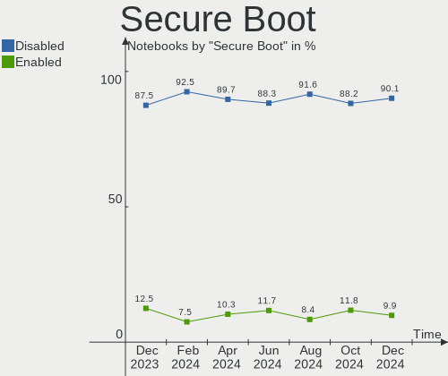
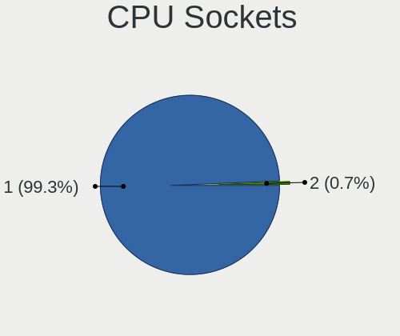
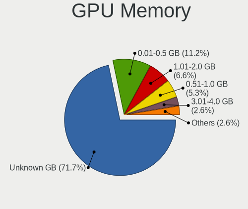
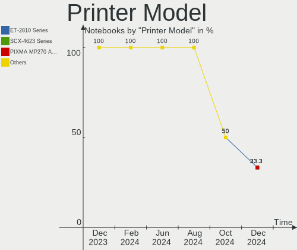
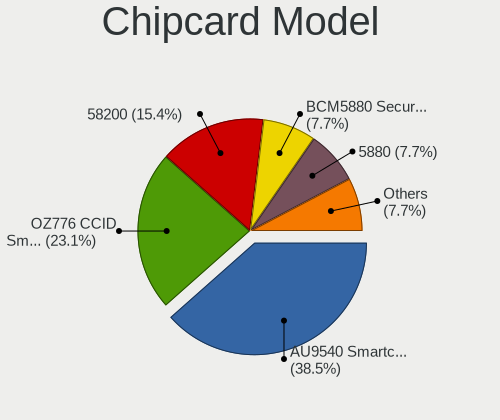

Linux in Italy - Hardware Trends (Notebooks)
--------------------------------------------

A project to identify most popular hardware characteristics and track their change
over time based on data collected by Linux users at https://Linux-Hardware.org.

Anyone can contribute to this report by the [hw-probe](https://github.com/linuxhw/hw-probe) tool:

    sudo -E hw-probe -all -upload

Period: Apr, 2023.

Contents
--------

* [ System ](#system)
  - [ OS                       ](#os)
  - [ OS Family                ](#os-family)
  - [ Kernel                   ](#kernel)
  - [ Kernel Family            ](#kernel-family)
  - [ Kernel Major Ver.        ](#kernel-major-ver)
  - [ Arch                     ](#arch)
  - [ DE                       ](#de)
  - [ Display Server           ](#display-server)
  - [ Display Manager          ](#display-manager)
  - [ OS Lang                  ](#os-lang)
  - [ Boot Mode                ](#boot-mode)
  - [ Filesystem               ](#filesystem)
  - [ Part. scheme             ](#part-scheme)
  - [ Dual Boot with Linux/BSD ](#dual-boot-with-linuxbsd)
  - [ Dual Boot (Win)          ](#dual-boot-win)

* [ Board ](#board)
  - [ Vendor                   ](#vendor)
  - [ Model                    ](#model)
  - [ Model Family             ](#model-family)
  - [ MFG Year                 ](#mfg-year)
  - [ Form Factor              ](#form-factor)
  - [ Secure Boot              ](#secure-boot)
  - [ Coreboot                 ](#coreboot)
  - [ RAM Size                 ](#ram-size)
  - [ RAM Used                 ](#ram-used)
  - [ Total Drives             ](#total-drives)
  - [ Has CD-ROM               ](#has-cd-rom)
  - [ Has Ethernet             ](#has-ethernet)
  - [ Has WiFi                 ](#has-wifi)
  - [ Has Bluetooth            ](#has-bluetooth)

* [ Location ](#location)
  - [ Country                  ](#country)
  - [ City                     ](#city)

* [ Drives ](#drives)
  - [ Drive Vendor             ](#drive-vendor)
  - [ Drive Model              ](#drive-model)
  - [ HDD Vendor               ](#hdd-vendor)
  - [ SSD Vendor               ](#ssd-vendor)
  - [ Drive Kind               ](#drive-kind)
  - [ Drive Connector          ](#drive-connector)
  - [ Drive Size               ](#drive-size)
  - [ Space Total              ](#space-total)
  - [ Space Used               ](#space-used)
  - [ Malfunc. Drives          ](#malfunc-drives)
  - [ Malfunc. Drive Vendor    ](#malfunc-drive-vendor)
  - [ Malfunc. HDD Vendor      ](#malfunc-hdd-vendor)
  - [ Malfunc. Drive Kind      ](#malfunc-drive-kind)
  - [ Failed Drives            ](#failed-drives)
  - [ Failed Drive Vendor      ](#failed-drive-vendor)
  - [ Drive Status             ](#drive-status)

* [ Storage controller ](#storage-controller)
  - [ Storage Vendor           ](#storage-vendor)
  - [ Storage Model            ](#storage-model)
  - [ Storage Kind             ](#storage-kind)

* [ Processor ](#processor)
  - [ CPU Vendor               ](#cpu-vendor)
  - [ CPU Model                ](#cpu-model)
  - [ CPU Model Family         ](#cpu-model-family)
  - [ CPU Cores                ](#cpu-cores)
  - [ CPU Sockets              ](#cpu-sockets)
  - [ CPU Threads              ](#cpu-threads)
  - [ CPU Op-Modes             ](#cpu-op-modes)
  - [ CPU Microcode            ](#cpu-microcode)
  - [ CPU Microarch            ](#cpu-microarch)

* [ Graphics ](#graphics)
  - [ GPU Vendor               ](#gpu-vendor)
  - [ GPU Model                ](#gpu-model)
  - [ GPU Combo                ](#gpu-combo)
  - [ GPU Driver               ](#gpu-driver)
  - [ GPU Memory               ](#gpu-memory)

* [ Monitor ](#monitor)
  - [ Monitor Vendor           ](#monitor-vendor)
  - [ Monitor Model            ](#monitor-model)
  - [ Monitor Resolution       ](#monitor-resolution)
  - [ Monitor Diagonal         ](#monitor-diagonal)
  - [ Monitor Width            ](#monitor-width)
  - [ Aspect Ratio             ](#aspect-ratio)
  - [ Monitor Area             ](#monitor-area)
  - [ Pixel Density            ](#pixel-density)
  - [ Multiple Monitors        ](#multiple-monitors)

* [ Network ](#network)
  - [ Net Controller Vendor    ](#net-controller-vendor)
  - [ Net Controller Model     ](#net-controller-model)
  - [ Wireless Vendor          ](#wireless-vendor)
  - [ Wireless Model           ](#wireless-model)
  - [ Ethernet Vendor          ](#ethernet-vendor)
  - [ Ethernet Model           ](#ethernet-model)
  - [ Net Controller Kind      ](#net-controller-kind)
  - [ Used Controller          ](#used-controller)
  - [ NICs                     ](#nics)
  - [ IPv6                     ](#ipv6)

* [ Bluetooth ](#bluetooth)
  - [ Bluetooth Vendor         ](#bluetooth-vendor)
  - [ Bluetooth Model          ](#bluetooth-model)

* [ Sound ](#sound)
  - [ Sound Vendor             ](#sound-vendor)
  - [ Sound Model              ](#sound-model)

* [ Memory ](#memory)
  - [ Memory Vendor            ](#memory-vendor)
  - [ Memory Model             ](#memory-model)
  - [ Memory Kind              ](#memory-kind)
  - [ Memory Form Factor       ](#memory-form-factor)
  - [ Memory Size              ](#memory-size)
  - [ Memory Speed             ](#memory-speed)

* [ Printers & scanners ](#printers--scanners)
  - [ Printer Vendor           ](#printer-vendor)
  - [ Printer Model            ](#printer-model)
  - [ Scanner Vendor           ](#scanner-vendor)
  - [ Scanner Model            ](#scanner-model)

* [ Camera ](#camera)
  - [ Camera Vendor            ](#camera-vendor)
  - [ Camera Model             ](#camera-model)

* [ Security ](#security)
  - [ Fingerprint Vendor       ](#fingerprint-vendor)
  - [ Fingerprint Model        ](#fingerprint-model)
  - [ Chipcard Vendor          ](#chipcard-vendor)
  - [ Chipcard Model           ](#chipcard-model)

* [ Unsupported ](#unsupported)
  - [ Unsupported Devices      ](#unsupported-devices)
  - [ Unsupported Device Types ](#unsupported-device-types)

System
------

OS
--

Installed operating systems

| Name                         | Notebooks | Percent |
|------------------------------|-----------|---------|
| OpenMandriva 23.03           | 24        | 20.17%  |
| Ubuntu 22.04                 | 15        | 12.61%  |
| Arch Rolling                 | 8         | 6.72%   |
| Fedora 37                    | 6         | 5.04%   |
| Pop!_OS 22.04                | 5         | 4.2%    |
| Fedora 38                    | 5         | 4.2%    |
| Debian 11                    | 5         | 4.2%    |
| Ubuntu 22.10                 | 4         | 3.36%   |
| Linux Mint 21.1              | 4         | 3.36%   |
| EndeavourOS Rolling          | 4         | 3.36%   |
| OpenMandriva 4.3             | 3         | 2.52%   |
| Debian 12                    | 3         | 2.52%   |
| Ubuntu 20.04                 | 2         | 1.68%   |
| Ubuntu 18.04                 | 2         | 1.68%   |
| Linux Mint 20.3              | 2         | 1.68%   |
| Linux Mint 19.2              | 2         | 1.68%   |
| Kubuntu 22.04                | 2         | 1.68%   |
| KDE neon 22.04               | 2         | 1.68%   |
| Xubuntu 22.10                | 1         | 0.84%   |
| Xubuntu 22.04                | 1         | 0.84%   |
| Ubuntu 23.04                 | 1         | 0.84%   |
| ROSA R11.1                   | 1         | 0.84%   |
| ROSA 12.4                    | 1         | 0.84%   |
| Pikaos 22.10                 | 1         | 0.84%   |
| openSUSE Tumbleweed-XXXXXXXX | 1         | 0.84%   |
| OpenMandriva 4.2             | 1         | 0.84%   |
| OpenMandriva 23.01           | 1         | 0.84%   |
| Manjaro 22.1.0               | 1         | 0.84%   |
| Manjaro                      | 1         | 0.84%   |
| Lubuntu 20.04                | 1         | 0.84%   |
| LMDE 5                       | 1         | 0.84%   |
| Linux Mint 21                | 1         | 0.84%   |
| Linux Mint 20                | 1         | 0.84%   |
| Linux Mint 18.3              | 1         | 0.84%   |
| Kubuntu 23.04                | 1         | 0.84%   |
| Kali 2023.1                  | 1         | 0.84%   |
| Gentoo 2.13                  | 1         | 0.84%   |
| Fedora 36                    | 1         | 0.84%   |
| ArcoLinux Rolling            | 1         | 0.84%   |

OS Family
---------

OS without a version

| Name         | Notebooks | Percent |
|--------------|-----------|---------|
| OpenMandriva | 29        | 24.37%  |
| Ubuntu       | 24        | 20.17%  |
| Fedora       | 12        | 10.08%  |
| Linux Mint   | 11        | 9.24%   |
| Debian       | 8         | 6.72%   |
| Arch         | 8         | 6.72%   |
| Pop!_OS      | 5         | 4.2%    |
| EndeavourOS  | 4         | 3.36%   |
| Kubuntu      | 3         | 2.52%   |
| Xubuntu      | 2         | 1.68%   |
| ROSA         | 2         | 1.68%   |
| Manjaro      | 2         | 1.68%   |
| KDE neon     | 2         | 1.68%   |
| Pikaos       | 1         | 0.84%   |
| openSUSE     | 1         | 0.84%   |
| Lubuntu      | 1         | 0.84%   |
| LMDE         | 1         | 0.84%   |
| Kali         | 1         | 0.84%   |
| Gentoo       | 1         | 0.84%   |
| ArcoLinux    | 1         | 0.84%   |

Kernel
------

Version of the Linux kernel

| Version                 | Notebooks | Percent |
|-------------------------|-----------|---------|
| 6.2.6-desktop-1omv2390  | 24        | 20.17%  |
| 5.19.0-38-generic       | 10        | 8.4%    |
| 5.19.0-40-generic       | 5         | 4.2%    |
| 5.15.0-69-generic       | 5         | 4.2%    |
| 6.2.6-76060206-generic  | 4         | 3.36%   |
| 6.2.12-arch1-1          | 3         | 2.52%   |
| 6.2.10-arch1-1          | 3         | 2.52%   |
| 5.4.0-147-generic       | 3         | 2.52%   |
| 5.19.0-32-generic       | 3         | 2.52%   |
| 5.10.0-21-amd64         | 3         | 2.52%   |
| 6.2.9-arch1-1           | 2         | 1.68%   |
| 6.2.9-300.fc38.x86_64   | 2         | 1.68%   |
| 6.2.8-arch1-1           | 2         | 1.68%   |
| 6.2.8-200.fc37.x86_64   | 2         | 1.68%   |
| 6.2.11-300.fc38.x86_64  | 2         | 1.68%   |
| 6.1.0-6-amd64           | 2         | 1.68%   |
| 6.0.7-301.fc37.x86_64   | 2         | 1.68%   |
| 5.4.0-146-generic       | 2         | 1.68%   |
| 5.19.0-41-generic       | 2         | 1.68%   |
| 5.16.7-desktop-1omv4003 | 2         | 1.68%   |
| 4.15.0-54-generic       | 2         | 1.68%   |
| 6.2.9-zen1-1-zen        | 1         | 0.84%   |
| 6.2.9-200.fc37.x86_64   | 1         | 0.84%   |
| 6.2.9-100.fc36.x86_64   | 1         | 0.84%   |
| 6.2.9-060209-generic    | 1         | 0.84%   |
| 6.2.8-zen1-1-zen        | 1         | 0.84%   |
| 6.2.8-1-MANJARO         | 1         | 0.84%   |
| 6.2.7-200.fc37.x86_64   | 1         | 0.84%   |
| 6.2.6-pikaos            | 1         | 0.84%   |
| 6.2.12-300.fc38.x86_64  | 1         | 0.84%   |
| 6.2.10-zen1-1-zen       | 1         | 0.84%   |
| 6.2.10-1-default        | 1         | 0.84%   |
| 6.2.0-20-generic        | 1         | 0.84%   |
| 6.2.0-10005-tuxedo      | 1         | 0.84%   |
| 6.1.23-1-MANJARO        | 1         | 0.84%   |
| 6.1.19-gentoo           | 1         | 0.84%   |
| 6.1.1-desktop-1omv2290  | 1         | 0.84%   |
| 6.1.0-kali5-amd64       | 1         | 0.84%   |
| 6.1.0-7-amd64           | 1         | 0.84%   |
| 6.1.0-1008-oem          | 1         | 0.84%   |

Kernel Family
-------------

Linux kernel without a distro release

| Version  | Notebooks | Percent |
|----------|-----------|---------|
| 6.2.6    | 29        | 24.37%  |
| 5.19.0   | 23        | 19.33%  |
| 6.2.9    | 8         | 6.72%   |
| 5.4.0    | 7         | 5.88%   |
| 5.15.0   | 7         | 5.88%   |
| 6.2.8    | 6         | 5.04%   |
| 6.1.0    | 6         | 5.04%   |
| 6.2.10   | 5         | 4.2%    |
| 5.10.0   | 5         | 4.2%    |
| 6.2.12   | 4         | 3.36%   |
| 4.15.0   | 3         | 2.52%   |
| 6.2.11   | 2         | 1.68%   |
| 6.2.0    | 2         | 1.68%   |
| 6.0.7    | 2         | 1.68%   |
| 5.16.7   | 2         | 1.68%   |
| 6.2.7    | 1         | 0.84%   |
| 6.1.23   | 1         | 0.84%   |
| 6.1.19   | 1         | 0.84%   |
| 6.1.1    | 1         | 0.84%   |
| 5.16.13  | 1         | 0.84%   |
| 5.10.176 | 1         | 0.84%   |
| 5.10.14  | 1         | 0.84%   |
| 4.9.124  | 1         | 0.84%   |

Kernel Major Ver.
-----------------

Linux kernel major version

| Version | Notebooks | Percent |
|---------|-----------|---------|
| 6.2     | 57        | 47.9%   |
| 5.19    | 23        | 19.33%  |
| 6.1     | 9         | 7.56%   |
| 5.4     | 7         | 5.88%   |
| 5.15    | 7         | 5.88%   |
| 5.10    | 7         | 5.88%   |
| 5.16    | 3         | 2.52%   |
| 4.15    | 3         | 2.52%   |
| 6.0     | 2         | 1.68%   |
| 4.9     | 1         | 0.84%   |

Arch
----

OS architecture (x86_64, i586, etc.)

| Name   | Notebooks | Percent |
|--------|-----------|---------|
| x86_64 | 116       | 97.48%  |
| i686   | 3         | 2.52%   |

DE
--

Desktop Environment

| Name          | Notebooks | Percent |
|---------------|-----------|---------|
| GNOME         | 51        | 42.86%  |
| KDE5          | 39        | 32.77%  |
| XFCE          | 10        | 8.4%    |
| X-Cinnamon    | 9         | 7.56%   |
| LXQt          | 4         | 3.36%   |
| MATE          | 3         | 2.52%   |
| pika:GNOME    | 1         | 0.84%   |
| LXDE          | 1         | 0.84%   |
| GNOME Classic | 1         | 0.84%   |

Display Server
--------------

X11 or Wayland

| Name    | Notebooks | Percent |
|---------|-----------|---------|
| X11     | 79        | 66.39%  |
| Wayland | 37        | 31.09%  |
| Unknown | 2         | 1.68%   |
| Tty     | 1         | 0.84%   |

Display Manager
---------------

SDDM, LightDM, etc.

| Name    | Notebooks | Percent |
|---------|-----------|---------|
| SDDM    | 40        | 33.61%  |
| GDM3    | 23        | 19.33%  |
| LightDM | 21        | 17.65%  |
| Unknown | 19        | 15.97%  |
| GDM     | 16        | 13.45%  |

OS Lang
-------

Language

| Lang  | Notebooks | Percent |
|-------|-----------|---------|
| it_IT | 84        | 70.59%  |
| en_US | 29        | 24.37%  |
| C     | 3         | 2.52%   |
| en_AG | 2         | 1.68%   |
| en_GB | 1         | 0.84%   |

Boot Mode
---------

EFI or BIOS

| Mode | Notebooks | Percent |
|------|-----------|---------|
| EFI  | 64        | 53.78%  |
| BIOS | 55        | 46.22%  |

Filesystem
----------

Type of filesystem

| Type    | Notebooks | Percent |
|---------|-----------|---------|
| Ext4    | 73        | 61.34%  |
| Overlay | 20        | 16.81%  |
| Btrfs   | 17        | 14.29%  |
| Tmpfs   | 4         | 3.36%   |
| Zfs     | 2         | 1.68%   |
| Xfs     | 2         | 1.68%   |
| F2fs    | 1         | 0.84%   |

Part. scheme
------------

Scheme of partitioning

| Type    | Notebooks | Percent |
|---------|-----------|---------|
| GPT     | 76        | 63.87%  |
| MBR     | 24        | 20.17%  |
| Unknown | 19        | 15.97%  |

Dual Boot with Linux/BSD
------------------------

Hosting more than one Linux/BSD

| Dual boot | Notebooks | Percent |
|-----------|-----------|---------|
| No        | 97        | 81.51%  |
| Yes       | 22        | 18.49%  |

Dual Boot (Win)
---------------

Hosting Linux and Windows

| Dual boot | Notebooks | Percent |
|-----------|-----------|---------|
| No        | 73        | 61.34%  |
| Yes       | 46        | 38.66%  |

Board
-----

Vendor
------

Motherboard manufacturer

| Name                | Notebooks | Percent |
|---------------------|-----------|---------|
| Hewlett-Packard     | 28        | 23.53%  |
| Lenovo              | 24        | 20.17%  |
| ASUSTek Computer    | 12        | 10.08%  |
| Acer                | 12        | 10.08%  |
| Dell                | 9         | 7.56%   |
| Apple               | 5         | 4.2%    |
| Toshiba             | 3         | 2.52%   |
| MSI                 | 3         | 2.52%   |
| Sony                | 2         | 1.68%   |
| PC Specialist       | 2         | 1.68%   |
| Packard Bell        | 2         | 1.68%   |
| HUAWEI              | 2         | 1.68%   |
| Chuwi               | 2         | 1.68%   |
| TUXEDO              | 1         | 0.84%   |
| System76            | 1         | 0.84%   |
| Samsung Electronics | 1         | 0.84%   |
| Onda TLC            | 1         | 0.84%   |
| Medion              | 1         | 0.84%   |
| Mediacom            | 1         | 0.84%   |
| MAXDATA             | 1         | 0.84%   |
| Google              | 1         | 0.84%   |
| Gigabyte Technology | 1         | 0.84%   |
| Fujitsu             | 1         | 0.84%   |
| BESSTAR Tech        | 1         | 0.84%   |
| AMI                 | 1         | 0.84%   |
| Unknown             | 1         | 0.84%   |

Model
-----

Motherboard model

| Name                                  | Notebooks | Percent |
|---------------------------------------|-----------|---------|
| MSI Modern 14 B11MOU                  | 2         | 1.68%   |
| Lenovo ThinkPad X270 W10DG 20K5S3HG00 | 2         | 1.68%   |
| Lenovo B50-30 80ES                    | 2         | 1.68%   |
| HP Pavilion Sleekbook 15              | 2         | 1.68%   |
| HP 250 15.6 inch G9 Notebook PC       | 2         | 1.68%   |
| Unknown                               | 2         | 1.68%   |
| Toshiba Satellite Pro S500            | 1         | 0.84%   |
| Toshiba Satellite Pro C850-1J2        | 1         | 0.84%   |
| Toshiba Kronos 10CUG                  | 1         | 0.84%   |
| System76 Oryx Pro                     | 1         | 0.84%   |
| Sony VPCSE1V9E                        | 1         | 0.84%   |
| Sony SVE1713X1EB                      | 1         | 0.84%   |
| Samsung RC530/RC730                   | 1         | 0.84%   |
| PC Specialist PCx0Dx                  | 1         | 0.84%   |
| PC Specialist Elimina Iv 17           | 1         | 0.84%   |
| Packard Bell EasyNote_MX45            | 1         | 0.84%   |
| Packard Bell EasyNote TJ65            | 1         | 0.84%   |
| Onda TLC ONDA Oliver                  | 1         | 0.84%   |
| MSI Katana GF66 12UC                  | 1         | 0.84%   |
| Medion E16401                         | 1         | 0.84%   |
| Mediacom WinPad 11,6 FullHD- WPU11    | 1         | 0.84%   |
| MAXDATA o.max_5xs                     | 1         | 0.84%   |
| Lenovo Z50-75 80EC                    | 1         | 0.84%   |
| Lenovo XiaoXinPro 16ACH 2021 82L5     | 1         | 0.84%   |
| Lenovo V15-IGL 82C3                   | 1         | 0.84%   |
| Lenovo V14-ADA 82C6                   | 1         | 0.84%   |
| Lenovo V110-15ISK 80TL                | 1         | 0.84%   |
| Lenovo ThinkPad X61s 7666WJ5          | 1         | 0.84%   |
| Lenovo ThinkPad X250 20CLS2X60S       | 1         | 0.84%   |
| Lenovo ThinkPad X250 20CLS0CW00       | 1         | 0.84%   |
| Lenovo ThinkPad X200 7459J74          | 1         | 0.84%   |
| Lenovo ThinkPad T480s 20L8S6S307      | 1         | 0.84%   |
| Lenovo ThinkPad T480s 20L8002WMD      | 1         | 0.84%   |
| Lenovo ThinkPad L530 24783B3          | 1         | 0.84%   |
| Lenovo ThinkPad L490 20Q6S90C00       | 1         | 0.84%   |
| Lenovo ThinkPad L430 24683NG          | 1         | 0.84%   |
| Lenovo Legion 5 15ARH05H 82B1         | 1         | 0.84%   |
| Lenovo IdeaPad Gaming 3 15ARH05 82EY  | 1         | 0.84%   |
| Lenovo IdeaPad 5 Pro 14ACN6 82L7      | 1         | 0.84%   |
| Lenovo IdeaPad 330S-15IKB 81F5        | 1         | 0.84%   |

Model Family
------------

Motherboard model prefix

| Name                  | Notebooks | Percent |
|-----------------------|-----------|---------|
| Lenovo ThinkPad       | 11        | 9.24%   |
| HP Pavilion           | 7         | 5.88%   |
| Acer Aspire           | 7         | 5.88%   |
| HP Laptop             | 4         | 3.36%   |
| HP 250                | 4         | 3.36%   |
| Dell XPS              | 4         | 3.36%   |
| Lenovo IdeaPad        | 3         | 2.52%   |
| HP EliteBook          | 3         | 2.52%   |
| Dell Latitude         | 3         | 2.52%   |
| ASUS VivoBook         | 3         | 2.52%   |
| Acer Swift            | 3         | 2.52%   |
| Toshiba Satellite     | 2         | 1.68%   |
| Packard Bell EasyNote | 2         | 1.68%   |
| MSI Modern            | 2         | 1.68%   |
| Lenovo B50-30         | 2         | 1.68%   |
| HP ProBook            | 2         | 1.68%   |
| HP Compaq             | 2         | 1.68%   |
| Dell Inspiron         | 2         | 1.68%   |
| Acer TravelMate       | 2         | 1.68%   |
| Unknown               | 2         | 1.68%   |
| Toshiba Kronos        | 1         | 0.84%   |
| System76 Oryx         | 1         | 0.84%   |
| Sony VPCSE1V9E        | 1         | 0.84%   |
| Sony SVE1713X1EB      | 1         | 0.84%   |
| Samsung RC530         | 1         | 0.84%   |
| PC Specialist PCx0Dx  | 1         | 0.84%   |
| PC Specialist Elimina | 1         | 0.84%   |
| Onda TLC ONDA         | 1         | 0.84%   |
| MSI Katana            | 1         | 0.84%   |
| Medion E16401         | 1         | 0.84%   |
| Mediacom WinPad       | 1         | 0.84%   |
| MAXDATA o.max         | 1         | 0.84%   |
| Lenovo Z50-75         | 1         | 0.84%   |
| Lenovo XiaoXinPro     | 1         | 0.84%   |
| Lenovo V15-IGL        | 1         | 0.84%   |
| Lenovo V14-ADA        | 1         | 0.84%   |
| Lenovo V110-15ISK     | 1         | 0.84%   |
| Lenovo Legion         | 1         | 0.84%   |
| Lenovo G50-45         | 1         | 0.84%   |
| Lenovo B51-80         | 1         | 0.84%   |

MFG Year
--------

Motherboard manufacture year

| Year | Notebooks | Percent |
|------|-----------|---------|
| 2021 | 16        | 13.45%  |
| 2022 | 13        | 10.92%  |
| 2019 | 11        | 9.24%   |
| 2020 | 8         | 6.72%   |
| 2018 | 8         | 6.72%   |
| 2012 | 8         | 6.72%   |
| 2015 | 7         | 5.88%   |
| 2011 | 7         | 5.88%   |
| 2008 | 7         | 5.88%   |
| 2017 | 6         | 5.04%   |
| 2016 | 6         | 5.04%   |
| 2014 | 5         | 4.2%    |
| 2010 | 4         | 3.36%   |
| 2007 | 4         | 3.36%   |
| 2013 | 3         | 2.52%   |
| 2009 | 3         | 2.52%   |
| 2023 | 1         | 0.84%   |
| 2006 | 1         | 0.84%   |
| 2005 | 1         | 0.84%   |

Form Factor
-----------

Physical design of the computer

| Name     | Notebooks | Percent |
|----------|-----------|---------|
| Notebook | 119       | 100%    |

Secure Boot
-----------

Enabled or disabled

| State    | Notebooks | Percent |
|----------|-----------|---------|
| Disabled | 110       | 92.44%  |
| Enabled  | 9         | 7.56%   |

Coreboot
--------

Have coreboot on board

| Used | Notebooks | Percent |
|------|-----------|---------|
| No   | 117       | 98.32%  |
| Yes  | 2         | 1.68%   |

RAM Size
--------

Total RAM memory

| Size in GB  | Notebooks | Percent |
|-------------|-----------|---------|
| 4.01-8.0    | 41        | 34.45%  |
| 3.01-4.0    | 27        | 22.69%  |
| 8.01-16.0   | 19        | 15.97%  |
| 16.01-24.0  | 16        | 13.45%  |
| 32.01-64.0  | 6         | 5.04%   |
| 1.01-2.0    | 6         | 5.04%   |
| 2.01-3.0    | 2         | 1.68%   |
| 64.01-256.0 | 1         | 0.84%   |
| 0.51-1.0    | 1         | 0.84%   |

RAM Used
--------

Used RAM memory

| Used GB   | Notebooks | Percent |
|-----------|-----------|---------|
| 1.01-2.0  | 50        | 42.02%  |
| 2.01-3.0  | 32        | 26.89%  |
| 4.01-8.0  | 14        | 11.76%  |
| 3.01-4.0  | 13        | 10.92%  |
| 8.01-16.0 | 5         | 4.2%    |
| 0.51-1.0  | 4         | 3.36%   |
| 0.01-0.5  | 1         | 0.84%   |

Total Drives
------------

Number of drives on board

| Drives | Notebooks | Percent |
|--------|-----------|---------|
| 1      | 85        | 71.43%  |
| 2      | 29        | 24.37%  |
| 3      | 3         | 2.52%   |
| 0      | 2         | 1.68%   |

Has CD-ROM
----------

Has CD-ROM on board

| Presented | Notebooks | Percent |
|-----------|-----------|---------|
| No        | 78        | 65.55%  |
| Yes       | 41        | 34.45%  |

Has Ethernet
------------

Has Ethernet on board

| Presented | Notebooks | Percent |
|-----------|-----------|---------|
| Yes       | 94        | 78.99%  |
| No        | 25        | 21.01%  |

Has WiFi
--------

Has WiFi module

| Presented | Notebooks | Percent |
|-----------|-----------|---------|
| Yes       | 118       | 99.16%  |
| No        | 1         | 0.84%   |

Has Bluetooth
-------------

Has Bluetooth module

| Presented | Notebooks | Percent |
|-----------|-----------|---------|
| Yes       | 94        | 78.99%  |
| No        | 25        | 21.01%  |

Location
--------

Country
-------

Geographic location (country)

| Country | Notebooks | Percent |
|---------|-----------|---------|
| Italy   | 119       | 100%    |

City
----

Geographic location (city)

| City                     | Notebooks | Percent |
|--------------------------|-----------|---------|
| Milan                    | 15        | 12.61%  |
| Rome                     | 11        | 9.24%   |
| Milano                   | 5         | 4.2%    |
| Turin                    | 4         | 3.36%   |
| Bergamo                  | 4         | 3.36%   |
| Bologna                  | 3         | 2.52%   |
| Verona                   | 2         | 1.68%   |
| Trieste                  | 2         | 1.68%   |
| Trento                   | 2         | 1.68%   |
| Torricella Sicura        | 2         | 1.68%   |
| Genoa                    | 2         | 1.68%   |
| Venice                   | 1         | 0.84%   |
| Trecate                  | 1         | 0.84%   |
| Torre Boldone            | 1         | 0.84%   |
| Tempio Pausania          | 1         | 0.84%   |
| Sant'Antonio Abate       | 1         | 0.84%   |
| San Gimignano            | 1         | 0.84%   |
| Salerno                  | 1         | 0.84%   |
| Rho                      | 1         | 0.84%   |
| Reggio Calabria          | 1         | 0.84%   |
| Quarrata                 | 1         | 0.84%   |
| Prad am Stilfser Joch    | 1         | 0.84%   |
| Portogruaro              | 1         | 0.84%   |
| Porcia                   | 1         | 0.84%   |
| Ponteranica              | 1         | 0.84%   |
| Ponsacco                 | 1         | 0.84%   |
| Polla                    | 1         | 0.84%   |
| Pianezza                 | 1         | 0.84%   |
| Pescara                  | 1         | 0.84%   |
| Passignano sul Trasimeno | 1         | 0.84%   |
| Parma                    | 1         | 0.84%   |
| Palermo                  | 1         | 0.84%   |
| Paese                    | 1         | 0.84%   |
| Padova                   | 1         | 0.84%   |
| Ornago                   | 1         | 0.84%   |
| Oria                     | 1         | 0.84%   |
| Novara                   | 1         | 0.84%   |
| Monterotondo             | 1         | 0.84%   |
| Monteroni di Lecce       | 1         | 0.84%   |
| Monserrato               | 1         | 0.84%   |

Drives
------

Drive Vendor
------------

Hard drive vendors

| Vendor                      | Notebooks | Drives | Percent |
|-----------------------------|-----------|--------|---------|
| Samsung Electronics         | 25        | 27     | 16.89%  |
| Seagate                     | 13        | 13     | 8.78%   |
| Unknown                     | 12        | 12     | 8.11%   |
| WDC                         | 10        | 10     | 6.76%   |
| SanDisk                     | 9         | 9      | 6.08%   |
| Hitachi                     | 9         | 9      | 6.08%   |
| Kingston                    | 8         | 8      | 5.41%   |
| Toshiba                     | 7         | 7      | 4.73%   |
| Crucial                     | 6         | 6      | 4.05%   |
| Intel                       | 5         | 5      | 3.38%   |
| SK hynix                    | 4         | 4      | 2.7%    |
| Kingston Technology Company | 4         | 4      | 2.7%    |
| Micron Technology           | 3         | 3      | 2.03%   |
| KIOXIA                      | 3         | 3      | 2.03%   |
| SPCC                        | 2         | 2      | 1.35%   |
| Phison Electronics          | 2         | 2      | 1.35%   |
| JMicron Technology          | 2         | 2      | 1.35%   |
| HGST                        | 2         | 2      | 1.35%   |
| Fanxiang                    | 2         | 2      | 1.35%   |
| China                       | 2         | 2      | 1.35%   |
| Apple                       | 2         | 2      | 1.35%   |
| A-DATA Technology           | 2         | 2      | 1.35%   |
| WALRAM                      | 1         | 1      | 0.68%   |
| Transcend                   | 1         | 1      | 0.68%   |
| Silicon Motion              | 1         | 1      | 0.68%   |
| Realtek Semiconductor       | 1         | 1      | 0.68%   |
| Phison                      | 1         | 1      | 0.68%   |
| ORTIAL                      | 1         | 1      | 0.68%   |
| Netac                       | 1         | 1      | 0.68%   |
| Micron/Crucial Technology   | 1         | 1      | 0.68%   |
| LITEONIT                    | 1         | 1      | 0.68%   |
| LITEON                      | 1         | 1      | 0.68%   |
| Leven                       | 1         | 1      | 0.68%   |
| KingDian                    | 1         | 1      | 0.68%   |
| ASENNO                      | 1         | 1      | 0.68%   |
| Unknown                     | 1         | 1      | 0.68%   |

Drive Model
-----------

Hard drive models

| Model                                              | Notebooks | Percent |
|----------------------------------------------------|-----------|---------|
| Unknown MMC Card  64GB                             | 3         | 2%      |
| Crucial CT480BX500SSD1 480GB                       | 3         | 2%      |
| WDC WD10JPCX-24UE4T0 1TB                           | 2         | 1.33%   |
| Unknown NCard  32GB                                | 2         | 1.33%   |
| Seagate ST500LT012-1DG142 500GB                    | 2         | 1.33%   |
| Seagate ST1000LM035-1RK172 970GB                   | 2         | 1.33%   |
| Seagate ST1000LM024 HN-M101MBB 1TB                 | 2         | 1.33%   |
| Sandisk WD Blue SN550 NVMe SSD 1024GB              | 2         | 1.33%   |
| Samsung SSD 980 1TB                                | 2         | 1.33%   |
| Samsung NVMe SSD Controller SM981/PM981/PM983 1TB  | 2         | 1.33%   |
| Samsung NVMe SSD Controller PM9A1/PM9A3/980PRO 2TB | 2         | 1.33%   |
| Samsung MZVLQ256HBJD-00BH1 256GB                   | 2         | 1.33%   |
| Kingston Company U-SNS8154P3 NVMe SSD 256GB        | 2         | 1.33%   |
| Kingston SA400S37240G 240GB SSD                    | 2         | 1.33%   |
| Kingston OM8PDP3256B-AI1 256GB                     | 2         | 1.33%   |
| Intel SSDPEKNU512GZ 512GB                          | 2         | 1.33%   |
| Intel SSD 660P Series 512GB                        | 2         | 1.33%   |
| WDC WDS250G2B0A-00SM50 250GB SSD                   | 1         | 0.67%   |
| WDC WD800UE-22HCT0 80GB                            | 1         | 0.67%   |
| WDC WD7500BFCX-68N6GN0 752GB                       | 1         | 0.67%   |
| WDC WD5000LPCX-24C6HT0 500GB                       | 1         | 0.67%   |
| WDC WD1600BEVS-22RST0 160GB                        | 1         | 0.67%   |
| WDC WD10SPZX-60Z10T0 1TB                           | 1         | 0.67%   |
| WDC PC SN530 SDBPNPZ-1T00-1002 1TB                 | 1         | 0.67%   |
| WDC PC SN520 SDAPNUW-512G-1014 512GB               | 1         | 0.67%   |
| WALRAM 512G                                        | 1         | 0.67%   |
| Unknown SD64G  64GB                                | 1         | 0.67%   |
| Unknown SC128  128GB                               | 1         | 0.67%   |
| Unknown SA04G  4GB                                 | 1         | 0.67%   |
| Unknown MMC Card  32GB                             | 1         | 0.67%   |
| Unknown MMC Card  2TB                              | 1         | 0.67%   |
| Unknown MMC Card  2GB                              | 1         | 0.67%   |
| Unknown hDEaP3  128GB                              | 1         | 0.67%   |
| Transcend TS120GMTS420S 120GB SSD                  | 1         | 0.67%   |
| Toshiba XG6 NVMe SSD Controller 1024GB             | 1         | 0.67%   |
| Toshiba THNSF8400CCSE 400GB SSD                    | 1         | 0.67%   |
| Toshiba MQ01ABF050 500GB                           | 1         | 0.67%   |
| Toshiba MQ01ABD100 1TB                             | 1         | 0.67%   |
| Toshiba MK3261GSYN 320GB                           | 1         | 0.67%   |
| Toshiba MK3259GSXP 320GB                           | 1         | 0.67%   |

HDD Vendor
----------

Hard disk drive vendors

| Vendor             | Notebooks | Drives | Percent |
|--------------------|-----------|--------|---------|
| Seagate            | 12        | 12     | 34.29%  |
| Hitachi            | 9         | 9      | 25.71%  |
| WDC                | 7         | 7      | 20%     |
| Toshiba            | 4         | 4      | 11.43%  |
| HGST               | 2         | 2      | 5.71%   |
| JMicron Technology | 1         | 1      | 2.86%   |

SSD Vendor
----------

Solid state drive vendors

| Vendor              | Notebooks | Drives | Percent |
|---------------------|-----------|--------|---------|
| Samsung Electronics | 11        | 11     | 23.91%  |
| Crucial             | 6         | 6      | 13.04%  |
| Kingston            | 5         | 5      | 10.87%  |
| SPCC                | 2         | 2      | 4.35%   |
| SanDisk             | 2         | 2      | 4.35%   |
| Fanxiang            | 2         | 2      | 4.35%   |
| China               | 2         | 2      | 4.35%   |
| Apple               | 2         | 2      | 4.35%   |
| A-DATA Technology   | 2         | 2      | 4.35%   |
| WDC                 | 1         | 1      | 2.17%   |
| Transcend           | 1         | 1      | 2.17%   |
| Toshiba             | 1         | 1      | 2.17%   |
| ORTIAL              | 1         | 1      | 2.17%   |
| Netac               | 1         | 1      | 2.17%   |
| Micron Technology   | 1         | 1      | 2.17%   |
| LITEONIT            | 1         | 1      | 2.17%   |
| LITEON              | 1         | 1      | 2.17%   |
| Leven               | 1         | 1      | 2.17%   |
| KingDian            | 1         | 1      | 2.17%   |
| ASENNO              | 1         | 1      | 2.17%   |
| Unknown             | 1         | 1      | 2.17%   |

Drive Kind
----------

HDD or SSD

| Kind    | Notebooks | Drives | Percent |
|---------|-----------|--------|---------|
| NVMe    | 50        | 54     | 34.97%  |
| SSD     | 44        | 46     | 30.77%  |
| HDD     | 34        | 35     | 23.78%  |
| MMC     | 13        | 13     | 9.09%   |
| Unknown | 2         | 2      | 1.4%    |

Drive Connector
---------------

SATA, SAS, NVMe, etc.

| Type | Notebooks | Drives | Percent |
|------|-----------|--------|---------|
| SATA | 73        | 78     | 52.14%  |
| NVMe | 50        | 54     | 35.71%  |
| MMC  | 13        | 13     | 9.29%   |
| SAS  | 4         | 5      | 2.86%   |

Drive Size
----------

Size of hard drive

| Size in TB | Notebooks | Drives | Percent |
|------------|-----------|--------|---------|
| 0.01-0.5   | 54        | 55     | 69.23%  |
| 0.51-1.0   | 21        | 23     | 26.92%  |
| 1.01-2.0   | 3         | 3      | 3.85%   |

Space Total
-----------

Amount of disk space available on the file system

| Size in GB     | Notebooks | Percent |
|----------------|-----------|---------|
| 251-500        | 28        | 23.53%  |
| 101-250        | 28        | 23.53%  |
| 1-20           | 22        | 18.49%  |
| 51-100         | 11        | 9.24%   |
| 501-1000       | 10        | 8.4%    |
| 1001-2000      | 8         | 6.72%   |
| 2001-3000      | 5         | 4.2%    |
| 21-50          | 3         | 2.52%   |
| Unknown        | 3         | 2.52%   |
| More than 3000 | 1         | 0.84%   |

Space Used
----------

Amount of used disk space

| Used GB        | Notebooks | Percent |
|----------------|-----------|---------|
| 1-20           | 54        | 45.38%  |
| 101-250        | 19        | 15.97%  |
| 21-50          | 17        | 14.29%  |
| 51-100         | 12        | 10.08%  |
| 251-500        | 10        | 8.4%    |
| Unknown        | 3         | 2.52%   |
| 501-1000       | 2         | 1.68%   |
| More than 3000 | 1         | 0.84%   |
| 1001-2000      | 1         | 0.84%   |

Malfunc. Drives
---------------

Drive models with a malfunction

| Model                                | Notebooks | Drives | Percent |
|--------------------------------------|-----------|--------|---------|
| WDC WD800UE-22HCT0 80GB              | 1         | 1      | 7.69%   |
| WDC WD10JPCX-24UE4T0 1TB             | 1         | 1      | 7.69%   |
| SK hynix BC711 HFM512GD3JX013N 512GB | 1         | 1      | 7.69%   |
| Seagate ST9320325AS 320GB            | 1         | 1      | 7.69%   |
| Seagate ST9250827AS 250GB            | 1         | 1      | 7.69%   |
| Seagate ST500LT012-1DG142 500GB      | 1         | 1      | 7.69%   |
| Seagate ST500LM012 HN-M500MBB 500GB  | 1         | 1      | 7.69%   |
| Seagate ST250LT003-9YG14C 250GB      | 1         | 1      | 7.69%   |
| Seagate ST1000LM035-1RK172 970GB     | 1         | 1      | 7.69%   |
| Hitachi HTS725050A9A364 500GB        | 1         | 1      | 7.69%   |
| Hitachi HTS545050B9A300 500GB        | 1         | 1      | 7.69%   |
| Hitachi HTS543232A7A384 320GB        | 1         | 1      | 7.69%   |
| HGST HTS545050A7E680 500GB           | 1         | 1      | 7.69%   |

Malfunc. Drive Vendor
---------------------

Vendors of faulty drives

| Vendor   | Notebooks | Drives | Percent |
|----------|-----------|--------|---------|
| Seagate  | 6         | 6      | 46.15%  |
| Hitachi  | 3         | 3      | 23.08%  |
| WDC      | 2         | 2      | 15.38%  |
| SK hynix | 1         | 1      | 7.69%   |
| HGST     | 1         | 1      | 7.69%   |

Malfunc. HDD Vendor
-------------------

Vendors of faulty HDD drives

| Vendor  | Notebooks | Drives | Percent |
|---------|-----------|--------|---------|
| Seagate | 6         | 6      | 50%     |
| Hitachi | 3         | 3      | 25%     |
| WDC     | 2         | 2      | 16.67%  |
| HGST    | 1         | 1      | 8.33%   |

Malfunc. Drive Kind
-------------------

Kinds of faulty drives

| Kind | Notebooks | Drives | Percent |
|------|-----------|--------|---------|
| HDD  | 12        | 12     | 92.31%  |
| NVMe | 1         | 1      | 7.69%   |

Failed Drives
-------------

Failed drive models

Zero info for selected period =(

Failed Drive Vendor
-------------------

Failed drive vendors

Zero info for selected period =(

Drive Status
------------

Number of failed and malfunc. drives

| Status   | Notebooks | Drives | Percent |
|----------|-----------|--------|---------|
| Works    | 65        | 74     | 50.78%  |
| Detected | 50        | 63     | 39.06%  |
| Malfunc  | 13        | 13     | 10.16%  |

Storage controller
------------------

Storage Vendor
--------------

Storage controller vendors

| Vendor                       | Notebooks | Percent |
|------------------------------|-----------|---------|
| Intel                        | 84        | 55.63%  |
| Samsung Electronics          | 18        | 11.92%  |
| AMD                          | 15        | 9.93%   |
| SanDisk                      | 8         | 5.3%    |
| Kingston Technology Company  | 7         | 4.64%   |
| SK hynix                     | 4         | 2.65%   |
| Phison Electronics           | 3         | 1.99%   |
| KIOXIA                       | 3         | 1.99%   |
| Toshiba America Info Systems | 2         | 1.32%   |
| Silicon Motion               | 2         | 1.32%   |
| Micron Technology            | 2         | 1.32%   |
| Realtek Semiconductor        | 1         | 0.66%   |
| Nvidia                       | 1         | 0.66%   |
| Micron/Crucial Technology    | 1         | 0.66%   |

Storage Model
-------------

Storage controller models

| Model                                                                            | Notebooks | Percent |
|----------------------------------------------------------------------------------|-----------|---------|
| AMD FCH SATA Controller [AHCI mode]                                              | 12        | 7.55%   |
| Intel Sunrise Point-LP SATA Controller [AHCI mode]                               | 9         | 5.66%   |
| Intel 82801 Mobile SATA Controller [RAID mode]                                   | 8         | 5.03%   |
| Samsung NVMe SSD Controller 980                                                  | 7         | 4.4%    |
| Intel 82801IBM/IEM (ICH9M/ICH9M-E) 4 port SATA Controller [AHCI mode]            | 7         | 4.4%    |
| Intel 7 Series Chipset Family 6-port SATA Controller [AHCI mode]                 | 6         | 3.77%   |
| Samsung NVMe SSD Controller SM981/PM981/PM983                                    | 5         | 3.14%   |
| Intel Alder Lake-P SATA AHCI Controller                                          | 5         | 3.14%   |
| Kingston Company OM3PDP3 NVMe SSD                                                | 4         | 2.52%   |
| Intel Wildcat Point-LP SATA Controller [AHCI Mode]                               | 4         | 2.52%   |
| Intel Comet Lake SATA AHCI Controller                                            | 4         | 2.52%   |
| Intel Celeron/Pentium Silver Processor SATA Controller                           | 4         | 2.52%   |
| Intel 82801HM/HEM (ICH8M/ICH8M-E) SATA Controller [AHCI mode]                    | 4         | 2.52%   |
| Intel 82801HM/HEM (ICH8M/ICH8M-E) IDE Controller                                 | 4         | 2.52%   |
| Intel 6 Series/C200 Series Chipset Family 6 port Mobile SATA AHCI Controller     | 4         | 2.52%   |
| SanDisk WD Blue SN550 NVMe SSD                                                   | 3         | 1.89%   |
| Samsung NVMe SSD Controller PM9A1/PM9A3/980PRO                                   | 3         | 1.89%   |
| Silicon Motion SM2263EN/SM2263XT SSD Controller                                  | 2         | 1.26%   |
| SanDisk WD Blue SN500 / PC SN520 NVMe SSD                                        | 2         | 1.26%   |
| Samsung Electronics SATA controller                                              | 2         | 1.26%   |
| Micron NVMe Storage Controller                                                   | 2         | 1.26%   |
| KIOXIA NVMe SSD Controller BG4                                                   | 2         | 1.26%   |
| Kingston Company U-SNS8154P3 NVMe SSD                                            | 2         | 1.26%   |
| Intel Volume Management Device NVMe RAID Controller                              | 2         | 1.26%   |
| Intel SSD 660P Series                                                            | 2         | 1.26%   |
| Intel Non-Volatile memory controller                                             | 2         | 1.26%   |
| Intel Cannon Lake Mobile PCH SATA AHCI Controller                                | 2         | 1.26%   |
| Intel Atom/Celeron/Pentium Processor x5-E8000/J3xxx/N3xxx Series SATA Controller | 2         | 1.26%   |
| Intel Atom Processor E3800 Series SATA AHCI Controller                           | 2         | 1.26%   |
| Intel 82801G (ICH7 Family) IDE Controller                                        | 2         | 1.26%   |
| Intel 8 Series SATA Controller 1 [AHCI mode]                                     | 2         | 1.26%   |
| Intel 5 Series/3400 Series Chipset 4 port SATA AHCI Controller                   | 2         | 1.26%   |
| Intel 400 Series Chipset Family SATA AHCI Controller                             | 2         | 1.26%   |
| AMD SB7x0/SB8x0/SB9x0 SATA Controller [AHCI mode]                                | 2         | 1.26%   |
| Toshiba America Info Systems XG6 NVMe SSD Controller                             | 1         | 0.63%   |
| Toshiba America Info Systems BG3 NVMe SSD Controller                             | 1         | 0.63%   |
| SK hynix Platinum P41 NVMe Solid State Drive 2TB                                 | 1         | 0.63%   |
| SK hynix Gold P31/PC711 NVMe Solid State Drive                                   | 1         | 0.63%   |
| SK hynix BC511                                                                   | 1         | 0.63%   |
| SK hynix BC501 NVMe Solid State Drive                                            | 1         | 0.63%   |

Storage Kind
------------

Kind of storage controller (IDE, SATA, NVMe, SAS, ...)

| Kind | Notebooks | Percent |
|------|-----------|---------|
| SATA | 86        | 55.84%  |
| NVMe | 50        | 32.47%  |
| RAID | 10        | 6.49%   |
| IDE  | 8         | 5.19%   |

Processor
---------

CPU Vendor
----------

Processor vendors

| Vendor | Notebooks | Percent |
|--------|-----------|---------|
| Intel  | 96        | 80.67%  |
| AMD    | 23        | 19.33%  |

CPU Model
---------

Processor models

| Model                                           | Notebooks | Percent |
|-------------------------------------------------|-----------|---------|
| Intel Core i5-6200U CPU @ 2.30GHz               | 4         | 3.36%   |
| Intel Core i7-8565U CPU @ 1.80GHz               | 3         | 2.52%   |
| Intel Core i7-8550U CPU @ 1.80GHz               | 3         | 2.52%   |
| Intel 12th Gen Core i5-1235U                    | 3         | 2.52%   |
| AMD Ryzen 7 5700U with Radeon Graphics          | 3         | 2.52%   |
| AMD Ryzen 7 4800H with Radeon Graphics          | 3         | 2.52%   |
| Intel Pentium Dual-Core CPU T4400 @ 2.20GHz     | 2         | 1.68%   |
| Intel Core i7-8750H CPU @ 2.20GHz               | 2         | 1.68%   |
| Intel Core i7-10510U CPU @ 1.80GHz              | 2         | 1.68%   |
| Intel Core i5-8250U CPU @ 1.60GHz               | 2         | 1.68%   |
| Intel Core i5-5300U CPU @ 2.30GHz               | 2         | 1.68%   |
| Intel Core i5-3210M CPU @ 2.50GHz               | 2         | 1.68%   |
| Intel Core i5-2410M CPU @ 2.30GHz               | 2         | 1.68%   |
| Intel Core i5-10210U CPU @ 1.60GHz              | 2         | 1.68%   |
| Intel Core 2 Duo CPU T7300 @ 2.00GHz            | 2         | 1.68%   |
| Intel Celeron N4020 CPU @ 1.10GHz               | 2         | 1.68%   |
| Intel Celeron CPU N2840 @ 2.16GHz               | 2         | 1.68%   |
| Intel Atom x5-Z8300 CPU @ 1.44GHz               | 2         | 1.68%   |
| Intel 12th Gen Core i7-12700H                   | 2         | 1.68%   |
| Intel 11th Gen Core i3-1115G4 @ 3.00GHz         | 2         | 1.68%   |
| AMD Ryzen 5 5600H with Radeon Graphics          | 2         | 1.68%   |
| AMD A12-9720P RADEON R7, 12 COMPUTE CORES 4C+8G | 2         | 1.68%   |
| AMD 3020e with Radeon Graphics                  | 2         | 1.68%   |
| Intel Pentium Silver N5000 CPU @ 1.10GHz        | 1         | 0.84%   |
| Intel Pentium CPU N3710 @ 1.60GHz               | 1         | 0.84%   |
| Intel Core i7-9750H CPU @ 2.60GHz               | 1         | 0.84%   |
| Intel Core i7-8850H CPU @ 2.60GHz               | 1         | 0.84%   |
| Intel Core i7-6700HQ CPU @ 2.60GHz              | 1         | 0.84%   |
| Intel Core i7-6500U CPU @ 2.50GHz               | 1         | 0.84%   |
| Intel Core i7-5500U CPU @ 2.40GHz               | 1         | 0.84%   |
| Intel Core i7-4870HQ CPU @ 2.50GHz              | 1         | 0.84%   |
| Intel Core i7-4610M CPU @ 3.00GHz               | 1         | 0.84%   |
| Intel Core i7-4510U CPU @ 2.00GHz               | 1         | 0.84%   |
| Intel Core i7-4500U CPU @ 1.80GHz               | 1         | 0.84%   |
| Intel Core i7-3740QM CPU @ 2.70GHz              | 1         | 0.84%   |
| Intel Core i7-3632QM CPU @ 2.20GHz              | 1         | 0.84%   |
| Intel Core i7-3630QM CPU @ 2.40GHz              | 1         | 0.84%   |
| Intel Core i7-2640M CPU @ 2.80GHz               | 1         | 0.84%   |
| Intel Core i7-10875H CPU @ 2.30GHz              | 1         | 0.84%   |
| Intel Core i7-10870H CPU @ 2.20GHz              | 1         | 0.84%   |

CPU Model Family
----------------

Processor model prefix

| Model                   | Notebooks | Percent |
|-------------------------|-----------|---------|
| Intel Core i7           | 27        | 22.69%  |
| Intel Core i5           | 21        | 17.65%  |
| Other                   | 15        | 12.61%  |
| Intel Core 2 Duo        | 10        | 8.4%    |
| Intel Celeron           | 8         | 6.72%   |
| AMD Ryzen 7             | 8         | 6.72%   |
| Intel Core i3           | 7         | 5.88%   |
| AMD Ryzen 5             | 5         | 4.2%    |
| Intel Atom              | 3         | 2.52%   |
| Intel Pentium Dual-Core | 2         | 1.68%   |
| Intel Core 2            | 2         | 1.68%   |
| AMD A12                 | 2         | 1.68%   |
| Intel Pentium Silver    | 1         | 0.84%   |
| Intel Pentium           | 1         | 0.84%   |
| Intel Core Duo          | 1         | 0.84%   |
| AMD Sempron             | 1         | 0.84%   |
| AMD Ryzen 3 PRO         | 1         | 0.84%   |
| AMD FX                  | 1         | 0.84%   |
| AMD E1                  | 1         | 0.84%   |
| AMD E                   | 1         | 0.84%   |
| AMD C-60                | 1         | 0.84%   |

CPU Cores
---------

Number of processor cores

| Number | Notebooks | Percent |
|--------|-----------|---------|
| 2      | 58        | 48.74%  |
| 4      | 32        | 26.89%  |
| 8      | 10        | 8.4%    |
| 6      | 9         | 7.56%   |
| 10     | 5         | 4.2%    |
| 14     | 2         | 1.68%   |
| 1      | 2         | 1.68%   |
| 12     | 1         | 0.84%   |

CPU Sockets
-----------

Number of sockets

| Number | Notebooks | Percent |
|--------|-----------|---------|
| 1      | 119       | 100%    |

CPU Threads
-----------

Threads per core (Hyper-Threading)

| Number | Notebooks | Percent |
|--------|-----------|---------|
| 2      | 84        | 70.59%  |
| 1      | 34        | 28.57%  |
| 4      | 1         | 0.84%   |

CPU Op-Modes
------------

CPU Operation Modes (32-bit, 64-bit)

| Op mode        | Notebooks | Percent |
|----------------|-----------|---------|
| 32-bit, 64-bit | 118       | 99.16%  |
| 32-bit         | 1         | 0.84%   |

CPU Microcode
-------------

Microcode number

| Number     | Notebooks | Percent |
|------------|-----------|---------|
| Unknown    | 68        | 57.14%  |
| 0x1067a    | 4         | 3.36%   |
| 0x906a4    | 3         | 2.52%   |
| 0x406e3    | 3         | 2.52%   |
| 0x306a9    | 3         | 2.52%   |
| 0x806ec    | 2         | 1.68%   |
| 0x806ea    | 2         | 1.68%   |
| 0x806c2    | 2         | 1.68%   |
| 0x706e5    | 2         | 1.68%   |
| 0x706a8    | 2         | 1.68%   |
| 0x6f6      | 2         | 1.68%   |
| 0x0a50000c | 2         | 1.68%   |
| 0x08608103 | 2         | 1.68%   |
| 0x08608102 | 2         | 1.68%   |
| 0x08600104 | 2         | 1.68%   |
| 0x0600611a | 2         | 1.68%   |
| 0x906ea    | 1         | 0.84%   |
| 0x906c0    | 1         | 0.84%   |
| 0x6fa      | 1         | 0.84%   |
| 0x406c3    | 1         | 0.84%   |
| 0x40661    | 1         | 0.84%   |
| 0x40651    | 1         | 0.84%   |
| 0x106ca    | 1         | 0.84%   |
| 0x10676    | 1         | 0.84%   |
| 0x08600106 | 1         | 0.84%   |
| 0x08200103 | 1         | 0.84%   |
| 0x08108102 | 1         | 0.84%   |
| 0x07030105 | 1         | 0.84%   |
| 0x06003104 | 1         | 0.84%   |
| 0x05000119 | 1         | 0.84%   |
| 0x05000101 | 1         | 0.84%   |
| 0x02000032 | 1         | 0.84%   |

CPU Microarch
-------------

Microarchitecture

| Name             | Notebooks | Percent |
|------------------|-----------|---------|
| KabyLake         | 19        | 15.97%  |
| Penryn           | 8         | 6.72%   |
| IvyBridge        | 8         | 6.72%   |
| Skylake          | 7         | 5.88%   |
| Unknown          | 7         | 5.88%   |
| Silvermont       | 6         | 5.04%   |
| Core             | 6         | 5.04%   |
| Alderlake Hybrid | 6         | 5.04%   |
| Zen 3            | 5         | 4.2%    |
| SandyBridge      | 5         | 4.2%    |
| Broadwell        | 5         | 4.2%    |
| Zen 2            | 4         | 3.36%   |
| TigerLake        | 4         | 3.36%   |
| Haswell          | 4         | 3.36%   |
| Goldmont plus    | 4         | 3.36%   |
| Zen              | 2         | 1.68%   |
| Westmere         | 2         | 1.68%   |
| IceLake          | 2         | 1.68%   |
| Excavator        | 2         | 1.68%   |
| CometLake        | 2         | 1.68%   |
| Bobcat           | 2         | 1.68%   |
| Zen+             | 1         | 0.84%   |
| Tremont          | 1         | 0.84%   |
| Steamroller      | 1         | 0.84%   |
| Puma             | 1         | 0.84%   |
| P6               | 1         | 0.84%   |
| Nehalem          | 1         | 0.84%   |
| K8 & K10 hybrid  | 1         | 0.84%   |
| Goldmont         | 1         | 0.84%   |
| Bonnell          | 1         | 0.84%   |

Graphics
--------

GPU Vendor
----------

Vendors of graphics cards

| Vendor | Notebooks | Percent |
|--------|-----------|---------|
| Intel  | 83        | 56.08%  |
| AMD    | 33        | 22.3%   |
| Nvidia | 32        | 21.62%  |

GPU Model
---------

Graphics card models

| Model                                                                                    | Notebooks | Percent |
|------------------------------------------------------------------------------------------|-----------|---------|
| Intel UHD Graphics 620                                                                   | 6         | 3.87%   |
| Intel Skylake GT2 [HD Graphics 520]                                                      | 6         | 3.87%   |
| Intel CometLake-U GT2 [UHD Graphics]                                                     | 5         | 3.23%   |
| Intel 3rd Gen Core processor Graphics Controller                                         | 5         | 3.23%   |
| Intel 2nd Generation Core Processor Family Integrated Graphics Controller                | 5         | 3.23%   |
| Intel WhiskeyLake-U GT2 [UHD Graphics 620]                                               | 4         | 2.58%   |
| Intel HD Graphics 5500                                                                   | 4         | 2.58%   |
| Intel CoffeeLake-H GT2 [UHD Graphics 630]                                                | 4         | 2.58%   |
| Intel Atom/Celeron/Pentium Processor x5-E8000/J3xxx/N3xxx Integrated Graphics Controller | 4         | 2.58%   |
| AMD Renoir                                                                               | 4         | 2.58%   |
| AMD Lucienne                                                                             | 4         | 2.58%   |
| AMD Cezanne [Radeon Vega Series / Radeon Vega Mobile Series]                             | 4         | 2.58%   |
| Nvidia TU117M [GeForce GTX 1650 Mobile / Max-Q]                                          | 3         | 1.94%   |
| Nvidia GM108M [GeForce MX130]                                                            | 3         | 1.94%   |
| Intel Mobile GM965/GL960 Integrated Graphics Controller (secondary)                      | 3         | 1.94%   |
| Intel Mobile GM965/GL960 Integrated Graphics Controller (primary)                        | 3         | 1.94%   |
| Intel GeminiLake [UHD Graphics 600]                                                      | 3         | 1.94%   |
| Intel Alder Lake-UP3 GT2 [UHD Graphics]                                                  | 3         | 1.94%   |
| Intel Alder Lake-P Integrated Graphics Controller                                        | 3         | 1.94%   |
| AMD Picasso/Raven 2 [Radeon Vega Series / Radeon Vega Mobile Series]                     | 3         | 1.94%   |
| Nvidia TU106M [GeForce RTX 2060 Mobile]                                                  | 2         | 1.29%   |
| Nvidia GF117M [GeForce 610M/710M/810M/820M / GT 620M/625M/630M/720M]                     | 2         | 1.29%   |
| Nvidia GA106M [GeForce RTX 3060 Mobile / Max-Q]                                          | 2         | 1.29%   |
| Intel TigerLake-LP GT2 [Iris Xe Graphics]                                                | 2         | 1.29%   |
| Intel Tiger Lake-LP GT2 [UHD Graphics G4]                                                | 2         | 1.29%   |
| Intel Mobile 945GM/GMS/GME, 943/940GML Express Integrated Graphics Controller            | 2         | 1.29%   |
| Intel Mobile 945GM/GMS, 943/940GML Express Integrated Graphics Controller                | 2         | 1.29%   |
| Intel Mobile 4 Series Chipset Integrated Graphics Controller                             | 2         | 1.29%   |
| Intel Haswell-ULT Integrated Graphics Controller                                         | 2         | 1.29%   |
| Intel Core Processor Integrated Graphics Controller                                      | 2         | 1.29%   |
| Intel CometLake-H GT2 [UHD Graphics]                                                     | 2         | 1.29%   |
| Intel Atom Processor Z36xxx/Z37xxx Series Graphics & Display                             | 2         | 1.29%   |
| AMD Wani [Radeon R5/R6/R7 Graphics]                                                      | 2         | 1.29%   |
| AMD Sun XT [Radeon HD 8670A/8670M/8690M / R5 M330 / M430 / Radeon 520 Mobile]            | 2         | 1.29%   |
| Nvidia TU106M [GeForce RTX 2070 Mobile / Max-Q Refresh]                                  | 1         | 0.65%   |
| Nvidia GT218M [NVS 3100M]                                                                | 1         | 0.65%   |
| Nvidia GT218M [GeForce G210M]                                                            | 1         | 0.65%   |
| Nvidia GT218M [GeForce 310M]                                                             | 1         | 0.65%   |
| Nvidia GP108M [GeForce MX250]                                                            | 1         | 0.65%   |
| Nvidia GP107M [GeForce GTX 1050 Ti Mobile]                                               | 1         | 0.65%   |

GPU Combo
---------

Combinations of graphics cards

| Name           | Notebooks | Percent |
|----------------|-----------|---------|
| 1 x Intel      | 54        | 45.38%  |
| 1 x AMD        | 23        | 19.33%  |
| Intel + Nvidia | 21        | 17.65%  |
| 1 x Nvidia     | 7         | 5.88%   |
| 2 x Intel      | 4         | 3.36%   |
| Intel + AMD    | 4         | 3.36%   |
| AMD + Nvidia   | 4         | 3.36%   |
| 2 x AMD        | 2         | 1.68%   |

GPU Driver
----------

Free vs proprietary

| Driver      | Notebooks | Percent |
|-------------|-----------|---------|
| Free        | 103       | 86.55%  |
| Proprietary | 14        | 11.76%  |
| Unknown     | 2         | 1.68%   |

GPU Memory
----------

Total video memory

| Size in GB | Notebooks | Percent |
|------------|-----------|---------|
| Unknown    | 77        | 64.71%  |
| 0.01-0.5   | 20        | 16.81%  |
| 0.51-1.0   | 9         | 7.56%   |
| 1.01-2.0   | 8         | 6.72%   |
| 3.01-4.0   | 4         | 3.36%   |
| 5.01-6.0   | 1         | 0.84%   |

Monitor
-------

Monitor Vendor
--------------

Monitor vendors

| Vendor                  | Notebooks | Percent |
|-------------------------|-----------|---------|
| AU Optronics            | 28        | 23.33%  |
| Chimei Innolux          | 19        | 15.83%  |
| LG Display              | 15        | 12.5%   |
| BOE                     | 15        | 12.5%   |
| Samsung Electronics     | 12        | 10%     |
| Apple                   | 5         | 4.17%   |
| LG Philips              | 3         | 2.5%    |
| Sharp                   | 2         | 1.67%   |
| Lenovo                  | 2         | 1.67%   |
| HannStar                | 2         | 1.67%   |
| Dell                    | 2         | 1.67%   |
| Chi Mei Optoelectronics | 2         | 1.67%   |
| BenQ                    | 2         | 1.67%   |
| Philips                 | 1         | 0.83%   |
| PANDA                   | 1         | 0.83%   |
| OLT                     | 1         | 0.83%   |
| InnoLux Display         | 1         | 0.83%   |
| InfoVision              | 1         | 0.83%   |
| Hewlett-Packard         | 1         | 0.83%   |
| Grundig                 | 1         | 0.83%   |
| Goldstar                | 1         | 0.83%   |
| CSO                     | 1         | 0.83%   |
| ASUSTek Computer        | 1         | 0.83%   |
| AOC                     | 1         | 0.83%   |

Monitor Model
-------------

Monitor models

| Model                                                                 | Notebooks | Percent |
|-----------------------------------------------------------------------|-----------|---------|
| Chimei Innolux LCD Monitor CMN15E7 1920x1080 344x193mm 15.5-inch      | 2         | 1.64%   |
| Chimei Innolux LCD Monitor CMN15E6 1366x768 344x193mm 15.5-inch       | 2         | 1.64%   |
| Chimei Innolux LCD Monitor CMN15DB 1366x768 344x193mm 15.5-inch       | 2         | 1.64%   |
| Chimei Innolux LCD Monitor CMN14FF 1920x1080 309x173mm 13.9-inch      | 2         | 1.64%   |
| BOE LCD Monitor BOE0675 1366x768 344x194mm 15.5-inch                  | 2         | 1.64%   |
| AU Optronics LCD Monitor AUOAF90 1920x1080 344x193mm 15.5-inch        | 2         | 1.64%   |
| AU Optronics LCD Monitor AUO45EC 1366x768 344x193mm 15.5-inch         | 2         | 1.64%   |
| AU Optronics LCD Monitor AUO38ED 1920x1080 344x193mm 15.5-inch        | 2         | 1.64%   |
| AU Optronics LCD Monitor AUO243D 1920x1080 309x173mm 13.9-inch        | 2         | 1.64%   |
| AU Optronics LCD Monitor AUO106C 1366x768 277x156mm 12.5-inch         | 2         | 1.64%   |
| Sharp LQ156M1JW03 SHP14C5 1920x1080 344x194mm 15.5-inch               | 1         | 0.82%   |
| Sharp LCD Monitor SHP1551 3840x2400 288x180mm 13.4-inch               | 1         | 0.82%   |
| Samsung Electronics SMB2030HD SAM070A 1600x900 443x249mm 20.0-inch    | 1         | 0.82%   |
| Samsung Electronics S22E450 SAM0C7A 1920x1080 477x268mm 21.5-inch     | 1         | 0.82%   |
| Samsung Electronics S22C450 SAM09C4 1920x1080 477x268mm 21.5-inch     | 1         | 0.82%   |
| Samsung Electronics LCD Monitor SEC4445 1280x800 331x207mm 15.4-inch  | 1         | 0.82%   |
| Samsung Electronics LCD Monitor SEC434E 1600x900 310x174mm 14.0-inch  | 1         | 0.82%   |
| Samsung Electronics LCD Monitor SEC3959 1366x768 344x194mm 15.5-inch  | 1         | 0.82%   |
| Samsung Electronics LCD Monitor SEC3651 1366x768 344x194mm 15.5-inch  | 1         | 0.82%   |
| Samsung Electronics LCD Monitor SEC364A 1366x768 344x194mm 15.5-inch  | 1         | 0.82%   |
| Samsung Electronics LCD Monitor SEC324C 1600x900 310x174mm 14.0-inch  | 1         | 0.82%   |
| Samsung Electronics LCD Monitor SEC3155 1920x1200 367x230mm 17.1-inch | 1         | 0.82%   |
| Samsung Electronics LCD Monitor SEC3130 1024x600 223x125mm 10.1-inch  | 1         | 0.82%   |
| Samsung Electronics LCD Monitor SDC4241 1920x1080 309x174mm 14.0-inch | 1         | 0.82%   |
| Samsung Electronics C27F390 SAM0D32 1920x1080 598x336mm 27.0-inch     | 1         | 0.82%   |
| Philips 247EL PHLC084 1920x1080 521x293mm 23.5-inch                   | 1         | 0.82%   |
| PANDA LM156LF1L03 NCP001C 1920x1080 344x194mm 15.5-inch               | 1         | 0.82%   |
| OLT MR19F19N OLT4AC6 1680x1050 480x270mm 21.7-inch                    | 1         | 0.82%   |
| LG Philips LP154WX4-TLAB LPL3D01 1280x800 331x207mm 15.4-inch         | 1         | 0.82%   |
| LG Philips LCD Monitor LPLB900 1280x800 330x210mm 15.4-inch           | 1         | 0.82%   |
| LG Philips LCD Monitor LPL0140 1440x900 304x190mm 14.1-inch           | 1         | 0.82%   |
| LG Display LCD Monitor LGD06CE 1920x1200 288x180mm 13.4-inch          | 1         | 0.82%   |
| LG Display LCD Monitor LGD063F 1920x1080 382x215mm 17.3-inch          | 1         | 0.82%   |
| LG Display LCD Monitor LGD0615 1920x1080 382x215mm 17.3-inch          | 1         | 0.82%   |
| LG Display LCD Monitor LGD05F6 1920x1080 309x174mm 14.0-inch          | 1         | 0.82%   |
| LG Display LCD Monitor LGD05D0 1920x1080 344x194mm 15.5-inch          | 1         | 0.82%   |
| LG Display LCD Monitor LGD0570 1920x1080 344x194mm 15.5-inch          | 1         | 0.82%   |
| LG Display LCD Monitor LGD0563 1920x1080 344x194mm 15.5-inch          | 1         | 0.82%   |
| LG Display LCD Monitor LGD0503 1366x768 344x194mm 15.5-inch           | 1         | 0.82%   |
| LG Display LCD Monitor LGD046F 1920x1080 345x194mm 15.6-inch          | 1         | 0.82%   |

Monitor Resolution
------------------

Monitor screen resolution

| Resolution         | Notebooks | Percent |
|--------------------|-----------|---------|
| 1920x1080 (FHD)    | 52        | 44.07%  |
| 1366x768 (WXGA)    | 34        | 28.81%  |
| 1280x800 (WXGA)    | 10        | 8.47%   |
| 3840x2160 (4K)     | 4         | 3.39%   |
| 1920x1200 (WUXGA)  | 4         | 3.39%   |
| 1680x1050 (WSXGA+) | 3         | 2.54%   |
| 1600x900 (HD+)     | 3         | 2.54%   |
| 1440x900 (WXGA+)   | 3         | 2.54%   |
| 3840x2400          | 1         | 0.85%   |
| 2880x1800          | 1         | 0.85%   |
| 2560x1600          | 1         | 0.85%   |
| 2240x1400          | 1         | 0.85%   |
| 1024x600           | 1         | 0.85%   |

Monitor Diagonal
----------------

Diagonal size in inches

| Inches | Notebooks | Percent |
|--------|-----------|---------|
| 15     | 59        | 48.76%  |
| 14     | 13        | 10.74%  |
| 13     | 12        | 9.92%   |
| 12     | 7         | 5.79%   |
| 17     | 6         | 4.96%   |
| 16     | 4         | 3.31%   |
| 27     | 3         | 2.48%   |
| 24     | 3         | 2.48%   |
| 23     | 2         | 1.65%   |
| 21     | 2         | 1.65%   |
| 20     | 2         | 1.65%   |
| 10     | 2         | 1.65%   |
| 54     | 1         | 0.83%   |
| 40     | 1         | 0.83%   |
| 31     | 1         | 0.83%   |
| 22     | 1         | 0.83%   |
| 19     | 1         | 0.83%   |
| 11     | 1         | 0.83%   |

Monitor Width
-------------

Physical width

| Width in mm | Notebooks | Percent |
|-------------|-----------|---------|
| 301-350     | 77        | 63.64%  |
| 201-300     | 18        | 14.88%  |
| 351-400     | 9         | 7.44%   |
| 501-600     | 8         | 6.61%   |
| 401-500     | 6         | 4.96%   |
| 801-900     | 1         | 0.83%   |
| 601-700     | 1         | 0.83%   |
| 1001-1500   | 1         | 0.83%   |

Aspect Ratio
------------

Proportional relationship between the width and the height

| Ratio | Notebooks | Percent |
|-------|-----------|---------|
| 16/9  | 89        | 78.76%  |
| 16/10 | 24        | 21.24%  |

Monitor Area
------------

Area in inch

| Area in inch | Notebooks | Percent |
|----------------|-----------|---------|
| 101-110        | 61        | 50.83%  |
| 81-90          | 20        | 16.67%  |
| 61-70          | 7         | 5.83%   |
| 71-80          | 5         | 4.17%   |
| 121-130        | 5         | 4.17%   |
| 201-250        | 4         | 3.33%   |
| 151-200        | 4         | 3.33%   |
| 301-350        | 3         | 2.5%    |
| 41-50          | 2         | 1.67%   |
| 251-300        | 2         | 1.67%   |
| 111-120        | 2         | 1.67%   |
| More than 1000 | 1         | 0.83%   |
| 51-60          | 1         | 0.83%   |
| 351-500        | 1         | 0.83%   |
| 131-140        | 1         | 0.83%   |
| 501-1000       | 1         | 0.83%   |

Pixel Density
-------------

Pixels per inch

| Density       | Notebooks | Percent |
|---------------|-----------|---------|
| 121-160       | 59        | 50.43%  |
| 101-120       | 29        | 24.79%  |
| 51-100        | 20        | 17.09%  |
| 161-240       | 7         | 5.98%   |
| More than 240 | 2         | 1.71%   |

Multiple Monitors
-----------------

Total monitors connected

| Total | Notebooks | Percent |
|-------|-----------|---------|
| 1     | 104       | 87.39%  |
| 2     | 7         | 5.88%   |
| 3     | 4         | 3.36%   |
| 0     | 4         | 3.36%   |

Network
-------

Net Controller Vendor
---------------------

Controller vendors

| Vendor                            | Notebooks | Percent |
|-----------------------------------|-----------|---------|
| Realtek Semiconductor             | 65        | 35.14%  |
| Intel                             | 58        | 31.35%  |
| Qualcomm Atheros                  | 24        | 12.97%  |
| Broadcom                          | 16        | 8.65%   |
| MediaTek                          | 5         | 2.7%    |
| Ralink Technology                 | 2         | 1.08%   |
| Marvell Technology Group          | 2         | 1.08%   |
| Broadcom Limited                  | 2         | 1.08%   |
| Xiaomi                            | 1         | 0.54%   |
| TP-Link                           | 1         | 0.54%   |
| T & A Mobile Phones               | 1         | 0.54%   |
| SIEMENS                           | 1         | 0.54%   |
| Qualcomm                          | 1         | 0.54%   |
| OPPO Electronics                  | 1         | 0.54%   |
| Nvidia                            | 1         | 0.54%   |
| Lenovo                            | 1         | 0.54%   |
| JMicron Technology                | 1         | 0.54%   |
| Ericsson Business Mobile Networks | 1         | 0.54%   |
| Attansic Technology               | 1         | 0.54%   |

Net Controller Model
--------------------

Controller models

| Model                                                             | Notebooks | Percent |
|-------------------------------------------------------------------|-----------|---------|
| Realtek RTL8111/8168/8411 PCI Express Gigabit Ethernet Controller | 44        | 19.91%  |
| Realtek RTL810xE PCI Express Fast Ethernet controller             | 8         | 3.62%   |
| Realtek RTL8822CE 802.11ac PCIe Wireless Network Adapter          | 6         | 2.71%   |
| Qualcomm Atheros QCA9377 802.11ac Wireless Network Adapter        | 5         | 2.26%   |
| Qualcomm Atheros AR9285 Wireless Network Adapter (PCI-Express)    | 5         | 2.26%   |
| MediaTek MT7921 802.11ax PCI Express Wireless Network Adapter     | 5         | 2.26%   |
| Intel Wireless 7265                                               | 5         | 2.26%   |
| Intel Wi-Fi 6 AX200                                               | 5         | 2.26%   |
| Realtek RTL8153 Gigabit Ethernet Adapter                          | 4         | 1.81%   |
| Qualcomm Atheros QCA9565 / AR9565 Wireless Network Adapter        | 4         | 1.81%   |
| Qualcomm Atheros AR9485 Wireless Network Adapter                  | 4         | 1.81%   |
| Intel PRO/Wireless 3945ABG [Golan] Network Connection             | 4         | 1.81%   |
| Intel Cannon Lake PCH CNVi WiFi                                   | 4         | 1.81%   |
| Intel Alder Lake-P PCH CNVi WiFi                                  | 4         | 1.81%   |
| Realtek RTL8821CE 802.11ac PCIe Wireless Network Adapter          | 3         | 1.36%   |
| Realtek RTL8723BE PCIe Wireless Network Adapter                   | 3         | 1.36%   |
| Qualcomm Atheros QCA6174 802.11ac Wireless Network Adapter        | 3         | 1.36%   |
| Intel Wireless 8265 / 8275                                        | 3         | 1.36%   |
| Intel Wireless 3165                                               | 3         | 1.36%   |
| Intel Wi-Fi 6 AX201                                               | 3         | 1.36%   |
| Intel Comet Lake PCH-LP CNVi WiFi                                 | 3         | 1.36%   |
| Broadcom BCM4312 802.11b/g LP-PHY                                 | 3         | 1.36%   |
| Realtek RTL8852BE PCIe 802.11ax Wireless Network Controller       | 2         | 0.9%    |
| Realtek RTL8852AE 802.11ax PCIe Wireless Network Adapter          | 2         | 0.9%    |
| Realtek RTL8188CE 802.11b/g/n WiFi Adapter                        | 2         | 0.9%    |
| Qualcomm Atheros AR928X Wireless Network Adapter (PCI-Express)    | 2         | 0.9%    |
| Intel Wireless 8260                                               | 2         | 0.9%    |
| Intel WiFi Link 5100                                              | 2         | 0.9%    |
| Intel Gemini Lake PCH CNVi WiFi                                   | 2         | 0.9%    |
| Intel Ethernet Connection I219-V                                  | 2         | 0.9%    |
| Intel Ethernet Connection (6) I219-LM                             | 2         | 0.9%    |
| Intel Ethernet Connection (3) I218-LM                             | 2         | 0.9%    |
| Intel 82579LM Gigabit Network Connection (Lewisville)             | 2         | 0.9%    |
| Intel 82567LM Gigabit Network Connection                          | 2         | 0.9%    |
| Broadcom BCM43142 802.11b/g/n                                     | 2         | 0.9%    |
| Xiaomi Mi/Redmi series (RNDIS)                                    | 1         | 0.45%   |
| TP-Link UE300 10/100/1000 LAN (ethernet mode) [Realtek RTL8153]   | 1         | 0.45%   |
| T & A Mobile Phones Mobilebroadband                               | 1         | 0.45%   |
| SIEMENS SIMATIC NET CP 5512 (Profibus and MPI Cardbus Adapter)    | 1         | 0.45%   |
| Realtek RTL88x2bu [AC1200 Techkey]                                | 1         | 0.45%   |

Wireless Vendor
---------------

Wireless vendors

| Vendor                | Notebooks | Percent |
|-----------------------|-----------|---------|
| Intel                 | 54        | 43.9%   |
| Realtek Semiconductor | 25        | 20.33%  |
| Qualcomm Atheros      | 24        | 19.51%  |
| Broadcom              | 12        | 9.76%   |
| MediaTek              | 5         | 4.07%   |
| Ralink Technology     | 2         | 1.63%   |
| Broadcom Limited      | 1         | 0.81%   |

Wireless Model
--------------

Wireless models

| Model                                                          | Notebooks | Percent |
|----------------------------------------------------------------|-----------|---------|
| Realtek RTL8822CE 802.11ac PCIe Wireless Network Adapter       | 6         | 4.88%   |
| Qualcomm Atheros QCA9377 802.11ac Wireless Network Adapter     | 5         | 4.07%   |
| Qualcomm Atheros AR9285 Wireless Network Adapter (PCI-Express) | 5         | 4.07%   |
| MediaTek MT7921 802.11ax PCI Express Wireless Network Adapter  | 5         | 4.07%   |
| Intel Wireless 7265                                            | 5         | 4.07%   |
| Intel Wi-Fi 6 AX200                                            | 5         | 4.07%   |
| Qualcomm Atheros QCA9565 / AR9565 Wireless Network Adapter     | 4         | 3.25%   |
| Qualcomm Atheros AR9485 Wireless Network Adapter               | 4         | 3.25%   |
| Intel PRO/Wireless 3945ABG [Golan] Network Connection          | 4         | 3.25%   |
| Intel Cannon Lake PCH CNVi WiFi                                | 4         | 3.25%   |
| Intel Alder Lake-P PCH CNVi WiFi                               | 4         | 3.25%   |
| Realtek RTL8821CE 802.11ac PCIe Wireless Network Adapter       | 3         | 2.44%   |
| Realtek RTL8723BE PCIe Wireless Network Adapter                | 3         | 2.44%   |
| Qualcomm Atheros QCA6174 802.11ac Wireless Network Adapter     | 3         | 2.44%   |
| Intel Wireless 8265 / 8275                                     | 3         | 2.44%   |
| Intel Wireless 3165                                            | 3         | 2.44%   |
| Intel Wi-Fi 6 AX201                                            | 3         | 2.44%   |
| Intel Comet Lake PCH-LP CNVi WiFi                              | 3         | 2.44%   |
| Broadcom BCM4312 802.11b/g LP-PHY                              | 3         | 2.44%   |
| Realtek RTL8852BE PCIe 802.11ax Wireless Network Controller    | 2         | 1.63%   |
| Realtek RTL8852AE 802.11ax PCIe Wireless Network Adapter       | 2         | 1.63%   |
| Realtek RTL8188CE 802.11b/g/n WiFi Adapter                     | 2         | 1.63%   |
| Qualcomm Atheros AR928X Wireless Network Adapter (PCI-Express) | 2         | 1.63%   |
| Intel Wireless 8260                                            | 2         | 1.63%   |
| Intel WiFi Link 5100                                           | 2         | 1.63%   |
| Intel Gemini Lake PCH CNVi WiFi                                | 2         | 1.63%   |
| Broadcom BCM43142 802.11b/g/n                                  | 2         | 1.63%   |
| Realtek RTL88x2bu [AC1200 Techkey]                             | 1         | 0.81%   |
| Realtek RTL8723BU 802.11b/g/n WLAN Adapter                     | 1         | 0.81%   |
| Realtek RTL8723AE PCIe Wireless Network Adapter                | 1         | 0.81%   |
| Realtek RTL8188GU 802.11n WLAN Adapter (After Modeswitch)      | 1         | 0.81%   |
| Realtek RTL8188EE Wireless Network Adapter                     | 1         | 0.81%   |
| Realtek RTL8188CUS 802.11n WLAN Adapter                        | 1         | 0.81%   |
| Realtek 802.11ac NIC                                           | 1         | 0.81%   |
| Ralink RT2870/RT3070 Wireless Adapter                          | 1         | 0.81%   |
| Ralink MT7601U Wireless Adapter                                | 1         | 0.81%   |
| Qualcomm Atheros AR9287 Wireless Network Adapter (PCI-Express) | 1         | 0.81%   |
| Intel Wireless-AC 9260                                         | 1         | 0.81%   |
| Intel Wi-Fi 6 AX210/AX211/AX411 160MHz                         | 1         | 0.81%   |
| Intel Tiger Lake PCH CNVi WiFi                                 | 1         | 0.81%   |

Ethernet Vendor
---------------

Ethernet vendors

| Vendor                   | Notebooks | Percent |
|--------------------------|-----------|---------|
| Realtek Semiconductor    | 56        | 59.57%  |
| Intel                    | 21        | 22.34%  |
| Broadcom                 | 5         | 5.32%   |
| Marvell Technology Group | 2         | 2.13%   |
| Xiaomi                   | 1         | 1.06%   |
| TP-Link                  | 1         | 1.06%   |
| Qualcomm Atheros         | 1         | 1.06%   |
| Qualcomm                 | 1         | 1.06%   |
| OPPO Electronics         | 1         | 1.06%   |
| Nvidia                   | 1         | 1.06%   |
| Lenovo                   | 1         | 1.06%   |
| JMicron Technology       | 1         | 1.06%   |
| Broadcom Limited         | 1         | 1.06%   |
| Attansic Technology      | 1         | 1.06%   |

Ethernet Model
--------------

Ethernet models

| Model                                                             | Notebooks | Percent |
|-------------------------------------------------------------------|-----------|---------|
| Realtek RTL8111/8168/8411 PCI Express Gigabit Ethernet Controller | 44        | 46.32%  |
| Realtek RTL810xE PCI Express Fast Ethernet controller             | 8         | 8.42%   |
| Realtek RTL8153 Gigabit Ethernet Adapter                          | 4         | 4.21%   |
| Intel Ethernet Connection I219-V                                  | 2         | 2.11%   |
| Intel Ethernet Connection (6) I219-LM                             | 2         | 2.11%   |
| Intel Ethernet Connection (3) I218-LM                             | 2         | 2.11%   |
| Intel 82579LM Gigabit Network Connection (Lewisville)             | 2         | 2.11%   |
| Intel 82567LM Gigabit Network Connection                          | 2         | 2.11%   |
| Xiaomi Mi/Redmi series (RNDIS)                                    | 1         | 1.05%   |
| TP-Link UE300 10/100/1000 LAN (ethernet mode) [Realtek RTL8153]   | 1         | 1.05%   |
| Realtek RTL-8100/8101L/8139 PCI Fast Ethernet Adapter             | 1         | 1.05%   |
| Qualcomm SM7250-PICASSO _SN:6897A937                              | 1         | 1.05%   |
| Qualcomm Atheros AR8152 v2.0 Fast Ethernet                        | 1         | 1.05%   |
| OPPO KALAMA-MTP_CID:0437_SN:AEEEF597                              | 1         | 1.05%   |
| Nvidia MCP79 Ethernet                                             | 1         | 1.05%   |
| Marvell Group 88E8058 PCI-E Gigabit Ethernet Controller           | 1         | 1.05%   |
| Marvell Group 88E8042 PCI-E Fast Ethernet Controller              | 1         | 1.05%   |
| Lenovo Powered Hub                                                | 1         | 1.05%   |
| JMicron JMC250 PCI Express Gigabit Ethernet Controller            | 1         | 1.05%   |
| Intel Ethernet Connection I217-LM                                 | 1         | 1.05%   |
| Intel Ethernet Connection (7) I219-LM                             | 1         | 1.05%   |
| Intel Ethernet Connection (4) I219-V                              | 1         | 1.05%   |
| Intel Ethernet Connection (4) I219-LM                             | 1         | 1.05%   |
| Intel Ethernet Connection (14) I219-V                             | 1         | 1.05%   |
| Intel 82577LM Gigabit Network Connection                          | 1         | 1.05%   |
| Intel 82577LC Gigabit Network Connection                          | 1         | 1.05%   |
| Intel 82573E Gigabit Ethernet Controller (Copper)                 | 1         | 1.05%   |
| Intel 82567LF Gigabit Network Connection                          | 1         | 1.05%   |
| Intel 82566MM Gigabit Network Connection                          | 1         | 1.05%   |
| Intel 82562GT 10/100 Network Connection                           | 1         | 1.05%   |
| Broadcom NetXtreme BCM57765 Gigabit Ethernet PCIe                 | 1         | 1.05%   |
| Broadcom NetXtreme BCM5764M Gigabit Ethernet PCIe                 | 1         | 1.05%   |
| Broadcom NetLink BCM5787M Gigabit Ethernet PCI Express            | 1         | 1.05%   |
| Broadcom NetLink BCM5784M Gigabit Ethernet PCIe                   | 1         | 1.05%   |
| Broadcom NetLink BCM57785 Gigabit Ethernet PCIe                   | 1         | 1.05%   |
| Broadcom Limited BCM4401-B0 100Base-TX                            | 1         | 1.05%   |
| Attansic AR8152 v2.0 Fast Ethernet                                | 1         | 1.05%   |

Net Controller Kind
-------------------

Ethernet, WiFi or modem

| Kind     | Notebooks | Percent |
|----------|-----------|---------|
| WiFi     | 118       | 54.88%  |
| Ethernet | 94        | 43.72%  |
| Modem    | 2         | 0.93%   |
| Unknown  | 1         | 0.47%   |

Used Controller
---------------

Currently used network controller

| Kind     | Notebooks | Percent |
|----------|-----------|---------|
| WiFi     | 98        | 82.35%  |
| Ethernet | 21        | 17.65%  |

NICs
----

Total network controllers on board

| Total | Notebooks | Percent |
|-------|-----------|---------|
| 2     | 84        | 70.59%  |
| 1     | 30        | 25.21%  |
| 0     | 3         | 2.52%   |
| 3     | 2         | 1.68%   |

IPv6
----

IPv6 vs IPv4

| Used | Notebooks | Percent |
|------|-----------|---------|
| No   | 108       | 90.76%  |
| Yes  | 11        | 9.24%   |

Bluetooth
---------

Bluetooth Vendor
----------------

Controller vendors

| Vendor                          | Notebooks | Percent |
|---------------------------------|-----------|---------|
| Intel                           | 40        | 42.11%  |
| Realtek Semiconductor           | 15        | 15.79%  |
| Broadcom                        | 8         | 8.42%   |
| Qualcomm Atheros Communications | 7         | 7.37%   |
| Lite-On Technology              | 7         | 7.37%   |
| Apple                           | 5         | 5.26%   |
| IMC Networks                    | 3         | 3.16%   |
| Cambridge Silicon Radio         | 3         | 3.16%   |
| Toshiba                         | 2         | 2.11%   |
| Hewlett-Packard                 | 2         | 2.11%   |
| Foxconn / Hon Hai               | 2         | 2.11%   |
| ASUSTek Computer                | 1         | 1.05%   |

Bluetooth Model
---------------

Controller models

| Model                                               | Notebooks | Percent |
|-----------------------------------------------------|-----------|---------|
| Realtek Bluetooth Radio                             | 11        | 11.58%  |
| Intel Bluetooth wireless interface                  | 11        | 11.58%  |
| Intel Bluetooth 9460/9560 Jefferson Peak (JfP)      | 10        | 10.53%  |
| Intel AX201 Bluetooth                               | 8         | 8.42%   |
| Intel AX200 Bluetooth                               | 5         | 5.26%   |
| Qualcomm Atheros  Bluetooth Device                  | 4         | 4.21%   |
| Lite-On Wireless_Device                             | 3         | 3.16%   |
| Cambridge Silicon Radio Bluetooth Dongle (HCI mode) | 3         | 3.16%   |
| Apple Bluetooth Host Controller                     | 3         | 3.16%   |
| Realtek RTL8723B Bluetooth                          | 2         | 2.11%   |
| Realtek  Bluetooth 4.2 Adapter                      | 2         | 2.11%   |
| Qualcomm Atheros AR3012 Bluetooth 4.0               | 2         | 2.11%   |
| Lite-On Qualcomm Atheros QCA9377 Bluetooth          | 2         | 2.11%   |
| Intel Centrino Advanced-N 6230 Bluetooth adapter    | 2         | 2.11%   |
| Intel Bluetooth Device                              | 2         | 2.11%   |
| HP Broadcom 2070 Bluetooth Combo                    | 2         | 2.11%   |
| Broadcom BCM43142A0 Bluetooth 4.0                   | 2         | 2.11%   |
| Broadcom BCM20702 Bluetooth 4.0 [ThinkPad]          | 2         | 2.11%   |
| Toshiba RT Bluetooth Radio                          | 1         | 1.05%   |
| Toshiba Integrated Bluetooth HCI                    | 1         | 1.05%   |
| Qualcomm Atheros AR3012 Bluetooth                   | 1         | 1.05%   |
| Lite-On Bluetooth Radio                             | 1         | 1.05%   |
| Lite-On Bluetooth Device                            | 1         | 1.05%   |
| Intel Wireless-AC 9260 Bluetooth Adapter            | 1         | 1.05%   |
| Intel Wireless-AC 3168 Bluetooth                    | 1         | 1.05%   |
| IMC Networks Wireless_Device                        | 1         | 1.05%   |
| IMC Networks Bluetooth USB Host Controller          | 1         | 1.05%   |
| IMC Networks Bluetooth Device                       | 1         | 1.05%   |
| Foxconn / Hon Hai Wireless_Device                   | 1         | 1.05%   |
| Foxconn / Hon Hai Bluetooth Device                  | 1         | 1.05%   |
| Broadcom HP Portable SoftSailing                    | 1         | 1.05%   |
| Broadcom BCM92046DG-CL1ROM Bluetooth 2.1 Adapter    | 1         | 1.05%   |
| Broadcom BCM2045B (BDC-2.1) [Bluetooth Controller]  | 1         | 1.05%   |
| Broadcom BCM2045 Bluetooth                          | 1         | 1.05%   |
| ASUS Broadcom BCM20702A0 Bluetooth                  | 1         | 1.05%   |
| Apple Bluetooth USB Host Controller                 | 1         | 1.05%   |
| Apple Bluetooth HCI                                 | 1         | 1.05%   |

Sound
-----

Sound Vendor
------------

Sound card vendors

| Vendor                                       | Notebooks | Percent |
|----------------------------------------------|-----------|---------|
| Intel                                        | 93        | 66.43%  |
| AMD                                          | 27        | 19.29%  |
| Nvidia                                       | 13        | 9.29%   |
| Zoran Co. Personal Media Division (Nogatech) | 1         | 0.71%   |
| Realtek Semiconductor                        | 1         | 0.71%   |
| Logitech                                     | 1         | 0.71%   |
| JMTek                                        | 1         | 0.71%   |
| Generalplus Technology                       | 1         | 0.71%   |
| Fujitsu                                      | 1         | 0.71%   |
| C-Media Electronics                          | 1         | 0.71%   |

Sound Model
-----------

Sound card models

| Model                                                                                             | Notebooks | Percent |
|---------------------------------------------------------------------------------------------------|-----------|---------|
| AMD Family 17h/19h HD Audio Controller                                                            | 16        | 9.58%   |
| Intel Sunrise Point-LP HD Audio                                                                   | 12        | 7.19%   |
| AMD Renoir Radeon High Definition Audio Controller                                                | 11        | 6.59%   |
| Intel 7 Series/C216 Chipset Family High Definition Audio Controller                               | 8         | 4.79%   |
| Intel Alder Lake PCH-P High Definition Audio Controller                                           | 7         | 4.19%   |
| Intel 82801I (ICH9 Family) HD Audio Controller                                                    | 7         | 4.19%   |
| Intel Wildcat Point-LP High Definition Audio Controller                                           | 5         | 2.99%   |
| Intel Comet Lake PCH-LP cAVS                                                                      | 5         | 2.99%   |
| Intel Broadwell-U Audio Controller                                                                | 5         | 2.99%   |
| Intel 6 Series/C200 Series Chipset Family High Definition Audio Controller                        | 5         | 2.99%   |
| Intel Tiger Lake-LP Smart Sound Technology Audio Controller                                       | 4         | 2.4%    |
| Intel NM10/ICH7 Family High Definition Audio Controller                                           | 4         | 2.4%    |
| Intel Celeron/Pentium Silver Processor High Definition Audio                                      | 4         | 2.4%    |
| Intel Cannon Point-LP High Definition Audio Controller                                            | 4         | 2.4%    |
| Intel Cannon Lake PCH cAVS                                                                        | 4         | 2.4%    |
| Intel 82801H (ICH8 Family) HD Audio Controller                                                    | 4         | 2.4%    |
| Nvidia TU106 High Definition Audio Controller                                                     | 3         | 1.8%    |
| Nvidia High Definition Audio Controller                                                           | 3         | 1.8%    |
| Intel 5 Series/3400 Series Chipset High Definition Audio                                          | 3         | 1.8%    |
| AMD SBx00 Azalia (Intel HDA)                                                                      | 3         | 1.8%    |
| AMD Raven/Raven2/Fenghuang HDMI/DP Audio Controller                                               | 3         | 1.8%    |
| AMD Kabini HDMI/DP Audio                                                                          | 3         | 1.8%    |
| Nvidia TU107 GeForce GTX 1650 High Definition Audio Controller                                    | 2         | 1.2%    |
| Intel Ice Lake-LP Smart Sound Technology Audio Controller                                         | 2         | 1.2%    |
| Intel Haswell-ULT HD Audio Controller                                                             | 2         | 1.2%    |
| Intel Comet Lake PCH cAVS                                                                         | 2         | 1.2%    |
| Intel Atom/Celeron/Pentium Processor x5-E8000/J3xxx/N3xxx Series High Definition Audio Controller | 2         | 1.2%    |
| Intel Atom Processor Z36xxx/Z37xxx Series High Definition Audio Controller                        | 2         | 1.2%    |
| Intel 8 Series/C220 Series Chipset High Definition Audio Controller                               | 2         | 1.2%    |
| Intel 8 Series HD Audio Controller                                                                | 2         | 1.2%    |
| AMD Turks HDMI Audio [Radeon HD 6500/6600 / 6700M Series]                                         | 2         | 1.2%    |
| AMD FCH Azalia Controller                                                                         | 2         | 1.2%    |
| AMD Family 15h (Models 60h-6fh) Audio Controller                                                  | 2         | 1.2%    |
| Zoran Co. Personal Media Division (Nogatech) USB Audio and HID                                    | 1         | 0.6%    |
| Realtek Semiconductor USB Audio                                                                   | 1         | 0.6%    |
| Nvidia MCP79 High Definition Audio                                                                | 1         | 0.6%    |
| Nvidia GP107GL High Definition Audio Controller                                                   | 1         | 0.6%    |
| Nvidia GK107 HDMI Audio Controller                                                                | 1         | 0.6%    |
| Nvidia GF108 High Definition Audio Controller                                                     | 1         | 0.6%    |
| Nvidia GA106 High Definition Audio Controller                                                     | 1         | 0.6%    |

Memory
------

Memory Vendor
-------------

Memory module vendors

| Vendor              | Notebooks | Percent |
|---------------------|-----------|---------|
| SK hynix            | 20        | 21.51%  |
| Samsung Electronics | 20        | 21.51%  |
| Micron Technology   | 17        | 18.28%  |
| Unknown             | 11        | 11.83%  |
| Elpida              | 5         | 5.38%   |
| Kingston            | 4         | 4.3%    |
| Crucial             | 3         | 3.23%   |
| Unknown (ABCD)      | 2         | 2.15%   |
| Ramaxel Technology  | 2         | 2.15%   |
| Nanya Technology    | 2         | 2.15%   |
| Unknown             | 2         | 2.15%   |
| Unknown (0x5846)    | 1         | 1.08%   |
| Qimonda             | 1         | 1.08%   |
| Neo Forza           | 1         | 1.08%   |
| Corsair             | 1         | 1.08%   |
| A-DATA Technology   | 1         | 1.08%   |

Memory Model
------------

Memory module models

| Model                                                            | Notebooks | Percent |
|------------------------------------------------------------------|-----------|---------|
| Micron RAM 8ATF1G64HZ-3G2R1 8GB SODIMM DDR4 3200MT/s             | 5         | 5.21%   |
| SK hynix RAM HMT41GS6BFR8A-PB 8GB SODIMM DDR3 1600MT/s           | 3         | 3.13%   |
| Unknown RAM Module 2GB SODIMM DDR2 667MT/s                       | 2         | 2.08%   |
| Unknown (ABCD) RAM 123456789012345678 3GB SODIMM LPDDR4 2400MT/s | 2         | 2.08%   |
| SK hynix RAM HMA81GS6JJR8N-VK 8GB SODIMM DDR4 2667MT/s           | 2         | 2.08%   |
| Samsung RAM M471A1K43CB1-CRC 8GB SODIMM DDR4 2667MT/s            | 2         | 2.08%   |
| Samsung RAM M471A1K43BB1-CRC 8GB SODIMM DDR4 2667MT/s            | 2         | 2.08%   |
| Ramaxel RAM RMSA3260NA78HAF-2666 8GB SODIMM DDR4 2667MT/s        | 2         | 2.08%   |
| Micron RAM 4ATF51264HZ-2G3B1 4GB SODIMM DDR4 2400MT/s            | 2         | 2.08%   |
| Unknown                                                          | 2         | 2.08%   |
| Unknown RAM Module 8GB SODIMM DDR3 1600MT/s                      | 1         | 1.04%   |
| Unknown RAM Module 4GB SODIMM DDR4 2667MT/s                      | 1         | 1.04%   |
| Unknown RAM Module 4GB SODIMM DDR4 2400MT/s                      | 1         | 1.04%   |
| Unknown RAM Module 4GB SODIMM DDR3                               | 1         | 1.04%   |
| Unknown RAM Module 4GB SODIMM DDR2 800MT/s                       | 1         | 1.04%   |
| Unknown RAM Module 2GB SODIMM SDRAM                              | 1         | 1.04%   |
| Unknown RAM Module 2GB SODIMM DDR3 1066MT/s                      | 1         | 1.04%   |
| Unknown RAM Module 2048MB SODIMM 667MT/s                         | 1         | 1.04%   |
| Unknown RAM Module 1GB SODIMM SDRAM                              | 1         | 1.04%   |
| Unknown RAM Module 1GB SODIMM DDR2                               | 1         | 1.04%   |
| Unknown (0x5846) RAM DDR4 NB 8G 2666 8GB SODIMM DDR4 2667MT/s    | 1         | 1.04%   |
| SK hynix RAM Module 1GB SODIMM DDR3 1067MT/s                     | 1         | 1.04%   |
| SK hynix RAM HYMP125S64CP8-Y5 2048MB SODIMM DDR 667MT/s          | 1         | 1.04%   |
| SK hynix RAM HMT451S6BFR8A-PB 4GB SODIMM DDR3 1600MT/s           | 1         | 1.04%   |
| SK hynix RAM HMT451S6AFR8A-PB 4GB SODIMM DDR3 1600MT/s           | 1         | 1.04%   |
| SK hynix RAM HMT351S6CFR8C-PB 4GB SODIMM DDR3 1600MT/s           | 1         | 1.04%   |
| SK hynix RAM HMT325S6BFR8C-H9 2GB SODIMM DDR3 1333MT/s           | 1         | 1.04%   |
| SK hynix RAM HMAA2GS6AJR8N-XN 16GB SODIMM DDR4 3200MT/s          | 1         | 1.04%   |
| SK hynix RAM HMAA1GS6CMR6N-XN 4GB SODIMM DDR4 3200MT/s           | 1         | 1.04%   |
| SK hynix RAM HMAA1GS6CJR6N-XN 8GB SODIMM DDR4 3200MT/s           | 1         | 1.04%   |
| SK hynix RAM HMA851S6JJR6N-VK 4GB SODIMM DDR4 2667MT/s           | 1         | 1.04%   |
| SK hynix RAM HMA851S6CJR6N-VK 4GB SODIMM DDR4 2667MT/s           | 1         | 1.04%   |
| SK hynix RAM HMA81GS6DJR8N-XN 8GB SODIMM DDR4 3200MT/s           | 1         | 1.04%   |
| SK hynix RAM HMA81GS6AFR8N-UH 8GB SODIMM DDR4 2667MT/s           | 1         | 1.04%   |
| SK hynix RAM HMA41GS6AFR8N-TF 8GB SODIMM DDR4 2667MT/s           | 1         | 1.04%   |
| SK hynix RAM HCNNNCPMMLXR-NEE 2GB Row Of Chips LPDDR4 4267MT/s   | 1         | 1.04%   |
| SK hynix RAM H9CCNNNCLGALAR-NVD 8GB Row Of Chips LPDDR3 2133MT/s | 1         | 1.04%   |
| Samsung RAM Module 8GB SODIMM DDR3 1600MT/s                      | 1         | 1.04%   |
| Samsung RAM Module 4GB Row Of Chips DDR4 2400MT/s                | 1         | 1.04%   |
| Samsung RAM M471B5773DH0-CH9 2GB SODIMM DDR3 1600MT/s            | 1         | 1.04%   |

Memory Kind
-----------

Memory module kinds

| Kind    | Notebooks | Percent |
|---------|-----------|---------|
| DDR4    | 41        | 47.67%  |
| DDR3    | 26        | 30.23%  |
| DDR2    | 7         | 8.14%   |
| SDRAM   | 4         | 4.65%   |
| LPDDR4  | 4         | 4.65%   |
| LPDDR5  | 2         | 2.33%   |
| LPDDR3  | 1         | 1.16%   |
| Unknown | 1         | 1.16%   |

Memory Form Factor
------------------

Physical design of the memory module

| Name         | Notebooks | Percent |
|--------------|-----------|---------|
| SODIMM       | 80        | 93.02%  |
| Row Of Chips | 6         | 6.98%   |

Memory Size
-----------

Memory module size

| Size  | Notebooks | Percent |
|-------|-----------|---------|
| 8192  | 43        | 46.74%  |
| 4096  | 25        | 27.17%  |
| 2048  | 12        | 13.04%  |
| 16384 | 6         | 6.52%   |
| 1024  | 5         | 5.43%   |
| 32768 | 1         | 1.09%   |

Memory Speed
------------

Memory module speed

| Speed   | Notebooks | Percent |
|---------|-----------|---------|
| 3200    | 19        | 21.11%  |
| 2667    | 18        | 20%     |
| 1600    | 18        | 20%     |
| 2400    | 7         | 7.78%   |
| 2133    | 4         | 4.44%   |
| 667     | 4         | 4.44%   |
| 1334    | 3         | 3.33%   |
| 800     | 3         | 3.33%   |
| Unknown | 3         | 3.33%   |
| 6400    | 2         | 2.22%   |
| 2048    | 2         | 2.22%   |
| 1333    | 2         | 2.22%   |
| 4267    | 1         | 1.11%   |
| 4266    | 1         | 1.11%   |
| 4199    | 1         | 1.11%   |
| 1067    | 1         | 1.11%   |
| 1066    | 1         | 1.11%   |

Printers & scanners
-------------------

Printer Vendor
--------------

Printer device vendors

| Vendor | Notebooks | Percent |
|--------|-----------|---------|
| Canon  | 2         | 100%    |

Printer Model
-------------

Printer device models

| Model             | Notebooks | Percent |
|-------------------|-----------|---------|
| Canon PIXMA MP240 | 1         | 50%     |
| Canon MF3110      | 1         | 50%     |

Scanner Vendor
--------------

Scanner device vendors

Zero info for selected period =(

Scanner Model
-------------

Scanner device models

Zero info for selected period =(

Camera
------

Camera Vendor
-------------

Camera device vendors

| Vendor                                 | Notebooks | Percent |
|----------------------------------------|-----------|---------|
| Chicony Electronics                    | 28        | 28.57%  |
| IMC Networks                           | 12        | 12.24%  |
| Bison Electronics                      | 10        | 10.2%   |
| Quanta                                 | 7         | 7.14%   |
| Realtek Semiconductor                  | 6         | 6.12%   |
| Syntek                                 | 4         | 4.08%   |
| Lite-On Technology                     | 4         | 4.08%   |
| Acer                                   | 4         | 4.08%   |
| Sunplus Innovation Technology          | 3         | 3.06%   |
| Microdia                               | 3         | 3.06%   |
| Cheng Uei Precision Industry (Foxlink) | 3         | 3.06%   |
| Logitech                               | 2         | 2.04%   |
| Apple                                  | 2         | 2.04%   |
| Z-Star Microelectronics                | 1         | 1.02%   |
| Suyin                                  | 1         | 1.02%   |
| Sunplus Technology                     | 1         | 1.02%   |
| Silicon Motion                         | 1         | 1.02%   |
| Samsung Electronics                    | 1         | 1.02%   |
| Ricoh                                  | 1         | 1.02%   |
| Primax Electronics                     | 1         | 1.02%   |
| Lenovo                                 | 1         | 1.02%   |
| icSpring                               | 1         | 1.02%   |
| Alcor Micro                            | 1         | 1.02%   |

Camera Model
------------

Camera device models

| Model                                                           | Notebooks | Percent |
|-----------------------------------------------------------------|-----------|---------|
| IMC Networks USB2.0 HD UVC WebCam                               | 5         | 5.1%    |
| Chicony HP Truevision HD camera                                 | 4         | 4.08%   |
| Quanta HP TrueVision HD Camera                                  | 3         | 3.06%   |
| IMC Networks Integrated Camera                                  | 3         | 3.06%   |
| Chicony Integrated Camera                                       | 3         | 3.06%   |
| Chicony HP Truevision HD                                        | 3         | 3.06%   |
| Chicony HD User Facing                                          | 3         | 3.06%   |
| Bison BisonCam,NB Pro                                           | 3         | 3.06%   |
| Syntek Integrated Camera                                        | 2         | 2.04%   |
| Quanta HP Wide Vision HD Camera                                 | 2         | 2.04%   |
| Lite-On Integrated Camera                                       | 2         | 2.04%   |
| Chicony USB2.0 Camera                                           | 2         | 2.04%   |
| Chicony HD WebCam                                               | 2         | 2.04%   |
| Chicony Acer CrystalEye Webcam                                  | 2         | 2.04%   |
| Cheng Uei Precision Industry (Foxlink) HP True Vision HD Camera | 2         | 2.04%   |
| Bison Integrated Camera                                         | 2         | 2.04%   |
| Bison HD Webcam                                                 | 2         | 2.04%   |
| Acer Lenovo EasyCamera                                          | 2         | 2.04%   |
| Z-Star Traveler TV 6500 SF Dia-scanner                          | 1         | 1.02%   |
| Syntek Web Cam - Packard Bell BU45, PB Easynote MX66-208W       | 1         | 1.02%   |
| Syntek Lenovo EasyCamera                                        | 1         | 1.02%   |
| Suyin Acer CrystalEye Webcam                                    | 1         | 1.02%   |
| Sunplus 1.3M HD WebCam                                          | 1         | 1.02%   |
| Sunplus HD User Facing                                          | 1         | 1.02%   |
| Sunplus Camera                                                  | 1         | 1.02%   |
| Sunplus 1.3M HD WebCam                                          | 1         | 1.02%   |
| Silicon Motion WebCam SCB-1100N                                 | 1         | 1.02%   |
| Samsung Galaxy series, misc. (MTP mode)                         | 1         | 1.02%   |
| Ricoh USB2.0 Camera                                             | 1         | 1.02%   |
| Realtek USB2.0 VGA UVC WebCam                                   | 1         | 1.02%   |
| Realtek USB Camera                                              | 1         | 1.02%   |
| Realtek Integrated_Webcam_HD                                    | 1         | 1.02%   |
| Realtek Integrated Webcam_HD                                    | 1         | 1.02%   |
| Realtek Integrated Webcam                                       | 1         | 1.02%   |
| Realtek HP Webcam                                               | 1         | 1.02%   |
| Quanta HP HD Camera                                             | 1         | 1.02%   |
| Quanta HD Webcam                                                | 1         | 1.02%   |
| Primax HP HD Webcam [Fixed]                                     | 1         | 1.02%   |
| Microdia Lenovo EasyCamera                                      | 1         | 1.02%   |
| Microdia Integrated_Webcam_HD                                   | 1         | 1.02%   |

Security
--------

Fingerprint Vendor
------------------

Fingerprint sensor vendors

| Vendor                | Notebooks | Percent |
|-----------------------|-----------|---------|
| Validity Sensors      | 5         | 22.73%  |
| Upek                  | 4         | 18.18%  |
| Synaptics             | 4         | 18.18%  |
| Elan Microelectronics | 3         | 13.64%  |
| AuthenTec             | 3         | 13.64%  |
| LighTuning Technology | 2         | 9.09%   |
| STMicroelectronics    | 1         | 4.55%   |

Fingerprint Model
-----------------

Fingerprint sensor models

| Model                                                  | Notebooks | Percent |
|--------------------------------------------------------|-----------|---------|
| Upek Biometric Touchchip/Touchstrip Fingerprint Sensor | 4         | 18.18%  |
| Elan ELAN:ARM-M4                                       | 3         | 13.64%  |
| Synaptics Metallica MIS Touch Fingerprint Reader       | 2         | 9.09%   |
| LighTuning EgisTec Touch Fingerprint Sensor            | 2         | 9.09%   |
| Validity Sensors VFS495 Fingerprint Reader             | 1         | 4.55%   |
| Validity Sensors VFS491                                | 1         | 4.55%   |
| Validity Sensors VFS471 Fingerprint Reader             | 1         | 4.55%   |
| Validity Sensors VFS451 Fingerprint Reader             | 1         | 4.55%   |
| Validity Sensors VFS 5011 fingerprint sensor           | 1         | 4.55%   |
| Synaptics UWP WBDI                                     | 1         | 4.55%   |
| STMicroelectronics Fingerprint Reader                  | 1         | 4.55%   |
| AuthenTec Fingerprint Sensor                           | 1         | 4.55%   |
| AuthenTec AES2810                                      | 1         | 4.55%   |
| AuthenTec AES1660 Fingerprint Sensor                   | 1         | 4.55%   |
| Unknown                                                | 1         | 4.55%   |

Chipcard Vendor
---------------

Chipcard module vendors

| Vendor                | Notebooks | Percent |
|-----------------------|-----------|---------|
| Broadcom              | 3         | 42.86%  |
| Alcor Micro           | 3         | 42.86%  |
| Gemalto (was Gemplus) | 1         | 14.29%  |

Chipcard Model
--------------

Chipcard module models

| Model                                             | Notebooks | Percent |
|---------------------------------------------------|-----------|---------|
| Alcor Micro AU9540 Smartcard Reader               | 3         | 42.86%  |
| Gemalto (was Gemplus) GemPC Twin SmartCard Reader | 1         | 14.29%  |
| Broadcom BCM5880 Secure Applications Processor    | 1         | 14.29%  |
| Broadcom 5880                                     | 1         | 14.29%  |
| Broadcom 58200                                    | 1         | 14.29%  |

Unsupported
-----------

Unsupported Devices
-------------------

Total unsupported devices on board

| Total | Notebooks | Percent |
|-------|-----------|---------|
| 0     | 74        | 62.18%  |
| 1     | 37        | 31.09%  |
| 2     | 6         | 5.04%   |
| 4     | 1         | 0.84%   |
| 3     | 1         | 0.84%   |

Unsupported Device Types
------------------------

Types of unsupported devices

| Type                     | Notebooks | Percent |
|--------------------------|-----------|---------|
| Fingerprint reader       | 22        | 40%     |
| Graphics card            | 9         | 16.36%  |
| Multimedia controller    | 8         | 14.55%  |
| Chipcard                 | 5         | 9.09%   |
| Storage                  | 2         | 3.64%   |
| Net/wireless             | 2         | 3.64%   |
| Storage/ide              | 1         | 1.82%   |
| Sound                    | 1         | 1.82%   |
| Network                  | 1         | 1.82%   |
| Communication controller | 1         | 1.82%   |
| Card reader              | 1         | 1.82%   |
| Camera                   | 1         | 1.82%   |
| Bluetooth                | 1         | 1.82%   |

