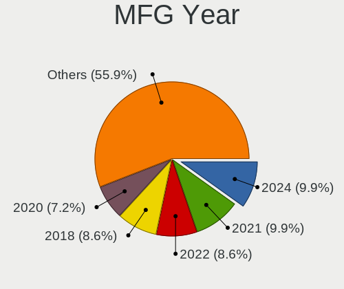
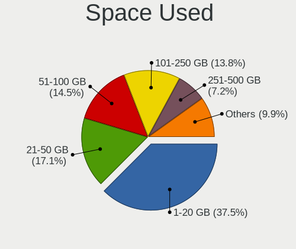
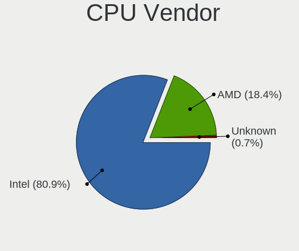
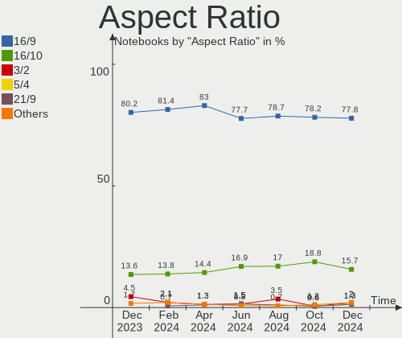
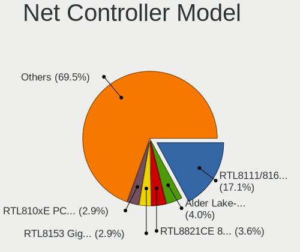
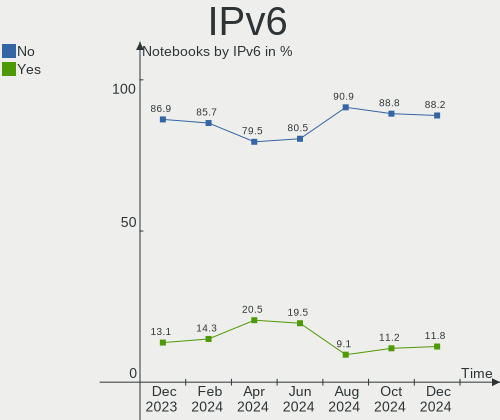
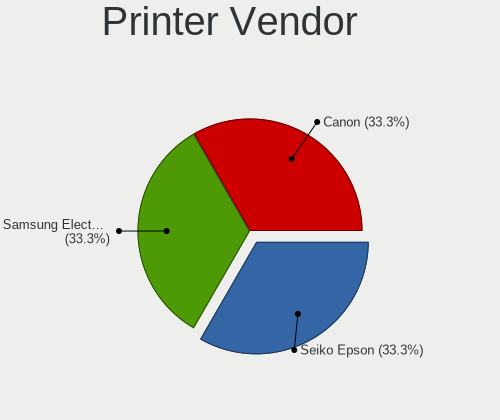
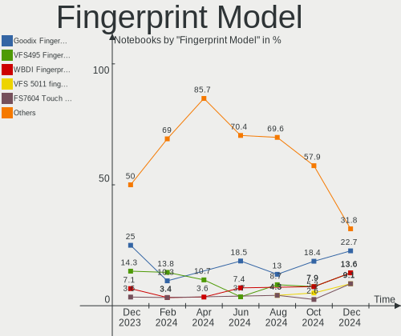

Linux in Italy - Hardware Trends (Notebooks)
--------------------------------------------

A project to identify most popular hardware characteristics and track their change
over time based on data collected by Linux users at https://Linux-Hardware.org.

Anyone can contribute to this report by the [hw-probe](https://github.com/linuxhw/hw-probe) tool:

    sudo -E hw-probe -all -upload

Period: Aug, 2023.

Contents
--------

* [ System ](#system)
  - [ OS                       ](#os)
  - [ OS Family                ](#os-family)
  - [ Kernel                   ](#kernel)
  - [ Kernel Family            ](#kernel-family)
  - [ Kernel Major Ver.        ](#kernel-major-ver)
  - [ Arch                     ](#arch)
  - [ DE                       ](#de)
  - [ Display Server           ](#display-server)
  - [ Display Manager          ](#display-manager)
  - [ OS Lang                  ](#os-lang)
  - [ Boot Mode                ](#boot-mode)
  - [ Filesystem               ](#filesystem)
  - [ Part. scheme             ](#part-scheme)
  - [ Dual Boot with Linux/BSD ](#dual-boot-with-linuxbsd)
  - [ Dual Boot (Win)          ](#dual-boot-win)

* [ Board ](#board)
  - [ Vendor                   ](#vendor)
  - [ Model                    ](#model)
  - [ Model Family             ](#model-family)
  - [ MFG Year                 ](#mfg-year)
  - [ Form Factor              ](#form-factor)
  - [ Secure Boot              ](#secure-boot)
  - [ Coreboot                 ](#coreboot)
  - [ RAM Size                 ](#ram-size)
  - [ RAM Used                 ](#ram-used)
  - [ Total Drives             ](#total-drives)
  - [ Has CD-ROM               ](#has-cd-rom)
  - [ Has Ethernet             ](#has-ethernet)
  - [ Has WiFi                 ](#has-wifi)
  - [ Has Bluetooth            ](#has-bluetooth)

* [ Location ](#location)
  - [ Country                  ](#country)
  - [ City                     ](#city)

* [ Drives ](#drives)
  - [ Drive Vendor             ](#drive-vendor)
  - [ Drive Model              ](#drive-model)
  - [ HDD Vendor               ](#hdd-vendor)
  - [ SSD Vendor               ](#ssd-vendor)
  - [ Drive Kind               ](#drive-kind)
  - [ Drive Connector          ](#drive-connector)
  - [ Drive Size               ](#drive-size)
  - [ Space Total              ](#space-total)
  - [ Space Used               ](#space-used)
  - [ Malfunc. Drives          ](#malfunc-drives)
  - [ Malfunc. Drive Vendor    ](#malfunc-drive-vendor)
  - [ Malfunc. HDD Vendor      ](#malfunc-hdd-vendor)
  - [ Malfunc. Drive Kind      ](#malfunc-drive-kind)
  - [ Failed Drives            ](#failed-drives)
  - [ Failed Drive Vendor      ](#failed-drive-vendor)
  - [ Drive Status             ](#drive-status)

* [ Storage controller ](#storage-controller)
  - [ Storage Vendor           ](#storage-vendor)
  - [ Storage Model            ](#storage-model)
  - [ Storage Kind             ](#storage-kind)

* [ Processor ](#processor)
  - [ CPU Vendor               ](#cpu-vendor)
  - [ CPU Model                ](#cpu-model)
  - [ CPU Model Family         ](#cpu-model-family)
  - [ CPU Cores                ](#cpu-cores)
  - [ CPU Sockets              ](#cpu-sockets)
  - [ CPU Threads              ](#cpu-threads)
  - [ CPU Op-Modes             ](#cpu-op-modes)
  - [ CPU Microcode            ](#cpu-microcode)
  - [ CPU Microarch            ](#cpu-microarch)

* [ Graphics ](#graphics)
  - [ GPU Vendor               ](#gpu-vendor)
  - [ GPU Model                ](#gpu-model)
  - [ GPU Combo                ](#gpu-combo)
  - [ GPU Driver               ](#gpu-driver)
  - [ GPU Memory               ](#gpu-memory)

* [ Monitor ](#monitor)
  - [ Monitor Vendor           ](#monitor-vendor)
  - [ Monitor Model            ](#monitor-model)
  - [ Monitor Resolution       ](#monitor-resolution)
  - [ Monitor Diagonal         ](#monitor-diagonal)
  - [ Monitor Width            ](#monitor-width)
  - [ Aspect Ratio             ](#aspect-ratio)
  - [ Monitor Area             ](#monitor-area)
  - [ Pixel Density            ](#pixel-density)
  - [ Multiple Monitors        ](#multiple-monitors)

* [ Network ](#network)
  - [ Net Controller Vendor    ](#net-controller-vendor)
  - [ Net Controller Model     ](#net-controller-model)
  - [ Wireless Vendor          ](#wireless-vendor)
  - [ Wireless Model           ](#wireless-model)
  - [ Ethernet Vendor          ](#ethernet-vendor)
  - [ Ethernet Model           ](#ethernet-model)
  - [ Net Controller Kind      ](#net-controller-kind)
  - [ Used Controller          ](#used-controller)
  - [ NICs                     ](#nics)
  - [ IPv6                     ](#ipv6)

* [ Bluetooth ](#bluetooth)
  - [ Bluetooth Vendor         ](#bluetooth-vendor)
  - [ Bluetooth Model          ](#bluetooth-model)

* [ Sound ](#sound)
  - [ Sound Vendor             ](#sound-vendor)
  - [ Sound Model              ](#sound-model)

* [ Memory ](#memory)
  - [ Memory Vendor            ](#memory-vendor)
  - [ Memory Model             ](#memory-model)
  - [ Memory Kind              ](#memory-kind)
  - [ Memory Form Factor       ](#memory-form-factor)
  - [ Memory Size              ](#memory-size)
  - [ Memory Speed             ](#memory-speed)

* [ Printers & scanners ](#printers--scanners)
  - [ Printer Vendor           ](#printer-vendor)
  - [ Printer Model            ](#printer-model)
  - [ Scanner Vendor           ](#scanner-vendor)
  - [ Scanner Model            ](#scanner-model)

* [ Camera ](#camera)
  - [ Camera Vendor            ](#camera-vendor)
  - [ Camera Model             ](#camera-model)

* [ Security ](#security)
  - [ Fingerprint Vendor       ](#fingerprint-vendor)
  - [ Fingerprint Model        ](#fingerprint-model)
  - [ Chipcard Vendor          ](#chipcard-vendor)
  - [ Chipcard Model           ](#chipcard-model)

* [ Unsupported ](#unsupported)
  - [ Unsupported Devices      ](#unsupported-devices)
  - [ Unsupported Device Types ](#unsupported-device-types)

System
------

OS
--

Installed operating systems

| Name                      | Notebooks | Percent |
|---------------------------|-----------|---------|
| Ubuntu 23.04              | 11        | 9.91%   |
| Ubuntu 22.04              | 11        | 9.91%   |
| OpenMandriva 23.08        | 10        | 9.01%   |
| Linux Mint 21.2           | 10        | 9.01%   |
| Fedora 38                 | 8         | 7.21%   |
| EndeavourOS Rolling       | 7         | 6.31%   |
| Arch Rolling              | 7         | 6.31%   |
| Zorin 16                  | 3         | 2.7%    |
| OpenMandriva 23.03        | 3         | 2.7%    |
| Manjaro                   | 3         | 2.7%    |
| KDE neon 22.04            | 3         | 2.7%    |
| Xubuntu 22.04             | 2         | 1.8%    |
| Parrot 5.3                | 2         | 1.8%    |
| Linux Mint 20.3           | 2         | 1.8%    |
| Kubuntu 22.04             | 2         | 1.8%    |
| Debian 12                 | 2         | 1.8%    |
| ArcoLinux Rolling         | 2         | 1.8%    |
| Xubuntu 23.04             | 1         | 0.9%    |
| Xero Rolling              | 1         | 0.9%    |
| Ubuntu 22.10              | 1         | 0.9%    |
| Ubuntu 21.10              | 1         | 0.9%    |
| Ubuntu 18.04              | 1         | 0.9%    |
| ROSA 12.4                 | 1         | 0.9%    |
| RHEL 9                    | 1         | 0.9%    |
| Q4OS 5                    | 1         | 0.9%    |
| openSUSE Microos-XXXXXXXX | 1         | 0.9%    |
| OpenMandriva 4.3          | 1         | 0.9%    |
| OpenMandriva 23.90        | 1         | 0.9%    |
| Nobara 38                 | 1         | 0.9%    |
| MX 21                     | 1         | 0.9%    |
| Manjaro 23.0.0            | 1         | 0.9%    |
| Linux Mint 21.1           | 1         | 0.9%    |
| Linux Mint 20.2           | 1         | 0.9%    |
| Kubuntu 11                | 1         | 0.9%    |
| Fedora 37                 | 1         | 0.9%    |
| Fedora 36                 | 1         | 0.9%    |
| Elementary 7              | 1         | 0.9%    |
| Debian                    | 1         | 0.9%    |
| Clear Linux 39850         | 1         | 0.9%    |
| Artix Rolling             | 1         | 0.9%    |

OS Family
---------

OS without a version

| Name         | Notebooks | Percent |
|--------------|-----------|---------|
| Ubuntu       | 25        | 22.52%  |
| OpenMandriva | 15        | 13.51%  |
| Linux Mint   | 14        | 12.61%  |
| Fedora       | 10        | 9.01%   |
| EndeavourOS  | 7         | 6.31%   |
| Arch         | 7         | 6.31%   |
| Manjaro      | 4         | 3.6%    |
| Zorin        | 3         | 2.7%    |
| Xubuntu      | 3         | 2.7%    |
| Kubuntu      | 3         | 2.7%    |
| KDE neon     | 3         | 2.7%    |
| Debian       | 3         | 2.7%    |
| Parrot       | 2         | 1.8%    |
| ArcoLinux    | 2         | 1.8%    |
| Xero         | 1         | 0.9%    |
| ROSA         | 1         | 0.9%    |
| RHEL         | 1         | 0.9%    |
| Q4OS         | 1         | 0.9%    |
| openSUSE     | 1         | 0.9%    |
| Nobara       | 1         | 0.9%    |
| MX           | 1         | 0.9%    |
| Elementary   | 1         | 0.9%    |
| Clear Linux  | 1         | 0.9%    |
| Artix        | 1         | 0.9%    |

Kernel
------

Version of the Linux kernel

| Version                      | Notebooks | Percent |
|------------------------------|-----------|---------|
| 6.2.0-26-generic             | 14        | 12.61%  |
| 5.15.0-78-generic            | 6         | 5.41%   |
| 6.4.8-desktop-2omv2390       | 5         | 4.5%    |
| 6.2.0-20-generic             | 5         | 4.5%    |
| 5.15.0-79-generic            | 5         | 4.5%    |
| 6.4.11-desktop-1omv2390      | 4         | 3.6%    |
| 6.4.7-arch1-1                | 3         | 2.7%    |
| 6.4.11-200.fc38.x86_64       | 3         | 2.7%    |
| 6.4.10-arch1-1               | 3         | 2.7%    |
| 6.2.6-desktop-1omv2390       | 3         | 2.7%    |
| 6.2.0-31-generic             | 3         | 2.7%    |
| 6.2.0-27-generic             | 3         | 2.7%    |
| 5.19.0-46-generic            | 3         | 2.7%    |
| 5.15.0-76-generic            | 3         | 2.7%    |
| 6.4.9-200.fc38.x86_64        | 2         | 1.8%    |
| 6.4.8-arch1-1                | 2         | 1.8%    |
| 6.4.7-200.fc38.x86_64        | 2         | 1.8%    |
| 6.4.11-arch1-1               | 2         | 1.8%    |
| 6.1.44-1-MANJARO             | 2         | 1.8%    |
| 6.1.0-1parrot1-amd64         | 2         | 1.8%    |
| 5.4.0-156-generic            | 2         | 1.8%    |
| 5.19.0-50-generic            | 2         | 1.8%    |
| 6.5.0-desktop-0.rc4.1omv2390 | 1         | 0.9%    |
| 6.4.9-arch1-1                | 1         | 0.9%    |
| 6.4.9-1-default              | 1         | 0.9%    |
| 6.4.8-zen1-1-zen             | 1         | 0.9%    |
| 6.4.8-lqx1-1-lqx             | 1         | 0.9%    |
| 6.4.7-desktop-1omv2390       | 1         | 0.9%    |
| 6.4.7-arch1-2                | 1         | 0.9%    |
| 6.4.6-1-MANJARO              | 1         | 0.9%    |
| 6.4.4-100.fc37.x86_64        | 1         | 0.9%    |
| 6.4.12-zen1-1-zen            | 1         | 0.9%    |
| 6.4.11-arch2-1               | 1         | 0.9%    |
| 6.4.11-1349.native           | 1         | 0.9%    |
| 6.4.10-202.fsync.fc38.x86_64 | 1         | 0.9%    |
| 6.4.10-200.fc38.x86_64       | 1         | 0.9%    |
| 6.4.0-2-amd64                | 1         | 0.9%    |
| 6.3.13-1-MANJARO             | 1         | 0.9%    |
| 6.2.15-100.fc36.x86_64       | 1         | 0.9%    |
| 6.2.0-060200-generic         | 1         | 0.9%    |

Kernel Family
-------------

Linux kernel without a distro release

| Version | Notebooks | Percent |
|---------|-----------|---------|
| 6.2.0   | 26        | 23.42%  |
| 5.15.0  | 14        | 12.61%  |
| 6.4.11  | 11        | 9.91%   |
| 6.4.8   | 9         | 8.11%   |
| 6.4.7   | 7         | 6.31%   |
| 5.19.0  | 7         | 6.31%   |
| 6.4.10  | 5         | 4.5%    |
| 6.1.0   | 5         | 4.5%    |
| 6.4.9   | 4         | 3.6%    |
| 6.2.6   | 3         | 2.7%    |
| 5.4.0   | 3         | 2.7%    |
| 6.1.44  | 2         | 1.8%    |
| 6.5.0   | 1         | 0.9%    |
| 6.4.6   | 1         | 0.9%    |
| 6.4.4   | 1         | 0.9%    |
| 6.4.12  | 1         | 0.9%    |
| 6.4.0   | 1         | 0.9%    |
| 6.3.13  | 1         | 0.9%    |
| 6.2.15  | 1         | 0.9%    |
| 6.1.8   | 1         | 0.9%    |
| 6.1.39  | 1         | 0.9%    |
| 5.17.11 | 1         | 0.9%    |
| 5.16.7  | 1         | 0.9%    |
| 5.16.0  | 1         | 0.9%    |
| 5.14.0  | 1         | 0.9%    |
| 5.13.0  | 1         | 0.9%    |
| 4.15.0  | 1         | 0.9%    |

Kernel Major Ver.
-----------------

Linux kernel major version

| Version | Notebooks | Percent |
|---------|-----------|---------|
| 6.4     | 40        | 36.04%  |
| 6.2     | 30        | 27.03%  |
| 5.15    | 14        | 12.61%  |
| 6.1     | 9         | 8.11%   |
| 5.19    | 7         | 6.31%   |
| 5.4     | 3         | 2.7%    |
| 5.16    | 2         | 1.8%    |
| 6.5     | 1         | 0.9%    |
| 6.3     | 1         | 0.9%    |
| 5.17    | 1         | 0.9%    |
| 5.14    | 1         | 0.9%    |
| 5.13    | 1         | 0.9%    |
| 4.15    | 1         | 0.9%    |

Arch
----

OS architecture (x86_64, i586, etc.)

| Name   | Notebooks | Percent |
|--------|-----------|---------|
| x86_64 | 110       | 99.1%   |
| i686   | 1         | 0.9%    |

DE
--

Desktop Environment

| Name       | Notebooks | Percent |
|------------|-----------|---------|
| GNOME      | 45        | 40.54%  |
| KDE5       | 33        | 29.73%  |
| XFCE       | 12        | 10.81%  |
| X-Cinnamon | 11        | 9.91%   |
| MATE       | 3         | 2.7%    |
| Unknown    | 2         | 1.8%    |
| Unity      | 1         | 0.9%    |
| Trinity    | 1         | 0.9%    |
| sway       | 1         | 0.9%    |
| Pantheon   | 1         | 0.9%    |
| LXQt       | 1         | 0.9%    |

Display Server
--------------

X11 or Wayland

| Name    | Notebooks | Percent |
|---------|-----------|---------|
| X11     | 66        | 59.46%  |
| Wayland | 44        | 39.64%  |
| Tty     | 1         | 0.9%    |

Display Manager
---------------

SDDM, LightDM, etc.

| Name    | Notebooks | Percent |
|---------|-----------|---------|
| Unknown | 32        | 28.83%  |
| SDDM    | 26        | 23.42%  |
| GDM3    | 25        | 22.52%  |
| LightDM | 18        | 16.22%  |
| GDM     | 8         | 7.21%   |
| TDM     | 1         | 0.9%    |
| SLiM    | 1         | 0.9%    |

OS Lang
-------

Language

| Lang  | Notebooks | Percent |
|-------|-----------|---------|
| it_IT | 71        | 63.96%  |
| en_US | 25        | 22.52%  |
| C     | 7         | 6.31%   |
| en_GB | 3         | 2.7%    |
| de_DE | 3         | 2.7%    |
| en_DK | 1         | 0.9%    |
| de_IT | 1         | 0.9%    |

Boot Mode
---------

EFI or BIOS

| Mode | Notebooks | Percent |
|------|-----------|---------|
| EFI  | 70        | 63.06%  |
| BIOS | 41        | 36.94%  |

Filesystem
----------

Type of filesystem

| Type    | Notebooks | Percent |
|---------|-----------|---------|
| Ext4    | 56        | 50.45%  |
| Tmpfs   | 20        | 18.02%  |
| Btrfs   | 19        | 17.12%  |
| Overlay | 14        | 12.61%  |
| Xfs     | 2         | 1.8%    |

Part. scheme
------------

Scheme of partitioning

| Type    | Notebooks | Percent |
|---------|-----------|---------|
| GPT     | 70        | 63.06%  |
| Unknown | 31        | 27.93%  |
| MBR     | 10        | 9.01%   |

Dual Boot with Linux/BSD
------------------------

Hosting more than one Linux/BSD

| Dual boot | Notebooks | Percent |
|-----------|-----------|---------|
| No        | 88        | 79.28%  |
| Yes       | 23        | 20.72%  |

Dual Boot (Win)
---------------

Hosting Linux and Windows

| Dual boot | Notebooks | Percent |
|-----------|-----------|---------|
| No        | 72        | 64.86%  |
| Yes       | 39        | 35.14%  |

Board
-----

Vendor
------

Motherboard manufacturer

| Name                | Notebooks | Percent |
|---------------------|-----------|---------|
| Hewlett-Packard     | 30        | 27.03%  |
| Lenovo              | 21        | 18.92%  |
| Dell                | 18        | 16.22%  |
| ASUSTek Computer    | 13        | 11.71%  |
| Acer                | 7         | 6.31%   |
| HUAWEI              | 5         | 4.5%    |
| Apple               | 3         | 2.7%    |
| PC Specialist       | 2         | 1.8%    |
| Notebook            | 2         | 1.8%    |
| MSI                 | 2         | 1.8%    |
| Toshiba             | 1         | 0.9%    |
| Timi                | 1         | 0.9%    |
| Sony                | 1         | 0.9%    |
| SLIMBOOK            | 1         | 0.9%    |
| SANTECH             | 1         | 0.9%    |
| Samsung Electronics | 1         | 0.9%    |
| Mediacom            | 1         | 0.9%    |
| Unknown             | 1         | 0.9%    |

Model
-----

Motherboard model

| Name                                    | Notebooks | Percent |
|-----------------------------------------|-----------|---------|
| HUAWEI NBLK-WAX9X                       | 3         | 2.7%    |
| HP Stream Laptop 14-ax0XX               | 3         | 2.7%    |
| HP 255 G8 Notebook PC                   | 3         | 2.7%    |
| Apple MacBookAir7,2                     | 2         | 1.8%    |
| Toshiba Satellite P850                  | 1         | 0.9%    |
| Timi A7S                                | 1         | 0.9%    |
| Sony SVE1713X1EB                        | 1         | 0.9%    |
| SLIMBOOK PROX-AMD5                      | 1         | 0.9%    |
| SANTECH NL5xNU                          | 1         | 0.9%    |
| Samsung RC530/RC730                     | 1         | 0.9%    |
| PC Specialist Lafite Pro III 17         | 1         | 0.9%    |
| PC Specialist Ionico 16                 | 1         | 0.9%    |
| Notebook NS50MU                         | 1         | 0.9%    |
| Notebook N9x0TC                         | 1         | 0.9%    |
| MSI Katana GF66 12UC                    | 1         | 0.9%    |
| MSI GL73 8RE                            | 1         | 0.9%    |
| Mediacom SmartBook 130 FullHD - M-SB130 | 1         | 0.9%    |
| Lenovo Yoga Pro 7 14ARP8 83AU           | 1         | 0.9%    |
| Lenovo V15-IIL 82C5                     | 1         | 0.9%    |
| Lenovo V15 G4 AMN 82YU                  | 1         | 0.9%    |
| Lenovo V130-15IKB 81HN                  | 1         | 0.9%    |
| Lenovo ThinkPad X240 20AL00C6UK         | 1         | 0.9%    |
| Lenovo ThinkPad X230 2325H50            | 1         | 0.9%    |
| Lenovo ThinkPad T495s 20QJCTO1WW        | 1         | 0.9%    |
| Lenovo ThinkPad T480s 20L8002WMD        | 1         | 0.9%    |
| Lenovo ThinkPad T480 20L6S5LF00         | 1         | 0.9%    |
| Lenovo ThinkPad T470s 20HGS0PA00        | 1         | 0.9%    |
| Lenovo ThinkPad T470 20JNS08H00         | 1         | 0.9%    |
| Lenovo ThinkPad T470 20HES0ET0R         | 1         | 0.9%    |
| Lenovo ThinkPad T430 2349IF8            | 1         | 0.9%    |
| Lenovo ThinkPad T430 2347DS4            | 1         | 0.9%    |
| Lenovo ThinkPad T14 Gen 2i 20W0CTO1WW   | 1         | 0.9%    |
| Lenovo ThinkPad E15 Gen 2 20TD0003GE    | 1         | 0.9%    |
| Lenovo ThinkBook 15 G3 ACL 21A4         | 1         | 0.9%    |
| Lenovo Legion 5 15ACH6A 82NW            | 1         | 0.9%    |
| Lenovo IdeaPad 5 Pro 14ACN6 82L7        | 1         | 0.9%    |
| Lenovo IdeaPad 5 15IIL05 81YK           | 1         | 0.9%    |
| Lenovo IdeaPad 3 15IGL05 81WQ           | 1         | 0.9%    |
| HUAWEI KLVD-WXX9                        | 1         | 0.9%    |
| HUAWEI BOD-WXX9                         | 1         | 0.9%    |

Model Family
------------

Motherboard model prefix

| Name                 | Notebooks | Percent |
|----------------------|-----------|---------|
| Lenovo ThinkPad      | 12        | 10.81%  |
| Dell Latitude        | 7         | 6.31%   |
| HP EliteBook         | 4         | 3.6%    |
| HP 255               | 4         | 3.6%    |
| Dell Inspiron        | 4         | 3.6%    |
| Acer Aspire          | 4         | 3.6%    |
| Lenovo IdeaPad       | 3         | 2.7%    |
| HUAWEI NBLK-WAX9X    | 3         | 2.7%    |
| HP Stream            | 3         | 2.7%    |
| HP Pavilion          | 3         | 2.7%    |
| HP 250               | 3         | 2.7%    |
| ASUS VivoBook        | 3         | 2.7%    |
| HP ProBook           | 2         | 1.8%    |
| HP Laptop            | 2         | 1.8%    |
| HP ENVY              | 2         | 1.8%    |
| Dell XPS             | 2         | 1.8%    |
| Dell Vostro          | 2         | 1.8%    |
| Dell Precision       | 2         | 1.8%    |
| Apple MacBookAir7    | 2         | 1.8%    |
| Toshiba Satellite    | 1         | 0.9%    |
| Timi A7S             | 1         | 0.9%    |
| Sony SVE1713X1EB     | 1         | 0.9%    |
| SLIMBOOK PROX-AMD5   | 1         | 0.9%    |
| SANTECH NL5xNU       | 1         | 0.9%    |
| Samsung RC530        | 1         | 0.9%    |
| PC Specialist Lafite | 1         | 0.9%    |
| PC Specialist Ionico | 1         | 0.9%    |
| Notebook NS50MU      | 1         | 0.9%    |
| Notebook N9x0TC      | 1         | 0.9%    |
| MSI Katana           | 1         | 0.9%    |
| MSI GL73             | 1         | 0.9%    |
| Mediacom SmartBook   | 1         | 0.9%    |
| Lenovo Yoga          | 1         | 0.9%    |
| Lenovo V15-IIL       | 1         | 0.9%    |
| Lenovo V15           | 1         | 0.9%    |
| Lenovo V130-15IKB    | 1         | 0.9%    |
| Lenovo ThinkBook     | 1         | 0.9%    |
| Lenovo Legion        | 1         | 0.9%    |
| HUAWEI KLVD-WXX9     | 1         | 0.9%    |
| HUAWEI BOD-WXX9      | 1         | 0.9%    |

MFG Year
--------

Motherboard manufacture year

| Year | Notebooks | Percent |
|------|-----------|---------|
| 2021 | 17        | 15.32%  |
| 2020 | 15        | 13.51%  |
| 2019 | 11        | 9.91%   |
| 2017 | 10        | 9.01%   |
| 2015 | 9         | 8.11%   |
| 2012 | 8         | 7.21%   |
| 2023 | 6         | 5.41%   |
| 2022 | 6         | 5.41%   |
| 2018 | 5         | 4.5%    |
| 2016 | 5         | 4.5%    |
| 2013 | 4         | 3.6%    |
| 2010 | 4         | 3.6%    |
| 2014 | 3         | 2.7%    |
| 2011 | 3         | 2.7%    |
| 2008 | 3         | 2.7%    |
| 2007 | 1         | 0.9%    |
| 2003 | 1         | 0.9%    |

Form Factor
-----------

Physical design of the computer

| Name     | Notebooks | Percent |
|----------|-----------|---------|
| Notebook | 111       | 100%    |

Secure Boot
-----------

Enabled or disabled

| State    | Notebooks | Percent |
|----------|-----------|---------|
| Disabled | 104       | 93.69%  |
| Enabled  | 7         | 6.31%   |

Coreboot
--------

Have coreboot on board

| Used | Notebooks | Percent |
|------|-----------|---------|
| No   | 111       | 100%    |

RAM Size
--------

Total RAM memory

| Size in GB  | Notebooks | Percent |
|-------------|-----------|---------|
| 4.01-8.0    | 27        | 24.32%  |
| 16.01-24.0  | 23        | 20.72%  |
| 8.01-16.0   | 18        | 16.22%  |
| 32.01-64.0  | 17        | 15.32%  |
| 3.01-4.0    | 17        | 15.32%  |
| 1.01-2.0    | 5         | 4.5%    |
| 64.01-256.0 | 2         | 1.8%    |
| 24.01-32.0  | 1         | 0.9%    |
| 0.01-0.5    | 1         | 0.9%    |

RAM Used
--------

Used RAM memory

| Used GB   | Notebooks | Percent |
|-----------|-----------|---------|
| 2.01-3.0  | 30        | 27.03%  |
| 1.01-2.0  | 29        | 26.13%  |
| 4.01-8.0  | 21        | 18.92%  |
| 3.01-4.0  | 21        | 18.92%  |
| 0.51-1.0  | 5         | 4.5%    |
| 8.01-16.0 | 4         | 3.6%    |
| 0.01-0.5  | 1         | 0.9%    |

Total Drives
------------

Number of drives on board

| Drives | Notebooks | Percent |
|--------|-----------|---------|
| 1      | 76        | 68.47%  |
| 2      | 32        | 28.83%  |
| 3      | 2         | 1.8%    |
| 5      | 1         | 0.9%    |

Has CD-ROM
----------

Has CD-ROM on board

| Presented | Notebooks | Percent |
|-----------|-----------|---------|
| No        | 89        | 80.18%  |
| Yes       | 22        | 19.82%  |

Has Ethernet
------------

Has Ethernet on board

| Presented | Notebooks | Percent |
|-----------|-----------|---------|
| Yes       | 83        | 74.77%  |
| No        | 28        | 25.23%  |

Has WiFi
--------

Has WiFi module

| Presented | Notebooks | Percent |
|-----------|-----------|---------|
| Yes       | 109       | 98.2%   |
| No        | 2         | 1.8%    |

Has Bluetooth
-------------

Has Bluetooth module

| Presented | Notebooks | Percent |
|-----------|-----------|---------|
| Yes       | 96        | 86.49%  |
| No        | 15        | 13.51%  |

Location
--------

Country
-------

Geographic location (country)

| Country | Notebooks | Percent |
|---------|-----------|---------|
| Italy   | 111       | 100%    |

City
----

Geographic location (city)

| City                     | Notebooks | Percent |
|--------------------------|-----------|---------|
| Rome                     | 13        | 11.71%  |
| Milano                   | 12        | 10.81%  |
| Milan                    | 11        | 9.91%   |
| Florence                 | 4         | 3.6%    |
| Rho                      | 3         | 2.7%    |
| Palermo                  | 3         | 2.7%    |
| Turin                    | 2         | 1.8%    |
| Monza                    | 2         | 1.8%    |
| Catania                  | 2         | 1.8%    |
| Bologna                  | 2         | 1.8%    |
| Vignola                  | 1         | 0.9%    |
| Viggiù                  | 1         | 0.9%    |
| Venosa                   | 1         | 0.9%    |
| Varazze                  | 1         | 0.9%    |
| Trezzo sull'Adda         | 1         | 0.9%    |
| Treviglio                | 1         | 0.9%    |
| Trescore Balneario       | 1         | 0.9%    |
| Trento                   | 1         | 0.9%    |
| Tissi                    | 1         | 0.9%    |
| Taranto                  | 1         | 0.9%    |
| Storo                    | 1         | 0.9%    |
| Soriano nel Cimino       | 1         | 0.9%    |
| Siziano                  | 1         | 0.9%    |
| Salerno                  | 1         | 0.9%    |
| Rovereto                 | 1         | 0.9%    |
| Roccafranca              | 1         | 0.9%    |
| Rallo                    | 1         | 0.9%    |
| Pozzomaggiore            | 1         | 0.9%    |
| Porcia                   | 1         | 0.9%    |
| Pontevico                | 1         | 0.9%    |
| Perugia                  | 1         | 0.9%    |
| Passignano sul Trasimeno | 1         | 0.9%    |
| Padova                   | 1         | 0.9%    |
| Olbia                    | 1         | 0.9%    |
| Naples                   | 1         | 0.9%    |
| Montelparo               | 1         | 0.9%    |
| Monfalcone               | 1         | 0.9%    |
| Mezzolombardo            | 1         | 0.9%    |
| Mandriola-Sant'Agostino  | 1         | 0.9%    |
| Lucera                   | 1         | 0.9%    |

Drives
------

Drive Vendor
------------

Hard drive vendors

| Vendor                      | Notebooks | Drives | Percent |
|-----------------------------|-----------|--------|---------|
| Samsung Electronics         | 34        | 36     | 23.61%  |
| WDC                         | 12        | 12     | 8.33%   |
| Unknown                     | 12        | 16     | 8.33%   |
| Toshiba                     | 11        | 11     | 7.64%   |
| SK hynix                    | 9         | 9      | 6.25%   |
| Intel                       | 9         | 10     | 6.25%   |
| Seagate                     | 8         | 8      | 5.56%   |
| Sandisk                     | 8         | 8      | 5.56%   |
| Micron Technology           | 8         | 8      | 5.56%   |
| Kingston                    | 5         | 5      | 3.47%   |
| Crucial                     | 4         | 4      | 2.78%   |
| KIOXIA                      | 3         | 3      | 2.08%   |
| HGST                        | 3         | 3      | 2.08%   |
| SPCC                        | 2         | 2      | 1.39%   |
| Phison Electronics          | 2         | 2      | 1.39%   |
| Micron/Crucial Technology   | 2         | 2      | 1.39%   |
| JMicron Technology          | 2         | 2      | 1.39%   |
| Hitachi                     | 2         | 2      | 1.39%   |
| Apple                       | 2         | 2      | 1.39%   |
| YMTC                        | 1         | 1      | 0.69%   |
| Union Memory                | 1         | 1      | 0.69%   |
| MAXIO Technology (Hangzhou) | 1         | 1      | 0.69%   |
| LITEON                      | 1         | 1      | 0.69%   |
| China                       | 1         | 1      | 0.69%   |
| BHT                         | 1         | 1      | 0.69%   |

Drive Model
-----------

Hard drive models

| Model                                                 | Notebooks | Percent |
|-------------------------------------------------------|-----------|---------|
| Unknown MMC Card  32GB                                | 4         | 2.67%   |
| Unknown MMC Card  16GB                                | 3         | 2%      |
| Samsung NVMe SSD Controller SM981/PM981/PM983 500GB   | 3         | 2%      |
| Samsung NVMe SSD Controller PM9A1/PM9A3/980PRO 1024GB | 3         | 2%      |
| Intel SSDPEKNU512GZ 512GB                             | 3         | 2%      |
| Toshiba XG6 NVMe SSD Controller 1024GB                | 2         | 1.33%   |
| Seagate Expansion 2TB                                 | 2         | 1.33%   |
| Sandisk WD Blue SN550 NVMe SSD 250GB                  | 2         | 1.33%   |
| Samsung SSD 980 1TB                                   | 2         | 1.33%   |
| Samsung SSD 860 EVO 500GB                             | 2         | 1.33%   |
| Samsung SSD 860 EVO 1TB                               | 2         | 1.33%   |
| Samsung MZALQ512HBLU-00BL2 512GB                      | 2         | 1.33%   |
| Micron/Crucial P2 NVMe PCIe SSD 1TB                   | 2         | 1.33%   |
| Micron 1100_MTFDDAV256TBN 256GB SSD                   | 2         | 1.33%   |
| KIOXIA KBG40ZNV256G 256GB                             | 2         | 1.33%   |
| Kingston SA400S37240G 240GB SSD                       | 2         | 1.33%   |
| Apple SSD SM0512G 500GB                               | 2         | 1.33%   |
| YMTC PC005 256GB                                      | 1         | 0.67%   |
| WDC WDS500G2B0A-00SM50 500GB SSD                      | 1         | 0.67%   |
| WDC WDS100T2B0C 1TB                                   | 1         | 0.67%   |
| WDC WD6400BPVT-22HXZT3 640GB                          | 1         | 0.67%   |
| WDC WD5000LPVX-80V0TT0 500GB                          | 1         | 0.67%   |
| WDC WD5000LPVX-75V0TT0 500GB                          | 1         | 0.67%   |
| WDC WD5000LPLX-08ZNTT0 500GB                          | 1         | 0.67%   |
| WDC WD5000LPCX-24VHAT0 500GB                          | 1         | 0.67%   |
| WDC WD3200BEVT-22ZCT0 320GB                           | 1         | 0.67%   |
| WDC WD20SPZX-22UA7T0 2TB                              | 1         | 0.67%   |
| WDC WD My Passport 264F 500GB                         | 1         | 0.67%   |
| WDC PC SN530 SDBPNPZ-512G-1114 512GB                  | 1         | 0.67%   |
| WDC PC SN530 SDBPNPZ-512G-1006 512GB                  | 1         | 0.67%   |
| Unknown SN64G  64GB                                   | 1         | 0.67%   |
| Unknown SA32G  32GB                                   | 1         | 0.67%   |
| Unknown NVMe SSD Drive 1TB                            | 1         | 0.67%   |
| Unknown NVMe SSD Drive 1024GB                         | 1         | 0.67%   |
| Unknown MMC Card  64GB                                | 1         | 0.67%   |
| Unknown BJNB4R  32GB                                  | 1         | 0.67%   |
| Unknown Biwin  32GB                                   | 1         | 0.67%   |
| Unknown 58K722  128GB                                 | 1         | 0.67%   |
| Union Memory UMIS RPJTJ128MEE1MWX 128GB               | 1         | 0.67%   |
| Toshiba MQ04ABF100 1TB                                | 1         | 0.67%   |

HDD Vendor
----------

Hard disk drive vendors

| Vendor              | Notebooks | Drives | Percent |
|---------------------|-----------|--------|---------|
| Seagate             | 8         | 8      | 32%     |
| WDC                 | 7         | 7      | 28%     |
| Toshiba             | 4         | 4      | 16%     |
| HGST                | 3         | 3      | 12%     |
| Hitachi             | 2         | 2      | 8%      |
| Samsung Electronics | 1         | 1      | 4%      |

SSD Vendor
----------

Solid state drive vendors

| Vendor              | Notebooks | Drives | Percent |
|---------------------|-----------|--------|---------|
| Samsung Electronics | 15        | 15     | 36.59%  |
| Kingston            | 5         | 5      | 12.2%   |
| Crucial             | 4         | 4      | 9.76%   |
| Micron Technology   | 3         | 3      | 7.32%   |
| SPCC                | 2         | 2      | 4.88%   |
| SK hynix            | 2         | 2      | 4.88%   |
| SanDisk             | 2         | 2      | 4.88%   |
| Apple               | 2         | 2      | 4.88%   |
| WDC                 | 1         | 1      | 2.44%   |
| LITEON              | 1         | 1      | 2.44%   |
| JMicron Technology  | 1         | 1      | 2.44%   |
| Intel               | 1         | 1      | 2.44%   |
| China               | 1         | 1      | 2.44%   |
| BHT                 | 1         | 1      | 2.44%   |

Drive Kind
----------

HDD or SSD

| Kind    | Notebooks | Drives | Percent |
|---------|-----------|--------|---------|
| NVMe    | 58        | 68     | 44.27%  |
| SSD     | 37        | 41     | 28.24%  |
| HDD     | 23        | 25     | 17.56%  |
| MMC     | 11        | 15     | 8.4%    |
| Unknown | 2         | 2      | 1.53%   |

Drive Connector
---------------

SATA, SAS, NVMe, etc.

| Type | Notebooks | Drives | Percent |
|------|-----------|--------|---------|
| NVMe | 58        | 68     | 45.31%  |
| SATA | 52        | 61     | 40.63%  |
| MMC  | 11        | 15     | 8.59%   |
| SAS  | 7         | 7      | 5.47%   |

Drive Size
----------

Size of hard drive

| Size in TB | Notebooks | Drives | Percent |
|------------|-----------|--------|---------|
| 0.01-0.5   | 41        | 45     | 66.13%  |
| 0.51-1.0   | 14        | 14     | 22.58%  |
| 1.01-2.0   | 6         | 6      | 9.68%   |
| 3.01-4.0   | 1         | 1      | 1.61%   |

Space Total
-----------

Amount of disk space available on the file system

| Size in GB     | Notebooks | Percent |
|----------------|-----------|---------|
| 251-500        | 24        | 21.62%  |
| 101-250        | 21        | 18.92%  |
| 1-20           | 17        | 15.32%  |
| 501-1000       | 14        | 12.61%  |
| 1001-2000      | 11        | 9.91%   |
| 51-100         | 8         | 7.21%   |
| 21-50          | 7         | 6.31%   |
| More than 3000 | 3         | 2.7%    |
| 2001-3000      | 3         | 2.7%    |
| Unknown        | 3         | 2.7%    |

Space Used
----------

Amount of used disk space

| Used GB   | Notebooks | Percent |
|-----------|-----------|---------|
| 1-20      | 41        | 36.94%  |
| 101-250   | 21        | 18.92%  |
| 21-50     | 18        | 16.22%  |
| 51-100    | 10        | 9.01%   |
| 251-500   | 6         | 5.41%   |
| 1001-2000 | 6         | 5.41%   |
| 501-1000  | 6         | 5.41%   |
| Unknown   | 3         | 2.7%    |

Malfunc. Drives
---------------

Drive models with a malfunction

| Model                            | Notebooks | Drives | Percent |
|----------------------------------|-----------|--------|---------|
| SK hynix SC210 2.5 7MM 256GB SSD | 1         | 1      | 14.29%  |
| Seagate ST9750420AS 752GB        | 1         | 1      | 14.29%  |
| Samsung Electronics SSD 980 1TB  | 1         | 1      | 14.29%  |
| Intel SSDSC2BF180A4L 180GB       | 1         | 1      | 14.29%  |
| Hitachi HTS725050A9A364 500GB    | 1         | 1      | 14.29%  |
| Hitachi HTS545025B9SA02 250GB    | 1         | 1      | 14.29%  |
| HGST HTS545050A7E680 500GB       | 1         | 1      | 14.29%  |

Malfunc. Drive Vendor
---------------------

Vendors of faulty drives

| Vendor              | Notebooks | Drives | Percent |
|---------------------|-----------|--------|---------|
| Hitachi             | 2         | 2      | 28.57%  |
| SK hynix            | 1         | 1      | 14.29%  |
| Seagate             | 1         | 1      | 14.29%  |
| Samsung Electronics | 1         | 1      | 14.29%  |
| Intel               | 1         | 1      | 14.29%  |
| HGST                | 1         | 1      | 14.29%  |

Malfunc. HDD Vendor
-------------------

Vendors of faulty HDD drives

| Vendor  | Notebooks | Drives | Percent |
|---------|-----------|--------|---------|
| Hitachi | 2         | 2      | 50%     |
| Seagate | 1         | 1      | 25%     |
| HGST    | 1         | 1      | 25%     |

Malfunc. Drive Kind
-------------------

Kinds of faulty drives

| Kind | Notebooks | Drives | Percent |
|------|-----------|--------|---------|
| HDD  | 4         | 4      | 57.14%  |
| SSD  | 2         | 2      | 28.57%  |
| NVMe | 1         | 1      | 14.29%  |

Failed Drives
-------------

Failed drive models

Zero info for selected period =(

Failed Drive Vendor
-------------------

Failed drive vendors

Zero info for selected period =(

Drive Status
------------

Number of failed and malfunc. drives

| Status   | Notebooks | Drives | Percent |
|----------|-----------|--------|---------|
| Detected | 59        | 76     | 50.43%  |
| Works    | 51        | 68     | 43.59%  |
| Malfunc  | 7         | 7      | 5.98%   |

Storage controller
------------------

Storage Vendor
--------------

Storage controller vendors

| Vendor                           | Notebooks | Percent |
|----------------------------------|-----------|---------|
| Intel                            | 64        | 47.06%  |
| Samsung Electronics              | 20        | 14.71%  |
| AMD                              | 11        | 8.09%   |
| SanDisk                          | 8         | 5.88%   |
| Toshiba America Info Systems     | 7         | 5.15%   |
| SK hynix                         | 7         | 5.15%   |
| Micron Technology                | 5         | 3.68%   |
| KIOXIA                           | 3         | 2.21%   |
| Phison Electronics               | 2         | 1.47%   |
| Nvidia                           | 2         | 1.47%   |
| Micron/Crucial Technology        | 2         | 1.47%   |
| Yangtze Memory Technologies      | 1         | 0.74%   |
| Union Memory (Shenzhen)          | 1         | 0.74%   |
| Solidigm                         | 1         | 0.74%   |
| Silicon Integrated Systems [SiS] | 1         | 0.74%   |
| MAXIO Technology (Hangzhou)      | 1         | 0.74%   |

Storage Model
-------------

Storage controller models

| Model                                                                            | Notebooks | Percent |
|----------------------------------------------------------------------------------|-----------|---------|
| AMD FCH SATA Controller [AHCI mode]                                              | 11        | 7.33%   |
| Intel Volume Management Device NVMe RAID Controller                              | 10        | 6.67%   |
| Samsung NVMe SSD Controller 980                                                  | 9         | 6%      |
| Intel 7 Series Chipset Family 6-port SATA Controller [AHCI mode]                 | 8         | 5.33%   |
| Intel Sunrise Point-LP SATA Controller [AHCI mode]                               | 6         | 4%      |
| Intel 82801 Mobile SATA Controller [RAID mode]                                   | 6         | 4%      |
| Toshiba America Info Systems XG6 NVMe SSD Controller                             | 5         | 3.33%   |
| SanDisk WD Blue SN550 NVMe SSD                                                   | 5         | 3.33%   |
| Samsung NVMe SSD Controller SM981/PM981/PM983                                    | 5         | 3.33%   |
| Samsung NVMe SSD Controller PM9A1/PM9A3/980PRO                                   | 4         | 2.67%   |
| Intel Tiger Lake-LP SATA Controller                                              | 4         | 2.67%   |
| Intel SSD 670p Series [Keystone Harbor]                                          | 4         | 2.67%   |
| SK hynix Gold P31/BC711/PC711 NVMe Solid State Drive                             | 3         | 2%      |
| KIOXIA NVMe SSD Controller BG4 (DRAM-less)                                       | 3         | 2%      |
| Intel Celeron/Pentium Silver Processor SATA Controller                           | 3         | 2%      |
| Intel Atom/Celeron/Pentium Processor x5-E8000/J3xxx/N3xxx Series SATA Controller | 3         | 2%      |
| Intel 8 Series SATA Controller 1 [AHCI mode]                                     | 3         | 2%      |
| SK hynix BC511 NVMe SSD                                                          | 2         | 1.33%   |
| Samsung S4LN058A01[SSUBX] AHCI SSD Controller (Apple slot)                       | 2         | 1.33%   |
| Micron/Crucial P2 [Nick P2] / P3 / P3 Plus NVMe PCIe SSD (DRAM-less)             | 2         | 1.33%   |
| Micron 2300 NVMe SSD [Santana]                                                   | 2         | 1.33%   |
| Intel Wildcat Point-LP SATA Controller [AHCI Mode]                               | 2         | 1.33%   |
| Intel SSD DC P4101/Pro 7600p/760p/E 6100p Series                                 | 2         | 1.33%   |
| Intel SSD 660P Series                                                            | 2         | 1.33%   |
| Intel Ice Lake-LP SATA Controller [AHCI mode]                                    | 2         | 1.33%   |
| Intel Cannon Lake Mobile PCH SATA AHCI Controller                                | 2         | 1.33%   |
| Intel Atom Processor E3800 Series SATA AHCI Controller                           | 2         | 1.33%   |
| Intel Alder Lake-P SATA AHCI Controller                                          | 2         | 1.33%   |
| Intel 6 Series/C200 Series Chipset Family 6 port Mobile SATA AHCI Controller     | 2         | 1.33%   |
| Yangtze Memory PC005 NVMe SSD                                                    | 1         | 0.67%   |
| Union Memory (Shenzhen) AM620 PCIe 3.0 NVMe SSD 128GB                            | 1         | 0.67%   |
| Toshiba America Info Systems XG5 NVMe SSD Controller                             | 1         | 0.67%   |
| Toshiba America Info Systems BG3 NVMe SSD Controller                             | 1         | 0.67%   |
| Solidigm P41 Plus NVMe SSD (DRAM-less)                                           | 1         | 0.67%   |
| SK hynix Platinum P41/PC801 NVMe Solid State Drive                               | 1         | 0.67%   |
| SK hynix PC611 NVMe Solid State Drive                                            | 1         | 0.67%   |
| Silicon Integrated Systems [SiS] 5513 IDE Controller                             | 1         | 0.67%   |
| SanDisk WD Blue SN570 NVMe SSD 1TB                                               | 1         | 0.67%   |
| SanDisk PC SN530 NVMe SSD (DRAM-less)                                            | 1         | 0.67%   |
| SanDisk PC SN520 NVMe SSD                                                        | 1         | 0.67%   |

Storage Kind
------------

Kind of storage controller (IDE, SATA, NVMe, SAS, ...)

| Kind | Notebooks | Percent |
|------|-----------|---------|
| SATA | 61        | 43.26%  |
| NVMe | 58        | 41.13%  |
| RAID | 17        | 12.06%  |
| IDE  | 5         | 3.55%   |

Processor
---------

CPU Vendor
----------

Processor vendors

| Vendor | Notebooks | Percent |
|--------|-----------|---------|
| Intel  | 89        | 80.18%  |
| AMD    | 22        | 19.82%  |

CPU Model
---------

Processor models

| Model                                         | Notebooks | Percent |
|-----------------------------------------------|-----------|---------|
| Intel Core i5-3320M CPU @ 2.60GHz             | 5         | 4.5%    |
| Intel 11th Gen Core i7-1165G7 @ 2.80GHz       | 5         | 4.5%    |
| Intel 11th Gen Core i5-1135G7 @ 2.40GHz       | 4         | 3.6%    |
| Intel Core i5-8250U CPU @ 1.60GHz             | 3         | 2.7%    |
| Intel Celeron N4020 CPU @ 1.10GHz             | 3         | 2.7%    |
| Intel Celeron CPU N3060 @ 1.60GHz             | 3         | 2.7%    |
| Intel Celeron CPU N3050 @ 1.60GHz             | 3         | 2.7%    |
| AMD Ryzen 7 5700U with Radeon Graphics        | 3         | 2.7%    |
| AMD Ryzen 5 3500U with Radeon Vega Mobile Gfx | 3         | 2.7%    |
| Intel Core i7-9750H CPU @ 2.60GHz             | 2         | 1.8%    |
| Intel Core i5-6300U CPU @ 2.40GHz             | 2         | 1.8%    |
| Intel Core i5-5350U CPU @ 1.80GHz             | 2         | 1.8%    |
| Intel Core i5-1035G1 CPU @ 1.00GHz            | 2         | 1.8%    |
| Intel Celeron CPU N2840 @ 2.16GHz             | 2         | 1.8%    |
| Intel 12th Gen Core i5-1245U                  | 2         | 1.8%    |
| Intel 11th Gen Core i7-11370H @ 3.30GHz       | 2         | 1.8%    |
| Intel 11th Gen Core i5-11300H @ 3.10GHz       | 2         | 1.8%    |
| AMD Ryzen 7 5800H with Radeon Graphics        | 2         | 1.8%    |
| AMD Athlon Gold 3150U with Radeon Graphics    | 2         | 1.8%    |
| Intel Pentium CPU N4200 @ 1.10GHz             | 1         | 0.9%    |
| Intel Pentium 4 CPU 2.66GHz                   | 1         | 0.9%    |
| Intel Core i9-8950HK CPU @ 2.90GHz            | 1         | 0.9%    |
| Intel Core i7-9700 CPU @ 3.00GHz              | 1         | 0.9%    |
| Intel Core i7-8750H CPU @ 2.20GHz             | 1         | 0.9%    |
| Intel Core i7-7700HQ CPU @ 2.80GHz            | 1         | 0.9%    |
| Intel Core i7-7600U CPU @ 2.80GHz             | 1         | 0.9%    |
| Intel Core i7-6600U CPU @ 2.60GHz             | 1         | 0.9%    |
| Intel Core i7-5500U CPU @ 2.40GHz             | 1         | 0.9%    |
| Intel Core i7-4702MQ CPU @ 2.20GHz            | 1         | 0.9%    |
| Intel Core i7-4600U CPU @ 2.10GHz             | 1         | 0.9%    |
| Intel Core i7-4500U CPU @ 1.80GHz             | 1         | 0.9%    |
| Intel Core i7-3632QM CPU @ 2.20GHz            | 1         | 0.9%    |
| Intel Core i7-3630QM CPU @ 2.40GHz            | 1         | 0.9%    |
| Intel Core i7-3612QM CPU @ 2.10GHz            | 1         | 0.9%    |
| Intel Core i7-2670QM CPU @ 2.20GHz            | 1         | 0.9%    |
| Intel Core i7 CPU Q 720 @ 1.60GHz             | 1         | 0.9%    |
| Intel Core i5-8365U CPU @ 1.60GHz             | 1         | 0.9%    |
| Intel Core i5-8350U CPU @ 1.70GHz             | 1         | 0.9%    |
| Intel Core i5-8265U CPU @ 1.60GHz             | 1         | 0.9%    |
| Intel Core i5-7300U CPU @ 2.60GHz             | 1         | 0.9%    |

CPU Model Family
----------------

Processor model prefix

| Model            | Notebooks | Percent |
|------------------|-----------|---------|
| Intel Core i5    | 25        | 22.52%  |
| Other            | 24        | 21.62%  |
| Intel Core i7    | 16        | 14.41%  |
| Intel Celeron    | 11        | 9.91%   |
| AMD Ryzen 7      | 8         | 7.21%   |
| AMD Ryzen 5      | 7         | 6.31%   |
| Intel Atom       | 4         | 3.6%    |
| Intel Core i3    | 3         | 2.7%    |
| AMD Athlon       | 3         | 2.7%    |
| Intel Core 2 Duo | 2         | 1.8%    |
| Intel Pentium 4  | 1         | 0.9%    |
| Intel Pentium    | 1         | 0.9%    |
| Intel Core i9    | 1         | 0.9%    |
| Intel Celeron M  | 1         | 0.9%    |
| AMD Ryzen 9      | 1         | 0.9%    |
| AMD Ryzen 7 PRO  | 1         | 0.9%    |
| AMD E2           | 1         | 0.9%    |
| AMD A6           | 1         | 0.9%    |

CPU Cores
---------

Number of processor cores

| Number | Notebooks | Percent |
|--------|-----------|---------|
| 4      | 42        | 37.84%  |
| 2      | 41        | 36.94%  |
| 8      | 10        | 9.01%   |
| 6      | 7         | 6.31%   |
| 10     | 5         | 4.5%    |
| 14     | 2         | 1.8%    |
| 12     | 2         | 1.8%    |
| 1      | 2         | 1.8%    |

CPU Sockets
-----------

Number of sockets

| Number | Notebooks | Percent |
|--------|-----------|---------|
| 1      | 111       | 100%    |

CPU Threads
-----------

Threads per core (Hyper-Threading)

| Number | Notebooks | Percent |
|--------|-----------|---------|
| 2      | 86        | 77.48%  |
| 1      | 25        | 22.52%  |

CPU Op-Modes
------------

CPU Operation Modes (32-bit, 64-bit)

| Op mode        | Notebooks | Percent |
|----------------|-----------|---------|
| 32-bit, 64-bit | 110       | 99.1%   |
| 32-bit         | 1         | 0.9%    |

CPU Microcode
-------------

Microcode number

| Number     | Notebooks | Percent |
|------------|-----------|---------|
| Unknown    | 68        | 61.26%  |
| 0x08108109 | 5         | 4.5%    |
| 0x806c1    | 4         | 3.6%    |
| 0x306a9    | 3         | 2.7%    |
| 0x0a50000c | 3         | 2.7%    |
| 0x906ea    | 2         | 1.8%    |
| 0x906a3    | 2         | 1.8%    |
| 0xf27      | 1         | 0.9%    |
| 0x906a4    | 1         | 0.9%    |
| 0x806eb    | 1         | 0.9%    |
| 0x806ea    | 1         | 0.9%    |
| 0x806e9    | 1         | 0.9%    |
| 0x706e5    | 1         | 0.9%    |
| 0x506c9    | 1         | 0.9%    |
| 0x406e3    | 1         | 0.9%    |
| 0x406c4    | 1         | 0.9%    |
| 0x406c3    | 1         | 0.9%    |
| 0x40651    | 1         | 0.9%    |
| 0x30678    | 1         | 0.9%    |
| 0x206a7    | 1         | 0.9%    |
| 0x106e5    | 1         | 0.9%    |
| 0x10661    | 1         | 0.9%    |
| 0x0a50000d | 1         | 0.9%    |
| 0x0a404102 | 1         | 0.9%    |
| 0x08a00006 | 1         | 0.9%    |
| 0x08608102 | 1         | 0.9%    |
| 0x08600106 | 1         | 0.9%    |
| 0x08600104 | 1         | 0.9%    |
| 0x07030105 | 1         | 0.9%    |
| 0x0300000f | 1         | 0.9%    |
| 0x02000057 | 1         | 0.9%    |

CPU Microarch
-------------

Microarchitecture

| Name             | Notebooks | Percent |
|------------------|-----------|---------|
| KabyLake         | 18        | 16.22%  |
| TigerLake        | 14        | 12.61%  |
| Silvermont       | 12        | 10.81%  |
| IvyBridge        | 10        | 9.01%   |
| Unknown          | 8         | 7.21%   |
| Zen+             | 7         | 6.31%   |
| Alderlake Hybrid | 7         | 6.31%   |
| Zen 3            | 4         | 3.6%    |
| Haswell          | 4         | 3.6%    |
| Broadwell        | 4         | 3.6%    |
| Skylake          | 3         | 2.7%    |
| SandyBridge      | 3         | 2.7%    |
| IceLake          | 3         | 2.7%    |
| Goldmont plus    | 3         | 2.7%    |
| Zen 2            | 2         | 1.8%    |
| Penryn           | 2         | 1.8%    |
| Puma             | 1         | 0.9%    |
| NetBurst         | 1         | 0.9%    |
| Nehalem          | 1         | 0.9%    |
| K8 & K10 hybrid  | 1         | 0.9%    |
| K10 Llano        | 1         | 0.9%    |
| Goldmont         | 1         | 0.9%    |
| Core             | 1         | 0.9%    |

Graphics
--------

GPU Vendor
----------

Vendors of graphics cards

| Vendor                           | Notebooks | Percent |
|----------------------------------|-----------|---------|
| Intel                            | 84        | 59.57%  |
| Nvidia                           | 30        | 21.28%  |
| AMD                              | 26        | 18.44%  |
| Silicon Integrated Systems [SiS] | 1         | 0.71%   |

GPU Model
---------

Graphics card models

| Model                                                                                    | Notebooks | Percent |
|------------------------------------------------------------------------------------------|-----------|---------|
| Intel TigerLake-LP GT2 [Iris Xe Graphics]                                                | 13        | 9.09%   |
| Intel Atom/Celeron/Pentium Processor x5-E8000/J3xxx/N3xxx Integrated Graphics Controller | 9         | 6.29%   |
| Intel 3rd Gen Core processor Graphics Controller                                         | 9         | 6.29%   |
| AMD Picasso/Raven 2 [Radeon Vega Series / Radeon Vega Mobile Series]                     | 7         | 4.9%    |
| Intel UHD Graphics 620                                                                   | 5         | 3.5%    |
| Nvidia GA107M [GeForce RTX 3050 Mobile]                                                  | 4         | 2.8%    |
| Intel HD Graphics 620                                                                    | 4         | 2.8%    |
| Intel CoffeeLake-H GT2 [UHD Graphics 630]                                                | 4         | 2.8%    |
| AMD Lucienne                                                                             | 4         | 2.8%    |
| Nvidia TU117M [GeForce GTX 1650 Mobile / Max-Q]                                          | 3         | 2.1%    |
| Intel Skylake GT2 [HD Graphics 520]                                                      | 3         | 2.1%    |
| Intel Haswell-ULT Integrated Graphics Controller                                         | 3         | 2.1%    |
| Intel GeminiLake [UHD Graphics 600]                                                      | 3         | 2.1%    |
| Intel Atom Processor Z36xxx/Z37xxx Series Graphics & Display                             | 3         | 2.1%    |
| Intel Alder Lake-UP3 GT2 [Iris Xe Graphics]                                              | 3         | 2.1%    |
| Intel 2nd Generation Core Processor Family Integrated Graphics Controller                | 3         | 2.1%    |
| AMD Cezanne [Radeon Vega Series / Radeon Vega Mobile Series]                             | 3         | 2.1%    |
| Nvidia GK107M [GeForce GT 640M]                                                          | 2         | 1.4%    |
| Nvidia GF108M [GeForce GT 540M]                                                          | 2         | 1.4%    |
| Nvidia GA107M [GeForce RTX 3050 Ti Mobile]                                               | 2         | 1.4%    |
| Intel WhiskeyLake-U GT2 [UHD Graphics 620]                                               | 2         | 1.4%    |
| Intel Raptor Lake-P [Iris Xe Graphics]                                                   | 2         | 1.4%    |
| Intel Iris Plus Graphics G1 (Ice Lake)                                                   | 2         | 1.4%    |
| Intel HD Graphics 6000                                                                   | 2         | 1.4%    |
| Intel HD Graphics 5500                                                                   | 2         | 1.4%    |
| Intel Alder Lake-P Integrated Graphics Controller                                        | 2         | 1.4%    |
| AMD Renoir                                                                               | 2         | 1.4%    |
| Silicon Integrated Systems [SiS] 65x/M650/740 PCI/AGP VGA Display Adapter                | 1         | 0.7%    |
| Nvidia TU117M [GeForce MX450]                                                            | 1         | 0.7%    |
| Nvidia TU117GLM [T600 Laptop GPU]                                                        | 1         | 0.7%    |
| Nvidia TU116M [GeForce GTX 1660 Ti Mobile]                                               | 1         | 0.7%    |
| Nvidia TU106M [GeForce RTX 2060 Mobile]                                                  | 1         | 0.7%    |
| Nvidia MCP89 [GeForce 320M]                                                              | 1         | 0.7%    |
| Nvidia GP108M [GeForce MX330]                                                            | 1         | 0.7%    |
| Nvidia GP107M [GeForce GTX 1050 Mobile]                                                  | 1         | 0.7%    |
| Nvidia GP106M [GeForce GTX 1060 Mobile]                                                  | 1         | 0.7%    |
| Nvidia GP104GLM [Quadro P4200 Mobile]                                                    | 1         | 0.7%    |
| Nvidia GN20-P0-R-K2 [GeForce RTX 3050 6GB Laptop GPU]                                    | 1         | 0.7%    |
| Nvidia GM108M [GeForce 930MX]                                                            | 1         | 0.7%    |
| Nvidia GK107M [GeForce GT 750M]                                                          | 1         | 0.7%    |

GPU Combo
---------

Combinations of graphics cards

| Name           | Notebooks | Percent |
|----------------|-----------|---------|
| 1 x Intel      | 59        | 53.15%  |
| Intel + Nvidia | 22        | 19.82%  |
| 1 x AMD        | 17        | 15.32%  |
| AMD + Nvidia   | 5         | 4.5%    |
| 1 x Nvidia     | 3         | 2.7%    |
| Intel + AMD    | 3         | 2.7%    |
| 2 x AMD        | 1         | 0.9%    |
| 1 x SiS        | 1         | 0.9%    |

GPU Driver
----------

Free vs proprietary

| Driver      | Notebooks | Percent |
|-------------|-----------|---------|
| Free        | 96        | 86.49%  |
| Proprietary | 13        | 11.71%  |
| Unknown     | 2         | 1.8%    |

GPU Memory
----------

Total video memory

| Size in GB | Notebooks | Percent |
|------------|-----------|---------|
| Unknown    | 77        | 69.37%  |
| 1.01-2.0   | 13        | 11.71%  |
| 0.01-0.5   | 8         | 7.21%   |
| 0.51-1.0   | 5         | 4.5%    |
| 3.01-4.0   | 4         | 3.6%    |
| 7.01-8.0   | 2         | 1.8%    |
| 5.01-6.0   | 2         | 1.8%    |

Monitor
-------

Monitor Vendor
--------------

Monitor vendors

| Vendor                  | Notebooks | Percent |
|-------------------------|-----------|---------|
| AU Optronics            | 28        | 22.4%   |
| BOE                     | 21        | 16.8%   |
| Chimei Innolux          | 20        | 16%     |
| LG Display              | 17        | 13.6%   |
| Samsung Electronics     | 9         | 7.2%    |
| Dell                    | 5         | 4%      |
| Philips                 | 3         | 2.4%    |
| Apple                   | 3         | 2.4%    |
| Sharp                   | 2         | 1.6%    |
| Hewlett-Packard         | 2         | 1.6%    |
| CSO                     | 2         | 1.6%    |
| Chi Mei Optoelectronics | 2         | 1.6%    |
| PANDA                   | 1         | 0.8%    |
| LG Philips              | 1         | 0.8%    |
| Lenovo                  | 1         | 0.8%    |
| InfoVision              | 1         | 0.8%    |
| HannStar                | 1         | 0.8%    |
| Goldstar                | 1         | 0.8%    |
| CVT                     | 1         | 0.8%    |
| BenQ                    | 1         | 0.8%    |
| Aosiman                 | 1         | 0.8%    |
| AOC                     | 1         | 0.8%    |
| Acer                    | 1         | 0.8%    |

Monitor Model
-------------

Monitor models

| Model                                                                 | Notebooks | Percent |
|-----------------------------------------------------------------------|-----------|---------|
| AU Optronics LCD Monitor AUO2D3C 1366x768 309x173mm 13.9-inch         | 3         | 2.4%    |
| LG Display LCD Monitor LGD0709 1920x1080 344x194mm 15.5-inch          | 2         | 1.6%    |
| BOE LCD Monitor BOE0877 1920x1080 309x173mm 13.9-inch                 | 2         | 1.6%    |
| BOE LCD Monitor BOE0812 1920x1080 344x194mm 15.5-inch                 | 2         | 1.6%    |
| AU Optronics LCD Monitor AUO243D 1920x1080 310x170mm 13.9-inch        | 2         | 1.6%    |
| Apple Color LCD APPA01B 1440x900 286x179mm 13.3-inch                  | 2         | 1.6%    |
| Sharp LCD Monitor SHP1446 3840x2160 382x215mm 17.3-inch               | 1         | 0.8%    |
| Sharp LCD Monitor SHP140B 1920x1080 239x134mm 10.8-inch               | 1         | 0.8%    |
| Samsung Electronics SMXL2270HD SAM072C 1920x1080 476x268mm 21.5-inch  | 1         | 0.8%    |
| Samsung Electronics S24F350 SAM0D20 1920x1080 521x293mm 23.5-inch     | 1         | 0.8%    |
| Samsung Electronics LCD Monitor SEC5441 1280x800 331x207mm 15.4-inch  | 1         | 0.8%    |
| Samsung Electronics LCD Monitor SEC3245 1280x800 331x207mm 15.4-inch  | 1         | 0.8%    |
| Samsung Electronics LCD Monitor SDC4C46 3840x2160 344x194mm 15.5-inch | 1         | 0.8%    |
| Samsung Electronics LCD Monitor SDC4642 1366x768 309x174mm 14.0-inch  | 1         | 0.8%    |
| Samsung Electronics LCD Monitor SDC4171 2880x1800 302x189mm 14.0-inch | 1         | 0.8%    |
| Samsung Electronics LCD Monitor SDC4161 1920x1080 344x194mm 15.5-inch | 1         | 0.8%    |
| Samsung Electronics LCD Monitor SDC354A 1366x768 344x194mm 15.5-inch  | 1         | 0.8%    |
| Philips PHL 223V5 PHLC0CF 1920x1080 477x268mm 21.5-inch               | 1         | 0.8%    |
| Philips PHL 221S8L PHL091C 1920x1080 477x268mm 21.5-inch              | 1         | 0.8%    |
| Philips 247EL PHLC084 1920x1080 521x293mm 23.5-inch                   | 1         | 0.8%    |
| PANDA LCD Monitor NCP004D 1920x1080 344x194mm 15.5-inch               | 1         | 0.8%    |
| LG Philips LCD Monitor LPLDB00 1280x800 331x207mm 15.4-inch           | 1         | 0.8%    |
| LG Display LP156WH1-TLA1 LGD6301 1366x768 344x194mm 15.5-inch         | 1         | 0.8%    |
| LG Display LCD Monitor LGD06F5 1920x1080 344x194mm 15.5-inch          | 1         | 0.8%    |
| LG Display LCD Monitor LGD06B3 1920x1200 336x210mm 15.6-inch          | 1         | 0.8%    |
| LG Display LCD Monitor LGD061A 1920x1080 344x194mm 15.5-inch          | 1         | 0.8%    |
| LG Display LCD Monitor LGD05DB 1920x1080 294x165mm 13.3-inch          | 1         | 0.8%    |
| LG Display LCD Monitor LGD0570 1920x1080 344x194mm 15.5-inch          | 1         | 0.8%    |
| LG Display LCD Monitor LGD0558 1920x1080 309x174mm 14.0-inch          | 1         | 0.8%    |
| LG Display LCD Monitor LGD0521 1920x1080 309x174mm 14.0-inch          | 1         | 0.8%    |
| LG Display LCD Monitor LGD04E8 1920x1080 382x215mm 17.3-inch          | 1         | 0.8%    |
| LG Display LCD Monitor LGD04B1 1366x768 310x174mm 14.0-inch           | 1         | 0.8%    |
| LG Display LCD Monitor LGD0437 1920x1080 276x156mm 12.5-inch          | 1         | 0.8%    |
| LG Display LCD Monitor LGD03B8 1366x768 310x174mm 14.0-inch           | 1         | 0.8%    |
| LG Display LCD Monitor LGD03A3 1366x768 277x156mm 12.5-inch           | 1         | 0.8%    |
| LG Display LCD Monitor LGD036C 1366x768 277x156mm 12.5-inch           | 1         | 0.8%    |
| LG Display LCD Monitor LGD034D 1366x768 344x194mm 15.5-inch           | 1         | 0.8%    |
| Lenovo LCD Monitor LEN8AAF 3072x1920 312x195mm 14.5-inch              | 1         | 0.8%    |
| InfoVision LCD Monitor IVO057D 1920x1080 309x174mm 14.0-inch          | 1         | 0.8%    |
| Hewlett-Packard M27f FHD HPN3852 1920x1080 597x336mm 27.0-inch        | 1         | 0.8%    |

Monitor Resolution
------------------

Monitor screen resolution

| Resolution         | Notebooks | Percent |
|--------------------|-----------|---------|
| 1920x1080 (FHD)    | 61        | 53.98%  |
| 1366x768 (WXGA)    | 26        | 23.01%  |
| 1920x1200 (WUXGA)  | 5         | 4.42%   |
| 3840x2160 (4K)     | 4         | 3.54%   |
| 1440x900 (WXGA+)   | 3         | 2.65%   |
| 1280x800 (WXGA)    | 3         | 2.65%   |
| 2560x1440 (QHD)    | 2         | 1.77%   |
| 1600x900 (HD+)     | 2         | 1.77%   |
| 3440x1440          | 1         | 0.88%   |
| 3072x1920          | 1         | 0.88%   |
| 2880x1800          | 1         | 0.88%   |
| 2560x1600          | 1         | 0.88%   |
| 2240x1400          | 1         | 0.88%   |
| 2160x1440          | 1         | 0.88%   |
| 1680x1050 (WSXGA+) | 1         | 0.88%   |

Monitor Diagonal
----------------

Diagonal size in inches

| Inches | Notebooks | Percent |
|--------|-----------|---------|
| 15     | 52        | 41.94%  |
| 14     | 18        | 14.52%  |
| 13     | 18        | 14.52%  |
| 17     | 7         | 5.65%   |
| 27     | 4         | 3.23%   |
| 12     | 4         | 3.23%   |
| 24     | 3         | 2.42%   |
| 23     | 3         | 2.42%   |
| 21     | 3         | 2.42%   |
| 16     | 3         | 2.42%   |
| 22     | 2         | 1.61%   |
| 10     | 2         | 1.61%   |
| 36     | 1         | 0.81%   |
| 34     | 1         | 0.81%   |
| 28     | 1         | 0.81%   |
| 26     | 1         | 0.81%   |
| 11     | 1         | 0.81%   |

Monitor Width
-------------

Physical width

| Width in mm | Notebooks | Percent |
|-------------|-----------|---------|
| 301-350     | 81        | 65.32%  |
| 201-300     | 14        | 11.29%  |
| 501-600     | 11        | 8.87%   |
| 351-400     | 10        | 8.06%   |
| 401-500     | 5         | 4.03%   |
| 701-800     | 2         | 1.61%   |
| 601-700     | 1         | 0.81%   |

Aspect Ratio
------------

Proportional relationship between the width and the height

| Ratio | Notebooks | Percent |
|-------|-----------|---------|
| 16/9  | 92        | 82.88%  |
| 16/10 | 17        | 15.32%  |
| 3/2   | 1         | 0.9%    |
| 21/9  | 1         | 0.9%    |

Monitor Area
------------

Area in inch²

| Area in inch² | Notebooks | Percent |
|----------------|-----------|---------|
| 101-110        | 53        | 42.74%  |
| 81-90          | 31        | 25%     |
| 121-130        | 7         | 5.65%   |
| 201-250        | 5         | 4.03%   |
| 71-80          | 4         | 3.23%   |
| 61-70          | 4         | 3.23%   |
| 301-350        | 4         | 3.23%   |
| 251-300        | 4         | 3.23%   |
| 351-500        | 2         | 1.61%   |
| 41-50          | 2         | 1.61%   |
| 151-200        | 2         | 1.61%   |
| 111-120        | 2         | 1.61%   |
| 91-100         | 2         | 1.61%   |
| 51-60          | 1         | 0.81%   |
| 501-1000       | 1         | 0.81%   |

Pixel Density
-------------

Pixels per inch

| Density       | Notebooks | Percent |
|---------------|-----------|---------|
| 121-160       | 63        | 51.22%  |
| 101-120       | 29        | 23.58%  |
| 51-100        | 16        | 13.01%  |
| 161-240       | 10        | 8.13%   |
| More than 240 | 5         | 4.07%   |

Multiple Monitors
-----------------

Total monitors connected

| Total | Notebooks | Percent |
|-------|-----------|---------|
| 1     | 91        | 81.98%  |
| 2     | 16        | 14.41%  |
| 3     | 2         | 1.8%    |
| 0     | 2         | 1.8%    |

Network
-------

Net Controller Vendor
---------------------

Controller vendors

| Vendor                           | Notebooks | Percent |
|----------------------------------|-----------|---------|
| Intel                            | 64        | 36.99%  |
| Realtek Semiconductor            | 62        | 35.84%  |
| Qualcomm Atheros                 | 10        | 5.78%   |
| Broadcom                         | 9         | 5.2%    |
| MediaTek                         | 6         | 3.47%   |
| Broadcom Limited                 | 3         | 1.73%   |
| TP-Link                          | 2         | 1.16%   |
| Sierra Wireless                  | 2         | 1.16%   |
| Huawei Technologies              | 2         | 1.16%   |
| Dell                             | 2         | 1.16%   |
| U-Blox                           | 1         | 0.58%   |
| Silicon Integrated Systems [SiS] | 1         | 0.58%   |
| Samsung Electronics              | 1         | 0.58%   |
| Ralink                           | 1         | 0.58%   |
| OPPO Electronics                 | 1         | 0.58%   |
| Nvidia                           | 1         | 0.58%   |
| Lenovo                           | 1         | 0.58%   |
| Hewlett-Packard                  | 1         | 0.58%   |
| Edimax Technology                | 1         | 0.58%   |
| D-Link System                    | 1         | 0.58%   |
| D-Link                           | 1         | 0.58%   |

Net Controller Model
--------------------

Controller models

| Model                                                             | Notebooks | Percent |
|-------------------------------------------------------------------|-----------|---------|
| Realtek RTL8111/8168/8411 PCI Express Gigabit Ethernet Controller | 39        | 18.48%  |
| Realtek RTL8822CE 802.11ac PCIe Wireless Network Adapter          | 11        | 5.21%   |
| Realtek RTL8153 Gigabit Ethernet Adapter                          | 9         | 4.27%   |
| Intel Wi-Fi 6 AX201                                               | 8         | 3.79%   |
| Realtek RTL810xE PCI Express Fast Ethernet controller             | 7         | 3.32%   |
| Intel Wireless 8265 / 8275                                        | 6         | 2.84%   |
| Intel Wireless 7265                                               | 6         | 2.84%   |
| MediaTek MT7921 802.11ax PCI Express Wireless Network Adapter     | 5         | 2.37%   |
| Intel Wi-Fi 6 AX200                                               | 5         | 2.37%   |
| Intel 82579LM Gigabit Network Connection (Lewisville)             | 5         | 2.37%   |
| Intel Centrino Advanced-N 6205 [Taylor Peak]                      | 4         | 1.9%    |
| Intel Alder Lake-P PCH CNVi WiFi                                  | 4         | 1.9%    |
| Realtek RTL8821CE 802.11ac PCIe Wireless Network Adapter          | 3         | 1.42%   |
| Qualcomm Atheros QCA9565 / AR9565 Wireless Network Adapter        | 3         | 1.42%   |
| Intel Wireless-AC 9260                                            | 3         | 1.42%   |
| Intel Wireless 8260                                               | 3         | 1.42%   |
| Intel Wireless 3165                                               | 3         | 1.42%   |
| Intel Ethernet Connection I219-LM                                 | 3         | 1.42%   |
| Intel Ethernet Connection (4) I219-LM                             | 3         | 1.42%   |
| Intel Cannon Lake PCH CNVi WiFi                                   | 3         | 1.42%   |
| Broadcom BCM43142 802.11b/g/n                                     | 3         | 1.42%   |
| Realtek RTL8723BE PCIe Wireless Network Adapter                   | 2         | 0.95%   |
| Qualcomm Atheros QCA9377 802.11ac Wireless Network Adapter        | 2         | 0.95%   |
| Qualcomm Atheros AR9485 Wireless Network Adapter                  | 2         | 0.95%   |
| Intel Wireless 7260                                               | 2         | 0.95%   |
| Intel Wi-Fi 6 AX210/AX211/AX411 160MHz                            | 2         | 0.95%   |
| Intel Raptor Lake PCH CNVi WiFi                                   | 2         | 0.95%   |
| Intel Ethernet Connection I218-LM                                 | 2         | 0.95%   |
| Intel Ethernet Connection (16) I219-LM                            | 2         | 0.95%   |
| Broadcom NetXtreme BCM5764M Gigabit Ethernet PCIe                 | 2         | 0.95%   |
| Broadcom Limited BCM4360 802.11ac Wireless Network Adapter        | 2         | 0.95%   |
| U-Blox [u-blox 8]                                                 | 1         | 0.47%   |
| TP-Link UE300 10/100/1000 LAN (ethernet mode) [Realtek RTL8153]   | 1         | 0.47%   |
| TP-Link TL-WN821N Version 5 RTL8192EU                             | 1         | 0.47%   |
| Silicon Integrated Systems [SiS] SiS900 PCI Fast Ethernet         | 1         | 0.47%   |
| Silicon Integrated Systems [SiS] AC'97 Modem Controller           | 1         | 0.47%   |
| Sierra Wireless EM7455                                            | 1         | 0.47%   |
| Sierra Wireless EM7345 4G LTE                                     | 1         | 0.47%   |
| Samsung Galaxy series, misc. (tethering mode)                     | 1         | 0.47%   |
| Realtek RTL8852BE PCIe 802.11ax Wireless Network Controller       | 1         | 0.47%   |

Wireless Vendor
---------------

Wireless vendors

| Vendor                | Notebooks | Percent |
|-----------------------|-----------|---------|
| Intel                 | 62        | 53.45%  |
| Realtek Semiconductor | 20        | 17.24%  |
| Qualcomm Atheros      | 9         | 7.76%   |
| Broadcom              | 7         | 6.03%   |
| MediaTek              | 6         | 5.17%   |
| Broadcom Limited      | 3         | 2.59%   |
| Sierra Wireless       | 2         | 1.72%   |
| Dell                  | 2         | 1.72%   |
| TP-Link               | 1         | 0.86%   |
| Ralink                | 1         | 0.86%   |
| Edimax Technology     | 1         | 0.86%   |
| D-Link System         | 1         | 0.86%   |
| D-Link                | 1         | 0.86%   |

Wireless Model
--------------

Wireless models

| Model                                                                   | Notebooks | Percent |
|-------------------------------------------------------------------------|-----------|---------|
| Realtek RTL8822CE 802.11ac PCIe Wireless Network Adapter                | 11        | 9.4%    |
| Intel Wi-Fi 6 AX201                                                     | 8         | 6.84%   |
| Intel Wireless 8265 / 8275                                              | 6         | 5.13%   |
| Intel Wireless 7265                                                     | 6         | 5.13%   |
| MediaTek MT7921 802.11ax PCI Express Wireless Network Adapter           | 5         | 4.27%   |
| Intel Wi-Fi 6 AX200                                                     | 5         | 4.27%   |
| Intel Centrino Advanced-N 6205 [Taylor Peak]                            | 4         | 3.42%   |
| Intel Alder Lake-P PCH CNVi WiFi                                        | 4         | 3.42%   |
| Realtek RTL8821CE 802.11ac PCIe Wireless Network Adapter                | 3         | 2.56%   |
| Qualcomm Atheros QCA9565 / AR9565 Wireless Network Adapter              | 3         | 2.56%   |
| Intel Wireless-AC 9260                                                  | 3         | 2.56%   |
| Intel Wireless 8260                                                     | 3         | 2.56%   |
| Intel Wireless 3165                                                     | 3         | 2.56%   |
| Intel Cannon Lake PCH CNVi WiFi                                         | 3         | 2.56%   |
| Broadcom BCM43142 802.11b/g/n                                           | 3         | 2.56%   |
| Realtek RTL8723BE PCIe Wireless Network Adapter                         | 2         | 1.71%   |
| Qualcomm Atheros QCA9377 802.11ac Wireless Network Adapter              | 2         | 1.71%   |
| Qualcomm Atheros AR9485 Wireless Network Adapter                        | 2         | 1.71%   |
| Intel Wireless 7260                                                     | 2         | 1.71%   |
| Intel Wi-Fi 6 AX210/AX211/AX411 160MHz                                  | 2         | 1.71%   |
| Intel Raptor Lake PCH CNVi WiFi                                         | 2         | 1.71%   |
| Broadcom Limited BCM4360 802.11ac Wireless Network Adapter              | 2         | 1.71%   |
| TP-Link TL-WN821N Version 5 RTL8192EU                                   | 1         | 0.85%   |
| Sierra Wireless EM7455                                                  | 1         | 0.85%   |
| Sierra Wireless EM7345 4G LTE                                           | 1         | 0.85%   |
| Realtek RTL8852BE PCIe 802.11ax Wireless Network Controller             | 1         | 0.85%   |
| Realtek RTL8852AE 802.11ax PCIe Wireless Network Adapter                | 1         | 0.85%   |
| Realtek RTL8188EUS 802.11n Wireless Network Adapter                     | 1         | 0.85%   |
| Realtek RTL8188EE Wireless Network Adapter                              | 1         | 0.85%   |
| Realtek RTL8188CUS 802.11n WLAN Adapter                                 | 1         | 0.85%   |
| Ralink RT5390 Wireless 802.11n 1T/1R PCIe                               | 1         | 0.85%   |
| Qualcomm Atheros AR9287 Wireless Network Adapter (PCI-Express)          | 1         | 0.85%   |
| Qualcomm Atheros AR242x / AR542x Wireless Network Adapter (PCI-Express) | 1         | 0.85%   |
| MediaTek MT7922 802.11ax PCI Express Wireless Network Adapter           | 1         | 0.85%   |
| Intel WiFi Link 5100                                                    | 1         | 0.85%   |
| Intel Tiger Lake PCH CNVi WiFi                                          | 1         | 0.85%   |
| Intel Ice Lake-LP PCH CNVi WiFi                                         | 1         | 0.85%   |
| Intel Dual Band Wireless-AC 3168NGW [Stone Peak]                        | 1         | 0.85%   |
| Intel Dual Band Wireless-AC 3165 Plus Bluetooth                         | 1         | 0.85%   |
| Intel Comet Lake PCH-LP CNVi WiFi                                       | 1         | 0.85%   |

Ethernet Vendor
---------------

Ethernet vendors

| Vendor                           | Notebooks | Percent |
|----------------------------------|-----------|---------|
| Realtek Semiconductor            | 55        | 63.22%  |
| Intel                            | 20        | 22.99%  |
| Broadcom                         | 3         | 3.45%   |
| Huawei Technologies              | 2         | 2.3%    |
| TP-Link                          | 1         | 1.15%   |
| Silicon Integrated Systems [SiS] | 1         | 1.15%   |
| Samsung Electronics              | 1         | 1.15%   |
| Qualcomm Atheros                 | 1         | 1.15%   |
| OPPO Electronics                 | 1         | 1.15%   |
| Nvidia                           | 1         | 1.15%   |
| Lenovo                           | 1         | 1.15%   |

Ethernet Model
--------------

Ethernet models

| Model                                                                | Notebooks | Percent |
|----------------------------------------------------------------------|-----------|---------|
| Realtek RTL8111/8168/8411 PCI Express Gigabit Ethernet Controller    | 39        | 42.86%  |
| Realtek RTL8153 Gigabit Ethernet Adapter                             | 9         | 9.89%   |
| Realtek RTL810xE PCI Express Fast Ethernet controller                | 7         | 7.69%   |
| Intel 82579LM Gigabit Network Connection (Lewisville)                | 5         | 5.49%   |
| Intel Ethernet Connection I219-LM                                    | 3         | 3.3%    |
| Intel Ethernet Connection (4) I219-LM                                | 3         | 3.3%    |
| Intel Ethernet Connection I218-LM                                    | 2         | 2.2%    |
| Intel Ethernet Connection (16) I219-LM                               | 2         | 2.2%    |
| Broadcom NetXtreme BCM5764M Gigabit Ethernet PCIe                    | 2         | 2.2%    |
| TP-Link UE300 10/100/1000 LAN (ethernet mode) [Realtek RTL8153]      | 1         | 1.1%    |
| Silicon Integrated Systems [SiS] SiS900 PCI Fast Ethernet            | 1         | 1.1%    |
| Samsung Galaxy series, misc. (tethering mode)                        | 1         | 1.1%    |
| Realtek RTL8152 Fast Ethernet Adapter                                | 1         | 1.1%    |
| Realtek RTL8125 2.5GbE Controller                                    | 1         | 1.1%    |
| Realtek Killer E2600 Gigabit Ethernet Controller                     | 1         | 1.1%    |
| Qualcomm Atheros QCA8171 Gigabit Ethernet                            | 1         | 1.1%    |
| OPPO OnePlus Nord                                                    | 1         | 1.1%    |
| Nvidia MCP77 Ethernet                                                | 1         | 1.1%    |
| Lenovo ThinkPad TBT 3 Dock                                           | 1         | 1.1%    |
| Lenovo Mini Dock                                                     | 1         | 1.1%    |
| Intel Ethernet Connection (7) I219-LM                                | 1         | 1.1%    |
| Intel Ethernet Connection (6) I219-LM                                | 1         | 1.1%    |
| Intel Ethernet Connection (4) I219-V                                 | 1         | 1.1%    |
| Intel Ethernet Connection (13) I219-V                                | 1         | 1.1%    |
| Intel 82562ET/EZ/GT/GZ - PRO/100 VE (LOM) Ethernet Controller Mobile | 1         | 1.1%    |
| Huawei MLA-L11                                                       | 1         | 1.1%    |
| Huawei E353/E3131                                                    | 1         | 1.1%    |
| Broadcom NetLink BCM57785 Gigabit Ethernet PCIe                      | 1         | 1.1%    |

Net Controller Kind
-------------------

Ethernet, WiFi or modem

| Kind     | Notebooks | Percent |
|----------|-----------|---------|
| WiFi     | 109       | 56.19%  |
| Ethernet | 82        | 42.27%  |
| Modem    | 3         | 1.55%   |

Used Controller
---------------

Currently used network controller

| Kind     | Notebooks | Percent |
|----------|-----------|---------|
| WiFi     | 93        | 82.3%   |
| Ethernet | 20        | 17.7%   |

NICs
----

Total network controllers on board

| Total | Notebooks | Percent |
|-------|-----------|---------|
| 2     | 73        | 65.77%  |
| 1     | 35        | 31.53%  |
| 0     | 3         | 2.7%    |

IPv6
----

IPv6 vs IPv4

| Used | Notebooks | Percent |
|------|-----------|---------|
| No   | 98        | 88.29%  |
| Yes  | 13        | 11.71%  |

Bluetooth
---------

Bluetooth Vendor
----------------

Controller vendors

| Vendor                          | Notebooks | Percent |
|---------------------------------|-----------|---------|
| Intel                           | 52        | 54.17%  |
| Realtek Semiconductor           | 13        | 13.54%  |
| IMC Networks                    | 7         | 7.29%   |
| Broadcom                        | 7         | 7.29%   |
| Foxconn / Hon Hai               | 5         | 5.21%   |
| Realtek                         | 3         | 3.13%   |
| Apple                           | 3         | 3.13%   |
| Qualcomm Atheros Communications | 2         | 2.08%   |
| Lite-On Technology              | 1         | 1.04%   |
| Hewlett-Packard                 | 1         | 1.04%   |
| Dell                            | 1         | 1.04%   |
| Cambridge Silicon Radio         | 1         | 1.04%   |

Bluetooth Model
---------------

Controller models

| Model                                               | Notebooks | Percent |
|-----------------------------------------------------|-----------|---------|
| Intel Bluetooth wireless interface                  | 19        | 19.79%  |
| Realtek Bluetooth Radio                             | 12        | 12.5%   |
| Intel AX201 Bluetooth                               | 11        | 11.46%  |
| Intel Bluetooth Device                              | 5         | 5.21%   |
| Intel Bluetooth 9460/9560 Jefferson Peak (JfP)      | 5         | 5.21%   |
| Intel AX200 Bluetooth                               | 5         | 5.21%   |
| Realtek 802.11ac WLAN Adapter                       | 3         | 3.13%   |
| IMC Networks Wireless_Device                        | 3         | 3.13%   |
| Qualcomm Atheros  Bluetooth Device                  | 2         | 2.08%   |
| Intel Wireless-AC 9260 Bluetooth Adapter            | 2         | 2.08%   |
| Intel Centrino Bluetooth Wireless Transceiver       | 2         | 2.08%   |
| Intel AX210 Bluetooth                               | 2         | 2.08%   |
| IMC Networks Bluetooth Radio                        | 2         | 2.08%   |
| Foxconn / Hon Hai MediaTek Bluetooth Adapter        | 2         | 2.08%   |
| Broadcom BCM43142A0 Bluetooth 4.0                   | 2         | 2.08%   |
| Apple Bluetooth USB Host Controller                 | 2         | 2.08%   |
| Realtek  Bluetooth 4.2 Adapter                      | 1         | 1.04%   |
| Lite-On Bluetooth Device                            | 1         | 1.04%   |
| Intel Centrino Advanced-N 6230 Bluetooth adapter    | 1         | 1.04%   |
| IMC Networks Bluetooth USB Host Controller          | 1         | 1.04%   |
| IMC Networks Bluetooth Device                       | 1         | 1.04%   |
| HP Broadcom 2070 Bluetooth Combo                    | 1         | 1.04%   |
| Foxconn / Hon Hai Wireless_Device                   | 1         | 1.04%   |
| Foxconn / Hon Hai Bluetooth USB Host Controller     | 1         | 1.04%   |
| Foxconn / Hon Hai Bluetooth Device                  | 1         | 1.04%   |
| Dell BCM20702A0 Bluetooth Module                    | 1         | 1.04%   |
| Cambridge Silicon Radio Bluetooth Dongle (HCI mode) | 1         | 1.04%   |
| Broadcom HP Portable SoftSailing                    | 1         | 1.04%   |
| Broadcom BCM92046DG-CL1ROM Bluetooth 2.1 Adapter    | 1         | 1.04%   |
| Broadcom BCM20702A0                                 | 1         | 1.04%   |
| Broadcom BCM20702 Bluetooth 4.0 [ThinkPad]          | 1         | 1.04%   |
| Broadcom BCM2045 Bluetooth                          | 1         | 1.04%   |
| Apple Bluetooth Host Controller                     | 1         | 1.04%   |

Sound
-----

Sound Vendor
------------

Sound card vendors

| Vendor                           | Notebooks | Percent |
|----------------------------------|-----------|---------|
| Intel                            | 83        | 64.84%  |
| AMD                              | 23        | 17.97%  |
| Nvidia                           | 14        | 10.94%  |
| SteelSeries ApS                  | 1         | 0.78%   |
| Silicon Integrated Systems [SiS] | 1         | 0.78%   |
| Realtek Semiconductor            | 1         | 0.78%   |
| Logitech                         | 1         | 0.78%   |
| Lenovo                           | 1         | 0.78%   |
| Jieli Technology                 | 1         | 0.78%   |
| DSEA A/S                         | 1         | 0.78%   |
| C-Media Electronics              | 1         | 0.78%   |

Sound Model
-----------

Sound card models

| Model                                                                                             | Notebooks | Percent |
|---------------------------------------------------------------------------------------------------|-----------|---------|
| AMD Family 17h/19h HD Audio Controller                                                            | 19        | 12.03%  |
| Intel Tiger Lake-LP Smart Sound Technology Audio Controller                                       | 14        | 8.86%   |
| Intel Sunrise Point-LP HD Audio                                                                   | 12        | 7.59%   |
| Intel 7 Series/C216 Chipset Family High Definition Audio Controller                               | 10        | 6.33%   |
| AMD Renoir Radeon High Definition Audio Controller                                                | 9         | 5.7%    |
| AMD Raven/Raven2/Fenghuang HDMI/DP Audio Controller                                               | 7         | 4.43%   |
| Intel Atom/Celeron/Pentium Processor x5-E8000/J3xxx/N3xxx Series High Definition Audio Controller | 6         | 3.8%    |
| Intel Alder Lake PCH-P High Definition Audio Controller                                           | 6         | 3.8%    |
| Intel Cannon Lake PCH cAVS                                                                        | 5         | 3.16%   |
| Intel Wildcat Point-LP High Definition Audio Controller                                           | 4         | 2.53%   |
| Intel Broadwell-U Audio Controller                                                                | 4         | 2.53%   |
| Nvidia Audio device                                                                               | 3         | 1.9%    |
| Intel Raptor Lake-P/U/H cAVS                                                                      | 3         | 1.9%    |
| Intel Haswell-ULT HD Audio Controller                                                             | 3         | 1.9%    |
| Intel Celeron/Pentium Silver Processor High Definition Audio                                      | 3         | 1.9%    |
| Intel 8 Series HD Audio Controller                                                                | 3         | 1.9%    |
| Intel 6 Series/C200 Series Chipset Family High Definition Audio Controller                        | 3         | 1.9%    |
| Nvidia GF108 High Definition Audio Controller                                                     | 2         | 1.27%   |
| Intel Ice Lake-LP Smart Sound Technology Audio Controller                                         | 2         | 1.27%   |
| Intel Cannon Point-LP High Definition Audio Controller                                            | 2         | 1.27%   |
| Intel Atom Processor Z36xxx/Z37xxx Series High Definition Audio Controller                        | 2         | 1.27%   |
| AMD Rembrandt Radeon High Definition Audio Controller                                             | 2         | 1.27%   |
| AMD FCH Azalia Controller                                                                         | 2         | 1.27%   |
| SteelSeries ApS SteelSeries Arctis 1 Wireless                                                     | 1         | 0.63%   |
| Silicon Integrated Systems [SiS] SiS7012 AC'97 Sound Controller                                   | 1         | 0.63%   |
| Realtek Semiconductor HP Banff                                                                    | 1         | 0.63%   |
| Nvidia TU116 High Definition Audio Controller                                                     | 1         | 0.63%   |
| Nvidia TU107 GeForce GTX 1650 High Definition Audio Controller                                    | 1         | 0.63%   |
| Nvidia TU106 High Definition Audio Controller                                                     | 1         | 0.63%   |
| Nvidia MCP89 High Definition Audio                                                                | 1         | 0.63%   |
| Nvidia MCP72XE/MCP72P/MCP78U/MCP78S High Definition Audio                                         | 1         | 0.63%   |
| Nvidia GP106 High Definition Audio Controller                                                     | 1         | 0.63%   |
| Nvidia GP104 High Definition Audio Controller                                                     | 1         | 0.63%   |
| Nvidia GK107 HDMI Audio Controller                                                                | 1         | 0.63%   |
| Nvidia GA106 High Definition Audio Controller                                                     | 1         | 0.63%   |
| Logitech H390 headset with microphone                                                             | 1         | 0.63%   |
| Lenovo USB-C Mini Dock                                                                            | 1         | 0.63%   |
| Lenovo Thunderbolt 3 ES Dock USB Audio                                                            | 1         | 0.63%   |
| Jieli Technology UACDemoV1.0                                                                      | 1         | 0.63%   |
| Intel Xeon E3-1200 v3/4th Gen Core Processor HD Audio Controller                                  | 1         | 0.63%   |

Memory
------

Memory Vendor
-------------

Memory module vendors

| Vendor              | Notebooks | Percent |
|---------------------|-----------|---------|
| Samsung Electronics | 22        | 27.5%   |
| SK hynix            | 19        | 23.75%  |
| Micron Technology   | 11        | 13.75%  |
| Kingston            | 6         | 7.5%    |
| Elpida              | 5         | 6.25%   |
| Crucial             | 4         | 5%      |
| Unknown             | 3         | 3.75%   |
| Corsair             | 3         | 3.75%   |
| Unknown             | 2         | 2.5%    |
| Unknown (ABCD)      | 1         | 1.25%   |
| Team                | 1         | 1.25%   |
| Silicon Power       | 1         | 1.25%   |
| Nanya Technology    | 1         | 1.25%   |
| Apacer              | 1         | 1.25%   |

Memory Model
------------

Memory module models

| Model                                                            | Notebooks | Percent |
|------------------------------------------------------------------|-----------|---------|
| Samsung RAM M471A1G44AB0-CWE 8GB SODIMM DDR4 3200MT/s            | 4         | 5%      |
| Elpida RAM Module 4GB SODIMM DDR3 1600MT/s                       | 3         | 3.75%   |
| Samsung RAM M471B5173DB0-YK0 4GB SODIMM DDR3 1600MT/s            | 2         | 2.5%    |
| Samsung RAM M471B1G73BH0-YK0 8GB SODIMM DDR3 1600MT/s            | 2         | 2.5%    |
| Micron RAM 16KTF1G64HZ-1G6E1 8GB SODIMM DDR3 1600MT/s            | 2         | 2.5%    |
| Corsair RAM CMS5X32G2A48C40A2-PC 32GB SODIMM DDR5 4800MT/s       | 2         | 2.5%    |
| Unknown                                                          | 2         | 2.5%    |
| Unknown RAM Module 8GB SODIMM DDR3 1333MT/s                      | 1         | 1.25%   |
| Unknown RAM Module 512MB SODIMM DRAM                             | 1         | 1.25%   |
| Unknown RAM Module 2GB SODIMM DRAM 667MT/s                       | 1         | 1.25%   |
| Unknown (ABCD) RAM 123456789012345678 4GB SODIMM LPDDR4 2400MT/s | 1         | 1.25%   |
| Team RAM TEAMGROUP-SD4-2666 16GB SODIMM DDR4 2667MT/s            | 1         | 1.25%   |
| SK hynix RAM Module 4GB SODIMM DDR3 1600MT/s                     | 1         | 1.25%   |
| SK hynix RAM Module 2GB SODIMM DDR3 1067MT/s                     | 1         | 1.25%   |
| SK hynix RAM Module 16GB SODIMM DDR4 3200MT/s                    | 1         | 1.25%   |
| SK hynix RAM Module 16GB SODIMM 4800MT/s                         | 1         | 1.25%   |
| SK hynix RAM HMT451S6AFR8A-PB 4GB SODIMM DDR3 1600MT/s           | 1         | 1.25%   |
| SK hynix RAM HMT351S6EFR8A-PB 4096MB SODIMM DDR3 1600MT/s        | 1         | 1.25%   |
| SK hynix RAM HMT351S6CFR8C-PB 4GB SODIMM DDR3 1600MT/s           | 1         | 1.25%   |
| SK hynix RAM HMT351S6BFR8C-H9 4GB SODIMM DDR3 1333MT/s           | 1         | 1.25%   |
| SK hynix RAM HMCG88MEBSA092N 32GB SODIMM DDR5 4800MT/s           | 1         | 1.25%   |
| SK hynix RAM HMAB2GS6AMR6N-XN 16GB SODIMM DDR4 3200MT/s          | 1         | 1.25%   |
| SK hynix RAM HMAA1GS6CJR6N-XN 8GB SODIMM DDR4 3200MT/s           | 1         | 1.25%   |
| SK hynix RAM HMAA1GS6CJR6N-XN 8GB Row Of Chips DDR4 3200MT/s     | 1         | 1.25%   |
| SK hynix RAM HMA851S6DJR6N-XN 4GB SODIMM DDR4 3200MT/s           | 1         | 1.25%   |
| SK hynix RAM HMA851S6CJR6N-VK 4GB Row Of Chips DDR4 2667MT/s     | 1         | 1.25%   |
| SK hynix RAM HMA82GS6CJR8N-VK 16GB SODIMM DDR4 2667MT/s          | 1         | 1.25%   |
| SK hynix RAM HMA82GS6AFR8N-UH 16GB SODIMM DDR4 2667MT/s          | 1         | 1.25%   |
| SK hynix RAM HMA81GS6DJR8N-XN 8GB SODIMM DDR4 3200MT/s           | 1         | 1.25%   |
| SK hynix RAM HMA81GS6AFR8N-UH 8GB SODIMM DDR4 2667MT/s           | 1         | 1.25%   |
| SK hynix RAM H5TC4G63CFR-PBA 2048MB SODIMM DDR3 1600MT/s         | 1         | 1.25%   |
| Silicon Power RAM Module 8192MB SODIMM DDR3 1600MT/s             | 1         | 1.25%   |
| Samsung RAM U6E3S4AA-MGCR 1GB Row Of Chips LPDDR4 4267MT/s       | 1         | 1.25%   |
| Samsung RAM Module 8GB SODIMM DDR4 3200MT/s                      | 1         | 1.25%   |
| Samsung RAM Module 16GB SODIMM DDR4 3200MT/s                     | 1         | 1.25%   |
| Samsung RAM M471A5244CB0-CWE 4GB Row Of Chips DDR4 3200MT/s      | 1         | 1.25%   |
| Samsung RAM M471A5244CB0-CTD 4GB SODIMM DDR4 3266MT/s            | 1         | 1.25%   |
| Samsung RAM M471A4G43AB1-CWE 32GB SODIMM DDR4 3200MT/s           | 1         | 1.25%   |
| Samsung RAM M471A2K43EB1-CWE 16GB SODIMM DDR4 3200MT/s           | 1         | 1.25%   |
| Samsung RAM M471A2K43DB1-CWE 16GB SODIMM DDR4 3200MT/s           | 1         | 1.25%   |

Memory Kind
-----------

Memory module kinds

| Kind    | Notebooks | Percent |
|---------|-----------|---------|
| DDR4    | 34        | 49.28%  |
| DDR3    | 23        | 33.33%  |
| LPDDR5  | 3         | 4.35%   |
| DDR5    | 3         | 4.35%   |
| LPDDR4  | 2         | 2.9%    |
| DRAM    | 2         | 2.9%    |
| DDR2    | 1         | 1.45%   |
| Unknown | 1         | 1.45%   |

Memory Form Factor
------------------

Physical design of the memory module

| Name         | Notebooks | Percent |
|--------------|-----------|---------|
| SODIMM       | 62        | 89.86%  |
| Row Of Chips | 7         | 10.14%  |

Memory Size
-----------

Memory module size

| Size  | Notebooks | Percent |
|-------|-----------|---------|
| 8192  | 26        | 34.67%  |
| 4096  | 22        | 29.33%  |
| 16384 | 13        | 17.33%  |
| 32768 | 8         | 10.67%  |
| 2048  | 4         | 5.33%   |
| 1024  | 1         | 1.33%   |
| 512   | 1         | 1.33%   |

Memory Speed
------------

Memory module speed

| Speed   | Notebooks | Percent |
|---------|-----------|---------|
| 3200    | 22        | 30.56%  |
| 1600    | 17        | 23.61%  |
| 2667    | 11        | 15.28%  |
| 4800    | 4         | 5.56%   |
| 6400    | 3         | 4.17%   |
| 1334    | 3         | 4.17%   |
| 2400    | 2         | 2.78%   |
| 1333    | 2         | 2.78%   |
| 667     | 2         | 2.78%   |
| 4267    | 1         | 1.39%   |
| 3266    | 1         | 1.39%   |
| 2666    | 1         | 1.39%   |
| 1867    | 1         | 1.39%   |
| 1067    | 1         | 1.39%   |
| Unknown | 1         | 1.39%   |

Printers & scanners
-------------------

Printer Vendor
--------------

Printer device vendors

| Vendor             | Notebooks | Percent |
|--------------------|-----------|---------|
| Brother Industries | 1         | 100%    |

Printer Model
-------------

Printer device models

| Model                            | Notebooks | Percent |
|----------------------------------|-----------|---------|
| Brother DCP-7057 scanner/printer | 1         | 100%    |

Scanner Vendor
--------------

Scanner device vendors

Zero info for selected period =(

Scanner Model
-------------

Scanner device models

Zero info for selected period =(

Camera
------

Camera Vendor
-------------

Camera device vendors

| Vendor                                 | Notebooks | Percent |
|----------------------------------------|-----------|---------|
| Chicony Electronics                    | 32        | 31.68%  |
| IMC Networks                           | 15        | 14.85%  |
| Microdia                               | 10        | 9.9%    |
| Bison Electronics                      | 7         | 6.93%   |
| Quanta                                 | 6         | 5.94%   |
| Luxvisions Innotech Limited            | 6         | 5.94%   |
| Sunplus Innovation Technology          | 4         | 3.96%   |
| Realtek Semiconductor                  | 4         | 3.96%   |
| Apple                                  | 3         | 2.97%   |
| Syntek                                 | 2         | 1.98%   |
| Suyin                                  | 2         | 1.98%   |
| Logitech                               | 2         | 1.98%   |
| Cheng Uei Precision Industry (Foxlink) | 2         | 1.98%   |
| Sonix Technology                       | 1         | 0.99%   |
| Silicon Motion                         | 1         | 0.99%   |
| MacroSilicon                           | 1         | 0.99%   |
| icSpring                               | 1         | 0.99%   |
| Google                                 | 1         | 0.99%   |
| Alcor Micro                            | 1         | 0.99%   |

Camera Model
------------

Camera device models

| Model                                                | Notebooks | Percent |
|------------------------------------------------------|-----------|---------|
| Chicony Integrated Camera                            | 8         | 7.92%   |
| Microdia Integrated_Webcam_HD                        | 6         | 5.94%   |
| IMC Networks USB2.0 HD UVC WebCam                    | 4         | 3.96%   |
| Chicony USB2.0 Camera                                | 4         | 3.96%   |
| Chicony HP TrueVision HD Camera                      | 4         | 3.96%   |
| IMC Networks ov9734_azurewave_camera                 | 3         | 2.97%   |
| Chicony HP Truevision HD                             | 3         | 2.97%   |
| Bison Integrated Camera                              | 3         | 2.97%   |
| Syntek Integrated Camera                             | 2         | 1.98%   |
| Sunplus Integrated_Webcam_HD                         | 2         | 1.98%   |
| Realtek USB Camera                                   | 2         | 1.98%   |
| Realtek Integrated_Webcam_HD                         | 2         | 1.98%   |
| Quanta HP TrueVision HD Camera                       | 2         | 1.98%   |
| Luxvisions Innotech Limited HP TrueVision HD Camera  | 2         | 1.98%   |
| Luxvisions Innotech Limited HP HD Camera             | 2         | 1.98%   |
| IMC Networks USB2.0 VGA UVC WebCam                   | 2         | 1.98%   |
| IMC Networks Integrated Camera                       | 2         | 1.98%   |
| Chicony Integrated Camera (1280x720@30)              | 2         | 1.98%   |
| Chicony HP Webcam                                    | 2         | 1.98%   |
| Cheng Uei Precision Industry (Foxlink) HP Webcam     | 2         | 1.98%   |
| Apple iPhone 5/5C/5S/6/SE/7/8/X                      | 2         | 1.98%   |
| Suyin Acer/Lenovo Webcam [CN0316]                    | 1         | 0.99%   |
| Suyin 1.3M HD WebCam                                 | 1         | 0.99%   |
| Sunplus Laptop Integrated Webcam HD                  | 1         | 0.99%   |
| Sunplus Integrated_Webcam_FHD                        | 1         | 0.99%   |
| Sonix USB2.0 HD UVC WebCam                           | 1         | 0.99%   |
| Silicon Motion WebCam SCB-1100N                      | 1         | 0.99%   |
| Quanta VGA WebCam                                    | 1         | 0.99%   |
| Quanta HP HD Camera                                  | 1         | 0.99%   |
| Quanta HP ENVY HD Webcam                             | 1         | 0.99%   |
| Quanta HD Camera                                     | 1         | 0.99%   |
| Microdia Laptop_Integrated_Webcam_HD                 | 1         | 0.99%   |
| Microdia Laptop_Integrated_Webcam_1.3M               | 1         | 0.99%   |
| Microdia Integrated Webcam                           | 1         | 0.99%   |
| Microdia HP Webcam                                   | 1         | 0.99%   |
| MacroSilicon USB Video                               | 1         | 0.99%   |
| Luxvisions Innotech Limited Integrated Camera        | 1         | 0.99%   |
| Luxvisions Innotech Limited HP Wide Vision HD Camera | 1         | 0.99%   |
| Logitech Webcam C310                                 | 1         | 0.99%   |
| Logitech HD Pro Webcam C920                          | 1         | 0.99%   |

Security
--------

Fingerprint Vendor
------------------

Fingerprint sensor vendors

| Vendor                     | Notebooks | Percent |
|----------------------------|-----------|---------|
| Validity Sensors           | 6         | 28.57%  |
| Shenzhen Goodix Technology | 6         | 28.57%  |
| Synaptics                  | 5         | 23.81%  |
| Elan Microelectronics      | 2         | 9.52%   |
| LighTuning Technology      | 1         | 4.76%   |
| AuthenTec                  | 1         | 4.76%   |

Fingerprint Model
-----------------

Fingerprint sensor models

| Model                                                    | Notebooks | Percent |
|----------------------------------------------------------|-----------|---------|
| Shenzhen Goodix  Fingerprint Device                      | 6         | 28.57%  |
| Validity Sensors Synaptics WBDI                          | 2         | 9.52%   |
| Synaptics Prometheus MIS Touch Fingerprint Reader        | 2         | 9.52%   |
| Synaptics FS7604 Touch Fingerprint Sensor with PurePrint | 2         | 9.52%   |
| Elan ELAN:ARM-M4                                         | 2         | 9.52%   |
| Validity Sensors VFS495 Fingerprint Reader               | 1         | 4.76%   |
| Validity Sensors VFS 5011 fingerprint sensor             | 1         | 4.76%   |
| Validity Sensors Swipe Fingerprint Sensor                | 1         | 4.76%   |
| Validity Sensors Fingerprint scanner                     | 1         | 4.76%   |
| Synaptics Metallica MIS Touch Fingerprint Reader         | 1         | 4.76%   |
| LighTuning EgisTec Touch Fingerprint Sensor              | 1         | 4.76%   |
| AuthenTec AES1600                                        | 1         | 4.76%   |

Chipcard Vendor
---------------

Chipcard module vendors

| Vendor                | Notebooks | Percent |
|-----------------------|-----------|---------|
| Broadcom              | 6         | 50%     |
| Alcor Micro           | 3         | 25%     |
| Upek                  | 2         | 16.67%  |
| Gemalto (was Gemplus) | 1         | 8.33%   |

Chipcard Model
--------------

Chipcard module models

| Model                                                      | Notebooks | Percent |
|------------------------------------------------------------|-----------|---------|
| Broadcom 5880                                              | 3         | 25%     |
| Broadcom 58200                                             | 3         | 25%     |
| Alcor Micro AU9540 Smartcard Reader                        | 3         | 25%     |
| Upek TouchChip Fingerprint Coprocessor (WBF advanced mode) | 2         | 16.67%  |
| Gemalto (was Gemplus) Compact Smart Card Reader Writer     | 1         | 8.33%   |

Unsupported
-----------

Unsupported Devices
-------------------

Total unsupported devices on board

| Total | Notebooks | Percent |
|-------|-----------|---------|
| 0     | 66        | 59.46%  |
| 1     | 36        | 32.43%  |
| 2     | 8         | 7.21%   |
| 4     | 1         | 0.9%    |

Unsupported Device Types
------------------------

Types of unsupported devices

| Type                  | Notebooks | Percent |
|-----------------------|-----------|---------|
| Fingerprint reader    | 21        | 38.89%  |
| Graphics card         | 12        | 22.22%  |
| Chipcard              | 8         | 14.81%  |
| Multimedia controller | 7         | 12.96%  |
| Net/wireless          | 2         | 3.7%    |
| Camera                | 2         | 3.7%    |
| Network               | 1         | 1.85%   |
| Net/ethernet          | 1         | 1.85%   |

