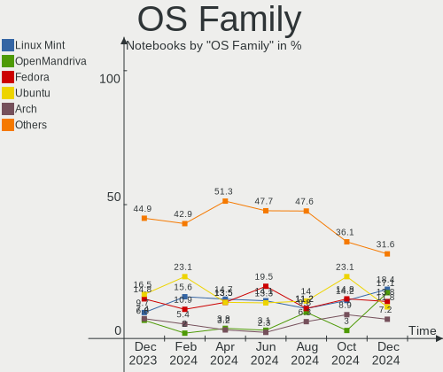
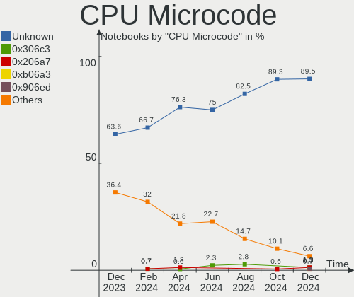
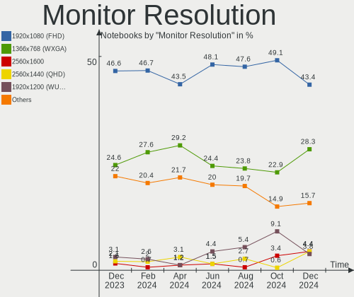
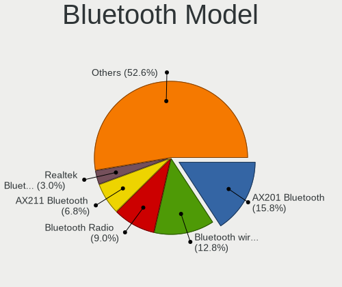
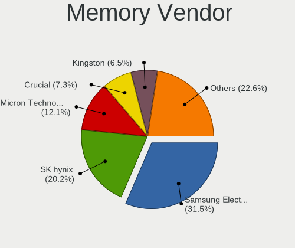
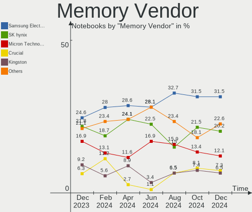
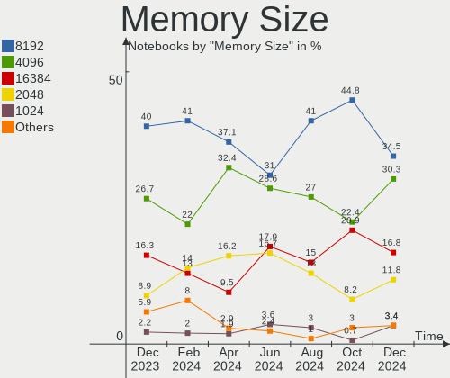

Linux in Italy - Hardware Trends (Notebooks)
--------------------------------------------

A project to identify most popular hardware characteristics and track their change
over time based on data collected by Linux users at https://Linux-Hardware.org.

Anyone can contribute to this report by the [hw-probe](https://github.com/linuxhw/hw-probe) tool:

    sudo -E hw-probe -all -upload

Period: Jun, 2022.

Contents
--------

* [ System ](#system)
  - [ OS                       ](#os)
  - [ OS Family                ](#os-family)
  - [ Kernel                   ](#kernel)
  - [ Kernel Family            ](#kernel-family)
  - [ Kernel Major Ver.        ](#kernel-major-ver)
  - [ Arch                     ](#arch)
  - [ DE                       ](#de)
  - [ Display Server           ](#display-server)
  - [ Display Manager          ](#display-manager)
  - [ OS Lang                  ](#os-lang)
  - [ Boot Mode                ](#boot-mode)
  - [ Filesystem               ](#filesystem)
  - [ Part. scheme             ](#part-scheme)
  - [ Dual Boot with Linux/BSD ](#dual-boot-with-linuxbsd)
  - [ Dual Boot (Win)          ](#dual-boot-win)

* [ Board ](#board)
  - [ Vendor                   ](#vendor)
  - [ Model                    ](#model)
  - [ Model Family             ](#model-family)
  - [ MFG Year                 ](#mfg-year)
  - [ Form Factor              ](#form-factor)
  - [ Secure Boot              ](#secure-boot)
  - [ Coreboot                 ](#coreboot)
  - [ RAM Size                 ](#ram-size)
  - [ RAM Used                 ](#ram-used)
  - [ Total Drives             ](#total-drives)
  - [ Has CD-ROM               ](#has-cd-rom)
  - [ Has Ethernet             ](#has-ethernet)
  - [ Has WiFi                 ](#has-wifi)
  - [ Has Bluetooth            ](#has-bluetooth)

* [ Location ](#location)
  - [ Country                  ](#country)
  - [ City                     ](#city)

* [ Drives ](#drives)
  - [ Drive Vendor             ](#drive-vendor)
  - [ Drive Model              ](#drive-model)
  - [ HDD Vendor               ](#hdd-vendor)
  - [ SSD Vendor               ](#ssd-vendor)
  - [ Drive Kind               ](#drive-kind)
  - [ Drive Connector          ](#drive-connector)
  - [ Drive Size               ](#drive-size)
  - [ Space Total              ](#space-total)
  - [ Space Used               ](#space-used)
  - [ Malfunc. Drives          ](#malfunc-drives)
  - [ Malfunc. Drive Vendor    ](#malfunc-drive-vendor)
  - [ Malfunc. HDD Vendor      ](#malfunc-hdd-vendor)
  - [ Malfunc. Drive Kind      ](#malfunc-drive-kind)
  - [ Failed Drives            ](#failed-drives)
  - [ Failed Drive Vendor      ](#failed-drive-vendor)
  - [ Drive Status             ](#drive-status)

* [ Storage controller ](#storage-controller)
  - [ Storage Vendor           ](#storage-vendor)
  - [ Storage Model            ](#storage-model)
  - [ Storage Kind             ](#storage-kind)

* [ Processor ](#processor)
  - [ CPU Vendor               ](#cpu-vendor)
  - [ CPU Model                ](#cpu-model)
  - [ CPU Model Family         ](#cpu-model-family)
  - [ CPU Cores                ](#cpu-cores)
  - [ CPU Sockets              ](#cpu-sockets)
  - [ CPU Threads              ](#cpu-threads)
  - [ CPU Op-Modes             ](#cpu-op-modes)
  - [ CPU Microcode            ](#cpu-microcode)
  - [ CPU Microarch            ](#cpu-microarch)

* [ Graphics ](#graphics)
  - [ GPU Vendor               ](#gpu-vendor)
  - [ GPU Model                ](#gpu-model)
  - [ GPU Combo                ](#gpu-combo)
  - [ GPU Driver               ](#gpu-driver)
  - [ GPU Memory               ](#gpu-memory)

* [ Monitor ](#monitor)
  - [ Monitor Vendor           ](#monitor-vendor)
  - [ Monitor Model            ](#monitor-model)
  - [ Monitor Resolution       ](#monitor-resolution)
  - [ Monitor Diagonal         ](#monitor-diagonal)
  - [ Monitor Width            ](#monitor-width)
  - [ Aspect Ratio             ](#aspect-ratio)
  - [ Monitor Area             ](#monitor-area)
  - [ Pixel Density            ](#pixel-density)
  - [ Multiple Monitors        ](#multiple-monitors)

* [ Network ](#network)
  - [ Net Controller Vendor    ](#net-controller-vendor)
  - [ Net Controller Model     ](#net-controller-model)
  - [ Wireless Vendor          ](#wireless-vendor)
  - [ Wireless Model           ](#wireless-model)
  - [ Ethernet Vendor          ](#ethernet-vendor)
  - [ Ethernet Model           ](#ethernet-model)
  - [ Net Controller Kind      ](#net-controller-kind)
  - [ Used Controller          ](#used-controller)
  - [ NICs                     ](#nics)
  - [ IPv6                     ](#ipv6)

* [ Bluetooth ](#bluetooth)
  - [ Bluetooth Vendor         ](#bluetooth-vendor)
  - [ Bluetooth Model          ](#bluetooth-model)

* [ Sound ](#sound)
  - [ Sound Vendor             ](#sound-vendor)
  - [ Sound Model              ](#sound-model)

* [ Memory ](#memory)
  - [ Memory Vendor            ](#memory-vendor)
  - [ Memory Model             ](#memory-model)
  - [ Memory Kind              ](#memory-kind)
  - [ Memory Form Factor       ](#memory-form-factor)
  - [ Memory Size              ](#memory-size)
  - [ Memory Speed             ](#memory-speed)

* [ Printers & scanners ](#printers--scanners)
  - [ Printer Vendor           ](#printer-vendor)
  - [ Printer Model            ](#printer-model)
  - [ Scanner Vendor           ](#scanner-vendor)
  - [ Scanner Model            ](#scanner-model)

* [ Camera ](#camera)
  - [ Camera Vendor            ](#camera-vendor)
  - [ Camera Model             ](#camera-model)

* [ Security ](#security)
  - [ Fingerprint Vendor       ](#fingerprint-vendor)
  - [ Fingerprint Model        ](#fingerprint-model)
  - [ Chipcard Vendor          ](#chipcard-vendor)
  - [ Chipcard Model           ](#chipcard-model)

* [ Unsupported ](#unsupported)
  - [ Unsupported Devices      ](#unsupported-devices)
  - [ Unsupported Device Types ](#unsupported-device-types)

System
------

OS
--

Installed operating systems

| Name                         | Notebooks | Percent |
|------------------------------|-----------|---------|
| Ubuntu 22.04                 | 8         | 12.12%  |
| Fedora 36                    | 8         | 12.12%  |
| Ubuntu 20.04                 | 6         | 9.09%   |
| Pop!_OS 22.04                | 4         | 6.06%   |
| OpenMandriva 4.3             | 4         | 6.06%   |
| Arch                         | 4         | 6.06%   |
| Ubuntu MATE 22.04            | 3         | 4.55%   |
| Linux Mint 20.3              | 3         | 4.55%   |
| Kubuntu 22.04                | 3         | 4.55%   |
| KDE neon 20.04               | 3         | 4.55%   |
| Zorin 16                     | 2         | 3.03%   |
| Debian 11                    | 2         | 3.03%   |
| Xubuntu 22.04                | 1         | 1.52%   |
| Ubuntu 18.04                 | 1         | 1.52%   |
| ROSA R11.1                   | 1         | 1.52%   |
| PCLinuxOS 2022               | 1         | 1.52%   |
| Parrot 5.0                   | 1         | 1.52%   |
| openSUSE Tumbleweed-XXXXXXXX | 1         | 1.52%   |
| Manjaro 21.3.0               | 1         | 1.52%   |
| Kubuntu 11.1                 | 1         | 1.52%   |
| Kubuntu 11                   | 1         | 1.52%   |
| Gentoo 2.8                   | 1         | 1.52%   |
| Fedora 35                    | 1         | 1.52%   |
| Endless 4.0.6                | 1         | 1.52%   |
| Elementary 6.1               | 1         | 1.52%   |
| Debian Testing               | 1         | 1.52%   |
| Clear Linux 36010            | 1         | 1.52%   |
| ArcoLinux Rolling            | 1         | 1.52%   |

OS Family
---------

OS without a version

| Name         | Notebooks | Percent |
|--------------|-----------|---------|
| Ubuntu       | 15        | 22.73%  |
| Fedora       | 9         | 13.64%  |
| Kubuntu      | 5         | 7.58%   |
| Pop!_OS      | 4         | 6.06%   |
| OpenMandriva | 4         | 6.06%   |
| Arch         | 4         | 6.06%   |
| Ubuntu MATE  | 3         | 4.55%   |
| Linux Mint   | 3         | 4.55%   |
| KDE neon     | 3         | 4.55%   |
| Debian       | 3         | 4.55%   |
| Zorin        | 2         | 3.03%   |
| Xubuntu      | 1         | 1.52%   |
| ROSA         | 1         | 1.52%   |
| PCLinuxOS    | 1         | 1.52%   |
| Parrot       | 1         | 1.52%   |
| openSUSE     | 1         | 1.52%   |
| Manjaro      | 1         | 1.52%   |
| Gentoo       | 1         | 1.52%   |
| Endless      | 1         | 1.52%   |
| Elementary   | 1         | 1.52%   |
| Clear Linux  | 1         | 1.52%   |
| ArcoLinux    | 1         | 1.52%   |

Kernel
------

Version of the Linux kernel

| Version                             | Notebooks | Percent |
|-------------------------------------|-----------|---------|
| 5.15.0-40-generic                   | 5         | 7.58%   |
| 5.17.5-76051705-generic             | 4         | 6.06%   |
| 5.16.7-desktop-1omv4003             | 4         | 6.06%   |
| 5.13.0-48-generic                   | 4         | 6.06%   |
| 5.13.0-44-generic                   | 4         | 6.06%   |
| 5.15.0-37-generic                   | 3         | 4.55%   |
| 5.13.0-51-generic                   | 3         | 4.55%   |
| 5.4.0-121-generic                   | 2         | 3.03%   |
| 5.4.0-120-generic                   | 2         | 3.03%   |
| 5.4.0-117-generic                   | 2         | 3.03%   |
| 5.18.5-200.fc36.x86_64              | 2         | 3.03%   |
| 5.18.1-arch1-1                      | 2         | 3.03%   |
| 5.17.13-300.fc36.x86_64             | 2         | 3.03%   |
| 5.17.11-300.fc36.x86_64             | 2         | 3.03%   |
| 5.15.0-39-generic                   | 2         | 3.03%   |
| 5.15.0-33-generic                   | 2         | 3.03%   |
| 5.10.0-14-amd64                     | 2         | 3.03%   |
| 5.4.0-90-generic                    | 1         | 1.52%   |
| 5.19.0-rc3-amd64                    | 1         | 1.52%   |
| 5.18.3-1-MANJARO                    | 1         | 1.52%   |
| 5.18.2-arch1-1                      | 1         | 1.52%   |
| 5.18.2-200.fc36.x86_64              | 1         | 1.52%   |
| 5.18.1-zen1-1-zen                   | 1         | 1.52%   |
| 5.18.1-1-default                    | 1         | 1.52%   |
| 5.17.4-pclos1                       | 1         | 1.52%   |
| 5.17.12-gentoo-dist                 | 1         | 1.52%   |
| 5.17.12-300.fc36.x86_64             | 1         | 1.52%   |
| 5.16.14-200.fc35.x86_64             | 1         | 1.52%   |
| 5.16.13-1132.native                 | 1         | 1.52%   |
| 5.15.46-1-lts                       | 1         | 1.52%   |
| 5.15.0-27-generic                   | 1         | 1.52%   |
| 5.15.0-10033-tuxedo                 | 1         | 1.52%   |
| 5.14.0-9parrot1-amd64               | 1         | 1.52%   |
| 5.13.0-46-generic                   | 1         | 1.52%   |
| 5.11.0-35-generic                   | 1         | 1.52%   |
| 4.15.0-desktop-122.124.1rosa-x86_64 | 1         | 1.52%   |

Kernel Family
-------------

Linux kernel without a distro release

| Version | Notebooks | Percent |
|---------|-----------|---------|
| 5.15.0  | 14        | 21.21%  |
| 5.13.0  | 12        | 18.18%  |
| 5.4.0   | 7         | 10.61%  |
| 5.18.1  | 4         | 6.06%   |
| 5.17.5  | 4         | 6.06%   |
| 5.16.7  | 4         | 6.06%   |
| 5.18.5  | 2         | 3.03%   |
| 5.18.2  | 2         | 3.03%   |
| 5.17.13 | 2         | 3.03%   |
| 5.17.12 | 2         | 3.03%   |
| 5.17.11 | 2         | 3.03%   |
| 5.10.0  | 2         | 3.03%   |
| 5.19.0  | 1         | 1.52%   |
| 5.18.3  | 1         | 1.52%   |
| 5.17.4  | 1         | 1.52%   |
| 5.16.14 | 1         | 1.52%   |
| 5.16.13 | 1         | 1.52%   |
| 5.15.46 | 1         | 1.52%   |
| 5.14.0  | 1         | 1.52%   |
| 5.11.0  | 1         | 1.52%   |
| 4.15.0  | 1         | 1.52%   |

Kernel Major Ver.
-----------------

Linux kernel major version

| Version | Notebooks | Percent |
|---------|-----------|---------|
| 5.15    | 15        | 22.73%  |
| 5.13    | 12        | 18.18%  |
| 5.17    | 11        | 16.67%  |
| 5.18    | 9         | 13.64%  |
| 5.4     | 7         | 10.61%  |
| 5.16    | 6         | 9.09%   |
| 5.10    | 2         | 3.03%   |
| 5.19    | 1         | 1.52%   |
| 5.14    | 1         | 1.52%   |
| 5.11    | 1         | 1.52%   |
| 4.15    | 1         | 1.52%   |

Arch
----

OS architecture (x86_64, i586, etc.)

| Name   | Notebooks | Percent |
|--------|-----------|---------|
| x86_64 | 66        | 100%    |

DE
--

Desktop Environment

| Name       | Notebooks | Percent |
|------------|-----------|---------|
| GNOME      | 30        | 45.45%  |
| KDE5       | 21        | 31.82%  |
| XFCE       | 4         | 6.06%   |
| MATE       | 4         | 6.06%   |
| X-Cinnamon | 3         | 4.55%   |
| Pantheon   | 1         | 1.52%   |
| KDE4       | 1         | 1.52%   |
| Cinnamon   | 1         | 1.52%   |
| Unknown    | 1         | 1.52%   |

Display Server
--------------

X11 or Wayland

| Name    | Notebooks | Percent |
|---------|-----------|---------|
| X11     | 48        | 72.73%  |
| Wayland | 16        | 24.24%  |
| Unknown | 2         | 3.03%   |

Display Manager
---------------

SDDM, LightDM, etc.

| Name    | Notebooks | Percent |
|---------|-----------|---------|
| Unknown | 26        | 39.39%  |
| GDM3    | 13        | 19.7%   |
| SDDM    | 10        | 15.15%  |
| LightDM | 8         | 12.12%  |
| GDM     | 7         | 10.61%  |
| XDM     | 1         | 1.52%   |
| KDM     | 1         | 1.52%   |

OS Lang
-------

Language

| Lang    | Notebooks | Percent |
|---------|-----------|---------|
| it_IT   | 45        | 68.18%  |
| en_US   | 16        | 24.24%  |
| en_GB   | 2         | 3.03%   |
| C       | 2         | 3.03%   |
| Unknown | 1         | 1.52%   |

Boot Mode
---------

EFI or BIOS

| Mode | Notebooks | Percent |
|------|-----------|---------|
| EFI  | 41        | 62.12%  |
| BIOS | 25        | 37.88%  |

Filesystem
----------

Type of filesystem

| Type    | Notebooks | Percent |
|---------|-----------|---------|
| Ext4    | 49        | 74.24%  |
| Btrfs   | 13        | 19.7%   |
| Overlay | 4         | 6.06%   |

Part. scheme
------------

Scheme of partitioning

| Type    | Notebooks | Percent |
|---------|-----------|---------|
| Unknown | 37        | 56.06%  |
| GPT     | 26        | 39.39%  |
| MBR     | 3         | 4.55%   |

Dual Boot with Linux/BSD
------------------------

Hosting more than one Linux/BSD

| Dual boot | Notebooks | Percent |
|-----------|-----------|---------|
| No        | 59        | 89.39%  |
| Yes       | 7         | 10.61%  |

Dual Boot (Win)
---------------

Hosting Linux and Windows

| Dual boot | Notebooks | Percent |
|-----------|-----------|---------|
| No        | 52        | 78.79%  |
| Yes       | 14        | 21.21%  |

Board
-----

Vendor
------

Motherboard manufacturer

| Name             | Notebooks | Percent |
|------------------|-----------|---------|
| Hewlett-Packard  | 13        | 19.7%   |
| Dell             | 10        | 15.15%  |
| ASUSTek Computer | 10        | 15.15%  |
| Lenovo           | 6         | 9.09%   |
| Acer             | 6         | 9.09%   |
| Toshiba          | 3         | 4.55%   |
| HUAWEI           | 3         | 4.55%   |
| Fujitsu          | 2         | 3.03%   |
| TUXEDO           | 1         | 1.52%   |
| Timi             | 1         | 1.52%   |
| Sony             | 1         | 1.52%   |
| SANTECH          | 1         | 1.52%   |
| Razer            | 1         | 1.52%   |
| PC Specialist    | 1         | 1.52%   |
| MSI              | 1         | 1.52%   |
| MicroByte        | 1         | 1.52%   |
| Intel            | 1         | 1.52%   |
| eMachines        | 1         | 1.52%   |
| Dynabook         | 1         | 1.52%   |
| Chuwi            | 1         | 1.52%   |
| Apple            | 1         | 1.52%   |

Model
-----

Motherboard model

| Name                                       | Notebooks | Percent |
|--------------------------------------------|-----------|---------|
| HUAWEI BOHB-WAX9                           | 2         | 3.03%   |
| HP Pavilion dv6                            | 2         | 3.03%   |
| HP Notebook                                | 2         | 3.03%   |
| ASUS N53SV                                 | 2         | 3.03%   |
| TUXEDO InfinityBook S 15 Gen6              | 1         | 1.52%   |
| Toshiba Satellite L50-A-1D6                | 1         | 1.52%   |
| Toshiba Satellite C660D                    | 1         | 1.52%   |
| Toshiba Satellite A200                     | 1         | 1.52%   |
| Timi A35S                                  | 1         | 1.52%   |
| Sony SVE1711C5E                            | 1         | 1.52%   |
| SANTECH NHx0DB,DE                          | 1         | 1.52%   |
| Razer Blade                                | 1         | 1.52%   |
| PC Specialist Standard                     | 1         | 1.52%   |
| MSI Stealth GS66 12UGS                     | 1         | 1.52%   |
| MicroByte ezbook                           | 1         | 1.52%   |
| Lenovo ThinkPad X1 Carbon Gen 9 20XW0057IX | 1         | 1.52%   |
| Lenovo ThinkPad P1 Gen 3 20TJS2F437        | 1         | 1.52%   |
| Lenovo ThinkPad Edge 0301GXG               | 1         | 1.52%   |
| Lenovo ThinkBook 15 G2 ITL 20VE            | 1         | 1.52%   |
| Lenovo IdeaPad Gaming 3 15ARH05 82EY       | 1         | 1.52%   |
| Lenovo IdeaPad 5 14ARE05 81YM              | 1         | 1.52%   |
| Intel Kabylake Platform                    | 1         | 1.52%   |
| HUAWEI KLVD-WXX9                           | 1         | 1.52%   |
| HP Victus by Laptop 16-e0xxx               | 1         | 1.52%   |
| HP ProBook 4520s                           | 1         | 1.52%   |
| HP ProBook 430 G8 Notebook PC              | 1         | 1.52%   |
| HP Pavilion 15                             | 1         | 1.52%   |
| HP OMEN by Laptop 15-dc1xxx                | 1         | 1.52%   |
| HP EliteBook 830 G5                        | 1         | 1.52%   |
| HP EliteBook 2570p                         | 1         | 1.52%   |
| HP 255 G8 Notebook PC                      | 1         | 1.52%   |
| HP 255 G6 Notebook PC                      | 1         | 1.52%   |
| Fujitsu LIFEBOOK U937                      | 1         | 1.52%   |
| Fujitsu LIFEBOOK E744                      | 1         | 1.52%   |
| eMachines E527                             | 1         | 1.52%   |
| Dynabook Satellite Pro C50-G-10G           | 1         | 1.52%   |
| Dell XPS 13 9370                           | 1         | 1.52%   |
| Dell Precision M4700                       | 1         | 1.52%   |
| Dell Precision 3551                        | 1         | 1.52%   |
| Dell Latitude E6530                        | 1         | 1.52%   |
| Dell Latitude E5450                        | 1         | 1.52%   |
| Dell Latitude D820                         | 1         | 1.52%   |
| Dell Latitude 5590                         | 1         | 1.52%   |
| Dell Latitude 5511                         | 1         | 1.52%   |
| Dell Inspiron 7437                         | 1         | 1.52%   |
| Dell Inspiron 5579                         | 1         | 1.52%   |
| Chuwi GemiBook Pro                         | 1         | 1.52%   |
| ASUS X556URK                               | 1         | 1.52%   |
| ASUS X556UAK                               | 1         | 1.52%   |
| ASUS X550JF                                | 1         | 1.52%   |
| ASUS VivoBook_ASUSLaptop X515MA_F515MA     | 1         | 1.52%   |
| ASUS U36SG                                 | 1         | 1.52%   |
| ASUS P552LA                                | 1         | 1.52%   |
| ASUS K52F                                  | 1         | 1.52%   |
| ASUS ASUS EXPERTBOOK B3302CEA_B5302CEA     | 1         | 1.52%   |
| Apple MacBook5,1                           | 1         | 1.52%   |
| Acer Swift SF114-32                        | 1         | 1.52%   |
| Acer Aspire V5-551                         | 1         | 1.52%   |
| Acer Aspire E5-575G                        | 1         | 1.52%   |
| Acer Aspire E5-573G                        | 1         | 1.52%   |

Model Family
------------

Motherboard model prefix

| Name                   | Notebooks | Percent |
|------------------------|-----------|---------|
| Dell Latitude          | 5         | 7.58%   |
| Acer Aspire            | 5         | 7.58%   |
| Toshiba Satellite      | 3         | 4.55%   |
| Lenovo ThinkPad        | 3         | 4.55%   |
| HP Pavilion            | 3         | 4.55%   |
| Lenovo IdeaPad         | 2         | 3.03%   |
| HUAWEI BOHB-WAX9       | 2         | 3.03%   |
| HP ProBook             | 2         | 3.03%   |
| HP Notebook            | 2         | 3.03%   |
| HP EliteBook           | 2         | 3.03%   |
| HP 255                 | 2         | 3.03%   |
| Fujitsu LIFEBOOK       | 2         | 3.03%   |
| Dell Precision         | 2         | 3.03%   |
| Dell Inspiron          | 2         | 3.03%   |
| ASUS N53SV             | 2         | 3.03%   |
| TUXEDO InfinityBook    | 1         | 1.52%   |
| Timi A35S              | 1         | 1.52%   |
| Sony SVE1711C5E        | 1         | 1.52%   |
| SANTECH NHx0DB         | 1         | 1.52%   |
| Razer Blade            | 1         | 1.52%   |
| PC Specialist Standard | 1         | 1.52%   |
| MSI Stealth            | 1         | 1.52%   |
| MicroByte ezbook       | 1         | 1.52%   |
| Lenovo ThinkBook       | 1         | 1.52%   |
| Intel Kabylake         | 1         | 1.52%   |
| HUAWEI KLVD-WXX9       | 1         | 1.52%   |
| HP Victus              | 1         | 1.52%   |
| HP OMEN                | 1         | 1.52%   |
| eMachines E527         | 1         | 1.52%   |
| Dynabook Satellite     | 1         | 1.52%   |
| Dell XPS               | 1         | 1.52%   |
| Chuwi GemiBook         | 1         | 1.52%   |
| ASUS X556URK           | 1         | 1.52%   |
| ASUS X556UAK           | 1         | 1.52%   |
| ASUS X550JF            | 1         | 1.52%   |
| ASUS VivoBook          | 1         | 1.52%   |
| ASUS U36SG             | 1         | 1.52%   |
| ASUS P552LA            | 1         | 1.52%   |
| ASUS K52F              | 1         | 1.52%   |
| ASUS ASUS              | 1         | 1.52%   |
| Apple MacBook5         | 1         | 1.52%   |
| Acer Swift             | 1         | 1.52%   |

MFG Year
--------

Motherboard manufacture year

| Year | Notebooks | Percent |
|------|-----------|---------|
| 2021 | 13        | 19.7%   |
| 2020 | 11        | 16.67%  |
| 2010 | 6         | 9.09%   |
| 2018 | 5         | 7.58%   |
| 2012 | 5         | 7.58%   |
| 2019 | 4         | 6.06%   |
| 2017 | 4         | 6.06%   |
| 2014 | 4         | 6.06%   |
| 2016 | 3         | 4.55%   |
| 2015 | 3         | 4.55%   |
| 2009 | 2         | 3.03%   |
| 2008 | 2         | 3.03%   |
| 2013 | 1         | 1.52%   |
| 2011 | 1         | 1.52%   |
| 2007 | 1         | 1.52%   |
| 2006 | 1         | 1.52%   |

Form Factor
-----------

Physical design of the computer

| Name     | Notebooks | Percent |
|----------|-----------|---------|
| Notebook | 66        | 100%    |

Secure Boot
-----------

Enabled or disabled

| State    | Notebooks | Percent |
|----------|-----------|---------|
| Disabled | 58        | 87.88%  |
| Enabled  | 8         | 12.12%  |

Coreboot
--------

Have coreboot on board

| Used | Notebooks | Percent |
|------|-----------|---------|
| No   | 66        | 100%    |

RAM Size
--------

Total RAM memory

| Size in GB  | Notebooks | Percent |
|-------------|-----------|---------|
| 4.01-8.0    | 16        | 24.24%  |
| 8.01-16.0   | 15        | 22.73%  |
| 3.01-4.0    | 14        | 21.21%  |
| 16.01-24.0  | 11        | 16.67%  |
| 32.01-64.0  | 9         | 13.64%  |
| 64.01-256.0 | 1         | 1.52%   |

RAM Used
--------

Used RAM memory

| Used GB   | Notebooks | Percent |
|-----------|-----------|---------|
| 1.01-2.0  | 24        | 36.36%  |
| 4.01-8.0  | 14        | 21.21%  |
| 3.01-4.0  | 11        | 16.67%  |
| 2.01-3.0  | 11        | 16.67%  |
| 8.01-16.0 | 4         | 6.06%   |
| 0.51-1.0  | 2         | 3.03%   |

Total Drives
------------

Number of drives on board

| Drives | Notebooks | Percent |
|--------|-----------|---------|
| 1      | 50        | 75.76%  |
| 2      | 14        | 21.21%  |
| 3      | 1         | 1.52%   |
| 0      | 1         | 1.52%   |

Has CD-ROM
----------

Has CD-ROM on board

| Presented | Notebooks | Percent |
|-----------|-----------|---------|
| No        | 41        | 62.12%  |
| Yes       | 25        | 37.88%  |

Has Ethernet
------------

Has Ethernet on board

| Presented | Notebooks | Percent |
|-----------|-----------|---------|
| Yes       | 55        | 83.33%  |
| No        | 11        | 16.67%  |

Has WiFi
--------

Has WiFi module

| Presented | Notebooks | Percent |
|-----------|-----------|---------|
| Yes       | 65        | 98.48%  |
| No        | 1         | 1.52%   |

Has Bluetooth
-------------

Has Bluetooth module

| Presented | Notebooks | Percent |
|-----------|-----------|---------|
| Yes       | 59        | 89.39%  |
| No        | 7         | 10.61%  |

Location
--------

Country
-------

Geographic location (country)

| Country | Notebooks | Percent |
|---------|-----------|---------|
| Italy   | 66        | 100%    |

City
----

Geographic location (city)

| City                | Notebooks | Percent |
|---------------------|-----------|---------|
| Milan               | 13        | 19.7%   |
| Rome                | 8         | 12.12%  |
| Turin               | 3         | 4.55%   |
| Sesto San Giovanni  | 3         | 4.55%   |
| Florence            | 3         | 4.55%   |
| Rho                 | 2         | 3.03%   |
| Vigliano Biellese   | 1         | 1.52%   |
| Vicenza             | 1         | 1.52%   |
| Verona              | 1         | 1.52%   |
| Sestri Ponente      | 1         | 1.52%   |
| Serramanna          | 1         | 1.52%   |
| Sciacca             | 1         | 1.52%   |
| San Bonifacio       | 1         | 1.52%   |
| Ronago              | 1         | 1.52%   |
| Rivanazzano         | 1         | 1.52%   |
| Riposto             | 1         | 1.52%   |
| Procida             | 1         | 1.52%   |
| Pisa                | 1         | 1.52%   |
| Picerno             | 1         | 1.52%   |
| Pesaro              | 1         | 1.52%   |
| Parma               | 1         | 1.52%   |
| Padova              | 1         | 1.52%   |
| Muggia              | 1         | 1.52%   |
| Lucca               | 1         | 1.52%   |
| Limbiate            | 1         | 1.52%   |
| Lecco               | 1         | 1.52%   |
| Lainate             | 1         | 1.52%   |
| Iesi                | 1         | 1.52%   |
| Genoa               | 1         | 1.52%   |
| Galliate            | 1         | 1.52%   |
| Furci Siculo        | 1         | 1.52%   |
| Feldthurns          | 1         | 1.52%   |
| Conselice           | 1         | 1.52%   |
| Como                | 1         | 1.52%   |
| Cassino             | 1         | 1.52%   |
| Casalecchio di Reno | 1         | 1.52%   |
| Brescia             | 1         | 1.52%   |
| Bologna             | 1         | 1.52%   |
| Asti                | 1         | 1.52%   |
| Adria               | 1         | 1.52%   |

Drives
------

Drive Vendor
------------

Hard drive vendors

| Vendor                       | Notebooks | Drives | Percent |
|------------------------------|-----------|--------|---------|
| Samsung Electronics          | 22        | 23     | 28.57%  |
| Toshiba                      | 6         | 6      | 7.79%   |
| WDC                          | 5         | 5      | 6.49%   |
| Seagate                      | 4         | 4      | 5.19%   |
| SanDisk                      | 4         | 4      | 5.19%   |
| Phison                       | 4         | 4      | 5.19%   |
| Kingston                     | 4         | 4      | 5.19%   |
| Micron Technology            | 3         | 3      | 3.9%    |
| KIOXIA                       | 3         | 3      | 3.9%    |
| Hitachi                      | 3         | 3      | 3.9%    |
| Crucial                      | 3         | 3      | 3.9%    |
| Unknown                      | 2         | 2      | 2.6%    |
| Corsair                      | 2         | 2      | 2.6%    |
| YMTC                         | 1         | 1      | 1.3%    |
| USB3.0                       | 1         | 1      | 1.3%    |
| SK hynix                     | 1         | 1      | 1.3%    |
| Silicon Motion               | 1         | 1      | 1.3%    |
| Shenzhen Longsys Electronics | 1         | 1      | 1.3%    |
| PNY                          | 1         | 1      | 1.3%    |
| Patriot                      | 1         | 1      | 1.3%    |
| Netac                        | 1         | 1      | 1.3%    |
| KingDian                     | 1         | 1      | 1.3%    |
| Intel                        | 1         | 1      | 1.3%    |
| FORESEE                      | 1         | 1      | 1.3%    |
| China                        | 1         | 1      | 1.3%    |

Drive Model
-----------

Hard drive models

| Model                                   | Notebooks | Percent |
|-----------------------------------------|-----------|---------|
| Samsung SSD 860 EVO 500GB               | 4         | 5.13%   |
| Samsung NVMe SSD Drive 512GB            | 3         | 3.85%   |
| SanDisk NVMe SSD Drive 512GB            | 2         | 2.56%   |
| Samsung SSD 850 EVO 250GB               | 2         | 2.56%   |
| Phison 311CD0512GB                      | 2         | 2.56%   |
| Kingston SA400S37240G 240GB SSD         | 2         | 2.56%   |
| Corsair Force GT 120GB SSD              | 2         | 2.56%   |
| YMTC PC005 256GB                        | 1         | 1.28%   |
| WDC WDS500G2B0B-00YS70 500GB SSD        | 1         | 1.28%   |
| WDC WD5000LPCX-21VHAT0 500GB            | 1         | 1.28%   |
| WDC WD5000BPVT-00A1YT0 500GB            | 1         | 1.28%   |
| WDC WD3200BEKT-60V5T1 320GB             | 1         | 1.28%   |
| WDC PC SN530 SDBPNPZ-512G-1006 512GB    | 1         | 1.28%   |
| USB3.0 Super Speed 320GB                | 1         | 1.28%   |
| Unknown Trust HDD 2.5" 1TB              | 1         | 1.28%   |
| Unknown MMC Card  248GB                 | 1         | 1.28%   |
| Toshiba THNSNK256GVN8 256GB SSD         | 1         | 1.28%   |
| Toshiba THNS128GG4BBAA 128GB SSD        | 1         | 1.28%   |
| Toshiba NVMe SSD Drive 512GB            | 1         | 1.28%   |
| Toshiba MQ01ABD100 1TB                  | 1         | 1.28%   |
| Toshiba MK1234GSX 120GB                 | 1         | 1.28%   |
| Toshiba KSG60ZMV512G M.2 2280 512GB SSD | 1         | 1.28%   |
| SK hynix BC711 NVMe 512GB               | 1         | 1.28%   |
| Silicon Motion 256GB PCS PCIe M.2 SSD   | 1         | 1.28%   |
| Shenzhen Longsys NVMe SSD Drive 128GB   | 1         | 1.28%   |
| Seagate ST500LT012-1DG142 500GB         | 1         | 1.28%   |
| Seagate ST320LT007-9ZV142 320GB         | 1         | 1.28%   |
| Seagate ST2000LX001-1RG174 2TB          | 1         | 1.28%   |
| Seagate FireCuda 530 ZP1000GM30013 1TB  | 1         | 1.28%   |
| SanDisk SSD PLUS 480GB                  | 1         | 1.28%   |
| SanDisk SSD PLUS 240GB                  | 1         | 1.28%   |
| Samsung SSD PM871b 2.5 7mm 512GB        | 1         | 1.28%   |
| Samsung SSD 980 PRO 1TB                 | 1         | 1.28%   |
| Samsung SSD 970 EVO Plus 1TB            | 1         | 1.28%   |
| Samsung SSD 970 EVO 1TB                 | 1         | 1.28%   |
| Samsung SSD 870 EVO 500GB               | 1         | 1.28%   |
| Samsung SSD 860 EVO M.2 250GB           | 1         | 1.28%   |
| Samsung SSD 860 EVO 1TB                 | 1         | 1.28%   |
| Samsung SSD 850 EVO 500GB               | 1         | 1.28%   |
| Samsung SM963 2.5" NVMe PCIe SSD 500GB  | 1         | 1.28%   |
| Samsung NVMe SSD Drive 256GB            | 1         | 1.28%   |
| Samsung MZVL21T0HCLR-00BL7 1TB          | 1         | 1.28%   |
| Samsung MZALQ256HAJD-000L2 256GB        | 1         | 1.28%   |
| Samsung MZ7PD256HCGM-000H7 256GB SSD    | 1         | 1.28%   |
| Samsung HM251JI 250GB                   | 1         | 1.28%   |
| PNY CS3030 2TB SSD                      | 1         | 1.28%   |
| Phison SSBP128GTB3C0-S11 128GB          | 1         | 1.28%   |
| Phison Sabrent 1TB                      | 1         | 1.28%   |
| Patriot Burst 240GB SSD                 | 1         | 1.28%   |
| Netac S535N8/256 256GB                  | 1         | 1.28%   |
| Micron NVMe SSD Drive 512GB             | 1         | 1.28%   |
| Micron 3400_MTFDKBA1T0TFH 1TB           | 1         | 1.28%   |
| Micron 1100_MTFDDAK512TBN 512GB SSD     | 1         | 1.28%   |
| KIOXIA NVMe SSD Drive 512GB             | 1         | 1.28%   |
| KIOXIA KXG60ZNV512G 512GB               | 1         | 1.28%   |
| KIOXIA KBG40ZNS512G NVMe 512GB          | 1         | 1.28%   |
| Kingston SA400S37480G 480GB SSD         | 1         | 1.28%   |
| Kingston NVMe SSD Drive 500GB           | 1         | 1.28%   |
| KingDian S200 60GB SSD                  | 1         | 1.28%   |
| Intel SSDPEKNU020TZ 2TB                 | 1         | 1.28%   |

HDD Vendor
----------

Hard disk drive vendors

| Vendor              | Notebooks | Drives | Percent |
|---------------------|-----------|--------|---------|
| WDC                 | 3         | 3      | 23.08%  |
| Seagate             | 3         | 3      | 23.08%  |
| Hitachi             | 3         | 3      | 23.08%  |
| Toshiba             | 2         | 2      | 15.38%  |
| Unknown             | 1         | 1      | 7.69%   |
| Samsung Electronics | 1         | 1      | 7.69%   |

SSD Vendor
----------

Solid state drive vendors

| Vendor              | Notebooks | Drives | Percent |
|---------------------|-----------|--------|---------|
| Samsung Electronics | 12        | 12     | 36.36%  |
| Toshiba             | 3         | 3      | 9.09%   |
| Kingston            | 3         | 3      | 9.09%   |
| Crucial             | 3         | 3      | 9.09%   |
| SanDisk             | 2         | 2      | 6.06%   |
| Corsair             | 2         | 2      | 6.06%   |
| WDC                 | 1         | 1      | 3.03%   |
| USB3.0              | 1         | 1      | 3.03%   |
| Patriot             | 1         | 1      | 3.03%   |
| Netac               | 1         | 1      | 3.03%   |
| Micron Technology   | 1         | 1      | 3.03%   |
| KingDian            | 1         | 1      | 3.03%   |
| FORESEE             | 1         | 1      | 3.03%   |
| China               | 1         | 1      | 3.03%   |

Drive Kind
----------

HDD or SSD

| Kind    | Notebooks | Drives | Percent |
|---------|-----------|--------|---------|
| SSD     | 32        | 33     | 43.84%  |
| NVMe    | 26        | 30     | 35.62%  |
| HDD     | 13        | 13     | 17.81%  |
| MMC     | 1         | 1      | 1.37%   |
| Unknown | 1         | 1      | 1.37%   |

Drive Connector
---------------

SATA, SAS, NVMe, etc.

| Type | Notebooks | Drives | Percent |
|------|-----------|--------|---------|
| SATA | 43        | 43     | 58.9%   |
| NVMe | 26        | 30     | 35.62%  |
| SAS  | 3         | 4      | 4.11%   |
| MMC  | 1         | 1      | 1.37%   |

Drive Size
----------

Size of hard drive

| Size in TB | Notebooks | Drives | Percent |
|------------|-----------|--------|---------|
| 0.01-0.5   | 35        | 36     | 77.78%  |
| 0.51-1.0   | 8         | 8      | 17.78%  |
| 1.01-2.0   | 2         | 2      | 4.44%   |

Space Total
-----------

Amount of disk space available on the file system

| Size in GB     | Notebooks | Percent |
|----------------|-----------|---------|
| 251-500        | 18        | 27.27%  |
| 101-250        | 16        | 24.24%  |
| 501-1000       | 7         | 10.61%  |
| 51-100         | 7         | 10.61%  |
| 2001-3000      | 4         | 6.06%   |
| 1001-2000      | 4         | 6.06%   |
| 1-20           | 4         | 6.06%   |
| Unknown        | 4         | 6.06%   |
| More than 3000 | 1         | 1.52%   |
| 21-50          | 1         | 1.52%   |

Space Used
----------

Amount of used disk space

| Used GB        | Notebooks | Percent |
|----------------|-----------|---------|
| 1-20           | 23        | 34.85%  |
| 51-100         | 10        | 15.15%  |
| 101-250        | 8         | 12.12%  |
| 251-500        | 7         | 10.61%  |
| 21-50          | 6         | 9.09%   |
| 501-1000       | 5         | 7.58%   |
| Unknown        | 4         | 6.06%   |
| 1001-2000      | 2         | 3.03%   |
| More than 3000 | 1         | 1.52%   |

Malfunc. Drives
---------------

Drive models with a malfunction

| Model                        | Notebooks | Drives | Percent |
|------------------------------|-----------|--------|---------|
| WDC WD3200BEKT-60V5T1 320GB  | 1         | 1      | 50%     |
| Hitachi HTS541080G9SA00 80GB | 1         | 1      | 50%     |

Malfunc. Drive Vendor
---------------------

Vendors of faulty drives

| Vendor  | Notebooks | Drives | Percent |
|---------|-----------|--------|---------|
| WDC     | 1         | 1      | 50%     |
| Hitachi | 1         | 1      | 50%     |

Malfunc. HDD Vendor
-------------------

Vendors of faulty HDD drives

| Vendor  | Notebooks | Drives | Percent |
|---------|-----------|--------|---------|
| WDC     | 1         | 1      | 50%     |
| Hitachi | 1         | 1      | 50%     |

Malfunc. Drive Kind
-------------------

Kinds of faulty drives

| Kind | Notebooks | Drives | Percent |
|------|-----------|--------|---------|
| HDD  | 2         | 2      | 100%    |

Failed Drives
-------------

Failed drive models

Zero info for selected period =(

Failed Drive Vendor
-------------------

Failed drive vendors

Zero info for selected period =(

Drive Status
------------

Number of failed and malfunc. drives

| Status   | Notebooks | Drives | Percent |
|----------|-----------|--------|---------|
| Detected | 36        | 43     | 55.38%  |
| Works    | 27        | 33     | 41.54%  |
| Malfunc  | 2         | 2      | 3.08%   |

Storage controller
------------------

Storage Vendor
--------------

Storage controller vendors

| Vendor                       | Notebooks | Percent |
|------------------------------|-----------|---------|
| Intel                        | 47        | 55.95%  |
| Samsung Electronics          | 9         | 10.71%  |
| AMD                          | 8         | 9.52%   |
| Phison Electronics           | 4         | 4.76%   |
| SanDisk                      | 3         | 3.57%   |
| Toshiba America Info Systems | 2         | 2.38%   |
| Micron Technology            | 2         | 2.38%   |
| KIOXIA                       | 2         | 2.38%   |
| Yangtze Memory Technologies  | 1         | 1.19%   |
| SK hynix                     | 1         | 1.19%   |
| Silicon Motion               | 1         | 1.19%   |
| Shenzhen Longsys Electronics | 1         | 1.19%   |
| Seagate Technology           | 1         | 1.19%   |
| Nvidia                       | 1         | 1.19%   |
| Kingston Technology Company  | 1         | 1.19%   |

Storage Model
-------------

Storage controller models

| Model                                                                          | Notebooks | Percent |
|--------------------------------------------------------------------------------|-----------|---------|
| Intel Sunrise Point-LP SATA Controller [AHCI mode]                             | 6         | 6.9%    |
| AMD FCH SATA Controller [AHCI mode]                                            | 6         | 6.9%    |
| Intel 82801 Mobile SATA Controller [RAID mode]                                 | 5         | 5.75%   |
| Samsung NVMe SSD Controller 980                                                | 4         | 4.6%    |
| Intel Wildcat Point-LP SATA Controller [AHCI Mode]                             | 4         | 4.6%    |
| Intel Comet Lake SATA AHCI Controller                                          | 4         | 4.6%    |
| Intel 6 Series/C200 Series Chipset Family 6 port Mobile SATA AHCI Controller   | 4         | 4.6%    |
| Samsung NVMe SSD Controller SM981/PM981/PM983                                  | 3         | 3.45%   |
| Samsung NVMe SSD Controller PM9A1/PM9A3/980PRO                                 | 3         | 3.45%   |
| Intel Volume Management Device NVMe RAID Controller                            | 3         | 3.45%   |
| Intel Celeron/Pentium Silver Processor SATA Controller                         | 3         | 3.45%   |
| Intel 8 Series/C220 Series Chipset Family 6-port SATA Controller 1 [AHCI mode] | 3         | 3.45%   |
| Intel 7 Series Chipset Family 6-port SATA Controller [AHCI mode]               | 3         | 3.45%   |
| Intel 400 Series Chipset Family SATA AHCI Controller                           | 3         | 3.45%   |
| Toshiba America Info Systems XG6 NVMe SSD Controller                           | 2         | 2.3%    |
| Phison PS5013 E13 NVMe Controller                                              | 2         | 2.3%    |
| Phison E12 NVMe Controller                                                     | 2         | 2.3%    |
| Micron Non-Volatile memory controller                                          | 2         | 2.3%    |
| KIOXIA Non-Volatile memory controller                                          | 2         | 2.3%    |
| Intel 5 Series/3400 Series Chipset 4 port SATA AHCI Controller                 | 2         | 2.3%    |
| AMD SB7x0/SB8x0/SB9x0 SATA Controller [AHCI mode]                              | 2         | 2.3%    |
| Yangtze Memory Non-Volatile memory controller                                  | 1         | 1.15%   |
| SK hynix Gold P31 SSD                                                          | 1         | 1.15%   |
| Silicon Motion SM2263EN/SM2263XT SSD Controller                                | 1         | 1.15%   |
| Shenzhen Longsys Non-Volatile memory controller                                | 1         | 1.15%   |
| Seagate FireCuda 530 SSD                                                       | 1         | 1.15%   |
| SanDisk WD Blue SN550 NVMe SSD                                                 | 1         | 1.15%   |
| SanDisk WD Blue SN500 / PC SN520 NVMe SSD                                      | 1         | 1.15%   |
| SanDisk WD Black SN750 / PC SN730 NVMe SSD                                     | 1         | 1.15%   |
| Nvidia MCP79 AHCI Controller                                                   | 1         | 1.15%   |
| Kingston Company KC2000 NVMe SSD                                               | 1         | 1.15%   |
| Intel Tiger Lake-LP SATA Controller [AHCI mode]                                | 1         | 1.15%   |
| Intel Non-Volatile memory controller                                           | 1         | 1.15%   |
| Intel Celeron N3350/Pentium N4200/Atom E3900 Series SATA AHCI Controller       | 1         | 1.15%   |
| Intel 82801IBM/IEM (ICH9M/ICH9M-E) 4 port SATA Controller [AHCI mode]          | 1         | 1.15%   |
| Intel 82801HM/HEM (ICH8M/ICH8M-E) SATA Controller [AHCI mode]                  | 1         | 1.15%   |
| Intel 82801HM/HEM (ICH8M/ICH8M-E) IDE Controller                               | 1         | 1.15%   |
| Intel 82801GBM/GHM (ICH7-M Family) SATA Controller [IDE mode]                  | 1         | 1.15%   |
| Intel 8 Series SATA Controller 1 [AHCI mode]                                   | 1         | 1.15%   |
| Intel 5 Series/3400 Series Chipset 6 port SATA AHCI Controller                 | 1         | 1.15%   |

Storage Kind
------------

Kind of storage controller (IDE, SATA, NVMe, SAS, ...)

| Kind | Notebooks | Percent |
|------|-----------|---------|
| SATA | 47        | 56.63%  |
| NVMe | 26        | 31.33%  |
| RAID | 8         | 9.64%   |
| IDE  | 2         | 2.41%   |

Processor
---------

CPU Vendor
----------

Processor vendors

| Vendor | Notebooks | Percent |
|--------|-----------|---------|
| Intel  | 54        | 81.82%  |
| AMD    | 12        | 18.18%  |

CPU Model
---------

Processor models

| Model                                           | Notebooks | Percent |
|-------------------------------------------------|-----------|---------|
| Intel 11th Gen Core i7-1165G7 @ 2.80GHz         | 5         | 7.58%   |
| Intel Core i5-7200U CPU @ 2.50GHz               | 4         | 6.06%   |
| Intel Core i7-8550U CPU @ 1.80GHz               | 2         | 3.03%   |
| Intel Core i7-2630QM CPU @ 2.00GHz              | 2         | 3.03%   |
| Intel Core i7-10850H CPU @ 2.70GHz              | 2         | 3.03%   |
| Intel Core i7-10750H CPU @ 2.60GHz              | 2         | 3.03%   |
| Intel Core i5-10210U CPU @ 1.60GHz              | 2         | 3.03%   |
| Intel Core i3-5005U CPU @ 2.00GHz               | 2         | 3.03%   |
| Intel Pentium Silver N5000 CPU @ 1.10GHz        | 1         | 1.52%   |
| Intel Pentium CPU P6100 @ 2.00GHz               | 1         | 1.52%   |
| Intel Core i7-9750H CPU @ 2.60GHz               | 1         | 1.52%   |
| Intel Core i7-8750H CPU @ 2.20GHz               | 1         | 1.52%   |
| Intel Core i7-7600U CPU @ 2.80GHz               | 1         | 1.52%   |
| Intel Core i7-7500U CPU @ 2.70GHz               | 1         | 1.52%   |
| Intel Core i7-5500U CPU @ 2.40GHz               | 1         | 1.52%   |
| Intel Core i7-4750HQ CPU @ 2.00GHz              | 1         | 1.52%   |
| Intel Core i7-4700MQ CPU @ 2.40GHz              | 1         | 1.52%   |
| Intel Core i7-3740QM CPU @ 2.70GHz              | 1         | 1.52%   |
| Intel Core i7-3612QM CPU @ 2.10GHz              | 1         | 1.52%   |
| Intel Core i7-3520M CPU @ 2.90GHz               | 1         | 1.52%   |
| Intel Core i7-2620M CPU @ 2.70GHz               | 1         | 1.52%   |
| Intel Core i7-10510U CPU @ 1.80GHz              | 1         | 1.52%   |
| Intel Core i5-8250U CPU @ 1.60GHz               | 1         | 1.52%   |
| Intel Core i5-5300U CPU @ 2.30GHz               | 1         | 1.52%   |
| Intel Core i5-4300M CPU @ 2.60GHz               | 1         | 1.52%   |
| Intel Core i5-3360M CPU @ 2.80GHz               | 1         | 1.52%   |
| Intel Core i5-2450M CPU @ 2.50GHz               | 1         | 1.52%   |
| Intel Core i3-6006U CPU @ 2.00GHz               | 1         | 1.52%   |
| Intel Core i3-4010U CPU @ 1.70GHz               | 1         | 1.52%   |
| Intel Core i3-10110U CPU @ 2.10GHz              | 1         | 1.52%   |
| Intel Core i3 CPU M 380 @ 2.53GHz               | 1         | 1.52%   |
| Intel Core i3 CPU M 350 @ 2.27GHz               | 1         | 1.52%   |
| Intel Core 2 Duo CPU T7250 @ 2.00GHz            | 1         | 1.52%   |
| Intel Core 2 Duo CPU P7350 @ 2.00GHz            | 1         | 1.52%   |
| Intel Core 2 CPU T5600 @ 1.83GHz                | 1         | 1.52%   |
| Intel Celeron N4020 CPU @ 1.10GHz               | 1         | 1.52%   |
| Intel Celeron J4125 CPU @ 2.00GHz               | 1         | 1.52%   |
| Intel Celeron Dual-Core CPU T3300 @ 2.00GHz     | 1         | 1.52%   |
| Intel Celeron CPU N3450 @ 1.10GHz               | 1         | 1.52%   |
| Intel 12th Gen Core i7-12700H                   | 1         | 1.52%   |
| Intel 11th Gen Core i7-11390H @ 3.40GHz         | 1         | 1.52%   |
| AMD Turion II P540 Dual-Core Processor          | 1         | 1.52%   |
| AMD Ryzen 9 5900HX with Radeon Graphics         | 1         | 1.52%   |
| AMD Ryzen 7 5800H with Radeon Graphics          | 1         | 1.52%   |
| AMD Ryzen 7 4800H with Radeon Graphics          | 1         | 1.52%   |
| AMD Ryzen 5 5600H with Radeon Graphics          | 1         | 1.52%   |
| AMD Ryzen 5 5500U with Radeon Graphics          | 1         | 1.52%   |
| AMD Ryzen 5 4500U with Radeon Graphics          | 1         | 1.52%   |
| AMD E2-9000e RADEON R2, 4 COMPUTE CORES 2C+2G   | 1         | 1.52%   |
| AMD E-450 APU with Radeon HD Graphics           | 1         | 1.52%   |
| AMD Athlon Silver 3050U with Radeon Graphics    | 1         | 1.52%   |
| AMD A6-4455M APU with Radeon HD Graphics        | 1         | 1.52%   |
| AMD A10-9600P RADEON R5, 10 COMPUTE CORES 4C+6G | 1         | 1.52%   |

CPU Model Family
----------------

Processor model prefix

| Model                   | Notebooks | Percent |
|-------------------------|-----------|---------|
| Intel Core i7           | 20        | 30.3%   |
| Intel Core i5           | 11        | 16.67%  |
| Other                   | 7         | 10.61%  |
| Intel Core i3           | 7         | 10.61%  |
| Intel Celeron           | 3         | 4.55%   |
| AMD Ryzen 5             | 3         | 4.55%   |
| Intel Core 2 Duo        | 2         | 3.03%   |
| AMD Ryzen 7             | 2         | 3.03%   |
| Intel Pentium Silver    | 1         | 1.52%   |
| Intel Pentium           | 1         | 1.52%   |
| Intel Core 2            | 1         | 1.52%   |
| Intel Celeron Dual-Core | 1         | 1.52%   |
| AMD Turion II           | 1         | 1.52%   |
| AMD Ryzen 9             | 1         | 1.52%   |
| AMD E2                  | 1         | 1.52%   |
| AMD E                   | 1         | 1.52%   |
| AMD Athlon              | 1         | 1.52%   |
| AMD A6                  | 1         | 1.52%   |
| AMD A10                 | 1         | 1.52%   |

CPU Cores
---------

Number of processor cores

| Number | Notebooks | Percent |
|--------|-----------|---------|
| 2      | 31        | 46.97%  |
| 4      | 21        | 31.82%  |
| 6      | 9         | 13.64%  |
| 8      | 3         | 4.55%   |
| 14     | 1         | 1.52%   |
| 1      | 1         | 1.52%   |

CPU Sockets
-----------

Number of sockets

| Number | Notebooks | Percent |
|--------|-----------|---------|
| 1      | 66        | 100%    |

CPU Threads
-----------

Threads per core (Hyper-Threading)

| Number | Notebooks | Percent |
|--------|-----------|---------|
| 2      | 51        | 77.27%  |
| 1      | 15        | 22.73%  |

CPU Op-Modes
------------

CPU Operation Modes (32-bit, 64-bit)

| Op mode        | Notebooks | Percent |
|----------------|-----------|---------|
| 32-bit, 64-bit | 66        | 100%    |

CPU Microcode
-------------

Microcode number

| Number     | Notebooks | Percent |
|------------|-----------|---------|
| Unknown    | 11        | 16.67%  |
| 0x806c1    | 5         | 7.58%   |
| 0xa0652    | 4         | 6.06%   |
| 0x806ec    | 3         | 4.55%   |
| 0x306d4    | 3         | 4.55%   |
| 0x306a9    | 3         | 4.55%   |
| 0x20655    | 3         | 4.55%   |
| 0x0a50000c | 3         | 4.55%   |
| 0x906ea    | 2         | 3.03%   |
| 0x806ea    | 2         | 3.03%   |
| 0x806e9    | 2         | 3.03%   |
| 0x706a8    | 2         | 3.03%   |
| 0x306c3    | 2         | 3.03%   |
| 0x206a7    | 2         | 3.03%   |
| 0x906a3    | 1         | 1.52%   |
| 0x806c2    | 1         | 1.52%   |
| 0x706a1    | 1         | 1.52%   |
| 0x6fd      | 1         | 1.52%   |
| 0x6f6      | 1         | 1.52%   |
| 0x506c9    | 1         | 1.52%   |
| 0x406e3    | 1         | 1.52%   |
| 0x40661    | 1         | 1.52%   |
| 0x40651    | 1         | 1.52%   |
| 0x1067a    | 1         | 1.52%   |
| 0x08608102 | 1         | 1.52%   |
| 0x08600106 | 1         | 1.52%   |
| 0x08600104 | 1         | 1.52%   |
| 0x08108109 | 1         | 1.52%   |
| 0x06006705 | 1         | 1.52%   |
| 0x0600611a | 1         | 1.52%   |
| 0x06001119 | 1         | 1.52%   |
| 0x05000101 | 1         | 1.52%   |
| 0x010000c8 | 1         | 1.52%   |

CPU Microarch
-------------

Microarchitecture

| Name             | Notebooks | Percent |
|------------------|-----------|---------|
| KabyLake         | 15        | 22.73%  |
| TigerLake        | 6         | 9.09%   |
| SandyBridge      | 4         | 6.06%   |
| IvyBridge        | 4         | 6.06%   |
| Haswell          | 4         | 6.06%   |
| CometLake        | 4         | 6.06%   |
| Broadwell        | 4         | 6.06%   |
| Zen 3            | 3         | 4.55%   |
| Westmere         | 3         | 4.55%   |
| Goldmont plus    | 3         | 4.55%   |
| Zen 2            | 2         | 3.03%   |
| Penryn           | 2         | 3.03%   |
| Excavator        | 2         | 3.03%   |
| Core             | 2         | 3.03%   |
| Zen+             | 1         | 1.52%   |
| Skylake          | 1         | 1.52%   |
| Piledriver       | 1         | 1.52%   |
| K10              | 1         | 1.52%   |
| Goldmont         | 1         | 1.52%   |
| Bobcat           | 1         | 1.52%   |
| Alderlake Hybrid | 1         | 1.52%   |
| Unknown          | 1         | 1.52%   |

Graphics
--------

GPU Vendor
----------

Vendors of graphics cards

| Vendor | Notebooks | Percent |
|--------|-----------|---------|
| Intel  | 50        | 58.14%  |
| Nvidia | 20        | 23.26%  |
| AMD    | 16        | 18.6%   |

GPU Model
---------

Graphics card models

| Model                                                                                 | Notebooks | Percent |
|---------------------------------------------------------------------------------------|-----------|---------|
| Intel TigerLake-LP GT2 [Iris Xe Graphics]                                             | 6         | 6.74%   |
| Intel HD Graphics 620                                                                 | 6         | 6.74%   |
| Intel HD Graphics 5500                                                                | 4         | 4.49%   |
| Intel CometLake-U GT2 [UHD Graphics]                                                  | 4         | 4.49%   |
| Intel CometLake-H GT2 [UHD Graphics]                                                  | 4         | 4.49%   |
| Intel 2nd Generation Core Processor Family Integrated Graphics Controller             | 4         | 4.49%   |
| Intel UHD Graphics 620                                                                | 3         | 3.37%   |
| Intel 3rd Gen Core processor Graphics Controller                                      | 3         | 3.37%   |
| Nvidia TU117M [GeForce GTX 1650 Mobile / Max-Q]                                       | 2         | 2.25%   |
| Nvidia GF108M [GeForce GT 540M]                                                       | 2         | 2.25%   |
| Intel GeminiLake [UHD Graphics 600]                                                   | 2         | 2.25%   |
| Intel Core Processor Integrated Graphics Controller                                   | 2         | 2.25%   |
| Intel CoffeeLake-H GT2 [UHD Graphics 630]                                             | 2         | 2.25%   |
| Intel 4th Gen Core Processor Integrated Graphics Controller                           | 2         | 2.25%   |
| AMD Renoir                                                                            | 2         | 2.25%   |
| AMD Cezanne                                                                           | 2         | 2.25%   |
| Nvidia TU117M [GeForce GTX 1650 Ti Mobile]                                            | 1         | 1.12%   |
| Nvidia TU117M                                                                         | 1         | 1.12%   |
| Nvidia TU106M [GeForce RTX 2060 Mobile]                                               | 1         | 1.12%   |
| Nvidia GP108M [GeForce MX230]                                                         | 1         | 1.12%   |
| Nvidia GP107GLM [Quadro P620]                                                         | 1         | 1.12%   |
| Nvidia GM108M [GeForce 930M]                                                          | 1         | 1.12%   |
| Nvidia GM108M [GeForce 930MX]                                                         | 1         | 1.12%   |
| Nvidia GM108M [GeForce 840M]                                                          | 1         | 1.12%   |
| Nvidia GM107 [GeForce 940MX]                                                          | 1         | 1.12%   |
| Nvidia GK208M [GeForce GT 740M]                                                       | 1         | 1.12%   |
| Nvidia GK208BM [GeForce 920M]                                                         | 1         | 1.12%   |
| Nvidia GK107GLM [Quadro K2000M]                                                       | 1         | 1.12%   |
| Nvidia GF119M [GeForce 610M]                                                          | 1         | 1.12%   |
| Nvidia GA104M [GeForce RTX 3070 Mobile / Max-Q]                                       | 1         | 1.12%   |
| Nvidia GA104 [Geforce RTX 3070 Ti Laptop GPU]                                         | 1         | 1.12%   |
| Nvidia C79 [GeForce 9400M]                                                            | 1         | 1.12%   |
| Intel Skylake GT2 [HD Graphics 520]                                                   | 1         | 1.12%   |
| Intel Mobile 945GM/GMS/GME, 943/940GML Express Integrated Graphics Controller         | 1         | 1.12%   |
| Intel Mobile 945GM/GMS, 943/940GML Express Integrated Graphics Controller             | 1         | 1.12%   |
| Intel Mobile 4 Series Chipset Integrated Graphics Controller                          | 1         | 1.12%   |
| Intel HD Graphics 500                                                                 | 1         | 1.12%   |
| Intel Haswell-ULT Integrated Graphics Controller                                      | 1         | 1.12%   |
| Intel GeminiLake [UHD Graphics 605]                                                   | 1         | 1.12%   |
| Intel Crystal Well Integrated Graphics Controller                                     | 1         | 1.12%   |
| Intel Alder Lake-P Integrated Graphics Controller                                     | 1         | 1.12%   |
| AMD Wrestler [Radeon HD 6320]                                                         | 1         | 1.12%   |
| AMD Whistler [Radeon HD 6730M/6770M/7690M XT]                                         | 1         | 1.12%   |
| AMD Wani [Radeon R5/R6/R7 Graphics]                                                   | 1         | 1.12%   |
| AMD Trinity [Radeon HD 7500G]                                                         | 1         | 1.12%   |
| AMD Topaz XT [Radeon R7 M260/M265 / M340/M360 / M440/M445 / 530/535 / 620/625 Mobile] | 1         | 1.12%   |
| AMD Thames [Radeon HD 7550M/7570M/7650M]                                              | 1         | 1.12%   |
| AMD Sun XT [Radeon HD 8670A/8670M/8690M / R5 M330 / M430 / Radeon 520 Mobile]         | 1         | 1.12%   |
| AMD Stoney [Radeon R2/R3/R4/R5 Graphics]                                              | 1         | 1.12%   |
| AMD RV710/M92 [Mobility Radeon HD 4350/4550]                                          | 1         | 1.12%   |
| AMD RV630/M76 [Mobility Radeon HD 2600]                                               | 1         | 1.12%   |
| AMD RS880M [Mobility Radeon HD 4225/4250]                                             | 1         | 1.12%   |
| AMD Picasso/Raven 2 [Radeon Vega Series / Radeon Vega Mobile Series]                  | 1         | 1.12%   |
| AMD Park [Mobility Radeon HD 5430/5450/5470]                                          | 1         | 1.12%   |
| AMD Lucienne                                                                          | 1         | 1.12%   |

GPU Combo
---------

Combinations of graphics cards

| Name           | Notebooks | Percent |
|----------------|-----------|---------|
| 1 x Intel      | 32        | 48.48%  |
| Intel + Nvidia | 16        | 24.24%  |
| 1 x AMD        | 10        | 15.15%  |
| 2 x AMD        | 2         | 3.03%   |
| 1 x Nvidia     | 2         | 3.03%   |
| Intel + AMD    | 2         | 3.03%   |
| AMD + Nvidia   | 2         | 3.03%   |

GPU Driver
----------

Free vs proprietary

| Driver      | Notebooks | Percent |
|-------------|-----------|---------|
| Free        | 52        | 78.79%  |
| Proprietary | 13        | 19.7%   |
| Unknown     | 1         | 1.52%   |

GPU Memory
----------

Total video memory

| Size in GB | Notebooks | Percent |
|------------|-----------|---------|
| Unknown    | 47        | 71.21%  |
| 0.01-0.5   | 9         | 13.64%  |
| 1.01-2.0   | 8         | 12.12%  |
| 3.01-4.0   | 1         | 1.52%   |
| 0.51-1.0   | 1         | 1.52%   |

Monitor
-------

Monitor Vendor
--------------

Monitor vendors

| Vendor              | Notebooks | Percent |
|---------------------|-----------|---------|
| BOE                 | 16        | 19.75%  |
| AU Optronics        | 14        | 17.28%  |
| Samsung Electronics | 10        | 12.35%  |
| Chimei Innolux      | 9         | 11.11%  |
| LG Display          | 7         | 8.64%   |
| Philips             | 5         | 6.17%   |
| Sharp               | 4         | 4.94%   |
| Acer                | 3         | 3.7%    |
| Dell                | 2         | 2.47%   |
| AOC                 | 2         | 2.47%   |
| Vestel Elektronik   | 1         | 1.23%   |
| Qushimei            | 1         | 1.23%   |
| NEC Computers       | 1         | 1.23%   |
| Lenovo              | 1         | 1.23%   |
| Hewlett-Packard     | 1         | 1.23%   |
| Goldstar            | 1         | 1.23%   |
| CS_                 | 1         | 1.23%   |
| CPT                 | 1         | 1.23%   |
| Apple               | 1         | 1.23%   |

Monitor Model
-------------

Monitor models

| Model                                                                 | Notebooks | Percent |
|-----------------------------------------------------------------------|-----------|---------|
| Chimei Innolux LCD Monitor CMN15E7 1920x1080 344x193mm 15.5-inch      | 2         | 2.44%   |
| BOE LCD Monitor BOE0872 1920x1080 344x194mm 15.5-inch                 | 2         | 2.44%   |
| BOE LCD Monitor BOE06A5 1366x768 344x194mm 15.5-inch                  | 2         | 2.44%   |
| Vestel Elektronik 28W_LCD_TV VES3700 1920x540                         | 1         | 1.22%   |
| Sharp LQ156T1JW04 SHP153C 2560x1440 344x194mm 15.5-inch               | 1         | 1.22%   |
| Sharp LQ156M1JW01 SHP14C3 1920x1080 344x194mm 15.5-inch               | 1         | 1.22%   |
| Sharp LQ133M1JW28 SHP1483 1920x1080 294x165mm 13.3-inch               | 1         | 1.22%   |
| Sharp LCD Monitor SHP1484 1920x1080 294x165mm 13.3-inch               | 1         | 1.22%   |
| Samsung Electronics S24F350 SAM0D21 1920x1080 521x293mm 23.5-inch     | 1         | 1.22%   |
| Samsung Electronics LCD Monitor SEC5441 1366x768 344x194mm 15.5-inch  | 1         | 1.22%   |
| Samsung Electronics LCD Monitor SEC3651 1366x768 344x194mm 15.5-inch  | 1         | 1.22%   |
| Samsung Electronics LCD Monitor SEC3645 1280x800 330x210mm 15.4-inch  | 1         | 1.22%   |
| Samsung Electronics LCD Monitor SEC3150 1366x768 340x190mm 15.3-inch  | 1         | 1.22%   |
| Samsung Electronics LCD Monitor SEC314C 1920x1080 344x194mm 15.5-inch | 1         | 1.22%   |
| Samsung Electronics LCD Monitor SDC4951 1366x768 344x194mm 15.5-inch  | 1         | 1.22%   |
| Samsung Electronics LCD Monitor SDC4158 1920x1080 294x165mm 13.3-inch | 1         | 1.22%   |
| Samsung Electronics LCD Monitor SDC4150 3456x2160 336x210mm 15.6-inch | 1         | 1.22%   |
| Samsung Electronics LCD Monitor SAM0B7C 1920x1080 480x270mm 21.7-inch | 1         | 1.22%   |
| Samsung Electronics C24F390 SAM0D2C 1920x1080 521x293mm 23.5-inch     | 1         | 1.22%   |
| Qushimei QUHMINEI190 QSM1910 1440x900 410x230mm 18.5-inch             | 1         | 1.22%   |
| Philips PHL 278E8Q PHLC161 1920x1080 598x336mm 27.0-inch              | 1         | 1.22%   |
| Philips PHL 276E8V PHLC18F 3840x2160 597x336mm 27.0-inch              | 1         | 1.22%   |
| Philips PHL 242B1 PHL0943 1920x1080 527x296mm 23.8-inch               | 1         | 1.22%   |
| Philips 224CL PHLC075 1920x1080 496x292mm 22.7-inch                   | 1         | 1.22%   |
| Philips 170C5 PHLC00B 1280x1024 338x270mm 17.0-inch                   | 1         | 1.22%   |
| NEC Computers EA244WMi NEC68D6 1920x1200 520x320mm 24.0-inch          | 1         | 1.22%   |
| LG Display LCD Monitor LGDD801 1366x768 344x194mm 15.5-inch           | 1         | 1.22%   |
| LG Display LCD Monitor LGD05C0 1920x1080 344x194mm 15.5-inch          | 1         | 1.22%   |
| LG Display LCD Monitor LGD0506 1366x768 344x194mm 15.5-inch           | 1         | 1.22%   |
| LG Display LCD Monitor LGD045C 1366x768 345x194mm 15.6-inch           | 1         | 1.22%   |
| LG Display LCD Monitor LGD03E3 1366x768 309x174mm 14.0-inch           | 1         | 1.22%   |
| LG Display LCD Monitor LGD039F 1366x768 345x194mm 15.6-inch           | 1         | 1.22%   |
| LG Display LCD Monitor LGD032C 1920x1080 344x194mm 15.5-inch          | 1         | 1.22%   |
| Lenovo LCD Monitor LEN40B0 1366x768 344x194mm 15.5-inch               | 1         | 1.22%   |
| Hewlett-Packard V27e HPN36AF 1920x1080 598x336mm 27.0-inch            | 1         | 1.22%   |
| Goldstar ULTRAGEAR GSM774B 3440x1440 800x335mm 34.1-inch              | 1         | 1.22%   |
| Dell U2414H DELA0B2 1920x1080 527x296mm 23.8-inch                     | 1         | 1.22%   |
| Dell 2007WFP DELA019 1680x1050 434x270mm 20.1-inch                    | 1         | 1.22%   |
| CS_ LCD Monitor CS_5211 1920x1080 519x324mm 24.1-inch                 | 1         | 1.22%   |
| CPT LCD Monitor COR5244 1366x768 293x164mm 13.2-inch                  | 1         | 1.22%   |
| Chimei Innolux P140ZKA-BZ1 CMN8C03 2160x1440 296x197mm 14.0-inch      | 1         | 1.22%   |
| Chimei Innolux LCD Monitor CMN15CA 1366x768 344x193mm 15.5-inch       | 1         | 1.22%   |
| Chimei Innolux LCD Monitor CMN15C9 1366x768 344x193mm 15.5-inch       | 1         | 1.22%   |
| Chimei Innolux LCD Monitor CMN15B1 1920x1080 344x194mm 15.5-inch      | 1         | 1.22%   |
| Chimei Innolux LCD Monitor CMN1535 1366x768 344x193mm 15.5-inch       | 1         | 1.22%   |
| Chimei Innolux LCD Monitor CMN1509 1920x1080 344x193mm 15.5-inch      | 1         | 1.22%   |
| Chimei Innolux LCD Monitor CMN1392 1920x1080 293x165mm 13.2-inch      | 1         | 1.22%   |
| BOE LCD Monitor BOE0A56 1920x1080 344x194mm 15.5-inch                 | 1         | 1.22%   |
| BOE LCD Monitor BOE0984 1920x1080 344x194mm 15.5-inch                 | 1         | 1.22%   |
| BOE LCD Monitor BOE0977 2560x1440 381x214mm 17.2-inch                 | 1         | 1.22%   |
| BOE LCD Monitor BOE08F6 1920x1080 355x200mm 16.0-inch                 | 1         | 1.22%   |
| BOE LCD Monitor BOE0893 2160x1440 296x197mm 14.0-inch                 | 1         | 1.22%   |
| BOE LCD Monitor BOE086E 1920x1080 344x194mm 15.5-inch                 | 1         | 1.22%   |
| BOE LCD Monitor BOE07FF 1920x1080 344x194mm 15.5-inch                 | 1         | 1.22%   |
| BOE LCD Monitor BOE07D8 1920x1080 344x194mm 15.5-inch                 | 1         | 1.22%   |
| BOE LCD Monitor BOE0747 1920x1080 344x194mm 15.5-inch                 | 1         | 1.22%   |
| BOE LCD Monitor BOE0734 1920x1080 294x165mm 13.3-inch                 | 1         | 1.22%   |
| BOE LCD Monitor BOE06CB 1920x1080 344x194mm 15.5-inch                 | 1         | 1.22%   |
| BOE LCD Monitor BOE06A4 1366x768 344x194mm 15.5-inch                  | 1         | 1.22%   |
| AU Optronics LCD Monitor AUOC693 3840x2400 301x188mm 14.0-inch        | 1         | 1.22%   |

Monitor Resolution
------------------

Monitor screen resolution

| Resolution         | Notebooks | Percent |
|--------------------|-----------|---------|
| 1920x1080 (FHD)    | 32        | 42.67%  |
| 1366x768 (WXGA)    | 26        | 34.67%  |
| 3840x2160 (4K)     | 3         | 4%      |
| 2560x1440 (QHD)    | 3         | 4%      |
| 2160x1440          | 2         | 2.67%   |
| 1280x800 (WXGA)    | 2         | 2.67%   |
| 3840x2400          | 1         | 1.33%   |
| 3456x2160          | 1         | 1.33%   |
| 3440x1440          | 1         | 1.33%   |
| 1920x1200 (WUXGA)  | 1         | 1.33%   |
| 1680x1050 (WSXGA+) | 1         | 1.33%   |
| 1440x900 (WXGA+)   | 1         | 1.33%   |
| 1280x1024 (SXGA)   | 1         | 1.33%   |

Monitor Diagonal
----------------

Diagonal size in inches

| Inches | Notebooks | Percent |
|--------|-----------|---------|
| 15     | 44        | 53.66%  |
| 13     | 8         | 9.76%   |
| 27     | 6         | 7.32%   |
| 14     | 6         | 7.32%   |
| 23     | 4         | 4.88%   |
| 24     | 3         | 3.66%   |
| 17     | 2         | 2.44%   |
| 84     | 1         | 1.22%   |
| 40     | 1         | 1.22%   |
| 34     | 1         | 1.22%   |
| 22     | 1         | 1.22%   |
| 21     | 1         | 1.22%   |
| 20     | 1         | 1.22%   |
| 18     | 1         | 1.22%   |
| 16     | 1         | 1.22%   |
| 12     | 1         | 1.22%   |

Monitor Width
-------------

Physical width

| Width in mm | Notebooks | Percent |
|-------------|-----------|---------|
| 301-350     | 47        | 58.75%  |
| 501-600     | 12        | 15%     |
| 201-300     | 10        | 12.5%   |
| 401-500     | 4         | 5%      |
| 351-400     | 4         | 5%      |
| 801-900     | 1         | 1.25%   |
| 701-800     | 1         | 1.25%   |
| 1501-2000   | 1         | 1.25%   |

Aspect Ratio
------------

Proportional relationship between the width and the height

| Ratio | Notebooks | Percent |
|-------|-----------|---------|
| 16/9  | 56        | 83.58%  |
| 16/10 | 7         | 10.45%  |
| 3/2   | 2         | 2.99%   |
| 5/4   | 1         | 1.49%   |
| 21/9  | 1         | 1.49%   |

Monitor Area
------------

Area in inch

| Area in inch | Notebooks | Percent |
|----------------|-----------|---------|
| 101-110        | 45        | 54.88%  |
| 81-90          | 7         | 8.54%   |
| 71-80          | 7         | 8.54%   |
| 201-250        | 7         | 8.54%   |
| 301-350        | 6         | 7.32%   |
| 251-300        | 2         | 2.44%   |
| 141-150        | 2         | 2.44%   |
| More than 1000 | 1         | 1.22%   |
| 61-70          | 1         | 1.22%   |
| 351-500        | 1         | 1.22%   |
| 151-200        | 1         | 1.22%   |
| 121-130        | 1         | 1.22%   |
| 501-1000       | 1         | 1.22%   |

Pixel Density
-------------

Pixels per inch

| Density       | Notebooks | Percent |
|---------------|-----------|---------|
| 101-120       | 24        | 30.38%  |
| 121-160       | 22        | 27.85%  |
| 51-100        | 21        | 26.58%  |
| 161-240       | 10        | 12.66%  |
| More than 240 | 2         | 2.53%   |

Multiple Monitors
-----------------

Total monitors connected

| Total | Notebooks | Percent |
|-------|-----------|---------|
| 1     | 48        | 72.73%  |
| 2     | 15        | 22.73%  |
| 3     | 2         | 3.03%   |
| 0     | 1         | 1.52%   |

Network
-------

Net Controller Vendor
---------------------

Controller vendors

| Vendor                | Notebooks | Percent |
|-----------------------|-----------|---------|
| Realtek Semiconductor | 39        | 36.11%  |
| Intel                 | 35        | 32.41%  |
| Qualcomm Atheros      | 17        | 15.74%  |
| Broadcom              | 7         | 6.48%   |
| Sierra Wireless       | 1         | 0.93%   |
| Qualcomm              | 1         | 0.93%   |
| Nvidia                | 1         | 0.93%   |
| Motorola PCS          | 1         | 0.93%   |
| MediaTek              | 1         | 0.93%   |
| LG Electronics        | 1         | 0.93%   |
| Lenovo                | 1         | 0.93%   |
| JMicron Technology    | 1         | 0.93%   |
| Dell                  | 1         | 0.93%   |
| ASIX Electronics      | 1         | 0.93%   |

Net Controller Model
--------------------

Controller models

| Model                                                             | Notebooks | Percent |
|-------------------------------------------------------------------|-----------|---------|
| Realtek RTL8111/8168/8411 PCI Express Gigabit Ethernet Controller | 25        | 19.53%  |
| Intel Wi-Fi 6 AX201                                               | 6         | 4.69%   |
| Realtek RTL810xE PCI Express Fast Ethernet controller             | 5         | 3.91%   |
| Qualcomm Atheros QCA9377 802.11ac Wireless Network Adapter        | 5         | 3.91%   |
| Qualcomm Atheros AR9285 Wireless Network Adapter (PCI-Express)    | 5         | 3.91%   |
| Realtek RTL8153 Gigabit Ethernet Adapter                          | 4         | 3.13%   |
| Intel Wi-Fi 6 AX200                                               | 4         | 3.13%   |
| Realtek RTL8821CE 802.11ac PCIe Wireless Network Adapter          | 3         | 2.34%   |
| Intel Wireless 8265 / 8275                                        | 3         | 2.34%   |
| Intel Comet Lake PCH CNVi WiFi                                    | 3         | 2.34%   |
| Intel 82579LM Gigabit Network Connection (Lewisville)             | 3         | 2.34%   |
| Realtek RTL8822CE 802.11ac PCIe Wireless Network Adapter          | 2         | 1.56%   |
| Qualcomm Atheros QCA9565 / AR9565 Wireless Network Adapter        | 2         | 1.56%   |
| Qualcomm Atheros QCA6174 802.11ac Wireless Network Adapter        | 2         | 1.56%   |
| Qualcomm Atheros AR8151 v2.0 Gigabit Ethernet                     | 2         | 1.56%   |
| Intel Wireless 7260                                               | 2         | 1.56%   |
| Intel Wireless 3165                                               | 2         | 1.56%   |
| Intel Ethernet Connection (4) I219-LM                             | 2         | 1.56%   |
| Intel Comet Lake PCH-LP CNVi WiFi                                 | 2         | 1.56%   |
| Intel Cannon Lake PCH CNVi WiFi                                   | 2         | 1.56%   |
| Broadcom BCM43142 802.11b/g/n                                     | 2         | 1.56%   |
| Sierra Wireless EM7305 Modem                                      | 1         | 0.78%   |
| Realtek RTL8852AE 802.11ax PCIe Wireless Network Adapter          | 1         | 0.78%   |
| Realtek RTL8821AE 802.11ac PCIe Wireless Network Adapter          | 1         | 0.78%   |
| Realtek RTL8812AU 802.11a/b/g/n/ac 2T2R DB WLAN Adapter           | 1         | 0.78%   |
| Realtek RTL8811AU 802.11a/b/g/n/ac WLAN Adapter                   | 1         | 0.78%   |
| Realtek RTL8723BE PCIe Wireless Network Adapter                   | 1         | 0.78%   |
| Realtek RTL8188CE 802.11b/g/n WiFi Adapter                        | 1         | 0.78%   |
| Realtek RTL8125 2.5GbE Controller                                 | 1         | 0.78%   |
| Realtek Killer E3000 2.5GbE Controller                            | 1         | 0.78%   |
| Qualcomm Redmi 9T                                                 | 1         | 0.78%   |
| Qualcomm Atheros QCA8171 Gigabit Ethernet                         | 1         | 0.78%   |
| Qualcomm Atheros AR9485 Wireless Network Adapter                  | 1         | 0.78%   |
| Qualcomm Atheros AR9462 Wireless Network Adapter                  | 1         | 0.78%   |
| Qualcomm Atheros AR8132 Fast Ethernet                             | 1         | 0.78%   |
| Nvidia MCP79 Ethernet                                             | 1         | 0.78%   |
| Motorola PCS moto g stylus                                        | 1         | 0.78%   |
| MediaTek MT7921 802.11ax PCI Express Wireless Network Adapter     | 1         | 0.78%   |
| LG LM-X420xxx/G2 Android Phone (USB tethering mode)               | 1         | 0.78%   |
| Lenovo ThinkPad TBT 3 Dock                                        | 1         | 0.78%   |
| JMicron JMC250 PCI Express Gigabit Ethernet Controller            | 1         | 0.78%   |
| Intel Wireless 7265                                               | 1         | 0.78%   |
| Intel PRO/Wireless 4965 AG or AGN [Kedron] Network Connection     | 1         | 0.78%   |
| Intel PRO/Wireless 3945ABG [Golan] Network Connection             | 1         | 0.78%   |
| Intel Gemini Lake PCH CNVi WiFi                                   | 1         | 0.78%   |
| Intel Ethernet Connection I217-V                                  | 1         | 0.78%   |
| Intel Ethernet Connection (4) I219-V                              | 1         | 0.78%   |
| Intel Ethernet Connection (3) I218-LM                             | 1         | 0.78%   |
| Intel Ethernet Connection (13) I219-V                             | 1         | 0.78%   |
| Intel Ethernet Connection (11) I219-V                             | 1         | 0.78%   |
| Intel Ethernet Connection (11) I219-LM                            | 1         | 0.78%   |
| Intel Dual Band Wireless-AC 3168NGW [Stone Peak]                  | 1         | 0.78%   |
| Intel Centrino Wireless-N 1030 [Rainbow Peak]                     | 1         | 0.78%   |
| Intel Centrino Wireless-N 1000 [Condor Peak]                      | 1         | 0.78%   |
| Intel Centrino Advanced-N 6205 [Taylor Peak]                      | 1         | 0.78%   |
| Intel Alder Lake-P PCH CNVi WiFi                                  | 1         | 0.78%   |
| Dell Wireless 5630 (EVDO-HSPA) Mobile Broadband Mini-Card         | 1         | 0.78%   |
| Broadcom NetXtreme BCM5752 Gigabit Ethernet PCI Express           | 1         | 0.78%   |
| Broadcom BCM4352 802.11ac Wireless Network Adapter                | 1         | 0.78%   |
| Broadcom BCM43228 802.11a/b/g/n                                   | 1         | 0.78%   |

Wireless Vendor
---------------

Wireless vendors

| Vendor                | Notebooks | Percent |
|-----------------------|-----------|---------|
| Intel                 | 33        | 47.83%  |
| Qualcomm Atheros      | 16        | 23.19%  |
| Realtek Semiconductor | 11        | 15.94%  |
| Broadcom              | 6         | 8.7%    |
| Sierra Wireless       | 1         | 1.45%   |
| MediaTek              | 1         | 1.45%   |
| Dell                  | 1         | 1.45%   |

Wireless Model
--------------

Wireless models

| Model                                                          | Notebooks | Percent |
|----------------------------------------------------------------|-----------|---------|
| Intel Wi-Fi 6 AX201                                            | 6         | 8.7%    |
| Qualcomm Atheros QCA9377 802.11ac Wireless Network Adapter     | 5         | 7.25%   |
| Qualcomm Atheros AR9285 Wireless Network Adapter (PCI-Express) | 5         | 7.25%   |
| Intel Wi-Fi 6 AX200                                            | 4         | 5.8%    |
| Realtek RTL8821CE 802.11ac PCIe Wireless Network Adapter       | 3         | 4.35%   |
| Intel Wireless 8265 / 8275                                     | 3         | 4.35%   |
| Intel Comet Lake PCH CNVi WiFi                                 | 3         | 4.35%   |
| Realtek RTL8822CE 802.11ac PCIe Wireless Network Adapter       | 2         | 2.9%    |
| Qualcomm Atheros QCA9565 / AR9565 Wireless Network Adapter     | 2         | 2.9%    |
| Qualcomm Atheros QCA6174 802.11ac Wireless Network Adapter     | 2         | 2.9%    |
| Intel Wireless 7260                                            | 2         | 2.9%    |
| Intel Wireless 3165                                            | 2         | 2.9%    |
| Intel Comet Lake PCH-LP CNVi WiFi                              | 2         | 2.9%    |
| Intel Cannon Lake PCH CNVi WiFi                                | 2         | 2.9%    |
| Broadcom BCM43142 802.11b/g/n                                  | 2         | 2.9%    |
| Sierra Wireless EM7305 Modem                                   | 1         | 1.45%   |
| Realtek RTL8852AE 802.11ax PCIe Wireless Network Adapter       | 1         | 1.45%   |
| Realtek RTL8821AE 802.11ac PCIe Wireless Network Adapter       | 1         | 1.45%   |
| Realtek RTL8812AU 802.11a/b/g/n/ac 2T2R DB WLAN Adapter        | 1         | 1.45%   |
| Realtek RTL8811AU 802.11a/b/g/n/ac WLAN Adapter                | 1         | 1.45%   |
| Realtek RTL8723BE PCIe Wireless Network Adapter                | 1         | 1.45%   |
| Realtek RTL8188CE 802.11b/g/n WiFi Adapter                     | 1         | 1.45%   |
| Qualcomm Atheros AR9485 Wireless Network Adapter               | 1         | 1.45%   |
| Qualcomm Atheros AR9462 Wireless Network Adapter               | 1         | 1.45%   |
| MediaTek MT7921 802.11ax PCI Express Wireless Network Adapter  | 1         | 1.45%   |
| Intel Wireless 7265                                            | 1         | 1.45%   |
| Intel PRO/Wireless 4965 AG or AGN [Kedron] Network Connection  | 1         | 1.45%   |
| Intel PRO/Wireless 3945ABG [Golan] Network Connection          | 1         | 1.45%   |
| Intel Gemini Lake PCH CNVi WiFi                                | 1         | 1.45%   |
| Intel Dual Band Wireless-AC 3168NGW [Stone Peak]               | 1         | 1.45%   |
| Intel Centrino Wireless-N 1030 [Rainbow Peak]                  | 1         | 1.45%   |
| Intel Centrino Wireless-N 1000 [Condor Peak]                   | 1         | 1.45%   |
| Intel Centrino Advanced-N 6205 [Taylor Peak]                   | 1         | 1.45%   |
| Intel Alder Lake-P PCH CNVi WiFi                               | 1         | 1.45%   |
| Dell Wireless 5630 (EVDO-HSPA) Mobile Broadband Mini-Card      | 1         | 1.45%   |
| Broadcom BCM4352 802.11ac Wireless Network Adapter             | 1         | 1.45%   |
| Broadcom BCM43228 802.11a/b/g/n                                | 1         | 1.45%   |
| Broadcom BCM4322 802.11a/b/g/n Wireless LAN Controller         | 1         | 1.45%   |
| Broadcom BCM4313 802.11bgn Wireless Network Adapter            | 1         | 1.45%   |

Ethernet Vendor
---------------

Ethernet vendors

| Vendor                | Notebooks | Percent |
|-----------------------|-----------|---------|
| Realtek Semiconductor | 35        | 60.34%  |
| Intel                 | 11        | 18.97%  |
| Qualcomm Atheros      | 4         | 6.9%    |
| Qualcomm              | 1         | 1.72%   |
| Nvidia                | 1         | 1.72%   |
| Motorola PCS          | 1         | 1.72%   |
| LG Electronics        | 1         | 1.72%   |
| Lenovo                | 1         | 1.72%   |
| JMicron Technology    | 1         | 1.72%   |
| Broadcom              | 1         | 1.72%   |
| ASIX Electronics      | 1         | 1.72%   |

Ethernet Model
--------------

Ethernet models

| Model                                                             | Notebooks | Percent |
|-------------------------------------------------------------------|-----------|---------|
| Realtek RTL8111/8168/8411 PCI Express Gigabit Ethernet Controller | 25        | 42.37%  |
| Realtek RTL810xE PCI Express Fast Ethernet controller             | 5         | 8.47%   |
| Realtek RTL8153 Gigabit Ethernet Adapter                          | 4         | 6.78%   |
| Intel 82579LM Gigabit Network Connection (Lewisville)             | 3         | 5.08%   |
| Qualcomm Atheros AR8151 v2.0 Gigabit Ethernet                     | 2         | 3.39%   |
| Intel Ethernet Connection (4) I219-LM                             | 2         | 3.39%   |
| Realtek RTL8125 2.5GbE Controller                                 | 1         | 1.69%   |
| Realtek Killer E3000 2.5GbE Controller                            | 1         | 1.69%   |
| Qualcomm Redmi 9T                                                 | 1         | 1.69%   |
| Qualcomm Atheros QCA8171 Gigabit Ethernet                         | 1         | 1.69%   |
| Qualcomm Atheros AR8132 Fast Ethernet                             | 1         | 1.69%   |
| Nvidia MCP79 Ethernet                                             | 1         | 1.69%   |
| Motorola PCS moto g stylus                                        | 1         | 1.69%   |
| LG LM-X420xxx/G2 Android Phone (USB tethering mode)               | 1         | 1.69%   |
| Lenovo ThinkPad TBT 3 Dock                                        | 1         | 1.69%   |
| JMicron JMC250 PCI Express Gigabit Ethernet Controller            | 1         | 1.69%   |
| Intel Ethernet Connection I217-V                                  | 1         | 1.69%   |
| Intel Ethernet Connection (4) I219-V                              | 1         | 1.69%   |
| Intel Ethernet Connection (3) I218-LM                             | 1         | 1.69%   |
| Intel Ethernet Connection (13) I219-V                             | 1         | 1.69%   |
| Intel Ethernet Connection (11) I219-V                             | 1         | 1.69%   |
| Intel Ethernet Connection (11) I219-LM                            | 1         | 1.69%   |
| Broadcom NetXtreme BCM5752 Gigabit Ethernet PCI Express           | 1         | 1.69%   |
| ASIX AX88179 Gigabit Ethernet                                     | 1         | 1.69%   |

Net Controller Kind
-------------------

Ethernet, WiFi or modem

| Kind     | Notebooks | Percent |
|----------|-----------|---------|
| WiFi     | 65        | 54.17%  |
| Ethernet | 55        | 45.83%  |

Used Controller
---------------

Currently used network controller

| Kind     | Notebooks | Percent |
|----------|-----------|---------|
| WiFi     | 50        | 71.43%  |
| Ethernet | 20        | 28.57%  |

NICs
----

Total network controllers on board

| Total | Notebooks | Percent |
|-------|-----------|---------|
| 2     | 49        | 74.24%  |
| 1     | 17        | 25.76%  |

IPv6
----

IPv6 vs IPv4

| Used | Notebooks | Percent |
|------|-----------|---------|
| No   | 60        | 90.91%  |
| Yes  | 6         | 9.09%   |

Bluetooth
---------

Bluetooth Vendor
----------------

Controller vendors

| Vendor                          | Notebooks | Percent |
|---------------------------------|-----------|---------|
| Intel                           | 28        | 46.67%  |
| Realtek Semiconductor           | 6         | 10%     |
| Lite-On Technology              | 5         | 8.33%   |
| Foxconn / Hon Hai               | 4         | 6.67%   |
| Qualcomm Atheros Communications | 3         | 5%      |
| IMC Networks                    | 3         | 5%      |
| Broadcom                        | 3         | 5%      |
| Dell                            | 2         | 3.33%   |
| Toshiba                         | 1         | 1.67%   |
| Realtek                         | 1         | 1.67%   |
| Hewlett-Packard                 | 1         | 1.67%   |
| Cambridge Silicon Radio         | 1         | 1.67%   |
| ASUSTek Computer                | 1         | 1.67%   |
| Apple                           | 1         | 1.67%   |

Bluetooth Model
---------------

Controller models

| Model                                               | Notebooks | Percent |
|-----------------------------------------------------|-----------|---------|
| Intel Bluetooth Device                              | 9         | 15%     |
| Intel Bluetooth wireless interface                  | 8         | 13.33%  |
| Realtek Bluetooth Radio                             | 6         | 10%     |
| Intel Bluetooth 9460/9560 Jefferson Peak (JfP)      | 5         | 8.33%   |
| Intel AX200 Bluetooth                               | 4         | 6.67%   |
| Foxconn / Hon Hai Bluetooth Device                  | 3         | 5%      |
| Qualcomm Atheros AR3011 Bluetooth                   | 2         | 3.33%   |
| Lite-On Qualcomm Atheros QCA9377 Bluetooth          | 2         | 3.33%   |
| IMC Networks Bluetooth Device                       | 2         | 3.33%   |
| Toshiba Bluetooth Device                            | 1         | 1.67%   |
| Realtek Bluetooth Radio                             | 1         | 1.67%   |
| Qualcomm Atheros  Bluetooth Device                  | 1         | 1.67%   |
| Lite-On Wireless_Device                             | 1         | 1.67%   |
| Lite-On Broadcom BCM43142A0 Bluetooth Device        | 1         | 1.67%   |
| Lite-On Bluetooth Device                            | 1         | 1.67%   |
| Intel Wireless-AC 3168 Bluetooth                    | 1         | 1.67%   |
| Intel Centrino Advanced-N 6230 Bluetooth adapter    | 1         | 1.67%   |
| IMC Networks Bluetooth Radio                        | 1         | 1.67%   |
| HP Broadcom 2070 Bluetooth Combo                    | 1         | 1.67%   |
| Foxconn / Hon Hai Bluetooth USB Host Controller     | 1         | 1.67%   |
| Dell Wireless 350 Bluetooth                         | 1         | 1.67%   |
| Dell BCM20702A0 Bluetooth Module                    | 1         | 1.67%   |
| Cambridge Silicon Radio Bluetooth Dongle (HCI mode) | 1         | 1.67%   |
| Broadcom HP Portable SoftSailing                    | 1         | 1.67%   |
| Broadcom BCM43142A0 Bluetooth Device                | 1         | 1.67%   |
| Broadcom BCM2045B (BDC-2.1)                         | 1         | 1.67%   |
| ASUS BCM20702A0                                     | 1         | 1.67%   |
| Apple Bluetooth Host Controller                     | 1         | 1.67%   |

Sound
-----

Sound Vendor
------------

Sound card vendors

| Vendor                 | Notebooks | Percent |
|------------------------|-----------|---------|
| Intel                  | 53        | 58.24%  |
| AMD                    | 15        | 16.48%  |
| Nvidia                 | 13        | 14.29%  |
| Sony                   | 1         | 1.1%    |
| Realtek Semiconductor  | 1         | 1.1%    |
| Razer USA              | 1         | 1.1%    |
| Lenovo                 | 1         | 1.1%    |
| JMTek                  | 1         | 1.1%    |
| GN Netcom              | 1         | 1.1%    |
| Generalplus Technology | 1         | 1.1%    |
| C-Media Electronics    | 1         | 1.1%    |
| C&T                    | 1         | 1.1%    |
| BontempiSpa            | 1         | 1.1%    |

Sound Model
-----------

Sound card models

| Model                                                                      | Notebooks | Percent |
|----------------------------------------------------------------------------|-----------|---------|
| Intel Sunrise Point-LP HD Audio                                            | 10        | 9.17%   |
| AMD Family 17h/19h HD Audio Controller                                     | 7         | 6.42%   |
| Intel Tiger Lake-LP Smart Sound Technology Audio Controller                | 6         | 5.5%    |
| Nvidia TU107 GeForce GTX 1650 High Definition Audio Controller             | 4         | 3.67%   |
| Intel Wildcat Point-LP High Definition Audio Controller                    | 4         | 3.67%   |
| Intel Comet Lake PCH-LP cAVS                                               | 4         | 3.67%   |
| Intel Comet Lake PCH cAVS                                                  | 4         | 3.67%   |
| Intel Broadwell-U Audio Controller                                         | 4         | 3.67%   |
| Intel 7 Series/C216 Chipset Family High Definition Audio Controller        | 4         | 3.67%   |
| Intel 6 Series/C200 Series Chipset Family High Definition Audio Controller | 4         | 3.67%   |
| AMD Renoir Radeon High Definition Audio Controller                         | 4         | 3.67%   |
| Intel Celeron/Pentium Silver Processor High Definition Audio               | 3         | 2.75%   |
| Intel 8 Series/C220 Series Chipset High Definition Audio Controller        | 3         | 2.75%   |
| Intel 5 Series/3400 Series Chipset High Definition Audio                   | 3         | 2.75%   |
| Nvidia GF108 High Definition Audio Controller                              | 2         | 1.83%   |
| Nvidia GA104 High Definition Audio Controller                              | 2         | 1.83%   |
| Intel Xeon E3-1200 v3/4th Gen Core Processor HD Audio Controller           | 2         | 1.83%   |
| Intel Cannon Lake PCH cAVS                                                 | 2         | 1.83%   |
| AMD SBx00 Azalia (Intel HDA)                                               | 2         | 1.83%   |
| AMD Family 15h (Models 60h-6fh) Audio Controller                           | 2         | 1.83%   |
| Sony Wireless Headset                                                      | 1         | 0.92%   |
| Realtek Semiconductor USB Audio                                            | 1         | 0.92%   |
| Realtek Semiconductor Realtek Audio USB                                    | 1         | 0.92%   |
| Razer USA Razer BlackShark V2 Pro                                          | 1         | 0.92%   |
| Nvidia TU106 High Definition Audio Controller                              | 1         | 0.92%   |
| Nvidia MCP79 High Definition Audio                                         | 1         | 0.92%   |
| Nvidia GM107 High Definition Audio Controller [GeForce 940MX]              | 1         | 0.92%   |
| Nvidia GK208 HDMI/DP Audio Controller                                      | 1         | 0.92%   |
| Nvidia GK107 HDMI Audio Controller                                         | 1         | 0.92%   |
| Lenovo ThinkPad Thunderbolt 3 Dock USB Audio                               | 1         | 0.92%   |
| JMTek USB PnP Audio Device                                                 | 1         | 0.92%   |
| Intel NM10/ICH7 Family High Definition Audio Controller                    | 1         | 0.92%   |
| Intel Haswell-ULT HD Audio Controller                                      | 1         | 0.92%   |
| Intel Crystal Well HD Audio Controller                                     | 1         | 0.92%   |
| Intel Celeron N3350/Pentium N4200/Atom E3900 Series Audio Cluster          | 1         | 0.92%   |
| Intel Alder Lake PCH-P High Definition Audio Controller                    | 1         | 0.92%   |
| Intel 82801I (ICH9 Family) HD Audio Controller                             | 1         | 0.92%   |
| Intel 82801H (ICH8 Family) HD Audio Controller                             | 1         | 0.92%   |
| Intel 8 Series HD Audio Controller                                         | 1         | 0.92%   |
| GN Netcom Jabra Link 370                                                   | 1         | 0.92%   |
| Generalplus Technology IMYB 7.1 Channel                                    | 1         | 0.92%   |
| C-Media Electronics SKP PODCAST-300U                                       | 1         | 0.92%   |
| C&T EarPods_TC01_K79                                                       | 1         | 0.92%   |
| BontempiSpa Piano Furstein                                                 | 1         | 0.92%   |
| AMD Turks HDMI Audio [Radeon HD 6500/6600 / 6700M Series]                  | 1         | 0.92%   |
| AMD Trinity HDMI Audio Controller                                          | 1         | 0.92%   |
| AMD RV710/730 HDMI Audio [Radeon HD 4000 series]                           | 1         | 0.92%   |
| AMD RV630 HDMI Audio [Radeon HD 2600 PRO/XT / HD 3610]                     | 1         | 0.92%   |
| AMD Raven/Raven2/Fenghuang HDMI/DP Audio Controller                        | 1         | 0.92%   |
| AMD Kabini HDMI/DP Audio                                                   | 1         | 0.92%   |
| AMD High Definition Audio Controller                                       | 1         | 0.92%   |
| AMD FCH Azalia Controller                                                  | 1         | 0.92%   |
| AMD Cedar HDMI Audio [Radeon HD 5400/6300/7300 Series]                     | 1         | 0.92%   |

Memory
------

Memory Vendor
-------------

Memory module vendors

| Vendor                     | Notebooks | Percent |
|----------------------------|-----------|---------|
| Samsung Electronics        | 12        | 30.77%  |
| SK hynix                   | 8         | 20.51%  |
| Micron Technology          | 5         | 12.82%  |
| Unknown                    | 3         | 7.69%   |
| Kingston                   | 3         | 7.69%   |
| Unknown (ABCD)             | 2         | 5.13%   |
| Elpida                     | 2         | 5.13%   |
| Crucial                    | 2         | 5.13%   |
| Unknown (7F7F7F7F7F7F6B00) | 1         | 2.56%   |
| Corsair                    | 1         | 2.56%   |

Memory Model
------------

Memory module models

| Model                                                               | Notebooks | Percent |
|---------------------------------------------------------------------|-----------|---------|
| Unknown (ABCD) RAM 123456789012345678 2048MB SODIMM LPDDR4 2400MT/s | 2         | 4.88%   |
| Samsung RAM M471B5173EB0-YK0 4GB SODIMM DDR3 1600MT/s               | 2         | 4.88%   |
| Samsung RAM K4A8G165WC-BCTD 4GB SODIMM DDR4 2667MT/s                | 2         | 4.88%   |
| Unknown RAM Module 4GB SODIMM DDR4 2400MT/s                         | 1         | 2.44%   |
| Unknown RAM Module 4GB SODIMM DDR3 1333MT/s                         | 1         | 2.44%   |
| Unknown RAM Module 2GB SODIMM 800MT/s                               | 1         | 2.44%   |
| Unknown (7F7F7F7F7F7F6B00) RAM 8D7T3MN8-NATP 2GB SODIMM DDR 667MT/s | 1         | 2.44%   |
| SK hynix RAM HMT451S6BFR8A-PB 4096MB SODIMM DDR3 1600MT/s           | 1         | 2.44%   |
| SK hynix RAM HMT425S6AFR6A-PB 2GB SODIMM DDR3 1600MT/s              | 1         | 2.44%   |
| SK hynix RAM HMT351S6CFR8C-H9 4GB SODIMM DDR3 1333MT/s              | 1         | 2.44%   |
| SK hynix RAM HMCG78MEBSA095N 16GB SODIMM 4800MT/s                   | 1         | 2.44%   |
| SK hynix RAM HMAA1GS6CJR6N-XN 8192MB Row Of Chips DDR4 3200MT/s     | 1         | 2.44%   |
| SK hynix RAM HMA82GS6DJR8N-XN 16GB SODIMM DDR4 3200MT/s             | 1         | 2.44%   |
| SK hynix RAM HMA82GS6CJR8N-VK 16GB SODIMM DDR4 2667MT/s             | 1         | 2.44%   |
| SK hynix RAM HCNNNFAMMLXR-NEE 4GB Row Of Chips LPDDR4 4267MT/s      | 1         | 2.44%   |
| Samsung RAM Module 8GB SODIMM DDR4 3200MT/s                         | 1         | 2.44%   |
| Samsung RAM M471B5773DH0-CH9 2GB SODIMM DDR3 1600MT/s               | 1         | 2.44%   |
| Samsung RAM M471B5673FH0-CH9 2GB SODIMM DDR3 1334MT/s               | 1         | 2.44%   |
| Samsung RAM M471B5273DH0-CH9 4GB SODIMM DDR3 1334MT/s               | 1         | 2.44%   |
| Samsung RAM M471A4G43AB1-CWE 32GB SODIMM DDR4 3200MT/s              | 1         | 2.44%   |
| Samsung RAM M471A2K43DB1-CWE 16GB SODIMM DDR4 3200MT/s              | 1         | 2.44%   |
| Samsung RAM M471A1K43DB1-CWE 8GB SODIMM DDR4 3200MT/s               | 1         | 2.44%   |
| Samsung RAM M471A1G44AB0-CWE 8GB Row Of Chips DDR4 3200MT/s         | 1         | 2.44%   |
| Samsung RAM M471A1G44AB0-CWE 8192MB SODIMM DDR4 3200MT/s            | 1         | 2.44%   |
| Micron RAM 8ATF2G64HZ-3G2E1 8GB Row Of Chips DDR4 3200MT/s          | 1         | 2.44%   |
| Micron RAM 8ATF1G64HZ-2G3B1 8GB SODIMM DDR4 2400MT/s                | 1         | 2.44%   |
| Micron RAM 4ATF51264HZ-2G6E1 4GB SODIMM DDR4 2667MT/s               | 1         | 2.44%   |
| Micron RAM 16KTF51264HZ-1G6M1 4GB SODIMM DDR3 1600MT/s              | 1         | 2.44%   |
| Micron RAM 16ATF2G64HZ-2G6J1 16GB SODIMM DDR4 2667MT/s              | 1         | 2.44%   |
| Kingston RAM KMKYF9-MID 8GB SODIMM DDR4 2400MT/s                    | 1         | 2.44%   |
| Kingston RAM KHX2666C15S4/16G 16GB SODIMM DDR4 2667MT/s             | 1         | 2.44%   |
| Kingston RAM ACR256X64D3S13C9G 2GB SODIMM DDR3 1334MT/s             | 1         | 2.44%   |
| Elpida RAM EBJ41UF8BCS0-DJ-F 4096MB SODIMM DDR3 1334MT/s            | 1         | 2.44%   |
| Elpida RAM EBJ40UG8BBU0-GN-F 4GB SODIMM DDR3 1600MT/s               | 1         | 2.44%   |
| Elpida RAM EBJ21UE8BFU0-DJ-F 2GB SODIMM DDR3 1334MT/s               | 1         | 2.44%   |
| Crucial RAM CT8G4SFS824A.M8FD 8192MB SODIMM DDR4 2400MT/s           | 1         | 2.44%   |
| Crucial RAM CT2KIT51264BF160BJ 4GB SODIMM DDR3 1333MT/s             | 1         | 2.44%   |
| Corsair RAM CM4X32GE2666C18S2 32GB SODIMM DDR4 2667MT/s             | 1         | 2.44%   |

Memory Kind
-----------

Memory module kinds

| Kind    | Notebooks | Percent |
|---------|-----------|---------|
| DDR4    | 18        | 54.55%  |
| DDR3    | 9         | 27.27%  |
| LPDDR4  | 3         | 9.09%   |
| Unknown | 2         | 6.06%   |
| DDR     | 1         | 3.03%   |

Memory Form Factor
------------------

Physical design of the memory module

| Name         | Notebooks | Percent |
|--------------|-----------|---------|
| SODIMM       | 30        | 88.24%  |
| Row Of Chips | 4         | 11.76%  |

Memory Size
-----------

Memory module size

| Size  | Notebooks | Percent |
|-------|-----------|---------|
| 4096  | 13        | 37.14%  |
| 8192  | 7         | 20%     |
| 2048  | 7         | 20%     |
| 16384 | 6         | 17.14%  |
| 32768 | 2         | 5.71%   |

Memory Speed
------------

Memory module speed

| Speed | Notebooks | Percent |
|-------|-----------|---------|
| 3200  | 8         | 22.86%  |
| 2667  | 7         | 20%     |
| 2400  | 5         | 14.29%  |
| 1600  | 5         | 14.29%  |
| 1334  | 4         | 11.43%  |
| 1333  | 2         | 5.71%   |
| 4800  | 1         | 2.86%   |
| 4267  | 1         | 2.86%   |
| 800   | 1         | 2.86%   |
| 667   | 1         | 2.86%   |

Printers & scanners
-------------------

Printer Vendor
--------------

Printer device vendors

Zero info for selected period =(

Printer Model
-------------

Printer device models

Zero info for selected period =(

Scanner Vendor
--------------

Scanner device vendors

Zero info for selected period =(

Scanner Model
-------------

Scanner device models

Zero info for selected period =(

Camera
------

Camera Vendor
-------------

Camera device vendors

| Vendor                                 | Notebooks | Percent |
|----------------------------------------|-----------|---------|
| Chicony Electronics                    | 15        | 23.81%  |
| IMC Networks                           | 7         | 11.11%  |
| Realtek Semiconductor                  | 6         | 9.52%   |
| Microdia                               | 6         | 9.52%   |
| Quanta                                 | 5         | 7.94%   |
| Acer                                   | 4         | 6.35%   |
| Syntek                                 | 3         | 4.76%   |
| Suyin                                  | 2         | 3.17%   |
| Sunplus Innovation Technology          | 2         | 3.17%   |
| Luxvisions Innotech Limited            | 2         | 3.17%   |
| Cheng Uei Precision Industry (Foxlink) | 2         | 3.17%   |
| ARC International                      | 2         | 3.17%   |
| Alcor Micro                            | 2         | 3.17%   |
| OYT TECH                               | 1         | 1.59%   |
| OPPO Electronics                       | 1         | 1.59%   |
| Lite-On Technology                     | 1         | 1.59%   |
| Lenovo                                 | 1         | 1.59%   |
| Apple                                  | 1         | 1.59%   |

Camera Model
------------

Camera device models

| Model                                                       | Notebooks | Percent |
|-------------------------------------------------------------|-----------|---------|
| Microdia Integrated_Webcam_HD                               | 4         | 6.35%   |
| Syntek Integrated Camera                                    | 3         | 4.76%   |
| Realtek USB Camera                                          | 2         | 3.17%   |
| Realtek Integrated_Webcam_HD                                | 2         | 3.17%   |
| Quanta HD Camera                                            | 2         | 3.17%   |
| IMC Networks USB2.0 VGA UVC WebCam                          | 2         | 3.17%   |
| Chicony Integrated Camera                                   | 2         | 3.17%   |
| Chicony HD WebCam                                           | 2         | 3.17%   |
| Chicony FJ Camera                                           | 2         | 3.17%   |
| Cheng Uei Precision Industry (Foxlink) HP TrueVision HD     | 2         | 3.17%   |
| ARC International Camera                                    | 2         | 3.17%   |
| Suyin HP Webcam                                             | 1         | 1.59%   |
| Suyin 1.3M WebCam (notebook emachines E730, Acer sub-brand) | 1         | 1.59%   |
| Sunplus HD WebCam                                           | 1         | 1.59%   |
| Sunplus HD User Facing                                      | 1         | 1.59%   |
| Realtek USB2.0 camera                                       | 1         | 1.59%   |
| Realtek HD WebCam                                           | 1         | 1.59%   |
| Quanta VGA WebCam                                           | 1         | 1.59%   |
| Quanta HP Webcam                                            | 1         | 1.59%   |
| Quanta HD User Facing                                       | 1         | 1.59%   |
| OYT TECH USB HD Camera                                      | 1         | 1.59%   |
| OPPO OnePlus Nord                                           | 1         | 1.59%   |
| Microdia Webcam Vitade AF                                   | 1         | 1.59%   |
| Microdia Integrated HD Webcam                               | 1         | 1.59%   |
| Luxvisions Innotech Limited HP Wide Vision HD Camera        | 1         | 1.59%   |
| Luxvisions Innotech Limited HP TrueVision HD Camera         | 1         | 1.59%   |
| Lite-On TOSHIBA Web Camera - HD                             | 1         | 1.59%   |
| Lenovo Integrated Webcam [R5U877]                           | 1         | 1.59%   |
| IMC Networks XiaoMi Webcam                                  | 1         | 1.59%   |
| IMC Networks USB2.0 UVC 2M WebCam                           | 1         | 1.59%   |
| IMC Networks USB2.0 HD UVC WebCam                           | 1         | 1.59%   |
| IMC Networks Integrated Camera                              | 1         | 1.59%   |
| IMC Networks 2M Integrated Webcam                           | 1         | 1.59%   |
| Chicony USB2.0 FHD UVC WebCam                               | 1         | 1.59%   |
| Chicony USB2.0 Camera                                       | 1         | 1.59%   |
| Chicony USB2.0 0.3M UVC WebCam                              | 1         | 1.59%   |
| Chicony USB 2.0 Camera                                      | 1         | 1.59%   |
| Chicony HP Wide Vision HD Camera                            | 1         | 1.59%   |
| Chicony HP Truevision HD camera                             | 1         | 1.59%   |
| Chicony HP Laptop Integrated Webcam [2 MP Fixed]            | 1         | 1.59%   |
| Chicony HP HD Webcam [Fixed]                                | 1         | 1.59%   |
| Chicony HP HD Camera                                        | 1         | 1.59%   |
| Apple Built-in iSight                                       | 1         | 1.59%   |
| Alcor Micro TOSHIBA Web Camera                              | 1         | 1.59%   |
| Alcor Micro Asus Integrated Webcam                          | 1         | 1.59%   |
| Acer USB2.0 Camera                                          | 1         | 1.59%   |
| Acer HP TrueVision HD Webcam                                | 1         | 1.59%   |
| Acer HD Camera                                              | 1         | 1.59%   |
| Acer BisonCam,NB Pro                                        | 1         | 1.59%   |

Security
--------

Fingerprint Vendor
------------------

Fingerprint sensor vendors

| Vendor                     | Notebooks | Percent |
|----------------------------|-----------|---------|
| Synaptics                  | 3         | 37.5%   |
| Validity Sensors           | 2         | 25%     |
| Shenzhen Goodix Technology | 2         | 25%     |
| LighTuning Technology      | 1         | 12.5%   |

Fingerprint Model
-----------------

Fingerprint sensor models

| Model                                             | Notebooks | Percent |
|---------------------------------------------------|-----------|---------|
| Shenzhen Goodix  Fingerprint Device               | 2         | 25%     |
| Unknown                                           | 2         | 25%     |
| Validity Sensors Swipe Fingerprint Sensor         | 1         | 12.5%   |
| Validity Sensors Fingerprint scanner              | 1         | 12.5%   |
| Synaptics Prometheus MIS Touch Fingerprint Reader | 1         | 12.5%   |
| LighTuning EgisTec Touch Fingerprint Sensor       | 1         | 12.5%   |

Chipcard Vendor
---------------

Chipcard module vendors

| Vendor      | Notebooks | Percent |
|-------------|-----------|---------|
| Broadcom    | 5         | 71.43%  |
| O2 Micro    | 1         | 14.29%  |
| Alcor Micro | 1         | 14.29%  |

Chipcard Model
--------------

Chipcard module models

| Model                                                                        | Notebooks | Percent |
|------------------------------------------------------------------------------|-----------|---------|
| Broadcom 58200                                                               | 2         | 28.57%  |
| O2 Micro Oz776 SmartCard Reader                                              | 1         | 14.29%  |
| Broadcom BCM5880 Secure Applications Processor with fingerprint touch sensor | 1         | 14.29%  |
| Broadcom BCM5880 Secure Applications Processor                               | 1         | 14.29%  |
| Broadcom 5880                                                                | 1         | 14.29%  |
| Alcor Micro AU9540 Smartcard Reader                                          | 1         | 14.29%  |

Unsupported
-----------

Unsupported Devices
-------------------

Total unsupported devices on board

| Total | Notebooks | Percent |
|-------|-----------|---------|
| 0     | 42        | 63.64%  |
| 1     | 22        | 33.33%  |
| 2     | 2         | 3.03%   |

Unsupported Device Types
------------------------

Types of unsupported devices

| Type                  | Notebooks | Percent |
|-----------------------|-----------|---------|
| Fingerprint reader    | 8         | 30.77%  |
| Graphics card         | 5         | 19.23%  |
| Chipcard              | 5         | 19.23%  |
| Net/wireless          | 3         | 11.54%  |
| Multimedia controller | 2         | 7.69%   |
| Camera                | 2         | 7.69%   |
| Bluetooth             | 1         | 3.85%   |

