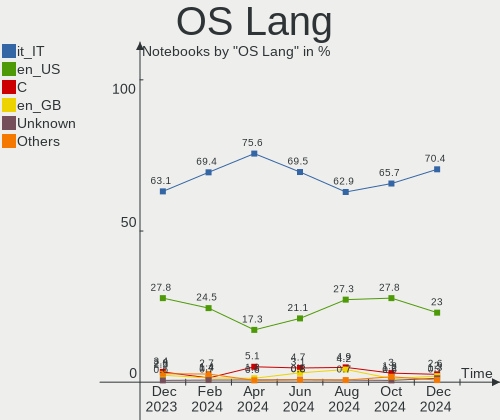
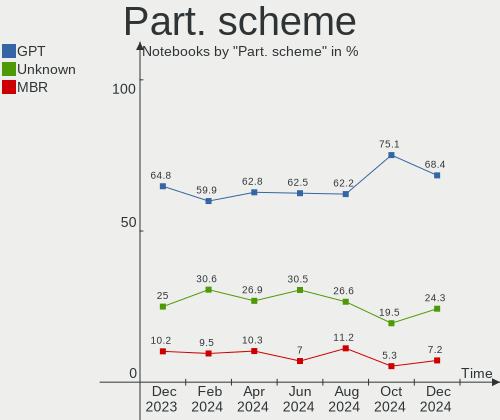
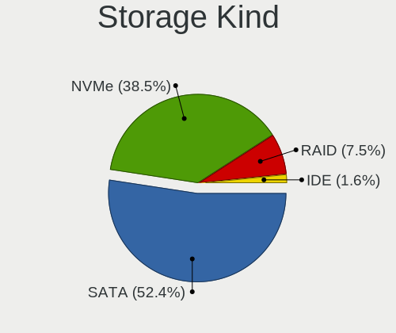
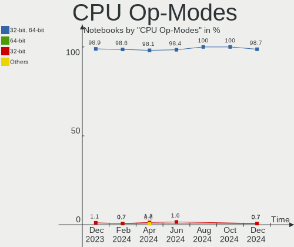
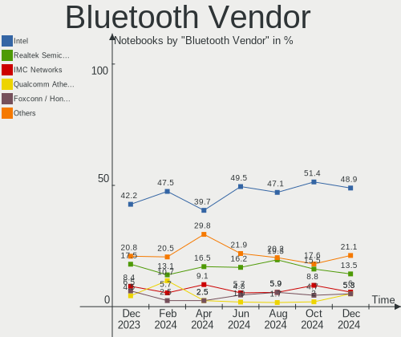
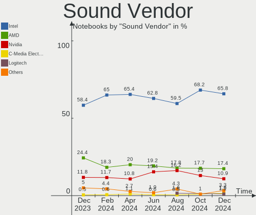
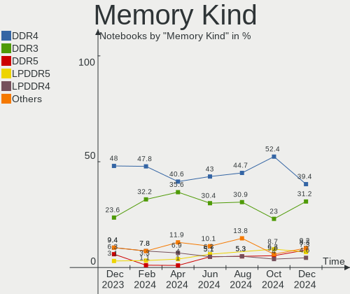
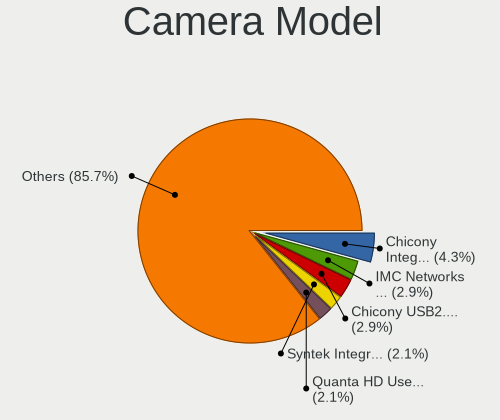

Linux in Italy - Hardware Trends (Notebooks)
--------------------------------------------

A project to identify most popular hardware characteristics and track their change
over time based on data collected by Linux users at https://Linux-Hardware.org.

Anyone can contribute to this report by the [hw-probe](https://github.com/linuxhw/hw-probe) tool:

    sudo -E hw-probe -all -upload

Period: Nov, 2023.

Contents
--------

* [ System ](#system)
  - [ OS                       ](#os)
  - [ OS Family                ](#os-family)
  - [ Kernel                   ](#kernel)
  - [ Kernel Family            ](#kernel-family)
  - [ Kernel Major Ver.        ](#kernel-major-ver)
  - [ Arch                     ](#arch)
  - [ DE                       ](#de)
  - [ Display Server           ](#display-server)
  - [ Display Manager          ](#display-manager)
  - [ OS Lang                  ](#os-lang)
  - [ Boot Mode                ](#boot-mode)
  - [ Filesystem               ](#filesystem)
  - [ Part. scheme             ](#part-scheme)
  - [ Dual Boot with Linux/BSD ](#dual-boot-with-linuxbsd)
  - [ Dual Boot (Win)          ](#dual-boot-win)

* [ Board ](#board)
  - [ Vendor                   ](#vendor)
  - [ Model                    ](#model)
  - [ Model Family             ](#model-family)
  - [ MFG Year                 ](#mfg-year)
  - [ Form Factor              ](#form-factor)
  - [ Secure Boot              ](#secure-boot)
  - [ Coreboot                 ](#coreboot)
  - [ RAM Size                 ](#ram-size)
  - [ RAM Used                 ](#ram-used)
  - [ Total Drives             ](#total-drives)
  - [ Has CD-ROM               ](#has-cd-rom)
  - [ Has Ethernet             ](#has-ethernet)
  - [ Has WiFi                 ](#has-wifi)
  - [ Has Bluetooth            ](#has-bluetooth)

* [ Location ](#location)
  - [ Country                  ](#country)
  - [ City                     ](#city)

* [ Drives ](#drives)
  - [ Drive Vendor             ](#drive-vendor)
  - [ Drive Model              ](#drive-model)
  - [ HDD Vendor               ](#hdd-vendor)
  - [ SSD Vendor               ](#ssd-vendor)
  - [ Drive Kind               ](#drive-kind)
  - [ Drive Connector          ](#drive-connector)
  - [ Drive Size               ](#drive-size)
  - [ Space Total              ](#space-total)
  - [ Space Used               ](#space-used)
  - [ Malfunc. Drives          ](#malfunc-drives)
  - [ Malfunc. Drive Vendor    ](#malfunc-drive-vendor)
  - [ Malfunc. HDD Vendor      ](#malfunc-hdd-vendor)
  - [ Malfunc. Drive Kind      ](#malfunc-drive-kind)
  - [ Failed Drives            ](#failed-drives)
  - [ Failed Drive Vendor      ](#failed-drive-vendor)
  - [ Drive Status             ](#drive-status)

* [ Storage controller ](#storage-controller)
  - [ Storage Vendor           ](#storage-vendor)
  - [ Storage Model            ](#storage-model)
  - [ Storage Kind             ](#storage-kind)

* [ Processor ](#processor)
  - [ CPU Vendor               ](#cpu-vendor)
  - [ CPU Model                ](#cpu-model)
  - [ CPU Model Family         ](#cpu-model-family)
  - [ CPU Cores                ](#cpu-cores)
  - [ CPU Sockets              ](#cpu-sockets)
  - [ CPU Threads              ](#cpu-threads)
  - [ CPU Op-Modes             ](#cpu-op-modes)
  - [ CPU Microcode            ](#cpu-microcode)
  - [ CPU Microarch            ](#cpu-microarch)

* [ Graphics ](#graphics)
  - [ GPU Vendor               ](#gpu-vendor)
  - [ GPU Model                ](#gpu-model)
  - [ GPU Combo                ](#gpu-combo)
  - [ GPU Driver               ](#gpu-driver)
  - [ GPU Memory               ](#gpu-memory)

* [ Monitor ](#monitor)
  - [ Monitor Vendor           ](#monitor-vendor)
  - [ Monitor Model            ](#monitor-model)
  - [ Monitor Resolution       ](#monitor-resolution)
  - [ Monitor Diagonal         ](#monitor-diagonal)
  - [ Monitor Width            ](#monitor-width)
  - [ Aspect Ratio             ](#aspect-ratio)
  - [ Monitor Area             ](#monitor-area)
  - [ Pixel Density            ](#pixel-density)
  - [ Multiple Monitors        ](#multiple-monitors)

* [ Network ](#network)
  - [ Net Controller Vendor    ](#net-controller-vendor)
  - [ Net Controller Model     ](#net-controller-model)
  - [ Wireless Vendor          ](#wireless-vendor)
  - [ Wireless Model           ](#wireless-model)
  - [ Ethernet Vendor          ](#ethernet-vendor)
  - [ Ethernet Model           ](#ethernet-model)
  - [ Net Controller Kind      ](#net-controller-kind)
  - [ Used Controller          ](#used-controller)
  - [ NICs                     ](#nics)
  - [ IPv6                     ](#ipv6)

* [ Bluetooth ](#bluetooth)
  - [ Bluetooth Vendor         ](#bluetooth-vendor)
  - [ Bluetooth Model          ](#bluetooth-model)

* [ Sound ](#sound)
  - [ Sound Vendor             ](#sound-vendor)
  - [ Sound Model              ](#sound-model)

* [ Memory ](#memory)
  - [ Memory Vendor            ](#memory-vendor)
  - [ Memory Model             ](#memory-model)
  - [ Memory Kind              ](#memory-kind)
  - [ Memory Form Factor       ](#memory-form-factor)
  - [ Memory Size              ](#memory-size)
  - [ Memory Speed             ](#memory-speed)

* [ Printers & scanners ](#printers--scanners)
  - [ Printer Vendor           ](#printer-vendor)
  - [ Printer Model            ](#printer-model)
  - [ Scanner Vendor           ](#scanner-vendor)
  - [ Scanner Model            ](#scanner-model)

* [ Camera ](#camera)
  - [ Camera Vendor            ](#camera-vendor)
  - [ Camera Model             ](#camera-model)

* [ Security ](#security)
  - [ Fingerprint Vendor       ](#fingerprint-vendor)
  - [ Fingerprint Model        ](#fingerprint-model)
  - [ Chipcard Vendor          ](#chipcard-vendor)
  - [ Chipcard Model           ](#chipcard-model)

* [ Unsupported ](#unsupported)
  - [ Unsupported Devices      ](#unsupported-devices)
  - [ Unsupported Device Types ](#unsupported-device-types)

System
------

OS
--

Installed operating systems

| Name                         | Notebooks | Percent |
|------------------------------|-----------|---------|
| Ubuntu 22.04                 | 32        | 13.68%  |
| Linux Mint 21.2              | 21        | 8.97%   |
| Arch Rolling                 | 20        | 8.55%   |
| Debian 12                    | 15        | 6.41%   |
| Ubuntu 23.10                 | 12        | 5.13%   |
| Fedora 39                    | 12        | 5.13%   |
| Fedora 38                    | 11        | 4.7%    |
| Pop!_OS 22.04                | 9         | 3.85%   |
| EndeavourOS Rolling          | 8         | 3.42%   |
| OpenMandriva 5.0             | 6         | 2.56%   |
| Zorin 16                     | 5         | 2.14%   |
| Ubuntu 23.04                 | 5         | 2.14%   |
| Ubuntu 20.04                 | 5         | 2.14%   |
| Manjaro 23.0.4               | 5         | 2.14%   |
| Debian 11                    | 4         | 1.71%   |
| OpenMandriva 23.08           | 3         | 1.28%   |
| Kubuntu 23.10                | 3         | 1.28%   |
| Kubuntu 23.04                | 3         | 1.28%   |
| Kubuntu 22.04                | 3         | 1.28%   |
| ArcoLinux Rolling            | 3         | 1.28%   |
| Xubuntu 23.10                | 2         | 0.85%   |
| Void Linux Rolling           | 2         | 0.85%   |
| Ubuntu MATE 22.04            | 2         | 0.85%   |
| Ubuntu 18.04                 | 2         | 0.85%   |
| openSUSE Tumbleweed-XXXXXXXX | 2         | 0.85%   |
| openSUSE Leap-15.5           | 2         | 0.85%   |
| Nobara 38                    | 2         | 0.85%   |
| Manjaro 23.1.0               | 2         | 0.85%   |
| Lubuntu 22.04                | 2         | 0.85%   |
| Linux Mint 21                | 2         | 0.85%   |
| Elementary 7.1               | 2         | 0.85%   |
| Xubuntu 23.04                | 1         | 0.43%   |
| Xero Rolling                 | 1         | 0.43%   |
| Ubuntu Unity 16.04           | 1         | 0.43%   |
| ROSA R11.1                   | 1         | 0.43%   |
| ROSA 12.4                    | 1         | 0.43%   |
| Rocky Linux 9.3              | 1         | 0.43%   |
| Parrot 5.3                   | 1         | 0.43%   |
| org.kde.Platform 5.15-21.08  | 1         | 0.43%   |
| OpenMandriva 23.01           | 1         | 0.43%   |

OS Family
---------

OS without a version

| Name                  | Notebooks | Percent |
|-----------------------|-----------|---------|
| Ubuntu                | 56        | 23.93%  |
| Linux Mint            | 27        | 11.54%  |
| Fedora                | 23        | 9.83%   |
| Debian                | 21        | 8.97%   |
| Arch                  | 20        | 8.55%   |
| OpenMandriva          | 10        | 4.27%   |
| Pop!_OS               | 9         | 3.85%   |
| Kubuntu               | 9         | 3.85%   |
| Manjaro               | 8         | 3.42%   |
| EndeavourOS           | 8         | 3.42%   |
| Zorin                 | 5         | 2.14%   |
| openSUSE              | 4         | 1.71%   |
| Xubuntu               | 3         | 1.28%   |
| ArcoLinux             | 3         | 1.28%   |
| Void Linux            | 2         | 0.85%   |
| Ubuntu MATE           | 2         | 0.85%   |
| ROSA                  | 2         | 0.85%   |
| Nobara                | 2         | 0.85%   |
| MX                    | 2         | 0.85%   |
| Lubuntu               | 2         | 0.85%   |
| Kali                  | 2         | 0.85%   |
| Elementary            | 2         | 0.85%   |
| Xero                  | 1         | 0.43%   |
| Ubuntu Unity          | 1         | 0.43%   |
| Rocky Linux           | 1         | 0.43%   |
| Parrot                | 1         | 0.43%   |
| org.kde.Platform      | 1         | 0.43%   |
| NixOS                 | 1         | 0.43%   |
| LMDE                  | 1         | 0.43%   |
| Linux-from-scratch-"" | 1         | 0.43%   |
| Linux Lite            | 1         | 0.43%   |
| Garuda Linux          | 1         | 0.43%   |
| Clear Linux           | 1         | 0.43%   |
| Artix                 | 1         | 0.43%   |

Kernel
------

Version of the Linux kernel

| Version                      | Notebooks | Percent |
|------------------------------|-----------|---------|
| 5.15.0-88-generic            | 20        | 8.55%   |
| 6.2.0-36-generic             | 19        | 8.12%   |
| 6.1.0-13-amd64               | 15        | 6.41%   |
| 6.5.9-arch2-1                | 11        | 4.7%    |
| 6.5.0-10-generic             | 11        | 4.7%    |
| 6.2.0-37-generic             | 10        | 4.27%   |
| 6.5.6-76060506-generic       | 7         | 2.99%   |
| 6.6.2-desktop-1omv2390       | 6         | 2.56%   |
| 6.6.1-arch1-1                | 6         | 2.56%   |
| 6.2.0-35-generic             | 6         | 2.56%   |
| 6.5.8-200.fc38.x86_64        | 5         | 2.14%   |
| 6.5.12-300.fc39.x86_64       | 5         | 2.14%   |
| 6.2.0-26-generic             | 5         | 2.14%   |
| 5.15.0-76-generic            | 5         | 2.14%   |
| 6.5.5-1-MANJARO              | 4         | 1.71%   |
| 6.5.0-13-generic             | 4         | 1.71%   |
| 5.15.0-89-generic            | 4         | 1.71%   |
| 5.10.0-26-amd64              | 4         | 1.71%   |
| 6.5.9-zen2-1-zen             | 3         | 1.28%   |
| 6.5.11-300.fc39.x86_64       | 3         | 1.28%   |
| 6.4.11-desktop-1omv2390      | 3         | 1.28%   |
| 5.15.0-87-generic            | 3         | 1.28%   |
| 6.6.2-zen1-1-zen             | 2         | 0.85%   |
| 6.6.2-arch1-1                | 2         | 0.85%   |
| 6.6.1-zen1-1-zen             | 2         | 0.85%   |
| 6.5.9-201.fsync.fc38.x86_64  | 2         | 0.85%   |
| 6.5.9-200.fc38.x86_64        | 2         | 0.85%   |
| 6.5.8-arch1-1                | 2         | 0.85%   |
| 6.5.10-300.fc39.x86_64       | 2         | 0.85%   |
| 6.5.0-4-amd64                | 2         | 0.85%   |
| 6.2.9-300.fc38.x86_64        | 2         | 0.85%   |
| 6.1.0-1025-oem               | 2         | 0.85%   |
| 5.15.0-86-generic            | 2         | 0.85%   |
| 5.14.21-150500.55.36-default | 2         | 0.85%   |
| 6.6.2-201.fc39.x86_64        | 1         | 0.43%   |
| 6.6.2-1386.native            | 1         | 0.43%   |
| 6.6.1-1-default              | 1         | 0.43%   |
| 6.6.1-1-clear                | 1         | 0.43%   |
| 6.6.0-060600rc5-generic      | 1         | 0.43%   |
| 6.6.0                        | 1         | 0.43%   |

Kernel Family
-------------

Linux kernel without a distro release

| Version  | Notebooks | Percent |
|----------|-----------|---------|
| 6.2.0    | 42        | 17.95%  |
| 5.15.0   | 34        | 14.53%  |
| 6.5.9    | 20        | 8.55%   |
| 6.1.0    | 20        | 8.55%   |
| 6.5.0    | 19        | 8.12%   |
| 6.6.2    | 12        | 5.13%   |
| 6.6.1    | 10        | 4.27%   |
| 6.5.6    | 9         | 3.85%   |
| 6.5.8    | 8         | 3.42%   |
| 6.5.5    | 6         | 2.56%   |
| 5.4.0    | 6         | 2.56%   |
| 5.10.0   | 6         | 2.56%   |
| 6.5.12   | 5         | 2.14%   |
| 6.5.10   | 5         | 2.14%   |
| 6.5.7    | 4         | 1.71%   |
| 6.5.11   | 4         | 1.71%   |
| 6.4.11   | 4         | 1.71%   |
| 6.6.0    | 2         | 0.85%   |
| 6.2.9    | 2         | 0.85%   |
| 5.19.0   | 2         | 0.85%   |
| 5.14.21  | 2         | 0.85%   |
| 6.5.4    | 1         | 0.43%   |
| 6.4.3    | 1         | 0.43%   |
| 6.1.63   | 1         | 0.43%   |
| 6.1.62   | 1         | 0.43%   |
| 6.1.56   | 1         | 0.43%   |
| 6.1.55   | 1         | 0.43%   |
| 6.1.1    | 1         | 0.43%   |
| 5.4.83   | 1         | 0.43%   |
| 5.15.133 | 1         | 0.43%   |
| 5.15.127 | 1         | 0.43%   |
| 5.14.0   | 1         | 0.43%   |
| 4.4.0    | 1         | 0.43%   |

Kernel Major Ver.
-----------------

Linux kernel major version

| Version | Notebooks | Percent |
|---------|-----------|---------|
| 6.5     | 81        | 34.62%  |
| 6.2     | 44        | 18.8%   |
| 5.15    | 36        | 15.38%  |
| 6.1     | 25        | 10.68%  |
| 6.6     | 24        | 10.26%  |
| 5.4     | 7         | 2.99%   |
| 5.10    | 6         | 2.56%   |
| 6.4     | 5         | 2.14%   |
| 5.14    | 3         | 1.28%   |
| 5.19    | 2         | 0.85%   |
| 4.4     | 1         | 0.43%   |

Arch
----

OS architecture (x86_64, i586, etc.)

| Name   | Notebooks | Percent |
|--------|-----------|---------|
| x86_64 | 232       | 99.15%  |
| i686   | 2         | 0.85%   |

DE
--

Desktop Environment

| Name            | Notebooks | Percent |
|-----------------|-----------|---------|
| GNOME           | 116       | 49.57%  |
| KDE5            | 43        | 18.38%  |
| XFCE            | 27        | 11.54%  |
| X-Cinnamon      | 22        | 9.4%    |
| MATE            | 9         | 3.85%   |
| LXQt            | 5         | 2.14%   |
| Unknown         | 4         | 1.71%   |
| Pantheon        | 2         | 0.85%   |
| Hyprland        | 2         | 0.85%   |
| Unity           | 1         | 0.43%   |
| GNOME Flashback | 1         | 0.43%   |
| GNOME Classic   | 1         | 0.43%   |
| Cinnamon        | 1         | 0.43%   |

Display Server
--------------

X11 or Wayland

| Name    | Notebooks | Percent |
|---------|-----------|---------|
| X11     | 134       | 57.26%  |
| Wayland | 97        | 41.45%  |
| Tty     | 2         | 0.85%   |
| Unknown | 1         | 0.43%   |

Display Manager
---------------

SDDM, LightDM, etc.

| Name    | Notebooks | Percent |
|---------|-----------|---------|
| GDM3    | 56        | 23.93%  |
| Unknown | 56        | 23.93%  |
| LightDM | 49        | 20.94%  |
| SDDM    | 44        | 18.8%   |
| GDM     | 27        | 11.54%  |
| SLiM    | 1         | 0.43%   |
| EMPTTY  | 1         | 0.43%   |

OS Lang
-------

Language

| Lang    | Notebooks | Percent |
|---------|-----------|---------|
| it_IT   | 153       | 65.38%  |
| en_US   | 64        | 27.35%  |
| en_GB   | 7         | 2.99%   |
| C       | 7         | 2.99%   |
| POSIX   | 1         | 0.43%   |
| fur_IT  | 1         | 0.43%   |
| Unknown | 1         | 0.43%   |

Boot Mode
---------

EFI or BIOS

| Mode | Notebooks | Percent |
|------|-----------|---------|
| EFI  | 162       | 69.23%  |
| BIOS | 72        | 30.77%  |

Filesystem
----------

Type of filesystem

| Type    | Notebooks | Percent |
|---------|-----------|---------|
| Ext4    | 148       | 63.25%  |
| Btrfs   | 36        | 15.38%  |
| Tmpfs   | 28        | 11.97%  |
| Overlay | 18        | 7.69%   |
| Xfs     | 3         | 1.28%   |
| Aufs    | 1         | 0.43%   |

Part. scheme
------------

Scheme of partitioning

| Type    | Notebooks | Percent |
|---------|-----------|---------|
| GPT     | 157       | 67.09%  |
| Unknown | 52        | 22.22%  |
| MBR     | 25        | 10.68%  |

Dual Boot with Linux/BSD
------------------------

Hosting more than one Linux/BSD

| Dual boot | Notebooks | Percent |
|-----------|-----------|---------|
| No        | 199       | 85.04%  |
| Yes       | 35        | 14.96%  |

Dual Boot (Win)
---------------

Hosting Linux and Windows

| Dual boot | Notebooks | Percent |
|-----------|-----------|---------|
| No        | 153       | 65.38%  |
| Yes       | 81        | 34.62%  |

Board
-----

Vendor
------

Motherboard manufacturer

| Name                | Notebooks | Percent |
|---------------------|-----------|---------|
| Hewlett-Packard     | 53        | 22.65%  |
| Lenovo              | 45        | 19.23%  |
| ASUSTek Computer    | 38        | 16.24%  |
| Acer                | 28        | 11.97%  |
| Dell                | 17        | 7.26%   |
| Apple               | 9         | 3.85%   |
| Sony                | 7         | 2.99%   |
| MSI                 | 7         | 2.99%   |
| HUAWEI              | 6         | 2.56%   |
| Chuwi               | 3         | 1.28%   |
| Samsung Electronics | 2         | 0.85%   |
| Olivetti            | 2         | 0.85%   |
| Notebook            | 2         | 0.85%   |
| Mediacom            | 2         | 0.85%   |
| Unknown             | 2         | 0.85%   |
| TUXEDO              | 1         | 0.43%   |
| Toshiba             | 1         | 0.43%   |
| SiComputer          | 1         | 0.43%   |
| Packard Bell        | 1         | 0.43%   |
| Microtech           | 1         | 0.43%   |
| Jumper              | 1         | 0.43%   |
| Intel               | 1         | 0.43%   |
| Hampoo              | 1         | 0.43%   |
| Framework           | 1         | 0.43%   |
| Dynabook            | 1         | 0.43%   |
| ASRock              | 1         | 0.43%   |

Model
-----

Motherboard model

| Name                                        | Notebooks | Percent |
|---------------------------------------------|-----------|---------|
| HP Notebook                                 | 3         | 1.28%   |
| Lenovo V15 G2 ITL 82KB                      | 2         | 0.85%   |
| Lenovo IdeaPad 320-15ABR 80XS               | 2         | 0.85%   |
| Lenovo IdeaPad 3 15ALC6 82KU                | 2         | 0.85%   |
| HUAWEI BOD-WXX9                             | 2         | 0.85%   |
| HP Pavilion Gaming Laptop 15-cx0xxx         | 2         | 0.85%   |
| HP Pavilion g6                              | 2         | 0.85%   |
| HP ENVY 15                                  | 2         | 0.85%   |
| HP EliteBook 830 G5                         | 2         | 0.85%   |
| HP 650                                      | 2         | 0.85%   |
| HP 630                                      | 2         | 0.85%   |
| HP 255 G8 Notebook PC                       | 2         | 0.85%   |
| HP 250 G7 Notebook PC                       | 2         | 0.85%   |
| ASUS X555LAB                                | 2         | 0.85%   |
| Apple MacBookPro11,3                        | 2         | 0.85%   |
| Acer Swift SF314-59                         | 2         | 0.85%   |
| Acer Nitro AN515-54                         | 2         | 0.85%   |
| Unknown                                     | 2         | 0.85%   |
| TUXEDO Pulse 15 Gen2                        | 1         | 0.43%   |
| Toshiba Satellite L755                      | 1         | 0.43%   |
| Sony VPCSA3J1E                              | 1         | 0.43%   |
| Sony VPCS13V9E                              | 1         | 0.43%   |
| Sony VPCEL1E1E                              | 1         | 0.43%   |
| Sony VPCEB1S1E                              | 1         | 0.43%   |
| Sony VGN-N21S_W                             | 1         | 0.43%   |
| Sony SVE1713X1EB                            | 1         | 0.43%   |
| Sony SVE1513Q1ESI                           | 1         | 0.43%   |
| SiComputer Nauta 01E                        | 1         | 0.43%   |
| Samsung RV411/RV511/E3511/S3511/RV711/E3411 | 1         | 0.43%   |
| Samsung 750XDA                              | 1         | 0.43%   |
| Packard Bell EasyNote TK81                  | 1         | 0.43%   |
| Olivetti P55-AEU-323-4G320                  | 1         | 0.43%   |
| Olivetti OLIBOOK P35-XXXAEU                 | 1         | 0.43%   |
| Notebook NL5xRU                             | 1         | 0.43%   |
| Notebook NJ50_70CU                          | 1         | 0.43%   |
| MSI Thin GF63 12VF                          | 1         | 0.43%   |
| MSI PS63 Modern 8RC                         | 1         | 0.43%   |
| MSI Prestige 14Evo A11M                     | 1         | 0.43%   |
| MSI Modern 14 B11MOU                        | 1         | 0.43%   |
| MSI Modern 14 B11MOL                        | 1         | 0.43%   |

Model Family
------------

Motherboard model prefix

| Name               | Notebooks | Percent |
|--------------------|-----------|---------|
| Lenovo ThinkPad    | 20        | 8.55%   |
| Lenovo IdeaPad     | 16        | 6.84%   |
| Acer Aspire        | 12        | 5.13%   |
| ASUS VivoBook      | 11        | 4.7%    |
| HP Pavilion        | 9         | 3.85%   |
| HP ProBook         | 7         | 2.99%   |
| HP Laptop          | 6         | 2.56%   |
| HP EliteBook       | 6         | 2.56%   |
| Dell Inspiron      | 5         | 2.14%   |
| HP Compaq          | 4         | 1.71%   |
| HP 250             | 4         | 1.71%   |
| Dell XPS           | 4         | 1.71%   |
| Dell Latitude      | 4         | 1.71%   |
| ASUS ASUS          | 4         | 1.71%   |
| Acer TravelMate    | 4         | 1.71%   |
| Acer Swift         | 4         | 1.71%   |
| Acer Nitro         | 4         | 1.71%   |
| HP Notebook        | 3         | 1.28%   |
| HP ENVY            | 3         | 1.28%   |
| Dell Vostro        | 3         | 1.28%   |
| MSI Modern         | 2         | 0.85%   |
| Lenovo V15         | 2         | 0.85%   |
| Lenovo ThinkBook   | 2         | 0.85%   |
| HUAWEI BOD-WXX9    | 2         | 0.85%   |
| HP 650             | 2         | 0.85%   |
| HP 630             | 2         | 0.85%   |
| HP 255             | 2         | 0.85%   |
| ASUS Zenbook       | 2         | 0.85%   |
| ASUS X555LAB       | 2         | 0.85%   |
| ASUS ROG           | 2         | 0.85%   |
| Apple MacBookPro5  | 2         | 0.85%   |
| Apple MacBookPro11 | 2         | 0.85%   |
| Acer Extensa       | 2         | 0.85%   |
| Unknown            | 2         | 0.85%   |
| TUXEDO Pulse       | 1         | 0.43%   |
| Toshiba Satellite  | 1         | 0.43%   |
| Sony VPCSA3J1E     | 1         | 0.43%   |
| Sony VPCS13V9E     | 1         | 0.43%   |
| Sony VPCEL1E1E     | 1         | 0.43%   |
| Sony VPCEB1S1E     | 1         | 0.43%   |

MFG Year
--------

Motherboard manufacture year

| Year | Notebooks | Percent |
|------|-----------|---------|
| 2021 | 35        | 14.96%  |
| 2020 | 32        | 13.68%  |
| 2019 | 23        | 9.83%   |
| 2018 | 20        | 8.55%   |
| 2017 | 14        | 5.98%   |
| 2013 | 14        | 5.98%   |
| 2012 | 14        | 5.98%   |
| 2022 | 12        | 5.13%   |
| 2023 | 10        | 4.27%   |
| 2016 | 9         | 3.85%   |
| 2015 | 9         | 3.85%   |
| 2010 | 9         | 3.85%   |
| 2014 | 8         | 3.42%   |
| 2011 | 8         | 3.42%   |
| 2008 | 7         | 2.99%   |
| 2009 | 5         | 2.14%   |
| 2007 | 3         | 1.28%   |
| 2006 | 1         | 0.43%   |
| 2005 | 1         | 0.43%   |

Form Factor
-----------

Physical design of the computer

| Name     | Notebooks | Percent |
|----------|-----------|---------|
| Notebook | 234       | 100%    |

Secure Boot
-----------

Enabled or disabled

| State    | Notebooks | Percent |
|----------|-----------|---------|
| Disabled | 206       | 88.03%  |
| Enabled  | 28        | 11.97%  |

Coreboot
--------

Have coreboot on board

| Used | Notebooks | Percent |
|------|-----------|---------|
| No   | 234       | 100%    |

RAM Size
--------

Total RAM memory

| Size in GB  | Notebooks | Percent |
|-------------|-----------|---------|
| 4.01-8.0    | 83        | 35.47%  |
| 16.01-24.0  | 59        | 25.21%  |
| 8.01-16.0   | 34        | 14.53%  |
| 3.01-4.0    | 30        | 12.82%  |
| 32.01-64.0  | 11        | 4.7%    |
| 1.01-2.0    | 6         | 2.56%   |
| 24.01-32.0  | 5         | 2.14%   |
| 2.01-3.0    | 5         | 2.14%   |
| 64.01-256.0 | 1         | 0.43%   |

RAM Used
--------

Used RAM memory

| Used GB   | Notebooks | Percent |
|-----------|-----------|---------|
| 1.01-2.0  | 59        | 25.21%  |
| 2.01-3.0  | 58        | 24.79%  |
| 4.01-8.0  | 50        | 21.37%  |
| 3.01-4.0  | 42        | 17.95%  |
| 8.01-16.0 | 18        | 7.69%   |
| 0.51-1.0  | 7         | 2.99%   |

Total Drives
------------

Number of drives on board

| Drives | Notebooks | Percent |
|--------|-----------|---------|
| 1      | 182       | 77.78%  |
| 2      | 42        | 17.95%  |
| 3      | 8         | 3.42%   |
| 4      | 1         | 0.43%   |
| 0      | 1         | 0.43%   |

Has CD-ROM
----------

Has CD-ROM on board

| Presented | Notebooks | Percent |
|-----------|-----------|---------|
| No        | 170       | 72.65%  |
| Yes       | 64        | 27.35%  |

Has Ethernet
------------

Has Ethernet on board

| Presented | Notebooks | Percent |
|-----------|-----------|---------|
| Yes       | 175       | 74.79%  |
| No        | 59        | 25.21%  |

Has WiFi
--------

Has WiFi module

| Presented | Notebooks | Percent |
|-----------|-----------|---------|
| Yes       | 230       | 98.29%  |
| No        | 4         | 1.71%   |

Has Bluetooth
-------------

Has Bluetooth module

| Presented | Notebooks | Percent |
|-----------|-----------|---------|
| Yes       | 201       | 85.9%   |
| No        | 33        | 14.1%   |

Location
--------

Country
-------

Geographic location (country)

| Country | Notebooks | Percent |
|---------|-----------|---------|
| Italy   | 234       | 100%    |

City
----

Geographic location (city)

| City                 | Notebooks | Percent |
|----------------------|-----------|---------|
| Milan                | 28        | 11.97%  |
| Rome                 | 20        | 8.55%   |
| Milano               | 18        | 7.69%   |
| Naples               | 6         | 2.56%   |
| Bologna              | 5         | 2.14%   |
| Bari                 | 5         | 2.14%   |
| Turin                | 4         | 1.71%   |
| Rho                  | 4         | 1.71%   |
| Palermo              | 4         | 1.71%   |
| Florence             | 4         | 1.71%   |
| Catania              | 4         | 1.71%   |
| Verona               | 3         | 1.28%   |
| Bergamo              | 3         | 1.28%   |
| Vicenza              | 2         | 0.85%   |
| Vercelli             | 2         | 0.85%   |
| Trentola-Ducenta     | 2         | 0.85%   |
| San Gavino Monreale  | 2         | 0.85%   |
| Rimini               | 2         | 0.85%   |
| Parma                | 2         | 0.85%   |
| Novara               | 2         | 0.85%   |
| Monza                | 2         | 0.85%   |
| L’Aquila           | 2         | 0.85%   |
| Genoa                | 2         | 0.85%   |
| Costa di Mezzate     | 2         | 0.85%   |
| Cesena               | 2         | 0.85%   |
| Castello di Cisterna | 2         | 0.85%   |
| Casalecchio di Reno  | 2         | 0.85%   |
| Viterbo              | 1         | 0.43%   |
| Viggiù              | 1         | 0.43%   |
| Vigasio              | 1         | 0.43%   |
| Vibo Valentia        | 1         | 0.43%   |
| Trieste              | 1         | 0.43%   |
| Termoli              | 1         | 0.43%   |
| Tempio Pausania      | 1         | 0.43%   |
| Suno                 | 1         | 0.43%   |
| Stezzano             | 1         | 0.43%   |
| Spoltore             | 1         | 0.43%   |
| Spinea               | 1         | 0.43%   |
| Siena                | 1         | 0.43%   |
| Settimo Torinese     | 1         | 0.43%   |

Drives
------

Drive Vendor
------------

Hard drive vendors

| Vendor                      | Notebooks | Drives | Percent |
|-----------------------------|-----------|--------|---------|
| Samsung Electronics         | 51        | 57     | 18.15%  |
| WDC                         | 25        | 25     | 8.9%    |
| Seagate                     | 22        | 24     | 7.83%   |
| SK hynix                    | 21        | 21     | 7.47%   |
| Kingston                    | 21        | 22     | 7.47%   |
| SanDisk                     | 20        | 20     | 7.12%   |
| Crucial                     | 19        | 19     | 6.76%   |
| Micron Technology           | 13        | 13     | 4.63%   |
| Intel                       | 11        | 12     | 3.91%   |
| Unknown                     | 8         | 8      | 2.85%   |
| Toshiba                     | 7         | 7      | 2.49%   |
| China                       | 6         | 6      | 2.14%   |
| SPCC                        | 4         | 4      | 1.42%   |
| KIOXIA                      | 4         | 4      | 1.42%   |
| Hitachi                     | 4         | 4      | 1.42%   |
| HGST                        | 3         | 3      | 1.07%   |
| Apple                       | 3         | 3      | 1.07%   |
| Team                        | 2         | 2      | 0.71%   |
| Solid State Storage         | 2         | 2      | 0.71%   |
| sobetter                    | 2         | 2      | 0.71%   |
| PNY                         | 2         | 2      | 0.71%   |
| Netac                       | 2         | 2      | 0.71%   |
| Lexar                       | 2         | 2      | 0.71%   |
| Kingston Technology Company | 2         | 2      | 0.71%   |
| Fujitsu                     | 2         | 2      | 0.71%   |
| Fanxiang                    | 2         | 2      | 0.71%   |
| Emtec                       | 2         | 2      | 0.71%   |
| UMIS                        | 1         | 1      | 0.36%   |
| Transcend                   | 1         | 1      | 0.36%   |
| Teclast                     | 1         | 1      | 0.36%   |
| Realtek                     | 1         | 1      | 0.36%   |
| Phison                      | 1         | 1      | 0.36%   |
| Micron/Crucial Technology   | 1         | 1      | 0.36%   |
| Mass                        | 1         | 1      | 0.36%   |
| KIOXIA-EXCERIA              | 1         | 1      | 0.36%   |
| KingDian                    | 1         | 1      | 0.36%   |
| Kimtigo                     | 1         | 1      | 0.36%   |
| JMicron Technology          | 1         | 1      | 0.36%   |
| Intenso                     | 1         | 1      | 0.36%   |
| Hikvision                   | 1         | 1      | 0.36%   |

Drive Model
-----------

Hard drive models

| Model                                               | Notebooks | Percent |
|-----------------------------------------------------|-----------|---------|
| Crucial CT500MX500SSD1 500GB                        | 7         | 2.43%   |
| Samsung NVMe SSD Controller SM981/PM981/PM983 250GB | 6         | 2.08%   |
| Sandisk WD Blue SN550 NVMe SSD 512GB                | 5         | 1.74%   |
| Samsung NVMe SSD Controller PM9A1/PM9A3/980PRO 2TB  | 5         | 1.74%   |
| Seagate ST1000LM035-1RK172 1TB                      | 4         | 1.39%   |
| Seagate ST1000LM049-2GH172 1TB                      | 3         | 1.04%   |
| Samsung SSD 870 EVO 500GB                           | 3         | 1.04%   |
| Samsung MZVLQ512HALU-00000 512GB                    | 3         | 1.04%   |
| Kingston SA400S37240G 240GB SSD                     | 3         | 1.04%   |
| Intel SSDPEKNU512GZ 512GB                           | 3         | 1.04%   |
| Crucial CT1000MX500SSD1 1TB                         | 3         | 1.04%   |
| Crucial CT1000BX500SSD1 1TB                         | 3         | 1.04%   |
| China SSD 1TB                                       | 3         | 1.04%   |
| WDC WD5000LPVX-80V0TT0 500GB                        | 2         | 0.69%   |
| WDC WD10SPZX-21Z10T0 1TB                            | 2         | 0.69%   |
| WDC PC SN520 SDAPNUW-512G-1014 512GB                | 2         | 0.69%   |
| Toshiba MQ04ABF100 1TB                              | 2         | 0.69%   |
| SPCC Solid State Disk 512GB                         | 2         | 0.69%   |
| sobetter EXT 1TB                                    | 2         | 0.69%   |
| SK hynix HFS256G39TND-N210A 256GB SSD               | 2         | 0.69%   |
| SK hynix BC511 512GB                                | 2         | 0.69%   |
| Seagate ST9320325AS 320GB                           | 2         | 0.69%   |
| Seagate ST750LM022 HN-M750MBB 752GB                 | 2         | 0.69%   |
| Seagate ST500LT012-1DG142 500GB                     | 2         | 0.69%   |
| Seagate ST1000LM048-2E7172 1TB                      | 2         | 0.69%   |
| Seagate ST1000LM024 HN-M101MBB 1TB                  | 2         | 0.69%   |
| Samsung SSD 980 1TB                                 | 2         | 0.69%   |
| Samsung SSD 870 EVO 250GB                           | 2         | 0.69%   |
| Samsung MZVL4512HBLU-00BTW 512GB                    | 2         | 0.69%   |
| Samsung MZALQ512HBLU-00BL2 512GB                    | 2         | 0.69%   |
| Samsung MZALQ512HALU-000L2 512GB                    | 2         | 0.69%   |
| Micron MTFDHBA512QFD 512GB                          | 2         | 0.69%   |
| Micron 2450_MTFDKBA512TFK 512GB                     | 2         | 0.69%   |
| Kingston SNVS500G 500GB                             | 2         | 0.69%   |
| Kingston SNVS250G 250GB                             | 2         | 0.69%   |
| Kingston SA400S37120G 120GB SSD                     | 2         | 0.69%   |
| Kingston OM8PCP3512F-AI1 512GB                      | 2         | 0.69%   |
| Kingston OM8PCP3512F-AB 512GB                       | 2         | 0.69%   |
| Intel SSDPEKNW512GZL 512GB                          | 2         | 0.69%   |
| Crucial CT480BX500SSD1 480GB                        | 2         | 0.69%   |

HDD Vendor
----------

Hard disk drive vendors

| Vendor  | Notebooks | Drives | Percent |
|---------|-----------|--------|---------|
| Seagate | 21        | 23     | 42%     |
| WDC     | 14        | 14     | 28%     |
| Toshiba | 5         | 5      | 10%     |
| Hitachi | 4         | 4      | 8%      |
| HGST    | 3         | 3      | 6%      |
| Fujitsu | 2         | 2      | 4%      |
| Unknown | 1         | 1      | 2%      |

SSD Vendor
----------

Solid state drive vendors

| Vendor              | Notebooks | Drives | Percent |
|---------------------|-----------|--------|---------|
| Samsung Electronics | 19        | 21     | 20.21%  |
| Crucial             | 19        | 19     | 20.21%  |
| Kingston            | 9         | 10     | 9.57%   |
| SanDisk             | 6         | 6      | 6.38%   |
| China               | 6         | 6      | 6.38%   |
| SPCC                | 4         | 4      | 4.26%   |
| SK hynix            | 4         | 4      | 4.26%   |
| WDC                 | 3         | 3      | 3.19%   |
| PNY                 | 2         | 2      | 2.13%   |
| Lexar               | 2         | 2      | 2.13%   |
| Fanxiang            | 2         | 2      | 2.13%   |
| Emtec               | 2         | 2      | 2.13%   |
| Apple               | 2         | 2      | 2.13%   |
| Transcend           | 1         | 1      | 1.06%   |
| Teclast             | 1         | 1      | 1.06%   |
| Team                | 1         | 1      | 1.06%   |
| Netac               | 1         | 1      | 1.06%   |
| Micron Technology   | 1         | 1      | 1.06%   |
| KIOXIA-EXCERIA      | 1         | 1      | 1.06%   |
| KingDian            | 1         | 1      | 1.06%   |
| JMicron Technology  | 1         | 1      | 1.06%   |
| Intenso             | 1         | 1      | 1.06%   |
| Hikvision           | 1         | 1      | 1.06%   |
| Dogfish             | 1         | 1      | 1.06%   |
| BAITITON            | 1         | 1      | 1.06%   |
| A-DATA Technology   | 1         | 1      | 1.06%   |
| Unknown             | 1         | 1      | 1.06%   |

Drive Kind
----------

HDD or SSD

| Kind    | Notebooks | Drives | Percent |
|---------|-----------|--------|---------|
| NVMe    | 117       | 126    | 43.66%  |
| SSD     | 87        | 97     | 32.46%  |
| HDD     | 49        | 52     | 18.28%  |
| MMC     | 10        | 11     | 3.73%   |
| Unknown | 5         | 5      | 1.87%   |

Drive Connector
---------------

SATA, SAS, NVMe, etc.

| Type | Notebooks | Drives | Percent |
|------|-----------|--------|---------|
| SATA | 124       | 145    | 47.51%  |
| NVMe | 117       | 125    | 44.83%  |
| SAS  | 10        | 10     | 3.83%   |
| MMC  | 10        | 11     | 3.83%   |

Drive Size
----------

Size of hard drive

| Size in TB | Notebooks | Drives | Percent |
|------------|-----------|--------|---------|
| 0.01-0.5   | 86        | 93     | 62.77%  |
| 0.51-1.0   | 43        | 48     | 31.39%  |
| 1.01-2.0   | 7         | 7      | 5.11%   |
| 3.01-4.0   | 1         | 1      | 0.73%   |

Space Total
-----------

Amount of disk space available on the file system

| Size in GB     | Notebooks | Percent |
|----------------|-----------|---------|
| 251-500        | 62        | 26.5%   |
| 101-250        | 57        | 24.36%  |
| 501-1000       | 35        | 14.96%  |
| 1-20           | 19        | 8.12%   |
| 1001-2000      | 16        | 6.84%   |
| 51-100         | 16        | 6.84%   |
| More than 3000 | 9         | 3.85%   |
| 21-50          | 9         | 3.85%   |
| Unknown        | 7         | 2.99%   |
| 2001-3000      | 4         | 1.71%   |

Space Used
----------

Amount of used disk space

| Used GB        | Notebooks | Percent |
|----------------|-----------|---------|
| 1-20           | 76        | 32.48%  |
| 21-50          | 44        | 18.8%   |
| 101-250        | 42        | 17.95%  |
| 51-100         | 22        | 9.4%    |
| 251-500        | 19        | 8.12%   |
| 501-1000       | 13        | 5.56%   |
| 1001-2000      | 9         | 3.85%   |
| Unknown        | 7         | 2.99%   |
| More than 3000 | 1         | 0.43%   |
| 2001-3000      | 1         | 0.43%   |

Malfunc. Drives
---------------

Drive models with a malfunction

| Model                                 | Notebooks | Drives | Percent |
|---------------------------------------|-----------|--------|---------|
| WDC WD40 EFRX-68N32N0 4TB             | 1         | 1      | 7.69%   |
| WDC WD1600BEKT-60F3T1 160GB           | 1         | 1      | 7.69%   |
| Toshiba MQ04ABF100 1TB                | 1         | 1      | 7.69%   |
| SK hynix PC711 HFS512GDE9X073N 512GB  | 1         | 1      | 7.69%   |
| SK hynix HFS512G39TND-N210A 512GB SSD | 1         | 1      | 7.69%   |
| SK hynix HFS128G39TND-N210A 128GB SSD | 1         | 1      | 7.69%   |
| Seagate ST9320325AS 320GB             | 1         | 1      | 7.69%   |
| Seagate ST750LM022 HN-M750MBB 752GB   | 1         | 1      | 7.69%   |
| Seagate ST1000LM049-2GH172 1TB        | 1         | 1      | 7.69%   |
| SanDisk SSD U100 24GB                 | 1         | 1      | 7.69%   |
| HGST HTS545050A7E680 500GB            | 1         | 1      | 7.69%   |
| Fujitsu MHW2160BJ G2 160GB            | 1         | 1      | 7.69%   |
| China SSD 1TB                         | 1         | 1      | 7.69%   |

Malfunc. Drive Vendor
---------------------

Vendors of faulty drives

| Vendor   | Notebooks | Drives | Percent |
|----------|-----------|--------|---------|
| SK hynix | 3         | 3      | 23.08%  |
| Seagate  | 3         | 3      | 23.08%  |
| WDC      | 2         | 2      | 15.38%  |
| Toshiba  | 1         | 1      | 7.69%   |
| SanDisk  | 1         | 1      | 7.69%   |
| HGST     | 1         | 1      | 7.69%   |
| Fujitsu  | 1         | 1      | 7.69%   |
| China    | 1         | 1      | 7.69%   |

Malfunc. HDD Vendor
-------------------

Vendors of faulty HDD drives

| Vendor  | Notebooks | Drives | Percent |
|---------|-----------|--------|---------|
| Seagate | 3         | 3      | 37.5%   |
| WDC     | 2         | 2      | 25%     |
| Toshiba | 1         | 1      | 12.5%   |
| HGST    | 1         | 1      | 12.5%   |
| Fujitsu | 1         | 1      | 12.5%   |

Malfunc. Drive Kind
-------------------

Kinds of faulty drives

| Kind | Notebooks | Drives | Percent |
|------|-----------|--------|---------|
| HDD  | 8         | 8      | 61.54%  |
| SSD  | 4         | 4      | 30.77%  |
| NVMe | 1         | 1      | 7.69%   |

Failed Drives
-------------

Failed drive models

Zero info for selected period =(

Failed Drive Vendor
-------------------

Failed drive vendors

Zero info for selected period =(

Drive Status
------------

Number of failed and malfunc. drives

| Status   | Notebooks | Drives | Percent |
|----------|-----------|--------|---------|
| Works    | 137       | 168    | 56.38%  |
| Detected | 93        | 110    | 38.27%  |
| Malfunc  | 13        | 13     | 5.35%   |

Storage controller
------------------

Storage Vendor
--------------

Storage controller vendors

| Vendor                         | Notebooks | Percent |
|--------------------------------|-----------|---------|
| Intel                          | 147       | 50.17%  |
| Samsung Electronics            | 35        | 11.95%  |
| AMD                            | 31        | 10.58%  |
| SanDisk                        | 20        | 6.83%   |
| SK hynix                       | 15        | 5.12%   |
| Kingston Technology Company    | 14        | 4.78%   |
| Micron Technology              | 12        | 4.1%    |
| Toshiba America Info Systems   | 3         | 1.02%   |
| Phison Electronics             | 3         | 1.02%   |
| Nvidia                         | 3         | 1.02%   |
| KIOXIA                         | 3         | 1.02%   |
| Solid State Storage Technology | 2         | 0.68%   |
| Union Memory (Shenzhen)        | 1         | 0.34%   |
| Silicon Motion                 | 1         | 0.34%   |
| Netac Technology               | 1         | 0.34%   |
| Micron/Crucial Technology      | 1         | 0.34%   |
| Apple                          | 1         | 0.34%   |

Storage Model
-------------

Storage controller models

| Model                                                                          | Notebooks | Percent |
|--------------------------------------------------------------------------------|-----------|---------|
| AMD FCH SATA Controller [AHCI mode]                                            | 29        | 9.09%   |
| Intel Sunrise Point-LP SATA Controller [AHCI mode]                             | 19        | 5.96%   |
| Samsung NVMe SSD Controller 980 (DRAM-less)                                    | 14        | 4.39%   |
| Intel Volume Management Device NVMe RAID Controller                            | 14        | 4.39%   |
| Intel 7 Series Chipset Family 6-port SATA Controller [AHCI mode]               | 13        | 4.08%   |
| Intel 82801 Mobile SATA Controller [RAID mode]                                 | 11        | 3.45%   |
| Samsung NVMe SSD Controller SM981/PM981/PM983                                  | 10        | 3.13%   |
| Intel Celeron/Pentium Silver Processor SATA Controller                         | 10        | 3.13%   |
| Intel Tiger Lake-LP SATA Controller                                            | 9         | 2.82%   |
| Intel 8 Series SATA Controller 1 [AHCI mode]                                   | 8         | 2.51%   |
| Samsung NVMe SSD Controller PM9A1/PM9A3/980PRO                                 | 7         | 2.19%   |
| Intel Wildcat Point-LP SATA Controller [AHCI Mode]                             | 7         | 2.19%   |
| Intel Cannon Lake Mobile PCH SATA AHCI Controller                              | 7         | 2.19%   |
| SanDisk Ultra 3D / WD Blue SN550 NVMe SSD                                      | 6         | 1.88%   |
| Intel SSD 670p Series [Keystone Harbor]                                        | 6         | 1.88%   |
| Intel 82801IBM/IEM (ICH9M/ICH9M-E) 4 port SATA Controller [AHCI mode]          | 6         | 1.88%   |
| SK hynix Gold P31/BC711/PC711 NVMe Solid State Drive                           | 5         | 1.57%   |
| SK hynix BC511 NVMe SSD                                                        | 5         | 1.57%   |
| Kingston Company OM8PCP Design-In PCIe 3 NVMe SSD (DRAM-less)                  | 5         | 1.57%   |
| Intel Comet Lake SATA AHCI Controller                                          | 5         | 1.57%   |
| Intel 6 Series/C200 Series Chipset Family 6 port Mobile SATA AHCI Controller   | 5         | 1.57%   |
| Micron 2210 NVMe SSD [Cobain]                                                  | 4         | 1.25%   |
| Intel HM170/QM170 Chipset SATA Controller [AHCI Mode]                          | 4         | 1.25%   |
| Intel 82801HM/HEM (ICH8M/ICH8M-E) IDE Controller                               | 4         | 1.25%   |
| Intel 82801G (ICH7 Family) IDE Controller                                      | 4         | 1.25%   |
| Intel 5 Series/3400 Series Chipset 4 port SATA AHCI Controller                 | 4         | 1.25%   |
| SanDisk WD Blue SN500 / PC SN520 x2 M.2 2280 NVMe SSD                          | 3         | 0.94%   |
| Micron 2400 NVMe SSD (DRAM-less)                                               | 3         | 0.94%   |
| KIOXIA NVMe SSD Controller BG4 (DRAM-less)                                     | 3         | 0.94%   |
| Kingston Company NV1 NVMe SSD SM2263XT                                         | 3         | 0.94%   |
| Intel Ice Lake-LP SATA Controller [AHCI mode]                                  | 3         | 0.94%   |
| Intel Celeron N3350/Pentium N4200/Atom E3900 Series SATA AHCI Controller       | 3         | 0.94%   |
| Intel 82801HM/HEM (ICH8M/ICH8M-E) SATA Controller [AHCI mode]                  | 3         | 0.94%   |
| Intel 82801GBM/GHM (ICH7-M Family) SATA Controller [AHCI mode]                 | 3         | 0.94%   |
| Intel 8 Series/C220 Series Chipset Family 6-port SATA Controller 1 [AHCI mode] | 3         | 0.94%   |
| Toshiba America Info Systems XG6 NVMe SSD Controller                           | 2         | 0.63%   |
| Solid State Storage CL1-3D256-Q11 NVMe SSD M.2                                 | 2         | 0.63%   |
| SK hynix BC501 NVMe Solid State Drive                                          | 2         | 0.63%   |
| SanDisk WD PC SN540 / Green SN350 NVMe SSD 1 TB (DRAM-less)                    | 2         | 0.63%   |
| SanDisk PC SN530 NVMe SSD (DRAM-less)                                          | 2         | 0.63%   |

Storage Kind
------------

Kind of storage controller (IDE, SATA, NVMe, SAS, ...)

| Kind | Notebooks | Percent |
|------|-----------|---------|
| SATA | 157       | 50.65%  |
| NVMe | 117       | 37.74%  |
| RAID | 25        | 8.06%   |
| IDE  | 11        | 3.55%   |

Processor
---------

CPU Vendor
----------

Processor vendors

| Vendor | Notebooks | Percent |
|--------|-----------|---------|
| Intel  | 184       | 78.63%  |
| AMD    | 50        | 21.37%  |

CPU Model
---------

Processor models

| Model                                         | Notebooks | Percent |
|-----------------------------------------------|-----------|---------|
| Intel 11th Gen Core i5-1135G7 @ 2.40GHz       | 9         | 3.85%   |
| Intel 11th Gen Core i7-1165G7 @ 2.80GHz       | 7         | 2.99%   |
| Intel Core i7-8550U CPU @ 1.80GHz             | 6         | 2.56%   |
| Intel Core i7-9750H CPU @ 2.60GHz             | 5         | 2.14%   |
| Intel Core i7-10510U CPU @ 1.80GHz            | 5         | 2.14%   |
| Intel Core i5-8250U CPU @ 1.60GHz             | 5         | 2.14%   |
| Intel Celeron N4020 CPU @ 1.10GHz             | 5         | 2.14%   |
| AMD Ryzen 7 5700U with Radeon Graphics        | 5         | 2.14%   |
| Intel Core i7-7500U CPU @ 2.70GHz             | 4         | 1.71%   |
| Intel Core i3-3217U CPU @ 1.80GHz             | 4         | 1.71%   |
| AMD Ryzen 5 5500U with Radeon Graphics        | 4         | 1.71%   |
| AMD Ryzen 5 3500U with Radeon Vega Mobile Gfx | 4         | 1.71%   |
| Intel Core i7-8565U CPU @ 1.80GHz             | 3         | 1.28%   |
| Intel Core i5-7300U CPU @ 2.60GHz             | 3         | 1.28%   |
| Intel Core i5-7200U CPU @ 2.50GHz             | 3         | 1.28%   |
| Intel Core i5-10210U CPU @ 1.60GHz            | 3         | 1.28%   |
| Intel Core i3-1005G1 CPU @ 1.20GHz            | 3         | 1.28%   |
| Intel 11th Gen Core i7-1185G7 @ 3.00GHz       | 3         | 1.28%   |
| Intel 11th Gen Core i3-1115G4 @ 3.00GHz       | 3         | 1.28%   |
| Intel Core i7-8650U CPU @ 1.90GHz             | 2         | 0.85%   |
| Intel Core i7-6700HQ CPU @ 2.60GHz            | 2         | 0.85%   |
| Intel Core i7-6500U CPU @ 2.50GHz             | 2         | 0.85%   |
| Intel Core i7-5500U CPU @ 2.40GHz             | 2         | 0.85%   |
| Intel Core i7-4870HQ CPU @ 2.50GHz            | 2         | 0.85%   |
| Intel Core i7-3632QM CPU @ 2.20GHz            | 2         | 0.85%   |
| Intel Core i7-10750H CPU @ 2.60GHz            | 2         | 0.85%   |
| Intel Core i5-8300H CPU @ 2.30GHz             | 2         | 0.85%   |
| Intel Core i5-6440HQ CPU @ 2.60GHz            | 2         | 0.85%   |
| Intel Core i5-6200U CPU @ 2.30GHz             | 2         | 0.85%   |
| Intel Core i5-5200U CPU @ 2.20GHz             | 2         | 0.85%   |
| Intel Core i5-4210U CPU @ 1.70GHz             | 2         | 0.85%   |
| Intel Core i5-3230M CPU @ 2.60GHz             | 2         | 0.85%   |
| Intel Core i5-1035G1 CPU @ 1.00GHz            | 2         | 0.85%   |
| Intel Core i3-5005U CPU @ 2.00GHz             | 2         | 0.85%   |
| Intel Core i3-2310M CPU @ 2.10GHz             | 2         | 0.85%   |
| Intel Core 2 CPU T7400 @ 2.16GHz              | 2         | 0.85%   |
| Intel Celeron N4000 CPU @ 1.10GHz             | 2         | 0.85%   |
| Intel Celeron J4125 CPU @ 2.00GHz             | 2         | 0.85%   |
| Intel Celeron CPU N3450 @ 1.10GHz             | 2         | 0.85%   |
| Intel 12th Gen Core i7-1255U                  | 2         | 0.85%   |

CPU Model Family
----------------

Processor model prefix

| Model                   | Notebooks | Percent |
|-------------------------|-----------|---------|
| Intel Core i7           | 52        | 22.22%  |
| Intel Core i5           | 42        | 17.95%  |
| Other                   | 36        | 15.38%  |
| Intel Core i3           | 18        | 7.69%   |
| Intel Celeron           | 17        | 7.26%   |
| AMD Ryzen 7             | 15        | 6.41%   |
| AMD Ryzen 5             | 15        | 6.41%   |
| Intel Core 2 Duo        | 9         | 3.85%   |
| AMD Ryzen 3             | 5         | 2.14%   |
| Intel Core 2            | 3         | 1.28%   |
| AMD A10                 | 3         | 1.28%   |
| Intel Atom              | 2         | 0.85%   |
| AMD Ryzen 9             | 2         | 0.85%   |
| AMD E                   | 2         | 0.85%   |
| AMD A8                  | 2         | 0.85%   |
| Intel Pentium M         | 1         | 0.43%   |
| Intel Pentium Dual-Core | 1         | 0.43%   |
| Intel Pentium Dual      | 1         | 0.43%   |
| Intel Pentium           | 1         | 0.43%   |
| Intel Genuine           | 1         | 0.43%   |
| AMD Ryzen 7 PRO         | 1         | 0.43%   |
| AMD Ryzen 5 PRO         | 1         | 0.43%   |
| AMD E1                  | 1         | 0.43%   |
| AMD Athlon II           | 1         | 0.43%   |
| AMD A6                  | 1         | 0.43%   |
| AMD A4                  | 1         | 0.43%   |

CPU Cores
---------

Number of processor cores

| Number | Notebooks | Percent |
|--------|-----------|---------|
| 2      | 93        | 39.74%  |
| 4      | 90        | 38.46%  |
| 8      | 18        | 7.69%   |
| 6      | 18        | 7.69%   |
| 12     | 5         | 2.14%   |
| 10     | 4         | 1.71%   |
| 1      | 3         | 1.28%   |
| 14     | 2         | 0.85%   |
| 16     | 1         | 0.43%   |

CPU Sockets
-----------

Number of sockets

| Number | Notebooks | Percent |
|--------|-----------|---------|
| 1      | 234       | 100%    |

CPU Threads
-----------

Threads per core (Hyper-Threading)

| Number | Notebooks | Percent |
|--------|-----------|---------|
| 2      | 184       | 78.63%  |
| 1      | 50        | 21.37%  |

CPU Op-Modes
------------

CPU Operation Modes (32-bit, 64-bit)

| Op mode        | Notebooks | Percent |
|----------------|-----------|---------|
| 32-bit, 64-bit | 232       | 99.15%  |
| 32-bit         | 2         | 0.85%   |

CPU Microcode
-------------

Microcode number

| Number     | Notebooks | Percent |
|------------|-----------|---------|
| Unknown    | 141       | 60.26%  |
| 0x08608103 | 8         | 3.42%   |
| 0x40651    | 5         | 2.14%   |
| 0x806ea    | 4         | 1.71%   |
| 0x806e9    | 4         | 1.71%   |
| 0x706a8    | 4         | 1.71%   |
| 0x306a9    | 4         | 1.71%   |
| 0x08108109 | 4         | 1.71%   |
| 0x806c1    | 3         | 1.28%   |
| 0x6f6      | 3         | 1.28%   |
| 0x206a7    | 3         | 1.28%   |
| 0x0a50000c | 3         | 1.28%   |
| 0x906a3    | 2         | 0.85%   |
| 0x706e5    | 2         | 0.85%   |
| 0x506e3    | 2         | 0.85%   |
| 0x506c9    | 2         | 0.85%   |
| 0x406e3    | 2         | 0.85%   |
| 0x20655    | 2         | 0.85%   |
| 0x1067a    | 2         | 0.85%   |
| 0x0a50000d | 2         | 0.85%   |
| 0x08600106 | 2         | 0.85%   |
| 0x08108102 | 2         | 0.85%   |
| 0x07030105 | 2         | 0.85%   |
| 0x06006118 | 2         | 0.85%   |
| 0xb06a2    | 1         | 0.43%   |
| 0xa0660    | 1         | 0.43%   |
| 0x906c0    | 1         | 0.43%   |
| 0x806ec    | 1         | 0.43%   |
| 0x706a1    | 1         | 0.43%   |
| 0x6fd      | 1         | 0.43%   |
| 0x6e8      | 1         | 0.43%   |
| 0x6d8      | 1         | 0.43%   |
| 0x406c3    | 1         | 0.43%   |
| 0x306d4    | 1         | 0.43%   |
| 0x10676    | 1         | 0.43%   |
| 0x0a704104 | 1         | 0.43%   |
| 0x0a601203 | 1         | 0.43%   |
| 0x0a404101 | 1         | 0.43%   |
| 0x08a00006 | 1         | 0.43%   |
| 0x08701021 | 1         | 0.43%   |

CPU Microarch
-------------

Microarchitecture

| Name             | Notebooks | Percent |
|------------------|-----------|---------|
| KabyLake         | 46        | 19.66%  |
| TigerLake        | 23        | 9.83%   |
| Unknown          | 16        | 6.84%   |
| IvyBridge        | 13        | 5.56%   |
| Haswell          | 13        | 5.56%   |
| Skylake          | 10        | 4.27%   |
| SandyBridge      | 10        | 4.27%   |
| Goldmont plus    | 10        | 4.27%   |
| Alderlake Hybrid | 10        | 4.27%   |
| Zen+             | 9         | 3.85%   |
| IceLake          | 9         | 3.85%   |
| Core             | 9         | 3.85%   |
| Zen 3            | 7         | 2.99%   |
| Penryn           | 7         | 2.99%   |
| Broadwell        | 7         | 2.99%   |
| Zen 2            | 6         | 2.56%   |
| Westmere         | 4         | 1.71%   |
| CometLake        | 4         | 1.71%   |
| Goldmont         | 3         | 1.28%   |
| Zen              | 2         | 0.85%   |
| Silvermont       | 2         | 0.85%   |
| Puma             | 2         | 0.85%   |
| P6               | 2         | 0.85%   |
| Jaguar           | 2         | 0.85%   |
| Excavator        | 2         | 0.85%   |
| Bobcat           | 2         | 0.85%   |
| Tremont          | 1         | 0.43%   |
| Piledriver       | 1         | 0.43%   |
| K10 Llano        | 1         | 0.43%   |
| K10              | 1         | 0.43%   |

Graphics
--------

GPU Vendor
----------

Vendors of graphics cards

| Vendor | Notebooks | Percent |
|--------|-----------|---------|
| Intel  | 169       | 58.28%  |
| AMD    | 61        | 21.03%  |
| Nvidia | 60        | 20.69%  |

GPU Model
---------

Graphics card models

| Model                                                                                 | Notebooks | Percent |
|---------------------------------------------------------------------------------------|-----------|---------|
| Intel TigerLake-LP GT2 [Iris Xe Graphics]                                             | 20        | 6.67%   |
| Intel UHD Graphics 620                                                                | 14        | 4.67%   |
| Intel 3rd Gen Core processor Graphics Controller                                      | 12        | 4%      |
| AMD Lucienne                                                                          | 11        | 3.67%   |
| Intel HD Graphics 620                                                                 | 10        | 3.33%   |
| Intel GeminiLake [UHD Graphics 600]                                                   | 10        | 3.33%   |
| Intel 2nd Generation Core Processor Family Integrated Graphics Controller             | 9         | 3%      |
| AMD Picasso/Raven 2 [Radeon Vega Series / Radeon Vega Mobile Series]                  | 9         | 3%      |
| Intel Haswell-ULT Integrated Graphics Controller                                      | 8         | 2.67%   |
| Intel CometLake-U GT2 [UHD Graphics]                                                  | 8         | 2.67%   |
| Intel HD Graphics 5500                                                                | 7         | 2.33%   |
| Intel CoffeeLake-H GT2 [UHD Graphics 630]                                             | 7         | 2.33%   |
| Nvidia TU117M [GeForce GTX 1650 Mobile / Max-Q]                                       | 6         | 2%      |
| Intel Mobile 4 Series Chipset Integrated Graphics Controller                          | 5         | 1.67%   |
| Intel Iris Plus Graphics G1 (Ice Lake)                                                | 5         | 1.67%   |
| Intel HD Graphics 530                                                                 | 5         | 1.67%   |
| AMD Renoir [Radeon RX Vega 6 (Ryzen 4000/5000 Mobile Series)]                         | 5         | 1.67%   |
| Nvidia GP108M [GeForce MX150]                                                         | 4         | 1.33%   |
| Nvidia GM107M [GeForce GTX 950M]                                                      | 4         | 1.33%   |
| Intel WhiskeyLake-U GT2 [UHD Graphics 620]                                            | 4         | 1.33%   |
| Intel Skylake GT2 [HD Graphics 520]                                                   | 4         | 1.33%   |
| Intel Raptor Lake-P [Iris Xe Graphics]                                                | 4         | 1.33%   |
| AMD Topaz XT [Radeon R7 M260/M265 / M340/M360 / M440/M445 / 530/535 / 620/625 Mobile] | 4         | 1.33%   |
| AMD Barcelo                                                                           | 4         | 1.33%   |
| Nvidia GM108M [GeForce 840M]                                                          | 3         | 1%      |
| Intel Tiger Lake-LP GT2 [UHD Graphics G4]                                             | 3         | 1%      |
| Intel Mobile GM965/GL960 Integrated Graphics Controller (secondary)                   | 3         | 1%      |
| Intel Mobile GM965/GL960 Integrated Graphics Controller (primary)                     | 3         | 1%      |
| Intel Mobile 945GM/GMS/GME, 943/940GML Express Integrated Graphics Controller         | 3         | 1%      |
| Intel HD Graphics 500                                                                 | 3         | 1%      |
| Intel CometLake-H GT2 [UHD Graphics]                                                  | 3         | 1%      |
| Intel Alder Lake-P GT2 [Iris Xe Graphics]                                             | 3         | 1%      |
| Intel 4th Gen Core Processor Integrated Graphics Controller                           | 3         | 1%      |
| AMD Cezanne [Radeon Vega Series / Radeon Vega Mobile Series]                          | 3         | 1%      |
| Nvidia GP107M [GeForce GTX 1050 Ti Mobile]                                            | 2         | 0.67%   |
| Nvidia GP107M [GeForce GTX 1050 Mobile]                                               | 2         | 0.67%   |
| Nvidia GP107M [GeForce GTX 1050 3 GB Max-Q]                                           | 2         | 0.67%   |
| Nvidia GM108M [GeForce 940MX]                                                         | 2         | 0.67%   |
| Nvidia GM107 [GeForce 940MX]                                                          | 2         | 0.67%   |
| Nvidia GK107M [GeForce GT 750M Mac Edition]                                           | 2         | 0.67%   |

GPU Combo
---------

Combinations of graphics cards

| Name           | Notebooks | Percent |
|----------------|-----------|---------|
| 1 x Intel      | 113       | 48.29%  |
| 1 x AMD        | 44        | 18.8%   |
| Intel + Nvidia | 43        | 18.38%  |
| 1 x Nvidia     | 12        | 5.13%   |
| Intel + AMD    | 8         | 3.42%   |
| 2 x Intel      | 5         | 2.14%   |
| AMD + Nvidia   | 5         | 2.14%   |
| 2 x AMD        | 4         | 1.71%   |

GPU Driver
----------

Free vs proprietary

| Driver      | Notebooks | Percent |
|-------------|-----------|---------|
| Free        | 203       | 86.75%  |
| Proprietary | 31        | 13.25%  |

GPU Memory
----------

Total video memory

| Size in GB | Notebooks | Percent |
|------------|-----------|---------|
| Unknown    | 168       | 71.79%  |
| 0.01-0.5   | 23        | 9.83%   |
| 1.01-2.0   | 22        | 9.4%    |
| 0.51-1.0   | 10        | 4.27%   |
| 3.01-4.0   | 5         | 2.14%   |
| 7.01-8.0   | 3         | 1.28%   |
| 2.01-3.0   | 2         | 0.85%   |
| 8.01-16.0  | 1         | 0.43%   |

Monitor
-------

Monitor Vendor
--------------

Monitor vendors

| Vendor                  | Notebooks | Percent |
|-------------------------|-----------|---------|
| AU Optronics            | 55        | 20.75%  |
| BOE                     | 47        | 17.74%  |
| LG Display              | 36        | 13.58%  |
| Chimei Innolux          | 34        | 12.83%  |
| Samsung Electronics     | 21        | 7.92%   |
| Goldstar                | 9         | 3.4%    |
| Apple                   | 9         | 3.4%    |
| Hewlett-Packard         | 6         | 2.26%   |
| Dell                    | 6         | 2.26%   |
| Lenovo                  | 5         | 1.89%   |
| Chi Mei Optoelectronics | 5         | 1.89%   |
| Sharp                   | 4         | 1.51%   |
| Sony                    | 3         | 1.13%   |
| LG Philips              | 3         | 1.13%   |
| Philips                 | 2         | 0.75%   |
| PANDA                   | 2         | 0.75%   |
| ASUSTek Computer        | 2         | 0.75%   |
| Ancor Communications    | 2         | 0.75%   |
| TMX                     | 1         | 0.38%   |
| Tianma XM               | 1         | 0.38%   |
| Pixio                   | 1         | 0.38%   |
| Panasonic               | 1         | 0.38%   |
| Olidata                 | 1         | 0.38%   |
| OEM                     | 1         | 0.38%   |
| InnoLux Display         | 1         | 0.38%   |
| InfoVision              | 1         | 0.38%   |
| Grundig                 | 1         | 0.38%   |
| Denver                  | 1         | 0.38%   |
| CSO                     | 1         | 0.38%   |
| CPT                     | 1         | 0.38%   |
| AOC                     | 1         | 0.38%   |
| Acer                    | 1         | 0.38%   |

Monitor Model
-------------

Monitor models

| Model                                                                    | Notebooks | Percent |
|--------------------------------------------------------------------------|-----------|---------|
| Chimei Innolux LCD Monitor CMN15F5 1920x1080 344x193mm 15.5-inch         | 7         | 2.61%   |
| AU Optronics LCD Monitor AUO21ED 1920x1080 344x194mm 15.5-inch           | 4         | 1.49%   |
| Samsung Electronics LCD Monitor SEC325A 1366x768 344x194mm 15.5-inch     | 3         | 1.12%   |
| Samsung Electronics C24F390 SAM0D2C 1920x1080 521x293mm 23.5-inch        | 3         | 1.12%   |
| LG Display LCD Monitor LGD02DC 1366x768 344x194mm 15.5-inch              | 3         | 1.12%   |
| Chimei Innolux LCD Monitor CMN14D4 1920x1080 309x173mm 13.9-inch         | 3         | 1.12%   |
| BOE LCD Monitor BOE0872 1920x1080 344x194mm 15.5-inch                    | 3         | 1.12%   |
| AU Optronics LCD Monitor AUOAF90 1920x1080 344x193mm 15.5-inch           | 3         | 1.12%   |
| AU Optronics LCD Monitor AUO403D 1920x1080 309x174mm 14.0-inch           | 3         | 1.12%   |
| Sony NvidiaDefault SNY05FA 1366x768 290x170mm 13.2-inch                  | 2         | 0.75%   |
| Samsung Electronics LCD Monitor SDC4951 1366x768 344x194mm 15.5-inch     | 2         | 0.75%   |
| LG Display LCD Monitor LGD05FA 1920x1080 310x170mm 13.9-inch             | 2         | 0.75%   |
| LG Display LCD Monitor LGD05E5 1920x1080 344x194mm 15.5-inch             | 2         | 0.75%   |
| LG Display LCD Monitor LGD0563 1920x1080 344x194mm 15.5-inch             | 2         | 0.75%   |
| LG Display LCD Monitor LGD046A 1366x768 344x194mm 15.5-inch              | 2         | 0.75%   |
| Goldstar HDR 4K GSM7706 3840x2160 600x340mm 27.2-inch                    | 2         | 0.75%   |
| Chimei Innolux LCD Monitor CMN15D5 1920x1080 344x193mm 15.5-inch         | 2         | 0.75%   |
| Chimei Innolux LCD Monitor CMN15C9 1366x768 344x193mm 15.5-inch          | 2         | 0.75%   |
| Chimei Innolux LCD Monitor CMN151E 1920x1080 344x193mm 15.5-inch         | 2         | 0.75%   |
| Chimei Innolux LCD Monitor CMN14FF 1920x1080 309x173mm 13.9-inch         | 2         | 0.75%   |
| Chimei Innolux LCD Monitor CMN140A 1920x1080 309x173mm 13.9-inch         | 2         | 0.75%   |
| Chi Mei Optoelectronics LCD Monitor CMO15A2 1366x768 344x193mm 15.5-inch | 2         | 0.75%   |
| BOE LCD Monitor BOE08D7 1920x1080 309x174mm 14.0-inch                    | 2         | 0.75%   |
| BOE LCD Monitor BOE08D5 1920x1080 344x194mm 15.5-inch                    | 2         | 0.75%   |
| BOE LCD Monitor BOE07F1 1920x1080 344x193mm 15.5-inch                    | 2         | 0.75%   |
| BOE LCD Monitor BOE07A1 1920x1080 344x193mm 15.5-inch                    | 2         | 0.75%   |
| BOE LCD Monitor BOE0675 1366x768 344x194mm 15.5-inch                     | 2         | 0.75%   |
| AU Optronics LCD Monitor AUOE997 1920x1080 344x194mm 15.5-inch           | 2         | 0.75%   |
| AU Optronics LCD Monitor AUO71EC 1366x768 344x193mm 15.5-inch            | 2         | 0.75%   |
| AU Optronics LCD Monitor AUO623D 1920x1080 309x174mm 14.0-inch           | 2         | 0.75%   |
| AU Optronics LCD Monitor AUO61ED 1920x1080 344x194mm 15.5-inch           | 2         | 0.75%   |
| AU Optronics LCD Monitor AUO5799 1920x1080 344x194mm 15.5-inch           | 2         | 0.75%   |
| AU Optronics LCD Monitor AUO106C 1366x768 276x155mm 12.5-inch            | 2         | 0.75%   |
| Apple Color LCD APPA019 2880x1800 331x207mm 15.4-inch                    | 2         | 0.75%   |
| TMX TL160ADMP03-0 TMX1603 2560x1600 345x215mm 16.0-inch                  | 1         | 0.37%   |
| Tianma XM LCD Monitor TLX1388 3000x2000 293x196mm 13.9-inch              | 1         | 0.37%   |
| Sony TV  *00 SNYF303 1920x1080 1220x680mm 55.0-inch                      | 1         | 0.37%   |
| Sharp LQ156M1JW09 SHP14D3 1920x1080 344x194mm 15.5-inch                  | 1         | 0.37%   |
| Sharp LCD Monitor SHP14CC 3840x2400 288x180mm 13.4-inch                  | 1         | 0.37%   |
| Sharp LCD Monitor SHP14B8 1920x1080 294x165mm 13.3-inch                  | 1         | 0.37%   |

Monitor Resolution
------------------

Monitor screen resolution

| Resolution         | Notebooks | Percent |
|--------------------|-----------|---------|
| 1920x1080 (FHD)    | 129       | 51.6%   |
| 1366x768 (WXGA)    | 57        | 22.8%   |
| 1280x800 (WXGA)    | 11        | 4.4%    |
| 3840x2160 (4K)     | 10        | 4%      |
| 2560x1440 (QHD)    | 7         | 2.8%    |
| 1920x1200 (WUXGA)  | 7         | 2.8%    |
| 2560x1600          | 4         | 1.6%    |
| 1600x900 (HD+)     | 4         | 1.6%    |
| 2880x1800          | 3         | 1.2%    |
| 2160x1440          | 3         | 1.2%    |
| 3840x2400          | 2         | 0.8%    |
| 2560x1080          | 2         | 0.8%    |
| 1440x900 (WXGA+)   | 2         | 0.8%    |
| 3440x1440          | 1         | 0.4%    |
| 3200x2000          | 1         | 0.4%    |
| 3000x2000          | 1         | 0.4%    |
| 2256x1504          | 1         | 0.4%    |
| 2240x1400          | 1         | 0.4%    |
| 1920x540           | 1         | 0.4%    |
| 1680x1050 (WSXGA+) | 1         | 0.4%    |
| 1280x720 (HD)      | 1         | 0.4%    |
| 1280x1024 (SXGA)   | 1         | 0.4%    |

Monitor Diagonal
----------------

Diagonal size in inches

| Inches | Notebooks | Percent |
|--------|-----------|---------|
| 15     | 142       | 53.58%  |
| 13     | 33        | 12.45%  |
| 14     | 26        | 9.81%   |
| 27     | 12        | 4.53%   |
| 24     | 11        | 4.15%   |
| 16     | 8         | 3.02%   |
| 17     | 7         | 2.64%   |
| 12     | 5         | 1.89%   |
| 21     | 4         | 1.51%   |
| 23     | 3         | 1.13%   |
| 54     | 2         | 0.75%   |
| 34     | 2         | 0.75%   |
| 31     | 2         | 0.75%   |
| 19     | 2         | 0.75%   |
| 75     | 1         | 0.38%   |
| 49     | 1         | 0.38%   |
| 35     | 1         | 0.38%   |
| 32     | 1         | 0.38%   |
| 20     | 1         | 0.38%   |
| 11     | 1         | 0.38%   |

Monitor Width
-------------

Physical width

| Width in mm | Notebooks | Percent |
|-------------|-----------|---------|
| 301-350     | 185       | 70.08%  |
| 201-300     | 29        | 10.98%  |
| 501-600     | 24        | 9.09%   |
| 351-400     | 9         | 3.41%   |
| 401-500     | 6         | 2.27%   |
| 701-800     | 3         | 1.14%   |
| 601-700     | 3         | 1.14%   |
| 1001-1500   | 3         | 1.14%   |
| 801-900     | 1         | 0.38%   |
| 1501-2000   | 1         | 0.38%   |

Aspect Ratio
------------

Proportional relationship between the width and the height

| Ratio | Notebooks | Percent |
|-------|-----------|---------|
| 16/9  | 193       | 81.78%  |
| 16/10 | 33        | 13.98%  |
| 3/2   | 5         | 2.12%   |
| 21/9  | 3         | 1.27%   |
| 5/4   | 1         | 0.42%   |
| 32/9  | 1         | 0.42%   |

Monitor Area
------------

Area in inch²

| Area in inch² | Notebooks | Percent |
|----------------|-----------|---------|
| 101-110        | 140       | 52.83%  |
| 81-90          | 45        | 16.98%  |
| 201-250        | 16        | 6.04%   |
| 71-80          | 14        | 5.28%   |
| 301-350        | 12        | 4.53%   |
| 121-130        | 7         | 2.64%   |
| 111-120        | 7         | 2.64%   |
| 351-500        | 6         | 2.26%   |
| 61-70          | 5         | 1.89%   |
| 151-200        | 4         | 1.51%   |
| More than 1000 | 3         | 1.13%   |
| 91-100         | 3         | 1.13%   |
| 51-60          | 1         | 0.38%   |
| 251-300        | 1         | 0.38%   |
| 501-1000       | 1         | 0.38%   |

Pixel Density
-------------

Pixels per inch

| Density       | Notebooks | Percent |
|---------------|-----------|---------|
| 121-160       | 122       | 46.92%  |
| 101-120       | 60        | 23.08%  |
| 51-100        | 42        | 16.15%  |
| 161-240       | 26        | 10%     |
| More than 240 | 8         | 3.08%   |
| 1-50          | 2         | 0.77%   |

Multiple Monitors
-----------------

Total monitors connected

| Total | Notebooks | Percent |
|-------|-----------|---------|
| 1     | 195       | 83.33%  |
| 2     | 34        | 14.53%  |
| 3     | 3         | 1.28%   |
| 4     | 1         | 0.43%   |
| 0     | 1         | 0.43%   |

Network
-------

Net Controller Vendor
---------------------

Controller vendors

| Vendor                            | Notebooks | Percent |
|-----------------------------------|-----------|---------|
| Realtek Semiconductor             | 128       | 35.46%  |
| Intel                             | 118       | 32.69%  |
| Qualcomm Atheros                  | 37        | 10.25%  |
| Broadcom                          | 17        | 4.71%   |
| MediaTek                          | 13        | 3.6%    |
| Marvell Technology Group          | 8         | 2.22%   |
| Ralink                            | 6         | 1.66%   |
| Xiaomi                            | 5         | 1.39%   |
| TP-Link                           | 4         | 1.11%   |
| Broadcom Limited                  | 4         | 1.11%   |
| Nvidia                            | 3         | 0.83%   |
| ASIX Electronics                  | 3         | 0.83%   |
| Huawei Technologies               | 2         | 0.55%   |
| Fibocom                           | 2         | 0.55%   |
| DisplayLink                       | 2         | 0.55%   |
| Sierra Wireless                   | 1         | 0.28%   |
| Ralink Technology                 | 1         | 0.28%   |
| Qualcomm                          | 1         | 0.28%   |
| OPPO Electronics                  | 1         | 0.28%   |
| Microsoft                         | 1         | 0.28%   |
| JMicron Technology                | 1         | 0.28%   |
| Hewlett-Packard                   | 1         | 0.28%   |
| Ericsson Business Mobile Networks | 1         | 0.28%   |
| ASUSTek Computer                  | 1         | 0.28%   |

Net Controller Model
--------------------

Controller models

| Model                                                                   | Notebooks | Percent |
|-------------------------------------------------------------------------|-----------|---------|
| Realtek RTL8111/8168/8411 PCI Express Gigabit Ethernet Controller       | 89        | 20.7%   |
| Intel Wi-Fi 6 AX201                                                     | 19        | 4.42%   |
| Intel Wireless 8265 / 8275                                              | 18        | 4.19%   |
| Realtek RTL8821CE 802.11ac PCIe Wireless Network Adapter                | 16        | 3.72%   |
| Realtek RTL810xE PCI Express Fast Ethernet controller                   | 12        | 2.79%   |
| Intel Wi-Fi 6 AX200                                                     | 12        | 2.79%   |
| Realtek RTL8153 Gigabit Ethernet Adapter                                | 9         | 2.09%   |
| Qualcomm Atheros AR9485 Wireless Network Adapter                        | 8         | 1.86%   |
| MediaTek MT7921 802.11ax PCI Express Wireless Network Adapter           | 8         | 1.86%   |
| Qualcomm Atheros QCA9377 802.11ac Wireless Network Adapter              | 7         | 1.63%   |
| Intel Wireless 7260                                                     | 7         | 1.63%   |
| Realtek RTL8822CE 802.11ac PCIe Wireless Network Adapter                | 6         | 1.4%    |
| Realtek RTL8723BE PCIe Wireless Network Adapter                         | 6         | 1.4%    |
| Qualcomm Atheros AR9285 Wireless Network Adapter (PCI-Express)          | 6         | 1.4%    |
| Intel Ethernet Connection (4) I219-LM                                   | 6         | 1.4%    |
| Intel Comet Lake PCH-LP CNVi WiFi                                       | 6         | 1.4%    |
| Realtek RTL8852AE 802.11ax PCIe Wireless Network Adapter                | 5         | 1.16%   |
| Qualcomm Atheros QCA6174 802.11ac Wireless Network Adapter              | 5         | 1.16%   |
| Intel Cannon Lake PCH CNVi WiFi                                         | 5         | 1.16%   |
| Ralink RT3290 Wireless 802.11n 1T/1R PCIe                               | 4         | 0.93%   |
| Intel Wireless 8260                                                     | 4         | 0.93%   |
| Intel Wireless 7265                                                     | 4         | 0.93%   |
| Intel Ice Lake-LP PCH CNVi WiFi                                         | 4         | 0.93%   |
| Intel Alder Lake-P PCH CNVi WiFi                                        | 4         | 0.93%   |
| Broadcom BCM43142 802.11b/g/n                                           | 4         | 0.93%   |
| Xiaomi Mi/Redmi series (RNDIS)                                          | 3         | 0.7%    |
| TP-Link TL-WN823N v2/v3 [Realtek RTL8192EU]                             | 3         | 0.7%    |
| Realtek RTL8822BE 802.11a/b/g/n/ac WiFi adapter                         | 3         | 0.7%    |
| Qualcomm Atheros QCA9565 / AR9565 Wireless Network Adapter              | 3         | 0.7%    |
| Qualcomm Atheros AR8151 v2.0 Gigabit Ethernet                           | 3         | 0.7%    |
| Qualcomm Atheros AR242x / AR542x Wireless Network Adapter (PCI-Express) | 3         | 0.7%    |
| Intel Wireless 3165                                                     | 3         | 0.7%    |
| Intel Wi-Fi 6 AX210/AX211/AX411 160MHz                                  | 3         | 0.7%    |
| Intel Raptor Lake PCH CNVi WiFi                                         | 3         | 0.7%    |
| Intel Ethernet Connection (4) I219-V                                    | 3         | 0.7%    |
| Intel Ethernet Connection (10) I219-V                                   | 3         | 0.7%    |
| ASIX AX88179 Gigabit Ethernet                                           | 3         | 0.7%    |
| Xiaomi Mi/Redmi series (RNDIS + ADB)                                    | 2         | 0.47%   |
| Realtek RTL8852BE PCIe 802.11ax Wireless Network Controller             | 2         | 0.47%   |
| Realtek RTL8821AE 802.11ac PCIe Wireless Network Adapter                | 2         | 0.47%   |

Wireless Vendor
---------------

Wireless vendors

| Vendor                            | Notebooks | Percent |
|-----------------------------------|-----------|---------|
| Intel                             | 114       | 47.3%   |
| Realtek Semiconductor             | 46        | 19.09%  |
| Qualcomm Atheros                  | 34        | 14.11%  |
| Broadcom                          | 15        | 6.22%   |
| MediaTek                          | 13        | 5.39%   |
| Ralink                            | 6         | 2.49%   |
| TP-Link                           | 4         | 1.66%   |
| Fibocom                           | 2         | 0.83%   |
| Broadcom Limited                  | 2         | 0.83%   |
| Sierra Wireless                   | 1         | 0.41%   |
| Ralink Technology                 | 1         | 0.41%   |
| Microsoft                         | 1         | 0.41%   |
| Ericsson Business Mobile Networks | 1         | 0.41%   |
| ASUSTek Computer                  | 1         | 0.41%   |

Wireless Model
--------------

Wireless models

| Model                                                                   | Notebooks | Percent |
|-------------------------------------------------------------------------|-----------|---------|
| Intel Wi-Fi 6 AX201                                                     | 19        | 7.85%   |
| Intel Wireless 8265 / 8275                                              | 18        | 7.44%   |
| Realtek RTL8821CE 802.11ac PCIe Wireless Network Adapter                | 16        | 6.61%   |
| Intel Wi-Fi 6 AX200                                                     | 12        | 4.96%   |
| Qualcomm Atheros AR9485 Wireless Network Adapter                        | 8         | 3.31%   |
| MediaTek MT7921 802.11ax PCI Express Wireless Network Adapter           | 8         | 3.31%   |
| Qualcomm Atheros QCA9377 802.11ac Wireless Network Adapter              | 7         | 2.89%   |
| Intel Wireless 7260                                                     | 7         | 2.89%   |
| Realtek RTL8822CE 802.11ac PCIe Wireless Network Adapter                | 6         | 2.48%   |
| Realtek RTL8723BE PCIe Wireless Network Adapter                         | 6         | 2.48%   |
| Qualcomm Atheros AR9285 Wireless Network Adapter (PCI-Express)          | 6         | 2.48%   |
| Intel Comet Lake PCH-LP CNVi WiFi                                       | 6         | 2.48%   |
| Realtek RTL8852AE 802.11ax PCIe Wireless Network Adapter                | 5         | 2.07%   |
| Qualcomm Atheros QCA6174 802.11ac Wireless Network Adapter              | 5         | 2.07%   |
| Intel Cannon Lake PCH CNVi WiFi                                         | 5         | 2.07%   |
| Ralink RT3290 Wireless 802.11n 1T/1R PCIe                               | 4         | 1.65%   |
| Intel Wireless 8260                                                     | 4         | 1.65%   |
| Intel Wireless 7265                                                     | 4         | 1.65%   |
| Intel Ice Lake-LP PCH CNVi WiFi                                         | 4         | 1.65%   |
| Intel Alder Lake-P PCH CNVi WiFi                                        | 4         | 1.65%   |
| Broadcom BCM43142 802.11b/g/n                                           | 4         | 1.65%   |
| TP-Link TL-WN823N v2/v3 [Realtek RTL8192EU]                             | 3         | 1.24%   |
| Realtek RTL8822BE 802.11a/b/g/n/ac WiFi adapter                         | 3         | 1.24%   |
| Qualcomm Atheros QCA9565 / AR9565 Wireless Network Adapter              | 3         | 1.24%   |
| Qualcomm Atheros AR242x / AR542x Wireless Network Adapter (PCI-Express) | 3         | 1.24%   |
| Intel Wireless 3165                                                     | 3         | 1.24%   |
| Intel Wi-Fi 6 AX210/AX211/AX411 160MHz                                  | 3         | 1.24%   |
| Intel Raptor Lake PCH CNVi WiFi                                         | 3         | 1.24%   |
| Realtek RTL8852BE PCIe 802.11ax Wireless Network Controller             | 2         | 0.83%   |
| Realtek RTL8821AE 802.11ac PCIe Wireless Network Adapter                | 2         | 0.83%   |
| Realtek RTL8188CE 802.11b/g/n WiFi Adapter                              | 2         | 0.83%   |
| Ralink RT5390 Wireless 802.11n 1T/1R PCIe                               | 2         | 0.83%   |
| MediaTek MT7922 802.11ax PCI Express Wireless Network Adapter           | 2         | 0.83%   |
| MediaTek MT7630e 802.11bgn Wireless Network Adapter                     | 2         | 0.83%   |
| Intel Wireless 3160                                                     | 2         | 0.83%   |
| Intel WiFi Link 5100                                                    | 2         | 0.83%   |
| Intel Tiger Lake PCH CNVi WiFi                                          | 2         | 0.83%   |
| Intel Dual Band Wireless-AC 3168NGW [Stone Peak]                        | 2         | 0.83%   |
| Intel Comet Lake PCH CNVi WiFi                                          | 2         | 0.83%   |
| Broadcom Limited BCM43142 802.11b/g/n                                   | 2         | 0.83%   |

Ethernet Vendor
---------------

Ethernet vendors

| Vendor                   | Notebooks | Percent |
|--------------------------|-----------|---------|
| Realtek Semiconductor    | 110       | 59.78%  |
| Intel                    | 35        | 19.02%  |
| Marvell Technology Group | 8         | 4.35%   |
| Qualcomm Atheros         | 7         | 3.8%    |
| Xiaomi                   | 5         | 2.72%   |
| Nvidia                   | 3         | 1.63%   |
| Broadcom                 | 3         | 1.63%   |
| ASIX Electronics         | 3         | 1.63%   |
| Huawei Technologies      | 2         | 1.09%   |
| DisplayLink              | 2         | 1.09%   |
| Broadcom Limited         | 2         | 1.09%   |
| Qualcomm                 | 1         | 0.54%   |
| OPPO Electronics         | 1         | 0.54%   |
| JMicron Technology       | 1         | 0.54%   |
| Hewlett-Packard          | 1         | 0.54%   |

Ethernet Model
--------------

Ethernet models

| Model                                                                          | Notebooks | Percent |
|--------------------------------------------------------------------------------|-----------|---------|
| Realtek RTL8111/8168/8411 PCI Express Gigabit Ethernet Controller              | 89        | 47.34%  |
| Realtek RTL810xE PCI Express Fast Ethernet controller                          | 12        | 6.38%   |
| Realtek RTL8153 Gigabit Ethernet Adapter                                       | 9         | 4.79%   |
| Intel Ethernet Connection (4) I219-LM                                          | 6         | 3.19%   |
| Xiaomi Mi/Redmi series (RNDIS)                                                 | 3         | 1.6%    |
| Qualcomm Atheros AR8151 v2.0 Gigabit Ethernet                                  | 3         | 1.6%    |
| Intel Ethernet Connection (4) I219-V                                           | 3         | 1.6%    |
| Intel Ethernet Connection (10) I219-V                                          | 3         | 1.6%    |
| ASIX AX88179 Gigabit Ethernet                                                  | 3         | 1.6%    |
| Xiaomi Mi/Redmi series (RNDIS + ADB)                                           | 2         | 1.06%   |
| Qualcomm Atheros AR8161 Gigabit Ethernet                                       | 2         | 1.06%   |
| Nvidia MCP79 Ethernet                                                          | 2         | 1.06%   |
| Marvell Group 88E8058 PCI-E Gigabit Ethernet Controller                        | 2         | 1.06%   |
| Marvell Group 88E8042 PCI-E Fast Ethernet Controller                           | 2         | 1.06%   |
| Intel Ethernet Connection I218-LM                                              | 2         | 1.06%   |
| Intel Ethernet Connection I217-LM                                              | 2         | 1.06%   |
| Intel Ethernet Connection (2) I219-LM                                          | 2         | 1.06%   |
| Intel Ethernet Connection (13) I219-V                                          | 2         | 1.06%   |
| Intel 82579LM Gigabit Network Connection (Lewisville)                          | 2         | 1.06%   |
| Huawei MAR-LX1M                                                                | 2         | 1.06%   |
| Realtek RTL8152 Fast Ethernet Adapter                                          | 1         | 0.53%   |
| Realtek RTL8125 2.5GbE Controller                                              | 1         | 0.53%   |
| Realtek Killer E3000 2.5GbE Controller                                         | 1         | 0.53%   |
| Realtek Killer E2600 Gigabit Ethernet Controller                               | 1         | 0.53%   |
| Qualcomm Fairphone 4 5G                                                        | 1         | 0.53%   |
| Qualcomm Atheros AR8162 Fast Ethernet                                          | 1         | 0.53%   |
| Qualcomm Atheros AR8131 Gigabit Ethernet                                       | 1         | 0.53%   |
| OPPO RMX3623                                                                   | 1         | 0.53%   |
| Nvidia MCP89 Ethernet                                                          | 1         | 0.53%   |
| Marvell Group Yukon Optima 88E8059 [PCIe Gigabit Ethernet Controller with AVB] | 1         | 0.53%   |
| Marvell Group 88E8071 PCI-E Gigabit Ethernet Controller                        | 1         | 0.53%   |
| Marvell Group 88E8053 PCI-E Gigabit Ethernet Controller                        | 1         | 0.53%   |
| Marvell Group 88E8036 PCI-E Fast Ethernet Controller                           | 1         | 0.53%   |
| JMicron JMC250 PCI Express Gigabit Ethernet Controller                         | 1         | 0.53%   |
| Intel I211 Gigabit Network Connection                                          | 1         | 0.53%   |
| Intel Ethernet Connection I219-V                                               | 1         | 0.53%   |
| Intel Ethernet Connection I219-LM                                              | 1         | 0.53%   |
| Intel Ethernet Connection (7) I219-V                                           | 1         | 0.53%   |
| Intel Ethernet Connection (6) I219-LM                                          | 1         | 0.53%   |
| Intel Ethernet Connection (5) I219-LM                                          | 1         | 0.53%   |

Net Controller Kind
-------------------

Ethernet, WiFi or modem

| Kind     | Notebooks | Percent |
|----------|-----------|---------|
| WiFi     | 230       | 56.79%  |
| Ethernet | 175       | 43.21%  |

Used Controller
---------------

Currently used network controller

| Kind     | Notebooks | Percent |
|----------|-----------|---------|
| WiFi     | 196       | 82.01%  |
| Ethernet | 43        | 17.99%  |

NICs
----

Total network controllers on board

| Total | Notebooks | Percent |
|-------|-----------|---------|
| 2     | 158       | 67.52%  |
| 1     | 72        | 30.77%  |
| 0     | 3         | 1.28%   |
| 3     | 1         | 0.43%   |

IPv6
----

IPv6 vs IPv4

| Used | Notebooks | Percent |
|------|-----------|---------|
| No   | 194       | 82.91%  |
| Yes  | 40        | 17.09%  |

Bluetooth
---------

Bluetooth Vendor
----------------

Controller vendors

| Vendor                          | Notebooks | Percent |
|---------------------------------|-----------|---------|
| Intel                           | 97        | 48.26%  |
| Realtek Semiconductor           | 33        | 16.42%  |
| IMC Networks                    | 13        | 6.47%   |
| Qualcomm Atheros Communications | 12        | 5.97%   |
| Lite-On Technology              | 12        | 5.97%   |
| Foxconn / Hon Hai               | 9         | 4.48%   |
| Apple                           | 8         | 3.98%   |
| Broadcom                        | 6         | 2.99%   |
| Ralink                          | 4         | 1.99%   |
| Realtek                         | 2         | 1%      |
| Hewlett-Packard                 | 2         | 1%      |
| MediaTek                        | 1         | 0.5%    |
| Dell                            | 1         | 0.5%    |
| Cambridge Silicon Radio         | 1         | 0.5%    |

Bluetooth Model
---------------

Controller models

| Model                                                                               | Notebooks | Percent |
|-------------------------------------------------------------------------------------|-----------|---------|
| Intel Bluetooth wireless interface                                                  | 31        | 15.42%  |
| Intel AX201 Bluetooth                                                               | 27        | 13.43%  |
| Realtek Bluetooth Radio                                                             | 26        | 12.94%  |
| Intel Bluetooth 9460/9560 Jefferson Peak (JfP)                                      | 13        | 6.47%   |
| Intel AX200 Bluetooth                                                               | 12        | 5.97%   |
| Intel Bluetooth Device                                                              | 6         | 2.99%   |
| IMC Networks Bluetooth Radio                                                        | 6         | 2.99%   |
| IMC Networks Wireless_Device                                                        | 5         | 2.49%   |
| Apple Bluetooth Host Controller                                                     | 5         | 2.49%   |
| Realtek  Bluetooth 4.2 Adapter                                                      | 4         | 1.99%   |
| Ralink RT3290 Bluetooth                                                             | 4         | 1.99%   |
| Qualcomm Atheros QCA61x4 Bluetooth 4.0                                              | 4         | 1.99%   |
| Qualcomm Atheros AR3011 Bluetooth                                                   | 4         | 1.99%   |
| Lite-On Qualcomm Atheros QCA9377 Bluetooth                                          | 4         | 1.99%   |
| Realtek 802.11ac WLAN Adapter                                                       | 3         | 1.49%   |
| Qualcomm Atheros  Bluetooth Device                                                  | 3         | 1.49%   |
| Intel AX210 Bluetooth                                                               | 3         | 1.49%   |
| Broadcom BCM43142A0 Bluetooth Device                                                | 3         | 1.49%   |
| Realtek 802.11ac WLAN Adapter                                                       | 2         | 1%      |
| Lite-On Broadcom BCM43142A0 Bluetooth Device                                        | 2         | 1%      |
| Lite-On Bluetooth Device                                                            | 2         | 1%      |
| Intel Wireless-AC 3168 Bluetooth                                                    | 2         | 1%      |
| Foxconn / Hon Hai Wireless_Device                                                   | 2         | 1%      |
| Foxconn / Hon Hai MediaTek Bluetooth Adapter                                        | 2         | 1%      |
| Foxconn / Hon Hai Foxconn T77H114 BCM2070 [Single-Chip Bluetooth 2.1 + EDR Adapter] | 2         | 1%      |
| Apple Bluetooth HCI                                                                 | 2         | 1%      |
| Qualcomm Atheros AR3012 Bluetooth                                                   | 1         | 0.5%    |
| MediaTek MT7630e Bluetooth Adapter                                                  | 1         | 0.5%    |
| Lite-On Wireless_Device                                                             | 1         | 0.5%    |
| Lite-On BCM43142A0                                                                  | 1         | 0.5%    |
| Lite-On Atheros Bluetooth                                                           | 1         | 0.5%    |
| Lite-On Atheros AR3012 Bluetooth                                                    | 1         | 0.5%    |
| Intel Wireless-AC 9260 Bluetooth Adapter                                            | 1         | 0.5%    |
| Intel Centrino Bluetooth Wireless Transceiver                                       | 1         | 0.5%    |
| Intel Centrino Advanced-N 6230 Bluetooth adapter                                    | 1         | 0.5%    |
| IMC Networks Bluetooth USB Host Controller                                          | 1         | 0.5%    |
| IMC Networks Atheros AR3012 Bluetooth 4.0 Adapter                                   | 1         | 0.5%    |
| HP Broadcom 2070 Bluetooth Combo                                                    | 1         | 0.5%    |
| HP Bluetooth 2.0 Interface [Broadcom BCM2045]                                       | 1         | 0.5%    |
| Foxconn / Hon Hai MediaTek MT7921 Bluetooth                                         | 1         | 0.5%    |

Sound
-----

Sound Vendor
------------

Sound card vendors

| Vendor                        | Notebooks | Percent |
|-------------------------------|-----------|---------|
| Intel                         | 179       | 64.86%  |
| AMD                           | 54        | 19.57%  |
| Nvidia                        | 30        | 10.87%  |
| C-Media Electronics           | 2         | 0.72%   |
| Silicon Motion                | 1         | 0.36%   |
| Sennheiser Communications     | 1         | 0.36%   |
| Realtek Semiconductor         | 1         | 0.36%   |
| OnePlus Technology (Shenzhen) | 1         | 0.36%   |
| JMTek                         | 1         | 0.36%   |
| Hewlett-Packard               | 1         | 0.36%   |
| Generalplus Technology        | 1         | 0.36%   |
| BR25                          | 1         | 0.36%   |
| BEHRINGER International       | 1         | 0.36%   |
| Audient                       | 1         | 0.36%   |
| Apple                         | 1         | 0.36%   |

Sound Model
-----------

Sound card models

| Model                                                                      | Notebooks | Percent |
|----------------------------------------------------------------------------|-----------|---------|
| AMD Family 17h/19h HD Audio Controller                                     | 36        | 10.59%  |
| Intel Sunrise Point-LP HD Audio                                            | 29        | 8.53%   |
| Intel Tiger Lake-LP Smart Sound Technology Audio Controller                | 23        | 6.76%   |
| AMD Renoir Radeon High Definition Audio Controller                         | 22        | 6.47%   |
| Intel 7 Series/C216 Chipset Family High Definition Audio Controller        | 17        | 5%      |
| AMD Raven/Raven2/Fenghuang HDMI/DP Audio Controller                        | 11        | 3.24%   |
| Intel Celeron/Pentium Silver Processor High Definition Audio               | 10        | 2.94%   |
| Intel Comet Lake PCH-LP cAVS                                               | 9         | 2.65%   |
| Intel Cannon Lake PCH cAVS                                                 | 9         | 2.65%   |
| Intel Haswell-ULT HD Audio Controller                                      | 8         | 2.35%   |
| Intel 8 Series HD Audio Controller                                         | 8         | 2.35%   |
| Intel Wildcat Point-LP High Definition Audio Controller                    | 7         | 2.06%   |
| Intel Broadwell-U Audio Controller                                         | 7         | 2.06%   |
| Intel Alder Lake PCH-P High Definition Audio Controller                    | 7         | 2.06%   |
| AMD FCH Azalia Controller                                                  | 7         | 2.06%   |
| Intel Ice Lake-LP Smart Sound Technology Audio Controller                  | 6         | 1.76%   |
| Intel 82801I (ICH9 Family) HD Audio Controller                             | 6         | 1.76%   |
| Intel 6 Series/C200 Series Chipset Family High Definition Audio Controller | 6         | 1.76%   |
| AMD Kabini HDMI/DP Audio                                                   | 6         | 1.76%   |
| Nvidia TU107 GeForce GTX 1650 High Definition Audio Controller             | 5         | 1.47%   |
| Nvidia Audio device                                                        | 5         | 1.47%   |
| Intel 8 Series/C220 Series Chipset High Definition Audio Controller        | 5         | 1.47%   |
| Nvidia GK107 HDMI Audio Controller                                         | 4         | 1.18%   |
| Intel NM10/ICH7 Family High Definition Audio Controller                    | 4         | 1.18%   |
| Intel Cannon Point-LP High Definition Audio Controller                     | 4         | 1.18%   |
| Intel 82801H (ICH8 Family) HD Audio Controller                             | 4         | 1.18%   |
| Intel 5 Series/3400 Series Chipset High Definition Audio                   | 4         | 1.18%   |
| Intel 100 Series/C230 Series Chipset Family HD Audio Controller            | 4         | 1.18%   |
| Nvidia GP107GL High Definition Audio Controller                            | 3         | 0.88%   |
| Intel Xeon E3-1200 v3/4th Gen Core Processor HD Audio Controller           | 3         | 0.88%   |
| Intel Raptor Lake-P/U/H cAVS                                               | 3         | 0.88%   |
| Intel Comet Lake PCH cAVS                                                  | 3         | 0.88%   |
| Intel Celeron N3350/Pentium N4200/Atom E3900 Series Audio Cluster          | 3         | 0.88%   |
| AMD Rembrandt Radeon High Definition Audio Controller                      | 3         | 0.88%   |
| Nvidia TU106 High Definition Audio Controller                              | 2         | 0.59%   |
| Nvidia TU104 HD Audio Controller                                           | 2         | 0.59%   |
| Nvidia MCP79 High Definition Audio                                         | 2         | 0.59%   |
| Nvidia High Definition Audio Controller                                    | 2         | 0.59%   |
| Nvidia GM107 High Definition Audio Controller [GeForce 940MX]              | 2         | 0.59%   |
| Nvidia GF108 High Definition Audio Controller                              | 2         | 0.59%   |

Memory
------

Memory Vendor
-------------

Memory module vendors

| Vendor              | Notebooks | Percent |
|---------------------|-----------|---------|
| Samsung Electronics | 61        | 30.2%   |
| SK hynix            | 44        | 21.78%  |
| Micron Technology   | 30        | 14.85%  |
| Kingston            | 17        | 8.42%   |
| Unknown             | 13        | 6.44%   |
| Crucial             | 12        | 5.94%   |
| Unknown (ABCD)      | 6         | 2.97%   |
| Elpida              | 4         | 1.98%   |
| A-DATA Technology   | 3         | 1.49%   |
| Team                | 2         | 0.99%   |
| Ramaxel Technology  | 2         | 0.99%   |
| Unknown             | 2         | 0.99%   |
| Silicon Power       | 1         | 0.5%    |
| pqi                 | 1         | 0.5%    |
| Patriot             | 1         | 0.5%    |
| Lexar               | 1         | 0.5%    |
| G.Skill             | 1         | 0.5%    |
| Corsair             | 1         | 0.5%    |

Memory Model
------------

Memory module models

| Model                                                            | Notebooks | Percent |
|------------------------------------------------------------------|-----------|---------|
| Unknown (ABCD) RAM 123456789012345678 2GB SODIMM LPDDR4 2400MT/s | 5         | 2.35%   |
| Samsung RAM M471B5273DH0-CH9 4GB SODIMM DDR3 1334MT/s            | 5         | 2.35%   |
| Samsung RAM M471A5244CB0-CWE 4GB SODIMM DDR4 3200MT/s            | 5         | 2.35%   |
| Samsung RAM M471A1K43DB1-CTD 8GB SODIMM DDR4 2667MT/s            | 5         | 2.35%   |
| Samsung RAM M471A5244CB0-CTD 4GB SODIMM DDR4 3266MT/s            | 4         | 1.88%   |
| Samsung RAM M471A1G44AB0-CWE 8GB Row Of Chips DDR4 3200MT/s      | 4         | 1.88%   |
| Crucial RAM CT16G4SFRA32A.C16FP 16GB SODIMM DDR4 3200MT/s        | 4         | 1.88%   |
| Unknown RAM Module 4GB SODIMM DDR3                               | 3         | 1.41%   |
| SK hynix RAM HMAA1GS6CJR6N-XN 8GB SODIMM DDR4 3200MT/s           | 3         | 1.41%   |
| SK hynix RAM HMA851S6DJR6N-XN 4GB SODIMM DDR4 3200MT/s           | 3         | 1.41%   |
| Samsung RAM M471A5244CB0-CRC 4096MB SODIMM DDR4 2667MT/s         | 3         | 1.41%   |
| Samsung RAM M471A1K43EB1-CWE 8GB SODIMM DDR4 3200MT/s            | 3         | 1.41%   |
| Samsung RAM M471A1K43CB1-CRC 8GB SODIMM DDR4 2667MT/s            | 3         | 1.41%   |
| Samsung RAM M471A1K43BB1-CRC 8192MB SODIMM DDR4 2667MT/s         | 3         | 1.41%   |
| Samsung RAM M471A1G44AB0-CWE 8GB SODIMM DDR4 3200MT/s            | 3         | 1.41%   |
| Micron RAM 16KTF1G64HZ-1G6E1 8GB SODIMM DDR3 1600MT/s            | 3         | 1.41%   |
| Unknown RAM Module 8GB SODIMM DDR4 2667MT/s                      | 2         | 0.94%   |
| SK hynix RAM HMA81GS6MFR8N-UH 8GB SODIMM DDR4 2400MT/s           | 2         | 0.94%   |
| SK hynix RAM HMA81GS6DJR8N-XN 8GB SODIMM DDR4 3200MT/s           | 2         | 0.94%   |
| SK hynix RAM H9CCNNNCLGALAR-NVD 8GB Row Of Chips LPDDR3 2133MT/s | 2         | 0.94%   |
| Samsung RAM M471A5244CB0-CWE 4GB Row Of Chips DDR4 3200MT/s      | 2         | 0.94%   |
| Samsung RAM M471A5244CB0-CTD 4GB Row Of Chips DDR4 2667MT/s      | 2         | 0.94%   |
| Samsung RAM M471A1K43BB0-CPB 8GB SODIMM DDR4 2133MT/s            | 2         | 0.94%   |
| Samsung RAM M471A1G44BB0-CWE 8GB SODIMM DDR4 3200MT/s            | 2         | 0.94%   |
| Samsung RAM M4 70T5663QZ3-CF7 2GB SODIMM DDR2 2048MT/s           | 2         | 0.94%   |
| Micron RAM 8KTF51264HZ-1G6E1 4GB SODIMM DDR3 1600MT/s            | 2         | 0.94%   |
| Micron RAM 8ATF1G64HZ-3G2R1 8GB SODIMM DDR4 3200MT/s             | 2         | 0.94%   |
| Kingston RAM HP32D4S2S8MR-8 8GB SODIMM DDR4 3200MT/s             | 2         | 0.94%   |
| Kingston RAM ACR24D4S7S1MB-4 4GB SODIMM DDR4 2133MT/s            | 2         | 0.94%   |
| Unknown                                                          | 2         | 0.94%   |
| Unknown RAM Module 8GB Row Of Chips LPDDR4 4267MT/s              | 1         | 0.47%   |
| Unknown RAM Module 8192MB SODIMM DDR3                            | 1         | 0.47%   |
| Unknown RAM Module 2GB SODIMM DDR3 1333MT/s                      | 1         | 0.47%   |
| Unknown RAM Module 2GB SODIMM DDR3 1066MT/s                      | 1         | 0.47%   |
| Unknown RAM Module 2GB SODIMM DDR2 800MT/s                       | 1         | 0.47%   |
| Unknown RAM Module 2GB SODIMM DDR2 667MT/s                       | 1         | 0.47%   |
| Unknown RAM Module 2GB SODIMM DDR2 533MT/s                       | 1         | 0.47%   |
| Unknown RAM Module 2GB SODIMM DDR2                               | 1         | 0.47%   |
| Unknown RAM Module 1GB SODIMM DDR2 800MT/s                       | 1         | 0.47%   |
| Unknown RAM Module 1GB SODIMM DDR2                               | 1         | 0.47%   |

Memory Kind
-----------

Memory module kinds

| Kind   | Notebooks | Percent |
|--------|-----------|---------|
| DDR4   | 94        | 56.29%  |
| DDR3   | 36        | 21.56%  |
| LPDDR4 | 12        | 7.19%   |
| DDR2   | 9         | 5.39%   |
| LPDDR5 | 5         | 2.99%   |
| LPDDR3 | 4         | 2.4%    |
| SDRAM  | 3         | 1.8%    |
| DDR5   | 3         | 1.8%    |
| DDR    | 1         | 0.6%    |

Memory Form Factor
------------------

Physical design of the memory module

| Name         | Notebooks | Percent |
|--------------|-----------|---------|
| SODIMM       | 145       | 83.82%  |
| Row Of Chips | 26        | 15.03%  |
| DIMM         | 2         | 1.16%   |

Memory Size
-----------

Memory module size

| Size  | Notebooks | Percent |
|-------|-----------|---------|
| 8192  | 87        | 46.03%  |
| 4096  | 45        | 23.81%  |
| 16384 | 32        | 16.93%  |
| 2048  | 17        | 8.99%   |
| 1024  | 5         | 2.65%   |
| 32768 | 3         | 1.59%   |

Memory Speed
------------

Memory module speed

| Speed   | Notebooks | Percent |
|---------|-----------|---------|
| 3200    | 49        | 26.34%  |
| 2667    | 36        | 19.35%  |
| 1600    | 21        | 11.29%  |
| 2400    | 16        | 8.6%    |
| 2133    | 12        | 6.45%   |
| 1334    | 6         | 3.23%   |
| 6400    | 5         | 2.69%   |
| 1333    | 5         | 2.69%   |
| Unknown | 5         | 2.69%   |
| 4267    | 4         | 2.15%   |
| 3266    | 4         | 2.15%   |
| 667     | 4         | 2.15%   |
| 4800    | 3         | 1.61%   |
| 800     | 3         | 1.61%   |
| 2048    | 2         | 1.08%   |
| 1067    | 2         | 1.08%   |
| 975     | 2         | 1.08%   |
| 8400    | 1         | 0.54%   |
| 4266    | 1         | 0.54%   |
| 4199    | 1         | 0.54%   |
| 3600    | 1         | 0.54%   |
| 1867    | 1         | 0.54%   |
| 1066    | 1         | 0.54%   |
| 533     | 1         | 0.54%   |

Printers & scanners
-------------------

Printer Vendor
--------------

Printer device vendors

| Vendor          | Notebooks | Percent |
|-----------------|-----------|---------|
| Hewlett-Packard | 2         | 100%    |

Printer Model
-------------

Printer device models

| Model                     | Notebooks | Percent |
|---------------------------|-----------|---------|
| HP LaserJet 1018          | 1         | 50%     |
| HP ENVY Photo 6200 series | 1         | 50%     |

Scanner Vendor
--------------

Scanner device vendors

Zero info for selected period =(

Scanner Model
-------------

Scanner device models

Zero info for selected period =(

Camera
------

Camera Vendor
-------------

Camera device vendors

| Vendor                                 | Notebooks | Percent |
|----------------------------------------|-----------|---------|
| Chicony Electronics                    | 52        | 23.53%  |
| IMC Networks                           | 30        | 13.57%  |
| Quanta                                 | 19        | 8.6%    |
| Microdia                               | 17        | 7.69%   |
| Realtek Semiconductor                  | 15        | 6.79%   |
| Cheng Uei Precision Industry (Foxlink) | 15        | 6.79%   |
| Bison Electronics                      | 13        | 5.88%   |
| Syntek                                 | 9         | 4.07%   |
| Lite-On Technology                     | 7         | 3.17%   |
| Logitech                               | 5         | 2.26%   |
| Sunplus Innovation Technology          | 4         | 1.81%   |
| Ricoh                                  | 4         | 1.81%   |
| Apple                                  | 4         | 1.81%   |
| Acer                                   | 4         | 1.81%   |
| Suyin                                  | 3         | 1.36%   |
| Luxvisions Innotech Limited            | 3         | 1.36%   |
| Alcor Micro                            | 3         | 1.36%   |
| Silicon Motion                         | 2         | 0.9%    |
| Samsung Electronics                    | 2         | 0.9%    |
| Trust                                  | 1         | 0.45%   |
| SunplusIT                              | 1         | 0.45%   |
| Sunplus Technology                     | 1         | 0.45%   |
| Sonix Technology                       | 1         | 0.45%   |
| Shinetech                              | 1         | 0.45%   |
| OYT Tech                               | 1         | 0.45%   |
| Microsoft                              | 1         | 0.45%   |
| Intel                                  | 1         | 0.45%   |
| icSpring                               | 1         | 0.45%   |
| BillionPixels                          | 1         | 0.45%   |

Camera Model
------------

Camera device models

| Model                                                          | Notebooks | Percent |
|----------------------------------------------------------------|-----------|---------|
| Chicony Integrated Camera                                      | 12        | 5.38%   |
| IMC Networks USB2.0 HD UVC WebCam                              | 10        | 4.48%   |
| Syntek Integrated Camera                                       | 7         | 3.14%   |
| IMC Networks Integrated Camera                                 | 7         | 3.14%   |
| Realtek USB Camera                                             | 6         | 2.69%   |
| Bison Integrated Camera                                        | 6         | 2.69%   |
| Quanta HD User Facing                                          | 5         | 2.24%   |
| Microdia Integrated_Webcam_HD                                  | 5         | 2.24%   |
| Cheng Uei Precision Industry (Foxlink) HP Truevision HD        | 5         | 2.24%   |
| IMC Networks USB2.0 VGA UVC WebCam                             | 4         | 1.79%   |
| Chicony HP Truevision HD camera                                | 4         | 1.79%   |
| Chicony HD WebCam                                              | 4         | 1.79%   |
| Chicony HD User Facing                                         | 4         | 1.79%   |
| Realtek Integrated_Webcam_HD                                   | 3         | 1.35%   |
| Quanta VGA WebCam                                              | 3         | 1.35%   |
| Luxvisions Innotech Limited HP TrueVision HD Camera            | 3         | 1.35%   |
| Lite-On Integrated Camera                                      | 3         | 1.35%   |
| Lite-On HP HD Camera                                           | 3         | 1.35%   |
| Chicony HP TrueVision HD                                       | 3         | 1.35%   |
| Chicony HP HD Camera                                           | 3         | 1.35%   |
| Bison HD Webcam                                                | 3         | 1.35%   |
| Apple Built-in iSight                                          | 3         | 1.35%   |
| Sunplus HD User Facing                                         | 2         | 0.9%    |
| Samsung Galaxy series, misc. (MTP mode)                        | 2         | 0.9%    |
| Ricoh USB2.0 Camera                                            | 2         | 0.9%    |
| Quanta HP Wide Vision HD Camera                                | 2         | 0.9%    |
| Quanta HP TrueVision HD Camera                                 | 2         | 0.9%    |
| Quanta HP HD Camera                                            | 2         | 0.9%    |
| Quanta ACER HD User Facing                                     | 2         | 0.9%    |
| Microdia Webcam Vitade AF                                      | 2         | 0.9%    |
| Microdia Integrated_Webcam_FHD                                 | 2         | 0.9%    |
| Logitech C920 PRO HD Webcam                                    | 2         | 0.9%    |
| IMC Networks HD Camera                                         | 2         | 0.9%    |
| Chicony VGA Webcam                                             | 2         | 0.9%    |
| Chicony Integrated IR Camera                                   | 2         | 0.9%    |
| Chicony HP Wide Vision HD Camera                               | 2         | 0.9%    |
| Chicony HP Webcam-101                                          | 2         | 0.9%    |
| Cheng Uei Precision Industry (Foxlink) Webcam                  | 2         | 0.9%    |
| Cheng Uei Precision Industry (Foxlink) HP TrueVision HD Camera | 2         | 0.9%    |
| Cheng Uei Precision Industry (Foxlink) HD Camera               | 2         | 0.9%    |

Security
--------

Fingerprint Vendor
------------------

Fingerprint sensor vendors

| Vendor                             | Notebooks | Percent |
|------------------------------------|-----------|---------|
| Validity Sensors                   | 16        | 35.56%  |
| Synaptics                          | 8         | 17.78%  |
| Elan Microelectronics              | 8         | 17.78%  |
| Shenzhen Goodix Technology         | 6         | 13.33%  |
| Upek                               | 2         | 4.44%   |
| LighTuning Technology              | 2         | 4.44%   |
| AuthenTec                          | 2         | 4.44%   |
| Realtek USB2.0 Finger Print Bridge | 1         | 2.22%   |

Fingerprint Model
-----------------

Fingerprint sensor models

| Model                                                                      | Notebooks | Percent |
|----------------------------------------------------------------------------|-----------|---------|
| Validity Sensors VFS495 Fingerprint Reader                                 | 5         | 11.11%  |
| Shenzhen Goodix  Fingerprint Device                                        | 5         | 11.11%  |
| Validity Sensors Synaptics VFS7552 Touch Fingerprint Sensor with PurePrint | 4         | 8.89%   |
| Elan ELAN:Fingerprint                                                      | 4         | 8.89%   |
| Elan ELAN:ARM-M4                                                           | 4         | 8.89%   |
| Synaptics Prometheus MIS Touch Fingerprint Reader                          | 3         | 6.67%   |
| Validity Sensors VFS 5011 fingerprint sensor                               | 2         | 4.44%   |
| Validity Sensors Swipe Fingerprint Sensor                                  | 2         | 4.44%   |
| Synaptics WBDI Fingerprint Reader USB 086                                  | 2         | 4.44%   |
| Synaptics Metallica MIS Touch Fingerprint Reader                           | 2         | 4.44%   |
| LighTuning EgisTec Touch Fingerprint Sensor                                | 2         | 4.44%   |
| Validity Sensors VFS7500 Touch Fingerprint Sensor                          | 1         | 2.22%   |
| Validity Sensors Synaptics WBDI                                            | 1         | 2.22%   |
| Validity Sensors Fingerprint scanner                                       | 1         | 2.22%   |
| Upek TCS5B Fingerprint sensor                                              | 1         | 2.22%   |
| Upek Biometric Touchchip/Touchstrip Fingerprint Sensor                     | 1         | 2.22%   |
| Synaptics Fingerprint reader [HP G6]                                       | 1         | 2.22%   |
| Shenzhen Goodix FingerPrint                                                | 1         | 2.22%   |
| Realtek USB2.0 Finger Print Bridge FocalTech Fingerprint Device            | 1         | 2.22%   |
| AuthenTec AES2810                                                          | 1         | 2.22%   |
| AuthenTec AES1660 Fingerprint Sensor                                       | 1         | 2.22%   |

Chipcard Vendor
---------------

Chipcard module vendors

| Vendor      | Notebooks | Percent |
|-------------|-----------|---------|
| Alcor Micro | 11        | 84.62%  |
| Upek        | 1         | 7.69%   |
| Broadcom    | 1         | 7.69%   |

Chipcard Model
--------------

Chipcard module models

| Model                                                      | Notebooks | Percent |
|------------------------------------------------------------|-----------|---------|
| Alcor Micro AU9540 Smartcard Reader                        | 11        | 84.62%  |
| Upek TouchChip Fingerprint Coprocessor (WBF advanced mode) | 1         | 7.69%   |
| Broadcom BCM5880 Secure Applications Processor             | 1         | 7.69%   |

Unsupported
-----------

Unsupported Devices
-------------------

Total unsupported devices on board

| Total | Notebooks | Percent |
|-------|-----------|---------|
| 0     | 141       | 60.26%  |
| 1     | 76        | 32.48%  |
| 2     | 16        | 6.84%   |
| 3     | 1         | 0.43%   |

Unsupported Device Types
------------------------

Types of unsupported devices

| Type                     | Notebooks | Percent |
|--------------------------|-----------|---------|
| Fingerprint reader       | 44        | 39.64%  |
| Graphics card            | 21        | 18.92%  |
| Chipcard                 | 12        | 10.81%  |
| Net/wireless             | 9         | 8.11%   |
| Multimedia controller    | 6         | 5.41%   |
| Camera                   | 6         | 5.41%   |
| Bluetooth                | 6         | 5.41%   |
| Sound                    | 2         | 1.8%    |
| Card reader              | 2         | 1.8%    |
| Storage                  | 1         | 0.9%    |
| Network                  | 1         | 0.9%    |
| Communication controller | 1         | 0.9%    |

