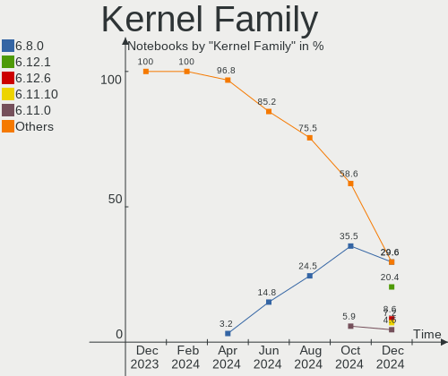
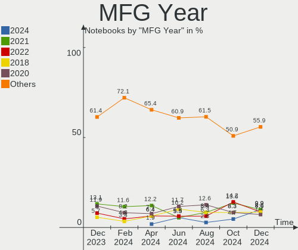
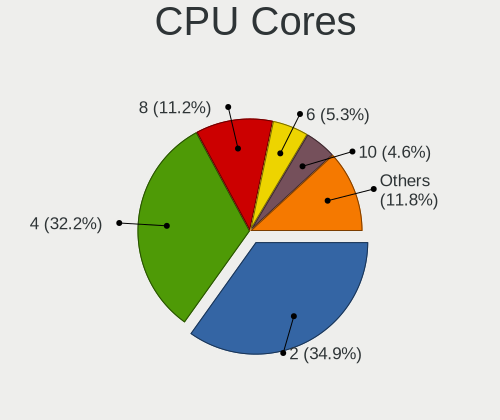
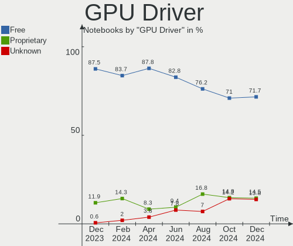

Linux in Italy - Hardware Trends (Notebooks)
--------------------------------------------

A project to identify most popular hardware characteristics and track their change
over time based on data collected by Linux users at https://Linux-Hardware.org.

Anyone can contribute to this report by the [hw-probe](https://github.com/linuxhw/hw-probe) tool:

    sudo -E hw-probe -all -upload

Period: Sep, 2022.

Contents
--------

* [ System ](#system)
  - [ OS                       ](#os)
  - [ OS Family                ](#os-family)
  - [ Kernel                   ](#kernel)
  - [ Kernel Family            ](#kernel-family)
  - [ Kernel Major Ver.        ](#kernel-major-ver)
  - [ Arch                     ](#arch)
  - [ DE                       ](#de)
  - [ Display Server           ](#display-server)
  - [ Display Manager          ](#display-manager)
  - [ OS Lang                  ](#os-lang)
  - [ Boot Mode                ](#boot-mode)
  - [ Filesystem               ](#filesystem)
  - [ Part. scheme             ](#part-scheme)
  - [ Dual Boot with Linux/BSD ](#dual-boot-with-linuxbsd)
  - [ Dual Boot (Win)          ](#dual-boot-win)

* [ Board ](#board)
  - [ Vendor                   ](#vendor)
  - [ Model                    ](#model)
  - [ Model Family             ](#model-family)
  - [ MFG Year                 ](#mfg-year)
  - [ Form Factor              ](#form-factor)
  - [ Secure Boot              ](#secure-boot)
  - [ Coreboot                 ](#coreboot)
  - [ RAM Size                 ](#ram-size)
  - [ RAM Used                 ](#ram-used)
  - [ Total Drives             ](#total-drives)
  - [ Has CD-ROM               ](#has-cd-rom)
  - [ Has Ethernet             ](#has-ethernet)
  - [ Has WiFi                 ](#has-wifi)
  - [ Has Bluetooth            ](#has-bluetooth)

* [ Location ](#location)
  - [ Country                  ](#country)
  - [ City                     ](#city)

* [ Drives ](#drives)
  - [ Drive Vendor             ](#drive-vendor)
  - [ Drive Model              ](#drive-model)
  - [ HDD Vendor               ](#hdd-vendor)
  - [ SSD Vendor               ](#ssd-vendor)
  - [ Drive Kind               ](#drive-kind)
  - [ Drive Connector          ](#drive-connector)
  - [ Drive Size               ](#drive-size)
  - [ Space Total              ](#space-total)
  - [ Space Used               ](#space-used)
  - [ Malfunc. Drives          ](#malfunc-drives)
  - [ Malfunc. Drive Vendor    ](#malfunc-drive-vendor)
  - [ Malfunc. HDD Vendor      ](#malfunc-hdd-vendor)
  - [ Malfunc. Drive Kind      ](#malfunc-drive-kind)
  - [ Failed Drives            ](#failed-drives)
  - [ Failed Drive Vendor      ](#failed-drive-vendor)
  - [ Drive Status             ](#drive-status)

* [ Storage controller ](#storage-controller)
  - [ Storage Vendor           ](#storage-vendor)
  - [ Storage Model            ](#storage-model)
  - [ Storage Kind             ](#storage-kind)

* [ Processor ](#processor)
  - [ CPU Vendor               ](#cpu-vendor)
  - [ CPU Model                ](#cpu-model)
  - [ CPU Model Family         ](#cpu-model-family)
  - [ CPU Cores                ](#cpu-cores)
  - [ CPU Sockets              ](#cpu-sockets)
  - [ CPU Threads              ](#cpu-threads)
  - [ CPU Op-Modes             ](#cpu-op-modes)
  - [ CPU Microcode            ](#cpu-microcode)
  - [ CPU Microarch            ](#cpu-microarch)

* [ Graphics ](#graphics)
  - [ GPU Vendor               ](#gpu-vendor)
  - [ GPU Model                ](#gpu-model)
  - [ GPU Combo                ](#gpu-combo)
  - [ GPU Driver               ](#gpu-driver)
  - [ GPU Memory               ](#gpu-memory)

* [ Monitor ](#monitor)
  - [ Monitor Vendor           ](#monitor-vendor)
  - [ Monitor Model            ](#monitor-model)
  - [ Monitor Resolution       ](#monitor-resolution)
  - [ Monitor Diagonal         ](#monitor-diagonal)
  - [ Monitor Width            ](#monitor-width)
  - [ Aspect Ratio             ](#aspect-ratio)
  - [ Monitor Area             ](#monitor-area)
  - [ Pixel Density            ](#pixel-density)
  - [ Multiple Monitors        ](#multiple-monitors)

* [ Network ](#network)
  - [ Net Controller Vendor    ](#net-controller-vendor)
  - [ Net Controller Model     ](#net-controller-model)
  - [ Wireless Vendor          ](#wireless-vendor)
  - [ Wireless Model           ](#wireless-model)
  - [ Ethernet Vendor          ](#ethernet-vendor)
  - [ Ethernet Model           ](#ethernet-model)
  - [ Net Controller Kind      ](#net-controller-kind)
  - [ Used Controller          ](#used-controller)
  - [ NICs                     ](#nics)
  - [ IPv6                     ](#ipv6)

* [ Bluetooth ](#bluetooth)
  - [ Bluetooth Vendor         ](#bluetooth-vendor)
  - [ Bluetooth Model          ](#bluetooth-model)

* [ Sound ](#sound)
  - [ Sound Vendor             ](#sound-vendor)
  - [ Sound Model              ](#sound-model)

* [ Memory ](#memory)
  - [ Memory Vendor            ](#memory-vendor)
  - [ Memory Model             ](#memory-model)
  - [ Memory Kind              ](#memory-kind)
  - [ Memory Form Factor       ](#memory-form-factor)
  - [ Memory Size              ](#memory-size)
  - [ Memory Speed             ](#memory-speed)

* [ Printers & scanners ](#printers--scanners)
  - [ Printer Vendor           ](#printer-vendor)
  - [ Printer Model            ](#printer-model)
  - [ Scanner Vendor           ](#scanner-vendor)
  - [ Scanner Model            ](#scanner-model)

* [ Camera ](#camera)
  - [ Camera Vendor            ](#camera-vendor)
  - [ Camera Model             ](#camera-model)

* [ Security ](#security)
  - [ Fingerprint Vendor       ](#fingerprint-vendor)
  - [ Fingerprint Model        ](#fingerprint-model)
  - [ Chipcard Vendor          ](#chipcard-vendor)
  - [ Chipcard Model           ](#chipcard-model)

* [ Unsupported ](#unsupported)
  - [ Unsupported Devices      ](#unsupported-devices)
  - [ Unsupported Device Types ](#unsupported-device-types)

System
------

OS
--

Installed operating systems

| Name                         | Notebooks | Percent |
|------------------------------|-----------|---------|
| Ubuntu 22.04                 | 37        | 19.79%  |
| Fedora 36                    | 29        | 15.51%  |
| Linux Mint 21                | 11        | 5.88%   |
| Pop!_OS 22.04                | 10        | 5.35%   |
| Linux Mint 20.3              | 8         | 4.28%   |
| Kubuntu 22.04                | 8         | 4.28%   |
| Debian 11                    | 8         | 4.28%   |
| EndeavourOS Rolling          | 6         | 3.21%   |
| Arch Rolling                 | 6         | 3.21%   |
| Ubuntu 20.04                 | 5         | 2.67%   |
| Manjaro 21.3.7               | 5         | 2.67%   |
| Elementary 6.1               | 5         | 2.67%   |
| Zorin 16                     | 4         | 2.14%   |
| KDE neon 20.04               | 4         | 2.14%   |
| Arch                         | 4         | 2.14%   |
| Xubuntu 22.04                | 3         | 1.6%    |
| Ubuntu MATE 22.04            | 3         | 1.6%    |
| OpenMandriva 4.3             | 3         | 1.6%    |
| Garuda Linux Soaring         | 3         | 1.6%    |
| openSUSE Tumbleweed-XXXXXXXX | 2         | 1.07%   |
| MX 21                        | 2         | 1.07%   |
| LMDE 5                       | 2         | 1.07%   |
| Zorin 15                     | 1         | 0.53%   |
| Ubuntu Studio 22.04          | 1         | 0.53%   |
| SteamOS 3.3.1                | 1         | 0.53%   |
| OpenMandriva 4.50            | 1         | 0.53%   |
| MX 19                        | 1         | 0.53%   |
| Manjaro 22.0.0               | 1         | 0.53%   |
| Manjaro                      | 1         | 0.53%   |
| Linux Lite 6.0               | 1         | 0.53%   |
| Kubuntu 22.10                | 1         | 0.53%   |
| KDE neon 22.04               | 1         | 0.53%   |
| GNOME OS Nightly             | 1         | 0.53%   |
| Fedora 37                    | 1         | 0.53%   |
| Fedora 35                    | 1         | 0.53%   |
| Endless 4.0.9                | 1         | 0.53%   |
| Devuan 4                     | 1         | 0.53%   |
| Debian Unstable              | 1         | 0.53%   |
| Debian Testing               | 1         | 0.53%   |
| Clear Linux 37190            | 1         | 0.53%   |

OS Family
---------

OS without a version

| Name          | Notebooks | Percent |
|---------------|-----------|---------|
| Ubuntu        | 42        | 22.46%  |
| Fedora        | 31        | 16.58%  |
| Linux Mint    | 19        | 10.16%  |
| Pop!_OS       | 10        | 5.35%   |
| Debian        | 10        | 5.35%   |
| Arch          | 10        | 5.35%   |
| Kubuntu       | 9         | 4.81%   |
| Manjaro       | 7         | 3.74%   |
| EndeavourOS   | 6         | 3.21%   |
| Zorin         | 5         | 2.67%   |
| KDE neon      | 5         | 2.67%   |
| Elementary    | 5         | 2.67%   |
| OpenMandriva  | 4         | 2.14%   |
| Xubuntu       | 3         | 1.6%    |
| Ubuntu MATE   | 3         | 1.6%    |
| MX            | 3         | 1.6%    |
| Garuda Linux  | 3         | 1.6%    |
| openSUSE      | 2         | 1.07%   |
| LMDE          | 2         | 1.07%   |
| Clear Linux   | 2         | 1.07%   |
| Ubuntu Studio | 1         | 0.53%   |
| SteamOS       | 1         | 0.53%   |
| Linux Lite    | 1         | 0.53%   |
| GNOME OS      | 1         | 0.53%   |
| Endless       | 1         | 0.53%   |
| Devuan        | 1         | 0.53%   |

Kernel
------

Version of the Linux kernel

| Version                                                      | Notebooks | Percent |
|--------------------------------------------------------------|-----------|---------|
| 5.15.0-47-generic                                            | 33        | 17.65%  |
| 5.15.0-46-generic                                            | 20        | 10.7%   |
| 5.15.0-48-generic                                            | 13        | 6.95%   |
| 5.19.0-76051900-generic                                      | 10        | 5.35%   |
| 5.15.0-43-generic                                            | 8         | 4.28%   |
| 5.19.6-200.fc36.x86_64                                       | 7         | 3.74%   |
| 5.10.0-18-amd64                                              | 7         | 3.74%   |
| 5.19.4-200.fc36.x86_64                                       | 6         | 3.21%   |
| 5.4.0-125-generic                                            | 5         | 2.67%   |
| 5.19.8-200.fc36.x86_64                                       | 3         | 1.6%    |
| 5.18.19-200.fc36.x86_64                                      | 3         | 1.6%    |
| 5.17.5-300.fc36.x86_64                                       | 3         | 1.6%    |
| 5.16.7-desktop-1omv4003                                      | 3         | 1.6%    |
| 5.15.0-41-generic                                            | 3         | 1.6%    |
| 5.19.6-zen1-1-zen                                            | 2         | 1.07%   |
| 5.19.5-arch1-1                                               | 2         | 1.07%   |
| 5.19.1-3-MANJARO                                             | 2         | 1.07%   |
| 5.19.0-8.2-liquorix-amd64                                    | 2         | 1.07%   |
| 5.19.0-1-amd64                                               | 2         | 1.07%   |
| 5.18.18-200.fc36.x86_64                                      | 2         | 1.07%   |
| 5.15.60-1-MANJARO                                            | 2         | 1.07%   |
| 5.10.0-17-amd64                                              | 2         | 1.07%   |
| 6.0.0-0.rc7.20220929gitc3e0e1e23c70.50.vanilla.1.fc36.x86_64 | 1         | 0.53%   |
| 5.8.0-43-generic                                             | 1         | 0.53%   |
| 5.4.0-126-generic                                            | 1         | 0.53%   |
| 5.4.0-122-generic                                            | 1         | 0.53%   |
| 5.4.0-105-generic                                            | 1         | 0.53%   |
| 5.19.9-1189.native                                           | 1         | 0.53%   |
| 5.19.8-zen1-1-zen                                            | 1         | 0.53%   |
| 5.19.8-arch1-1                                               | 1         | 0.53%   |
| 5.19.7-arch1-1                                               | 1         | 0.53%   |
| 5.19.7-200.fc36.x86_64                                       | 1         | 0.53%   |
| 5.19.7-1-MANJARO                                             | 1         | 0.53%   |
| 5.19.6-arch1-1                                               | 1         | 0.53%   |
| 5.19.5-desktop-1omv4090                                      | 1         | 0.53%   |
| 5.19.4-arch1-1                                               | 1         | 0.53%   |
| 5.19.3-arch1-1                                               | 1         | 0.53%   |
| 5.19.3-051903-generic                                        | 1         | 0.53%   |
| 5.19.2-zen1-1-zen                                            | 1         | 0.53%   |
| 5.19.2-1-default                                             | 1         | 0.53%   |

Kernel Family
-------------

Linux kernel without a distro release

| Version  | Notebooks | Percent |
|----------|-----------|---------|
| 5.15.0   | 78        | 41.71%  |
| 5.19.0   | 15        | 8.02%   |
| 5.10.0   | 12        | 6.42%   |
| 5.19.6   | 10        | 5.35%   |
| 5.4.0    | 8         | 4.28%   |
| 5.19.4   | 7         | 3.74%   |
| 5.19.8   | 5         | 2.67%   |
| 5.18.19  | 4         | 2.14%   |
| 5.19.7   | 3         | 1.6%    |
| 5.19.5   | 3         | 1.6%    |
| 5.19.2   | 3         | 1.6%    |
| 5.19.11  | 3         | 1.6%    |
| 5.19.10  | 3         | 1.6%    |
| 5.18.18  | 3         | 1.6%    |
| 5.17.5   | 3         | 1.6%    |
| 5.16.7   | 3         | 1.6%    |
| 5.19.3   | 2         | 1.07%   |
| 5.19.1   | 2         | 1.07%   |
| 5.15.65  | 2         | 1.07%   |
| 5.15.60  | 2         | 1.07%   |
| 6.0.0    | 1         | 0.53%   |
| 5.8.0    | 1         | 0.53%   |
| 5.19.9   | 1         | 0.53%   |
| 5.18.6   | 1         | 0.53%   |
| 5.18.5   | 1         | 0.53%   |
| 5.18.16  | 1         | 0.53%   |
| 5.18.11  | 1         | 0.53%   |
| 5.18.1   | 1         | 0.53%   |
| 5.17.0   | 1         | 0.53%   |
| 5.16.13  | 1         | 0.53%   |
| 5.15.64  | 1         | 0.53%   |
| 5.14.10  | 1         | 0.53%   |
| 5.13.0   | 1         | 0.53%   |
| 5.11.0   | 1         | 0.53%   |
| 4.19.241 | 1         | 0.53%   |
| 4.19.0   | 1         | 0.53%   |

Kernel Major Ver.
-----------------

Linux kernel major version

| Version | Notebooks | Percent |
|---------|-----------|---------|
| 5.15    | 83        | 44.39%  |
| 5.19    | 57        | 30.48%  |
| 5.18    | 12        | 6.42%   |
| 5.10    | 12        | 6.42%   |
| 5.4     | 8         | 4.28%   |
| 5.17    | 4         | 2.14%   |
| 5.16    | 4         | 2.14%   |
| 4.19    | 2         | 1.07%   |
| 6.0     | 1         | 0.53%   |
| 5.8     | 1         | 0.53%   |
| 5.14    | 1         | 0.53%   |
| 5.13    | 1         | 0.53%   |
| 5.11    | 1         | 0.53%   |

Arch
----

OS architecture (x86_64, i586, etc.)

| Name   | Notebooks | Percent |
|--------|-----------|---------|
| x86_64 | 185       | 98.93%  |
| i686   | 2         | 1.07%   |

DE
--

Desktop Environment

| Name            | Notebooks | Percent |
|-----------------|-----------|---------|
| GNOME           | 97        | 51.87%  |
| KDE5            | 41        | 21.93%  |
| X-Cinnamon      | 17        | 9.09%   |
| XFCE            | 13        | 6.95%   |
| Pantheon        | 5         | 2.67%   |
| MATE            | 3         | 1.6%    |
| i3              | 3         | 1.6%    |
| Unknown         | 2         | 1.07%   |
| kde             | 1         | 0.53%   |
| GNOME Flashback | 1         | 0.53%   |
| dwm             | 1         | 0.53%   |
| Cinnamon        | 1         | 0.53%   |
| Budgie          | 1         | 0.53%   |
| bspwm           | 1         | 0.53%   |

Display Server
--------------

X11 or Wayland

| Name    | Notebooks | Percent |
|---------|-----------|---------|
| X11     | 121       | 64.71%  |
| Wayland | 64        | 34.22%  |
| Tty     | 2         | 1.07%   |

Display Manager
---------------

SDDM, LightDM, etc.

| Name    | Notebooks | Percent |
|---------|-----------|---------|
| GDM3    | 48        | 25.67%  |
| Unknown | 40        | 21.39%  |
| SDDM    | 36        | 19.25%  |
| LightDM | 31        | 16.58%  |
| GDM     | 30        | 16.04%  |
| XDM     | 1         | 0.53%   |
| SLiM    | 1         | 0.53%   |

OS Lang
-------

Language

| Lang  | Notebooks | Percent |
|-------|-----------|---------|
| it_IT | 112       | 59.89%  |
| en_US | 62        | 33.16%  |
| C     | 5         | 2.67%   |
| en_GB | 4         | 2.14%   |
| ru_RU | 1         | 0.53%   |
| es_ES | 1         | 0.53%   |
| en_AG | 1         | 0.53%   |
| de_IT | 1         | 0.53%   |

Boot Mode
---------

EFI or BIOS

| Mode | Notebooks | Percent |
|------|-----------|---------|
| EFI  | 126       | 67.38%  |
| BIOS | 61        | 32.62%  |

Filesystem
----------

Type of filesystem

| Type    | Notebooks | Percent |
|---------|-----------|---------|
| Ext4    | 132       | 70.59%  |
| Btrfs   | 38        | 20.32%  |
| Overlay | 12        | 6.42%   |
| Zfs     | 3         | 1.6%    |
| Jfs     | 1         | 0.53%   |
| Ext3    | 1         | 0.53%   |

Part. scheme
------------

Scheme of partitioning

| Type    | Notebooks | Percent |
|---------|-----------|---------|
| GPT     | 107       | 57.22%  |
| Unknown | 69        | 36.9%   |
| MBR     | 11        | 5.88%   |

Dual Boot with Linux/BSD
------------------------

Hosting more than one Linux/BSD

| Dual boot | Notebooks | Percent |
|-----------|-----------|---------|
| No        | 166       | 88.77%  |
| Yes       | 21        | 11.23%  |

Dual Boot (Win)
---------------

Hosting Linux and Windows

| Dual boot | Notebooks | Percent |
|-----------|-----------|---------|
| No        | 123       | 65.78%  |
| Yes       | 64        | 34.22%  |

Board
-----

Vendor
------

Motherboard manufacturer

| Name                | Notebooks | Percent |
|---------------------|-----------|---------|
| Hewlett-Packard     | 41        | 21.93%  |
| Lenovo              | 32        | 17.11%  |
| Dell                | 28        | 14.97%  |
| ASUSTek Computer    | 23        | 12.3%   |
| Acer                | 16        | 8.56%   |
| MSI                 | 6         | 3.21%   |
| Apple               | 6         | 3.21%   |
| Toshiba             | 5         | 2.67%   |
| HUAWEI              | 5         | 2.67%   |
| Timi                | 3         | 1.6%    |
| Samsung Electronics | 2         | 1.07%   |
| Razer               | 2         | 1.07%   |
| Notebook            | 2         | 1.07%   |
| Unknown             | 2         | 1.07%   |
| Valve               | 1         | 0.53%   |
| TUXEDO              | 1         | 0.53%   |
| Sony                | 1         | 0.53%   |
| Schenker            | 1         | 0.53%   |
| SANTECH             | 1         | 0.53%   |
| PC Specialist       | 1         | 0.53%   |
| NEC Computers       | 1         | 0.53%   |
| Microtech           | 1         | 0.53%   |
| LG Electronics      | 1         | 0.53%   |
| Intel               | 1         | 0.53%   |
| Google              | 1         | 0.53%   |
| Gateway             | 1         | 0.53%   |
| Fujitsu             | 1         | 0.53%   |
| Chuwi               | 1         | 0.53%   |

Model
-----

Motherboard model

| Name                                               | Notebooks | Percent |
|----------------------------------------------------|-----------|---------|
| HP 255 G8 Notebook PC                              | 3         | 1.6%    |
| Unknown                                            | 3         | 1.6%    |
| MSI Modern 14 B11MOL                               | 2         | 1.07%   |
| Lenovo IdeaPad Z510 20287                          | 2         | 1.07%   |
| HP Pavilion 15                                     | 2         | 1.07%   |
| HP Laptop 15s-eq2xxx                               | 2         | 1.07%   |
| HP 250 G8 Notebook PC                              | 2         | 1.07%   |
| Dell XPS 15 9570                                   | 2         | 1.07%   |
| Dell Latitude 5420                                 | 2         | 1.07%   |
| ASUS UX310UQK                                      | 2         | 1.07%   |
| Apple MacBook5,1                                   | 2         | 1.07%   |
| Acer Aspire A515-51G                               | 2         | 1.07%   |
| Valve Jupiter                                      | 1         | 0.53%   |
| TUXEDO Book XP14 Gen12                             | 1         | 0.53%   |
| Toshiba Satellite Pro L450                         | 1         | 0.53%   |
| Toshiba Satellite Pro C660                         | 1         | 0.53%   |
| Toshiba Satellite L50-B                            | 1         | 0.53%   |
| Toshiba Satellite C660                             | 1         | 0.53%   |
| Toshiba PORTEGE Z30-B                              | 1         | 0.53%   |
| Timi TM1701                                        | 1         | 0.53%   |
| Timi RedmiBook Pro 15S                             | 1         | 0.53%   |
| Timi A35S                                          | 1         | 0.53%   |
| Sony SVE1512J6EW                                   | 1         | 0.53%   |
| Schenker XMG NEO (CZN/E21)                         | 1         | 0.53%   |
| SANTECH NHx0EH_EJ_EK                               | 1         | 0.53%   |
| Samsung X420/X520                                  | 1         | 0.53%   |
| Samsung 270E5G/270E5U                              | 1         | 0.53%   |
| Razer Blade 15 Base Model (Early 2020) - RZ09-0328 | 1         | 0.53%   |
| Razer Blade 14 - RZ09-0370                         | 1         | 0.53%   |
| PC Specialist 14 Fusion IV                         | 1         | 0.53%   |
| Notebook W230SS                                    | 1         | 0.53%   |
| Notebook PD5x_7xPNP_PNN_PNT                        | 1         | 0.53%   |
| NEC Computers PC-VY21AEZ75                         | 1         | 0.53%   |
| MSI Prestige 15 A12UC                              | 1         | 0.53%   |
| MSI Prestige 14Evo A11M                            | 1         | 0.53%   |
| MSI GP72MVR 7RFX                                   | 1         | 0.53%   |
| MSI Delta 15 A5EFK                                 | 1         | 0.53%   |
| Microtech CoreBook                                 | 1         | 0.53%   |
| LG 17Z90P-G.AA86D                                  | 1         | 0.53%   |
| Lenovo Yoga Slim 7 14ARE05 82A2                    | 1         | 0.53%   |

Model Family
------------

Motherboard model prefix

| Name               | Notebooks | Percent |
|--------------------|-----------|---------|
| Lenovo ThinkPad    | 19        | 10.16%  |
| Dell XPS           | 10        | 5.35%   |
| Acer Aspire        | 10        | 5.35%   |
| HP Pavilion        | 9         | 4.81%   |
| Dell Latitude      | 8         | 4.28%   |
| HP Laptop          | 7         | 3.74%   |
| Lenovo IdeaPad     | 6         | 3.21%   |
| HP 255             | 5         | 2.67%   |
| Dell Inspiron      | 5         | 2.67%   |
| Toshiba Satellite  | 4         | 2.14%   |
| HP ProBook         | 4         | 2.14%   |
| ASUS VivoBook      | 4         | 2.14%   |
| Lenovo ThinkBook   | 3         | 1.6%    |
| HP EliteBook       | 3         | 1.6%    |
| HP 250             | 3         | 1.6%    |
| Acer Swift         | 3         | 1.6%    |
| Unknown            | 3         | 1.6%    |
| Razer Blade        | 2         | 1.07%   |
| MSI Prestige       | 2         | 1.07%   |
| MSI Modern         | 2         | 1.07%   |
| Dell Vostro        | 2         | 1.07%   |
| ASUS UX310UQK      | 2         | 1.07%   |
| ASUS ROG           | 2         | 1.07%   |
| Apple MacBookPro11 | 2         | 1.07%   |
| Apple MacBook5     | 2         | 1.07%   |
| Acer TravelMate    | 2         | 1.07%   |
| Valve Jupiter      | 1         | 0.53%   |
| TUXEDO Book        | 1         | 0.53%   |
| Toshiba PORTEGE    | 1         | 0.53%   |
| Timi TM1701        | 1         | 0.53%   |
| Timi RedmiBook     | 1         | 0.53%   |
| Timi A35S          | 1         | 0.53%   |
| Sony SVE1512J6EW   | 1         | 0.53%   |
| Schenker XMG       | 1         | 0.53%   |
| SANTECH NHx0EH     | 1         | 0.53%   |
| Samsung X420       | 1         | 0.53%   |
| Samsung 270E5G     | 1         | 0.53%   |
| PC Specialist 14   | 1         | 0.53%   |
| Notebook W230SS    | 1         | 0.53%   |
| Notebook PD5x      | 1         | 0.53%   |

MFG Year
--------

Motherboard manufacture year

| Year | Notebooks | Percent |
|------|-----------|---------|
| 2020 | 32        | 17.11%  |
| 2021 | 30        | 16.04%  |
| 2017 | 18        | 9.63%   |
| 2019 | 14        | 7.49%   |
| 2018 | 14        | 7.49%   |
| 2013 | 14        | 7.49%   |
| 2022 | 10        | 5.35%   |
| 2016 | 9         | 4.81%   |
| 2015 | 8         | 4.28%   |
| 2012 | 7         | 3.74%   |
| 2010 | 7         | 3.74%   |
| 2014 | 6         | 3.21%   |
| 2009 | 6         | 3.21%   |
| 2011 | 5         | 2.67%   |
| 2008 | 4         | 2.14%   |
| 2007 | 2         | 1.07%   |
| 2006 | 1         | 0.53%   |

Form Factor
-----------

Physical design of the computer

| Name     | Notebooks | Percent |
|----------|-----------|---------|
| Notebook | 187       | 100%    |

Secure Boot
-----------

Enabled or disabled

| State    | Notebooks | Percent |
|----------|-----------|---------|
| Disabled | 165       | 88.24%  |
| Enabled  | 22        | 11.76%  |

Coreboot
--------

Have coreboot on board

| Used | Notebooks | Percent |
|------|-----------|---------|
| No   | 185       | 98.93%  |
| Yes  | 2         | 1.07%   |

RAM Size
--------

Total RAM memory

| Size in GB  | Notebooks | Percent |
|-------------|-----------|---------|
| 4.01-8.0    | 60        | 32.09%  |
| 16.01-24.0  | 47        | 25.13%  |
| 8.01-16.0   | 40        | 21.39%  |
| 3.01-4.0    | 22        | 11.76%  |
| 32.01-64.0  | 11        | 5.88%   |
| 2.01-3.0    | 3         | 1.6%    |
| 1.01-2.0    | 2         | 1.07%   |
| 24.01-32.0  | 1         | 0.53%   |
| 64.01-256.0 | 1         | 0.53%   |

RAM Used
--------

Used RAM memory

| Used GB   | Notebooks | Percent |
|-----------|-----------|---------|
| 1.01-2.0  | 46        | 24.6%   |
| 2.01-3.0  | 45        | 24.06%  |
| 4.01-8.0  | 42        | 22.46%  |
| 3.01-4.0  | 41        | 21.93%  |
| 8.01-16.0 | 9         | 4.81%   |
| 0.51-1.0  | 4         | 2.14%   |

Total Drives
------------

Number of drives on board

| Drives | Notebooks | Percent |
|--------|-----------|---------|
| 1      | 143       | 76.47%  |
| 2      | 41        | 21.93%  |
| 3      | 2         | 1.07%   |
| 0      | 1         | 0.53%   |

Has CD-ROM
----------

Has CD-ROM on board

| Presented | Notebooks | Percent |
|-----------|-----------|---------|
| No        | 135       | 72.19%  |
| Yes       | 52        | 27.81%  |

Has Ethernet
------------

Has Ethernet on board

| Presented | Notebooks | Percent |
|-----------|-----------|---------|
| Yes       | 129       | 68.98%  |
| No        | 58        | 31.02%  |

Has WiFi
--------

Has WiFi module

| Presented | Notebooks | Percent |
|-----------|-----------|---------|
| Yes       | 185       | 98.93%  |
| No        | 2         | 1.07%   |

Has Bluetooth
-------------

Has Bluetooth module

| Presented | Notebooks | Percent |
|-----------|-----------|---------|
| Yes       | 165       | 88.24%  |
| No        | 22        | 11.76%  |

Location
--------

Country
-------

Geographic location (country)

| Country | Notebooks | Percent |
|---------|-----------|---------|
| Italy   | 187       | 100%    |

City
----

Geographic location (city)

| City                        | Notebooks | Percent |
|-----------------------------|-----------|---------|
| Milan                       | 27        | 14.44%  |
| Rome                        | 18        | 9.63%   |
| Turin                       | 9         | 4.81%   |
| Bologna                     | 6         | 3.21%   |
| Verona                      | 5         | 2.67%   |
| Rho                         | 4         | 2.14%   |
| Florence                    | 4         | 2.14%   |
| Naples                      | 3         | 1.6%    |
| Bari                        | 3         | 1.6%    |
| Santa Maria di Sala         | 2         | 1.07%   |
| Pozza di Fassa              | 2         | 1.07%   |
| Monza                       | 2         | 1.07%   |
| Lucca                       | 2         | 1.07%   |
| Grosseto                    | 2         | 1.07%   |
| Brescia                     | 2         | 1.07%   |
| Alessandria                 | 2         | 1.07%   |
| Varese                      | 1         | 0.53%   |
| Valdagno                    | 1         | 0.53%   |
| Uzzano                      | 1         | 0.53%   |
| Surbo                       | 1         | 0.53%   |
| Sommacampagna               | 1         | 0.53%   |
| Silea                       | 1         | 0.53%   |
| Settimo Torinese            | 1         | 0.53%   |
| Sesto San Giovanni          | 1         | 0.53%   |
| Scurcola Marsicana          | 1         | 0.53%   |
| Santarcangelo di Romagna    | 1         | 0.53%   |
| Sant'Agata Bolognese        | 1         | 0.53%   |
| San Marzano di San Giuseppe | 1         | 0.53%   |
| San Giovanni in Persiceto   | 1         | 0.53%   |
| San Fermo della Battaglia   | 1         | 0.53%   |
| Salsomaggiore Terme         | 1         | 0.53%   |
| Roverè della Luna          | 1         | 0.53%   |
| Ronago                      | 1         | 0.53%   |
| Rombiolo                    | 1         | 0.53%   |
| Rogliano                    | 1         | 0.53%   |
| Revello                     | 1         | 0.53%   |
| Rende                       | 1         | 0.53%   |
| Reggio Calabria             | 1         | 0.53%   |
| Ravenna                     | 1         | 0.53%   |
| Porto Torres                | 1         | 0.53%   |

Drives
------

Drive Vendor
------------

Hard drive vendors

| Vendor                  | Notebooks | Drives | Percent |
|-------------------------|-----------|--------|---------|
| Samsung Electronics     | 52        | 60     | 23.74%  |
| SanDisk                 | 23        | 23     | 10.5%   |
| WDC                     | 17        | 17     | 7.76%   |
| Toshiba                 | 15        | 15     | 6.85%   |
| Kingston                | 14        | 14     | 6.39%   |
| SK hynix                | 11        | 11     | 5.02%   |
| Crucial                 | 10        | 10     | 4.57%   |
| Unknown                 | 9         | 9      | 4.11%   |
| Seagate                 | 8         | 8      | 3.65%   |
| Micron Technology       | 8         | 8      | 3.65%   |
| Intel                   | 7         | 7      | 3.2%    |
| HGST                    | 6         | 6      | 2.74%   |
| Phison                  | 5         | 5      | 2.28%   |
| PNY                     | 4         | 4      | 1.83%   |
| KIOXIA                  | 4         | 5      | 1.83%   |
| Hitachi                 | 4         | 4      | 1.83%   |
| Apple                   | 3         | 3      | 1.37%   |
| Phison Electronics      | 2         | 2      | 0.91%   |
| Unknown                 | 2         | 2      | 0.91%   |
| Union Memory (Shenzhen) | 1         | 1      | 0.46%   |
| TrekStor                | 1         | 1      | 0.46%   |
| Teclast                 | 1         | 1      | 0.46%   |
| Team                    | 1         | 1      | 0.46%   |
| SPCC                    | 1         | 1      | 0.46%   |
| LITEONIT                | 1         | 1      | 0.46%   |
| LITEON                  | 1         | 1      | 0.46%   |
| Lite-On                 | 1         | 1      | 0.46%   |
| KIOXIA-EXCERIA          | 1         | 1      | 0.46%   |
| Generic-                | 1         | 1      | 0.46%   |
| Fujitsu                 | 1         | 1      | 0.46%   |
| Drevo                   | 1         | 1      | 0.46%   |
| China                   | 1         | 1      | 0.46%   |
| BAITITON                | 1         | 1      | 0.46%   |
| ASMT                    | 1         | 1      | 0.46%   |

Drive Model
-----------

Hard drive models

| Model                                               | Notebooks | Percent |
|-----------------------------------------------------|-----------|---------|
| Samsung NVMe SSD Controller SM981/PM981/PM983 256GB | 8         | 3.52%   |
| Samsung SSD 860 EVO 500GB                           | 4         | 1.76%   |
| Kingston SA400S37240G 240GB SSD                     | 4         | 1.76%   |
| Toshiba MQ01ABF050 500GB                            | 3         | 1.32%   |
| Samsung SSD 860 EVO 1TB                             | 3         | 1.32%   |
| KIOXIA NVMe SSD Drive 256GB                         | 3         | 1.32%   |
| HGST HTS545050A7E680 500GB                          | 3         | 1.32%   |
| Crucial CT500MX500SSD1 500GB                        | 3         | 1.32%   |
| Crucial CT480BX500SSD1 480GB                        | 3         | 1.32%   |
| Toshiba MQ01ABD100 1TB                              | 2         | 0.88%   |
| Sandisk WD Blue SN500 / PC SN520 NVMe SSD 256GB     | 2         | 0.88%   |
| SanDisk SDSSDH3 500G                                | 2         | 0.88%   |
| SanDisk NVMe SSD Drive 256GB                        | 2         | 0.88%   |
| Samsung SSD 970 EVO Plus 250GB                      | 2         | 0.88%   |
| Samsung SSD 970 EVO Plus 1TB                        | 2         | 0.88%   |
| Samsung SSD 850 EVO 500GB                           | 2         | 0.88%   |
| Samsung SSD 850 EVO 250GB                           | 2         | 0.88%   |
| Samsung SSD 840 EVO 250GB                           | 2         | 0.88%   |
| Samsung NVMe SSD Drive 512GB                        | 2         | 0.88%   |
| Samsung MZVLQ512HALU-00000 512GB                    | 2         | 0.88%   |
| Samsung MZVL21T0HCLR-00BL7 1TB                      | 2         | 0.88%   |
| Samsung MZALQ512HALU-000L2 512GB                    | 2         | 0.88%   |
| PNY CS900 120GB SSD                                 | 2         | 0.88%   |
| Phison PS5013 E13 NVMe Controller 512GB             | 2         | 0.88%   |
| Kingston SA400S37480G 480GB SSD                     | 2         | 0.88%   |
| Kingston OM8PCP3512F-AI1 512GB                      | 2         | 0.88%   |
| Intel SSDPEKNW512G8H 512GB                          | 2         | 0.88%   |
| Unknown                                             | 2         | 0.88%   |
| WDC WDS500G3X0C-00SJG0 500GB                        | 1         | 0.44%   |
| WDC WDS500G2B0B-00YS70 500GB SSD                    | 1         | 0.44%   |
| WDC WDS500G1X0E-00AFY0 500GB                        | 1         | 0.44%   |
| WDC WDS500G1B0C-00S6U0 500GB                        | 1         | 0.44%   |
| WDC WD6400BPVT-55HXZT3 640GB                        | 1         | 0.44%   |
| WDC WD5000LPVX-16V0TT3 500GB                        | 1         | 0.44%   |
| WDC WD5000LPCX-24C6HT0 500GB                        | 1         | 0.44%   |
| WDC WD3200BEKT-60V5T1 320GB                         | 1         | 0.44%   |
| WDC WD1600BEVT-22ZCT0 160GB                         | 1         | 0.44%   |
| WDC WD10JPVX-22JC3T0 1TB                            | 1         | 0.44%   |
| WDC WD10JPVX-08JC3T5 1TB                            | 1         | 0.44%   |
| WDC PC SN730 NVMe 512GB                             | 1         | 0.44%   |

HDD Vendor
----------

Hard disk drive vendors

| Vendor   | Notebooks | Drives | Percent |
|----------|-----------|--------|---------|
| Toshiba  | 8         | 8      | 22.86%  |
| WDC      | 7         | 7      | 20%     |
| Seagate  | 7         | 7      | 20%     |
| HGST     | 6         | 6      | 17.14%  |
| Hitachi  | 4         | 4      | 11.43%  |
| Generic- | 1         | 1      | 2.86%   |
| Fujitsu  | 1         | 1      | 2.86%   |
| ASMT     | 1         | 1      | 2.86%   |

SSD Vendor
----------

Solid state drive vendors

| Vendor              | Notebooks | Drives | Percent |
|---------------------|-----------|--------|---------|
| Samsung Electronics | 22        | 25     | 28.95%  |
| SanDisk             | 11        | 11     | 14.47%  |
| Crucial             | 10        | 10     | 13.16%  |
| Kingston            | 9         | 9      | 11.84%  |
| SK hynix            | 4         | 4      | 5.26%   |
| PNY                 | 3         | 3      | 3.95%   |
| Toshiba             | 2         | 2      | 2.63%   |
| Micron Technology   | 2         | 2      | 2.63%   |
| Apple               | 2         | 2      | 2.63%   |
| WDC                 | 1         | 1      | 1.32%   |
| TrekStor            | 1         | 1      | 1.32%   |
| Teclast             | 1         | 1      | 1.32%   |
| Team                | 1         | 1      | 1.32%   |
| SPCC                | 1         | 1      | 1.32%   |
| LITEONIT            | 1         | 1      | 1.32%   |
| LITEON              | 1         | 1      | 1.32%   |
| Drevo               | 1         | 1      | 1.32%   |
| China               | 1         | 1      | 1.32%   |
| BAITITON            | 1         | 1      | 1.32%   |
| Unknown             | 1         | 1      | 1.32%   |

Drive Kind
----------

HDD or SSD

| Kind    | Notebooks | Drives | Percent |
|---------|-----------|--------|---------|
| NVMe    | 95        | 102    | 45.02%  |
| SSD     | 71        | 79     | 33.65%  |
| HDD     | 33        | 35     | 15.64%  |
| MMC     | 10        | 10     | 4.74%   |
| Unknown | 2         | 2      | 0.95%   |

Drive Connector
---------------

SATA, SAS, NVMe, etc.

| Type | Notebooks | Drives | Percent |
|------|-----------|--------|---------|
| NVMe | 95        | 102    | 46.8%   |
| SATA | 93        | 111    | 45.81%  |
| MMC  | 10        | 10     | 4.93%   |
| SAS  | 5         | 5      | 2.46%   |

Drive Size
----------

Size of hard drive

| Size in TB | Notebooks | Drives | Percent |
|------------|-----------|--------|---------|
| 0.01-0.5   | 83        | 91     | 78.3%   |
| 0.51-1.0   | 21        | 21     | 19.81%  |
| 1.01-2.0   | 2         | 2      | 1.89%   |

Space Total
-----------

Amount of disk space available on the file system

| Size in GB     | Notebooks | Percent |
|----------------|-----------|---------|
| 101-250        | 58        | 31.02%  |
| 251-500        | 56        | 29.95%  |
| 501-1000       | 24        | 12.83%  |
| 1-20           | 22        | 11.76%  |
| 51-100         | 7         | 3.74%   |
| More than 3000 | 6         | 3.21%   |
| 1001-2000      | 6         | 3.21%   |
| 21-50          | 4         | 2.14%   |
| 2001-3000      | 2         | 1.07%   |
| Unknown        | 2         | 1.07%   |

Space Used
----------

Amount of used disk space

| Used GB        | Notebooks | Percent |
|----------------|-----------|---------|
| 1-20           | 67        | 35.83%  |
| 51-100         | 31        | 16.58%  |
| 101-250        | 26        | 13.9%   |
| 251-500        | 25        | 13.37%  |
| 21-50          | 24        | 12.83%  |
| 501-1000       | 7         | 3.74%   |
| More than 3000 | 2         | 1.07%   |
| 2001-3000      | 2         | 1.07%   |
| Unknown        | 2         | 1.07%   |
| 1001-2000      | 1         | 0.53%   |

Malfunc. Drives
---------------

Drive models with a malfunction

| Model                                 | Notebooks | Drives | Percent |
|---------------------------------------|-----------|--------|---------|
| HGST HTS545050A7E680 500GB            | 2         | 2      | 22.22%  |
| WDC WD10JPVX-22JC3T0 1TB              | 1         | 1      | 11.11%  |
| Toshiba MQ04ABF100 1TB                | 1         | 1      | 11.11%  |
| SK hynix HFS512G39TND-N210A 512GB SSD | 1         | 1      | 11.11%  |
| SK hynix HFS256G39TND-N210A 256GB SSD | 1         | 1      | 11.11%  |
| SK hynix HFS128G39TND-N210A 128GB SSD | 1         | 1      | 11.11%  |
| Seagate ST1000LM014-SSHD-8GB          | 1         | 1      | 11.11%  |
| BAITITON BT58SSD09S 240GB             | 1         | 1      | 11.11%  |

Malfunc. Drive Vendor
---------------------

Vendors of faulty drives

| Vendor   | Notebooks | Drives | Percent |
|----------|-----------|--------|---------|
| SK hynix | 3         | 3      | 33.33%  |
| HGST     | 2         | 2      | 22.22%  |
| WDC      | 1         | 1      | 11.11%  |
| Toshiba  | 1         | 1      | 11.11%  |
| Seagate  | 1         | 1      | 11.11%  |
| BAITITON | 1         | 1      | 11.11%  |

Malfunc. HDD Vendor
-------------------

Vendors of faulty HDD drives

| Vendor  | Notebooks | Drives | Percent |
|---------|-----------|--------|---------|
| HGST    | 2         | 2      | 40%     |
| WDC     | 1         | 1      | 20%     |
| Toshiba | 1         | 1      | 20%     |
| Seagate | 1         | 1      | 20%     |

Malfunc. Drive Kind
-------------------

Kinds of faulty drives

| Kind | Notebooks | Drives | Percent |
|------|-----------|--------|---------|
| HDD  | 5         | 5      | 55.56%  |
| SSD  | 4         | 4      | 44.44%  |

Failed Drives
-------------

Failed drive models

Zero info for selected period =(

Failed Drive Vendor
-------------------

Failed drive vendors

Zero info for selected period =(

Drive Status
------------

Number of failed and malfunc. drives

| Status   | Notebooks | Drives | Percent |
|----------|-----------|--------|---------|
| Works    | 110       | 124    | 54.46%  |
| Detected | 83        | 95     | 41.09%  |
| Malfunc  | 9         | 9      | 4.46%   |

Storage controller
------------------

Storage Vendor
--------------

Storage controller vendors

| Vendor                       | Notebooks | Percent |
|------------------------------|-----------|---------|
| Intel                        | 117       | 51.09%  |
| Samsung Electronics          | 36        | 15.72%  |
| SanDisk                      | 20        | 8.73%   |
| AMD                          | 15        | 6.55%   |
| SK hynix                     | 7         | 3.06%   |
| Phison Electronics           | 7         | 3.06%   |
| Micron Technology            | 6         | 2.62%   |
| KIOXIA                       | 6         | 2.62%   |
| Kingston Technology Company  | 5         | 2.18%   |
| Toshiba America Info Systems | 4         | 1.75%   |
| Nvidia                       | 3         | 1.31%   |
| Union Memory (Shenzhen)      | 1         | 0.44%   |
| Lite-On Technology           | 1         | 0.44%   |
| Apple                        | 1         | 0.44%   |

Storage Model
-------------

Storage controller models

| Model                                                                            | Notebooks | Percent |
|----------------------------------------------------------------------------------|-----------|---------|
| Samsung NVMe SSD Controller SM981/PM981/PM983                                    | 17        | 6.88%   |
| Intel Sunrise Point-LP SATA Controller [AHCI mode]                               | 16        | 6.48%   |
| Intel Volume Management Device NVMe RAID Controller                              | 15        | 6.07%   |
| AMD FCH SATA Controller [AHCI mode]                                              | 15        | 6.07%   |
| Intel 82801 Mobile SATA Controller [RAID mode]                                   | 13        | 5.26%   |
| Samsung NVMe SSD Controller 980                                                  | 10        | 4.05%   |
| Intel 7 Series Chipset Family 6-port SATA Controller [AHCI mode]                 | 10        | 4.05%   |
| Intel 8 Series/C220 Series Chipset Family 6-port SATA Controller 1 [AHCI mode]   | 7         | 2.83%   |
| Intel 6 Series/C200 Series Chipset Family 6 port Mobile SATA AHCI Controller     | 7         | 2.83%   |
| SanDisk WD Blue SN550 NVMe SSD                                                   | 6         | 2.43%   |
| Samsung NVMe SSD Controller PM9A1/PM9A3/980PRO                                   | 6         | 2.43%   |
| Micron Non-Volatile memory controller                                            | 6         | 2.43%   |
| Intel Wildcat Point-LP SATA Controller [AHCI Mode]                               | 6         | 2.43%   |
| Intel Tiger Lake-LP SATA Controller                                              | 6         | 2.43%   |
| Intel HM170/QM170 Chipset SATA Controller [AHCI Mode]                            | 6         | 2.43%   |
| Intel Comet Lake SATA AHCI Controller                                            | 6         | 2.43%   |
| Intel 82801IBM/IEM (ICH9M/ICH9M-E) 4 port SATA Controller [AHCI mode]            | 6         | 2.43%   |
| SK hynix Gold P31 SSD                                                            | 5         | 2.02%   |
| KIOXIA NVMe SSD Controller BG4                                                   | 5         | 2.02%   |
| SanDisk WD Blue SN500 / PC SN520 NVMe SSD                                        | 4         | 1.62%   |
| SanDisk Non-Volatile memory controller                                           | 4         | 1.62%   |
| Kingston Company Company Non-Volatile memory controller                          | 4         | 1.62%   |
| Intel SSD 660P Series                                                            | 4         | 1.62%   |
| Intel Cannon Lake Mobile PCH SATA AHCI Controller                                | 4         | 1.62%   |
| SanDisk WD Black SN750 / PC SN730 NVMe SSD                                       | 3         | 1.21%   |
| Phison PS5013 E13 NVMe Controller                                                | 3         | 1.21%   |
| Phison E12 NVMe Controller                                                       | 3         | 1.21%   |
| Nvidia MCP79 AHCI Controller                                                     | 3         | 1.21%   |
| Intel 82801HM/HEM (ICH8M/ICH8M-E) SATA Controller [AHCI mode]                    | 3         | 1.21%   |
| Intel 82801HM/HEM (ICH8M/ICH8M-E) IDE Controller                                 | 3         | 1.21%   |
| Intel 5 Series/3400 Series Chipset 4 port SATA AHCI Controller                   | 3         | 1.21%   |
| Toshiba America Info Systems XG6 NVMe SSD Controller                             | 2         | 0.81%   |
| Intel SSD 600P Series                                                            | 2         | 0.81%   |
| Intel Cannon Point-LP SATA Controller [AHCI Mode]                                | 2         | 0.81%   |
| Intel Atom/Celeron/Pentium Processor x5-E8000/J3xxx/N3xxx Series SATA Controller | 2         | 0.81%   |
| Intel 8 Series SATA Controller 1 [AHCI mode]                                     | 2         | 0.81%   |
| Union Memory (Shenzhen) Non-Volatile memory controller                           | 1         | 0.4%    |
| Toshiba America Info Systems Toshiba America Info Non-Volatile memory controller | 1         | 0.4%    |
| Toshiba America Info Systems BG3 NVMe SSD Controller                             | 1         | 0.4%    |
| SK hynix Non-Volatile memory controller                                          | 1         | 0.4%    |

Storage Kind
------------

Kind of storage controller (IDE, SATA, NVMe, SAS, ...)

| Kind | Notebooks | Percent |
|------|-----------|---------|
| SATA | 112       | 46.28%  |
| NVMe | 96        | 39.67%  |
| RAID | 28        | 11.57%  |
| IDE  | 6         | 2.48%   |

Processor
---------

CPU Vendor
----------

Processor vendors

| Vendor | Notebooks | Percent |
|--------|-----------|---------|
| Intel  | 154       | 82.35%  |
| AMD    | 33        | 17.65%  |

CPU Model
---------

Processor models

| Model                                         | Notebooks | Percent |
|-----------------------------------------------|-----------|---------|
| Intel 11th Gen Core i7-1165G7 @ 2.80GHz       | 11        | 5.88%   |
| Intel Core i5-10210U CPU @ 1.60GHz            | 6         | 3.21%   |
| Intel 11th Gen Core i5-1135G7 @ 2.40GHz       | 6         | 3.21%   |
| Intel Core i7-7700HQ CPU @ 2.80GHz            | 5         | 2.67%   |
| Intel Core i5-8250U CPU @ 1.60GHz             | 5         | 2.67%   |
| Intel Core i7-10750H CPU @ 2.60GHz            | 4         | 2.14%   |
| Intel Core i5-7200U CPU @ 2.50GHz             | 4         | 2.14%   |
| Intel Core i7-8750H CPU @ 2.20GHz             | 3         | 1.6%    |
| Intel Core i7-8550U CPU @ 1.80GHz             | 3         | 1.6%    |
| Intel Core i7-7500U CPU @ 2.70GHz             | 3         | 1.6%    |
| Intel Core i7-4702MQ CPU @ 2.20GHz            | 3         | 1.6%    |
| Intel Core i5-8350U CPU @ 1.70GHz             | 3         | 1.6%    |
| Intel Core i5-8265U CPU @ 1.60GHz             | 3         | 1.6%    |
| Intel Core i5-6200U CPU @ 2.30GHz             | 3         | 1.6%    |
| AMD Ryzen 9 5900HX with Radeon Graphics       | 3         | 1.6%    |
| AMD Ryzen 7 5800H with Radeon Graphics        | 3         | 1.6%    |
| AMD Ryzen 7 5700U with Radeon Graphics        | 3         | 1.6%    |
| Intel Core i7-9750H CPU @ 2.60GHz             | 2         | 1.07%   |
| Intel Core i7-3630QM CPU @ 2.40GHz            | 2         | 1.07%   |
| Intel Core i5-6300U CPU @ 2.40GHz             | 2         | 1.07%   |
| Intel Core i5-5200U CPU @ 2.20GHz             | 2         | 1.07%   |
| Intel Core i5-2520M CPU @ 2.50GHz             | 2         | 1.07%   |
| Intel Core i3-5005U CPU @ 2.00GHz             | 2         | 1.07%   |
| Intel Core i3-3110M CPU @ 2.40GHz             | 2         | 1.07%   |
| Intel Core 2 Duo CPU P7350 @ 2.00GHz          | 2         | 1.07%   |
| Intel Celeron CPU N3050 @ 1.60GHz             | 2         | 1.07%   |
| Intel 12th Gen Core i7-12700H                 | 2         | 1.07%   |
| Intel 11th Gen Core i7-11800H @ 2.30GHz       | 2         | 1.07%   |
| AMD Ryzen 7 4700U with Radeon Graphics        | 2         | 1.07%   |
| AMD Ryzen 5 5625U with Radeon Graphics        | 2         | 1.07%   |
| AMD Ryzen 5 5500U with Radeon Graphics        | 2         | 1.07%   |
| AMD Ryzen 5 4500U with Radeon Graphics        | 2         | 1.07%   |
| AMD Ryzen 5 3500U with Radeon Vega Mobile Gfx | 2         | 1.07%   |
| AMD Ryzen 3 5300U with Radeon Graphics        | 2         | 1.07%   |
| AMD Ryzen 3 3250U with Radeon Graphics        | 2         | 1.07%   |
| Intel Pentium Dual-Core CPU T4500 @ 2.30GHz   | 1         | 0.53%   |
| Intel Pentium Dual CPU T2390 @ 1.86GHz        | 1         | 0.53%   |
| Intel Genuine CPU U7300 @ 1.30GHz             | 1         | 0.53%   |
| Intel Genuine CPU T2250 @ 1.73GHz             | 1         | 0.53%   |
| Intel Core M-5Y10c CPU @ 0.80GHz              | 1         | 0.53%   |

CPU Model Family
----------------

Processor model prefix

| Model                   | Notebooks | Percent |
|-------------------------|-----------|---------|
| Intel Core i7           | 46        | 24.6%   |
| Intel Core i5           | 43        | 22.99%  |
| Other                   | 31        | 16.58%  |
| Intel Core i3           | 12        | 6.42%   |
| AMD Ryzen 5             | 10        | 5.35%   |
| Intel Core 2 Duo        | 9         | 4.81%   |
| AMD Ryzen 7             | 8         | 4.28%   |
| Intel Celeron           | 7         | 3.74%   |
| AMD Ryzen 9             | 5         | 2.67%   |
| AMD Ryzen 3             | 4         | 2.14%   |
| Intel Genuine           | 2         | 1.07%   |
| Intel Pentium Dual-Core | 1         | 0.53%   |
| Intel Pentium Dual      | 1         | 0.53%   |
| Intel Core M            | 1         | 0.53%   |
| Intel Core i9           | 1         | 0.53%   |
| Intel Celeron Dual-Core | 1         | 0.53%   |
| Intel Atom              | 1         | 0.53%   |
| AMD Ryzen 7 PRO         | 1         | 0.53%   |
| AMD E2                  | 1         | 0.53%   |
| AMD E1                  | 1         | 0.53%   |
| AMD A4                  | 1         | 0.53%   |

CPU Cores
---------

Number of processor cores

| Number | Notebooks | Percent |
|--------|-----------|---------|
| 4      | 75        | 40.11%  |
| 2      | 70        | 37.43%  |
| 8      | 18        | 9.63%   |
| 6      | 18        | 9.63%   |
| 14     | 3         | 1.6%    |
| 12     | 1         | 0.53%   |
| 10     | 1         | 0.53%   |
| 1      | 1         | 0.53%   |

CPU Sockets
-----------

Number of sockets

| Number | Notebooks | Percent |
|--------|-----------|---------|
| 1      | 187       | 100%    |

CPU Threads
-----------

Threads per core (Hyper-Threading)

| Number | Notebooks | Percent |
|--------|-----------|---------|
| 2      | 155       | 82.89%  |
| 1      | 32        | 17.11%  |

CPU Op-Modes
------------

CPU Operation Modes (32-bit, 64-bit)

| Op mode        | Notebooks | Percent |
|----------------|-----------|---------|
| 32-bit, 64-bit | 186       | 99.47%  |
| 32-bit         | 1         | 0.53%   |

CPU Microcode
-------------

Microcode number

| Number     | Notebooks | Percent |
|------------|-----------|---------|
| Unknown    | 41        | 21.93%  |
| 0x806c1    | 19        | 10.16%  |
| 0x806ea    | 11        | 5.88%   |
| 0x806ec    | 9         | 4.81%   |
| 0x306a9    | 9         | 4.81%   |
| 0x806e9    | 7         | 3.74%   |
| 0x306c3    | 7         | 3.74%   |
| 0x0a50000c | 7         | 3.74%   |
| 0x406e3    | 6         | 3.21%   |
| 0x306d4    | 6         | 3.21%   |
| 0x906ea    | 5         | 2.67%   |
| 0x906e9    | 5         | 2.67%   |
| 0x206a7    | 4         | 2.14%   |
| 0x10676    | 4         | 2.14%   |
| 0xa0652    | 3         | 1.6%    |
| 0x906a3    | 3         | 1.6%    |
| 0x20652    | 3         | 1.6%    |
| 0x1067a    | 3         | 1.6%    |
| 0x08608103 | 3         | 1.6%    |
| 0x906ed    | 2         | 1.07%   |
| 0x806eb    | 2         | 1.07%   |
| 0x806d1    | 2         | 1.07%   |
| 0x706e5    | 2         | 1.07%   |
| 0x6fd      | 2         | 1.07%   |
| 0x406c4    | 2         | 1.07%   |
| 0x406c3    | 2         | 1.07%   |
| 0x40661    | 2         | 1.07%   |
| 0x40651    | 2         | 1.07%   |
| 0x08600106 | 2         | 1.07%   |
| 0x07030105 | 2         | 1.07%   |
| 0x906a4    | 1         | 0.53%   |
| 0x30678    | 1         | 0.53%   |
| 0x20655    | 1         | 0.53%   |
| 0x0a50000d | 1         | 0.53%   |
| 0x08608102 | 1         | 0.53%   |
| 0x08600104 | 1         | 0.53%   |
| 0x08108109 | 1         | 0.53%   |
| 0x08108102 | 1         | 0.53%   |
| 0x06006705 | 1         | 0.53%   |
| 0x0600611a | 1         | 0.53%   |

CPU Microarch
-------------

Microarchitecture

| Name             | Notebooks | Percent |
|------------------|-----------|---------|
| KabyLake         | 46        | 24.6%   |
| TigerLake        | 21        | 11.23%  |
| Unknown          | 13        | 6.95%   |
| Haswell          | 12        | 6.42%   |
| Zen 3            | 11        | 5.88%   |
| Penryn           | 11        | 5.88%   |
| IvyBridge        | 11        | 5.88%   |
| SandyBridge      | 8         | 4.28%   |
| Broadwell        | 8         | 4.28%   |
| Skylake          | 7         | 3.74%   |
| Zen+             | 5         | 2.67%   |
| Westmere         | 5         | 2.67%   |
| Silvermont       | 5         | 2.67%   |
| CometLake        | 5         | 2.67%   |
| Zen 2            | 4         | 2.14%   |
| Icelake          | 4         | 2.14%   |
| Puma             | 2         | 1.07%   |
| Excavator        | 2         | 1.07%   |
| Core             | 2         | 1.07%   |
| Alderlake Hybrid | 2         | 1.07%   |
| P6               | 1         | 0.53%   |
| Goldmont plus    | 1         | 0.53%   |
| Goldmont         | 1         | 0.53%   |

Graphics
--------

GPU Vendor
----------

Vendors of graphics cards

| Vendor | Notebooks | Percent |
|--------|-----------|---------|
| Intel  | 139       | 57.2%   |
| Nvidia | 62        | 25.51%  |
| AMD    | 42        | 17.28%  |

GPU Model
---------

Graphics card models

| Model                                                                                    | Notebooks | Percent |
|------------------------------------------------------------------------------------------|-----------|---------|
| Intel TigerLake-LP GT2 [Iris Xe Graphics]                                                | 20        | 8.13%   |
| Intel UHD Graphics 620                                                                   | 13        | 5.28%   |
| Intel 3rd Gen Core processor Graphics Controller                                         | 10        | 4.07%   |
| AMD Cezanne                                                                              | 9         | 3.66%   |
| Intel CometLake-U GT2 [UHD Graphics]                                                     | 8         | 3.25%   |
| Intel HD Graphics 620                                                                    | 7         | 2.85%   |
| Intel 4th Gen Core Processor Integrated Graphics Controller                              | 7         | 2.85%   |
| AMD Lucienne                                                                             | 7         | 2.85%   |
| Intel Skylake GT2 [HD Graphics 520]                                                      | 6         | 2.44%   |
| Intel Mobile 4 Series Chipset Integrated Graphics Controller                             | 6         | 2.44%   |
| Intel HD Graphics 5500                                                                   | 6         | 2.44%   |
| Intel CoffeeLake-H GT2 [UHD Graphics 630]                                                | 6         | 2.44%   |
| Intel 2nd Generation Core Processor Family Integrated Graphics Controller                | 6         | 2.44%   |
| Intel HD Graphics 630                                                                    | 5         | 2.03%   |
| Intel CometLake-H GT2 [UHD Graphics]                                                     | 5         | 2.03%   |
| AMD Picasso/Raven 2 [Radeon Vega Series / Radeon Vega Mobile Series]                     | 5         | 2.03%   |
| Nvidia GP108M [GeForce MX150]                                                            | 4         | 1.63%   |
| Nvidia GP107M [GeForce GTX 1050 Mobile]                                                  | 4         | 1.63%   |
| Nvidia GK208M [GeForce GT 740M]                                                          | 4         | 1.63%   |
| Intel WhiskeyLake-U GT2 [UHD Graphics 620]                                               | 4         | 1.63%   |
| Intel Atom/Celeron/Pentium Processor x5-E8000/J3xxx/N3xxx Integrated Graphics Controller | 4         | 1.63%   |
| Intel Alder Lake-P Integrated Graphics Controller                                        | 4         | 1.63%   |
| AMD Renoir                                                                               | 4         | 1.63%   |
| Nvidia TU117M [GeForce GTX 1650 Ti Mobile]                                               | 3         | 1.22%   |
| Nvidia TU117M [GeForce GTX 1650 Mobile / Max-Q]                                          | 3         | 1.22%   |
| Nvidia GM108M [GeForce 940MX]                                                            | 3         | 1.22%   |
| Nvidia GA107M [GeForce RTX 3050 Mobile]                                                  | 3         | 1.22%   |
| Intel TigerLake-H GT1 [UHD Graphics]                                                     | 3         | 1.22%   |
| Nvidia TU117M [GeForce MX450]                                                            | 2         | 0.81%   |
| Nvidia GP108M [GeForce MX250]                                                            | 2         | 0.81%   |
| Nvidia GP107M [GeForce GTX 1050 Ti Mobile]                                               | 2         | 0.81%   |
| Nvidia GP106M [GeForce GTX 1060 Mobile]                                                  | 2         | 0.81%   |
| Nvidia GM108M [GeForce MX130]                                                            | 2         | 0.81%   |
| Nvidia GK208BM [GeForce 920M]                                                            | 2         | 0.81%   |
| Nvidia GF117M [GeForce 610M/710M/810M/820M / GT 620M/625M/630M/720M]                     | 2         | 0.81%   |
| Nvidia GA107M [GeForce RTX 3050 Ti Mobile]                                               | 2         | 0.81%   |
| Nvidia GA106M [GeForce RTX 3060 Mobile / Max-Q]                                          | 2         | 0.81%   |
| Nvidia C79 [GeForce 9400M]                                                               | 2         | 0.81%   |
| Intel Mobile GM965/GL960 Integrated Graphics Controller (secondary)                      | 2         | 0.81%   |
| Intel Mobile GM965/GL960 Integrated Graphics Controller (primary)                        | 2         | 0.81%   |

GPU Combo
---------

Combinations of graphics cards

| Name           | Notebooks | Percent |
|----------------|-----------|---------|
| 1 x Intel      | 87        | 46.52%  |
| Intel + Nvidia | 46        | 24.6%   |
| 1 x AMD        | 31        | 16.58%  |
| 1 x Nvidia     | 11        | 5.88%   |
| Intel + AMD    | 5         | 2.67%   |
| AMD + Nvidia   | 5         | 2.67%   |
| 2 x Intel      | 1         | 0.53%   |
| 2 x AMD        | 1         | 0.53%   |

GPU Driver
----------

Free vs proprietary

| Driver      | Notebooks | Percent |
|-------------|-----------|---------|
| Free        | 151       | 80.75%  |
| Proprietary | 34        | 18.18%  |
| Unknown     | 2         | 1.07%   |

GPU Memory
----------

Total video memory

| Size in GB | Notebooks | Percent |
|------------|-----------|---------|
| Unknown    | 137       | 73.26%  |
| 0.01-0.5   | 20        | 10.7%   |
| 1.01-2.0   | 15        | 8.02%   |
| 3.01-4.0   | 6         | 3.21%   |
| 0.51-1.0   | 6         | 3.21%   |
| 7.01-8.0   | 1         | 0.53%   |
| 2.01-3.0   | 1         | 0.53%   |
| 8.01-16.0  | 1         | 0.53%   |

Monitor
-------

Monitor Vendor
--------------

Monitor vendors

| Vendor                  | Notebooks | Percent |
|-------------------------|-----------|---------|
| AU Optronics            | 39        | 17.26%  |
| BOE                     | 36        | 15.93%  |
| Chimei Innolux          | 32        | 14.16%  |
| LG Display              | 28        | 12.39%  |
| Samsung Electronics     | 19        | 8.41%   |
| Goldstar                | 10        | 4.42%   |
| Sharp                   | 8         | 3.54%   |
| Philips                 | 6         | 2.65%   |
| Apple                   | 6         | 2.65%   |
| Chi Mei Optoelectronics | 5         | 2.21%   |
| LG Philips              | 3         | 1.33%   |
| Hewlett-Packard         | 3         | 1.33%   |
| Dell                    | 3         | 1.33%   |
| AOC                     | 3         | 1.33%   |
| Sony                    | 2         | 0.88%   |
| PANDA                   | 2         | 0.88%   |
| MSI                     | 2         | 0.88%   |
| Unknown (XXX)           | 1         | 0.44%   |
| Unknown (AAA)           | 1         | 0.44%   |
| Toshiba                 | 1         | 0.44%   |
| TMX                     | 1         | 0.44%   |
| RGT                     | 1         | 0.44%   |
| OEM                     | 1         | 0.44%   |
| LGD                     | 1         | 0.44%   |
| LG Electronics          | 1         | 0.44%   |
| Lenovo                  | 1         | 0.44%   |
| InfoVision              | 1         | 0.44%   |
| Higer                   | 1         | 0.44%   |
| HannStar Display        | 1         | 0.44%   |
| HannStar                | 1         | 0.44%   |
| GBR                     | 1         | 0.44%   |
| CVT                     | 1         | 0.44%   |
| CSO                     | 1         | 0.44%   |
| CPT                     | 1         | 0.44%   |
| ANX                     | 1         | 0.44%   |
| Ancor Communications    | 1         | 0.44%   |

Monitor Model
-------------

Monitor models

| Model                                                                    | Notebooks | Percent |
|--------------------------------------------------------------------------|-----------|---------|
| Goldstar FULL HD GSM5B55 1920x1080 480x270mm 21.7-inch                   | 3         | 1.33%   |
| Chimei Innolux LCD Monitor CMN15DB 1366x768 344x193mm 15.5-inch          | 3         | 1.33%   |
| Chimei Innolux LCD Monitor CMN15C0 1920x1080 344x194mm 15.5-inch         | 3         | 1.33%   |
| BOE LCD Monitor BOE08D7 1920x1080 309x174mm 14.0-inch                    | 3         | 1.33%   |
| Sony TV *30 SNY7905 3840x2160 1218x685mm 55.0-inch                       | 2         | 0.88%   |
| Sharp LCD Monitor SHP149A 1920x1080 344x194mm 15.5-inch                  | 2         | 0.88%   |
| Samsung Electronics S24F350 SAM0D20 1920x1080 521x293mm 23.5-inch        | 2         | 0.88%   |
| LG Display LCD Monitor LGD06B3 1920x1200 336x210mm 15.6-inch             | 2         | 0.88%   |
| LG Display LCD Monitor LGD065B 1920x1080 382x215mm 17.3-inch             | 2         | 0.88%   |
| LG Display LCD Monitor LGD062E 1920x1080 344x194mm 15.5-inch             | 2         | 0.88%   |
| LG Display LCD Monitor LGD0563 1920x1080 344x194mm 15.5-inch             | 2         | 0.88%   |
| LG Display LCD Monitor LGD0521 1920x1080 309x174mm 14.0-inch             | 2         | 0.88%   |
| Chimei Innolux LCD Monitor CMN14D4 1920x1080 309x173mm 13.9-inch         | 2         | 0.88%   |
| Chi Mei Optoelectronics LCD Monitor CMO15A3 1366x768 344x193mm 15.5-inch | 2         | 0.88%   |
| BOE LCD Monitor BOE0872 1920x1080 344x194mm 15.5-inch                    | 2         | 0.88%   |
| BOE LCD Monitor BOE0812 1920x1080 344x194mm 15.5-inch                    | 2         | 0.88%   |
| AU Optronics LCD Monitor AUO46EC 1366x768 344x193mm 15.5-inch            | 2         | 0.88%   |
| AU Optronics LCD Monitor AUO403D 1920x1080 309x174mm 14.0-inch           | 2         | 0.88%   |
| AU Optronics LCD Monitor AUO38ED 1920x1080 344x193mm 15.5-inch           | 2         | 0.88%   |
| AU Optronics LCD Monitor AUO3791 1920x1080 344x194mm 15.5-inch           | 2         | 0.88%   |
| AU Optronics LCD Monitor AUO21ED 1920x1080 344x193mm 15.5-inch           | 2         | 0.88%   |
| AU Optronics LCD Monitor AUO142D 1920x1080 293x165mm 13.2-inch           | 2         | 0.88%   |
| Unknown (XXX) Beyond TV XXX2851 1920x1080 1209x680mm 54.6-inch           | 1         | 0.44%   |
| Unknown (AAA) HDTV AAA0001 1360x768 575x323mm 26.0-inch                  | 1         | 0.44%   |
| Toshiba TV TSB0109 1920x1080 1594x900mm 72.1-inch                        | 1         | 0.44%   |
| TMX TL156MDMP01-0 TMX1560 3200x2000 336x210mm 15.6-inch                  | 1         | 0.44%   |
| Sharp LQ156M1JW03 SHP155D 1920x1080 344x194mm 15.5-inch                  | 1         | 0.44%   |
| Sharp LQ140M1JW49 SHP1523 1920x1080 309x174mm 14.0-inch                  | 1         | 0.44%   |
| Sharp LCD Monitor SHP14D7 1920x1200 366x229mm 17.0-inch                  | 1         | 0.44%   |
| Sharp LCD Monitor SHP14D1 1920x1200 336x210mm 15.6-inch                  | 1         | 0.44%   |
| Sharp LCD Monitor SHP1453 1920x1080 346x194mm 15.6-inch                  | 1         | 0.44%   |
| Sharp LCD Monitor SHP1420 1920x1080 294x165mm 13.3-inch                  | 1         | 0.44%   |
| Samsung Electronics S24D330 SAM0D92 1920x1080 531x299mm 24.0-inch        | 1         | 0.44%   |
| Samsung Electronics LCD Monitor SEC5742 1366x768 309x174mm 14.0-inch     | 1         | 0.44%   |
| Samsung Electronics LCD Monitor SEC5541 1366x768 340x190mm 15.3-inch     | 1         | 0.44%   |
| Samsung Electronics LCD Monitor SEC544B 1600x900 382x215mm 17.3-inch     | 1         | 0.44%   |
| Samsung Electronics LCD Monitor SEC5441 1366x768 353x198mm 15.9-inch     | 1         | 0.44%   |
| Samsung Electronics LCD Monitor SEC5044 1920x1080 382x215mm 17.3-inch    | 1         | 0.44%   |
| Samsung Electronics LCD Monitor SEC4149 1366x768 292x174mm 13.4-inch     | 1         | 0.44%   |
| Samsung Electronics LCD Monitor SEC3642 1366x768 344x194mm 15.5-inch     | 1         | 0.44%   |

Monitor Resolution
------------------

Monitor screen resolution

| Resolution         | Notebooks | Percent |
|--------------------|-----------|---------|
| 1920x1080 (FHD)    | 107       | 50%     |
| 1366x768 (WXGA)    | 49        | 22.9%   |
| 3840x2160 (4K)     | 11        | 5.14%   |
| 1280x800 (WXGA)    | 8         | 3.74%   |
| 1920x1200 (WUXGA)  | 7         | 3.27%   |
| 2560x1440 (QHD)    | 6         | 2.8%    |
| 2880x1800          | 4         | 1.87%   |
| 2560x1600          | 3         | 1.4%    |
| 1600x900 (HD+)     | 3         | 1.4%    |
| 2560x1080          | 2         | 0.93%   |
| 2160x1440          | 2         | 0.93%   |
| Unknown            | 2         | 0.93%   |
| 800x1280           | 1         | 0.47%   |
| 3840x2400          | 1         | 0.47%   |
| 3456x2160          | 1         | 0.47%   |
| 3440x1440          | 1         | 0.47%   |
| 3200x2000          | 1         | 0.47%   |
| 3072x1920          | 1         | 0.47%   |
| 2732x768           | 1         | 0.47%   |
| 1920x540           | 1         | 0.47%   |
| 1680x1050 (WSXGA+) | 1         | 0.47%   |
| 1440x900 (WXGA+)   | 1         | 0.47%   |

Monitor Diagonal
----------------

Diagonal size in inches

| Inches  | Notebooks | Percent |
|---------|-----------|---------|
| 15      | 99        | 44.2%   |
| 13      | 31        | 13.84%  |
| 14      | 27        | 12.05%  |
| 17      | 13        | 5.8%    |
| 24      | 12        | 5.36%   |
| 27      | 8         | 3.57%   |
| 23      | 8         | 3.57%   |
| 21      | 4         | 1.79%   |
| 16      | 4         | 1.79%   |
| 12      | 3         | 1.34%   |
| Unknown | 3         | 1.34%   |
| 72      | 2         | 0.89%   |
| 65      | 2         | 0.89%   |
| 18      | 2         | 0.89%   |
| 54      | 1         | 0.45%   |
| 35      | 1         | 0.45%   |
| 34      | 1         | 0.45%   |
| 31      | 1         | 0.45%   |
| 26      | 1         | 0.45%   |
| 22      | 1         | 0.45%   |

Monitor Width
-------------

Physical width

| Width in mm | Notebooks | Percent |
|-------------|-----------|---------|
| 301-350     | 140       | 62.78%  |
| 501-600     | 28        | 12.56%  |
| 201-300     | 22        | 9.87%   |
| 351-400     | 15        | 6.73%   |
| 401-500     | 7         | 3.14%   |
| 1001-1500   | 3         | 1.35%   |
| Unknown     | 3         | 1.35%   |
| 1501-2000   | 2         | 0.9%    |
| 801-900     | 1         | 0.45%   |
| 701-800     | 1         | 0.45%   |
| 601-700     | 1         | 0.45%   |

Aspect Ratio
------------

Proportional relationship between the width and the height

| Ratio   | Notebooks | Percent |
|---------|-----------|---------|
| 16/9    | 156       | 80.83%  |
| 16/10   | 30        | 15.54%  |
| 3/2     | 2         | 1.04%   |
| 21/9    | 2         | 1.04%   |
| Unknown | 2         | 1.04%   |
| 0.62    | 1         | 0.52%   |

Monitor Area
------------

Area in inch²

| Area in inch² | Notebooks | Percent |
|----------------|-----------|---------|
| 101-110        | 100       | 45.05%  |
| 81-90          | 43        | 19.37%  |
| 201-250        | 19        | 8.56%   |
| 71-80          | 15        | 6.76%   |
| 121-130        | 13        | 5.86%   |
| 301-350        | 8         | 3.6%    |
| More than 1000 | 5         | 2.25%   |
| 251-300        | 4         | 1.8%    |
| 61-70          | 3         | 1.35%   |
| 351-500        | 3         | 1.35%   |
| 111-120        | 3         | 1.35%   |
| Unknown        | 3         | 1.35%   |
| 151-200        | 2         | 0.9%    |
| 141-150        | 1         | 0.45%   |

Pixel Density
-------------

Pixels per inch

| Density       | Notebooks | Percent |
|---------------|-----------|---------|
| 121-160       | 97        | 43.89%  |
| 101-120       | 49        | 22.17%  |
| 51-100        | 45        | 20.36%  |
| 161-240       | 19        | 8.6%    |
| More than 240 | 6         | 2.71%   |
| Unknown       | 3         | 1.36%   |
| 1-50          | 2         | 0.9%    |

Multiple Monitors
-----------------

Total monitors connected

| Total | Notebooks | Percent |
|-------|-----------|---------|
| 1     | 142       | 75.94%  |
| 2     | 40        | 21.39%  |
| 0     | 3         | 1.6%    |
| 3     | 2         | 1.07%   |

Network
-------

Net Controller Vendor
---------------------

Controller vendors

| Vendor                        | Notebooks | Percent |
|-------------------------------|-----------|---------|
| Intel                         | 108       | 38.03%  |
| Realtek Semiconductor         | 100       | 35.21%  |
| Qualcomm Atheros              | 27        | 9.51%   |
| Broadcom                      | 21        | 7.39%   |
| MediaTek                      | 6         | 2.11%   |
| Lenovo                        | 3         | 1.06%   |
| Broadcom Limited              | 3         | 1.06%   |
| TP-Link                       | 2         | 0.7%    |
| Ralink Technology             | 2         | 0.7%    |
| Nvidia                        | 2         | 0.7%    |
| Dell                          | 2         | 0.7%    |
| Sierra Wireless               | 1         | 0.35%   |
| Samsung Electronics           | 1         | 0.35%   |
| OnePlus Technology (Shenzhen) | 1         | 0.35%   |
| Microchip Technology          | 1         | 0.35%   |
| Marvell Technology Group      | 1         | 0.35%   |
| InterBiometrics               | 1         | 0.35%   |
| ASIX Electronics              | 1         | 0.35%   |
| Apple                         | 1         | 0.35%   |

Net Controller Model
--------------------

Controller models

| Model                                                             | Notebooks | Percent |
|-------------------------------------------------------------------|-----------|---------|
| Realtek RTL8111/8168/8411 PCI Express Gigabit Ethernet Controller | 56        | 17.13%  |
| Realtek RTL810xE PCI Express Fast Ethernet controller             | 21        | 6.42%   |
| Intel Wi-Fi 6 AX201                                               | 13        | 3.98%   |
| Intel Wi-Fi 6 AX200                                               | 13        | 3.98%   |
| Realtek RTL8821CE 802.11ac PCIe Wireless Network Adapter          | 11        | 3.36%   |
| Intel Wireless 8265 / 8275                                        | 11        | 3.36%   |
| Intel Wireless 7265                                               | 11        | 3.36%   |
| Realtek RTL8153 Gigabit Ethernet Adapter                          | 9         | 2.75%   |
| Intel Wireless 7260                                               | 7         | 2.14%   |
| Intel Comet Lake PCH-LP CNVi WiFi                                 | 7         | 2.14%   |
| Realtek RTL8822CE 802.11ac PCIe Wireless Network Adapter          | 6         | 1.83%   |
| Qualcomm Atheros QCA6174 802.11ac Wireless Network Adapter        | 6         | 1.83%   |
| Intel Wireless 8260                                               | 6         | 1.83%   |
| Qualcomm Atheros QCA9565 / AR9565 Wireless Network Adapter        | 5         | 1.53%   |
| Qualcomm Atheros AR9285 Wireless Network Adapter (PCI-Express)    | 5         | 1.53%   |
| Intel Comet Lake PCH CNVi WiFi                                    | 5         | 1.53%   |
| Broadcom BCM4313 802.11bgn Wireless Network Adapter               | 5         | 1.53%   |
| Realtek RTL8852AE 802.11ax PCIe Wireless Network Adapter          | 4         | 1.22%   |
| Qualcomm Atheros QCA9377 802.11ac Wireless Network Adapter        | 4         | 1.22%   |
| MediaTek MT7921 802.11ax PCI Express Wireless Network Adapter     | 4         | 1.22%   |
| Intel Ethernet Connection (4) I219-LM                             | 4         | 1.22%   |
| Intel Alder Lake-P PCH CNVi WiFi                                  | 4         | 1.22%   |
| Realtek RTL8723BE PCIe Wireless Network Adapter                   | 3         | 0.92%   |
| Realtek RTL8125 2.5GbE Controller                                 | 3         | 0.92%   |
| Intel Wireless 3165                                               | 3         | 0.92%   |
| Intel Wi-Fi 6 AX210/AX211/AX411 160MHz                            | 3         | 0.92%   |
| Intel Centrino Wireless-N 2230                                    | 3         | 0.92%   |
| Intel Centrino Advanced-N 6205 [Taylor Peak]                      | 3         | 0.92%   |
| Intel Cannon Lake PCH CNVi WiFi                                   | 3         | 0.92%   |
| Intel 82579LM Gigabit Network Connection (Lewisville)             | 3         | 0.92%   |
| Qualcomm Atheros AR9485 Wireless Network Adapter                  | 2         | 0.61%   |
| Qualcomm Atheros AR9462 Wireless Network Adapter                  | 2         | 0.61%   |
| Nvidia MCP79 Ethernet                                             | 2         | 0.61%   |
| Intel WiFi Link 5100                                              | 2         | 0.61%   |
| Intel Tiger Lake PCH CNVi WiFi                                    | 2         | 0.61%   |
| Intel PRO/Wireless 3945ABG [Golan] Network Connection             | 2         | 0.61%   |
| Intel Ethernet Connection I219-V                                  | 2         | 0.61%   |
| Intel Ethernet Connection I219-LM                                 | 2         | 0.61%   |
| Intel Ethernet Connection I217-LM                                 | 2         | 0.61%   |
| Intel Ethernet Connection (3) I218-LM                             | 2         | 0.61%   |

Wireless Vendor
---------------

Wireless vendors

| Vendor                | Notebooks | Percent |
|-----------------------|-----------|---------|
| Intel                 | 107       | 56.61%  |
| Realtek Semiconductor | 28        | 14.81%  |
| Qualcomm Atheros      | 26        | 13.76%  |
| Broadcom              | 15        | 7.94%   |
| MediaTek              | 6         | 3.17%   |
| Ralink Technology     | 2         | 1.06%   |
| Broadcom Limited      | 2         | 1.06%   |
| TP-Link               | 1         | 0.53%   |
| Sierra Wireless       | 1         | 0.53%   |
| Dell                  | 1         | 0.53%   |

Wireless Model
--------------

Wireless models

| Model                                                          | Notebooks | Percent |
|----------------------------------------------------------------|-----------|---------|
| Intel Wi-Fi 6 AX201                                            | 13        | 6.88%   |
| Intel Wi-Fi 6 AX200                                            | 13        | 6.88%   |
| Realtek RTL8821CE 802.11ac PCIe Wireless Network Adapter       | 11        | 5.82%   |
| Intel Wireless 8265 / 8275                                     | 11        | 5.82%   |
| Intel Wireless 7265                                            | 11        | 5.82%   |
| Intel Wireless 7260                                            | 7         | 3.7%    |
| Intel Comet Lake PCH-LP CNVi WiFi                              | 7         | 3.7%    |
| Realtek RTL8822CE 802.11ac PCIe Wireless Network Adapter       | 6         | 3.17%   |
| Qualcomm Atheros QCA6174 802.11ac Wireless Network Adapter     | 6         | 3.17%   |
| Intel Wireless 8260                                            | 6         | 3.17%   |
| Qualcomm Atheros QCA9565 / AR9565 Wireless Network Adapter     | 5         | 2.65%   |
| Qualcomm Atheros AR9285 Wireless Network Adapter (PCI-Express) | 5         | 2.65%   |
| Intel Comet Lake PCH CNVi WiFi                                 | 5         | 2.65%   |
| Broadcom BCM4313 802.11bgn Wireless Network Adapter            | 5         | 2.65%   |
| Realtek RTL8852AE 802.11ax PCIe Wireless Network Adapter       | 4         | 2.12%   |
| Qualcomm Atheros QCA9377 802.11ac Wireless Network Adapter     | 4         | 2.12%   |
| MediaTek MT7921 802.11ax PCI Express Wireless Network Adapter  | 4         | 2.12%   |
| Intel Alder Lake-P PCH CNVi WiFi                               | 4         | 2.12%   |
| Realtek RTL8723BE PCIe Wireless Network Adapter                | 3         | 1.59%   |
| Intel Wireless 3165                                            | 3         | 1.59%   |
| Intel Wi-Fi 6 AX210/AX211/AX411 160MHz                         | 3         | 1.59%   |
| Intel Centrino Wireless-N 2230                                 | 3         | 1.59%   |
| Intel Centrino Advanced-N 6205 [Taylor Peak]                   | 3         | 1.59%   |
| Intel Cannon Lake PCH CNVi WiFi                                | 3         | 1.59%   |
| Qualcomm Atheros AR9485 Wireless Network Adapter               | 2         | 1.06%   |
| Qualcomm Atheros AR9462 Wireless Network Adapter               | 2         | 1.06%   |
| Intel WiFi Link 5100                                           | 2         | 1.06%   |
| Intel Tiger Lake PCH CNVi WiFi                                 | 2         | 1.06%   |
| Intel PRO/Wireless 3945ABG [Golan] Network Connection          | 2         | 1.06%   |
| Intel Dual Band Wireless-AC 3168NGW [Stone Peak]               | 2         | 1.06%   |
| Intel Cannon Point-LP CNVi [Wireless-AC]                       | 2         | 1.06%   |
| Broadcom BCM43602 802.11ac Wireless LAN SoC                    | 2         | 1.06%   |
| Broadcom BCM4322 802.11a/b/g/n Wireless LAN Controller         | 2         | 1.06%   |
| Broadcom BCM43142 802.11b/g/n                                  | 2         | 1.06%   |
| TP-Link Archer T2U PLUS [RTL8821AU]                            | 1         | 0.53%   |
| Sierra Wireless EM7305                                         | 1         | 0.53%   |
| Realtek RTL8723BU 802.11b/g/n WLAN Adapter                     | 1         | 0.53%   |
| Realtek RTL8191SEvB Wireless LAN Controller                    | 1         | 0.53%   |
| Realtek RTL8191SEvA Wireless LAN Controller                    | 1         | 0.53%   |
| Realtek RTL8188EE Wireless Network Adapter                     | 1         | 0.53%   |

Ethernet Vendor
---------------

Ethernet vendors

| Vendor                        | Notebooks | Percent |
|-------------------------------|-----------|---------|
| Realtek Semiconductor         | 87        | 64.93%  |
| Intel                         | 24        | 17.91%  |
| Broadcom                      | 9         | 6.72%   |
| Lenovo                        | 3         | 2.24%   |
| Nvidia                        | 2         | 1.49%   |
| TP-Link                       | 1         | 0.75%   |
| Samsung Electronics           | 1         | 0.75%   |
| Qualcomm Atheros              | 1         | 0.75%   |
| OnePlus Technology (Shenzhen) | 1         | 0.75%   |
| Microchip Technology          | 1         | 0.75%   |
| Marvell Technology Group      | 1         | 0.75%   |
| Broadcom Limited              | 1         | 0.75%   |
| ASIX Electronics              | 1         | 0.75%   |
| Apple                         | 1         | 0.75%   |

Ethernet Model
--------------

Ethernet models

| Model                                                             | Notebooks | Percent |
|-------------------------------------------------------------------|-----------|---------|
| Realtek RTL8111/8168/8411 PCI Express Gigabit Ethernet Controller | 56        | 41.18%  |
| Realtek RTL810xE PCI Express Fast Ethernet controller             | 21        | 15.44%  |
| Realtek RTL8153 Gigabit Ethernet Adapter                          | 9         | 6.62%   |
| Intel Ethernet Connection (4) I219-LM                             | 4         | 2.94%   |
| Realtek RTL8125 2.5GbE Controller                                 | 3         | 2.21%   |
| Intel 82579LM Gigabit Network Connection (Lewisville)             | 3         | 2.21%   |
| Nvidia MCP79 Ethernet                                             | 2         | 1.47%   |
| Intel Ethernet Connection I219-V                                  | 2         | 1.47%   |
| Intel Ethernet Connection I219-LM                                 | 2         | 1.47%   |
| Intel Ethernet Connection I217-LM                                 | 2         | 1.47%   |
| Intel Ethernet Connection (3) I218-LM                             | 2         | 1.47%   |
| Intel Ethernet Connection (13) I219-V                             | 2         | 1.47%   |
| Intel 82579V Gigabit Network Connection                           | 2         | 1.47%   |
| Broadcom NetXtreme BCM57786 Gigabit Ethernet PCIe                 | 2         | 1.47%   |
| Broadcom NetLink BCM5787M Gigabit Ethernet PCI Express            | 2         | 1.47%   |
| TP-Link UE300 10/100/1000 LAN (ethernet mode) [Realtek RTL8153]   | 1         | 0.74%   |
| Samsung Galaxy series, misc. (tethering mode)                     | 1         | 0.74%   |
| Qualcomm Atheros Killer E2400 Gigabit Ethernet Controller         | 1         | 0.74%   |
| OnePlus (Shenzhen) OnePlus                                        | 1         | 0.74%   |
| Microchip LAN7500 Ethernet 10/100/1000 Adapter                    | 1         | 0.74%   |
| Marvell Group 88E8071 PCI-E Gigabit Ethernet Controller           | 1         | 0.74%   |
| Lenovo USB-C to LAN                                               | 1         | 0.74%   |
| Lenovo ThinkPad TBT 3 Dock                                        | 1         | 0.74%   |
| Lenovo Mini Dock                                                  | 1         | 0.74%   |
| Intel Ethernet Connection (7) I219-LM                             | 1         | 0.74%   |
| Intel Ethernet Connection (4) I219-V                              | 1         | 0.74%   |
| Intel Ethernet Connection (13) I219-LM                            | 1         | 0.74%   |
| Intel Ethernet Connection (10) I219-V                             | 1         | 0.74%   |
| Intel 82573L Gigabit Ethernet Controller                          | 1         | 0.74%   |
| Broadcom NetXtreme BCM57760 Gigabit Ethernet PCIe                 | 1         | 0.74%   |
| Broadcom NetXtreme BCM5764M Gigabit Ethernet PCIe                 | 1         | 0.74%   |
| Broadcom NetXtreme BCM5761 Gigabit Ethernet PCIe                  | 1         | 0.74%   |
| Broadcom NetLink BCM5906M Fast Ethernet PCI Express               | 1         | 0.74%   |
| Broadcom NetLink BCM57785 Gigabit Ethernet PCIe                   | 1         | 0.74%   |
| Broadcom Limited NetLink BCM57780 Gigabit Ethernet PCIe           | 1         | 0.74%   |
| ASIX AX88179 Gigabit Ethernet                                     | 1         | 0.74%   |
| Apple iBridge                                                     | 1         | 0.74%   |

Net Controller Kind
-------------------

Ethernet, WiFi or modem

| Kind     | Notebooks | Percent |
|----------|-----------|---------|
| WiFi     | 185       | 58.54%  |
| Ethernet | 129       | 40.82%  |
| Modem    | 1         | 0.32%   |
| Unknown  | 1         | 0.32%   |

Used Controller
---------------

Currently used network controller

| Kind     | Notebooks | Percent |
|----------|-----------|---------|
| WiFi     | 168       | 85.71%  |
| Ethernet | 28        | 14.29%  |

NICs
----

Total network controllers on board

| Total | Notebooks | Percent |
|-------|-----------|---------|
| 2     | 115       | 61.5%   |
| 1     | 71        | 37.97%  |
| 0     | 1         | 0.53%   |

IPv6
----

IPv6 vs IPv4

| Used | Notebooks | Percent |
|------|-----------|---------|
| No   | 163       | 87.17%  |
| Yes  | 24        | 12.83%  |

Bluetooth
---------

Bluetooth Vendor
----------------

Controller vendors

| Vendor                          | Notebooks | Percent |
|---------------------------------|-----------|---------|
| Intel                           | 95        | 56.89%  |
| Realtek Semiconductor           | 20        | 11.98%  |
| Qualcomm Atheros Communications | 13        | 7.78%   |
| Broadcom                        | 9         | 5.39%   |
| Foxconn / Hon Hai               | 7         | 4.19%   |
| IMC Networks                    | 6         | 3.59%   |
| Apple                           | 5         | 2.99%   |
| Lite-On Technology              | 4         | 2.4%    |
| Hewlett-Packard                 | 3         | 1.8%    |
| Dell                            | 2         | 1.2%    |
| Realtek                         | 1         | 0.6%    |
| Opticis                         | 1         | 0.6%    |
| Integrated System Solution      | 1         | 0.6%    |

Bluetooth Model
---------------

Controller models

| Model                                                 | Notebooks | Percent |
|-------------------------------------------------------|-----------|---------|
| Intel Bluetooth wireless interface                    | 38        | 22.75%  |
| Intel AX201 Bluetooth                                 | 21        | 12.57%  |
| Realtek Bluetooth Radio                               | 15        | 8.98%   |
| Intel AX200 Bluetooth                                 | 13        | 7.78%   |
| Intel Bluetooth 9460/9560 Jefferson Peak (JfP)        | 10        | 5.99%   |
| Realtek  Bluetooth 4.2 Adapter                        | 5         | 2.99%   |
| Qualcomm Atheros QCA61x4 Bluetooth 4.0                | 5         | 2.99%   |
| Apple Bluetooth Host Controller                       | 5         | 2.99%   |
| Intel Bluetooth Device                                | 4         | 2.4%    |
| Qualcomm Atheros  Bluetooth Device                    | 3         | 1.8%    |
| Qualcomm Atheros AR3012 Bluetooth 4.0                 | 3         | 1.8%    |
| Intel Centrino Bluetooth Wireless Transceiver         | 3         | 1.8%    |
| HP Broadcom 2070 Bluetooth Combo                      | 3         | 1.8%    |
| Foxconn / Hon Hai Wireless_Device                     | 3         | 1.8%    |
| Qualcomm Atheros AR3011 Bluetooth                     | 2         | 1.2%    |
| Lite-On Bluetooth Device                              | 2         | 1.2%    |
| Intel Wireless-AC 3168 Bluetooth                      | 2         | 1.2%    |
| Intel Centrino Advanced-N 6230 Bluetooth adapter      | 2         | 1.2%    |
| Intel AX210 Bluetooth                                 | 2         | 1.2%    |
| IMC Networks Bluetooth Radio                          | 2         | 1.2%    |
| IMC Networks Bluetooth Device                         | 2         | 1.2%    |
| Foxconn / Hon Hai Bluetooth Device                    | 2         | 1.2%    |
| Broadcom BCM92046DG-CL1ROM Bluetooth 2.1 Adapter      | 2         | 1.2%    |
| Realtek Bluetooth Radio                               | 1         | 0.6%    |
| Opticis Bluetooth Radio                               | 1         | 0.6%    |
| Lite-On Wireless_Device                               | 1         | 0.6%    |
| Lite-On Qualcomm Atheros QCA9377 Bluetooth            | 1         | 0.6%    |
| Integrated System Solution KY-BT100 Bluetooth Adapter | 1         | 0.6%    |
| IMC Networks Wireless_Device                          | 1         | 0.6%    |
| IMC Networks 802.11ac WLAN Adapter                    | 1         | 0.6%    |
| Foxconn / Hon Hai BT                                  | 1         | 0.6%    |
| Foxconn / Hon Hai Bluetooth USB Host Controller       | 1         | 0.6%    |
| Dell DW375 Bluetooth Module                           | 1         | 0.6%    |
| Dell BCM20702A0 Bluetooth Module                      | 1         | 0.6%    |
| Broadcom HP Portable Valentine                        | 1         | 0.6%    |
| Broadcom HP Portable SoftSailing                      | 1         | 0.6%    |
| Broadcom BCM43142A0 Bluetooth Device                  | 1         | 0.6%    |
| Broadcom BCM43142A0 Bluetooth 4.0                     | 1         | 0.6%    |
| Broadcom BCM2070 Bluetooth 2.1 + EDR                  | 1         | 0.6%    |
| Broadcom BCM2045A0                                    | 1         | 0.6%    |

Sound
-----

Sound Vendor
------------

Sound card vendors

| Vendor                | Notebooks | Percent |
|-----------------------|-----------|---------|
| Intel                 | 150       | 65.5%   |
| AMD                   | 36        | 15.72%  |
| Nvidia                | 24        | 10.48%  |
| Lenovo                | 3         | 1.31%   |
| Realtek Semiconductor | 2         | 0.87%   |
| Logitech              | 2         | 0.87%   |
| GN Netcom             | 2         | 0.87%   |
| C-Media Electronics   | 2         | 0.87%   |
| Sony                  | 1         | 0.44%   |
| Schiit Audio          | 1         | 0.44%   |
| Plantronics           | 1         | 0.44%   |
| Medeli Electronics    | 1         | 0.44%   |
| JMTek                 | 1         | 0.44%   |
| Hewlett-Packard       | 1         | 0.44%   |
| Conexant Systems      | 1         | 0.44%   |
| Apple                 | 1         | 0.44%   |

Sound Model
-----------

Sound card models

| Model                                                                                             | Notebooks | Percent |
|---------------------------------------------------------------------------------------------------|-----------|---------|
| Intel Sunrise Point-LP HD Audio                                                                   | 27        | 9.71%   |
| AMD Family 17h/19h HD Audio Controller                                                            | 27        | 9.71%   |
| Intel Tiger Lake-LP Smart Sound Technology Audio Controller                                       | 21        | 7.55%   |
| AMD Renoir Radeon High Definition Audio Controller                                                | 20        | 7.19%   |
| Intel 7 Series/C216 Chipset Family High Definition Audio Controller                               | 12        | 4.32%   |
| Intel 8 Series/C220 Series Chipset High Definition Audio Controller                               | 10        | 3.6%    |
| Intel Comet Lake PCH-LP cAVS                                                                      | 8         | 2.88%   |
| Intel Broadwell-U Audio Controller                                                                | 8         | 2.88%   |
| Intel Xeon E3-1200 v3/4th Gen Core Processor HD Audio Controller                                  | 7         | 2.52%   |
| Intel Wildcat Point-LP High Definition Audio Controller                                           | 7         | 2.52%   |
| Intel 82801I (ICH9 Family) HD Audio Controller                                                    | 7         | 2.52%   |
| Intel 6 Series/C200 Series Chipset Family High Definition Audio Controller                        | 7         | 2.52%   |
| Intel CM238 HD Audio Controller                                                                   | 6         | 2.16%   |
| Intel Cannon Lake PCH cAVS                                                                        | 6         | 2.16%   |
| Intel Comet Lake PCH cAVS                                                                         | 5         | 1.8%    |
| Intel Alder Lake PCH-P High Definition Audio Controller                                           | 5         | 1.8%    |
| Intel 5 Series/3400 Series Chipset High Definition Audio                                          | 5         | 1.8%    |
| AMD Raven/Raven2/Fenghuang HDMI/DP Audio Controller                                               | 5         | 1.8%    |
| Intel Cannon Point-LP High Definition Audio Controller                                            | 4         | 1.44%   |
| Intel Atom/Celeron/Pentium Processor x5-E8000/J3xxx/N3xxx Series High Definition Audio Controller | 4         | 1.44%   |
| Nvidia MCP79 High Definition Audio                                                                | 3         | 1.08%   |
| Nvidia GA104 High Definition Audio Controller                                                     | 3         | 1.08%   |
| Intel Tiger Lake-H HD Audio Controller                                                            | 3         | 1.08%   |
| Intel 82801H (ICH8 Family) HD Audio Controller                                                    | 3         | 1.08%   |
| AMD Kabini HDMI/DP Audio                                                                          | 3         | 1.08%   |
| Realtek Semiconductor USB Audio                                                                   | 2         | 0.72%   |
| Nvidia TU107 GeForce GTX 1650 High Definition Audio Controller                                    | 2         | 0.72%   |
| Nvidia stereo controller                                                                          | 2         | 0.72%   |
| Nvidia GP106 High Definition Audio Controller                                                     | 2         | 0.72%   |
| Nvidia GK208 HDMI/DP Audio Controller                                                             | 2         | 0.72%   |
| Nvidia GA106 High Definition Audio Controller                                                     | 2         | 0.72%   |
| Nvidia Audio device                                                                               | 2         | 0.72%   |
| Intel Ice Lake-LP Smart Sound Technology Audio Controller                                         | 2         | 0.72%   |
| Intel Haswell-ULT HD Audio Controller                                                             | 2         | 0.72%   |
| Intel Crystal Well HD Audio Controller                                                            | 2         | 0.72%   |
| Intel 8 Series HD Audio Controller                                                                | 2         | 0.72%   |
| AMD FCH Azalia Controller                                                                         | 2         | 0.72%   |
| AMD Family 15h (Models 60h-6fh) Audio Controller                                                  | 2         | 0.72%   |
| Sony DualShock 4 [CUH-ZCT2x]                                                                      | 1         | 0.36%   |
| Schiit Audio Schiit Modi 3+                                                                       | 1         | 0.36%   |

Memory
------

Memory Vendor
-------------

Memory module vendors

| Vendor              | Notebooks | Percent |
|---------------------|-----------|---------|
| Samsung Electronics | 59        | 38.56%  |
| SK hynix            | 38        | 24.84%  |
| Micron Technology   | 20        | 13.07%  |
| Crucial             | 10        | 6.54%   |
| Unknown             | 9         | 5.88%   |
| Kingston            | 6         | 3.92%   |
| Nanya Technology    | 2         | 1.31%   |
| Corsair             | 2         | 1.31%   |
| A-DATA Technology   | 2         | 1.31%   |
| Toshiba             | 1         | 0.65%   |
| Team                | 1         | 0.65%   |
| Ramaxel Technology  | 1         | 0.65%   |
| Patriot             | 1         | 0.65%   |
| Unknown             | 1         | 0.65%   |

Memory Model
------------

Memory module models

| Model                                                          | Notebooks | Percent |
|----------------------------------------------------------------|-----------|---------|
| Samsung RAM M471A1K43CB1-CRC 8GB SODIMM DDR4 2667MT/s          | 6         | 3.77%   |
| SK hynix RAM HMA851S6AFR6N-UH 4GB SODIMM DDR4 2667MT/s         | 4         | 2.52%   |
| Samsung RAM M471B1G73DB0-YK0 8GB SODIMM DDR3 1600MT/s          | 4         | 2.52%   |
| Samsung RAM M471A1K43EB1-CWE 8GB SODIMM DDR4 3200MT/s          | 4         | 2.52%   |
| Samsung RAM M471A1G44AB0-CWE 8GB Row Of Chips DDR4 3200MT/s    | 4         | 2.52%   |
| SK hynix RAM HMA81GS6AFR8N-UH 8192MB SODIMM DDR4 2667MT/s      | 3         | 1.89%   |
| Samsung RAM M471A1K43DB1-CWE 8192MB SODIMM DDR4 3200MT/s       | 3         | 1.89%   |
| Unknown RAM Module 8GB SODIMM DDR3 1600MT/s                    | 2         | 1.26%   |
| Unknown RAM Module 2GB SODIMM DDR2 667MT/s                     | 2         | 1.26%   |
| SK hynix RAM HMT451S6BFR8A-PB 4096MB SODIMM DDR3 1600MT/s      | 2         | 1.26%   |
| SK hynix RAM HMT451S6AFR8A-PB 4GB SODIMM DDR3 1600MT/s         | 2         | 1.26%   |
| SK hynix RAM HMT41GS6BFR8A-PB 8GB SODIMM DDR3 1600MT/s         | 2         | 1.26%   |
| SK hynix RAM HMAB2GS6AMR6N-XN 16GB SODIMM DDR4 3200MT/s        | 2         | 1.26%   |
| SK hynix RAM HMA851S6CJR6N-VK 4GB SODIMM DDR4 2667MT/s         | 2         | 1.26%   |
| SK hynix RAM HMA82GS6JJR8N-VK 16GB SODIMM DDR4 2667MT/s        | 2         | 1.26%   |
| SK hynix RAM HMA81GS6MFR8N-TF 8GB SODIMM DDR4 2133MT/s         | 2         | 1.26%   |
| SK hynix RAM HMA81GS6JJR8N-VK 8GB SODIMM DDR4 2667MT/s         | 2         | 1.26%   |
| SK hynix RAM HCNNNCPMMLXR-NEE 2GB Row Of Chips LPDDR4 4267MT/s | 2         | 1.26%   |
| Samsung RAM M471B5773DH0-CH9 2GB SODIMM DDR3 1600MT/s          | 2         | 1.26%   |
| Samsung RAM M471B5673FH0-CH9 2GB SODIMM DDR3 1334MT/s          | 2         | 1.26%   |
| Samsung RAM M471B5173EB0-YK0 4GB SODIMM DDR3 1600MT/s          | 2         | 1.26%   |
| Samsung RAM M471A2K43CB1-CRC 16GB SODIMM DDR4 2667MT/s         | 2         | 1.26%   |
| Samsung RAM M471A1G44AB0-CWE 8GB SODIMM DDR4 3200MT/s          | 2         | 1.26%   |
| Samsung RAM K4A8G165WC-BCTD 4GB SODIMM DDR4 2667MT/s           | 2         | 1.26%   |
| Nanya RAM NT8GA64D88CX3S-JR 8GB SODIMM DDR4 3200MT/s           | 2         | 1.26%   |
| Micron RAM 16KTF1G64HZ-1G6E1 8GB SODIMM DDR3 1600MT/s          | 2         | 1.26%   |
| Unknown RAM Module 8GB SODIMM DDR4 3200MT/s                    | 1         | 0.63%   |
| Unknown RAM Module 4GB SODIMM DDR3                             | 1         | 0.63%   |
| Unknown RAM Module 4GB SODIMM DDR2 800MT/s                     | 1         | 0.63%   |
| Unknown RAM Module 4GB Chip DDR4 2133MT/s                      | 1         | 0.63%   |
| Unknown RAM Module 2GB Row Of Chips LPDDR4 4267MT/s            | 1         | 0.63%   |
| Toshiba RAM 8HTF12864HDY-800G1 1024MB SODIMM 1066MT/s          | 1         | 0.63%   |
| Toshiba RAM 64T128020EDL2.5C2 2048MB SODIMM 1066MT/s           | 1         | 0.63%   |
| Team RAM TEAMGROUP-SD4-3200 32GB SODIMM DDR4 3200MT/s          | 1         | 0.63%   |
| SK hynix RAM Module 4GB SODIMM DDR3 1867MT/s                   | 1         | 0.63%   |
| SK hynix RAM Module 4GB SODIMM DDR3 1067MT/s                   | 1         | 0.63%   |
| SK hynix RAM HMT451S6BFR8A-PB 4GB SODIMM DDR3 1600MT/s         | 1         | 0.63%   |
| SK hynix RAM HMT451S6AFR8C-PB 4GB SODIMM DDR3 1600MT/s         | 1         | 0.63%   |
| SK hynix RAM HMT451S6AFR8A-PB 4096MB SODIMM DDR3 1600MT/s      | 1         | 0.63%   |
| SK hynix RAM HMT41GS6AFR8A-PB 8GB SODIMM DDR3 1600MT/s         | 1         | 0.63%   |

Memory Kind
-----------

Memory module kinds

| Kind    | Notebooks | Percent |
|---------|-----------|---------|
| DDR4    | 71        | 52.59%  |
| DDR3    | 38        | 28.15%  |
| LPDDR4  | 12        | 8.89%   |
| LPDDR3  | 5         | 3.7%    |
| DDR2    | 5         | 3.7%    |
| SDRAM   | 1         | 0.74%   |
| LPDDR5  | 1         | 0.74%   |
| DDR5    | 1         | 0.74%   |
| Unknown | 1         | 0.74%   |

Memory Form Factor
------------------

Physical design of the memory module

| Name         | Notebooks | Percent |
|--------------|-----------|---------|
| SODIMM       | 114       | 84.44%  |
| Row Of Chips | 18        | 13.33%  |
| Chip         | 2         | 1.48%   |
| DIMM         | 1         | 0.74%   |

Memory Size
-----------

Memory module size

| Size  | Notebooks | Percent |
|-------|-----------|---------|
| 8192  | 66        | 46.15%  |
| 4096  | 45        | 31.47%  |
| 16384 | 19        | 13.29%  |
| 2048  | 9         | 6.29%   |
| 32768 | 3         | 2.1%    |
| 1024  | 1         | 0.7%    |

Memory Speed
------------

Memory module speed

| Speed   | Notebooks | Percent |
|---------|-----------|---------|
| 3200    | 35        | 25.18%  |
| 2667    | 31        | 22.3%   |
| 1600    | 28        | 20.14%  |
| 2400    | 7         | 5.04%   |
| 4267    | 6         | 4.32%   |
| 2133    | 6         | 4.32%   |
| 1334    | 4         | 2.88%   |
| 1333    | 4         | 2.88%   |
| 4800    | 2         | 1.44%   |
| 4266    | 2         | 1.44%   |
| 1867    | 2         | 1.44%   |
| 667     | 2         | 1.44%   |
| 8400    | 1         | 0.72%   |
| 6400    | 1         | 0.72%   |
| 4199    | 1         | 0.72%   |
| 3266    | 1         | 0.72%   |
| 1776    | 1         | 0.72%   |
| 1067    | 1         | 0.72%   |
| 1066    | 1         | 0.72%   |
| 800     | 1         | 0.72%   |
| 533     | 1         | 0.72%   |
| Unknown | 1         | 0.72%   |

Printers & scanners
-------------------

Printer Vendor
--------------

Printer device vendors

| Vendor | Notebooks | Percent |
|--------|-----------|---------|
| Canon  | 1         | 100%    |

Printer Model
-------------

Printer device models

| Model             | Notebooks | Percent |
|-------------------|-----------|---------|
| Canon PIXMA MX330 | 1         | 100%    |

Scanner Vendor
--------------

Scanner device vendors

Zero info for selected period =(

Scanner Model
-------------

Scanner device models

Zero info for selected period =(

Camera
------

Camera Vendor
-------------

Camera device vendors

| Vendor                                 | Notebooks | Percent |
|----------------------------------------|-----------|---------|
| Chicony Electronics                    | 51        | 29.14%  |
| IMC Networks                           | 20        | 11.43%  |
| Realtek Semiconductor                  | 17        | 9.71%   |
| Microdia                               | 17        | 9.71%   |
| Acer                                   | 13        | 7.43%   |
| Quanta                                 | 9         | 5.14%   |
| Sunplus Innovation Technology          | 8         | 4.57%   |
| Cheng Uei Precision Industry (Foxlink) | 8         | 4.57%   |
| Luxvisions Innotech Limited            | 7         | 4%      |
| Syntek                                 | 4         | 2.29%   |
| Suyin                                  | 4         | 2.29%   |
| Lite-On Technology                     | 4         | 2.29%   |
| Logitech                               | 3         | 1.71%   |
| ARC International                      | 2         | 1.14%   |
| Apple                                  | 2         | 1.14%   |
| Z-Star Microelectronics                | 1         | 0.57%   |
| USB Camera CS                          | 1         | 0.57%   |
| Silicon Motion                         | 1         | 0.57%   |
| Samsung Electronics                    | 1         | 0.57%   |
| Ricoh                                  | 1         | 0.57%   |
| Importek                               | 1         | 0.57%   |

Camera Model
------------

Camera device models

| Model                                               | Notebooks | Percent |
|-----------------------------------------------------|-----------|---------|
| Microdia Integrated_Webcam_HD                       | 9         | 5.11%   |
| Chicony Integrated Camera                           | 9         | 5.11%   |
| IMC Networks USB2.0 HD UVC WebCam                   | 6         | 3.41%   |
| Chicony HD WebCam                                   | 6         | 3.41%   |
| Realtek Integrated_Webcam_HD                        | 5         | 2.84%   |
| Syntek Integrated Camera                            | 4         | 2.27%   |
| Luxvisions Innotech Limited HP TrueVision HD Camera | 4         | 2.27%   |
| Chicony HP Wide Vision HD Camera                    | 4         | 2.27%   |
| Chicony HP TrueVision HD Camera                     | 4         | 2.27%   |
| Acer Integrated Camera                              | 4         | 2.27%   |
| Realtek USB Camera                                  | 3         | 1.7%    |
| Quanta HP TrueVision HD Camera                      | 3         | 1.7%    |
| IMC Networks Integrated Camera                      | 3         | 1.7%    |
| IMC Networks HD Camera                              | 3         | 1.7%    |
| Chicony USB2.0 Camera                               | 3         | 1.7%    |
| Realtek USB2.0 HD UVC WebCam                        | 2         | 1.14%   |
| Realtek Integrated Camera                           | 2         | 1.14%   |
| Microdia Webcam Vitade AF                           | 2         | 1.14%   |
| Microdia Integrated Webcam                          | 2         | 1.14%   |
| Luxvisions Innotech Limited Integrated Camera       | 2         | 1.14%   |
| IMC Networks USB2.0 VGA UVC WebCam                  | 2         | 1.14%   |
| Chicony Webcam-101                                  | 2         | 1.14%   |
| Chicony USB2.0 HD UVC WebCam                        | 2         | 1.14%   |
| Chicony Integrated Camera (1280x720@30)             | 2         | 1.14%   |
| Chicony HP Truevision HD                            | 2         | 1.14%   |
| Chicony CNF9055 Toshiba Webcam                      | 2         | 1.14%   |
| Chicony 1.3M Webcam                                 | 2         | 1.14%   |
| ARC International Camera                            | 2         | 1.14%   |
| Apple Built-in iSight                               | 2         | 1.14%   |
| Acer Lenovo EasyCamera                              | 2         | 1.14%   |
| Acer HD Webcam                                      | 2         | 1.14%   |
| Acer HD Camera                                      | 2         | 1.14%   |
| Z-Star Webcam                                       | 1         | 0.57%   |
| USB Camera CS USB Camera CS                         | 1         | 0.57%   |
| Suyin HP webcam [dv6-1190en]                        | 1         | 0.57%   |
| Suyin HD WebCam                                     | 1         | 0.57%   |
| Suyin Acer HD Crystal Eye webcam                    | 1         | 0.57%   |
| Suyin Acer CrystalEye Webcam                        | 1         | 0.57%   |
| Sunplus XiaoMi USB 2.0 Webcam                       | 1         | 0.57%   |
| Sunplus SPCA2085 PC Camera                          | 1         | 0.57%   |

Security
--------

Fingerprint Vendor
------------------

Fingerprint sensor vendors

| Vendor                     | Notebooks | Percent |
|----------------------------|-----------|---------|
| Synaptics                  | 8         | 27.59%  |
| Shenzhen Goodix Technology | 7         | 24.14%  |
| Validity Sensors           | 4         | 13.79%  |
| LighTuning Technology      | 4         | 13.79%  |
| Elan Microelectronics      | 4         | 13.79%  |
| Upek                       | 1         | 3.45%   |
| AuthenTec                  | 1         | 3.45%   |

Fingerprint Model
-----------------

Fingerprint sensor models

| Model                                                  | Notebooks | Percent |
|--------------------------------------------------------|-----------|---------|
| Shenzhen Goodix  Fingerprint Device                    | 4         | 13.79%  |
| Unknown                                                | 4         | 13.79%  |
| Synaptics Metallica MIS Touch Fingerprint Reader       | 3         | 10.34%  |
| LighTuning EgisTec Touch Fingerprint Sensor            | 3         | 10.34%  |
| Elan ELAN:ARM-M4                                       | 3         | 10.34%  |
| Shenzhen Goodix FingerPrint                            | 2         | 6.9%    |
| Validity Sensors VFS5011 Fingerprint Reader            | 1         | 3.45%   |
| Validity Sensors VFS495 Fingerprint Reader             | 1         | 3.45%   |
| Validity Sensors VFS471 Fingerprint Reader             | 1         | 3.45%   |
| Validity Sensors VFS Fingerprint sensor                | 1         | 3.45%   |
| Upek Biometric Touchchip/Touchstrip Fingerprint Sensor | 1         | 3.45%   |
| Synaptics Prometheus MIS Touch Fingerprint Reader      | 1         | 3.45%   |
| Shenzhen Goodix Fingerprint Reader                     | 1         | 3.45%   |
| LighTuning Fingerprint Reader                          | 1         | 3.45%   |
| Elan ELAN:Fingerprint                                  | 1         | 3.45%   |
| AuthenTec AES1600                                      | 1         | 3.45%   |

Chipcard Vendor
---------------

Chipcard module vendors

| Vendor      | Notebooks | Percent |
|-------------|-----------|---------|
| Broadcom    | 5         | 41.67%  |
| Alcor Micro | 5         | 41.67%  |
| O2 Micro    | 2         | 16.67%  |

Chipcard Model
--------------

Chipcard module models

| Model                                          | Notebooks | Percent |
|------------------------------------------------|-----------|---------|
| Alcor Micro AU9540 Smartcard Reader            | 5         | 41.67%  |
| O2 Micro OZ776 CCID Smartcard Reader           | 2         | 16.67%  |
| Broadcom BCM5880 Secure Applications Processor | 2         | 16.67%  |
| Broadcom 58200                                 | 2         | 16.67%  |
| Broadcom 5880                                  | 1         | 8.33%   |

Unsupported
-----------

Unsupported Devices
-------------------

Total unsupported devices on board

| Total | Notebooks | Percent |
|-------|-----------|---------|
| 0     | 117       | 62.57%  |
| 1     | 56        | 29.95%  |
| 2     | 12        | 6.42%   |
| 4     | 1         | 0.53%   |
| 3     | 1         | 0.53%   |

Unsupported Device Types
------------------------

Types of unsupported devices

| Type                     | Notebooks | Percent |
|--------------------------|-----------|---------|
| Fingerprint reader       | 28        | 32.56%  |
| Graphics card            | 19        | 22.09%  |
| Chipcard                 | 12        | 13.95%  |
| Camera                   | 7         | 8.14%   |
| Multimedia controller    | 5         | 5.81%   |
| Communication controller | 5         | 5.81%   |
| Net/wireless             | 4         | 4.65%   |
| Storage                  | 3         | 3.49%   |
| Bluetooth                | 3         | 3.49%   |

