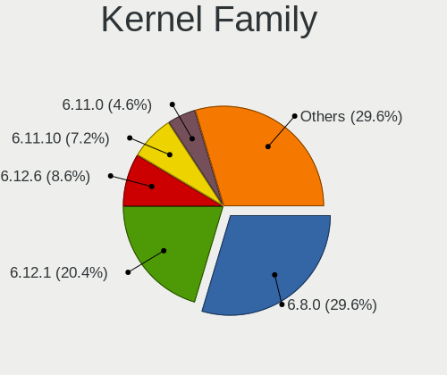
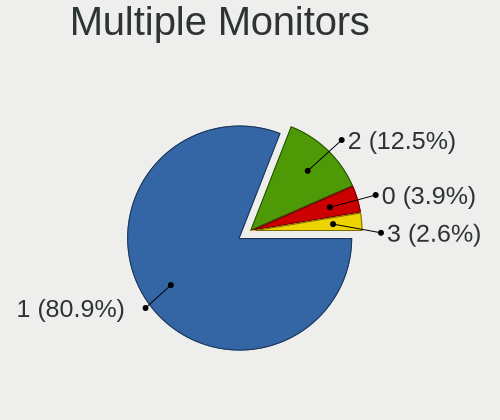
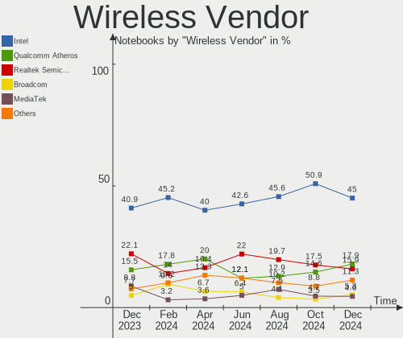

Linux in Italy - Hardware Trends (Notebooks)
--------------------------------------------

A project to identify most popular hardware characteristics and track their change
over time based on data collected by Linux users at https://Linux-Hardware.org.

Anyone can contribute to this report by the [hw-probe](https://github.com/linuxhw/hw-probe) tool:

    sudo -E hw-probe -all -upload

Period: Jan, 2023.

Contents
--------

* [ System ](#system)
  - [ OS                       ](#os)
  - [ OS Family                ](#os-family)
  - [ Kernel                   ](#kernel)
  - [ Kernel Family            ](#kernel-family)
  - [ Kernel Major Ver.        ](#kernel-major-ver)
  - [ Arch                     ](#arch)
  - [ DE                       ](#de)
  - [ Display Server           ](#display-server)
  - [ Display Manager          ](#display-manager)
  - [ OS Lang                  ](#os-lang)
  - [ Boot Mode                ](#boot-mode)
  - [ Filesystem               ](#filesystem)
  - [ Part. scheme             ](#part-scheme)
  - [ Dual Boot with Linux/BSD ](#dual-boot-with-linuxbsd)
  - [ Dual Boot (Win)          ](#dual-boot-win)

* [ Board ](#board)
  - [ Vendor                   ](#vendor)
  - [ Model                    ](#model)
  - [ Model Family             ](#model-family)
  - [ MFG Year                 ](#mfg-year)
  - [ Form Factor              ](#form-factor)
  - [ Secure Boot              ](#secure-boot)
  - [ Coreboot                 ](#coreboot)
  - [ RAM Size                 ](#ram-size)
  - [ RAM Used                 ](#ram-used)
  - [ Total Drives             ](#total-drives)
  - [ Has CD-ROM               ](#has-cd-rom)
  - [ Has Ethernet             ](#has-ethernet)
  - [ Has WiFi                 ](#has-wifi)
  - [ Has Bluetooth            ](#has-bluetooth)

* [ Location ](#location)
  - [ Country                  ](#country)
  - [ City                     ](#city)

* [ Drives ](#drives)
  - [ Drive Vendor             ](#drive-vendor)
  - [ Drive Model              ](#drive-model)
  - [ HDD Vendor               ](#hdd-vendor)
  - [ SSD Vendor               ](#ssd-vendor)
  - [ Drive Kind               ](#drive-kind)
  - [ Drive Connector          ](#drive-connector)
  - [ Drive Size               ](#drive-size)
  - [ Space Total              ](#space-total)
  - [ Space Used               ](#space-used)
  - [ Malfunc. Drives          ](#malfunc-drives)
  - [ Malfunc. Drive Vendor    ](#malfunc-drive-vendor)
  - [ Malfunc. HDD Vendor      ](#malfunc-hdd-vendor)
  - [ Malfunc. Drive Kind      ](#malfunc-drive-kind)
  - [ Failed Drives            ](#failed-drives)
  - [ Failed Drive Vendor      ](#failed-drive-vendor)
  - [ Drive Status             ](#drive-status)

* [ Storage controller ](#storage-controller)
  - [ Storage Vendor           ](#storage-vendor)
  - [ Storage Model            ](#storage-model)
  - [ Storage Kind             ](#storage-kind)

* [ Processor ](#processor)
  - [ CPU Vendor               ](#cpu-vendor)
  - [ CPU Model                ](#cpu-model)
  - [ CPU Model Family         ](#cpu-model-family)
  - [ CPU Cores                ](#cpu-cores)
  - [ CPU Sockets              ](#cpu-sockets)
  - [ CPU Threads              ](#cpu-threads)
  - [ CPU Op-Modes             ](#cpu-op-modes)
  - [ CPU Microcode            ](#cpu-microcode)
  - [ CPU Microarch            ](#cpu-microarch)

* [ Graphics ](#graphics)
  - [ GPU Vendor               ](#gpu-vendor)
  - [ GPU Model                ](#gpu-model)
  - [ GPU Combo                ](#gpu-combo)
  - [ GPU Driver               ](#gpu-driver)
  - [ GPU Memory               ](#gpu-memory)

* [ Monitor ](#monitor)
  - [ Monitor Vendor           ](#monitor-vendor)
  - [ Monitor Model            ](#monitor-model)
  - [ Monitor Resolution       ](#monitor-resolution)
  - [ Monitor Diagonal         ](#monitor-diagonal)
  - [ Monitor Width            ](#monitor-width)
  - [ Aspect Ratio             ](#aspect-ratio)
  - [ Monitor Area             ](#monitor-area)
  - [ Pixel Density            ](#pixel-density)
  - [ Multiple Monitors        ](#multiple-monitors)

* [ Network ](#network)
  - [ Net Controller Vendor    ](#net-controller-vendor)
  - [ Net Controller Model     ](#net-controller-model)
  - [ Wireless Vendor          ](#wireless-vendor)
  - [ Wireless Model           ](#wireless-model)
  - [ Ethernet Vendor          ](#ethernet-vendor)
  - [ Ethernet Model           ](#ethernet-model)
  - [ Net Controller Kind      ](#net-controller-kind)
  - [ Used Controller          ](#used-controller)
  - [ NICs                     ](#nics)
  - [ IPv6                     ](#ipv6)

* [ Bluetooth ](#bluetooth)
  - [ Bluetooth Vendor         ](#bluetooth-vendor)
  - [ Bluetooth Model          ](#bluetooth-model)

* [ Sound ](#sound)
  - [ Sound Vendor             ](#sound-vendor)
  - [ Sound Model              ](#sound-model)

* [ Memory ](#memory)
  - [ Memory Vendor            ](#memory-vendor)
  - [ Memory Model             ](#memory-model)
  - [ Memory Kind              ](#memory-kind)
  - [ Memory Form Factor       ](#memory-form-factor)
  - [ Memory Size              ](#memory-size)
  - [ Memory Speed             ](#memory-speed)

* [ Printers & scanners ](#printers--scanners)
  - [ Printer Vendor           ](#printer-vendor)
  - [ Printer Model            ](#printer-model)
  - [ Scanner Vendor           ](#scanner-vendor)
  - [ Scanner Model            ](#scanner-model)

* [ Camera ](#camera)
  - [ Camera Vendor            ](#camera-vendor)
  - [ Camera Model             ](#camera-model)

* [ Security ](#security)
  - [ Fingerprint Vendor       ](#fingerprint-vendor)
  - [ Fingerprint Model        ](#fingerprint-model)
  - [ Chipcard Vendor          ](#chipcard-vendor)
  - [ Chipcard Model           ](#chipcard-model)

* [ Unsupported ](#unsupported)
  - [ Unsupported Devices      ](#unsupported-devices)
  - [ Unsupported Device Types ](#unsupported-device-types)

System
------

OS
--

Installed operating systems

| Name                         | Notebooks | Percent |
|------------------------------|-----------|---------|
| Linux Mint 21.1              | 29        | 16.67%  |
| Ubuntu 22.04                 | 20        | 11.49%  |
| OpenMandriva 23.01           | 18        | 10.34%  |
| Fedora 37                    | 15        | 8.62%   |
| Arch Rolling                 | 13        | 7.47%   |
| Ubuntu 22.10                 | 10        | 5.75%   |
| Ubuntu 20.04                 | 6         | 3.45%   |
| Zorin 16                     | 4         | 2.3%    |
| Pop!_OS 22.04                | 4         | 2.3%    |
| EndeavourOS Rolling          | 4         | 2.3%    |
| Debian 11                    | 4         | 2.3%    |
| openSUSE Tumbleweed-XXXXXXXX | 3         | 1.72%   |
| OpenMandriva 4.3             | 3         | 1.72%   |
| Linux Mint 20.3              | 3         | 1.72%   |
| KDE neon 22.04               | 3         | 1.72%   |
| SteamOS 3.4.4                | 2         | 1.15%   |
| Manjaro 22.0.1               | 2         | 1.15%   |
| Manjaro                      | 2         | 1.15%   |
| Lubuntu 22.04                | 2         | 1.15%   |
| LMDE 5                       | 2         | 1.15%   |
| Linux Mint 21                | 2         | 1.15%   |
| Linux Mint 20                | 2         | 1.15%   |
| Kubuntu 22.10                | 2         | 1.15%   |
| Kubuntu 22.04                | 2         | 1.15%   |
| Elementary 6.1               | 2         | 1.15%   |
| Debian                       | 2         | 1.15%   |
| Xubuntu 22.10                | 1         | 0.57%   |
| Xubuntu 22.04                | 1         | 0.57%   |
| Ubuntu MATE 22.04            | 1         | 0.57%   |
| Ubuntu 18.04                 | 1         | 0.57%   |
| Slackware 15.0               | 1         | 0.57%   |
| ROSA 12.3                    | 1         | 0.57%   |
| Rocky Linux 8.7              | 1         | 0.57%   |
| PureOS 10                    | 1         | 0.57%   |
| OpenMandriva 22.12           | 1         | 0.57%   |
| Linux Lite 6.2               | 1         | 0.57%   |
| Fedora 36                    | 1         | 0.57%   |
| Devuan 4                     | 1         | 0.57%   |
| Debian 10                    | 1         | 0.57%   |

OS Family
---------

OS without a version

| Name         | Notebooks | Percent |
|--------------|-----------|---------|
| Ubuntu       | 37        | 21.26%  |
| Linux Mint   | 36        | 20.69%  |
| OpenMandriva | 22        | 12.64%  |
| Fedora       | 16        | 9.2%    |
| Arch         | 13        | 7.47%   |
| Debian       | 7         | 4.02%   |
| Zorin        | 4         | 2.3%    |
| Pop!_OS      | 4         | 2.3%    |
| Manjaro      | 4         | 2.3%    |
| Kubuntu      | 4         | 2.3%    |
| EndeavourOS  | 4         | 2.3%    |
| openSUSE     | 3         | 1.72%   |
| KDE neon     | 3         | 1.72%   |
| Xubuntu      | 2         | 1.15%   |
| SteamOS      | 2         | 1.15%   |
| Lubuntu      | 2         | 1.15%   |
| LMDE         | 2         | 1.15%   |
| Elementary   | 2         | 1.15%   |
| Ubuntu MATE  | 1         | 0.57%   |
| Slackware    | 1         | 0.57%   |
| ROSA         | 1         | 0.57%   |
| Rocky Linux  | 1         | 0.57%   |
| PureOS       | 1         | 0.57%   |
| Linux Lite   | 1         | 0.57%   |
| Devuan       | 1         | 0.57%   |

Kernel
------

Version of the Linux kernel

| Version                  | Notebooks | Percent |
|--------------------------|-----------|---------|
| 5.15.0-58-generic        | 29        | 16.67%  |
| 5.15.0-56-generic        | 19        | 10.92%  |
| 6.1.1-desktop-1omv2290   | 17        | 9.77%   |
| 5.15.0-57-generic        | 11        | 6.32%   |
| 5.19.0-29-generic        | 7         | 4.02%   |
| 6.0.18-300.fc37.x86_64   | 4         | 2.3%    |
| 5.4.0-137-generic        | 4         | 2.3%    |
| 5.15.0-43-generic        | 4         | 2.3%    |
| 5.10.0-20-amd64          | 4         | 2.3%    |
| 6.1.6-arch1-3            | 3         | 1.72%   |
| 6.0.12-76060006-generic  | 3         | 1.72%   |
| 5.16.7-desktop-1omv4003  | 3         | 1.72%   |
| 6.1.8-arch1-1            | 2         | 1.15%   |
| 6.1.7-200.fc37.x86_64    | 2         | 1.15%   |
| 6.1.7-1-MANJARO          | 2         | 1.15%   |
| 6.1.6-zen1-1-zen         | 2         | 1.15%   |
| 6.1.5-200.fc37.x86_64    | 2         | 1.15%   |
| 6.1.4-arch1-1            | 2         | 1.15%   |
| 6.1.2-zen1-1-zen         | 2         | 1.15%   |
| 6.0.7-301.fc37.x86_64    | 2         | 1.15%   |
| 6.0.16-300.fc37.x86_64   | 2         | 1.15%   |
| 6.0.15-300.fc37.x86_64   | 2         | 1.15%   |
| 5.15.0-53-generic        | 2         | 1.15%   |
| 5.13.0-valve36-1-neptune | 2         | 1.15%   |
| 5.10.0-21-amd64          | 2         | 1.15%   |
| 5.10.0-16-amd64          | 2         | 1.15%   |
| 6.1.7-arch1-1            | 1         | 0.57%   |
| 6.1.7-060107-generic     | 1         | 0.57%   |
| 6.1.5-arch2-1            | 1         | 0.57%   |
| 6.1.4-desktop-1omv2301   | 1         | 0.57%   |
| 6.1.4-1-default          | 1         | 0.57%   |
| 6.1.3-zen1-1-zen         | 1         | 0.57%   |
| 6.1.3-1-default          | 1         | 0.57%   |
| 6.1.2-arch1-1            | 1         | 0.57%   |
| 6.1.1-1-default          | 1         | 0.57%   |
| 6.1.0-1-amd64            | 1         | 0.57%   |
| 6.0.9-060009-generic     | 1         | 0.57%   |
| 6.0.6-060006-generic     | 1         | 0.57%   |
| 6.0.17-300.fc37.x86_64   | 1         | 0.57%   |
| 6.0.15-200.fc36.x86_64   | 1         | 0.57%   |

Kernel Family
-------------

Linux kernel without a distro release

| Version | Notebooks | Percent |
|---------|-----------|---------|
| 5.15.0  | 66        | 37.93%  |
| 6.1.1   | 18        | 10.34%  |
| 5.19.0  | 13        | 7.47%   |
| 5.10.0  | 8         | 4.6%    |
| 5.4.0   | 7         | 4.02%   |
| 6.1.7   | 6         | 3.45%   |
| 6.1.6   | 5         | 2.87%   |
| 6.1.4   | 4         | 2.3%    |
| 6.0.18  | 4         | 2.3%    |
| 6.1.5   | 3         | 1.72%   |
| 6.1.2   | 3         | 1.72%   |
| 6.0.15  | 3         | 1.72%   |
| 6.0.12  | 3         | 1.72%   |
| 5.16.7  | 3         | 1.72%   |
| 6.1.8   | 2         | 1.15%   |
| 6.1.3   | 2         | 1.15%   |
| 6.0.7   | 2         | 1.15%   |
| 6.0.16  | 2         | 1.15%   |
| 5.19.17 | 2         | 1.15%   |
| 5.14.0  | 2         | 1.15%   |
| 5.13.0  | 2         | 1.15%   |
| 6.1.0   | 1         | 0.57%   |
| 6.0.9   | 1         | 0.57%   |
| 6.0.6   | 1         | 0.57%   |
| 6.0.17  | 1         | 0.57%   |
| 6.0.10  | 1         | 0.57%   |
| 6.0.0   | 1         | 0.57%   |
| 5.19.7  | 1         | 0.57%   |
| 5.18.16 | 1         | 0.57%   |
| 5.15.89 | 1         | 0.57%   |
| 5.15.85 | 1         | 0.57%   |
| 5.15.75 | 1         | 0.57%   |
| 4.19.0  | 1         | 0.57%   |
| 4.18.0  | 1         | 0.57%   |
| 4.10.0  | 1         | 0.57%   |

Kernel Major Ver.
-----------------

Linux kernel major version

| Version | Notebooks | Percent |
|---------|-----------|---------|
| 5.15    | 69        | 39.66%  |
| 6.1     | 44        | 25.29%  |
| 6.0     | 19        | 10.92%  |
| 5.19    | 16        | 9.2%    |
| 5.10    | 8         | 4.6%    |
| 5.4     | 7         | 4.02%   |
| 5.16    | 3         | 1.72%   |
| 5.14    | 2         | 1.15%   |
| 5.13    | 2         | 1.15%   |
| 5.18    | 1         | 0.57%   |
| 4.19    | 1         | 0.57%   |
| 4.18    | 1         | 0.57%   |
| 4.10    | 1         | 0.57%   |

Arch
----

OS architecture (x86_64, i586, etc.)

| Name   | Notebooks | Percent |
|--------|-----------|---------|
| x86_64 | 173       | 99.43%  |
| i686   | 1         | 0.57%   |

DE
--

Desktop Environment

| Name       | Notebooks | Percent |
|------------|-----------|---------|
| GNOME      | 70        | 40.23%  |
| KDE5       | 45        | 25.86%  |
| X-Cinnamon | 33        | 18.97%  |
| XFCE       | 13        | 7.47%   |
| Pantheon   | 3         | 1.72%   |
| LXQt       | 3         | 1.72%   |
| Unity      | 1         | 0.57%   |
| MATE       | 1         | 0.57%   |
| kde        | 1         | 0.57%   |
| i3         | 1         | 0.57%   |
| Cinnamon   | 1         | 0.57%   |
| bspwm      | 1         | 0.57%   |
| Unknown    | 1         | 0.57%   |

Display Server
--------------

X11 or Wayland

| Name    | Notebooks | Percent |
|---------|-----------|---------|
| X11     | 125       | 71.84%  |
| Wayland | 48        | 27.59%  |
| Unknown | 1         | 0.57%   |

Display Manager
---------------

SDDM, LightDM, etc.

| Name    | Notebooks | Percent |
|---------|-----------|---------|
| Unknown | 43        | 24.71%  |
| SDDM    | 39        | 22.41%  |
| GDM3    | 37        | 21.26%  |
| LightDM | 34        | 19.54%  |
| GDM     | 20        | 11.49%  |
| SLiM    | 1         | 0.57%   |

OS Lang
-------

Language

| Lang       | Notebooks | Percent |
|------------|-----------|---------|
| it_IT      | 98        | 56.32%  |
| en_US      | 62        | 35.63%  |
| en_GB      | 7         | 4.02%   |
| C          | 4         | 2.3%    |
| de_DE      | 2         | 1.15%   |
| it_IT@euro | 1         | 0.57%   |

Boot Mode
---------

EFI or BIOS

| Mode | Notebooks | Percent |
|------|-----------|---------|
| EFI  | 118       | 67.82%  |
| BIOS | 56        | 32.18%  |

Filesystem
----------

Type of filesystem

| Type    | Notebooks | Percent |
|---------|-----------|---------|
| Ext4    | 122       | 70.11%  |
| Overlay | 27        | 15.52%  |
| Btrfs   | 23        | 13.22%  |
| Zfs     | 1         | 0.57%   |
| Xfs     | 1         | 0.57%   |

Part. scheme
------------

Scheme of partitioning

| Type    | Notebooks | Percent |
|---------|-----------|---------|
| GPT     | 122       | 70.11%  |
| Unknown | 42        | 24.14%  |
| MBR     | 10        | 5.75%   |

Dual Boot with Linux/BSD
------------------------

Hosting more than one Linux/BSD

| Dual boot | Notebooks | Percent |
|-----------|-----------|---------|
| No        | 144       | 82.76%  |
| Yes       | 30        | 17.24%  |

Dual Boot (Win)
---------------

Hosting Linux and Windows

| Dual boot | Notebooks | Percent |
|-----------|-----------|---------|
| No        | 119       | 68.39%  |
| Yes       | 55        | 31.61%  |

Board
-----

Vendor
------

Motherboard manufacturer

| Name                | Notebooks | Percent |
|---------------------|-----------|---------|
| Hewlett-Packard     | 46        | 26.44%  |
| Lenovo              | 29        | 16.67%  |
| Acer                | 19        | 10.92%  |
| ASUSTek Computer    | 18        | 10.34%  |
| Dell                | 16        | 9.2%    |
| HUAWEI              | 10        | 5.75%   |
| Apple               | 5         | 2.87%   |
| Toshiba             | 4         | 2.3%    |
| MSI                 | 4         | 2.3%    |
| Sony                | 3         | 1.72%   |
| Notebook            | 3         | 1.72%   |
| Valve               | 2         | 1.15%   |
| TUXEDO              | 2         | 1.15%   |
| Timi                | 2         | 1.15%   |
| Google              | 2         | 1.15%   |
| Fujitsu             | 2         | 1.15%   |
| Unknown             | 2         | 1.15%   |
| Samsung Electronics | 1         | 0.57%   |
| Olivetti            | 1         | 0.57%   |
| Kiano               | 1         | 0.57%   |
| Insyde              | 1         | 0.57%   |
| Chuwi               | 1         | 0.57%   |

Model
-----

Motherboard model

| Name                                        | Notebooks | Percent |
|---------------------------------------------|-----------|---------|
| HP Notebook                                 | 5         | 2.87%   |
| HP Pavilion dv7                             | 3         | 1.72%   |
| HP 15                                       | 3         | 1.72%   |
| Valve Jupiter                               | 2         | 1.15%   |
| Lenovo ThinkPad T14 Gen 2i 20W0CTO1WW       | 2         | 1.15%   |
| Lenovo IdeaPad 330S-15IKB 81F5              | 2         | 1.15%   |
| HUAWEI KPL-W0X                              | 2         | 1.15%   |
| HUAWEI KLVL-WXX9                            | 2         | 1.15%   |
| HP Pavilion x2 Detachable                   | 2         | 1.15%   |
| HP Pavilion dv6                             | 2         | 1.15%   |
| HP 255 G8 Notebook PC                       | 2         | 1.15%   |
| Acer Aspire E5-573G                         | 2         | 1.15%   |
| Unknown                                     | 2         | 1.15%   |
| TUXEDO Pulse 15 Gen1                        | 1         | 0.57%   |
| TUXEDO Aura 15 Gen1                         | 1         | 0.57%   |
| Toshiba Satellite Pro S500                  | 1         | 0.57%   |
| Toshiba Satellite Pro C850-1HD              | 1         | 0.57%   |
| Toshiba Satellite Pro C850-10L              | 1         | 0.57%   |
| Toshiba Satellite Pro C50-A-1FD             | 1         | 0.57%   |
| Timi TM1701                                 | 1         | 0.57%   |
| Timi RedmiBook 16                           | 1         | 0.57%   |
| Sony SVT1312M1ES                            | 1         | 0.57%   |
| Sony SVE1711C5E                             | 1         | 0.57%   |
| Sony SVE1513C5E                             | 1         | 0.57%   |
| Samsung RV411/RV511/E3511/S3511/RV711/E3411 | 1         | 0.57%   |
| Olivetti Olibook P55-431W850-8G500H-O       | 1         | 0.57%   |
| Notebook PCX0DX                             | 1         | 0.57%   |
| Notebook NP5x_NP6x_NP7xPNK_PNH_PNJ          | 1         | 0.57%   |
| Notebook NL40_50CU                          | 1         | 0.57%   |
| MSI PS63 Modern 8RC                         | 1         | 0.57%   |
| MSI Prestige 15 A12SC                       | 1         | 0.57%   |
| MSI Prestige 15 A11SCX                      | 1         | 0.57%   |
| MSI Modern 15 A11M                          | 1         | 0.57%   |
| Lenovo V15-IIL 82C5                         | 1         | 0.57%   |
| Lenovo ThinkPad X270 W10DG 20K5S3HG00       | 1         | 0.57%   |
| Lenovo ThinkPad X220 42915CG                | 1         | 0.57%   |
| Lenovo ThinkPad W541 20EGS24J00             | 1         | 0.57%   |
| Lenovo ThinkPad W541 20EFCTO1WW             | 1         | 0.57%   |
| Lenovo ThinkPad T430 2349KB4                | 1         | 0.57%   |
| Lenovo ThinkPad T16 Gen 1 21CHCTO1WW        | 1         | 0.57%   |

Model Family
------------

Motherboard model prefix

| Name              | Notebooks | Percent |
|-------------------|-----------|---------|
| HP Pavilion       | 15        | 8.62%   |
| Acer Aspire       | 14        | 8.05%   |
| Lenovo ThinkPad   | 13        | 7.47%   |
| Lenovo IdeaPad    | 12        | 6.9%    |
| HP ProBook        | 5         | 2.87%   |
| HP Notebook       | 5         | 2.87%   |
| HP Laptop         | 5         | 2.87%   |
| Dell XPS          | 5         | 2.87%   |
| Dell Latitude     | 5         | 2.87%   |
| Toshiba Satellite | 4         | 2.3%    |
| Dell Precision    | 4         | 2.3%    |
| ASUS VivoBook     | 4         | 2.3%    |
| HP EliteBook      | 3         | 1.72%   |
| HP 250            | 3         | 1.72%   |
| HP 15             | 3         | 1.72%   |
| Acer Swift        | 3         | 1.72%   |
| Valve Jupiter     | 2         | 1.15%   |
| MSI Prestige      | 2         | 1.15%   |
| HUAWEI KPL-W0X    | 2         | 1.15%   |
| HUAWEI KLVL-WXX9  | 2         | 1.15%   |
| HP 255            | 2         | 1.15%   |
| Fujitsu LIFEBOOK  | 2         | 1.15%   |
| ASUS ASUS         | 2         | 1.15%   |
| Acer TravelMate   | 2         | 1.15%   |
| Unknown           | 2         | 1.15%   |
| TUXEDO Pulse      | 1         | 0.57%   |
| TUXEDO Aura       | 1         | 0.57%   |
| Timi TM1701       | 1         | 0.57%   |
| Timi RedmiBook    | 1         | 0.57%   |
| Sony SVT1312M1ES  | 1         | 0.57%   |
| Sony SVE1711C5E   | 1         | 0.57%   |
| Sony SVE1513C5E   | 1         | 0.57%   |
| Samsung RV411     | 1         | 0.57%   |
| Olivetti Olibook  | 1         | 0.57%   |
| Notebook PCX0DX   | 1         | 0.57%   |
| Notebook NP5x     | 1         | 0.57%   |
| Notebook NL40     | 1         | 0.57%   |
| MSI PS63          | 1         | 0.57%   |
| MSI Modern        | 1         | 0.57%   |
| Lenovo V15-IIL    | 1         | 0.57%   |

MFG Year
--------

Motherboard manufacture year

| Year | Notebooks | Percent |
|------|-----------|---------|
| 2020 | 27        | 15.52%  |
| 2021 | 23        | 13.22%  |
| 2022 | 15        | 8.62%   |
| 2015 | 15        | 8.62%   |
| 2013 | 15        | 8.62%   |
| 2019 | 14        | 8.05%   |
| 2018 | 11        | 6.32%   |
| 2016 | 10        | 5.75%   |
| 2012 | 9         | 5.17%   |
| 2017 | 8         | 4.6%    |
| 2010 | 8         | 4.6%    |
| 2014 | 7         | 4.02%   |
| 2008 | 6         | 3.45%   |
| 2011 | 3         | 1.72%   |
| 2009 | 3         | 1.72%   |

Form Factor
-----------

Physical design of the computer

| Name     | Notebooks | Percent |
|----------|-----------|---------|
| Notebook | 174       | 100%    |

Secure Boot
-----------

Enabled or disabled

| State    | Notebooks | Percent |
|----------|-----------|---------|
| Disabled | 155       | 89.08%  |
| Enabled  | 19        | 10.92%  |

Coreboot
--------

Have coreboot on board

| Used | Notebooks | Percent |
|------|-----------|---------|
| No   | 172       | 98.85%  |
| Yes  | 2         | 1.15%   |

RAM Size
--------

Total RAM memory

| Size in GB  | Notebooks | Percent |
|-------------|-----------|---------|
| 4.01-8.0    | 62        | 35.63%  |
| 8.01-16.0   | 35        | 20.11%  |
| 16.01-24.0  | 29        | 16.67%  |
| 3.01-4.0    | 26        | 14.94%  |
| 32.01-64.0  | 14        | 8.05%   |
| 1.01-2.0    | 4         | 2.3%    |
| 24.01-32.0  | 2         | 1.15%   |
| 2.01-3.0    | 1         | 0.57%   |
| 64.01-256.0 | 1         | 0.57%   |

RAM Used
--------

Used RAM memory

| Used GB    | Notebooks | Percent |
|------------|-----------|---------|
| 1.01-2.0   | 59        | 33.91%  |
| 2.01-3.0   | 52        | 29.89%  |
| 4.01-8.0   | 26        | 14.94%  |
| 3.01-4.0   | 22        | 12.64%  |
| 8.01-16.0  | 9         | 5.17%   |
| 0.51-1.0   | 5         | 2.87%   |
| 24.01-32.0 | 1         | 0.57%   |

Total Drives
------------

Number of drives on board

| Drives | Notebooks | Percent |
|--------|-----------|---------|
| 1      | 133       | 76.44%  |
| 2      | 37        | 21.26%  |
| 3      | 2         | 1.15%   |
| 0      | 2         | 1.15%   |

Has CD-ROM
----------

Has CD-ROM on board

| Presented | Notebooks | Percent |
|-----------|-----------|---------|
| No        | 120       | 68.97%  |
| Yes       | 54        | 31.03%  |

Has Ethernet
------------

Has Ethernet on board

| Presented | Notebooks | Percent |
|-----------|-----------|---------|
| Yes       | 124       | 71.26%  |
| No        | 50        | 28.74%  |

Has WiFi
--------

Has WiFi module

| Presented | Notebooks | Percent |
|-----------|-----------|---------|
| Yes       | 172       | 98.85%  |
| No        | 2         | 1.15%   |

Has Bluetooth
-------------

Has Bluetooth module

| Presented | Notebooks | Percent |
|-----------|-----------|---------|
| Yes       | 147       | 84.48%  |
| No        | 27        | 15.52%  |

Location
--------

Country
-------

Geographic location (country)

| Country | Notebooks | Percent |
|---------|-----------|---------|
| Italy   | 174       | 100%    |

City
----

Geographic location (city)

| City                   | Notebooks | Percent |
|------------------------|-----------|---------|
| Rome                   | 21        | 12.07%  |
| Milan                  | 19        | 10.92%  |
| Turin                  | 5         | 2.87%   |
| Venice                 | 4         | 2.3%    |
| Sesto San Giovanni     | 4         | 2.3%    |
| Rho                    | 4         | 2.3%    |
| Milano                 | 4         | 2.3%    |
| Catania                | 3         | 1.72%   |
| Bologna                | 3         | 1.72%   |
| Verona                 | 2         | 1.15%   |
| Siena                  | 2         | 1.15%   |
| Pescara                | 2         | 1.15%   |
| Palermo                | 2         | 1.15%   |
| Montescudo             | 2         | 1.15%   |
| Genoa                  | 2         | 1.15%   |
| Florence               | 2         | 1.15%   |
| Chieri                 | 2         | 1.15%   |
| Castelverde            | 2         | 1.15%   |
| Cagliari               | 2         | 1.15%   |
| Zagarolo               | 1         | 0.57%   |
| Vicenza                | 1         | 0.57%   |
| Veruno                 | 1         | 0.57%   |
| Turate                 | 1         | 0.57%   |
| Triggiano              | 1         | 0.57%   |
| Torre de' Picenardi    | 1         | 0.57%   |
| Tirano                 | 1         | 0.57%   |
| Tempio Pausania        | 1         | 0.57%   |
| Spinea                 | 1         | 0.57%   |
| Sori                   | 1         | 0.57%   |
| Sondrio                | 1         | 0.57%   |
| Siculiana              | 1         | 0.57%   |
| Sesto Fiorentino       | 1         | 0.57%   |
| Seregno                | 1         | 0.57%   |
| Sedriano               | 1         | 0.57%   |
| Scafati                | 1         | 0.57%   |
| Saronno                | 1         | 0.57%   |
| Santhià               | 1         | 0.57%   |
| San Bernardino Verbano | 1         | 0.57%   |
| Samarate               | 1         | 0.57%   |
| Salerno                | 1         | 0.57%   |

Drives
------

Drive Vendor
------------

Hard drive vendors

| Vendor                      | Notebooks | Drives | Percent |
|-----------------------------|-----------|--------|---------|
| Samsung Electronics         | 43        | 45     | 20.57%  |
| WDC                         | 22        | 22     | 10.53%  |
| Sandisk                     | 17        | 18     | 8.13%   |
| Unknown                     | 14        | 15     | 6.7%    |
| Toshiba                     | 12        | 12     | 5.74%   |
| Crucial                     | 12        | 12     | 5.74%   |
| SK hynix                    | 10        | 10     | 4.78%   |
| Kingston                    | 10        | 10     | 4.78%   |
| Seagate                     | 8         | 8      | 3.83%   |
| Micron Technology           | 7         | 7      | 3.35%   |
| Intel                       | 7         | 8      | 3.35%   |
| HGST                        | 7         | 7      | 3.35%   |
| KIOXIA                      | 6         | 6      | 2.87%   |
| Hitachi                     | 5         | 5      | 2.39%   |
| Phison Electronics          | 3         | 3      | 1.44%   |
| China                       | 3         | 3      | 1.44%   |
| Transcend                   | 2         | 2      | 0.96%   |
| Micron/Crucial Technology   | 2         | 2      | 0.96%   |
| Maxtor                      | 2         | 2      | 0.96%   |
| LITEON                      | 2         | 2      | 0.96%   |
| Kingston Technology Company | 2         | 2      | 0.96%   |
| UMIS                        | 1         | 1      | 0.48%   |
| Teclast                     | 1         | 1      | 0.48%   |
| SPCC                        | 1         | 1      | 0.48%   |
| SABRENT                     | 1         | 1      | 0.48%   |
| Phison                      | 1         | 1      | 0.48%   |
| Netac                       | 1         | 1      | 0.48%   |
| Inateck                     | 1         | 1      | 0.48%   |
| Hewlett-Packard             | 1         | 1      | 0.48%   |
| Fujitsu                     | 1         | 1      | 0.48%   |
| Dogfish                     | 1         | 1      | 0.48%   |
| BAITITON                    | 1         | 1      | 0.48%   |
| ADATA SP                    | 1         | 1      | 0.48%   |
| Unknown                     | 1         | 1      | 0.48%   |

Drive Model
-----------

Hard drive models

| Model                                                | Notebooks | Percent |
|------------------------------------------------------|-----------|---------|
| Samsung NVMe SSD Controller SM981/PM981/PM983 500GB  | 5         | 2.35%   |
| Toshiba MQ01ABF050 500GB                             | 4         | 1.88%   |
| Sandisk WD Black SN750 / PC SN730 NVMe SSD 1TB       | 4         | 1.88%   |
| Crucial CT500MX500SSD1 500GB                         | 4         | 1.88%   |
| Unknown MMC Card  64GB                               | 3         | 1.41%   |
| SK hynix BC511 512GB                                 | 3         | 1.41%   |
| Samsung SSD 870 QVO 1TB                              | 3         | 1.41%   |
| Samsung SSD 860 EVO 500GB                            | 3         | 1.41%   |
| Intel SSD 660P Series 512GB                          | 3         | 1.41%   |
| Crucial CT1000BX500SSD1 1TB                          | 3         | 1.41%   |
| WDC WDS250G2B0B-00YS70 250GB SSD                     | 2         | 0.94%   |
| WDC WDS100T2B0A-00SM50 1TB SSD                       | 2         | 0.94%   |
| Unknown MMC Card  32GB                               | 2         | 0.94%   |
| Unknown MMC Card  16GB                               | 2         | 0.94%   |
| Toshiba MQ04ABF100 1TB                               | 2         | 0.94%   |
| Toshiba MQ01ABD100 1TB                               | 2         | 0.94%   |
| Seagate ST1000LM049-2GH172 1TB                       | 2         | 0.94%   |
| SanDisk SSD PLUS 1000GB                              | 2         | 0.94%   |
| Samsung PM9A1 NVMe 512GB                             | 2         | 0.94%   |
| Samsung NVMe SSD Controller PM9A1/PM9A3/980PRO 512GB | 2         | 0.94%   |
| Samsung MZVLQ1T0HALB-000H1 1TB                       | 2         | 0.94%   |
| Phison PS5013 E13 NVMe Controller 256GB              | 2         | 0.94%   |
| Micron/Crucial P2 NVMe PCIe SSD 500GB                | 2         | 0.94%   |
| Micron 2300 NVMe 1024GB                              | 2         | 0.94%   |
| Micron 2210_MTFDHBA512QFD 512GB                      | 2         | 0.94%   |
| Maxtor Z1 SSD 240GB                                  | 2         | 0.94%   |
| LITEON CV8-8E256 256GB SSD                           | 2         | 0.94%   |
| Kingston SV300S37A120G 120GB SSD                     | 2         | 0.94%   |
| Kingston SA400S37240G 240GB SSD                      | 2         | 0.94%   |
| Intel SSDPEKNW512GZL 512GB                           | 2         | 0.94%   |
| Hitachi HTS545050A7E380 500GB                        | 2         | 0.94%   |
| HGST HTS541075A9E680 752GB                           | 2         | 0.94%   |
| Crucial CT480BX500SSD1 480GB                         | 2         | 0.94%   |
| Crucial CT240BX500SSD1 240GB                         | 2         | 0.94%   |
| WDC WDS500G2B0A-00SM50 500GB SSD                     | 1         | 0.47%   |
| WDC WDS480G2G0B-00EPW0 480GB SSD                     | 1         | 0.47%   |
| WDC WDS240G2G0A-00JH30 240GB SSD                     | 1         | 0.47%   |
| WDC WDS100T2G0A-00JH30 1TB SSD                       | 1         | 0.47%   |
| WDC WD5000LPVX-60V0TT0 500GB                         | 1         | 0.47%   |
| WDC WD5000LPVX-22V0TT0 500GB                         | 1         | 0.47%   |

HDD Vendor
----------

Hard disk drive vendors

| Vendor  | Notebooks | Drives | Percent |
|---------|-----------|--------|---------|
| Toshiba | 10        | 10     | 25.64%  |
| Seagate | 8         | 8      | 20.51%  |
| WDC     | 7         | 7      | 17.95%  |
| HGST    | 7         | 7      | 17.95%  |
| Hitachi | 5         | 5      | 12.82%  |
| SABRENT | 1         | 1      | 2.56%   |
| Fujitsu | 1         | 1      | 2.56%   |

SSD Vendor
----------

Solid state drive vendors

| Vendor              | Notebooks | Drives | Percent |
|---------------------|-----------|--------|---------|
| Samsung Electronics | 16        | 17     | 21.62%  |
| Crucial             | 12        | 12     | 16.22%  |
| Kingston            | 9         | 9      | 12.16%  |
| WDC                 | 8         | 8      | 10.81%  |
| SanDisk             | 8         | 8      | 10.81%  |
| China               | 3         | 3      | 4.05%   |
| Transcend           | 2         | 2      | 2.7%    |
| SK hynix            | 2         | 2      | 2.7%    |
| Maxtor              | 2         | 2      | 2.7%    |
| LITEON              | 2         | 2      | 2.7%    |
| Teclast             | 1         | 1      | 1.35%   |
| SPCC                | 1         | 1      | 1.35%   |
| Netac               | 1         | 1      | 1.35%   |
| Micron Technology   | 1         | 1      | 1.35%   |
| Inateck             | 1         | 1      | 1.35%   |
| Hewlett-Packard     | 1         | 1      | 1.35%   |
| Dogfish             | 1         | 1      | 1.35%   |
| BAITITON            | 1         | 1      | 1.35%   |
| ADATA SP            | 1         | 1      | 1.35%   |
| Unknown             | 1         | 1      | 1.35%   |

Drive Kind
----------

HDD or SSD

| Kind | Notebooks | Drives | Percent |
|------|-----------|--------|---------|
| NVMe | 74        | 82     | 37.56%  |
| SSD  | 68        | 75     | 34.52%  |
| HDD  | 38        | 39     | 19.29%  |
| MMC  | 17        | 18     | 8.63%   |

Drive Connector
---------------

SATA, SAS, NVMe, etc.

| Type | Notebooks | Drives | Percent |
|------|-----------|--------|---------|
| SATA | 97        | 111    | 50.79%  |
| NVMe | 74        | 82     | 38.74%  |
| MMC  | 17        | 18     | 8.9%    |
| SAS  | 3         | 3      | 1.57%   |

Drive Size
----------

Size of hard drive

| Size in TB | Notebooks | Drives | Percent |
|------------|-----------|--------|---------|
| 0.01-0.5   | 69        | 75     | 65.09%  |
| 0.51-1.0   | 34        | 36     | 32.08%  |
| 1.01-2.0   | 2         | 2      | 1.89%   |
| 3.01-4.0   | 1         | 1      | 0.94%   |

Space Total
-----------

Amount of disk space available on the file system

| Size in GB | Notebooks | Percent |
|------------|-----------|---------|
| 251-500    | 47        | 27.01%  |
| 101-250    | 37        | 21.26%  |
| 501-1000   | 28        | 16.09%  |
| 1-20       | 26        | 14.94%  |
| 51-100     | 12        | 6.9%    |
| 1001-2000  | 10        | 5.75%   |
| 21-50      | 7         | 4.02%   |
| Unknown    | 5         | 2.87%   |
| 2001-3000  | 2         | 1.15%   |

Space Used
----------

Amount of used disk space

| Used GB  | Notebooks | Percent |
|----------|-----------|---------|
| 1-20     | 66        | 37.93%  |
| 21-50    | 31        | 17.82%  |
| 101-250  | 31        | 17.82%  |
| 251-500  | 18        | 10.34%  |
| 51-100   | 17        | 9.77%   |
| 501-1000 | 6         | 3.45%   |
| Unknown  | 5         | 2.87%   |

Malfunc. Drives
---------------

Drive models with a malfunction

| Model                            | Notebooks | Drives | Percent |
|----------------------------------|-----------|--------|---------|
| Toshiba MQ01ABF050 500GB         | 2         | 2      | 20%     |
| Toshiba MQ01ABD100 1TB           | 1         | 1      | 10%     |
| Kingston SV300S37A120G 120GB SSD | 1         | 1      | 10%     |
| Hitachi HTS547575A9E384 752GB    | 1         | 1      | 10%     |
| HGST HTS545050A7E680 500GB       | 1         | 1      | 10%     |
| HGST HTS541075A9E680 752GB       | 1         | 1      | 10%     |
| HGST HTS541010A7E630 1TB         | 1         | 1      | 10%     |
| Crucial CT1000BX500SSD1 1TB      | 1         | 1      | 10%     |
| BAITITON BT58SSD09S 240GB        | 1         | 1      | 10%     |

Malfunc. Drive Vendor
---------------------

Vendors of faulty drives

| Vendor   | Notebooks | Drives | Percent |
|----------|-----------|--------|---------|
| Toshiba  | 3         | 3      | 30%     |
| HGST     | 3         | 3      | 30%     |
| Kingston | 1         | 1      | 10%     |
| Hitachi  | 1         | 1      | 10%     |
| Crucial  | 1         | 1      | 10%     |
| BAITITON | 1         | 1      | 10%     |

Malfunc. HDD Vendor
-------------------

Vendors of faulty HDD drives

| Vendor  | Notebooks | Drives | Percent |
|---------|-----------|--------|---------|
| Toshiba | 3         | 3      | 42.86%  |
| HGST    | 3         | 3      | 42.86%  |
| Hitachi | 1         | 1      | 14.29%  |

Malfunc. Drive Kind
-------------------

Kinds of faulty drives

| Kind | Notebooks | Drives | Percent |
|------|-----------|--------|---------|
| HDD  | 7         | 7      | 70%     |
| SSD  | 3         | 3      | 30%     |

Failed Drives
-------------

Failed drive models

Zero info for selected period =(

Failed Drive Vendor
-------------------

Failed drive vendors

Zero info for selected period =(

Drive Status
------------

Number of failed and malfunc. drives

| Status   | Notebooks | Drives | Percent |
|----------|-----------|--------|---------|
| Works    | 88        | 100    | 48.35%  |
| Detected | 84        | 104    | 46.15%  |
| Malfunc  | 10        | 10     | 5.49%   |

Storage controller
------------------

Storage Vendor
--------------

Storage controller vendors

| Vendor                       | Notebooks | Percent |
|------------------------------|-----------|---------|
| Intel                        | 110       | 53.66%  |
| Samsung Electronics          | 27        | 13.17%  |
| AMD                          | 20        | 9.76%   |
| SanDisk                      | 14        | 6.83%   |
| SK hynix                     | 7         | 3.41%   |
| Micron Technology            | 6         | 2.93%   |
| KIOXIA                       | 6         | 2.93%   |
| Phison Electronics           | 4         | 1.95%   |
| Toshiba America Info Systems | 3         | 1.46%   |
| Kingston Technology Company  | 3         | 1.46%   |
| Nvidia                       | 2         | 0.98%   |
| Micron/Crucial Technology    | 2         | 0.98%   |
| Union Memory (Shenzhen)      | 1         | 0.49%   |

Storage Model
-------------

Storage controller models

| Model                                                                          | Notebooks | Percent |
|--------------------------------------------------------------------------------|-----------|---------|
| AMD FCH SATA Controller [AHCI mode]                                            | 19        | 8.96%   |
| Intel Sunrise Point-LP SATA Controller [AHCI mode]                             | 16        | 7.55%   |
| Intel Volume Management Device NVMe RAID Controller                            | 11        | 5.19%   |
| Intel 82801 Mobile SATA Controller [RAID mode]                                 | 11        | 5.19%   |
| Samsung NVMe SSD Controller 980                                                | 10        | 4.72%   |
| Intel 8 Series/C220 Series Chipset Family 6-port SATA Controller 1 [AHCI mode] | 10        | 4.72%   |
| Samsung NVMe SSD Controller SM981/PM981/PM983                                  | 9         | 4.25%   |
| Intel 7 Series Chipset Family 6-port SATA Controller [AHCI mode]               | 9         | 4.25%   |
| Intel 8 Series SATA Controller 1 [AHCI mode]                                   | 7         | 3.3%    |
| SanDisk WD Black SN750 / PC SN730 NVMe SSD                                     | 6         | 2.83%   |
| Micron Non-Volatile memory controller                                          | 6         | 2.83%   |
| Samsung NVMe SSD Controller PM9A1/PM9A3/980PRO                                 | 5         | 2.36%   |
| Intel Wildcat Point-LP SATA Controller [AHCI Mode]                             | 4         | 1.89%   |
| Intel SSD 660P Series                                                          | 4         | 1.89%   |
| Intel Comet Lake SATA AHCI Controller                                          | 4         | 1.89%   |
| Intel 82801IBM/IEM (ICH9M/ICH9M-E) 4 port SATA Controller [AHCI mode]          | 4         | 1.89%   |
| Toshiba America Info Systems XG6 NVMe SSD Controller                           | 3         | 1.42%   |
| SK hynix BC511                                                                 | 3         | 1.42%   |
| SanDisk Non-Volatile memory controller                                         | 3         | 1.42%   |
| KIOXIA NVMe SSD Controller BG4                                                 | 3         | 1.42%   |
| KIOXIA Non-Volatile memory controller                                          | 3         | 1.42%   |
| Intel Non-Volatile memory controller                                           | 3         | 1.42%   |
| Intel HM170/QM170 Chipset SATA Controller [AHCI Mode]                          | 3         | 1.42%   |
| Intel Celeron/Pentium Silver Processor SATA Controller                         | 3         | 1.42%   |
| Intel Cannon Point-LP SATA Controller [AHCI Mode]                              | 3         | 1.42%   |
| Intel 6 Series/C200 Series Chipset Family 6 port Mobile SATA AHCI Controller   | 3         | 1.42%   |
| Intel 5 Series/3400 Series Chipset 6 port SATA AHCI Controller                 | 3         | 1.42%   |
| Intel 5 Series/3400 Series Chipset 4 port SATA AHCI Controller                 | 3         | 1.42%   |
| SanDisk PC SN520 NVMe SSD                                                      | 2         | 0.94%   |
| Samsung NVMe SSD Controller SM951/PM951                                        | 2         | 0.94%   |
| Phison PS5013 E13 NVMe Controller                                              | 2         | 0.94%   |
| Micron/Crucial P2 NVMe PCIe SSD                                                | 2         | 0.94%   |
| Intel Tiger Lake-LP SATA Controller                                            | 2         | 0.94%   |
| Intel Ice Lake-LP SATA Controller [AHCI mode]                                  | 2         | 0.94%   |
| Intel Cannon Lake Mobile PCH SATA AHCI Controller                              | 2         | 0.94%   |
| Intel Atom Processor E3800 Series SATA AHCI Controller                         | 2         | 0.94%   |
| Intel Alder Lake-P SATA AHCI Controller                                        | 2         | 0.94%   |
| Intel 400 Series Chipset Family SATA AHCI Controller                           | 2         | 0.94%   |
| Union Memory (Shenzhen) Non-Volatile memory controller                         | 1         | 0.47%   |
| SK hynix PC401 NVMe Solid State Drive 256GB                                    | 1         | 0.47%   |

Storage Kind
------------

Kind of storage controller (IDE, SATA, NVMe, SAS, ...)

| Kind | Notebooks | Percent |
|------|-----------|---------|
| SATA | 109       | 52.66%  |
| NVMe | 75        | 36.23%  |
| RAID | 22        | 10.63%  |
| IDE  | 1         | 0.48%   |

Processor
---------

CPU Vendor
----------

Processor vendors

| Vendor | Notebooks | Percent |
|--------|-----------|---------|
| Intel  | 134       | 77.01%  |
| AMD    | 40        | 22.99%  |

CPU Model
---------

Processor models

| Model                                           | Notebooks | Percent |
|-------------------------------------------------|-----------|---------|
| Intel 11th Gen Core i7-1165G7 @ 2.80GHz         | 6         | 3.45%   |
| Intel Core i7-8565U CPU @ 1.80GHz               | 5         | 2.87%   |
| Intel Core i5-10210U CPU @ 1.60GHz              | 5         | 2.87%   |
| Intel 11th Gen Core i5-1135G7 @ 2.40GHz         | 5         | 2.87%   |
| Intel Core i7-8550U CPU @ 1.80GHz               | 4         | 2.3%    |
| Intel Core i5-8250U CPU @ 1.60GHz               | 4         | 2.3%    |
| Intel 12th Gen Core i7-12700H                   | 4         | 2.3%    |
| Intel Core i7-6500U CPU @ 2.50GHz               | 3         | 1.72%   |
| Intel Core i7-4500U CPU @ 1.80GHz               | 3         | 1.72%   |
| Intel Core i5-5200U CPU @ 2.20GHz               | 3         | 1.72%   |
| Intel 11th Gen Core i7-1185G7 @ 3.00GHz         | 3         | 1.72%   |
| AMD Ryzen 7 5700U with Radeon Graphics          | 3         | 1.72%   |
| AMD Ryzen 7 4800H with Radeon Graphics          | 3         | 1.72%   |
| AMD Ryzen 7 4700U with Radeon Graphics          | 3         | 1.72%   |
| AMD A10-9600P RADEON R5, 10 COMPUTE CORES 4C+6G | 3         | 1.72%   |
| Intel Core i7-7500U CPU @ 2.70GHz               | 2         | 1.15%   |
| Intel Core i7-6700HQ CPU @ 2.60GHz              | 2         | 1.15%   |
| Intel Core i7-10750H CPU @ 2.60GHz              | 2         | 1.15%   |
| Intel Core i5-7200U CPU @ 2.50GHz               | 2         | 1.15%   |
| Intel Core i5-6200U CPU @ 2.30GHz               | 2         | 1.15%   |
| Intel Core i5-4310M CPU @ 2.70GHz               | 2         | 1.15%   |
| Intel Core i5-4200U CPU @ 1.60GHz               | 2         | 1.15%   |
| Intel Core i5-4200M CPU @ 2.50GHz               | 2         | 1.15%   |
| Intel Core i5-3320M CPU @ 2.60GHz               | 2         | 1.15%   |
| Intel Core i5-3230M CPU @ 2.60GHz               | 2         | 1.15%   |
| Intel Core i5-1035G1 CPU @ 1.00GHz              | 2         | 1.15%   |
| Intel Core i5 CPU M 430 @ 2.27GHz               | 2         | 1.15%   |
| Intel Core 2 Duo CPU P8600 @ 2.40GHz            | 2         | 1.15%   |
| Intel Core 2 Duo CPU P7350 @ 2.00GHz            | 2         | 1.15%   |
| Intel Celeron CPU N2840 @ 2.16GHz               | 2         | 1.15%   |
| Intel Atom x5-Z8350 CPU @ 1.44GHz               | 2         | 1.15%   |
| Intel Atom x5-Z8300 CPU @ 1.44GHz               | 2         | 1.15%   |
| Intel 12th Gen Core i7-1255U                    | 2         | 1.15%   |
| AMD Ryzen 5 5600H with Radeon Graphics          | 2         | 1.15%   |
| AMD Ryzen 5 5500U with Radeon Graphics          | 2         | 1.15%   |
| AMD Ryzen 5 4600H with Radeon Graphics          | 2         | 1.15%   |
| AMD Ryzen 5 2500U with Radeon Vega Mobile Gfx   | 2         | 1.15%   |
| AMD Ryzen 3 3250U with Radeon Graphics          | 2         | 1.15%   |
| AMD Custom APU 0405                             | 2         | 1.15%   |
| AMD A6-7310 APU with AMD Radeon R4 Graphics     | 2         | 1.15%   |

CPU Model Family
----------------

Processor model prefix

| Model                   | Notebooks | Percent |
|-------------------------|-----------|---------|
| Intel Core i5           | 40        | 22.99%  |
| Intel Core i7           | 39        | 22.41%  |
| Other                   | 27        | 15.52%  |
| AMD Ryzen 7             | 11        | 6.32%   |
| AMD Ryzen 5             | 11        | 6.32%   |
| Intel Celeron           | 10        | 5.75%   |
| Intel Core i3           | 8         | 4.6%    |
| Intel Core 2 Duo        | 6         | 3.45%   |
| Intel Atom              | 5         | 2.87%   |
| AMD Ryzen 3             | 4         | 2.3%    |
| AMD E1                  | 3         | 1.72%   |
| AMD A10                 | 3         | 1.72%   |
| AMD A6                  | 2         | 1.15%   |
| Intel Pentium Dual-Core | 1         | 0.57%   |
| Intel Core i9           | 1         | 0.57%   |
| AMD Ryzen 7 PRO         | 1         | 0.57%   |
| AMD Athlon II           | 1         | 0.57%   |
| AMD A4                  | 1         | 0.57%   |

CPU Cores
---------

Number of processor cores

| Number | Notebooks | Percent |
|--------|-----------|---------|
| 2      | 72        | 41.38%  |
| 4      | 67        | 38.51%  |
| 8      | 13        | 7.47%   |
| 6      | 11        | 6.32%   |
| 14     | 5         | 2.87%   |
| 12     | 2         | 1.15%   |
| 10     | 2         | 1.15%   |
| 1      | 2         | 1.15%   |

CPU Sockets
-----------

Number of sockets

| Number | Notebooks | Percent |
|--------|-----------|---------|
| 1      | 174       | 100%    |

CPU Threads
-----------

Threads per core (Hyper-Threading)

| Number | Notebooks | Percent |
|--------|-----------|---------|
| 2      | 139       | 79.89%  |
| 1      | 34        | 19.54%  |
| 4      | 1         | 0.57%   |

CPU Op-Modes
------------

CPU Operation Modes (32-bit, 64-bit)

| Op mode        | Notebooks | Percent |
|----------------|-----------|---------|
| 32-bit, 64-bit | 174       | 100%    |

CPU Microcode
-------------

Microcode number

| Number     | Notebooks | Percent |
|------------|-----------|---------|
| Unknown    | 43        | 24.71%  |
| 0x806c1    | 13        | 7.47%   |
| 0x306a9    | 11        | 6.32%   |
| 0x806ec    | 7         | 4.02%   |
| 0x306c3    | 7         | 4.02%   |
| 0x906a3    | 6         | 3.45%   |
| 0x40651    | 6         | 3.45%   |
| 0x806ea    | 5         | 2.87%   |
| 0x806e9    | 4         | 2.3%    |
| 0x1067a    | 4         | 2.3%    |
| 0x806eb    | 3         | 1.72%   |
| 0x706e5    | 3         | 1.72%   |
| 0x406e3    | 3         | 1.72%   |
| 0x406c4    | 3         | 1.72%   |
| 0x306d4    | 3         | 1.72%   |
| 0x30678    | 3         | 1.72%   |
| 0x20655    | 3         | 1.72%   |
| 0x0a50000c | 3         | 1.72%   |
| 0x08608103 | 3         | 1.72%   |
| 0x08600106 | 3         | 1.72%   |
| 0x08600104 | 3         | 1.72%   |
| 0x08108109 | 3         | 1.72%   |
| 0xa0652    | 2         | 1.15%   |
| 0x906a4    | 2         | 1.15%   |
| 0x706a8    | 2         | 1.15%   |
| 0x506e3    | 2         | 1.15%   |
| 0x406c3    | 2         | 1.15%   |
| 0x20652    | 2         | 1.15%   |
| 0x10676    | 2         | 1.15%   |
| 0x08101007 | 2         | 1.15%   |
| 0x906ed    | 1         | 0.57%   |
| 0x906ea    | 1         | 0.57%   |
| 0x906e9    | 1         | 0.57%   |
| 0x206a7    | 1         | 0.57%   |
| 0x106ca    | 1         | 0.57%   |
| 0x0a404102 | 1         | 0.57%   |
| 0x08608102 | 1         | 0.57%   |
| 0x08600103 | 1         | 0.57%   |
| 0x0810100b | 1         | 0.57%   |
| 0x07030106 | 1         | 0.57%   |

CPU Microarch
-------------

Microarchitecture

| Name             | Notebooks | Percent |
|------------------|-----------|---------|
| KabyLake         | 30        | 17.24%  |
| Haswell          | 19        | 10.92%  |
| TigerLake        | 15        | 8.62%   |
| IvyBridge        | 12        | 6.9%    |
| Unknown          | 12        | 6.9%    |
| Zen 2            | 9         | 5.17%   |
| Silvermont       | 9         | 5.17%   |
| Alderlake Hybrid | 8         | 4.6%    |
| Skylake          | 7         | 4.02%   |
| Penryn           | 7         | 4.02%   |
| Westmere         | 6         | 3.45%   |
| Zen+             | 4         | 2.3%    |
| IceLake          | 4         | 2.3%    |
| Goldmont plus    | 4         | 2.3%    |
| Excavator        | 4         | 2.3%    |
| Broadwell        | 4         | 2.3%    |
| Zen 3            | 3         | 1.72%   |
| Zen              | 3         | 1.72%   |
| SandyBridge      | 3         | 1.72%   |
| CometLake        | 3         | 1.72%   |
| Puma             | 2         | 1.15%   |
| Jaguar           | 2         | 1.15%   |
| K10 Llano        | 1         | 0.57%   |
| K10              | 1         | 0.57%   |
| Bonnell          | 1         | 0.57%   |
| Bobcat           | 1         | 0.57%   |

Graphics
--------

GPU Vendor
----------

Vendors of graphics cards

| Vendor | Notebooks | Percent |
|--------|-----------|---------|
| Intel  | 124       | 53.22%  |
| AMD    | 56        | 24.03%  |
| Nvidia | 53        | 22.75%  |

GPU Model
---------

Graphics card models

| Model                                                                                    | Notebooks | Percent |
|------------------------------------------------------------------------------------------|-----------|---------|
| Intel TigerLake-LP GT2 [Iris Xe Graphics]                                                | 15        | 6.28%   |
| Intel 4th Gen Core Processor Integrated Graphics Controller                              | 10        | 4.18%   |
| Intel 3rd Gen Core processor Graphics Controller                                         | 9         | 3.77%   |
| AMD Renoir                                                                               | 9         | 3.77%   |
| Intel UHD Graphics 620                                                                   | 8         | 3.35%   |
| Intel Haswell-ULT Integrated Graphics Controller                                         | 8         | 3.35%   |
| Intel WhiskeyLake-U GT2 [UHD Graphics 620]                                               | 7         | 2.93%   |
| Intel CometLake-U GT2 [UHD Graphics]                                                     | 7         | 2.93%   |
| Intel Alder Lake-P Integrated Graphics Controller                                        | 7         | 2.93%   |
| Intel Atom/Celeron/Pentium Processor x5-E8000/J3xxx/N3xxx Integrated Graphics Controller | 6         | 2.51%   |
| AMD Topaz XT [Radeon R7 M260/M265 / M340/M360 / M440/M445 / 530/535 / 620/625 Mobile]    | 6         | 2.51%   |
| AMD Lucienne                                                                             | 6         | 2.51%   |
| Intel Skylake GT2 [HD Graphics 520]                                                      | 5         | 2.09%   |
| Intel HD Graphics 620                                                                    | 5         | 2.09%   |
| Intel HD Graphics 5500                                                                   | 4         | 1.67%   |
| Intel GeminiLake [UHD Graphics 600]                                                      | 4         | 1.67%   |
| AMD Picasso/Raven 2 [Radeon Vega Series / Radeon Vega Mobile Series]                     | 4         | 1.67%   |
| Nvidia GM107M [GeForce GTX 960M]                                                         | 3         | 1.26%   |
| Nvidia GK208BM [GeForce 920M]                                                            | 3         | 1.26%   |
| Nvidia GF117M [GeForce 610M/710M/810M/820M / GT 620M/625M/630M/720M]                     | 3         | 1.26%   |
| Intel Iris Plus Graphics G1 (Ice Lake)                                                   | 3         | 1.26%   |
| Intel Core Processor Integrated Graphics Controller                                      | 3         | 1.26%   |
| Intel CometLake-H GT2 [UHD Graphics]                                                     | 3         | 1.26%   |
| Intel Atom Processor Z36xxx/Z37xxx Series Graphics & Display                             | 3         | 1.26%   |
| Intel 2nd Generation Core Processor Family Integrated Graphics Controller                | 3         | 1.26%   |
| AMD Wani [Radeon R5/R6/R7 Graphics]                                                      | 3         | 1.26%   |
| AMD Raven Ridge [Radeon Vega Series / Radeon Vega Mobile Series]                         | 3         | 1.26%   |
| Nvidia TU117M [GeForce MX450]                                                            | 2         | 0.84%   |
| Nvidia TU117M [GeForce GTX 1650 Ti Mobile]                                               | 2         | 0.84%   |
| Nvidia TU117M [GeForce GTX 1650 Mobile / Max-Q]                                          | 2         | 0.84%   |
| Nvidia GP108M [GeForce MX250]                                                            | 2         | 0.84%   |
| Nvidia GP108M [GeForce MX230]                                                            | 2         | 0.84%   |
| Nvidia GP108M [GeForce MX150]                                                            | 2         | 0.84%   |
| Nvidia GP107M [GeForce GTX 1050 Mobile]                                                  | 2         | 0.84%   |
| Nvidia GK208M [GeForce GT 740M]                                                          | 2         | 0.84%   |
| Nvidia GA107M [GeForce RTX 3050 Mobile]                                                  | 2         | 0.84%   |
| Intel Mobile 4 Series Chipset Integrated Graphics Controller                             | 2         | 0.84%   |
| Intel HD Graphics 530                                                                    | 2         | 0.84%   |
| Intel CoffeeLake-H GT2 [UHD Graphics 630]                                                | 2         | 0.84%   |
| Intel Alder Lake-UP3 GT2 [Iris Xe Graphics]                                              | 2         | 0.84%   |

GPU Combo
---------

Combinations of graphics cards

| Name           | Notebooks | Percent |
|----------------|-----------|---------|
| 1 x Intel      | 67        | 38.51%  |
| Intel + Nvidia | 44        | 25.29%  |
| 1 x AMD        | 36        | 20.69%  |
| Intel + AMD    | 11        | 6.32%   |
| 2 x AMD        | 5         | 2.87%   |
| 1 x Nvidia     | 5         | 2.87%   |
| AMD + Nvidia   | 4         | 2.3%    |
| Other          | 1         | 0.57%   |
| 2 x Intel      | 1         | 0.57%   |

GPU Driver
----------

Free vs proprietary

| Driver      | Notebooks | Percent |
|-------------|-----------|---------|
| Free        | 146       | 83.91%  |
| Proprietary | 26        | 14.94%  |
| Unknown     | 2         | 1.15%   |

GPU Memory
----------

Total video memory

| Size in GB | Notebooks | Percent |
|------------|-----------|---------|
| Unknown    | 118       | 67.82%  |
| 0.01-0.5   | 20        | 11.49%  |
| 1.01-2.0   | 18        | 10.34%  |
| 0.51-1.0   | 10        | 5.75%   |
| 3.01-4.0   | 5         | 2.87%   |
| 5.01-6.0   | 2         | 1.15%   |
| 7.01-8.0   | 1         | 0.57%   |

Monitor
-------

Monitor Vendor
--------------

Monitor vendors

| Vendor                  | Notebooks | Percent |
|-------------------------|-----------|---------|
| AU Optronics            | 43        | 21.08%  |
| Chimei Innolux          | 34        | 16.67%  |
| BOE                     | 32        | 15.69%  |
| Samsung Electronics     | 18        | 8.82%   |
| LG Display              | 17        | 8.33%   |
| Sharp                   | 7         | 3.43%   |
| PANDA                   | 6         | 2.94%   |
| Goldstar                | 6         | 2.94%   |
| Chi Mei Optoelectronics | 5         | 2.45%   |
| Hewlett-Packard         | 4         | 1.96%   |
| Apple                   | 4         | 1.96%   |
| Acer                    | 4         | 1.96%   |
| InfoVision              | 3         | 1.47%   |
| Ancor Communications    | 3         | 1.47%   |
| Valve                   | 2         | 0.98%   |
| Philips                 | 2         | 0.98%   |
| Xiaomi                  | 1         | 0.49%   |
| Vestel Elektronik       | 1         | 0.49%   |
| Toshiba                 | 1         | 0.49%   |
| TCL                     | 1         | 0.49%   |
| Panasonic               | 1         | 0.49%   |
| OEM                     | 1         | 0.49%   |
| MSI                     | 1         | 0.49%   |
| Lenovo                  | 1         | 0.49%   |
| Iiyama                  | 1         | 0.49%   |
| HUAWEI                  | 1         | 0.49%   |
| HannStar                | 1         | 0.49%   |
| CPT                     | 1         | 0.49%   |
| BenQ                    | 1         | 0.49%   |
| ASUSTek Computer        | 1         | 0.49%   |

Monitor Model
-------------

Monitor models

| Model                                                                 | Notebooks | Percent |
|-----------------------------------------------------------------------|-----------|---------|
| AU Optronics LCD Monitor AUO71EC 1366x768 344x193mm 15.5-inch         | 4         | 1.95%   |
| Chimei Innolux LCD Monitor CMN15E8 1920x1080 344x193mm 15.5-inch      | 3         | 1.46%   |
| Chimei Innolux LCD Monitor CMN15E7 1920x1080 344x193mm 15.5-inch      | 3         | 1.46%   |
| Chimei Innolux LCD Monitor CMN14D4 1920x1080 309x173mm 13.9-inch      | 3         | 1.46%   |
| BOE LCD Monitor BOE06A4 1366x768 344x194mm 15.5-inch                  | 3         | 1.46%   |
| Valve ANX7530 U VLV3001 800x1280 100x150mm 7.1-inch                   | 2         | 0.98%   |
| Samsung Electronics S24D330 SAM0D92 1920x1080 531x299mm 24.0-inch     | 2         | 0.98%   |
| LG Display LCD Monitor LGD033B 1366x768 344x194mm 15.5-inch           | 2         | 0.98%   |
| LG Display LCD Monitor LGD027A 1600x900 382x215mm 17.3-inch           | 2         | 0.98%   |
| Chimei Innolux P140ZKA-BZ1 CMN8C03 2160x1440 296x197mm 14.0-inch      | 2         | 0.98%   |
| Chimei Innolux LCD Monitor CMN1341 1366x768 290x160mm 13.0-inch       | 2         | 0.98%   |
| BOE LCD Monitor BOE09CA 1920x1080 344x194mm 15.5-inch                 | 2         | 0.98%   |
| BOE LCD Monitor BOE0877 1920x1080 309x173mm 13.9-inch                 | 2         | 0.98%   |
| BOE LCD Monitor BOE0618 1366x768 277x156mm 12.5-inch                  | 2         | 0.98%   |
| AU Optronics LCD Monitor AUO61ED 1920x1080 344x194mm 15.5-inch        | 2         | 0.98%   |
| AU Optronics LCD Monitor AUO5799 1920x1080 344x194mm 15.5-inch        | 2         | 0.98%   |
| AU Optronics LCD Monitor AUO38ED 1920x1080 344x193mm 15.5-inch        | 2         | 0.98%   |
| AU Optronics LCD Monitor AUO23EC 1366x768 344x193mm 15.5-inch         | 2         | 0.98%   |
| AU Optronics LCD Monitor AUO20EC 1366x768 344x193mm 15.5-inch         | 2         | 0.98%   |
| AU Optronics LCD Monitor AUO18D4 1280x800 216x135mm 10.0-inch         | 2         | 0.98%   |
| AU Optronics LCD Monitor AUO106C 1366x768 276x155mm 12.5-inch         | 2         | 0.98%   |
| Xiaomi Mi TV XMD00E1 1440x900 708x398mm 32.0-inch                     | 1         | 0.49%   |
| Vestel Elektronik 50FHD_LCD_TV VES3700 1920x1080 1280x720mm 57.8-inch | 1         | 0.49%   |
| Toshiba TV TSB010B 1920x1080 706x398mm 31.9-inch                      | 1         | 0.49%   |
| TCL SMART TV TCL6586 3840x2160 1209x680mm 54.6-inch                   | 1         | 0.49%   |
| Sharp LQ156M1JW01 SHP14C3 1920x1080 344x194mm 15.5-inch               | 1         | 0.49%   |
| Sharp LQ133M1JW54 SHP1519 1920x1080 294x165mm 13.3-inch               | 1         | 0.49%   |
| Sharp LCD Monitor SHP1548 1920x1200 288x180mm 13.4-inch               | 1         | 0.49%   |
| Sharp LCD Monitor SHP14D7 1920x1200 366x229mm 17.0-inch               | 1         | 0.49%   |
| Sharp LCD Monitor SHP149A 1920x1080 344x194mm 15.5-inch               | 1         | 0.49%   |
| Sharp LCD Monitor SHP1445 3840x2160 346x194mm 15.6-inch               | 1         | 0.49%   |
| Sharp LCD Monitor SHP143E 3840x2160 346x194mm 15.6-inch               | 1         | 0.49%   |
| Samsung Electronics T24B301 SAM098E 1920x1080 521x293mm 23.5-inch     | 1         | 0.49%   |
| Samsung Electronics T22E390 SAM0C1E 1920x1080 477x268mm 21.5-inch     | 1         | 0.49%   |
| Samsung Electronics SMB2220N SAM06A2 1920x1080 477x268mm 21.5-inch    | 1         | 0.49%   |
| Samsung Electronics S24F350 SAM0D20 1920x1080 521x293mm 23.5-inch     | 1         | 0.49%   |
| Samsung Electronics S22F350 SAM0D1A 1920x1080 477x268mm 21.5-inch     | 1         | 0.49%   |
| Samsung Electronics LCD Monitor SEC3959 1366x768 344x194mm 15.5-inch  | 1         | 0.49%   |
| Samsung Electronics LCD Monitor SEC3642 1366x768 344x194mm 15.5-inch  | 1         | 0.49%   |
| Samsung Electronics LCD Monitor SEC334A 1366x768 344x194mm 15.5-inch  | 1         | 0.49%   |

Monitor Resolution
------------------

Monitor screen resolution

| Resolution         | Notebooks | Percent |
|--------------------|-----------|---------|
| 1920x1080 (FHD)    | 90        | 46.15%  |
| 1366x768 (WXGA)    | 53        | 27.18%  |
| 3840x2160 (4K)     | 13        | 6.67%   |
| 1600x900 (HD+)     | 6         | 3.08%   |
| 1280x800 (WXGA)    | 5         | 2.56%   |
| 2160x1440          | 4         | 2.05%   |
| 2560x1600          | 3         | 1.54%   |
| 2560x1440 (QHD)    | 3         | 1.54%   |
| 1920x1200 (WUXGA)  | 3         | 1.54%   |
| 800x1280           | 2         | 1.03%   |
| 2560x1080          | 2         | 1.03%   |
| 1680x1050 (WSXGA+) | 2         | 1.03%   |
| 2880x1800          | 1         | 0.51%   |
| 2880x1620          | 1         | 0.51%   |
| 2240x1400          | 1         | 0.51%   |
| 1920x540           | 1         | 0.51%   |
| 1600x1200          | 1         | 0.51%   |
| 1440x900 (WXGA+)   | 1         | 0.51%   |
| 1360x768           | 1         | 0.51%   |
| 1280x1024 (SXGA)   | 1         | 0.51%   |
| 1024x600           | 1         | 0.51%   |

Monitor Diagonal
----------------

Diagonal size in inches

| Inches  | Notebooks | Percent |
|---------|-----------|---------|
| 15      | 103       | 50.74%  |
| 13      | 21        | 10.34%  |
| 14      | 19        | 9.36%   |
| 21      | 9         | 4.43%   |
| 23      | 7         | 3.45%   |
| 17      | 7         | 3.45%   |
| 12      | 6         | 2.96%   |
| 27      | 5         | 2.46%   |
| 16      | 5         | 2.46%   |
| 24      | 4         | 1.97%   |
| 10      | 3         | 1.48%   |
| 19      | 2         | 0.99%   |
| 7       | 2         | 0.99%   |
| 84      | 1         | 0.49%   |
| 72      | 1         | 0.49%   |
| 54      | 1         | 0.49%   |
| 43      | 1         | 0.49%   |
| 35      | 1         | 0.49%   |
| 34      | 1         | 0.49%   |
| 31      | 1         | 0.49%   |
| 20      | 1         | 0.49%   |
| 18      | 1         | 0.49%   |
| Unknown | 1         | 0.49%   |

Monitor Width
-------------

Physical width

| Width in mm | Notebooks | Percent |
|-------------|-----------|---------|
| 301-350     | 131       | 64.85%  |
| 201-300     | 23        | 11.39%  |
| 501-600     | 14        | 6.93%   |
| 401-500     | 12        | 5.94%   |
| 351-400     | 11        | 5.45%   |
| 601-700     | 2         | 0.99%   |
| 1501-2000   | 2         | 0.99%   |
| 1-100       | 2         | 0.99%   |
| 801-900     | 1         | 0.5%    |
| 701-800     | 1         | 0.5%    |
| 1001-1500   | 1         | 0.5%    |
| 901-1000    | 1         | 0.5%    |
| Unknown     | 1         | 0.5%    |

Aspect Ratio
------------

Proportional relationship between the width and the height

| Ratio   | Notebooks | Percent |
|---------|-----------|---------|
| 16/9    | 154       | 85.08%  |
| 16/10   | 15        | 8.29%   |
| 3/2     | 5         | 2.76%   |
| 21/9    | 2         | 1.1%    |
| 0.67    | 2         | 1.1%    |
| 5/4     | 1         | 0.55%   |
| 4/3     | 1         | 0.55%   |
| Unknown | 1         | 0.55%   |

Monitor Area
------------

Area in inch²

| Area in inch² | Notebooks | Percent |
|----------------|-----------|---------|
| 101-110        | 104       | 51.49%  |
| 81-90          | 32        | 15.84%  |
| 201-250        | 17        | 8.42%   |
| 71-80          | 8         | 3.96%   |
| 61-70          | 6         | 2.97%   |
| 151-200        | 6         | 2.97%   |
| 121-130        | 6         | 2.97%   |
| 301-350        | 5         | 2.48%   |
| More than 1000 | 3         | 1.49%   |
| 351-500        | 3         | 1.49%   |
| 41-50          | 3         | 1.49%   |
| 111-120        | 3         | 1.49%   |
| 1-40           | 2         | 0.99%   |
| 131-140        | 2         | 0.99%   |
| 501-1000       | 1         | 0.5%    |
| Unknown        | 1         | 0.5%    |

Pixel Density
-------------

Pixels per inch

| Density       | Notebooks | Percent |
|---------------|-----------|---------|
| 121-160       | 85        | 42.5%   |
| 101-120       | 57        | 28.5%   |
| 51-100        | 30        | 15%     |
| 161-240       | 17        | 8.5%    |
| More than 240 | 9         | 4.5%    |
| 1-50          | 1         | 0.5%    |
| Unknown       | 1         | 0.5%    |

Multiple Monitors
-----------------

Total monitors connected

| Total | Notebooks | Percent |
|-------|-----------|---------|
| 1     | 139       | 79.89%  |
| 2     | 31        | 17.82%  |
| 3     | 2         | 1.15%   |
| 0     | 2         | 1.15%   |

Network
-------

Net Controller Vendor
---------------------

Controller vendors

| Vendor                            | Notebooks | Percent |
|-----------------------------------|-----------|---------|
| Realtek Semiconductor             | 109       | 41.29%  |
| Intel                             | 77        | 29.17%  |
| Qualcomm Atheros                  | 37        | 14.02%  |
| Broadcom                          | 15        | 5.68%   |
| MediaTek                          | 4         | 1.52%   |
| Ralink                            | 3         | 1.14%   |
| Broadcom Limited                  | 3         | 1.14%   |
| TP-Link                           | 2         | 0.76%   |
| Marvell Technology Group          | 2         | 0.76%   |
| Huawei Technologies               | 2         | 0.76%   |
| ASIX Electronics                  | 2         | 0.76%   |
| Sierra Wireless                   | 1         | 0.38%   |
| Samsung Electronics               | 1         | 0.38%   |
| Qualcomm                          | 1         | 0.38%   |
| Nvidia                            | 1         | 0.38%   |
| Ericsson Business Mobile Networks | 1         | 0.38%   |
| Dell                              | 1         | 0.38%   |
| Belkin Components                 | 1         | 0.38%   |
| ADMtek                            | 1         | 0.38%   |

Net Controller Model
--------------------

Controller models

| Model                                                             | Notebooks | Percent |
|-------------------------------------------------------------------|-----------|---------|
| Realtek RTL8111/8168/8411 PCI Express Gigabit Ethernet Controller | 60        | 19.23%  |
| Realtek RTL8822CE 802.11ac PCIe Wireless Network Adapter          | 17        | 5.45%   |
| Realtek RTL810xE PCI Express Fast Ethernet controller             | 13        | 4.17%   |
| Qualcomm Atheros QCA9377 802.11ac Wireless Network Adapter        | 12        | 3.85%   |
| Realtek RTL8153 Gigabit Ethernet Adapter                          | 11        | 3.53%   |
| Intel Wi-Fi 6 AX201                                               | 11        | 3.53%   |
| Realtek RTL8821CE 802.11ac PCIe Wireless Network Adapter          | 10        | 3.21%   |
| Qualcomm Atheros AR9485 Wireless Network Adapter                  | 10        | 3.21%   |
| Intel Wi-Fi 6 AX200                                               | 9         | 2.88%   |
| Realtek RTL8723BE PCIe Wireless Network Adapter                   | 8         | 2.56%   |
| Intel Wireless 8265 / 8275                                        | 7         | 2.24%   |
| Qualcomm Atheros QCA9565 / AR9565 Wireless Network Adapter        | 6         | 1.92%   |
| Intel Wireless 7265                                               | 6         | 1.92%   |
| Intel Wireless 7260                                               | 6         | 1.92%   |
| Intel Wireless 3165                                               | 6         | 1.92%   |
| Intel Comet Lake PCH-LP CNVi WiFi                                 | 5         | 1.6%    |
| Intel Alder Lake-P PCH CNVi WiFi                                  | 5         | 1.6%    |
| Broadcom BCM4313 802.11bgn Wireless Network Adapter               | 5         | 1.6%    |
| Ralink RT3290 Wireless 802.11n 1T/1R PCIe                         | 3         | 0.96%   |
| Qualcomm Atheros AR9285 Wireless Network Adapter (PCI-Express)    | 3         | 0.96%   |
| Intel Ethernet Connection I217-LM                                 | 3         | 0.96%   |
| Intel 82579LM Gigabit Network Connection (Lewisville)             | 3         | 0.96%   |
| Realtek RTL8852AE 802.11ax PCIe Wireless Network Adapter          | 2         | 0.64%   |
| Realtek RTL8188CUS 802.11n WLAN Adapter                           | 2         | 0.64%   |
| Realtek 802.11ac NIC                                              | 2         | 0.64%   |
| Qualcomm Atheros QCA8171 Gigabit Ethernet                         | 2         | 0.64%   |
| Qualcomm Atheros QCA6174 802.11ac Wireless Network Adapter        | 2         | 0.64%   |
| Qualcomm Atheros AR9462 Wireless Network Adapter                  | 2         | 0.64%   |
| MediaTek WLAN controller                                          | 2         | 0.64%   |
| MediaTek MT7921 802.11ax PCI Express Wireless Network Adapter     | 2         | 0.64%   |
| Intel Wireless 8260                                               | 2         | 0.64%   |
| Intel PRO/Wireless 5100 AGN [Shiloh] Network Connection           | 2         | 0.64%   |
| Intel Ice Lake-LP PCH CNVi WiFi                                   | 2         | 0.64%   |
| Intel Ethernet Connection I219-V                                  | 2         | 0.64%   |
| Intel Ethernet Connection (16) I219-LM                            | 2         | 0.64%   |
| Intel Ethernet Connection (13) I219-V                             | 2         | 0.64%   |
| Intel Comet Lake PCH CNVi WiFi                                    | 2         | 0.64%   |
| Intel Cannon Point-LP CNVi [Wireless-AC]                          | 2         | 0.64%   |
| Broadcom NetXtreme BCM57786 Gigabit Ethernet PCIe                 | 2         | 0.64%   |
| Broadcom BCM43225 802.11b/g/n                                     | 2         | 0.64%   |

Wireless Vendor
---------------

Wireless vendors

| Vendor                | Notebooks | Percent |
|-----------------------|-----------|---------|
| Intel                 | 74        | 41.57%  |
| Realtek Semiconductor | 43        | 24.16%  |
| Qualcomm Atheros      | 36        | 20.22%  |
| Broadcom              | 11        | 6.18%   |
| MediaTek              | 4         | 2.25%   |
| Ralink                | 3         | 1.69%   |
| TP-Link               | 2         | 1.12%   |
| Broadcom Limited      | 2         | 1.12%   |
| Sierra Wireless       | 1         | 0.56%   |
| Qualcomm              | 1         | 0.56%   |
| Belkin Components     | 1         | 0.56%   |

Wireless Model
--------------

Wireless models

| Model                                                          | Notebooks | Percent |
|----------------------------------------------------------------|-----------|---------|
| Realtek RTL8822CE 802.11ac PCIe Wireless Network Adapter       | 17        | 9.44%   |
| Qualcomm Atheros QCA9377 802.11ac Wireless Network Adapter     | 12        | 6.67%   |
| Intel Wi-Fi 6 AX201                                            | 11        | 6.11%   |
| Realtek RTL8821CE 802.11ac PCIe Wireless Network Adapter       | 10        | 5.56%   |
| Qualcomm Atheros AR9485 Wireless Network Adapter               | 10        | 5.56%   |
| Intel Wi-Fi 6 AX200                                            | 9         | 5%      |
| Realtek RTL8723BE PCIe Wireless Network Adapter                | 8         | 4.44%   |
| Intel Wireless 8265 / 8275                                     | 7         | 3.89%   |
| Qualcomm Atheros QCA9565 / AR9565 Wireless Network Adapter     | 6         | 3.33%   |
| Intel Wireless 7265                                            | 6         | 3.33%   |
| Intel Wireless 7260                                            | 6         | 3.33%   |
| Intel Wireless 3165                                            | 6         | 3.33%   |
| Intel Comet Lake PCH-LP CNVi WiFi                              | 5         | 2.78%   |
| Intel Alder Lake-P PCH CNVi WiFi                               | 5         | 2.78%   |
| Broadcom BCM4313 802.11bgn Wireless Network Adapter            | 5         | 2.78%   |
| Ralink RT3290 Wireless 802.11n 1T/1R PCIe                      | 3         | 1.67%   |
| Qualcomm Atheros AR9285 Wireless Network Adapter (PCI-Express) | 3         | 1.67%   |
| Realtek RTL8852AE 802.11ax PCIe Wireless Network Adapter       | 2         | 1.11%   |
| Realtek RTL8188CUS 802.11n WLAN Adapter                        | 2         | 1.11%   |
| Realtek 802.11ac NIC                                           | 2         | 1.11%   |
| Qualcomm Atheros QCA6174 802.11ac Wireless Network Adapter     | 2         | 1.11%   |
| Qualcomm Atheros AR9462 Wireless Network Adapter               | 2         | 1.11%   |
| MediaTek WLAN controller                                       | 2         | 1.11%   |
| MediaTek MT7921 802.11ax PCI Express Wireless Network Adapter  | 2         | 1.11%   |
| Intel Wireless 8260                                            | 2         | 1.11%   |
| Intel PRO/Wireless 5100 AGN [Shiloh] Network Connection        | 2         | 1.11%   |
| Intel Ice Lake-LP PCH CNVi WiFi                                | 2         | 1.11%   |
| Intel Comet Lake PCH CNVi WiFi                                 | 2         | 1.11%   |
| Intel Cannon Point-LP CNVi [Wireless-AC]                       | 2         | 1.11%   |
| Broadcom BCM43225 802.11b/g/n                                  | 2         | 1.11%   |
| TP-Link TL-WN823N v2/v3 [Realtek RTL8192EU]                    | 1         | 0.56%   |
| TP-Link 802.11ac WLAN Adapter                                  | 1         | 0.56%   |
| Sierra Wireless EM7421                                         | 1         | 0.56%   |
| Realtek RTL8723BU 802.11b/g/n WLAN Adapter                     | 1         | 0.56%   |
| Realtek RTL8723AE PCIe Wireless Network Adapter                | 1         | 0.56%   |
| Realtek RTL8188FTV 802.11b/g/n 1T1R 2.4G WLAN Adapter          | 1         | 0.56%   |
| Realtek RTL8188CE 802.11b/g/n WiFi Adapter                     | 1         | 0.56%   |
| Qualcomm QCNFA765 Wireless Network Adapter                     | 1         | 0.56%   |
| Qualcomm Atheros AR9287 Wireless Network Adapter (PCI-Express) | 1         | 0.56%   |
| Intel Wireless-AC 9260                                         | 1         | 0.56%   |

Ethernet Vendor
---------------

Ethernet vendors

| Vendor                   | Notebooks | Percent |
|--------------------------|-----------|---------|
| Realtek Semiconductor    | 85        | 65.38%  |
| Intel                    | 21        | 16.15%  |
| Qualcomm Atheros         | 8         | 6.15%   |
| Broadcom                 | 6         | 4.62%   |
| Marvell Technology Group | 2         | 1.54%   |
| Huawei Technologies      | 2         | 1.54%   |
| ASIX Electronics         | 2         | 1.54%   |
| Samsung Electronics      | 1         | 0.77%   |
| Nvidia                   | 1         | 0.77%   |
| Broadcom Limited         | 1         | 0.77%   |
| ADMtek                   | 1         | 0.77%   |

Ethernet Model
--------------

Ethernet models

| Model                                                             | Notebooks | Percent |
|-------------------------------------------------------------------|-----------|---------|
| Realtek RTL8111/8168/8411 PCI Express Gigabit Ethernet Controller | 60        | 46.15%  |
| Realtek RTL810xE PCI Express Fast Ethernet controller             | 13        | 10%     |
| Realtek RTL8153 Gigabit Ethernet Adapter                          | 11        | 8.46%   |
| Intel Ethernet Connection I217-LM                                 | 3         | 2.31%   |
| Intel 82579LM Gigabit Network Connection (Lewisville)             | 3         | 2.31%   |
| Qualcomm Atheros QCA8171 Gigabit Ethernet                         | 2         | 1.54%   |
| Intel Ethernet Connection I219-V                                  | 2         | 1.54%   |
| Intel Ethernet Connection (16) I219-LM                            | 2         | 1.54%   |
| Intel Ethernet Connection (13) I219-V                             | 2         | 1.54%   |
| Broadcom NetXtreme BCM57786 Gigabit Ethernet PCIe                 | 2         | 1.54%   |
| ASIX AX88179 Gigabit Ethernet                                     | 2         | 1.54%   |
| Samsung Galaxy series, misc. (tethering mode)                     | 1         | 0.77%   |
| Realtek Realtek Ethernet controller                               | 1         | 0.77%   |
| Qualcomm Atheros QCA8172 Fast Ethernet                            | 1         | 0.77%   |
| Qualcomm Atheros AR8161 Gigabit Ethernet                          | 1         | 0.77%   |
| Qualcomm Atheros AR8151 v2.0 Gigabit Ethernet                     | 1         | 0.77%   |
| Qualcomm Atheros AR8151 v1.0 Gigabit Ethernet                     | 1         | 0.77%   |
| Qualcomm Atheros AR8132 Fast Ethernet                             | 1         | 0.77%   |
| Qualcomm Atheros AR8121/AR8113/AR8114 Gigabit or Fast Ethernet    | 1         | 0.77%   |
| Nvidia MCP79 Ethernet                                             | 1         | 0.77%   |
| Marvell Group 88E8072 PCI-E Gigabit Ethernet Controller           | 1         | 0.77%   |
| Marvell Group 88E8058 PCI-E Gigabit Ethernet Controller           | 1         | 0.77%   |
| Intel Ethernet Connection I217-V                                  | 1         | 0.77%   |
| Intel Ethernet Connection (7) I219-LM                             | 1         | 0.77%   |
| Intel Ethernet Connection (6) I219-LM                             | 1         | 0.77%   |
| Intel Ethernet Connection (3) I218-LM                             | 1         | 0.77%   |
| Intel Ethernet Connection (16) I219-V                             | 1         | 0.77%   |
| Intel Ethernet Connection (13) I219-LM                            | 1         | 0.77%   |
| Intel Ethernet Connection (11) I219-V                             | 1         | 0.77%   |
| Intel Ethernet Connection (10) I219-V                             | 1         | 0.77%   |
| Intel 82577LC Gigabit Network Connection                          | 1         | 0.77%   |
| Huawei MOBILE                                                     | 1         | 0.77%   |
| Huawei ELS-NX9                                                    | 1         | 0.77%   |
| Broadcom NetXtreme BCM57765 Gigabit Ethernet PCIe                 | 1         | 0.77%   |
| Broadcom NetXtreme BCM5764M Gigabit Ethernet PCIe                 | 1         | 0.77%   |
| Broadcom NetLink BCM57785 Gigabit Ethernet PCIe                   | 1         | 0.77%   |
| Broadcom NetLink BCM57780 Gigabit Ethernet PCIe                   | 1         | 0.77%   |
| Broadcom Limited NetLink BCM57780 Gigabit Ethernet PCIe           | 1         | 0.77%   |
| ADMtek ADM8515 Pegasus II Ethernet                                | 1         | 0.77%   |

Net Controller Kind
-------------------

Ethernet, WiFi or modem

| Kind     | Notebooks | Percent |
|----------|-----------|---------|
| WiFi     | 172       | 57.91%  |
| Ethernet | 123       | 41.41%  |
| Modem    | 2         | 0.67%   |

Used Controller
---------------

Currently used network controller

| Kind     | Notebooks | Percent |
|----------|-----------|---------|
| WiFi     | 148       | 81.32%  |
| Ethernet | 34        | 18.68%  |

NICs
----

Total network controllers on board

| Total | Notebooks | Percent |
|-------|-----------|---------|
| 2     | 111       | 63.79%  |
| 1     | 61        | 35.06%  |
| 0     | 2         | 1.15%   |

IPv6
----

IPv6 vs IPv4

| Used | Notebooks | Percent |
|------|-----------|---------|
| No   | 155       | 89.08%  |
| Yes  | 19        | 10.92%  |

Bluetooth
---------

Bluetooth Vendor
----------------

Controller vendors

| Vendor                          | Notebooks | Percent |
|---------------------------------|-----------|---------|
| Intel                           | 66        | 44.59%  |
| Realtek Semiconductor           | 27        | 18.24%  |
| Lite-On Technology              | 9         | 6.08%   |
| IMC Networks                    | 9         | 6.08%   |
| Foxconn / Hon Hai               | 8         | 5.41%   |
| Qualcomm Atheros Communications | 7         | 4.73%   |
| Realtek                         | 5         | 3.38%   |
| Broadcom                        | 4         | 2.7%    |
| Apple                           | 4         | 2.7%    |
| Toshiba                         | 3         | 2.03%   |
| Ralink                          | 3         | 2.03%   |
| Hewlett-Packard                 | 2         | 1.35%   |
| ASUSTek Computer                | 1         | 0.68%   |

Bluetooth Model
---------------

Controller models

| Model                                             | Notebooks | Percent |
|---------------------------------------------------|-----------|---------|
| Realtek Bluetooth Radio                           | 26        | 17.57%  |
| Intel Bluetooth wireless interface                | 25        | 16.89%  |
| Intel Bluetooth Device                            | 22        | 14.86%  |
| Intel AX200 Bluetooth                             | 9         | 6.08%   |
| Intel Bluetooth 9460/9560 Jefferson Peak (JfP)    | 7         | 4.73%   |
| Lite-On Bluetooth Device                          | 6         | 4.05%   |
| Realtek Bluetooth Radio                           | 5         | 3.38%   |
| Qualcomm Atheros  Bluetooth Device                | 4         | 2.7%    |
| Ralink RT3290 Bluetooth                           | 3         | 2.03%   |
| Lite-On Atheros AR3012 Bluetooth                  | 3         | 2.03%   |
| IMC Networks Bluetooth Radio                      | 3         | 2.03%   |
| Foxconn / Hon Hai Bluetooth USB Host Controller   | 3         | 2.03%   |
| Foxconn / Hon Hai Bluetooth Device                | 3         | 2.03%   |
| Apple Bluetooth Host Controller                   | 3         | 2.03%   |
| Qualcomm Atheros QCA61x4 Bluetooth 4.0            | 2         | 1.35%   |
| IMC Networks Wireless_Device                      | 2         | 1.35%   |
| IMC Networks Bluetooth USB Host Controller        | 2         | 1.35%   |
| Foxconn / Hon Hai Wireless_Device                 | 2         | 1.35%   |
| Toshiba RT Bluetooth Radio                        | 1         | 0.68%   |
| Toshiba Integrated Bluetooth HCI                  | 1         | 0.68%   |
| Toshiba Bluetooth Device                          | 1         | 0.68%   |
| Realtek  Bluetooth 4.2 Adapter                    | 1         | 0.68%   |
| Qualcomm Atheros AR3012 Bluetooth 4.0             | 1         | 0.68%   |
| Intel Wireless-AC 9260 Bluetooth Adapter          | 1         | 0.68%   |
| Intel Wireless-AC 3168 Bluetooth                  | 1         | 0.68%   |
| Intel AX210 Bluetooth                             | 1         | 0.68%   |
| IMC Networks Bluetooth Device                     | 1         | 0.68%   |
| IMC Networks Atheros AR3012 Bluetooth 4.0 Adapter | 1         | 0.68%   |
| HP Broadcom 2070 Bluetooth Combo                  | 1         | 0.68%   |
| HP Bluetooth 2.0 Interface [Broadcom BCM2045]     | 1         | 0.68%   |
| Broadcom HP Portable Valentine                    | 1         | 0.68%   |
| Broadcom BCM20703A1 Bluetooth 4.1 + LE            | 1         | 0.68%   |
| Broadcom BCM2070 Bluetooth Device                 | 1         | 0.68%   |
| Broadcom BCM2070 Bluetooth 2.1 + EDR              | 1         | 0.68%   |
| ASUS ASUS USB-BT500                               | 1         | 0.68%   |
| Apple Bluetooth HCI MacBookPro (HID mode)         | 1         | 0.68%   |

Sound
-----

Sound Vendor
------------

Sound card vendors

| Vendor                 | Notebooks | Percent |
|------------------------|-----------|---------|
| Intel                  | 128       | 63.37%  |
| AMD                    | 47        | 23.27%  |
| Nvidia                 | 21        | 10.4%   |
| Realtek Semiconductor  | 1         | 0.5%    |
| Kingston Technology    | 1         | 0.5%    |
| Generalplus Technology | 1         | 0.5%    |
| Corsair                | 1         | 0.5%    |
| C-Media Electronics    | 1         | 0.5%    |
| ASUSTek Computer       | 1         | 0.5%    |

Sound Model
-----------

Sound card models

| Model                                                                                             | Notebooks | Percent |
|---------------------------------------------------------------------------------------------------|-----------|---------|
| AMD Family 17h/19h HD Audio Controller                                                            | 26        | 10%     |
| Intel Sunrise Point-LP HD Audio                                                                   | 18        | 6.92%   |
| AMD Renoir Radeon High Definition Audio Controller                                                | 16        | 6.15%   |
| Intel Tiger Lake-LP Smart Sound Technology Audio Controller                                       | 15        | 5.77%   |
| Intel 7 Series/C216 Chipset Family High Definition Audio Controller                               | 12        | 4.62%   |
| Intel 8 Series/C220 Series Chipset High Definition Audio Controller                               | 11        | 4.23%   |
| Intel Xeon E3-1200 v3/4th Gen Core Processor HD Audio Controller                                  | 10        | 3.85%   |
| Intel Alder Lake PCH-P High Definition Audio Controller                                           | 9         | 3.46%   |
| Intel Haswell-ULT HD Audio Controller                                                             | 8         | 3.08%   |
| Intel 8 Series HD Audio Controller                                                                | 8         | 3.08%   |
| Intel Comet Lake PCH-LP cAVS                                                                      | 7         | 2.69%   |
| Intel Cannon Point-LP High Definition Audio Controller                                            | 7         | 2.69%   |
| AMD Raven/Raven2/Fenghuang HDMI/DP Audio Controller                                               | 7         | 2.69%   |
| AMD Kabini HDMI/DP Audio                                                                          | 7         | 2.69%   |
| Intel 5 Series/3400 Series Chipset High Definition Audio                                          | 6         | 2.31%   |
| AMD FCH Azalia Controller                                                                         | 6         | 2.31%   |
| Intel Wildcat Point-LP High Definition Audio Controller                                           | 4         | 1.54%   |
| Intel Ice Lake-LP Smart Sound Technology Audio Controller                                         | 4         | 1.54%   |
| Intel Celeron/Pentium Silver Processor High Definition Audio                                      | 4         | 1.54%   |
| Intel Broadwell-U Audio Controller                                                                | 4         | 1.54%   |
| Intel 82801I (ICH9 Family) HD Audio Controller                                                    | 4         | 1.54%   |
| AMD Rembrandt Radeon High Definition Audio Controller                                             | 4         | 1.54%   |
| AMD Family 15h (Models 60h-6fh) Audio Controller                                                  | 4         | 1.54%   |
| Nvidia TU106 High Definition Audio Controller                                                     | 3         | 1.15%   |
| Nvidia GK208 HDMI/DP Audio Controller                                                             | 3         | 1.15%   |
| Intel Comet Lake PCH cAVS                                                                         | 3         | 1.15%   |
| Intel Atom Processor Z36xxx/Z37xxx Series High Definition Audio Controller                        | 3         | 1.15%   |
| Intel 6 Series/C200 Series Chipset Family High Definition Audio Controller                        | 3         | 1.15%   |
| Nvidia TU107 GeForce GTX 1650 High Definition Audio Controller                                    | 2         | 0.77%   |
| Nvidia GK107 HDMI Audio Controller                                                                | 2         | 0.77%   |
| Intel Cannon Lake PCH cAVS                                                                        | 2         | 0.77%   |
| Intel Atom/Celeron/Pentium Processor x5-E8000/J3xxx/N3xxx Series High Definition Audio Controller | 2         | 0.77%   |
| Intel 100 Series/C230 Series Chipset Family HD Audio Controller                                   | 2         | 0.77%   |
| AMD Turks HDMI Audio [Radeon HD 6500/6600 / 6700M Series]                                         | 2         | 0.77%   |
| AMD RV710/730 HDMI Audio [Radeon HD 4000 series]                                                  | 2         | 0.77%   |
| Realtek Semiconductor USB Audio                                                                   | 1         | 0.38%   |
| Nvidia MCP89 High Definition Audio                                                                | 1         | 0.38%   |
| Nvidia MCP79 High Definition Audio                                                                | 1         | 0.38%   |
| Nvidia High Definition Audio Controller                                                           | 1         | 0.38%   |
| Nvidia GT216 HDMI Audio Controller                                                                | 1         | 0.38%   |

Memory
------

Memory Vendor
-------------

Memory module vendors

| Vendor              | Notebooks | Percent |
|---------------------|-----------|---------|
| SK hynix            | 37        | 27.82%  |
| Samsung Electronics | 36        | 27.07%  |
| Micron Technology   | 21        | 15.79%  |
| Unknown             | 11        | 8.27%   |
| Kingston            | 9         | 6.77%   |
| Ramaxel Technology  | 4         | 3.01%   |
| Nanya Technology    | 3         | 2.26%   |
| Elpida              | 3         | 2.26%   |
| Unknown (ABCD)      | 2         | 1.5%    |
| Crucial             | 2         | 1.5%    |
| A-DATA Technology   | 2         | 1.5%    |
| Team                | 1         | 0.75%   |
| Essencore Limited   | 1         | 0.75%   |
| Corsair             | 1         | 0.75%   |

Memory Model
------------

Memory module models

| Model                                                            | Notebooks | Percent |
|------------------------------------------------------------------|-----------|---------|
| SK hynix RAM HMA81GS6DJR8N-XN 8GB SODIMM DDR4 3200MT/s           | 4         | 2.68%   |
| Micron RAM 4ATF51264HZ-2G6E1 4GB SODIMM DDR4 2667MT/s            | 4         | 2.68%   |
| SK hynix RAM HMA81GS6AFR8N-UH 8192MB SODIMM DDR4 2667MT/s        | 3         | 2.01%   |
| Samsung RAM M471A5244CB0-CTD 4GB SODIMM DDR4 3266MT/s            | 3         | 2.01%   |
| Unknown (ABCD) RAM 123456789012345678 2GB SODIMM LPDDR4 2400MT/s | 2         | 1.34%   |
| SK hynix RAM Module 8192MB SODIMM DDR4 2133MT/s                  | 2         | 1.34%   |
| SK hynix RAM Module 4GB SODIMM DDR3 1600MT/s                     | 2         | 1.34%   |
| SK hynix RAM HMT351S6EFR8A-PB 4GB SODIMM DDR3 1600MT/s           | 2         | 1.34%   |
| Samsung RAM M471B5673FH0-CH9 2GB SODIMM DDR3 1334MT/s            | 2         | 1.34%   |
| Samsung RAM M471B5273DH0-CH9 4GB SODIMM DDR3 1334MT/s            | 2         | 1.34%   |
| Samsung RAM M471B5173QH0-YK0 4GB SODIMM DDR3 1600MT/s            | 2         | 1.34%   |
| Samsung RAM M471B1G73QH0-YK0 8GB SODIMM DDR3 1867MT/s            | 2         | 1.34%   |
| Samsung RAM M471A2K43DB1-CWE 16GB SODIMM DDR4 3200MT/s           | 2         | 1.34%   |
| Samsung RAM M471A1K43CB1-CRC 8GB SODIMM DDR4 2667MT/s            | 2         | 1.34%   |
| Samsung RAM M471A1K43BB0-CPB 8GB SODIMM DDR4 2133MT/s            | 2         | 1.34%   |
| Samsung RAM K4A8G165WC-BCTD 4GB SODIMM DDR4 2667MT/s             | 2         | 1.34%   |
| Micron RAM 8KTF51264HZ-1G6E1 4GB SODIMM DDR3 1600MT/s            | 2         | 1.34%   |
| Micron RAM 8ATF1G64HZ-2G3B1 8GB SODIMM DDR4 2400MT/s             | 2         | 1.34%   |
| Micron RAM 4ATF51264HZ-2G3B1 4GB SODIMM DDR4 2400MT/s            | 2         | 1.34%   |
| Micron RAM 4ATF1G64HZ-3G2E2 8GB SODIMM DDR4 3200MT/s             | 2         | 1.34%   |
| Micron RAM 4ATF1G64HZ-3G2E1 8GB SODIMM DDR4 3200MT/s             | 2         | 1.34%   |
| Unknown RAM Module 8GB SODIMM DDR4 2133MT/s                      | 1         | 0.67%   |
| Unknown RAM Module 8GB SODIMM DDR3 667MT/s                       | 1         | 0.67%   |
| Unknown RAM Module 8GB SODIMM DDR3 1600MT/s                      | 1         | 0.67%   |
| Unknown RAM Module 4GB SODIMM DDR4 2400MT/s                      | 1         | 0.67%   |
| Unknown RAM Module 4GB SODIMM DDR3 1600MT/s                      | 1         | 0.67%   |
| Unknown RAM Module 4GB SODIMM DDR3 1333MT/s                      | 1         | 0.67%   |
| Unknown RAM Module 4GB SODIMM DDR3 1067MT/s                      | 1         | 0.67%   |
| Unknown RAM Module 4GB SODIMM DDR3                               | 1         | 0.67%   |
| Unknown RAM Module 4096MB SODIMM DDR3                            | 1         | 0.67%   |
| Unknown RAM Module 2GB SODIMM DDR3 1600MT/s                      | 1         | 0.67%   |
| Unknown RAM Module 2GB SODIMM DDR3                               | 1         | 0.67%   |
| Unknown RAM Module 2GB SODIMM DDR2 667MT/s                       | 1         | 0.67%   |
| Unknown RAM Module 2GB Row Of Chips LPDDR4 4267MT/s              | 1         | 0.67%   |
| Unknown RAM Module 2048MB SODIMM DDR3                            | 1         | 0.67%   |
| Team RAM Ind-1600 8GB SODIMM DDR3 1600MT/s                       | 1         | 0.67%   |
| SK hynix RAM Module 4GB SODIMM DDR3 1066MT/s                     | 1         | 0.67%   |
| SK hynix RAM Module 2GB SODIMM DDR3 1600MT/s                     | 1         | 0.67%   |
| SK hynix RAM Module 2GB SODIMM DDR2 667MT/s                      | 1         | 0.67%   |
| SK hynix RAM Module 16GB SODIMM DDR4 2933MT/s                    | 1         | 0.67%   |

Memory Kind
-----------

Memory module kinds

| Kind   | Notebooks | Percent |
|--------|-----------|---------|
| DDR4   | 59        | 50.86%  |
| DDR3   | 36        | 31.03%  |
| LPDDR4 | 10        | 8.62%   |
| LPDDR3 | 3         | 2.59%   |
| SDRAM  | 2         | 1.72%   |
| LPDDR5 | 2         | 1.72%   |
| DDR5   | 2         | 1.72%   |
| DDR2   | 2         | 1.72%   |

Memory Form Factor
------------------

Physical design of the memory module

| Name         | Notebooks | Percent |
|--------------|-----------|---------|
| SODIMM       | 99        | 84.62%  |
| Row Of Chips | 18        | 15.38%  |

Memory Size
-----------

Memory module size

| Size  | Notebooks | Percent |
|-------|-----------|---------|
| 8192  | 46        | 36.51%  |
| 4096  | 45        | 35.71%  |
| 2048  | 19        | 15.08%  |
| 16384 | 15        | 11.9%   |
| 32768 | 1         | 0.79%   |

Memory Speed
------------

Memory module speed

| Speed   | Notebooks | Percent |
|---------|-----------|---------|
| 3200    | 28        | 21.71%  |
| 1600    | 23        | 17.83%  |
| 2667    | 22        | 17.05%  |
| 2400    | 12        | 9.3%    |
| 2133    | 8         | 6.2%    |
| 1334    | 8         | 6.2%    |
| 4267    | 5         | 3.88%   |
| 3266    | 3         | 2.33%   |
| 1333    | 3         | 2.33%   |
| 667     | 3         | 2.33%   |
| 6400    | 2         | 1.55%   |
| 4800    | 2         | 1.55%   |
| 4266    | 2         | 1.55%   |
| 4199    | 1         | 0.78%   |
| 2933    | 1         | 0.78%   |
| 2048    | 1         | 0.78%   |
| 1867    | 1         | 0.78%   |
| 1200    | 1         | 0.78%   |
| 1067    | 1         | 0.78%   |
| 1066    | 1         | 0.78%   |
| Unknown | 1         | 0.78%   |

Printers & scanners
-------------------

Printer Vendor
--------------

Printer device vendors

| Vendor          | Notebooks | Percent |
|-----------------|-----------|---------|
| Canon           | 2         | 66.67%  |
| Hewlett-Packard | 1         | 33.33%  |

Printer Model
-------------

Printer device models

| Model                    | Notebooks | Percent |
|--------------------------|-----------|---------|
| HP Officejet 2620 series | 1         | 33.33%  |
| Canon MF3110             | 1         | 33.33%  |
| Canon iP7200 series      | 1         | 33.33%  |

Scanner Vendor
--------------

Scanner device vendors

| Vendor | Notebooks | Percent |
|--------|-----------|---------|
| Canon  | 1         | 100%    |

Scanner Model
-------------

Scanner device models

| Model                   | Notebooks | Percent |
|-------------------------|-----------|---------|
| Canon CanoScan LiDE 110 | 1         | 100%    |

Camera
------

Camera Vendor
-------------

Camera device vendors

| Vendor                                 | Notebooks | Percent |
|----------------------------------------|-----------|---------|
| Chicony Electronics                    | 45        | 28.48%  |
| IMC Networks                           | 20        | 12.66%  |
| Acer                                   | 18        | 11.39%  |
| Realtek Semiconductor                  | 11        | 6.96%   |
| Quanta                                 | 8         | 5.06%   |
| Microdia                               | 8         | 5.06%   |
| Cheng Uei Precision Industry (Foxlink) | 8         | 5.06%   |
| Sunplus Innovation Technology          | 7         | 4.43%   |
| Suyin                                  | 5         | 3.16%   |
| Luxvisions Innotech Limited            | 5         | 3.16%   |
| Syntek                                 | 4         | 2.53%   |
| Lite-On Technology                     | 4         | 2.53%   |
| Apple                                  | 4         | 2.53%   |
| Sonix Technology                       | 3         | 1.9%    |
| Silicon Motion                         | 1         | 0.63%   |
| Nebraska Furniture Mart                | 1         | 0.63%   |
| Microsoft                              | 1         | 0.63%   |
| Logitech                               | 1         | 0.63%   |
| Importek                               | 1         | 0.63%   |
| ARC International                      | 1         | 0.63%   |
| ALi                                    | 1         | 0.63%   |
| Alcor Micro                            | 1         | 0.63%   |

Camera Model
------------

Camera device models

| Model                                                       | Notebooks | Percent |
|-------------------------------------------------------------|-----------|---------|
| Chicony Integrated Camera                                   | 8         | 5.06%   |
| IMC Networks Integrated Camera                              | 7         | 4.43%   |
| Chicony HD WebCam                                           | 7         | 4.43%   |
| Chicony HP Truevision HD                                    | 6         | 3.8%    |
| Microdia Integrated_Webcam_HD                               | 5         | 3.16%   |
| Acer Integrated Camera                                      | 4         | 2.53%   |
| Acer BisonCam,NB Pro                                        | 4         | 2.53%   |
| Sunplus Integrated_Webcam_HD                                | 3         | 1.9%    |
| Realtek Integrated_Webcam_HD                                | 3         | 1.9%    |
| Quanta hm1091_techfront                                     | 3         | 1.9%    |
| Luxvisions Innotech Limited HP TrueVision HD Camera         | 3         | 1.9%    |
| IMC Networks USB2.0 HD UVC WebCam                           | 3         | 1.9%    |
| IMC Networks ov9734_azurewave_camera                        | 3         | 1.9%    |
| IMC Networks HD Camera                                      | 3         | 1.9%    |
| Chicony HP Wide Vision HD Camera                            | 3         | 1.9%    |
| Cheng Uei Precision Industry (Foxlink) Webcam               | 3         | 1.9%    |
| Syntek Integrated Camera                                    | 2         | 1.27%   |
| Suyin HP Truevision HD                                      | 2         | 1.27%   |
| Sunplus ASUS Webcam                                         | 2         | 1.27%   |
| Sonix USB2.0 HD UVC WebCam                                  | 2         | 1.27%   |
| Realtek HD WebCam                                           | 2         | 1.27%   |
| Quanta HP TrueVision HD Camera                              | 2         | 1.27%   |
| Lite-On HP HD Camera                                        | 2         | 1.27%   |
| Chicony USB 2.0 Camera                                      | 2         | 1.27%   |
| Chicony TOSHIBA Web Camera - HD                             | 2         | 1.27%   |
| Chicony HP Wide Vision FHD Camera                           | 2         | 1.27%   |
| Chicony HD WebCam (Asus N-series)                           | 2         | 1.27%   |
| Chicony HD WebCam (Acer)                                    | 2         | 1.27%   |
| Cheng Uei Precision Industry (Foxlink) HP HD Camera         | 2         | 1.27%   |
| Apple Built-in iSight                                       | 2         | 1.27%   |
| Acer USB2.0 Camera                                          | 2         | 1.27%   |
| Acer Integrated RGB Camera                                  | 2         | 1.27%   |
| Acer HP Webcam                                              | 2         | 1.27%   |
| Syntek Lenovo EasyCamera                                    | 1         | 0.63%   |
| Syntek HD WebCam                                            | 1         | 0.63%   |
| Suyin HP Webcam                                             | 1         | 0.63%   |
| Suyin HD WebCam                                             | 1         | 0.63%   |
| Suyin 1.3M WebCam (notebook emachines E730, Acer sub-brand) | 1         | 0.63%   |
| Sunplus HD WebCam                                           | 1         | 0.63%   |
| Sunplus FHD Camera Microphone                               | 1         | 0.63%   |

Security
--------

Fingerprint Vendor
------------------

Fingerprint sensor vendors

| Vendor                             | Notebooks | Percent |
|------------------------------------|-----------|---------|
| Synaptics                          | 9         | 23.68%  |
| Validity Sensors                   | 8         | 21.05%  |
| Shenzhen Goodix Technology         | 8         | 21.05%  |
| Elan Microelectronics              | 7         | 18.42%  |
| LighTuning Technology              | 2         | 5.26%   |
| Upek                               | 1         | 2.63%   |
| Realtek USB2.0 Finger Print Bridge | 1         | 2.63%   |
| Microsoft                          | 1         | 2.63%   |
| AuthenTec                          | 1         | 2.63%   |

Fingerprint Model
-----------------

Fingerprint sensor models

| Model                                                           | Notebooks | Percent |
|-----------------------------------------------------------------|-----------|---------|
| Shenzhen Goodix  Fingerprint Device                             | 7         | 18.42%  |
| Elan ELAN:ARM-M4                                                | 6         | 15.79%  |
| Unknown                                                         | 6         | 15.79%  |
| Validity Sensors VFS495 Fingerprint Reader                      | 2         | 5.26%   |
| Validity Sensors Fingerprint scanner                            | 2         | 5.26%   |
| LighTuning EgisTec Touch Fingerprint Sensor                     | 2         | 5.26%   |
| Validity Sensors VFS5011 Fingerprint Reader                     | 1         | 2.63%   |
| Validity Sensors VFS451 Fingerprint Reader                      | 1         | 2.63%   |
| Validity Sensors VFS 5011 fingerprint sensor                    | 1         | 2.63%   |
| Validity Sensors Swipe Fingerprint Sensor                       | 1         | 2.63%   |
| Upek Biometric Touchchip/Touchstrip Fingerprint Sensor          | 1         | 2.63%   |
| Synaptics  VFS7552 Touch Fingerprint Sensor with PurePrint      | 1         | 2.63%   |
| Synaptics Prometheus MIS Touch Fingerprint Reader               | 1         | 2.63%   |
| Synaptics Metallica MOH Touch Fingerprint Reader                | 1         | 2.63%   |
| Shenzhen Goodix FingerPrint                                     | 1         | 2.63%   |
| Realtek USB2.0 Finger Print Bridge FocalTech Fingerprint Device | 1         | 2.63%   |
| Microsoft Fingerprint Reader                                    | 1         | 2.63%   |
| Elan ELAN:Fingerprint                                           | 1         | 2.63%   |
| AuthenTec Fingerprint Sensor                                    | 1         | 2.63%   |

Chipcard Vendor
---------------

Chipcard module vendors

| Vendor      | Notebooks | Percent |
|-------------|-----------|---------|
| Alcor Micro | 6         | 54.55%  |
| Broadcom    | 4         | 36.36%  |
| Upek        | 1         | 9.09%   |

Chipcard Model
--------------

Chipcard module models

| Model                                                      | Notebooks | Percent |
|------------------------------------------------------------|-----------|---------|
| Alcor Micro AU9540 Smartcard Reader                        | 6         | 54.55%  |
| Broadcom 58200                                             | 4         | 36.36%  |
| Upek TouchChip Fingerprint Coprocessor (WBF advanced mode) | 1         | 9.09%   |

Unsupported
-----------

Unsupported Devices
-------------------

Total unsupported devices on board

| Total | Notebooks | Percent |
|-------|-----------|---------|
| 0     | 109       | 62.64%  |
| 1     | 51        | 29.31%  |
| 2     | 13        | 7.47%   |
| 3     | 1         | 0.57%   |

Unsupported Device Types
------------------------

Types of unsupported devices

| Type                  | Notebooks | Percent |
|-----------------------|-----------|---------|
| Fingerprint reader    | 37        | 46.84%  |
| Graphics card         | 16        | 20.25%  |
| Chipcard              | 10        | 12.66%  |
| Multimedia controller | 6         | 7.59%   |
| Camera                | 4         | 5.06%   |
| Bluetooth             | 4         | 5.06%   |
| Net/wireless          | 2         | 2.53%   |

