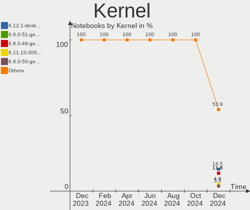
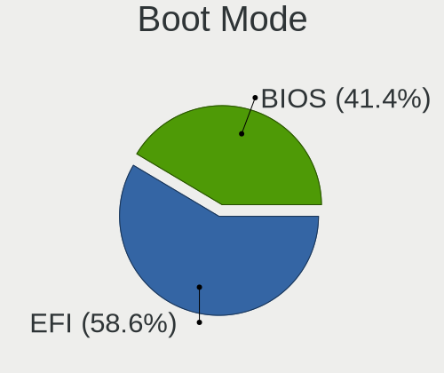
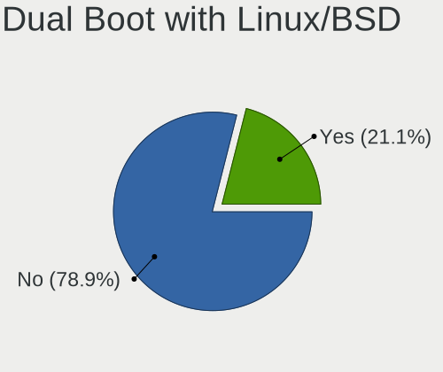
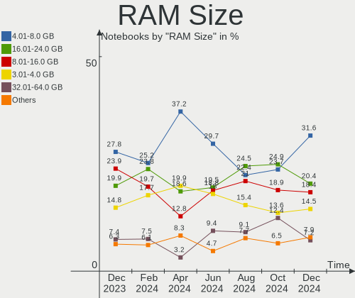
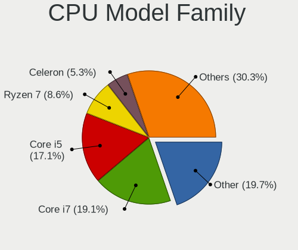
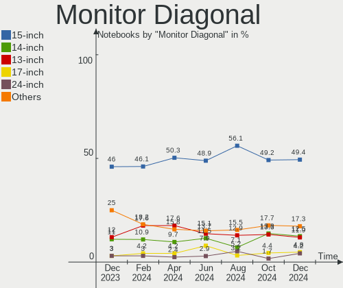
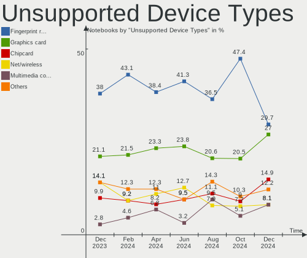

Linux in Italy - Hardware Trends (Notebooks)
--------------------------------------------

A project to identify most popular hardware characteristics and track their change
over time based on data collected by Linux users at https://Linux-Hardware.org.

Anyone can contribute to this report by the [hw-probe](https://github.com/linuxhw/hw-probe) tool:

    sudo -E hw-probe -all -upload

Period: Dec, 2023.

Contents
--------

* [ System ](#system)
  - [ OS                       ](#os)
  - [ OS Family                ](#os-family)
  - [ Kernel                   ](#kernel)
  - [ Kernel Family            ](#kernel-family)
  - [ Kernel Major Ver.        ](#kernel-major-ver)
  - [ Arch                     ](#arch)
  - [ DE                       ](#de)
  - [ Display Server           ](#display-server)
  - [ Display Manager          ](#display-manager)
  - [ OS Lang                  ](#os-lang)
  - [ Boot Mode                ](#boot-mode)
  - [ Filesystem               ](#filesystem)
  - [ Part. scheme             ](#part-scheme)
  - [ Dual Boot with Linux/BSD ](#dual-boot-with-linuxbsd)
  - [ Dual Boot (Win)          ](#dual-boot-win)

* [ Board ](#board)
  - [ Vendor                   ](#vendor)
  - [ Model                    ](#model)
  - [ Model Family             ](#model-family)
  - [ MFG Year                 ](#mfg-year)
  - [ Form Factor              ](#form-factor)
  - [ Secure Boot              ](#secure-boot)
  - [ Coreboot                 ](#coreboot)
  - [ RAM Size                 ](#ram-size)
  - [ RAM Used                 ](#ram-used)
  - [ Total Drives             ](#total-drives)
  - [ Has CD-ROM               ](#has-cd-rom)
  - [ Has Ethernet             ](#has-ethernet)
  - [ Has WiFi                 ](#has-wifi)
  - [ Has Bluetooth            ](#has-bluetooth)

* [ Location ](#location)
  - [ Country                  ](#country)
  - [ City                     ](#city)

* [ Drives ](#drives)
  - [ Drive Vendor             ](#drive-vendor)
  - [ Drive Model              ](#drive-model)
  - [ HDD Vendor               ](#hdd-vendor)
  - [ SSD Vendor               ](#ssd-vendor)
  - [ Drive Kind               ](#drive-kind)
  - [ Drive Connector          ](#drive-connector)
  - [ Drive Size               ](#drive-size)
  - [ Space Total              ](#space-total)
  - [ Space Used               ](#space-used)
  - [ Malfunc. Drives          ](#malfunc-drives)
  - [ Malfunc. Drive Vendor    ](#malfunc-drive-vendor)
  - [ Malfunc. HDD Vendor      ](#malfunc-hdd-vendor)
  - [ Malfunc. Drive Kind      ](#malfunc-drive-kind)
  - [ Failed Drives            ](#failed-drives)
  - [ Failed Drive Vendor      ](#failed-drive-vendor)
  - [ Drive Status             ](#drive-status)

* [ Storage controller ](#storage-controller)
  - [ Storage Vendor           ](#storage-vendor)
  - [ Storage Model            ](#storage-model)
  - [ Storage Kind             ](#storage-kind)

* [ Processor ](#processor)
  - [ CPU Vendor               ](#cpu-vendor)
  - [ CPU Model                ](#cpu-model)
  - [ CPU Model Family         ](#cpu-model-family)
  - [ CPU Cores                ](#cpu-cores)
  - [ CPU Sockets              ](#cpu-sockets)
  - [ CPU Threads              ](#cpu-threads)
  - [ CPU Op-Modes             ](#cpu-op-modes)
  - [ CPU Microcode            ](#cpu-microcode)
  - [ CPU Microarch            ](#cpu-microarch)

* [ Graphics ](#graphics)
  - [ GPU Vendor               ](#gpu-vendor)
  - [ GPU Model                ](#gpu-model)
  - [ GPU Combo                ](#gpu-combo)
  - [ GPU Driver               ](#gpu-driver)
  - [ GPU Memory               ](#gpu-memory)

* [ Monitor ](#monitor)
  - [ Monitor Vendor           ](#monitor-vendor)
  - [ Monitor Model            ](#monitor-model)
  - [ Monitor Resolution       ](#monitor-resolution)
  - [ Monitor Diagonal         ](#monitor-diagonal)
  - [ Monitor Width            ](#monitor-width)
  - [ Aspect Ratio             ](#aspect-ratio)
  - [ Monitor Area             ](#monitor-area)
  - [ Pixel Density            ](#pixel-density)
  - [ Multiple Monitors        ](#multiple-monitors)

* [ Network ](#network)
  - [ Net Controller Vendor    ](#net-controller-vendor)
  - [ Net Controller Model     ](#net-controller-model)
  - [ Wireless Vendor          ](#wireless-vendor)
  - [ Wireless Model           ](#wireless-model)
  - [ Ethernet Vendor          ](#ethernet-vendor)
  - [ Ethernet Model           ](#ethernet-model)
  - [ Net Controller Kind      ](#net-controller-kind)
  - [ Used Controller          ](#used-controller)
  - [ NICs                     ](#nics)
  - [ IPv6                     ](#ipv6)

* [ Bluetooth ](#bluetooth)
  - [ Bluetooth Vendor         ](#bluetooth-vendor)
  - [ Bluetooth Model          ](#bluetooth-model)

* [ Sound ](#sound)
  - [ Sound Vendor             ](#sound-vendor)
  - [ Sound Model              ](#sound-model)

* [ Memory ](#memory)
  - [ Memory Vendor            ](#memory-vendor)
  - [ Memory Model             ](#memory-model)
  - [ Memory Kind              ](#memory-kind)
  - [ Memory Form Factor       ](#memory-form-factor)
  - [ Memory Size              ](#memory-size)
  - [ Memory Speed             ](#memory-speed)

* [ Printers & scanners ](#printers--scanners)
  - [ Printer Vendor           ](#printer-vendor)
  - [ Printer Model            ](#printer-model)
  - [ Scanner Vendor           ](#scanner-vendor)
  - [ Scanner Model            ](#scanner-model)

* [ Camera ](#camera)
  - [ Camera Vendor            ](#camera-vendor)
  - [ Camera Model             ](#camera-model)

* [ Security ](#security)
  - [ Fingerprint Vendor       ](#fingerprint-vendor)
  - [ Fingerprint Model        ](#fingerprint-model)
  - [ Chipcard Vendor          ](#chipcard-vendor)
  - [ Chipcard Model           ](#chipcard-model)

* [ Unsupported ](#unsupported)
  - [ Unsupported Devices      ](#unsupported-devices)
  - [ Unsupported Device Types ](#unsupported-device-types)

System
------

OS
--

Installed operating systems

| Name                         | Notebooks | Percent |
|------------------------------|-----------|---------|
| Fedora 39                    | 26        | 14.77%  |
| Ubuntu 22.04                 | 18        | 10.23%  |
| Linux Mint 21.2              | 17        | 9.66%   |
| Arch Rolling                 | 13        | 7.39%   |
| Debian 12                    | 12        | 6.82%   |
| Ubuntu 23.10                 | 8         | 4.55%   |
| EndeavourOS Rolling          | 8         | 4.55%   |
| OpenMandriva 5.0             | 7         | 3.98%   |
| Zorin 17                     | 3         | 1.7%    |
| Zorin 16                     | 3         | 1.7%    |
| ROSA 12.4                    | 3         | 1.7%    |
| OpenMandriva 23.08           | 3         | 1.7%    |
| LMDE 6                       | 3         | 1.7%    |
| Kubuntu 22.04                | 3         | 1.7%    |
| Kali 2023.4                  | 3         | 1.7%    |
| Xubuntu 22.04                | 2         | 1.14%   |
| Xubuntu 18.04                | 2         | 1.14%   |
| Ubuntu 20.04                 | 2         | 1.14%   |
| TUXEDO OS 22.04              | 2         | 1.14%   |
| SteamOS 3.5.10               | 2         | 1.14%   |
| openSUSE Tumbleweed-XXXXXXXX | 2         | 1.14%   |
| OpenMandriva 23.11           | 2         | 1.14%   |
| Kubuntu 23.10                | 2         | 1.14%   |
| Elementary 7.1               | 2         | 1.14%   |
| Debian 11                    | 2         | 1.14%   |
| Debian                       | 2         | 1.14%   |
| ArcoLinux Rolling            | 2         | 1.14%   |
| Xubuntu 2023.4~rc            | 1         | 0.57%   |
| Xero Rolling                 | 1         | 0.57%   |
| Ubuntu 23.04                 | 1         | 0.57%   |
| SteamOS 3.5.7                | 1         | 0.57%   |
| Pop!_OS 22.04                | 1         | 0.57%   |
| Parrot 6.0                   | 1         | 0.57%   |
| org.kde.Platform 5.15-21.08  | 1         | 0.57%   |
| Oracle Linux 9.2             | 1         | 0.57%   |
| openSUSE Leap-15.5           | 1         | 0.57%   |
| Nobara 38                    | 1         | 0.57%   |
| NixOS 24.05                  | 1         | 0.57%   |
| NixOS 23.11                  | 1         | 0.57%   |
| Manjaro 23.1.1               | 1         | 0.57%   |

OS Family
---------

OS without a version

| Name             | Notebooks | Percent |
|------------------|-----------|---------|
| Ubuntu           | 29        | 16.48%  |
| Fedora           | 26        | 14.77%  |
| Linux Mint       | 17        | 9.66%   |
| Debian           | 16        | 9.09%   |
| Arch             | 13        | 7.39%   |
| OpenMandriva     | 12        | 6.82%   |
| EndeavourOS      | 8         | 4.55%   |
| Zorin            | 6         | 3.41%   |
| Kubuntu          | 6         | 3.41%   |
| Xubuntu          | 5         | 2.84%   |
| SteamOS          | 3         | 1.7%    |
| ROSA             | 3         | 1.7%    |
| openSUSE         | 3         | 1.7%    |
| Manjaro          | 3         | 1.7%    |
| LMDE             | 3         | 1.7%    |
| Kali             | 3         | 1.7%    |
| ArcoLinux        | 3         | 1.7%    |
| TUXEDO OS        | 2         | 1.14%   |
| NixOS            | 2         | 1.14%   |
| Elementary       | 2         | 1.14%   |
| Xero             | 1         | 0.57%   |
| Pop!_OS          | 1         | 0.57%   |
| Parrot           | 1         | 0.57%   |
| org.kde.Platform | 1         | 0.57%   |
| Oracle Linux     | 1         | 0.57%   |
| Nobara           | 1         | 0.57%   |
| Lubuntu          | 1         | 0.57%   |
| Lilidog          | 1         | 0.57%   |
| Gentoo           | 1         | 0.57%   |
| Garuda Linux     | 1         | 0.57%   |
| antiX            | 1         | 0.57%   |

Kernel
------

Version of the Linux kernel

| Version                           | Notebooks | Percent |
|-----------------------------------|-----------|---------|
| 6.2.0-39-generic                  | 16        | 9.09%   |
| 5.15.0-91-generic                 | 11        | 6.25%   |
| 6.6.2-desktop-1omv2390            | 9         | 5.11%   |
| 6.5.0-14-generic                  | 9         | 5.11%   |
| 6.2.0-37-generic                  | 9         | 5.11%   |
| 6.6.4-arch1-1                     | 7         | 3.98%   |
| 6.5.6-300.fc39.x86_64             | 6         | 3.41%   |
| 6.6.3-arch1-1                     | 5         | 2.84%   |
| 6.6.2-201.fc39.x86_64             | 5         | 2.84%   |
| 6.1.0-16-amd64                    | 5         | 2.84%   |
| 6.1.0-15-amd64                    | 5         | 2.84%   |
| 6.6.4-200.fc39.x86_64             | 4         | 2.27%   |
| 6.6.8-arch1-1                     | 3         | 1.7%    |
| 6.6.8-200.fc39.x86_64             | 3         | 1.7%    |
| 6.6.6-200.fc39.x86_64             | 3         | 1.7%    |
| 6.5.0-13-generic                  | 3         | 1.7%    |
| 6.4.11-desktop-1omv2390           | 3         | 1.7%    |
| 6.1.58-generic-1rosa2021.1-x86_64 | 3         | 1.7%    |
| 5.15.0-76-generic                 | 3         | 1.7%    |
| 6.6.7-200.fc39.x86_64             | 2         | 1.14%   |
| 6.6.6-zen1-1-zen                  | 2         | 1.14%   |
| 6.6.3-200.fc39.x86_64             | 2         | 1.14%   |
| 6.6.3-1-default                   | 2         | 1.14%   |
| 6.6.1-arch1-1                     | 2         | 1.14%   |
| 6.5.0-kali3-amd64                 | 2         | 1.14%   |
| 6.5.0-0.deb12.4-amd64             | 2         | 1.14%   |
| 6.2.0-26-generic                  | 2         | 1.14%   |
| 6.1.63                            | 2         | 1.14%   |
| 6.1.52-valve10-1-neptune-61       | 2         | 1.14%   |
| 5.4.0-150-generic                 | 2         | 1.14%   |
| 6.6.8-zen1-1-zen                  | 1         | 0.57%   |
| 6.6.8-2-MANJARO                   | 1         | 0.57%   |
| 6.6.7-zen1-1-zen                  | 1         | 0.57%   |
| 6.6.7-lqx1-1-lqx                  | 1         | 0.57%   |
| 6.6.7-gentoo-dist                 | 1         | 0.57%   |
| 6.6.7-arch1-1                     | 1         | 0.57%   |
| 6.6.6-76060606-generic            | 1         | 0.57%   |
| 6.6.4-202.fsync.fc38.x86_64       | 1         | 0.57%   |
| 6.6.3-1-MANJARO                   | 1         | 0.57%   |
| 6.6.1                             | 1         | 0.57%   |

Kernel Family
-------------

Linux kernel without a distro release

| Version  | Notebooks | Percent |
|----------|-----------|---------|
| 6.2.0    | 28        | 15.91%  |
| 6.5.0    | 23        | 13.07%  |
| 5.15.0   | 19        | 10.8%   |
| 6.6.2    | 14        | 7.95%   |
| 6.1.0    | 13        | 7.39%   |
| 6.6.4    | 12        | 6.82%   |
| 6.6.3    | 10        | 5.68%   |
| 6.6.8    | 8         | 4.55%   |
| 6.6.7    | 6         | 3.41%   |
| 6.6.6    | 6         | 3.41%   |
| 6.5.6    | 6         | 3.41%   |
| 6.6.1    | 3         | 1.7%    |
| 6.4.11   | 3         | 1.7%    |
| 6.1.58   | 3         | 1.7%    |
| 6.1.52   | 3         | 1.7%    |
| 5.4.0    | 3         | 1.7%    |
| 6.5.11   | 2         | 1.14%   |
| 6.1.64   | 2         | 1.14%   |
| 6.1.63   | 2         | 1.14%   |
| 6.1.60   | 2         | 1.14%   |
| 5.19.0   | 2         | 1.14%   |
| 6.5.5    | 1         | 0.57%   |
| 6.3.0    | 1         | 0.57%   |
| 6.1.69   | 1         | 0.57%   |
| 5.14.21  | 1         | 0.57%   |
| 5.10.188 | 1         | 0.57%   |
| 5.10.0   | 1         | 0.57%   |

Kernel Major Ver.
-----------------

Linux kernel major version

| Version | Notebooks | Percent |
|---------|-----------|---------|
| 6.6     | 59        | 33.52%  |
| 6.5     | 32        | 18.18%  |
| 6.2     | 28        | 15.91%  |
| 6.1     | 26        | 14.77%  |
| 5.15    | 19        | 10.8%   |
| 6.4     | 3         | 1.7%    |
| 5.4     | 3         | 1.7%    |
| 5.19    | 2         | 1.14%   |
| 5.10    | 2         | 1.14%   |
| 6.3     | 1         | 0.57%   |
| 5.14    | 1         | 0.57%   |

Arch
----

OS architecture (x86_64, i586, etc.)

| Name   | Notebooks | Percent |
|--------|-----------|---------|
| x86_64 | 173       | 98.3%   |
| i686   | 3         | 1.7%    |

DE
--

Desktop Environment

| Name             | Notebooks | Percent |
|------------------|-----------|---------|
| GNOME            | 77        | 43.75%  |
| KDE5             | 42        | 23.86%  |
| XFCE             | 20        | 11.36%  |
| X-Cinnamon       | 16        | 9.09%   |
| MATE             | 6         | 3.41%   |
| LXQt             | 5         | 2.84%   |
| Pantheon         | 2         | 1.14%   |
| Unknown          | 2         | 1.14%   |
| Unicorn:XFCE     | 1         | 0.57%   |
| lightdm-xsession | 1         | 0.57%   |
| jwm              | 1         | 0.57%   |
| i3               | 1         | 0.57%   |
| Deepin           | 1         | 0.57%   |
| Cinnamon         | 1         | 0.57%   |

Display Server
--------------

X11 or Wayland

| Name    | Notebooks | Percent |
|---------|-----------|---------|
| X11     | 90        | 51.14%  |
| Wayland | 82        | 46.59%  |
| Tty     | 2         | 1.14%   |
| Unknown | 2         | 1.14%   |

Display Manager
---------------

SDDM, LightDM, etc.

| Name    | Notebooks | Percent |
|---------|-----------|---------|
| Unknown | 44        | 25%     |
| SDDM    | 37        | 21.02%  |
| LightDM | 35        | 19.89%  |
| GDM3    | 34        | 19.32%  |
| GDM     | 25        | 14.2%   |
| SLIMSKI | 1         | 0.57%   |

OS Lang
-------

Language

| Lang    | Notebooks | Percent |
|---------|-----------|---------|
| it_IT   | 111       | 63.07%  |
| en_US   | 49        | 27.84%  |
| C       | 6         | 3.41%   |
| en_GB   | 4         | 2.27%   |
| POSIX   | 3         | 1.7%    |
| es_ES   | 1         | 0.57%   |
| de_IT   | 1         | 0.57%   |
| Unknown | 1         | 0.57%   |

Boot Mode
---------

EFI or BIOS

| Mode | Notebooks | Percent |
|------|-----------|---------|
| EFI  | 120       | 68.18%  |
| BIOS | 56        | 31.82%  |

Filesystem
----------

Type of filesystem

| Type    | Notebooks | Percent |
|---------|-----------|---------|
| Ext4    | 111       | 63.07%  |
| Btrfs   | 35        | 19.89%  |
| Tmpfs   | 15        | 8.52%   |
| Overlay | 14        | 7.95%   |
| Xfs     | 1         | 0.57%   |

Part. scheme
------------

Scheme of partitioning

| Type    | Notebooks | Percent |
|---------|-----------|---------|
| GPT     | 114       | 64.77%  |
| Unknown | 44        | 25%     |
| MBR     | 18        | 10.23%  |

Dual Boot with Linux/BSD
------------------------

Hosting more than one Linux/BSD

| Dual boot | Notebooks | Percent |
|-----------|-----------|---------|
| No        | 154       | 87.5%   |
| Yes       | 22        | 12.5%   |

Dual Boot (Win)
---------------

Hosting Linux and Windows

| Dual boot | Notebooks | Percent |
|-----------|-----------|---------|
| No        | 108       | 61.36%  |
| Yes       | 68        | 38.64%  |

Board
-----

Vendor
------

Motherboard manufacturer

| Name                | Notebooks | Percent |
|---------------------|-----------|---------|
| Hewlett-Packard     | 43        | 24.43%  |
| Lenovo              | 33        | 18.75%  |
| ASUSTek Computer    | 28        | 15.91%  |
| Acer                | 20        | 11.36%  |
| Dell                | 12        | 6.82%   |
| HUAWEI              | 10        | 5.68%   |
| MSI                 | 4         | 2.27%   |
| Valve               | 3         | 1.7%    |
| Sony                | 3         | 1.7%    |
| Samsung Electronics | 2         | 1.14%   |
| Google              | 2         | 1.14%   |
| Framework           | 2         | 1.14%   |
| Chuwi               | 2         | 1.14%   |
| Apple               | 2         | 1.14%   |
| Unknown             | 2         | 1.14%   |
| TUXEDO              | 1         | 0.57%   |
| TULPAR              | 1         | 0.57%   |
| PC Specialist       | 1         | 0.57%   |
| Packard Bell        | 1         | 0.57%   |
| Notebook            | 1         | 0.57%   |
| Medion              | 1         | 0.57%   |
| Jumper              | 1         | 0.57%   |
| Fujitsu             | 1         | 0.57%   |

Model
-----

Motherboard model

| Name                                       | Notebooks | Percent |
|--------------------------------------------|-----------|---------|
| HP Notebook                                | 7         | 3.98%   |
| Valve Jupiter                              | 2         | 1.14%   |
| Lenovo G50-45 80E3                         | 2         | 1.14%   |
| HUAWEI NBLK-WAX9X                          | 2         | 1.14%   |
| HP ProBook 650 G1                          | 2         | 1.14%   |
| HP Pavilion 15                             | 2         | 1.14%   |
| HP 15                                      | 2         | 1.14%   |
| Framework Laptop 13 (AMD Ryzen 7040Series) | 2         | 1.14%   |
| Dell XPS 13 9370                           | 2         | 1.14%   |
| ASUS VivoBook_ASUSLaptop K6604JV_K6604JV   | 2         | 1.14%   |
| ASUS S551LN                                | 2         | 1.14%   |
| Acer Swift SF314-43                        | 2         | 1.14%   |
| Acer Aspire E5-573G                        | 2         | 1.14%   |
| Acer Aspire E5-571G                        | 2         | 1.14%   |
| Acer AOD270                                | 2         | 1.14%   |
| Unknown                                    | 2         | 1.14%   |
| Valve Galileo                              | 1         | 0.57%   |
| TUXEDO InfinityBook S 15 Gen6              | 1         | 0.57%   |
| TULPAR A5 V20.3                            | 1         | 0.57%   |
| Sony VGN-FW21E                             | 1         | 0.57%   |
| Sony VGN-CR21S_W                           | 1         | 0.57%   |
| Sony SVE1713X1EB                           | 1         | 0.57%   |
| Samsung RC530/RC730                        | 1         | 0.57%   |
| Samsung 750XDA                             | 1         | 0.57%   |
| PC Specialist GK7NP5R                      | 1         | 0.57%   |
| Packard Bell EasyNote MH36                 | 1         | 0.57%   |
| Notebook NS5x_NS7xAU                       | 1         | 0.57%   |
| MSI Prestige 14Evo A12M                    | 1         | 0.57%   |
| MSI Prestige 14 A10SC                      | 1         | 0.57%   |
| MSI Modern 15 B7M                          | 1         | 0.57%   |
| MSI GS40 6QE Phantom                       | 1         | 0.57%   |
| Medion E16401                              | 1         | 0.57%   |
| Lenovo Yoga 2 11 20332                     | 1         | 0.57%   |
| Lenovo V15-IIL 82C5                        | 1         | 0.57%   |
| Lenovo V15 G4 AMN 82YU                     | 1         | 0.57%   |
| Lenovo V15 G3 IAP 82TT                     | 1         | 0.57%   |
| Lenovo V145-15AST 81MT                     | 1         | 0.57%   |
| Lenovo ThinkPad X280 20KFS0ND00            | 1         | 0.57%   |
| Lenovo ThinkPad X270 W10DG 20K5S3HG00      | 1         | 0.57%   |
| Lenovo ThinkPad X270 20HMS0TD00            | 1         | 0.57%   |

Model Family
------------

Motherboard model prefix

| Name                | Notebooks | Percent |
|---------------------|-----------|---------|
| Lenovo ThinkPad     | 11        | 6.25%   |
| Acer Aspire         | 10        | 5.68%   |
| Lenovo IdeaPad      | 8         | 4.55%   |
| HP Pavilion         | 7         | 3.98%   |
| HP Notebook         | 7         | 3.98%   |
| ASUS VivoBook       | 7         | 3.98%   |
| Dell XPS            | 6         | 3.41%   |
| Lenovo ThinkBook    | 5         | 2.84%   |
| HP ProBook          | 5         | 2.84%   |
| Dell Latitude       | 5         | 2.84%   |
| HP Laptop           | 4         | 2.27%   |
| HP 255              | 4         | 2.27%   |
| Acer Swift          | 4         | 2.27%   |
| HP ZBook            | 3         | 1.7%    |
| HP Compaq           | 3         | 1.7%    |
| Acer TravelMate     | 3         | 1.7%    |
| Valve Jupiter       | 2         | 1.14%   |
| MSI Prestige        | 2         | 1.14%   |
| Lenovo V15          | 2         | 1.14%   |
| Lenovo Legion       | 2         | 1.14%   |
| Lenovo G50-45       | 2         | 1.14%   |
| HUAWEI NBLK-WAX9X   | 2         | 1.14%   |
| HP OMEN             | 2         | 1.14%   |
| HP EliteBook        | 2         | 1.14%   |
| HP 250              | 2         | 1.14%   |
| HP 15               | 2         | 1.14%   |
| Framework Laptop    | 2         | 1.14%   |
| Chuwi GemiBook      | 2         | 1.14%   |
| ASUS Zenbook        | 2         | 1.14%   |
| ASUS S551LN         | 2         | 1.14%   |
| ASUS ROG            | 2         | 1.14%   |
| ASUS PRIME          | 2         | 1.14%   |
| Acer AOD270         | 2         | 1.14%   |
| Unknown             | 2         | 1.14%   |
| Valve Galileo       | 1         | 0.57%   |
| TUXEDO InfinityBook | 1         | 0.57%   |
| TULPAR A5           | 1         | 0.57%   |
| Sony VGN-FW21E      | 1         | 0.57%   |
| Sony VGN-CR21S      | 1         | 0.57%   |
| Sony SVE1713X1EB    | 1         | 0.57%   |

MFG Year
--------

Motherboard manufacture year

| Year | Notebooks | Percent |
|------|-----------|---------|
| 2021 | 23        | 13.07%  |
| 2020 | 21        | 11.93%  |
| 2023 | 17        | 9.66%   |
| 2019 | 15        | 8.52%   |
| 2022 | 14        | 7.95%   |
| 2013 | 12        | 6.82%   |
| 2014 | 11        | 6.25%   |
| 2018 | 10        | 5.68%   |
| 2017 | 10        | 5.68%   |
| 2015 | 9         | 5.11%   |
| 2016 | 7         | 3.98%   |
| 2012 | 7         | 3.98%   |
| 2009 | 5         | 2.84%   |
| 2008 | 5         | 2.84%   |
| 2010 | 4         | 2.27%   |
| 2007 | 4         | 2.27%   |
| 2011 | 2         | 1.14%   |

Form Factor
-----------

Physical design of the computer

| Name     | Notebooks | Percent |
|----------|-----------|---------|
| Notebook | 176       | 100%    |

Secure Boot
-----------

Enabled or disabled

| State    | Notebooks | Percent |
|----------|-----------|---------|
| Disabled | 154       | 87.5%   |
| Enabled  | 22        | 12.5%   |

Coreboot
--------

Have coreboot on board

| Used | Notebooks | Percent |
|------|-----------|---------|
| No   | 174       | 98.86%  |
| Yes  | 2         | 1.14%   |

RAM Size
--------

Total RAM memory

| Size in GB  | Notebooks | Percent |
|-------------|-----------|---------|
| 4.01-8.0    | 49        | 27.84%  |
| 8.01-16.0   | 42        | 23.86%  |
| 16.01-24.0  | 35        | 19.89%  |
| 3.01-4.0    | 26        | 14.77%  |
| 32.01-64.0  | 13        | 7.39%   |
| 1.01-2.0    | 4         | 2.27%   |
| 64.01-256.0 | 3         | 1.7%    |
| 24.01-32.0  | 2         | 1.14%   |
| 2.01-3.0    | 2         | 1.14%   |

RAM Used
--------

Used RAM memory

| Used GB    | Notebooks | Percent |
|------------|-----------|---------|
| 2.01-3.0   | 51        | 28.98%  |
| 1.01-2.0   | 43        | 24.43%  |
| 3.01-4.0   | 34        | 19.32%  |
| 4.01-8.0   | 32        | 18.18%  |
| 0.51-1.0   | 8         | 4.55%   |
| 8.01-16.0  | 7         | 3.98%   |
| 16.01-24.0 | 1         | 0.57%   |

Total Drives
------------

Number of drives on board

| Drives | Notebooks | Percent |
|--------|-----------|---------|
| 1      | 130       | 73.86%  |
| 2      | 40        | 22.73%  |
| 3      | 4         | 2.27%   |
| 6      | 1         | 0.57%   |
| 4      | 1         | 0.57%   |

Has CD-ROM
----------

Has CD-ROM on board

| Presented | Notebooks | Percent |
|-----------|-----------|---------|
| No        | 121       | 68.75%  |
| Yes       | 55        | 31.25%  |

Has Ethernet
------------

Has Ethernet on board

| Presented | Notebooks | Percent |
|-----------|-----------|---------|
| Yes       | 127       | 72.16%  |
| No        | 49        | 27.84%  |

Has WiFi
--------

Has WiFi module

| Presented | Notebooks | Percent |
|-----------|-----------|---------|
| Yes       | 172       | 97.73%  |
| No        | 4         | 2.27%   |

Has Bluetooth
-------------

Has Bluetooth module

| Presented | Notebooks | Percent |
|-----------|-----------|---------|
| Yes       | 151       | 85.8%   |
| No        | 25        | 14.2%   |

Location
--------

Country
-------

Geographic location (country)

| Country | Notebooks | Percent |
|---------|-----------|---------|
| Italy   | 176       | 100%    |

City
----

Geographic location (city)

| City                   | Notebooks | Percent |
|------------------------|-----------|---------|
| Milan                  | 31        | 17.61%  |
| Rome                   | 13        | 7.39%   |
| Milano                 | 12        | 6.82%   |
| Rho                    | 7         | 3.98%   |
| Bologna                | 6         | 3.41%   |
| Florence               | 5         | 2.84%   |
| Naples                 | 4         | 2.27%   |
| Turin                  | 3         | 1.7%    |
| Verona                 | 2         | 1.14%   |
| Venice                 | 2         | 1.14%   |
| Sanremo                | 2         | 1.14%   |
| Parma                  | 2         | 1.14%   |
| Palermo                | 2         | 1.14%   |
| Monza                  | 2         | 1.14%   |
| Misterbianco           | 2         | 1.14%   |
| Fontevivo              | 2         | 1.14%   |
| Cascina                | 2         | 1.14%   |
| Bolzano                | 2         | 1.14%   |
| Zola Predosa           | 1         | 0.57%   |
| Villa Carcina          | 1         | 0.57%   |
| Vigonza                | 1         | 0.57%   |
| Vicenza                | 1         | 0.57%   |
| Veroli                 | 1         | 0.57%   |
| Varazze                | 1         | 0.57%   |
| Trieste                | 1         | 0.57%   |
| Trecate                | 1         | 0.57%   |
| Trebisacce             | 1         | 0.57%   |
| Tornareccio            | 1         | 0.57%   |
| Tignale                | 1         | 0.57%   |
| Taranto                | 1         | 0.57%   |
| Strangolagalli         | 1         | 0.57%   |
| Spinea                 | 1         | 0.57%   |
| Sovicille              | 1         | 0.57%   |
| Scorzè                | 1         | 0.57%   |
| Scandicci              | 1         | 0.57%   |
| Santhià               | 1         | 0.57%   |
| San Nicolò d'Arcidano | 1         | 0.57%   |
| San Gavino Monreale    | 1         | 0.57%   |
| San Cesario di Lecce   | 1         | 0.57%   |
| Salerno                | 1         | 0.57%   |

Drives
------

Drive Vendor
------------

Hard drive vendors

| Vendor                       | Notebooks | Drives | Percent |
|------------------------------|-----------|--------|---------|
| Samsung Electronics          | 38        | 47     | 16.96%  |
| WDC                          | 17        | 18     | 7.59%   |
| SanDisk                      | 17        | 17     | 7.59%   |
| Seagate                      | 15        | 16     | 6.7%    |
| Intel                        | 13        | 13     | 5.8%    |
| Unknown                      | 11        | 13     | 4.91%   |
| Toshiba                      | 11        | 11     | 4.91%   |
| Kingston                     | 11        | 12     | 4.91%   |
| SK hynix                     | 10        | 10     | 4.46%   |
| Crucial                      | 10        | 11     | 4.46%   |
| Micron Technology            | 9         | 9      | 4.02%   |
| HGST                         | 5         | 5      | 2.23%   |
| SPCC                         | 4         | 4      | 1.79%   |
| KIOXIA                       | 4         | 4      | 1.79%   |
| Kingston Technology Company  | 4         | 4      | 1.79%   |
| Transcend                    | 3         | 3      | 1.34%   |
| Phison Electronics           | 3         | 3      | 1.34%   |
| Netac                        | 3         | 3      | 1.34%   |
| Hitachi                      | 3         | 3      | 1.34%   |
| China                        | 3         | 3      | 1.34%   |
| Apple                        | 3         | 3      | 1.34%   |
| Unknown                      | 3         | 3      | 1.34%   |
| Team                         | 2         | 2      | 0.89%   |
| MAXIO Technology (Hangzhou)  | 2         | 2      | 0.89%   |
| Fanxiang                     | 2         | 2      | 0.89%   |
| Wibtek                       | 1         | 1      | 0.45%   |
| WALRAM                       | 1         | 1      | 0.45%   |
| Vaseky                       | 1         | 1      | 0.45%   |
| USB3.0                       | 1         | 1      | 0.45%   |
| SSSTC                        | 1         | 1      | 0.45%   |
| SPCC Sol                     | 1         | 1      | 0.45%   |
| Silicon Motion               | 1         | 1      | 0.45%   |
| Shenzhen Longsys Electronics | 1         | 1      | 0.45%   |
| PNY                          | 1         | 1      | 0.45%   |
| Micron/Crucial Technology    | 1         | 1      | 0.45%   |
| Lite-On Technology           | 1         | 1      | 0.45%   |
| Lexar                        | 1         | 1      | 0.45%   |
| JMicron Technology           | 1         | 1      | 0.45%   |
| JetFlash                     | 1         | 1      | 0.45%   |
| Intenso                      | 1         | 1      | 0.45%   |

Drive Model
-----------

Hard drive models

| Model                                               | Notebooks | Percent |
|-----------------------------------------------------|-----------|---------|
| Samsung NVMe SSD Controller PM9A1/PM9A3/980PRO 2TB  | 5         | 2.11%   |
| Kingston SA400S37240G 240GB SSD                     | 5         | 2.11%   |
| Toshiba MQ01ABF050 500GB                            | 4         | 1.69%   |
| Intel SSDPEKNU512GZ 512GB                           | 4         | 1.69%   |
| SK hynix BC511 512GB                                | 3         | 1.27%   |
| Seagate ST1000LM024 HN-M101MBB 1TB                  | 3         | 1.27%   |
| Samsung NVMe SSD Controller SM981/PM981/PM983 512GB | 3         | 1.27%   |
| Samsung MZALQ512HBLU-00BL2 512GB                    | 3         | 1.27%   |
| Kingston Company OM3PDP3 NVMe SSD 512GB             | 3         | 1.27%   |
| Unknown                                             | 3         | 1.27%   |
| Unknown SD/MMC/MS PRO 512GB                         | 2         | 0.84%   |
| Unknown MMC Card  512GB                             | 2         | 0.84%   |
| Toshiba MQ01ABD100 1TB                              | 2         | 0.84%   |
| SPCC Solid State Disk 256GB                         | 2         | 0.84%   |
| SK hynix BC501 NVMe Solid State Drive 512GB         | 2         | 0.84%   |
| Seagate ST1000LM035-1RK172 1TB                      | 2         | 0.84%   |
| Sandisk WD Blue SN550 NVMe SSD 1TB                  | 2         | 0.84%   |
| Samsung SSD 990 PRO 2TB                             | 2         | 0.84%   |
| Samsung SSD 870 EVO 2TB                             | 2         | 0.84%   |
| Samsung MZVLQ512HALU-000H1 512GB                    | 2         | 0.84%   |
| Phison E12 NVMe Controller 1TB                      | 2         | 0.84%   |
| Micron 3400_MTFDKBA1T0TFH 1TB                       | 2         | 0.84%   |
| KIOXIA KBG40ZNS512G NVMe 512GB                      | 2         | 0.84%   |
| Kingston SA400S37480G 480GB SSD                     | 2         | 0.84%   |
| HGST HTS721010A9E630 1TB                            | 2         | 0.84%   |
| Crucial CT240BX500SSD1 240GB                        | 2         | 0.84%   |
| Crucial CT240BX200SSD1 240GB                        | 2         | 0.84%   |
| Crucial CT1000MX500SSD1 1TB                         | 2         | 0.84%   |
| Wibtek W800S 256GB SSD                              | 1         | 0.42%   |
| WDC WDS500G2B0A-00SM50 500GB SSD                    | 1         | 0.42%   |
| WDC WD7500BPKX-60HPJT0 752GB                        | 1         | 0.42%   |
| WDC WD60EFZX-68B3FN0 6TB                            | 1         | 0.42%   |
| WDC WD5000MPCK-22AWHT0 500GB                        | 1         | 0.42%   |
| WDC WD5000LPVX-22V0TT0 500GB                        | 1         | 0.42%   |
| WDC WD5000LPCX-24C6HT0 500GB                        | 1         | 0.42%   |
| WDC WD5000LPCX-21VHAT0 500GB                        | 1         | 0.42%   |
| WDC WD5000BEVT-22ZAT0 500GB                         | 1         | 0.42%   |
| WDC WD1600BEKT-60F3T1 160GB                         | 1         | 0.42%   |
| WDC WD10SPZX-00Z10T0 1TB                            | 1         | 0.42%   |
| WDC WD10JPVX-60JC3T1 1TB                            | 1         | 0.42%   |

HDD Vendor
----------

Hard disk drive vendors

| Vendor  | Notebooks | Drives | Percent |
|---------|-----------|--------|---------|
| Seagate | 15        | 16     | 30%     |
| WDC     | 12        | 12     | 24%     |
| Toshiba | 9         | 9      | 18%     |
| HGST    | 5         | 5      | 10%     |
| Hitachi | 3         | 3      | 6%      |
| Unknown | 2         | 2      | 4%      |
| USB3.0  | 1         | 1      | 2%      |
| Intenso | 1         | 1      | 2%      |
| Apple   | 1         | 1      | 2%      |
| Unknown | 1         | 1      | 2%      |

SSD Vendor
----------

Solid state drive vendors

| Vendor              | Notebooks | Drives | Percent |
|---------------------|-----------|--------|---------|
| Samsung Electronics | 10        | 13     | 15.15%  |
| Crucial             | 10        | 11     | 15.15%  |
| SanDisk             | 9         | 9      | 13.64%  |
| Kingston            | 8         | 9      | 12.12%  |
| SPCC                | 4         | 4      | 6.06%   |
| Netac               | 3         | 3      | 4.55%   |
| China               | 3         | 3      | 4.55%   |
| WDC                 | 2         | 2      | 3.03%   |
| Transcend           | 2         | 2      | 3.03%   |
| Micron Technology   | 2         | 2      | 3.03%   |
| Intel               | 2         | 2      | 3.03%   |
| Wibtek              | 1         | 1      | 1.52%   |
| Vaseky              | 1         | 1      | 1.52%   |
| Team                | 1         | 1      | 1.52%   |
| SSSTC               | 1         | 1      | 1.52%   |
| SPCC Sol            | 1         | 1      | 1.52%   |
| PNY                 | 1         | 1      | 1.52%   |
| Gigabyte Technology | 1         | 1      | 1.52%   |
| Fanxiang            | 1         | 1      | 1.52%   |
| Drevo               | 1         | 1      | 1.52%   |
| BAITITON            | 1         | 1      | 1.52%   |
| Apple               | 1         | 1      | 1.52%   |

Drive Kind
----------

HDD or SSD

| Kind    | Notebooks | Drives | Percent |
|---------|-----------|--------|---------|
| NVMe    | 93        | 104    | 43.26%  |
| SSD     | 64        | 71     | 29.77%  |
| HDD     | 47        | 51     | 21.86%  |
| MMC     | 8         | 10     | 3.72%   |
| Unknown | 3         | 3      | 1.4%    |

Drive Connector
---------------

SATA, SAS, NVMe, etc.

| Type | Notebooks | Drives | Percent |
|------|-----------|--------|---------|
| SATA | 95        | 111    | 46.12%  |
| NVMe | 93        | 104    | 45.15%  |
| SAS  | 10        | 14     | 4.85%   |
| MMC  | 8         | 10     | 3.88%   |

Drive Size
----------

Size of hard drive

| Size in TB | Notebooks | Drives | Percent |
|------------|-----------|--------|---------|
| 0.01-0.5   | 68        | 73     | 59.13%  |
| 0.51-1.0   | 36        | 38     | 31.3%   |
| 1.01-2.0   | 7         | 7      | 6.09%   |
| 3.01-4.0   | 3         | 3      | 2.61%   |
| 4.01-10.0  | 1         | 1      | 0.87%   |

Space Total
-----------

Amount of disk space available on the file system

| Size in GB     | Notebooks | Percent |
|----------------|-----------|---------|
| 501-1000       | 41        | 23.3%   |
| 251-500        | 39        | 22.16%  |
| 101-250        | 35        | 19.89%  |
| 1001-2000      | 16        | 9.09%   |
| 1-20           | 12        | 6.82%   |
| 51-100         | 11        | 6.25%   |
| More than 3000 | 8         | 4.55%   |
| 21-50          | 6         | 3.41%   |
| 2001-3000      | 4         | 2.27%   |
| Unknown        | 4         | 2.27%   |

Space Used
----------

Amount of used disk space

| Used GB        | Notebooks | Percent |
|----------------|-----------|---------|
| 1-20           | 55        | 31.25%  |
| 101-250        | 34        | 19.32%  |
| 21-50          | 27        | 15.34%  |
| 51-100         | 23        | 13.07%  |
| 251-500        | 13        | 7.39%   |
| 501-1000       | 11        | 6.25%   |
| 1001-2000      | 5         | 2.84%   |
| Unknown        | 4         | 2.27%   |
| More than 3000 | 2         | 1.14%   |
| 2001-3000      | 2         | 1.14%   |

Malfunc. Drives
---------------

Drive models with a malfunction

| Model                                          | Notebooks | Drives | Percent |
|------------------------------------------------|-----------|--------|---------|
| Toshiba MQ01ABF050 500GB                       | 3         | 3      | 15.79%  |
| WDC WD5000LPCX-24C6HT0 500GB                   | 1         | 1      | 5.26%   |
| WDC WD1600BEKT-60F3T1 160GB                    | 1         | 1      | 5.26%   |
| Transcend TS1TMTE220S 1TB                      | 1         | 1      | 5.26%   |
| Team TM8FPD001T 1TB                            | 1         | 1      | 5.26%   |
| Seagate ST9500325AS 500GB                      | 1         | 1      | 5.26%   |
| Seagate ST500LT012-1DG142 500GB                | 1         | 1      | 5.26%   |
| Seagate ST500LM021-1KJ152 500GB                | 1         | 1      | 5.26%   |
| Seagate ST500LM000-1EJ162 500GB                | 1         | 1      | 5.26%   |
| Seagate ST4000LM 024-2AN17V 4TB                | 1         | 1      | 5.26%   |
| SanDisk SSD PLUS 480GB                         | 1         | 1      | 5.26%   |
| Netac SSD 256GB                                | 1         | 1      | 5.26%   |
| Micron Technology 1100_MTFDDAV512TBN 512GB SSD | 1         | 1      | 5.26%   |
| Hitachi HTS545032B9A300 320GB                  | 1         | 1      | 5.26%   |
| HGST HTS725050A7E630 500GB                     | 1         | 1      | 5.26%   |
| HGST HTS721010A9E630 1TB                       | 1         | 1      | 5.26%   |
| HGST HTS541010A9E680 1TB                       | 1         | 1      | 5.26%   |

Malfunc. Drive Vendor
---------------------

Vendors of faulty drives

| Vendor            | Notebooks | Drives | Percent |
|-------------------|-----------|--------|---------|
| Seagate           | 5         | 5      | 26.32%  |
| Toshiba           | 3         | 3      | 15.79%  |
| HGST              | 3         | 3      | 15.79%  |
| WDC               | 2         | 2      | 10.53%  |
| Transcend         | 1         | 1      | 5.26%   |
| Team              | 1         | 1      | 5.26%   |
| SanDisk           | 1         | 1      | 5.26%   |
| Netac             | 1         | 1      | 5.26%   |
| Micron Technology | 1         | 1      | 5.26%   |
| Hitachi           | 1         | 1      | 5.26%   |

Malfunc. HDD Vendor
-------------------

Vendors of faulty HDD drives

| Vendor  | Notebooks | Drives | Percent |
|---------|-----------|--------|---------|
| Seagate | 5         | 5      | 35.71%  |
| Toshiba | 3         | 3      | 21.43%  |
| HGST    | 3         | 3      | 21.43%  |
| WDC     | 2         | 2      | 14.29%  |
| Hitachi | 1         | 1      | 7.14%   |

Malfunc. Drive Kind
-------------------

Kinds of faulty drives

| Kind | Notebooks | Drives | Percent |
|------|-----------|--------|---------|
| HDD  | 13        | 14     | 72.22%  |
| SSD  | 3         | 3      | 16.67%  |
| NVMe | 2         | 2      | 11.11%  |

Failed Drives
-------------

Failed drive models

Zero info for selected period =(

Failed Drive Vendor
-------------------

Failed drive vendors

Zero info for selected period =(

Drive Status
------------

Number of failed and malfunc. drives

| Status   | Notebooks | Drives | Percent |
|----------|-----------|--------|---------|
| Works    | 99        | 128    | 52.38%  |
| Detected | 72        | 92     | 38.1%   |
| Malfunc  | 18        | 19     | 9.52%   |

Storage controller
------------------

Storage Vendor
--------------

Storage controller vendors

| Vendor                       | Notebooks | Percent |
|------------------------------|-----------|---------|
| Intel                        | 102       | 47%     |
| Samsung Electronics          | 30        | 13.82%  |
| AMD                          | 25        | 11.52%  |
| SanDisk                      | 11        | 5.07%   |
| SK hynix                     | 10        | 4.61%   |
| Micron Technology            | 7         | 3.23%   |
| Kingston Technology Company  | 7         | 3.23%   |
| MAXIO Technology (Hangzhou)  | 4         | 1.84%   |
| KIOXIA                       | 4         | 1.84%   |
| Silicon Motion               | 3         | 1.38%   |
| Phison Electronics           | 3         | 1.38%   |
| Toshiba America Info Systems | 2         | 0.92%   |
| Solidigm                     | 2         | 0.92%   |
| Shenzhen Longsys Electronics | 1         | 0.46%   |
| Realtek Semiconductor        | 1         | 0.46%   |
| Nvidia                       | 1         | 0.46%   |
| Micron/Crucial Technology    | 1         | 0.46%   |
| Marvell Technology Group     | 1         | 0.46%   |
| Lite-On Technology           | 1         | 0.46%   |
| Apple                        | 1         | 0.46%   |

Storage Model
-------------

Storage controller models

| Model                                                                          | Notebooks | Percent |
|--------------------------------------------------------------------------------|-----------|---------|
| AMD FCH SATA Controller [AHCI mode]                                            | 25        | 10.59%  |
| Samsung NVMe SSD Controller 980 (DRAM-less)                                    | 12        | 5.08%   |
| Intel Sunrise Point-LP SATA Controller [AHCI mode]                             | 12        | 5.08%   |
| Samsung NVMe SSD Controller PM9A1/PM9A3/980PRO                                 | 9         | 3.81%   |
| Intel Volume Management Device NVMe RAID Controller                            | 8         | 3.39%   |
| Intel 82801 Mobile SATA Controller [RAID mode]                                 | 8         | 3.39%   |
| Samsung NVMe SSD Controller SM981/PM981/PM983                                  | 7         | 2.97%   |
| Intel Wildcat Point-LP SATA Controller [AHCI Mode]                             | 7         | 2.97%   |
| Intel 8 Series SATA Controller 1 [AHCI mode]                                   | 7         | 2.97%   |
| Intel SSD 670p Series [Keystone Harbor]                                        | 6         | 2.54%   |
| Intel HM170/QM170 Chipset SATA Controller [AHCI Mode]                          | 5         | 2.12%   |
| SK hynix BC511 NVMe SSD                                                        | 4         | 1.69%   |
| Intel Volume Management Device NVMe RAID Controller Intel Corporation          | 4         | 1.69%   |
| Intel Tiger Lake-LP SATA Controller                                            | 4         | 1.69%   |
| Intel Comet Lake SATA AHCI Controller                                          | 4         | 1.69%   |
| Intel 82801IBM/IEM (ICH9M/ICH9M-E) 4 port SATA Controller [AHCI mode]          | 4         | 1.69%   |
| Intel 7 Series Chipset Family 6-port SATA Controller [AHCI mode]               | 4         | 1.69%   |
| SK hynix Platinum P41/PC801 NVMe Solid State Drive                             | 3         | 1.27%   |
| SanDisk Ultra 3D / WD Blue SN550 NVMe SSD                                      | 3         | 1.27%   |
| Samsung NVMe SSD Controller S4LV008[Pascal]                                    | 3         | 1.27%   |
| Micron 3400 NVMe SSD [Hendrix]                                                 | 3         | 1.27%   |
| KIOXIA NVMe SSD Controller BG4 (DRAM-less)                                     | 3         | 1.27%   |
| Kingston Company OM3PDP3 NVMe SSD                                              | 3         | 1.27%   |
| Intel SSD 660P Series                                                          | 3         | 1.27%   |
| Intel Celeron/Pentium Silver Processor SATA Controller                         | 3         | 1.27%   |
| Intel 82801HM/HEM (ICH8M/ICH8M-E) IDE Controller                               | 3         | 1.27%   |
| Intel 8 Series/C220 Series Chipset Family 6-port SATA Controller 1 [AHCI mode] | 3         | 1.27%   |
| Intel 5 Series/3400 Series Chipset 4 port SATA AHCI Controller                 | 3         | 1.27%   |
| Toshiba America Info Systems XG6 NVMe SSD Controller                           | 2         | 0.85%   |
| Solidigm P41 Plus NVMe SSD (DRAM-less) [Echo Harbor]                           | 2         | 0.85%   |
| SK hynix BC501 NVMe Solid State Drive                                          | 2         | 0.85%   |
| SanDisk WD Blue SN500 / PC SN520 x2 M.2 2280 NVMe SSD                          | 2         | 0.85%   |
| Samsung NVMe SSD Controller PM9B1 (DRAM-less)                                  | 2         | 0.85%   |
| Phison E12 NVMe Controller                                                     | 2         | 0.85%   |
| MAXIO (Hangzhou) NVMe SSD Controller MAP1602                                   | 2         | 0.85%   |
| MAXIO (Hangzhou) NVMe SSD Controller MAP1202                                   | 2         | 0.85%   |
| Intel Tiger Lake SATA AHCI Controller                                          | 2         | 0.85%   |
| Intel SSD DC P4101/Pro 7600p/760p/E 6100p Series                               | 2         | 0.85%   |
| Intel NM10/ICH7 Family SATA Controller [AHCI mode]                             | 2         | 0.85%   |
| Intel Cannon Point-LP SATA Controller [AHCI Mode]                              | 2         | 0.85%   |

Storage Kind
------------

Kind of storage controller (IDE, SATA, NVMe, SAS, ...)

| Kind | Notebooks | Percent |
|------|-----------|---------|
| SATA | 101       | 45.09%  |
| NVMe | 93        | 41.52%  |
| RAID | 21        | 9.38%   |
| IDE  | 9         | 4.02%   |

Processor
---------

CPU Vendor
----------

Processor vendors

| Vendor | Notebooks | Percent |
|--------|-----------|---------|
| Intel  | 128       | 72.73%  |
| AMD    | 48        | 27.27%  |

CPU Model
---------

Processor models

| Model                                         | Notebooks | Percent |
|-----------------------------------------------|-----------|---------|
| Intel 11th Gen Core i5-1135G7 @ 2.40GHz       | 8         | 4.55%   |
| Intel 11th Gen Core i7-1165G7 @ 2.80GHz       | 6         | 3.41%   |
| Intel Core i5-5200U CPU @ 2.20GHz             | 5         | 2.84%   |
| Intel Core i7-6700HQ CPU @ 2.60GHz            | 4         | 2.27%   |
| Intel Core i5-6200U CPU @ 2.30GHz             | 4         | 2.27%   |
| Intel 13th Gen Core i7-13700H                 | 4         | 2.27%   |
| AMD Ryzen 7 4800H with Radeon Graphics        | 4         | 2.27%   |
| Intel Core i7-7700HQ CPU @ 2.80GHz            | 3         | 1.7%    |
| Intel Core i7-10510U CPU @ 1.80GHz            | 3         | 1.7%    |
| Intel Core i5-10210U CPU @ 1.60GHz            | 3         | 1.7%    |
| Intel Core i5 CPU M 450 @ 2.40GHz             | 3         | 1.7%    |
| Intel 11th Gen Core i7-11800H @ 2.30GHz       | 3         | 1.7%    |
| AMD Ryzen 7 5700U with Radeon Graphics        | 3         | 1.7%    |
| AMD Ryzen 5 5500U with Radeon Graphics        | 3         | 1.7%    |
| AMD Ryzen 5 3500U with Radeon Vega Mobile Gfx | 3         | 1.7%    |
| AMD Custom APU 0405                           | 3         | 1.7%    |
| Intel Core i7-8565U CPU @ 1.80GHz             | 2         | 1.14%   |
| Intel Core i7-8550U CPU @ 1.80GHz             | 2         | 1.14%   |
| Intel Core i7-7500U CPU @ 2.70GHz             | 2         | 1.14%   |
| Intel Core i7-4510U CPU @ 2.00GHz             | 2         | 1.14%   |
| Intel Core i5-8350U CPU @ 1.70GHz             | 2         | 1.14%   |
| Intel Core i5-7200U CPU @ 2.50GHz             | 2         | 1.14%   |
| Intel Core i5-4300M CPU @ 2.60GHz             | 2         | 1.14%   |
| Intel Core i5-1035G1 CPU @ 1.00GHz            | 2         | 1.14%   |
| Intel Core i3-5005U CPU @ 2.00GHz             | 2         | 1.14%   |
| Intel Core i3-4005U CPU @ 1.70GHz             | 2         | 1.14%   |
| Intel Core 2 Duo CPU P7450 @ 2.13GHz          | 2         | 1.14%   |
| Intel Atom CPU N2600 @ 1.60GHz                | 2         | 1.14%   |
| Intel 13th Gen Core i9-13980HX                | 2         | 1.14%   |
| Intel 12th Gen Core i7-12700H                 | 2         | 1.14%   |
| Intel 12th Gen Core i7-1255U                  | 2         | 1.14%   |
| AMD Ryzen 7 7840U w/ Radeon 780M Graphics     | 2         | 1.14%   |
| AMD Ryzen 7 7730U with Radeon Graphics        | 2         | 1.14%   |
| AMD E2-7110 APU with AMD Radeon R2 Graphics   | 2         | 1.14%   |
| AMD A8-6410 APU with AMD Radeon R5 Graphics   | 2         | 1.14%   |
| Intel Pentium Dual-Core CPU T4500 @ 2.30GHz   | 1         | 0.57%   |
| Intel Pentium Dual-Core CPU T4200 @ 2.00GHz   | 1         | 0.57%   |
| Intel Core i7-9850H CPU @ 2.60GHz             | 1         | 0.57%   |
| Intel Core i7-8665U CPU @ 1.90GHz             | 1         | 0.57%   |
| Intel Core i7-8650U CPU @ 1.90GHz             | 1         | 0.57%   |

CPU Model Family
----------------

Processor model prefix

| Model                   | Notebooks | Percent |
|-------------------------|-----------|---------|
| Other                   | 41        | 23.3%   |
| Intel Core i5           | 34        | 19.32%  |
| Intel Core i7           | 30        | 17.05%  |
| AMD Ryzen 7             | 16        | 9.09%   |
| AMD Ryzen 5             | 13        | 7.39%   |
| Intel Core i3           | 8         | 4.55%   |
| Intel Core 2 Duo        | 7         | 3.98%   |
| Intel Celeron           | 7         | 3.98%   |
| Intel Atom              | 3         | 1.7%    |
| AMD A6                  | 3         | 1.7%    |
| Intel Pentium Dual-Core | 2         | 1.14%   |
| AMD E2                  | 2         | 1.14%   |
| AMD E1                  | 2         | 1.14%   |
| AMD A8                  | 2         | 1.14%   |
| AMD A4                  | 2         | 1.14%   |
| AMD A10                 | 2         | 1.14%   |
| Intel Celeron M         | 1         | 0.57%   |
| AMD Ryzen 3             | 1         | 0.57%   |

CPU Cores
---------

Number of processor cores

| Number | Notebooks | Percent |
|--------|-----------|---------|
| 4      | 66        | 37.5%   |
| 2      | 60        | 34.09%  |
| 8      | 18        | 10.23%  |
| 6      | 14        | 7.95%   |
| 14     | 8         | 4.55%   |
| 10     | 3         | 1.7%    |
| 1      | 3         | 1.7%    |
| 24     | 2         | 1.14%   |
| 12     | 2         | 1.14%   |

CPU Sockets
-----------

Number of sockets

| Number | Notebooks | Percent |
|--------|-----------|---------|
| 1      | 176       | 100%    |

CPU Threads
-----------

Threads per core (Hyper-Threading)

| Number | Notebooks | Percent |
|--------|-----------|---------|
| 2      | 142       | 80.68%  |
| 1      | 34        | 19.32%  |

CPU Op-Modes
------------

CPU Operation Modes (32-bit, 64-bit)

| Op mode        | Notebooks | Percent |
|----------------|-----------|---------|
| 32-bit, 64-bit | 174       | 98.86%  |
| 32-bit         | 2         | 1.14%   |

CPU Microcode
-------------

Microcode number

| Number     | Notebooks | Percent |
|------------|-----------|---------|
| Unknown    | 112       | 63.64%  |
| 0x806ec    | 4         | 2.27%   |
| 0x40651    | 4         | 2.27%   |
| 0x0a50000c | 4         | 2.27%   |
| 0x20655    | 3         | 1.7%    |
| 0x0a50000d | 3         | 1.7%    |
| 0x08608104 | 3         | 1.7%    |
| 0x08108109 | 3         | 1.7%    |
| 0x806ea    | 2         | 1.14%   |
| 0x806e9    | 2         | 1.14%   |
| 0x406e3    | 2         | 1.14%   |
| 0x0a404102 | 2         | 1.14%   |
| 0x08608103 | 2         | 1.14%   |
| 0x07030106 | 2         | 1.14%   |
| 0x07030105 | 2         | 1.14%   |
| 0x0700010f | 2         | 1.14%   |
| 0x06006705 | 2         | 1.14%   |
| 0x06006704 | 2         | 1.14%   |
| 0xa0660    | 1         | 0.57%   |
| 0x906a3    | 1         | 0.57%   |
| 0x806d1    | 1         | 0.57%   |
| 0x806c1    | 1         | 0.57%   |
| 0x706e5    | 1         | 0.57%   |
| 0x6fd      | 1         | 0.57%   |
| 0x6e8      | 1         | 0.57%   |
| 0x306d4    | 1         | 0.57%   |
| 0x1067a    | 1         | 0.57%   |
| 0x10676    | 1         | 0.57%   |
| 0x10661    | 1         | 0.57%   |
| 0x0a704103 | 1         | 0.57%   |
| 0x0a20120e | 1         | 0.57%   |
| 0x08a00008 | 1         | 0.57%   |
| 0x08608102 | 1         | 0.57%   |
| 0x08600106 | 1         | 0.57%   |
| 0x08600104 | 1         | 0.57%   |
| 0x0810100b | 1         | 0.57%   |
| 0x06003106 | 1         | 0.57%   |
| 0x05000119 | 1         | 0.57%   |

CPU Microarch
-------------

Microarchitecture

| Name             | Notebooks | Percent |
|------------------|-----------|---------|
| KabyLake         | 27        | 15.34%  |
| Unknown          | 18        | 10.23%  |
| TigerLake        | 16        | 9.09%   |
| Alderlake Hybrid | 13        | 7.39%   |
| Haswell          | 12        | 6.82%   |
| Skylake          | 11        | 6.25%   |
| Zen 3            | 9         | 5.11%   |
| Penryn           | 7         | 3.98%   |
| Icelake          | 7         | 3.98%   |
| Broadwell        | 7         | 3.98%   |
| Puma             | 6         | 3.41%   |
| Zen 2            | 5         | 2.84%   |
| Westmere         | 5         | 2.84%   |
| Excavator        | 5         | 2.84%   |
| SandyBridge      | 4         | 2.27%   |
| Zen+             | 3         | 1.7%    |
| Goldmont plus    | 3         | 1.7%    |
| Core             | 3         | 1.7%    |
| Bonnell          | 3         | 1.7%    |
| Zen              | 2         | 1.14%   |
| Silvermont       | 2         | 1.14%   |
| Jaguar           | 2         | 1.14%   |
| IvyBridge        | 2         | 1.14%   |
| Steamroller      | 1         | 0.57%   |
| P6               | 1         | 0.57%   |
| CometLake        | 1         | 0.57%   |
| Bobcat           | 1         | 0.57%   |

Graphics
--------

GPU Vendor
----------

Vendors of graphics cards

| Vendor | Notebooks | Percent |
|--------|-----------|---------|
| Intel  | 117       | 51.09%  |
| AMD    | 62        | 27.07%  |
| Nvidia | 50        | 21.83%  |

GPU Model
---------

Graphics card models

| Model                                                                                 | Notebooks | Percent |
|---------------------------------------------------------------------------------------|-----------|---------|
| Intel TigerLake-LP GT2 [Iris Xe Graphics]                                             | 16        | 6.69%   |
| Intel Haswell-ULT Integrated Graphics Controller                                      | 8         | 3.35%   |
| Intel HD Graphics 5500                                                                | 7         | 2.93%   |
| Intel UHD Graphics 620                                                                | 6         | 2.51%   |
| Intel Skylake GT2 [HD Graphics 520]                                                   | 6         | 2.51%   |
| Intel CometLake-U GT2 [UHD Graphics]                                                  | 6         | 2.51%   |
| AMD Lucienne                                                                          | 6         | 2.51%   |
| Intel HD Graphics 620                                                                 | 5         | 2.09%   |
| Intel Alder Lake-P GT2 [Iris Xe Graphics]                                             | 5         | 2.09%   |
| AMD Sun XT [Radeon HD 8670A/8670M/8690M / R5 M330 / M430 / Radeon 520 Mobile]         | 5         | 2.09%   |
| AMD Renoir [Radeon RX Vega 6 (Ryzen 4000/5000 Mobile Series)]                         | 5         | 2.09%   |
| Nvidia TU117M [GeForce GTX 1650 Mobile / Max-Q]                                       | 4         | 1.67%   |
| Nvidia GK208BM [GeForce 920M]                                                         | 4         | 1.67%   |
| Intel WhiskeyLake-U GT2 [UHD Graphics 620]                                            | 4         | 1.67%   |
| Intel Raptor Lake-P [Iris Xe Graphics]                                                | 4         | 1.67%   |
| Intel HD Graphics 530                                                                 | 4         | 1.67%   |
| Intel GeminiLake [UHD Graphics 600]                                                   | 4         | 1.67%   |
| Intel Core Processor Integrated Graphics Controller                                   | 4         | 1.67%   |
| Intel 2nd Generation Core Processor Family Integrated Graphics Controller             | 4         | 1.67%   |
| AMD Topaz XT [Radeon R7 M260/M265 / M340/M360 / M440/M445 / 530/535 / 620/625 Mobile] | 4         | 1.67%   |
| AMD Stoney [Radeon R2/R3/R4/R5 Graphics]                                              | 4         | 1.67%   |
| AMD Mullins [Radeon R4/R5 Graphics]                                                   | 4         | 1.67%   |
| AMD Cezanne [Radeon Vega Series / Radeon Vega Mobile Series]                          | 4         | 1.67%   |
| Nvidia GM108M [GeForce 840M]                                                          | 3         | 1.26%   |
| Nvidia GF117M [GeForce 610M/710M/810M/820M / GT 620M/625M/630M/720M]                  | 3         | 1.26%   |
| Nvidia GA106M [GeForce RTX 3060 Mobile / Max-Q]                                       | 3         | 1.26%   |
| Nvidia AD107M [GeForce RTX 4060 Max-Q / Mobile]                                       | 3         | 1.26%   |
| Intel TigerLake-H GT1 [UHD Graphics]                                                  | 3         | 1.26%   |
| Intel 4th Gen Core Processor Integrated Graphics Controller                           | 3         | 1.26%   |
| AMD Sun LE [Radeon HD 8550M / R5 M230]                                                | 3         | 1.26%   |
| AMD Picasso/Raven 2 [Radeon Vega Series / Radeon Vega Mobile Series]                  | 3         | 1.26%   |
| AMD Barcelo                                                                           | 3         | 1.26%   |
| Nvidia GM107M [GeForce GTX 960M]                                                      | 2         | 0.84%   |
| Nvidia GA107M [GeForce RTX 3050 Ti Mobile]                                            | 2         | 0.84%   |
| Nvidia GA107M [GeForce RTX 3050 Mobile]                                               | 2         | 0.84%   |
| Nvidia AD107M [GeForce RTX 4050 Max-Q / Mobile]                                       | 2         | 0.84%   |
| Intel Raptor Lake-S UHD Graphics                                                      | 2         | 0.84%   |
| Intel Raptor Lake-P [UHD Graphics]                                                    | 2         | 0.84%   |
| Intel Mobile GM965/GL960 Integrated Graphics Controller (secondary)                   | 2         | 0.84%   |
| Intel Mobile GM965/GL960 Integrated Graphics Controller (primary)                     | 2         | 0.84%   |

GPU Combo
---------

Combinations of graphics cards

| Name           | Notebooks | Percent |
|----------------|-----------|---------|
| 1 x Intel      | 69        | 39.2%   |
| 1 x AMD        | 40        | 22.73%  |
| Intel + Nvidia | 35        | 19.89%  |
| Intel + AMD    | 9         | 5.11%   |
| 1 x Nvidia     | 8         | 4.55%   |
| AMD + Nvidia   | 7         | 3.98%   |
| 2 x AMD        | 6         | 3.41%   |
| 2 x Intel      | 2         | 1.14%   |

GPU Driver
----------

Free vs proprietary

| Driver      | Notebooks | Percent |
|-------------|-----------|---------|
| Free        | 154       | 87.5%   |
| Proprietary | 21        | 11.93%  |
| Unknown     | 1         | 0.57%   |

GPU Memory
----------

Total video memory

| Size in GB | Notebooks | Percent |
|------------|-----------|---------|
| Unknown    | 114       | 64.77%  |
| 0.01-0.5   | 23        | 13.07%  |
| 1.01-2.0   | 18        | 10.23%  |
| 0.51-1.0   | 12        | 6.82%   |
| 3.01-4.0   | 4         | 2.27%   |
| 5.01-6.0   | 3         | 1.7%    |
| 7.01-8.0   | 1         | 0.57%   |
| 8.01-16.0  | 1         | 0.57%   |

Monitor
-------

Monitor Vendor
--------------

Monitor vendors

| Vendor                  | Notebooks | Percent |
|-------------------------|-----------|---------|
| Chimei Innolux          | 38        | 19%     |
| BOE                     | 33        | 16.5%   |
| AU Optronics            | 33        | 16.5%   |
| LG Display              | 23        | 11.5%   |
| Samsung Electronics     | 22        | 11%     |
| Goldstar                | 6         | 3%      |
| PANDA                   | 5         | 2.5%    |
| Lenovo                  | 5         | 2.5%    |
| Ancor Communications    | 5         | 2.5%    |
| Sharp                   | 4         | 2%      |
| CSO                     | 4         | 2%      |
| Valve                   | 3         | 1.5%    |
| Acer                    | 3         | 1.5%    |
| Chi Mei Optoelectronics | 2         | 1%      |
| ASUSTek Computer        | 2         | 1%      |
| Apple                   | 2         | 1%      |
| Sony                    | 1         | 0.5%    |
| MiTAC                   | 1         | 0.5%    |
| LG Philips              | 1         | 0.5%    |
| InnoLux Display         | 1         | 0.5%    |
| InfoVision              | 1         | 0.5%    |
| HKC                     | 1         | 0.5%    |
| Hewlett-Packard         | 1         | 0.5%    |
| HannStar                | 1         | 0.5%    |
| Dell                    | 1         | 0.5%    |
| BenQ                    | 1         | 0.5%    |

Monitor Model
-------------

Monitor models

| Model                                                                 | Notebooks | Percent |
|-----------------------------------------------------------------------|-----------|---------|
| Chimei Innolux LCD Monitor CMN1515 1920x1080 344x193mm 15.5-inch      | 4         | 1.99%   |
| Chimei Innolux LCD Monitor CMN15C9 1366x768 344x193mm 15.5-inch       | 3         | 1.49%   |
| BOE LCD Monitor BOE0872 1920x1080 344x194mm 15.5-inch                 | 3         | 1.49%   |
| Valve ANX7530 U VLV3001 800x1280 100x150mm 7.1-inch                   | 2         | 1%      |
| Sharp LCD Monitor SHP1484 1920x1080 294x165mm 13.3-inch               | 2         | 1%      |
| Samsung Electronics LCD Monitor SEC3046 1366x768 344x193mm 15.5-inch  | 2         | 1%      |
| Samsung Electronics LCD Monitor SDC4178 3200x2000 344x215mm 16.0-inch | 2         | 1%      |
| PANDA LCD Monitor NCP004D 1920x1080 344x194mm 15.5-inch               | 2         | 1%      |
| LG Display LP156WH2-TLE1 LGDCF01 1366x768 344x194mm 15.5-inch         | 2         | 1%      |
| LG Display LCD Monitor LGD0456 1366x768 344x194mm 15.5-inch           | 2         | 1%      |
| Lenovo LCD Monitor LEN40BA 1920x1080 344x194mm 15.5-inch              | 2         | 1%      |
| Chimei Innolux P140ZKA-BZ1 CMN8C02 2160x1440 296x197mm 14.0-inch      | 2         | 1%      |
| Chimei Innolux LCD Monitor CMN15E7 1920x1080 344x193mm 15.5-inch      | 2         | 1%      |
| Chimei Innolux LCD Monitor CMN14D5 1920x1080 309x173mm 13.9-inch      | 2         | 1%      |
| Chimei Innolux LCD Monitor CMN14D4 1920x1080 309x173mm 13.9-inch      | 2         | 1%      |
| Chimei Innolux LCD Monitor CMN1404 1920x1080 309x173mm 13.9-inch      | 2         | 1%      |
| BOE LCD Monitor BOE0BCA 2256x1504 285x190mm 13.5-inch                 | 2         | 1%      |
| BOE LCD Monitor BOE08D5 1920x1080 344x194mm 15.5-inch                 | 2         | 1%      |
| BOE LCD Monitor BOE06A4 1366x768 344x194mm 15.5-inch                  | 2         | 1%      |
| AU Optronics LCD Monitor AUO71EC 1366x768 344x193mm 15.5-inch         | 2         | 1%      |
| AU Optronics LCD Monitor AUO47EC 1366x768 344x193mm 15.5-inch         | 2         | 1%      |
| AU Optronics LCD Monitor AUO403D 1920x1080 309x173mm 13.9-inch        | 2         | 1%      |
| Valve ANX7530 U VLV3003 800x1280 100x160mm 7.4-inch                   | 1         | 0.5%    |
| Sony TV SNYEF03 1600x900                                              | 1         | 0.5%    |
| Sharp LCD Monitor SHP14AD 3840x2160 294x165mm 13.3-inch               | 1         | 0.5%    |
| Sharp LCD Monitor SHP1453 1920x1080 346x194mm 15.6-inch               | 1         | 0.5%    |
| Samsung Electronics U28E590 SAM0C4C 3840x2160 608x345mm 27.5-inch     | 1         | 0.5%    |
| Samsung Electronics T22B350 SAM0936 1920x1080 477x268mm 21.5-inch     | 1         | 0.5%    |
| Samsung Electronics SyncMaster SAM05C3 1920x1080 510x287mm 23.0-inch  | 1         | 0.5%    |
| Samsung Electronics SyncMaster SAM03EB 1680x1050 433x271mm 20.1-inch  | 1         | 0.5%    |
| Samsung Electronics S24C450 SAM09CB 1920x1080 531x299mm 24.0-inch     | 1         | 0.5%    |
| Samsung Electronics LCD Monitor SEC524D 1366x768 353x198mm 15.9-inch  | 1         | 0.5%    |
| Samsung Electronics LCD Monitor SEC3945 1280x800 331x207mm 15.4-inch  | 1         | 0.5%    |
| Samsung Electronics LCD Monitor SEC3245 1366x768 344x194mm 15.5-inch  | 1         | 0.5%    |
| Samsung Electronics LCD Monitor SDC4E51 1366x768 344x194mm 15.5-inch  | 1         | 0.5%    |
| Samsung Electronics LCD Monitor SDC4951 1366x768 344x194mm 15.5-inch  | 1         | 0.5%    |
| Samsung Electronics LCD Monitor SDC4851 1366x768 344x194mm 15.5-inch  | 1         | 0.5%    |
| Samsung Electronics LCD Monitor SDC434B 3840x2160 344x194mm 15.5-inch | 1         | 0.5%    |
| Samsung Electronics LCD Monitor SDC417B 2880x1800 289x186mm 13.5-inch | 1         | 0.5%    |
| Samsung Electronics LCD Monitor SDC4171 2880x1800 302x189mm 14.0-inch | 1         | 0.5%    |

Monitor Resolution
------------------

Monitor screen resolution

| Resolution         | Notebooks | Percent |
|--------------------|-----------|---------|
| 1920x1080 (FHD)    | 89        | 46.6%   |
| 1366x768 (WXGA)    | 47        | 24.61%  |
| 3840x2160 (4K)     | 6         | 3.14%   |
| 1920x1200 (WUXGA)  | 6         | 3.14%   |
| 1280x800 (WXGA)    | 5         | 2.62%   |
| 2560x1440 (QHD)    | 4         | 2.09%   |
| 2160x1440          | 4         | 2.09%   |
| 1600x900 (HD+)     | 4         | 2.09%   |
| 800x1280           | 3         | 1.57%   |
| 3200x2000          | 3         | 1.57%   |
| 2560x1600          | 3         | 1.57%   |
| 1024x600           | 3         | 1.57%   |
| 2880x1800          | 2         | 1.05%   |
| 2256x1504          | 2         | 1.05%   |
| 2240x1400          | 2         | 1.05%   |
| 1680x1050 (WSXGA+) | 2         | 1.05%   |
| 3456x2160          | 1         | 0.52%   |
| 3000x2000          | 1         | 0.52%   |
| 2520x1680          | 1         | 0.52%   |
| 1920x540           | 1         | 0.52%   |
| 1440x900 (WXGA+)   | 1         | 0.52%   |
| 1360x768           | 1         | 0.52%   |

Monitor Diagonal
----------------

Diagonal size in inches

| Inches  | Notebooks | Percent |
|---------|-----------|---------|
| 15      | 92        | 46%     |
| 13      | 24        | 12%     |
| 14      | 22        | 11%     |
| 16      | 10        | 5%      |
| 27      | 9         | 4.5%    |
| 23      | 8         | 4%      |
| 17      | 6         | 3%      |
| 24      | 5         | 2.5%    |
| 21      | 4         | 2%      |
| 12      | 3         | 1.5%    |
| 11      | 3         | 1.5%    |
| 10      | 3         | 1.5%    |
| 7       | 3         | 1.5%    |
| 72      | 1         | 0.5%    |
| 40      | 1         | 0.5%    |
| 32      | 1         | 0.5%    |
| 22      | 1         | 0.5%    |
| 20      | 1         | 0.5%    |
| 19      | 1         | 0.5%    |
| 18      | 1         | 0.5%    |
| Unknown | 1         | 0.5%    |

Monitor Width
-------------

Physical width

| Width in mm | Notebooks | Percent |
|-------------|-----------|---------|
| 301-350     | 127       | 63.82%  |
| 201-300     | 25        | 12.56%  |
| 501-600     | 20        | 10.05%  |
| 351-400     | 10        | 5.03%   |
| 401-500     | 8         | 4.02%   |
| 1-100       | 3         | 1.51%   |
| 601-700     | 2         | 1.01%   |
| 801-900     | 1         | 0.5%    |
| 701-800     | 1         | 0.5%    |
| 1501-2000   | 1         | 0.5%    |
| Unknown     | 1         | 0.5%    |

Aspect Ratio
------------

Proportional relationship between the width and the height

| Ratio | Notebooks | Percent |
|-------|-----------|---------|
| 16/9  | 142       | 80.23%  |
| 16/10 | 24        | 13.56%  |
| 3/2   | 8         | 4.52%   |
| 0.67  | 2         | 1.13%   |
| 0.62  | 1         | 0.56%   |

Monitor Area
------------

Area in inch²

| Area in inch² | Notebooks | Percent |
|----------------|-----------|---------|
| 101-110        | 95        | 47.5%   |
| 81-90          | 38        | 19%     |
| 201-250        | 13        | 6.5%    |
| 301-350        | 9         | 4.5%    |
| 71-80          | 7         | 3.5%    |
| 111-120        | 7         | 3.5%    |
| 121-130        | 6         | 3%      |
| 151-200        | 4         | 2%      |
| 61-70          | 3         | 1.5%    |
| 51-60          | 3         | 1.5%    |
| 41-50          | 3         | 1.5%    |
| 1-40           | 3         | 1.5%    |
| 251-300        | 2         | 1%      |
| 91-100         | 2         | 1%      |
| More than 1000 | 1         | 0.5%    |
| 351-500        | 1         | 0.5%    |
| 141-150        | 1         | 0.5%    |
| 501-1000       | 1         | 0.5%    |
| Unknown        | 1         | 0.5%    |

Pixel Density
-------------

Pixels per inch

| Density       | Notebooks | Percent |
|---------------|-----------|---------|
| 121-160       | 83        | 42.13%  |
| 101-120       | 52        | 26.4%   |
| 51-100        | 29        | 14.72%  |
| 161-240       | 25        | 12.69%  |
| More than 240 | 6         | 3.05%   |
| 1-50          | 1         | 0.51%   |
| Unknown       | 1         | 0.51%   |

Multiple Monitors
-----------------

Total monitors connected

| Total | Notebooks | Percent |
|-------|-----------|---------|
| 1     | 143       | 81.25%  |
| 2     | 29        | 16.48%  |
| 0     | 2         | 1.14%   |
| 4     | 1         | 0.57%   |
| 3     | 1         | 0.57%   |

Network
-------

Net Controller Vendor
---------------------

Controller vendors

| Vendor                            | Notebooks | Percent |
|-----------------------------------|-----------|---------|
| Realtek Semiconductor             | 106       | 38.27%  |
| Intel                             | 78        | 28.16%  |
| Qualcomm Atheros                  | 30        | 10.83%  |
| MediaTek                          | 18        | 6.5%    |
| Broadcom                          | 13        | 4.69%   |
| TP-Link                           | 6         | 2.17%   |
| Samsung Electronics               | 4         | 1.44%   |
| Xiaomi                            | 2         | 0.72%   |
| Ralink Technology                 | 2         | 0.72%   |
| Ralink                            | 2         | 0.72%   |
| Qualcomm                          | 2         | 0.72%   |
| OPPO Electronics                  | 2         | 0.72%   |
| Marvell Technology Group          | 2         | 0.72%   |
| JMicron Technology                | 2         | 0.72%   |
| Broadcom Limited                  | 2         | 0.72%   |
| Sitecom Europe                    | 1         | 0.36%   |
| Ericsson Business Mobile Networks | 1         | 0.36%   |
| Dell                              | 1         | 0.36%   |
| D-Link                            | 1         | 0.36%   |
| Cypress Semiconductor             | 1         | 0.36%   |
| ASIX Electronics                  | 1         | 0.36%   |

Net Controller Model
--------------------

Controller models

| Model                                                             | Notebooks | Percent |
|-------------------------------------------------------------------|-----------|---------|
| Realtek RTL8111/8168/8411 PCI Express Gigabit Ethernet Controller | 61        | 18.94%  |
| Realtek RTL810xE PCI Express Fast Ethernet controller             | 19        | 5.9%    |
| Realtek RTL8822CE 802.11ac PCIe Wireless Network Adapter          | 16        | 4.97%   |
| Intel Wi-Fi 6 AX201                                               | 12        | 3.73%   |
| Realtek RTL8821CE 802.11ac PCIe Wireless Network Adapter          | 10        | 3.11%   |
| MediaTek MT7921 802.11ax PCI Express Wireless Network Adapter     | 9         | 2.8%    |
| Intel Wireless 8265 / 8275                                        | 9         | 2.8%    |
| Qualcomm Atheros QCA9377 802.11ac Wireless Network Adapter        | 8         | 2.48%   |
| Realtek RTL8153 Gigabit Ethernet Adapter                          | 7         | 2.17%   |
| Realtek RTL8723BE PCIe Wireless Network Adapter                   | 6         | 1.86%   |
| Intel Raptor Lake PCH CNVi WiFi                                   | 6         | 1.86%   |
| Intel Comet Lake PCH-LP CNVi WiFi                                 | 6         | 1.86%   |
| Qualcomm Atheros QCA9565 / AR9565 Wireless Network Adapter        | 5         | 1.55%   |
| Qualcomm Atheros QCA6174 802.11ac Wireless Network Adapter        | 5         | 1.55%   |
| Intel Ethernet Connection (4) I219-LM                             | 5         | 1.55%   |
| Intel Alder Lake-P PCH CNVi WiFi                                  | 5         | 1.55%   |
| Samsung Galaxy series, misc. (tethering mode)                     | 4         | 1.24%   |
| Qualcomm Atheros AR9485 Wireless Network Adapter                  | 4         | 1.24%   |
| Intel Wireless 3165                                               | 4         | 1.24%   |
| Broadcom BCM43142 802.11b/g/n                                     | 4         | 1.24%   |
| Qualcomm Atheros AR9285 Wireless Network Adapter (PCI-Express)    | 3         | 0.93%   |
| MediaTek MT7922 802.11ax PCI Express Wireless Network Adapter     | 3         | 0.93%   |
| Intel Wireless 8260                                               | 3         | 0.93%   |
| Intel Wireless 7265                                               | 3         | 0.93%   |
| Intel Wireless 7260                                               | 3         | 0.93%   |
| Intel WiFi Link 5100                                              | 3         | 0.93%   |
| Intel Wi-Fi 6 AX200                                               | 3         | 0.93%   |
| Intel Tiger Lake PCH CNVi WiFi                                    | 3         | 0.93%   |
| Intel Ethernet Connection I217-V                                  | 3         | 0.93%   |
| Xiaomi Mi/Redmi series (RNDIS)                                    | 2         | 0.62%   |
| TP-Link AC600 wireless Realtek RTL8811AU [Archer T2U Nano]        | 2         | 0.62%   |
| Realtek RTL8852AE 802.11ax PCIe Wireless Network Adapter          | 2         | 0.62%   |
| Qualcomm Atheros AR8132 Fast Ethernet                             | 2         | 0.62%   |
| MediaTek Wi-Fi 6E MT7902 Wireless Network Adapter                 | 2         | 0.62%   |
| MediaTek MT7630e 802.11bgn Wireless Network Adapter               | 2         | 0.62%   |
| JMicron JMC250 PCI Express Gigabit Ethernet Controller            | 2         | 0.62%   |
| Intel PRO/Wireless 3945ABG [Golan] Network Connection             | 2         | 0.62%   |
| Intel Gemini Lake PCH CNVi WiFi                                   | 2         | 0.62%   |
| Intel Ethernet Connection (23) I219-V                             | 2         | 0.62%   |
| Intel Centrino Wireless-N 2230                                    | 2         | 0.62%   |

Wireless Vendor
---------------

Wireless vendors

| Vendor                | Notebooks | Percent |
|-----------------------|-----------|---------|
| Intel                 | 74        | 40.66%  |
| Realtek Semiconductor | 40        | 21.98%  |
| Qualcomm Atheros      | 28        | 15.38%  |
| MediaTek              | 17        | 9.34%   |
| Broadcom              | 9         | 4.95%   |
| TP-Link               | 5         | 2.75%   |
| Ralink Technology     | 2         | 1.1%    |
| Ralink                | 2         | 1.1%    |
| Broadcom Limited      | 2         | 1.1%    |
| Sitecom Europe        | 1         | 0.55%   |
| Qualcomm              | 1         | 0.55%   |
| D-Link                | 1         | 0.55%   |

Wireless Model
--------------

Wireless models

| Model                                                          | Notebooks | Percent |
|----------------------------------------------------------------|-----------|---------|
| Realtek RTL8822CE 802.11ac PCIe Wireless Network Adapter       | 16        | 8.79%   |
| Intel Wi-Fi 6 AX201                                            | 12        | 6.59%   |
| Realtek RTL8821CE 802.11ac PCIe Wireless Network Adapter       | 10        | 5.49%   |
| MediaTek MT7921 802.11ax PCI Express Wireless Network Adapter  | 9         | 4.95%   |
| Intel Wireless 8265 / 8275                                     | 9         | 4.95%   |
| Qualcomm Atheros QCA9377 802.11ac Wireless Network Adapter     | 8         | 4.4%    |
| Realtek RTL8723BE PCIe Wireless Network Adapter                | 6         | 3.3%    |
| Intel Raptor Lake PCH CNVi WiFi                                | 6         | 3.3%    |
| Intel Comet Lake PCH-LP CNVi WiFi                              | 6         | 3.3%    |
| Qualcomm Atheros QCA9565 / AR9565 Wireless Network Adapter     | 5         | 2.75%   |
| Qualcomm Atheros QCA6174 802.11ac Wireless Network Adapter     | 5         | 2.75%   |
| Intel Alder Lake-P PCH CNVi WiFi                               | 5         | 2.75%   |
| Qualcomm Atheros AR9485 Wireless Network Adapter               | 4         | 2.2%    |
| Intel Wireless 3165                                            | 4         | 2.2%    |
| Broadcom BCM43142 802.11b/g/n                                  | 4         | 2.2%    |
| Qualcomm Atheros AR9285 Wireless Network Adapter (PCI-Express) | 3         | 1.65%   |
| MediaTek MT7922 802.11ax PCI Express Wireless Network Adapter  | 3         | 1.65%   |
| Intel Wireless 8260                                            | 3         | 1.65%   |
| Intel Wireless 7265                                            | 3         | 1.65%   |
| Intel Wireless 7260                                            | 3         | 1.65%   |
| Intel WiFi Link 5100                                           | 3         | 1.65%   |
| Intel Wi-Fi 6 AX200                                            | 3         | 1.65%   |
| Intel Tiger Lake PCH CNVi WiFi                                 | 3         | 1.65%   |
| TP-Link AC600 wireless Realtek RTL8811AU [Archer T2U Nano]     | 2         | 1.1%    |
| Realtek RTL8852AE 802.11ax PCIe Wireless Network Adapter       | 2         | 1.1%    |
| MediaTek Wi-Fi 6E MT7902 Wireless Network Adapter              | 2         | 1.1%    |
| MediaTek MT7630e 802.11bgn Wireless Network Adapter            | 2         | 1.1%    |
| Intel PRO/Wireless 3945ABG [Golan] Network Connection          | 2         | 1.1%    |
| Intel Gemini Lake PCH CNVi WiFi                                | 2         | 1.1%    |
| Intel Centrino Wireless-N 2230                                 | 2         | 1.1%    |
| Intel Cannon Lake PCH CNVi WiFi                                | 2         | 1.1%    |
| TP-Link TL-WN823N v2/v3 [Realtek RTL8192EU]                    | 1         | 0.55%   |
| TP-Link TL-WN821N Version 5 RTL8192EU                          | 1         | 0.55%   |
| TP-Link Archer T2U PLUS [RTL8821AU]                            | 1         | 0.55%   |
| Sitecom Europe WL-608 Wireless USB Adapter 54g                 | 1         | 0.55%   |
| Realtek RTL8852BE PCIe 802.11ax Wireless Network Controller    | 1         | 0.55%   |
| Realtek RTL8822BE 802.11a/b/g/n/ac WiFi adapter                | 1         | 0.55%   |
| Realtek RTL8821AE 802.11ac PCIe Wireless Network Adapter       | 1         | 0.55%   |
| Realtek RTL8191SU 802.11n WLAN Adapter                         | 1         | 0.55%   |
| Realtek RTL8188EE Wireless Network Adapter                     | 1         | 0.55%   |

Ethernet Vendor
---------------

Ethernet vendors

| Vendor                   | Notebooks | Percent |
|--------------------------|-----------|---------|
| Realtek Semiconductor    | 86        | 64.18%  |
| Intel                    | 21        | 15.67%  |
| Qualcomm Atheros         | 5         | 3.73%   |
| Broadcom                 | 5         | 3.73%   |
| Samsung Electronics      | 4         | 2.99%   |
| Xiaomi                   | 2         | 1.49%   |
| OPPO Electronics         | 2         | 1.49%   |
| Marvell Technology Group | 2         | 1.49%   |
| JMicron Technology       | 2         | 1.49%   |
| TP-Link                  | 1         | 0.75%   |
| Qualcomm                 | 1         | 0.75%   |
| MediaTek                 | 1         | 0.75%   |
| Cypress Semiconductor    | 1         | 0.75%   |
| ASIX Electronics         | 1         | 0.75%   |

Ethernet Model
--------------

Ethernet models

| Model                                                             | Notebooks | Percent |
|-------------------------------------------------------------------|-----------|---------|
| Realtek RTL8111/8168/8411 PCI Express Gigabit Ethernet Controller | 61        | 44.53%  |
| Realtek RTL810xE PCI Express Fast Ethernet controller             | 19        | 13.87%  |
| Realtek RTL8153 Gigabit Ethernet Adapter                          | 7         | 5.11%   |
| Intel Ethernet Connection (4) I219-LM                             | 5         | 3.65%   |
| Samsung Galaxy series, misc. (tethering mode)                     | 4         | 2.92%   |
| Intel Ethernet Connection I217-V                                  | 3         | 2.19%   |
| Xiaomi Mi/Redmi series (RNDIS)                                    | 2         | 1.46%   |
| Qualcomm Atheros AR8132 Fast Ethernet                             | 2         | 1.46%   |
| JMicron JMC250 PCI Express Gigabit Ethernet Controller            | 2         | 1.46%   |
| Intel Ethernet Connection (23) I219-V                             | 2         | 1.46%   |
| Broadcom NetLink BCM5787M Gigabit Ethernet PCI Express            | 2         | 1.46%   |
| TP-Link UE300 10/100/1000 LAN (ethernet mode) [Realtek RTL8153]   | 1         | 0.73%   |
| Realtek Killer E2600 Gigabit Ethernet Controller                  | 1         | 0.73%   |
| Qualcomm CAPE-MTP _SN:14677F87                                    | 1         | 0.73%   |
| Qualcomm Atheros QCA8171 Gigabit Ethernet                         | 1         | 0.73%   |
| Qualcomm Atheros Killer E2400 Gigabit Ethernet Controller         | 1         | 0.73%   |
| Qualcomm Atheros AR8131 Gigabit Ethernet                          | 1         | 0.73%   |
| OPPO SM8350-IDP _SN:27BAACC8                                      | 1         | 0.73%   |
| OPPO RMX3710                                                      | 1         | 0.73%   |
| MediaTek M40Air_EEA                                               | 1         | 0.73%   |
| Marvell Group 88E8055 PCI-E Gigabit Ethernet Controller           | 1         | 0.73%   |
| Marvell Group 88E8042 PCI-E Fast Ethernet Controller              | 1         | 0.73%   |
| Intel I211 Gigabit Network Connection                             | 1         | 0.73%   |
| Intel Ethernet Controller (2) I225-LMvP                           | 1         | 0.73%   |
| Intel Ethernet Connection I219-V                                  | 1         | 0.73%   |
| Intel Ethernet Connection I219-LM                                 | 1         | 0.73%   |
| Intel Ethernet Connection I217-LM                                 | 1         | 0.73%   |
| Intel Ethernet Connection (7) I219-LM                             | 1         | 0.73%   |
| Intel Ethernet Connection (6) I219-LM                             | 1         | 0.73%   |
| Intel Ethernet Connection (5) I219-V                              | 1         | 0.73%   |
| Intel Ethernet Connection (16) I219-LM                            | 1         | 0.73%   |
| Intel Ethernet Connection (14) I219-V                             | 1         | 0.73%   |
| Intel 82577LM Gigabit Network Connection                          | 1         | 0.73%   |
| Intel 82577LC Gigabit Network Connection                          | 1         | 0.73%   |
| Cypress USB Type-C Dock                                           | 1         | 0.73%   |
| Broadcom NetXtreme BCM5764M Gigabit Ethernet PCIe                 | 1         | 0.73%   |
| Broadcom NetLink BCM57785 Gigabit Ethernet PCIe                   | 1         | 0.73%   |
| Broadcom BCM4401-B0 100Base-TX                                    | 1         | 0.73%   |
| ASIX AX88179 Gigabit Ethernet                                     | 1         | 0.73%   |

Net Controller Kind
-------------------

Ethernet, WiFi or modem

| Kind     | Notebooks | Percent |
|----------|-----------|---------|
| WiFi     | 173       | 57.48%  |
| Ethernet | 125       | 41.53%  |
| Modem    | 2         | 0.66%   |
| Unknown  | 1         | 0.33%   |

Used Controller
---------------

Currently used network controller

| Kind     | Notebooks | Percent |
|----------|-----------|---------|
| WiFi     | 143       | 79.44%  |
| Ethernet | 37        | 20.56%  |

NICs
----

Total network controllers on board

| Total | Notebooks | Percent |
|-------|-----------|---------|
| 2     | 110       | 62.5%   |
| 1     | 65        | 36.93%  |
| 3     | 1         | 0.57%   |

IPv6
----

IPv6 vs IPv4

| Used | Notebooks | Percent |
|------|-----------|---------|
| No   | 153       | 86.93%  |
| Yes  | 23        | 13.07%  |

Bluetooth
---------

Bluetooth Vendor
----------------

Controller vendors

| Vendor                          | Notebooks | Percent |
|---------------------------------|-----------|---------|
| Intel                           | 65        | 42.21%  |
| Realtek Semiconductor           | 27        | 17.53%  |
| IMC Networks                    | 13        | 8.44%   |
| Foxconn / Hon Hai               | 10        | 6.49%   |
| Lite-On Technology              | 9         | 5.84%   |
| Qualcomm Atheros Communications | 7         | 4.55%   |
| Realtek                         | 6         | 3.9%    |
| Broadcom                        | 4         | 2.6%    |
| MediaTek                        | 3         | 1.95%   |
| Hewlett-Packard                 | 2         | 1.3%    |
| Foxconn International           | 2         | 1.3%    |
| Cambridge Silicon Radio         | 2         | 1.3%    |
| Ralink                          | 1         | 0.65%   |
| ASUSTek Computer                | 1         | 0.65%   |
| Apple                           | 1         | 0.65%   |
| Alps Electric                   | 1         | 0.65%   |

Bluetooth Model
---------------

Controller models

| Model                                               | Notebooks | Percent |
|-----------------------------------------------------|-----------|---------|
| Intel Bluetooth Device                              | 28        | 18.18%  |
| Realtek Bluetooth Radio                             | 24        | 15.58%  |
| Intel Bluetooth wireless interface                  | 20        | 12.99%  |
| Intel Bluetooth 9460/9560 Jefferson Peak (JfP)      | 9         | 5.84%   |
| Realtek Bluetooth Radio                             | 6         | 3.9%    |
| Qualcomm Atheros  Bluetooth Device                  | 5         | 3.25%   |
| IMC Networks Wireless_Device                        | 4         | 2.6%    |
| IMC Networks Bluetooth Device                       | 4         | 2.6%    |
| Foxconn / Hon Hai Bluetooth Device                  | 4         | 2.6%    |
| Realtek  Bluetooth 4.2 Adapter                      | 3         | 1.95%   |
| MediaTek Wireless_Device                            | 3         | 1.95%   |
| Lite-On Wireless_Device                             | 3         | 1.95%   |
| Intel AX200 Bluetooth                               | 3         | 1.95%   |
| IMC Networks Bluetooth Radio                        | 3         | 1.95%   |
| Foxconn / Hon Hai MediaTek Bluetooth Adapter        | 3         | 1.95%   |
| Qualcomm Atheros QCA61x4 Bluetooth 4.0              | 2         | 1.3%    |
| Lite-On Qualcomm Atheros QCA9377 Bluetooth          | 2         | 1.3%    |
| Lite-On Atheros AR3012 Bluetooth                    | 2         | 1.3%    |
| Intel Centrino Bluetooth Wireless Transceiver       | 2         | 1.3%    |
| IMC Networks 802.11ac WLAN Adapter                  | 2         | 1.3%    |
| HP Broadcom 2070 Bluetooth Combo                    | 2         | 1.3%    |
| Foxconn International BCM43142A0 Bluetooth module   | 2         | 1.3%    |
| Foxconn / Hon Hai BT                                | 2         | 1.3%    |
| Cambridge Silicon Radio Bluetooth Dongle (HCI mode) | 2         | 1.3%    |
| Ralink RT3290 Bluetooth                             | 1         | 0.65%   |
| Lite-On Broadcom BCM43142A0 Bluetooth Device        | 1         | 0.65%   |
| Lite-On Bluetooth USB Host Controller               | 1         | 0.65%   |
| Intel Wireless-AC 3168 Bluetooth                    | 1         | 0.65%   |
| Intel Centrino Advanced-N 6230 Bluetooth adapter    | 1         | 0.65%   |
| Intel AX210 Bluetooth                               | 1         | 0.65%   |
| Foxconn / Hon Hai Bluetooth Adapter                 | 1         | 0.65%   |
| Broadcom BCM43142A0 Bluetooth Device                | 1         | 0.65%   |
| Broadcom BCM43142A0 Bluetooth 4.0                   | 1         | 0.65%   |
| Broadcom BCM20703A1 Bluetooth 4.1 + LE              | 1         | 0.65%   |
| Broadcom BCM2045 Bluetooth                          | 1         | 0.65%   |
| ASUS Broadcom BCM20702A0 Bluetooth                  | 1         | 0.65%   |
| Apple Bluetooth USB Host Controller                 | 1         | 0.65%   |
| Alps Electric Bluetooth Controller (ALPS/UGPZ6)     | 1         | 0.65%   |

Sound
-----

Sound Vendor
------------

Sound card vendors

| Vendor                 | Notebooks | Percent |
|------------------------|-----------|---------|
| Intel                  | 129       | 58.37%  |
| AMD                    | 54        | 24.43%  |
| Nvidia                 | 26        | 11.76%  |
| Sony                   | 2         | 0.9%    |
| JMTek                  | 2         | 0.9%    |
| Texas Instruments      | 1         | 0.45%   |
| Philips (or NXP)       | 1         | 0.45%   |
| Mark of the Unicorn    | 1         | 0.45%   |
| M-Audio                | 1         | 0.45%   |
| Hewlett-Packard        | 1         | 0.45%   |
| C-Media Electronics    | 1         | 0.45%   |
| Apple                  | 1         | 0.45%   |
| AKAI Professional M.I. | 1         | 0.45%   |

Sound Model
-----------

Sound card models

| Model                                                                      | Notebooks | Percent |
|----------------------------------------------------------------------------|-----------|---------|
| AMD Family 17h/19h HD Audio Controller                                     | 26        | 9.35%   |
| Intel Sunrise Point-LP HD Audio                                            | 18        | 6.47%   |
| Intel Tiger Lake-LP Smart Sound Technology Audio Controller                | 16        | 5.76%   |
| AMD Renoir Radeon High Definition Audio Controller                         | 15        | 5.4%    |
| AMD FCH Azalia Controller                                                  | 10        | 3.6%    |
| AMD Kabini HDMI/DP Audio                                                   | 9         | 3.24%   |
| Intel Haswell-ULT HD Audio Controller                                      | 8         | 2.88%   |
| Intel Alder Lake PCH-P High Definition Audio Controller                    | 8         | 2.88%   |
| Intel 8 Series HD Audio Controller                                         | 8         | 2.88%   |
| Intel Wildcat Point-LP High Definition Audio Controller                    | 7         | 2.52%   |
| Intel Raptor Lake-P/U/H cAVS                                               | 7         | 2.52%   |
| Intel Comet Lake PCH-LP cAVS                                               | 7         | 2.52%   |
| Intel Broadwell-U Audio Controller                                         | 7         | 2.52%   |
| AMD Rembrandt Radeon High Definition Audio Controller                      | 7         | 2.52%   |
| Nvidia Audio device                                                        | 6         | 2.16%   |
| Intel 82801I (ICH9 Family) HD Audio Controller                             | 5         | 1.8%    |
| Intel 5 Series/3400 Series Chipset High Definition Audio                   | 5         | 1.8%    |
| AMD Raven/Raven2/Fenghuang HDMI/DP Audio Controller                        | 5         | 1.8%    |
| Nvidia TU107 GeForce GTX 1650 High Definition Audio Controller             | 4         | 1.44%   |
| Nvidia GK208 HDMI/DP Audio Controller                                      | 4         | 1.44%   |
| Intel NM10/ICH7 Family High Definition Audio Controller                    | 4         | 1.44%   |
| Intel Celeron/Pentium Silver Processor High Definition Audio               | 4         | 1.44%   |
| Intel Cannon Point-LP High Definition Audio Controller                     | 4         | 1.44%   |
| Intel 82801H (ICH8 Family) HD Audio Controller                             | 4         | 1.44%   |
| Intel 8 Series/C220 Series Chipset High Definition Audio Controller        | 4         | 1.44%   |
| Intel 7 Series/C216 Chipset Family High Definition Audio Controller        | 4         | 1.44%   |
| Intel 100 Series/C230 Series Chipset Family HD Audio Controller            | 4         | 1.44%   |
| AMD High Definition Audio Controller                                       | 4         | 1.44%   |
| AMD Family 15h (Models 60h-6fh) Audio Controller                           | 4         | 1.44%   |
| Nvidia GA106 High Definition Audio Controller                              | 3         | 1.08%   |
| Intel Xeon E3-1200 v3/4th Gen Core Processor HD Audio Controller           | 3         | 1.08%   |
| Intel Tiger Lake-H HD Audio Controller                                     | 3         | 1.08%   |
| Intel Ice Lake-LP Smart Sound Technology Audio Controller                  | 3         | 1.08%   |
| Intel CM238 HD Audio Controller                                            | 3         | 1.08%   |
| Intel Cannon Lake PCH cAVS                                                 | 3         | 1.08%   |
| Sony DualShock 4 [CUH-ZCT2x]                                               | 2         | 0.72%   |
| Intel 700 Series Chipset Family Precise Touch and Stylus Port #1           | 2         | 0.72%   |
| Intel 6 Series/C200 Series Chipset Family High Definition Audio Controller | 2         | 0.72%   |
| AMD Starship/Matisse HD Audio Controller                                   | 2         | 0.72%   |
| Texas Instruments PCM2912A Audio Codec                                     | 1         | 0.36%   |

Memory
------

Memory Vendor
-------------

Memory module vendors

| Vendor              | Notebooks | Percent |
|---------------------|-----------|---------|
| Samsung Electronics | 35        | 24.65%  |
| SK hynix            | 31        | 21.83%  |
| Micron Technology   | 24        | 16.9%   |
| Kingston            | 13        | 9.15%   |
| Unknown             | 10        | 7.04%   |
| Crucial             | 9         | 6.34%   |
| Elpida              | 4         | 2.82%   |
| Unknown (ABCD)      | 2         | 1.41%   |
| A-DATA Technology   | 2         | 1.41%   |
| Transcend           | 1         | 0.7%    |
| Timetec             | 1         | 0.7%    |
| Teikon              | 1         | 0.7%    |
| Ramaxel Technology  | 1         | 0.7%    |
| PKI/Kingston        | 1         | 0.7%    |
| Patriot             | 1         | 0.7%    |
| Nanya Technology    | 1         | 0.7%    |
| ff                  | 1         | 0.7%    |
| CSX                 | 1         | 0.7%    |
| Corsair             | 1         | 0.7%    |
| 4ea5                | 1         | 0.7%    |
| Unknown             | 1         | 0.7%    |

Memory Model
------------

Memory module models

| Model                                                            | Notebooks | Percent |
|------------------------------------------------------------------|-----------|---------|
| Samsung RAM M471A1G44AB0-CWE 8GB SODIMM DDR4 3200MT/s            | 3         | 2.05%   |
| Unknown (ABCD) RAM 123456789012345678 2GB SODIMM LPDDR4 2400MT/s | 2         | 1.37%   |
| SK hynix RAM HMT41GS6BFR8A-PB 8GB SODIMM DDR3 1600MT/s           | 2         | 1.37%   |
| SK hynix RAM HMA851S6CJR6N-VK 4GB Row Of Chips DDR4 2667MT/s     | 2         | 1.37%   |
| SK hynix RAM HMA82GS6CJR8N-VK 16GB SODIMM DDR4 2667MT/s          | 2         | 1.37%   |
| SK hynix RAM H9JCNNNCP3MLYR-N6E 2GB Row Of Chips LPDDR5 6400MT/s | 2         | 1.37%   |
| Samsung RAM M471B5173EB0-YK0 4GB SODIMM DDR3 1600MT/s            | 2         | 1.37%   |
| Samsung RAM M471A5244CB0-CWE 4GB SODIMM DDR4 3200MT/s            | 2         | 1.37%   |
| Samsung RAM M471A1K43EB1-CWE 8GB SODIMM DDR4 3200MT/s            | 2         | 1.37%   |
| Samsung RAM M471A1K43BB1-CRC 8GB SODIMM DDR4 2667MT/s            | 2         | 1.37%   |
| Samsung RAM M425R2GA3BB0-CQKOL 16GB SODIMM DDR5 4800MT/s         | 2         | 1.37%   |
| Samsung RAM K4UBE3D4AA-MGCR 8GB SODIMM LPDDR4 4266MT/s           | 2         | 1.37%   |
| Micron RAM MTC4C10163S1SC48BA1 8GB SODIMM DDR5 4800MT/s          | 2         | 1.37%   |
| Micron RAM MT52L512M32D2PF-10 4GB Row Of Chips LPDDR3 1867MT/s   | 2         | 1.37%   |
| Micron RAM 4ATF51264HZ-2G3B1 4GB SODIMM DDR4 3200MT/s            | 2         | 1.37%   |
| Micron RAM 4ATF1G64HZ-3G2E2 8GB SODIMM DDR4 3200MT/s             | 2         | 1.37%   |
| Micron RAM 16KTF1G64HZ-1G6E1 8GB SODIMM DDR3 1600MT/s            | 2         | 1.37%   |
| Elpida RAM Module 4GB SODIMM DDR3 1600MT/s                       | 2         | 1.37%   |
| Unknown RAM Module 8GB SODIMM DDR4 2400MT/s                      | 1         | 0.68%   |
| Unknown RAM Module 8192MB SODIMM DDR4 2400MT/s                   | 1         | 0.68%   |
| Unknown RAM Module 4GB SODIMM DDR3 1067MT/s                      | 1         | 0.68%   |
| Unknown RAM Module 2GB SODIMM SDRAM                              | 1         | 0.68%   |
| Unknown RAM Module 2GB SODIMM DDR2 667MT/s                       | 1         | 0.68%   |
| Unknown RAM Module 2GB SODIMM DDR2                               | 1         | 0.68%   |
| Unknown RAM Module 2GB SODIMM 800MT/s                            | 1         | 0.68%   |
| Unknown RAM Module 16GB SODIMM DDR4 2400MT/s                     | 1         | 0.68%   |
| Unknown RAM Module 1024MB SODIMM DDR2                            | 1         | 0.68%   |
| Unknown RAM DDR4 NB 16G 2666 16384MB SODIMM DDR4 2667MT/s        | 1         | 0.68%   |
| Transcend RAM JM3200HSE-16G 16GB SODIMM DDR4 3200MT/s            | 1         | 0.68%   |
| Timetec RAM S8G-1600 8GB SODIMM DDR3 1600MT/s                    | 1         | 0.68%   |
| Teikon RAM TMT451S6BFR8A-PBSC 4GB SODIMM DDR3 1600MT/s           | 1         | 0.68%   |
| SK hynix RAM Module 32GB SODIMM DDR4 3200MT/s                    | 1         | 0.68%   |
| SK hynix RAM Module 2GB SODIMM DDR3 1600MT/s                     | 1         | 0.68%   |
| SK hynix RAM Module 16384MB SODIMM DDR4 3200MT/s                 | 1         | 0.68%   |
| SK hynix RAM HMT451S6DFR8A-PB 4GB SODIMM DDR3 1600MT/s           | 1         | 0.68%   |
| SK hynix RAM HMT425S6CFR6A-PB 2GB SODIMM DDR3 1600MT/s           | 1         | 0.68%   |
| SK hynix RAM HMP112S6EFR6C-S6 1GB SODIMM DDR2 800MT/s            | 1         | 0.68%   |
| SK hynix RAM HMCG78MEBSA092N 16GB SODIMM DDR5 4800MT/s           | 1         | 0.68%   |
| SK hynix RAM HMAA1GS6CMR6N-XN 8GB SODIMM DDR4 3200MT/s           | 1         | 0.68%   |
| SK hynix RAM HMAA1GS6CJR6N-XN 8GB SODIMM DDR4 3200MT/s           | 1         | 0.68%   |

Memory Kind
-----------

Memory module kinds

| Kind    | Notebooks | Percent |
|---------|-----------|---------|
| DDR4    | 61        | 48.03%  |
| DDR3    | 30        | 23.62%  |
| LPDDR4  | 12        | 9.45%   |
| DDR5    | 8         | 6.3%    |
| LPDDR5  | 4         | 3.15%   |
| LPDDR3  | 4         | 3.15%   |
| DDR2    | 4         | 3.15%   |
| SDRAM   | 2         | 1.57%   |
| Unknown | 2         | 1.57%   |

Memory Form Factor
------------------

Physical design of the memory module

| Name         | Notebooks | Percent |
|--------------|-----------|---------|
| SODIMM       | 105       | 82.68%  |
| Row Of Chips | 19        | 14.96%  |
| DIMM         | 2         | 1.57%   |
| Unknown      | 1         | 0.79%   |

Memory Size
-----------

Memory module size

| Size  | Notebooks | Percent |
|-------|-----------|---------|
| 8192  | 54        | 40%     |
| 4096  | 35        | 25.93%  |
| 16384 | 22        | 16.3%   |
| 2048  | 13        | 9.63%   |
| 32768 | 8         | 5.93%   |
| 1024  | 3         | 2.22%   |

Memory Speed
------------

Memory module speed

| Speed   | Notebooks | Percent |
|---------|-----------|---------|
| 3200    | 28        | 20.59%  |
| 2667    | 25        | 18.38%  |
| 1600    | 23        | 16.91%  |
| 2400    | 11        | 8.09%   |
| 4800    | 6         | 4.41%   |
| 2133    | 5         | 3.68%   |
| 1067    | 5         | 3.68%   |
| 6400    | 4         | 2.94%   |
| 4267    | 4         | 2.94%   |
| 1867    | 4         | 2.94%   |
| 4266    | 3         | 2.21%   |
| Unknown | 3         | 2.21%   |
| 5600    | 2         | 1.47%   |
| 1334    | 2         | 1.47%   |
| 800     | 2         | 1.47%   |
| 3733    | 1         | 0.74%   |
| 3600    | 1         | 0.74%   |
| 3266    | 1         | 0.74%   |
| 2048    | 1         | 0.74%   |
| 1333    | 1         | 0.74%   |
| 1066    | 1         | 0.74%   |
| 975     | 1         | 0.74%   |
| 933     | 1         | 0.74%   |
| 667     | 1         | 0.74%   |

Printers & scanners
-------------------

Printer Vendor
--------------

Printer device vendors

| Vendor      | Notebooks | Percent |
|-------------|-----------|---------|
| Seiko Epson | 1         | 100%    |

Printer Model
-------------

Printer device models

| Model                      | Notebooks | Percent |
|----------------------------|-----------|---------|
| Seiko Epson ET-2850 Series | 1         | 100%    |

Scanner Vendor
--------------

Scanner device vendors

Zero info for selected period =(

Scanner Model
-------------

Scanner device models

Zero info for selected period =(

Camera
------

Camera Vendor
-------------

Camera device vendors

| Vendor                                 | Notebooks | Percent |
|----------------------------------------|-----------|---------|
| Chicony Electronics                    | 45        | 26.95%  |
| IMC Networks                           | 18        | 10.78%  |
| Quanta                                 | 16        | 9.58%   |
| Microdia                               | 12        | 7.19%   |
| Bison Electronics                      | 10        | 5.99%   |
| Realtek Semiconductor                  | 9         | 5.39%   |
| Cheng Uei Precision Industry (Foxlink) | 9         | 5.39%   |
| Suyin                                  | 7         | 4.19%   |
| Luxvisions Innotech Limited            | 7         | 4.19%   |
| Sonix Technology                       | 5         | 2.99%   |
| Sunplus Innovation Technology          | 4         | 2.4%    |
| Acer                                   | 4         | 2.4%    |
| Syntek                                 | 3         | 1.8%    |
| Apple                                  | 3         | 1.8%    |
| Ricoh                                  | 2         | 1.2%    |
| Lite-On Technology                     | 2         | 1.2%    |
| kingcome                               | 2         | 1.2%    |
| Silicon Motion                         | 1         | 0.6%    |
| Shinetech                              | 1         | 0.6%    |
| Samsung Electronics                    | 1         | 0.6%    |
| Primax Electronics                     | 1         | 0.6%    |
| Logitech                               | 1         | 0.6%    |
| icSpring                               | 1         | 0.6%    |
| GEMBIRD                                | 1         | 0.6%    |
| BillionPixels                          | 1         | 0.6%    |
| Alcor Micro                            | 1         | 0.6%    |

Camera Model
------------

Camera device models

| Model                                                | Notebooks | Percent |
|------------------------------------------------------|-----------|---------|
| Chicony Integrated Camera                            | 9         | 5.36%   |
| Microdia Integrated_Webcam_HD                        | 8         | 4.76%   |
| Chicony HP TrueVision HD                             | 6         | 3.57%   |
| Quanta HD User Facing                                | 5         | 2.98%   |
| IMC Networks HD Camera                               | 5         | 2.98%   |
| Chicony HD WebCam                                    | 5         | 2.98%   |
| Quanta HP HD Camera                                  | 4         | 2.38%   |
| Syntek Integrated Camera                             | 3         | 1.79%   |
| Sonix USB2.0 FHD UVC WebCam                          | 3         | 1.79%   |
| IMC Networks USB2.0 HD UVC WebCam                    | 3         | 1.79%   |
| IMC Networks ov9734_azurewave_camera                 | 3         | 1.79%   |
| Chicony USB2.0 VGA UVC WebCam                        | 3         | 1.79%   |
| Chicony USB2.0 HD UVC WebCam                         | 3         | 1.79%   |
| Cheng Uei Precision Industry (Foxlink) Webcam        | 3         | 1.79%   |
| Bison Integrated Camera                              | 3         | 1.79%   |
| Apple iPhone 5/5C/5S/6/SE                            | 3         | 1.79%   |
| Suyin Acer/HP Integrated Webcam [CN0314]             | 2         | 1.19%   |
| Sunplus HD WebCam                                    | 2         | 1.19%   |
| Sonix USB2.0 HD UVC WebCam                           | 2         | 1.19%   |
| Realtek USB Camera                                   | 2         | 1.19%   |
| Realtek Integrated_Webcam_HD                         | 2         | 1.19%   |
| Quanta HP Wide Vision HD Camera                      | 2         | 1.19%   |
| Quanta HP TrueVision HD Camera                       | 2         | 1.19%   |
| Microdia Webcam Vitade AF                            | 2         | 1.19%   |
| Luxvisions Innotech Limited HP Wide Vision HD Camera | 2         | 1.19%   |
| Luxvisions Innotech Limited HP TrueVision HD Camera  | 2         | 1.19%   |
| IMC Networks Integrated Webcam                       | 2         | 1.19%   |
| IMC Networks Integrated Camera                       | 2         | 1.19%   |
| Chicony WebCam                                       | 2         | 1.19%   |
| Chicony USB2.0 Camera                                | 2         | 1.19%   |
| Chicony HP TrueVision HD Camera                      | 2         | 1.19%   |
| Chicony HP HD Webcam                                 | 2         | 1.19%   |
| Bison HD Camera                                      | 2         | 1.19%   |
| Acer Integrated RGB Camera                           | 2         | 1.19%   |
| Suyin HP Webcam                                      | 1         | 0.6%    |
| Suyin HP TrueVision HD Integrated Webcam             | 1         | 0.6%    |
| Suyin HP Truevision HD                               | 1         | 0.6%    |
| Suyin HD Video WebCam                                | 1         | 0.6%    |
| Suyin 1.3M HD WebCam                                 | 1         | 0.6%    |
| Sunplus Lenovo EasyCamera                            | 1         | 0.6%    |

Security
--------

Fingerprint Vendor
------------------

Fingerprint sensor vendors

| Vendor                     | Notebooks | Percent |
|----------------------------|-----------|---------|
| Validity Sensors           | 8         | 28.57%  |
| Shenzhen Goodix Technology | 7         | 25%     |
| Synaptics                  | 5         | 17.86%  |
| Elan Microelectronics      | 4         | 14.29%  |
| Upek                       | 2         | 7.14%   |
| HOLTEK                     | 1         | 3.57%   |
| Focal-systems.Corp         | 1         | 3.57%   |

Fingerprint Model
-----------------

Fingerprint sensor models

| Model                                                                      | Notebooks | Percent |
|----------------------------------------------------------------------------|-----------|---------|
| Shenzhen Goodix  Fingerprint Device                                        | 7         | 25%     |
| Validity Sensors VFS495 Fingerprint Reader                                 | 4         | 14.29%  |
| Elan ELAN:ARM-M4                                                           | 3         | 10.71%  |
| Validity Sensors Synaptics WBDI                                            | 2         | 7.14%   |
| Upek Biometric Touchchip/Touchstrip Fingerprint Sensor                     | 2         | 7.14%   |
| Synaptics WBDI Fingerprint Reader USB 086                                  | 2         | 7.14%   |
| Validity Sensors VFS451 Fingerprint Reader                                 | 1         | 3.57%   |
| Validity Sensors Synaptics VFS7552 Touch Fingerprint Sensor with PurePrint | 1         | 3.57%   |
| Synaptics WBDI                                                             | 1         | 3.57%   |
| Synaptics Metallica MIS Touch Fingerprint Reader                           | 1         | 3.57%   |
| Synaptics FS7604 Touch Fingerprint Sensor with PurePrint                   | 1         | 3.57%   |
| HOLTEK FocalTech Fingerprint Device                                        | 1         | 3.57%   |
| Focal-systems.Corp FT9201Fingerprint.                                      | 1         | 3.57%   |
| Elan ELAN:Fingerprint                                                      | 1         | 3.57%   |

Chipcard Vendor
---------------

Chipcard module vendors

| Vendor      | Notebooks | Percent |
|-------------|-----------|---------|
| Alcor Micro | 4         | 50%     |
| Broadcom    | 3         | 37.5%   |
| O2 Micro    | 1         | 12.5%   |

Chipcard Model
--------------

Chipcard module models

| Model                                          | Notebooks | Percent |
|------------------------------------------------|-----------|---------|
| Alcor Micro AU9540 Smartcard Reader            | 4         | 50%     |
| O2 Micro OZ776 CCID Smartcard Reader           | 1         | 12.5%   |
| Broadcom BCM5880 Secure Applications Processor | 1         | 12.5%   |
| Broadcom 5880                                  | 1         | 12.5%   |
| Broadcom 58200                                 | 1         | 12.5%   |

Unsupported
-----------

Unsupported Devices
-------------------

Total unsupported devices on board

| Total | Notebooks | Percent |
|-------|-----------|---------|
| 0     | 113       | 64.2%   |
| 1     | 56        | 31.82%  |
| 2     | 6         | 3.41%   |
| 3     | 1         | 0.57%   |

Unsupported Device Types
------------------------

Types of unsupported devices

| Type                     | Notebooks | Percent |
|--------------------------|-----------|---------|
| Fingerprint reader       | 27        | 38.03%  |
| Graphics card            | 15        | 21.13%  |
| Net/wireless             | 10        | 14.08%  |
| Chipcard                 | 7         | 9.86%   |
| Bluetooth                | 3         | 4.23%   |
| Sound                    | 2         | 2.82%   |
| Multimedia controller    | 2         | 2.82%   |
| Camera                   | 2         | 2.82%   |
| Storage                  | 1         | 1.41%   |
| Net/ethernet             | 1         | 1.41%   |
| Communication controller | 1         | 1.41%   |

